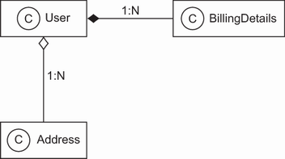
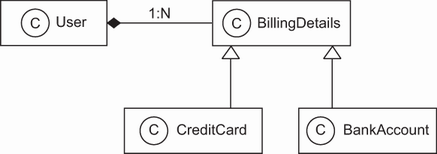
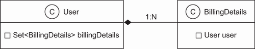
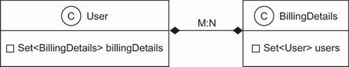

# Chương 1. Tìm hiểu về object/relational persistence

> *Java Persistence with Spring Data and Hibernate* — Chương 1: “Understanding object/relational persistence”

**Nội dung chương này bao gồm**

- Lưu trữ dữ liệu (persisting) với các SQL database trong ứng dụng Java
- Phân tích sự lệch pha giữa hai mô hình object/relational (object/relational paradigm mismatch)
- Giới thiệu ORM, JPA, Hibernate và Spring Data

Cuốn sách này nói về JPA, Hibernate và Spring Data; trọng tâm của chúng ta là sử dụng Hibernate với vai trò một provider của Jakarta Persistence API (trước đây gọi là Java Persistence API), và Spring Data với vai trò một mô hình lập trình dựa trên Spring để truy cập dữ liệu. Chúng ta sẽ đề cập tới cả các tính năng cơ bản lẫn nâng cao, đồng thời mô tả một số cách phát triển ứng dụng mới bằng Java Persistence API. Nhiều khuyến nghị trong số này không chỉ dành riêng cho Hibernate hay Spring Data. Đôi khi đó là quan điểm riêng của chúng tôi về cách làm tốt nhất khi làm việc với dữ liệu persistent, được giải thích trong bối cảnh của Hibernate và Spring Data.

Việc lựa chọn cách tiếp cận để quản lý dữ liệu persistent có thể là một quyết định thiết kế then chốt trong nhiều dự án phần mềm. Persistence luôn là một chủ đề tranh luận nóng trong cộng đồng Java. Liệu persistence có phải là bài toán đã được giải quyết bởi SQL cùng các phần mở rộng như stored procedure, hay đó là một vấn đề bao trùm hơn cần được xử lý bằng các framework Java chuyên biệt? Chúng ta nên tự viết tay bằng SQL và JDBC ngay cả những thao tác CRUD (create, read, update, delete) sơ đẳng nhất, hay nên giao việc đó cho một tầng trung gian? Làm sao đạt được tính khả chuyển (portability) khi mỗi hệ quản trị cơ sở dữ liệu lại có một SQL dialect riêng? Liệu có nên từ bỏ hoàn toàn SQL và chuyển sang một công nghệ cơ sở dữ liệu khác, chẳng hạn hệ cơ sở dữ liệu hướng đối tượng hoặc các hệ NoSQL? Cuộc tranh luận có thể sẽ không bao giờ kết thúc, nhưng một giải pháp mang tên object/relational mapping (ORM) hiện đã được chấp nhận rộng rãi. Điều này phần lớn nhờ vào Hibernate — một hiện thực dịch vụ ORM mã nguồn mở — và Spring Data, một dự án ô (umbrella project) thuộc gia đình Spring với mục đích thống nhất và đơn giản hóa việc truy cập tới nhiều loại kho lưu trữ dữ liệu khác nhau, bao gồm các hệ cơ sở dữ liệu quan hệ và các cơ sở dữ liệu NoSQL.

Tuy nhiên, trước khi bắt đầu với Hibernate và Spring Data, bạn cần hiểu những vấn đề cốt lõi của object persistence và ORM. Chương này giải thích tại sao bạn cần đến các công cụ như Hibernate, Spring Data và các đặc tả như Jakarta Persistence API (JPA).

Trước tiên, chúng ta sẽ định nghĩa việc quản lý dữ liệu persistent trong bối cảnh của các ứng dụng phần mềm và thảo luận về mối quan hệ giữa SQL, JDBC và Java — những công nghệ và chuẩn nền tảng mà Hibernate và Spring Data xây dựng dựa trên. Sau đó, chúng ta sẽ bàn về cái gọi là object/relational paradigm mismatch cùng những vấn đề chung mà ta gặp phải khi phát triển phần mềm hướng đối tượng với SQL database. Những vấn đề này cho thấy rõ rằng chúng ta cần các công cụ và mẫu thiết kế (pattern) để giảm thiểu thời gian phải bỏ ra cho phần mã liên quan đến persistence trong ứng dụng.

Cách học Hibernate và Spring Data tốt nhất không nhất thiết phải tuyến tính. Chúng tôi hiểu rằng có thể bạn muốn thử Hibernate hoặc Spring Data ngay lập tức. Nếu vậy, hãy nhảy sang chương tiếp theo và thiết lập một dự án với ví dụ “Hello World”. Chúng tôi khuyên bạn nên quay lại chương này ở một thời điểm nào đó trong quá trình đọc sách; như vậy bạn sẽ được chuẩn bị và nắm được các khái niệm nền tảng cần thiết cho phần còn lại của nội dung.

## 1.1 Persistence là gì?

Hầu hết các ứng dụng đều cần dữ liệu persistent. Persistence là một trong những khái niệm nền tảng của việc phát triển ứng dụng. Nếu một hệ thống thông tin không giữ lại dữ liệu khi bị tắt nguồn thì hệ thống đó gần như vô dụng trong thực tế. Object persistence nghĩa là từng object riêng lẻ có thể tồn tại lâu hơn tiến trình ứng dụng; chúng có thể được lưu vào một kho dữ liệu (data store) và được tái tạo lại vào một thời điểm sau đó. Khi nói về persistence trong Java, nhìn chung chúng ta đang nói về việc ánh xạ (mapping) và lưu trữ các instance của object vào cơ sở dữ liệu bằng SQL.

Chúng ta sẽ bắt đầu bằng việc xem xét sơ lược về persistence và cách nó được sử dụng trong Java. Với những thông tin đó, chúng ta sẽ tiếp tục thảo luận về persistence và xem nó được hiện thực như thế nào trong các ứng dụng hướng đối tượng.

### 1.1.1 Relational database

Cũng như hầu hết các kỹ sư phần mềm khác, có lẽ bạn đã từng làm việc với SQL và các cơ sở dữ liệu quan hệ; nhiều người trong chúng ta xử lý những hệ thống như vậy mỗi ngày. Các hệ quản trị cơ sở dữ liệu quan hệ có giao diện lập trình ứng dụng dựa trên SQL, nên ngày nay ta gọi các sản phẩm cơ sở dữ liệu quan hệ là SQL database management system (DBMS), hoặc khi nói về những hệ thống cụ thể thì gọi là SQL database.

Công nghệ quan hệ là một công nghệ đã rất quen thuộc, và chỉ riêng điều đó cũng đủ là lý do để nhiều tổ chức lựa chọn nó. Các cơ sở dữ liệu quan hệ cũng là một cách tiếp cận quản lý dữ liệu cực kỳ linh hoạt và bền vững. Nhờ nền tảng lý thuyết đã được nghiên cứu kỹ lưỡng của mô hình dữ liệu quan hệ, các relational database có thể bảo đảm và bảo vệ tính toàn vẹn (integrity) của dữ liệu được lưu trữ, cùng nhiều đặc tính đáng mong muốn khác. Có thể bạn đã quen thuộc với bài giới thiệu mô hình quan hệ cách đây năm thập kỷ của E. F. Codd, “A Relational Model of Data for Large Shared Data Banks” (Codd, 1970). Một tuyển tập gần đây hơn đáng đọc, tập trung vào SQL, là cuốn *SQL and Relational Theory* của C. J. Date (Date, 2015).

Các relational DBMS không dành riêng cho Java, và một SQL database cũng không dành riêng cho một ứng dụng cụ thể nào. Nguyên tắc quan trọng này được gọi là *data independence* (tính độc lập dữ liệu). Nói cách khác, dữ liệu thường sống lâu hơn ứng dụng. Công nghệ quan hệ cung cấp một cách để chia sẻ dữ liệu giữa các ứng dụng khác nhau, hoặc giữa các phần khác nhau của cùng một hệ thống tổng thể (ví dụ, một ứng dụng nhập liệu và một ứng dụng báo cáo). Công nghệ quan hệ là mẫu số chung của rất nhiều hệ thống và nền tảng công nghệ khác nhau. Do đó, mô hình dữ liệu quan hệ thường là nền tảng cho việc biểu diễn các thực thể nghiệp vụ (business entity) ở quy mô toàn doanh nghiệp.

Trước khi đi sâu hơn vào các khía cạnh thực tiễn của SQL database, chúng ta cần nhắc tới một điểm quan trọng: mặc dù được tiếp thị là “quan hệ”, một hệ cơ sở dữ liệu chỉ cung cấp giao diện ngôn ngữ dữ liệu SQL thì thực ra không thực sự quan hệ, và về nhiều mặt còn khá xa so với khái niệm ban đầu. Tất nhiên, điều này đã dẫn tới sự nhầm lẫn. Những người làm SQL đổ lỗi cho mô hình dữ liệu quan hệ về các thiếu sót của ngôn ngữ SQL, còn các chuyên gia quản lý dữ liệu quan hệ thì đổ lỗi cho chuẩn SQL vì đã hiện thực một cách yếu ớt mô hình và lý tưởng quan hệ. Chúng tôi sẽ nêu bật một số khía cạnh đáng chú ý của vấn đề này xuyên suốt cuốn sách, nhưng nhìn chung sẽ tập trung vào khía cạnh thực tiễn. Nếu bạn quan tâm tới tài liệu nền tảng, chúng tôi rất khuyến khích đọc *Fundamentals of Database Systems* của Ramez Elmasri và Shamkant B. Navathe (Elmasri, 2016) để nắm lý thuyết và khái niệm của các hệ cơ sở dữ liệu quan hệ.

### 1.1.2 Hiểu về SQL

Để sử dụng JPA, Hibernate và Spring Data một cách hiệu quả, bạn phải bắt đầu bằng việc nắm vững mô hình quan hệ và SQL. Bạn sẽ cần hiểu mô hình quan hệ, mô hình thông tin cùng các chủ đề như chuẩn hóa (normalization) để bảo đảm tính toàn vẹn dữ liệu, và bạn sẽ cần dùng kiến thức SQL của mình để tinh chỉnh hiệu năng cho ứng dụng — tất cả đều là điều kiện tiên quyết để đọc cuốn sách này. Hibernate và Spring Data đơn giản hóa nhiều tác vụ lập trình lặp đi lặp lại, nhưng kiến thức của bạn về công nghệ persistence phải vượt ra ngoài phạm vi bản thân các framework nếu bạn muốn tận dụng toàn bộ sức mạnh của các SQL database hiện đại. Để tìm hiểu sâu hơn, hãy tham khảo các nguồn trong danh mục tài liệu tham khảo ở cuối sách.

Có lẽ bạn đã dùng SQL nhiều năm và quen thuộc với các thao tác cũng như câu lệnh cơ bản viết bằng ngôn ngữ này. Tuy vậy, từ kinh nghiệm bản thân, chúng tôi biết rằng SQL đôi khi khó nhớ và một số thuật ngữ được dùng theo nhiều cách khác nhau.

Bạn nên thấy thoải mái với chúng, vậy hãy cùng điểm nhanh một số thuật ngữ SQL sẽ dùng trong sách. SQL được dùng như một *data definition language* (DDL), với cú pháp để tạo, sửa và xóa các đối tượng như table và constraint trong catalog của DBMS. Khi schema đã sẵn sàng, bạn có thể dùng SQL như một *data manipulation language* (DML) để thực hiện các thao tác trên dữ liệu, bao gồm insert, update và delete. Bạn có thể truy xuất dữ liệu bằng cách thực thi các câu lệnh *data query language* (DQL) với các phép restriction, projection và tích Descartes (Cartesian product). Để báo cáo hiệu quả, bạn có thể dùng SQL để join, tổng hợp (aggregate) và nhóm (group) dữ liệu khi cần. Bạn thậm chí có thể lồng các câu lệnh SQL vào nhau — kỹ thuật sử dụng subselect. Khi các yêu cầu nghiệp vụ thay đổi, bạn sẽ phải sửa đổi schema của cơ sở dữ liệu một lần nữa bằng các câu lệnh DDL sau khi dữ liệu đã được lưu; điều này được gọi là *schema evolution*. Bạn cũng có thể dùng SQL như một *data control language* (DCL) để cấp và thu hồi quyền truy cập vào cơ sở dữ liệu hoặc một phần của nó.

Nếu bạn là một kỳ cựu về SQL và muốn biết thêm về tối ưu hóa cũng như cách SQL được thực thi, hãy tìm đọc cuốn sách xuất sắc *SQL Tuning* của Dan Tow (Tow, 2003). Để nhìn vào khía cạnh thực tiễn của SQL qua lăng kính “cách không nên dùng SQL”, *SQL Antipatterns: Avoiding the Pitfalls of Database Programming* của Bill Karwin (Karwin, 2010) là một nguồn tham khảo tốt.

Mặc dù SQL database là một phần của ORM, phần còn lại tất nhiên là dữ liệu trong ứng dụng Java của bạn — thứ cần được lưu xuống và nạp lên từ cơ sở dữ liệu.

### 1.1.3 Sử dụng SQL trong Java

Khi làm việc với một SQL database trong ứng dụng Java, bạn gửi các câu lệnh SQL tới cơ sở dữ liệu thông qua API Java Database Connectivity (JDBC). Dù SQL được viết tay và nhúng trong mã Java hay được sinh động (on the fly) bởi mã Java, bạn vẫn dùng JDBC API để gán tham số khi chuẩn bị query, thực thi query, duyệt qua kết quả, lấy giá trị từ result set, v.v. Đây là những tác vụ truy cập dữ liệu ở mức thấp; còn với tư cách kỹ sư ứng dụng, chúng ta quan tâm nhiều hơn tới bài toán nghiệp vụ đòi hỏi việc truy cập dữ liệu đó. Thứ chúng ta thực sự muốn viết là mã lưu và truy xuất các instance của các class của mình, giúp ta thoát khỏi công việc mức thấp này.

Vì các tác vụ truy cập dữ liệu này thường rất tẻ nhạt, ta phải đặt câu hỏi: liệu mô hình dữ liệu quan hệ và (đặc biệt là) SQL có phải là lựa chọn đúng đắn cho persistence trong các ứng dụng hướng đối tượng? Câu trả lời của chúng tôi là dứt khoát: đúng! Có nhiều lý do khiến SQL database thống trị ngành công nghiệp máy tính — các hệ quản trị cơ sở dữ liệu quan hệ là công nghệ quản lý dữ liệu tổng quát duy nhất đã được chứng minh, và chúng gần như luôn là một yêu cầu trong các dự án Java.

Lưu ý rằng chúng tôi không khẳng định công nghệ quan hệ luôn là giải pháp tốt nhất. Nhiều yêu cầu quản lý dữ liệu đòi hỏi một cách tiếp cận hoàn toàn khác. Ví dụ, các hệ thống phân tán quy mô internet (công cụ tìm kiếm web, mạng phân phối nội dung, chia sẻ ngang hàng, nhắn tin tức thời) phải xử lý khối lượng giao dịch cực lớn. Nhiều hệ thống trong số đó không đòi hỏi rằng sau khi một thao tác cập nhật dữ liệu hoàn tất, mọi tiến trình đều nhìn thấy cùng một dữ liệu đã cập nhật (strong transactional consistency). Người dùng có thể hài lòng với weak consistency; sau một lần cập nhật, có thể có một khoảng thời gian không nhất quán trước khi mọi tiến trình nhìn thấy dữ liệu mới. Ngược lại, một số ứng dụng khoa học làm việc với những tập dữ liệu khổng lồ nhưng rất chuyên biệt. Những hệ thống như vậy cùng các thách thức riêng của chúng thường đòi hỏi các giải pháp persistence độc đáo và thường được xây dựng riêng. Các công cụ quản lý dữ liệu tổng quát như SQL database giao dịch tuân thủ ACID, JDBC, Hibernate và Spring Data chỉ đóng vai trò thứ yếu đối với những kiểu hệ thống này.

> **Các hệ thống quan hệ ở quy mô internet**
>
> Để hiểu vì sao các hệ thống quan hệ — và những bảo đảm về toàn vẹn dữ liệu đi kèm — lại khó mở rộng quy mô, chúng tôi khuyên bạn trước hết nên làm quen với định lý CAP. Theo quy tắc này, một hệ thống phân tán không thể đồng thời vừa nhất quán (consistent), vừa sẵn sàng (available), vừa chịu được lỗi phân mảnh mạng (partition tolerant).
>
> Một hệ thống có thể bảo đảm rằng mọi node đều nhìn thấy cùng một dữ liệu tại cùng một thời điểm và mọi yêu cầu đọc/ghi dữ liệu đều luôn được đáp ứng. Nhưng khi một phần của hệ thống gặp sự cố do lỗi máy chủ, mạng hoặc trung tâm dữ liệu, bạn buộc phải từ bỏ hoặc strong consistency, hoặc tính sẵn sàng 100%. Trên thực tế, điều này nghĩa là bạn cần một chiến lược phát hiện lỗi phân mảnh và khôi phục ở một mức độ nhất định hoặc tính nhất quán hoặc tính sẵn sàng (ví dụ, bằng cách tạm thời làm cho một phần hệ thống không khả dụng để việc đồng bộ dữ liệu diễn ra ở nền). Thường thì chính dữ liệu, người dùng hoặc thao tác cụ thể sẽ quyết định liệu strong consistency có cần thiết hay không.

Trong cuốn sách này, chúng ta sẽ xem xét các vấn đề lưu trữ và chia sẻ dữ liệu trong bối cảnh một ứng dụng hướng đối tượng sử dụng domain model. Thay vì làm việc trực tiếp với các dòng và cột của một `java.sql.ResultSet`, logic nghiệp vụ của ứng dụng sẽ tương tác với domain model hướng đối tượng đặc thù của ứng dụng. Ví dụ, nếu schema SQL của một hệ thống đấu giá trực tuyến có các table `ITEM` và `BID`, thì ứng dụng Java sẽ định nghĩa các class `Item` và `Bid` tương ứng. Thay vì đọc và ghi giá trị của một dòng và cột cụ thể bằng API `ResultSet`, ứng dụng nạp và lưu các instance của class `Item` và `Bid`.

Do đó, tại thời điểm chạy, ứng dụng làm việc với các instance của những class này. Mỗi instance `Bid` có một tham chiếu tới một `Item` đấu giá, và mỗi `Item` có thể có một collection các tham chiếu tới các instance `Bid`. Logic nghiệp vụ không được thực thi trong cơ sở dữ liệu (dưới dạng SQL stored procedure); nó được hiện thực bằng Java và chạy ở tầng ứng dụng. Điều này cho phép logic nghiệp vụ sử dụng các khái niệm hướng đối tượng phức tạp như kế thừa (inheritance) và đa hình (polymorphism). Chẳng hạn, chúng ta có thể dùng các design pattern quen thuộc như strategy, mediator và composite (xem *Design Patterns: Elements of Reusable Object-Oriented Software* [Gamma, 1994]), tất cả đều dựa trên các lời gọi phương thức đa hình.

Giờ là một lời cảnh báo: không phải mọi ứng dụng Java đều được thiết kế theo cách này, và cũng không nên như vậy. Các ứng dụng đơn giản có thể sẽ tốt hơn nhiều nếu không có domain model. Hãy dùng `ResultSet` của JDBC nếu đó là tất cả những gì bạn cần. Hãy gọi các stored procedure sẵn có và đọc SQL result set của chúng. Nhiều ứng dụng cần thực thi các thủ tục sửa đổi những tập dữ liệu lớn, ngay sát dữ liệu. Bạn cũng có thể hiện thực một số chức năng báo cáo bằng các truy vấn SQL thuần và hiển thị kết quả trực tiếp lên màn hình. SQL và JDBC API hoàn toàn phù hợp để xử lý các biểu diễn dữ liệu dạng bảng, và `RowSet` của JDBC còn khiến các thao tác CRUD dễ dàng hơn nữa. Làm việc với một biểu diễn dữ liệu persistent như vậy là đơn giản và đã được hiểu rõ.

Nhưng với những ứng dụng có logic nghiệp vụ không tầm thường, cách tiếp cận domain model giúp cải thiện đáng kể khả năng tái sử dụng mã và tính dễ bảo trì. Trên thực tế, cả hai chiến lược đều phổ biến và đều cần thiết.

Trong nhiều thập kỷ, các lập trình viên đã nói về một *paradigm mismatch* (sự lệch pha giữa hai mô hình). Hai mô hình được nhắc tới ở đây là mô hình hóa hướng đối tượng và mô hình hóa quan hệ, hay nói thực tế hơn là lập trình hướng đối tượng và SQL. Sự lệch pha này giải thích vì sao mọi dự án doanh nghiệp đều tiêu tốn rất nhiều công sức cho những mối bận tâm liên quan đến persistence. Với quan niệm đó, bạn có thể bắt đầu nhìn ra các vấn đề — một số đã được hiểu rõ, một số thì chưa — cần được giải quyết trong một ứng dụng kết hợp giữa domain model hướng đối tượng và một mô hình quan hệ persistent. Hãy cùng xem xét kỹ hơn cái gọi là paradigm mismatch này.

## 1.2 Paradigm mismatch

Object/relational paradigm mismatch có thể được chia thành nhiều phần, và chúng ta sẽ xem xét từng phần một. Hãy bắt đầu khám phá với một ví dụ đơn giản, chưa có vấn đề gì. Khi mở rộng dần ví dụ đó, bạn sẽ thấy sự lệch pha bắt đầu lộ diện.

Giả sử bạn phải thiết kế và hiện thực một ứng dụng thương mại điện tử trực tuyến. Trong ứng dụng này, bạn cần một class để biểu diễn thông tin về một user của hệ thống, và cần một class khác để biểu diễn thông tin thanh toán (billing details) của user đó, như minh họa ở hình 1.1.


**Hình 1.1** Một sơ đồ UML đơn giản của các entity `User` và `BillingDetails`

Trong sơ đồ này, bạn có thể thấy một `User` có nhiều `BillingDetails`. Đây là một quan hệ composition, được biểu thị bằng hình thoi đặc. Composition là kiểu liên kết (association) mà trong đó một object (`BillingDetails` trong trường hợp của chúng ta) về mặt khái niệm không thể tồn tại nếu thiếu vật chứa (`User` trong trường hợp này). Bạn có thể điều hướng quan hệ giữa các class theo cả hai chiều; nghĩa là bạn có thể duyệt qua các collection hoặc gọi phương thức để đi tới “phía bên kia” của quan hệ. Các class biểu diễn những entity này có thể cực kỳ đơn giản:

*Đường dẫn: Ch01/e-commerce/src/com/manning/javapersistence/ch01/User.java*

```java
public class User {
    private String username;
    private String address;
    private Set<BillingDetails> billingDetails = new HashSet<>();

    // Constructor, accessor methods (getters/setters), business methods
}
```

*Đường dẫn: Ch01/e-commerce/src/com/manning/javapersistence/ch01/BillingDetails.java*

```java
public class BillingDetails {
    private String account;
    private String bankname;
    private User user;

    // Constructor, accessor methods (getters/setters), business methods
}
```

Lưu ý rằng chúng ta chỉ quan tâm tới trạng thái persistence của các entity, nên đã lược bỏ phần hiện thực của constructor, các accessor method và các business method.

Không khó để đưa ra một thiết kế schema SQL cho trường hợp này (cú pháp của các câu lệnh sau áp dụng cho MySQL):

```sql
CREATE TABLE USERS (
    USERNAME VARCHAR(15) NOT NULL PRIMARY KEY,
    ADDRESS VARCHAR(255) NOT NULL
);

CREATE TABLE BILLINGDETAILS (
    ACCOUNT VARCHAR(15) NOT NULL PRIMARY KEY,
    BANKNAME VARCHAR(255) NOT NULL,
    USERNAME VARCHAR(15) NOT NULL,
    FOREIGN KEY (USERNAME) REFERENCES USERS(USERNAME)
);
```

Cột `USERNAME` bị ràng buộc bởi foreign key trong `BILLINGDETAILS` biểu diễn quan hệ giữa hai entity. Với domain model đơn giản này, object/relational mismatch gần như chưa lộ rõ; việc viết mã JDBC để insert, update và delete thông tin về user và billing details là khá đơn giản.

Bây giờ hãy xem điều gì xảy ra khi chúng ta xét tới một tình huống thực tế hơn một chút. Paradigm mismatch sẽ hiện ra khi ta bổ sung thêm entity và các quan hệ giữa entity vào ứng dụng.

### 1.2.1 Vấn đề về granularity

Vấn đề rõ ràng nhất với hiện thực hiện tại là chúng ta đã thiết kế địa chỉ (address) như một giá trị `String` đơn giản. Trong hầu hết hệ thống, cần lưu riêng biệt thông tin về đường phố, thành phố, bang, quốc gia và mã ZIP. Tất nhiên bạn có thể thêm trực tiếp các thuộc tính này vào class `User`, nhưng vì nhiều class khác trong hệ thống nhiều khả năng cũng mang thông tin địa chỉ, nên hợp lý hơn là tạo một class `Address` để tái sử dụng. Hình 1.2 minh họa mô hình đã cập nhật.



**Hình 1.2** `User` có một `Address`.

Quan hệ giữa `User` và `Address` là một aggregation, được biểu thị bằng hình thoi rỗng. Vậy chúng ta có nên thêm cả một table `ADDRESS` không? Không nhất thiết; thông thường người ta giữ thông tin địa chỉ ngay trong table `USERS`, ở các cột riêng biệt. Thiết kế này nhiều khả năng cho hiệu năng tốt hơn vì không cần join table nếu bạn muốn lấy user và address trong một truy vấn duy nhất. Giải pháp đẹp nhất có lẽ là tạo một kiểu dữ liệu SQL mới để biểu diễn địa chỉ và thêm một cột duy nhất thuộc kiểu mới đó vào table `USERS`, thay vì thêm nhiều cột mới.

Lựa chọn giữa việc thêm nhiều cột hay một cột duy nhất thuộc một kiểu dữ liệu SQL mới chính là vấn đề *granularity* (mức chi tiết). Nói rộng ra, granularity đề cập tới kích thước tương đối của các kiểu mà bạn đang làm việc.

Hãy quay lại ví dụ. Việc thêm một kiểu dữ liệu mới vào catalog của cơ sở dữ liệu để lưu các instance `Address` của Java trong một cột duy nhất nghe có vẻ là cách tiếp cận tốt nhất:

```sql
CREATE TABLE USERS (
    USERNAME VARCHAR(15) NOT NULL PRIMARY KEY,
    ADDRESS ADDRESS NOT NULL
);
```

Một kiểu (class) `Address` mới trong Java và một kiểu dữ liệu SQL `ADDRESS` mới lẽ ra phải bảo đảm khả năng tương tác. Nhưng bạn sẽ gặp đủ loại vấn đề nếu kiểm tra mức độ hỗ trợ cho user-defined data type (UDT) trong các hệ quản trị cơ sở dữ liệu SQL ngày nay.

Hỗ trợ UDT là một trong nhiều thứ được gọi là *object/relational extension* của SQL truyền thống. Bản thân thuật ngữ này đã gây nhầm lẫn, vì nó ngụ ý rằng hệ quản trị cơ sở dữ liệu có (hoặc lẽ ra phải hỗ trợ) một hệ thống kiểu dữ liệu tinh vi. Đáng tiếc, hỗ trợ UDT lại là một tính năng khá mơ hồ trong hầu hết SQL DBMS, và chắc chắn nó không khả chuyển giữa các sản phẩm khác nhau. Hơn nữa, chuẩn SQL có hỗ trợ user-defined data type, nhưng rất sơ sài.

Hạn chế này không phải lỗi của mô hình dữ liệu quan hệ. Bạn có thể xem việc không chuẩn hóa được một phần chức năng quan trọng như vậy là hệ quả của cuộc chiến giữa các nhà cung cấp cơ sở dữ liệu object/relational vào giữa thập niên 1990. Ngày nay hầu hết kỹ sư chấp nhận rằng các sản phẩm SQL có hệ thống kiểu hạn chế — không cần bàn cãi. Ngay cả khi SQL DBMS của bạn có một hệ thống UDT tinh vi, bạn vẫn có khả năng phải khai báo kiểu hai lần, viết kiểu mới trong Java rồi lại viết trong SQL. Những nỗ lực tìm giải pháp tốt hơn cho thế giới Java, chẳng hạn SQLJ, tiếc thay đã không thành công lắm. Các sản phẩm DBMS hiếm khi hỗ trợ triển khai và thực thi trực tiếp class Java trên cơ sở dữ liệu, và nếu có hỗ trợ thì thường chỉ giới hạn ở những chức năng rất cơ bản trong sử dụng hằng ngày.

Vì những lý do đó và nhiều lý do khác, việc dùng UDT hay kiểu Java trong SQL database hiện không phải thực hành phổ biến, và ít có khả năng bạn gặp một schema cũ sử dụng UDT rộng rãi. Vì vậy chúng ta không thể và sẽ không lưu các instance của class `Address` mới vào một cột duy nhất có cùng kiểu dữ liệu với tầng Java.

Giải pháp thực dụng cho vấn đề này là dùng nhiều cột với các kiểu SQL dựng sẵn do nhà cung cấp định nghĩa (như kiểu Boolean, số và chuỗi). Bạn thường sẽ định nghĩa table `USERS` như sau:

```sql
CREATE TABLE USERS (
    USERNAME VARCHAR(15) NOT NULL PRIMARY KEY,
    ADDRESS_STREET VARCHAR(255) NOT NULL,
    ADDRESS_ZIPCODE VARCHAR(5) NOT NULL,
    ADDRESS_CITY VARCHAR(255) NOT NULL
);
```

Các class trong domain model Java có nhiều mức granularity khác nhau: từ các entity class thô (coarse-grained) như `User`, tới các class mịn hơn (finer-grained) như `Address`, xuống tới một class đơn giản như `SwissZipCode` kế thừa `AbstractNumericZipCode` (hoặc bất kỳ mức trừu tượng nào bạn mong muốn). Ngược lại, trong SQL database chỉ có hai mức granularity về kiểu: các kiểu quan hệ (relation type) do bạn tạo ra, như `USERS` và `BILLINGDETAILS`, và các kiểu dữ liệu dựng sẵn như `VARCHAR`, `BIGINT` và `TIMESTAMP`.

Nhiều cơ chế persistence đơn giản không nhận ra sự lệch pha này, và rốt cuộc áp đặt cách biểu diễn kém linh hoạt của các sản phẩm SQL lên mô hình hướng đối tượng, khiến nó bị “làm phẳng”. Hóa ra vấn đề granularity không quá khó giải quyết, dù nó hiện diện trong rất nhiều hệ thống đang tồn tại. Chúng ta sẽ xem giải pháp cho vấn đề này ở mục 5.1.1.

Một vấn đề khó và thú vị hơn nhiều xuất hiện khi ta xét tới các domain model dựa trên inheritance — một đặc trưng của thiết kế hướng đối tượng mà bạn có thể dùng để tính phí người dùng ứng dụng thương mại điện tử theo những cách mới mẻ và thú vị.

### 1.2.2 Vấn đề về inheritance

Trong Java, bạn hiện thực kế thừa kiểu bằng superclass và subclass. Để minh họa vì sao điều này có thể tạo ra vấn đề mismatch, hãy sửa ứng dụng thương mại điện tử để giờ đây ta chấp nhận không chỉ thanh toán qua tài khoản ngân hàng mà cả thẻ tín dụng. Cách tự nhiên nhất để phản ánh thay đổi này trong mô hình là dùng inheritance cho superclass `BillingDetails`, cùng với nhiều subclass cụ thể: `CreditCard`, `BankAccount`. Mỗi subclass này định nghĩa dữ liệu hơi khác nhau (và chức năng tác động lên dữ liệu đó thì hoàn toàn khác nhau). Sơ đồ class UML ở hình 1.3 minh họa mô hình này.



**Hình 1.3** Sử dụng inheritance cho các chiến lược thanh toán khác nhau

Chúng ta phải thay đổi những gì để hỗ trợ cấu trúc class Java đã cập nhật này? Liệu có thể tạo một table `CREDITCARD` kế thừa `BILLINGDETAILS` không? Các sản phẩm SQL database nhìn chung không hiện thực kế thừa table (hay thậm chí kế thừa kiểu dữ liệu), và nếu có hiện thực thì chúng cũng không tuân theo một cú pháp chuẩn nào.

Chúng ta vẫn chưa xong với inheritance. Ngay khi đưa inheritance vào mô hình, ta có khả năng xuất hiện polymorphism. Class `User` có một liên kết đa hình (polymorphic association) với superclass `BillingDetails`. Tại thời điểm chạy, một instance `User` có thể tham chiếu tới một instance của bất kỳ subclass nào của `BillingDetails`. Tương tự, chúng ta muốn có thể viết các truy vấn đa hình tham chiếu tới class `BillingDetails` và truy vấn đó trả về các instance của những subclass của nó.

Các SQL database thiếu một cách rõ ràng (hoặc ít nhất là một cách chuẩn hóa) để biểu diễn một polymorphic association. Một foreign key constraint tham chiếu tới đúng một table đích; không dễ để định nghĩa một foreign key tham chiếu tới nhiều table.

Kết quả của sự lệch pha về subtype này là cấu trúc kế thừa trong mô hình phải được lưu trữ vào một SQL database vốn không cung cấp cơ chế kế thừa. Ở chương 7, chúng ta sẽ bàn cách các giải pháp ORM như Hibernate giải quyết bài toán lưu một cây phân cấp class xuống một hoặc nhiều table trong SQL database, và cách hiện thực hành vi đa hình. May mắn là vấn đề này giờ đã được cộng đồng hiểu rõ, và hầu hết các giải pháp đều hỗ trợ chức năng gần như tương đương nhau.

Khía cạnh tiếp theo của bài toán object/relational mismatch là vấn đề về định danh object (object identity).

### 1.2.3 Vấn đề về identity

Có lẽ bạn đã để ý rằng ví dụ trên định nghĩa `USERNAME` làm primary key của table `USERS`. Đó có phải là lựa chọn tốt không? Bạn xử lý các object giống hệt nhau trong Java như thế nào?

Dù vấn đề identity thoạt đầu có thể chưa rõ ràng, bạn sẽ gặp nó thường xuyên trong hệ thống thương mại điện tử đang lớn dần và mở rộng của mình, chẳng hạn khi cần kiểm tra xem hai instance có đồng nhất hay không. Có ba cách để xử lý vấn đề này: hai cách trong thế giới Java và một cách trong SQL database. Như dự đoán, chúng chỉ phối hợp được với nhau khi có thêm chút trợ giúp.

Java định nghĩa hai khái niệm khác nhau về sự “giống nhau”:

- **Instance identity** (tương đương một cách thô với vị trí bộ nhớ, kiểm tra bằng `a == b`)
- **Instance equality**, được xác định bởi hiện thực của phương thức `equals()` (còn gọi là *equality by value* — bằng nhau theo giá trị)

Mặt khác, identity của một dòng trong cơ sở dữ liệu được biểu diễn bằng phép so sánh các giá trị primary key. Như bạn sẽ thấy ở mục 9.1.2, cả `equals()` lẫn `==` đều không phải lúc nào cũng tương đương với phép so sánh giá trị primary key. Việc nhiều instance không đồng nhất trong Java cùng lúc biểu diễn cùng một dòng của cơ sở dữ liệu là chuyện thường gặp, chẳng hạn trong các luồng ứng dụng chạy đồng thời. Hơn nữa, có một số khó khăn tinh vi khi hiện thực `equals()` cho đúng đối với một persistent class, cũng như khi hiểu lúc nào việc đó là cần thiết.

Hãy dùng một ví dụ để bàn về một vấn đề khác liên quan tới database identity. Trong định nghĩa table `USERS`, `USERNAME` là primary key. Đáng tiếc, quyết định này khiến việc đổi tên người dùng trở nên khó khăn; bạn không chỉ phải cập nhật dòng trong `USERS` mà còn phải cập nhật các giá trị foreign key trong (rất nhiều) dòng của `BILLINGDETAILS`. Để giải quyết vấn đề này, ở phần sau của cuốn sách chúng tôi sẽ khuyến nghị dùng surrogate key bất cứ khi nào bạn không tìm được một natural key phù hợp. Chúng ta cũng sẽ bàn điều gì tạo nên một primary key tốt. Một cột surrogate key là cột primary key không mang ý nghĩa gì với người dùng ứng dụng — nói cách khác, là một khóa không được trình bày cho người dùng. Mục đích duy nhất của nó là định danh dữ liệu bên trong ứng dụng.

Ví dụ, bạn có thể sửa các định nghĩa table thành như sau:

```sql
CREATE TABLE USERS (
    ID BIGINT NOT NULL PRIMARY KEY,
    USERNAME VARCHAR(15) NOT NULL UNIQUE,
    . . .
);

CREATE TABLE BILLINGDETAILS (
    ID BIGINT NOT NULL PRIMARY KEY,
    ACCOUNT VARCHAR(15) NOT NULL,
    BANKNAME VARCHAR(255) NOT NULL,
    USER_ID BIGINT NOT NULL,
    FOREIGN KEY (USER_ID) REFERENCES USERS(ID)
);
```

Các cột `ID` chứa giá trị do hệ thống sinh ra. Những cột này được đưa vào hoàn toàn vì lợi ích của mô hình dữ liệu, vậy chúng nên (nếu có) được biểu diễn thế nào trong domain model Java? Chúng ta sẽ bàn câu hỏi này ở mục 5.2 và sẽ tìm ra lời giải với ORM.

Trong bối cảnh persistence, identity liên hệ chặt chẽ với cách hệ thống xử lý caching và transaction. Các giải pháp persistence khác nhau đã chọn những chiến lược khác nhau, và đây từng là một mảng gây nhầm lẫn. Chúng ta sẽ đề cập tới tất cả những chủ đề thú vị này — và xem chúng liên quan với nhau ra sao — ở mục 9.1.

Cho tới đây, bộ khung ứng dụng thương mại điện tử mà chúng ta thiết kế đã phơi bày các vấn đề paradigm mismatch với việc ánh xạ granularity, subtype và identity. Chúng ta cần bàn thêm về một khái niệm quan trọng: association — các quan hệ giữa entity được ánh xạ và xử lý như thế nào. Liệu foreign key constraint trong cơ sở dữ liệu đã là tất cả những gì bạn cần?

### 1.2.4 Vấn đề về association

Trong domain model, association biểu diễn các quan hệ giữa các entity. Các class `User`, `Address` và `BillingDetails` đều có liên kết với nhau; nhưng khác với `Address`, `BillingDetails` đứng độc lập. Các instance `BillingDetails` được lưu trong table riêng của chúng. Ánh xạ association và việc quản lý các entity association là những khái niệm trung tâm trong bất kỳ giải pháp object persistence nào.

Các ngôn ngữ hướng đối tượng biểu diễn association bằng object reference, còn trong thế giới quan hệ, một cột bị ràng buộc foreign key biểu diễn một association bằng các bản sao giá trị khóa. Constraint là một quy tắc bảo đảm tính toàn vẹn của association. Có những khác biệt căn bản giữa hai cơ chế này.

Object reference vốn có tính định hướng; association đi từ instance này tới instance kia. Chúng là các con trỏ. Nếu một association giữa các instance cần điều hướng được theo cả hai chiều, bạn phải định nghĩa association hai lần, mỗi lần trong một class liên quan. Sơ đồ class UML ở hình 1.4 minh họa mô hình này với một association một-nhiều (one-to-many).



**Hình 1.4** Association một-nhiều giữa `User` và `BillingDetails`

Bạn đã thấy điều này trong các class của domain model:

*Đường dẫn: Ch01/e-commerce/src/com/manning/javapersistence/ch01/User.java*

```java
public class User {
    private Set<BillingDetails> billingDetails = new HashSet<>();
}
```

*Đường dẫn: Ch01/e-commerce/src/com/manning/javapersistence/ch01/BillingDetails.java*

```java
public class BillingDetails {
    private User user;
}
```

Việc điều hướng theo một chiều cụ thể không có ý nghĩa gì với mô hình dữ liệu quan hệ, bởi bạn có thể tạo ra các liên kết dữ liệu bằng các toán tử join và projection. Thách thức là ánh xạ một mô hình dữ liệu hoàn toàn mở, độc lập với ứng dụng làm việc trên dữ liệu đó, sang một mô hình điều hướng phụ thuộc ứng dụng — một góc nhìn thu hẹp về các association mà ứng dụng cụ thể này cần.

Các association trong Java có thể có bội số nhiều-nhiều (many-to-many). Sơ đồ class UML ở hình 1.5 minh họa mô hình này.



**Hình 1.5** Association nhiều-nhiều giữa `User` và `BillingDetails`

Các class có thể trông như sau:

*Đường dẫn: Ch01/e-commerce/src/com/manning/javapersistence/ch01/User.java*

```java
public class User {
    private Set<BillingDetails> billingDetails = new HashSet<>();
}
```

*Đường dẫn: Ch01/e-commerce/src/com/manning/javapersistence/ch01/BillingDetails.java*

```java
public class BillingDetails {
    private Set<User> users = new HashSet<>();
}
```

Tuy nhiên, khai báo foreign key trên table `BILLINGDETAILS` lại là một association nhiều-một (many-to-one): mỗi tài khoản ngân hàng được liên kết với một user cụ thể, nhưng mỗi user có thể có nhiều tài khoản ngân hàng liên kết.

Nếu muốn biểu diễn một association nhiều-nhiều trong SQL database, bạn phải đưa vào một table mới, thường gọi là *link table* (bảng liên kết). Trong phần lớn trường hợp, table này không xuất hiện ở bất kỳ đâu trong domain model. Với ví dụ này, nếu bạn xem quan hệ giữa user và thông tin thanh toán là nhiều-nhiều, bạn sẽ định nghĩa link table như sau:

```sql
CREATE TABLE USER_BILLINGDETAILS (
    USER_ID BIGINT,
    BILLINGDETAILS_ID BIGINT,
    PRIMARY KEY (USER_ID, BILLINGDETAILS_ID),
    FOREIGN KEY (USER_ID) REFERENCES USERS(ID),
    FOREIGN KEY (BILLINGDETAILS_ID) REFERENCES BILLINGDETAILS(ID)
);
```

Bạn không còn cần cột foreign key `USER_ID` và constraint tương ứng trên table `BILLINGDETAILS` nữa; table bổ sung này giờ quản lý các liên kết giữa hai entity. Chúng ta sẽ bàn chi tiết về ánh xạ association và collection ở chương 8.

Cho tới đây, những vấn đề chúng ta xem xét chủ yếu mang tính cấu trúc: bạn có thể thấy chúng khi nhìn hệ thống ở trạng thái tĩnh thuần túy. Có lẽ vấn đề khó nhất trong object persistence lại là một vấn đề động: dữ liệu được truy cập như thế nào tại thời điểm chạy.

### 1.2.5 Vấn đề về data navigation

Có một khác biệt căn bản giữa cách bạn truy cập dữ liệu trong mã Java và trong một cơ sở dữ liệu quan hệ. Trong Java, khi truy cập thông tin thanh toán của một user, bạn gọi `someUser.getBillingDetails().iterator().next()` hoặc tương tự. Hoặc, kể từ Java 8, bạn có thể gọi `someUser.getBillingDetails().stream().filter(someCondition).map(someMapping).forEach(billingDetails -> {doSomething(billingDetails)})`. Đây là cách truy cập dữ liệu hướng đối tượng tự nhiên nhất, và thường được mô tả là *walking the object network* (đi dạo trên mạng lưới object). Bạn điều hướng từ instance này sang instance khác, thậm chí duyệt qua các collection, lần theo những con trỏ đã được chuẩn bị sẵn giữa các class. Đáng tiếc, đây không phải cách hiệu quả để truy xuất dữ liệu từ một SQL database.

Điều quan trọng nhất bạn có thể làm để cải thiện hiệu năng của mã truy cập dữ liệu là giảm thiểu số lần yêu cầu tới cơ sở dữ liệu. Cách rõ ràng nhất là giảm thiểu số truy vấn SQL. (Tất nhiên, các cách tinh vi hơn — như caching diện rộng — sẽ đến ở bước thứ hai.)

Do đó, truy cập dữ liệu quan hệ hiệu quả bằng SQL thường đòi hỏi các phép join giữa những table liên quan. Số lượng table được đưa vào phép join khi truy xuất dữ liệu sẽ quyết định độ sâu của mạng lưới object mà bạn có thể điều hướng trong bộ nhớ. Ví dụ, nếu bạn cần lấy một `User` mà không quan tâm tới thông tin thanh toán của user đó, bạn có thể viết truy vấn đơn giản sau:

```sql
SELECT * FROM USERS WHERE ID = 123
```

Mặt khác, nếu bạn cần lấy một `User` rồi sau đó duyệt qua từng instance `BillingDetails` liên quan (giả sử để liệt kê các tài khoản ngân hàng của user), bạn sẽ viết một truy vấn khác:

```sql
SELECT * FROM USERS, BILLINGDETAILS
WHERE USERS.ID = 123 AND
BILLINGDETAILS.ID = USERS.ID
```

Như bạn thấy, để dùng join hiệu quả, bạn cần biết phần nào của mạng lưới object mình định truy cập *trước khi* bắt đầu điều hướng mạng lưới đó! Tuy nhiên hãy cẩn thận: nếu truy xuất quá nhiều dữ liệu (có thể nhiều hơn mức cần thiết), bạn đang lãng phí bộ nhớ ở tầng ứng dụng. Bạn cũng có thể làm quá tải SQL database với những result set tích Descartes khổng lồ. Hãy hình dung việc truy xuất trong một truy vấn không chỉ user và tài khoản ngân hàng, mà cả mọi đơn hàng được thanh toán từ mỗi tài khoản, các sản phẩm trong mỗi đơn hàng, v.v.

Mọi giải pháp object persistence đều cho phép bạn nạp dữ liệu của các instance liên quan chỉ khi association đó được truy cập lần đầu trong mã Java. Điều này được gọi là *lazy loading*: chỉ truy xuất dữ liệu khi có nhu cầu. Kiểu truy cập dữ liệu chắp vá này về cơ bản là kém hiệu quả trong bối cảnh SQL database, vì nó đòi hỏi thực thi một câu lệnh cho mỗi node hoặc mỗi collection của mạng lưới object được truy cập. Đây chính là vấn đề *n+1 selects* đáng sợ. Trong ví dụ của chúng ta, bạn sẽ cần một `select` để lấy một `User` và sau đó là n `select` cho mỗi instance trong n instance `BillingDetails` liên quan.

Sự lệch pha giữa cách bạn truy cập dữ liệu trong mã Java và trong cơ sở dữ liệu quan hệ có lẽ là nguồn gốc phổ biến nhất của các vấn đề hiệu năng trong hệ thống thông tin Java. Việc tránh vấn đề tích Descartes và n+1 selects vẫn là bài toán với nhiều lập trình viên Java. Hibernate cung cấp các tính năng tinh vi để nạp mạng lưới object từ cơ sở dữ liệu tới ứng dụng một cách hiệu quả và trong suốt. Chúng ta sẽ bàn về những tính năng này ở chương 12.

Giờ chúng ta đã có một danh sách khá dài các vấn đề object/relational mismatch: vấn đề granularity, vấn đề inheritance, vấn đề identity, vấn đề association và vấn đề data navigation. Việc tìm ra giải pháp có thể tốn kém (về thời gian và công sức), như bạn có thể đã biết qua trải nghiệm thực tế. Chúng ta sẽ cần phần lớn cuốn sách này để đưa ra câu trả lời chi tiết cho những câu hỏi đó và chứng minh ORM là một giải pháp khả thi. Hãy bắt đầu với cái nhìn tổng quan về ORM, chuẩn Java Persistence (JPA), cùng các dự án Hibernate và Spring Data.

## 1.3 ORM, JPA, Hibernate và Spring Data

Nói ngắn gọn, object/relational mapping (ORM) là việc lưu trữ tự động (và trong suốt) các object của một ứng dụng Java vào các table trong một RDBMS (relational database management system), sử dụng metadata mô tả ánh xạ giữa các class của ứng dụng và schema của SQL database. Về bản chất, ORM hoạt động bằng cách chuyển đổi (một cách khả nghịch) dữ liệu từ dạng biểu diễn này sang dạng biểu diễn khác. Một chương trình sử dụng ORM sẽ cung cấp thông tin meta về cách ánh xạ các object từ bộ nhớ xuống cơ sở dữ liệu, còn việc chuyển đổi thực tế sẽ do ORM đảm nhiệm.

Một số người có thể xem một lợi ích của ORM là nó che chắn cho lập trình viên khỏi mớ SQL lộn xộn. Quan điểm này cho rằng lập trình viên hướng đối tượng không cần phải đi sâu vào SQL hay cơ sở dữ liệu quan hệ. Ngược lại, lập trình viên Java phải có mức độ am hiểu — và trân trọng — đủ tốt về mô hình hóa quan hệ và SQL để làm việc với Hibernate và Spring Data. ORM là một kỹ thuật nâng cao được dùng bởi những lập trình viên đã từng làm việc đó theo cách khó khăn.

JPA (Jakarta Persistence API, trước đây là Java Persistence API) là một đặc tả định nghĩa một API quản lý việc lưu trữ object và các ánh xạ object/relational. Hibernate là hiện thực phổ biến nhất của đặc tả này. Như vậy, JPA sẽ quy định *cái gì* phải làm để lưu trữ object, còn Hibernate sẽ quyết định *làm như thế nào*. Spring Data Commons, một phần của gia đình Spring Data, cung cấp các khái niệm cốt lõi của Spring framework hỗ trợ cho tất cả các module Spring Data. Spring Data JPA, một dự án khác của gia đình Spring Data, là một tầng bổ sung nằm trên các hiện thực JPA (chẳng hạn Hibernate). Spring Data JPA không chỉ dùng được toàn bộ khả năng của JPA mà còn bổ sung những khả năng riêng, chẳng hạn sinh truy vấn cơ sở dữ liệu từ tên phương thức. Chúng ta sẽ đi vào rất nhiều chi tiết trong cuốn sách này, nhưng nếu bạn muốn có cái nhìn tổng thể ngay bây giờ, bạn có thể nhảy nhanh tới hình 4.1.

Để dùng Hibernate hiệu quả, bạn phải có khả năng xem và diễn giải các câu lệnh SQL mà nó phát sinh, cũng như hiểu tác động của chúng tới hiệu năng. Để tận dụng lợi ích của Spring Data, bạn phải có khả năng dự đoán cách mã boilerplate và các truy vấn được sinh ra.

Đặc tả JPA định nghĩa những điều sau:

- Một cơ chế để đặc tả **mapping metadata** — các persistent class và thuộc tính của chúng liên hệ thế nào với schema của cơ sở dữ liệu. JPA dựa nhiều vào Java annotation trong các class của domain model, nhưng bạn cũng có thể viết ánh xạ trong file XML.
- Các **API để thực hiện các thao tác CRUD cơ bản** trên instance của các persistent class, nổi bật nhất là `javax.persistence.EntityManager` để lưu và nạp dữ liệu.
- Một **ngôn ngữ và các API để đặc tả truy vấn** tham chiếu tới các class và thuộc tính của class. Ngôn ngữ này là Jakarta Persistence Query Language (JPQL) và trông khá giống SQL. API chuẩn hóa cho phép tạo các criteria query bằng chương trình mà không cần thao tác chuỗi.
- **Cách persistence engine tương tác với các instance có tính giao dịch** để thực hiện dirty checking, nạp association và các chức năng tối ưu khác. Đặc tả JPA có đề cập tới một số chiến lược caching cơ bản.

Hibernate hiện thực JPA và hỗ trợ tất cả các ánh xạ, truy vấn và giao diện lập trình chuẩn hóa. Hãy xem một số lợi ích của Hibernate:

- **Năng suất (Productivity)** — Hibernate loại bỏ phần lớn công việc lặp đi lặp lại (nhiều hơn bạn tưởng) và cho phép bạn tập trung vào bài toán nghiệp vụ. Bất kể bạn ưa chiến lược phát triển ứng dụng nào — top-down (bắt đầu từ domain model) hay bottom-up (bắt đầu từ một schema cơ sở dữ liệu có sẵn) — Hibernate, khi được dùng cùng các công cụ phù hợp, sẽ giảm đáng kể thời gian phát triển.
- **Khả năng bảo trì (Maintainability)** — ORM tự động với Hibernate giúp giảm số dòng mã, khiến hệ thống dễ hiểu và dễ refactor hơn. Hibernate tạo ra một lớp đệm giữa domain model và schema SQL, cách ly mỗi mô hình khỏi những thay đổi nhỏ của mô hình kia.
- **Hiệu năng (Performance)** — Mặc dù persistence viết tay có thể nhanh hơn theo cùng nghĩa mà mã assembly có thể nhanh hơn mã Java, các giải pháp tự động như Hibernate cho phép áp dụng nhiều tối ưu hóa ở mọi thời điểm. Một ví dụ là cơ chế caching hiệu quả và dễ tinh chỉnh ở tầng ứng dụng. Điều này nghĩa là lập trình viên có thể dành nhiều công sức hơn để tối ưu thủ công một vài nút thắt cổ chai thực sự còn lại, thay vì tối ưu sớm mọi thứ.
- **Độc lập với nhà cung cấp (Vendor independence)** — Hibernate có thể giúp giảm bớt một số rủi ro liên quan tới việc bị khóa vào nhà cung cấp (vendor lock-in). Ngay cả khi bạn dự định không bao giờ đổi sản phẩm DBMS, các công cụ ORM hỗ trợ nhiều DBMS khác nhau vẫn mang lại một mức độ khả chuyển nhất định. Ngoài ra, tính độc lập với DBMS còn hữu ích trong các kịch bản phát triển nơi kỹ sư dùng một cơ sở dữ liệu cục bộ nhẹ nhưng lại triển khai để kiểm thử và chạy production trên một hệ thống khác.

Spring Data khiến việc hiện thực tầng persistence còn hiệu quả hơn nữa. Spring Data JPA, một trong các dự án của gia đình này, nằm trên tầng JPA. Spring Data JDBC, một dự án khác của gia đình, nằm trên JDBC. Hãy xem một số lợi ích của Spring Data:

- **Hạ tầng dùng chung (Shared infrastructure)** — Spring Data Commons, một phần của dự án ô Spring Data, cung cấp một mô hình metadata để lưu trữ các class Java và các giao diện repository trung lập về công nghệ. Nó cung cấp khả năng của mình cho các dự án Spring Data khác.
- **Loại bỏ hiện thực DAO (Removes DAO implementations)** — Các hiện thực JPA sử dụng mẫu data access object (DAO). Mẫu này bắt đầu từ ý tưởng về một giao diện trừu tượng tới cơ sở dữ liệu, ánh xạ các lời gọi của ứng dụng tới tầng persistence trong khi che giấu chi tiết của cơ sở dữ liệu. Spring Data JPA cho phép loại bỏ hoàn toàn các hiện thực DAO, nhờ đó mã sẽ ngắn hơn.
- **Tự động tạo class (Automatic class creation)** — Với Spring Data JPA, một interface DAO chỉ cần mở rộng interface `Repository` đặc thù cho JPA là `JpaRepository`. Spring Data JPA sẽ tự động tạo một hiện thực cho interface này — lập trình viên không phải bận tâm tới việc đó.
- **Hiện thực mặc định cho các phương thức (Default implementations for methods)** — Spring Data JPA sẽ sinh hiện thực mặc định cho từng phương thức được định nghĩa bởi các repository interface của nó. Các thao tác CRUD cơ bản không còn cần được hiện thực nữa. Điều này giảm mã boilerplate, đẩy nhanh quá trình phát triển và loại bỏ khả năng phát sinh lỗi.
- **Truy vấn được sinh tự động (Generated queries)** — Bạn có thể định nghĩa một phương thức trên repository interface theo một mẫu đặt tên. Không cần viết truy vấn bằng tay; Spring Data JPA sẽ phân tích tên phương thức và tạo truy vấn tương ứng.
- **Gần với cơ sở dữ liệu khi cần (Close to the database if needed)** — Spring Data JDBC có thể giao tiếp trực tiếp với cơ sở dữ liệu và tránh “phép màu” của Spring Data JPA. Nó cho phép bạn tương tác với cơ sở dữ liệu qua JDBC, nhưng loại bỏ mã boilerplate nhờ tận dụng các tiện ích của Spring framework.

Chương này đã tập trung vào việc hiểu object/relational persistence cùng những vấn đề do object/relational paradigm mismatch sinh ra. Chương 2 sẽ xem xét một số lựa chọn persistence cho ứng dụng Java: JPA, Hibernate Native và Spring Data JPA.

## Tóm tắt

- Với object persistence, từng object riêng lẻ có thể tồn tại lâu hơn tiến trình ứng dụng, được lưu vào một kho dữ liệu và được tái tạo về sau. Object/relational mismatch xuất hiện khi kho dữ liệu là một hệ quản trị cơ sở dữ liệu quan hệ dựa trên SQL. Ví dụ, một mạng lưới object không thể được lưu vào một table cơ sở dữ liệu; nó phải được tháo rời và lưu vào các cột thuộc các kiểu dữ liệu SQL khả chuyển. Một giải pháp tốt cho vấn đề này là object/relational mapping (ORM).
- ORM không phải viên đạn bạc cho mọi tác vụ persistence; nhiệm vụ của nó là giải phóng lập trình viên khỏi khoảng 95% công việc object persistence, chẳng hạn viết những câu lệnh SQL phức tạp với nhiều phép join table và sao chép giá trị từ JDBC result set sang object hoặc đồ thị object.
- Một giải pháp ORM middleware đầy đủ tính năng có thể mang lại khả năng khả chuyển cơ sở dữ liệu, một số kỹ thuật tối ưu như caching, cùng các chức năng hữu ích khác vốn không dễ viết tay trong thời gian hạn chế với SQL và JDBC. Trong thế giới Java, một giải pháp ORM hàm ý đặc tả JPA và một hiện thực JPA — Hibernate là hiện thực phổ biến nhất hiện nay.
- Spring Data có thể nằm trên các hiện thực JPA, và nó đơn giản hóa hơn nữa quá trình lưu trữ dữ liệu. Đây là một dự án ô tuân thủ các nguyên tắc của Spring framework và đi kèm một cách tiếp cận còn đơn giản hơn, bao gồm loại bỏ mẫu DAO, tự động sinh mã và tự động sinh truy vấn.
