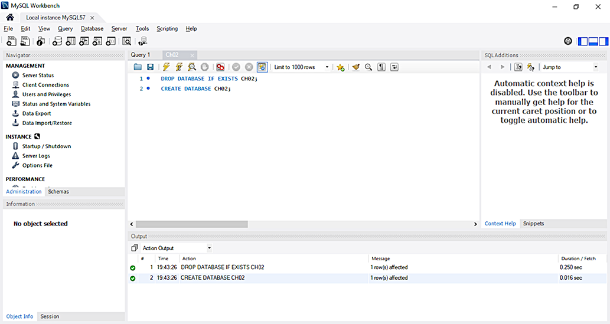
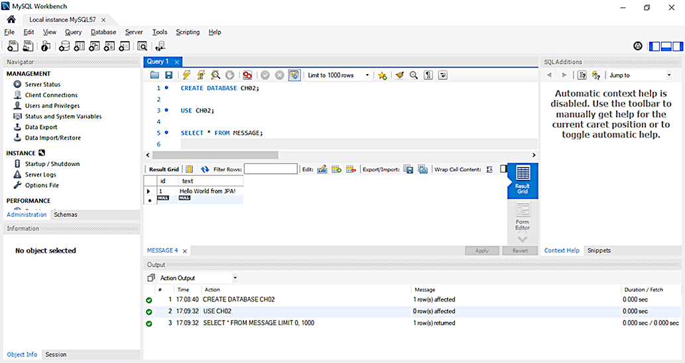
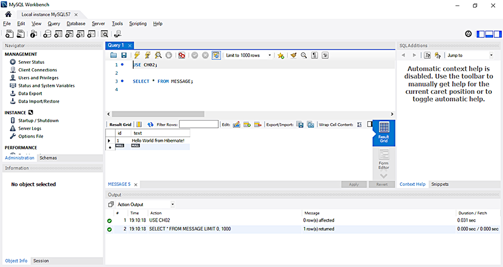
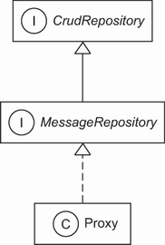
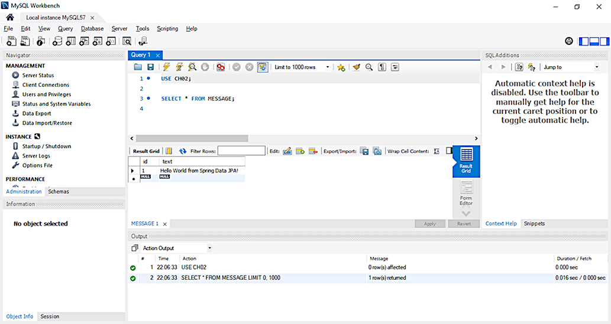
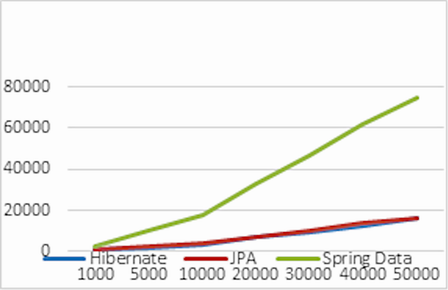
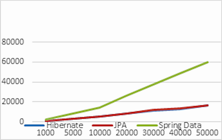
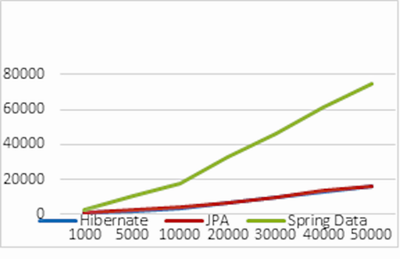

# Chương 2. Bắt đầu một dự án

> *Java Persistence with Spring Data and Hibernate* — Chương 2: “Starting a project”

**Nội dung chương này bao gồm**

- Giới thiệu các dự án Hibernate và Spring Data
- Phát triển ứng dụng “Hello World” với Jakarta Persistence API, Hibernate và Spring Data
- Xem xét các tùy chọn cấu hình và tích hợp

Trong chương này, chúng ta sẽ bắt đầu với Jakarta Persistence API (JPA), Hibernate và Spring Data qua một ví dụ từng bước. Chúng ta sẽ xem xét các persistence API và thấy được lợi ích của việc sử dụng JPA chuẩn hóa, Hibernate native hoặc Spring Data.

Chúng ta sẽ bắt đầu bằng một chuyến tham quan JPA, Hibernate và Spring Data thông qua một ứng dụng “Hello World” đơn giản. JPA (Jakarta Persistence API, trước đây là Java Persistence API) là đặc tả định nghĩa một API quản lý việc lưu trữ object và các ánh xạ object/relational — nó quy định *cái gì* phải làm để lưu trữ object. Hibernate, hiện thực phổ biến nhất của đặc tả này, sẽ làm cho việc lưu trữ đó thực sự diễn ra. Spring Data khiến việc hiện thực tầng persistence còn hiệu quả hơn nữa; đây là một dự án ô tuân thủ các nguyên tắc của Spring framework và mang tới một cách tiếp cận thậm chí còn đơn giản hơn.

## 2.1 Giới thiệu Hibernate

Object/relational mapping (ORM) là một kỹ thuật lập trình nhằm tạo kết nối giữa hai thế giới không tương thích: hệ thống hướng đối tượng và cơ sở dữ liệu quan hệ. Hibernate là một dự án đầy tham vọng, hướng tới việc cung cấp một giải pháp hoàn chỉnh cho bài toán quản lý dữ liệu persistent trong Java. Ngày nay, Hibernate không chỉ là một dịch vụ ORM mà còn là một tập hợp các công cụ quản lý dữ liệu vượt xa phạm vi ORM.

Bộ dự án Hibernate bao gồm:

- **Hibernate ORM** — Hibernate ORM gồm một phần lõi, một dịch vụ nền tảng cho persistence với các SQL database, và một API riêng (native proprietary API). Hibernate ORM là nền móng cho nhiều dự án khác trong bộ, và đây là dự án Hibernate lâu đời nhất. Bạn có thể dùng Hibernate ORM một cách độc lập, không phụ thuộc vào bất kỳ framework hay môi trường chạy cụ thể nào, với mọi JDK. Miễn là có thể truy cập được một data source, bạn có thể cấu hình nó cho Hibernate và nó sẽ hoạt động.
- **Hibernate EntityManager** — Đây là hiện thực của Hibernate cho Jakarta Persistence API chuẩn. Nó là một module tùy chọn mà bạn có thể xếp chồng lên trên Hibernate ORM. Các tính năng native của Hibernate là tập cha (superset) của các tính năng persistence của JPA về mọi mặt.
- **Hibernate Validator** — Hibernate cung cấp hiện thực tham chiếu của đặc tả Bean Validation (JSR 303). Độc lập với các dự án Hibernate khác, nó cung cấp cơ chế kiểm định (validation) khai báo cho các class của domain model (hoặc bất kỳ class nào khác).
- **Hibernate Envers** — Envers chuyên về audit logging và lưu giữ nhiều phiên bản dữ liệu trong SQL database. Điều này giúp bổ sung lịch sử dữ liệu và dấu vết kiểm toán (audit trail) cho ứng dụng, tương tự các hệ thống quản lý phiên bản mà có thể bạn đã quen như Subversion hay Git.
- **Hibernate Search** — Hibernate Search giữ cho một chỉ mục dữ liệu của domain model luôn được cập nhật trong một cơ sở dữ liệu Apache Lucene. Nó cho phép bạn truy vấn cơ sở dữ liệu này bằng một API mạnh mẽ và được tích hợp một cách tự nhiên. Nhiều dự án dùng Hibernate Search bên cạnh Hibernate ORM để bổ sung khả năng tìm kiếm toàn văn (full-text search). Nếu ứng dụng của bạn có ô tìm kiếm tự do trong giao diện người dùng và bạn muốn người dùng hài lòng, hãy dùng Hibernate Search. Cuốn sách này không đề cập tới Hibernate Search, nhưng bạn có thể khởi đầu tốt với *Hibernate Search in Action* của Emmanuel Bernard (Bernard, 2008).
- **Hibernate OGM** — Dự án Hibernate này là một object/grid mapper. Nó cung cấp hỗ trợ JPA cho các giải pháp NoSQL, tái sử dụng engine lõi của Hibernate nhưng lưu các entity đã ánh xạ vào các kho dữ liệu dạng key/value, document hoặc graph.
- **Hibernate Reactive** — Hibernate Reactive là một API phản ứng (reactive) cho Hibernate ORM, tương tác với cơ sở dữ liệu theo cách không chặn (non-blocking). Nó hỗ trợ các driver cơ sở dữ liệu non-blocking. Cuốn sách này không đề cập tới Hibernate Reactive.

Mã nguồn Hibernate có thể tải miễn phí tại https://github.com/hibernate.

## 2.2 Giới thiệu Spring Data

Spring Data là một họ các dự án thuộc Spring framework, với mục đích đơn giản hóa việc truy cập cả cơ sở dữ liệu quan hệ lẫn NoSQL:

- **Spring Data Commons** — Spring Data Commons, một phần của dự án ô Spring Data, cung cấp một mô hình metadata để lưu trữ các class Java và các repository interface trung lập về công nghệ.
- **Spring Data JPA** — Spring Data JPA xử lý việc hiện thực các repository dựa trên JPA. Nó cải thiện hỗ trợ cho các tầng truy cập dữ liệu dựa trên JPA bằng cách giảm mã boilerplate và tạo ra hiện thực cho các repository interface.
- **Spring Data JDBC** — Spring Data JDBC xử lý việc hiện thực các repository dựa trên JDBC. Nó cải thiện hỗ trợ cho các tầng truy cập dữ liệu dựa trên JDBC. Nó không cung cấp một loạt khả năng của JPA như caching hay lazy loading, dẫn tới một ORM đơn giản hơn và hạn chế hơn.
- **Spring Data REST** — Spring Data REST xử lý việc xuất bản (export) các Spring Data repository dưới dạng tài nguyên RESTful.
- **Spring Data MongoDB** — Spring Data MongoDB xử lý việc truy cập cơ sở dữ liệu tài liệu MongoDB. Nó dựa trên tầng truy cập dữ liệu theo phong cách repository và mô hình lập trình POJO.
- **Spring Data Redis** — Spring Data Redis xử lý việc truy cập cơ sở dữ liệu key/value Redis. Nó giải phóng lập trình viên khỏi việc quản lý hạ tầng và cung cấp các mức trừu tượng cao và thấp để truy cập kho dữ liệu. Cuốn sách này không đề cập tới Spring Data Redis.

Mã nguồn Spring Data (cùng với các dự án Spring khác) có thể tải miễn phí tại https://github.com/spring-projects.

Hãy bắt đầu với dự án JPA, Hibernate và Spring Data đầu tiên của chúng ta.

## 2.3 “Hello World” với JPA

Trong phần này, chúng ta sẽ viết ứng dụng JPA đầu tiên: lưu một message vào cơ sở dữ liệu rồi truy xuất lại. Máy chạy mã của chúng tôi đã cài MySQL Release 8.0. Để cài MySQL Release 8.0, hãy làm theo hướng dẫn trong tài liệu chính thức: https://dev.mysql.com/doc/refman/8.0/en/installing.html.

Để thực thi các ví dụ trong mã nguồn, trước tiên bạn cần chạy script Ch02.sql như minh họa ở hình 2.1. Mở MySQL Workbench, vào File > Open SQL Script, chọn file SQL và chạy nó. Các ví dụ sử dụng một MySQL server với thông tin đăng nhập mặc định: username là `root` và không có mật khẩu.



**Hình 2.1** Tạo cơ sở dữ liệu MySQL bằng cách chạy script Ch02.sql

Trong ứng dụng “Hello World”, chúng ta muốn lưu các message vào cơ sở dữ liệu và nạp chúng lên từ cơ sở dữ liệu. Các ứng dụng Hibernate định nghĩa các persistent class được ánh xạ tới các table trong cơ sở dữ liệu. Chúng ta định nghĩa những class này dựa trên việc phân tích lĩnh vực nghiệp vụ; do đó chúng là một mô hình của lĩnh vực đó (domain model). Ví dụ này sẽ gồm một class và ánh xạ của nó. Chúng ta sẽ viết các ví dụ dưới dạng test có thể thực thi, với các assertion kiểm chứng kết quả đúng của từng thao tác. Chúng tôi đã kiểm thử toàn bộ ví dụ trong cuốn sách này nên có thể chắc chắn rằng chúng hoạt động đúng.

Hãy bắt đầu bằng việc cài đặt và cấu hình JPA, Hibernate cùng các dependency cần thiết khác. Chúng ta sẽ dùng Apache Maven làm công cụ build cho mọi ví dụ trong sách. Về các khái niệm Maven cơ bản và chi tiết cách thiết lập Maven, xem phụ lục A.

Chúng ta sẽ khai báo các dependency trong listing sau.

**Listing 2.1** Các dependency Maven cho Hibernate, JUnit Jupiter và MySQL

*Đường dẫn: Ch02/helloworld/pom.xml*

```xml
<dependency>
    <groupId>org.hibernate</groupId>
    <artifactId>hibernate-entitymanager</artifactId>
    <version>5.6.9.Final</version>
</dependency>
<dependency>
    <groupId>org.junit.jupiter</groupId>
    <artifactId>junit-jupiter-engine</artifactId>
    <version>5.8.2</version>
    <scope>test</scope>
</dependency>
<dependency>
    <groupId>mysql</groupId>
    <artifactId>mysql-connector-java</artifactId>
    <version>8.0.29</version>
</dependency>
```

Module `hibernate-entitymanager` bao gồm các dependency bắc cầu (transitive) tới những module khác mà chúng ta cần, chẳng hạn `hibernate-core` và các interface stub của JPA. Chúng ta cũng cần dependency `junit-jupiter-engine` để chạy test với sự trợ giúp của JUnit 5, và dependency `mysql-connector-java` — driver JDBC chính thức cho MySQL.

Điểm khởi đầu của chúng ta trong JPA là *persistence unit*. Một persistence unit là sự ghép cặp giữa các ánh xạ class của domain model với một kết nối cơ sở dữ liệu, cộng thêm một số thiết lập cấu hình khác. Mọi ứng dụng đều có ít nhất một persistence unit; một số ứng dụng có nhiều nếu chúng làm việc với nhiều cơ sở dữ liệu (logic hoặc vật lý). Do đó, bước đầu tiên của chúng ta là thiết lập một persistence unit trong cấu hình của ứng dụng.

### 2.3.1 Cấu hình một persistence unit

File cấu hình chuẩn cho persistence unit nằm trên classpath tại `META-INF/persistence.xml`. Hãy tạo file cấu hình sau cho ứng dụng “Hello World”.

**Listing 2.2** File cấu hình persistence.xml

*Đường dẫn: Ch02/helloworld/src/main/resources/META-INF/persistence.xml*

```xml
<persistence xmlns="http://java.sun.com/xml/ns/persistence"
             xmlns:xsi="http://www.w3.org/2001/XMLSchema-instance"
             xsi:schemaLocation="http://java.sun.com/xml/ns/persistence
                 http://java.sun.com/xml/ns/persistence/persistence_2_0.xsd"
             version="2.0">

    <persistence-unit name="ch02">                                <!-- Ⓐ -->
        <provider>
            org.hibernate.jpa.HibernatePersistenceProvider        <!-- Ⓑ -->
        </provider>
        <properties>
            <property name="javax.persistence.jdbc.driver"
                      value="com.mysql.cj.jdbc.Driver"/>          <!-- Ⓒ -->
            <property name="javax.persistence.jdbc.url"
                      value="jdbc:mysql://localhost:3306/CH02?serverTimezone=UTC"/>  <!-- Ⓓ -->
            <property name="javax.persistence.jdbc.user" value="root"/>   <!-- Ⓔ -->
            <property name="javax.persistence.jdbc.password" value=""/>   <!-- Ⓕ -->

            <property name="hibernate.dialect"
                      value="org.hibernate.dialect.MySQL8Dialect"/>       <!-- Ⓖ -->

            <property name="hibernate.show_sql" value="true"/>            <!-- Ⓗ -->
            <property name="hibernate.format_sql" value="true"/>          <!-- Ⓘ -->

            <property name="hibernate.hbm2ddl.auto" value="create"/>      <!-- Ⓙ -->
        </properties>
    </persistence-unit>

</persistence>
```

Ⓐ File persistence.xml cấu hình ít nhất một persistence unit; mỗi unit phải có một tên duy nhất.

Ⓑ Vì JPA chỉ là một đặc tả, chúng ta cần chỉ ra hiện thực `PersistenceProvider` đặc thù của nhà cung cấp cho API này. Persistence unit mà chúng ta định nghĩa sẽ được hỗ trợ bởi một Hibernate provider.

Ⓒ Chỉ định các thuộc tính JDBC — driver.

Ⓓ URL của cơ sở dữ liệu.

Ⓔ Username.

Ⓕ Không có mật khẩu để truy cập. Máy chúng tôi chạy chương trình đã cài MySQL 8, và thông tin đăng nhập chính là những gì có trong persistence.xml. Bạn nên sửa lại thông tin đăng nhập cho khớp với máy của mình.

Ⓖ Hibernate dialect là MySQL8, vì cơ sở dữ liệu cần tương tác là MySQL Release 8.0.

Ⓗ Trong khi thực thi, hiển thị mã SQL.

Ⓘ Hibernate sẽ định dạng SQL đẹp mắt và sinh comment trong chuỗi SQL để chúng ta biết vì sao Hibernate thực thi câu lệnh SQL đó.

Ⓙ Mỗi lần chương trình được thực thi, cơ sở dữ liệu sẽ được tạo lại từ đầu. Điều này lý tưởng cho kiểm thử tự động, khi ta muốn làm việc với một cơ sở dữ liệu sạch cho mỗi lần chạy test.

Hãy xem một persistent class đơn giản trông như thế nào, ánh xạ được tạo ra sao, và một số việc chúng ta có thể làm với instance của persistent class trong JPA.

### 2.3.2 Viết một persistent class

Mục tiêu của ví dụ này là lưu các message vào cơ sở dữ liệu và truy xuất chúng để hiển thị. Ứng dụng có một persistent class đơn giản là `Message`.

**Listing 2.3** Class Message

*Đường dẫn: Ch02/helloworld/src/main/java/com/manning/javapersistence/ch02/Message.java*

```java
@Entity                                                       // Ⓐ
public class Message {

    @Id                                                       // Ⓑ
    @GeneratedValue(strategy = GenerationType.IDENTITY)       // Ⓒ
    private Long id;

    private String text;                                      // Ⓓ

    public String getText() {                                 // Ⓓ
        return text;                                          // Ⓓ
    }                                                         // Ⓓ

    public void setText(String text) {                        // Ⓓ
        this.text = text;                                     // Ⓓ
    }                                                         // Ⓓ
}
```

Ⓐ Mọi persistent entity class đều phải có ít nhất annotation `@Entity`. Hibernate ánh xạ class này tới một table tên là `MESSAGE`.

Ⓑ Mọi persistent entity class đều phải có một thuộc tính định danh được đánh dấu bằng `@Id`. Hibernate ánh xạ thuộc tính này tới một cột tên là `id`.

Ⓒ Phải có ai đó sinh ra các giá trị định danh; annotation này bật cơ chế tự động sinh id.

Ⓓ Chúng ta thường hiện thực các thuộc tính thông thường của một persistent class bằng các field private cùng cặp phương thức getter/setter public. Hibernate ánh xạ thuộc tính này tới một cột tên là `text`.

Thuộc tính định danh của một persistent class cho phép ứng dụng truy cập database identity — giá trị primary key — của một persistent instance. Nếu hai instance của `Message` có cùng giá trị định danh, chúng biểu diễn cùng một dòng trong cơ sở dữ liệu. Ví dụ này dùng `Long` làm kiểu của thuộc tính định danh, nhưng đó không phải là yêu cầu bắt buộc. Hibernate cho phép bạn dùng gần như bất cứ kiểu nào làm kiểu định danh, như bạn sẽ thấy ở phần sau của sách.

Có thể bạn đã để ý rằng thuộc tính `text` của class `Message` có các phương thức truy cập thuộc tính theo phong cách JavaBeans. Class này cũng có một constructor (mặc định) không tham số. Các persistent class chúng tôi trình bày trong các ví dụ thường sẽ trông tương tự như vậy. Lưu ý rằng chúng ta không cần hiện thực bất kỳ interface đặc biệt nào hay kế thừa bất kỳ superclass đặc biệt nào.

Các instance của class `Message` có thể được Hibernate quản lý (làm cho persistent), nhưng không nhất thiết phải vậy. Vì object `Message` không hiện thực bất kỳ class hay interface đặc thù nào của persistence, chúng ta có thể dùng nó như bất kỳ class Java nào khác:

```java
Message msg = new Message();
msg.setText("Hello!");
System.out.println(msg.getText());
```

Có vẻ như chúng tôi đang cố tỏ ra dễ thương ở đây; thực ra chúng tôi đang minh họa một tính năng quan trọng giúp phân biệt Hibernate với một số giải pháp persistence khác. Chúng ta có thể dùng persistent class trong bất kỳ ngữ cảnh thực thi nào — không cần container đặc biệt nào cả.

Chúng ta không bắt buộc phải dùng annotation để ánh xạ một persistent class. Về sau chúng tôi sẽ trình bày các tùy chọn ánh xạ khác, chẳng hạn file ánh xạ `orm.xml` của JPA và các file ánh xạ native `hbm.xml`, đồng thời xem khi nào chúng là giải pháp tốt hơn so với annotation trong mã nguồn — cách tiếp cận được dùng phổ biến nhất hiện nay.

Class `Message` giờ đã sẵn sàng. Chúng ta có thể lưu các instance vào cơ sở dữ liệu và viết truy vấn để nạp chúng trở lại bộ nhớ ứng dụng.

### 2.3.3 Lưu và nạp message

Điều bạn thực sự muốn thấy là JPA cùng Hibernate, vậy hãy lưu một `Message` mới vào cơ sở dữ liệu.

**Listing 2.4** Class HelloWorldJPATest

*Đường dẫn: Ch02/helloworld/src/test/java/com/manning/javapersistence/ch02/HelloWorldJPATest.java*

```java
public class HelloWorldJPATest {

    @Test
    public void storeLoadMessage() {

        EntityManagerFactory emf =
                Persistence.createEntityManagerFactory("ch02");          // Ⓐ

        try {
            EntityManager em = emf.createEntityManager();                // Ⓑ
            em.getTransaction().begin();                                 // Ⓒ

            Message message = new Message();                             // Ⓓ
            message.setText("Hello World!");                             // Ⓓ

            em.persist(message);                                         // Ⓔ

            em.getTransaction().commit();                                // Ⓕ
            //INSERT into MESSAGE (ID, TEXT) values (1, 'Hello World!')

            em.getTransaction().begin();                                 // Ⓖ

            List<Message> messages =
                em.createQuery("select m from Message m", Message.class)
                  .getResultList();                                      // Ⓗ
            //SELECT * from MESSAGE

            messages.get(messages.size() - 1).
                       setText("Hello World from JPA!");                 // Ⓘ

            em.getTransaction().commit();                                // Ⓙ
            //UPDATE MESSAGE set TEXT = 'Hello World from JPA!' where ID = 1

            assertAll(
                    () -> assertEquals(1, messages.size()),              // Ⓚ
                    () -> assertEquals("Hello World from JPA!",          // Ⓛ
                                 messages.get(0).getText())
            );

            em.close();                                                  // Ⓜ

        } finally {
            emf.close();                                                 // Ⓝ
        }
    }
}
```

Ⓐ Trước hết chúng ta cần một `EntityManagerFactory` để giao tiếp với cơ sở dữ liệu. API này đại diện cho persistence unit, và hầu hết ứng dụng có một `EntityManagerFactory` cho một persistence unit đã cấu hình. Khi khởi động, ứng dụng nên tạo `EntityManagerFactory`; factory này an toàn với đa luồng (thread-safe), và mọi đoạn mã trong ứng dụng có truy cập cơ sở dữ liệu đều nên dùng chung nó.

Ⓑ Bắt đầu một phiên làm việc mới với cơ sở dữ liệu bằng cách tạo một `EntityManager`. Đây là ngữ cảnh cho mọi thao tác persistence.

Ⓒ Truy cập API transaction chuẩn và bắt đầu một transaction trên luồng thực thi này.

Ⓓ Tạo một instance mới của class `Message` thuộc domain model đã ánh xạ, và gán thuộc tính `text` cho nó.

Ⓔ Đưa instance transient vào persistence context; chúng ta làm cho nó trở thành persistent. Hibernate giờ đã biết rằng ta muốn lưu dữ liệu đó, nhưng nó không nhất thiết gọi tới cơ sở dữ liệu ngay lập tức.

Ⓕ Commit transaction. Hibernate tự động kiểm tra persistence context và thực thi câu lệnh SQL `INSERT` cần thiết. Để giúp bạn hiểu Hibernate hoạt động thế nào, chúng tôi hiển thị các câu lệnh SQL được sinh và thực thi tự động dưới dạng comment trong mã nguồn tại nơi chúng xảy ra. Hibernate chèn một dòng vào table `MESSAGE`, với giá trị được sinh tự động cho cột primary key `ID`, và giá trị `TEXT`.

Ⓖ Mọi tương tác với cơ sở dữ liệu đều nên diễn ra trong ranh giới transaction, ngay cả khi chúng ta chỉ đọc dữ liệu, nên ta bắt đầu một transaction mới. Mọi lỗi có thể xuất hiện từ giờ trở đi sẽ không ảnh hưởng tới transaction đã commit trước đó.

Ⓗ Thực thi một truy vấn để lấy tất cả instance của `Message` từ cơ sở dữ liệu.

Ⓘ Chúng ta có thể thay đổi giá trị của một thuộc tính. Hibernate phát hiện điều này một cách tự động vì `Message` đã nạp vẫn còn gắn (attached) với persistence context nơi nó được nạp.

Ⓙ Khi commit, Hibernate kiểm tra persistence context để tìm trạng thái “bẩn” (dirty state) và tự động thực thi câu lệnh SQL `UPDATE` để đồng bộ các object trong bộ nhớ với trạng thái cơ sở dữ liệu.

Ⓚ Kiểm tra kích thước danh sách message được truy xuất từ cơ sở dữ liệu.

Ⓛ Kiểm tra rằng message chúng ta đã lưu có trong cơ sở dữ liệu. Chúng ta dùng phương thức `assertAll` của JUnit 5, phương thức này luôn kiểm tra tất cả các assertion được truyền vào, ngay cả khi một số assertion thất bại. Hai assertion mà chúng ta kiểm chứng có liên quan với nhau về mặt khái niệm.

Ⓜ Chúng ta đã tạo một `EntityManager`, nên phải đóng nó.

Ⓝ Chúng ta đã tạo một `EntityManagerFactory`, nên phải đóng nó.

Ngôn ngữ truy vấn bạn thấy trong ví dụ này không phải SQL, mà là Jakarta Persistence Query Language (JPQL). Mặc dù trong ví dụ tầm thường này không có khác biệt về cú pháp, `Message` trong chuỗi truy vấn không tham chiếu tới tên table trong cơ sở dữ liệu mà tới tên của persistent class. Vì lý do đó, tên class `Message` trong truy vấn có phân biệt chữ hoa/thường. Nếu chúng ta ánh xạ class này tới một table khác, truy vấn vẫn hoạt động.

Ngoài ra, hãy để ý cách Hibernate phát hiện thay đổi ở thuộc tính `text` của message và tự động cập nhật cơ sở dữ liệu. Đây chính là tính năng *automatic dirty checking* của JPA đang hoạt động. Nó giúp chúng ta khỏi phải yêu cầu tường minh persistence manager cập nhật cơ sở dữ liệu khi ta thay đổi trạng thái của một instance bên trong transaction.

Hình 2.2 cho thấy kết quả kiểm tra sự tồn tại của bản ghi mà chúng ta đã chèn và cập nhật ở phía cơ sở dữ liệu. Như bạn còn nhớ, chúng ta đã tạo một cơ sở dữ liệu tên CH02 bằng cách chạy script Ch02.sql từ mã nguồn của chương.



**Hình 2.2** Kết quả kiểm tra sự tồn tại của bản ghi đã chèn và cập nhật ở phía cơ sở dữ liệu

Bạn vừa hoàn thành ứng dụng JPA và Hibernate đầu tiên của mình. Giờ hãy xem nhanh API bootstrap và cấu hình native của Hibernate.

## 2.4 Cấu hình native của Hibernate

Mặc dù phần cấu hình cơ bản (và khá rộng) đã được chuẩn hóa trong JPA, chúng ta không thể truy cập mọi tính năng cấu hình của Hibernate bằng các property trong persistence.xml. Lưu ý rằng hầu hết ứng dụng, kể cả những ứng dụng khá phức tạp, đều không cần tới các tùy chọn cấu hình đặc biệt như vậy và do đó không cần dùng tới API bootstrap được trình bày trong mục này. Nếu chưa chắc chắn, bạn có thể bỏ qua mục này và quay lại sau khi cần mở rộng các type adapter của Hibernate, thêm hàm SQL tùy chỉnh, v.v.

Khi dùng native Hibernate, chúng ta sẽ dùng trực tiếp các dependency và API của Hibernate thay vì các dependency và class của JPA. JPA là một đặc tả và có thể dùng nhiều hiện thực khác nhau (Hibernate là một ví dụ, nhưng EclipseLink là một lựa chọn khác) thông qua cùng một API. Hibernate, với tư cách một hiện thực, cung cấp các dependency và class riêng. Trong khi dùng JPA mang lại nhiều linh hoạt hơn, xuyên suốt cuốn sách bạn sẽ thấy rằng truy cập trực tiếp hiện thực Hibernate cho phép bạn dùng những tính năng mà chuẩn JPA không bao phủ (chúng tôi sẽ chỉ rõ ở những chỗ liên quan).

Tương đương native của `EntityManagerFactory` chuẩn trong JPA là `org.hibernate.SessionFactory`. Chúng ta thường có một đối tượng như vậy cho mỗi ứng dụng, và nó cũng bao gồm sự ghép cặp giữa các ánh xạ class với cấu hình kết nối cơ sở dữ liệu.

Để cấu hình native Hibernate, chúng ta có thể dùng file Java properties `hibernate.properties` hoặc file XML `hibernate.cfg.xml`. Chúng ta sẽ chọn phương án thứ hai, và cấu hình sẽ chứa các tùy chọn liên quan tới cơ sở dữ liệu và session. File XML này thường được đặt trong thư mục `src/main/resource` hoặc `src/test/resource`. Vì chúng ta cần thông tin cấu hình Hibernate trong các test, ta sẽ chọn vị trí thứ hai.

**Listing 2.5** File cấu hình hibernate.cfg.xml

*Đường dẫn: Ch02/helloworld/src/test/resources/hibernate.cfg.xml*

```xml
<?xml version='1.0' encoding='utf-8'?>
<!DOCTYPE hibernate-configuration PUBLIC
"-//Hibernate/Hibernate Configuration DTD//EN"
"http://www.hibernate.org/dtd/hibernate-configuration-3.0.dtd">
<hibernate-configuration>                                          <!-- Ⓐ -->
    <session-factory>                                              <!-- Ⓑ -->
        <property name="hibernate.connection.driver_class">
            com.mysql.cj.jdbc.Driver
        </property>                                                <!-- Ⓒ -->
        <property name="hibernate.connection.url">
            jdbc:mysql://localhost:3306/CH02?serverTimezone=UTC
        </property>                                                <!-- Ⓓ -->
        <property name="hibernate.connection.username">root</property>  <!-- Ⓔ -->
        <property name="hibernate.connection.password"></property>      <!-- Ⓕ -->
        <property name="hibernate.connection.pool_size">50</property>   <!-- Ⓖ -->
        <property name="show_sql">true</property>                       <!-- Ⓗ -->
        <property name="hibernate.hbm2ddl.auto">create</property>       <!-- Ⓘ -->
    </session-factory>
</hibernate-configuration>
```

Ⓐ Chúng ta dùng các thẻ này để chỉ ra rằng đang cấu hình Hibernate.

Ⓑ Chính xác hơn, chúng ta đang cấu hình object `SessionFactory`. `SessionFactory` là một interface, và chúng ta cần một `SessionFactory` để tương tác với một cơ sở dữ liệu.

Ⓒ Chỉ định các thuộc tính JDBC — driver.

Ⓓ URL của cơ sở dữ liệu.

Ⓔ Username.

Ⓕ Không cần mật khẩu để truy cập. Máy chúng tôi chạy chương trình đã cài MySQL 8 và thông tin đăng nhập chính là những gì có trong hibernate.cfg.xml. Bạn nên sửa lại thông tin đăng nhập cho khớp với máy của mình.

Ⓖ Giới hạn số kết nối chờ trong connection pool của Hibernate là 50.

Ⓗ Trong khi thực thi, mã SQL được hiển thị.

Ⓘ Mỗi lần chương trình được thực thi, cơ sở dữ liệu sẽ được tạo lại từ đầu. Điều này lý tưởng cho kiểm thử tự động, khi ta muốn làm việc với một cơ sở dữ liệu sạch cho mỗi lần chạy test.

Hãy lưu một `Message` vào cơ sở dữ liệu bằng native Hibernate.

**Listing 2.6** Class HelloWorldHibernateTest

*Đường dẫn: Ch02/helloworld/src/test/java/com/manning/javapersistence/ch02/HelloWorldHibernateTest.java*

```java
public class HelloWorldHibernateTest {

    private static SessionFactory createSessionFactory() {
        Configuration configuration = new Configuration();              // Ⓐ
        configuration.configure().addAnnotatedClass(Message.class);     // Ⓑ
        ServiceRegistry serviceRegistry = new
                StandardServiceRegistryBuilder().
                applySettings(configuration.getProperties()).build();   // Ⓒ
        return configuration.buildSessionFactory(serviceRegistry);      // Ⓓ
    }

    @Test
    public void storeLoadMessage() {

        try (SessionFactory sessionFactory = createSessionFactory();    // Ⓔ
             Session session = sessionFactory.openSession()) {          // Ⓕ

            session.beginTransaction();                                 // Ⓖ

            Message message = new Message();                            // Ⓗ
            message.setText("Hello World from Hibernate!");             // Ⓗ

            session.persist(message);                                   // Ⓘ

            session.getTransaction().commit();                          // Ⓙ
            // INSERT into MESSAGE (ID, TEXT)
            // values (1, 'Hello World from Hibernate!')

            session.beginTransaction();                                 // Ⓚ

            CriteriaQuery<Message> criteriaQuery =
                 session.getCriteriaBuilder().createQuery(Message.class);  // Ⓛ
            criteriaQuery.from(Message.class);                             // Ⓜ

            List<Message> messages =
                 session.createQuery(criteriaQuery).getResultList();       // Ⓝ
            // SELECT * from MESSAGE

            session.getTransaction().commit();                             // Ⓞ

            assertAll(
                    () -> assertEquals(1, messages.size()),                // Ⓟ
                    () -> assertEquals("Hello World from Hibernate!",      // Ⓠ
                                      messages.get(0).getText())
            );

        }
    }
}
```

Ⓐ Để tạo một `SessionFactory`, trước hết chúng ta cần tạo một configuration.

Ⓑ Chúng ta cần gọi phương thức `configure` trên nó và thêm `Message` vào đó như một annotated class. Việc thực thi phương thức `configure` sẽ nạp nội dung của file `hibernate.cfg.xml` mặc định.

Ⓒ Mẫu builder giúp chúng ta tạo service registry bất biến (immutable) và cấu hình nó bằng cách áp dụng các thiết lập thông qua chuỗi lời gọi phương thức. Một `ServiceRegistry` chứa và quản lý các service cần truy cập tới `SessionFactory`. Service là các class cung cấp hiện thực có thể cắm-ghép (pluggable) cho những loại chức năng khác nhau của Hibernate.

Ⓓ Xây dựng một `SessionFactory` bằng configuration và service registry mà chúng ta đã tạo trước đó.

Ⓔ `SessionFactory` được tạo bằng phương thức `createSessionFactory` mà chúng ta định nghĩa trước đó được truyền làm đối số cho khối try-with-resources, vì `SessionFactory` hiện thực interface `AutoCloseable`.

Ⓕ Tương tự, chúng ta bắt đầu một phiên làm việc mới với cơ sở dữ liệu bằng cách tạo một `Session`, cũng hiện thực interface `AutoCloseable`. Đây là ngữ cảnh cho mọi thao tác persistence.

Ⓖ Truy cập API transaction chuẩn và bắt đầu một transaction trên luồng thực thi này.

Ⓗ Tạo một instance mới của class `Message` thuộc domain model đã ánh xạ, và gán thuộc tính `text` cho nó.

Ⓘ Đưa instance transient vào persistence context; chúng ta làm cho nó trở thành persistent. Hibernate giờ đã biết ta muốn lưu dữ liệu đó, nhưng nó không nhất thiết gọi tới cơ sở dữ liệu ngay lập tức. API native của Hibernate khá giống JPA chuẩn, và phần lớn phương thức có cùng tên.

Ⓙ Đồng bộ session với cơ sở dữ liệu, và tự động đóng session hiện tại khi transaction được commit.

Ⓚ Bắt đầu một transaction khác. Mọi tương tác với cơ sở dữ liệu đều nên diễn ra trong ranh giới transaction, ngay cả khi ta chỉ đọc dữ liệu.

Ⓛ Tạo một instance của `CriteriaQuery` bằng cách gọi phương thức `createQuery()` của `CriteriaBuilder`. `CriteriaBuilder` được dùng để xây dựng criteria query, các phép chọn hợp thành (compound selection), biểu thức, predicate và thứ tự sắp xếp. `CriteriaQuery` định nghĩa các chức năng đặc thù cho truy vấn ở mức cao nhất. `CriteriaBuilder` và `CriteriaQuery` thuộc về Criteria API, cho phép chúng ta xây dựng truy vấn bằng chương trình.

Ⓜ Tạo và thêm một query root tương ứng với entity `Message` đã cho.

Ⓝ Gọi phương thức `getResultList()` của object truy vấn để lấy kết quả. Truy vấn được tạo và thực thi sẽ là `SELECT * FROM MESSAGE`.

Ⓞ Commit transaction.

Ⓟ Kiểm tra kích thước danh sách message được truy xuất từ cơ sở dữ liệu.

Ⓠ Kiểm tra rằng message chúng ta đã lưu có trong cơ sở dữ liệu. Chúng ta dùng phương thức `assertAll` của JUnit 5, phương thức này luôn kiểm tra tất cả các assertion được truyền vào, ngay cả khi một số assertion thất bại. Hai assertion mà chúng ta kiểm chứng có liên quan với nhau về mặt khái niệm.

Hình 2.3 cho thấy kết quả kiểm tra sự tồn tại của bản ghi mà chúng ta đã chèn ở phía cơ sở dữ liệu bằng native Hibernate.



**Hình 2.3** Kết quả kiểm tra sự tồn tại của bản ghi đã chèn ở phía cơ sở dữ liệu

Hầu hết ví dụ trong cuốn sách này sẽ không dùng API `SessionFactory` hay `Session`. Thỉnh thoảng, khi một tính năng cụ thể chỉ có ở Hibernate, chúng tôi sẽ chỉ cho bạn cách `unwrap()` interface native.

## 2.5 Chuyển đổi giữa JPA và Hibernate

Giả sử bạn đang làm việc với JPA và cần truy cập API của Hibernate. Hoặc ngược lại, bạn đang làm việc với native Hibernate và cần tạo một `EntityManagerFactory` từ cấu hình Hibernate. Để lấy được một `SessionFactory` từ một `EntityManagerFactory`, bạn sẽ phải “unwrap” cái thứ nhất từ cái thứ hai.

**Listing 2.7** Lấy `SessionFactory` từ `EntityManagerFactory`

*Đường dẫn: Ch02/helloworld/src/test/java/com/manning/javapersistence/ch02/HelloWorldJPAToHibernateTest.java*

```java
private static SessionFactory getSessionFactory
               (EntityManagerFactory entityManagerFactory) {
    return entityManagerFactory.unwrap(SessionFactory.class);
}
```

Kể từ JPA phiên bản 2.0, bạn có thể truy cập API của các hiện thực bên dưới. `EntityManagerFactory` (và cả `EntityManager`) khai báo phương thức `unwrap` trả về những object thuộc các class của hiện thực JPA. Khi dùng hiện thực Hibernate, bạn có thể lấy các object `SessionFactory` hoặc `Session` tương ứng và bắt đầu sử dụng chúng như minh họa ở listing 2.6. Khi một tính năng cụ thể chỉ có ở Hibernate, bạn có thể chuyển sang dùng nó bằng phương thức `unwrap`.

Bạn có thể quan tâm tới thao tác ngược lại: tạo một `EntityManagerFactory` từ một cấu hình Hibernate ban đầu.

**Listing 2.8** Lấy `EntityManagerFactory` từ cấu hình Hibernate

*Đường dẫn: Ch02/helloworld/src/test/java/com/manning/javapersistence/ch02/HelloWorldHibernateToJPATest.java*

```java
private static EntityManagerFactory createEntityManagerFactory() {
    Configuration configuration = new Configuration();                  // Ⓐ
    configuration.configure().addAnnotatedClass(Message.class);         // Ⓑ

    Map<String, String> properties = new HashMap<>();                   // Ⓒ
    Enumeration<?> propertyNames =
               configuration.getProperties().propertyNames();           // Ⓓ
    while (propertyNames.hasMoreElements()) {
        String element = (String) propertyNames.nextElement();
        properties.put(element,
            configuration.getProperties().getProperty(element));         // Ⓔ
    }
    return Persistence.createEntityManagerFactory("ch02", properties);   // Ⓕ
}
```

Ⓐ Tạo một cấu hình Hibernate mới.

Ⓑ Gọi phương thức `configure`, phương thức này thêm nội dung của file `hibernate.cfg.xml` mặc định vào configuration, rồi thêm tường minh `Message` như một annotated class.

Ⓒ Tạo một hash map mới để điền vào các property hiện có.

Ⓓ Lấy tất cả tên property từ cấu hình Hibernate.

Ⓔ Thêm lần lượt từng tên property vào map đã tạo trước đó.

Ⓕ Trả về một `EntityManagerFactory` mới, cung cấp cho nó tên persistence unit `ch02.ex01` và map các property đã tạo trước đó.

## 2.6 “Hello World” với Spring Data JPA

Bây giờ hãy viết ứng dụng Spring Data JPA đầu tiên của chúng ta: lưu một message vào cơ sở dữ liệu rồi truy xuất lại.

Trước tiên chúng ta sẽ thêm các dependency Spring vào cấu hình Apache Maven.

**Listing 2.9** Các dependency Maven cho Spring

*Đường dẫn: Ch02/helloworld/pom.xml*

```xml
<dependency>                                          <!-- Ⓐ -->
    <groupId>org.springframework.data</groupId>       <!-- Ⓐ -->
    <artifactId>spring-data-jpa</artifactId>          <!-- Ⓐ -->
    <version>2.7.0</version>                          <!-- Ⓐ -->
</dependency>                                         <!-- Ⓐ -->
<dependency>                                          <!-- Ⓑ -->
    <groupId>org.springframework</groupId>            <!-- Ⓑ -->
    <artifactId>spring-test</artifactId>              <!-- Ⓑ -->
    <version>5.3.20</version>                         <!-- Ⓑ -->
</dependency>                                         <!-- Ⓑ -->
```

Ⓐ Module `spring-data-jpa` cung cấp hỗ trợ repository cho JPA và bao gồm các dependency bắc cầu tới những module khác mà chúng ta cần, chẳng hạn `spring-core` và `spring-context`.

Ⓑ Chúng ta cũng cần dependency `spring-test` để chạy các test.

File cấu hình chuẩn cho Spring Data JPA là một class Java tạo và thiết lập các bean mà Spring Data cần. Việc cấu hình có thể được thực hiện bằng file XML hoặc bằng mã Java, và chúng ta đã chọn phương án thứ hai. Hãy tạo file cấu hình sau cho ứng dụng “Hello World”.

**Listing 2.10** Class SpringDataConfiguration

*Đường dẫn: Ch02/helloworld/src/test/java/com/manning/javapersistence/ch02/configuration/SpringDataConfiguration.java*

```java
@EnableJpaRepositories("com.manning.javapersistence.ch02.repositories")   // Ⓐ
public class SpringDataConfiguration {

    @Bean                                                                 // Ⓑ
    public DataSource dataSource() {
        DriverManagerDataSource dataSource = new DriverManagerDataSource();
        dataSource.setDriverClassName("com.mysql.cj.jdbc.Driver");        // Ⓒ
        dataSource.setUrl(
            "jdbc:mysql://localhost:3306/CH02?serverTimezone=UTC");       // Ⓓ
        dataSource.setUsername("root");                                   // Ⓔ
        dataSource.setPassword("");                                       // Ⓕ
        return dataSource;
    }

    @Bean
    public JpaTransactionManager
           transactionManager(EntityManagerFactory emf) {                 // Ⓖ
        return new JpaTransactionManager(emf);
    }

    @Bean
    public JpaVendorAdapter jpaVendorAdapter() {                          // Ⓗ
        HibernateJpaVendorAdapter jpaVendorAdapter = new
                  HibernateJpaVendorAdapter();
        jpaVendorAdapter.setDatabase(Database.MYSQL);                     // Ⓘ
        jpaVendorAdapter.setShowSql(true);                                // Ⓙ
        return jpaVendorAdapter;
    }

    @Bean
    public LocalContainerEntityManagerFactoryBean entityManagerFactory() { // Ⓚ
        LocalContainerEntityManagerFactoryBean
           localContainerEntityManagerFactoryBean =
                 new LocalContainerEntityManagerFactoryBean();
        localContainerEntityManagerFactoryBean.setDataSource(dataSource()); // Ⓛ
        Properties properties = new Properties();
        properties.put("hibernate.hbm2ddl.auto", "create");                 // Ⓜ
        localContainerEntityManagerFactoryBean.
                setJpaProperties(properties);
        localContainerEntityManagerFactoryBean.
                setJpaVendorAdapter(jpaVendorAdapter());                    // Ⓝ
        localContainerEntityManagerFactoryBean.
                setPackagesToScan("com.manning.javapersistence.ch02");      // Ⓞ
        return localContainerEntityManagerFactoryBean;
    }
}
```

Ⓐ Annotation `@EnableJpaRepositories` bật cơ chế quét package được truyền làm đối số để tìm các Spring Data repository.

Ⓑ Tạo một bean data source.

Ⓒ Chỉ định các thuộc tính JDBC — driver.

Ⓓ URL của cơ sở dữ liệu.

Ⓔ Username.

Ⓕ Không cần mật khẩu để truy cập. Máy chúng tôi chạy chương trình đã cài MySQL 8, và thông tin đăng nhập chính là những gì có trong cấu hình này. Bạn nên sửa lại thông tin đăng nhập cho khớp với máy của mình.

Ⓖ Tạo một bean transaction manager dựa trên một entity manager factory. Mọi tương tác với cơ sở dữ liệu đều nên diễn ra trong ranh giới transaction, và Spring Data cần một bean transaction manager.

Ⓗ Tạo bean JPA vendor adapter mà JPA cần để tương tác với Hibernate.

Ⓘ Cấu hình vendor adapter này để truy cập một cơ sở dữ liệu MySQL.

Ⓙ Hiển thị mã SQL trong khi nó được thực thi.

Ⓚ Tạo một `LocalContainerEntityManagerFactoryBean`. Đây là một factory bean sinh ra `EntityManagerFactory` theo hợp đồng bootstrap container chuẩn của JPA.

Ⓛ Thiết lập data source.

Ⓜ Thiết lập để cơ sở dữ liệu được tạo lại từ đầu mỗi lần chương trình được thực thi.

Ⓝ Thiết lập vendor adapter.

Ⓞ Thiết lập các package cần quét để tìm entity class. Vì entity `Message` nằm trong `com.manning.javapersistence.ch02`, chúng ta đặt package này để được quét.

Spring Data JPA hỗ trợ cho các tầng truy cập dữ liệu dựa trên JPA bằng cách giảm mã boilerplate và tạo hiện thực cho các repository interface. Chúng ta chỉ cần định nghĩa repository interface của riêng mình để mở rộng một trong các interface của Spring Data.

**Listing 2.11** Interface MessageRepository

*Đường dẫn: Ch02/helloworld/src/main/java/com/manning/javapersistence/ch02/repositories/MessageRepository.java*

```java
public interface MessageRepository extends CrudRepository<Message, Long> {

}
```

Interface `MessageRepository` mở rộng `CrudRepository<Message, Long>`. Điều này nghĩa là nó là một repository của các entity `Message` với định danh kiểu `Long`. Hãy nhớ, class `Message` có một field `id` được đánh dấu `@Id` kiểu `Long`. Chúng ta có thể gọi trực tiếp các phương thức như `save`, `findAll` hay `findById` được kế thừa từ `CrudRepository`, và dùng chúng mà không cần thêm bất kỳ thông tin bổ sung nào để thực thi các thao tác thông thường trên cơ sở dữ liệu. Spring Data JPA sẽ tạo một class proxy hiện thực interface `MessageRepository` và hiện thực các phương thức của nó (hình 2.4).



**Hình 2.4** Class Proxy của Spring Data JPA hiện thực interface `MessageRepository`.

Hãy lưu một `Message` vào cơ sở dữ liệu bằng Spring Data JPA.

**Listing 2.12** Class HelloWorldSpringDataJPATest

*Đường dẫn: Ch02/helloworld/src/test/java/com/manning/javapersistence/ch02/HelloWorldSpringDataJPATest.java*

```java
@ExtendWith(SpringExtension.class)                                        // Ⓐ
@ContextConfiguration(classes = {SpringDataConfiguration.class})          // Ⓑ
public class HelloWorldSpringDataJPATest {

    @Autowired
    private MessageRepository messageRepository;                          // Ⓒ

    @Test
    public void storeLoadMessage() {
        Message message = new Message();                                  // Ⓓ
        message.setText("Hello World from Spring Data JPA!");             // Ⓓ

        messageRepository.save(message);                                  // Ⓔ

        List<Message> messages =
            (List<Message>) messageRepository.findAll();                  // Ⓕ

        assertAll(
                () -> assertEquals(1, messages.size()),                   // Ⓖ
                () -> assertEquals("Hello World from Spring Data JPA!",   // Ⓗ
                                   messages.get(0).getText())
        );
    }
}
```

Ⓐ Mở rộng test bằng `SpringExtension`. Extension này được dùng để tích hợp Spring test context với test JUnit 5 Jupiter.

Ⓑ Spring test context được cấu hình bằng các bean được định nghĩa trong class `SpringDataConfiguration` đã trình bày trước đó.

Ⓒ Một bean `MessageRepository` được Spring tiêm vào thông qua autowiring. Điều này khả thi vì package `com.manning.javapersistence.ch02.repositories` — nơi `MessageRepository` nằm — đã được dùng làm đối số của annotation `@EnableJpaRepositories` trong listing 2.8. Nếu chúng ta gọi `messageRepository.getClass()`, ta sẽ thấy nó trả về thứ gì đó như `com.sun.proxy.$Proxy41` — một proxy do Spring Data sinh ra, như giải thích ở hình 2.4.

Ⓓ Tạo một instance mới của class `Message` thuộc domain model đã ánh xạ, và gán thuộc tính `text` cho nó.

Ⓔ Lưu object message. Phương thức `save` được kế thừa từ interface `CrudRepository`, và phần thân của nó sẽ được Spring Data JPA sinh ra khi class proxy được tạo. Nó đơn giản là lưu một entity `Message` vào cơ sở dữ liệu.

Ⓕ Truy xuất các message từ repository. Phương thức `findAll` được kế thừa từ interface `CrudRepository`, và phần thân của nó sẽ được Spring Data JPA sinh ra khi class proxy được tạo. Nó đơn giản là trả về tất cả entity thuộc class `Message`.

Ⓖ Kiểm tra kích thước danh sách message được truy xuất từ cơ sở dữ liệu và kiểm tra rằng message chúng ta đã lưu có trong cơ sở dữ liệu.

Ⓗ Dùng phương thức `assertAll` của JUnit 5, phương thức này kiểm tra tất cả các assertion được truyền vào, ngay cả khi một số assertion thất bại. Hai assertion mà chúng ta kiểm chứng có liên quan với nhau về mặt khái niệm.

Bạn sẽ nhận thấy test dùng Spring Data JPA ngắn hơn đáng kể so với các test dùng JPA hay native Hibernate. Đó là vì mã boilerplate đã được loại bỏ — không còn việc tạo object tường minh hay điều khiển transaction tường minh. Object repository được tiêm vào, và nó cung cấp các phương thức được sinh ra của class proxy. Gánh nặng giờ nghiêng về phía cấu hình, nhưng việc này chỉ cần làm một lần cho mỗi ứng dụng.

Hình 2.5 cho thấy kết quả kiểm tra rằng bản ghi chúng ta chèn bằng Spring Data JPA tồn tại trong cơ sở dữ liệu.



**Hình 2.5** Kết quả kiểm tra rằng bản ghi đã chèn tồn tại trong cơ sở dữ liệu

## 2.7 So sánh các cách tiếp cận lưu trữ entity

Chúng ta đã hiện thực một ứng dụng đơn giản tương tác với cơ sở dữ liệu, lần lượt sử dụng JPA, native Hibernate và Spring Data JPA. Mục đích của chúng ta là phân tích từng cách tiếp cận và xem cấu hình cùng mã nguồn khác nhau ra sao. Bảng 2.1 tóm tắt đặc điểm của các cách tiếp cận này.

**Bảng 2.1** So sánh việc làm việc với JPA, native Hibernate và Spring Data JPA

| Framework | Đặc điểm |
| --- | --- |
| **JPA** | • Dùng API JPA tổng quát và cần một persistence provider.<br>• Chúng ta có thể chuyển đổi giữa các persistence provider từ phần cấu hình.<br>• Yêu cầu quản lý tường minh `EntityManagerFactory`, `EntityManager` và transaction.<br>• Cấu hình và lượng mã phải viết tương tự như cách tiếp cận native Hibernate.<br>• Chúng ta có thể chuyển sang cách tiếp cận JPA bằng cách xây dựng một `EntityManagerFactory` từ cấu hình native Hibernate. |
| **Native Hibernate** | • Dùng API native của Hibernate. Bạn bị khóa vào framework đã chọn này.<br>• Xây dựng cấu hình bắt đầu từ các file cấu hình Hibernate mặc định (hibernate.cfg.xml hoặc hibernate.properties).<br>• Yêu cầu quản lý tường minh `SessionFactory`, `Session` và transaction.<br>• Cấu hình và lượng mã phải viết tương tự như cách tiếp cận JPA.<br>• Chúng ta có thể chuyển sang cách tiếp cận native Hibernate bằng cách unwrap một `SessionFactory` từ một `EntityManagerFactory`, hoặc một `Session` từ một `EntityManager`. |
| **Spring Data JPA** | • Cần thêm các dependency Spring Data vào dự án.<br>• Cấu hình cũng đảm nhiệm việc tạo các bean cần thiết cho dự án, bao gồm cả transaction manager.<br>• Repository interface chỉ cần được khai báo, và Spring Data sẽ tạo hiện thực cho nó dưới dạng một class proxy với các phương thức được sinh ra để tương tác với cơ sở dữ liệu.<br>• Repository cần thiết được tiêm vào chứ không do lập trình viên tạo tường minh.<br>• Cách tiếp cận này đòi hỏi lượng mã phải viết ít nhất, vì phần cấu hình đã gánh phần lớn công việc. |

Để biết thêm thông tin về hiệu năng của từng cách tiếp cận, xem bài báo “Object-Relational Mapping Using JPA, Hibernate and Spring Data JPA” của Cătălin Tudose và Carmen Odubășteanu (Tudose, 2021).

Để phân tích thời gian chạy, chúng tôi đã thực thi một loạt thao tác insert, update, select và delete bằng cả ba cách tiếp cận, tăng dần số bản ghi từ 1.000 lên 50.000. Các test được thực hiện trên Windows 10 Enterprise, chạy trên bộ xử lý Intel i7-5500U bốn nhân ở 2,40 GHz với 8 GB RAM.

Thời gian thực thi insert của Hibernate và JPA rất sát nhau (xem bảng 2.2 và hình 2.6). Thời gian thực thi của Spring Data JPA tăng nhanh hơn nhiều khi số bản ghi tăng lên.

**Bảng 2.2** Thời gian thực thi insert theo framework (đơn vị: ms)

| Số bản ghi | Hibernate | JPA | Spring Data JPA |
| --- | --- | --- | --- |
| 1.000 | 1.138 | 1.127 | 2.288 |
| 5.000 | 3.187 | 3.307 | 8.410 |
| 10.000 | 5.145 | 5.341 | 14.565 |
| 20.000 | 8.591 | 8.488 | 26.313 |
| 30.000 | 11.146 | 11.859 | 37.579 |
| 40.000 | 13.011 | 13.300 | 48.913 |
| 50.000 | 16.512 | 16.463 | 59.629 |


**Hình 2.6** Thời gian thực thi insert theo framework (đơn vị: ms)

Thời gian thực thi update của Hibernate và JPA cũng rất sát nhau (xem bảng 2.3 và hình 2.7). Một lần nữa, thời gian thực thi của Spring Data JPA tăng nhanh hơn nhiều khi số bản ghi tăng lên.

**Bảng 2.3** Thời gian thực thi update theo framework (đơn vị: ms)

| Số bản ghi | Hibernate | JPA | Spring Data JPA |
| --- | --- | --- | --- |
| 1.000 | 706 | 759 | 2.683 |
| 5.000 | 2.081 | 2.256 | 10.211 |
| 10.000 | 3.596 | 3.958 | 17.594 |
| 20.000 | 6.669 | 6.776 | 33.090 |
| 30.000 | 9.352 | 9.696 | 46.341 |
| 40.000 | 12.720 | 13.614 | 61.599 |
| 50.000 | 16.276 | 16.355 | 75.071 |



**Hình 2.7** Thời gian thực thi update theo framework (đơn vị: ms)

Tình hình cũng tương tự với các thao tác select, gần như không có khác biệt giữa Hibernate và JPA, còn đường cong của Spring Data thì dốc lên khi số bản ghi tăng (xem bảng 2.4 và hình 2.8).

**Bảng 2.4** Thời gian thực thi select theo framework (đơn vị: ms)

| Số bản ghi | Hibernate | JPA | Spring Data JPA |
| --- | --- | --- | --- |
| 1.000 | 1.138 | 1.127 | 2.288 |
| 5.000 | 3.187 | 3.307 | 8.410 |
| 10.000 | 5.145 | 5.341 | 14.565 |
| 20.000 | 8.591 | 8.488 | 26.313 |
| 30.000 | 11.146 | 11.859 | 37.579 |
| 40.000 | 13.011 | 13.300 | 48.913 |
| 50.000 | 16.512 | 16.463 | 59.629 |



**Hình 2.8** Thời gian thực thi select theo framework (đơn vị: ms)

Không có gì ngạc nhiên khi thao tác delete cũng hành xử tương tự, với Hibernate và JPA sát nhau, còn thời gian thực thi của Spring Data tăng nhanh hơn khi số bản ghi tăng lên (xem bảng 2.5 và hình 2.9).

**Bảng 2.5** Thời gian thực thi delete theo framework (đơn vị: ms)

| Số bản ghi | Hibernate | JPA | Spring Data JPA |
| --- | --- | --- | --- |
| 1.000 | 584 | 551 | 2.430 |
| 5.000 | 1.537 | 1.628 | 9.685 |
| 10.000 | 2.992 | 2.763 | 17.930 |
| 20.000 | 5.344 | 5.129 | 32.906 |
| 30.000 | 7.478 | 7.852 | 47.400 |
| 40.000 | 10.061 | 10.493 | 62.422 |
| 50.000 | 12.857 | 12.768 | 79.799 |



**Hình 2.9** Thời gian thực thi delete theo framework (đơn vị: ms)

Ba cách tiếp cận cho hiệu năng khác nhau. Hibernate và JPA ngang ngửa nhau — đồ thị thời gian của chúng gần như trùng khớp ở cả bốn thao tác (insert, update, select và delete). Mặc dù JPA đi kèm API riêng nằm trên Hibernate, tầng bổ sung này không tạo ra overhead nào.

Thời gian thực thi insert của Spring Data JPA bắt đầu ở mức khoảng 2 lần so với Hibernate và JPA với 1.000 bản ghi, và tăng lên khoảng 3,5 lần với 50.000 bản ghi. Overhead của framework Spring Data JPA là đáng kể.

Với Hibernate và JPA, thời gian thực thi update và delete thấp hơn thời gian thực thi insert. Ngược lại, thời gian thực thi update và delete của Spring Data JPA lại dài hơn thời gian insert.

Với Hibernate và JPA, thời gian select tăng rất chậm theo số dòng. Thời gian thực thi select của Spring Data JPA tăng mạnh theo số dòng.

Việc dùng Spring Data JPA chủ yếu hợp lý trong những tình huống cụ thể: nếu dự án đã dùng Spring framework và cần dựa vào hệ hình sẵn có của nó (chẳng hạn inversion of control hay transaction được quản lý tự động), hoặc nếu có nhu cầu mạnh mẽ giảm lượng mã và nhờ đó rút ngắn thời gian phát triển (ngày nay việc mua thêm năng lực tính toán rẻ hơn so với tuyển thêm lập trình viên).

Chương này đã tập trung vào các lựa chọn để làm việc với cơ sở dữ liệu từ một ứng dụng Java — JPA, native Hibernate và Spring Data JPA — và chúng ta đã xem các ví dụ giới thiệu cho từng lựa chọn. Chương 3 sẽ giới thiệu một ví dụ phức tạp hơn và đi sâu hơn vào domain model và metadata.

## Tóm tắt

- Một dự án Java persistence có thể được hiện thực bằng ba lựa chọn: JPA, native Hibernate và Spring Data JPA.
- Bạn có thể tạo, ánh xạ và gắn annotation cho một persistent class.
- Với JPA, bạn có thể hiện thực việc cấu hình và bootstrap một persistence unit, đồng thời tạo điểm vào `EntityManagerFactory`.
- Bạn có thể gọi `EntityManager` để tương tác với cơ sở dữ liệu, lưu và nạp một instance của class thuộc persistent domain model.
- Native Hibernate cung cấp các tùy chọn bootstrap và cấu hình, cũng như các API Hibernate cơ bản tương đương: `SessionFactory` và `Session`.
- Bạn có thể chuyển đổi giữa cách tiếp cận JPA và cách tiếp cận Hibernate bằng cách unwrap một `SessionFactory` từ một `EntityManagerFactory`, hoặc lấy một `EntityManagerFactory` từ một cấu hình Hibernate.
- Bạn có thể hiện thực cấu hình cho một ứng dụng Spring Data JPA bằng cách tạo repository interface, rồi dùng nó để lưu và nạp một instance của class thuộc persistent domain model.
- Việc so sánh và đối chiếu ba cách tiếp cận này (JPA, native Hibernate và Spring Data JPA) cho thấy ưu điểm và hạn chế của từng cách, xét về tính khả chuyển, các dependency cần thiết, lượng mã và tốc độ thực thi.
