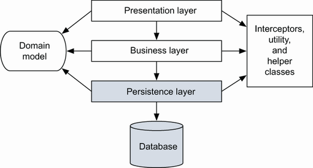
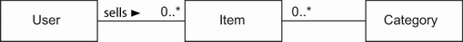
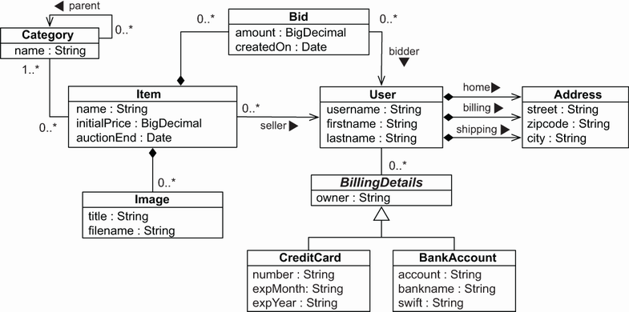
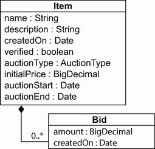
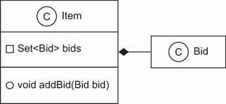
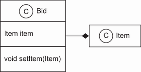

# Chương 3. Domain model và metadata

> *Java Persistence with Spring Data and Hibernate* — Chương 3: “Domain models and metadata”

**Nội dung chương này bao gồm**

- Giới thiệu ứng dụng ví dụ CaveatEmptor
- Hiện thực domain model
- Xem xét các tùy chọn metadata cho object/relational mapping

Ví dụ “Hello World” ở chương trước đã giới thiệu cho bạn Hibernate, Spring Data và JPA, nhưng nó không đủ để hiểu các yêu cầu của những ứng dụng thực tế với mô hình dữ liệu phức tạp. Trong phần còn lại của cuốn sách, chúng ta sẽ dùng một ứng dụng ví dụ tinh vi hơn nhiều — CaveatEmptor, một hệ thống đấu giá trực tuyến — để minh họa JPA, Hibernate và sau đó là Spring Data. (*Caveat emptor* nghĩa là “Người mua hãy tự cẩn trọng”.)

> **Các tính năng mới quan trọng trong JPA 2**
>
> Một JPA persistence provider giờ đây tự động tích hợp với một Bean Validation provider. Khi dữ liệu được lưu, provider tự động kiểm định các constraint trên các persistent class.
>
> Metamodel API cũng đã được bổ sung. Bạn có thể lấy tên, thuộc tính và metadata ánh xạ của các class trong một persistence unit.

Chúng ta sẽ bắt đầu thảo luận về ứng dụng CaveatEmptor bằng cách giới thiệu kiến trúc ứng dụng phân tầng của nó. Sau đó bạn sẽ học cách xác định các business entity của một miền bài toán. Bạn sẽ tạo một mô hình khái niệm cho các entity này cùng các thuộc tính của chúng — gọi là *domain model* — và hiện thực nó trong Java bằng cách tạo các persistent class. Chúng ta sẽ dành thời gian tìm hiểu chính xác các class Java này nên trông như thế nào và chúng nằm ở đâu trong một kiến trúc ứng dụng phân tầng điển hình. Chúng ta cũng sẽ xem xét khả năng persistence của các class và cách điều đó ảnh hưởng tới thiết kế và hiện thực của ứng dụng. Chúng ta sẽ bổ sung Bean Validation, thứ giúp bạn tự động kiểm chứng tính toàn vẹn của dữ liệu trong domain model — cả thông tin persistent lẫn logic nghiệp vụ.

Sau đó chúng ta sẽ khám phá một số tùy chọn mapping metadata — cách bạn nói cho Hibernate biết các persistent class và thuộc tính của chúng liên hệ ra sao với các table và cột trong cơ sở dữ liệu. Việc này có thể đơn giản như thêm annotation trực tiếp vào mã nguồn Java của các class, hoặc viết các tài liệu XML mà cuối cùng bạn triển khai cùng với các class Java đã biên dịch để Hibernate truy cập lúc chạy.

Sau khi đọc chương này, bạn sẽ biết cách thiết kế phần persistent của domain model trong các dự án thực tế phức tạp và biết mình chủ yếu sẽ ưa dùng tùy chọn mapping metadata nào. Hãy bắt đầu với ứng dụng ví dụ.

## 3.1 Ứng dụng ví dụ CaveatEmptor

Ví dụ CaveatEmptor là một ứng dụng đấu giá trực tuyến minh họa các kỹ thuật ORM cùng chức năng của JPA, Hibernate và Spring Data. Trong cuốn sách này chúng ta sẽ không chú ý nhiều tới giao diện người dùng (nó có thể là web hoặc rich client); thay vào đó, chúng ta tập trung vào mã truy cập dữ liệu.

Để hiểu các thách thức thiết kế liên quan tới ORM, hãy giả vờ rằng ứng dụng CaveatEmptor chưa tồn tại và chúng ta đang xây dựng nó từ đầu. Hãy bắt đầu bằng việc xem xét kiến trúc.

### 3.1.1 Kiến trúc phân tầng

Với bất kỳ ứng dụng không tầm thường nào, việc tổ chức các class theo mối quan tâm (concern) thường là hợp lý. Persistence là một mối quan tâm; những mối quan tâm khác gồm trình bày (presentation), luồng công việc (workflow) và logic nghiệp vụ. Một kiến trúc hướng đối tượng điển hình bao gồm các tầng mã nguồn đại diện cho những mối quan tâm này.

> **Cross-cutting concerns**
>
> Còn có những thứ gọi là *cross-cutting concern* (mối quan tâm cắt ngang), có thể được hiện thực một cách tổng quát, chẳng hạn bằng mã của framework. Các cross-cutting concern điển hình gồm logging, phân quyền (authorization) và phân định transaction (transaction demarcation).

Một kiến trúc phân tầng định nghĩa các interface giữa những đoạn mã hiện thực các mối quan tâm khác nhau, cho phép thay đổi cách hiện thực một mối quan tâm mà không gây xáo trộn đáng kể tới mã ở các tầng khác. Việc phân tầng quyết định các loại phụ thuộc liên tầng có thể xảy ra. Các quy tắc như sau:

- Các tầng giao tiếp từ trên xuống dưới. Một tầng chỉ phụ thuộc vào interface của tầng ngay bên dưới nó.
- Mỗi tầng không biết gì về các tầng khác ngoại trừ tầng ngay bên dưới, và có thể cả tầng bên trên nếu nó nhận yêu cầu tường minh từ tầng đó.

Các hệ thống khác nhau nhóm các mối quan tâm theo cách khác nhau, nên chúng định nghĩa các tầng khác nhau. Kiến trúc ứng dụng mức cao điển hình và đã được kiểm chứng sử dụng ba tầng: một tầng cho presentation, một cho business logic và một cho persistence, như minh họa ở hình 3.1.



**Hình 3.1** Tầng persistence là nền tảng của một kiến trúc phân tầng.

- **Presentation layer** — Logic giao diện người dùng nằm ở trên cùng. Mã chịu trách nhiệm trình bày và điều khiển việc điều hướng trang, màn hình nằm ở tầng presentation. Mã giao diện người dùng có thể truy cập trực tiếp các business entity của domain model dùng chung và hiển thị chúng lên màn hình, cùng với các điều khiển để thực thi hành động. Trong một số kiến trúc, các instance của business entity có thể không truy cập trực tiếp được từ mã giao diện người dùng, chẳng hạn khi tầng presentation không chạy trên cùng máy với phần còn lại của hệ thống. Trong những trường hợp đó, tầng presentation có thể cần mô hình truyền dữ liệu (data-transfer model) riêng, chỉ biểu diễn một tập con có thể truyền tải của domain model. Một ví dụ tốt về tầng presentation là việc dùng trình duyệt để tương tác với ứng dụng.
- **Business layer** — Tầng business nhìn chung chịu trách nhiệm hiện thực mọi quy tắc nghiệp vụ hoặc yêu cầu hệ thống thuộc miền bài toán. Tầng này thường bao gồm một dạng thành phần điều khiển — mã biết khi nào cần gọi quy tắc nghiệp vụ nào. Trong một số hệ thống, tầng này có cách biểu diễn nội bộ riêng cho các business domain entity. Ngoài ra, nó có thể dựa vào một hiện thực domain model dùng chung với các tầng khác của ứng dụng. Một ví dụ tốt về tầng business là mã chịu trách nhiệm thực thi logic nghiệp vụ.
- **Persistence layer** — Tầng persistence là một nhóm các class và thành phần chịu trách nhiệm lưu dữ liệu vào và truy xuất dữ liệu từ một hoặc nhiều kho dữ liệu. Tầng này cần một mô hình của các business domain entity mà bạn muốn giữ trạng thái persistent. Tầng persistence là nơi phần lớn việc sử dụng JPA, Hibernate và Spring Data diễn ra.
- **Database** — Cơ sở dữ liệu thường nằm bên ngoài. Nó là biểu diễn persistent thực sự của trạng thái hệ thống. Nếu dùng SQL database, cơ sở dữ liệu bao gồm một schema và có thể cả các stored procedure để thực thi logic nghiệp vụ gần dữ liệu. Cơ sở dữ liệu là nơi dữ liệu được lưu trữ lâu dài.
- **Helper và utility class** — Mọi ứng dụng đều có một tập class hạ tầng hỗ trợ hoặc tiện ích được dùng ở mọi tầng của ứng dụng. Chúng có thể bao gồm các class đa dụng hoặc các class cross-cutting concern (cho logging, bảo mật và caching). Những thành phần hạ tầng dùng chung này không tạo thành một tầng, vì chúng không tuân theo các quy tắc về phụ thuộc liên tầng trong kiến trúc phân tầng.

Giờ chúng ta đã có kiến trúc mức cao, có thể tập trung vào bài toán nghiệp vụ.

### 3.1.2 Phân tích miền nghiệp vụ

Ở giai đoạn này, bạn — với sự trợ giúp của các chuyên gia nghiệp vụ — nên phân tích các bài toán nghiệp vụ mà hệ thống phần mềm cần giải quyết, xác định các entity chính liên quan và cách chúng tương tác. Mục tiêu chính đằng sau việc phân tích và thiết kế một domain model là nắm bắt được cốt lõi của thông tin nghiệp vụ phục vụ mục đích của ứng dụng.

Các entity thường là những khái niệm mà người dùng hệ thống hiểu được: payment, customer, order, item, bid, v.v. Một số entity có thể là trừu tượng hóa của những thứ ít cụ thể hơn mà người dùng nghĩ tới, chẳng hạn một thuật toán định giá, nhưng ngay cả những thứ này thường vẫn dễ hiểu với người dùng. Bạn có thể tìm thấy tất cả các entity này trong góc nhìn khái niệm của nghiệp vụ, đôi khi được gọi là *information model*.

Từ mô hình nghiệp vụ này, các kỹ sư và kiến trúc sư phần mềm hướng đối tượng tạo ra một mô hình hướng đối tượng, vẫn ở mức khái niệm (chưa có mã Java). Mô hình này có thể đơn giản như một hình ảnh tinh thần chỉ tồn tại trong đầu lập trình viên, hoặc công phu như một sơ đồ class UML. Hình 3.2 minh họa một mô hình đơn giản biểu diễn bằng UML.



**Hình 3.2** Sơ đồ class của một mô hình đấu giá trực tuyến điển hình

Mô hình này chứa các entity mà bạn chắc chắn sẽ gặp trong bất kỳ hệ thống thương mại điện tử điển hình nào: category, item và user. Domain model này biểu diễn tất cả các entity và quan hệ giữa chúng (và có thể cả các thuộc tính của chúng). Loại mô hình hướng đối tượng của các entity thuộc miền bài toán, chỉ bao gồm những entity mà người dùng quan tâm, được gọi là *domain model*. Đó là một góc nhìn trừu tượng về thế giới thực.

Thay vì dùng mô hình hướng đối tượng, các kỹ sư và kiến trúc sư có thể bắt đầu thiết kế ứng dụng bằng một *data model*. Mô hình này có thể được biểu diễn bằng sơ đồ thực thể-quan hệ (entity-relationship diagram), và nó sẽ chứa các entity `CATEGORY`, `ITEM` và `USER` cùng các quan hệ giữa chúng. Chúng tôi thường nói rằng, xét về persistence, hai loại mô hình này khác nhau rất ít; chúng chỉ đơn thuần là những điểm xuất phát khác nhau. Cuối cùng, việc bạn dùng ngôn ngữ mô hình hóa nào chỉ là thứ yếu; chúng ta quan tâm nhất tới cấu trúc và quan hệ giữa các business entity. Chúng ta quan tâm tới các quy tắc phải được áp dụng để bảo đảm tính toàn vẹn dữ liệu (ví dụ, bội số của các quan hệ có trong mô hình) và các thủ tục mã dùng để thao tác dữ liệu (thường không có trong mô hình).

Ở mục tiếp theo, chúng ta sẽ hoàn tất việc phân tích miền bài toán CaveatEmptor. Domain model thu được sẽ là chủ đề trung tâm của cuốn sách này.

### 3.1.3 Domain model CaveatEmptor

Trang CaveatEmptor sẽ cho phép người dùng đấu giá nhiều loại mặt hàng khác nhau, từ thiết bị điện tử tới vé máy bay. Các phiên đấu giá diễn ra theo chiến lược đấu giá kiểu Anh (English auction): người dùng tiếp tục đặt giá cho một mặt hàng cho tới khi hết thời gian đặt giá của mặt hàng đó, và người trả giá cao nhất thắng.

Trong bất kỳ cửa hàng nào, hàng hóa đều được phân loại theo kiểu và nhóm cùng những hàng hóa tương tự vào các khu và kệ. Danh mục đấu giá đòi hỏi một dạng phân cấp các category mặt hàng để người mua có thể duyệt các category hoặc tìm kiếm tùy ý theo category và thuộc tính mặt hàng. Danh sách mặt hàng sẽ xuất hiện trong màn hình duyệt category và màn hình kết quả tìm kiếm. Chọn một mặt hàng từ danh sách sẽ đưa người mua tới màn hình chi tiết mặt hàng, nơi một mặt hàng có thể có các hình ảnh đính kèm.

Một phiên đấu giá gồm một chuỗi các lượt trả giá (bid), và một trong số đó là lượt thắng. Chi tiết người dùng sẽ bao gồm tên, địa chỉ và thông tin thanh toán.



**Hình 3.3** Các persistent class của domain model CaveatEmptor và quan hệ giữa chúng

Kết quả của việc phân tích này — tổng quan mức cao về domain model — được thể hiện ở hình 3.3. Hãy điểm qua một số đặc điểm thú vị của mô hình này:

- Mỗi mặt hàng chỉ có thể được đấu giá một lần, nên bạn không cần tách `Item` khỏi bất kỳ entity đấu giá nào. Thay vào đó, bạn có một entity mặt hàng đấu giá duy nhất tên là `Item`. Do đó, `Bid` được liên kết trực tiếp với `Item`. Bạn mô hình hóa thông tin `Address` của một `User` thành một class riêng — một `User` có thể có ba địa chỉ: nhà riêng, thanh toán và giao hàng. Bạn cho phép người dùng có nhiều `BillingDetails`. Các subclass của một abstract class biểu diễn các chiến lược thanh toán khác nhau (cho phép mở rộng trong tương lai).
- Ứng dụng có thể lồng một `Category` bên trong một `Category` khác, và cứ thế. Một association đệ quy, từ entity `Category` tới chính nó, biểu diễn quan hệ này. Lưu ý rằng một `Category` có thể có nhiều category con nhưng nhiều nhất một category cha. Mỗi `Item` thuộc về ít nhất một `Category`.
- Biểu diễn này chưa phải là domain model đầy đủ; nó chỉ gồm những class mà bạn cần khả năng persistence. Bạn sẽ muốn lưu và nạp các instance của `Category`, `Item`, `User`, v.v. Chúng tôi đã đơn giản hóa tổng quan mức cao này một chút; chúng ta sẽ chỉnh sửa các class này khi cần cho những ví dụ phức tạp hơn.
- Các entity trong một domain model nên đóng gói cả trạng thái lẫn hành vi. Ví dụ, entity `User` nên định nghĩa tên và địa chỉ của một khách hàng cùng logic cần thiết để tính chi phí vận chuyển cho các mặt hàng (tới đúng khách hàng đó).
- Có thể có những class khác trong domain model chỉ có instance transient lúc chạy. Hãy xét một class `WinningBidStrategy` đóng gói sự kiện rằng người trả giá cao nhất thắng phiên đấu giá. Class này có thể được mã ở tầng business (controller) gọi khi kiểm tra trạng thái của một phiên đấu giá. Ở một thời điểm nào đó, bạn có thể phải tìm cách tính thuế cho các mặt hàng đã bán, hoặc cách hệ thống phê duyệt một tài khoản người dùng mới. Chúng tôi không coi những quy tắc nghiệp vụ hay hành vi của domain model như vậy là không quan trọng; đúng hơn, những mối quan tâm đó phần lớn trực giao với bài toán persistence.

Giờ bạn đã có một thiết kế ứng dụng (sơ khai) với domain model, bước tiếp theo là hiện thực nó trong Java.

> **ORM mà không có domain model**
>
> Object persistence với ORM đầy đủ phù hợp nhất cho những ứng dụng dựa trên một domain model phong phú. Nếu ứng dụng của bạn không hiện thực các quy tắc nghiệp vụ phức tạp hay các tương tác phức tạp giữa entity, hoặc nếu bạn có ít entity, có thể bạn không cần domain model. Nhiều bài toán đơn giản và cả một số bài toán không hẳn đơn giản hoàn toàn phù hợp với các giải pháp hướng bảng (table-oriented), trong đó ứng dụng được thiết kế xoay quanh mô hình dữ liệu của cơ sở dữ liệu thay vì quanh một domain model hướng đối tượng, và logic thường được thực thi trong cơ sở dữ liệu (bằng stored procedure).
>
> Cũng đáng cân nhắc tới đường cong học tập: một khi bạn thành thạo Hibernate và Spring Data, bạn sẽ dùng chúng cho mọi ứng dụng — thậm chí chỉ như một bộ sinh truy vấn SQL và ánh xạ kết quả đơn giản. Nếu bạn mới học ORM, một tình huống sử dụng tầm thường có thể không đủ để bù cho thời gian và overhead bỏ ra.

## 3.2 Hiện thực domain model

Hãy bắt đầu với một vấn đề mà mọi hiện thực đều phải xử lý: sự phân tách mối quan tâm (separation of concerns) — tầng nào lo trách nhiệm gì. Hiện thực domain model thường là một thành phần trung tâm, mang tính tổ chức; nó được tái sử dụng rất nhiều mỗi khi bạn hiện thực chức năng ứng dụng mới. Vì lý do đó, bạn nên nỗ lực để bảo đảm rằng những mối quan tâm phi nghiệp vụ không rò rỉ vào hiện thực domain model.

### 3.2.1 Xử lý rò rỉ mối quan tâm

Khi những mối quan tâm như persistence, quản lý transaction hay phân quyền bắt đầu xuất hiện trong các class của domain model, đó là ví dụ về *leakage of concerns* (rò rỉ mối quan tâm). Hiện thực domain model là phần mã quan trọng, không nên phụ thuộc vào những API trực giao với nó. Chẳng hạn, mã trong domain model không nên gọi cơ sở dữ liệu trực tiếp hoặc thông qua một tầng trừu tượng trung gian. Điều này sẽ cho phép bạn tái sử dụng các class của domain model gần như ở bất cứ đâu.

Kiến trúc của ứng dụng gồm các tầng sau:

- Tầng presentation có thể truy cập instance và thuộc tính của các entity trong domain model khi render view. Người dùng có thể dùng front end (chẳng hạn trình duyệt) để tương tác với ứng dụng. Mối quan tâm này nên tách khỏi các mối quan tâm của những tầng khác.
- Các thành phần controller ở tầng business có thể truy cập trạng thái của các entity trong domain model và gọi phương thức của chúng. Đây là nơi các tính toán và logic nghiệp vụ được thực thi. Mối quan tâm này nên tách khỏi các mối quan tâm của những tầng khác.
- Tầng persistence có thể nạp instance của các entity trong domain model từ cơ sở dữ liệu và lưu chúng xuống, bảo toàn trạng thái của chúng. Đây là nơi thông tin được lưu trữ lâu dài. Mối quan tâm này cũng nên tách khỏi các mối quan tâm của những tầng khác.

Việc ngăn rò rỉ mối quan tâm giúp dễ dàng viết unit test cho domain model mà không cần một môi trường chạy hay container cụ thể nào, cũng không cần mock các service phụ thuộc. Bạn có thể viết unit test kiểm chứng hành vi đúng đắn của các class trong domain model mà không cần bất kỳ bộ khung kiểm thử đặc biệt nào. (Ở đây chúng ta đang nói tới unit test kiểu như “tính chi phí vận chuyển và thuế”, chứ không phải test hiệu năng và tích hợp kiểu “nạp từ cơ sở dữ liệu” hay “lưu vào cơ sở dữ liệu”.)

Chuẩn Jakarta EE giải quyết bài toán rò rỉ mối quan tâm bằng metadata, chẳng hạn annotation trong mã của bạn hoặc các XML descriptor bên ngoài. Cách tiếp cận này cho phép runtime container hiện thực một số cross-cutting concern định sẵn — bảo mật, đồng thời (concurrency), persistence, transaction và tính từ xa (remoteness) — theo cách tổng quát, bằng cách chặn (intercept) các lời gọi tới thành phần ứng dụng.

JPA định nghĩa entity class là hiện vật lập trình chính. Mô hình lập trình này cho phép *transparent persistence*, và một JPA provider như Hibernate còn cung cấp *automated persistence*. Hibernate không phải môi trường chạy Jakarta EE, và cũng không phải một application server. Nó là một hiện thực của kỹ thuật ORM.

### 3.2.2 Persistence trong suốt và tự động

Chúng tôi dùng thuật ngữ *transparent* (trong suốt) để chỉ sự tách biệt hoàn toàn mối quan tâm giữa các persistent class của domain model và tầng persistence. Các persistent class không biết — và không phụ thuộc — vào cơ chế persistence. Từ bên trong các persistent class, không có tham chiếu nào tới cơ chế persistence bên ngoài. Chúng tôi dùng thuật ngữ *automatic* (tự động) để chỉ một giải pháp persistence (domain model đã gắn annotation của bạn, tầng persistence và cơ chế) giúp bạn khỏi phải xử lý các chi tiết máy móc mức thấp, chẳng hạn viết hầu hết câu lệnh SQL và làm việc với JDBC API. Với một tình huống thực tế, hãy phân tích persistence trong suốt và tự động được phản ánh thế nào ở mức class `Item`.

Class `Item` của domain model CaveatEmptor không nên có bất kỳ phụ thuộc runtime nào vào API Jakarta Persistence hay Hibernate. Hơn nữa, JPA không yêu cầu các persistent class phải kế thừa superclass đặc biệt nào hay hiện thực interface đặc biệt nào. Cũng không có class đặc biệt nào được dùng để hiện thực thuộc tính và association. Bạn có thể tái sử dụng persistent class bên ngoài ngữ cảnh persistence, chẳng hạn trong unit test hay ở tầng presentation. Bạn có thể tạo instance trong bất kỳ môi trường chạy nào bằng toán tử `new` thông thường của Java, giữ được tính dễ kiểm thử và tái sử dụng.

Trong một hệ thống với transparent persistence, các instance của entity không biết gì về kho dữ liệu bên dưới; chúng thậm chí không cần biết rằng chúng đang được lưu hay truy xuất. JPA đưa các mối quan tâm về persistence ra ngoài, vào một API persistence manager tổng quát. Do đó, phần lớn mã của bạn — và chắc chắn là logic nghiệp vụ phức tạp — không phải bận tâm tới trạng thái hiện tại của một instance entity trong domain model trong một luồng thực thi đơn lẻ. Chúng tôi coi tính trong suốt là một yêu cầu, vì nó khiến ứng dụng dễ xây dựng và bảo trì hơn. Transparent persistence nên là một trong những mục tiêu hàng đầu của mọi giải pháp ORM.

Rõ ràng, không có giải pháp automated persistence nào hoàn toàn trong suốt: mọi tầng automated persistence, kể cả JPA và Hibernate, đều áp đặt một số yêu cầu lên các persistent class. Ví dụ, JPA yêu cầu các thuộc tính có giá trị là collection phải được khai báo kiểu bằng một interface như `java.util.Set` hay `java.util.List`, chứ không phải một hiện thực cụ thể như `java.util.HashSet` (dù sao đây cũng là thực hành tốt). Tương tự, một JPA entity class phải có một thuộc tính đặc biệt gọi là *database identifier* (điều này cũng ít mang tính hạn chế và thường là tiện lợi).

Giờ bạn đã biết rằng cơ chế persistence nên ảnh hưởng tối thiểu tới cách bạn hiện thực domain model, và rằng transparent, automated persistence là cần thiết. Mô hình lập trình mà chúng tôi ưa thích để đạt được điều đó là POJO.

> **CHÚ Ý** POJO là viết tắt của Plain Old Java Objects. Martin Fowler, Rebecca Parsons và Josh Mackenzie đặt ra thuật ngữ này vào năm 2000.

Vào đầu những năm 2000, nhiều lập trình viên bắt đầu nói về POJO, một cách tiếp cận “quay về căn bản” về cơ bản là hồi sinh JavaBeans — một mô hình thành phần cho phát triển UI — và áp dụng lại nó cho các tầng khác của hệ thống. Nhiều bản sửa đổi của đặc tả EJB và JPA đã mang tới cho chúng ta các entity nhẹ mới, và có lẽ gọi chúng là *persistence-capable JavaBeans* thì phù hợp. Các kỹ sư Java thường dùng tất cả những thuật ngữ này như đồng nghĩa cho cùng một cách tiếp cận thiết kế cơ bản.

Bạn không nên quá bận tâm về thuật ngữ nào được dùng trong cuốn sách này; mục tiêu tối hậu của chúng tôi là áp dụng khía cạnh persistence cho các class Java một cách trong suốt nhất có thể. Gần như bất kỳ class Java nào cũng có thể trở nên persistence-capable nếu bạn tuân theo một vài thực hành đơn giản. Hãy xem điều đó trông thế nào trong mã.

> **CHÚ Ý** Để có thể thực thi các ví dụ từ mã nguồn của chương, trước tiên bạn cần chạy script Ch03.sql. Các ví dụ sử dụng một MySQL server với thông tin đăng nhập mặc định: username là `root` và không có mật khẩu.

### 3.2.3 Viết các class có khả năng persistence

Hỗ trợ các domain model mịn (fine-grained) và phong phú là một mục tiêu chính của Hibernate. Đó là một lý do chúng ta làm việc với POJO. Nói chung, dùng các object mịn nghĩa là có nhiều class hơn số table.

Một class Java thuần túy có khả năng persistence khai báo các thuộc tính — biểu diễn trạng thái — và các business method — định nghĩa hành vi. Một số thuộc tính biểu diễn association tới các class có khả năng persistence khác.

Listing sau cho thấy một hiện thực POJO của entity `User` trong domain model (ví dụ 1 trong thư mục `domainmodel` của mã nguồn). Hãy cùng đi qua đoạn mã này.

**Listing 3.1** Hiện thực POJO của class User

*Đường dẫn: Ch03/domainmodel/src/main/java/com/manning/javapersistence/ch03/ex01/User.java*

```java
public class User {

    private String username;

    public String getUsername() {
        return username;
    }

    public void setUsername(String username) {
        this.username = username;
    }

}
```

Class này có thể là abstract và, nếu cần, có thể kế thừa một class không persistent hoặc hiện thực một interface. Nó phải là một class cấp cao nhất (top-level), không được lồng bên trong class khác. Class có khả năng persistence và bất kỳ phương thức nào của nó đều không nên là `final` (đây là yêu cầu của đặc tả JPA). Hibernate không quá nghiêm ngặt và sẽ cho phép bạn khai báo class `final` làm entity, hoặc entity có phương thức `final` truy cập các persistent field. Tuy nhiên đây không phải thực hành tốt, vì nó sẽ ngăn Hibernate dùng mẫu proxy để cải thiện hiệu năng. Nói chung, bạn nên tuân theo các yêu cầu của JPA nếu muốn ứng dụng của mình khả chuyển giữa các JPA provider khác nhau.

Hibernate và JPA yêu cầu mỗi persistent class phải có một constructor không tham số. Ngoài ra, nếu bạn không viết constructor nào cả, Hibernate sẽ dùng constructor mặc định của Java. Hibernate gọi các class thông qua Java Reflection API trên những constructor không tham số như vậy để tạo instance. Constructor không cần phải `public`, nhưng ít nhất phải hiển thị ở mức package để Hibernate có thể dùng proxy được sinh lúc chạy nhằm tối ưu hiệu năng.

Các property của POJO hiện thực các thuộc tính của business entity, chẳng hạn `username` của `User`. Bạn thường sẽ hiện thực property bằng các member field `private` hoặc `protected`, cùng với các phương thức truy cập property `public` hoặc `protected`: với mỗi field bạn cần một phương thức để lấy giá trị và một phương thức khác để gán giá trị. Những phương thức này lần lượt được gọi là *getter* và *setter*. POJO ví dụ ở listing 3.1 khai báo phương thức getter và setter cho property `username`.

Đặc tả JavaBean định nghĩa các hướng dẫn đặt tên cho phương thức truy cập; điều này cho phép những công cụ tổng quát như Hibernate dễ dàng khám phá và thao tác giá trị property. Tên phương thức getter bắt đầu bằng `get`, theo sau là tên property (với chữ cái đầu viết hoa). Tên phương thức setter bắt đầu bằng `set` và tương tự theo sau là tên property. Bạn có thể bắt đầu tên phương thức getter cho property kiểu Boolean bằng `is` thay vì `get`.

Hibernate không bắt buộc phải có phương thức truy cập. Bạn có thể chọn cách trạng thái của một instance thuộc persistent class được lưu trữ. Hibernate sẽ hoặc truy cập trực tiếp field, hoặc gọi phương thức truy cập. Thiết kế class của bạn không bị xáo trộn nhiều bởi những cân nhắc này. Bạn có thể để một số phương thức truy cập không public hoặc loại bỏ hẳn chúng, rồi cấu hình Hibernate dựa vào truy cập field cho những property đó.

> **Đặt field của property và phương thức truy cập ở mức private, protected hay package**
>
> Thông thường bạn sẽ không cho phép truy cập trực tiếp vào trạng thái nội bộ của class, nên bạn sẽ không để các field thuộc tính ở mức `public`. Nếu bạn để field hay phương thức ở mức `private`, bạn thực chất đang tuyên bố rằng không ai được phép truy cập chúng; chỉ bạn được phép làm vậy (hoặc một service như Hibernate). Đây là một tuyên bố dứt khoát.
>
> Thường vẫn có những lý do chính đáng để ai đó truy cập phần “riêng tư” bên trong của bạn — thường là để sửa một lỗi nào đó của bạn — và bạn chỉ khiến người ta bực mình nếu họ phải viện tới reflection trong tình huống khẩn cấp. Thay vào đó, bạn có thể giả định hoặc biết rằng kỹ sư đến sau bạn có quyền truy cập mã của bạn và biết mình đang làm gì.

Mặc dù các phương thức truy cập tầm thường rất phổ biến, một trong những lý do chúng tôi thích dùng phương thức truy cập kiểu JavaBeans là chúng cung cấp tính đóng gói (encapsulation): bạn có thể thay đổi hiện thực nội bộ ẩn của một thuộc tính mà không phải thay đổi gì ở interface công khai. Nếu bạn cấu hình Hibernate truy cập thuộc tính thông qua phương thức, bạn trừu tượng hóa cấu trúc dữ liệu nội bộ của class — các biến instance — khỏi thiết kế của cơ sở dữ liệu.

Ví dụ, nếu cơ sở dữ liệu của bạn lưu tên người dùng trong một cột `NAME` duy nhất, nhưng class `User` của bạn có các field `firstname` và `lastname`, bạn có thể thêm property persistent `name` sau vào class (đây là ví dụ 2 từ mã nguồn thư mục `domainmodel`).

**Listing 3.2** Hiện thực POJO của class User với logic trong phương thức truy cập

*Đường dẫn: Ch03/domainmodel/src/main/java/com/manning/javapersistence/ch03/ex02/User.java*

```java
public class User {

    private String firstname;
    private String lastname;

    public String getName() {
        return firstname + ' ' + lastname;
    }

    public void setName(String name) {
        StringTokenizer tokenizer = new StringTokenizer(name);
        firstname = tokenizer.nextToken();
        lastname = tokenizer.nextToken();
    }

}
```

Về sau bạn sẽ thấy rằng một type converter tùy chỉnh trong persistence service là cách tốt hơn để xử lý nhiều tình huống kiểu này. Có sẵn vài lựa chọn vẫn hơn.

Một vấn đề khác cần cân nhắc là *dirty checking*. Hibernate tự động phát hiện thay đổi trạng thái để có thể đồng bộ trạng thái đã cập nhật với cơ sở dữ liệu. Thường thì việc trả về từ phương thức getter một instance khác với instance mà Hibernate đã truyền vào setter là an toàn. Hibernate so sánh chúng theo giá trị — không theo object identity — để xác định xem trạng thái persistent của thuộc tính có cần cập nhật hay không. Ví dụ, phương thức getter sau không dẫn tới các câu lệnh SQL `UPDATE` không cần thiết:

```java
public String getFirstname() {
    return new String(firstname);
}
```

Có một điểm quan trọng cần lưu ý về dirty checking khi lưu trữ collection. Nếu bạn có một entity `Item` với field `Set<Bid>` được truy cập qua setter `setBids`, đoạn mã sau sẽ dẫn tới một câu lệnh SQL `UPDATE` không cần thiết:

```java
item.setBids(bids);
em.persist(item);
item.setBids(bids);
```

Điều này xảy ra vì Hibernate có các hiện thực collection riêng: `PersistentSet`, `PersistentList` hoặc `PersistentMap`. Dù sao thì việc cung cấp setter cho toàn bộ một collection cũng không phải thực hành tốt.

Hibernate xử lý ngoại lệ thế nào khi phương thức truy cập của bạn ném ngoại lệ? Nếu Hibernate dùng phương thức truy cập khi nạp và lưu instance, và một `RuntimeException` (unchecked) được ném ra, transaction hiện tại sẽ bị rollback, và ngoại lệ đó thuộc về bạn để xử lý trong đoạn mã đã gọi API Jakarta Persistence (hoặc native Hibernate). Nếu bạn ném một checked application exception, Hibernate sẽ bọc ngoại lệ đó vào một `RuntimeException`.

Tiếp theo, chúng ta sẽ tập trung vào các quan hệ giữa entity và các association giữa persistent class.

### 3.2.4 Hiện thực association trong POJO

Bây giờ hãy xem cách bạn có thể liên kết và tạo các loại quan hệ khác nhau giữa các object: quan hệ một-nhiều, nhiều-một và hai chiều. Chúng ta sẽ xem đoạn mã giàn giáo (scaffolding code) cần thiết để tạo những association này, cách bạn có thể đơn giản hóa việc quản lý quan hệ, và cách bạn có thể bảo đảm tính toàn vẹn của những quan hệ đó.

Bạn có thể tạo các property để biểu diễn association giữa các class, và bạn sẽ (thường là) gọi các phương thức truy cập để điều hướng từ instance này sang instance khác lúc chạy. Hãy xét các association được định nghĩa bởi các persistent class `Item` và `Bid`, như minh họa ở hình 3.4.



**Hình 3.4** Association giữa các class `Item` và `Bid`

Chúng tôi đã bỏ qua các thuộc tính liên quan tới association, `Item#bids` và `Bid#item`, trong hình 3.4. Những property này cùng các phương thức thao tác giá trị của chúng được gọi là *scaffolding code*. Đây là scaffolding code cho class `Bid`:

*Đường dẫn: Ch03/domainmodel/src/main/java/com/manning/javapersistence/ch03/ex03/Bid.java*

```java
public class Bid {

    private Item item;

    public Item getItem() {
        return item;
    }

    public void setItem(Item item) {
        this.item = item;
    }

}
```

Property `item` cho phép điều hướng từ một `Bid` tới `Item` liên quan. Đây là một association với bội số nhiều-một; người dùng có thể đặt nhiều lượt trả giá cho mỗi mặt hàng.

Đây là scaffolding code của class `Item`:

*Đường dẫn: Ch03/domainmodel/src/main/java/com/manning/javapersistence/ch03/ex03/Item.java*

```java
public class Item {

    private Set<Bid> bids = new HashSet<>();

    public Set<Bid> getBids() {
        return Collections.unmodifiableSet(bids);
    }
}
```

Association này giữa hai class cho phép điều hướng hai chiều: nhìn từ phía bên kia, quan hệ nhiều-một trở thành bội số một-nhiều. Một item có thể có nhiều bid — chúng cùng kiểu nhưng được sinh ra trong phiên đấu giá bởi những người dùng khác nhau với số tiền khác nhau, như minh họa ở bảng 3.1.

**Bảng 3.1** Một `Item` có nhiều `Bid` được sinh ra trong phiên đấu giá

| Item | Bid | User | Amount |
| --- | --- | --- | --- |
| 1 | 1 | John | 100 |
| 1 | 2 | Mike | 120 |
| 1 | 3 | John | 140 |

Scaffolding code cho property `bids` dùng một kiểu interface collection là `java.util.Set`. JPA yêu cầu interface cho các property kiểu collection, trong đó bạn phải dùng `java.util.Set`, `java.util.List` hoặc `java.util.Collection` thay vì `HashSet` chẳng hạn. Dù sao thì lập trình hướng tới interface collection thay vì các hiện thực cụ thể cũng là thực hành tốt, nên hạn chế này chẳng có gì phiền toái.

Bạn có thể chọn `Set` và khởi tạo field bằng một `HashSet` mới, vì ứng dụng không cho phép các bid trùng lặp. Đây là thực hành tốt, vì bạn sẽ tránh được `NullPointerException` khi ai đó truy cập property của một `Item` mới, vốn sẽ có một tập bid rỗng. JPA provider cũng được yêu cầu gán một giá trị khác rỗng cho mọi property kiểu collection đã ánh xạ, chẳng hạn khi một `Item` không có bid nào được nạp từ cơ sở dữ liệu. (Provider không nhất thiết phải dùng `HashSet`; hiện thực tùy thuộc vào provider. Hibernate có các hiện thực collection riêng với khả năng bổ sung, chẳng hạn dirty checking.)

> **Các bid của một item có nên được lưu trong một list không?**
>
> Phản ứng đầu tiên thường là muốn bảo toàn thứ tự phần tử theo đúng thứ tự người dùng nhập vào, vì đó cũng có thể là thứ tự bạn sẽ hiển thị chúng sau này. Chắc chắn trong một ứng dụng đấu giá, phải có một thứ tự xác định để người dùng nhìn thấy các bid cho một item, chẳng hạn bid cao nhất trước hoặc bid mới nhất sau cùng. Bạn thậm chí có thể làm việc với một `java.util.List` trong mã giao diện người dùng để sắp xếp và hiển thị các bid cho một item.
>
> Tuy nhiên, điều đó không có nghĩa là thứ tự hiển thị này nên được lưu bền vững. Tính toàn vẹn dữ liệu không bị ảnh hưởng bởi thứ tự hiển thị các bid. Bạn sẽ cần lưu số tiền của mỗi bid để luôn tìm được bid cao nhất, và bạn sẽ cần lưu timestamp thời điểm mỗi bid được tạo để luôn tìm được bid mới nhất. Khi còn nghi ngờ, hãy giữ cho hệ thống linh hoạt và sắp xếp dữ liệu khi nó được truy xuất từ kho dữ liệu (trong truy vấn) hoặc khi hiển thị cho người dùng (trong mã Java), chứ không phải khi lưu trữ.

Các phương thức truy cập cho association chỉ cần khai báo `public` nếu chúng là một phần của interface bên ngoài của persistent class được logic ứng dụng dùng để tạo liên kết giữa hai instance. Bây giờ chúng ta sẽ tập trung vào vấn đề này, vì việc quản lý liên kết giữa một `Item` và một `Bid` trong mã Java phức tạp hơn nhiều so với trong SQL database, nơi có các foreign key constraint mang tính khai báo. Theo kinh nghiệm của chúng tôi, các kỹ sư thường không nhận thức được sự phức tạp này, vốn phát sinh từ một mô hình object dạng mạng lưới với tham chiếu (con trỏ) hai chiều. Hãy đi qua vấn đề từng bước.

Quy trình cơ bản để liên kết một `Bid` với một `Item` trông như sau:

```java
anItem.getBids().add(aBid);
aBid.setItem(anItem);
```

Mỗi khi tạo liên kết hai chiều này, cần hai hành động:

- Bạn phải thêm `Bid` vào collection `bids` của `Item` (minh họa ở hình 3.5).



**Hình 3.5** Bước 1 của việc liên kết một `Bid` với một `Item`: thêm một `Bid` vào tập các `Bid` của `Item`

- Property `item` của `Bid` phải được gán (minh họa ở hình 3.6).



**Hình 3.6** Bước 2 của việc liên kết một `Bid` với một `Item`: gán `Item` ở phía `Bid`

JPA không quản lý các persistent association. Nếu bạn muốn thao tác một association, bạn phải viết đúng đoạn mã mà bạn sẽ viết khi không có Hibernate. Nếu một association là hai chiều, bạn phải cân nhắc cả hai phía của quan hệ. Nếu bạn từng gặp khó khăn trong việc hiểu hành vi của association trong JPA, hãy tự hỏi: “Mình sẽ làm gì nếu không có Hibernate?” Hibernate không thay đổi ngữ nghĩa Java thông thường.

Chúng tôi khuyến nghị bạn thêm các phương thức tiện ích để nhóm những thao tác này lại, cho phép tái sử dụng và giúp bảo đảm tính đúng đắn, và cuối cùng bảo đảm tính toàn vẹn dữ liệu (một `Bid` bắt buộc phải có tham chiếu tới một `Item`). Listing sau cho thấy một phương thức tiện ích như vậy trong class `Item` (đây là ví dụ 3 từ mã nguồn thư mục `domainmodel`).

**Listing 3.3** Một phương thức tiện ích giúp đơn giản hóa việc quản lý quan hệ

*Đường dẫn: Ch03/domainmodel/src/main/java/com/manning/javapersistence/ch03/ex03/Item.java*

```java
public void addBid(Bid bid) {
    if (bid == null)
        throw new NullPointerException("Can't add null Bid");
    if (bid.getItem() != null)
        throw new IllegalStateException(
                    "Bid is already assigned to an Item");
    bids.add(bid);
    bid.setItem(this);
}
```

Phương thức `addBid()` không chỉ giảm số dòng mã khi làm việc với instance `Item` và `Bid` mà còn thực thi ràng buộc về lực lượng (cardinality) của association. Bạn tránh được các lỗi phát sinh từ việc bỏ sót một trong hai hành động bắt buộc. Bạn nên luôn cung cấp kiểu nhóm thao tác này cho các association, nếu có thể. Nếu bạn so sánh điều này với mô hình quan hệ của foreign key trong SQL database, bạn dễ dàng thấy một mô hình mạng lưới và con trỏ làm phức tạp hóa một thao tác đơn giản như thế nào: thay vì một constraint khai báo, bạn cần mã thủ tục để bảo đảm tính toàn vẹn dữ liệu.

Vì bạn muốn `addBid()` là phương thức thay đổi (mutator) duy nhất nhìn thấy được từ bên ngoài cho các bid của một item (có thể cùng với một phương thức `removeBid()`), hãy cân nhắc để phương thức `Bid#setItem()` ở mức package-visible.

Phương thức getter `Item#getBids()` không nên trả về một collection có thể sửa đổi, để các client không thể dùng collection đó thực hiện những thay đổi không được phản ánh ở phía bên kia. Các bid được thêm trực tiếp vào collection có thể thuộc về một item, nhưng chúng sẽ không có tham chiếu tới item đó, điều này tạo ra trạng thái không nhất quán theo các ràng buộc của cơ sở dữ liệu. Để ngăn vấn đề này, bạn có thể bọc collection nội bộ trước khi trả nó về từ phương thức getter bằng `Collections.unmodifiableCollection(c)` và `Collections.unmodifiableSet(s)`. Client sẽ nhận được ngoại lệ nếu cố sửa collection. Nhờ đó bạn có thể buộc mọi sửa đổi phải đi qua phương thức quản lý quan hệ, bảo đảm tính toàn vẹn. Việc trả về một collection không thể sửa đổi từ các class của bạn luôn là thực hành tốt, để client không có quyền truy cập trực tiếp vào nó.

Một chiến lược thay thế là dùng các instance bất biến (immutable). Ví dụ, bạn có thể bảo đảm tính toàn vẹn bằng cách yêu cầu một đối số `Item` trong constructor của `Bid`, như minh họa ở listing sau (ví dụ 4 từ mã nguồn thư mục `domainmodel`).

**Listing 3.4** Bảo đảm tính toàn vẹn của quan hệ bằng constructor

*Đường dẫn: Ch03/domainmodel/src/main/java/com/manning/javapersistence/ch03/ex04/Bid.java*

```java
public class Bid {

    private Item item;

    public Bid(Item item) {
        this.item = item;
        item.bids.add(this); // Bidirectional
    }

    public Item getItem() {
        return item;
    }
}
```

Trong constructor này, field `item` được gán; không nên có thêm sửa đổi nào đối với giá trị của field. Collection ở phía bên kia cũng được cập nhật cho quan hệ hai chiều, trong khi field `bids` của class `Item` giờ ở mức package-private. Không còn phương thức `Bid#setItem()`.

Tuy nhiên, cách tiếp cận này có vài vấn đề. Thứ nhất, Hibernate không thể gọi constructor này. Bạn cần thêm một constructor không tham số cho Hibernate, và nó phải ít nhất hiển thị ở mức package. Hơn nữa, vì không có phương thức `setItem()`, Hibernate sẽ phải được cấu hình để truy cập trực tiếp field `item`. Điều này nghĩa là field không thể là `final`, nên class không được bảo đảm là bất biến.

Việc bạn muốn bọc bao nhiêu phương thức tiện ích và bao nhiêu lớp quanh các property hay field của persistent association là tùy ở bạn, nhưng chúng tôi khuyến nghị nên nhất quán và áp dụng cùng một chiến lược cho tất cả các class trong domain model. Để dễ đọc, chúng tôi sẽ không luôn hiển thị các phương thức tiện ích, constructor đặc biệt và những đoạn scaffolding khác trong các ví dụ mã sau này; bạn nên bổ sung chúng theo sở thích và yêu cầu của mình.

Bạn đã thấy các class của domain model và cách biểu diễn thuộc tính cùng quan hệ giữa chúng. Tiếp theo, chúng ta sẽ nâng mức trừu tượng lên: bổ sung metadata vào hiện thực domain model và khai báo các khía cạnh như quy tắc kiểm định và quy tắc persistence.

## 3.3 Metadata của domain model

Metadata là dữ liệu về dữ liệu, nên metadata của domain model là thông tin về domain model của bạn. Ví dụ, khi bạn dùng Java Reflection API để khám phá tên các class trong domain model hoặc tên các thuộc tính của chúng, bạn đang truy cập metadata của domain model.

Các công cụ ORM cũng cần metadata để đặc tả ánh xạ giữa class và table, property và cột, association và foreign key, kiểu Java và kiểu SQL, v.v. Object/relational mapping metadata này chi phối việc chuyển đổi giữa các hệ thống kiểu khác nhau và các cách biểu diễn quan hệ trong hệ thống hướng đối tượng và hệ thống SQL. JPA có một metadata API mà bạn có thể gọi để lấy chi tiết về các khía cạnh persistence của domain model, chẳng hạn tên của các persistent entity và thuộc tính. Việc tạo và duy trì thông tin này là công việc của bạn với tư cách kỹ sư.

JPA chuẩn hóa hai tùy chọn metadata: annotation trong mã Java và các file XML descriptor bên ngoài. Hibernate có một số phần mở rộng cho chức năng native, cũng có sẵn dưới dạng annotation hoặc XML descriptor. Chúng tôi thường ưa dùng annotation làm nguồn mapping metadata chính. Sau khi đọc mục này, bạn sẽ có đủ thông tin để đưa ra quyết định sáng suốt cho dự án của mình.

Trong mục này chúng ta cũng sẽ bàn về Bean Validation (JSR 303) và cách nó cung cấp cơ chế kiểm định khai báo cho các class của domain model (hoặc bất kỳ class nào khác). Hiện thực tham chiếu của đặc tả này là dự án Hibernate Validator. Hầu hết kỹ sư ngày nay ưa dùng Java annotation làm cơ chế chính để khai báo metadata.

### 3.3.1 Metadata dựa trên annotation

Ưu điểm lớn của annotation là chúng đặt metadata, chẳng hạn `@Entity`, ngay cạnh thông tin mà nó mô tả, thay vì tách ra một file khác. Đây là một ví dụ:

```java
import javax.persistence.Entity;

@Entity
public class Item {
}
```

Bạn có thể tìm thấy các annotation ánh xạ chuẩn của JPA trong package `javax.persistence`. Ví dụ này khai báo class `Item` là một persistent entity bằng annotation `@javax.persistence.Entity`. Tất cả thuộc tính của nó giờ đây tự động trở thành persistent với một chiến lược mặc định. Nghĩa là bạn có thể nạp và lưu các instance của `Item`, và tất cả property của class đều thuộc trạng thái được quản lý.

Annotation an toàn về kiểu (type-safe), và metadata JPA được nhúng trong các file class đã biên dịch. Annotation vẫn truy cập được lúc chạy, và Hibernate đọc các class cùng metadata bằng Java reflection khi ứng dụng khởi động. IDE cũng có thể dễ dàng kiểm định và làm nổi bật annotation — dù sao chúng cũng là các kiểu Java thông thường. Khi bạn refactor mã, bạn đổi tên, xóa và di chuyển các class và property. Hầu hết công cụ phát triển và trình soạn thảo không thể refactor phần tử XML và giá trị thuộc tính, nhưng annotation là một phần của ngôn ngữ Java và được bao gồm trong mọi thao tác refactor.

> **Class của tôi giờ có phụ thuộc vào JPA không?**
>
> Bạn cần các thư viện JPA trên classpath khi biên dịch mã nguồn của class trong domain model. JPA không bắt buộc phải có trên classpath khi bạn tạo một instance của class, chẳng hạn trong một ứng dụng client không thực thi mã JPA nào. Chỉ khi bạn truy cập annotation qua reflection lúc chạy (như Hibernate làm bên trong khi đọc metadata của bạn), bạn mới cần các package đó trên classpath.

Khi các annotation Jakarta Persistence chuẩn hóa không đủ, một JPA provider có thể cung cấp thêm annotation.

> **Sử dụng phần mở rộng của nhà cung cấp**
>
> Ngay cả khi bạn ánh xạ phần lớn mô hình của ứng dụng bằng annotation tương thích JPA từ package `javax.persistence`, tới một lúc nào đó bạn vẫn có thể phải dùng phần mở rộng của nhà cung cấp. Ví dụ, một số tùy chọn tinh chỉnh hiệu năng mà bạn kỳ vọng có trong phần mềm persistence chất lượng cao chỉ tồn tại dưới dạng annotation đặc thù của Hibernate. Đây là cách các JPA provider cạnh tranh, nên bạn không thể tránh khỏi annotation từ những package khác — có lý do khiến bạn chọn dùng Hibernate.

Đoạn mã sau lại cho thấy mã nguồn entity `Item` với một tùy chọn ánh xạ chỉ có ở Hibernate:

```java
import javax.persistence.Entity;

@Entity
@org.hibernate.annotations.Cache(
    usage = org.hibernate.annotations.CacheConcurrencyStrategy.READ_WRITE
)
public class Item {
}
```

Chúng tôi thích đặt tiền tố cho các annotation Hibernate bằng tên package đầy đủ `org.hibernate.annotations`. Hãy coi đây là thực hành tốt, vì nó giúp bạn dễ dàng nhận ra metadata nào của class này đến từ đặc tả JPA và metadata nào là đặc thù nhà cung cấp. Bạn cũng có thể dễ dàng tìm kiếm `org.hibernate.annotations` trong mã nguồn và có được cái nhìn tổng thể về tất cả annotation phi chuẩn trong ứng dụng chỉ trong một kết quả tìm kiếm.

Nếu bạn đổi Jakarta Persistence provider, bạn sẽ chỉ phải thay thế các phần mở rộng đặc thù nhà cung cấp, và bạn có thể kỳ vọng một tập tính năng tương tự có sẵn ở hầu hết hiện thực JPA trưởng thành. Tất nhiên, chúng tôi hy vọng bạn sẽ không bao giờ phải làm việc này, và trên thực tế điều đó cũng ít khi xảy ra — chỉ là hãy chuẩn bị sẵn.

Annotation trên class chỉ bao phủ metadata áp dụng cho chính class đó. Bạn cũng sẽ thường cần metadata ở mức cao hơn cho cả một package hoặc thậm chí toàn bộ ứng dụng.

> **Metadata annotation toàn cục**
>
> Annotation `@Entity` ánh xạ một class cụ thể. JPA và Hibernate cũng có các annotation cho metadata toàn cục. Ví dụ, `@NamedQuery` có phạm vi toàn cục; bạn không áp dụng nó cho một class cụ thể. Vậy bạn nên đặt annotation này ở đâu?
>
> Mặc dù có thể đặt những annotation toàn cục như vậy trong file mã nguồn của một class (ở đầu bất kỳ class nào), chúng tôi thích giữ metadata toàn cục trong một file riêng. Annotation ở mức package là lựa chọn tốt; chúng nằm trong một file tên là `package-info.java` trong thư mục của package tương ứng. Bạn sẽ có thể tìm chúng ở một chỗ duy nhất thay vì phải lục qua nhiều file.

Listing sau cho thấy một ví dụ khai báo named query toàn cục (ví dụ 5 từ mã nguồn thư mục `domainmodel`).

**Listing 3.5** Metadata toàn cục trong file package-info.java

*Đường dẫn: Ch03/domainmodel/src/main/java/com/manning/javapersistence/ch03/ex05/package-info.java*

```java
@org.hibernate.annotations.NamedQueries({
    @org.hibernate.annotations.NamedQuery(
        name = "findItemsOrderByName",
        query = "select i from Item i order by i.name asc"
    )
    ,
    @org.hibernate.annotations.NamedQuery(
        name = "findItemBuyNowPriceGreaterThan",
        query = "select i from Item i where i.buyNowPrice > :price",
        timeout = 60, // Seconds!
        comment = "Custom SQL comment"
    )
})

package com.manning.javapersistence.ch03.ex05;
```

Trừ khi bạn đã từng dùng annotation ở mức package, cú pháp của file này với khai báo `package` và `import` nằm ở cuối có lẽ còn mới lạ với bạn.

Annotation sẽ là công cụ chính của chúng ta cho ORM metadata xuyên suốt cuốn sách này, và còn rất nhiều điều cần học về chủ đề này. Trước khi xem xét cách ánh xạ thay thế bằng file XML, hãy dùng một vài annotation đơn giản để cải thiện các class trong domain model bằng các quy tắc kiểm định.

### 3.3.2 Áp dụng constraint cho object Java

Hầu hết ứng dụng đều chứa vô số kiểm tra toàn vẹn dữ liệu. Khi bạn vi phạm một trong những ràng buộc toàn vẹn dữ liệu đơn giản nhất, bạn có thể nhận `NullPointerException` vì một giá trị không tồn tại. Bạn cũng có thể nhận ngoại lệ tương tự khi một property kiểu chuỗi lẽ ra không được rỗng (chuỗi rỗng không phải `null`), khi một chuỗi phải khớp một mẫu biểu thức chính quy cụ thể, hoặc khi một giá trị số hay ngày tháng phải nằm trong một khoảng nhất định.

Các quy tắc nghiệp vụ này ảnh hưởng tới mọi tầng của ứng dụng: mã giao diện người dùng phải hiển thị thông báo lỗi chi tiết và đã bản địa hóa. Tầng business và tầng persistence phải kiểm tra giá trị đầu vào nhận từ client trước khi chuyển chúng tới kho dữ liệu. SQL database phải là bộ kiểm định cuối cùng, bảo đảm tính toàn vẹn của dữ liệu bền vững.

Ý tưởng đằng sau Bean Validation là việc khai báo các quy tắc như “Property này không được null” hay “Số này phải nằm trong khoảng cho trước” dễ hơn nhiều và ít lỗi hơn so với việc viết đi viết lại các thủ tục if-then-else. Hơn nữa, việc khai báo những quy tắc này trên thành phần trung tâm của ứng dụng — hiện thực domain model — cho phép kiểm tra toàn vẹn ở mọi tầng của hệ thống. Các quy tắc khi đó có sẵn cho tầng presentation và tầng persistence. Và nếu bạn cân nhắc rằng các ràng buộc toàn vẹn dữ liệu không chỉ ảnh hưởng tới mã Java mà còn tới schema SQL của bạn — vốn là một tập hợp các quy tắc toàn vẹn — bạn có thể coi các constraint của Bean Validation là ORM metadata bổ sung.

Hãy xem class `Item` mở rộng sau từ mã nguồn thư mục `validation`.

**Listing 3.6** Áp dụng constraint kiểm định lên các field của entity Item

*Đường dẫn: Ch03/validation/src/main/java/com/manning/javapersistence/ch03/validation/Item.java*

```java
import javax.validation.constraints.Future;
import javax.validation.constraints.NotNull;
import javax.validation.constraints.Size;
import java.util.Date;

public class Item {

    @NotNull
    @Size(
        min = 2,
        max = 255,
        message = "Name is required, maximum 255 characters."
    )
    private String name;

    @Future
    private Date auctionEnd;
}
```

Chúng ta thêm hai thuộc tính liên quan tới thời điểm kết thúc phiên đấu giá: tên của mặt hàng và ngày `auctionEnd`. Cả hai đều là ứng viên điển hình cho các constraint bổ sung. Thứ nhất, chúng ta muốn bảo đảm rằng `name` luôn có mặt và người đọc được (tên mặt hàng một ký tự thì chẳng có nghĩa gì) nhưng không quá dài — SQL database của bạn sẽ hiệu quả nhất với chuỗi độ dài biến thiên tối đa 255 ký tự, và giao diện người dùng cũng có giới hạn về không gian nhãn hiển thị. Thứ hai, thời điểm kết thúc một phiên đấu giá hiển nhiên phải nằm trong tương lai. Nếu chúng ta không cung cấp thông báo lỗi cho một constraint, thông báo mặc định sẽ được dùng. Thông báo có thể là khóa (key) trỏ tới các file property bên ngoài phục vụ quốc tế hóa.

Engine kiểm định sẽ truy cập trực tiếp các field nếu bạn gắn annotation lên field. Nếu bạn thích dùng lời gọi qua phương thức truy cập, hãy gắn constraint kiểm định lên phương thức getter, không phải setter (annotation trên setter không được hỗ trợ). Khi đó các constraint sẽ là một phần API của class và sẽ xuất hiện trong Javadoc của nó, khiến hiện thực domain model dễ hiểu hơn. Lưu ý rằng việc constraint là một phần API của class độc lập với cách JPA provider truy cập; ví dụ, Hibernate Validator có thể gọi phương thức truy cập, trong khi Hibernate ORM có thể truy cập trực tiếp field.

Bean Validation không giới hạn ở các annotation dựng sẵn; bạn có thể tạo constraint và annotation của riêng mình. Với một constraint tùy chỉnh, bạn thậm chí có thể dùng annotation ở mức class và kiểm định nhiều giá trị thuộc tính cùng lúc trên một instance của class. Đoạn mã test sau cho thấy cách bạn có thể kiểm tra thủ công tính toàn vẹn của một instance `Item`.

**Listing 3.7** Kiểm thử một instance Item để tìm vi phạm constraint

*Đường dẫn: Ch03/validation/src/test/java/com/manning/javapersistence/ch03/validation/ModelValidation.java*

```java
ValidatorFactory factory = Validation.buildDefaultValidatorFactory();
Validator validator = factory.getValidator();

Item item = new Item();
item.setName("Some Item");
item.setAuctionEnd(new Date());

Set<ConstraintViolation<Item>> violations = validator.validate(item);

ConstraintViolation<Item> violation = violations.iterator().next();
String failedPropertyName =
        violation.getPropertyPath().iterator().next().getName();

// Validation error, auction end date was not in the future!
assertAll(() -> assertEquals(1, violations.size()),
        () -> assertEquals("auctionEnd", failedPropertyName),
        () -> {
            if (Locale.getDefault().getLanguage().equals("en"))
                assertEquals(violation.getMessage(),
                             "must be a future date");
        });
```

Chúng tôi sẽ không giải thích chi tiết đoạn mã này mà để bạn tự khám phá. Bạn sẽ hiếm khi phải viết kiểu mã kiểm định như vậy; thường thì việc kiểm định này được giao diện người dùng và persistence framework của bạn xử lý tự động. Vì vậy, điều quan trọng là hãy chú ý tới khả năng tích hợp Bean Validation khi chọn một UI framework.

Hibernate, như yêu cầu đối với mọi JPA provider, cũng tự động tích hợp với Hibernate Validator nếu các thư viện có sẵn trên classpath, và nó cung cấp các tính năng sau:

- Bạn không phải kiểm định thủ công các instance trước khi chuyển chúng cho Hibernate để lưu trữ.
- Hibernate nhận diện các constraint trên các class persistent của domain model và kích hoạt kiểm định trước các thao tác insert hoặc update xuống cơ sở dữ liệu.
- Khi kiểm định thất bại, Hibernate ném một `ConstraintViolationException` chứa chi tiết lỗi tới đoạn mã đã gọi các thao tác quản lý persistence.
- Bộ công cụ của Hibernate cho việc tự động sinh schema SQL hiểu nhiều constraint và sinh ra các constraint SQL DDL tương đương cho bạn. Ví dụ, annotation `@NotNull` được dịch thành constraint `NOT NULL` trong SQL, và quy tắc `@Size(n)` định nghĩa số ký tự trong một cột kiểu `VARCHAR(n)`.

Bạn có thể điều khiển hành vi này của Hibernate bằng phần tử `<validation-mode>` trong file cấu hình persistence.xml. Chế độ mặc định là `AUTO`, nên Hibernate sẽ chỉ kiểm định nếu nó tìm thấy một Bean Validation provider (chẳng hạn Hibernate Validator) trên classpath của ứng dụng đang chạy. Với chế độ `CALLBACK`, việc kiểm định sẽ luôn diễn ra, và bạn sẽ nhận lỗi triển khai nếu quên đóng gói một Bean Validation provider. Chế độ `NONE` tắt việc tự động kiểm định bởi JPA provider.

Bạn sẽ gặp lại các annotation của Bean Validation ở phần sau của cuốn sách; bạn cũng sẽ tìm thấy chúng trong các gói mã ví dụ. Chúng tôi có thể viết nhiều hơn nữa về Hibernate Validator, nhưng như vậy sẽ chỉ lặp lại những gì đã có trong tài liệu tham khảo tuyệt vời của dự án (http://mng.bz/ne65). Hãy xem qua và tìm hiểu thêm về các tính năng như validation group và metadata API để khám phá constraint.

### 3.3.3 Đưa metadata ra ngoài bằng file XML

Bạn có thể thay thế hoặc ghi đè mọi annotation trong JPA bằng một phần tử XML descriptor. Nói cách khác, bạn không bắt buộc phải dùng annotation nếu không muốn, hoặc nếu việc giữ mapping metadata tách khỏi mã nguồn có lợi cho thiết kế hệ thống của bạn vì lý do nào đó. Việc giữ mapping metadata tách biệt có ưu điểm là không làm rối mã Java bằng annotation JPA và khiến các class Java dễ tái sử dụng hơn, dù bạn mất đi tính an toàn về kiểu. Cách tiếp cận này ngày nay ít được dùng hơn, nhưng chúng ta vẫn sẽ phân tích nó, vì bạn có thể vẫn gặp phải hoặc chọn cách này cho dự án của mình.

> **Metadata XML với JPA**
>
> Listing sau cho thấy một JPA XML descriptor cho một persistence unit cụ thể (mã nguồn thư mục `metadataxmljpa`).

**Listing 3.8** JPA XML descriptor chứa mapping metadata của một persistence unit

*Đường dẫn: Ch03/metadataxmljpa/src/test/resources/META-INF/orm.xml*

```xml
<entity-mappings
        version="2.2"
        xmlns="http://xmlns.jcp.org/xml/ns/persistence/orm"
        xmlns:xsi="http://www.w3.org/2001/XMLSchema-instance"
        xsi:schemaLocation="http://xmlns.jcp.org/xml/ns/persistence/orm
            http://xmlns.jcp.org/xml/ns/persistence/orm_2_2.xsd">

    <persistence-unit-metadata>                          <!-- Ⓐ -->
        <xml-mapping-metadata-complete/>                 <!-- Ⓑ -->
        <persistence-unit-defaults>                      <!-- Ⓒ -->
            <delimited-identifiers/>                     <!-- Ⓓ -->
        </persistence-unit-defaults>
    </persistence-unit-metadata>

    <entity class="com.manning.javapersistence.ch03.metadataxmljpa.Item"
            access="FIELD">                              <!-- Ⓔ -->
        <attributes>                                     <!-- Ⓕ -->
            <id name="id">
                <generated-value strategy="AUTO"/>
            </id>
            <basic name="name"/>
            <basic name="auctionEnd">
                <temporal>TIMESTAMP</temporal>
            </basic>
        </attributes>
    </entity>
</entity-mappings>
```

Ⓐ Khai báo metadata toàn cục.

Ⓑ Bỏ qua mọi annotation ánh xạ. Nếu chúng ta thêm phần tử `<xml-mapping-metadata-complete>`, JPA provider sẽ bỏ qua tất cả annotation trên các class domain model trong persistence unit này và chỉ dựa vào các ánh xạ được định nghĩa trong XML descriptor.

Ⓒ Thiết lập mặc định sẽ escape tất cả tên cột, table và các tên khác trong SQL.

Ⓓ Escape hữu ích nếu tên SQL thực chất là từ khóa (chẳng hạn table `"USER"`).

Ⓔ Khai báo class `Item` là một entity với truy cập kiểu field.

Ⓕ Các thuộc tính của nó là `id` (được sinh tự động), `name`, và `auctionEnd` (một field kiểu thời gian).

JPA provider tự động nhận descriptor này nếu bạn đặt nó vào file `META-INF/orm.xml` trên classpath của persistence unit. Nếu bạn muốn dùng tên file khác hoặc nhiều file, bạn sẽ phải thay đổi cấu hình của persistence unit trong file `META-INF/persistence.xml`:

```xml
<persistence-unit name="persistenceUnitName">
    . . .
    <mapping-file>file1.xml</mapping-file>
    <mapping-file>file2.xml</mapping-file>
    . . .
</persistence-unit>
```

Nếu bạn không muốn bỏ qua metadata annotation mà muốn ghi đè nó, đừng đánh dấu XML descriptor là “complete”, và hãy nêu tên class cùng property mà bạn muốn ghi đè:

```xml
<entity class="com.manning.javapersistence.ch03.metadataxmljpa.Item">
    <attributes>
        <basic name="name">
            <column name="ITEM_NAME"/>
        </basic>
    </attributes>
</entity>
```

Ở đây chúng ta ánh xạ property `name` tới cột `ITEM_NAME`; theo mặc định, property này sẽ ánh xạ tới cột `NAME`. Hibernate giờ sẽ bỏ qua mọi annotation hiện có từ các package `javax.persistence.annotation` và `org.hibernate.annotations` trên property `name` của class `Item`. Nhưng Hibernate sẽ *không* bỏ qua các annotation Bean Validation và vẫn áp dụng chúng cho việc kiểm định tự động và sinh schema! Tất cả annotation khác trên class `Item` cũng vẫn được nhận diện. Lưu ý rằng chúng ta không chỉ định chiến lược truy cập trong ánh xạ này, nên field access hoặc accessor method sẽ được dùng tùy theo vị trí của annotation `@Id` trong `Item`. (Chúng ta sẽ quay lại chi tiết này ở chương sau.)

Chúng tôi sẽ không nói nhiều về JPA XML descriptor trong cuốn sách này. Cú pháp của các tài liệu này giống với cú pháp annotation của JPA, nên bạn sẽ không gặp khó khăn khi viết chúng. Chúng ta sẽ tập trung vào khía cạnh quan trọng: các chiến lược ánh xạ.

### 3.3.4 Truy cập metadata lúc chạy

Đặc tả JPA cung cấp các giao diện lập trình để truy cập metamodel (thông tin về mô hình) của các persistent class. API này có hai dạng. Một dạng có bản chất động hơn và tương tự Java reflection cơ bản. Lựa chọn thứ hai là static metamodel. Với cả hai lựa chọn, quyền truy cập là chỉ đọc; bạn không thể sửa metadata lúc chạy.

> **Metamodel API động trong Jakarta Persistence**

Đôi khi bạn sẽ muốn truy cập bằng chương trình tới các thuộc tính persistent của một entity, chẳng hạn khi bạn muốn viết mã kiểm định tùy chỉnh hoặc mã UI tổng quát. Bạn muốn biết một cách động rằng domain model của mình có những persistent class và thuộc tính nào. Mã trong listing sau cho thấy cách bạn có thể đọc metadata bằng các interface của Jakarta Persistence (từ mã nguồn thư mục `metamodel`).

**Listing 3.9** Lấy thông tin về kiểu entity bằng Metamodel API

*Đường dẫn: Ch03/metamodel/src/test/java/com/manning/javapersistence/ch03/metamodel/MetamodelTest.java*

```java
Metamodel metamodel = emf.getMetamodel();
Set<ManagedType<?>> managedTypes = metamodel.getManagedTypes();
ManagedType<?> itemType = managedTypes.iterator().next();

assertAll(() -> assertEquals(1, managedTypes.size()),
        () -> assertEquals(
                Type.PersistenceType.ENTITY,
                itemType.getPersistenceType()));
```

Bạn có thể lấy object `Metamodel` từ `EntityManagerFactory` — thứ mà thông thường bạn chỉ có một instance cho mỗi data source trong ứng dụng — hoặc, nếu tiện hơn, bằng cách gọi `EntityManager#getMetamodel()`. Tập các managed type chứa thông tin về tất cả persistent entity và embedded class (chúng ta sẽ bàn ở chương sau). Trong ví dụ này chỉ có một managed type: entity `Item`. Đây là cách bạn có thể đào sâu hơn và tìm hiểu thêm về từng thuộc tính.

**Listing 3.10** Lấy thông tin về thuộc tính entity bằng Metamodel API

*Đường dẫn: Ch03/metamodel/src/test/java/com/manning/javapersistence/ch03/metamodel/MetamodelTest.java*

```java
SingularAttribute<?, ?> idAttribute =
        itemType.getSingularAttribute("id");                          // Ⓐ

assertFalse(idAttribute.isOptional());                                // Ⓑ

SingularAttribute<?, ?> nameAttribute =
        itemType.getSingularAttribute("name");                        // Ⓒ

assertAll(() -> assertEquals(String.class, nameAttribute.getJavaType()),
        () -> assertEquals(
                Attribute.PersistentAttributeType.BASIC,
                nameAttribute.getPersistentAttributeType()
        ));                                                           // Ⓓ

SingularAttribute<?, ?> auctionEndAttribute =
        itemType.getSingularAttribute("auctionEnd");                  // Ⓔ

assertAll(() -> assertEquals(Date.class,
                             auctionEndAttribute.getJavaType()),
          () -> assertFalse(auctionEndAttribute.isCollection()),
          () -> assertFalse(auctionEndAttribute.isAssociation())      // Ⓕ
);
```

Ⓐ Các thuộc tính của entity được truy cập bằng một chuỗi: `id`.

Ⓑ Kiểm tra rằng thuộc tính `id` không phải tùy chọn. Nghĩa là nó không thể `NULL`, vì nó là primary key.

Ⓒ Thuộc tính `name`.

Ⓓ Kiểm tra rằng thuộc tính `name` có kiểu Java là `String` và kiểu thuộc tính persistent là basic.

Ⓔ Ngày `auctionEnd`. Rõ ràng cách này không an toàn về kiểu, và nếu bạn đổi tên các thuộc tính, đoạn mã này sẽ hỏng và lỗi thời. Các chuỗi không được tự động đưa vào các thao tác refactor của IDE.

Ⓕ Kiểm tra rằng thuộc tính `auctionEnd` có kiểu Java là `Date` và nó không phải collection hay association.

JPA cũng cung cấp một static metamodel an toàn về kiểu.

> **Sử dụng static metamodel**

Trong Java (ít nhất tới phiên bản 17), bạn không thể truy cập field hay phương thức truy cập của một bean theo cách an toàn về kiểu — chỉ có thể theo tên, dùng chuỗi. Điều này đặc biệt bất tiện với criteria query của JPA, vốn là lựa chọn an toàn về kiểu thay cho ngôn ngữ truy vấn dựa trên chuỗi. Đây là một ví dụ:

*Đường dẫn: Ch03/metamodel/src/test/java/com/manning/javapersistence/ch03/metamodel/MetamodelTest.java*

```java
CriteriaBuilder cb = em.getCriteriaBuilder();
CriteriaQuery<Item> query = cb.createQuery(Item.class);          // Ⓐ
Root<Item> fromItem = query.from(Item.class);
query.select(fromItem);
List<Item> items = em.createQuery(query).getResultList();

assertEquals(2, items.size());
```

Ⓐ Truy vấn này tương đương với `select i from Item i`. Truy vấn trả về tất cả item trong cơ sở dữ liệu, và trong trường hợp này có hai item. Nếu bạn muốn giới hạn kết quả và chỉ trả về những item có tên cụ thể, bạn sẽ phải dùng biểu thức `like`, so sánh thuộc tính `name` của mỗi item với mẫu được đặt trong một tham số.

Đoạn mã sau đưa vào một bộ lọc cho thao tác đọc:

*Đường dẫn: Ch03/metamodel/src/test/java/com/manning/javapersistence/ch03/metamodel/MetamodelTest.java*

```java
Path<String> namePath = fromItem.get("name");
query.where(cb.like(namePath, cb.parameter(String.class, "pattern")));   // Ⓐ
List<Item> items = em.createQuery(query).
                   setParameter("pattern", "%Item 1%").
                   getResultList();
assertAll(() -> assertEquals(1, items.size()),
        () -> assertEquals("Item 1", items.iterator().next().getName()));
```

Ⓐ Truy vấn này tương đương với `select i from Item i where i.name like :pattern`. Lưu ý rằng việc tra cứu `namePath` cần chuỗi `name`. Đây chính là chỗ tính an toàn về kiểu của criteria query bị phá vỡ. Bạn có thể đổi tên entity class `Item` bằng công cụ refactor của IDE và truy vấn vẫn hoạt động. Nhưng ngay khi bạn chạm vào property `Item#name`, việc điều chỉnh thủ công là cần thiết. May mắn là bạn sẽ phát hiện điều này khi test thất bại.

Một cách tiếp cận tốt hơn nhiều, an toàn khi refactor và phát hiện sai khớp lúc biên dịch chứ không phải lúc chạy, là static metamodel an toàn về kiểu:

*Đường dẫn: Ch03/metamodel/src/test/java/com/manning/javapersistence/ch03/metamodel/MetamodelTest.java*

```java
query.where(
    cb.like(
        fromItem.get(Item_.name),
        cb.parameter(String.class, "pattern")
    )
);
```

Class đặc biệt ở đây là `Item_`; hãy chú ý dấu gạch dưới. Class này là một class metadata, và nó liệt kê tất cả thuộc tính của entity class `Item`:

*Đường dẫn: Ch03/metamodel/target/classes/com/manning/javapersistence/ch03/metamodel/Item_.class*

```java
@Generated(value = "org.hibernate.jpamodelgen.JPAMetaModelEntityProcessor")
@StaticMetamodel(Item.class)
public abstract class Item_ {

    public static volatile SingularAttribute<Item, Date> auctionEnd;
    public static volatile SingularAttribute<Item, String> name;
    public static volatile SingularAttribute<Item, Long> id;

    public static final String AUCTION_END = "auctionEnd";
    public static final String NAME = "name";
    public static final String ID = "id";

}
```

Class này sẽ được sinh tự động. Hibernate JPA 2 Metamodel Generator (một dự án con của bộ Hibernate) lo việc này. Mục đích duy nhất của nó là sinh các class static metamodel từ các persistent class được quản lý của bạn. Bạn cần thêm dependency Maven sau vào file pom.xml:

*Đường dẫn: Ch03/metamodel/pom.xml*

```xml
<dependency>
    <groupId>org.hibernate</groupId>
    <artifactId>hibernate-jpamodelgen</artifactId>
    <version>5.6.9.Final</version>
</dependency>
```

Nó sẽ chạy tự động mỗi khi bạn build dự án và sẽ sinh ra class metadata `Item_` phù hợp. Bạn sẽ tìm thấy các class được sinh ra trong thư mục `target\generated-sources`.

Chương này đã bàn về việc xây dựng domain model cùng metamodel động và tĩnh. Mặc dù bạn đã thấy một số cấu trúc ánh xạ ở các mục trước, cho tới giờ chúng tôi chưa giới thiệu bất kỳ ánh xạ class và property phức tạp nào. Giờ bạn nên quyết định chiến lược mapping metadata nào muốn dùng trong dự án của mình — chúng tôi khuyến nghị dùng annotation vốn phổ biến hơn, thay vì XML vốn đã ít được dùng. Sau đó bạn có thể đọc thêm về ánh xạ class và property ở phần 2 của cuốn sách, bắt đầu từ chương 5.

## Tóm tắt

- Chúng ta đã phân tích các khái niệm trừu tượng khác nhau như information model và data model, rồi đi vào JPA/Hibernate để có thể làm việc với cơ sở dữ liệu từ các chương trình Java.
- Bạn có thể hiện thực các persistent class không vướng bất kỳ cross-cutting concern nào như logging, phân quyền và phân định transaction.
- Các persistent class chỉ phụ thuộc vào JPA lúc biên dịch.
- Các mối quan tâm liên quan tới persistence không nên rò rỉ vào hiện thực domain model.
- Transparent persistence là quan trọng nếu bạn muốn thực thi và kiểm thử các business object một cách độc lập.
- Khái niệm POJO và mô hình lập trình entity của JPA có một số điểm chung, bắt nguồn từ đặc tả JavaBean cũ: chúng hiện thực property bằng các member field `private` hoặc `protected`, trong khi các phương thức truy cập property nhìn chung là `public` hoặc `protected`.
- Chúng ta có thể truy cập metadata bằng metamodel động hoặc metamodel tĩnh.
