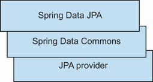
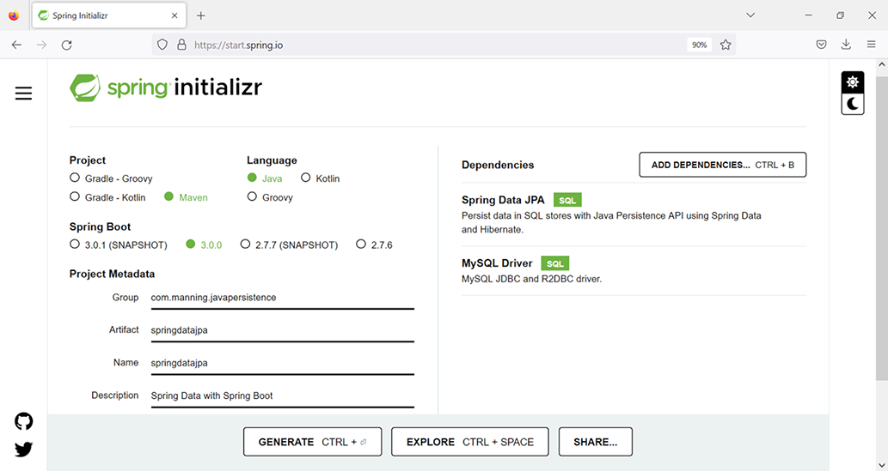
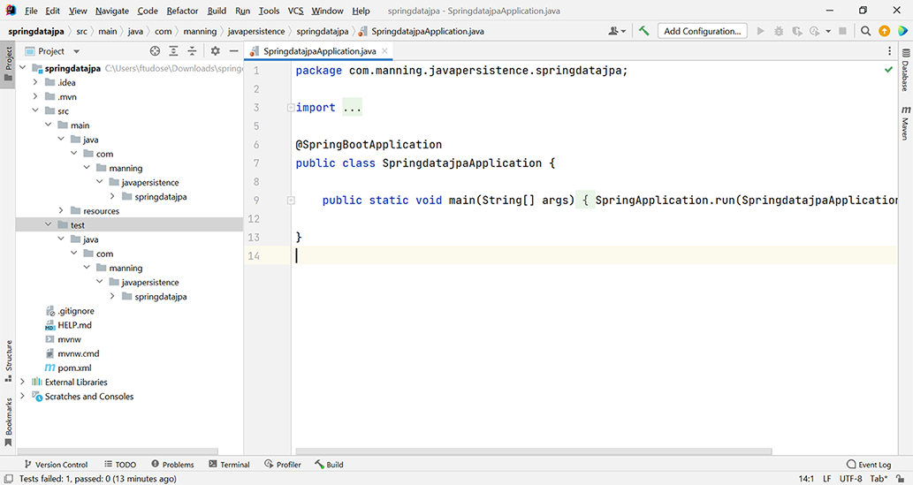

# Chương 4. Làm việc với Spring Data JPA

> *Java Persistence with Spring Data and Hibernate* — Chương 4: “Working with Spring Data JPA”

**Nội dung chương này bao gồm**

- Giới thiệu Spring Data và các module của nó
- Xem xét các khái niệm chính của Spring Data JPA
- Tìm hiểu cơ chế query builder
- Xem xét projection, cùng các truy vấn sửa đổi và xóa
- Tìm hiểu Query by Example

Spring Data là một dự án ô chứa nhiều dự án đặc thù cho các cơ sở dữ liệu khác nhau. Những dự án này được phát triển với sự hợp tác của chính các công ty tạo ra công nghệ cơ sở dữ liệu tương ứng. Mục tiêu của Spring Data là cung cấp một lớp trừu tượng cho việc truy cập dữ liệu trong khi vẫn giữ được các đặc thù bên dưới của từng kho dữ liệu.

Chúng ta sẽ bàn về các tính năng tổng quát sau do Spring Data cung cấp:

- Tích hợp với Spring thông qua JavaConfig và cấu hình XML
- Các trừu tượng về repository và ánh xạ object tùy chỉnh
- Tích hợp với mã repository tùy chỉnh
- Tạo truy vấn động dựa trên tên phương thức của repository
- Tích hợp với các dự án Spring khác, chẳng hạn Spring Boot

Chúng ta đã liệt kê các module Spring Data chính ở chương 2. Ở đây chúng ta sẽ tập trung vào Spring Data JPA, thứ được dùng rộng rãi như một lựa chọn thay thế để truy cập cơ sở dữ liệu từ chương trình Java. Nó cung cấp một tầng trừu tượng nằm trên một JPA provider (chẳng hạn Hibernate), theo tinh thần của Spring framework, đảm nhận việc quản lý cấu hình và transaction. Chúng ta sẽ dùng nó để tương tác với cơ sở dữ liệu trong nhiều ví dụ ở các chương sau, nên chương này sẽ phân tích sâu các khả năng của nó. Chúng ta vẫn sẽ định nghĩa và quản lý entity bằng JPA và Hibernate, nhưng sẽ cung cấp Spring Data JPA như một lựa chọn thay thế để tương tác với chúng.

## 4.1 Giới thiệu Spring Data JPA

Spring Data JPA hỗ trợ việc tương tác với các JPA repository. Như bạn thấy ở hình 4.1, nó được xây dựng trên nền chức năng do dự án Spring Data Commons và JPA provider (Hibernate trong trường hợp của chúng ta) cung cấp. Để xem lại các module Spring Data chính, hãy tham khảo chương 2.



**Hình 4.1** Spring Data JPA được xây dựng trên Spring Data Commons và JPA provider.

Xuyên suốt cuốn sách, nhìn chung chúng ta sẽ tương tác với cơ sở dữ liệu bằng cả Hibernate JPA và Spring Data như hai lựa chọn thay thế nhau. Chương này, cùng với nền tảng đã trình bày ở các chương 1–3, sẽ giúp bạn bắt đầu sử dụng những khả năng quan trọng nhất của Spring Data JPA. Chúng ta sẽ xem xét thêm các tính năng của Spring Data JPA khi cần, và sẽ tìm hiểu các dự án Spring Data khác ở những chương dành riêng cho chúng.

Như bạn đã thấy ở mục 2.6 khi chúng ta tạo ứng dụng “Hello World”, Spring Data JPA có thể làm nhiều việc để tạo thuận lợi cho việc tương tác với cơ sở dữ liệu:

- Cấu hình bean data source
- Cấu hình bean entity manager factory
- Cấu hình bean transaction manager
- Quản lý transaction thông qua annotation

## 4.2 Bắt đầu một dự án Spring Data JPA mới

Chúng ta sẽ dùng ứng dụng ví dụ CaveatEmptor đã giới thiệu ở chương 3 để minh họa và phân tích các khả năng của Spring Data JPA. Chúng ta sẽ dùng Spring Data JPA như một persistence framework để quản lý và lưu trữ các user của CaveatEmptor, với Hibernate JPA là JPA provider bên dưới. Spring Data JPA có thể thực thi các thao tác CRUD và truy vấn trên cơ sở dữ liệu, và nó có thể được hỗ trợ bởi các hiện thực JPA khác nhau. Nó cung cấp thêm một tầng trừu tượng để tương tác với cơ sở dữ liệu.

> **CHÚ Ý** Để có thể thực thi các ví dụ từ mã nguồn, trước tiên bạn cần chạy script Ch04.sql. Mã nguồn nằm trong thư mục `springdatajpa`.

Chúng ta sẽ tạo một ứng dụng Spring Boot để dùng Spring Data JPA. Để làm việc này, chúng ta sẽ dùng website Spring Initializr tại https://start.spring.io/ để tạo một dự án Spring Boot mới (xem hình 4.2) với các đặc điểm sau:

- Group: `com.manning.javapersistence`
- Artifact: `springdatajpa`
- Description: Spring Data with Spring Boot



**Hình 4.2** Tạo một dự án Spring Boot mới dùng Spring Data JPA và MySQL

Chúng ta cũng sẽ thêm các dependency sau:

- Spring Data JPA (việc này sẽ thêm `spring-boot-starter-data-jpa` vào file Maven pom.xml)
- MySQL Driver (việc này sẽ thêm `mysql-connector-java` vào file Maven pom.xml)

Sau khi bạn nhấn nút Generate (như minh họa ở hình 4.2), website Spring Initializr sẽ cung cấp một file nén để tải về. File nén này chứa một dự án Spring Boot dùng Spring Data JPA và MySQL. Hình 4.3 cho thấy dự án này được mở trong IDE IntelliJ IDEA.



**Hình 4.3** Mở dự án Spring Boot dùng Spring Data JPA và MySQL

Bộ khung của dự án chứa bốn file:

- `SpringDataJpaApplication` chứa một phương thức `main` khung.
- `SpringDataJpaApplicationTests` chứa một phương thức test khung.
- `application.properties` rỗng lúc ban đầu.
- `pom.xml` chứa thông tin quản lý mà Maven cần.

Vì ba file đầu trong danh sách trên là những file chuẩn, giờ chúng ta sẽ xem kỹ hơn file pom.xml do Spring Initializr sinh ra.

**Listing 4.1** File Maven pom.xml

*Đường dẫn: Ch04/springdatajpa/pom.xml*

```xml
<parent>                                                     <!-- Ⓐ -->
   <groupId>org.springframework.boot</groupId>
   <artifactId>spring-boot-starter-parent</artifactId>
   <version>2.7.0</version>
   <relativePath/> <!-- lookup parent from repository -->
</parent>
<groupId>com.manning.javapersistence</groupId>               <!-- Ⓑ -->
<artifactId>springdatajpa</artifactId>
<version>0.0.1-SNAPSHOT</version>
<name>springdatajpa</name>
<description>Spring Data with Spring Boot</description>
<properties>
   <java.version>17</java.version>
</properties>
<dependencies>
    <dependency>                                             <!-- Ⓒ -->
       <groupId>org.springframework.boot</groupId>
       <artifactId>spring-boot-starter-data-jpa</artifactId>
    </dependency>

    <dependency>                                             <!-- Ⓓ -->
       <groupId>mysql</groupId>
       <artifactId>mysql-connector-java</artifactId>
       <scope>runtime</scope>
    </dependency>
    <dependency>                                             <!-- Ⓔ -->
       <groupId>org.springframework.boot</groupId>
       <artifactId>spring-boot-starter-test</artifactId>
       <scope>test</scope>
    </dependency>
</dependencies>

<build>
   <plugins>
        <plugin>                                             <!-- Ⓕ -->
           <groupId>org.springframework.boot</groupId>
           <artifactId>spring-boot-maven-plugin</artifactId>
        </plugin>
   </plugins>
</build>
```

Ⓐ POM cha là `spring-boot-starter-parent`. POM cha này cung cấp cấu hình mặc định, quản lý dependency và plugin cho các ứng dụng Maven. Nó cũng kế thừa việc quản lý dependency từ POM cha của nó là `spring-boot-dependencies`.

Ⓑ Chỉ ra `groupId`, `artifactId`, `version`, `name` và `description` của dự án, cùng phiên bản Java.

Ⓒ `spring-boot-starter-data-jpa` là starter dependency được Spring Boot dùng để kết nối tới cơ sở dữ liệu quan hệ thông qua Spring Data JPA với Hibernate. Nó dùng Hibernate như một dependency bắc cầu.

Ⓓ `mysql-connector-java` là driver JDBC cho MySQL. Đây là dependency runtime, nghĩa là nó không cần có trên classpath khi biên dịch mà chỉ cần lúc chạy.

Ⓔ `spring-boot-starter-test` là starter dependency của Spring Boot dùng cho kiểm thử. Dependency này chỉ cần cho giai đoạn biên dịch và thực thi test.

Ⓕ `spring-boot-maven-plugin` là plugin tiện ích để build và chạy một dự án Spring Boot.

## 4.3 Những bước đầu tiên để cấu hình một dự án Spring Data JPA

Giờ chúng ta sẽ viết class mô tả entity `User`. Ứng dụng CaveatEmptor phải theo dõi những user tương tác với nó, nên bắt đầu bằng việc hiện thực class này là điều tự nhiên.

**Listing 4.2** Entity User

*Đường dẫn: Ch04/springdatajpa/src/main/java/com/manning/javapersistence/springdatajpa/model/User.java*

```java
@Entity                                                          // Ⓐ
@Table(name = "USERS")                                           // Ⓐ
public class User {

    @Id                                                          // Ⓑ
    @GeneratedValue                                              // Ⓑ
    private Long id;

    private String username;                                     // Ⓒ

    private LocalDate registrationDate;                          // Ⓒ

    public User() {                                              // Ⓓ

    }

    public User(String username) {                               // Ⓓ
        this.username = username;
    }

    public User(String username, LocalDate registrationDate) {   // Ⓓ
        this.username = username;
        this.registrationDate = registrationDate;
    }

    public Long getId() {                                        // Ⓑ
        return id;
    }

    public String getUsername() {                                // Ⓒ
        return username;
    }

    public void setUsername(String username) {                   // Ⓒ
        this.username = username;
    }

    public LocalDate getRegistrationDate() {                     // Ⓒ
        return registrationDate;
    }

    public void setRegistrationDate(LocalDate registrationDate) {  // Ⓒ
        this.registrationDate = registrationDate;
    }

    @Override
    public String toString() {                                   // Ⓔ
        return "User{" +
                  "id=" + id +
                  ", username='" + username + '\'' +
                  ", registrationDate=" + registrationDate +
                  '}';
    }
}
```

Ⓐ Tạo entity `User` và gắn annotation `@Entity` cùng `@Table`. Chúng ta chỉ định `USERS` làm tên của table tương ứng, vì tên mặc định `USER` là từ khóa dành riêng trong hầu hết hệ cơ sở dữ liệu.

Ⓑ Chỉ định field `id` làm primary key và thêm getter cho nó. Annotation `@GeneratedValue` bật cơ chế tự động sinh `id`. Chúng ta sẽ xem kỹ hơn ở chương 5.

Ⓒ Khai báo các field `username` và `registrationDate`, cùng getter và setter.

Ⓓ Khai báo ba constructor, trong đó có một constructor không tham số. Hãy nhớ rằng JPA yêu cầu mỗi persistent class phải có một constructor không tham số. JPA dùng Java Reflection API trên constructor không tham số đó để tạo instance.

Ⓔ Tạo phương thức `toString` để hiển thị đẹp các instance của class `User`.

Ⓕ `spring-boot-starter-test` là starter dependency của Spring Boot dùng cho kiểm thử. Dependency này chỉ cần cho giai đoạn biên dịch và thực thi test.

Ⓖ `spring-boot-maven-plugin` là plugin tiện ích để build và chạy một dự án Spring Boot.

Chúng ta cũng sẽ tạo interface `UserRepository`.

**Listing 4.3** Interface UserRepository

*Đường dẫn: Ch04/springdatajpa/src/main/java/com/manning/javapersistence/springdatajpa/repositories/UserRepository.java*

```java
public interface UserRepository extends CrudRepository<User, Long> {
}
```

Interface `UserRepository` mở rộng `CrudRepository<User, Long>`. Nghĩa là nó là một repository của các entity `User`, vốn có định danh kiểu `Long`. Hãy nhớ, class `User` có field `id` kiểu `Long` được đánh dấu `@Id`. Chúng ta có thể gọi trực tiếp các phương thức như `save`, `findAll` và `findById` được kế thừa từ `CrudRepository`, và dùng chúng mà không cần thông tin bổ sung nào để thực thi các thao tác thông thường trên cơ sở dữ liệu. Spring Data JPA sẽ tạo một class proxy hiện thực interface `UserRepository` và hiện thực các phương thức của nó.

Đáng lưu ý rằng `CrudRepository` là một interface persistence tổng quát, trung lập về công nghệ, mà chúng ta có thể dùng không chỉ cho JPA/cơ sở dữ liệu quan hệ mà cả cho cơ sở dữ liệu NoSQL. Ví dụ, chúng ta có thể dễ dàng đổi cơ sở dữ liệu từ MySQL sang MongoDB mà không đụng tới phần hiện thực, chỉ bằng cách đổi dependency từ `spring-boot-starter-data-jpa` ban đầu sang `spring-boot-starter-data-mongodb`.

Bước tiếp theo là điền vào file `application.properties` của Spring Boot. Spring Boot sẽ tự động tìm và nạp file `application.properties` từ classpath; thư mục `src/main/resources` được Maven thêm vào classpath.

**Listing 4.4** File application.properties

*Đường dẫn: Ch04/springdatajpa/src/main/resources/application.properties*

```properties
spring.datasource.url=jdbc:mysql://localhost:3306/CH04_SPRINGDATAJPA?serverTimezone=UTC
# Ⓐ
spring.datasource.username=root
spring.datasource.password=
# Ⓑ
spring.jpa.properties.hibernate.dialect=org.hibernate.dialect.MySQL8Dialect
# Ⓒ
spring.jpa.show-sql=true
# Ⓓ
spring.jpa.hibernate.ddl-auto=create
# Ⓔ
```

Ⓐ File application.properties sẽ chỉ ra URL của cơ sở dữ liệu.

Ⓑ Username, và không có mật khẩu để truy cập.

Ⓒ Hibernate dialect là MySQL8, vì cơ sở dữ liệu chúng ta tương tác là MySQL Release 8.0.

Ⓓ Trong khi thực thi, mã SQL được hiển thị.

Ⓔ Mỗi lần chương trình được thực thi, cơ sở dữ liệu sẽ được tạo lại từ đầu.

Giờ chúng ta sẽ viết mã lưu hai user vào cơ sở dữ liệu rồi thử tìm chúng.

**Listing 4.5** Lưu và tìm các entity User

*Đường dẫn: Ch04/springdatajpa/src/main/java/com/manning/javapersistence/springdatajpa/SpringDataJpaApplication.java*

```java
@SpringBootApplication                                                 // Ⓐ
public class SpringDataJpaApplication {

    public static void main(String[] args) {
       SpringApplication.run(SpringDataJpaApplication.class, args);    // Ⓑ
    }

    @Bean                                                              // Ⓒ
    public ApplicationRunner configure(UserRepository userRepository) {
       return env ->
       {
            User user1 = new User("beth",
                                  LocalDate.of(2020, Month.AUGUST, 3));   // Ⓓ
            User user2 = new User("mike",
                                  LocalDate.of(2020, Month.JANUARY, 18)); // Ⓓ

            userRepository.save(user1);                                // Ⓔ
            userRepository.save(user2);                                // Ⓔ

            userRepository.findAll().forEach(System.out::println);      // Ⓕ
       };
    }

}
```

Ⓐ Annotation `@SpringBootApplication`, được Spring Boot thêm vào class chứa phương thức `main`, sẽ bật cơ chế tự động cấu hình của Spring Boot và bật việc quét package nơi ứng dụng nằm, đồng thời cho phép đăng ký thêm các bean vào context.

Ⓑ `SpringApplication.run` sẽ nạp ứng dụng Spring độc lập từ phương thức `main`. Nó sẽ tạo một instance `ApplicationContext` phù hợp và nạp các bean.

Ⓒ Spring Boot sẽ chạy phương thức được đánh dấu `@Bean`, trả về một `ApplicationRunner` ngay trước khi `SpringApplication.run()` kết thúc.

Ⓓ Tạo hai user.

Ⓔ Lưu chúng vào cơ sở dữ liệu.

Ⓕ Truy xuất chúng và hiển thị thông tin về chúng.

Khi chạy ứng dụng này, chúng ta sẽ nhận được kết quả sau (được quyết định bởi cách phương thức `toString()` của class `User` hoạt động):

```
User{id=1, username='beth', registrationDate=2020-08-03}
User{id=2, username='mike', registrationDate=2020-01-18}
```

## 4.4 Định nghĩa query method với Spring Data JPA

Chúng ta sẽ mở rộng class `User` bằng cách thêm các field `email`, `level` và `active`. Một user có thể có các level khác nhau, cho phép họ thực hiện những hành động nhất định (chẳng hạn trả giá trên một mức nào đó). Một user có thể đang hoạt động (active) hoặc đã nghỉ (trước đây từng hoạt động trong hệ thống đấu giá CaveatEmptor nhưng giờ thì không). Đây là thông tin quan trọng mà ứng dụng CaveatEmptor cần lưu giữ về user của mình.

> **CHÚ Ý** Mã nguồn mà chúng ta bàn ở phần còn lại của chương này nằm trong thư mục `springdatajpa2`.

**Listing 4.6** Class User đã sửa đổi

*Đường dẫn: Ch04/springdatajpa2/src/main/java/com/manning/javapersistence/springdatajpa/model/User.java*

```java
@Entity
@Table(name = "USERS")
public class User {

    @Id
    @GeneratedValue
    private Long id;

    private String username;

    private LocalDate registrationDate;

    private String email;

    private int level;

    private boolean active;

    public User() {

    }

    public User(String username) {
        this.username = username;
    }

    public User(String username, LocalDate registrationDate) {
        this.username = username;
        this.registrationDate = registrationDate;
    }

    //getters and setters
}
```

Giờ chúng ta sẽ bắt đầu thêm các phương thức mới vào interface `UserRepository` và dùng chúng bên trong các test mới tạo. Chúng ta sẽ đổi interface `UserRepository` để mở rộng `JpaRepository` thay vì `CrudRepository`. `JpaRepository` mở rộng `PagingAndSortingRepository`, và đến lượt nó mở rộng `CrudRepository`.

`CrudRepository` cung cấp chức năng CRUD cơ bản, trong khi `PagingAndSortingRepository` cung cấp các phương thức tiện lợi để sắp xếp và phân trang bản ghi (chúng ta sẽ đề cập sau trong chương này). `JpaRepository` cung cấp các phương thức liên quan tới JPA, chẳng hạn flush persistence context và xóa bản ghi theo lô. Ngoài ra, `JpaRepository` ghi đè một vài phương thức từ `CrudRepository`, chẳng hạn `findAll`, `findAllById` và `saveAll`, để trả về `List` thay vì `Iterable`.

Chúng ta cũng sẽ thêm một loạt query method vào interface `UserRepository`, như minh họa ở listing sau.

**Listing 4.7** Interface UserRepository với các phương thức mới

*Đường dẫn: Ch04/springdatajpa2/src/main/java/com/manning/javapersistence/springdatajpa/repositories/UserRepository.java*

```java
public interface UserRepository extends JpaRepository<User, Long> {

    User findByUsername(String username);
    List<User> findAllByOrderByUsernameAsc();
    List<User> findByRegistrationDateBetween(LocalDate start, LocalDate end);
    List<User> findByUsernameAndEmail(String username, String email);
    List<User> findByUsernameOrEmail(String username, String email);
    List<User> findByUsernameIgnoreCase(String username);
    List<User> findByLevelOrderByUsernameDesc(int level);
    List<User> findByLevelGreaterThanEqual(int level);
    List<User> findByUsernameContaining(String text);
    List<User> findByUsernameLike(String text);
    List<User> findByUsernameStartingWith(String start);
    List<User> findByUsernameEndingWith(String end);
    List<User> findByActive(boolean active);
    List<User> findByRegistrationDateIn(Collection<LocalDate> dates);
    List<User> findByRegistrationDateNotIn(Collection<LocalDate> dates);

}
```

Mục đích của các query method này là truy xuất thông tin từ cơ sở dữ liệu. Spring Data JPA cung cấp một cơ chế query builder sẽ tạo hành vi cho các phương thức repository dựa trên tên của chúng. Về sau chúng ta sẽ xem xét các truy vấn sửa đổi (modifying query), vốn thay đổi dữ liệu mà chúng tìm được; hiện tại chúng ta tập trung vào các truy vấn có mục đích tìm thông tin. Cơ chế truy vấn này loại bỏ các tiền tố và hậu tố như `find...By`, `get...By`, `query...By`, `read...By` và `count...By` khỏi tên phương thức rồi phân tích phần còn lại.

Bạn có thể khai báo phương thức chứa các biểu thức như `Distinct` để đặt mệnh đề distinct; khai báo các toán tử như `LessThan`, `GreaterThan`, `Between` hay `Like`; hoặc khai báo điều kiện hợp thành với `And` hay `Or`. Bạn có thể áp dụng sắp xếp tĩnh bằng mệnh đề `OrderBy` trong tên của query method, tham chiếu tới một property và cung cấp hướng sắp xếp (`Asc` hoặc `Desc`). Bạn có thể dùng `IgnoreCase` cho những property hỗ trợ mệnh đề đó. Để xóa các dòng, bạn phải thay `find` bằng `delete` trong tên phương thức. Ngoài ra, Spring Data JPA sẽ xem xét kiểu trả về của phương thức. Nếu bạn muốn tìm một `User` và trả nó về trong một container `Optional`, kiểu trả về của phương thức sẽ là `Optional<User>`. Danh sách đầy đủ các kiểu trả về khả dĩ, cùng giải thích chi tiết, có thể tìm thấy ở phụ lục D của tài liệu tham khảo Spring Data JPA (http://mng.bz/o51y).

Tên các phương thức cần tuân theo quy tắc. Nếu đặt tên phương thức sai (ví dụ, property của entity không khớp trong query method), bạn sẽ nhận được lỗi khi application context được nạp. Bảng 4.1 mô tả các từ khóa thiết yếu mà Spring Data JPA hỗ trợ và cách mỗi tên phương thức được chuyển thành JPQL. Để có danh sách đầy đủ hơn, xem phụ lục B ở cuối sách.

**Bảng 4.1** Các từ khóa thiết yếu của Spring Data JPA và JPQL được sinh ra

| Từ khóa | Ví dụ | JPQL được sinh ra |
| --- | --- | --- |
| `Is`, `Equals` | `findByUsername`<br>`findByUsernameIs`<br>`findByUsernameEquals` | `... where e.username = ?1` |
| `And` | `findByUsernameAndRegistrationDate` | `... where e.username = ?1 and e.registrationdate = ?2` |
| `Or` | `findByUsernameOrRegistrationDate` | `... where e.username = ?1 or e.registrationdate = ?2` |
| `LessThan` | `findByRegistrationDateLessThan` | `... where e.registrationdate < ?1` |
| `LessThanEqual` | `findByRegistrationDateLessThanEqual` | `... where e.registrationdate <= ?1` |
| `GreaterThan` | `findByRegistrationDateGreaterThan` | `... where e.registrationdate > ?1` |
| `GreaterThanEqual` | `findByRegistrationDateGreaterThanEqual` | `... where e.registrationdate >= ?1` |
| `Between` | `findByRegistrationDateBetween` | `... where e.registrationdate between ?1 and ?2` |
| `OrderBy` | `findByRegistrationDateOrderByUsernameDesc` | `... where e.registrationdate = ?1 order by e.username desc` |
| `Like` | `findByUsernameLike` | `... where e.username like ?1` |
| `NotLike` | `findByUsernameNotLike` | `... where e.username not like ?1` |
| `Before` | `findByRegistrationDateBefore` | `... where e.registrationdate < ?1` |
| `After` | `findByRegistrationDateAfter` | `... where e.registrationdate > ?1` |
| `Null`, `IsNull` | `findByRegistrationDate(Is)Null` | `... where e.registrationdate is null` |
| `NotNull`, `IsNotNull` | `findByRegistrationDate(Is)NotNull` | `... where e.registrationdate is not null` |
| `Not` | `findByUsernameNot` | `... where e.username <> ?1` |

Làm class cơ sở cho các test sau này, chúng ta sẽ viết một abstract class `SpringDataJpaApplicationTests`.

**Listing 4.8** Abstract class SpringDataJpaApplicationTests

*Đường dẫn: Ch04/springdatajpa2/src/test/java/com/manning/javapersistence/springdatajpa/SpringDataJpaApplicationTests.java*

```java
@SpringBootTest                                                    // Ⓐ
@TestInstance(TestInstance.Lifecycle.PER_CLASS)                    // Ⓑ
abstract class SpringDataJpaApplicationTests {

    @Autowired                                                     // Ⓒ
    UserRepository userRepository;                                 // Ⓒ

    @BeforeAll                                                     // Ⓓ
    void beforeAll() {                                             // Ⓓ
        userRepository.saveAll(generateUsers());                   // Ⓓ
    }                                                              // Ⓓ

    private static List<User> generateUsers() {
        List<User> users = new ArrayList<>();

        User john = new User("john", LocalDate.of(2020, Month.APRIL, 13));
        john.setEmail("john@somedomain.com");
        john.setLevel(1);
        john.setActive(true);

        //create and set a total of 10 users

        users.add(john);
        //add a total of 10 users to the list

        return users;
    }

    @AfterAll                                                      // Ⓔ
    void afterAll() {                                              // Ⓔ
        userRepository.deleteAll();                                // Ⓔ
    }                                                              // Ⓔ
}
```

Ⓐ Annotation `@SpringBootTest`, được Spring Boot thêm vào class được tạo ban đầu, bảo Spring Boot tìm class cấu hình chính (chẳng hạn class được đánh dấu `@SpringBootApplication`) và tạo `ApplicationContext` để dùng trong các test. Hãy nhớ rằng annotation `@SpringBootApplication` được Spring Boot thêm vào class chứa phương thức `main` sẽ bật cơ chế tự động cấu hình của Spring Boot, bật việc quét package nơi ứng dụng nằm, và cho phép đăng ký thêm bean vào context.

Ⓑ Bằng annotation `@TestInstance(TestInstance.Lifecycle.PER_CLASS)`, chúng ta yêu cầu JUnit 5 tạo một instance duy nhất của class test và tái sử dụng nó cho tất cả phương thức test. Điều này cho phép chúng ta để các phương thức được đánh dấu `@BeforeAll` và `@AfterAll` không phải `static` và dùng trực tiếp field instance `UserRepository` được autowire bên trong chúng.

Ⓒ Autowire một instance `UserRepository`. Việc autowire này khả thi nhờ annotation `@SpringBootApplication`, vốn bật việc quét package nơi ứng dụng nằm và đăng ký các bean vào context.

Ⓓ Phương thức được đánh dấu `@BeforeAll` sẽ được thực thi một lần trước khi thực thi tất cả test từ một class kế thừa `SpringDataJpaApplicationTests`. Phương thức này sẽ không phải `static` (xem Ⓑ ở trên).

Ⓔ Phương thức được đánh dấu `@AfterAll` sẽ được thực thi một lần, sau khi thực thi tất cả test từ một class kế thừa `SpringDataJpaApplicationTests`. Phương thức này sẽ không phải `static` (xem Ⓑ ở trên).

Các test tiếp theo sẽ kế thừa class này và dùng cơ sở dữ liệu đã được điền sẵn dữ liệu. Để kiểm thử các phương thức hiện thuộc về `UserRepository`, chúng ta sẽ tạo class `FindUsersUsingQueriesTest` và theo cùng một công thức viết test: gọi phương thức repository và kiểm chứng kết quả của nó.

**Listing 4.9** Class FindUsersUsingQueriesTest

*Đường dẫn: Ch04/springdatajpa2/src/test/java/com/manning/javapersistence/springdatajpa/FindUsersUsingQueriesTest.java*

```java
public class FindUsersUsingQueriesTest extends SpringDataJpaApplicationTests {

    @Test
    void testFindAll() {
        List<User> users = userRepository.findAll();
        assertEquals(10, users.size());
    }

    @Test
    void testFindUser() {
        User beth = userRepository.findByUsername("beth");
        assertEquals("beth", beth.getUsername());
    }

    @Test
    void testFindAllByOrderByUsernameAsc() {
        List<User> users = userRepository.findAllByOrderByUsernameAsc();
        assertAll(() -> assertEquals(10, users.size()),
                () -> assertEquals("beth", users.get(0).getUsername()),
                () -> assertEquals("stephanie",
                            users.get(users.size() - 1).getUsername()));
    }

    @Test
    void testFindByRegistrationDateBetween() {
        List<User> users = userRepository.findByRegistrationDateBetween(
                LocalDate.of(2020, Month.JULY, 1),
                LocalDate.of(2020, Month.DECEMBER, 31));
        assertEquals(4, users.size());
    }

    //more tests
}
```

## 4.5 Giới hạn kết quả truy vấn, sắp xếp và phân trang

Các từ khóa `first` và `top` (dùng tương đương nhau) có thể giới hạn kết quả của query method. Từ khóa `top` và `first` có thể theo sau bởi một giá trị số tùy chọn để chỉ ra kích thước kết quả tối đa được trả về. Nếu thiếu giá trị số này, kích thước kết quả sẽ là 1.

`Pageable` là một interface cho thông tin phân trang, nhưng trên thực tế chúng ta dùng class `PageRequest` hiện thực nó. Class này có thể chỉ định số trang, kích thước trang và tiêu chí sắp xếp.

Chúng ta sẽ thêm các phương thức trong listing 4.10 vào interface `UserRepository`.

**Listing 4.10** Giới hạn kết quả truy vấn, sắp xếp và phân trang

*Đường dẫn: Ch04/springdatajpa2/src/main/java/com/manning/javapersistence/springdatajpa/repositories/UserRepository.java*

```java
User findFirstByOrderByUsernameAsc();
User findTopByOrderByRegistrationDateDesc();
Page<User> findAll(Pageable pageable);
List<User> findFirst2ByLevel(int level, Sort sort);
List<User> findByLevel(int level, Sort sort);
List<User> findByActive(boolean active, Pageable pageable);
```

Tiếp theo chúng ta sẽ viết các test sau để kiểm chứng cách những phương thức mới thêm này hoạt động.

**Listing 4.11** Kiểm thử việc giới hạn kết quả truy vấn, sắp xếp và phân trang

*Đường dẫn: Ch04/springdatajpa2/src/test/java/com/manning/javapersistence/springdatajpa/FindUsersSortingAndPagingTest.java*

```java
public class FindUsersSortingAndPagingTest extends
             SpringDataJpaApplicationTests {

    @Test
    void testOrder() {

        User user1 = userRepository.findFirstByOrderByUsernameAsc();        // Ⓐ
        User user2 = userRepository.findTopByOrderByRegistrationDateDesc(); // Ⓐ
        Page<User> userPage = userRepository.findAll(PageRequest.of(1, 3)); // Ⓑ
        List<User> users = userRepository.findFirst2ByLevel(2,
                                          Sort.by("registrationDate"));    // Ⓒ

        assertAll(
                () -> assertEquals("beth", user1.getUsername()),
                () -> assertEquals("julius", user2.getUsername()),
                () -> assertEquals(2, users.size()),
                () -> assertEquals(3, userPage.getSize()),
                () -> assertEquals("beth", users.get(0).getUsername()),
                () -> assertEquals("marion", users.get(1).getUsername())
        );

    }

    @Test
    void testFindByLevel() {
        Sort.TypedSort<User> user = Sort.sort(User.class);                  // Ⓓ

        List<User> users = userRepository.findByLevel(3,
                   user.by(User::getRegistrationDate).descending());        // Ⓔ
        assertAll(
                () -> assertEquals(2, users.size()),
                () -> assertEquals("james", users.get(0).getUsername())
        );

    }

    @Test
    void testFindByActive() {
        List<User> users = userRepository.findByActive(true,
                   PageRequest.of(1, 4, Sort.by("registrationDate")));      // Ⓕ
        assertAll(
                () -> assertEquals(4, users.size()),
                () -> assertEquals("burk", users.get(0).getUsername())
        );

    }
}
```

Ⓐ Test đầu tiên sẽ tìm user đầu tiên theo thứ tự tăng dần của `username` và user thứ hai theo thứ tự giảm dần của ngày đăng ký.

Ⓑ Tìm tất cả user, chia chúng thành các trang, và trả về trang số 1 với kích thước 3 (đánh số trang bắt đầu từ 0).

Ⓒ Tìm hai user đầu tiên có level 2, sắp xếp theo ngày đăng ký.

Ⓓ Test thứ hai sẽ định nghĩa một tiêu chí sắp xếp trên class `User`. `Sort.TypedSort` mở rộng `Sort` và có thể dùng method handle để định nghĩa các property cần sắp xếp theo.

Ⓔ Tìm các user có level 3 và sắp xếp theo ngày đăng ký, giảm dần.

Ⓕ Test thứ ba sẽ tìm các user đang hoạt động, sắp xếp theo ngày đăng ký, chia chúng thành các trang, và trả về trang số 1 với kích thước 4 (đánh số trang bắt đầu từ 0).

## 4.6 Streaming kết quả

Các query method trả về nhiều hơn một kết quả có thể dùng các interface Java chuẩn như `Iterable`, `List`, `Set`. Ngoài ra, Spring Data hỗ trợ `Streamable`, có thể dùng như một lựa chọn thay thế cho `Iterable` hoặc bất kỳ kiểu collection nào. Bạn có thể nối các `Streamable` với nhau và trực tiếp lọc, ánh xạ trên các phần tử.

Chúng ta sẽ thêm các phương thức sau vào interface `UserRepository`.

**Listing 4.12** Thêm các phương thức trả về Streamable vào interface UserRepository

*Đường dẫn: Ch04/springdatajpa2/src/main/java/com/manning/javapersistence/springdatajpa/repositories/UserRepository.java*

```java
Streamable<User> findByEmailContaining(String text);
Streamable<User> findByLevel(int level);
```

Chúng ta sẽ viết các test sau để kiểm chứng rằng những phương thức mới thêm này hoạt động.

**Listing 4.13** Kiểm thử các phương thức trả về Streamable

*Đường dẫn: Ch04/springdatajpa2/src/test/java/com/manning/javapersistence/springdatajpa/QueryResultsTest.java*

```java
@Test
void testStreamable() {
    try (Stream<User> result =                                          // Ⓐ
            userRepository.findByEmailContaining("someother")           // Ⓐ
             .and(userRepository.findByLevel(2))                        // Ⓑ
             .stream().distinct()) {                                    // Ⓒ
        assertEquals(6, result.count());                                // Ⓓ
    }
}
```

Ⓐ Test sẽ gọi phương thức `findByEmailContaining`, tìm các email chứa “someother”.

Ⓑ Test sẽ nối `Streamable` kết quả với `Streamable` cung cấp các user có level 2.

Ⓒ Nó sẽ biến đổi kết quả này thành một stream và giữ các user phân biệt. Stream được đưa vào làm tài nguyên của khối `try`, nên nó sẽ tự động được đóng. Một lựa chọn khác là gọi tường minh phương thức `close()`. Nếu không, stream sẽ giữ kết nối bên dưới tới cơ sở dữ liệu.

Ⓓ Kiểm tra rằng stream kết quả chứa sáu user.

## 4.7 Annotation @Query

Với annotation `@Query`, bạn có thể tạo một phương thức rồi viết truy vấn tùy chỉnh cho nó. Khi dùng annotation `@Query`, tên phương thức không cần tuân theo bất kỳ quy ước đặt tên nào. Truy vấn tùy chỉnh có thể được tham số hóa, xác định tham số theo vị trí hoặc theo tên, và gắn các tên này trong truy vấn bằng annotation `@Param`. Annotation `@Query` có thể sinh truy vấn native với cờ `nativeQuery` đặt là `true`. Tuy nhiên, bạn nên biết rằng truy vấn native có thể ảnh hưởng tới tính khả chuyển của ứng dụng. Để sắp xếp kết quả, bạn có thể dùng một object `Sort`. Các property mà bạn sắp xếp theo phải phân giải được thành một property của truy vấn hoặc một alias của truy vấn.

Spring Data JPA hỗ trợ các biểu thức Spring Expression Language (SpEL) trong truy vấn định nghĩa bằng annotation `@Query`, và Spring Data JPA hỗ trợ biến `entityName`. Trong một truy vấn như `select e from #{#entityName} e`, `entityName` được phân giải dựa trên annotation `@Entity`. Trong trường hợp của chúng ta, với `UserRepository extends JpaRepository<User, Long>`, `entityName` sẽ phân giải thành `User`.

Chúng ta sẽ thêm các phương thức sau vào interface `UserRepository`.

**Listing 4.14** Giới hạn kết quả truy vấn, sắp xếp và phân trang

*Đường dẫn: Ch04/springdatajpa2/src/main/java/com/manning/javapersistence/springdatajpa/repositories/UserRepository.java*

```java
@Query("select count(u) from User u where u.active = ?1")                 // Ⓐ
int findNumberOfUsersByActivity(boolean active);                          // Ⓐ

@Query("select u from User u where u.level = :level and u.active = :active")
List<User> findByLevelAndActive(@Param("level") int level,
                                @Param("active") boolean active);         // Ⓑ

@Query(value = "SELECT COUNT(*) FROM USERS WHERE ACTIVE = ?1",
                nativeQuery = true)                                       // Ⓒ
int findNumberOfUsersByActivityNative(boolean active);                    // Ⓒ

@Query("select u.username, LENGTH(u.email) as email_length from
        #{#entityName} u where u.username like %?1%")                     // Ⓓ
List<Object[]> findByAsArrayAndSort(String text, Sort sort);              // Ⓓ
```

Ⓐ Phương thức `findNumberOfUsersByActivity` sẽ trả về số user đang hoạt động.

Ⓑ Phương thức `findByLevelAndActive` sẽ trả về các user có `level` và trạng thái `active` được cho dưới dạng tham số có tên. Annotation `@Param` sẽ khớp tham số `:level` của truy vấn với đối số `level` của phương thức, và tham số `:active` của truy vấn với đối số `active` của phương thức. Điều này đặc biệt hữu ích khi bạn đổi thứ tự tham số trong chữ ký phương thức mà truy vấn không được cập nhật.

Ⓒ Phương thức `findNumberOfUsersByActivityNative` sẽ trả về số user với trạng thái `active` cho trước. Việc đặt cờ `nativeQuery` là `true` chỉ ra rằng, khác với các truy vấn trước vốn viết bằng JPQL, truy vấn này được viết bằng SQL native đặc thù cho cơ sở dữ liệu.

Ⓓ Phương thức `findByAsArrayAndSort` sẽ trả về một danh sách các mảng, mỗi mảng chứa `username` và độ dài của `email`, sau khi lọc dựa trên `username`. Tham số `Sort` thứ hai sẽ cho phép bạn sắp xếp kết quả truy vấn theo những tiêu chí khác nhau.

Chúng ta sẽ viết test cho các query method này, khá đơn giản. Chúng ta sẽ chỉ bàn về test viết cho query method thứ tư, vốn cho phép một vài biến thể của tiêu chí sắp xếp.

**Listing 4.15** Kiểm thử các query method

*Đường dẫn: Ch04/springdatajpa2/src/test/java/com/manning/javapersistence/springdatajpa/QueryResultsTest.java*

```java
public class QueryResultsTest extends SpringDataJpaApplicationTests {

    // testing the first 3 query methods

    @Test
    void testFindByAsArrayAndSort() {
        List<Object[]> usersList1 =
           userRepository.findByAsArrayAndSort("ar", Sort.by("username"));   // Ⓐ
        List<Object[]> usersList2 =
           userRepository.findByAsArrayAndSort("ar",
               Sort.by("email_length").descending());                        // Ⓑ
        List<Object[]> usersList3 = userRepository.findByAsArrayAndSort(
                "ar", JpaSort.unsafe("LENGTH(u.email)"));                    // Ⓒ
        assertAll(
                () -> assertEquals(2, usersList1.size()),
                () -> assertEquals("darren", usersList1.get(0)[0]),
                () -> assertEquals(21, usersList1.get(0)[1]),
                () -> assertEquals(2, usersList2.size()),
                () -> assertEquals("marion", usersList2.get(0)[0]),
                () -> assertEquals(26, usersList2.get(0)[1]),
                () -> assertEquals(2, usersList3.size()),
                () -> assertEquals("darren", usersList3.get(0)[0]),
                () -> assertEquals(21, usersList3.get(0)[1])
        );
    }
}
```

Ⓐ Phương thức `findByAsArrayAndSort` sẽ trả về các user có `username` giống `%ar%`, và sắp xếp chúng theo `username`.

Ⓑ Phương thức `findByAsArrayAndSort` sẽ trả về các user có `username` giống `%ar%`, và sắp xếp chúng theo `email_length`, giảm dần. Lưu ý rằng alias `email_length` cần được chỉ định bên trong truy vấn để có thể dùng cho việc sắp xếp.

Ⓒ Phương thức `findByAsArrayAndSort` sẽ trả về các user có `username` giống `%ar%`, và sắp xếp chúng theo `LENGTH(u.email)`. `JpaSort` là một class mở rộng `Sort`, và nó có thể dùng những thứ khác ngoài tham chiếu property và alias để sắp xếp. Việc xử lý property kiểu `unsafe` nghĩa là `String` được cung cấp không nhất thiết là một property hay alias mà có thể là một biểu thức tùy ý bên trong truy vấn.

Nếu tên phương thức bị đặt sai đối với bất kỳ phương thức nào trước đó tuân theo quy ước đặt tên của Spring Data JPA (ví dụ, property của entity không khớp trong query method), bạn sẽ nhận được lỗi khi application context được nạp. Nếu bạn dùng annotation `@Query` và truy vấn bạn viết bị sai, bạn sẽ nhận được lỗi lúc chạy khi thực thi phương thức đó. Như vậy, các phương thức có `@Query` linh hoạt hơn nhưng cũng kém an toàn hơn.

## 4.8 Projection

Không phải lúc nào cũng cần tất cả thuộc tính của một entity, nên đôi khi chúng ta có thể chỉ truy cập một số trong đó. Ví dụ, frontend có thể giảm I/O và chỉ hiển thị thông tin mà người dùng cuối quan tâm. Do đó, thay vì trả về instance của entity gốc do repository quản lý, bạn có thể muốn tạo các *projection* dựa trên một số thuộc tính nhất định của những entity đó. Spring Data JPA có thể định hình kiểu trả về để trả về có chọn lọc các thuộc tính của entity.

Một projection dựa trên interface đòi hỏi tạo một interface khai báo các phương thức getter cho những property cần đưa vào projection. Interface như vậy cũng có thể tính toán những giá trị cụ thể bằng annotation `@Value` và biểu thức SpEL. Bằng cách thực thi truy vấn lúc chạy, engine thực thi tạo các instance proxy của interface cho mỗi phần tử trả về và chuyển tiếp lời gọi tới các phương thức được phơi bày sang object đích.

Chúng ta sẽ tạo một class `Projection` và thêm `UserSummary` như một interface lồng bên trong. Chúng ta nhóm các projection lại vì chúng liên quan với nhau về mặt logic.

**Listing 4.16** Projection dựa trên interface

*Đường dẫn: Ch04/springdatajpa2/src/main/java/com/manning/javapersistence/springdatajpa/model/Projection.java*

```java
public class Projection {

    public interface UserSummary {

        String getUsername();                                  // Ⓐ

        @Value("#{target.username} #{target.email}")           // Ⓑ
        String getInfo();                                      // Ⓑ
    }
}
```

Ⓐ Phương thức `getUsername` sẽ trả về field `username`.

Ⓑ Phương thức `getInfo` được đánh dấu bằng annotation `@Value` và sẽ trả về chuỗi nối của field `username`, một dấu cách và field `email`.

Chúng ta nên tiếp cận projection thế nào trong thực tế? Nếu chúng ta chỉ đưa vào những phương thức như Ⓐ trong listing 4.16, chúng ta tạo ra một *closed projection* — đây là một interface mà tất cả getter đều tương ứng với property của entity đích. Khi bạn làm việc với closed projection, việc thực thi truy vấn có thể được Spring Data JPA tối ưu, vì mọi property mà proxy projection cần đều đã biết ngay từ đầu.

Nếu chúng ta đưa vào những phương thức như Ⓑ, chúng ta tạo ra một *open projection*, linh hoạt hơn. Tuy nhiên, Spring Data JPA sẽ không thể tối ưu việc thực thi truy vấn, vì biểu thức SpEL được đánh giá lúc chạy và có thể bao gồm bất kỳ property nào hoặc tổ hợp property nào của entity gốc.

Nói chung, bạn nên dùng projection khi cần cung cấp thông tin giới hạn và không phơi bày toàn bộ entity. Vì lý do hiệu năng, bạn nên ưu tiên closed projection bất cứ khi nào bạn biết ngay từ đầu mình muốn trả về thông tin gì. Nếu bạn có một truy vấn trả về object đầy đủ, và có một truy vấn tương tự chỉ trả về một projection, bạn có thể dùng quy ước đặt tên khác nhau, chẳng hạn đặt tên một phương thức là `find...By` và phương thức kia là `get...By`.

Một projection dựa trên class đòi hỏi tạo một class data transfer object (DTO) khai báo các property cần đưa vào projection và các phương thức getter. Việc dùng projection dựa trên class tương tự dùng projection dựa trên interface. Tuy nhiên, Spring Data JPA không cần tạo class proxy để quản lý projection. Spring Data JPA sẽ khởi tạo class khai báo projection, và các property được đưa vào được xác định bởi tên tham số của constructor của class.

Listing sau thêm `UsernameOnly` như một class lồng của class `Projection`.

**Listing 4.17** Projection dựa trên class

*Đường dẫn: Ch04/springdatajpa2/src/main/java/com/manning/javapersistence/springdatajpa/model/Projection.java*

```java
public class Projection {

    // . . .

    public static class UsernameOnly {                     // Ⓐ

        private String username;                           // Ⓑ

        public UsernameOnly(String username) {             // Ⓒ
            this.username = username;                      // Ⓒ
        }                                                  // Ⓒ

        public String getUsername() {                      // Ⓓ
            return username;                               // Ⓓ
        }

    }

}
```

Ⓐ Class `UsernameOnly`

Ⓑ Field `username`

Ⓒ Constructor được khai báo

Ⓓ Field `username` được phơi bày qua một getter

Các phương thức chúng ta sẽ thêm vào interface `UserRepository` trông như sau:

*Đường dẫn: Ch04/springdatajpa2/src/main/java/com/manning/javapersistence/springdatajpa/repositories/UserRepository.java*

```java
List<Projection.UserSummary> findByRegistrationDateAfter(LocalDate date);
List<Projection.UsernameOnly> findByEmail(String username);
```

Các phương thức repository này dùng cùng quy ước đặt tên mà chúng ta đã áp dụng ở các ví dụ trước trong mục này, và chúng biết kiểu trả về của mình ngay từ lúc biên dịch dưới dạng collection của các kiểu projection. Tuy nhiên, chúng ta có thể tổng quát hóa (generify) kiểu trả về của các phương thức repository, khiến chúng trở nên động. Chúng ta sẽ thêm một phương thức mới vào interface `UserRepository`:

*Đường dẫn: Ch04/springdatajpa2/src/main/java/com/manning/javapersistence/springdatajpa/repositories/UserRepository.java*

```java
<T> List<T> findByEmail(String username, Class<T> type);
```

Chúng ta sẽ viết test cho các query method dùng projection này.

**Listing 4.18** Kiểm thử các query method dùng projection

*Đường dẫn: Ch04/springdatajpa2/src/test/java/com/manning/javapersistence/springdatajpa/ProjectionTest.java*

```java
public class ProjectionTest extends SpringDataJpaApplicationTests {

    @Test
    void testProjectionUsername() {

        List<Projection.UsernameOnly> users =
            userRepository.findByEmail("john@somedomain.com");            // Ⓐ

        assertAll(                                                        // Ⓑ
                () -> assertEquals(1, users.size()),
                () -> assertEquals("john", users.get(0).getUsername())
        );
    }

    @Test
    void testProjectionUserSummary() {
        List<Projection.UserSummary> users =
            userRepository.findByRegistrationDateAfter(
                LocalDate.of(2021, Month.FEBRUARY, 1));                   // Ⓒ

        assertAll(                                                        // Ⓓ
                () -> assertEquals(1, users.size()),
                () -> assertEquals("julius", users.get(0).getUsername()),
                () -> assertEquals("julius julius@someotherdomain.com",
                                   users.get(0).getInfo())
        );
    }

    @Test
    void testDynamicProjection() {
        List<Projection.UsernameOnly> usernames =
                userRepository.findByEmail("mike@somedomain.com",
                Projection.UsernameOnly.class);                           // Ⓔ
        List<User> users =
                userRepository.findByEmail("mike@somedomain.com",
                User.class);                                              // Ⓕ

        assertAll(                                                        // Ⓖ
                () -> assertEquals(1, usernames.size()),
                () -> assertEquals("mike", usernames.get(0).getUsername()),
                () -> assertEquals(1, users.size()),
                () -> assertEquals("mike", users.get(0).getUsername())
        );
    }
}
```

Ⓐ Phương thức `findByEmail` sẽ trả về một danh sách các instance `Projection.UsernameOnly`.

Ⓑ Kiểm chứng các assertion.

Ⓒ Phương thức `findByRegistrationDateAfter` sẽ trả về một danh sách các instance `Projection.UserSummary`.

Ⓓ Kiểm chứng các assertion.

Ⓔ Phương thức `findByEmail` này cung cấp một projection động. Nó sẽ trả về một danh sách các instance `Projection.UsernameOnly`.

Ⓕ Phương thức `findByEmail` này cũng có thể trả về một danh sách các instance `User`, tùy thuộc vào class mà nó được tổng quát hóa theo.

Ⓖ Kiểm chứng các assertion.

## 4.9 Truy vấn sửa đổi (modifying query)

Bạn có thể định nghĩa các phương thức sửa đổi bằng annotation `@Modifying`. Ví dụ, các truy vấn `INSERT`, `UPDATE` và `DELETE`, hoặc các câu lệnh DDL, đều sửa đổi nội dung của cơ sở dữ liệu. Annotation `@Query` sẽ nhận truy vấn sửa đổi làm đối số, và nó có thể cần các tham số gắn kết (binding parameter). Phương thức như vậy cũng phải được đánh dấu `@Transactional` hoặc chạy từ một transaction được quản lý bằng chương trình. Truy vấn sửa đổi có ưu điểm là nhấn mạnh rõ ràng cột nào chúng tác động tới, và chúng có thể bao gồm điều kiện, nên chúng có thể khiến mã rõ ràng hơn so với việc lưu hoặc xóa toàn bộ object. Ngoài ra, việc thay đổi một số lượng cột hạn chế trong cơ sở dữ liệu sẽ thực thi nhanh hơn.

Spring Data JPA cũng có thể sinh truy vấn xóa dựa trên tên phương thức. Cơ chế hoạt động rất giống các ví dụ ở bảng 4.1, nhưng thay từ khóa `find` bằng `delete`.

Chúng ta sẽ thêm các phương thức sau vào interface `UserRepository`.

**Listing 4.19** Thêm các phương thức sửa đổi vào interface UserRepository

*Đường dẫn: Ch04/springdatajpa2/src/main/java/com/manning/javapersistence/springdatajpa/repositories/UserRepository.java*

```java
@Modifying                                                               // Ⓐ
@Transactional                                                           // Ⓐ
@Query("update User u set u.level = ?2 where u.level = ?1")              // Ⓐ
int updateLevel(int oldLevel, int newLevel);                             // Ⓐ

@Transactional                                                           // Ⓑ
int deleteByLevel(int level);                                            // Ⓑ

@Transactional                                                           // Ⓒ
@Modifying                                                               // Ⓒ
@Query("delete from User u where u.level = ?1")                          // Ⓒ
int deleteBulkByLevel(int level);                                        // Ⓒ
```

Ⓐ Phương thức `updateLevel` sẽ thay đổi `level` cho các user có tham số `oldLevel` và đặt nó thành `newLevel`, như đối số của annotation `@Query` chỉ ra. Phương thức cũng được đánh dấu `@Modifying` và `@Transactional`.

Ⓑ Phương thức `deleteByLevel` sẽ sinh một truy vấn dựa trên tên phương thức; nó sẽ xóa tất cả user có `level` được truyền vào làm tham số. Phương thức được đánh dấu `@Transactional`. `@Modifying` không cần thiết trong trường hợp này, vì truy vấn được framework sinh ra.

Ⓒ Phương thức `deleteBulkByLevel` sẽ xóa tất cả user có `level` được truyền vào làm tham số, như đối số của annotation `@Query` chỉ ra. Phương thức cũng được đánh dấu `@Modifying` và `@Transactional`.

Sự khác biệt giữa phương thức `deleteByLevel` và `deleteBulkByLevel` là gì? Phương thức thứ nhất chạy một truy vấn, rồi sẽ xóa lần lượt từng instance trả về. Nếu có các phương thức callback điều khiển vòng đời của mỗi instance (ví dụ, một phương thức được chạy khi một user bị xóa), chúng sẽ được thực thi. Phương thức thứ hai sẽ xóa các user theo lô, thực thi một truy vấn JPQL duy nhất. Không instance `User` nào (kể cả những instance đã được nạp vào bộ nhớ) sẽ thực thi các callback vòng đời.

Giờ chúng ta có thể viết test cho các phương thức sửa đổi.

**Listing 4.20** Kiểm thử các phương thức sửa đổi

*Đường dẫn: Ch04/springdatajpa2/src/test/java/com/manning/javapersistence/springdatajpa/ModifyQueryTest.java*

```java
@Test
void testModifyLevel() {
    int updated = userRepository.updateLevel(5, 4);
    List<User> users = userRepository.findByLevel(4, Sort.by("username"));

    assertAll(
            () -> assertEquals(1, updated),
            () -> assertEquals(3, users.size()),
            () -> assertEquals("katie", users.get(1).getUsername())
    );
}
```

Chúng ta cũng sẽ viết test cho các phương thức xóa.

**Listing 4.21** Kiểm thử các phương thức xóa

*Đường dẫn: Ch04/springdatajpa2/src/test/java/com/manning/javapersistence/springdatajpa/DeleteQueryTest.java*

```java
@Test
void testDeleteByLevel() {
    int deleted = userRepository.deleteByLevel(2);
    List<User> users = userRepository.findByLevel(2, Sort.by("username"));
    assertEquals(0, users.size());
}

@Test
void testDeleteBulkByLevel() {
    int deleted = userRepository.deleteBulkByLevel(2);
    List<User> users = userRepository.findByLevel(2, Sort.by("username"));
    assertEquals(0, users.size());
}
```

## 4.10 Query by Example

Query by Example (QBE) là một kỹ thuật truy vấn không đòi hỏi bạn viết các truy vấn cổ điển bao gồm entity và property. Nó cho phép tạo truy vấn động và gồm ba phần: một *probe*, một `ExampleMatcher` và một `Example`.

Probe là một domain object với các property đã được gán sẵn. `ExampleMatcher` cung cấp các quy tắc khớp cho từng property cụ thể. `Example` kết hợp probe với `ExampleMatcher` lại và sinh ra truy vấn. Nhiều `Example` có thể tái sử dụng chung một `ExampleMatcher`.

Đây là những tình huống sử dụng phù hợp nhất cho QBE:

- Khi bạn muốn tách rời mã khỏi API của kho dữ liệu bên dưới.
- Khi cấu trúc nội bộ của domain object thay đổi thường xuyên, và những thay đổi đó không được lan truyền tới các truy vấn hiện có.
- Khi bạn đang xây dựng một tập các ràng buộc tĩnh hoặc động để truy vấn repository.

QBE có một vài hạn chế:

- Nó chỉ hỗ trợ khớp regex kiểu bắt đầu/kết thúc/chứa cho các property `String`, và khớp chính xác cho các kiểu khác.
- Nó không hỗ trợ ràng buộc property lồng nhau hoặc nhóm lại, chẳng hạn `username = ?0 or (username = ?1 and email = ?2)`.

Chúng ta sẽ không thêm phương thức nào nữa vào interface `UserRepository`. Chúng ta chỉ viết test để xây dựng probe, các `ExampleMatcher` và các `Example`.

**Listing 4.22** Các test Query by Example

*Đường dẫn: Ch04/springdatajpa2/src/test/java/com/manning/javapersistence/springdatajpa/QueryByExampleTest.java*

```java
public class QueryByExampleTest extends SpringDataJpaApplicationTests {

    @Test
    void testEmailWithQueryByExample() {
        User user = new User();                                        // Ⓐ
        user.setEmail("@someotherdomain.com");                         // Ⓐ

        ExampleMatcher matcher = ExampleMatcher.matching()             // Ⓑ
                .withIgnorePaths("level", "active")                    // Ⓑ
                .withMatcher("email", match -> match.endsWith());      // Ⓑ

        Example<User> example = Example.of(user, matcher);             // Ⓒ

        List<User> users = userRepository.findAll(example);            // Ⓓ

        assertEquals(4, users.size());                                 // Ⓔ
    }

    @Test
    void testUsernameWithQueryByExample() {
        User user = new User();                                        // Ⓕ
        user.setUsername("J");                                         // Ⓕ

        ExampleMatcher matcher = ExampleMatcher.matching()             // Ⓖ
                .withIgnorePaths("level", "active")                    // Ⓖ
                .withStringMatcher(ExampleMatcher.StringMatcher.STARTING)
                .withIgnoreCase();                                     // Ⓖ

        Example<User> example = Example.of(user, matcher);             // Ⓗ

        List<User> users = userRepository.findAll(example);            // Ⓘ

        assertEquals(3, users.size());                                 // Ⓙ
    }
}
```

Ⓐ Khởi tạo một instance `User` và đặt email cho nó. Đây sẽ là probe.

Ⓑ Tạo `ExampleMatcher` với sự trợ giúp của mẫu builder. Mọi property tham chiếu `null` sẽ bị matcher bỏ qua. Tuy nhiên, chúng ta cần bỏ qua tường minh các property `level` và `active` vốn là kiểu nguyên thủy. Nếu chúng không bị bỏ qua, chúng sẽ được đưa vào matcher với giá trị mặc định (0 cho `level` và `false` cho `active`) và sẽ làm thay đổi truy vấn được sinh ra. Chúng ta sẽ cấu hình điều kiện matcher sao cho property `email` kết thúc bằng một chuỗi cho trước.

Ⓒ Tạo một `Example` kết hợp probe và `ExampleMatcher` lại và sinh ra truy vấn. Truy vấn sẽ tìm các user có property `email` kết thúc bằng chuỗi định nghĩa email của probe.

Ⓓ Thực thi truy vấn để tìm tất cả user khớp với probe.

Ⓔ Kiểm chứng rằng có bốn user như vậy.

Ⓕ Khởi tạo một instance `User` và đặt tên cho nó. Đây sẽ là probe thứ hai.

Ⓖ Tạo `ExampleMatcher` với sự trợ giúp của mẫu builder. Mọi property tham chiếu `null` sẽ bị matcher bỏ qua. Một lần nữa, chúng ta cần bỏ qua tường minh các property `level` và `active` vốn là kiểu nguyên thủy. Chúng ta cấu hình điều kiện matcher sao cho việc khớp sẽ được thực hiện trên chuỗi bắt đầu đối với các property đã cấu hình (property `username` từ probe, trong trường hợp của chúng ta).

Ⓗ Tạo một `Example` kết hợp probe và `ExampleMatcher` lại và sinh ra truy vấn. Truy vấn sẽ tìm các user có property `username` bắt đầu bằng chuỗi định nghĩa username của probe.

Ⓘ Thực thi truy vấn để tìm tất cả user khớp với probe.

Ⓙ Kiểm chứng rằng có sáu user như vậy.

Để nhấn mạnh tầm quan trọng của việc bỏ qua các property nguyên thủy mặc định, chúng ta sẽ so sánh các truy vấn được sinh ra khi có và khi không có lời gọi tới phương thức `withIgnorePaths("level", "active")`. Với test đầu tiên, đây là truy vấn được sinh ra khi *có* lời gọi tới phương thức `withIgnorePaths("level", "active")`:

```sql
select user0_.id as id1_0_, user0_.active as active2_0_, user0_.email as
email3_0_, user0_.level as level4_0_, user0_.registration_date as
registra5_0_, user0_.username as username6_0_ from users user0_ where
user0_.email like ? escape ?
```

Đây là truy vấn được sinh ra khi *không có* lời gọi tới phương thức `withIgnorePaths("level", "active")`:

```sql
select user0_.id as id1_0_, user0_.active as active2_0_, user0_.email as
email3_0_, user0_.level as level4_0_, user0_.registration_date as
registra5_0_, user0_.username as username6_0_ from users user0_ where
user0_.active=? and (user0_.email like ? escape ?) and user0_.level=0
```

Với test thứ hai, đây là truy vấn được sinh ra khi *có* lời gọi tới phương thức `withIgnorePaths("level", "active")`:

```sql
select user0_.id as id1_0_, user0_.active as active2_0_, user0_.email as
email3_0_, user0_.level as level4_0_, user0_.registration_date as
registra5_0_, user0_.username as username6_0_ from users user0_ where
lower(user0_.username) like ? escape ?
```

Đây là truy vấn được sinh ra khi *không có* lời gọi tới phương thức `withIgnorePaths("level", "active")`:

```sql
select user0_.id as id1_0_, user0_.active as active2_0_, user0_.email as
email3_0_, user0_.level as level4_0_, user0_.registration_date as
registra5_0_, user0_.username as username6_0_ from users user0_ where
user0_.active=? and user0_.level=0 and (lower(user0_.username) like ?
escape ?)
```

Hãy chú ý các điều kiện được thêm vào trên những property nguyên thủy khi phương thức `withIgnorePaths("level", "active")` bị bỏ đi:

```sql
user0_.active=? and user0_.level=0
```

Điều này sẽ làm thay đổi kết quả truy vấn.

## Tóm tắt

- Bạn có thể tạo và cấu hình một dự án Spring Data JPA bằng Spring Boot.
- Bạn có thể định nghĩa và dùng một loạt query method để truy cập repository bằng cơ chế query builder của Spring Data JPA.
- Spring Data JPA cung cấp khả năng giới hạn kết quả truy vấn, sắp xếp, phân trang và streaming kết quả.
- Bạn có thể dùng annotation `@Query` để định nghĩa cả truy vấn tùy chỉnh non-native lẫn native.
- Bạn có thể hiện thực projection để định hình kiểu trả về và trả về có chọn lọc các thuộc tính của entity, đồng thời có thể tạo và dùng các truy vấn sửa đổi để cập nhật và xóa entity.
- Kỹ thuật truy vấn Query by Example (QBE) cho phép tạo truy vấn động và gồm ba phần: một probe, một `ExampleMatcher` và một `Example`.
