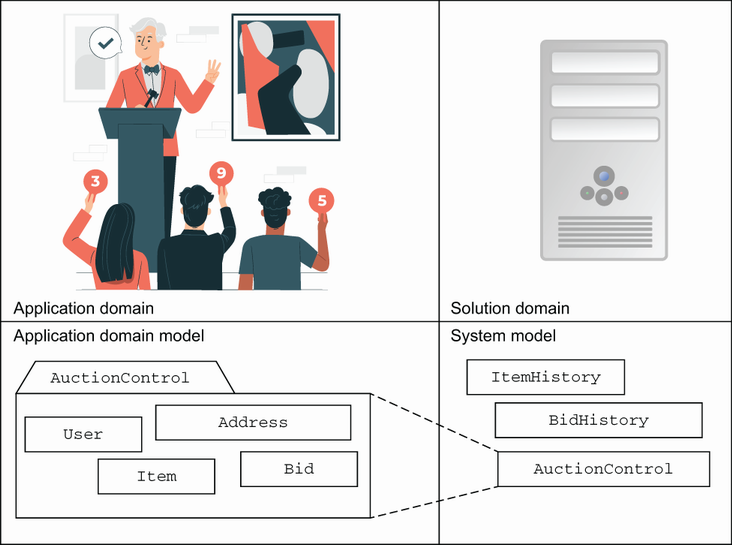
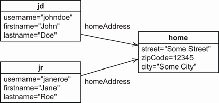
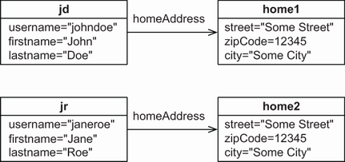
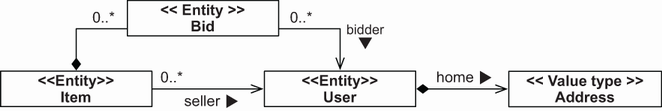
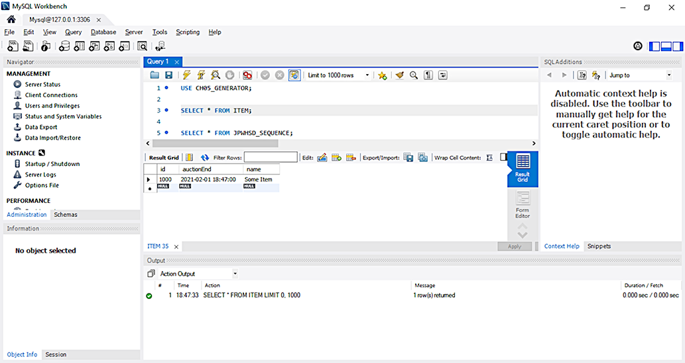
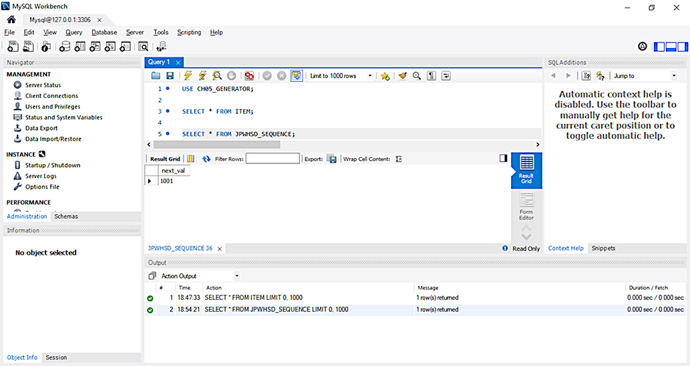

# Chương 5. Ánh xạ các persistent class

> *Java Persistence with Spring Data and Hibernate* — Chương 5: “Mapping persistent classes”

**Nội dung chương này bao gồm**

- Hiểu về entity và value type
- Ánh xạ các entity class kèm identity
- Điều khiển các tùy chọn ánh xạ ở mức entity

Chương này trình bày một số tùy chọn ánh xạ nền tảng và giải thích cách ánh xạ các entity class tới các table SQL. Đây là kiến thức thiết yếu để cấu trúc các class trong một ứng dụng, bất kể bạn làm việc với Hibernate, Spring Data JPA, hay một persistence framework nào khác hiện thực đặc tả JPA. Chúng tôi sẽ minh họa và phân tích cách bạn xử lý database identity và primary key, cùng cách bạn dùng nhiều thiết lập metadata khác để tùy chỉnh cách Hibernate — hoặc Spring Data JPA dùng Hibernate làm persistence provider — nạp và lưu các instance của những class trong domain model.

Spring Data JPA, với vai trò một lớp trừu tượng truy cập dữ liệu, nằm trên một JPA provider (chẳng hạn Hibernate) và sẽ giảm đáng kể lượng mã boilerplate cần thiết để tương tác với cơ sở dữ liệu. Vì vậy, một khi việc ánh xạ các persistent class đã hoàn tất, nó có thể được dùng từ cả Hibernate lẫn Spring Data JPA. Các ví dụ của chúng ta sẽ minh họa điều này, và tất cả ví dụ ánh xạ đều dùng annotation JPA.

Tuy nhiên, trước khi xem xét việc ánh xạ, chúng ta sẽ định nghĩa sự phân biệt thiết yếu giữa entity và value type, và giải thích cách bạn nên tiếp cận việc object/relational mapping cho domain model của mình. Vai trò của kỹ sư là tạo mối nối giữa *application domain* — môi trường của bài toán mà hệ thống cần giải quyết — và *solution domain* — phần mềm cùng các công nghệ sẽ xây dựng hệ thống đó. Ở hình 5.1, application domain được biểu diễn bởi application domain model (các entity thực tế), còn solution domain được biểu diễn bởi system model (các object trong ứng dụng phần mềm).



**Hình 5.1** Các domain và model khác nhau cần được kết nối

## 5.1 Hiểu về entity và value type

Khi nhìn vào domain model của mình, bạn sẽ nhận thấy sự khác biệt giữa các class: một số kiểu có vẻ quan trọng hơn, đại diện cho các business object hạng nhất (từ *object* ở đây được dùng theo nghĩa tự nhiên của nó). Một số ví dụ là các class `Item`, `Category` và `User`: đây là những entity trong thế giới thực mà bạn đang cố biểu diễn (xem hình 3.3 để có cái nhìn về domain model ví dụ). Những kiểu khác có mặt trong domain model, chẳng hạn `Address`, có vẻ kém quan trọng hơn. Trong mục này, chúng ta sẽ xem việc dùng domain model mịn (fine-grained) nghĩa là gì và phân biệt giữa entity và value type.

### 5.1.1 Domain model mịn

Một mục tiêu chính của Hibernate và của Spring Data JPA khi dùng Hibernate làm persistence provider là hỗ trợ các domain model mịn và phong phú. Đó là một lý do chúng ta làm việc với POJO (Plain Old Java Objects) — các object Java thông thường không bị ràng buộc vào framework nào. Nói thô thiển, *mịn* (fine-grained) nghĩa là có nhiều class hơn số table.

Ví dụ, một user có thể có một địa chỉ nhà trong domain model của bạn. Trong cơ sở dữ liệu, bạn có thể có một table `USERS` duy nhất với các cột `HOME_STREET`, `HOME_CITY` và `HOME_ZIPCODE`. (Còn nhớ vấn đề về kiểu SQL mà chúng ta bàn ở mục 1.2.1 chứ?) Trong domain model, bạn có thể dùng cách tiếp cận tương tự, biểu diễn địa chỉ bằng ba property kiểu chuỗi của class `User`. Nhưng sẽ tốt hơn nhiều nếu mô hình hóa việc này bằng một class `Address`, trong đó `User` có một property `homeAddress`. Domain model này đạt được tính gắn kết (cohesion) tốt hơn và khả năng tái sử dụng mã cao hơn, đồng thời dễ hiểu hơn so với SQL với hệ thống kiểu cứng nhắc.

JPA nhấn mạnh sự hữu ích của các class mịn trong việc hiện thực tính an toàn về kiểu và hành vi. Ví dụ, nhiều người mô hình hóa địa chỉ email như một property kiểu chuỗi của `User`. Tuy nhiên, cách tiếp cận tinh vi hơn là định nghĩa một class `EmailAddress`, bổ sung ngữ nghĩa và hành vi ở mức cao hơn. Nó có thể cung cấp phương thức `prepareMail()` (nhưng không nên có phương thức `sendMail()`, vì bạn không muốn các class trong domain model phụ thuộc vào hệ thống con gửi mail).

Vấn đề granularity này dẫn chúng ta tới một sự phân biệt có tầm quan trọng trung tâm trong ORM. Trong Java, mọi class đều bình đẳng — mọi instance đều có identity và vòng đời riêng. Khi bạn đưa persistence vào, một số instance có thể không có identity và vòng đời riêng mà phụ thuộc vào những instance khác. Hãy đi qua một ví dụ.

### 5.1.2 Định nghĩa các khái niệm của ứng dụng

Giả sử hai người sống trong cùng một ngôi nhà, và cả hai đều đăng ký tài khoản người dùng trên CaveatEmptor. Hãy gọi họ là John và Jane. Một instance của `User` đại diện cho mỗi tài khoản. Vì bạn muốn nạp, lưu và xóa các instance `User` này một cách độc lập, `User` là một entity class chứ không phải value type. Việc tìm ra các entity class là dễ dàng.

Class `User` có một property `homeAddress`; đó là một association với class `Address`. Liệu cả hai instance `User` có tham chiếu lúc chạy tới cùng một instance `Address`, hay mỗi instance `User` có tham chiếu tới `Address` riêng của nó? Việc John và Jane sống cùng nhà có quan trọng không?



**Hình 5.2** Hai instance `User` cùng tham chiếu tới một `Address` duy nhất.

Ở hình 5.2, bạn có thể thấy hai instance `User` dùng chung một instance `Address` duy nhất biểu diễn địa chỉ nhà của họ (đây là sơ đồ object UML, không phải sơ đồ class). Nếu `Address` được kỳ vọng hỗ trợ tham chiếu dùng chung lúc chạy, thì nó là một entity type. Instance `Address` có vòng đời riêng. Bạn không thể xóa nó khi John xóa tài khoản `User` của mình — Jane có thể vẫn còn tham chiếu tới `Address` đó.

Bây giờ hãy xem mô hình thay thế, trong đó mỗi `User` có tham chiếu tới instance `homeAddress` riêng của nó, như minh họa ở hình 5.3. Trong trường hợp này, bạn có thể khiến một instance `Address` phụ thuộc vào một instance `User`: bạn biến nó thành một value type. Khi John xóa tài khoản `User` của mình, bạn có thể an toàn xóa instance `Address` của anh ấy. Không ai khác giữ tham chiếu tới nó.



**Hình 5.3** Hai instance `User`, mỗi instance có một `Address` phụ thuộc riêng.

Do đó, chúng ta có thể đưa ra sự phân biệt thiết yếu sau:

- **Entity type** — Bạn có thể truy xuất một instance của entity type bằng persistent identity của nó; ví dụ, một instance `User`, `Item` hay `Category`. Một tham chiếu tới instance entity (một con trỏ trong JVM) được lưu trữ như một tham chiếu trong cơ sở dữ liệu (một giá trị bị ràng buộc foreign key). Một instance entity có vòng đời riêng; nó có thể tồn tại độc lập với bất kỳ entity nào khác. Bạn ánh xạ những class được chọn trong domain model thành entity type.
- **Value type** — Một instance của value type không có property định danh persistent; nó thuộc về một instance entity, và tuổi đời của nó gắn với instance entity sở hữu nó. Một instance value type không hỗ trợ tham chiếu dùng chung. Bạn có thể ánh xạ các class trong domain model của mình thành value type; ví dụ, `Address` và `MonetaryAmount`.

Nếu bạn đọc đặc tả JPA, bạn sẽ thấy cùng những khái niệm này, nhưng value type được gọi là *basic property type* hoặc *embeddable class* trong JPA. Chúng ta sẽ quay lại điều này ở chương sau.

Việc xác định entity và value type trong domain model không phải là công việc tùy hứng mà tuân theo một quy trình nhất định.

### 5.1.3 Phân biệt entity và value type

Bạn có thể thấy hữu ích khi thêm thông tin stereotype vào sơ đồ class UML của mình để nhận ra ngay entity và value type (stereotype là một cơ chế mở rộng của UML). Thực hành này cũng sẽ buộc bạn suy nghĩ về sự phân biệt này cho mọi class, đó là bước đầu tiên hướng tới một ánh xạ tối ưu và một tầng persistence hoạt động tốt. Hình 5.4 cho thấy một ví dụ, với thông tin stereotype nằm trong cặp ngoặc nhọn kép.



**Hình 5.4** Biểu diễn stereotype cho entity và value type

Các class `Item` và `User` rõ ràng là entity. Mỗi class đều có identity riêng, các instance của chúng được nhiều instance khác tham chiếu (tham chiếu dùng chung), và chúng có tuổi đời độc lập.

Việc đánh dấu `Address` là value type cũng dễ dàng: một instance `User` duy nhất tham chiếu tới một instance `Address` cụ thể. Bạn biết điều này vì association được tạo ra dưới dạng composition, với instance `User` hoàn toàn chịu trách nhiệm về vòng đời của instance `Address` được tham chiếu. Do đó, các instance `Address` không thể được ai khác tham chiếu và không cần identity riêng.

Class `Bid` có thể là một vấn đề. Trong mô hình hóa hướng đối tượng, nó được đánh dấu là composition (association giữa `Item` và `Bid` với hình thoi đặc). Composition là một loại association mà trong đó một object chỉ có thể tồn tại như một phần của vật chứa. Nếu vật chứa bị hủy, object nằm trong cũng bị hủy. Như vậy, một `Item` là chủ sở hữu của các instance `Bid` của nó và giữ một collection các tham chiếu. Các instance `Bid` không thể tồn tại nếu không có `Item`. Thoạt nhìn điều này có vẻ hợp lý, vì các bid trong một hệ thống đấu giá là vô dụng khi mặt hàng mà chúng được đặt cho đã biến mất.

Nhưng nếu một mở rộng tương lai của domain model đòi hỏi một collection `User#bids` chứa tất cả bid do một `User` cụ thể đặt thì sao? Hiện tại, association giữa `Bid` và `User` là một chiều; một `Bid` có tham chiếu `bidder`. Nếu nó là hai chiều thì sao?

Trong trường hợp đó, bạn sẽ phải xử lý khả năng có tham chiếu dùng chung tới các instance `Bid`, nên class `Bid` sẽ cần là một entity. Nó có vòng đời phụ thuộc, nhưng nó phải có identity riêng để hỗ trợ tham chiếu dùng chung (trong tương lai).

Bạn sẽ thường gặp kiểu hành vi pha trộn này, nhưng phản ứng đầu tiên của bạn nên là biến mọi thứ thành class kiểu value type và chỉ nâng cấp nó thành entity khi thực sự cần thiết. `Bid` là một value type vì identity của nó được định nghĩa bởi `Item` và `User`. Điều này không nhất thiết có nghĩa là nó sẽ không nằm trong table riêng của mình. Hãy cố đơn giản hóa các association của bạn; chẳng hạn, các persistent collection thường làm tăng độ phức tạp mà không mang lại lợi thế nào. Thay vì ánh xạ các collection `Item#bids` và `User#bids`, bạn có thể viết truy vấn để lấy tất cả bid của một `Item` và những bid do một `User` cụ thể đặt. Các association trong sơ đồ UML sẽ trỏ từ `Bid` tới `Item` và `User`, một chiều, chứ không phải chiều ngược lại. Stereotype trên class `Bid` khi đó sẽ là `<<Value type>>`. Chúng ta sẽ quay lại điểm này ở chương 8.

Tiếp theo, bạn có thể lấy sơ đồ domain model của mình và hiện thực POJO cho tất cả entity và value type. Bạn sẽ phải lưu ý ba điều:

- **Tham chiếu dùng chung** — Tránh tham chiếu dùng chung tới các instance value type khi bạn viết class POJO. Ví dụ, hãy bảo đảm chỉ một `User` có thể tham chiếu tới một `Address`. Bạn có thể làm `Address` bất biến, không có phương thức `setUser()` public, và thực thi quan hệ bằng một constructor public nhận đối số `User`. Tất nhiên, bạn vẫn cần một constructor không tham số, có thể ở mức `protected`, như đã bàn ở chương 3, để Hibernate hoặc Spring Data JPA cũng có thể tạo instance.
- **Phụ thuộc vòng đời** — Nếu một `User` bị xóa, `Address` phụ thuộc của nó cũng sẽ phải bị xóa. Persistence metadata sẽ bao gồm các quy tắc cascade cho mọi phụ thuộc như vậy, để Hibernate, Spring Data JPA hoặc cơ sở dữ liệu có thể lo việc xóa `Address` không còn dùng đến. Bạn phải thiết kế quy trình ứng dụng và giao diện người dùng sao cho tôn trọng và lường trước những phụ thuộc như vậy — hãy viết các POJO trong domain model cho phù hợp.
- **Identity** — Các entity class cần một property định danh trong hầu hết mọi trường hợp. Các class value type (và tất nhiên các class JDK như `String` và `Integer`) không có property định danh, vì các instance được định danh thông qua entity sở hữu chúng.

Chúng ta sẽ quay lại tham chiếu, association và quy tắc vòng đời khi bàn về những ánh xạ nâng cao hơn ở các chương sau. Object identity và property định danh là chủ đề tiếp theo của chúng ta.

## 5.2 Ánh xạ entity với identity

Việc ánh xạ entity với identity đòi hỏi bạn hiểu về identity và equality trong Java. Khi đã hiểu điều đó, chúng ta có thể đi qua một ví dụ entity class cùng ánh xạ của nó, bàn về những thuật ngữ như database identity, và xem JPA quản lý identity thế nào. Sau đó, chúng ta sẽ có thể đào sâu hơn, chọn primary key, cấu hình key generator, và cuối cùng đi qua các chiến lược sinh định danh.

### 5.2.1 Hiểu về identity và equality trong Java

Các lập trình viên Java đều hiểu sự khác biệt giữa object identity và equality. Object identity (`==`) là một khái niệm được máy ảo Java định nghĩa. Hai tham chiếu là *identical* (đồng nhất) nếu chúng trỏ tới cùng một vị trí bộ nhớ.

Object equality, mặt khác, là khái niệm được định nghĩa bởi phương thức `equals()` của một class, đôi khi cũng được gọi là *equivalence* (tương đương). Equivalence nghĩa là hai instance khác nhau (không đồng nhất) có cùng giá trị — cùng trạng thái. Nếu bạn có một chồng sách vừa in cùng loại, và bạn phải chọn một cuốn, nghĩa là bạn sẽ phải chọn một trong nhiều object không đồng nhất nhưng tương đương nhau.

Hai instance khác nhau của `String` là bằng nhau nếu chúng biểu diễn cùng một dãy ký tự, dù mỗi instance có vị trí riêng trong không gian bộ nhớ của máy ảo. (Nếu bạn là chuyên gia Java, chúng tôi thừa nhận `String` là một trường hợp đặc biệt. Hãy giả sử chúng tôi dùng một class khác để nêu cùng luận điểm.)

Persistence làm phức tạp bức tranh này. Với object/relational persistence, một instance persistent là biểu diễn trong bộ nhớ của một (hoặc nhiều) dòng cụ thể của một (hoặc nhiều) table trong cơ sở dữ liệu. Cùng với identity và equality trong Java, chúng ta định nghĩa *database identity*. Giờ bạn có ba cách phân biệt các tham chiếu:

- **Object identity** — Các object là đồng nhất nếu chúng chiếm cùng vị trí bộ nhớ trong JVM. Điều này có thể kiểm tra bằng toán tử `a == b`. Khái niệm này được gọi là object identity.
- **Object equality** — Các object là bằng nhau nếu chúng có cùng trạng thái, theo định nghĩa của phương thức `a.equals(Object b)`. Các class không ghi đè tường minh phương thức này sẽ kế thừa hiện thực định nghĩa bởi `java.lang.Object`, vốn so sánh object identity bằng `==`. Khái niệm này được gọi là object equality. Như bạn hẳn còn nhớ, các tính chất của object equality là phản xạ, đối xứng và bắc cầu. Một hệ quả là nếu `a == b`, thì cả `a.equals(b)` và `b.equals(a)` đều phải đúng.
- **Database identity** — Các object được lưu trong cơ sở dữ liệu quan hệ là đồng nhất nếu chúng dùng chung table và giá trị primary key. Khái niệm này, khi ánh xạ vào không gian Java, được gọi là database identity.

Giờ chúng ta cần xem database identity liên hệ thế nào với object identity và cách biểu diễn database identity trong mapping metadata. Làm ví dụ, bạn sẽ ánh xạ một entity của một domain model.

### 5.2.2 Entity class và ánh xạ đầu tiên

Annotation `@Entity` chưa đủ để ánh xạ một persistent class. Bạn cũng cần một annotation `@Id`, như minh họa ở listing sau (xem thư mục `generator` để lấy mã nguồn).

> **CHÚ Ý** Để thực thi các ví dụ từ mã nguồn, trước tiên bạn cần chạy script Ch05.sql.

**Listing 5.1** Entity class Item đã ánh xạ với một property định danh

*Đường dẫn: Ch05/generator/src/main/java/com/manning/javapersistence/ch05/model/Item.java*

```java
@Entity
public class Item {

    @Id
    @GeneratedValue(generator = "ID_GENERATOR")
    private Long id;

    public Long getId() {
        return id;
    }
}
```

Đây là entity class cơ bản nhất, được đánh dấu là “có khả năng persistence” bằng annotation `@Entity` và có ánh xạ `@Id` cho property định danh trong cơ sở dữ liệu. Theo mặc định, class này ánh xạ tới một table tên `ITEM` trong schema cơ sở dữ liệu.

Mọi entity class đều phải có một property `@Id`; đó là cách JPA phơi bày database identity cho ứng dụng. Chúng tôi không hiển thị property định danh trong các sơ đồ, nhưng giả định rằng mỗi entity class đều có một. Trong các ví dụ, chúng tôi luôn đặt tên property định danh là `id`. Đây là thực hành tốt cho dự án của bạn; hãy dùng cùng tên property định danh cho tất cả entity class trong domain model. Nếu bạn không chỉ định gì khác, property này ánh xạ tới một cột primary key tên `ID` trong table thuộc schema cơ sở dữ liệu.

Hibernate và Spring Data JPA sẽ dùng field để truy cập giá trị property định danh khi nạp và lưu các item, chứ không dùng phương thức getter hay setter. Vì `@Id` nằm trên một field, Hibernate hoặc Spring Data JPA theo mặc định sẽ coi mọi field của class là một persistent property. Quy tắc trong JPA là: nếu `@Id` nằm trên một field, JPA provider sẽ truy cập trực tiếp các field của class và mặc định coi mọi field là một phần của trạng thái persistent. Theo kinh nghiệm của chúng tôi, truy cập field thường là lựa chọn tốt hơn so với dùng accessor, vì nó cho bạn nhiều tự do hơn khi thiết kế các phương thức truy cập.

Bạn có nên có một phương thức getter public cho property định danh không? Các ứng dụng thường dùng định danh cơ sở dữ liệu như “tay cầm” tiện lợi cho những instance cụ thể, kể cả bên ngoài tầng persistence. Ví dụ, các ứng dụng web thường hiển thị kết quả tìm kiếm cho người dùng dưới dạng danh sách tóm tắt. Khi người dùng chọn một phần tử cụ thể, ứng dụng có thể cần truy xuất item đã chọn, và việc tra cứu theo định danh cho mục đích này là phổ biến — có lẽ bạn đã dùng định danh theo cách này, ngay cả trong các ứng dụng dựa trên JDBC.

Bạn có nên có một phương thức setter không? Giá trị primary key không bao giờ thay đổi, nên bạn không nên cho phép sửa đổi giá trị property định danh. Hibernate và Spring Data JPA dùng Hibernate làm provider sẽ không cập nhật cột primary key, và bạn không nên phơi bày phương thức setter public cho định danh trên một entity.

Kiểu Java của property định danh, `java.lang.Long` trong ví dụ trước, phụ thuộc vào kiểu cột primary key trong table `ITEM` và cách các giá trị khóa được sinh ra. Điều này đưa chúng ta tới annotation `@GeneratedValue`, và tới primary key nói chung.

### 5.2.3 Chọn primary key

Định danh cơ sở dữ liệu của một entity được ánh xạ tới primary key của một table, nên trước hết hãy tìm hiểu đôi chút về primary key mà chưa bận tâm tới ánh xạ. Hãy lùi lại một bước và nghĩ về cách bạn định danh các entity.

Một *candidate key* là một cột hoặc tập cột mà bạn có thể dùng để định danh một dòng cụ thể trong một table. Để trở thành primary key, một candidate key phải thỏa các yêu cầu sau:

- Giá trị của bất kỳ cột candidate key nào cũng không bao giờ null. Bạn không thể định danh một thứ bằng dữ liệu chưa biết, và không có null trong mô hình quan hệ. Một số sản phẩm SQL cho phép bạn định nghĩa primary key (hợp thành) với cột cho phép null, nên bạn phải cẩn thận.
- Giá trị của cột (hoặc các cột) candidate key là duy nhất với mọi dòng.
- Giá trị của cột (hoặc các cột) candidate key không bao giờ thay đổi; nó bất biến.

> **Primary key có bắt buộc phải bất biến không?**
>
> Mô hình quan hệ yêu cầu candidate key phải duy nhất và không thể rút gọn (không tập con nào của các thuộc tính khóa có tính duy nhất). Ngoài điều đó ra, việc chọn một candidate key làm primary key là chuyện sở thích. Nhưng Hibernate và Spring Data JPA kỳ vọng một candidate key là bất biến khi nó được dùng làm primary key. Hibernate và Spring Data JPA với Hibernate làm provider không hỗ trợ cập nhật giá trị primary key qua API; nếu bạn cố lách yêu cầu này, bạn sẽ gặp rắc rối với engine caching và dirty-checking của Hibernate. Nếu schema cơ sở dữ liệu của bạn dựa vào primary key có thể cập nhật (và có thể dùng cả foreign key constraint `ON UPDATE CASCADE`), bạn phải thay đổi schema trước khi nó hoạt động được với Hibernate hoặc Spring Data JPA dùng Hibernate làm provider.

Nếu một table chỉ có một thuộc tính định danh, theo định nghĩa nó trở thành primary key. Nhưng nhiều cột hoặc tổ hợp cột có thể thỏa những tính chất này với một table cụ thể; bạn có thể chọn giữa các candidate key để quyết định primary key tốt nhất cho table. Bạn nên khai báo những candidate key không được chọn làm primary key thành unique key trong cơ sở dữ liệu nếu giá trị của chúng thực sự duy nhất (nhưng có thể không bất biến).

Nhiều mô hình dữ liệu SQL cũ dùng *natural primary key*. Một natural key là khóa mang ý nghĩa nghiệp vụ: một thuộc tính hoặc tổ hợp thuộc tính duy nhất nhờ ngữ nghĩa nghiệp vụ của nó. Ví dụ về natural key là Social Security Number của Mỹ và Tax File Number của Úc. Việc phân biệt natural key khá đơn giản: nếu một thuộc tính candidate key có ý nghĩa bên ngoài bối cảnh cơ sở dữ liệu, thì đó là natural key, bất kể nó có được sinh tự động hay không. Hãy nghĩ về người dùng ứng dụng: nếu họ nhắc tới một thuộc tính khóa khi nói về và làm việc với ứng dụng, thì đó là natural key: “Bạn gửi cho tôi ảnh của mặt hàng #A23-abc được không?”

Kinh nghiệm cho thấy natural primary key thường gây rắc rối về sau. Một primary key tốt phải duy nhất, bất biến và không bao giờ null. Ít thuộc tính entity thỏa những yêu cầu này, và một số thuộc tính thỏa lại không thể được SQL database đánh chỉ mục hiệu quả (dù đây là chi tiết hiện thực và không nên là yếu tố quyết định ủng hộ hay phản đối một khóa cụ thể). Bạn cũng nên bảo đảm rằng định nghĩa của một candidate key không bao giờ thay đổi trong suốt vòng đời của cơ sở dữ liệu. Việc thay đổi giá trị (hay thậm chí định nghĩa) của một primary key cùng tất cả foreign key tham chiếu tới nó là một công việc đầy bực bội. Hãy kỳ vọng schema cơ sở dữ liệu của bạn sống sót hàng thập kỷ, ngay cả khi ứng dụng của bạn thì không.

Hơn nữa, bạn thường chỉ tìm được natural candidate key bằng cách kết hợp nhiều cột thành một *composite natural key*. Những khóa hợp thành này, dù chắc chắn phù hợp với một số thành phần schema (như link table trong quan hệ nhiều-nhiều), lại có thể khiến việc bảo trì, truy vấn tùy ứng và tiến hóa schema khó hơn nhiều.

Vì những lý do đó, chúng tôi mạnh mẽ khuyến nghị bạn thêm các *synthetic identifier*, còn gọi là *surrogate key*. Surrogate key không mang ý nghĩa nghiệp vụ — chúng có giá trị duy nhất được sinh ra bởi cơ sở dữ liệu hoặc ứng dụng. Lý tưởng nhất là người dùng ứng dụng không nhìn thấy hay nhắc tới những giá trị khóa này; chúng là phần nội bộ của hệ thống. Việc đưa vào một cột surrogate key cũng phù hợp trong tình huống phổ biến khi không có candidate key nào. Nói cách khác, gần như mọi table trong schema của bạn nên có một cột surrogate primary key riêng chỉ phục vụ mục đích này.

Có một số cách tiếp cận quen thuộc để sinh giá trị surrogate key. Annotation `@GeneratedValue` đã nhắc tới ở trên là cách bạn cấu hình việc này.

### 5.2.4 Cấu hình key generator

Annotation `@Id` là bắt buộc để đánh dấu property định danh của một entity class. Nếu không có `@GeneratedValue` bên cạnh, JPA provider giả định rằng bạn sẽ lo việc tạo và gán giá trị định danh trước khi lưu một instance. Chúng ta gọi đó là *application-assigned identifier*. Việc gán định danh entity thủ công là cần thiết khi bạn làm việc với cơ sở dữ liệu cũ hoặc natural primary key.

Thông thường bạn sẽ muốn hệ thống sinh giá trị primary key khi bạn lưu một instance entity, nên bạn có thể viết annotation `@GeneratedValue` bên cạnh `@Id`. JPA chuẩn hóa một số chiến lược sinh giá trị bằng enum `javax.persistence.GenerationType`, mà bạn chọn với `@GeneratedValue(strategy = ...)`:

- `GenerationType.AUTO` — Hibernate (hoặc Spring Data JPA dùng Hibernate làm persistence provider) chọn một chiến lược phù hợp, bằng cách hỏi SQL dialect của cơ sở dữ liệu đã cấu hình xem cách nào tốt nhất. Điều này tương đương với `@GeneratedValue()` không kèm thiết lập nào.
- `GenerationType.SEQUENCE` — Hibernate (hoặc Spring Data JPA dùng Hibernate) mong đợi (và tạo, nếu bạn dùng công cụ) một sequence tên `HIBERNATE_SEQUENCE` trong cơ sở dữ liệu. Sequence này sẽ được gọi riêng trước mỗi `INSERT`, sinh ra các giá trị số tuần tự.
- `GenerationType.IDENTITY` — Hibernate (hoặc Spring Data JPA dùng Hibernate) mong đợi (và tạo trong DDL của table) một cột primary key auto-increment đặc biệt, tự động sinh giá trị số khi `INSERT` trong cơ sở dữ liệu.
- `GenerationType.TABLE` — Hibernate (hoặc Spring Data JPA dùng Hibernate) sẽ dùng một table bổ sung trong schema, chứa giá trị primary key số tiếp theo, với một dòng cho mỗi entity class. Table này sẽ được đọc và cập nhật trước các lệnh `INSERT`. Tên table mặc định là `HIBERNATE_SEQUENCES` với các cột `SEQUENCE_NAME` và `NEXT_VALUE`.

Mặc dù `AUTO` có vẻ tiện lợi, đôi khi bạn sẽ cần kiểm soát nhiều hơn về cách ID được tạo ra, nên thường bạn nên cấu hình tường minh một chiến lược sinh primary key. Hầu hết ứng dụng làm việc với database sequence, nhưng bạn có thể muốn tùy chỉnh tên và các thiết lập khác của sequence. Vì vậy, thay vì chọn một trong các chiến lược của JPA, bạn có thể ánh xạ định danh bằng `@GeneratedValue(generator = "ID_GENERATOR")`, như ở listing 5.1. Đây là một *named identifier generator*; giờ bạn tự do thiết lập cấu hình `ID_GENERATOR` độc lập với các entity class.

JPA có hai annotation dựng sẵn mà bạn có thể dùng để cấu hình named generator: `@javax.persistence.SequenceGenerator` và `@javax.persistence.TableGenerator`. Với những annotation này, bạn có thể tạo một named generator với tên sequence và tên table của riêng mình. Như thường lệ với annotation JPA, đáng tiếc là bạn chỉ có thể dùng chúng ở đầu một class (có thể là class rỗng) chứ không dùng được trong file package-info.java.

Vì lý do đó, và vì các annotation JPA không cho bạn truy cập toàn bộ tập tính năng của Hibernate, chúng tôi ưa dùng annotation native `@org.hibernate.annotations.GenericGenerator` như một lựa chọn thay thế. Nó hỗ trợ tất cả chiến lược sinh định danh của Hibernate cùng chi tiết cấu hình của chúng. Khác với các annotation JPA khá hạn chế, bạn có thể dùng annotation Hibernate trong file package-info.java, thường ở cùng package với các class domain model. Listing sau cho thấy một cấu hình được khuyến nghị, cũng có thể tìm thấy trong thư mục `generator`.

**Listing 5.2** Identifier generator của Hibernate được cấu hình như metadata ở mức package

*Đường dẫn: Ch05/generator/src/main/java/com/manning/javapersistence/ch05/package-info.java*

```java
@org.hibernate.annotations.GenericGenerator(
   name = "ID_GENERATOR",
   strategy = "enhanced-sequence",                             // Ⓐ
   parameters = {
       @org.hibernate.annotations.Parameter(
           name = "sequence_name",                             // Ⓑ
           value = "JPWHSD_SEQUENCE"
       ),
       @org.hibernate.annotations.Parameter(
           name = "initial_value",                             // Ⓒ
           value = "1000"
       )
})
```

Ⓐ Chiến lược `enhanced-sequence` sinh ra các giá trị số tuần tự. Nếu SQL dialect của bạn hỗ trợ sequence, Hibernate (hoặc Spring Data JPA dùng Hibernate) sẽ dùng một database sequence thực sự. Nếu DBMS của bạn không hỗ trợ sequence native, Hibernate (hoặc Spring Data JPA dùng Hibernate) sẽ quản lý và dùng một “sequence table” bổ sung, mô phỏng hành vi của một sequence. Điều này mang lại tính khả chuyển thực sự: generator luôn có thể được gọi trước khi thực hiện `INSERT` trong SQL, khác với, chẳng hạn, các cột identity auto-increment vốn sinh giá trị khi `INSERT` và giá trị đó phải được trả về cho ứng dụng sau đó.

Ⓑ Bạn có thể cấu hình `sequence_name`. Hibernate (hoặc Spring Data JPA dùng Hibernate) sẽ hoặc dùng một sequence có sẵn, hoặc tạo một sequence khi bạn sinh schema SQL tự động. Nếu DBMS của bạn không hỗ trợ sequence, đây sẽ là tên của “sequence table” đặc biệt.

Ⓒ Bạn có thể bắt đầu với một `initial_value` chừa chỗ cho dữ liệu test. Ví dụ, khi test tích hợp của bạn chạy, Hibernate (hoặc Spring Data JPA dùng Hibernate) sẽ chèn mọi dữ liệu mới từ mã test với giá trị định danh lớn hơn 1.000. Bất kỳ dữ liệu test nào bạn muốn nhập trước khi chạy test đều có thể dùng số từ 1 tới 999, và bạn có thể tham chiếu tới những giá trị định danh ổn định đó trong test: “Nạp item có id 123 và chạy một số test trên nó.” Điều này được áp dụng khi Hibernate (hoặc Spring Data JPA dùng Hibernate) sinh schema SQL và sequence; đây là một tùy chọn DDL.

Bạn có thể dùng chung một database sequence cho tất cả class trong domain model. Không có hại gì khi chỉ định `@GeneratedValue(generator = "ID_GENERATOR")` trong mọi entity class. Việc giá trị primary key không liên tục đối với một entity cụ thể cũng không thành vấn đề, miễn là chúng duy nhất trong một table.

Cuối cùng, bạn có thể dùng `java.lang.Long` làm kiểu của property định danh trong entity class, kiểu này ánh xạ hoàn hảo tới một database sequence generator kiểu số. Bạn cũng có thể dùng kiểu nguyên thủy `long`. Khác biệt chính là `someItem.getId()` trả về gì với một item mới chưa được lưu vào cơ sở dữ liệu: hoặc `null`, hoặc `0`. Nếu bạn muốn kiểm tra xem một item có phải là mới hay không, việc kiểm tra `null` có lẽ dễ hiểu hơn cho người khác đọc mã của bạn. Bạn không nên dùng kiểu nguyên khác, chẳng hạn `int` hay `short`, cho định danh. Mặc dù chúng sẽ hoạt động một thời gian (thậm chí nhiều năm), khi kích thước cơ sở dữ liệu tăng lên, bạn có thể bị giới hạn bởi phạm vi của chúng. Một `Integer` sẽ dùng được gần hai tháng nếu bạn sinh một định danh mới mỗi mili-giây không có khoảng trống, còn một `Long` sẽ dùng được khoảng 300 triệu năm.

Mặc dù được khuyến nghị cho hầu hết ứng dụng, chiến lược `enhanced-sequence` như ở listing 5.2 chỉ là một trong các chiến lược dựng sẵn của Hibernate. Cấu hình của key generator không biết gì về framework sử dụng nó, và lập trình viên sẽ không bao giờ quản lý giá trị của primary key. Việc đó được thực hiện ở mức framework. Mã sẽ trông như listing 5.3 và 5.4.

**Listing 5.3** Lưu một Item với primary key được sinh ra, từ Hibernate JPA

*Đường dẫn: Ch05/generator/src/test/java/com/manning/javapersistence/ch05/HelloWorldJPATest.java*

```java
em.getTransaction().begin();

Item item = new Item();
item.setName("Some Item");
item.setAuctionEnd(Helper.tomorrow());
em.persist(item);

em.getTransaction().commit();
```

**Listing 5.4** Lưu một Item với primary key được sinh ra, từ Spring Data JPA

*Đường dẫn: Ch05/generator/src/test/java/com/manning/javapersistence/ch05/HelloWorldSpringDataJPATest.java*

```java
Item item = new Item();
item.setName("Some Item");
item.setAuctionEnd(Helper.tomorrow());
itemRepository.save(item);
```

Sau khi chạy bất kỳ chương trình Hibernate JPA hay Spring Data JPA nào, một `ITEM` mới sẽ được chèn vào cơ sở dữ liệu với `id` là 1000 — giá trị đầu tiên do generator chỉ định (hình 5.5). Giá trị sẽ được sinh cho lần chèn tiếp theo được lưu bên trong `JPWHSD_SEQUENCE` (hình 5.6).



**Hình 5.5** Nội dung của table `ITEM` sau khi chèn một dòng với primary key được sinh ra



**Hình 5.6** Giá trị sinh tiếp theo được `JPWHSD_SEQUENCE` lưu giữ

### 5.2.5 Các chiến lược sinh định danh

Hibernate và Spring Data JPA dùng Hibernate làm provider cung cấp một số chiến lược sinh định danh, và chúng ta sẽ liệt kê cùng bàn về chúng trong mục này. Chúng tôi sẽ không đề cập tới những chiến lược generator đã lỗi thời (deprecated).

Nếu bạn không muốn đọc toàn bộ danh sách ngay bây giờ, hãy bật `GenerationType.AUTO` và kiểm tra xem Hibernate mặc định chọn gì cho database dialect của bạn. Nhiều khả năng đó là `sequence` hoặc `identity` — những lựa chọn tốt, nhưng có thể không phải là lựa chọn hiệu quả hay khả chuyển nhất. Nếu bạn cần hành vi nhất quán, khả chuyển và các giá trị định danh có sẵn *trước* khi `INSERT`, hãy dùng `enhanced-sequence` như trình bày ở mục trước. Đây là chiến lược khả chuyển, linh hoạt và hiện đại, đồng thời cung cấp nhiều optimizer cho các tập dữ liệu lớn.

> **Sinh định danh trước hay sau `INSERT`: khác biệt là gì?**
>
> Một dịch vụ ORM cố gắng tối ưu các lệnh `INSERT` của SQL, chẳng hạn bằng cách gom lô (batch) nhiều lệnh ở mức JDBC. Do đó, việc thực thi SQL diễn ra càng muộn càng tốt trong một đơn vị công việc, chứ không phải khi bạn gọi `entityManager.persist(someItem)`. Lời gọi này chỉ đơn thuần xếp hàng thao tác chèn để thực thi sau, và nếu có thể, gán giá trị định danh. Tuy nhiên, nếu bây giờ bạn gọi `someItem.getId()`, bạn có thể nhận về `null` nếu engine không thể sinh định danh trước `INSERT`.
>
> Nói chung, chúng tôi ưa các chiến lược sinh trước-insert, tạo ra giá trị định danh độc lập trước `INSERT`. Một lựa chọn phổ biến là dùng một database sequence dùng chung và truy cập đồng thời được. Các cột auto-increment, giá trị mặc định của cột và khóa do trigger sinh ra chỉ có sẵn *sau* `INSERT`.

Trước khi bàn về danh sách đầy đủ các chiến lược sinh định danh, khuyến nghị cho những chiến lược này là:

- Nói chung, hãy ưu tiên các chiến lược sinh trước-insert, tạo ra giá trị định danh độc lập trước `INSERT`.
- Dùng `enhanced-sequence`, chiến lược này dùng database sequence native khi được hỗ trợ, và nếu không thì lùi về dùng một table cơ sở dữ liệu bổ sung với một cột và một dòng duy nhất, mô phỏng một sequence.

Danh sách sau phác thảo các chiến lược sinh định danh của Hibernate cùng tùy chọn và khuyến nghị sử dụng của chúng tôi. Chúng tôi cũng bàn về mối quan hệ giữa mỗi chiến lược chuẩn của JPA và tương đương native của Hibernate. Hibernate đã phát triển một cách hữu cơ, nên hiện có hai bộ ánh xạ giữa chiến lược chuẩn và chiến lược native; chúng tôi gọi chúng là *cũ* và *mới* trong danh sách. Bạn có thể chuyển đổi ánh xạ này bằng thiết lập `hibernate.id.new_generator_mappings` trong file persistence.xml. Mặc định là `true`, nghĩa là ánh xạ mới được dùng. Phần mềm không “lên men” tốt như rượu vang.

- `native` — Tùy chọn này tự động chọn một chiến lược, chẳng hạn `sequence` hoặc `identity`, tùy theo SQL dialect đã cấu hình. Bạn phải xem Javadoc (hoặc thậm chí mã nguồn) của SQL dialect mà bạn cấu hình trong persistence.xml để xác định chiến lược nào sẽ được chọn. Điều này tương đương với `GenerationType.AUTO` của JPA với ánh xạ cũ.
- `sequence` — Chiến lược này dùng một database sequence native tên `HIBERNATE_SEQUENCE`. Sequence được gọi trước mỗi lần `INSERT` một dòng mới. Bạn có thể tùy chỉnh tên sequence và cung cấp thêm thiết lập DDL; xem Javadoc của class `org.hibernate.id.SequenceGenerator`.
- `enhanced-sequence` — Chiến lược này dùng database sequence native khi được hỗ trợ; nếu không, nó lùi về dùng một table cơ sở dữ liệu bổ sung với một cột và một dòng duy nhất, mô phỏng một sequence (tên table mặc định là `HIBERNATE_SEQUENCE`). Dùng chiến lược này luôn gọi “sequence” của cơ sở dữ liệu trước `INSERT`, mang lại hành vi như nhau bất kể DBMS có hỗ trợ sequence thật hay không. Chiến lược này cũng hỗ trợ một `org.hibernate.id.enhanced.Optimizer` để tránh phải truy cập cơ sở dữ liệu trước mỗi `INSERT`, và mặc định là không tối ưu và lấy một giá trị mới cho mỗi `INSERT`. Điều này tương đương với `GenerationType.SEQUENCE` và `GenerationType.AUTO` của JPA khi bật ánh xạ mới, và đây có lẽ là lựa chọn tốt nhất trong các chiến lược dựng sẵn. Xem tất cả tham số ở Javadoc của class `org.hibernate.id.enhanced.SequenceStyleGenerator`.
- `enhanced-table` — Chiến lược này dùng một table bổ sung tên `HIBERNATE_SEQUENCES`, mặc định có một dòng biểu diễn sequence và lưu giá trị tiếp theo. Giá trị này được select và update khi cần sinh một giá trị định danh. Bạn có thể cấu hình generator này để dùng nhiều dòng thay vì một: mỗi generator một dòng (xem Javadoc của `org.hibernate.id.enhanced.TableGenerator`). Điều này tương đương với `GenerationType.TABLE` của JPA khi bật ánh xạ mới. Nó thay thế `org.hibernate.id.MultipleHiLoPerTableGenerator` đã lỗi thời nhưng tương tự, vốn là ánh xạ cũ cho `GenerationType.TABLE` của JPA.
- `identity` — Chiến lược này hỗ trợ các cột `IDENTITY` và auto-increment trong DB2, MySQL, MS SQL Server và Sybase. Giá trị định danh cho cột primary key sẽ được sinh khi `INSERT` một dòng. Nó không có tùy chọn nào. Đáng tiếc, do một điểm kỳ quặc trong mã của Hibernate, bạn không thể cấu hình chiến lược này trong `@GenericGenerator`. Việc sinh DDL sẽ không bao gồm tùy chọn identity hay auto-increment cho cột primary key. Cách duy nhất để dùng nó là với `GenerationType.IDENTITY` của JPA và ánh xạ cũ hoặc mới, khiến nó trở thành mặc định cho `GenerationType.IDENTITY`.
- `increment` — Khi Hibernate khởi động, chiến lược này đọc giá trị cột primary key (kiểu số) lớn nhất của table thuộc mỗi entity và tăng giá trị lên một mỗi lần chèn dòng mới. Cách này đặc biệt hiệu quả nếu một ứng dụng Hibernate không phân cụm (non-clustered) có quyền truy cập độc quyền vào cơ sở dữ liệu, nhưng đừng dùng nó trong bất kỳ kịch bản nào khác.
- `select` — Với chiến lược này, Hibernate sẽ không sinh giá trị khóa hay đưa cột primary key vào câu lệnh `INSERT`. Hibernate mong đợi DBMS gán một giá trị cho cột khi chèn (giá trị mặc định trong schema hoặc giá trị do một trigger cung cấp). Sau đó Hibernate truy xuất cột primary key bằng một truy vấn `SELECT` sau khi chèn. Tham số bắt buộc là `key`, nêu tên property định danh cơ sở dữ liệu (chẳng hạn `id`) cho lệnh `SELECT`. Chiến lược này không hiệu quả lắm và chỉ nên dùng với các driver JDBC cũ không thể trả về khóa được sinh ra một cách trực tiếp.
- `uuid2` — Chiến lược này tạo ra một UUID 128-bit duy nhất ở tầng ứng dụng. Điều này hữu ích khi bạn cần định danh duy nhất toàn cục xuyên nhiều cơ sở dữ liệu (chẳng hạn nếu bạn gộp dữ liệu từ nhiều cơ sở dữ liệu production riêng biệt vào một kho lưu trữ mỗi đêm bằng các lần chạy batch). UUID có thể được mã hóa dưới dạng property `java.lang.String`, `byte[16]`, hoặc `java.util.UUID` trong entity class của bạn. Chiến lược này thay thế các chiến lược `uuid` và `uuid.hex` cũ. Bạn cấu hình nó bằng một `org.hibernate.id.UUIDGenerationStrategy`; xem Javadoc của class `org.hibernate.id.UUIDGenerator` để biết thêm chi tiết.
- `guid` — Chiến lược này dùng một định danh duy nhất toàn cục do cơ sở dữ liệu sinh ra, với một hàm SQL có sẵn trên Oracle, Ingres, MS SQL Server và MySQL. Hibernate gọi hàm cơ sở dữ liệu này trước `INSERT`. Giá trị ánh xạ tới một property định danh kiểu `java.lang.String`. Nếu bạn cần kiểm soát hoàn toàn việc sinh định danh, hãy cấu hình `strategy` của `@GenericGenerator` bằng tên đầy đủ của một class hiện thực interface `org.hibernate.id.IdentityGenerator`.

Nếu bạn chưa làm, hãy thêm property định danh vào các entity class của domain model. Hãy bảo đảm bạn không phơi bày định danh ra ngoài logic nghiệp vụ, chẳng hạn qua một API — định danh này không mang ý nghĩa logic nghiệp vụ và chỉ liên quan tới persistence.

Sau khi hoàn thành việc ánh xạ cơ bản cho mỗi entity và property định danh của nó, bạn có thể tiếp tục ánh xạ các property kiểu value type của entity. Chúng ta sẽ nói về ánh xạ value type ở chương sau. Nhưng trước hết, hãy đọc tiếp về một số tùy chọn đặc biệt có thể đơn giản hóa và cải thiện các ánh xạ class của bạn.

## 5.3 Các tùy chọn ánh xạ entity

Giờ bạn đã ánh xạ một persistent class bằng `@Entity`, dùng giá trị mặc định cho mọi thiết lập khác, chẳng hạn tên table SQL được ánh xạ. Bây giờ chúng ta sẽ khám phá một số tùy chọn ở mức class và cách bạn có thể điều khiển chúng:

- Mặc định và chiến lược đặt tên
- Sinh SQL động
- Tính bất biến của entity

Đây là những tùy chọn. Nếu muốn, bạn có thể tạm bỏ qua mục này và quay lại sau khi phải xử lý những vấn đề cụ thể.

### 5.3.1 Điều khiển tên

Hãy nói về việc đặt tên cho entity class và table. Nếu bạn chỉ chỉ định `@Entity` trên một class có khả năng persistence, tên table được ánh xạ mặc định sẽ trùng tên class. Ví dụ, entity class Java `Item` ánh xạ tới table `ITEM`. Một entity class Java tên `BidItem` sẽ ánh xạ tới table `BID_ITEM` (ở đây, camel case được chuyển thành snake case). Bạn có thể ghi đè tên table bằng annotation `@Table` của JPA, như sau. (Xem thư mục `mapping` để lấy mã nguồn.)

> **CHÚ Ý** Chúng tôi viết tên các thành phần SQL bằng CHỮ HOA để dễ phân biệt — thực ra SQL không phân biệt chữ hoa/thường.

**Listing 5.5** Ghi đè tên table được ánh xạ bằng annotation @Table

*Đường dẫn: Ch05/mapping/src/main/java/com/manning/javapersistence/ch05/model/User.java*

```java
@Entity
@Table(name = "USERS")
public class User {
    // . . .
}
```

Entity `User` lẽ ra sẽ ánh xạ tới table `USER`, nhưng đây là từ khóa dành riêng trong hầu hết SQL DBMS, nên bạn không thể có table với tên đó. Thay vào đó chúng ta ánh xạ nó tới `USERS`. Annotation `@javax.persistence.Table` cũng có các tùy chọn `catalog` và `schema` nếu bố cục cơ sở dữ liệu của bạn cần chúng làm tiền tố đặt tên.

Nếu thực sự cần, việc đặt dấu nháy (quoting) cho phép bạn dùng tên SQL dành riêng và thậm chí làm việc với tên phân biệt chữ hoa/thường.

> **Đặt nháy cho định danh SQL**
>
> Thỉnh thoảng, đặc biệt trong các cơ sở dữ liệu cũ, bạn sẽ gặp những định danh với ký tự lạ hoặc khoảng trắng, hoặc bạn muốn ép phân biệt chữ hoa/thường. Hoặc, như ở ví dụ trước, việc ánh xạ tự động một class hay property sẽ đòi hỏi một tên table hay cột trùng với từ khóa dành riêng. Hibernate và Spring Data JPA dùng Hibernate làm provider biết các từ khóa dành riêng của DBMS của bạn thông qua database dialect đã cấu hình, và chúng có thể tự động đặt nháy quanh những chuỗi đó khi sinh SQL. Bạn có thể bật việc tự động đặt nháy này bằng `hibernate.auto_quote_keyword=true` trong cấu hình persistence unit. Nếu bạn dùng phiên bản Hibernate cũ hơn, hoặc bạn thấy thông tin của dialect chưa đầy đủ, bạn vẫn phải đặt nháy cho tên một cách thủ công trong các ánh xạ nếu có xung đột với từ khóa.
>
> Nếu bạn đặt nháy cho tên table hay cột trong ánh xạ bằng dấu backtick, Hibernate sẽ luôn đặt nháy định danh đó trong SQL được sinh ra. Cách này vẫn hoạt động trong các phiên bản Hibernate mới nhất, nhưng JPA 2.0 đã chuẩn hóa chức năng này thành *delimited identifier* với dấu nháy kép.

Đây là cách đặt nháy chỉ dành cho Hibernate bằng backtick, sửa đổi ví dụ trước:

```java
@Table(name = "`USER`")
```

Để tuân thủ JPA, bạn cũng phải escape các dấu nháy trong chuỗi:

```java
@Table(name = "\"USER\"")
```

Cách nào cũng hoạt động tốt với Hibernate và Spring Data JPA dùng Hibernate làm provider. Nó biết ký tự nháy native cho dialect của bạn và giờ sinh SQL tương ứng: `[USER]` cho MS SQL Server, `` `USER` `` cho MySQL, `"USER"` cho H2, v.v.

Nếu bạn phải đặt nháy cho tất cả định danh SQL, hãy tạo một file orm.xml và thêm thiết lập `<delimited-identifiers/>` vào phần `<persistence-unit-defaults>` của nó, như bạn đã thấy ở listing 3.8. Hibernate khi đó sẽ áp dụng định danh có nháy ở mọi nơi.

Bạn nên cân nhắc đổi tên các table hoặc cột trùng với từ khóa dành riêng bất cứ khi nào có thể. Các truy vấn SQL tùy ứng sẽ khó viết trên console SQL nếu bạn phải tự tay đặt nháy và escape mọi thứ cho đúng. Ngoài ra, bạn nên tránh dùng định danh có nháy cho các cơ sở dữ liệu cũng được truy cập bằng những cách khác ngoài Hibernate, JPA hay Spring Data (chẳng hạn để làm báo cáo). Việc phải dùng dấu phân cách cho mọi định danh trong một truy vấn báo cáo (phức tạp) thực sự rất khổ.

Tiếp theo, hãy xem Hibernate và Spring Data JPA với Hibernate làm provider có thể giúp gì khi bạn gặp những tổ chức có quy ước nghiêm ngặt cho tên table và cột trong cơ sở dữ liệu.

> **Hiện thực quy ước đặt tên**

Hibernate cung cấp một tính năng cho phép bạn tự động thực thi các chuẩn đặt tên. Giả sử tất cả tên table trong CaveatEmptor phải theo mẫu `CE_<tên table>`. Một giải pháp là chỉ định thủ công annotation `@Table` trên mọi entity class, nhưng cách này tốn thời gian và dễ bị quên. Thay vào đó, bạn có thể hiện thực interface `PhysicalNamingStrategy` của Hibernate hoặc ghi đè một hiện thực có sẵn, như ở listing sau.

**Listing 5.6** Ghi đè quy ước đặt tên mặc định bằng PhysicalNamingStrategy

*Đường dẫn: Ch05/mapping/src/main/java/com/manning/javapersistence/ch05/CENamingStrategy.java*

```java
public class CENamingStrategy extends PhysicalNamingStrategyStandardImpl {

    @Override
    public Identifier toPhysicalTableName(Identifier name,
                                          JdbcEnvironment context) {

        return new Identifier("CE_" + name.getText(), name.isQuoted());
    }

}
```

Phương thức `toPhysicalTableName()` được ghi đè sẽ thêm tiền tố `CE_` vào tất cả tên table được sinh ra trong schema của bạn. Hãy xem Javadoc của interface `PhysicalNamingStrategy`; nó cung cấp các phương thức để đặt tên tùy chỉnh cho cột, sequence và các thành phần khác.

Bạn phải bật hiện thực naming strategy. Với Hibernate JPA, việc này được thực hiện trong persistence.xml:

*Đường dẫn: Ch05/mapping/src/main/resources/META-INF/persistence.xml*

```xml
<persistence-unit name="ch05.mapping">
    ...
    <properties>
        ...
        <property name="hibernate.physical_naming_strategy"
                value="com.manning.javapersistence.ch05.CENamingStrategy"/>
    </properties>
</persistence-unit>
```

Với Spring Data JPA dùng Hibernate làm persistence provider, việc này được thực hiện từ cấu hình `LocalContainerEntityManagerFactoryBean`:

*Đường dẫn: Ch05/mapping/src/test/java/com/manning/javapersistence/ch05/configuration/SpringDataConfiguration.java*

```java
properties.put("hibernate.physical_naming_strategy",
               CENamingStrategy.class.getName());
```

Giờ hãy xem nhanh một vấn đề liên quan khác: việc đặt tên entity cho truy vấn.

> **Đặt tên entity để truy vấn**

Theo mặc định, tất cả tên entity đều được tự động import vào không gian tên của engine truy vấn. Nói cách khác, bạn có thể dùng tên class ngắn không kèm tiền tố package trong chuỗi truy vấn JPA, khá tiện:

*Đường dẫn: Ch05/generator/src/test/java/com/manning/javapersistence/ch05/HelloWorldJPATest.java*

```java
List<Item> items = em.createQuery("select i from Item i",
                                  Item.class).getResultList();
```

Cách này chỉ hoạt động khi bạn có một class `Item` trong persistence unit. Nếu bạn thêm một class `Item` khác ở một package khác, bạn nên đổi tên một trong hai cho JPA nếu muốn tiếp tục dùng dạng ngắn trong truy vấn:

```java
package my.other.model;

@javax.persistence.Entity(name = "AuctionItem")
public class Item {
    // . . .
}
```

Dạng truy vấn ngắn giờ là `select i from AuctionItem i` cho class `Item` trong package `my.other.model`. Nhờ đó bạn giải quyết xung đột tên với một class `Item` khác ở package khác. Tất nhiên, bạn luôn có thể dùng tên dài đầy đủ kèm tiền tố package.

Đến đây kết thúc phần điểm qua các tùy chọn đặt tên. Tiếp theo chúng ta sẽ bàn cách Hibernate và Spring Data JPA dùng Hibernate sinh ra SQL chứa những tên này.

### 5.3.2 Sinh SQL động

Theo mặc định, Hibernate và Spring Data JPA dùng Hibernate làm provider tạo các câu lệnh SQL cho mỗi persistent class khi persistence unit được tạo lúc khởi động. Đây là các thao tác create, read, update, delete (CRUD) đơn giản để đọc một dòng, xóa một dòng, v.v. Việc tạo và cache chúng rẻ hơn so với sinh chuỗi SQL mỗi lần một truy vấn đơn giản như vậy cần thực thi lúc chạy. Hơn nữa, việc cache prepared statement ở mức JDBC hiệu quả hơn nhiều nếu có ít câu lệnh hơn.

Làm sao Hibernate có thể tạo một câu lệnh `UPDATE` lúc khởi động? Xét cho cùng, các cột cần cập nhật đâu đã biết vào lúc đó. Câu trả lời là câu lệnh SQL được sinh ra sẽ cập nhật tất cả cột, và nếu giá trị của một cột cụ thể không bị thay đổi, câu lệnh đặt nó về giá trị cũ.

Trong một số tình huống, chẳng hạn một table cũ với hàng trăm cột, nơi các câu lệnh SQL sẽ rất lớn ngay cả với những thao tác đơn giản nhất (như khi chỉ cần cập nhật một cột), bạn nên tắt việc sinh SQL lúc khởi động và chuyển sang các câu lệnh động được sinh lúc chạy. Số lượng entity cực lớn cũng có thể ảnh hưởng tới thời gian khởi động vì Hibernate phải sinh tất cả câu lệnh SQL cho CRUD trước. Mức tiêu thụ bộ nhớ cho query statement cache này cũng sẽ cao nếu hàng chục câu lệnh phải được cache cho hàng nghìn entity. Đây có thể là mối lo trong môi trường ảo hóa với giới hạn bộ nhớ hoặc trên các thiết bị công suất thấp.

Để tắt việc sinh câu lệnh SQL `INSERT` và `UPDATE` lúc khởi động, bạn cần dùng các annotation native của Hibernate:

```java
@Entity
@org.hibernate.annotations.DynamicInsert
@org.hibernate.annotations.DynamicUpdate
public class Item {
    // . . .
}
```

Bằng cách bật insert và update động, bạn bảo Hibernate sinh chuỗi SQL khi cần chứ không phải trước. Lệnh `UPDATE` sẽ chỉ chứa các cột có giá trị được cập nhật, và lệnh `INSERT` sẽ chỉ chứa các cột không cho phép null.

### 5.3.3 Làm cho một entity bất biến

Các instance của một class cụ thể có thể là bất biến. Ví dụ, trong CaveatEmptor, một `Bid` được đặt cho một item là bất biến. Do đó, Hibernate hoặc Spring Data JPA dùng Hibernate làm provider không bao giờ cần thực thi câu lệnh `UPDATE` trên table `BID`. Hibernate cũng có thể thực hiện một vài tối ưu khác, chẳng hạn tránh dirty checking nếu bạn ánh xạ một class bất biến, như ở ví dụ tiếp theo. Ở đây class `Bid` là bất biến và các instance không bao giờ bị sửa đổi:

```java
@Entity
@org.hibernate.annotations.Immutable
public class Bid {
    // . . .
}
```

Một POJO là bất biến nếu không có phương thức setter public nào cho bất kỳ property nào của class được phơi bày — mọi giá trị đều được gán trong constructor. Hibernate hoặc Spring Data JPA dùng Hibernate làm provider nên truy cập trực tiếp các field khi nạp và lưu instance. Chúng ta đã bàn về điều này ở đầu chương: nếu annotation `@Id` nằm trên một field, Hibernate sẽ truy cập trực tiếp các field, và bạn tự do thiết kế các phương thức getter và setter của mình. Ngoài ra, hãy nhớ rằng không phải mọi framework đều hoạt động được với POJO không có phương thức setter.

Khi bạn không thể tạo view trong schema cơ sở dữ liệu, bạn có thể ánh xạ một entity class bất biến tới một truy vấn `SELECT` của SQL.

### 5.3.4 Ánh xạ một entity tới subselect

Đôi khi DBA của bạn sẽ không cho phép bạn thay đổi schema cơ sở dữ liệu. Thậm chí việc thêm một view mới cũng có thể là không thể. Giả sử bạn muốn tạo một view chứa định danh của một `Item` đấu giá và số lượng bid đã đặt cho item đó (xem thư mục `subselect` để lấy mã nguồn). Dùng một annotation của Hibernate, bạn có thể tạo một view ở mức ứng dụng — một entity class chỉ đọc được ánh xạ tới một câu `SELECT` của SQL:

*Đường dẫn: Ch05/subselect/src/main/java/com/manning/javapersistence/ch05/model/ItemBidSummary.java*

```java
@Entity
@org.hibernate.annotations.Immutable
@org.hibernate.annotations.Subselect(
     value = "select i.ID as ITEMID, i.NAME as NAME, " +
             "count(b.ID) as NUMBEROFBIDS " +
             "from ITEM i left outer join BID b on i.ID = b.ITEM_ID " +
             "group by i.ID, i.NAME"
)
@org.hibernate.annotations.Synchronize({"ITEM", "BID"})
public class ItemBidSummary {

    @Id
    private Long itemId;

    private String name;

    private long numberOfBids;

    public ItemBidSummary() {
    }

    // Getter methods . . .
    // . . .
}
```

Bạn nên liệt kê tất cả tên table được tham chiếu trong câu `SELECT` của bạn vào annotation `@org.hibernate.annotations.Synchronize`. Framework khi đó sẽ biết nó phải flush các sửa đổi trên instance `Item` và `Bid` trước khi thực thi một truy vấn trên `ItemBidSummary`. Nếu có những sửa đổi trong bộ nhớ chưa được lưu xuống cơ sở dữ liệu nhưng có thể ảnh hưởng tới truy vấn, Hibernate (hoặc Spring Data JPA dùng Hibernate làm provider) phát hiện điều này và flush các thay đổi trước khi thực thi truy vấn. Nếu không, kết quả có thể là trạng thái cũ (stale). Vì không có annotation `@Table` trên class `ItemBidSummary`, framework không biết khi nào phải auto-flush trước khi thực thi truy vấn. Annotation `@org.hibernate.annotations.Synchronize` chỉ ra rằng framework cần flush các table `ITEM` và `BID` trước khi thực thi truy vấn.

Việc dùng entity class chỉ đọc `ItemBidSummary` từ Hibernate JPA sẽ trông như sau:

*Đường dẫn: Ch05/subselect/src/test/java/com/manning/javapersistence/ch05/ItemBidSummaryTest.java*

```java
TypedQuery<ItemBidSummary> query =
     em.createQuery("select ibs from ItemBidSummary ibs where ibs.itemId = :id",
                    ItemBidSummary.class);
ItemBidSummary itemBidSummary =
                    query.setParameter("id", 1000L).getSingleResult();
```

Để dùng entity class chỉ đọc `ItemBidSummary` từ Spring Data JPA, trước hết bạn cần đưa vào một Spring Data repository mới:

*Đường dẫn: Ch05/mapping/src/main/java/com/manning/javapersistence/ch05/repositories/ItemBidSummaryRepository.java*

```java
public interface ItemBidSummaryRepository extends
                       CrudRepository<ItemBidSummary, Long> {
}
```

Repository sẽ được dùng thực tế như sau:

*Đường dẫn: Ch05/subselect/src/test/java/com/manning/javapersistence/ch05/ItemBidSummarySpringDataTest.java*

```java
Optional<ItemBidSummary> itemBidSummary =
                                 itemBidSummaryRepository.findById(1000L);
```

## Tóm tắt

- Entity là những class thô hơn (coarser-grained) của một hệ thống. Các instance của chúng có vòng đời độc lập và identity riêng, và nhiều instance khác có thể tham chiếu tới chúng.
- Value type phụ thuộc vào một entity class cụ thể. Một instance value type gắn với instance entity sở hữu nó, và chỉ một instance entity có thể tham chiếu tới nó — nó không có identity riêng.
- Java identity, object equality và database identity là những khái niệm khác nhau: hai khái niệm đầu áp dụng trong thế giới hướng đối tượng, còn khái niệm cuối trong thế giới cơ sở dữ liệu quan hệ.
- Một primary key tốt không bao giờ null, là duy nhất và không bao giờ thay đổi.
- Các generator cho primary key có thể được cấu hình bằng những chiến lược khác nhau.
- Bạn có thể dùng entity, các tùy chọn ánh xạ và naming strategy từ cả Hibernate JPA lẫn Spring Data JPA.
