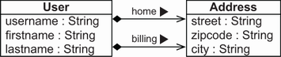
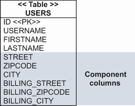
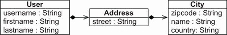
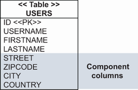
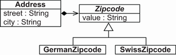

# Chương 6. Ánh xạ value type

> *Java Persistence with Spring Data and Hibernate* — Chương 6: “Mapping value types”

**Nội dung chương này bao gồm**

- Ánh xạ các basic property
- Ánh xạ các embeddable component
- Điều khiển việc ánh xạ giữa kiểu Java và kiểu SQL

Sau khi dành gần trọn chương trước cho entity cùng các tùy chọn ánh xạ class và identity của chúng, giờ chúng ta sẽ tập trung vào value type dưới nhiều dạng khác nhau. Value type xuất hiện thường xuyên trong các class đang được phát triển. Chúng ta sẽ chia value type thành hai nhóm: các class value type cơ bản đi kèm JDK, chẳng hạn `String`, `Date`, các kiểu nguyên thủy và wrapper của chúng; và các class value type do lập trình viên định nghĩa, chẳng hạn `Address` và `MonetaryAmount` trong CaveatEmptor.

Trong chương này, trước tiên chúng ta sẽ ánh xạ các persistent property với kiểu JDK và bàn về những annotation ánh xạ cơ bản. Chúng ta sẽ xem cách làm việc với nhiều khía cạnh của property: ghi đè giá trị mặc định, tùy chỉnh cách truy cập, và giá trị được sinh ra. Chúng ta cũng sẽ thấy SQL được dùng thế nào với derived property và giá trị cột được biến đổi. Chúng ta sẽ làm việc với basic property, temporal property và ánh xạ enum.

Sau đó chúng ta sẽ xem xét các class value type tùy chỉnh và ánh xạ chúng thành embeddable component. Chúng ta sẽ xem các class liên hệ thế nào với schema cơ sở dữ liệu và làm cho các class trở nên embeddable, đồng thời cho phép ghi đè các thuộc tính được nhúng. Chúng ta sẽ hoàn tất phần embeddable component bằng việc ánh xạ các component lồng nhau. Cuối cùng, chúng ta sẽ phân tích cách bạn tùy chỉnh việc nạp và lưu giá trị property ở mức thấp hơn bằng các JPA converter linh hoạt — những điểm mở rộng đã được chuẩn hóa của mọi JPA provider.

> **Các tính năng mới quan trọng trong JPA 2**
>
> JPA 2.2 hỗ trợ Date and Time API của Java 8. Không còn cần dùng thêm các annotation ánh xạ như `@Temporal` vốn trước đây cần để đánh dấu các field kiểu `java.util.Date`.

## 6.1 Ánh xạ basic property

Ánh xạ là trung tâm của kỹ thuật ORM. Nó tạo mối nối giữa thế giới hướng đối tượng và thế giới quan hệ. Khi chúng ta ánh xạ một persistent class, dù đó là entity hay embeddable type (chi tiết hơn ở mục 6.2), theo mặc định mọi property của nó đều được coi là persistent.

Đây là các quy tắc JPA mặc định cho property của persistent class:

- Nếu property là kiểu nguyên thủy hoặc wrapper của kiểu nguyên thủy, hoặc thuộc kiểu `String`, `BigInteger`, `BigDecimal`, `java.time.LocalDateTime`, `java.time.LocalDate`, `java.time.LocalTime`, `java.util.Date`, `java.util.Calendar`, `java.sql.Date`, `java.sql.Time`, `java.sql.Timestamp`, `byte[]`, `Byte[]`, `char[]` hoặc `Character[]`, thì nó tự động là persistent. Hibernate hoặc Spring Data JPA dùng Hibernate sẽ nạp và lưu giá trị property vào một cột với kiểu SQL phù hợp và cùng tên với property.
- Ngược lại, nếu chúng ta đánh dấu class của property bằng `@Embeddable`, hoặc ánh xạ chính property đó bằng `@Embedded`, thì property được ánh xạ như một component được nhúng của class sở hữu. Chúng ta sẽ phân tích việc nhúng component ở phần sau chương này, khi xem xét các class embeddable `Address` và `MonetaryAmount` của CaveatEmptor.
- Ngược lại, nếu kiểu của property là `java.io.Serializable`, giá trị của nó được lưu ở dạng đã serialize. Điều này có thể gây vấn đề tương thích (chúng ta có thể đã lưu thông tin bằng một định dạng class rồi muốn truy xuất lại sau bằng định dạng class khác) và vấn đề hiệu năng (các thao tác serialize/deserialize khá tốn kém). Chúng ta luôn nên ánh xạ các class Java thay vì lưu một dãy byte vào cơ sở dữ liệu. Việc duy trì một cơ sở dữ liệu với thông tin nhị phân này khi ứng dụng có thể biến mất sau vài năm nghĩa là các class mà bản serialize ánh xạ tới sẽ không còn nữa.
- Ngược lại, một ngoại lệ sẽ được ném ra lúc khởi động, phàn nàn rằng kiểu của property không được hiểu.

Cách tiếp cận *configuration by exception* này nghĩa là chúng ta không phải gắn annotation cho một property để làm nó persistent; chúng ta chỉ phải cấu hình ánh xạ trong những trường hợp ngoại lệ. JPA có sẵn nhiều annotation để tùy chỉnh và điều khiển việc ánh xạ basic property.

### 6.1.1 Ghi đè giá trị mặc định của basic property

Chúng ta có thể không muốn mọi property của một entity class đều là persistent. Vậy thông tin nào nên được lưu và thông tin nào thì không? Ví dụ, dù việc có một property persistent `Item#initialPrice` là hợp lý, một property `Item#totalPriceIncludingTax` không nên được lưu vào cơ sở dữ liệu nếu chúng ta chỉ tính và dùng giá trị của nó lúc chạy. Để loại trừ một property, hãy đánh dấu field hoặc phương thức getter của property bằng annotation `@javax.persistence.Transient` hoặc dùng từ khóa `transient` của Java. Từ khóa `transient` loại trừ field khỏi cả Java serialization lẫn persistence, vì nó cũng được các JPA provider nhận diện. Annotation `@javax.persistence.Transient` chỉ loại trừ field khỏi việc lưu trữ.

Để quyết định một property có nên persistent hay không, hãy tự hỏi: Đây có phải thuộc tính cơ bản định hình instance không? Chúng ta có cần nó ngay từ đầu, hay sẽ tính nó từ các property khác? Việc xây dựng lại thông tin sau một thời gian có ý nghĩa không, hay thông tin sẽ không còn giá trị? Đây có phải thông tin nhạy cảm mà ta nên tránh lưu để nó không bị lộ về sau (chẳng hạn mật khẩu dạng rõ)? Đây có phải thông tin không có ý nghĩa trong môi trường khác (chẳng hạn địa chỉ IP nội bộ vốn vô nghĩa ở mạng khác)?

Chúng ta sẽ quay lại vị trí đặt annotation trên field hay trên phương thức getter ở phần sau. Trước hết, hãy giả định như trước rằng Hibernate hoặc Spring Data JPA dùng Hibernate sẽ truy cập trực tiếp field vì `@Id` đã được đặt trên các field này. Do đó, mọi annotation ánh xạ JPA và Hibernate khác cũng nằm trên field.

> **CHÚ Ý** Để thực thi các ví dụ từ mã nguồn, trước tiên bạn cần chạy script Ch06.sql. Mã nguồn nằm trong thư mục `mapping-value-types`.

Trong ứng dụng CaveatEmptor, mục tiêu của chúng ta không chỉ là lo phần logic persistence trong chương trình, mà còn xây dựng mã linh hoạt và dễ thay đổi. Nếu không muốn dựa vào các mặc định ánh xạ property, chúng ta có thể áp dụng annotation `@Basic` cho một property cụ thể, chẳng hạn `initialPrice` của `Item`:

```java
@Basic(optional = false)
BigDecimal initialPrice;
```

Annotation này không cung cấp nhiều lựa chọn. Nó chỉ có hai tham số: `optional` và `fetch`. Chúng ta sẽ bàn về tùy chọn `fetch` khi khám phá các chiến lược tối ưu ở mục 12.1. Tùy chọn được thể hiện ở đây, `optional`, đánh dấu property là không tùy chọn ở mức object Java.

Theo mặc định, mọi persistent property đều cho phép null và là tùy chọn, nghĩa là một `Item` có thể có `initialPrice` chưa biết. Việc ánh xạ property `initialPrice` là non-optional có ý nghĩa nếu bạn muốn có constraint `NOT NULL` trên cột `INITIALPRICE` trong schema SQL. Schema SQL được sinh ra sẽ tự động bao gồm constraint `NOT NULL` cho các property non-optional.

Giờ nếu ứng dụng cố lưu một `Item` mà không gán giá trị cho field `initialPrice`, một ngoại lệ sẽ được ném ra trước khi câu lệnh SQL được gửi tới cơ sở dữ liệu. Cần có một giá trị cho `initialPrice` để thực hiện `INSERT` hay `UPDATE`. Nếu chúng ta không đánh dấu property `initialPrice` là optional và cố lưu `NULL`, cơ sở dữ liệu sẽ từ chối câu lệnh SQL, và một ngoại lệ vi phạm constraint sẽ được ném ra.

Thay vì `@Basic`, chúng ta có thể dùng annotation `@Column` để khai báo tính cho phép null:

```java
@Column(nullable = false)
BigDecimal initialPrice;
```

Giờ chúng ta đã thấy ba cách khai báo rằng một giá trị property là bắt buộc: bằng annotation `@Basic`, bằng annotation `@Column`, và trước đó bằng annotation `@NotNull` của Bean Validation (ở mục 3.3.2). Cả ba đều có cùng tác dụng với JPA provider: một phép kiểm tra null được thực hiện khi lưu, và một constraint `NOT NULL` được sinh ra trong schema cơ sở dữ liệu. Chúng tôi khuyến nghị dùng annotation `@NotNull` của Bean Validation để bạn có thể kiểm định thủ công một instance `Item` và để mã giao diện người dùng ở tầng presentation tự động thực hiện các kiểm tra kiểm định. Kết quả cuối cùng khác nhau không nhiều, nhưng việc không gửi tới cơ sở dữ liệu một câu lệnh chắc chắn thất bại thì gọn gàng hơn.

Annotation `@Column` cũng có thể ghi đè việc ánh xạ tên property tới cột cơ sở dữ liệu:

```java
@Column(name = "START_PRICE", nullable = false)
BigDecimal initialPrice;
```

Annotation `@Column` còn có một vài tham số khác, hầu hết điều khiển các chi tiết ở mức SQL như tên `catalog` và `schema`. Chúng hiếm khi cần thiết, và chúng tôi chỉ minh họa chúng trong cuốn sách này khi cần.

Annotation của property không phải lúc nào cũng nằm trên field, và chúng ta có thể không muốn JPA provider truy cập trực tiếp field. Hãy xem cách tùy chỉnh việc truy cập property.

### 6.1.2 Tùy chỉnh cách truy cập property

Persistence engine truy cập các property của một class hoặc trực tiếp qua field, hoặc gián tiếp qua phương thức getter và setter. Giờ chúng ta sẽ thử trả lời câu hỏi “nên truy cập mỗi persistent property thế nào?”. Một entity có annotation kế thừa mặc định từ vị trí của annotation `@Id` bắt buộc. Ví dụ, nếu chúng ta khai báo `@Id` trên một field thay vì trên phương thức getter, thì mọi annotation ánh xạ khác của entity đó đều được kỳ vọng nằm trên field. Annotation không được hỗ trợ trên phương thức setter.

Chiến lược truy cập mặc định không chỉ áp dụng cho một entity class đơn lẻ. Mọi class `@Embedded` đều kế thừa chiến lược truy cập mặc định hoặc được khai báo tường minh của entity class gốc sở hữu nó. Chúng ta sẽ đề cập tới embedded component ở phần sau chương này. Hơn nữa, mọi property `@MappedSuperclass` được truy cập bằng chiến lược mặc định hoặc được khai báo tường minh của entity class đã ánh xạ. Kế thừa là chủ đề của chương 7.

Đặc tả JPA cung cấp annotation `@Access` để ghi đè hành vi mặc định, dùng các tham số `AccessType.FIELD` (truy cập qua field) và `AccessType.PROPERTY` (truy cập qua getter). Khi bạn đặt `@Access` ở mức class hay entity, mọi property của class sẽ được truy cập theo chiến lược đã chọn. Mọi annotation ánh xạ khác, kể cả `@Id`, có thể đặt trên field hoặc trên phương thức getter.

Chúng ta cũng có thể dùng annotation `@Access` để ghi đè chiến lược truy cập cho từng property riêng lẻ, như ở ví dụ sau. Lưu ý rằng vị trí của các annotation ánh xạ khác, như `@Column`, không thay đổi — chỉ có cách instance được truy cập lúc chạy là thay đổi.

**Listing 6.1** Ghi đè chiến lược truy cập cho property name

*Đường dẫn: Ch06/mapping-value-types/src/main/java/com/manning/javapersistence/ch06/model/Item.java*

```java
@Entity
public class Item {

    @Id                                                        // Ⓐ
    @GeneratedValue(generator = "ID_GENERATOR")
    private Long id;

    @Access(AccessType.PROPERTY)                               // Ⓑ
    @Column(name = "ITEM_NAME")
    private String name;

    public String getName() {                                  // Ⓒ
        return name;
    }

    public void setName(String name) {                         // Ⓒ
        this.name =
                !name.startsWith("AUCTION: ") ? "AUCTION: " + name : name;
    }
}
```

Ⓐ Entity `Item` mặc định dùng field access. `@Id` nằm trên field.

Ⓑ Thiết lập `@Access(AccessType.PROPERTY)` trên field `name` chuyển property cụ thể này sang được JPA provider truy cập lúc chạy thông qua getter/setter.

Ⓒ Hibernate hoặc Spring Data JPA dùng Hibernate gọi `getName()` và `setName()` khi nạp và lưu các item.

Giờ hãy đảo ngược lại: nếu access type mặc định (hoặc tường minh) của entity là qua phương thức getter và setter, thì `@Access(AccessType.FIELD)` trên một phương thức getter sẽ bảo Hibernate hoặc Spring Data JPA dùng Hibernate truy cập trực tiếp field. Mọi thông tin ánh xạ khác vẫn phải nằm trên phương thức getter, không phải trên field.

Một số property không ánh xạ tới cột nào. Cụ thể, một *derived property* (như một field được tính toán) lấy giá trị của nó từ một biểu thức SQL.

### 6.1.3 Sử dụng derived property

Giờ chúng ta đến với derived property — những property được suy ra từ những property khác. Giá trị của một derived property được tính lúc chạy bằng cách đánh giá một biểu thức SQL khai báo bằng annotation `@org.hibernate.annotations.Formula`, như ở listing sau.

**Listing 6.2** Hai derived property chỉ đọc

*Đường dẫn: Ch06/mapping-value-types/src/main/java/com/manning/javapersistence/ch06/model/Item.java*

```java
@Formula(
    "CONCAT(SUBSTR(DESCRIPTION, 1, 12), '...')"
)
private String shortDescription;

@Formula(
    "(SELECT AVG(B.AMOUNT) FROM BID B WHERE B.ITEM_ID = ID)"
)
private BigDecimal averageBidAmount;
```

Các công thức SQL được đánh giá mỗi lần entity `Item` được truy xuất từ cơ sở dữ liệu chứ không phải vào lúc nào khác, nên kết quả có thể trở nên lỗi thời nếu các property khác bị sửa đổi. Những property này không bao giờ xuất hiện trong câu lệnh SQL `INSERT` hay `UPDATE`, chỉ trong `SELECT`. Việc đánh giá diễn ra trong cơ sở dữ liệu; công thức SQL được nhúng vào mệnh đề `SELECT` khi nạp instance.

Các công thức SQL có thể tham chiếu tới cột của table trong cơ sở dữ liệu, có thể gọi các hàm SQL cụ thể của cơ sở dữ liệu, và thậm chí có thể chứa subselect SQL. Trong ví dụ trên, các hàm `SUBSTR()` và `CONCAT()` được gọi.

Biểu thức SQL được truyền tới cơ sở dữ liệu bên dưới nguyên trạng. Việc dựa vào các toán tử hay từ khóa đặc thù nhà cung cấp có thể ràng buộc mapping metadata vào một sản phẩm cơ sở dữ liệu cụ thể. Ví dụ, hàm `CONCAT()` ở listing trên là đặc thù của MySQL, nên bạn nên lưu ý rằng tính khả chuyển có thể bị ảnh hưởng. Lưu ý rằng tên cột không được định danh đầy đủ sẽ tham chiếu tới cột của table thuộc class chứa derived property đó.

Hibernate cũng hỗ trợ một biến thể của formula gọi là *column transformer*, cho phép bạn viết biểu thức SQL tùy chỉnh để đọc và ghi giá trị property. Hãy tìm hiểu khả năng này.

### 6.1.4 Biến đổi giá trị cột

Bây giờ hãy xử lý thông tin có cách biểu diễn khác nhau trong hệ thống hướng đối tượng và hệ thống quan hệ. Giả sử một cơ sở dữ liệu có cột tên `IMPERIALWEIGHT`, lưu trọng lượng của một `Item` bằng pound. Tuy nhiên, ứng dụng có property `Item#metricWeight` tính bằng kilogram, nên chúng ta sẽ phải chuyển đổi giá trị cột khi đọc một dòng từ table `ITEM` và khi ghi vào đó. Chúng ta có thể hiện thực điều này bằng một phần mở rộng của Hibernate: annotation `@org.hibernate.annotations.ColumnTransformer`.

**Listing 6.3** Biến đổi giá trị cột bằng biểu thức SQL

*Đường dẫn: Ch06/mapping-value-types/src/main/java/com/manning/javapersistence/ch06/model/Item.java*

```java
@Column(name = "IMPERIALWEIGHT")
@ColumnTransformer(
     read = "IMPERIALWEIGHT / 2.20462",
     write = "? * 2.20462"
)
private double metricWeight;
```

Khi đọc một dòng từ table `ITEM`, Hibernate hoặc Spring Data JPA dùng Hibernate sẽ nhúng biểu thức `IMPERIALWEIGHT / 2.20462`, nên việc tính toán diễn ra trong cơ sở dữ liệu, và giá trị hệ mét được trả về trong kết quả tới tầng ứng dụng. Khi ghi vào cột, Hibernate hoặc Spring Data JPA dùng Hibernate đặt giá trị hệ mét vào chỗ giữ chỗ (placeholder) duy nhất bắt buộc (dấu chấm hỏi), và biểu thức SQL tính ra giá trị thực tế cần chèn hoặc cập nhật.

Hibernate cũng áp dụng column converter trong các ràng buộc của truy vấn. Ví dụ, truy vấn ở listing sau lấy tất cả item có trọng lượng 2 kilogram.

**Listing 6.4** Áp dụng column converter trong ràng buộc truy vấn

*Đường dẫn: Ch06/mapping-value-types/src/test/java/com/manning/javapersistence/ch06/MappingValuesJPATest.java*

```java
List<Item> result =
     em.createQuery("SELECT i FROM Item i WHERE i.metricWeight = :w")
       .setParameter("w", 2.0)
       .getResultList();
```

Câu SQL thực tế được thực thi cho truy vấn này chứa ràng buộc sau trong mệnh đề `WHERE`:

```sql
// . . .
where
     i.IMPERIALWEIGHT / 2.20462=?
```

Lưu ý rằng cơ sở dữ liệu có lẽ sẽ không thể dựa vào chỉ mục cho ràng buộc này; một lần quét toàn bảng sẽ được thực hiện vì trọng lượng của tất cả dòng `ITEM` phải được tính để đánh giá ràng buộc.

Một loại property đặc biệt khác dựa vào giá trị do cơ sở dữ liệu sinh ra.

### 6.1.5 Giá trị property được sinh ra và giá trị mặc định

Đôi khi cơ sở dữ liệu sinh ra giá trị của một property, và điều này thường xảy ra khi chúng ta chèn một dòng lần đầu tiên. Ví dụ về giá trị do cơ sở dữ liệu sinh ra là timestamp tạo, giá mặc định của một item, hoặc một trigger chạy cho mỗi lần sửa đổi.

Thông thường, các ứng dụng Hibernate (hoặc Spring Data JPA dùng Hibernate) cần làm mới các instance chứa property mà cơ sở dữ liệu sinh giá trị sau khi lưu. Nghĩa là ứng dụng sẽ phải thực hiện thêm một vòng gọi tới cơ sở dữ liệu để đọc giá trị sau khi chèn hoặc cập nhật một dòng. Tuy nhiên, việc đánh dấu property là generated cho phép ứng dụng ủy thác trách nhiệm này cho Hibernate hoặc Spring Data JPA dùng Hibernate. Về cơ bản, mỗi khi một câu lệnh SQL `INSERT` hay `UPDATE` được phát cho một entity có khai báo generated property, SQL sẽ thực hiện một câu `SELECT` ngay sau đó để truy xuất các giá trị được sinh ra.

Chúng ta dùng annotation `@org.hibernate.annotations.Generated` để đánh dấu generated property. Với các temporal property, chúng ta dùng annotation `@CreationTimestamp` và `@UpdateTimestamp`. Annotation `@CreationTimestamp` được dùng để đánh dấu property `createdOn`. Nó bảo Hibernate hoặc Spring Data dùng Hibernate sinh giá trị property một cách tự động. Trong trường hợp này, giá trị được đặt là ngày hiện tại trước khi instance entity được chèn vào cơ sở dữ liệu. Annotation dựng sẵn tương tự khác là `@UpdateTimestamp`, sinh giá trị property tự động khi một instance entity được cập nhật.

**Listing 6.5** Giá trị property do cơ sở dữ liệu sinh ra

*Đường dẫn: Ch06/mapping-value-types/src/main/java/com/manning/javapersistence/ch06/model/Item.java*

```java
@CreationTimestamp
private LocalDate createdOn;

@UpdateTimestamp
private LocalDateTime lastModified;

@Column(insertable = false)
@ColumnDefault("1.00")
@Generated(
     org.hibernate.annotations.GenerationTime.INSERT
)
private BigDecimal initialPrice;
```

Các thiết lập khả dụng cho enum `GenerationTime` là `ALWAYS` và `INSERT`. Với `GenerationTime.ALWAYS`, Hibernate hoặc Spring Data JPA dùng Hibernate làm mới instance entity sau mỗi lệnh SQL `UPDATE` hay `INSERT`. Với `GenerationTime.INSERT`, việc làm mới chỉ diễn ra sau một lệnh SQL `INSERT` để truy xuất giá trị mặc định do cơ sở dữ liệu cung cấp. Chúng ta cũng có thể ánh xạ property `initialPrice` là không cho phép `insertable`. Annotation `@ColumnDefault` đặt giá trị mặc định của cột khi Hibernate hoặc Spring Data JPA dùng Hibernate xuất và sinh DDL cho schema SQL.

Timestamp thường được sinh tự động hoặc bởi cơ sở dữ liệu, như ở ví dụ trên, hoặc bởi ứng dụng. Miễn là chúng ta dùng JPA 2.2 và các class `LocalDate`, `LocalDateTime`, `LocalTime` của Java 8, chúng ta không cần dùng annotation `@Temporal`. Các class được liệt kê từ package `java.time` của Java 8 đã bao hàm độ chính xác thời gian trong bản thân chúng: ngày, ngày và giờ, hoặc chỉ giờ. Hãy cùng xem những cách dùng annotation `@Temporal` mà bạn vẫn có thể gặp.

### 6.1.6 Annotation @Temporal

Đặc tả JPA cho phép bạn đánh dấu các temporal property bằng `@Temporal` để khai báo độ chính xác của kiểu dữ liệu SQL cho cột được ánh xạ. Các kiểu temporal của Java trước Java 8 là `java.util.Date`, `java.util.Calendar`, `java.sql.Date`, `java.sql.Time` và `java.sql.Timestamp`. Listing sau cho một ví dụ về việc dùng annotation `@Temporal`.

**Listing 6.6** Property kiểu temporal phải được đánh dấu bằng @Temporal

```java
@CreationTimestamp
@Temporal(TemporalType.DATE)
private Date createdOn;

@UpdateTimestamp
@Temporal(TemporalType.TIMESTAMP)
private Date lastModified;
```

Các tùy chọn `TemporalType` khả dụng là `DATE`, `TIME` và `TIMESTAMP`, xác định phần nào của giá trị thời gian sẽ được lưu trong cơ sở dữ liệu. Mặc định là `TemporalType.TIMESTAMP` khi không có annotation `@Temporal`.

Một loại property đặc biệt khác được biểu diễn bởi các enum.

### 6.1.7 Ánh xạ enum

Kiểu enum là một thành ngữ phổ biến trong Java, khi một class có một số hằng (nhỏ) các instance bất biến. Trong CaveatEmptor chẳng hạn, chúng ta có thể áp dụng điều này cho các phiên đấu giá có một số kiểu giới hạn:

*Đường dẫn: Ch06/mapping-value-types/src/main/java/com/manning/javapersistence/ch06/model/AuctionType.java*

```java
public enum AuctionType {
    HIGHEST_BID,
    LOWEST_BID,
    FIXED_PRICE
}
```

Giờ chúng ta có thể đặt `auctionType` phù hợp cho mỗi `Item`:

*Đường dẫn: Ch06/mapping-value-types/src/main/java/com/manning/javapersistence/ch06/model/Item.java*

```java
@NotNull
@Enumerated(EnumType.STRING)
private AuctionType auctionType = AuctionType.HIGHEST_BID;
```

Nếu không có annotation `@Enumerated`, Hibernate hoặc Spring Data JPA dùng Hibernate sẽ lưu vị trí `ORDINAL` của giá trị. Nghĩa là nó sẽ lưu 1 cho `HIGHEST_BID`, 2 cho `LOWEST_BID` và 3 cho `FIXED_PRICE`. Đây là một mặc định mong manh; nếu bạn thay đổi enum `AuctionType` và thêm một instance mới, các giá trị hiện có có thể không còn ánh xạ tới cùng vị trí và làm hỏng ứng dụng. Do đó tùy chọn `EnumType.STRING` là lựa chọn tốt hơn; Hibernate hoặc Spring Data JPA dùng Hibernate có thể lưu nhãn của giá trị enum nguyên trạng.

Đến đây kết thúc phần điểm qua basic property và các tùy chọn ánh xạ của chúng. Cho tới giờ chúng ta đã xem xét các property thuộc kiểu do JDK cung cấp như `String`, `Date` và `BigDecimal`. Domain model cũng có các class value type tùy chỉnh — những class có quan hệ composition trong sơ đồ UML.

## 6.2 Ánh xạ embeddable component

Các class được ánh xạ trong domain model của chúng ta cho tới giờ đều là entity class, mỗi class có vòng đời và identity riêng. Tuy nhiên, class `User` có một loại association đặc biệt với class `Address`, như minh họa ở hình 6.1.



**Hình 6.1** Composition giữa `User` và `Address`

Theo thuật ngữ mô hình hóa hướng đối tượng, association này là một dạng aggregation — quan hệ “là một phần của”. Aggregation là một dạng association, nhưng nó mang thêm ngữ nghĩa liên quan tới vòng đời của các object. Trong trường hợp này, chúng ta có một dạng còn mạnh hơn: *composition*, trong đó vòng đời của phần phụ thuộc hoàn toàn vào vòng đời của tổng thể. Một object `Address` không thể tồn tại khi không có object `User`, nên một class được composition trong UML, chẳng hạn `Address`, thường là ứng viên value type cho object/relational mapping.

### 6.2.1 Schema cơ sở dữ liệu

Chúng ta có thể ánh xạ quan hệ composition như vậy với `Address` là một value type (với cùng ngữ nghĩa như `String` hay `BigDecimal`) và `User` là một entity. Schema SQL đích được thể hiện ở hình 6.2.



**Hình 6.2** Các cột của component được nhúng trong table của entity.

Chỉ có một table được ánh xạ, `USERS`, cho entity `User`. Table này nhúng tất cả chi tiết của các component, trong đó một dòng duy nhất giữ một `User` cụ thể cùng `homeAddress` và `billingAddress` của họ. Nếu một entity khác có tham chiếu tới một `Address` — chẳng hạn `Shipment#deliveryAddress` — thì table `SHIPMENT` cũng sẽ có tất cả các cột cần thiết để lưu một `Address`.

Schema này phản ánh ngữ nghĩa value type: một `Address` cụ thể không thể được dùng chung; nó không có identity riêng. Primary key của nó là định danh cơ sở dữ liệu đã ánh xạ của entity sở hữu. Một embedded component có vòng đời phụ thuộc: khi instance entity sở hữu được lưu, instance component cũng được lưu. Khi instance entity sở hữu bị xóa, instance component cũng bị xóa. Không cần thực thi SQL đặc biệt nào cho việc này; toàn bộ dữ liệu nằm trong một dòng duy nhất.

Việc có “nhiều class hơn số table” là cách các domain model mịn được hỗ trợ. Hãy viết các class và ánh xạ cho cấu trúc này.

### 6.2.2 Làm cho class trở nên embeddable

Java không có khái niệm composition — một class hay property không thể được đánh dấu là component. Khác biệt duy nhất giữa một component và một entity là định danh cơ sở dữ liệu: một class component không có identity riêng, nên class component không cần property định danh hay ánh xạ định danh. Nó là một POJO đơn giản, như ở listing sau.

**Listing 6.7** Class Address: một embeddable component

*Đường dẫn: Ch06/mapping-value-types/src/main/java/com/manning/javapersistence/ch06/model/Address.java*

```java
@Embeddable                                        // Ⓐ
public class Address {

    @NotNull                                       // Ⓑ
    @Column(nullable = false)                      // Ⓒ
    private String street;

    @NotNull
    @Column(nullable = false, length = 5)          // Ⓓ
    private String zipcode;

    @NotNull
    @Column(nullable = false)                      // Ⓔ
    private String city;

    public Address() {                             // Ⓕ
    }

    public Address(String street, String zipcode, String city) {  // Ⓖ
        this.street = street;
        this.zipcode = zipcode;
        this.city = city;
    }

    //getters and setters
}
```

Ⓐ Thay vì `@Entity`, POJO component này được đánh dấu bằng `@Embeddable`. Nó không có property định danh.

Ⓑ Annotation `@NotNull` bị bỏ qua khi sinh DDL.

Ⓒ `@Column(nullable=false)` được dùng cho việc sinh DDL.

Ⓓ Tham số `length` của annotation `@Column` sẽ ghi đè việc sinh cột mặc định là `VARCHAR(255)`.

Ⓔ Kiểu của cột `city` theo mặc định sẽ là `VARCHAR(255)`.

Ⓕ Hibernate hoặc Spring Data JPA dùng Hibernate gọi constructor không tham số này để tạo instance rồi điền trực tiếp vào các field.

Ⓖ Chúng ta có thể có thêm các constructor (public) cho tiện.

Ở listing trên, mọi property của class embeddable đều là persistent theo mặc định, giống như property của một persistent entity class. Các ánh xạ property có thể được cấu hình bằng cùng những annotation, chẳng hạn `@Column` hay `@Basic`. Các property của class `Address` ánh xạ tới các cột `STREET`, `ZIPCODE` và `CITY`, và chúng bị ràng buộc `NOT NULL`. Đó là toàn bộ ánh xạ.

> **Vấn đề: Hibernate Validator không sinh constraint NOT NULL**
>
> Tại thời điểm viết sách, vẫn còn một lỗi chưa được khắc phục ở Hibernate Validator: Hibernate sẽ không ánh xạ constraint `@NotNull` trên property của embeddable component thành constraint `NOT NULL` khi sinh schema cơ sở dữ liệu. Hibernate sẽ chỉ dùng `@NotNull` trên property của component lúc chạy cho Bean Validation. Chúng ta phải ánh xạ property bằng `@Column(nullable = false)` để sinh constraint trong schema. Cơ sở dữ liệu lỗi của Hibernate theo dõi vấn đề này với mã HVAL-3 (xem http://mng.bz/lR0R).

Không có gì đặc biệt ở entity `User`.

**Listing 6.8** Class User chứa tham chiếu tới một Address

*Đường dẫn: Ch06/mapping-value-types/src/main/java/com/manning/javapersistence/ch06/model/User.java*

```java
@Entity
@Table(name = "USERS")
public class User {

    @Id
    @GeneratedValue(generator = Constants.ID_GENERATOR)
    private Long id;

    private Address homeAddress;              // Ⓐ
    // . . .
}
```

Ⓐ `Address` đã là `@Embeddable` nên không cần annotation nào ở đây.

Ở listing trên, Hibernate hoặc Spring Data dùng Hibernate phát hiện rằng class `Address` được đánh dấu `@Embeddable`; các cột `STREET`, `ZIPCODE` và `CITY` được ánh xạ trên table `USERS`, table của entity sở hữu.

Khi bàn về việc truy cập property ở đầu chương này, chúng tôi đã đề cập rằng embeddable component kế thừa chiến lược truy cập từ entity sở hữu chúng. Nghĩa là Hibernate hoặc Spring Data dùng Hibernate sẽ truy cập các property của class `Address` với cùng chiến lược như với property của `User`. Việc kế thừa này cũng ảnh hưởng tới vị trí đặt annotation ánh xạ trong các class embeddable component. Các quy tắc như sau:

- Nếu `@Entity` sở hữu một embedded component được ánh xạ với field access, hoặc ngầm định qua `@Id` trên một field, hoặc tường minh qua `@Access(AccessType.FIELD)` trên class, thì mọi annotation ánh xạ của class embedded component được kỳ vọng nằm trên field của class component đó. Annotation được kỳ vọng nằm trên field của class `Address`, và các field được đọc/ghi trực tiếp lúc chạy. Phương thức getter và setter trên `Address` là tùy chọn.
- Nếu `@Entity` sở hữu một embedded component được ánh xạ với property access, hoặc ngầm định qua `@Id` trên một phương thức getter, hoặc tường minh qua `@Access(AccessType.PROPERTY)` trên class, thì mọi annotation ánh xạ của class embedded component được kỳ vọng nằm trên phương thức getter của class component đó. Giá trị được đọc và ghi bằng cách gọi phương thức getter và setter trên class embeddable component.
- Nếu property được nhúng của entity class sở hữu — `User#homeAddress` ở listing 6.8 — được đánh dấu `@Access(AccessType.FIELD)`, annotation được kỳ vọng nằm trên field của class `Address`, và các field được truy cập lúc chạy.
- Nếu property được nhúng của entity class sở hữu — `User#homeAddress` ở listing 6.8 — được đánh dấu `@Access(AccessType.PROPERTY)`, annotation được kỳ vọng nằm trên phương thức getter của class `Address`, và việc truy cập được thực hiện qua phương thức getter và setter lúc chạy.
- Nếu `@Access` đánh dấu chính class embeddable, chiến lược được chọn sẽ được dùng cho việc đọc annotation ánh xạ trên class embeddable đó và cho việc truy cập lúc chạy.

Giờ hãy so sánh truy cập theo field và theo property. Tại sao bạn nên dùng cách này hay cách kia?

- **Truy cập theo field** — Khi dùng truy cập theo field, bạn có thể bỏ qua phương thức getter cho những field không nên phơi bày. Ngoài ra, field được khai báo trên một dòng, còn phương thức truy cập thì trải ra nhiều dòng, nên truy cập theo field sẽ khiến mã dễ đọc hơn.
- **Truy cập theo property** — Phương thức truy cập có thể thực thi thêm logic. Nếu đây là điều bạn muốn xảy ra khi lưu một object, bạn có thể dùng truy cập theo property. Nếu bạn muốn persistence tránh những hành động bổ sung này, hãy dùng truy cập theo field.

Còn một điều nữa cần nhớ: không có cách nào thanh lịch để biểu diễn một tham chiếu `null` tới `Address`. Hãy xem điều gì xảy ra nếu các cột `STREET`, `ZIPCODE` và `CITY` cho phép null. Nếu bạn nạp một `User` không có thông tin địa chỉ nào, `someUser.getHomeAddress()` nên trả về gì? Trong trường hợp này, `null` sẽ được trả về. Hibernate hoặc Spring Data dùng Hibernate cũng lưu một embedded property `null` thành giá trị `NULL` ở tất cả các cột được ánh xạ của component. Do đó, nếu bạn lưu một `User` với `Address` “rỗng” (một instance `Address` tồn tại, nhưng mọi property của nó đều `null`), sẽ không có instance `Address` nào được trả về khi nạp `User`. Điều này có thể phản trực giác; có lẽ dù sao bạn cũng không nên có các cột cho phép null, và hãy tránh logic ba giá trị (ternary logic), vì nhiều khả năng bạn sẽ muốn user của mình có một địa chỉ thực sự.

Chúng ta nên ghi đè các phương thức `equals()` và `hashCode()` của `Address` để so sánh instance theo giá trị. Tuy nhiên, điều này không quá quan trọng miễn là chúng ta không phải so sánh các instance, chẳng hạn bằng cách đặt chúng vào một `HashSet`. Chúng ta sẽ bàn về vấn đề này trong bối cảnh collection ở mục 8.2.1.

Trong kịch bản thực tế, một user có lẽ sẽ có các địa chỉ riêng cho những mục đích khác nhau. Hình 6.1 đã cho thấy một quan hệ composition bổ sung giữa `User` và `Address`: `billingAddress`.

### 6.2.3 Ghi đè các thuộc tính được nhúng

`billingAddress` là một property embedded component khác của class `User` mà chúng ta cần dùng, nên một `Address` nữa phải được lưu trong table `USERS`. Điều này tạo ra xung đột ánh xạ: cho tới giờ chúng ta mới chỉ có các cột `STREET`, `ZIPCODE` và `CITY` trong schema để lưu một `Address`.

Chúng ta sẽ cần thêm các cột để lưu một `Address` nữa cho mỗi dòng `USERS`. Khi ánh xạ `billingAddress`, chúng ta có thể ghi đè tên cột.

**Listing 6.9** Ghi đè tên cột

*Đường dẫn: Ch06/mapping-value-types/src/main/java/com/manning/javapersistence/ch06/model/User.java*

```java
@Entity
@Table(name = "USERS")
public class User {

    @Embedded                                                          // Ⓐ
    @AttributeOverride(name = "street",                                // Ⓑ
        column = @Column(name = "BILLING_STREET"))                     // Ⓑ
    @AttributeOverride(name = "zipcode",                               // Ⓑ
        column = @Column(name = "BILLING_ZIPCODE", length = 5))        // Ⓑ
    @AttributeOverride(name = "city",                                  // Ⓑ
        column = @Column(name = "BILLING_CITY"))                       // Ⓑ
    private Address billingAddress;

    public Address getBillingAddress() {
        return billingAddress;
    }

    public void setBillingAddress(Address billingAddress) {
        this.billingAddress = billingAddress;
    }
    // . . .
}
```

Ⓐ Field `billingAddress` được đánh dấu là embedded. Annotation `@Embedded` thực ra không cần thiết. Bạn có thể đánh dấu hoặc class component hoặc property trong entity class sở hữu (dùng cả hai cũng không sao nhưng chẳng có lợi gì). Annotation `@Embedded` hữu ích nếu bạn muốn ánh xạ một class component của bên thứ ba mà không có mã nguồn và không có annotation, nhưng có phương thức getter và setter đúng chuẩn (như JavaBeans thông thường).

Ⓑ Annotation `@AttributeOverride` (có thể lặp lại) ghi đè có chọn lọc các ánh xạ property của class embedded. Trong ví dụ này chúng ta ghi đè cả ba property và cung cấp tên cột khác nhau. Giờ chúng ta có thể lưu hai instance `Address` trong table `USERS`, mỗi instance ở một tập cột khác nhau (hãy xem lại schema ở hình 6.2).

Mỗi annotation `@AttributeOverride` cho một property của component là “trọn vẹn”; mọi annotation JPA hay Hibernate trên property bị ghi đè đều bị bỏ qua. Nghĩa là các annotation `@Column` trên class `Address` bị bỏ qua, nên tất cả cột `BILLING_*` đều cho phép `NULL`! (Tuy nhiên Bean Validation vẫn nhận diện annotation `@NotNull` trên property của component; chỉ các annotation persistence bị ghi đè.)

Chúng ta sẽ tạo hai interface repository của Spring Data JPA để tương tác với cơ sở dữ liệu. Interface `UserRepository` chỉ mở rộng `CrudRepository`, và nó sẽ kế thừa tất cả phương thức từ interface này. Nó được tổng quát hóa theo `User` và `Long`, vì nó quản lý các entity `User` có ID kiểu `Long`.

**Listing 6.10** Interface UserRepository

*Đường dẫn: Ch06/mapping-value-types/src/main/java/com/manning/javapersistence/ch06/repositories/UserRepository.java*

```java
public interface UserRepository extends CrudRepository<User, Long> {
}
```

Interface `ItemRepository` mở rộng `CrudRepository` và sẽ kế thừa tất cả phương thức từ interface này. Ngoài ra, nó khai báo phương thức `findByMetricWeight`, tuân theo quy ước đặt tên của Spring Data JPA. Nó được tổng quát hóa theo `Item` và `Long`, vì nó quản lý các entity `Item` có ID kiểu `Long`.

**Listing 6.11** Interface ItemRepository

*Đường dẫn: Ch06/mapping-value-types/src/main/java/com/manning/javapersistence/ch06/repositories/ItemRepository.java*

```java
public interface ItemRepository extends CrudRepository<Item, Long> {
    Iterable<Item> findByMetricWeight(double weight);
}
```

Chúng ta sẽ kiểm thử chức năng của mã đã viết bằng framework Spring Data JPA, như minh họa ở listing sau. Mã nguồn của cuốn sách cũng chứa các phương án mã kiểm thử dùng JPA và Hibernate.

**Listing 6.12** Kiểm thử chức năng của mã persistence

*Đường dẫn: Ch06/mapping-value-types/src/test/java/com/manning/javapersistence/ch06/MappingValuesSpringDataJPATest.java*

```java
@ExtendWith(SpringExtension.class)                                  // Ⓐ
@ContextConfiguration(classes = {SpringDataConfiguration.class})    // Ⓑ
public class MappingValuesSpringDataJPATest {

    @Autowired
    private UserRepository userRepository;                          // Ⓒ

    @Autowired
    private ItemRepository itemRepository;                          // Ⓓ

    @Test
    void storeLoadEntities() {

        User user = new User();                                     // Ⓔ
        user.setUsername("username");                               // Ⓔ
        user.setHomeAddress(new Address("Flowers Street",
                                        "12345", "Boston"));        // Ⓔ
        userRepository.save(user);                                  // Ⓕ

        Item item = new Item();                                     // Ⓖ
        item.setName("Some Item");                                  // Ⓖ
        item.setMetricWeight(2);                                    // Ⓖ
        item.setDescription("descriptiondescription");              // Ⓖ
        itemRepository.save(item);                                  // Ⓗ

        List<User> users = (List<User>) userRepository.findAll();   // Ⓘ
        List<Item> items = (List<Item>)
                              itemRepository.findByMetricWeight(2.0);  // Ⓙ

        assertAll(
                () -> assertEquals(1, users.size()),                   // Ⓚ
                () -> assertEquals("username", users.get(0).getUsername()),  // Ⓛ
                () -> assertEquals("Flowers Street",
                           users.get(0).getHomeAddress().getStreet()),  // Ⓜ
                () -> assertEquals("12345",
                           users.get(0).getHomeAddress().getZipcode()), // Ⓝ
                () -> assertEquals("Boston",
                           users.get(0).getHomeAddress().getCity()),    // Ⓞ
                () -> assertEquals(1, items.size()),                    // Ⓟ
                () -> assertEquals("AUCTION: Some Item",
                           items.get(0).getName()),                     // Ⓠ
                () -> assertEquals("descriptiondescription",
                           items.get(0).getDescription()),              // Ⓡ
                () -> assertEquals(AuctionType.HIGHEST_BID,
                           items.get(0).getAuctionType()),              // Ⓢ
                () -> assertEquals("descriptiond...",
                           items.get(0).getShortDescription()),         // Ⓣ
                () -> assertEquals(2.0, items.get(0).getMetricWeight()),// Ⓤ
                () -> assertEquals(LocalDate.now(),
                           items.get(0).getCreatedOn()),                // Ⓥ
                () ->
                    assertTrue(ChronoUnit.SECONDS.between(
                               LocalDateTime.now(),
                               items.get(0).getLastModified()) < 1),    // Ⓦ
                () -> assertEquals(new BigDecimal("1.00"),
                                   items.get(0).getInitialPrice())      // Ⓧ
        );

    }
}
```

Ⓐ Chúng ta mở rộng test bằng `SpringExtension`. Extension này được dùng để tích hợp Spring test context với test JUnit 5 Jupiter.

Ⓑ Spring test context được cấu hình bằng các bean định nghĩa trong class `SpringDataConfiguration`.

Ⓒ Một bean `UserRepository` được Spring tiêm vào qua autowiring.

Ⓓ Một bean `ItemRepository` được Spring tiêm vào qua autowiring. Điều này khả thi vì package `com.manning.javapersistence.ch06.repositories` — nơi `UserRepository` và `ItemRepository` nằm — đã được dùng làm đối số của annotation `@EnableJpaRepositories` trên class `SpringDataConfiguration`. Bạn có thể xem lại chương 2 để nhớ class `SpringDataConfiguration` trông thế nào.

Ⓔ Tạo và thiết lập một user.

Ⓕ Lưu nó vào repository.

Ⓖ Tạo và thiết lập một item.

Ⓗ Lưu nó vào repository.

Ⓘ Lấy danh sách tất cả user.

Ⓙ Lấy danh sách các item có trọng lượng hệ mét 2.0.

Ⓚ Kiểm tra kích thước danh sách user.

Ⓛ Kiểm tra tên.

Ⓜ Kiểm tra địa chỉ đường phố.

Ⓝ Kiểm tra mã ZIP.

Ⓞ Kiểm tra thành phố của user đầu tiên trong danh sách.

Ⓟ Kiểm tra kích thước danh sách item.

Ⓠ Kiểm tra tên của item đầu tiên.

Ⓡ Kiểm tra mô tả của nó.

Ⓢ Kiểm tra kiểu đấu giá.

Ⓣ Kiểm tra mô tả ngắn.

Ⓤ Kiểm tra trọng lượng hệ mét của nó.

Ⓥ Kiểm tra ngày tạo.

Ⓦ Kiểm tra ngày giờ sửa đổi lần cuối.

Ⓧ Kiểm tra giá ban đầu của item đầu tiên trong danh sách. Ngày giờ sửa đổi lần cuối được kiểm tra so với ngày giờ hiện tại, để bảo đảm nằm trong vòng 1 giây (tính đến độ trễ truy xuất).

Domain model ở listing trên có thể cải thiện thêm khả năng tái sử dụng và trở nên mịn hơn bằng cách lồng các embedded component.

### 6.2.4 Ánh xạ embedded component lồng nhau

Hãy xét class `Address` và cách nó đóng gói chi tiết địa chỉ; thay vì có một chuỗi `city` đơn giản, chúng ta có thể chuyển chi tiết này vào một class embeddable `City` mới. Sơ đồ domain model đã sửa đổi được thể hiện ở hình 6.3. Schema SQL đích cho ánh xạ vẫn chỉ có một table `USERS`, như ở hình 6.4. Mã nguồn ở listing 6.13 và 6.14 có thể tìm thấy trong thư mục `mapping-value-types2`.



**Hình 6.3** Composition lồng nhau giữa `Address` và `City`



**Hình 6.4** Các cột được nhúng giữ chi tiết `Address` và `City`.

Một class embeddable có thể có một property được nhúng, và `Address` có property `city`.

**Listing 6.13** Class Address với property city

*Đường dẫn: Ch06/mapping-value-types2/src/main/java/com/manning/javapersistence/ch06/model/Address.java*

```java
@Embeddable
public class Address {

    @NotNull
    @Column(nullable = false)
    private String street;

    @NotNull
    @AttributeOverride(
        name = "name",
        column = @Column(name = "CITY", nullable = false)
    )
    private City city;
    // . . .
}
```

Chúng ta sẽ tạo class embeddable `City` chỉ với các basic property.

**Listing 6.14** Class embeddable City

*Đường dẫn: Ch06/mapping-value-types2/src/main/java/com/manning/javapersistence/ch06/model/City.java*

```java
@Embeddable
public class City {

    @NotNull
    @Column(nullable = false, length = 5)
    private String zipcode;

    @NotNull
    @Column(nullable = false)
    private String name;

    @NotNull
    @Column(nullable = false)
    private String country;
    // . . .
}
```

Chúng ta có thể tiếp tục kiểu lồng nhau này bằng cách tạo một class `Country` chẳng hạn. Mọi property được nhúng, dù nằm sâu đến đâu trong composition, đều được ánh xạ tới các cột của table thuộc entity sở hữu, ở đây là table `USERS`.

Property `name` của class `City` được ánh xạ tới cột `CITY`. Điều này có thể đạt được bằng `@AttributeOverride` trong `Address` (như đã minh họa) hoặc bằng một ghi đè trong entity class gốc `User`. Các property lồng nhau có thể được tham chiếu bằng ký pháp dấu chấm; ví dụ, trên `User#address`, `@AttributeOverride(name = "city.name")` tham chiếu tới thuộc tính `Address#city#name`.

Chúng ta sẽ quay lại embedded component ở mục 8.2, nơi chúng ta sẽ xem xét việc ánh xạ collection các component và dùng tham chiếu từ một component tới một entity.

Ở đầu chương này, chúng ta đã phân tích basic property và cách Hibernate hoặc Spring Data JPA dùng Hibernate ánh xạ một kiểu JDK như `java.lang.String` tới một kiểu SQL phù hợp. Hãy tìm hiểu thêm về hệ thống kiểu này và cách giá trị được chuyển đổi ở mức thấp hơn.

## 6.3 Ánh xạ kiểu Java và kiểu SQL bằng converter

Cho tới nay, chúng ta đã giả định rằng Hibernate hoặc Spring Data JPA dùng Hibernate sẽ chọn đúng kiểu SQL khi ánh xạ một property `java.lang.String`. Nhưng đâu là ánh xạ đúng giữa kiểu Java và kiểu SQL, và chúng ta có thể điều khiển nó thế nào? Chúng ta sẽ định hình sự tương ứng giữa các kiểu này khi đi sâu vào chi tiết.

### 6.3.1 Các kiểu dựng sẵn

Mọi JPA provider đều phải hỗ trợ một tập tối thiểu các phép chuyển đổi Java-sang-SQL. Hibernate và Spring Data JPA dùng Hibernate hỗ trợ tất cả những ánh xạ này, cùng một số adapter bổ sung không thuộc chuẩn nhưng hữu ích trong thực tế. Trước hết hãy xem các kiểu nguyên thủy của Java và tương đương SQL của chúng.

> **Kiểu nguyên thủy và kiểu số**

Các kiểu dựng sẵn ở bảng 6.1 ánh xạ các kiểu nguyên thủy của Java và wrapper của chúng tới các kiểu chuẩn SQL phù hợp. Chúng tôi cũng đưa vào một số kiểu số khác. Các tên ở cột Name là đặc thù của Hibernate; chúng ta sẽ dùng chúng sau khi tùy chỉnh ánh xạ kiểu.

**Bảng 6.1** Các kiểu nguyên thủy Java ánh xạ tới kiểu chuẩn SQL

| Name | Kiểu Java | Kiểu ANSI SQL |
| --- | --- | --- |
| `integer` | `int`, `java.lang.Integer` | `INTEGER` |
| `long` | `long`, `java.lang.Long` | `BIGINT` |
| `short` | `short`, `java.lang.Short` | `SMALLINT` |
| `float` | `float`, `java.lang.Float` | `FLOAT` |
| `double` | `double`, `java.lang.Double` | `DOUBLE` |
| `byte` | `byte`, `java.lang.Byte` | `TINYINT` |
| `boolean` | `boolean`, `java.lang.Boolean` | `BOOLEAN` |
| `big_decimal` | `java.math.BigDecimal` | `NUMERIC` |
| `big_integer` | `java.math.BigInteger` | `NUMERIC` |

Có lẽ bạn đã nhận thấy rằng sản phẩm DBMS của bạn không hỗ trợ một số kiểu SQL được liệt kê. Những tên kiểu SQL này là tên kiểu theo chuẩn ANSI. Hầu hết nhà cung cấp DBMS bỏ qua phần này của chuẩn SQL, thường vì hệ thống kiểu cũ của họ có trước chuẩn. Tuy nhiên, JDBC cung cấp một trừu tượng hóa một phần cho các kiểu dữ liệu đặc thù nhà cung cấp, cho phép Hibernate làm việc với kiểu chuẩn ANSI khi thực thi các câu lệnh DML như `INSERT` và `UPDATE`. Với việc sinh schema đặc thù sản phẩm, Hibernate dịch từ kiểu chuẩn ANSI sang kiểu đặc thù nhà cung cấp phù hợp bằng SQL dialect đã cấu hình. Nghĩa là chúng ta thường không phải lo về kiểu dữ liệu SQL nếu để Hibernate tạo schema cho mình.

Nếu chúng ta có sẵn schema hoặc cần biết kiểu dữ liệu native cho DBMS của mình, chúng ta có thể xem mã nguồn của SQL dialect đã cấu hình. Ví dụ, `H2Dialect` đi kèm Hibernate chứa ánh xạ sau từ kiểu ANSI `NUMERIC` tới kiểu `DECIMAL` đặc thù nhà cung cấp: `registerColumnType(Types.NUMERIC, "decimal($p,$s)")`.

Kiểu SQL `NUMERIC` hỗ trợ thiết lập độ chính xác thập phân (precision) và scale. Thiết lập precision và scale mặc định cho một property `BigDecimal` chẳng hạn là `NUMERIC(19, 2)`. Để ghi đè điều này khi sinh schema, hãy áp dụng annotation `@Column` trên property và đặt các tham số `precision` và `scale` của nó.

Tiếp theo là các kiểu ánh xạ tới chuỗi trong cơ sở dữ liệu.

> **Kiểu ký tự**

Bảng 6.2 cho thấy các kiểu ánh xạ biểu diễn giá trị ký tự và chuỗi.

**Bảng 6.2** Adapter cho giá trị ký tự và chuỗi

| Name | Kiểu Java | Kiểu ANSI SQL |
| --- | --- | --- |
| `string` | `java.lang.String` | `VARCHAR` |
| `character` | `char[]`, `Character[]`, `java.lang.String` | `CHAR` |
| `yes_no` | `boolean`, `java.lang.Boolean` | `CHAR(1)`, `'Y'` hoặc `'N'` |
| `true_false` | `boolean`, `java.lang.Boolean` | `CHAR(1)`, `'T'` hoặc `'F'` |
| `class` | `java.lang.Class` | `VARCHAR` |
| `locale` | `java.util.Locale` | `VARCHAR` |
| `timezone` | `java.util.TimeZone` | `VARCHAR` |
| `currency` | `java.util.Currency` | `VARCHAR` |

Hệ thống kiểu của Hibernate chọn kiểu dữ liệu SQL tùy theo độ dài khai báo của một giá trị chuỗi: nếu property `String` được đánh dấu bằng `@Column(length = ...)` hoặc `@Length` của Bean Validation, Hibernate chọn kiểu dữ liệu SQL phù hợp cho kích thước chuỗi cho trước. Việc lựa chọn này cũng phụ thuộc vào SQL dialect đã cấu hình. Ví dụ, với MySQL, độ dài lên tới 65.535 sẽ sinh ra một cột `VARCHAR(length)` thông thường khi schema được Hibernate sinh ra. Với độ dài lên tới 16.777.215, kiểu dữ liệu `MEDIUMTEXT` đặc thù MySQL được sinh ra, và độ dài lớn hơn nữa dùng `LONGTEXT`. Độ dài mặc định của Hibernate cho mọi property `java.lang.String` là 255, nên nếu không ánh xạ gì thêm, một property `String` ánh xạ tới cột `VARCHAR(255)`. Bạn có thể tùy chỉnh việc chọn kiểu này bằng cách mở rộng class SQL dialect của mình; hãy đọc tài liệu và mã nguồn của dialect để biết chi tiết cho sản phẩm DBMS của bạn.

Cơ sở dữ liệu thường bật quốc tế hóa văn bản với một bộ ký tự mặc định hợp lý (UTF-8) cho toàn bộ cơ sở dữ liệu hoặc ít nhất cho cả table. Đây là thiết lập đặc thù DBMS. Nếu bạn cần điều khiển mịn hơn và muốn chuyển sang các biến thể quốc gia của kiểu dữ liệu ký tự (chẳng hạn `NVARCHAR`, `NCHAR` hay `NCLOB`), hãy đánh dấu ánh xạ property bằng `@org.hibernate.annotations.Nationalized`.

Cũng có sẵn một số converter đặc biệt cho các cơ sở dữ liệu cũ hoặc DBMS có hệ thống kiểu hạn chế, chẳng hạn Oracle. DBMS Oracle thậm chí không có kiểu dữ liệu chân trị (truth-valued) — kiểu dữ liệu duy nhất mà mô hình quan hệ yêu cầu. Do đó nhiều schema Oracle hiện có biểu diễn giá trị Boolean bằng ký tự Y/N hoặc T/F. Hoặc — và đây là mặc định trong dialect Oracle của Hibernate — một cột kiểu `NUMBER(1,0)` được kỳ vọng và sinh ra. Một lần nữa, hãy tham khảo SQL dialect của DBMS nếu bạn muốn biết tất cả ánh xạ từ kiểu dữ liệu ANSI sang kiểu đặc thù nhà cung cấp.

Tiếp theo là các kiểu ánh xạ tới ngày và giờ trong cơ sở dữ liệu.

> **Kiểu ngày và giờ**

Bảng 6.3 liệt kê các kiểu liên quan tới ngày, giờ và timestamp.

**Bảng 6.3** Kiểu ngày và giờ

| Name | Kiểu Java | Kiểu ANSI SQL |
| --- | --- | --- |
| `date` | `java.util.Date`, `java.sql.Date` | `DATE` |
| `time` | `java.util.Date`, `java.sql.Time` | `TIME` |
| `timestamp` | `java.util.Date`, `java.sql.Timestamp` | `TIMESTAMP` |
| `calendar` | `java.util.Calendar` | `TIMESTAMP` |
| `calendar_date` | `java.util.Calendar` | `DATE` |
| `duration` | `java.time.Duration` | `BIGINT` |
| `instant` | `java.time.Instant` | `TIMESTAMP` |
| `localdatetime` | `java.time.LocalDateTime` | `TIMESTAMP` |
| `localdate` | `java.time.LocalDate` | `DATE` |
| `localtime` | `java.time.LocalTime` | `TIME` |
| `offsetdatetime` | `java.time.OffsetDateTime` | `TIMESTAMP` |
| `offsettime` | `java.time.OffsetTime` | `TIME` |
| `zoneddatetime` | `java.time.ZonedDateTime` | `TIMESTAMP` |

Trong domain model, chúng ta có thể biểu diễn dữ liệu ngày và giờ bằng `java.util.Date`, `java.util.Calendar`, các subclass của `java.util.Date` được định nghĩa trong package `java.sql`, hoặc các class Java 8 từ package `java.time`. Quyết định tốt nhất hiện nay là dùng API Java 8 trong package `java.time`. Các class này có thể biểu diễn một ngày, một giờ, một ngày kèm giờ, hoặc thậm chí bao gồm cả offset tới múi giờ UTC (`OffsetDateTime` và `OffsetTime`). JPA 2.2 chính thức hỗ trợ các class ngày giờ của Java 8.

Hành vi của Hibernate với property `java.util.Date` thoạt đầu có thể gây bất ngờ: khi lưu một `java.util.Date`, Hibernate sẽ không trả về `java.util.Date` sau khi nạp. Nó sẽ trả về `java.sql.Date`, `java.sql.Time` hoặc `java.sql.Timestamp`, tùy theo property được ánh xạ bằng `TemporalType.DATE`, `TemporalType.TIME` hay `TemporalType.TIMESTAMP`.

Hibernate phải dùng subclass của JDBC khi nạp dữ liệu từ cơ sở dữ liệu vì các kiểu của cơ sở dữ liệu có độ chính xác cao hơn `java.util.Date`. Một `java.util.Date` có độ chính xác mili-giây, nhưng một `java.sql.Timestamp` bao gồm thông tin nano-giây có thể có trong cơ sở dữ liệu. Hibernate sẽ không cắt bỏ thông tin này để nhét giá trị vào `java.util.Date`, điều này có thể dẫn tới vấn đề khi cố so sánh giá trị `java.util.Date` bằng phương thức `equals()`; nó không đối xứng với phương thức `equals()` của subclass `java.sql.Timestamp`.

Giải pháp trong trường hợp như vậy khá đơn giản và thậm chí không đặc thù cho Hibernate: đừng gọi `aDate.equals(bDate)`. Bạn nên luôn so sánh ngày giờ bằng cách so sánh mili-giây Unix time (giả sử bạn không quan tâm tới nano-giây): ví dụ `aDate.getTime() > bDate.getTime()` là `true` nếu `aDate` là thời điểm sau `bDate`. Nhưng hãy cẩn thận: các collection như `HashSet` cũng gọi phương thức `equals()`. Đừng trộn lẫn giá trị `java.util.Date` và `java.sql.Date|Time|Timestamp` trong một collection như vậy.

Bạn sẽ không gặp loại vấn đề này với property `Calendar`. Khi lưu một giá trị `Calendar`, Hibernate sẽ luôn trả về một giá trị `Calendar`, được tạo bằng `Calendar.getInstance()` — kiểu thực tế phụ thuộc vào locale và múi giờ.

Ngoài ra, bạn có thể viết converter của riêng mình, như trình bày ở mục 6.3.2, và biến đổi bất kỳ instance nào của kiểu temporal `java.sql` từ Hibernate thành một instance `java.util.Date` thuần túy. Một converter tùy chỉnh cũng là điểm khởi đầu tốt nếu, chẳng hạn, một instance `Calendar` cần có múi giờ khác mặc định sau khi giá trị được nạp từ cơ sở dữ liệu.

Tất cả những mối lo này sẽ biến mất nếu bạn chọn biểu diễn dữ liệu ngày giờ bằng các class Java 8 `LocalDate`, `LocalTime`, `LocalDateTime`, như đã minh họa trước đó ở mục 6.1.5. Vì bạn vẫn có thể gặp nhiều mã dùng các class cũ, bạn nên biết những vấn đề mà chúng có thể gây ra.

Tiếp theo là các kiểu ánh xạ tới dữ liệu nhị phân và giá trị lớn trong cơ sở dữ liệu.

> **Kiểu nhị phân và giá trị lớn**

Bảng 6.4 liệt kê các kiểu để xử lý dữ liệu nhị phân và giá trị lớn. Lưu ý rằng chỉ `binary` được hỗ trợ làm kiểu của property định danh.

Nếu một property trong persistent Java class có kiểu `byte[]`, Hibernate ánh xạ nó tới cột `VARBINARY`. Kiểu dữ liệu SQL thực tế sẽ tùy thuộc vào dialect; ví dụ, trong PostgreSQL kiểu dữ liệu là `BYTEA`, còn trong Oracle DBMS là `RAW`. Ở một số dialect, độ dài đặt bằng `@Column` cũng ảnh hưởng tới kiểu native được chọn; ví dụ, `LONG RAW` được dùng cho độ dài từ 2.000 trở lên trong Oracle. Trong MySQL, kiểu dữ liệu SQL mặc định sẽ là `TINYBLOB`. Tùy theo độ dài đặt bằng `@Column`, nó có thể là `BLOB`, `MEDIUMBLOB` hoặc `LONGBLOB`.

**Bảng 6.4** Kiểu nhị phân và giá trị lớn

| Name | Kiểu Java | Kiểu ANSI SQL |
| --- | --- | --- |
| `binary` | `byte[]`, `java.lang.Byte[]` | `VARBINARY` |
| `text` | `java.lang.String` | `CLOB` |
| `clob` | `java.sql.Clob` | `CLOB` |
| `blob` | `java.sql.Blob` | `BLOB` |
| `serializable` | `java.io.Serializable` | `VARBINARY` |

Một property `java.lang.String` được ánh xạ tới cột SQL `VARCHAR`, và điều tương tự đúng với `char[]` và `Character[]`. Như đã bàn, một số dialect đăng ký các kiểu native khác nhau tùy theo độ dài khai báo.

Hibernate khởi tạo giá trị property ngay lập tức khi instance entity giữ biến property đó được nạp. Điều này bất tiện khi bạn phải xử lý những giá trị có thể rất lớn, nên bạn thường sẽ muốn ghi đè ánh xạ mặc định này. Đặc tả JPA có một annotation viết tắt tiện lợi cho mục đích này, `@Lob`:

```java
@Entity
public class Item {
    @Lob
    private byte[] image;

    @Lob
    private String description;
}
```

Cách này ánh xạ `byte[]` tới kiểu dữ liệu SQL `BLOB` và `String` tới `CLOB`. Đáng tiếc, bạn vẫn không có lazy loading với thiết kế này. Hibernate hoặc Spring Data JPA dùng Hibernate sẽ phải chặn việc truy cập field và, chẳng hạn, nạp các byte của ảnh khi bạn gọi `someItem.getImage()`. Cách tiếp cận này đòi hỏi bytecode instrumentation cho các class sau khi biên dịch, để tiêm thêm mã. Chúng ta sẽ bàn về lazy loading thông qua bytecode instrumentation và interception ở mục 12.1.2.

Ngoài ra, bạn có thể đổi kiểu của property trong class Java. JDBC hỗ trợ large object (LOB) trực tiếp. Nếu property Java là `java.sql.Clob` hay `java.sql.Blob`, bạn sẽ có lazy loading mà không cần bytecode instrumentation:

```java
@Entity
public class Item {
    @Lob
    private java.sql.Blob imageBlob;

    @Lob
    private java.sql.Clob description;
}
```

> **BLOB/CLOB nghĩa là gì?**
>
> Jim Starkey, người nghĩ ra ý tưởng LOB, nói rằng bộ phận marketing đã tạo ra các thuật ngữ BLOB và CLOB. BLOB được hiểu là Binary Large Object: dữ liệu nhị phân (thường là một object đa phương tiện — hình ảnh, video hoặc âm thanh) được lưu như một thực thể duy nhất. CLOB nghĩa là Character Large Object — dữ liệu ký tự được lưu ở một vị trí riêng mà table chỉ tham chiếu tới.

Các class JDBC này bao gồm hành vi nạp giá trị theo yêu cầu. Khi instance entity sở hữu được nạp, giá trị property là một chỗ giữ chỗ, và giá trị thực chưa được vật chất hóa ngay. Khi bạn truy cập property, trong cùng transaction, giá trị được vật chất hóa hoặc thậm chí được stream trực tiếp (tới client) mà không tiêu tốn bộ nhớ tạm:

```java
Item item = em.find(Item.class, ITEM_ID);
InputStream imageDataStream = item.getImageBlob().getBinaryStream();   // Ⓐ
ByteArrayOutputStream outStream = new ByteArrayOutputStream();         // Ⓑ
StreamUtils.copy(imageDataStream, outStream);                          // Ⓒ
byte[] imageBytes = outStream.toByteArray();
```

Ⓐ Stream trực tiếp các byte.

Ⓑ Hoặc vật chất hóa chúng vào bộ nhớ.

Ⓒ `org.springframework.util.StreamUtils` là một class cung cấp các phương thức tiện ích để làm việc với stream.

Nhược điểm là domain model khi đó bị ràng buộc vào JDBC; trong unit test bạn không thể truy cập property LOB nếu không có kết nối cơ sở dữ liệu.

Để tạo và gán giá trị `Blob` hay `Clob`, Hibernate cung cấp một số phương thức tiện lợi. Ví dụ sau đọc `byteLength` byte từ một `InputStream` trực tiếp vào cơ sở dữ liệu, không tiêu tốn bộ nhớ tạm:

```java
Session session = em.unwrap(Session.class);                       // Ⓐ
Blob blob = session.getLobHelper()                                // Ⓑ
        .createBlob(imageInputStream, byteLength);
someItem.setImageBlob(blob);
em.persist(someItem);
```

Ⓐ Chúng ta cần API native của Hibernate, nên phải unwrap `Session` từ `EntityManager`.

Ⓑ Sau đó chúng ta cần biết số byte muốn đọc từ stream.

Cuối cùng, Hibernate cung cấp cơ chế serialization dự phòng cho bất kỳ kiểu property nào là `java.io.Serializable`. Ánh xạ này chuyển giá trị của property thành một luồng byte lưu trong cột `VARBINARY`. Việc serialize và deserialize diễn ra khi instance entity sở hữu được lưu và nạp. Đương nhiên, bạn nên dùng chiến lược này hết sức thận trọng, vì dữ liệu sống lâu hơn ứng dụng. Một ngày nào đó, sẽ không ai biết những byte trong cơ sở dữ liệu ấy có nghĩa gì. Serialization đôi khi hữu ích cho dữ liệu tạm thời, chẳng hạn tùy chọn của người dùng, dữ liệu phiên đăng nhập, v.v.

Hibernate sẽ chọn đúng loại adapter tùy theo kiểu Java của property. Nếu bạn không thích ánh xạ mặc định, hãy đọc tiếp để ghi đè nó.

> **Chọn type adapter**

Bạn đã thấy nhiều adapter cùng tên Hibernate của chúng ở các mục trước. Hãy dùng tên đó khi ghi đè việc chọn kiểu mặc định của Hibernate và chọn tường minh một adapter cụ thể:

```java
@Entity
public class Item {
    @org.hibernate.annotations.Type(type = "yes_no")
    private boolean verified = false;
}
```

Thay vì `BIT`, `boolean` này giờ ánh xạ tới một cột `CHAR` với giá trị `Y` hoặc `N`.

Bạn cũng có thể ghi đè một adapter ở phạm vi toàn cục trong cấu hình boot của Hibernate bằng một custom user type, mà chúng ta sẽ minh họa cách viết ở mục tiếp theo:

```java
metaBuilder.applyBasicType(new MyUserType(), new String[]{"date"});
```

Thiết lập này sẽ ghi đè adapter kiểu `date` dựng sẵn và ủy thác việc chuyển đổi giá trị cho các property `java.util.Date` tới hiện thực tùy chỉnh.

Chúng tôi coi hệ thống kiểu có thể mở rộng này là một trong những tính năng cốt lõi của Hibernate và là một khía cạnh quan trọng khiến nó rất linh hoạt. Tiếp theo chúng ta sẽ khám phá chi tiết hơn hệ thống kiểu và các JPA custom converter.

### 6.3.2 Tạo JPA converter tùy chỉnh

Một yêu cầu mới cho hệ thống đấu giá trực tuyến là dùng nhiều loại tiền tệ, và việc triển khai thay đổi kiểu này có thể phức tạp. Chúng ta phải sửa schema cơ sở dữ liệu, có thể phải di trú dữ liệu hiện có từ schema cũ sang schema mới, và phải cập nhật tất cả ứng dụng truy cập cơ sở dữ liệu. Trong mục này, chúng tôi sẽ minh họa cách JPA converter và hệ thống kiểu mở rộng được của Hibernate có thể hỗ trợ quá trình này, cung cấp thêm một vùng đệm linh hoạt giữa ứng dụng và cơ sở dữ liệu.

Để hỗ trợ nhiều loại tiền tệ, chúng ta sẽ đưa vào một class mới trong domain model CaveatEmptor: `MonetaryAmount`, như ở listing sau.

**Listing 6.15** Class value type bất biến MonetaryAmount

*Đường dẫn: Ch06/mapping-value-types2/src/main/java/com/manning/javapersistence/ch06/model/MonetaryAmount.java*

```java
public class MonetaryAmount implements Serializable {              // Ⓐ

    private final BigDecimal value;                                // Ⓑ
    private final Currency currency;                               // Ⓑ

    public MonetaryAmount(BigDecimal value, Currency currency) {   // Ⓑ
        this.value = value;
        this.currency = currency;
    }

    public BigDecimal getValue() {                                 // Ⓑ
        return value;
    }

    public Currency getCurrency() {                                // Ⓑ
        return currency;
    }

    @Override
    public boolean equals(Object o) {                              // Ⓒ
        if (this == o) return true;
        if (o == null || getClass() != o.getClass()) return false;
        MonetaryAmount that = (MonetaryAmount) o;
        return Objects.equals(value, that.value) &&
               Objects.equals(currency, that.currency);
    }

    public int hashCode() {                                        // Ⓒ
        return Objects.hash(value, currency);
    }

    public String toString() {                                     // Ⓓ
        return value + " " + currency;
    }

    public static MonetaryAmount fromString(String s) {            // Ⓔ
        String[] split = s.split(" ");
        return new MonetaryAmount(
            new BigDecimal(split[0]),
            Currency.getInstance(split[1])
        );
    }

}
```

Ⓐ Class value type này nên là `java.io.Serializable`: khi Hibernate lưu dữ liệu instance entity trong second-level cache dùng chung, nó tháo rời trạng thái của entity. Nếu một entity có property `MonetaryAmount`, biểu diễn đã serialize của giá trị property được lưu trong vùng second-level cache. Khi dữ liệu entity được truy xuất từ vùng cache, giá trị property được deserialize và lắp lại.

Ⓑ Class định nghĩa các field `value` và `currency`, một constructor dùng cả hai, và các getter cho những field này.

Ⓒ Class hiện thực các phương thức `equals()` và `hashCode()` và so sánh số tiền “theo giá trị”.

Ⓓ Class hiện thực phương thức `toString()`.

Ⓔ Class hiện thực một phương thức tĩnh để tạo instance từ một `String`.

> **Chuyển đổi giá trị basic property**

Như thường lệ, nhóm cơ sở dữ liệu không thể triển khai hỗ trợ nhiều tiền tệ ngay lập tức. Tất cả những gì họ có thể cung cấp nhanh là đổi kiểu dữ liệu của một cột trong schema cơ sở dữ liệu.

Chúng ta sẽ thêm field `buyNowPrice` vào class `Item`.

*Đường dẫn: Ch06/mapping-value-types/src/main/java/com/manning/javapersistence/ch06/model/Item.java*

```java
@NotNull
@Convert(converter = MonetaryAmountConverter.class)
@Column(name = "PRICE", length = 63)
private MonetaryAmount buyNowPrice;
```

Chúng ta sẽ lưu `BUYNOWPRICE` trong table `ITEM` ở một cột `VARCHAR` và sẽ nối mã tiền tệ của số tiền vào giá trị chuỗi của nó. Chẳng hạn, chúng ta sẽ lưu giá trị `11.23 USD` hay `99 EUR`.

Chúng ta sẽ chuyển đổi một instance `MonetaryAmount` thành biểu diễn `String` như vậy khi lưu dữ liệu. Khi nạp dữ liệu, chúng ta sẽ chuyển `String` trở lại thành `MonetaryAmount`. Giải pháp đơn giản nhất cho việc này là hiện thực một điểm mở rộng đã chuẩn hóa trong JPA, `javax.persistence.AttributeConverter`, trong class `MonetaryAmountConverter` được dùng ở annotation `@Convert` của đoạn mã trên. Nó được thể hiện ở listing tiếp theo.

**Listing 6.16** Chuyển đổi giữa chuỗi và MonetaryAmount

*Đường dẫn: Ch06/mapping-value-types2/src/main/java/com/manning/javapersistence/ch06/converter/MonetaryAmountConverter.java*

```java
@Converter                                                              // Ⓐ
public class MonetaryAmountConverter
  implements AttributeConverter<MonetaryAmount, String> {               // Ⓐ

    @Override
    public String convertToDatabaseColumn(MonetaryAmount monetaryAmount) {  // Ⓑ
        return monetaryAmount.toString();
    }

    @Override
    public MonetaryAmount convertToEntityAttribute(String s) {          // Ⓒ
        return MonetaryAmount.fromString(s);
    }
}
```

Ⓐ Một converter phải hiện thực interface `AttributeConverter`; hai đối số là kiểu của property Java và kiểu trong schema cơ sở dữ liệu. Kiểu Java là `MonetaryAmount`, và kiểu cơ sở dữ liệu là `String`, vốn như thường lệ ánh xạ tới `VARCHAR` trong SQL. Chúng ta phải đánh dấu class bằng `@Converter`.

Ⓑ Phương thức `convertToDatabaseColumn` sẽ chuyển từ kiểu entity `MonetaryAmount` sang cột chuỗi trong cơ sở dữ liệu.

Ⓒ Phương thức `convertToEntityAttribute` sẽ chuyển từ cột chuỗi trong cơ sở dữ liệu sang kiểu entity `MonetaryAmount`.

Để kiểm thử chức năng của mã persistence, chúng ta sẽ dùng framework Spring Data JPA, như minh họa ở listing sau. Mã nguồn của cuốn sách cũng chứa các phương án mã kiểm thử dùng JPA và Hibernate.

**Listing 6.17** Kiểm thử chức năng của mã persistence

*Đường dẫn: Ch06/mapping-value-types2/src/test/java/com/manning/javapersistence/ch06/MappingValuesSpringDataJPATest.java*

```java
@ExtendWith(SpringExtension.class)                                  // Ⓐ
@ContextConfiguration(classes = {SpringDataConfiguration.class})    // Ⓑ
public class MappingValuesSpringDataJPATest {

    @Autowired
    private UserRepository userRepository;                          // Ⓒ

    @Autowired
    private ItemRepository itemRepository;                          // Ⓓ

    @Test
    void storeLoadEntities() {

        City city = new City();                                     // Ⓔ
        city.setName("Boston");                                     // Ⓔ
        city.setZipcode("12345");                                   // Ⓔ
        city.setCountry("USA");                                     // Ⓔ

        User user = new User();                                     // Ⓕ
        user.setUsername("username");                               // Ⓕ
        user.setHomeAddress(new Address("Flowers Street", city));   // Ⓕ
        userRepository.save(user);                                  // Ⓖ

        Item item = new Item();                                     // Ⓗ
        item.setName("Some Item");                                  // Ⓗ
        item.setMetricWeight(2);                                    // Ⓗ
        item.setBuyNowPrice(new MonetaryAmount(
             BigDecimal.valueOf(1.1), Currency.getInstance("USD"))); // Ⓗ
        item.setDescription("descriptiondescription");              // Ⓗ
        itemRepository.save(item);                                  // Ⓘ

        List<User> users = (List<User>) userRepository.findAll();   // Ⓙ
        List<Item> items = (List<Item>)
                              itemRepository.findByMetricWeight(2.0);  // Ⓚ

        assertAll(
                () -> assertEquals(1, users.size()),                     // Ⓛ
                () -> assertEquals("username",
                           users.get(0).getUsername()),                  // Ⓜ
                () -> assertEquals("Flowers Street",
                           users.get(0).getHomeAddress().getStreet()),   // Ⓝ
                () -> assertEquals("Boston",
                    users.get(0).getHomeAddress().getCity().getName()),  // Ⓞ
                () -> assertEquals("12345",
                    users.get(0).getHomeAddress().getCity().getZipcode()), // Ⓟ
                () -> assertEquals("USA",
                    users.get(0).getHomeAddress().getCity().getCountry()), // Ⓠ
                () -> assertEquals(1, items.size()),                     // Ⓡ
                () -> assertEquals("AUCTION: Some Item",
                           items.get(0).getName()),                      // Ⓢ
                () -> assertEquals("1.1 USD",
                           items.get(0).getBuyNowPrice().toString()),    // Ⓣ
                () -> assertEquals("descriptiondescription",
                           items.get(0).getDescription()),               // Ⓤ
                () -> assertEquals(AuctionType.HIGHEST_BID,
                           items.get(0).getAuctionType()),               // Ⓥ
                () -> assertEquals("descriptiond...",
                           items.get(0).getShortDescription()),          // Ⓦ
                () -> assertEquals(2.0, items.get(0).getMetricWeight()), // Ⓧ
                () -> assertEquals(LocalDate.now(),
                           items.get(0).getCreatedOn()),                 // Ⓨ
                () ->
                    assertTrue(ChronoUnit.SECONDS.between(
                               LocalDateTime.now(),
                               items.get(0).getLastModified()) < 1),     // Ⓩ
                () -> assertEquals(new BigDecimal("1.00"),
                                   items.get(0).getInitialPrice())       // ⓐ
        );
    }
}
```

Ⓐ Mở rộng test bằng `SpringExtension`. Extension này được dùng để tích hợp Spring test context với test JUnit 5 Jupiter.

Ⓑ Spring test context được cấu hình bằng các bean định nghĩa trong class `SpringDataConfiguration`.

Ⓒ Một bean `UserRepository` được Spring tiêm vào qua autowiring.

Ⓓ Một bean `ItemRepository` được Spring tiêm vào qua autowiring. Điều này khả thi vì package `com.manning.javapersistence.ch06.repositories` — nơi `UserRepository` và `ItemRepository` nằm — đã được dùng làm đối số của annotation `@EnableJpaRepositories` trên class `SpringDataConfiguration`. Để nhớ lại class `SpringDataConfiguration` trông thế nào, hãy xem chương 2.

Ⓔ Tạo và thiết lập một city.

Ⓕ Tạo và thiết lập một user.

Ⓖ Lưu nó vào repository.

Ⓗ Tạo và thiết lập một item.

Ⓘ Lưu nó vào repository.

Ⓙ Lấy danh sách tất cả user.

Ⓚ Lấy danh sách các item có trọng lượng hệ mét 2.0.

Ⓛ Kiểm tra kích thước danh sách user.

Ⓜ Kiểm tra tên của user đầu tiên trong danh sách.

Ⓝ Kiểm tra địa chỉ đường phố của user đầu tiên trong danh sách.

Ⓞ Kiểm tra thành phố của user đầu tiên trong danh sách.

Ⓟ Kiểm tra mã ZIP của user đầu tiên trong danh sách.

Ⓠ Kiểm tra quốc gia của user đầu tiên trong danh sách.

Ⓡ Kiểm tra kích thước danh sách item.

Ⓢ Kiểm tra tên của item đầu tiên.

Ⓣ Kiểm tra giá mua hiện tại của nó.

Ⓤ Kiểm tra mô tả của nó.

Ⓥ Kiểm tra kiểu đấu giá.

Ⓦ Kiểm tra mô tả ngắn của nó.

Ⓧ Kiểm tra trọng lượng hệ mét của nó.

Ⓨ Kiểm tra ngày tạo.

Ⓩ Kiểm tra ngày giờ sửa đổi lần cuối và giá ban đầu của item đầu tiên trong danh sách. Ngày giờ sửa đổi lần cuối được kiểm tra so với ngày giờ hiện tại để bảo đảm nằm trong vòng 1 giây (tính đến độ trễ truy xuất).

ⓐ Kiểm tra giá ban đầu của item đầu tiên.

Về sau, khi DBA nâng cấp schema cơ sở dữ liệu và cung cấp các cột riêng cho số tiền và tiền tệ, chúng ta sẽ chỉ phải thay đổi ứng dụng ở vài chỗ. Chúng ta sẽ bỏ `MonetaryAmountConverter` khỏi dự án và biến `MonetaryAmount` thành `@Embeddable`; khi đó nó sẽ tự động ánh xạ tới hai cột cơ sở dữ liệu. Việc bật và tắt converter có chọn lọc cũng dễ dàng, nếu một số table trong schema chưa được nâng cấp.

Converter chúng ta vừa viết là cho `MonetaryAmount`, một class mới trong domain model. Converter không giới hạn ở các class tùy chỉnh — chúng ta thậm chí có thể ghi đè các type adapter dựng sẵn của Hibernate. Ví dụ, chúng ta có thể tạo một converter tùy chỉnh cho một số hoặc thậm chí tất cả property `java.util.Date` trong domain model.

Chúng ta có thể áp dụng converter cho property của entity class, như `Item#buyNowPrice` ở listing 6.17. Chúng ta cũng có thể áp dụng chúng cho property của class embeddable.

> **Chuyển đổi property của component**

Chúng tôi đã lập luận cho các domain model mịn trong chương này. Trước đó chúng ta đã tách thông tin địa chỉ của `User` và ánh xạ class embeddable `Address`. Chúng ta sẽ tiếp tục quá trình và đưa vào kế thừa với một abstract class `Zipcode`, như ở hình 6.5. Mã nguồn tiếp theo có thể tìm thấy trong thư mục `mapping-value-types3`.



**Hình 6.5** Abstract class `Zipcode` có hai subclass cụ thể.

Class `Zipcode` khá đơn giản, nhưng chúng ta phải hiện thực equality theo giá trị:

*Đường dẫn: Ch06/mapping-value-types3/src/main/java/com/manning/javapersistence/ch06/model/Zipcode.java*

```java
public abstract class Zipcode {

    private String value;

    public Zipcode(String value) {
        this.value = value;
    }

    public String getValue() {
        return value;
    }

    @Override
    public boolean equals(Object o) {
        if (this == o) return true;
        if (o == null || getClass() != o.getClass()) return false;
        Zipcode zipcode = (Zipcode) o;
        return Objects.equals(value, zipcode.value);
    }

    @Override
    public int hashCode() {
        return Objects.hash(value);
    }
}
```

Giờ chúng ta có thể đóng gói các subclass của domain, sự khác biệt giữa mã bưu chính Đức và Thụy Sĩ, cùng mọi xử lý liên quan:

*Đường dẫn: Ch06/mapping-value-types3/src/main/java/com/manning/javapersistence/ch06/model/GermanZipcode.java*

```java
public class GermanZipcode extends Zipcode {
    public GermanZipcode(String value) {
        super(value);
    }
}
```

Chúng ta chưa hiện thực xử lý đặc biệt nào trong subclass. Hãy bắt đầu với khác biệt rõ ràng nhất: mã ZIP của Đức dài năm chữ số, của Thụy Sĩ là bốn. Một converter tùy chỉnh sẽ lo việc này.

**Listing 6.18** Class ZipcodeConverter

*Đường dẫn: Ch06/mapping-value-types3/src/main/java/com/manning/javapersistence/ch06/converter/ZipcodeConverter.java*

```java
@Converter
public class ZipcodeConverter
    implements AttributeConverter<Zipcode, String> {

    @Override                                                      // Ⓐ
    public String convertToDatabaseColumn(Zipcode attribute) {     // Ⓐ
        return attribute.getValue();                               // Ⓐ
    }                                                              // Ⓐ

    @Override                                                      // Ⓑ
    public Zipcode convertToEntityAttribute(String s) {            // Ⓑ
        if (s.length() == 5)                                       // Ⓒ
            return new GermanZipcode(s);                           // Ⓒ
        else if (s.length() == 4)                                  // Ⓓ
            return new SwissZipcode(s);                            // Ⓓ
        throw new IllegalArgumentException(                        // Ⓔ
            "Unsupported zipcode in database: " + s                // Ⓔ
        );                                                         // Ⓔ
    }
}
```

Ⓐ Hibernate gọi phương thức `convertToDatabaseColumn()` của converter này khi lưu một giá trị property; chúng ta trả về biểu diễn `String`. Cột trong schema là `VARCHAR`. Khi nạp một giá trị, chúng ta xem xét độ dài của nó và tạo một instance `GermanZipcode` hoặc `SwissZipcode`. Đây là một thủ tục phân biệt kiểu tùy chỉnh; chúng ta có thể chọn kiểu Java cho giá trị đã cho.

Ⓑ Hibernate gọi phương thức `convertToEntityAttribute` của converter này khi nạp một property từ cơ sở dữ liệu.

Ⓒ Nếu độ dài chuỗi là 5, một `GermanZipcode` mới được tạo.

Ⓓ Nếu độ dài chuỗi là 4, một `SwissZipcode` mới được tạo.

Ⓔ Ngược lại, một ngoại lệ được ném ra — mã ZIP trong cơ sở dữ liệu không được hỗ trợ.

Giờ chúng ta sẽ áp dụng converter này cho một số property `Zipcode`, chẳng hạn `homeAddress` được nhúng của một `User`:

*Đường dẫn: Ch06/mapping-value-types3/src/main/java/com/manning/javapersistence/ch06/model/User.java*

```java
@Entity
@Table(name = "USERS")
public class User {

    @Convert(
        converter = ZipcodeConverter.class,
        attributeName = "city.zipcode"
    )
    private Address homeAddress;
    // . . .
}
```

`attributeName` khai báo thuộc tính `zipcode` của class embeddable `Address`. Thiết lập này hỗ trợ cú pháp dấu chấm cho đường dẫn thuộc tính; nếu `zipcode` không phải property của class `Address` mà là property của một class embeddable `City` lồng bên trong, nó được tham chiếu bằng `city.zipcode`, đường dẫn lồng nhau của nó.

Trong JPA 2.2, chúng ta có thể áp dụng nhiều annotation `@Convert` trên một property được nhúng để chuyển đổi nhiều thuộc tính của `Address`. Tới JPA 2.1, chúng ta phải nhóm chúng trong một annotation `@Converts` duy nhất. Chúng ta cũng có thể áp dụng converter cho giá trị của collection và map nếu giá trị hoặc khóa của chúng thuộc kiểu basic hay embeddable. Ví dụ, chúng ta có thể thêm annotation `@Convert` trên một `Set<Zipcode>` persistent. Chúng tôi sẽ minh họa cách ánh xạ persistent collection sau, với `@ElementCollection`, ở chương 8.

Với các map persistent, tùy chọn `attributeName` của annotation `@Convert` có cú pháp đặc biệt:

- Trên một `Map<Address, String>` persistent, chúng ta có thể áp dụng converter cho property `zipcode` của mỗi khóa map với tên thuộc tính `key.zipcode`.
- Trên một `Map<String, Address>` persistent, chúng ta có thể áp dụng converter cho property `zipcode` của mỗi giá trị map với tên thuộc tính `value.zipcode`.
- Trên một `Map<Zipcode, String>` persistent, chúng ta có thể áp dụng converter cho khóa của mỗi mục map với tên thuộc tính `key`.
- Trên một `Map<String, Zipcode>` persistent, chúng ta có thể áp dụng converter cho giá trị của mỗi mục map bằng cách không đặt `attributeName` nào.

Như trước, tên thuộc tính có thể là một đường dẫn phân tách bằng dấu chấm nếu các class embeddable lồng nhau; chúng ta có thể viết `key.city.zipcode` để tham chiếu tới property `zipcode` của class `City` trong composition với class `Address`.

Một số hạn chế của JPA converter như sau:

- Chúng ta không thể áp dụng chúng cho property định danh hay version của một entity.
- Chúng ta không nên áp dụng converter cho property được ánh xạ bằng `@Enumerated` hay `@Temporal` vì những annotation này đã khai báo loại chuyển đổi nào phải diễn ra. Nếu chúng ta muốn áp dụng converter tùy chỉnh cho property enum hay ngày giờ, chúng ta không nên đánh dấu chúng bằng `@Enumerated` hay `@Temporal`.

Chúng ta sẽ phải thay đổi mã kiểm thử đã viết một chút. Chúng ta sẽ thay dòng này:

```java
city.setZipcode("12345");
```

bằng dòng này:

```java
city.setZipcode(new GermanZipcode("12345"));
```

Chúng ta cũng sẽ thay dòng này:

```java
() -> assertEquals("12345",
         users.get(0).getHomeAddress().getCity().getZipcode())
```

bằng dòng này:

```java
() -> assertEquals("12345",
     users.get(0).getHomeAddress().getCity().getZipcode().getValue())
```

Mã nguồn của cuốn sách chứa các test này dùng Spring Data JPA, Hibernate và JPA.

Hãy quay lại việc hỗ trợ nhiều tiền tệ trong CaveatEmptor. Các quản trị viên cơ sở dữ liệu lại thay đổi schema, và giờ chúng ta phải cập nhật ứng dụng.

### 6.3.3 Mở rộng Hibernate bằng UserType

Cuối cùng, các cột mới đã được thêm vào schema cơ sở dữ liệu để hỗ trợ nhiều tiền tệ. Table `ITEM` giờ có `BUYNOWPRICE_AMOUNT` và một cột riêng cho tiền tệ của số tiền, `BUYNOWPRICE_CURRENCY`. Cũng có các cột `INITIALPRICE_AMOUNT` và `INITIALPRICE_CURRENCY`. Chúng ta phải ánh xạ những cột này tới các property `MonetaryAmount` của class `Item`, là `buyNowPrice` và `initialPrice`.

Lý tưởng nhất, chúng ta không muốn thay đổi domain model; các property đã dùng class `MonetaryAmount` rồi. Đáng tiếc, các JPA converter chuẩn hóa không hỗ trợ việc biến đổi giá trị từ hoặc tới nhiều cột. Một hạn chế khác của JPA converter là việc tích hợp với engine truy vấn. Chúng ta không thể viết truy vấn sau: `select i from Item i where i.buyNowPrice.amount > 100`. Nhờ converter ở mục trước, Hibernate biết cách chuyển một `MonetaryAmount` sang và từ một chuỗi. Tuy nhiên, nó không biết rằng `MonetaryAmount` có thuộc tính `amount`, nên nó không thể phân tích truy vấn như vậy.

Một giải pháp đơn giản là ánh xạ `MonetaryAmount` thành `@Embeddable`, như bạn đã thấy ở đầu chương này với class `Address` (listing 6.13). Mỗi property của `MonetaryAmount` — `amount` và `currency` — ánh xạ tới cột cơ sở dữ liệu tương ứng.

Tuy nhiên, các quản trị viên cơ sở dữ liệu lại thêm một điểm éo le vào yêu cầu: vì các ứng dụng cũ khác cũng truy cập cơ sở dữ liệu, chúng ta sẽ phải chuyển đổi mỗi số tiền sang một loại tiền tệ đích trước khi lưu vào cơ sở dữ liệu. Ví dụ, `Item#buyNowPrice` nên được lưu bằng đô-la Mỹ, và `Item#initialPrice` nên được lưu bằng Euro. (Nếu ví dụ này có vẻ xa vời, chúng tôi cam đoan bạn sẽ thấy những thứ còn tệ hơn trong thực tế. Sự tiến hóa của một schema cơ sở dữ liệu dùng chung có thể tốn kém nhưng tất nhiên là cần thiết, vì dữ liệu luôn sống lâu hơn ứng dụng.) Hibernate cung cấp một API converter native: một điểm mở rộng cho phép truy cập tùy chỉnh chi tiết và ở mức thấp hơn nhiều.

> **Các điểm mở rộng**

Các interface mở rộng cho hệ thống kiểu của Hibernate nằm trong package `org.hibernate.usertype`. Các interface sau có sẵn:

- `UserType` — Bạn có thể biến đổi giá trị bằng cách tương tác với JDBC thuần: `PreparedStatement` (khi lưu dữ liệu) và `ResultSet` (khi nạp dữ liệu). Bằng cách hiện thực interface này, bạn cũng có thể điều khiển cách Hibernate cache và dirty-check các giá trị.
- `CompositeUserType` — Bạn có thể bảo Hibernate rằng component `MonetaryAmount` có hai property: `amount` và `currency`. Sau đó bạn có thể tham chiếu những property này trong truy vấn bằng ký pháp dấu chấm, chẳng hạn `select avg(i.buyNowPrice.amount) from Item i`.
- `ParameterizedType` — Cung cấp các thiết lập cho adapter trong ánh xạ. Chúng ta có thể hiện thực interface này cho việc chuyển đổi `MonetaryAmount`, vì trong một số ánh xạ chúng ta muốn chuyển số tiền sang đô-la Mỹ, còn trong những ánh xạ khác thì sang Euro. Chúng ta chỉ phải viết một adapter duy nhất và có thể tùy chỉnh hành vi của nó khi ánh xạ một property.
- `DynamicParameterizedType` — API thiết lập mạnh hơn này cho phép truy cập thông tin động trong adapter, chẳng hạn tên cột và tên table đã ánh xạ. Chúng ta có thể dùng nó thay cho `ParameterizedType`; không có chi phí hay độ phức tạp bổ sung nào.
- `EnhancedUserType` — Đây là interface tùy chọn cho adapter của property định danh và discriminator. Khác với JPA converter, một `UserType` trong Hibernate có thể là adapter cho bất kỳ loại property nào của entity. Vì `MonetaryAmount` sẽ không là kiểu của property định danh hay discriminator, chúng ta sẽ không cần nó.
- `UserVersionType` — Đây là interface tùy chọn cho adapter của property version.
- `UserCollectionType` — Interface hiếm khi cần này được dùng để hiện thực collection tùy chỉnh. Chúng ta sẽ phải hiện thực nó để lưu một collection không thuộc JDK (chẳng hạn các collection của Google Guava: `Multiset`, `Multimap`, `BiMap`, `Table`, v.v.) và bảo toàn ngữ nghĩa bổ sung.

Type adapter tùy chỉnh cho `MonetaryAmount` sẽ hiện thực một số interface trong đó. Mã nguồn tiếp theo có thể tìm thấy trong thư mục `mapping-value-types4`.

> **Hiện thực UserType**

`MonetaryAmountUserType` là một class lớn, như bạn thấy ở listing sau.

**Listing 6.19** Class MonetaryAmountUserType

*Đường dẫn: Ch06/mapping-value-types4/src/main/java/com/manning/javapersistence/ch06/converter/MonetaryAmountUserType.java*

```java
public class MonetaryAmountUserType
        implements CompositeUserType, DynamicParameterizedType {      // Ⓐ

    private Currency convertTo;                                       // Ⓑ

    public void setParameterValues(Properties parameters) {           // Ⓒ
        String convertToParameter = parameters.getProperty("convertTo");  // Ⓓ
        this.convertTo = Currency.getInstance(
                convertToParameter != null ? convertToParameter : "USD"   // Ⓔ
        );
    }

    public Class returnedClass() {                                    // Ⓕ
        return MonetaryAmount.class;
    }

    public boolean isMutable() {                                      // Ⓖ
        return false;
    }

    public Object deepCopy(Object value) {                            // Ⓗ
        return value;
    }

    public Serializable disassemble(Object value,
                        SharedSessionContractImplementor session) {   // Ⓘ
        return value.toString();
    }

    public Object assemble(Serializable cached,
             SharedSessionContractImplementor session, Object owner) {  // Ⓙ
        return MonetaryAmount.fromString((String) cached);
    }

    public Object replace(Object original, Object target,
             SharedSessionContractImplementor session, Object owner) {  // Ⓚ
        return original;
    }

    public boolean equals(Object x, Object y) {                       // Ⓛ
        return x == y || !(x == null || y == null) && x.equals(y);
    }

    public int hashCode(Object x) {                                   // Ⓛ
        return x.hashCode();
    }

    public Object nullSafeGet(ResultSet resultSet,
                              String[] names,
                              SharedSessionContractImplementor session,
                              Object owner) throws SQLException {     // Ⓜ
        BigDecimal amount = resultSet.getBigDecimal(names[0]);        // Ⓝ
        if (resultSet.wasNull())
            return null;
        Currency currency =
                Currency.getInstance(resultSet.getString(names[1]));  // Ⓝ
        return new MonetaryAmount(amount, currency);                  // Ⓞ
    }

    public void nullSafeSet(PreparedStatement statement,
           Object value, int index,
           SharedSessionContractImplementor session) throws SQLException { // Ⓟ
        if (value == null) {                                          // Ⓠ
            statement.setNull(
                    index,
                    StandardBasicTypes.BIG_DECIMAL.sqlType());
            statement.setNull(
                    index + 1,
                    StandardBasicTypes.CURRENCY.sqlType());
        } else {
            MonetaryAmount amount = (MonetaryAmount) value;
            MonetaryAmount dbAmount = convert(amount, convertTo);      // Ⓡ
            statement.setBigDecimal(index, dbAmount.getValue());       // Ⓢ
            statement.setString(index + 1, convertTo.getCurrencyCode()); // Ⓢ
        }
    }

    public MonetaryAmount convert(MonetaryAmount amount,
                                  Currency toCurrency) {              // Ⓣ
        return new MonetaryAmount(
                amount.getValue().multiply(new BigDecimal(2)),         // Ⓤ
                toCurrency
        );
    }

    public String[] getPropertyNames() {                              // Ⓥ
        return new String[]{"value", "currency"};
    }

    public Type[] getPropertyTypes() {                                // Ⓦ
        return new Type[]{
                StandardBasicTypes.BIG_DECIMAL,
                StandardBasicTypes.CURRENCY
        };
    }

    public Object getPropertyValue(Object component,
                                   int property) {                    // Ⓧ
        MonetaryAmount monetaryAmount = (MonetaryAmount) component;
        if (property == 0)
            return monetaryAmount.getValue();
        else
            return monetaryAmount.getCurrency();
    }

    public void setPropertyValue(Object component,
                                 int property,
                                 Object value) {                      // Ⓨ
        throw new UnsupportedOperationException(
                      "MonetaryAmount is immutable"
        );
    }
}
```

Ⓐ Các interface chúng ta hiện thực là `CompositeUserType` và `DynamicParameterizedType`.

Ⓑ Loại tiền tệ đích.

Ⓒ Phương thức `setParameterValues` được kế thừa từ interface `DynamicParameterizedType`.

Ⓓ Dùng tham số `convertTo` để xác định loại tiền tệ đích khi lưu giá trị vào cơ sở dữ liệu.

Ⓔ Nếu tham số chưa được đặt, mặc định là đô-la Mỹ.

Ⓕ Phương thức `returnedClass` cho biết class được thích ứng, trong trường hợp này là `MonetaryAmount`. Phương thức này và những phương thức tiếp theo được kế thừa từ interface `CompositeUserType`.

Ⓖ Hibernate có thể bật một số tối ưu nếu nó biết `MonetaryAmount` là bất biến.

Ⓗ Nếu Hibernate phải tạo bản sao của giá trị, nó gọi phương thức `deepCopy` này. Với các class bất biến đơn giản như `MonetaryAmount`, chúng ta có thể trả về chính instance đã cho.

Ⓘ Hibernate gọi phương thức `disassemble` khi lưu một giá trị vào second-level cache dùng chung toàn cục. Chúng ta cần trả về một biểu diễn `Serializable`. Với `MonetaryAmount`, biểu diễn `String` là một giải pháp dễ dàng. Hoặc, vì `MonetaryAmount` là `Serializable`, chúng ta có thể trả về nó trực tiếp.

Ⓙ Hibernate gọi phương thức `assemble` khi đọc biểu diễn đã serialize từ second-level cache dùng chung toàn cục. Chúng ta tạo một instance `MonetaryAmount` từ biểu diễn `String`. Hoặc, nếu chúng ta lưu một `MonetaryAmount` đã serialize, chúng ta có thể trả về nó trực tiếp.

Ⓚ Phương thức `replace` được gọi trong các thao tác `EntityManager#merge()`. Chúng ta cần trả về một bản sao của bản gốc. Hoặc, nếu value type là bất biến như `MonetaryAmount`, chúng ta có thể trả về chính bản gốc.

Ⓛ Hibernate dùng equality theo giá trị để xác định xem giá trị có bị thay đổi và cơ sở dữ liệu có cần cập nhật hay không. Chúng ta dựa vào các thủ tục equality và hash code đã viết trên class `MonetaryAmount`.

Ⓜ Phương thức `nullSafeGet` được gọi để đọc `ResultSet` khi một giá trị `MonetaryAmount` phải được truy xuất từ cơ sở dữ liệu.

Ⓝ Lấy giá trị `amount` và `currency` như có trong kết quả truy vấn.

Ⓞ Tạo một instance `MonetaryAmount` mới.

Ⓟ Phương thức `nullSafeSet` được gọi khi một giá trị `MonetaryAmount` phải được lưu vào cơ sở dữ liệu.

Ⓠ Nếu `MonetaryAmount` là `null`, chúng ta gọi `setNull()` để chuẩn bị câu lệnh.

Ⓡ Ngược lại, chúng ta chuyển đổi giá trị sang loại tiền tệ đích.

Ⓢ Sau đó chúng ta đặt `amount` và `currency` vào `PreparedStatement` được cung cấp.

Ⓣ Chúng ta có thể hiện thực bất kỳ thủ tục chuyển đổi tiền tệ nào mình cần.

Ⓤ Vì mục đích của ví dụ này, chúng ta nhân đôi giá trị để dễ kiểm thử xem việc chuyển đổi có thành công không. Chúng ta sẽ phải thay đoạn mã này bằng một bộ chuyển đổi tiền tệ thực trong ứng dụng thật. Phương thức `convert` này không phải là phương thức của API `UserType` của Hibernate.

Ⓥ Các phương thức còn lại kế thừa từ `CompositeUserType` cung cấp chi tiết về các property của `MonetaryAmount`, để Hibernate có thể tích hợp class này với engine truy vấn. Phương thức `getPropertyNames` sẽ trả về một mảng `String` với hai phần tử, `value` và `currency` — tên các property của class `MonetaryAmount`.

Ⓦ Phương thức `getPropertyTypes` sẽ trả về một mảng `Type` với hai phần tử, `BIG_DECIMAL` và `CURRENCY` — kiểu của các property của class `MonetaryAmount`.

Ⓧ Phương thức `getPropertyValue` sẽ trả về hoặc field `value` hoặc field `currency` của object `MonetaryAmount`, tùy theo chỉ số property.

Ⓨ Phương thức `setPropertyValue` sẽ không cho phép đặt bất kỳ field nào của object `MonetaryAmount`, vì object này là bất biến.

Class `MonetaryAmountUserType` giờ đã hoàn chỉnh, và chúng ta có thể dùng nó trong các ánh xạ bằng tên class đầy đủ trong `@org.hibernate.annotations.Type`, như đã minh họa ở phần “Chọn type adapter” (trong mục 6.3.1). Annotation này cũng hỗ trợ tham số, nên chúng ta có thể đặt đối số `convertTo` thành loại tiền tệ đích.

Tuy nhiên, chúng tôi khuyến nghị tạo các *type definition*, gói adapter cùng một số tham số.

> **Sử dụng type definition**

Chúng ta cần một adapter chuyển sang đô-la Mỹ, và một adapter khác chuyển sang Euro. Nếu chúng ta khai báo những tham số này một lần dưới dạng type definition, chúng ta sẽ không phải lặp lại chúng trong các ánh xạ property. Một vị trí tốt cho type definition là metadata ở mức package, trong file package-info.java:

*Đường dẫn: Ch06/mapping-value-types4/src/main/java/com/manning/javapersistence/ch06/converter/package-info.java*

```java
@org.hibernate.annotations.TypeDefs({
    @org.hibernate.annotations.TypeDef(
        name = "monetary_amount_usd",
        typeClass = MonetaryAmountUserType.class,
        parameters = {@Parameter(name = "convertTo", value = "USD")}
    ),
    @org.hibernate.annotations.TypeDef(
        name = "monetary_amount_eur",
        typeClass = MonetaryAmountUserType.class,
        parameters = {@Parameter(name = "convertTo", value = "EUR")}
    )
})
package com.manning.javapersistence.ch06.converter;

import org.hibernate.annotations.Parameter;
```

Giờ chúng ta đã sẵn sàng dùng các adapter trong ánh xạ, với tên `monetary_amount_usd` và `monetary_amount_eur`.

Chúng ta có thể ánh xạ `buyNowPrice` và `initialPrice` của `Item`:

*Đường dẫn: Ch06/mapping-value-types4/src/main/java/com/manning/javapersistence/ch06/model/Item.java*

```java
@Entity
public class Item {

    @NotNull
    @org.hibernate.annotations.Type(
        type = "monetary_amount_usd"
    )
    @org.hibernate.annotations.Columns(columns = {
        @Column(name = "BUYNOWPRICE_AMOUNT"),
        @Column(name = "BUYNOWPRICE_CURRENCY", length = 3)
    })
    private MonetaryAmount buyNowPrice;

    @NotNull
    @org.hibernate.annotations.Type(
        type = "monetary_amount_eur"
    )
    @org.hibernate.annotations.Columns(columns = {
        @Column(name = "INITIALPRICE_AMOUNT"),
        @Column(name = "INITIALPRICE_CURRENCY", length = 3)
    })
    private MonetaryAmount initialPrice;
    // . . .
}
```

Nếu `UserType` biến đổi giá trị chỉ cho một cột, chúng ta không cần annotation `@Column`. Tuy nhiên, `MonetaryAmountUserType` truy cập hai cột, nên chúng ta cần khai báo tường minh hai cột trong ánh xạ property. Vì JPA không hỗ trợ nhiều annotation `@Column` trên một property, chúng ta sẽ phải nhóm chúng bằng annotation riêng của Hibernate `@org.hibernate.annotations.Columns`. Lưu ý rằng thứ tự của các annotation giờ đây rất quan trọng! Hãy xem lại mã của `MonetaryAmountUserType`; nhiều thao tác dựa vào việc truy cập mảng theo chỉ số. Thứ tự khi truy cập `PreparedStatement` hay `ResultSet` giống với thứ tự các cột được khai báo trong ánh xạ. Ngoài ra, lưu ý rằng số lượng cột không phải yếu tố quyết định việc chọn `UserType` hay `CompositeUserType` — chỉ có mong muốn phơi bày các property của value type cho truy vấn mới quyết định.

Chúng ta sẽ phải thay đổi mã kiểm thử đã viết. Chúng ta sẽ thêm dòng này để thiết lập `Item`:

```java
item.setBuyNowPrice(new MonetaryAmount(BigDecimal.valueOf(1.1),
                        Currency.getInstance("USD")));
```

Chúng ta sẽ thay dòng này:

```java
() -> assertEquals("1.1 USD",
                   items.get(0).getBuyNowPrice().toString())
```

bằng dòng này:

```java
() -> assertEquals("2.20 USD",
                   items.get(0).getBuyNowPrice().toString())
```

Chúng ta cũng sẽ thay dòng này:

```java
() -> assertEquals(new BigDecimal("1.00"),
                   items.get(0).getInitialPrice())
```

bằng dòng này:

```java
() -> assertEquals("2.00 EUR",
                   items.get(0).getInitialPrice().toString())
```

Điều này là vì phương thức `convert` trong class `MonetaryAmountUserType` nhân đôi giá trị của số tiền (xem ở listing 6.19 tại Ⓤ). Mã nguồn của cuốn sách chứa các test dùng Spring Data JPA, Hibernate và JPA.

Với `MonetaryAmountUserType`, chúng ta đã mở rộng vùng đệm giữa domain model Java và schema cơ sở dữ liệu SQL. Cả hai cách biểu diễn giờ đây bền vững hơn trước các thay đổi, và chúng ta có thể xử lý cả những yêu cầu khá lập dị mà không phải sửa đổi bản chất của các class trong domain model.

## Tóm tắt

- Bạn có thể ánh xạ các basic property và embedded property của một entity class.
- Bạn có thể ghi đè các ánh xạ cơ bản, đổi tên cột được ánh xạ, dùng các property derived, default, temporal và enumeration, đồng thời kiểm thử chúng.
- Bạn có thể hiện thực các class embeddable component và tạo domain model mịn.
- Bạn có thể ánh xạ các property của nhiều class Java trong một composition, chẳng hạn `Address` và `City`, tới một table entity.
- Mọi JPA provider đều hỗ trợ một tập tối thiểu các phép chuyển đổi Java-sang-SQL, cùng một số adapter bổ sung.
- Bạn có thể viết một converter kiểu tùy chỉnh, như chúng ta đã làm cho class `MonetaryAmount`, bằng các interface mở rộng chuẩn của JPA.
- Bạn cũng có thể viết một adapter ở mức thấp, như chúng ta đã làm với API `UserType` native của Hibernate.
