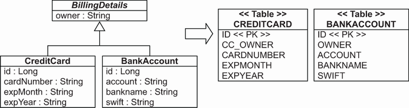
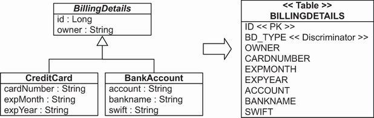
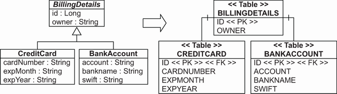
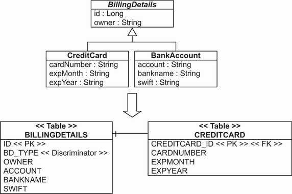
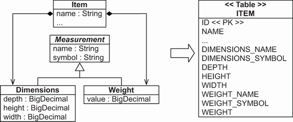
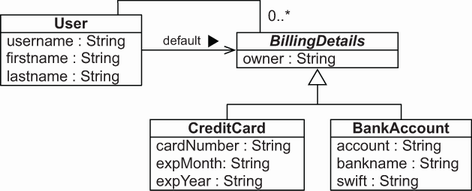

# Chương 7. Ánh xạ inheritance

> *Java Persistence with Spring Data and Hibernate* — Chương 7: “Mapping inheritance”

**Nội dung chương này bao gồm**

- Xem xét các chiến lược ánh xạ inheritance
- Tìm hiểu các polymorphic association

Chúng tôi đã cố ý chưa nói nhiều về ánh xạ inheritance cho tới giờ. Ánh xạ tạo mối nối giữa thế giới hướng đối tượng và thế giới quan hệ, nhưng inheritance là thứ đặc thù cho các hệ thống hướng đối tượng. Do đó, việc ánh xạ một cây phân cấp class tới các table có thể là một bài toán phức tạp, và chúng tôi sẽ minh họa nhiều chiến lược khác nhau trong chương này.

Một chiến lược cơ bản để ánh xạ class tới table trong cơ sở dữ liệu có thể là “mỗi persistent entity class một table”. Cách tiếp cận này nghe có vẻ đủ đơn giản và thực sự hoạt động tốt cho tới khi chúng ta gặp inheritance.

Inheritance là một sự lệch pha cấu trúc rất dễ thấy giữa thế giới hướng đối tượng và thế giới quan hệ, vì mô hình hướng đối tượng cung cấp cả quan hệ *is a* lẫn *has a*. Các mô hình dựa trên SQL chỉ cung cấp quan hệ *has a*; các hệ quản trị cơ sở dữ liệu SQL không hỗ trợ kế thừa kiểu, và ngay cả khi có, nó thường là riêng của nhà cung cấp hoặc không đầy đủ.

Có bốn chiến lược khác nhau để biểu diễn một cây phân cấp inheritance:

- Dùng một table cho mỗi concrete class và hành vi đa hình mặc định lúc chạy.
- Dùng một table cho mỗi concrete class, nhưng loại bỏ hoàn toàn tính đa hình và quan hệ kế thừa khỏi schema SQL. Dùng truy vấn SQL `UNION` cho hành vi đa hình lúc chạy.
- Dùng một table cho mỗi cây phân cấp class: bật tính đa hình bằng cách phi chuẩn hóa schema SQL và dựa vào việc phân biệt theo dòng (row-based discrimination) để xác định supertype và subtype.
- Dùng một table cho mỗi subclass: biểu diễn quan hệ *is a* (inheritance) thành quan hệ *has a* (foreign key), và dùng phép `JOIN` của SQL.

Chương này tiếp cận theo hướng top-down, giả định rằng chúng ta bắt đầu từ một domain model và cố suy ra một schema SQL mới. Các chiến lược ánh xạ mô tả ở đây cũng phù hợp không kém nếu bạn làm việc theo hướng bottom-up, bắt đầu từ các table cơ sở dữ liệu có sẵn. Chúng ta sẽ xem xét một số mẹo trên đường đi để giúp bạn xử lý những bố cục table chưa hoàn hảo.

## 7.1 Table per concrete class với đa hình ngầm định

Chúng ta đang làm việc trên ứng dụng CaveatEmptor, hiện thực persistence cho một cây phân cấp class. Chúng ta có thể theo cách tiếp cận đơn giản nhất được đề xuất: dùng đúng một table cho mỗi concrete class. Chúng ta có thể ánh xạ tất cả property của một class, bao gồm các property được kế thừa, tới các cột của một table, như minh họa ở hình 7.1.

> **CHÚ Ý** Để có thể thực thi các ví dụ từ mã nguồn của chương này, trước tiên bạn cần chạy script Ch07.sql.



**Hình 7.1** Ánh xạ tất cả concrete class tới một table độc lập

Dựa vào tính đa hình ngầm định này, chúng ta sẽ ánh xạ các concrete class bằng `@Entity` như thường lệ. Theo mặc định, các property của superclass bị bỏ qua và không persistent! Chúng ta sẽ phải đánh dấu superclass bằng `@MappedSuperclass` để bật việc nhúng các property của nó vào table của các concrete subclass; xem listing 7.1, có thể tìm thấy trong thư mục `mapping-inheritance-mappedsuperclass`.

**Listing 7.1** Ánh xạ BillingDetails (abstract superclass) với đa hình ngầm định

*Đường dẫn: Ch07/mapping-inheritance-mappedsuperclass/src/main/java/com/manning/javapersistence/ch07/model/BillingDetails.java*

```java
@MappedSuperclass
public abstract class BillingDetails {

    @Id
    @GeneratedValue(generator = "ID_GENERATOR")
    private Long id;

    @NotNull
    private String owner;
    // . . .
}
```

Giờ chúng ta sẽ ánh xạ các concrete subclass.

**Listing 7.2** Ánh xạ CreditCard (concrete subclass)

*Đường dẫn: Ch07/mapping-inheritance-mappedsuperclass/src/main/java/com/manning/javapersistence/ch07/model/CreditCard.java*

```java
@Entity
@AttributeOverride(
        name = "owner",
        column = @Column(name = "CC_OWNER", nullable = false))
public class CreditCard extends BillingDetails {

    @NotNull
    private String cardNumber;

    @NotNull
    private String expMonth;

    @NotNull
    private String expYear;

    // . . .
}
```

Chúng ta có thể ghi đè ánh xạ cột từ superclass trong một subclass bằng annotation `@AttributeOverride`. Kể từ JPA 2.2, chúng ta có thể dùng nhiều annotation `@AttributeOverride` trên cùng một class; tới JPA 2.1, chúng ta phải nhóm các annotation `@AttributeOverride` trong một annotation `@AttributeOverrides`. Ví dụ trên đổi tên cột `OWNER` thành `CC_OWNER` trong table `CREDITCARD`.

Listing sau cho thấy ánh xạ của subclass `BankAccount`.

**Listing 7.3** Ánh xạ BankAccount (concrete subclass)

*Đường dẫn: Ch07/mapping-inheritance-mappedsuperclass/src/main/java/com/manning/javapersistence/ch07/model/BankAccount.java*

```java
@Entity
public class BankAccount extends BillingDetails {

    @NotNull
    private String account;

    @NotNull
    private String bankname;

    @NotNull
    private String swift;
    // . . .
}
```

Chúng ta có thể khai báo property định danh trong superclass, với tên cột và chiến lược generator dùng chung cho mọi subclass (như ở listing 7.3), hoặc lặp lại nó bên trong mỗi concrete class.

Để làm việc với các class này, chúng ta sẽ tạo ba interface repository của Spring Data JPA.

**Listing 7.4** Interface BillingDetailsRepository

*Đường dẫn: Ch07/mapping-inheritance-mappedsuperclass/src/main/java/com/manning/javapersistence/ch07/repositories/BillingDetailsRepository.java*

```java
@NoRepositoryBean
public interface BillingDetailsRepository<T extends BillingDetails, ID>
                 extends JpaRepository<T, ID> {
    List<T> findByOwner(String owner);
}
```

Ở listing trên, interface `BillingDetailsRepository` được đánh dấu bằng `@NoRepositoryBean`. Điều này ngăn nó bị khởi tạo thành một instance repository của Spring Data JPA. Việc này là cần thiết vì, theo schema ở hình 7.1, sẽ không có table `BILLINGDETAILS`. Tuy nhiên, interface `BillingDetailsRepository` được thiết kế để các interface repository xử lý subclass `CreditCard` và `BankAccount` mở rộng. Đó là lý do `BillingDetailsRepository` được tổng quát hóa bởi một `T` mở rộng `BillingDetails`. Ngoài ra, nó chứa phương thức `findByOwner`. Field `owner` từ `BillingDetails` sẽ có mặt trong cả hai table `CREDITCARD` và `BANKACCOUNT`.

Giờ chúng ta sẽ tạo thêm hai interface repository của Spring Data.

**Listing 7.5** Interface BankAccountRepository

*Đường dẫn: Ch07/mapping-inheritance-mappedsuperclass/src/main/java/com/manning/javapersistence/ch07/repositories/BankAccountRepository.java*

```java
public interface BankAccountRepository
        extends BillingDetailsRepository<BankAccount, Long> {
    List<BankAccount> findBySwift(String swift);
}
```

Interface `BankAccountRepository` mở rộng `BillingDetailsRepository`, được tổng quát hóa bởi `BankAccount` (vì nó làm việc với instance `BankAccount`) và bởi `Long` (vì ID của class thuộc kiểu này). Nó bổ sung phương thức `findBySwift`, với tên tuân theo quy ước của Spring Data JPA (xem chương 4).

**Listing 7.6** Interface CreditCardRepository

*Đường dẫn: Ch07/mapping-inheritance-mappedsuperclass/src/main/java/com/manning/javapersistence/ch07/repositories/CreditCardRepository.java*

```java
public interface CreditCardRepository
       extends BillingDetailsRepository<CreditCard, Long> {
    List<CreditCard> findByExpYear(String expYear);
}
```

Interface `CreditCardRepository` mở rộng `BillingDetailsRepository`, được tổng quát hóa bởi `CreditCard` (vì nó làm việc với instance `CreditCard`) và bởi `Long` (vì ID của class thuộc kiểu này). Nó bổ sung phương thức `findByExpYear`, với tên tuân theo quy ước của Spring Data JPA (xem chương 4).

Chúng ta sẽ tạo test sau để kiểm tra chức năng của mã persistence.

**Listing 7.7** Kiểm thử chức năng của mã persistence

*Đường dẫn: Ch07/mapping-inheritance-mappedsuperclass/src/test/java/com/manning/javapersistence/ch07/MappingInheritanceSpringDataJPATest.java*

```java
@ExtendWith(SpringExtension.class)                                 // Ⓐ
@ContextConfiguration(classes = {SpringDataConfiguration.class})   // Ⓑ
public class MappingInheritanceSpringDataJPATest {

    @Autowired
    private CreditCardRepository creditCardRepository;             // Ⓒ

    @Autowired
    private BankAccountRepository bankAccountRepository;           // Ⓓ

    @Test
    void storeLoadEntities() {

        CreditCard creditCard = new CreditCard(
                   "John Smith", "123456789", "10", "2030");       // Ⓔ
        creditCardRepository.save(creditCard);                     // Ⓔ

        BankAccount bankAccount = new BankAccount(
                   "Mike Johnson", "12345", "Delta Bank", "BANKXY12");  // Ⓕ
        bankAccountRepository.save(bankAccount);                   // Ⓕ

        List<CreditCard> creditCards =
            creditCardRepository.findByOwner("John Smith");        // Ⓖ
        List<BankAccount> bankAccounts =
            bankAccountRepository.findByOwner("Mike Johnson");     // Ⓗ
        List<CreditCard> creditCards2 =
            creditCardRepository.findByExpYear("2030");            // Ⓘ
        List<BankAccount> bankAccounts2 =
            bankAccountRepository.findBySwift("BANKXY12");         // Ⓙ

        assertAll(
                () -> assertEquals(1, creditCards.size()),         // Ⓚ
                () -> assertEquals("123456789",
                      creditCards.get(0).getCardNumber()),         // Ⓛ
                () -> assertEquals(1, bankAccounts.size()),        // Ⓜ
                () -> assertEquals("12345",
                      bankAccounts.get(0).getAccount()),           // Ⓝ
                () -> assertEquals(1, creditCards2.size()),        // Ⓞ
                () -> assertEquals("John Smith",
                      creditCards2.get(0).getOwner()),             // Ⓟ
                () -> assertEquals(1, bankAccounts2.size()),       // Ⓠ
                () -> assertEquals("Mike Johnson",
                      bankAccounts2.get(0).getOwner())             // Ⓡ
        );

    }
}
```

Ⓐ Mở rộng test bằng `SpringExtension`. Extension này được dùng để tích hợp Spring test context với test JUnit 5 Jupiter.

Ⓑ Spring test context được cấu hình bằng các bean định nghĩa trong class `SpringDataConfiguration`.

Ⓒ Một bean `CreditCardRepository` được Spring tiêm vào qua autowiring.

Ⓓ Một bean `BankAccountRepository` được Spring tiêm vào qua autowiring. Điều này khả thi vì package `com.manning.javapersistence.ch07.repositories` — nơi `CreditCardRepository` và `BankAccountRepository` nằm — đã được dùng làm đối số của annotation `@EnableJpaRepositories` trên class `SpringDataConfiguration`. Để nhớ lại class `SpringDataConfiguration` trông thế nào, hãy xem chương 2.

Ⓔ Tạo một credit card và lưu nó vào repository.

Ⓕ Tạo một bank account và lưu nó vào repository.

Ⓖ Lấy danh sách tất cả credit card có chủ sở hữu là John Smith.

Ⓗ Lấy danh sách tất cả bank account có chủ sở hữu là Mike Johnson.

Ⓘ Lấy các credit card hết hạn năm 2030.

Ⓙ Lấy các bank account với SWIFT là BANKXY12.

Ⓚ Kiểm tra kích thước danh sách credit card.

Ⓛ Lấy số của credit card đầu tiên trong danh sách.

Ⓜ Kiểm tra kích thước danh sách bank account.

Ⓝ Kiểm tra số của bank account đầu tiên trong danh sách.

Ⓞ Kiểm tra kích thước danh sách credit card hết hạn năm 2030.

Ⓟ Kiểm tra chủ sở hữu của credit card đầu tiên trong danh sách này.

Ⓠ Kiểm tra kích thước danh sách bank account với SWIFT BANKXY12.

Ⓡ Kiểm tra chủ sở hữu của bank account đầu tiên trong danh sách này.

Mã nguồn của chương này cũng minh họa cách kiểm thử các class này bằng JPA và Hibernate.

Vấn đề chính của ánh xạ inheritance ngầm định là nó không hỗ trợ tốt các polymorphic association. Trong cơ sở dữ liệu, chúng ta thường biểu diễn association bằng quan hệ foreign key. Trong schema ở hình 7.1, nếu các subclass đều được ánh xạ tới những table khác nhau, một polymorphic association tới superclass của chúng (`BillingDetails` trừu tượng) không thể được biểu diễn bằng một quan hệ foreign key đơn giản. Chúng ta không thể có một entity khác được ánh xạ với foreign key “tham chiếu tới `BILLINGDETAILS`” — không có table như vậy. Điều này gây rắc rối trong domain model vì `BillingDetails` liên kết với `User`; cả hai table `CREDITCARD` và `BANKACCOUNT` đều cần tham chiếu foreign key tới table `USERS`. Không vấn đề nào trong số này dễ giải quyết, nên chúng ta nên cân nhắc một chiến lược ánh xạ khác.

Các truy vấn đa hình trả về instance của tất cả class khớp với interface của class được truy vấn cũng gây rắc rối. Hibernate phải thực thi một truy vấn trên superclass thành nhiều lệnh `SELECT` SQL — mỗi concrete subclass một lệnh. Truy vấn JPA `select bd from BillingDetails bd` cần hai câu lệnh SQL:

```sql
select
    ID, OWNER, ACCOUNT, BANKNAME, SWIFT
from
    BANKACCOUNT

select
    ID, CC_OWNER, CARDNUMBER, EXPMONTH, EXPYEAR
from
    CREDITCARD
```

Hibernate hoặc Spring Data JPA dùng Hibernate dùng một truy vấn SQL riêng cho mỗi concrete subclass. Mặt khác, các truy vấn trên concrete class thì tầm thường và hiệu năng tốt — Hibernate chỉ dùng một trong các câu lệnh.

Một vấn đề khái niệm nữa với chiến lược ánh xạ này là nhiều cột khác nhau ở những table khác nhau lại có chính xác cùng ngữ nghĩa. Điều này khiến việc tiến hóa schema phức tạp hơn. Ví dụ, việc đổi tên hoặc đổi kiểu của một property ở superclass dẫn tới thay đổi ở nhiều cột trong nhiều table. Nhiều thao tác refactor chuẩn mà IDE cung cấp sẽ cần điều chỉnh thủ công, vì các thủ tục tự động thường không tính đến những thứ như `@AttributeOverride` hay `@AttributeOverrides`. Việc hiện thực các ràng buộc toàn vẹn cơ sở dữ liệu áp dụng cho mọi subclass cũng khó hơn nhiều.

Chúng tôi chỉ khuyến nghị cách tiếp cận này cho tầng trên cùng của cây phân cấp class, nơi tính đa hình thường không cần thiết và khi việc sửa đổi superclass trong tương lai là khó xảy ra. Cách này có thể phù hợp với một số domain model cụ thể mà bạn gặp trong ứng dụng thực tế, nhưng nó không phù hợp với domain model CaveatEmptor, nơi các truy vấn và entity khác đều tham chiếu tới `BillingDetails`. Chúng ta sẽ tìm những phương án khác.

Với sự trợ giúp của phép `UNION` trong SQL, chúng ta có thể loại bỏ hầu hết các mối lo về truy vấn và association đa hình.

## 7.2 Table per concrete class với union

Hãy xét ánh xạ union subclass với `BillingDetails` là một abstract class (hoặc interface), như ở mục trước. Trong tình huống này, lại có hai table và các cột của superclass bị lặp lại ở cả hai: `CREDITCARD` và `BANKACCOUNT`. Điểm mới ở đây là một chiến lược inheritance gọi là `TABLE_PER_CLASS`, được khai báo trên superclass, như ở listing sau. Mã nguồn có thể tìm thấy trong thư mục `mapping-inheritance-tableperclass`.

> **CHÚ Ý** Chuẩn JPA quy định `TABLE_PER_CLASS` là tùy chọn, nên không phải mọi hiện thực JPA đều hỗ trợ nó.

**Listing 7.8** Ánh xạ BillingDetails với TABLE_PER_CLASS

*Đường dẫn: Ch07/mapping-inheritance-tableperclass/src/main/java/com/manning/javapersistence/ch07/model/BillingDetails.java*

```java
@Entity
@Inheritance(strategy = InheritanceType.TABLE_PER_CLASS)
public abstract class BillingDetails {

    @Id
    @GeneratedValue(generator = "ID_GENERATOR")
    private Long id;

    @NotNull
    private String owner;
    // . . .
}
```

Định danh cơ sở dữ liệu và ánh xạ của nó phải có mặt trong superclass để dùng chung cho mọi subclass và table của chúng. Điều này không còn là tùy chọn như ở chiến lược ánh xạ trước. Cả hai table `CREDITCARD` và `BANKACCOUNT` đều có cột primary key `ID`. Mọi ánh xạ concrete class đều kế thừa các persistent property từ superclass (hoặc interface). Chỉ cần một annotation `@Entity` trên mỗi subclass là đủ.

**Listing 7.9** Ánh xạ CreditCard

*Đường dẫn: Ch07/mapping-inheritance-tableperclass/src/main/java/com/manning/javapersistence/ch07/model/CreditCard.java*

```java
@Entity
@AttributeOverride(
        name = "owner",
        column = @Column(name = "CC_OWNER", nullable = false))
public class CreditCard extends BillingDetails {

    @NotNull
    private String cardNumber;

    @NotNull
    private String expMonth;

    @NotNull
    private String expYear;
    // . . .
}
```

**Listing 7.10** Ánh xạ BankAccount

*Đường dẫn: Ch07/mapping-inheritance-tableperclass/src/main/java/com/manning/javapersistence/ch07/model/BankAccount.java*

```java
@Entity
public class BankAccount extends BillingDetails {

    @NotNull
    private String account;

    @NotNull
    private String bankName;

    @NotNull
    private String swift;
    // . . .
}
```

Chúng ta sẽ phải sửa interface `BillingDetailsRepository` và bỏ annotation `@NoRepositoryBean`. Thay đổi này, cùng với việc class `BillingDetails` giờ được đánh dấu `@Entity`, sẽ cho phép repository này tương tác với cơ sở dữ liệu. Đây là interface `BillingDetailsRepository` hiện tại.

**Listing 7.11** Interface BillingDetailsRepository

*Đường dẫn: Ch07/mapping-inheritance-tableperclass/src/main/java/com/manning/javapersistence/ch07/model/BillingDetailsRepository.java*

```java
public interface BillingDetailsRepository<T extends BillingDetails, ID>
                 extends JpaRepository<T, ID> {
    List<T> findByOwner(String owner);
}
```

Hãy nhớ rằng schema SQL vẫn không biết gì về inheritance; các table trông y hệt nhau, như ở hình 7.1.

Nếu `BillingDetails` là concrete, chúng ta sẽ cần thêm một table nữa để chứa các instance. Hãy nhớ rằng vẫn không có quan hệ nào giữa các table trong cơ sở dữ liệu, ngoại trừ việc chúng có một số (nhiều) cột tương tự nhau.

Ưu điểm của chiến lược ánh xạ này rõ hơn khi chúng ta xét các truy vấn đa hình.

Chúng ta có thể dùng interface `BillingDetailsRepository` của Spring Data JPA để truy vấn cơ sở dữ liệu như sau:

```java
billingDetailsRepository.findAll();
```

Hoặc từ JPA hay Hibernate, chúng ta có thể thực thi truy vấn sau:

```sql
select bd from BillingDetails bd
```

Cả hai cách đều sinh ra câu lệnh SQL sau:

```sql
select
    ID, OWNER, EXPMONTH, EXPYEAR, CARDNUMBER,
    ACCOUNT, BANKNAME, SWIFT, CLAZZ_
from
    ( select
          ID, OWNER, EXPMONTH, EXPYEAR, CARDNUMBER,
          null as ACCOUNT,
          null as BANKNAME,
          null as SWIFT,
          1 as CLAZZ_
      from
          CREDITCARD
      union all
      select
          id, OWNER,
          null as EXPMONTH,
          null as EXPYEAR,
          null as CARDNUMBER,
          ACCOUNT, BANKNAME, SWIFT,
          2 as CLAZZ_
      from
          BANKACCOUNT
    ) as BILLINGDETAILS
```

Câu `SELECT` này dùng một subquery trong mệnh đề `FROM` để truy xuất tất cả instance của `BillingDetails` từ mọi table của concrete class. Các table được kết hợp bằng toán tử `UNION`, và một hằng (trong trường hợp này là 1 và 2) được chèn vào kết quả trung gian; Hibernate đọc giá trị này để khởi tạo đúng class dựa trên dữ liệu từ một dòng cụ thể. Phép union yêu cầu các truy vấn được kết hợp phải chiếu lên cùng những cột, nên bạn phải bù và điền `NULL` vào những cột không tồn tại. Bạn có thể tự hỏi liệu truy vấn này có thực sự hiệu quả hơn hai câu lệnh riêng biệt hay không. Ở đây bạn có thể để bộ tối ưu của cơ sở dữ liệu tìm kế hoạch thực thi tốt nhất để kết hợp dòng từ nhiều table, thay vì gộp hai result set trong bộ nhớ như engine nạp đa hình của Hibernate sẽ làm.

Một ưu điểm quan trọng là khả năng xử lý polymorphic association; ví dụ, một ánh xạ association từ `User` tới `BillingDetails` giờ đây là khả thi. Hibernate có thể dùng truy vấn `UNION` để mô phỏng một table duy nhất làm đích của ánh xạ association.

Cho tới giờ, các chiến lược ánh xạ inheritance mà chúng ta xem xét không đòi hỏi cân nhắc thêm về schema SQL. Tình hình này thay đổi với chiến lược tiếp theo.

## 7.3 Table per class hierarchy

Chúng ta có thể ánh xạ toàn bộ cây phân cấp class tới một table duy nhất. Table này bao gồm các cột cho tất cả property của mọi class trong cây phân cấp. Giá trị của một cột (hoặc công thức) type discriminator bổ sung sẽ xác định concrete subclass được biểu diễn bởi một dòng cụ thể. Hình 7.2 minh họa cách tiếp cận này. Mã nguồn tiếp theo có thể tìm thấy trong thư mục `mapping-inheritance-singletable`.



**Hình 7.2** Ánh xạ toàn bộ cây phân cấp class tới một table duy nhất

Chiến lược ánh xạ này thắng thế cả về hiệu năng lẫn tính đơn giản. Đây là cách biểu diễn tính đa hình có hiệu năng tốt nhất — cả truy vấn đa hình lẫn không đa hình đều chạy tốt, và thậm chí việc viết truy vấn thủ công cũng dễ. Có thể làm báo cáo tùy ứng mà không cần join hay union phức tạp. Việc tiến hóa schema là đơn giản.

Có một vấn đề lớn: tính toàn vẹn dữ liệu. Chúng ta phải khai báo các cột cho property do subclass khai báo là cho phép null. Nếu mỗi subclass định nghĩa vài property không cho phép null, việc mất các constraint `NOT NULL` có thể là vấn đề nghiêm trọng xét từ góc độ tính đúng đắn của dữ liệu. Hãy hình dung ngày hết hạn của thẻ tín dụng là bắt buộc, nhưng schema cơ sở dữ liệu không thể thực thi quy tắc này vì mọi cột của table đều có thể `NULL`. Một lỗi lập trình đơn giản có thể dẫn tới dữ liệu không hợp lệ.

Một mối lo quan trọng khác là chuẩn hóa. Chúng ta đã tạo ra các phụ thuộc hàm giữa những cột không phải khóa, vi phạm dạng chuẩn thứ ba. Như thường lệ, việc phi chuẩn hóa vì lý do hiệu năng có thể gây hiểu lầm, vì nó hy sinh tính ổn định lâu dài, khả năng bảo trì và tính toàn vẹn dữ liệu để đổi lấy lợi ích trước mắt vốn cũng có thể đạt được bằng cách tối ưu đúng cách các kế hoạch thực thi SQL (nói cách khác, hãy hỏi DBA).

Chúng ta sẽ dùng chiến lược inheritance `SINGLE_TABLE` để tạo ánh xạ table-per-class-hierarchy, như ở listing sau.

**Listing 7.12** Ánh xạ BillingDetails với SINGLE_TABLE

*Đường dẫn: Ch07/mapping-inheritance-singletable/src/main/java/com/manning/javapersistence/ch07/model/BillingDetails.java*

```java
@Entity
@Inheritance(strategy = InheritanceType.SINGLE_TABLE)
@DiscriminatorColumn(name = "BD_TYPE")
public abstract class BillingDetails {

    @Id
    @GeneratedValue(generator = "ID_GENERATOR")
    private Long id;

    @NotNull
    @Column(nullable = false)
    private String owner;

    // . . .
}
```

Class gốc của cây phân cấp inheritance, `BillingDetails`, được ánh xạ tự động tới table `BILLINGDETAILS`. Các property dùng chung của superclass có thể là `NOT NULL` trong schema; mọi instance subclass đều phải có giá trị. Một điểm kỳ quặc trong hiện thực của Hibernate đòi hỏi chúng ta khai báo tính cho phép null bằng `@Column`, vì Hibernate bỏ qua `@NotNull` của Bean Validation khi sinh schema cơ sở dữ liệu.

Chúng ta phải thêm một cột discriminator đặc biệt để phân biệt mỗi dòng biểu diễn cái gì. Đây không phải property của entity; nó được Hibernate dùng nội bộ. Tên cột là `BD_TYPE`, và giá trị là chuỗi — trong trường hợp này là `"CC"` hoặc `"BA"`. Hibernate hoặc Spring Data JPA dùng Hibernate tự động đặt và truy xuất giá trị discriminator.

Nếu chúng ta không chỉ định cột discriminator trong superclass, tên của nó mặc định là `DTYPE`, và giá trị là chuỗi. Mọi concrete class trong cây phân cấp inheritance đều có thể có một giá trị discriminator, chẳng hạn `CreditCard`.

**Listing 7.13** Ánh xạ CreditCard bằng chiến lược inheritance SINGLE_TABLE

*Đường dẫn: Ch07/mapping-inheritance-singletable/src/main/java/com/manning/javapersistence/ch07/model/CreditCard.java*

```java
@Entity
@DiscriminatorValue("CC")
public class CreditCard extends BillingDetails {

    @NotNull
    private String cardNumber;

    @NotNull
    private String expMonth;

    @NotNull
    private String expYear;
    // . . .
}
```

Nếu không có giá trị discriminator tường minh, Hibernate mặc định dùng tên class đầy đủ nếu chúng ta dùng file XML của Hibernate, và tên entity đơn giản nếu dùng annotation hoặc file XML của JPA. Lưu ý rằng JPA không quy định mặc định cho các kiểu discriminator không phải chuỗi; mỗi persistence provider có thể có mặc định khác nhau. Do đó, chúng ta nên luôn chỉ định giá trị discriminator cho các concrete class.

Chúng ta sẽ đánh dấu mọi subclass bằng `@Entity`, rồi ánh xạ các property của subclass tới các cột trong table `BILLINGDETAILS`. Hãy nhớ rằng các constraint `NOT NULL` không được phép trong schema, vì một instance `BankAccount` sẽ không có property `expMonth`, và cột `EXPMONTH` phải là `NULL` cho dòng đó. Hibernate và Spring Data JPA dùng Hibernate bỏ qua `@NotNull` khi sinh DDL cho schema, nhưng chúng vẫn tuân thủ nó lúc chạy trước khi chèn một dòng. Điều này giúp chúng ta tránh lỗi lập trình; chúng ta không muốn vô tình lưu dữ liệu thẻ tín dụng mà thiếu ngày hết hạn. (Tất nhiên các ứng dụng khác, kém quy củ hơn, vẫn có thể lưu dữ liệu sai vào cơ sở dữ liệu này.)

Chúng ta có thể dùng interface `BillingDetailsRepository` của Spring Data JPA để truy vấn cơ sở dữ liệu như sau:

```java
billingDetailsRepository.findAll();
```

Hoặc, từ JPA hay Hibernate, chúng ta có thể thực thi truy vấn sau:

```sql
select bd from BillingDetails bd
```

Cả hai cách đều sinh ra câu lệnh SQL sau:

```sql
select
    ID, OWNER, EXPMONTH, EXPYEAR, CARDNUMBER,
    ACCOUNT, BANKNAME, SWIFT, BD_TYPE
from
    BILLINGDETAILS
```

Để truy vấn subclass `CreditCard`, chúng ta cũng có các lựa chọn.

Chúng ta có thể dùng interface `CreditCardRepository` của Spring Data JPA để truy vấn cơ sở dữ liệu như sau:

```java
creditCardRepository.findAll();
```

Hoặc, từ JPA hay Hibernate, chúng ta có thể thực thi truy vấn sau:

```sql
select cc from CreditCard cc
```

Hibernate thêm một ràng buộc trên cột discriminator:

```sql
select
    ID, OWNER, EXPMONTH, EXPYEAR, CARDNUMBER
from
    BILLINGDETAILS
where
    BD_TYPE='CC'
```

Đôi khi, đặc biệt trong các schema cũ, chúng ta không có quyền thêm một cột discriminator vào table entity. Trong trường hợp này, chúng ta có thể áp dụng một biểu thức để tính giá trị discriminator cho mỗi dòng. Công thức cho discriminator không thuộc đặc tả JPA, nhưng Hibernate có một annotation mở rộng, `@DiscriminatorFormula`.

**Listing 7.14** Ánh xạ BillingDetails với @DiscriminatorFormula

*Đường dẫn: Ch07/mapping-inheritance-singletableformula/src/main/java/com/manning/javapersistence/ch07/model/BillingDetails.java*

```java
@Entity
@Inheritance(strategy = InheritanceType.SINGLE_TABLE)
@org.hibernate.annotations.DiscriminatorFormula(
        "case when CARDNUMBER is not null then 'CC' else 'BA' end"
)
public abstract class BillingDetails {
    // . . .
}
```

Không có cột discriminator trong schema, nên ánh xạ này dựa vào biểu thức `CASE/WHEN` của SQL để xác định xem một dòng cụ thể biểu diễn thẻ tín dụng hay tài khoản ngân hàng (nhiều lập trình viên chưa từng dùng kiểu biểu thức SQL này; hãy xem chuẩn ANSI nếu bạn chưa quen). Kết quả của biểu thức là một hằng, `CC` hoặc `BA`, được khai báo trong các ánh xạ subclass.

Nhược điểm của chiến lược table-per-class-hierarchy có thể quá nghiêm trọng với thiết kế của bạn — schema phi chuẩn hóa có thể trở thành gánh nặng lớn về lâu dài, và DBA của bạn có thể hoàn toàn không thích nó. Chiến lược ánh xạ inheritance tiếp theo không khiến bạn gặp vấn đề này.

## 7.4 Table per subclass với join

Lựa chọn thứ tư là biểu diễn quan hệ inheritance thành các association foreign key trong SQL. Mọi class hoặc subclass khai báo persistent property — bao gồm cả abstract class và thậm chí interface — đều có table riêng. Mã nguồn tiếp theo có thể tìm thấy trong thư mục `mapping-inheritance-joined`.

Khác với chiến lược table-per-concrete-class mà chúng ta ánh xạ đầu tiên, ở đây table của một `@Entity` concrete chỉ chứa cột cho từng property không kế thừa do chính subclass khai báo, cùng một primary key đồng thời cũng là foreign key của table superclass. Điều này dễ hơn nghe có vẻ; hãy xem hình 7.3.



**Hình 7.3** Ánh xạ tất cả class của cây phân cấp tới table riêng của chúng

Nếu chúng ta lưu một instance của subclass `CreditCard`, Hibernate chèn hai dòng: giá trị của các property do superclass `BillingDetails` khai báo được lưu trong một dòng mới của table `BILLINGDETAILS`. Chỉ giá trị của các property do subclass khai báo được lưu trong một dòng mới của table `CREDITCARD`. Primary key dùng chung giữa hai dòng liên kết chúng với nhau. Về sau, instance subclass có thể được truy xuất từ cơ sở dữ liệu bằng cách join table subclass với table superclass.

Ưu điểm chính của chiến lược này là nó chuẩn hóa schema SQL. Việc tiến hóa schema và định nghĩa ràng buộc toàn vẹn là đơn giản. Một foreign key tham chiếu tới table của một subclass cụ thể có thể biểu diễn một polymorphic association tới chính subclass đó. Chúng ta sẽ dùng chiến lược inheritance `JOINED` để tạo ánh xạ table-per-subclass.

**Listing 7.15** Ánh xạ BillingDetails với JOINED

*Đường dẫn: Ch07/mapping-inheritance-joined/src/main/java/com/manning/javapersistence/ch07/model/BillingDetails.java*

```java
@Entity
@Inheritance(strategy = InheritanceType.JOINED)
public abstract class BillingDetails {

    @Id
    @GeneratedValue(generator = "ID_GENERATOR")
    private Long id;

    @NotNull
    private String owner;

    // . . .
}
```

Class gốc `BillingDetails` được ánh xạ tới table `BILLINGDETAILS`. Lưu ý rằng chiến lược này không cần discriminator.

Trong các subclass, chúng ta không cần chỉ định cột join nếu cột primary key của table subclass có (hoặc được cho là có) cùng tên với cột primary key của table superclass. Ở listing sau, `BankAccount` sẽ là subclass của `BillingDetails`.

**Listing 7.16** Ánh xạ BankAccount (concrete class)

*Đường dẫn: Ch07/mapping-inheritance-joined/src/main/java/com/manning/javapersistence/ch07/model/BankAccount.java*

```java
@Entity
public class BankAccount extends BillingDetails {

    @NotNull
    private String account;

    @NotNull
    private String bankname;

    @NotNull
    private String swift;

    // . . .
}
```

Entity này không có property định danh; nó tự động kế thừa property `ID` và cột tương ứng từ superclass, và Hibernate biết cách join các table nếu chúng ta muốn truy xuất instance của `BankAccount`.

Tất nhiên, chúng ta có thể chỉ định tên cột tường minh bằng annotation `@PrimaryKeyJoinColumn`, như ở listing sau.

**Listing 7.17** Ánh xạ CreditCard

*Đường dẫn: Ch07/mapping-inheritance-joined/src/main/java/com/manning/javapersistence/ch07/model/CreditCard.java*

```java
@Entity
@PrimaryKeyJoinColumn(name = "CREDITCARD_ID")
public class CreditCard extends BillingDetails {

    @NotNull
    private String cardNumber;

    @NotNull
    private String expMonth;

    @NotNull
    private String expYear;
    // . . .
}
```

Các cột primary key của table `BANKACCOUNT` và `CREDITCARD` đều đồng thời có một foreign key constraint tham chiếu tới primary key của table `BILLINGDETAILS`.

Chúng ta có thể dùng interface `BillingDetailsRepository` của Spring Data JPA để truy vấn cơ sở dữ liệu như sau:

```java
billingDetailsRepository.findAll();
```

Hoặc, từ JPA hay Hibernate, chúng ta có thể thực thi truy vấn sau:

```sql
select bd from BillingDetails bd
```

Hibernate dựa vào phép outer join của SQL và sẽ sinh ra:

```sql
select
    BD.ID, BD.OWNER,
    CC.EXPMONTH, CC.EXPYEAR, CC.CARDNUMBER,
    BA.ACCOUNT, BA.BANKNAME, BA.SWIFT,
    case
        when CC.CREDITCARD_ID is not null then 1
        when BA.ID is not null then 2
        when BD.ID is not null then 0
    end
from
    BILLINGDETAILS BD
    left outer join CREDITCARD CC on BD.ID=CC.CREDITCARD_ID
    left outer join BANKACCOUNT BA on BD.ID=BA.ID
```

Mệnh đề SQL `CASE . . . WHEN` phát hiện sự tồn tại (hoặc vắng mặt) của dòng trong các table subclass `CREDITCARD` và `BANKACCOUNT`, để Hibernate hoặc Spring Data dùng Hibernate có thể xác định concrete subclass cho một dòng cụ thể của table `BILLINGDETAILS`.

Với một truy vấn hẹp trên subclass như thế này:

```java
creditCardRepository.findAll();
```

hoặc thế này:

```sql
select cc from CreditCard cc
```

Hibernate dùng phép inner join:

```sql
select
    CREDITCARD_ID, OWNER, EXPMONTH, EXPYEAR, CARDNUMBER
from
    CREDITCARD
    inner join BILLINGDETAILS on CREDITCARD_ID=ID
```

Như bạn thấy, chiến lược ánh xạ này khó hiện thực thủ công hơn — ngay cả việc làm báo cáo tùy ứng cũng phức tạp hơn. Đây là điều quan trọng cần cân nhắc nếu bạn định trộn mã Spring Data JPA hay Hibernate với SQL viết tay. Một cách tiếp cận thông thường và là giải pháp khả chuyển có thể là làm việc với JPQL (Jakarta Persistence Query Language) và đánh dấu phương thức bằng truy vấn JPQL.

Hơn nữa, mặc dù chiến lược ánh xạ này trông có vẻ đơn giản, kinh nghiệm của chúng tôi là hiệu năng có thể không chấp nhận được với các cây phân cấp class phức tạp. Truy vấn luôn cần join qua nhiều table hoặc nhiều lần đọc tuần tự.

> **Inheritance với join và discriminator**
>
> Hibernate không cần một cột discriminator đặc biệt trong cơ sở dữ liệu để hiện thực chiến lược `InheritanceType.JOINED`, và đặc tả JPA cũng không đưa ra yêu cầu nào. Mệnh đề `CASE . . . WHEN` trong câu lệnh `SELECT` của SQL là cách thông minh để phân biệt kiểu entity của mỗi dòng được truy xuất.
>
> Tuy nhiên, một số ví dụ JPA bạn có thể tìm thấy ở nơi khác lại dùng `InheritanceType.JOINED` cùng ánh xạ `@DiscriminatorColumn`. Rõ ràng một số JPA provider khác không dùng mệnh đề `CASE . . . WHEN` và chỉ dựa vào giá trị discriminator, ngay cả với chiến lược `InheritanceType.JOINED`. Hibernate không cần discriminator nhưng vẫn dùng `@DiscriminatorColumn` đã khai báo, kể cả với chiến lược ánh xạ `JOINED`. Nếu bạn muốn bỏ qua ánh xạ discriminator với `JOINED` (nó bị bỏ qua ở các phiên bản Hibernate cũ), hãy bật property cấu hình `hibernate.discriminator.ignore_explicit_for_joined`.

Trước khi xem xét khi nào nên chọn chiến lược nào, hãy cân nhắc việc trộn các chiến lược ánh xạ inheritance trong một cây phân cấp class duy nhất.

## 7.5 Trộn các chiến lược inheritance

Chúng ta có thể ánh xạ toàn bộ một cây phân cấp inheritance bằng chiến lược `TABLE_PER_CLASS`, `SINGLE_TABLE` hoặc `JOINED`. Chúng ta không thể trộn chúng — chẳng hạn chuyển từ table-per-class-hierarchy với discriminator sang chiến lược table-per-subclass đã chuẩn hóa. Một khi đã quyết định chiến lược inheritance, chúng ta phải giữ nguyên nó.

Ngoại trừ việc điều này không hoàn toàn đúng. Bằng một số mẹo, chúng ta có thể đổi chiến lược ánh xạ cho một subclass cụ thể. Ví dụ, chúng ta có thể ánh xạ một cây phân cấp class tới một table duy nhất, nhưng với một subclass cụ thể, chuyển sang một table riêng với chiến lược ánh xạ foreign key, giống như table-per-subclass. Hãy xem schema ở hình 7.4. Mã nguồn tiếp theo có thể tìm thấy trong thư mục `mapping-inheritance-mixed`.



**Hình 7.4** Tách một subclass ra table phụ (secondary table) riêng của nó

Chúng ta sẽ ánh xạ superclass `BillingDetails` bằng `InheritanceType.SINGLE_TABLE` như trước. Sau đó chúng ta sẽ ánh xạ subclass `CreditCard` — thứ mà chúng ta muốn tách khỏi table duy nhất — tới một secondary table.

**Listing 7.18** Ánh xạ CreditCard

*Đường dẫn: Ch07/mapping-inheritance-mixed/src/main/java/com/manning/javapersistence/ch07/model/CreditCard.java*

```java
@Entity
@DiscriminatorValue("CC")
@SecondaryTable(
        name = "CREDITCARD",
        pkJoinColumns = @PrimaryKeyJoinColumn(name = "CREDITCARD_ID")
)
public class CreditCard extends BillingDetails {

    @NotNull
    @Column(table = "CREDITCARD", nullable = false)
    private String cardNumber;

    @Column(table = "CREDITCARD", nullable = false)
    private String expMonth;

    @Column(table = "CREDITCARD", nullable = false)
    private String expYear;
    // . . .
}
```

Các annotation `@SecondaryTable` và `@Column` nhóm một số property lại và bảo Hibernate lấy chúng từ một secondary table. Chúng ta ánh xạ tất cả property đã chuyển sang secondary table bằng tên của table phụ đó. Việc này được thực hiện bằng tham số `table` của `@Column`, thứ mà chúng tôi chưa trình bày trước đây. Ánh xạ này có nhiều công dụng, và bạn sẽ gặp lại nó ở phần sau của cuốn sách. Trong ví dụ này, nó tách các property của `CreditCard` khỏi chiến lược single-table sang table `CREDITCARD`. Đây sẽ là giải pháp khả thi nếu chúng ta muốn thêm một class mới mở rộng `BillingDetails`, chẳng hạn `Paypal`.

Cột `CREDITCARD_ID` của table này cũng là primary key, và nó có một foreign key constraint tham chiếu tới `ID` của table cây phân cấp duy nhất. Nếu chúng ta không chỉ định cột primary key join cho secondary table, tên primary key của table inheritance duy nhất sẽ được dùng — trong trường hợp này là `ID`.

Hãy nhớ rằng `InheritanceType.SINGLE_TABLE` buộc mọi cột của subclass phải cho phép null. Một lợi ích của ánh xạ này là giờ chúng ta có thể khai báo các cột của table `CREDITCARD` là `NOT NULL`, bảo đảm tính toàn vẹn dữ liệu.

Lúc chạy, Hibernate thực thi một phép outer join để nạp `BillingDetails` và mọi instance subclass một cách đa hình:

```sql
select
    ID, OWNER, ACCOUNT, BANKNAME, SWIFT,
    EXPMONTH, EXPYEAR, CARDNUMBER,
    BD_TYPE
from
    BILLINGDETAILS
    left outer join CREDITCARD on ID=CREDITCARD_ID
```

Chúng ta cũng có thể dùng mẹo này cho các subclass khác trong cây phân cấp class. Với một cây phân cấp class đặc biệt rộng, phép outer join có thể trở thành vấn đề. Một số hệ cơ sở dữ liệu (Oracle chẳng hạn) giới hạn số table trong một phép outer join. Với cây phân cấp rộng, bạn có thể muốn chuyển sang một chiến lược fetch khác, thực thi ngay một lệnh SQL `select` thứ hai thay vì dùng outer join.

## 7.6 Inheritance của các class embeddable

Một class embeddable là component của entity sở hữu nó, nên các quy tắc inheritance thông thường cho entity trình bày trong chương này không áp dụng. Là một phần mở rộng của Hibernate, chúng ta có thể ánh xạ một class embeddable kế thừa một số persistent property từ một superclass (hoặc interface). Hãy xét hai thuộc tính mới của một mặt hàng đấu giá: kích thước (dimensions) và trọng lượng (weight).

Kích thước của một item là chiều rộng, chiều cao và chiều sâu, biểu diễn bằng một đơn vị cho trước cùng ký hiệu của nó: chẳng hạn inch (`"`) hoặc centimet (`cm`). Trọng lượng của item cũng mang một đơn vị đo: chẳng hạn pound (`lbs`) hoặc kilogram (`kg`). Để nắm bắt các thuộc tính chung (`name` và `symbol`) của phép đo, chúng ta sẽ định nghĩa một superclass cho `Dimensions` và `Weight` gọi là `Measurement`. Mã nguồn tiếp theo có thể tìm thấy trong thư mục `mapping-inheritance-embeddable`.

**Listing 7.19** Ánh xạ abstract embeddable superclass Measurement

*Đường dẫn: Ch07/mapping-inheritance-embeddable/src/main/java/com/manning/javapersistence/ch07/model/Measurement.java*

```java
@MappedSuperclass
public abstract class Measurement {

    @NotNull
    private String name;

    @NotNull
    private String symbol;
    // . . .
}
```

Chúng ta đã dùng annotation `@MappedSuperclass` trên superclass của class embeddable mà chúng ta đang ánh xạ, giống như với một entity. Các subclass sẽ kế thừa property của class này thành persistent property. Chúng ta sẽ định nghĩa các subclass `Dimensions` và `Weight` là `@Embeddable`. Với `Dimensions`, chúng ta sẽ ghi đè tất cả thuộc tính của superclass và thêm tiền tố cho tên cột.

**Listing 7.20** Ánh xạ class Dimensions

*Đường dẫn: Ch07/mapping-inheritance-embeddable/src/main/java/com/manning/javapersistence/ch07/model/Dimensions.java*

```java
@Embeddable
@AttributeOverride(name = "name",
        column = @Column(name = "DIMENSIONS_NAME"))
@AttributeOverride(name = "symbol",
        column = @Column(name = "DIMENSIONS_SYMBOL"))
public class Dimensions extends Measurement {

    @NotNull
    private BigDecimal depth;

    @NotNull
    private BigDecimal height;

    @NotNull
    private BigDecimal width;
    // . . .
}
```

Nếu không ghi đè như vậy, một `Item` nhúng cả `Dimensions` lẫn `Weight` sẽ ánh xạ tới một table với tên cột xung đột.

Tiếp theo là class `Weight`; ánh xạ của nó cũng ghi đè tên cột bằng tiền tố (để đồng nhất, chúng ta tránh xung đột với phần ghi đè trước).

**Listing 7.21** Ánh xạ class Weight

*Đường dẫn: Ch07/mapping-inheritance-embeddable/src/main/java/com/manning/javapersistence/ch07/model/Weight.java*

```java
@Embeddable
@AttributeOverride(name = "name",
        column = @Column(name = "WEIGHT_NAME"))
@AttributeOverride(name = "symbol",
        column = @Column(name = "WEIGHT_SYMBOL"))
public class Weight extends Measurement {

    @NotNull
    @Column(name = "WEIGHT")
    private BigDecimal value;
    // . . .
}
```

Entity sở hữu `Item` định nghĩa hai persistent embedded property thông thường.

**Listing 7.22** Ánh xạ class Item

*Đường dẫn: Ch07/mapping-inheritance-embeddable/src/main/java/com/manning/javapersistence/ch07/model/Item.java*

```java
@Entity
public class Item {
    private Dimensions dimensions;
    private Weight weight;
    // . . .
}
```

Hình 7.5 minh họa ánh xạ này.



**Hình 7.5** Ánh xạ các class embeddable concrete cùng property kế thừa của chúng

Ngoài ra, chúng ta có thể ghi đè các tên cột `Measurement` xung đột của những embedded property trong class `Item`, như đã minh họa ở mục 6.2. Tuy nhiên, chúng tôi thích ghi đè chúng một lần trong các class `@Embeddable`, để những nơi dùng các class này không phải giải quyết xung đột.

Một cạm bẫy cần lưu ý là việc nhúng một property có kiểu là abstract superclass (như `Measurement`) vào một entity (như `Item`). Điều này không bao giờ hoạt động; JPA provider không biết cách lưu và nạp instance `Measurement` một cách đa hình. Nó không có thông tin cần thiết để quyết định các giá trị trong cơ sở dữ liệu là instance `Dimensions` hay `Weight`, vì không có discriminator. Nghĩa là mặc dù chúng ta có thể để một class `@Embeddable` kế thừa một số persistent property từ một `@MappedSuperclass`, tham chiếu tới một instance lại không đa hình — nó luôn nêu tên một concrete class.

Hãy so sánh điều này với chiến lược inheritance thay thế cho các class embeddable đã xem xét ở phần “Chuyển đổi property của component” (trong mục 6.3.2), vốn hỗ trợ tính đa hình nhưng đòi hỏi mã phân biệt kiểu tùy chỉnh.

Tiếp theo chúng tôi sẽ đưa ra một số gợi ý về cách chọn tổ hợp chiến lược ánh xạ phù hợp cho các cây phân cấp class của một ứng dụng.

## 7.7 Chọn chiến lược

Chiến lược ánh xạ inheritance mà bạn chọn sẽ phụ thuộc vào cách các superclass được dùng trong cây phân cấp entity. Bạn sẽ phải cân nhắc mức độ thường xuyên truy vấn instance của superclass và liệu bạn có association nhắm tới superclass hay không. Một khía cạnh quan trọng khác là các thuộc tính của supertype và subtype: liệu subtype có nhiều thuộc tính bổ sung hay chỉ có hành vi khác so với supertype. Đây là một số quy tắc kinh nghiệm:

- Nếu bạn không cần polymorphic association hay truy vấn đa hình, hãy nghiêng về **table-per-concrete-class** — nói cách khác, nếu bạn không bao giờ hoặc hiếm khi viết `select bd from BillingDetails bd`, và bạn không có class nào có association tới `BillingDetails`. Nên ưu tiên ánh xạ tường minh dựa trên `UNION` với `InheritanceType.TABLE_PER_CLASS`, vì các truy vấn và association đa hình (đã tối ưu) sẽ khả thi về sau.
- Nếu bạn *có* cần polymorphic association (một association tới superclass, và do đó tới mọi class trong cây phân cấp, với việc phân giải động concrete class lúc chạy) hoặc truy vấn đa hình, và các subclass khai báo tương đối ít property (đặc biệt nếu khác biệt chính giữa các subclass nằm ở hành vi của chúng), hãy nghiêng về `InheritanceType.SINGLE_TABLE`. Cách tiếp cận này có thể được chọn nếu nó chỉ khiến một số ít cột phải cho phép null. Bạn sẽ cần thuyết phục chính mình (và DBA) rằng một schema phi chuẩn hóa sẽ không gây vấn đề về lâu dài.
- Nếu bạn *có* cần polymorphic association hoặc truy vấn đa hình, và các subclass khai báo nhiều property (không tùy chọn) (các subclass khác nhau chủ yếu ở dữ liệu chúng chứa), hãy nghiêng về `InheritanceType.JOINED`. Ngoài ra, tùy theo chiều rộng và chiều sâu của cây phân cấp inheritance cùng chi phí khả dĩ của join so với union, hãy dùng `InheritanceType.TABLE_PER_CLASS`. Quyết định này có thể đòi hỏi đánh giá các kế hoạch thực thi SQL với dữ liệu thực.

Theo mặc định, chỉ chọn `InheritanceType.SINGLE_TABLE` cho những bài toán đơn giản. Với các trường hợp phức tạp, hoặc khi người mô hình hóa dữ liệu nhấn mạnh tầm quan trọng của constraint `NOT NULL` và việc chuẩn hóa lấn át ý kiến của bạn, bạn nên cân nhắc chiến lược `InheritanceType.JOINED`. Ở thời điểm đó, bạn nên tự hỏi liệu có tốt hơn không nếu mô hình hóa lại inheritance thành delegation trong mô hình class. Inheritance phức tạp thường tốt nhất là nên tránh vì đủ loại lý do không liên quan tới persistence hay ORM. Hibernate đóng vai trò vùng đệm giữa mô hình domain và mô hình quan hệ, nhưng điều đó không có nghĩa là bạn có thể hoàn toàn bỏ qua các mối quan tâm về persistence khi thiết kế các class.

Khi bạn bắt đầu nghĩ tới việc trộn các chiến lược inheritance, bạn phải nhớ rằng tính đa hình ngầm định trong Hibernate đủ thông minh để xử lý những trường hợp kỳ lạ. Ngoài ra, bạn phải cân nhắc rằng bạn không thể đặt annotation inheritance trên interface; điều này không được chuẩn hóa trong JPA.

Ví dụ, giả sử bạn cần thêm một interface vào ứng dụng CaveatEmptor: `ElectronicPaymentOption`. Đây là một interface nghiệp vụ không có khía cạnh persistence, ngoại trừ việc một persistent class như `CreditCard` nhiều khả năng sẽ hiện thực interface này. Bất kể chúng ta ánh xạ cây phân cấp `BillingDetails` thế nào, Hibernate vẫn có thể trả lời truy vấn `select o from ElectronicPaymentOption o` một cách đúng đắn. Điều này vẫn đúng ngay cả khi những class khác, không thuộc cây phân cấp `BillingDetails`, được ánh xạ là persistent và hiện thực interface này. Hibernate luôn biết cần truy vấn table nào, cần tạo instance nào, và cách trả về kết quả đa hình.

Chúng ta có thể áp dụng mọi chiến lược ánh xạ cho abstract class. Hibernate sẽ không cố khởi tạo một abstract class, ngay cả khi chúng ta truy vấn hay nạp nó.

Chúng tôi đã nhắc tới quan hệ giữa `User` và `BillingDetails` vài lần, và đã xem nó ảnh hưởng thế nào tới việc chọn chiến lược ánh xạ inheritance. Trong mục cuối cùng và tiếp theo của chương này, chúng ta sẽ khám phá chi tiết chủ đề nâng cao hơn này: polymorphic association. Nếu bạn hiện chưa có quan hệ như vậy trong mô hình của mình, bạn có thể quay lại chủ đề này sau, khi gặp vấn đề trong ứng dụng của bạn.

## 7.8 Polymorphic association

Tính đa hình là một đặc trưng định danh của các ngôn ngữ hướng đối tượng như Java. Hỗ trợ cho polymorphic association và truy vấn đa hình là tính năng nền tảng của một giải pháp ORM như Hibernate. Đáng ngạc nhiên là chúng ta đã đi được đến đây mà chưa cần nói nhiều về tính đa hình. Thật dễ chịu, chẳng có gì nhiều để nói về chủ đề này — tính đa hình dễ dùng đến mức trong Hibernate chúng ta không cần bỏ nhiều công sức để giải thích nó.

Để có cái nhìn tổng quan, trước tiên chúng ta sẽ xét một association nhiều-một tới một class có thể có subclass, rồi tới một quan hệ một-nhiều. Với cả hai ví dụ, các class của domain model đều giống nhau; xem hình 7.6.



**Hình 7.6** Một user có credit card hoặc bank account làm thông tin thanh toán mặc định.

### 7.8.1 Polymorphic many-to-one association

Trước tiên, hãy xét property `defaultBilling` của `User`. Nó tham chiếu tới một instance `BillingDetails` cụ thể, mà lúc chạy có thể là bất kỳ instance concrete nào của class đó. Mã nguồn tiếp theo có thể tìm thấy trong thư mục `mapping-inheritance-manytoone`.

Chúng ta sẽ ánh xạ association một chiều này tới abstract class `BillingDetails` như sau:

*Đường dẫn: Ch07/mapping-inheritance-manytoone/src/main/java/com/manning/javapersistence/ch07/model/User.java*

```java
@Entity
@Table(name = "USERS")
public class User {

    @ManyToOne
    private BillingDetails defaultBilling;
    // . . .
}
```

Table `USERS` giờ có cột join/foreign-key `DEFAULTBILLING_ID` biểu diễn quan hệ này. Đây là cột cho phép null vì một `User` có thể chưa được gán phương thức thanh toán mặc định. Vì `BillingDetails` là abstract, association phải tham chiếu tới một instance của một trong các subclass của nó — `CreditCard` hoặc `BankAccount` — lúc chạy.

Chúng ta không phải làm gì đặc biệt để bật polymorphic association trong Hibernate. Nếu class đích của một association được ánh xạ bằng `@Entity` và `@Inheritance`, association đó tự nhiên là đa hình.

Mã Spring Data JPA sau minh họa việc tạo một association tới một instance của subclass `CreditCard`:

*Đường dẫn: Ch07/mapping-inheritance-manytoone/src/test/java/com/manning/javapersistence/ch07/MappingInheritanceSpringDataJPATest.java*

```java
CreditCard creditCard = new CreditCard(
    "John Smith", "123456789", "10", "2030"
);
User john = new User("John Smith");
john.setDefaultBilling(creditCard);
creditCardRepository.save(creditCard);
userRepository.save(john);
```

Giờ, khi chúng ta điều hướng association trong một đơn vị công việc thứ hai, Hibernate tự động truy xuất instance `CreditCard`:

```java
List<User> users = userRepository.findAll();
users.get(0).getDefaultBilling().pay(123);
```

Dòng thứ hai ở đây sẽ gọi phương thức `pay` từ concrete subclass của `BillingDetails`.

Chúng ta có thể xử lý association một-một theo cách tương tự. Còn các association số nhiều, chẳng hạn collection `billingDetails` của mỗi `User` thì sao? Hãy xem tiếp.

### 7.8.2 Polymorphic collection

Một `User` có thể có tham chiếu tới nhiều `BillingDetails`, không chỉ một cái mặc định duy nhất (một trong số đó là mặc định, nhưng tạm bỏ qua điều này). Chúng ta có thể ánh xạ điều này bằng một association một-nhiều hai chiều. Mã nguồn tiếp theo có thể tìm thấy trong thư mục `mapping-inheritance-onetomany`.

*Đường dẫn: Ch07/mapping-inheritance-onetomany/src/main/java/com/manning/javapersistence/ch07/model/User.java*

```java
@Entity
@Table(name = "USERS")
public class User {

    @OneToMany(mappedBy = "user")
    private Set<BillingDetails> billingDetails = new HashSet<>();
    // . . .
}
```

Tiếp theo là phía sở hữu (owning side) của quan hệ (được khai báo bằng `mappedBy` ở ánh xạ trước). Bằng “phía sở hữu”, chúng tôi muốn nói tới phía của quan hệ nắm giữ foreign key trong cơ sở dữ liệu, ở đây là `BillingDetails`.

*Đường dẫn: Ch07/mapping-inheritance-onetomany/src/main/java/com/manning/javapersistence/ch07/model/BillingDetails.java*

```java
@Entity
@Inheritance(strategy = InheritanceType.TABLE_PER_CLASS)
public abstract class BillingDetails {

    @ManyToOne
    private User user;
    // . . .
}
```

Cho tới giờ, không có gì đặc biệt về ánh xạ association này. Cây phân cấp class `BillingDetails` có thể được ánh xạ bằng `TABLE_PER_CLASS`, `SINGLE_TABLE` hoặc kiểu inheritance `JOINED`. Hibernate đủ thông minh để dùng đúng các truy vấn SQL, với toán tử `JOIN` hoặc `UNION`, khi nạp các phần tử của collection.

Tuy nhiên có một hạn chế: class `BillingDetails` không thể là `@MappedSuperclass`, như đã bàn ở mục 7.1. Nó phải được ánh xạ bằng `@Entity` và `@Inheritance`.

## Tóm tắt

- Table-per-concrete-class với đa hình ngầm định là chiến lược đơn giản nhất để ánh xạ cây phân cấp inheritance của entity, và nó không hỗ trợ tốt các polymorphic association.
- Các cột khác nhau ở những table khác nhau lại có chính xác cùng ngữ nghĩa, khiến việc tiến hóa schema phức tạp hơn.
- Cách tiếp cận table-per-concrete-class chỉ được khuyến nghị cho tầng trên cùng của cây phân cấp class, nơi tính đa hình thường không cần thiết và khi việc sửa đổi superclass trong tương lai là khó xảy ra.
- Chiến lược table-per-concrete-class-with-unions là tùy chọn, và các hiện thực JPA có thể không hỗ trợ nó, nhưng nó xử lý được polymorphic association.
- Chiến lược table-per-class-hierarchy thắng thế cả về hiệu năng lẫn tính đơn giản. Có thể làm báo cáo tùy ứng mà không cần join hay union phức tạp, và việc tiến hóa schema là đơn giản.
- Vấn đề lớn duy nhất với chiến lược single-table là tính toàn vẹn dữ liệu, vì chúng ta phải khai báo một số cột là cho phép null. Một mối lo khác là chuẩn hóa: chiến lược này tạo ra các phụ thuộc hàm giữa những cột không phải khóa, vi phạm dạng chuẩn thứ ba.
- Chiến lược table-per-subclass-with-joins có ưu điểm chính là nó chuẩn hóa schema SQL, khiến việc tiến hóa schema và định nghĩa ràng buộc toàn vẹn trở nên đơn giản. Nhược điểm là nó khó hiện thực thủ công hơn, và hiệu năng có thể không chấp nhận được với các cây phân cấp class phức tạp.
