# Chương 8. Ánh xạ collection và entity association

> *Java Persistence with Spring Data and Hibernate* — Chương 8: “Mapping collections and entity associations”

**Nội dung chương này bao gồm**

- Ánh xạ các persistent collection
- Xem xét collection của kiểu basic và embeddable
- Tìm hiểu các entity association nhiều-một và một-nhiều đơn giản

Điều đầu tiên mà nhiều lập trình viên thử làm khi bắt đầu dùng Hibernate hay Spring Data JPA là ánh xạ một quan hệ cha/con. Đây thường là lần đầu họ gặp collection. Đó cũng là lần đầu họ phải nghĩ về sự khác biệt giữa entity và value type, hoặc lạc lối trong độ phức tạp của ORM.

Việc quản lý các association giữa các class và quan hệ giữa các table là trung tâm của ORM. Hầu hết những vấn đề khó khăn khi hiện thực một giải pháp ORM đều liên quan tới collection và việc quản lý entity association. Chúng ta sẽ bắt đầu chương này với một số khái niệm ánh xạ collection cơ bản cùng các ví dụ đơn giản. Sau đó, bạn sẽ sẵn sàng cho collection đầu tiên trong một entity association — chúng ta sẽ quay lại các ánh xạ entity association phức tạp hơn ở chương sau. Để có bức tranh đầy đủ, chúng tôi khuyên bạn đọc cả chương này và chương tiếp theo.

> **Các tính năng mới quan trọng trong JPA 2**
>
> Bổ sung hỗ trợ cho collection và map của kiểu basic và embeddable.
>
> Bổ sung hỗ trợ cho persistent list, trong đó chỉ số của mỗi phần tử được lưu trong một cột cơ sở dữ liệu bổ sung.
>
> Các association một-nhiều giờ có tùy chọn orphan removal.

## 8.1 Set, bag, list và map của value type

Java có một API collection phong phú, từ đó chúng ta có thể chọn interface và hiện thực phù hợp nhất với thiết kế domain model. Chúng ta sẽ dùng Java Collections framework cho phần hiện thực trong chương này, và sẽ đi qua các ánh xạ collection phổ biến nhất, lặp lại cùng một ví dụ `Image` và `Item` với những biến thể nhỏ.

Chúng ta sẽ bắt đầu bằng việc xem xét schema cơ sở dữ liệu, rồi tạo và ánh xạ một property collection nói chung. Cơ sở dữ liệu đi trước, vì nó thường được thiết kế trước và chương trình của chúng ta phải làm việc với nó. Sau đó chúng ta sẽ chọn một interface collection cụ thể và ánh xạ nhiều loại collection khác nhau: set, identifier bag, list, map, và cuối cùng là các collection được sắp xếp (sorted) và có thứ tự (ordered).

### 8.1.1 Schema cơ sở dữ liệu

Chúng ta sẽ mở rộng CaveatEmptor để hỗ trợ đính kèm hình ảnh vào các mặt hàng đấu giá. Một item có hình ảnh đi kèm sẽ hấp dẫn hơn với người mua tiềm năng. Tạm bỏ qua mã Java và chỉ xét schema cơ sở dữ liệu. Mã nguồn tiếp theo có thể tìm thấy trong thư mục `mapping-collections`.

> **CHÚ Ý** Để thực thi các ví dụ từ mã nguồn, trước tiên bạn cần chạy script Ch08.sql.

Với ví dụ mặt hàng đấu giá và hình ảnh, giả sử ảnh được lưu ở đâu đó trên hệ thống tập tin và chúng ta chỉ lưu tên file trong cơ sở dữ liệu. Khi một ảnh bị xóa khỏi cơ sở dữ liệu, một tiến trình riêng phải xóa file khỏi đĩa.

Chúng ta cần một table `IMAGE` trong cơ sở dữ liệu để chứa các ảnh, hoặc có thể chỉ là tên file của ảnh. Table này cũng sẽ có một cột foreign key, chẳng hạn `ITEM_ID`, tham chiếu tới table `ITEM`. Hãy xem schema ở hình 8.1.

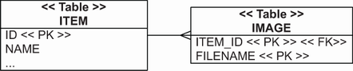

**Hình 8.1** Table `IMAGE` chứa tên file ảnh, mỗi file tham chiếu tới một `ITEM_ID`.

Đó là tất cả về schema — không có collection hay composition nào.

### 8.1.2 Tạo và ánh xạ một property collection

Chúng ta sẽ ánh xạ table `IMAGE` này thế nào với những gì đã biết cho tới giờ? Có lẽ chúng ta sẽ ánh xạ nó thành một class `@Entity` tên `Image`. Ở phần sau chương này, chúng ta sẽ ánh xạ cột foreign key bằng một property `@ManyToOne` để tạo association giữa các entity. Chúng ta cũng sẽ cần ánh xạ composite primary key cho entity class, như sẽ minh họa lần đầu ở mục 10.2.2. Điều cần biết lúc này là composite primary key là tổ hợp của nhiều cột để định danh duy nhất một dòng trong table. Từng cột riêng lẻ có thể không duy nhất, nhưng tổ hợp của chúng phải duy nhất.

Không có collection ảnh nào được ánh xạ; chúng không cần thiết. Khi cần các ảnh của một item, chúng ta có thể viết và thực thi một truy vấn bằng ngôn ngữ truy vấn của JPA:

```sql
select img from Image img where img.item = :itemParameter
```

Persistent collection luôn là tùy chọn.

Một collection mà chúng ta *có thể* tạo là `Item#images`, tham chiếu tới tất cả ảnh của một item cụ thể. Chúng ta có thể tạo và ánh xạ property collection này để làm những việc sau:

- Tự động thực thi truy vấn SQL `SELECT * from IMAGE where ITEM_ID = ?` khi chúng ta gọi `someItem.getImages()`. Miễn là các instance của domain model đang ở trạng thái managed (sẽ nói thêm sau), chúng ta có thể đọc từ cơ sở dữ liệu theo yêu cầu trong khi điều hướng các association giữa các class. Chúng ta không phải tự viết và thực thi truy vấn để nạp dữ liệu. Mặt khác, khi chúng ta bắt đầu duyệt collection, truy vấn của collection luôn là “tất cả ảnh của item này”, chứ không bao giờ là “chỉ những ảnh khớp tiêu chí XYZ”.
- Tránh phải lưu từng `Image` bằng `entityManager.persist()` hay `imageRepository.save()`. Nếu chúng ta có một collection được ánh xạ, việc thêm `Image` vào collection bằng `someItem.getImages().add()` sẽ tự động làm nó persistent khi `Item` được lưu. Cơ chế cascading persistence này rất tiện vì chúng ta có thể lưu instance mà không cần gọi repository hay `EntityManager`.
- Có vòng đời phụ thuộc cho các `Image`. Khi một `Item` bị xóa, Hibernate xóa mọi `Image` đính kèm bằng một lệnh SQL `DELETE` bổ sung. Chúng ta không phải lo về vòng đời của ảnh và việc dọn dẹp các bản mồ côi (giả sử foreign key constraint trong cơ sở dữ liệu không có `ON DELETE CASCADE`). JPA provider xử lý vòng đời composition.

Quan trọng là phải nhận ra rằng mặc dù những lợi ích này nghe rất hay, cái giá phải trả là độ phức tạp ánh xạ tăng thêm. Nhiều người mới học JPA vật lộn với ánh xạ collection, và thường câu trả lời cho câu hỏi “Tại sao bạn làm vậy?” lại là “Tôi tưởng collection này là bắt buộc.”

Nếu phân tích cách chúng ta có thể xử lý kịch bản ảnh cho các mặt hàng đấu giá, chúng ta sẽ thấy việc ánh xạ collection là có lợi. Ảnh có vòng đời phụ thuộc; khi một item bị xóa, mọi ảnh đính kèm cũng nên bị xóa. Khi một item được lưu, mọi ảnh đính kèm cũng nên được lưu. Và khi một item được hiển thị, chúng ta cũng thường hiển thị tất cả ảnh, nên `someItem.getImages()` là tiện lợi trong mã UI — đây đúng hơn là kiểu nạp sớm (eager loading) thông tin. Chúng ta không phải gọi lại persistence service để lấy ảnh; chúng đã có sẵn ở đó.

Giờ chúng ta chuyển sang việc chọn interface và hiện thực collection phù hợp nhất với thiết kế domain model. Hãy đi qua các ánh xạ collection phổ biến nhất, lặp lại cùng ví dụ `Image` và `Item` với những biến thể nhỏ.

### 8.1.3 Chọn interface collection

Đây là thành ngữ cho một property collection trong domain model Java:

```java
<<Interface>> images = new <<Implementation>>();
// Getter and setter methods
// . . .
```

Hãy dùng interface để khai báo kiểu của property, không dùng hiện thực. Chọn một hiện thực phù hợp và khởi tạo collection ngay lập tức; làm vậy sẽ tránh được các collection chưa khởi tạo. Chúng tôi không khuyến nghị khởi tạo collection muộn trong constructor hay phương thức setter.

Dùng generics, đây là một `Set` điển hình:

```java
Set<Image> images = new HashSet<Image>();
```

> **Collection thô không có generics**
>
> Nếu chúng ta không chỉ định kiểu phần tử của collection bằng generics, hoặc kiểu khóa/giá trị của một map, chúng ta cần cho Hibernate biết kiểu (hoặc các kiểu). Ví dụ, thay vì `Set<String>`, chúng ta có thể ánh xạ một `Set` thô bằng `@ElementCollection(targetClass = String.class)`. Điều này cũng áp dụng cho các tham số kiểu của `Map`. Hãy chỉ định kiểu khóa của `Map` bằng `@MapKeyClass`.
>
> Tất cả ví dụ trong cuốn sách này đều dùng collection và map có generics, và bạn cũng nên vậy.

Ngay khi cài đặt, Hibernate hỗ trợ các interface collection quan trọng nhất của JDK và bảo toàn ngữ nghĩa của collection, map và mảng JDK theo cách persistent. Mỗi interface của JDK có một hiện thực tương ứng được Hibernate hỗ trợ, và điều quan trọng là chúng ta dùng đúng tổ hợp. Hibernate bọc collection đã khởi tạo ở phần khai báo field, hoặc đôi khi thay thế nó nếu đó không phải loại đúng. Nó làm vậy để, cùng nhiều thứ khác, bật lazy loading và dirty checking cho các phần tử collection.

Không cần mở rộng Hibernate, chúng ta có thể chọn trong các collection sau:

- Một property `java.util.Set`, khởi tạo bằng `java.util.HashSet`. Thứ tự phần tử không được bảo toàn, và không cho phép phần tử trùng lặp. Mọi JPA provider đều hỗ trợ kiểu này.
- Một property `java.util.SortedSet`, khởi tạo bằng `java.util.TreeSet`. Collection này hỗ trợ thứ tự ổn định của các phần tử: việc sắp xếp diễn ra trong bộ nhớ sau khi Hibernate nạp dữ liệu. Đây là phần mở rộng chỉ có ở Hibernate; các JPA provider khác có thể bỏ qua khía cạnh “sorted” của set.
- Một property `java.util.List`, khởi tạo bằng `java.util.ArrayList`. Hibernate bảo toàn vị trí của mỗi phần tử bằng một cột chỉ số bổ sung trong table cơ sở dữ liệu. Mọi JPA provider đều hỗ trợ kiểu này.
- Một property `java.util.Collection`, khởi tạo bằng `java.util.ArrayList`. Collection này có ngữ nghĩa bag; cho phép trùng lặp nhưng thứ tự phần tử không được bảo toàn. Mọi JPA provider đều hỗ trợ kiểu này.
- Một property `java.util.Map`, khởi tạo bằng `java.util.HashMap`. Các cặp khóa/giá trị của map có thể được bảo toàn trong cơ sở dữ liệu. Mọi JPA provider đều hỗ trợ kiểu này.
- Một property `java.util.SortedMap`, khởi tạo bằng `java.util.TreeMap`. Nó hỗ trợ thứ tự ổn định của các phần tử: việc sắp xếp diễn ra trong bộ nhớ sau khi Hibernate nạp dữ liệu. Đây là phần mở rộng chỉ có ở Hibernate; các JPA provider khác có thể bỏ qua khía cạnh “sorted” của map.
- Hibernate hỗ trợ mảng persistent, nhưng JPA thì không. Chúng hiếm khi được dùng, và chúng tôi sẽ không trình bày trong cuốn sách này. Hibernate không thể bọc các property mảng, nên nhiều lợi ích của collection, chẳng hạn lazy loading theo yêu cầu, sẽ không hoạt động. Chỉ dùng mảng persistent trong domain model nếu bạn chắc chắn không cần lazy loading. (Bạn *có thể* nạp mảng theo yêu cầu, nhưng việc này cần interception với bytecode enhancement, như giải thích ở mục 12.1.3.)

Nếu chúng ta muốn ánh xạ các interface và hiện thực collection không được Hibernate hỗ trợ trực tiếp, chúng ta cần cho Hibernate biết ngữ nghĩa của các collection tùy chỉnh đó. Điểm mở rộng trong Hibernate là interface `PersistentCollection` trong package `org.hibernate.collection.spi`, nơi chúng ta thường mở rộng một trong các class có sẵn `PersistentSet`, `PersistentBag` và `PersistentList`. Việc viết persistent collection tùy chỉnh không dễ, và chúng tôi không khuyến nghị làm điều này nếu bạn chưa phải người dùng Hibernate có kinh nghiệm.

> **Hệ thống tập tin có giao dịch**
>
> Nếu chúng ta chỉ lưu tên file ảnh trong cơ sở dữ liệu SQL, chúng ta phải lưu dữ liệu nhị phân của mỗi ảnh — các file — ở đâu đó. Chúng ta có thể lưu dữ liệu ảnh trong cơ sở dữ liệu SQL ở các cột `BLOB` (xem “Kiểu nhị phân và giá trị lớn” ở mục 6.3.1).
>
> Nếu chúng ta quyết định không lưu ảnh trong cơ sở dữ liệu mà lưu dưới dạng file thông thường, chúng ta nên biết rằng các API hệ thống tập tin chuẩn của Java, `java.io.File` và `java.nio.file.Files`, không có tính giao dịch. Các thao tác trên hệ thống tập tin không được đăng ký vào một system transaction của Java Transaction API (JTA); một transaction có thể hoàn tất thành công với việc Hibernate ghi tên file vào cơ sở dữ liệu SQL, nhưng việc lưu hoặc xóa file trên hệ thống tập tin lại thất bại. Chúng ta sẽ không thể rollback những thao tác này thành một đơn vị nguyên tử, và cũng không có được sự cô lập (isolation) đúng đắn giữa các thao tác.
>
> Bạn có thể dùng một transaction manager riêng ở mức hệ thống, chẳng hạn Bitronix. Khi đó các thao tác file sẽ được đăng ký, commit và rollback cùng với các thao tác SQL của Hibernate trong cùng một transaction.

Hãy ánh xạ một collection tên file ảnh cho một `Item`.

### 8.1.4 Ánh xạ một set

Hiện thực đơn giản nhất của việc ánh xạ một set là một `Set` các tên file ảnh kiểu `String`. Hãy thêm một property collection vào class `Item`, như minh họa ở listing sau.

**Listing 8.1** Ánh xạ images thành một set chuỗi đơn giản

*Đường dẫn: Ch08/mapping-collections/src/main/java/com/manning/javapersistence/ch08/setofstrings/Item.java*

```java
@Entity
public class Item {
    // . . .

    @ElementCollection                                       // Ⓐ
    @CollectionTable(
            name = "IMAGE",                                  // Ⓑ
            joinColumns = @JoinColumn(name = "ITEM_ID"))     // Ⓒ
    @Column(name = "FILENAME")                               // Ⓓ
    private Set<String> images = new HashSet<>();            // Ⓔ
}
```

Ⓐ Khai báo field `images` là một `@ElementCollection`. Ở đây chúng ta nói tới đường dẫn ảnh trên hệ thống, nhưng để ngắn gọn, chúng tôi dùng tên field và cột như `image` hay `images`.

Ⓑ Collection table sẽ có tên `IMAGE`. Nếu không, nó sẽ mặc định là `ITEM_IMAGES`.

Ⓒ Cột join giữa table `ITEM` và `IMAGE` sẽ là `ITEM_ID` (thực ra đây cũng là tên mặc định).

Ⓓ Tên cột chứa thông tin chuỗi từ collection `images` sẽ là `FILENAME`. Nếu không, nó sẽ mặc định là `IMAGES`.

Ⓔ Khởi tạo collection `images` bằng một `HashSet`.

Annotation `@ElementCollection` của JPA ở listing trên là bắt buộc cho một collection các phần tử kiểu value type. Nếu không có annotation `@CollectionTable` và `@Column`, Hibernate sẽ dùng tên mặc định cho schema. Hãy xem schema ở hình 8.2: các cột primary key được gạch chân.

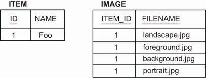

**Hình 8.2** Cấu trúc table và dữ liệu ví dụ cho một set chuỗi

Table `IMAGE` có composite primary key gồm cả cột `ITEM_ID` và `FILENAME`. Nghĩa là chúng ta không thể có dòng trùng lặp: mỗi file ảnh chỉ có thể được đính kèm một lần vào một item. Ngoài ra, thứ tự của ảnh không được lưu. Điều này phù hợp với domain model và collection `Set`. Ảnh được lưu ở đâu đó trên hệ thống tập tin, và chúng ta chỉ giữ tên file trong cơ sở dữ liệu.

Để tương tác với các entity `Item`, chúng ta sẽ tạo repository Spring Data JPA sau.

**Listing 8.2** Interface ItemRepository

*Đường dẫn: Ch08/mapping-collections/src/main/java/com/manning/javapersistence/ch08/repositories/setofstrings/ItemRepository.java*

```java
public interface ItemRepository extends JpaRepository<Item, Long> {

    @Query("select i from Item i inner join fetch i.images where i.id = :id")
    Item findItemWithImages(@Param("id") Long id);                        // Ⓐ

    @Query(value = "SELECT FILENAME FROM IMAGE WHERE ITEM_ID = ?1",
           nativeQuery = true)
    Set<String> findImagesNative(Long id);                                // Ⓑ
}
```

Ⓐ Khai báo phương thức `findItemWithImages` sẽ lấy `Item` theo `id`, bao gồm cả collection `images`. Để nạp collection này một cách eager, chúng ta dùng khả năng `inner join fetch` của Jakarta Persistence Query Language (JPQL).

Ⓑ Khai báo phương thức `findImagesNative`, được đánh dấu là truy vấn native và sẽ lấy tập chuỗi biểu diễn các ảnh của một `id` cho trước.

Chúng ta cũng sẽ tạo test sau.

**Listing 8.3** Class MappingCollectionsSpringDataJPATest

*Đường dẫn: Ch08/mapping-collections/src/test/java/com/manning/javapersistence/ch08/setofstrings/MappingCollectionsSpringDataJPATest.java*

```java
@ExtendWith(SpringExtension.class)
@ContextConfiguration(classes = {SpringDataConfiguration.class})
public class MappingCollectionsSpringDataJPATest {

    @Autowired
    private ItemRepository itemRepository;

    @Test
    void storeLoadEntities() {

        Item item = new Item("Foo");                                   // Ⓐ

        item.addImage("background.jpg");                               // Ⓑ
        item.addImage("foreground.jpg");                               // Ⓑ
        item.addImage("landscape.jpg");                                // Ⓑ
        item.addImage("portrait.jpg");                                 // Ⓑ

        itemRepository.save(item);                                     // Ⓒ

        Item item2 = itemRepository.findItemWithImages(item.getId());  // Ⓓ

        List<Item> items2 = itemRepository.findAll();                  // Ⓔ
        Set<String> images = itemRepository.findImagesNative(item.getId()); // Ⓕ

        assertAll(                                                     // Ⓖ
                () -> assertEquals(4, item2.getImages().size()),
                () -> assertEquals(1, items2.size()),
                () -> assertEquals(4, images.size())
        );

    }
}
```

Ⓐ Tạo một `Item`.

Ⓑ Thêm 4 đường dẫn ảnh vào nó.

Ⓒ Lưu nó vào cơ sở dữ liệu.

Ⓓ Truy cập repository để lấy item cùng collection `images`. Như đã chỉ định trong truy vấn JPQL mà phương thức `findItemWithImages` được đánh dấu, collection cũng sẽ được nạp từ cơ sở dữ liệu.

Ⓔ Lấy tất cả `Item` từ cơ sở dữ liệu.

Ⓕ Lấy tập chuỗi biểu diễn các ảnh, dùng phương thức `findImagesNative`.

Ⓖ Kiểm tra kích thước của các collection khác nhau đã thu được.

Có vẻ không hợp lý khi cho phép người dùng đính kèm cùng một ảnh nhiều lần vào cùng một item, nhưng giả sử chúng ta cho phép. Ánh xạ nào sẽ phù hợp trong trường hợp đó?

### 8.1.5 Ánh xạ một identifier bag

Một *bag* là collection không có thứ tự cho phép phần tử trùng lặp, giống interface `java.util.Collection`. Kỳ lạ là Java Collections framework không có hiện thực bag nào. Chúng ta có thể khởi tạo property bằng một `ArrayList`, và Hibernate bỏ qua chỉ số phần tử khi lưu và nạp phần tử.

**Listing 8.4** Bag chuỗi, cho phép phần tử trùng lặp

*Đường dẫn: Ch08/mapping-collections/src/main/java/com/manning/javapersistence/ch08/bagofstrings/Item.java*

```java
@Entity
public class Item {
    // . . .

    @ElementCollection
    @CollectionTable(name = "IMAGE")                                       // Ⓑ
    @Column(name = "FILENAME")
    @GenericGenerator(name = "sequence_gen", strategy = "sequence")        // Ⓐ
    @org.hibernate.annotations.CollectionId(                               // Ⓓ
             columns = @Column(name = "IMAGE_ID"),                         // Ⓒ
             type = @org.hibernate.annotations.Type(type = "long"),
             generator = "sequence_gen")                                   // Ⓔ
    private Collection<String> images = new ArrayList<>();                 // Ⓕ
}
```

Ⓐ Khai báo một `@GenericGenerator` với tên `"sequence_gen"` và chiến lược `"sequence"` để lo phần surrogate key trong table `IMAGE`.

Ⓑ Collection table `IMAGE` cần một primary key khác để cho phép giá trị `FILENAME` trùng lặp với mỗi `ITEM_ID`.

Ⓒ Đưa vào một cột surrogate primary key tên `IMAGE_ID`. Bạn có thể truy xuất tất cả ảnh cùng lúc hoặc lưu tất cả cùng lúc, nhưng một table cơ sở dữ liệu vẫn cần primary key.

Ⓓ Dùng một annotation chỉ có ở Hibernate.

Ⓔ Cấu hình cách primary key được sinh ra.

Ⓕ Không có hiện thực bag nào trong JDK. Chúng ta khởi tạo collection bằng `ArrayList`.

Thông thường bạn sẽ muốn hệ thống sinh giá trị primary key khi bạn lưu một instance entity. Nếu bạn cần ôn lại về key generator, hãy xem mục 5.2.4. Schema đã sửa đổi được thể hiện ở hình 8.3. Repository Spring Data JPA và test sẽ giống như ở ví dụ trước.

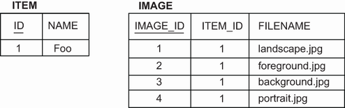

**Hình 8.3** Cột surrogate primary key cho một bag chuỗi

Đây là một câu hỏi thú vị: nếu bạn chỉ nhìn thấy schema này, bạn có thể nói các table được ánh xạ thế nào trong Java không? Table `ITEM` và `IMAGE` trông giống nhau: mỗi table có một cột surrogate primary key và một số cột đã chuẩn hóa khác. Mỗi table đều có thể được ánh xạ bằng một class `@Entity`. Tuy nhiên, chúng ta có thể quyết định dùng một tính năng của JPA và ánh xạ một collection tới `IMAGE`, thậm chí với vòng đời composition. Đây thực chất là một quyết định thiết kế rằng một số quy tắc truy vấn và thao tác định sẵn là tất cả những gì chúng ta cần cho table này, thay vì ánh xạ `@Entity` tổng quát hơn. Khi đưa ra quyết định như vậy, hãy chắc chắn bạn biết lý do và hệ quả.

Kỹ thuật ánh xạ tiếp theo bảo toàn thứ tự của các ảnh trong một list.

### 8.1.6 Ánh xạ một list

Nếu bạn chưa từng dùng phần mềm ORM, một persistent list có vẻ là khái niệm rất mạnh; hãy hình dung việc lưu và nạp một `java.util.List<String>` bằng JDBC và SQL thuần tốn công đến mức nào. Nếu chúng ta thêm một phần tử vào giữa list, list sẽ dịch mọi phần tử phía sau sang phải hoặc sắp xếp lại con trỏ, tùy hiện thực list. Nếu chúng ta xóa một phần tử ở giữa list, chuyện khác lại xảy ra, v.v. Nếu phần mềm ORM có thể làm tất cả điều này tự động cho các bản ghi cơ sở dữ liệu, một persistent list bắt đầu trông hấp dẫn hơn thực tế.

Như chúng tôi đã lưu ý ở mục 3.2.4, phản ứng đầu tiên thường là bảo toàn thứ tự phần tử dữ liệu theo đúng thứ tự người dùng nhập vào, vì bạn thường sẽ phải hiển thị chúng sau này theo cùng thứ tự đó. Nhưng nếu có tiêu chí khác dùng để sắp xếp dữ liệu, chẳng hạn timestamp nhập liệu, bạn nên sắp xếp dữ liệu khi truy vấn thay vì lưu thứ tự hiển thị. Sẽ ra sao nếu thứ tự hiển thị bạn cần dùng thay đổi? Thứ tự hiển thị dữ liệu thường không phải một phần thiết yếu của dữ liệu mà là mối quan tâm trực giao, nên hãy suy nghĩ kỹ trước khi ánh xạ một `List` persistent; Hibernate không thông minh như bạn tưởng, như bạn sẽ thấy ở ví dụ tiếp theo.

Hãy thay đổi entity `Item` và property collection của nó.

**Listing 8.5** Persistent list, bảo toàn thứ tự phần tử trong cơ sở dữ liệu

*Đường dẫn: Ch08/mapping-collections/src/main/java/com/manning/javapersistence/ch08/listofstrings/Item.java*

```java
@Entity
public class Item {
    // . . .

    @ElementCollection
    @CollectionTable(name = "IMAGE")
    @OrderColumn // Enables persistent order, Defaults to IMAGES_ORDER
    @Column(name = "FILENAME")
    private List<String> images = new ArrayList<>();
}
```

Có một annotation mới trong ví dụ này: `@OrderColumn`. Cột này lưu chỉ số trong persistent list, bắt đầu từ 0. Tên cột sẽ mặc định là `IMAGES_ORDER`. Lưu ý rằng Hibernate lưu chỉ số sao cho liên tục trong cơ sở dữ liệu và mong đợi nó như vậy. Nếu có khoảng trống, Hibernate sẽ thêm phần tử `null` khi nạp và dựng lại `List`. Hãy xem schema ở hình 8.4.

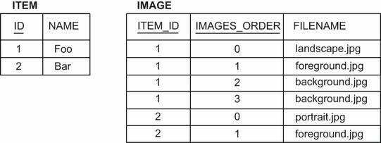

**Hình 8.4** Collection table bảo toàn vị trí của mỗi phần tử list.

Primary key của table `IMAGE` là tổ hợp của `ITEM_ID` và `IMAGES_ORDER`. Điều này cho phép giá trị `FILENAME` trùng lặp, nhất quán với ngữ nghĩa của một `List`. Hãy nhớ, ảnh được lưu ở đâu đó trên hệ thống tập tin, và chúng ta chỉ giữ tên file trong cơ sở dữ liệu. Repository Spring Data JPA và test sẽ giống như ví dụ trước.

Chúng tôi đã nói ở trên rằng Hibernate không thông minh như bạn tưởng. Hãy xét việc sửa đổi list: giả sử list có ba ảnh A, B và C theo thứ tự đó. Điều gì xảy ra nếu bạn xóa A khỏi list? Hibernate thực thi một lệnh SQL `DELETE` cho dòng đó. Rồi nó thực thi hai lệnh `UPDATE`, cho B và C, dịch vị trí của chúng sang trái để lấp khoảng trống trong chỉ số. Với mỗi phần tử nằm bên phải phần tử bị xóa, Hibernate thực thi một lệnh `UPDATE`. Nếu chúng ta tự viết SQL cho việc này, chúng ta có thể làm bằng một lệnh `UPDATE` duy nhất. Điều tương tự cũng đúng với việc chèn vào giữa list — Hibernate dịch mọi phần tử hiện có sang phải từng cái một. Ít nhất Hibernate cũng đủ thông minh để thực thi một lệnh `DELETE` duy nhất khi chúng ta gọi `clear()` trên list.

Giờ giả sử các ảnh của một item có tên do người dùng đặt bên cạnh tên file. Một cách mô hình hóa việc này trong Java là dùng map với các cặp khóa/giá trị.

### 8.1.7 Ánh xạ một map

Để chứa tên do người dùng đặt cho các file ảnh, chúng ta sẽ đổi class Java sang dùng một property `Map`.

**Listing 8.6** Persistent map lưu các cặp khóa và giá trị của nó

*Đường dẫn: Ch08/mapping-collections/src/main/java/com/manning/javapersistence/ch08/mapofstrings/Item.java*

```java
@Entity
public class Item {
    // . . .

    @ElementCollection
    @CollectionTable(name = "IMAGE")
    @MapKeyColumn(name = "FILENAME")                       // Ⓐ
    @Column(name = "IMAGENAME")                            // Ⓑ
    private Map<String, String> images = new HashMap<>();
}
```

Ⓐ Mỗi mục của map là một cặp khóa/giá trị. Ở đây khóa được ánh xạ bằng `@MapKeyColumn` tới `FILENAME`.

Ⓑ Giá trị là cột `IMAGENAME`. Nghĩa là người dùng chỉ có thể dùng một file một lần vì `Map` không cho phép khóa trùng lặp.

Như bạn thấy từ schema ở hình 8.5, primary key của collection table là tổ hợp của `ITEM_ID` và `FILENAME`. Ví dụ dùng một `String` làm khóa cho map, nhưng Hibernate hỗ trợ bất kỳ kiểu basic nào, chẳng hạn `BigDecimal` hay `Integer`. Nếu khóa là một `enum` của Java, chúng ta phải dùng `@MapKeyEnumerated`. Với bất kỳ kiểu temporal nào như `java.util.Date`, hãy dùng `@MapKeyTemporal`.

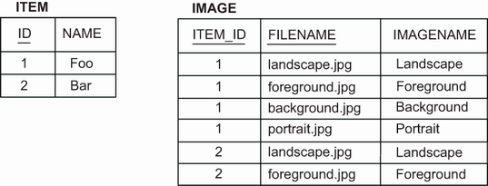

**Hình 8.5** Table cho một map, dùng chuỗi làm chỉ số và phần tử

Map ở ví dụ trước không có thứ tự. Nếu danh sách file dài, và chúng ta muốn nhanh chóng tìm thứ gì đó chỉ bằng cách liếc qua, làm sao để luôn sắp xếp các mục của map theo tên file?

### 8.1.8 Collection được sắp xếp và có thứ tự

Chúng ta có thể sắp xếp (sort) một collection trong bộ nhớ bằng một comparator của Java. Chúng ta có thể sắp thứ tự (order) một collection khi nó được nạp từ cơ sở dữ liệu bằng một truy vấn SQL với mệnh đề `ORDER BY`.

Hãy biến map ảnh thành một sorted map. Chúng ta cần thay đổi property Java và ánh xạ.

**Listing 8.7** Sắp xếp các mục của map trong bộ nhớ bằng comparator

*Đường dẫn: Ch08/mapping-collections/src/main/java/com/manning/javapersistence/ch08/sortedmapofstrings/Item.java*

```java
@Entity
public class Item {
    // . . .

    @ElementCollection
    @CollectionTable(name = "IMAGE")
    @MapKeyColumn(name = "FILENAME")
    @Column(name = "IMAGENAME")
    @org.hibernate.annotations.SortComparator(ReverseStringComparator.class)
    private SortedMap<String, String> images = new TreeMap<>();
}
```

Sorted collection là một tính năng của Hibernate; do đó annotation `org.hibernate.annotations.SortComparator` với một hiện thực của `java.util.Comparator<String>` — cái được dùng ở đây sắp xếp chuỗi theo thứ tự ngược. Schema cơ sở dữ liệu không thay đổi, điều này cũng đúng với tất cả ví dụ tiếp theo. Hãy xem lại hình 8.1–8.5 ở các mục trước nếu bạn cần nhớ lại.

Chúng ta sẽ thêm hai dòng sau vào test, để kiểm tra rằng các khóa giờ đây ở thứ tự ngược:

```java
() -> assertEquals("Portrait", item2.getImages().firstKey()),
() -> assertEquals("Background", item2.getImages().lastKey())
```

Chúng ta sẽ ánh xạ một `java.util.SortedSet` như minh họa tiếp theo. Bạn có thể tìm nó ở ví dụ `sortedsetofstrings` trong thư mục `mapping-collections`.

**Listing 8.8** Sắp xếp phần tử set trong bộ nhớ bằng String#compareTo()

*Đường dẫn: Ch08/mapping-collections/src/main/java/com/manning/javapersistence/ch08/sortedsetofstrings/Item.java*

```java
@Entity
public class Item {
    // . . .

    @ElementCollection
    @CollectionTable(name = "IMAGE")
    @Column(name = "FILENAME")
    @org.hibernate.annotations.SortNatural
    private SortedSet<String> images = new TreeSet<>();
}
```

Ở đây dùng sắp xếp tự nhiên, dựa vào phương thức `String#compareTo()`.

Đáng tiếc, chúng ta không thể sắp xếp một bag; không có `TreeBag`. Chỉ số của phần tử list đã định trước thứ tự của chúng. Ngoài ra, thay vì chuyển sang các interface `Sorted*`, chúng ta có thể muốn truy xuất phần tử của một collection theo đúng thứ tự từ cơ sở dữ liệu, thay vì sắp xếp trong bộ nhớ. Thay vì `java.util.SortedSet`, chúng ta sẽ dùng `java.util.LinkedHashSet` ở listing sau.

**Listing 8.9** LinkedHashSet cung cấp thứ tự chèn khi duyệt

*Đường dẫn: Ch08/mapping-collections/src/main/java/com/manning/javapersistence/ch08/setofstringsorderby/Item.java*

```java
@Entity
public class Item {
    // . . .

    @ElementCollection
    @CollectionTable(name = "IMAGE")
    @Column(name = "FILENAME")
    // @javax.persistence.OrderBy // One possible order: "FILENAME asc"
    @org.hibernate.annotations.OrderBy(clause = "FILENAME desc")
    private Set<String> images = new LinkedHashSet<>();
}
```

Class `LinkedHashSet` có thứ tự duyệt ổn định trên các phần tử của nó, và Hibernate sẽ điền vào nó theo đúng thứ tự khi nạp một collection. Để làm việc này, Hibernate áp dụng một mệnh đề `ORDER BY` vào câu lệnh SQL nạp collection. Chúng ta phải khai báo mệnh đề SQL này bằng annotation riêng `@org.hibernate.annotations.OrderBy`. Chúng ta có thể gọi một hàm SQL, chẳng hạn `@OrderBy("substring(FILENAME, 0, 3) desc")`, để sắp xếp theo ba chữ cái đầu của tên file, nhưng hãy cẩn thận kiểm tra xem DBMS có hỗ trợ hàm SQL bạn gọi hay không. Hơn nữa, bạn có thể dùng cú pháp SQL:2003 `ORDER BY . . . NULLS FIRST|LAST`, và Hibernate sẽ tự động chuyển nó thành dialect mà DBMS của bạn hỗ trợ.

Nếu biểu thức chỉ là tên cột kèm `ASC` hoặc `DESC`, annotation `@javax.persistence.OrderBy` cũng hoạt động tốt. Nếu bạn cần một mệnh đề phức tạp hơn (chẳng hạn ví dụ `substring()` ở đoạn trước), annotation `@org.hibernate.annotations.OrderBy` là bắt buộc.

> **@OrderBy của Hibernate và @OrderBy của JPA**
>
> Bạn có thể áp dụng annotation `@org.hibernate.annotations.OrderBy` cho bất kỳ collection nào; tham số của nó là một đoạn SQL thuần mà Hibernate gắn vào câu lệnh SQL nạp collection.
>
> Java Persistence có một annotation tương tự, `@javax.persistence.OrderBy`. Tham số duy nhất của nó không phải SQL mà là `someProperty DESC|ASC`. Một giá trị phần tử `String` hay `Integer` không có property nào, nên khi chúng ta áp dụng annotation `@OrderBy` của JPA cho một collection kiểu basic, như ở listing 8.9 với `Set<String>`, theo đặc tả thì “thứ tự sẽ theo giá trị của các object basic”. Nghĩa là chúng ta không thể thay đổi giá trị dùng để sắp thứ tự (chỉ có thể đổi hướng, `asc` hay `desc`). Chúng ta sẽ dùng annotation của JPA ở mục 8.2.2 khi class giá trị phần tử có các persistent property và không thuộc kiểu basic/scalar.

Ví dụ tiếp theo từ `bagofstringsorderby` minh họa cùng cách sắp thứ tự lúc nạp với ánh xạ bag. Bạn có thể tìm nó trong thư mục `mapping-collections`.

**Listing 8.10** ArrayList cung cấp thứ tự duyệt ổn định

*Đường dẫn: Ch08/mapping-collections/src/main/java/com/manning/javapersistence/ch08/bagofstringsorderby/Item.java*

```java
@Entity
public class Item {
    // . . .

    @ElementCollection
    @CollectionTable(name = "IMAGE")
    @Column(name = "FILENAME")
    @GenericGenerator(name = "sequence_gen", strategy = "sequence")
    @org.hibernate.annotations.CollectionId(
                 columns = @Column(name = "IMAGE_ID"),
                 type = @org.hibernate.annotations.Type(type = "long"),
                 generator = "sequence_gen")
    @org.hibernate.annotations.OrderBy(clause = "FILENAME desc")
    private Collection<String> images = new ArrayList<>();
}
```

Cuối cùng, chúng ta có thể nạp các cặp khóa/giá trị có thứ tự bằng `LinkedHashMap`.

**Listing 8.11** LinkedHashMap giữ các cặp khóa/giá trị theo thứ tự

*Đường dẫn: Ch08/mapping-collections/src/main/java/com/manning/javapersistence/ch08/mapofstringsorderby/Item.java*

```java
@Entity
public class Item {
    // . . .

    @ElementCollection
    @CollectionTable(name = "IMAGE")
    @MapKeyColumn(name = "FILENAME")
    @Column(name = "IMAGENAME")
    @org.hibernate.annotations.OrderBy(clause = "FILENAME desc")
    private Map<String, String> images = new LinkedHashMap<>();
}
```

Hãy nhớ rằng các phần tử của ordered collection chỉ ở đúng thứ tự mong muốn khi chúng được nạp. Ngay khi chúng ta thêm hoặc xóa phần tử, thứ tự duyệt của collection có thể khác với “theo tên file”; chúng hành xử như set, map hay list liên kết thông thường. Chúng tôi đã minh họa cách tiếp cận kỹ thuật, nhưng chúng ta cần nhận thức về những hạn chế của nó và kết luận rằng những hạn chế này khiến nó là một giải pháp kém tin cậy.

Trong một hệ thống thực, nhiều khả năng chúng ta sẽ cần lưu nhiều hơn chỉ tên ảnh và tên file. Chúng ta có lẽ sẽ cần tạo một class `Image` cho thông tin bổ sung (chẳng hạn tiêu đề, chiều rộng và chiều cao). Đây là trường hợp sử dụng hoàn hảo cho một collection các component.

## 8.2 Collection của component

Chúng ta đã ánh xạ một embeddable component trước đây: địa chỉ của một `User`. Ví dụ chúng ta đang làm trong chương này thì khác, vì một `Item` có nhiều tham chiếu tới `Image`, như minh họa ở hình 8.6. Association trong sơ đồ UML là một composition (hình thoi đặc); do đó các `Image` được tham chiếu bị ràng buộc vào vòng đời của `Item` sở hữu.

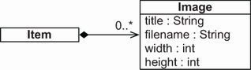

**Hình 8.6** Collection các component `Image` trong `Item`

Mã ở listing sau minh họa class embeddable `Image` mới, nắm bắt tất cả property của một ảnh mà chúng ta quan tâm.

**Listing 8.12** Đóng gói tất cả property của một ảnh

*Đường dẫn: Ch08/mapping-collections/src/main/java/com/manning/javapersistence/ch08/setofembeddables/Image.java*

```java
@Embeddable
public class Image {

    @Column(nullable = false)
    private String filename;

    private int width;
    private int height;
    // . . .
}
```

Trước hết, lưu ý rằng mọi property đều không tùy chọn, `NOT NULL`. Các property kích thước không cho phép null vì giá trị của chúng là kiểu nguyên thủy. Thứ hai, chúng ta phải cân nhắc về equality, và cách cơ sở dữ liệu cùng tầng Java so sánh hai ảnh.

### 8.2.1 Equality của instance component

Giả sử chúng ta muốn giữ nhiều instance `Image` trong một `HashSet`. Chúng ta biết set không cho phép phần tử trùng lặp, nhưng làm sao set phát hiện trùng lặp? `HashSet` gọi phương thức `equals()` trên mỗi `Image` mà chúng ta đưa vào `Set`. (Hiển nhiên nó cũng gọi phương thức `hashCode()` để lấy mã băm.)

Có bao nhiêu ảnh trong collection sau?

```java
someItem.addImage(new Image("background.jpg", 640, 480));
someItem.addImage(new Image("foreground.jpg", 800, 600));
someItem.addImage(new Image("landscape.jpg", 1024, 768));
someItem.addImage(new Image("landscape.jpg", 1024, 768));
assertEquals(3, someItem.getImages().size());
```

Bạn có nghĩ là bốn ảnh thay vì ba không? Bạn đúng: phép kiểm tra equality thông thường của Java dựa vào identity. Phương thức `java.lang.Object#equals()` so sánh instance bằng `a==b`. Theo thủ tục đó, chúng ta sẽ có bốn instance `Image` trong collection. Rõ ràng ba là câu trả lời “đúng” cho tình huống này.

Với class `Image`, chúng ta không dựa vào Java identity — chúng ta ghi đè các phương thức `equals()` và `hashCode()`.

**Listing 8.13** Hiện thực equality tùy chỉnh bằng equals() và hashCode()

*Đường dẫn: Ch08/mapping-collections/src/main/java/com/manning/javapersistence/ch08/setofembeddables/Image.java*

```java
@Embeddable
public class Image {
    // . . .

    @Override
    public boolean equals(Object o) {                        // Ⓐ
        if (this == o) return true;
        if (o == null || getClass() != o.getClass()) return false;
        Image image = (Image) o;
        return width == image.width &&
               height == image.height &&
               filename.equals(image.filename) &&
               item.equals(image.item);
    }

    @Override
    public int hashCode() {                                  // Ⓑ
        return Objects.hash(filename, width, height, item);
    }
    // . . .
}
```

Ⓐ Phép kiểm tra equality tùy chỉnh này trong `equals()` so sánh tất cả giá trị của một `Image` với giá trị của `Image` khác. Nếu mọi giá trị đều giống nhau, hai ảnh phải là một.

Ⓑ Phương thức `hashCode()` phải thỏa hợp đồng yêu cầu rằng nếu hai instance bằng nhau, chúng phải có cùng mã băm.

Tại sao chúng ta không ghi đè equality ở mục 6.2, khi ánh xạ `Address` của một `User`? Thật ra, có lẽ chúng ta nên làm vậy. Lý do bào chữa duy nhất của chúng tôi là chúng ta sẽ không gặp vấn đề gì với equality theo identity thông thường trừ khi đưa các embeddable component vào một `Set` hoặc dùng chúng làm khóa trong một `Map` vốn dùng `equals()` và `hashCode()` để lưu và so sánh (nghĩa là không phải `TreeMap`, thứ so sánh các mục với nhau để sắp xếp và định vị). Chúng ta cũng nên định nghĩa lại equality dựa trên giá trị, không dựa trên identity. Tốt nhất là nên ghi đè các phương thức này trên mọi class `@Embeddable`; mọi value type đều nên được so sánh “theo giá trị”.

Giờ hãy xét primary key trong cơ sở dữ liệu: Hibernate sẽ sinh một schema bao gồm mọi cột không cho phép null của collection table `IMAGE` trong một composite primary key. Các cột phải không cho phép null vì chúng ta không thể định danh cái mà chúng ta không biết. Điều này phản ánh hiện thực equality trong class Java. Chúng ta sẽ xem schema ở mục tiếp theo, với nhiều chi tiết hơn về primary key.

> **CHÚ Ý** Có một vấn đề nhỏ với bộ sinh schema của Hibernate: nếu chúng ta đánh dấu property của một embeddable bằng `@NotNull` thay vì `@Column(nullable = false)`, Hibernate sẽ không sinh constraint `NOT NULL` cho cột của collection table. Phép kiểm tra Bean Validation trên một instance vẫn hoạt động như mong đợi, nhưng schema cơ sở dữ liệu lại thiếu quy tắc toàn vẹn. Hãy dùng `@Column(nullable = false)` nếu class embeddable được ánh xạ trong một collection và property đó nên là một phần của primary key.

Class component giờ đã sẵn sàng, và chúng ta có thể dùng nó trong các ánh xạ collection.

### 8.2.2 Set các component

Chúng ta có thể ánh xạ một `Set` các component như sau. Hãy nhớ rằng `Set` là loại collection chỉ cho phép các mục duy nhất.

**Listing 8.14** Một Set các embeddable component với phần ghi đè

*Đường dẫn: Ch08/mapping-collections/src/main/java/com/manning/javapersistence/ch08/setofembeddables/Item.java*

```java
@Entity
public class Item {
    // . . .

    @ElementCollection                                  // Ⓐ
    @CollectionTable(name = "IMAGE")                    // Ⓑ
    @AttributeOverride(
            name = "filename",
            column = @Column(name = "FNAME", nullable = false)
    )
    private Set<Image> images = new HashSet<>();
}
```

Ⓐ Như trước, annotation `@ElementCollection` là bắt buộc. Hibernate tự động biết rằng đích của collection là một kiểu `@Embeddable` từ khai báo collection có generics.

Ⓑ Annotation `@CollectionTable` ghi đè tên mặc định của collection table, vốn sẽ là `ITEM_IMAGES`.

Ánh xạ của `Image` định nghĩa các cột của collection table. Cũng như với một giá trị embedded đơn lẻ, chúng ta có thể dùng `@AttributeOverride` để tùy chỉnh ánh xạ mà không phải sửa class embeddable đích.

Hãy xem schema cơ sở dữ liệu ở hình 8.7. Chúng ta đang ánh xạ một set, nên primary key của collection table là tổ hợp của cột foreign key `ITEM_ID` và tất cả cột “embedded” không cho phép null: `FNAME`, `WIDTH` và `HEIGHT`.

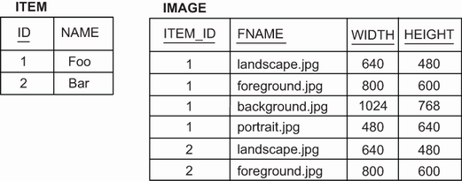

**Hình 8.7** Table dữ liệu ví dụ cho một collection các component

Giá trị `ITEM_ID` không được đưa vào các phương thức `equals()` và `hashCode()` được ghi đè của `Image`, như đã bàn ở mục trước. Do đó, nếu chúng ta trộn lẫn ảnh của các item khác nhau trong một set, chúng ta sẽ gặp vấn đề equality ở tầng Java. Trong table cơ sở dữ liệu, rõ ràng chúng ta có thể phân biệt ảnh của các item khác nhau vì định danh của item được đưa vào phép kiểm tra equality của primary key.

Nếu chúng ta muốn đưa `Item` vào thủ tục equality của `Image`, để đối xứng với primary key trong cơ sở dữ liệu, chúng ta sẽ cần một property `Image#item`. Đây là một con trỏ ngược đơn giản do Hibernate cung cấp khi các instance `Image` được nạp:

*Đường dẫn: Ch08/mapping-collections/src/main/java/com/manning/javapersistence/ch08/setofembeddables/Image.java*

```java
@Embeddable
public class Image {
    // . . .
    @org.hibernate.annotations.Parent
    private Item item;
    // . . .
}
```

Giờ chúng ta có thể đưa giá trị `Item` cha vào hiện thực `equals()` và `hashCode()`.

Ở đoạn mã tiếp theo, chúng ta sẽ khớp field `FILENAME` với cột `FNAME` bằng annotation `@AttributeOverride`:

*Đường dẫn: Ch08/mapping-collections/src/main/java/com/manning/javapersistence/ch08/setofembeddables/Item.java*

```java
@AttributeOverride(
        name = "filename",
        column = @Column(name = "FNAME", nullable = false)
)
```

Chúng ta cũng sẽ phải thay đổi truy vấn native trong interface `ItemRepository`:

*Đường dẫn: Ch08/mapping-collections/src/main/java/com/manning/javapersistence/ch08/repositories/setofembeddables/ItemRepository.java*

```java
@Query(value = "SELECT FNAME FROM IMAGE WHERE ITEM_ID = ?1",
        nativeQuery = true)
Set<String> findImagesNative(Long id);
```

Nếu chúng ta cần sắp thứ tự phần tử lúc nạp và có thứ tự duyệt ổn định với `LinkedHashSet`, chúng ta có thể dùng annotation `@OrderBy` của JPA:

*Đường dẫn: Ch08/mapping-collections/src/main/java/com/manning/javapersistence/ch08/setofembeddablesorderby/Item.java*

```java
@Entity
public class Item {
    // . . .
    @ElementCollection
    @CollectionTable(name = "IMAGE")
    @OrderBy("filename DESC, width DESC")
    private Set<Image> images = new LinkedHashSet<>();
}
```

Các đối số của annotation `@OrderBy` là property của class `Image`, theo sau là `ASC` cho thứ tự tăng dần hoặc `DESC` cho giảm dần. Mặc định là tăng dần. Ví dụ này sắp xếp giảm dần theo tên file ảnh rồi giảm dần theo chiều rộng của mỗi ảnh. Lưu ý rằng điều này khác với annotation riêng `@org.hibernate.annotations.OrderBy`, vốn nhận một mệnh đề SQL thuần, như đã bàn ở mục 8.1.8.

Việc khai báo mọi property của `Image` là `@NotNull` có thể không phải điều chúng ta muốn. Nếu bất kỳ property nào là tùy chọn, chúng ta sẽ cần một primary key khác cho collection table.

### 8.2.3 Bag các component

Chúng ta đã dùng annotation `@org.hibernate.annotations.CollectionId` trước đây để thêm một cột surrogate key vào collection table. Tuy nhiên, kiểu collection khi đó không phải `Set` mà là `Collection` tổng quát, tức một bag. Điều này nhất quán với schema đã cập nhật: nếu chúng ta có một cột surrogate primary key, giá trị phần tử trùng lặp là được phép. Hãy đi qua điều này với ví dụ `bagofembeddables`.

Trước hết, class `Image` giờ có thể có property cho phép null, vì chúng ta sẽ có surrogate key:

*Đường dẫn: Ch08/mapping-collections/src/main/java/com/manning/javapersistence/ch08/bagofembeddables/Image.java*

```java
@Embeddable
public class Image {

    @Column(nullable = true)
    private String title;

    @Column(nullable = false)
    private String filename;

    private int width;
    private int height;
    // . . .
}
```

Hãy nhớ tính đến `title` tùy chọn của `Image` trong các phương thức `equals()` và `hashCode()` được ghi đè khi so sánh instance theo giá trị. Ví dụ, việc so sánh field `title` sẽ được thực hiện trong phương thức `equals` như sau:

```java
Objects.equals(title, image.title)
```

Tiếp theo, hãy xem ánh xạ của bag collection trong `Item`. Như trước, ở mục 8.1.5, chúng ta khai báo thêm một cột surrogate primary key, `IMAGE_ID`, bằng annotation riêng `@org.hibernate.annotations.CollectionId`:

*Đường dẫn: Ch08/mapping-collections/src/main/java/com/manning/javapersistence/ch08/bagofembeddables/Item.java*

```java
@Entity
public class Item {
    // . . .

    @ElementCollection
    @CollectionTable(name = "IMAGE")
    @GenericGenerator(name = "sequence_gen", strategy = "sequence")
    @org.hibernate.annotations.CollectionId(
            columns = @Column(name = "IMAGE_ID"),
            type = @org.hibernate.annotations.Type(type = "long"),
            generator = "sequence_gen")
    private Collection<Image> images = new ArrayList<>();
    // . . .
}
```

Hình 8.8 cho thấy schema cơ sở dữ liệu. `title` của `Image` có định danh 2 là `null`.

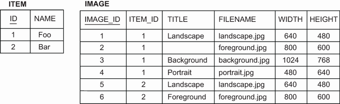

**Hình 8.8** Table collection component với cột surrogate primary key

Tiếp theo, chúng ta sẽ phân tích một cách khác để thay đổi primary key của collection table bằng một `Map`.

### 8.2.4 Map các giá trị component

Một map lưu thông tin dưới dạng cặp khóa và giá trị. Nếu các `Image` được lưu trong một `Map`, tên file có thể là khóa của map:

*Đường dẫn: Ch08/mapping-collections/src/main/java/com/manning/javapersistence/ch08/mapofstringsembeddables/Item.java*

```java
@Entity
public class Item {
    // . . .

    @ElementCollection
    @CollectionTable(name = "IMAGE")
    @MapKeyColumn(name = "TITLE")                          // Ⓐ
    private Map<String, Image> images = new HashMap<>();
    // . . .
}
```

Ⓐ Cột khóa của map được đặt là `TITLE`. Nếu không, nó sẽ mặc định là `IMAGES_KEY`.

Test sẽ đặt cột `TITLE` bằng cách thực thi các lệnh kiểu này:

```java
item.putImage("Background", new Image("background.jpg", 640, 480));
```

Primary key của collection table, như minh họa ở hình 8.9, giờ là cột foreign key `ITEM_ID` và cột khóa của map, `TITLE`.

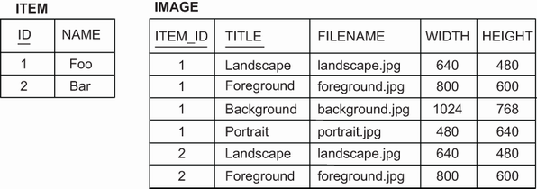

**Hình 8.9** Table cơ sở dữ liệu cho một map các component

Class embeddable `Image` ánh xạ tất cả cột còn lại, và chúng có thể cho phép null:

*Đường dẫn: Ch08/mapping-collections/src/main/java/com/manning/javapersistence/ch08/mapofstringsembeddables/Image.java*

```java
@Embeddable
public class Image {

    @Column(nullable = true)                     // Ⓐ
    private String filename;

    private int width;
    private int height;
    // . . .
}
```

Ⓐ Field `filename` giờ có thể null; nó không phải một phần của primary key.

Ở đây các giá trị trong map là instance của một class embeddable component và khóa của map là một chuỗi basic. Tiếp theo, chúng ta sẽ dùng kiểu embeddable cho cả khóa lẫn giá trị.

### 8.2.5 Component làm khóa của map

Ví dụ cuối cùng của chúng ta là ánh xạ một `Map`, với cả khóa và giá trị đều thuộc kiểu embeddable, như bạn thấy ở hình 8.10.

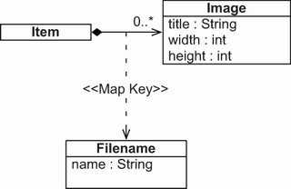

**Hình 8.10** `Item` có một `Map` với khóa là `Filename`.

Thay vì biểu diễn bằng chuỗi, chúng ta có thể biểu diễn tên file bằng một kiểu tùy chỉnh.

**Listing 8.15** Biểu diễn tên file bằng một kiểu tùy chỉnh

*Đường dẫn: Ch08/mapping-collections/src/main/java/com/manning/javapersistence/ch08/mapofembeddables/Filename.java*

```java
@Embeddable
public class Filename {

    @Column(nullable = false)                     // Ⓐ
    private String name;
    // . . .
}
```

Ⓐ Field `name` không được null, vì nó là một phần của primary key. Nếu chúng ta muốn dùng class này làm khóa của một map, các cột cơ sở dữ liệu được ánh xạ không thể cho phép null vì chúng đều là một phần của composite primary key. Chúng ta cũng phải ghi đè các phương thức `equals()` và `hashCode()` vì khóa của một map là một set, và mỗi `Filename` phải duy nhất trong một tập khóa cho trước.

Chúng ta không cần annotation đặc biệt nào để ánh xạ collection:

*Đường dẫn: Ch08/mapping-collections/src/main/java/com/manning/javapersistence/ch08/mapofembeddables/Item.java*

```java
@Entity
public class Item {

    @ElementCollection
    @CollectionTable(name = "IMAGE")
    private Map<Filename, Image> images = new HashMap<>();
    // . . .
}
```

Thực ra chúng ta không thể áp dụng `@MapKeyColumn` và `@AttributeOverrides`; chúng không có tác dụng khi khóa của map là một class `@Embeddable`.

Composite primary key của table `IMAGE` bao gồm các cột `ITEM_ID` và `NAME`, như bạn thấy ở hình 8.11. Một class embeddable hợp thành như `Image` không bị giới hạn ở các property đơn giản thuộc kiểu basic. Bạn đã thấy cách lồng các component khác, chẳng hạn `City` trong `Address`. Chúng ta có thể tách và đóng gói các property `width` và `height` của `Image` vào một class `Dimensions` mới.

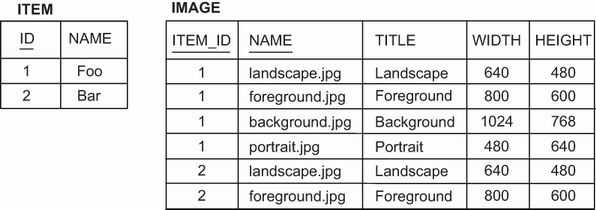

**Hình 8.11** Table cơ sở dữ liệu cho một `Map` các `Image` với khóa là `Filename`

Một class embeddable cũng có thể có collection riêng của nó.

### 8.2.6 Collection trong một embeddable component

Giả sử với mỗi `Address`, chúng ta muốn lưu một danh sách liên hệ. Đây là một `Set<String>` đơn giản trong class embeddable:

*Đường dẫn: Ch08/mapping-collections/src/main/java/com/manning/javapersistence/ch08/embeddablesetofstrings/Address.java*

```java
@Embeddable
public class Address {

    @NotNull
    @Column(nullable = false)
    private String street;

    @NotNull
    @Column(nullable = false, length = 5)
    private String zipcode;

    @NotNull
    @Column(nullable = false)
    private String city;

    @ElementCollection                                       // Ⓐ
    @CollectionTable(
            name = "CONTACT",                                // Ⓐ
            joinColumns = @JoinColumn(name = "USER_ID"))     // Ⓑ
    @Column(name = "NAME", nullable = false)                 // Ⓒ
    private Set<String> contacts = new HashSet<>();
    // . . .
}
```

Ⓐ `@ElementCollection` là annotation duy nhất bắt buộc; tên table và cột đều có giá trị mặc định. Tên table sẽ mặc định là `USER_CONTACTS`.

Ⓑ Cột join sẽ mặc định là `USER_ID`.

Ⓒ Tên cột sẽ mặc định là `CONTACTS`.

Hãy xem schema ở hình 8.12: cột `USER_ID` có foreign key constraint tham chiếu tới table của entity sở hữu, `USERS`. Primary key của collection table là tổ hợp của cột `USER_ID` và `NAME`, ngăn phần tử trùng lặp, nên `Set` là phù hợp.

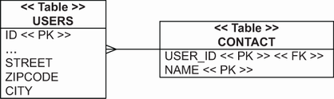

**Hình 8.12** `USER_ID` có foreign key constraint tham chiếu tới `USERS`.

Thay vì một `Set`, chúng ta có thể ánh xạ một list, bag hay map các kiểu basic. Hibernate cũng hỗ trợ collection các kiểu embeddable, nên thay vì một chuỗi liên hệ đơn giản, chúng ta có thể viết một class embeddable `Contact` và để `Address` giữ một collection các `Contact`.

Mặc dù Hibernate cho rất nhiều linh hoạt với ánh xạ component và các mô hình mịn, hãy nhớ rằng mã được đọc nhiều hơn được viết. Hãy nghĩ tới lập trình viên tiếp theo sẽ phải bảo trì thứ này trong vài năm nữa.

Chuyển hướng, hãy quay sang các entity association: cụ thể là các association nhiều-một và một-nhiều đơn giản.

## 8.3 Ánh xạ entity association

Ở đầu chương này, chúng tôi đã hứa sẽ nói về quan hệ cha/con. Cho tới giờ, chúng ta đã xem xét việc ánh xạ một entity, `Item`. Giả sử đây là cha, và nó có một collection các con: collection các instance `Image`. Thuật ngữ cha/con hàm ý một dạng phụ thuộc vòng đời, nên một collection các chuỗi hay các embeddable component là phù hợp. Các con hoàn toàn phụ thuộc vào cha; chúng sẽ luôn được lưu, cập nhật và xóa cùng với cha, không bao giờ đơn độc.

Chúng ta đã ánh xạ một quan hệ cha/con rồi! Cha là một entity, và nhiều con thuộc value type. Khi một `Item` bị xóa, collection các instance `Image` của nó cũng sẽ bị xóa. (Các ảnh thực tế có thể bị xóa theo cách có giao dịch, nghĩa là chúng ta hoặc xóa các dòng khỏi cơ sở dữ liệu cùng với các file khỏi đĩa, hoặc không xóa gì cả. Tuy nhiên, đây là một vấn đề riêng mà chúng ta sẽ không xử lý ở đây.)

Giờ chúng ta muốn ánh xạ những quan hệ thuộc loại khác: association giữa hai entity class. Các instance của chúng sẽ không có vòng đời phụ thuộc — một instance có thể được lưu, cập nhật và xóa mà không ảnh hưởng tới instance khác. Đương nhiên, đôi khi vẫn có phụ thuộc, ngay cả giữa các instance entity, nhưng chúng ta sẽ cần kiểm soát mịn hơn về cách quan hệ giữa hai class ảnh hưởng tới trạng thái instance, khác với các kiểu hoàn toàn phụ thuộc (embedded). Chúng ta có còn đang nói về quan hệ cha/con không? Hóa ra thuật ngữ cha/con khá mơ hồ, và mỗi người có định nghĩa riêng. Từ giờ chúng tôi sẽ cố không dùng thuật ngữ đó, mà dựa vào từ vựng chính xác hơn, hoặc ít nhất là được định nghĩa rõ.

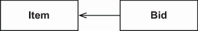

**Hình 8.13** Quan hệ giữa `Item` và `Bid`

Quan hệ mà chúng ta sẽ khám phá ở các mục tiếp theo vẫn giữ nguyên: quan hệ giữa hai entity class `Item` và `Bid`, như minh họa ở hình 8.13. Association từ `Bid` tới `Item` là một association nhiều-một. Về sau chúng ta sẽ làm association này thành hai chiều, nên association ngược từ `Item` tới `Bid` sẽ là một-nhiều.

Association nhiều-một là đơn giản nhất, nên chúng ta sẽ nói về nó trước. Các association khác — nhiều-nhiều và một-một — phức tạp hơn, và chúng ta sẽ bàn ở chương sau.

Hãy bắt đầu với association nhiều-một mà chúng ta cần hiện thực trong ứng dụng CaveatEmptor, và xem chúng ta có những lựa chọn nào. Mã nguồn tiếp theo có thể tìm thấy trong thư mục `mapping-associations`.

### 8.3.1 Association đơn giản nhất có thể

Chúng tôi gọi ánh xạ của property `Bid#item` là một association nhiều-một một chiều. Trước khi phân tích ánh xạ này, hãy xem schema cơ sở dữ liệu ở hình 8.14 và mã ở listing 8.16.

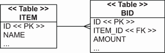

**Hình 8.14** Quan hệ nhiều-một trong schema SQL

**Listing 8.16** Bid có một tham chiếu duy nhất tới một Item

*Đường dẫn: Ch08/mapping-associations/src/main/java/com/manning/javapersistence/ch08/onetomany/bidirectional/Bid.java*

```java
@Entity
public class Bid {

    @ManyToOne(fetch = FetchType.LAZY)                        // Ⓐ
    @JoinColumn(name = "ITEM_ID", nullable = false)
    private Item item;
    // . . .
}
```

Ⓐ Annotation `@ManyToOne` đánh dấu một property là entity association, và nó là bắt buộc. Tham số `fetch` của nó mặc định là `EAGER`, nghĩa là `Item` liên quan sẽ được nạp mỗi khi `Bid` được nạp. Chúng ta thường ưa lazy loading làm chiến lược mặc định, và sẽ nói thêm về nó ở mục 12.1.1.

Một entity association nhiều-một ánh xạ tự nhiên tới một cột foreign key: `ITEM_ID` trong table `BID`. Trong JPA, cột này gọi là *join column*. Chúng ta không cần gì ngoài annotation `@ManyToOne` trên property. Tên mặc định cho cột join là `ITEM_ID`: Hibernate tự động dùng tổ hợp tên entity đích và property định danh của nó, cách nhau bằng dấu gạch dưới.

Chúng ta có thể ghi đè cột foreign key bằng annotation `@JoinColumn`, nhưng ở đây chúng ta dùng nó vì một lý do khác: để làm cho cột foreign key trở thành `NOT NULL` khi Hibernate sinh schema SQL. Một bid luôn phải có tham chiếu tới một item; nó không thể tồn tại đơn độc. (Lưu ý rằng điều này đã cho thấy một dạng phụ thuộc vòng đời mà chúng ta phải ghi nhớ.) Ngoài ra, chúng ta có thể đánh dấu association này là không tùy chọn bằng `@ManyToOne(optional = false)` hoặc, như thường lệ, bằng `@NotNull` của Bean Validation.

Vậy là xong, khá dễ. Điều cực kỳ quan trọng cần nhận ra là chúng ta có thể viết một ứng dụng hoàn chỉnh và phức tạp mà không cần dùng gì khác.

Chúng ta không cần ánh xạ phía bên kia của quan hệ này; chúng ta có thể bỏ qua association một-nhiều từ `Item` tới `Bid`. Trong schema cơ sở dữ liệu chỉ có một cột foreign key, và chúng ta đã ánh xạ nó rồi. Chúng tôi nói nghiêm túc: khi bạn thấy một cột foreign key và hai entity class liên quan, có lẽ bạn nên ánh xạ nó bằng `@ManyToOne` và không gì khác.

Giờ chúng ta có thể lấy `Item` của mỗi `Bid` bằng cách gọi `someBid.getItem()`. JPA provider sẽ giải tham chiếu foreign key và nạp `Item` cho chúng ta, đồng thời cũng lo việc quản lý giá trị foreign key. Làm sao lấy được tất cả bid của một item? Chúng ta có thể viết một truy vấn và thực thi nó bằng `EntityManager` hoặc `JpaRepository`, bằng bất kỳ ngôn ngữ truy vấn nào Hibernate hỗ trợ. Chẳng hạn, trong JPQL chúng ta sẽ dùng `select b from Bid b where b.item = :itemParameter`. Tất nhiên, một trong những lý do chúng ta dùng Hibernate hay Spring Data JPA là để trong hầu hết trường hợp không phải tự viết và thực thi truy vấn đó.

### 8.3.2 Làm cho nó hai chiều

Ở đầu chương này, tại mục 8.1.2, chúng ta đã có một danh sách lý do vì sao việc ánh xạ collection `Item#images` là ý hay. Hãy làm điều tương tự cho collection `Item#bids`. Collection này sẽ hiện thực association một-nhiều giữa các entity class `Item` và `Bid`. Nếu chúng ta tạo và ánh xạ property collection này, chúng ta sẽ có:

- Hibernate tự động thực thi truy vấn SQL `SELECT * from BID where ITEM_ID = ?` khi chúng ta gọi `someItem.getBids()` và bắt đầu duyệt các phần tử collection.
- Chúng ta có thể cascade các thay đổi trạng thái từ một `Item` tới mọi `Bid` được tham chiếu trong collection. Chúng ta có thể chọn những sự kiện vòng đời nào sẽ có tính bắc cầu; chẳng hạn, chúng ta có thể khai báo rằng mọi instance `Bid` được tham chiếu nên được lưu khi một `Item` được lưu, nên chúng ta không phải gọi `EntityManager#persist()` hay `ItemRepository#save()` nhiều lần cho tất cả bid.

Danh sách đó không dài lắm. Lợi ích chính của ánh xạ một-nhiều là việc truy cập dữ liệu theo kiểu điều hướng. Đó là một trong những lời hứa cốt lõi của ORM, cho phép chúng ta truy cập dữ liệu chỉ bằng cách gọi phương thức của domain model Java. ORM engine được cho là sẽ lo việc nạp dữ liệu cần thiết một cách thông minh trong khi chúng ta làm việc với một interface mức cao do chính mình thiết kế: `someItem.getBids().iterator().next().getAmount()`, v.v.

Việc có thể tùy chọn cascade một số thay đổi trạng thái tới các instance liên quan là một điểm cộng hay. Tuy nhiên, hãy cân nhắc rằng một số phụ thuộc chỉ ra value type ở mức Java chứ không chỉ ra entity. Hãy tự hỏi liệu có table nào trong schema sẽ có cột foreign key `BID_ID` không. Nếu không, hãy ánh xạ class `Bid` là `@Embeddable`, không phải `@Entity`, dùng cùng những table như trước nhưng với ánh xạ khác và quy tắc cố định cho các thay đổi trạng thái bắc cầu. Nếu bất kỳ table nào khác có tham chiếu foreign key tới một dòng `BID`, chúng ta sẽ cần một entity `Bid` dùng chung; nó không thể được ánh xạ nhúng trong một `Item`.

Vậy chúng ta có nên ánh xạ collection `Item#bids` không? Chúng ta sẽ có truy cập dữ liệu theo kiểu điều hướng, nhưng cái giá phải trả là thêm mã Java và độ phức tạp tăng đáng kể. Đây thường là quyết định khó khăn; lựa chọn ánh xạ collection nên được cân nhắc kỹ. Chúng ta sẽ gọi `someItem.getBids()` thường xuyên đến mức nào trong ứng dụng, rồi truy cập hoặc hiển thị tất cả bid theo một thứ tự định sẵn? Nếu chúng ta chỉ muốn hiển thị một tập con các bid, hoặc nếu chúng ta cần truy xuất chúng theo thứ tự khác nhau mỗi lần, dù sao chúng ta cũng phải tự viết và thực thi truy vấn. Ánh xạ một-nhiều cùng collection của nó khi đó chỉ là gánh nặng bảo trì. Theo kinh nghiệm của chúng tôi, đây là nguồn gốc thường xuyên của vấn đề và lỗi, đặc biệt với người mới học ORM.

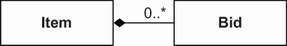

**Hình 8.15** Association hai chiều giữa `Item` và `Bid`

Trong trường hợp CaveatEmptor, câu trả lời là có, chúng ta sẽ thường xuyên gọi `someItem.getBids()` rồi hiển thị danh sách cho người dùng muốn tham gia đấu giá. Hình 8.15 cho thấy sơ đồ UML đã cập nhật với association hai chiều mà chúng ta cần hiện thực.

Ánh xạ của collection và phía một-nhiều như sau.

**Listing 8.17** Item có một collection các tham chiếu Bid

*Đường dẫn: Ch08/mapping-associations/src/main/java/com/manning/javapersistence/ch08/onetomany/bidirectional/Item.java*

```java
@Entity
public class Item {
    // . . .

    @OneToMany(mappedBy = "item",                            // Ⓐ
               fetch = FetchType.LAZY)                       // Ⓑ
    private Set<Bid> bids = new HashSet<>();
    // . . .
}
```

Ⓐ Annotation `@OneToMany` là bắt buộc để làm association trở thành hai chiều. Trong trường hợp này, chúng ta cũng phải đặt tham số `mappedBy`.

Ⓑ Đối số là tên của property ở “phía bên kia”. Việc fetch sẽ mặc định là `LAZY`.

Hãy nhìn lại phía kia — ánh xạ nhiều-một ở listing 8.16. Tên property trong class `Bid` là `item`. Phía bid chịu trách nhiệm về cột foreign key `ITEM_ID`, mà chúng ta đã ánh xạ bằng `@ManyToOne`. Ở đây, `mappedBy` bảo Hibernate “hãy nạp collection này bằng cột foreign key đã được ánh xạ bởi property cho trước” — trong trường hợp này là `Bid#item`. Tham số `mappedBy` luôn bắt buộc khi association một-nhiều là hai chiều và chúng ta đã ánh xạ cột foreign key. Chúng ta sẽ nói lại về điều này ở chương sau.

Mặc định cho tham số `fetch` của một ánh xạ collection luôn là `FetchType.LAZY`, nên chúng ta sẽ không cần tùy chọn này trong tương lai. Đây là thiết lập mặc định tốt; ngược lại là `EAGER` vốn hiếm khi cần. Chúng ta không muốn mọi bid được nạp sớm mỗi khi nạp một `Item`. Chúng nên được nạp khi được truy cập, theo yêu cầu.

Giờ chúng ta có thể tạo hai repository Spring Data JPA sau.

**Listing 8.18** Interface ItemRepository

*Đường dẫn: Ch08/mapping-associations/src/test/java/com/manning/javapersistence/ch08/repositories/onetomany/bidirectional/ItemRepository.java*

```java
public interface ItemRepository extends JpaRepository<Item, Long> {
}
```

**Listing 8.19** Interface BidRepository

*Đường dẫn: Ch08/mapping-associations/src/test/java/com/manning/javapersistence/ch08/repositories/onetomany/bidirectional/BidRepository.java*

```java
public interface BidRepository extends JpaRepository<Bid, Long> {
    Set<Bid> findByItem(Item item);
}
```

Đây là các repository Spring Data JPA thông thường, với `BidRepository` bổ sung một phương thức để lấy các bid theo `Item`.

Lý do thứ hai để ánh xạ collection `Item#bids` là khả năng cascade các thay đổi trạng thái, nên hãy xem điều đó.

### 8.3.3 Cascade trạng thái

Nếu một thay đổi trạng thái entity có thể được cascade qua một association tới entity khác, chúng ta cần ít dòng mã hơn để quản lý quan hệ. Nhưng điều này có thể có hệ quả nghiêm trọng về hiệu năng.

Đoạn mã sau tạo một `Item` mới và một `Bid` mới rồi liên kết chúng:

```java
Item someItem = new Item("Some Item");
Bid someBid = new Bid(new BigDecimal("123.00"), someItem);
someItem.addBid(someBid);
```

Chúng ta phải xét cả hai phía của quan hệ này: constructor của `Bid` nhận một item được dùng để điền vào `Bid#item`. Để duy trì tính toàn vẹn của các instance trong bộ nhớ, chúng ta cần thêm bid vào `Item#bids`. Giờ liên kết đã hoàn chỉnh xét từ góc độ mã Java; mọi tham chiếu đều đã được đặt. Nếu bạn chưa chắc vì sao cần đoạn mã này, hãy xem lại mục 3.2.4.

Hãy lưu item và các bid của nó vào cơ sở dữ liệu, trước hết không dùng rồi sau đó dùng transitive persistence.

> **Bật transitive persistence**

Với ánh xạ `@ManyToOne` và `@OneToMany` hiện tại, chúng ta cần viết đoạn mã sau để lưu một `Item` mới và vài instance `Bid`.

**Listing 8.20** Quản lý riêng biệt các instance entity độc lập

*Đường dẫn: Ch08/mapping-associations/src/test/java/com/manning/javapersistence/ch08/onetomany/bidirectional/MappingAssociationsSpringDataJPATest.java*

```java
Item item = new Item("Foo");
Bid bid = new Bid(BigDecimal.valueOf(100), item);
Bid bid2 = new Bid(BigDecimal.valueOf(200), item);

itemRepository.save(item);
item.addBid(bid);
item.addBid(bid2);
bidRepository.save(bid);
bidRepository.save(bid2);
```

Khi tạo nhiều bid, việc gọi `EntityManager#persist()` hay `BidRepository#save()` trên từng cái có vẻ dư thừa. Các instance mới đang ở trạng thái transient và phải được làm cho persistent. Quan hệ giữa `Bid` và `Item` không ảnh hưởng tới vòng đời của chúng. Nếu `Bid` là một value type, trạng thái của một `Bid` sẽ tự động giống với `Item` sở hữu. Tuy nhiên trong trường hợp này, `Bid` có trạng thái hoàn toàn độc lập của riêng nó.

Chúng tôi đã nói ở trên rằng đôi khi cần kiểm soát mịn để biểu diễn các phụ thuộc giữa những entity class liên quan; đây chính là một trường hợp như vậy. Cơ chế cho việc này trong JPA là tùy chọn `cascade`. Ví dụ, để lưu tất cả bid khi item được lưu, hãy ánh xạ collection như minh họa sau.

**Listing 8.21** Cascade trạng thái persistent từ Item tới tất cả bid

*Đường dẫn: Ch08/mapping-associations/src/main/java/com/manning/javapersistence/ch08/onetomany/cascadepersist/Item.java*

```java
@Entity
public class Item {
    // . . .

    @OneToMany(mappedBy = "item", cascade = CascadeType.PERSIST)
    private Set<Bid> bids = new HashSet<>();
    // . . .
}
```

Các tùy chọn cascade ở đây nhằm mang tính bắc cầu, nên chúng ta dùng `CascadeType.PERSIST` cho thao tác `ItemRepository#save()` hay `EntityManager#persist()`. Giờ chúng ta có thể đơn giản hóa đoạn mã liên kết item với bid rồi lưu chúng.

**Listing 8.22** Mọi bid được tham chiếu tự động trở thành persistent

*Đường dẫn: Ch08/mapping-associations/src/test/java/com/manning/javapersistence/ch08/onetomany/cascadepersist/MappingAssociationsSpringDataJPATest.java*

```java
Item item = new Item("Foo");

Bid bid = new Bid(BigDecimal.valueOf(100), item);
Bid bid2 = new Bid(BigDecimal.valueOf(200), item);
item.addBid(bid);
item.addBid(bid2);

itemRepository.save(item);            // Ⓐ
```

Ⓐ Chúng ta lưu các bid tự động, nhưng muộn hơn. Tại thời điểm commit, Spring Data JPA dùng Hibernate kiểm tra instance `Item` đang được quản lý/persistent và nhìn vào collection `bids`. Sau đó nó gọi `save()` nội bộ trên từng instance `Bid` được tham chiếu, lưu chúng luôn. Giá trị lưu trong cột `BID#ITEM_ID` được lấy từ mỗi `Bid` bằng cách kiểm tra property `Bid#item`. Cột foreign key được `mappedBy` với `@ManyToOne` trên property đó.

Annotation `@ManyToOne` cũng có tùy chọn `cascade`. Chúng ta sẽ không dùng nó thường xuyên. Ví dụ, chúng ta không thể thực sự nói “khi bid được lưu, cũng lưu item”. Item phải tồn tại từ trước; nếu không, bid sẽ không hợp lệ trong cơ sở dữ liệu. Hãy nghĩ tới một quan hệ `@ManyToOne` khả dĩ khác: property `Item#seller`. `User` phải tồn tại trước khi họ có thể bán một `Item`.

Transitive persistence là khái niệm đơn giản, thường hữu ích với ánh xạ `@OneToMany` hay `@ManyToMany`. Mặt khác, chúng ta phải áp dụng transitive deletion một cách cẩn trọng.

> **Cascade việc xóa**

Có vẻ hợp lý khi việc xóa một item kéo theo việc xóa mọi bid của item đó, vì chúng không có ý nghĩa khi đứng một mình. Đây chính là ý nghĩa của composition (hình thoi đặc) trong sơ đồ UML. Với các tùy chọn cascade hiện tại, chúng ta sẽ phải viết đoạn mã sau để xóa một item:

*Đường dẫn: Ch08/mapping-associations/src/test/java/com/manning/javapersistence/ch08/onetomany/cascadepersist/MappingAssociationsSpringDataJPATest.java*

```java
Item retrievedItem = itemRepository.findById(item.getId()).get();

for (Bid someBid : bidRepository.findByItem(retrievedItem)) {
    bidRepository.delete(someBid);                               // Ⓐ
}

itemRepository.delete(retrievedItem);                            // Ⓑ
```

Ⓐ Trước hết chúng ta xóa các bid.

Ⓑ Sau đó chúng ta xóa `Item` sở hữu.

JPA cung cấp một tùy chọn cascade để giúp việc này. Persistence engine có thể tự động xóa một instance entity liên quan.

**Listing 8.23** Cascade việc xóa từ Item tới tất cả bid

*Đường dẫn: Ch08/mapping-associations/src/main/java/com/manning/javapersistence/ch08/onetomany/cascaderemove/Item.java*

```java
@Entity
public class Item {
    // . . .

    @OneToMany(mappedBy = "item",
               cascade = {CascadeType.PERSIST, CascadeType.REMOVE})
    private Set<Bid> bids = new HashSet<>();
    // . . .
}
```

Cũng như trước với `PERSIST`, thao tác `delete()` trên association này sẽ được cascade. Nếu chúng ta gọi `ItemRepository#delete()` hay `EntityManager#remove()` trên một `Item`, Hibernate nạp các phần tử của collection `bids` và gọi `remove()` nội bộ trên từng instance:

*Đường dẫn: Ch08/mapping-associations/src/test/java/com/manning/javapersistence/ch08/onetomany/cascaderemove/MappingAssociationsSpringDataJPATest.java*

```java
itemRepository.delete(item);
```

Một dòng mã là đủ để cũng xóa các bid từng cái một.

Tuy nhiên, quá trình xóa này kém hiệu quả: Hibernate hoặc Spring Data JPA luôn phải nạp collection và xóa từng `Bid` riêng lẻ. Một câu lệnh SQL duy nhất sẽ có cùng tác dụng trên cơ sở dữ liệu: `delete from BID where ITEM_ID = ?`.

Không ai trong cơ sở dữ liệu có tham chiếu foreign key tới table `BID`. Tuy nhiên Hibernate không biết điều này, và nó không thể tìm khắp cơ sở dữ liệu để xem có dòng nào có `BID_ID` liên kết hay không (nghĩa là một `BID_ID` thực chất là foreign key tới `Item`).

Nếu `Item#bids` thay vào đó là một collection các embeddable component, `someItem.getBids().clear()` sẽ thực thi một lệnh SQL `DELETE` duy nhất. Với collection các value type, Hibernate giả định rằng không ai có thể giữ tham chiếu tới các bid, và việc chỉ xóa tham chiếu khỏi collection khiến dữ liệu trở thành mồ côi có thể xóa được.

> **Bật orphan removal**

JPA cung cấp một cờ bật cùng hành vi đó cho các entity association `@OneToMany` (và chỉ `@OneToMany`).

**Listing 8.24** Bật orphan removal trên một collection @OneToMany

*Đường dẫn: Ch08/mapping-associations/src/main/java/com/manning/javapersistence/ch08/onetomany/orphanremoval/Item.java*

```java
@Entity
public class Item {
    // . . .

    @OneToMany(mappedBy = "item",
               cascade = CascadeType.PERSIST, orphanRemoval = true)
    private Set<Bid> bids = new HashSet<>();
    // . . .
}
```

Đối số `orphanRemoval=true` bảo Hibernate rằng chúng ta muốn xóa vĩnh viễn một `Bid` khi nó bị loại khỏi collection.

Chúng ta sẽ đổi interface `ItemRepository` như ở listing sau.

**Listing 8.25** Interface ItemRepository đã sửa đổi

*Đường dẫn: Ch08/mapping-associations/src/test/java/com/manning/javapersistence/ch08/repositories/onetomany/orphanremoval/ItemRepository.java*

```java
public interface ItemRepository extends JpaRepository<Item, Long> {

    @Query("select i from Item i inner join fetch i.bids where i.id = :id")
    Item findItemWithBids(@Param("id") Long id);            // Ⓐ

}
```

Ⓐ Phương thức mới `findItemWithBids` sẽ lấy `Item` theo `id`, bao gồm collection `bids`. Để nạp collection này, chúng ta dùng khả năng `inner join fetch` của JPQL.

Đây là ví dụ xóa một `Bid` đơn lẻ:

*Đường dẫn: Ch08/mapping-associations/src/test/java/com/manning/javapersistence/ch08/onetomany/orphanremoval/MappingAssociationsSpringDataJPATest.java*

```java
Item item1 = itemRepository.findItemWithBids(item.getId());
Bid firstBid = item1.getBids().iterator().next();
item1.removeBid(firstBid);

itemRepository.save(item1);
```

Hibernate hoặc Spring Data JPA dùng Hibernate sẽ theo dõi collection, và khi transaction commit sẽ nhận ra rằng chúng ta đã xóa một phần tử khỏi collection. Hibernate giờ coi `Bid` đó là mồ côi. Chúng ta đã bảo đảm rằng không ai khác có tham chiếu tới nó; tham chiếu duy nhất là cái chúng ta vừa xóa khỏi collection. Do đó, Hibernate hoặc Spring Data JPA dùng Hibernate sẽ tự động thực thi một lệnh SQL `DELETE` để xóa instance `Bid` trong cơ sở dữ liệu.

Chúng ta vẫn sẽ không có lệnh `DELETE` một-phát khi gọi `clear()` như với collection các component. Hibernate tôn trọng các chuyển trạng thái entity thông thường, và các bid đều được nạp rồi xóa riêng lẻ.

Orphan removal là một quá trình đáng ngờ. Nó ổn trong ví dụ này, khi không có table nào khác trong cơ sở dữ liệu có tham chiếu foreign key tới `BID`. Không có hệ quả gì khi xóa một dòng khỏi table `BID`; các tham chiếu trong bộ nhớ tới bid chỉ nằm ở `Item#bids`.

Miễn là tất cả điều này đúng, không có vấn đề gì với việc bật orphan removal. Đây là tùy chọn tiện lợi khi tầng presentation có thể xóa một phần tử khỏi collection để xóa một thứ gì đó. Chúng ta chỉ cần làm việc với các instance của domain model, và không cần gọi service để thực hiện thao tác này.

Nhưng hãy xét điều gì xảy ra khi chúng ta tạo một ánh xạ collection `User#bids` — một `@OneToMany` khác — như ở hình 8.16. Đây là lúc tốt để kiểm tra kiến thức của bạn về Hibernate: các table và schema sẽ trông thế nào sau thay đổi này? (Đáp án: table `BID` có một cột foreign key `BIDDER_ID` tham chiếu tới `USERS`.)

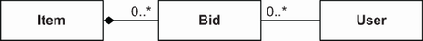

**Hình 8.16** Các association hai chiều giữa `Item`, `Bid` và `User`

Test ở listing sau sẽ không pass.

**Listing 8.26** Không dọn dẹp tham chiếu trong bộ nhớ sau khi xóa ở cơ sở dữ liệu

*Đường dẫn: Ch08/mapping-associations/src/test/java/com/manning/javapersistence/ch08/onetomany/orphanremoval/MappingAssociationsSpringDataJPATest.java*

```java
User user = userRepository.findUserWithBids(john.getId());
assertAll(
     () -> assertEquals(1, items.size()),
     () -> assertEquals(2, bids.size()),
     () -> assertEquals(2, user.getBids().size())
);
Item item1 = itemRepository.findItemWithBids(item.getId());
Bid firstBid = item1.getBids().iterator().next();
item1.removeBid(firstBid);
itemRepository.save(item1);
//FAILURE
//assertEquals(1, user.getBids().size());
assertEquals(2, user.getBids().size());
List<Item> items2 = itemRepository.findAll();
List<Bid> bids2 = bidRepository.findAll();
assertAll(
     () -> assertEquals(1, items2.size()),
     () -> assertEquals(1, bids2.size()),
     () -> assertEquals(2, user.getBids().size())
          //FAILURE
          //() -> assertEquals(1, user.getBids().size())
);
```

Hibernate hoặc Spring Data JPA cho rằng `Bid` bị xóa là mồ côi và có thể xóa được; nó sẽ bị xóa tự động trong cơ sở dữ liệu, nhưng chúng ta vẫn giữ tham chiếu tới nó trong collection kia, `User#bids`. Trạng thái cơ sở dữ liệu là ổn khi transaction này commit; dòng bị xóa của table `BID` chứa cả hai foreign key, `ITEM_ID` và `BIDDER_ID`. Nhưng giờ chúng ta có một sự không nhất quán trong bộ nhớ, vì việc nói “Xóa instance entity khi tham chiếu bị loại khỏi collection” tự nhiên xung đột với tham chiếu dùng chung.

Thay vì orphan removal, hoặc thậm chí `CascadeType.REMOVE`, hãy luôn cân nhắc một ánh xạ đơn giản hơn. Ở đây, `Item#bids` sẽ ổn nếu là một collection các component, được ánh xạ bằng `@ElementCollection`. `Bid` sẽ là `@Embeddable` và có một property `@ManyToOne` là `bidder`, tham chiếu tới một `User`. (Các embeddable component có thể sở hữu association một chiều tới entity.)

Điều này sẽ mang lại vòng đời mà chúng ta tìm kiếm: phụ thuộc hoàn toàn vào entity sở hữu. Chúng ta sẽ phải tránh tham chiếu dùng chung; sơ đồ UML ở hình 8.16 làm cho association từ `Bid` tới `User` thành một chiều. Hãy bỏ collection `User#bids` — chúng ta không cần `@OneToMany` này. Nếu cần tất cả bid do một user đặt, chúng ta có thể viết truy vấn: `select b from Bid b where b.bidder = :userParameter`. (Ở chương sau, chúng ta sẽ hoàn tất ánh xạ này với một `@ManyToOne` trong một embeddable component.)

> **Bật ON DELETE CASCADE trên foreign key**

Mọi thao tác xóa mà chúng tôi trình bày tới giờ đều kém hiệu quả. Các bid phải được nạp vào bộ nhớ, và cần nhiều lệnh SQL `DELETE`. Các cơ sở dữ liệu SQL hỗ trợ một tính năng foreign key hiệu quả hơn: tùy chọn `ON DELETE`. Trong DDL, nó trông như sau: `foreign key (ITEM_ID) references ITEM on delete cascade` cho table `BID`.

Tùy chọn này bảo cơ sở dữ liệu duy trì tính toàn vẹn tham chiếu của các composite một cách trong suốt với mọi ứng dụng truy cập cơ sở dữ liệu. Mỗi khi chúng ta xóa một dòng trong table `ITEM`, cơ sở dữ liệu sẽ tự động xóa mọi dòng trong table `BID` có cùng giá trị khóa `ITEM_ID`. Chúng ta chỉ cần một câu lệnh `DELETE` để xóa đệ quy mọi dữ liệu phụ thuộc, và không có gì phải nạp vào bộ nhớ ứng dụng (server).

Bạn nên kiểm tra xem schema của mình đã bật tùy chọn này trên foreign key chưa. Nếu bạn muốn thêm tùy chọn này vào schema do Hibernate sinh ra, hãy dùng annotation `@OnDelete` của Hibernate.

Bạn cũng nên kiểm tra xem tùy chọn này có hoạt động với DBMS của bạn hay không và liệu Hibernate hay Spring Data JPA dùng Hibernate có sinh foreign key với tùy chọn `ON DELETE CASCADE` hay không. Việc này không hoạt động với MySQL, nên chúng tôi chọn minh họa ví dụ cụ thể này trên cơ sở dữ liệu H2. Bạn sẽ thấy nó như vậy trong mã nguồn (dependency Maven trong pom.xml và cấu hình Spring Data JPA).

**Listing 8.27** Sinh foreign key ON DELETE CASCADE trong schema

*Đường dẫn: Ch08/mapping-associations/src/main/java/com/manning/javapersistence/ch08/onetomany/ondeletecascade/Item.java*

```java
@Entity
public class Item {
    // . . .

    @OneToMany(mappedBy = "item", cascade = CascadeType.PERSIST)
    @org.hibernate.annotations.OnDelete(
        action = org.hibernate.annotations.OnDeleteAction.CASCADE
    )
    private Set<Bid> bids = new HashSet<>();                 // Ⓐ
    // . . .
}
```

Ⓐ Một trong những điểm kỳ quặc của Hibernate lộ ra ở đây: annotation `@OnDelete` chỉ ảnh hưởng tới việc sinh schema bởi Hibernate. Các thiết lập ảnh hưởng tới việc sinh schema thường nằm ở phía “bên kia” của `mappedBy`, nơi cột foreign key/join được ánh xạ. Annotation `@OnDelete` thường nằm cạnh `@ManyToOne` trong `Bid`. Tuy nhiên, khi association được ánh xạ hai chiều, Hibernate chỉ nhận diện nó ở phía `@OneToMany`.

Việc bật cascade delete foreign key trong cơ sở dữ liệu không ảnh hưởng tới hành vi lúc chạy của Hibernate. Chúng ta vẫn có thể gặp đúng vấn đề như ở listing 8.26. Dữ liệu trong bộ nhớ có thể không còn phản ánh chính xác trạng thái trong cơ sở dữ liệu. Nếu mọi dòng liên quan trong table `BID` bị tự động xóa khi một dòng trong table `ITEM` bị xóa, mã ứng dụng chịu trách nhiệm dọn dẹp tham chiếu và bắt kịp trạng thái cơ sở dữ liệu. Nếu không cẩn thận, chúng ta thậm chí có thể lưu lại thứ mà chúng ta hoặc ai đó đã xóa trước đó.

Các instance `Bid` không đi qua vòng đời thông thường, và các callback như `@PreRemove` không có tác dụng. Ngoài ra, Hibernate không tự động xóa second-level cache toàn cục tùy chọn, vốn có thể chứa dữ liệu cũ. Về căn bản, các loại vấn đề gặp phải với cascade foreign key ở mức cơ sở dữ liệu cũng giống như khi một ứng dụng khác ngoài ứng dụng của chúng ta truy cập cùng cơ sở dữ liệu, hoặc khi bất kỳ trigger nào khác của cơ sở dữ liệu thực hiện thay đổi. Hibernate có thể là công cụ rất hiệu quả trong kịch bản như vậy, nhưng còn những bộ phận chuyển động khác cần cân nhắc.

Nếu bạn làm việc trên một schema mới, cách tiếp cận dễ nhất là không bật cascading ở mức cơ sở dữ liệu và ánh xạ quan hệ composition trong domain model dưới dạng embedded/embeddable, chứ không phải entity association. Hibernate hoặc Spring Data JPA dùng Hibernate khi đó có thể thực thi các thao tác SQL `DELETE` hiệu quả để xóa toàn bộ composite. Chúng tôi đã đưa ra khuyến nghị này ở mục trước: nếu bạn có thể tránh tham chiếu dùng chung, hãy ánh xạ `Bid` thành một `@ElementCollection` trong `Item`, chứ không phải một entity độc lập với association `@ManyToOne` và `@OneToMany`. Ngoài ra, tất nhiên, bạn có thể không ánh xạ collection nào cả và chỉ dùng ánh xạ đơn giản nhất: một cột foreign key với `@ManyToOne`, một chiều giữa các class `@Entity`.

## Tóm tắt

- Với các ánh xạ collection đơn giản, chẳng hạn `Set<String>`, bạn có thể làm việc với một tập phong phú các interface và hiện thực.
- Bạn có thể dùng sorted collection cũng như các tùy chọn của Hibernate để cơ sở dữ liệu trả về phần tử collection theo thứ tự mong muốn.
- Bạn có thể dùng các collection phức tạp của kiểu embeddable do người dùng định nghĩa, cùng set, bag và map các component.
- Bạn có thể dùng component làm cả khóa lẫn giá trị trong map.
- Bạn có thể dùng collection bên trong một embeddable component.
- Việc ánh xạ cột foreign key đầu tiên thành một entity association nhiều-một, rồi làm nó hai chiều thành một-nhiều. Bạn có thể hiện thực các tùy chọn cascade.
