# Chương 9. Ánh xạ entity association nâng cao

> *Java Persistence with Spring Data and Hibernate* — Chương 9: “Advanced entity association mappings”

**Nội dung chương này bao gồm**

- Áp dụng ánh xạ qua các entity association một-một
- Sử dụng các tùy chọn ánh xạ một-nhiều
- Tạo quan hệ entity nhiều-nhiều và bậc ba (ternary)
- Làm việc với entity association bằng map

Ở chương trước, chúng ta đã minh họa một association nhiều-một một chiều, làm nó thành hai chiều, và cuối cùng bật các thay đổi trạng thái bắc cầu bằng tùy chọn cascade. Một lý do chúng tôi bàn về các ánh xạ entity nâng cao hơn ở một chương riêng là vì chúng tôi coi khá nhiều trong số đó là hiếm gặp hoặc ít nhất là tùy chọn. Hoàn toàn có thể chỉ dùng ánh xạ component và các entity association nhiều-một (thỉnh thoảng là một-một). Bạn có thể viết một ứng dụng tinh vi mà không bao giờ ánh xạ một collection nào! Chúng tôi đã minh họa những lợi ích cụ thể thu được từ ánh xạ collection ở chương trước, và các quy tắc về khi nào một ánh xạ collection là phù hợp cũng áp dụng cho mọi ví dụ trong chương này. Hãy luôn chắc chắn rằng bạn thực sự cần một collection trước khi thử một ánh xạ collection phức tạp.

Chúng ta sẽ bắt đầu với các ánh xạ không liên quan tới collection: entity association một-một.

> **Các tính năng mới quan trọng trong JPA 2**
>
> Các association nhiều-một và một-một giờ có thể được ánh xạ bằng một table join/link trung gian.
>
> Các class embeddable component có thể có association một chiều tới entity, thậm chí nhiều giá trị với collection.

## 9.1 Association một-một

Chúng tôi đã lập luận ở mục 6.2 rằng các quan hệ giữa `User` và `Address` (user có `billingAddress`, `homeAddress` và `shippingAddress`) được biểu diễn tốt nhất bằng ánh xạ component `@Embeddable`. Đây thường là cách đơn giản nhất để biểu diễn quan hệ một-một vì vòng đời thường phụ thuộc trong trường hợp như vậy. Đó là aggregation hoặc composition trong UML.

Còn việc dùng một table `ADDRESS` riêng và ánh xạ cả `User` lẫn `Address` thành entity thì sao? Một lợi ích của mô hình này là có thể có tham chiếu dùng chung — một entity class khác (giả sử `Shipment`) cũng có thể có tham chiếu tới một instance `Address` cụ thể. Nếu một `User` cũng có tham chiếu tới instance này làm `shippingAddress` của họ, instance `Address` phải hỗ trợ tham chiếu dùng chung và cần có identity riêng.

Trong trường hợp này, các class `User` và `Address` có một association một-một thực sự. Hãy xem sơ đồ class đã sửa đổi ở hình 9.1.

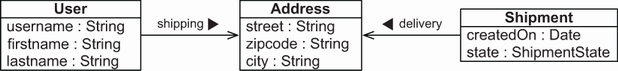

**Hình 9.1** `Address` là một entity với hai association, hỗ trợ tham chiếu dùng chung

Chúng ta đang làm việc trên ứng dụng CaveatEmptor, và cần ánh xạ các entity ở hình 9.1. Có vài ánh xạ khả dĩ cho association một-một. Chiến lược đầu tiên chúng ta sẽ xét là dùng chung giá trị primary key.

> **CHÚ Ý** Để có thể thực thi các ví dụ từ mã nguồn, trước tiên bạn cần chạy script Ch09.sql.

### 9.1.1 Dùng chung primary key

Các dòng ở hai table liên kết bằng association primary key sẽ có cùng giá trị primary key. Nếu mỗi user có đúng một địa chỉ giao hàng, thì cách tiếp cận là `User` có cùng giá trị primary key với `Address` (giao hàng). Khó khăn chính của cách tiếp cận này là bảo đảm rằng các instance liên quan được gán cùng giá trị primary key khi được lưu.

Trước khi xem xét vấn đề này, hãy tạo ánh xạ cơ bản. Class `Address` giờ là một entity độc lập; nó không còn là component. Mã nguồn tiếp theo có thể tìm thấy trong thư mục `onetoone-sharedprimarykey`.

**Listing 9.1** Class Address như một entity độc lập

*Đường dẫn: onetoone-sharedprimarykey/src/main/java/com/manning/javapersistence/ch09/onetoone/sharedprimarykey/Address.java*

```java
@Entity
public class Address {

    @Id
    @GeneratedValue(generator = Constants.ID_GENERATOR)
    private Long id;

    @NotNull
    private String street;

    @NotNull
    private String zipcode;

    @NotNull
    private String city;
    // . . .
}
```

Class `User` cũng là một entity với property association `shippingAddress`. Chúng ta sẽ giới thiệu hai annotation mới ở đây: `@OneToOne` và `@PrimaryKeyJoinColumn`.

`@OneToOne` làm đúng như bạn mong đợi: nó bắt buộc để đánh dấu một property có giá trị là entity thành association một-một. Chúng ta sẽ yêu cầu rằng một `User` phải có một `Address` bằng mệnh đề `optional=false`. Chúng ta sẽ ép việc cascade các thay đổi từ `User` tới `Address` bằng mệnh đề `cascade = CascadeType.ALL`. Annotation `@PrimaryKeyJoinColumn` chọn chiến lược dùng chung primary key mà chúng ta muốn ánh xạ.

**Listing 9.2** Entity User và association shippingAddress

*Đường dẫn: onetoone-sharedprimarykey/src/main/java/com/manning/javapersistence/ch09/onetoone/sharedprimarykey/User.java*

```java
@Entity
@Table(name = "USERS")
public class User {

    @Id                                                       // Ⓐ
    private Long id;

    private String username;

    @OneToOne(                                                // Ⓑ
          fetch = FetchType.LAZY,                             // Ⓒ
          optional = false,                                   // Ⓓ
          cascade = CascadeType.ALL                           // Ⓔ
    )
    @PrimaryKeyJoinColumn                                     // Ⓕ
    private Address shippingAddress;

    public User() {
    }

    public User(Long id, String username) {                   // Ⓖ
        this.id = id;
        this.username = username;
    }
    // . . .
}
```

Ⓐ Với `User`, chúng ta không khai báo identifier generator. Như đã đề cập ở mục 5.2.4, đây là một trong những trường hợp hiếm hoi chúng ta dùng giá trị định danh do ứng dụng gán.

Ⓑ Quan hệ giữa `User` và `Address` là một-một.

Ⓒ Như thường lệ, chúng ta nên ưu tiên chiến lược lazy loading, nên chúng ta ghi đè mặc định `FetchType.EAGER` bằng `LAZY`.

Ⓓ Công tắc `optional=false` chỉ định rằng một `User` phải có một `shippingAddress`.

Ⓔ Schema cơ sở dữ liệu do Hibernate sinh ra phản ánh điều này bằng một foreign key constraint. Mọi thay đổi ở đây phải được cascade tới `Address`. Primary key của table `USERS` cũng có foreign key constraint tham chiếu tới primary key của table `ADDRESS`. Xem các table ở hình 9.2.

Ⓕ Việc dùng `@PrimaryKeyJoinColumn` khiến đây trở thành ánh xạ association một-một dùng chung primary key, một chiều, từ `User` tới `Address`.

Ⓖ Thiết kế constructor thực thi điều này một cách yếu: API công khai của class yêu cầu một giá trị định danh để tạo instance.

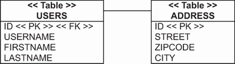

**Hình 9.2** Table `USERS` có foreign key constraint trên primary key của nó.

Với một số ví dụ trong chương này, chúng ta sẽ cần thay đổi vài chỗ trong cấu hình thường dùng cho test, vì việc thực thi cần có tính giao dịch. Class `SpringDataConfiguration` sẽ cần thêm annotation:

*Đường dẫn: onetoone-sharedprimarykey/src/test/java/com/manning/javapersistence/ch09/configuration/onetoone/sharedprimarykey/SpringDataConfiguration.java*

```java
@Configuration                                                          // Ⓐ
@EnableTransactionManagement                                            // Ⓑ
@ComponentScan(basePackages = "com.manning.javapersistence.ch09.*")     // Ⓒ
@EnableJpaRepositories("com.manning.javapersistence.ch09.repositories."
                       + "onetoone.sharedprimarykey")                   // Ⓓ
public class SpringDataConfiguration {
// . . .
}
```

Ⓐ `@Configuration` chỉ định rằng class này khai báo một hoặc nhiều định nghĩa bean để Spring container sử dụng.

Ⓑ `@EnableTransactionManagement` bật khả năng quản lý transaction của Spring thông qua annotation.

Ⓒ Chúng ta sẽ cần thực thi một vài thao tác theo cách có giao dịch để kiểm thử mã của chương này. `@ComponentScan` yêu cầu Spring quét package được truyền vào làm đối số, cùng các package con của nó, để tìm component.

Ⓓ `@EnableJpaRepositories` quét package được chỉ định để tìm các Spring Data repository.

Chúng ta sẽ cô lập các thao tác trên cơ sở dữ liệu trong một class `TestService` riêng:

*Đường dẫn: onetoone-sharedprimarykey/src/test/java/com/manning/javapersistence/ch09/onetoone/sharedprimarykey/TestService.java*

```java
@Service                                                   // Ⓐ
public class TestService {

    @Autowired                                             // Ⓑ
    private UserRepository userRepository;                 // Ⓑ

    @Autowired                                             // Ⓑ
    private AddressRepository addressRepository;           // Ⓑ

    @Transactional                                         // Ⓒ
    public void storeLoadEntities() {                      // Ⓒ
    // . . .
```

Ⓐ Class `TestService` được đánh dấu `@Service` để Spring tự động tạo một bean, sau đó được tiêm vào test thực tế. Hãy nhớ rằng trong class `SpringDataConfiguration`, chúng ta quét package `com.manning.javapersistence.ch09` cùng các package con để tìm component.

Ⓑ Tiêm hai bean repository.

Ⓒ Định nghĩa phương thức `storeLoadEntities`, đánh dấu nó bằng `@Transactional`. Các thao tác chúng ta cần thực thi trên cơ sở dữ liệu cần có tính giao dịch, và chúng ta sẽ để Spring điều khiển việc này.

Class kiểm thử sẽ khác với những class đã trình bày trước đây, vì nó sẽ ủy thác cho class `TestService`. Điều này cho phép chúng ta giữ các thao tác giao dịch cô lập trong phương thức riêng và gọi chúng từ test.

*Đường dẫn: onetoone-sharedprimarykey/src/test/java/com/manning/javapersistence/ch09/onetoone/sharedprimarykey/AdvancedMappingSpringDataJPATest.java*

```java
@ExtendWith(SpringExtension.class)
@ContextConfiguration(classes = {SpringDataConfiguration.class})
public class AdvancedMappingSpringDataJPATest {

    @Autowired
    private TestService testService;

    @Test
    void testStoreLoadEntities() {

        testService.storeLoadEntities();

    }
}
```

Đặc tả JPA không có phương pháp chuẩn hóa nào để xử lý bài toán sinh primary key dùng chung. Nghĩa là chúng ta chịu trách nhiệm đặt đúng giá trị định danh của một instance `User` trước khi lưu, bằng giá trị định danh của instance `Address` liên kết:

*Đường dẫn: onetoone-sharedprimarykey/src/test/java/com/manning/javapersistence/ch09/onetoone/sharedprimarykey/TestService.java*

```java
Address address =
        new Address("Flowers Street", "01246", "Boston");
addressRepository.save(address);                                    // Ⓐ
User john = new User(address.getId(), "John Smith");                // Ⓑ
john.setShippingAddress(address);

userRepository.save(john);                                          // Ⓒ
```

Ⓐ Lưu `Address`.

Ⓑ Lấy giá trị định danh được sinh ra của nó và đặt vào `User`.

Ⓒ Lưu nó.

Có ba vấn đề với ánh xạ và đoạn mã này:

- Chúng ta phải nhớ rằng `Address` phải được lưu trước rồi mới lấy giá trị định danh của nó. Điều này chỉ khả thi nếu entity `Address` có một identifier generator sinh giá trị khi gọi `save()` trước lệnh `INSERT`, như đã bàn ở mục 5.2.5. Nếu không, `someAddress.getId()` trả về `null`, và chúng ta không thể đặt thủ công giá trị định danh của `User`.
- Lazy loading với proxy chỉ hoạt động nếu association là không tùy chọn. Điều này thường gây bất ngờ cho những lập trình viên mới với JPA. Mặc định cho `@OneToOne` là `FetchType.EAGER`: khi Hibernate hoặc Spring Data JPA dùng Hibernate nạp một `User`, nó nạp `shippingAddress` ngay lập tức. Về mặt khái niệm, lazy loading với proxy chỉ có ý nghĩa nếu Hibernate biết rằng có một `shippingAddress` liên kết. Nếu property cho phép null, Hibernate sẽ phải kiểm tra trong cơ sở dữ liệu xem giá trị property có phải `NULL` hay không bằng cách truy vấn table `ADDRESS`. Nếu phải kiểm tra cơ sở dữ liệu thì chi bằng nạp luôn giá trị, vì dùng proxy chẳng có lợi ích gì.
- Association một-một là một chiều; đôi khi chúng ta cần điều hướng hai chiều.

Vấn đề thứ nhất không có giải pháp nào khác. Ở ví dụ trên, chúng ta đang làm đúng điều đó: lưu `Address`, lấy primary key của nó, và đặt thủ công làm giá trị định danh của `User`. Đây là một trong những lý do chúng ta nên luôn ưu tiên các identifier generator có khả năng sinh giá trị trước bất kỳ lệnh SQL `INSERT` nào.

Một association `@OneToOne(optional=true)` không hỗ trợ lazy loading với proxy. Điều này nhất quán với đặc tả JPA. `FetchType.LAZY` là một gợi ý cho persistence provider chứ không phải yêu cầu. Chúng ta có thể có lazy loading cho `@OneToOne` cho phép null bằng bytecode instrumentation, như bạn sẽ thấy ở mục 12.1.3.

Còn về vấn đề cuối, nếu chúng ta làm association thành hai chiều (trong đó `Address` tham chiếu tới `User` và `User` tham chiếu tới `Address`), chúng ta cũng có thể dùng một identifier generator đặc biệt chỉ có ở Hibernate để hỗ trợ việc gán giá trị khóa.

### 9.1.2 Foreign primary key generator

Một ánh xạ hai chiều luôn cần một phía `mappedBy`. Chúng ta sẽ chọn phía `User` — đây là chuyện sở thích và có thể còn các yêu cầu phụ khác. (Mã nguồn tiếp theo có thể tìm thấy trong thư mục `onetoone-foreigngenerator`.)

*Đường dẫn: onetoone-foreigngenerator/src/main/java/com/manning/javapersistence/ch09/onetoone/foreigngenerator/User.java*

```java
@Entity
@Table(name = "USERS")
public class User {

    @Id
    @GeneratedValue(generator = Constants.ID_GENERATOR)
    private Long id;

    private String username;

    @OneToOne(
         mappedBy = "user",
         cascade = CascadeType.PERSIST
    )
    private Address shippingAddress;
    // . . .
}
```

Chúng ta đã thêm tùy chọn `mappedBy`, bảo Hibernate hoặc Spring Data JPA dùng Hibernate rằng các chi tiết mức thấp giờ được ánh xạ bởi “property ở phía bên kia” có tên `user`. Để tiện, chúng ta bật `CascadeType.PERSIST`; transitive persistence sẽ giúp việc lưu các instance theo đúng thứ tự dễ dàng hơn. Khi chúng ta làm `User` trở thành persistent, Hibernate làm `shippingAddress` persistent và sinh định danh cho primary key một cách tự động.

Tiếp theo, hãy xem “phía bên kia”: `Address`. Chúng ta sẽ dùng `@GenericGenerator` trên property định danh để định nghĩa một bộ sinh giá trị primary key chuyên dụng với chiến lược `foreign` chỉ có ở Hibernate. Chúng tôi không nhắc tới generator này trong phần tổng quan ở mục 5.2.5 vì association một-một dùng chung primary key là trường hợp sử dụng duy nhất của nó. Khi lưu một instance `Address`, generator đặc biệt này lấy giá trị của property `user` và lấy giá trị định danh của instance entity được tham chiếu là `User`.

**Listing 9.3** Address có foreign key generator đặc biệt

*Đường dẫn: onetoone-foreigngenerator/src/main/java/com/manning/javapersistence/ch09/onetoone/foreigngenerator/Address.java*

```java
@Entity
public class Address {

    @Id
    @GeneratedValue(generator = "addressKeyGenerator")
    @org.hibernate.annotations.GenericGenerator(                      // Ⓐ
         name = "addressKeyGenerator",
         strategy = "foreign",
         parameters =
             @org.hibernate.annotations.Parameter(
                 name = "property", value = "user"
             )
    )
    private Long id;

    // . . .

    @OneToOne(optional = false)                                      // Ⓑ
    @PrimaryKeyJoinColumn                                            // Ⓒ
    private User user;

    public Address() {
    }

    public Address(User user) {                                      // Ⓓ
        this.user = user;
    }

    public Address(User user, String street,                         // Ⓓ
                    String zipcode, String city) {                   // Ⓓ
        this.user = user;
        this.street = street;
        this.zipcode = zipcode;
        this.city = city;
    }
    // . . .
}
```

Ⓐ Với annotation `@GenericGenerator`, khi chúng ta lưu một instance `Address`, generator đặc biệt này lấy giá trị của property `user` và lấy giá trị định danh của instance entity được tham chiếu là `User`.

Ⓑ Ánh xạ `@OneToOne` được đặt `optional=false`, nên một `Address` phải có tham chiếu tới một `User`.

Ⓒ Property `user` được đánh dấu là entity association dùng chung primary key bằng annotation `@PrimaryKeyJoinColumn`.

Ⓓ Các constructor public của `Address` giờ yêu cầu một instance `User`.

Foreign key constraint phản ánh `optional=false` giờ nằm trên cột primary key của table `ADDRESS`, như bạn thấy trong schema ở hình 9.3.

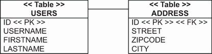

**Hình 9.3** Table `ADDRESS` có foreign key constraint trên primary key của nó.

Nhờ đoạn mã mới này, chúng ta không còn phải gọi `address.getId()` hay `user.getId()` trong đơn vị công việc của mình. Việc lưu dữ liệu được đơn giản hóa:

*Đường dẫn: onetoone-foreigngenerator/src/test/java/com/manning/javapersistence/ch09/onetoone/foreigngenerator/AdvancedMappingJPATest.java*

```java
User john = new User("John Smith");
Address address =
      new Address(
          john,                                                    // Ⓐ
          "Flowers Street", "01246", "Boston"
      );
john.setShippingAddress(address);                                  // Ⓐ
userRepository.save(john);                                         // Ⓑ
```

Ⓐ Chúng ta phải liên kết cả hai phía của một entity association hai chiều. Lưu ý rằng với ánh xạ này, chúng ta sẽ không có lazy loading cho `User#shippingAddress` (nó là tùy chọn/cho phép null), nhưng chúng ta có thể nạp `Address#user` theo yêu cầu bằng proxy (nó không tùy chọn).

Ⓑ Khi chúng ta lưu user, chúng ta sẽ có transitive persistence cho `shippingAddress`.

Các association một-một dùng chung primary key khá hiếm gặp. Thay vào đó, chúng ta thường ánh xạ một association “to-one” bằng một cột foreign key và một unique constraint.

### 9.1.3 Sử dụng cột foreign key join

Thay vì dùng chung primary key, hai dòng có thể có quan hệ dựa trên một cột foreign key bổ sung đơn giản. Một table có một cột foreign key tham chiếu tới primary key của table liên quan. (Nguồn và đích của foreign key constraint này thậm chí có thể là cùng một table: chúng ta gọi đây là quan hệ tự tham chiếu.) Mã nguồn tiếp theo có thể tìm thấy trong thư mục `onetoone-foreignkey`.

Hãy đổi ánh xạ cho `User#shippingAddress`. Thay vì dùng chung primary key, giờ chúng ta sẽ thêm một cột `SHIPPINGADDRESS_ID` vào table `USERS`. Cột này có constraint `UNIQUE`, nên không có hai user nào có thể tham chiếu tới cùng một địa chỉ giao hàng. Hãy xem schema ở hình 9.4.

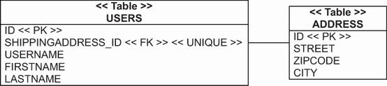

**Hình 9.4** Association một-một qua cột join giữa table `USERS` và `ADDRESS`

`Address` là một entity class thông thường, giống cái đầu tiên chúng ta minh họa trong chương này, ở listing 9.1. Entity class `User` có property `shippingAddress`, hiện thực association một chiều này.

Chúng ta nên bật lazy loading cho association `User`–`Address` này. Khác với dùng chung primary key, ở đây chúng ta không gặp vấn đề với lazy loading: khi một dòng của table `USERS` đã được nạp, nó chứa giá trị của cột `SHIPPINGADDRESS_ID`. Do đó Hibernate hoặc Spring Data dùng Hibernate biết liệu có dòng `ADDRESS` nào tồn tại hay không, và một proxy có thể được dùng để nạp instance `Address` theo yêu cầu.

*Đường dẫn: onetoone-foreignkey/src/main/java/com/manning/javapersistence/ch09/onetoone/foreignkey/User.java*

```java
@Entity
@Table(name = "USERS")
public class User {

    @Id
    @GeneratedValue(generator = Constants.ID_GENERATOR)
    private Long id;

    @OneToOne(
           fetch = FetchType.LAZY,
           optional = false,                                  // Ⓐ
           cascade = CascadeType.PERSIST
    )
    @JoinColumn(unique = true)                                // Ⓑ
    private Address shippingAddress;
    // . . .
}
```

Ⓐ Chúng ta không cần identifier generator đặc biệt hay việc gán primary key nào; chúng ta chỉ cần bảo đảm `shippingAddress` khác null.

Ⓑ Thay vì `@PrimaryKeyJoinColumn`, chúng ta áp dụng `@JoinColumn` thông thường, mặc định sẽ là `SHIPPINGADDRESS_ID`. Nếu bạn quen với SQL hơn JPA, sẽ hữu ích khi nghĩ tới “cột foreign key” mỗi lần thấy `@JoinColumn` trong một ánh xạ.

Trong ánh xạ này, chúng ta đặt `optional=false`, nên user phải có một địa chỉ giao hàng. Điều này sẽ không ảnh hưởng tới hành vi nạp nhưng là hệ quả logic của thiết lập `unique=true` trên `@JoinColumn`. Thiết lập này thêm một unique constraint vào schema SQL được sinh ra. Nếu giá trị của cột `SHIPPINGADDRESS_ID` phải duy nhất với mọi user, thì chỉ một user có thể “không có địa chỉ giao hàng”. Do đó, các cột unique cho phép null thường không có ý nghĩa.

Việc tạo, liên kết và lưu các instance khá đơn giản:

*Đường dẫn: onetoone-foreignkey/src/test/java/com/manning/javapersistence/ch09/onetoone/foreignkey/AdvancedMappingSpringDataJPATest.java*

```java
User john = new User("John Smith");
Address address = new Address("Flowers Street", "01246", "Boston");
john.setShippingAddress(address);                                    // Ⓐ
userRepository.save(john);                                           // Ⓑ
```

Ⓐ Tạo liên kết giữa user và address.

Ⓑ Khi chúng ta lưu `john`, chúng ta sẽ lưu `address` một cách bắc cầu.

Chúng ta đã hoàn thành hai ánh xạ association một-một cơ bản: cái đầu dùng chung primary key, cái thứ hai dùng tham chiếu foreign key và một unique column constraint. Lựa chọn cuối chúng tôi muốn bàn hơi lạ hơn một chút: ánh xạ association một-một với sự trợ giúp của một table bổ sung.

### 9.1.4 Sử dụng join table

Có lẽ bạn đã nhận thấy rằng các cột cho phép null có thể gây rắc rối. Đôi khi giải pháp tốt hơn cho các giá trị tùy chọn là dùng một table trung gian, chứa một dòng nếu liên kết tồn tại và không chứa gì nếu không.

Hãy xét entity `Shipment` trong CaveatEmptor và bàn về mục đích của nó. Người bán và người mua tương tác trong CaveatEmptor bằng cách mở và đặt giá cho các phiên đấu giá. Việc vận chuyển hàng hóa dường như nằm ngoài phạm vi của ứng dụng; người bán và người mua thỏa thuận phương thức vận chuyển và thanh toán sau khi phiên đấu giá kết thúc. Họ có thể làm việc này ngoại tuyến, bên ngoài CaveatEmptor.

Mặt khác, chúng ta có thể cung cấp một dịch vụ ký quỹ (escrow) trong CaveatEmptor. Người bán sẽ dùng dịch vụ này để tạo một lô hàng có thể theo dõi khi phiên đấu giá kết thúc. Người mua sẽ trả giá của mặt hàng đấu giá cho một bên ủy thác (chúng ta), và chúng ta sẽ báo cho người bán biết tiền đã sẵn sàng. Khi lô hàng tới nơi và người mua chấp nhận, chúng ta sẽ chuyển tiền cho người bán.

Nếu bạn từng tham gia một phiên đấu giá trực tuyến có giá trị lớn, có lẽ bạn đã dùng dịch vụ ký quỹ như vậy. Nhưng chúng ta muốn nhiều hơn trong CaveatEmptor: không chỉ cung cấp dịch vụ tin cậy cho các phiên đấu giá đã hoàn tất, mà còn cho phép người dùng tạo các lô hàng có thể theo dõi và tin cậy cho mọi giao dịch họ thực hiện bên ngoài phiên đấu giá, bên ngoài CaveatEmptor. Kịch bản này đòi hỏi một entity `Shipment` với một association một-một tùy chọn tới `Item`. Sơ đồ class cho domain model này được thể hiện ở hình 9.5.

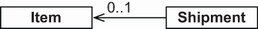

**Hình 9.5** `Shipment` có liên kết tùy chọn với một `Item` đấu giá.

> **CHÚ Ý** Chúng tôi đã cân nhắc từ bỏ ví dụ CaveatEmptor cho mục này vì không tìm được kịch bản tự nhiên nào cần association một-một tùy chọn. Nếu ví dụ ký quỹ này có vẻ gượng ép, hãy xét bài toán tương đương là phân công nhân viên vào các máy trạm. Đó cũng là một quan hệ một-một tùy chọn.

Trong schema cơ sở dữ liệu, chúng ta sẽ thêm một table liên kết trung gian tên `ITEM_SHIPMENT`. Một dòng trong table này biểu diễn một `Shipment` được tạo trong bối cảnh một phiên đấu giá. Hình 9.6 cho thấy các table.

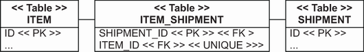

**Hình 9.6** Table trung gian liên kết item và shipment.

Hãy để ý cách schema thực thi tính duy nhất và quan hệ một-một: primary key của `ITEM_SHIPMENT` là cột `SHIPMENT_ID`, và cột `ITEM_ID` là duy nhất. Do đó một item chỉ có thể nằm trong một shipment. Tất nhiên, điều đó cũng có nghĩa là một shipment chỉ có thể chứa một item.

Chúng ta sẽ ánh xạ mô hình này bằng annotation `@OneToOne` trong entity class `Shipment`. Mã nguồn tiếp theo có thể tìm thấy trong thư mục `onetoone-jointable`.

*Đường dẫn: onetoone-jointable/src/main/java/com/manning/javapersistence/ch09/onetoone/jointable/Shipment.java*

```java
@Entity
public class Shipment {
    // . . .

    @OneToOne(fetch = FetchType.LAZY)                    // Ⓐ
    @JoinTable(
        name = "ITEM_SHIPMENT",                          // Ⓑ
        joinColumns =
            @JoinColumn(name = "SHIPMENT_ID"),           // Ⓒ
        inverseJoinColumns =
            @JoinColumn(name = "ITEM_ID",                // Ⓓ
                        nullable = false,
                        unique = true)                   // Ⓔ
    )
    private Item auction;

    // . . .
}
```

Ⓐ Lazy loading đã được bật, với một điểm khác biệt: khi Hibernate hoặc Spring Data JPA dùng Hibernate nạp một `Shipment`, nó truy vấn cả table `SHIPMENT` lẫn join table `ITEM_SHIPMENT`. Hibernate phải biết liệu có liên kết tới một `Item` hay không trước khi nó có thể dùng proxy. Nó làm việc đó trong một truy vấn SQL outer join, nên chúng ta sẽ không thấy câu lệnh SQL bổ sung nào. Nếu có một dòng trong `ITEM_SHIPMENT`, Hibernate dùng một placeholder `Item`.

Ⓑ Annotation `@JoinTable` là mới; chúng ta luôn phải chỉ định tên của table trung gian. Ánh xạ này thực chất che giấu join table; không có class Java tương ứng. Annotation định nghĩa tên cột của table `ITEM_SHIPMENT`.

Ⓒ Cột join là `SHIPMENT_ID` (mặc định sẽ là `ID`).

Ⓓ Cột inverse join là `ITEM_ID` (mặc định sẽ là `AUCTION_ID`).

Ⓔ Hibernate sinh constraint `UNIQUE` trên cột `ITEM_ID` trong schema. Hibernate cũng sinh các foreign key constraint phù hợp trên các cột của join table.

Ở đây chúng ta lưu một `Shipment` không có `Item` và một `Shipment` khác liên kết với một `Item` duy nhất:

*Đường dẫn: onetoone-jointable/src/test/java/com/manning/javapersistence/ch09/onetoone/jointable/AdvancedMappingSpringDataJPATest.java*

```java
Shipment shipment = new Shipment();
shipmentRepository.save(shipment);
Item item = new Item("Foo");
itemRepository.save(item);
Shipment auctionShipment = new Shipment(item);
shipmentRepository.save(auctionShipment);
```

Đến đây kết thúc phần bàn về ánh xạ association một-một. Tóm lại, bạn nên dùng association dùng chung primary key nếu một trong hai entity luôn được lưu trước và có thể đóng vai trò nguồn của primary key. Dùng association foreign key trong mọi trường hợp khác, hoặc một join table trung gian ẩn khi association một-một là tùy chọn.

Giờ chúng ta sẽ tập trung vào các entity association số nhiều (nhiều giá trị), bắt đầu với một số tùy chọn nâng cao cho một-nhiều.

## 9.2 Association một-nhiều

Một entity association số nhiều, theo định nghĩa, là một collection các tham chiếu entity. Chúng ta đã ánh xạ một trong số đó, một association một-nhiều, ở mục 8.3.2. Association một-nhiều là loại entity association quan trọng nhất có liên quan tới collection. Chúng tôi thậm chí sẽ khuyên bạn không nên dùng các kiểu association phức tạp hơn khi một quan hệ nhiều-một hoặc một-nhiều hai chiều đơn giản đã đủ.

Ngoài ra, hãy nhớ rằng bạn không bắt buộc phải ánh xạ bất kỳ collection entity nào nếu không muốn; bạn luôn có thể viết một truy vấn tường minh thay vì truy cập trực tiếp qua việc duyệt. Nếu bạn quyết định ánh xạ collection các tham chiếu entity, bạn có vài lựa chọn, và giờ chúng ta sẽ phân tích một số tình huống phức tạp hơn.

### 9.2.1 Cân nhắc bag một-nhiều

Cho tới giờ, chúng ta mới chỉ thấy `@OneToMany` trên một `Set`, nhưng cũng có thể dùng ánh xạ bag cho một association một-nhiều hai chiều. Tại sao chúng ta lại làm vậy?

Bag có đặc tính hiệu năng tốt nhất trong tất cả collection mà chúng ta có thể dùng cho một entity association một-nhiều hai chiều. Theo mặc định, các collection trong Hibernate được nạp khi chúng được truy cập lần đầu trong ứng dụng. Vì bag không phải duy trì chỉ số của các phần tử (như list) hay kiểm tra phần tử trùng lặp (như set), chúng ta có thể thêm phần tử mới vào bag mà không kích hoạt việc nạp. Đây là tính năng quan trọng nếu chúng ta định ánh xạ một collection tham chiếu entity có thể rất lớn.

Mặt khác, chúng ta không thể eager-fetch hai collection kiểu bag đồng thời, vì các truy vấn `SELECT` được sinh ra không liên quan với nhau và cần được giữ riêng. Điều này có thể xảy ra nếu `bids` và `images` của một `Item` đều là bag một-nhiều chẳng hạn. Đây không phải mất mát lớn, vì việc nạp hai collection đồng thời luôn dẫn tới tích Descartes; chúng ta muốn tránh loại thao tác này, dù các collection là bag, set hay list. Chúng ta sẽ quay lại các chiến lược fetch ở chương 12. Nói chung, chúng tôi cho rằng bag là collection nghịch (inverse) tốt nhất cho một association một-nhiều nếu nó được ánh xạ là `@OneToMany(mappedBy = "...")`.

Để ánh xạ association một-nhiều hai chiều của chúng ta thành một bag, chúng ta phải thay kiểu của collection `bids` trong entity `Item` bằng `Collection` với hiện thực `ArrayList`. Ánh xạ cho association giữa `Item` và `Bid` về cơ bản không đổi. (Mã nguồn tiếp theo có thể tìm thấy trong thư mục `onetomany-bag`.)

*Đường dẫn: onetomany-bag/src/main/java/com/manning/javapersistence/ch09/onetomany/bag/Item.java*

```java
@Entity
public class Item {
    // . . .
    @OneToMany(mappedBy = "item")
    private Collection<Bid> bids = new ArrayList<>();
    // . . .
}
```

Phía `Bid` với `@ManyToOne` của nó (là phía “mapped by”) và ngay cả các table cũng giống như ở mục 8.3.1.

Một bag cũng cho phép phần tử trùng lặp, điều mà set thì không:

*Đường dẫn: onetomany-bag/src/test/java/com/manning/javapersistence/ch09/onetomany/bag/AdvancedMappingSpringDataJPATest.java*

```java
Item item = new Item("Foo");
itemRepository.save(item);
Bid someBid = new Bid(new BigDecimal("123.00"), item);
item.addBid(someBid);
item.addBid(someBid);
bidRepository.save(someBid);
assertEquals(2, someItem.getBids().size());
```

Hóa ra điều đó không liên quan trong trường hợp này vì “trùng lặp” nghĩa là chúng ta đã thêm một tham chiếu cụ thể tới cùng một instance `Bid` nhiều lần. Chúng ta sẽ không làm vậy trong mã ứng dụng. Tuy nhiên, ngay cả khi chúng ta thêm cùng một tham chiếu nhiều lần vào collection này, Hibernate hoặc Spring Data JPA dùng Hibernate cũng sẽ bỏ qua — không có tác động persistent nào. Phía liên quan tới việc cập nhật cơ sở dữ liệu là `@ManyToOne`, và quan hệ đã được “mapped by” phía đó. Khi nạp `Item`, collection không chứa bản trùng lặp:

*Đường dẫn: onetomany-bag/src/test/java/com/manning/javapersistence/ch09/onetomany/bag/AdvancedMappingSpringDataJPATest.java*

```java
Item item2 = itemRepository.findItemWithBids(item.getId());
assertEquals(1, item2.getBids().size());
```

Như đã nói ở trên, ưu điểm của bag là collection không phải được khởi tạo khi chúng ta thêm một phần tử mới:

*Đường dẫn: onetomany-bag/src/test/java/com/manning/javapersistence/ch09/onetomany/bag/AdvancedMappingSpringDataJPATest.java*

```java
Bid bid = new Bid(new BigDecimal("456.00"), item);
item.addBid(bid);                                                   // Ⓐ
bidRepository.save(bid);
```

Ⓐ Đoạn mã ví dụ này kích hoạt một lệnh SQL `SELECT` để nạp `Item`. Hibernate vẫn khởi tạo và trả về một proxy `Item` bằng một lệnh `SELECT` ngay khi chúng ta gọi `item.addBid()`. Nhưng miễn là chúng ta không duyệt `Collection`, không cần thêm truy vấn nào, và một lệnh `INSERT` cho `Bid` mới sẽ được thực hiện mà không cần nạp tất cả bid. Nếu collection là `Set` hay `List`, Hibernate nạp tất cả phần tử khi chúng ta thêm một phần tử khác.

Giờ chúng ta sẽ đổi collection thành một `List` persistent.

### 9.2.2 Ánh xạ list một chiều và hai chiều

Nếu chúng ta cần một list thực sự để giữ vị trí của các phần tử trong một collection, chúng ta phải lưu vị trí đó trong một cột bổ sung. Với ánh xạ một-nhiều, điều này cũng có nghĩa là chúng ta nên đổi property `Item#bids` thành `List` và khởi tạo biến bằng `ArrayList`. Đây sẽ là ánh xạ một chiều: sẽ không có phía “mapped by” nào khác. `Bid` sẽ không có property `@ManyToOne`. Với chỉ số list persistent, chúng ta sẽ dùng annotation `@OrderColumn`. (Mã nguồn tiếp theo có thể tìm thấy trong thư mục `onetomany-list`.)

*Đường dẫn: onetomany-list/src/main/java/com/manning/javapersistence/ch09/onetomany/list/Item.java*

```java
@Entity
public class Item {

    @OneToMany
    @JoinColumn(
          name = "ITEM_ID",
          nullable = false
    )
    @OrderColumn(
          name = "BID_POSITION",                  // Ⓐ
          nullable = false                        // Ⓑ
    )
    private List<Bid> bids = new ArrayList<>();
    // . . .
}
```

Ⓐ Như đã nói, đây là ánh xạ một chiều: không có phía “mapped by” nào khác. `Bid` không có property `@ManyToOne`. Annotation `@OrderColumn` sẽ đặt tên cột chỉ số là `BID_POSITION`. Nếu không, nó sẽ mặc định là `BIDS_ORDER`.

Ⓑ Như thường lệ, chúng ta nên để cột là `NOT NULL`.

Góc nhìn cơ sở dữ liệu của table `BID`, với các cột join và order, được thể hiện ở hình 9.7.

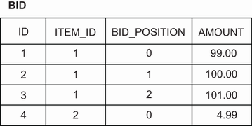

**Hình 9.7** Table `BID` chứa `ITEM_ID` (cột join) và `BID_POSITION` (cột order).

Chỉ số được lưu của mỗi collection bắt đầu từ 0 và liên tục (không có khoảng trống). Hibernate hoặc Spring Data JPA dùng Hibernate sẽ thực thi có thể nhiều câu lệnh SQL khi chúng ta thêm, xóa và dịch chuyển phần tử của `List`. Chúng ta đã bàn về vấn đề hiệu năng này ở mục 8.1.6.

Hãy làm ánh xạ này thành hai chiều, với một property `@ManyToOne` trên entity `Bid`:

*Đường dẫn: onetomany-list/src/main/java/com/manning/javapersistence/ch09/onetomany/list/Bid.java*

```java
@Entity
public class Bid {
    // . . .

    @ManyToOne
    @JoinColumn(
          name = "ITEM_ID",
          updatable = false, insertable = false               // Ⓐ
    )
    @NotNull
    private Item item;
    // . . .
}
```

Ⓐ Collection `Item#bids` giờ không còn chỉ đọc vì Hibernate phải lưu chỉ số của mỗi phần tử. Nếu phía `Bid#item` là chủ sở hữu của quan hệ, Hibernate sẽ bỏ qua collection khi lưu dữ liệu và không ghi chỉ số phần tử. Chúng ta phải ánh xạ `@JoinColumn` hai lần rồi tắt việc ghi ở phía `@ManyToOne` bằng `updatable=false` và `insertable=false`. Hibernate giờ xét tới phía collection khi lưu dữ liệu, bao gồm cả chỉ số của mỗi phần tử. `@ManyToOne` thực chất là chỉ đọc, như thể nó có thuộc tính `mappedBy`.

Có lẽ bạn đã mong đợi đoạn mã khác — có thể là `@ManyToOne(mappedBy="bids")` và không có annotation `@JoinColumn` bổ sung. Nhưng `@ManyToOne` không có thuộc tính `mappedBy`: nó luôn là phía “sở hữu” của quan hệ. Chúng ta sẽ phải làm phía kia, `@OneToMany`, thành phía `mappedBy`.

Cuối cùng, bộ sinh schema của Hibernate luôn dựa vào `@JoinColumn` của phía `@ManyToOne`. Do đó, nếu chúng ta muốn schema được sinh ra đúng, chúng ta nên thêm `@NotNull` ở phía này hoặc khai báo `@JoinColumn(nullable=false)`. Bộ sinh bỏ qua phía `@OneToMany` và cột join của nó nếu có một `@ManyToOne`.

Trong ứng dụng thực, chúng ta sẽ không ánh xạ association này bằng `List`. Việc bảo toàn thứ tự phần tử trong cơ sở dữ liệu có vẻ là một trường hợp sử dụng phổ biến, nhưng thực ra nó không hữu ích lắm: đôi khi chúng ta sẽ muốn hiển thị danh sách với bid cao nhất hoặc mới nhất trước, hoặc chỉ hiển thị bid của một user nhất định, hoặc hiển thị bid trong một khoảng thời gian nhất định. Không thao tác nào trong số này cần chỉ số list persistent. Như đã đề cập ở mục 3.2.4, tốt nhất là tránh lưu thứ tự hiển thị trong cơ sở dữ liệu, vì thứ tự hiển thị có thể thay đổi thường xuyên; hãy giữ nó linh hoạt bằng truy vấn thay vì dùng ánh xạ cứng. Hơn nữa, việc duy trì chỉ số khi ứng dụng xóa, thêm hoặc dịch chuyển phần tử trong list có thể tốn kém và kích hoạt nhiều câu lệnh SQL. Hãy ánh xạ cột foreign key join bằng `@ManyToOne` và bỏ collection đi.

Tiếp theo chúng ta sẽ làm thêm một kịch bản nữa với quan hệ một-nhiều: một association được ánh xạ tới một join table trung gian.

### 9.2.3 Một-nhiều tùy chọn với join table

Một bổ sung hữu ích cho class `Item` là property `buyer`. Khi đó chúng ta có thể gọi `someItem.getBuyer()` để truy cập `User` đã đặt giá thắng. Nếu làm nó hai chiều, association này cũng sẽ giúp chúng ta hiển thị màn hình liệt kê tất cả phiên đấu giá mà một user cụ thể đã thắng: chúng ta có thể gọi `someUser.getBoughtItems()` thay vì viết truy vấn.

Xét từ góc độ class `User`, association là một-nhiều. Hình 9.8 cho thấy các class và quan hệ của chúng.

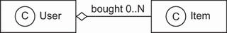

**Hình 9.8** Quan hệ “bought” giữa `User` và `Item`

Vì sao association này khác với association giữa `Item` và `Bid`? Bội số `0..*` trong UML chỉ ra rằng tham chiếu là tùy chọn. Điều này không ảnh hưởng nhiều tới domain model Java, nhưng có hệ quả với các table bên dưới. Chúng ta mong đợi một cột foreign key `BUYER_ID` trong table `ITEM`, nhưng giờ cột này phải cho phép null vì một user có thể chưa mua một `Item` cụ thể (miễn là phiên đấu giá vẫn đang diễn ra).

Chúng ta có thể chấp nhận rằng cột foreign key có thể là `NULL` và áp dụng thêm ràng buộc: “Chỉ được phép `NULL` nếu thời điểm kết thúc phiên đấu giá chưa tới hoặc chưa có bid nào.” Tuy nhiên, chúng ta luôn cố tránh cột cho phép null trong schema cơ sở dữ liệu quan hệ. Thông tin chưa biết làm giảm chất lượng dữ liệu chúng ta lưu. Bộ (tuple) biểu diễn những mệnh đề đúng, và chúng ta không thể khẳng định điều mình không biết. Hơn nữa, trong thực tế, nhiều lập trình viên và DBA không tạo đúng ràng buộc và dựa vào mã ứng dụng vốn thường có lỗi để bảo đảm toàn vẹn dữ liệu.

Một entity association tùy chọn, dù là một-một hay một-nhiều, được biểu diễn tốt nhất trong cơ sở dữ liệu SQL bằng một join table. Hình 9.9 cho thấy một schema ví dụ.

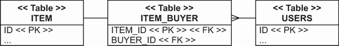

**Hình 9.9** Table trung gian liên kết user và item.

Chúng ta đã thêm một join table trước đó trong chương này cho một association một-một. Để bảo đảm bội số một-một, chúng ta áp dụng unique constraint trên một cột foreign key của join table. Trong trường hợp hiện tại, chúng ta có bội số một-nhiều, nên chỉ cột primary key `ITEM_ID` phải duy nhất: chỉ một `User` có thể mua một `Item` cho trước một lần. Cột `BUYER_ID` không duy nhất vì một `User` có thể mua nhiều `Item`. (Mã nguồn tiếp theo có thể tìm thấy trong thư mục `onetomany-jointable`.)

Ánh xạ của collection `User#boughtItems` khá đơn giản:

*Đường dẫn: onetomany-jointable/src/main/java/com/manning/javapersistence/ch09/onetomany/jointable/User.java*

```java
@Entity
@Table(name = "USERS")
public class User {
    // . . .
    @OneToMany(mappedBy = "buyer")
    private Set<Item> boughtItems = new HashSet<>();
    // . . .
}
```

Đây là phía chỉ đọc thông thường của một association hai chiều, với ánh xạ thực tế tới schema nằm ở phía “mapped by”, tức `Item#buyer`. Nó sẽ là một quan hệ một-nhiều/nhiều-một tùy chọn, gọn gàng.

*Đường dẫn: onetomany-jointable/src/main/java/com/manning/javapersistence/ch09/onetomany/jointable/Item.java*

```java
@Entity
public class Item {
    // . . .
    @ManyToOne(fetch = FetchType.LAZY)
    @JoinTable(
          name = "ITEM_BUYER",
          joinColumns =
              @JoinColumn(name = "ITEM_ID"),              // Ⓐ
          inverseJoinColumns =
              @JoinColumn(nullable = false)               // Ⓑ
    )
    private User buyer;
    // . . .
}
```

Ⓐ Nếu một `Item` chưa được mua, sẽ không có dòng tương ứng trong join table `ITEM_BUYER`. Do đó quan hệ sẽ là tùy chọn. Cột join có tên `ITEM_ID` (mặc định sẽ là `ID`).

Ⓑ Cột inverse join sẽ mặc định là `BUYER_ID`, và nó không cho phép null.

Chúng ta không có cột cho phép null gây rắc rối nào trong schema. Tuy nhiên, chúng ta vẫn nên viết một ràng buộc thủ tục và một trigger chạy khi `INSERT` vào table `ITEM_BUYER`: “Chỉ cho phép chèn một buyer nếu thời điểm kết thúc phiên đấu giá của item đã tới và user đã đặt giá thắng.”

Ví dụ tiếp theo là ví dụ cuối của chúng ta với association một-nhiều. Cho tới giờ, bạn đã thấy các association một-nhiều từ một entity tới một entity khác. Một class embeddable component cũng có thể có association một-nhiều tới một entity, và đó là điều chúng ta sẽ xử lý bây giờ.

### 9.2.4 Association một-nhiều trong class embeddable

Hãy xét lại ánh xạ embeddable component mà chúng ta đã lặp lại qua vài chương: `Address` của một `User`. Giờ chúng ta sẽ mở rộng ví dụ này bằng cách thêm một association một-nhiều từ `Address` tới `Shipment`: một collection tên `deliveries`. Hình 9.10 cho thấy sơ đồ class UML cho mô hình này.

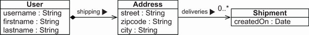

**Hình 9.10** Quan hệ một-nhiều từ `Address` tới `Shipment`

`Address` là một class `@Embeddable`, không phải entity. Nó có thể sở hữu một association một chiều tới một entity; ở đây, đó là bội số một-nhiều tới `Shipment`. Chúng ta sẽ xem một class embeddable có association nhiều-một với một entity ở mục tiếp theo. (Mã nguồn tiếp theo có thể tìm thấy trong thư mục `onetomany-embeddable`.)

Class `Address` có một `Set<Shipment>` biểu diễn association này:

*Đường dẫn: onetomany-embeddable/src/main/java/com/manning/javapersistence/ch09/onetomany/embeddable/Address.java*

```java
@Embeddable
public class Address {

    @NotNull
    @Column(nullable = false)
    private String street;

    @NotNull
    @Column(nullable = false, length = 5)
    private String zipcode;

    @NotNull
    @Column(nullable = false)
    private String city;

    @OneToMany
    @JoinColumn(
        name = "DELIVERY_ADDRESS_USER_ID",                       // Ⓐ
        nullable = false
    )
    private Set<Shipment> deliveries = new HashSet<>();
    // . . .
}
```

Ⓐ Chiến lược ánh xạ đầu tiên cho association này là dùng `@JoinColumn` tên `DELIVERY_ADDRESS_USER_ID` (mặc định sẽ là `DELIVERIES_ID`).

Cột bị ràng buộc foreign key này nằm trong table `SHIPMENT`, như bạn thấy ở hình 9.11.

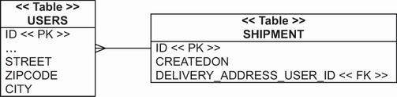

**Hình 9.11** Primary key trong table `USERS` liên kết table `USERS` và `SHIPMENT`.

Các embeddable component không có định danh riêng, nên giá trị trong cột foreign key là giá trị định danh của `User` — thứ nhúng `Address`. Ở đây chúng ta cũng khai báo cột join là `nullable = false`, nên một `Shipment` phải có địa chỉ giao hàng liên quan. Tất nhiên, việc điều hướng hai chiều là không thể: `Shipment` không thể có tham chiếu tới `Address` vì các embedded component không thể có tham chiếu dùng chung.

Nếu association là tùy chọn và chúng ta không muốn một cột cho phép null, chúng ta có thể ánh xạ association tới một table join/link trung gian, như minh họa ở hình 9.12.

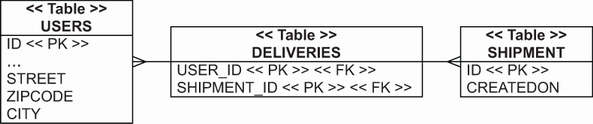

**Hình 9.12** Dùng table trung gian giữa `USERS` và `SHIPMENT` để biểu diễn association tùy chọn

Ánh xạ của collection trong `Address` giờ dùng `@JoinTable` thay vì `@JoinColumn`. (Mã nguồn tiếp theo có thể tìm thấy trong thư mục `onetomany-embeddable-jointable`.)

*Đường dẫn: onetomany-embeddable-jointable/src/main/java/com/manning/javapersistence/ch09/onetomany/embeddablejointable/Address.java*

```java
@Embeddable
public class Address {

    @NotNull
    @Column(nullable = false)
    private String street;

    @NotNull
    @Column(nullable = false, length = 5)
    private String zipcode;

    @NotNull
    @Column(nullable = false)
    private String city;

    @OneToMany
    @JoinTable(
        name = "DELIVERIES",                                    // Ⓐ
        joinColumns =
            @JoinColumn(name = "USER_ID"),                      // Ⓑ
        inverseJoinColumns =
            @JoinColumn(name = "SHIPMENT_ID")                   // Ⓒ
    )
    private Set<Shipment> deliveries = new HashSet<>();
    // . . .
}
```

Ⓐ Tên của join table sẽ là `DELIVERIES` (nếu không sẽ mặc định là `USERS_SHIPMENT`).

Ⓑ Tên của cột join sẽ là `USER_ID` (nếu không sẽ mặc định là `USERS_ID`).

Ⓒ Tên của cột inverse join sẽ là `SHIPMENT_ID` (nếu không sẽ mặc định là `SHIPMENTS_ID`).

Lưu ý rằng nếu chúng ta không khai báo `@JoinTable` lẫn `@JoinColumn`, `@OneToMany` trong một class embeddable sẽ mặc định dùng chiến lược join table.

Từ bên trong entity class sở hữu, chúng ta có thể ghi đè ánh xạ property của một class embedded bằng `@AttributeOverride`, như đã minh họa ở mục 6.2.3. Nếu chúng ta muốn ghi đè ánh xạ join table hay join column của một entity association trong class embeddable, chúng ta có thể dùng `@AssociationOverride` trong entity class sở hữu. Tuy nhiên, chúng ta không thể đổi chiến lược ánh xạ; ánh xạ trong class embeddable component quyết định việc dùng join table hay join column.

Ánh xạ join table tất nhiên cũng áp dụng được trong các ánh xạ nhiều-nhiều thực sự.

## 9.3 Association nhiều-nhiều và bậc ba

Association giữa `Category` và `Item` là một association nhiều-nhiều, như bạn thấy ở hình 9.13. Trong hệ thống thực, chúng ta có thể không có association nhiều-nhiều — kinh nghiệm của chúng tôi là gần như luôn có thông tin khác cần gắn vào mỗi liên kết giữa các instance liên quan. Một số ví dụ là timestamp khi một `Item` được thêm vào một `Category`, và `User` chịu trách nhiệm tạo liên kết đó. Chúng ta sẽ mở rộng ví dụ ở phần sau của mục này để bao phủ những trường hợp như vậy, nhưng chúng ta sẽ bắt đầu với một association nhiều-nhiều thông thường và đơn giản hơn.

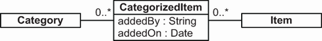

**Hình 9.13** Association nhiều-nhiều giữa `Category` và `Item`

### 9.3.1 Association nhiều-nhiều một chiều và hai chiều

Một join table trong cơ sở dữ liệu biểu diễn một association nhiều-nhiều thông thường, mà một số lập trình viên cũng gọi là *link table* hay *association table*. Hình 9.14 cho thấy quan hệ nhiều-nhiều với một link table.

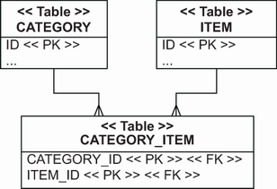

**Hình 9.14** `CategorizedItem` là liên kết giữa `Category` và `Item`.

Link table `CATEGORY_ITEM` có hai cột, cả hai đều có foreign key constraint tham chiếu tới table `CATEGORY` và `ITEM` tương ứng. Primary key của nó là khóa hợp thành của cả hai cột. Chúng ta chỉ có thể liên kết một `Category` và `Item` cụ thể một lần, nhưng chúng ta có thể liên kết cùng một item với nhiều category. Mã nguồn tiếp theo có thể tìm thấy trong thư mục `manytomany-bidirectional`.

Trong JPA, chúng ta ánh xạ association nhiều-nhiều bằng `@ManyToMany` trên một collection:

*Đường dẫn: manytomany-bidirectional/src/main/java/com/manning/javapersistence/ch09/manytomany/bidirectional/Category.java*

```java
@Entity
public class Category {
    // . . .
    @ManyToMany(cascade = CascadeType.PERSIST)
    @JoinTable(
        name = "CATEGORY_ITEM",
        joinColumns = @JoinColumn(name = "CATEGORY_ID"),
        inverseJoinColumns = @JoinColumn(name = "ITEM_ID")
    )
    private Set<Item> items = new HashSet<>();
    // . . .
}
```

Như thường lệ, chúng ta có thể bật `CascadeType.PERSIST` để việc lưu dữ liệu dễ hơn. Khi chúng ta tham chiếu tới một `Item` mới từ collection, Hibernate hoặc Spring Data JPA dùng Hibernate làm nó trở thành persistent. Hãy làm association này thành hai chiều (chúng ta không bắt buộc phải làm nếu không cần):

*Đường dẫn: manytomany-bidirectional/src/main/java/com/manning/javapersistence/ch09/manytomany/bidirectional/Item.java*

```java
@Entity
public class Item {
    // . . .
    @ManyToMany(mappedBy = "items")
    private Set<Category> categories = new HashSet<>();
    // . . .
}
```

Như trong mọi ánh xạ hai chiều, một phía được “mapped by” phía kia. Collection `Item#categories` thực chất là chỉ đọc; Hibernate sẽ phân tích nội dung của phía `Category#items` khi lưu dữ liệu.

Tiếp theo, chúng ta sẽ tạo hai category và hai item rồi liên kết chúng với bội số nhiều-nhiều:

*Đường dẫn: manytomany-bidirectional/src/test/java/com/manning/javapersistence/ch09/manytomany/bidirectional/TestService.java*

```java
Category someCategory = new Category("Some Category");
Category otherCategory = new Category("Other Category");
Item someItem = new Item("Some Item");
Item otherItem = new Item("Other Item");
someCategory.addItem(someItem);
someItem.addCategory(someCategory);
someCategory.addItem(otherItem);
otherItem.addCategory(someCategory);
otherCategory.addItem(someItem);
someItem.addCategory(otherCategory);
categoryRepository.save(someCategory);
categoryRepository.save(otherCategory);
```

Vì chúng ta đã bật transitive persistence, việc lưu các category làm cho toàn bộ mạng lưới instance trở thành persistent. Mặt khác, các tùy chọn cascade `ALL`, `REMOVE` và orphan deletion (bàn ở mục 8.3.3) không có ý nghĩa với association nhiều-nhiều. Đây là điểm tốt để kiểm tra xem chúng ta có hiểu về entity và value type không. Hãy thử đưa ra câu trả lời hợp lý cho câu hỏi vì sao những kiểu cascade này không có ý nghĩa với association nhiều-nhiều. Gợi ý: Hãy nghĩ xem điều gì có thể xảy ra nếu việc xóa một bản ghi sẽ tự động xóa một bản ghi liên quan.

Chúng ta có thể dùng `List` thay vì `Set`, hay thậm chí một bag không? `Set` khớp hoàn hảo với schema cơ sở dữ liệu vì không thể có liên kết trùng lặp giữa `Category` và `Item`. Bag hàm ý phần tử trùng lặp, nên chúng ta sẽ cần một primary key khác cho join table. Annotation riêng `@CollectionId` của Hibernate có thể cung cấp điều này, như đã minh họa ở mục 8.1.5. Tuy nhiên, một trong các chiến lược nhiều-nhiều thay thế mà chúng ta sẽ bàn ngay sau đây là lựa chọn tốt hơn nếu chúng ta cần hỗ trợ liên kết trùng lặp.

Chúng ta có thể ánh xạ các collection có chỉ số như `List` bằng `@ManyToMany` thông thường, nhưng chỉ ở một phía. Hãy nhớ rằng trong quan hệ hai chiều, một phía phải được “mapped by” phía kia, nghĩa là giá trị của nó bị bỏ qua khi Hibernate đồng bộ với cơ sở dữ liệu. Nếu cả hai phía đều là list, chúng ta chỉ có thể làm cho chỉ số của một phía trở thành persistent.

Một ánh xạ `@ManyToMany` thông thường che giấu link table; không có class Java tương ứng, chỉ có vài property collection. Vì vậy mỗi khi ai đó nói “Link table của tôi có thêm cột chứa thông tin về liên kết” (và theo kinh nghiệm của chúng tôi, luôn có ai đó nói thế sớm hơn là muộn), chúng ta cần ánh xạ thông tin này tới một class Java.

### 9.3.2 Nhiều-nhiều với một entity trung gian

Chúng ta luôn có thể biểu diễn một association nhiều-nhiều thành hai association nhiều-một tới một class trung gian, và đó là điều chúng ta sẽ làm tiếp theo. Chúng ta sẽ không che giấu link table; chúng ta sẽ biểu diễn nó bằng một class Java. Mô hình này thường dễ mở rộng hơn, nên chúng tôi có xu hướng không dùng association nhiều-nhiều thông thường trong ứng dụng. Việc thay đổi mã sau này rất tốn công khi thêm cột vào link table là điều không tránh khỏi, nên trước khi ánh xạ một `@ManyToMany` như ở mục trước, hãy cân nhắc phương án ở hình 9.15.

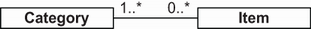

**Hình 9.15** `CategorizedItem` sẽ là liên kết giữa `Category` và `Item`.

Hãy hình dung chúng ta cần ghi lại một số thông tin mỗi khi thêm một `Item` vào một `Category`. Entity `CategorizedItem` nắm bắt timestamp và user đã tạo liên kết. Domain model này đòi hỏi thêm cột trên join table, như bạn thấy ở hình 9.16.

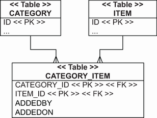

**Hình 9.16** Các cột bổ sung trên join table trong quan hệ nhiều-nhiều

Entity `CategorizedItem` ánh xạ tới link table, như bạn sẽ thấy ở listing 9.4. (Mã nguồn tiếp theo có thể tìm thấy trong thư mục `manytomany-linkentity`.) Đây sẽ là một khối mã lớn với vài annotation mới. Trước hết, nó sẽ là một entity class bất biến (đánh dấu bằng `@org.hibernate.annotations.Immutable`), nên chúng ta sẽ không bao giờ cập nhật property sau khi tạo. Hibernate có thể thực hiện một số tối ưu, chẳng hạn tránh dirty checking khi flush persistence context, nếu chúng ta khai báo class là bất biến.

Entity class sẽ có một khóa hợp thành, mà chúng ta sẽ đóng gói trong một class embeddable lồng tĩnh cho tiện. Property định danh và các cột khóa hợp thành của nó sẽ được ánh xạ tới table của entity thông qua annotation `@EmbeddedId`.

**Listing 9.4** Ánh xạ quan hệ nhiều-nhiều bằng CategorizedItem

*Đường dẫn: manytomany-linkentity/src/main/java/com/manning/javapersistence/ch09/manytomany/linkentity/CategorizedItem.java*

```java
@Entity
@Table(name = "CATEGORY_ITEM")
@org.hibernate.annotations.Immutable                            // Ⓐ
public class CategorizedItem {

    @Embeddable
    public static class Id implements Serializable {            // Ⓑ

        @Column(name = "CATEGORY_ID")
        private Long categoryId;

        @Column(name = "ITEM_ID")
        private Long itemId;

        public Id() {
        }

        public Id(Long categoryId, Long itemId) {
            this.categoryId = categoryId;
            this.itemId = itemId;
        }
        //implementing equals and hashCode
    }

    @EmbeddedId                                                 // Ⓒ
    private Id id = new Id();

    @Column(updatable = false)
    @NotNull
    private String addedBy;                                     // Ⓓ

    @Column(updatable = false)
    @NotNull
    @CreationTimestamp
    private LocalDateTime addedOn;                              // Ⓔ

    @ManyToOne
    @JoinColumn(
        name = "CATEGORY_ID",
        insertable = false, updatable = false)
    private Category category;                                  // Ⓕ

    @ManyToOne
    @JoinColumn(
        name = "ITEM_ID",
        insertable = false, updatable = false)
    private Item item;                                          // Ⓖ

    public CategorizedItem(
        String addedByUsername,                                 // Ⓗ
        Category category,
        Item item) {
        this.addedBy = addedByUsername;                         // Ⓘ
        this.category = category;
        this.item = item;
        this.id.categoryId = category.getId();                  // Ⓙ
        this.id.itemId = item.getId();
        category.addCategorizedItem(this);                      // Ⓘ
        item.addCategorizedItem(this);
    }
    // . . .
}
```

Ⓐ Class là bất biến, được đánh dấu bằng `@org.hibernate.annotations.Immutable`.

Ⓑ Một entity class cần property định danh. Primary key của link table là khóa hợp thành của `CATEGORY_ID` và `ITEM_ID`. Tất nhiên chúng ta có thể tách class `Id` này ra file riêng.

Ⓒ Annotation mới `@EmbeddedId` ánh xạ property định danh cùng các cột khóa hợp thành của nó tới table của entity.

Ⓓ Basic property ánh xạ username `addedBy` tới một cột của join table.

Ⓔ Basic property ánh xạ timestamp `addedOn` tới một cột của join table. Đây là “thông tin bổ sung về liên kết” mà chúng ta quan tâm.

Ⓕ Property `@ManyToOne` `category` đã được ánh xạ trong định danh.

Ⓖ Property `@ManyToOne` `item` đã được ánh xạ trong định danh. Mẹo ở đây là làm cho chúng chỉ đọc, với thiết lập `updatable=false`, `insertable=false`. Nghĩa là Hibernate hoặc Spring Data JPA dùng Hibernate ghi giá trị của những cột này bằng cách lấy giá trị định danh của `CategorizedItem`. Đồng thời, chúng ta có thể đọc và duyệt các instance liên quan qua `categorizedItem.getItem()` và `getCategory()`. (Nếu chúng ta ánh xạ cùng một cột hai lần mà không làm cho một ánh xạ thành chỉ đọc, Hibernate hoặc Spring Data JPA dùng Hibernate sẽ phàn nàn lúc khởi động về ánh xạ cột trùng lặp.)

Ⓗ Chúng ta cũng thấy rằng việc dựng một `CategorizedItem` bao gồm việc đặt giá trị của định danh. Ứng dụng luôn gán giá trị khóa hợp thành; Hibernate không sinh chúng.

Ⓘ Constructor đặt giá trị field `addedBy` và bảo đảm toàn vẹn tham chiếu bằng cách quản lý collection ở cả hai phía của association.

Ⓙ Constructor đặt giá trị field `categoryId`. Chúng ta sẽ ánh xạ các collection này tiếp theo để bật điều hướng hai chiều. Đây là ánh xạ một chiều và đủ để hỗ trợ quan hệ nhiều-nhiều giữa `Category` và `Item`. Để tạo liên kết, chúng ta khởi tạo và lưu một `CategorizedItem`. Nếu muốn phá liên kết, chúng ta xóa `CategorizedItem`. Constructor của `CategorizedItem` yêu cầu chúng ta cung cấp các instance `Category` và `Item` đã ở trạng thái persistent.

Nếu cần điều hướng hai chiều, chúng ta có thể ánh xạ một collection `@OneToMany` trong `Category` và/hoặc `Item`. Đây là trong `Category`:

*Đường dẫn: manytomany-linkentity/src/main/java/com/manning/javapersistence/ch09/manytomany/linkentity/Category.java*

```java
@Entity
public class Category {
    // . . .
    @OneToMany(mappedBy = "category")
    private Set<CategorizedItem> categorizedItems = new HashSet<>();
    // . . .
}
```

Và đây là trong `Item`:

*Đường dẫn: manytomany-linkentity/src/main/java/com/manning/javapersistence/ch09/manytomany/linkentity/Item.java*

```java
@Entity
public class Item {
    // . . .
    @OneToMany(mappedBy = "item")
    private Set<CategorizedItem> categorizedItems = new HashSet<>();
    // . . .
}
```

Cả hai phía đều được “mapped by” các annotation trong `CategorizedItem`, nên Hibernate đã biết phải làm gì khi chúng ta duyệt collection do phương thức `getCategorizedItems()` trả về.

Đây là cách chúng ta tạo và lưu các liên kết:

*Đường dẫn: manytomany-linkentity/src/test/java/com/manning/javapersistence/ch09/manytomany/linkentity/TestService.java*

```java
Category someCategory = new Category("Some Category");
Category otherCategory = new Category("Other Category");
categoryRepository.save(someCategory);
categoryRepository.save(otherCategory);
Item someItem = new Item("Some Item");
Item otherItem = new Item("Other Item");
itemRepository.save(someItem);
itemRepository.save(otherItem);
CategorizedItem linkOne = new CategorizedItem(
    "John Smith", someCategory, someItem
);
CategorizedItem linkTwo = new CategorizedItem(
    "John Smith", someCategory, otherItem
);
CategorizedItem linkThree = new CategorizedItem(
    "John Smith", otherCategory, someItem
);
categorizedItemRepository.save(linkOne);
categorizedItemRepository.save(linkTwo);
categorizedItemRepository.save(linkThree);
```

Ưu điểm chính của chiến lược này là khả năng điều hướng hai chiều: chúng ta có thể lấy tất cả item trong một category bằng cách gọi `someCategory.getCategorizedItems()`, và cũng có thể điều hướng từ chiều ngược lại bằng `someItem.getCategorizedItems()`. Nhược điểm là mã phức tạp hơn để quản lý các instance entity `CategorizedItem` khi tạo và xóa liên kết, mà chúng ta phải lưu và xóa một cách độc lập. Chúng ta cũng cần một chút hạ tầng trong class `CategorizedItem`, chẳng hạn định danh hợp thành. Một cải tiến nhỏ là bật `CascadeType.PERSIST` trên một số association, giảm số lời gọi `save()`.

Trong ví dụ này, chúng ta lưu user tạo liên kết giữa `Category` và `Item` dưới dạng một chuỗi tên đơn giản. Nếu join table thay vào đó có một cột foreign key tên `USER_ID`, chúng ta sẽ có một quan hệ bậc ba. `CategorizedItem` sẽ có một `@ManyToOne` cho `Category`, `Item` và `User`.

Ở mục tiếp theo, chúng tôi sẽ minh họa một chiến lược nhiều-nhiều khác. Để thú vị hơn một chút, chúng ta sẽ làm nó thành một association bậc ba.

### 9.3.3 Association bậc ba với component

Ở mục trước, chúng ta biểu diễn một quan hệ nhiều-nhiều bằng một entity class ánh xạ tới link table. Một phương án có thể đơn giản hơn là ánh xạ tới một class embeddable component. Mã nguồn tiếp theo có thể tìm thấy trong thư mục `manytomany-ternary`.

*Đường dẫn: manytomany-ternary/src/main/java/com/manning/javapersistence/ch09/manytomany/ternary/CategorizedItem.java*

```java
@Embeddable
public class CategorizedItem {

    @ManyToOne
    @JoinColumn(
        name = "ITEM_ID",
        nullable = false, updatable = false
    )
    private Item item;

    @ManyToOne
    @JoinColumn(
        name = "USER_ID",
        updatable = false
    )
    @NotNull                                                        // Ⓐ
    private User addedBy;

    @Column(updatable = false)
    @NotNull                                                        // Ⓐ
    private LocalDateTime addedOn = LocalDateTime.now();

    public CategorizedItem() {
    }

    public CategorizedItem(User addedBy,
                           Item item) {
        this.addedBy = addedBy;
        this.item = item;
    }
    // . . .
}
```

Ⓐ Các annotation `@NotNull` không sinh ràng buộc SQL, nên các field được đánh dấu sẽ không thuộc primary key.

Các ánh xạ mới ở đây là association `@ManyToOne` trong một `@Embeddable` và cột foreign key join bổ sung `USER_ID`, khiến đây trở thành một quan hệ bậc ba. Hãy xem schema cơ sở dữ liệu ở hình 9.17.

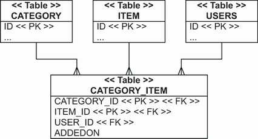

**Hình 9.17** Link table với ba cột foreign key

Chủ sở hữu của collection embeddable component là entity `Category`:

*Đường dẫn: manytomany-ternary/src/main/java/com/manning/javapersistence/ch09/manytomany/ternary/Category.java*

```java
@Entity
public class Category {
    // . . .
    @ElementCollection
    @CollectionTable(
        name = "CATEGORY_ITEM",
        joinColumns = @JoinColumn(name = "CATEGORY_ID")
    )
    private Set<CategorizedItem> categorizedItems = new HashSet<>();
    // . . .
}
```

Đáng tiếc, ánh xạ này chưa hoàn hảo: khi chúng ta ánh xạ một `@ElementCollection` kiểu embeddable, mọi property của kiểu đích có `nullable=false` đều trở thành một phần của primary key (hợp thành). Chúng ta muốn tất cả cột trong `CATEGORY_ITEM` là `NOT NULL`. Tuy nhiên, chỉ các cột `CATEGORY_ID` và `ITEM_ID` nên là một phần của primary key. Mẹo là dùng annotation `@NotNull` của Bean Validation trên các property không nên thuộc primary key. Trong trường hợp đó (vì đây là class embeddable), Hibernate bỏ qua annotation Bean Validation khi xác định primary key và sinh schema SQL. Nhược điểm là schema được sinh ra sẽ không có các constraint `NOT NULL` phù hợp trên cột `USER_ID` và `ADDEDON`, mà chúng ta nên sửa thủ công.

Ưu điểm của chiến lược này là vòng đời ngầm định của các link component. Để tạo association giữa một `Category` và một `Item`, hãy thêm một instance `CategorizedItem` mới vào collection. Để phá liên kết, hãy xóa phần tử khỏi collection. Không cần thiết lập cascade bổ sung nào, và mã Java được đơn giản hóa (dù trải ra nhiều dòng hơn):

*Đường dẫn: manytomany-ternary/src/test/java/com/manning/javapersistence/ch09/manytomany/ternary/TestService.java*

```java
Category someCategory = new Category("Some Category");
Category otherCategory = new Category("Other Category");
categoryRepository.save(someCategory);
categoryRepository.save(otherCategory);
Item someItem = new Item("Some Item");
Item otherItem = new Item("Other Item");
itemRepository.save(someItem);
itemRepository.save(otherItem);
User someUser = new User("John Smith");
userRepository.save(someUser);
CategorizedItem linkOne = new CategorizedItem(
    someUser, someItem
);
someCategory.addCategorizedItem(linkOne);
CategorizedItem linkTwo = new CategorizedItem(
    someUser, otherItem
);
someCategory.addCategorizedItem(linkTwo);
CategorizedItem linkThree = new CategorizedItem(
    someUser, someItem
);
otherCategory.addCategorizedItem(linkThree);
```

Không có cách nào để bật điều hướng hai chiều: một embeddable component như `CategorizedItem`, theo định nghĩa, không thể có tham chiếu dùng chung. Chúng ta không thể điều hướng từ `Item` tới `CategorizedItem`, và không có ánh xạ nào cho liên kết này trong `Item`. Thay vào đó, chúng ta có thể viết một truy vấn để truy xuất các category, cho trước một `Item`:

*Đường dẫn: manytomany-ternary/src/test/java/com/manning/javapersistence/ch09/manytomany/ternary/TestService.java*

```java
List<Category> categoriesOfItem =
    categoryRepository.findCategoryWithCategorizedItems(item1);
assertEquals(2, categoriesOfItem.size());
```

Phương thức `findCategoryWithCategorizedItems` được đánh dấu bằng annotation `@Query`:

*Đường dẫn: manytomany-ternary/src/main/java/com/manning/javapersistence/ch09/repositories/manytomany/ternary/CategoryRepository.java*

```java
@Query("select c from Category c join c.categorizedItems ci where "
       + "ci.item = :itemParameter")
List<Category> findCategoryWithCategorizedItems(
      @Param("itemParameter") Item itemParameter);
```

Chúng ta đã hoàn thành ánh xạ association bậc ba đầu tiên. Ở các chương trước, chúng ta đã thấy các ví dụ ORM với map; khóa và giá trị của những map đó luôn thuộc kiểu basic hay embeddable. Ở mục tiếp theo, chúng ta sẽ dùng các kiểu cặp khóa/giá trị phức tạp hơn cùng ánh xạ của chúng.

## 9.4 Entity association với map

Khóa và giá trị của map có thể là tham chiếu tới entity khác, cung cấp thêm một chiến lược để ánh xạ quan hệ nhiều-nhiều và bậc ba. Trước hết, hãy giả sử chỉ giá trị của mỗi mục map là tham chiếu tới một entity khác.

### 9.4.1 Một-nhiều với khóa là property

Nếu giá trị của mỗi mục map là tham chiếu tới một entity khác, chúng ta có một quan hệ entity một-nhiều. Khóa của map thuộc kiểu basic, chẳng hạn một giá trị `Long`. (Mã nguồn tiếp theo có thể tìm thấy trong thư mục `maps-mapkey`.)

Một ví dụ của cấu trúc này là một entity `Item` với một map các instance `Bid`, trong đó mỗi mục map là một cặp gồm định danh `Bid` và tham chiếu tới một instance `Bid`. Khi chúng ta duyệt `someItem.getBids()`, chúng ta duyệt các mục map trông như `(1, <tham chiếu tới Bid có PK 1>)`, `(2, <tham chiếu tới Bid có PK 2>)`, v.v.:

*Đường dẫn: maps-mapkey/src/test/java/com/manning/javapersistence/ch09/maps/mapkey/TestService.java*

```java
Item item = itemRepository.findById(someItem.getId()).get();
assertEquals(2, item.getBids().size());
for (Map.Entry<Long, Bid> entry : item.getBids().entrySet()) {
    assertEquals(entry.getKey(), entry.getValue().getId());
}
```

Các table bên dưới cho ánh xạ này không có gì đặc biệt; chúng ta có table `ITEM` và `BID`, với một cột foreign key `ITEM_ID` trong table `BID`. Đây cũng chính là schema được minh họa ở hình 8.14 cho ánh xạ một-nhiều/nhiều-một với một collection thông thường thay vì `Map`. Động cơ của chúng ta ở đây là một cách biểu diễn dữ liệu hơi khác trong ứng dụng.

Trong class `Item`, chúng ta sẽ đưa vào một property `Map` tên `bids`:

*Đường dẫn: maps-mapkey/src/main/java/com/manning/javapersistence/ch09/maps/mapkey/Item.java*

```java
@Entity
public class Item {
    // . . .
    @MapKey(name = "id")
    @OneToMany(mappedBy = "item")
    private Map<Long, Bid> bids = new HashMap<>();
    // . . .
}
```

Điểm mới ở đây là annotation `@MapKey`. Nó ánh xạ một property của entity đích — trong trường hợp này là entity `Bid` — làm khóa của map. Mặc định nếu chúng ta bỏ qua thuộc tính `name` là property định danh của entity đích, nên tùy chọn `name` ở đây là dư thừa. Vì khóa của một map tạo thành một set, chúng ta nên kỳ vọng giá trị là duy nhất với một map cụ thể. Điều này đúng với primary key của `Bid` nhưng nhiều khả năng không đúng với bất kỳ property nào khác của `Bid`. Việc bảo đảm property được chọn có giá trị duy nhất là tùy thuộc vào chúng ta — Hibernate hoặc Spring Data JPA dùng Hibernate sẽ không kiểm tra.

Trường hợp sử dụng chính và hiếm gặp của kỹ thuật ánh xạ này là duyệt các mục map với một property nào đó của entity giá trị làm khóa mục, có thể vì nó tiện cho cách chúng ta muốn hiển thị dữ liệu. Tình huống phổ biến hơn là một map nằm giữa một association bậc ba.

### 9.4.2 Quan hệ bậc ba kiểu khóa/giá trị

Có thể giờ bạn đã hơi chán với tất cả những thí nghiệm ánh xạ chúng ta đã thực hiện, nhưng chúng tôi hứa đây là lần cuối chúng tôi trình bày thêm một cách ánh xạ association giữa `Category` và `Item`. Trước đó, ở mục 9.3.3, chúng ta dùng một embeddable component `CategorizedItem` để biểu diễn liên kết. Ở đây chúng tôi sẽ trình bày cách biểu diễn quan hệ bằng một `Map` thay vì một class Java bổ sung. Khóa của mỗi mục map là một `Item`, và giá trị liên quan là `User` đã thêm `Item` vào `Category`, như minh họa ở hình 9.18.

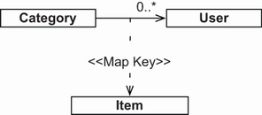

**Hình 9.18** Một `Map` với các entity association làm cặp khóa/giá trị

Link/join table trong schema, như bạn thấy ở hình 9.19, có ba cột: `CATEGORY_ID`, `ITEM_ID` và `USER_ID`. `Map` được sở hữu bởi entity `Category`. Mã nguồn tiếp theo có thể tìm thấy trong thư mục `maps-ternary`.

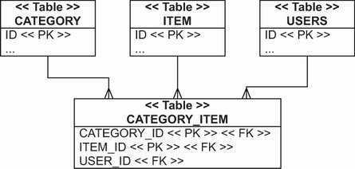

**Hình 9.19** Link table biểu diễn các cặp khóa/giá trị của `Map`.

Đoạn mã sau mô hình hóa quan hệ giữa `Category` và `Item` bằng một map.

*Đường dẫn: maps-ternary/src/main/java/com/manning/javapersistence/ch09/maps/ternary/Category.java*

```java
@Entity
public class Category {
    // . . .
    @ManyToMany(cascade = CascadeType.PERSIST)
    @MapKeyJoinColumn(name = "ITEM_ID")                     // Ⓐ
    @JoinTable(
        name = "CATEGORY_ITEM",
        joinColumns = @JoinColumn(name = "CATEGORY_ID"),
        inverseJoinColumns = @JoinColumn(name = "USER_ID")
    )
    private Map<Item, User> itemAddedBy = new HashMap<>();
    // . . .
}
```

Ⓐ `@MapKeyJoinColumn` là tùy chọn; Hibernate hoặc Spring Data JPA dùng Hibernate sẽ mặc định dùng tên cột `ITEMADDEDBY_KEY` cho cột join/foreign key tham chiếu tới table `ITEM`.

Để tạo liên kết giữa cả ba entity, mọi instance phải đã ở trạng thái persistent rồi mới được đưa vào map:

*Đường dẫn: maps-ternary/src/test/java/com/manning/javapersistence/ch09/maps/ternary/TestService.java*

```java
someCategory.putItemAddedBy(someItem, someUser);
someCategory.putItemAddedBy(otherItem, someUser);
otherCategory.putItemAddedBy(someItem, someUser);
```

Để xóa liên kết, hãy xóa mục khỏi map. Cách này quản lý một quan hệ phức tạp, che giấu một link table cơ sở dữ liệu với ba cột. Nhưng hãy nhớ rằng trên thực tế, link table thường mọc thêm cột, và việc thay đổi toàn bộ mã ứng dụng Java sau này rất tốn kém nếu bạn phụ thuộc vào API `Map`. Trước đây, chúng ta có một cột `ADDEDON` với timestamp khi liên kết được tạo, nhưng chúng ta phải bỏ nó với ánh xạ này.

## Tóm tắt

- Các entity association phức tạp có thể được ánh xạ bằng association một-một, association một-nhiều, association nhiều-nhiều, association bậc ba và entity association với map.
- Bạn có thể tạo association một-một bằng cách dùng chung primary key, dùng foreign primary key generator, dùng cột foreign key join, hoặc dùng join table.
- Bạn có thể tạo association một-nhiều bằng cách cân nhắc bag một-nhiều, dùng ánh xạ list một chiều và hai chiều, áp dụng một-nhiều tùy chọn với join table, hoặc tạo association một-nhiều trong một class embeddable.
- Bạn có thể tạo association nhiều-nhiều một chiều và hai chiều, cùng association nhiều-nhiều với một entity trung gian.
- Bạn có thể xây dựng association bậc ba bằng component và entity association bằng map.
- Thường thì bạn có thể biểu diễn tốt nhất các entity association nhiều-nhiều thành hai association nhiều-một từ một entity class trung gian, hoặc bằng một collection các component.
- Trước khi thử một ánh xạ collection phức tạp, hãy luôn chắc chắn bạn thực sự cần một collection. Hãy tự hỏi liệu bạn có thường xuyên duyệt các phần tử của nó không.
- Các cấu trúc Java dùng trong chương này đôi khi có thể khiến việc truy cập dữ liệu dễ hơn, nhưng thường làm phức tạp việc lưu trữ, cập nhật và xóa dữ liệu.
