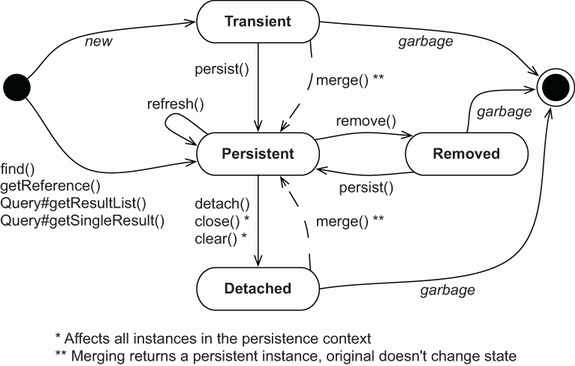
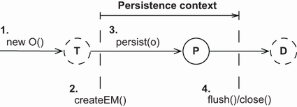
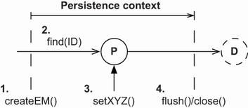
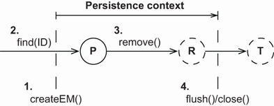
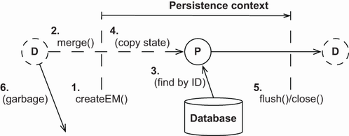

# Chương 10. Quản lý dữ liệu

> *Java Persistence with Spring Data and Hibernate* — Chương 10: “Managing data”

**Nội dung chương này bao gồm**

- Xem xét vòng đời và các trạng thái của object
- Làm việc với interface `EntityManager`
- Làm việc với trạng thái detached

Giờ bạn đã hiểu ORM giải quyết các khía cạnh tĩnh của object/relational mismatch như thế nào. Với những gì đã biết, bạn có thể tạo ánh xạ giữa các class Java và một schema SQL, giải quyết bài toán lệch pha cấu trúc. Như bạn còn nhớ, paradigm mismatch bao gồm các vấn đề về granularity, inheritance, identity, association và data navigation. Để ôn lại sâu hơn, hãy xem lại mục 1.2.

Tuy nhiên, ngoài điều đó ra, một giải pháp ứng dụng hiệu quả còn đòi hỏi thêm: bạn phải tìm hiểu các chiến lược quản lý dữ liệu lúc chạy. Những chiến lược này rất then chốt với hiệu năng và hành vi đúng đắn của ứng dụng.

Trong chương này, chúng ta sẽ phân tích vòng đời của instance entity — cách một instance trở thành persistent và khi nào nó thôi được coi là persistent — cùng các lời gọi phương thức và thao tác quản lý kích hoạt những chuyển đổi này. `EntityManager` của JPA là interface chính để truy cập dữ liệu.

Trước khi xem xét JPA, hãy bắt đầu với instance entity, vòng đời của chúng, và các sự kiện kích hoạt thay đổi trạng thái. Mặc dù một số nội dung có thể mang tính hình thức, việc hiểu vững vòng đời persistence là thiết yếu.

> **Các tính năng mới quan trọng trong JPA 2**
>
> Chúng ta có thể lấy một biến thể đặc thù nhà cung cấp của API persistence manager bằng `EntityManager#unwrap()`, chẳng hạn API `org.hibernate.Session`. Hãy dùng phương thức `EntityManagerFactory#unwrap()` đã minh họa để lấy một instance của `org.hibernate.SessionFactory` (xem mục 2.5).
>
> Thao tác `detach()` mới cung cấp khả năng quản lý mịn persistence context, gỡ bỏ từng instance entity riêng lẻ.
>
> Từ một `EntityManager` hiện có, chúng ta có thể lấy `EntityManagerFactory` đã dùng để tạo persistence context bằng `getEntityManagerFactory()`.
>
> Các phương thức trợ giúp tĩnh mới `PersistenceUtil` và `PersistenceUnitUtil` xác định xem một instance entity (hoặc một property của nó) đã được nạp đầy đủ hay vẫn là tham chiếu chưa khởi tạo (một proxy Hibernate hoặc một collection wrapper chưa nạp).

## 10.1 Vòng đời persistence

Vì JPA là cơ chế transparent persistence, nơi các class không biết về khả năng persistence của chính mình, ta có thể viết logic ứng dụng không cần biết dữ liệu nó thao tác biểu diễn trạng thái persistent hay trạng thái tạm thời chỉ tồn tại trong bộ nhớ. Ứng dụng không nhất thiết phải quan tâm rằng một instance là persistent khi gọi phương thức của nó. Chẳng hạn, chúng ta có thể gọi phương thức nghiệp vụ `Item#calculateTotalPrice()` mà không phải cân nhắc gì tới persistence (chẳng hạn trong một unit test). Phương thức có thể hoàn toàn không biết tới khái niệm persistence trong khi thực thi.

Bất kỳ ứng dụng nào có trạng thái persistent đều phải tương tác với persistence service mỗi khi cần truyền trạng thái đang giữ trong bộ nhớ xuống cơ sở dữ liệu (hoặc ngược lại). Nói cách khác, chúng ta phải gọi các interface của Jakarta Persistence để lưu và nạp dữ liệu.

Khi tương tác với cơ chế persistence theo cách đó, ứng dụng phải quan tâm tới trạng thái và vòng đời của một instance entity xét theo persistence. Chúng ta gọi đây là *persistence lifecycle*: các trạng thái mà một instance entity trải qua trong đời nó, và chúng ta sẽ phân tích chúng ngay sau đây. Chúng ta cũng dùng thuật ngữ *unit of work* (đơn vị công việc): một tập các thao tác (có thể) thay đổi trạng thái được coi là một nhóm (thường mang tính nguyên tử).

Một mảnh khác của bức tranh là *persistence context* do persistence service cung cấp. Hãy nghĩ về persistence context như một dịch vụ ghi nhớ mọi sửa đổi và thay đổi trạng thái mà chúng ta thực hiện trên dữ liệu trong một đơn vị công việc cụ thể (điều này có phần đơn giản hóa, nhưng là một điểm khởi đầu tốt).

Giờ chúng ta sẽ mổ xẻ các thuật ngữ sau: trạng thái entity, persistence context và phạm vi quản lý. Có lẽ bạn quen nghĩ về việc phải quản lý những câu lệnh SQL nào để đưa dữ liệu vào và ra khỏi cơ sở dữ liệu, nhưng một trong những yếu tố then chốt tạo nên thành công của Java Persistence là việc phân tích quản lý trạng thái, nên hãy kiên nhẫn theo dõi mục này.

### 10.1.1 Các trạng thái của instance entity

Các giải pháp ORM khác nhau dùng thuật ngữ khác nhau và định nghĩa những trạng thái cùng chuyển đổi trạng thái khác nhau cho vòng đời persistence. Hơn nữa, các trạng thái dùng nội bộ có thể khác với những trạng thái phơi bày cho mã client. JPA định nghĩa bốn trạng thái, che giấu độ phức tạp của hiện thực nội bộ của Hibernate khỏi mã client. Hình 10.1 cho thấy các trạng thái này cùng chuyển đổi của chúng.



**Hình 10.1** Các trạng thái của instance entity và chuyển đổi của chúng

Hình 10.1 cũng bao gồm các lời gọi phương thức tới API `EntityManager` (và `Query`) kích hoạt các chuyển đổi. Chúng ta sẽ bàn về biểu đồ này trong chương; hãy xem lại nó bất cứ khi nào bạn cần cái nhìn tổng quan.

Giờ hãy khám phá các trạng thái và chuyển đổi chi tiết hơn.

> **Trạng thái transient**

Các instance được tạo bằng toán tử `new` của Java là *transient*, nghĩa là trạng thái của chúng bị mất và được garbage-collect ngay khi không còn được tham chiếu. Ví dụ, `new Item()` tạo một instance transient của class `Item`, giống như `new Long()` và `new BigDecimal()` tạo các instance transient của những class đó. Hibernate không cung cấp chức năng rollback nào cho instance transient; nếu chúng ta sửa giá của một `Item` transient, chúng ta không thể tự động hoàn tác thay đổi đó.

Để một instance entity chuyển từ trạng thái transient sang persistent, cần hoặc một lời gọi tới phương thức `EntityManager#persist()`, hoặc việc tạo một tham chiếu từ một instance đã persistent với cascading trạng thái được bật cho association đã ánh xạ đó.

> **Trạng thái persistent**

Một instance entity persistent có biểu diễn trong cơ sở dữ liệu. Nó được lưu trong cơ sở dữ liệu — hoặc sẽ được lưu khi đơn vị công việc hoàn tất. Nó là một instance có database identity, như định nghĩa ở mục 5.2; định danh cơ sở dữ liệu của nó được đặt bằng giá trị primary key của biểu diễn trong cơ sở dữ liệu.

Ứng dụng có thể đã tạo các instance rồi làm chúng persistent bằng cách gọi `EntityManager#persist()`. Các instance cũng có thể trở thành persistent khi ứng dụng tạo một tham chiếu tới object đó từ một instance persistent khác mà JPA provider đã quản lý. Một instance entity persistent có thể là instance được truy xuất từ cơ sở dữ liệu bằng cách thực thi truy vấn, tra cứu theo định danh, hoặc điều hướng đồ thị object bắt đầu từ một instance persistent khác.

Các instance persistent luôn liên kết với một persistence context. Chúng ta sẽ xem thêm về điều này ngay sau đây.

> **Trạng thái removed**

Chúng ta có thể xóa một instance entity persistent khỏi cơ sở dữ liệu theo vài cách. Ví dụ, chúng ta có thể xóa nó bằng `EntityManager#remove()`. Nó cũng có thể trở nên khả xóa nếu chúng ta gỡ một tham chiếu tới nó khỏi một collection đã ánh xạ có bật orphan removal.

Khi đó instance entity ở trạng thái *removed*: provider sẽ xóa nó khi kết thúc đơn vị công việc. Chúng ta nên bỏ mọi tham chiếu tới nó trong ứng dụng sau khi làm việc xong với nó — ví dụ, sau khi đã render màn hình xác nhận xóa mà người dùng nhìn thấy.

> **Trạng thái detached**

Để hiểu instance entity detached, hãy xét việc nạp một instance. Chúng ta gọi `EntityManager#find()` để truy xuất một instance entity theo định danh (đã biết) của nó. Rồi chúng ta kết thúc đơn vị công việc và đóng persistence context. Ứng dụng vẫn giữ một handle — một tham chiếu tới instance đã nạp. Giờ nó ở trạng thái *detached*, và dữ liệu đang trở nên cũ. Chúng ta có thể bỏ tham chiếu và để garbage collector thu hồi bộ nhớ. Hoặc, chúng ta có thể tiếp tục làm việc với dữ liệu ở trạng thái detached rồi sau đó gọi phương thức `merge()` để lưu các sửa đổi trong một đơn vị công việc mới. Chúng ta sẽ bàn về detachment và merging ở mục 10.3.

Giờ bạn nên có hiểu biết cơ bản về các trạng thái của instance entity cùng chuyển đổi của chúng. Chủ đề tiếp theo là persistence context: một dịch vụ thiết yếu của mọi Jakarta Persistence provider.

### 10.1.2 Persistence context

Trong một ứng dụng Java Persistence, một `EntityManager` có một persistence context. Chúng ta tạo persistence context khi gọi `EntityManagerFactory#createEntityManager()`. Context được đóng khi chúng ta gọi `EntityManager#close()`. Theo thuật ngữ JPA, đây là *application-managed persistence context*; ứng dụng của chúng ta định nghĩa phạm vi của persistence context, phân định đơn vị công việc.

Persistence context giám sát và quản lý mọi entity ở trạng thái persistent. Persistence context là trung tâm của phần lớn chức năng của một JPA provider.

Persistence context cũng cho phép persistence engine thực hiện dirty checking tự động, phát hiện những instance entity mà ứng dụng đã sửa đổi. Sau đó provider đồng bộ trạng thái của các instance mà persistence context giám sát với cơ sở dữ liệu, hoặc tự động hoặc theo yêu cầu. Thông thường, khi một đơn vị công việc hoàn tất, provider truyền trạng thái đang giữ trong bộ nhớ xuống cơ sở dữ liệu thông qua việc thực thi các câu lệnh SQL `INSERT`, `UPDATE` và `DELETE` (đều thuộc Data Manipulation Language, DML). Thủ tục flush này cũng có thể xảy ra vào những lúc khác. Ví dụ, Hibernate có thể đồng bộ với cơ sở dữ liệu trước khi thực thi một truy vấn. Điều này bảo đảm rằng các truy vấn nhận biết được những thay đổi thực hiện trước đó trong đơn vị công việc.

Persistence context cũng đóng vai trò cache cấp một (first-level cache); nó ghi nhớ mọi instance entity được xử lý trong một đơn vị công việc cụ thể. Ví dụ, nếu chúng ta yêu cầu Hibernate nạp một instance entity bằng giá trị primary key (tra cứu theo định danh), Hibernate có thể trước hết kiểm tra đơn vị công việc hiện tại trong persistence context. Nếu Hibernate tìm thấy instance entity trong persistence context, không có lượt truy cập cơ sở dữ liệu nào xảy ra — đây là *repeatable read* cho ứng dụng. Các lời gọi `em.find(Item.class, ITEM_ID)` liên tiếp với cùng persistence context sẽ cho cùng kết quả.

Cache này cũng ảnh hưởng tới kết quả của các truy vấn tùy ý, chẳng hạn những truy vấn thực thi bằng API `javax.persistence.Query`. Hibernate đọc SQL result set của một truy vấn và biến đổi nó thành các instance entity. Quá trình này trước hết cố phân giải mọi instance entity trong persistence context bằng tra cứu theo định danh. Chỉ khi không tìm thấy instance với cùng giá trị định danh trong persistence context hiện tại, Hibernate mới đọc phần còn lại của dữ liệu từ dòng result set. Hibernate bỏ qua bất kỳ dữ liệu có thể mới hơn nào trong result set, do mức cô lập transaction read-committed ở cấp cơ sở dữ liệu, nếu instance entity đã có sẵn trong persistence context.

Cache của persistence context luôn bật — không thể tắt. Nó bảo đảm những điều sau:

- Tầng persistence không dễ bị stack overflow trong trường hợp có tham chiếu vòng trong đồ thị object.
- Không bao giờ có thể có các biểu diễn xung đột của cùng một dòng cơ sở dữ liệu ở cuối một đơn vị công việc. Provider có thể an toàn ghi mọi thay đổi trên một instance entity xuống cơ sở dữ liệu.
- Tương tự, các thay đổi thực hiện trong một persistence context cụ thể luôn hiển thị ngay lập tức với mọi mã khác thực thi bên trong đơn vị công việc và persistence context đó. JPA bảo đảm việc đọc lặp lại instance entity.

Persistence context cung cấp một phạm vi bảo đảm cho object identity; trong phạm vi một persistence context duy nhất, chỉ một instance biểu diễn một dòng cơ sở dữ liệu cụ thể. Hãy xét phép so sánh tham chiếu `entityA == entityB`. Điều này chỉ đúng nếu cả hai là tham chiếu tới cùng một instance Java trên heap. Giờ hãy xét phép so sánh `entityA.getId().equals(entityB.getId())`. Điều này đúng nếu cả hai có cùng giá trị định danh cơ sở dữ liệu. Trong một persistence context, Hibernate bảo đảm cả hai phép so sánh sẽ cho cùng kết quả. Điều này giải quyết một trong những vấn đề object/relational mismatch nền tảng mà chúng ta đã bàn ở mục 1.2.3.

Vòng đời của instance entity và các dịch vụ do persistence context cung cấp có thể khó hiểu lúc đầu. Hãy xem một số ví dụ mã về dirty checking, caching, và cách phạm vi identity được bảo đảm hoạt động trong thực tế. Để làm điều đó, chúng ta sẽ làm việc với API persistence manager.

> **Process-scoped identity có tốt hơn không?**
>
> Với một ứng dụng web hay doanh nghiệp điển hình, identity theo phạm vi persistence context được ưa chuộng hơn. Process-scoped identity, nơi chỉ một instance trong bộ nhớ biểu diễn dòng đó trong toàn bộ tiến trình (JVM), mang lại một số lợi thế tiềm năng về tận dụng cache. Tuy nhiên, trong một ứng dụng đa luồng phổ biến, chi phí luôn phải đồng bộ truy cập dùng chung tới các instance persistent trong một identity map toàn cục là cái giá quá cao. Sẽ đơn giản và có khả năng mở rộng hơn nếu mỗi luồng làm việc với một bản sao dữ liệu riêng biệt trong mỗi persistence context.

## 10.2 Interface EntityManager

Mọi công cụ transparent persistence đều bao gồm một API persistence manager. Persistence manager này thường cung cấp các dịch vụ cho các thao tác CRUD cơ bản (create, read, update, delete), thực thi truy vấn và điều khiển persistence context. Trong các ứng dụng Jakarta Persistence, interface chính chúng ta tương tác là `EntityManager` để tạo các đơn vị công việc.

> **CHÚ Ý** Để thực thi các ví dụ từ mã nguồn, trước tiên bạn cần chạy script Ch10.sql. Mã nguồn tiếp theo có thể tìm thấy trong thư mục `managing-data` và `managing-data2`.

Chúng ta sẽ không dùng Spring Data JPA trong chương này, thậm chí không dùng cả Spring framework. Các ví dụ tiếp theo sẽ dùng JPA và, đôi khi, API Hibernate, không có tích hợp Spring nào — chúng mịn hơn cho việc minh họa và phân tích của chúng ta.

### 10.2.1 Đơn vị công việc chuẩn mực

Trong Java SE và một số kiến trúc EE (chẳng hạn nếu chúng ta chỉ có servlet thuần), chúng ta lấy một `EntityManager` bằng cách gọi `EntityManagerFactory#createEntityManager()`. Mã ứng dụng dùng chung `EntityManagerFactory`, đại diện cho một persistence unit, tức một cơ sở dữ liệu logic. Hầu hết ứng dụng chỉ có một `EntityManagerFactory` dùng chung.

Chúng ta dùng `EntityManager` cho một đơn vị công việc duy nhất trong một luồng duy nhất, và việc tạo nó rất rẻ. Listing sau cho thấy dạng chuẩn mực, điển hình của một đơn vị công việc.

**Listing 10.1** Một đơn vị công việc điển hình

*Đường dẫn: managing-data/src/test/java/com/manning/javapersistence/ch10/SimpleTransitionsTest.java*

```java
EntityManagerFactory emf =
          Persistence.createEntityManagerFactory("ch10");

// . . .
EntityManager em = emf.createEntityManager();

try {
    em.getTransaction().begin();

    // . . .
    em.getTransaction().commit();
} catch (Exception ex) {
    // Transaction rollback, exception handling
    // . . .
} finally {
    if (em != null && em.isOpen())
        em.close();
}
```

Mọi thứ giữa `em.getTransaction().begin()` và `em.getTransaction().commit()` diễn ra trong một transaction. Hiện tại, hãy nhớ rằng mọi thao tác cơ sở dữ liệu trong phạm vi transaction, chẳng hạn các câu lệnh SQL do Hibernate thực thi, hoặc thành công hoàn toàn hoặc thất bại hoàn toàn. Đừng quá lo về mã transaction lúc này; bạn sẽ đọc thêm về kiểm soát đồng thời ở chương sau. Chúng ta sẽ xem lại chính ví dụ này ở đó với trọng tâm vào mã transaction và xử lý ngoại lệ. Tuy nhiên, đừng viết mệnh đề `catch` rỗng trong mã — bạn sẽ phải rollback transaction và xử lý ngoại lệ.

Việc tạo một `EntityManager` khởi động persistence context của nó. Hibernate sẽ không truy cập cơ sở dữ liệu cho tới khi cần thiết; `EntityManager` không lấy `Connection` JDBC từ pool cho tới khi phải thực thi câu lệnh SQL. Chúng ta thậm chí có thể tạo và đóng một `EntityManager` mà không chạm tới cơ sở dữ liệu. Hibernate thực thi câu lệnh SQL khi chúng ta tra cứu hay truy vấn dữ liệu và khi nó flush các thay đổi mà persistence context phát hiện xuống cơ sở dữ liệu. Hibernate tham gia vào system transaction đang diễn ra khi một `EntityManager` được tạo và chờ transaction commit. Khi Hibernate được thông báo về việc commit, nó thực hiện dirty checking trên persistence context và đồng bộ với cơ sở dữ liệu. Chúng ta cũng có thể ép việc đồng bộ dirty checking thủ công bằng cách gọi `EntityManager#flush()` bất cứ lúc nào trong một transaction.

Chúng ta quyết định phạm vi của persistence context bằng cách chọn thời điểm `close()` `EntityManager`. Chúng ta phải đóng persistence context ở một thời điểm nào đó, nên hãy luôn đặt lời gọi `close()` trong khối `finally`.

Persistence context nên mở trong bao lâu? Giả sử với các ví dụ sau, chúng ta đang viết một server, và mỗi yêu cầu của client sẽ được xử lý bằng một persistence context và một system transaction trong môi trường đa luồng. Nếu bạn quen với servlet, hãy hình dung mã ở listing 10.1 được nhúng trong phương thức `service()` của một servlet. Trong đơn vị công việc này, bạn truy cập `EntityManager` để nạp và lưu dữ liệu.

### 10.2.2 Làm cho dữ liệu trở nên persistent

Hãy tạo một instance mới của một entity và đưa nó từ trạng thái transient sang persistent. Bạn sẽ làm việc này mỗi khi muốn lưu thông tin từ một object vừa tạo vào cơ sở dữ liệu. Chúng ta có thể thấy cùng đơn vị công việc đó và cách các instance `Item` thay đổi trạng thái ở hình 10.2.



**Hình 10.2** Làm cho một instance trở nên persistent trong một đơn vị công việc

Để làm cho một instance trở nên persistent, bạn có thể dùng đoạn mã như sau:

*Đường dẫn: managing-data/src/test/java/com/manning/javapersistence/ch10/SimpleTransitionsTest.java – makePersistent()*

```java
Item item = new Item();
item.setName("Some Item");
em.persist(item);
Long ITEM_ID = item.getId();
```

Một `Item` transient mới được khởi tạo như thường lệ. Tất nhiên, chúng ta cũng có thể khởi tạo nó trước khi tạo `EntityManager`. Một lời gọi `persist()` làm cho instance transient của `Item` trở thành persistent. Khi đó nó được quản lý bởi và liên kết với persistence context hiện tại.

Để lưu instance `Item` vào cơ sở dữ liệu, Hibernate phải thực thi một câu lệnh SQL `INSERT`. Khi transaction của đơn vị công việc này commit, Hibernate flush persistence context, và lệnh `INSERT` xảy ra vào lúc đó. Hibernate thậm chí có thể gom lô lệnh `INSERT` ở mức JDBC cùng các câu lệnh khác. Khi chúng ta gọi `persist()`, chỉ giá trị định danh của `Item` được gán. Ngoài ra, nếu identifier generator không thuộc loại pre-insert, câu lệnh `INSERT` sẽ được thực thi ngay khi `persist()` được gọi. Bạn có thể muốn xem lại mục 5.2.5 để ôn lại các chiến lược identifier generator.

> **Phát hiện trạng thái entity bằng định danh**
>
> Đôi khi chúng ta cần biết một instance entity là persistent, transient hay detached.
>
> - **Persistent** — Một instance entity ở trạng thái persistent nếu `EntityManager#contains(e)` trả về `true`.
> - **Transient** — Nó ở trạng thái transient nếu `PersistenceUnitUtil#getIdentifier(e)` trả về `null`.
> - **Detached** — Nó ở trạng thái detached nếu nó không persistent, và `PersistenceUnitUtil#getIdentifier(e)` trả về giá trị của property định danh của entity.
>
> Chúng ta có thể lấy `PersistenceUnitUtil` từ `EntityManagerFactory`.
>
> Có hai điểm cần lưu ý. Thứ nhất, hãy nhớ rằng giá trị định danh có thể chưa được gán và chưa có sẵn cho tới khi persistence context được flush. Thứ hai, Hibernate (khác với một số JPA provider khác) không bao giờ trả về `null` từ `PersistenceUnitUtil#getIdentifier()` nếu property định danh là kiểu nguyên thủy (`long` chứ không phải `Long`).

Tốt hơn (nhưng không bắt buộc) là khởi tạo đầy đủ instance `Item` trước khi quản lý nó bằng một persistence context. Câu lệnh SQL `INSERT` chứa các giá trị mà instance nắm giữ tại thời điểm `persist()` được gọi. Nếu chúng ta không đặt tên của `Item` trước khi làm nó persistent, một constraint `NOT NULL` có thể bị vi phạm. Chúng ta có thể sửa `Item` sau khi gọi `persist()`, và các thay đổi sẽ được truyền xuống cơ sở dữ liệu bằng một câu lệnh SQL `UPDATE` bổ sung.

Nếu một trong các câu lệnh `INSERT` hay `UPDATE` thất bại khi flush, Hibernate gây ra rollback các thay đổi trên các instance persistent trong transaction này ở cấp cơ sở dữ liệu. Nhưng Hibernate không rollback các thay đổi trong bộ nhớ trên các instance persistent. Nếu chúng ta đổi `Item#name` sau `persist()`, một lỗi commit sẽ không đưa tên về giá trị cũ. Điều này hợp lý, vì một transaction thất bại thường không thể khôi phục, và chúng ta phải bỏ ngay persistence context và `EntityManager` thất bại đó. Chúng ta sẽ bàn về xử lý ngoại lệ ở chương sau.

Tiếp theo, chúng ta sẽ nạp và sửa đổi dữ liệu đã lưu.

### 10.2.3 Truy xuất và sửa đổi dữ liệu persistent

Chúng ta có thể truy xuất các instance persistent từ cơ sở dữ liệu bằng `EntityManager`. Trong tình huống thực tế, chúng ta hẳn đã lưu giá trị định danh của `Item` ở mục trước ở đâu đó, và giờ đang tra cứu chính instance đó trong một đơn vị công việc mới theo định danh. Hình 10.3 minh họa chuyển đổi này bằng đồ thị.



**Hình 10.3** Làm cho một instance trở nên persistent trong một đơn vị công việc

Để làm cho một instance trở nên persistent trong một đơn vị công việc, bạn có thể dùng đoạn mã như sau:

*Đường dẫn: managing-data/src/test/java/com/manning/javapersistence/ch10/SimpleTransitionsTest.java – retrievePersistent()*

```java
Item item = em.find(Item.class, ITEM_ID);                  // Ⓐ
if (item != null)
    item.setName("New Name");                              // Ⓑ
```

Ⓐ Lệnh này sẽ truy cập cơ sở dữ liệu nếu `item` chưa có trong persistence context.

Ⓑ Rồi chúng ta sửa tên.

Chúng ta không cần ép kiểu giá trị trả về của thao tác `find()`; đó là một phương thức generic, và kiểu trả về của nó được xác định như hệ quả của tham số đầu tiên. Instance entity được truy xuất ở trạng thái persistent, và giờ chúng ta có thể sửa nó bên trong đơn vị công việc.

Nếu không tìm thấy instance persistent nào với giá trị định danh cho trước, `find()` trả về `null`. Thao tác `find()` luôn truy cập cơ sở dữ liệu nếu không có kết quả cho kiểu entity và định danh cho trước trong cache của persistence context. Instance entity luôn được khởi tạo đầy đủ khi nạp. Chúng ta có thể kỳ vọng có mọi giá trị của nó sau đó ở trạng thái detached, chẳng hạn khi render một màn hình sau khi đóng persistence context. (Hibernate có thể không truy cập cơ sở dữ liệu nếu second-level cache tùy chọn của nó được bật.)

Chúng ta có thể sửa instance `Item`, và persistence context sẽ phát hiện những thay đổi này và ghi lại chúng vào cơ sở dữ liệu một cách tự động. Khi Hibernate flush persistence context lúc commit, nó thực thi các câu lệnh SQL DML cần thiết để đồng bộ thay đổi với cơ sở dữ liệu. Hibernate truyền thay đổi trạng thái xuống cơ sở dữ liệu càng muộn càng tốt, về cuối transaction. Các câu lệnh DML thường tạo khóa trong cơ sở dữ liệu được giữ cho tới khi transaction hoàn tất, nên Hibernate giữ thời gian khóa trong cơ sở dữ liệu ngắn nhất có thể.

Hibernate ghi `Item#name` mới xuống cơ sở dữ liệu bằng một lệnh SQL `UPDATE`. Theo mặc định, Hibernate đưa mọi cột của table `ITEM` đã ánh xạ vào câu lệnh SQL `UPDATE`, cập nhật các cột không thay đổi về giá trị cũ của chúng. Do đó, Hibernate có thể sinh những câu lệnh SQL cơ bản này lúc khởi động chứ không phải lúc chạy. Nếu chúng ta chỉ muốn đưa các cột đã sửa đổi (hoặc không cho phép null với `INSERT`) vào câu lệnh SQL, chúng ta có thể bật việc sinh SQL động như đã minh họa ở mục 5.3.2.

Hibernate phát hiện `name` đã thay đổi bằng cách so sánh `Item` với một bản snapshot mà nó chụp khi `Item` được nạp từ cơ sở dữ liệu. Nếu `Item` khác với snapshot, cần một lệnh `UPDATE`. Snapshot này trong persistence context tiêu tốn bộ nhớ. Dirty checking bằng snapshot cũng có thể tốn thời gian vì Hibernate phải so sánh mọi instance trong persistence context với snapshot của chúng khi flush.

Chúng tôi đã đề cập trước đó rằng persistence context cho phép đọc lặp lại các instance entity và cung cấp bảo đảm về object identity:

*Đường dẫn: managing-data/src/test/java/com/manning/javapersistence/ch10/SimpleTransitionsTest.java – retrievePersistent()*

```java
Item itemA = em.find(Item.class, ITEM_ID);                 // Ⓐ
Item itemB = em.find(Item.class, ITEM_ID);                 // Ⓑ
assertTrue(itemA == itemB);
assertTrue(itemA.equals(itemB));
assertTrue(itemA.getId().equals(itemB.getId()));
```

Ⓐ Thao tác `find()` đầu tiên truy cập cơ sở dữ liệu và truy xuất instance `Item` bằng một câu lệnh `SELECT`.

Ⓑ Thao tác `find()` thứ hai là một lần đọc lặp lại và được phân giải trong persistence context, và cùng instance `Item` đã cache được trả về.

Đôi khi chúng ta cần một instance entity nhưng không muốn truy cập cơ sở dữ liệu.

### 10.2.4 Lấy một reference

Nếu chúng ta không muốn truy cập cơ sở dữ liệu khi nạp một instance entity, vì không chắc mình cần một instance được khởi tạo đầy đủ, chúng ta có thể bảo `EntityManager` thử truy xuất một placeholder rỗng — một proxy.

Nếu persistence context đã chứa một `Item` với định danh cho trước, instance `Item` đó được `getReference()` trả về mà không truy cập cơ sở dữ liệu. Hơn nữa, nếu không có instance persistent nào với định danh đó đang được quản lý, Hibernate tạo ra placeholder rỗng: proxy. Nghĩa là `getReference()` sẽ không truy cập cơ sở dữ liệu, và nó không trả về `null`, khác với `find()`. JPA cung cấp các phương thức trợ giúp `PersistenceUnitUtil`. Phương thức trợ giúp `isLoaded()` được dùng để phát hiện xem chúng ta có đang làm việc với một proxy chưa khởi tạo hay không.

Ngay khi chúng ta gọi bất kỳ phương thức nào, chẳng hạn `Item#getName()`, trên proxy, một lệnh `SELECT` được thực thi để khởi tạo đầy đủ placeholder. Ngoại lệ của quy tắc này là phương thức getter của định danh cơ sở dữ liệu đã ánh xạ, chẳng hạn `getId()`. Một proxy có thể trông giống hàng thật, nhưng nó chỉ là placeholder mang giá trị định danh của instance entity mà nó đại diện. Nếu bản ghi cơ sở dữ liệu không còn tồn tại khi proxy được khởi tạo, một `EntityNotFoundException` sẽ được ném ra. Lưu ý rằng ngoại lệ có thể được ném khi `Item#getName()` được gọi. Class `Hibernate` có một phương thức tĩnh tiện lợi `initialize()` nạp dữ liệu của proxy.

Sau khi persistence context được đóng, `item` ở trạng thái detached. Nếu chúng ta không khởi tạo proxy khi persistence context còn mở, chúng ta sẽ nhận `LazyInitializationException` nếu truy cập proxy, như minh họa ở đoạn mã sau. Chúng ta không thể nạp dữ liệu theo yêu cầu một khi persistence context đã đóng. Giải pháp rất đơn giản: hãy nạp dữ liệu trước khi đóng persistence context.

*Đường dẫn: managing-data/src/test/java/com/manning/javapersistence/ch10/SimpleTransitionsTest.java – retrievePersistentReference()*

```java
Item item = em.getReference(Item.class, ITEM_ID);
PersistenceUnitUtil persistenceUtil =
     emf.getPersistenceUnitUtil();                             // Ⓑ
assertFalse(persistenceUtil.isLoaded(item));                   // Ⓒ
// assertEquals("Some Item", item.getName());                  // Ⓓ
// Hibernate.initialize(item);                                 // Ⓔ
em.getTransaction().commit();
em.close();                                                    // Ⓕ
assertThrows(LazyInitializationException.class, () -> item.getName()); // Ⓖ
```

Ⓐ Persistence context.

Ⓑ Các phương thức trợ giúp.

Ⓒ Phát hiện một proxy chưa khởi tạo.

Ⓓ Ánh xạ ngoại lệ theo quy tắc.

Ⓔ Nạp dữ liệu của proxy.

Ⓕ `item` ở trạng thái detached.

Ⓖ Nạp dữ liệu sau khi đóng persistence context.

Chúng ta sẽ nói nhiều hơn về proxy, lazy loading và fetch theo yêu cầu ở chương 12.

Tiếp theo, nếu chúng ta muốn xóa trạng thái của một instance entity khỏi cơ sở dữ liệu, chúng ta phải làm nó trở thành transient.

### 10.2.5 Làm cho dữ liệu trở nên transient

Để làm cho một instance entity trở thành transient và xóa biểu diễn của nó trong cơ sở dữ liệu, chúng ta có thể gọi phương thức `remove()` trên `EntityManager`. Hình 10.4 minh họa quá trình này.



**Hình 10.4** Xóa một instance trong một đơn vị công việc

Nếu chúng ta gọi `find()`, Hibernate thực thi một lệnh `SELECT` để nạp `Item`. Nếu chúng ta gọi `getReference()`, Hibernate cố tránh lệnh `SELECT` và trả về một proxy. Việc gọi `remove()` xếp hàng instance entity để xóa khi đơn vị công việc hoàn tất; giờ nó ở trạng thái removed. Nếu `remove()` được gọi trên một proxy, Hibernate thực thi một lệnh `SELECT` để nạp dữ liệu. Một instance entity phải được khởi tạo đầy đủ trong các chuyển đổi vòng đời. Chúng ta có thể có các phương thức callback vòng đời hoặc một entity listener được bật (xem mục 13.2), và instance phải đi qua các interceptor này để hoàn tất vòng đời đầy đủ của nó.

Một entity ở trạng thái removed không còn ở trạng thái persistent. Chúng ta có thể kiểm tra điều này bằng thao tác `contains()`. Chúng ta có thể làm cho instance đã removed trở lại persistent, hủy việc xóa.

Khi transaction commit, Hibernate đồng bộ các chuyển đổi trạng thái với cơ sở dữ liệu và thực thi lệnh SQL `DELETE`. Garbage collector của JVM phát hiện rằng `item` không còn được tham chiếu bởi bất cứ thứ gì và cuối cùng xóa dấu vết cuối cùng của dữ liệu. Cuối cùng chúng ta có thể đóng `EntityManager`:

*Đường dẫn: managing-data/src/test/java/com/manning/javapersistence/ch10/SimpleTransitionsTest.java – makeTransient()*

```java
Item item = em.find(Item.class, ITEM_ID);                     // Ⓐ
em.remove(item);                                              // Ⓑ
assertFalse(em.contains(item));                               // Ⓒ
// em.persist(item);                                          // Ⓓ
assertNull(item.getId());                                     // Ⓔ
em.getTransaction().commit();                                 // Ⓕ
em.close();                                                   // Ⓖ
```

Ⓐ Gọi `find()`; Hibernate thực thi một lệnh `SELECT` để nạp `Item`.

Ⓑ Gọi `remove()`; Hibernate xếp hàng instance entity để xóa khi đơn vị công việc hoàn tất.

Ⓒ Một entity ở trạng thái removed không còn nằm trong persistence context.

Ⓓ Hủy việc xóa làm cho instance đã removed trở lại persistent.

Ⓔ `item` giờ sẽ trông như một instance transient.

Ⓕ Transaction commit; Hibernate đồng bộ các chuyển đổi trạng thái với cơ sở dữ liệu và thực thi lệnh SQL `DELETE`.

Ⓖ Đóng `EntityManager`.

Theo mặc định, Hibernate sẽ không thay đổi giá trị định danh của một instance entity đã removed. Nghĩa là phương thức `item.getId()` vẫn trả về giá trị định danh giờ đã lỗi thời. Đôi khi việc tiếp tục làm việc với dữ liệu “đã xóa” lại hữu ích: chẳng hạn, chúng ta có thể muốn lưu lại `Item` đã removed nếu người dùng quyết định hoàn tác. Như đã thấy ở ví dụ, chúng ta có thể gọi `persist()` trên một instance đã removed để hủy việc xóa trước khi persistence context được flush. Ngoài ra, nếu chúng ta đặt property `hibernate.use_identifier_rollback` thành `true` trong persistence.xml, Hibernate sẽ đặt lại giá trị định danh sau khi xóa một instance entity. Ở ví dụ mã trên, giá trị định danh được đặt lại về giá trị mặc định là `null` (nó là `Long`). `Item` giờ giống như ở trạng thái transient, và chúng ta có thể lưu lại nó trong một persistence context mới.

Giả sử chúng ta nạp một instance entity từ cơ sở dữ liệu và làm việc với dữ liệu. Vì lý do nào đó, chúng ta biết rằng một ứng dụng khác hoặc có thể một luồng khác của ứng dụng đã cập nhật dòng tương ứng trong cơ sở dữ liệu. Tiếp theo chúng ta sẽ xem cách làm mới dữ liệu đang giữ trong bộ nhớ.

### 10.2.6 Làm mới dữ liệu

Có thể xảy ra việc, sau khi bạn đã nạp một instance entity, một tiến trình khác thay đổi thông tin tương ứng với instance đó trong cơ sở dữ liệu. Ví dụ sau minh họa việc làm mới một instance entity persistent:

*Đường dẫn: managing-data/src/test/java/com/manning/javapersistence/ch10/SimpleTransitionsTest.java – refresh()*

```java
Item item = em.find(Item.class, ITEM_ID);
item.setName("Some Name");
// Someone updates this row in the database with "Concurrent UpdateName"
em.refresh(item);
em.close();
assertEquals("Concurrent UpdateName", item.getName());
```

Sau khi nạp instance entity, chúng ta nhận ra (không quan trọng bằng cách nào) rằng ai đó đã thay đổi dữ liệu trong cơ sở dữ liệu. Việc gọi `refresh()` khiến Hibernate thực thi một lệnh `SELECT` để đọc và biên dịch cả một result set, ghi đè lên các thay đổi mà chúng ta đã thực hiện trên instance persistent trong bộ nhớ ứng dụng. Kết quả là tên của `item` được cập nhật bằng giá trị đặt từ phía kia. Nếu dòng cơ sở dữ liệu không còn tồn tại (nếu ai đó đã xóa nó), Hibernate ném một `EntityNotFoundException` khi `refresh()`.

Hầu hết ứng dụng không phải làm mới trạng thái trong bộ nhớ một cách thủ công; các sửa đổi đồng thời thường được giải quyết vào lúc transaction commit. Trường hợp sử dụng tốt nhất cho việc làm mới là với một persistence context mở rộng, có thể trải dài nhiều chu kỳ yêu cầu/phản hồi hoặc nhiều system transaction. Trong khi chúng ta chờ người dùng nhập liệu với một persistence context đang mở, dữ liệu trở nên cũ, và có thể cần làm mới có chọn lọc tùy theo thời lượng cuộc hội thoại và sự tương tác giữa người dùng và hệ thống. Việc làm mới có thể hữu ích để hoàn tác các thay đổi trong bộ nhớ trong một cuộc hội thoại nếu người dùng hủy hộp thoại.

Một thao tác ít dùng khác là việc nhân bản (replication) một instance entity.

### 10.2.7 Nhân bản dữ liệu

Việc nhân bản hữu ích, chẳng hạn, khi chúng ta cần truy xuất dữ liệu từ một cơ sở dữ liệu và lưu nó vào cơ sở dữ liệu khác. Replication lấy các instance detached đã nạp trong một persistence context và làm chúng persistent trong một persistence context khác. Chúng ta thường mở các context này từ hai cấu hình `EntityManagerFactory` khác nhau, cho phép hai cơ sở dữ liệu logic. Chúng ta phải ánh xạ entity trong cả hai cấu hình.

Thao tác `replicate()` chỉ có ở API `Session` của Hibernate. Đây là ví dụ nạp một instance `Item` từ một cơ sở dữ liệu và sao chép nó sang cơ sở dữ liệu khác:

*Đường dẫn: managing-data/src/test/java/com/manning/javapersistence/ch10/SimpleTransitionsTest.java – replicate()*

```java
EntityManager emA = getDatabaseA().createEntityManager();
emA.getTransaction().begin();
Item item = emA.find(Item.class, ITEM_ID);
emA.getTransaction().commit();

EntityManager emB = getDatabaseB().createEntityManager();
emB.getTransaction().begin();
emB.unwrap(Session.class)
          .replicate(item, org.hibernate.ReplicationMode.LATEST_VERSION);
Item item1 = emB.find(Item.class, ITEM_ID);
assertEquals("Some Item", item1.getName());
emB.getTransaction().commit();
emA.close();
emB.close();
```

`ReplicationMode` điều khiển chi tiết của thủ tục nhân bản:

- `IGNORE` — Bỏ qua instance khi đã có một dòng cơ sở dữ liệu với cùng định danh trong cơ sở dữ liệu.
- `OVERWRITE` — Ghi đè bất kỳ dòng cơ sở dữ liệu hiện có nào với cùng định danh trong cơ sở dữ liệu.
- `EXCEPTION` — Ném một ngoại lệ nếu đã có một dòng cơ sở dữ liệu với cùng định danh trong cơ sở dữ liệu đích.
- `LATEST_VERSION` — Ghi đè dòng trong cơ sở dữ liệu nếu phiên bản của nó cũ hơn phiên bản của instance entity được cho, hoặc bỏ qua instance nếu ngược lại. Yêu cầu bật kiểm soát đồng thời lạc quan với entity versioning (bàn ở mục 11.2.2).

Chúng ta có thể cần replication khi đối chiếu dữ liệu nhập vào các cơ sở dữ liệu khác nhau. Một trường hợp sử dụng là nâng cấp sản phẩm: nếu phiên bản mới của ứng dụng cần một cơ sở dữ liệu (schema) mới, chúng ta có thể muốn di trú và nhân bản dữ liệu hiện có một lần.

Persistence context làm nhiều việc cho bạn: dirty checking tự động, phạm vi object identity được bảo đảm, v.v. Cũng quan trọng không kém là bạn biết một số chi tiết về việc quản lý nó, và đôi khi bạn tác động tới những gì diễn ra bên trong.

### 10.2.8 Caching trong persistence context

Persistence context là một cache các instance persistent. Mọi instance entity ở trạng thái persistent đều liên kết với persistence context.

Nhiều người dùng Hibernate bỏ qua sự thật đơn giản này và gặp `OutOfMemoryError`. Điều này thường xảy ra khi chúng ta nạp hàng nghìn instance entity trong một đơn vị công việc nhưng không hề định sửa đổi chúng. Hibernate vẫn phải tạo một snapshot cho mỗi instance trong cache của persistence context, dẫn tới cạn kiệt bộ nhớ. (Rõ ràng, chúng ta nên thực thi một thao tác dữ liệu hàng loạt nếu sửa đổi hàng nghìn dòng.)

Cache của persistence context không bao giờ tự thu nhỏ, nên bạn nên giữ kích thước persistence context ở mức tối thiểu cần thiết. Thường thì nhiều instance persistent nằm trong context là do tình cờ — chẳng hạn, vì chúng ta chỉ cần vài item nhưng lại truy vấn ra nhiều. Các đồ thị cực lớn có thể có hệ quả nghiêm trọng về hiệu năng và cần bộ nhớ đáng kể cho các snapshot trạng thái. Hãy kiểm tra rằng truy vấn chỉ trả về dữ liệu bạn cần, và cân nhắc các cách sau để điều khiển hành vi caching của Hibernate.

Bạn có thể gọi `EntityManager#detach(i)` để gỡ một instance persistent khỏi persistence context một cách thủ công. Bạn có thể gọi `EntityManager#clear()` để detach tất cả instance entity persistent, để lại cho bạn một persistence context rỗng.

API native `Session` có thêm một số thao tác mà bạn có thể thấy hữu ích. Bạn có thể đặt toàn bộ persistence context ở chế độ chỉ đọc. Điều này tắt snapshot trạng thái và dirty checking, và Hibernate sẽ không ghi các sửa đổi xuống cơ sở dữ liệu:

*Đường dẫn: managing-data2/src/test/java/com/manning/javapersistence/ch10/ReadOnly.java – selectiveReadOnly()*

```java
em.unwrap(Session.class).setDefaultReadOnly(true);              // Ⓐ
Item item = em.find(Item.class, ITEM_ID);
item.setName("New Name");
em.flush();                                                     // Ⓑ
```

Ⓐ Đặt persistence context ở chế độ chỉ đọc.

Ⓑ Do đó, `flush()` sẽ không cập nhật cơ sở dữ liệu.

Bạn có thể tắt dirty checking cho một instance entity duy nhất:

*Đường dẫn: managing-data2/src/test/java/com/manning/javapersistence/ch10/ReadOnly.java – selectiveReadOnly()*

```java
Item item = em.find(Item.class, ITEM_ID);
em.unwrap(Session.class).setReadOnly(item, true);              // Ⓐ
item.setName("New Name");
em.flush();                                                    // Ⓑ
```

Ⓐ Đặt `item` trong persistence context ở chế độ chỉ đọc.

Ⓑ Do đó, `flush()` sẽ không cập nhật cơ sở dữ liệu.

Một truy vấn với interface `org.hibernate.Query` có thể trả về kết quả chỉ đọc, thứ mà Hibernate không kiểm tra sửa đổi:

*Đường dẫn: managing-data2/src/test/java/com/manning/javapersistence/ch10/ReadOnly.java – selectiveReadOnly()*

```java
org.hibernate.query.Query query = em.unwrap(Session.class)
     .createQuery("select i from Item i");
query.setReadOnly(true).list();                     // Ⓐ
List<Item> result = query.list();
for (Item item : result)
     item.setName("New Name");
em.flush();                                         // Ⓑ
```

Ⓐ Đặt truy vấn ở chế độ chỉ đọc.

Ⓑ Do đó, `flush()` sẽ không cập nhật cơ sở dữ liệu.

Với query hint, bạn cũng có thể tắt dirty checking cho các instance thu được bằng interface chuẩn `javax.persistence.Query` của JPA:

```java
Query query = em.createQuery(queryString)
       .setHint(
            org.hibernate.annotations.QueryHints.READ_ONLY,
            true
       );
```

Hãy cẩn thận với các instance entity chỉ đọc: bạn vẫn có thể xóa chúng, và việc sửa đổi collection thì rắc rối! Tài liệu Hibernate có một danh sách dài các trường hợp đặc biệt mà bạn cần đọc nếu dùng những thiết lập này với collection đã ánh xạ.

Cho tới giờ, việc flush và đồng bộ persistence context diễn ra tự động khi transaction commit. Tuy nhiên, trong một số trường hợp chúng ta cần kiểm soát nhiều hơn quá trình đồng bộ.

### 10.2.9 Flush persistence context

Theo mặc định, Hibernate flush persistence context của một `EntityManager` và đồng bộ thay đổi với cơ sở dữ liệu mỗi khi transaction đã tham gia được commit. Mọi ví dụ mã trước đây, ngoại trừ vài ví dụ ở mục cuối, đều dùng chiến lược đó. JPA cho phép các hiện thực đồng bộ persistence context vào những lúc khác nếu muốn.

Hibernate, với tư cách một hiện thực JPA, đồng bộ vào những lúc sau:

- Khi một system transaction Java Transaction API (JTA) đã tham gia được commit.
- Trước khi một truy vấn được thực thi — chúng tôi không nói tới việc tra cứu bằng `find()` mà là một truy vấn với `javax.persistence.Query` hoặc API tương tự của Hibernate.
- Khi ứng dụng gọi `flush()` một cách tường minh.

Chúng ta có thể điều khiển hành vi này bằng thiết lập `FlushModeType` của một `EntityManager`:

*Đường dẫn: managing-data/src/test/java/com/manning/javapersistence/ch10/SimpleTransitionsTest.java – flushModeType()*

```java
em.getTransaction().begin();
Item item = em.find(Item.class, ITEM_ID);
item.setName("New Name");

em.setFlushMode(FlushModeType.COMMIT);

assertEquals(
        "Original Name",
        em.createQuery("select i.name from Item i where i.id = :id",
                       String.class)
                .setParameter("id", ITEM_ID).getSingleResult()
);
em.getTransaction().commit(); // Flush!
em.close();
```

Ở đây, chúng ta nạp một instance `Item` và đổi tên nó. Rồi chúng ta truy vấn cơ sở dữ liệu, lấy tên của item. Thông thường, Hibernate nhận ra rằng dữ liệu đã thay đổi trong bộ nhớ và đồng bộ những sửa đổi này với cơ sở dữ liệu trước truy vấn. Đây là hành vi của `FlushModeType.AUTO`, mặc định nếu chúng ta tham gia `EntityManager` vào một transaction. Với `FlushModeType.COMMIT`, chúng ta tắt việc flush trước truy vấn, nên có thể thấy dữ liệu trả về từ truy vấn khác với dữ liệu chúng ta có trong bộ nhớ. Việc đồng bộ khi đó chỉ xảy ra khi transaction commit.

Chúng ta có thể, bất cứ lúc nào khi transaction đang diễn ra, ép dirty checking và đồng bộ với cơ sở dữ liệu bằng cách gọi `EntityManager#flush()`.

Đến đây kết thúc phần bàn về các trạng thái transient, persistent và removed của entity, cùng cách dùng cơ bản của API `EntityManager`. Việc nắm vững những chuyển đổi trạng thái và phương thức API này là thiết yếu; mọi ứng dụng JPA đều được xây dựng bằng những thao tác đó.

Tiếp theo chúng ta sẽ xem xét trạng thái detached. Chúng tôi đã đề cập tới một số vấn đề sẽ gặp khi instance entity không còn liên kết với persistence context, chẳng hạn lazy initialization bị vô hiệu. Hãy khám phá trạng thái detached qua vài ví dụ, để biết cần kỳ vọng gì khi làm việc với dữ liệu bên ngoài một persistence context.

## 10.3 Làm việc với trạng thái detached

Nếu một tham chiếu rời khỏi phạm vi identity được bảo đảm, chúng ta gọi nó là tham chiếu tới một instance entity *detached*. Khi persistence context được đóng, nó không còn cung cấp dịch vụ ánh xạ identity. Bạn sẽ gặp vấn đề bí danh (aliasing) khi làm việc với các instance entity detached, nên hãy chắc chắn bạn hiểu cách xử lý identity của các instance detached.

### 10.3.1 Identity của các instance detached

Nếu chúng ta tra cứu dữ liệu bằng cùng một giá trị định danh cơ sở dữ liệu trong cùng một persistence context, kết quả là hai tham chiếu tới cùng một instance trong bộ nhớ trên heap của JVM. Khi các tham chiếu khác nhau được lấy từ cùng một persistence context, chúng có cùng Java identity. Các tham chiếu có thể bằng nhau vì theo mặc định `equals()` dựa vào so sánh Java identity. Rõ ràng chúng có cùng database identity. Chúng tham chiếu tới cùng một instance, ở trạng thái persistent, được persistence context của đơn vị công việc đó quản lý.

Các tham chiếu ở trạng thái detached khi persistence context đầu tiên được đóng. Chúng ta có thể đang làm việc với các instance sống bên ngoài một phạm vi object identity được bảo đảm.

**Listing 10.2** Phạm vi object identity được bảo đảm trong Java Persistence

*Đường dẫn: managing-data/src/test/java/com/manning/javapersistence/ch10/SimpleTransitionsTest.java – scopeOfIdentity()*

```java
em = emf.createEntityManager();                           // Ⓐ
em.getTransaction().begin();                              // Ⓑ
Item a = em.find(Item.class, ITEM_ID);                    // Ⓒ
Item b = em.find(Item.class, ITEM_ID);                    // Ⓒ
assertTrue(a == b);                                       // Ⓓ
assertTrue(a.equals(b));                                  // Ⓔ
assertEquals(a.getId(), b.getId());                       // Ⓕ
em.getTransaction().commit();                             // Ⓖ
em.close();                                               // Ⓗ

em = emf.createEntityManager();
em.getTransaction().begin();
Item c = em.find(Item.class, ITEM_ID);
assertTrue(a != c);                                       // Ⓘ
assertFalse(a.equals(c));                                 // Ⓙ
assertEquals(a.getId(), c.getId());                       // Ⓚ
em.getTransaction().commit();
em.close();
```

Ⓐ Tạo một persistence context.

Ⓑ Bắt đầu transaction.

Ⓒ Nạp một số instance entity.

Ⓓ Tham chiếu `a` và `b` được lấy từ cùng persistence context; chúng có cùng Java identity.

Ⓔ `equals()` dựa vào so sánh Java identity.

Ⓕ `a` và `b` tham chiếu tới cùng instance `Item`, ở trạng thái persistent, được persistence context của đơn vị công việc đó quản lý.

Ⓖ Commit transaction.

Ⓗ Đóng persistence context. Tham chiếu `a` và `b` ở trạng thái detached khi persistence context đầu tiên được đóng.

Ⓘ `a` và `c`, được nạp trong các persistence context khác nhau, không đồng nhất.

Ⓙ `a.equals(c)` cũng là `false`, vì phương thức `equals()` chưa được ghi đè, nghĩa là nó dùng instance equality (`==`).

Ⓚ Phép kiểm tra database identity vẫn trả về `true`.

Nếu chúng ta coi các instance entity là bằng nhau ở trạng thái detached, điều này có thể dẫn tới vấn đề. Ví dụ, hãy xét phần mở rộng sau của đoạn mã, sau khi đơn vị công việc thứ hai kết thúc:

```java
em.close();
Set<Item> allItems = new HashSet<>();
allItems.add(a);
allItems.add(b);
allItems.add(c);
assertEquals(2, allItems.size());
```

Ví dụ này thêm cả ba tham chiếu vào một `Set`, và tất cả đều là tham chiếu tới các instance detached. Giờ nếu chúng ta kiểm tra kích thước của collection — số phần tử — chúng ta nên kỳ vọng kết quả nào?

Một `Set` không cho phép phần tử trùng lặp. Trùng lặp được `Set` phát hiện; mỗi khi chúng ta thêm một tham chiếu vào `HashSet`, phương thức `Item#equals()` được gọi tự động so với mọi phần tử đã có trong collection. Nếu `equals()` trả về `true` với bất kỳ phần tử nào đã có trong collection, việc thêm sẽ không diễn ra.

Theo mặc định, mọi class Java kế thừa phương thức `equals()` của `java.lang.Object`. Hiện thực này dùng phép so sánh hai dấu bằng (`==`) để kiểm tra xem hai tham chiếu có trỏ tới cùng một instance trong bộ nhớ trên heap Java hay không.

Bạn có thể đoán rằng số phần tử trong collection sẽ là 2. Xét cho cùng, `a` và `b` là tham chiếu tới cùng một instance trong bộ nhớ; chúng được nạp trong cùng một persistence context. Chúng ta lấy tham chiếu `c` từ một persistence context khác; nó tham chiếu tới một instance khác trên heap. Chúng ta có ba tham chiếu tới hai instance, nhưng chúng ta chỉ biết điều này vì đã thấy đoạn mã nạp dữ liệu. Trong ứng dụng thực, chúng ta có thể không biết rằng `a` và `b` được nạp trong một context khác với `c`. Hơn nữa, chúng ta có thể kỳ vọng collection có đúng một phần tử vì `a`, `b` và `c` biểu diễn cùng một dòng cơ sở dữ liệu, cùng một `Item`.

Mỗi khi chúng ta làm việc với instance ở trạng thái detached và kiểm tra chúng có bằng nhau hay không (thường trong các collection dựa trên hash), chúng ta cần cung cấp hiện thực riêng cho các phương thức `equals()` và `hashCode()` của entity class đã ánh xạ. Đây là vấn đề quan trọng: nếu chúng ta không làm việc với instance entity ở trạng thái detached, không cần hành động nào, và hiện thực `equals()` mặc định của `java.lang.Object` là ổn. Chúng ta sẽ dựa vào phạm vi object identity được Hibernate bảo đảm trong một persistence context. Ngay cả khi làm việc với instance detached, nếu chúng ta không bao giờ kiểm tra xem chúng có bằng nhau không, hoặc không bao giờ đặt chúng vào `Set` hay dùng làm khóa trong `Map`, chúng ta không phải lo. Nếu tất cả những gì chúng ta làm là render một `Item` detached lên màn hình, chúng ta không so sánh nó với gì cả.

Hãy giả sử chúng ta muốn dùng instance detached và phải kiểm tra chúng có bằng nhau bằng phương thức của riêng mình.

### 10.3.2 Hiện thực các phương thức equality

Chúng ta có thể hiện thực `equals()` và `hashCode()` theo vài cách. Hãy nhớ rằng khi ghi đè `equals()`, chúng ta cũng cần ghi đè `hashCode()` để hai phương thức nhất quán. Nếu hai instance bằng nhau, chúng phải có cùng giá trị băm.

Một cách tiếp cận có vẻ khôn ngoan là hiện thực `equals()` chỉ so sánh property định danh cơ sở dữ liệu, vốn thường là giá trị surrogate primary key. Về cơ bản, nếu hai instance `Item` có cùng định danh do `getId()` trả về, chúng phải là một. Nếu `getId()` trả về `null`, nó phải là một `Item` transient chưa được lưu.

Đáng tiếc, giải pháp này có một vấn đề rất lớn: giá trị định danh không được Hibernate gán cho tới khi một instance trở thành persistent. Nếu một instance transient được thêm vào `Set` trước khi được lưu, thì khi chúng ta lưu nó, giá trị băm của nó sẽ thay đổi trong khi nó vẫn nằm trong `Set`. Điều này trái với hợp đồng của `java.util.Set`, làm hỏng collection. Cụ thể, vấn đề này khiến việc cascade trạng thái persistent trở nên vô dụng với các association đã ánh xạ dựa trên set. Chúng tôi mạnh mẽ khuyên không nên dùng equality theo định danh cơ sở dữ liệu.

Để đi tới giải pháp mà chúng tôi khuyến nghị, bạn cần hiểu khái niệm *business key*. Một business key là một property hoặc tổ hợp property duy nhất với mỗi instance có cùng database identity. Về bản chất, đó là natural key mà chúng ta sẽ dùng nếu không dùng surrogate primary key. Khác với natural primary key, không bắt buộc business key phải không bao giờ thay đổi — chỉ cần nó hiếm khi thay đổi là đủ.

Chúng tôi cho rằng về cơ bản mọi entity class đều nên có một business key, ngay cả khi nó bao gồm tất cả property của class (điều này phù hợp với một số class bất biến). Nếu người dùng đang nhìn một danh sách item trên màn hình, họ phân biệt item A, B và C bằng cách nào? Chính property đó, hoặc tổ hợp property đó, là business key của chúng ta. Business key là thứ mà người dùng nghĩ là định danh duy nhất một bản ghi cụ thể, trong khi surrogate key là thứ mà hệ thống ứng dụng và cơ sở dữ liệu dựa vào. Property hoặc các property business key nhiều khả năng bị ràng buộc `UNIQUE` trong schema cơ sở dữ liệu của chúng ta.

Hãy viết các phương thức equality tùy chỉnh cho entity class `User`; việc này dễ hơn so sánh các instance `Item`. Với class `User`, `username` là một ứng viên business key tuyệt vời. Nó luôn bắt buộc, nó duy nhất với một ràng buộc cơ sở dữ liệu, và nó hiếm khi thay đổi, nếu có.

**Listing 10.3** Hiện thực tùy chỉnh cho equality của User

```java
@Entity
@Table(name = "USERS",
       uniqueConstraints =
        @UniqueConstraint(columnNames = "USERNAME"))
public class User {

    @Override
    public boolean equals(Object other) {
        if (this == other) return true;
        if (other == null) return false;
        if (!(other instanceof User)) return false;
        User that = (User) other;
        return this.getUsername().equals(that.getUsername());
    }

    @Override
    public int hashCode() {
        return getUsername().hashCode();
    }
    // . . .
}
```

Có lẽ bạn đã để ý rằng mã của phương thức `equals()` luôn truy cập property của tham chiếu “other” qua phương thức getter. Điều này cực kỳ quan trọng vì tham chiếu được truyền vào dưới tên `other` có thể là một proxy Hibernate, chứ không phải instance thực nắm giữ trạng thái persistent. Chúng ta không thể truy cập trực tiếp field `username` của một proxy `User`. Để khởi tạo proxy nhằm lấy giá trị property, chúng ta cần truy cập nó bằng phương thức getter. Đây là một điểm mà Hibernate không hoàn toàn trong suốt, nhưng dù sao dùng phương thức getter thay vì truy cập trực tiếp biến instance vẫn là thực hành tốt.

Hãy kiểm tra kiểu của tham chiếu `other` bằng `instanceof`, thay vì so sánh giá trị của `getClass()`. Một lần nữa, tham chiếu `other` có thể là một proxy, vốn là một subclass được sinh lúc chạy của `User`, nên `this` và `other` có thể không hoàn toàn cùng kiểu mà là một supertype hoặc subtype hợp lệ. Bạn sẽ tìm hiểu thêm về proxy ở mục 12.1.1.

Giờ chúng ta có thể an toàn so sánh các tham chiếu `User` ở trạng thái persistent:

```java
em = emf.createEntityManager();
em.getTransaction().begin();
User a = em.find(User.class, USER_ID);
User b = em.find(User.class, USER_ID);
assertTrue(a == b);
assertTrue(a.equals(b));
assertEquals(a.getId(), b.getId());
em.getTransaction().commit();
em.close();
```

Tất nhiên, chúng ta cũng có hành vi đúng nếu so sánh các tham chiếu tới instance ở trạng thái persistent và detached:

```java
em = emf.createEntityManager();
em.getTransaction().begin();
User c = em.find(User.class, USER_ID);
assertFalse(a == c);                                   // Ⓐ
assertTrue(a.equals(c));                               // Ⓑ
assertEquals(a.getId(), c.getId());
em.getTransaction().commit();
em.close();

Set<User> allUsers = new HashSet();
allUsers.add(a);
allUsers.add(b);
allUsers.add(c);
assertEquals(1, allUsers.size());                      // Ⓒ
```

Ⓐ Việc so sánh hai tham chiếu tất nhiên vẫn là `false`.

Ⓑ Giờ chúng bằng nhau.

Ⓒ Kích thước của set cuối cùng đã đúng.

Với một số entity khác, business key có thể phức tạp hơn, gồm một tổ hợp property. Đây là một số gợi ý giúp bạn xác định business key trong các class của domain model:

- Hãy xét những thuộc tính mà người dùng ứng dụng sẽ nhắc tới khi họ phải định danh một object (trong thế giới thực). Người dùng phân biệt phần tử này với phần tử khác thế nào nếu chúng được hiển thị trên màn hình? Đó có lẽ chính là business key cần tìm.
- Mọi thuộc tính bất biến đều có thể là ứng viên tốt cho business key. Các thuộc tính có thể thay đổi cũng có thể là ứng viên tốt nếu chúng hiếm khi được cập nhật hoặc nếu bạn có thể kiểm soát thời điểm chúng được cập nhật, chẳng hạn bằng cách bảo đảm các instance không nằm trong một `Set` vào lúc đó.
- Mọi thuộc tính có ràng buộc `UNIQUE` trong cơ sở dữ liệu đều là ứng viên tốt cho business key. Hãy nhớ rằng độ chính xác của business key phải đủ tốt để tránh chồng lấn.
- Bất kỳ thuộc tính dựa trên ngày hay giờ nào, chẳng hạn timestamp tạo bản ghi, thường là một thành phần tốt của business key, nhưng độ chính xác của `System.currentTimeMillis()` phụ thuộc vào máy ảo và hệ điều hành. Vùng đệm an toàn chúng tôi khuyến nghị là 50 mili-giây, có thể không đủ chính xác nếu property dựa trên thời gian là thuộc tính duy nhất của business key.
- Bạn có thể dùng định danh cơ sở dữ liệu như một phần của business key. Điều này có vẻ mâu thuẫn với những phát biểu trước, nhưng chúng tôi không nói tới giá trị định danh cơ sở dữ liệu của chính entity đó. Bạn có thể dùng định danh cơ sở dữ liệu của một instance entity liên quan. Ví dụ, một ứng viên business key cho class `Bid` là định danh của `Item` mà nó khớp, cùng với số tiền của bid. Bạn thậm chí có thể có một unique constraint biểu diễn business key hợp thành này trong schema cơ sở dữ liệu. Bạn có thể dùng giá trị định danh của `Item` liên quan vì nó không bao giờ thay đổi trong vòng đời của một `Bid` — constructor của `Bid` có thể yêu cầu một `Item` đã persistent.

Nếu bạn theo lời khuyên này, bạn sẽ không gặp nhiều khó khăn khi tìm business key tốt cho mọi class nghiệp vụ. Nếu gặp trường hợp khó, hãy thử giải quyết nó mà không cần cân nhắc tới Hibernate. Xét cho cùng, đó thuần túy là một bài toán hướng đối tượng. Lưu ý rằng cực kỳ hiếm khi việc ghi đè `equals()` ở một subclass và đưa thêm một property vào phép so sánh là đúng đắn. Việc thỏa mãn các yêu cầu về identity và equality của `Object` — rằng equality vừa đối xứng vừa bắc cầu — là khá tinh tế trong trường hợp này, và quan trọng hơn, business key có thể không tương ứng với bất kỳ candidate natural key được định nghĩa rõ nào trong cơ sở dữ liệu (các property của subclass có thể được ánh xạ tới table khác). Để biết thêm về việc tùy chỉnh so sánh equality, xem *Effective Java*, ấn bản thứ ba, của Joshua Bloch (Bloch, 2017), một cuốn sách bắt buộc với mọi lập trình viên Java.

Class `User` giờ đã sẵn sàng cho trạng thái detached; chúng ta có thể an toàn đưa các instance nạp trong những persistence context khác nhau vào một `Set`. Tiếp theo chúng ta sẽ xem một số ví dụ liên quan tới trạng thái detached, và bạn sẽ thấy một số lợi ích của khái niệm này.

### 10.3.3 Detach các instance entity

Đôi khi chúng ta có thể muốn detach một instance entity khỏi persistence context một cách thủ công. Chúng ta không phải chờ persistence context đóng. Chúng ta có thể gỡ instance entity thủ công:

*Đường dẫn: managing-data/src/test/java/com/manning/javapersistence/ch10/SimpleTransitionsTest.java – detach()*

```java
User user = em.find(User.class, USER_ID);
em.detach(user);
assertFalse(em.contains(user));
```

Ví dụ này cũng minh họa thao tác `EntityManager#contains()`, trả về `true` nếu instance cho trước đang ở trạng thái persistent được quản lý trong persistence context này.

Giờ chúng ta có thể làm việc với tham chiếu `user` ở trạng thái detached. Nhiều ứng dụng chỉ đọc và render dữ liệu sau khi persistence context đã đóng.

Việc sửa đổi `user` đã nạp sau khi persistence context đóng không có tác dụng gì tới biểu diễn persistent của nó trong cơ sở dữ liệu. Tuy nhiên, JPA cho phép chúng ta merge mọi thay đổi trở lại cơ sở dữ liệu trong một persistence context mới.

### 10.3.4 Merge các instance entity

Hãy giả sử chúng ta đã truy xuất một instance `User` trong một persistence context trước đó, và giờ chúng ta muốn sửa nó và lưu những sửa đổi này:

*Đường dẫn: managing-data/src/test/java/com/manning/javapersistence/ch10/SimpleTransitionsTest.java – mergeDetached()*

```java
detachedUser.setUsername("johndoe");
em = emf.createEntityManager();
em.getTransaction().begin();
User mergedUser = em.merge(detachedUser);
mergedUser.setUsername("doejohn");
em.getTransaction().commit();
em.close();
```

Hãy xem biểu diễn đồ họa của thủ tục này ở hình 10.5. Mục tiêu là ghi lại username mới của `User` detached. Việc này không khó như vẻ ngoài.



**Hình 10.5** Làm cho một instance trở nên persistent trong một đơn vị công việc

Trước hết, khi chúng ta gọi `merge()`, Hibernate kiểm tra xem có instance persistent nào trong persistence context có cùng định danh cơ sở dữ liệu với instance detached mà chúng ta đang merge hay không. Trong ví dụ này, persistence context rỗng; chưa có gì được nạp từ cơ sở dữ liệu. Do đó Hibernate nạp một instance với định danh này từ cơ sở dữ liệu. Rồi `merge()` sao chép instance entity detached lên instance persistent đã nạp này. Nói cách khác, username mới mà chúng ta đã đặt trên `User` detached cũng được đặt trên `User` persistent đã merge, thứ mà `merge()` trả về cho chúng ta.

Giờ chúng ta bỏ tham chiếu cũ tới trạng thái detached đã cũ và lỗi thời; `detachedUser` không còn biểu diễn trạng thái hiện tại. Chúng ta có thể tiếp tục sửa `mergedUser` trả về; Hibernate sẽ thực thi một lệnh `UPDATE` duy nhất khi nó flush persistence context lúc commit.

Nếu không có instance persistent nào có cùng định danh trong persistence context, và việc tra cứu theo định danh trong cơ sở dữ liệu cũng không có kết quả, Hibernate khởi tạo một `User` mới. Rồi Hibernate sao chép instance detached của chúng ta lên instance mới này, thứ mà nó chèn vào cơ sở dữ liệu khi chúng ta đồng bộ persistence context với cơ sở dữ liệu.

Nếu instance chúng ta đưa vào `merge()` không phải detached mà là transient (nó không có giá trị định danh), Hibernate khởi tạo một `User` mới, sao chép giá trị của `User` transient lên nó, rồi làm nó persistent và trả về cho chúng ta. Nói đơn giản hơn, thao tác `merge()` có thể xử lý cả instance entity detached lẫn transient. Hibernate luôn trả về kết quả cho chúng ta dưới dạng một instance persistent.

Một kiến trúc ứng dụng dựa trên detachment và merging có thể không gọi tới thao tác `persist()`. Chúng ta có thể merge cả instance entity mới lẫn detached để lưu dữ liệu. Khác biệt quan trọng là trạng thái hiện tại được trả về và cách chúng ta xử lý việc chuyển đổi tham chiếu này trong mã ứng dụng. Chúng ta phải bỏ `detachedUser` và từ giờ tham chiếu tới `mergedUser` hiện tại. Mọi thành phần khác trong ứng dụng vẫn còn giữ `detachedUser` đều phải chuyển sang `mergedUser`.

> **Tôi có thể reattach một instance detached không?**
>
> API `Session` của Hibernate có một phương thức để reattach tên là `saveOrUpdate()`. Nó nhận một instance transient hoặc detached và không trả về gì. Instance được cho sẽ ở trạng thái persistent sau thao tác, nên chúng ta không phải chuyển đổi tham chiếu. Hibernate sẽ thực thi một lệnh `INSERT` nếu instance được cho là transient, hoặc một lệnh `UPDATE` nếu nó detached. Chúng tôi khuyến nghị bạn dựa vào merging thay thế, vì nó đã được chuẩn hóa và do đó dễ tích hợp với các framework khác hơn. Ngoài ra, thay vì một lệnh `UPDATE`, merging có thể chỉ kích hoạt một lệnh `SELECT` nếu dữ liệu detached không bị sửa đổi. Nếu bạn đang thắc mắc phương thức `saveOrUpdateCopy()` của API `Session` làm gì, nó giống `merge()` trên `EntityManager`.

Nếu chúng ta muốn xóa một instance detached, chúng ta phải merge nó trước. Rồi chúng ta có thể gọi `remove()` trên instance persistent mà `merge()` trả về.

## Tóm tắt

- Vòng đời của instance entity bao gồm các trạng thái transient, persistent, detached và removed.
- Interface quan trọng nhất trong JPA là `EntityManager`.
- Chúng ta có thể dùng `EntityManager` để làm cho dữ liệu trở nên persistent, truy xuất và sửa đổi dữ liệu persistent, lấy một reference, làm cho dữ liệu trở nên transient, làm mới và nhân bản dữ liệu, cache trong persistence context, và flush persistence context.
- Chúng ta có thể làm việc với trạng thái detached, sử dụng identity của các instance detached và hiện thực các phương thức equality.
