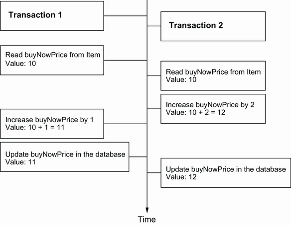
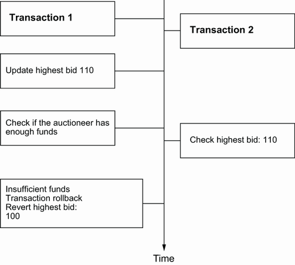
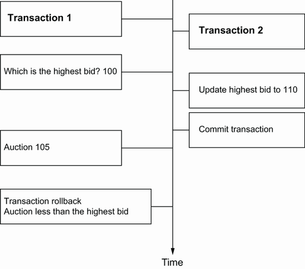
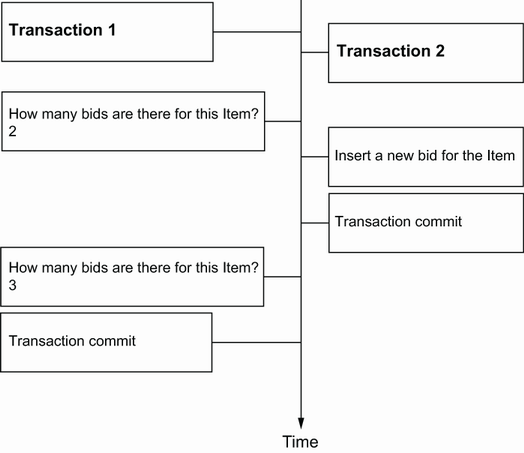
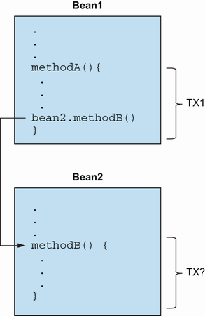

# Chương 11. Transaction và concurrency

> *Java Persistence with Spring Data and Hibernate* — Chương 11: “Transactions and concurrency”

**Nội dung chương này bao gồm**

- Định nghĩa những điều thiết yếu về database transaction và system transaction
- Điều khiển truy cập đồng thời với Hibernate và JPA
- Sử dụng truy cập dữ liệu phi giao dịch (non-transactional)
- Quản lý transaction với Spring và Spring Data

Trong chương này, cuối cùng chúng ta sẽ nói về transaction: cách chúng ta tạo và điều khiển các đơn vị công việc đồng thời trong một ứng dụng. Một đơn vị công việc là một nhóm thao tác nguyên tử, và transaction cho phép chúng ta đặt ranh giới cho đơn vị công việc và giúp chúng ta cô lập đơn vị công việc này khỏi đơn vị công việc khác. Trong ứng dụng đa người dùng, chúng ta cũng có thể xử lý những đơn vị công việc này một cách đồng thời.

Để xử lý tính đồng thời, trước hết chúng ta sẽ tập trung vào các đơn vị công việc ở mức thấp nhất: database transaction và system transaction. Bạn sẽ học các API phân định transaction và cách định nghĩa đơn vị công việc trong mã Java. Chúng tôi sẽ minh họa cách bảo toàn tính cô lập và điều khiển truy cập đồng thời bằng chiến lược bi quan (pessimistic) và lạc quan (optimistic). Kiến trúc tổng thể của hệ thống ảnh hưởng tới phạm vi của một transaction; một kiến trúc tồi có thể dẫn tới các transaction mong manh.

Sau đó chúng ta sẽ phân tích một số trường hợp đặc biệt và tính năng của JPA, dựa trên việc truy cập cơ sở dữ liệu mà không có transaction tường minh. Cuối cùng chúng tôi sẽ minh họa cách làm việc với transaction bằng Spring và Spring Data.

Hãy bắt đầu với một số thông tin nền.

> **Các tính năng mới quan trọng trong JPA 2**
>
> Có các lock mode và ngoại lệ mới cho pessimistic locking:
>
> - Bạn có thể đặt lock mode, bi quan hoặc lạc quan, trên một `Query`.
> - Bạn có thể đặt lock mode khi gọi `EntityManager#find()`, `refresh()` hay `lock()`. Một hint về lock timeout cho các lock mode bi quan cũng đã được chuẩn hóa.
>
> Khi `QueryTimeoutException` hoặc `LockTimeoutException` mới được ném ra, transaction không nhất thiết phải bị rollback.
>
> Persistence context giờ có thể ở chế độ unsynchronized với việc flush tự động bị tắt. Điều này cho phép chúng ta xếp hàng các sửa đổi cho tới khi tham gia một transaction và tách rời việc dùng `EntityManager` khỏi transaction.

## 11.1 Những điều thiết yếu về transaction

Chức năng của ứng dụng đòi hỏi nhiều việc phải được thực hiện trong một lần. Ví dụ, khi một phiên đấu giá kết thúc, ứng dụng CaveatEmptor phải thực hiện ba nhiệm vụ khác nhau:

1. Tìm bid thắng (số tiền cao nhất) cho mặt hàng đấu giá.
2. Tính phí đấu giá cho người bán mặt hàng.
3. Thông báo cho người bán và người trả giá thắng.

Điều gì xảy ra nếu chúng ta không thể tính phí đấu giá vì hệ thống thẻ tín dụng bên ngoài gặp sự cố? Yêu cầu nghiệp vụ có thể quy định rằng hoặc tất cả hành động liệt kê phải thành công, hoặc không hành động nào được thành công. Nếu vậy, chúng ta gọi những bước đó chung là một *transaction* hay một đơn vị công việc. Nếu chỉ một bước thất bại, toàn bộ đơn vị công việc phải thất bại.

### 11.1.1 Các thuộc tính ACID

ACID là viết tắt của atomicity (tính nguyên tử), consistency (tính nhất quán), isolation (tính cô lập), durability (tính bền vững). *Atomicity* là quan niệm rằng mọi thao tác trong một transaction được thực thi như một đơn vị nguyên tử. Hơn nữa, transaction cho phép nhiều người dùng làm việc đồng thời với cùng dữ liệu mà không phá vỡ tính nhất quán của dữ liệu (nhất quán với các quy tắc toàn vẹn của cơ sở dữ liệu). Một transaction cụ thể không nên nhìn thấy được với các transaction khác đang chạy đồng thời; chúng nên chạy trong sự cô lập. Các thay đổi thực hiện trong một transaction phải bền vững, ngay cả khi hệ thống gặp sự cố sau khi transaction đã hoàn tất thành công.

Ngoài ra, chúng ta muốn tính đúng đắn của một transaction. Ví dụ, quy tắc nghiệp vụ quy định rằng ứng dụng tính phí người bán một lần, không phải hai lần. Đây là giả định hợp lý, nhưng chúng ta có thể không diễn đạt được nó bằng ràng buộc cơ sở dữ liệu. Do đó, tính đúng đắn của một transaction là trách nhiệm của ứng dụng, trong khi tính nhất quán là trách nhiệm của cơ sở dữ liệu. Cùng nhau, các thuộc tính transaction này định nghĩa tiêu chí ACID.

### 11.1.2 Database transaction và system transaction

Chúng tôi cũng đã nhắc tới system transaction và database transaction. Hãy xét lại ví dụ trước: trong đơn vị công việc kết thúc một phiên đấu giá, chúng ta có thể đánh dấu bid thắng trong một hệ cơ sở dữ liệu. Rồi, trong cùng đơn vị công việc, chúng ta giao tiếp với một hệ thống bên ngoài để tính phí thẻ tín dụng của người bán. Đây là một transaction trải qua nhiều hệ thống, với các transaction con được phối hợp trên có thể nhiều tài nguyên, chẳng hạn một kết nối cơ sở dữ liệu và một bộ xử lý thanh toán bên ngoài. Chương này tập trung vào các transaction trải qua một hệ thống và một cơ sở dữ liệu.

Database transaction phải ngắn vì các transaction đang mở tiêu tốn tài nguyên cơ sở dữ liệu và có thể ngăn truy cập đồng thời do khóa độc quyền trên dữ liệu. Một database transaction đơn thường chỉ liên quan tới một lô thao tác cơ sở dữ liệu.

Để thực thi mọi thao tác cơ sở dữ liệu bên trong một system transaction, chúng ta phải đặt ranh giới cho đơn vị công việc đó. Chúng ta phải bắt đầu transaction và, tại một thời điểm nào đó, commit các thay đổi. Nếu có lỗi xảy ra (khi thực thi thao tác cơ sở dữ liệu hoặc khi commit transaction), chúng ta phải rollback các thay đổi để dữ liệu ở trạng thái nhất quán. Quá trình này định nghĩa *transaction demarcation* (phân định transaction) và, tùy kỹ thuật chúng ta dùng, có thể bao gồm việc định nghĩa thủ công các ranh giới transaction trong mã. Nói chung, ranh giới transaction bắt đầu và kết thúc một transaction có thể được đặt hoặc bằng chương trình trong mã ứng dụng, hoặc theo cách khai báo. Chúng tôi sẽ minh họa cả hai cách, tập trung vào transaction khai báo khi làm việc với Spring và Spring Data.

> **CHÚ Ý** Mọi ví dụ trong chương này đều hoạt động trong bất kỳ môi trường Java SE nào, không cần container runtime đặc biệt. Do đó, từ giờ bạn sẽ thấy mã phân định transaction bằng chương trình cho tới khi chúng ta chuyển sang các ví dụ ứng dụng Spring cụ thể.

Tiếp theo chúng ta sẽ tập trung vào khía cạnh phức tạp nhất của các thuộc tính ACID: cách bạn có thể cô lập các đơn vị công việc chạy đồng thời với nhau.

## 11.2 Điều khiển truy cập đồng thời

Cơ sở dữ liệu (và các hệ thống giao dịch khác) cố gắng bảo đảm tính cô lập transaction, nghĩa là từ góc nhìn của mỗi transaction đồng thời, có vẻ như không có transaction nào khác đang diễn ra. Theo truyền thống, các hệ cơ sở dữ liệu hiện thực tính cô lập bằng khóa (locking). Một transaction có thể đặt khóa trên một mục dữ liệu cụ thể trong cơ sở dữ liệu, tạm thời ngăn các transaction khác đọc và/hoặc ghi mục đó. Một số engine cơ sở dữ liệu hiện đại hiện thực tính cô lập transaction bằng multi-version concurrency control (MVCC), thứ mà các nhà cung cấp nhìn chung coi là dễ mở rộng hơn. Chúng ta sẽ phân tích tính cô lập giả định mô hình locking, nhưng hầu hết nhận xét cũng áp dụng được cho MVCC.

Cách cơ sở dữ liệu hiện thực kiểm soát đồng thời là cực kỳ quan trọng trong một ứng dụng Java Persistence. Ứng dụng có thể kế thừa các bảo đảm cô lập do hệ quản trị cơ sở dữ liệu cung cấp, nhưng các framework có thể nằm trên chúng và cho phép bạn bắt đầu, commit và rollback transaction theo cách trung lập với tài nguyên. Nếu bạn xét tới nhiều năm kinh nghiệm mà các nhà cung cấp cơ sở dữ liệu có trong việc hiện thực kiểm soát đồng thời, bạn sẽ thấy lợi thế của cách tiếp cận này. Ngoài ra, một số tính năng trong Java Persistence có thể cải thiện bảo đảm cô lập vượt xa những gì cơ sở dữ liệu cung cấp, hoặc vì bạn dùng các tính năng đó một cách tường minh, hoặc theo thiết kế.

Chúng ta sẽ bàn về kiểm soát đồng thời qua vài bước. Trước hết chúng ta sẽ khám phá tầng thấp nhất: các bảo đảm cô lập transaction do cơ sở dữ liệu cung cấp. Sau đó, bạn sẽ thấy các tính năng Java Persistence cho kiểm soát đồng thời bi quan và lạc quan ở mức ứng dụng, cùng các bảo đảm cô lập khác mà Hibernate có thể cung cấp.

### 11.2.1 Hiểu về concurrency ở mức cơ sở dữ liệu

Khi nói về tính cô lập, bạn có thể giả định rằng hai transaction hoặc được cô lập hoặc không. Khi nói về database transaction, tính cô lập hoàn toàn đi kèm cái giá rất cao. Bạn không thể “dừng thế giới” để truy cập dữ liệu độc quyền trong một hệ thống xử lý giao dịch trực tuyến (OLTP) đa người dùng. Do đó, có nhiều mức cô lập khả dụng, và tất nhiên chúng làm suy yếu tính cô lập hoàn toàn nhưng tăng hiệu năng và khả năng mở rộng của hệ thống.

> **Các vấn đề về cô lập transaction**

Trước hết, hãy xem xét vài vấn đề có thể xảy ra khi bạn làm suy yếu tính cô lập transaction hoàn toàn. Chuẩn ANSI SQL định nghĩa các mức cô lập transaction chuẩn theo việc hiện tượng nào được phép xảy ra.

Một *lost update* (mất cập nhật) xảy ra khi hai transaction đồng thời cùng lúc cập nhật cùng một thông tin trong cơ sở dữ liệu. Transaction thứ nhất đọc một giá trị. Transaction thứ hai bắt đầu ngay sau đó và đọc cùng giá trị. Transaction thứ nhất thay đổi và ghi giá trị đã cập nhật, và transaction thứ hai ghi đè giá trị đó bằng cập nhật của nó. Như vậy, cập nhật của transaction thứ nhất bị mất, bị transaction thứ hai ghi đè. *Lần commit cuối cùng thắng.* Điều này xảy ra trong các hệ thống không hiện thực kiểm soát đồng thời, nơi các transaction đồng thời không được cô lập. Xem hình 11.1. Field `buyNowPrice` được cập nhật từ hai transaction, nhưng chỉ một cập nhật xảy ra, cập nhật kia bị mất.



**Hình 11.1** Lost update: Hai transaction cập nhật cùng dữ liệu mà không có cô lập.

Một *dirty read* (đọc bẩn) xảy ra nếu transaction 2 đọc những thay đổi do transaction 1 thực hiện, mà transaction 1 chưa commit. Điều này nguy hiểm vì các thay đổi của transaction 1 có thể bị rollback sau đó, và transaction 2 sẽ đã đọc dữ liệu không hợp lệ. Xem hình 11.2.



**Hình 11.2** Dirty read: Transaction 2 đọc dữ liệu chưa commit từ Transaction 1.

Một *unrepeatable read* (đọc không lặp lại được) xảy ra nếu một transaction đọc cùng một mục dữ liệu hai lần và mỗi lần đọc ra trạng thái khác nhau. Ví dụ, một transaction khác có thể đã ghi vào mục dữ liệu đó và commit giữa hai lần đọc, như minh họa ở hình 11.3.



**Hình 11.3** Unrepeatable read: Bid cao nhất thay đổi trong khi Transaction 1 đang thực thi.

Một *phantom read* (đọc bóng ma) được cho là xảy ra khi một transaction thực thi một truy vấn hai lần, và kết quả thứ hai bao gồm dữ liệu không nhìn thấy trong kết quả thứ nhất vì có gì đó được thêm vào, hoặc nó chứa ít dữ liệu hơn vì có gì đó bị xóa. Điều này không nhất thiết phải là cùng một truy vấn chính xác. Một transaction khác chèn hoặc xóa dữ liệu giữa hai lần thực thi truy vấn gây ra tình huống này, như minh họa ở hình 11.4.



**Hình 11.4** Phantom read: Transaction 1 đọc dữ liệu mới trong truy vấn thứ hai.

Giờ bạn đã hiểu mọi điều tệ hại có thể xảy ra, chúng ta có thể định nghĩa các mức cô lập transaction và xem chúng ngăn được vấn đề nào.

> **Các mức cô lập ANSI**

Các mức cô lập chuẩn được định nghĩa bởi chuẩn ANSI SQL, nhưng chúng không đặc thù cho cơ sở dữ liệu SQL. Spring định nghĩa đúng những mức cô lập đó, và chúng ta sẽ dùng những mức này để khai báo tính cô lập transaction mong muốn. Với mức cô lập tăng dần đi kèm chi phí cao hơn và sự suy giảm nghiêm trọng về hiệu năng lẫn khả năng mở rộng:

- **Read uncommitted** — Một hệ thống không cho phép lost update hoạt động ở mức cô lập read uncommitted. Một transaction không được ghi vào một dòng nếu một transaction chưa commit khác đã ghi vào đó. Tuy nhiên, bất kỳ transaction nào cũng có thể đọc bất kỳ dòng nào. Một DBMS có thể hiện thực mức cô lập này bằng khóa ghi độc quyền.
- **Read committed** — Một hệ thống cho phép unrepeatable read và phantom read nhưng không cho phép lost update lẫn dirty read thì hiện thực mức cô lập read committed. Một DBMS có thể đạt được điều này bằng khóa đọc chia sẻ và khóa ghi độc quyền. Các transaction đọc không chặn transaction khác truy cập một dòng, nhưng một transaction ghi chưa commit thì chặn mọi transaction khác truy cập dòng đó.
- **Repeatable read** — Một hệ thống hoạt động ở chế độ cô lập repeatable read không cho phép lost update, dirty read hay unrepeatable read. Phantom read vẫn có thể xảy ra. Transaction đọc chặn transaction ghi nhưng không chặn transaction đọc khác, và transaction ghi chặn mọi transaction khác.
- **Serializable** — Mức cô lập nghiêm ngặt nhất, serializable, mô phỏng việc thực thi tuần tự như thể các transaction được thực thi lần lượt chứ không đồng thời. Một DBMS không thể hiện thực cô lập serializable chỉ bằng khóa mức dòng. Thay vào đó, DBMS phải cung cấp một cơ chế khác ngăn một dòng vừa chèn trở nên nhìn thấy được với một transaction đã thực thi một truy vấn lẽ ra sẽ trả về dòng đó. Một cơ chế thô sơ là khóa độc quyền toàn bộ table cơ sở dữ liệu sau khi ghi để không có phantom read nào xảy ra.

Bảng 11.1 tóm tắt các mức cô lập ANSI và những vấn đề chúng giải quyết.

**Bảng 11.1** Các mức cô lập ANSI và những vấn đề chúng giải quyết

| Mức cô lập | Phantom read | Unrepeatable read | Dirty read | Lost update |
| --- | --- | --- | --- | --- |
| `READ_UNCOMMITTED` | – | – | – | + |
| `READ_COMMITTED` | – | – | + | + |
| `REPEATABLE_READ` | – | + | + | + |
| `SERIALIZABLE` | + | + | + | + |

*(Dấu `+` nghĩa là vấn đề được ngăn chặn; dấu `–` nghĩa là vấn đề vẫn có thể xảy ra.)*

Cách một DBMS hiện thực hệ thống khóa của nó khác nhau đáng kể; mỗi nhà cung cấp có chiến lược riêng. Bạn nên nghiên cứu tài liệu của DBMS mình dùng để tìm hiểu thêm về hệ thống khóa, cách khóa được leo thang (từ mức dòng lên trang rồi lên toàn bộ table chẳng hạn), và mỗi mức cô lập ảnh hưởng thế nào tới hiệu năng và khả năng mở rộng của hệ thống.

Biết những thuật ngữ kỹ thuật này được định nghĩa thế nào thì hay đấy, nhưng điều đó giúp chúng ta chọn mức cô lập cho ứng dụng ra sao?

> **Chọn mức cô lập**

Lập trình viên (kể cả chúng tôi) thường không chắc nên dùng mức cô lập transaction nào trong một ứng dụng production. Mức cô lập quá cao gây hại cho khả năng mở rộng của ứng dụng có tính đồng thời cao. Cô lập không đủ có thể gây ra những lỗi tinh vi, khó tái hiện mà chúng ta chỉ phát hiện khi hệ thống chịu tải nặng.

Lưu ý rằng chúng tôi sẽ nhắc tới optimistic locking (với versioning) trong phần giải thích sau, một khái niệm được phân tích ở phần sau chương này. Bạn có thể muốn xem lại mục này khi cần chọn mức cô lập cho ứng dụng của mình. Xét cho cùng, việc chọn đúng mức cô lập phụ thuộc nhiều vào kịch bản cụ thể. Nội dung sau nên được đọc như khuyến nghị, không phải giáo điều khắc trên đá.

Hibernate cố gắng trong suốt hết mức có thể về mặt ngữ nghĩa giao dịch của cơ sở dữ liệu. Tuy nhiên, việc cache trong persistence context và versioning ảnh hưởng tới những ngữ nghĩa này. Vậy mức cô lập cơ sở dữ liệu hợp lý nào nên chọn trong một ứng dụng JPA?

Thứ nhất, với gần như mọi kịch bản, hãy loại bỏ mức cô lập read uncommitted. Việc cho phép thay đổi chưa commit của một transaction được dùng trong một transaction khác là cực kỳ nguy hiểm. Việc rollback hay thất bại của một transaction sẽ ảnh hưởng tới các transaction đồng thời khác. Việc rollback transaction thứ nhất có thể kéo theo các transaction khác, hoặc thậm chí khiến chúng để lại cơ sở dữ liệu ở trạng thái không đúng (người bán một mặt hàng đấu giá có thể bị tính phí hai lần — nhất quán với quy tắc toàn vẹn cơ sở dữ liệu nhưng không đúng). Có thể xảy ra việc thay đổi do một transaction cuối cùng bị rollback lại vẫn được commit vì chúng có thể được đọc rồi lan truyền bởi một transaction thành công khác! Bạn có thể dùng mức cô lập read uncommitted cho mục đích gỡ lỗi, để theo dõi việc thực thi các truy vấn insert dài, đưa ra ước lượng thô của các hàm tổng hợp (chẳng hạn `SUM(*)` hay `COUNT(*)`).

Thứ hai, hầu hết ứng dụng không cần cô lập serializable. Phantom read thường không gây vấn đề, và mức cô lập này thường mở rộng kém. Ít ứng dụng hiện có dùng cô lập serializable trong production; thay vào đó chúng dựa vào các khóa bi quan áp dụng có chọn lọc, hiệu quả buộc việc thực thi tuần tự các thao tác trong những tình huống nhất định.

Tiếp theo, hãy xét repeatable read. Mức này cung cấp khả năng tái tạo cho các tập kết quả truy vấn trong suốt thời gian của một database transaction. Nghĩa là chúng ta sẽ không đọc được các cập nhật đã commit từ cơ sở dữ liệu nếu truy vấn nó nhiều lần, nhưng phantom read vẫn có thể xảy ra: các dòng mới có thể xuất hiện, và những dòng chúng ta tưởng tồn tại có thể biến mất nếu một transaction khác commit thay đổi đồng thời. Mặc dù đôi khi chúng ta muốn repeatable read, thường thì chúng ta không cần nó trong mọi transaction.

Đặc tả JPA giả định rằng read committed là mức cô lập mặc định. Nghĩa là chúng ta phải xử lý unrepeatable read và phantom read.

Hãy giả sử chúng ta bật versioning cho các entity của domain model, thứ mà Hibernate có thể làm tự động cho chúng ta. Sự kết hợp giữa cache của persistence context (bắt buộc) và versioning đã mang lại cho chúng ta hầu hết các tính năng hay của cô lập repeatable read. Cache của persistence context bảo đảm rằng trạng thái của các instance entity nạp bởi một transaction được cô lập khỏi thay đổi do transaction khác thực hiện. Nếu chúng ta truy xuất cùng một instance entity hai lần trong một đơn vị công việc, lần tra cứu thứ hai sẽ được phân giải trong cache của persistence context và không truy cập cơ sở dữ liệu. Do đó lần đọc của chúng ta lặp lại được, và chúng ta sẽ không thấy dữ liệu đã commit gây xung đột. (Tuy nhiên chúng ta vẫn có thể gặp phantom read, thường dễ xử lý hơn nhiều.) Ngoài ra, versioning chuyển sang *lần commit đầu tiên thắng*. Do đó, với gần như mọi ứng dụng JPA đa người dùng, cô lập read committed cho tất cả database transaction là chấp nhận được khi bật entity versioning.

Hibernate giữ nguyên mức cô lập của kết nối cơ sở dữ liệu; nó không thay đổi mức đó. Hầu hết sản phẩm mặc định dùng cô lập read committed, dù MySQL mặc định là repeatable read. Có vài cách để thay đổi mức cô lập transaction mặc định hoặc thiết lập của transaction hiện tại.

Trước hết, chúng ta có thể kiểm tra xem DBMS có thiết lập mức cô lập transaction toàn cục trong cấu hình riêng của nó hay không. Nếu DBMS hỗ trợ câu lệnh SQL chuẩn `SET SESSION CHARACTERISTICS`, chúng ta có thể thực thi nó để đặt thiết lập transaction cho mọi transaction bắt đầu trong phiên cơ sở dữ liệu này (nghĩa là một kết nối cụ thể tới cơ sở dữ liệu, không phải một `Session` của Hibernate). SQL cũng chuẩn hóa cú pháp `SET TRANSACTION`, thứ đặt mức cô lập của transaction hiện tại. Cuối cùng, API `Connection` của JDBC cung cấp phương thức `setTransactionIsolation()`, thứ (theo tài liệu của nó) “cố thay đổi mức cô lập transaction cho kết nối này”. Trong một ứng dụng Hibernate/JPA, chúng ta có thể lấy một `Connection` JDBC từ API native `Session`.

Thông thường, các kết nối cơ sở dữ liệu mặc định ở mức cô lập read committed. Thỉnh thoảng, một đơn vị công việc cụ thể trong ứng dụng có thể cần mức cô lập khác, thường là nghiêm ngặt hơn. Thay vì thay đổi mức cô lập của toàn bộ transaction, chúng ta nên dùng Jakarta Persistence API để lấy thêm khóa trên dữ liệu liên quan. Việc khóa mịn này dễ mở rộng hơn trong ứng dụng có tính đồng thời cao. JPA cung cấp kiểm tra phiên bản lạc quan và khóa bi quan ở mức cơ sở dữ liệu.

### 11.2.2 Kiểm soát đồng thời lạc quan (optimistic)

Xử lý tính đồng thời theo cách lạc quan là phù hợp khi các sửa đổi đồng thời hiếm khi xảy ra và việc phát hiện xung đột muộn trong một đơn vị công việc là khả thi. JPA cung cấp kiểm tra phiên bản tự động như một thủ tục phát hiện xung đột lạc quan.

Các mục trước hơi khô khan; đã đến lúc xem mã. Trước hết chúng ta sẽ bật versioning, vì mặc định nó bị tắt. Hầu hết ứng dụng đa người dùng, đặc biệt ứng dụng web, nên dựa vào versioning cho mọi instance `@Entity` bị sửa đổi đồng thời, cho phép cơ chế thân thiện hơn với người dùng là *lần commit đầu tiên thắng*.

Sau khi bật kiểm tra phiên bản tự động, chúng ta sẽ xem kiểm tra phiên bản thủ công hoạt động thế nào và khi nào phải dùng nó.

> **CHÚ Ý** Để có thể thực thi các ví dụ từ mã nguồn, trước tiên bạn cần chạy script Ch11.sql.

> **Bật versioning**

Chúng ta có thể bật versioning bằng annotation `@Version` trên một property bổ sung đặc biệt của entity class, như minh họa sau.

**Listing 11.1** Bật versioning trên một entity đã ánh xạ

*Đường dẫn: Ch11/transactions/src/main/java/com/manning/javapersistence/ch11/concurrency/Item.java*

```java
@Entity
public class Item {
    @Version
    private long version;
    // . . .
}
```

Trong ví dụ này, mỗi instance entity mang một phiên bản dạng số. Nó được ánh xạ tới một cột bổ sung của table `ITEM`; như thường lệ, tên cột mặc định theo tên property, ở đây là `VERSION`. Tên thực tế của property và cột không quan trọng — chúng ta có thể đổi tên nếu `VERSION` là từ khóa dành riêng trong DBMS.

Chúng ta có thể thêm phương thức `getVersion()` vào class, nhưng không nên có phương thức setter, và ứng dụng không nên sửa giá trị này. Hibernate tự động thay đổi giá trị phiên bản: nó tăng số phiên bản mỗi khi một instance `Item` được phát hiện là dirty khi flush persistence context. Phiên bản là một bộ đếm đơn giản không mang ngữ nghĩa hữu ích nào ngoài kiểm soát đồng thời. Chúng ta có thể dùng `int`, `Integer`, `short`, `Short` hay `Long` thay vì `long`; Hibernate sẽ quay vòng và bắt đầu lại từ 0 nếu số phiên bản đạt giới hạn của kiểu dữ liệu.

Sau khi tăng số phiên bản của một `Item` bị phát hiện là dirty trong lúc flush, Hibernate so sánh phiên bản khi thực thi câu lệnh SQL `UPDATE` và `DELETE`. Ví dụ, giả sử trong một đơn vị công việc chúng ta nạp một `Item` và đổi tên nó, như sau.

**Listing 11.2** Hibernate tự động tăng và kiểm tra phiên bản

*Đường dẫn: /Ch11/transactions/src/test/java/com/manning/javapersistence/ch11/concurrency/Versioning.java – firstCommitWins()*

```java
EntityManager em1 = emf.createEntityManager();
em1.getTransaction().begin();

Item item = em1.find(Item.class, ITEM_ID);                       // Ⓐ
// select * from ITEM where ID = ?
assertEquals(0, item.getVersion());                              // Ⓑ
item.setName("New Name");
// . . . Another transaction changes the record
assertThrows(OptimisticLockException.class, () -> em1.flush());  // Ⓒ
// update ITEM set NAME = ?, VERSION = 1 where ID = ? and VERSION = 0
```

Ⓐ Việc truy xuất một instance entity theo định danh sẽ nạp phiên bản hiện tại từ cơ sở dữ liệu bằng một lệnh `SELECT`.

Ⓑ Phiên bản hiện tại của instance `Item` là `0`.

Ⓒ Khi persistence context được flush, Hibernate phát hiện instance `Item` dirty và tăng phiên bản của nó lên `1`. Lệnh SQL `UPDATE` giờ thực hiện kiểm tra phiên bản, lưu phiên bản mới vào cơ sở dữ liệu, nhưng chỉ khi phiên bản trong cơ sở dữ liệu vẫn là `0`.

Hãy chú ý các câu lệnh SQL, đặc biệt là lệnh `UPDATE` và mệnh đề `WHERE` của nó. Lệnh update này sẽ chỉ thành công nếu có một dòng với `VERSION = 0` trong cơ sở dữ liệu. JDBC trả về số dòng được cập nhật cho Hibernate; nếu kết quả đó là 0, nghĩa là dòng `ITEM` hoặc đã biến mất hoặc không còn phiên bản `0` nữa. Hibernate phát hiện xung đột này khi flush, và một `javax.persistence.OptimisticLockException` được ném ra.

Giờ hãy hình dung hai người dùng thực thi đơn vị công việc này cùng lúc, như đã thấy ở hình 11.1. Người dùng commit trước sẽ cập nhật tên của `Item` và flush phiên bản `1` đã tăng xuống cơ sở dữ liệu. Việc flush (và commit) của người dùng thứ hai sẽ thất bại vì lệnh `UPDATE` của họ không tìm thấy dòng trong cơ sở dữ liệu với phiên bản `0`. Phiên bản trong cơ sở dữ liệu là `1`. Do đó, *lần commit đầu tiên thắng*, và chúng ta có thể bắt `OptimisticLockException` để xử lý riêng. Ví dụ, chúng ta có thể hiển thị thông báo sau cho người dùng thứ hai: “Dữ liệu bạn đang làm việc đã bị người khác sửa đổi. Vui lòng bắt đầu lại đơn vị công việc với dữ liệu mới. Nhấn nút Restart để tiếp tục.”

Những sửa đổi nào kích hoạt việc tăng phiên bản của một entity? Hibernate tăng phiên bản mỗi khi một instance entity là dirty. Điều này bao gồm mọi property kiểu value type dirty của entity, bất kể chúng là đơn trị (như property `String` hay `int`), embedded (như `Address`), hay collection. Ngoại lệ là các collection association `@OneToMany` và `@ManyToMany` đã được làm chỉ đọc bằng `mappedBy`. Việc thêm hay xóa phần tử trong những collection này không tăng số phiên bản của instance entity sở hữu. Bạn nên biết rằng không điều nào trong số này được chuẩn hóa trong JPA — đừng trông cậy rằng hai JPA provider sẽ hiện thực cùng quy tắc khi truy cập một cơ sở dữ liệu dùng chung.

Nếu chúng ta không muốn tăng phiên bản của instance entity khi giá trị của một property cụ thể thay đổi, chúng ta có thể đánh dấu property đó bằng `@org.hibernate.annotations.OptimisticLock(excluded = true)`.

Có thể bạn không thích cột `VERSION` bổ sung trong schema cơ sở dữ liệu. Ngoài ra, bạn có thể đã có sẵn một property timestamp “cập nhật lần cuối” trên entity class và một cột cơ sở dữ liệu tương ứng. Hibernate có thể kiểm tra phiên bản bằng timestamp thay vì dùng field đếm bổ sung.

> **Versioning với cơ sở dữ liệu dùng chung**
>
> Nếu nhiều ứng dụng truy cập cơ sở dữ liệu và không phải tất cả đều dùng thuật toán versioning của Hibernate, chúng ta sẽ gặp vấn đề đồng thời. Một giải pháp dễ dàng là dùng trigger và stored procedure ở mức cơ sở dữ liệu: một trigger `INSTEAD OF` có thể thực thi một stored procedure khi có bất kỳ lệnh `UPDATE` nào; nó chạy thay cho lệnh update. Trong thủ tục, chúng ta có thể kiểm tra xem ứng dụng có tăng phiên bản của dòng hay không; nếu phiên bản không được cập nhật hoặc cột phiên bản không nằm trong lệnh update, chúng ta biết câu lệnh không do một ứng dụng Hibernate gửi. Khi đó chúng ta có thể tăng phiên bản trong thủ tục trước khi áp dụng lệnh `UPDATE`.

> **Versioning với timestamp**

Nếu schema cơ sở dữ liệu đã chứa một cột timestamp như `LASTUPDATED` hay `MODIFIED_ON`, chúng ta có thể ánh xạ nó cho việc kiểm tra phiên bản tự động thay vì dùng bộ đếm số.

**Listing 11.3** Bật versioning bằng timestamp

*Đường dẫn: Ch11/transactions2/src/main/java/com/manning/javapersistence/ch11/timestamp/Item.java*

```java
@Entity
public class Item {
    @Version
    // Optional: @org.hibernate.annotations.Type(type = "dbtimestamp")
    private LocalDateTime lastUpdated;
    // . . .
}
```

Ví dụ này ánh xạ cột `LASTUPDATED` tới một property `java.time.LocalDateTime`; kiểu `Date` hay `Calendar` cũng sẽ hoạt động với Hibernate. Chuẩn JPA không định nghĩa những kiểu này cho property phiên bản; JPA chỉ coi `java.sql.Timestamp` là khả chuyển. Điều này kém hấp dẫn hơn, vì chúng ta sẽ phải import class JDBC đó vào domain model. Chúng ta nên cố giữ các chi tiết hiện thực như JDBC ra khỏi các class của domain model để chúng có thể được kiểm thử, khởi tạo, serialize và deserialize trong càng nhiều môi trường càng tốt.

Về lý thuyết, versioning bằng timestamp hơi kém an toàn hơn, vì hai transaction đồng thời có thể cùng nạp và cập nhật cùng một `Item` trong cùng một mili-giây; điều này trầm trọng hơn bởi thực tế là một JVM thường không có độ chính xác mili-giây (bạn nên kiểm tra tài liệu JVM và hệ điều hành của mình để biết độ chính xác được bảo đảm). Hơn nữa, việc lấy thời gian hiện tại từ JVM không nhất thiết an toàn trong môi trường phân cụm, nơi thời gian hệ thống của các node có thể không đồng bộ, hoặc việc đồng bộ thời gian không chính xác như bạn cần cho tải giao dịch của mình.

Bạn có thể chuyển sang lấy thời gian hiện tại từ máy cơ sở dữ liệu bằng cách đặt annotation `@org.hibernate.annotations.Type(type="dbtimestamp")` trên property phiên bản. Hibernate giờ sẽ hỏi cơ sở dữ liệu về thời gian hiện tại trước khi cập nhật, mang lại một nguồn thời gian duy nhất để đồng bộ. Không phải mọi SQL dialect của Hibernate đều hỗ trợ điều này, nên hãy kiểm tra mã nguồn của dialect đã cấu hình. Ngoài ra, luôn có overhead của việc truy cập cơ sở dữ liệu cho mỗi lần tăng.

Chúng tôi khuyến nghị các dự án mới dựa vào versioning bằng bộ đếm số, không dùng timestamp. Nếu bạn làm việc với một schema cơ sở dữ liệu cũ hoặc các class Java có sẵn, có thể không thể đưa vào một property và cột phiên bản hay timestamp. Nếu vậy, Hibernate cung cấp một chiến lược thay thế.

> **Versioning không cần số phiên bản hay timestamp**

Nếu bạn không có cột phiên bản hay timestamp, Hibernate vẫn có thể thực hiện versioning tự động. Hiện thực thay thế này của versioning kiểm tra trạng thái cơ sở dữ liệu hiện tại so với các giá trị chưa sửa đổi của những persistent property tại thời điểm Hibernate truy xuất instance entity (hoặc lần cuối persistence context được flush).

Bạn có thể bật chức năng này bằng annotation riêng của Hibernate `@org.hibernate.annotations.OptimisticLocking`:

*Đường dẫn: Ch11/transactions3/src/main/java/com/manning/javapersistence/ch11/versionall/Item.java*

```java
@Entity
@org.hibernate.annotations.OptimisticLocking(
    type = org.hibernate.annotations.OptimisticLockType.ALL)
@org.hibernate.annotations.DynamicUpdate
public class Item {
    // . . .
}
```

Với chiến lược này, bạn cũng phải bật việc sinh SQL động cho câu lệnh `UPDATE`, dùng `@org.hibernate.annotations.DynamicUpdate`, như đã giải thích ở mục 5.3.2.

Hibernate giờ thực thi SQL sau để flush một sửa đổi trên instance `Item`:

```sql
update ITEM set NAME = 'New Name'
    where ID = 123
        and NAME = 'Old Name'
        and PRICE = '9.99'
        and DESCRIPTION = 'Some item for auction'
        and ...
        and SELLER_ID = 45
```

Hibernate liệt kê mọi cột và giá trị được biết cuối cùng của chúng trong mệnh đề `WHERE`. Nếu bất kỳ transaction đồng thời nào đã sửa bất kỳ giá trị nào trong số này hoặc thậm chí xóa dòng, câu lệnh này trả về với 0 dòng được cập nhật. Hibernate khi đó ném một ngoại lệ lúc flush.

Ngoài ra, Hibernate chỉ đưa các property đã sửa đổi vào ràng buộc (chỉ `NAME` trong ví dụ này) nếu bạn chuyển sang `OptimisticLockType.DIRTY`. Nghĩa là hai đơn vị công việc có thể sửa cùng một `Item` đồng thời, và Hibernate chỉ phát hiện xung đột nếu cả hai cùng sửa cùng một property kiểu value type (hoặc một giá trị foreign key). Mệnh đề `WHERE` của đoạn SQL trên sẽ rút gọn thành `where ID = 123 and NAME = 'Old Name'`. Người khác có thể sửa giá đồng thời, và Hibernate sẽ không phát hiện xung đột nào. Chỉ khi ứng dụng sửa tên một cách đồng thời thì chúng ta mới nhận `javax.persistence.OptimisticLockException`.

Trong hầu hết trường hợp, việc chỉ kiểm tra các property dirty không phải chiến lược tốt cho các business entity. Có lẽ không ổn khi đổi giá của một item nếu mô tả thay đổi! Chiến lược này cũng không hoạt động với entity detached và merging: nếu chúng ta merge một entity detached vào một persistence context mới, các giá trị “cũ” không được biết. Instance entity detached sẽ phải mang một số phiên bản hoặc timestamp để kiểm soát đồng thời lạc quan.

Versioning tự động trong Java Persistence ngăn lost update khi hai transaction đồng thời cố commit sửa đổi trên cùng một mẩu dữ liệu. Versioning cũng có thể giúp chúng ta có thêm bảo đảm cô lập một cách thủ công khi cần.

> **Kiểm tra phiên bản thủ công**

Đây là một kịch bản cần đọc lặp lại được ở cơ sở dữ liệu: hãy hình dung có một số category trong hệ thống đấu giá và mỗi `Item` nằm trong một `Category`. Đây là một ánh xạ `@ManyToOne` thông thường của entity association `Item#category`.

Giả sử bạn muốn tính tổng giá của tất cả item trong vài category. Việc này cần một truy vấn cho tất cả item trong mỗi category, để cộng dồn giá. Vấn đề là, điều gì xảy ra nếu ai đó chuyển một `Item` từ `Category` này sang `Category` khác trong khi bạn vẫn đang truy vấn và duyệt qua tất cả category và item? Với cô lập read-committed, cùng một `Item` có thể xuất hiện hai lần trong khi thủ tục của bạn chạy!

Để làm cho các lần đọc “lấy item trong mỗi category” lặp lại được, interface `Query` của JPA có phương thức `setLockMode()`. Hãy xem thủ tục ở listing sau.

**Listing 11.4** Yêu cầu kiểm tra phiên bản lúc flush để bảo đảm đọc lặp lại được

*Đường dẫn: /Ch11/transactions/src/test/java/com/manning/javapersistence/ch11/concurrency/Versioning.java – manualVersionChecking()*

```java
EntityManager em = emf.createEntityManager();
em.getTransaction().begin();

BigDecimal totalPrice = BigDecimal.ZERO;
for (Long categoryId : CATEGORIES) {
    List<Item> items =                                                    // Ⓐ
        em.createQuery("select i from Item i where i.category.id = :catId",
                       Item.class)
            .setLockMode(LockModeType.OPTIMISTIC)
            .setParameter("catId", categoryId)
            .getResultList();
    for (Item item : items)
        totalPrice = totalPrice.add(item.getBuyNowPrice());
}
em.getTransaction().commit();                                             // Ⓑ
em.close();
assertEquals("108.00", totalPrice.toString());
```

Ⓐ Với mỗi `Category`, truy vấn tất cả instance `Item` với lock mode `OPTIMISTIC`. Hibernate giờ biết nó phải kiểm tra mỗi `Item` lúc flush.

Ⓑ Với mỗi `Item` nạp trước đó bằng truy vấn có khóa, Hibernate thực thi một lệnh `SELECT` khi flush. Nó kiểm tra xem phiên bản trong cơ sở dữ liệu của mỗi dòng `ITEM` có còn giống như lúc nạp hay không. Nếu bất kỳ dòng `ITEM` nào có phiên bản khác hoặc dòng không còn tồn tại, một `OptimisticLockException` sẽ được ném ra.

Đừng để thuật ngữ locking làm bạn nhầm lẫn: Đặc tả JPA để ngỏ cách mỗi `LockModeType` được hiện thực. Với `OPTIMISTIC`, Hibernate thực hiện kiểm tra phiên bản; không có khóa thực sự nào liên quan. Chúng ta sẽ phải bật versioning trên entity class `Item` như đã giải thích ở trên; nếu không, chúng ta không thể dùng các `LockModeType` lạc quan với Hibernate.

Hibernate không gom lô hay tối ưu các câu lệnh `SELECT` cho việc kiểm tra phiên bản thủ công; nếu chúng ta cộng dồn 100 item, chúng ta sẽ có thêm 100 truy vấn lúc flush. Một cách tiếp cận bi quan, như chúng tôi sẽ minh họa ở phần sau chương này, có thể là giải pháp tốt hơn cho trường hợp cụ thể này.

> **Tại sao cache của persistence context không ngăn được vấn đề sửa đổi đồng thời?**
>
> Truy vấn “lấy tất cả item trong một category cụ thể” trả về dữ liệu item trong một `ResultSet`. Hibernate sau đó nhìn vào các giá trị primary key trong dữ liệu này và trước hết cố phân giải phần còn lại của chi tiết mỗi `Item` trong cache của persistence context — nó kiểm tra xem một instance `Item` đã được nạp với định danh đó hay chưa.
>
> Tuy nhiên, cache này không giúp được trong ví dụ thủ tục: nếu một transaction đồng thời chuyển một item sang category khác, item đó có thể được trả về nhiều lần trong các `ResultSet` khác nhau. Hibernate sẽ tra cứu persistence context của mình và nói: “Ồ, mình đã nạp instance `Item` đó rồi; hãy dùng cái đang có trong bộ nhớ.” Hibernate thậm chí không nhận biết rằng category gán cho item đã thay đổi hay item lại xuất hiện trong một kết quả khác.
>
> Do đó, đây là trường hợp mà tính năng repeatable-read của persistence context che giấu dữ liệu đã commit đồng thời. Chúng ta cần kiểm tra phiên bản thủ công để biết dữ liệu có thay đổi hay không trong khi chúng ta kỳ vọng nó không đổi.

Như đã thấy ở ví dụ trên, interface `Query` chấp nhận một `LockModeType`. Các lock mode tường minh cũng được interface `TypedQuery` và `NamedQuery` hỗ trợ, với cùng phương thức `setLockMode()`.

Có thêm một optimistic lock mode nữa trong JPA, buộc tăng phiên bản của một entity.

> **Buộc tăng phiên bản**

Điều gì xảy ra nếu hai người dùng đặt bid cho cùng một mặt hàng đấu giá cùng lúc? Khi một người dùng đặt bid mới, ứng dụng phải làm hai việc:

1. Truy xuất `Bid` cao nhất hiện tại cho `Item` từ cơ sở dữ liệu.
2. So sánh `Bid` mới với `Bid` cao nhất; nếu `Bid` mới cao hơn, nó phải được lưu vào cơ sở dữ liệu.

Có khả năng xảy ra race condition giữa hai bước này. Nếu, giữa lúc đọc `Bid` cao nhất và đặt `Bid` mới, một `Bid` khác được đặt, bạn sẽ không thấy nó. Xung đột này không nhìn thấy được, và ngay cả việc bật versioning cho `Item` cũng không giúp được. `Item` không bao giờ bị sửa đổi trong thủ tục này. Tuy nhiên, việc buộc tăng phiên bản của `Item` khiến xung đột trở nên phát hiện được.

**Listing 11.5** Buộc tăng phiên bản của một instance entity

*Đường dẫn: /Ch11/transactions/src/test/java/com/manning/javapersistence/ch11/concurrency/Versioning.java – forceIncrement()*

```java
EntityManager em = emf.createEntityManager();
em.getTransaction().begin();

Item item = em.find(                                              // Ⓐ
    Item.class,
    ITEM_ID,
    LockModeType.OPTIMISTIC_FORCE_INCREMENT
);
Bid highestBid = queryHighestBid(em, item);
// . . . Another transaction changes the record
Bid newBid = new Bid(
        new BigDecimal("45.45"),
        item,
        highestBid);
em.persist(newBid);                                               // Ⓑ
assertThrows(RollbackException.class,
                        () -> em.getTransaction().commit());      // Ⓒ
em.close();
```

Ⓐ `find()` chấp nhận một `LockModeType`. Chế độ `OPTIMISTIC_FORCE_INCREMENT` bảo Hibernate rằng phiên bản của `Item` được truy xuất nên được tăng sau khi nạp, ngay cả khi nó không bao giờ bị sửa đổi trong đơn vị công việc.

Ⓑ Đoạn mã lưu một instance `Bid` mới; việc này không ảnh hưởng tới giá trị nào của instance `Item`. Một dòng mới được chèn vào table `BID`. Hibernate sẽ không phát hiện các bid đặt đồng thời nếu không buộc tăng phiên bản của `Item`.

Ⓒ Khi flush persistence context, Hibernate thực thi một lệnh `INSERT` cho `Bid` mới và buộc một lệnh `UPDATE` cho `Item` kèm kiểm tra phiên bản. Nếu ai đó sửa `Item` đồng thời hoặc đặt một `Bid` đồng thời với thủ tục này, Hibernate ném một ngoại lệ.

Với hệ thống đấu giá, việc đặt bid đồng thời chắc chắn là thao tác thường xuyên. Việc tăng phiên bản thủ công hữu ích trong nhiều tình huống khi chúng ta chèn hoặc sửa dữ liệu và muốn phiên bản của một instance gốc nào đó trong một aggregate được tăng.

Lưu ý rằng nếu thay vì entity association `Bid#item` với `@ManyToOne`, chúng ta có một `@ElementCollection` `Item#bids`, thì việc thêm một `Bid` vào collection sẽ tăng phiên bản của `Item`. Khi đó việc buộc tăng là không cần thiết. Bạn có thể muốn xem lại phần thảo luận về sự mơ hồ cha/con cùng cách aggregate và composition hoạt động với ORM ở mục 8.3.

Cho tới giờ, chúng ta đã tập trung vào kiểm soát đồng thời lạc quan: chúng ta kỳ vọng rằng các sửa đổi đồng thời hiếm gặp, nên chúng ta không ngăn truy cập đồng thời và phát hiện xung đột muộn. Tuy nhiên, đôi khi chúng ta biết rằng xung đột sẽ xảy ra thường xuyên, và muốn đặt khóa độc quyền trên một số dữ liệu. Điều này đòi hỏi cách tiếp cận bi quan.

### 11.2.3 Pessimistic locking tường minh

Hãy lặp lại thủ tục đã minh họa ở mục “Kiểm tra phiên bản thủ công” trước đó, nhưng lần này với khóa bi quan thay vì kiểm tra phiên bản lạc quan. Chúng ta lại tính tổng giá của tất cả item trong vài category. Đây là cùng đoạn mã như ở listing 11.5 nhưng với `LockModeType` khác.

**Listing 11.6** Khóa dữ liệu theo cách bi quan

*Đường dẫn: /Ch11/transactions/src/test/java/com/manning/javapersistence/ch11/concurrency/Locking.java – pessimisticReadWrite()*

```java
EntityManager em = emf.createEntityManager();
em.getTransaction().begin();

BigDecimal totalPrice = BigDecimal.ZERO;
for (Long categoryId : CATEGORIES) {
    List<Item> items =                                                    // Ⓐ
        em.createQuery("select i from Item i where i.category.id = :catId",
                       Item.class)
            .setLockMode(LockModeType.PESSIMISTIC_READ)
            .setHint("javax.persistence.lock.timeout", 5000)
            .setParameter("catId", categoryId)
            .getResultList();
    for (Item item : items)                                               // Ⓑ
        totalPrice = totalPrice.add(item.getBuyNowPrice());
    // . . . Another transaction tries to obtain a lock and fails
}
em.getTransaction().commit();                                             // Ⓒ
em.close();
assertEquals(0, totalPrice.compareTo(new BigDecimal("108")));
```

Ⓐ Với mỗi `Category`, truy vấn tất cả instance `Item` ở lock mode `PESSIMISTIC_READ`. Hibernate khóa các dòng trong cơ sở dữ liệu bằng truy vấn SQL. Nếu một transaction khác đang giữ khóa xung đột, hãy chờ 5 giây nếu có thể. Nếu không lấy được khóa, truy vấn ném một ngoại lệ.

Ⓑ Nếu truy vấn trả về thành công, chúng ta biết mình đang giữ khóa độc quyền trên dữ liệu, và không transaction nào khác có thể truy cập nó bằng khóa độc quyền hay sửa đổi nó cho tới khi transaction này commit.

Ⓒ Các khóa được giải phóng sau khi commit, khi transaction hoàn tất.

Đặc tả JPA định nghĩa rằng lock mode `PESSIMISTIC_READ` bảo đảm đọc lặp lại được. JPA cũng chuẩn hóa chế độ `PESSIMISTIC_WRITE`, với bảo đảm bổ sung: ngoài đọc lặp lại được, JPA provider phải tuần tự hóa việc truy cập dữ liệu, và không có phantom read nào xảy ra.

Việc hiện thực các yêu cầu này là tùy thuộc vào JPA provider. Với cả hai chế độ, Hibernate thêm mệnh đề `FOR UPDATE` vào truy vấn SQL khi nạp dữ liệu. Điều này đặt một khóa trên các dòng ở mức cơ sở dữ liệu. Loại khóa mà Hibernate dùng phụ thuộc vào `LockModeType` và database dialect của Hibernate:

- Trên H2, truy vấn là `SELECT * FROM ITEM ... FOR UPDATE`. Vì H2 chỉ hỗ trợ một loại khóa độc quyền, Hibernate sinh cùng SQL cho mọi chế độ bi quan.
- PostgreSQL, mặt khác, hỗ trợ khóa đọc chia sẻ: chế độ `PESSIMISTIC_READ` thêm `FOR SHARE` vào truy vấn SQL. `PESSIMISTIC_WRITE` dùng khóa ghi độc quyền với `FOR UPDATE`.
- Trên MySQL, `PESSIMISTIC_READ` dịch thành `LOCK IN SHARE MODE`, và `PESSIMISTIC_WRITE` thành `FOR UPDATE`.

Hãy kiểm tra database dialect của bạn. Khóa được cấu hình bằng các phương thức `getReadLockString()` và `getWriteLockString()`.

Thời lượng của một khóa bi quan trong JPA là một database transaction duy nhất. Nghĩa là chúng ta không thể dùng khóa độc quyền để chặn truy cập đồng thời lâu hơn một database transaction. Khi không lấy được khóa cơ sở dữ liệu, một ngoại lệ được ném ra.

Hãy so sánh điều này với cách tiếp cận lạc quan, nơi Hibernate ném ngoại lệ lúc commit chứ không phải khi bạn truy vấn. Với chiến lược bi quan, chúng ta biết mình có thể đọc và ghi dữ liệu an toàn ngay khi truy vấn có khóa thành công. Với cách tiếp cận lạc quan, chúng ta hy vọng điều tốt nhất và có thể bị bất ngờ về sau, khi commit.

> **Offline lock**
>
> Các khóa bi quan ở cơ sở dữ liệu chỉ được giữ trong một transaction duy nhất. Các hiện thực khóa khác cũng khả thi: chẳng hạn, một khóa giữ trong bộ nhớ, hoặc một “lock table” trong cơ sở dữ liệu. Tên gọi chung cho những loại khóa này là *offline lock*.
>
> Việc khóa bi quan lâu hơn một database transaction thường là nút thắt cổ chai về hiệu năng: mọi lượt truy cập dữ liệu đều bao gồm kiểm tra khóa bổ sung tới một lock manager được đồng bộ toàn cục. Tuy nhiên, optimistic locking là chiến lược kiểm soát đồng thời hoàn hảo cho các cuộc hội thoại chạy dài (như bạn sẽ thấy ở chương sau), và nó có hiệu năng tốt. Tùy thuộc vào chiến lược giải quyết xung đột — thứ quyết định điều gì xảy ra sau khi phát hiện xung đột — người dùng ứng dụng có thể hài lòng với optimistic locking chẳng kém gì với việc chặn truy cập đồng thời. Họ cũng có thể đánh giá cao việc ứng dụng không khóa họ khỏi những màn hình cụ thể trong khi người khác đang xem cùng dữ liệu.

Chúng ta có thể cấu hình cơ sở dữ liệu sẽ chờ bao lâu để lấy khóa và chặn truy vấn, tính bằng mili-giây, với hint `javax.persistence.lock.timeout`. Như thường lệ với hint, Hibernate có thể bỏ qua nó tùy sản phẩm cơ sở dữ liệu. H2 chẳng hạn không hỗ trợ lock timeout cho từng truy vấn cụ thể, chỉ có lock timeout toàn cục cho kết nối (mặc định 1 giây). Với một số dialect, chẳng hạn PostgreSQL và Oracle, lock timeout bằng 0 sẽ thêm mệnh đề `NOWAIT` vào chuỗi SQL.

Chúng ta đã minh họa hint lock timeout áp dụng cho một `Query`. Chúng ta cũng có thể đặt hint timeout cho thao tác `find()`:

*Đường dẫn: /Ch11/transactions/src/test/java/com/manning/javapersistence/ch11/concurrency/Locking.java – findLock()*

```java
EntityManager em = emf.createEntityManager();
em.getTransaction().begin();

Map<String, Object> hints = new HashMap<>();
hints.put("javax.persistence.lock.timeout", 5000);

Category category =                     // Ⓐ
        em.find(
                Category.class,
                CATEGORY_ID,
                LockModeType.PESSIMISTIC_WRITE,
                hints
        );

category.setName("New Name");

em.getTransaction().commit();
em.close();
```

Ⓐ Thực thi `SELECT ... FOR UPDATE WAIT 5000`, nếu dialect hỗ trợ.

Khi không lấy được khóa, Hibernate ném hoặc `javax.persistence.LockTimeoutException` hoặc `javax.persistence.PessimisticLockException`. Nếu Hibernate ném `PessimisticLockException`, transaction phải được rollback, và đơn vị công việc kết thúc. Một ngoại lệ timeout, mặt khác, không gây tử vong cho transaction. Việc Hibernate ném ngoại lệ nào lại phụ thuộc vào SQL dialect. Ví dụ, vì H2 không hỗ trợ lock timeout theo từng câu lệnh, chúng ta luôn nhận `PessimisticLockException`.

Chúng ta có thể dùng cả lock mode `PESSIMISTIC_READ` lẫn `PESSIMISTIC_WRITE` ngay cả khi chưa bật entity versioning. Chúng dịch thành các câu lệnh SQL với khóa ở mức cơ sở dữ liệu.

Chế độ đặc biệt `PESSIMISTIC_FORCE_INCREMENT` yêu cầu entity có versioning. Trong Hibernate, chế độ này thực thi một khóa `FOR UPDATE NOWAIT` (hoặc bất cứ gì dialect hỗ trợ; hãy kiểm tra hiện thực `getForUpdateNowaitString()` của nó). Rồi, ngay sau khi truy vấn trả về, Hibernate tăng phiên bản và thực hiện một lệnh `UPDATE` cho mỗi instance entity được trả về. Điều này báo cho bất kỳ transaction đồng thời nào biết rằng chúng ta đã cập nhật những dòng đó, ngay cả khi cho tới giờ chúng ta chưa sửa dữ liệu nào. Chế độ này hiếm khi hữu ích, ngoại trừ cho việc khóa aggregate như đã bàn ở mục “Buộc tăng phiên bản” trước đó.

> **Còn lock mode READ và WRITE thì sao?**
>
> Đây là các lock mode cũ từ JPA 1.0, và bạn không nên dùng chúng nữa. `LockModeType.READ` tương đương với `OPTIMISTIC`, và `LockModeType.WRITE` tương đương với `OPTIMISTIC_FORCE_INCREMENT`.

Nếu chúng ta bật pessimistic locking, Hibernate chỉ khóa những dòng tương ứng với trạng thái instance entity. Nói cách khác, nếu chúng ta khóa một instance `Item`, Hibernate sẽ khóa dòng của nó trong table `ITEM`. Nếu chúng ta có chiến lược ánh xạ inheritance kiểu joined, Hibernate sẽ nhận ra điều này và khóa các dòng phù hợp ở supertable và subtable. Điều này cũng áp dụng cho mọi ánh xạ secondary table của một entity. Vì Hibernate khóa cả dòng, mọi quan hệ mà foreign key nằm trong dòng đó cũng sẽ bị khóa một cách hiệu quả: association `Item#seller` bị khóa nếu cột foreign key `SELLER_ID` nằm trong table `ITEM`, nhưng instance `Seller` thực tế thì không bị khóa! Các collection hay association khác của `Item` mà foreign key nằm ở table khác cũng không bị khóa.

> **Mở rộng phạm vi khóa**
>
> JPA 2.0 định nghĩa tùy chọn `PessimisticLockScope.EXTENDED`. Nó có thể được đặt như một query hint với `javax.persistence.lock.scope`. Nếu bật, persistence engine mở rộng phạm vi dữ liệu bị khóa để bao gồm mọi dữ liệu trong collection và association join table của các entity bị khóa.

Với việc khóa độc quyền trong DBMS, bạn có thể gặp lỗi transaction vì rơi vào tình huống deadlock. Hãy xem cách tránh điều đó.

### 11.2.4 Tránh deadlock

Deadlock có thể xảy ra nếu DBMS dựa vào khóa độc quyền để hiện thực cô lập transaction. Hãy xét đơn vị công việc sau, cập nhật hai instance entity `Item` theo một thứ tự cụ thể:

```java
EntityManager em = emf.createEntityManager();
em.getTransaction().begin();
Item itemOne = em.find(Item.class, ITEM_ONE_ID);
itemOne.setName("First new name");
Item itemTwo = em.find(Item.class, ITEM_TWO_ID);
itemTwo.setName("Second new name");
em.getTransaction().commit();
em.close();
```

Hibernate thực thi hai câu lệnh SQL `UPDATE` khi persistence context được flush. Lệnh `UPDATE` đầu tiên khóa dòng biểu diễn `Item` một, và lệnh `UPDATE` thứ hai khóa `Item` hai:

```sql
update ITEM set ... where ID = 1;                  -- Ⓐ
update ITEM set ... where ID = 2;                  -- Ⓑ
```

Ⓐ Khóa dòng 1

Ⓑ Cố khóa dòng 2

Deadlock có thể (hoặc không!) xảy ra nếu một thủ tục tương tự, với thứ tự cập nhật `Item` ngược lại, thực thi trong một transaction đồng thời:

```sql
update ITEM set ... where ID = 2;                  -- Ⓐ
update ITEM set ... where ID = 1;                  -- Ⓑ
```

Ⓐ Khóa dòng 2

Ⓑ Cố khóa dòng 1

Với deadlock, cả hai transaction bị chặn và không thể tiến lên, mỗi bên chờ một khóa được giải phóng. Khả năng xảy ra deadlock thường nhỏ, nhưng trong các ứng dụng có tính đồng thời cao, hai ứng dụng Hibernate có thể thực thi kiểu cập nhật đan xen này. Lưu ý rằng chúng ta có thể không thấy deadlock trong quá trình kiểm thử (trừ khi viết đúng loại test). Deadlock có thể đột ngột xuất hiện khi ứng dụng phải xử lý tải giao dịch cao trong production. Thường thì DBMS chấm dứt một trong các transaction bị deadlock sau một khoảng timeout và transaction đó thất bại; transaction kia có thể tiếp tục. Ngoài ra, DBMS có thể phát hiện tình huống deadlock một cách tự động và hủy ngay một trong các transaction.

Bạn nên cố tránh các lỗi transaction vì chúng khó khôi phục trong mã ứng dụng. Một giải pháp là chạy kết nối cơ sở dữ liệu ở chế độ serializable, khi việc cập nhật một dòng sẽ khóa toàn bộ table. Transaction đồng thời phải chờ tới khi transaction đầu tiên hoàn tất công việc. Ngoài ra, transaction đầu tiên có thể lấy khóa độc quyền trên toàn bộ dữ liệu khi bạn `SELECT` dữ liệu, như đã minh họa ở mục trước. Khi đó mọi transaction đồng thời cũng phải chờ tới khi những khóa này được giải phóng.

Một tối ưu thực dụng thay thế giúp giảm đáng kể xác suất deadlock là sắp xếp các câu lệnh `UPDATE` theo giá trị primary key: Hibernate luôn nên cập nhật dòng có primary key `1` trước khi cập nhật dòng `2`, bất kể dữ liệu được ứng dụng nạp và sửa đổi theo thứ tự nào. Bạn có thể bật tối ưu này cho toàn bộ persistence unit bằng property cấu hình `hibernate.order_updates`. Hibernate khi đó sắp xếp mọi câu lệnh `UPDATE` nó thực thi theo thứ tự tăng dần của giá trị primary key của các instance entity và phần tử collection đã sửa đổi được phát hiện lúc flush. (Như đã nói ở trên, hãy chắc chắn bạn hiểu đầy đủ hành vi giao dịch và khóa của sản phẩm DBMS của mình. Hibernate kế thừa hầu hết bảo đảm giao dịch từ DBMS; ví dụ, sản phẩm cơ sở dữ liệu MVCC của bạn có thể tránh khóa đọc nhưng có lẽ vẫn phụ thuộc vào khóa độc quyền cho việc cô lập bên ghi, và bạn có thể gặp deadlock.)

Chúng tôi chưa có dịp nhắc tới phương thức `EntityManager#lock()`. Nó chấp nhận một instance entity persistent đã nạp và một lock mode. Nó thực hiện cùng việc khóa mà bạn đã thấy với `find()` và `Query`, ngoại trừ việc nó không nạp instance. Ngoài ra, nếu một entity có versioning đang bị khóa theo cách bi quan, phương thức `lock()` thực hiện kiểm tra phiên bản ngay lập tức trên cơ sở dữ liệu và có thể ném `OptimisticLockException`. Nếu biểu diễn trong cơ sở dữ liệu không còn tồn tại, Hibernate ném `EntityNotFoundException`. Cuối cùng, phương thức `EntityManager#refresh()` cũng chấp nhận một lock mode, với cùng ngữ nghĩa.

Giờ chúng ta đã đề cập tới kiểm soát đồng thời ở mức thấp nhất — cơ sở dữ liệu — và các tính năng optimistic cùng pessimistic locking của JPA. Chúng ta vẫn còn một khía cạnh nữa của tính đồng thời cần xem xét: truy cập dữ liệu bên ngoài một transaction.

## 11.3 Truy cập dữ liệu phi giao dịch

Một `Connection` JDBC theo mặc định ở chế độ auto-commit. Chế độ này hữu ích để thực thi SQL tùy ứng.

Hãy hình dung bạn kết nối tới một cơ sở dữ liệu bằng console SQL, và bạn chạy vài truy vấn, thậm chí update và delete dòng. Việc truy cập dữ liệu tương tác này mang tính tùy ứng; hầu hết thời gian bạn không có một kế hoạch hay một chuỗi câu lệnh mà bạn coi là một đơn vị công việc. Chế độ auto-commit mặc định trên kết nối cơ sở dữ liệu là hoàn hảo cho kiểu truy cập dữ liệu này — xét cho cùng, bạn không muốn gõ `begin transaction` và `end transaction` cho mỗi câu lệnh SQL bạn viết và thực thi.

Ở chế độ auto-commit, một database transaction (ngắn) bắt đầu và kết thúc cho mỗi câu lệnh SQL bạn gửi tới cơ sở dữ liệu. Bạn thực chất đang làm việc ở chế độ phi giao dịch vì không có bảo đảm nào về tính nguyên tử hay cô lập cho phiên làm việc của bạn với console SQL. (Bảo đảm duy nhất là một câu lệnh SQL đơn là nguyên tử.)

Một ứng dụng, theo định nghĩa, luôn thực thi một chuỗi câu lệnh đã được lên kế hoạch. Có vẻ hợp lý rằng bạn luôn có thể tạo ranh giới transaction để nhóm các câu lệnh thành những đơn vị nguyên tử và được cô lập với nhau. Tuy nhiên, trong JPA, có hành vi đặc biệt gắn với chế độ auto-commit, và bạn có thể cần nó để hiện thực các cuộc hội thoại chạy dài. Bạn có thể truy cập cơ sở dữ liệu ở chế độ auto-commit và đọc dữ liệu.

### 11.3.1 Đọc dữ liệu ở chế độ auto-commit

Hãy xét ví dụ sau, nạp một instance `Item`, đổi `name` của nó, rồi rollback thay đổi đó bằng cách refresh.

Không có transaction nào đang hoạt động khi chúng ta tạo `EntityManager`. Persistence context sẽ ở chế độ unsynchronized đặc biệt; Hibernate sẽ không flush tự động. Bạn có thể truy cập cơ sở dữ liệu để đọc dữ liệu, và thao tác như vậy thực thi một lệnh `SELECT` được gửi tới cơ sở dữ liệu ở chế độ auto-commit.

Thông thường Hibernate flush persistence context khi bạn thực thi một `Query`. Nếu context là unsynchronized, việc flush không diễn ra và truy vấn trả về giá trị cũ, gốc trong cơ sở dữ liệu. Các truy vấn với kết quả vô hướng (scalar) không lặp lại được: bạn thấy bất kỳ giá trị nào có trong cơ sở dữ liệu và được đưa tới Hibernate trong `ResultSet`. Đây cũng không phải đọc lặp lại được nếu bạn ở chế độ synchronized.

Việc truy xuất một instance entity được quản lý bao gồm một lượt tra cứu trong quá trình biên dịch JDBC result set ở persistence context hiện tại. Instance đã nạp với tên đã thay đổi được trả về từ persistence context; các giá trị từ cơ sở dữ liệu bị bỏ qua. Đây là một lần đọc lặp lại được của một instance entity, ngay cả khi không có system transaction.

Nếu bạn cố flush persistence context thủ công để lưu một `Item#name` mới, Hibernate ném một `javax.persistence.TransactionRequiredException`. Bạn không thể thực thi một lệnh `UPDATE` ở chế độ unsynchronized, vì bạn sẽ không thể rollback thay đổi.

Bạn có thể rollback thay đổi đã thực hiện bằng phương thức `refresh()`. Nó nạp trạng thái `Item` hiện tại từ cơ sở dữ liệu và ghi đè thay đổi bạn đã thực hiện trong bộ nhớ.

**Listing 11.7** Đọc dữ liệu ở chế độ auto-commit

*Đường dẫn: Ch11/transactions4/src/test/java/com/manning/javapersistence/ch11/concurrency/NonTransactional.java*

```java
EntityManager em = emf.createEntityManager();                     // Ⓐ
Item item = em.find(Item.class, ITEM_ID);                         // Ⓑ
item.setName("New Name");
assertEquals(                                                     // Ⓒ
      "Original Name",
      em.createQuery("select i.name from Item i where i.id = :id",
                     String.class)
        .setParameter("id", ITEM_ID).getSingleResult()
);
assertEquals(                                                     // Ⓓ
      "New Name",
      em.createQuery("select i from Item i where i.id = :id", Item.class)
                   .setParameter("id", ITEM_ID).getSingleResult().getName()
);
// em.flush();                                                    // Ⓔ
em.refresh(item);                                                 // Ⓕ
assertEquals("Original Name", item.getName());
em.close();
```

Ⓐ Không có transaction nào hoạt động khi tạo `EntityManager`.

Ⓑ Truy cập cơ sở dữ liệu để đọc dữ liệu.

Ⓒ Vì context là unsynchronized, việc flush không diễn ra, và truy vấn trả về giá trị gốc cũ trong cơ sở dữ liệu.

Ⓓ Instance `Item` đã nạp với tên đã thay đổi được trả về từ persistence context; giá trị từ cơ sở dữ liệu bị bỏ qua.

Ⓔ Bạn không thể thực thi một lệnh `UPDATE` ở chế độ unsynchronized, vì sẽ không thể rollback thay đổi.

Ⓕ Rollback thay đổi bạn đã thực hiện bằng phương thức `refresh()`.

Với một persistence context unsynchronized, bạn đọc dữ liệu ở chế độ auto-commit bằng `find()`, `getReference()`, `refresh()` hoặc truy vấn. Bạn cũng có thể nạp dữ liệu theo yêu cầu: proxy được khởi tạo nếu bạn truy cập chúng, và collection được nạp nếu bạn bắt đầu duyệt phần tử của chúng. Nhưng nếu bạn cố flush persistence context hoặc khóa dữ liệu với bất cứ thứ gì ngoài `LockModeType.NONE`, một `TransactionRequiredException` sẽ xảy ra.

Cho tới giờ, chế độ auto-commit có vẻ không hữu ích lắm. Thật vậy, nhiều lập trình viên thường dựa vào auto-commit vì những lý do sai:

- Nhiều database transaction nhỏ theo từng câu lệnh (đó là ý nghĩa của auto-commit) sẽ không cải thiện hiệu năng của ứng dụng.
- Bạn sẽ không cải thiện khả năng mở rộng của ứng dụng. Bạn có thể nghĩ rằng một database transaction chạy dài hơn, thay vì nhiều transaction nhỏ cho mọi câu lệnh SQL, sẽ giữ khóa cơ sở dữ liệu lâu hơn, nhưng đây là mối lo nhỏ, vì Hibernate ghi xuống cơ sở dữ liệu càng muộn càng tốt trong một transaction (flush lúc commit), nên cơ sở dữ liệu chỉ giữ khóa ghi trong thời gian ngắn.
- Auto-commit cung cấp bảo đảm cô lập yếu hơn nếu ứng dụng sửa đổi dữ liệu đồng thời. Đọc lặp lại được dựa trên khóa đọc là không thể với chế độ auto-commit. (Tất nhiên, cache của persistence context có giúp ở đây.)
- Nếu DBMS của bạn có MVCC (chẳng hạn Oracle hay PostgreSQL), bạn có thể sẽ muốn dùng khả năng snapshot isolation của nó để tránh unrepeatable read và phantom read. Mỗi transaction có snapshot dữ liệu riêng; bạn chỉ thấy một phiên bản (nội bộ cơ sở dữ liệu) của dữ liệu như trước khi transaction của bạn bắt đầu. Với chế độ auto-commit, snapshot isolation chẳng có nghĩa gì, vì không có phạm vi transaction.
- Mã của bạn sẽ khó hiểu hơn nếu dùng auto-commit. Bất kỳ ai đọc mã của bạn cũng sẽ phải chú ý đặc biệt xem một persistence context có tham gia transaction hay đang ở chế độ unsynchronized. Nếu bạn luôn nhóm các thao tác trong một system transaction, ngay cả khi chỉ đọc dữ liệu, mọi người có thể theo quy tắc đơn giản này, và khả năng gặp các vấn đề đồng thời khó tìm sẽ giảm.

Vậy lợi ích của một persistence context unsynchronized là gì? Nếu việc flush không diễn ra tự động, bạn có thể chuẩn bị và xếp hàng các sửa đổi bên ngoài một transaction.

### 11.3.2 Xếp hàng các sửa đổi

Ví dụ sau lưu một instance `Item` mới bằng một `EntityManager` unsynchronized.

Bạn có thể gọi `persist()` để lưu một instance entity transient với một persistence context unsynchronized. Hibernate chỉ lấy một giá trị định danh mới, thường bằng cách gọi một database sequence, và gán nó cho instance. Instance sẽ ở trạng thái persistent trong context, nhưng lệnh SQL `INSERT` chưa xảy ra. Lưu ý rằng điều này chỉ khả thi với các identifier generator kiểu pre-insert; xem mục 5.2.5.

Khi bạn sẵn sàng lưu các thay đổi, bạn phải tham gia persistence context vào một transaction. Việc đồng bộ và flush diễn ra như thường lệ khi transaction commit. Hibernate ghi mọi thao tác đã xếp hàng xuống cơ sở dữ liệu.

*Đường dẫn: Ch11/transactions4/src/test/java/com/manning/javapersistence/ch11/concurrency/NonTransactional.java*

```java
EntityManager em = emf.createEntityManager();
Item newItem = new Item("New Item");
em.persist(newItem);                             // Ⓐ
assertNotNull(newItem.getId());
em.getTransaction().begin();                     // Ⓑ
if (!em.isJoinedToTransaction()) {
    em.joinTransaction();
}
em.getTransaction().commit();                    // Ⓒ
em.close();
```

Ⓐ Gọi `persist()` để lưu một instance entity transient với một persistence context unsynchronized.

Ⓑ Tham gia persistence context vào một transaction.

Ⓒ Việc đồng bộ và flush diễn ra khi transaction commit.

Các thay đổi đã merge của một instance entity detached cũng có thể được xếp hàng:

*Đường dẫn: Ch11/transactions4/src/test/java/com/manning/javapersistence/ch11/concurrency/NonTransactional.java*

```java
detachedItem.setName("New Name");
EntityManager em = emf.createEntityManager();
Item mergedItem = em.merge(detachedItem);              // Ⓐ
em.getTransaction().begin();
em.joinTransaction();
em.getTransaction().commit();                          // Ⓑ
em.close();
```

Ⓐ Hibernate thực thi một lệnh `SELECT` ở chế độ auto-commit khi bạn `merge()`.

Ⓑ Hibernate hoãn lệnh `UPDATE` cho tới khi một transaction đã tham gia commit.

Việc xếp hàng cũng hoạt động với việc xóa instance entity và các thao tác `DELETE`:

*Đường dẫn: Ch11/transactions4/src/test/java/com/manning/javapersistence/ch11/concurrency/NonTransactional.java*

```java
EntityManager em = emf.createEntityManager();
Item item = em.find(Item.class, ITEM_ID);
em.remove(item);
em.getTransaction().begin();
em.joinTransaction();
em.getTransaction().commit();
em.close();
```

Do đó, một persistence context unsynchronized cho phép bạn tách rời các thao tác persistence khỏi transaction. Khả năng xếp hàng các sửa đổi dữ liệu, độc lập với transaction (và các yêu cầu client/server), là một tính năng lớn của persistence context.

> **Chế độ flush MANUAL của Hibernate**
>
> Hibernate cung cấp phương thức `Session#setFlushMode()`, với `FlushMode.MANUAL` bổ sung. Đây là một công tắc tiện lợi hơn nhiều, tắt mọi việc flush tự động của persistence context, ngay cả khi một transaction đã tham gia commit. Với chế độ này, bạn phải gọi `flush()` tường minh để đồng bộ với cơ sở dữ liệu. Trong JPA, ý tưởng là “việc commit transaction phải luôn ghi mọi thay đổi còn tồn đọng”, nên việc đọc được tách khỏi việc ghi bằng chế độ unsynchronized. Nếu bạn không đồng ý với điều này hoặc không muốn các câu lệnh auto-commit, hãy bật manual flush bằng API `Session`. Khi đó bạn có thể có ranh giới transaction thông thường cho mọi đơn vị công việc, với đọc lặp lại được và thậm chí snapshot isolation từ cơ sở dữ liệu MVCC của bạn, nhưng vẫn xếp hàng các thay đổi trong persistence context để thực thi sau và `flush()` thủ công trước khi transaction commit.

## 11.4 Quản lý transaction với Spring và Spring Data

Giờ chúng ta sẽ chuyển sang minh họa cách hiện thực transaction với Spring và Spring Data. Mô hình giao dịch mà Spring dùng áp dụng được cho nhiều API khác nhau, chẳng hạn Hibernate, JPA và Spring Data JPA. Việc quản lý transaction có thể bằng chương trình (như chúng tôi đã minh họa) hoặc theo cách khai báo, với sự trợ giúp của annotation (đây là cách chúng ta sẽ dùng chủ yếu ở phần này của chương).

Trừu tượng giao dịch then chốt của Spring được định nghĩa bởi interface `org.springframework.transaction.PlatformTransactionManager`.

```java
public interface PlatformTransactionManager extends TransactionManager {
    TransactionStatus getTransaction(
            @Nullable TransactionDefinition definition)
                                      throws TransactionException;

    void commit(TransactionStatus status) throws TransactionException;

    void rollback(TransactionStatus status) throws TransactionException;
}
```

Thông thường, interface này không được dùng trực tiếp. Bạn sẽ hoặc đánh dấu transaction theo cách khai báo, thông qua annotation, hoặc cuối cùng có thể dùng `TransactionTemplate` để định nghĩa transaction bằng chương trình.

Spring dùng các mức cô lập ANSI đã bàn trước đó. Để ôn lại, hãy xem lại mục 11.2.1 và đặc biệt là bảng 11.1, tóm tắt các mức cô lập và những vấn đề chúng giải quyết.

### 11.4.1 Transaction propagation

Spring xử lý bài toán lan truyền transaction (transaction propagation). Nói ngắn gọn, nếu `method-A` là transactional và nó gọi `method-B`, thì phương thức sau sẽ hành xử thế nào, xét từ góc độ giao dịch? Hãy xem hình 11.5:

1. `bean-1` chứa `method-A`, là transactional, được thực thi trong transaction `TX1`.
2. `method-A` gọi `bean-2.method-B()`, cũng là transactional.



**Hình 11.5** Khái niệm transaction propagation

`method-B` sẽ được thực thi trong transaction nào?

Spring định nghĩa danh sách các kiểu propagation khả dĩ thông qua enum `org.springframework.transaction.annotation.Propagation`:

- `REQUIRED` — Nếu một transaction đang diễn ra, việc thực thi sẽ tiếp tục trong transaction đó. Nếu không, một transaction mới sẽ được tạo. `REQUIRED` là propagation mặc định cho transaction trong Spring.
- `SUPPORTS` — Nếu một transaction đang diễn ra, việc thực thi sẽ tiếp tục trong transaction đó. Nếu không, không transaction nào được tạo.
- `MANDATORY` — Nếu một transaction đang diễn ra, việc thực thi sẽ tiếp tục trong transaction đó. Nếu không, một ngoại lệ `TransactionRequiredException` sẽ được ném ra.
- `REQUIRES_NEW` — Nếu một transaction đang diễn ra, nó sẽ bị tạm ngưng và một transaction mới sẽ được bắt đầu. Nếu không, dù sao một transaction mới cũng sẽ được tạo.
- `NOT_SUPPORTED` — Nếu một transaction đang diễn ra, nó sẽ bị tạm ngưng và việc thực thi phi giao dịch sẽ tiếp tục. Nếu không, việc thực thi đơn giản là tiếp tục.
- `NEVER` — Nếu một transaction đang diễn ra, một `IllegalTransactionStateException` sẽ được ném ra. Nếu không, việc thực thi đơn giản là tiếp tục.
- `NESTED` — Nếu một transaction đang diễn ra, một transaction con của nó sẽ được tạo, đồng thời một savepoint sẽ được tạo. Nếu transaction con thất bại, việc thực thi sẽ rollback về savepoint này. Nếu ban đầu không có transaction nào đang diễn ra, một transaction mới sẽ được tạo.

Bảng 11.2 tóm tắt các kiểu transaction propagation khả dĩ trong Spring (T1 và T2 là transaction 1 và 2).

**Bảng 11.2** Transaction propagation trong Spring

| Transaction propagation | Transaction ở phương thức gọi | Transaction ở phương thức được gọi |
| --- | --- | --- |
| `REQUIRED` | Không | T1 |
| `REQUIRED` | T1 | T1 |
| `SUPPORTS` | Không | Không |
| `SUPPORTS` | T1 | T1 |
| `MANDATORY` | Không | Ngoại lệ |
| `MANDATORY` | T1 | T1 |
| `REQUIRES_NEW` | Không | T1 |
| `REQUIRES_NEW` | T1 | T2 |
| `NOT_SUPPORTED` | Không | Không |
| `NOT_SUPPORTED` | T1 | Không |
| `NEVER` | Không | Không |
| `NEVER` | T1 | Ngoại lệ |
| `NESTED` | Không | T1 |
| `NESTED` | T1 | T2 kèm savepoint |

### 11.4.2 Rollback transaction

Các transaction của Spring định nghĩa quy tắc rollback mặc định: một transaction sẽ bị rollback với `RuntimeException`. Hành vi này có thể được ghi đè và chúng ta có thể chỉ định ngoại lệ nào tự động rollback transaction và ngoại lệ nào thì không. Việc này được thực hiện với sự trợ giúp của các thuộc tính `rollbackFor`, `rollbackForClassName`, `noRollbackFor`, `noRollbackForClassName` của annotation `@Transactional`. Hành vi được quyết định bởi những thuộc tính này được tóm tắt ở bảng 11.3.

**Bảng 11.3** Quy tắc rollback transaction

| Thuộc tính | Kiểu | Hành vi |
| --- | --- | --- |
| `rollbackFor` | Mảng các object `Class` kế thừa `Throwable` | Định nghĩa các class ngoại lệ phải gây rollback |
| `rollbackForClassName` | Mảng tên class kế thừa `Throwable` | Định nghĩa tên các class ngoại lệ phải gây rollback |
| `noRollbackFor` | Mảng các object `Class` kế thừa `Throwable` | Định nghĩa các class ngoại lệ không được gây rollback |
| `noRollbackForClassName` | Mảng tên class kế thừa `Throwable` | Định nghĩa tên các class ngoại lệ không được gây rollback |

### 11.4.3 Các thuộc tính của transaction

Annotation `@Transactional` định nghĩa các thuộc tính ở bảng 11.4. Ở đây chúng ta sẽ xử lý `isolation` và `propagation` đã xem xét cùng các thuộc tính khác. Toàn bộ meta-information sẽ được chuyển thành cách thao tác giao dịch được thực thi.

**Bảng 11.4** Các thuộc tính của annotation @Transactional

| Thuộc tính | Kiểu | Hành vi |
| --- | --- | --- |
| `isolation` | enum `Isolation` | Khai báo mức cô lập, theo chuẩn ANSI. |
| `propagation` | enum `Propagation` | Thiết lập propagation theo các giá trị ở bảng 11.2. |
| `timeout` | `int` (giây) | Thời gian chờ, sau đó transaction sẽ tự động rollback. |
| `readOnly` | `boolean` | Khai báo transaction là chỉ đọc hay đọc-ghi. Transaction chỉ đọc cho phép các tối ưu giúp chúng nhanh hơn. |

Annotation `@Transactional` có thể được áp dụng cho interface, cho phương thức trong interface, cho class, hoặc cho phương thức trong class. Một khi áp dụng cho một interface hay một class, annotation được mọi phương thức của class hay interface đó tiếp nhận. Bạn có thể thay đổi hành vi bằng cách đánh dấu những phương thức cụ thể theo cách khác. Ngoài ra, một khi được áp dụng cho một interface hay một phương thức trong interface, annotation được các class hiện thực interface đó hoặc các phương thức tương ứng trong những class đó tiếp nhận. Hành vi có thể được ghi đè. Do đó, để có hành vi mịn, nên áp dụng annotation `@Transactional` cho các phương thức trong class.

### 11.4.4 Định nghĩa transaction bằng chương trình

Quản lý transaction theo cách khai báo nhìn chung là cách nên đi khi dùng Spring trong một ứng dụng. Nó đòi hỏi ít mã hơn, và hành vi được quyết định thông qua meta-information do annotation cung cấp. Tuy nhiên, việc quản lý transaction bằng chương trình vẫn khả thi, dùng class `TransactionTemplate`.

Một khi object `TransactionTemplate` được tạo, hành vi của transaction có thể được định nghĩa bằng chương trình như sau:

```java
TransactionTemplate transactionTemplate;
// . . .
transactionTemplate.setIsolationLevel(
        TransactionDefinition.ISOLATION_REPEATABLE_READ);
transactionTemplate.setPropagationBehavior(
        TransactionDefinition.PROPAGATION_REQUIRES_NEW);
transactionTemplate.setTimeout(5);
transactionTemplate.setReadOnly(false);
```

Một khi đã định nghĩa, một object `TransactionTemplate` hỗ trợ cách tiếp cận callback thông qua phương thức `execute`, thứ nhận một `TransactionCallback` làm đối số, như ở đoạn mã sau. Các thao tác cần thực thi trong transaction được định nghĩa trong phương thức `doInTransaction`.

```java
transactionTemplate.execute(new TransactionCallback() {
   public Object doInTransaction(TransactionStatus status) {
        //operations to be executed in transaction
    }
});
```

Vì `TransactionCallback` là một functional interface (nó thậm chí mang annotation `@FunctionalInterface`), đoạn mã trên có thể rút gọn như sau:

```java
transactionTemplate.execute(status -> {
  // operations to be executed in transaction
});
```

### 11.4.5 Phát triển có giao dịch với Spring và Spring Data

Chúng ta đã làm việc trên ứng dụng CaveatEmptor, và giờ chúng ta sẽ hiện thực một tính năng ghi log kết quả các hành động khi làm việc với item. Chúng ta sẽ bắt đầu hiện thực bằng Spring Data JPA, và trước hết tạo interface `ItemRepositoryCustom` cùng các phương thức của nó, như ở listing 11.8. Interface như vậy được gọi là *fragment interface*, và mục đích của nó là mở rộng một repository bằng chức năng tùy chỉnh, thứ sẽ được cung cấp bởi một hiện thực sau đó.

**Listing 11.8** Interface ItemRepositoryCustom

*Đường dẫn: Ch11/transactions5-springdata/src/main/java/com/manning/javapersistence/ch11/repositories/ItemRepositoryCustom.java*

```java
public interface ItemRepositoryCustom {
    void addItem(String name, LocalDate creationDate);
    void checkNameDuplicate(String name);
    void addLogs();
    void showLogs();
    void addItemNoRollback(String name, LocalDate creationDate);
}
```

Tiếp theo, chúng ta sẽ tạo interface `ItemRepository`, mở rộng cả `JpaRepository` lẫn interface `ItemRepositoryCustom` đã khai báo trước đó. Ngoài ra, chúng ta khai báo phương thức `findByName`, tuân theo quy ước đặt tên của Spring Data JPA.

**Listing 11.9** Interface ItemRepository

*Đường dẫn: Ch11/transactions5-springdata/src/main/java/com/manning/javapersistence/ch11/repositories/ItemRepository.java*

```java
public interface ItemRepository extends JpaRepository<Item, Long>,
                 ItemRepositoryCustom {
    Optional<Item> findByName(String name);
}
```

Sau đó chúng ta sẽ tạo interface `LogRepositoryCustom` cùng các phương thức của nó, như ở listing 11.10. Một lần nữa, đây là fragment interface, và mục đích của nó là mở rộng một repository bằng chức năng tùy chỉnh sẽ được cung cấp bởi một hiện thực sau đó.

**Listing 11.10** Interface LogRepositoryCustom

*Đường dẫn: Ch11/transactions5-springdata/src/main/java/com/manning/javapersistence/ch11/repositories/LogRepositoryCustom.java*

```java
public interface LogRepositoryCustom {
    void log(String message);
    void showLogs();
    void addSeparateLogsNotSupported();
    void addSeparateLogsSupports();
}
```

Giờ chúng ta sẽ tạo interface `LogRepository`, mở rộng cả `JpaRepository` lẫn interface `LogRepositoryCustom` đã khai báo trước đó.

**Listing 11.11** Interface LogRepository

*Đường dẫn: Ch11/transactions5-springdata/src/main/java/com/manning/javapersistence/ch11/repositories/LogRepository.java*

```java
public interface LogRepository extends JpaRepository<Log, Integer>,
                       LogRepositoryCustom {
}
```

Tiếp theo, chúng ta sẽ cung cấp một class hiện thực cho `ItemRepository`. Phần then chốt trong tên class này là đuôi `Impl`. Nó không liên quan tới Spring Data và nó chỉ hiện thực `ItemRepositoryCustom`. Khi tiêm một bean `ItemRepository`, Spring Data sẽ phải tạo một class proxy; nó sẽ phát hiện rằng `ItemRepository` hiện thực `ItemRepositoryCustom` và sẽ tìm một class tên `ItemRepositoryImpl` để đóng vai trò hiện thực repository tùy chỉnh. Do đó, các phương thức của bean `ItemRepository` được tiêm sẽ có cùng hành vi với các phương thức của class `ItemRepositoryImpl`.

**Listing 11.12** Class ItemRepositoryImpl

*Đường dẫn: Ch11/transactions5-springdata/src/main/java/com/manning/javapersistence/ch11/repositories/ItemRepositoryImpl.java*

```java
public class ItemRepositoryImpl implements ItemRepositoryCustom {

    @Autowired                                                       // Ⓐ
    private ItemRepository itemRepository;                           // Ⓐ

    @Autowired                                                       // Ⓐ
    private LogRepository logRepository;                             // Ⓐ

    @Override
    @Transactional(propagation = Propagation.MANDATORY)              // Ⓑ
    public void checkNameDuplicate(String name) {
        if (itemRepository.findAll().stream().map(item ->
            item.getName()).filter(n -> n.equals(name)).count() > 0) {
            throw new DuplicateItemNameException("Item with name " + name +
                  " already exists");                                // Ⓒ
        }
    }

    @Override
    @Transactional                                                   // Ⓓ
    public void addItem(String name, LocalDate creationDate) {
        logRepository.log("adding item with name " + name);
        checkNameDuplicate(name);
        itemRepository.save(new Item(name, creationDate));
    }

    @Override
    @Transactional(noRollbackFor = DuplicateItemNameException.class) // Ⓔ
    public void addItemNoRollback(String name, LocalDate creationDate) {
        logRepository.save(new Log(
           "adding log in method with no rollback for item " + name));
        checkNameDuplicate(name);
        itemRepository.save(new Item(name, creationDate));
    }

    @Override
    @Transactional
    public void addLogs() {
        logRepository.addSeparateLogsNotSupported();
    }

    @Override
    @Transactional
    public void showLogs() {
        logRepository.showLogs();
    }

}
```

Ⓐ Autowire một bean `ItemRepository` và một bean `LogRepository`.

Ⓑ Propagation `MANDATORY`: Spring Data sẽ kiểm tra xem một transaction đã đang diễn ra hay chưa và sẽ tiếp tục với nó. Nếu không, một ngoại lệ sẽ được ném ra.

Ⓒ Ném một `DuplicateItemNameException` nếu một `Item` với tên cho trước đã tồn tại.

Ⓓ Propagation mặc định là `REQUIRED`.

Ⓔ Không rollback transaction trong trường hợp có `DuplicateItemNameException`.

Tiếp theo chúng ta sẽ cung cấp một class hiện thực cho `LogRepository`. Cũng như với `ItemRepositoryImpl`, phần then chốt trong tên class này là đuôi `Impl`. Nó chỉ hiện thực `LogRepositoryCustom`. Khi chúng ta tiêm một bean `LogRepository`, Spring Data sẽ phát hiện rằng `LogRepository` hiện thực `LogRepositoryCustom` và sẽ tìm một class tên `LogRepositoryImpl` để đóng vai trò hiện thực repository tùy chỉnh. Do đó, các phương thức của bean `LogRepository` được tiêm sẽ có cùng hành vi với các phương thức của class `LogRepositoryImpl`.

**Listing 11.13** Class LogRepositoryImpl

*Đường dẫn: Ch11/transactions5-springdata/src/main/java/com/manning/javapersistence/ch11/repositories/LogRepositoryImpl.java*

```java
public class LogRepositoryImpl implements LogRepositoryCustom {

    @Autowired                                                          // Ⓐ
    private LogRepository logRepository;                                // Ⓐ

    @Override
    @Transactional(propagation = Propagation.REQUIRES_NEW)              // Ⓑ
    public void log(String message) {
        logRepository.save(new Log(message));                           // Ⓒ
    }

    @Override
    @Transactional(propagation = Propagation.NOT_SUPPORTED)             // Ⓓ
    public void addSeparateLogsNotSupported() {
        logRepository.save(new Log("check from not supported 1"));
        if (true) throw new RuntimeException();
        logRepository.save(new Log("check from not supported 2"));
    }

    @Override
    @Transactional(propagation = Propagation.SUPPORTS)                  // Ⓔ
    public void addSeparateLogsSupports() {
        logRepository.save(new Log("check from supports 1"));
        if (true) throw new RuntimeException();
        logRepository.save(new Log("check from supports 2"));
    }

    @Override
    @Transactional(propagation = Propagation.NEVER)                     // Ⓕ
    public void showLogs() {
        System.out.println("Current log:");
        logRepository.findAll().forEach(System.out::println);
    }

}
```

Ⓐ Autowire một bean `LogRepository`.

Ⓑ Propagation `REQUIRES_NEW`. Spring Data sẽ thực thi việc ghi log trong một transaction riêng, độc lập với transaction (nếu có) của phương thức đã gọi `log`.

Ⓒ Phương thức `log` sẽ lưu một thông điệp vào repository.

Ⓓ Propagation `NOT_SUPPORTED`. Nếu một transaction đang diễn ra, nó sẽ bị tạm ngưng và việc thực thi phi giao dịch sẽ tiếp tục. Nếu không, việc thực thi đơn giản là tiếp tục.

Ⓔ Propagation `SUPPORTS`. Nếu một transaction đang diễn ra, việc thực thi sẽ tiếp tục trong transaction đó. Nếu không, không transaction nào được tạo.

Ⓕ Propagation `NEVER`. Nếu một transaction đang diễn ra, một `IllegalTransactionStateException` sẽ được ném ra. Nếu không, việc thực thi đơn giản là tiếp tục.

Giờ chúng ta sẽ viết một loạt test để kiểm chứng hành vi của các phương thức giao dịch vừa viết.

**Listing 11.14** Class TransactionPropagationTest

*Đường dẫn: Ch11/transactions5-springdata/src/test/java/com/manning/javapersistence/ch11/concurrency/TransactionPropagationTest.java*

```java
@ExtendWith(SpringExtension.class)
@ContextConfiguration(classes = {SpringDataConfiguration.class})
public class TransactionPropagationTest {

    @Autowired
    private ItemRepository itemRepository;                            // Ⓐ

    @Autowired
    private LogRepository logRepository;                              // Ⓐ

    @BeforeEach
    public void clean() {                                             // Ⓑ
        itemRepository.deleteAll();
        logRepository.deleteAll();
    }

    @Test
    public void notSupported() {
        assertAll(
                () -> assertThrows(RuntimeException.class, () ->
                                   itemRepository.addLogs()),         // Ⓒ
                () -> assertEquals(1, logRepository.findAll().size()),  // Ⓓ
                () -> assertEquals("check from not supported 1",
                        logRepository.findAll().get(0).getMessage())
        );
        logRepository.showLogs();                                     // Ⓔ
    }

    @Test
    public void supports() {
        assertAll(
                () -> assertThrows(RuntimeException.class, () ->
                           logRepository.addSeparateLogsSupports()),  // Ⓕ
                () -> assertEquals(1, logRepository.findAll().size()),  // Ⓖ
                () -> assertEquals("check from supports 1",
                         logRepository.findAll().get(0).getMessage())
        );
        logRepository.showLogs();                                     // Ⓗ
    }

    @Test
    public void mandatory() {
        IllegalTransactionStateException ex =
            assertThrows(IllegalTransactionStateException.class,
               () -> itemRepository.checkNameDuplicate("Item1"));     // Ⓘ
        assertEquals("No existing transaction found for transaction marked "
             + "with propagation 'mandatory'", ex.getMessage());
    }

    @Test
    public void never() {
        itemRepository.addItem("Item1", LocalDate.of(2022, 5, 1));
        logRepository.showLogs();                                     // Ⓙ

        IllegalTransactionStateException ex =
           assertThrows(IllegalTransactionStateException.class,
                        () -> itemRepository.showLogs());             // Ⓚ
        assertEquals(
            "Existing transaction found for transaction marked with "
            + "propagation 'never'", ex.getMessage());
    }

    @Test
    public void requiresNew() {
        itemRepository.addItem("Item1", LocalDate.of(2022, 5, 1));
        itemRepository.addItem("Item2", LocalDate.of(2022, 3, 1));
        itemRepository.addItem("Item3", LocalDate.of(2022, 1, 1));

        DuplicateItemNameException ex =
           assertThrows(DuplicateItemNameException.class, () ->
             itemRepository.addItem("Item2", LocalDate.of(2016, 3, 1)));  // Ⓛ
        assertAll(
                () -> assertEquals("Item with name Item2 already exists",
                                   ex.getMessage()),
                () -> assertEquals(4, logRepository.findAll().size()),   // Ⓜ Ⓝ
                () -> assertEquals(3, itemRepository.findAll().size())
        );

        System.out.println("Logs: ");
        logRepository.findAll().forEach(System.out::println);

        System.out.println("List of added items: ");
        itemRepository.findAll().forEach(System.out::println);
    }

    @Test
    public void noRollback() {
        itemRepository.addItemNoRollback("Item1",
                                         LocalDate.of(2022, 5, 1));
        itemRepository.addItemNoRollback("Item2",
                                         LocalDate.of(2022, 3, 1));
        itemRepository.addItemNoRollback("Item3",
                                         LocalDate.of(2022, 1, 1));

        DuplicateItemNameException ex =
            assertThrows(DuplicateItemNameException.class,
              () -> itemRepository.addItem("Item2",
                     LocalDate.of(2016, 3, 1)));                      // Ⓞ
        assertAll(
             () -> assertEquals("Item with name Item2 already exists",
                                 ex.getMessage()),
             () -> assertEquals(4, logRepository.findAll().size()),   // Ⓟ Ⓠ
             () -> assertEquals(3, itemRepository.findAll().size())
        );

        System.out.println("Logs: ");
        logRepository.findAll().forEach(System.out::println);

        System.out.println("List of added items: ");
        itemRepository.findAll().forEach(System.out::println);
    }
}
```

Ⓐ Autowire một bean `ItemRepository` và một bean `LogRepository`.

Ⓑ Trước khi thực thi mỗi test, mọi entity `Item` và mọi entity `Log` đều bị xóa khỏi các repository.

Ⓒ Phương thức `addLogs` bắt đầu một transaction, nhưng nó gọi phương thức `addSeparateLogsNotSupported`, thứ sẽ tạm ngưng transaction đã bắt đầu trước khi ném ngoại lệ một cách tường minh.

Ⓓ Trước khi ngoại lệ được ném ra, `logRepository` đã kịp lưu một thông điệp.

Ⓔ Phương thức `showLogs` sẽ hiển thị một thông điệp theo cách phi giao dịch.

Ⓕ Phương thức `addSeparateLogsSupports` sẽ ném ngoại lệ một cách tường minh.

Ⓖ Trước khi ngoại lệ được ném ra, `logRepository` đã kịp lưu một thông điệp.

Ⓗ Phương thức `showLogs` sẽ hiển thị một thông điệp theo cách phi giao dịch.

Ⓘ Phương thức `checkNameDuplicate` chỉ có thể được thực thi trong một transaction, nên một `IllegalTransactionStateException` sẽ được ném ra khi gọi nó mà không có transaction. Chúng ta cũng kiểm tra thông điệp từ ngoại lệ.

Ⓙ Sau khi thêm một `Item` vào repository, việc gọi phương thức `showLogs` từ `LogRepository` mà không có transaction là an toàn.

Ⓚ Tuy nhiên, chúng ta không thể gọi phương thức `showLogs` từ `LogRepository` bên trong một transaction, vì phương thức gọi `showLogs` từ `ItemRepository` là transactional.

Ⓛ Việc cố chèn một `Item` trùng lặp vào repository sẽ ném một `DuplicateItemNameException`.

Ⓜ Tuy nhiên, một thông điệp log vẫn được lưu trong logs ngay cả sau ngoại lệ, vì nó được thêm trong một transaction riêng.

Ⓝ Repository sẽ chứa 4 thông điệp `Log` (một cho mỗi lần thử chèn một `Item`, thành công hay không), nhưng chỉ 3 `Item` (`Item` trùng lặp bị từ chối).

Ⓞ Việc cố chèn một `Item` trùng lặp vào repository sẽ ném một `DuplicateItemNameException`.

Ⓟ Tuy nhiên, một thông điệp log vẫn được lưu trong logs ngay cả sau ngoại lệ, vì transaction không bị rollback. Phương thức `addItemNoRollback` từ `ItemRepository` không rollback với `DuplicateItemNameException`.

Ⓠ Repository sẽ chứa 4 thông điệp `Log` (một cho mỗi lần thử chèn một `Item`, thành công hay không), nhưng chỉ 3 `Item` (`Item` trùng lặp bị từ chối).

## Tóm tắt

- Hibernate dựa vào cơ chế kiểm soát đồng thời của cơ sở dữ liệu nhưng cung cấp bảo đảm cô lập tốt hơn trong một transaction, nhờ versioning tự động và cache của persistence context.
- Ranh giới transaction có thể được đặt bằng chương trình, và bạn có thể xử lý ngoại lệ.
- Bạn có thể dùng kiểm soát đồng thời lạc quan và pessimistic locking tường minh.
- Bạn có thể làm việc với chế độ auto-commit và một persistence context unsynchronized bên ngoài transaction.
- Bạn có thể làm việc với transaction bằng Spring và Spring Data, định nghĩa và cấu hình transaction bằng nhiều thuộc tính khác nhau.
