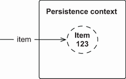
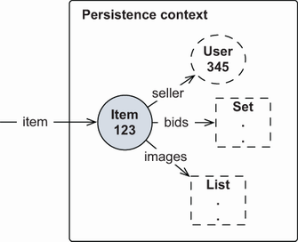
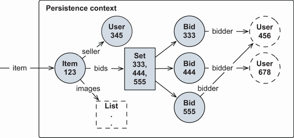
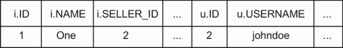
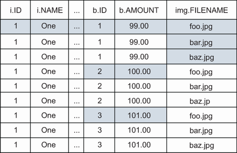

# Chương 12. Fetch plan, strategy và profile

> *Java Persistence with Spring Data and Hibernate* — Chương 12: “Fetch plans, strategies, and profiles”

**Nội dung chương này bao gồm**

- Làm việc với lazy loading và eager loading
- Áp dụng fetch plan, fetch strategy và fetch profile
- Tối ưu việc thực thi SQL

Trong chương này, chúng ta sẽ khám phá giải pháp của Hibernate cho bài toán ORM nền tảng về điều hướng, như đã giới thiệu ở mục 1.2.5: sự khác biệt giữa cách bạn truy cập dữ liệu trong mã Java và trong cơ sở dữ liệu quan hệ. Chúng tôi sẽ minh họa cách truy xuất dữ liệu từ cơ sở dữ liệu và cách tối ưu việc nạp này.

Hibernate cung cấp những cách sau để lấy dữ liệu ra khỏi cơ sở dữ liệu và đưa vào bộ nhớ:

- Chúng ta có thể truy xuất một instance entity theo định danh. Đây là cách tiện nhất khi giá trị định danh duy nhất của một instance entity đã biết, chẳng hạn `entityManager.find(Item.class, 123)`.
- Chúng ta có thể điều hướng đồ thị entity, bắt đầu từ một instance entity đã nạp, bằng cách truy cập các instance liên quan qua phương thức truy cập property như `someItem.getSeller().getAddress().getCity()`, v.v. Các phần tử của collection đã ánh xạ cũng được nạp theo yêu cầu khi chúng ta bắt đầu duyệt một collection. Hibernate tự động nạp các node của đồ thị nếu persistence context vẫn mở. Dữ liệu nào được nạp khi chúng ta gọi accessor và duyệt collection, và nó được nạp thế nào, là trọng tâm của chương này.
- Chúng ta có thể dùng Jakarta Persistence Query Language (JPQL), một ngôn ngữ truy vấn hướng đối tượng đầy đủ dựa trên chuỗi, chẳng hạn `select i from Item i where i.id = ?`.
- Interface `CriteriaQuery` cung cấp cách an toàn về kiểu và hướng đối tượng để thực hiện truy vấn mà không cần thao tác chuỗi.
- Chúng ta có thể viết truy vấn SQL native, gọi stored procedure, và để Hibernate lo việc ánh xạ JDBC result set tới các instance của class trong domain model.

Trong các ứng dụng JPA, chúng ta sẽ dùng kết hợp những kỹ thuật này. Đến giờ bạn hẳn đã quen với Jakarta Persistence API cơ bản để truy xuất theo định danh. Chúng tôi sẽ giữ các ví dụ JPQL và `CriteriaQuery` đơn giản hết mức có thể, và bạn sẽ không cần tới các tính năng ánh xạ truy vấn SQL.

> **Các tính năng mới quan trọng trong JPA 2**
>
> Chúng ta có thể kiểm tra thủ công trạng thái khởi tạo của một entity hoặc một property của entity bằng class trợ giúp tĩnh mới `PersistenceUtil`. Chúng ta cũng có thể tạo các fetch plan khai báo đã chuẩn hóa bằng API `EntityGraph` mới.

Chương này phân tích những gì xảy ra sau hậu trường khi chúng ta điều hướng đồ thị của domain model và Hibernate truy xuất dữ liệu theo yêu cầu. Trong mọi ví dụ, chúng tôi sẽ diễn giải SQL do Hibernate thực thi trong một comment ngay sau thao tác kích hoạt việc thực thi SQL đó.

Những gì Hibernate nạp phụ thuộc vào *fetch plan*: chúng ta định nghĩa đồ thị con của mạng lưới object cần được nạp. Sau đó chúng ta chọn *fetch strategy* phù hợp, định nghĩa dữ liệu nên được nạp *như thế nào*. Chúng ta có thể lưu lựa chọn plan và strategy thành một *fetch profile* và tái sử dụng.

Việc định nghĩa fetch plan và dữ liệu nào nên được Hibernate nạp dựa vào hai kỹ thuật nền tảng: lazy loading và eager loading các node trong mạng lưới object.

## 12.1 Lazy loading và eager loading

Tại một thời điểm nào đó, chúng ta phải quyết định dữ liệu nào nên được nạp vào bộ nhớ từ cơ sở dữ liệu. Khi chúng ta thực thi `entityManager.find(Item.class, 123)`, những gì có sẵn trong bộ nhớ và được nạp vào persistence context? Điều gì xảy ra nếu chúng ta dùng `EntityManager#getReference()` thay thế?

Trong việc ánh xạ domain model, chúng ta định nghĩa *fetch plan mặc định toàn cục*, với các tùy chọn `FetchType.LAZY` và `FetchType.EAGER` trên association và collection. Plan này là thiết lập mặc định cho mọi thao tác liên quan tới các class persistent của domain model. Nó luôn hoạt động khi chúng ta nạp một instance entity theo định danh và khi chúng ta điều hướng đồ thị entity bằng cách theo các association và duyệt các persistent collection.

Chiến lược chúng tôi khuyến nghị là một fetch plan mặc định lazy cho mọi entity và collection. Nếu chúng ta ánh xạ mọi association và collection với `FetchType.LAZY`, Hibernate sẽ chỉ nạp dữ liệu mà chúng ta truy cập. Khi chúng ta điều hướng đồ thị các instance của domain model, Hibernate sẽ nạp dữ liệu theo yêu cầu, từng chút một. Sau đó chúng ta có thể ghi đè hành vi này theo từng trường hợp khi cần.

Để hiện thực lazy loading, Hibernate dựa vào các placeholder entity được sinh lúc chạy gọi là *proxy* và các wrapper thông minh cho collection.

### 12.1.1 Hiểu về entity proxy

Hãy xét phương thức `getReference()` của API `EntityManager`. Ở mục 10.2.4, chúng ta đã xem qua thao tác này và cách nó có thể trả về một proxy. Hãy khám phá thêm tính năng quan trọng này và tìm hiểu proxy hoạt động ra sao.

> **CHÚ Ý** Để thực thi các ví dụ từ mã nguồn, trước tiên bạn cần chạy script Ch12.sql.

Đoạn mã sau không thực thi SQL nào với cơ sở dữ liệu. Tất cả những gì Hibernate làm là tạo một proxy `Item`: nó trông (và có mùi) như hàng thật, nhưng nó chỉ là một placeholder:

*Đường dẫn: Ch12/proxy/src/test/java/com/manning/javapersistence/ch12/proxy/LazyProxyCollections.java*

```java
Item item = em.getReference(Item.class, ITEM_ID);          // Ⓐ
assertEquals(ITEM_ID, item.getId());                       // Ⓑ
```

Ⓐ Không truy cập cơ sở dữ liệu, nghĩa là không có lệnh `SELECT` nào.

Ⓑ Việc gọi getter của định danh (không phải truy cập field!) không kích hoạt việc khởi tạo.

Trong persistence context, trong bộ nhớ, giờ chúng ta có proxy này ở trạng thái persistent, như minh họa ở hình 12.1.



**Hình 12.1** Persistence context, dưới sự điều khiển của Hibernate, chứa một proxy `Item`.

Proxy là một instance của một subclass của `Item` được sinh lúc chạy, mang giá trị định danh của instance entity mà nó đại diện. Đây là lý do Hibernate (nhất quán với JPA) yêu cầu các entity class có ít nhất một constructor `public` hoặc `protected` không tham số (class cũng có thể có các constructor khác). Entity class và các phương thức của nó không được là `final`; nếu không, Hibernate không thể tạo proxy. Lưu ý rằng đặc tả JPA không nhắc tới proxy; việc lazy loading được hiện thực thế nào là tùy JPA provider.

Nếu chúng ta gọi bất kỳ phương thức nào trên proxy mà không phải “getter của định danh”, chúng ta sẽ kích hoạt việc khởi tạo proxy và truy cập cơ sở dữ liệu. Nếu chúng ta gọi `item.getName()`, lệnh SQL `SELECT` để nạp `Item` sẽ được thực thi. Ví dụ trước đã gọi `item.getId()` mà không kích hoạt khởi tạo vì `getId()` là phương thức getter của định danh trong ánh xạ đã cho; phương thức `getId()` được đánh dấu bằng `@Id`. Nếu `@Id` nằm trên một field, thì việc gọi `getId()`, cũng như gọi bất kỳ phương thức nào khác, sẽ khởi tạo proxy. (Hãy nhớ rằng chúng ta thường ưa ánh xạ và truy cập trên field, vì điều này cho nhiều tự do hơn khi thiết kế phương thức truy cập; xem mục 3.2.3. Việc gọi `getId()` mà không khởi tạo proxy có quan trọng hơn hay không là tùy bạn.)

Với proxy, hãy cẩn thận cách bạn so sánh class. Vì Hibernate sinh class proxy, nó có tên trông buồn cười, và nó không bằng `Item.class`:

*Đường dẫn: Ch12/proxy/src/test/java/com/manning/javapersistence/ch12/proxy/LazyProxyCollections.java*

```java
assertNotEquals(Item.class, item.getClass());              // Ⓐ
assertEquals(
     Item.class,
     HibernateProxyHelper.getClassWithoutInitializingProxy(item)
);
```

Ⓐ Class được sinh lúc chạy và có tên kiểu như `Item$HibernateProxy$BLsrPly8`.

Nếu thực sự cần lấy kiểu thật mà một proxy đại diện, chúng ta có thể dùng `HibernateProxyHelper`.

JPA cung cấp `PersistenceUtil`, thứ chúng ta có thể dùng để kiểm tra trạng thái khởi tạo của một entity hoặc bất kỳ thuộc tính nào của nó:

*Đường dẫn: Ch12/proxy/src/test/java/com/manning/javapersistence/ch12/proxy/LazyProxyCollections.java*

```java
PersistenceUtil persistenceUtil = Persistence.getPersistenceUtil();
assertFalse(persistenceUtil.isLoaded(item));
assertFalse(persistenceUtil.isLoaded(item, "seller"));
assertFalse(Hibernate.isInitialized(item));
// assertFalse(Hibernate.isInitialized(item.getSeller()));    // Ⓐ
```

Ⓐ Việc thực thi dòng mã này thực chất sẽ kích hoạt việc khởi tạo `item`.

Phương thức `isLoaded()` cũng chấp nhận tên của một property của instance entity (proxy) cho trước, kiểm tra trạng thái khởi tạo của nó. Hibernate cung cấp một API thay thế với `Hibernate.isInitialized()`. Tuy nhiên, nếu chúng ta gọi `item.getSeller()`, proxy `item` sẽ được khởi tạo trước.

Hibernate cũng cung cấp một phương thức tiện ích để khởi tạo proxy nhanh gọn:

*Đường dẫn: Ch12/proxy/src/test/java/com/manning/javapersistence/ch12/proxy/LazyProxyCollections.java*

```java
Hibernate.initialize(item);                                   // Ⓐ
// select * from ITEM where ID = ?
assertFalse(Hibernate.isInitialized(item.getSeller()));       // Ⓑ
Hibernate.initialize(item.getSeller());                       // Ⓒ
// select * from USERS where ID = ?
```

Ⓐ Lời gọi đầu tiên truy cập cơ sở dữ liệu và nạp dữ liệu của `Item`, điền vào proxy tên, giá của item, v.v.

Ⓑ Hãy chắc chắn rằng mặc định `EAGER` của `@ManyToOne` đã được ghi đè bằng `LAZY`. Đó là lý do `seller` của item chưa được khởi tạo.

Ⓒ Bằng cách khởi tạo `seller` của item, chúng ta truy cập cơ sở dữ liệu và nạp dữ liệu `User`.

`seller` của `Item` là một association `@ManyToOne` được ánh xạ với `FetchType.LAZY`, nên Hibernate tạo một proxy `User` khi `Item` được nạp. Chúng ta có thể kiểm tra trạng thái proxy `seller` và nạp nó thủ công, giống như với `Item`. Hãy nhớ rằng mặc định của JPA cho `@ManyToOne` là `FetchType.EAGER`! Chúng ta thường muốn ghi đè điều này để có fetch plan mặc định lazy, như đã minh họa ở mục 8.3.1 và một lần nữa ở đây:

*Đường dẫn: Ch12/proxy/src/main/java/com/manning/javapersistence/ch12/proxy/Item.java*

```java
@Entity
public class Item {
    @ManyToOne(fetch = FetchType.LAZY)
    public User getSeller() {
        return seller;
    }
    // . . .
}
```

Với fetch plan lazy như vậy, chúng ta có thể gặp `LazyInitializationException`. Hãy xét đoạn mã sau:

*Đường dẫn: Ch12/proxy/src/test/java/com/manning/javapersistence/ch12/proxy/LazyProxyCollections.java*

```java
Item item = em.find(Item.class, ITEM_ID);                    // Ⓐ
// select * from ITEM where ID = ?
em.detach(item);                                             // Ⓑ
em.detach(item.getSeller());                                 // Ⓑ
// em.close();
PersistenceUtil persistenceUtil = Persistence.getPersistenceUtil();  // Ⓒ
assertTrue(persistenceUtil.isLoaded(item));
assertFalse(persistenceUtil.isLoaded(item, "seller"));
assertEquals(USER_ID, item.getSeller().getId());             // Ⓓ
//assertNotNull(item.getSeller().getUsername());             // Ⓔ
```

Ⓐ Một instance entity `Item` được nạp vào persistence context. `seller` của nó chưa được khởi tạo; đó là một proxy `User`.

Ⓑ Chúng ta có thể detach dữ liệu khỏi persistence context một cách thủ công, hoặc đóng persistence context và detach mọi thứ.

Ⓒ Trợ giúp `PersistenceUtil` hoạt động mà không cần persistence context. Chúng ta có thể kiểm tra bất cứ lúc nào xem dữ liệu chúng ta muốn truy cập đã được nạp hay chưa.

Ⓓ Ở trạng thái detached, chúng ta có thể gọi phương thức getter định danh của proxy `User`.

Ⓔ Việc gọi bất kỳ phương thức nào khác trên proxy, chẳng hạn `getUsername()`, sẽ ném `LazyInitializationException`. Dữ liệu chỉ có thể được nạp theo yêu cầu khi persistence context còn quản lý proxy, không phải ở trạng thái detached.

> **Lazy loading của association một-một hoạt động thế nào?**
>
> Lazy loading cho entity association một-một đôi khi gây nhầm lẫn cho người mới dùng Hibernate. Nếu chúng ta xét các association một-một dựa trên primary key dùng chung (xem mục 9.1.1), một association chỉ có thể được proxy nếu nó là `optional=false`. Ví dụ, một `Address` luôn có tham chiếu tới một `User`. Nếu association này cho phép null và là tùy chọn, Hibernate phải truy cập cơ sở dữ liệu trước để biết nó nên áp dụng proxy hay `null`, mà mục đích của lazy loading là hoàn toàn không truy cập cơ sở dữ liệu.

Proxy của Hibernate hữu ích vượt xa việc lazy loading đơn giản. Ví dụ, chúng ta có thể lưu một `Bid` mới mà không cần nạp dữ liệu nào vào bộ nhớ.

*Đường dẫn: Ch12/proxy/src/test/java/com/manning/javapersistence/ch12/proxy/LazyProxyCollections.java*

```java
Item item = em.getReference(Item.class, ITEM_ID);
User user = em.getReference(User.class, USER_ID);
Bid newBid = new Bid(new BigDecimal("99.00"));
newBid.setItem(item);
newBid.setBidder(user);
em.persist(newBid);                                       // Ⓐ
// insert into BID values (?, ?, ?, . . . )
```

Ⓐ Không có lệnh SQL `SELECT` nào trong thủ tục này, chỉ một lệnh `INSERT`.

Hai lời gọi đầu tạo proxy của `Item` và `User` tương ứng. Rồi các property association `item` và `bidder` của `Bid` transient được gán bằng các proxy. Lời gọi `persist()` xếp hàng một lệnh SQL `INSERT` khi persistence context được flush, và không cần `SELECT` nào để tạo dòng mới trong table `BID`. Mọi giá trị khóa đều có sẵn dưới dạng giá trị định danh của proxy `Item` và `User`.

Việc sinh proxy lúc chạy, như Hibernate cung cấp, là một lựa chọn tuyệt vời cho lazy loading trong suốt. Các class của domain model không phải hiện thực bất kỳ kiểu hay supertype đặc biệt nào, như một số giải pháp ORM cũ đòi hỏi. Cũng không cần sinh mã hay hậu xử lý bytecode, giúp đơn giản hóa quy trình build. Nhưng bạn nên biết một số khía cạnh có thể tiêu cực:

- Một số proxy runtime không hoàn toàn trong suốt, chẳng hạn các polymorphic association được kiểm tra bằng `instanceof`. Vấn đề này đã được minh họa ở mục 7.8.1.
- Với entity proxy, bạn phải cẩn thận không truy cập trực tiếp field khi viết các phương thức `equals()` và `hashCode()` tùy chỉnh, như đã bàn ở mục 10.3.2.
- Proxy chỉ có thể dùng để lazy-load các entity association. Chúng không thể dùng để lazy-load từng basic property hay embedded component riêng lẻ, chẳng hạn `Item#description` hay `User#homeAddress`. Nếu bạn đặt hint `@Basic(fetch = FetchType.LAZY)` trên một property như vậy, Hibernate bỏ qua nó; giá trị được nạp eager khi instance entity sở hữu được nạp. Việc tối ưu ở mức từng cột được chọn trong SQL là không cần thiết nếu bạn không làm việc với một số lượng đáng kể các cột tùy chọn hay cho phép null, hoặc các cột chứa giá trị lớn phải được truy xuất theo yêu cầu vì giới hạn vật lý của hệ thống. Giá trị lớn được biểu diễn tốt nhất bằng large object (LOB); chúng cung cấp lazy loading theo định nghĩa (xem “Kiểu nhị phân và giá trị lớn” ở mục 6.3.1).

Proxy cho phép lazy loading các instance entity. Với các persistent collection, Hibernate có cách tiếp cận hơi khác.

### 12.1.2 Persistent collection lazy

Chúng ta ánh xạ các persistent collection hoặc bằng `@ElementCollection` cho collection các phần tử kiểu basic hay embeddable, hoặc bằng `@OneToMany` và `@ManyToMany` cho entity association nhiều giá trị. Những collection này, khác với `@ManyToOne`, được lazy-load theo mặc định. Chúng ta không phải chỉ định tùy chọn `FetchType.LAZY` trong ánh xạ.

Collection một-nhiều `bids` lazy chỉ được nạp khi được truy cập:

*Đường dẫn: Ch12/proxy/src/test/java/com/manning/javapersistence/ch12/proxy/LazyProxyCollections.java*

```java
Item item = em.find(Item.class, ITEM_ID);                        // Ⓐ
// select * from ITEM where ID = ?
Set<Bid> bids = item.getBids();                                  // Ⓑ
PersistenceUtil persistenceUtil = Persistence.getPersistenceUtil();
assertFalse(persistenceUtil.isLoaded(item, "bids"));
assertTrue(Set.class.isAssignableFrom(bids.getClass()));         // Ⓒ
assertNotEquals(HashSet.class, bids.getClass());                 // Ⓓ
assertEquals(org.hibernate.collection.internal.PersistentSet.class,
             bids.getClass());                                   // Ⓔ
```

Ⓐ Thao tác `find()` nạp instance entity `Item` vào persistence context, như bạn thấy ở hình 12.2.

Ⓑ Instance `Item` có tham chiếu tới một `Set` các `bids` chưa khởi tạo. Nó cũng có tham chiếu tới một proxy `User` chưa khởi tạo: `seller`.

Ⓒ Field `bids` là một `Set`.

Ⓓ Tuy nhiên, field `bids` không phải một `HashSet`.

Ⓔ Field `bids` là một class proxy của Hibernate.



**Hình 12.2** Proxy và collection wrapper là ranh giới của đồ thị được nạp dưới sự điều khiển của Hibernate.

Hibernate hiện thực lazy loading (và dirty checking) cho collection bằng các hiện thực đặc biệt riêng gọi là *collection wrapper*. Mặc dù `bids` chắc chắn trông như một `Set`, Hibernate đã thay thế hiện thực bằng một `org.hibernate.collection.internal.PersistentSet` trong lúc chúng ta không để ý. Nó không phải `HashSet`, nhưng có cùng hành vi. Đó là lý do việc lập trình hướng tới interface trong domain model và chỉ dựa vào `Set` chứ không phải `HashSet` lại quan trọng đến vậy. List và map hoạt động theo cách tương tự.

Những collection đặc biệt này có thể phát hiện khi chúng ta truy cập chúng, và chúng nạp dữ liệu vào lúc đó. Ngay khi chúng ta bắt đầu duyệt `bids`, collection và mọi bid đặt cho item đều được nạp:

*Đường dẫn: Ch12/proxy/src/test/java/com/manning/javapersistence/ch12/proxy/LazyProxyCollections.java*

```java
Bid firstBid = bids.iterator().next();
// select * from BID where ITEM_ID = ?
// Alternative: Hibernate.initialize(bids);
```

Ngoài ra, cũng như với entity proxy, chúng ta có thể gọi phương thức tiện ích tĩnh `Hibernate.initialize()` để nạp một collection. Nó sẽ được nạp hoàn toàn; chúng ta không thể nói “chỉ nạp hai bid đầu tiên” chẳng hạn. Để làm vậy, chúng ta phải viết một truy vấn.

Để tiện, để chúng ta không phải viết nhiều truy vấn tầm thường, Hibernate cung cấp thiết lập riêng `LazyCollectionOption.EXTRA` trên ánh xạ collection:

*Đường dẫn: Ch12/proxy/src/main/java/com/manning/javapersistence/ch12/proxy/Item.java*

```java
@Entity
public class Item {
    @OneToMany(mappedBy = "item")
    @org.hibernate.annotations.LazyCollection(
       org.hibernate.annotations.LazyCollectionOption.EXTRA
    )
    public Set<Bid> getBids() {
        return bids;
    }
    // . . .
}
```

Với `LazyCollectionOption.EXTRA`, collection hỗ trợ các thao tác không kích hoạt việc khởi tạo. Ví dụ, chúng ta có thể hỏi kích thước của collection:

*Đường dẫn: Ch12/proxy/src/test/java/com/manning/javapersistence/ch12/proxy/LazyProxyCollections.java*

```java
Item item = em.find(Item.class, ITEM_ID);
// select * from ITEM where ID = ?
assertEquals(3, item.getBids().size());
// select count(b) from BID b where b.ITEM_ID = ?
```

Thao tác `size()` kích hoạt một truy vấn SQL `SELECT COUNT()` nhưng không nạp các bid vào bộ nhớ. Với mọi collection extra-lazy, các truy vấn tương tự được thực thi cho thao tác `isEmpty()` và `contains()`. Một `Set` extra-lazy kiểm tra trùng lặp bằng một truy vấn đơn giản khi chúng ta gọi `add()`. Một `List` extra-lazy chỉ nạp một phần tử nếu chúng ta gọi `get(index)`. Với `Map`, các thao tác extra-lazy là `containsKey()` và `containsValue()`.

### 12.1.3 Eager loading association và collection

Chúng tôi đã khuyến nghị một fetch plan mặc định lazy, với `FetchType.LAZY` trên mọi ánh xạ association và collection. Đôi khi, dù không thường xuyên, chúng ta muốn điều ngược lại: chỉ định rằng một entity association hay collection cụ thể phải luôn được nạp. Chúng ta muốn bảo đảm rằng dữ liệu này có sẵn trong bộ nhớ mà không cần thêm lượt truy cập cơ sở dữ liệu.

Quan trọng hơn, chúng ta muốn bảo đảm rằng, chẳng hạn, chúng ta có thể truy cập `seller` của một `Item` một khi instance `Item` ở trạng thái detached. Khi persistence context được đóng, lazy loading không còn khả dụng. Nếu `seller` là một proxy chưa khởi tạo, chúng ta sẽ nhận `LazyInitializationException` khi truy cập nó ở trạng thái detached. Để dữ liệu có sẵn ở trạng thái detached, chúng ta cần hoặc nạp nó thủ công khi persistence context còn mở, hoặc, nếu luôn muốn nó được nạp, đổi fetch plan sang eager thay vì lazy.

Hãy giả sử chúng ta luôn yêu cầu `seller` và `bids` của một `Item` phải được nạp:

*Đường dẫn: Ch12/eagerjoin/src/main/java/com/manning/javapersistence/ch12/eagerjoin/Item.java*

```java
@Entity
public class Item {

    @ManyToOne(fetch = FetchType.EAGER)                          // Ⓐ
    private User seller;

    @OneToMany(mappedBy = "item", fetch = FetchType.EAGER)       // Ⓑ
    private Set<Bid> bids = new HashSet<>();
    // . . .
}
```

Ⓐ `FetchType.EAGER` là mặc định cho instance entity.

Ⓑ Nói chung, `FetchType.EAGER` trên một collection là không được khuyến nghị.

Khác với `FetchType.LAZY` — vốn là một gợi ý mà JPA provider có thể bỏ qua — `FetchType.EAGER` là yêu cầu cứng. Provider phải bảo đảm rằng dữ liệu được nạp và có sẵn ở trạng thái detached; nó không thể bỏ qua thiết lập này.

Hãy xét ánh xạ collection: liệu có thực sự là ý hay khi nói “mỗi khi một item được nạp vào bộ nhớ, hãy nạp luôn các bid của item đó”? Ngay cả khi chúng ta chỉ muốn hiển thị tên item hoặc tìm hiểu khi nào phiên đấu giá kết thúc, mọi bid vẫn sẽ được nạp vào bộ nhớ. Việc luôn eager-load collection, với `FetchType.EAGER` làm fetch plan mặc định trong ánh xạ, thường không phải chiến lược hay. (Ở phần sau chương này, chúng ta sẽ phân tích vấn đề tích Descartes, xuất hiện nếu chúng ta eager-load nhiều collection.) Tốt nhất là để collection ở mặc định `FetchType.LAZY`.

Nếu giờ chúng ta `find()` một `Item` (hoặc buộc khởi tạo một proxy `Item`), cả `seller` lẫn mọi `bids` đều được nạp thành các instance persistent vào persistence context:

*Đường dẫn: Ch12/eagerjoin/src/test/java/com/manning/javapersistence/ch12/eagerjoin/EagerJoin.java*

```java
Item item = em.find(Item.class, ITEM_ID);
// select i.*, u.*, b.*
//   from ITEM i
//     left outer join USERS u on u.ID = i.SELLER_ID
//     left outer join BID b on b.ITEM_ID = i.ID
//   where i.ID = ?
em.detach(item);                                                // Ⓐ
assertEquals(3, item.getBids().size());                         // Ⓑ
assertNotNull(item.getBids().iterator().next().getAmount());
assertEquals("johndoe", item.getSeller().getUsername());        // Ⓒ
```

Ⓐ Khi gọi `detach()`, việc fetch đã xong. Sẽ không còn lazy loading nữa.

Ⓑ Ở trạng thái detached, collection `bids` có sẵn, nên chúng ta có thể kiểm tra kích thước của nó.

Ⓒ Ở trạng thái detached, `seller` có sẵn, nên chúng ta có thể kiểm tra tên của nó.

Với `find()`, Hibernate thực thi một lệnh SQL `SELECT` duy nhất và `JOIN` ba table để truy xuất dữ liệu. Bạn có thể thấy nội dung của persistence context ở hình 12.3. Hãy để ý cách ranh giới của đồ thị được nạp được biểu diễn: mỗi `Bid` có tham chiếu tới một proxy `User` chưa khởi tạo, tức `bidder`. Nếu giờ chúng ta detach `Item`, chúng ta truy cập `seller` và `bids` đã nạp mà không gây `LazyInitializationException`. Nếu chúng ta cố truy cập một trong các proxy `bidder`, chúng ta sẽ nhận ngoại lệ.



**Hình 12.3** `seller` và `bids` của một `Item` được nạp trong persistence context của Hibernate.

Tiếp theo, chúng ta sẽ tìm hiểu cách dữ liệu nên được nạp khi chúng ta tìm một instance entity theo identity và khi chúng ta điều hướng mạng lưới, dùng các con trỏ của association và collection đã ánh xạ. Chúng ta quan tâm tới SQL được thực thi và tìm ra fetch strategy lý tưởng.

Trong các ví dụ sau, chúng ta sẽ giả định domain model có fetch plan mặc định lazy. Hibernate sẽ chỉ nạp dữ liệu mà chúng ta yêu cầu tường minh cùng các association và collection mà chúng ta truy cập.

## 12.2 Chọn fetch strategy

Hibernate thực thi các câu lệnh SQL `SELECT` để nạp dữ liệu vào bộ nhớ. Nếu chúng ta nạp một instance entity, một hoặc nhiều lệnh `SELECT` được thực thi, tùy vào số table liên quan và fetch strategy mà chúng ta áp dụng. Mục tiêu của chúng ta là giảm thiểu số câu lệnh SQL và đơn giản hóa chúng để việc truy vấn hiệu quả nhất có thể.

Hãy xét fetch plan chúng tôi khuyến nghị từ đầu chương này: mọi association và collection nên được nạp theo yêu cầu, một cách lazy. Fetch plan mặc định này nhiều khả năng sẽ dẫn tới quá nhiều câu lệnh SQL, mỗi lệnh chỉ nạp một mẩu dữ liệu nhỏ. Điều này dẫn tới *vấn đề n+1 selects*, nên chúng ta sẽ xem xét nó trước. Fetch plan thay thế, dùng eager loading, sẽ dẫn tới ít câu lệnh SQL hơn, vì những khối dữ liệu lớn hơn sẽ được nạp vào bộ nhớ với mỗi truy vấn SQL. Khi đó chúng ta có thể gặp *vấn đề tích Descartes*, khi SQL result set trở nên quá lớn.

Chúng ta cần tìm điểm cân bằng giữa hai thái cực này: chiến lược fetch lý tưởng cho mỗi thủ tục và use case trong ứng dụng. Cũng như với fetch plan, chúng ta có thể đặt một fetch strategy toàn cục trong các ánh xạ: một thiết lập mặc định luôn hoạt động. Rồi, với một thủ tục cụ thể, chúng ta có thể ghi đè fetch strategy mặc định bằng một truy vấn JPQL, `CriteriaQuery`, hoặc thậm chí một truy vấn SQL tùy chỉnh.

Trước hết, hãy tìm hiểu các vấn đề nền tảng, bắt đầu với vấn đề n+1 selects.

### 12.2.1 Vấn đề n+1 selects

Vấn đề này dễ hiểu qua một số mã ví dụ. Hãy giả sử chúng ta đã ánh xạ một fetch plan lazy, nên mọi thứ được nạp theo yêu cầu. Đoạn mã sau kiểm tra xem `seller` của mỗi `Item` có `username` hay không:

*Đường dẫn: Ch12/nplusoneselects/src/test/java/com/manning/javapersistence/ch12/nplusoneselects/NPlusOneSelects.java*

```java
List<Item> items =
           em.createQuery("select i from Item i").getResultList();
// select * from ITEM
for (Item item : items) {
     assertNotNull(item.getSeller().getUsername());        // Ⓐ
     // select * from USERS where ID = ?
}
```

Ⓐ Mỗi khi chúng ta truy cập một seller, mỗi seller phải được nạp bằng một lệnh `SELECT` bổ sung.

Bạn có thể thấy một lệnh SQL `SELECT` nạp các instance entity `Item`. Rồi, khi chúng ta duyệt qua tất cả `items`, việc truy xuất mỗi `User` cần thêm một lệnh `SELECT`. Tổng cộng là một truy vấn cho `Item` cộng n truy vấn tùy theo có bao nhiêu item và liệu một `User` cụ thể có bán nhiều hơn một `Item` hay không. Rõ ràng, đây là chiến lược rất kém hiệu quả nếu chúng ta biết mình sẽ truy cập `seller` của mỗi `Item`.

Chúng ta có thể thấy cùng vấn đề với các collection được nạp lazy. Ví dụ sau kiểm tra xem mỗi `Item` có bid nào hay không:

*Đường dẫn: Ch12/nplusoneselects/src/test/java/com/manning/javapersistence/ch12/nplusoneselects/NPlusOneSelects.java*

```java
List<Item> items = em.createQuery("select i from Item i").getResultList();
// select * from ITEM
for (Item item : items) {
        assertTrue(item.getBids().size() > 0);            // Ⓐ
        // select * from BID where ITEM_ID = ?
}
```

Ⓐ Mỗi collection `bids` phải được nạp bằng một lệnh `SELECT` bổ sung.

Một lần nữa, nếu chúng ta biết mình sẽ truy cập mỗi collection `bids`, việc chỉ nạp từng cái một là kém hiệu quả. Nếu có 100 bid, chúng ta sẽ thực thi 101 truy vấn SQL!

Với những gì đã biết, chúng ta có thể bị cám dỗ đổi fetch plan mặc định trong ánh xạ và đặt `FetchType.EAGER` trên association `seller` hay `bids`. Nhưng làm vậy có thể dẫn tới chủ đề tiếp theo: vấn đề tích Descartes.

### 12.2.2 Vấn đề tích Descartes

Nếu chúng ta nhìn vào domain model và data model rồi nói: “Mỗi khi tôi cần một `Item`, tôi cũng cần `seller` của `Item` đó”, chúng ta có thể ánh xạ association bằng `FetchType.EAGER` thay vì fetch plan lazy. Chúng ta muốn bảo đảm rằng mỗi khi một `Item` được nạp, `seller` cũng sẽ được nạp ngay — chúng ta muốn dữ liệu đó có sẵn khi `Item` được detach và persistence context đóng lại:

*Đường dẫn: Ch12/cartesianproduct/src/main/java/com/manning/javapersistence/ch12/cartesianproduct/Item.java*

```java
@Entity
public class Item {
    @ManyToOne(fetch = FetchType.EAGER)
    private User seller;
    // . . .
}
```

Để hiện thực fetch plan eager, Hibernate dùng phép `JOIN` của SQL để nạp một `Item` và một instance `User` trong một lệnh `SELECT`:

```java
item = em.find(Item.class, ITEM_ID);
// select i.*, u.*
//   from ITEM i
//     left outer join USERS u on u.ID = i.SELLER_ID
//   where i.ID = ?
```

Result set chứa một dòng với dữ liệu từ table `ITEM` kết hợp với dữ liệu từ table `USERS`, như minh họa ở hình 12.4.



**Hình 12.4** Hibernate join hai table để eager-fetch các dòng liên quan.

Eager fetching với chiến lược `JOIN` mặc định không gây vấn đề với các association `@ManyToOne` và `@OneToOne`. Chúng ta có thể eager-load, với một truy vấn SQL và các phép `JOIN`, một `Item`, `seller` của nó, `Address` của `User`, `City` họ sống, v.v. Ngay cả khi chúng ta ánh xạ tất cả những association này bằng `FetchType.EAGER`, result set cũng chỉ có một dòng.

Hibernate phải dừng việc theo fetch plan `FetchType.EAGER` ở một điểm nào đó. Số table được join phụ thuộc vào property cấu hình toàn cục `hibernate.max_fetch_depth`, và theo mặc định, không có giới hạn nào được đặt. Các giá trị hợp lý thường nhỏ, thường từ 1 tới 5. Chúng ta thậm chí có thể tắt việc `JOIN` fetch các association `@ManyToOne` và `@OneToOne` bằng cách đặt property này là 0. Nếu Hibernate đạt tới giới hạn, nó vẫn eager-load dữ liệu theo fetch plan, nhưng bằng các câu lệnh `SELECT` bổ sung. (Lưu ý rằng một số database dialect có thể đặt sẵn property này; ví dụ, `MySQLDialect` đặt nó là 2.)

Việc eager-load collection bằng `JOIN`, mặt khác, có thể dẫn tới những mối lo nghiêm trọng về hiệu năng. Nếu chúng ta cũng chuyển sang `FetchType.EAGER` cho collection `bids` và `images`, chúng ta sẽ gặp vấn đề tích Descartes.

Vấn đề này xuất hiện khi chúng ta eager-load hai collection bằng một truy vấn SQL và một phép `JOIN`. Trước hết, hãy tạo một fetch plan như vậy rồi xem vấn đề:

*Đường dẫn: Ch12/cartesianproduct/src/main/java/com/manning/javapersistence/ch12/cartesianproduct/Item.java*

```java
@Entity
public class Item {
    @OneToMany(mappedBy = "item", fetch = FetchType.EAGER)
    private Set<Bid> bids = new HashSet<>();

    @ElementCollection(fetch = FetchType.EAGER)
    @CollectionTable(name = "IMAGE")
    @Column(name = "FILENAME")
    private Set<String> images = new HashSet<>();
    // . . .
}
```

Không quan trọng cả hai collection là `@OneToMany`, `@ManyToMany` hay `@ElementCollection`. Việc eager-fetch nhiều hơn một collection cùng lúc bằng toán tử `JOIN` của SQL mới là vấn đề nền tảng, bất kể nội dung của collection là gì. Nếu chúng ta nạp một `Item`, Hibernate thực thi câu lệnh SQL có vấn đề:

*Đường dẫn: Ch12/cartesianproduct/src/test/java/com/manning/javapersistence/ch12/cartesianproduct/CartesianProduct.java*

```java
Item item = em.find(Item.class, ITEM_ID);
// select i.*, b.*, img.*
//   from ITEM i
//     left outer join BID b on b.ITEM_ID = i.ID
//     left outer join IMAGE img on img.ITEM_ID = i.ID
//   where i.ID = ?
em.detach(item);
assertEquals(3, item.getImages().size());
assertEquals(3, item.getBids().size());
```

Như bạn thấy, Hibernate đã tuân theo fetch plan eager, và chúng ta có thể truy cập collection `bids` và `images` ở trạng thái detached. Vấn đề là *cách* chúng được nạp, với một `JOIN` SQL cho ra một tích. Hãy xem result set ở hình 12.5.



**Hình 12.5** Một tích là kết quả của hai phép join với nhiều dòng.

Result set này chứa nhiều mục dữ liệu dư thừa, và chỉ những ô được tô đậm mới liên quan tới Hibernate. `Item` có ba bid và ba image. Kích thước của tích phụ thuộc vào kích thước các collection chúng ta truy xuất: 3 × 3 là tổng cộng 9 dòng. Giờ hãy hình dung chúng ta có một `Item` với 50 `bids` và 5 `images` — chúng ta sẽ thấy một result set có thể lên tới 250 dòng! Chúng ta có thể tạo ra những tích SQL còn lớn hơn khi tự viết truy vấn bằng JPQL hay `CriteriaQuery`; hãy hình dung điều gì xảy ra nếu chúng ta nạp 500 item và eager-fetch hàng chục bid và image bằng `JOIN`.

Thời gian xử lý và bộ nhớ đáng kể được đòi hỏi trên máy chủ cơ sở dữ liệu để tạo ra những kết quả như vậy, sau đó phải được truyền qua mạng. Nếu bạn hy vọng driver JDBC sẽ nén dữ liệu trên đường truyền bằng cách nào đó, có lẽ bạn đang kỳ vọng quá nhiều ở các nhà cung cấp cơ sở dữ liệu. Hibernate lập tức loại bỏ mọi bản trùng lặp khi biên dịch result set thành các instance persistent và collection; thông tin trong những ô không tô đậm ở hình 12.5 sẽ bị bỏ qua. Rõ ràng, chúng ta không thể loại bỏ những bản trùng lặp này ở mức SQL; toán tử `DISTINCT` của SQL không giúp được ở đây.

Thay vì một truy vấn SQL với kết quả cực lớn, ba truy vấn riêng biệt sẽ nhanh hơn để truy xuất một instance entity và hai collection cùng lúc. Tiếp theo chúng ta sẽ tập trung vào loại tối ưu này và xem cách tìm cũng như hiện thực fetch strategy tốt nhất. Chúng ta sẽ lại bắt đầu với fetch plan lazy mặc định và thử giải quyết vấn đề n+1 selects trước.

### 12.2.3 Prefetch dữ liệu theo lô

Nếu Hibernate chỉ fetch mọi entity association và collection theo yêu cầu, có thể cần nhiều câu lệnh SQL `SELECT` bổ sung để hoàn thành một thủ tục cụ thể. Như trước, hãy xét một routine kiểm tra xem `seller` của mỗi `Item` có `username` hay không. Với lazy loading, việc này sẽ cần một lệnh `SELECT` để lấy mọi instance `Item` và n lệnh `SELECT` nữa để khởi tạo proxy `seller` của mỗi `Item`.

Hibernate cung cấp các thuật toán có thể prefetch dữ liệu. Thuật toán đầu tiên chúng ta xem xét là *batch fetching*, và nó hoạt động như sau: nếu Hibernate phải khởi tạo một proxy `User`, nó có thể khởi tạo luôn nhiều proxy với cùng một lệnh `SELECT`. Nói cách khác, nếu chúng ta đã biết có nhiều instance `Item` trong persistence context và tất cả đều có proxy được áp cho association `seller`, chúng ta cũng nên khởi tạo nhiều proxy thay vì chỉ một khi thực hiện chuyến đi tới cơ sở dữ liệu.

Hãy xem cách hoạt động. Trước hết, bật batch fetching cho các instance `User` bằng một annotation riêng của Hibernate:

*Đường dẫn: Ch12/batch/src/main/java/com/manning/javapersistence/ch12/batch/User.java*

```java
@Entity
@org.hibernate.annotations.BatchSize(size = 10)
@Table(name = "USERS")
public class User {
    // . . .
}
```

Thiết lập này bảo Hibernate rằng nó có thể nạp tới 10 proxy `User` nếu một proxy phải được nạp, tất cả bằng cùng một lệnh `SELECT`. Batch fetching thường được gọi là *tối ưu đoán mò* vì chúng ta không biết có bao nhiêu proxy `User` chưa khởi tạo trong một persistence context cụ thể. Chúng ta không thể chắc chắn 10 là giá trị lý tưởng — đó là một phỏng đoán. Chúng ta biết rằng thay vì n+1 truy vấn SQL, giờ chúng ta sẽ thấy ít truy vấn hơn hẳn, một sự giảm thiểu đáng kể. Các giá trị hợp lý thường nhỏ vì chúng ta cũng không muốn nạp quá nhiều dữ liệu vào bộ nhớ, nhất là khi không chắc mình sẽ cần tới.

Đây là thủ tục đã tối ưu, kiểm tra `username` của mỗi `seller`:

*Đường dẫn: Ch12/batch/src/test/java/com/manning/javapersistence/ch12/batch/Batch.java*

```java
List<Item> items = em.createQuery("select i from Item i",
                                  Item.class).getResultList();
// select * from ITEM
for (Item item : items) {
    assertNotNull(item.getSeller().getUsername());
    // select * from USERS where ID in (?, ?, ?, ?, ?, ?, ?, ?, ?, ?)
}
```

Hãy chú ý truy vấn SQL mà Hibernate thực thi khi chúng ta duyệt `items`. Khi chúng ta gọi `item.getSeller().getUserName()` lần đầu, Hibernate phải khởi tạo proxy `User` đầu tiên. Thay vì chỉ nạp một dòng từ table `USERS`, Hibernate truy xuất nhiều dòng, và tới 10 instance `User` được nạp. Một khi chúng ta truy cập `seller` thứ 11, thêm 10 instance nữa được nạp trong một lô, và cứ thế, cho tới khi persistence context không còn proxy `User` chưa khởi tạo nào.

> **Thuật toán batch-fetching thực sự là gì?**
>
> Phần giải thích của chúng tôi về batch loading ở mục 12.2.3 có phần đơn giản hóa, và bạn có thể thấy một thuật toán hơi khác trong thực tế.
>
> Ví dụ, hãy hình dung batch size là 32. Lúc khởi động, Hibernate tạo vài batch loader nội bộ. Mỗi loader biết nó có thể khởi tạo bao nhiêu proxy. Mục tiêu là giảm thiểu mức tiêu thụ bộ nhớ cho việc tạo loader và tạo đủ loader để mọi lô fetch khả dĩ đều có thể được tạo ra. Một mục tiêu khác hiển nhiên là giảm thiểu số truy vấn SQL. Để khởi tạo 31 proxy, Hibernate thực thi 3 lô (bạn có lẽ mong đợi 1, vì 32 > 31). Các batch loader được áp dụng là 16, 10 và 5, do Hibernate tự động chọn.
>
> Bạn có thể tùy chỉnh thuật toán batch-fetching này bằng property `hibernate.batch_fetch_style` trong cấu hình persistence unit. Mặc định là `LEGACY`, thứ xây dựng và chọn nhiều batch loader lúc khởi động. Các tùy chọn khác là `PADDED` và `DYNAMIC`. Với `PADDED`, Hibernate chỉ xây một truy vấn SQL batch loader lúc khởi động với chỗ giữ chỗ cho 32 đối số trong mệnh đề `IN` rồi lặp lại các định danh đã gắn nếu cần nạp ít hơn 32 proxy. Với `DYNAMIC`, Hibernate xây động câu lệnh SQL lô lúc chạy, khi nó biết số proxy cần khởi tạo.

Batch fetching cũng có sẵn cho collection:

*Đường dẫn: Ch12/batch/src/main/java/com/manning/javapersistence/ch12/batch/Item.java*

```java
@Entity
public class Item {
    @OneToMany(mappedBy = "item")
    @org.hibernate.annotations.BatchSize(size = 5)
    private Set<Bid> bids = new HashSet<>();
    // . . .
}
```

Nếu giờ chúng ta buộc khởi tạo một collection `bids`, tới năm collection `Item#bids` nữa, nếu chúng chưa khởi tạo trong persistence context hiện tại, sẽ được nạp ngay:

*Đường dẫn: Ch12/batch/src/test/java/com/manning/javapersistence/ch12/batch/Batch.java*

```java
List<Item> items = em.createQuery("select i from Item i",
                                  Item.class).getResultList();
// select * from ITEM
for (Item item : items) {
    assertTrue(item.getBids().size() > 0);
    // select * from BID where ITEM_ID in (?, ?, ?, ?, ?)
}
```

Khi chúng ta gọi `item.getBids().size()` lần đầu trong lúc duyệt, cả một lô collection `Bid` được nạp trước cho các instance `Item` khác.

Batch fetching là một tối ưu đơn giản và thường thông minh, có thể giảm đáng kể số câu lệnh SQL vốn cần thiết để khởi tạo mọi proxy và collection. Mặc dù chúng ta có thể prefetch dữ liệu mà mình không cần và tiêu tốn nhiều bộ nhớ hơn, việc giảm số vòng đi tới cơ sở dữ liệu có thể tạo khác biệt lớn. Bộ nhớ thì rẻ, nhưng việc mở rộng máy chủ cơ sở dữ liệu thì không.

Một thuật toán prefetch khác không phải đoán mò là dùng subselect để khởi tạo nhiều collection bằng một câu lệnh duy nhất.

### 12.2.4 Prefetch collection bằng subselect

Một chiến lược có thể tốt hơn để nạp mọi bid của nhiều instance `Item` là prefetch bằng subselect. Để bật tối ưu này, hãy thêm annotation `Fetch` của Hibernate vào ánh xạ collection, với tham số `SUBSELECT`:

*Đường dẫn: Ch12/subselect/src/main/java/com/manning/javapersistence/ch12/subselect/Item.java*

```java
@Entity
public class Item {
    @OneToMany(mappedBy = "item")
    @org.hibernate.annotations.Fetch(
         org.hibernate.annotations.FetchMode.SUBSELECT
    )
    private Set<Bid> bids = new HashSet<>();
    // . . .
}
```

Hibernate giờ khởi tạo mọi collection `bids` cho mọi instance `Item` đã nạp ngay khi chúng ta buộc khởi tạo một collection `bids`:

*Đường dẫn: Ch12/subselect/src/test/java/com/manning/javapersistence/ch12/subselect/Subselect.java*

```java
List<Item> items = em.createQuery("select i from Item i",
                                  Item.class).getResultList();
// select * from ITEM
for (Item item : items) {
    assertTrue(item.getBids().size() > 0);
    // select * from BID where ITEM_ID in (
    //     select ID from ITEM
    // )
}
```

Hibernate ghi nhớ truy vấn gốc đã dùng để nạp `items`. Rồi nó nhúng truy vấn ban đầu này (đã sửa đổi chút ít) vào một subselect, truy xuất collection `bids` cho mỗi `Item`.

Lưu ý rằng truy vấn gốc được chạy lại dưới dạng subselect chỉ được Hibernate ghi nhớ cho một persistence context cụ thể. Nếu chúng ta detach một instance `Item` mà không khởi tạo collection `bids`, rồi merge nó vào một persistence context mới và bắt đầu duyệt collection, sẽ không có việc prefetch các collection khác.

Việc prefetch theo lô và bằng subselect giảm số truy vấn cần thiết cho một thủ tục cụ thể nếu bạn giữ fetch plan lazy toàn cục trong các ánh xạ, giúp giảm nhẹ vấn đề n+1 selects. Nếu thay vào đó fetch plan toàn cục của bạn có các association và collection nạp eager, bạn sẽ phải tránh vấn đề tích Descartes — chẳng hạn bằng cách tách một truy vấn `JOIN` thành nhiều lệnh `SELECT`.

### 12.2.5 Eager fetching bằng nhiều lệnh SELECT

Khi cố fetch nhiều collection bằng một truy vấn SQL và các phép `JOIN`, chúng ta sẽ gặp vấn đề tích Descartes như đã bàn. Thay vì phép `JOIN`, chúng ta có thể bảo Hibernate eager-load dữ liệu bằng các truy vấn `SELECT` bổ sung và nhờ đó tránh được kết quả lớn cùng các tích SQL có trùng lặp:

*Đường dẫn: Ch12/eagerselect/src/main/java/com/manning/javapersistence/ch12/eagerselect/Item.java*

```java
@Entity
public class Item {

    @ManyToOne(fetch = FetchType.EAGER)
    @org.hibernate.annotations.Fetch(
       org.hibernate.annotations.FetchMode.SELECT                  // Ⓐ
    )
    private User seller;

    @OneToMany(mappedBy = "item", fetch = FetchType.EAGER)
    @org.hibernate.annotations.Fetch(
       org.hibernate.annotations.FetchMode.SELECT                  // Ⓐ
    )
    private Set<Bid> bids = new HashSet<>();
    // . . .
}
```

Ⓐ `FetchMode.SELECT` nghĩa là property nên được nạp bằng lệnh `SELECT` riêng. Giá trị mặc định là `FetchMode.JOIN`, nghĩa là property sẽ được truy xuất eager qua một phép `JOIN`.

Giờ khi một `Item` được nạp, `seller` và `bids` cũng phải được nạp:

*Đường dẫn: Ch12/eagerselect/src/test/java/com/manning/javapersistence/ch12/eagerselect/EagerSelect.java*

```java
Item item = em.find(Item.class, ITEM_ID);                        // Ⓐ
// select * from ITEM where ID = ?
// select * from USERS where ID = ?
// select * from BID where ITEM_ID = ?
em.detach(item);
assertEquals(3, item.getBids().size());                          // Ⓑ
assertNotNull(item.getBids().iterator().next().getAmount());     // Ⓑ
assertEquals("johndoe", item.getSeller().getUsername());         // Ⓑ
```

Ⓐ Hibernate dùng một lệnh `SELECT` để nạp một dòng từ table `ITEM`. Rồi nó lập tức thực thi thêm hai lệnh `SELECT`: một nạp một dòng từ table `USERS` (`seller`) và một nạp nhiều dòng từ table `BID` (`bids`). Các truy vấn `SELECT` bổ sung không được thực thi lazy; phương thức `find()` sinh ra nhiều truy vấn SQL.

Ⓑ Hibernate đã tuân theo fetch plan eager; mọi dữ liệu đều có sẵn ở trạng thái detached.

Tuy nhiên, mọi thiết lập này đều toàn cục; chúng luôn hoạt động. Nguy hiểm là việc điều chỉnh một thiết lập cho một trường hợp có vấn đề trong ứng dụng có thể gây tác dụng phụ tiêu cực cho một thủ tục khác. Việc duy trì cân bằng này có thể khó, nên khuyến nghị của chúng tôi là ánh xạ mọi entity association và collection bằng `FetchType.LAZY`, như đã nói trước đó.

Cách tiếp cận tốt hơn là dùng eager fetching và các phép `JOIN` một cách động, chỉ khi cần, cho một thủ tục cụ thể.

### 12.2.6 Eager fetching động

Như ở các mục trước, giả sử chúng ta phải kiểm tra `username` của mỗi `Item#seller`. Với fetch plan lazy toàn cục, chúng ta có thể nạp dữ liệu cần cho thủ tục này và áp dụng chiến lược eager fetch động trong một truy vấn:

*Đường dẫn: Ch12/eagerselect/src/test/java/com/manning/javapersistence/ch12/eagerselect/EagerQueryUsers.java*

```java
List<Item> items =
      em.createQuery("select i from Item i join fetch i.seller", Item.class)
             .getResultList();                                   // Ⓐ
// select i.*, u.*
//   from ITEM i
//     inner join USERS u on u.ID = i.SELLER_ID
//   where i.ID = ?
em.close();                                                      // Ⓑ
for (Item item : items) {
      assertNotNull(item.getSeller().getUsername());             // Ⓒ
}
```

Ⓐ Áp dụng chiến lược eager động trong một truy vấn.

Ⓑ Detach tất cả.

Ⓒ Hibernate đã tuân theo fetch plan eager; mọi dữ liệu đều có sẵn ở trạng thái detached.

Từ khóa quan trọng trong truy vấn JPQL này là `join fetch`, bảo Hibernate dùng một phép `JOIN` của SQL (thực ra là `INNER JOIN`) để truy xuất `seller` của mỗi `Item` trong cùng truy vấn. Cùng truy vấn đó có thể được biểu diễn bằng API `CriteriaQuery` thay vì một chuỗi JPQL:

*Đường dẫn: Ch12/eagerselect/src/test/java/com/manning/javapersistence/ch12/eagerselect/EagerQueryUsers.java*

```java
CriteriaBuilder cb = em.getCriteriaBuilder();
CriteriaQuery<Item> criteria = cb.createQuery(Item.class);
Root<Item> i = criteria.from(Item.class);
i.fetch("seller");
criteria.select(i);
List<Item> items = em.createQuery(criteria).getResultList();     // Ⓐ
em.close();                                                      // Ⓑ
for (Item item : items) {
     assertNotNull(item.getSeller().getUsername());              // Ⓒ
}
```

Ⓐ Áp dụng chiến lược eager trong một truy vấn được xây động bằng API `CriteriaQuery`.

Ⓑ Detach tất cả.

Ⓒ Hibernate đã tuân theo fetch plan eager; mọi dữ liệu đều có sẵn ở trạng thái detached.

Eager join fetching động cũng hoạt động với collection. Ở đây chúng ta nạp mọi bid của mỗi `Item`:

*Đường dẫn: Ch12/eagerselect/src/test/java/com/manning/javapersistence/ch12/eagerselect/EagerQueryBids.java*

```java
List<Item> items =
     em.createQuery("select i from Item i left join fetch i.bids",
                    Item.class)
        .getResultList();                                        // Ⓐ
// select i.*, b.*
//   from ITEM i
//     left outer join BID b on b.ITEM_ID = i.ID
//   where i.ID = ?
em.close();                                                      // Ⓑ
for (Item item : items) {
     assertTrue(item.getBids().size() > 0);                      // Ⓒ
}
```

Ⓐ Áp dụng chiến lược eager động trong một truy vấn.

Ⓑ Detach tất cả.

Ⓒ Hibernate đã tuân theo fetch plan eager; mọi dữ liệu đều có sẵn ở trạng thái detached.

Giờ hãy làm điều tương tự với API `CriteriaQuery`:

*Đường dẫn: Ch12/eagerselect/src/test/java/com/manning/javapersistence/ch12/eagerselect/EagerQueryBids.java*

```java
CriteriaBuilder cb = em.getCriteriaBuilder();
CriteriaQuery<Item> criteria = cb.createQuery(Item.class);
Root<Item> i = criteria.from(Item.class);
i.fetch("bids", JoinType.LEFT);
criteria.select(i);
List<Item> items = em.createQuery(criteria).getResultList();     // Ⓐ
em.close();                                                      // Ⓑ
for (Item item : items) {
     assertTrue(item.getBids().size() > 0);                      // Ⓒ
}
```

Ⓐ Áp dụng chiến lược eager trong một truy vấn được xây động bằng API `CriteriaQuery`.

Ⓑ Detach tất cả.

Ⓒ Hibernate đã tuân theo fetch plan eager; mọi dữ liệu đều có sẵn ở trạng thái detached.

Lưu ý rằng với việc fetch collection, cần một `LEFT OUTER JOIN`, vì chúng ta cũng muốn các dòng từ table `ITEM` ngay cả khi không có bid nào.

Việc tự viết truy vấn không phải lựa chọn duy nhất nếu chúng ta muốn ghi đè động fetch plan toàn cục của domain model. Chúng ta có thể viết fetch profile theo cách khai báo.

## 12.3 Sử dụng fetch profile

Fetch profile bổ trợ cho các tùy chọn fetch trong ngôn ngữ truy vấn và API. Chúng cho phép chúng ta duy trì các định nghĩa profile trong metadata dạng XML hoặc annotation. Các phiên bản Hibernate đầu không hỗ trợ fetch profile đặc biệt, nhưng ngày nay Hibernate hỗ trợ những thứ sau:

- **Fetch profile** — Một API riêng dựa trên việc khai báo profile bằng `@org.hibernate.annotations.FetchProfile` và thực thi bằng `Session#enableFetchProfile()`. Cơ chế đơn giản này hiện hỗ trợ ghi đè có chọn lọc các entity association và collection ánh xạ lazy, bật chiến lược eager fetching kiểu `JOIN` cho một đơn vị công việc cụ thể.
- **Entity graph** — Được đặc tả trong JPA 2.1, chúng ta có thể khai báo một đồ thị các thuộc tính và association của entity bằng annotation `@EntityGraph`. Fetch plan này, hoặc một tổ hợp các plan, có thể được bật như một hint khi thực thi `EntityManager#find()` hoặc các truy vấn (JPQL, criteria). Đồ thị được cung cấp điều khiển những gì cần nạp; đáng tiếc, nó không điều khiển việc nạp *như thế nào*.

Có thể nói rằng vẫn còn chỗ để cải thiện ở đây, và chúng tôi kỳ vọng các phiên bản Hibernate và JPA tương lai sẽ cung cấp một API thống nhất và mạnh mẽ hơn.

Chúng ta có thể đưa các câu lệnh JPQL và SQL ra ngoài và chuyển chúng vào metadata. Một truy vấn JPQL là một fetch profile khai báo (có tên); thứ chúng ta còn thiếu là khả năng dễ dàng phủ các plan khác nhau lên cùng một truy vấn cơ sở. Chúng tôi đã thấy vài giải pháp sáng tạo dùng thao tác chuỗi mà tốt nhất nên tránh. Với criteria query, mặt khác, chúng ta đã có toàn bộ sức mạnh của Java để tổ chức mã xây dựng truy vấn. Giá trị của entity graph là khả năng tái sử dụng fetch plan xuyên qua mọi loại truy vấn.

Hãy nói về fetch profile của Hibernate trước và cách chúng ta có thể ghi đè một fetch plan lazy toàn cục cho một đơn vị công việc cụ thể.

### 12.3.1 Khai báo fetch profile của Hibernate

Fetch profile của Hibernate là metadata toàn cục; chúng được khai báo cho toàn bộ persistence unit. Mặc dù chúng ta có thể đặt annotation `@FetchProfile` trên một class, chúng tôi thích để nó làm metadata ở mức package trong file package-info.java:

*Đường dẫn: Ch12/profile/src/main/java/com/manning/javapersistence/ch12/profile/package-info.java*

```java
@org.hibernate.annotations.FetchProfiles({
    @FetchProfile(name = Item.PROFILE_JOIN_SELLER,                 // Ⓐ
             fetchOverrides = @FetchProfile.FetchOverride(         // Ⓑ
                  entity = Item.class,
                  association = "seller",
                  mode = FetchMode.JOIN                            // Ⓒ
          )),
    @FetchProfile(name = Item.PROFILE_JOIN_BIDS,
             fetchOverrides = @FetchProfile.FetchOverride(
                  entity = Item.class,
                  association = "bids",
                  mode = FetchMode.JOIN
             ))
})
```

Ⓐ Mỗi profile có một tên. Đây là một chuỗi đơn giản được cô lập trong một hằng.

Ⓑ Mỗi override trong một profile nêu tên một entity association hoặc collection.

Ⓒ `FetchMode.JOIN` nghĩa là property sẽ được truy xuất eager, qua một phép `JOIN`.

Các profile giờ có thể được bật cho một đơn vị công việc. Chúng ta cần API Hibernate để bật một profile. Sau đó nó hoạt động cho mọi thao tác trong đơn vị công việc đó. `Item#seller` có thể được fetch bằng một join trong cùng câu lệnh SQL mỗi khi một `Item` được nạp bằng `EntityManager` này.

Chúng ta có thể phủ một profile khác lên cùng đơn vị công việc. Ở ví dụ sau, `Item#seller` và collection `Item#bids` sẽ được fetch bằng một join trong cùng câu lệnh SQL mỗi khi một `Item` được nạp.

*Đường dẫn: Ch12/profile/src/test/java/com/manning/javapersistence/ch12/profile/Profile.java*

```java
Item item = em.find(Item.class, ITEM_ID);                          // Ⓐ
em.clear();
em.unwrap(Session.class).enableFetchProfile(Item.PROFILE_JOIN_SELLER);
item = em.find(Item.class, ITEM_ID);                               // Ⓑ
em.clear();
em.unwrap(Session.class).enableFetchProfile(Item.PROFILE_JOIN_BIDS);
item = em.find(Item.class, ITEM_ID);                               // Ⓒ
```

Ⓐ `Item#seller` được ánh xạ lazy, nên fetch plan mặc định chỉ truy xuất instance `Item`.

Ⓑ Fetch `Item#seller` bằng một join trong cùng câu lệnh SQL mỗi khi một `Item` được nạp bằng `EntityManager` này.

Ⓒ Fetch `Item#seller` và `Item#bids` bằng một join trong cùng câu lệnh SQL mỗi khi một `Item` được nạp.

Fetch profile cơ bản của Hibernate có thể là giải pháp dễ dàng cho việc tối ưu fetch trong các ứng dụng nhỏ hơn hoặc đơn giản hơn. Kể từ JPA 2.1, việc đưa vào entity graph cho phép chức năng tương tự theo cách chuẩn hóa.

### 12.3.2 Làm việc với entity graph

Một entity graph là một khai báo các node entity và thuộc tính, ghi đè hoặc bổ sung fetch plan mặc định khi chúng ta thực thi `EntityManager#find()` hoặc đặt một hint trên các thao tác truy vấn. Đây là ví dụ về một thao tác truy xuất dùng entity graph:

*Đường dẫn: Ch12/fetchloadgraph/src/test/java/com/manning/javapersistence/ch12/fetchloadgraph/FetchLoadGraph.java*

```java
Map<String, Object> properties = new HashMap<>();
properties.put(
        "javax.persistence.loadgraph",
        em.getEntityGraph(Item.class.getSimpleName())              // Ⓐ
);
Item item = em.find(Item.class, ITEM_ID, properties);
// select * from ITEM where ID = ?
```

Ⓐ Tên của entity graph chúng ta đang dùng là `Item`, và hint cho thao tác `find()` chỉ ra rằng nó nên là *load graph*. Nghĩa là các thuộc tính được chỉ định bởi attribute node của entity graph được đối xử như `FetchType.EAGER`, và các thuộc tính không được chỉ định thì theo `FetchType` đã chỉ định hoặc mặc định trong ánh xạ.

Đoạn mã sau cho thấy khai báo của đồ thị này và fetch plan mặc định của entity class:

*Đường dẫn: Ch12/fetchloadgraph/src/main/java/com/manning/javapersistence/ch12/fetchloadgraph/Item.java*

```java
@NamedEntityGraphs({
       @NamedEntityGraph              // Ⓐ
})
@Entity
public class Item {

    @NotNull
    @ManyToOne(fetch = FetchType.LAZY)
    private User seller;

    @OneToMany(mappedBy = "item")
    private Set<Bid> bids = new HashSet<>();

    @ElementCollection
    private Set<String> images = new HashSet<>();
    // . . .
}
```

Ⓐ Entity graph trong metadata có tên và được gắn với một entity class; chúng thường được khai báo trong annotation ở đầu một entity class. Chúng ta cũng có thể đặt chúng trong XML nếu muốn. Nếu chúng ta không đặt tên cho một entity graph, nó sẽ lấy tên đơn giản của entity class sở hữu, ở đây là `Item`.

Nếu chúng ta không chỉ định attribute node nào trong đồ thị, như entity graph rỗng ở ví dụ trên, các mặc định của entity class sẽ được dùng. Trong `Item`, mọi association và collection đều được ánh xạ lazy; đây là fetch plan mặc định. Do đó, những gì chúng ta làm tới giờ tạo khác biệt rất nhỏ, và thao tác `find()` không có hint nào sẽ cho cùng kết quả: instance `Item` được nạp, còn `seller`, `bids` và `images` thì không.

Ngoài ra, chúng ta có thể xây một entity graph bằng API:

*Đường dẫn: Ch12/fetchloadgraph/src/test/java/com/manning/javapersistence/ch12/fetchloadgraph/FetchLoadGraph.java*

```java
EntityGraph<Item> itemGraph = em.createEntityGraph(Item.class);
Map<String, Object> properties = new HashMap<>();
properties.put("javax.persistence.loadgraph", itemGraph);
Item item = em.find(Item.class, ITEM_ID, properties);
```

Đây lại là một entity graph rỗng không có attribute node nào, được đưa trực tiếp vào một thao tác truy xuất.

Giả sử chúng ta muốn viết một entity graph đổi mặc định lazy của `Item#seller` sang eager fetching khi nó được bật:

*Đường dẫn: Ch12/fetchloadgraph/src/main/java/com/manning/javapersistence/ch12/fetchloadgraph/Item.java*

```java
@NamedEntityGraphs({
     @NamedEntityGraph(
          name = "ItemSeller",
          attributeNodes = {
               @NamedAttributeNode("seller")
          }
     )
})
@Entity
public class Item {
     // . . .
}
```

Giờ chúng ta có thể bật đồ thị này theo tên khi muốn `Item` và `seller` được nạp eager:

*Đường dẫn: Ch12/fetchloadgraph/src/test/java/com/manning/javapersistence/ch12/fetchloadgraph/FetchLoadGraph.java*

```java
Map<String, Object> properties = new HashMap<>();
properties.put(
     "javax.persistence.loadgraph",
     em.getEntityGraph("ItemSeller")
);
Item item = em.find(Item.class, ITEM_ID, properties);
// select i.*, u.*
//   from ITEM i
//     inner join USERS u on u.ID = i.SELLER_ID
//   where i.ID = ?
```

Nếu chúng ta không muốn hardcode đồ thị trong annotation, chúng ta có thể xây nó bằng API:

*Đường dẫn: Ch12/fetchloadgraph/src/test/java/com/manning/javapersistence/ch12/fetchloadgraph/FetchLoadGraph.java*

```java
EntityGraph<Item> itemGraph = em.createEntityGraph(Item.class);
itemGraph.addAttributeNodes(Item_.seller);                       // Ⓐ
Map<String, Object> properties = new HashMap<>();
properties.put("javax.persistence.loadgraph", itemGraph);
Item item = em.find(Item.class, ITEM_ID, properties);
// select i.*, u.*
//   from ITEM i
//     inner join USERS u on u.ID = i.SELLER_ID
//   where i.ID = ?
```

Ⓐ Class `Item_` thuộc static metamodel. Nó được sinh tự động nhờ đưa dependency Hibernate JPA2 Metamodel Generator vào dự án. Hãy xem lại mục 3.3.4 để biết thêm chi tiết.

Cho tới giờ chúng ta mới chỉ thấy các property cho thao tác `find()`. Entity graph cũng có thể được bật cho truy vấn, dưới dạng hint:

*Đường dẫn: Ch12/fetchloadgraph/src/test/java/com/manning/javapersistence/ch12/fetchloadgraph/FetchLoadGraph.java*

```java
List<Item> items =
    em.createQuery("select i from Item i", Item.class)
          .setHint("javax.persistence.loadgraph", itemGraph)
          .getResultList();
// select i.*, u.*
//   from ITEM i
//     left outer join USERS u on u.ID = i.SELLER_ID
```

Entity graph có thể phức tạp. Khai báo sau cho thấy cách làm việc với các khai báo subgraph tái sử dụng được:

*Đường dẫn: Ch12/fetchloadgraph/src/main/java/com/manning/javapersistence/ch12/fetchloadgraph/Bid.java*

```java
@NamedEntityGraphs({
     @NamedEntityGraph(
          name = "BidBidderItemSellerBids",
          attributeNodes = {
               @NamedAttributeNode(value = "bidder"),
               @NamedAttributeNode(
                   value = "item",
                   subgraph = "ItemSellerBids"
               )
          },
          subgraphs = {
               @NamedSubgraph(
                    name = "ItemSellerBids",
                    attributeNodes = {
                          @NamedAttributeNode("seller"),
                          @NamedAttributeNode("bids")
                    })
          }
     )
})
@Entity
public class Bid {
     // . . .
}
```

Entity graph này, khi được bật làm load graph lúc truy xuất các instance `Bid`, cũng kích hoạt eager fetching cho `Bid#bidder`, `Bid#item`, và hơn nữa là `Item#seller` cùng mọi `Item#bids`. Mặc dù bạn tự do đặt tên entity graph theo ý mình, chúng tôi khuyến nghị bạn phát triển một quy ước mà mọi người trong nhóm có thể theo, và chuyển các chuỗi vào những hằng dùng chung.

Với API entity graph, plan trên trông như sau:

*Đường dẫn: Ch12/fetchloadgraph/src/test/java/com/manning/javapersistence/ch12/fetchloadgraph/FetchLoadGraph.java*

```java
EntityGraph<Bid> bidGraph = em.createEntityGraph(Bid.class);
bidGraph.addAttributeNodes(Bid_.bidder, Bid_.item);
Subgraph<Item> itemGraph = bidGraph.addSubgraph(Bid_.item);
itemGraph.addAttributeNodes(Item_.seller, Item_.bids);
Map<String, Object> properties = new HashMap<>();
properties.put("javax.persistence.loadgraph", bidGraph);
Bid bid = em.find(Bid.class, BID_ID, properties);
```

Cho tới giờ chúng ta mới chỉ thấy entity graph dưới dạng *load graph*. Còn một lựa chọn khác: chúng ta có thể bật một entity graph dưới dạng *fetch graph* với hint `javax.persistence.fetchgraph`. Nếu chúng ta thực thi một thao tác `find()` hay truy vấn với fetch graph, mọi thuộc tính và collection không có trong plan sẽ trở thành `FetchType.LAZY`, và mọi node trong plan sẽ là `FetchType.EAGER`. Điều này thực chất bỏ qua mọi thiết lập `FetchType` trong ánh xạ thuộc tính và collection của entity.

Hai điểm yếu của các thao tác entity graph trong JPA đáng được nhắc tới, vì bạn sẽ gặp chúng nhanh thôi. Thứ nhất, bạn chỉ có thể sửa fetch plan, không sửa được fetch strategy của Hibernate (batch/subselect/join/select). Thứ hai, việc khai báo một entity graph trong annotation hay XML không hoàn toàn an toàn về kiểu: tên thuộc tính là chuỗi. Ít nhất API `EntityGraph` thì an toàn về kiểu.

## Tóm tắt

- Một fetch profile kết hợp một fetch plan (xác định dữ liệu nào nên được nạp) với một fetch strategy (dữ liệu nên được nạp thế nào), được đóng gói trong metadata hoặc mã tái sử dụng được.
- Bạn có thể tạo một fetch plan toàn cục và định nghĩa association cùng collection nào nên luôn được nạp vào bộ nhớ.
- Bạn có thể định nghĩa fetch plan dựa trên use case, cách truy cập các entity liên quan và duyệt collection trong ứng dụng, cùng dữ liệu nào nên có sẵn ở trạng thái detached.
- Bạn có thể chọn fetch strategy phù hợp cho fetch plan. Mục tiêu là giảm thiểu số câu lệnh SQL và độ phức tạp của mỗi câu lệnh SQL phải thực thi.
- Bạn có thể dùng các fetch strategy đặc biệt để tránh vấn đề n+1 selects và tích Descartes.
