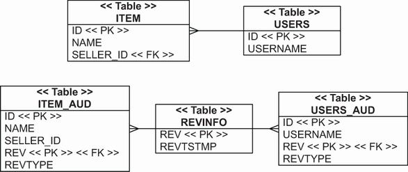

# Chương 13. Lọc dữ liệu

> *Java Persistence with Spring Data and Hibernate* — Chương 13: “Filtering data”

**Nội dung chương này bao gồm**

- Cascade các chuyển đổi trạng thái
- Lắng nghe và chặn (intercept) sự kiện
- Auditing và versioning với Hibernate Envers
- Lọc dữ liệu động

Trong chương này, chúng ta sẽ phân tích nhiều chiến lược khác nhau để lọc dữ liệu khi nó đi qua engine của Hibernate. Khi Hibernate nạp dữ liệu từ cơ sở dữ liệu, chúng ta có thể giới hạn một cách trong suốt dữ liệu mà ứng dụng nhìn thấy bằng một bộ lọc. Khi Hibernate lưu dữ liệu vào cơ sở dữ liệu, chúng ta có thể lắng nghe sự kiện đó và thực thi các routine phụ: chẳng hạn chúng ta có thể ghi audit log hoặc gán một định danh tenant cho bản ghi.

Trong bốn mục chính của chương này, chúng ta sẽ khám phá các tính năng và API lọc dữ liệu sau:

- Trước hết bạn sẽ học cách phản ứng với thay đổi trạng thái của một instance entity và cascade thay đổi trạng thái đó tới các entity liên quan. Ví dụ, khi một `User` được lưu, Hibernate có thể lưu bắc cầu và tự động mọi `BillingDetails` liên quan. Khi một `Item` bị xóa, Hibernate có thể xóa mọi instance `Bid` liên kết với `Item` đó. Chúng ta có thể bật tính năng JPA chuẩn này bằng các thuộc tính đặc biệt trong ánh xạ entity association và collection.
- Chuẩn Jakarta Persistence bao gồm các *lifecycle callback* và *event listener*. Một event listener là một class chúng ta viết với các phương thức đặc biệt, được Hibernate gọi khi một instance entity thay đổi trạng thái, chẳng hạn sau khi Hibernate nạp nó hoặc sắp xóa nó khỏi cơ sở dữ liệu. Các phương thức callback này cũng có thể nằm trên chính entity class và được đánh dấu bằng annotation đặc biệt. Điều này cho chúng ta cơ hội thực thi các tác dụng phụ tùy chỉnh khi một chuyển đổi xảy ra. Hibernate cũng có vài điểm mở rộng riêng cho phép chặn các sự kiện vòng đời ở mức thấp hơn bên trong engine của nó.
- Một tác dụng phụ phổ biến là ghi *audit log*; log như vậy thường chứa thông tin về dữ liệu bị thay đổi, thời điểm thay đổi và ai thực hiện sửa đổi. Một hệ thống auditing tinh vi hơn có thể đòi hỏi lưu nhiều phiên bản dữ liệu và các góc nhìn theo thời gian; chẳng hạn chúng ta có thể muốn yêu cầu Hibernate nạp dữ liệu “như nó đã có vào tuần trước”. Vì đây là bài toán phức tạp, chúng tôi sẽ giới thiệu Hibernate Envers, một dự án con chuyên về versioning và auditing trong ứng dụng JPA.
- Cuối cùng, chúng ta sẽ xem xét *data filter*, cũng có sẵn dưới dạng một API riêng của Hibernate. Những bộ lọc này thêm các ràng buộc tùy chỉnh vào câu lệnh SQL `SELECT` do Hibernate thực thi. Nhờ đó, chúng ta có thể định nghĩa hiệu quả một góc nhìn giới hạn tùy chỉnh về dữ liệu ở tầng ứng dụng. Ví dụ, chúng ta có thể áp dụng một bộ lọc giới hạn dữ liệu được nạp theo vùng bán hàng hoặc bất kỳ tiêu chí phân quyền nào khác.

Chúng ta sẽ bắt đầu với các tùy chọn cascade cho việc chuyển đổi trạng thái bắc cầu.

> **CHÚ Ý** Để có thể thực thi các ví dụ từ mã nguồn, trước tiên bạn cần chạy script Ch13.sql.

## 13.1 Cascade các chuyển đổi trạng thái

Khi một instance entity thay đổi trạng thái — chẳng hạn khi nó chuyển từ transient sang persistent — các instance entity liên quan cũng có thể được đưa vào chuyển đổi trạng thái này. Việc cascade các chuyển đổi trạng thái không được bật theo mặc định; mỗi instance entity có vòng đời độc lập. Nhưng với một số association giữa các entity, chúng ta có thể muốn hiện thực các phụ thuộc vòng đời mịn.

Ví dụ, ở mục 8.3 chúng ta đã tạo một association giữa entity class `Item` và `Bid`. Trong trường hợp đó, chúng ta không chỉ khiến các bid của một `Item` tự động trở thành persistent khi chúng được thêm vào `Item`, mà chúng còn tự động bị xóa khi `Item` sở hữu bị xóa. Chúng ta thực chất đã khiến `Bid` trở thành một entity class phụ thuộc vào một entity khác là `Item`.

Các thiết lập cascade mà chúng ta bật trong ánh xạ association đó là `CascadeType.PERSIST` và `CascadeType.REMOVE`. Chúng ta cũng đã tìm hiểu công tắc đặc biệt `orphanRemoval` và cách việc cascade xóa ở mức cơ sở dữ liệu (với tùy chọn foreign key `ON DELETE`) ảnh hưởng tới ứng dụng.

Vậy là chúng ta đã điểm qua cách làm việc với trạng thái cascade ở chương 8. Trong mục này, chúng ta sẽ phân tích một số tùy chọn cascade khác, ít được dùng hơn.

### 13.1.1 Các tùy chọn cascade khả dụng

Bảng 13.1 tóm tắt những tùy chọn cascade quan trọng nhất có sẵn trong Hibernate. Hãy để ý cách mỗi tùy chọn gắn với một thao tác của `EntityManager` hoặc `Session`.

**Bảng 13.1** Các tùy chọn cascade cho ánh xạ entity association

| Tùy chọn | Mô tả |
| --- | --- |
| `CascadeType.PERSIST` | Khi một instance entity được lưu bằng `EntityManager#persist()`, lúc flush mọi instance entity liên quan cũng được làm cho persistent. |
| `CascadeType.REMOVE` | Khi một instance entity bị xóa bằng `EntityManager#remove()`, lúc flush mọi instance entity liên quan cũng bị xóa. |
| `CascadeType.DETACH` | Khi một instance entity bị gỡ khỏi persistence context bằng `EntityManager#detach()`, mọi instance entity liên quan cũng bị detach. |
| `CascadeType.MERGE` | Khi một instance entity transient hoặc detached được merge vào một persistence context bằng `EntityManager#merge()`, mọi instance entity transient hoặc detached liên quan cũng được merge. |
| `CascadeType.REFRESH` | Khi một instance entity persistent được refresh bằng `EntityManager#refresh()`, mọi instance entity persistent liên quan cũng được refresh. |
| `CascadeType.REPLICATE` | Khi một instance entity detached được sao chép vào một cơ sở dữ liệu bằng `Session#replicate()`, mọi instance entity detached liên quan cũng được sao chép. |
| `CascadeType.ALL` | Đây là dạng viết tắt để bật mọi tùy chọn cascade cho association đã ánh xạ. |

Còn nhiều tùy chọn cascade khác được định nghĩa trong enum `org.hibernate.annotations.CascadeType`. Tuy nhiên ngày nay, tùy chọn duy nhất đáng chú ý là `REPLICATE` cùng thao tác `Session#replicate()`. Mọi thao tác `Session` khác đều có tương đương đã chuẩn hóa hoặc một lựa chọn thay thế trên API `EntityManager`, nên chúng ta có thể bỏ qua những thiết lập này.

Chúng ta đã xem xét các tùy chọn `PERSIST` và `REMOVE`. Hãy phân tích việc detach, merge, refresh và replicate bắc cầu.

### 13.1.2 Detach và merge bắc cầu

Chúng ta muốn truy xuất một `Item` và các bid của nó từ cơ sở dữ liệu rồi làm việc với dữ liệu này ở trạng thái detached. Class `Bid` ánh xạ association này bằng `@ManyToOne`. Nó là hai chiều với ánh xạ collection `@OneToMany` này trong `Item`:

*Đường dẫn: Ch13/cascade/src/main/java/com/manning/javapersistence/ch13/filtering/cascade/Item.java*

```java
@Entity
public class Item {
    @OneToMany(
        mappedBy = "item",
        cascade = {CascadeType.DETACH, CascadeType.MERGE}
    )
    private Set<Bid> bids = new HashSet<>();
    // . . .
}
```

Việc detach và merge bắc cầu được bật bằng cascade type `DETACH` và `MERGE`. Giờ chúng ta có thể nạp `Item` và khởi tạo collection `bids` của nó:

*Đường dẫn: Ch13/cascade/src/test/java/com/manning/javapersistence/ch13/filtering/Cascade.java*

```java
Item item = em.find(Item.class, ITEM_ID);
assertEquals(2, item.getBids().size());               // Ⓐ
em.detach(item);                                      // Ⓑ
```

Ⓐ Việc truy cập `item.getBids()` khởi tạo collection `bids` (nó được khởi tạo lazy).

Ⓑ Thao tác `EntityManager#detach()` được cascade: nó gỡ instance `Item` khỏi persistence context cũng như mọi `bids` trong collection. Nếu các bid chưa được nạp, chúng không bị detach. (Tất nhiên, chúng ta có thể đóng persistence context, thực chất detach mọi instance entity đã nạp.)

Ở trạng thái detached, chúng ta có thể đổi `Item#name`, tạo một `Bid` mới và liên kết nó với `Item`:

*Đường dẫn: Ch13/cascade/src/test/java/com/manning/javapersistence/ch13/filtering/Cascade.java*

```java
item.setName("New Name");
Bid bid = new Bid(new BigDecimal("101.00"), item);
item.addBid(bid);
```

Vì chúng ta đang làm việc với trạng thái entity detached và collection, chúng ta phải đặc biệt chú ý tới identity và equality. Như đã bàn ở mục 10.3, chúng ta nên ghi đè các phương thức `equals()` và `hashCode()` trên entity class `Bid`:

*Đường dẫn: Ch13/cascade/src/main/java/com/manning/javapersistence/ch13/filtering/cascade/Bid.java*

```java
@Entity
public class Bid {

    @Override
    public boolean equals(Object o) {
        if (this == o) return true;
        if (o instanceof Bid bid) {
            return Objects.equals(id, bid.id) &&
                   Objects.equals(amount, bid.amount) &&
                   Objects.equals(item, bid.item);
        }
        return false;
    }

    @Override
    public int hashCode() {
        return Objects.hash(id, amount, item);
    }
}
```

Hai instance `Bid` bằng nhau khi chúng có cùng `id`, cùng `amount`, và được liên kết với cùng một `Item`.

Một khi chúng ta xong việc sửa đổi ở trạng thái detached, bước tiếp theo là lưu các thay đổi. Dùng một persistence context mới, chúng ta có thể merge `Item` detached và để Hibernate phát hiện các thay đổi.

Dùng phương thức `merge`, Hibernate sẽ merge một instance detached. Trước hết nó kiểm tra xem persistence context đã chứa một entity với giá trị định danh cho trước hay chưa. Nếu chưa, entity được nạp từ cơ sở dữ liệu. Hibernate đủ thông minh để biết rằng nó cũng sẽ cần các entity được tham chiếu trong quá trình merge, nên nó fetch chúng ngay trong cùng truy vấn SQL.

Khi flush persistence context, Hibernate phát hiện xem property nào của entity đã thay đổi trong quá trình merge. Các entity được tham chiếu cũng có thể được lưu:

*Đường dẫn: Ch13/cascade/src/test/java/com/manning/javapersistence/ch13/filtering/Cascade.java*

```java
Item mergedItem = em.merge(item);                          // Ⓐ
// select i.*, b.*
//   from ITEM i
//     left outer join BID b on i.ID = b.ITEM_ID
//   where i.ID = ?
for (Bid b : mergedItem.getBids()) {                       // Ⓑ
     assertNotNull(b.getId());
}
em.flush();                                                // Ⓒ
// update ITEM set NAME = ? where ID = ?
// insert into BID values (?, ?, ?, . . . )
```

Ⓐ Hibernate merge `item` detached. Không có `Item` nào với giá trị định danh cho trước, nên `Item` được nạp từ cơ sở dữ liệu. Hibernate fetch `bids` trong quá trình merge bằng cùng truy vấn SQL. Rồi Hibernate sao chép giá trị của `item` detached vào instance đã nạp, thứ mà nó trả về cho chúng ta ở trạng thái persistent. Cùng thủ tục được áp dụng cho mỗi `Bid`, và Hibernate sẽ phát hiện rằng một trong các bid là mới.

Ⓑ Hibernate đã làm `Bid` mới trở thành persistent trong quá trình merge. Giờ nó đã được gán giá trị định danh.

Ⓒ Khi chúng ta flush persistence context, Hibernate phát hiện `name` của `Item` đã thay đổi trong quá trình merge. `Bid` mới cũng sẽ được lưu.

Việc merge có cascade với collection là một tính năng mạnh mẽ; hãy nghĩ xem chúng ta sẽ phải viết bao nhiêu mã nếu không có Hibernate để hiện thực chức năng này.

> **Eager fetch các association khi merge**
>
> Ở ví dụ mã cuối trong mục 13.1.2, chúng tôi đã nói rằng Hibernate đủ thông minh để nạp collection `Item#bids` khi chúng ta merge một `Item` detached. Hibernate luôn nạp các entity association một cách eager bằng `JOIN` khi merge nếu `CascadeType.MERGE` được bật cho association. Điều này là thông minh trong trường hợp nêu trên, khi `Item#bids` đã được khởi tạo, detach và sửa đổi. Việc Hibernate nạp collection khi merge bằng `JOIN` là cần thiết và tối ưu, nhưng nếu chúng ta merge một instance `Item` với collection `bids` chưa khởi tạo hoặc một proxy `seller` chưa khởi tạo, Hibernate vẫn sẽ fetch collection và proxy bằng `JOIN` khi merge. Việc merge khởi tạo những association này trên `Item` được quản lý mà nó trả về. `CascadeType.MERGE` khiến Hibernate bỏ qua và thực chất ghi đè mọi ánh xạ `FetchType.LAZY` (như đặc tả JPA cho phép).

Ví dụ tiếp theo của chúng ta ít tinh vi hơn, bật việc refresh có cascade cho các entity liên quan.

### 13.1.3 Cascade refresh

Entity class `User` có quan hệ một-nhiều với `BillingDetails`: mỗi user của ứng dụng có thể có nhiều thẻ tín dụng, tài khoản ngân hàng, v.v. Nếu bạn muốn xem lại class `BillingDetails`, hãy xem các ánh xạ ở chương 7.

Chúng ta có thể ánh xạ quan hệ giữa `User` và `BillingDetails` thành một entity association một-nhiều một chiều:

*Đường dẫn: Ch13/cascade/src/main/java/com/manning/javapersistence/ch13/filtering/cascade/User.java*

```java
@Entity
@Table(name = "USERS")
public class User {
    @OneToMany(cascade = {CascadeType.PERSIST, CascadeType.REFRESH})
    @JoinColumn(name = "USER_ID", nullable = false)
    private Set<BillingDetails> billingDetails = new HashSet<>();
    // . . .
}
```

Các tùy chọn cascade được bật cho association này là `PERSIST` và `REFRESH`. Tùy chọn `PERSIST` đơn giản hóa việc lưu billing details; chúng trở nên persistent khi chúng ta thêm một instance `BillingDetails` vào collection của một `User` đã persistent.

Tùy chọn cascade `REFRESH` bảo đảm rằng khi chúng ta nạp lại trạng thái của một instance `User`, Hibernate cũng sẽ refresh trạng thái của mỗi instance `BillingDetails` liên kết với `User`. Ví dụ, khi chúng ta `refresh()` instance `User` đang được quản lý, Hibernate cascade thao tác tới các `BillingDetails` được quản lý và refresh từng cái bằng một lệnh SQL `SELECT`. Nếu không instance nào trong số này còn trong cơ sở dữ liệu, Hibernate ném `EntityNotFoundException`. Rồi Hibernate refresh instance `User` và nạp eager toàn bộ collection `billingDetails` để phát hiện `BillingDetails` mới:

*Đường dẫn: Ch13/cascade/src/test/java/com/manning/javapersistence/ch13/filtering/Cascade.java*

```java
User user = em.find(User.class, USER_ID);                       // Ⓐ
assertEquals(2, user.getBillingDetails().size());               // Ⓑ
for (BillingDetails bd : user.getBillingDetails()) {
     assertEquals("John Doe", bd.getOwner());
}
// Someone modifies the billing information in the database!
em.refresh(user);                                               // Ⓒ
// select * from CREDITCARD join BILLINGDETAILS where ID = ?
// select * from BANKACCOUNT join BILLINGDETAILS where ID = ?
// select * from USERS
//   left outer join BILLINGDETAILS
//     left outer join CREDITCARD
//     left outer join BANKACCOUNT
// where ID = ?
for (BillingDetails bd : user.getBillingDetails()) {
     assertEquals("Doe John", bd.getOwner());
}
```

Ⓐ Một instance `User` được nạp từ cơ sở dữ liệu.

Ⓑ Collection `billingDetails` lazy của nó được khởi tạo khi chúng ta duyệt các phần tử hoặc khi gọi `size()`.

Ⓒ Khi chúng ta `refresh()` instance `User` đang được quản lý, Hibernate cascade thao tác tới các `BillingDetails` được quản lý và refresh từng cái bằng một lệnh SQL `SELECT`.

Đây là một trường hợp Hibernate không thông minh như nó có thể. Trước hết, nó thực thi một lệnh SQL `SELECT` cho mỗi instance `BillingDetails` có trong persistence context và được collection tham chiếu. Rồi nó nạp lại toàn bộ collection để tìm bất kỳ `BillingDetails` nào được thêm. Hibernate rõ ràng có thể làm việc này bằng một lệnh `SELECT`.

Chúng ta muốn refresh bản ghi sau khi nó bị một transaction khác sửa đổi, nên phải nhớ rằng mức cô lập transaction mặc định của MySQL là `REPEATABLE_READ`, trong khi với hầu hết cơ sở dữ liệu khác là `READ_COMMITTED`. Chúng ta bắt đầu một transaction rồi bắt đầu transaction thứ hai, thứ đã commit thay đổi trước khi transaction đầu thực hiện thao tác refresh. Để transaction đầu có thể thấy các thay đổi từ transaction thứ hai, chúng ta cần đổi mức cô lập trên driver JDBC. Đó là lý do chúng tôi cung cấp URL cấu hình sau:

*Đường dẫn: Ch13/cascade/src/main/resources/META-INF/persistence.xml*

```xml
<property name="javax.persistence.jdbc.url"
value="jdbc:mysql://localhost:3306/CH13_CASCADE?sessionVariables=transaction_isolation='READ-COMMITTED'&amp;serverTimezone=UTC"/>
```

Vì thay đổi chỉ được thực hiện ở mức cấu hình, mã sẽ tiếp tục hoạt động đúng với các cơ sở dữ liệu khác nhau, miễn là file persistence.xml chứa cấu hình đúng.

Tùy chọn cascade cuối cùng là cho thao tác `replicate()` chỉ có ở Hibernate.

### 13.1.4 Cascade replication

Chúng ta đã xem xét replication lần đầu ở mục 10.2.7. Thao tác phi chuẩn này có sẵn trên API `Session` của Hibernate. Trường hợp sử dụng chính của nó là sao chép dữ liệu từ cơ sở dữ liệu này sang cơ sở dữ liệu khác.

Hãy xét ánh xạ entity association nhiều-một giữa `Item` và `User`:

*Đường dẫn: Ch13/cascade/src/main/java/com/manning/javapersistence/ch13/filtering/cascade/Item.java*

```java
@Entity
public class Item {
    @ManyToOne(fetch = FetchType.LAZY)
    @JoinColumn(name = "SELLER_ID", nullable = false)
    @org.hibernate.annotations.Cascade(
        org.hibernate.annotations.CascadeType.REPLICATE
    )
    private User seller;
    // . . .
}
```

Ở đây chúng ta bật tùy chọn cascade `REPLICATE` bằng một annotation của Hibernate. Tiếp theo, chúng ta sẽ nạp một `Item` và `seller` của nó từ cơ sở dữ liệu nguồn:

*Đường dẫn: Ch13/cascade/src/test/java/com/manning/javapersistence/ch13/filtering/Cascade.java*

```java
em = emf.createEntityManager();
em.getTransaction().begin();
Item item = em.find(Item.class, ITEM_ID);
assertNotNull(item.getSeller().getUsername());              // Ⓐ
em.getTransaction().commit();
em.close();
```

Ⓐ Khởi tạo `Item#seller` một cách lazy.

Sau khi đóng persistence context, các instance entity `Item` và `User` ở trạng thái detached. Tiếp theo, chúng ta kết nối tới cơ sở dữ liệu và ghi dữ liệu detached:

*Đường dẫn: Ch13/cascade/src/test/java/com/manning/javapersistence/ch13/filtering/Cascade.java*

```java
EntityManager otherDatabase = // . . . get EntityManager
otherDatabase.getTransaction().begin();
otherDatabase.unwrap(Session.class)
    .replicate(item, ReplicationMode.OVERWRITE);
// select ID from ITEM where ID = ?
// select ID from USERS where ID = ?
otherDatabase.getTransaction().commit();
// update ITEM set NAME = ?, SELLER_ID = ?, . . . where ID = ?
// update USERS set USERNAME = ?, . . . where ID = ?
otherDatabase.close();
```

Khi chúng ta gọi `replicate()` trên `Item` detached, Hibernate thực thi các câu lệnh SQL `SELECT` để tìm hiểu xem `Item` và `seller` của nó đã có sẵn trong cơ sở dữ liệu hay chưa. Rồi khi commit, khi persistence context được flush, Hibernate ghi giá trị của `Item` và `seller` vào cơ sở dữ liệu đích. Trong ví dụ trên, những dòng này đã có sẵn, nên chúng ta sẽ thấy một lệnh `UPDATE` cho mỗi cái, ghi đè giá trị trong cơ sở dữ liệu. Nếu cơ sở dữ liệu đích không chứa `Item` hay `User`, hai lệnh `INSERT` sẽ được thực hiện.

## 13.2 Lắng nghe và chặn sự kiện

Trong mục này, chúng ta sẽ phân tích ba API khác nhau cho các event listener tùy chỉnh và interceptor vòng đời persistence có sẵn trong JPA và Hibernate. Chúng cho phép chúng ta làm vài việc:

- Dùng các phương thức lifecycle callback và event listener chuẩn của JPA.
- Viết một `org.hibernate.Interceptor` riêng và kích hoạt nó trên một `Session`.
- Dùng các điểm mở rộng của engine lõi Hibernate với service provider interface (SPI) `org.hibernate.event`.

Hãy bắt đầu với các callback chuẩn của JPA. Chúng cung cấp cách truy cập dễ dàng tới các sự kiện vòng đời persist, load và remove.

### 13.2.1 Event listener và callback của JPA

Giả sử chúng ta muốn ghi một thông điệp mỗi khi một instance entity mới được lưu. Một class entity listener phải có một constructor `public` không tham số, ngầm định hoặc tường minh. Nó không phải hiện thực interface đặc biệt nào. Một entity listener là phi trạng thái; engine JPA tự động tạo và hủy nó. Nghĩa là có thể khó lấy thêm thông tin ngữ cảnh khi cần, nhưng chúng tôi sẽ minh họa một số khả năng.

Trước hết chúng ta sẽ viết một event listener vòng đời với một phương thức callback được đánh dấu `@PostPersist`, như ở listing sau. Chúng ta có thể đánh dấu bất kỳ phương thức nào của một class entity listener làm phương thức callback cho các sự kiện vòng đời persistence.

**Listing 13.1** Thông báo cho admin khi một instance entity được lưu

*Đường dẫn: Ch13/callback/src/main/java/com/manning/javapersistence/ch13/filtering/callback/PersistEntityListener.java*

```java
public class PersistEntityListener {

    @PostPersist                                             // Ⓐ
    public void logMessage(Object entityInstance) {
        User currentUser = CurrentUser.INSTANCE.get();       // Ⓑ
        Log log = Log.INSTANCE;
        log.save(
              "Entity instance persisted by "
                    + currentUser.getUsername()
                    + ": "
                    + entityInstance
        );
    }
}
```

Ⓐ Phương thức `logMessage()`, được đánh dấu `@PostPersist`, được gọi sau khi một instance entity mới được lưu vào cơ sở dữ liệu.

Ⓑ Chúng ta muốn có thông tin ngữ cảnh về user đang đăng nhập và quyền truy cập thông tin log. Một giải pháp sơ khai là dùng biến thread-local và singleton; mã nguồn của `CurrentUser` và `Log` nằm trong mã ví dụ.

Một phương thức callback của class entity listener có một tham số `Object` duy nhất: instance entity liên quan tới thay đổi trạng thái. Nếu chúng ta chỉ bật callback cho một kiểu entity cụ thể, chúng ta có thể khai báo đối số là kiểu cụ thể đó. Phương thức callback có thể có bất kỳ mức truy cập nào; nó không phải `public`. Nó không được là `static` hay `final` và không trả về gì. Nếu một phương thức callback ném một `RuntimeException` unchecked, Hibernate sẽ hủy thao tác và đánh dấu transaction hiện tại để rollback. Nếu một phương thức callback khai báo và ném một `Exception` checked, Hibernate sẽ bọc và đối xử với nó như một `RuntimeException`.

Chúng ta chỉ có thể dùng mỗi annotation callback một lần trong một class entity listener; nghĩa là chỉ một phương thức có thể được đánh dấu `@PostPersist`. Bảng 13.2 tóm tắt mọi annotation callback khả dụng.

**Bảng 13.2** Các annotation lifecycle callback

| Annotation | Mô tả |
| --- | --- |
| `@PostLoad` | Kích hoạt sau khi một instance entity được nạp vào persistence context, dù bằng tra cứu định danh, qua điều hướng và khởi tạo proxy/collection, hay bằng truy vấn. Cũng được gọi sau khi refresh một instance đã persistent. |
| `@PrePersist` | Được gọi ngay khi `persist()` được gọi trên một instance entity. Cũng được gọi với `merge()` khi một entity được phát hiện là transient, sau khi trạng thái transient được sao chép vào một instance persistent. Cũng được gọi cho các entity liên quan nếu chúng ta bật `CascadeType.PERSIST`. |
| `@PostPersist` | Được gọi sau khi thao tác cơ sở dữ liệu làm một instance entity trở nên persistent được thực thi và một giá trị định danh được gán. Điều này có thể là khi `persist()` hay `merge()` được gọi, hoặc muộn hơn khi persistence context được flush nếu identifier generator là pre-insert (xem mục 5.2.5). Cũng được gọi cho các entity liên quan nếu chúng ta bật `CascadeType.PERSIST`. |
| `@PreUpdate`, `@PostUpdate` | Được thực thi trước và sau khi persistence context được đồng bộ với cơ sở dữ liệu; tức là trước và sau khi flush. Chỉ kích hoạt khi trạng thái của entity cần đồng bộ (chẳng hạn vì nó được coi là dirty). |
| `@PreRemove`, `@PostRemove` | Kích hoạt khi `remove()` được gọi hoặc instance entity bị xóa do cascade, và sau khi bản ghi trong cơ sở dữ liệu bị xóa lúc persistence context được flush. |

Một class entity listener phải được bật cho bất kỳ entity nào chúng ta muốn chặn, chẳng hạn `Item` này:

*Đường dẫn: Ch13/callback/src/main/java/com/manning/javapersistence/ch13/filtering/callback/Item.java*

```java
@Entity
@EntityListeners(
      PersistEntityListener.class
)
public class Item {
      // . . .
}
```

Annotation `@EntityListeners` chấp nhận một mảng các class listener nếu chúng ta có nhiều interceptor. Nếu nhiều listener định nghĩa phương thức callback cho cùng một sự kiện, Hibernate gọi các listener theo thứ tự đã khai báo.

Chúng ta không phải viết một class entity listener riêng để chặn sự kiện vòng đời. Chẳng hạn, chúng ta có thể hiện thực phương thức `logMessage()` ngay trên entity class `User`:

*Đường dẫn: Ch13/callback/src/main/java/com/manning/javapersistence/ch13/filtering/callback/User.java*

```java
@Entity
@Table(name = "USERS")
public class User {

    @PostPersist
    public void logMessage() {
        User currentUser = CurrentUser.INSTANCE.get();
        Log log = Log.INSTANCE;
        log.save(
                "Entity instance persisted by "
                + currentUser.getUsername()
                + ": "
                + this
        );
    }
    // . . .
}
```

Lưu ý rằng các phương thức callback trên một entity class không có đối số nào: entity “hiện tại” liên quan tới thay đổi trạng thái chính là `this`. Không cho phép callback trùng lặp cho cùng một sự kiện trong một class duy nhất, nhưng chúng ta có thể chặn cùng một sự kiện bằng các phương thức callback ở nhiều class listener hoặc ở một listener và một entity class.

Chúng ta cũng có thể thêm phương thức callback trên một entity superclass cho cả cây phân cấp. Nếu, với một subclass entity cụ thể, chúng ta muốn tắt các callback của superclass, chúng ta có thể đánh dấu subclass bằng `@ExcludeSuperclassListeners`. Nếu chúng ta muốn tắt một entity listener mặc định cho một entity cụ thể, chúng ta có thể đánh dấu nó bằng annotation `@ExcludeDefaultListeners`:

*Đường dẫn: Ch13/callback/src/main/java/com/manning/javapersistence/ch13/filtering/callback/User.java*

```java
@Entity
@Table(name = "USERS")
@ExcludeDefaultListeners
public class User {
    // . . .
}
```

Event listener và callback của JPA cung cấp một bộ khung sơ khai để phản ứng với sự kiện vòng đời bằng các thủ tục của riêng chúng ta. Hibernate cũng có một API thay thế mịn và mạnh hơn: `org.hibernate.Interceptor`.

### 13.2.2 Hiện thực Hibernate interceptor

Hãy giả sử chúng ta muốn ghi một audit log các sửa đổi dữ liệu vào một table cơ sở dữ liệu riêng. Chẳng hạn, chúng ta có thể muốn ghi lại thông tin về sự kiện tạo và cập nhật cho mỗi `Item`. Audit log bao gồm user, ngày giờ của sự kiện, loại sự kiện nào đã xảy ra, và định danh của `Item` bị thay đổi.

Audit log thường được xử lý bằng trigger của cơ sở dữ liệu. Mặt khác, đôi khi tốt hơn là để ứng dụng chịu trách nhiệm, nhất là khi cần tính khả chuyển giữa các cơ sở dữ liệu khác nhau.

Chúng ta cần vài thành phần để hiện thực audit logging. Trước hết, chúng ta phải đánh dấu các entity class mà chúng ta muốn bật audit logging. Tiếp theo, chúng ta định nghĩa thông tin cần ghi, chẳng hạn user, ngày, giờ và loại sửa đổi. Cuối cùng, chúng ta gắn kết tất cả lại bằng một `org.hibernate.Interceptor` tự động tạo audit trail.

Trước hết chúng ta sẽ tạo một interface đánh dấu, `Auditable`:

*Đường dẫn: Ch13/interceptor/src/main/java/com/manning/javapersistence/ch13/filtering/interceptor/Auditable.java*

```java
public interface Auditable {
    Long getId();
}
```

Interface này yêu cầu một entity class persistent phơi bày định danh của nó bằng một phương thức getter; chúng ta cần property này để ghi audit trail. Việc bật audit logging cho một persistent class cụ thể khi đó là chuyện tầm thường. Chúng ta thêm nó vào khai báo class, chẳng hạn với `Item`:

*Đường dẫn: /model/src/main/java/org/jpwh/model/filtering/interceptor/Item.java*

```java
@Entity
public class Item implements Auditable {
    // . . .
}
```

Giờ chúng ta có thể tạo một entity class persistent mới, `AuditLogRecord`, với thông tin chúng ta muốn ghi vào table audit của cơ sở dữ liệu:

*Đường dẫn: Ch13/interceptor/src/main/java/com/manning/javapersistence/ch13/filtering/interceptor/AuditLogRecord.java*

```java
@Entity
public class AuditLogRecord {

    @Id
    @GeneratedValue(generator = Constants.ID_GENERATOR)
    private Long id;

    @NotNull
    private String message;

    @NotNull
    private Long entityId;

    @NotNull
    private Class<? extends Auditable> entityClass;

    @NotNull
    private Long userId;

    @NotNull
    private LocalDateTime createdOn = LocalDateTime.now();
    // . . .
}
```

Chúng ta muốn lưu một instance `AuditLogRecord` mỗi khi Hibernate chèn hoặc cập nhật một `Item` trong cơ sở dữ liệu. Một Hibernate interceptor có thể xử lý việc này tự động. Thay vì hiện thực mọi phương thức trong `org.hibernate.Interceptor`, chúng ta mở rộng `EmptyInterceptor` và chỉ ghi đè những phương thức cần thiết, như minh họa ở listing 13.2. Chúng ta cần truy cập cơ sở dữ liệu để ghi audit log, nên interceptor cần một `Session` của Hibernate.

Chúng ta cũng muốn lưu định danh của user đang đăng nhập trong mỗi bản ghi audit log. Các biến instance `inserts` và `updates` mà chúng ta sẽ khai báo là những collection nơi interceptor này giữ trạng thái nội bộ của nó.

**Listing 13.2** Hibernate interceptor ghi log các sự kiện sửa đổi

*Đường dẫn: Ch13/interceptor/src/test/java/com/manning/javapersistence/ch13/filtering/AuditLogInterceptor.java*

```java
public class AuditLogInterceptor extends EmptyInterceptor {

    private Session currentSession;
    private Long currentUserId;
    private Set<Auditable> inserts = new HashSet<>();
    private Set<Auditable> updates = new HashSet<>();

    public void setCurrentSession(Session session) {
        this.currentSession = session;
    }

    public void setCurrentUserId(Long currentUserId) {
        this.currentUserId = currentUserId;
    }

    public boolean onSave(Object entity, Serializable id,             // Ⓐ
                          Object[] state, String[] propertyNames,
                          Type[] types)
        throws CallbackException {
        if (entity instanceof Auditable aud) {
            inserts.add(aud);
        }
        return false;                                                 // Ⓑ
    }

    public boolean onFlushDirty(Object entity, Serializable id,       // Ⓒ
                                Object[] currentState,
                                Object[] previousState,
                                String[] propertyNames, Type[] types)
        throws CallbackException {
        if (entity instanceof Auditable aud) {
            updates.add(aud);
        }
        return false;                                                 // Ⓓ
    }
    // . . .
}
```

Ⓐ Phương thức này được gọi khi một instance entity được làm cho persistent.

Ⓑ Trạng thái không bị sửa đổi.

Ⓒ Phương thức này được gọi khi một instance entity được phát hiện là dirty trong lúc flush persistence context.

Ⓓ `currentState` không bị sửa đổi.

Interceptor thu thập các instance `Auditable` đã sửa đổi vào `inserts` và `updates`. Lưu ý rằng trong `onSave()`, có thể chưa có giá trị định danh nào được gán cho instance entity đã cho. Hibernate bảo đảm gán định danh entity trong lúc flush, nên audit log trail thực sự được ghi trong callback `postFlush()`, không hiển thị ở listing 13.2. Phương thức này được gọi sau khi việc flush persistence context hoàn tất.

Giờ chúng ta sẽ ghi các bản ghi audit log cho mọi lần chèn và cập nhật đã thu thập trước đó:

*Đường dẫn: Ch13/interceptor/src/test/java/com/manning/javapersistence/ch13/filtering/AuditLogInterceptor.java*

```java
public class AuditLogInterceptor extends EmptyInterceptor {
    // . . .

    public void postFlush(@SuppressWarnings("rawtypes") Iterator iterator)
            throws CallbackException {
        Session tempSession =                                          // Ⓐ
              currentSession.sessionWithOptions()
                  .connection()
                  .openSession();
        try {
            for (Auditable entity : inserts) {                         // Ⓑ
                tempSession.persist(
                    new AuditLogRecord("insert", entity, currentUserId)
                );
            }
            for (Auditable entity : updates) {
                tempSession.persist(
                     new AuditLogRecord("update", entity, currentUserId)
                );
            }
            tempSession.flush();                                       // Ⓒ
        } finally {
            tempSession.close();
            inserts.clear();
            updates.clear();
        }
    }
}
```

Ⓐ Chúng ta không thể truy cập persistence context gốc — `Session` đang thực thi interceptor này. `Session` ở trạng thái mong manh trong các lời gọi interceptor. Hibernate cho phép chúng ta tạo một `Session` mới kế thừa một số thông tin từ `Session` gốc bằng phương thức `sessionWithOptions()`. `Session` tạm mới làm việc với cùng transaction và kết nối cơ sở dữ liệu như `Session` gốc.

Ⓑ Chúng ta lưu một `AuditLogRecord` mới cho mỗi lần chèn và cập nhật bằng `Session` tạm.

Ⓒ Chúng ta flush và đóng `Session` tạm độc lập với `Session` gốc.

Giờ chúng ta đã sẵn sàng bật interceptor này:

*Đường dẫn: Ch13/interceptor/src/test/java/com/manning/javapersistence/ch13/filtering/AuditLogging.java*

```java
EntityManager em = emf.createEntityManager();
SessionFactory sessionFactory = emf.unwrap(SessionFactory.class);
Session session = sessionFactory.withOptions()
          .interceptor(new AuditLogInterceptor()).openSession();
```

> **Bật interceptor mặc định**
>
> Nếu chúng ta muốn bật một interceptor theo mặc định cho mọi `EntityManager`, chúng ta có thể đặt property `hibernate.ejb.interceptor` trong persistence.xml thành một class hiện thực `org.hibernate.Interceptor`. Lưu ý rằng, khác với interceptor có phạm vi session, Hibernate dùng chung interceptor mặc định này, nên nó phải an toàn với đa luồng! `AuditLogInterceptor` ví dụ thì không an toàn với đa luồng.

`Session` này giờ đã bật `AuditLogInterceptor`, nhưng interceptor cũng phải được cấu hình với `Session` hiện tại và định danh user đang đăng nhập. Việc này bao gồm một số ép kiểu để truy cập API Hibernate:

*Đường dẫn: Ch13/interceptor/src/test/java/com/manning/javapersistence/ch13/filtering/AuditLogging.java*

```java
AuditLogInterceptor interceptor =
     (AuditLogInterceptor) ((SessionImplementor) session).getInterceptor();
interceptor.setCurrentSession(session);
interceptor.setCurrentUserId(CURRENT_USER_ID);
```

`Session` giờ đã sẵn sàng sử dụng, và một audit trail sẽ được ghi mỗi khi chúng ta lưu hoặc sửa một instance `Item` với nó.

Hibernate interceptor rất linh hoạt, và khác với event listener và phương thức callback của JPA, chúng ta có quyền truy cập nhiều thông tin ngữ cảnh hơn khi một sự kiện xảy ra. Tuy nhiên, Hibernate còn cho phép chúng ta móc sâu hơn vào lõi của nó bằng hệ thống sự kiện có thể mở rộng mà nó dựa trên.

### 13.2.3 Hệ thống sự kiện lõi

Engine lõi của Hibernate dựa trên một mô hình sự kiện và listener. Ví dụ, nếu Hibernate cần lưu một instance entity, nó kích hoạt một sự kiện. Ai lắng nghe loại sự kiện này có thể bắt nó và xử lý việc lưu dữ liệu. Do đó, Hibernate hiện thực toàn bộ chức năng lõi của nó dưới dạng một tập các listener mặc định, có thể xử lý mọi sự kiện của Hibernate.

Hibernate mở theo thiết kế: chúng ta có thể viết và bật listener của riêng mình cho các sự kiện Hibernate. Chúng ta có thể thay thế các listener mặc định hiện có hoặc mở rộng chúng và thực thi một tác dụng phụ hay thủ tục bổ sung. Việc thay thế event listener là hiếm; làm vậy hàm ý rằng hiện thực listener của chúng ta có thể đảm nhiệm một phần chức năng lõi của Hibernate.

Về cơ bản, mọi phương thức của interface `Session` (và người anh em hẹp hơn của nó là `EntityManager`) đều tương ứng với một sự kiện. Các phương thức `find()` và `load()` kích hoạt một `LoadEvent`, và theo mặc định sự kiện này được xử lý bằng `DefaultLoadEventListener`.

Một listener tùy chỉnh nên hiện thực interface phù hợp cho sự kiện nó muốn xử lý và/hoặc mở rộng một trong các class cơ sở tiện lợi mà Hibernate cung cấp, hoặc bất kỳ event listener mặc định nào. Đây là ví dụ về một load event listener tùy chỉnh.

**Listing 13.3** Load event listener tùy chỉnh

*Đường dẫn: Ch13/interceptor/src/test/java/com/manning/javapersistence/ch13/filtering/SecurityLoadListener.java*

```java
public class SecurityLoadListener extends DefaultLoadEventListener {

    public void onLoad(LoadEvent event, LoadType loadType)
        throws HibernateException {
        boolean authorized =
            MySecurity.isAuthorized(
                  event.getEntityClassName(), event.getEntityId()
            );
        if (!authorized) {
            throw new MySecurityException("Unauthorized access");
        }
        super.onLoad(event, loadType);
    }
}
```

Listener này thực hiện mã phân quyền tùy chỉnh. Một listener nên được coi là singleton, nghĩa là nó được dùng chung giữa các persistence context và do đó không nên lưu bất kỳ trạng thái liên quan tới transaction nào dưới dạng biến instance. Để xem danh sách mọi sự kiện và interface listener trong Hibernate native, xem Javadoc API của package `org.hibernate.event`.

Chúng ta bật listener cho mỗi sự kiện lõi trong persistence.xml:

*Đường dẫn: Ch13/interceptor/src/main/resources/META-INF/persistence.xml*

```xml
<properties>
     <!-- . . . -->
     <property name="hibernate.ejb.event.load" value=
           "com.manning.javapersistence.ch13.filtering.SecurityLoadListener"/>
</properties>
```

Tên property của các thiết lập cấu hình luôn bắt đầu bằng `hibernate.ejb.event`, theo sau là loại sự kiện chúng ta muốn lắng nghe. Bạn có thể tìm danh sách mọi loại sự kiện trong `org.hibernate.event.spi.EventType`. Giá trị của property có thể là danh sách tên class listener cách nhau bằng dấu phẩy; Hibernate sẽ gọi từng listener theo thứ tự đã chỉ định.

Chúng ta hiếm khi phải mở rộng hệ thống sự kiện lõi của Hibernate bằng chức năng của riêng mình. Hầu hết thời gian, một `org.hibernate.Interceptor` đã đủ linh hoạt. Tuy nhiên, sẽ hữu ích khi có thêm lựa chọn và có thể thay thế bất kỳ phần nào của engine lõi Hibernate theo cách mô-đun.

Hiện thực audit-logging chúng tôi minh họa ở mục trước rất đơn giản. Nếu cần ghi thêm thông tin cho việc auditing, chẳng hạn giá trị property thực sự đã thay đổi của một entity, chúng ta sẽ cân nhắc Hibernate Envers.

## 13.3 Auditing và versioning với Hibernate Envers

Envers là một dự án thuộc bộ Hibernate, chuyên về audit logging và lưu giữ nhiều phiên bản dữ liệu trong cơ sở dữ liệu. Điều này tương tự các hệ thống quản lý phiên bản mà có thể bạn đã quen như Subversion và Git.

Khi bật Envers, một bản sao dữ liệu sẽ tự động được lưu trong các table cơ sở dữ liệu riêng khi chúng ta thêm, sửa hoặc xóa dữ liệu ở các table chính của ứng dụng. Envers dùng nội bộ SPI sự kiện của Hibernate mà bạn đã thấy ở mục trước. Envers lắng nghe các sự kiện Hibernate, và khi Hibernate lưu thay đổi vào cơ sở dữ liệu, Envers tạo một bản sao dữ liệu và ghi một revision vào các table riêng của nó.

Envers nhóm mọi sửa đổi dữ liệu trong một đơn vị công việc — tức là trong một transaction — thành một *change set* với một số revision. Chúng ta có thể viết truy vấn bằng API Envers để truy xuất dữ liệu lịch sử, cho trước một số revision hoặc timestamp; chẳng hạn, “tìm tất cả instance `Item` như chúng đã có vào thứ Sáu tuần trước”.

Một khi bạn bật Envers trong ứng dụng, bạn sẽ có thể làm việc với nó dễ dàng, vì nó dựa trên annotation. Nó sẽ cho bạn tùy chọn lưu nhiều phiên bản dữ liệu trong cơ sở dữ liệu với ít công sức. Đánh đổi là nó sẽ tạo ra rất nhiều table bổ sung (nhưng bạn sẽ có thể kiểm soát những table nào muốn audit).

### 13.3.1 Bật audit logging

Envers có sẵn mà không cần cấu hình thêm ngay khi chúng ta đặt file JAR của nó lên classpath (chúng ta sẽ thêm nó làm dependency Maven). Chúng ta có thể bật audit logging có chọn lọc cho một entity class bằng annotation `@org.hibernate.envers.Audited`.

**Listing 13.4** Bật audit logging cho entity Item

*Đường dẫn: Ch13/envers/src/main/java/com/manning/javapersistence/ch13/filtering/envers/Item.java*

```java
@Entity
@org.hibernate.envers.Audited
public class Item {

    @NotNull
    private String name;

    @OneToMany(mappedBy = "item")
    @org.hibernate.envers.NotAudited
    private Set<Bid> bids = new HashSet<>();

    @ManyToOne(fetch = FetchType.LAZY)
    @JoinColumn(name = "SELLER_ID", nullable = false)
    private User seller;
    // . . .
}
```

Giờ chúng ta đã bật audit logging cho các instance `Item` và mọi property của entity. Để tắt audit logging cho một property cụ thể, chúng ta có thể đánh dấu nó bằng `@NotAudited`. Trong trường hợp này, Envers bỏ qua `bids` nhưng audit `seller`. Chúng ta cũng phải bật auditing bằng `@Audited` trên class `User`.

Hibernate giờ sẽ sinh (hoặc mong đợi) thêm các table cơ sở dữ liệu để chứa dữ liệu lịch sử của mỗi `Item` và `User`. Hình 13.1 cho thấy schema của các table này.



**Hình 13.1** Các table audit logging cho entity `Item` và `User`

Table `ITEM_AUD` và `USERS_AUD` là nơi lịch sử sửa đổi của các instance `Item` và `User` được lưu. Khi chúng ta sửa dữ liệu và commit một transaction, Hibernate chèn một số revision mới cùng timestamp vào table `REVINFO`. Rồi, với mỗi instance entity đã sửa đổi và được audit tham gia change set, một bản sao dữ liệu của nó được lưu trong các table audit. Các foreign key trên cột số revision liên kết change set lại với nhau. Cột `REVTYPE` chứa loại thay đổi: instance entity đã được chèn, cập nhật hay xóa trong transaction. Envers không bao giờ tự động xóa thông tin revision hay dữ liệu lịch sử; ngay cả sau khi chúng ta `remove()` một instance `Item`, chúng ta vẫn có các phiên bản trước của nó lưu trong `ITEM_AUD`.

Hãy chạy qua một số transaction để xem cách hoạt động.

### 13.3.2 Tạo audit trail

Ở các ví dụ mã sau, chúng ta sẽ xem vài transaction liên quan tới một `Item` và `seller` của nó, một `User`. Chúng ta sẽ tạo và lưu một `Item` và `User`, rồi sửa cả hai, rồi cuối cùng xóa `Item`.

Bạn hẳn đã quen với đoạn mã này. Envers tự động tạo audit trail khi chúng ta làm việc với `EntityManager`:

*Đường dẫn: Ch13/envers/src/test/java/com/manning/javapersistence/ch13/filtering/Envers.java*

```java
EntityManager em = emf.createEntityManager();
em.getTransaction().begin();
User user = new User("johndoe");
em.persist(user);
Item item = new Item("Foo", user);
em.persist(item);
em.getTransaction().commit();
em.close();
```

*Đường dẫn: Ch13/envers/src/test/java/com/manning/javapersistence/ch13/filtering/Envers.java*

```java
EntityManager em = emf.createEntityManager();
em.getTransaction().begin();
Item item = em.find(Item.class, ITEM_ID);
item.setName("Bar");
item.getSeller().setUsername("doejohn");
em.getTransaction().commit();
em.close();
```

*Đường dẫn: Ch13/envers/src/test/java/com/manning/javapersistence/ch13/filtering/Envers.java*

```java
EntityManager em = emf.createEntityManager();
em.getTransaction().begin();
Item item = em.find(Item.class, ITEM_ID);
em.remove(item);
em.getTransaction().commit();
em.close();
```

Envers ghi audit trail cho chuỗi transaction này một cách trong suốt bằng cách ghi lại ba change set. Để truy cập dữ liệu lịch sử này, trước hết chúng ta phải lấy số revision, đại diện cho change set mà chúng ta muốn truy cập.

### 13.3.3 Tìm các revision

Với API `AuditReader` của Envers, chúng ta có thể tìm số revision của mỗi change set. API chính của Envers là `AuditReader`. Nó có thể được truy cập bằng một `EntityManager`. Cho trước một timestamp, chúng ta có thể tìm số revision của một change set được tạo trước hoặc tại timestamp đó. Nếu không có timestamp, chúng ta có thể lấy mọi số revision mà một instance entity được audit cụ thể tham gia.

**Listing 13.5** Lấy số revision của các change set

*Đường dẫn: Ch13/envers/src/test/java/com/manning/javapersistence/ch13/filtering/Envers.java*

```java
AuditReader auditReader = AuditReaderFactory.get(em);                    // Ⓐ
Number revisionCreate =                                                  // Ⓑ
                 auditReader.getRevisionNumberForDate(TIMESTAMP_CREATE);
Number revisionUpdate =
           auditReader.getRevisionNumberForDate(TIMESTAMP_UPDATE);
Number revisionDelete =
         auditReader.getRevisionNumberForDate(TIMESTAMP_DELETE);
List<Number> itemRevisions =
      auditReader.getRevisions(Item.class, ITEM_ID);                     // Ⓒ
assertEquals(3, itemRevisions.size());
for (Number itemRevision : itemRevisions) {
    Date itemRevisionTimestamp =
            auditReader.getRevisionDate(itemRevision);                   // Ⓓ
    // . . .
}
List<Number> userRevisions =
         auditReader.getRevisions(User.class, USER_ID);                  // Ⓔ
assertEquals(2, userRevisions.size());
```

Ⓐ Truy cập API Envers `AuditReader`.

Ⓑ Tìm số revision của một change set được tạo trước hoặc tại timestamp đó.

Ⓒ Không có timestamp, thao tác này tìm mọi change set trong đó `Item` đã cho được tạo, sửa đổi hoặc xóa. Trong ví dụ của chúng ta, chúng ta đã tạo, sửa rồi xóa `Item`. Do đó, chúng ta có ba revision.

Ⓓ Nếu có một số revision, chúng ta có thể lấy timestamp khi Envers ghi change set đó.

Ⓔ Chúng ta đã tạo và sửa `User`, nên có hai revision.

Ở listing 13.5, chúng ta giả định rằng hoặc chúng ta biết timestamp (gần đúng) của một transaction, hoặc chúng ta có giá trị định danh của một entity để lấy các revision của nó. Nếu không có cả hai, chúng ta có thể muốn khám phá audit log bằng truy vấn. Điều này cũng hữu ích nếu chúng ta phải hiển thị danh sách mọi change set trong giao diện người dùng của ứng dụng.

Đoạn mã sau khám phá mọi revision của entity class `Item` và nạp từng phiên bản `Item` cùng thông tin audit log cho change set đó:

*Đường dẫn: Ch13/envers/src/test/java/com/manning/javapersistence/ch13/filtering/Envers.java*

```java
AuditQuery query = auditReader.createQuery()                          // Ⓐ
      .forRevisionsOfEntity(Item.class, false, false);
@SuppressWarnings("unchecked")
List<Object[]> result = query.getResultList();                        // Ⓑ
for (Object[] tuple : result) {
      Item item = (Item) tuple[0];                                    // Ⓒ
      DefaultRevisionEntity revision = (DefaultRevisionEntity) tuple[1];
      RevisionType revisionType = (RevisionType) tuple[2];
      if (revision.getId() == 1) {                                    // Ⓓ
           assertEquals(RevisionType.ADD, revisionType);
           assertEquals("Foo", item.getName());
      } else if (revision.getId() == 2) {
           assertEquals(RevisionType.MOD, revisionType);
           assertEquals("Bar", item.getName());
      } else if (revision.getId() == 3) {
           assertEquals(RevisionType.DEL, revisionType);
           assertNull(item);
      }
}
```

Ⓐ Nếu chúng ta không biết timestamp sửa đổi hay số revision, chúng ta có thể viết một truy vấn với `forRevisionsOfEntity()` để lấy mọi chi tiết audit trail của một entity cụ thể.

Ⓑ Truy vấn này trả về chi tiết audit trail dưới dạng một `List` các `Object[]`.

Ⓒ Mỗi tuple kết quả chứa instance entity cho một revision cụ thể, chi tiết revision (gồm số revision và timestamp), cùng loại revision.

Ⓓ Loại revision cho biết vì sao Envers tạo revision — instance entity đã được chèn, sửa đổi hay xóa trong cơ sở dữ liệu.

Số revision được tăng tuần tự; số revision cao hơn luôn là phiên bản gần đây hơn của một instance entity. Giờ chúng ta có số revision cho ba change set trong audit trail, cho chúng ta quyền truy cập dữ liệu lịch sử.

### 13.3.4 Truy cập dữ liệu lịch sử

Với một số revision, chúng ta có thể truy cập các phiên bản khác nhau của `Item` và `seller` của nó.

**Listing 13.6** Nạp các phiên bản lịch sử của instance entity

*Đường dẫn: Ch13/envers/src/test/java/com/manning/javapersistence/ch13/filtering/Envers.java*

```java
Item item = auditReader.find(Item.class, ITEM_ID, revisionCreate);   // Ⓐ
assertEquals("Foo", item.getName());
assertEquals("johndoe", item.getSeller().getUsername());             // Ⓑ

Item modifiedItem = auditReader.find(Item.class,
           ITEM_ID, revisionUpdate);
assertEquals("Bar", modifiedItem.getName());
assertEquals("doejohn", modifiedItem.getSeller().getUsername());

Item deletedItem = auditReader.find(Item.class,                      // Ⓒ
           ITEM_ID, revisionDelete);
assertNull(deletedItem);

User user = auditReader.find(User.class,                             // Ⓓ
           USER_ID, revisionDelete);
assertEquals("doejohn", user.getUsername());
```

Ⓐ Phương thức `find()` trả về một phiên bản instance entity đã được audit, cho trước một revision. Thao tác này nạp `Item` như nó đã có sau khi được tạo.

Ⓑ `seller` của change set này cũng được truy xuất tự động.

Ⓒ Ở revision này, `Item` đã bị xóa, nên `find()` trả về `null`.

Ⓓ Ví dụ không sửa đổi `User` ở revision này, nên Envers trả về revision lịch sử gần nhất của nó.

Thao tác `AuditReader#find()` chỉ truy xuất một instance entity duy nhất, giống `EntityManager#find()`. Nhưng các instance entity trả về không ở trạng thái persistent: persistence context không quản lý chúng. Nếu chúng ta sửa một phiên bản cũ của `Item`, Hibernate sẽ không cập nhật cơ sở dữ liệu. Hãy coi các instance entity do API `AuditReader` trả về là detached, hoặc chỉ đọc.

`AuditReader` cũng có một API để thực thi các truy vấn tùy ý, tương tự API Criteria native của Hibernate.

**Listing 13.7** Truy vấn các instance entity lịch sử

*Đường dẫn: Ch13/envers/src/test/java/com/manning/javapersistence/ch13/filtering/Envers.java*

```java
AuditQuery query = auditReader.createQuery()                        // Ⓐ
     .forEntitiesAtRevision(Item.class, revisionUpdate);
query.add(AuditEntity.property("name").like("Ba", MatchMode.START));  // Ⓑ
query.add(AuditEntity.relatedId("seller").eq(USER_ID));               // Ⓒ
query.addOrder(AuditEntity.property("name").desc());                  // Ⓓ
query.setFirstResult(0);                                              // Ⓔ
query.setMaxResults(10);
assertEquals(1, query.getResultList().size());
Item result = (Item) query.getResultList().get(0);
assertEquals("doejohn", result.getSeller().getUsername());
```

Ⓐ Truy vấn này trả về các instance `Item` giới hạn ở một revision và change set cụ thể.

Ⓑ Chúng ta có thể thêm ràng buộc cho truy vấn; ở đây `Item#name` phải bắt đầu bằng “Ba”.

Ⓒ Ràng buộc có thể bao gồm entity association; chẳng hạn, chúng ta đang tìm revision của một `Item` do một `User` cụ thể bán.

Ⓓ Chúng ta có thể sắp thứ tự kết quả truy vấn.

Ⓔ Chúng ta có thể phân trang qua các kết quả lớn.

Envers hỗ trợ projection. Truy vấn sau chỉ truy xuất `Item#name` của một phiên bản cụ thể:

*Đường dẫn: Ch13/envers/src/test/java/com/manning/javapersistence/ch13/filtering/Envers.java*

```java
AuditQuery query = auditReader.createQuery()
    .forEntitiesAtRevision(Item.class, revisionUpdate);
query.addProjection(AuditEntity.property("name"));
assertEquals(1, query.getResultList().size());
String result = (String) query.getSingleResult();
assertEquals("Bar", result);
```

Cuối cùng, chúng ta có thể muốn khôi phục một instance entity về phiên bản cũ hơn. Việc này có thể thực hiện bằng thao tác `Session#replicate()` và ghi đè một dòng hiện có. Ví dụ sau nạp instance `User` từ change set đầu tiên rồi ghi đè `User` hiện tại trong cơ sở dữ liệu bằng phiên bản cũ hơn:

*Đường dẫn: Ch13/envers/src/test/java/com/manning/javapersistence/ch13/filtering/Envers.java*

```java
User user = auditReader.find(User.class, USER_ID, revisionCreate);
em.unwrap(Session.class)
     .replicate(user, ReplicationMode.OVERWRITE);
em.flush();
em.clear();
user = em.find(User.class, USER_ID);
assertEquals("johndoe", user.getUsername());
```

Envers cũng sẽ theo dõi thay đổi này như một lần cập nhật trong audit log; đó chỉ là một revision mới nữa của instance `User`.

Dữ liệu theo thời gian là chủ đề phức tạp, và chúng tôi khuyến khích bạn đọc tài liệu tham khảo của Envers để biết thêm. Việc thêm chi tiết vào audit log, chẳng hạn user thực hiện thay đổi, không khó. Tài liệu cũng cho thấy cách cấu hình các chiến lược theo dõi khác nhau và tùy chỉnh schema cơ sở dữ liệu mà Envers dùng.

Tiếp theo, hãy hình dung bạn không muốn thấy mọi dữ liệu trong cơ sở dữ liệu. Ví dụ, user đang đăng nhập có thể không có quyền xem mọi thứ. Thông thường, chúng ta thêm một điều kiện vào truy vấn và giới hạn kết quả một cách động. Nhưng điều này trở nên khó nếu chúng ta phải xử lý một mối quan tâm như bảo mật, vì chúng ta sẽ phải tùy chỉnh hầu hết truy vấn trong ứng dụng. Chúng ta có thể tập trung và cô lập những ràng buộc này bằng data filter động của Hibernate.

## 13.4 Data filter động

Trường hợp sử dụng đầu tiên của việc lọc dữ liệu động liên quan tới bảo mật dữ liệu. Một `User` trong CaveatEmptor có thể có property `ranking`, là một số nguyên đơn giản:

*Đường dẫn: /model/src/main/java/org/jpwh/model/filtering/dynamic/User.java*

```java
@Entity
@Table(name = "USERS")
public class User {

    @NotNull
    private int ranking = 0;
    // . . .
}
```

Giờ giả sử user chỉ có thể đặt bid cho những item do user khác chào bán với ranking bằng hoặc thấp hơn. Về mặt nghiệp vụ, chúng ta có thể có nhiều nhóm user được định nghĩa bởi một ranking tùy ý (một con số), và user chỉ có thể giao dịch với những người có ranking bằng hoặc thấp hơn.

Để hiện thực yêu cầu này, chúng ta sẽ phải tùy chỉnh mọi truy vấn nạp instance `Item` từ cơ sở dữ liệu. Chúng ta sẽ kiểm tra xem `Item#seller` mà chúng ta muốn nạp có ranking bằng hoặc thấp hơn user đang đăng nhập hay không. Hibernate có thể làm việc này cho chúng ta bằng một bộ lọc động.

### 13.4.1 Định nghĩa data filter động

Trước hết chúng ta sẽ định nghĩa bộ lọc với một tên và các tham số động lúc chạy mà nó chấp nhận. Chúng ta có thể đặt annotation Hibernate cho định nghĩa này trên bất kỳ entity class nào của domain model hoặc trong một file metadata package-info.java:

*Đường dẫn: Ch13/dynamic/src/main/java/com/manning/javapersistence/ch13/filtering/dynamic/package-info.java*

```java
@org.hibernate.annotations.FilterDef(
     name = "limitByUserRanking",
     parameters = {
           @org.hibernate.annotations.ParamDef(
               name = "currentUserRanking", type = "int"
           )
     }
)
```

Ví dụ này đặt tên bộ lọc là `limitByUserRanking`; lưu ý rằng tên bộ lọc phải duy nhất trong một persistence unit. Nó chấp nhận một đối số runtime kiểu `int`. Nếu chúng ta có nhiều định nghĩa bộ lọc, chúng ta khai báo chúng bên trong `@org.hibernate.annotations.FilterDefs`.

Bộ lọc hiện chưa hoạt động; không có gì cho thấy nó được cho là áp dụng cho các instance `Item`. Chúng ta phải áp dụng và hiện thực bộ lọc trên các class hoặc collection mà chúng ta muốn lọc.

### 13.4.2 Áp dụng data filter động

Chúng ta muốn áp dụng bộ lọc đã định nghĩa cho class `Item` để không item nào nhìn thấy được nếu user đang đăng nhập không có hạng cần thiết:

*Đường dẫn: Ch13/dynamic/src/main/java/com/manning/javapersistence/ch13/filtering/dynamic/Item.java*

```java
@Entity
@org.hibernate.annotations.Filter(
     name = "limitByUserRanking",
     condition = """
           :currentUserRanking >= (
                     select u.RANKING from USERS u
                     where u.ID = SELLER_ID
                )"""
)
public class Item {
     // . . .
}
```

`condition` ở đoạn mã trên là một biểu thức SQL được truyền thẳng tới hệ cơ sở dữ liệu, nên chúng ta có thể dùng bất kỳ toán tử hay hàm SQL nào. Nó phải cho kết quả `true` nếu một bản ghi được phép qua bộ lọc. Trong ví dụ này, chúng ta dùng một subquery để lấy `ranking` của `seller` của item. Các cột không định danh đầy đủ, chẳng hạn `SELLER_ID`, tham chiếu tới table được ánh xạ với entity class. Nếu `ranking` của user đang đăng nhập không lớn hơn hoặc bằng ranking mà subquery trả về, instance `Item` sẽ bị lọc bỏ. Chúng ta có thể áp dụng nhiều bộ lọc bằng cách nhóm chúng trong `@org.hibernate.annotations.Filters`.

Một bộ lọc đã định nghĩa và áp dụng, nếu được bật cho một đơn vị công việc cụ thể, sẽ lọc bỏ mọi instance `Item` không thỏa điều kiện. Hãy bật nó lên.

### 13.4.3 Bật data filter động

Chúng ta đã định nghĩa một data filter và áp dụng nó cho một entity class persistent. Nó vẫn chưa lọc gì cả — nó phải được bật và tham số hóa trong ứng dụng cho một đơn vị công việc cụ thể, với API `Session`:

*Đường dẫn: Ch13/dynamic/src/test/java/com/manning/javapersistence/ch13/filtering/DynamicFilter.java*

```java
org.hibernate.Filter filter = em.unwrap(Session.class)
    .enableFilter("limitByUserRanking");
filter.setParameter("currentUserRanking", 0);
```

Chúng ta bật bộ lọc theo tên, và phương thức trả về một `Filter` mà chúng ta đặt các đối số runtime lên đó một cách động. Chúng ta phải đặt các tham số đã định nghĩa; ở đây nó được đặt là ranking 0. Ví dụ này sau đó lọc bỏ những `Item` do một `User` có ranking cao hơn bán trong `Session` này.

Các phương thức hữu ích khác của `Filter` là `getFilterDefinition()`, cho phép chúng ta duyệt qua tên và kiểu tham số, và `validate()`, thứ ném `HibernateException` nếu chúng ta quên đặt một tham số. Chúng ta cũng có thể đặt một danh sách đối số bằng `setParameterList()`; điều này chủ yếu hữu ích nếu ràng buộc SQL của chúng ta chứa biểu thức với toán tử lượng từ (chẳng hạn toán tử `IN`).

Giờ mọi truy vấn JPQL hay criteria mà chúng ta thực thi trên persistence context đã lọc sẽ giới hạn các instance `Item` được trả về:

*Đường dẫn: Ch13/dynamic/src/test/java/com/manning/javapersistence/ch13/filtering/DynamicFilter.java*

```java
List<Item> items = em.createQuery("select i from Item i", Item.class)
                     .getResultList();
// select * from ITEM where 0 >=
//   (select u.RANKING from USERS u where u.ID = SELLER_ID)
```

*Đường dẫn: Ch13/dynamic/src/test/java/com/manning/javapersistence/ch13/filtering/DynamicFilter.java*

```java
CriteriaBuilder cb = em.getCriteriaBuilder();
CriteriaQuery<Item> criteria = cb.createQuery(Item.class);
criteria.select(criteria.from(Item.class));
List<Item> items = em.createQuery(criteria).getResultList();
// select * from ITEM where 0 >=
//   (select u.RANKING from USERS u where u.ID = SELLER_ID)
```

Hãy để ý cách Hibernate động thêm các điều kiện ràng buộc SQL vào câu lệnh được sinh ra.

Khi lần đầu thử nghiệm với data filter động, nhiều khả năng bạn sẽ gặp vấn đề với việc truy xuất theo định danh. Bạn có thể kỳ vọng `em.find(Item.class, ITEM_ID)` cũng bị lọc. Tuy nhiên không phải vậy: Hibernate không áp dụng bộ lọc cho các thao tác truy xuất theo định danh. Một trong các lý do là điều kiện data filter là đoạn SQL, và việc tra cứu theo định danh có thể được phân giải hoàn toàn trong bộ nhớ ở cache persistence context cấp một. Lập luận tương tự áp dụng cho việc lọc các association nhiều-một hay một-một. Nếu một association nhiều-một bị lọc (chẳng hạn trả về `null` nếu bạn gọi `anItem.getSeller()`), bội số của association sẽ thay đổi! Bạn sẽ không biết item có seller hay không, hay là bạn không được phép nhìn thấy nó.

Nhưng bạn có thể lọc động việc truy cập collection.

### 13.4.4 Lọc việc truy cập collection

Cho tới nay, việc gọi `someCategory.getItems()` trả về mọi instance `Item` được `Category` đó tham chiếu. Điều này có thể được giới hạn bằng một bộ lọc áp dụng cho một collection:

*Đường dẫn: Ch13/dynamic/src/main/java/com/manning/javapersistence/ch13/filtering/dynamic/Category.java*

```java
@Entity
public class Category {

    @OneToMany(mappedBy = "category")
    @org.hibernate.annotations.Filter(
          name = "limitByUserRanking",
          condition = """
               :currentUserRanking >= (
                          select u.RANKING from USERS u
                          where u.ID = SELLER_ID
                          )"""
    )
    private Set<Item> items = new HashSet<>();
    // . . .
}
```

Nếu giờ chúng ta bật bộ lọc trong một `Session`, mọi lần duyệt qua collection `Category#items` đều bị lọc:

*Đường dẫn: Ch13/dynamic/src/test/java/com/manning/javapersistence/ch13/filtering/DynamicFilter.java*

```java
filter.setParameter("currentUserRanking", 0);
Category category = em.find(Category.class, CATEGORY_ID);
assertEquals(1, category.getItems().size());
```

Nếu ranking của user hiện tại là 0, chỉ một `Item` được nạp khi chúng ta truy cập collection. Với ranking 100, chúng ta có thể thấy nhiều dữ liệu hơn:

*Đường dẫn: Ch13/dynamic/src/test/java/com/manning/javapersistence/ch13/filtering/DynamicFilter.java*

```java
filter.setParameter("currentUserRanking", 100);
category = em.find(Category.class, CATEGORY_ID);
assertEquals(2, category.getItems().size());
```

Có lẽ bạn đã nhận thấy rằng điều kiện SQL cho cả hai lần áp dụng bộ lọc là như nhau. Nếu ràng buộc SQL là như nhau cho mọi lần áp dụng bộ lọc, chúng ta có thể đặt nó làm điều kiện mặc định khi định nghĩa bộ lọc, để khỏi phải lặp lại:

*Đường dẫn: Ch13/dynamic/src/main/java/com/manning/javapersistence/ch13/filtering/dynamic/package-info.java*

```java
@org.hibernate.annotations.FilterDef(
     name = "limitByUserRankingDefault",
     defaultCondition = """
                  :currentUserRanking >= (
                           select u.RANKING from USERS u
                           where u.ID = SELLER_ID
                     )""",
     parameters = {
           @org.hibernate.annotations.ParamDef(
                  name = "currentUserRanking", type = "int"
           )
     }
)
```

Còn nhiều trường hợp sử dụng tuyệt vời khác cho data filter động. Chúng ta đã thấy việc giới hạn truy cập dữ liệu theo một điều kiện liên quan tới bảo mật tùy ý. Đó có thể là ranking của user, một nhóm cụ thể mà user phải thuộc về, hoặc một vai trò mà user được gán. Dữ liệu có thể được lưu kèm mã vùng (chẳng hạn mọi liên hệ kinh doanh của một nhóm bán hàng). Hoặc có thể mỗi nhân viên bán hàng chỉ làm việc với dữ liệu thuộc vùng của họ.

## Tóm tắt

- Việc cascade các chuyển đổi trạng thái là những phản ứng định sẵn với sự kiện vòng đời trong persistence engine.
- Cascade cung cấp nhiều tùy chọn: detach và merge bắc cầu, cascade refresh và replication.
- Bạn có thể hiện thực event listener và interceptor để thêm logic tùy chỉnh khi Hibernate nạp và lưu dữ liệu.
- Bạn có thể dùng Hibernate Envers cho audit logging và lưu giữ nhiều phiên bản dữ liệu trong cơ sở dữ liệu (như một hệ thống quản lý phiên bản).
- Bạn có thể truy vấn Envers để truy xuất dữ liệu lịch sử.
- Bạn có thể dùng data filter động để Hibernate tự động thêm các ràng buộc SQL tùy ý vào truy vấn nó sinh ra.
- Bạn có thể định nghĩa filter động, áp dụng và bật filter, và lọc việc truy cập collection.
