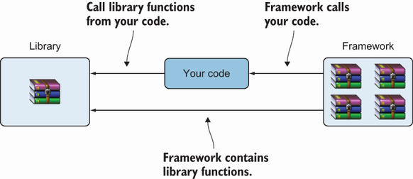
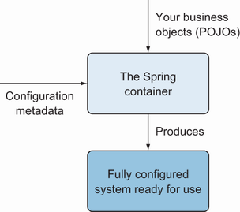

# Chương 14. Tích hợp JPA và Hibernate với Spring

> *Java Persistence with Spring Data and Hibernate* — Chương 14: “Integrating JPA and Hibernate with Spring”

**Nội dung chương này bao gồm**

- Giới thiệu Spring Framework và dependency injection
- Xem xét mẫu thiết kế data access object (DAO)
- Tạo và tổng quát hóa một ứng dụng Spring JPA dùng mẫu thiết kế DAO
- Tạo và tổng quát hóa một ứng dụng Spring Hibernate dùng mẫu thiết kế DAO

Trong chương này, chúng ta sẽ phân tích một vài khả năng khác nhau để tích hợp Spring và Hibernate. Spring là một framework Java nhẹ nhưng cũng linh hoạt và đa dụng. Nó là mã nguồn mở, và có thể được dùng ở bất kỳ tầng nào trong một ứng dụng Java. Chúng ta sẽ tìm hiểu các nguyên tắc đằng sau Spring Framework (dependency injection, còn gọi là inversion of control), và chúng ta sẽ dùng Spring cùng JPA hoặc Hibernate để xây dựng ứng dụng Java persistence.

> **CHÚ Ý** Để thực thi các ví dụ từ mã nguồn, trước tiên bạn cần chạy script Ch14.sql.

## 14.1 Spring Framework và dependency injection

Spring Framework cung cấp một hạ tầng toàn diện để phát triển ứng dụng Java. Nó xử lý phần hạ tầng để bạn có thể tập trung vào ứng dụng của mình, và nó cho phép bạn xây dựng ứng dụng từ các plain old Java object (POJO).

Rod Johnson tạo ra Spring vào năm 2002, bắt đầu từ cuốn sách *Expert One-on-One J2EE Design and Development* (Johnson, 2002). Ý tưởng cơ bản đằng sau Spring là nó đơn giản hóa cách tiếp cận truyền thống trong thiết kế ứng dụng doanh nghiệp. Để có phần giới thiệu nhanh về khả năng của Spring Framework, cuốn *Spring Start Here* của Laurenţiu Spilcă (Spilcă, 2021) là một nguồn tốt.

Một ứng dụng Java thường gồm các object cộng tác để giải quyết một bài toán. Các object trong chương trình phụ thuộc lẫn nhau. Bạn có thể dùng các mẫu thiết kế (factory, builder, proxy, decorator, v.v.) để kết hợp class và object, nhưng gánh nặng này nằm ở phía lập trình viên. Spring hiện thực nhiều mẫu thiết kế khác nhau. Mẫu dependency injection của Spring Framework (còn gọi là inversion of control, hay IoC) hỗ trợ việc tạo ra ứng dụng gồm nhiều thành phần và object khác nhau.

Đặc trưng then chốt của một framework chính là dependency injection hay IoC này. Khi bạn gọi một phương thức từ JDK hoặc một thư viện, bạn đang nắm quyền kiểm soát. Ngược lại, với một framework, quyền kiểm soát bị đảo ngược: framework gọi bạn (xem hình 14.1). Bạn phải theo hệ hình mà framework cung cấp và điền mã của mình vào. Framework định nghĩa một bộ khung, và bạn chèn các tính năng để lấp đầy bộ khung đó. Mã của bạn nằm dưới sự điều khiển của framework, và framework gọi nó. Bằng cách này, bạn có thể tập trung vào việc hiện thực logic nghiệp vụ thay vì vào thiết kế.



**Hình 14.1** Mã của bạn gọi một thư viện. Một framework gọi mã của bạn.

Việc tạo, tiêm phụ thuộc và vòng đời chung của các object dưới sự điều khiển của Spring Framework được quản lý bởi một *container*. Container sẽ kết hợp các class ứng dụng với thông tin cấu hình (metadata) để tạo ra một ứng dụng sẵn sàng chạy (hình 14.2). Do đó container là cốt lõi của nguyên tắc IoC.



**Hình 14.2** Chức năng của Spring IoC container

Các object dưới sự quản lý của IoC container được gọi là *bean*. Các bean tạo thành xương sống của ứng dụng Spring.

## 14.2 Ứng dụng JPA dùng Spring và mẫu DAO

Trong mục này, chúng ta sẽ xem cách xây dựng một ứng dụng JPA dùng Spring và mẫu thiết kế data access object (DAO). Mẫu thiết kế DAO tạo ra một interface trừu tượng tới cơ sở dữ liệu, hỗ trợ các thao tác truy cập mà không phơi bày bất kỳ chi tiết nội bộ nào của cơ sở dữ liệu.

Bạn có thể lập luận rằng các repository của Spring Data JPA mà chúng ta đã tạo và làm việc cùng đã làm điều này rồi, và điều đó đúng. Trong chương này chúng tôi sẽ minh họa cách xây dựng một class DAO, và chúng ta sẽ bàn khi nào nên ưu tiên cách tiếp cận này thay vì dùng Spring Data JPA.

Ứng dụng CaveatEmptor chứa các class `Item` và `Bid` (listing 14.1 và 14.2). Các entity giờ sẽ được quản lý với sự trợ giúp của Spring Framework. Quan hệ giữa table `BID` và `ITEM` sẽ được giữ qua một field foreign key ở phía table `BID`. Một field được đánh dấu bằng annotation `@javax.persistence.Transient` sẽ bị loại khỏi persistence.

**Listing 14.1** Class Item

*Đường dẫn: Ch14/spring-jpa-dao/src/main/java/com/manning/javapersistence/ch14/Item.java*

```java
@Entity
public class Item {

    @Id                                                          // Ⓐ
    @GeneratedValue(generator = "ID_GENERATOR")                  // Ⓐ
    private Long id;                                             // Ⓐ

    @NotNull                                                     // Ⓑ
    @Size(                                                       // Ⓑ
              min = 2,                                           // Ⓑ
              max = 255,                                         // Ⓑ
              message = "Name is required, maximum 255 characters."  // Ⓑ
    )                                                            // Ⓑ
    private String name;                                         // Ⓑ

    @Transient                                                   // Ⓒ
    private Set<Bid> bids = new HashSet<>();                     // Ⓒ
    // . . .
}
```

Ⓐ Field `id` là một định danh được sinh ra.

Ⓑ Field `name` không được null và phải có độ dài từ 2 tới 255 ký tự.

Ⓒ Mỗi `Item` có tham chiếu tới tập `Bid` của nó. Field được đánh dấu `@Transient`, nên nó bị loại khỏi persistence.

Chúng ta sẽ chuyển sự chú ý sang class `Bid` như hiện tại. Nó cũng là một entity, và quan hệ giữa `Item` và `Bid` là một-nhiều.

**Listing 14.2** Class Bid

*Đường dẫn: Ch14/spring-jpa-dao/src/main/java/com/manning/javapersistence/ch14/Bid.java*

```java
@Entity
public class Bid {

    @Id                                                            // Ⓐ
    @GeneratedValue(generator = "ID_GENERATOR")                    // Ⓐ
    private Long id;                                               // Ⓐ

    @NotNull                                                       // Ⓑ
    private BigDecimal amount;                                     // Ⓑ

    @ManyToOne(optional = false, fetch = FetchType.LAZY)           // Ⓒ
    @JoinColumn(name = "ITEM_ID")                                  // Ⓒ
    private Item item;                                             // Ⓒ
    // . . .
}
```

Ⓐ Entity class `Bid` chứa field `id` làm định danh được sinh ra.

Ⓑ Field `amount` không được null.

Ⓒ Mỗi `Bid` có một tham chiếu không tùy chọn tới `Item` của nó. Việc fetch sẽ là lazy, và tên cột join là `ITEM_ID`.

Để hiện thực mẫu thiết kế DAO, chúng ta sẽ bắt đầu bằng việc tạo hai interface, `ItemDao` và `BidDao`, và khai báo các thao tác truy cập sẽ được hiện thực:

*Đường dẫn: Ch14/spring-jpa-dao/src/main/java/com/manning/javapersistence/ch14/dao/ItemDao.java*

```java
public interface ItemDao {
    Item getById(long id);

    List<Item> getAll();

    void insert(Item item);

    void update(long id, String name);

    void delete(Item item);

    Item findByName(String name);
}
```

Interface `BidDao` được khai báo như sau:

*Đường dẫn: Ch14/spring-jpa-dao/src/main/java/com/manning/javapersistence/ch14/dao/BidDao.java*

```java
public interface BidDao {
    Bid getById(long id);

    List<Bid> getAll();

    void insert(Bid bid);

    void update(long id, String amount);

    void delete(Bid bid);

    List<Bid> findByAmount(String amount);
}
```

`@Repository` là một annotation đánh dấu cho biết thành phần này đại diện cho một DAO. Ngoài việc đánh dấu class là một Spring component, `@Repository` sẽ bắt các ngoại lệ đặc thù persistence và dịch chúng thành các ngoại lệ unchecked của Spring. `@Transactional` sẽ khiến mọi phương thức bên trong class trở nên transactional, như đã bàn ở mục 11.4.3.

Bản thân `EntityManager` không an toàn với đa luồng. Chúng ta sẽ dùng `@PersistenceContext` để container tiêm vào một object proxy an toàn với đa luồng. Ngoài việc tiêm phụ thuộc vào một entity manager do container quản lý, annotation `@PersistenceContext` còn có các tham số. Việc đặt persistence type là `EXTENDED` giữ persistence context cho toàn bộ vòng đời của một bean.

Hiện thực của interface `ItemDao`, tức `ItemDaoImpl`, được thể hiện ở listing sau.

**Listing 14.3** Class ItemDaoImpl

*Đường dẫn: Ch14/spring-jpa-dao/src/main/java/com/manning/javapersistence/ch14/dao/ItemDaoImpl.java*

```java
@Repository                                                        // Ⓐ
@Transactional                                                     // Ⓐ
public class ItemDaoImpl implements ItemDao {

    @PersistenceContext(type = PersistenceContextType.EXTENDED)    // Ⓑ
    private EntityManager em;                                      // Ⓑ

    @Override
    public Item getById(long id) {                                 // Ⓒ
        return em.find(Item.class, id);
    }

    @Override
    public List<Item> getAll() {                                   // Ⓓ
        return (List<Item>) em.createQuery("from Item", Item.class)
                                      .getResultList();
    }

    @Override
    public void insert(Item item) {                                // Ⓔ
        em.persist(item);
        for (Bid bid : item.getBids()) {
            em.persist(bid);
        }
    }

    @Override
    public void update(long id, String name) {                     // Ⓕ
        Item item = em.find(Item.class, id);
        item.setName(name);
        em.persist(item);
    }

    @Override
    public void delete(Item item) {                                // Ⓖ
        for (Bid bid : item.getBids()) {
            em.remove(bid);
        }
        em.remove(item);
    }

    @Override
    public Item findByName(String name) {                          // Ⓗ
        return em.createQuery("from Item where name=:name", Item.class)
                    .setParameter("name", name).getSingleResult();
    }
}
```

Ⓐ Class `ItemDaoImpl` được đánh dấu bằng `@Repository` và `@Transactional`.

Ⓑ Field `EntityManager em` được tiêm vào ứng dụng, vì nó được đánh dấu `@PersistenceContext`. Persistence type `EXTENDED` nghĩa là persistence context được giữ cho toàn bộ vòng đời của một bean.

Ⓒ Truy xuất một `Item` theo `id` của nó.

Ⓓ Truy xuất mọi entity `Item`.

Ⓔ Lưu một `Item` và mọi `Bid` của nó.

Ⓕ Cập nhật field `name` của một `Item`.

Ⓖ Xóa mọi bid thuộc về một `Item` cùng chính `Item` đó.

Ⓗ Tìm một `Item` theo `name` của nó.

Hiện thực của interface `BidDao`, tức `BidDaoImpl`, được thể hiện ở listing tiếp theo.

**Listing 14.4** Class BidDaoImpl

*Đường dẫn: Ch14/spring-jpa-dao/src/main/java/com/manning/javapersistence/ch14/dao/BidDaoImpl.java*

```java
@Repository                                                        // Ⓐ
@Transactional                                                     // Ⓐ
public class BidDaoImpl implements BidDao {

    @PersistenceContext(type = PersistenceContextType.EXTENDED)    // Ⓑ
    private EntityManager em;                                      // Ⓑ

    @Override
    public Bid getById(long id) {                                  // Ⓒ
        return em.find(Bid.class, id);
    }

    @Override
    public List<Bid> getAll() {                                    // Ⓓ
        return em.createQuery("from Bid", Bid.class).getResultList();
    }

    @Override
    public void insert(Bid bid) {                                  // Ⓔ
        em.persist(bid);
    }

    @Override
    public void update(long id, String amount) {                   // Ⓕ
        Bid bid = em.find(Bid.class, id);
        bid.setAmount(new BigDecimal(amount));
        em.persist(bid);
    }

    @Override
    public void delete(Bid bid) {                                  // Ⓖ
        em.remove(bid);
    }

    @Override
    public List<Bid> findByAmount(String amount) {                 // Ⓗ
        return em.createQuery("from Bid where amount=:amount", Bid.class)
          .setParameter("amount", new BigDecimal(amount)).getResultList();
    }
}
```

Ⓐ Class `BidDaoImpl` được đánh dấu bằng `@Repository` và `@Transactional`.

Ⓑ Field `EntityManager em` được tiêm vào ứng dụng, vì nó được đánh dấu `@PersistenceContext`. Việc đặt persistence type là `EXTENDED` giữ persistence context cho toàn bộ vòng đời của một bean.

Ⓒ Truy xuất một `Bid` theo `id` của nó.

Ⓓ Truy xuất mọi entity `Bid`.

Ⓔ Lưu một `Bid`.

Ⓕ Cập nhật field `amount` của một `Bid`.

Ⓖ Xóa một `Bid`.

Ⓗ Tìm một `Bid` theo `amount` của nó.

Để làm việc với cơ sở dữ liệu, chúng ta sẽ cung cấp một class đặc biệt, `DatabaseService`, chịu trách nhiệm điền dữ liệu vào cơ sở dữ liệu và xóa thông tin khỏi nó.

**Listing 14.5** Class DatabaseService

*Đường dẫn: Ch14/spring-jpa-dao/src/test/java/com/manning/javapersistence/ch14/DatabaseService.java*

```java
public class DatabaseService {

    @PersistenceContext(type = PersistenceContextType.EXTENDED)   // Ⓐ
    private EntityManager em;                                     // Ⓐ

    @Autowired                                                    // Ⓑ
    private ItemDao itemDao;                                      // Ⓑ

    @Transactional                                                // Ⓒ
    public void init() {                                          // Ⓒ
        for (int i = 0; i < 10; i++) {                            // Ⓒ
            String itemName = "Item " + (i + 1);                  // Ⓒ
            Item item = new Item();                               // Ⓒ
            item.setName(itemName);                               // Ⓒ
            Bid bid1 = new Bid(new BigDecimal(1000.0), item);     // Ⓒ
            Bid bid2 = new Bid(new BigDecimal(1100.0), item);     // Ⓒ
            itemDao.insert(item);                                 // Ⓒ
        }                                                         // Ⓒ
    }

    @Transactional                                                // Ⓓ
    public void clear() {                                         // Ⓓ
        em.createQuery("delete from Bid b").executeUpdate();      // Ⓓ
        em.createQuery("delete from Item i").executeUpdate();     // Ⓓ
    }
}
```

Ⓐ Field `EntityManager em` được tiêm vào ứng dụng, vì nó được đánh dấu `@PersistenceContext`. Việc đặt persistence type là `EXTENDED` giữ persistence context cho toàn bộ vòng đời của một bean.

Ⓑ Field `ItemDao itemDao` được tiêm vào ứng dụng, vì nó được đánh dấu `@Autowired`. Vì class `ItemDaoImpl` được đánh dấu `@Repository`, Spring sẽ tạo bean cần thiết thuộc class này để tiêm vào đây.

Ⓒ Sinh 10 object `Item`, mỗi cái có 2 `Bid`, và chèn chúng vào cơ sở dữ liệu.

Ⓓ Xóa mọi object `Bid` và `Item` đã chèn trước đó.

File cấu hình chuẩn cho Spring là một class Java tạo và thiết lập các bean cần thiết. Annotation `@EnableTransactionManagement` sẽ bật khả năng quản lý transaction dựa trên annotation của Spring. Khi dùng cấu hình XML, annotation này được phản ánh bằng phần tử `tx:annotation-driven`. Mọi tương tác với cơ sở dữ liệu nên diễn ra trong ranh giới transaction và Spring cần một bean transaction manager.

Chúng ta sẽ tạo file cấu hình sau cho ứng dụng.

**Listing 14.6** Class SpringConfiguration

*Đường dẫn: Ch14/spring-jpa-dao/src/test/java/com/manning/javapersistence/ch14/configuration/SpringConfiguration.java*

```java
@EnableTransactionManagement                                       // Ⓐ
public class SpringConfiguration {

    @Bean                                                          // Ⓑ
    public DataSource dataSource() {
        DriverManagerDataSource dataSource = new DriverManagerDataSource();
        dataSource.setDriverClassName("com.mysql.cj.jdbc.Driver");  // Ⓒ
        dataSource.setUrl(
           "jdbc:mysql://localhost:3306/CH14_SPRING_HIBERNATE"
           + "?serverTimezone=UTC");                                // Ⓓ
        dataSource.setUsername("root");                             // Ⓔ
        dataSource.setPassword("");                                 // Ⓕ
        return dataSource;
    }

    @Bean                                                           // Ⓖ
    public DatabaseService databaseService() {
        return new DatabaseService();
    }

    @Bean                                                           // Ⓗ
    public JpaTransactionManager
           transactionManager(EntityManagerFactory emf) {
        return new JpaTransactionManager(emf);
    }

    @Bean                                                           // Ⓘ
    public LocalContainerEntityManagerFactoryBean entityManagerFactory() {
        LocalContainerEntityManagerFactoryBean
        localContainerEntityManagerFactoryBean =
                new LocalContainerEntityManagerFactoryBean();
        localContainerEntityManagerFactoryBean
               .setPersistenceUnitName("ch14");                     // Ⓙ
        localContainerEntityManagerFactoryBean
               .setDataSource(dataSource());                        // Ⓚ
        localContainerEntityManagerFactoryBean.setPackagesToScan(
            "com.manning.javapersistence.ch14");                    // Ⓛ
        return localContainerEntityManagerFactoryBean;
    }

    @Bean                                                           // Ⓜ
    public ItemDao itemDao() {
        return new ItemDaoImpl();
    }

    @Bean                                                           // Ⓝ
    public BidDao bidDao() {
        return new BidDaoImpl();
    }
}
```

Ⓐ Annotation `@EnableTransactionManagement` bật khả năng quản lý transaction dựa trên annotation của Spring.

Ⓑ Tạo một bean data source.

Ⓒ Chỉ định các thuộc tính JDBC — driver.

Ⓓ URL của cơ sở dữ liệu.

Ⓔ Username.

Ⓕ Không có mật khẩu trong cấu hình này. Hãy sửa thông tin đăng nhập cho khớp với máy của bạn và dùng mật khẩu trong thực tế.

Ⓖ Bean `DatabaseService` mà Spring sẽ dùng để điền và xóa dữ liệu cơ sở dữ liệu.

Ⓗ Tạo một bean transaction manager dựa trên một entity manager factory.

Ⓘ `LocalContainerEntityManagerFactoryBean` là một factory bean sinh ra `EntityManagerFactory` theo hợp đồng bootstrap container chuẩn của JPA.

Ⓙ Đặt tên persistence unit, được định nghĩa trong persistence.xml.

Ⓚ Đặt data source.

Ⓛ Đặt các package cần quét để tìm entity class. Các bean nằm trong `com.manning.javapersistence.ch14`, nên chúng ta đặt package này để được quét.

Ⓜ Tạo một bean `ItemDao`.

Ⓝ Tạo một bean `BidDao`.

Thông tin cấu hình này được Spring dùng để tạo và tiêm các bean tạo thành xương sống của ứng dụng. Chúng ta có thể dùng phương án cấu hình XML thay thế, và file application-context.xml phản ánh công việc được thực hiện trong SpringConfiguration.java. Chúng tôi chỉ muốn nhấn mạnh một điều đã đề cập trước đó: trong XML, chúng ta bật khả năng quản lý transaction dựa trên annotation của Spring bằng phần tử `tx:annotation-driven`, tham chiếu tới một bean transaction manager:

*Đường dẫn: Ch14/spring-jpa-dao/src/test/resources/application-context.xml*

```xml
<tx:annotation-driven transaction-manager="txManager"/>
```

Extension `SpringExtension` được dùng để tích hợp Spring test context với test JUnit 5 Jupiter bằng cách hiện thực vài phương thức callback của mô hình extension JUnit Jupiter.

Quan trọng là phải dùng kiểu `PersistenceContextType.EXTENDED` cho mọi bean `EntityManager` được tiêm. Nếu chúng ta dùng kiểu mặc định `PersistenceContextType.TRANSACTION`, object trả về sẽ trở nên detached khi kết thúc việc thực thi một transaction. Việc truyền nó vào phương thức `delete` sẽ dẫn tới ngoại lệ “IllegalArgumentException: Removing a detached instance”.

Đã đến lúc kiểm thử chức năng chúng ta đã phát triển để lưu trữ các entity `Item` và `Bid`.

**Listing 14.7** Class SpringJpaTest

*Đường dẫn: Ch14/spring-jpa-dao/src/test/java/com/manning/javapersistence/ch14/SpringJpaTest.java*

```java
@ExtendWith(SpringExtension.class)                                 // Ⓐ
@ContextConfiguration(classes = {SpringConfiguration.class})       // Ⓑ
//@ContextConfiguration("classpath:application-context.xml")       // Ⓒ
public class SpringJpaTest {

    @Autowired
    private DatabaseService databaseService;                       // Ⓓ

    @Autowired
    private ItemDao itemDao;                                       // Ⓓ

    @Autowired
    private BidDao bidDao;                                         // Ⓓ

    @BeforeEach
    public void setUp() {                                          // Ⓔ
        databaseService.init();
    }

    @Test
    public void testInsertItems() {                                // Ⓕ
        List<Item> itemsList = itemDao.getAll();
        List<Bid> bidsList = bidDao.getAll();
        assertAll(
                () -> assertNotNull(itemsList),
                () -> assertEquals(10, itemsList.size()),
                () -> assertNotNull(itemDao.findByName("Item 1")),
                () -> assertNotNull(bidsList),
                () -> assertEquals(20, bidsList.size()),
                () -> assertEquals(10,
                                   bidDao.findByAmount("1000.00").size())
        );
    }

    @Test
    public void testDeleteItem() {
        itemDao.delete(itemDao.findByName("Item 2"));              // Ⓖ
        assertThrows(NoResultException.class,
                     () -> itemDao.findByName("Item 2"));          // Ⓗ
    }

    // . . .

    @AfterEach
    public void dropDown() {                                       // Ⓘ
        databaseService.clear();
    }
}
```

Ⓐ Mở rộng test bằng `SpringExtension`. Như đã đề cập, việc này tích hợp Spring TestContext Framework vào JUnit 5 bằng cách hiện thực vài phương thức callback của mô hình extension JUnit Jupiter.

Ⓑ Spring test context được cấu hình bằng các bean định nghĩa trong class `SpringConfiguration` đã trình bày trước đó.

Ⓒ Ngoài ra, chúng ta có thể cấu hình test context bằng XML. Chỉ một trong hai dòng Ⓑ hoặc Ⓒ được active trong mã.

Ⓓ Autowire một bean `DatabaseService`, một bean `ItemDao` và một bean `BidDao`.

Ⓔ Trước khi thực thi mỗi test, nội dung cơ sở dữ liệu được khởi tạo bằng phương thức `init` từ `DatabaseService` được tiêm vào.

Ⓕ Truy xuất mọi `Item` và mọi `Bid` rồi kiểm chứng.

Ⓖ Tìm một `Item` theo field `name` và xóa nó khỏi cơ sở dữ liệu. Chúng ta sẽ dùng `PersistenceContextType.EXTENDED` cho mọi bean `EntityManager` được tiêm. Nếu không, việc truyền nó vào phương thức `delete` sẽ dẫn tới ngoại lệ “IllegalArgumentException: Removing a detached instance”.

Ⓗ Sau khi xóa `Item` khỏi cơ sở dữ liệu thành công, việc cố tìm lại nó sẽ ném `NoResultException`. Các test còn lại có thể dễ dàng xem trong mã nguồn.

Ⓘ Sau khi thực thi mỗi test, nội dung cơ sở dữ liệu bị xóa bằng phương thức `clear` từ `DatabaseService` được tiêm vào.

Khi nào chúng ta nên áp dụng giải pháp dùng Spring Framework và mẫu thiết kế DAO như vậy? Có một vài tình huống chúng tôi khuyến nghị:

- Bạn muốn giao nhiệm vụ điều khiển entity manager và transaction cho Spring Framework (hãy nhớ rằng việc này được thực hiện thông qua inversion of control). Đánh đổi là bạn mất khả năng gỡ lỗi các transaction. Hãy lưu ý điều đó.
- Bạn muốn tạo API riêng để quản lý persistence và hoặc bạn không thể hoặc không muốn dùng Spring Data. Điều này có thể xảy ra khi bạn có những thao tác rất riêng cần kiểm soát, hoặc bạn muốn loại bỏ overhead của Spring Data (bao gồm thời gian để nhóm làm quen với nó, việc đưa dependency mới vào một dự án đã có, và độ trễ thực thi của Spring Data, như đã bàn ở mục 2.7).
- Trong những tình huống cụ thể, bạn có thể muốn giao entity manager và transaction cho Spring Framework mà vẫn không hiện thực các class DAO của riêng mình.

Chúng tôi muốn cải thiện thiết kế của ứng dụng Spring persistence này. Các mục tiếp theo dành cho việc làm nó tổng quát hơn và dùng API Hibernate thay vì JPA. Chúng tôi sẽ tập trung vào khác biệt giữa giải pháp đầu tiên này và các phiên bản mới, và bàn cách đưa các thay đổi vào.

## 14.3 Tổng quát hóa ứng dụng JPA dùng Spring và DAO

Nếu nhìn kỹ hơn vào các interface `ItemDao` và `BidDao` cùng các class `ItemDaoImpl` và `BidDaoImpl` đã tạo, chúng ta sẽ thấy một vài hạn chế:

- Có những thao tác tương tự nhau, chẳng hạn `getById`, `getAll`, `insert` và `delete`, chủ yếu khác nhau ở kiểu đối số nhận vào hoặc kết quả trả về.
- Phương thức `update` nhận đối số thứ hai là giá trị của một property cụ thể. Chúng ta có thể phải viết nhiều phương thức nếu cần cập nhật những property khác nhau của một entity.
- Các phương thức như `findByName` hay `findByAmount` gắn với những property cụ thể. Chúng ta có thể phải viết những phương thức khác nhau để tìm một entity bằng những property khác nhau.

Do đó, chúng ta sẽ đưa vào một interface `GenericDao`.

**Listing 14.8** Interface GenericDao

*Đường dẫn: Ch14/spring-jpa-dao-gen/src/main/java/com/manning/javapersistence/ch14/dao/GenericDao.java*

```java
public interface GenericDao<T> {

    T getById(long id);                                            // Ⓐ

    List<T> getAll();                                              // Ⓐ

    void insert(T entity);                                         // Ⓑ

    void delete(T entity);                                         // Ⓑ

    void update(long id, String propertyName, Object propertyValue);  // Ⓒ

    List<T> findByProperty(String propertyName, Object propertyValue); // Ⓒ
}
```

Ⓐ Các phương thức `getById` và `getAll` có kiểu trả về generic.

Ⓑ Các phương thức `insert` và `update` có đầu vào generic là `T entity`.

Ⓒ Các phương thức `update` và `findByProperty` sẽ nhận đối số là `propertyName` và `propertyValue` mới.

Chúng ta sẽ tạo một hiện thực trừu tượng của interface `GenericDao`, gọi là `AbstractGenericDao`, như ở listing 14.9. Ở đây chúng ta sẽ viết chức năng chung của mọi class DAO, và để các class cụ thể hiện thực phần riêng của chúng.

Chúng ta sẽ tiêm một field `EntityManager em` vào ứng dụng, đánh dấu nó bằng `@PersistenceContext`. Việc đặt persistence type là `EXTENDED` giữ persistence context cho toàn bộ vòng đời của một bean.

**Listing 14.9** Class AbstractGenericDao

*Đường dẫn: Ch14/spring-jpa-dao-gen/src/main/java/com/manning/javapersistence/ch14/dao/AbstractGenericDao.java*

```java
@Repository                                                        // Ⓐ
@Transactional                                                     // Ⓐ
public abstract class AbstractGenericDao<T> implements GenericDao<T> {

    @PersistenceContext(type = PersistenceContextType.EXTENDED)    // Ⓑ
    protected EntityManager em;                                    // Ⓑ

    private Class<T> clazz;                                        // Ⓒ

    public void setClazz(Class<T> clazz) {
        this.clazz = clazz;
    }

    @Override
    public T getById(long id) {                                    // Ⓓ
        return em.createQuery(
                "SELECT e FROM " + clazz.getName() + " e WHERE e.id = :id",
                 clazz).setParameter("id", id).getSingleResult();
    }

    @Override
    public List<T> getAll() {                                      // Ⓔ
        return em.createQuery("from " +
                               clazz.getName(), clazz).getResultList();
    }

    @Override
    public void insert(T entity) {                                 // Ⓕ
        em.persist(entity);
    }

    @Override
    public void delete(T entity) {                                 // Ⓖ
        em.remove(entity);
    }

    @Override
    public void update(long id, String propertyName,
                       Object propertyValue) {                     // Ⓗ
        em.createQuery("UPDATE " + clazz.getName() + " e SET e." +
                 propertyName + " = :propertyValue WHERE e.id = :id")
                .setParameter("propertyValue", propertyValue)
                .setParameter("id", id).executeUpdate();
    }

    @Override
    public List<T> findByProperty(String propertyName,
                                  Object propertyValue) {          // Ⓘ
        return em.createQuery(
               "SELECT e FROM " + clazz.getName() + " e WHERE e." +
                  propertyName + " = :propertyValue", clazz)
                  .setParameter("propertyValue", propertyValue)
                  .getResultList();
    }
}
```

Ⓐ Class `AbstractGenericDao` được đánh dấu bằng `@Repository` và `@Transactional`.

Ⓑ Persistence type `EXTENDED` của `EntityManager` sẽ giữ persistence context cho toàn bộ vòng đời của một bean. Field ở mức `protected` để có thể được các subclass kế thừa và sử dụng.

Ⓒ `clazz` là field `Class` thực tế mà DAO sẽ làm việc trên đó.

Ⓓ Thực thi một truy vấn `SELECT` dùng entity `clazz` và đặt `id` làm tham số.

Ⓔ Thực thi một truy vấn `SELECT` dùng entity `clazz` và lấy danh sách kết quả.

Ⓕ Lưu `entity`.

Ⓖ Xóa `entity`.

Ⓗ Thực thi một lệnh `UPDATE` dùng `propertyName`, `propertyValue` và `id`.

Ⓘ Thực thi một lệnh `SELECT` dùng `propertyName` và `propertyValue`.

Class `AbstractGenericDao` cung cấp hầu hết chức năng DAO chung. Nó chỉ cần được tùy chỉnh một chút cho những class DAO cụ thể. Class `ItemDaoImpl` sẽ mở rộng class `AbstractGenericDao` và ghi đè một số phương thức.

**Listing 14.10** Class ItemDaoImpl mở rộng AbstractGenericDao

*Đường dẫn: Ch14/spring-jpa-dao-gen/src/main/java/com/manning/javapersistence/ch14/dao/ItemDaoImpl.java*

```java
public class ItemDaoImpl extends AbstractGenericDao<Item> {        // Ⓐ

    public ItemDaoImpl() {                                         // Ⓑ
        setClazz(Item.class);                                      // Ⓑ
    }

    @Override                                                      // Ⓒ
    public void insert(Item item) {                                // Ⓒ
        em.persist(item);                                          // Ⓒ
        for (Bid bid : item.getBids()) {                           // Ⓒ
            em.persist(bid);                                       // Ⓒ
        }                                                          // Ⓒ
    }

    @Override                                                      // Ⓓ
    public void delete(Item item) {                                // Ⓓ
        for (Bid bid : item.getBids()) {                           // Ⓓ
            em.remove(bid);                                        // Ⓓ
        }                                                          // Ⓓ
        em.remove(item);                                           // Ⓓ
    }
}
```

Ⓐ `ItemDaoImpl` mở rộng `AbstractGenericDao` và được tổng quát hóa bởi `Item`.

Ⓑ Constructor đặt `Item.class` làm entity class cần quản lý.

Ⓒ Lưu entity `Item` và mọi entity `Bid` của nó. Field `EntityManager em` được kế thừa từ class `AbstractGenericDao`.

Ⓓ Xóa mọi bid thuộc về một `Item` cùng chính `Item` đó.

Class `BidDaoImpl` chỉ đơn giản mở rộng class `AbstractGenericDao` và đặt entity class cần quản lý.

**Listing 14.11** Class BidDaoImpl mở rộng AbstractGenericDao

*Đường dẫn: Ch14/spring-jpa-dao-gen/src/main/java/com/manning/javapersistence/ch14/dao/BidDaoImpl.java*

```java
public class BidDaoImpl extends AbstractGenericDao<Bid> {          // Ⓐ

    public BidDaoImpl() {                                          // Ⓑ
        setClazz(Bid.class);                                       // Ⓑ
    }
}
```

Ⓐ `BidDaoImpl` mở rộng `AbstractGenericDao` và được tổng quát hóa bởi `Bid`.

Ⓑ Constructor đặt `Bid.class` làm entity class cần quản lý. Mọi phương thức khác được kế thừa từ `AbstractGenericDao` và hoàn toàn tái sử dụng được theo cách này.

Cần một vài thay đổi nhỏ cho các class cấu hình và kiểm thử. Class `SpringConfiguration` giờ sẽ khai báo hai bean DAO dưới dạng `GenericDao`:

*Đường dẫn: Ch14/spring-jpa-dao-gen/src/test/java/com/manning/javapersistence/ch14/configuration/SpringConfiguration.java*

```java
@Bean
public GenericDao<Item> itemDao() {
     return new ItemDaoImpl();
}

@Bean
public GenericDao<Bid> bidDao() {
     return new BidDaoImpl();
}
```

Class `DatabaseService` sẽ tiêm field `itemDao` dưới dạng `GenericDao`:

*Đường dẫn: Ch14/spring-jpa-dao-gen/src/test/java/com/manning/javapersistence/ch14/DatabaseService.java*

```java
@Autowired
private GenericDao<Item> itemDao;
```

Class `SpringJpaTest` sẽ tiêm các field `itemDao` và `bidDao` dưới dạng `GenericDao`:

*Đường dẫn: Ch14/spring-jpa-dao-gen/src/test/java/com/manning/javapersistence/ch14/SpringJpaTest.java*

```java
@Autowired
private GenericDao<Item> itemDao;

@Autowired
private GenericDao<Bid> bidDao;
```

Giờ chúng ta đã phát triển một cây phân cấp class DAO dễ mở rộng dùng API JPA. Chúng ta có thể tái sử dụng chức năng generic đã viết hoặc nhanh chóng ghi đè một số phương thức cho những entity cụ thể (như trường hợp của `ItemDaoImpl`).

Giờ hãy chuyển sang phương án hiện thực một ứng dụng Hibernate dùng Spring và mẫu DAO.

## 14.4 Ứng dụng Hibernate dùng Spring và mẫu DAO

Giờ chúng tôi sẽ minh họa cách dùng Spring và mẫu DAO với API Hibernate. Như đã nói, chúng tôi sẽ chỉ nhấn mạnh những khác biệt giữa cách tiếp cận này và các ứng dụng trước.

Việc gọi `sessionFactory.getCurrentSession()` sẽ tạo một `Session` mới nếu chưa có. Nếu không, nó sẽ dùng session hiện có từ context của Hibernate. Session sẽ tự động được flush và đóng khi một transaction kết thúc. Việc dùng `sessionFactory.getCurrentSession()` là lý tưởng trong các ứng dụng đơn luồng, vì dùng một session duy nhất sẽ tăng hiệu năng. Trong ứng dụng đa luồng, session không an toàn với đa luồng, nên bạn nên dùng `sessionFactory.openSession()` và đóng session đã mở một cách tường minh. Hoặc, vì `Session` hiện thực `AutoCloseable`, nó có thể được dùng trong khối try-with-resources.

Vì các class `Item` và `Bid` cùng các interface `ItemDao` và `BidDao` không đổi, chúng ta sẽ chuyển sang `ItemDaoImpl` và `BidDaoImpl` để xem chúng giờ trông thế nào.

**Listing 14.12** Class ItemDaoImpl dùng API Hibernate

*Đường dẫn: Ch14/spring-hibernate-dao/src/main/java/com/manning/javapersistence/ch14/dao/ItemDaoImpl.java*

```java
@Repository                                                       // Ⓐ
@Transactional                                                    // Ⓐ
public class ItemDaoImpl implements ItemDao {

    @Autowired                                                    // Ⓑ
    private SessionFactory sessionFactory;                        // Ⓑ

    @Override
    public Item getById(long id) {                                // Ⓒ
        return sessionFactory.getCurrentSession().get(Item.class, id);
    }

    @Override
    public List<Item> getAll() {                                  // Ⓓ
        return sessionFactory.getCurrentSession()
                   .createQuery("from Item", Item.class).list();
    }

    @Override
    public void insert(Item item) {                               // Ⓔ
        sessionFactory.getCurrentSession().persist(item);
        for (Bid bid : item.getBids()) {
            sessionFactory.getCurrentSession().persist(bid);
        }
    }

    @Override
    public void update(long id, String name) {                    // Ⓕ
        Item item = sessionFactory.getCurrentSession()
                        .get(Item.class, id);
        item.setName(name);
        sessionFactory.getCurrentSession().update(item);
    }

    @Override
    public void delete(Item item) {                               // Ⓖ
        sessionFactory.getCurrentSession()
             .createQuery("delete from Bid b where b.item.id = :id")
             .setParameter("id", item.getId()).executeUpdate();
        sessionFactory.getCurrentSession()
             .createQuery("delete from Item i where i.id = :id")
             .setParameter("id", item.getId()).executeUpdate();
    }

    @Override
    public Item findByName(String name) {                         // Ⓗ
        return sessionFactory.getCurrentSession()
                    .createQuery("from Item where name=:name", Item.class)
                    .setParameter("name", name).uniqueResult();
    }
}
```

Ⓐ Class `ItemDaoImpl` được đánh dấu bằng `@Repository` và `@Transactional`.

Ⓑ Field `SessionFactory sessionFactory` được tiêm vào ứng dụng, vì nó được đánh dấu `@Autowired`.

Ⓒ Truy xuất một `Item` theo `id`. Việc gọi `sessionFactory.getCurrentSession()` sẽ tạo một `Session` mới nếu chưa có.

Ⓓ Truy xuất mọi entity `Item`.

Ⓔ Lưu một `Item` và mọi `Bid` của nó.

Ⓕ Cập nhật field `name` của một `Item`.

Ⓖ Xóa mọi bid thuộc về một `Item` cùng chính `Item` đó.

Ⓗ Tìm một `Item` theo `name`.

Class `BidDaoImpl` cũng sẽ phản chiếu chức năng đã hiện thực trước đó vốn dùng JPA và `EntityManager`, nhưng nó sẽ dùng API Hibernate và `SessionFactory`.

Cũng có những thay đổi quan trọng trong class `SpringConfiguration`. Khi chuyển từ JPA sang Hibernate, bean `EntityManagerFactory` cần tiêm sẽ được thay bằng `SessionFactory`. Tương tự, bean `JpaTransactionManager` cần tiêm sẽ được thay bằng `HibernateTransactionManager`.

**Listing 14.13** Class SpringConfiguration dùng API Hibernate

*Đường dẫn: Ch14/spring-hibernate-dao/src/test/java/com/manning/javapersistence/ch14/configuration/SpringConfiguration.java*

```java
@EnableTransactionManagement                                       // Ⓐ
public class SpringConfiguration {

    @Bean
    public LocalSessionFactoryBean sessionFactory() {              // Ⓑ
        LocalSessionFactoryBean sessionFactory =
             new LocalSessionFactoryBean();
        sessionFactory.setDataSource(dataSource());                // Ⓒ
        sessionFactory.setPackagesToScan(
             new String[]{"com.manning.javapersistence.ch14"});    // Ⓒ
        sessionFactory.setHibernateProperties(hibernateProperties()); // Ⓓ

        return sessionFactory;
    }

    private Properties hibernateProperties() {                     // Ⓔ
        Properties hibernateProperties = new Properties();
        hibernateProperties.setProperty(AvailableSettings.HBM2DDL_AUTO,
                                                         "create");
        hibernateProperties.setProperty(AvailableSettings.SHOW_SQL,
                                                          "true");
        hibernateProperties.setProperty(AvailableSettings.DIALECT,
                              "org.hibernate.dialect.MySQL8Dialect");
        return hibernateProperties;
    }

    @Bean                                                          // Ⓕ
    public DataSource dataSource() {
        DriverManagerDataSource dataSource = new DriverManagerDataSource();
        dataSource.setDriverClassName("com.mysql.cj.jdbc.Driver"); // Ⓖ
        dataSource.setUrl(
            "jdbc:mysql://localhost:3306/CH14_SPRING_HIBERNATE"
            + "?serverTimezone=UTC");                              // Ⓗ
        dataSource.setUsername("root");                            // Ⓘ
        dataSource.setPassword("");                                // Ⓙ
        return dataSource;
    }

    @Bean                                                          // Ⓚ
    public DatabaseService databaseService() {
        return new DatabaseService();
    }

    @Bean                                                          // Ⓛ
    public HibernateTransactionManager transactionManager(
                                       SessionFactory sessionFactory) {
        HibernateTransactionManager transactionManager
            = new HibernateTransactionManager();
        transactionManager.setSessionFactory(sessionFactory);
        return transactionManager;
    }

    @Bean                                                          // Ⓜ
    public ItemDao itemDao() {
        return new ItemDaoImpl();
    }

    @Bean                                                          // Ⓝ
    public BidDao bidDao() {
        return new BidDaoImpl();
    }
}
```

Ⓐ Annotation `@EnableTransactionManagement` sẽ bật khả năng quản lý transaction dựa trên annotation của Spring.

Ⓑ `LocalSessionFactoryBean` là object `sessionFactory` cần tiêm.

Ⓒ Đặt data source và các package cần quét.

Ⓓ Đặt các thuộc tính Hibernate được cung cấp từ một phương thức riêng.

Ⓔ Tạo các thuộc tính Hibernate trong một phương thức riêng.

Ⓕ Tạo một bean data source.

Ⓖ Chỉ định các thuộc tính JDBC — driver.

Ⓗ URL của cơ sở dữ liệu.

Ⓘ Username.

Ⓙ Không có mật khẩu trong cấu hình này. Hãy sửa thông tin đăng nhập cho khớp với máy của bạn và dùng mật khẩu trong thực tế.

Ⓚ Một bean `DatabaseService` sẽ được Spring dùng để điền và xóa dữ liệu cơ sở dữ liệu.

Ⓛ Tạo một bean transaction manager dựa trên một session factory. Mọi tương tác với cơ sở dữ liệu nên diễn ra trong ranh giới transaction, nên Spring cần một bean transaction manager.

Ⓜ Tạo một bean `ItemDao`.

Ⓝ Tạo một bean `BidDao`.

Chúng ta có thể dùng phương án cấu hình XML thay thế, và file application-context.xml nên phản ánh công việc được thực hiện trong SpringConfiguration.java. Việc bật khả năng quản lý transaction dựa trên annotation của Spring được thực hiện bằng phần tử `tx:annotation-driven`, tham chiếu tới một bean transaction manager, thay vì annotation `@EnableTransactionManagement`.

Giờ chúng tôi sẽ minh họa cách tổng quát hóa ứng dụng này vốn dùng API Hibernate thay vì JPA. Như thường lệ, chúng tôi sẽ tập trung vào khác biệt so với giải pháp ban đầu và cách đưa các thay đổi vào.

## 14.5 Tổng quát hóa ứng dụng Hibernate dùng Spring và DAO

Hãy nhớ những hạn chế mà chúng ta đã xác định trước đó cho giải pháp JPA dùng Data Access Object:

- Có những thao tác tương tự nhau, chẳng hạn `getById`, `getAll`, `insert` và `delete`, chủ yếu khác nhau ở kiểu đối số nhận vào hoặc kết quả trả về.
- Phương thức `update` nhận đối số thứ hai là giá trị của một property cụ thể. Chúng ta có thể phải viết nhiều phương thức nếu cần cập nhật những property khác nhau của một entity.
- Các phương thức như `findByName` hay `findByAmount` gắn với những property cụ thể. Chúng ta có thể phải viết những phương thức khác nhau để tìm một entity bằng những property khác nhau.

Để giải quyết những hạn chế này, chúng ta đã đưa vào interface `GenericDao`, được thể hiện ở listing 14.8. Interface này được hiện thực bởi class `AbstractGenericDao` (listing 14.9), giờ cần được viết lại bằng API Hibernate.

**Listing 14.14** Class AbstractGenericDao dùng API Hibernate

*Đường dẫn: Ch14/spring-hibernate-dao-gen/src/main/java/com/manning/javapersistence/ch14/dao/AbstractGenericDao.java*

```java
@Repository                                                        // Ⓐ
@Transactional                                                     // Ⓐ
public abstract class AbstractGenericDao<T> implements GenericDao<T> {

    @Autowired                                                     // Ⓑ
    protected SessionFactory sessionFactory;                       // Ⓑ

    private Class<T> clazz;                                        // Ⓒ

    public void setClazz(Class<T> clazz) {
        this.clazz = clazz;
    }

    @Override
    public T getById(long id) {                                    // Ⓓ
        return sessionFactory.getCurrentSession()
             .createQuery("SELECT e FROM " + clazz.getName() +
                          " e WHERE e.id = :id", clazz)
             .setParameter("id", id).getSingleResult();
    }

    @Override
    public List<T> getAll() {                                      // Ⓔ
        return sessionFactory.getCurrentSession()
           .createQuery("from " + clazz.getName(), clazz).getResultList();
    }

    @Override
    public void insert(T entity) {                                 // Ⓕ
        sessionFactory.getCurrentSession().persist(entity);
    }

    @Override
    public void delete(T entity) {                                 // Ⓖ
        sessionFactory.getCurrentSession().delete(entity);
    }

    @Override
    public void update(long id, String propertyName,
                       Object propertyValue) {                     // Ⓗ
        sessionFactory.getCurrentSession()
              .createQuery("UPDATE " + clazz.getName() + " e SET e." +
                    propertyName + " = :propertyValue WHERE e.id = :id")
              .setParameter("propertyValue", propertyValue)
              .setParameter("id", id).executeUpdate();
    }

    @Override
    public List<T> findByProperty(String propertyName,
                                  Object propertyValue) {          // Ⓘ
        return sessionFactory.getCurrentSession()
           .createQuery("SELECT e FROM " + clazz.getName() + " e WHERE e." +
               propertyName + " = :propertyValue", clazz)
           .setParameter("propertyValue", propertyValue).getResultList();
    }
}
```

Ⓐ Class `AbstractGenericDao` được đánh dấu bằng `@Repository` và `@Transactional`.

Ⓑ Field `SessionFactory sessionFactory` được tiêm vào ứng dụng, vì nó được đánh dấu `@Autowired`. Nó ở mức `protected` để được các subclass kế thừa và sử dụng.

Ⓒ `clazz` là field `Class` thực tế mà DAO sẽ làm việc trên đó.

Ⓓ Thực thi một truy vấn `SELECT` dùng entity `clazz` và đặt `id` làm tham số.

Ⓔ Thực thi một truy vấn `SELECT` dùng entity `clazz` và lấy danh sách kết quả.

Ⓕ Lưu `entity`.

Ⓖ Xóa `entity`.

Ⓗ Thực thi một lệnh `UPDATE` dùng `propertyName`, `propertyValue` và `id`.

Ⓘ Thực thi một lệnh `SELECT` dùng `propertyName` và `propertyValue`.

Chúng ta sẽ tùy chỉnh class `AbstractGenericDao` khi nó được `ItemDaoImpl` và `BidDaoImpl` mở rộng, lần này dùng API Hibernate.

Class `ItemDaoImpl` sẽ mở rộng class `AbstractGenericDao` và ghi đè một số phương thức.

**Listing 14.15** Class ItemDaoImpl dùng API Hibernate

*Đường dẫn: Ch14/spring-hibernate-dao-gen/src/main/java/com/manning/javapersistence/ch14/dao/ItemDaoImpl.java*

```java
public class ItemDaoImpl extends AbstractGenericDao<Item> {        // Ⓐ

    public ItemDaoImpl() {                                         // Ⓑ
        setClazz(Item.class);
    }

    @Override
    public void insert(Item item) {                                // Ⓒ
        sessionFactory.getCurrentSession().persist(item);
        for (Bid bid : item.getBids()) {
            sessionFactory.getCurrentSession().persist(bid);
        }
    }

    @Override
    public void delete(Item item) {                                // Ⓓ
        sessionFactory.getCurrentSession()
           .createQuery("delete from Bid b where b.item.id = :id")
           .setParameter("id", item.getId()).executeUpdate();
        sessionFactory.getCurrentSession()
           .createQuery("delete from Item i where i.id = :id")
           .setParameter("id", item.getId()).executeUpdate();
    }
}
```

Ⓐ `ItemDaoImpl` mở rộng `AbstractGenericDao` và được tổng quát hóa bởi `Item`.

Ⓑ Constructor đặt `Item.class` làm entity class cần quản lý.

Ⓒ Lưu entity `Item` và mọi entity `Bid` của nó. Field `sessionFactory` được kế thừa từ class `AbstractGenericDao`.

Ⓓ Xóa mọi bid thuộc về một `Item` cùng chính `Item` đó.

Class `BidDaoImpl` chỉ đơn giản mở rộng class `AbstractGenericDao` và đặt entity class cần quản lý.

**Listing 14.16** Class BidDaoImpl dùng API Hibernate

*Đường dẫn: Ch14/spring-hibernate-dao-gen/src/main/java/com/manning/javapersistence/ch14/dao/BidDaoImpl.java*

```java
public class BidDaoImpl extends AbstractGenericDao<Bid> {          // Ⓐ

    public BidDaoImpl() {                                          // Ⓑ
        setClazz(Bid.class);                                       // Ⓑ
    }
}
```

Ⓐ `BidDaoImpl` mở rộng `AbstractGenericDao` và được tổng quát hóa bởi `Bid`.

Ⓑ Constructor đặt `Bid.class` làm entity class cần quản lý. Mọi phương thức khác được kế thừa từ `AbstractGenericDao` và hoàn toàn tái sử dụng được theo cách này.

Chúng ta đã phát triển một cây phân cấp class DAO dễ mở rộng dùng API Hibernate. Chúng ta có thể tái sử dụng chức năng generic đã viết hoặc nhanh chóng ghi đè một số phương thức cho những entity cụ thể (như đã làm với `ItemDaoImpl`).

## Tóm tắt

- Mẫu thiết kế dependency injection là nền tảng của Spring Framework, hỗ trợ việc tạo ra các ứng dụng gồm nhiều thành phần và object khác nhau.
- Bạn có thể phát triển một ứng dụng JPA dùng Spring Framework và mẫu DAO. Spring điều khiển `EntityManager`, transaction manager và các bean khác mà ứng dụng dùng.
- Bạn có thể tổng quát hóa một ứng dụng JPA để cung cấp một class DAO cơ sở generic và dễ mở rộng. Class DAO cơ sở chứa hành vi chung để mọi DAO dẫn xuất kế thừa và sẽ cho phép chúng chỉ hiện thực hành vi riêng của mình.
- Bạn có thể phát triển một ứng dụng Hibernate dùng Spring Framework và mẫu DAO. Spring điều khiển `SessionFactory`, transaction manager và các bean khác mà ứng dụng dùng.
- Bạn có thể tổng quát hóa một ứng dụng Hibernate để cung cấp một class DAO cơ sở generic và dễ mở rộng. Class DAO cơ sở chứa hành vi chung để mọi DAO dẫn xuất kế thừa và sẽ cho phép chúng chỉ hiện thực hành vi riêng của mình.
