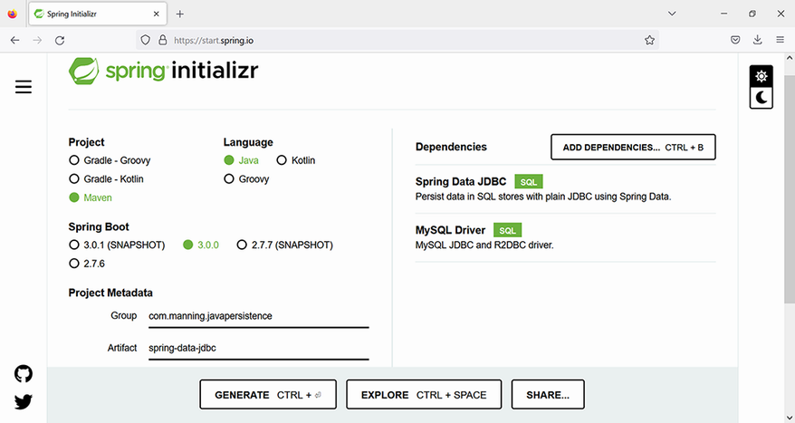

# Chương 15. Làm việc với Spring Data JDBC

> *Java Persistence with Spring Data and Hibernate* — Chương 15: “Working with Spring Data JDBC”

**Nội dung chương này bao gồm**

- Bắt đầu một dự án Spring Data JDBC
- Làm việc với truy vấn và query method trong Spring Data JDBC
- Xây dựng quan hệ bằng Spring Data JDBC
- Mô hình hóa embedded entity với Spring Data JDBC

Chúng ta đã giới thiệu Spring Data ở chương 2: đó là một dự án ô chứa nhiều dự án nhằm đơn giản hóa việc truy cập cả cơ sở dữ liệu quan hệ lẫn NoSQL bằng cách tuân thủ các nguyên tắc của Spring framework. Ở chương 4, chúng ta đã xem xét chi tiết các nguyên tắc và khả năng của dự án Spring Data JPA. Mục đích của Spring Data JDBC là xử lý hiệu quả các repository dựa trên JDBC. Đây là một dự án trẻ hơn trong họ, và nó không cung cấp mọi khả năng của JPA như caching hay lazy loading, dẫn tới một ORM đơn giản và hạn chế hơn. Tuy nhiên, nó đang phát triển và bổ sung tính năng mới ở mỗi phiên bản.

Vì sao chúng ta cần Spring Data JDBC khi đã có những lựa chọn như JPA, Hibernate và Spring Data JPA? Sự thật là object/relational mapping (ORM) khiến các dự án trở nên phức tạp, và bạn đã thấy rõ điều này ở các chương trước. Có những tình huống chúng ta muốn loại bỏ độ phức tạp này và tận dụng lợi ích của việc làm việc với Spring — framework Java phổ biến nhất hiện nay. Chúng ta có những lựa chọn nào?

Nếu nhìn lại JDBC kiểu cũ, chúng ta phải nhớ những hạn chế của nó, chẳng hạn tự mở và đóng kết nối hay xử lý ngoại lệ thủ công — nhìn chung, chúng ta sẽ phải viết rất nhiều mã dịch vụ.

Spring Data JDBC cho phép chúng ta tạo truy vấn riêng để thực thi trên cơ sở dữ liệu, nhưng nó cũng có ORM riêng và dùng những khái niệm đã được JPA, Hibernate và Spring Data JPA sử dụng: entity, repository và annotation `@Query`. Spring Data JDBC không dùng JPQL và không có tính khả chuyển. Truy vấn phải được viết bằng SQL thuần và đặc thù cho nhà cung cấp cơ sở dữ liệu. Việc nạp entity phải được thực hiện qua truy vấn SQL, và hoặc là nạp trọn vẹn hoặc không nạp gì. Caching và lazy loading không có sẵn. Session và dirty tracking không tồn tại; chúng ta phải lưu entity một cách tường minh.

Ngoài ra, tại thời điểm viết chương này, Spring Data JDBC không hỗ trợ sinh schema. Chúng ta có thể khai báo entity như trong Hibernate hay Spring Data JPA, nhưng các lệnh DDL phải được viết và chạy.

Hãy tạo một dự án dùng Spring Data JDBC và phân tích các khả năng của nó khi chúng ta đưa vào những tính năng mới.

## 15.1 Tạo một dự án Spring Data JDBC

Trong chương này, chúng ta sẽ tạo một ứng dụng quản lý và lưu trữ các user CaveatEmptor với Spring Data JDBC làm persistence framework, tương tự như đã làm với Spring Data JPA ở chương 4. Chúng ta sẽ tạo một ứng dụng Spring Boot để dùng Spring Data JDBC.

Để bắt đầu, chúng ta sẽ dùng website Spring Initializr (https://start.spring.io/) để tạo một dự án Spring Boot mới (hình 15.1) với các đặc điểm sau:

- Group: `com.manning.javapersistence`
- Artifact: `spring-data-jdbc`
- Description: Spring Data JDBC project

Chúng ta cũng sẽ thêm các dependency sau:

- Spring Data JDBC (việc này sẽ thêm `spring-boot-starter-data-jdbc` vào file Maven pom.xml)
- MySQL Driver (việc này sẽ thêm `mysql-connector-java` vào file Maven pom.xml)

> **CHÚ Ý** Để thực thi các ví dụ từ mã nguồn, trước tiên bạn cần chạy script Ch15.sql.



**Hình 15.1** Tạo một dự án Spring Boot mới dùng Spring Data JDBC và MySQL

Bộ khung của dự án chứa bốn file:

- `SpringDataJdbcApplication`, chứa một phương thức `main` khung
- `SpringDataJdbcApplicationTests`, chứa một phương thức test khung
- `application.properties`, rỗng lúc ban đầu
- `pom.xml`, chứa thông tin quản lý mà Maven cần

File pom.xml, được thể hiện ở listing sau, bao gồm các dependency mà chúng ta đã thêm để bắt đầu dự án Spring Data JDBC: chúng ta sẽ dùng framework Spring Data JDBC để truy cập cơ sở dữ liệu MySQL, và cần driver cho việc đó.

**Listing 15.1** File Maven pom.xml

*Đường dẫn: Ch15/spring-data-jdbc/pom.xml*

```xml
<dependencies>
    <dependency>                                                    <!-- Ⓐ -->
       <groupId>org.springframework.boot</groupId>                  <!-- Ⓐ -->
       <artifactId>spring-boot-starter-data-jdbc</artifactId>       <!-- Ⓐ -->
    </dependency>                                                   <!-- Ⓐ -->
    <dependency>                                                    <!-- Ⓑ -->
       <groupId>mysql</groupId>                                     <!-- Ⓑ -->
       <artifactId>mysql-connector-java</artifactId>                <!-- Ⓑ -->
       <scope>runtime</scope>                                       <!-- Ⓑ -->
    </dependency>                                                   <!-- Ⓑ -->
    <dependency>                                                    <!-- Ⓒ -->
       <groupId>org.springframework.boot</groupId>                  <!-- Ⓒ -->
       <artifactId>spring-boot-starter-test</artifactId>            <!-- Ⓒ -->
       <scope>test</scope>                                          <!-- Ⓒ -->
    </dependency>                                                   <!-- Ⓒ -->
</dependencies>
```

Ⓐ `spring-boot-starter-data-jdbc` là starter dependency được Spring Boot dùng để kết nối tới cơ sở dữ liệu quan hệ thông qua Spring Data JDBC.

Ⓑ `mysql-connector-java` là driver JDBC cho MySQL. Đây là dependency runtime, nghĩa là nó chỉ cần có trên classpath lúc chạy.

Ⓒ `spring-boot-starter-test` là starter dependency của Spring Boot dùng cho kiểm thử. Nó chỉ cần cho giai đoạn biên dịch và thực thi test.

File application.properties có thể chứa nhiều property khác nhau mà ứng dụng sẽ dùng. Spring Boot sẽ tự động tìm và nạp file application.properties từ classpath, và thư mục `src/main/resources` được Maven thêm vào classpath. Vì script khởi tạo theo mặc định chỉ chạy cho các cơ sở dữ liệu nhúng, và chúng ta đang dùng MySQL, chúng ta sẽ phải ép việc thực thi script bằng cách đặt chế độ khởi tạo `spring.sql.init.mode` là `always`. File cấu hình được thể hiện ở listing sau.

**Listing 15.2** File application.properties

*Đường dẫn: Ch15/spring-data-jdbc/src/main/resources/application.properties*

```properties
spring.datasource.url=jdbc:mysql://localhost:3306/CH15_SPRINGDATAJDBC?serverTimezone=UTC
# Ⓐ
spring.datasource.username=root
spring.datasource.password=
# Ⓑ
spring.jpa.properties.hibernate.dialect=org.hibernate.dialect.MySQL8Dialect
# Ⓒ
spring.sql.init.mode=always
# Ⓓ
```

Ⓐ URL của cơ sở dữ liệu.

Ⓑ Thông tin đăng nhập để truy cập cơ sở dữ liệu. Hãy thay bằng thông tin trên máy của bạn, và dùng mật khẩu trong thực tế.

Ⓒ Dialect của cơ sở dữ liệu, MySQL.

Ⓓ Chế độ khởi tạo SQL là `always`, nên file SQL sẽ luôn được thực thi, tạo lại schema cơ sở dữ liệu.

Script SQL được thực thi tự động sẽ trông như ở listing sau, xóa và tạo lại table `USERS`. Lúc khởi động, Spring Boot sẽ luôn thực thi các file schema.sql và data.sql trên classpath.

**Listing 15.3** File schema.sql

*Đường dẫn: Ch15/spring-data-jdbc/src/main/resources/schema.sql*

```sql
DROP TABLE IF EXISTS USERS;

CREATE TABLE USERS (
   ID INTEGER AUTO_INCREMENT PRIMARY KEY,
   USERNAME VARCHAR(30),
   REGISTRATION_DATE DATE
);
```

Giờ chúng ta sẽ định nghĩa entity class tương ứng với table `USERS` như minh họa ở listing 15.4. Chúng ta sẽ dùng một số annotation đặc thù Spring để cấu hình cách class được ánh xạ tới table trong cơ sở dữ liệu:

- `org.springframework.data.relational.core.mapping.Table` — Khác với `javax.persistence.Table` đã dùng trước đây, vốn đặc thù JPA.
- `org.springframework.data.annotation.Id` — Khác với `javax.persistence.Id` đã dùng trước đây, vốn đặc thù JPA. Chúng ta đã định nghĩa cột tương ứng trong cơ sở dữ liệu là `ID INTEGER AUTO_INCREMENT PRIMARY KEY`, nên cơ sở dữ liệu sẽ lo việc sinh các giá trị tự tăng.
- `org.springframework.data.relational.core.mapping.Column` — Khác với `javax.persistence.Column` đã dùng trước đây, vốn đặc thù JPA. Với tên cột, Spring Data JDBC sẽ chuyển camel case dùng để định nghĩa field của class thành snake case dùng để định nghĩa cột của table.

**Listing 15.4** Class User

*Đường dẫn: Ch15/spring-data-jdbc/src/main/java/com/manning/javapersistence/ch15/model/User.java*

```java
@Table("USERS")                                          // Ⓐ
public class User {                                      // Ⓐ

    @Id                                                  // Ⓑ
    @Column("ID")                                        // Ⓒ
    private Long id;

    @Column("USERNAME")                                  // Ⓓ
    private String username;

    @Column("REGISTRATION_DATE")                         // Ⓔ
    private LocalDate registrationDate;

    //constructors, getters and setters
}
```

Ⓐ Đánh dấu class `User` bằng annotation `@Table`, chỉ ra tường minh rằng table tương ứng là `USERS`.

Ⓑ Đánh dấu field `id` bằng annotation `@Id`.

Ⓒ Đánh dấu field `id` bằng annotation `@Column("ID")`, chỉ định cột tương ứng trong cơ sở dữ liệu. Đây là giá trị mặc định.

Ⓓ Đánh dấu field `username` bằng annotation `@Column("USERNAME")`, chỉ định cột tương ứng trong cơ sở dữ liệu. Đây là giá trị mặc định.

Ⓔ Đánh dấu field `registrationDate` bằng annotation `@Column("REGISTRATION_DATE")`, chỉ định cột tương ứng trong cơ sở dữ liệu. Đây là giá trị mặc định.

Chúng ta cũng sẽ tạo interface `UserRepository` mở rộng `CrudRepository` và nhờ đó cung cấp quyền truy cập cơ sở dữ liệu.

**Listing 15.5** Interface UserRepository

*Đường dẫn: Ch15/spring-data-jdbc/src/main/java/com/manning/javapersistence/ch15/repositories/UserRepository.java*

```java
@Repository
public interface UserRepository extends CrudRepository<User, Long> {
    List<User> findAll();
}
```

Interface `UserRepository` mở rộng `CrudRepository<User, Long>`. Nghĩa là nó là một repository của các entity `User`, có định danh kiểu `Long`. Hãy nhớ, class `User` có field `id` kiểu `Long` được đánh dấu `@Id`. Chúng ta có thể gọi trực tiếp các phương thức như `save`, `findAll` hay `findById` được kế thừa từ `CrudRepository`, và dùng chúng mà không cần thông tin bổ sung nào để thực thi các thao tác thông thường trên cơ sở dữ liệu. Spring Data JDBC sẽ tạo một class proxy hiện thực interface `UserRepository` và hiện thực các phương thức của nó.

> **CHÚ Ý** Đáng nhắc lại điều đã đề cập ở mục 4.3: `CrudRepository` là một interface persistence tổng quát, trung lập về công nghệ, mà chúng ta có thể dùng không chỉ cho JPA/cơ sở dữ liệu quan hệ, như bạn đã thấy.

Chúng ta chỉ ghi đè phương thức `findAll` để nó trả về `List<User>` thay vì `Iterable<User>`. Điều này sẽ đơn giản hóa các test sau này. Làm class cơ sở cho mọi test tương lai, chúng ta sẽ viết abstract class `SpringDataJdbcApplicationTests`.

Annotation `@SpringBootTest`, được Spring Boot thêm vào class được tạo ban đầu, sẽ bảo Spring Boot tìm class cấu hình chính (chẳng hạn class được đánh dấu `@SpringBootApplication`) và tạo `ApplicationContext` để dùng trong các test. Như bạn còn nhớ, annotation `@SpringBootApplication` được Spring Boot thêm vào class chứa phương thức `main` sẽ bật cơ chế tự động cấu hình của Spring Boot, bật việc quét package nơi ứng dụng nằm, và cho phép chúng ta đăng ký thêm bean vào context.

Bằng annotation `@TestInstance(TestInstance.Lifecycle.PER_CLASS)`, chúng ta yêu cầu JUnit 5 tạo một instance duy nhất của class test và tái sử dụng nó cho mọi phương thức test. Điều này cho phép chúng ta để các phương thức được đánh dấu `@BeforeAll` và `@AfterAll` không phải `static` và dùng trực tiếp bên trong chúng field instance `UserRepository` được autowire. Phương thức không `static` được đánh dấu `@BeforeAll` được thực thi một lần trước mọi test từ bất kỳ class nào mở rộng `SpringDataJdbcApplicationTests`, và nó lưu danh sách user được tạo bên trong phương thức `generateUsers` vào cơ sở dữ liệu. Phương thức không `static` được đánh dấu `@AfterAll` được thực thi một lần sau mọi test từ bất kỳ class nào mở rộng `SpringDataJdbcApplicationTests`, và nó xóa mọi user khỏi cơ sở dữ liệu.

**Listing 15.6** Abstract class SpringDataJdbcApplicationTests

*Đường dẫn: Ch15/spring-data-jdbc/src/test/java/com/manning/javapersistence/ch15/SpringDataJdbcApplicationTests.java*

```java
@SpringBootTest
@TestInstance(TestInstance.Lifecycle.PER_CLASS)
abstract class SpringDataJdbcApplicationTests {

    @Autowired                                                 // Ⓐ
    UserRepository userRepository;                             // Ⓐ

    @BeforeAll
    void beforeAll() {
        userRepository.saveAll(generateUsers());
    }

    private static List<User> generateUsers() {
        List<User> users = new ArrayList<>();

        User john = new User("john", LocalDate.of(2020, Month.APRIL, 13));

        //create and set a total of 10 users

        users.add(john);
        //add a total of 10 users to the list

        return users;
    }

    @AfterAll
    void afterAll() {
        userRepository.deleteAll();
    }
}
```

Ⓐ Autowire một instance `UserRepository`. Điều này khả thi nhờ annotation `@SpringBootApplication`, vốn bật việc quét package nơi ứng dụng nằm và đăng ký các bean vào context.

Các test tiếp theo sẽ mở rộng class này và dùng cơ sở dữ liệu đã được điền dữ liệu. Để kiểm thử các phương thức hiện thuộc về `UserRepository`, chúng ta sẽ tạo class `FindUsersUsingQueriesTest` và theo cùng một công thức viết test: gọi phương thức repository và kiểm chứng kết quả của nó.

**Listing 15.7** Class FindUsersUsingQueriesTest

*Đường dẫn: Ch15/spring-data-jdbc/src/test/java/com/manning/javapersistence/ch15/FindUsersUsingQueriesTest.java*

```java
public class FindUsersUsingQueriesTest extends
                              SpringDataJdbcApplicationTests {

    @Test
    void testFindAll() {
        List<User> users = userRepository.findAll();
        assertEquals(10, users.size());
    }
}
```

## 15.2 Làm việc với truy vấn trong Spring Data JDBC

Giờ chúng ta sẽ xem xét việc làm việc với truy vấn trong Spring Data JDBC. Chúng ta sẽ bắt đầu bằng việc định nghĩa truy vấn với cơ chế query builder, rồi chuyển sang giới hạn kết quả truy vấn, sắp xếp và phân trang, streaming kết quả, dùng modifying query, và tạo truy vấn tùy chỉnh.

### 15.2.1 Định nghĩa query method với Spring Data JDBC

Chúng ta sẽ mở rộng class `User` bằng cách thêm các field `email`, `level` và `active`. Một user có thể có các level khác nhau, cho phép họ thực hiện những hành động nhất định, chẳng hạn trả giá trên một mức nào đó. Một user có thể đang hoạt động hoặc đã nghỉ (nghĩa là họ không còn hoạt động trong hệ thống đấu giá CaveatEmptor).

Mục tiêu của chúng ta là viết một chương trình có thể giải quyết các tình huống liên quan tới việc tìm user với một level cụ thể, user đang hoạt động hay không, user với username hoặc email cho trước, hoặc user có ngày đăng ký trong một khoảng cho trước.

**Listing 15.8** Class User đã sửa đổi

*Đường dẫn: Ch15/spring-data-jdbc2/src/main/java/com/manning/javapersistence/ch15/model/User.java*

```java
@Table(name = "USERS")
public class User {

    @Id
    private Long id;

    private String username;

    private LocalDate registrationDate;

    private String email;

    private int level;

    private boolean active;

    //constructors, getters and setters
}
```

Vì giờ chúng ta chịu trách nhiệm về các lệnh DDL cần thực thi, chúng ta có thể sửa nội dung file schema.sql trên classpath.

**Listing 15.9** File schema.sql đã sửa đổi

*Đường dẫn: Ch15/spring-data-jdbc2/src/main/resources/schema.sql*

```sql
DROP TABLE IF EXISTS USERS;

CREATE TABLE USERS (
    ID INTEGER AUTO_INCREMENT PRIMARY KEY,
    ACTIVE BOOLEAN,
    USERNAME VARCHAR(30),
    EMAIL VARCHAR(30),
    LEVEL INTEGER,
    REGISTRATION_DATE DATE
);
```

Giờ chúng ta sẽ thêm các phương thức mới truy vấn cơ sở dữ liệu vào interface `UserRepository`, và dùng chúng trong các test mới tạo.

**Listing 15.10** Interface UserRepository với các phương thức mới

*Đường dẫn: Ch15/spring-data-jdbc2/src/main/java/com/manning/javapersistence/ch15/repositories/UserRepository.java*

```java
public interface UserRepository extends CrudRepository<User, Long> {
    List<User> findAll();
    Optional<User> findByUsername(String username);
    List<User> findAllByOrderByUsernameAsc();
    List<User> findByRegistrationDateBetween(LocalDate start, LocalDate end);
    List<User> findByUsernameAndEmail(String username, String email);
    List<User> findByUsernameOrEmail(String username, String email);
    List<User> findByUsernameIgnoreCase(String username);
    List<User> findByLevelOrderByUsernameDesc(int level);
    List<User> findByLevelGreaterThanEqual(int level);
    List<User> findByUsernameContaining(String text);
    List<User> findByUsernameLike(String text);
    List<User> findByUsernameStartingWith(String start);
    List<User> findByUsernameEndingWith(String end);
    List<User> findByActive(boolean active);
    List<User> findByRegistrationDateIn(Collection<LocalDate> dates);
    List<User> findByRegistrationDateNotIn(Collection<LocalDate> dates);
    // . . .
}
```

Mục đích của các query method là truy xuất thông tin từ cơ sở dữ liệu. Kể từ phiên bản 2.0, Spring Data JDBC cung cấp một cơ chế query builder tương tự trong Spring Data JPA — nó tạo hành vi cho các phương thức repository dựa trên tên của chúng. Hãy nhớ rằng cơ chế truy vấn loại bỏ các tiền tố và hậu tố như `find...By`, `get...By`, `query...By`, `read...By` và `count...By` khỏi tên phương thức rồi phân tích phần còn lại.

Cũng như Spring Data JPA, Spring Data JDBC sẽ xem xét kiểu trả về của phương thức. Nếu chúng ta muốn tìm một `User` và trả nó về trong một container `Optional`, kiểu trả về của phương thức sẽ là `Optional<User>`.

Tên các phương thức cần tuân theo quy tắc để xác định truy vấn kết quả. Các query method được định nghĩa hiện chỉ có thể dùng những property có thể đưa vào mệnh đề `WHERE`, nhưng không có join. Nếu đặt tên phương thức sai (ví dụ, property của entity không khớp trong query method), chúng ta sẽ nhận lỗi khi application context được nạp. Bảng 15.1 tóm tắt việc dùng các từ khóa thiết yếu trong việc xây dựng query method của Spring Data JDBC cùng điều kiện kết quả. Để có danh sách đầy đủ hơn, xem phụ lục C.

**Bảng 15.1** Cách dùng từ khóa trong Spring Data JDBC và điều kiện kết quả

| Từ khóa | Ví dụ | Điều kiện |
| --- | --- | --- |
| `Is`, `Equals` | `findByUsername(String name)`<br>`findByUsernameIs(String name)`<br>`findByUsernameEquals(String name)` | `username = name` |
| `And` | `findByUsernameAndRegistrationDate(String name, LocalDate date)` | `username = name and registration_date = date` |
| `Or` | `findByUsernameOrRegistrationDate(String name, LocalDate date)` | `username = name or registration_date = date` |
| `LessThan` | `findByRegistrationDateLessThan(LocalDate date)` | `registration_date < date` |
| `LessThanEqual` | `findByRegistrationDateLessThanEqual(LocalDate date)` | `registration_date <= date` |
| `GreaterThan` | `findByRegistrationDateGreaterThan(LocalDate date)` | `registration_date > date` |
| `GreaterThanEqual` | `findByRegistrationDateGreaterThanEqual(LocalDate date)` | `registration_date >= date` |
| `Between` | `findByRegistrationDateBetween(LocalDate from, LocalDate to)` | `registration_date between from and to` |
| `OrderBy` | `findByRegistrationDateOrderByUsernameDesc(LocalDate date)` | `registration_date = date order by username desc` |
| `Like` | `findByUsernameLike(String name)` | `username like name` |
| `NotLike` | `findByUsernameNotLike(String name)` | `username not like name` |
| `Before` | `findByRegistrationDateBefore(LocalDate date)` | `registration_date < date` |
| `After` | `findByRegistrationDateAfter(LocalDate date)` | `registration_date > date` |
| `Null`, `IsNull` | `findByRegistrationDate(Is)Null()` | `registration_date is null` |
| `NotNull`, `IsNotNull` | `findByRegistrationDate(Is)NotNull()` | `registration_date is not null` |
| `Not` | `findByUsernameNot(String name)` | `username <> name` |

Chúng ta sẽ mở rộng abstract class `SpringDataJdbcApplicationTests` — class cơ sở cho các test — bằng cách cấu hình các field mới `email`, `level` và `active` cho mỗi user.

**Listing 15.11** Abstract class SpringDataJdbcApplicationTests đã cập nhật

*Đường dẫn: Ch15/spring-data-jdbc2/src/test/java/com/manning/javapersistence/ch15/SpringDataJdbcApplicationTests.java*

```java
@SpringBootTest
@TestInstance(TestInstance.Lifecycle.PER_CLASS)
abstract class SpringDataJdbcApplicationTests {
    // . . .

    private static List<User> generateUsers() {
        List<User> users = new ArrayList<>();

        User john = new User("john", LocalDate.of(2020, Month.APRIL, 13));
        john.setEmail("john@somedomain.com");
        john.setLevel(1);
        john.setActive(true);

        //create and set a total of 10 users

        users.add(john);
        //add a total of 10 users to the list

        return users;
    }

    // . . .
}
```

Các test tiếp theo mở rộng class này và dùng cơ sở dữ liệu đã được điền dữ liệu. Tình huống chúng ta muốn giải quyết là lấy một user hoặc một danh sách user thỏa một điều kiện cụ thể (chẳng hạn ngày đăng ký trong một khoảng cho trước) hoặc được sắp theo username. Để kiểm thử các phương thức hiện thuộc về `UserRepository`, chúng ta sẽ tạo class `FindUsersUsingQueriesTest` và theo cùng một công thức viết test: gọi phương thức repository và kiểm chứng kết quả của nó.

**Listing 15.12** Class FindUsersUsingQueriesTest

*Đường dẫn: Ch15/spring-data-jdbc2/src/test/java/com/manning/javapersistence/ch15/FindUsersUsingQueriesTest.java*

```java
public class FindUsersUsingQueriesTest extends
                              SpringDataJdbcApplicationTests {

    @Test
    void testFindAll() {
        List<User> users = userRepository.findAll();
        assertEquals(10, users.size());
    }

    @Test
    void testFindUser() {
        User beth = userRepository.findByUsername("beth").get();
        assertEquals("beth", beth.getUsername());
    }

    @Test
    void testFindAllByOrderByUsernameAsc() {
        List<User> users = userRepository.findAllByOrderByUsernameAsc();
        assertAll(() -> assertEquals(10, users.size()),
                () -> assertEquals("beth", users.get(0).getUsername()),
                () -> assertEquals("stephanie",
                            users.get(users.size() - 1).getUsername()));
    }

    @Test
    void testFindByRegistrationDateBetween() {
        List<User> users = userRepository.findByRegistrationDateBetween(
                LocalDate.of(2020, Month.JULY, 1),
                LocalDate.of(2020, Month.DECEMBER, 31));
        assertEquals(4, users.size());
    }

    //more tests
}
```

### 15.2.2 Giới hạn kết quả truy vấn, sắp xếp và phân trang

Cũng như trong Spring Data JPA, các từ khóa `first` và `top` (dùng tương đương nhau) có thể giới hạn kết quả của query method. Từ khóa `top` và `first` có thể theo sau bởi một giá trị số tùy chọn để chỉ ra kích thước kết quả tối đa được trả về. Nếu thiếu giá trị số này, kích thước kết quả sẽ là 1.

`Pageable` là một interface cho thông tin phân trang. Trên thực tế, chúng ta dùng class `PageRequest` hiện thực nó. Class này có thể chỉ định số trang, kích thước trang và tiêu chí sắp xếp.

Các tình huống chúng ta muốn giải quyết ở đây là lấy một số lượng user giới hạn (chẳng hạn user đầu tiên theo username hay theo ngày đăng ký), hoặc những user đầu tiên với một level cho trước, sắp theo ngày đăng ký, hoặc một lượng lớn user theo trang để dễ thao tác.

Chúng ta sẽ thêm các phương thức sau vào interface `UserRepository`.

**Listing 15.13** Giới hạn kết quả truy vấn, sắp xếp và phân trang trong UserRepository

*Đường dẫn: Ch15/spring-data-jdbc2/src/main/java/com/manning/javapersistence/ch15/repositories/UserRepository.java*

```java
Optional<User> findFirstByOrderByUsernameAsc();
Optional<User> findTopByOrderByRegistrationDateDesc();
Page<User> findAll(Pageable pageable);
List<User> findFirst2ByLevel(int level, Sort sort);
List<User> findByLevel(int level, Sort sort);
List<User> findByActive(boolean active, Pageable pageable);
```

Các phương thức này theo mẫu mà cơ chế query builder yêu cầu (tóm tắt ở bảng 15.1), nhưng lần này mục đích của chúng là giới hạn kết quả truy vấn, để chúng ta có thể sắp xếp và phân trang. Ví dụ, phương thức `Optional<User> findFirstByOrderByUsernameAsc()` sẽ lấy user đầu tiên theo `username` (kết quả là `Optional`, nên cuối cùng nó có thể không tồn tại). Phương thức `Page<User> findAll(Pageable pageable)` sẽ lấy mọi user nhưng theo trang. Chúng ta sẽ viết các test sau để kiểm chứng cách những phương thức mới thêm này hoạt động.

**Listing 15.14** Kiểm thử việc giới hạn kết quả truy vấn, sắp xếp và phân trang

*Đường dẫn: Ch15/spring-data-jdbc2/src/test/java/com/manning/javapersistence/ch15/FindUsersSortingAndPagingTest.java*

```java
public class FindUsersSortingAndPagingTest extends
                 SpringDataJdbcApplicationTests {

    @Test
    void testOrder() {

        User user1 = userRepository.findFirstByOrderByUsernameAsc().get();  // Ⓐ
        User user2 =
             userRepository.findTopByOrderByRegistrationDateDesc().get();   // Ⓐ
        Page<User> userPage = userRepository.findAll(PageRequest.of(1, 3)); // Ⓑ
        List<User> users = userRepository.findFirst2ByLevel(2,
                                          Sort.by("registrationDate"));     // Ⓒ

        assertAll(
                () -> assertEquals("beth", user1.getUsername()),
                () -> assertEquals("julius", user2.getUsername()),
                () -> assertEquals(2, users.size()),
                () -> assertEquals(3, userPage.getSize()),
                () -> assertEquals("beth", users.get(0).getUsername()),
                () -> assertEquals("marion", users.get(1).getUsername())
        );
    }

    @Test
    void testFindByLevel() {
        Sort.TypedSort<User> user = Sort.sort(User.class);                  // Ⓓ

        List<User> users = userRepository.findByLevel(3,
                      user.by(User::getRegistrationDate).descending());     // Ⓔ
        assertAll(
                () -> assertEquals(2, users.size()),
                () -> assertEquals("james", users.get(0).getUsername())
        );
    }

    @Test
    void testFindByActive() {
        List<User> users = userRepository.findByActive(true,
                   PageRequest.of(1, 4, Sort.by("registrationDate")));      // Ⓕ
        assertAll(
                () -> assertEquals(4, users.size()),
                () -> assertEquals("burk", users.get(0).getUsername())
        );
    }
}
```

Ⓐ Test đầu tiên tìm user đầu tiên theo thứ tự tăng dần của `username` và user đầu tiên theo thứ tự giảm dần của ngày đăng ký.

Ⓑ Tìm tất cả user, chia chúng thành các trang, và trả về trang số 1 với kích thước 3 (đánh số trang bắt đầu từ 0).

Ⓒ Tìm 2 user đầu tiên có level 2, sắp theo ngày đăng ký.

Ⓓ Test thứ hai định nghĩa một tiêu chí sắp xếp trên class `User`. `Sort.TypedSort` mở rộng `Sort` và có thể dùng method handle để định nghĩa các property cần sắp theo.

Ⓔ Tìm các user có level 3 và sắp theo ngày đăng ký, giảm dần.

Ⓕ Test thứ ba tìm các user đang hoạt động sắp theo ngày đăng ký, chia chúng thành các trang, và trả về trang số 1 với kích thước 4 (đánh số trang bắt đầu từ 0).

### 15.2.3 Streaming kết quả

Các query method trả về nhiều hơn một kết quả có thể dùng các interface Java chuẩn như `Iterable`, `List` và `Set`. Cũng như Spring Data JPA, Spring Data JDBC hỗ trợ `Streamable`, có thể dùng như một lựa chọn thay thế cho `Iterable` hoặc bất kỳ kiểu collection nào. Nó cho phép chúng ta nối các `Streamable` và trực tiếp lọc, ánh xạ trên các phần tử.

Tình huống chúng ta sẽ giải quyết ở đây là lấy kết quả dưới dạng một stream, không phải chờ cả collection user hay một trang user được lấy về. Nhờ đó, chúng ta có thể nhanh chóng bắt đầu xử lý những kết quả đầu tiên khi chúng đổ về. Khác với collection, một stream chỉ có thể được tiêu thụ một lần và là bất biến.

Chúng ta sẽ thêm các phương thức sau vào interface `UserRepository`.

**Listing 15.15** Thêm các phương thức trả về Streamable vào UserRepository

*Đường dẫn: Ch15/spring-data-jdbc2/src/main/java/com/manning/javapersistence/ch15/repositories/UserRepository.java*

```java
Streamable<User> findByEmailContaining(String text);
Streamable<User> findByLevel(int level);
```

Chúng ta sẽ viết test sau để kiểm chứng cách những phương thức mới thêm này tương tác với cơ sở dữ liệu và cung cấp kết quả dưới dạng stream. Một stream được đưa vào làm tài nguyên của khối `try`, nên nó tự động được đóng. Một lựa chọn khác là gọi tường minh phương thức `close()`. Nếu không, stream sẽ giữ kết nối bên dưới tới cơ sở dữ liệu.

**Listing 15.16** Kiểm thử các phương thức trả về Streamable

*Đường dẫn: Ch15/spring-data-jdbc2/src/test/java/com/manning/javapersistence/ch15/QueryResultsTest.java*

```java
@Test
void testStreamable() {
    try (Stream<User> result =                                       // Ⓐ
             userRepository.findByEmailContaining("someother")       // Ⓐ
              .and(userRepository.findByLevel(2))                    // Ⓑ
              .stream().distinct()) {                                // Ⓒ
        assertEquals(6, result.count());                             // Ⓓ
    }
}
```

Ⓐ Test sẽ gọi phương thức `findByEmailContaining` để tìm các email chứa từ `someother`.

Ⓑ Test sẽ nối `Streamable` kết quả với `Streamable` cung cấp các user có level 2.

Ⓒ Nó sẽ biến đổi kết quả này thành một stream và giữ các user phân biệt.

Ⓓ Kiểm tra rằng stream kết quả chứa 6 user.

### 15.2.4 Annotation @Query

Chúng ta có thể dùng annotation `@Query` để tạo các phương thức mà truy vấn tùy chỉnh có thể được chỉ định. Với annotation `@Query`, tên phương thức không cần tuân theo bất kỳ quy ước đặt tên nào. Truy vấn tùy chỉnh có thể được tham số hóa, nhưng khác với Spring Data JPA, tham số chỉ có thể được xác định theo tên, và chúng phải được gắn trong truy vấn bằng annotation `@Param`. Khác với Spring Data JPA, chúng ta không dùng JPQL mà dùng SQL. Do đó, không có tính khả chuyển — nếu bạn đổi nhà cung cấp cơ sở dữ liệu, bạn sẽ phải viết lại các truy vấn.

Chúng ta sẽ thêm hai phương thức mới vào interface `UserRepository`. Các phương thức này sẽ được đánh dấu bằng annotation `@Query`, và hành vi được sinh ra của chúng sẽ phụ thuộc vào định nghĩa của các truy vấn này.

**Listing 15.17** Các phương thức được đánh dấu @Query trong interface UserRepository

*Đường dẫn: Ch15/spring-data-jdbc2/src/main/java/com/manning/javapersistence/ch15/repositories/UserRepository.java*

```java
@Query("SELECT COUNT(*) FROM USERS WHERE ACTIVE = :ACTIVE")
int findNumberOfUsersByActivity(@Param("ACTIVE") boolean active);    // Ⓐ

@Query("SELECT * FROM USERS WHERE LEVEL = :LEVEL AND ACTIVE = :ACTIVE")
List<User> findByLevelAndActive(@Param("LEVEL") int level,
                                @Param("ACTIVE") boolean active);    // Ⓑ
```

Ⓐ Phương thức `findNumberOfUsersByActivity` sẽ trả về số user đang hoạt động.

Ⓑ Phương thức `findByLevelAndActive` sẽ trả về các user với `level` và trạng thái `active` được cho dưới dạng tham số có tên. Annotation `@Param` sẽ khớp tham số `:LEVEL` của truy vấn với đối số `level` của phương thức và tham số `:ACTIVE` của truy vấn với đối số `active` của phương thức.

Việc viết test cho các query method này khá đơn giản và tương tự các ví dụ trước. Chúng có thể tìm thấy trong mã nguồn của cuốn sách.

### 15.2.5 Modifying query

Chúng ta có thể định nghĩa các phương thức sửa đổi bằng annotation `@Modifying`. Ví dụ, các truy vấn `INSERT`, `UPDATE` và `DELETE` cùng các câu lệnh DDL đều sửa đổi nội dung của cơ sở dữ liệu. Annotation `@Query` có thể nhận truy vấn sửa đổi làm đối số, và nó có thể cần các tham số gắn kết. Tại thời điểm viết sách, Spring Data JDBC không hỗ trợ suy dẫn truy vấn cho các phương thức xóa (khác với Spring Data JPA).

Chúng ta sẽ thêm các phương thức mới, được đánh dấu bằng annotation `@Query`, vào interface `UserRepository`, nhưng lần này các truy vấn sẽ cập nhật hoặc xóa bản ghi khỏi table `USERS`.

**Listing 15.18** Thêm các phương thức sửa đổi vào interface UserRepository

*Đường dẫn: Ch15/spring-data-jdbc2/src/main/java/com/manning/javapersistence/ch15/repositories/UserRepository.java*

```java
@Modifying
@Query("UPDATE USERS SET LEVEL = :NEW_LEVEL WHERE LEVEL = :OLD_LEVEL")
int updateLevel(@Param("OLD_LEVEL") int oldLevel,
                @Param("NEW_LEVEL") int newLevel);                   // Ⓐ

@Modifying
@Query("DELETE FROM USERS WHERE LEVEL = :LEVEL")
int deleteByLevel(@Param("LEVEL") int level);                        // Ⓑ
```

Ⓐ Phương thức `updateLevel` sẽ thay đổi `level` của những user có `oldLevel` và đặt nó thành `newLevel`. Phương thức cũng được đánh dấu `@Modifying`.

Ⓑ Phương thức `deleteByLevel` sẽ xóa mọi user có `level` được truyền vào làm tham số, như đối số của annotation `@Query` chỉ ra. Phương thức cũng được đánh dấu `@Modifying`.

Việc viết test cho các query method này khá đơn giản và tương tự các ví dụ trước. Chúng có thể tìm thấy trong mã nguồn của cuốn sách.

## 15.3 Mô hình hóa quan hệ với Spring Data JDBC

Việc quản lý các association giữa class và quan hệ giữa table là trung tâm của các bài toán ORM. Chúng ta đã xem xét những giải pháp khả dĩ cho các bài toán này bằng JPA và Spring Data JPA ở chương 8, và giờ chúng ta sẽ xem cách tiếp cận mà Spring Data JDBC cung cấp.

### 15.3.1 Mô hình hóa quan hệ một-một với Spring Data JDBC

Spring Data JPA có thể mô hình hóa quan hệ giữa entity bằng các annotation JPA `@OneToOne`, `@OneToMany`, `@ManyToMany`. Spring Data JDBC dùng cơ chế khác với JPA. Chúng ta sẽ bắt đầu bằng việc mô hình hóa quan hệ một-một giữa các entity trong Spring Data JDBC dùng entity `User` và `Address`. Mỗi `User` sẽ chỉ có một `Address`, và mỗi `Address` sẽ thuộc về một `User`.

Như đã nói, Spring Boot sẽ luôn thực thi file schema.sql trên classpath lúc khởi động. Như ở listing sau, nó xóa và tạo lại table `ADDRESSES` và `USERS`.

**Listing 15.19** File schema.sql cho quan hệ một-một

*Đường dẫn: Ch15/spring-data-jdbc3/src/main/resources/schema.sql*

```sql
DROP TABLE IF EXISTS ADDRESSES;
DROP TABLE IF EXISTS USERS;

CREATE TABLE USERS (
   ID INTEGER AUTO_INCREMENT PRIMARY KEY,
   ACTIVE BOOLEAN,
   USERNAME VARCHAR(30),
   EMAIL VARCHAR(30),
   LEVEL INTEGER,
   REGISTRATION_DATE DATE
);

CREATE TABLE ADDRESSES (
  USER_ID INTEGER AUTO_INCREMENT PRIMARY KEY,
  STREET VARCHAR(30) NOT NULL,
  CITY VARCHAR(20) NOT NULL
);
```

Annotation `@MappedCollection` (được giới thiệu ở Spring Data JDBC 1.1) có thể dùng trên một kiểu tham chiếu cho quan hệ một-một. Field `ID` của table `USERS` sẽ là foreign key trong table `ADDRESSES`, field tương ứng từ table `ADDRESSES` là `USER_ID`. Việc có một tham chiếu `Address` duy nhất bên trong `User` sẽ khiến quan hệ trở thành một-một. Trong class `User`, tham chiếu tới field `Address` sẽ trông như sau:

*Đường dẫn: Ch15/spring-data-jdbc3/src/main/java/com/manning/javapersistence/ch15/model/User.java*

```java
@Table("USERS")
public class User {

    @Id
    private Long id;

    // . . .

    @MappedCollection(idColumn = "USER_ID")
    private Address address;
```

Class `Address` cũng sẽ được đánh dấu bằng `@Table`, vì nó tương ứng với một table khác trong cơ sở dữ liệu:

*Đường dẫn: Ch15/spring-data-jdbc3/src/main/java/com/manning/javapersistence/ch15/model/Address.java*

```java
@Table("ADDRESSES")
public class Address {
// . . .
```

Chúng ta sẽ tạo hai repository. Cái đầu tiên dành cho entity `User`:

*Đường dẫn: Ch15/spring-data-jdbc3/src/main/java/com/manning/javapersistence/ch15/repositories/UserOneToOneRepository.java*

```java
public interface UserOneToOneRepository extends
                              CrudRepository<User, Long> {
}
```

Cái thứ hai dành cho entity `Address`:

*Đường dẫn: Ch15/spring-data-jdbc3/src/main/java/com/manning/javapersistence/ch15/repositories/AddressOneToOneRepository.java*

```java
public interface AddressOneToOneRepository extends
                      CrudRepository<Address, Long> {
}
```

Chúng ta sẽ dùng các repository này để điền dữ liệu vào cơ sở dữ liệu và thực thi các test:

*Đường dẫn: Ch15/spring-data-jdbc3/src/test/java/com/manning/javapersistence/ch15/UserAddressOneToOneTest.java*

```java
@SpringBootTest
@TestInstance(TestInstance.Lifecycle.PER_CLASS)
public class UserAddressOneToOneTest {

    @Autowired
    private UserOneToOneRepository userOneToOneRepository;

    @Autowired
    private AddressOneToOneRepository addressOneToOneRepository;

    // . . .

    @Test
    void oneToOneTest() {

        assertAll(
                () -> assertEquals(10, userOneToOneRepository.count()),
                () -> assertEquals(10, addressOneToOneRepository.count())
        );
    }
    // . . .
}
```

### 15.3.2 Mô hình hóa embedded entity với Spring Data JDBC

Giờ chúng ta chuyển sang việc mô hình hóa embedded entity trong Spring Data JDBC. Chúng ta muốn nhúng entity `User` và class `Address` vào `User`.

Script SQL được thực thi tự động được thể hiện ở listing sau. Sẽ chỉ có một table, `USERS`, nhúng thông tin về địa chỉ.

**Listing 15.20** File schema.sql cho embedded entity

*Đường dẫn: Ch15/spring-data-jdbc4/src/main/resources/schema.sql*

```sql
DROP TABLE IF EXISTS USERS;

CREATE TABLE USERS (
   ID INTEGER AUTO_INCREMENT PRIMARY KEY,
   ACTIVE BOOLEAN,
   USERNAME VARCHAR(30),
   EMAIL VARCHAR(30),
   LEVEL INTEGER,
   REGISTRATION_DATE DATE,
   STREET VARCHAR(30) NOT NULL,
   CITY VARCHAR(20) NOT NULL
);
```

Địa chỉ sẽ được nhúng trong table `USERS`. Nếu các cột nhúng `STREET` và `CITY` rỗng, field `address` sẽ là `null`. Trong class `User`, tham chiếu tới field `Address` sẽ trông như sau:

*Đường dẫn: Ch15/spring-data-jdbc4/src/main/java/com/manning/javapersistence/ch15/model/User.java*

```java
@Table("USERS")
public class User {

    @Id
    private Long id;

    // . . .

    @Embedded(onEmpty = Embedded.OnEmpty.USE_NULL)
    private Address address;
```

Class `Address` sẽ không được đánh dấu bằng `@Table`, vì nó không còn tương ứng với một table khác trong cơ sở dữ liệu — mọi thông tin của nó sẽ được nhúng trong table `USERS`.

*Đường dẫn: Ch15/spring-data-jdbc4/src/main/java/com/manning/javapersistence/ch15/model/Address.java*

```java
public class Address {
// . . .
```

Chúng ta sẽ tạo một repository duy nhất cho entity `User`.

*Đường dẫn: Ch15/spring-data-jdbc4/src/main/java/com/manning/javapersistence/ch15/repositories/UserAddressEmbeddedRepository.java*

```java
public interface UserAddressEmbeddedRepository extends
                CrudRepository<User, Long> {
}
```

Sau đó chúng ta sẽ dùng repository này để điền dữ liệu vào cơ sở dữ liệu và thực thi các test.

*Đường dẫn: Ch15/spring-data-jdbc4/src/test/java/com/manning/javapersistence/ch15/UserAddressEmbeddedTest.java*

```java
@SpringBootTest
@TestInstance(TestInstance.Lifecycle.PER_CLASS)
public class UserAddressEmbeddedTest {

    @Autowired
    private UserAddressEmbeddedRepository userAddressEmbeddedRepository;

    // . . .

    @Test
    void embeddedTest() {
        assertEquals(10, userAddressEmbeddedRepository.count());
    }
    // . . .
}
```

### 15.3.3 Mô hình hóa quan hệ một-nhiều với Spring Data JDBC

Giờ chúng ta chuyển sang việc mô hình hóa quan hệ một-nhiều trong Spring Data JDBC. Chúng ta có entity `User` và entity `Address`. Mỗi user có thể có nhiều địa chỉ.

Script SQL được thực thi tự động được thể hiện ở listing sau. Sẽ có hai table, `USERS` và `ADDRESSES`.

**Listing 15.21** File schema.sql cho quan hệ một-nhiều

*Đường dẫn: Ch15/spring-data-jdbc5/src/main/resources/schema.sql*

```sql
DROP TABLE IF EXISTS ADDRESSES;
DROP TABLE IF EXISTS USERS;

CREATE TABLE USERS (
    ID INTEGER AUTO_INCREMENT PRIMARY KEY,
    ACTIVE BOOLEAN,
    USERNAME VARCHAR(30),
    EMAIL VARCHAR(30),
    LEVEL INTEGER,
    REGISTRATION_DATE DATE
);

CREATE TABLE ADDRESSES (
  ID INTEGER AUTO_INCREMENT PRIMARY KEY,
  USER_ID INTEGER,
  STREET VARCHAR(30) NOT NULL,
  CITY VARCHAR(20) NOT NULL,
  FOREIGN KEY (USER_ID)
     REFERENCES USERS(ID)
        ON DELETE CASCADE
);
```

Field `ID` của table `USERS` sẽ là foreign key trong table `ADDRESSES`, field tương ứng từ table `ADDRESSES` là `USER_ID`. Việc có một tập tham chiếu `Address` bên trong `User` sẽ chỉ ra rằng một `User` có nhiều `Address`. Trong class `User`, tham chiếu tới các `Address` sẽ trông như sau:

*Đường dẫn: Ch15/spring-data-jdbc5/src/main/java/com/manning/javapersistence/ch15/model/User.java*

```java
@Table("USERS")
public class User {

    @Id
    private Long id;

    // . . .

    @MappedCollection(idColumn = "USER_ID")
    private Set<Address> addresses = new HashSet<>();
```

Class `Address` cũng sẽ được đánh dấu bằng `@Table`, vì nó tương ứng với một table khác trong cơ sở dữ liệu:

*Đường dẫn: Ch15/spring-data-jdbc5/src/main/java/com/manning/javapersistence/ch15/model/Address.java*

```java
@Table("ADDRESSES")
public class Address {
// . . .
```

Chúng ta sẽ tạo hai repository: một cho entity `User` và một cho entity `Address`. Repository thứ hai sẽ chứa một phương thức bổ sung. Dù tên phương thức `countByUserId` theo đúng mẫu đã bàn cho cả Spring Data JDBC lẫn Spring Data JPA, phương thức vẫn cần được đánh dấu bằng `@Query`, vì `userId` không tồn tại trong class `Address`:

*Đường dẫn: Ch15/spring-data-jdbc5/src/main/java/com/manning/javapersistence/ch15/repositories/AddressOneToManyRepository.java*

```java
public interface AddressOneToManyRepository
                 extends CrudRepository<Address, Long> {

    @Query("SELECT COUNT(*) FROM ADDRESSES WHERE USER_ID = :USER_ID")
    int countByUserId(@Param("USER_ID") Long userId);
}
```

Chúng ta sẽ dùng các repository để điền dữ liệu vào cơ sở dữ liệu và thực thi các test:

*Đường dẫn: Ch15/spring-data-jdbc5/src/test/java/com/manning/javapersistence/ch15/UserAddressOneToManyTest.java*

```java
@SpringBootTest
@TestInstance(TestInstance.Lifecycle.PER_CLASS)
public class UserAddressOneToManyTest {

    @Autowired
    private UserOneToManyRepository userOneToManyRepository;

    @Autowired
    private AddressOneToManyRepository addressOneToManyRepository;

    // . . .

    @Test
    void oneToManyTest() {

        assertAll(
             () -> assertEquals(10, userOneToManyRepository.count()),
             () -> assertEquals(20, addressOneToManyRepository.count()),
             () -> assertEquals(2,
                 addressOneToManyRepository.countByUserId(
                                            users.get(0).getId()))
        );
    }
    // . . .
}
```

### 15.3.4 Mô hình hóa quan hệ nhiều-nhiều với Spring Data JDBC

Giờ chúng ta chuyển sang việc mô hình hóa quan hệ nhiều-nhiều trong Spring Data JDBC. Chúng ta có entity `User` và `Address`. Mỗi `User` có thể có nhiều `Address`, và mỗi `Address` có thể có nhiều `User`. Chúng ta cũng sẽ cần tự đưa vào một class tương ứng với table trung gian `USERS_ADDRESSES`, thứ sẽ mô hình hóa quan hệ nhiều-nhiều.

Script SQL được thực thi tự động sẽ trông như listing sau. Sẽ có ba table: `USERS`, `ADDRESSES` và `USERS_ADDRESSES`.

**Listing 15.22** File schema.sql cho quan hệ nhiều-nhiều

*Đường dẫn: Ch15/spring-data-jdbc6/src/main/resources/schema.sql*

```sql
DROP TABLE IF EXISTS USERS_ADDRESSES;
DROP TABLE IF EXISTS USERS;
DROP TABLE IF EXISTS ADDRESSES;

CREATE TABLE USERS (
    ID INTEGER AUTO_INCREMENT PRIMARY KEY,
    ACTIVE BOOLEAN,
    USERNAME VARCHAR(30),
    EMAIL VARCHAR(30),
    LEVEL INTEGER,
    REGISTRATION_DATE DATE
);

CREATE TABLE ADDRESSES (
  ID INTEGER AUTO_INCREMENT PRIMARY KEY,
  STREET VARCHAR(30) NOT NULL,
  CITY VARCHAR(20) NOT NULL
);

CREATE TABLE USERS_ADDRESSES (
  USER_ID INTEGER,
  ADDRESS_ID INTEGER,
  FOREIGN KEY (USER_ID)
    REFERENCES USERS(ID)
       ON DELETE CASCADE,
  FOREIGN KEY (ADDRESS_ID)
    REFERENCES ADDRESSES(ID)
       ON DELETE CASCADE
);
```

Để mô hình hóa quan hệ nhiều-nhiều, class `User` sẽ được kết nối với class trung gian `UserAddress`. Việc có một tập tham chiếu `UserAddress` bên trong `User` sẽ chỉ ra rằng một `User` có nhiều `UserAddress`. Field `ID` của table `USERS` sẽ là foreign key trong table `USERS_ADDRESSES`, field tương ứng từ table `USERS_ADDRESSES` là `USER_ID`. Trong class `User`, tham chiếu tới các `Address` sẽ trông như sau:

*Đường dẫn: Ch15/spring-data-jdbc6/src/main/java/com/manning/javapersistence/ch15/model/User.java*

```java
@Table("USERS")
public class User {

    @Id
    private Long id;

    // . . .

    @MappedCollection(idColumn = "USER_ID")
    private Set<UserAddress> addresses = new HashSet<>();
```

Class `Address` cũng sẽ được đánh dấu bằng `@Table`, vì nó tương ứng với một table khác trong cơ sở dữ liệu:

*Đường dẫn: Ch15/spring-data-jdbc6/src/main/java/com/manning/javapersistence/ch15/model/Address.java*

```java
@Table("ADDRESSES")
public class Address {
// . . .
```

Ngoài ra, chúng ta sẽ tạo class `UserAddress` và đánh dấu nó bằng `@Table`, vì nó tương ứng với một table khác trong cơ sở dữ liệu. Nó sẽ chỉ giữ `ID` của `Address`, vì class `User` giữ một tập tham chiếu kiểu `UserAddress`.

*Đường dẫn: Ch15/spring-data-jdbc6/src/main/java/com/manning/javapersistence/ch15/model/UserAddress.java*

```java
@Table("USERS_ADDRESSES")
public class UserAddress {

    private Long addressId;

    public UserAddress(Long addressId) {
        this.addressId = addressId;
    }

    public Long getAddressId() {
        return addressId;
    }
}
```

Chúng ta sẽ tạo ba repository: một cho entity `User`, một cho entity `Address` và một cho entity `UserAddress`. Repository thứ ba sẽ chứa một phương thức bổ sung: dù tên phương thức `countByUserId` theo đúng mẫu đã bàn cho cả Spring Data JDBC lẫn Spring Data JPA, phương thức vẫn cần được đánh dấu bằng `@Query`, vì `userId` không tồn tại trong class `UserAddress`.

*Đường dẫn: Ch15/spring-data-jdbc6/src/main/java/com/manning/javapersistence/ch15/repositories/UserAddressManyToManyRepository.java*

```java
public interface UserAddressManyToManyRepository extends
                 CrudRepository<UserAddress, Long> {

    @Query("SELECT COUNT(*) FROM USERS_ADDRESSES WHERE USER_ID = :USER_ID")
    int countByUserId(@Param("USER_ID") Long userId);
}
```

Chúng ta sẽ dùng các repository để điền dữ liệu vào cơ sở dữ liệu và thực thi các test:

*Đường dẫn: Ch15/spring-data-jdbc6/src/test/java/com/manning/javapersistence/ch15/UserAddressManyToManyTest.java*

```java
@SpringBootTest
@TestInstance(TestInstance.Lifecycle.PER_CLASS)
public class UserAddressManyToManyTest {

    @Autowired
    private UserAddressManyToManyRepository
                        userAddressManyToManyRepository;

    @Autowired
    private AddressManyToManyRepository addressManyToManyRepository;

    @Autowired
    private UserManyToManyRepository userManyToManyRepository;

    // . . .

    @Test
    void manyToManyTest() {

        assertAll(
              () -> assertEquals(10, userManyToManyRepository.count()),
              () -> assertEquals(3, addressManyToManyRepository.count()),
              () -> assertEquals(20,
                    userAddressManyToManyRepository.count()),
              () -> assertEquals(2,
                    userAddressManyToManyRepository.countByUserId(
                                            users.get(0).getId()))
        );
    }
    // . . .
}
```

Để kết luận và cuối cùng so sánh, đối chiếu các khả năng hiện tại của Spring Data JPA và Spring Data JDBC, hãy xem bảng 15.2. Chúng tôi tóm tắt ở đây những khả năng quan trọng nhất, chẳng hạn tính khả chuyển, độ phức tạp của việc học và áp dụng vào dự án, suy dẫn truy vấn, việc dùng SQL native, việc dùng annotation, mô hình hóa quan hệ, caching và lazy loading, session, và dirty tracking.

**Bảng 15.2** Khả năng của Spring Data JPA và Spring Data JDBC

| Spring Data JPA | Spring Data JDBC |
| --- | --- |
| Độc lập với cơ sở dữ liệu và khả chuyển | Nhìn chung đặc thù cho cơ sở dữ liệu |
| Đưa vào độ phức tạp qua object/relational mapping (ORM) | Ít phức tạp hơn, nhưng vẫn tuân thủ các nguyên tắc của Spring Framework |
| Tự động sinh schema dựa trên các entity | Sinh schema qua các lệnh DDL do lập trình viên viết |
| Suy dẫn truy vấn từ phiên bản đầu tiên | Suy dẫn truy vấn từ phiên bản 2.0 |
| Truy vấn được đánh dấu bằng mã JPQL và SQL native | Chỉ truy vấn dùng SQL native |
| Có thể tái sử dụng các class với annotation JPA | Dùng annotation từ package `org.springframework.data` |
| Mô hình hóa quan hệ giữa entity qua các annotation như `@OneToMany`, `@Embedded`, v.v. | Mô hình hóa quan hệ chủ yếu ở phía lập trình viên, qua thiết kế của các class |
| Có caching và lazy loading | Không caching, không lazy loading |
| Có session và dirty tracking | Không session, không dirty tracking |

> **CHÚ Ý** Spring Data JDBC là một dự án trẻ và đang phát triển mạnh. Dự kiến nó sẽ bổ sung nhiều tính năng mới đáng kể trong tương lai gần.

## Tóm tắt

- Bạn có thể tạo và cấu hình một dự án Spring Data JDBC bằng Spring Boot, bổ sung từng bước các phương thức truy vấn cơ sở dữ liệu và mô hình hóa các loại quan hệ khác nhau.
- Bạn có thể định nghĩa và dùng một loạt query method để truy cập repository bằng cách theo cơ chế query builder của Spring Data JDBC, được giới thiệu ở phiên bản 2.0 của framework.
- Các khả năng của Spring Data JDBC bao gồm giới hạn kết quả truy vấn, sắp xếp, phân trang, streaming kết quả, và annotation `@Query`.
- Bạn có thể tạo và dùng modifying query để cập nhật và xóa entity.
- Bạn có thể mô hình hóa quan hệ một-một, một-nhiều và nhiều-nhiều giữa các entity cũng như embedded entity với Spring Data JDBC.
