# Chương 16. Làm việc với Spring Data REST

> *Java Persistence with Spring Data and Hibernate* — Chương 16: “Working with Spring Data REST”

**Nội dung chương này bao gồm**

- Giới thiệu các ứng dụng REST
- Tạo một ứng dụng Spring Data REST
- Dùng ETag cho các yêu cầu có điều kiện
- Giới hạn truy cập tới repository, phương thức và field
- Làm việc với REST event
- Sử dụng projection và excerpt

Representational state transfer (REST) là một phong cách kiến trúc phần mềm để tạo dịch vụ web; nó cũng cung cấp một tập ràng buộc. Nhà khoa học máy tính người Mỹ Roy Fielding, cũng là một trong các tác giả của đặc tả HTTP, lần đầu định nghĩa REST, trình bày các nguyên tắc REST trong luận án tiến sĩ của mình (Fielding, 2000). Các dịch vụ web theo phong cách kiến trúc REST này được gọi là *RESTful web service*, và chúng cho phép khả năng tương tác giữa internet và các hệ thống máy tính. Các hệ thống yêu cầu có thể truy cập và thao tác tài nguyên web được biểu diễn dưới dạng văn bản bằng một tập thao tác phi trạng thái quen thuộc (`GET`, `POST`, `PUT`, `PATCH`, `DELETE`). Một thao tác phi trạng thái không phụ thuộc vào bất kỳ thao tác trước nào; nó phải chứa toàn bộ thông tin cần thiết để server hiểu được.

## 16.1 Giới thiệu ứng dụng REST

Trước hết chúng ta sẽ định nghĩa các thuật ngữ *client* và *resource* để mô tả điều gì làm cho một API trở nên RESTful. Client là một người hoặc phần mềm dùng RESTful API. Ví dụ, một lập trình viên dùng RESTful API để thực hiện hành động trên website LinkedIn là một client, nhưng client cũng có thể là một trình duyệt web. Khi chúng ta vào website LinkedIn, trình duyệt là client gọi API của website và hiển thị thông tin thu được lên màn hình. Resource có thể là bất kỳ object nào mà API có thể lấy thông tin về nó. Trong API của LinkedIn, một resource có thể là một tin nhắn, một bức ảnh, hay một user. Mỗi resource có một định danh duy nhất.

Phong cách kiến trúc REST định nghĩa sáu ràng buộc (https://restfulapi.net/rest-architectural-constraints/):

- **Client-server** — Client được tách khỏi server, và mỗi bên có mối quan tâm riêng. Thường thì client quan tâm tới việc biểu diễn cho người dùng, còn server quan tâm tới việc lưu trữ dữ liệu và logic của domain model — mô hình khái niệm của một miền bao gồm dữ liệu và hành vi.
- **Stateless** — Server không giữ bất kỳ thông tin nào về client giữa các yêu cầu. Mỗi yêu cầu từ client chứa toàn bộ thông tin cần thiết để đáp ứng yêu cầu đó. Client giữ trạng thái ở phía mình.
- **Uniform interface** — Client và server có thể tiến hóa độc lập với nhau. Interface đồng nhất giữa chúng khiến chúng ghép nối lỏng.
- **Layered systems** — Client không có cách nào xác định liệu nó đang tương tác trực tiếp với server hay với một trung gian. Các tầng có thể được thêm và bớt động. Chúng có thể cung cấp bảo mật, cân bằng tải hoặc cache dùng chung.
- **Cacheable** — Client có thể cache các phản hồi. Phản hồi tự định nghĩa mình có cache được hay không.
- **Code on demand** (tùy chọn) — Server có thể tạm thời tùy chỉnh hoặc mở rộng chức năng của client. Server có thể chuyển một phần logic tới client để client thực thi, chẳng hạn các script JavaScript phía client.

Một ứng dụng web RESTful cung cấp thông tin về các resource của nó, được định danh bằng URL. Client có thể thực hiện hành động trên resource đó; nó có thể tạo, đọc, cập nhật hoặc xóa một resource.

Phong cách kiến trúc REST không đặc thù giao thức, nhưng giao thức được dùng rộng rãi nhất là REST trên HTTP. HTTP là một giao thức mạng ứng dụng đồng bộ dựa trên yêu cầu và phản hồi.

Để làm cho API của chúng ta trở nên RESTful, chúng ta phải theo một tập quy tắc khi phát triển nó. Một RESTful API sẽ truyền thông tin tới client, và client dùng thông tin đó như biểu diễn trạng thái của resource được truy cập. Ví dụ, khi chúng ta gọi API LinkedIn để truy cập một user cụ thể, API sẽ trả về trạng thái của user đó (tên, tiểu sử, kinh nghiệm nghề nghiệp, bài đăng). Các quy tắc REST khiến API dễ hiểu hơn và đơn giản hơn cho lập trình viên mới khi họ gia nhập nhóm.

Biểu diễn của trạng thái có thể ở định dạng JSON, XML hoặc HTML. Client dùng API để gửi những thông tin sau tới server:

- Định danh (URL) của resource chúng ta muốn truy cập.
- Thao tác chúng ta muốn server thực hiện trên resource đó. Đây là một phương thức HTTP, phổ biến nhất là `GET`, `POST`, `PUT`, `PATCH` và `DELETE`.

Ví dụ, việc dùng RESTful API của LinkedIn để lấy một user LinkedIn cụ thể đòi hỏi chúng ta có một URL định danh user và dùng phương thức HTTP `GET`.

## 16.2 Tạo một ứng dụng Spring Data REST

Mục tiêu đầu tiên của chúng ta là tạo một ứng dụng Spring Data REST cung cấp giao diện trình duyệt để tương tác với cơ sở dữ liệu và quản lý, lưu trữ các user CaveatEmptor. Để làm điều này, chúng ta sẽ truy cập website Spring Initializr (https://start.spring.io/) và tạo một dự án Spring Boot mới (hình 16.1), với các đặc điểm sau:

- Group: `com.manning.javapersistence`
- Artifact: `spring-data-rest`
- Description: Spring Data REST

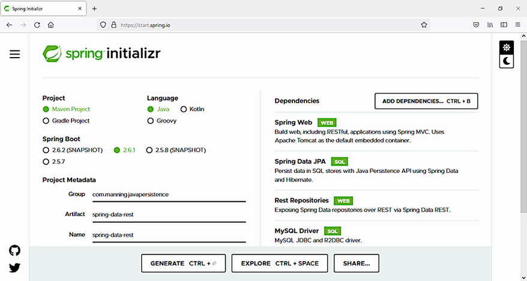

**Hình 16.1** Tạo một dự án Spring Boot mới dùng Spring Data REST và MySQL

Chúng ta cũng sẽ thêm các dependency sau:

- Spring Web (việc này sẽ thêm `spring-boot-starter-web` vào file Maven pom.xml)
- Spring Data JPA (việc này sẽ thêm `spring-boot-starter-data-jpa` vào file Maven pom.xml)
- REST Repositories (việc này sẽ thêm `spring-boot-starter-data-rest` vào file Maven pom.xml)
- MySQL Driver (việc này sẽ thêm `mysql-connector-java` vào file Maven pom.xml)

> **CHÚ Ý** Để thực thi các ví dụ từ mã nguồn, trước tiên bạn cần chạy script Ch16.sql.

File pom.xml ở listing sau bao gồm các dependency chúng ta đã thêm để bắt đầu dự án Spring Data REST. Ứng dụng Spring Data REST này sẽ truy cập cơ sở dữ liệu MySQL, nên chúng ta cần driver.

**Listing 16.1** File Maven pom.xml

*Đường dẫn: Ch16/spring-data-rest/pom.xml*

```xml
<dependency>                                                    <!-- Ⓐ -->
    <groupId>org.springframework.boot</groupId>                 <!-- Ⓐ -->
    <artifactId>spring-boot-starter-web</artifactId>            <!-- Ⓐ -->
</dependency>                                                   <!-- Ⓐ -->
<dependency>                                                    <!-- Ⓑ -->
    <groupId>org.springframework.boot</groupId>                 <!-- Ⓑ -->
    <artifactId>spring-boot-starter-data-jpa</artifactId>       <!-- Ⓑ -->
</dependency>                                                   <!-- Ⓑ -->
<dependency>                                                    <!-- Ⓒ -->
    <groupId>org.springframework.boot</groupId>                 <!-- Ⓒ -->
    <artifactId>spring-boot-starter-data-rest</artifactId>      <!-- Ⓒ -->
</dependency>                                                   <!-- Ⓒ -->
<dependency>                                                    <!-- Ⓓ -->
    <groupId>mysql</groupId>                                    <!-- Ⓓ -->
    <artifactId>mysql-connector-java</artifactId>               <!-- Ⓓ -->
    <scope>runtime</scope>                                      <!-- Ⓓ -->
</dependency>                                                   <!-- Ⓓ -->
```

Ⓐ `spring-boot-starter-web` là starter dependency được Spring Boot dùng để xây dựng ứng dụng web.

Ⓑ `spring-boot-starter-data-jpa` là starter dependency được Spring Boot dùng để kết nối tới cơ sở dữ liệu quan hệ thông qua Spring Data JPA.

Ⓒ `spring-boot-starter-data-rest` là starter dependency được Spring Boot dùng cho các ứng dụng Spring Data REST.

Ⓓ `mysql-connector-java` là driver JDBC cho MySQL. Đây là dependency runtime, nên nó chỉ cần có trên classpath lúc chạy.

Bước tiếp theo là điền vào file application.properties của Spring Boot, thứ có thể chứa nhiều property khác nhau để ứng dụng dùng. Spring Boot sẽ tự động tìm và nạp file application.properties từ classpath — thư mục `src/main/resources` được Maven thêm vào classpath.

Có vài cách cung cấp tham số trong một ứng dụng Spring Boot, và file `.properties` chỉ là một trong số đó. Tham số cũng có thể đến từ mã nguồn hoặc dưới dạng đối số dòng lệnh — xem tài liệu Spring Boot để biết chi tiết.

Với ứng dụng của chúng ta, file cấu hình application.properties sẽ trông như listing sau.

**Listing 16.2** File application.properties

*Đường dẫn: Ch16/spring-data-rest/src/main/resources/application.properties*

```properties
server.port=8081
# Ⓐ
spring.datasource.url=jdbc:mysql://localhost:3306/CH16_SPRINGDATAREST?serverTimezone=UTC
# Ⓑ
spring.datasource.username=root
spring.datasource.password=
# Ⓒ
spring.jpa.properties.hibernate.dialect=org.hibernate.dialect.MySQL8Dialect
# Ⓓ
spring.jpa.show-sql=true
# Ⓔ
spring.jpa.hibernate.ddl-auto=create
# Ⓕ
```

Ⓐ Ứng dụng sẽ khởi động trên cổng 8081.

Ⓑ URL của cơ sở dữ liệu.

Ⓒ Thông tin đăng nhập để truy cập cơ sở dữ liệu. Hãy thay bằng thông tin trên máy của bạn, và dùng mật khẩu trong thực tế.

Ⓓ Dialect của cơ sở dữ liệu, MySQL.

Ⓔ Hiển thị các truy vấn SQL khi chúng được thực thi.

Ⓕ Tạo lại các table cho mỗi lần thực thi ứng dụng.

Class `User` giờ sẽ chứa một field được đánh dấu `@Version`. Như đã bàn ở mục 11.2.2, giá trị field được tăng mỗi khi một instance `User` đã sửa đổi được lưu. Mục 16.3 sẽ minh họa cách field này có thể được dùng cho các yêu cầu REST có điều kiện bằng ETag.

**Listing 16.3** Class User đã sửa đổi

*Đường dẫn: Ch16/spring-data-rest/src/main/java/com/manning/javapersistence/ch16/model/User.java*

```java
@Entity
public class User {

    @Id
    @GeneratedValue
    private Long id;

    @Version
    private Long version;

    private String name;
    private boolean isRegistered;
    private boolean isCitizen;

    //constructors, getters and setters
}
```

Các user sẽ tham gia một phiên đấu giá được biểu diễn bởi class `Auction`. Một phiên đấu giá được mô tả bởi `auctionNumber`, số `seats`, và tập `users`.

**Listing 16.4** Class Auction

*Đường dẫn: Ch16/spring-data-rest/src/main/java/com/manning/javapersistence/ch16/model/Auction.java*

```java
public class Auction {

    private String auctionNumber;
    private int seats;
    private Set<User> users = new HashSet<>();

    //constructors, getters and methods
}
```

Các user tham gia phiên đấu giá sẽ được đọc từ một file CSV, trong class `CsvDataLoader`. Chúng ta sẽ dùng annotation `@Bean` để tạo một bean được Spring quản lý và tiêm vào ứng dụng.

**Listing 16.5** Class CsvDataLoader

*Đường dẫn: Ch16/spring-data-rest/src/main/java/com/manning/javapersistence/ch16/beans/CsvDataLoader.java*

```java
public class CsvDataLoader {

    @Bean                                                          // Ⓐ
    public Auction buildAuctionFromCsv() throws IOException {
        Auction auction = new Auction("1234", 20);                 // Ⓑ
        try (BufferedReader reader = new BufferedReader(
             new FileReader("src/main/resources/users_information.csv"))) {  // Ⓒ
            String line = null;
            do {
                line = reader.readLine();                          // Ⓓ
                if (line != null) {
                    User user = new User(line);                    // Ⓔ
                    user.setIsRegistered(false);                   // Ⓔ
                    auction.addUser(user);                         // Ⓔ
                }
            } while (line != null);
        }

        return auction;                                            // Ⓕ
    }
}
```

Ⓐ Kết quả của phương thức sẽ là một bean được Spring quản lý.

Ⓑ Tạo object `Auction`.

Ⓒ Dùng thông tin từ file CSV.

Ⓓ Đọc từng dòng.

Ⓔ Tạo user từ thông tin đọc được, cấu hình nó, và thêm nó vào auction.

Ⓕ Trả về bean `Auction`.

Interface `UserRepository` mở rộng `JpaRepository<User, Long>`, kế thừa các phương thức liên quan tới JPA và quản lý entity `User` có ID kiểu `Long`.

**Listing 16.6** Interface UserRepository

*Đường dẫn: Ch16/spring-data-rest/src/main/java/com/manning/javapersistence/ch16/repositories/UserRepository.java*

```java
public interface UserRepository extends JpaRepository<User, Long> {
}
```

Ứng dụng Spring Boot sẽ import bean được tạo trong class `CsvDataLoader` và autowire nó. Nó cũng sẽ tạo một bean kiểu `ApplicationRunner`. Đây là một functional interface của Spring Boot (interface với một phương thức trừu tượng duy nhất) cho phép truy cập các đối số của ứng dụng. Interface `ApplicationRunner` này được tạo, và phương thức duy nhất của nó được thực thi, ngay trước khi phương thức `run()` từ `SpringApplication` kết thúc.

**Listing 16.7** Class Application

*Đường dẫn: Ch16/spring-data-rest/src/main/java/com/manning/javapersistence/ch16/Application.java*

```java
@SpringBootApplication
@Import(CsvDataLoader.class)                                       // Ⓐ
public class Application {

    @Autowired                                                     // Ⓑ
    private Auction auction;                                       // Ⓑ

    public static void main(String[] args) {
        SpringApplication.run(Application.class, args);
    }

    @Bean
    ApplicationRunner configureRepository(UserRepository userRepository) {
        return args -> {
            for (User user : auction.getUsers()) {                 // Ⓒ
                userRepository.save(user);                         // Ⓒ
            }
        };
    }
}
```

Ⓐ Import class `CsvDataLoader` và bean `Auction` mà nó tạo ra.

Ⓑ Autowire bean `Auction` đã import.

Ⓒ Duyệt mọi user từ auction, và lưu chúng vào repository.

Chúng ta có thể truy cập ứng dụng Spring Data REST trong trình duyệt (http://localhost:8081/users) như minh họa ở hình 16.2. Chúng ta nhận được thông tin về user và tùy chọn để dễ dàng điều hướng giữa các bản ghi. Spring Data REST sẽ phơi bày thông tin về API cần truy cập, cung cấp liên kết tới từng bản ghi.

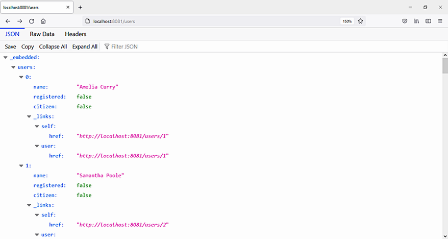

**Hình 16.2** Truy cập ứng dụng Spring Data REST từ trình duyệt

Chúng ta có thể kiểm thử endpoint REST API này bằng một REST client. Bản IntelliJ IDEA Ultimate cung cấp một REST client như vậy, nhưng bạn có thể dùng client khác (chẳng hạn cURL hay Postman). Chúng ta có thể thực thi các lệnh như sau (xem hình 16.3):

```
GET http://localhost:8081/users/1
```

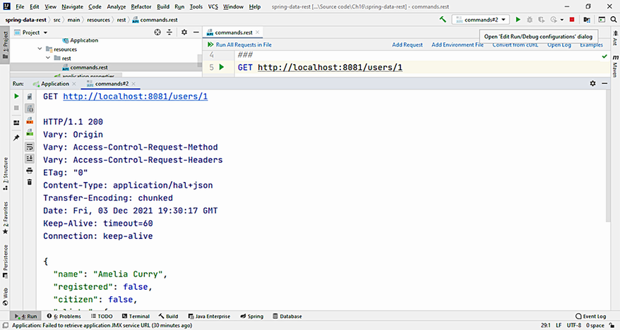

**Hình 16.3** Kết quả thực thi lệnh `GET http://localhost:8081/users/1` trong REST client của bản IntelliJ IDEA Ultimate

## 16.3 Dùng ETag cho các yêu cầu có điều kiện

Mọi lượt trao đổi thông tin qua mạng đều tốn thời gian. Thông tin càng nhỏ, chương trình của chúng ta chạy càng nhanh. Nhưng khi nào và làm sao chúng ta có thể giảm lượng thông tin truy xuất từ server và truyền qua mạng?

Giả sử chúng ta cần thực thi một lệnh như sau nhiều lần:

```
GET http://localhost:8081/users/1
```

Chúng ta sẽ truy cập server mỗi lần, và cùng thông tin đó sẽ được gửi qua mạng. Điều này kém hiệu quả, và chúng ta muốn giới hạn lượng dữ liệu trao đổi giữa client và server.

Chúng ta có thể dùng ETag để tạo các yêu cầu có điều kiện và tránh gửi thông tin không thay đổi. Một ETag là một HTTP response header do web server trả về. Nó sẽ giúp chúng ta xác định liệu nội dung tại một URL cho trước có bị sửa đổi hay không, và nhờ đó cho phép chúng ta tạo yêu cầu có điều kiện.

Trong class `User`, có một field được đánh dấu bằng annotation `@Version`:

```java
@Version
private Long version;
```

Field này cũng sẽ được dùng làm ETag. Khi chúng ta thực thi yêu cầu này tới server:

```
GET http://localhost:8081/users/1
```

câu trả lời sẽ bao gồm, trên header, phiên bản của bản ghi (0) dưới dạng một ETag (xem hình 16.4):

```
HTTP/1.1 200
Vary: Origin
Vary: Access-Control-Request-Method
Vary: Access-Control-Request-Headers
ETag: "0"
```

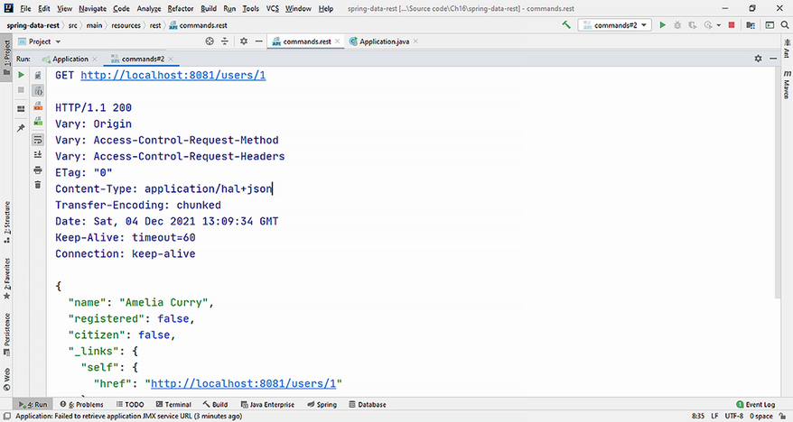

**Hình 16.4** Câu trả lời của server, bao gồm ETag trên header, biểu diễn phiên bản của entity

Dùng thông tin này, giờ chúng ta có thể thực thi một yêu cầu có điều kiện và lấy thông tin về user có ID 1 chỉ khi ETag khác 0.

```
GET http://localhost:8081/users/1
If-None-Match: "0"
```

Câu trả lời từ server sẽ là mã phản hồi 304 (Not Modified), cùng với một body rỗng (xem hình 16.5):

```
HTTP/1.1 304
Vary: Origin
Vary: Access-Control-Request-Method
Vary: Access-Control-Request-Headers
ETag: "0"
Date: Sat, 04 Dec 2021 13:19:11 GMT
Keep-Alive: timeout=60
Connection: keep-alive

<Response body is empty>
```

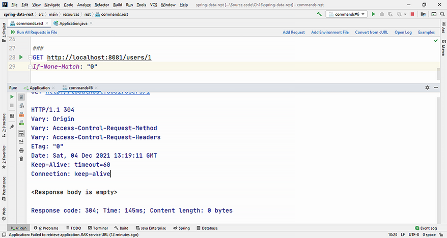

**Hình 16.5** Câu trả lời của server cho một bản ghi khớp ETag hiện có không có body.

Giờ chúng ta có thể sửa nội dung của user có ID 1 bằng cách thực thi lệnh `PATCH`. Chúng ta dùng `PATCH` thay vì `PUT`, vì `PATCH` sẽ chỉ cập nhật những field có trong yêu cầu, trong khi `PUT` sẽ thay thế toàn bộ entity bằng một entity mới.

```
PATCH http://localhost:8081/users/1
Content-Type: application/json
{
    "name": "Amelia Jones",
    "isRegistered": "true"
}
```

Câu trả lời từ server sẽ là mã phản hồi thành công 204 (No Content), và ETag sẽ là phiên bản đã tăng của bản ghi (1) (xem hình 16.6):

```
HTTP/1.1 204
Vary: Origin
Vary: Access-Control-Request-Method
Vary: Access-Control-Request-Headers
ETag: "1"
Date: Sat, 04 Dec 2021 13:25:57 GMT
Keep-Alive: timeout=60
Connection: keep-alive

<Response body is empty>
```

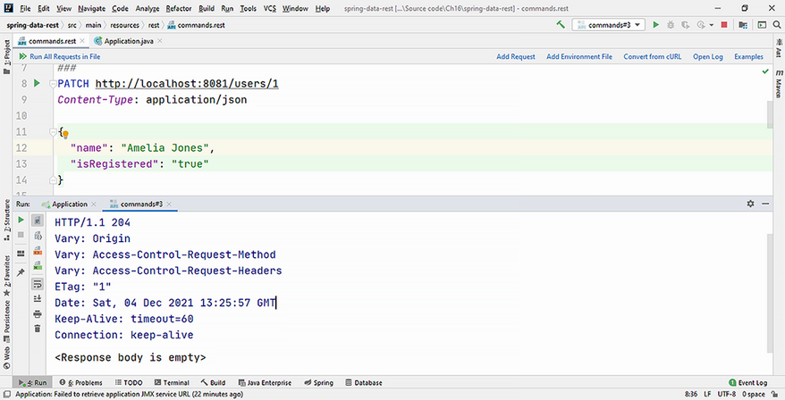

**Hình 16.6** Câu trả lời của server sau khi patch một user làm ETag tăng lên 1.

Giờ chúng ta có thể thực thi lại yêu cầu có điều kiện, để lấy thông tin về user có ID 1 chỉ khi ETag khác 0:

```
GET http://localhost:8081/users/1
If-None-Match: "0"
```

Vì phiên bản của bản ghi đã đổi từ 0 sang 1, yêu cầu có điều kiện sẽ nhận được câu trả lời với mã phản hồi 200 (Success) cùng toàn bộ thông tin về user (xem hình 16.7):

```
HTTP/1.1 200
Vary: Origin
Vary: Access-Control-Request-Method
Vary: Access-Control-Request-Headers
ETag: "1"
```

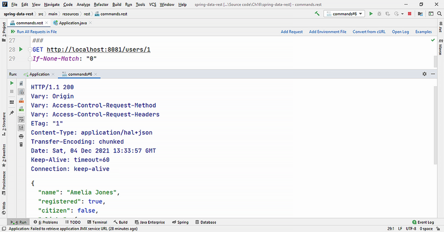

**Hình 16.7** Câu trả lời của server bao gồm toàn bộ thông tin về user, với ETag đổi từ 0 sang 1.

## 16.4 Giới hạn truy cập tới repository, phương thức và field

Theo mặc định, Spring Data REST sẽ xuất bản (export) mọi interface repository công khai ở cấp cao nhất. Nhưng các tình huống thực tế thường đòi hỏi giới hạn truy cập tới những phương thức, field, hoặc thậm chí cả repository cụ thể. Chúng ta có thể dùng annotation `@RepositoryRestResource` để chặn một interface khỏi bị export hoặc để tùy chỉnh truy cập tới một endpoint.

Ví dụ, nếu entity được quản lý là `User`, Spring Data REST sẽ export nó tới đường dẫn `/users`. Chúng ta có thể chặn việc export toàn bộ repository bằng tùy chọn `exported = false` của annotation `@RepositoryRestResource`. Repository sẽ trông như sau:

```java
@RepositoryRestResource(path = "users", exported = false)
public interface UserRepository extends JpaRepository<User, Long> {
}
```

Mọi lệnh thực thi trên repository này sẽ dẫn tới lỗi. Ví dụ, việc thực thi:

```
GET http://localhost:8081/users/1
```

sẽ sinh ra mã phản hồi 404 (Not Found) từ server (xem hình 16.8):

```
HTTP/1.1 404
Vary: Origin
Vary: Access-Control-Request-Method
Vary: Access-Control-Request-Headers
Content-Type: application/json
```

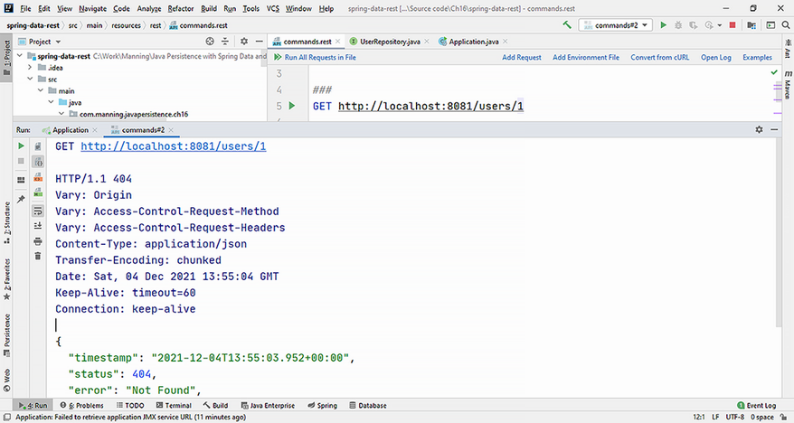

**Hình 16.8** Việc chặn export repository sẽ ngăn mọi tương tác từ giao diện REST.

Để tiện, chúng ta sẽ dùng annotation `@RepositoryRestResource` với các tùy chọn mặc định cho interface `UserRepository`.

Theo mặc định, Spring Data REST cũng sẽ export mọi phương thức từ một interface repository, nhưng chúng ta có thể chặn truy cập tới những phương thức này bằng annotation `@RestResource(exported = false)`. Với interface `UserRepository`, chúng ta sẽ không export các phương thức xóa.

**Listing 16.8** Interface UserRepository

*Đường dẫn: Ch16/spring-data-rest/src/main/java/com/manning/javapersistence/ch16/repositories/UserRepository.java*

```java
@RepositoryRestResource(path = "users")                            // Ⓐ
public interface UserRepository extends JpaRepository<User, Long> {

    @Override
    @RestResource(exported = false)                                // Ⓑ
    void deleteById(Long id);

    @Override
    @RestResource(exported = false)                                // Ⓑ
    void delete(User entity);
}
```

Ⓐ Dùng annotation `@RepositoryRestResource` để export repository tới đường dẫn `/users`. Đây là tùy chọn mặc định.

Ⓑ Dùng annotation `@RestResource(exported = false)` để không export các phương thức delete của repository.

Nếu giờ chúng ta thực thi lệnh `DELETE`:

```
DELETE http://localhost:8081/users/1
```

server sẽ phản hồi với mã 405 (Method Not Allowed), vì phương thức `delete` không được export (xem hình 16.9). Các phương thức được phép là `GET`, `HEAD`, `PUT`, `PATCH` và `OPTIONS`:

```
HTTP/1.1 405
Vary: Origin
Vary: Access-Control-Request-Method
Vary: Access-Control-Request-Headers
Allow: GET,HEAD,PUT,PATCH,OPTIONS
```

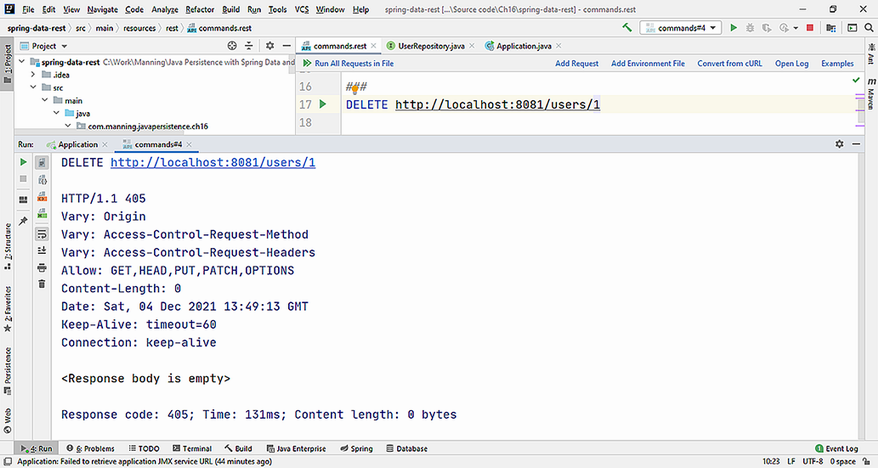

**Hình 16.9** Phương thức `delete` không còn được Spring Data REST export và không được server cho phép.

Chúng ta có thể giới hạn truy cập tới những field cụ thể và không phơi bày chúng trong giao diện REST bằng annotation `@JsonIgnore`. Ví dụ, chúng ta có thể dùng annotation này bên trong class `User`, trên phương thức `isRegistered`:

```java
@JsonIgnore
public boolean isRegistered() {
   return isRegistered;
}
```

Việc truy cập repository qua trình duyệt sẽ không còn cung cấp thông tin field `isRegistered`. Bạn có thể thấy điều này ở hình 16.10 và so sánh với hình 16.2.

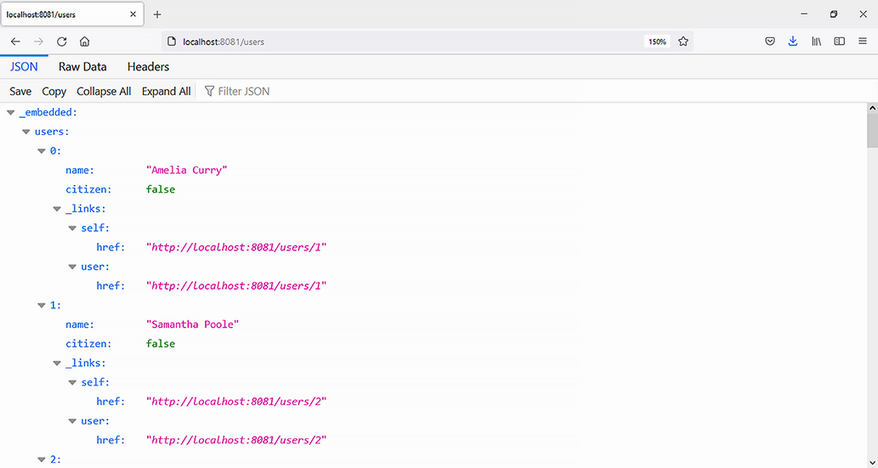

**Hình 16.10** REST client không còn nhận được thông tin `isRegistered`.

## 16.5 Làm việc với REST event

Trong một số tình huống, chúng ta có thể cần thêm tác dụng phụ vào hành vi của ứng dụng khi một sự kiện cụ thể xảy ra. Ứng dụng REST có thể phát ra 10 loại sự kiện khác nhau khi làm việc với một entity. Tất cả đều mở rộng class `org.springframework.data.rest.core.event.RepositoryEvent` và thuộc cùng package `org.springframework.data.rest.core.event`:

- `BeforeCreateEvent`
- `AfterCreateEvent`
- `BeforeSaveEvent`
- `AfterSaveEvent`
- `BeforeLinkSaveEvent`
- `AfterLinkSaveEvent`
- `BeforeDeleteEvent`
- `AfterDeleteEvent`
- `BeforeLinkDelete`
- `AfterLinkDelete`

Những sự kiện này có thể được xử lý theo hai cách:

- Viết một handler có annotation
- Viết một `ApplicationListener`

Hãy xem hai lựa chọn này.

### 16.5.1 Viết một AnnotatedHandler

Để thêm tác dụng phụ bằng cách viết một `AnnotatedHandler`, chúng ta có thể tạo một class POJO với annotation `@RepositoryEventHandler` trên nó. Annotation này bảo `BeanPostProcessor` do Spring quản lý rằng class này phải được kiểm tra để tìm các phương thức handler. `BeanPostProcessor` sẽ duyệt các phương thức của class mang annotation này và phát hiện những annotation tương ứng với các sự kiện khác nhau.

Bean xử lý sự kiện phải nằm dưới sự điều khiển của container. Chúng ta có thể đánh dấu class là `@Service` (một stereotype của `@Component`), để nó được `@ComponentScan` hoặc `@SpringBootApplication` xét tới.

Entity mà chúng ta theo dõi sự kiện được cung cấp bởi kiểu của tham số đầu tiên trong các phương thức có annotation. Ở các ví dụ sau, các phương thức của handler sẽ có một entity `User` làm tham số.

Sự liên kết giữa các phương thức có annotation và các sự kiện được tóm tắt ở bảng 16.1.

**Bảng 16.1** Annotation của AnnotatedHandler và sự kiện tương ứng

| Annotation | Sự kiện |
| --- | --- |
| `@HandleBeforeCreate`<br>`@HandleAfterCreate` | Sự kiện `POST` |
| `@HandleBeforeSave`<br>`@HandleAfterSave` | Sự kiện `PUT` và `PATCH` |
| `@HandleBeforeDelete`<br>`@HandleAfterDelete` | Sự kiện `DELETE` |
| `@HandleBeforeLinkSave`<br>`@HandleAfterLinkSave` | Một object được liên kết được lưu vào repository |
| `@HandleBeforeLinkDelete`<br>`@HandleAfterLinkDelete` | Một object được liên kết bị xóa khỏi repository |

Class `UserRepositoryEventHandler`, một class POJO với annotation `@RepositoryEventHandler` trên nó, được thể hiện ở listing sau.

**Listing 16.9** Class UserRepositoryEventHandler

*Đường dẫn: Ch16/spring-data-rest-events/src/main/java/com/manning/javapersistence/ch16/events/UserRepositoryEventHandler.java*

```java
@RepositoryEventHandler                                            // Ⓐ
@Service                                                           // Ⓑ
public class UserRepositoryEventHandler {

    @HandleBeforeCreate                                            // Ⓒ
    public void handleUserBeforeCreate(User user) {                // Ⓓ
        //manage the event
    }

    //other methods
}
```

Ⓐ Đánh dấu class bằng annotation `@RepositoryEventHandler` để bảo `BeanPostProcessor` của Spring kiểm tra nó tìm các phương thức handler.

Ⓑ Đánh dấu class bằng annotation `@Service` để đưa nó vào dưới sự điều khiển của container.

Ⓒ Đánh dấu phương thức bằng `@HandleBeforeCreate` để liên kết nó với sự kiện `POST`.

Ⓓ Phương thức có một entity `User` làm tham số đầu tiên, chỉ ra kiểu mà chúng ta đang theo dõi sự kiện.

### 16.5.2 Viết một ApplicationListener

Để thêm tác dụng phụ bằng cách viết một `ApplicationListener`, chúng ta sẽ mở rộng abstract class `AbstractRepositoryEventListener`. Class này được tổng quát hóa bởi kiểu entity mà các sự kiện xảy ra trên đó. Nó sẽ lắng nghe các sự kiện và gọi những phương thức tương ứng. Chúng ta sẽ đánh dấu listener tùy chỉnh là `@Service` (một stereotype của `@Component`), để nó được `@ComponentScan` hoặc `@SpringBootApplication` xét tới.

Abstract class `AbstractRepositoryEventListener` đã chứa một loạt phương thức `protected` rỗng để xử lý sự kiện. Chúng ta chỉ cần ghi đè và làm cho `public` những phương thức mà chúng ta quan tâm.

Sự liên kết giữa các phương thức và sự kiện được tóm tắt ở bảng 16.2.

**Bảng 16.2** Phương thức của ApplicationListener và sự kiện tương ứng

| Phương thức | Sự kiện |
| --- | --- |
| `onBeforeCreate`<br>`onAfterCreate` | Sự kiện `POST` |
| `onBeforeSave`<br>`onAfterSave` | Sự kiện `PUT` và `PATCH` |
| `onBeforeDelete`<br>`onAfterDelete` | Sự kiện `DELETE` |
| `onBeforeLinkSave`<br>`onAfterLinkSave` | Một object được liên kết được lưu vào repository |
| `onBeforeLinkDelete`<br>`onAfterLinkDelete` | Một object được liên kết bị xóa khỏi repository |

Class `RepositoryEventListener`, mở rộng abstract class `AbstractRepositoryEventListener`, chứa các phương thức phản ứng với sự kiện. Nó được thể hiện ở listing sau.

**Listing 16.10** Class RepositoryEventListener

*Đường dẫn: Ch16/spring-data-rest-events/src/main/java/com/manning/javapersistence/ch16/events/RepositoryEventListener.java*

```java
@Service                                                           // Ⓐ
public class RepositoryEventListener extends                       // Ⓑ
         AbstractRepositoryEventListener<User> {                   // Ⓑ

    @Override                                                      // Ⓒ
    public void onBeforeCreate(User user) {                        // Ⓒ
        //manage the event
    }

    //other methods
}
```

Ⓐ Đánh dấu class bằng annotation `@Service` để đưa nó vào dưới sự điều khiển của container.

Ⓑ Mở rộng `AbstractRepositoryEventListener`, được tổng quát hóa bởi entity `User` — entity mà các sự kiện xảy ra trên đó.

Ⓒ Phương thức có một entity `User` làm tham số đầu tiên, chỉ ra kiểu mà chúng ta đang theo dõi sự kiện.

Giờ chúng ta có thể chạy ứng dụng và thực thi một lệnh REST như sau:

```
POST http://localhost:8081/users
Content-Type: application/json
{
    "name": "John Smith"
}
```

Handler và listener sẽ phản ứng với các sự kiện và sinh ra hành vi bổ sung như một tác dụng phụ, như minh họa ở hình 16.11.

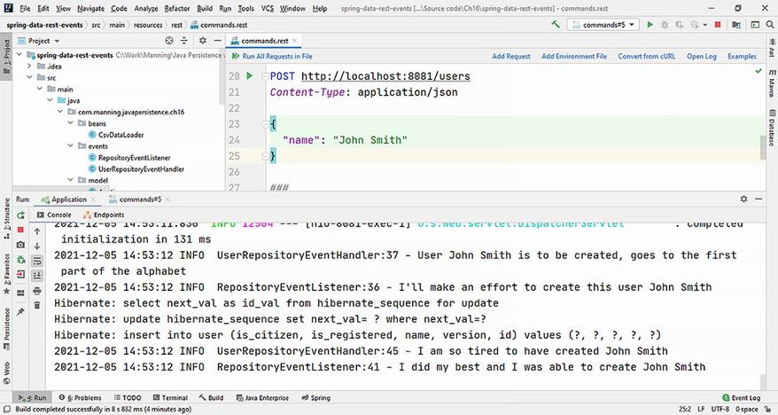

**Hình 16.11** Hành vi bổ sung (tác dụng phụ) từ handler và listener phản ứng với một sự kiện REST

Hai cách tiếp cận xử lý sự kiện (bằng handler và bằng listener) cung cấp hành vi tương tự nhau và chúng xử lý cùng những loại sự kiện. Các yếu tố khác như nhau, handler có lợi thế là chỉ làm việc ở mức khai báo (annotation trên class và phương thức), trong khi listener đòi hỏi chúng ta mở rộng một abstract class có sẵn, nên chúng nằm trong một cây phân cấp có sẵn, nghĩa là ít tự do hơn trong thiết kế phân cấp.

## 16.6 Sử dụng projection và excerpt

Spring Data REST cung cấp một góc nhìn mặc định về domain model bạn đang làm việc, nhưng các tình huống thực tế có thể đòi hỏi nó được thay đổi hoặc điều chỉnh cho những nhu cầu cụ thể. Bạn có thể làm điều này bằng *projection* và *excerpt*, cung cấp những góc nhìn cụ thể về thông tin được export.

Chúng ta sẽ thêm class `Address` mới vào dự án. Nó sẽ chứa một vài field, và chúng ta muốn hiển thị thông tin bên trong nó bằng phương thức `toString`.

**Listing 16.11** Class Address

*Đường dẫn: Ch16/spring-data-rest-projections/src/main/java/com/manning/javapersistence/ch16/model/Address.java*

```java
@Entity
public class Address {

    @GeneratedValue
    @Id
    private Long id;

    private String street, zipCode, city, state;

    //constructors and methods

    public String toString() {
        return String.format("%s, %s %s, %s", street, zipCode, city, state);
    }
}
```

Có một quan hệ một-một giữa `User` và `Address`, vì chúng ta đưa vào một field mới trong entity `User`:

```java
@OneToOne(cascade = CascadeType.ALL, orphanRemoval = true)
private Address address;
```

Tùy chọn `CascadeType.ALL` sẽ khiến các thao tác persistence được cascade tới những entity liên quan. Đối số `orphanRemoval=true` chỉ định rằng chúng ta muốn xóa vĩnh viễn một `Address` khi nó không còn được `User` tham chiếu. Bạn có thể xem lại chương 8 để biết thêm chi tiết về những tùy chọn này.

Nếu chúng ta truy cập URL http://localhost:8081/users/1, chúng ta sẽ nhận được góc nhìn mặc định của user có ID 1, hiển thị mọi field của nó cùng các field từ address, như minh họa ở hình 16.12.

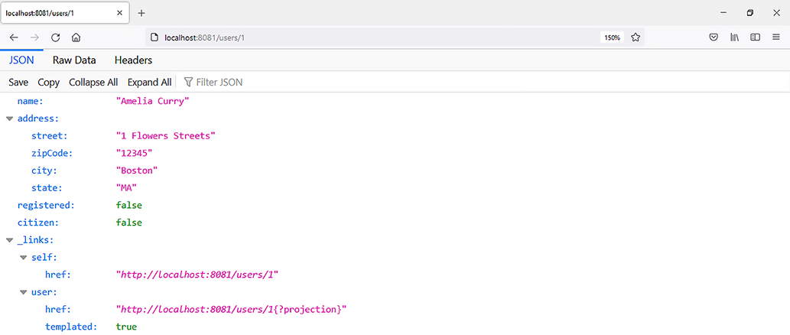

**Hình 16.12** Góc nhìn mặc định của một user kèm address

Giờ chúng ta sẽ thêm interface `UserProjection` mới vào dự án (listing 16.12). Với sự trợ giúp của annotation `@Projection`, chúng ta có thể tạo projection `summary` trên entity `User`, thứ sẽ chỉ export tên của user và address theo cách nó được phương thức `toString` hiển thị. Chúng ta sẽ làm điều này bằng Spring Expression Language (SpEL).

**Listing 16.12** Interface UserProjection

*Đường dẫn: Ch16/spring-data-rest-projections/src/main/java/com/manning/javapersistence/ch16/model/UserProjection.java*

```java
@Projection(name = "summary", types = User.class)                  // Ⓐ
public interface UserProjection {

    String getName();                                              // Ⓑ

    @Value("#{target.address.toString()}")                         // Ⓒ
    String getAddress();                                           // Ⓒ
}
```

Ⓐ Projection được đặt tên `summary`, và nó áp dụng cho các entity `User`.

Ⓑ Vì field tên là `name`, chúng ta cần viết phương thức `getName` để export nó, theo quy ước đặt tên getter.

Ⓒ Export address theo cách nó được phương thức `toString` hiển thị. Chúng ta dùng annotation `@Value`, chứa một biểu thức SpEL. Chúng ta cũng cần theo quy ước đặt tên getter, nên phương thức tên là `getAddress`.

Nếu chúng ta truy cập URL http://localhost:8081/users/1?projection=summary (với tên projection đưa vào làm tham số), chúng ta sẽ nhận được góc nhìn của user có ID 1, hiển thị field `name` và address do phương thức `toString` cung cấp. Điều này được thể hiện ở hình 16.13.

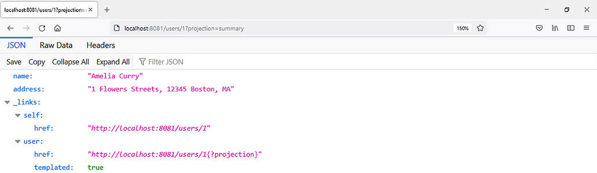

**Hình 16.13** Góc nhìn của một user kèm address do projection `summary` cung cấp

Chúng ta có thể muốn áp dụng góc nhìn mặc định của một projection ở mức cả một collection. Trong trường hợp này, chúng ta sẽ phải tới repository đã định nghĩa và dùng tùy chọn `excerptProjection = UserProjection.class` của annotation `@RepositoryRestResource`, như ở listing 16.13.

**Listing 16.13** Interface UserRepository đã sửa đổi

*Đường dẫn: Ch16/spring-data-rest-projections/src/main/java/com/manning/javapersistence/ch16/repositories/UserRepository.java*

```java
@RepositoryRestResource(path = "users",
                        excerptProjection = UserProjection.class)
public interface UserRepository extends JpaRepository<User, Long> {
}
```

Nếu chúng ta truy cập URL http://localhost:8081/users/, chúng ta sẽ nhận được góc nhìn của mọi user, hiển thị theo định nghĩa projection, như minh họa ở hình 16.14.

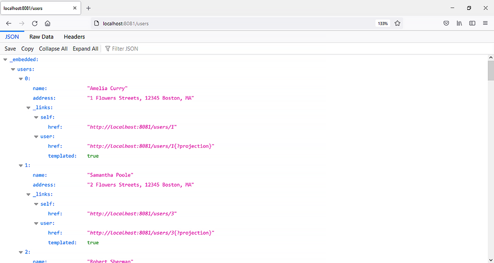

**Hình 16.14** Góc nhìn của toàn bộ collection `users`, hiển thị theo projection `summary`

## Tóm tắt

- Dùng Spring Boot, bạn có thể tạo và cấu hình một dự án Spring Data REST để cung cấp giao diện tương tác với cơ sở dữ liệu và quản lý, lưu trữ thông tin.
- Bạn có thể dùng ETag để tạo các yêu cầu hiệu quả lấy dữ liệu từ server, tránh truyền những thông tin mà client đã có.
- Bạn có thể giới hạn truy cập tới repository, phương thức và field, và chỉ export những thông tin cùng hành động mà bạn muốn cho phép.
- Bạn có thể làm việc với REST event và quản lý chúng qua handler và listener. Chúng có thể hoạt động qua meta-information hoặc bằng cách mở rộng một class có sẵn.
- Bạn có thể dùng projection và excerpt để cung cấp những góc nhìn tùy chỉnh về thông tin do repository export, theo nhu cầu của những người dùng khác nhau.
