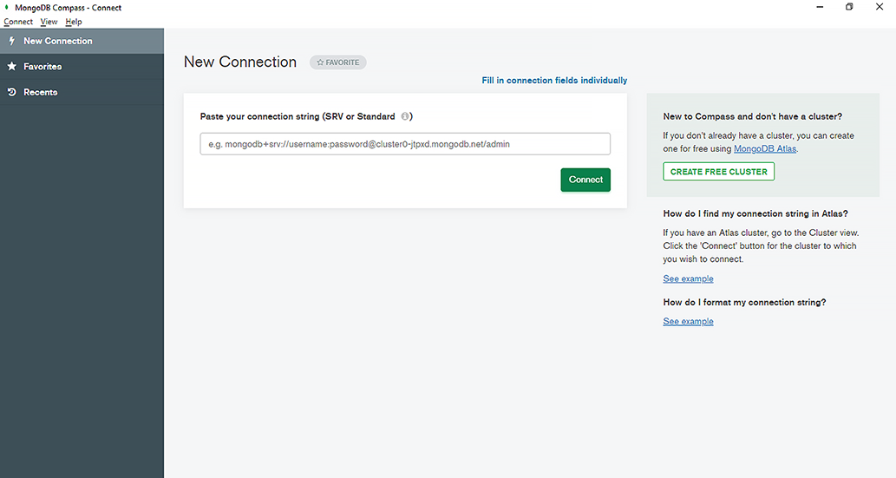
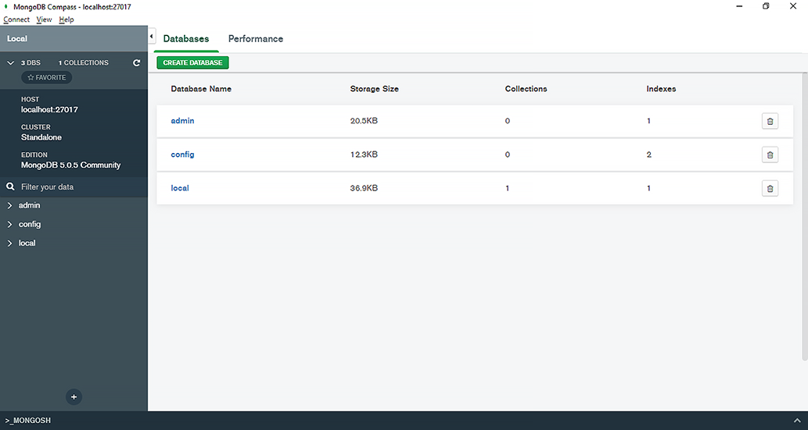
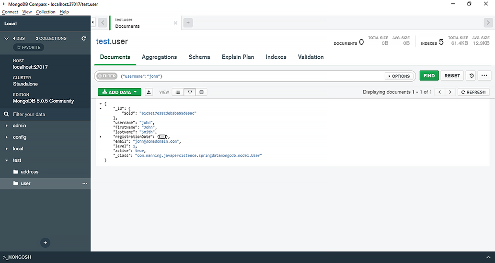
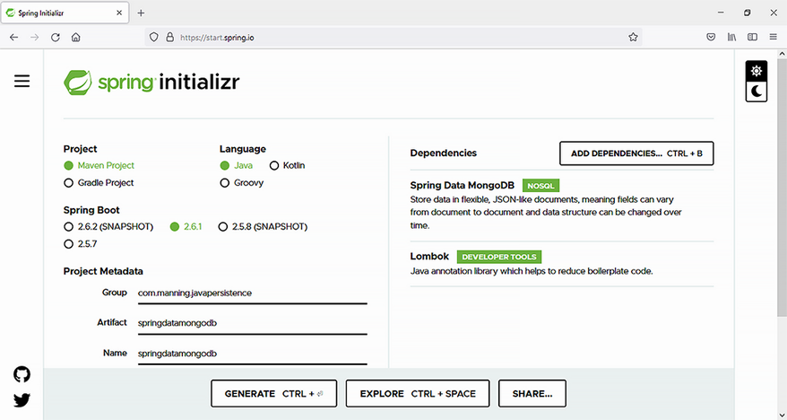

# Chương 17. Làm việc với Spring Data MongoDB

> *Java Persistence with Spring Data and Hibernate* — Chương 17: “Working with Spring Data MongoDB”

**Nội dung chương này bao gồm**

- Giới thiệu MongoDB
- Xem xét Spring Data MongoDB
- Truy cập cơ sở dữ liệu bằng `MongoRepository`
- Truy cập cơ sở dữ liệu bằng `MongoTemplate`

Cơ sở dữ liệu hướng tài liệu (document-oriented database) là một loại cơ sở dữ liệu NoSQL, nơi thông tin được lưu dưới dạng kho key/value. MongoDB là một chương trình cơ sở dữ liệu như vậy. Spring Data MongoDB, một phần của dự án ô lớn hơn Spring Data, tạo thuận lợi cho việc tương tác giữa chương trình Java và cơ sở dữ liệu tài liệu MongoDB.

## 17.1 Giới thiệu MongoDB

MongoDB là một cơ sở dữ liệu NoSQL hướng tài liệu, mã nguồn mở. MongoDB dùng các tài liệu giống JSON để lưu thông tin, và nó dùng các khái niệm database, collection và document.

- **Database** — Một database đại diện cho một vật chứa các collection. Sau khi cài MongoDB, nhìn chung bạn sẽ có một tập database.
- **Collection** — Một collection tương tự một table trong thế giới hệ quản trị cơ sở dữ liệu quan hệ (RDBMS). Một collection có thể chứa một tập document.
- **Document** — Một document biểu diễn một tập cặp key/value, tương đương với dòng trong RDBMS. Các document thuộc cùng một collection có thể có những tập field khác nhau. Các field chung của nhiều document trong một collection có thể chứa dữ liệu thuộc kiểu khác nhau — những tình huống như vậy được gọi là *dynamic schema*.

Bảng 17.1 tóm tắt sự tương ứng thuật ngữ giữa cơ sở dữ liệu quan hệ và cơ sở dữ liệu NoSQL MongoDB.

**Bảng 17.1** So sánh thuật ngữ: RDBMS và MongoDB

| Cơ sở dữ liệu quan hệ | MongoDB |
| --- | --- |
| Database | Database |
| Table | Collection |
| Row | Document |
| Column | Field |

Bạn có thể tải bộ cài MongoDB Community Edition tại đây: https://www.mongodb.com/try/download/community. Hướng dẫn cài đặt, tùy hệ điều hành của bạn, có tại đây: https://docs.mongodb.com/manual/administration/install-community/.

Sau khi cài MongoDB, bạn có thể mở chương trình MongoDB Compass như ở hình 17.1. MongoDB Compass là một GUI để tương tác với và truy vấn các cơ sở dữ liệu MongoDB.



**Hình 17.1** Mở chương trình MongoDB Compass

Nhấn nút Connect, và bạn sẽ kết nối tới server cục bộ, như minh họa ở hình 17.2.



**Hình 17.2** Kết nối tới server MongoDB cục bộ

Dữ liệu trong một collection MongoDB được biểu diễn ở định dạng JSON. Một document MongoDB điển hình mô tả một user của ứng dụng CaveatEmptor có thể trông như sau:

```json
{
  "_id": {
    "$oid": "61c9e17e382deb3ba55d65ac"
  },
  "username": "john",
  "firstName": "John",
  "lastName": "Smith",
  "registrationDate": {
    "$date": "2020-04-12T21:00:00.000Z"
  },
  "email": "john@somedomain.com",
  "level": 1,
  "active": true,
  "_class": "com.manning.javapersistence.springdatamongodb.model.User"
}
```

Để chọn các document thỏa những điều kiện cụ thể, bạn có thể dùng ô Filter trong chương trình MongoDB Compass để chèn một tham số query filter. Ví dụ, để chọn các document có `username` là “john”, bạn sẽ chèn query filter `{"username":"john"}` và nhấn nút Find, như minh họa ở hình 17.3.



**Hình 17.3** Chọn một document từ một collection MongoDB

Để biết chi tiết về các thao tác CRUD của MongoDB mà bạn có thể muốn thực thi, hãy tham khảo tài liệu chính thức: https://docs.mongodb.com/manual/crud/.

## 17.2 Giới thiệu Spring Data MongoDB

Spring Data MongoDB là một phần của dự án ô Spring Data, và nó cho phép dùng MongoDB từ các chương trình Java, theo cách tiếp cận của Spring Data: repository và các trừu tượng ánh xạ object tùy chỉnh, annotation, tạo truy vấn động dựa trên tên phương thức repository, tích hợp với các dự án Spring khác, và Spring Boot.

Để minh họa Spring Data MongoDB, chúng ta sẽ tạo một ứng dụng quản lý và lưu trữ các user CaveatEmptor. Chúng ta sẽ tạo một ứng dụng Spring Boot dùng Spring Data MongoDB. Để làm điều này, hãy vào website Spring Initializr (https://start.spring.io/) và tạo một dự án Spring Boot mới (xem hình 17.4), với các đặc điểm sau:

- Group: `com.manning.javapersistence`
- Artifact: `springdatamongodb`
- Description: Spring Data MongoDB



**Hình 17.4** Tạo một dự án Spring Boot mới dùng Spring Data MongoDB

Chúng ta cũng sẽ thêm các dependency sau:

- Spring Data MongoDB (việc này sẽ thêm `spring-boot-starter-data-mongodb` vào file Maven pom.xml)
- Lombok (việc này sẽ thêm `org.projectlombok:lombok` vào file Maven pom.xml)

File pom.xml (listing 17.1) bao gồm các dependency mà chúng ta đã thêm để bắt đầu dự án: dependency vào framework Spring Data MongoDB và vào Lombok. Lombok là một thư viện Java có thể dùng để tự động tạo constructor, getter và setter thông qua annotation, nhờ đó giảm mã boilerplate. Lombok có những hạn chế, bao gồm: bạn sẽ cần một plugin để IDE hiểu các annotation và không phàn nàn về constructor, getter, setter bị thiếu; và bạn không thể đặt breakpoint và gỡ lỗi bên trong các phương thức được sinh ra (nhưng việc gỡ lỗi bên trong những phương thức này khá hiếm).

**Listing 17.1** File Maven pom.xml

*Đường dẫn: Ch17/springdatamongodb/pom.xml*

```xml
<dependency>                                                    <!-- Ⓐ -->
    <groupId>org.springframework.boot</groupId>                 <!-- Ⓐ -->
    <artifactId>spring-boot-starter-data-mongodb</artifactId>   <!-- Ⓐ -->
</dependency>                                                   <!-- Ⓐ -->
<dependency>                                                    <!-- Ⓑ -->
    <groupId>org.projectlombok</groupId>                        <!-- Ⓑ -->
    <artifactId>lombok</artifactId>                             <!-- Ⓑ -->
</dependency>                                                   <!-- Ⓑ -->
```

Ⓐ `spring-boot-starter-data-mongodb` là starter dependency được Spring Boot dùng để kết nối tới cơ sở dữ liệu MongoDB thông qua Spring Data.

Ⓑ Lombok cho phép chúng ta giảm mã boilerplate và thay vào đó dựa vào constructor, getter, setter được sinh tự động.

Bước tiếp theo là điền vào file application.properties của Spring Boot, thứ có thể chứa nhiều property khác nhau để ứng dụng dùng. Spring Boot sẽ tự động tìm và nạp application.properties từ classpath, và thư mục `src/main/resources` được Maven thêm vào classpath. File cấu hình application.properties được thể hiện ở listing 17.2.

**Listing 17.2** File application.properties

*Đường dẫn: Ch17/springdatamongodb/src/main/resources/application.properties*

```properties
logging.level.org.springframework.data.mongodb.core.MongoTemplate=DEBUG
# Ⓐ
spring.data.mongodb.auto-index-creation=true
# Ⓑ
```

Ⓐ Truy vấn được ứng dụng Spring Data MongoDB ghi log ở mức DEBUG. Vì vậy, để bật việc ghi log truy vấn, chúng ta phải đặt mức log là DEBUG.

Ⓑ Việc tạo index bị tắt theo mặc định trong Spring Data MongoDB. Hãy bật nó bằng cách đặt property `spring.data.mongodb.auto-index-creation` là `true`.

Class `User` giờ sẽ chứa các annotation đặc thù cho Spring Data MongoDB. Bảng 17.2 xem xét một vài annotation và class, rồi chúng ta sẽ thấy chúng hoạt động khi làm việc với class `User`.

**Bảng 17.2** Annotation và class của Spring Data MongoDB

| Annotation/class của Spring Data MongoDB | Ý nghĩa |
| --- | --- |
| `@Document` | Một domain object cần được lưu vào MongoDB |
| `@Indexed` | Một field được MongoDB đánh chỉ mục |
| `@CompoundIndexes` | Một annotation vật chứa cho các chỉ mục hợp thành; nó định nghĩa một tập nhiều annotation `@CompoundIndex` |
| `@CompoundIndex` | Đánh dấu một class để dùng chỉ mục hợp thành trên nhiều field |
| `IndexDirection` | Một enum xác định hướng chỉ mục: `ASCENDING` (mặc định) hoặc `DESCENDING` |

Package `org.springframework.data.mongodb.core.mapping` chứa annotation `@Document`, trong khi các annotation và enum liên quan tới chỉ mục thuộc package `org.springframework.data.mongodb.core.index`.

Với ứng dụng MongoDB, chúng ta cũng sẽ dùng một loạt annotation lõi của Spring Data thuộc package `org.springframework.data.annotation`, như ở bảng 17.3.

**Bảng 17.3** Các annotation lõi của Spring Data

| Annotation của Spring Data | Ý nghĩa |
| --- | --- |
| `@Id` | Đánh dấu field là định danh |
| `@Transient` | Một field transient sẽ không được lưu và không bị persistence framework kiểm tra |
| `@PersistenceConstructor` | Đánh dấu constructor là constructor chính mà persistence framework dùng khi truy xuất thông tin từ cơ sở dữ liệu |

Chương này dùng thư viện Lombok để tự động tạo constructor, getter và setter thông qua annotation, nhờ đó giảm mã boilerplate. Các annotation Lombok quan trọng nhất thuộc package `lombok` được liệt kê ở bảng 17.4.

**Bảng 17.4** Các annotation của Lombok

| Annotation của Lombok | Ý nghĩa |
| --- | --- |
| `@NoArgsConstructor` | Tự động tạo một constructor `public` không tham số cho class mà nó đánh dấu |
| `@Getter` | Tự động tạo một getter `public` cho field mà nó đánh dấu |
| `@Setter` | Tự động tạo một setter `public` cho field mà nó đánh dấu |

Class `User` mà ứng dụng Spring Data MongoDB dùng được trình bày ở listing 17.3. Field `password` được đánh dấu `@Transient` sẽ không được lưu vào cơ sở dữ liệu MongoDB — có nhiều trường hợp bạn muốn thông tin bí mật, chẳng hạn mật khẩu, không được lưu trữ. Constructor được đánh dấu `@PersistenceConstructor` sẽ được Spring Data MongoDB dùng khi truy xuất thông tin từ cơ sở dữ liệu. Tham số `ip` của constructor được đánh dấu `@Value("#root.ip ?: '192.168.1.100'")`, nghĩa là nếu giá trị `ip` không có khi truy xuất document từ cơ sở dữ liệu, nó sẽ tự động lấy giá trị mặc định này.

**Listing 17.3** Class User

*Đường dẫn: Ch17/springdatamongodb/src/main/java/com/manning/javapersistence/springdatamongodb/model/User.java*

```java
@NoArgsConstructor
@Document
@CompoundIndexes({
        @CompoundIndex(name = "username_email",
                       def = "{'username' : 1, 'email': 1}"),
        @CompoundIndex(name = "lastName_firstName",
                       def = "{'lastName' : 1, 'firstName': 1}")
})
public class User {

    @Id
    @Getter
    private String id;

    @Getter
    @Setter
    @Indexed(direction = IndexDirection.ASCENDING)
    private String username;

    //fields annotated with @Getter and @Setter

    @Getter
    @Setter
    @Transient
    private String password;

    //another constructor

    @PersistenceConstructor
    public User(String username, String firstName, String lastName,
                @Value("#root.ip ?: '192.168.1.100'") String ip) {
        this.username = username;
        this.firstName = firstName;
        this.lastName = lastName;
        this.ip = ip;
    }
}
```

## 17.3 Dùng MongoRepository để truy cập cơ sở dữ liệu

Interface `UserRepository` mở rộng `MongoRepository<User, String>`, kế thừa các phương thức liên quan tới MongoDB và quản lý document `User`, vốn có ID kiểu `String`.

**Listing 17.4** Interface UserRepository

*Đường dẫn: Ch17/springdatamongodb/src/main/java/com/manning/javapersistence/springdatamongodb/repositories/UserRepository.java*

```java
public interface UserRepository extends MongoRepository<User, String> {
}
```

### 17.3.1 Định nghĩa query method với Spring Data MongoDB

Chúng ta sẽ thêm các phương thức mới vào interface `UserRepository` để có thể truy vấn cơ sở dữ liệu tìm những document cụ thể và dùng chúng trong các test.

Mục đích của các query method là truy xuất thông tin từ cơ sở dữ liệu. Spring Data MongoDB cung cấp cơ chế query builder tương tự cơ chế mà Spring Data JPA cung cấp — nó sẽ tạo hành vi của các phương thức repository dựa trên tên của chúng. Hãy nhớ rằng cơ chế truy vấn loại bỏ các tiền tố và hậu tố như `find...By`, `get...By`, `query...By`, `read...By` và `count...By` khỏi tên phương thức rồi phân tích phần còn lại.

Cũng như Spring Data JPA, Spring Data MongoDB sẽ xem xét kiểu trả về của phương thức. Nếu chúng ta muốn tìm một `User` và trả nó về trong một container `Optional`, kiểu trả về của phương thức sẽ là `Optional<User>`.

**Listing 17.5** Interface UserRepository với các phương thức mới

*Đường dẫn: Ch17/springdatamongodb/src/main/java/com/manning/javapersistence/springdatamongodb/repositories/UserRepository.java*

```java
public interface UserRepository extends MongoRepository<User, String> {
    Optional<User> findByUsername(String username);
    List<User> findByLastName(String lastName);
    List<User> findAllByOrderByUsernameAsc();
    List<User> findByRegistrationDateBetween(LocalDate start, LocalDate end);
    List<User> findByUsernameAndEmail(String username, String email);
    List<User> findByUsernameOrEmail(String username, String email);
    List<User> findByUsernameIgnoreCase(String username);
    List<User> findByLevelOrderByUsernameDesc(int level);
    List<User> findByLevelGreaterThanEqual(int level);
    List<User> findByUsernameContaining(String text);
    List<User> findByUsernameLike(String text);
    List<User> findByUsernameStartingWith(String start);
    List<User> findByUsernameEndingWith(String end);
    List<User> findByActive(boolean active);
    List<User> findByRegistrationDateIn(Collection<LocalDate> dates);
    List<User> findByRegistrationDateNotIn(Collection<LocalDate> dates);
}
```

Tên các phương thức cần tuân theo quy tắc để xác định truy vấn kết quả. Nếu đặt tên phương thức sai (ví dụ, property của entity không khớp trong query method), chúng ta sẽ nhận lỗi khi application context được nạp. Bảng 17.5 tóm tắt cách dùng các từ khóa thiết yếu trong việc xây dựng query method của Spring Data MongoDB cùng điều kiện kết quả. Để có danh sách đầy đủ hơn, xem phụ lục D.

**Bảng 17.5** Cách dùng từ khóa trong Spring Data MongoDB và điều kiện kết quả

| Từ khóa | Ví dụ | Điều kiện |
| --- | --- | --- |
| `Is`, `Equals` | `findByUsername(String name)`<br>`findByUsernameIs(String name)`<br>`findByUsernameEquals(String name)` | `{"username" : "name"}` |
| `And` | `findByUsernameAndEmail(String username, String email)` | `{"username":"username", "email":"email"}` |
| `Or` | `findByUsernameOrEmail(String username, String email)` | `{ "$or" : [{ "username" : "username"}, { "email" : "email"}]}` |
| `LessThan` | `findByRegistrationDateLessThan(LocalDate date)` | `{ "registrationDate" : { "$lt" : { "$date" : "date"}}}` |
| `LessThanEqual` | `findByRegistrationDateLessThanEqual(LocalDate date)` | `{ "registrationDate" : { "$lte" : { "$date" : "date"}}}` |
| `GreaterThan` | `findByRegistrationDateGreaterThan(LocalDate date)` | `{ "registrationDate" : { "$gt" : { "$date" : "date"}}}` |
| `GreaterThanEqual` | `findByRegistrationDateGreaterThanEqual(LocalDate date)` | `{ "registrationDate" : { "$gte" : { "$date" : "date"}}}` |
| `Between` | `findByRegistrationDateBetween(LocalDate from, LocalDate to)` | `{ "registrationDate" : { "$gte" : { "$date" : "from"}, "$lte" : { "$date" : "to"}}}` |
| `OrderBy` | `findByRegistrationDateOrderByUsernameDesc(LocalDate date)` | `{ "registrationDate" : { "$date" : "date"}}` kèm sắp xếp giảm dần theo `username` |
| `Like` | `findByUsernameLike(String name)` | `{ "username" : { "$regularExpression" : { "pattern" : "name", "options" : ""}}}` |
| `NotLike` | `findByUsernameNotLike(String name)` | `{ "username" : { "$not" : { "$regularExpression" : { "pattern" : "name", "options" : ""}}}}` |
| `Before` | `findByRegistrationDateBefore(LocalDate date)` | `{ "registrationDate" : { "$lt" : { "$date" : "date"}}}` |
| `After` | `findByRegistrationDateAfter(LocalDate date)` | `{ "registrationDate" : { "$gt" : { "$date" : "date"}}}` |
| `Null`, `IsNull` | `findByRegistrationDate(Is)Null()` | `{ "registrationDate" : null}` |
| `NotNull`, `IsNotNull` | `findByRegistrationDate(Is)NotNull()` | `{ "registrationDate" : { "$ne" : null}}` |
| `Not` | `findByUsernameNot(String name)` | `{ "username" : { "$ne" : "name"}}` |

Làm class cơ sở cho mọi test tương lai, chúng ta sẽ viết abstract class `SpringDataJdbcApplicationTests` (listing 17.6).

Annotation `@SpringBootTest` được Spring Boot thêm vào class được tạo ban đầu, và nó sẽ bảo Spring Boot tìm class cấu hình chính (chẳng hạn class được đánh dấu `@SpringBootApplication`) và tạo `ApplicationContext` để dùng trong các test. Như bạn còn nhớ, annotation `@SpringBootApplication` được Spring Boot thêm vào class chứa phương thức `main` sẽ bật cơ chế tự động cấu hình của Spring Boot, bật việc quét package nơi ứng dụng nằm, và cho phép đăng ký thêm bean vào context.

Bằng annotation `@TestInstance(TestInstance.Lifecycle.PER_CLASS)`, chúng ta yêu cầu JUnit 5 tạo một instance duy nhất của class test và tái sử dụng nó cho mọi phương thức test. Điều này cho phép chúng ta để các phương thức được đánh dấu `@BeforeAll` và `@AfterAll` không phải `static` và dùng trực tiếp field instance `UserRepository` được autowire bên trong chúng. Phương thức không `static` được đánh dấu `@BeforeAll` được thực thi một lần trước mọi test từ bất kỳ class nào mở rộng `SpringDataJdbcApplicationTests`, và nó lưu danh sách user được tạo bên trong phương thức `generateUsers` vào cơ sở dữ liệu. Phương thức không `static` được đánh dấu `@AfterAll` được thực thi một lần sau mọi test từ bất kỳ class nào mở rộng `SpringDataJdbcApplicationTests`, và nó xóa mọi user khỏi cơ sở dữ liệu.

**Listing 17.6** Abstract class SpringDataJdbcApplicationTests

*Đường dẫn: Ch17/springdatamongodb/src/test/java/com/manning/javapersistence/springdatamongodb/SpringDataMongoDBApplicationTests.java*

```java
@SpringBootTest
@TestInstance(TestInstance.Lifecycle.PER_CLASS)
abstract class SpringDataJdbcApplicationTests {

    @Autowired                                                 // Ⓐ
    UserRepository userRepository;                             // Ⓐ

    @BeforeAll
    void beforeAll() {
        userRepository.saveAll(generateUsers());
    }

    private static List<User> generateUsers() {
        List<User> users = new ArrayList<>();

        User john = new User("john", "John", "Smith");
        john.setRegistrationDate(LocalDate.of(2020, Month.APRIL, 13));
        john.setEmail("john@somedomain.com");
        john.setLevel(1);
        john.setActive(true);
        john.setPassword("password1");

        //create and set a total of 10 users

        users.add(john);
        //add a total of 10 users to the list

        return users;
    }

    @AfterAll
    void afterAll() {
        userRepository.deleteAll();
    }
}
```

Ⓐ Autowire một instance `UserRepository`. Điều này khả thi nhờ annotation `@SpringBootApplication`, vốn bật việc quét package nơi ứng dụng nằm và đăng ký các bean vào context.

Các test tiếp theo sẽ mở rộng class này và dùng cơ sở dữ liệu đã được điền dữ liệu. Để kiểm thử các phương thức hiện thuộc về `UserRepository`, chúng ta sẽ tạo class `FindUsersTest` và theo cùng một công thức viết test: gọi phương thức repository và kiểm chứng kết quả của nó. Hãy nhớ rằng trong JUnit 5, class và phương thức test chỉ cần ở mức package private; chúng không bắt buộc phải `public`.

**Listing 17.7** Class FindUsersTest

*Đường dẫn: Ch17/springdatamongodb/src/test/java/com/manning/javapersistence/springdatamongodb/FindUsersTest.java*

```java
class FindUsersTest extends SpringDataJdbcApplicationTests {

    @Test
    void testFindAll() {
        List<User> users = userRepository.findAll();
        assertEquals(10, users.size());
    }

    @Test
    void testFindUser() {
        User beth = userRepository.findByUsername("beth").get();
        assertAll(
             () -> assertNotNull(beth.getId()),
             () -> assertEquals("beth", beth.getUsername())
        );
    }

    @Test
    void testFindAllByOrderByUsernameAsc() {
        List<User> users = userRepository.findAllByOrderByUsernameAsc();
        assertAll(() -> assertEquals(10, users.size()),
                  () -> assertEquals("beth", users.get(0).getUsername()),
                  () -> assertEquals("stephanie",
                            users.get(users.size() - 1).getUsername()));
    }

    @Test
    void testFindByRegistrationDateBetween() {
        List<User> users = userRepository.findByRegistrationDateBetween(
                LocalDate.of(2020, Month.JULY, 1),
                LocalDate.of(2020, Month.DECEMBER, 31));
        assertEquals(4, users.size());
    }

    //more tests
}
```

### 17.3.2 Giới hạn kết quả truy vấn, sắp xếp và phân trang

Cũng như trong Spring Data JPA và Spring Data JDBC, các từ khóa `first` và `top` (dùng tương đương nhau) có thể giới hạn kết quả của query method. Từ khóa `top` và `first` có thể theo sau bởi một giá trị số tùy chọn để chỉ ra kích thước kết quả tối đa được trả về. Nếu thiếu giá trị số này, kích thước kết quả sẽ là 1.

`Pageable` là một interface cho thông tin phân trang, và trên thực tế chúng ta dùng class `PageRequest` hiện thực nó. Class này có thể chỉ định số trang, kích thước trang và tiêu chí sắp xếp.

Các tình huống chúng ta sẽ giải quyết ở đây là lấy một số lượng user giới hạn (chẳng hạn user đầu tiên theo username hay theo ngày đăng ký, hoặc những user đầu tiên với một level cho trước, sắp theo ngày đăng ký), hoặc một lượng lớn user theo trang để dễ thao tác.

Để giới hạn kết quả truy vấn và thực hiện sắp xếp, phân trang, chúng ta sẽ thêm các phương thức sau vào interface `UserRepository`.

**Listing 17.8** Giới hạn kết quả truy vấn, sắp xếp và phân trang trong UserRepository

*Đường dẫn: Ch17/springdatamongodb/src/main/java/com/manning/javapersistence/springdatamongodb/repositories/UserRepository.java*

```java
Optional<User> findFirstByOrderByUsernameAsc();
Optional<User> findTopByOrderByRegistrationDateDesc();
Page<User> findAll(Pageable pageable);
List<User> findFirst2ByLevel(int level, Sort sort);
List<User> findByLevel(int level, Sort sort);
List<User> findByActive(boolean active, Pageable pageable);
```

Các phương thức này dùng cơ chế query builder trình bày ở bảng 17.5, nhưng lần này với mục đích giới hạn kết quả truy vấn, để thực hiện sắp xếp và phân trang. Ví dụ, phương thức `Optional<User> findFirstByOrderByUsernameAsc()` sẽ lấy user đầu tiên theo `username` (kết quả là `Optional`, nên cuối cùng nó có thể không tồn tại). Phương thức `Page<User> findAll(Pageable pageable)` sẽ lấy mọi user nhưng theo trang. Chúng ta sẽ viết các test sau để kiểm chứng rằng những phương thức mới thêm này hoạt động.

**Listing 17.9** Kiểm thử việc giới hạn kết quả truy vấn, sắp xếp và phân trang

*Đường dẫn: Ch17/springdatamongodb/src/test/java/com/manning/javapersistence/springdatamongodb/FindUsersSortingAndPagingTest.java*

```java
class FindUsersSortingAndPagingTest extends SpringDataJdbcApplicationTests {

    @Test
    void testOrder() {

        User user1 = userRepository.findFirstByOrderByUsernameAsc().get();  // Ⓐ
        User user2 =                                                        // Ⓐ
             userRepository.findTopByOrderByRegistrationDateDesc().get();   // Ⓐ
        Page<User> userPage = userRepository.findAll(PageRequest.of(1, 3)); // Ⓑ
        List<User> users = userRepository.findFirst2ByLevel(2,              // Ⓒ
                                          Sort.by("registrationDate"));     // Ⓒ
        assertAll(
                () -> assertEquals("beth", user1.getUsername()),
                () -> assertEquals("julius", user2.getUsername()),
                () -> assertEquals(2, users.size()),
                () -> assertEquals(3, userPage.getSize()),
                () -> assertEquals("beth", users.get(0).getUsername()),
                () -> assertEquals("marion", users.get(1).getUsername())
        );
    }

    @Test
    void testFindByLevel() {
        Sort.TypedSort<User> user = Sort.sort(User.class);                  // Ⓓ
        List<User> users = userRepository.findByLevel(3,                    // Ⓔ
                   user.by(User::getRegistrationDate).descending());        // Ⓔ
        assertAll(
                () -> assertEquals(2, users.size()),
                () -> assertEquals("james", users.get(0).getUsername())
        );
    }

    @Test
    void testFindByActive() {
        List<User> users = userRepository.findByActive(true,                // Ⓕ
                    PageRequest.of(1, 4, Sort.by("registrationDate")));     // Ⓕ
        assertAll(
                () -> assertEquals(4, users.size()),
                () -> assertEquals("burk", users.get(0).getUsername())
        );
    }
}
```

Ⓐ Test đầu tiên sẽ tìm user đầu tiên theo thứ tự tăng dần của `username` và user đầu tiên theo thứ tự giảm dần của ngày đăng ký.

Ⓑ Tìm tất cả user, chia chúng thành các trang, và trả về trang số 1 với kích thước 3 (đánh số trang bắt đầu từ 0).

Ⓒ Tìm 2 user đầu tiên có level 2, sắp theo ngày đăng ký.

Ⓓ Test thứ hai sẽ định nghĩa một tiêu chí sắp xếp trên class `User`. `Sort.TypedSort` mở rộng `Sort` và có thể dùng method handle để định nghĩa các property cần sắp theo.

Ⓔ Tìm các user có level 3 và sắp theo ngày đăng ký, giảm dần.

Ⓕ Test thứ ba sẽ tìm các user đang hoạt động, sắp theo ngày đăng ký, chia chúng thành các trang, và trả về trang số 1 với kích thước 4 (đánh số trang bắt đầu từ 0).

### 17.3.3 Streaming kết quả

Các query method trả về nhiều hơn một kết quả có thể dùng các interface Java chuẩn như `Iterable`, `List`, `Set`. Cũng như Spring Data JPA và Spring Data JDBC, Spring Data MongoDB hỗ trợ `Streamable`, có thể dùng như một lựa chọn thay thế cho `Iterable` hoặc bất kỳ kiểu collection nào. Nó cho phép chúng ta nối các `Streamable` và trực tiếp lọc, ánh xạ trên các phần tử.

Tình huống chúng ta sẽ giải quyết ở đây là lấy kết quả dưới dạng một stream, không phải chờ cả collection user hay một trang user được lấy về. Nhờ đó chúng ta có thể nhanh chóng bắt đầu xử lý những kết quả đầu tiên khi chúng đổ về. Khác với collection, một stream chỉ có thể được tiêu thụ một lần và là bất biến.

Chúng ta sẽ thêm các phương thức sau vào interface `UserRepository`.

**Listing 17.10** Thêm các phương thức trả về Streamable vào interface UserRepository

*Đường dẫn: Ch17/springdatamongodb/src/main/java/com/manning/javapersistence/springdatamongodb/repositories/UserRepository.java*

```java
Streamable<User> findByEmailContaining(String text);
Streamable<User> findByLevel(int level);
```

Chúng ta sẽ viết test sau để kiểm chứng cách những phương thức mới thêm này hoạt động để tương tác với cơ sở dữ liệu và cung cấp kết quả dưới dạng stream. Một stream được đưa vào làm tài nguyên của khối `try` để tự động được đóng. Một lựa chọn khác là gọi tường minh phương thức `close()`. Nếu không, stream sẽ giữ kết nối bên dưới tới cơ sở dữ liệu.

**Listing 17.11** Kiểm thử các phương thức trả về Streamable

*Đường dẫn: Ch17/springdatamongodb/src/test/java/com/manning/javapersistence/springdatamongodb/QueryResultsTest.java*

```java
@Test
void testStreamable() {
    try (Stream<User> result =                                       // Ⓐ
             userRepository.findByEmailContaining("someother")       // Ⓐ
              .and(userRepository.findByLevel(2))                    // Ⓑ
              .stream().distinct()) {                                // Ⓒ
        assertEquals(7, result.count());                             // Ⓓ
    }
}
```

Ⓐ Test sẽ gọi phương thức `findByEmailContaining`, tìm các email chứa từ `"someother"`.

Ⓑ Test sẽ nối `Streamable` kết quả với `Streamable` cung cấp các user có level 2.

Ⓒ Nó sẽ biến đổi kết quả này thành một stream và giữ các user phân biệt.

Ⓓ Kiểm tra rằng stream kết quả chứa 7 user.

### 17.3.4 Annotation @Query

Chúng ta có thể tạo các phương thức mà truy vấn tùy chỉnh có thể được chỉ định bằng annotation `@org.springframework.data.mongodb.repository.Query`. Với annotation `@Query` này, tên phương thức không cần tuân theo bất kỳ quy ước đặt tên nào. Truy vấn tùy chỉnh sẽ nhận một query filter của MongoDB làm đối số, và query filter này có thể được tham số hóa.

Chúng ta sẽ thêm các phương thức mới vào interface `UserRepository`: chúng sẽ được đánh dấu bằng annotation `@Query`, và hành vi được sinh ra của chúng sẽ phụ thuộc vào định nghĩa của các truy vấn này. Tham số `value` sẽ chỉ ra query filter cần thực thi. Tham số `fields` sẽ chỉ ra những field cần đưa vào hoặc loại khỏi kết quả. Bảng 17.6 tóm tắt các thao tác truy vấn và tham số `@Query` tương ứng cho những tình huống thường gặp nhất. Để có danh sách đầy đủ, hãy tham khảo tài liệu Spring Data MongoDB.

**Bảng 17.6** Thao tác truy vấn và tham số @Query tương ứng

| Thao tác | Tham số @Query |
| --- | --- |
| Lấy dữ liệu cho một field cho trước | `value = { 'field' : ?0}` |
| Lấy dữ liệu cho một biểu thức chính quy cho trước | `value = { 'lastName' : { $regex: ?0 } }` |
| Lấy dữ liệu có field lớn hơn một tham số | `value = { 'field' : { $gt: ?0 } }` |
| Lấy dữ liệu có field lớn hơn hoặc bằng một tham số | `value = { 'field' : { $gte: ?0 } }` |
| Lấy dữ liệu có field nhỏ hơn một tham số | `value = { 'field' : { $lt: ?0 } }` |
| Lấy dữ liệu có field nhỏ hơn hoặc bằng một tham số | `value = { 'field' : { $lte: ?0 } }` |
| Chỉ đưa một field vào truy vấn | `fields = "{field : 1}"` |
| Loại một field khỏi truy vấn | `fields = "{field : 0}"` |

Query filter là đối số của annotation `@Query`: chỗ giữ chỗ `?0` sẽ tham chiếu tham số đầu tiên của phương thức, chỗ giữ chỗ `?1` sẽ tham chiếu tham số thứ hai của phương thức, v.v., như ở listing sau.

**Listing 17.12** Giới hạn kết quả truy vấn, sắp xếp và phân trang trong UserRepository

*Đường dẫn: Ch17/springdatamongodb/src/main/java/com/manning/javapersistence/springdatamongodb/repositories/UserRepository.java*

```java
@Query("{ 'active' : ?0 }")                                        // Ⓐ
List<User> findUsersByActive(boolean active);                      // Ⓐ

@Query("{ 'lastName' : ?0 }")                                      // Ⓑ
List<User> findUsersByLastName(String lastName);                   // Ⓑ

@Query("{ 'lastName' : { $regex: ?0 } }")                          // Ⓒ
List<User> findUsersByRegexpLastName(String regexp);               // Ⓒ

@Query("{ 'level' : { $gte: ?0, $lte: ?1 } }")                     // Ⓓ
List<User> findUsersByLevelBetween(int minLevel, int maxLevel);    // Ⓓ

@Query(value = "{}", fields = "{username : 1}")                    // Ⓔ
List<User> findUsernameAndId();                                    // Ⓔ

@Query(value = "{}", fields = "{_id : 0}")                         // Ⓕ
List<User> findUsersExcludeId();                                   // Ⓕ

@Query(value = "{'lastName' : { $regex: ?0 }}", fields = "{_id : 0}")  // Ⓖ
List<User> findUsersByRegexpLastNameExcludeId(String regexp);      // Ⓖ
```

Ⓐ Phương thức `findUsersByActive` sẽ trả về các user với trạng thái `active` cho trước.

Ⓑ Phương thức `findUsersByLastName` sẽ trả về các user với `lastName` cho trước.

Ⓒ Phương thức `findUsersByRegexpLastName` sẽ trả về các user có `lastName` khớp chỗ giữ chỗ `?0`, tham chiếu biểu thức chính quy là tham số đầu tiên của phương thức.

Ⓓ Phương thức `findUsersByLevelBetween` sẽ trả về các user có `level` lớn hơn hoặc bằng chỗ giữ chỗ `?0` (tham chiếu tham số đầu tiên của phương thức) và nhỏ hơn hoặc bằng chỗ giữ chỗ `?1` (tham chiếu tham số thứ hai của phương thức).

Ⓔ Phương thức `findUsernameAndId` sẽ chọn mọi user (vì tham số `value` là `{}`) và sẽ chỉ trả về field `id` và `username` (vì tham số `fields` là `{username : 1}`).

Ⓕ Phương thức `findUsersExcludeId` sẽ chọn mọi user (vì tham số `value` là `{}`) và sẽ loại `id` khỏi các field trả về (vì tham số `fields` là `{_id : 0}`).

Ⓖ Phương thức `findUsersByRegexpLastNameExcludeId` sẽ chọn các user có `lastName` khớp một biểu thức chính quy cho trước và sẽ loại `id` khỏi các field trả về.

Việc viết test cho các query method này khá đơn giản và tương tự các ví dụ trước. Chúng có thể tìm thấy trong mã nguồn của cuốn sách.

## 17.4 Query by Example

Query by Example (QBE) đã được bàn tới ở chương 4 khi chúng ta xem xét Spring Data JPA. Đó là một kỹ thuật truy vấn không đòi hỏi viết các truy vấn cổ điển với entity và property. Nó cho phép tạo truy vấn động và gồm ba phần: một *probe*, một `ExampleMatcher` và một `Example`.

Một probe là một domain object đã được đặt sẵn các property. `ExampleMatcher` cung cấp quy tắc về việc khớp những property cụ thể. `Example` ghép probe và `ExampleMatcher` lại với nhau và sinh ra truy vấn. Nhiều `Example` có thể tái sử dụng chung một `ExampleMatcher`.

Như đã bàn trước đây, đây là những trường hợp sử dụng phù hợp nhất cho QBE:

- Khi bạn muốn tách rời việc viết mã khỏi API của kho dữ liệu bên dưới
- Khi bạn muốn thay đổi thường xuyên cấu trúc nội bộ của các domain object mà không phải lan truyền chúng tới những truy vấn hiện có
- Khi bạn đang xây dựng một tập ràng buộc tĩnh hoặc động để truy vấn một repository

QBE có một số hạn chế:

- Nó chỉ hỗ trợ khớp kiểu starting/ending/containing/regex cho property `String` và chỉ khớp chính xác cho các kiểu khác.
- Nó không hỗ trợ ràng buộc property lồng nhau hay theo nhóm, chẳng hạn `{"$or":[ {"username":"username"}, {{"lastName":"lastName", "email":"email"}}]}`.

Chúng ta sẽ không thêm phương thức nào nữa vào interface `UserRepository`. Thay vào đó, chúng ta sẽ viết test để dựng probe, `ExampleMatcher` và `Example`. Listing sau sẽ tạo một probe đơn giản, một user chỉ đặt `lastName`.

**Listing 17.13** Các test Query By Example

*Đường dẫn: Ch17/springdatamongodb/src/test/java/com/manning/javapersistence/springdatamongodb/QueryByExampleTest.java*

```java
User probe = new User(null, null, "Smith");                        // Ⓐ
List<User> result = userRepository.findAll(Example.of(probe));     // Ⓑ
assertThat(result).hasSize(2)                                      // Ⓒ
          .extracting("username").contains("john", "burk");        // Ⓒ
```

Ⓐ Khởi tạo một instance `User` và đặt `lastName` cho nó. Đây chính là probe.

Ⓑ Thực thi truy vấn để tìm mọi user khớp với probe.

Ⓒ Kiểm chứng rằng truy vấn tìm mọi user khớp probe trả về 2 document, và nó chứa các `username` `john` và `burk`.

Giờ chúng ta có thể tạo một `ExampleMatcher` với sự trợ giúp của builder pattern. Mọi property tham chiếu `null` sẽ bị matcher bỏ qua. Tuy nhiên, chúng ta sẽ cần bỏ qua một cách tường minh các property thuộc kiểu nguyên thủy. Nếu không bỏ qua, chúng sẽ được đưa vào matcher với giá trị mặc định, và điều đó sẽ làm thay đổi truy vấn được sinh ra.

**Listing 17.14** Các test Query By Example với matcher

*Đường dẫn: Ch17/springdatamongodb/src/test/java/com/manning/javapersistence/springdatamongodb/QueryByMatcherTest.java*

```java
ExampleMatcher matcher = ExampleMatcher.matching()                       // Ⓐ
                                   .withIgnorePaths("level")             // Ⓐ
                                   .withIgnorePaths("active");           // Ⓐ
User probe = new User();                                                 // Ⓑ
probe.setLastName("Smith");                                              // Ⓑ
List<User> result = userRepository.findAll(Example.of(probe, matcher));  // Ⓒ
assertThat(result).hasSize(2)                                            // Ⓓ
        .extracting("username").contains("john", "burk");                // Ⓓ
```

Ⓐ Tạo `ExampleMatcher` với sự trợ giúp của builder pattern. Chúng ta bỏ qua một cách tường minh property `level` và `active`, vốn là kiểu nguyên thủy. Nếu không bỏ qua chúng, chúng sẽ được đưa vào matcher với giá trị mặc định (0 cho `level` và `false` cho `active`) và sẽ làm thay đổi truy vấn được sinh ra.

Ⓑ Tạo và đặt giá trị cho probe `User`.

Ⓒ Thực thi truy vấn để tìm mọi user khớp với probe.

Ⓓ Kiểm chứng rằng truy vấn tìm mọi user khớp probe trả về 2 document, và nó chứa các `username` `john` và `burk`.

## 17.5 Tham chiếu tới các document MongoDB khác

Spring Data MongoDB không hỗ trợ quan hệ theo nghĩa quan hệ one-to-one, one-to-many và many-to-many mà chúng ta đã xem xét với cơ sở dữ liệu quan hệ. Framework không hỗ trợ nhúng một document vào bên trong một document khác. Tuy nhiên, một document có thể được tham chiếu từ một document khác bằng DBRef. Một DBRef sẽ bao gồm tên collection và giá trị field ID của document kia, và tùy chọn thêm tên một database khác.

Để dùng DBRef, chúng ta sẽ tạo một class khác được đánh dấu `@Document` và một MongoDB repository khác, rồi dùng annotation `@DBRef` bên trong class tham chiếu tới document mới thêm.

Class `Address` mới mà chúng ta sẽ thêm được thể hiện ở listing sau. Nó được đánh dấu `@Document`, như mọi class tương ứng với một document MongoDB, và các field được đánh dấu bằng annotation Lombok `@Getter`, cho biết việc tự động sinh getter.

**Listing 17.15** Class Address đã sửa đổi

*Đường dẫn: Ch17/springdatamongodb2/src/main/java/com/manning/javapersistence/springdatamongodb/model/Address.java*

```java
@Document
public class Address {

    @Id
    @Getter
    private String id;

    @Getter
    private String street, zipCode, city, state;

    // . . .

}
```

Interface `AddressRepository` mới được thể hiện ở listing tiếp theo. Nó mở rộng `MongoRepository<Address, String>`, kế thừa các phương thức liên quan tới MongoDB và quản lý document `Address`, vốn có ID kiểu `String`.

**Listing 17.16** Interface AddressRepository

*Đường dẫn: Ch17/springdatamongodb2/src/main/java/com/manning/javapersistence/springdatamongodb/repositories/AddressRepository.java*

```java
public interface AddressRepository extends MongoRepository<Address, String> {
}
```

Chúng ta sẽ sửa class `User` để thêm field `address` tham chiếu tới document `Address`. Chúng ta sẽ dùng annotation `@DBRef`, cho biết field này sẽ được lưu bằng một DBRef. Chúng ta cũng sẽ đánh dấu field bằng annotation `@Field`, thứ có thể cung cấp một tên tùy chỉnh bên trong document.

**Listing 17.17** Class User đã sửa đổi

*Đường dẫn: Ch17/springdatamongodb2/src/main/java/com/manning/javapersistence/springdatamongodb/model/User.java*

```java
@NoArgsConstructor
@Document
@CompoundIndexes({
        @CompoundIndex(name = "username_email",
                       def = "{'username' : 1, 'email': 1}"),
        @CompoundIndex(name = "lastName_firstName",
                       def = "{'lastName' : 1, 'firstName': 1}")
})
public class User {

    // . . .

    @DBRef
    @Field("address")
    @Getter
    @Setter
    private Address address;

    // . . .

}
```

Một document MongoDB mô tả một user có địa chỉ có thể trông như sau:

```json
{
    "_id": {
        "$oid": "61cb2fcfff98d570824fef66"
    },
    "username": "john",
    "firstName": "John",
    "lastName": "Smith",
    "registrationDate": {
        "$date": "2020-04-12T21:00:00.000Z"
    },
    "email": "john@somedomain.com",
    "level": 1,
    "active": true,
    "address": {
        "$ref": "address",
        "$id": {
            "$oid": "61cb2fcbff98d570824fef30"
        }
    },
    "_class": "com.manning.javapersistence.springdatamongodb.model.User"
}
```

Một document MongoDB mô tả một địa chỉ có thể trông như sau:

```json
{
    "_id": {
        "$oid": "61cb2fcbff98d570824fef30"
    },
    "street": "Flowers Street",
    "zipCode": "1234567",
    "city": "Boston",
    "state": "MA",
    "_class": "com.manning.javapersistence.springdatamongodb.model.Address"
}
```

Lưu ý rằng các thao tác như `save` và `delete` không được cascade giữa các document. Nếu chúng ta lưu hoặc xóa một document, chúng ta phải lưu hoặc xóa một cách tường minh những document được tham chiếu.

Việc viết test để làm việc với các document MongoDB tham chiếu tới document khác khá đơn giản và tương tự những ví dụ trước. Chúng có thể tìm thấy trong mã nguồn của cuốn sách.

## 17.6 Dùng MongoTemplate để truy cập cơ sở dữ liệu

`MongoTemplate` là một class cung cấp quyền truy cập tới các thao tác CRUD trên cơ sở dữ liệu MongoDB. `MongoTemplate` hiện thực interface `MongoOperations`. Các phương thức của `MongoOperations` được đặt tên tương tự các phương thức của đối tượng `Collection` trong MongoDB driver, nhằm giúp việc hiểu và sử dụng API dễ dàng hơn.

### 17.6.1 Cấu hình truy cập cơ sở dữ liệu thông qua MongoTemplate

Để kết nối ứng dụng Spring Boot của chúng ta tới MongoDB, chúng ta sẽ mở rộng class `AbstractMongoClientConfiguration`. Class này cung cấp hỗ trợ cho việc cấu hình bằng Java của Spring Data MongoDB. Chúng ta có thể kết nối tới MongoDB thông qua một hiện thực của interface `MongoDatabaseFactory` và một `MongoTemplate`.

Class `AbstractMongoClientConfiguration` cung cấp hai bean có thể dùng trong ứng dụng Spring Boot:

```java
@Bean
public MongoTemplate mongoTemplate(MongoDatabaseFactory databaseFactory,
                                   MappingMongoConverter converter) {
    return new MongoTemplate(databaseFactory, converter);
}

@Bean
public MongoDatabaseFactory mongoDbFactory() {
    return new SimpleMongoClientDatabaseFactory(this.mongoClient(),
                                                this.getDatabaseName());
}
```

Chúng ta sẽ tạo class `MongoDBConfig` mở rộng `AbstractMongoClientConfiguration`, và chỉ ghi đè phương thức `getDatabaseName()` để chỉ ra rằng ứng dụng Spring Boot của chúng ta kết nối tới cơ sở dữ liệu `test`, như ở listing sau.

**Listing 17.18** Class MongoDBConfig

*Đường dẫn: Ch17/springdatamongodb3/src/main/java/com/manning/javapersistence/springdatamongodb/configuration/MongoDBConfig.java*

```java
@Configuration
public class MongoDBConfig extends AbstractMongoClientConfiguration {
    @Override
    public String getDatabaseName() {
        return "test";
    }
}
```

### 17.6.2 Thực thi các thao tác CRUD bằng MongoTemplate

Để chèn document vào cơ sở dữ liệu, chúng ta có thể dùng phương thức `insert` của `MongoTemplate`. Phương thức này được nạp chồng, và đoạn mã sau dùng những phương thức nhận một object làm đối số, hoặc một collection các object cùng class của chúng.

*Đường dẫn: Ch17/springdatamongodb3/src/test/java/com/manning/javapersistence/springdatamongodb/template/SpringDataMongoDBApplicationTests.java*

```java
mongoTemplate.insert(GenerateUsers.address);
mongoTemplate.insert(generateUsers(), User.class);
```

Phương thức `save` có hành vi khác: nếu `id` đã có trong cơ sở dữ liệu, nó thực thi một update; ngược lại, nó thực thi một insert. Phương thức này cũng được nạp chồng; đoạn mã sau dùng phương thức nhận một object và tên collection làm đối số:

*Đường dẫn: Ch17/springdatamongodb3/src/test/java/com/manning/javapersistence/springdatamongodb/template/SaveUpdateTest.java*

```java
mongoTemplate.save(user, "user");
```

Chúng ta sẽ dùng các object `org.springframework.data.mongodb.core.query.Query` để định nghĩa tiêu chí, projection và sắp xếp cho việc truy xuất document MongoDB. Một `Query` như vậy được khởi tạo bằng constructor mặc định sẽ tương ứng với mọi document trong một collection. Ví dụ, chúng ta có thể xóa mọi document khỏi một collection bằng đoạn mã như sau:

*Đường dẫn: Ch17/springdatamongodb3/src/test/java/com/manning/javapersistence/springdatamongodb/template/SpringDataMongoDBApplicationTests.java*

```java
mongoTemplate.remove(new Query(), User.class);
mongoTemplate.remove(new Query(), Address.class);
```

Chúng ta có thể sửa đổi các object `Query` bằng những tiêu chí khác nhau. Ở đây chúng ta sẽ dựng một truy vấn tìm các user có `level` bằng 1:

*Đường dẫn: Ch17/springdatamongodb3/src/test/java/com/manning/javapersistence/springdatamongodb/template/FindAndModifyTest.java*

```java
Query query = new Query();
query.addCriteria(Criteria.where("level").is(1));
```

Chúng ta có thể dựng một truy vấn tìm các user có `username` và `email` cho trước:

*Đường dẫn: Ch17/springdatamongodb3/src/test/java/com/manning/javapersistence/springdatamongodb/template/FindUsersTest.java*

```java
Query query1 = new Query();
query1.addCriteria(Criteria.where("username").is("mike")
      .andOperator(Criteria.where("email").is("mike@somedomain.com")));
```

Tương tự, chúng ta có thể dựng một truy vấn tìm các user có `username` hoặc `email` cho trước:

*Đường dẫn: Ch17/springdatamongodb3/src/test/java/com/manning/javapersistence/springdatamongodb/template/FindUsersTest.java*

```java
Query query2 = new Query(new Criteria().
                  orOperator(Criteria.where("username").is("mike"),
                          Criteria.where("email").is("beth@somedomain.com")));
```

Để cập nhật một document, chúng ta có thể dùng một object thuộc class `org.springframework.data.mongodb.core.query.Update`. Object như vậy phải được đặt các giá trị mới để thay thế giá trị cũ. `updateFirst` cập nhật document đầu tiên tìm được khớp với tiêu chí cho trước. Đoạn mã sau sẽ tìm document đầu tiên thuộc class `User` có `level` bằng 1 và cập nhật nó lên `level` 2. Sau đó chúng ta có thể lấy mọi user còn lại có `level` bằng 1 bằng phương thức `find`:

*Đường dẫn: Ch17/springdatamongodb3/src/test/java/com/manning/javapersistence/springdatamongodb/template/UpdateFirstTest.java*

```java
Query query = new Query();
query.addCriteria(Criteria.where("level").is(1));

Update update = new Update();
update.set("level", 2);
mongoTemplate.updateFirst(query, update, User.class);

List<User> users = mongoTemplate.find(query, User.class);
```

`updateMulti` cập nhật mọi document tìm được khớp với tiêu chí cho trước. Đoạn mã sau sẽ tìm mọi document thuộc class `User` có `level` bằng 1 và cập nhật chúng lên `level` 2:

*Đường dẫn: Ch17/springdatamongodb3/src/test/java/com/manning/javapersistence/springdatamongodb/template/UpdateMultiTest.java*

```java
Query query = new Query();
query.addCriteria(Criteria.where("level").is(1));

Update update = new Update();
update.set("level", 2);
mongoTemplate.updateMulti(query, update, User.class);
```

Phương thức `findAndModify` tương tự `updateMulti`, nhưng nó trả về object trước khi bị sửa đổi. Trong đoạn mã sau, chúng ta kiểm tra rằng object do phương thức `findAndModify` trả về vẫn có giá trị `level` cũ:

*Đường dẫn: Ch17/springdatamongodb3/src/test/java/com/manning/javapersistence/springdatamongodb/template/FindAndModifyTest.java*

```java
Query query = new Query();
query.addCriteria(Criteria.where("level").is(1));

Update update = new Update();
update.set("level", 2);
User user = mongoTemplate.findAndModify(query, update, User.class);

assertEquals(1, user.getLevel());
```

Phương thức `upsert` sẽ tìm một document khớp với một số tiêu chí cho trước. Nếu tìm thấy, nó sẽ cập nhật document đó; ngược lại, nó sẽ tạo một document mới kết hợp object query và object update. Tên phương thức là sự kết hợp của `update` và `insert`, và MongoDB sẽ quyết định làm gì tùy theo document đã tồn tại hay chưa. Đoạn mã sau dùng phương thức `getMatchedCount()` để kiểm tra rằng một document khớp với truy vấn và phương thức `getModifiedCount()` để kiểm tra rằng một document đã bị update sửa đổi:

*Đường dẫn: Ch17/springdatamongodb3/src/test/java/com/manning/javapersistence/springdatamongodb/template/UpsertTest.java*

```java
Query query = new Query();
query.addCriteria(Criteria.where("level").is(1));

Update update = new Update();
update.set("level", 2);
UpdateResult result = mongoTemplate.upsert(query, update, User.class);

assertAll(
        () -> assertEquals(1, result.getMatchedCount()),
        () -> assertEquals(1, result.getModifiedCount())
);
```

Bạn có thể tìm thấy các test toàn diện truy cập MongoDB thông qua `MongoTemplate` trong mã nguồn của cuốn sách.

Để so sánh hai cách tiếp cận, `MongoRepository` và `MongoTemplate`, xem bảng 17.7.

**Bảng 17.7** So sánh MongoRepository và MongoTemplate

| | Điểm mạnh | Điểm yếu |
| --- | --- | --- |
| `MongoRepository` | • Theo cách tiếp cận của repository trong Spring Data JPA và Spring Data JDBC.<br>• Cho phép chúng ta nhanh chóng tạo phương thức bằng khuôn mẫu cơ chế query builder, định nghĩa hành vi của chúng thông qua tên phương thức. | • Cung cấp các phương thức thực hiện thao tác CRUD cơ bản làm việc với mọi field của một document.<br>• Việc cập nhật một document phải được thực thi hoặc theo từng bước (find, sửa các field liên quan, save), hoặc dùng các phương thức được đánh dấu `@Query`. |
| `MongoTemplate` | • Cung cấp các thao tác nguyên tử (atomic) như `updateFirst`, `updateMulti`, `findAndModify`, `upsert`.<br>• Các thao tác nguyên tử thuận lợi cho việc làm việc trong ứng dụng đồng thời.<br>• Object `Update` cho phép chúng ta chỉ chọn những field cần cập nhật. | • Dài dòng hơn và phải viết nhiều mã hơn, đặc biệt với các thao tác đơn giản. |

## Tóm tắt

- Bạn có thể tạo và cấu hình một dự án Spring Data MongoDB bằng Spring Boot.
- Bạn có thể tạo các class document và dùng annotation của Spring Data MongoDB để định nghĩa chỉ mục đơn và chỉ mục hợp thành, để đánh dấu field là transient, và để định nghĩa persistence constructor.
- Bạn có thể xây dựng interface tùy chỉnh mở rộng `MongoRepository` và tạo phương thức tùy chỉnh theo cơ chế query builder để tương tác với cơ sở dữ liệu MongoDB.
- Bạn có thể dùng các khả năng của Spring Data MongoDB để giới hạn kết quả truy vấn, sắp xếp, phân trang và stream kết quả.
- Bạn có thể dùng annotation `@Query` để định nghĩa truy vấn tùy chỉnh, và bạn có thể làm việc với kỹ thuật truy vấn Query by Example (QBE).
- Bạn có thể cấu hình một ứng dụng để dùng `MongoTemplate` nhằm thực thi các thao tác CRUD trên cơ sở dữ liệu MongoDB.
