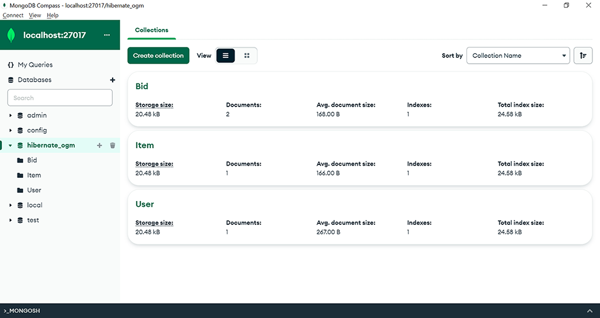
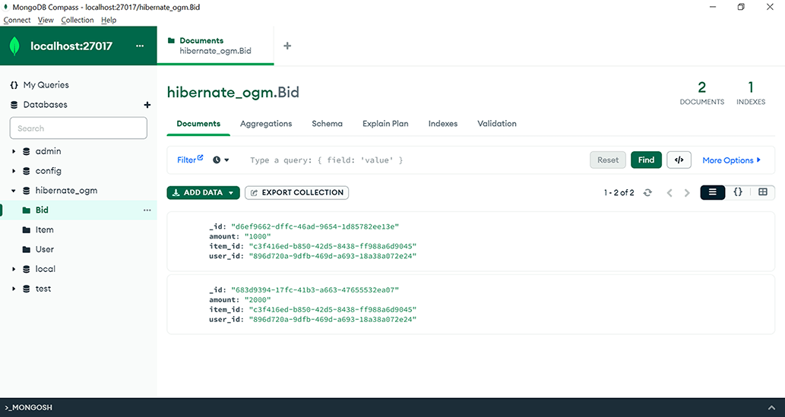

# Chương 18. Làm việc với Hibernate OGM

> *Java Persistence with Spring Data and Hibernate* — Chương 18: “Working with Hibernate OGM”

**Nội dung chương này bao gồm**

- Giới thiệu Hibernate OGM
- Xây dựng một ứng dụng Hibernate OGM đơn giản với MongoDB
- Chuyển sang cơ sở dữ liệu NoSQL Neo4j

Thế giới cơ sở dữ liệu cực kỳ đa dạng và phức tạp. Ngoài những thách thức khi làm việc với các hệ quản trị cơ sở dữ liệu quan hệ khác nhau, thế giới NoSQL còn có thể làm gia tăng những thách thức đó. Một mục tiêu của các persistence framework là bảo đảm tính khả chuyển (portability) của mã, vì vậy giờ chúng ta sẽ xem xét lựa chọn Hibernate OGM và cách nó cố gắng hỗ trợ giải pháp JPA làm việc với cơ sở dữ liệu NoSQL.

## 18.1 Giới thiệu Hibernate OGM

Cơ sở dữ liệu NoSQL là cơ sở dữ liệu giữ dữ liệu ở định dạng khác với bảng quan hệ. Nhìn chung, cơ sở dữ liệu NoSQL cung cấp ưu điểm là schema linh hoạt, nghĩa là người thiết kế cơ sở dữ liệu không phải xác định schema trước khi lưu dữ liệu. Trong các ứng dụng thay đổi yêu cầu nhanh chóng, đây có thể là một lợi thế quan trọng cho tốc độ phát triển.

Cơ sở dữ liệu NoSQL có thể được phân loại theo định dạng chúng dùng để giữ dữ liệu:

- **Cơ sở dữ liệu hướng tài liệu (document-oriented)**, như MongoDB đã giới thiệu ở chương 17, dùng các tài liệu giống JSON để giữ thông tin.
- **Cơ sở dữ liệu hướng đồ thị (graph-oriented)** lưu thông tin bằng đồ thị. Một đồ thị gồm các node và edge: vai trò của node là giữ dữ liệu, còn edge biểu diễn quan hệ giữa các node. Neo4j là một ví dụ về cơ sở dữ liệu như vậy.
- **Cơ sở dữ liệu key/value** lưu dữ liệu bằng cấu trúc map. Key định danh bản ghi, còn value biểu diễn dữ liệu. Redis là một ví dụ về cơ sở dữ liệu như vậy.
- **Wide-column store** giữ dữ liệu bằng table, row và column. Khác biệt giữa chúng và cơ sở dữ liệu quan hệ truyền thống là tên và định dạng của một column có thể khác nhau giữa các row thuộc cùng một table. Khả năng này được gọi là *dynamic column*. Apache Cassandra là một ví dụ về cơ sở dữ liệu như vậy.

Phần lớn các minh họa trước đây của chúng ta dùng JPA và Hibernate để tương tác với cơ sở dữ liệu quan hệ. Điều này cho phép chúng ta viết những ứng dụng khả chuyển, độc lập với nhà cung cấp cơ sở dữ liệu quan hệ, và quản lý khác biệt giữa các provider thông qua framework.

Hibernate OGM mở rộng khái niệm khả chuyển từ cơ sở dữ liệu quan hệ sang cơ sở dữ liệu NoSQL. Tính khả chuyển có thể đi kèm đánh đổi về tốc độ thực thi, nhưng nhìn chung nó mang lại nhiều lợi ích hơn là thiếu sót. OGM là viết tắt của Object-Grid Mapper. Nó tái sử dụng engine Hibernate Core, API và JPQL để tương tác không chỉ với cơ sở dữ liệu quan hệ mà cả cơ sở dữ liệu NoSQL.

Hibernate OGM hỗ trợ một loạt cơ sở dữ liệu NoSQL, và trong chương này chúng ta sẽ dùng MongoDB và Neo4j.

## 18.2 Xây dựng một ứng dụng Hibernate OGM đơn giản với MongoDB

Chúng ta sẽ bắt đầu xây dựng một ứng dụng Hibernate OGM đơn giản được quản lý bởi Maven. Chúng ta sẽ xem xét các bước liên quan, những dependency cần thêm vào dự án, và mã persistence cần viết.

Trước tiên chúng ta sẽ làm việc với MongoDB như một cơ sở dữ liệu NoSQL hướng tài liệu. Sau đó chúng ta sẽ sửa ứng dụng để dùng Neo4j, một cơ sở dữ liệu NoSQL hướng đồ thị. Chúng ta sẽ chỉ thay đổi một vài dependency và cấu hình cần thiết — chúng ta sẽ không đụng tới mã dùng JPA và JPQL.

### 18.2.1 Cấu hình ứng dụng Hibernate OGM

Trong file Maven pom.xml, chúng ta sẽ thêm `org.hibernate.ogm:hibernate-ogm-bom` vào phần `dependencyManagement`. BOM là từ viết tắt của *bill of materials*. Việc thêm một BOM vào khối `dependencyManagement` thực tế sẽ không thêm dependency vào dự án, nhưng nó là một khai báo về ý định. Các dependency bắc cầu sau này được tìm thấy trong phần `dependencies` sẽ có phiên bản được kiểm soát bởi khai báo ban đầu này.

Tiếp theo, chúng ta sẽ thêm hai thứ khác vào phần `dependencies`: `hibernate-ogm-mongodb`, thứ cần để làm việc với MongoDB, và `org.jboss.jbossts:jbossjta`, một hiện thực JTA (Java Transaction API) mà Hibernate OGM sẽ cần để hỗ trợ transaction.

Chúng ta cũng sẽ dùng JUnit 5 để kiểm thử và Lombok, một thư viện Java có thể dùng để tự động tạo constructor, getter và setter thông qua annotation, nhờ đó giảm mã boilerplate. Như đã đề cập trước đây (ở mục 17.2), Lombok có những hạn chế riêng: bạn sẽ cần một plugin để IDE hiểu các annotation và không phàn nàn về constructor, getter, setter bị thiếu; và bạn không thể đặt breakpoint và gỡ lỗi bên trong các phương thức được sinh ra (nhưng nhu cầu gỡ lỗi những phương thức được sinh ra khá hiếm).

File Maven pom.xml kết quả được thể hiện ở listing sau.

**Listing 18.1** File Maven pom.xml

*Đường dẫn: Ch18/hibernate-ogm/pom.xml*

```xml
<dependencyManagement>
    <dependencies>
        <dependency>
            <groupId>org.hibernate.ogm</groupId>
            <artifactId>hibernate-ogm-bom</artifactId>
            <type>pom</type>
            <version>4.2.0.Final</version>
            <scope>import</scope>
        </dependency>
    </dependencies>
</dependencyManagement>

<dependencies>
    <dependency>
        <groupId>org.hibernate.ogm</groupId>
        <artifactId>hibernate-ogm-mongodb</artifactId>
    </dependency>
    <dependency>
        <groupId>org.jboss.jbossts</groupId>
        <artifactId>jbossjta</artifactId>
    </dependency>
    <dependency>
        <groupId>org.projectlombok</groupId>
        <artifactId>lombok</artifactId>
        <version>1.18.24</version>
    </dependency>
    <dependency>
        <groupId>org.junit.jupiter</groupId>
        <artifactId>junit-jupiter-engine</artifactId>
        <version>5.8.2</version>
        <scope>test</scope>
    </dependency>
</dependencies>
```

Giờ chúng ta sẽ chuyển sang file cấu hình chuẩn cho persistence unit, src/main/resources/META-INF/persistence.xml.

**Listing 18.2** File cấu hình persistence.xml

*Đường dẫn: Ch18/hibernate-ogm/src/main/resources/META-INF/persistence.xml*

```xml
<persistence-unit name="ch18.hibernate_ogm">                       <!-- Ⓐ -->
    <provider>
        org.hibernate.ogm.jpa.HibernateOgmPersistence              <!-- Ⓑ -->
    </provider>
    <properties>
        <property name="hibernate.ogm.datastore.provider"
                  value="mongodb"/>                                <!-- Ⓒ -->
        <property name="hibernate.ogm.datastore.database"
                  value="hibernate_ogm"/>                          <!-- Ⓓ -->
        <property name="hibernate.ogm.datastore.create_database"
                  value="true"/>                                   <!-- Ⓔ -->
    </properties>
</persistence-unit>
```

Ⓐ File persistence.xml cấu hình persistence unit `ch18.hibernate_ogm`.

Ⓑ Hiện thực provider đặc thù nhà cung cấp của API là Hibernate OGM.

Ⓒ Data store provider là MongoDB.

Ⓓ Tên cơ sở dữ liệu là `hibernate_ogm`.

Ⓔ Cơ sở dữ liệu sẽ được tạo nếu nó chưa tồn tại.

### 18.2.2 Tạo các entity

Giờ chúng ta sẽ tạo các class biểu diễn entity của ứng dụng: `User`, `Bid`, `Item` và `Address`. Quan hệ giữa chúng sẽ thuộc kiểu one-to-many, many-to-one, hoặc embedded.

**Listing 18.3** Class User

*Đường dẫn: Ch18/hibernate-ogm/src/main/java/com/manning/javapersistence/hibernateogm/model/User.java*

```java
@Entity
@NoArgsConstructor
public class User {

    @Id
    @GeneratedValue(generator = "ID_GENERATOR")                        // Ⓐ
    @GenericGenerator(name = "ID_GENERATOR", strategy = "uuid2")       // Ⓐ
    @Getter
    private String id;

    @Embedded                                                          // Ⓑ
    @Getter
    @Setter
    private Address address;                                           // Ⓑ

    @OneToMany(mappedBy = "user", cascade = CascadeType.PERSIST)       // Ⓒ
    private Set<Bid> bids = new HashSet<>();                           // Ⓒ

    // . . .

}
```

Ⓐ Field ID là một định danh được sinh bởi generator `ID_GENERATOR`. Generator này dùng chiến lược `uuid2`, thứ tạo ra một UUID 128-bit duy nhất. Để xem lại các chiến lược generator, tham khảo mục 5.2.5.

Ⓑ `address` không có định danh riêng; nó là embeddable.

Ⓒ Có một quan hệ one-to-many giữa `User` và `Bid`, được ánh xạ bởi field `user` ở phía `Bid`. `CascadeType.PERSIST` cho biết thao tác persist sẽ được lan truyền từ `User` cha xuống `Bid` con.

Class `Address` không có định danh persistence riêng, và nó sẽ là embeddable.

**Listing 18.4** Class Address

*Đường dẫn: Ch18/hibernate-ogm/src/main/java/com/manning/javapersistence/hibernateogm/model/Address.java*

```java
@Embeddable
@NoArgsConstructor
public class Address {

    //fields with Lombok annotations, constructor
}
```

Class `Item` sẽ chứa một field `id` với chiến lược sinh tương tự như trong `User`. Quan hệ giữa `Item` và `Bid` sẽ là one-to-many, và cascade type sẽ lan truyền thao tác persist từ cha xuống con.

**Listing 18.5** Class Item

*Đường dẫn: Ch18/hibernate-ogm/src/main/java/com/manning/javapersistence/hibernateogm/model/Item.java*

```java
@Entity
@NoArgsConstructor
public class Item {

    @Id
    @GeneratedValue(generator = "ID_GENERATOR")
    @GenericGenerator(name = "ID_GENERATOR", strategy = "uuid2")
    @Getter
    private String id;

    @OneToMany(mappedBy = "item", cascade = CascadeType.PERSIST)
    private Set<Bid> bids = new HashSet<>();

    // . . .

}
```

### 18.2.3 Dùng ứng dụng với MongoDB

Để lưu các entity từ ứng dụng vào MongoDB, chúng ta sẽ viết mã dùng những class JPA thông thường và JPQL. Điều này nghĩa là ứng dụng của chúng ta có thể làm việc với cơ sở dữ liệu quan hệ và với nhiều cơ sở dữ liệu NoSQL khác nhau. Chúng ta chỉ cần thay đổi một vài cấu hình.

Để làm việc với JPA theo cách chúng ta đã làm với cơ sở dữ liệu quan hệ, trước tiên chúng ta sẽ khởi tạo một `EntityManagerFactory`. Persistence unit `ch18.hibernate_ogm` đã được khai báo trước đó trong persistence.xml.

**Listing 18.6** Khởi tạo EntityManagerFactory

*Đường dẫn: Ch18/hibernate-ogm/src/test/java/com/manning/javapersistence/hibernateogm/HibernateOGMTest.java*

```java
public class HibernateOGMTest {

    private static EntityManagerFactory entityManagerFactory;

    @BeforeAll
    static void setUp() {
        entityManagerFactory =
            Persistence.createEntityManagerFactory("ch18.hibernate_ogm");
    }
    // . . .

}
```

Sau khi thực thi mỗi test của class `HibernateOGMTest`, chúng ta sẽ đóng `EntityManagerFactory`.

**Listing 18.7** Đóng EntityManagerFactory

*Đường dẫn: Ch18/hibernate-ogm/src/test/java/com/manning/javapersistence/hibernateogm/HibernateOGMTest.java*

```java
@AfterAll
static void tearDown() {
    entityManagerFactory.close();
}
```

Trước khi thực thi mỗi test của class `HibernateOGMTest`, chúng ta sẽ lưu một vài entity vào cơ sở dữ liệu NoSQL MongoDB. Mã của chúng ta sẽ dùng JPA cho các thao tác này, và JPA không biết nó đang tương tác với cơ sở dữ liệu quan hệ hay phi quan hệ.

**Listing 18.8** Lưu dữ liệu để kiểm thử

*Đường dẫn: Ch18/hibernate-ogm/src/test/java/com/manning/javapersistence/hibernateogm/HibernateOGMTest.java*

```java
@BeforeEach
void beforeEach() {
    EntityManager entityManager =
                 entityManagerFactory.createEntityManager();      // Ⓐ

    try {
        entityManager.getTransaction().begin();                   // Ⓑ

        john = new User("John", "Smith");                         // Ⓒ
        john.setAddress(                                          // Ⓒ
            new Address("Flowers Street", "12345", "Boston"));    // Ⓒ

        bid1 = new Bid(BigDecimal.valueOf(1000));                 // Ⓒ
        bid2 = new Bid(BigDecimal.valueOf(2000));                 // Ⓒ

        item = new Item("Item1");                                 // Ⓒ

        bid1.setItem(item);                                       // Ⓒ
        item.addBid(bid1);                                        // Ⓒ

        bid2.setItem(item);                                       // Ⓒ
        item.addBid(bid2);                                        // Ⓒ

        bid1.setUser(john);                                       // Ⓒ
        john.addBid(bid1);                                        // Ⓒ

        bid2.setUser(john);                                       // Ⓒ
        john.addBid(bid2);                                        // Ⓒ

        entityManager.persist(item);                              // Ⓓ
        entityManager.persist(john);                              // Ⓓ

        entityManager.getTransaction().commit();                  // Ⓔ
    } finally {
        entityManager.close();                                    // Ⓕ
    }
}
```

Ⓐ Tạo một `EntityManager` với sự trợ giúp của `EntityManagerFactory` đã có.

Ⓑ Bắt đầu một transaction. Như bạn còn nhớ, các thao tác với JPA cần mang tính transaction.

Ⓒ Tạo và thiết lập các entity cần lưu.

Ⓓ Lưu entity `Item` và entity `User`. Vì các entity `Bid` của một `Item` và một `User` được tham chiếu bằng `CascadeType.PERSIST`, thao tác persist sẽ được lan truyền từ cha xuống con.

Ⓔ Commit transaction đã bắt đầu trước đó.

Ⓕ Đóng `EntityManager` đã tạo trước đó.

Chúng ta sẽ truy vấn cơ sở dữ liệu bằng JPA. Chúng ta sẽ dùng phương thức `entityManager.find`, như khi tương tác với cơ sở dữ liệu quan hệ. Như đã bàn trước đây, mọi tương tác với cơ sở dữ liệu nên diễn ra trong ranh giới transaction, ngay cả khi chúng ta chỉ đọc dữ liệu, vì vậy chúng ta sẽ bắt đầu và commit transaction.

**Listing 18.9** Truy vấn cơ sở dữ liệu MongoDB bằng JPA

*Đường dẫn: Ch18/hibernate-ogm/src/test/java/com/manning/javapersistence/hibernateogm/HibernateOGMTest.java*

```java
@Test
void testCRUDOperations() {
    EntityManager entityManager =
             entityManagerFactory.createEntityManager();               // Ⓐ

    try {
        entityManager.getTransaction().begin();                        // Ⓑ

        User fetchedUser = entityManager.find(User.class,              // Ⓒ
                                              john.getId());           // Ⓒ
        Item fetchedItem = entityManager.find(Item.class,              // Ⓒ
                                              item.getId());           // Ⓒ
        Bid fetchedBid1 = entityManager.find(Bid.class, bid1.getId()); // Ⓒ
        Bid fetchedBid2 = entityManager.find(Bid.class, bid2.getId()); // Ⓒ

        assertAll(                                                     // Ⓓ
            () -> assertNotNull(fetchedUser),
            () -> assertEquals("John", fetchedUser.getFirstName()),
            () -> assertEquals("Smith", fetchedUser.getLastName()),
            () -> assertNotNull(fetchedItem),
            () -> assertEquals("Item1", fetchedItem.getName()),
            () -> assertNotNull(fetchedBid1),
            () -> assertEquals(new BigDecimal(1000),
                               fetchedBid1.getAmount()),
            () -> assertNotNull(fetchedBid2),
            () -> assertEquals(new BigDecimal(2000),
                               fetchedBid2.getAmount())
        );
        entityManager.getTransaction().commit();                       // Ⓔ
    } finally {
        entityManager.close();                                         // Ⓕ
    }
}
```

Ⓐ Tạo một `EntityManager` với sự trợ giúp của `EntityManagerFactory` đã có.

Ⓑ Bắt đầu một transaction; các thao tác cần mang tính transaction.

Ⓒ Lấy `User`, `Item` và các `Bid` đã lưu trước đó dựa trên `id` của các entity.

Ⓓ Kiểm tra rằng thông tin lấy về chứa đúng những gì chúng ta đã lưu trước đó.

Ⓔ Commit transaction đã bắt đầu trước đó.

Ⓕ Đóng `EntityManager` đã tạo trước đó.

Chúng ta có thể xem xét nội dung cơ sở dữ liệu MongoDB sau khi thực thi test này. Hãy mở chương trình MongoDB Compass, như minh họa ở hình 18.1. MongoDB Compass là một GUI để tương tác với và truy vấn cơ sở dữ liệu MongoDB. Nó sẽ cho chúng ta thấy ba collection đã được tạo sau khi thực thi test. Điều này chứng minh rằng mã viết bằng JPA có thể tương tác với cơ sở dữ liệu NoSQL MongoDB, nhờ sự trợ giúp của Hibernate OGM.



**Hình 18.1** Test viết bằng JPA và Hibernate OGM đã tạo ba collection bên trong MongoDB.

Chúng ta cũng có thể kiểm tra các collection đã được tạo và thấy rằng chúng chứa những document được lưu từ test (nên xem trước khi phương thức `afterEach()`, thứ xóa các document mới thêm, chạy). Ví dụ, collection `Bid` chứa hai document, như ở hình 18.2.



**Hình 18.2** Collection `Bid` chứa hai document được lưu từ test.

Chúng ta cũng sẽ truy vấn cơ sở dữ liệu bằng JPQL. JPQL (Jakarta Persistence Query Language, trước đây là Java Persistence Query Language) là một ngôn ngữ truy vấn hướng đối tượng độc lập với nền tảng.

Trước đây chúng ta đã dùng JPQL để truy vấn cơ sở dữ liệu quan hệ độc lập với phương ngữ SQL của chúng, và giờ chúng ta sẽ dùng JPQL để tương tác với cơ sở dữ liệu NoSQL.

**Listing 18.10** Truy vấn cơ sở dữ liệu MongoDB bằng JPQL

*Đường dẫn: Ch18/hibernate-ogm/src/test/java/com/manning/javapersistence/hibernateogm/HibernateOGMTest.java*

```java
@Test
void testJPQLQuery() {
    EntityManager entityManager =
            entityManagerFactory.createEntityManager();               // Ⓐ
    try {
        entityManager.getTransaction().begin();                       // Ⓑ

        List<Bid> bids = entityManager.createQuery(                   // Ⓒ
                "SELECT b FROM Bid b ORDER BY b.amount DESC",         // Ⓒ
                Bid.class).getResultList();                           // Ⓒ
        Item item = entityManager.createQuery(                        // Ⓓ
                "SELECT i FROM Item i", Item.class)                   // Ⓓ
                .getSingleResult();                                   // Ⓓ
        User user = entityManager.createQuery(                        // Ⓔ
                "SELECT u FROM User u", User.class).getSingleResult(); // Ⓔ

        assertAll(() -> assertEquals(2, bids.size()),                 // Ⓕ
                () -> assertEquals(new BigDecimal(2000),
                                   bids.get(0).getAmount()),
                () -> assertEquals(new BigDecimal(1000),
                                   bids.get(1).getAmount()),
                () -> assertEquals("Item1", item.getName()),
                () -> assertEquals("John", user.getFirstName()),
                () -> assertEquals("Smith", user.getLastName())
        );
        entityManager.getTransaction().commit();                      // Ⓖ
    } finally {
        entityManager.close();                                        // Ⓗ
    }
}
```

Ⓐ Tạo một `EntityManager` với sự trợ giúp của `EntityManagerFactory` đã có.

Ⓑ Bắt đầu một transaction; các thao tác cần mang tính transaction.

Ⓒ Tạo một truy vấn JPQL để lấy mọi `Bid` từ cơ sở dữ liệu, theo thứ tự giảm dần của `amount`.

Ⓓ Tạo một truy vấn JPQL để lấy `Item` từ cơ sở dữ liệu.

Ⓔ Tạo một truy vấn JPQL để lấy `User` từ cơ sở dữ liệu.

Ⓕ Kiểm tra rằng thông tin thu được qua JPQL chứa đúng những gì chúng ta đã lưu trước đó.

Ⓖ Commit transaction đã bắt đầu trước đó.

Ⓗ Đóng `EntityManager` đã tạo trước đó.

Như đã nói trước đây, chúng ta muốn giữ cơ sở dữ liệu sạch và các test độc lập, vì vậy chúng ta sẽ dọn dẹp dữ liệu đã chèn sau khi thực thi mỗi test trong class `HibernateOGMTest`. Mã của chúng ta sẽ dùng JPA cho các thao tác này, và JPA không biết nó đang tương tác với cơ sở dữ liệu quan hệ hay phi quan hệ.

**Listing 18.11** Dọn dẹp cơ sở dữ liệu sau khi thực thi mỗi test

*Đường dẫn: Ch18/hibernate-ogm/src/test/java/com/manning/javapersistence/hibernateogm/HibernateOGMTest.java*

```java
@AfterEach
void afterEach() {
    EntityManager entityManager =
                 entityManagerFactory.createEntityManager();           // Ⓐ
    try {
        entityManager.getTransaction().begin();                        // Ⓑ

        User fetchedUser = entityManager.find(User.class,              // Ⓒ
                                              john.getId());           // Ⓒ
        Item fetchedItem = entityManager.find(Item.class,              // Ⓒ
                                              item.getId());           // Ⓒ
        Bid fetchedBid1 = entityManager.find(Bid.class, bid1.getId()); // Ⓒ
        Bid fetchedBid2 = entityManager.find(Bid.class, bid2.getId()); // Ⓒ

        entityManager.remove(fetchedBid1);                             // Ⓓ
        entityManager.remove(fetchedBid2);                             // Ⓓ
        entityManager.remove(fetchedItem);                             // Ⓓ
        entityManager.remove(fetchedUser);                             // Ⓓ

        entityManager.getTransaction().commit();                       // Ⓔ
    } finally {
        entityManager.close();                                         // Ⓕ
    }
}
```

Ⓐ Tạo một `EntityManager` với sự trợ giúp của `EntityManagerFactory` đã có.

Ⓑ Bắt đầu một transaction; các thao tác cần mang tính transaction.

Ⓒ Lấy `User`, `Item` và các `Bid` đã lưu trước đó dựa trên `id` của các entity.

Ⓓ Xóa các entity đã lưu trước đó.

Ⓔ Commit transaction đã bắt đầu trước đó.

Ⓕ Đóng `EntityManager` đã tạo trước đó.

## 18.3 Chuyển sang cơ sở dữ liệu NoSQL Neo4j

Neo4j cũng là một cơ sở dữ liệu NoSQL, và cụ thể là cơ sở dữ liệu hướng đồ thị. Khác với MongoDB, thứ dùng các tài liệu giống JSON để lưu dữ liệu, Neo4j dùng đồ thị để lưu. Một đồ thị gồm các node giữ dữ liệu và các edge biểu diễn quan hệ. Neo4j có thể chạy ở phiên bản desktop hoặc phiên bản nhúng (embedded — thứ chúng ta sẽ dùng cho các minh họa). Để có hướng dẫn toàn diện về khả năng của Neo4j, xem website Neo4j: https://neo4j.com/.

Hibernate OGM tạo thuận lợi cho việc chuyển đổi nhanh chóng và hiệu quả giữa các cơ sở dữ liệu NoSQL khác nhau, ngay cả khi bên trong chúng dùng những mô hình khác nhau để lưu dữ liệu. Hiện tại, Hibernate OGM hỗ trợ cả MongoDB, cơ sở dữ liệu hướng tài liệu mà chúng ta đã minh họa cách làm việc, và Neo4j, cơ sở dữ liệu hướng đồ thị mà chúng ta muốn chuyển sang nhanh chóng.

Hiệu quả của Hibernate OGM nằm ở chỗ chúng ta vẫn có thể dùng mã JPA đã trình bày trước đó để định nghĩa entity và mô tả tương tác với cơ sở dữ liệu. Mã đó giữ nguyên không đổi. Chúng ta chỉ cần thay đổi ở mức cấu hình: chúng ta cần thay dependency Hibernate OGM MongoDB bằng Hibernate OGM Neo4j, và chúng ta cần đổi cấu hình persistence unit từ MongoDB sang Neo4j.

Chúng ta sẽ cập nhật file Maven pom.xml để đưa vào dependency Hibernate OGM Neo4j.

**Listing 18.12** File pom.xml với dependency Hibernate OGM Neo4j

*Đường dẫn: Ch18/hibernate-ogm/pom.xml*

```xml
<dependency>
    <groupId>org.hibernate.ogm</groupId>
    <artifactId>hibernate-ogm-neo4j</artifactId>
</dependency>
```

Chúng ta cũng sẽ thay cấu hình persistence unit trong src/main/resources/META-INF/persistence.xml.

**Listing 18.13** File cấu hình persistence.xml cho Neo4j

*Đường dẫn: Ch18/hibernate-ogm/src/main/resources/META-INF/persistence.xml*

```xml
<persistence-unit name="ch18.hibernate_ogm">                       <!-- Ⓐ -->
    <provider>
        org.hibernate.ogm.jpa.HibernateOgmPersistence              <!-- Ⓑ -->
    </provider>
    <properties>
        <property name="hibernate.ogm.datastore.provider"
                  value="neo4j_embedded" />                        <!-- Ⓒ -->
        <property name="hibernate.ogm.datastore.database"
                  value="hibernate_ogm" />                         <!-- Ⓓ -->
        <property name="hibernate.ogm.neo4j.database_path"
                  value="target/test_data_dir" />                  <!-- Ⓔ -->
    </properties>
</persistence-unit>
```

Ⓐ File persistence.xml cấu hình persistence unit `ch18.hibernate_ogm`.

Ⓑ Hiện thực provider đặc thù nhà cung cấp của API là Hibernate OGM.

Ⓒ Data store provider là Neo4j; cơ sở dữ liệu là dạng nhúng.

Ⓓ Tên cơ sở dữ liệu là `hibernate_ogm`.

Ⓔ Đường dẫn cơ sở dữ liệu nằm trong test_data_dir, thuộc thư mục target do Maven tạo.

Chức năng của ứng dụng sẽ giống nhau với Neo4j và với MongoDB. Dùng Hibernate OGM, mã không bị đụng tới, và JPA có thể truy cập nhiều loại cơ sở dữ liệu NoSQL khác nhau. Thay đổi chỉ ở mức cấu hình.

## Tóm tắt

- Bạn có thể tạo một ứng dụng Hibernate OGM đơn giản dùng MongoDB và đặt các Maven dependency mà nó cần để tương tác với cơ sở dữ liệu.
- Bạn có thể cấu hình persistence unit với provider MongoDB và một cơ sở dữ liệu MongoDB.
- Bạn có thể tạo các entity chỉ dùng annotation và chức năng của JPA rồi lưu chúng vào cơ sở dữ liệu MongoDB, kiểm chứng việc chèn các entity trong MongoDB.
- Bạn có thể chuyển từ cơ sở dữ liệu hướng tài liệu MongoDB sang cơ sở dữ liệu hướng đồ thị Neo4j, chỉ thay đổi các Maven dependency và cấu hình persistence unit.
- Bạn có thể lưu các entity đã tạo trước đó (vốn chỉ dùng annotation JPA) vào cơ sở dữ liệu Neo4j mà không phải đụng tới mã hiện có.
