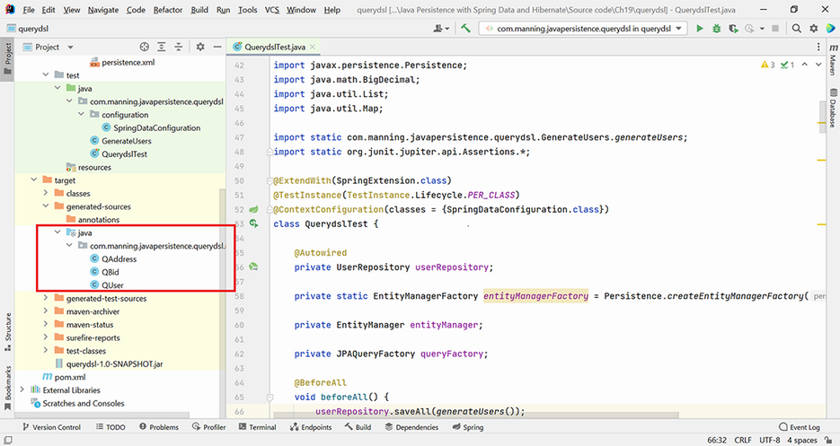

# Chương 19. Truy vấn JPA với Querydsl

> *Java Persistence with Spring Data and Hibernate* — Chương 19: “Querying JPA with Querydsl”

**Nội dung chương này bao gồm**

- Giới thiệu Querydsl
- Tạo một ứng dụng Querydsl
- Truy vấn cơ sở dữ liệu với Querydsl

Truy vấn cơ sở dữ liệu là điều thiết yếu để lấy thông tin thỏa những tiêu chí nhất định. Chương này tập trung vào Querydsl, một trong các lựa chọn để truy vấn cơ sở dữ liệu từ chương trình Java. Phần “dsl” trong tên Querydsl ám chỉ *domain specific language* (DSL), là những ngôn ngữ dành riêng cho một miền ứng dụng cụ thể. Ví dụ, truy vấn cơ sở dữ liệu là một miền như vậy.

Trong chương này chúng ta sẽ xem xét những khả năng quan trọng nhất của Querydsl và áp dụng chúng trong một dự án Java persistence. Để có tài liệu toàn diện về Querydsl, xem website của nó: http://querydsl.com/.

## 19.1 Giới thiệu Querydsl

Có nhiều lựa chọn khác nhau để truy vấn cơ sở dữ liệu từ bên trong chương trình Java. Bạn có thể dùng SQL, như đã khả thi từ những ngày đầu của JDBC. Nhược điểm của cách tiếp cận này là thiếu tính khả chuyển (truy vấn phụ thuộc vào cơ sở dữ liệu và phương ngữ SQL cụ thể) và thiếu type safety cùng khả năng kiểm chứng truy vấn tĩnh.

JPQL (Jakarta Persistence Query Language) là một bước tiến, khi nó là ngôn ngữ truy vấn hướng đối tượng độc lập với cơ sở dữ liệu. Điều này nghĩa là không thiếu tính khả chuyển, nhưng vẫn thiếu type safety và khả năng kiểm chứng truy vấn tĩnh.

Spring Data cho phép chúng ta tạo phương thức bằng cơ chế query builder và đánh dấu phương thức bằng truy vấn JPQL và SQL (dù những thứ này vẫn mang các nhược điểm đã nêu). Cơ chế query builder cũng có nhược điểm là đòi hỏi phải định nghĩa trước các phương thức, và tên của chúng không được kiểm tra tĩnh lúc biên dịch.

Criteria API cho phép bạn dựng các truy vấn type safe và khả chuyển bằng một Java API. Dù nó giải quyết được nhược điểm của những lựa chọn đã trình bày, nó lại trở nên cực kỳ dài dòng và tạo ra mã khó đọc.

Querydsl giữ lại những ý tưởng quan trọng là type safety và tính khả chuyển. Hơn nữa, nó giảm bớt sự dài dòng của Criteria API, và mã nó tạo ra dễ đọc, dễ hiểu hơn nhiều so với mã dựng bằng Criteria API.

## 19.2 Tạo một ứng dụng Querydsl

Chúng ta sẽ bắt đầu bằng việc tạo một ứng dụng Querydsl với các dependency được Maven quản lý. Chúng ta sẽ xem xét các bước liên quan, những dependency cần thêm vào dự án, các entity sẽ được quản lý, và cách viết truy vấn với sự trợ giúp của Querydsl.

> **CHÚ Ý** Để thực thi các ví dụ từ mã nguồn, trước tiên bạn cần chạy script Ch19.sql.

### 19.2.1 Cấu hình ứng dụng Querydsl

Chúng ta sẽ thêm hai dependency vào file Maven pom.xml: `querydsl-jpa` và `querydsl-apt`. Dependency `querydsl-jpa` cần để dùng Querydsl API bên trong một ứng dụng JPA. Dependency `querydsl-apt` cần để xử lý các annotation từ file Java trước khi biên dịch mã.

APT trong `querydsl-apt` là viết tắt của Annotation Processing Tool, và khi dùng nó, các entity được ứng dụng quản lý sẽ được nhân bản trong cái gọi là *Q-type* (Q là “query”). Điều này nghĩa là mỗi entity `Entity` sẽ có một `QEntity` tương ứng được sinh ra lúc build, thứ mà Querydsl sẽ dùng để truy vấn cơ sở dữ liệu. Ngoài ra, mỗi field của entity sẽ được phản chiếu trong `QEntity` bằng các class Querydsl đặc thù. Ví dụ, field `String` sẽ được phản chiếu thành field `StringPath`, field `Long` thành field `NumberPath<Long>`, field `Integer` thành field `NumberPath<Integer>`, v.v.

File Maven pom.xml kết quả sẽ có các dependency được thể hiện ở listing sau.

**Listing 19.1** File Maven pom.xml

*Đường dẫn: Ch19/querydsl/pom.xml*

```xml
<dependency>
    <groupId>com.querydsl</groupId>
    <artifactId>querydsl-jpa</artifactId>
    <version>5.0.0</version>
</dependency>
<dependency>
    <groupId>com.querydsl</groupId>
    <artifactId>querydsl-apt</artifactId>
    <version>5.0.0</version>
    <scope>provided</scope>
</dependency>
```

Scope của dependency `querydsl-apt` được chỉ định là `provided`. Điều này nghĩa là dependency chỉ cần lúc build, khi Maven sinh ra các Q-type đã giới thiệu trước đó. Sau đó nó không còn cần nữa, nên nó sẽ không được đưa vào artifact của ứng dụng.

Để làm việc với Querydsl, chúng ta cũng cần đưa Maven APT plugin vào file Maven pom.xml. Plugin này sẽ lo việc sinh các Q-type trong quá trình build. Vì chúng ta đang dùng annotation JPA trong dự án, class thực sự làm việc này là `com.querydsl.apt.jpa.JPAAnnotationProcessor`. Nếu chúng ta dùng Hibernate API và annotation, chúng ta sẽ phải dùng `com.querydsl.apt.hibernate.HibernateAnnotationProcessor` thay thế.

Chúng ta cũng sẽ phải chỉ ra thư mục output nơi các Q-type được sinh ra sẽ nằm: bên trong thư mục target của Maven. File pom.xml với tất cả những bổ sung này được thể hiện ở listing sau.

**Listing 19.2** File Maven pom.xml với APT plugin

*Đường dẫn: Ch19/querydsl/pom.xml*

```xml
<plugin>
  <groupId>com.mysema.maven</groupId>
  <artifactId>apt-maven-plugin</artifactId>
  <version>1.1.3</version>
  <executions>
    <execution>
      <goals>
          <goal>process</goal>
      </goals>
      <configuration>
          <outputDirectory>
              target/generated-sources/java                    <!-- Ⓐ -->
          </outputDirectory>
          <processor>
              com.querydsl.apt.jpa.JPAAnnotationProcessor      <!-- Ⓑ -->
          </processor>
      </configuration>
    </execution>
  </executions>
</plugin>
```

Ⓐ Các Q-type được sinh ra sẽ nằm trong thư mục target/generated-sources/java.

Ⓑ Dùng class `com.querydsl.apt.jpa.JPAAnnotationProcessor` để sinh Q-type.

Giờ chúng ta sẽ chuyển sang file cấu hình chuẩn cho persistence unit, ở src/main/resources/META-INF/persistence.xml. File này được thể hiện ở listing sau.

**Listing 19.3** File cấu hình persistence.xml

*Đường dẫn: Ch19/querydsl/src/main/resources/META-INF/persistence.xml*

```xml
<persistence-unit name="ch19.querydsl">                            <!-- Ⓐ -->
    <provider>
        org.hibernate.jpa.HibernatePersistenceProvider             <!-- Ⓑ -->
    </provider>
    <properties>
        <property name="javax.persistence.jdbc.driver"
                  value="com.mysql.cj.jdbc.Driver"/>               <!-- Ⓒ -->
        <property name="javax.persistence.jdbc.url"
                  value="jdbc:mysql://localhost:3306/CH19_QUERYDSL?serverTimezone=UTC"/>
                                                                   <!-- Ⓓ -->
        <property name="javax.persistence.jdbc.user"
                  value="root"/>                                   <!-- Ⓔ -->
        <property name="javax.persistence.jdbc.password"
                  value=""/>                                       <!-- Ⓕ -->

        <property name="hibernate.dialect"
                  value="org.hibernate.dialect.MySQL8Dialect"/>    <!-- Ⓖ -->
        <property name="hibernate.show_sql" value="true"/>         <!-- Ⓗ -->
        <property name="hibernate.format_sql" value="true"/>       <!-- Ⓘ -->
        <property name="hibernate.hbm2ddl.auto" value="create"/>   <!-- Ⓙ -->
    </properties>
</persistence-unit>
```

Ⓐ File persistence.xml cấu hình persistence unit `ch19.querydsl`.

Ⓑ Vì JPA chỉ là một đặc tả, chúng ta cần chỉ ra hiện thực `PersistenceProvider` đặc thù nhà cung cấp của API. Persistence chúng ta định nghĩa sẽ được hỗ trợ bởi provider Hibernate.

Ⓒ Các property JDBC — driver.

Ⓓ URL của cơ sở dữ liệu.

Ⓔ Tên người dùng.

Ⓕ Không có mật khẩu để truy cập. Máy chúng ta chạy chương trình đã cài MySQL 8, và thông tin truy cập là những gì có trong persistence.xml. Bạn nên sửa thông tin đăng nhập cho khớp với máy của mình.

Ⓖ Phương ngữ Hibernate là MySQL8, vì cơ sở dữ liệu chúng ta tương tác là MySQL Release 8.0.

Ⓗ Khi thực thi, hiển thị mã SQL.

Ⓘ Hibernate sẽ định dạng SQL cho đẹp và sinh comment trong chuỗi SQL để chúng ta biết vì sao Hibernate thực thi câu lệnh SQL đó.

Ⓙ Mỗi lần chương trình được thực thi, cơ sở dữ liệu sẽ được tạo lại từ đầu. Điều này lý tưởng cho kiểm thử tự động khi chúng ta muốn làm việc với một cơ sở dữ liệu sạch cho mỗi lần chạy test.

### 19.2.2 Tạo các entity

Giờ chúng ta sẽ tạo các class biểu diễn entity của ứng dụng: `User`, `Bid` và `Address`. Quan hệ giữa chúng sẽ thuộc kiểu one-to-many, many-to-one, hoặc embedded.

**Listing 19.4** Class User

*Đường dẫn: Ch19/querydsl/src/main/java/com/manning/javapersistence/querydsl/model/User.java*

```java
@Entity
@NoArgsConstructor
public class User {

    @Id                                                             // Ⓐ
    @GeneratedValue(generator = Constants.ID_GENERATOR)             // Ⓐ
    @Getter
    private Long id;

    @Embedded                                                       // Ⓑ
    @Getter
    @Setter
    private Address address;                                        // Ⓑ

    @OneToMany(mappedBy = "user", cascade = CascadeType.ALL)        // Ⓒ
    private Set<Bid> bids = new HashSet<>();                        // Ⓒ

    // . . .
}
```

Ⓐ Field ID là một định danh được sinh bởi generator `Constants.ID_GENERATOR`. Để xem lại các generator, hãy quay lại chương 5.

Ⓑ `address` không có định danh riêng; nó là embeddable.

Ⓒ Có một quan hệ one-to-many giữa `User` và `Bid`, được ánh xạ bởi field `user` ở phía `Bid`. `CascadeType.ALL` cho biết mọi thao tác sẽ được lan truyền từ `User` cha xuống `Bid` con.

Class `Address` không có định danh persistence riêng, và nó sẽ là embeddable.

**Listing 19.5** Class Address

*Đường dẫn: Ch19/querydsl/src/main/java/com/manning/javapersistence/querydsl/model/User.java*

```java
@Embeddable
@NoArgsConstructor
public class Address {

    //fields with Lombok annotations, constructor
}
```

Class `Bid` sẽ chứa một field `id` với chiến lược sinh tương tự như của `User`. Quan hệ giữa `Bid` và `User` sẽ là many-to-one, không tùy chọn (not optional), và fetch type sẽ là lazy.

**Listing 19.6** Class Bid

*Đường dẫn: Ch19/querydsl/src/main/java/com/manning/javapersistence/querydsl/model/Bid.java*

```java
@Entity
@NoArgsConstructor
public class Bid {

    @Id
    @GeneratedValue(generator = Constants.ID_GENERATOR)
    private Long id;

    @ManyToOne(optional = false, fetch = FetchType.LAZY)
    @Getter
    @Setter
    private User user;

    // . . .

}
```

Interface `UserRepository` mở rộng `JpaRepository<User, Long>`. Nó quản lý entity `User` và có ID kiểu `Long`. Chúng ta sẽ chỉ dùng interface Spring Data JPA này để thuận tiện điền dữ liệu vào cơ sở dữ liệu nhằm kiểm thử Querydsl.

**Listing 19.7** Interface UserRepository

*Đường dẫn: Ch19/querydsl/src/main/java/com/manning/javapersistence/querydsl/repositories/UserRepository.java*

```java
public interface UserRepository extends JpaRepository<User, Long> {
}
```

### 19.2.3 Tạo dữ liệu test để truy vấn

Để điền dữ liệu và làm việc với cơ sở dữ liệu, chúng ta sẽ cần một class `SpringDataConfiguration` và một class `GenerateUsers`. Chúng ta đã dùng cách tiếp cận này nhiều lần, nên ở đây chỉ điểm nhanh khả năng của các class này.

**Listing 19.8** Class SpringDataConfiguration

*Đường dẫn: Ch19/querydsl/src/test/java/com/manning/javapersistence/querydsl/configuration/SpringDataConfiguration.java*

```java
@EnableJpaRepositories(                                                  // Ⓐ
    "com.manning.javapersistence.querydsl.repositories")                 // Ⓐ
public class SpringDataConfiguration {

    @Bean
    public DataSource dataSource() {                                     // Ⓑ
        // . . .
        return dataSource;
    }

    @Bean
    public JpaTransactionManager                                         // Ⓒ
             transactionManager(EntityManagerFactory emf) {              // Ⓒ
        return new JpaTransactionManager(emf);                           // Ⓒ
    }

    @Bean
    public JpaVendorAdapter jpaVendorAdapter() {                         // Ⓓ
        HibernateJpaVendorAdapter jpaVendorAdapter =
                 new HibernateJpaVendorAdapter();
        // . . .
        return jpaVendorAdapter;
    }

    @Bean
    public LocalContainerEntityManagerFactoryBean                        // Ⓔ
                                     entityManagerFactory() {            // Ⓔ
        LocalContainerEntityManagerFactoryBean
          localContainerEntityManagerFactoryBean =
                new LocalContainerEntityManagerFactoryBean();
        // . . .
        return localContainerEntityManagerFactoryBean;
    }
}
```

Ⓐ Annotation `@EnableJpaRepositories` sẽ quét package của class cấu hình được đánh dấu để tìm các Spring Data repository.

Ⓑ Tạo một bean data source để giữ các property JDBC: driver, URL của cơ sở dữ liệu, tên người dùng và mật khẩu.

Ⓒ Tạo một bean transaction manager dựa trên một entity manager factory. Mọi tương tác với cơ sở dữ liệu nên diễn ra trong ranh giới transaction, và Spring Data cần một bean transaction manager.

Ⓓ Tạo và cấu hình một bean JPA vendor adapter, thứ mà JPA cần để tương tác với Hibernate.

Ⓔ Tạo và cấu hình một `LocalContainerEntityManagerFactoryBean` — đây là một factory bean sinh ra `EntityManagerFactory`.

Class `GenerateUsers` chứa phương thức `generateUsers`, thứ tạo ra một danh sách user và các bid liên quan của họ.

**Listing 19.9** Class GenerateUsers

*Đường dẫn: Ch19/querydsl/src/test/java/com/manning/javapersistence/querydsl/GenerateUsers.java*

```java
public class GenerateUsers {

    public static Address address = new Address("Flowers Street",
                                        "1234567", "Boston", "MA");

    public static List<User> generateUsers() {
        List<User> users = new ArrayList<>();

        User john = new User("john", "John", "Smith");
        john.setRegistrationDate(LocalDate.of(2020, Month.APRIL, 13));
        john.setEmail("john@somedomain.com");
        john.setLevel(1);
        john.setActive(true);
        john.setAddress(address);

        Bid bid1 = new Bid(new BigDecimal(100));
        bid1.setUser(john);
        john.addBid(bid1);

        Bid bid2 = new Bid(new BigDecimal(110));
        bid2.setUser(john);
        john.addBid(bid2);

        // . . .
    }
}
```

## 19.3 Truy vấn cơ sở dữ liệu với Querydsl

Như đã đề cập trước đó, Maven APT plugin sẽ sinh các Q-type trong quá trình build. Theo cấu hình đã cung cấp (xem listing 19.2), các mã nguồn này sẽ được sinh trong thư mục target/generated-sources/java (xem hình 19.1). Chúng ta sẽ dùng những class được sinh ra này để truy vấn cơ sở dữ liệu.



**Hình 19.1** Các Q-type được sinh ra trong thư mục target

Tuy nhiên, trước hết chúng ta phải điền dữ liệu vào cơ sở dữ liệu, và để làm điều này, chúng ta sẽ dùng interface `UserRepository`. Chúng ta cũng sẽ dùng một `EntityManagerFactory` và `EntityManager` được tạo ra để bắt đầu làm việc với một `JPAQueryFactory` và một `JPAQuery`. Chúng ta sẽ cần một instance `JPAQueryFactory` để làm việc với truy vấn, và nó sẽ được tạo bởi constructor nhận đối số `EntityManager`. Sau đó, `JPAQueryFactory` sẽ tạo các instance `JPAQuery` để thực sự truy vấn cơ sở dữ liệu.

Chúng ta sẽ mở rộng test bằng `SpringExtension`. Extension này được dùng để tích hợp Spring test context với test JUnit 5 Jupiter.

Trước khi thực thi các test, chúng ta sẽ điền vào cơ sở dữ liệu những user đã sinh trước đó cùng các bid tương ứng. Trước mỗi test, chúng ta sẽ tạo một `EntityManager` và bắt đầu một transaction. Nhờ đó, mọi tương tác với cơ sở dữ liệu sẽ diễn ra trong ranh giới transaction. Hiện tại, chúng ta chưa thực thi truy vấn từ bên trong class này, nhưng vì test và truy vấn sẽ được thêm ngay (bắt đầu từ listing 19.11), chúng ta sẽ đặt tên class là `QuerydslTest`.

**Listing 19.10** Class QuerydslTest

*Đường dẫn: Ch19/querydsl/src/test/java/com/manning/javapersistence/querydsl/QuerydslTest.java*

```java
@ExtendWith(SpringExtension.class)                                      // Ⓐ
@TestInstance(TestInstance.Lifecycle.PER_CLASS)                         // Ⓑ
@ContextConfiguration(classes = {SpringDataConfiguration.class})        // Ⓒ
class QuerydslTest {

    @Autowired                                                          // Ⓓ
    private UserRepository userRepository;                              // Ⓓ

    private static EntityManagerFactory entityManagerFactory =          // Ⓔ
        Persistence.createEntityManagerFactory("ch19.querydsl");        // Ⓔ

    private EntityManager entityManager;                                // Ⓕ

    private JPAQueryFactory queryFactory;                               // Ⓕ

    @BeforeAll
    void beforeAll() {
        userRepository.saveAll(generateUsers());                        // Ⓖ
    }

    @BeforeEach
    void beforeEach() {
        entityManager = entityManagerFactory.createEntityManager();
        entityManager.getTransaction().begin();
        queryFactory = new JPAQueryFactory(entityManager);              // Ⓗ
    }

    @AfterEach
    void afterEach() {
        entityManager.getTransaction().commit();                        // Ⓘ
        entityManager.close();                                          // Ⓘ
    }

    @AfterAll
    void afterAll() {
        userRepository.deleteAll();                                     // Ⓙ
    }

}
```

Ⓐ Mở rộng test bằng `SpringExtension`.

Ⓑ JUnit sẽ chỉ tạo một instance của class test để thực thi mọi test, thay vì một instance cho mỗi test. Nhờ vậy chúng ta có thể autowire field `UserRepository` như một biến instance.

Ⓒ Spring test context được cấu hình bằng các bean định nghĩa trong class `SpringDataConfiguration` đã trình bày trước đó.

Ⓓ Một bean `UserRepository` được Spring inject thông qua autowiring. Nó sẽ được dùng để dễ dàng điền dữ liệu và dọn dẹp cơ sở dữ liệu.

Ⓔ Khởi tạo một `EntityManagerFactory` để giao tiếp với cơ sở dữ liệu. Nó sẽ tạo `EntityManager` mà `JPAQueryFactory` cần.

Ⓕ Khai báo `EntityManager` và `JPAQueryFactory` mà ứng dụng cần.

Ⓖ Điền vào cơ sở dữ liệu những user và bid đã sinh trước đó, để các test sử dụng.

Ⓗ Tạo một `JPAQueryFactory` bằng cách truyền một `EntityManager` làm đối số cho constructor của nó.

Ⓘ Cuối mỗi test, commit transaction và đóng `EntityManager`.

Ⓙ Cuối quá trình thực thi mọi test, dọn dẹp cơ sở dữ liệu.

### 19.3.1 Lọc dữ liệu

Như đã bàn trước đây, các entity được ứng dụng quản lý sẽ được nhân bản trong cái gọi là Q-type. Điều này nghĩa là mỗi entity `Entity` sẽ có một `QEntity` tương ứng được sinh lúc build, thứ mà Querydsl sẽ dùng để truy vấn cơ sở dữ liệu. Các class Q-type do Maven APT plugin sinh ra mỗi class đều chứa một instance `static` cùng loại với nó:

```java
public static final QUser user = new QUser("user");
public static final QBid bid = new QBid("bid");
public static final QAddress address = new QAddress("address");
```

Những instance này sẽ được dùng để truy vấn cơ sở dữ liệu. Trước tiên chúng ta sẽ lấy một instance `JPAQuery` bằng cách gọi `queryFactory.selectFrom(user)`. Sau đó chúng ta sẽ dùng instance `JPAQuery` này để dựng các mệnh đề của truy vấn. Chúng ta sẽ dùng phương thức `where` để lọc theo một `Predicate` cho trước và phương thức `fetchOne` để lấy một phần tử duy nhất từ cơ sở dữ liệu. `fetchOne` trả về `null` nếu không tìm thấy phần tử nào thỏa điều kiện, và nó ném `NonUniqueResultException` nếu tìm thấy nhiều phần tử thỏa điều kiện.

Ví dụ, để lấy `User` với một `username` cho trước, chúng ta sẽ viết mã như ở listing sau.

**Listing 19.11** Tìm một User theo username

*Đường dẫn: Ch19/querydsl/src/test/java/com/manning/javapersistence/querydsl/QuerydslTest.java*

```java
@Test
void testFindByUsername() {

    User fetchedUser = queryFactory.selectFrom(QUser.user)               // Ⓐ
            .where(QUser.user.username.eq("john"))                       // Ⓑ
            .fetchOne();                                                 // Ⓒ

    assertAll(                                                           // Ⓓ
            () -> assertNotNull(fetchedUser),                            // Ⓓ
            () -> assertEquals("john", fetchedUser.getUsername()),       // Ⓓ
            () -> assertEquals("John", fetchedUser.getFirstName()),      // Ⓓ
            () -> assertEquals("Smith", fetchedUser.getLastName()),      // Ⓓ
            () -> assertEquals(2, fetchedUser.getBids().size())          // Ⓓ
    );                                                                   // Ⓓ
}
```

Ⓐ Bắt đầu dựng truy vấn bằng phương thức `selectFrom` thuộc class `JPAQueryFactory`. Phương thức này sẽ nhận instance Q-type đã tạo `QUser.user` làm đối số và trả về một `JPAQuery`.

Ⓑ Phương thức `where` sẽ lọc theo `Predicate` cho trước liên quan tới `username`.

Ⓒ Phương thức `fetchOne` sẽ cố lấy một phần tử duy nhất từ cơ sở dữ liệu.

Ⓓ Kiểm chứng rằng dữ liệu lấy về là dữ liệu mong đợi.

Các truy vấn SQL sau được Hibernate sinh ra:

```sql
select
    *
from
    User user0_
where
    user0_.username=?

select
    *
from
    Bid bids0_
where
    bids0_.user_id=?
```

Chúng ta có thể lọc theo nhiều `Predicate` bằng những phương thức như `and` hay `or`, mỗi phương thức nhận một `Predicate`. Ví dụ, để lọc theo field `level` và `active`, chúng ta có thể viết đoạn mã sau:

```java
List<User> users = (List<User>)queryFactory.from(QUser.user)
                                .where(QUser.user.level.eq(3)
                                .and(QUser.user.active.eq(true))).fetch();
```

Truy vấn SQL sau được Hibernate sinh ra:

```sql
select
    *
from
    User user0_
where
    user0_.level=?
    and user0_.active=?
```

### 19.3.2 Sắp xếp dữ liệu

Để sắp xếp dữ liệu, chúng ta sẽ dùng phương thức `orderBy`, thứ có thể nhận nhiều đối số biểu diễn tiêu chí sắp xếp. Ví dụ, để lấy các instance `User` được sắp theo `username`, chúng ta sẽ viết mã sau.

**Listing 19.12** Sắp xếp các instance User theo username

*Đường dẫn: Ch19/querydsl/src/test/java/com/manning/javapersistence/querydsl/QuerydslTest.java*

```java
@Test
void testOrderByUsername() {

    List<User> users = queryFactory.selectFrom(QUser.user)                // Ⓐ
            .orderBy(QUser.user.username.asc())                           // Ⓑ
            .fetch();                                                     // Ⓒ

    assertAll(                                                            // Ⓓ
            () -> assertEquals(users.size(), 10),
            () -> assertEquals("beth", users.get(0).getUsername()),
            () -> assertEquals("burk", users.get(1).getUsername()),
            () -> assertEquals("mike", users.get(8).getUsername()),
            () -> assertEquals("stephanie", users.get(9).getUsername())
    );
}
```

Ⓐ Bắt đầu dựng truy vấn bằng phương thức `selectFrom` thuộc class `JPAQueryFactory`. Phương thức này sẽ nhận instance Q-type đã tạo `QUser.user` làm đối số và trả về một `JPAQuery`.

Ⓑ Sắp xếp kết quả theo `username`, tăng dần. Phương thức `orderBy` được nạp chồng và có thể nhận nhiều tiêu chí sắp xếp.

Ⓒ Phương thức `fetch` sẽ lấy danh sách các instance `User`.

Ⓓ Kiểm chứng rằng dữ liệu lấy về là dữ liệu mong đợi.

Truy vấn SQL sau được Hibernate sinh ra:

```sql
select
    *
from
    User user0_
order by
    user0_.username asc
```

### 19.3.3 Nhóm dữ liệu và làm việc với hàm tổng hợp

Để nhóm dữ liệu, chúng ta sẽ dùng phương thức `groupBy`, thứ nhận biểu thức để nhóm theo. Truy vấn như vậy sẽ trả về một `List<Tuple>`. Một object `com.querydsl.core.Tuple` là một cặp key/value chứa key để nhóm theo và giá trị tương ứng của nó. Ví dụ, đoạn mã sau đếm các instance `Bid` được nhóm theo `amount`.

**Listing 19.13** Nhóm các bid theo amount

*Đường dẫn: Ch19/querydsl/src/test/java/com/manning/javapersistence/querydsl/QuerydslTest.java*

```java
@Test
void testGroupByBidAmount() {

    NumberPath<Long> count =                                              // Ⓐ
        Expressions.numberPath(Long.class, "bids");                       // Ⓐ

    List<Tuple> userBidsGroupByAmount =                                   // Ⓑ
        queryFactory.select(QBid.bid.amount,                              // Ⓒ
                            QBid.bid.id.count().as(count))                // Ⓒ
                    .from(QBid.bid)
                    .groupBy(QBid.bid.amount)                             // Ⓓ
                    .orderBy(count.desc())                                // Ⓔ
                    .fetch();                                             // Ⓕ

    assertAll(                                                            // Ⓖ
        () -> assertEquals(new BigDecimal("120.00"),
                userBidsGroupByAmount.get(0).get(QBid.bid.amount)),
        () -> assertEquals(2, userBidsGroupByAmount.get(0).get(count))
    );

}
```

Ⓐ Giữ lại biểu thức `count()`, vì chúng ta sẽ cần nó nhiều lần khi dựng truy vấn.

Ⓑ Trả về một `List<Tuple>`, các cặp key/value với key để nhóm theo và giá trị tương ứng.

Ⓒ Chọn `amount` và số lượng các `amount` giống nhau từ `Bid`.

Ⓓ Nhóm theo giá trị `amount`.

Ⓔ Sắp xếp theo số bản ghi có cùng amount.

Ⓕ Lấy các object `List<Tuple>`.

Ⓖ Kiểm chứng rằng dữ liệu lấy về là dữ liệu mong đợi.

Truy vấn SQL sau được Hibernate sinh ra:

```sql
select
    bid0_.amount as col_0_0_,
    count(bid0_.id) as col_1_0_
from
    Bid bid0_
group by
    bid0_.amount
order by
    col_1_0_ desc
```

Để làm việc với hàm tổng hợp và lấy giá trị lớn nhất, nhỏ nhất và trung bình của các `Bid`, chúng ta có thể dùng phương thức `max`, `min` và `avg`, như trong đoạn mã sau:

```java
queryFactory.from(QBid.bid).select(QBid.bid.amount.max()).fetchOne();
queryFactory.from(QBid.bid).select(QBid.bid.amount.min()).fetchOne();
queryFactory.from(QBid.bid).select(QBid.bid.amount.avg()).fetchOne();
```

Các truy vấn SQL sau được Hibernate sinh ra:

```sql
select
    max(bid0_.amount) as col_0_0_
from
    Bid bid0_

select
    min(bid0_.amount) as col_0_0_
from
    Bid bid0_

select
    avg(bid0_.amount) as col_0_0_
from
    Bid bid0_
```

### 19.3.4 Làm việc với subquery và join

Để làm việc với subquery, chúng ta sẽ tạo một subquery bằng các phương thức factory `static` của `JPAExpressions` (chẳng hạn `select`), và chúng ta sẽ định nghĩa tham số truy vấn bằng những phương thức như `from` và `where`. Chúng ta sẽ truyền subquery vào phương thức `where` của truy vấn chính. Ví dụ, listing sau chọn các `User` có `Bid` với một `amount` cho trước.

**Listing 19.14** Làm việc với subquery

*Đường dẫn: Ch19/querydsl/src/test/java/com/manning/javapersistence/querydsl/QuerydslTest.java*

```java
@Test
void testSubquery() {

    List<User> users = queryFactory.selectFrom(QUser.user)              // Ⓐ
            .where(QUser.user.id.in(                                    // Ⓑ
                    JPAExpressions.select(QBid.bid.user.id)             // Ⓒ
                            .from(QBid.bid)                             // Ⓒ
                            .where(QBid.bid.amount.eq(                  // Ⓒ
                                    new BigDecimal("120.00")))))        // Ⓒ
            .fetch();                                                   // Ⓓ

    List<User> otherUsers = queryFactory.selectFrom(QUser.user)         // Ⓔ
            .where(QUser.user.id.in(                                    // Ⓔ
                    JPAExpressions.select(QBid.bid.user.id)             // Ⓔ
                            .from(QBid.bid)                             // Ⓔ
                            .where(QBid.bid.amount.eq(                  // Ⓔ
                                    new BigDecimal("105.00")))))        // Ⓔ
            .fetch();                                                   // Ⓔ

    assertAll(                                                          // Ⓕ
            () -> assertEquals(2, users.size()),
            () -> assertEquals(1, otherUsers.size()),
            () -> assertEquals("burk", otherUsers.get(0).getUsername())
    );
}
```

Ⓐ Bắt đầu dựng truy vấn bằng phương thức `selectFrom` thuộc class `JPAQueryFactory`.

Ⓑ Truyền subquery làm tham số của phương thức `where`.

Ⓒ Tạo subquery để lấy các `Bid` có `amount` là 120.00.

Ⓓ Lấy kết quả.

Ⓔ Tạo truy vấn và subquery tương tự cho các `Bid` có `amount` là 105.00.

Ⓕ Kiểm chứng rằng dữ liệu lấy về đúng như mong đợi.

Truy vấn SQL sau được Hibernate sinh ra:

```sql
select
    *
from
    User user0_
where
    user0_.id in (
        select
            bid1_.user_id
        from
            Bid bid1_
        where
            bid1_.amount=?
    )
```

Để làm việc với join, chúng ta sẽ dùng các phương thức `innerJoin`, `leftJoin` và `outerJoin` để định nghĩa join, và dùng phương thức `on` để khai báo điều kiện (một `Predicate`) để join.

**Listing 19.15** Làm việc với join

*Đường dẫn: Ch19/querydsl/src/test/java/com/manning/javapersistence/querydsl/QuerydslTest.java*

```java
@Test
void testJoin() {

    List<User> users = queryFactory.selectFrom(QUser.user)               // Ⓐ
            .innerJoin(QUser.user.bids, QBid.bid)                        // Ⓑ
            .on(QBid.bid.amount.eq(new BigDecimal("120.00")))            // Ⓒ
            .fetch();                                                    // Ⓓ

    List<User> otherUsers = queryFactory.selectFrom(QUser.user)          // Ⓔ
            .innerJoin(QUser.user.bids, QBid.bid)                        // Ⓔ
            .on(QBid.bid.amount.eq(new BigDecimal("105.00")))            // Ⓔ
            .fetch();                                                    // Ⓔ

    assertAll(                                                           // Ⓕ
            () -> assertEquals(2, users.size()),
            () -> assertEquals(1, otherUsers.size()),
            () -> assertEquals("burk", otherUsers.get(0).getUsername())
    );
}
```

Ⓐ Bắt đầu dựng truy vấn bằng phương thức `selectFrom` thuộc class `JPAQueryFactory`.

Ⓑ Thực hiện inner join tới các `Bid`.

Ⓒ Định nghĩa điều kiện join `on` dưới dạng một `Predicate` để lấy `Bid` có `amount` 120.00.

Ⓓ Lấy kết quả.

Ⓔ Tạo một join tương tự cho các `Bid` có `amount` 105.00.

Ⓕ Kiểm chứng rằng dữ liệu lấy về đúng như mong đợi.

Truy vấn SQL sau được Hibernate sinh ra:

```sql
select
    *
from
    User user0_
inner join
    Bid bids1_
        on user0_.id=bids1_.user_id
        and (
            bids1_.amount=?
        )
```

### 19.3.5 Cập nhật entity

Để cập nhật các entity, chúng ta sẽ dùng phương thức `update` của class `JPAQueryFactory`, phương thức `where` để định nghĩa `Predicate` lọc các entity cần cập nhật (tùy chọn), phương thức `set` để định nghĩa những thay đổi cần thực hiện, và phương thức `execute` để thực sự thực thi update.

**Listing 19.16** Cập nhật thông tin

*Đường dẫn: Ch19/querydsl/src/test/java/com/manning/javapersistence/querydsl/QuerydslTest.java*

```java
@Test
void testUpdate() {

    queryFactory.update(QUser.user)                                      // Ⓐ
            .where(QUser.user.username.eq("john"))                       // Ⓑ
            .set(QUser.user.email, "john@someotherdomain.com")           // Ⓒ
            .execute();                                                  // Ⓓ

    entityManager.getTransaction().commit();                             // Ⓔ

    entityManager.getTransaction().begin();                              // Ⓕ

    assertEquals("john@someotherdomain.com",                             // Ⓖ
            queryFactory.select(QUser.user.email)                        // Ⓖ
                    .from(QUser.user)                                    // Ⓖ
                    .where(QUser.user.username.eq("john"))               // Ⓖ
                    .fetchOne());                                        // Ⓖ

}
```

Ⓐ Bắt đầu dựng truy vấn bằng phương thức `update` thuộc class `JPAQueryFactory`.

Ⓑ Định nghĩa điều kiện `where` để cập nhật theo (tùy chọn).

Ⓒ Định nghĩa những thay đổi cần thực hiện trên các entity bằng phương thức `set`.

Ⓓ Thực sự thực thi update.

Ⓔ Commit transaction đã bắt đầu trong phương thức được đánh dấu `@BeforeEach`.

Ⓕ Bắt đầu một transaction mới sẽ được commit trong phương thức được đánh dấu `@AfterEach`.

Ⓖ Kiểm tra kết quả của update bằng cách lấy về entity đã sửa đổi.

Truy vấn SQL sau được Hibernate sinh ra:

```sql
update
    User
set
    email=?
where
    username=?
```

### 19.3.6 Xóa entity

Để xóa entity, chúng ta sẽ dùng phương thức `delete` của class `JPAQueryFactory`, phương thức `where` để định nghĩa `Predicate` lọc các entity cần xóa (tùy chọn), và phương thức `execute` để thực sự thực thi delete.

Ở đây có một vấn đề lớn với Querydsl. Trong tài liệu tham khảo Querydsl (http://querydsl.com/static/querydsl/latest/reference/html/), mục 2.1.11 về truy vấn DELETE dùng JPA ghi chú: “DML clauses in JPA don’t take JPA level cascade rules into account and don’t provide fine-grained second level cache interaction” (Các mệnh đề DML trong JPA không tính tới quy tắc cascade ở mức JPA và không cung cấp tương tác chi tiết với second-level cache). Do đó, thuộc tính `cascade` của annotation `@OneToMany` trên `bids` trong class `User` bị bỏ qua; cần phải chọn một user và xóa thủ công các bid của họ trước khi xóa user đó bằng một truy vấn delete của Querydsl.

Như một bằng chứng bổ sung rằng vấn đề đến từ Querydsl: nếu một user được xóa bằng lệnh `userRepository.delete(burk);`, thuộc tính `cascade` của `@OneToMany` sẽ được tính đến đúng cách, và không cần xử lý thủ công các bid của user.

**Listing 19.17** Xóa thông tin

*Đường dẫn: Ch19/querydsl/src/test/java/com/manning/javapersistence/querydsl/QuerydslTest.java*

```java
@Test
void testDelete() {

    User burk = (User) queryFactory.from(QUser.user)                     // Ⓐ
                .where(QUser.user.username.eq("burk"))                   // Ⓐ
                .fetchOne();                                             // Ⓐ
    if (burk != null) {                                                  // Ⓑ
        queryFactory.delete(QBid.bid)                                    // Ⓑ
                    .where(QBid.bid.user.eq(burk))                       // Ⓑ
                    .execute();                                          // Ⓑ
    }

    queryFactory.delete(QUser.user)                                      // Ⓒ
            .where(QUser.user.username.eq("burk"))                       // Ⓓ
            .execute();                                                  // Ⓔ

    entityManager.getTransaction().commit();                             // Ⓕ
    entityManager.getTransaction().begin();                              // Ⓖ

    assertNull(queryFactory.selectFrom(QUser.user)                       // Ⓗ
            .where(QUser.user.username.eq("burk"))                       // Ⓗ
            .fetchOne());                                                // Ⓗ

}
```

Ⓐ Tìm user `burk`.

Ⓑ Xóa các bid thuộc về user vừa tìm được.

Ⓒ Bắt đầu dựng truy vấn bằng phương thức `delete` thuộc class `JPAQueryFactory`.

Ⓓ Định nghĩa điều kiện `where` để xóa theo (tùy chọn).

Ⓔ Thực sự thực thi delete.

Ⓕ Commit transaction đã bắt đầu trong phương thức được đánh dấu `@BeforeEach`.

Ⓖ Bắt đầu một transaction mới sẽ được commit trong phương thức được đánh dấu `@AfterEach`. Đây là lý do trong listing này một lệnh commit transaction xuất hiện trước một lệnh begin transaction.

Ⓗ Kiểm tra kết quả của delete bằng cách thử lấy entity về. Nếu entity không còn tồn tại, phương thức `fetchOne` sẽ trả về `null`.

Truy vấn SQL sau được Hibernate sinh ra:

```sql
delete
from
    User
where
    username=?
```

Truy vấn này chưa đủ nếu `User` có các `Bid` con cần được xóa trước. Điều này bộc lộ một vấn đề khác đặc thù của MySQL: khi Hibernate tạo schema, không có mệnh đề `ON DELETE CASCADE` nào được thêm vào khi định nghĩa ràng buộc khóa ngoại trên cột `user_id` trong bảng `bid`. Nếu không như vậy, chỉ một truy vấn DELETE này đã đủ, bất kể việc Querydsl bỏ qua thuộc tính `cascade` của `@OneToMany`.

Querydsl API không cung cấp khả năng insert. Để chèn entity, bạn có thể dùng `EntityManager` (JPA), `Session` (Hibernate), hoặc repository (Spring Data JPA).

## Tóm tắt

- Các lựa chọn truy vấn như SQL, JPQL, Criteria API, Spring Data đều có nhược điểm: thiếu tính khả chuyển, thiếu type safety và khả năng kiểm chứng truy vấn tĩnh, và dài dòng. Querydsl giải quyết những ý tưởng quan trọng là type safety và tính khả chuyển, đồng thời giảm bớt sự dài dòng.
- Bạn có thể tạo một ứng dụng persistence để dùng Querydsl, định nghĩa cấu hình và entity của nó, rồi lưu và truy vấn dữ liệu.
- Để làm việc với Querydsl, cần thêm các dependency của nó vào ứng dụng. Maven APT (Annotation Processing Tool) là bắt buộc để tạo, lúc build, các Q-type nhân bản các entity.
- Bạn có thể làm việc với các class lõi của Querydsl, `JPAQueryFactory` và `JPAQuery`, để dựng truy vấn nhằm truy xuất, cập nhật và xóa dữ liệu.
- Bạn có thể tạo truy vấn để lọc, sắp xếp, nhóm dữ liệu và truy vấn để thực thi join, update và delete.
