# Chương 20. Kiểm thử ứng dụng Java persistence

> *Java Persistence with Spring Data and Hibernate* — Chương 20: “Testing Java persistence applications”

**Nội dung chương này bao gồm**

- Giới thiệu kim tự tháp kiểm thử và xem xét kiểm thử persistence trong bối cảnh đó
- Tạo một ứng dụng persistence để kiểm thử bằng Spring Boot
- Dùng Spring TestContext Framework
- Làm việc với Spring profile để kiểm thử ứng dụng Java persistence
- Dùng execution listener để kiểm thử ứng dụng Java persistence

Mọi mã đều cần được kiểm thử. Trong quá trình phát triển, chúng ta viết mã, biên dịch và chạy. Khi chạy, đôi khi chúng ta có thể kiểm tra mã của mình hoạt động ra sao. Kiểm thử ứng dụng persistence còn hơn thế. Trong những trường hợp đó, mã của chúng ta tương tác với cơ sở dữ liệu bên ngoài, và cách chương trình hoạt động có thể phụ thuộc vào nó.

## 20.1 Giới thiệu kim tự tháp kiểm thử

Ở các chương trước, chúng ta tập trung vào việc phát triển mã tương tác với cơ sở dữ liệu. Chúng ta đã xem xét những lựa chọn khác nhau để làm điều này, những framework khác nhau, và đã tương tác với nhiều cơ sở dữ liệu. Giờ chúng ta cần bảo đảm rằng chương trình của mình an toàn và không lỗi. Chúng ta cần có khả năng đưa vào thay đổi mà không tạo ra lỗi, thêm tính năng mới mà không ảnh hưởng tính năng cũ, và refactor mã mà không phá vỡ chức năng hiện có. Đó là mục đích của chương cuối này.

Ứng dụng có thể được kiểm thử thủ công, nhưng ngày nay hầu hết test được thực thi tự động và chúng nhắm tới những mức độ khác nhau. Các mức kiểm thử phần mềm khác nhau cho ứng dụng nguyên khối (monolithic) có thể được xem như một kim tự tháp, như ở hình 20.1. Chúng ta có thể định nghĩa các mức kiểm thử phần mềm sau (từ thấp tới cao):

- **Unit testing** — Unit testing nằm ở nền của kim tự tháp. Nó tập trung vào phương thức hoặc class (các đơn vị riêng lẻ), kiểm thử từng cái một cách tách biệt để xác định xem nó có hoạt động đúng kỳ vọng hay không.
- **Integration testing** — Các thành phần phần mềm riêng lẻ đã được kiểm chứng được kết hợp thành những tập hợp lớn hơn và kiểm thử cùng nhau.
- **System testing** — Việc kiểm thử được thực hiện trên toàn bộ hệ thống, để đánh giá mức độ tuân thủ đặc tả. System testing không đòi hỏi hiểu biết về thiết kế hay mã mà tập trung vào chức năng của toàn hệ thống.
- **Acceptance testing** — Acceptance testing dùng các kịch bản và ca kiểm thử để kiểm tra xem ứng dụng có thỏa mãn kỳ vọng của người dùng cuối hay không.

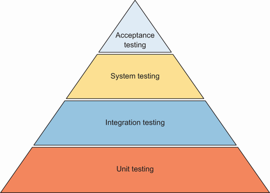

**Hình 20.1** Kim tự tháp kiểm thử có tầng đáy lớn hơn (unit test), trong khi các tầng kiểm thử cao hơn thì nhỏ hơn. Chúng bắt đầu bằng việc kiểm tra từng đơn vị riêng lẻ và đi lên tới việc kiểm chứng phần mềm đáp ứng nhu cầu người dùng ra sao.

Kiểm thử ứng dụng persistence thuộc về mức integration. Chúng ta kết hợp mã của mình với tương tác cơ sở dữ liệu, và chúng ta phụ thuộc vào cách cơ sở dữ liệu hoạt động. Chúng ta muốn giữ hành vi của các test nhất quán giữa những lần thực thi lặp lại và giữ nội dung cơ sở dữ liệu y như trước khi chạy test. Chúng ta sẽ xem xét những cách tốt nhất để đạt các mục tiêu này ở các mục sau.

## 20.2 Tạo ứng dụng persistence để kiểm thử

Chúng ta sẽ tạo một ứng dụng Spring Boot persistence để có thể kiểm thử chức năng của nó. Để làm điều này, hãy vào website Spring Initializr (https://start.spring.io/) và tạo một dự án Spring Boot mới (hình 20.2), với các đặc điểm sau:

- Group: `com.manning.javapersistence`
- Artifact: `testing`
- Description: Persistence Testing

Chúng ta cũng sẽ thêm các dependency sau:

- Spring Data JPA (việc này sẽ thêm `spring-boot-starter-data-jpa` vào file Maven pom.xml).
- MySQL Driver (việc này sẽ thêm `mysql-connector-java` vào file Maven pom.xml).
- Lombok (việc này sẽ thêm `org.projectlombok,lombok` vào file Maven pom.xml).
- Bean Validation với Hibernate validator (việc này sẽ thêm `spring-boot-starter-validation` vào file Maven pom.xml).
- Dependency `spring-boot-starter-test` sẽ được thêm tự động.

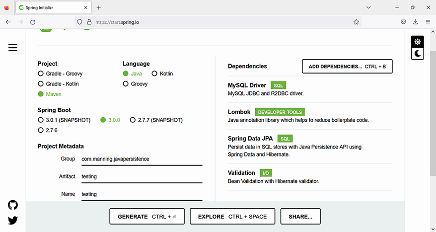

**Hình 20.2** Tạo một dự án Spring Boot mới dùng cơ sở dữ liệu MySQL thông qua Spring Data JPA

> **CHÚ Ý** Để thực thi các ví dụ từ mã nguồn, trước tiên bạn cần chạy script Ch20.sql.

File pom.xml ở listing sau bao gồm các dependency mà chúng ta đã thêm khi tạo dự án Spring Boot. Chúng ta sẽ tạo một ứng dụng Spring persistence truy cập cơ sở dữ liệu MySQL, vì thế chúng ta cần driver và cũng cần kiểm chứng (validate) một số field.

**Listing 20.1** File Maven pom.xml

*Đường dẫn: Ch20/1 spring testing/pom.xml*

```xml
<dependency>                                                        <!-- Ⓐ -->
    <groupId>org.springframework.boot</groupId>
    <artifactId>spring-boot-starter-data-jpa</artifactId>
</dependency>
<dependency>                                                        <!-- Ⓑ -->
    <groupId>org.springframework.boot</groupId>
    <artifactId>spring-boot-starter-validation</artifactId>
</dependency>
<dependency>                                                        <!-- Ⓒ -->
    <groupId>mysql</groupId>
    <artifactId>mysql-connector-java</artifactId>
    <scope>runtime</scope>
</dependency>
<dependency>                                                        <!-- Ⓓ -->
    <groupId>org.projectlombok</groupId>
    <artifactId>lombok</artifactId>
    <optional>true</optional>
</dependency>
<dependency>                                                        <!-- Ⓔ -->
    <groupId>org.springframework.boot</groupId>
    <artifactId>spring-boot-starter-test</artifactId>
    <scope>test</scope>
</dependency>
```

Ⓐ `spring-boot-starter-data-jpa` là starter dependency được Spring Boot dùng để kết nối tới cơ sở dữ liệu quan hệ thông qua Spring Data JPA.

Ⓑ `spring-boot-starter-validation` là starter dependency để dùng Java Bean Validation với Hibernate Validator.

Ⓒ `mysql-connector-java` là JDBC driver cho MySQL. Nó là dependency runtime, nên chỉ cần trong classpath lúc chạy.

Ⓓ Lombok sẽ cho phép chúng ta giảm mã boilerplate, dựa vào constructor, getter và setter được sinh tự động.

Ⓔ `spring-boot-starter-test` là starter để kiểm thử ứng dụng Spring Boot với các thư viện bao gồm JUnit 5.

Bước tiếp theo là điền vào file application.properties của Spring Boot. File này có thể chứa nhiều property khác nhau để ứng dụng dùng. Spring Boot sẽ tự động tìm và nạp application.properties từ classpath; thư mục `src/main/resources` được Maven thêm vào classpath. Cho phần minh họa của chương này, file cấu hình application.properties sẽ trông như listing 20.2.

**Listing 20.2** File application.properties

*Đường dẫn: Ch20/1 spring testing/src/main/resources/application.properties*

```properties
spring.datasource.url=jdbc:mysql://localhost:3306/CH20_TESTING?serverTimezone=UTC
# Ⓐ
spring.datasource.username=root
spring.datasource.password=
# Ⓑ
spring.jpa.properties.hibernate.dialect=org.hibernate.dialect.MySQL8Dialect
# Ⓒ
spring.jpa.show-sql=true
# Ⓓ
spring.jpa.hibernate.ddl-auto=create
# Ⓔ
```

Ⓐ URL của cơ sở dữ liệu.

Ⓑ Thông tin đăng nhập để truy cập cơ sở dữ liệu. Hãy thay bằng thông tin trên máy bạn, và dùng mật khẩu trong thực tế.

Ⓒ Phương ngữ của cơ sở dữ liệu, MySQL.

Ⓓ Hiển thị các truy vấn SQL trong khi chúng được thực thi.

Ⓔ Tạo lại các bảng cho mỗi lần thực thi ứng dụng.

> **CHÚ Ý** Có vài cách để cung cấp tham số trong ứng dụng Spring Boot, và file .properties chỉ là một trong số đó. Trong số các lựa chọn khác, tham số có thể đến từ mã nguồn hoặc từ đối số dòng lệnh. Hãy tham khảo tài liệu Spring Boot để biết chi tiết.

Ứng dụng chúng ta sẽ kiểm thử bao gồm hai entity, `User` và `Log`. Entity `User` được thể hiện ở listing sau. Nó sẽ có một `id` được sinh ra và một field `name` có kiểm chứng độ dài. Constructor không tham số, getter và setter sẽ do Lombok sinh ra.

**Listing 20.3** Class User

*Đường dẫn: Ch20/1 spring testing/src/main/java/com/manning/javapersistence/testing/model/User.java*

```java
@Entity
@NoArgsConstructor
public class User {

    @Id
    @GeneratedValue
    @Getter
    private Long id;

    @NotNull
    @Size(
            min = 2,
            max = 255,
            message = "Name is required, maximum 255 characters."
    )
    @Getter
    @Setter
    private String name;

    public User(String name) {
        this.name = name;
    }

}
```

Entity `Log` được thể hiện ở listing sau. Nó sẽ có một `id` được sinh ra và một field `info` có kiểm chứng độ dài. Constructor không tham số, getter và setter sẽ do Lombok sinh ra.

**Listing 20.4** Class Log

*Đường dẫn: Ch20/1 spring testing/src/main/java/com/manning/javapersistence/testing/model/Log.java*

```java
@Entity
@NoArgsConstructor
public class Log {

    @Id
    @GeneratedValue
    @Getter
    private Long id;

    @NotNull
    @Size(
            min = 2,
            max = 255,
            message = "Info is required, maximum 255 characters."
    )
    @Getter
    @Setter
    private String info;

    public Log(String info) {
        this.info = info;
    }
}
```

Để quản lý hai entity, chúng ta sẽ tạo hai interface repository mở rộng `JpaRepository`: `UserRepository` và `LogRepository`:

```java
public interface UserRepository extends JpaRepository<User, Long> {
}

public interface LogRepository extends JpaRepository<Log, Long> {
}
```

## 20.3 Dùng Spring TestContext Framework

Spring TestContext Framework được thiết kế để hỗ trợ kiểm thử tích hợp, nên nó lý tưởng cho việc kiểm thử tầng persistence. Nó không phụ thuộc vào framework kiểm thử mà chúng ta dùng cùng, và chúng ta sẽ làm việc với JUnit 5. Chúng ta sẽ xem xét những class và annotation thiết yếu của nó, vốn thuộc package `org.springframework.test.context`.

Điểm vào của Spring TestContext Framework là class `TestContextManager`. Mục tiêu của nó là quản lý một `TestContext` duy nhất và gửi sự kiện tới các listener đã đăng ký. Chúng ta sẽ xem xét listener chi tiết ở mục 20.8.

Chúng ta sẽ viết test đầu tiên lưu một entity `User` vào cơ sở dữ liệu rồi lấy lại nó, bằng một `UserRepository` được inject.

**Listing 20.5** Class SaveRetrieveUserTest

*Đường dẫn: Ch20/1 spring testing/src/test/java/com/manning/javapersistence/testing/SaveRetrieveUserTest.java*

```java
@SpringBootTest
class SaveRetrieveUserTest {

    @Autowired
    private UserRepository userRepository;

    @Test
    void saveRetrieve() {
        userRepository.save(new User("User1"));
        List<User> users = userRepository.findAll();

        assertAll(
                () -> assertEquals(1, users.size()),
                () -> assertEquals("User1", users.get(0).getName())
        );
    }

}
```

Nếu chúng ta chạy test này lặp lại nhiều lần, nó sẽ luôn thành công, nên chúng ta có thể thử sửa nó và đánh dấu phương thức test `saveRetrieve` bằng annotation `@RepeatedTest(2)` của JUnit 5. Việc này sẽ chạy nó hai lần trong một lần thực thi class. Test đã sửa sẽ trông như listing sau.

**Listing 20.6** Class SaveRetrieveUserTest dùng @RepeatedTest

*Đường dẫn: Ch20/1 spring testing/src/test/java/com/manning/javapersistence/testing/SaveRetrieveUserTest.java*

```java
@SpringBootTest
class SaveRetrieveUserTest {

    @Autowired
    private UserRepository userRepository;

    @RepeatedTest(2)
    void saveRetrieve() {
        userRepository.save(new User("User1"));
        List<User> users = userRepository.findAll();

        assertAll(
                () -> assertEquals(1, users.size()),
                () -> assertEquals("User1", users.get(0).getName())
        );
    }

}
```

Giờ hãy chạy test đã sửa. Dù bất ngờ hay không, nó sẽ thành công ở lần thực thi đầu tiên và thất bại ở lần thứ hai, lấy được hai `User` từ cơ sở dữ liệu thay vì một (xem hình 20.3).

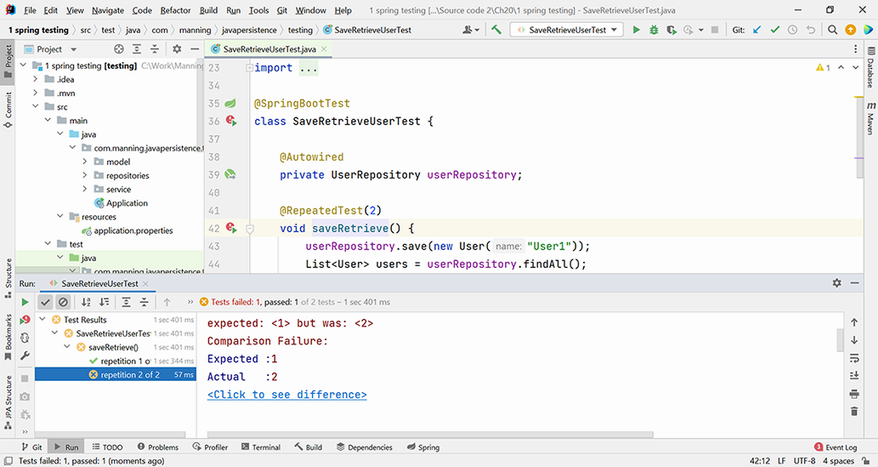

**Hình 20.3** `@RepeatedTest` sẽ thành công lần đầu và thất bại lần thứ hai, vì cơ sở dữ liệu bị để lại “bẩn” sau khi thực thi test đầu tiên.

Điều này xảy ra vì dòng được chèn bởi lần thực thi test đầu tiên không bị xóa đi, và test thứ hai tìm thấy nó trong bảng rồi thêm một dòng nữa. Chúng ta có thể theo dõi các lệnh SQL được thực thi khi class được chạy.

Trước khi chạy hai test, các lệnh SQL được thực thi liên quan tới việc (tái) tạo bảng:

```sql
drop table if exists hibernate_sequence
drop table if exists log
drop table if exists user
create table hibernate_sequence (next_val bigint)
insert into hibernate_sequence values ( 1 )
create table log (id bigint not null, info varchar(255) not null,
    primary key (id))
create table user (id bigint not null, name varchar(255) not null,
    primary key (id))
```

Trước khi chạy mỗi test, các lệnh SQL sau được thực thi, chèn một dòng mới vào bảng:

```sql
select next_val as id_val from hibernate_sequence for update
update hibernate_sequence set next_val= ? where next_val=?
insert into user (name, id) values (?, ?)
select user0_.id as id1_1_, user0_.name as name2_1_ from user user0_
```

Lần thực thi test thứ hai sẽ tìm thấy một dòng đã tồn tại trong bảng, sẽ thêm một dòng mới, và vì vậy sẽ thất bại vì nó kỳ vọng tìm thấy một dòng duy nhất. Chúng ta sẽ phải tìm những lựa chọn khác để giữ nội dung cơ sở dữ liệu ở cuối mỗi test y như trước khi chạy nó.

## 20.4 Annotation @DirtiesContext

Một lựa chọn do Spring TestContext Framework cung cấp là dùng annotation `@DirtiesContext`. `@DirtiesContext` thừa nhận rằng phương thức test hoặc class test làm thay đổi Spring context, và Spring TestContext Framework sẽ tạo lại nó từ đầu rồi cung cấp cho test tiếp theo. Annotation này có thể áp dụng lên một phương thức hoặc một class. Tác dụng của nó có thể được áp dụng trước hoặc sau khi thực thi mỗi phương thức test, hoặc trước hay sau khi thực thi class test.

Chúng ta sẽ sửa class test như ở listing sau.

**Listing 20.7** Class SaveRetrieveUserTest dùng @DirtiesContext

*Đường dẫn: Ch20/1 spring testing/src/test/java/com/manning/javapersistence/testing/SaveRetrieveUserTest.java*

```java
@SpringBootTest
@DirtiesContext(classMode =
        DirtiesContext.ClassMode.AFTER_EACH_TEST_METHOD)          // Ⓐ
class SaveRetrieveUserTest {

    @Autowired
    private UserRepository userRepository;

    @RepeatedTest(2)
    void saveRetrieve() {
        // . . .
    }

}
```

Ⓐ Tạo lại Spring context sau khi thực thi mỗi phương thức test.

Nếu giờ chúng ta chạy test đã sửa, nó sẽ thành công cả lần thực thi thứ nhất lẫn thứ hai (xem hình 20.4). Điều này nghĩa là sau khi chạy test đầu tiên, lần thực thi test thứ hai sẽ không còn gặp một cơ sở dữ liệu bẩn nữa.

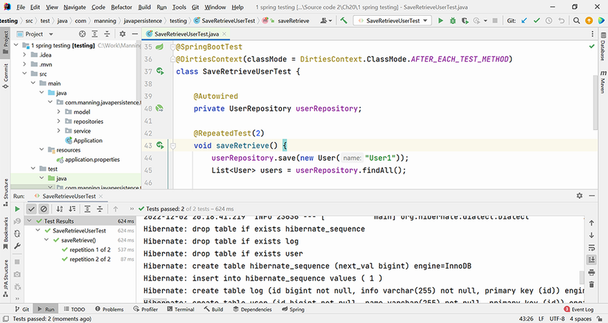

**Hình 20.4** Test được đánh dấu `@DirtiesContext` sẽ thành công cả lần đầu lẫn lần thứ hai.

Trước khi chạy mỗi test, các lệnh SQL được thực thi liên quan tới cả việc (tái) tạo bảng và chèn một dòng vào bảng:

```sql
drop table if exists hibernate_sequence
drop table if exists log
drop table if exists user
create table hibernate_sequence (next_val bigint)
insert into hibernate_sequence values ( 1 )
create table log (id bigint not null, info varchar(255) not null,
    primary key (id))
create table user (id bigint not null, name varchar(255) not null,
    primary key (id))
select next_val as id_val from hibernate_sequence for update
update hibernate_sequence set next_val= ? where next_val=?
insert into user (name, id) values (?, ?)
select user0_.id as id1_1_, user0_.name as name2_1_ from user user0_
```

Các lệnh này được thực thi hai lần, một lần trước mỗi test. Hơn thế nữa, banner của Spring Boot (cũng hiển thị ở dưới cùng hình 20.4) cũng sẽ được hiện hai lần — mỗi lần ứng dụng khởi động.

Chức năng của annotation `@DirtiesContext` ở mức phương thức được minh họa ở hình 20.5.

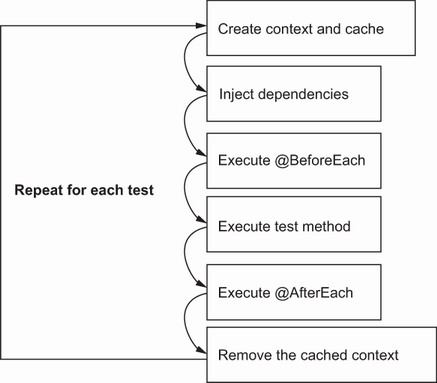

**Hình 20.5** Annotation `@DirtiesContext` ở mức phương thức sẽ tạo context và cache trước khi thực thi mỗi phương thức test và sẽ hủy chúng sau khi thực thi.

Giải pháp này hoạt động được, nhưng nó đi kèm chi phí hiệu năng liên quan tới việc tạo lại bảng và khởi tạo lại ứng dụng cho mỗi lần thực thi test. Hãy khám phá thêm các lựa chọn khác.

## 20.5 Thực thi với @Transactional

Chúng ta đã xem xét transaction chi tiết ở chương 11. Transaction kiểm soát các nhóm thao tác nguyên tử, hoặc thành công hoàn toàn hoặc thất bại hoàn toàn. Việc quản lý transaction với Spring và Spring Data cùng annotation `@Transactional` đã được trình bày chi tiết ở mục 11.4. Ý tưởng chúng ta sẽ áp dụng bây giờ là chạy mỗi test theo kiểu transaction và rollback transaction ở cuối quá trình thực thi.

Theo mặc định, khi thực thi một test, transaction của chúng ta sẽ tự động được rollback nhờ `TransactionalTestExecutionListener`. Chúng ta sẽ bàn chi tiết về listener ở mục 20.8; hiện tại, chỉ cần lưu ý rằng chúng có thể cung cấp thêm một số hành động khi thực thi test. Hành vi mặc định có thể được sửa đổi nhờ các annotation `@Commit` và `@Rollback`. Vậy nên nếu chúng ta muốn một test commit ở cuối quá trình thực thi, chúng ta có thể đánh dấu nó bằng `@Commit` hoặc bằng `@Rollback(false)`.

Để theo dõi khi nào một transaction đang hoạt động trong quá trình thực thi test, chúng ta sẽ dùng class `TransactionSynchronizationManager`. Class này quản lý tài nguyên và đồng bộ hóa transaction cho một thread. Phương thức `isActualTransactionActive()` của nó sẽ kiểm tra xem một object `Transaction` hiện có đang hoạt động hay không.

Trong listing sau, chúng ta sẽ tạo một class test, đánh dấu nó bằng `@Transactional`, và theo dõi trạng thái của transaction bên trong các phương thức của class.

**Listing 20.8** Class TransactionalTest

*Đường dẫn: Ch20/1 spring testing/src/test/java/com/manning/javapersistence/testing/TransactionalTest.java*

```java
@SpringBootTest
@Transactional
class TransactionalTest {

    // . . .

    @BeforeAll
    static void beforeAll() {
        System.out.println("beforeAll, transaction active = " +
            TransactionSynchronizationManager.isActualTransactionActive());
    }

    @BeforeEach
    void beforeEach() {
        System.out.println("beforeEach, transaction active = " +
            TransactionSynchronizationManager.isActualTransactionActive());
    }

    @RepeatedTest(2)
    void storeRetrieve() {
        // . . .
        System.out.println("end of method, transaction active = " +
            TransactionSynchronizationManager.isActualTransactionActive());
    }

    @AfterEach
    void afterEach() {
        System.out.println("afterEach, transaction active = " +
            TransactionSynchronizationManager.isActualTransactionActive());
    }

    @AfterAll
    static void afterAll() {
        System.out.println("afterAll, transaction active = " +
            TransactionSynchronizationManager.isActualTransactionActive());
    }

}
```

Log của quá trình thực thi sẽ cho chúng ta biết transaction không hoạt động trong các phương thức `@BeforeAll` và `@AfterAll`, nhưng nó hoạt động trong các phương thức `@BeforeEach` và `@AfterEach` cũng như bên trong chính phương thức test. Như đã nêu trước đó, transaction sẽ được rollback theo mặc định ở cuối test, nên `@RepeatedTest` sẽ thành công ở mọi lần thực thi:

```
beforeAll, transaction active = false
beforeEach, transaction active = true
end of method, transaction active = true
afterEach, transaction active = true
beforeEach, transaction active = true
end of method, transaction active = true
afterEach, transaction active = true
afterAll, transaction active = false
```

Vẫn còn một cạm bẫy của cách tiếp cận này mà chúng ta sẽ minh họa. Chúng ta đưa vào một class `UserService` riêng với một phương thức transactional, như ở listing sau.

**Listing 20.9** Class UserService

*Đường dẫn: Ch20/1 spring testing/src/main/java/com/manning/javapersistence/testing/service/UserService.java*

```java
@Service
public class UserService {

    @Autowired
    private UserRepository userRepository;

    @Transactional
    public void saveTransactionally(User user) {
        userRepository.save(user);
    }
}
```

Chúng ta sẽ gọi phương thức này từ bên trong `@RepeatedTest` của class `TransactionalTest`, để lưu một user theo kiểu transaction.

**Listing 20.10** Gọi phương thức saveTransactionally

*Đường dẫn: Ch20/1 spring testing/src/test/java/com/manning/javapersistence/testing/TransactionalTest.java*

```java
@SpringBootTest
@Transactional
class TransactionalTest {

    // . . .

    @RepeatedTest(2)
    void storeRetrieve() {
        List<User> users = buildUsersList();
        userRepository.saveAll(users);

        assertEquals(getIterations(), userRepository.findAll().size());
        userService.saveTransactionally(users.get(0));

        System.out.println("end of method, transaction active = " +
            TransactionSynchronizationManager.isActualTransactionActive());
    }

    // . . .

}
```

Phương thức `saveTransactionally` của `UserService` có annotation `@Transactional` không kèm đối số nào khác. Propagation mặc định là `REQUIRED` (xem mục 11.4). Vì đã có một transaction đang chạy cho test, phương thức `saveTransactionally` sẽ thực thi trong cùng transaction đó, và mọi thứ sẽ được rollback ở cuối test.

Chúng ta có thể đổi annotation của phương thức `saveTransactionally` thành `@Transactional(propagation = Propagation.REQUIRES_NEW)`. Việc này sẽ tạm dừng transaction đang thực thi trong test, bắt đầu một transaction mới, và commit nó, như hình 20.6 minh họa.

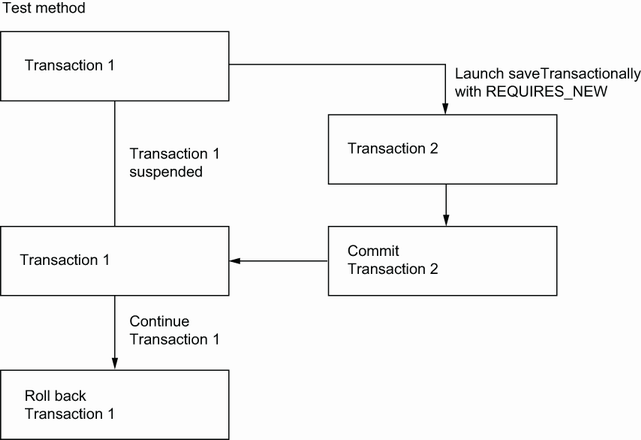

**Hình 20.6** Transaction của phương thức `saveTransactionally` sẽ được commit, còn transaction của phương thức test sẽ bị rollback.

Transaction từ `saveTransactionally` đã được commit. Hệ quả là khi chạy test lần thứ hai, nó sẽ gặp một bản ghi đã tồn tại trong cơ sở dữ liệu, và test sẽ thất bại (xem hình 20.7).

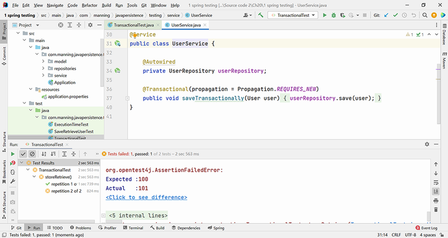

**Hình 20.7** Chạy hai test liên tiếp trong khi phương thức `saveTransactionally` commit transaction của nó một cách riêng biệt sẽ làm test thứ hai thất bại.

Kết luận là ngay cả khi bạn chạy test theo kiểu transaction, hãy cẩn thận với cạm bẫy khởi chạy các phương thức trong những transaction riêng. Nó có thể dẫn tới những lỗi kỳ lạ. Ngoài ra, việc gỡ lỗi có thể khó khăn với cách tiếp cận này.

Để so sánh hiệu năng giữa việc dùng `@DirtiesContext` và dùng `@Transactional`, chúng tôi đã thực thi một loạt 10 test, tăng dần số bản ghi từ 100 lên 2.000. Kết quả trên MySQL được cung cấp ở hình 20.8.

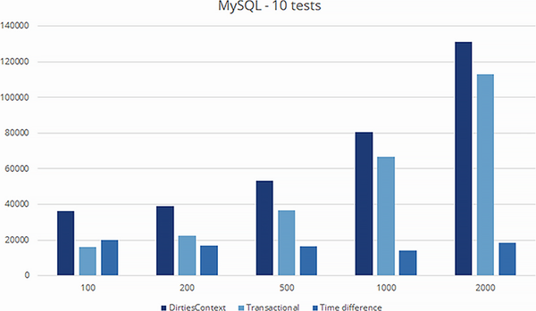

**Hình 20.8** Thời gian thực thi (tính bằng ms) trên MySQL khi dùng `@DirtiesContext` và `@Transactional` với số bản ghi thay đổi từ 100 tới 2.000

Kết quả trên H2 được cung cấp ở hình 20.9. Chúng tôi đã thực thi cùng loạt 10 test đó dùng cơ sở dữ liệu in-memory này, tăng dần số bản ghi từ 100 lên 2.000.

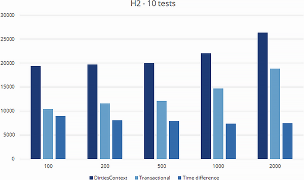

**Hình 20.9** Thời gian thực thi (tính bằng ms) trên H2 khi dùng `@DirtiesContext` và `@Transactional` với số bản ghi thay đổi từ 100 tới 2.000

Phân tích kết quả cho cả MySQL và H2, chúng ta có thể thấy rằng khác biệt giữa việc thực thi với `@DirtiesContext` và với `@Transactional` là gần như không đổi. Nó không phụ thuộc vào số bản ghi, mà vào số lần context được khởi tạo lại. Kết luận là bạn nên dùng `@DirtiesContext` một cách tiết chế. Đẩy các test với annotation này lên môi trường CI/CD (continuous integration/continuous development) sẽ làm tăng đáng kể thời gian thực thi của chúng.

## 20.6 Annotation @BeforeTransaction và @AfterTransaction

Giờ chúng ta sẽ xem xét các annotation `@BeforeTransaction` và `@AfterTransaction`. Như tên gợi ý, chúng chỉ ra những phương thức cần thực thi trước và sau khi thực thi một transaction. Để phân tích, chúng ta sẽ kiểm tra rằng quả thật không có transaction nào hoạt động bên trong một phương thức như vậy.

Dùng phương thức `Assumptions.assumeFalse` của JUnit 5, chúng ta sẽ chỉ ra rằng điều kiện tiên quyết để chạy các test là không có transaction nào hoạt động vào thời điểm đó; nếu không, các test sẽ không chạy. Vậy nên nếu một assumption không được thỏa, test sẽ bị hủy bỏ (aborted). Nếu một assertion không được thỏa, test sẽ thất bại.

**Listing 20.11** Dùng @BeforeTransaction và @AfterTransaction

*Đường dẫn: Ch20/1 spring testing/src/test/java/com/manning/javapersistence/testing/TransactionsManagementTest.java*

```java
@SpringBootTest
@Transactional
class TransactionsManagementTest {

    @Autowired
    private UserRepository userRepository;

    @Autowired
    private LogRepository logRepository;

    @BeforeTransaction
    void beforeTransaction() {
        Assumptions.assumeFalse(
            TransactionSynchronizationManager.isActualTransactionActive());
    }

    // . . .

    @AfterTransaction
    void afterTransaction() {
        Assumptions.assumeFalse(
            TransactionSynchronizationManager.isActualTransactionActive());
    }

}
```

Vẫn còn một cạm bẫy cần tránh ở đây: khả năng lưu dữ liệu trong các phương thức `@BeforeTransaction` hoặc `@AfterTransaction`. Vì chúng được thực thi bên ngoài transaction, dữ liệu sẽ không bị rollback và sẽ ảnh hưởng tới nội dung cơ sở dữ liệu. Hơn nữa, nếu chúng ta lưu dữ liệu mà chúng ta không kiểm tra trong các test (ví dụ, entity `Log`, trong khi test của chúng ta kiểm chứng entity `User`), các test của chúng ta sẽ luôn thực thi đúng nhưng sẽ để lại dữ liệu đã commit phía sau, như xảy ra ở listing sau.

**Listing 20.12** Lưu entity trong @BeforeTransaction / @AfterTransaction

*Đường dẫn: Ch20/1 spring testing/src/test/java/com/manning/javapersistence/testing/TransactionsManagementTest.java*

```java
@SpringBootTest
@Transactional
class TransactionsManagementTest {

    @Autowired
    private UserRepository userRepository;

    @Autowired
    private LogRepository logRepository;

    @BeforeTransaction
    void beforeTransaction() {
        Assumptions.assumeFalse(
            TransactionSynchronizationManager.isActualTransactionActive());
        logRepository.save(new Log("@BeforeTransaction"));
    }

    // . . .

    @AfterTransaction
    void afterTransaction() {
        Assumptions.assumeFalse(
            TransactionSynchronizationManager.isActualTransactionActive());
        logRepository.save(new Log("@AfterTransaction"));
    }

}
```

## 20.7 Làm việc với Spring profile

Theo mặc định, Spring Boot tạo file main/resources/application.properties để giữ cấu hình của ứng dụng. Nhưng có những tình huống thường gặp khi chúng ta cần phân biệt các property tùy theo profile của người dùng. Spring Boot sẽ cho phép chúng ta tách các property trong trường hợp này, trong những file được đặt tên theo mặc định là main/resources/application-profilename.properties, và nó sẽ cho phép chúng ta chuyển đổi giữa các profile.

Một trường hợp sử dụng thực tế là khi bạn có một profile cho lập trình viên, dùng cơ sở dữ liệu nhúng trong quá trình phát triển, và một profile khác cho production, dùng cơ sở dữ liệu thật. Lập trình viên muốn có thể thực thi test nhanh chóng, trong khi ở production các test sẽ chạy trong môi trường thật.

Cấu hình cho development được thể hiện ở listing sau. Nó nhắm tới cơ sở dữ liệu H2 và sẽ hiển thị các truy vấn SQL trong quá trình thực thi, vì lập trình viên quan tâm tới việc theo dõi chúng.

**Listing 20.13** File application-dev.properties

*Đường dẫn: Ch20/2 spring profiles/src/main/resources/application-dev.properties*

```properties
spring.datasource.url=jdbc:h2:mem:ch20_testing
spring.datasource.username=sa
spring.datasource.password=
spring.jpa.properties.hibernate.dialect=org.hibernate.dialect.H2Dialect
spring.jpa.show-sql=true
spring.jpa.hibernate.ddl-auto=create
```

Cấu hình cho production được thể hiện ở listing sau. Nó nhắm tới cơ sở dữ liệu MySQL và sẽ không hiển thị các truy vấn SQL trong quá trình thực thi, vì việc này sẽ tiêu tốn tài nguyên ở production.

**Listing 20.14** File application-prod.properties

*Đường dẫn: Ch20/2 spring profiles/src/main/resources/application-prod.properties*

```properties
spring.datasource.url=jdbc:mysql://localhost:3306/CH20_TESTING?serverTimezone=UTC
spring.datasource.username=root
spring.datasource.password=
spring.jpa.properties.hibernate.dialect=org.hibernate.dialect.MySQL8Dialect
spring.jpa.show-sql=false
spring.jpa.hibernate.ddl-auto=create
```

Để chạy các test trên cơ sở dữ liệu H2 trong quá trình phát triển, chúng ta sẽ phải chọn profile `dev`. Việc này có thể được thực hiện, chẳng hạn, từ bên trong file application.properties.

**Listing 20.15** File application.properties với profile dev

*Đường dẫn: Ch20/2 spring profiles/src/main/resources/application.properties*

```properties
spring.profiles.active=dev
```

Để minh họa việc chuyển đổi giữa các profile dễ dàng thế nào, chúng ta sẽ chạy một test lưu và lấy một entity từ cơ sở dữ liệu.

**Listing 20.16** Class SpringProfilesTest

*Đường dẫn: Ch20/2 spring profiles/src/test/java/com/manning/javapersistence/testing/SpringProfilesTest.java*

```java
@SpringBootTest
@Transactional
class SpringProfilesTest {

    @Autowired
    private UserRepository userRepository;

    @Test
    void storeUpdateRetrieve() {
        List<User> users = buildUsersList();
        userRepository.saveAll(users);

        assertEquals(getIterations(), userRepository.findAll().size());
    }

}
```

Để chạy thành công test này, chúng ta sẽ cần có dependency driver H2 trong file pom.xml.

**Listing 20.17** File pom.xml với dependency driver H2

*Đường dẫn: Ch20/2 spring profiles/pom.xml*

```xml
<dependency>
   <groupId>com.h2database</groupId>
   <artifactId>h2</artifactId>
   <version>1.4.200</version>
   <scope>runtime</scope>
</dependency>
```

Kết quả chạy test trên profile `dev` được thể hiện ở hình 20.10: profile `dev` dùng cơ sở dữ liệu H2 in-memory.

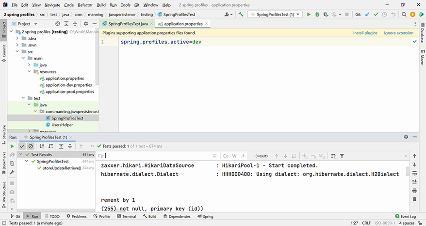

**Hình 20.10** Kết quả chạy test trên profile `dev`, dùng cơ sở dữ liệu H2 và hiển thị việc thực thi các truy vấn SQL

Để chạy các test trên cơ sở dữ liệu MySQL ở production, chúng ta sẽ phải chọn profile `prod`. Việc này có thể được thực hiện, chẳng hạn, từ bên trong file application.properties.

**Listing 20.18** File application.properties với profile prod

*Đường dẫn: Ch20/2 spring profiles/src/main/resources/application.properties*

```properties
spring.profiles.active=prod
```

Như một lựa chọn thay cho việc sửa profile đang hoạt động, chúng ta có thể dùng annotation `@ActiveProfiles` ở cấp độ test, như ở listing 20.19. Annotation này sẽ ghi đè profile được đặt trong application.properties, nhưng nó sẽ đòi hỏi chúng ta sửa và biên dịch lại mã.

**Listing 20.19** Class SpringProfilesTest

*Đường dẫn: Ch20/2 spring profiles/src/test/java/com/manning/javapersistence/testing/SpringProfilesTest.java*

```java
@SpringBootTest
@Transactional
@ActiveProfiles("prod")
class SpringProfilesTest {
   // . . .
}
```

Để chạy thành công test này, chúng ta sẽ cần có dependency driver MySQL trong file pom.xml.

**Listing 20.20** File pom.xml với dependency driver MySQL

*Đường dẫn: Ch20/2 spring profiles/pom.xml*

```xml
<dependency>
   <groupId>mysql</groupId>
   <artifactId>mysql-connector-java</artifactId>
   <scope>runtime</scope>
</dependency>
```

Kết quả chạy test trên profile `prod` được thể hiện ở hình 20.11. Khác với profile `dev`, profile này dùng cơ sở dữ liệu MySQL.

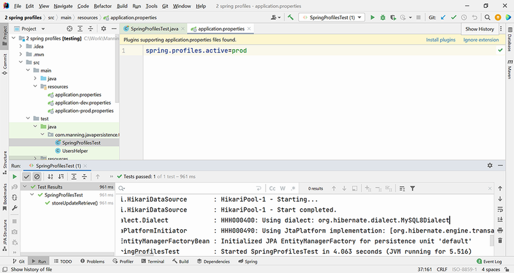

**Hình 20.11** Kết quả chạy test trên profile `prod`, dùng cơ sở dữ liệu MySQL và không hiển thị việc thực thi các truy vấn SQL

## 20.8 Làm việc với test execution listener

Một cách để kiểm soát vòng đời thực thi của một test là làm việc với các annotation của JUnit 5: `@BeforeAll`, `@AfterAll`, `@BeforeEach` và `@AfterEach`. Điều này có thể bất tiện trong một số tình huống. Ví dụ, nếu chúng ta cần cùng hành vi `@BeforeEach` và `@AfterEach` cho nhiều test, chúng ta sẽ phải tạo một class cơ sở chứa các phương thức này và tạo nhiều class con kế thừa rồi thực thi chúng khi chạy test. Điều này có bất tiện là treo các test của chúng ta vào một cây phân cấp class. Thay vào đó, chúng ta có thể cân nhắc làm việc với test execution listener, với interface `TestExecutionListener` và với annotation `@TestExecutionListeners`, nhờ đó tách riêng hành vi kiểm soát vòng đời của test.

Theo mặc định, Spring cung cấp sẵn một số `TestExecutionListener` đã hiện thực cho mỗi test. Những cái chúng ta quan tâm nhất ở đây là `DependencyInjectionTestExecutionListener`, thứ hỗ trợ dependency injection cho instance test, và `TransactionalTestExecutionListener`, thứ hỗ trợ việc thực thi test theo kiểu transaction có rollback. Chúng ta đã đề cập ở mục 20.3.2 rằng, theo mặc định, khi thực thi một test, transaction sẽ tự động được rollback nhờ `TransactionalTestExecutionListener` — điều này là thiết yếu khi kiểm thử persistence và cố gắng để lại một cơ sở dữ liệu sạch sau khi thực thi các test.

Interface `TestExecutionListener` định nghĩa một loạt phương thức `default` rỗng, chi tiết hơn các phương thức vòng đời của JUnit 5, và chúng được thực thi theo thứ tự thể hiện ở bảng 20.1.

**Bảng 20.1** Các phương thức mặc định của interface TestExecutionListener

| Phương thức | Mô tả |
| --- | --- |
| `beforeTestClass` | Được thực thi trước phương thức `@BeforeAll` của JUnit 5 |
| `prepareTestInstance` | Chuẩn bị instance test của test context được cung cấp |
| `beforeTestMethod` | Được thực thi trước phương thức `@BeforeEach` của JUnit 5 |
| `beforeTestExecution` | Được thực thi trước phương thức test |
| `afterTestExecution` | Được thực thi sau phương thức test |
| `afterTestMethod` | Được thực thi sau phương thức `@AfterEach` của JUnit 5 |
| `afterTestClass` | Được thực thi sau phương thức `@AfterAll` của JUnit 5 |

Chúng ta sẽ viết listener của riêng mình hiện thực interface `TestExecutionListener`, ghi đè mọi phương thức của nó, và in ra một thông điệp từ mỗi phương thức, để có thể theo dõi quá trình thực thi của test mà chúng ta sẽ đánh dấu bằng listener này.

Như ở mục 20.3.2, chúng ta sẽ theo dõi khi nào một transaction đang hoạt động trong quá trình thực thi test bằng class `TransactionSynchronizationManager` và phương thức `isActualTransactionActive()` của nó, thứ sẽ kiểm tra xem một object `Transaction` hiện có đang hoạt động hay không. Listener của chúng ta được thể hiện ở listing sau.

**Listing 20.21** Class DatabaseOperationsListener

*Đường dẫn: Ch20/3 spring listeners/src/test/java/com/manning/javapersistence/testing/listeners/DatabaseOperationsListener.java*

```java
public class DatabaseOperationsListener implements TestExecutionListener {

    @Override
    public void beforeTestClass(TestContext testContext) {
        System.out.println("beforeTestClass, transaction active = " +
            TransactionSynchronizationManager.isActualTransactionActive());
    }

    @Override
    public void afterTestClass(TestContext testContext) {
        System.out.println("afterTestClass, transaction active = " +
            TransactionSynchronizationManager.isActualTransactionActive());
    }

    @Override
    public void beforeTestMethod(TestContext testContext) {
        System.out.println("beforeTestMethod, transaction active = " +
            TransactionSynchronizationManager.isActualTransactionActive());
    }

    @Override
    public void afterTestMethod(TestContext testContext) {
        System.out.println("afterTestMethod, transaction active = " +
            TransactionSynchronizationManager.isActualTransactionActive());
    }

    @Override
    public void beforeTestExecution(TestContext testContext) {
        System.out.println("beforeTestExecution, transaction active = " +
            TransactionSynchronizationManager.isActualTransactionActive());
    }

    @Override
    public void afterTestExecution(TestContext testContext) {
        System.out.println("afterTestExecution, transaction active = " +
            TransactionSynchronizationManager.isActualTransactionActive());
    }

    @Override
    public void prepareTestInstance(TestContext testContext) {
        System.out.println("prepareTestInstance, transaction active = " +
            TransactionSynchronizationManager.isActualTransactionActive());
    }

}
```

Chúng ta sẽ tạo test của riêng mình, đánh dấu nó để dùng `DatabaseOperationsListener` mới, và in thông điệp từ các phương thức vòng đời cùng chính test đó, để theo dõi quá trình thực thi.

**Listing 20.22** Class ListenersTest

*Đường dẫn: Ch20/3 spring listeners/src/test/java/com/manning/javapersistence/testing/ListenersTest.java*

```java
@SpringBootTest
@Transactional
@TestExecutionListeners(value = {DatabaseOperationsListener.class})
class ListenersTest {

    @Autowired
    private UserRepository userRepository;

    @BeforeAll
    static void beforeAll() {
        System.out.println("@BeforeAll");
    }

    @BeforeEach
    void beforeEach() {
        System.out.println("@BeforeEach");
    }

    @Test
    void storeUpdateRetrieve() {
        TestContextManager testContextManager =
                new TestContextManager(getClass());
        System.out.println(
            "testContextManager.getTestExecutionListeners().size() = "
          + testContextManager.getTestExecutionListeners().size());
        List<User> users = buildUsersList();
        userRepository.saveAll(users);
        assertEquals(getIterations(), userRepository.findAll().size());
    }

    @AfterEach
    void afterEach() {
        System.out.println("@AfterEach");
    }

    @AfterAll
    static void afterAll() {
        System.out.println("@AfterAll");
    }

}
```

Nếu chúng ta chạy test này ngay bây giờ, nó sẽ thất bại với `NullPointerException`, như ở hình 20.12.

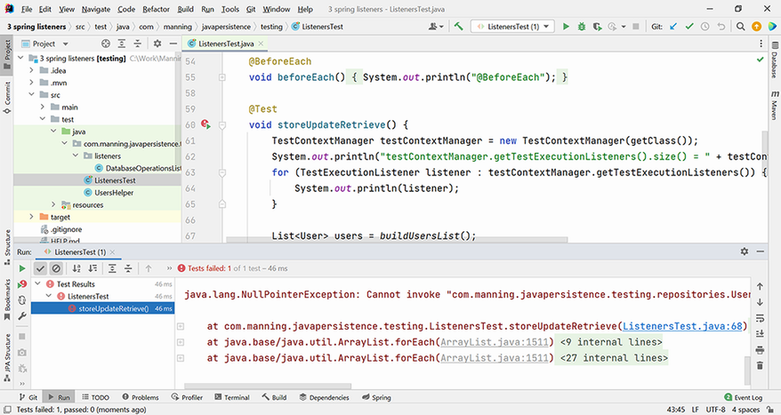

**Hình 20.12** Test ban đầu được đánh dấu với listener tùy chỉnh của chúng ta thất bại với `NullPointerException`.

Nếu xem xét điều gì đang xảy ra, chúng ta sẽ thấy rằng tham chiếu `userRepository` tới object tương tác với cơ sở dữ liệu là `null`. Như các thông điệp trên console cho thấy, chỉ có một listener được đăng ký trong `TestContextManager`, chính là `DatabaseOperationsListener` của chúng ta. `DependencyInjectionTestExecutionListener` vốn cần thiết trước đó, thứ hỗ trợ dependency injection cho instance test và do đó cho `userRepository`, không còn được đăng ký nữa. Đó là vì một khi chúng ta đưa vào listener của riêng mình, các listener mặc định không còn được đăng ký tự động.

Để khắc phục, chúng ta sẽ dùng tùy chọn `MERGE_WITH_DEFAULTS` làm merge mode, như sau.

**Listing 20.23** Gộp các listener mặc định với listener tùy chỉnh của chúng ta

*Đường dẫn: Ch20/3 spring listeners/src/test/java/com/manning/javapersistence/testing/ListenersTest.java*

```java
@SpringBootTest
@Transactional
@TestExecutionListeners(value = {
        DatabaseOperationsListener.class}, mergeMode =
           TestExecutionListeners.MergeMode.MERGE_WITH_DEFAULTS)
class ListenersTest {
    // . . .
}
```

Nếu giờ chạy lại test, chúng ta sẽ có thể theo dõi trình tự thực thi của các phương thức, cả từ listener lẫn từ các phương thức vòng đời của JUnit 5. Chúng ta cũng sẽ thấy rằng số listener được đăng ký giờ là 15, nghĩa là 14 listener mặc định cộng listener tùy chỉnh của chúng ta:

```
beforeTestClass, transaction active = false
@BeforeAll
prepareTestInstance, transaction active = false
beforeTestMethod, transaction active = true
@BeforeEach
beforeTestExecution, transaction active = true
testContextManager.getTestExecutionListeners().size() = 15
afterTestExecution, transaction active = true
@AfterEach
afterTestMethod, transaction active = true
@AfterAll
afterTestClass, transaction active = false
```

Bảng 20.2 tóm tắt những annotation quan trọng nhất của Spring TestContext Framework, dùng trong việc kiểm thử ứng dụng persistence. Bạn sẽ có thể dùng những annotation này của Spring TestContext Framework cho các ứng dụng persistence của mình. Framework này cung cấp hỗ trợ mạnh mẽ cho kiểm thử tích hợp, mà kiểm thử ứng dụng persistence thuộc về đó. Trên nền tảng này, bạn có thể tiếp tục xây dựng system test và acceptance test, như chúng tôi đã minh họa ở đầu chương khi giới thiệu kim tự tháp kiểm thử. Để biết thêm về kiểm thử ứng dụng Java nói chung và acceptance test nói riêng, bạn có thể tham khảo cuốn sách *JUnit in Action*, ấn bản thứ ba (Tudose, 2020) của tôi.

**Bảng 20.2** Những annotation quan trọng nhất của Spring TestContext Framework dùng trong kiểm thử ứng dụng persistence

| Annotation | Mô tả |
| --- | --- |
| `@DirtiesContext` | Spring context bên dưới đã bị thay đổi trong quá trình thực thi một test và cần được khởi tạo lại. |
| `@BeforeTransaction` | Phương thức `void` nên được thực thi trước bất kỳ phương thức nào có annotation `@Transactional` của Spring. |
| `@AfterTransaction` | Phương thức `void` nên được thực thi sau bất kỳ phương thức nào có annotation `@Transactional` của Spring. |
| `@Rollback` | Transaction của một test transactional sẽ được rollback sau khi test hoàn tất. Đây là hành vi mặc định và có thể thay đổi bằng `@Rollback(false)` hoặc `@Commit`. |
| `@Commit` | Transaction của một test transactional sẽ được commit sau khi test hoàn tất. |
| `@ActiveProfiles` | Chỉ định những configuration profile nào sẽ hoạt động trong Spring context. |
| `@TestExecutionListeners` | Cấu hình các test execution listener sẽ được đăng ký với `TestContextManager`. |

Với những test dự đoán được và an toàn, chỉ thất bại khi mã của bạn có vấn đề chứ không phải do yếu tố bên ngoài (chẳng hạn nội dung không phù hợp trong một cơ sở dữ liệu bẩn), cuộc sống của bạn với tư cách lập trình viên sẽ tốt hơn nhiều!

## Tóm tắt

- Kim tự tháp kiểm thử gồm các mức unit, integration, system và acceptance. Kiểm thử persistence có thể được xếp vào mức integration.
- Bạn có thể tạo và cấu hình một ứng dụng persistence bằng Spring Boot và quản lý entity cùng repository bên trong nó.
- Bạn có thể dùng Spring TestContext Framework để tạo các test persistence và quản lý chúng bằng `@DirtiesContext` hoặc `@Transactional`.
- Bạn có thể dùng Spring profile để kiểm thử các ứng dụng Java persistence truy cập nhiều cơ sở dữ liệu khác nhau và có những cấu hình khác nhau.
- Bạn có thể tạo một test execution listener tùy chỉnh để theo dõi vòng đời của một test và làm việc với nó cùng các listener mặc định.
