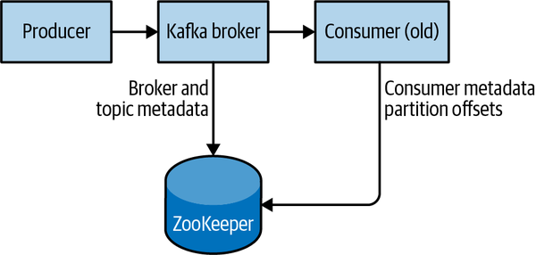
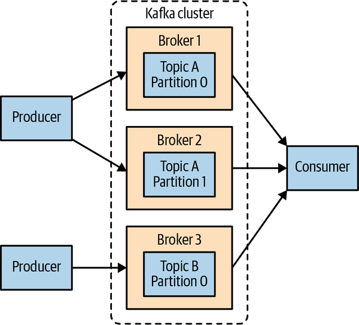

# Chương 2. Cài đặt Kafka (Installing Kafka)

Chương này mô tả cách bắt đầu làm việc với Apache Kafka broker, bao gồm cả cách thiết lập Apache ZooKeeper — thành phần được Kafka sử dụng để lưu trữ metadata cho các broker. Chương này cũng sẽ trình bày các tùy chọn cấu hình cơ bản cho việc triển khai Kafka, cùng với một vài gợi ý để lựa chọn phần cứng phù hợp nhằm chạy các broker. Cuối cùng, chúng ta sẽ đề cập tới cách cài đặt nhiều Kafka broker như một phần của một cluster duy nhất, và những điều bạn cần biết khi sử dụng Kafka trong môi trường production.

## Thiết lập môi trường (Environment Setup)

Trước khi sử dụng Apache Kafka, môi trường của bạn cần được thiết lập với một vài điều kiện tiên quyết để đảm bảo nó chạy đúng cách. Các mục sau đây sẽ hướng dẫn bạn qua quá trình đó.

### Lựa chọn hệ điều hành

Apache Kafka là một ứng dụng Java và có thể chạy trên nhiều hệ điều hành. Mặc dù Kafka có khả năng chạy trên nhiều hệ điều hành, bao gồm Windows, macOS, Linux và các hệ điều hành khác, Linux vẫn là hệ điều hành được khuyến nghị cho tình huống sử dụng phổ thông. Các bước cài đặt trong chương này sẽ tập trung vào việc thiết lập và sử dụng Kafka trong môi trường Linux. Để biết thông tin về việc cài đặt Kafka trên Windows và macOS, xem Phụ lục A.

### Cài đặt Java

Trước khi cài đặt ZooKeeper hoặc Kafka, bạn sẽ cần một môi trường Java đã được thiết lập và hoạt động. Kafka và ZooKeeper hoạt động tốt với tất cả các bản hiện thực Java dựa trên OpenJDK, bao gồm cả Oracle JDK. Các phiên bản Kafka mới nhất hỗ trợ cả Java 8 và Java 11. Phiên bản chính xác được cài đặt có thể là phiên bản do hệ điều hành của bạn cung cấp, hoặc phiên bản tải trực tiếp từ web — ví dụ, từ website Oracle đối với bản Oracle. Mặc dù ZooKeeper và Kafka vẫn hoạt động với bản runtime của Java, khi phát triển công cụ và ứng dụng thì nên có đầy đủ Java Development Kit (JDK). Bạn nên cài đặt phiên bản patch mới nhất đã phát hành của môi trường Java, vì các phiên bản cũ hơn có thể chứa lỗ hổng bảo mật. Các bước cài đặt sẽ giả định rằng bạn đã cài JDK phiên bản 11 update 10 được triển khai tại `/usr/java/jdk-11.0.10`.

### Cài đặt ZooKeeper

Apache Kafka sử dụng Apache ZooKeeper để lưu trữ metadata về Kafka cluster, cũng như chi tiết về các consumer client, như minh họa trong Hình 2-1. ZooKeeper là một dịch vụ tập trung dùng để duy trì thông tin cấu hình, đặt tên, cung cấp cơ chế đồng bộ hóa phân tán và cung cấp các dịch vụ nhóm (group services). Cuốn sách này sẽ không đi sâu quá chi tiết về ZooKeeper mà chỉ giới hạn phần giải thích ở những gì cần thiết để vận hành Kafka. Mặc dù có thể chạy một ZooKeeper server bằng các script có sẵn trong bản phân phối Kafka, việc cài đặt một phiên bản ZooKeeper đầy đủ từ bản phân phối của nó cũng rất đơn giản.



**Hình 2-1. Kafka và ZooKeeper**

Kafka đã được kiểm thử rộng rãi với bản phát hành ổn định 3.5 của ZooKeeper và được cập nhật thường xuyên để bao gồm bản phát hành mới nhất. Trong cuốn sách này, chúng ta sẽ sử dụng ZooKeeper 3.5.9, có thể tải xuống từ website của ZooKeeper.

#### Standalone server

ZooKeeper đi kèm một file cấu hình ví dụ cơ bản hoạt động tốt cho hầu hết các tình huống sử dụng, đặt tại `/usr/local/zookeeper/config/zoo_sample.cfg`. Tuy nhiên, chúng ta sẽ tự tạo file cấu hình của mình với một vài thiết lập cơ bản phục vụ mục đích minh họa trong cuốn sách này. Ví dụ sau đây cài đặt ZooKeeper với một cấu hình cơ bản tại `/usr/local/zookeeper`, lưu dữ liệu của nó trong `/var/lib/zookeeper`:

```bash
# tar -zxf apache-zookeeper-3.5.9-bin.tar.gz
# mv apache-zookeeper-3.5.9-bin /usr/local/zookeeper
# mkdir -p /var/lib/zookeeper
# cp > /usr/local/zookeeper/conf/zoo.cfg << EOF
> tickTime=2000
> dataDir=/var/lib/zookeeper
> clientPort=2181
> EOF
# export JAVA_HOME=/usr/java/jdk-11.0.10
# /usr/local/zookeeper/bin/zkServer.sh start
JMX enabled by default
Using config: /usr/local/zookeeper/bin/../conf/zoo.cfg
Starting zookeeper ... STARTED
#
```

Bây giờ bạn có thể xác minh rằng ZooKeeper đang chạy đúng ở chế độ standalone bằng cách kết nối tới client port và gửi lệnh bốn chữ cái `srvr`. Lệnh này sẽ trả về thông tin ZooKeeper cơ bản từ server đang chạy:

```bash
# telnet localhost 2181
Trying 127.0.0.1...
Connected to localhost.
Escape character is '^]'.
srvr
Zookeeper version: 3.5.9-83df9301aa5c2a5d284a9940177808c01bc35cef, built on 01/06/
Latency min/avg/max: 0/0/0
Received: 1
Sent: 0
Connections: 1
Outstanding: 0
Zxid: 0x0
Mode: standalone
Node count: 5
Connection closed by foreign host.
#
```

#### ZooKeeper ensemble

ZooKeeper được thiết kế để hoạt động như một cluster, gọi là *ensemble*, nhằm đảm bảo tính sẵn sàng cao. Do thuật toán cân bằng được sử dụng, người ta khuyến nghị rằng ensemble nên chứa một số lượng server lẻ (ví dụ 3, 5, v.v.), bởi vì phần lớn các thành viên của ensemble (một *quorum*) phải hoạt động thì ZooKeeper mới phản hồi được các request. Điều này có nghĩa là trong một ensemble ba node, bạn có thể chạy khi thiếu một node. Với một ensemble năm node, bạn có thể chạy khi thiếu hai node.

> **XÁC ĐỊNH KÍCH THƯỚC CHO ZOOKEEPER ENSEMBLE CỦA BẠN**
>
> Hãy cân nhắc chạy ZooKeeper trong một ensemble năm node. Để thực hiện các thay đổi cấu hình cho ensemble, bao gồm cả việc thay thế một node, bạn sẽ cần nạp lại (reload) từng node một. Nếu ensemble của bạn không thể chịu được việc nhiều hơn một node bị ngừng hoạt động, thì công việc bảo trì sẽ tạo thêm rủi ro. Cũng không nên chạy nhiều hơn bảy node, vì hiệu năng có thể bắt đầu suy giảm do bản chất của giao thức đồng thuận (consensus protocol).
>
> Ngoài ra, nếu bạn thấy rằng năm hoặc bảy node không đáp ứng nổi tải do có quá nhiều kết nối client, hãy cân nhắc bổ sung thêm các observer node để giúp cân bằng lưu lượng chỉ đọc (read-only).

Để cấu hình các ZooKeeper server trong một ensemble, chúng phải có một cấu hình chung liệt kê tất cả các server, và mỗi server cần một file `myid` trong thư mục dữ liệu để chỉ định số ID của server đó. Nếu hostname của các server trong ensemble là `zoo1.example.com`, `zoo2.example.com` và `zoo3.example.com`, thì file cấu hình có thể trông như sau:

```properties
tickTime=2000
dataDir=/var/lib/zookeeper
clientPort=2181
initLimit=20
syncLimit=5
server.1=zoo1.example.com:2888:3888
server.2=zoo2.example.com:2888:3888
server.3=zoo3.example.com:2888:3888
```

Trong cấu hình này, `initLimit` là khoảng thời gian cho phép các follower kết nối tới một leader. Giá trị `syncLimit` giới hạn mức độ các follower có thể lệch đồng bộ (out-of-sync) so với leader trong bao lâu. Cả hai giá trị đều là số đơn vị `tickTime`, khiến cho `initLimit` bằng 20 × 2.000 ms, tức 40 giây. Cấu hình này cũng liệt kê từng server trong ensemble. Các server được chỉ định theo định dạng `server.X=hostname:peerPort:leaderPort`, với các tham số sau:

- **X**

  Số ID của server. Giá trị này phải là một số nguyên, nhưng không cần bắt đầu từ 0 và cũng không cần liên tiếp.

- **hostname**

  Hostname hoặc địa chỉ IP của server.

- **peerPort**

  Cổng TCP mà qua đó các server trong ensemble giao tiếp với nhau.

- **leaderPort**

  Cổng TCP mà qua đó việc bầu chọn leader (leader election) được thực hiện.

Client chỉ cần có khả năng kết nối tới ensemble qua `clientPort`, nhưng các thành viên của ensemble phải có khả năng giao tiếp với nhau qua cả ba cổng.

Ngoài file cấu hình dùng chung, mỗi server phải có một file trong thư mục `dataDir` với tên là `myid`. File này phải chứa số ID của server, và số này phải khớp với file cấu hình. Khi các bước này hoàn tất, các server sẽ khởi động và giao tiếp với nhau trong một ensemble.

> **KIỂM THỬ ZOOKEEPER ENSEMBLE TRÊN MỘT MÁY DUY NHẤT**
>
> Có thể kiểm thử và chạy một ZooKeeper ensemble trên một máy duy nhất bằng cách chỉ định tất cả hostname trong cấu hình là `localhost` và đặt các cổng duy nhất cho `peerPort` và `leaderPort` cho từng instance. Ngoài ra, cần tạo một file `zoo.cfg` riêng cho mỗi instance với `dataDir` và `clientPort` riêng biệt được định nghĩa cho từng instance. Cách này chỉ hữu ích cho mục đích kiểm thử, và không được khuyến nghị cho hệ thống production.

## Cài đặt một Kafka broker (Installing a Kafka Broker)

Sau khi Java và ZooKeeper đã được cấu hình, bạn đã sẵn sàng để cài đặt Apache Kafka. Bản phát hành hiện tại có thể tải xuống từ website của Kafka. Tại thời điểm sách được in, phiên bản đó là 2.8.0 chạy trên Scala phiên bản 2.13.0. Các ví dụ trong chương này được trình bày với phiên bản 2.7.0.

Ví dụ sau đây cài đặt Kafka tại `/usr/local/kafka`, được cấu hình để sử dụng ZooKeeper server đã khởi động trước đó và lưu các log segment của message trong `/tmp/kafka-logs`:

```bash
# tar -zxf kafka_2.13-2.7.0.tgz
# mv kafka_2.13-2.7.0 /usr/local/kafka
# mkdir /tmp/kafka-logs
# export JAVA_HOME=/usr/java/jdk-11.0.10
# /usr/local/kafka/bin/kafka-server-start.sh -daemon
/usr/local/kafka/config/server.properties
#
```

Sau khi Kafka broker được khởi động, chúng ta có thể xác minh rằng nó đang hoạt động bằng cách thực hiện một vài thao tác đơn giản trên cluster: tạo một topic thử nghiệm, produce một số message, và consume chính những message đó.

Tạo và kiểm tra một topic:

```bash
# /usr/local/kafka/bin/kafka-topics.sh --bootstrap-server localhost:9092 --create
--replication-factor 1 --partitions 1 --topic test
Created topic "test".
# /usr/local/kafka/bin/kafka-topics.sh --bootstrap-server localhost:9092
--describe --topic test
Topic:test                        PartitionCount:1                                ReplicationFactor:1        Configs:
          Topic: test                         Partition: 0                          Leader: 0       Replicas: 0    Isr: 0
#
```

Produce message vào một topic thử nghiệm (dùng Ctrl-C để dừng producer bất cứ lúc nào):

```bash
# /usr/local/kafka/bin/kafka-console-producer.sh --bootstrap-server
localhost:9092 --topic test
Test Message 1
Test Message 2
^C
#
```

Consume message từ một topic thử nghiệm:

```bash
# /usr/local/kafka/bin/kafka-console-consumer.sh --bootstrap-server
localhost:9092 --topic test --from-beginning
Test Message 1
Test Message 2
^C
Processed a total of 2 messages
#
```

> **VIỆC LOẠI BỎ DẦN KẾT NỐI ZOOKEEPER TRÊN CÁC TIỆN ÍCH CLI CỦA KAFKA**
>
> Nếu bạn quen thuộc với các phiên bản cũ hơn của các tiện ích Kafka, có thể bạn đã quen dùng chuỗi kết nối `--zookeeper`. Tùy chọn này đã bị deprecated trong hầu hết mọi trường hợp. Thực hành tốt nhất hiện nay là dùng tùy chọn mới `--bootstrap-server` và kết nối trực tiếp tới Kafka broker. Nếu bạn đang chạy trong một cluster, bạn có thể cung cấp `host:port` của bất kỳ broker nào trong cluster.

## Cấu hình broker (Configuring the Broker)

Cấu hình ví dụ được cung cấp cùng bản phân phối Kafka là đủ để chạy một server standalone như một bản chứng minh khái niệm (proof of concept), nhưng rất có thể sẽ không đủ cho các hệ thống cài đặt quy mô lớn. Kafka có rất nhiều tùy chọn cấu hình kiểm soát mọi khía cạnh của việc thiết lập và tinh chỉnh. Tuy nhiên, hầu hết các tùy chọn có thể để nguyên ở giá trị mặc định, bởi chúng liên quan tới các khía cạnh tinh chỉnh của Kafka broker mà bạn sẽ chưa cần đụng tới cho đến khi có một tình huống sử dụng cụ thể đòi hỏi phải điều chỉnh những thiết lập này.

### Các tham số broker chung (General Broker Parameters)

Có một vài tham số cấu hình broker mà bạn nên xem xét lại khi triển khai Kafka trong bất kỳ môi trường nào khác ngoài một broker standalone trên một server đơn lẻ. Các tham số này liên quan tới cấu hình cơ bản của broker, và hầu hết chúng phải được thay đổi để chạy đúng cách trong một cluster cùng với các broker khác.

#### broker.id

Mọi Kafka broker đều phải có một định danh dạng số nguyên, được thiết lập bằng cấu hình `broker.id`. Theo mặc định, số nguyên này được đặt là `0`, nhưng nó có thể là bất kỳ giá trị nào. Điều thiết yếu là số nguyên này phải là duy nhất cho từng broker trong một Kafka cluster. Về mặt kỹ thuật, việc chọn con số này là tùy ý, và nó có thể được chuyển đổi giữa các broker nếu cần cho các tác vụ bảo trì. Tuy nhiên, rất nên đặt giá trị này thành một thứ gì đó gắn liền với bản chất của host, để khi thực hiện bảo trì thì việc ánh xạ số broker ID sang host không trở nên nặng nề. Ví dụ, nếu hostname của bạn chứa một con số duy nhất (chẳng hạn `host1.example.com`, `host2.example.com`, v.v.), thì `1` và `2` sẽ là những lựa chọn tốt tương ứng cho giá trị `broker.id`.

#### listeners

Các phiên bản Kafka cũ hơn dùng một cấu hình `port` đơn giản. Cấu hình này vẫn có thể được dùng như một phương án dự phòng cho các cấu hình đơn giản, nhưng đây là một config đã bị deprecated. File cấu hình ví dụ khởi động Kafka với một listener trên cổng TCP 9092. Cấu hình `listeners` mới là một danh sách các URI phân tách bằng dấu phẩy mà chúng ta lắng nghe trên đó, kèm theo tên listener. Nếu tên listener không phải là một giao thức bảo mật phổ biến, thì một config khác là `listener.security.protocol.map` cũng phải được cấu hình. Một listener được định nghĩa là `<protocol>://<hostname>:<port>`. Một ví dụ về cấu hình listener hợp lệ là `PLAINTEXT://localhost:9092,SSL://:9091`. Việc chỉ định hostname là `0.0.0.0` sẽ bind vào tất cả các interface. Để trống hostname sẽ bind nó vào interface mặc định. Hãy nhớ rằng nếu chọn một cổng nhỏ hơn 1024, Kafka phải được khởi động với quyền root. Việc chạy Kafka dưới quyền root không phải là một cấu hình được khuyến nghị.

#### zookeeper.connect

Vị trí của ZooKeeper dùng để lưu trữ metadata của broker được thiết lập bằng tham số cấu hình `zookeeper.connect`. Cấu hình ví dụ sử dụng một ZooKeeper chạy trên cổng 2181 tại máy cục bộ, được chỉ định là `localhost:2181`. Định dạng cho tham số này là một danh sách các chuỗi `hostname:port/path` phân tách bằng dấu chấm phẩy, bao gồm:

- **hostname**

  Hostname hoặc địa chỉ IP của ZooKeeper server.

- **port**

  Số hiệu cổng client của server.

- **/path**

  Một đường dẫn ZooKeeper tùy chọn để dùng làm môi trường chroot cho Kafka cluster. Nếu bị bỏ qua, đường dẫn gốc (root) sẽ được sử dụng.

Nếu một đường dẫn chroot (một đường dẫn được chỉ định để đóng vai trò thư mục gốc cho một ứng dụng nhất định) được chỉ định mà chưa tồn tại, thì nó sẽ được broker tạo ra khi khởi động.

> **TẠI SAO NÊN DÙNG ĐƯỜNG DẪN CHROOT?**
>
> Nhìn chung, việc sử dụng một đường dẫn chroot cho Kafka cluster được xem là một thực hành tốt. Điều này cho phép ZooKeeper ensemble được chia sẻ với các ứng dụng khác, bao gồm cả các Kafka cluster khác, mà không gây xung đột. Cũng tốt nhất là chỉ định nhiều ZooKeeper server (tất cả đều thuộc cùng một ensemble) trong cấu hình này. Điều đó cho phép Kafka broker kết nối tới một thành viên khác của ZooKeeper ensemble trong trường hợp một server gặp sự cố.

#### log.dirs

Kafka lưu tất cả message xuống đĩa, và các log segment này được lưu trong thư mục được chỉ định trong cấu hình `log.dir`. Với nhiều thư mục, config `log.dirs` được ưu tiên hơn. Nếu giá trị này không được thiết lập, nó sẽ quay về mặc định là `log.dir`. `log.dirs` là một danh sách các đường dẫn trên hệ thống cục bộ, phân tách bằng dấu phẩy. Nếu có nhiều hơn một đường dẫn được chỉ định, broker sẽ lưu các partition trên chúng theo kiểu "ít được dùng nhất" (least-used), với các log segment của cùng một partition được lưu trong cùng một đường dẫn. Lưu ý rằng broker sẽ đặt một partition mới vào đường dẫn hiện đang lưu trữ số lượng partition ít nhất, chứ không phải đường dẫn dùng ít dung lượng đĩa nhất, nên việc phân bố dữ liệu đồng đều trên nhiều thư mục là không được đảm bảo.

#### num.recovery.threads.per.data.dir

Kafka sử dụng một pool thread có thể cấu hình được để xử lý các log segment. Hiện tại, thread pool này được dùng:

- Khi khởi động bình thường, để mở các log segment của từng partition
- Khi khởi động sau một sự cố, để kiểm tra và cắt bớt (truncate) các log segment của từng partition
- Khi tắt (shutting down), để đóng các log segment một cách sạch sẽ

Theo mặc định, chỉ một thread cho mỗi thư mục log được sử dụng. Vì các thread này chỉ được dùng trong lúc khởi động và tắt, việc đặt một số lượng thread lớn hơn để song song hóa các thao tác là hợp lý. Cụ thể, khi khôi phục sau một lần tắt không sạch (unclean shutdown), điều này có thể tạo ra chênh lệch tới vài giờ khi khởi động lại một broker có số lượng partition lớn! Khi thiết lập tham số này, hãy nhớ rằng con số được cấu hình là tính trên mỗi thư mục log được chỉ định trong `log.dirs`. Điều này có nghĩa là nếu `num.recovery.threads.per.data.dir` được đặt là 8, và có 3 đường dẫn được chỉ định trong `log.dirs`, thì tổng cộng là 24 thread.

#### auto.create.topics.enable

Cấu hình Kafka mặc định quy định rằng broker sẽ tự động tạo một topic trong các trường hợp sau:

- Khi một producer bắt đầu ghi message vào topic đó
- Khi một consumer bắt đầu đọc message từ topic đó
- Khi bất kỳ client nào yêu cầu metadata cho topic đó

Trong nhiều tình huống, đây có thể là hành vi không mong muốn, đặc biệt là vì không có cách nào để kiểm tra sự tồn tại của một topic qua giao thức Kafka mà không khiến topic đó bị tạo ra. Nếu bạn quản lý việc tạo topic một cách tường minh, dù là thủ công hay thông qua một hệ thống cấp phát (provisioning system), bạn có thể đặt cấu hình `auto.create.topics.enable` thành `false`.

#### auto.leader.rebalance.enable

Để đảm bảo một Kafka cluster không bị mất cân bằng do toàn bộ quyền leadership của các topic đều nằm trên một broker, config này có thể được chỉ định để đảm bảo leadership được cân bằng ở mức tối đa có thể. Nó bật một background thread kiểm tra sự phân bố của các partition theo các khoảng thời gian định kỳ (khoảng thời gian này có thể cấu hình qua `leader.imbalance.check.interval.seconds`). Nếu mức mất cân bằng leadership vượt quá một config khác là `leader.imbalance.per.broker.percentage`, thì một quá trình rebalance các preferred leader cho các partition sẽ được khởi động.

#### delete.topic.enable

Tùy thuộc vào môi trường và các quy định về retention dữ liệu của bạn, bạn có thể muốn khóa một cluster lại để ngăn việc xóa topic một cách tùy tiện. Việc vô hiệu hóa xóa topic có thể được thiết lập bằng cách đặt cờ này thành `false`.

### Giá trị mặc định cho topic (Topic Defaults)

Cấu hình Kafka server quy định nhiều cấu hình mặc định cho các topic được tạo ra. Một số tham số trong đó, bao gồm số lượng partition và retention của message, có thể được thiết lập riêng cho từng topic bằng các công cụ quản trị (được trình bày trong Chương 12). Các giá trị mặc định trong cấu hình server nên được đặt thành những giá trị nền tảng phù hợp với đa số các topic trong cluster.

> **SỬ DỤNG GIÁ TRỊ GHI ĐÈ THEO TỪNG TOPIC**
>
> Ở các phiên bản Kafka cũ hơn, có thể chỉ định giá trị ghi đè theo từng topic cho những cấu hình này ngay trong cấu hình broker bằng các tham số `log.retention.hours.per.topic`, `log.retention.bytes.per.topic` và `log.segment.bytes.per.topic`. Các tham số này không còn được hỗ trợ nữa, và việc ghi đè phải được chỉ định bằng các công cụ quản trị.

#### num.partitions

Tham số `num.partitions` xác định một topic mới được tạo ra với bao nhiêu partition, chủ yếu là khi việc tự động tạo topic được bật (đây là thiết lập mặc định). Tham số này mặc định là một partition. Hãy nhớ rằng số lượng partition của một topic chỉ có thể tăng lên, không bao giờ giảm xuống. Điều này có nghĩa là nếu một topic cần có ít partition hơn `num.partitions`, bạn sẽ phải cẩn thận tạo topic đó một cách thủ công (được bàn tới trong Chương 12).

Như đã mô tả trong Chương 1, partition là cách để một topic mở rộng quy mô bên trong một Kafka cluster, điều này khiến việc dùng số lượng partition sao cho cân bằng được tải message trên toàn cluster khi thêm broker trở nên quan trọng. Nhiều người dùng đặt số lượng partition của một topic bằng, hoặc bằng bội số của, số lượng broker trong cluster. Điều này cho phép các partition được phân bố đều tới các broker, từ đó phân bố đều tải message. Ví dụ, một topic có 10 partition hoạt động trong một Kafka cluster gồm 10 host với leadership được cân bằng trên cả 10 host sẽ đạt throughput tối ưu. Tuy nhiên, đây không phải là một yêu cầu bắt buộc, vì bạn cũng có thể cân bằng tải message theo những cách khác, chẳng hạn như dùng nhiều topic.

> **CÁCH CHỌN SỐ LƯỢNG PARTITION**
>
> Có một vài yếu tố cần cân nhắc khi chọn số lượng partition:
>
> - Throughput mà bạn kỳ vọng đạt được cho topic đó là bao nhiêu? Ví dụ, bạn kỳ vọng ghi 100 KBps hay 1 GBps?
> - Throughput tối đa mà bạn kỳ vọng đạt được khi consume từ một partition đơn lẻ là bao nhiêu? Một partition sẽ luôn được consume trọn vẹn bởi một consumer duy nhất (ngay cả khi không dùng consumer group, consumer vẫn phải đọc toàn bộ message trong partition đó). Nếu bạn biết rằng consumer chậm của mình ghi dữ liệu vào một database và database này không bao giờ xử lý quá 50 MBps từ mỗi thread ghi vào nó, thì bạn biết rằng mình bị giới hạn ở throughput 50 MBps khi consume từ một partition.
> - Bạn có thể làm tương tự để ước lượng throughput tối đa của mỗi producer cho một partition đơn lẻ, nhưng vì producer thường nhanh hơn consumer rất nhiều, nên thường có thể bỏ qua bước này một cách an toàn.
> - Nếu bạn gửi message tới các partition dựa trên key, việc thêm partition về sau có thể rất khó khăn, vì vậy hãy tính toán throughput dựa trên mức sử dụng kỳ vọng trong tương lai, chứ không phải mức sử dụng hiện tại.
> - Hãy cân nhắc số lượng partition mà bạn sẽ đặt trên mỗi broker, cùng với dung lượng đĩa và băng thông mạng khả dụng của mỗi broker.
> - Tránh ước lượng quá cao, vì mỗi partition đều tiêu tốn bộ nhớ và các tài nguyên khác trên broker, đồng thời sẽ làm tăng thời gian cập nhật metadata và chuyển giao leadership.
> - Bạn có mirroring dữ liệu không? Có thể bạn cũng cần cân nhắc throughput của cấu hình mirroring. Các partition lớn có thể trở thành nút cổ chai trong nhiều cấu hình mirroring.
> - Nếu bạn dùng dịch vụ cloud, VM hoặc đĩa của bạn có bị giới hạn IOPS (số thao tác vào/ra mỗi giây) không? Có thể có những giới hạn cứng về số IOPS được phép, tùy thuộc vào dịch vụ cloud và cấu hình VM của bạn, khiến bạn chạm ngưỡng quota. Việc có quá nhiều partition có thể có tác dụng phụ là làm tăng lượng IOPS do mức độ song song liên quan.
>
> Với tất cả những điều này trong đầu, rõ ràng là bạn muốn có nhiều partition, nhưng không quá nhiều. Nếu bạn có một ước lượng nào đó về throughput mục tiêu của topic và throughput kỳ vọng của các consumer, bạn có thể chia throughput mục tiêu cho throughput kỳ vọng của consumer để suy ra số lượng partition theo cách này. Vậy nên nếu chúng ta muốn có thể ghi và đọc 1 GBps từ một topic, và chúng ta biết mỗi consumer chỉ xử lý được 50 MBps, thì chúng ta biết mình cần ít nhất 20 partition. Bằng cách này, chúng ta có thể có 20 consumer đọc từ topic đó và đạt 1 GBps.
>
> Nếu bạn không có thông tin chi tiết như vậy, kinh nghiệm của chúng tôi gợi ý rằng việc giới hạn kích thước của partition trên đĩa ở mức dưới 6 GB cho mỗi ngày retention thường cho kết quả thỏa đáng. Bắt đầu nhỏ rồi mở rộng khi cần thì dễ hơn là bắt đầu quá lớn.

#### default.replication.factor

Nếu việc tự động tạo topic được bật, cấu hình này thiết lập replication factor cho các topic mới. Chiến lược replication có thể khác nhau tùy thuộc vào độ bền dữ liệu hoặc tính sẵn sàng mong muốn của một cluster, và sẽ được bàn kỹ hơn ở các chương sau. Dưới đây là một khuyến nghị ngắn gọn nếu bạn đang chạy Kafka trong một cluster nhằm ngăn ngừa gián đoạn do các yếu tố nằm ngoài năng lực nội tại của Kafka, chẳng hạn như hỏng phần cứng.

Rất nên đặt replication factor cao hơn ít nhất 1 so với thiết lập `min.insync.replicas`. Để có các thiết lập chống lỗi tốt hơn, nếu bạn có cluster đủ lớn và đủ phần cứng, việc đặt replication factor cao hơn 2 so với `min.insync.replicas` (viết tắt là RF++) có thể là lựa chọn tốt hơn. RF++ sẽ giúp việc bảo trì dễ dàng hơn và ngăn ngừa gián đoạn. Lý do đằng sau khuyến nghị này là để cho phép xảy ra đồng thời một lần gián đoạn có kế hoạch trong tập replica và một lần gián đoạn ngoài kế hoạch. Với một cluster điển hình, điều này có nghĩa là bạn sẽ có tối thiểu ba replica cho mọi partition. Một ví dụ cho điều này là nếu xảy ra sự cố switch mạng, hỏng đĩa, hoặc một vấn đề ngoài kế hoạch nào khác trong quá trình triển khai cuốn chiếu (rolling deployment) hay nâng cấp Kafka hoặc hệ điều hành nền, bạn có thể yên tâm rằng vẫn còn một replica bổ sung khả dụng. Điều này sẽ được bàn kỹ hơn trong Chương 7.

#### log.retention.ms

Cấu hình phổ biến nhất để quy định Kafka giữ lại message trong bao lâu là theo thời gian. Giá trị mặc định được chỉ định trong file cấu hình bằng tham số `log.retention.hours`, và nó được đặt là 168 giờ, tức một tuần. Tuy nhiên, còn có hai tham số khác được phép dùng là `log.retention.minutes` và `log.retention.ms`. Cả ba tham số này đều kiểm soát cùng một mục tiêu (khoảng thời gian sau đó message có thể bị xóa), nhưng tham số được khuyến nghị dùng là `log.retention.ms`, vì đơn vị nhỏ hơn sẽ được ưu tiên nếu có nhiều hơn một tham số được chỉ định. Điều này đảm bảo rằng giá trị được đặt cho `log.retention.ms` luôn là giá trị được sử dụng. Nếu có nhiều hơn một tham số được chỉ định, đơn vị nhỏ hơn sẽ được ưu tiên.

> **RETENTION THEO THỜI GIAN VÀ THỜI ĐIỂM SỬA ĐỔI CUỐI CÙNG**
>
> Retention theo thời gian được thực hiện bằng cách kiểm tra thời điểm sửa đổi cuối cùng (mtime) trên mỗi file log segment trên đĩa. Trong điều kiện vận hành cluster bình thường, đây là thời điểm log segment được đóng lại, và đại diện cho timestamp của message cuối cùng trong file. Tuy nhiên, khi dùng các công cụ quản trị để di chuyển partition giữa các broker, thời gian này không chính xác và sẽ dẫn đến việc retention dư thừa cho những partition đó. Để biết thêm thông tin về điều này, xem Chương 12 bàn về việc di chuyển partition.

#### log.retention.bytes

Một cách khác để làm hết hạn message là dựa trên tổng số byte message được giữ lại. Giá trị này được thiết lập bằng tham số `log.retention.bytes`, và nó được áp dụng cho từng partition. Điều này có nghĩa là nếu bạn có một topic với 8 partition, và `log.retention.bytes` được đặt là 1 GB, thì lượng dữ liệu được giữ lại cho topic đó tối đa sẽ là 8 GB. Lưu ý rằng mọi hoạt động retention đều được thực hiện cho từng partition riêng lẻ, chứ không phải cho topic. Điều này có nghĩa là nếu số lượng partition của một topic được mở rộng, thì lượng retention cũng sẽ tăng lên nếu `log.retention.bytes` được sử dụng. Đặt giá trị thành –1 sẽ cho phép retention vô hạn.

> **CẤU HÌNH RETENTION THEO KÍCH THƯỚC VÀ THEO THỜI GIAN**
>
> Nếu bạn đã chỉ định giá trị cho cả `log.retention.bytes` và `log.retention.ms` (hoặc một tham số khác cho retention theo thời gian), message có thể bị xóa khi một trong hai tiêu chí được thỏa mãn. Ví dụ, nếu `log.retention.ms` được đặt là 86400000 (1 ngày) và `log.retention.bytes` được đặt là 1000000000 (1 GB), thì có khả năng những message chưa đầy 1 ngày tuổi sẽ bị xóa nếu tổng khối lượng message trong ngày lớn hơn 1 GB. Ngược lại, nếu khối lượng nhỏ hơn 1 GB, message có thể bị xóa sau 1 ngày ngay cả khi tổng kích thước của partition nhỏ hơn 1 GB. Để cho đơn giản, chúng tôi khuyến nghị chọn hoặc retention theo kích thước, hoặc theo thời gian — chứ không phải cả hai — nhằm tránh những bất ngờ và mất dữ liệu ngoài ý muốn, nhưng cả hai vẫn có thể được dùng cho các cấu hình nâng cao hơn.

#### log.segment.bytes

Các thiết lập retention log đã đề cập ở trên hoạt động trên các log segment, chứ không phải trên từng message riêng lẻ. Khi message được produce tới Kafka broker, chúng được ghi thêm (append) vào log segment hiện tại của partition. Khi log segment đạt tới kích thước được chỉ định bởi tham số `log.segment.bytes`, mặc định là 1 GB, log segment đó sẽ được đóng lại và một segment mới được mở ra. Khi một log segment đã được đóng, nó mới có thể được xem xét cho việc hết hạn. Kích thước log segment nhỏ hơn đồng nghĩa với việc file phải được đóng và cấp phát thường xuyên hơn, làm giảm hiệu quả tổng thể của các thao tác ghi đĩa.

Việc điều chỉnh kích thước của log segment có thể quan trọng nếu các topic có tốc độ produce thấp. Ví dụ, nếu một topic chỉ nhận 100 megabyte message mỗi ngày, và `log.segment.bytes` được đặt ở giá trị mặc định, thì sẽ mất 10 ngày để lấp đầy một segment. Vì message không thể hết hạn cho tới khi log segment được đóng lại, nếu `log.retention.ms` được đặt là 604800000 (1 tuần), thì thực tế sẽ có tới 17 ngày message được giữ lại cho tới khi log segment đã đóng hết hạn. Lý do là vì khi log segment được đóng lại với 10 ngày message hiện có, log segment đó phải được giữ thêm 7 ngày nữa trước khi hết hạn theo chính sách thời gian (vì segment không thể bị xóa cho tới khi message cuối cùng trong segment có thể hết hạn).

> **LẤY OFFSET THEO TIMESTAMP**
>
> Kích thước của log segment cũng ảnh hưởng tới hành vi của việc lấy offset theo timestamp. Khi yêu cầu offset của một partition tại một timestamp cụ thể, Kafka tìm file log segment đang được ghi tại thời điểm đó. Nó thực hiện điều này bằng cách dùng thời điểm tạo và thời điểm sửa đổi cuối cùng của file, và tìm một file được tạo trước timestamp được chỉ định và được sửa đổi lần cuối sau timestamp đó. Offset tại đầu log segment đó (cũng chính là tên file) sẽ được trả về trong response.

#### log.roll.ms

Một cách khác để kiểm soát thời điểm log segment được đóng lại là dùng tham số `log.roll.ms`, tham số này chỉ định khoảng thời gian sau đó một log segment nên được đóng. Cũng như với các tham số `log.retention.bytes` và `log.retention.ms`, `log.segment.bytes` và `log.roll.ms` không phải là hai thuộc tính loại trừ lẫn nhau. Kafka sẽ đóng một log segment khi đạt tới giới hạn kích thước hoặc khi đạt tới giới hạn thời gian, tùy điều kiện nào tới trước. Theo mặc định, không có thiết lập nào cho `log.roll.ms`, dẫn tới việc chỉ đóng log segment theo kích thước.

> **HIỆU NĂNG ĐĨA KHI DÙNG SEGMENT DỰA TRÊN THỜI GIAN**
>
> Khi sử dụng giới hạn log segment dựa trên thời gian, điều quan trọng là phải cân nhắc tác động lên hiệu năng đĩa khi nhiều log segment bị đóng cùng lúc. Điều này có thể xảy ra khi có nhiều partition không bao giờ đạt tới giới hạn kích thước cho log segment, bởi vì đồng hồ cho giới hạn thời gian sẽ bắt đầu chạy khi broker khởi động và sẽ luôn thực thi vào cùng một thời điểm đối với những partition có lưu lượng thấp này.

#### min.insync.replicas

Khi cấu hình cluster của bạn cho độ bền dữ liệu, việc đặt `min.insync.replicas` thành 2 đảm bảo rằng ít nhất hai replica bắt kịp và "in sync" với producer. Thiết lập này được dùng kết hợp với việc đặt config của producer để ack "all" requests. Điều này sẽ đảm bảo rằng ít nhất hai replica (leader và một replica khác) xác nhận một thao tác ghi thì thao tác đó mới được coi là thành công. Cách này có thể ngăn ngừa mất dữ liệu trong các kịch bản mà leader ack một thao tác ghi, rồi gặp sự cố và leadership được chuyển sang một replica không có thao tác ghi thành công đó. Nếu không có các thiết lập bền vững này, producer sẽ tưởng rằng nó đã produce thành công, còn (các) message thì bị rơi rụng và mất đi. Tuy nhiên, việc cấu hình cho độ bền dữ liệu cao hơn có tác dụng phụ là kém hiệu quả hơn do chi phí phát sinh (overhead) đi kèm, vì vậy các cluster có throughput cao mà có thể chấp nhận mất message thỉnh thoảng thì không nên thay đổi thiết lập này khỏi giá trị mặc định là 1. Xem Chương 7 để biết thêm thông tin.

#### message.max.bytes

Kafka broker giới hạn kích thước tối đa của một message có thể được produce, được cấu hình bằng tham số `message.max.bytes`, mặc định là 1000000, tức 1 MB. Một producer cố gắng gửi message lớn hơn giá trị này sẽ nhận lại lỗi từ broker, và message đó sẽ không được chấp nhận. Cũng như với tất cả các kích thước byte được chỉ định trên broker, cấu hình này áp dụng cho kích thước message đã nén, nghĩa là producer có thể gửi những message lớn hơn nhiều so với giá trị này khi chưa nén, miễn là chúng nén xuống dưới kích thước `message.max.bytes` đã cấu hình.

Việc tăng kích thước message cho phép có những tác động đáng kể tới hiệu năng. Message lớn hơn đồng nghĩa với việc các thread của broker xử lý kết nối mạng và request sẽ phải làm việc lâu hơn trên mỗi request. Message lớn hơn cũng làm tăng kích thước của các thao tác ghi đĩa, ảnh hưởng tới throughput I/O. Các giải pháp lưu trữ khác, chẳng hạn như blob store và/hoặc tiered storage, có thể là một phương pháp khác để giải quyết vấn đề ghi đĩa lớn, nhưng sẽ không được đề cập trong chương này.

> **PHỐI HỢP CÁC CẤU HÌNH VỀ KÍCH THƯỚC MESSAGE**
>
> Kích thước message được cấu hình trên Kafka broker phải được phối hợp với cấu hình `fetch.message.max.bytes` trên các consumer client. Nếu giá trị này nhỏ hơn `message.max.bytes`, thì các consumer gặp phải những message lớn hơn sẽ không fetch được những message đó, dẫn tới tình huống consumer bị kẹt và không thể tiếp tục. Quy tắc tương tự cũng áp dụng cho cấu hình `replica.fetch.max.bytes` trên các broker khi chúng được cấu hình trong một cluster.

## Lựa chọn phần cứng (Selecting Hardware)

Việc lựa chọn một cấu hình phần cứng phù hợp cho Kafka broker có thể mang tính nghệ thuật nhiều hơn là khoa học. Bản thân Kafka không có yêu cầu nghiêm ngặt nào về một cấu hình phần cứng cụ thể và sẽ chạy không vấn đề gì trên hầu hết các hệ thống. Tuy nhiên, một khi hiệu năng trở thành mối quan tâm, có một vài yếu tố có thể góp phần tạo ra các nút cổ chai hiệu năng tổng thể: throughput và dung lượng đĩa, bộ nhớ, mạng, và CPU. Khi mở rộng Kafka lên quy mô rất lớn, cũng có thể có những ràng buộc về số lượng partition mà một broker đơn lẻ có thể xử lý do lượng metadata cần được cập nhật. Khi bạn đã xác định được loại hiệu năng nào là quan trọng nhất đối với môi trường của mình, bạn có thể chọn một cấu hình phần cứng tối ưu phù hợp với ngân sách.

### Disk Throughput

Hiệu năng của các producer client sẽ chịu ảnh hưởng trực tiếp nhất từ throughput của đĩa broker được dùng để lưu trữ log segment. Message Kafka phải được commit xuống bộ nhớ lưu trữ cục bộ khi chúng được produce, và hầu hết các client sẽ chờ cho tới khi ít nhất một broker xác nhận rằng message đã được commit trước khi coi việc gửi là thành công. Điều này có nghĩa là ghi đĩa nhanh hơn sẽ đồng nghĩa với latency produce thấp hơn.

Quyết định hiển nhiên khi nói tới disk throughput là dùng ổ đĩa cứng quay truyền thống (HDD) hay ổ đĩa thể rắn (SSD). SSD có thời gian tìm kiếm (seek) và truy cập thấp hơn rất nhiều và sẽ cho hiệu năng tốt nhất. Ngược lại, HDD kinh tế hơn và cung cấp nhiều dung lượng hơn trên mỗi đơn vị. Bạn cũng có thể cải thiện hiệu năng của HDD bằng cách dùng nhiều ổ hơn trong một broker, dù là bằng cách có nhiều thư mục dữ liệu hay bằng cách thiết lập các ổ đĩa theo cấu hình RAID (redundant array of independent disks). Các yếu tố khác, chẳng hạn như công nghệ ổ đĩa cụ thể (ví dụ serial attached storage hay serial ATA), cũng như chất lượng của bộ điều khiển ổ đĩa, sẽ ảnh hưởng tới throughput. Nhìn chung, các quan sát cho thấy ổ HDD thường hữu ích hơn cho các cluster có nhu cầu lưu trữ rất lớn nhưng không được truy cập thường xuyên, trong khi SSD là lựa chọn tốt hơn nếu có số lượng kết nối client rất lớn.

### Disk Capacity

Dung lượng là mặt còn lại của câu chuyện lưu trữ. Lượng dung lượng đĩa cần thiết được xác định bởi số lượng message cần được giữ lại tại bất kỳ thời điểm nào. Nếu broker được kỳ vọng nhận 1 TB lưu lượng mỗi ngày, với 7 ngày retention, thì broker sẽ cần tối thiểu 7 TB dung lượng lưu trữ khả dụng cho các log segment. Bạn cũng nên tính thêm ít nhất 10% chi phí phát sinh (overhead) cho các file khác, cùng với bất kỳ vùng đệm nào bạn muốn duy trì cho những biến động lưu lượng hoặc sự tăng trưởng theo thời gian.

Dung lượng lưu trữ là một trong những yếu tố cần cân nhắc khi xác định kích thước của một Kafka cluster và khi quyết định thời điểm mở rộng nó. Tổng lưu lượng của một cluster có thể được cân bằng trên toàn cluster bằng cách có nhiều partition cho mỗi topic, điều này sẽ cho phép các broker bổ sung gia tăng dung lượng khả dụng nếu mật độ trên một broker đơn lẻ không đủ. Quyết định về việc cần bao nhiêu dung lượng đĩa cũng sẽ được định hình bởi chiến lược replication được chọn cho cluster (điều này được bàn chi tiết hơn trong Chương 7).

### Memory

Chế độ hoạt động bình thường của một Kafka consumer là đọc từ cuối các partition, nơi consumer đã bắt kịp và tụt lại sau các producer rất ít, nếu có. Trong tình huống này, những message mà consumer đang đọc được lưu một cách tối ưu trong page cache của hệ thống, dẫn tới việc đọc nhanh hơn so với khi broker phải đọc lại message từ đĩa. Do đó, việc có nhiều bộ nhớ khả dụng hơn cho hệ thống dùng làm page cache sẽ cải thiện hiệu năng của các consumer client.

Bản thân Kafka không cần cấu hình nhiều bộ nhớ heap cho Java Virtual Machine (JVM). Ngay cả một broker xử lý 150.000 message mỗi giây với tốc độ dữ liệu 200 megabit mỗi giây cũng có thể chạy với heap 5 GB. Phần bộ nhớ hệ thống còn lại sẽ được dùng cho page cache và sẽ có lợi cho Kafka bằng cách cho phép hệ thống cache các log segment đang được sử dụng. Đây là lý do chính khiến người ta không khuyến nghị đặt Kafka chung (colocate) trên một hệ thống với bất kỳ ứng dụng đáng kể nào khác, vì nó sẽ phải chia sẻ việc sử dụng page cache. Điều này sẽ làm giảm hiệu năng consumer của Kafka.

### Networking

Throughput mạng khả dụng sẽ quy định lượng lưu lượng tối đa mà Kafka có thể xử lý. Kết hợp với dung lượng lưu trữ đĩa, đây có thể là một yếu tố quyết định trong việc xác định kích thước cluster. Điều này trở nên phức tạp hơn bởi sự mất cân đối cố hữu giữa mức sử dụng mạng vào và ra, được tạo ra bởi việc Kafka hỗ trợ nhiều consumer. Một producer có thể ghi 1 MB mỗi giây cho một topic nhất định, nhưng có thể có bất kỳ số lượng consumer nào tạo ra hệ số nhân cho mức sử dụng mạng đi ra. Các thao tác khác, chẳng hạn như replication của cluster (được đề cập trong Chương 7) và mirroring (được bàn trong Chương 10), cũng sẽ làm tăng yêu cầu. Nếu network interface trở nên bão hòa, việc replication của cluster bị tụt lại là chuyện không hiếm, điều này có thể khiến cluster rơi vào trạng thái dễ tổn thương. Để ngăn mạng trở thành yếu tố quyết định chính, chúng tôi khuyến nghị chạy với NIC (Network Interface Card) ít nhất 10 Gb. Các máy cũ với NIC 1 Gb dễ dàng bị bão hòa và không được khuyến nghị.

### CPU

Sức mạnh xử lý không quan trọng bằng đĩa và bộ nhớ cho tới khi bạn bắt đầu mở rộng Kafka lên quy mô rất lớn, nhưng nó cũng sẽ ảnh hưởng tới hiệu năng tổng thể của broker ở mức độ nào đó. Lý tưởng nhất, các client nên nén message để tối ưu việc sử dụng mạng và đĩa. Tuy nhiên, Kafka broker phải giải nén tất cả các batch message để xác thực checksum của từng message riêng lẻ và gán offset. Sau đó nó cần nén lại batch message để lưu lên đĩa. Đây là nơi phát sinh phần lớn nhu cầu về sức mạnh xử lý của Kafka. Tuy nhiên, đây không nên là yếu tố chính khi lựa chọn phần cứng, trừ khi cluster trở nên rất lớn với hàng trăm node và hàng triệu partition trong một cluster duy nhất. Tại thời điểm đó, việc chọn CPU có hiệu năng cao hơn có thể giúp giảm kích thước cluster.

## Kafka trên cloud (Kafka in the Cloud)

Trong những năm gần đây, một kiểu cài đặt Kafka ngày càng phổ biến là bên trong các môi trường điện toán đám mây, chẳng hạn như Microsoft Azure, AWS của Amazon, hay Google Cloud Platform. Có nhiều lựa chọn để thiết lập Kafka trên cloud và được quản lý giúp bạn thông qua các nhà cung cấp như Confluent, hoặc thậm chí qua chính Kafka on HDInsight của Azure, nhưng dưới đây là một vài lời khuyên đơn giản nếu bạn dự định tự quản lý các Kafka cluster của mình một cách thủ công. Trong hầu hết các môi trường cloud, bạn có nhiều lựa chọn về compute instance, mỗi loại có một tổ hợp CPU, bộ nhớ, IOPS và đĩa khác nhau. Các đặc tính hiệu năng khác nhau của Kafka phải được ưu tiên hóa để chọn được cấu hình instance đúng đắn để sử dụng.

### Microsoft Azure

Trên Azure, bạn có thể quản lý đĩa tách biệt với máy ảo (VM), nên việc quyết định nhu cầu lưu trữ không cần phải gắn với loại VM được chọn. Dù vậy, một điểm khởi đầu tốt cho các quyết định là lượng dữ liệu retention cần thiết, tiếp theo là hiệu năng cần có từ các producer. Nếu cần latency rất thấp, có thể phải dùng các instance tối ưu I/O sử dụng lưu trữ premium SSD. Nếu không, các tùy chọn lưu trữ được quản lý (chẳng hạn Azure Managed Disks hoặc Azure Blob Storage) có thể là đủ.

Trên thực tế, kinh nghiệm trên Azure cho thấy các loại instance `Standard D16s v3` là một lựa chọn tốt cho các cluster nhỏ hơn và đủ hiệu năng cho hầu hết các tình huống sử dụng. Để đáp ứng nhu cầu về phần cứng và CPU hiệu năng cao, các instance `D64s v4` có hiệu năng tốt và có thể mở rộng cho các cluster lớn hơn. Chúng tôi khuyến nghị xây dựng cluster của bạn trong một Azure availability set và cân bằng các partition trên các fault domain của Azure compute để đảm bảo tính sẵn sàng. Sau khi đã chọn được VM, bước tiếp theo là quyết định các loại lưu trữ. Rất nên dùng Azure Managed Disks thay vì đĩa tạm thời (ephemeral disk). Nếu một VM bị di chuyển, bạn có nguy cơ mất toàn bộ dữ liệu trên Kafka broker của mình. HDD Managed Disks tương đối rẻ nhưng không có SLA rõ ràng từ Microsoft về tính sẵn sàng. Các cấu hình Premium SSD hoặc Ultra SSD đắt hơn nhiều nhưng nhanh hơn hẳn và được hỗ trợ tốt với SLA 99,99% từ Microsoft. Ngoài ra, việc dùng Microsoft Blob Storage là một lựa chọn nếu bạn không quá nhạy cảm với latency.

### Amazon Web Services

Trên AWS, nếu cần latency rất thấp, có thể phải dùng các instance tối ưu I/O có lưu trữ SSD cục bộ. Nếu không, lưu trữ tạm thời (chẳng hạn Amazon Elastic Block Store) có thể là đủ.

Một lựa chọn phổ biến trên AWS là các loại instance `m4` hoặc `r3`. Loại `m4` sẽ cho phép khoảng thời gian retention dài hơn, nhưng throughput tới đĩa sẽ thấp hơn vì nó nằm trên elastic block storage. Instance `r3` sẽ có throughput tốt hơn nhiều với các ổ SSD cục bộ, nhưng những ổ này sẽ giới hạn lượng dữ liệu có thể được giữ lại. Để có được điều tốt nhất của cả hai thế giới, có thể cần chuyển lên các loại instance `i2` hoặc `d2`, nhưng chúng đắt hơn đáng kể.

## Cấu hình các cụm Kafka (Configuring Kafka Clusters)

Một Kafka broker đơn lẻ hoạt động tốt cho công việc phát triển cục bộ, hoặc cho một hệ thống chứng minh khái niệm, nhưng có những lợi ích đáng kể khi cấu hình nhiều broker thành một cluster, như minh họa trong Hình 2-2. Lợi ích lớn nhất là khả năng mở rộng tải trên nhiều server. Đứng ngay sau đó là việc sử dụng replication để bảo vệ khỏi mất dữ liệu do sự cố của một hệ thống đơn lẻ. Replication cũng sẽ cho phép thực hiện công việc bảo trì trên Kafka hoặc các hệ thống nền trong khi vẫn duy trì tính sẵn sàng cho các client. Mục này tập trung vào các bước để cấu hình một Kafka cluster cơ bản. Chương 7 chứa nhiều thông tin hơn về replication dữ liệu và độ bền dữ liệu.



**Hình 2-2. Một Kafka cluster đơn giản**

### Cần bao nhiêu broker? (How Many Brokers?)

Kích thước phù hợp cho một Kafka cluster được xác định bởi một vài yếu tố. Thông thường, kích thước cluster của bạn sẽ bị ràng buộc bởi các khía cạnh chính sau:

- Dung lượng đĩa
- Khả năng chứa replica trên mỗi broker
- Khả năng CPU
- Khả năng mạng

Yếu tố đầu tiên cần cân nhắc là cần bao nhiêu dung lượng đĩa để giữ lại message và có bao nhiêu dung lượng lưu trữ khả dụng trên một broker đơn lẻ. Nếu cluster cần giữ lại 10 TB dữ liệu và một broker đơn lẻ có thể lưu 2 TB, thì kích thước cluster tối thiểu là 5 broker. Ngoài ra, việc tăng replication factor sẽ làm tăng yêu cầu lưu trữ ít nhất 100%, tùy thuộc vào thiết lập replication factor được chọn (xem Chương 7). Replica trong trường hợp này chỉ số lượng broker khác nhau mà một partition đơn lẻ được sao chép tới. Điều này có nghĩa là cũng chính cluster đó, khi được cấu hình với replication bằng 2, giờ đây cần chứa ít nhất 10 broker.

Yếu tố khác cần cân nhắc là khả năng của cluster trong việc xử lý các request. Điều này có thể biểu hiện qua ba nút cổ chai còn lại đã đề cập ở trên.

Nếu bạn có một Kafka cluster 10 broker nhưng có hơn 1 triệu replica (tức 500.000 partition với replication factor bằng 2) trong cluster, thì mỗi broker đang gánh khoảng 100.000 replica trong một kịch bản cân bằng đều. Điều này có thể dẫn tới các nút cổ chai trong hàng đợi produce, consume và controller. Trước đây, các khuyến nghị chính thức là không quá 4.000 partition replica trên mỗi broker và không quá 200.000 partition replica trên mỗi cluster. Tuy nhiên, những tiến bộ về hiệu quả của cluster đã cho phép Kafka mở rộng lớn hơn nhiều. Hiện tại, trong một môi trường được cấu hình tốt, chúng tôi khuyến nghị không có quá 14.000 partition replica trên mỗi broker và 1 triệu replica trên mỗi cluster.

Như đã đề cập ở phần trước của chương này, CPU thường không phải là nút cổ chai lớn đối với hầu hết các tình huống sử dụng, nhưng nó có thể trở thành nút cổ chai nếu có một lượng quá lớn kết nối và request từ client trên một broker. Việc theo dõi sát mức sử dụng CPU tổng thể dựa trên số lượng client và consumer group duy nhất, rồi mở rộng để đáp ứng những nhu cầu đó, có thể giúp đảm bảo hiệu năng tổng thể tốt hơn trong các cluster lớn. Nói về khả năng mạng, điều quan trọng là phải ghi nhớ khả năng của các network interface và liệu chúng có xử lý được lưu lượng client hay không nếu có nhiều consumer cho dữ liệu đó, hoặc nếu lưu lượng không đồng đều trong suốt khoảng thời gian retention của dữ liệu (ví dụ, các đợt bùng nổ lưu lượng trong giờ cao điểm). Nếu network interface trên một broker đơn lẻ được dùng tới 80% khả năng lúc cao điểm, và có hai consumer cho dữ liệu đó, thì các consumer sẽ không thể theo kịp lưu lượng cao điểm trừ khi có hai broker. Nếu replication đang được dùng trong cluster, thì đây là một consumer bổ sung của dữ liệu mà bạn phải tính đến. Bạn cũng có thể muốn mở rộng ra nhiều broker hơn trong một cluster để xử lý các vấn đề hiệu năng gây ra bởi disk throughput thấp hơn hoặc bộ nhớ hệ thống khả dụng ít hơn.

### Cấu hình broker (Broker Configuration)

Chỉ có hai yêu cầu trong cấu hình broker để cho phép nhiều Kafka broker tham gia vào một cluster duy nhất. Yêu cầu thứ nhất là tất cả các broker phải có cùng cấu hình cho tham số `zookeeper.connect`. Tham số này chỉ định ZooKeeper ensemble và đường dẫn nơi cluster lưu trữ metadata. Yêu cầu thứ hai là tất cả các broker trong cluster phải có một giá trị duy nhất cho tham số `broker.id`. Nếu hai broker cố gắng tham gia cùng một cluster với cùng `broker.id`, broker thứ hai sẽ ghi log một lỗi và không khởi động được. Có những tham số cấu hình khác được dùng khi chạy một cluster — cụ thể là các tham số kiểm soát replication, sẽ được đề cập ở các chương sau.

### Tinh chỉnh hệ điều hành (OS Tuning)

Mặc dù hầu hết các bản phân phối Linux đều có cấu hình mặc định cho các tham số tinh chỉnh kernel hoạt động khá tốt với đa số ứng dụng, vẫn có một vài thay đổi có thể thực hiện cho một Kafka broker để cải thiện hiệu năng. Những thay đổi này chủ yếu xoay quanh các phân hệ bộ nhớ ảo và mạng, cũng như những mối quan tâm cụ thể đối với điểm mount đĩa được dùng để lưu trữ log segment. Các tham số này thường được cấu hình trong file `/etc/sysctl.conf`, nhưng bạn nên tham khảo tài liệu của bản phân phối Linux mà bạn dùng để biết chi tiết cụ thể về cách điều chỉnh cấu hình kernel.

#### Virtual memory

Nhìn chung, hệ thống bộ nhớ ảo của Linux sẽ tự động điều chỉnh cho phù hợp với khối lượng công việc của hệ thống. Chúng ta có thể thực hiện một vài điều chỉnh về cách xử lý không gian swap, cũng như về các trang bộ nhớ bẩn (dirty memory pages), để tinh chỉnh chúng cho khối lượng công việc của Kafka.

Cũng như với hầu hết các ứng dụng, đặc biệt là những ứng dụng quan tâm tới throughput, tốt nhất là tránh swapping bằng (gần như) mọi giá. Cái giá phải trả khi có các trang bộ nhớ bị swap xuống đĩa sẽ thể hiện thành một tác động rõ rệt lên mọi khía cạnh hiệu năng của Kafka. Ngoài ra, Kafka sử dụng page cache của hệ thống rất nhiều, và nếu hệ thống VM đang swap xuống đĩa, thì có nghĩa là không đủ bộ nhớ được cấp phát cho page cache.

Một cách để tránh swapping đơn giản là không cấu hình bất kỳ không gian swap nào cả. Việc có swap không phải là một yêu cầu, nhưng nó cung cấp một lưới an toàn nếu điều gì đó thảm khốc xảy ra trên hệ thống. Việc có swap có thể ngăn hệ điều hành đột ngột giết một tiến trình do tình trạng hết bộ nhớ. Vì lý do này, khuyến nghị là đặt tham số `vm.swappiness` ở một giá trị rất thấp, chẳng hạn 1. Tham số này là một tỷ lệ phần trăm thể hiện mức độ khả năng phân hệ VM sẽ dùng không gian swap thay vì loại bỏ các trang khỏi page cache. Việc giảm lượng bộ nhớ khả dụng cho page cache vẫn tốt hơn là sử dụng bất kỳ lượng bộ nhớ swap nào.

> **TẠI SAO KHÔNG ĐẶT SWAPPINESS BẰNG 0?**
>
> Trước đây, khuyến nghị cho `vm.swappiness` luôn là đặt bằng 0. Giá trị này từng có nghĩa là "không swap trừ khi có tình trạng hết bộ nhớ". Tuy nhiên, ý nghĩa của giá trị này đã thay đổi kể từ Linux kernel phiên bản 3.5-rc1, và thay đổi đó đã được backport vào nhiều bản phân phối, bao gồm cả các kernel Red Hat Enterprise Linux kể từ phiên bản 2.6.32-303. Điều này đã đổi ý nghĩa của giá trị 0 thành "không bao giờ swap trong bất kỳ hoàn cảnh nào". Đây là lý do vì sao giá trị 1 hiện được khuyến nghị.

Cũng có lợi ích khi điều chỉnh cách kernel xử lý các trang bẩn (dirty pages) phải được flush xuống đĩa. Kafka dựa vào hiệu năng I/O của đĩa để cung cấp thời gian phản hồi tốt cho các producer. Đây cũng là lý do vì sao các log segment thường được đặt trên một đĩa nhanh, dù đó là một đĩa riêng lẻ có thời gian phản hồi nhanh (ví dụ SSD) hay một phân hệ đĩa có lượng NVRAM đáng kể để làm cache (ví dụ RAID). Kết quả là số lượng trang bẩn được cho phép, trước khi tiến trình flush chạy nền bắt đầu ghi chúng xuống đĩa, có thể được giảm xuống. Hãy làm điều này bằng cách đặt giá trị `vm.dirty_background_ratio` thấp hơn mức mặc định là 10. Giá trị này là một tỷ lệ phần trăm của tổng lượng bộ nhớ hệ thống, và đặt giá trị này bằng 5 là phù hợp trong nhiều tình huống. Tuy nhiên, thiết lập này không nên được đặt bằng 0, vì điều đó sẽ khiến kernel liên tục flush các trang, và như vậy sẽ loại bỏ khả năng của kernel trong việc đệm các thao tác ghi đĩa trước những đợt tăng đột biến tạm thời về hiệu năng của thiết bị bên dưới.

Tổng số trang bẩn được cho phép trước khi kernel ép buộc các thao tác đồng bộ để flush chúng xuống đĩa cũng có thể được tăng lên bằng cách thay đổi giá trị của `vm.dirty_ratio` lên trên mức mặc định là 20 (cũng là một tỷ lệ phần trăm của tổng bộ nhớ hệ thống). Có một khoảng giá trị khá rộng khả dĩ cho thiết lập này, nhưng khoảng từ 60 đến 80 là một con số hợp lý. Thiết lập này có mang lại một chút rủi ro, cả về lượng hoạt động đĩa chưa được flush lẫn khả năng xảy ra những đợt dừng I/O kéo dài nếu các lần flush đồng bộ bị ép buộc. Nếu chọn một giá trị cao hơn cho `vm.dirty_ratio`, chúng tôi rất khuyến nghị sử dụng replication trong Kafka cluster để bảo vệ khỏi sự cố hệ thống.

Khi chọn giá trị cho các tham số này, việc xem xét số lượng trang bẩn theo thời gian trong khi Kafka cluster đang chạy dưới tải là điều khôn ngoan, dù là trong production hay trong môi trường mô phỏng. Số lượng trang bẩn hiện tại có thể được xác định bằng cách kiểm tra file `/proc/vmstat`:

```bash
# cat /proc/vmstat | egrep "dirty|writeback"
nr_dirty 21845
nr_writeback 0
nr_writeback_temp 0
nr_dirty_threshold 32715981
nr_dirty_background_threshold 2726331
#
```

Kafka sử dụng file descriptor cho các log segment và các kết nối đang mở. Nếu một broker có nhiều partition, thì broker đó cần ít nhất (số_lượng_partition) × (kích_thước_partition/kích_thước_segment) để theo dõi tất cả các log segment, cộng thêm số lượng kết nối mà broker tạo ra. Do đó, chúng tôi khuyến nghị cập nhật `vm.max_map_count` lên một con số rất lớn dựa trên phép tính ở trên. Tùy thuộc vào môi trường, việc đổi giá trị này thành 400.000 hoặc 600.000 nhìn chung đã thành công. Cũng nên đặt `vm.overcommit_memory` bằng 0. Việc đặt giá trị mặc định là 0 cho biết rằng kernel sẽ xác định lượng bộ nhớ trống từ một ứng dụng. Nếu thuộc tính này được đặt ở một giá trị khác 0, nó có thể khiến hệ điều hành chiếm quá nhiều bộ nhớ, làm thiếu hụt bộ nhớ để Kafka hoạt động tối ưu. Điều này thường gặp với các ứng dụng có tốc độ nạp dữ liệu (ingestion) cao.

#### Disk

Ngoài việc lựa chọn phần cứng thiết bị đĩa, cũng như cấu hình RAID nếu có sử dụng, việc chọn hệ thống file (filesystem) cho đĩa này có thể có tác động lớn thứ hai tới hiệu năng. Có rất nhiều hệ thống file khác nhau, nhưng những lựa chọn phổ biến nhất cho hệ thống file cục bộ là Ext4 (fourth extended filesystem) hoặc XFS (Extents File System). XFS đã trở thành hệ thống file mặc định của nhiều bản phân phối Linux, và điều này là có lý do chính đáng: nó vượt trội hơn Ext4 trong hầu hết các khối lượng công việc với yêu cầu tinh chỉnh tối thiểu. Ext4 có thể hoạt động tốt nhưng đòi hỏi phải dùng các tham số tinh chỉnh được coi là kém an toàn hơn. Điều này bao gồm việc đặt commit interval dài hơn mức mặc định là năm giây để buộc việc flush diễn ra ít thường xuyên hơn. Ext4 cũng đưa vào cơ chế cấp phát block trì hoãn (delayed allocation), điều này kéo theo nguy cơ mất dữ liệu và hỏng hệ thống file cao hơn trong trường hợp hệ thống gặp sự cố. Hệ thống file XFS cũng dùng thuật toán cấp phát trì hoãn, nhưng nhìn chung nó an toàn hơn thuật toán mà Ext4 dùng. XFS cũng có hiệu năng tốt hơn cho khối lượng công việc của Kafka mà không đòi hỏi tinh chỉnh gì thêm ngoài việc tinh chỉnh tự động do hệ thống file thực hiện. Nó cũng hiệu quả hơn khi gom nhóm (batching) các thao tác ghi đĩa, tất cả những điều này kết hợp lại mang tới throughput I/O tổng thể tốt hơn.

Bất kể chọn hệ thống file nào cho mount point chứa các log segment, bạn nên đặt tùy chọn mount `noatime` cho mount point đó. Metadata của file chứa ba timestamp: thời điểm tạo (`ctime`), thời điểm sửa đổi cuối cùng (`mtime`), và thời điểm truy cập cuối cùng (`atime`). Theo mặc định, `atime` được cập nhật mỗi khi một file được đọc. Điều này tạo ra một lượng lớn các thao tác ghi đĩa. Thuộc tính `atime` nhìn chung được coi là ít hữu dụng, trừ khi một ứng dụng cần biết liệu một file có được truy cập kể từ lần sửa đổi cuối cùng hay không (trong trường hợp đó có thể dùng tùy chọn `relatime`). `atime` hoàn toàn không được Kafka sử dụng, nên việc vô hiệu hóa nó là an toàn. Đặt `noatime` cho mount sẽ ngăn các cập nhật timestamp này xảy ra nhưng sẽ không ảnh hưởng tới việc xử lý đúng đắn các thuộc tính `ctime` và `mtime`. Việc dùng tùy chọn `largeio` cũng có thể giúp cải thiện hiệu quả cho Kafka khi có các thao tác ghi đĩa lớn hơn.

#### Networking

Việc điều chỉnh cấu hình tinh chỉnh mặc định của network stack trên Linux là chuyện thường thấy với bất kỳ ứng dụng nào tạo ra lượng lưu lượng mạng lớn, vì kernel không được tinh chỉnh sẵn cho các đợt truyền dữ liệu lớn, tốc độ cao. Thực tế, các thay đổi được khuyến nghị cho Kafka cũng chính là những thay đổi được gợi ý cho hầu hết các web server và các ứng dụng mạng khác. Điều chỉnh đầu tiên là thay đổi lượng bộ nhớ mặc định và tối đa được cấp phát cho các buffer gửi và nhận của mỗi socket. Điều này sẽ tăng đáng kể hiệu năng cho các đợt truyền lớn. Các tham số liên quan tới kích thước mặc định của buffer gửi và nhận trên mỗi socket là `net.core.wmem_default` và `net.core.rmem_default`, và một thiết lập hợp lý cho các tham số này là 131072, tức 128 KiB. Các tham số cho kích thước tối đa của buffer gửi và nhận là `net.core.wmem_max` và `net.core.rmem_max`, và một thiết lập hợp lý là 2097152, tức 2 MiB. Hãy nhớ rằng kích thước tối đa không có nghĩa là mọi socket sẽ được cấp phát ngần ấy không gian buffer; nó chỉ cho phép tới mức đó nếu cần.

Ngoài các thiết lập socket, kích thước buffer gửi và nhận cho các TCP socket phải được đặt riêng bằng các tham số `net.ipv4.tcp_wmem` và `net.ipv4.tcp_rmem`. Chúng được đặt bằng ba số nguyên phân tách bằng dấu cách, lần lượt chỉ định kích thước tối thiểu, mặc định và tối đa. Kích thước tối đa không thể lớn hơn các giá trị được chỉ định cho tất cả socket qua `net.core.wmem_max` và `net.core.rmem_max`. Một ví dụ thiết lập cho mỗi tham số này là "4096 65536 2048000", tức buffer tối thiểu 4 KiB, mặc định 64 KiB, và tối đa 2 MiB. Dựa trên khối lượng công việc thực tế của các Kafka broker của bạn, bạn có thể muốn tăng kích thước tối đa để cho phép đệm nhiều hơn cho các kết nối mạng.

Có một vài tham số tinh chỉnh mạng khác cũng hữu ích để thiết lập. Việc bật TCP window scaling bằng cách đặt `net.ipv4.tcp_window_scaling` thành 1 sẽ cho phép client truyền dữ liệu hiệu quả hơn, và cho phép dữ liệu đó được đệm ở phía broker. Việc tăng giá trị của `net.ipv4.tcp_max_syn_backlog` lên trên mức mặc định là 1024 sẽ cho phép chấp nhận một số lượng lớn hơn các kết nối đồng thời. Việc tăng giá trị của `net.core.netdev_max_backlog` lên lớn hơn mức mặc định là 1000 có thể hỗ trợ xử lý các đợt bùng nổ lưu lượng mạng, đặc biệt khi dùng các tốc độ kết nối mạng nhiều gigabit, bằng cách cho phép nhiều gói tin hơn được xếp hàng để kernel xử lý chúng.

## Các vấn đề cần lưu ý khi chạy production (Production Concerns)

Khi bạn đã sẵn sàng đưa môi trường Kafka của mình ra khỏi giai đoạn kiểm thử và vào vận hành production, có thêm một vài điều cần suy nghĩ để hỗ trợ việc thiết lập một dịch vụ messaging đáng tin cậy.

### Tùy chọn Garbage Collector (Garbage Collector Options)

Việc tinh chỉnh các tùy chọn garbage collection của Java cho một ứng dụng luôn mang tính nghệ thuật, đòi hỏi thông tin chi tiết về cách ứng dụng sử dụng bộ nhớ cùng với một lượng đáng kể quan sát và thử-sai. Rất may, điều này đã thay đổi với Java 7 và sự ra đời của Garbage-First garbage collector (G1GC). Mặc dù G1GC ban đầu bị coi là chưa ổn định, nó đã có cải thiện rõ rệt trong JDK8 và JDK11. Hiện nay Kafka được khuyến nghị dùng G1GC làm garbage collector mặc định. G1GC được thiết kế để tự động điều chỉnh theo các khối lượng công việc khác nhau và cung cấp thời gian tạm dừng (pause time) nhất quán cho garbage collection trong suốt vòng đời của ứng dụng. Nó cũng xử lý các heap kích thước lớn một cách dễ dàng bằng cách chia heap thành các vùng nhỏ hơn và không thu gom trên toàn bộ heap trong mỗi lần tạm dừng.

G1GC làm được tất cả những điều này với một lượng cấu hình tối thiểu trong vận hành bình thường. Có hai tùy chọn cấu hình cho G1GC được dùng để điều chỉnh hiệu năng của nó:

- **MaxGCPauseMillis**

  Tùy chọn này chỉ định thời gian tạm dừng mong muốn cho mỗi chu kỳ garbage collection. Đây không phải là một mức tối đa cố định — G1GC có thể và sẽ vượt quá thời gian này nếu cần. Giá trị này mặc định là 200 mili giây. Điều này có nghĩa là G1GC sẽ cố gắng lập lịch tần suất các chu kỳ garbage collector, cũng như số lượng vùng được thu gom trong mỗi chu kỳ, sao cho mỗi chu kỳ mất khoảng 200 ms.

- **InitiatingHeapOccupancyPercent**

  Tùy chọn này chỉ định tỷ lệ phần trăm của tổng heap có thể đang được sử dụng trước khi G1GC bắt đầu một chu kỳ thu gom. Giá trị mặc định là 45. Điều này có nghĩa là G1GC sẽ không bắt đầu một chu kỳ thu gom cho tới khi 45% heap đang được sử dụng. Con số này bao gồm cả mức sử dụng vùng mới (Eden) lẫn vùng cũ (old), tính tổng lại.

Kafka broker khá hiệu quả trong cách nó sử dụng bộ nhớ heap và tạo ra các đối tượng rác, nên có thể đặt các tùy chọn này thấp hơn. Các tùy chọn tinh chỉnh garbage collector được cung cấp trong mục này đã được nhận thấy là phù hợp cho một server có 64 GB bộ nhớ, chạy Kafka trong một heap 5 GB. Với `MaxGCPauseMillis`, broker này có thể được cấu hình với giá trị 20 ms. Giá trị cho `InitiatingHeapOccupancyPercent` được đặt là 35, khiến garbage collection chạy sớm hơn một chút so với giá trị mặc định.

Kafka ban đầu được phát hành trước khi G1GC collector khả dụng và được coi là ổn định. Do đó, Kafka mặc định dùng concurrent mark and sweep garbage collection để đảm bảo tương thích với tất cả các JVM. Thực hành tốt nhất mới là dùng G1GC cho mọi thứ từ Java 1.8 trở đi. Việc thay đổi rất dễ thực hiện thông qua các biến môi trường. Dùng lệnh khởi động ở phần trước của chương, hãy sửa nó như sau:

```bash
# export KAFKA_JVM_PERFORMANCE_OPTS="-server -Xmx6g -Xms6g
-XX:MetaspaceSize=96m -XX:+UseG1GC
-XX:MaxGCPauseMillis=20 -XX:InitiatingHeapOccupancyPercent=35
-XX:G1HeapRegionSize=16M -XX:MinMetaspaceFreeRatio=50
-XX:MaxMetaspaceFreeRatio=80 -XX:+ExplicitGCInvokesConcurrent"
# /usr/local/kafka/bin/kafka-server-start.sh -daemon
/usr/local/kafka/config/server.properties
#
```

### Bố trí datacenter (Datacenter Layout)

Đối với môi trường kiểm thử và phát triển, vị trí vật lý của các Kafka broker bên trong một datacenter không phải là mối quan tâm lớn, vì tác động sẽ không quá nghiêm trọng nếu cluster không khả dụng một phần hoặc toàn bộ trong những khoảng thời gian ngắn. Tuy nhiên, khi phục vụ lưu lượng production, thời gian ngừng hoạt động thường đồng nghĩa với việc mất tiền, dù là do mất dịch vụ cung cấp cho người dùng hay mất dữ liệu telemetry về những gì người dùng đang làm. Đây là lúc việc cấu hình replication trong Kafka cluster trở nên cực kỳ quan trọng (xem Chương 7), và cũng là lúc cần cân nhắc vị trí vật lý của các broker trong các rack tại datacenter. Một môi trường datacenter có khái niệm về vùng lỗi (fault zone) sẽ là lựa chọn tốt hơn. Nếu điều này không được giải quyết trước khi triển khai Kafka, có thể sẽ cần tới những công việc bảo trì tốn kém để di chuyển server.

Kafka có thể gán các partition mới cho broker theo cách nhận biết rack (rack-aware), đảm bảo rằng các replica của cùng một partition không nằm chung một rack. Để làm được điều này, cấu hình `broker.rack` cho từng broker phải được đặt đúng. Config này cũng có thể được đặt thành fault domain trong các môi trường cloud vì những lý do tương tự. Tuy nhiên, điều này chỉ áp dụng cho những partition mới được tạo. Kafka cluster không giám sát những partition không còn nhận biết rack nữa (ví dụ, do kết quả của một lần tái phân bổ partition), và cũng không tự động sửa tình huống này. Chúng tôi khuyến nghị dùng các công cụ giữ cho cluster của bạn cân bằng đúng cách để duy trì rack awareness, chẳng hạn như Cruise Control (xem Phụ lục B). Cấu hình điều này đúng cách sẽ giúp đảm bảo rack awareness được duy trì liên tục theo thời gian.

Nhìn chung, thực hành tốt nhất là mỗi Kafka broker trong một cluster được lắp đặt trong một rack khác nhau, hoặc chí ít là không chia sẻ các điểm lỗi đơn (single point of failure) cho các dịch vụ hạ tầng như điện và mạng. Điều này thường có nghĩa là ít nhất phải triển khai các server chạy broker với kết nối điện kép (tới hai mạch điện khác nhau) và switch mạng kép (với một interface được bonding trên chính các server để failover một cách mượt mà). Ngay cả với kết nối kép, vẫn có lợi ích khi đặt các broker ở những rack hoàn toàn tách biệt. Thỉnh thoảng, có thể cần thực hiện bảo trì vật lý trên một rack hoặc tủ đòi hỏi nó phải offline (chẳng hạn di chuyển server hoặc đi lại dây điện).

### Đặt chung các ứng dụng trên ZooKeeper (Colocating Applications on ZooKeeper)

Kafka sử dụng ZooKeeper để lưu trữ thông tin metadata về các broker, topic và partition. Việc ghi vào ZooKeeper chỉ được thực hiện khi có thay đổi về thành viên của consumer group hoặc khi có thay đổi trong chính Kafka cluster. Lượng lưu lượng này nhìn chung là tối thiểu, và nó không đủ để biện minh cho việc dùng một ZooKeeper ensemble riêng cho một Kafka cluster đơn lẻ. Trên thực tế, nhiều triển khai sẽ dùng một ZooKeeper ensemble duy nhất cho nhiều Kafka cluster (sử dụng một đường dẫn chroot ZooKeeper cho mỗi cluster, như đã mô tả ở phần trước của chương này).

> **KAFKA CONSUMER, CÔNG CỤ, ZOOKEEPER VÀ BẠN**
>
> Theo thời gian, sự phụ thuộc vào ZooKeeper đang thu hẹp dần. Ở phiên bản 2.8.0, Kafka giới thiệu bản xem trước sớm (early access) của một Kafka hoàn toàn không cần ZooKeeper, nhưng nó vẫn chưa sẵn sàng cho production. Tuy nhiên, chúng ta vẫn có thể thấy sự phụ thuộc giảm dần vào ZooKeeper trong các phiên bản dẫn tới thời điểm này. Ví dụ, ở các phiên bản Kafka cũ hơn, các consumer (bên cạnh các broker) sử dụng ZooKeeper để lưu trực tiếp thông tin về thành phần của consumer group và những topic mà nó đang consume, cũng như để định kỳ commit offset cho mỗi partition đang được consume (nhằm cho phép failover giữa các consumer trong group). Với phiên bản 0.9.0.0, giao diện consumer đã được thay đổi, cho phép việc này được quản lý trực tiếp với các Kafka broker. Trong mỗi bản phát hành 2.x của Kafka, chúng ta thấy thêm các bước loại bỏ ZooKeeper khỏi những đường dẫn bắt buộc khác của Kafka. Các công cụ quản trị giờ đây kết nối trực tiếp tới cluster và đã deprecated nhu cầu kết nối trực tiếp tới ZooKeeper cho các thao tác như tạo topic, thay đổi cấu hình động, v.v. Do đó, nhiều công cụ dòng lệnh trước đây dùng cờ `--zookeeper` đã được cập nhật để dùng tùy chọn `--bootstrap-server`. Các tùy chọn `--zookeeper` vẫn có thể được dùng nhưng đã bị deprecated và sẽ bị loại bỏ trong tương lai khi Kafka không còn cần kết nối tới ZooKeeper để tạo, quản lý hay consume từ các topic.

Tuy nhiên, có một mối quan ngại với consumer và ZooKeeper trong một số cấu hình nhất định. Mặc dù việc dùng ZooKeeper cho những mục đích như vậy đã bị deprecated, consumer vẫn có lựa chọn cấu hình được để dùng hoặc ZooKeeper hoặc Kafka cho việc commit offset, và chúng cũng có thể cấu hình khoảng thời gian giữa các lần commit. Nếu consumer dùng ZooKeeper cho offset, thì mỗi consumer sẽ thực hiện một thao tác ghi ZooKeeper ở mỗi khoảng thời gian cho mỗi partition mà nó consume. Một khoảng thời gian hợp lý cho việc commit offset là 1 phút, vì đây là khoảng thời gian mà một consumer group sẽ đọc lại các message trùng lặp trong trường hợp một consumer gặp sự cố. Các lần commit này có thể tạo ra một lượng lưu lượng ZooKeeper đáng kể, đặc biệt trong một cluster có nhiều consumer, và cần được tính đến. Có thể cần dùng một khoảng commit dài hơn nếu ZooKeeper ensemble không thể xử lý được lưu lượng đó. Tuy nhiên, chúng tôi khuyến nghị các consumer dùng thư viện Kafka mới nhất nên dùng Kafka để commit offset, loại bỏ sự phụ thuộc vào ZooKeeper.

Ngoài việc dùng một ensemble duy nhất cho nhiều Kafka cluster, chúng tôi không khuyến nghị chia sẻ ensemble với các ứng dụng khác, nếu có thể tránh được. Kafka nhạy cảm với latency và timeout của ZooKeeper, và một gián đoạn trong giao tiếp với ensemble sẽ khiến các broker hành xử khó lường. Điều này có thể dễ dàng khiến nhiều broker cùng lúc rơi vào trạng thái offline nếu chúng mất kết nối ZooKeeper, dẫn tới các partition bị offline. Nó cũng gây áp lực lên cluster controller, điều có thể biểu hiện thành những lỗi tinh vi rất lâu sau khi gián đoạn đã qua đi, chẳng hạn như khi cố gắng thực hiện một lần tắt có kiểm soát (controlled shutdown) của một broker. Các ứng dụng khác có thể gây áp lực lên ZooKeeper ensemble, dù là qua việc sử dụng nặng hay qua các thao tác không đúng cách, nên được tách ra ensemble riêng của chúng.

## Tóm tắt (Summary)

Trong chương này chúng ta đã học cách đưa Apache Kafka vào hoạt động. Chúng ta cũng đã đề cập tới việc chọn phần cứng phù hợp cho các broker, và những mối quan tâm cụ thể xoay quanh việc thiết lập trong môi trường production. Giờ khi bạn đã có một Kafka cluster, chúng ta sẽ đi qua những kiến thức cơ bản về các ứng dụng client của Kafka. Hai chương tiếp theo sẽ trình bày cách tạo client cho cả việc produce message tới Kafka (Chương 3) lẫn việc consume những message đó ra (Chương 4).
