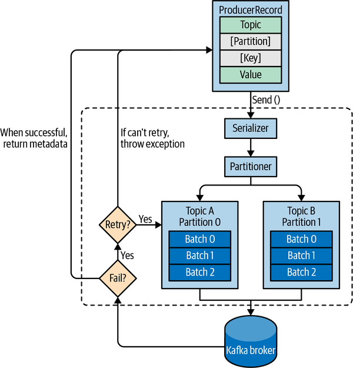
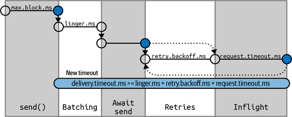
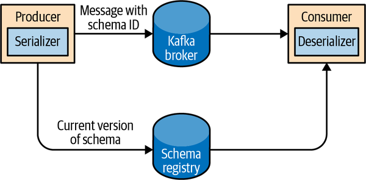

# Chương 3. Kafka Producer: Ghi message vào Kafka (Kafka Producers: Writing Messages to Kafka)

Dù bạn dùng Kafka như một hàng đợi (queue), một message bus, hay một nền tảng lưu trữ dữ liệu, bạn sẽ luôn sử dụng Kafka bằng cách tạo ra một producer ghi dữ liệu vào Kafka, một consumer đọc dữ liệu từ Kafka, hoặc một ứng dụng đảm nhiệm cả hai vai trò đó.

Ví dụ, trong một hệ thống xử lý giao dịch thẻ tín dụng, sẽ có một ứng dụng client — có thể là một cửa hàng trực tuyến — chịu trách nhiệm gửi từng giao dịch vào Kafka ngay khi một khoản thanh toán được thực hiện. Một ứng dụng khác chịu trách nhiệm kiểm tra ngay lập tức giao dịch này với một rules engine và xác định xem giao dịch được chấp thuận hay bị từ chối. Phản hồi chấp thuận/từ chối sau đó có thể được ghi ngược trở lại Kafka, và phản hồi này có thể lan truyền trở lại cửa hàng trực tuyến nơi giao dịch được khởi tạo. Một ứng dụng thứ ba có thể đọc cả các giao dịch lẫn trạng thái chấp thuận từ Kafka và lưu chúng vào một cơ sở dữ liệu, nơi các nhà phân tích sau này có thể xem lại các quyết định và có thể cải thiện rules engine.

Apache Kafka đi kèm sẵn các client API tích hợp mà các lập trình viên có thể sử dụng khi phát triển các ứng dụng tương tác với Kafka.

Trong chương này chúng ta sẽ học cách sử dụng Kafka producer, bắt đầu bằng tổng quan về thiết kế và các thành phần của nó. Chúng ta sẽ trình bày cách tạo các đối tượng `KafkaProducer` và `ProducerRecord`, cách gửi record vào Kafka, và cách xử lý các lỗi mà Kafka có thể trả về. Sau đó chúng ta sẽ xem lại các tùy chọn cấu hình quan trọng nhất được dùng để điều khiển hành vi của producer. Chúng ta sẽ kết thúc bằng một cái nhìn sâu hơn về cách sử dụng các phương pháp phân vùng (partitioning) và các serializer khác nhau, cũng như cách tự viết serializer và partitioner của riêng bạn.

Trong Chương 4, chúng ta sẽ xem xét consumer client của Kafka và việc đọc dữ liệu từ Kafka.

> **CÁC CLIENT CỦA BÊN THỨ BA (THIRD-PARTY CLIENTS)**
>
> Ngoài các client tích hợp sẵn, Kafka còn có một wire protocol dạng nhị phân. Điều này nghĩa là các ứng dụng có thể đọc message từ Kafka hoặc ghi message vào Kafka đơn giản bằng cách gửi đúng chuỗi byte tới cổng mạng của Kafka. Có nhiều client hiện thực wire protocol của Kafka bằng các ngôn ngữ lập trình khác nhau, cung cấp những cách đơn giản để dùng Kafka không chỉ trong các ứng dụng Java mà còn trong các ngôn ngữ như C++, Python, Go, và nhiều ngôn ngữ khác. Các client đó không thuộc dự án Apache Kafka, nhưng danh sách các client không phải Java được duy trì trong wiki của dự án. Wire protocol và các client bên ngoài nằm ngoài phạm vi của chương này.

## Tổng quan về Producer (Producer Overview)

Có rất nhiều lý do khiến một ứng dụng cần ghi message vào Kafka: ghi lại hoạt động của người dùng để phục vụ kiểm toán hoặc phân tích, ghi lại các metric, lưu trữ log message, ghi lại thông tin từ các thiết bị thông minh, giao tiếp bất đồng bộ với các ứng dụng khác, buffer thông tin trước khi ghi vào cơ sở dữ liệu, và nhiều hơn thế nữa.

Những tình huống sử dụng đa dạng đó cũng kéo theo những yêu cầu đa dạng: liệu mọi message đều tối quan trọng, hay chúng ta có thể chấp nhận mất mát message? Chúng ta có chấp nhận việc vô tình nhân bản message không? Có yêu cầu nghiêm ngặt nào về latency hay throughput mà chúng ta cần đáp ứng không?

Trong ví dụ xử lý giao dịch thẻ tín dụng chúng ta giới thiệu ở trên, có thể thấy rằng việc không bao giờ mất một message nào hay nhân bản bất kỳ message nào là tối quan trọng. Latency nên thấp, nhưng có thể chấp nhận latency lên tới 500 ms, và throughput phải rất cao — chúng ta kỳ vọng xử lý tới một triệu message mỗi giây.

Một tình huống sử dụng khác có thể là lưu trữ thông tin click từ một website. Trong trường hợp đó, có thể chấp nhận mất một số message hoặc có vài bản trùng lặp; latency có thể cao miễn là không ảnh hưởng tới trải nghiệm người dùng. Nói cách khác, chúng ta không bận tâm nếu message mất vài giây mới tới được Kafka, miễn là trang tiếp theo được nạp ngay lập tức sau khi người dùng bấm vào một liên kết. Throughput sẽ phụ thuộc vào mức độ hoạt động mà chúng ta dự đoán trên website của mình.

Những yêu cầu khác nhau sẽ ảnh hưởng tới cách bạn sử dụng producer API để ghi message vào Kafka và cấu hình mà bạn dùng.

Mặc dù producer API rất đơn giản, nhưng có khá nhiều thứ diễn ra "dưới nắp capo" của producer khi chúng ta gửi dữ liệu. Hình 3-1 cho thấy các bước chính liên quan đến việc gửi dữ liệu tới Kafka.



**Hình 3-1. Tổng quan ở mức cao về các thành phần của Kafka producer**

Chúng ta bắt đầu produce message tới Kafka bằng cách tạo một `ProducerRecord`, đối tượng này bắt buộc phải bao gồm topic mà chúng ta muốn gửi record tới và một value. Tùy chọn, chúng ta cũng có thể chỉ định một key, một partition, một timestamp, và/hoặc một tập hợp các header. Khi chúng ta gửi `ProducerRecord`, điều đầu tiên producer làm là serialize các đối tượng key và value thành mảng byte để chúng có thể được gửi qua mạng.

Tiếp theo, nếu chúng ta không chỉ định partition một cách tường minh, dữ liệu sẽ được gửi tới một partitioner. Partitioner sẽ chọn một partition cho chúng ta, thường dựa trên key của `ProducerRecord`. Khi một partition đã được chọn, producer biết record sẽ đi tới topic và partition nào. Sau đó nó thêm record vào một batch các record cũng sẽ được gửi tới cùng topic và partition đó. Một thread riêng biệt chịu trách nhiệm gửi các batch record này tới các Kafka broker phù hợp.

Khi broker nhận được các message, nó gửi lại một response. Nếu các message đã được ghi thành công vào Kafka, nó sẽ trả về một đối tượng `RecordMetadata` chứa topic, partition, và offset của record trong partition đó. Nếu broker không ghi được các message, nó sẽ trả về một lỗi. Khi producer nhận được lỗi, nó có thể thử gửi lại message thêm vài lần nữa trước khi bỏ cuộc và trả về lỗi.

## Khởi tạo một Kafka Producer (Constructing a Kafka Producer)

Bước đầu tiên để ghi message vào Kafka là tạo một đối tượng producer với các thuộc tính bạn muốn truyền cho producer. Một Kafka producer có ba thuộc tính bắt buộc:

- `bootstrap.servers`

  Danh sách các cặp `host:port` của các broker mà producer sẽ dùng để thiết lập kết nối ban đầu tới Kafka cluster. Danh sách này không cần chứa tất cả broker, vì producer sẽ lấy thêm thông tin sau kết nối ban đầu. Nhưng khuyến nghị là nên đưa vào ít nhất hai broker, để trong trường hợp một broker bị hỏng, producer vẫn có thể kết nối tới cluster.

- `key.serializer`

  Tên của một class sẽ được dùng để serialize key của các record mà chúng ta sẽ produce tới Kafka. Các Kafka broker kỳ vọng key và value của message là các mảng byte. Tuy nhiên, giao diện producer cho phép, thông qua các kiểu tham số hóa (parameterized type), gửi bất kỳ đối tượng Java nào làm key và value. Điều này khiến mã nguồn rất dễ đọc, nhưng cũng đồng nghĩa là producer phải biết cách chuyển đổi các đối tượng này thành mảng byte. `key.serializer` phải được đặt là tên của một class hiện thực interface `org.apache.kafka.common.serialization.Serializer`. Producer sẽ dùng class này để serialize đối tượng key thành một mảng byte. Gói Kafka client bao gồm `ByteArraySerializer` (class này không làm gì nhiều), `StringSerializer`, `IntegerSerializer`, và nhiều class khác, nên nếu bạn dùng các kiểu dữ liệu thông dụng thì không cần phải tự hiện thực serializer riêng. Việc thiết lập `key.serializer` là bắt buộc ngay cả khi bạn chỉ có ý định gửi value, nhưng bạn có thể dùng kiểu `Void` cho key và `VoidSerializer`.

- `value.serializer`

  Tên của một class sẽ được dùng để serialize value của các record mà chúng ta sẽ produce tới Kafka. Tương tự như cách bạn đặt `key.serializer` thành tên của một class sẽ serialize đối tượng key của message thành mảng byte, bạn đặt `value.serializer` thành một class sẽ serialize đối tượng value của message.

Đoạn mã sau đây minh họa cách tạo một producer mới bằng cách chỉ thiết lập các tham số bắt buộc và dùng giá trị mặc định cho mọi thứ còn lại:

```java
Properties kafkaProps = new Properties();
kafkaProps.put("bootstrap.servers", "broker1:9092,broker2:9092");

kafkaProps.put("key.serializer",
       "org.apache.kafka.common.serialization.StringSerializer");
kafkaProps.put("value.serializer",
       "org.apache.kafka.common.serialization.StringSerializer");


producer = new KafkaProducer<String, String>(kafkaProps);
```

1. Chúng ta bắt đầu bằng một đối tượng `Properties`.
2. Vì chúng ta dự định dùng chuỗi (string) cho key và value của message, chúng ta dùng `StringSerializer` có sẵn.
3. Ở đây chúng ta tạo một producer mới bằng cách thiết lập các kiểu key và value phù hợp và truyền vào đối tượng `Properties`.

Với một giao diện đơn giản như vậy, rõ ràng là phần lớn khả năng kiểm soát hành vi của producer được thực hiện thông qua việc thiết lập đúng các thuộc tính cấu hình. Tài liệu của Apache Kafka bao trùm tất cả các tùy chọn cấu hình, và chúng ta sẽ đi qua những tùy chọn quan trọng ở phần sau của chương này.

Khi chúng ta đã khởi tạo một producer, đã đến lúc bắt đầu gửi message. Có ba phương pháp chính để gửi message:

- **Fire-and-forget** (gửi rồi quên)

  Chúng ta gửi một message tới server và không thực sự quan tâm nó có tới nơi thành công hay không. Phần lớn thời gian, nó sẽ tới nơi thành công, vì Kafka có tính sẵn sàng cao và producer sẽ tự động thử gửi lại message. Tuy nhiên, trong trường hợp có lỗi không thể retry hoặc timeout, message sẽ bị mất và ứng dụng sẽ không nhận được bất kỳ thông tin hay exception nào về việc này.

- **Synchronous send** (gửi đồng bộ)

  Về mặt kỹ thuật, Kafka producer luôn luôn bất đồng bộ — chúng ta gửi một message và phương thức `send()` trả về một đối tượng `Future`. Tuy nhiên, chúng ta dùng `get()` để chờ trên `Future` và xem `send()` có thành công hay không trước khi gửi record tiếp theo.

- **Asynchronous send** (gửi bất đồng bộ)

  Chúng ta gọi phương thức `send()` kèm theo một hàm callback, hàm này được kích hoạt khi nhận được response từ Kafka broker.

Trong các ví dụ tiếp theo, chúng ta sẽ thấy cách gửi message bằng các phương pháp này và cách xử lý các loại lỗi khác nhau có thể xảy ra.

Mặc dù tất cả các ví dụ trong chương này đều đơn luồng (single threaded), một đối tượng producer có thể được nhiều thread cùng sử dụng để gửi message.

## Gửi message tới Kafka (Sending a Message to Kafka)

Cách đơn giản nhất để gửi một message như sau:

```java
ProducerRecord<String, String> record =
    new ProducerRecord<>("CustomerCountry", "Precision Products",
            "France");
try {
    producer.send(record);
} catch (Exception e) {
     e.printStackTrace();
}
```

1. Producer nhận vào các đối tượng `ProducerRecord`, nên chúng ta bắt đầu bằng việc tạo một đối tượng như vậy. `ProducerRecord` có nhiều constructor, chúng ta sẽ bàn tới sau. Ở đây chúng ta dùng constructor yêu cầu tên của topic mà chúng ta đang gửi dữ liệu tới — luôn là một chuỗi — cùng key và value mà chúng ta đang gửi tới Kafka, trong trường hợp này cũng là chuỗi. Kiểu của key và value phải khớp với các đối tượng key serializer và value serializer của chúng ta.
2. Chúng ta dùng phương thức `send()` của đối tượng producer để gửi `ProducerRecord`. Như đã thấy trong sơ đồ kiến trúc producer ở Hình 3-1, message sẽ được đặt vào một buffer và sẽ được gửi tới broker trong một thread riêng. Phương thức `send()` trả về một đối tượng `Future` của Java chứa `RecordMetadata`, nhưng vì chúng ta chỉ đơn giản bỏ qua giá trị trả về, chúng ta không có cách nào biết được message đã được gửi thành công hay chưa. Phương pháp gửi message này có thể được dùng khi việc âm thầm bỏ rơi một message là chấp nhận được. Điều này thường không đúng với các ứng dụng chạy trong môi trường production.
3. Mặc dù chúng ta bỏ qua các lỗi có thể xảy ra khi gửi message tới các Kafka broker hoặc xảy ra ngay trong các broker, chúng ta vẫn có thể nhận được một exception nếu producer gặp lỗi trước khi gửi message tới Kafka. Đó có thể là, ví dụ, một `SerializationException` khi nó không serialize được message, một `BufferExhaustedException` hoặc `TimeoutException` nếu buffer đã đầy, hoặc một `InterruptException` nếu thread gửi bị ngắt.

### Gửi message đồng bộ (Sending a Message Synchronously)

Gửi message đồng bộ thì đơn giản nhưng vẫn cho phép producer bắt được exception khi Kafka phản hồi produce request bằng một lỗi, hoặc khi các lần retry gửi đã cạn kiệt. Đánh đổi chính ở đây là hiệu năng. Tùy vào mức độ bận rộn của Kafka cluster, broker có thể mất từ 2 ms tới vài giây để phản hồi các produce request. Nếu bạn gửi message đồng bộ, thread gửi sẽ dành khoảng thời gian đó để chờ và không làm gì khác, thậm chí không gửi thêm message nào. Điều này dẫn tới hiệu năng rất kém, và do đó, gửi đồng bộ thường không được dùng trong các ứng dụng production (nhưng lại rất phổ biến trong các ví dụ mã nguồn).

Cách đơn giản nhất để gửi một message đồng bộ như sau:

```java
ProducerRecord<String, String> record =
     new ProducerRecord<>("CustomerCountry", "Precision Products", "France");
try {
     producer.send(record).get();
} catch (Exception e) {
     e.printStackTrace();
}
```

1. Ở đây, chúng ta dùng `Future.get()` để chờ phản hồi từ Kafka. Phương thức này sẽ ném ra một exception nếu record không được gửi thành công tới Kafka. Nếu không có lỗi nào, chúng ta sẽ nhận được một đối tượng `RecordMetadata` mà chúng ta có thể dùng để lấy offset mà message đã được ghi vào cùng các metadata khác.
2. Nếu có bất kỳ lỗi nào xảy ra trước hoặc trong khi gửi record tới Kafka, chúng ta sẽ gặp một exception. Trong trường hợp này, chúng ta chỉ đơn giản in ra bất kỳ exception nào gặp phải.

`KafkaProducer` có hai loại lỗi. Lỗi có thể retry (retriable error) là những lỗi có thể được giải quyết bằng cách gửi lại message. Ví dụ, một lỗi kết nối có thể được giải quyết vì kết nối có thể được thiết lập lại. Lỗi "not leader for partition" có thể được giải quyết khi một leader mới được bầu cho partition đó và metadata của client được làm mới. `KafkaProducer` có thể được cấu hình để tự động retry những lỗi đó, nên mã ứng dụng sẽ chỉ nhận được các retriable exception khi số lần retry đã cạn kiệt mà lỗi vẫn chưa được giải quyết. Một số lỗi sẽ không được giải quyết bằng việc retry — ví dụ, "Message size too large". Trong những trường hợp đó, `KafkaProducer` sẽ không cố retry mà sẽ trả về exception ngay lập tức.

### Gửi message bất đồng bộ (Sending a Message Asynchronously)

Giả sử thời gian khứ hồi (round-trip) qua mạng giữa ứng dụng của chúng ta và Kafka cluster là 10 ms. Nếu chúng ta chờ phản hồi sau mỗi lần gửi message, việc gửi 100 message sẽ mất khoảng 1 giây. Ngược lại, nếu chúng ta chỉ gửi tất cả message mà không chờ phản hồi nào, thì việc gửi 100 message gần như không tốn thời gian nào cả. Trong hầu hết trường hợp, chúng ta thực sự không cần phản hồi — Kafka gửi lại topic, partition, và offset của record sau khi nó được ghi, và những thông tin này thường không cần thiết đối với ứng dụng gửi. Mặt khác, chúng ta lại cần biết khi nào việc gửi một message thất bại hoàn toàn để có thể ném ra exception, ghi log lỗi, hoặc có thể ghi message vào một file "errors" để phân tích sau.

Để gửi message bất đồng bộ mà vẫn xử lý được các tình huống lỗi, producer hỗ trợ thêm một callback khi gửi record. Đây là một ví dụ về cách chúng ta dùng callback:

```java
private class DemoProducerCallback implements Callback {
    @Override
     public void onCompletion(RecordMetadata recordMetadata, Exception e) {
         if (e != null) {
                e.printStackTrace();
           }
     }
}


ProducerRecord<String, String> record =
     new ProducerRecord<>("CustomerCountry", "Biomedical Materials", "USA");
producer.send(record, new DemoProducerCallback());
```

1. Để dùng callback, bạn cần một class hiện thực interface `org.apache.kafka.clients.producer.Callback`, interface này chỉ có một hàm duy nhất — `onCompletion()`.
2. Nếu Kafka trả về một lỗi, `onCompletion()` sẽ nhận được một exception khác null. Ở đây chúng ta "xử lý" nó bằng cách in ra, nhưng mã production có lẽ sẽ có các hàm xử lý lỗi mạnh mẽ hơn.
3. Các record vẫn giống như trước.
4. Và chúng ta truyền kèm một đối tượng `Callback` khi gửi record.

> **Cảnh báo**
>
> Các callback được thực thi trong main thread của producer. Điều này đảm bảo rằng khi chúng ta gửi hai message tới cùng một partition lần lượt nối tiếp nhau, các callback của chúng sẽ được thực thi theo đúng thứ tự mà chúng ta đã gửi. Nhưng nó cũng có nghĩa là callback phải đủ nhanh để tránh làm chậm producer và ngăn các message khác được gửi đi. Không nên thực hiện thao tác blocking bên trong callback. Thay vào đó, bạn nên dùng một thread khác để thực hiện đồng thời bất kỳ thao tác blocking nào.

## Cấu hình Producer (Configuring Producers)

Cho tới giờ chúng ta mới chỉ thấy rất ít tham số cấu hình cho producer — chỉ có URI `bootstrap.servers` bắt buộc và các serializer.

Producer có một số lượng lớn tham số cấu hình được ghi trong tài liệu Apache Kafka, và nhiều tham số có giá trị mặc định hợp lý, nên không có lý do gì phải chỉnh sửa từng tham số một. Tuy nhiên, một số tham số có ảnh hưởng đáng kể tới việc sử dụng bộ nhớ, hiệu năng, và độ tin cậy của producer. Chúng ta sẽ xem xét những tham số đó ở đây.

### `client.id`

`client.id` là một định danh logic cho client và cho ứng dụng mà nó được sử dụng. Đây có thể là bất kỳ chuỗi nào và sẽ được các broker dùng để nhận diện các message được gửi từ client. Nó được dùng trong logging, trong metric, và cho quota. Việc chọn một tên client tốt sẽ khiến việc xử lý sự cố dễ dàng hơn nhiều — đó là sự khác biệt giữa "Chúng ta đang thấy tỉ lệ lỗi xác thực cao từ IP 104.27.155.134" và "Có vẻ như dịch vụ Order Validation đang không xác thực được — bạn có thể nhờ Laura xem giúp không?".

### `acks`

Tham số `acks` kiểm soát việc bao nhiêu partition replica phải nhận được record trước khi producer có thể coi việc ghi là thành công. Theo mặc định, Kafka sẽ phản hồi rằng record đã được ghi thành công sau khi leader nhận được record (phiên bản 3.0 của Apache Kafka dự kiến sẽ thay đổi giá trị mặc định này). Tùy chọn này có ảnh hưởng đáng kể tới độ bền dữ liệu của các message được ghi, và tùy vào tình huống sử dụng của bạn, giá trị mặc định có thể không phải là lựa chọn tốt nhất. Chương 7 bàn sâu về các đảm bảo độ tin cậy của Kafka, nhưng bây giờ hãy cùng xem lại ba giá trị được phép của tham số `acks`:

- `acks=0`

  Producer sẽ không chờ phản hồi từ broker trước khi giả định rằng message đã được gửi thành công. Điều này có nghĩa là nếu có gì đó sai sót và broker không nhận được message, producer sẽ không biết về việc đó, và message sẽ bị mất. Tuy nhiên, vì producer không chờ bất kỳ response nào từ server, nó có thể gửi message nhanh nhất mà mạng cho phép, nên thiết lập này có thể được dùng để đạt được throughput rất cao.

- `acks=1`

  Producer sẽ nhận được phản hồi thành công từ broker ngay tại thời điểm leader replica nhận được message. Nếu message không thể ghi được vào leader (ví dụ, nếu leader bị sập và một leader mới chưa được bầu), producer sẽ nhận được response lỗi và có thể thử gửi lại message, tránh khả năng mất dữ liệu. Message vẫn có thể bị mất nếu leader sập và các message mới nhất chưa được replicate sang leader mới.

- `acks=all`

  Producer sẽ nhận được phản hồi thành công từ broker khi tất cả các in-sync replica đã nhận được message. Đây là chế độ an toàn nhất vì bạn có thể chắc chắn rằng nhiều hơn một broker đã có message và message sẽ tồn tại ngay cả khi xảy ra sự cố sập (thêm thông tin về việc này ở Chương 6). Tuy nhiên, latency mà chúng ta đã bàn ở trường hợp `acks=1` sẽ còn cao hơn nữa, vì chúng ta sẽ phải chờ nhiều hơn một broker nhận được message.

> **Mẹo**
>
> Bạn sẽ thấy rằng với cấu hình `acks` thấp hơn và kém tin cậy hơn, producer sẽ có thể gửi record nhanh hơn. Điều này nghĩa là bạn đánh đổi độ tin cậy lấy latency của producer. Tuy nhiên, latency đầu-cuối (end-to-end latency) được đo từ thời điểm một record được produce cho tới khi nó sẵn sàng để consumer đọc, và nó là như nhau với cả ba tùy chọn. Lý do là, để duy trì tính nhất quán, Kafka sẽ không cho phép consumer đọc record cho tới khi chúng được ghi vào tất cả các in-sync replica. Do đó, nếu bạn quan tâm tới latency đầu-cuối, thay vì chỉ latency của producer, thì không có đánh đổi nào phải cân nhắc cả: bạn sẽ nhận được cùng một latency đầu-cuối nếu bạn chọn tùy chọn đáng tin cậy nhất.

### Thời gian gửi message (Message Delivery Time)

Producer có nhiều tham số cấu hình tương tác với nhau để kiểm soát một trong những hành vi mà các lập trình viên quan tâm nhất: sẽ mất bao lâu cho tới khi một lời gọi `send()` thành công hoặc thất bại. Đây là khoảng thời gian chúng ta sẵn sàng bỏ ra cho tới khi Kafka phản hồi thành công, hoặc cho tới khi chúng ta sẵn sàng bỏ cuộc và chấp nhận thất bại.

Các cấu hình này và hành vi của chúng đã được sửa đổi vài lần qua nhiều năm. Ở đây chúng ta sẽ mô tả cách hiện thực mới nhất, được giới thiệu trong Apache Kafka 2.1.

Kể từ Apache Kafka 2.1, chúng ta chia thời gian gửi một `ProduceRecord` thành hai khoảng thời gian được xử lý riêng biệt:

- Thời gian cho tới khi một lời gọi bất đồng bộ `send()` trả về. Trong khoảng này, thread đã gọi `send()` sẽ bị block.
- Từ thời điểm một lời gọi bất đồng bộ `send()` trả về thành công cho tới khi callback được kích hoạt (với thành công hoặc thất bại). Khoảng này tương đương với thời gian từ lúc một `ProducerRecord` được đặt vào một batch để gửi cho tới khi Kafka phản hồi thành công, thất bại không thể retry, hoặc chúng ta hết thời gian được cấp cho việc gửi.

> **Lưu ý**
>
> Nếu bạn dùng `send()` một cách đồng bộ, thread gửi sẽ block liên tục trong cả hai khoảng thời gian, và bạn sẽ không thể biết được thời gian nào đã bị tiêu tốn cho khoảng nào. Chúng ta sẽ bàn về trường hợp phổ biến và được khuyến nghị, trong đó `send()` được dùng bất đồng bộ, kèm callback.

Luồng dữ liệu bên trong producer và cách các tham số cấu hình khác nhau ảnh hưởng lẫn nhau có thể được tóm lược trong Hình 3-2.[^1]



**Hình 3-2. Sơ đồ tuần tự (sequence diagram) phân rã thời gian gửi bên trong Kafka producer**

Chúng ta sẽ đi qua các tham số cấu hình khác nhau dùng để kiểm soát thời gian chờ trong hai khoảng này và cách chúng tương tác với nhau.

#### `max.block.ms`

Tham số này kiểm soát việc producer có thể block bao lâu khi gọi `send()` và khi yêu cầu metadata một cách tường minh qua `partitionsFor()`. Các phương thức đó có thể block khi buffer gửi của producer đã đầy hoặc khi metadata không có sẵn. Khi đạt tới `max.block.ms`, một timeout exception sẽ được ném ra.

#### `delivery.timeout.ms`

Cấu hình này sẽ giới hạn lượng thời gian tính từ thời điểm một record sẵn sàng để gửi (`send()` đã trả về thành công và record đã được đặt vào một batch) cho tới khi broker phản hồi hoặc client bỏ cuộc, bao gồm cả thời gian dành cho các lần retry. Như bạn có thể thấy trong Hình 3-2, thời gian này phải lớn hơn `linger.ms` và `request.timeout.ms`. Nếu bạn thử tạo một producer với cấu hình timeout không nhất quán, bạn sẽ nhận được một exception. Message có thể được gửi thành công nhanh hơn nhiều so với `delivery.timeout.ms`, và thường là như vậy.

Nếu producer vượt quá `delivery.timeout.ms` trong khi đang retry, callback sẽ được gọi với exception tương ứng với lỗi mà broker đã trả về trước lần retry đó. Nếu `delivery.timeout.ms` bị vượt quá trong khi batch record vẫn còn đang chờ được gửi, callback sẽ được gọi với một timeout exception.

> **Mẹo**
>
> Bạn có thể cấu hình delivery timeout bằng khoảng thời gian tối đa mà bạn muốn chờ để một message được gửi đi, thường là vài phút, rồi để nguyên số lần retry mặc định (gần như vô hạn). Với cấu hình này, producer sẽ tiếp tục retry chừng nào nó còn thời gian để thử tiếp (hoặc cho tới khi thành công). Đây là cách suy nghĩ hợp lý hơn nhiều về việc retry. Quy trình thông thường của chúng ta để tinh chỉnh retry là: "Trong trường hợp một broker bị sập, việc bầu leader thường mất 30 giây để hoàn tất, vậy hãy cứ retry trong 120 giây cho chắc chắn." Thay vì phải chuyển đổi đoạn đối thoại nội tâm này thành số lần retry và thời gian giữa các lần retry, bạn chỉ cần cấu hình `deliver.timeout.ms` thành 120.

#### `request.timeout.ms`

Tham số này kiểm soát việc producer sẽ chờ phản hồi từ server bao lâu khi gửi dữ liệu. Lưu ý rằng đây là thời gian chờ trên mỗi producer request trước khi bỏ cuộc; nó không bao gồm các lần retry, thời gian trước khi gửi, v.v. Nếu hết timeout mà không có phản hồi, producer sẽ hoặc thử gửi lại hoặc hoàn tất callback với một `TimeoutException`.

#### `retries` và `retry.backoff.ms`

Khi producer nhận được một message lỗi từ server, lỗi đó có thể chỉ là tạm thời (ví dụ, thiếu leader cho một partition). Trong trường hợp này, giá trị của tham số `retries` sẽ kiểm soát việc producer sẽ thử gửi lại message bao nhiêu lần trước khi bỏ cuộc và thông báo cho client về sự cố. Theo mặc định, producer sẽ chờ 100 ms giữa các lần retry, nhưng bạn có thể kiểm soát điều này bằng tham số `retry.backoff.ms`.

Chúng tôi khuyến nghị không nên dùng các tham số này trong phiên bản Kafka hiện tại. Thay vào đó, hãy kiểm thử xem mất bao lâu để phục hồi từ một broker bị sập (tức là mất bao lâu cho tới khi tất cả các partition có leader mới), và đặt `delivery.timeout.ms` sao cho tổng thời gian dành cho retry sẽ dài hơn thời gian mà Kafka cluster cần để phục hồi sau sự cố — nếu không, producer sẽ bỏ cuộc quá sớm.

Không phải mọi lỗi đều sẽ được producer retry. Một số lỗi không phải là tạm thời và sẽ không gây ra retry (ví dụ, lỗi "message too large"). Nhìn chung, vì producer đã xử lý retry giúp bạn, nên không có lý do gì để xử lý retry trong logic ứng dụng của riêng bạn. Bạn sẽ muốn tập trung công sức vào việc xử lý các lỗi không thể retry hoặc các trường hợp mà số lần retry đã cạn kiệt.

> **Mẹo**
>
> Nếu bạn muốn vô hiệu hóa hoàn toàn việc retry, đặt `retries=0` là cách duy nhất để làm điều đó.

### `linger.ms`

`linger.ms` kiểm soát khoảng thời gian chờ thêm message trước khi gửi batch hiện tại. `KafkaProducer` gửi một batch message hoặc khi batch hiện tại đã đầy hoặc khi đạt tới giới hạn `linger.ms`. Theo mặc định, producer sẽ gửi message ngay khi có một sender thread rảnh để gửi chúng, ngay cả khi trong batch chỉ có một message. Bằng cách đặt `linger.ms` lớn hơn 0, chúng ta chỉ thị cho producer chờ thêm vài mili giây để thêm message vào batch trước khi gửi nó tới các broker. Điều này làm tăng latency một chút và tăng throughput đáng kể — chi phí phát sinh (overhead) trên mỗi message thấp hơn nhiều, và việc nén (compression), nếu được bật, cũng tốt hơn nhiều.

### `buffer.memory`

Cấu hình này thiết lập lượng bộ nhớ mà producer sẽ dùng để buffer các message đang chờ được gửi tới broker. Nếu ứng dụng gửi message nhanh hơn tốc độ chúng có thể được chuyển tới server, producer có thể hết chỗ, và các lời gọi `send()` bổ sung sẽ block trong `max.block.ms` và chờ cho tới khi có chỗ trống được giải phóng trước khi ném ra exception. Lưu ý rằng, khác với hầu hết các exception của producer, timeout này được ném ra bởi `send()` chứ không phải bởi `Future` trả về.

### `compression.type`

Theo mặc định, message được gửi đi mà không nén. Tham số này có thể được đặt thành `snappy`, `gzip`, `lz4`, hoặc `zstd`, khi đó các thuật toán nén tương ứng sẽ được dùng để nén dữ liệu trước khi gửi tới các broker. Nén Snappy được Google phát minh để cung cấp tỉ lệ nén khá tốt với chi phí CPU thấp và hiệu năng tốt, nên nó được khuyến nghị trong các trường hợp mà cả hiệu năng lẫn băng thông đều là mối quan tâm. Nén Gzip thường tốn nhiều CPU và thời gian hơn nhưng cho tỉ lệ nén tốt hơn, nên nó được khuyến nghị trong các trường hợp băng thông mạng bị hạn chế hơn. Bằng cách bật nén, bạn giảm việc sử dụng mạng và dung lượng lưu trữ, vốn thường là điểm nghẽn (bottleneck) khi gửi message tới Kafka.

### `batch.size`

Khi nhiều record được gửi tới cùng một partition, producer sẽ gom chúng lại thành batch. Tham số này kiểm soát lượng bộ nhớ tính bằng byte (không phải số message!) sẽ được dùng cho mỗi batch. Khi batch đầy, tất cả message trong batch sẽ được gửi đi. Tuy nhiên, điều này không có nghĩa là producer sẽ chờ cho tới khi batch đầy. Producer sẽ gửi cả những batch mới đầy một nửa và thậm chí những batch chỉ có một message duy nhất. Do đó, đặt kích thước batch quá lớn sẽ không gây ra độ trễ trong việc gửi message; nó chỉ dùng nhiều bộ nhớ hơn cho các batch. Đặt kích thước batch quá nhỏ sẽ tạo thêm một chút overhead vì producer sẽ phải gửi message thường xuyên hơn.

### `max.in.flight.requests.per.connection`

Tham số này kiểm soát việc producer sẽ gửi bao nhiêu batch message tới server mà không cần nhận response. Thiết lập cao hơn có thể làm tăng mức sử dụng bộ nhớ nhưng cải thiện throughput. Các thử nghiệm trên wiki của Apache cho thấy trong môi trường một trung tâm dữ liệu (single-DC), throughput đạt tối đa chỉ với 2 request đang bay (in-flight); tuy nhiên, giá trị mặc định là 5 và cho hiệu năng tương tự.

> **ĐẢM BẢO THỨ TỰ (ORDERING GUARANTEES)**
>
> Apache Kafka bảo toàn thứ tự của các message trong một partition. Điều này nghĩa là nếu message được gửi từ producer theo một thứ tự cụ thể, broker sẽ ghi chúng vào partition theo đúng thứ tự đó và tất cả consumer sẽ đọc chúng theo thứ tự đó. Với một số tình huống sử dụng, thứ tự rất quan trọng. Có sự khác biệt lớn giữa việc gửi 100 đô la vào một tài khoản rồi sau đó rút ra, so với làm ngược lại! Tuy nhiên, một số tình huống sử dụng ít nhạy cảm hơn.
>
> Đặt tham số `retries` khác 0 và `max.in.flight.requests.per.connection` lớn hơn 1 nghĩa là có khả năng broker sẽ ghi thất bại batch message đầu tiên, ghi thành công batch thứ hai (batch này đã đang in-flight), rồi sau đó retry batch đầu tiên và thành công, qua đó đảo ngược thứ tự.
>
> Vì chúng ta muốn có ít nhất hai request in-flight vì lý do hiệu năng, và một số lần retry cao vì lý do độ tin cậy, giải pháp tốt nhất là đặt `enable.idempotence=true`. Điều này đảm bảo thứ tự message với tối đa năm request in-flight và cũng đảm bảo rằng các lần retry sẽ không tạo ra bản trùng lặp. Chương 8 bàn sâu về idempotent producer.

### `max.request.size`

Thiết lập này kiểm soát kích thước của một produce request được producer gửi đi. Nó giới hạn cả kích thước của message lớn nhất có thể được gửi lẫn số lượng message mà producer có thể gửi trong một request. Ví dụ, với kích thước request tối đa mặc định là 1 MB, message lớn nhất bạn có thể gửi là 1 MB, hoặc producer có thể gom 1.024 message kích thước 1 KB mỗi cái vào một request. Ngoài ra, broker cũng có giới hạn riêng về kích thước message lớn nhất mà nó chấp nhận (`message.max.bytes`). Thường thì nên để các cấu hình này khớp nhau, để producer sẽ không cố gửi những message có kích thước sẽ bị broker từ chối.

### `receive.buffer.bytes` và `send.buffer.bytes`

Đây là kích thước của các buffer gửi và nhận TCP được các socket sử dụng khi ghi và đọc dữ liệu. Nếu chúng được đặt là –1, giá trị mặc định của hệ điều hành sẽ được dùng. Nên tăng các giá trị này khi producer hoặc consumer giao tiếp với các broker ở một trung tâm dữ liệu khác, vì các liên kết mạng đó thường có latency cao hơn và băng thông thấp hơn.

### `enable.idempotence`

Bắt đầu từ phiên bản 0.11, Kafka hỗ trợ exactly once semantics. Exactly once là một chủ đề khá lớn, và chúng ta sẽ dành hẳn một chương cho nó, nhưng idempotent producer là một phần đơn giản và rất hữu ích của chủ đề này.

Giả sử bạn cấu hình producer của mình để tối đa hóa độ tin cậy: `acks=all` và một giá trị `delivery.timeout.ms` đủ lớn để cho phép retry đầy đủ. Những thiết lập này đảm bảo mỗi message sẽ được ghi vào Kafka ít nhất một lần. Trong một số trường hợp, điều này có nghĩa là message sẽ được ghi vào Kafka nhiều hơn một lần. Ví dụ, hãy tưởng tượng rằng một broker nhận được một record từ producer, ghi nó vào đĩa cục bộ, và record đã được replicate thành công tới các broker khác, nhưng rồi broker đầu tiên bị sập trước khi gửi response về cho producer. Producer sẽ chờ cho tới khi đạt `request.timeout.ms` rồi retry. Lần retry sẽ đi tới leader mới, mà leader này đã có một bản sao của record vì lần ghi trước đó đã được replicate thành công. Bây giờ bạn có một record trùng lặp.

Để tránh điều này, bạn có thể đặt `enable.idempotence=true`. Khi idempotent producer được bật, producer sẽ gắn một số thứ tự (sequence number) vào mỗi record mà nó gửi. Nếu broker nhận được các record có cùng sequence number, nó sẽ từ chối bản sao thứ hai và producer sẽ nhận được `DuplicateSequenceException` vô hại.

> **Lưu ý**
>
> Việc bật idempotence yêu cầu `max.in.flight.requests.per.connection` phải nhỏ hơn hoặc bằng 5, `retries` phải lớn hơn 0, và `acks=all`. Nếu đặt các giá trị không tương thích, một `ConfigException` sẽ được ném ra.

## Serializer (Serializers)

Như đã thấy trong các ví dụ trước, cấu hình producer bao gồm các serializer bắt buộc. Chúng ta đã thấy cách dùng serializer String mặc định. Kafka cũng có sẵn các serializer cho số nguyên, `ByteArrays`, và nhiều kiểu khác, nhưng chừng đó không bao trùm được hầu hết các tình huống sử dụng. Cuối cùng, bạn sẽ muốn có khả năng serialize các record tổng quát hơn.

Chúng ta sẽ bắt đầu bằng việc trình bày cách tự viết serializer của riêng bạn rồi giới thiệu Avro serializer như một lựa chọn thay thế được khuyến nghị.

### Serializer tùy chỉnh (Custom Serializers)

Khi đối tượng bạn cần gửi tới Kafka không phải là một chuỗi hay số nguyên đơn giản, bạn có lựa chọn hoặc là dùng một thư viện serialization tổng quát như Avro, Thrift, hay Protobuf để tạo record, hoặc là tạo một cách serialize tùy chỉnh cho các đối tượng bạn đang dùng sẵn. Chúng tôi rất khuyến nghị dùng một thư viện serialization tổng quát. Để hiểu các serializer hoạt động ra sao và tại sao dùng một thư viện serialization là ý tưởng tốt, hãy cùng xem việc tự viết một serializer tùy chỉnh đòi hỏi những gì.

Giả sử rằng thay vì chỉ ghi lại tên khách hàng, bạn tạo một class đơn giản để biểu diễn khách hàng:

```java
public class Customer {
    private int customerID;
     private String customerName;

     public Customer(int ID, String name) {
          this.customerID = ID;
          this.customerName = name;
     }


     public int getID() {
         return customerID;
     }

     public String getName() {
          return customerName;
     }
}
```

Bây giờ giả sử chúng ta muốn tạo một serializer tùy chỉnh cho class này. Nó sẽ trông giống như thế này:

```java
import org.apache.kafka.common.errors.SerializationException;

import java.nio.ByteBuffer;
import java.util.Map;

public class CustomerSerializer implements Serializer<Customer> {

     @Override
     public void configure(Map configs, boolean isKey) {
          // nothing to configure
     }


     @Override
     /**
     We are serializing Customer as:
     4 byte int representing customerId
     4 byte int representing length of customerName in UTF-8 bytes (0 if
          name is Null)
     N bytes representing customerName in UTF-8
     **/
     public byte[] serialize(String topic, Customer data) {
          try {
              byte[] serializedName;
                int stringSize;
                if (data == null)
                    return null;
                else {
                     if (data.getName() != null) {
                         serializedName = data.getName().getBytes("UTF-8");
                         stringSize = serializedName.length;
                     } else {
                          serializedName = new byte[0];
                          stringSize = 0;
                     }
                }

                ByteBuffer buffer = ByteBuffer.allocate(4 + 4 + stringSize);
                buffer.putInt(data.getID());
                buffer.putInt(stringSize);
                buffer.put(serializedName);


              return buffer.array();
          } catch (Exception e) {
                throw new SerializationException(
                    "Error when serializing Customer to byte[] " + e);
          }
     }

     @Override
     public void close() {
         // nothing to close
     }
}
```

Cấu hình một producer với `CustomerSerializer` này sẽ cho phép bạn định nghĩa `ProducerRecord<String, Customer>`, gửi dữ liệu `Customer` và truyền trực tiếp các đối tượng `Customer` cho producer. Ví dụ này khá đơn giản, nhưng bạn có thể thấy mã nguồn mong manh tới mức nào. Chẳng hạn, nếu chúng ta có quá nhiều khách hàng và cần đổi `customerID` sang `Long`, hoặc nếu chúng ta quyết định thêm một trường `startDate` vào `Customer`, chúng ta sẽ gặp vấn đề nghiêm trọng trong việc duy trì tính tương thích giữa message cũ và mới. Việc gỡ lỗi các vấn đề tương thích giữa các phiên bản serializer và deserializer khác nhau khá là thách thức: bạn phải so sánh các mảng byte thô. Tệ hơn nữa, nếu nhiều nhóm trong cùng một công ty cùng ghi dữ liệu `Customer` vào Kafka, tất cả họ sẽ phải dùng cùng các serializer và sửa mã nguồn vào đúng cùng một thời điểm.

Vì những lý do đó, chúng tôi khuyến nghị dùng các serializer và deserializer có sẵn như JSON, Apache Avro, Thrift, hay Protobuf. Trong phần tiếp theo, chúng ta sẽ mô tả Apache Avro rồi trình bày cách serialize các Avro record và gửi chúng tới Kafka.

### Serialize bằng Apache Avro (Serializing Using Apache Avro)

Apache Avro là một định dạng serialization dữ liệu trung lập về ngôn ngữ. Dự án được Doug Cutting tạo ra nhằm cung cấp một cách chia sẻ các file dữ liệu với đông đảo người dùng.

Dữ liệu Avro được mô tả bằng một schema độc lập với ngôn ngữ. Schema thường được mô tả bằng JSON, và việc serialize thường ra file nhị phân, mặc dù serialize sang JSON cũng được hỗ trợ. Avro giả định rằng schema hiện diện khi đọc và ghi file, thường bằng cách nhúng schema vào chính các file đó.

Một trong những tính năng thú vị nhất của Avro, và cũng là điều khiến nó phù hợp để dùng trong một hệ thống messaging như Kafka, là khi ứng dụng đang ghi message chuyển sang một schema mới nhưng tương thích, các ứng dụng đang đọc dữ liệu có thể tiếp tục xử lý message mà không cần bất kỳ thay đổi hay cập nhật nào.

Giả sử schema ban đầu là:

```json
{"namespace": "customerManagement.avro",
 "type": "record",
 "name": "Customer",
 "fields": [
      {"name": "id", "type": "int"},
      {"name": "name", "type": "string"},
      {"name": "faxNumber", "type": ["null", "string"], "default": "null"}
 ]
}
```

1. Các trường `id` và `name` là bắt buộc, trong khi `faxNumber` là tùy chọn và mặc định là `null`.

Chúng ta đã dùng schema này trong vài tháng và tạo ra vài terabyte dữ liệu ở định dạng này. Bây giờ giả sử chúng ta quyết định rằng ở phiên bản mới, chúng ta sẽ nâng cấp lên thế kỷ 21 và sẽ không còn trường số fax nữa mà thay vào đó dùng một trường email.

Schema mới sẽ là:

```json
{"namespace": "customerManagement.avro",
 "type": "record",
 "name": "Customer",
 "fields": [
        {"name": "id", "type": "int"},
        {"name": "name", "type": "string"},
        {"name": "email", "type": ["null", "string"], "default": "null"}
 ]
}
```

Bây giờ, sau khi nâng cấp lên phiên bản mới, các record cũ sẽ chứa `faxNumber` còn các record mới sẽ chứa `email`. Trong nhiều tổ chức, việc nâng cấp diễn ra chậm rãi và kéo dài nhiều tháng. Vì vậy chúng ta cần cân nhắc xem các ứng dụng chưa nâng cấp — vốn vẫn dùng số fax — và các ứng dụng đã nâng cấp — vốn dùng email — sẽ có thể xử lý tất cả các event trong Kafka như thế nào.

Ứng dụng đọc dữ liệu sẽ chứa các lời gọi tới những phương thức tương tự như `getName()`, `getId()`, và `getFaxNumber()`. Nếu nó gặp một message được ghi bằng schema mới, `getName()` và `getId()` sẽ tiếp tục hoạt động mà không cần sửa đổi gì, nhưng `getFaxNumber()` sẽ trả về `null` vì message sẽ không chứa số fax.

Bây giờ giả sử chúng ta nâng cấp ứng dụng đọc dữ liệu và nó không còn phương thức `getFaxNumber()` nữa mà thay vào đó là `getEmail()`. Nếu nó gặp một message được ghi bằng schema cũ, `getEmail()` sẽ trả về `null` vì các message cũ không chứa địa chỉ email.

Ví dụ này minh họa lợi ích của việc dùng Avro: mặc dù chúng ta đã thay đổi schema trong các message mà không thay đổi tất cả các ứng dụng đọc dữ liệu, sẽ không có exception hay lỗi gây gián đoạn nào, và cũng không cần cập nhật tốn kém đối với dữ liệu hiện có.

Tuy nhiên, có hai điều cần lưu ý trong tình huống này:

- Schema dùng để ghi dữ liệu và schema mà ứng dụng đọc kỳ vọng phải tương thích với nhau. Tài liệu của Avro có nêu các quy tắc tương thích.
- Deserializer sẽ cần truy cập được vào schema đã được dùng khi ghi dữ liệu, ngay cả khi nó khác với schema mà ứng dụng truy cập dữ liệu kỳ vọng. Trong các file Avro, schema ghi được đưa vào chính file đó, nhưng với message của Kafka thì có một cách xử lý tốt hơn. Chúng ta sẽ xem xét cách đó tiếp theo đây.

### Dùng Avro Record với Kafka (Using Avro Records with Kafka)

Khác với file Avro, nơi việc lưu toàn bộ schema trong file dữ liệu đi kèm một overhead khá hợp lý, việc lưu toàn bộ schema trong mỗi record thường sẽ làm kích thước record tăng hơn gấp đôi. Tuy nhiên, Avro vẫn đòi hỏi toàn bộ schema phải hiện diện khi đọc record, nên chúng ta cần đặt schema ở nơi khác. Để đạt được điều này, chúng ta tuân theo một mẫu kiến trúc phổ biến và dùng một Schema Registry. Schema Registry không thuộc Apache Kafka, nhưng có vài lựa chọn mã nguồn mở để chọn. Chúng ta sẽ dùng Confluent Schema Registry cho ví dụ này. Bạn có thể tìm mã nguồn của Schema Registry trên GitHub, hoặc bạn có thể cài đặt nó như một phần của Confluent Platform. Nếu bạn quyết định dùng Schema Registry, chúng tôi khuyến nghị xem tài liệu trên trang Confluent.

Ý tưởng là lưu tất cả các schema được dùng để ghi dữ liệu vào Kafka trong registry. Sau đó chúng ta chỉ đơn giản lưu định danh của schema trong record mà chúng ta produce tới Kafka. Các consumer sau đó có thể dùng định danh này để kéo record ra khỏi Schema Registry và deserialize dữ liệu. Điểm mấu chốt là tất cả công việc này — lưu schema vào registry và kéo nó ra khi cần — đều được thực hiện trong các serializer và deserializer. Mã nguồn produce dữ liệu tới Kafka chỉ đơn giản dùng Avro serializer giống như dùng bất kỳ serializer nào khác. Hình 3-3 minh họa quá trình này.



**Hình 3-3. Sơ đồ luồng serialize và deserialize các Avro record**

Đây là một ví dụ về cách produce các đối tượng Avro được sinh tự động tới Kafka (xem tài liệu Avro để biết cách sinh đối tượng từ các Avro schema):

```java
Properties props = new Properties();

props.put("bootstrap.servers", "localhost:9092");
props.put("key.serializer",
   "io.confluent.kafka.serializers.KafkaAvroSerializer");
props.put("value.serializer",
    "io.confluent.kafka.serializers.KafkaAvroSerializer");
props.put("schema.registry.url", schemaUrl);


String topic = "customerContacts";


Producer<String, Customer> producer = new KafkaProducer<>(props);

// We keep producing new events until someone ctrl-c
while (true) {
     Customer customer = CustomerGenerator.getNext();
     System.out.println("Generated customer " +
           customer.toString());
     ProducerRecord<String, Customer> record =
           new ProducerRecord<>(topic, customer.getName(), customer);
     producer.send(record);
}
```

1. Chúng ta dùng `KafkaAvroSerializer` để serialize các đối tượng của mình bằng Avro. Lưu ý rằng `KafkaAvroSerializer` cũng có thể xử lý các kiểu nguyên thủy, đó là lý do vì sao sau đó chúng ta có thể dùng `String` làm key của record và đối tượng `Customer` của mình làm value.
2. `schema.registry.url` là cấu hình của Avro serializer sẽ được producer truyền cho serializer. Nó đơn giản trỏ tới nơi chúng ta lưu các schema.
3. `Customer` là đối tượng được sinh tự động của chúng ta. Chúng ta nói với producer rằng các record của chúng ta sẽ chứa `Customer` làm value.
4. Class `Customer` không phải là một class Java thông thường (plain old Java object, hay POJO) mà là một đối tượng Avro chuyên biệt, được sinh ra từ một schema bằng cơ chế sinh mã của Avro. Avro serializer chỉ có thể serialize các đối tượng Avro, chứ không serialize POJO được. Việc sinh các class Avro có thể được thực hiện bằng `avro-tools.jar` hoặc bằng plug-in Avro Maven, cả hai đều thuộc Apache Avro. Xem hướng dẫn Apache Avro Getting Started (Java) để biết chi tiết cách sinh các class Avro.
5. Chúng ta cũng khởi tạo `ProducerRecord` với `Customer` làm kiểu của value, và truyền một đối tượng `Customer` khi tạo record mới.
6. Vậy là xong. Chúng ta gửi record cùng đối tượng `Customer` của mình, và `KafkaAvroSerializer` sẽ lo phần còn lại.

Avro cũng cho phép bạn dùng các đối tượng Avro tổng quát (generic Avro object), vốn được dùng như các map key-value, thay vì các đối tượng Avro được sinh tự động có các getter và setter khớp với schema đã dùng để sinh ra chúng. Để dùng các đối tượng Avro tổng quát, bạn chỉ cần cung cấp schema:

```java
Properties props = new Properties();
props.put("bootstrap.servers", "localhost:9092");
props.put("key.serializer",
    "io.confluent.kafka.serializers.KafkaAvroSerializer");
props.put("value.serializer",
    "io.confluent.kafka.serializers.KafkaAvroSerializer");
props.put("schema.registry.url", url);


String schemaString =
    "{\"namespace\": \"customerManagement.avro\",
      "\"type\": \"record\", " +
      "\"name\": \"Customer\"," +
      "\"fields\": [" +
        "{\"name\": \"id\", \"type\": \"int\"}," +
        "{\"name\": \"name\", \"type\": \"string\"}," +
        "{\"name\": \"email\", \"type\": " + "[\"null\",\"string\"], " +
         "\"default\":\"null\" }" +
    "]}";
Producer<String, GenericRecord> producer =
    new KafkaProducer<String, GenericRecord>(props);

Schema.Parser parser = new Schema.Parser();
Schema schema = parser.parse(schemaString);

for (int nCustomers = 0; nCustomers < customers; nCustomers++) {
     String name = "exampleCustomer" + nCustomers;
     String email = "example " + nCustomers + "@example.com";


     GenericRecord customer = new GenericData.Record(schema);
     customer.put("id", nCustomers);
     customer.put("name", name);
     customer.put("email", email);
     ProducerRecord<String, GenericRecord> data =
         new ProducerRecord<>("customerContacts", name, customer);
     producer.send(data);
}
```

1. Chúng ta vẫn dùng chính `KafkaAvroSerializer` đó.
2. Và chúng ta cung cấp URI của chính Schema Registry đó.
3. Nhưng bây giờ chúng ta cũng cần cung cấp Avro schema, vì nó không được cung cấp bởi một đối tượng do Avro sinh ra.
4. Kiểu đối tượng của chúng ta là `GenericRecord` của Avro, chúng ta khởi tạo nó với schema và dữ liệu mà chúng ta muốn ghi.
5. Khi đó value của `ProducerRecord` đơn giản là một `GenericRecord` chứa schema và dữ liệu của chúng ta. Serializer sẽ biết cách lấy schema từ record này, lưu nó vào Schema Registry, và serialize dữ liệu của đối tượng.

## Partition (Partitions)

Trong các ví dụ trước, các đối tượng `ProducerRecord` mà chúng ta tạo ra bao gồm tên topic, key, và value. Message của Kafka là các cặp key-value, và mặc dù có thể tạo một `ProducerRecord` chỉ với topic và value, với key mặc định là `null`, hầu hết ứng dụng đều produce record kèm key. Key phục vụ hai mục đích: chúng là thông tin bổ sung được lưu cùng message, và chúng thường cũng được dùng để quyết định message sẽ được ghi vào partition nào trong số các partition của topic (key cũng đóng vai trò quan trọng trong các compacted topic — chúng ta sẽ bàn về chúng ở Chương 6). Tất cả các message có cùng key sẽ đi tới cùng một partition. Điều này nghĩa là nếu một tiến trình chỉ đọc một tập con các partition trong một topic (thêm chi tiết ở Chương 4), tất cả các record của một key nhất định sẽ được đọc bởi cùng một tiến trình. Để tạo một record key-value, bạn chỉ cần tạo một `ProducerRecord` như sau:

```java
ProducerRecord<String, String> record =
     new ProducerRecord<>("CustomerCountry", "Laboratory Equipment", "USA");
```

Khi tạo message có key là null, bạn có thể đơn giản bỏ key ra:

```java
ProducerRecord<String, String> record =
     new ProducerRecord<>("CustomerCountry", "USA");
```

1. Ở đây, key sẽ đơn giản được đặt là `null`.

Khi key là null và partitioner mặc định được dùng, record sẽ được gửi ngẫu nhiên tới một trong các partition khả dụng của topic. Một thuật toán round-robin sẽ được dùng để cân bằng message giữa các partition. Bắt đầu từ producer của Apache Kafka 2.4, thuật toán round-robin được dùng trong partitioner mặc định khi xử lý các key null là dạng "dính" (sticky). Điều này nghĩa là nó sẽ lấp đầy một batch message gửi tới một partition duy nhất trước khi chuyển sang partition tiếp theo. Điều này cho phép gửi cùng một số lượng message tới Kafka bằng ít request hơn, dẫn tới latency thấp hơn và giảm mức sử dụng CPU trên broker.

Nếu key tồn tại và partitioner mặc định được dùng, Kafka sẽ băm (hash) key (dùng thuật toán băm riêng của nó, nên các giá trị hash sẽ không thay đổi khi Java được nâng cấp) và dùng kết quả để ánh xạ message tới một partition cụ thể. Vì việc một key luôn được ánh xạ tới cùng một partition là quan trọng, chúng ta dùng tất cả các partition trong topic để tính toán ánh xạ — chứ không chỉ các partition khả dụng. Điều này nghĩa là nếu một partition cụ thể không khả dụng khi bạn ghi dữ liệu vào nó, bạn có thể nhận được lỗi. Trường hợp này khá hiếm, như bạn sẽ thấy ở Chương 7 khi chúng ta bàn về replication và tính sẵn sàng của Kafka.

Ngoài partitioner mặc định, các client của Apache Kafka còn cung cấp `RoundRobinPartitioner` và `UniformStickyPartitioner`. Chúng cung cấp cơ chế gán partition ngẫu nhiên và gán partition ngẫu nhiên kiểu sticky ngay cả khi message có key. Chúng hữu ích khi key quan trọng đối với ứng dụng consume (ví dụ, có những ứng dụng ETL dùng key từ các record Kafka làm khóa chính khi nạp dữ liệu từ Kafka vào một cơ sở dữ liệu quan hệ), nhưng khối lượng công việc lại có thể bị lệch, khiến một key duy nhất có thể mang khối lượng công việc lớn không cân xứng. Dùng `UniformStickyPartitioner` sẽ cho kết quả là khối lượng công việc được phân bố đều trên tất cả các partition.

Khi partitioner mặc định được dùng, ánh xạ từ key tới partition chỉ nhất quán chừng nào số lượng partition trong một topic không thay đổi. Vậy nên chừng nào số lượng partition còn là hằng số, bạn có thể chắc chắn rằng, chẳng hạn, các record liên quan tới người dùng 045189 sẽ luôn được ghi vào partition 34. Điều này cho phép đủ loại tối ưu hóa khi đọc dữ liệu từ các partition. Tuy nhiên, ngay khi bạn thêm partition mới vào topic, điều này không còn được đảm bảo nữa — các record cũ sẽ ở lại partition 34 trong khi các record mới có thể được ghi vào một partition khác. Khi việc phân vùng theo key là quan trọng, giải pháp dễ nhất là tạo topic với số lượng partition đủ lớn (blog của Confluent có gợi ý về cách chọn số lượng partition) và không bao giờ thêm partition.

### Hiện thực chiến lược phân vùng tùy chỉnh (Implementing a custom partitioning strategy)

Cho tới giờ, chúng ta đã bàn về đặc tính của partitioner mặc định, là partitioner được dùng phổ biến nhất. Tuy nhiên, Kafka không giới hạn bạn chỉ ở việc phân vùng theo hash, và đôi khi có những lý do chính đáng để phân vùng dữ liệu theo cách khác. Ví dụ, giả sử bạn là một nhà cung cấp B2B và khách hàng lớn nhất của bạn là một công ty sản xuất thiết bị cầm tay tên là Bananas. Giả sử bạn làm ăn với khách hàng "Banana" nhiều tới mức hơn 10% giao dịch hằng ngày của bạn là với khách hàng này. Nếu bạn dùng phân vùng theo hash mặc định, các record của Banana sẽ được phân bổ vào cùng partition với các tài khoản khác, dẫn tới việc một partition lớn hơn nhiều so với phần còn lại. Điều này có thể khiến máy chủ hết dung lượng, việc xử lý bị chậm lại, v.v. Điều chúng ta thực sự muốn là dành riêng cho Banana một partition rồi dùng phân vùng theo hash để ánh xạ phần còn lại của các tài khoản vào tất cả các partition khác.

Đây là một ví dụ về partitioner tùy chỉnh:

```java
import org.apache.kafka.clients.producer.Partitioner;
import org.apache.kafka.common.Cluster;
import org.apache.kafka.common.PartitionInfo;
import org.apache.kafka.common.record.InvalidRecordException;
import org.apache.kafka.common.utils.Utils;

public class BananaPartitioner implements Partitioner {


      public void configure(Map<String, ?> configs) {}
     public int partition(String topic, Object key, byte[] keyBytes,
                                 Object value, byte[] valueBytes,
                                 Cluster cluster) {
           List<PartitionInfo> partitions = cluster.partitionsForTopic(topic);
           int numPartitions = partitions.size();


           if ((keyBytes == null) || (!(key instanceOf String)))
               throw new InvalidRecordException("We expect all messages " +
                     "to have customer name as key");

           if (((String) key).equals("Banana"))
                return numPartitions - 1; // Banana will always go to last partition

           // Other records will get hashed to the rest of the partitions
           return Math.abs(Utils.murmur2(keyBytes)) % (numPartitions - 1);
     }

     public void close() {}
}
```

1. Interface `Partitioner` bao gồm các phương thức `configure`, `partition`, và `close`. Ở đây chúng ta chỉ hiện thực `partition`, mặc dù đúng ra chúng ta nên truyền tên khách hàng đặc biệt qua `configure` thay vì hardcode nó trong `partition`.
2. Chúng ta chỉ kỳ vọng key kiểu `String`, nên chúng ta ném ra một exception nếu không phải như vậy.

## Header (Headers)

Ngoài key và value, các record còn có thể chứa header. Record header cho bạn khả năng thêm một số metadata về record Kafka, mà không cần thêm bất kỳ thông tin dư thừa nào vào cặp key/value của chính record đó. Header thường được dùng cho lineage (truy vết nguồn gốc) để chỉ ra nguồn của dữ liệu trong record, và để định tuyến hoặc truy vết message dựa trên thông tin header mà không cần phải phân tích chính message đó (có thể message đã được mã hóa và bộ định tuyến không có quyền truy cập vào dữ liệu).

Header được hiện thực dưới dạng một tập hợp có thứ tự gồm các cặp key/value. Key luôn luôn là một `String`, còn value có thể là bất kỳ đối tượng nào đã được serialize — hệt như value của message.

Đây là một ví dụ nhỏ minh họa cách thêm header vào một `ProduceRecord`:

```java
ProducerRecord<String, String> record =
     new ProducerRecord<>("CustomerCountry", "Precision Products", "France");


record.headers().add("privacy-level","YOLO".getBytes(StandardCharsets.UTF_8));
```

## Interceptor (Interceptors)

Có những lúc bạn muốn thay đổi hành vi của ứng dụng Kafka client mà không sửa mã nguồn của nó, có thể vì bạn muốn thêm một hành vi giống hệt nhau cho tất cả ứng dụng trong tổ chức. Hoặc có thể bạn không có quyền truy cập vào mã nguồn gốc.

Interceptor `ProducerInterceptor` của Kafka bao gồm hai phương thức chính:

- `ProducerRecord<K, V> onSend(ProducerRecord<K, V> record)`

  Phương thức này sẽ được gọi trước khi record được produce gửi tới Kafka, thực ra là trước cả khi nó được serialize. Khi ghi đè phương thức này, bạn có thể thu thập thông tin về record được gửi và thậm chí sửa đổi nó. Chỉ cần chắc chắn trả về một `ProducerRecord` hợp lệ từ phương thức này. Record mà phương thức này trả về sẽ được serialize và gửi tới Kafka.

- `void onAcknowledgement(RecordMetadata metadata, Exception exception)`

  Phương thức này sẽ được gọi nếu và khi Kafka phản hồi bằng một acknowledgment cho một lần gửi. Phương thức này không cho phép sửa đổi response từ Kafka, nhưng bạn có thể thu thập thông tin về response đó.

Các tình huống sử dụng phổ biến của producer interceptor bao gồm: thu thập thông tin giám sát và truy vết (monitoring, tracing); bổ sung cho message các header chuẩn, đặc biệt phục vụ mục đích theo dõi lineage; và che giấu (redact) thông tin nhạy cảm.

Đây là một ví dụ về một producer interceptor rất đơn giản. Interceptor này chỉ đơn giản đếm số message đã gửi và số ack đã nhận trong những khung thời gian cụ thể:

```java
public class CountingProducerInterceptor implements ProducerInterceptor {


    ScheduledExecutorService executorService =
            Executors.newSingleThreadScheduledExecutor();
    static AtomicLong numSent = new AtomicLong(0);
    static AtomicLong numAcked = new AtomicLong(0);


    public void configure(Map<String, ?> map) {
        Long windowSize = Long.valueOf(
                    (String) map.get("counting.interceptor.window.size.ms"));
        executorService.scheduleAtFixedRate(CountingProducerInterceptor::run,
                windowSize, windowSize, TimeUnit.MILLISECONDS);
    }


    public ProducerRecord onSend(ProducerRecord producerRecord) {
        numSent.incrementAndGet();
        return producerRecord;
    }


    public void onAcknowledgement(RecordMetadata recordMetadata, Exception e) {
        numAcked.incrementAndGet();
    }

    public void close() {
        executorService.shutdownNow();
    }

    public static void run() {
        System.out.println(numSent.getAndSet(0));
        System.out.println(numAcked.getAndSet(0));
    }

}
```

1. `ProducerInterceptor` là một interface `Configurable`. Bạn có thể ghi đè phương thức `configure` và thiết lập trước khi bất kỳ phương thức nào khác được gọi. Phương thức này nhận toàn bộ cấu hình của producer, và bạn có thể truy cập bất kỳ tham số cấu hình nào. Trong trường hợp này, chúng ta đã thêm một cấu hình của riêng mình và tham chiếu tới nó ở đây.
2. Khi một record được gửi, chúng ta tăng bộ đếm record và trả về record đó mà không sửa đổi gì.
3. Khi Kafka phản hồi bằng một ack, chúng ta tăng bộ đếm acknowledgment và không cần trả về gì cả.
4. Phương thức này được gọi khi producer đóng lại, cho chúng ta cơ hội dọn dẹp trạng thái của interceptor. Trong trường hợp này, chúng ta đóng thread mà mình đã tạo. Nếu bạn đã mở các file handle, kết nối tới các kho dữ liệu từ xa, hay những thứ tương tự, đây là nơi để đóng mọi thứ và tránh rò rỉ.

Như chúng ta đã đề cập trước đó, producer interceptor có thể được áp dụng mà không cần bất kỳ thay đổi nào trong mã của client. Để dùng interceptor ở trên với `kafka-console-producer`, một ứng dụng ví dụ đi kèm Apache Kafka, hãy làm theo ba bước đơn giản sau:

1. Thêm file jar của bạn vào classpath:

   ```bash
   export
   CLASSPATH=$CLASSPATH:~./target/CountProducerInterceptor-
   1.0-SNAPSHOT.jar
   ```

2. Tạo một file cấu hình bao gồm:

   ```properties
   interceptor.classes=com.shapira.examples.interceptors.C
   ountProducerInterceptor
   counting.interceptor.window.size.ms=10000
   ```

3. Chạy ứng dụng như bình thường, nhưng nhớ đưa vào cấu hình mà bạn đã tạo ở bước trước:

   ```bash
   bin/kafka-console-producer.sh --broker-list
   localhost:9092 --topic interceptor-test --
   producer.config producer.config
   ```

## Quota và Throttling (Quotas and Throttling)

Các Kafka broker có khả năng giới hạn tốc độ produce và consume message. Việc này được thực hiện thông qua cơ chế quota. Kafka có ba loại quota: produce, consume, và request. Quota produce và consume giới hạn tốc độ mà client có thể gửi và nhận dữ liệu, đo bằng byte mỗi giây. Quota request giới hạn tỉ lệ phần trăm thời gian mà broker dành để xử lý các request của client.

Quota có thể được áp dụng cho tất cả client bằng cách đặt quota mặc định, cho các client-id cụ thể, cho các user cụ thể, hoặc cả hai. Quota theo user chỉ có ý nghĩa trong các cluster đã cấu hình bảo mật và client có xác thực.

Quota produce và consume mặc định áp dụng cho tất cả client là một phần của file cấu hình Kafka broker. Ví dụ, để giới hạn mỗi producer gửi không quá 2 MBps trung bình, hãy thêm cấu hình sau vào file cấu hình broker: `quota.producer.default=2M`.

Mặc dù không được khuyến nghị, bạn cũng có thể cấu hình quota riêng cho một số client nhất định để ghi đè quota mặc định trong file cấu hình broker. Để cho phép clientA produce 4 MBps và clientB 10 MBps, bạn có thể dùng: `quota.producer.override="clientA:4M,clientB:10M"`.

Quota được chỉ định trong file cấu hình của Kafka là tĩnh, và bạn chỉ có thể sửa đổi chúng bằng cách thay đổi cấu hình rồi khởi động lại tất cả các broker. Vì client mới có thể xuất hiện bất cứ lúc nào, cách này rất bất tiện. Do đó, phương pháp thông thường để áp dụng quota cho các client cụ thể là thông qua cấu hình động, có thể được thiết lập bằng `kafka-config.sh` hoặc AdminClient API.

Hãy cùng xem vài ví dụ:

```bash
bin/kafka-configs         --bootstrap-server localhost:9092 --alter --add-config 'producer_byte_

bin/kafka-configs         --bootstrap-server localhost:9092 --alter --add-config 'producer_byte_

bin/kafka-configs         --bootstrap-server localhost:9092 --alter --add-config 'consumer_byte_
```

1. Giới hạn clientC (được nhận diện bằng client-id) chỉ được produce 1024 byte mỗi giây.
2. Giới hạn user1 (được nhận diện bằng principal đã xác thực) chỉ được produce 1024 byte mỗi giây và consume 2048 byte mỗi giây.
3. Giới hạn tất cả user chỉ được consume 2048 byte mỗi giây, ngoại trừ những user có thiết lập ghi đè cụ thể hơn. Đây là cách để sửa đổi quota mặc định một cách động.

Khi một client đạt tới quota của mình, broker sẽ bắt đầu throttle (điều tiết) các request của client đó để ngăn nó vượt quá quota. Điều này nghĩa là broker sẽ trì hoãn các response cho request của client; ở hầu hết các client, việc này sẽ tự động giảm tốc độ gửi request (vì số lượng request in-flight bị giới hạn) và kéo lưu lượng của client xuống mức mà quota cho phép. Để bảo vệ broker khỏi các client cư xử không đúng mực vẫn gửi thêm request trong khi đang bị throttle, broker cũng sẽ tắt tiếng (mute) kênh giao tiếp với client đó trong khoảng thời gian cần thiết để đạt được sự tuân thủ quota.

Hành vi throttling được phơi bày cho client thông qua `produce-throttle-time-avg`, `produce-throttle-time-max`, `fetch-throttle-time-avg`, và `fetch-throttle-time-max`, là khoảng thời gian trung bình và tối đa mà một produce request và một fetch request bị trì hoãn do throttling. Lưu ý rằng thời gian này có thể biểu thị throttling do quota throughput của produce và consume, do quota thời gian request, hoặc cả hai. Các loại request client khác chỉ có thể bị throttle do quota thời gian request, và chúng cũng sẽ được phơi bày qua các metric tương tự.

> **Cảnh báo**
>
> Nếu bạn dùng `Producer.send()` bất đồng bộ và tiếp tục gửi message với tốc độ cao hơn tốc độ mà broker có thể chấp nhận (dù là do quota hay đơn giản là do năng lực xử lý), các message trước tiên sẽ được xếp hàng trong bộ nhớ của client. Nếu tốc độ gửi tiếp tục cao hơn tốc độ chấp nhận message, cuối cùng client sẽ hết dung lượng buffer để lưu các message dư thừa và sẽ block lời gọi `Producer.send()` tiếp theo. Nếu khoảng trễ timeout không đủ để broker theo kịp producer và giải phóng bớt chỗ trong buffer, cuối cùng `Producer.send()` sẽ ném ra `TimeoutException`. Hoặc, một số record đã được đặt vào các batch sẽ chờ lâu hơn `delivery.timeout.ms` và hết hạn, dẫn tới việc gọi callback của `send()` với một `TimeoutException`. Do đó, việc lập kế hoạch và giám sát để đảm bảo năng lực của broker theo thời gian sẽ tương xứng với tốc độ mà các producer gửi dữ liệu là rất quan trọng.

## Tóm tắt (Summary)

Chúng ta bắt đầu chương này bằng một ví dụ đơn giản về producer — chỉ 10 dòng mã gửi event tới Kafka. Chúng ta đã bổ sung cho ví dụ đơn giản đó phần xử lý lỗi và thử nghiệm việc produce đồng bộ lẫn bất đồng bộ. Sau đó chúng ta khám phá các tham số cấu hình producer quan trọng nhất và thấy chúng thay đổi hành vi của producer ra sao. Chúng ta đã bàn về serializer, thứ cho phép chúng ta kiểm soát định dạng của các event mà chúng ta ghi vào Kafka. Chúng ta đã xem xét sâu về Avro, một trong nhiều cách serialize event nhưng là cách được dùng rất phổ biến với Kafka. Chúng ta kết thúc chương bằng phần thảo luận về phân vùng trong Kafka và một ví dụ về kỹ thuật phân vùng tùy chỉnh nâng cao.

Giờ đây khi đã biết cách ghi event vào Kafka, trong Chương 4 chúng ta sẽ tìm hiểu mọi thứ về việc consume event từ Kafka.

## Chú thích

[^1]: Hình ảnh được Sumant Tambe đóng góp cho dự án Apache Kafka theo các điều khoản của giấy phép ASLv2.
