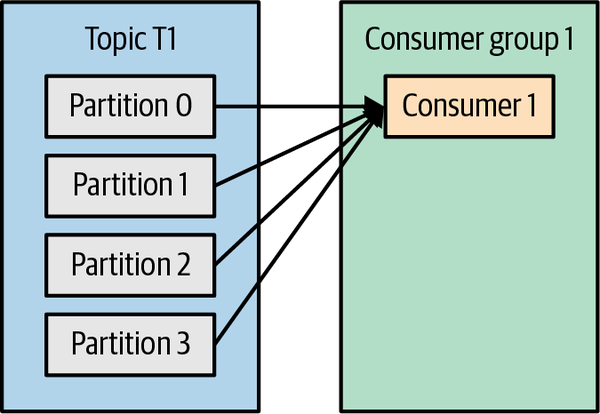
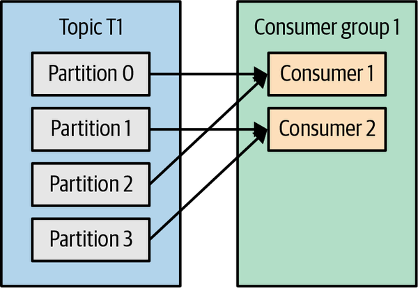
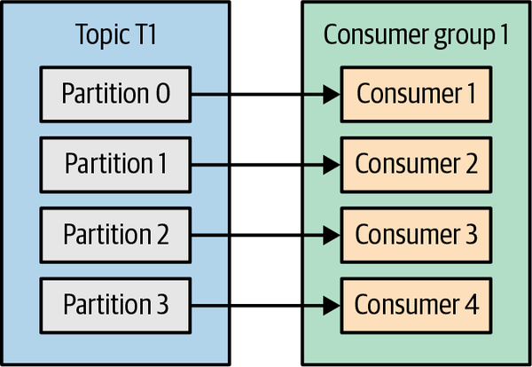
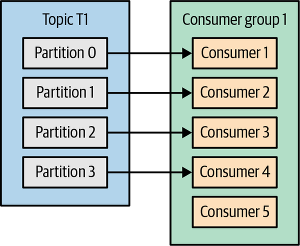
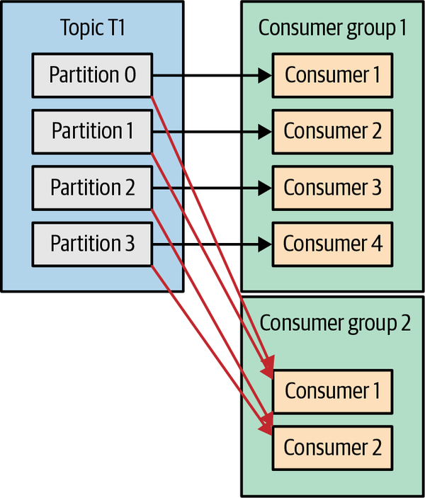
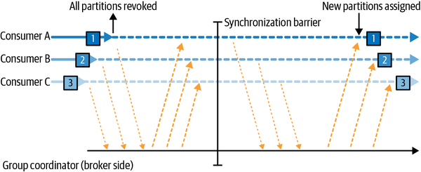
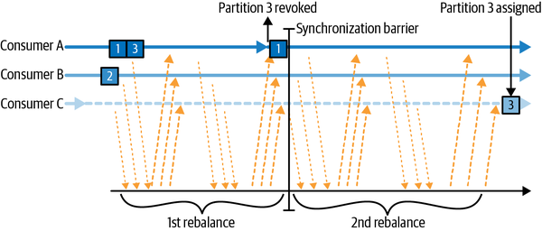
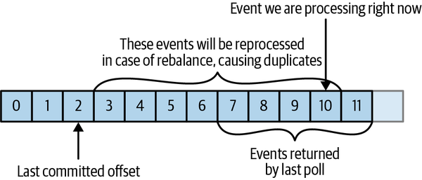
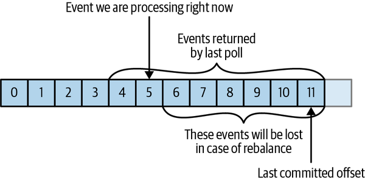

# Chương 4. Kafka Consumer: Đọc dữ liệu từ Kafka (Kafka Consumers: Reading Data from Kafka)

Các ứng dụng cần đọc dữ liệu từ Kafka sẽ dùng một `KafkaConsumer` để subscribe (đăng ký) vào các Kafka topic và nhận message từ những topic đó. Việc đọc dữ liệu từ Kafka hơi khác so với đọc dữ liệu từ các hệ thống messaging khác, và có một vài khái niệm cùng ý tưởng đặc thù liên quan. Sẽ khá khó để hiểu cách dùng Consumer API nếu trước tiên bạn chưa nắm được những khái niệm này. Chúng ta sẽ bắt đầu bằng việc giải thích một số khái niệm quan trọng, sau đó đi qua một vài ví dụ minh họa các cách khác nhau mà Consumer API có thể được dùng để xây dựng những ứng dụng với các yêu cầu khác nhau.

## Khái niệm về Kafka Consumer (Kafka Consumer Concepts)

Để hiểu cách đọc dữ liệu từ Kafka, trước tiên bạn cần hiểu về consumer và consumer group của nó. Các mục sau đây trình bày những khái niệm đó.

### Consumer và Consumer Group

Giả sử bạn có một ứng dụng cần đọc message từ một Kafka topic, chạy một số kiểm tra hợp lệ trên chúng, rồi ghi kết quả vào một kho dữ liệu khác. Trong trường hợp này, ứng dụng của bạn sẽ tạo một đối tượng consumer, subscribe vào topic phù hợp, rồi bắt đầu nhận message, kiểm tra chúng, và ghi kết quả. Cách này có thể hoạt động tốt trong một thời gian, nhưng điều gì xảy ra nếu tốc độ mà producer ghi message vào topic vượt quá tốc độ mà ứng dụng của bạn có thể kiểm tra chúng? Nếu bạn bị giới hạn ở một consumer duy nhất đọc và xử lý dữ liệu, ứng dụng của bạn có thể tụt lại ngày càng xa, không thể theo kịp tốc độ message đến. Rõ ràng là có nhu cầu mở rộng (scale) việc tiêu thụ dữ liệu từ topic. Cũng giống như nhiều producer có thể ghi vào cùng một topic, chúng ta cần cho phép nhiều consumer đọc từ cùng một topic, chia dữ liệu ra giữa chúng.

Kafka consumer thường là một phần của một consumer group. Khi nhiều consumer cùng subscribe vào một topic và thuộc cùng một consumer group, mỗi consumer trong group sẽ nhận message từ một tập con khác nhau của các partition trong topic.

Hãy lấy topic T1 với bốn partition. Bây giờ giả sử chúng ta tạo một consumer mới, C1, là consumer duy nhất trong group G1, và dùng nó để subscribe vào topic T1. Consumer C1 sẽ nhận toàn bộ message từ cả bốn partition của T1. Xem Hình 4-1.



**Hình 4-1. Một consumer group với bốn partition**

Nếu chúng ta thêm một consumer khác, C2, vào group G1, mỗi consumer sẽ chỉ nhận message từ hai partition. Có thể message từ partition 0 và 2 đi tới C1, và message từ partition 1 và 3 đi tới consumer C2. Xem Hình 4-2.



**Hình 4-2. Bốn partition được chia cho hai consumer trong một group**

Nếu G1 có bốn consumer, thì mỗi consumer sẽ đọc message từ một partition duy nhất. Xem Hình 4-3.



**Hình 4-3. Bốn consumer trong một group, mỗi consumer một partition**

Nếu chúng ta thêm vào một group duy nhất với một topic duy nhất nhiều consumer hơn số partition mà chúng ta có, thì một số consumer sẽ nhàn rỗi và không nhận được message nào cả. Xem Hình 4-4.



**Hình 4-4. Nhiều consumer trong một group hơn số partition nghĩa là có consumer nhàn rỗi**

Cách chính để chúng ta mở rộng việc tiêu thụ dữ liệu từ một Kafka topic là thêm nhiều consumer hơn vào một consumer group. Kafka consumer thường thực hiện các thao tác có latency cao như ghi vào cơ sở dữ liệu hoặc một phép tính tốn thời gian trên dữ liệu. Trong những trường hợp này, một consumer duy nhất không thể nào theo kịp tốc độ dữ liệu chảy vào một topic, và việc thêm nhiều consumer chia sẻ tải bằng cách mỗi consumer chỉ sở hữu một tập con các partition và message chính là phương pháp mở rộng chủ yếu của chúng ta. Đây là một lý do chính đáng để tạo topic với số lượng partition lớn — nó cho phép thêm nhiều consumer khi tải tăng lên. Hãy nhớ rằng không có ích gì khi thêm nhiều consumer hơn số partition bạn có trong một topic — một số consumer sẽ chỉ nhàn rỗi mà thôi. Chương 2 có một số gợi ý về cách chọn số lượng partition trong một topic.

Ngoài việc thêm consumer để mở rộng một ứng dụng đơn lẻ, cũng rất phổ biến việc có nhiều ứng dụng cần đọc dữ liệu từ cùng một topic. Thực tế, một trong những mục tiêu thiết kế chính của Kafka là làm cho dữ liệu được produce vào các Kafka topic sẵn dùng cho nhiều tình huống sử dụng khác nhau trong toàn tổ chức. Trong những trường hợp đó, chúng ta muốn mỗi ứng dụng nhận được toàn bộ message, chứ không chỉ một tập con. Để đảm bảo một ứng dụng nhận được tất cả message trong một topic, hãy đảm bảo ứng dụng đó có consumer group riêng của nó. Không giống nhiều hệ thống messaging truyền thống, Kafka mở rộng được tới một số lượng lớn consumer và consumer group mà không làm giảm hiệu năng.

Trong ví dụ trước, nếu chúng ta thêm một consumer group mới (G2) với một consumer duy nhất, consumer này sẽ nhận toàn bộ message trong topic T1 độc lập với những gì G1 đang làm. G2 có thể có nhiều hơn một consumer, trong trường hợp đó mỗi consumer sẽ nhận một tập con các partition, giống như chúng ta đã minh họa với G1, nhưng G2 xét như một tổng thể vẫn sẽ nhận toàn bộ message bất kể các consumer group khác. Xem Hình 4-5.



**Hình 4-5. Thêm một consumer group mới, cả hai group đều nhận toàn bộ message**

Tóm lại, bạn tạo một consumer group mới cho mỗi ứng dụng cần toàn bộ message từ một hoặc nhiều topic. Bạn thêm consumer vào một consumer group đang có để mở rộng việc đọc và xử lý message từ các topic, do đó mỗi consumer thêm vào trong một group sẽ chỉ nhận được một tập con các message.

### Consumer Group và Partition Rebalance

Như chúng ta đã thấy ở mục trước, các consumer trong một consumer group chia sẻ quyền sở hữu các partition trong những topic mà chúng subscribe. Khi chúng ta thêm một consumer mới vào group, nó bắt đầu tiêu thụ message từ những partition trước đó được tiêu thụ bởi một consumer khác. Điều tương tự cũng xảy ra khi một consumer tắt hoặc bị crash; nó rời khỏi group, và các partition mà nó từng tiêu thụ sẽ được tiêu thụ bởi một trong những consumer còn lại. Việc gán lại partition cho consumer cũng xảy ra khi các topic mà consumer group đang tiêu thụ bị thay đổi (ví dụ, nếu một quản trị viên thêm partition mới).

Việc chuyển quyền sở hữu partition từ consumer này sang consumer khác được gọi là một *rebalance*. Rebalance rất quan trọng vì chúng đem lại cho consumer group tính sẵn sàng cao và khả năng mở rộng (cho phép chúng ta thêm và bớt consumer một cách dễ dàng và an toàn), nhưng trong diễn biến bình thường của sự việc thì chúng khá là không mong muốn.

Có hai loại rebalance, tùy thuộc vào chiến lược gán partition mà consumer group sử dụng:[^1]

**Eager rebalance**

Trong một eager rebalance, tất cả consumer dừng tiêu thụ, từ bỏ quyền sở hữu tất cả partition, gia nhập lại consumer group, và nhận một phân bổ partition hoàn toàn mới. Về bản chất, đây là một khoảng thời gian ngắn mà toàn bộ consumer group không sẵn sàng. Độ dài của khoảng thời gian này phụ thuộc vào kích thước của consumer group cũng như vào một vài tham số cấu hình. Hình 4-6 cho thấy eager rebalance có hai giai đoạn rõ rệt: thứ nhất, tất cả consumer từ bỏ phần partition được gán của mình, và thứ hai, sau khi tất cả đều hoàn tất việc này và gia nhập lại group, chúng nhận phân bổ partition mới và có thể tiếp tục tiêu thụ.



**Hình 4-6. Eager rebalance thu hồi tất cả partition, tạm dừng việc tiêu thụ, và gán lại chúng**

**Cooperative rebalance**

Cooperative rebalance (còn gọi là *incremental rebalance* — rebalance tăng dần) thường chỉ liên quan đến việc gán lại một tập con nhỏ các partition từ consumer này sang consumer khác, và cho phép các consumer tiếp tục xử lý record từ tất cả những partition không bị gán lại. Điều này đạt được bằng cách rebalance theo hai hoặc nhiều giai đoạn. Ban đầu, consumer group leader thông báo cho tất cả consumer rằng chúng sẽ mất quyền sở hữu một tập con các partition của mình, sau đó các consumer dừng tiêu thụ từ những partition này và từ bỏ quyền sở hữu chúng. Trong giai đoạn thứ hai, consumer group leader gán những partition giờ đây "mồ côi" này cho chủ sở hữu mới của chúng. Cách tiếp cận tăng dần này có thể mất vài vòng lặp cho tới khi đạt được một phân bổ partition ổn định, nhưng nó tránh được tình trạng "dừng cả thế giới" (stop the world) không sẵn sàng hoàn toàn vốn xảy ra với cách tiếp cận eager. Điều này đặc biệt quan trọng trong các consumer group lớn, nơi rebalance có thể mất một lượng thời gian đáng kể. Hình 4-7 cho thấy cooperative rebalance là tăng dần và chỉ một tập con các consumer cùng partition tham gia vào đó.



**Hình 4-7. Cooperative rebalance chỉ tạm dừng việc tiêu thụ đối với tập con các partition sẽ bị gán lại**

Các consumer duy trì tư cách thành viên trong một consumer group và quyền sở hữu các partition được gán cho chúng bằng cách gửi heartbeat tới một Kafka broker được chỉ định làm *group coordinator* (broker này có thể khác nhau đối với các consumer group khác nhau). Heartbeat được gửi bởi một background thread của consumer, và chừng nào consumer còn gửi heartbeat đều đặn, nó được coi là còn sống.

Nếu consumer ngừng gửi heartbeat đủ lâu, session của nó sẽ hết hạn (timeout) và group coordinator sẽ coi nó đã chết và kích hoạt một rebalance. Nếu một consumer bị crash và ngừng xử lý message, group coordinator sẽ mất vài giây không nhận được heartbeat để quyết định rằng nó đã chết và kích hoạt rebalance. Trong những giây đó, sẽ không có message nào được xử lý từ các partition mà consumer đã chết sở hữu. Khi đóng một consumer một cách sạch sẽ, consumer sẽ thông báo cho group coordinator rằng nó đang rời đi, và group coordinator sẽ kích hoạt rebalance ngay lập tức, giảm khoảng trống trong quá trình xử lý. Ở phần sau của chương này, chúng ta sẽ thảo luận các tùy chọn cấu hình kiểm soát tần suất heartbeat, session timeout, và các tham số cấu hình khác có thể dùng để tinh chỉnh hành vi của consumer.

> **QUÁ TRÌNH GÁN PARTITION CHO CONSUMER HOẠT ĐỘNG NHƯ THẾ NÀO?**
>
> Khi một consumer muốn gia nhập một group, nó gửi một request `JoinGroup` tới group coordinator. Consumer đầu tiên gia nhập group sẽ trở thành group leader. Leader nhận từ group coordinator một danh sách tất cả consumer trong group (danh sách này bao gồm tất cả consumer đã gửi heartbeat gần đây và do đó được coi là còn sống) và chịu trách nhiệm gán một tập con các partition cho mỗi consumer. Nó dùng một cài đặt của `PartitionAssignor` để quyết định partition nào nên được xử lý bởi consumer nào.
>
> Kafka có một số chính sách gán partition dựng sẵn, mà chúng ta sẽ thảo luận sâu hơn ở mục cấu hình. Sau khi quyết định về việc gán partition, consumer group leader gửi danh sách các phân bổ tới `GroupCoordinator`, và coordinator này gửi thông tin đó tới tất cả consumer. Mỗi consumer chỉ thấy phần được gán cho chính nó — leader là tiến trình client duy nhất có danh sách đầy đủ các consumer trong group và các phân bổ của chúng. Quá trình này lặp lại mỗi lần một rebalance xảy ra.

### Static Group Membership (Tư cách thành viên tĩnh)

Mặc định, danh tính của một consumer với tư cách là thành viên của consumer group là tạm thời. Khi consumer rời khỏi một consumer group, các partition được gán cho consumer đó sẽ bị thu hồi, và khi nó gia nhập lại, nó được gán một member ID mới và một tập partition mới thông qua giao thức rebalance.

Tất cả điều này đúng trừ khi bạn cấu hình cho consumer một `group.instance.id` duy nhất, điều này biến consumer thành một *thành viên tĩnh* (static member) của group. Khi một consumer lần đầu gia nhập một consumer group với tư cách thành viên tĩnh của group, nó được gán một tập partition theo chiến lược gán partition mà group đang dùng, như bình thường. Tuy nhiên, khi consumer này tắt đi, nó không tự động rời khỏi group — nó vẫn là thành viên của group cho tới khi session của nó hết hạn. Khi consumer gia nhập lại group, nó được nhận diện bằng danh tính tĩnh của mình và được gán lại đúng những partition mà nó nắm giữ trước đó mà không kích hoạt một rebalance. Group coordinator vốn cache lại phân bổ cho mỗi thành viên của group không cần phải kích hoạt rebalance mà chỉ cần gửi phân bổ đã cache cho thành viên tĩnh đang gia nhập lại.

Nếu hai consumer gia nhập cùng một group với cùng `group.instance.id`, consumer thứ hai sẽ nhận được lỗi báo rằng đã tồn tại một consumer với ID này.

Static group membership hữu ích khi ứng dụng của bạn duy trì state hoặc cache cục bộ được nạp từ những partition được gán cho mỗi consumer. Khi việc tạo lại cache này tốn nhiều thời gian, bạn không muốn quá trình này diễn ra mỗi lần một consumer khởi động lại. Mặt khác, điều quan trọng cần nhớ là các partition thuộc sở hữu của mỗi consumer sẽ không được gán lại khi consumer được khởi động lại. Trong một khoảng thời gian nhất định, sẽ không có consumer nào tiêu thụ message từ những partition này, và khi consumer cuối cùng khởi động trở lại, nó sẽ bị tụt lại phía sau so với các message mới nhất trong những partition đó. Bạn nên chắc chắn rằng consumer sở hữu những partition này sẽ có thể bắt kịp phần bị tụt lại sau khi khởi động lại.

Điều quan trọng cần lưu ý là các thành viên tĩnh của consumer group không chủ động rời khỏi group khi chúng tắt, và việc phát hiện khi nào chúng "thực sự biến mất" phụ thuộc vào cấu hình `session.timeout.ms`. Bạn sẽ muốn đặt giá trị này đủ cao để tránh kích hoạt rebalance khi chỉ đơn giản là khởi động lại ứng dụng, nhưng đủ thấp để cho phép tự động gán lại partition của chúng khi có thời gian ngừng hoạt động đáng kể hơn, nhằm tránh những khoảng trống lớn trong việc xử lý những partition này.

## Tạo một Kafka Consumer (Creating a Kafka Consumer)

Bước đầu tiên để bắt đầu tiêu thụ record là tạo một instance `KafkaConsumer`. Việc tạo một `KafkaConsumer` rất giống với việc tạo một `KafkaProducer` — bạn tạo một instance `Properties` của Java với các thuộc tính bạn muốn truyền cho consumer. Chúng ta sẽ thảo luận sâu về tất cả các thuộc tính ở phần sau của chương. Để bắt đầu, chúng ta chỉ cần dùng ba thuộc tính bắt buộc: `bootstrap.servers`, `key.deserializer`, và `value.deserializer`.

Thuộc tính đầu tiên, `bootstrap.servers`, là chuỗi kết nối tới một Kafka cluster. Nó được dùng theo đúng cách như trong `KafkaProducer` (tham khảo Chương 3 để biết chi tiết về cách định nghĩa nó). Hai thuộc tính còn lại, `key.deserializer` và `value.deserializer`, tương tự như các serializer được định nghĩa cho producer, nhưng thay vì chỉ định các class biến đối tượng Java thành mảng byte, bạn cần chỉ định các class có thể nhận một mảng byte và biến nó thành một đối tượng Java.

Có một thuộc tính thứ tư, không hoàn toàn bắt buộc nhưng rất thường được dùng. Thuộc tính đó là `group.id`, và nó chỉ định consumer group mà instance Kafka Consumer thuộc về. Mặc dù có thể tạo các consumer không thuộc bất kỳ consumer group nào, điều này không phổ biến, nên trong phần lớn chương này chúng ta sẽ giả định rằng consumer là một phần của một group.

Đoạn code sau minh họa cách tạo một `KafkaConsumer`:

```java
Properties props = new Properties();
props.put("bootstrap.servers", "broker1:9092,broker2:9092");
props.put("group.id", "CountryCounter");
props.put("key.deserializer",
    "org.apache.kafka.common.serialization.StringDeserializer");
props.put("value.deserializer",
    "org.apache.kafka.common.serialization.StringDeserializer");

KafkaConsumer<String, String> consumer =
    new KafkaConsumer<String, String>(props);
```

Hầu hết những gì bạn thấy ở đây hẳn đã quen thuộc nếu bạn đã đọc Chương 3 về việc tạo producer. Chúng ta giả định rằng các record mà chúng ta tiêu thụ sẽ có đối tượng `String` làm cả key lẫn value của record. Thuộc tính mới duy nhất ở đây là `group.id`, là tên của consumer group mà consumer này thuộc về.

## Subscribe vào các topic (Subscribing to Topics)

Sau khi tạo một consumer, bước tiếp theo là subscribe vào một hoặc nhiều topic. Phương thức `subscribe()` nhận một danh sách các topic làm tham số, nên nó khá đơn giản để sử dụng:

```java
consumer.subscribe(Collections.singletonList("customerCountries"));
```

❶ Ở đây chúng ta đơn giản là tạo một danh sách với một phần tử duy nhất: tên topic `customerCountries`.

Cũng có thể gọi `subscribe` với một biểu thức chính quy (regular expression). Biểu thức này có thể khớp với nhiều tên topic, và nếu ai đó tạo một topic mới có tên khớp với biểu thức, một rebalance sẽ xảy ra gần như ngay lập tức và các consumer sẽ bắt đầu tiêu thụ từ topic mới. Điều này hữu ích cho những ứng dụng cần tiêu thụ từ nhiều topic và có thể xử lý các kiểu dữ liệu khác nhau mà những topic đó chứa. Việc subscribe vào nhiều topic bằng biểu thức chính quy thường được dùng nhất trong các ứng dụng sao chép dữ liệu giữa Kafka và một hệ thống khác, hoặc các ứng dụng stream processing.

Ví dụ, để subscribe vào tất cả các topic test, chúng ta có thể gọi:

```java
consumer.subscribe(Pattern.compile("test.*"));
```

> **Cảnh báo**
>
> Nếu Kafka cluster của bạn có số lượng partition lớn, có lẽ 30.000 hoặc hơn, bạn nên biết rằng việc lọc topic cho subscription được thực hiện ở phía client. Điều này nghĩa là khi bạn subscribe vào một tập con các topic thông qua biểu thức chính quy thay vì thông qua một danh sách tường minh, consumer sẽ yêu cầu broker gửi danh sách tất cả các topic và partition của chúng theo những khoảng thời gian đều đặn. Client sau đó sẽ dùng danh sách này để phát hiện các topic mới mà nó nên đưa vào subscription của mình và subscribe vào chúng. Khi danh sách topic lớn và có nhiều consumer, kích thước của danh sách topic và partition là đáng kể, và việc subscribe bằng biểu thức chính quy gây ra overhead đáng kể lên broker, client, và mạng. Có những trường hợp băng thông dùng cho metadata của topic còn lớn hơn băng thông dùng để gửi dữ liệu. Điều này cũng có nghĩa là để subscribe bằng biểu thức chính quy, client cần quyền describe tất cả các topic trong cluster — tức là quyền describe đầy đủ trên toàn bộ cluster.

## Vòng lặp poll (The Poll Loop)

Trung tâm của Consumer API là một vòng lặp đơn giản để poll server lấy thêm dữ liệu. Phần thân chính của một consumer sẽ trông như sau:

```java
Duration timeout = Duration.ofMillis(100);

while (true) {
        ConsumerRecords<String, String> records = consumer.poll(timeout);

        for (ConsumerRecord<String, String> record : records) {
            System.out.printf("topic = %s, partition = %d, offset = %d, " +
                           "customer = %s, country = %s\n",
           record.topic(), record.partition(), record.offset(),
                   record.key(), record.value());
           int updatedCount = 1;
           if (custCountryMap.containsKey(record.value())) {
              updatedCount = custCountryMap.get(record.value()) + 1;
        }
        custCountryMap.put(record.value(), updatedCount);

        JSONObject json = new JSONObject(custCountryMap);
        System.out.println(json.toString());
   }
}
```

❶ Đây quả thực là một vòng lặp vô hạn. Consumer thường là những ứng dụng chạy lâu dài, liên tục poll Kafka để lấy thêm dữ liệu. Ở phần sau của chương chúng ta sẽ chỉ ra cách thoát khỏi vòng lặp một cách sạch sẽ và đóng consumer.

❷ Đây là dòng quan trọng nhất trong chương. Cũng giống như cá mập phải liên tục bơi nếu không sẽ chết, consumer phải liên tục poll Kafka nếu không chúng sẽ bị coi là đã chết và các partition mà chúng đang tiêu thụ sẽ được giao cho một consumer khác trong group để tiếp tục tiêu thụ. Tham số chúng ta truyền cho `poll()` là một khoảng timeout và kiểm soát việc `poll()` sẽ block bao lâu nếu dữ liệu chưa có sẵn trong buffer của consumer. Nếu giá trị này được đặt là 0 hoặc nếu đã có sẵn record, `poll()` sẽ trả về ngay lập tức; ngược lại, nó sẽ chờ trong số mili giây được chỉ định.

❸ `poll()` trả về một danh sách các record. Mỗi record chứa topic và partition mà record đến từ đó, offset của record trong partition, và tất nhiên là key và value của record. Thông thường, chúng ta muốn duyệt qua danh sách và xử lý từng record một.

❹ Việc xử lý thường kết thúc bằng việc ghi kết quả vào một kho dữ liệu hoặc cập nhật một record đã lưu. Ở đây, mục tiêu là giữ một bộ đếm đang chạy về số khách hàng từ mỗi quốc gia, nên chúng ta cập nhật một hash table và in kết quả dưới dạng JSON. Một ví dụ thực tế hơn sẽ lưu kết quả cập nhật vào một kho dữ liệu.

Vòng lặp poll làm nhiều việc hơn là chỉ lấy dữ liệu. Lần đầu tiên bạn gọi `poll()` với một consumer mới, nó chịu trách nhiệm tìm `GroupCoordinator`, gia nhập consumer group, và nhận phân bổ partition. Nếu một rebalance được kích hoạt, nó cũng sẽ được xử lý bên trong vòng lặp poll, bao gồm cả các callback liên quan. Điều này có nghĩa là gần như mọi thứ có thể sai sót với một consumer hoặc trong các callback được dùng ở các listener của nó đều nhiều khả năng sẽ xuất hiện dưới dạng một exception ném ra bởi `poll()`.

Hãy nhớ rằng nếu `poll()` không được gọi trong khoảng thời gian dài hơn `max.poll.interval.ms`, consumer sẽ bị coi là đã chết và bị loại khỏi consumer group, vì vậy hãy tránh làm bất cứ điều gì có thể block trong những khoảng thời gian không dự đoán được bên trong vòng lặp poll.

### Thread Safety (An toàn luồng)

Bạn không thể có nhiều consumer thuộc cùng một group trong một thread, và bạn cũng không thể có nhiều thread cùng dùng an toàn một consumer. Quy tắc là một consumer trên mỗi thread. Để chạy nhiều consumer trong cùng một group trong một ứng dụng, bạn sẽ cần chạy mỗi consumer trong thread riêng của nó. Sẽ hữu ích khi gói logic consumer trong một đối tượng riêng rồi dùng `ExecutorService` của Java để khởi chạy nhiều thread, mỗi thread có consumer riêng. Blog của Confluent có một hướng dẫn chỉ ra cách làm chính xác điều đó.

> **Cảnh báo**
>
> Trong các phiên bản Kafka cũ hơn, chữ ký đầy đủ của phương thức là `poll(long)`; chữ ký này giờ đã bị deprecated và API mới là `poll(Duration)`. Ngoài việc thay đổi kiểu tham số, ngữ nghĩa về cách phương thức block cũng thay đổi một cách tinh tế. Phương thức ban đầu, `poll(long)`, sẽ block trong khoảng thời gian cần thiết để lấy metadata cần thiết từ Kafka, ngay cả khi khoảng thời gian đó dài hơn timeout. Phương thức mới, `poll(Duration)`, sẽ tuân thủ các ràng buộc về timeout và không chờ metadata. Nếu bạn có code consumer hiện có dùng `poll(0)` như một cách ép Kafka lấy metadata mà không tiêu thụ record nào (một mẹo khá phổ biến), bạn không thể chỉ đơn giản đổi nó thành `poll(Duration.ofMillis(0))` và mong đợi hành vi giống như trước. Bạn sẽ cần tìm ra một cách mới để đạt được mục tiêu của mình. Thường thì giải pháp là đặt logic đó vào phương thức `rebalanceListener.onPartitionAssignment()`, phương thức này được đảm bảo sẽ được gọi sau khi bạn đã có metadata cho các partition được gán nhưng trước khi các record bắt đầu đến. Một giải pháp khác đã được Jesse Anderson ghi lại trong bài blog "Kafka's Got a Brand-New Poll".

Một cách tiếp cận khác có thể là để một consumer nạp đầy một hàng đợi các event và có nhiều worker thread thực hiện công việc từ hàng đợi này. Bạn có thể xem một ví dụ về mẫu này trong một bài blog của Igor Buzatović.

## Cấu hình Consumer (Configuring Consumers)

Cho đến giờ chúng ta đã tập trung vào việc tìm hiểu Consumer API, nhưng chúng ta mới chỉ xem xét một vài thuộc tính cấu hình — chỉ những thuộc tính bắt buộc là `bootstrap.servers`, `group.id`, `key.deserializer`, và `value.deserializer`. Toàn bộ cấu hình của consumer được ghi lại trong tài liệu Apache Kafka. Hầu hết các tham số có giá trị mặc định hợp lý và không cần chỉnh sửa, nhưng một số có ảnh hưởng tới hiệu năng và tính sẵn sàng của consumer. Hãy cùng xem một vài thuộc tính quan trọng hơn.

### `fetch.min.bytes`

Thuộc tính này cho phép một consumer chỉ định lượng dữ liệu tối thiểu mà nó muốn nhận từ broker khi fetch record, mặc định là một byte. Nếu một broker nhận được request lấy record từ một consumer nhưng các record mới có tổng số byte ít hơn `fetch.min.bytes`, broker sẽ chờ cho tới khi có thêm message trước khi gửi các record trở lại cho consumer. Điều này giảm tải cho cả consumer lẫn broker, vì chúng phải xử lý ít lượt trao đổi qua lại hơn trong những trường hợp topic không có nhiều hoạt động mới (hoặc vào những giờ trong ngày có hoạt động thấp). Bạn sẽ muốn đặt tham số này cao hơn mặc định nếu consumer dùng quá nhiều CPU khi không có nhiều dữ liệu sẵn có, hoặc để giảm tải lên broker khi bạn có số lượng consumer lớn — mặc dù hãy nhớ rằng việc tăng giá trị này có thể làm tăng latency trong các trường hợp throughput thấp.

### `fetch.max.wait.ms`

Bằng cách đặt `fetch.min.bytes`, bạn bảo Kafka chờ cho tới khi nó có đủ dữ liệu để gửi trước khi phản hồi consumer. `fetch.max.wait.ms` cho phép bạn kiểm soát thời gian chờ là bao lâu. Mặc định, Kafka sẽ chờ tối đa 500 ms. Điều này dẫn tới tối đa 500 ms latency phát sinh thêm trong trường hợp không có đủ dữ liệu chảy vào Kafka topic để thỏa mãn lượng dữ liệu tối thiểu cần trả về. Nếu bạn muốn giới hạn latency tiềm tàng (thường là do các SLA kiểm soát latency tối đa của ứng dụng), bạn có thể đặt `fetch.max.wait.ms` xuống một giá trị thấp hơn. Nếu bạn đặt `fetch.max.wait.ms` là 100 ms và `fetch.min.bytes` là 1 MB, Kafka sẽ nhận một fetch request từ consumer và sẽ phản hồi kèm dữ liệu hoặc khi nó có 1 MB dữ liệu để trả về, hoặc sau 100 ms, tùy điều kiện nào xảy ra trước.

### `fetch.max.bytes`

Thuộc tính này cho phép bạn chỉ định số byte tối đa mà Kafka sẽ trả về mỗi khi consumer poll một broker (mặc định 50 MB). Nó được dùng để giới hạn dung lượng bộ nhớ mà consumer sẽ dùng để lưu dữ liệu được trả về từ server, bất kể có bao nhiêu partition hay message được trả về. Lưu ý rằng record được gửi tới client theo các batch, và nếu batch record đầu tiên mà broker phải gửi vượt quá kích thước này, batch đó vẫn sẽ được gửi và giới hạn sẽ bị bỏ qua. Điều này đảm bảo rằng consumer có thể tiếp tục tiến triển. Cũng đáng lưu ý rằng có một cấu hình tương ứng ở phía broker cho phép quản trị viên Kafka giới hạn kích thước fetch tối đa. Cấu hình broker có thể hữu ích vì các request đòi hỏi lượng dữ liệu lớn có thể dẫn tới việc đọc lớn từ đĩa và truyền dài trên mạng, điều này có thể gây tranh chấp và tăng tải lên broker.

### `max.poll.records`

Thuộc tính này kiểm soát số lượng record tối đa mà một lần gọi `poll()` sẽ trả về. Hãy dùng nó để kiểm soát lượng dữ liệu (nhưng không phải kích thước dữ liệu) mà ứng dụng của bạn sẽ cần xử lý trong một vòng lặp của poll loop.

### `max.partition.fetch.bytes`

Thuộc tính này kiểm soát số byte tối đa mà server sẽ trả về trên mỗi partition (mặc định 1 MB). Khi `KafkaConsumer.poll()` trả về `ConsumerRecords`, đối tượng record sẽ dùng tối đa `max.partition.fetch.bytes` cho mỗi partition được gán cho consumer. Lưu ý rằng việc kiểm soát mức sử dụng bộ nhớ bằng cấu hình này có thể khá phức tạp, vì bạn không kiểm soát được có bao nhiêu partition sẽ được đưa vào response của broker. Do đó, chúng tôi đặc biệt khuyến nghị dùng `fetch.max.bytes` thay thế, trừ khi bạn có lý do đặc biệt để cố gắng xử lý lượng dữ liệu tương đương từ mỗi partition.

### `session.timeout.ms` và `heartbeat.interval.ms`

Khoảng thời gian mà một consumer có thể mất liên lạc với các broker mà vẫn được coi là còn sống mặc định là 10 giây. Nếu quá `session.timeout.ms` trôi qua mà consumer không gửi heartbeat tới group coordinator, nó sẽ bị coi là đã chết và group coordinator sẽ kích hoạt một rebalance của consumer group để phân bổ các partition từ consumer đã chết sang các consumer khác trong group. Thuộc tính này liên quan chặt chẽ tới `heartbeat.interval.ms`, thuộc tính kiểm soát mức độ thường xuyên mà Kafka consumer sẽ gửi heartbeat tới group coordinator, trong khi `session.timeout.ms` kiểm soát việc một consumer có thể đi bao lâu mà không gửi heartbeat. Do đó, hai thuộc tính này thường được chỉnh sửa cùng nhau — `heartbeat.interval.ms` phải thấp hơn `session.timeout.ms` và thường được đặt bằng một phần ba giá trị timeout. Vậy nếu `session.timeout.ms` là 3 giây, `heartbeat.interval.ms` nên là 1 giây. Đặt `session.timeout.ms` thấp hơn mặc định sẽ cho phép consumer group phát hiện và phục hồi từ sự cố sớm hơn nhưng cũng có thể gây ra những rebalance không mong muốn. Đặt `session.timeout.ms` cao hơn sẽ giảm khả năng rebalance ngoài ý muốn nhưng cũng có nghĩa là sẽ mất nhiều thời gian hơn để phát hiện một sự cố thực sự.

### `max.poll.interval.ms`

Thuộc tính này cho phép bạn đặt khoảng thời gian mà consumer có thể đi qua mà không poll trước khi nó bị coi là đã chết. Như đã đề cập trước đó, heartbeat và session timeout là cơ chế chính mà Kafka dùng để phát hiện consumer đã chết và lấy đi các partition của chúng. Tuy nhiên, chúng ta cũng đã đề cập rằng heartbeat được gửi bởi một background thread. Có khả năng thread chính đang tiêu thụ từ Kafka bị deadlock, nhưng background thread vẫn đang gửi heartbeat. Điều này nghĩa là các record từ những partition thuộc sở hữu của consumer này không được xử lý. Cách dễ nhất để biết liệu consumer có còn đang xử lý record hay không là kiểm tra xem nó có đang yêu cầu thêm record hay không. Tuy nhiên, khoảng thời gian giữa các request xin thêm record thì khó dự đoán và phụ thuộc vào lượng dữ liệu sẵn có, kiểu xử lý mà consumer thực hiện, và đôi khi phụ thuộc vào latency của các dịch vụ bổ sung. Trong các ứng dụng cần thực hiện xử lý tốn thời gian trên mỗi record được trả về, `max.poll.records` được dùng để giới hạn lượng dữ liệu trả về và do đó giới hạn khoảng thời gian trước khi ứng dụng sẵn sàng gọi `poll()` lần nữa. Ngay cả khi đã định nghĩa `max.poll.records`, khoảng thời gian giữa các lần gọi `poll()` vẫn khó dự đoán, và `max.poll.interval.ms` được dùng như một cơ chế dự phòng (fail-safe hay backstop). Nó phải là một khoảng đủ lớn để rất hiếm khi bị chạm tới bởi một consumer khỏe mạnh nhưng đủ thấp để tránh tác động đáng kể từ một consumer bị treo. Giá trị mặc định là 5 phút. Khi timeout bị chạm tới, background thread sẽ gửi một request "leave group" để báo cho broker biết rằng consumer đã chết và group phải rebalance, rồi ngừng gửi heartbeat.

### `default.api.timeout.ms`

Đây là timeout sẽ áp dụng cho (gần như) tất cả các lời gọi API do consumer thực hiện khi bạn không chỉ định một timeout tường minh lúc gọi API. Mặc định là 1 phút, và vì nó cao hơn giá trị mặc định của request timeout, nó sẽ bao gồm một lần retry khi cần. Ngoại lệ đáng chú ý trong số các API dùng giá trị mặc định này là phương thức `poll()`, phương thức luôn đòi hỏi một timeout tường minh.

### `request.timeout.ms`

Đây là khoảng thời gian tối đa mà consumer sẽ chờ phản hồi từ broker. Nếu broker không phản hồi trong khoảng thời gian này, client sẽ giả định rằng broker sẽ không phản hồi gì cả, đóng kết nối, và thử kết nối lại. Cấu hình này mặc định là 30 giây, và khuyến nghị không nên hạ thấp nó. Điều quan trọng là để cho broker đủ thời gian xử lý request trước khi bỏ cuộc — chẳng được lợi gì mấy khi gửi lại request tới một broker vốn đã quá tải, và bản thân hành động ngắt kết nối rồi kết nối lại còn thêm overhead nữa.

### `auto.offset.reset`

Thuộc tính này kiểm soát hành vi của consumer khi nó bắt đầu đọc một partition mà nó không có offset đã commit, hoặc nếu offset đã commit mà nó có là không hợp lệ (thường là do consumer đã ngừng hoạt động quá lâu đến mức record với offset đó đã bị loại khỏi broker do hết hạn). Mặc định là "latest", nghĩa là khi thiếu một offset hợp lệ, consumer sẽ bắt đầu đọc từ những record mới nhất (những record được ghi sau khi consumer bắt đầu chạy). Lựa chọn thay thế là "earliest", nghĩa là khi thiếu một offset hợp lệ, consumer sẽ đọc toàn bộ dữ liệu trong partition, bắt đầu từ ngay đầu. Đặt `auto.offset.reset` thành `none` sẽ khiến một exception bị ném ra khi cố gắng tiêu thụ từ một offset không hợp lệ.

### `enable.auto.commit`

Tham số này kiểm soát việc consumer có tự động commit offset hay không, và mặc định là `true`. Hãy đặt nó thành `false` nếu bạn muốn kiểm soát thời điểm offset được commit, điều này là cần thiết để giảm thiểu bản sao trùng lặp và tránh mất dữ liệu. Nếu bạn đặt `enable.auto.commit` thành `true`, thì bạn cũng có thể muốn kiểm soát mức độ thường xuyên mà offset được commit bằng `auto.commit.interval.ms`. Chúng ta sẽ thảo luận sâu hơn về các tùy chọn khác nhau để commit offset ở phần sau của chương này.

### `partition.assignment.strategy`

Chúng ta đã học rằng các partition được gán cho các consumer trong một consumer group. `PartitionAssignor` là một class mà, khi cho trước các consumer và các topic mà chúng subscribe, sẽ quyết định partition nào được gán cho consumer nào. Mặc định, Kafka có các chiến lược gán sau:

**Range**

Gán cho mỗi consumer một tập con liên tiếp các partition từ mỗi topic mà nó subscribe. Vậy nếu consumer C1 và C2 subscribe vào hai topic, T1 và T2, và mỗi topic có ba partition, thì C1 sẽ được gán partition 0 và 1 từ topic T1 và T2, trong khi C2 sẽ được gán partition 2 từ những topic đó. Bởi vì mỗi topic có số partition lẻ và việc gán được thực hiện độc lập cho từng topic, consumer đầu tiên rốt cuộc có nhiều partition hơn consumer thứ hai. Điều này xảy ra bất cứ khi nào chiến lược Range được dùng và số consumer không chia hết số partition trong mỗi topic một cách gọn gàng.

**RoundRobin**

Lấy tất cả các partition từ tất cả các topic được subscribe và gán chúng cho các consumer một cách tuần tự, từng cái một. Nếu C1 và C2 được mô tả ở trên dùng chiến lược gán RoundRobin, C1 sẽ có partition 0 và 2 từ topic T1, và partition 1 từ topic T2. C2 sẽ có partition 1 từ topic T1, và partition 0 và 2 từ topic T2. Nhìn chung, nếu tất cả các consumer đều subscribe vào cùng các topic (một kịch bản rất phổ biến), chiến lược gán RoundRobin sẽ dẫn tới việc tất cả các consumer có cùng số lượng partition (hoặc chênh lệch nhiều nhất là một partition).

**Sticky**

Sticky Assignor có hai mục tiêu: thứ nhất là có một phân bổ cân bằng nhất có thể, và thứ hai là trong trường hợp rebalance, nó sẽ giữ nguyên càng nhiều phân bổ càng tốt, giảm thiểu overhead liên quan tới việc chuyển phân bổ partition từ consumer này sang consumer khác. Trong trường hợp phổ biến khi tất cả các consumer đều subscribe vào cùng một topic, phân bổ ban đầu từ Sticky Assignor sẽ cân bằng như của RoundRobin Assignor. Các phân bổ tiếp theo cũng sẽ cân bằng như vậy nhưng sẽ giảm số lượng partition phải di chuyển. Trong những trường hợp mà các consumer trong cùng một group subscribe vào các topic khác nhau, phân bổ đạt được bởi Sticky Assignor cân bằng hơn so với của RoundRobin Assignor.

**Cooperative Sticky**

Chiến lược gán này giống hệt với chiến lược của Sticky Assignor nhưng hỗ trợ cooperative rebalance, trong đó các consumer có thể tiếp tục tiêu thụ từ những partition không bị gán lại. Xem mục "Consumer Group và Partition Rebalance" để đọc thêm về cooperative rebalancing, và lưu ý rằng nếu bạn đang nâng cấp từ một phiên bản cũ hơn 2.3, bạn sẽ cần tuân theo một lộ trình nâng cấp cụ thể để bật chiến lược gán cooperative sticky, vì vậy hãy đặc biệt chú ý tới hướng dẫn nâng cấp.

`partition.assignment.strategy` cho phép bạn chọn một chiến lược gán partition. Mặc định là `org.apache.kafka.clients.consumer.RangeAssignor`, class hiện thực chiến lược Range được mô tả ở trên. Bạn có thể thay thế nó bằng `org.apache.kafka.clients.consumer.RoundRobinAssignor`, `org.apache.kafka.clients.consumer.StickyAssignor`, hoặc `org.apache.kafka.clients.consumer.CooperativeStickyAssignor`. Một lựa chọn nâng cao hơn là tự hiện thực chiến lược gán của riêng bạn, trong trường hợp đó `partition.assignment.strategy` nên trỏ tới tên class của bạn.

### `client.id`

Đây có thể là bất kỳ chuỗi nào, và sẽ được các broker dùng để nhận diện các request gửi từ client, chẳng hạn như fetch request. Nó được dùng trong logging và metric, cũng như cho quota.

### `client.rack`

Mặc định, các consumer sẽ fetch message từ leader replica của mỗi partition. Tuy nhiên, khi cluster trải rộng trên nhiều datacenter hoặc nhiều availability zone trên cloud, có những lợi thế cả về hiệu năng lẫn chi phí khi fetch message từ một replica nằm trong cùng zone với consumer. Để bật việc fetch từ replica gần nhất, bạn cần đặt cấu hình `client.rack` và xác định zone mà client đang nằm ở đó. Sau đó bạn có thể cấu hình các broker để thay thế `replica.selector.class` mặc định bằng `org.apache.kafka.common.replica.RackAwareReplicaSelector`.

Bạn cũng có thể tự hiện thực `replica.selector.class` của riêng mình với logic tùy chỉnh để chọn replica tốt nhất để tiêu thụ, dựa trên metadata của client và metadata của partition.

### `group.instance.id`

Đây có thể là bất kỳ chuỗi duy nhất nào và được dùng để cung cấp cho một consumer tư cách thành viên tĩnh trong group (static group membership).

### `receive.buffer.bytes` và `send.buffer.bytes`

Đây là kích thước của các TCP send buffer và receive buffer được các socket dùng khi ghi và đọc dữ liệu. Nếu chúng được đặt là –1, giá trị mặc định của hệ điều hành sẽ được dùng. Có thể là một ý hay khi tăng những giá trị này lên nếu producer hoặc consumer giao tiếp với các broker ở một datacenter khác, bởi vì những liên kết mạng đó thường có latency cao hơn và băng thông thấp hơn.

### `offsets.retention.minutes`

Đây là một cấu hình phía broker, nhưng điều quan trọng là phải biết đến nó vì ảnh hưởng của nó lên hành vi của consumer. Chừng nào một consumer group còn có các thành viên đang hoạt động (tức là các thành viên đang tích cực duy trì tư cách thành viên trong group bằng cách gửi heartbeat), offset cuối cùng được group commit cho mỗi partition sẽ được Kafka giữ lại, để nó có thể được truy xuất trong trường hợp gán lại hoặc khởi động lại. Tuy nhiên, một khi một group trở nên rỗng, Kafka sẽ chỉ giữ lại các offset đã commit của nó trong khoảng thời gian được đặt bởi cấu hình này — mặc định là 7 ngày. Một khi các offset bị xóa, nếu group hoạt động trở lại nó sẽ hành xử như một consumer group hoàn toàn mới, không có ký ức gì về bất cứ thứ gì nó đã tiêu thụ trong quá khứ. Lưu ý rằng hành vi này đã thay đổi một vài lần, nên nếu bạn dùng các phiên bản cũ hơn 2.1.0, hãy kiểm tra tài liệu cho phiên bản của bạn để biết hành vi dự kiến.

## Commit và Offset (Commits and Offsets)

Mỗi khi chúng ta gọi `poll()`, nó trả về các record đã được ghi vào Kafka mà các consumer trong group của chúng ta chưa đọc. Điều này nghĩa là chúng ta có một cách để theo dõi những record nào đã được đọc bởi một consumer của group. Như đã thảo luận trước đây, một trong những đặc điểm độc đáo của Kafka là nó không theo dõi các acknowledgment từ consumer theo cách mà nhiều JMS queue làm. Thay vào đó, nó cho phép các consumer dùng Kafka để theo dõi vị trí (offset) của chúng trong mỗi partition.

Chúng ta gọi hành động cập nhật vị trí hiện tại trong partition là một *offset commit*. Không giống các message queue truyền thống, Kafka không commit từng record riêng lẻ. Thay vào đó, các consumer commit message cuối cùng mà chúng đã xử lý thành công từ một partition và ngầm giả định rằng mọi message trước message cuối cùng đó cũng đã được xử lý thành công.

Làm thế nào để một consumer commit một offset? Nó gửi một message tới Kafka, message này cập nhật một topic đặc biệt tên là `__consumer_offsets` với offset đã commit cho mỗi partition. Chừng nào tất cả các consumer của bạn còn đang chạy và làm việc bình thường, điều này sẽ không có ảnh hưởng gì. Tuy nhiên, nếu một consumer bị crash hoặc một consumer mới gia nhập consumer group, điều này sẽ kích hoạt một rebalance. Sau một rebalance, mỗi consumer có thể được gán một tập partition mới khác với tập nó đã xử lý trước đó. Để biết nên tiếp tục công việc từ đâu, consumer sẽ đọc offset đã commit gần nhất của mỗi partition và tiếp tục từ đó.

Nếu offset đã commit nhỏ hơn offset của message cuối cùng mà client đã xử lý, các message nằm giữa offset đã xử lý cuối cùng và offset đã commit sẽ được xử lý hai lần. Xem Hình 4-8.



**Hình 4-8. Message bị xử lý lại**

Nếu offset đã commit lớn hơn offset của message cuối cùng mà client thực sự đã xử lý, tất cả các message nằm giữa offset đã xử lý cuối cùng và offset đã commit sẽ bị consumer group bỏ sót. Xem Hình 4-9.



**Hình 4-9. Message bị bỏ sót giữa các offset**

Rõ ràng, việc quản lý offset có ảnh hưởng lớn tới ứng dụng client. `KafkaConsumer` API cung cấp nhiều cách để commit offset.

> **OFFSET NÀO ĐƯỢC COMMIT?**
>
> Khi commit offset một cách tự động hoặc không chỉ định các offset mong muốn, hành vi mặc định là commit offset ngay sau offset cuối cùng được `poll()` trả về. Điều này quan trọng cần ghi nhớ khi bạn cố gắng commit thủ công những offset cụ thể hoặc seek để commit những offset cụ thể. Tuy nhiên, việc lặp đi lặp lại câu "Commit offset lớn hơn một đơn vị so với offset cuối cùng mà client nhận được từ `poll()`" cũng khá là nhàm chán, và 99% thời gian thì điều đó không quan trọng. Vì vậy, chúng tôi sẽ viết "Commit offset cuối cùng" khi nói tới hành vi mặc định, và nếu bạn cần thao tác offset thủ công, xin hãy ghi nhớ lưu ý này.

### Automatic Commit (Commit tự động)

Cách dễ nhất để commit offset là để consumer làm việc đó cho bạn. Nếu bạn cấu hình `enable.auto.commit=true`, thì cứ mỗi năm giây consumer sẽ commit offset mới nhất mà client của bạn nhận được từ `poll()`. Khoảng thời gian năm giây là giá trị mặc định và được kiểm soát bằng cách đặt `auto.commit.interval.ms`. Cũng như mọi thứ khác trong consumer, các commit tự động được điều khiển bởi vòng lặp poll. Mỗi khi bạn poll, consumer kiểm tra xem đã đến lúc commit chưa, và nếu đã đến lúc, nó sẽ commit các offset mà nó đã trả về trong lần poll cuối cùng.

Tuy nhiên, trước khi dùng tùy chọn tiện lợi này, điều quan trọng là phải hiểu các hệ quả.

Hãy xét rằng, mặc định, các commit tự động diễn ra mỗi năm giây. Giả sử rằng ba giây sau lần commit gần nhất thì consumer của chúng ta bị crash. Sau khi rebalance, các consumer còn sống sẽ bắt đầu tiêu thụ những partition trước đây thuộc sở hữu của broker đã crash. Nhưng chúng sẽ bắt đầu từ offset được commit cuối cùng. Trong trường hợp này, offset đó đã cũ ba giây, nên tất cả các event đến trong ba giây đó sẽ được xử lý hai lần. Có thể cấu hình khoảng thời gian commit để commit thường xuyên hơn và giảm cửa sổ thời gian mà trong đó các record sẽ bị trùng lặp, nhưng không thể loại bỏ chúng hoàn toàn.

Với autocommit được bật, khi đến lúc commit offset, lần poll tiếp theo sẽ commit offset cuối cùng được trả về bởi lần poll trước đó. Nó không biết event nào thực sự đã được xử lý, nên điều tối quan trọng là luôn xử lý toàn bộ các event được `poll()` trả về trước khi gọi `poll()` lần nữa. (Cũng giống như `poll()`, `close()` cũng commit offset một cách tự động.) Điều này thường không phải vấn đề, nhưng hãy chú ý khi bạn xử lý exception hoặc thoát khỏi vòng lặp poll sớm.

Automatic commit rất tiện lợi, nhưng chúng không cho lập trình viên đủ quyền kiểm soát để tránh các message trùng lặp.

### Commit offset hiện tại (Commit Current Offset)

Hầu hết lập trình viên muốn kiểm soát nhiều hơn thời điểm offset được commit — vừa để loại bỏ khả năng bỏ sót message, vừa để giảm số lượng message bị trùng lặp trong quá trình rebalance. Consumer API có tùy chọn commit offset hiện tại tại một thời điểm hợp lý theo góc nhìn của lập trình viên ứng dụng thay vì dựa trên bộ đếm thời gian.

Bằng cách đặt `enable.auto.commit=false`, offset sẽ chỉ được commit khi ứng dụng chủ động chọn làm vậy. API commit đơn giản nhất và đáng tin cậy nhất là `commitSync()`. API này sẽ commit offset mới nhất được `poll()` trả về và trả về ngay khi offset đã được commit, ném ra một exception nếu commit thất bại vì lý do nào đó.

Điều quan trọng cần nhớ là `commitSync()` sẽ commit offset mới nhất được `poll()` trả về, nên nếu bạn gọi `commitSync()` trước khi bạn xử lý xong tất cả các record trong tập hợp, bạn có nguy cơ bỏ sót những message đã được commit nhưng chưa được xử lý, trong trường hợp ứng dụng bị crash. Nếu ứng dụng bị crash khi nó vẫn đang xử lý các record trong tập hợp, tất cả các message từ đầu batch gần nhất cho tới thời điểm rebalance sẽ được xử lý hai lần — điều này có thể tốt hơn hoặc không tốt hơn so với việc bỏ sót message.

Sau đây là cách chúng ta dùng `commitSync` để commit offset sau khi hoàn tất xử lý batch message mới nhất:

```java
Duration timeout = Duration.ofMillis(100);

while (true) {
       ConsumerRecords<String, String> records = consumer.poll(timeout);
       for (ConsumerRecord<String, String> record : records) {
           System.out.printf("topic = %s, partition = %d, offset =
                  %d, customer = %s, country = %s\n",
                  record.topic(), record.partition(),
                  record.offset(), record.key(), record.value());
       }
       try {
              consumer.commitSync();
       } catch (CommitFailedException e) {
              log.error("commit failed", e)
       }
}
```

❶ Hãy giả sử rằng khi in nội dung của một record, chúng ta đã xử lý xong nó. Ứng dụng của bạn nhiều khả năng sẽ làm nhiều hơn thế với các record — sửa đổi chúng, làm giàu chúng, tổng hợp chúng, hiển thị chúng trên một dashboard, hoặc thông báo cho người dùng về các sự kiện quan trọng. Bạn nên xác định khi nào bạn "xong việc" với một record dựa trên tình huống sử dụng của mình.

❷ Một khi chúng ta "xử lý" xong tất cả các record trong batch hiện tại, chúng ta gọi `commitSync` để commit offset cuối cùng trong batch, trước khi poll lấy thêm message.

❸ `commitSync` sẽ thử lại việc commit chừng nào chưa gặp lỗi không thể khôi phục. Nếu điều đó xảy ra, chúng ta không thể làm gì nhiều ngoài việc ghi log lỗi.

### Asynchronous Commit (Commit bất đồng bộ)

Một nhược điểm của commit thủ công là ứng dụng bị block cho tới khi broker phản hồi request commit. Điều này sẽ giới hạn throughput của ứng dụng. Throughput có thể được cải thiện bằng cách commit ít thường xuyên hơn, nhưng khi đó chúng ta lại tăng số lượng bản trùng lặp tiềm tàng mà một rebalance có thể tạo ra.

Một lựa chọn khác là API commit bất đồng bộ. Thay vì chờ broker phản hồi một commit, chúng ta chỉ gửi request và đi tiếp:

```java
Duration timeout = Duration.ofMillis(100);

while (true) {
    ConsumerRecords<String, String> records = consumer.poll(timeout);
     for (ConsumerRecord<String, String> record : records) {
           System.out.printf("topic = %s, partition = %s,
               offset = %d, customer = %s, country = %s\n",
                record.topic(), record.partition(), record.offset(),
                record.key(), record.value());
     }
     consumer.commitAsync();
}
```

❶ Commit offset cuối cùng và đi tiếp.

Nhược điểm là trong khi `commitSync()` sẽ thử lại việc commit cho tới khi nó hoặc thành công hoặc gặp một lỗi không thể retry, thì `commitAsync()` sẽ không thử lại. Lý do nó không thử lại là bởi vì tại thời điểm `commitAsync()` nhận được phản hồi từ server, có thể đã có một commit muộn hơn đã thành công. Hãy tưởng tượng chúng ta gửi một request để commit offset 2000. Có một sự cố giao tiếp tạm thời, nên broker không bao giờ nhận được request và do đó không bao giờ phản hồi. Trong lúc đó, chúng ta đã xử lý một batch khác và commit thành công offset 3000. Nếu bây giờ `commitAsync()` thử lại commit đã thất bại trước đó, nó có thể thành công trong việc commit offset 2000 sau khi offset 3000 đã được xử lý và commit. Trong trường hợp có rebalance, điều này sẽ gây ra nhiều bản trùng lặp hơn.

Chúng tôi đề cập tới sự phức tạp này và tầm quan trọng của thứ tự commit đúng đắn bởi vì `commitAsync()` cũng cho bạn tùy chọn truyền vào một callback sẽ được kích hoạt khi broker phản hồi. Người ta thường dùng callback để ghi log các lỗi commit hoặc đếm chúng trong một metric, nhưng nếu bạn muốn dùng callback để retry, bạn cần nhận thức được vấn đề với thứ tự commit:

```java
Duration timeout = Duration.ofMillis(100);

while (true) {
     ConsumerRecords<String, String> records = consumer.poll(timeout);
     for (ConsumerRecord<String, String> record : records) {
           System.out.printf("topic = %s, partition = %s,
           offset = %d, customer = %s, country = %s\n",
           record.topic(), record.partition(), record.offset(),
           record.key(), record.value());
     }
           consumer.commitAsync(new OffsetCommitCallback() {
                     public void onComplete(Map<TopicPartition,
                     OffsetAndMetadata> offsets, Exception e) {
                              if (e != null)
                                  log.error("Commit failed for offsets {}", offsets, e);
                     }
           });
  }
```

❶ Chúng ta gửi commit và đi tiếp, nhưng nếu commit thất bại, lỗi và các offset sẽ được ghi log.

> **RETRY CÁC ASYNC COMMIT**
>
> Một mẫu đơn giản để có được thứ tự commit đúng cho các lần retry bất đồng bộ là dùng một số thứ tự tăng đơn điệu. Tăng số thứ tự mỗi lần bạn commit, và thêm số thứ tự tại thời điểm commit vào callback của `commitAsync`. Khi bạn chuẩn bị gửi một lần retry, hãy kiểm tra xem số thứ tự commit mà callback nhận được có bằng với biến instance hay không; nếu bằng, nghĩa là không có commit nào mới hơn và việc retry là an toàn. Nếu số thứ tự của instance cao hơn, đừng retry vì một commit mới hơn đã được gửi rồi.

### Kết hợp commit đồng bộ và bất đồng bộ (Combining Synchronous and Asynchronous Commits)

Thông thường, những lần commit thất bại lác đác mà không retry không phải là vấn đề lớn bởi vì nếu vấn đề chỉ là tạm thời, lần commit tiếp theo sẽ thành công. Nhưng nếu chúng ta biết rằng đây là lần commit cuối cùng trước khi chúng ta đóng consumer, hoặc trước một rebalance, chúng ta muốn chắc chắn hơn nữa rằng commit thành công.

Do đó, một mẫu phổ biến là kết hợp `commitAsync()` với `commitSync()` ngay trước khi tắt. Sau đây là cách nó hoạt động (chúng ta sẽ thảo luận cách commit ngay trước rebalance khi tới mục về rebalance listener):

```java
Duration timeout = Duration.ofMillis(100);

try {
    while (!closing) {
                   ConsumerRecords<String, String> records = consumer.poll(timeout);
                   for (ConsumerRecord<String, String> record : records) {
                       System.out.printf("topic = %s, partition = %s, offset = %d,
                                    customer = %s, country = %s\n",
                                    record.topic(), record.partition(),
                                    record.offset(), record.key(), record.value());
                   }
                   consumer.commitAsync();
         }
         consumer.commitSync();
} catch (Exception e) {
    log.error("Unexpected error", e);
} finally {
                   consumer.close();
}
```

❶ Khi mọi thứ vẫn ổn, chúng ta dùng `commitAsync`. Nó nhanh hơn, và nếu một lần commit thất bại, lần commit tiếp theo sẽ đóng vai trò như một lần retry.

❷ Nhưng nếu chúng ta đang đóng lại, thì không có "lần commit tiếp theo" nào cả. Chúng ta gọi `commitSync()`, bởi vì nó sẽ retry cho tới khi thành công hoặc gặp lỗi không thể khôi phục.

### Commit một offset được chỉ định (Committing a Specified Offset)

Việc chỉ commit offset mới nhất chỉ cho phép bạn commit thường xuyên đến mức bạn xử lý xong các batch. Nhưng nếu bạn muốn commit thường xuyên hơn thế thì sao? Nếu `poll()` trả về một batch khổng lồ và bạn muốn commit offset ở giữa batch để tránh phải xử lý lại tất cả những dòng đó nếu một rebalance xảy ra thì sao? Bạn không thể chỉ gọi `commitSync()` hay `commitAsync()` — như thế sẽ commit offset cuối cùng được trả về, offset mà bạn chưa kịp xử lý.

May mắn thay, Consumer API cho phép bạn gọi `commitSync()` và `commitAsync()` và truyền vào một map các partition và offset mà bạn muốn commit. Nếu bạn đang ở giữa quá trình xử lý một batch record, và message cuối cùng bạn nhận được từ partition 3 trong topic "customers" có offset 5000, bạn có thể gọi `commitSync()` để commit offset 5001 cho partition 3 trong topic "customers". Vì consumer của bạn có thể đang tiêu thụ nhiều hơn một partition, bạn sẽ cần theo dõi offset trên tất cả các partition đó, điều này làm code của bạn phức tạp hơn.

Sau đây là cách một lần commit các offset cụ thể trông như thế nào:

```java
private Map<TopicPartition, OffsetAndMetadata> currentOffsets =
      new HashMap<>();
int count = 0;

....
Duration timeout = Duration.ofMillis(100);

while (true) {
      ConsumerRecords<String, String> records = consumer.poll(timeout);
      for (ConsumerRecord<String, String> record : records) {
           System.out.printf("topic = %s, partition = %s, offset = %d,
                customer = %s, country = %s\n",
                record.topic(), record.partition(), record.offset(),
                record.key(), record.value());
           currentOffsets.put(
               new TopicPartition(record.topic(), record.partition()),
                new OffsetAndMetadata(record.offset()+1, "no metadata"));
           if (count % 1000 == 0)
               consumer.commitAsync(currentOffsets, null);
           count++;
      }
}
```

❶ Đây là map mà chúng ta sẽ dùng để theo dõi offset một cách thủ công.

❷ Hãy nhớ, `println` chỉ là thứ đứng thay cho bất kỳ xử lý nào mà bạn thực hiện đối với các record bạn tiêu thụ.

❸ Sau khi đọc mỗi record, chúng ta cập nhật map offset với offset của message tiếp theo mà chúng ta dự kiến sẽ xử lý. Offset được commit luôn phải là offset của message tiếp theo mà ứng dụng của bạn sẽ đọc. Đây là nơi chúng ta sẽ bắt đầu đọc trong lần khởi động tiếp theo.

❹ Ở đây, chúng ta quyết định commit các offset hiện tại sau mỗi 1.000 record. Trong ứng dụng của bạn, bạn có thể commit dựa trên thời gian hoặc có lẽ dựa trên nội dung của các record.

❺ Tôi chọn gọi `commitAsync()` (không có callback, do đó tham số thứ hai là `null`), nhưng `commitSync()` cũng hoàn toàn hợp lệ ở đây. Tất nhiên, khi commit các offset cụ thể bạn vẫn cần thực hiện tất cả những xử lý lỗi mà chúng ta đã thấy ở các mục trước.

## Rebalance Listener

Như chúng ta đã đề cập ở mục trước về việc commit offset, một consumer sẽ muốn làm một số công việc dọn dẹp trước khi thoát và cũng trước khi diễn ra partition rebalance.

Nếu bạn biết consumer của mình sắp mất quyền sở hữu một partition, bạn sẽ muốn commit offset của event cuối cùng mà bạn đã xử lý. Có lẽ bạn cũng cần đóng các file handle, kết nối cơ sở dữ liệu, và những thứ tương tự.

Consumer API cho phép bạn chạy code của riêng mình khi các partition được thêm vào hoặc gỡ khỏi consumer. Bạn làm điều này bằng cách truyền một `ConsumerRebalanceListener` khi gọi phương thức `subscribe()` mà chúng ta đã thảo luận trước đó. `ConsumerRebalanceListener` có ba phương thức mà bạn có thể hiện thực:

**`public void onPartitionsAssigned(Collection<TopicPartition> partitions)`**

Được gọi sau khi các partition đã được gán lại cho consumer nhưng trước khi consumer bắt đầu tiêu thụ message. Đây là nơi bạn chuẩn bị hoặc nạp bất kỳ state nào bạn muốn dùng với partition, seek tới đúng offset nếu cần, hoặc những việc tương tự. Mọi công việc chuẩn bị được thực hiện ở đây nên được đảm bảo sẽ trả về trong vòng `max.poll.timeout.ms` để consumer có thể gia nhập group thành công.

**`public void onPartitionsRevoked(Collection<TopicPartition> partitions)`**

Được gọi khi consumer phải từ bỏ những partition mà nó sở hữu trước đó — hoặc là do kết quả của một rebalance, hoặc khi consumer đang bị đóng lại. Trong trường hợp phổ biến, khi thuật toán eager rebalancing được dùng, phương thức này được gọi trước khi rebalance bắt đầu và sau khi consumer đã ngừng tiêu thụ message. Nếu thuật toán cooperative rebalancing được dùng, phương thức này được gọi ở cuối quá trình rebalance, chỉ với tập con các partition mà consumer phải từ bỏ. Đây là nơi bạn muốn commit offset, để bất cứ ai nhận partition này tiếp theo sẽ biết bắt đầu từ đâu.

**`public void onPartitionsLost(Collection<TopicPartition> partitions)`**

Chỉ được gọi khi thuật toán cooperative rebalancing được dùng, và chỉ trong những trường hợp ngoại lệ khi các partition đã được gán cho các consumer khác mà trước đó chưa bị thu hồi bởi thuật toán rebalance (trong các trường hợp bình thường, `onPartitionsRevoked()` sẽ được gọi). Đây là nơi bạn dọn dẹp mọi state hoặc tài nguyên được dùng với những partition này. Lưu ý rằng việc này phải được làm cẩn thận — chủ sở hữu mới của các partition có thể đã lưu state của riêng nó, và bạn sẽ cần tránh xung đột. Lưu ý rằng nếu bạn không hiện thực phương thức này, `onPartitionsRevoked()` sẽ được gọi thay thế.

> **Mẹo**
>
> Nếu bạn dùng thuật toán cooperative rebalancing, hãy lưu ý rằng:
>
> - `onPartitionsAssigned()` sẽ được gọi trong mọi rebalance, như một cách thông báo cho consumer rằng một rebalance đã xảy ra. Tuy nhiên, nếu không có partition mới nào được gán cho consumer, nó sẽ được gọi với một collection rỗng.
> - `onPartitionsRevoked()` sẽ được gọi trong các điều kiện rebalance bình thường, nhưng chỉ khi consumer đã từ bỏ quyền sở hữu các partition. Nó sẽ không được gọi với một collection rỗng.
> - `onPartitionsLost()` sẽ được gọi trong các điều kiện rebalance ngoại lệ, và các partition trong collection sẽ đã có chủ sở hữu mới vào thời điểm phương thức được gọi.
>
> Nếu bạn hiện thực cả ba phương thức, bạn được đảm bảo rằng trong một rebalance bình thường, `onPartitionsAssigned()` sẽ được gọi bởi chủ sở hữu mới của các partition được gán lại chỉ sau khi chủ sở hữu trước đó đã hoàn tất `onPartitionsRevoked()` và từ bỏ quyền sở hữu của nó.

Ví dụ này sẽ cho thấy cách dùng `onPartitionsRevoked()` để commit offset trước khi mất quyền sở hữu một partition:

```java
private Map<TopicPartition, OffsetAndMetadata> currentOffsets =
    new HashMap<>();
Duration timeout = Duration.ofMillis(100);

private class HandleRebalance implements ConsumerRebalanceListener {
      public void onPartitionsAssigned(Collection<TopicPartition>
              partitions) {
      }

      public void onPartitionsRevoked(Collection<TopicPartition> partitions) {
              System.out.println("Lost partitions in rebalance. " +
                 "Committing current offsets:" + currentOffsets);
              consumer.commitSync(currentOffsets);
      }
}

try {
      consumer.subscribe(topics, new HandleRebalance());

      while (true) {
              ConsumerRecords<String, String> records = consumer.poll(timeout);
              for (ConsumerRecord<String, String> record : records) {
                 System.out.printf("topic = %s, partition = %s, offset = %d,
                         customer = %s, country = %s\n",
                         record.topic(), record.partition(), record.offset(),
                         record.key(), record.value());
                   currentOffsets.put(
                         new TopicPartition(record.topic(), record.partition()),
                         new OffsetAndMetadata(record.offset()+1, null));
              }
              consumer.commitAsync(currentOffsets, null);
      }
} catch (WakeupException e) {
      // ignore, we're closing
} catch (Exception e) {
    log.error("Unexpected error", e);
} finally {
      try {
              consumer.commitSync(currentOffsets);
      } finally {
              consumer.close();
              System.out.println("Closed consumer and we are done");
   }
}
```

❶ Chúng ta bắt đầu bằng việc hiện thực một `ConsumerRebalanceListener`.

❷ Trong ví dụ này chúng ta không cần làm gì khi nhận được một partition mới; chúng ta sẽ chỉ bắt đầu tiêu thụ message.

❸ Tuy nhiên, khi chúng ta sắp mất một partition do rebalance, chúng ta cần commit offset. Chúng ta đang commit offset cho tất cả các partition, không chỉ những partition chúng ta sắp mất — bởi vì các offset này là cho những event đã được xử lý rồi, nên làm vậy không có hại gì. Và chúng ta dùng `commitSync()` để đảm bảo các offset được commit trước khi rebalance tiếp tục.

❹ Phần quan trọng nhất: truyền `ConsumerRebalanceListener` vào phương thức `subscribe()` để nó được consumer gọi.

## Tiêu thụ record với offset cụ thể (Consuming Records with Specific Offsets)

Cho tới giờ chúng ta đã thấy cách dùng `poll()` để bắt đầu tiêu thụ message từ offset được commit cuối cùng trong mỗi partition và tiếp tục xử lý tất cả message theo thứ tự. Tuy nhiên, đôi khi bạn muốn bắt đầu đọc từ một offset khác. Kafka cung cấp nhiều phương thức khiến lần `poll()` tiếp theo bắt đầu tiêu thụ ở một offset khác.

Nếu bạn muốn bắt đầu đọc tất cả message từ đầu partition, hoặc bạn muốn nhảy thẳng tới cuối partition và chỉ bắt đầu tiêu thụ những message mới, có những API dành riêng cho việc đó: `seekToBeginning(Collection<TopicPartition> tp)` và `seekToEnd(Collection<TopicPartition> tp)`.

Kafka API cũng cho phép bạn seek tới một offset cụ thể. Khả năng này có thể được dùng theo nhiều cách; ví dụ, một ứng dụng nhạy cảm với thời gian có thể bỏ qua vài record khi bị tụt lại phía sau, hoặc một consumer ghi dữ liệu vào một file có thể được reset về một thời điểm cụ thể để khôi phục dữ liệu nếu file bị mất.

Sau đây là một ví dụ ngắn về cách đặt offset hiện tại trên tất cả các partition về những record được produce tại một thời điểm cụ thể:

```java
Long oneHourEarlier = Instant.now().atZone(ZoneId.systemDefault())
              .minusHours(1).toEpochSecond();
Map<TopicPartition, Long> partitionTimestampMap = consumer.assignment()
           .stream()
           .collect(Collectors.toMap(tp -> tp, tp -> oneHourEarlier));
Map<TopicPartition, OffsetAndTimestamp> offsetMap
           = consumer.offsetsForTimes(partitionTimestampMap);

for(Map.Entry<TopicPartition,OffsetAndTimestamp> entry: offsetMap.entrySet()) {
      consumer.seek(entry.getKey(), entry.getValue().offset());
}
```

❶ Chúng ta tạo một map từ tất cả các partition được gán cho consumer này (thông qua `consumer.assignment()`) tới timestamp mà chúng ta muốn đưa các consumer trở về.

❷ Sau đó chúng ta lấy các offset hiện hành tại những timestamp này. Phương thức này gửi một request tới broker, nơi một chỉ mục timestamp được dùng để trả về các offset liên quan.

❸ Cuối cùng, chúng ta reset offset trên mỗi partition về offset đã được trả về ở bước trước.

## Nhưng làm sao để thoát? (But How Do We Exit?)

Trước đó trong chương này, khi chúng ta thảo luận về vòng lặp poll, chúng tôi đã bảo bạn đừng lo lắng về việc consumer poll trong một vòng lặp vô hạn, và rằng chúng ta sẽ thảo luận cách thoát khỏi vòng lặp một cách sạch sẽ. Vậy, hãy cùng thảo luận cách thoát một cách sạch sẽ.

Khi bạn quyết định tắt consumer, và bạn muốn thoát ngay lập tức ngay cả khi consumer có thể đang chờ trên một lần `poll()` dài, bạn sẽ cần một thread khác gọi `consumer.wakeup()`. Nếu bạn đang chạy vòng lặp consumer trong thread chính, việc này có thể được làm từ `ShutdownHook`. Lưu ý rằng `consumer.wakeup()` là phương thức consumer duy nhất an toàn để gọi từ một thread khác. Việc gọi `wakeup` sẽ khiến `poll()` thoát ra với `WakeupException`, hoặc nếu `consumer.wakeup()` được gọi trong khi thread không đang chờ trên poll, exception sẽ được ném ra ở vòng lặp tiếp theo khi `poll()` được gọi. `WakeupException` không cần được xử lý, nhưng trước khi thoát khỏi thread, bạn phải gọi `consumer.close()`. Việc đóng consumer sẽ commit offset nếu cần và sẽ gửi cho group coordinator một message rằng consumer đang rời khỏi group. Consumer coordinator sẽ kích hoạt rebalance ngay lập tức, và bạn sẽ không cần chờ session hết hạn trước khi các partition từ consumer bạn đang đóng được gán cho một consumer khác trong group.

Sau đây là code thoát sẽ trông như thế nào nếu consumer đang chạy trong thread chính của ứng dụng. Ví dụ này được rút gọn một chút, nhưng bạn có thể xem ví dụ đầy đủ trên GitHub:

```java
Runtime.getRuntime().addShutdownHook(new Thread() {
      public void run() {
             System.out.println("Starting exit...");
             consumer.wakeup();
             try {
                 mainThread.join();
             } catch (InterruptedException e) {
                 e.printStackTrace();
             }
      }
});

...
Duration timeout = Duration.ofMillis(10000);

try {
      // looping until ctrl-c, the shutdown hook will cleanup on exit
      while (true) {
             ConsumerRecords<String, String> records =
                 movingAvg.consumer.poll(timeout);
             System.out.println(System.currentTimeMillis() +
                 "--   waiting for data...");
             for (ConsumerRecord<String, String> record : records) {
                 System.out.printf("offset = %d, key = %s, value = %s\n",
                       record.offset(), record.key(), record.value());
             }
             for (TopicPartition tp: consumer.assignment())
                System.out.println("Committing offset at position:" +
                     consumer.position(tp));
           movingAvg.consumer.commitSync();
    }
} catch (WakeupException e) {
     // ignore for shutdown
} finally {
     consumer.close();
     System.out.println("Closed consumer and we are done");
}
```

❶ `ShutdownHook` chạy trong một thread riêng, nên hành động an toàn duy nhất bạn có thể thực hiện là gọi `wakeup` để thoát khỏi vòng lặp poll.

❷ Một poll timeout đặc biệt dài. Nếu vòng lặp poll đủ ngắn và bạn không ngại chờ một chút trước khi thoát, bạn không cần gọi `wakeup` — chỉ cần kiểm tra một biến boolean nguyên tử (atomic boolean) trong mỗi vòng lặp là đủ. Poll timeout dài hữu ích khi tiêu thụ các topic có throughput thấp; theo cách này, client dùng ít CPU hơn cho việc lặp liên tục trong khi broker không có dữ liệu mới để trả về.

❸ Một thread khác gọi `wakeup` sẽ khiến poll ném ra một `WakeupException`. Bạn sẽ muốn bắt exception này để đảm bảo ứng dụng của bạn không thoát một cách bất ngờ, nhưng không cần làm gì với nó cả.

❹ Trước khi thoát khỏi consumer, hãy đảm bảo bạn đóng nó một cách sạch sẽ.

## Deserializer

Như đã thảo luận ở chương trước, Kafka producer cần các serializer để chuyển đối tượng thành mảng byte rồi gửi tới Kafka. Tương tự, Kafka consumer cần các deserializer để chuyển các mảng byte nhận được từ Kafka thành đối tượng Java. Trong các ví dụ trước, chúng ta chỉ giả định rằng cả key lẫn value của mỗi message đều là chuỗi, và chúng ta đã dùng `StringDeserializer` mặc định trong cấu hình consumer.

Ở Chương 3 về Kafka producer, chúng ta đã thấy cách serialize các kiểu tùy chỉnh và cách dùng Avro cùng các AvroSerializer để sinh ra đối tượng Avro từ định nghĩa schema rồi serialize chúng khi produce message vào Kafka. Bây giờ chúng ta sẽ xem cách tạo các deserializer tùy chỉnh cho đối tượng của riêng bạn và cách dùng Avro cùng các deserializer của nó.

Hiển nhiên là serializer được dùng để produce event vào Kafka phải khớp với deserializer sẽ được dùng khi tiêu thụ event. Serialize bằng `IntSerializer` rồi deserialize bằng `StringDeserializer` sẽ không có kết cục tốt đẹp. Điều này nghĩa là, với tư cách là lập trình viên, bạn cần theo dõi xem những serializer nào đã được dùng để ghi vào mỗi topic và đảm bảo rằng mỗi topic chỉ chứa dữ liệu mà các deserializer bạn dùng có thể diễn giải được. Đây là một trong những lợi ích của việc dùng Avro và Schema Registry cho việc serialize và deserialize — `AvroSerializer` có thể đảm bảo rằng tất cả dữ liệu được ghi vào một topic cụ thể đều tương thích với schema của topic đó, nghĩa là nó có thể được deserialize bằng deserializer và schema tương ứng. Bất kỳ lỗi tương thích nào — ở phía producer hay phía consumer — đều sẽ được bắt dễ dàng kèm một thông báo lỗi phù hợp, nghĩa là bạn sẽ không phải cố gắng debug các mảng byte để tìm lỗi serialization.

Chúng ta sẽ bắt đầu bằng việc trình bày nhanh cách viết một deserializer tùy chỉnh, mặc dù đây là phương pháp ít phổ biến hơn, rồi sau đó chuyển sang một ví dụ về cách dùng Avro để deserialize key và value của message.

### Deserializer tùy chỉnh (Custom Deserializers)

Hãy lấy chính đối tượng tùy chỉnh mà chúng ta đã serialize ở Chương 3 và viết một deserializer cho nó:

```java
public class Customer {
      private int customerID;
      private String customerName;

      public Customer(int ID, String name) {
           this.customerID = ID;
           this.customerName = name;
      }

      public int getID() {
           return customerID;
      }

      public String getName() {
           return customerName;
      }
}
```

Deserializer tùy chỉnh sẽ trông như sau:

```java
import org.apache.kafka.common.errors.SerializationException;

import java.nio.ByteBuffer;
import java.util.Map;

public class CustomerDeserializer implements Deserializer<Customer> {

      @Override
      public void configure(Map configs, boolean isKey) {
           // nothing to configure
      }

      @Override
      public Customer deserialize(String topic, byte[] data) {
           int id;
           int nameSize;
           String name;

           try {
                    if (data == null)
                       return null;
                    if (data.length < 8)
                       throw new SerializationException("Size of data received " +
                           "by deserializer is shorter than expected");

                    ByteBuffer buffer = ByteBuffer.wrap(data);
                    id = buffer.getInt();
                    nameSize = buffer.getInt();

                    byte[] nameBytes = new byte[nameSize];
                    buffer.get(nameBytes);
                    name = new String(nameBytes, "UTF-8");

                    return new Customer(id, name);

           } catch (Exception e) {
                       throw new SerializationException("Error when deserializing " +
           }
      }
      @Override
      public void close() {
            // nothing to close
      }
}
```

❶ Consumer cũng cần phần hiện thực của class `Customer`, và cả class lẫn serializer đều phải khớp nhau giữa ứng dụng produce và ứng dụng consume. Trong một tổ chức lớn với nhiều consumer và producer cùng chia sẻ quyền truy cập dữ liệu, điều này có thể trở nên đầy thách thức.

❷ Ở đây chúng ta chỉ đơn giản đảo ngược logic của serializer — chúng ta lấy ID và tên của customer ra khỏi mảng byte và dùng chúng để dựng nên đối tượng mà chúng ta cần.

Code consumer sử dụng deserializer này sẽ trông tương tự như ví dụ sau:

```java
Duration timeout = Duration.ofMillis(100);
Properties props = new Properties();
props.put("bootstrap.servers", "broker1:9092,broker2:9092");
props.put("group.id", "CountryCounter");
props.put("key.deserializer",
    "org.apache.kafka.common.serialization.StringDeserializer");
props.put("value.deserializer",
      CustomerDeserializer.class.getName());

KafkaConsumer<String, Customer> consumer =
      new KafkaConsumer<>(props);

consumer.subscribe(Collections.singletonList("customerCountries"))

while (true) {
    ConsumerRecords<String, Customer> records = consumer.poll(timeout);
      for (ConsumerRecord<String, Customer> record : records) {
            System.out.println("current customer Id: " +
                 record.value().getID() + " and
                 current customer name: " +          record.value().getName());
      }
      consumer.commitSync();
}
```

Một lần nữa, điều quan trọng cần lưu ý là việc tự hiện thực serializer và deserializer tùy chỉnh là không được khuyến nghị. Nó gắn kết chặt producer với consumer, dễ vỡ và dễ sinh lỗi. Một giải pháp tốt hơn là dùng một định dạng message chuẩn, chẳng hạn như JSON, Thrift, Protobuf, hoặc Avro. Bây giờ chúng ta sẽ xem cách dùng các Avro deserializer với Kafka consumer. Để có kiến thức nền về Apache Avro, các schema của nó, và các khả năng tương thích schema, hãy tham khảo lại Chương 3.

### Dùng Avro Deserialization với Kafka Consumer (Using Avro Deserialization with Kafka Consumer)

Hãy giả sử chúng ta đang dùng phần hiện thực của class `Customer` bằng Avro đã được trình bày ở Chương 3. Để tiêu thụ những đối tượng đó từ Kafka, bạn sẽ muốn xây dựng một ứng dụng consume tương tự như sau:

```java
Duration timeout = Duration.ofMillis(100);
Properties props = new Properties();
props.put("bootstrap.servers", "broker1:9092,broker2:9092");
props.put("group.id", "CountryCounter");
props.put("key.deserializer",
     "org.apache.kafka.common.serialization.StringDeserializer");
props.put("value.deserializer",
     "io.confluent.kafka.serializers.KafkaAvroDeserializer");
props.put("specific.avro.reader","true");
props.put("schema.registry.url", schemaUrl);
String topic = "customerContacts"

KafkaConsumer<String, Customer> consumer = new KafkaConsumer<>(props);
consumer.subscribe(Collections.singletonList(topic));

System.out.println("Reading topic:" + topic);

while (true) {
     ConsumerRecords<String, Customer> records = consumer.poll(timeout);

     for (ConsumerRecord<String, Customer> record: records) {
           System.out.println("Current customer name is: " +
                record.value().getName());
     }
     consumer.commitSync();
}
```

❶ Chúng ta dùng `KafkaAvroDeserializer` để deserialize các message Avro.

❷ `schema.registry.url` là một tham số mới. Nó đơn giản trỏ tới nơi chúng ta lưu trữ các schema. Bằng cách này, consumer có thể dùng schema đã được producer đăng ký để deserialize message.

❸ Chúng ta chỉ định class được sinh ra, `Customer`, làm kiểu cho value của record.

❹ `record.value()` là một instance của `Customer`, và chúng ta có thể dùng nó tương ứng.

## Standalone Consumer: Tại sao và làm thế nào để dùng một Consumer không thuộc Group (Standalone Consumer: Why and How to Use a Consumer Without a Group)

Cho tới giờ, chúng ta đã thảo luận về consumer group, nơi các partition được gán tự động cho các consumer và được rebalance tự động khi consumer được thêm vào hoặc bị gỡ khỏi group. Thông thường, hành vi này chính là thứ bạn muốn, nhưng trong một số trường hợp bạn muốn thứ gì đó đơn giản hơn nhiều. Đôi khi bạn biết rằng bạn có một consumer duy nhất luôn cần đọc dữ liệu từ tất cả các partition trong một topic, hoặc từ một partition cụ thể trong một topic. Trong trường hợp này, không có lý do gì cần đến group hay rebalance — chỉ cần gán cho consumer các topic và/hoặc partition cụ thể, tiêu thụ message, và thỉnh thoảng commit offset (mặc dù bạn vẫn cần cấu hình `group.id` để commit offset, nhưng nếu không gọi `subscribe` thì consumer sẽ không gia nhập group nào).

Khi bạn biết chính xác consumer nên đọc những partition nào, bạn không subscribe vào một topic — thay vào đó, bạn tự gán (assign) cho mình một vài partition. Một consumer có thể hoặc subscribe vào các topic (và là một phần của consumer group) hoặc tự gán partition cho mình, chứ không thể làm cả hai cùng lúc.

Sau đây là một ví dụ về cách một consumer có thể tự gán cho mình tất cả các partition của một topic cụ thể và tiêu thụ từ chúng:

```java
Duration timeout = Duration.ofMillis(100);
List<PartitionInfo> partitionInfos = null;
partitionInfos = consumer.partitionsFor("topic");

if (partitionInfos != null) {
      for (PartitionInfo partition : partitionInfos)
            partitions.add(new TopicPartition(partition.topic(),
                partition.partition()));
      consumer.assign(partitions);

      while (true) {
            ConsumerRecords<String, String> records = consumer.poll(timeout);

            for (ConsumerRecord<String, String> record: records) {
                 System.out.printf("topic = %s, partition = %s, offset = %d,
                     customer = %s, country = %s\n",
                     record.topic(), record.partition(), record.offset(),
                     record.key(), record.value());
            }
            consumer.commitSync();
      }
}
```

❶ Chúng ta bắt đầu bằng việc hỏi cluster về các partition sẵn có trong topic. Nếu bạn chỉ định tiêu thụ một partition cụ thể, bạn có thể bỏ qua phần này.

❷ Một khi chúng ta biết mình muốn những partition nào, chúng ta gọi `assign()` với danh sách đó.

Ngoài việc không có rebalance và cần tự tìm các partition một cách thủ công, mọi thứ khác vẫn diễn ra như bình thường. Hãy nhớ rằng nếu ai đó thêm partition mới vào topic, consumer sẽ không được thông báo. Bạn sẽ cần xử lý điều này bằng cách kiểm tra `consumer.partitionsFor()` định kỳ hoặc đơn giản là khởi động lại ứng dụng mỗi khi có partition được thêm vào.

## Tổng kết (Summary)

Chúng ta đã bắt đầu chương này bằng phần giải thích chuyên sâu về consumer group của Kafka và cách chúng cho phép nhiều consumer chia sẻ công việc đọc event từ các topic. Chúng ta tiếp nối phần thảo luận lý thuyết bằng một ví dụ thực tế về một consumer subscribe vào một topic và liên tục đọc event. Sau đó chúng ta xem xét các tham số cấu hình consumer quan trọng nhất và cách chúng ảnh hưởng tới hành vi của consumer. Chúng ta đã dành một phần lớn của chương để thảo luận về offset và cách các consumer theo dõi chúng. Hiểu cách các consumer commit offset là điều tối quan trọng khi viết những consumer đáng tin cậy, nên chúng ta đã dành thời gian giải thích những cách khác nhau để làm điều này. Sau đó chúng ta thảo luận các phần bổ sung của Consumer API, việc xử lý rebalance, và việc đóng consumer.

Chúng ta kết thúc bằng việc thảo luận về các deserializer mà consumer dùng để biến các byte được lưu trong Kafka thành các đối tượng Java mà ứng dụng có thể xử lý. Chúng ta đã thảo luận về Avro deserializer khá chi tiết, mặc dù chúng chỉ là một loại deserializer mà bạn có thể dùng, bởi vì đây là loại thường được dùng nhất với Kafka.

## Chú thích

[^1]: Các sơ đồ do Sophie Blee-Goldman thực hiện, trích từ bài blog tháng 5 năm 2020 của cô, "From Eager to Smarter in Apache Kafka Consumer Rebalances".
