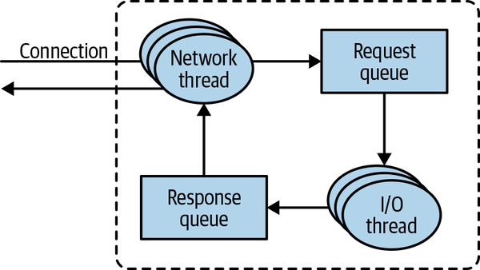
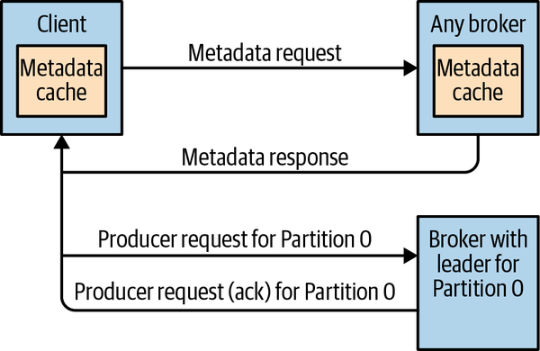
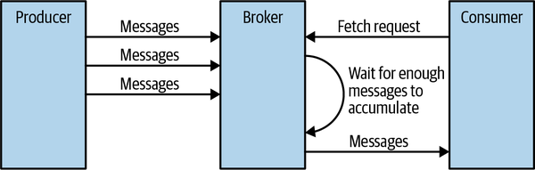
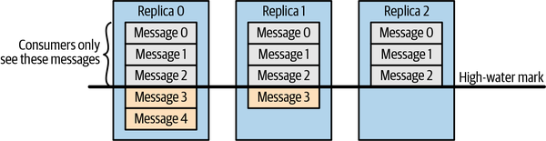
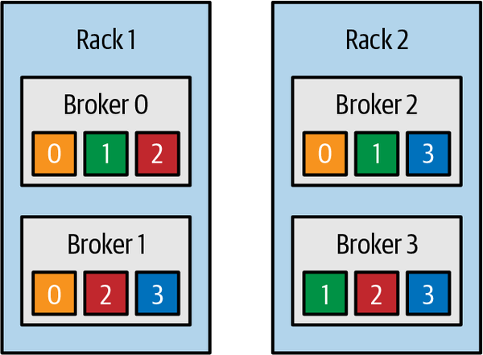
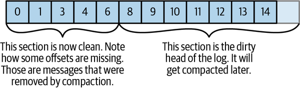
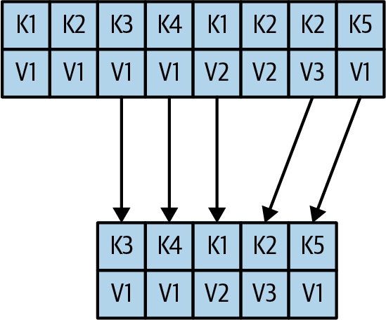

# Chương 6. Cơ chế bên trong Kafka (Kafka Internals)

Không nhất thiết phải hiểu cơ chế bên trong (internals) của Kafka mới có thể vận hành Kafka trong môi trường production hoặc viết ứng dụng sử dụng nó. Tuy nhiên, việc biết Kafka hoạt động ra sao sẽ cung cấp bối cảnh cần thiết khi xử lý sự cố hoặc khi cố gắng hiểu vì sao Kafka lại hành xử theo cách nó vẫn hành xử. Vì việc trình bày mọi chi tiết cài đặt và mọi quyết định thiết kế nằm ngoài phạm vi của cuốn sách này, trong chương này chúng ta tập trung vào một vài chủ đề đặc biệt liên quan đến những người làm việc thực tế với Kafka:

- Kafka controller
- Cơ chế replication của Kafka hoạt động như thế nào
- Kafka xử lý các request từ producer và consumer ra sao
- Kafka xử lý việc lưu trữ như thế nào, chẳng hạn định dạng file và index

Hiểu sâu những chủ đề này sẽ đặc biệt hữu ích khi tinh chỉnh Kafka — hiểu được các cơ chế mà những "núm vặn" tinh chỉnh điều khiển sẽ giúp bạn sử dụng chúng với chủ đích chính xác thay vì chỉnh sửa ngẫu nhiên.

## Cluster Membership (Thành viên của cluster)

Kafka sử dụng Apache ZooKeeper để duy trì danh sách các broker hiện đang là thành viên của một cluster. Mỗi broker có một định danh duy nhất, được thiết lập trong file cấu hình của broker hoặc được sinh tự động. Mỗi lần tiến trình broker khởi động, nó tự đăng ký với ID của mình vào ZooKeeper bằng cách tạo một ephemeral node. Các Kafka broker, controller, và một số công cụ trong hệ sinh thái đăng ký theo dõi (subscribe) đường dẫn `/brokers/ids` trong ZooKeeper — nơi các broker được đăng ký — để chúng được thông báo khi có broker được thêm vào hoặc bị loại bỏ.

Nếu bạn thử khởi động một broker khác với cùng ID, bạn sẽ nhận được lỗi — broker mới sẽ cố đăng ký nhưng thất bại vì đã tồn tại một ZooKeeper node cho cùng broker ID đó.

Khi một broker mất kết nối tới ZooKeeper (thường là do broker dừng lại, nhưng cũng có thể xảy ra do network partition hoặc một khoảng dừng garbage-collection kéo dài), ephemeral node mà broker tạo ra khi khởi động sẽ tự động bị xóa khỏi ZooKeeper. Các thành phần Kafka đang theo dõi danh sách broker sẽ được thông báo rằng broker đó đã biến mất.

Mặc dù node đại diện cho broker biến mất khi broker dừng lại, broker ID vẫn tồn tại trong các cấu trúc dữ liệu khác. Ví dụ, danh sách các replica của mỗi topic (xem mục "Replication") chứa các broker ID của replica. Nhờ vậy, nếu bạn mất hoàn toàn một broker và khởi động một broker hoàn toàn mới với ID của broker cũ, nó sẽ ngay lập tức gia nhập cluster thay thế cho broker đã mất, với cùng các partition và topic được gán cho nó.

## The Controller (Controller)

Controller là một trong các Kafka broker, ngoài chức năng broker thông thường, còn chịu trách nhiệm bầu chọn partition leader. Broker đầu tiên khởi động trong cluster trở thành controller bằng cách tạo một ephemeral node trong ZooKeeper có tên `/controller`. Khi các broker khác khởi động, chúng cũng cố tạo node này nhưng nhận được ngoại lệ "node already exists", khiến chúng "nhận ra" rằng controller node đã tồn tại và cluster đã có một controller. Các broker tạo một ZooKeeper watch trên controller node để được thông báo về những thay đổi của node này. Bằng cách đó, chúng ta bảo đảm rằng cluster chỉ có một controller tại mỗi thời điểm.

Khi broker đóng vai trò controller bị dừng hoặc mất kết nối tới ZooKeeper, ephemeral node sẽ biến mất. Điều này bao gồm mọi tình huống trong đó ZooKeeper client mà controller sử dụng ngừng gửi heartbeat tới ZooKeeper lâu hơn `zookeeper.session.timeout.ms`. Khi ephemeral node biến mất, các broker khác trong cluster sẽ được thông báo thông qua ZooKeeper watch rằng controller đã biến mất, và chúng sẽ tự mình cố gắng tạo controller node trong ZooKeeper. Node đầu tiên tạo được controller mới trong ZooKeeper sẽ trở thành controller kế tiếp, trong khi các node khác nhận được ngoại lệ "node already exists" và tạo lại watch trên controller node mới. Mỗi lần một controller được bầu, nó nhận được một số controller epoch mới, cao hơn, thông qua một thao tác tăng có điều kiện (conditional increment) của ZooKeeper. Các broker biết controller epoch hiện tại, và nếu chúng nhận được thông điệp từ một controller với số epoch cũ hơn, chúng biết là phải bỏ qua. Điều này quan trọng bởi vì broker controller có thể mất kết nối với ZooKeeper do một khoảng dừng garbage collection kéo dài — trong khoảng dừng này một controller mới sẽ được bầu. Khi leader trước đó tiếp tục hoạt động sau khoảng dừng, nó có thể tiếp tục gửi thông điệp tới các broker mà không biết rằng đã có một controller mới — trong trường hợp này, controller cũ được coi là một zombie. Controller epoch nằm trong thông điệp, cho phép các broker bỏ qua thông điệp từ những controller cũ, là một dạng zombie fencing (rào chặn zombie).

Khi controller mới khởi động lần đầu, nó phải đọc bản đồ trạng thái replica mới nhất từ ZooKeeper trước khi có thể bắt đầu quản lý metadata của cluster và thực hiện bầu chọn leader. Quá trình tải này sử dụng các API bất đồng bộ, và pipeline hóa (pipeline) các request đọc tới ZooKeeper để che giấu độ trễ. Nhưng ngay cả như vậy, trong các cluster có số lượng partition lớn, quá trình tải có thể mất vài giây — một số thử nghiệm và so sánh được mô tả trong bài blog về Apache Kafka 1.1.0.

Khi controller nhận thấy một broker rời khỏi cluster (bằng cách theo dõi đường dẫn ZooKeeper liên quan hoặc vì nó nhận được một `ControlledShutdownRequest` từ broker), nó biết rằng tất cả các partition có leader nằm trên broker đó sẽ cần một leader mới. Nó duyệt qua tất cả các partition cần leader mới và xác định ai sẽ là leader mới (đơn giản là replica kế tiếp trong danh sách replica của partition đó). Sau đó nó lưu trạng thái mới xuống ZooKeeper (một lần nữa, sử dụng các request bất đồng bộ được pipeline hóa để giảm độ trễ) rồi gửi một request `LeaderAndISR` tới tất cả các broker chứa replica cho những partition đó. Request này chứa thông tin về leader và follower mới cho các partition. Các request này được gộp thành batch để tăng hiệu quả, nên mỗi request bao gồm thông tin leadership mới cho nhiều partition có replica trên cùng một broker. Mỗi leader mới biết rằng nó cần bắt đầu phục vụ các request producer và consumer từ client, trong khi các follower biết rằng chúng cần bắt đầu replicate thông điệp từ leader mới. Vì mọi broker trong cluster đều có một `MetadataCache` chứa bản đồ của tất cả broker và tất cả replica trong cluster, controller gửi tới tất cả các broker thông tin về sự thay đổi leadership trong một request `UpdateMetadata` để chúng có thể cập nhật cache của mình.

Một quá trình tương tự lặp lại khi một broker khởi động trở lại — khác biệt chính là tất cả replica trên broker đó bắt đầu với vai trò follower và cần bắt kịp leader trước khi đủ điều kiện để bản thân chúng được bầu làm leader.

Tóm lại, Kafka sử dụng tính năng ephemeral node của ZooKeeper để bầu một controller và để thông báo cho controller khi các node gia nhập và rời khỏi cluster. Controller chịu trách nhiệm bầu chọn leader trong số các partition và replica bất cứ khi nào nó nhận thấy các node gia nhập và rời khỏi cluster. Controller sử dụng số epoch để ngăn chặn kịch bản "split brain" (não phân đôi), trong đó hai node đều tin rằng mình là controller hiện tại.

## KRaft: Controller mới dựa trên Raft của Kafka

Bắt đầu từ năm 2019, cộng đồng Apache Kafka khởi động một dự án đầy tham vọng: chuyển từ controller dựa trên ZooKeeper sang một controller quorum dựa trên Raft. Phiên bản preview của controller mới, có tên KRaft, là một phần của bản phát hành Apache Kafka 2.8. Bản phát hành Apache Kafka 3.0, dự kiến vào giữa năm 2021, sẽ bao gồm phiên bản production đầu tiên của KRaft, và các Kafka cluster sẽ có thể chạy với hoặc là controller truyền thống dựa trên ZooKeeper, hoặc là KRaft.

Vì sao cộng đồng Kafka quyết định thay thế controller? Controller hiện có của Kafka đã trải qua nhiều lần viết lại, nhưng bất chấp những cải tiến trong cách nó sử dụng ZooKeeper để lưu trữ thông tin topic, partition và replica, đã trở nên rõ ràng rằng mô hình hiện có sẽ không mở rộng được tới số lượng partition mà chúng ta muốn Kafka hỗ trợ. Một số mối lo ngại đã biết đã thúc đẩy sự thay đổi này:

- Các cập nhật metadata được ghi vào ZooKeeper một cách đồng bộ nhưng lại được gửi tới các broker một cách bất đồng bộ. Ngoài ra, việc nhận cập nhật từ ZooKeeper cũng là bất đồng bộ. Tất cả những điều này dẫn tới các trường hợp biên (edge case) trong đó metadata không nhất quán giữa các broker, controller và ZooKeeper. Những trường hợp này rất khó phát hiện.
- Mỗi khi controller được khởi động lại, nó phải đọc toàn bộ metadata của tất cả broker và partition từ ZooKeeper rồi gửi metadata này tới tất cả các broker. Bất chấp nhiều năm nỗ lực, đây vẫn là một nút thắt cổ chai lớn — khi số lượng partition và broker tăng lên, việc khởi động lại controller trở nên chậm hơn.
- Kiến trúc nội bộ xoay quanh quyền sở hữu metadata không được tốt — một số thao tác được thực hiện qua controller, một số khác qua bất kỳ broker nào, và một số khác nữa lại trực tiếp trên ZooKeeper.
- ZooKeeper bản thân nó là một hệ phân tán riêng, và giống như Kafka, nó đòi hỏi một mức độ chuyên môn nhất định để vận hành. Do đó các lập trình viên muốn dùng Kafka phải học hai hệ phân tán, chứ không phải một.

Với tất cả những mối lo ngại này, cộng đồng Apache Kafka đã chọn thay thế controller hiện có dựa trên ZooKeeper.

Trong kiến trúc hiện có, ZooKeeper có hai chức năng quan trọng: nó được dùng để bầu một controller và để lưu trữ metadata của cluster — các broker đã đăng ký, cấu hình, topic, partition, và replica. Ngoài ra, bản thân controller quản lý metadata — nó được dùng để bầu leader, tạo và xóa topic, và tái phân bổ (reassign) replica. Toàn bộ chức năng này sẽ phải được thay thế trong controller mới.

Ý tưởng cốt lõi đằng sau thiết kế controller mới là bản thân Kafka có một kiến trúc dựa trên log, trong đó người dùng biểu diễn trạng thái dưới dạng một stream các event. Lợi ích của cách biểu diễn như vậy đã được cộng đồng hiểu rõ — nhiều consumer có thể nhanh chóng bắt kịp trạng thái mới nhất bằng cách phát lại (replay) các event. Log thiết lập một thứ tự rõ ràng giữa các event và bảo đảm rằng các consumer luôn di chuyển dọc theo một dòng thời gian duy nhất. Kiến trúc controller mới mang lại những lợi ích tương tự cho việc quản lý metadata của Kafka.

Trong kiến trúc mới, các controller node là một Raft quorum quản lý log của các event metadata. Log này chứa thông tin về mỗi thay đổi đối với metadata của cluster. Mọi thứ hiện đang được lưu trong ZooKeeper, chẳng hạn topic, partition, ISR, cấu hình, v.v., sẽ được lưu trong log này.

Sử dụng thuật toán Raft, các controller node sẽ bầu một leader trong số chính chúng, mà không phụ thuộc vào bất kỳ hệ thống bên ngoài nào. Leader của metadata log được gọi là active controller. Active controller xử lý tất cả các RPC do các broker thực hiện. Các follower controller replicate dữ liệu được ghi vào active controller và đóng vai trò hot standby nếu active controller gặp sự cố. Vì giờ đây tất cả các controller đều theo dõi trạng thái mới nhất, việc controller failover sẽ không đòi hỏi một giai đoạn tải lại kéo dài để chuyển toàn bộ trạng thái sang controller mới.

Thay vì controller đẩy các cập nhật ra các broker khác, các broker sẽ lấy (fetch) cập nhật từ active controller thông qua một API mới là `MetadataFetch`. Tương tự như một fetch request, các broker sẽ theo dõi offset của thay đổi metadata mới nhất mà chúng đã fetch và sẽ chỉ yêu cầu các cập nhật mới hơn từ controller. Các broker sẽ lưu metadata xuống đĩa, điều này cho phép chúng khởi động nhanh, ngay cả với hàng triệu partition.

Các broker sẽ đăng ký với controller quorum và sẽ vẫn ở trạng thái đã đăng ký cho đến khi bị quản trị viên hủy đăng ký, vì vậy một khi broker tắt, nó ở trạng thái offline nhưng vẫn còn đăng ký. Các broker đang online nhưng không cập nhật kịp metadata mới nhất sẽ bị fenced (rào chặn) và sẽ không thể phục vụ các request của client. Trạng thái fenced mới này sẽ ngăn chặn các trường hợp trong đó client produce event tới một broker không còn là leader nhưng lại quá lạc hậu để nhận thức được rằng nó không phải là leader.

Là một phần của quá trình chuyển đổi sang controller quorum, tất cả các thao tác mà trước đây liên quan tới việc client hoặc broker giao tiếp trực tiếp với ZooKeeper sẽ được định tuyến qua controller. Điều này sẽ cho phép chuyển đổi liền mạch bằng cách thay thế controller mà không phải thay đổi bất cứ điều gì trên bất kỳ broker nào.

Thiết kế tổng thể của kiến trúc mới được mô tả trong KIP-500. Chi tiết về cách giao thức Raft được điều chỉnh cho Kafka được mô tả trong KIP-595. Thiết kế chi tiết về controller quorum mới, bao gồm cấu hình controller và một CLI mới để tương tác với metadata của cluster, có trong KIP-631.

## Replication

Replication nằm ở trung tâm kiến trúc của Kafka. Thật vậy, Kafka thường được mô tả là "một dịch vụ commit log phân tán, được phân mảnh và được replicate". Replication có vai trò then chốt vì nó là cách Kafka bảo đảm tính sẵn sàng và độ bền dữ liệu khi từng node riêng lẻ chắc chắn sẽ gặp sự cố.

Như chúng ta đã thảo luận, dữ liệu trong Kafka được tổ chức theo topic. Mỗi topic được chia thành các partition, và mỗi partition có thể có nhiều replica. Các replica đó được lưu trên các broker, và mỗi broker thường lưu hàng trăm hoặc thậm chí hàng nghìn replica thuộc về những topic và partition khác nhau.

Có hai loại replica:

**Leader replica**

Mỗi partition có một replica duy nhất được chỉ định làm leader. Tất cả các produce request đều đi qua leader để bảo đảm tính nhất quán. Client có thể consume từ leader replica hoặc từ các follower của nó.

**Follower replica**

Tất cả các replica của một partition mà không phải leader thì được gọi là follower. Trừ khi được cấu hình khác đi, các follower không phục vụ request của client; công việc chính của chúng là replicate thông điệp từ leader và giữ cho mình luôn cập nhật với những thông điệp mới nhất mà leader có. Nếu leader replica của một partition gặp sự cố, một trong các follower replica sẽ được thăng cấp trở thành leader mới cho partition đó.

> **ĐỌC TỪ FOLLOWER (READ FROM FOLLOWER)**
>
> Khả năng đọc từ các follower replica được bổ sung trong KIP-392. Mục tiêu chính của tính năng này là giảm chi phí lưu lượng mạng bằng cách cho phép client consume từ in-sync replica gần nhất thay vì từ leader replica. Để sử dụng tính năng này, cấu hình consumer cần bao gồm `client.rack` xác định vị trí của client. Cấu hình broker cần bao gồm `replica.selector.class`. Cấu hình này mặc định là `LeaderSelector` (luôn consume từ leader) nhưng có thể được đặt thành `RackAwareReplicaSelector`, cấu hình này sẽ chọn một replica nằm trên broker có cấu hình `rack.id` khớp với `client.rack` trên client. Chúng ta cũng có thể cài đặt logic lựa chọn replica của riêng mình bằng cách hiện thực interface `ReplicaSelector` và sử dụng bản hiện thực của riêng mình thay thế.

Giao thức replication được mở rộng để bảo đảm rằng chỉ những thông điệp đã được commit mới khả dụng khi consume từ một follower replica. Điều này có nghĩa là chúng ta vẫn nhận được cùng những bảo đảm về độ tin cậy như trước nay, ngay cả khi fetch từ một follower. Để cung cấp bảo đảm này, tất cả các replica cần biết những thông điệp nào đã được leader commit. Để đạt được điều đó, leader đưa high-water mark hiện tại (offset đã commit mới nhất) vào dữ liệu mà nó gửi cho follower. Việc lan truyền high-water mark tạo ra một độ trễ nhỏ, nghĩa là dữ liệu khả dụng để consume từ leader sớm hơn so với khi khả dụng trên follower. Cần ghi nhớ độ trễ bổ sung này, bởi vì rất dễ bị cám dỗ tìm cách giảm độ trễ của consumer bằng cách consume từ leader replica.

Một nhiệm vụ khác mà leader chịu trách nhiệm là biết được follower replica nào đang cập nhật kịp với leader. Các follower cố gắng giữ cho mình luôn cập nhật bằng cách replicate tất cả thông điệp từ leader ngay khi thông điệp đến, nhưng chúng có thể không giữ được trạng thái đồng bộ vì nhiều lý do khác nhau, chẳng hạn khi tắc nghẽn mạng làm chậm quá trình replication hoặc khi một broker gặp sự cố và tất cả replica trên broker đó bắt đầu tụt lại phía sau cho tới khi chúng ta khởi động broker và chúng có thể bắt đầu replicate trở lại.

Để giữ đồng bộ với leader, các replica gửi cho leader những Fetch request — chính xác cùng loại request mà consumer gửi để consume thông điệp. Đáp lại những request đó, leader gửi thông điệp cho các replica. Những Fetch request đó chứa offset của thông điệp mà replica muốn nhận tiếp theo, và sẽ luôn theo thứ tự. Điều này có nghĩa là leader có thể biết rằng một replica đã nhận được tất cả thông điệp cho tới thông điệp cuối cùng mà replica đã fetch, và không nhận được thông điệp nào sau đó. Bằng cách nhìn vào offset cuối cùng mà mỗi replica yêu cầu, leader có thể biết mỗi replica đang tụt lại phía sau bao xa. Nếu một replica đã không yêu cầu thông điệp nào trong hơn 10 giây, hoặc nếu nó có yêu cầu thông điệp nhưng không bắt kịp thông điệp mới nhất trong hơn 10 giây, thì replica đó được coi là out of sync (mất đồng bộ). Nếu một replica không theo kịp leader, nó không còn có thể trở thành leader mới trong trường hợp xảy ra sự cố — bởi vì suy cho cùng, nó không chứa tất cả các thông điệp.

Ngược lại với điều đó, những replica liên tục yêu cầu các thông điệp mới nhất được gọi là in-sync replica. Chỉ những in-sync replica mới đủ điều kiện được bầu làm partition leader trong trường hợp leader hiện tại gặp sự cố.

Khoảng thời gian mà một follower có thể không hoạt động hoặc tụt lại phía sau trước khi bị coi là out of sync được điều khiển bởi tham số cấu hình `replica.lag.time.max.ms`. Độ trễ được cho phép này có ảnh hưởng tới hành vi của client và việc lưu giữ dữ liệu trong quá trình bầu leader. Chúng ta sẽ thảo luận sâu về điều này trong Chương 7 khi bàn về các bảo đảm độ tin cậy.

Ngoài leader hiện tại, mỗi partition còn có một preferred leader — replica từng là leader khi topic được tạo ra lần đầu. Nó được gọi là "preferred" (được ưu tiên) bởi vì khi các partition được tạo lần đầu, các leader được cân bằng giữa các broker. Kết quả là, chúng ta kỳ vọng rằng khi preferred leader thực sự là leader cho tất cả các partition trong cluster, tải sẽ được cân bằng đều giữa các broker. Theo mặc định, Kafka được cấu hình với `auto.leader.rebalance.enable=true`, cấu hình này sẽ kiểm tra xem preferred leader replica có phải là leader hiện tại hay không nhưng đang in sync, và sẽ kích hoạt bầu chọn leader để đưa preferred leader trở thành leader hiện tại.

> **TÌM CÁC PREFERRED LEADER (FINDING THE PREFERRED LEADERS)**
>
> Cách tốt nhất để xác định preferred leader hiện tại là nhìn vào danh sách replica của một partition. (Bạn có thể xem chi tiết về partition và replica trong output của công cụ `kafka-topics.sh`. Chúng ta sẽ thảo luận công cụ này và các công cụ quản trị khác trong Chương 13.) Replica đầu tiên trong danh sách luôn là preferred leader. Điều này đúng bất kể ai đang là leader hiện tại và ngay cả khi các replica đã được tái phân bổ sang các broker khác bằng công cụ replica reassignment. Trên thực tế, nếu bạn tái phân bổ replica một cách thủ công, điều quan trọng cần nhớ là replica bạn chỉ định đầu tiên sẽ là preferred replica, vì vậy hãy bảo đảm bạn trải chúng ra các broker khác nhau để tránh làm một số broker quá tải vì có nhiều leader trong khi các broker khác lại không xử lý phần công việc công bằng của mình.

## Request Processing (Xử lý request)

Phần lớn công việc mà một Kafka broker thực hiện là xử lý các request được gửi tới partition leader từ client, từ partition replica, và từ controller. Kafka có một giao thức nhị phân (trên nền TCP) quy định định dạng của request và cách các broker phản hồi lại chúng — cả khi request được xử lý thành công lẫn khi broker gặp lỗi trong quá trình xử lý request.

Dự án Apache Kafka bao gồm các Java client được hiện thực và duy trì bởi những người đóng góp cho dự án Apache Kafka; cũng có các client bằng những ngôn ngữ khác, chẳng hạn C, Python, Go, và nhiều ngôn ngữ khác. Bạn có thể xem danh sách đầy đủ trên website của Apache Kafka. Tất cả chúng đều giao tiếp với các Kafka broker bằng giao thức này.

Client luôn là bên khởi tạo kết nối và gửi request, còn broker xử lý các request và phản hồi lại chúng. Tất cả các request được gửi tới broker từ một client cụ thể sẽ được xử lý theo đúng thứ tự chúng được nhận — bảo đảm này chính là điều cho phép Kafka hành xử như một message queue và cung cấp bảo đảm về thứ tự cho các thông điệp mà nó lưu trữ.

Tất cả các request đều có một header chuẩn bao gồm:

- Request type (còn gọi là API key)
- Request version (để các broker có thể xử lý client ở những phiên bản khác nhau và phản hồi tương ứng)
- Correlation ID: một con số định danh duy nhất cho request, và cũng xuất hiện trong response và trong các error log (ID này được dùng để xử lý sự cố)
- Client ID: dùng để định danh ứng dụng đã gửi request

Chúng ta sẽ không mô tả giao thức ở đây bởi vì nó đã được mô tả rất chi tiết trong tài liệu Kafka. Tuy nhiên, sẽ hữu ích nếu xem qua cách các request được broker xử lý — sau này, khi chúng ta thảo luận cách giám sát Kafka và các tùy chọn cấu hình khác nhau, bạn sẽ có bối cảnh về việc các metric và tham số cấu hình đang nói tới queue và thread nào.

Với mỗi cổng mà broker lắng nghe, broker chạy một acceptor thread có nhiệm vụ tạo kết nối và bàn giao nó cho một processor thread để xử lý. Số lượng processor thread (còn gọi là network thread) có thể cấu hình được. Các network thread chịu trách nhiệm lấy request từ các kết nối client, đặt chúng vào một request queue, và lấy response từ một response queue rồi gửi lại cho client. Đôi khi, các response gửi cho client phải bị trì hoãn — consumer chỉ nhận được response khi có dữ liệu, và admin client nhận được response cho một request `DeleteTopic` sau khi việc xóa topic đã bắt đầu diễn ra. Những response bị trì hoãn được giữ trong một vùng gọi là purgatory cho tới khi chúng có thể hoàn tất. Xem Hình 6-1 để hình dung quá trình này.



**Hình 6-1. Xử lý request bên trong Apache Kafka**

Khi các request đã được đặt vào request queue, các I/O thread (còn gọi là request handler thread) chịu trách nhiệm lấy chúng ra và xử lý. Các loại request phổ biến nhất từ client là:

**Produce request**

Được gửi bởi các producer và chứa các thông điệp mà client ghi vào các Kafka broker.

**Fetch request**

Được gửi bởi các consumer và các follower replica khi chúng đọc thông điệp từ các Kafka broker.

**Admin request**

Được gửi bởi các admin client khi thực hiện các thao tác metadata như tạo và xóa topic.

Cả produce request lẫn fetch request đều phải được gửi tới leader replica của một partition. Nếu một broker nhận được produce request cho một partition cụ thể mà leader của partition này lại nằm trên một broker khác, client đã gửi produce request sẽ nhận được response lỗi "Not a Leader for Partition". Lỗi tương tự sẽ xảy ra nếu một fetch request cho một partition cụ thể đến một broker không chứa leader của partition đó. Các client của Kafka chịu trách nhiệm gửi produce request và fetch request tới broker chứa leader của partition liên quan tới request.

Làm thế nào các client biết được cần gửi request tới đâu? Các Kafka client sử dụng một loại request khác gọi là metadata request, trong đó bao gồm danh sách các topic mà client quan tâm. Response từ server chỉ ra những partition nào tồn tại trong các topic, các replica của mỗi partition, và replica nào là leader. Metadata request có thể được gửi tới bất kỳ broker nào vì tất cả các broker đều có một metadata cache chứa thông tin này.

Các client thường cache thông tin này và dùng nó để điều hướng produce request và fetch request tới đúng broker cho mỗi partition. Chúng cũng cần làm mới thông tin này định kỳ (khoảng thời gian làm mới được điều khiển bởi tham số cấu hình `metadata.max.age.ms`) bằng cách gửi một metadata request khác để biết liệu metadata của topic có thay đổi hay không — ví dụ, nếu có một broker mới được thêm vào hoặc một số replica đã được chuyển sang broker mới (Hình 6-2). Ngoài ra, nếu một client nhận được lỗi "Not a Leader" cho một trong các request của nó, nó sẽ làm mới metadata trước khi thử gửi lại request, bởi vì lỗi đó cho thấy client đang dùng thông tin lỗi thời và đang gửi request tới sai broker.



**Hình 6-2. Client định tuyến request**

### Produce Requests (Produce request)

Như chúng ta đã thấy trong Chương 3, một tham số cấu hình tên là `acks` là số lượng broker cần xác nhận đã nhận được thông điệp trước khi nó được coi là ghi thành công. Producer có thể được cấu hình để coi các thông điệp là "đã ghi thành công" khi thông điệp được chấp nhận bởi chỉ mình leader (`acks=1`), hoặc bởi tất cả các in-sync replica (`acks=all`), hoặc ngay tại thời điểm thông điệp được gửi đi mà không chờ broker chấp nhận nó (`acks=0`).

Khi broker chứa leader replica của một partition nhận được produce request cho partition này, nó sẽ bắt đầu bằng việc chạy một vài kiểm tra hợp lệ:

- Người dùng gửi dữ liệu có quyền ghi (write) trên topic đó không?
- Số lượng `acks` được chỉ định trong request có hợp lệ không (chỉ 0, 1, và "all" được phép)?
- Nếu `acks` được đặt là `all`, có đủ in-sync replica để ghi thông điệp một cách an toàn không? (Các broker có thể được cấu hình để từ chối thông điệp mới nếu số lượng in-sync replica tụt xuống dưới một con số có thể cấu hình; chúng ta sẽ thảo luận chi tiết hơn về điều này trong Chương 7, khi bàn về các bảo đảm về độ bền dữ liệu và độ tin cậy của Kafka.)

Sau đó broker sẽ ghi các thông điệp mới xuống đĩa cục bộ. Trên Linux, các thông điệp được ghi vào filesystem cache, và không có bảo đảm nào về thời điểm chúng sẽ được ghi xuống đĩa. Kafka không chờ dữ liệu được lưu bền xuống đĩa — nó dựa vào replication để bảo đảm độ bền dữ liệu của thông điệp.

Một khi thông điệp đã được ghi vào leader của partition, broker xem xét cấu hình `acks`: nếu `acks` được đặt là 0 hoặc 1, broker sẽ phản hồi ngay lập tức; nếu `acks` được đặt là `all`, request sẽ được lưu trong một buffer gọi là purgatory cho tới khi leader quan sát thấy rằng các follower replica đã replicate thông điệp, tại thời điểm đó một response được gửi tới client.

### Fetch Requests (Fetch request)

Các broker xử lý fetch request theo cách rất giống với cách xử lý produce request. Client gửi một request, yêu cầu broker gửi thông điệp từ một danh sách các topic, partition và offset — đại loại như "Hãy gửi cho tôi các thông điệp bắt đầu từ offset 53 trong partition 0 của topic Test và các thông điệp bắt đầu từ offset 64 trong partition 3 của topic Test." Các client cũng chỉ định một giới hạn về lượng dữ liệu mà broker có thể trả về cho mỗi partition. Giới hạn này quan trọng bởi vì client cần cấp phát bộ nhớ để chứa response gửi về từ broker. Không có giới hạn này, các broker có thể gửi về những phản hồi đủ lớn để khiến client bị hết bộ nhớ.

Như chúng ta đã thảo luận trước đó, request phải đến được các leader của những partition được chỉ định trong request, và client sẽ thực hiện những metadata request cần thiết để bảo đảm nó định tuyến các fetch request một cách chính xác. Khi leader nhận được request, trước tiên nó kiểm tra xem request có hợp lệ không — offset này có tồn tại cho partition cụ thể này không? Nếu client đang yêu cầu một thông điệp quá cũ đến mức đã bị xóa khỏi partition, hoặc một offset chưa tồn tại, broker sẽ phản hồi bằng một lỗi.

Nếu offset tồn tại, broker sẽ đọc các thông điệp từ partition, tới mức giới hạn mà client đặt ra trong request, và gửi các thông điệp đó cho client. Kafka nổi tiếng với việc sử dụng phương pháp zero-copy để gửi thông điệp tới client — điều này có nghĩa là Kafka gửi thông điệp từ file (hay đúng hơn là từ Linux filesystem cache) trực tiếp tới network channel mà không qua bất kỳ buffer trung gian nào. Điều này khác với hầu hết các cơ sở dữ liệu, nơi dữ liệu được lưu trong một cache cục bộ trước khi được gửi tới client. Kỹ thuật này loại bỏ chi phí phát sinh (overhead) của việc sao chép byte và quản lý buffer trong bộ nhớ, và mang lại hiệu năng được cải thiện rất nhiều.

Ngoài việc đặt giới hạn trên cho lượng dữ liệu mà broker có thể trả về, client cũng có thể đặt giới hạn dưới cho lượng dữ liệu được trả về. Ví dụ, đặt giới hạn dưới là 10K là cách client nói với broker: "Chỉ trả về kết quả khi bạn có ít nhất 10K byte để gửi cho tôi." Đây là một cách tuyệt vời để giảm mức sử dụng CPU và mạng khi các client đọc từ những topic không có nhiều lưu lượng. Thay vì client gửi request tới broker sau mỗi vài mili giây để hỏi dữ liệu và nhận về rất ít hoặc không có thông điệp nào, client gửi một request, broker chờ cho tới khi có một lượng dữ liệu kha khá rồi trả dữ liệu về, và chỉ khi đó client mới hỏi thêm (Hình 6-3). Tổng thể vẫn cùng một lượng dữ liệu được đọc nhưng với ít qua lại hơn nhiều, và do đó ít overhead hơn.



**Hình 6-3. Broker trì hoãn response cho tới khi tích lũy đủ dữ liệu**

Tất nhiên, chúng ta không muốn client phải chờ mãi mãi để broker có đủ dữ liệu. Sau một khoảng thời gian, sẽ hợp lý nếu cứ lấy dữ liệu hiện có và xử lý nó thay vì chờ thêm. Do đó, client cũng có thể định nghĩa một timeout để nói với broker: "Nếu bạn không thỏa mãn được lượng dữ liệu tối thiểu cần gửi trong vòng x mili giây, thì cứ gửi những gì bạn đang có."

Điều thú vị đáng lưu ý là không phải tất cả dữ liệu tồn tại trên leader của partition đều khả dụng để client đọc. Hầu hết các client chỉ có thể đọc những thông điệp đã được ghi vào tất cả các in-sync replica (các follower replica, mặc dù chúng cũng là consumer, được miễn trừ khỏi điều này — nếu không thì replication sẽ không hoạt động). Chúng ta đã thảo luận rằng leader của partition biết những thông điệp nào đã được replicate tới replica nào, và cho tới khi một thông điệp được ghi vào tất cả các in-sync replica, nó sẽ không được gửi tới consumer — các nỗ lực fetch những thông điệp đó sẽ dẫn tới một response rỗng chứ không phải một lỗi.

Lý do cho hành vi này là những thông điệp chưa được replicate tới đủ số replica được coi là "không an toàn" — nếu leader gặp sự cố và một replica khác thế chỗ, những thông điệp này sẽ không còn tồn tại trong Kafka nữa. Nếu chúng ta cho phép client đọc những thông điệp chỉ tồn tại trên leader, chúng ta có thể thấy hành vi không nhất quán. Ví dụ, nếu một consumer đọc một thông điệp rồi leader gặp sự cố và không broker nào khác chứa thông điệp này, thì thông điệp đó biến mất. Không consumer nào khác có thể đọc được thông điệp này, điều này có thể gây ra sự không nhất quán với consumer đã đọc được nó. Thay vào đó, chúng ta chờ cho tới khi tất cả các in-sync replica nhận được thông điệp rồi mới cho phép các consumer đọc nó (Hình 6-4). Hành vi này cũng có nghĩa là nếu replication giữa các broker chậm vì lý do nào đó, thì các thông điệp mới sẽ mất nhiều thời gian hơn để đến được với consumer (vì chúng ta chờ các thông điệp được replicate trước). Độ trễ này bị giới hạn bởi `replica.lag.time.max.ms` — khoảng thời gian mà một replica có thể trễ trong việc replicate các thông điệp mới mà vẫn được coi là in sync.



**Hình 6-4. Consumer chỉ thấy những thông điệp đã được replicate tới các in-sync replica**

Trong một số trường hợp, một consumer consume event từ một số lượng lớn partition. Việc gửi danh sách tất cả các partition mà nó quan tâm tới broker trong mỗi request và để broker gửi trả toàn bộ metadata có thể rất kém hiệu quả — tập hợp các partition hiếm khi thay đổi, metadata của chúng cũng hiếm khi thay đổi, và trong nhiều trường hợp không có nhiều dữ liệu để trả về. Để giảm thiểu overhead này, Kafka có fetch session cache. Các consumer có thể thử tạo một session được cache, lưu danh sách các partition mà chúng đang consume cùng metadata của nó. Một khi session được tạo, các consumer không còn cần chỉ định tất cả các partition trong mỗi request nữa mà có thể dùng incremental fetch request thay thế. Các broker sẽ chỉ đưa metadata vào response nếu có bất kỳ thay đổi nào. Session cache có dung lượng giới hạn, và Kafka ưu tiên các follower replica và những consumer có tập partition lớn, nên trong một số trường hợp session sẽ không được tạo hoặc sẽ bị loại bỏ (evict). Trong cả hai trường hợp này, broker sẽ trả về một lỗi thích hợp cho client, và consumer sẽ chuyển sang dùng fetch request đầy đủ (bao gồm toàn bộ metadata của partition) một cách trong suốt.

### Other Requests (Các loại request khác)

Chúng ta vừa thảo luận những loại request phổ biến nhất mà các Kafka client sử dụng: `Metadata`, `Produce`, và `Fetch`. Giao thức Kafka hiện tại xử lý 61 loại request khác nhau, và sẽ còn nhiều loại nữa được bổ sung. Chỉ riêng các consumer đã dùng 15 loại request để hình thành group, phối hợp việc consume, và cho phép lập trình viên quản lý các consumer group. Cũng có một số lượng lớn các request liên quan tới quản lý metadata và bảo mật.

Ngoài ra, cùng giao thức đó cũng được dùng để giao tiếp giữa chính các Kafka broker với nhau. Những request đó là nội bộ và không nên được client sử dụng. Ví dụ, khi controller thông báo rằng một partition có leader mới, nó gửi một request `LeaderAndIsr` tới leader mới (để leader biết rằng cần bắt đầu chấp nhận các request từ client) và tới các follower (để chúng biết rằng cần đi theo leader mới).

Giao thức không ngừng tiến hóa — khi cộng đồng Kafka bổ sung thêm nhiều khả năng cho client, giao thức cũng tiến hóa tương ứng. Ví dụ, trong quá khứ, các Kafka consumer dùng Apache ZooKeeper để theo dõi các offset mà chúng nhận được từ Kafka. Vì vậy khi một consumer được khởi động, nó có thể kiểm tra ZooKeeper để biết offset cuối cùng đã được đọc từ các partition của nó và biết cần bắt đầu xử lý từ đâu. Vì nhiều lý do khác nhau, cộng đồng đã quyết định ngừng sử dụng ZooKeeper cho việc này và thay vào đó lưu những offset đó trong một Kafka topic đặc biệt. Để làm được điều này, những người đóng góp phải bổ sung một số request vào giao thức: `OffsetCommitRequest`, `OffsetFetchRequest`, và `ListOffsetsRequest`. Giờ đây khi một ứng dụng gọi client API để commit consumer offset, client không còn ghi vào ZooKeeper nữa; thay vào đó, nó gửi `OffsetCommitRequest` tới Kafka.

Việc tạo topic trước đây được xử lý bởi các công cụ dòng lệnh cập nhật trực tiếp danh sách topic trong ZooKeeper. Cộng đồng Kafka từ đó đã bổ sung `CreateTopicRequest`, và các request tương tự để quản lý metadata của Kafka. Các ứng dụng Java thực hiện những thao tác metadata này thông qua `AdminClient` của Kafka, được trình bày chi tiết trong Chương 5. Vì những thao tác này giờ đây là một phần của giao thức Kafka, nó cho phép các client viết bằng những ngôn ngữ không có thư viện ZooKeeper vẫn có thể tạo topic bằng cách hỏi trực tiếp các Kafka broker.

Ngoài việc tiến hóa giao thức bằng cách thêm các loại request mới, các lập trình viên Kafka đôi khi cũng chọn cách chỉnh sửa các request hiện có để bổ sung một số khả năng. Ví dụ, giữa Kafka 0.9.0 và Kafka 0.10.0, họ đã quyết định cho client biết controller hiện tại là ai bằng cách thêm thông tin này vào response `Metadata`. Kết quả là một phiên bản mới được thêm vào request và response `Metadata`. Giờ đây, các client 0.9.0 gửi request `Metadata` phiên bản 0 (vì phiên bản 1 không tồn tại trong client 0.9.0), và các broker, dù là 0.9.0 hay 0.10.0, đều biết cần phản hồi bằng response phiên bản 0, vốn không có thông tin controller. Điều này không sao cả, bởi vì client 0.9.0 không mong đợi thông tin controller và dù sao cũng sẽ không biết cách phân tích nó. Nếu bạn có client 0.10.0, nó sẽ gửi request `Metadata` phiên bản 1, và các broker 0.10.0 sẽ phản hồi bằng response phiên bản 1 có chứa thông tin controller, và client 0.10.0 có thể sử dụng thông tin đó. Nếu một client 0.10.0 gửi request `Metadata` phiên bản 1 tới một broker 0.9.0, broker sẽ không biết cách xử lý phiên bản mới hơn của request và sẽ phản hồi bằng một lỗi. Đây là lý do chúng tôi khuyến nghị nâng cấp các broker trước khi nâng cấp bất kỳ client nào — broker mới biết cách xử lý các request cũ, nhưng điều ngược lại thì không.

Trong bản phát hành 0.10.0, cộng đồng Kafka đã bổ sung `ApiVersionRequest`, cho phép client hỏi broker xem những phiên bản nào của mỗi request được hỗ trợ và sử dụng đúng phiên bản tương ứng. Những client sử dụng khả năng mới này một cách đúng đắn sẽ có thể giao tiếp với các broker cũ hơn bằng cách dùng một phiên bản giao thức được broker mà chúng kết nối tới hỗ trợ. Hiện đang có công việc đang tiến hành nhằm bổ sung các API cho phép client khám phá xem những tính năng nào được broker hỗ trợ, và cho phép broker kiểm soát (gate) các tính năng tồn tại trong một phiên bản cụ thể. Cải tiến này được đề xuất trong KIP-584, và tại thời điểm này có vẻ nhiều khả năng nó sẽ là một phần của phiên bản 3.0.0.

## Physical Storage (Lưu trữ vật lý)

Đơn vị lưu trữ cơ bản của Kafka là một partition replica. Các partition không thể được chia tách giữa nhiều broker, và thậm chí cũng không thể chia giữa nhiều đĩa trên cùng một broker. Vì vậy kích thước của một partition bị giới hạn bởi dung lượng khả dụng trên một mount point duy nhất. (Một mount point có thể là một đĩa đơn, nếu dùng cấu hình JBOD, hoặc nhiều đĩa, nếu cấu hình RAID. Xem Chương 2.) Khi cấu hình Kafka, người quản trị định nghĩa một danh sách các thư mục nơi các partition sẽ được lưu trữ — đó là tham số `log.dirs` (không nhầm lẫn với vị trí mà Kafka lưu error log của nó, vốn được cấu hình trong file `log4j.properties`). Cấu hình thông thường bao gồm một thư mục cho mỗi mount point mà Kafka sẽ sử dụng.

Hãy xem cách Kafka sử dụng các thư mục khả dụng để lưu dữ liệu. Trước hết, chúng ta muốn xem dữ liệu được phân bổ tới các broker trong cluster và tới các thư mục trong broker như thế nào. Sau đó chúng ta sẽ xem broker quản lý các file ra sao — đặc biệt là cách các bảo đảm về retention được xử lý. Rồi chúng ta sẽ đi sâu vào bên trong các file và xem định dạng file cũng như định dạng index. Cuối cùng, chúng ta sẽ xem log compaction, một tính năng nâng cao cho phép bạn biến Kafka thành một kho lưu trữ dữ liệu dài hạn, và mô tả cách nó hoạt động.

### Tiered Storage (Lưu trữ phân tầng)

Bắt đầu từ cuối năm 2018, cộng đồng Apache Kafka bắt đầu hợp tác trong một dự án đầy tham vọng nhằm bổ sung khả năng tiered storage cho Kafka. Công việc trong dự án vẫn đang tiếp diễn, và nó được lên kế hoạch cho bản phát hành 3.0.

Động lực khá đơn giản: Kafka hiện đang được dùng để lưu trữ một lượng lớn dữ liệu, hoặc do throughput cao hoặc do thời gian retention dài. Điều này dẫn tới những mối lo ngại sau:

- Bạn bị giới hạn về lượng dữ liệu có thể lưu trong một partition. Kết quả là, retention tối đa và số lượng partition không chỉ được quyết định bởi yêu cầu sản phẩm mà còn bởi giới hạn về kích thước đĩa vật lý.
- Lựa chọn về đĩa và kích thước cluster của bạn bị chi phối bởi yêu cầu lưu trữ. Các cluster thường trở nên lớn hơn so với khi độ trễ và throughput là những cân nhắc chính, và điều này đẩy chi phí lên cao.
- Thời gian cần để di chuyển partition từ broker này sang broker khác, ví dụ khi mở rộng hoặc thu hẹp cluster, bị chi phối bởi kích thước của các partition. Các partition lớn làm cho cluster kém co giãn (elastic) hơn. Ngày nay, các kiến trúc được thiết kế hướng tới khả năng co giãn tối đa, tận dụng những lựa chọn triển khai cloud linh hoạt.

Trong cách tiếp cận tiered storage, Kafka cluster được cấu hình với hai tầng lưu trữ: local (cục bộ) và remote (từ xa). Tầng local giống hệt tầng lưu trữ Kafka hiện tại — nó dùng các đĩa cục bộ trên các Kafka broker để lưu các log segment. Tầng remote mới sử dụng các hệ thống lưu trữ chuyên dụng, chẳng hạn HDFS hoặc S3, để lưu các log segment đã hoàn tất.

Người dùng Kafka có thể chọn thiết lập một chính sách retention lưu trữ riêng cho mỗi tầng. Vì lưu trữ local thường đắt hơn nhiều so với tầng remote, thời gian retention cho tầng local thường chỉ vài giờ hoặc thậm chí ngắn hơn, còn thời gian retention cho tầng remote có thể dài hơn nhiều — nhiều ngày, hoặc thậm chí nhiều tháng.

Lưu trữ local có độ trễ thấp hơn đáng kể so với lưu trữ remote. Điều này hoạt động tốt bởi vì các ứng dụng nhạy cảm với độ trễ thực hiện các thao tác đọc phần đuôi (tail read) và được phục vụ từ tầng local, nên chúng hưởng lợi từ cơ chế sẵn có của Kafka là sử dụng page cache một cách hiệu quả để phục vụ dữ liệu. Các tác vụ backfill và các ứng dụng khác đang phục hồi sau sự cố cần dữ liệu cũ hơn những gì có trong tầng local thì được phục vụ từ tầng remote.

Kiến trúc hai tầng được dùng trong tiered storage cho phép mở rộng khả năng lưu trữ độc lập với bộ nhớ và CPU trong một Kafka cluster. Điều này giúp Kafka trở thành một giải pháp lưu trữ dài hạn. Nó cũng giảm lượng dữ liệu được lưu cục bộ trên các Kafka broker, và do đó giảm lượng dữ liệu cần được sao chép trong quá trình phục hồi và rebalancing. Các log segment có sẵn ở tầng remote không cần phải được khôi phục về broker, hoặc được khôi phục một cách lười biếng (lazily), và được phục vụ từ tầng remote. Vì không phải toàn bộ dữ liệu đều được lưu trên các broker, việc tăng thời gian retention không còn đòi hỏi phải mở rộng khả năng lưu trữ của Kafka cluster và thêm node mới. Đồng thời, tổng thời gian retention dữ liệu vẫn có thể dài hơn nhiều, loại bỏ nhu cầu về những data pipeline riêng biệt để sao chép dữ liệu từ Kafka sang các kho lưu trữ bên ngoài, như hiện đang được làm trong nhiều hệ thống triển khai.

Thiết kế của tiered storage được ghi lại chi tiết trong KIP-405, bao gồm một thành phần mới — `RemoteLogManager` — và các tương tác với những chức năng hiện có, chẳng hạn việc các replica bắt kịp leader và việc bầu chọn leader.

Một kết quả thú vị được ghi lại trong KIP-405 là những tác động về hiệu năng của tiered storage. Nhóm hiện thực tiered storage đã đo hiệu năng trong nhiều tình huống sử dụng. Tình huống đầu tiên là dùng khối lượng công việc throughput cao thông thường của Kafka. Trong trường hợp đó, độ trễ tăng lên một chút (từ 21 ms ở p99 lên 25 ms), vì các broker cũng phải chuyển các segment sang lưu trữ remote. Tình huống thứ hai là khi một số consumer đang đọc dữ liệu cũ. Không có tiered storage, các consumer đọc dữ liệu cũ gây tác động lớn tới độ trễ (21 ms so với 60 ms ở p99), nhưng khi bật tiered storage, tác động thấp hơn đáng kể (25 ms so với 42 ms ở p99); điều này là vì các thao tác đọc trong tiered storage được đọc từ HDFS hoặc S3 qua đường mạng. Các thao tác đọc qua mạng không cạnh tranh với các thao tác đọc cục bộ về I/O đĩa hay page cache, và giữ nguyên page cache với dữ liệu mới.

Điều này có nghĩa là ngoài khả năng lưu trữ vô hạn, chi phí thấp hơn, và tính co giãn, tiered storage còn mang lại sự cô lập giữa các thao tác đọc dữ liệu lịch sử và các thao tác đọc thời gian thực.

### Partition Allocation (Phân bổ partition)

Khi bạn tạo một topic, trước hết Kafka quyết định cách phân bổ các partition giữa các broker. Giả sử bạn có 6 broker và bạn quyết định tạo một topic với 10 partition và replication factor bằng 3. Giờ đây Kafka có 30 partition replica cần phân bổ cho 6 broker. Khi thực hiện việc phân bổ, các mục tiêu là:

- Trải đều các replica giữa các broker — trong ví dụ của chúng ta, phải bảo đảm phân bổ năm replica cho mỗi broker.
- Bảo đảm rằng với mỗi partition, mỗi replica nằm trên một broker khác nhau. Nếu partition 0 có leader trên broker 2, chúng ta có thể đặt các follower trên broker 3 và 4, nhưng không đặt trên broker 2 và không đặt cả hai trên broker 3.
- Nếu các broker có thông tin rack (khả dụng từ bản phát hành Kafka 0.10.0 trở lên), thì gán các replica của mỗi partition vào những rack khác nhau nếu có thể. Điều này bảo đảm rằng một sự kiện gây ngừng hoạt động cho toàn bộ một rack sẽ không khiến các partition hoàn toàn không khả dụng.

Để làm điều này, chúng ta bắt đầu từ một broker ngẫu nhiên (giả sử là 4) và bắt đầu gán partition cho từng broker theo kiểu round-robin để xác định vị trí của các leader. Vậy leader của partition 0 sẽ nằm trên broker 4, leader của partition 1 sẽ nằm trên broker 5, partition 2 sẽ nằm trên broker 0 (vì chúng ta chỉ có 6 broker), và cứ như thế. Sau đó, với mỗi partition, chúng ta đặt các replica tại những vị trí tăng dần so với leader. Nếu leader của partition 0 nằm trên broker 4, follower đầu tiên sẽ nằm trên broker 5 và follower thứ hai trên broker 0. Leader của partition 1 nằm trên broker 5, nên replica đầu tiên nằm trên broker 0 và replica thứ hai trên broker 1.

Khi tính đến rack awareness, thay vì chọn các broker theo thứ tự số, chúng ta chuẩn bị một danh sách broker xen kẽ theo rack. Giả sử chúng ta biết rằng broker 0 và 1 nằm trên cùng một rack, còn broker 2 và 3 nằm trên một rack riêng. Thay vì chọn các broker theo thứ tự từ 0 đến 3, chúng ta sắp xếp chúng thành 0, 2, 1, 3 — mỗi broker được theo sau bởi một broker từ rack khác (Hình 6-5). Trong trường hợp này, nếu leader của partition 0 nằm trên broker 2, replica đầu tiên sẽ nằm trên broker 1, vốn thuộc một rack hoàn toàn khác. Điều này rất tốt, bởi vì nếu rack đầu tiên bị offline, chúng ta biết rằng vẫn còn một replica sống sót, và do đó partition vẫn khả dụng. Điều này sẽ đúng với tất cả các replica của chúng ta, nên chúng ta đã bảo đảm được tính sẵn sàng trong trường hợp rack gặp sự cố.



**Hình 6-5. Các partition và replica được gán cho các broker trên những rack khác nhau**

Một khi chúng ta đã chọn được đúng các broker cho mỗi partition và replica, đã đến lúc quyết định dùng thư mục nào cho các partition mới. Chúng ta làm điều này một cách độc lập cho mỗi partition, và quy tắc rất đơn giản: chúng ta đếm số lượng partition trên mỗi thư mục và thêm partition mới vào thư mục có ít partition nhất. Điều này có nghĩa là nếu bạn thêm một đĩa mới, tất cả các partition mới sẽ được tạo trên đĩa đó. Đó là bởi vì, cho tới khi mọi thứ cân bằng lại, đĩa mới sẽ luôn có ít partition nhất.

> **CHÚ Ý DUNG LƯỢNG ĐĨA (MIND THE DISK SPACE)**
>
> Lưu ý rằng việc phân bổ partition cho các broker không tính đến dung lượng khả dụng hay tải hiện có, và việc phân bổ partition cho các đĩa thì tính đến số lượng partition chứ không phải kích thước của các partition. Điều này có nghĩa là nếu một số broker có nhiều dung lượng đĩa hơn những broker khác (có lẽ vì cluster là hỗn hợp giữa các máy chủ cũ và mới), một số partition lớn bất thường, hoặc bạn có các đĩa với kích thước khác nhau trên cùng một broker, thì bạn cần cẩn thận với việc phân bổ partition.

### File Management (Quản lý file)

Retention là một khái niệm quan trọng trong Kafka — Kafka không giữ dữ liệu mãi mãi, cũng không chờ tất cả consumer đọc một thông điệp rồi mới xóa nó. Thay vào đó, người quản trị Kafka cấu hình một khoảng thời gian retention cho mỗi topic — hoặc là khoảng thời gian lưu thông điệp trước khi xóa chúng, hoặc là lượng dữ liệu được lưu trước khi các thông điệp cũ hơn bị dọn đi (purge).

Bởi vì việc tìm những thông điệp cần dọn trong một file lớn rồi xóa một phần của file vừa tốn thời gian vừa dễ sinh lỗi, nên thay vào đó chúng ta chia mỗi partition thành các segment. Theo mặc định, mỗi segment chứa hoặc 1 GB dữ liệu hoặc một tuần dữ liệu, tùy theo cái nào nhỏ hơn. Khi một Kafka broker đang ghi vào một partition, nếu đạt tới giới hạn segment, nó đóng file lại và bắt đầu một file mới.

Segment mà chúng ta đang ghi vào được gọi là active segment. Active segment không bao giờ bị xóa, vì vậy nếu bạn đặt log retention để chỉ lưu một ngày dữ liệu, nhưng mỗi segment lại chứa năm ngày dữ liệu, thì thực tế bạn sẽ giữ dữ liệu trong năm ngày bởi vì chúng ta không thể xóa dữ liệu trước khi segment được đóng lại. Nếu bạn chọn lưu dữ liệu trong một tuần và cuộn (roll) một segment mới mỗi ngày, bạn sẽ thấy rằng mỗi ngày chúng ta cuộn một segment mới đồng thời xóa segment cũ nhất — nên phần lớn thời gian partition sẽ có bảy segment.

Như bạn đã học trong Chương 2, một Kafka broker sẽ giữ một file handle đang mở cho mỗi segment trong mỗi partition — kể cả những segment không hoạt động. Điều này dẫn tới số lượng file handle đang mở cao bất thường, và hệ điều hành phải được tinh chỉnh tương ứng.

### File Format (Định dạng file)

Mỗi segment được lưu trong một file dữ liệu duy nhất. Bên trong file, chúng ta lưu các thông điệp Kafka và offset của chúng. Định dạng dữ liệu trên đĩa giống hệt định dạng của các thông điệp mà chúng ta gửi từ producer tới broker và sau đó từ broker tới các consumer. Việc dùng cùng một định dạng thông điệp trên đĩa và trên đường truyền (over the wire) chính là điều cho phép Kafka sử dụng tối ưu hóa zero-copy khi gửi thông điệp tới consumer, và cũng tránh được việc giải nén rồi nén lại những thông điệp mà producer đã nén sẵn. Kết quả là, nếu chúng ta quyết định thay đổi định dạng thông điệp, thì cả giao thức trên đường truyền lẫn định dạng trên đĩa đều phải thay đổi, và các Kafka broker cần biết cách xử lý những trường hợp trong đó các file chứa thông điệp thuộc hai định dạng do việc nâng cấp.

Các thông điệp Kafka bao gồm payload của người dùng và các system header. Payload của người dùng bao gồm một key tùy chọn, một value, và một tập hợp header tùy chọn, trong đó mỗi header là một cặp key/value của riêng nó.

Bắt đầu từ phiên bản 0.11 (và định dạng thông điệp v2), các Kafka producer luôn gửi thông điệp theo batch. Nếu bạn gửi một thông điệp đơn lẻ, việc gộp batch sẽ thêm một chút overhead. Nhưng với hai thông điệp trở lên trong mỗi batch, việc gộp batch tiết kiệm không gian, qua đó giảm mức sử dụng mạng và đĩa. Đây là một trong những lý do vì sao Kafka hoạt động tốt hơn với `linger.ms=10` — độ trễ nhỏ này làm tăng khả năng nhiều thông điệp hơn được gửi cùng nhau. Vì Kafka tạo một batch riêng cho mỗi partition, những producer ghi vào ít partition hơn cũng sẽ hiệu quả hơn. Lưu ý rằng các Kafka producer có thể đưa nhiều batch vào cùng một produce request. Điều này có nghĩa là nếu bạn đang dùng nén (compression) trên producer (được khuyến nghị!), thì gửi các batch lớn hơn đồng nghĩa với việc nén tốt hơn cả trên mạng lẫn trên đĩa của broker.

Header của message batch bao gồm:

- Một magic number cho biết phiên bản hiện tại của định dạng thông điệp (ở đây chúng ta đang mô tả v2).
- Offset của thông điệp đầu tiên trong batch và khoảng chênh lệch so với offset của thông điệp cuối cùng — những giá trị này được giữ lại ngay cả khi batch sau đó được compact và một số thông điệp bị loại bỏ. Offset của thông điệp đầu tiên được đặt là 0 khi producer tạo và gửi batch. Broker đầu tiên lưu bền batch này (partition leader) sẽ thay thế nó bằng offset thực.
- Timestamp của thông điệp đầu tiên và timestamp cao nhất trong batch. Các timestamp có thể được broker thiết lập nếu kiểu timestamp được đặt là append time thay vì create time.
- Kích thước của batch, tính bằng byte.
- Epoch của leader đã nhận batch (giá trị này được dùng khi cắt bớt (truncate) thông điệp sau khi bầu leader; KIP-101 và KIP-279 giải thích chi tiết cách sử dụng).
- Checksum để xác thực rằng batch không bị hỏng.
- Mười sáu bit biểu thị các thuộc tính khác nhau: kiểu nén, kiểu timestamp (timestamp có thể được đặt tại client hoặc tại broker), và liệu batch có phải là một phần của một transaction hay là một control batch hay không.
- Producer ID, producer epoch, và sequence đầu tiên trong batch — tất cả đều được dùng cho các bảo đảm exactly-once.
- Và tất nhiên, tập các thông điệp thuộc về batch.

Như bạn có thể thấy, header của batch bao gồm rất nhiều thông tin. Bản thân các record cũng có system header (không nhầm lẫn với những header mà người dùng có thể thiết lập). Mỗi record bao gồm:

- Kích thước của record, tính bằng byte
- Attributes — hiện tại không có thuộc tính ở mức record, nên trường này không được dùng
- Khoảng chênh lệch giữa offset của record hiện tại và offset đầu tiên trong batch
- Khoảng chênh lệch, tính bằng mili giây, giữa timestamp của record này và timestamp đầu tiên trong batch
- Payload của người dùng: key, value, và các header

Lưu ý rằng có rất ít overhead cho mỗi record, và phần lớn thông tin hệ thống nằm ở mức batch. Việc lưu offset và timestamp đầu tiên của batch trong header và chỉ lưu khoảng chênh lệch trong mỗi record làm giảm đáng kể overhead của mỗi record, khiến các batch lớn hơn trở nên hiệu quả hơn.

Ngoài các message batch chứa dữ liệu người dùng, Kafka còn có control batch — ví dụ để biểu thị các transactional commit. Những batch này được consumer xử lý và không được chuyển tới ứng dụng của người dùng, và hiện tại chúng bao gồm một phiên bản và một chỉ báo kiểu: 0 cho một transaction bị hủy bỏ (aborted), 1 cho một commit.

Nếu bạn muốn tự mình xem tất cả những điều này, các Kafka broker đi kèm với công cụ `DumpLogSegment`, cho phép bạn xem một segment của partition trong hệ thống file và khảo sát nội dung của nó. Bạn có thể chạy công cụ này bằng:

```bash
bin/kafka-run-class.sh kafka.tools.DumpLogSegments
```

Nếu bạn chọn tham số `--deep-iteration`, nó sẽ hiển thị cho bạn thông tin về các thông điệp được nén bên trong những thông điệp bao ngoài (wrapper message).

> **CHUYỂN ĐỔI XUỐNG ĐỊNH DẠNG THÔNG ĐIỆP (MESSAGE FORMAT DOWN CONVERSION)**
>
> Định dạng thông điệp được mô tả ở trên được giới thiệu trong phiên bản 0.11. Vì Kafka hỗ trợ nâng cấp broker trước khi tất cả các client được nâng cấp, nó phải hỗ trợ mọi tổ hợp phiên bản giữa broker, producer, và consumer. Hầu hết các tổ hợp đều hoạt động không vấn đề gì — các broker mới sẽ hiểu định dạng thông điệp cũ từ producer, và các producer mới sẽ biết cách gửi thông điệp định dạng cũ tới các broker cũ. Nhưng có một tình huống khó khăn khi một producer mới gửi thông điệp v2 tới các broker mới: thông điệp được lưu ở định dạng v2, nhưng một consumer cũ không hỗ trợ định dạng v2 lại cố đọc nó. Trong kịch bản này, broker sẽ cần chuyển đổi thông điệp từ định dạng v2 sang v1, để consumer có thể phân tích được nó. Việc chuyển đổi này tiêu tốn nhiều CPU và bộ nhớ hơn rất nhiều so với việc consume thông thường, nên tốt nhất là nên tránh. KIP-188 giới thiệu một số metric sức khỏe quan trọng, trong đó có `FetchMessageConversionsPerSec` và `MessageConversionsTimeMs`. Nếu tổ chức của bạn vẫn đang dùng các client cũ, chúng tôi khuyến nghị kiểm tra các metric này và nâng cấp client càng sớm càng tốt.

### Indexes (Chỉ mục)

Kafka cho phép các consumer bắt đầu fetch thông điệp từ bất kỳ offset khả dụng nào. Điều này có nghĩa là nếu một consumer yêu cầu 1 MB thông điệp bắt đầu từ offset 100, broker phải có khả năng nhanh chóng định vị thông điệp ở offset 100 (thông điệp này có thể nằm trong bất kỳ segment nào của partition) và bắt đầu đọc các thông điệp từ offset đó trở đi. Để giúp các broker nhanh chóng định vị thông điệp tương ứng với một offset cho trước, Kafka duy trì một index cho mỗi partition. Index này ánh xạ các offset tới các file segment và tới các vị trí bên trong file.

Tương tự, Kafka có một index thứ hai ánh xạ các timestamp tới các message offset. Index này được dùng khi tìm kiếm thông điệp theo timestamp. Kafka Streams sử dụng cách tra cứu này rất nhiều, và nó cũng hữu ích trong một số kịch bản failover.

Các index cũng được chia thành các segment, nên chúng ta có thể xóa các mục index cũ khi các thông điệp bị dọn đi. Kafka không cố duy trì checksum cho index. Nếu index bị hỏng, nó sẽ được tái tạo từ log segment tương ứng, đơn giản bằng cách đọc lại các thông điệp và ghi lại các offset cùng vị trí. Việc người quản trị xóa các index segment khi cần cũng hoàn toàn an toàn (mặc dù có thể gây ra một quá trình phục hồi kéo dài) — chúng sẽ được tái tạo tự động.

### Compaction (Nén log theo key)

Thông thường, Kafka sẽ lưu thông điệp trong một khoảng thời gian xác định và dọn đi những thông điệp cũ hơn khoảng thời gian retention. Tuy nhiên, hãy hình dung một trường hợp trong đó bạn dùng Kafka để lưu địa chỉ giao hàng của các khách hàng. Trong trường hợp đó, sẽ hợp lý hơn nếu lưu địa chỉ cuối cùng của mỗi khách hàng thay vì dữ liệu chỉ của tuần trước hay năm trước. Bằng cách này, bạn không phải lo lắng về các địa chỉ cũ, và bạn vẫn giữ được địa chỉ của những khách hàng đã lâu không chuyển nhà. Một tình huống sử dụng khác có thể là một ứng dụng dùng Kafka để lưu trạng thái hiện tại của nó. Mỗi lần trạng thái thay đổi, ứng dụng ghi trạng thái mới vào Kafka. Khi phục hồi sau một sự cố, ứng dụng đọc những thông điệp đó từ Kafka để khôi phục trạng thái mới nhất của mình. Trong trường hợp này, nó chỉ quan tâm tới trạng thái mới nhất trước khi xảy ra sự cố, chứ không phải tất cả các thay đổi đã diễn ra trong lúc nó đang chạy.

Kafka hỗ trợ những tình huống sử dụng như vậy bằng cách cho phép chính sách retention trên một topic là `delete`, tức là xóa các event cũ hơn thời gian retention, hoặc là `compact`, tức là chỉ lưu giá trị mới nhất cho mỗi key trong topic. Rõ ràng, việc đặt chính sách là `compact` chỉ có ý nghĩa với những topic mà ứng dụng produce các event chứa cả key lẫn value. Nếu topic chứa những key null, compaction sẽ thất bại.

Các topic cũng có thể có chính sách `delete.and.compact`, kết hợp compaction với một khoảng thời gian retention. Những thông điệp cũ hơn khoảng thời gian retention sẽ bị loại bỏ ngay cả khi chúng là giá trị mới nhất cho một key. Chính sách này ngăn các topic được compact phát triển quá lớn, và cũng được dùng khi nghiệp vụ yêu cầu loại bỏ các record sau một khoảng thời gian nhất định.

### How Compaction Works (Compaction hoạt động như thế nào)

Mỗi log được xem như được chia thành hai phần (xem Hình 6-6):

**Clean (sạch)**

Những thông điệp đã được compact trước đó. Phần này chỉ chứa một giá trị cho mỗi key, đó là giá trị mới nhất tại thời điểm của lần compaction trước.

**Dirty (bẩn)**

Những thông điệp được ghi sau lần compaction gần nhất.



**Hình 6-6. Partition với phần clean và phần dirty**

Nếu compaction được bật khi Kafka khởi động (sử dụng cấu hình có tên hơi khó hiểu là `log.cleaner.enabled`), mỗi broker sẽ khởi động một compaction manager thread và một số compaction thread. Chúng chịu trách nhiệm thực hiện các tác vụ compaction. Mỗi thread chọn partition có tỉ lệ thông điệp dirty trên tổng kích thước partition cao nhất và dọn sạch partition này.

Để compact một partition, cleaner thread đọc phần dirty của partition và tạo một bản đồ (map) trong bộ nhớ. Mỗi mục trong map gồm một hash 16 byte của key thông điệp và offset 8 byte của thông điệp trước đó có cùng key này. Điều này có nghĩa là mỗi mục trong map chỉ dùng 24 byte. Nếu chúng ta nhìn vào một segment 1 GB và giả sử mỗi thông điệp trong segment chiếm 1 KB, thì segment sẽ chứa 1 triệu thông điệp như vậy, và chúng ta chỉ cần một map 24 MB để compact segment đó (chúng ta có thể cần ít hơn nhiều — nếu các key lặp lại, chúng ta sẽ tái sử dụng cùng những mục hash thường xuyên và dùng ít bộ nhớ hơn). Điều này khá hiệu quả!

Khi cấu hình Kafka, người quản trị cấu hình lượng bộ nhớ mà các compaction thread có thể dùng cho offset map này. Mặc dù mỗi thread có map riêng của nó, cấu hình này là cho tổng bộ nhớ trên tất cả các thread. Nếu bạn cấu hình 1 GB cho compaction offset map và bạn có 5 cleaner thread, mỗi thread sẽ nhận được 200 MB cho offset map của riêng nó. Kafka không đòi hỏi toàn bộ phần dirty của partition phải vừa với kích thước được cấp cho map này, nhưng ít nhất phải vừa một segment đầy đủ. Nếu không vừa, Kafka sẽ ghi log một lỗi, và người quản trị sẽ cần hoặc là cấp thêm bộ nhớ cho các offset map, hoặc là dùng ít cleaner thread hơn. Nếu chỉ vừa một vài segment, Kafka sẽ bắt đầu bằng cách compact những segment cũ nhất vừa với map. Phần còn lại sẽ vẫn ở trạng thái dirty và chờ lần compaction tiếp theo.

Một khi cleaner thread đã xây dựng xong offset map, nó sẽ bắt đầu đọc các clean segment, bắt đầu từ segment cũ nhất, và đối chiếu nội dung của chúng với offset map. Với mỗi thông điệp, nó kiểm tra xem key của thông điệp có tồn tại trong offset map hay không. Nếu key không tồn tại trong map, giá trị của thông điệp vừa đọc vẫn là mới nhất, và thông điệp được sao chép sang một segment thay thế. Nếu key có tồn tại trong map, thông điệp bị bỏ qua bởi vì có một thông điệp với key giống hệt nhưng giá trị mới hơn ở phía sau trong partition. Một khi tất cả các thông điệp vẫn chứa giá trị mới nhất cho key của chúng đã được sao chép sang, segment thay thế được hoán đổi cho segment gốc và thread chuyển sang segment tiếp theo. Ở cuối quá trình, chúng ta còn lại một thông điệp cho mỗi key — thông điệp có giá trị mới nhất. Xem Hình 6-7.



**Hình 6-7. Segment của partition trước và sau khi compaction**

### Deleted Events (Các event bị xóa)

Nếu chúng ta luôn giữ thông điệp mới nhất cho mỗi key, thì chúng ta làm gì khi thực sự muốn xóa tất cả thông điệp cho một key cụ thể, chẳng hạn khi một người dùng rời khỏi dịch vụ của chúng ta và chúng ta có nghĩa vụ pháp lý phải loại bỏ mọi dấu vết của người dùng đó khỏi hệ thống?

Để xóa hoàn toàn một key khỏi hệ thống, thậm chí không lưu cả thông điệp cuối cùng, ứng dụng phải produce một thông điệp chứa key đó và một giá trị null. Khi cleaner thread tìm thấy một thông điệp như vậy, trước tiên nó sẽ thực hiện compaction bình thường và chỉ giữ lại thông điệp có giá trị null. Nó sẽ giữ thông điệp đặc biệt này (được gọi là tombstone) trong một khoảng thời gian có thể cấu hình. Trong khoảng thời gian này, các consumer sẽ có thể thấy thông điệp này và biết rằng giá trị đã bị xóa. Vì vậy nếu một consumer sao chép dữ liệu từ Kafka sang một cơ sở dữ liệu quan hệ, nó sẽ thấy thông điệp tombstone và biết là cần xóa người dùng đó khỏi cơ sở dữ liệu. Sau khoảng thời gian đã định này, cleaner thread sẽ loại bỏ thông điệp tombstone, và key đó sẽ biến mất khỏi partition trong Kafka. Việc dành cho các consumer đủ thời gian để thấy thông điệp tombstone là rất quan trọng, bởi vì nếu consumer của chúng ta ngừng hoạt động trong vài giờ và bỏ lỡ thông điệp tombstone, nó sẽ đơn giản là không thấy key đó khi consume và do đó không biết rằng key đã bị xóa khỏi Kafka hoặc rằng nó cần bị xóa khỏi cơ sở dữ liệu.

Cũng đáng ghi nhớ rằng admin client của Kafka còn có phương thức `deleteRecords`. Phương thức này xóa tất cả các record trước một offset được chỉ định, và nó dùng một cơ chế hoàn toàn khác. Khi phương thức này được gọi, Kafka sẽ dịch chuyển low-water mark — bản ghi của nó về offset đầu tiên của một partition — tới offset được chỉ định. Điều này sẽ ngăn các consumer consume những record nằm dưới low-water mark mới và trên thực tế làm cho những record này không thể truy cập được cho tới khi chúng bị một cleaner thread xóa đi. Phương thức này có thể được dùng trên các topic có chính sách retention cũng như trên các topic được compact.

### When Are Topics Compacted? (Khi nào thì các topic được compact?)

Cũng giống như cách chính sách `delete` không bao giờ xóa các active segment hiện tại, chính sách `compact` không bao giờ compact segment hiện tại. Các thông điệp chỉ đủ điều kiện để compaction trên những segment không hoạt động (inactive).

Theo mặc định, Kafka sẽ bắt đầu compaction khi 50% topic chứa các record dirty. Mục tiêu là không compact quá thường xuyên (vì compaction có thể ảnh hưởng tới hiệu năng đọc/ghi trên một topic) nhưng cũng không để tồn đọng quá nhiều record dirty (vì chúng chiếm dung lượng đĩa). Lãng phí 50% dung lượng đĩa mà một topic sử dụng cho các record dirty rồi compact chúng trong một lần có vẻ là một sự đánh đổi hợp lý, và nó có thể được người quản trị tinh chỉnh.

Ngoài ra, người quản trị có thể kiểm soát thời điểm compaction bằng hai tham số cấu hình:

- `min.compaction.lag.ms` có thể được dùng để bảo đảm khoảng thời gian tối thiểu phải trôi qua sau khi một thông điệp được ghi trước khi nó có thể được compact.
- `max.compaction.lag.ms` có thể được dùng để bảo đảm độ trễ tối đa giữa thời điểm một thông điệp được ghi và thời điểm thông điệp đó trở nên đủ điều kiện để compaction. Cấu hình này thường được dùng trong những tình huống có lý do nghiệp vụ đòi hỏi phải bảo đảm compaction trong một khoảng thời gian nhất định; ví dụ, GDPR yêu cầu rằng một số thông tin nhất định phải được xóa trong vòng 30 ngày sau khi có yêu cầu xóa.

## Summary (Tóm tắt)

Hiển nhiên là Kafka còn nhiều điều hơn những gì chúng ta có thể trình bày trong chương này, nhưng chúng tôi hy vọng chương này đã cho bạn nếm trải phần nào những quyết định thiết kế và những tối ưu hóa mà cộng đồng Kafka đã thực hiện khi làm việc trên dự án, và có lẽ đã giải thích được một số hành vi và cấu hình khó hiểu hơn mà bạn từng gặp phải khi sử dụng Kafka.

Nếu bạn thực sự quan tâm tới cơ chế bên trong của Kafka, không gì thay thế được việc đọc mã nguồn. Mailing list của các lập trình viên Kafka (dev@kafka.apache.org) là một cộng đồng rất thân thiện, và luôn có người sẵn lòng trả lời các câu hỏi liên quan tới việc Kafka thực sự hoạt động ra sao. Và trong lúc bạn đọc mã nguồn, có lẽ bạn có thể sửa được một hai lỗi — các dự án mã nguồn mở luôn hoan nghênh những đóng góp.
