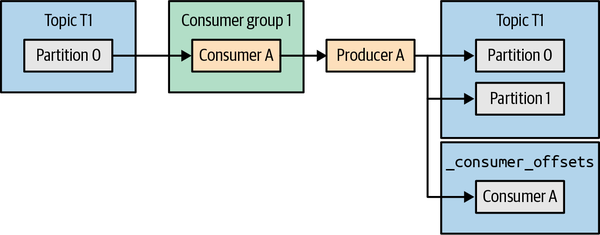
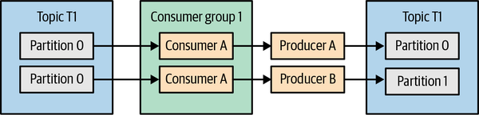
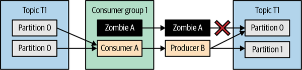

# Chương 8. Ngữ nghĩa Exactly-Once (Exactly-Once Semantics)

Trong Chương 7 chúng ta đã bàn về các tham số cấu hình và những thực hành tốt nhất cho phép người dùng Kafka kiểm soát các bảo đảm về độ tin cậy của Kafka. Chúng ta đã tập trung vào việc phân phối at-least-once — bảo đảm rằng Kafka sẽ không làm mất những message mà nó đã xác nhận là đã được commit. Điều này vẫn để ngỏ khả năng xuất hiện message trùng lặp.

Trong những hệ thống đơn giản, nơi message được produce rồi được nhiều ứng dụng khác nhau consume, bản trùng lặp chỉ là một sự phiền toái khá dễ xử lý. Phần lớn ứng dụng trong thực tế đều chứa các định danh duy nhất mà ứng dụng consume có thể dùng để khử trùng lặp (deduplicate) message.

Mọi thứ trở nên phức tạp hơn khi chúng ta nhìn vào các ứng dụng stream processing thực hiện tổng hợp (aggregate) event. Khi xem xét một ứng dụng consume các event, tính giá trị trung bình rồi produce kết quả, thường là không thể để những người kiểm tra kết quả phát hiện ra rằng giá trị trung bình đó sai vì có một event bị xử lý hai lần trong lúc tính trung bình. Trong những trường hợp như vậy, điều quan trọng là phải cung cấp một bảo đảm mạnh hơn — ngữ nghĩa xử lý exactly-once.

Trong chương này, chúng ta sẽ bàn về cách dùng Kafka với ngữ nghĩa exactly-once, các tình huống sử dụng được khuyến nghị, và những giới hạn. Cũng giống như khi bàn về các bảo đảm at-least-once, chúng ta sẽ đi sâu hơn một chút và đưa ra một số hiểu biết cùng trực giác về cách bảo đảm này được hiện thực hóa. Bạn có thể bỏ qua các chi tiết này khi đọc chương lần đầu, nhưng chúng sẽ hữu ích để nắm được trước khi sử dụng tính năng — chúng giúp làm rõ ý nghĩa của các cấu hình và API khác nhau cũng như cách dùng chúng tốt nhất.

Ngữ nghĩa exactly-once trong Kafka là sự kết hợp của hai tính năng chính: idempotent producer, giúp tránh các bản trùng lặp do producer retry gây ra, và ngữ nghĩa transaction, bảo đảm xử lý exactly-once trong các ứng dụng stream processing. Chúng ta sẽ bàn về cả hai, bắt đầu với idempotent producer vì nó đơn giản hơn và hữu dụng phổ quát hơn.

## Idempotent Producer

Một dịch vụ được gọi là idempotent nếu việc thực hiện cùng một thao tác nhiều lần cho ra kết quả giống hệt như khi thực hiện thao tác đó đúng một lần. Trong cơ sở dữ liệu, điều này thường được minh họa bằng sự khác biệt giữa `UPDATE t SET x=x+1 where y=5` và `UPDATE t SET x=18 where y=5`. Ví dụ thứ nhất không idempotent; nếu gọi nó ba lần, chúng ta sẽ có kết quả rất khác so với khi chỉ gọi một lần. Ví dụ thứ hai là idempotent — bất kể chúng ta chạy câu lệnh này bao nhiêu lần, `x` vẫn sẽ bằng 18.

Điều này liên quan gì đến một Kafka producer? Nếu chúng ta cấu hình một producer theo ngữ nghĩa at-least-once thay vì ngữ nghĩa idempotent, điều đó có nghĩa là trong các trường hợp không chắc chắn, producer sẽ retry việc gửi message để nó đến nơi ít nhất một lần. Những lần retry này có thể dẫn đến bản trùng lặp.

Trường hợp kinh điển là khi leader của một partition nhận được một record từ producer, replicate nó thành công sang các follower, rồi broker chứa leader đó crash trước khi kịp gửi response về cho producer. Producer, sau một khoảng thời gian nhất định không nhận được response, sẽ gửi lại message. Message sẽ đến leader mới, mà leader này vốn đã có một bản sao của message từ lần gửi trước — kết quả là một bản trùng lặp.

Ở một số ứng dụng, bản trùng lặp không quan trọng lắm, nhưng ở những ứng dụng khác chúng có thể dẫn đến sai lệch kiểm kê hàng tồn kho, báo cáo tài chính sai, hoặc gửi cho ai đó hai chiếc ô thay vì một chiếc như họ đã đặt.

Idempotent producer của Kafka giải quyết vấn đề này bằng cách tự động phát hiện và xử lý những bản trùng lặp như vậy.

### Idempotent Producer hoạt động như thế nào?

Khi chúng ta bật idempotent producer, mỗi message sẽ bao gồm một producer ID (PID) duy nhất và một sequence number. Những giá trị này, cùng với topic và partition đích, xác định duy nhất từng message. Broker dùng các định danh duy nhất này để theo dõi năm message cuối cùng được produce tới mỗi partition trên broker. Để giới hạn số lượng sequence number trước đó phải theo dõi cho mỗi partition, chúng ta cũng yêu cầu producer phải dùng `max.inflight.requests=5` hoặc thấp hơn (mặc định là 5).

Khi một broker nhận được một message mà nó đã chấp nhận trước đó, nó sẽ từ chối bản trùng lặp với một lỗi thích hợp. Lỗi này được producer ghi log và được phản ánh trong các metric của producer, nhưng không gây ra bất kỳ exception nào và không đáng để báo động. Ở phía producer client, nó sẽ được cộng vào metric `record-error-rate`. Ở phía broker, nó là một phần của metric `ErrorsPerSec` thuộc type `RequestMetrics`, vốn bao gồm bộ đếm riêng cho từng loại lỗi.

Điều gì xảy ra nếu một broker nhận được một sequence number cao một cách bất thường? Broker mong đợi message số 2 sẽ được nối tiếp bởi message số 3; chuyện gì xảy ra nếu thay vào đó broker nhận được message số 27? Trong những trường hợp như vậy broker sẽ trả về lỗi "out of order sequence", nhưng nếu chúng ta dùng idempotent producer mà không dùng transaction thì có thể bỏ qua lỗi này.

> **Cảnh báo**
>
> Mặc dù producer sẽ tiếp tục hoạt động bình thường sau khi gặp exception "out of order sequence number", lỗi này thường cho thấy message đã bị mất giữa producer và broker — nếu broker nhận được message số 2 rồi tiếp đến message số 27, hẳn đã có chuyện gì đó xảy ra với các message từ 3 đến 26. Khi gặp lỗi như vậy trong log, bạn nên xem xét lại cấu hình của producer và của topic, đảm bảo producer được cấu hình với các giá trị được khuyến nghị cho độ tin cậy cao, và kiểm tra xem có xảy ra unclean leader election hay không.

Như luôn xảy ra với các hệ phân tán, thật thú vị khi xem xét hành vi của idempotent producer trong các điều kiện sự cố. Hãy xét hai trường hợp: producer khởi động lại và broker gặp sự cố.

#### Producer khởi động lại (Producer restart)

Khi một producer gặp sự cố, thường sẽ có một producer mới được tạo ra để thay thế nó — dù là do con người khởi động lại máy thủ công, hay bằng một framework tinh vi hơn như Kubernetes vốn cung cấp khả năng tự động phục hồi sau sự cố. Điểm mấu chốt là khi producer khởi động, nếu idempotent producer được bật, producer sẽ khởi tạo và liên hệ với một Kafka broker để sinh ra một producer ID. Mỗi lần khởi tạo một producer sẽ cho ra một ID hoàn toàn mới (giả sử chúng ta không bật transaction). Điều này có nghĩa là nếu một producer gặp sự cố và producer thay thế nó gửi một message đã từng được producer cũ gửi trước đó, broker sẽ không phát hiện được bản trùng lặp — hai message sẽ có producer ID khác nhau và sequence number khác nhau, và sẽ được coi là hai message khác nhau. Lưu ý rằng điều tương tự cũng đúng nếu producer cũ bị đóng băng rồi sống lại sau khi bản thay thế của nó đã khởi động — producer ban đầu không được nhận diện là zombie, bởi vì chúng ta có hai producer hoàn toàn khác nhau với ID khác nhau.

#### Broker gặp sự cố (Broker failure)

Khi một broker gặp sự cố, controller bầu chọn leader mới cho các partition vốn có leader nằm trên broker bị lỗi. Giả sử chúng ta có một producer produce message tới topic A, partition 0, vốn có replica leader trên broker 5 và một replica follower trên broker 3. Sau khi broker 5 gặp sự cố, broker 3 trở thành leader mới. Producer sẽ phát hiện ra leader mới là broker 3 thông qua giao thức metadata và bắt đầu produce tới nó. Nhưng làm sao broker 3 biết được những sequence nào đã được produce rồi để từ chối các bản trùng lặp?

Leader liên tục cập nhật trạng thái producer trong bộ nhớ của nó với năm sequence ID cuối cùng mỗi khi có message mới được produce. Các replica follower cập nhật buffer trong bộ nhớ của chính chúng mỗi khi chúng replicate message mới từ leader. Điều này có nghĩa là khi một follower trở thành leader, nó đã sẵn có các sequence number mới nhất trong bộ nhớ, và việc kiểm tra hợp lệ cho các message mới được produce có thể tiếp tục mà không gặp vấn đề hay độ trễ nào.

Nhưng chuyện gì xảy ra khi leader cũ quay trở lại? Sau khi khởi động lại, trạng thái producer cũ trong bộ nhớ sẽ không còn nằm trong bộ nhớ nữa. Để hỗ trợ việc phục hồi, các broker chụp một snapshot trạng thái producer ra file khi chúng shut down hoặc mỗi khi một segment được tạo. Khi broker khởi động, nó đọc trạng thái mới nhất từ file. Broker vừa khởi động lại sau đó tiếp tục cập nhật trạng thái producer trong lúc nó bắt kịp bằng cách replicate từ leader hiện tại, và nó sẽ có các sequence ID mới nhất trong bộ nhớ khi đã sẵn sàng để trở lại làm leader.

Chuyện gì xảy ra nếu một broker crash và snapshot cuối cùng chưa được cập nhật? Producer ID và sequence ID cũng là một phần của định dạng message được ghi vào log của Kafka. Trong quá trình phục hồi sau crash, trạng thái producer sẽ được khôi phục bằng cách đọc snapshot cũ hơn và cả các message từ segment mới nhất của mỗi partition. Một snapshot mới sẽ được lưu ngay khi quá trình phục hồi hoàn tất.

Một câu hỏi thú vị là chuyện gì xảy ra nếu không có message nào? Hãy hình dung một topic nào đó có thời gian retention là hai giờ, nhưng không có message mới nào đến trong hai giờ vừa qua — sẽ không có message nào để dùng cho việc phục hồi trạng thái nếu broker bị crash. May thay, không có message cũng có nghĩa là không có bản trùng lặp. Chúng ta sẽ bắt đầu chấp nhận message ngay lập tức (đồng thời ghi log cảnh báo về việc thiếu trạng thái), và tạo trạng thái producer từ những message mới đến.

### Giới hạn của Idempotent Producer

Idempotent producer của Kafka chỉ ngăn được các bản trùng lặp trong trường hợp retry do logic nội bộ của producer gây ra. Việc gọi `producer.send()` hai lần với cùng một message sẽ tạo ra một bản trùng lặp, và idempotent producer sẽ không ngăn chặn được điều đó. Lý do là producer không có cách nào biết được rằng hai record được gửi đi thực chất là cùng một record. Luôn là một ý hay khi dùng cơ chế retry có sẵn của producer thay vì bắt các exception của producer rồi tự retry từ phía ứng dụng; idempotent producer khiến mẫu hình này càng hấp dẫn hơn — đó là cách dễ nhất để tránh trùng lặp khi retry.

Cũng khá phổ biến việc các ứng dụng có nhiều instance, hoặc thậm chí một instance có nhiều producer. Nếu hai trong số các producer này cùng tìm cách gửi những message giống hệt nhau, idempotent producer sẽ không phát hiện được sự trùng lặp. Tình huống này khá phổ biến ở các ứng dụng lấy dữ liệu từ một nguồn nào đó — chẳng hạn một thư mục chứa file — rồi produce vào Kafka. Nếu ứng dụng tình cờ có hai instance cùng đọc một file và cùng produce record vào Kafka, chúng ta sẽ nhận được nhiều bản sao của các record trong file đó.

> **Mẹo**
>
> Idempotent producer chỉ ngăn chặn các bản trùng lặp gây ra bởi cơ chế retry của chính producer, bất kể việc retry đó là do lỗi của producer, của mạng, hay của broker. Ngoài ra thì không ngăn được gì khác.

### Làm thế nào để dùng Kafka Idempotent Producer?

Đây là phần dễ. Hãy thêm `enable.idempotence=true` vào cấu hình của producer. Nếu producer đã được cấu hình với `acks=all`, sẽ không có khác biệt gì về hiệu năng. Bằng việc bật idempotent producer, những điều sau sẽ thay đổi:

- Để lấy được một producer ID, producer sẽ thực hiện thêm một lệnh gọi API khi khởi động.
- Mỗi record batch được gửi đi sẽ bao gồm producer ID và sequence ID của message đầu tiên trong batch (sequence ID cho từng message trong batch được suy ra từ sequence ID của message đầu tiên cộng với một độ lệch). Các trường mới này thêm 96 bit vào mỗi record batch (producer ID là kiểu long, còn sequence là kiểu integer), gần như không đáng kể về overhead đối với hầu hết khối lượng công việc.
- Các broker sẽ kiểm tra hợp lệ sequence number từ bất kỳ instance producer đơn lẻ nào và bảo đảm không có message trùng lặp.
- Thứ tự các message được produce tới mỗi partition sẽ được bảo đảm, qua mọi kịch bản sự cố, ngay cả khi `max.in.flight.requests.per.connection` được đặt lớn hơn 1 (5 là giá trị mặc định và cũng là giá trị cao nhất mà idempotent producer hỗ trợ).

> **Lưu ý**
>
> Logic của idempotent producer và việc xử lý lỗi đã được cải thiện đáng kể ở phiên bản 2.5 (cả ở phía producer lẫn phía broker) nhờ KIP-360. Trước bản 2.5, trạng thái producer không phải lúc nào cũng được duy trì đủ lâu, dẫn đến các lỗi nghiêm trọng `UNKNOWN_PRODUCER_ID` trong nhiều tình huống khác nhau (việc partition reassignment có một trường hợp biên đã biết, trong đó replica mới trở thành leader trước khi có bất kỳ lần ghi nào từ một producer cụ thể, nghĩa là leader mới không có trạng thái nào cho partition đó). Ngoài ra, các phiên bản trước còn tìm cách ghi lại sequence ID trong một số tình huống lỗi, điều này có thể dẫn đến trùng lặp. Ở các phiên bản mới hơn, nếu chúng ta gặp một lỗi nghiêm trọng đối với một record batch, batch này và tất cả các batch đang in flight sẽ bị từ chối. Người viết ứng dụng có thể xử lý exception và quyết định xem nên bỏ qua các record đó hay retry và chấp nhận rủi ro trùng lặp cũng như sai thứ tự.

## Transactions

Như chúng ta đã đề cập ở phần mở đầu chương này, transaction được bổ sung vào Kafka để bảo đảm tính đúng đắn của các ứng dụng được phát triển bằng Kafka Streams. Để một ứng dụng stream processing tạo ra kết quả đúng, mỗi record đầu vào phải được xử lý đúng một lần, và kết quả xử lý của nó phải được phản ánh đúng một lần, ngay cả khi có sự cố. Transaction trong Apache Kafka cho phép các ứng dụng stream processing tạo ra kết quả chính xác. Điều này, đến lượt nó, cho phép các nhà phát triển dùng ứng dụng stream processing trong những bài toán mà độ chính xác là một yêu cầu then chốt.

Cần lưu ý rằng transaction trong Kafka được phát triển dành riêng cho các ứng dụng stream processing. Và do đó chúng được xây dựng để hoạt động với mẫu hình "consume-process-produce" vốn là nền tảng của các ứng dụng stream processing. Việc dùng transaction có thể bảo đảm ngữ nghĩa exactly-once trong bối cảnh này — việc xử lý mỗi record đầu vào sẽ được coi là hoàn tất sau khi trạng thái nội bộ của ứng dụng đã được cập nhật và kết quả đã được produce thành công tới các topic đầu ra. Trong mục "Những vấn đề nào không được transaction giải quyết?", chúng ta sẽ khám phá một vài tình huống mà các bảo đảm exactly-once của Kafka sẽ không áp dụng được.

> **Lưu ý**
>
> Transaction là tên của cơ chế nền tảng bên dưới. Ngữ nghĩa exactly-once hay bảo đảm exactly-once là hành vi của một ứng dụng stream processing. Kafka Streams dùng transaction để hiện thực hóa các bảo đảm exactly-once của nó. Các framework stream processing khác, chẳng hạn Spark Streaming hay Flink, dùng những cơ chế khác để cung cấp ngữ nghĩa exactly-once cho người dùng của họ.

### Các tình huống sử dụng Transaction

Transaction hữu ích cho bất kỳ ứng dụng stream processing nào mà độ chính xác là quan trọng, đặc biệt là khi việc stream processing bao gồm tổng hợp (aggregation) và/hoặc join. Nếu ứng dụng stream processing chỉ thực hiện biến đổi và lọc trên từng record riêng lẻ, thì không có trạng thái nội bộ nào cần cập nhật, và ngay cả khi có bản trùng lặp phát sinh trong quá trình đó, việc lọc chúng ra khỏi stream đầu ra cũng khá đơn giản. Khi ứng dụng stream processing tổng hợp nhiều record thành một, thì khó hơn nhiều để kiểm tra xem một record kết quả có sai hay không do một số record đầu vào bị đếm nhiều hơn một lần; và không thể sửa được kết quả nếu không xử lý lại dữ liệu đầu vào.

Các ứng dụng tài chính là ví dụ điển hình của những ứng dụng stream processing phức tạp, nơi năng lực exactly-once được dùng để bảo đảm việc tổng hợp chính xác. Tuy nhiên, vì việc cấu hình bất kỳ ứng dụng Kafka Streams nào để cung cấp bảo đảm exactly-once là khá đơn giản, chúng tôi đã thấy nó được bật trong cả những bài toán bình thường hơn nhiều, ví dụ như chatbot.

### Transaction giải quyết những vấn đề gì?

Hãy xét một ứng dụng stream processing đơn giản: nó đọc event từ một topic nguồn, có thể xử lý chúng, rồi ghi kết quả vào một topic khác. Chúng ta muốn chắc chắn rằng với mỗi message chúng ta xử lý, kết quả được ghi đúng một lần. Có thể có chuyện gì sai được chứ?

Hóa ra khá nhiều thứ có thể sai. Hãy xem hai tình huống.

#### Xử lý lại do ứng dụng crash (Reprocessing caused by application crashes)

Sau khi consume một message từ cluster nguồn và xử lý nó, ứng dụng phải làm hai việc: produce kết quả tới topic đầu ra, và commit offset của message mà chúng ta đã consume. Giả sử hai hành động riêng biệt này diễn ra theo thứ tự đó. Chuyện gì xảy ra nếu ứng dụng crash sau khi kết quả đã được produce nhưng trước khi offset của đầu vào được commit?

Trong Chương 4, chúng ta đã bàn về chuyện gì xảy ra khi một consumer crash. Sau vài giây, việc thiếu heartbeat sẽ kích hoạt một lần rebalance, và các partition mà consumer đó đang consume sẽ được gán lại cho một consumer khác. Consumer đó sẽ bắt đầu consume record từ những partition này, bắt đầu từ offset đã commit gần nhất. Điều này có nghĩa là tất cả các record đã được ứng dụng xử lý trong khoảng từ offset commit gần nhất đến lúc crash sẽ bị xử lý lại, và kết quả sẽ lại được ghi vào topic đầu ra — dẫn đến trùng lặp.

#### Xử lý lại do ứng dụng zombie (Reprocessing caused by zombie applications)

Chuyện gì xảy ra nếu ứng dụng của chúng ta vừa consume một batch record từ Kafka rồi bị đóng băng hoặc mất kết nối tới Kafka trước khi kịp làm bất cứ điều gì khác với batch record đó?

Cũng giống như tình huống trước, sau khi bỏ lỡ vài lần heartbeat, ứng dụng sẽ bị coi là đã chết và các partition của nó sẽ được gán lại cho một consumer khác trong consumer group. Consumer đó sẽ đọc lại batch record ấy, xử lý nó, produce kết quả tới một topic đầu ra, rồi tiếp tục.

Trong lúc đó, instance đầu tiên của ứng dụng — cái bị đóng băng — có thể tiếp tục hoạt động trở lại: xử lý batch record mà nó vừa consume, và produce kết quả tới topic đầu ra. Nó có thể làm tất cả những việc đó trước khi nó poll Kafka để lấy record hoặc gửi heartbeat và phát hiện ra rằng lẽ ra nó đã phải chết và một instance khác giờ đang sở hữu những partition đó.

Một consumer đã chết nhưng không biết mình đã chết được gọi là *zombie*. Trong tình huống này, chúng ta có thể thấy rằng nếu không có thêm bảo đảm nào, các zombie có thể produce dữ liệu vào topic đầu ra và gây ra kết quả trùng lặp.

### Transaction bảo đảm Exactly-Once bằng cách nào?

Hãy lấy lại ứng dụng stream processing đơn giản của chúng ta. Nó đọc dữ liệu từ một topic, xử lý dữ liệu, rồi ghi kết quả vào một topic khác. Xử lý exactly-once nghĩa là việc consume, xử lý và produce được thực hiện một cách nguyên tử (atomic). Hoặc là offset của message gốc được commit và kết quả được produce thành công, hoặc là không việc nào trong hai việc đó xảy ra. Chúng ta cần đảm bảo rằng kết quả cục bộ — nơi offset được commit nhưng kết quả không được produce, hoặc ngược lại — không thể xảy ra.

Để hỗ trợ hành vi này, transaction của Kafka đưa ra ý tưởng về *atomic multipartition write* (ghi nguyên tử trên nhiều partition). Ý tưởng là việc commit offset và việc produce kết quả đều liên quan đến việc ghi message vào các partition. Tuy nhiên, kết quả được ghi vào một topic đầu ra, còn offset được ghi vào topic `_consumer_offsets`. Nếu chúng ta có thể mở một transaction, ghi cả hai message, và commit nếu cả hai đều được ghi thành công — hoặc abort để retry nếu không thành công — chúng ta sẽ có được ngữ nghĩa exactly-once mà chúng ta mong muốn.

Hình 8-1 minh họa một ứng dụng stream processing đơn giản, thực hiện một atomic multipartition write vào hai partition đồng thời commit offset cho event mà nó đã consume.



**Hình 8-1. Transactional producer với atomic multipartition write**

Để dùng transaction và thực hiện atomic multipartition write, chúng ta dùng một *transactional producer*. Một transactional producer đơn giản là một Kafka producer được cấu hình với một `transactional.id` và đã được khởi tạo bằng `initTransactions()`. Không giống `producer.id` vốn được các Kafka broker sinh ra tự động, `transactional.id` là một phần của cấu hình producer và được kỳ vọng sẽ tồn tại bền vững qua các lần khởi động lại. Trên thực tế, vai trò chính của `transactional.id` là để nhận diện cùng một producer qua các lần khởi động lại. Các Kafka broker duy trì ánh xạ từ `transactional.id` sang `producer.id`, nên nếu `initTransactions()` được gọi lại với một `transactional.id` đã tồn tại, producer cũng sẽ được gán cùng một `producer.id` thay vì một số ngẫu nhiên mới.

Việc ngăn các instance zombie của ứng dụng tạo ra bản trùng lặp đòi hỏi một cơ chế *zombie fencing*, tức là ngăn các instance zombie của ứng dụng ghi kết quả vào stream đầu ra. Cách thông thường để fence zombie — dùng một *epoch* — được áp dụng ở đây. Kafka tăng số epoch gắn với một `transactional.id` khi `initTransaction()` được gọi để khởi tạo một transactional producer. Các request send, commit và abort từ những producer có cùng `transactional.id` nhưng epoch thấp hơn sẽ bị từ chối với lỗi `FencedProducer`. Producer cũ sẽ không thể ghi vào stream đầu ra và sẽ buộc phải `close()`, ngăn zombie đưa vào các record trùng lặp. Từ Apache Kafka 2.5 trở đi, còn có tùy chọn thêm metadata của consumer group vào metadata của transaction. Metadata này cũng sẽ được dùng để fencing, cho phép các producer với transactional ID khác nhau cùng ghi vào một partition trong khi vẫn fence được các instance zombie.

Transaction phần lớn là một tính năng của producer — chúng ta tạo một transactional producer, bắt đầu transaction, ghi record vào nhiều partition, produce offset để đánh dấu các record là đã được xử lý, rồi commit hoặc abort transaction. Chúng ta làm tất cả những việc này từ phía producer. Tuy nhiên, chừng đó vẫn chưa đủ — các record được ghi theo kiểu transaction, kể cả những record thuộc về các transaction rốt cuộc bị abort, vẫn được ghi vào partition giống như mọi record khác. Consumer cần được cấu hình với các bảo đảm về mức cô lập (isolation) phù hợp, nếu không chúng ta sẽ không có được các bảo đảm exactly-once như mong đợi.

Chúng ta kiểm soát việc consume các message được ghi theo kiểu transaction bằng cách thiết lập cấu hình `isolation.level`. Nếu đặt là `read_committed`, việc gọi `consumer.poll()` sau khi subscribe vào một tập topic sẽ trả về những message hoặc thuộc về một transaction đã commit thành công, hoặc được ghi theo kiểu không transaction; nó sẽ không trả về những message thuộc về một transaction đã bị abort hoặc một transaction vẫn còn đang mở. Giá trị mặc định của `isolation.level` là `read_uncommitted`, sẽ trả về tất cả record, bao gồm cả những record thuộc về các transaction đang mở hoặc đã bị abort. Việc cấu hình chế độ `read_committed` không bảo đảm rằng ứng dụng sẽ nhận được tất cả message thuộc về một transaction cụ thể. Hoàn toàn có thể xảy ra việc chỉ subscribe vào một tập con các topic vốn là một phần của transaction và do đó chỉ nhận được một tập con các message. Ngoài ra, ứng dụng không thể biết được khi nào transaction bắt đầu hay kết thúc, hay message nào thuộc về transaction nào.

Hình 8-2 cho thấy những record nào hiển thị với một consumer ở chế độ `read_committed` so với một consumer ở chế độ mặc định `read_uncommitted`.


**Hình 8-2. Consumer ở chế độ `read_committed` sẽ tụt lại phía sau so với consumer dùng cấu hình mặc định**

Để bảo đảm rằng message sẽ được đọc đúng thứ tự, chế độ `read_committed` sẽ không trả về những message được produce sau thời điểm mà transaction đang mở đầu tiên bắt đầu (điểm này được gọi là Last Stable Offset, hay LSO). Những message đó sẽ bị giữ lại cho đến khi transaction ấy được producer commit hoặc abort, hoặc cho đến khi chúng chạm ngưỡng `transaction.timeout.ms` (mặc định là 15 phút) và bị broker abort. Việc giữ một transaction mở trong thời gian dài sẽ làm tăng độ trễ đầu-cuối do làm chậm các consumer.

Công việc stream processing đơn giản của chúng ta sẽ có bảo đảm exactly-once trên đầu ra của nó ngay cả khi đầu vào được ghi theo kiểu không transaction. Việc produce nguyên tử trên nhiều partition bảo đảm rằng nếu các record đầu ra đã được commit vào topic đầu ra thì offset của các record đầu vào cũng đã được commit cho consumer đó, và do đó các record đầu vào sẽ không bị xử lý lại.

### Những vấn đề nào không được Transaction giải quyết?

Như đã giải thích ở trên, transaction được bổ sung vào Kafka để cung cấp khả năng ghi nguyên tử trên nhiều partition (nhưng không phải đọc) và để fence các producer zombie trong các ứng dụng stream processing. Kết quả là chúng cung cấp bảo đảm exactly-once khi được dùng bên trong các chuỗi tác vụ stream processing theo kiểu consume-process-produce. Trong những bối cảnh khác, transaction hoặc là sẽ hoàn toàn không hoạt động, hoặc sẽ đòi hỏi thêm công sức để đạt được những bảo đảm mà chúng ta mong muốn.

Hai sai lầm chính là giả định rằng bảo đảm exactly-once áp dụng cho cả những hành động khác ngoài việc produce vào Kafka, và giả định rằng consumer luôn đọc trọn vẹn các transaction và có thông tin về ranh giới của transaction.

Sau đây là một vài tình huống mà transaction của Kafka sẽ không giúp đạt được bảo đảm exactly-once.

#### Tác dụng phụ trong lúc stream processing (Side effects while stream processing)

Giả sử bước xử lý record trong ứng dụng stream processing của chúng ta bao gồm việc gửi email cho người dùng. Việc bật ngữ nghĩa exactly-once trong ứng dụng của chúng ta sẽ không bảo đảm rằng email chỉ được gửi một lần. Bảo đảm này chỉ áp dụng cho các record được ghi vào Kafka. Việc dùng sequence number để khử trùng lặp record hay dùng marker để abort hoặc hủy một transaction chỉ có tác dụng bên trong Kafka, nhưng nó sẽ không thể "thu hồi" một email đã gửi. Điều tương tự cũng đúng với bất kỳ hành động nào có tác động ra bên ngoài được thực hiện bên trong ứng dụng stream processing: gọi một REST API, ghi vào một file, v.v.

#### Đọc từ một topic Kafka và ghi vào một cơ sở dữ liệu (Reading from a Kafka topic and writing to a database)

Trong trường hợp này, ứng dụng ghi vào một cơ sở dữ liệu bên ngoài thay vì ghi vào Kafka. Trong tình huống này không có producer nào tham gia — record được ghi vào cơ sở dữ liệu bằng một database driver (nhiều khả năng là JDBC) và offset được commit vào Kafka bên trong consumer. Không có cơ chế nào cho phép ghi kết quả vào một cơ sở dữ liệu bên ngoài và commit offset vào Kafka trong cùng một transaction. Thay vào đó, chúng ta có thể quản lý offset ngay trong cơ sở dữ liệu (như đã giải thích trong Chương 4) và commit cả dữ liệu lẫn offset vào cơ sở dữ liệu trong một transaction duy nhất — cách này dựa vào các bảo đảm transaction của cơ sở dữ liệu chứ không phải của Kafka.

> **Lưu ý**
>
> Các microservice thường cần cập nhật cơ sở dữ liệu và publish một message vào Kafka trong cùng một transaction nguyên tử, sao cho hoặc là cả hai cùng xảy ra, hoặc là không cái nào xảy ra. Như chúng ta vừa giải thích trong hai ví dụ vừa rồi, transaction của Kafka sẽ không làm được điều này.
>
> Một giải pháp phổ biến cho vấn đề phổ biến này được gọi là *outbox pattern* (mẫu hộp thư đi). Microservice chỉ publish message vào một topic Kafka (chính là "outbox"), và một dịch vụ chuyển tiếp message riêng biệt sẽ đọc event từ Kafka rồi cập nhật cơ sở dữ liệu. Bởi vì, như chúng ta vừa thấy, Kafka sẽ không bảo đảm việc cập nhật cơ sở dữ liệu đúng một lần, nên điều quan trọng là phải đảm bảo thao tác cập nhật đó là idempotent.
>
> Dùng mẫu hình này bảo đảm rằng message rốt cuộc sẽ đến được Kafka, đến được các consumer của topic, và đến được cơ sở dữ liệu — hoặc là không đến được nơi nào cả.
>
> Mẫu hình ngược lại — trong đó một bảng của cơ sở dữ liệu đóng vai trò outbox và một dịch vụ chuyển tiếp bảo đảm rằng các cập nhật vào bảng đó cũng sẽ đến Kafka dưới dạng message — cũng được sử dụng. Mẫu hình này được ưa chuộng khi các ràng buộc có sẵn của RDBMS, chẳng hạn tính duy nhất và khóa ngoại, là hữu ích. Dự án Debezium đã đăng một bài blog phân tích sâu về outbox pattern kèm các ví dụ chi tiết.

#### Đọc dữ liệu từ một cơ sở dữ liệu, ghi vào Kafka, rồi từ đó ghi sang một cơ sở dữ liệu khác

Rất dễ bị cám dỗ để tin rằng chúng ta có thể xây dựng một ứng dụng đọc dữ liệu từ một cơ sở dữ liệu, nhận diện các transaction của cơ sở dữ liệu, ghi các record vào Kafka, và từ đó ghi record sang một cơ sở dữ liệu khác, mà vẫn giữ nguyên được các transaction ban đầu từ cơ sở dữ liệu nguồn.

Đáng tiếc là transaction của Kafka không có những chức năng cần thiết để hỗ trợ loại bảo đảm đầu-cuối này. Ngoài vấn đề về việc commit cả record lẫn offset trong cùng một transaction, còn có một khó khăn khác: các bảo đảm `read_committed` trong Kafka consumer quá yếu để bảo toàn được transaction của cơ sở dữ liệu. Đúng là một consumer sẽ không nhìn thấy những record chưa được commit. Nhưng nó không được bảo đảm là đã nhìn thấy tất cả các record đã được commit bên trong transaction đó, bởi vì nó có thể đang bị tụt lại (lag) trên một số topic; nó không có thông tin để nhận diện ranh giới transaction, nên nó không thể biết một transaction bắt đầu và kết thúc khi nào, và liệu nó đã nhìn thấy một phần, không phần nào, hay toàn bộ các record của transaction đó.

#### Sao chép dữ liệu từ một Kafka cluster sang một cluster khác (Copying data from one Kafka cluster to another)

Trường hợp này tinh tế hơn — hoàn toàn có thể hỗ trợ bảo đảm exactly-once khi sao chép dữ liệu từ một Kafka cluster sang một cluster khác. Có một mô tả về cách làm điều này trong đề xuất cải tiến Kafka (Kafka improvement proposal) về việc bổ sung năng lực exactly-once cho MirrorMaker 2.0. Tại thời điểm viết cuốn sách này, đề xuất vẫn còn ở dạng dự thảo, nhưng thuật toán đã được mô tả rõ ràng. Đề xuất này bao gồm bảo đảm rằng mỗi record trong cluster nguồn sẽ được sao chép sang cluster đích đúng một lần.

Tuy nhiên, điều đó không bảo đảm rằng các transaction sẽ mang tính nguyên tử. Nếu một ứng dụng produce vài record và offset theo kiểu transaction, rồi MirrorMaker 2.0 sao chép chúng sang một Kafka cluster khác, thì các thuộc tính và bảo đảm của transaction sẽ bị mất trong quá trình sao chép. Chúng bị mất vì cùng lý do như khi sao chép dữ liệu từ Kafka sang một cơ sở dữ liệu quan hệ: consumer đọc dữ liệu từ Kafka không thể biết hay bảo đảm rằng nó đang nhận được tất cả các event trong một transaction. Chẳng hạn, nó có thể replicate một phần của transaction nếu nó chỉ subscribe vào một tập con các topic.

#### Mẫu hình publish/subscribe (Publish/subscribe pattern)

Đây là một trường hợp tinh tế hơn một chút. Chúng ta đã bàn về exactly-once trong bối cảnh của mẫu hình consume-process-produce, nhưng mẫu hình publish/subscribe cũng là một bài toán rất phổ biến. Việc dùng transaction trong bài toán publish/subscribe có cung cấp một số bảo đảm: các consumer được cấu hình ở chế độ `read_committed` sẽ không nhìn thấy những record được publish như một phần của transaction đã bị abort. Nhưng những bảo đảm đó vẫn chưa đạt tới mức exactly-once. Consumer vẫn có thể xử lý một message nhiều hơn một lần, tùy thuộc vào logic commit offset của chính chúng.

Những bảo đảm mà Kafka cung cấp trong trường hợp này tương tự như những bảo đảm mà transaction của JMS cung cấp, nhưng phụ thuộc vào việc consumer ở chế độ `read_committed` để bảo đảm rằng các transaction chưa commit sẽ vẫn vô hình. Trong khi đó, các JMS broker giữ lại các transaction chưa commit khỏi mọi consumer.

> **Cảnh báo**
>
> Một mẫu hình quan trọng cần tránh là publish một message rồi chờ một ứng dụng khác phản hồi trước khi commit transaction. Ứng dụng kia sẽ không nhận được message cho đến sau khi transaction được commit, dẫn đến deadlock.

### Làm thế nào để dùng Transaction?

Transaction là một tính năng của broker và là một phần của giao thức Kafka, nên có nhiều client hỗ trợ transaction.

Cách dùng transaction phổ biến nhất và được khuyến nghị nhất là bật bảo đảm exactly-once trong Kafka Streams. Theo cách này, chúng ta sẽ hoàn toàn không dùng transaction một cách trực tiếp, mà Kafka Streams sẽ dùng chúng thay cho chúng ta ở hậu trường để cung cấp những bảo đảm mà chúng ta cần. Transaction được thiết kế với chính bài toán này trong đầu, nên việc dùng chúng thông qua Kafka Streams là cách dễ nhất và nhiều khả năng hoạt động đúng như mong đợi nhất.

Để bật bảo đảm exactly-once cho một ứng dụng Kafka Streams, chúng ta chỉ cần đặt cấu hình `processing.guarantee` thành `exactly_once` hoặc `exactly_once_beta`. Chỉ vậy thôi.

> **Lưu ý**
>
> `exactly_once_beta` là một phương pháp hơi khác để xử lý các instance ứng dụng bị crash hoặc treo trong khi vẫn còn transaction đang in flight. Phương pháp này được giới thiệu ở bản 2.5 cho Kafka broker, và ở bản 2.6 cho Kafka Streams. Lợi ích chính của phương pháp này là khả năng xử lý nhiều partition chỉ với một transactional producer duy nhất, và nhờ đó tạo ra các ứng dụng Kafka Streams có khả năng mở rộng tốt hơn. Có thêm thông tin về những thay đổi này trong đề xuất cải tiến Kafka nơi chúng lần đầu được thảo luận.

Nhưng nếu chúng ta muốn có bảo đảm exactly-once mà không dùng Kafka Streams thì sao? Trong trường hợp này chúng ta sẽ dùng trực tiếp các API transaction. Dưới đây là một đoạn mã minh họa cách làm điều này. Có một ví dụ đầy đủ trên GitHub của Apache Kafka, bao gồm một demo driver và một bộ xử lý exactly-once đơn giản chạy trong các thread riêng biệt:

```java
Properties producerProps = new Properties();
producerProps.put(ProducerConfig.BOOTSTRAP_SERVERS_CONFIG, "localhost:9092
producerProps.put(ProducerConfig.CLIENT_ID_CONFIG, "DemoProducer");
producerProps.put(ProducerConfig.TRANSACTIONAL_ID_CONFIG, transactionalId)  ❶

producer = new KafkaProducer<>(producerProps);

Properties consumerProps = new Properties();
consumerProps.put(ConsumerConfig.BOOTSTRAP_SERVERS_CONFIG, "localhost:9092
consumerProps.put(ConsumerConfig.GROUP_ID_CONFIG, groupId);
props.put(ConsumerConfig.ENABLE_AUTO_COMMIT_CONFIG, "false");  ❷
consumerProps.put(ConsumerConfig.ISOLATION_LEVEL_CONFIG, "read_committed")  ❸


consumer = new KafkaConsumer<>(consumerProps);

producer.initTransactions();  ❹

consumer.subscribe(Collections.singleton(inputTopic));  ❺

while (true) {
  try {
    ConsumerRecords<Integer, String> records =
      consumer.poll(Duration.ofMillis(200));
    if (records.count() > 0) {
        producer.beginTransaction();  ❻
        for (ConsumerRecord<Integer, String> record : records) {
          ProducerRecord<Integer, String> customizedRecord = transform(recor  ❼
          producer.send(customizedRecord);
        }
        Map<TopicPartition, OffsetAndMetadata> offsets = consumerOffsets();
        producer.sendOffsetsToTransaction(offsets, consumer.groupMetadata())  ❽
        producer.commitTransaction();  ❾
    }
 } catch (ProducerFencedException|InvalidProducerEpochException e) {  ❿
   throw new KafkaException(String.format(
     "The transactional.id %s is used by another process", transactionalI
 } catch (KafkaException e) {  ⓫
    producer.abortTransaction();
    resetToLastCommittedPositions(consumer);
 }}
```

❶ Việc cấu hình một producer với `transactional.id` biến nó thành một transactional producer có khả năng thực hiện các thao tác ghi nguyên tử trên nhiều partition. Transactional ID phải là duy nhất và tồn tại lâu dài. Về cơ bản nó định danh một instance của ứng dụng.

❷ Các consumer tham gia vào transaction không tự commit offset của chính chúng — producer mới là bên ghi offset như một phần của transaction. Vì vậy việc commit offset phải được tắt đi.

❸ Trong ví dụ này, consumer đọc từ một topic đầu vào. Chúng ta sẽ giả định rằng các record trong topic đầu vào cũng được ghi bởi một transactional producer (chỉ để cho vui thôi — không có yêu cầu nào như vậy đối với đầu vào). Để đọc các transaction một cách sạch sẽ (nghĩa là bỏ qua các transaction đang in flight và các transaction đã bị abort), chúng ta sẽ đặt isolation level của consumer thành `read_committed`. Lưu ý rằng consumer vẫn sẽ đọc được các bản ghi phi transaction, bên cạnh việc đọc các transaction đã được commit.

❹ Việc đầu tiên mà một transactional producer phải làm là khởi tạo. Thao tác này đăng ký transactional ID, tăng epoch lên để bảo đảm rằng các producer khác có cùng ID sẽ bị coi là zombie, và abort các transaction cũ đang in flight từ cùng transactional ID đó.

❺ Ở đây chúng ta đang dùng API `subscribe` của consumer, nghĩa là các partition được gán cho instance này của ứng dụng có thể thay đổi bất cứ lúc nào do kết quả của một lần rebalance. Trước bản 2.5, vốn là bản giới thiệu những thay đổi API từ KIP-447, điều này khó khăn hơn nhiều. Các transactional producer khi đó phải được gán tĩnh một tập partition, bởi vì cơ chế transaction fencing dựa vào việc cùng một transactional ID được dùng cho cùng những partition (không có bảo vệ zombie fencing nếu transactional ID thay đổi). KIP-447 đã bổ sung các API mới, được dùng trong ví dụ này, gắn thông tin consumer group vào transaction, và thông tin này được dùng cho việc fencing. Khi dùng phương pháp này, cũng hợp lý khi commit transaction mỗi lần các partition liên quan bị thu hồi (revoked).

❻ Chúng ta đã consume các record, và giờ chúng ta muốn xử lý chúng rồi produce kết quả. Phương thức này bảo đảm rằng mọi thứ được produce kể từ thời điểm nó được gọi, cho đến khi transaction được commit hoặc abort, đều là một phần của một transaction nguyên tử duy nhất.

❼ Đây là nơi chúng ta xử lý các record — toàn bộ logic nghiệp vụ của chúng ta nằm ở đây.

❽ Như đã giải thích ở phần trước của chương, điều quan trọng là phải commit offset như một phần của transaction. Điều này bảo đảm rằng nếu chúng ta không produce được kết quả thì chúng ta cũng sẽ không commit offset cho những record mà thực tế chưa được xử lý. Phương thức này commit offset như một phần của transaction. Lưu ý rằng điều quan trọng là không được commit offset bằng bất kỳ cách nào khác — hãy tắt tự động commit offset, và đừng gọi bất kỳ API commit nào của consumer. Việc commit offset bằng bất kỳ phương pháp nào khác đều không cung cấp các bảo đảm transaction.

❾ Chúng ta đã produce mọi thứ cần thiết, đã commit offset như một phần của transaction, và giờ là lúc commit transaction để chốt lại mọi chuyện. Một khi phương thức này trả về thành công, toàn bộ transaction đã đi trọn vẹn, và chúng ta có thể tiếp tục đọc và xử lý batch event tiếp theo.

❿ Nếu chúng ta nhận được exception này, điều đó có nghĩa là chúng ta chính là zombie. Bằng cách nào đó ứng dụng của chúng ta đã bị đóng băng hoặc mất kết nối, và có một instance mới hơn của ứng dụng với cùng transactional ID của chúng ta đang chạy. Nhiều khả năng transaction mà chúng ta bắt đầu đã bị abort và người khác đang xử lý những record đó. Chẳng còn gì để làm ngoài việc chết một cách nhẹ nhàng.

⓫ Nếu chúng ta gặp lỗi trong lúc ghi một transaction, chúng ta có thể abort transaction, đặt lại vị trí của consumer về trước, và thử lại.

### Transactional ID và Fencing

Việc chọn transactional ID cho các producer là quan trọng và khó hơn một chút so với vẻ ngoài của nó. Gán transactional ID không đúng cách có thể dẫn đến lỗi ứng dụng hoặc làm mất các bảo đảm exactly-once. Các yêu cầu then chốt là transactional ID phải nhất quán cho cùng một instance của ứng dụng qua các lần khởi động lại, và phải khác nhau giữa các instance khác nhau của ứng dụng, nếu không các broker sẽ không thể fence được các instance zombie.

Cho đến bản 2.5, cách duy nhất để bảo đảm việc fencing là ánh xạ tĩnh transactional ID với các partition. Điều này bảo đảm rằng mỗi partition sẽ luôn được consume bởi cùng một transactional ID. Nếu một producer với transactional ID A xử lý message từ topic T rồi mất kết nối, và producer mới thay thế nó có transactional ID B, rồi sau đó producer A quay trở lại như một zombie, thì zombie A sẽ không bị fence bởi vì ID của nó không khớp với ID của producer mới B. Chúng ta muốn producer A luôn được thay thế bởi producer A, và producer A mới sẽ có số epoch cao hơn, còn zombie A sẽ bị fence đi một cách đúng đắn. Ở những bản phát hành đó, ví dụ ở trên sẽ là không đúng — transactional ID được gán ngẫu nhiên cho các thread mà không đảm bảo rằng cùng một transactional ID luôn được dùng để ghi vào cùng những partition.

Trong Apache Kafka 2.5, KIP-447 đã giới thiệu một phương pháp fencing thứ hai dựa trên metadata của consumer group, bên cạnh việc fencing dựa trên transactional ID. Chúng ta dùng phương thức commit offset của producer và truyền vào đối số là metadata của consumer group thay vì chỉ truyền consumer group ID.

Giả sử chúng ta có topic T1 với hai partition, t-0 và t-1. Mỗi partition được consume bởi một consumer riêng biệt trong cùng một group; mỗi consumer chuyển các record cho một transactional producer tương ứng — một producer có transactional ID A và producer kia có transactional ID B; và chúng ghi kết quả ra topic T2 tại partition 0 và partition 1 tương ứng. Hình 8-3 minh họa tình huống này.



**Hình 8-3. Bộ xử lý record theo kiểu transaction**

Như minh họa ở Hình 8-4, nếu instance ứng dụng chứa consumer A và producer A trở thành zombie, thì consumer B sẽ bắt đầu xử lý record từ cả hai partition. Nếu chúng ta muốn bảo đảm rằng không có zombie nào ghi vào partition 0, thì consumer B không thể chỉ đơn giản bắt đầu đọc từ partition 0 và ghi vào partition 0 bằng transactional ID B. Thay vào đó, ứng dụng sẽ phải khởi tạo một producer mới với transactional ID A để có thể ghi an toàn vào partition 0 và fence transactional ID A cũ đi. Cách này rất lãng phí. Thay vì vậy, chúng ta đưa thông tin consumer group vào trong các transaction. Các transaction từ producer B sẽ cho thấy rằng chúng đến từ một thế hệ (generation) mới hơn của consumer group, và do đó chúng sẽ được chấp nhận, trong khi các transaction từ producer A giờ đã thành zombie sẽ cho thấy một thế hệ cũ của consumer group và sẽ bị fence.



**Hình 8-4. Bộ xử lý record theo kiểu transaction sau một lần rebalance**

### Transaction hoạt động như thế nào

Chúng ta có thể dùng transaction bằng cách gọi các API mà không cần hiểu chúng hoạt động ra sao. Nhưng việc có một mô hình tư duy nào đó về những gì đang diễn ra bên dưới sẽ giúp chúng ta xử lý sự cố cho những ứng dụng không hành xử như mong đợi.

Thuật toán cơ bản cho transaction trong Kafka được lấy cảm hứng từ Chandy-Lamport snapshot, trong đó các message điều khiển đóng vai trò "marker" được gửi vào các kênh truyền thông, và trạng thái nhất quán được xác định dựa trên sự đến nơi của marker. Transaction của Kafka dùng các message marker để chỉ ra rằng transaction đã được commit hay abort trên nhiều partition — khi producer quyết định commit một transaction, nó gửi một message "commit" tới transaction coordinator, và coordinator này sau đó sẽ ghi các commit marker vào tất cả các partition tham gia vào transaction. Nhưng chuyện gì xảy ra nếu producer crash sau khi chỉ mới ghi được commit message vào một tập con các partition? Transaction của Kafka giải quyết vấn đề này bằng cách dùng two-phase commit (commit hai pha) và một transaction log. Ở mức tổng quát, thuật toán sẽ:

1. Ghi log về sự tồn tại của một transaction đang diễn ra, bao gồm các partition tham gia
2. Ghi log ý định commit hay abort — một khi điều này đã được ghi log, chúng ta chắc chắn rồi cũng sẽ phải commit hoặc abort
3. Ghi tất cả các transaction marker vào tất cả các partition
4. Ghi log việc hoàn tất transaction

Để hiện thực hóa thuật toán cơ bản này, Kafka cần một transaction log. Chúng ta dùng một topic nội bộ có tên `__transaction_state`.

Hãy xem thuật toán này hoạt động ra sao trên thực tế bằng cách đi qua cơ chế bên trong của các lệnh gọi API transaction mà chúng ta đã dùng trong đoạn mã ở trên.

Trước khi bắt đầu transaction đầu tiên, các producer cần đăng ký là transactional bằng cách gọi `initTransaction()`. Request này được gửi tới một broker sẽ đóng vai trò transaction coordinator cho transactional producer này. Mỗi broker là transaction coordinator cho một tập con các producer, cũng giống như mỗi broker là consumer group coordinator cho một tập con các consumer group. Transaction coordinator cho mỗi transactional ID chính là leader của partition của transaction log mà transactional ID đó được ánh xạ tới.

API `initTransaction()` đăng ký một transactional ID mới với coordinator, hoặc tăng epoch của một transactional ID đã tồn tại để fence đi những producer trước đó có thể đã trở thành zombie. Khi epoch được tăng lên, các transaction đang chờ (pending) sẽ bị abort.

Bước tiếp theo của producer là gọi `beginTransaction()`. Lệnh gọi API này không thuộc về giao thức — nó chỉ đơn giản báo cho producer biết rằng giờ đây có một transaction đang diễn ra. Transaction coordinator ở phía broker vẫn chưa hề biết transaction đã bắt đầu. Tuy nhiên, một khi producer bắt đầu gửi record, mỗi lần producer phát hiện rằng nó đang gửi record tới một partition mới, nó cũng sẽ gửi `AddPartitionsToTxnRequest` tới broker để thông báo rằng có một transaction đang diễn ra cho producer này, và rằng có thêm những partition mới tham gia vào transaction. Thông tin này sẽ được ghi lại trong transaction log.

Khi chúng ta đã produce xong kết quả và sẵn sàng commit, chúng ta bắt đầu bằng việc commit offset cho những record mà chúng ta đã xử lý trong transaction này. Việc commit offset có thể được thực hiện vào bất cứ lúc nào nhưng phải được thực hiện trước khi transaction được commit. Việc gọi `sendOffsetsToTransaction()` sẽ gửi một request tới transaction coordinator, bao gồm các offset và cả consumer group ID. Transaction coordinator sẽ dùng consumer group ID để tìm ra group coordinator và commit các offset đúng như cách một consumer group vẫn thường làm.

Giờ là lúc commit — hoặc abort. Việc gọi `commitTransaction()` hoặc `abortTransaction()` sẽ gửi một `EndTransactionRequest` tới transaction coordinator. Transaction coordinator sẽ ghi ý định commit hay abort vào transaction log. Một khi bước này thành công, trách nhiệm hoàn tất quá trình commit (hoặc abort) thuộc về transaction coordinator. Nó ghi một commit marker vào tất cả các partition tham gia transaction, rồi ghi vào transaction log rằng việc commit đã hoàn tất thành công. Lưu ý rằng nếu transaction coordinator shut down hoặc crash sau khi đã ghi log ý định commit nhưng trước khi hoàn tất quá trình, thì một transaction coordinator mới sẽ được bầu chọn, tiếp nhận ý định commit từ transaction log, và hoàn tất quá trình đó.

Nếu một transaction không được commit hay abort trong khoảng `transaction.timeout.ms`, transaction coordinator sẽ tự động abort nó.

> **Cảnh báo**
>
> Mỗi broker nhận record từ các transactional producer hoặc idempotent producer sẽ lưu producer ID / transactional ID trong bộ nhớ, cùng với trạng thái liên quan của năm batch cuối cùng mà producer đã gửi: sequence number, offset, và những thứ tương tự. Trạng thái này được lưu trong `transactional.id.expiration.ms` mili giây sau khi producer ngừng hoạt động (mặc định là bảy ngày). Điều này cho phép producer tiếp tục hoạt động trở lại mà không gặp lỗi `UNKNOWN_PRODUCER_ID`. Hoàn toàn có thể gây ra thứ gì đó tương tự như rò rỉ bộ nhớ (memory leak) trên broker bằng cách tạo ra các idempotent producer mới hoặc các transactional ID mới với tốc độ rất cao nhưng không bao giờ tái sử dụng chúng. Ba idempotent producer mới mỗi giây, tích lũy trong suốt một tuần, sẽ dẫn đến 1,8 triệu bản ghi trạng thái producer với tổng cộng 9 triệu metadata của batch được lưu trữ, chiếm khoảng 5 GB RAM. Điều này có thể gây ra lỗi hết bộ nhớ (out-of-memory) hoặc các vấn đề garbage collection nghiêm trọng trên broker. Chúng tôi khuyến nghị thiết kế kiến trúc ứng dụng sao cho khởi tạo một vài producer tồn tại lâu dài khi ứng dụng khởi động, rồi tái sử dụng chúng trong suốt vòng đời của ứng dụng. Nếu điều này là bất khả thi (Function as a Service khiến việc này trở nên khó khăn), chúng tôi khuyến nghị giảm `transactional.id.expiration.ms` xuống để các ID hết hạn nhanh hơn, và nhờ đó trạng thái cũ vốn sẽ không bao giờ được tái sử dụng sẽ không chiếm một phần đáng kể bộ nhớ của broker.

## Hiệu năng của Transaction

Transaction thêm một lượng overhead vừa phải cho producer. Request đăng ký transactional ID chỉ diễn ra một lần trong vòng đời của producer. Các lệnh gọi bổ sung để đăng ký partition như một phần của transaction diễn ra nhiều nhất là một lần cho mỗi partition trong mỗi transaction, sau đó mỗi transaction gửi một request commit, việc này khiến một commit marker bổ sung được ghi vào mỗi partition. Các request khởi tạo transaction và commit transaction là đồng bộ, nên sẽ không có dữ liệu nào được gửi đi cho đến khi chúng hoàn tất thành công, thất bại, hoặc hết thời gian chờ, điều này càng làm tăng thêm overhead.

Lưu ý rằng overhead của transaction lên producer là độc lập với số lượng message trong một transaction. Vì vậy càng nhiều message trong mỗi transaction thì càng giảm được overhead tương đối và càng giảm số lần dừng đồng bộ, dẫn đến throughput tổng thể cao hơn.

Ở phía consumer, có một chút overhead liên quan đến việc đọc các commit marker. Tác động chính mà transaction gây ra cho hiệu năng của consumer đến từ việc các consumer ở chế độ `read_committed` sẽ không trả về những record thuộc về một transaction đang mở. Khoảng thời gian dài giữa các lần commit transaction đồng nghĩa với việc consumer sẽ phải chờ lâu hơn trước khi nhận được message, và kết quả là độ trễ đầu-cuối sẽ tăng lên.

Tuy nhiên, cần lưu ý rằng consumer không cần phải buffer những message thuộc về các transaction đang mở. Broker sẽ không trả về những message đó khi phản hồi các fetch request từ consumer. Vì consumer không phải làm thêm công việc gì khi đọc các transaction, nên cũng không có sự suy giảm nào về throughput.

## Tóm tắt

Ngữ nghĩa exactly-once trong Kafka là điều ngược lại với cờ vua: nó khó hiểu nhưng lại dễ dùng.

Chương này đã bàn về hai cơ chế then chốt cung cấp bảo đảm exactly-once trong Kafka: idempotent producer, vốn tránh được các bản trùng lặp gây ra bởi cơ chế retry, và transaction, vốn tạo nên nền tảng của ngữ nghĩa exactly-once trong Kafka Streams.

Cả hai đều có thể được bật chỉ bằng một cấu hình duy nhất và cho phép chúng ta dùng Kafka cho những ứng dụng đòi hỏi ít bản trùng lặp hơn và có bảo đảm về tính đúng đắn mạnh mẽ hơn.

Chúng ta đã thảo luận sâu về các tình huống và bài toán cụ thể để cho thấy hành vi được kỳ vọng, và thậm chí đã xem xét một số chi tiết hiện thực. Những chi tiết đó là quan trọng khi xử lý sự cố cho ứng dụng hoặc khi dùng trực tiếp các API transaction.

Bằng việc hiểu rõ ngữ nghĩa exactly-once của Kafka bảo đảm điều gì trong bài toán nào, chúng ta có thể thiết kế những ứng dụng biết dùng exactly-once khi cần thiết. Hành vi của ứng dụng lẽ ra không nên gây bất ngờ, và những thông tin trong chương này sẽ giúp chúng ta tránh được các bất ngờ đó.
