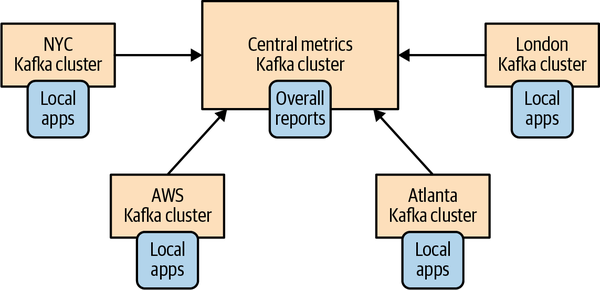
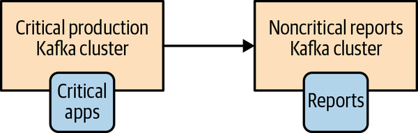
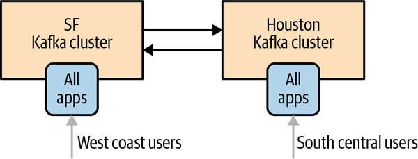
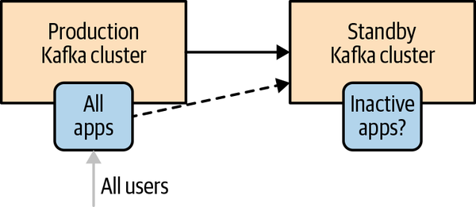
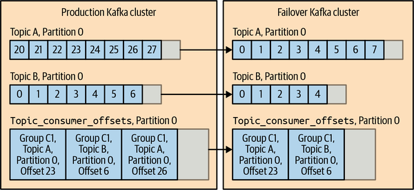
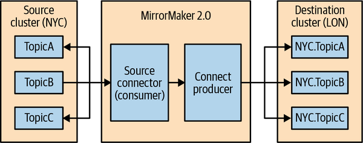
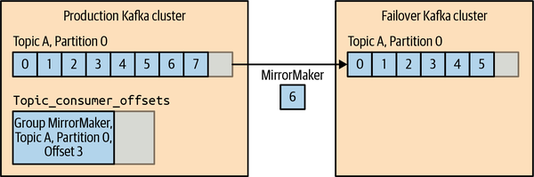

# Chương 10. Mirroring dữ liệu liên cluster (Cross-Cluster Data Mirroring)

Trong phần lớn cuốn sách, chúng ta bàn về việc cài đặt, bảo trì và sử dụng một cluster Kafka duy nhất. Tuy nhiên, có một vài kịch bản trong đó kiến trúc có thể cần nhiều hơn một cluster.

Trong một số trường hợp, các cluster hoàn toàn tách biệt nhau. Chúng thuộc về các phòng ban khác nhau hoặc các bài toán khác nhau, và không có lý do gì để sao chép dữ liệu từ cluster này sang cluster kia. Đôi khi, các SLA hoặc workload khác nhau khiến việc tinh chỉnh một cluster duy nhất để phục vụ nhiều bài toán trở nên khó khăn. Những lúc khác, đó là do các yêu cầu bảo mật khác nhau. Những tình huống sử dụng này khá đơn giản — quản lý nhiều cluster riêng biệt cũng giống như vận hành một cluster nhiều lần.

Trong các tình huống sử dụng khác, các cluster khác nhau lại phụ thuộc lẫn nhau, và người quản trị cần liên tục sao chép dữ liệu giữa các cluster. Trong hầu hết các cơ sở dữ liệu, việc liên tục sao chép dữ liệu giữa các database server được gọi là replication. Vì chúng ta đã dùng từ replication để mô tả việc di chuyển dữ liệu giữa các node Kafka thuộc cùng một cluster, nên chúng ta sẽ gọi việc sao chép dữ liệu giữa các cluster Kafka là mirroring. Bộ replicator liên cluster có sẵn của Apache Kafka được gọi là MirrorMaker.

Trong chương này, chúng ta sẽ bàn về việc mirroring liên cluster toàn bộ hoặc một phần dữ liệu. Chúng ta sẽ bắt đầu bằng việc thảo luận một số tình huống sử dụng phổ biến của mirroring liên cluster. Sau đó chúng ta sẽ trình bày một vài kiến trúc được dùng để hiện thực hóa các tình huống sử dụng này và bàn về ưu, nhược điểm của từng mẫu kiến trúc. Tiếp đến, chúng ta sẽ nói về chính MirrorMaker và cách sử dụng nó. Chúng ta sẽ chia sẻ các mẹo vận hành, bao gồm triển khai và tinh chỉnh hiệu năng. Cuối cùng, chúng ta sẽ bàn về một vài giải pháp thay thế cho MirrorMaker.

## Các tình huống sử dụng của mirroring liên cluster

Dưới đây là danh sách các ví dụ về khi nào thì mirroring liên cluster được sử dụng:

**Cluster theo vùng và cluster trung tâm**

Trong một số trường hợp, công ty có một hoặc nhiều datacenter ở các khu vực địa lý, thành phố hoặc châu lục khác nhau. Mỗi datacenter có cluster Kafka riêng của nó. Một số ứng dụng có thể hoạt động chỉ bằng cách giao tiếp với cluster cục bộ, nhưng một số ứng dụng lại cần dữ liệu từ nhiều datacenter (nếu không thì bạn đã chẳng phải tìm đến các giải pháp replication xuyên datacenter). Có rất nhiều trường hợp mà điều này là bắt buộc, nhưng ví dụ kinh điển là một công ty điều chỉnh giá dựa trên cung và cầu. Công ty này có thể có một datacenter ở mỗi thành phố mà nó hiện diện, thu thập thông tin về cung và cầu tại địa phương, và điều chỉnh giá tương ứng. Toàn bộ thông tin này sau đó sẽ được mirror tới một cluster trung tâm, nơi các nhà phân tích nghiệp vụ có thể chạy các báo cáo toàn công ty về doanh thu.

**Tính sẵn sàng cao (HA) và khôi phục thảm họa (DR)**

Các ứng dụng chỉ chạy trên một cluster Kafka và không cần dữ liệu từ các địa điểm khác, nhưng bạn lo ngại về khả năng toàn bộ cluster trở nên không khả dụng vì một lý do nào đó. Để dự phòng, bạn muốn có một cluster Kafka thứ hai chứa toàn bộ dữ liệu tồn tại trong cluster thứ nhất, để trong trường hợp khẩn cấp bạn có thể chuyển hướng các ứng dụng của mình sang cluster thứ hai và tiếp tục hoạt động như bình thường.

**Tuân thủ quy định pháp lý**

Các công ty hoạt động ở nhiều quốc gia khác nhau có thể cần sử dụng các cấu hình và chính sách khác nhau để tuân thủ các yêu cầu pháp lý và quy định tại mỗi nước. Ví dụ, một số tập dữ liệu có thể được lưu trữ trong các cluster riêng biệt với kiểm soát truy cập nghiêm ngặt, còn các tập con của dữ liệu thì được replicate sang các cluster khác với quyền truy cập rộng hơn. Để tuân thủ các chính sách quy định về retention period (thời gian lưu giữ) tại mỗi vùng, các tập dữ liệu có thể được lưu trữ trong các cluster ở những vùng khác nhau với các cấu hình khác nhau.

**Di chuyển lên cloud**

Ngày nay nhiều công ty vận hành hoạt động kinh doanh của họ trên cả datacenter tại chỗ (on-premises) lẫn nhà cung cấp cloud. Thường thì các ứng dụng chạy trên nhiều region của nhà cung cấp cloud để dự phòng, và đôi khi nhiều nhà cung cấp cloud được sử dụng. Trong những trường hợp này, thường có ít nhất một cluster Kafka trong mỗi datacenter on-premises và mỗi cloud region. Các cluster Kafka đó được các ứng dụng ở từng datacenter và từng region sử dụng để truyền dữ liệu một cách hiệu quả giữa các datacenter. Ví dụ, nếu một ứng dụng mới được triển khai trên cloud nhưng cần một số dữ liệu vốn được cập nhật bởi các ứng dụng chạy trong datacenter on-premises và được lưu trong một cơ sở dữ liệu on-premises, bạn có thể dùng Kafka Connect để bắt các thay đổi của cơ sở dữ liệu vào cluster Kafka cục bộ rồi mirror những thay đổi đó sang cluster Kafka trên cloud, nơi ứng dụng mới có thể sử dụng chúng. Cách này giúp kiểm soát chi phí lưu lượng xuyên datacenter cũng như cải thiện khả năng quản trị (governance) và bảo mật cho lưu lượng đó.

**Tổng hợp dữ liệu từ các cluster biên (edge)**

Một số ngành, bao gồm bán lẻ, viễn thông, vận tải và y tế, sinh ra dữ liệu từ những thiết bị nhỏ với khả năng kết nối hạn chế. Một cluster tổng hợp (aggregate cluster) có tính sẵn sàng cao có thể được dùng để hỗ trợ phân tích và các bài toán khác trên dữ liệu đến từ một số lượng lớn các edge cluster. Điều này làm giảm các yêu cầu về kết nối, tính sẵn sàng và độ bền dữ liệu đối với các edge cluster có dấu chân tài nguyên nhỏ, ví dụ trong các bài toán IoT. Một aggregate cluster có tính sẵn sàng cao cung cấp tính liên tục cho hoạt động kinh doanh ngay cả khi các edge cluster ngoại tuyến, và đơn giản hóa việc phát triển các ứng dụng vốn không phải trực tiếp làm việc với một số lượng lớn edge cluster có mạng không ổn định.

## Các kiến trúc multicluster

Giờ đây khi đã xem qua một vài tình huống sử dụng đòi hỏi nhiều cluster Kafka, hãy cùng nhìn vào một số mẫu kiến trúc phổ biến mà chúng tôi đã áp dụng thành công khi hiện thực hóa các tình huống sử dụng này. Trước khi đi vào các kiến trúc, chúng tôi sẽ trình bày ngắn gọn tổng quan về thực tế của việc giao tiếp xuyên datacenter. Các giải pháp mà chúng ta sẽ bàn có thể trông quá phức tạp nếu không hiểu rằng chúng đại diện cho những đánh đổi trước các điều kiện mạng cụ thể.

### Một số thực tế của giao tiếp xuyên datacenter

Dưới đây là danh sách một số điều cần cân nhắc khi nói đến giao tiếp xuyên datacenter:

**Độ trễ cao**

Latency của giao tiếp giữa hai cluster Kafka tăng lên khi khoảng cách và số lượng network hop giữa hai cluster tăng lên.

**Băng thông hạn chế**

Mạng diện rộng (WAN) thường có băng thông khả dụng thấp hơn nhiều so với những gì bạn thấy bên trong một datacenter đơn lẻ, và băng thông khả dụng có thể thay đổi từng phút. Ngoài ra, latency cao hơn khiến việc tận dụng hết băng thông khả dụng trở nên khó khăn hơn.

**Chi phí cao hơn**

Bất kể bạn chạy Kafka on-premise hay trên cloud, luôn có chi phí cao hơn để giao tiếp giữa các cluster. Một phần vì băng thông bị giới hạn và việc bổ sung băng thông có thể đắt đến mức không thể chấp nhận được, và cũng vì mức giá mà các nhà cung cấp tính cho việc truyền dữ liệu giữa các datacenter, region và cloud.

Các broker và client của Apache Kafka được thiết kế, phát triển, kiểm thử và tinh chỉnh tất cả trong phạm vi một datacenter duy nhất. Chúng tôi đã giả định latency thấp và băng thông cao giữa các broker và client. Điều này thể hiện rõ trong các giá trị timeout mặc định và kích thước của nhiều loại buffer khác nhau. Vì lý do này, không khuyến nghị (ngoại trừ một số trường hợp cụ thể mà chúng ta sẽ bàn sau) việc cài đặt một số broker Kafka trong một datacenter và một số broker khác trong datacenter khác.

Trong hầu hết các trường hợp, tốt nhất là tránh produce dữ liệu tới một datacenter ở xa, và khi bạn buộc phải làm vậy, bạn cần tính đến latency cao hơn và khả năng xảy ra nhiều lỗi mạng hơn. Bạn có thể xử lý các lỗi bằng cách tăng số lần retry của producer, và xử lý latency cao hơn bằng cách tăng kích thước các buffer giữ record giữa các lần thử gửi.

Nếu chúng ta cần bất kỳ dạng replication nào giữa các cluster, và đã loại trừ giao tiếp giữa các broker cũng như giao tiếp producer-broker, thì chúng ta buộc phải cho phép giao tiếp broker-consumer. Thực vậy, đây là dạng giao tiếp liên cluster an toàn nhất, bởi vì trong trường hợp xảy ra network partition ngăn consumer đọc dữ liệu, các record vẫn nằm an toàn bên trong các broker Kafka cho đến khi kết nối được khôi phục và consumer có thể đọc chúng. Không có rủi ro mất dữ liệu ngoài ý muốn do network partition. Tuy vậy, vì băng thông bị giới hạn, nếu có nhiều ứng dụng trong một datacenter cần đọc dữ liệu từ các broker Kafka ở một datacenter khác, chúng tôi thích cài đặt một cluster Kafka tại mỗi datacenter và mirror dữ liệu cần thiết giữa chúng một lần duy nhất, hơn là để nhiều ứng dụng cùng consume cùng một dữ liệu qua WAN.

Chúng ta sẽ nói thêm về việc tinh chỉnh Kafka cho giao tiếp xuyên datacenter, nhưng các nguyên tắc sau sẽ định hướng cho hầu hết các kiến trúc mà chúng ta sẽ bàn tiếp theo:

- Không ít hơn một cluster cho mỗi datacenter.
- Replicate mỗi event đúng một lần (trừ các lần retry do lỗi) giữa mỗi cặp datacenter.
- Khi có thể, hãy consume từ một datacenter ở xa thay vì produce tới một datacenter ở xa.

### Kiến trúc hub-and-spokes

Kiến trúc này dành cho trường hợp có nhiều cluster Kafka cục bộ và một cluster Kafka trung tâm. Xem Hình 10-1.



**Hình 10-1. Kiến trúc hub-and-spokes**

Cũng có một biến thể đơn giản hơn của kiến trúc này chỉ với hai cluster: một leader và một follower. Xem Hình 10-2.



**Hình 10-2. Phiên bản đơn giản hơn của kiến trúc hub-and-spokes**

Kiến trúc này được dùng khi dữ liệu được produce ở nhiều datacenter và một số consumer cần truy cập toàn bộ tập dữ liệu. Kiến trúc này cũng cho phép các ứng dụng trong mỗi datacenter chỉ xử lý dữ liệu cục bộ của chính datacenter đó. Nhưng nó không cho phép truy cập toàn bộ tập dữ liệu từ mọi datacenter.

Lợi ích chính của kiến trúc này là dữ liệu luôn được produce tới datacenter cục bộ và các event từ mỗi datacenter chỉ được mirror một lần — tới datacenter trung tâm. Các ứng dụng xử lý dữ liệu từ một datacenter duy nhất có thể được đặt tại datacenter đó. Các ứng dụng cần xử lý dữ liệu từ nhiều datacenter sẽ được đặt tại datacenter trung tâm, nơi tất cả các event được mirror về. Vì replication luôn đi theo một chiều và vì mỗi consumer luôn đọc từ cùng một cluster, kiến trúc này đơn giản để triển khai, cấu hình và giám sát.

Nhược điểm chính của kiến trúc này là hệ quả trực tiếp từ chính lợi ích và sự đơn giản của nó. Các bộ xử lý ở một datacenter khu vực không thể truy cập dữ liệu ở datacenter khác. Để hiểu rõ hơn tại sao đây là một hạn chế, hãy xem một ví dụ về kiến trúc này.

Giả sử chúng ta là một ngân hàng lớn và có các chi nhánh ở nhiều thành phố. Giả sử chúng ta quyết định lưu hồ sơ người dùng và lịch sử tài khoản của họ trong một cluster Kafka ở mỗi thành phố. Chúng ta replicate toàn bộ thông tin này tới một cluster trung tâm được dùng để chạy phân tích nghiệp vụ của ngân hàng. Khi người dùng kết nối vào website ngân hàng hoặc ghé thăm chi nhánh địa phương của họ, họ được định tuyến để gửi event tới cluster cục bộ và đọc event từ chính cluster cục bộ đó. Tuy nhiên, giả sử một người dùng ghé thăm chi nhánh ở một thành phố khác. Vì thông tin người dùng không tồn tại ở thành phố họ đang đến, chi nhánh sẽ buộc phải tương tác với một cluster ở xa (không khuyến nghị) hoặc không có cách nào truy cập được thông tin của người dùng (thực sự đáng xấu hổ). Vì lý do này, việc dùng mẫu kiến trúc này thường bị giới hạn chỉ ở những phần của tập dữ liệu có thể tách biệt hoàn toàn giữa các datacenter khu vực.

Khi hiện thực kiến trúc này, với mỗi datacenter khu vực, bạn cần ít nhất một tiến trình mirroring trên datacenter trung tâm. Tiến trình này sẽ consume dữ liệu từ mỗi cluster khu vực ở xa và produce nó vào cluster trung tâm. Nếu cùng một topic tồn tại ở nhiều datacenter, bạn có thể ghi tất cả event từ topic này vào một topic có cùng tên trong cluster trung tâm, hoặc ghi event từ mỗi datacenter vào một topic riêng.

### Kiến trúc active-active

Kiến trúc này được dùng khi hai hoặc nhiều datacenter chia sẻ một phần hoặc toàn bộ dữ liệu, và mỗi datacenter đều có khả năng vừa produce vừa consume event. Xem Hình 10-3.



**Hình 10-3. Mô hình kiến trúc active-active**

Lợi ích chính của kiến trúc này là khả năng phục vụ người dùng từ một datacenter ở gần, điều thường mang lại lợi ích về hiệu năng, mà không phải hy sinh chức năng do dữ liệu bị hạn chế về tính sẵn sàng (như chúng ta đã thấy xảy ra trong kiến trúc hub-and-spokes). Một lợi ích thứ cấp là tính dự phòng và khả năng chống chịu. Vì mỗi datacenter đều có đầy đủ chức năng, nếu một datacenter không khả dụng, bạn có thể chuyển hướng người dùng sang datacenter còn lại. Kiểu failover này chỉ đòi hỏi việc chuyển hướng mạng cho người dùng, thường là dạng failover dễ nhất và trong suốt nhất.

Nhược điểm chính của kiến trúc này là thách thức trong việc tránh xung đột khi dữ liệu được đọc và cập nhật một cách bất đồng bộ ở nhiều địa điểm. Điều này bao gồm các thách thức kỹ thuật trong việc mirroring event — ví dụ, làm sao chúng ta chắc chắn được rằng cùng một event không bị mirror qua lại vô tận? Nhưng quan trọng hơn, việc duy trì tính nhất quán dữ liệu giữa hai datacenter sẽ rất khó khăn. Dưới đây là một vài ví dụ về những khó khăn bạn sẽ gặp phải:

- Nếu một người dùng gửi event tới một datacenter và đọc event từ một datacenter khác, có khả năng event họ vừa ghi chưa kịp tới datacenter thứ hai. Với người dùng, nó sẽ trông như thể họ vừa thêm một cuốn sách vào danh sách mong muốn và bấm vào danh sách mong muốn, nhưng cuốn sách lại không có ở đó. Vì lý do này, khi kiến trúc này được sử dụng, các lập trình viên thường tìm cách "gắn chặt" (stick) mỗi người dùng vào một datacenter cụ thể và đảm bảo họ dùng cùng một cluster trong hầu hết thời gian (trừ khi họ kết nối từ một địa điểm ở xa hoặc datacenter đó trở nên không khả dụng).
- Một event từ một datacenter nói rằng người dùng đã đặt mua cuốn sách A, và một event vào khoảng cùng thời điểm đó ở datacenter thứ hai nói rằng cũng chính người dùng đó đã đặt mua cuốn sách B. Sau khi mirroring, cả hai datacenter đều có cả hai event và do đó chúng ta có thể nói rằng mỗi datacenter đều có hai event xung đột nhau. Các ứng dụng trên cả hai datacenter cần biết cách xử lý tình huống này. Chúng ta có chọn một event làm event "đúng" không? Nếu có, chúng ta cần các quy tắc nhất quán về cách chọn một event để các ứng dụng trên cả hai datacenter đi đến cùng một kết luận. Hay chúng ta quyết định rằng cả hai đều đúng và đơn giản là gửi cho người dùng hai cuốn sách rồi để một bộ phận khác xử lý việc trả hàng? Amazon đã từng giải quyết xung đột theo cách đó, nhưng các tổ chức làm việc với giao dịch chứng khoán chẳng hạn thì không thể. Phương pháp cụ thể để giảm thiểu xung đột và xử lý chúng khi chúng xảy ra là đặc thù cho từng bài toán. Điều quan trọng cần ghi nhớ là nếu bạn dùng kiến trúc này, bạn sẽ có xung đột và sẽ phải xử lý chúng.

Nếu bạn tìm được cách xử lý các thách thức của việc đọc và ghi bất đồng bộ vào cùng một tập dữ liệu từ nhiều địa điểm, thì kiến trúc này rất được khuyến nghị. Đây là lựa chọn có khả năng mở rộng tốt nhất, chống chịu tốt nhất, linh hoạt nhất và hiệu quả về chi phí nhất mà chúng tôi biết. Vì vậy, rất đáng để bỏ công tìm ra giải pháp cho việc tránh các vòng lặp replication, giữ người dùng chủ yếu ở cùng một datacenter, và xử lý xung đột khi chúng xảy ra.

Một phần thách thức của mirroring active-active, đặc biệt khi có nhiều hơn hai datacenter, là bạn sẽ cần các tác vụ mirroring cho mỗi cặp datacenter và cho mỗi chiều. Nhiều công cụ mirroring ngày nay có thể dùng chung tiến trình, ví dụ, dùng cùng một tiến trình cho tất cả các luồng mirroring tới một cluster đích.

Ngoài ra, bạn sẽ muốn tránh các vòng lặp trong đó cùng một event bị mirror qua lại vô tận. Bạn có thể làm điều này bằng cách cho mỗi "topic logic" một topic riêng cho mỗi datacenter và đảm bảo tránh replicate các topic có nguồn gốc từ các datacenter ở xa. Ví dụ, topic logic `users` sẽ là topic `SF.users` ở một datacenter và `NYC.users` ở datacenter khác. Các tiến trình mirroring sẽ mirror topic `SF.users` từ SF sang NYC và topic `NYC.users` từ NYC sang SF. Kết quả là mỗi event sẽ chỉ được mirror một lần, nhưng mỗi datacenter sẽ chứa cả `SF.users` lẫn `NYC.users`, nghĩa là mỗi datacenter sẽ có thông tin của tất cả người dùng. Consumer sẽ cần consume event từ `*.users` nếu chúng muốn consume tất cả event của người dùng. Một cách khác để hình dung thiết lập này là xem nó như một namespace riêng cho mỗi datacenter chứa tất cả các topic của datacenter cụ thể đó. Trong ví dụ của chúng ta, chúng ta sẽ có namespace NYC và namespace SF. Một số công cụ mirroring như MirrorMaker ngăn chặn các vòng lặp replication bằng cách dùng quy ước đặt tên tương tự.

Record header, được giới thiệu trong Apache Kafka phiên bản 0.11.0, cho phép gắn thẻ (tag) các event với datacenter gốc của chúng. Thông tin trong header cũng có thể được dùng để tránh các vòng lặp mirroring vô tận và để cho phép xử lý riêng biệt các event đến từ các datacenter khác nhau. Bạn cũng có thể hiện thực tính năng này bằng cách dùng một định dạng dữ liệu có cấu trúc cho phần value của record (Avro là ví dụ ưa thích của chúng tôi) và dùng nó để đưa các tag và header vào bên trong chính event. Tuy nhiên, điều này đòi hỏi nỗ lực bổ sung khi mirroring, vì không có công cụ mirroring hiện có nào hỗ trợ định dạng header riêng của bạn.

### Kiến trúc active-standby

Trong một số trường hợp, yêu cầu duy nhất đối với nhiều cluster là để hỗ trợ một kịch bản thảm họa nào đó. Có lẽ bạn có hai cluster trong cùng một datacenter. Bạn dùng một cluster cho tất cả ứng dụng, nhưng bạn muốn có một cluster thứ hai chứa (gần như) tất cả các event có trong cluster gốc để bạn có thể dùng nếu cluster gốc hoàn toàn không khả dụng. Hoặc có lẽ bạn cần khả năng chống chịu về mặt địa lý. Toàn bộ hoạt động kinh doanh của bạn đang chạy từ một datacenter ở California, nhưng bạn cần một datacenter thứ hai ở Texas mà thường ngày không làm gì nhiều và bạn có thể dùng đến trong trường hợp có động đất. Datacenter ở Texas có lẽ sẽ có một bản sao không hoạt động ("nguội") của tất cả ứng dụng mà quản trị viên có thể khởi động trong trường hợp khẩn cấp và chúng sẽ dùng cluster thứ hai (Hình 10-4). Đây thường là một yêu cầu pháp lý hơn là điều mà doanh nghiệp thực sự dự tính sẽ làm — nhưng bạn vẫn cần phải sẵn sàng.



**Hình 10-4. Kiến trúc active-standby**

Lợi ích của thiết lập này là sự đơn giản trong cài đặt và việc nó có thể được dùng cho gần như mọi bài toán. Bạn chỉ cần cài đặt một cluster thứ hai và thiết lập một tiến trình mirroring truyền toàn bộ event từ cluster này sang cluster kia. Không cần lo lắng về việc truy cập dữ liệu, xử lý xung đột và các phức tạp kiến trúc khác.

Nhược điểm là lãng phí một cluster tốt và thực tế là failover giữa các cluster Kafka khó hơn nhiều so với vẻ ngoài của nó. Kết luận cuối cùng là hiện tại không thể thực hiện failover cluster trong Kafka mà không mất dữ liệu hoặc có event trùng lặp. Thường thì là cả hai. Bạn có thể giảm thiểu chúng nhưng không bao giờ loại bỏ hoàn toàn.

Hiển nhiên là một cluster chẳng làm gì ngoài việc ngồi chờ một thảm họa xảy ra thì là một sự lãng phí tài nguyên. Vì thảm họa là (hoặc nên là) hiếm, nên hầu hết thời gian chúng ta đang nhìn vào một cụm máy chẳng làm gì cả. Một số tổ chức cố gắng chống lại vấn đề này bằng cách có một cluster DR (disaster recovery) nhỏ hơn nhiều so với cluster production. Nhưng đây là một quyết định rủi ro vì bạn không thể chắc chắn rằng cluster kích thước tối thiểu này sẽ trụ vững trong trường hợp khẩn cấp. Các tổ chức khác thì thích làm cho cluster này hữu ích trong thời gian không có thảm họa bằng cách chuyển một số workload chỉ đọc sang chạy trên cluster DR, nghĩa là họ thực sự đang chạy một phiên bản thu nhỏ của kiến trúc hub-and-spokes với một spoke duy nhất.

Vấn đề nghiêm trọng hơn là: làm thế nào để bạn failover sang một cluster DR trong Apache Kafka?

Trước hết, không cần phải nói cũng biết rằng bất kể bạn chọn phương pháp failover nào, đội SRE của bạn phải thực hành nó một cách định kỳ. Một kế hoạch hoạt động tốt hôm nay có thể ngừng hoạt động sau một lần nâng cấp, hoặc có lẽ các bài toán mới khiến bộ công cụ hiện có trở nên lỗi thời. Mỗi quý một lần thường là mức tối thiểu tuyệt đối cho việc thực hành failover. Các đội SRE mạnh thực hành thường xuyên hơn nhiều. Chaos Monkey nổi tiếng của Netflix, một dịch vụ ngẫu nhiên gây ra thảm họa, là mức cực đoan — bất kỳ ngày nào cũng có thể trở thành ngày diễn tập failover.

Giờ hãy cùng xem những gì liên quan đến một cuộc failover.

#### Lập kế hoạch khôi phục thảm họa

Khi lập kế hoạch cho disaster recovery, điều quan trọng là phải cân nhắc hai chỉ số then chốt. Recovery time objective (RTO) định nghĩa khoảng thời gian tối đa trước khi tất cả các dịch vụ phải được khôi phục sau một thảm họa. Recovery point objective (RPO) định nghĩa khoảng thời gian tối đa mà dữ liệu có thể bị mất do hậu quả của một thảm họa. RTO càng thấp thì càng quan trọng phải tránh các quy trình thủ công và việc khởi động lại ứng dụng, vì RTO rất thấp chỉ có thể đạt được với failover tự động. RPO thấp đòi hỏi mirroring thời gian thực với latency thấp, và RPO=0 đòi hỏi replication đồng bộ.

#### Mất dữ liệu và bất nhất trong failover ngoài kế hoạch

Bởi vì các giải pháp mirroring khác nhau của Kafka đều là bất đồng bộ (chúng ta sẽ bàn về một giải pháp đồng bộ trong phần tiếp theo), cluster DR sẽ không có những message mới nhất từ cluster chính. Bạn nên luôn giám sát xem cluster DR đang tụt lại phía sau bao xa và đừng bao giờ để nó tụt lại quá xa. Nhưng trong một hệ thống bận rộn, bạn nên dự liệu rằng cluster DR sẽ chậm hơn cluster chính vài trăm hoặc thậm chí vài nghìn message. Nếu cluster Kafka của bạn xử lý 1 triệu message mỗi giây và độ trễ giữa cluster chính và cluster DR là 5 mili giây, cluster DR của bạn sẽ chậm hơn cluster chính 5.000 message trong kịch bản tốt nhất. Vậy nên, hãy chuẩn bị tinh thần rằng failover ngoài kế hoạch sẽ kèm theo một chút mất mát dữ liệu. Trong failover có kế hoạch, bạn có thể dừng cluster chính và chờ tiến trình mirroring mirror nốt các message còn lại trước khi chuyển các ứng dụng sang cluster DR, nhờ đó tránh được việc mất dữ liệu này. Khi failover ngoài kế hoạch xảy ra và bạn mất vài nghìn message, hãy lưu ý rằng các giải pháp mirroring hiện tại không hỗ trợ transaction, nghĩa là nếu một số event ở nhiều topic có liên quan với nhau (ví dụ, đơn hàng và các dòng chi tiết đơn hàng), bạn có thể có một số event đến được site DR kịp lúc failover còn một số thì không. Các ứng dụng của bạn sẽ cần có khả năng xử lý một dòng chi tiết đơn hàng mà không có đơn hàng tương ứng sau khi bạn failover sang cluster DR.

#### Offset khởi đầu cho ứng dụng sau khi failover

Một trong những nhiệm vụ thách thức khi failover sang cluster khác là đảm bảo các ứng dụng biết bắt đầu consume dữ liệu từ đâu. Có vài cách tiếp cận phổ biến. Một số cách thì đơn giản nhưng có thể gây thêm mất dữ liệu hoặc xử lý trùng lặp; những cách khác thì phức tạp hơn nhưng giảm thiểu việc mất dữ liệu và xử lý lại. Hãy cùng xem qua một vài cách:

**Auto offset reset**

Consumer của Apache Kafka có một cấu hình quy định cách ứng xử khi chúng không có offset đã commit trước đó — chúng hoặc bắt đầu đọc từ đầu partition hoặc từ cuối partition. Nếu bạn không mirror các offset này theo cách nào đó như một phần của kế hoạch DR, bạn cần chọn một trong hai lựa chọn này. Hoặc bắt đầu đọc từ đầu dữ liệu hiện có và xử lý một lượng lớn bản trùng lặp, hoặc nhảy tới cuối và bỏ lỡ một số lượng event không xác định (và hy vọng là nhỏ). Nếu ứng dụng của bạn xử lý bản trùng lặp mà không gặp vấn đề gì, hoặc việc thiếu một chút dữ liệu không phải chuyện lớn, thì lựa chọn này rõ ràng là dễ nhất. Đơn giản là nhảy tới cuối topic khi failover là một phương pháp failover phổ biến nhờ sự đơn giản của nó.

**Replicate topic offsets**

Nếu bạn đang dùng consumer Kafka từ phiên bản 0.9.0 trở đi, các consumer sẽ commit offset của chúng vào một topic đặc biệt: `__consumer_offsets`. Nếu bạn mirror topic này sang cluster DR, khi các consumer bắt đầu consume từ cluster DR, chúng sẽ có thể lấy lại offset cũ của mình và tiếp tục từ chỗ đã dừng. Cách này đơn giản, nhưng có một danh sách dài các điểm cần lưu ý đi kèm.

Thứ nhất, không có gì đảm bảo rằng các offset trong cluster chính sẽ khớp với các offset trong cluster thứ cấp. Giả sử bạn chỉ lưu dữ liệu trong cluster chính trong ba ngày và bạn bắt đầu mirror một topic một tuần sau khi nó được tạo. Trong trường hợp này, offset đầu tiên khả dụng trong cluster chính có thể là offset 57.000.000 (các event cũ hơn thuộc 4 ngày đầu tiên và đã bị xóa), nhưng offset đầu tiên trong cluster DR sẽ là 0. Vì vậy, một consumer cố đọc offset 57.000.003 (vì đó là event tiếp theo nó cần đọc) từ cluster DR sẽ thất bại.

Thứ hai, ngay cả khi bạn bắt đầu mirroring ngay lập tức khi topic vừa được tạo và cả topic ở cluster chính lẫn topic ở cluster DR đều bắt đầu từ 0, các lần retry của producer vẫn có thể khiến offset lệch nhau. Chúng ta sẽ bàn về một giải pháp mirroring thay thế giúp bảo toàn offset giữa cluster chính và cluster DR ở cuối chương này.

Thứ ba, ngay cả khi các offset được bảo toàn hoàn hảo, do độ trễ giữa cluster chính và cluster DR và do các giải pháp mirroring hiện tại không hỗ trợ transaction, một offset được commit bởi một consumer Kafka có thể đến trước hoặc sau record mang offset đó. Một consumer thực hiện failover có thể tìm thấy các offset đã commit mà không có record tương ứng. Hoặc nó có thể thấy rằng offset commit mới nhất ở site DR cũ hơn offset commit mới nhất ở site chính. Xem Hình 10-5.



**Hình 10-5. Một cuộc failover dẫn đến các offset đã commit mà không có record tương ứng**

Trong những trường hợp này, bạn cần chấp nhận một số bản trùng lặp nếu offset commit mới nhất ở site DR cũ hơn offset đã commit ở site chính, hoặc nếu các offset trong các record ở site DR đi trước site chính do retry. Bạn cũng sẽ cần tìm cách xử lý các trường hợp mà offset commit mới nhất ở site DR không có record tương ứng — bạn sẽ bắt đầu xử lý từ đầu topic hay nhảy tới cuối?

Như bạn thấy, cách tiếp cận này có những hạn chế của nó. Tuy vậy, lựa chọn này cho phép bạn failover sang một cluster DR khác với số lượng event bị trùng lặp hoặc bị thiếu ít hơn so với các cách tiếp cận khác, trong khi vẫn đơn giản để triển khai.

**Failover dựa trên thời gian**

Từ phiên bản 0.10.0 trở đi, mỗi message bao gồm một timestamp cho biết thời điểm message được gửi tới Kafka. Từ 0.10.1.0 trở đi, các broker bao gồm một index và một API để tra cứu offset theo timestamp. Vì vậy, nếu bạn failover sang cluster DR và bạn biết rằng rắc rối của mình bắt đầu lúc 4:05 sáng, bạn có thể bảo các consumer bắt đầu xử lý dữ liệu từ 4:03 sáng. Sẽ có một số bản trùng lặp trong hai phút đó, nhưng có lẽ điều này vẫn tốt hơn các lựa chọn khác và hành vi này dễ giải thích hơn nhiều với mọi người trong công ty — "Chúng ta đã quay lại thời điểm 4:03 sáng" nghe hay hơn "Chúng ta đã quay lại những offset commit mới nhất mà có thể là mới nhất, cũng có thể không". Vì vậy, đây thường là một sự thỏa hiệp tốt. Câu hỏi duy nhất là: làm sao chúng ta bảo các consumer bắt đầu xử lý dữ liệu từ 4:03 sáng?

Một lựa chọn là tích hợp thẳng nó vào ứng dụng của bạn. Hãy có một tùy chọn cho phép người dùng cấu hình để chỉ định thời điểm bắt đầu cho ứng dụng. Nếu tùy chọn này được cấu hình, ứng dụng có thể dùng các API mới để lấy offset theo thời gian, seek tới thời điểm đó, và bắt đầu consume từ đúng điểm cần thiết, commit offset như bình thường.

Lựa chọn này rất tuyệt nếu bạn đã viết tất cả các ứng dụng của mình theo cách này từ trước. Nhưng nếu bạn không làm vậy thì sao? Apache Kafka cung cấp công cụ `kafka-consumer-groups` để reset offset dựa trên một loạt tùy chọn, bao gồm reset dựa trên timestamp được thêm vào ở phiên bản 0.11.0. Consumer group nên được dừng lại trong khi chạy loại công cụ này và khởi động lại ngay sau đó. Ví dụ, câu lệnh sau reset offset của consumer cho tất cả các topic thuộc về một group cụ thể về một thời điểm cụ thể:

```bash
bin/kafka-consumer-groups.sh --bootstrap-server localhost:9092 --reset-offsets --al
```

Lựa chọn này được khuyến nghị trong các triển khai cần đảm bảo một mức độ chắc chắn nhất định trong quá trình failover.

**Offset translation**

Khi bàn về việc mirror topic chứa offset, một trong những thách thức lớn nhất là việc offset ở cluster chính và cluster DR có thể lệch nhau. Trước đây, một số tổ chức chọn dùng một kho dữ liệu bên ngoài, chẳng hạn Apache Cassandra, để lưu ánh xạ offset từ cluster này sang cluster kia. Bất cứ khi nào một event được produce tới cluster DR, cả hai offset đều được công cụ mirroring gửi tới kho dữ liệu bên ngoài khi các offset lệch nhau. Ngày nay, các giải pháp mirroring, bao gồm MirrorMaker, dùng một topic Kafka để lưu metadata offset translation. Offset được lưu lại mỗi khi chênh lệch giữa hai offset thay đổi. Ví dụ, nếu offset 495 trên cluster chính ánh xạ tới offset 500 trên cluster DR, chúng ta sẽ ghi lại (495,500) trong kho lưu trữ bên ngoài hoặc trong topic offset translation. Nếu chênh lệch này về sau thay đổi do trùng lặp và offset 596 được ánh xạ tới 600, thì chúng ta sẽ ghi lại ánh xạ mới (596,600). Không cần lưu tất cả các ánh xạ offset giữa 495 và 596; chúng ta chỉ giả định rằng chênh lệch vẫn giữ nguyên và như vậy offset 550 ở cluster chính sẽ ánh xạ tới 555 ở cluster DR. Sau đó, khi failover xảy ra, thay vì ánh xạ timestamp (vốn luôn hơi thiếu chính xác) sang offset, chúng ta ánh xạ offset của cluster chính sang offset của cluster DR và dùng chúng. Một trong hai kỹ thuật được liệt kê ở trên có thể được dùng để buộc các consumer bắt đầu sử dụng những offset mới từ ánh xạ này. Cách này vẫn còn vấn đề với các offset commit đến trước chính các record đó và các offset commit không kịp được mirror tới DR, nhưng nó bao phủ được một số trường hợp.

#### Sau khi failover

Giả sử rằng cuộc failover đã thành công. Mọi thứ hoạt động tốt trên cluster DR. Giờ chúng ta cần làm gì đó với cluster chính. Có lẽ là biến nó thành DR.

Rất hấp dẫn khi chỉ đơn giản sửa các tiến trình mirroring để đảo ngược chiều của chúng và bắt đầu mirror từ cluster chính mới về cluster chính cũ. Tuy nhiên, điều này dẫn tới hai câu hỏi quan trọng:

- Làm sao chúng ta biết bắt đầu mirror từ đâu? Chúng ta cần giải quyết đúng vấn đề mà chúng ta gặp với tất cả các consumer, lần này là cho chính ứng dụng mirroring. Và hãy nhớ rằng tất cả các giải pháp của chúng ta đều có những trường hợp gây ra bản trùng lặp hoặc bỏ sót dữ liệu — đôi khi là cả hai.
- Ngoài ra, vì những lý do chúng ta đã bàn ở trên, nhiều khả năng cluster chính ban đầu của bạn sẽ có những event mà cluster DR không có. Nếu bạn chỉ đơn giản bắt đầu mirror dữ liệu mới ngược trở lại, phần lịch sử dư thừa đó sẽ vẫn còn và hai cluster sẽ không nhất quán.

Vì lý do này, đối với các kịch bản mà đảm bảo về tính nhất quán và thứ tự là tối quan trọng, giải pháp đơn giản nhất là trước tiên dọn sạch cluster ban đầu — xóa toàn bộ dữ liệu và các offset đã commit — rồi mới bắt đầu mirror từ cluster chính mới về cái mà giờ đây là cluster DR mới. Điều này cho bạn một bản trắng hoàn toàn giống hệt cluster chính mới.

#### Đôi lời về cluster discovery

Một trong những điểm quan trọng cần cân nhắc khi lập kế hoạch cho một cluster standby là trong trường hợp failover, các ứng dụng của bạn sẽ cần biết cách bắt đầu giao tiếp với cluster failover. Nếu bạn hardcode hostname của các broker thuộc cluster chính vào các thuộc tính của producer và consumer, điều này sẽ trở nên khó khăn. Hầu hết các tổ chức giữ mọi thứ đơn giản và tạo một tên DNS thường trỏ tới các broker chính. Trong trường hợp khẩn cấp, tên DNS này có thể được trỏ sang cluster standby. Dịch vụ discovery (DNS hoặc thứ khác) không cần bao gồm tất cả các broker — client Kafka chỉ cần truy cập thành công một broker duy nhất để lấy metadata về cluster và khám phá ra các broker khác. Vì vậy, chỉ cần đưa vào ba broker thường là đủ. Bất kể phương pháp discovery nào, hầu hết các kịch bản failover đều đòi hỏi khởi động lại các ứng dụng consumer sau khi failover để chúng có thể tìm ra các offset mới mà từ đó chúng cần bắt đầu consume. Để có failover tự động không cần khởi động lại ứng dụng nhằm đạt RTO rất thấp, logic failover cần được xây dựng ngay bên trong các ứng dụng client.

### Stretch cluster

Kiến trúc active-standby được dùng để bảo vệ hoạt động kinh doanh trước sự cố của một cluster Kafka bằng cách chuyển các ứng dụng sang giao tiếp với một cluster khác trong trường hợp cluster gặp sự cố. Stretch cluster nhằm bảo vệ cluster Kafka khỏi sự cố trong lúc một datacenter ngừng hoạt động. Điều này đạt được bằng cách cài đặt một cluster Kafka duy nhất trải rộng trên nhiều datacenter.

Stretch cluster về cơ bản khác với các kịch bản đa datacenter khác. Trước hết, chúng không phải là multicluster — chỉ có một cluster duy nhất. Kết quả là chúng ta không cần một tiến trình mirroring để giữ hai cluster đồng bộ. Cơ chế replication thông thường của Kafka được dùng, như thường lệ, để giữ tất cả các broker trong cluster đồng bộ với nhau. Thiết lập này có thể bao gồm replication đồng bộ. Producer thường nhận được acknowledgment từ một broker Kafka sau khi message được ghi thành công vào Kafka. Trong trường hợp stretch cluster, chúng ta có thể cấu hình sao cho acknowledgment sẽ được gửi sau khi message được ghi thành công vào các broker Kafka ở hai datacenter. Điều này liên quan đến việc dùng các định nghĩa rack để đảm bảo mỗi partition có replica ở nhiều datacenter, và việc dùng `min.insync.replicas` cùng `acks=all` để đảm bảo mọi lần ghi đều được acknowledge từ ít nhất hai datacenter. Từ phiên bản 2.4.0 trở đi, các broker cũng có thể được cấu hình để cho phép consumer fetch từ replica gần nhất bằng cách dùng các định nghĩa rack. Các broker so khớp rack của chúng với rack của consumer để tìm ra replica cục bộ cập nhật nhất, và quay về dùng leader nếu không có replica cục bộ phù hợp. Consumer fetch từ các follower trong datacenter cục bộ của mình đạt được throughput cao hơn, latency thấp hơn và chi phí thấp hơn nhờ giảm lưu lượng xuyên datacenter.

Ưu điểm của kiến trúc này nằm ở replication đồng bộ — một số loại hình doanh nghiệp đơn giản là bắt buộc phải có site DR luôn đồng bộ 100% với site chính. Đây thường là yêu cầu pháp lý và được áp dụng cho mọi kho dữ liệu trong toàn công ty — bao gồm cả Kafka. Ưu điểm khác là cả hai datacenter và tất cả các broker trong cluster đều được sử dụng. Không có sự lãng phí như chúng ta đã thấy trong kiến trúc active-standby.

Kiến trúc này bị giới hạn về loại thảm họa mà nó bảo vệ. Nó chỉ bảo vệ khỏi sự cố của datacenter, chứ không bảo vệ khỏi bất kỳ loại sự cố nào của ứng dụng hay của Kafka. Độ phức tạp vận hành cũng bị giới hạn. Kiến trúc này đòi hỏi hạ tầng vật lý mà không phải công ty nào cũng có thể cung cấp.

Kiến trúc này khả thi nếu bạn có thể cài đặt Kafka (và ZooKeeper) tại ít nhất ba datacenter với băng thông cao và latency thấp giữa chúng. Điều này có thể làm được nếu công ty bạn sở hữu ba tòa nhà trên cùng một con phố, hoặc — phổ biến hơn — bằng cách dùng ba availability zone bên trong một region của nhà cung cấp cloud của bạn.

Lý do ba datacenter là quan trọng là vì ZooKeeper đòi hỏi số node lẻ trong một cluster và sẽ vẫn khả dụng nếu đa số các node còn hoạt động. Với hai datacenter và số node lẻ, một datacenter sẽ luôn chứa đa số, nghĩa là nếu datacenter này không khả dụng thì ZooKeeper không khả dụng, và Kafka không khả dụng. Với ba datacenter, bạn có thể dễ dàng phân bổ các node sao cho không datacenter nào chiếm đa số. Vì vậy, nếu một datacenter không khả dụng, đa số node vẫn tồn tại ở hai datacenter còn lại, và cluster ZooKeeper sẽ vẫn khả dụng. Do đó, cluster Kafka cũng vậy.

> **KIẾN TRÚC 2.5 DC**
>
> Một mô hình phổ biến cho stretch cluster là kiến trúc 2.5 DC (datacenter) với cả Kafka và ZooKeeper chạy trong hai datacenter, cùng một datacenter "0.5" thứ ba với một node ZooKeeper để cung cấp quorum nếu một datacenter gặp sự cố.

Có thể chạy ZooKeeper và Kafka ở hai datacenter bằng cách dùng một cấu hình ZooKeeper group cho phép failover thủ công giữa hai datacenter. Tuy nhiên, thiết lập này không phổ biến.

## MirrorMaker của Apache Kafka

Apache Kafka có một công cụ tên là MirrorMaker dùng để mirror dữ liệu giữa hai datacenter. Các phiên bản đầu của MirrorMaker sử dụng một tập hợp các consumer là thành viên của một consumer group để đọc dữ liệu từ một tập các topic nguồn, và một producer Kafka dùng chung trong mỗi tiến trình MirrorMaker để gửi những event đó tới cluster đích. Mặc dù cách này đủ để mirror dữ liệu giữa các cluster trong một số kịch bản, nó có vài vấn đề, đặc biệt là các đợt tăng vọt latency khi thay đổi cấu hình và việc thêm topic mới dẫn tới các cuộc rebalance kiểu stop-the-world. MirrorMaker 2.0 là giải pháp mirroring multicluster thế hệ tiếp theo cho Apache Kafka, dựa trên framework Kafka Connect, khắc phục được nhiều thiếu sót của phiên bản tiền nhiệm. Các topology phức tạp có thể dễ dàng được cấu hình để hỗ trợ một loạt bài toán như disaster recovery, sao lưu, di chuyển và tổng hợp dữ liệu.

> **THÊM VỀ MIRRORMAKER**
>
> MirrorMaker nghe có vẻ rất đơn giản, nhưng vì chúng tôi cố gắng làm cho nó rất hiệu quả và tiến rất gần tới exactly-once delivery, hóa ra việc triển khai nó cho đúng lại rất khó. MirrorMaker đã được viết lại nhiều lần. Phần mô tả ở đây và các chi tiết trong các mục tiếp theo áp dụng cho MirrorMaker 2.0, được giới thiệu ở phiên bản 2.4.0.

MirrorMaker dùng một source connector để consume dữ liệu từ một cluster Kafka khác thay vì từ một cơ sở dữ liệu. Việc sử dụng framework Kafka Connect giúp giảm thiểu chi phí quản trị cho các bộ phận IT doanh nghiệp vốn đã bận rộn. Nếu bạn còn nhớ kiến trúc Kafka Connect từ Chương 9, bạn sẽ nhớ rằng mỗi connector chia công việc cho một số lượng task có thể cấu hình được. Trong MirrorMaker, mỗi task là một cặp consumer và producer. Framework Connect gán các task đó cho các node Connect worker khác nhau khi cần — vì vậy bạn có thể có nhiều task trên một server hoặc có các task trải ra trên nhiều server. Điều này thay thế công việc thủ công tính toán xem cần chạy bao nhiêu luồng MirrorMaker trên mỗi instance và bao nhiêu instance trên mỗi máy. Connect cũng có một REST API để quản lý tập trung cấu hình cho các connector và task. Nếu chúng ta giả định rằng hầu hết các triển khai Kafka đều bao gồm Kafka Connect vì những lý do khác (gửi các event thay đổi của cơ sở dữ liệu vào Kafka là một bài toán rất phổ biến), thì bằng cách chạy MirrorMaker bên trong Connect, chúng ta có thể cắt giảm số lượng cluster cần quản lý.

MirrorMaker phân bổ partition cho các task một cách đồng đều mà không dùng giao thức quản lý consumer group của Kafka, để tránh các đợt tăng vọt latency do rebalance khi topic hoặc partition mới được thêm vào. Event từ mỗi partition ở cluster nguồn được mirror sang cùng partition đó ở cluster đích, bảo toàn việc phân vùng theo ngữ nghĩa và duy trì thứ tự các event cho mỗi partition. Nếu partition mới được thêm vào các topic nguồn, chúng sẽ tự động được tạo trong topic đích. Ngoài việc replicate dữ liệu, MirrorMaker cũng hỗ trợ di chuyển consumer offset, cấu hình topic và ACL của topic, khiến nó trở thành một giải pháp mirroring hoàn chỉnh cho các triển khai multicluster. Một replication flow định nghĩa cấu hình của một luồng có hướng từ cluster nguồn tới cluster đích. Nhiều replication flow có thể được định nghĩa cho MirrorMaker để tạo nên các topology phức tạp, bao gồm các mẫu kiến trúc mà chúng ta đã bàn ở trên như hub-and-spokes, active-standby và active-active. Hình 10-6 minh họa việc sử dụng MirrorMaker trong một kiến trúc active-standby.



**Hình 10-6. Tiến trình MirrorMaker trong Kafka**

### Cấu hình MirrorMaker

MirrorMaker có khả năng cấu hình rất cao. Ngoài các thiết lập cluster để định nghĩa topology, các thiết lập của Kafka Connect và của connector, mọi thuộc tính cấu hình của producer, consumer và admin client bên dưới mà MirrorMaker sử dụng đều có thể được tùy chỉnh. Chúng tôi sẽ trình bày một vài ví dụ ở đây và nêu bật một số tùy chọn cấu hình quan trọng, nhưng tài liệu đầy đủ về MirrorMaker nằm ngoài phạm vi của chúng ta.

Với ý đó trong đầu, hãy cùng xem một ví dụ về MirrorMaker. Câu lệnh sau khởi động MirrorMaker với các tùy chọn cấu hình được chỉ định trong file properties:

```bash
bin/connect-mirror-maker.sh etc/kafka/connect-mirror-maker.properties
```

Hãy cùng xem một số tùy chọn cấu hình của MirrorMaker:

**Replication flow**

Ví dụ sau đây trình bày các tùy chọn cấu hình để thiết lập một replication flow kiểu active-standby giữa hai datacenter ở New York và London:

```properties
clusters = NYC, LON                                    ❶
NYC.bootstrap.servers = kafka.nyc.example.com:9092     ❷
LON.bootstrap.servers = kafka.lon.example.com:9092
NYC->LON.enabled = true                                ❸
NYC->LON.topics = .*                                   ❹
```

❶ Định nghĩa các alias cho những cluster được dùng trong các replication flow.

❷ Cấu hình bootstrap cho mỗi cluster, dùng alias của cluster làm tiền tố.

❸ Bật replication flow giữa một cặp cluster bằng cách dùng tiền tố `source->target`. Tất cả các tùy chọn cấu hình cho flow này đều dùng cùng tiền tố đó.

❹ Cấu hình các topic sẽ được mirror cho replication flow này.

**Mirror topics**

Như trong ví dụ đã trình bày, với mỗi replication flow, một biểu thức chính quy có thể được chỉ định cho các tên topic sẽ được mirror. Trong ví dụ này, chúng ta chọn replicate mọi topic, nhưng thường thì thực hành tốt là dùng thứ gì đó như `prod.*` và tránh replicate các topic test. Một danh sách loại trừ topic riêng chứa các tên topic hoặc mẫu như `test.*` cũng có thể được chỉ định để loại trừ các topic không cần mirroring. Tên topic đích được tự động thêm tiền tố là alias của cluster nguồn theo mặc định. Ví dụ, trong kiến trúc active-active, MirrorMaker replicate các topic từ datacenter NYC sang datacenter LON sẽ mirror topic `orders` từ NYC thành topic `NYC.orders` ở LON. Chiến lược đặt tên mặc định này ngăn chặn các vòng lặp replication vốn khiến các event bị mirror qua lại vô tận giữa hai cluster ở chế độ active-active nếu các topic được mirror từ NYC sang LON đồng thời từ LON sang NYC. Sự phân biệt giữa topic cục bộ và topic ở xa cũng hỗ trợ các bài toán tổng hợp, vì consumer có thể chọn các mẫu subscription để chỉ consume dữ liệu được produce từ vùng cục bộ, hoặc subscribe các topic từ tất cả các vùng để lấy trọn bộ dữ liệu.

MirrorMaker định kỳ kiểm tra các topic mới ở cluster nguồn và bắt đầu mirror những topic này một cách tự động nếu chúng khớp với các mẫu đã cấu hình. Nếu có thêm partition được thêm vào topic nguồn, cùng số lượng partition đó sẽ tự động được thêm vào topic đích, đảm bảo rằng các event trong topic nguồn xuất hiện ở cùng những partition đó theo cùng thứ tự trong topic đích.

**Di chuyển consumer offset**

MirrorMaker chứa một lớp tiện ích `RemoteClusterUtils` để cho phép consumer seek tới offset checkpoint cuối cùng ở cluster DR kèm offset translation khi failover từ cluster chính. Hỗ trợ cho việc di chuyển consumer offset định kỳ đã được thêm vào ở phiên bản 2.7.0 để tự động commit các offset đã được dịch vào topic `__consumer_offsets` ở cluster đích, nhờ đó các consumer chuyển sang cluster DR có thể khởi động lại từ chỗ chúng đã dừng ở cluster chính mà không mất dữ liệu và với lượng xử lý trùng lặp tối thiểu. Các consumer group được di chuyển offset có thể được tùy chỉnh, và để tăng cường bảo vệ, MirrorMaker không ghi đè offset nếu các consumer trên cluster đích đang thực sự sử dụng consumer group đích đó, nhờ vậy tránh được mọi xung đột ngoài ý muốn.

**Di chuyển cấu hình topic và ACL**

Ngoài việc mirror các bản ghi dữ liệu, MirrorMaker có thể được cấu hình để mirror cả cấu hình topic và access control list (ACL) của các topic nhằm giữ nguyên hành vi cho topic được mirror. Cấu hình mặc định bật việc di chuyển này với các khoảng thời gian làm mới định kỳ hợp lý, thường là đủ trong hầu hết các trường hợp. Hầu hết các thiết lập cấu hình topic từ nguồn đều được áp dụng cho topic đích, nhưng một vài thiết lập như `min.insync.replicas` thì không được áp dụng theo mặc định. Danh sách các config bị loại trừ có thể được tùy chỉnh.

Chỉ những ACL topic dạng literal khớp với các topic đang được mirror mới được di chuyển, vì vậy nếu bạn dùng ACL dạng tiền tố hoặc wildcard, hoặc các cơ chế authorization thay thế, bạn sẽ cần cấu hình chúng một cách tường minh trên cluster đích. ACL cho `Topic:Write` không được di chuyển nhằm đảm bảo chỉ MirrorMaker mới được phép ghi vào topic đích. Quyền truy cập phù hợp phải được cấp một cách tường minh vào thời điểm failover để đảm bảo các ứng dụng hoạt động được với cluster thứ cấp.

**Connector task**

Tùy chọn cấu hình `tasks.max` giới hạn số lượng task tối đa mà connector gắn với MirrorMaker có thể sử dụng. Giá trị mặc định là 1, nhưng khuyến nghị tối thiểu là 2. Khi replicate nhiều topic partition, nên dùng các giá trị cao hơn nếu có thể để tăng mức độ song song.

**Tiền tố cấu hình**

MirrorMaker hỗ trợ tùy chỉnh các tùy chọn cấu hình cho tất cả các thành phần của nó, bao gồm connector, producer, consumer và admin client. Các config của Kafka Connect và của connector có thể được chỉ định mà không cần tiền tố nào. Nhưng vì cấu hình MirrorMaker có thể bao gồm cấu hình cho nhiều cluster, các tiền tố có thể được dùng để chỉ định các config riêng của từng cluster hoặc các config cho một replication flow cụ thể. Như chúng ta đã thấy trong ví dụ trước, các cluster được định danh bằng alias, và alias đó được dùng làm tiền tố cấu hình cho các tùy chọn liên quan tới cluster ấy. Các tiền tố có thể được dùng để xây dựng một cấu hình phân cấp, trong đó cấu hình có tiền tố cụ thể hơn sẽ có độ ưu tiên cao hơn cấu hình ít cụ thể hơn hoặc không có tiền tố. MirrorMaker dùng các tiền tố sau:

```properties
{cluster}.{connector_config}
{cluster}.admin.{admin_config}
{source_cluster}.consumer.{consumer_config}
{target_cluster}.producer.{producer_config}
{source_cluster}->{target_cluster}.{replication_flow_config}
```

### Topology replication multicluster

Chúng ta đã xem một ví dụ cấu hình cho một replication flow active-standby đơn giản với MirrorMaker. Giờ hãy cùng xem cách mở rộng cấu hình để hỗ trợ các mẫu kiến trúc phổ biến khác.

Topology active-active giữa New York và London có thể được cấu hình bằng cách bật replication flow theo cả hai chiều. Trong trường hợp này, mặc dù tất cả các topic từ NYC được mirror sang LON và ngược lại, MirrorMaker vẫn đảm bảo rằng cùng một event không bị liên tục mirror qua lại giữa cặp cluster đó, vì các topic ở xa dùng alias của cluster làm tiền tố. Thực hành tốt là dùng cùng một file cấu hình chứa toàn bộ topology replication cho các tiến trình MirrorMaker khác nhau, vì điều đó tránh được xung đột khi các config được chia sẻ thông qua topic config nội bộ ở datacenter đích. Các tiến trình MirrorMaker có thể được khởi động ở datacenter đích bằng file cấu hình dùng chung, chỉ cần chỉ định cluster đích khi khởi động tiến trình MirrorMaker bằng tùy chọn `--clusters`:

```properties
clusters = NYC, LON
NYC.bootstrap.servers = kafka.nyc.example.com:9092
LON.bootstrap.servers = kafka.lon.example.com:9092
NYC->LON.enabled = true      ❶
NYC->LON.topics = .*         ❷
LON->NYC.enabled = true      ❸
LON->NYC.topics = .*         ❹
```

❶ Bật replication từ New York sang London.

❷ Chỉ định các topic được replicate từ New York sang London.

❸ Bật replication từ London sang New York.

❹ Chỉ định các topic được replicate từ London sang New York.

Nhiều replication flow hơn với các cluster nguồn hoặc đích bổ sung cũng có thể được thêm vào topology. Ví dụ, chúng ta có thể mở rộng cấu hình để hỗ trợ việc fan out từ NYC sang SF và LON bằng cách thêm một replication flow mới cho SF:

```properties
clusters = NYC, LON, SF
SF.bootstrap.servers = kafka.sf.example.com:9092
NYC->SF.enabled = true
NYC->SF.topics = .*
```

### Bảo mật MirrorMaker

Với các cluster production, điều quan trọng là đảm bảo tất cả lưu lượng xuyên datacenter đều được bảo mật. Các tùy chọn bảo mật cluster Kafka được mô tả trong Chương 11. MirrorMaker phải được cấu hình để dùng một broker listener bảo mật ở cả cluster nguồn lẫn cluster đích, và các tùy chọn bảo mật phía client cho mỗi cluster phải được cấu hình để MirrorMaker có thể thiết lập các kết nối đã xác thực. SSL nên được dùng để mã hóa toàn bộ lưu lượng xuyên datacenter. Ví dụ, cấu hình sau có thể được dùng để cấu hình thông tin xác thực cho MirrorMaker:

```properties
NYC.security.protocol=SASL_SSL       ❶
NYC.sasl.mechanism=PLAIN
NYC.sasl.jaas.config=org.apache.kafka.common.security.plain.PlainLoginModule \
        required username="MirrorMaker" password="MirrorMaker-password";      ❷
```

❶ Security protocol nên khớp với protocol của broker listener tương ứng với các bootstrap server đã chỉ định cho cluster đó. Khuyến nghị dùng `SSL` hoặc `SASL_SSL`.

❷ Thông tin xác thực cho MirrorMaker được chỉ định ở đây bằng cấu hình JAAS vì SASL đang được sử dụng. Với SSL, keystore nên được chỉ định nếu bật xác thực client hai chiều (mutual client authentication).

Principal gắn với MirrorMaker cũng phải được cấp các quyền phù hợp trên cluster nguồn và cluster đích nếu authorization được bật trên các cluster đó. ACL phải được cấp cho tiến trình MirrorMaker gồm:

- `Topic:Read` trên cluster nguồn để consume từ các topic nguồn; `Topic:Create` và `Topic:Write` trên cluster đích để tạo và produce vào các topic đích.
- `Topic:DescribeConfigs` trên cluster nguồn để lấy cấu hình topic nguồn; `Topic:AlterConfigs` trên cluster đích để cập nhật cấu hình topic đích.
- `Topic:Alter` trên cluster đích để thêm partition nếu phát hiện có partition mới ở nguồn.
- `Group:Describe` trên cluster nguồn để lấy metadata của consumer group nguồn, bao gồm cả offset; `Group:Read` trên cluster đích để commit offset cho các group đó ở cluster đích.
- `Cluster:Describe` trên cluster nguồn để lấy ACL của topic nguồn; `Cluster:Alter` trên cluster đích để cập nhật ACL của topic đích.
- Quyền `Topic:Create` và `Topic:Write` cho các topic nội bộ của MirrorMaker ở cả cluster nguồn và cluster đích.

### Triển khai MirrorMaker trong production

Trong ví dụ trước, chúng ta đã khởi động MirrorMaker ở chế độ dedicated trên dòng lệnh. Bạn có thể khởi động bao nhiêu tiến trình như vậy tùy ý để tạo thành một cluster MirrorMaker dedicated có khả năng mở rộng và chịu lỗi. Các tiến trình mirror tới cùng một cluster sẽ tự tìm thấy nhau và tự động cân bằng tải giữa chúng. Thông thường khi chạy MirrorMaker trong môi trường production, bạn sẽ muốn chạy MirrorMaker như một dịch vụ, chạy nền với `nohup` và chuyển hướng output console của nó vào một file log. Công cụ này cũng có tùy chọn dòng lệnh `-daemon` sẽ làm việc đó giúp bạn. Hầu hết các công ty dùng MirrorMaker đều có script khởi động riêng của họ, trong đó cũng bao gồm các tham số cấu hình mà họ sử dụng. Các hệ thống triển khai production như Ansible, Puppet, Chef và Salt thường được dùng để tự động hóa việc triển khai và quản lý nhiều tùy chọn cấu hình. MirrorMaker cũng có thể được chạy bên trong một Docker container. MirrorMaker hoàn toàn stateless và không cần bất kỳ dung lượng lưu trữ đĩa nào (toàn bộ dữ liệu và trạng thái đều được lưu trong chính Kafka).

Vì MirrorMaker dựa trên Kafka Connect, tất cả các chế độ triển khai của Connect đều có thể dùng được với MirrorMaker. Chế độ standalone có thể được dùng cho phát triển và kiểm thử, khi MirrorMaker chạy như một Connect worker độc lập trên một máy duy nhất. MirrorMaker cũng có thể được chạy như một connector trong một cluster Connect phân tán sẵn có bằng cách cấu hình các connector một cách tường minh. Với việc dùng trong production, chúng tôi khuyến nghị chạy MirrorMaker ở chế độ phân tán, hoặc như một cluster MirrorMaker dedicated hoặc trong một cluster Connect phân tán dùng chung.

Nếu có thể, hãy chạy MirrorMaker tại datacenter đích. Vì vậy, nếu bạn đang gửi dữ liệu từ NYC sang SF, MirrorMaker nên chạy ở SF và consume dữ liệu xuyên nước Mỹ từ NYC. Lý do là vì các mạng đường dài có thể kém tin cậy hơn một chút so với mạng bên trong một datacenter. Nếu có network partition và bạn mất kết nối giữa các datacenter, việc có một consumer không thể kết nối tới cluster an toàn hơn nhiều so với một producer không thể kết nối. Nếu consumer không kết nối được, nó đơn giản là sẽ không đọc được event, nhưng các event vẫn được lưu trong cluster Kafka nguồn và có thể ở đó trong một thời gian dài. Không có rủi ro mất event. Ngược lại, nếu các event đã được consume và MirrorMaker không thể produce chúng do network partition, thì luôn có rủi ro là những event này bị MirrorMaker vô tình làm mất. Vậy nên, consume từ xa an toàn hơn produce từ xa.

Khi nào thì bạn phải consume cục bộ và produce từ xa? Câu trả lời là khi bạn cần mã hóa dữ liệu trong lúc nó được truyền giữa các datacenter nhưng bạn không cần mã hóa dữ liệu bên trong datacenter. Consumer chịu ảnh hưởng hiệu năng đáng kể khi kết nối tới Kafka có mã hóa SSL — nhiều hơn hẳn so với producer. Điều này là vì việc dùng SSL đòi hỏi sao chép dữ liệu để mã hóa, nghĩa là consumer không còn được hưởng lợi ích hiệu năng của tối ưu zero-copy thông thường. Và ảnh hưởng hiệu năng này cũng tác động lên chính các broker Kafka. Nếu lưu lượng xuyên datacenter của bạn cần mã hóa nhưng lưu lượng cục bộ thì không, thì có thể tốt hơn nếu bạn đặt MirrorMaker tại datacenter nguồn, để nó consume dữ liệu chưa mã hóa một cách cục bộ, rồi produce dữ liệu đó tới datacenter ở xa qua một kết nối được mã hóa SSL. Bằng cách này, producer kết nối tới Kafka bằng SSL còn consumer thì không, nên hiệu năng không bị ảnh hưởng nhiều đến thế. Nếu bạn dùng cách tiếp cận consume cục bộ và produce từ xa này, hãy đảm bảo rằng producer Connect của MirrorMaker được cấu hình để không bao giờ mất event, bằng cách cấu hình nó với `acks=all` và số lần retry đủ lớn. Ngoài ra, hãy cấu hình MirrorMaker để fail nhanh bằng `errors.tolerance=none` khi nó không gửi được event, điều này thường an toàn hơn so với việc tiếp tục chạy và chấp nhận rủi ro mất dữ liệu. Lưu ý rằng các phiên bản Java mới hơn đã cải thiện đáng kể hiệu năng SSL, nên việc produce cục bộ và consume từ xa có thể là một lựa chọn khả thi ngay cả khi có mã hóa.

Một trường hợp khác mà chúng ta có thể cần produce từ xa và consume cục bộ là kịch bản lai (hybrid) khi mirror từ một cluster on-premises sang một cluster trên cloud. Các cluster on-premises được bảo mật nhiều khả năng nằm sau một firewall không cho phép các kết nối đi vào từ cloud. Chạy MirrorMaker on premise cho phép tất cả các kết nối đều là từ on premises hướng ra cloud.

Khi triển khai MirrorMaker trong production, điều quan trọng cần nhớ là phải giám sát nó như sau:

**Giám sát Kafka Connect**

Kafka Connect cung cấp một loạt metric để giám sát các khía cạnh khác nhau, chẳng hạn các metric của connector để giám sát trạng thái connector, các metric của source connector để giám sát throughput, và các metric của worker để giám sát độ trễ rebalance. Connect cũng cung cấp một REST API để xem và quản lý các connector.

**Giám sát metric của MirrorMaker**

Ngoài các metric từ Connect, MirrorMaker còn bổ sung các metric để giám sát throughput mirroring và độ trễ replication. Metric độ trễ replication `replication-latency-ms` cho thấy khoảng thời gian giữa timestamp của record và thời điểm record được produce thành công tới cluster đích. Metric này hữu ích để phát hiện xem cluster đích có theo kịp cluster nguồn một cách kịp thời hay không. Latency tăng lên trong giờ cao điểm có thể chấp nhận được nếu có đủ năng lực để bắt kịp sau đó, nhưng latency tăng liên tục kéo dài có thể chỉ ra rằng năng lực xử lý không đủ. Các metric khác như `record-age-ms`, cho biết tuổi của các record tại thời điểm replicate, `byte-rate`, cho biết throughput replication, và `checkpoint-latency-ms`, cho biết độ trễ di chuyển offset, cũng có thể rất hữu ích. MirrorMaker cũng phát ra các heartbeat định kỳ theo mặc định, có thể được dùng để giám sát tình trạng sức khỏe của nó.

**Giám sát lag**

Bạn chắc chắn sẽ muốn biết liệu cluster đích có đang tụt lại phía sau cluster nguồn hay không. Lag là chênh lệch offset giữa message mới nhất trong cluster Kafka nguồn và message mới nhất trong cluster đích. Xem Hình 10-7.



**Hình 10-7. Giám sát chênh lệch lag về offset**

Trong Hình 10-7, offset cuối cùng ở cluster nguồn là 7, và offset cuối cùng ở cluster đích là 5 — nghĩa là có một lag 2 message.

Có hai cách để theo dõi lag này, và không cách nào hoàn hảo:

- Kiểm tra offset mới nhất mà MirrorMaker đã commit vào cluster Kafka nguồn. Bạn có thể dùng công cụ `kafka-consumer-groups` để kiểm tra, với mỗi partition mà MirrorMaker đang đọc — offset của event cuối cùng trong partition, offset cuối cùng mà MirrorMaker đã commit, và lag giữa chúng. Chỉ số này không chính xác 100% vì MirrorMaker không commit offset liên tục. Theo mặc định, nó commit offset mỗi phút một lần, nên bạn sẽ thấy lag tăng dần trong một phút rồi đột ngột tụt xuống. Trong sơ đồ, lag thực sự là 2, nhưng công cụ `kafka-consumer-groups` sẽ báo lag là 5 vì MirrorMaker chưa commit offset cho các message gần đây hơn. Burrow của LinkedIn giám sát cùng những thông tin đó nhưng có phương pháp tinh vi hơn để xác định xem lag có thực sự là vấn đề hay không, nên bạn sẽ không nhận được cảnh báo giả.
- Kiểm tra offset mới nhất mà MirrorMaker đã đọc (ngay cả khi nó chưa được commit). Các consumer nhúng bên trong MirrorMaker công bố những metric quan trọng qua JMX. Một trong số đó là consumer maximum lag (trên tất cả các partition mà nó đang consume). Lag này cũng không chính xác 100% vì nó được cập nhật dựa trên những gì consumer đã đọc chứ không tính đến việc producer đã kịp gửi những message đó tới cluster Kafka đích hay chưa và chúng đã được acknowledge thành công hay chưa. Trong ví dụ này, consumer của MirrorMaker sẽ báo lag là 1 message thay vì 2, vì nó đã đọc message 6 — mặc dù message đó chưa được produce tới đích.

Lưu ý rằng nếu MirrorMaker bỏ qua hoặc làm rơi message, thì không cách nào trong hai cách trên phát hiện được vấn đề, vì chúng chỉ theo dõi offset mới nhất. Confluent Control Center là một công cụ thương mại giám sát số lượng message và checksum, và lấp được khoảng trống giám sát này.

**Giám sát metric của producer và consumer**

Framework Kafka Connect mà MirrorMaker sử dụng có chứa một producer và một consumer. Cả hai đều có nhiều metric khả dụng, và chúng tôi khuyến nghị thu thập và theo dõi chúng. Tài liệu Kafka liệt kê tất cả các metric khả dụng. Dưới đây là một vài metric hữu ích trong việc tinh chỉnh hiệu năng của MirrorMaker:

- **Consumer**

  `fetch-size-avg`, `fetch-size-max`, `fetch-rate`, `fetch-throttle-time-avg`, và `fetch-throttle-time-max`

- **Producer**

  `batch-size-avg`, `batch-size-max`, `requests-in-flight`, và `record-retry-rate`

- **Cả hai**

  `io-ratio` và `io-wait-ratio`

**Canary**

Nếu bạn đã giám sát mọi thứ khác thì canary không hẳn là bắt buộc, nhưng chúng tôi thích thêm nó vào để có nhiều lớp giám sát. Nó cung cấp một tiến trình mà cứ mỗi phút lại gửi một event tới một topic đặc biệt ở cluster nguồn và cố đọc event đó từ cluster đích. Nó cũng cảnh báo cho bạn nếu event mất nhiều thời gian hơn mức chấp nhận được để đến nơi. Điều này có thể có nghĩa là MirrorMaker đang bị lag hoặc nó hoàn toàn không khả dụng.

### Tinh chỉnh MirrorMaker

MirrorMaker có khả năng mở rộng theo chiều ngang. Việc định cỡ cluster MirrorMaker phụ thuộc vào throughput bạn cần và mức lag bạn có thể chấp nhận. Nếu bạn không thể chấp nhận bất kỳ lag nào, bạn phải định cỡ MirrorMaker với đủ năng lực để theo kịp throughput cao nhất của mình. Nếu bạn có thể chấp nhận một chút lag, bạn có thể định cỡ MirrorMaker sao cho nó được sử dụng ở mức 75–80% trong 95–99% thời gian. Khi đó, hãy dự liệu rằng sẽ có một chút lag phát sinh khi bạn ở đỉnh throughput. Vì MirrorMaker có năng lực dư thừa trong hầu hết thời gian, nó sẽ bắt kịp một khi đỉnh điểm qua đi.

Sau đó, bạn sẽ muốn đo throughput mà bạn đạt được từ MirrorMaker với các số lượng connector task khác nhau — được cấu hình bằng tham số `tasks.max`. Điều này phụ thuộc rất nhiều vào phần cứng, datacenter hoặc nhà cung cấp cloud của bạn, nên bạn sẽ muốn tự chạy các bài kiểm thử của mình. Kafka đi kèm công cụ `kafka-performance-producer`. Hãy dùng nó để tạo tải trên một cluster nguồn rồi kết nối MirrorMaker và bắt đầu mirror tải này. Hãy kiểm thử MirrorMaker với 1, 2, 4, 8, 16, 24 và 32 task. Theo dõi xem hiệu năng bắt đầu chững lại ở đâu và đặt `tasks.max` ngay dưới điểm đó. Nếu bạn đang consume hoặc produce các event đã nén (khuyến nghị, vì băng thông là nút thắt cổ chai chính đối với mirroring xuyên datacenter), MirrorMaker sẽ phải giải nén rồi nén lại các event. Việc này tiêu tốn rất nhiều CPU, nên hãy để mắt tới mức sử dụng CPU khi bạn tăng số lượng task. Bằng quy trình này, bạn sẽ tìm ra throughput tối đa mà bạn có thể đạt được với một MirrorMaker worker duy nhất. Nếu nó chưa đủ, bạn sẽ muốn thử nghiệm với các worker bổ sung. Nếu bạn chạy MirrorMaker trên một cluster Connect sẵn có cùng với các connector khác, hãy đảm bảo bạn cũng tính đến tải từ các connector đó khi định cỡ cluster.

Ngoài ra, bạn có thể muốn tách các topic nhạy cảm — những topic tuyệt đối cần latency thấp và bản mirror phải bám sát nguồn nhất có thể — sang một cluster MirrorMaker riêng. Điều này sẽ ngăn một topic phình to hoặc một producer mất kiểm soát làm chậm đường ống dữ liệu nhạy cảm nhất của bạn.

Về cơ bản đó là toàn bộ những gì bạn có thể tinh chỉnh cho chính MirrorMaker. Tuy nhiên, bạn vẫn có thể tăng throughput của mỗi task và mỗi MirrorMaker worker.

Nếu bạn chạy MirrorMaker xuyên datacenter, việc tinh chỉnh TCP stack có thể giúp tăng băng thông hiệu dụng. Ở Chương 3 và Chương 4, chúng ta đã thấy rằng kích thước TCP buffer có thể được cấu hình cho producer và consumer bằng `send.buffer.bytes` và `receive.buffer.bytes`. Tương tự, kích thước buffer phía broker có thể được cấu hình bằng `socket.send.buffer.bytes` và `socket.receive.buffer.bytes` trên broker. Các tùy chọn cấu hình này nên được kết hợp với việc tối ưu cấu hình mạng trong Linux, như sau:

- Tăng kích thước TCP buffer (`net.core.rmem_default`, `net.core.rmem_max`, `net.core.wmem_default`, `net.core.wmem_max`, và `net.core.optmem_max`)
- Bật automatic window scaling (`sysctl –w net.ipv4.tcp_window_scaling=1` hoặc thêm `net.ipv4.tcp_window_scaling=1` vào `/etc/sysctl.conf`)
- Giảm thời gian TCP slow start (đặt `/proc/sys/net/ipv4/tcp_slow_start_after_idle` thành `0`)

Lưu ý rằng việc tinh chỉnh mạng Linux là một chủ đề lớn và phức tạp. Để hiểu thêm về các tham số này và các tham số khác, chúng tôi khuyến nghị đọc một hướng dẫn tinh chỉnh mạng, chẳng hạn *Performance Tuning for Linux Servers* của Sandra K. Johnson và cộng sự (IBM Press).

Ngoài ra, bạn có thể muốn tinh chỉnh các producer và consumer bên dưới của MirrorMaker. Trước tiên, bạn sẽ muốn xác định xem producer hay consumer mới là nút thắt cổ chai — producer đang chờ consumer mang thêm dữ liệu về hay ngược lại? Một cách để xác định là nhìn vào các metric của producer và consumer mà bạn đang giám sát. Nếu một tiến trình đang nhàn rỗi trong khi tiến trình kia được tận dụng tối đa, bạn biết bên nào cần tinh chỉnh. Một cách khác là thực hiện vài lần thread dump (dùng `jstack`) và xem các thread của MirrorMaker dành phần lớn thời gian ở `poll` hay ở `send` — dành nhiều thời gian hơn cho poll thường nghĩa là consumer là nút thắt cổ chai, còn dành nhiều thời gian hơn cho send thì chỉ ra producer.

Nếu bạn cần tinh chỉnh producer, các thiết lập cấu hình sau có thể hữu ích:

**`linger.ms` và `batch.size`**

Nếu việc giám sát của bạn cho thấy producer liên tục gửi các batch chỉ đầy một phần (tức là các metric `batch-size-avg` và `batch-size-max` thấp hơn giá trị `batch.size` đã cấu hình), bạn có thể tăng throughput bằng cách chấp nhận thêm một chút latency. Hãy tăng `linger.ms` và producer sẽ chờ vài mili giây để các batch được lấp đầy trước khi gửi chúng đi. Nếu bạn đang gửi các batch đầy và còn dư bộ nhớ, bạn có thể tăng `batch.size` và gửi các batch lớn hơn.

**`max.in.flight.requests.per.connection`**

Giới hạn số lượng request đang bay (in-flight) xuống 1 hiện là cách duy nhất để MirrorMaker đảm bảo rằng thứ tự message được bảo toàn nếu một số message cần nhiều lần retry trước khi được acknowledge thành công. Nhưng điều này nghĩa là mọi request được producer gửi đi đều phải được cluster đích acknowledge trước khi message tiếp theo được gửi. Điều này có thể giới hạn throughput, đặc biệt nếu có latency đáng kể trước khi các broker acknowledge các message. Nếu thứ tự message không quan trọng với bài toán của bạn, việc dùng giá trị mặc định 5 cho `max.in.flight.requests.per.connection` có thể tăng throughput của bạn lên đáng kể.

Các cấu hình consumer sau có thể tăng throughput cho consumer:

**`fetch.max.bytes`**

Nếu các metric bạn đang thu thập cho thấy `fetch-size-avg` và `fetch-size-max` gần bằng giá trị cấu hình `fetch.max.bytes`, thì consumer đang đọc từ broker lượng dữ liệu tối đa mà nó được phép. Nếu bạn còn bộ nhớ khả dụng, hãy thử tăng `fetch.max.bytes` để cho phép consumer đọc nhiều dữ liệu hơn trong mỗi request.

**`fetch.min.bytes` và `fetch.max.wait.ms`**

Nếu bạn thấy trong các metric của consumer rằng `fetch-rate` cao, nghĩa là consumer đang gửi quá nhiều request tới các broker mà không nhận được đủ dữ liệu trong mỗi request. Hãy thử tăng cả `fetch.min.bytes` lẫn `fetch.max.wait.ms` để consumer nhận được nhiều dữ liệu hơn trong mỗi request và broker sẽ chờ cho đến khi có đủ dữ liệu trước khi phản hồi request của consumer.

## Các giải pháp mirroring liên cluster khác

Chúng ta đã tìm hiểu sâu về MirrorMaker vì phần mềm mirroring này đến kèm như một phần của Apache Kafka. Tuy nhiên, MirrorMaker cũng có một số hạn chế khi được dùng trong thực tế. Rất đáng để xem xét một số giải pháp thay thế cho MirrorMaker và cách chúng giải quyết các hạn chế cùng sự phức tạp của MirrorMaker. Chúng tôi sẽ mô tả một vài giải pháp mã nguồn mở từ Uber và LinkedIn cùng các giải pháp thương mại từ Confluent.

### Uber uReplicator

Uber vận hành MirrorMaker phiên bản cũ ở quy mô rất lớn, và khi số lượng topic và partition tăng lên cùng với throughput của cluster tăng theo, họ bắt đầu gặp phải vài vấn đề. Như chúng ta đã thấy trước đó, MirrorMaker phiên bản cũ dùng các consumer là thành viên của một consumer group duy nhất để consume từ các topic nguồn. Việc thêm thread MirrorMaker, thêm instance MirrorMaker, khởi động lại instance MirrorMaker, hay thậm chí thêm topic mới khớp với biểu thức chính quy dùng trong bộ lọc bao gồm (inclusion filter) — tất cả đều khiến các consumer phải rebalance. Như chúng ta đã thấy ở Chương 4, rebalance dừng toàn bộ các consumer cho đến khi các partition mới có thể được gán cho từng consumer. Với số lượng topic và partition rất lớn, việc này có thể mất một lúc. Điều này đặc biệt đúng khi dùng các consumer phiên bản cũ như Uber đã làm. Trong một số trường hợp, điều này gây ra 5–10 phút không hoạt động, khiến việc mirroring tụt lại phía sau và tích tụ một lượng lớn backlog event cần mirror, mà việc phục hồi từ đó có thể mất rất nhiều thời gian. Điều này gây ra latency rất cao cho các consumer đọc event từ cluster đích. Để tránh rebalance khi ai đó thêm một topic khớp với bộ lọc bao gồm topic, Uber quyết định duy trì một danh sách các tên topic chính xác cần mirror thay vì dùng bộ lọc biểu thức chính quy. Nhưng cách này khó bảo trì vì tất cả các instance MirrorMaker đều phải được cấu hình lại và khởi động lại để thêm một topic mới. Nếu không làm đúng, điều này có thể dẫn tới rebalance vô tận vì các consumer sẽ không thể thống nhất được với nhau về các topic mà chúng subscribe.

Với những vấn đề này, Uber quyết định viết bản sao MirrorMaker của riêng mình, gọi là *uReplicator*. Uber quyết định dùng Apache Helix làm một controller trung tâm (nhưng có tính sẵn sàng cao) để quản lý danh sách topic và các partition được gán cho từng instance uReplicator. Quản trị viên dùng một REST API để thêm topic mới vào danh sách trong Helix, và uReplicator chịu trách nhiệm gán partition cho các consumer khác nhau. Để đạt được điều này, Uber đã thay thế các consumer Kafka dùng trong MirrorMaker bằng một consumer Kafka do các kỹ sư Uber viết, gọi là Helix consumer. Consumer này nhận việc gán partition từ controller Apache Helix chứ không phải từ kết quả thỏa thuận giữa các consumer với nhau (xem Chương 4 để biết chi tiết về cách việc này được thực hiện trong Kafka). Kết quả là Helix consumer có thể tránh được rebalance và thay vào đó lắng nghe các thay đổi trong các partition được gán, đến từ Helix.

Bộ phận kỹ thuật của Uber đã viết một bài blog mô tả kiến trúc này chi tiết hơn và trình bày những cải thiện mà họ đạt được. Sự phụ thuộc của uReplicator vào Apache Helix đưa vào một thành phần mới cần học và quản lý, làm tăng độ phức tạp cho mọi lần triển khai. Như chúng ta đã thấy trước đó, MirrorMaker 2.0 giải quyết được nhiều vấn đề về khả năng mở rộng và khả năng chịu lỗi này của MirrorMaker phiên bản cũ mà không cần bất kỳ phụ thuộc bên ngoài nào.

### LinkedIn Brooklin

Giống như Uber, LinkedIn cũng dùng MirrorMaker phiên bản cũ để truyền dữ liệu giữa các cluster Kafka. Khi quy mô dữ liệu tăng lên, họ cũng gặp phải các vấn đề về khả năng mở rộng và các thách thức vận hành tương tự. Vì vậy LinkedIn đã xây dựng một giải pháp mirroring trên nền hệ thống streaming dữ liệu của họ có tên là Brooklin. Brooklin là một dịch vụ phân tán có thể stream dữ liệu giữa các hệ thống nguồn và đích không đồng nhất khác nhau, bao gồm cả Kafka. Là một framework thu nạp dữ liệu tổng quát có thể dùng để xây dựng các data pipeline, Brooklin hỗ trợ nhiều bài toán:

- Cầu nối dữ liệu để đưa dữ liệu vào các hệ thống xử lý luồng từ nhiều nguồn dữ liệu khác nhau
- Stream các event change data capture (CDC) từ các kho dữ liệu khác nhau
- Giải pháp mirroring liên cluster cho Kafka

Brooklin là một hệ thống phân tán có khả năng mở rộng, được thiết kế cho độ tin cậy cao và đã được kiểm nghiệm với Kafka ở quy mô lớn. Nó được dùng để mirror hàng nghìn tỷ message mỗi ngày và đã được tối ưu cho tính ổn định, hiệu năng và khả năng vận hành. Brooklin đi kèm một REST API cho các tác vụ quản lý. Nó là một dịch vụ dùng chung có thể xử lý một số lượng lớn data pipeline, cho phép cùng một dịch vụ mirror dữ liệu giữa nhiều cluster Kafka.

### Các giải pháp mirroring xuyên datacenter của Confluent

Cùng thời điểm Uber phát triển uReplicator, Confluent đã độc lập phát triển Confluent Replicator. Bất chấp sự tương đồng về tên gọi, hai dự án này gần như không có điểm chung nào — chúng là các giải pháp khác nhau cho hai nhóm vấn đề khác nhau của MirrorMaker. Giống như MirrorMaker 2.0 ra đời sau này, Replicator của Confluent cũng dựa trên framework Kafka Connect và được phát triển để giải quyết các vấn đề mà khách hàng doanh nghiệp của họ gặp phải khi dùng MirrorMaker phiên bản cũ để quản lý các triển khai multicluster của mình.

Đối với những khách hàng dùng stretch cluster vì sự đơn giản trong vận hành cùng RTO và RPO thấp, Confluent đã bổ sung Multi-Region Cluster (MRC) như một tính năng có sẵn của Confluent Server, vốn là một thành phần thương mại của Confluent Platform. MRC mở rộng khả năng hỗ trợ stretch cluster của Kafka bằng cách dùng các replica bất đồng bộ để hạn chế tác động lên latency và throughput. Giống như stretch cluster, giải pháp này phù hợp cho replication giữa các availability zone hoặc region có latency dưới 50 ms và hưởng lợi từ khả năng failover trong suốt phía client. Đối với các cluster ở xa với mạng kém tin cậy hơn, một tính năng có sẵn mới tên là Cluster Linking đã được bổ sung vào Confluent Server gần đây hơn. Cluster Linking mở rộng giao thức replication nội cluster có bảo toàn offset của Kafka để mirror dữ liệu giữa các cluster.

Hãy cùng xem các tính năng được hỗ trợ bởi từng giải pháp trong số này:

**Confluent Replicator**

Confluent Replicator là một công cụ mirroring tương tự MirrorMaker, dựa vào framework Kafka Connect để quản lý cluster và có thể chạy trên các cluster Connect sẵn có. Cả hai đều hỗ trợ replication dữ liệu cho các topology khác nhau cũng như di chuyển consumer offset và cấu hình topic. Có một số khác biệt về tính năng giữa hai công cụ. Ví dụ, MirrorMaker hỗ trợ di chuyển ACL và offset translation cho mọi client, nhưng Replicator không di chuyển ACL và chỉ hỗ trợ offset translation (dùng timestamp interceptor) cho các client Java. Replicator không có khái niệm topic cục bộ và topic ở xa như MirrorMaker, nhưng nó hỗ trợ các topic tổng hợp (aggregate topic). Giống MirrorMaker, Replicator cũng tránh các vòng lặp replication, nhưng nó làm điều đó bằng cách dùng các provenance header. Replicator cung cấp một loạt metric, chẳng hạn replication lag, và có thể được giám sát bằng REST API của nó hoặc giao diện Control Center UI. Nó cũng hỗ trợ di chuyển schema giữa các cluster và có thể thực hiện chuyển đổi schema.

**Multi-Region Clusters (MRC)**

Chúng ta đã thấy trước đó rằng stretch cluster cung cấp khả năng failover và failback đơn giản, trong suốt cho client mà không cần offset translation hay khởi động lại client. Nhưng stretch cluster đòi hỏi các datacenter phải ở gần nhau và cung cấp một mạng ổn định, latency thấp để cho phép replication đồng bộ giữa các datacenter. MRC cũng chỉ phù hợp với các datacenter nằm trong phạm vi latency 50 ms, nhưng nó dùng kết hợp cả replication đồng bộ lẫn bất đồng bộ để hạn chế tác động lên hiệu năng của producer và cung cấp khả năng chịu đựng mạng tốt hơn.

Như chúng ta đã thấy trước đó, Apache Kafka hỗ trợ fetch từ follower để cho phép client fetch từ các broker gần nhất của chúng dựa trên rack ID, qua đó giảm lưu lượng xuyên datacenter. Confluent Server còn bổ sung khái niệm *observer*, là các replica bất đồng bộ không tham gia vào ISR và do đó không ảnh hưởng tới các producer dùng `acks=all`, nhưng vẫn có thể phân phối record tới consumer. Người vận hành có thể cấu hình replication đồng bộ bên trong một region và replication bất đồng bộ giữa các region để cùng lúc hưởng lợi từ cả latency thấp lẫn độ bền dữ liệu cao. Các ràng buộc về vị trí đặt replica trong Confluent Server cho phép bạn chỉ định số lượng replica tối thiểu trên mỗi region bằng rack ID, để đảm bảo các replica được trải đều qua các region nhằm đảm bảo độ bền dữ liệu. Confluent Platform 6.1 cũng bổ sung việc tự động thăng cấp observer với các tiêu chí có thể cấu hình, cho phép failover nhanh mà không mất dữ liệu một cách tự động. Khi `min.insync.replicas` tụt xuống dưới số lượng replica đồng bộ tối thiểu đã cấu hình, các observer đã bắt kịp sẽ tự động được thăng cấp để cho phép chúng gia nhập ISR, đưa số lượng ISR trở lại mức tối thiểu yêu cầu. Các observer được thăng cấp sẽ dùng replication đồng bộ và có thể ảnh hưởng tới throughput, nhưng cluster vẫn hoạt động xuyên suốt mà không mất dữ liệu ngay cả khi một region gặp sự cố. Khi region bị sự cố phục hồi, các observer sẽ tự động bị hạ cấp, đưa cluster trở lại mức hiệu năng bình thường.

**Cluster Linking**

Cluster Linking, được giới thiệu như một tính năng bản xem trước (preview) trong Confluent Platform 6.0, xây dựng replication liên cluster trực tiếp vào bên trong Confluent Server. Bằng cách dùng cùng giao thức với replication giữa các broker bên trong một cluster, Cluster Linking thực hiện replication có bảo toàn offset giữa các cluster, cho phép di chuyển client một cách liền mạch mà không cần offset translation. Cấu hình topic, partition, consumer offset và ACL đều được giữ đồng bộ giữa hai cluster để cho phép failover với RTO thấp nếu thảm họa xảy ra. Một cluster link định nghĩa cấu hình của một luồng có hướng từ cluster nguồn tới cluster đích. Các broker leader của các mirror partition ở cluster đích fetch dữ liệu partition từ các leader nguồn tương ứng, trong khi các follower ở cluster đích replicate từ leader cục bộ của chúng bằng cơ chế replication tiêu chuẩn của Kafka. Các mirror topic được đánh dấu là chỉ đọc (read-only) ở cluster đích để ngăn mọi thao tác produce cục bộ vào những topic này, đảm bảo rằng các mirror topic giống hệt về mặt logic với topic nguồn của chúng.

Cluster Linking mang lại sự đơn giản trong vận hành mà không cần các cluster riêng biệt như cluster Connect, và có hiệu năng tốt hơn các công cụ bên ngoài vì nó tránh được việc giải nén và nén lại trong quá trình mirroring. Không giống MRC, ở đây không có lựa chọn replication đồng bộ, và việc failover phía client là một quy trình thủ công đòi hỏi khởi động lại client. Nhưng Cluster Linking có thể được dùng với các datacenter ở xa có mạng không tin cậy, latency cao, và nó giảm lưu lượng xuyên datacenter bằng cách chỉ replicate một lần giữa các datacenter. Nó phù hợp với các bài toán di chuyển cluster và chia sẻ topic.

## Tổng kết

Chúng ta bắt đầu chương này bằng việc mô tả những lý do khiến bạn có thể cần quản lý nhiều hơn một cluster Kafka, rồi tiếp tục mô tả một số kiến trúc multicluster phổ biến, từ đơn giản đến rất phức tạp. Chúng ta đã đi vào chi tiết việc hiện thực kiến trúc failover cho Kafka và so sánh các lựa chọn khác nhau hiện có. Sau đó chúng ta chuyển sang thảo luận về các công cụ sẵn có. Bắt đầu với MirrorMaker của Apache Kafka, chúng ta đã đi vào rất nhiều chi tiết về việc sử dụng nó trong production. Chúng ta kết thúc bằng việc điểm qua các lựa chọn thay thế giải quyết một số vấn đề mà bạn có thể gặp phải với MirrorMaker.

Dù cuối cùng bạn dùng kiến trúc và công cụ nào, hãy nhớ rằng cấu hình multicluster và các pipeline mirroring cần được giám sát và kiểm thử giống như mọi thứ khác mà bạn đưa vào production. Vì việc quản lý multicluster trong Kafka có thể dễ hơn so với các cơ sở dữ liệu quan hệ, một số tổ chức xem nó như chuyện phụ và bỏ qua việc áp dụng thiết kế, lập kế hoạch, kiểm thử, tự động hóa triển khai, giám sát và bảo trì đúng mực. Bằng cách coi trọng việc quản lý multicluster, tốt nhất là như một phần của một kế hoạch tổng thể về thảm họa hoặc phân tán địa lý cho toàn tổ chức có liên quan tới nhiều ứng dụng và kho dữ liệu, bạn sẽ tăng đáng kể cơ hội quản lý thành công nhiều cluster Kafka.
