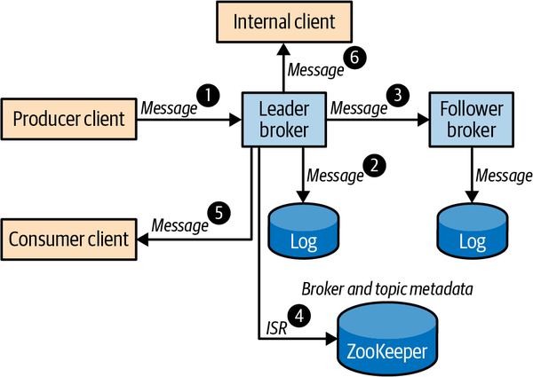
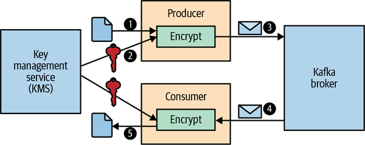

# Chương 11. Bảo mật Kafka (Securing Kafka)

Kafka được dùng cho rất nhiều tình huống sử dụng khác nhau, từ theo dõi hoạt động website và các pipeline metric cho tới quản lý hồ sơ bệnh án và thanh toán trực tuyến. Mỗi tình huống sử dụng lại có những yêu cầu khác nhau về bảo mật, hiệu năng, độ tin cậy và tính sẵn sàng. Mặc dù luôn nên dùng các tính năng bảo mật mạnh nhất và mới nhất hiện có, việc đánh đổi thường là điều không tránh khỏi bởi vì tăng cường bảo mật sẽ ảnh hưởng đến hiệu năng, chi phí và trải nghiệm người dùng. Kafka hỗ trợ một số công nghệ bảo mật tiêu chuẩn cùng với hàng loạt tùy chọn cấu hình để điều chỉnh mức độ bảo mật cho phù hợp với từng tình huống sử dụng.

Cũng giống như hiệu năng và độ tin cậy, bảo mật là một khía cạnh của hệ thống cần được xử lý cho toàn bộ hệ thống nói chung, chứ không phải cho từng thành phần riêng lẻ. Độ an toàn của một hệ thống chỉ mạnh bằng mắt xích yếu nhất của nó, và các quy trình cùng chính sách bảo mật phải được thực thi trên toàn hệ thống, bao gồm cả nền tảng bên dưới. Các tính năng bảo mật có thể tùy biến trong Kafka cho phép tích hợp với hạ tầng bảo mật sẵn có để xây dựng một mô hình bảo mật nhất quán áp dụng cho toàn bộ hệ thống.

Trong chương này, chúng ta sẽ thảo luận các tính năng bảo mật trong Kafka và xem chúng giải quyết những khía cạnh bảo mật khác nhau ra sao, cũng như đóng góp thế nào vào độ an toàn tổng thể của một hệ thống cài đặt Kafka. Xuyên suốt chương, chúng ta sẽ chia sẻ các thực hành tốt nhất, những mối đe dọa tiềm tàng, và các kỹ thuật để giảm thiểu những mối đe dọa đó. Chúng ta cũng sẽ xem xét thêm những biện pháp bổ sung có thể áp dụng để bảo vệ ZooKeeper và phần còn lại của nền tảng.

## Khóa chặt Kafka (Locking Down Kafka)

Kafka sử dụng một loạt các quy trình bảo mật để thiết lập và duy trì tính bí mật (confidentiality), tính toàn vẹn (integrity) và tính sẵn sàng (availability) của dữ liệu:

- *Authentication* (xác thực) thiết lập danh tính của bạn và xác định bạn là ai.
- *Authorization* (phân quyền) xác định bạn được phép làm gì.
- *Encryption* (mã hóa) bảo vệ dữ liệu của bạn khỏi bị nghe lén và giả mạo.
- *Auditing* (kiểm toán) theo dõi những gì bạn đã làm hoặc đã cố gắng làm.
- *Quotas* (hạn ngạch) kiểm soát lượng tài nguyên mà bạn có thể sử dụng.

Để hiểu cách khóa chặt một hệ thống Kafka đã triển khai, trước hết hãy xem dữ liệu chảy qua một Kafka cluster như thế nào. Hình 11-1 minh họa các bước chính trong một luồng dữ liệu ví dụ. Trong chương này, chúng ta sẽ dùng luồng ví dụ này để khảo sát những cách khác nhau mà Kafka có thể được cấu hình nhằm bảo vệ dữ liệu ở mọi bước, qua đó bảo đảm an toàn cho toàn bộ hệ thống triển khai.



**Hình 11-1. Luồng dữ liệu trong một Kafka cluster**

1. Alice produce một record đơn hàng khách hàng vào một partition của topic có tên `customerOrders`. Record được gửi tới leader của partition đó.
2. Broker leader ghi record vào file log cục bộ của nó.
3. Một broker follower fetch message từ leader và ghi vào file log replica cục bộ của nó.
4. Broker leader cập nhật trạng thái partition trong ZooKeeper để cập nhật danh sách in-sync replica, nếu cần.
5. Bob consume các record đơn hàng khách hàng từ topic `customerOrders`. Bob nhận được record do Alice produce.
6. Một ứng dụng nội bộ xử lý toàn bộ message đến `customerOrders` để tạo ra các metric thời gian thực về những sản phẩm phổ biến.

Một hệ thống triển khai an toàn phải bảo đảm:

**Tính xác thực của client (Client authenticity)**

Khi Alice thiết lập kết nối client tới broker, broker phải xác thực client để bảo đảm rằng message thực sự đến từ Alice.

**Tính xác thực của server (Server authenticity)**

Trước khi gửi message tới broker leader, client của Alice phải kiểm chứng được rằng kết nối là tới broker thật.

**Tính riêng tư của dữ liệu (Data privacy)**

Tất cả các kết nối mà message đi qua, cũng như tất cả các đĩa nơi message được lưu trữ, đều phải được mã hóa hoặc được bảo vệ vật lý nhằm ngăn kẻ nghe lén đọc được dữ liệu và bảo đảm dữ liệu không thể bị đánh cắp.

**Tính toàn vẹn của dữ liệu (Data integrity)**

Message digest phải được đính kèm cho dữ liệu truyền qua các mạng không an toàn để phát hiện việc giả mạo.

**Kiểm soát truy cập (Access control)**

Trước khi ghi message vào log, broker leader phải kiểm chứng rằng Alice được phép ghi vào `customerOrders`. Trước khi trả message về cho consumer của Bob, broker phải kiểm chứng rằng Bob được phép đọc từ topic đó. Nếu consumer của Bob dùng cơ chế group management, broker cũng phải kiểm chứng rằng Bob có quyền truy cập consumer group.

**Khả năng kiểm toán (Auditability)**

Phải ghi lại một dấu vết kiểm toán (audit trail) thể hiện mọi thao tác đã được thực hiện bởi các broker, bởi Alice, Bob và các client khác.

**Tính sẵn sàng (Availability)**

Các broker phải áp dụng quota và các giới hạn để tránh việc một số người dùng chiếm dụng toàn bộ băng thông sẵn có hoặc làm quá tải broker bằng các cuộc tấn công từ chối dịch vụ (denial-of-service). ZooKeeper phải được khóa chặt để bảo đảm tính sẵn sàng của Kafka cluster, bởi tính sẵn sàng của broker phụ thuộc vào tính sẵn sàng của ZooKeeper và tính toàn vẹn của metadata lưu trong ZooKeeper.

Trong các phần tiếp theo, chúng ta sẽ khám phá các tính năng bảo mật của Kafka có thể dùng để cung cấp những bảo đảm nói trên. Trước tiên chúng ta giới thiệu mô hình kết nối của Kafka và các security protocol gắn với các kết nối từ client tới Kafka broker. Sau đó chúng ta xem xét chi tiết từng security protocol và khảo sát năng lực authentication của mỗi protocol để xác định tính xác thực của client và tính xác thực của server. Chúng ta sẽ điểm qua các lựa chọn mã hóa ở những giai đoạn khác nhau, bao gồm cả mã hóa dữ liệu đang truyền (data in transit) có sẵn trong một số security protocol nhằm đáp ứng yêu cầu về tính riêng tư và tính toàn vẹn của dữ liệu. Tiếp đó, chúng ta khám phá cơ chế authorization có thể tùy biến trong Kafka để quản lý kiểm soát truy cập, và các log chính đóng góp vào khả năng kiểm toán. Cuối cùng, chúng ta xem xét vấn đề bảo mật cho phần còn lại của hệ thống, bao gồm ZooKeeper và nền tảng, điều cần thiết để duy trì tính sẵn sàng. Để biết chi tiết về quota — thứ góp phần vào tính sẵn sàng của dịch vụ thông qua việc phân bổ tài nguyên công bằng giữa những người dùng — hãy tham khảo Chương 3.

## Security Protocols

Kafka broker được cấu hình với các listener trên một hoặc nhiều endpoint và chấp nhận kết nối từ client trên các listener này. Mỗi listener có thể được cấu hình với các thiết lập bảo mật riêng. Yêu cầu bảo mật trên một listener nội bộ riêng tư được bảo vệ vật lý và chỉ những người có thẩm quyền mới truy cập được có thể khác với yêu cầu bảo mật của một listener bên ngoài có thể truy cập qua internet công cộng. Việc lựa chọn security protocol quyết định mức độ authentication và mã hóa dữ liệu đang truyền.

Kafka hỗ trợ bốn security protocol dựa trên hai công nghệ tiêu chuẩn là TLS và SASL. Transport Layer Security (TLS), thường được gọi bằng tên của phiên bản tiền nhiệm là Secure Sockets Layer (SSL), hỗ trợ mã hóa cũng như authentication cho cả client lẫn server. Simple Authentication and Security Layer (SASL) là một framework cung cấp authentication bằng nhiều cơ chế khác nhau trong các giao thức hướng kết nối. Mỗi security protocol của Kafka kết hợp một tầng transport (PLAINTEXT hoặc SSL) với một tầng authentication tùy chọn (SSL hoặc SASL):

**PLAINTEXT**

Tầng transport PLAINTEXT không có authentication. Chỉ phù hợp để dùng trong mạng riêng để xử lý dữ liệu không nhạy cảm, vì không dùng authentication hay mã hóa nào cả.

**SSL**

Tầng transport SSL với SSL client authentication tùy chọn. Phù hợp để dùng trong các mạng không an toàn vì hỗ trợ authentication cho cả client lẫn server, cũng như mã hóa.

**SASL_PLAINTEXT**

Tầng transport PLAINTEXT với SASL client authentication. Một số cơ chế SASL cũng hỗ trợ server authentication. Không hỗ trợ mã hóa, do đó chỉ phù hợp để dùng trong mạng riêng.

**SASL_SSL**

Tầng transport SSL với SASL authentication. Phù hợp để dùng trong các mạng không an toàn vì hỗ trợ authentication cho cả client lẫn server, cũng như mã hóa.

> **TLS/SSL**
>
> TLS là một trong những giao thức mật mã được sử dụng rộng rãi nhất trên internet công cộng. Các giao thức tầng ứng dụng như HTTP, SMTP và FTP đều dựa vào TLS để bảo đảm tính riêng tư và tính toàn vẹn của dữ liệu đang truyền. TLS dựa trên một hạ tầng khóa công khai (Public Key Infrastructure — PKI) để tạo, quản lý và phân phối các digital certificate có thể dùng cho mã hóa bất đối xứng, nhờ đó tránh được nhu cầu phân phối bí mật dùng chung giữa server và client. Các session key được sinh ra trong quá trình TLS handshake cho phép mã hóa đối xứng với hiệu năng cao hơn cho việc truyền dữ liệu về sau.

Listener dùng cho giao tiếp giữa các broker (inter-broker communication) có thể được chọn bằng cách cấu hình `inter.broker.listener.name` hoặc `security.inter.broker.protocol`. Cả tùy chọn cấu hình phía server lẫn phía client đều phải được cung cấp trong cấu hình broker cho security protocol dùng cho giao tiếp inter-broker. Lý do là các broker cần thiết lập kết nối client cho listener đó. Ví dụ sau cấu hình SSL cho listener inter-broker và listener nội bộ, và SASL_SSL cho listener bên ngoài:

```properties
listeners=EXTERNAL://:9092,INTERNAL://10.0.0.2:9093,BROKER://10.0.0.2:9094
advertised.listeners=EXTERNAL://broker1.example.com:9092,INTERNAL://broker1.local:9093,B
listener.security.protocol.map=EXTERNAL:SASL_SSL,INTERNAL:SSL,BROKER:SSL
inter.broker.listener.name=BROKER
```

Client được cấu hình với một security protocol và các bootstrap server, hai thứ này xác định listener nào của broker sẽ được dùng. Metadata trả về cho client chỉ chứa các endpoint tương ứng với cùng listener với các bootstrap server:

```properties
security.protocol=SASL_SSL
bootstrap.servers=broker1.example.com:9092,broker2.example.com:9092
```

Trong phần tiếp theo về authentication, chúng ta sẽ điểm qua các tùy chọn cấu hình đặc thù cho từng giao thức, dành cho broker và client, ứng với mỗi security protocol.

## Authentication

Authentication là quá trình thiết lập danh tính của client và server nhằm kiểm chứng tính xác thực của client và tính xác thực của server. Khi client của Alice kết nối tới broker leader để produce một record đơn hàng khách hàng, server authentication cho phép client xác định được rằng server mà nó đang giao tiếp đúng là broker thật. Client authentication kiểm chứng danh tính của Alice bằng cách xác nhận thông tin xác thực (credential) của Alice, chẳng hạn mật khẩu hoặc digital certificate, để xác định rằng kết nối đến từ Alice chứ không phải một kẻ mạo danh. Sau khi đã được xác thực, danh tính của Alice sẽ gắn với kết nối trong suốt vòng đời của kết nối đó. Kafka dùng một thể hiện của `KafkaPrincipal` để biểu diễn danh tính client và dùng principal này để cấp quyền truy cập tài nguyên cũng như phân bổ quota cho các kết nối mang danh tính client đó. `KafkaPrincipal` cho mỗi kết nối được thiết lập trong quá trình authentication dựa trên giao thức authentication. Ví dụ, principal `User:Alice` có thể được dùng cho Alice dựa trên username được cung cấp khi authentication bằng mật khẩu. `KafkaPrincipal` có thể được tùy biến bằng cách cấu hình `principal.builder.class` cho broker.

> **KẾT NỐI ẨN DANH (ANONYMOUS CONNECTIONS)**
>
> Principal `User:ANONYMOUS` được dùng cho các kết nối chưa được xác thực. Điều này bao gồm các client trên listener PLAINTEXT cũng như các client chưa được xác thực trên listener SSL.

### SSL

Khi Kafka được cấu hình với SSL hoặc SASL_SSL làm security protocol cho một listener, TLS sẽ được dùng làm tầng transport an toàn cho các kết nối trên listener đó. Khi một kết nối được thiết lập qua TLS, quá trình TLS handshake sẽ thực hiện authentication, thương lượng các tham số mật mã, và sinh ra các khóa dùng chung để mã hóa. Digital certificate của server được client kiểm chứng để xác định danh tính của server. Nếu client authentication bằng SSL được bật, server cũng kiểm chứng digital certificate của client để xác định danh tính của client. Toàn bộ lưu lượng qua SSL đều được mã hóa, khiến nó phù hợp để dùng trong các mạng không an toàn.

> **HIỆU NĂNG SSL (SSL PERFORMANCE)**
>
> Các kênh SSL được mã hóa nên gây ra một lượng overhead đáng kể về mặt sử dụng CPU. Hiện tại zero-copy transfer không được hỗ trợ cho SSL. Tùy theo mẫu lưu lượng, overhead có thể lên tới 20–30%.

#### Cấu hình TLS

Khi TLS được bật cho một listener của broker bằng SSL hoặc SASL_SSL, các broker phải được cấu hình với một key store chứa private key và certificate của broker, còn client phải được cấu hình với một trust store chứa certificate của broker hoặc certificate của certificate authority (CA) đã ký certificate của broker. Certificate của broker nên chứa hostname của broker dưới dạng phần mở rộng Subject Alternative Name (SAN) hoặc dưới dạng Common Name (CN) để client có thể kiểm chứng hostname của server. Có thể dùng wildcard certificate để đơn giản hóa việc quản trị bằng cách dùng chung một key store cho tất cả broker trong một domain.

> **KIỂM CHỨNG HOSTNAME CỦA SERVER (SERVER HOSTNAME VERIFICATION)**
>
> Theo mặc định, Kafka client kiểm chứng rằng hostname của server lưu trong certificate của server khớp với host mà client đang kết nối tới. Hostname của kết nối có thể là một bootstrap server mà client được cấu hình, hoặc một hostname của advertised listener được broker trả về trong một metadata response. Kiểm chứng hostname là một phần thiết yếu của server authentication, giúp chống lại các cuộc tấn công man-in-the-middle, do đó không nên tắt nó trong các hệ thống production.

Có thể cấu hình để broker xác thực các client kết nối qua listener dùng SSL làm security protocol bằng cách đặt tùy chọn cấu hình broker `ssl.client.auth=required`. Client phải được cấu hình với một key store, còn broker phải được cấu hình với một trust store chứa certificate của client hoặc certificate của các CA đã ký certificate của client. Nếu SSL được dùng cho giao tiếp inter-broker, trust store của broker phải bao gồm cả CA của certificate broker lẫn CA của certificate client. Theo mặc định, distinguished name (DN) của certificate client được dùng làm `KafkaPrincipal` cho authorization và quota. Tùy chọn cấu hình `ssl.principal.mapping.rules` có thể được dùng để cung cấp một danh sách các quy tắc nhằm tùy biến principal. Các listener dùng SASL_SSL sẽ tắt TLS client authentication và dựa vào SASL authentication cùng `KafkaPrincipal` do SASL thiết lập.

> **SSL CLIENT AUTHENTICATION**
>
> SSL client authentication có thể được đặt thành tùy chọn (không bắt buộc) bằng cách thiết lập `ssl.client.auth=requested`. Trong trường hợp này, các client không được cấu hình key store vẫn sẽ hoàn tất TLS handshake, nhưng sẽ được gán principal `User:ANONYMOUS`.

Các ví dụ sau minh họa cách tạo key store và trust store cho server authentication và client authentication bằng một CA tự ký (self-signed CA).

Sinh cặp khóa CA tự ký cho các broker:

```bash
$ keytool -genkeypair -keyalg RSA -keysize 2048 -keystore server.ca.p12            \
  -storetype PKCS12 -storepass server-ca-password -keypass server-ca-password      \
  -alias ca -dname "CN=BrokerCA" -ext bc=ca:true -validity 365
$ keytool -export -file server.ca.crt -keystore server.ca.p12 \
     -storetype PKCS12 -storepass server-ca-password -alias ca -rfc
```

1. Tạo một cặp khóa cho CA và lưu nó trong file PKCS12 `server.ca.p12`. Chúng ta dùng cặp khóa này để ký các certificate.
2. Xuất certificate công khai của CA ra `server.ca.crt`. File này sẽ được đưa vào các trust store và các chuỗi certificate.

Tạo key store cho các broker với certificate được ký bởi CA tự ký. Nếu dùng hostname dạng wildcard, có thể dùng chung một key store cho tất cả broker. Ngược lại, hãy tạo một key store cho từng broker với fully qualified domain name (FQDN) của nó:

```bash
$ keytool -genkey -keyalg RSA -keysize 2048 -keystore server.ks.p12            \
     -storepass server-ks-password -keypass server-ks-password -alias server   \
  -storetype PKCS12 -dname "CN=Kafka,O=Confluent,C=GB" -validity 365
$ keytool -certreq -file server.csr -keystore server.ks.p12 -storetype PKCS12 \
  -storepass server-ks-password -keypass server-ks-password -alias server
$ keytool -gencert -infile server.csr -outfile server.crt                      \
  -keystore server.ca.p12 -storetype PKCS12 -storepass server-ca-password      \
     -alias ca -ext SAN=DNS:broker1.example.com -validity 365
$ cat server.crt server.ca.crt > serverchain.crt
$ keytool -importcert -file serverchain.crt -keystore server.ks.p12            \
  -storepass server-ks-password -keypass server-ks-password -alias server      \
     -storetype PKCS12 -noprompt
```

1. Sinh một private key cho broker và lưu nó trong file PKCS12 `server.ks.p12`.
2. Sinh một certificate signing request.
3. Dùng key store của CA để ký certificate của broker. Certificate đã ký được lưu trong `server.crt`.
4. Import chuỗi certificate của broker vào key store của broker.

Nếu TLS được dùng cho giao tiếp inter-broker, hãy tạo một trust store cho các broker chứa certificate CA của broker để các broker có thể xác thực lẫn nhau:

```bash
$ keytool -import -file server.ca.crt -keystore server.ts.p12 \
   -storetype PKCS12 -storepass server-ts-password -alias server -noprompt
```

Sinh một trust store cho client chứa certificate CA của broker:

```bash
$ keytool -import -file server.ca.crt -keystore client.ts.p12 \
  -storetype PKCS12 -storepass client-ts-password -alias ca -noprompt
```

Nếu TLS client authentication được bật, client phải được cấu hình với một key store. Script sau sinh một CA tự ký cho client và tạo một key store cho client với certificate được ký bởi CA của client. CA của client được thêm vào trust store của broker để broker có thể kiểm chứng tính xác thực của client:

```bash
# Generate self-signed CA key-pair for clients
keytool -genkeypair -keyalg RSA -keysize 2048 -keystore client.ca.p12             \
   -storetype PKCS12 -storepass client-ca-password -keypass client-ca-password \
  -alias ca -dname CN=ClientCA -ext bc=ca:true -validity 365
keytool -export -file client.ca.crt -keystore client.ca.p12 -storetype PKCS12 \
   -storepass client-ca-password -alias ca -rfc

# Create key store for clients
keytool -genkey -keyalg RSA -keysize 2048 -keystore client.ks.p12             \
  -storepass client-ks-password -keypass client-ks-password -alias client     \
   -storetype PKCS12 -dname "CN=Metrics App,O=Confluent,C=GB" -validity 365
keytool -certreq -file client.csr -keystore client.ks.p12 -storetype PKCS12 \
  -storepass client-ks-password -keypass client-ks-password -alias client
keytool -gencert -infile client.csr -outfile client.crt                     \
  -keystore client.ca.p12 -storetype PKCS12 -storepass client-ca-password   \
  -alias ca -validity 365
cat client.crt client.ca.crt > clientchain.crt
keytool -importcert -file clientchain.crt -keystore client.ks.p12             \
   -storepass client-ks-password -keypass client-ks-password -alias client    \
   -storetype PKCS12 -noprompt


# Add client CA certificate to broker's trust store
keytool -import -file client.ca.crt -keystore server.ts.p12 -alias client \
    -storetype PKCS12 -storepass server-ts-password -noprompt
```

1. Trong ví dụ này chúng ta tạo một CA mới dành cho client.
2. Theo mặc định, các client xác thực bằng certificate này sẽ dùng `User:CN=Metrics App,O=Confluent,C=GB` làm principal.
3. Chúng ta thêm chuỗi certificate của client vào key store của client.
4. Trust store của broker phải chứa CA của tất cả các client.

Khi đã có key store và trust store, chúng ta có thể cấu hình TLS cho các broker. Broker chỉ cần trust store nếu TLS được dùng cho giao tiếp inter-broker hoặc nếu client authentication được bật:

```properties
ssl.keystore.location=/path/to/server.ks.p12
ssl.keystore.password=server-ks-password
ssl.key.password=server-ks-password
ssl.keystore.type=PKCS12
ssl.truststore.location=/path/to/server.ts.p12
ssl.truststore.password=server-ts-password
ssl.truststore.type=PKCS12
ssl.client.auth=required
```

Client được cấu hình với trust store đã sinh ra. Key store cần được cấu hình cho client nếu client authentication là bắt buộc.

```properties
ssl.truststore.location=/path/to/client.ts.p12
ssl.truststore.password=client-ts-password
ssl.truststore.type=PKCS12
ssl.keystore.location=/path/to/client.ks.p12
ssl.keystore.password=client-ks-password
ssl.key.password=client-ks-password
ssl.keystore.type=PKCS12
```

> **TRUST STORE**
>
> Có thể bỏ qua cấu hình trust store ở cả broker lẫn client khi dùng certificate được ký bởi các tổ chức uy tín, được tin cậy rộng rãi. Trong trường hợp này, trust store mặc định trong bản cài đặt Java là đủ để thiết lập sự tin cậy. Các bước cài đặt được mô tả trong Chương 2.

Key store và trust store phải được cập nhật định kỳ trước khi certificate hết hạn để tránh lỗi TLS handshake. Các SSL store của broker có thể được cập nhật động bằng cách sửa chính file đó hoặc đặt tùy chọn cấu hình trỏ tới một file phiên bản mới. Trong cả hai trường hợp, có thể dùng Admin API hoặc công cụ Kafka configs để kích hoạt việc cập nhật. Ví dụ sau cập nhật key store cho listener external của một broker có broker id là 0 bằng công cụ configs:

```bash
$ bin/kafka-configs.sh --bootstrap-server localhost:9092                            \
    --command-config admin.props                               \
    --entity-type brokers --entity-name 0 --alter --add-config \
    'listener.name.external.ssl.keystore.location=/path/to/server.ks.p12'
```

#### Cân nhắc về bảo mật

TLS được dùng rộng rãi để cung cấp bảo mật tầng transport cho nhiều giao thức, trong đó có HTTPS. Cũng như với bất kỳ giao thức bảo mật nào, điều quan trọng là phải hiểu rõ các mối đe dọa tiềm tàng và chiến lược giảm thiểu khi áp dụng một giao thức cho các ứng dụng trọng yếu. Theo mặc định, Kafka chỉ bật các giao thức mới hơn là TLSv1.2 và TLSv1.3, bởi các giao thức cũ hơn như TLSv1.1 có những lỗ hổng đã biết. Do các vấn đề với renegotiation không an toàn, Kafka không hỗ trợ renegotiation cho các kết nối TLS. Kiểm chứng hostname được bật mặc định để ngăn các cuộc tấn công man-in-the-middle. Có thể siết chặt bảo mật hơn nữa bằng cách giới hạn các cipher suite. Các cipher mạnh với kích thước khóa mã hóa ít nhất 256 bit giúp chống lại các tấn công mật mã và bảo đảm tính toàn vẹn dữ liệu khi truyền dữ liệu qua mạng không an toàn. Một số tổ chức yêu cầu giới hạn giao thức TLS và các cipher để tuân thủ các tiêu chuẩn bảo mật như FIPS 140-2.

Vì key store chứa private key được lưu trên hệ thống file theo mặc định, việc giới hạn quyền truy cập vào các file key store bằng quyền hệ thống file là tối quan trọng. Có thể dùng các tính năng TLS tiêu chuẩn của Java để bật cơ chế thu hồi certificate (certificate revocation) nếu một private key bị lộ. Trong trường hợp này, có thể dùng các khóa có thời hạn ngắn để giảm mức độ phơi nhiễm.

TLS handshake là thao tác tốn kém và chiếm một lượng thời gian đáng kể trên các network thread của broker. Những listener dùng TLS trên các mạng không an toàn cần được bảo vệ khỏi tấn công từ chối dịch vụ bằng connection quota và các giới hạn nhằm bảo vệ tính sẵn sàng của broker. Tùy chọn cấu hình broker `connection.failed.authentication.delay.ms` có thể được dùng để làm trễ phản hồi khi authentication thất bại, qua đó giảm tốc độ mà client thử lại sau các lần authentication thất bại.

### SASL

Giao thức Kafka hỗ trợ authentication bằng SASL và có sẵn hỗ trợ tích hợp cho một số cơ chế SASL thường dùng. SASL có thể kết hợp với TLS làm tầng transport để cung cấp một kênh an toàn có cả authentication lẫn mã hóa. SASL authentication được thực hiện thông qua một chuỗi các challenge từ server và response từ client, trong đó cơ chế SASL định nghĩa trình tự và định dạng đường truyền của các challenge và response. Kafka broker hỗ trợ sẵn các cơ chế SASL sau, kèm theo các callback có thể tùy biến để tích hợp với hạ tầng bảo mật sẵn có:

**GSSAPI**

Kerberos authentication được hỗ trợ thông qua SASL/GSSAPI và có thể dùng để tích hợp với các Kerberos server như Active Directory hoặc OpenLDAP.

**PLAIN**

Authentication bằng username/password, thường được dùng kèm một server-side callback tùy biến để kiểm chứng mật khẩu từ một kho mật khẩu bên ngoài.

**SCRAM-SHA-256 và SCRAM-SHA-512**

Authentication bằng username/password có sẵn ngay trong Kafka mà không cần thêm kho mật khẩu nào khác.

**OAUTHBEARER**

Authentication bằng OAuth bearer token, thường được dùng kèm các callback tùy biến để lấy và kiểm chứng token do các OAuth server tiêu chuẩn cấp.

Một hoặc nhiều cơ chế SASL có thể được bật trên mỗi listener có bật SASL trong broker bằng cách cấu hình `sasl.enabled.mechanisms` cho listener đó. Client có thể chọn bất kỳ cơ chế nào đã được bật bằng cách cấu hình `sasl.mechanism`.

Kafka dùng Java Authentication and Authorization Service (JAAS) để cấu hình SASL. Tùy chọn cấu hình `sasl.jaas.config` chứa một mục cấu hình JAAS duy nhất, chỉ định một login module và các tùy chọn của nó. Broker dùng tiền tố listener và tiền tố cơ chế khi cấu hình `sasl.jaas.config`. Ví dụ, `listener.name.external.gssapi.sasl.jaas.config` cấu hình mục JAAS cho SASL/GSSAPI trên listener có tên `EXTERNAL`. Quá trình login trên broker và client dùng cấu hình JAAS để xác định các credential công khai và riêng tư dùng cho authentication.

> **FILE CẤU HÌNH JAAS (JAAS CONFIGURATION FILE)**
>
> Cấu hình JAAS cũng có thể được chỉ định trong các file cấu hình bằng thuộc tính hệ thống Java `java.security.auth.login.config`. Tuy nhiên, tùy chọn `sasl.jaas.config` của Kafka được khuyến nghị hơn vì nó hỗ trợ bảo vệ mật khẩu và cho phép cấu hình riêng cho từng cơ chế SASL khi nhiều cơ chế được bật trên cùng một listener.

Các cơ chế SASL mà Kafka hỗ trợ có thể được tùy biến để tích hợp với các máy chủ authentication của bên thứ ba thông qua callback handler. Có thể cung cấp một login callback handler cho broker hoặc client để tùy biến quá trình login, ví dụ để lấy các credential dùng cho authentication. Có thể cung cấp một server callback handler để thực hiện authentication credential của client, ví dụ để kiểm chứng mật khẩu bằng một máy chủ mật khẩu bên ngoài. Có thể cung cấp một client callback handler để chèn credential của client thay vì đưa chúng vào cấu hình JAAS.

Trong các mục con sau đây, chúng ta sẽ khám phá chi tiết hơn các cơ chế SASL mà Kafka hỗ trợ.

#### SASL/GSSAPI

Kerberos là một giao thức xác thực mạng được dùng rộng rãi, sử dụng mật mã mạnh để hỗ trợ xác thực lẫn nhau (mutual authentication) một cách an toàn qua mạng không an toàn. Generic Security Service Application Program Interface (GSS-API) là một framework cung cấp các dịch vụ bảo mật cho ứng dụng bằng nhiều cơ chế authentication khác nhau. RFC-4752 giới thiệu cơ chế SASL GSSAPI để authentication bằng cơ chế Kerberos V5 của GSS-API. Sự sẵn có của cả các bản triển khai Kerberos server mã nguồn mở lẫn các bản thương mại cấp doanh nghiệp đã khiến Kerberos trở thành lựa chọn phổ biến cho authentication trong nhiều lĩnh vực có yêu cầu bảo mật nghiêm ngặt. Kafka hỗ trợ Kerberos authentication thông qua SASL/GSSAPI.

##### Cấu hình SASL/GSSAPI

Kafka dùng các security provider GSSAPI có sẵn trong Java runtime environment để hỗ trợ authentication an toàn bằng Kerberos. Cấu hình JAAS cho GSSAPI bao gồm đường dẫn của một file keytab chứa ánh xạ từ các principal tới khóa dài hạn của chúng ở dạng đã mã hóa. Để cấu hình GSSAPI cho broker, hãy tạo một keytab cho mỗi broker với principal có chứa hostname của broker đó. Hostname của broker được client kiểm chứng để bảo đảm tính xác thực của server và ngăn các cuộc tấn công man-in-the-middle. Kerberos đòi hỏi một dịch vụ DNS an toàn để tra cứu hostname trong quá trình authentication. Trong những triển khai mà tra cứu xuôi và tra cứu ngược không khớp nhau, file cấu hình Kerberos `krb5.conf` trên client có thể được cấu hình đặt `rdns=false` để tắt tra cứu ngược. Cấu hình JAAS cho mỗi broker phải bao gồm login module Kerberos V5 từ Java runtime, đường dẫn tới file keytab, và principal đầy đủ của broker:

```properties
sasl.enabled.mechanisms=GSSAPI
listener.name.external.gssapi.sasl.jaas.config=\
  com.sun.security.auth.module.Krb5LoginModule required \
         useKeyTab=true storeKey=true             \
         keyTab="/path/to/broker1.keytab" \
         principal="kafka/broker1.example.com@EXAMPLE.COM";
```

1. Chúng ta dùng `sasl.jaas.config` với tiền tố listener, tiền tố này chứa tên listener và cơ chế SASL viết thường.
2. File keytab phải đọc được bởi tiến trình broker.
3. Service principal của broker phải bao gồm hostname của broker.

Nếu SASL/GSSAPI được dùng cho giao tiếp inter-broker, cơ chế SASL inter-broker và tên dịch vụ Kerberos cũng phải được cấu hình cho broker:

```properties
sasl.mechanism.inter.broker.protocol=GSSAPI
sasl.kerberos.service.name=kafka
```

Client cần được cấu hình với keytab và principal riêng của mình trong cấu hình JAAS, cùng với `sasl.kerberos.service.name` để chỉ ra tên của dịch vụ mà chúng đang kết nối tới:

```properties
sasl.mechanism=GSSAPI
sasl.kerberos.service.name=kafka
sasl.jaas.config=com.sun.security.auth.module.Krb5LoginModule required \
    useKeyTab=true storeKey=true   \
     keyTab="/path/to/alice.keytab" \
     principal="Alice@EXAMPLE.COM";
```

1. Tên dịch vụ của dịch vụ Kafka phải được chỉ định cho client.
2. Client có thể dùng principal không kèm hostname.

Theo mặc định, tên ngắn (short name) của principal được dùng làm danh tính client. Ví dụ, `User:Alice` là principal của client và `User:kafka` là principal của broker trong ví dụ trên. Cấu hình broker `sasl.kerberos.principal.to.local.rules` có thể được dùng để áp dụng một danh sách các quy tắc nhằm biến đổi principal đầy đủ thành một principal tùy biến.

##### Cân nhắc về bảo mật

Nên dùng SASL_SSL trong các triển khai production sử dụng Kerberos để bảo vệ cả luồng authentication lẫn lưu lượng dữ liệu trên kết nối sau khi đã authentication. Nếu không dùng TLS để cung cấp tầng transport an toàn, kẻ nghe lén trên mạng có thể thu thập đủ thông tin để tiến hành tấn công từ điển (dictionary attack) hoặc tấn công vét cạn (brute-force attack) nhằm đánh cắp credential của client. An toàn hơn là dùng các khóa được sinh ngẫu nhiên cho broker thay vì các khóa sinh từ mật khẩu vốn dễ bị phá hơn. Nên tránh các thuật toán mã hóa yếu như DES-MD5 và chuyển sang các thuật toán mạnh hơn. Quyền truy cập vào file keytab phải được giới hạn bằng quyền hệ thống file, vì bất kỳ người dùng nào sở hữu file đó đều có thể mạo danh người dùng tương ứng.

SASL/GSSAPI đòi hỏi một dịch vụ DNS an toàn để thực hiện server authentication. Bởi vì các cuộc tấn công từ chối dịch vụ nhằm vào KDC hoặc dịch vụ DNS có thể dẫn đến lỗi authentication ở client, nên cần phải giám sát tính sẵn sàng của các dịch vụ này. Kerberos cũng dựa vào đồng hồ được đồng bộ tương đối với mức sai lệch có thể cấu hình để phát hiện tấn công phát lại (replay attack). Điều quan trọng là phải bảo đảm việc đồng bộ đồng hồ diễn ra an toàn.

#### SASL/PLAIN

RFC-4616 định nghĩa một cơ chế authentication đơn giản bằng username/password, có thể dùng kèm TLS để cung cấp authentication an toàn. Trong quá trình authentication, client gửi username và password tới server, và server kiểm chứng mật khẩu bằng kho mật khẩu của mình. Kafka có sẵn hỗ trợ SASL/PLAIN, và có thể tích hợp với một cơ sở dữ liệu mật khẩu bên ngoài an toàn thông qua một callback handler tùy biến.

##### Cấu hình SASL/PLAIN

Bản triển khai mặc định của SASL/PLAIN dùng cấu hình JAAS của broker làm kho mật khẩu. Toàn bộ username và password của client được đưa vào dưới dạng các login option, và broker kiểm chứng rằng mật khẩu do client cung cấp trong quá trình authentication khớp với một trong các mục đó. Username và password của broker chỉ cần thiết nếu SASL/PLAIN được dùng cho giao tiếp inter-broker:

```properties
sasl.enabled.mechanisms=PLAIN
sasl.mechanism.inter.broker.protocol=PLAIN
listener.name.external.plain.sasl.jaas.config=\
  org.apache.kafka.common.security.plain.PlainLoginModule required \
      username="kafka" password="kafka-password" \
      user_kafka="kafka-password" \
      user_Alice="Alice-password";
```

1. Username và password được dùng cho các kết nối inter-broker do broker khởi tạo.
2. Khi client của Alice kết nối tới broker, mật khẩu do Alice cung cấp sẽ được đối chiếu với mật khẩu này trong cấu hình của broker.

Client phải được cấu hình với username và password để authentication:

```properties
sasl.mechanism=PLAIN
sasl.jaas.config=org.apache.kafka.common.security.plain.PlainLoginModule \
    required username="Alice" password="Alice-password";
```

Bản triển khai có sẵn — lưu toàn bộ mật khẩu trong cấu hình JAAS của mọi broker — là không an toàn và không linh hoạt, vì tất cả broker sẽ phải khởi động lại mỗi khi thêm hoặc xóa một người dùng. Khi dùng SASL/PLAIN trong production, có thể dùng một server callback handler tùy biến để tích hợp broker với một máy chủ mật khẩu an toàn của bên thứ ba. Callback handler tùy biến cũng có thể được dùng để hỗ trợ xoay vòng mật khẩu (password rotation). Ở phía server, server callback handler nên hỗ trợ cả mật khẩu cũ lẫn mật khẩu mới trong một khoảng thời gian chồng lấn cho tới khi tất cả client chuyển sang mật khẩu mới. Ví dụ sau minh họa một callback handler kiểm chứng mật khẩu đã mã hóa từ các file được sinh ra bằng công cụ `htpasswd` của Apache:

```java
public class PasswordVerifier extends PlainServerCallbackHandler {


  private final List<String> passwdFiles = new ArrayList<>();


  @Override
  public void configure(Map<String, ?> configs, String mechanism,
                               List<AppConfigurationEntry> jaasEntries) {
      Map<String,?> loginOptions = jaasEntries.get(0).getOptions();
      String files = (String) loginOptions.get("password.files");
      Collections.addAll(passwdFiles, files.split(","));
  }

  @Override
  protected boolean authenticate(String user, char[] password) {
      return passwdFiles.stream()
                .anyMatch(file -> authenticate(file, user, password));
    }

    private boolean authenticate(String file, String user, char[] password) {
        try {
            String cmd = String.format("htpasswd -vb %s %s %s",
                    file, user, new String(password));
            return Runtime.getRuntime().exec(cmd).waitFor() == 0;
        } catch (Exception e) {
          return false;
        }
    }
}
```

1. Chúng ta dùng nhiều file mật khẩu để có thể hỗ trợ xoay vòng mật khẩu.
2. Chúng ta truyền đường dẫn của các file mật khẩu dưới dạng một tùy chọn JAAS trong cấu hình broker. Cũng có thể dùng các tùy chọn cấu hình broker tùy biến.
3. Chúng ta kiểm tra xem mật khẩu có khớp trong bất kỳ file nào hay không, nhờ đó cho phép dùng cả mật khẩu cũ lẫn mật khẩu mới trong một khoảng thời gian.
4. Chúng ta dùng `htpasswd` cho đơn giản. Trong các triển khai production có thể dùng một cơ sở dữ liệu an toàn.

Broker được cấu hình với callback handler kiểm chứng mật khẩu và các tùy chọn của nó:

```properties
listener.name.external.plain.sasl.jaas.config=\
        org.apache.kafka.common.security.plain.PlainLoginModule required \
        password.files="/path/to/htpassword.props,/path/to/oldhtpassword.props";
listener.name.external.plain.sasl.server.callback.handler.class=\
        com.example.PasswordVerifier
```

Ở phía client, có thể dùng một client callback handler cài đặt `org.apache.kafka.common.security.auth.AuthenticateCallbackHandler` để nạp mật khẩu động lúc chạy khi kết nối được thiết lập, thay vì nạp tĩnh từ cấu hình JAAS lúc khởi động. Mật khẩu có thể được nạp từ các file đã mã hóa hoặc thông qua một máy chủ an toàn bên ngoài để tăng mức độ bảo mật. Ví dụ sau nạp mật khẩu động từ một file bằng các lớp cấu hình trong Kafka:

```java
    @Override
    public void handle(Callback[] callbacks) throws IOException {
        Properties props = Utils.loadProps(passwdFile);
        PasswordConfig config = new PasswordConfig(props);
        String user = config.getString("username");
        String password = config.getPassword("password").value();
        for (Callback callback: callbacks) {
            if (callback instanceof NameCallback)
              ((NameCallback) callback).setName(user);
            else if (callback instanceof PasswordCallback) {
                ((PasswordCallback) callback).setPassword(password.toCharArray());
            }
        }
    }


    private static class PasswordConfig extends AbstractConfig {
      static ConfigDef CONFIG = new ConfigDef()
            .define("username", STRING, HIGH, "User name")
              .define("password", PASSWORD, HIGH, "User password");
            PasswordConfig(Properties props) {
                super(CONFIG, props, false);
            }
       }
```

1. Chúng ta nạp file cấu hình ngay bên trong callback để bảo đảm dùng mật khẩu mới nhất, qua đó hỗ trợ xoay vòng mật khẩu.
2. Thư viện cấu hình bên dưới trả về giá trị mật khẩu thực sự ngay cả khi mật khẩu được externalize (đưa ra ngoài).
3. Chúng ta khai báo các config mật khẩu với kiểu `PASSWORD` để bảo đảm mật khẩu không bị đưa vào các mục log.

Cả client lẫn broker dùng SASL/PLAIN cho giao tiếp inter-broker đều có thể được cấu hình với callback phía client:

```properties
sasl.jaas.config=org.apache.kafka.common.security.plain.PlainLoginModule \
     required file="/path/to/credentials.props";
sasl.client.callback.handler.class=com.example.PasswordProvider
```

##### Cân nhắc về bảo mật

Vì SASL/PLAIN truyền mật khẩu dạng rõ (clear text) trên đường truyền, cơ chế PLAIN chỉ nên được bật kèm mã hóa bằng SASL_SSL để cung cấp một tầng transport an toàn. Mật khẩu lưu ở dạng rõ trong cấu hình JAAS của broker và client là không an toàn, vì vậy hãy cân nhắc mã hóa hoặc externalize các mật khẩu này vào một kho mật khẩu an toàn. Thay vì dùng kho mật khẩu có sẵn — vốn lưu toàn bộ mật khẩu client trong cấu hình JAAS của broker — hãy dùng một máy chủ mật khẩu bên ngoài an toàn, lưu trữ mật khẩu một cách an toàn và thực thi các chính sách mật khẩu mạnh.

> **MẬT KHẨU DẠNG RÕ (CLEAR-TEXT PASSWORDS)**
>
> Hãy tránh để mật khẩu dạng rõ trong file cấu hình, ngay cả khi các file đó có thể được bảo vệ bằng quyền hệ thống file. Hãy cân nhắc externalize hoặc mã hóa mật khẩu để bảo đảm mật khẩu không bị vô tình lộ ra. Tính năng bảo vệ mật khẩu của Kafka được mô tả ở phần sau của chương này.

#### SASL/SCRAM

RFC-5802 giới thiệu một cơ chế authentication bằng username/password an toàn, giải quyết những lo ngại về bảo mật của các cơ chế authentication bằng mật khẩu như SASL/PLAIN vốn gửi mật khẩu qua đường truyền. Salted Challenge Response Authentication Mechanism (SCRAM) tránh việc truyền mật khẩu dạng rõ và lưu mật khẩu ở một định dạng khiến việc mạo danh client trở nên bất khả thi trên thực tế. Salting kết hợp mật khẩu với một số dữ liệu ngẫu nhiên trước khi áp dụng một hàm băm mật mã một chiều để lưu mật khẩu một cách an toàn. Kafka có sẵn một SCRAM provider có thể dùng trong các triển khai có ZooKeeper an toàn mà không cần thêm máy chủ mật khẩu nào. Các cơ chế SCRAM là SCRAM-SHA-256 và SCRAM-SHA-512 đều được provider của Kafka hỗ trợ.

##### Cấu hình SASL/SCRAM

Một tập người dùng ban đầu có thể được tạo sau khi khởi động ZooKeeper và trước khi khởi động các broker. Broker nạp metadata người dùng SCRAM vào một cache trong bộ nhớ lúc khởi động, bảo đảm rằng tất cả người dùng, kể cả người dùng broker dùng cho giao tiếp inter-broker, đều có thể authentication thành công. Người dùng có thể được thêm hoặc xóa bất cứ lúc nào. Broker giữ cho cache luôn được cập nhật bằng các thông báo dựa trên ZooKeeper watcher. Trong ví dụ này, chúng ta tạo một người dùng với principal `User:Alice` và mật khẩu `Alice-password` cho cơ chế SASL `SCRAM-SHA-512`:

```bash
$ bin/kafka-configs.sh --zookeeper localhost:2181 --alter --add-config \
  'SCRAM-SHA-512=[iterations=8192,password=Alice-password]'            \
  --entity-type users --entity-name Alice
```

Một hoặc nhiều cơ chế SCRAM có thể được bật trên một listener bằng cách cấu hình các cơ chế đó trên broker. Username và password chỉ cần thiết cho broker nếu listener được dùng cho giao tiếp inter-broker:

```properties
sasl.enabled.mechanisms=SCRAM-SHA-512
sasl.mechanism.inter.broker.protocol=SCRAM-SHA-512
listener.name.external.scram-sha-512.sasl.jaas.config=\
  org.apache.kafka.common.security.scram.ScramLoginModule required \
     username="kafka" password="kafka-password";
```

1. Username và password cho các kết nối inter-broker do broker khởi tạo.

Client phải được cấu hình để dùng một trong các cơ chế SASL đã được bật trên broker, và cấu hình JAAS của client phải bao gồm username và password:

```properties
sasl.mechanism=SCRAM-SHA-512
sasl.jaas.config=org.apache.kafka.common.security.scram.ScramLoginModule \
  required username="Alice" password="Alice-password";
```

Bạn có thể thêm người dùng SCRAM mới bằng `--add-config` và xóa người dùng bằng tùy chọn `--delete-config` của công cụ configs. Khi một người dùng hiện có bị xóa, không thể thiết lập kết nối mới cho người dùng đó nữa, nhưng các kết nối đang tồn tại của người dùng đó vẫn tiếp tục hoạt động. Có thể cấu hình một khoảng thời gian reauthentication cho broker để giới hạn khoảng thời gian mà các kết nối hiện có được phép tiếp tục hoạt động sau khi người dùng bị xóa. Ví dụ sau xóa cấu hình `SCRAM-SHA-512` của Alice để loại bỏ credential của Alice cho cơ chế đó:

```bash
$ bin/kafka-configs.sh --zookeeper localhost:2181 --alter --delete-config \
  'SCRAM-SHA-512' --entity-type users --entity-name Alice
```

##### Cân nhắc về bảo mật

SCRAM áp dụng một hàm băm mật mã một chiều lên mật khẩu kết hợp với một salt ngẫu nhiên để tránh việc mật khẩu thật bị truyền qua đường truyền hoặc bị lưu trong cơ sở dữ liệu. Tuy nhiên, bất kỳ hệ thống dựa trên mật khẩu nào cũng chỉ an toàn ngang với chính các mật khẩu đó. Phải thực thi các chính sách mật khẩu mạnh để bảo vệ hệ thống khỏi tấn công vét cạn hoặc tấn công từ điển. Kafka cung cấp các biện pháp phòng vệ bằng cách chỉ hỗ trợ các thuật toán băm mạnh là SHA-256 và SHA-512 và tránh những thuật toán yếu hơn như SHA-1. Điều này được kết hợp với số vòng lặp (iteration count) mặc định cao là 4.096 và các salt ngẫu nhiên duy nhất cho mỗi khóa được lưu, nhằm hạn chế thiệt hại nếu bảo mật của ZooKeeper bị xâm phạm.

Bạn nên áp dụng thêm các biện pháp phòng ngừa để bảo vệ các khóa được truyền trong quá trình handshake và các khóa lưu trong ZooKeeper nhằm chống lại tấn công vét cạn. SCRAM phải được dùng với SASL_SSL làm security protocol để tránh việc kẻ nghe lén tiếp cận được các khóa đã băm trong quá trình authentication. ZooKeeper cũng phải được bật SSL, và dữ liệu ZooKeeper phải được bảo vệ bằng mã hóa đĩa để bảo đảm rằng các khóa đã lưu không thể bị lấy ra ngay cả khi kho lưu trữ bị xâm phạm. Trong những triển khai không có ZooKeeper an toàn, có thể dùng các callback của SCRAM để tích hợp với một kho credential bên ngoài an toàn.

#### SASL/OAUTHBEARER

OAuth là một framework phân quyền cho phép các ứng dụng có được quyền truy cập hạn chế vào các dịch vụ HTTP. RFC-7628 định nghĩa cơ chế SASL OAUTHBEARER, cho phép dùng các credential lấy được qua OAuth 2.0 để truy cập các tài nguyên được bảo vệ trong những giao thức không phải HTTP. OAUTHBEARER tránh được các lỗ hổng bảo mật của những cơ chế dùng mật khẩu dài hạn bằng cách sử dụng OAuth 2.0 bearer token có vòng đời ngắn hơn và quyền truy cập tài nguyên hạn chế. Kafka hỗ trợ SASL/OAUTHBEARER cho client authentication, cho phép tích hợp với các OAuth server của bên thứ ba. Bản triển khai có sẵn của OAUTHBEARER dùng JSON Web Token (JWT) không được bảo mật và không phù hợp để dùng trong production. Có thể bổ sung các callback tùy biến để tích hợp với các OAuth server tiêu chuẩn nhằm cung cấp authentication an toàn bằng cơ chế OAUTHBEARER trong các triển khai production.

##### Cấu hình SASL/OAUTHBEARER

Bản triển khai có sẵn của SASL/OAUTHBEARER trong Kafka không kiểm chứng token, do đó chỉ cần chỉ định login module trong cấu hình JAAS. Nếu listener được dùng cho giao tiếp inter-broker, thông tin về token dùng cho các kết nối client do broker khởi tạo cũng phải được cung cấp. Tùy chọn `unsecuredLoginStringClaim_sub` là subject claim, thứ mặc định quyết định `KafkaPrincipal` cho kết nối:

```properties
sasl.enabled.mechanisms=OAUTHBEARER
sasl.mechanism.inter.broker.protocol=OAUTHBEARER
listener.name.external.oauthbearer.sasl.jaas.config=\
  org.apache.kafka.common.security.oauthbearer.OAuthBearerLoginModule \
     required unsecuredLoginStringClaim_sub="kafka";
```

1. Subject claim cho token dùng trong các kết nối inter-broker.

Client phải được cấu hình với tùy chọn subject claim `unsecuredLoginStringClaim_sub`. Các claim khác và vòng đời của token cũng có thể được cấu hình:

```properties
sasl.mechanism=OAUTHBEARER
sasl.jaas.config=\
  org.apache.kafka.common.security.oauthbearer.OAuthBearerLoginModule \
     required unsecuredLoginStringClaim_sub="Alice";
```

1. `User:Alice` là `KafkaPrincipal` mặc định cho các kết nối dùng cấu hình này.

Để tích hợp Kafka với các OAuth server của bên thứ ba nhằm dùng bearer token trong production, Kafka client phải được cấu hình với `sasl.login.callback.handler.class` để lấy token từ OAuth server bằng mật khẩu dài hạn hoặc một refresh token. Nếu OAUTHBEARER được dùng cho giao tiếp inter-broker, broker cũng phải được cấu hình với một login callback handler để lấy token cho các kết nối client mà broker tạo ra cho giao tiếp inter-broker:

```java
@Override
public void handle(Callback[] callbacks) throws UnsupportedCallbackException {
  OAuthBearerToken token = null;
    for (Callback callback : callbacks) {
        if (callback instanceof OAuthBearerTokenCallback) {
            token = acquireToken();
            ((OAuthBearerTokenCallback) callback).token(token);
        } else if (callback instanceof SaslExtensionsCallback) {
          ((SaslExtensionsCallback) callback).extensions(processExtensions(token));
        } else
            throw new UnsupportedCallbackException(callback);
    }
}
```

1. Client phải lấy một token từ OAuth server và đặt một token hợp lệ vào callback.
2. Client cũng có thể đính kèm các extension tùy chọn.

Broker cũng phải được cấu hình với một server callback handler thông qua `listener.name.<listener-name>.oauthbearer.sasl.server.callback.handler.class` để kiểm chứng các token do client cung cấp:

```java
@Override
public void handle(Callback[] callbacks) throws UnsupportedCallbackException {
  for (Callback callback : callbacks) {
        if (callback instanceof OAuthBearerValidatorCallback) {
          OAuthBearerValidatorCallback cb = (OAuthBearerValidatorCallback) callback;
            try {
              cb.token(validatedToken(cb.tokenValue()));
            } catch (OAuthBearerIllegalTokenException e) {
                OAuthBearerValidationResult r = e.reason();
                cb.error(errorStatus(r), r.failureScope(), r.failureOpenIdConfig());
            }
        } else if (callback instanceof OAuthBearerExtensionsValidatorCallback) {
            OAuthBearerExtensionsValidatorCallback ecb =
                (OAuthBearerExtensionsValidatorCallback) callback;
            ecb.inputExtensions().map().forEach((k, v) ->
            ecb.valid(validateExtension(k, v)));
        } else {
            throw new UnsupportedCallbackException(callback);
        }
    }
}
```

1. `OAuthBearerValidatorCallback` chứa token đến từ client. Broker kiểm chứng token này.
2. Broker kiểm chứng mọi extension tùy chọn đến từ client.

##### Cân nhắc về bảo mật

Vì các client SASL/OAUTHBEARER gửi OAuth 2.0 bearer token qua mạng và những token này có thể bị dùng để mạo danh client, TLS phải được bật để mã hóa lưu lượng authentication. Có thể dùng các token có vòng đời ngắn để hạn chế mức độ phơi nhiễm nếu token bị lộ. Có thể bật reauthentication cho broker để ngăn các kết nối sống lâu hơn token đã dùng để authentication. Một khoảng thời gian reauthentication được cấu hình trên broker, kết hợp với hỗ trợ thu hồi token, sẽ giới hạn khoảng thời gian mà một kết nối hiện có còn có thể tiếp tục dùng một token sau khi token đó bị thu hồi.

#### Delegation token

Delegation token là các bí mật dùng chung (shared secret) giữa Kafka broker và client, cung cấp một cơ chế cấu hình nhẹ nhàng mà không cần phân phối SSL key store hay Kerberos keytab tới các ứng dụng client. Delegation token có thể được dùng để giảm tải cho các máy chủ authentication, chẳng hạn Kerberos Key Distribution Center (KDC). Các framework như Kafka Connect có thể dùng delegation token để đơn giản hóa cấu hình bảo mật cho các worker. Một client đã authentication với Kafka broker có thể tạo delegation token cho cùng principal người dùng đó và phân phối các token này tới các worker, để rồi các worker có thể authentication trực tiếp với Kafka broker. Mỗi delegation token gồm một token identifier và một hash-based message authentication code (HMAC) được dùng làm bí mật dùng chung. Việc client authentication bằng delegation token được thực hiện qua SASL/SCRAM với token identifier làm username và HMAC làm password.

Delegation token có thể được tạo hoặc gia hạn bằng Kafka Admin API hoặc lệnh `delegation-tokens`. Để tạo delegation token cho principal `User:Alice`, client phải được authentication bằng credential của Alice với bất kỳ giao thức authentication nào khác ngoài delegation token. Các client đã authentication bằng delegation token không thể tạo ra delegation token khác:

```bash
$ bin/kafka-delegation-tokens.sh --bootstrap-server localhost:9092 \
  --command-config admin.props --create --max-life-time-period -1           \
  --renewer-principal User:Bob
$ bin/kafka-delegation-tokens.sh --bootstrap-server localhost:9092 \
  --command-config admin.props --renew --renew-time-period -1 --hmac c2VjcmV0
```

1. Nếu Alice chạy lệnh này, token được sinh ra có thể dùng để mạo danh Alice. Chủ sở hữu của token này là `User:Alice`. Chúng ta cũng cấu hình `User:Bob` làm người được phép gia hạn token (token renewer).
2. Lệnh gia hạn có thể được chạy bởi chủ sở hữu token (Alice) hoặc bởi người gia hạn token (Bob).

##### Cấu hình delegation token

Để tạo và kiểm chứng delegation token, tất cả broker phải được cấu hình với cùng một master key thông qua tùy chọn cấu hình `delegation.token.master.key`. Khóa này chỉ có thể được xoay vòng bằng cách khởi động lại toàn bộ broker. Tất cả token hiện có nên được xóa trước khi cập nhật master key vì chúng sẽ không còn dùng được nữa, và các token mới nên được tạo sau khi khóa đã được cập nhật trên tất cả broker.

Ít nhất một trong các cơ chế SASL/SCRAM phải được bật trên broker để hỗ trợ authentication bằng delegation token. Client cần được cấu hình để dùng SCRAM với token identifier làm username và token HMAC làm password. `KafkaPrincipal` cho các kết nối dùng cấu hình này sẽ là principal gốc gắn với token, ví dụ `User:Alice`:

```properties
sasl.mechanism=SCRAM-SHA-512
sasl.jaas.config=org.apache.kafka.common.security.scram.ScramLoginModule \
  required tokenauth="true" username="MTIz" password="c2VjcmV0";
```

1. Cấu hình SCRAM với `tokenauth` được dùng để cấu hình delegation token.

##### Cân nhắc về bảo mật

Giống như bản triển khai SCRAM có sẵn, delegation token chỉ phù hợp để dùng trong production ở những triển khai mà ZooKeeper được bảo mật. Toàn bộ các cân nhắc về bảo mật đã mô tả trong phần SCRAM cũng áp dụng cho delegation token.

Master key mà broker dùng để sinh token phải được bảo vệ bằng mã hóa hoặc bằng cách externalize khóa vào một kho mật khẩu an toàn. Có thể dùng delegation token có vòng đời ngắn để hạn chế mức độ phơi nhiễm nếu một token bị lộ. Có thể bật reauthentication trên broker để ngăn các kết nối hoạt động với token đã hết hạn và để giới hạn khoảng thời gian mà các kết nối hiện có được phép tiếp tục hoạt động sau khi token bị xóa.

### Reauthentication

Như đã thấy ở trên, Kafka broker thực hiện client authentication khi client thiết lập kết nối. Credential của client được broker kiểm chứng, và kết nối authentication thành công nếu credential hợp lệ tại thời điểm đó. Một số cơ chế bảo mật như Kerberos và OAuth dùng credential có vòng đời giới hạn. Kafka dùng một login thread chạy nền để lấy credential mới trước khi credential cũ hết hạn, nhưng theo mặc định credential mới chỉ được dùng để authentication các kết nối mới. Những kết nối hiện có đã được authentication bằng credential cũ vẫn tiếp tục xử lý request cho tới khi ngắt kết nối do request timeout, idle timeout, hoặc lỗi mạng. Các kết nối sống lâu có thể tiếp tục xử lý request rất lâu sau khi credential dùng để authentication kết nối đó đã hết hạn. Kafka broker hỗ trợ reauthentication cho các kết nối được authentication bằng SASL thông qua tùy chọn cấu hình `connections.max.reauth.ms`. Khi tùy chọn này được đặt là một số nguyên dương, Kafka broker sẽ xác định vòng đời session cho các kết nối SASL và thông báo vòng đời này cho client trong quá trình SASL handshake. Vòng đời session là giá trị nhỏ hơn giữa thời gian sống còn lại của credential và `connections.max.reauth.ms`. Bất kỳ kết nối nào không thực hiện reauthentication trong khoảng thời gian này đều bị broker chấm dứt. Client thực hiện reauthentication bằng credential mới nhất mà login thread chạy nền lấy được hoặc được chèn vào qua các callback tùy biến. Reauthentication có thể được dùng để siết chặt bảo mật trong một số tình huống:

- Với các cơ chế SASL như GSSAPI và OAUTHBEARER vốn dùng credential có vòng đời giới hạn, reauthentication bảo đảm rằng tất cả kết nối đang hoạt động đều gắn với credential hợp lệ. Credential có vòng đời ngắn hạn chế mức độ phơi nhiễm trong trường hợp credential bị lộ.
- Các cơ chế SASL dựa trên mật khẩu như PLAIN và SCRAM có thể hỗ trợ xoay vòng mật khẩu bằng cách thêm cơ chế login định kỳ. Reauthentication giới hạn khoảng thời gian mà request còn được xử lý trên các kết nối đã authentication bằng mật khẩu cũ. Có thể dùng một server callback tùy biến cho phép cả mật khẩu cũ lẫn mật khẩu mới trong một khoảng thời gian để tránh gián đoạn dịch vụ cho tới khi tất cả client chuyển sang mật khẩu mới.
- `connections.max.reauth.ms` buộc phải reauthentication ở mọi cơ chế SASL, kể cả những cơ chế có credential không hết hạn. Điều này giới hạn khoảng thời gian mà một credential còn có thể gắn với một kết nối đang hoạt động sau khi nó đã bị thu hồi.
- Các kết nối từ những client không hỗ trợ SASL reauthentication sẽ bị chấm dứt khi session hết hạn, buộc client phải kết nối lại và authentication lại, qua đó cung cấp cùng mức bảo đảm bảo mật đối với các credential đã hết hạn hoặc bị thu hồi.

> **NGƯỜI DÙNG BỊ XÂM PHẠM (COMPROMISED USERS)**
>
> Nếu một người dùng bị xâm phạm, phải hành động để loại bỏ người dùng đó khỏi hệ thống càng sớm càng tốt. Mọi kết nối mới sẽ không thể authentication với Kafka broker sau khi người dùng bị xóa khỏi máy chủ authentication. Các kết nối hiện có sẽ tiếp tục xử lý request cho tới lần reauthentication timeout kế tiếp. Nếu `connections.max.reauth.ms` không được cấu hình thì không có timeout nào được áp dụng, và các kết nối hiện có có thể tiếp tục dùng danh tính của người dùng bị xâm phạm trong một thời gian dài. Kafka không hỗ trợ SSL renegotiation do có các lỗ hổng đã biết trong quá trình renegotiation ở các giao thức SSL cũ. Các giao thức mới hơn như TLSv1.3 không hỗ trợ renegotiation. Vì vậy, các kết nối SSL hiện có có thể tiếp tục dùng certificate đã bị thu hồi hoặc đã hết hạn. Có thể dùng các ACL kiểu deny cho principal của người dùng đó để ngăn các kết nối này thực hiện bất kỳ thao tác nào. Vì các thay đổi ACL được áp dụng với độ trễ rất nhỏ trên tất cả broker, đây là cách nhanh nhất để vô hiệu hóa quyền truy cập của những người dùng bị xâm phạm.

### Cập nhật bảo mật không gây gián đoạn (Security Updates Without Downtime)

Các hệ thống Kafka đã triển khai cần được bảo trì định kỳ để xoay vòng bí mật, áp dụng các bản vá bảo mật, và cập nhật lên các security protocol mới nhất. Nhiều tác vụ bảo trì trong số này được thực hiện bằng rolling update, trong đó từng broker lần lượt được tắt và khởi động lại với cấu hình đã cập nhật. Một số tác vụ như cập nhật SSL key store và trust store có thể được thực hiện bằng cập nhật cấu hình động mà không cần khởi động lại broker.

Khi thêm một security protocol mới vào một hệ thống đã triển khai, có thể thêm một listener mới với giao thức mới vào các broker trong khi vẫn giữ lại listener cũ với giao thức cũ, nhằm bảo đảm các ứng dụng client vẫn tiếp tục hoạt động qua listener cũ trong quá trình cập nhật. Ví dụ, có thể dùng trình tự sau để chuyển từ PLAINTEXT sang SASL_SSL trong một hệ thống đã triển khai:

1. Thêm một listener mới trên một cổng mới vào từng broker bằng công cụ Kafka configs. Dùng một lệnh cập nhật cấu hình duy nhất để cập nhật `listeners` và `advertised.listeners` sao cho bao gồm cả listener cũ lẫn listener mới, và cung cấp tất cả các tùy chọn cấu hình cho listener SASL_SSL mới với tiền tố listener.
2. Sửa tất cả ứng dụng client để dùng listener SASL_SSL mới.
3. Nếu giao tiếp inter-broker cũng được cập nhật để dùng listener SASL_SSL mới, hãy thực hiện rolling update các broker với giá trị `inter.broker.listener.name` mới.
4. Dùng công cụ configs để loại bỏ listener cũ khỏi `listeners` và `advertised.listeners`, và loại bỏ mọi tùy chọn cấu hình không còn dùng của listener cũ.

Các cơ chế SASL có thể được thêm vào hoặc loại bỏ khỏi những listener SASL hiện có mà không gây gián đoạn, bằng cách dùng rolling update trên cùng cổng listener. Trình tự sau chuyển cơ chế từ PLAIN sang SCRAM-SHA-256:

1. Thêm tất cả người dùng hiện có vào kho SCRAM bằng công cụ Kafka configs.
2. Đặt `sasl.enabled.mechanisms=PLAIN,SCRAM-SHA-256`, cấu hình `listener.name.<listener-name>.scram-sha-256.sasl.jaas.config` cho listener đó, rồi thực hiện rolling update các broker.
3. Sửa tất cả ứng dụng client để dùng `sasl.mechanism=SCRAM-SHA-256` và cập nhật `sasl.jaas.config` để dùng SCRAM.
4. Nếu listener được dùng cho giao tiếp inter-broker, hãy thực hiện một rolling update các broker để đặt `sasl.mechanism.inter.broker.protocol=SCRAM-SHA-256`.
5. Thực hiện thêm một rolling update các broker để loại bỏ cơ chế PLAIN. Đặt `sasl.enabled.mechanisms=SCRAM-SHA-256` và loại bỏ `listener.name.<listener-name>.plain.sasl.jaas.config` cùng mọi tùy chọn cấu hình khác dành cho PLAIN.

## Encryption

Encryption được dùng để bảo toàn tính riêng tư và tính toàn vẹn của dữ liệu. Như đã thảo luận ở trên, các Kafka listener dùng security protocol SSL và SASL_SSL sử dụng TLS làm tầng transport, cung cấp các kênh mã hóa an toàn giúp bảo vệ dữ liệu được truyền qua mạng không an toàn. Các cipher suite của TLS có thể bị giới hạn để tăng cường bảo mật và tuân thủ các yêu cầu bảo mật như Federal Information Processing Standard (FIPS).

Phải áp dụng thêm các biện pháp bổ sung để bảo vệ dữ liệu ở trạng thái nghỉ (data at rest) nhằm bảo đảm dữ liệu nhạy cảm không thể bị lấy ra ngay cả bởi những người dùng có quyền truy cập vật lý vào đĩa lưu trữ Kafka log. Để tránh vi phạm bảo mật ngay cả khi đĩa bị đánh cắp, kho lưu trữ vật lý có thể được mã hóa bằng mã hóa toàn đĩa (whole disk encryption) hoặc mã hóa volume.

Mặc dù việc mã hóa tầng transport và mã hóa lưu trữ dữ liệu có thể cung cấp mức bảo vệ đủ tốt trong nhiều triển khai, đôi khi vẫn cần thêm biện pháp bảo vệ để tránh việc quản trị viên nền tảng tự động có quyền truy cập dữ liệu. Dữ liệu chưa mã hóa nằm trong bộ nhớ của broker có thể xuất hiện trong các heap dump, và quản trị viên có quyền truy cập trực tiếp vào đĩa sẽ có thể tiếp cận những dữ liệu đó, cũng như các Kafka log chứa dữ liệu có khả năng nhạy cảm. Trong các triển khai có dữ liệu cực kỳ nhạy cảm hoặc Thông tin định danh cá nhân (Personally Identifiable Information — PII), cần các biện pháp bổ sung để bảo toàn tính riêng tư của dữ liệu. Để tuân thủ các yêu cầu pháp lý, đặc biệt trong các triển khai trên cloud, cần bảo đảm rằng dữ liệu mật không thể bị quản trị viên nền tảng hay nhà cung cấp cloud truy cập bằng bất kỳ cách nào. Các encryption provider tùy biến có thể được cắm vào Kafka client để triển khai mã hóa đầu-cuối (end-to-end encryption), bảo đảm toàn bộ luồng dữ liệu đều được mã hóa.

### Mã hóa đầu-cuối (End-to-End Encryption)

Trong Chương 3 về Kafka producer, chúng ta đã thấy các serializer được dùng để chuyển đổi message thành mảng byte lưu trong Kafka log, và trong Chương 4 về Kafka consumer, chúng ta đã thấy các deserializer chuyển mảng byte trở lại thành message. Serializer và deserializer có thể được tích hợp với một thư viện mã hóa để thực hiện mã hóa message trong quá trình serialize, và giải mã trong quá trình deserialize. Việc mã hóa message thường được thực hiện bằng các thuật toán mã hóa đối xứng như AES. Một khóa mã hóa dùng chung được lưu trong một hệ thống quản lý khóa (key management system — KMS) cho phép producer mã hóa message và consumer giải mã message. Broker không cần truy cập khóa mã hóa và không bao giờ thấy nội dung chưa mã hóa của message, khiến cách tiếp cận này an toàn khi dùng trong môi trường cloud. Các tham số mã hóa cần thiết để giải mã message có thể được lưu trong message header hoặc trong payload của message nếu các consumer cũ không hỗ trợ header cần truy cập message. Một chữ ký số cũng có thể được đưa vào message header để kiểm chứng tính toàn vẹn của message.

Hình 11-2 minh họa một luồng dữ liệu Kafka có mã hóa đầu-cuối.



**Hình 11-2. Mã hóa đầu-cuối**

1. Chúng ta gửi một message bằng một Kafka producer.
2. Producer dùng một khóa mã hóa lấy từ KMS để mã hóa message.
3. Message đã mã hóa được gửi tới broker. Broker lưu message đã mã hóa vào các partition log.
4. Broker gửi message đã mã hóa tới các consumer.
5. Consumer dùng khóa mã hóa lấy từ KMS để giải mã message.

Producer và consumer phải được cấu hình với credential để lấy khóa dùng chung từ KMS. Nên xoay vòng khóa định kỳ để tăng cường bảo mật, vì xoay vòng thường xuyên sẽ hạn chế số lượng message bị lộ trong trường hợp xảy ra sự cố rò rỉ, đồng thời cũng bảo vệ khỏi các tấn công vét cạn. Việc consume phải được hỗ trợ với cả khóa cũ lẫn khóa mới trong suốt thời gian retention của những message đã mã hóa bằng khóa cũ. Nhiều hệ thống KMS hỗ trợ sẵn cơ chế xoay vòng khóa mượt mà cho mã hóa đối xứng mà không cần xử lý đặc biệt gì trong Kafka client. Với các topic dùng compaction, những message mã hóa bằng khóa cũ có thể được giữ lại rất lâu, và có thể cần phải mã hóa lại các message cũ. Để tránh xung đột với các message mới hơn, producer và consumer phải ở trạng thái offline trong quá trình này.

> **NÉN CÁC MESSAGE ĐÃ MÃ HÓA (COMPRESSION OF ENCRYPTED MESSAGES)**
>
> Nén message sau khi mã hóa gần như không mang lại lợi ích nào về mặt giảm dung lượng so với nén trước khi mã hóa. Serializer có thể được cấu hình để nén trước khi mã hóa message, hoặc ứng dụng có thể được cấu hình để nén trước khi produce message. Trong cả hai trường hợp, tốt hơn là tắt nén trong Kafka vì nó tạo thêm overhead mà không mang lại lợi ích bổ sung nào. Với các message được truyền qua tầng transport không an toàn, cũng cần tính đến những khai thác bảo mật đã biết đối với các message vừa nén vừa mã hóa.

Trong nhiều môi trường, đặc biệt khi TLS được dùng làm tầng transport, message key không cần mã hóa vì chúng thường không chứa dữ liệu nhạy cảm như payload của message. Nhưng trong một số trường hợp, key dạng rõ có thể không tuân thủ các yêu cầu pháp lý. Vì message key được dùng cho việc phân partition và compaction, việc biến đổi key phải bảo toàn sự tương đương về hash cần thiết để bảo đảm một key vẫn giữ nguyên giá trị hash ngay cả khi các tham số mã hóa thay đổi. Một cách tiếp cận là lưu một hash an toàn của key gốc làm message key, và lưu message key đã mã hóa trong payload của message hoặc trong một header. Vì Kafka serialize message key và value một cách độc lập, có thể dùng một producer interceptor để thực hiện phép biến đổi này.

## Authorization

Authorization là quá trình xác định bạn được phép thực hiện những thao tác nào trên những tài nguyên nào. Kafka broker quản lý kiểm soát truy cập bằng một authorizer có thể tùy biến. Ở trên chúng ta đã thấy rằng mỗi khi một kết nối được thiết lập từ client tới broker, broker sẽ authentication client và gắn vào kết nối một `KafkaPrincipal` đại diện cho danh tính client. Khi một request được xử lý, broker kiểm chứng rằng principal gắn với kết nối đó được phép thực hiện request đó. Ví dụ, khi producer của Alice cố gắng ghi một record đơn hàng khách hàng mới vào topic `customerOrders`, broker sẽ kiểm chứng rằng `User:Alice` được phép ghi vào topic đó.

Kafka có sẵn một authorizer là `AclAuthorizer`, có thể được bật bằng cách cấu hình tên class của authorizer như sau:

```properties
authorizer.class.name=kafka.security.authorizer.AclAuthorizer
```

> **SIMPLEACLAUTHORIZER**
>
> `AclAuthorizer` được giới thiệu trong Apache Kafka 2.3. Các phiên bản cũ hơn kể từ 0.9.0.0 có sẵn một authorizer là `kafka.security.auth.SimpleAclAuthorizer`, hiện đã bị deprecated nhưng vẫn còn được hỗ trợ.

### AclAuthorizer

`AclAuthorizer` hỗ trợ kiểm soát truy cập chi tiết (fine-grained) đối với các tài nguyên Kafka bằng danh sách kiểm soát truy cập (access control list — ACL). ACL được lưu trong ZooKeeper và được cache trong bộ nhớ của mỗi broker để việc tra cứu phục vụ authorization cho request đạt hiệu năng cao. ACL được nạp vào cache khi broker khởi động, và cache được giữ cập nhật bằng các thông báo dựa trên ZooKeeper watcher. Mọi request Kafka đều được authorization bằng cách kiểm chứng rằng `KafkaPrincipal` gắn với kết nối có quyền thực hiện thao tác được yêu cầu trên các tài nguyên được yêu cầu.

Mỗi ACL binding gồm có:

- **Resource type**: `Cluster|Topic|Group|TransactionalId|DelegationToken`
- **Pattern type**: `Literal|Prefixed`
- **Resource name**: Tên của tài nguyên hoặc tiền tố, hoặc ký tự đại diện `*`
- **Operation**: `Describe|Create|Delete|Alter|Read|Write|DescribeConfigs|AlterConfigs`
- **Permission type**: `Allow|Deny`; `Deny` có độ ưu tiên cao hơn.
- **Principal**: Kafka principal được biểu diễn dưới dạng `<principalType>:<principalName>`, ví dụ `User:Bob` hoặc `Group:Sales`. ACL có thể dùng `User:*` để cấp quyền truy cập cho tất cả người dùng.
- **Host**: Địa chỉ IP nguồn của kết nối client, hoặc `*` nếu mọi host đều được phép.

Ví dụ, một ACL có thể chỉ định:

`User:Alice` có quyền `Allow` cho thao tác `Write` lên `Prefixed Topic:customer` từ `192.168.0.1`

`AclAuthorizer` cho phép một hành động nếu không có ACL `Deny` nào khớp với hành động đó và có ít nhất một ACL `Allow` khớp với hành động đó. Quyền `Describe` được ngầm cấp nếu quyền `Read`, `Write`, `Alter` hoặc `Delete` được cấp. Quyền `DescribeConfigs` được ngầm cấp nếu quyền `AlterConfigs` được cấp.

> **ACL DÙNG KÝ TỰ ĐẠI DIỆN (WILDCARD ACLS)**
>
> Các ACL có pattern type là `Literal` và resource name là `*` được dùng như ACL wildcard, khớp với tất cả tên tài nguyên của một resource type.

Broker phải được cấp quyền truy cập `Cluster:ClusterAction` để có thể authorization các request của controller và các request fetch replica. Producer cần `Topic:Write` để produce vào một topic. Đối với produce idempotent không dùng transaction, producer còn phải được cấp `Cluster:IdempotentWrite`. Producer có transaction cần quyền `TransactionalId:Write` trên transactional ID và `Group:Read` cho consumer group để commit offset. Consumer cần `Topic:Read` để consume từ một topic và `Group:Read` cho consumer group nếu dùng group management hoặc offset management. Các thao tác quản trị cần quyền `Create`, `Delete`, `Describe`, `Alter`, `DescribeConfigs` hoặc `AlterConfigs` tương ứng. Bảng 11-1 liệt kê các request Kafka mà mỗi ACL được áp dụng.

**Bảng 11-1. Quyền truy cập được cấp bởi mỗi ACL của Kafka**

| ACL | Request Kafka | Ghi chú |
|---|---|---|
| `Cluster:ClusterAction` | Các request inter-broker, bao gồm các request của controller và các request fetch của follower phục vụ replication | Chỉ nên cấp cho các broker. |
| `Cluster:Create` | `CreateTopics` và tự động tạo topic | Dùng `Topic:Create` để kiểm soát truy cập chi tiết cho việc tạo các topic cụ thể. |
| `Cluster:Alter` | `CreateAcls`, `DeleteAcls`, `AlterReplicaLogDirs`, `ElectReplicaLeader`, `AlterPartitionReassignments` | |
| `Cluster:AlterConfigs` | `AlterConfigs` và `IncrementalAlterConfigs` cho broker và broker logger, `AlterClientQuotas` | |
| `Cluster:Describe` | `DescribeAcls`, `DescribeLogDirs`, `ListGroups`, `ListPartitionReassignments`, mô tả các thao tác được phép cho cluster trong request Metadata | Dùng `Group:Describe` để kiểm soát truy cập chi tiết cho `ListGroups`. |
| `Cluster:DescribeConfigs` | `DescribeConfigs` cho broker và broker logger, `DescribeClientQuotas` | |
| `Cluster:IdempotentWrite` | Các request `InitProducerId` và `Produce` idempotent | Chỉ cần thiết cho các producer idempotent không dùng transaction. |
| `Topic:Create` | `CreateTopics` và tự động tạo topic | |
| `Topic:Delete` | `DeleteTopics`, `DeleteRecords` | |
| `Topic:Alter` | `CreatePartitions` | |
| `Topic:AlterConfigs` | `AlterConfigs` và `IncrementalAlterConfigs` cho topic | |
| `Topic:Describe` | Request Metadata cho topic, `OffsetForLeaderEpoch`, `ListOffset`, `OffsetFetch` | |
| `Topic:DescribeConfigs` | `DescribeConfigs` cho topic, để trả về các config trong response của `CreateTopics` | |
| `Topic:Read` | `Fetch` của consumer, `OffsetCommit`, `TxnOffsetCommit`, `OffsetDelete` | Nên cấp cho các consumer. |
| `Topic:Write` | `Produce`, `AddPartitionToTxn` | Nên cấp cho các producer. |
| `Group:Read` | `JoinGroup`, `SyncGroup`, `LeaveGroup`, `Heartbeat`, `OffsetCommit`, `AddOffsetsToTxn`, `TxnOffsetCommit` | Cần thiết cho các consumer dùng consumer group management hoặc offset management dựa trên Kafka. Cũng cần thiết cho các producer có transaction để commit offset bên trong một transaction. |
| `Group:Describe` | `FindCoordinator`, `DescribeGroup`, `ListGroups`, `OffsetFetch` | |
| `Group:Delete` | `DeleteGroups`, `OffsetDelete` | |
| `TransactionalId:Write` | `Produce` và `InitProducerId` có transaction, `AddPartitionToTxn`, `AddOffsetsToTxn`, `TxnOffsetCommit`, `EndTxn` | Cần thiết cho các producer có transaction. |
| `TransactionalId:Describe` | `FindCoordinator` cho transaction coordinator | |
| `DelegationToken:Describe` | `DescribeTokens` | |

Kafka cung cấp một công cụ để quản lý ACL bằng authorizer đã được cấu hình trong broker. ACL cũng có thể được tạo trực tiếp trong ZooKeeper. Điều này hữu ích để tạo ACL cho broker trước khi khởi động các broker:

```bash
$ bin/kafka-acls.sh --add --cluster --operation ClusterAction \
    --authorizer-properties zookeeper.connect=localhost:2181                   \
  --allow-principal User:kafka
$ bin/kafka-acls.sh --bootstrap-server localhost:9092                      \
      --command-config admin.props --add --topic customerOrders \
      --producer --allow-principal User:Alice
  $ bin/kafka-acls.sh --bootstrap-server localhost:9092                       \
      --command-config admin.props --add --resource-pattern-type PREFIXED \
      --topic customer --operation Read --allow-principal User:Bob
```

1. ACL cho người dùng broker được tạo trực tiếp trong ZooKeeper.
2. Theo mặc định, lệnh ACL cấp các ACL kiểu literal. `User:Alice` được cấp quyền ghi vào topic `customerOrders`.
3. ACL kiểu prefixed cấp cho Bob quyền đọc tất cả các topic bắt đầu bằng `customer`.

`AclAuthorizer` có hai tùy chọn cấu hình để cấp quyền truy cập rộng cho các tài nguyên hoặc principal nhằm đơn giản hóa việc quản lý ACL, đặc biệt khi lần đầu bổ sung authorization cho các cluster đang tồn tại:

```properties
super.users=User:Carol;User:Admin
allow.everyone.if.no.acl.found=true
```

Super user được cấp quyền cho mọi thao tác trên mọi tài nguyên mà không bị hạn chế gì, và không thể bị từ chối truy cập bằng các ACL `Deny`. Nếu credential của Carol bị lộ, Carol phải bị loại khỏi `super.users`, và các broker phải được khởi động lại để áp dụng thay đổi. Trong các hệ thống production, an toàn hơn là cấp quyền truy cập cụ thể cho người dùng bằng ACL để bảo đảm có thể thu hồi quyền dễ dàng khi cần.

> **DẤU PHÂN TÁCH SUPER USER (SUPER USER SEPARATOR)**
>
> Khác với các cấu hình dạng danh sách khác trong Kafka vốn được phân tách bằng dấu phẩy, `super.users` được phân tách bằng dấu chấm phẩy, bởi vì principal người dùng — chẳng hạn distinguished name lấy từ certificate SSL — thường chứa dấu phẩy.

Nếu `allow.everyone.if.no.acl.found` được bật, tất cả người dùng sẽ được cấp quyền truy cập vào những tài nguyên không có ACL nào. Tùy chọn này có thể hữu ích khi lần đầu bật authorization trong một cluster hoặc trong quá trình phát triển, nhưng không phù hợp để dùng trong production vì quyền truy cập có thể vô tình được cấp cho các tài nguyên mới. Quyền truy cập cũng có thể bị gỡ bỏ ngoài dự kiến khi thêm ACL cho một tiền tố hoặc wildcard khớp, vì điều kiện `no.acl.found` không còn đúng nữa.

### Tùy biến Authorization

Authorization có thể được tùy biến trong Kafka để triển khai thêm các hạn chế hoặc bổ sung các kiểu kiểm soát truy cập mới, chẳng hạn kiểm soát truy cập dựa trên vai trò (role-based access control).

Authorizer tùy biến sau đây giới hạn việc sử dụng một số request chỉ trên listener nội bộ. Cho đơn giản, các request và tên listener ở đây được hard-code, nhưng chúng có thể được cấu hình bằng các thuộc tính authorizer tùy biến để linh hoạt hơn:

```java
public class CustomAuthorizer extends AclAuthorizer {
    private static final Set<Short> internalOps =
        Utils.mkSet(CREATE_ACLS.id, DELETE_ACLS.id);
    private static final String internalListener = "INTERNAL";

    @Override
  public List<AuthorizationResult> authorize(
             AuthorizableRequestContext context, List<Action> actions) {
      if (!context.listenerName().equals(internalListener) &&
           internalOps.contains((short) context.requestType()))
        return Collections.nCopies(actions.size(), DENIED);
      else
          return super.authorize(context, actions);
  }
}
```

1. Authorizer được cung cấp request context chứa metadata bao gồm tên listener, security protocol, kiểu request, v.v., cho phép các authorizer tùy biến thêm hoặc bớt các hạn chế dựa trên ngữ cảnh đó.
2. Chúng ta tái sử dụng chức năng của authorizer có sẵn trong Kafka thông qua API công khai.

Authorizer của Kafka cũng có thể được tích hợp với các hệ thống bên ngoài để hỗ trợ kiểm soát truy cập dựa trên nhóm (group-based) hoặc dựa trên vai trò (role-based). Có thể dùng các principal type khác nhau để tạo ACL cho principal kiểu nhóm hoặc principal kiểu vai trò. Chẳng hạn, các vai trò và nhóm từ một máy chủ LDAP có thể được dùng để định kỳ nạp dữ liệu vào `groups` và `roles` trong lớp Scala dưới đây nhằm hỗ trợ các ACL `Allow` ở nhiều cấp độ khác nhau:

```scala
class RbacAuthorizer extends AclAuthorizer {

    @volatile private var groups = Map.empty[KafkaPrincipal, Set[KafkaPrincipal]]
        .withDefaultValue(Set.empty)
    @volatile private var roles = Map.empty[KafkaPrincipal, Set[KafkaPrincipal]]
        .withDefaultValue(Set.empty)


    override def authorize(context: AuthorizableRequestContext,
        actions: util.List[Action]): util.List[AuthorizationResult] = {
        val principals = groups(context.principal) + context.principal
        val allPrincipals = principals.flatMap(roles) ++ principals
        val contexts = allPrincipals.map(authorizeContext(context, _))
        actions.asScala.map { action =>
            val authorized = contexts.exists(
             super.authorize(_, List(action).asJava).get(0) == ALLOWED)
            if (authorized) ALLOWED else DENIED
        }.asJava
    }


    private def authorizeContext(context: AuthorizableRequestContext,
        contextPrincipal: KafkaPrincipal): AuthorizableRequestContext = {
        new AuthorizableRequestContext {
          override def principal() = contextPrincipal
            override def clientId() = context.clientId
            override def requestType() = context.requestType
            override def requestVersion() = context.requestVersion
            override def correlationId() = context.correlationId
            override def securityProtocol() = context.securityProtocol
            override def listenerName() = context.listenerName
            override def clientAddress() = context.clientAddress
        }
    }
}
```

1. Các nhóm mà mỗi người dùng thuộc về, được nạp từ một nguồn bên ngoài như LDAP.
2. Các vai trò gắn với mỗi người dùng, được nạp từ một nguồn bên ngoài như LDAP.
3. Chúng ta thực hiện authorization cho chính người dùng cũng như cho tất cả các nhóm và vai trò của người dùng đó.
4. Nếu bất kỳ context nào được cho phép, chúng ta trả về `ALLOWED`. Lưu ý rằng ví dụ này không hỗ trợ các ACL `Deny` cho nhóm hoặc vai trò.
5. Chúng ta tạo một authorization context cho mỗi principal với cùng metadata như context gốc.

Có thể gán ACL cho nhóm `Sales` hoặc vai trò `Operator` bằng công cụ ACL tiêu chuẩn của Kafka:

```bash
$ bin/kafka-acls.sh --bootstrap-server localhost:9092                       \
  --command-config admin.props --add --topic customer --producer \
  --resource-pattern-type PREFIXED --allow-principal Group:Sales
$ bin/kafka-acls.sh --bootstrap-server localhost:9092 \
  --command-config admin.props --add --cluster --operation Alter \
  --allow-principal=Role:Operator
```

1. Chúng ta dùng principal `Group:Sales` với principal type tùy biến `Group` để tạo một ACL áp dụng cho những người dùng thuộc nhóm `Sales`.
2. Chúng ta dùng principal `Role:Operator` với principal type tùy biến `Role` để tạo một ACL áp dụng cho những người dùng có vai trò `Operator`.

### Cân nhắc về bảo mật

Vì `AclAuthorizer` lưu ACL trong ZooKeeper, quyền truy cập vào ZooKeeper cần được giới hạn. Những triển khai không có ZooKeeper an toàn có thể cài đặt các authorizer tùy biến để lưu ACL trong một cơ sở dữ liệu bên ngoài an toàn.

Trong các tổ chức lớn với số lượng người dùng nhiều, việc quản lý ACL cho từng tài nguyên riêng lẻ có thể trở nên rất cồng kềnh. Việc dành riêng các tiền tố tài nguyên khác nhau cho các phòng ban khác nhau cho phép dùng các ACL kiểu prefixed, giúp giảm thiểu số lượng ACL cần thiết. Cách này có thể kết hợp với các ACL dựa trên nhóm hoặc vai trò, như trong ví dụ trên, để đơn giản hóa hơn nữa việc kiểm soát truy cập trong các triển khai lớn.

Việc giới hạn quyền truy cập của người dùng theo nguyên tắc đặc quyền tối thiểu (principle of least privilege) có thể hạn chế mức độ phơi nhiễm nếu một người dùng bị xâm phạm. Điều này nghĩa là chỉ cấp quyền truy cập vào những tài nguyên cần thiết để mỗi principal người dùng thực hiện các thao tác của mình, và gỡ bỏ ACL khi chúng không còn cần thiết. ACL nên được gỡ bỏ ngay lập tức khi một principal người dùng không còn được dùng nữa, chẳng hạn khi một người rời khỏi tổ chức. Các ứng dụng chạy lâu dài có thể được cấu hình với credential dịch vụ thay vì credential gắn với một người dùng cụ thể, để tránh gián đoạn khi nhân viên rời khỏi tổ chức. Vì các kết nối sống lâu mang một principal người dùng có thể tiếp tục xử lý request ngay cả sau khi người dùng đó đã bị loại khỏi hệ thống, có thể dùng ACL `Deny` để bảo đảm principal đó không vô tình được cấp quyền truy cập thông qua các ACL có principal dạng wildcard. Nên tránh việc tái sử dụng principal nếu có thể, nhằm ngăn việc quyền truy cập bị cấp cho các kết nối đang dùng phiên bản cũ của một principal.

## Auditing

Kafka broker có thể được cấu hình để sinh ra các log log4j đầy đủ phục vụ kiểm toán và gỡ lỗi. Mức log cũng như các appender dùng để ghi log và các tùy chọn cấu hình của chúng có thể được chỉ định trong *log4j.properties*. Các logger instance `kafka.authorizer.logger` dùng cho log authorization và `kafka.request.logger` dùng cho log request có thể được cấu hình độc lập để tùy biến mức log và thời gian lưu giữ cho log kiểm toán. Các hệ thống production có thể dùng những framework như Elastic Stack để phân tích và trực quan hóa các log này.

Authorizer sinh ra các mục log ở mức `INFO` cho mọi thao tác bị từ chối truy cập, và các mục log ở mức `DEBUG` cho mọi thao tác được cấp quyền truy cập. Ví dụ:

```
DEBUG Principal = User:Alice is Allowed Operation = Write from host = 127.0.0.1 on resou
INFO Principal = User:Mallory is Denied Operation = Describe from host = 10.0.0.13 on re
```

Log request sinh ra ở mức `DEBUG` cũng bao gồm chi tiết về principal người dùng và host của client. Toàn bộ chi tiết của request sẽ được ghi nếu request logger được cấu hình ghi log ở mức `TRACE`. Ví dụ:

```
DEBUG Completed request:RequestHeader(apiKey=PRODUCE, apiVersion=8, clientId=producer-1,
```

Log của authorizer và log request có thể được phân tích để phát hiện các hoạt động đáng ngờ. Các metric theo dõi số lần authentication thất bại, cùng với log authorization thất bại, có thể cực kỳ hữu ích cho việc kiểm toán và cung cấp thông tin giá trị trong trường hợp xảy ra tấn công hoặc truy cập trái phép. Để có khả năng kiểm toán và truy vết message đầu-cuối, có thể đưa metadata kiểm toán vào message header khi produce message. Có thể dùng mã hóa đầu-cuối để bảo vệ tính toàn vẹn của metadata này.

## Bảo mật ZooKeeper (Securing ZooKeeper)

ZooKeeper lưu trữ metadata của Kafka, thứ có vai trò quyết định trong việc duy trì tính sẵn sàng của các Kafka cluster, do đó việc bảo mật ZooKeeper — bên cạnh việc bảo mật Kafka — là tối quan trọng. ZooKeeper hỗ trợ authentication bằng SASL/GSSAPI cho Kerberos authentication và SASL/DIGEST-MD5 cho authentication bằng username/password. ZooKeeper cũng đã bổ sung hỗ trợ TLS trong phiên bản 3.5.0, cho phép xác thực lẫn nhau cũng như mã hóa dữ liệu đang truyền. Lưu ý rằng SASL/DIGEST-MD5 chỉ nên được dùng kèm mã hóa TLS và không phù hợp để dùng trong production do có những lỗ hổng bảo mật đã biết.

### SASL

Cấu hình SASL cho ZooKeeper được cung cấp qua thuộc tính hệ thống Java `java.security.auth.login.config`. Thuộc tính này phải được đặt trỏ tới một file cấu hình JAAS có chứa một mục login với login module phù hợp và các tùy chọn của nó dành cho ZooKeeper server. Kafka broker phải được cấu hình với mục login phía client để các ZooKeeper client có thể giao tiếp với những ZooKeeper server đã bật SASL. Mục `Server` dưới đây cung cấp cấu hình JAAS cho ZooKeeper server nhằm bật Kerberos authentication:

```
Server {
   com.sun.security.auth.module.Krb5LoginModule required
   useKeyTab=true storeKey=true
   keyTab="/path/to/zk.keytab"
   principal="zookeeper/zk1.example.com@EXAMPLE.COM";
};
```

Để bật SASL authentication trên các ZooKeeper server, hãy cấu hình các authentication provider trong file cấu hình của ZooKeeper:

```properties
authProvider.sasl=org.apache.zookeeper.server.auth.SASLAuthenticationProvider
kerberos.removeHostFromPrincipal=true
kerberos.removeRealmFromPrincipal=true
```

> **PRINCIPAL CỦA BROKER (BROKER PRINCIPAL)**
>
> Theo mặc định, ZooKeeper dùng principal Kerberos đầy đủ, ví dụ `kafka/broker1.example.com@EXAMPLE.COM`, làm danh tính client. Khi ACL được bật cho authorization của ZooKeeper, các ZooKeeper server nên được cấu hình với `kerberos.removeHostFromPrincipal=true` và `kerberos.removeRealmFromPrincipal=true` để bảo đảm tất cả broker đều có cùng một principal.

Kafka broker phải được cấu hình để authentication với ZooKeeper bằng SASL thông qua một file cấu hình JAAS cung cấp credential client cho broker:

```
Client {
     com.sun.security.auth.module.Krb5LoginModule required
     useKeyTab=true storeKey=true
     keyTab="/path/to/broker1.keytab"
     principal="kafka/broker1.example.com@EXAMPLE.COM";
};
```

### SSL

SSL có thể được bật trên bất kỳ endpoint nào của ZooKeeper, kể cả những endpoint dùng SASL authentication. Giống như Kafka, SSL có thể được cấu hình để bật client authentication, nhưng khác với Kafka, các kết nối có cả SASL lẫn SSL client authentication sẽ authentication bằng cả hai giao thức và gắn nhiều principal với kết nối đó. Authorizer của ZooKeeper cho phép truy cập một tài nguyên nếu bất kỳ principal nào gắn với kết nối có quyền truy cập.

Để cấu hình SSL trên một ZooKeeper server, cần cấu hình một key store với hostname của server hoặc một host dạng wildcard. Nếu client authentication được bật, cũng cần một trust store để kiểm chứng certificate của client:

```properties
secureClientPort=2181
serverCnxnFactory=org.apache.zookeeper.server.NettyServerCnxnFactory
authProvider.x509=org.apache.zookeeper.server.auth.X509AuthenticationProvider
ssl.keyStore.location=/path/to/zk.ks.p12
ssl.keyStore.password=zk-ks-password
ssl.keyStore.type=PKCS12
ssl.trustStore.location=/path/to/zk.ts.p12
ssl.trustStore.password=zk-ts-password
ssl.trustStore.type=PKCS12
```

Để cấu hình SSL cho các kết nối từ Kafka tới ZooKeeper, broker cần được cấu hình với một trust store để kiểm chứng certificate của ZooKeeper. Nếu client authentication được bật, cũng cần thêm một key store:

```properties
zookeeper.ssl.client.enable=true
zookeeper.clientCnxnSocket=org.apache.zookeeper.ClientCnxnSocketNetty
zookeeper.ssl.keystore.location=/path/to/zkclient.ks.p12
zookeeper.ssl.keystore.password=zkclient-ks-password
zookeeper.ssl.keystore.type=PKCS12
zookeeper.ssl.truststore.location=/path/to/zkclient.ts.p12
zookeeper.ssl.truststore.password=zkclient-ts-password
zookeeper.ssl.truststore.type=PKCS12
```

### Authorization

Authorization có thể được bật cho các node ZooKeeper bằng cách đặt ACL cho đường dẫn tương ứng. Khi broker được cấu hình với `zookeeper.set.acl=true`, broker sẽ đặt ACL cho các node ZooKeeper khi tạo node. Theo mặc định, các node metadata có thể được đọc bởi tất cả mọi người nhưng chỉ có thể được sửa đổi bởi các broker. Có thể thêm các ACL bổ sung nếu cần cho những người dùng quản trị nội bộ vốn có thể cần cập nhật metadata trực tiếp trong ZooKeeper. Các đường dẫn nhạy cảm, chẳng hạn các node chứa credential SCRAM, mặc định không cho phép mọi người đọc.

## Bảo mật nền tảng (Securing the Platform)

Trong các phần trước, chúng ta đã thảo luận các lựa chọn để khóa chặt quyền truy cập vào Kafka và ZooKeeper nhằm bảo vệ các hệ thống Kafka đã triển khai. Thiết kế bảo mật cho một hệ thống production nên sử dụng một mô hình mối đe dọa (threat model) giải quyết các mối đe dọa bảo mật không chỉ cho từng thành phần riêng lẻ mà còn cho toàn bộ hệ thống. Mô hình mối đe dọa xây dựng một sự trừu tượng hóa của hệ thống và xác định các mối đe dọa tiềm tàng cùng những rủi ro liên quan. Khi các mối đe dọa đã được đánh giá, ghi lại và xếp thứ tự ưu tiên theo rủi ro, phải triển khai các chiến lược giảm thiểu cho từng mối đe dọa tiềm tàng để bảo đảm toàn bộ hệ thống được bảo vệ. Khi đánh giá các mối đe dọa tiềm tàng, điều quan trọng là phải xét cả các mối đe dọa từ bên ngoài lẫn các mối đe dọa từ bên trong nội bộ. Với những hệ thống lưu trữ Thông tin định danh cá nhân (PII) hoặc các dữ liệu nhạy cảm khác, cũng phải triển khai thêm các biện pháp để tuân thủ các chính sách pháp lý. Việc thảo luận sâu về các kỹ thuật mô hình hóa mối đe dọa tiêu chuẩn nằm ngoài phạm vi của chương này.

Ngoài việc bảo vệ dữ liệu trong Kafka và metadata trong ZooKeeper bằng authentication, authorization và mã hóa an toàn, còn phải thực hiện thêm các bước để bảo đảm nền tảng được an toàn. Các biện pháp phòng thủ có thể bao gồm giải pháp tường lửa mạng để bảo vệ mạng và mã hóa để bảo vệ kho lưu trữ vật lý. Key store, trust store và các file Kerberos keytab chứa credential dùng cho authentication phải được bảo vệ bằng quyền hệ thống file. Quyền truy cập vào các file cấu hình chứa thông tin quan trọng về bảo mật như credential phải được giới hạn. Vì mật khẩu lưu dạng rõ trong file cấu hình là không an toàn ngay cả khi quyền truy cập đã bị giới hạn, Kafka hỗ trợ externalize mật khẩu vào một kho lưu trữ an toàn.

### Bảo vệ mật khẩu (Password Protection)

Có thể cấu hình các configuration provider tùy biến cho Kafka broker và client để lấy mật khẩu từ một kho mật khẩu an toàn của bên thứ ba. Mật khẩu cũng có thể được lưu ở dạng đã mã hóa trong file cấu hình cùng với các configuration provider tùy biến thực hiện việc giải mã.

Configuration provider tùy biến sau đây dùng công cụ `gpg` để giải mã các thuộc tính của broker hoặc client được lưu trong một file:

```java
public class GpgProvider implements ConfigProvider {


   @Override
   public void configure(Map<String, ?> configs) {}
    @Override
    public ConfigData get(String path) {
        try {
            String passphrase = System.getenv("PASSPHRASE");
            String data = Shell.execCommand(
              "gpg", "--decrypt", "--passphrase", passphrase, path);
            Properties props = new Properties();
            props.load(new StringReader(data));
            Map<String, String> map = new HashMap<>();
            for (String name : props.stringPropertyNames())
             map.put(name, props.getProperty(name));
            return new ConfigData(map);
        } catch (IOException e) {
            throw new RuntimeException(e);
        }
    }

    @Override
    public ConfigData get(String path, Set<String> keys) {
        ConfigData configData = get(path);
        Map<String, String> data = configData.data().entrySet()
            .stream().filter(e -> keys.contains(e.getKey()))
            .collect(Collectors.toMap(Map.Entry::getKey, Map.Entry::getValue));
        return new ConfigData(data, configData.ttl());
    }

    @Override
    public void close() {}
}
```

1. Chúng ta cung cấp passphrase để giải mã mật khẩu cho tiến trình thông qua biến môi trường `PASSPHRASE`.
2. Chúng ta giải mã các config bằng `gpg`. Giá trị trả về chứa toàn bộ tập config đã được giải mã.
3. Chúng ta phân tích các config trong `data` dưới dạng Java properties.
4. Chúng ta thất bại sớm (fail fast) với một `RuntimeException` nếu gặp lỗi.
5. Bên gọi có thể yêu cầu một tập con các key từ đường dẫn; ở đây chúng ta lấy toàn bộ giá trị rồi trả về tập con được yêu cầu.

Bạn có thể còn nhớ trong phần về SASL/PLAIN, chúng ta đã dùng các lớp cấu hình tiêu chuẩn của Kafka để nạp credential từ một file bên ngoài. Bây giờ chúng ta có thể mã hóa file đó bằng `gpg`:

```bash
gpg --symmetric --output credentials.props.gpg \
    --passphrase "$PASSPHRASE" credentials.props
```

Bây giờ chúng ta thêm các config gián tiếp và các tùy chọn config provider vào file properties gốc để Kafka client nạp credential của chúng từ file đã mã hóa:

```properties
username=${gpg:/path/to/credentials.props.gpg:username}
password=${gpg:/path/to/credentials.props.gpg:password}
config.providers=gpg
config.providers.gpg.class=com.example.GpgProvider
```

Các tùy chọn cấu hình nhạy cảm của broker cũng có thể được lưu ở dạng mã hóa trong ZooKeeper bằng công cụ Kafka configs mà không cần dùng provider tùy biến. Lệnh sau có thể được thực thi trước khi khởi động broker để lưu mật khẩu SSL key store đã mã hóa của broker vào ZooKeeper. Bí mật dùng để mã hóa mật khẩu (password encoder secret) phải được cấu hình trong file cấu hình của mỗi broker để giải mã giá trị này:

```bash
$ bin/kafka-configs.sh --zookeeper localhost:2181 --alter \
   --entity-type brokers --entity-name 0 --add-config                       \
   'listener.name.external.ssl.keystore.password=server-ks-password,password.encoder.secr
```

## Tóm tắt

Tần suất và quy mô của các vụ rò rỉ dữ liệu đã gia tăng trong suốt thập kỷ qua khi các cuộc tấn công mạng ngày càng tinh vi. Ngoài chi phí đáng kể để cô lập và xử lý sự cố rò rỉ cùng chi phí do gián đoạn dịch vụ cho tới khi các bản vá bảo mật được áp dụng, rò rỉ dữ liệu còn có thể dẫn đến các khoản phạt theo quy định pháp luật và thiệt hại dài hạn cho uy tín thương hiệu. Trong chương này, chúng ta đã khám phá vô số lựa chọn sẵn có để bảo đảm tính bí mật, tính toàn vẹn và tính sẵn sàng của dữ liệu lưu trong Kafka.

Quay lại luồng dữ liệu ví dụ ở đầu chương, chúng ta đã điểm qua các lựa chọn sẵn có cho những khía cạnh bảo mật khác nhau xuyên suốt luồng này:

**Tính xác thực của client**

Khi client của Alice thiết lập kết nối tới một Kafka broker, một listener dùng SASL hoặc SSL kèm client authentication có thể kiểm chứng rằng kết nối thực sự đến từ Alice chứ không phải một kẻ mạo danh. Reauthentication có thể được cấu hình để hạn chế mức độ phơi nhiễm trong trường hợp một người dùng bị xâm phạm.

**Tính xác thực của server**

Client của Alice có thể kiểm chứng rằng kết nối của nó là tới broker thật bằng cách dùng SSL kèm kiểm chứng hostname, hoặc bằng cách dùng các cơ chế SASL có xác thực lẫn nhau như Kerberos hoặc SCRAM.

**Tính riêng tư của dữ liệu**

Việc dùng SSL để mã hóa dữ liệu đang truyền giúp bảo vệ dữ liệu khỏi những kẻ nghe lén. Mã hóa đĩa hoặc mã hóa volume bảo vệ dữ liệu ở trạng thái nghỉ ngay cả khi đĩa bị đánh cắp. Với dữ liệu cực kỳ nhạy cảm, mã hóa đầu-cuối cung cấp khả năng kiểm soát truy cập dữ liệu chi tiết và bảo đảm rằng các nhà cung cấp cloud cũng như quản trị viên nền tảng — dù có quyền truy cập vật lý vào mạng và đĩa — cũng không thể truy cập dữ liệu.

**Tính toàn vẹn của dữ liệu**

SSL có thể được dùng để phát hiện việc giả mạo dữ liệu trên mạng không an toàn. Chữ ký số có thể được đưa vào message để kiểm chứng tính toàn vẹn khi dùng mã hóa đầu-cuối.

**Kiểm soát truy cập**

Mọi thao tác do Alice, Bob, và thậm chí cả các broker thực hiện đều được authorization bằng một authorizer có thể tùy biến. Kafka có sẵn một authorizer cho phép kiểm soát truy cập chi tiết bằng ACL.

**Khả năng kiểm toán**

Log của authorizer và log request có thể được dùng để theo dõi các thao tác và các thao tác đã cố thực hiện, phục vụ việc kiểm toán và phát hiện bất thường.

**Tính sẵn sàng**

Sự kết hợp giữa quota và các tùy chọn cấu hình để quản lý kết nối có thể được dùng để bảo vệ broker khỏi các cuộc tấn công từ chối dịch vụ. ZooKeeper có thể được bảo mật bằng SSL, SASL và ACL để bảo đảm rằng metadata cần thiết cho tính sẵn sàng của Kafka broker được an toàn.

Với vô số lựa chọn sẵn có về bảo mật, việc chọn ra các phương án phù hợp cho từng tình huống sử dụng có thể là một nhiệm vụ đáng ngại. Chúng ta đã điểm qua những mối quan ngại về bảo mật cần cân nhắc với mỗi cơ chế bảo mật, cùng các biện pháp kiểm soát và chính sách có thể áp dụng để thu hẹp bề mặt tấn công tiềm tàng. Chúng ta cũng đã điểm qua những biện pháp bổ sung cần thiết để khóa chặt ZooKeeper và phần còn lại của nền tảng. Các công nghệ bảo mật tiêu chuẩn mà Kafka hỗ trợ cùng những điểm mở rộng đa dạng để tích hợp với hạ tầng bảo mật sẵn có trong tổ chức của bạn cho phép bạn xây dựng những giải pháp bảo mật nhất quán nhằm bảo vệ toàn bộ nền tảng.
