# Chương 14. Xử lý luồng (Stream Processing)

Kafka theo truyền thống được xem như một message bus mạnh mẽ, có khả năng phân phối các luồng event nhưng không có khả năng xử lý hay biến đổi dữ liệu. Khả năng phân phối stream một cách tin cậy của Kafka khiến nó trở thành nguồn dữ liệu hoàn hảo cho các hệ thống stream processing. Apache Storm, Apache Spark Streaming, Apache Flink, Apache Samza và nhiều hệ thống stream processing khác đã được xây dựng với Kafka thường là nguồn dữ liệu tin cậy duy nhất của chúng.

Với sự phổ biến ngày càng tăng của Apache Kafka, ban đầu như một message bus đơn giản và sau đó như một hệ thống tích hợp dữ liệu, nhiều công ty đã có một hệ thống chứa nhiều stream dữ liệu thú vị, được lưu trữ trong thời gian dài và được sắp xếp thứ tự hoàn hảo, chỉ chờ đợi một stream processing framework nào đó xuất hiện và xử lý chúng. Nói cách khác, cũng giống như việc xử lý dữ liệu khó khăn hơn rất nhiều trước khi cơ sở dữ liệu được phát minh, stream processing đã bị kìm hãm bởi sự thiếu vắng của một nền tảng stream processing.

Bắt đầu từ phiên bản 0.10.0, Kafka làm được nhiều hơn là chỉ cung cấp một nguồn stream dữ liệu tin cậy cho mọi stream processing framework phổ biến. Giờ đây Kafka bao gồm một thư viện stream processing mạnh mẽ như một phần trong bộ thư viện client của nó, gọi là Kafka Streams (hoặc đôi khi là Streams API). Điều này cho phép các lập trình viên consume, xử lý và produce event ngay trong ứng dụng của chính họ mà không cần dựa vào một framework xử lý bên ngoài.

Chúng ta sẽ bắt đầu chương này bằng việc giải thích ý nghĩa của stream processing (vì thuật ngữ này thường xuyên bị hiểu nhầm), sau đó thảo luận một số khái niệm cơ bản của stream processing và các design pattern phổ biến ở mọi hệ thống stream processing. Tiếp đó chúng ta sẽ đi sâu vào thư viện stream processing của Apache Kafka — mục tiêu và kiến trúc của nó. Chúng ta sẽ đưa ra một ví dụ nhỏ về cách dùng Kafka Streams để tính trung bình động của giá cổ phiếu. Sau đó chúng ta sẽ thảo luận các ví dụ khác về những bài toán stream processing tốt và kết thúc chương bằng việc đưa ra một vài tiêu chí bạn có thể dùng khi chọn stream processing framework nào (nếu có) để dùng cùng Apache Kafka.

Chương này chỉ nhằm mục đích giới thiệu nhanh về thế giới rộng lớn và hấp dẫn của stream processing và Kafka Streams. Có cả những cuốn sách trọn vẹn viết về các chủ đề này.

Một số cuốn sách bàn về các khái niệm cơ bản của stream processing từ góc nhìn kiến trúc dữ liệu:

- *Making Sense of Stream Processing* của Martin Kleppmann (O'Reilly) thảo luận về lợi ích của việc suy nghĩ lại các ứng dụng như những ứng dụng stream processing và cách định hướng lại kiến trúc dữ liệu xoay quanh ý tưởng event stream.
- *Streaming Systems* của Tyler Akidau, Slava Chernyak và Reuven Lax (O'Reilly) là một giới thiệu tổng quát tuyệt vời về chủ đề stream processing và một số ý tưởng cơ bản trong lĩnh vực này.
- *Flow Architectures* của James Urquhart (O'Reilly) nhắm đến các CTO và thảo luận về những hệ quả của stream processing đối với doanh nghiệp.

Những cuốn sách khác đi vào chi tiết cụ thể của từng framework:

- *Mastering Kafka Streams and ksqlDB* của Mitch Seymour (O'Reilly)
- *Kafka Streams in Action* của William P. Bejeck Jr. (Manning)
- *Event Streaming with Kafka Streams and ksqlDB* của William P. Bejeck Jr. (Manning)
- *Stream Processing with Apache Flink* của Fabian Hueske và Vasiliki Kalavri (O'Reilly)
- *Stream Processing with Apache Spark* của Gerard Maas và Francois Garillot (O'Reilly)

Cuối cùng, Kafka Streams vẫn là một framework đang tiến hóa. Mỗi bản phát hành lớn đều deprecate một số API và thay đổi ngữ nghĩa. Chương này mô tả các API và ngữ nghĩa tính đến Apache Kafka 2.8. Chúng tôi đã tránh dùng bất kỳ API nào được lên kế hoạch deprecate ở bản 3.0, nhưng phần thảo luận của chúng tôi về ngữ nghĩa join và cách xử lý timestamp không bao gồm bất kỳ thay đổi nào được lên kế hoạch cho bản 3.0.

## Stream Processing là gì?

Có rất nhiều sự nhầm lẫn về ý nghĩa của stream processing. Nhiều định nghĩa trộn lẫn chi tiết triển khai, yêu cầu hiệu năng, mô hình dữ liệu và nhiều khía cạnh khác của kỹ thuật phần mềm. Một điều tương tự cũng đã xảy ra trong thế giới cơ sở dữ liệu quan hệ — các định nghĩa trừu tượng của mô hình quan hệ mãi bị vướng vào chi tiết triển khai và những giới hạn cụ thể của các database engine phổ biến. Thế giới stream processing vẫn đang tiến hóa, và chỉ vì một triển khai phổ biến cụ thể nào đó làm mọi thứ theo cách cụ thể hoặc có những giới hạn cụ thể không có nghĩa là những chi tiết đó là một phần cố hữu của việc xử lý các stream dữ liệu.

Hãy bắt đầu từ đầu: data stream (còn gọi là event stream hay streaming data) là gì? Trước hết và quan trọng nhất, data stream là một trừu tượng đại diện cho một tập dữ liệu không giới hạn (unbounded dataset). Unbounded nghĩa là vô hạn và không ngừng tăng lên. Tập dữ liệu là unbounded vì theo thời gian, các record mới liên tục đến. Định nghĩa này được Google, Amazon và gần như tất cả mọi người sử dụng.

Lưu ý rằng mô hình đơn giản này (một stream các event) có thể được dùng để biểu diễn gần như mọi hoạt động kinh doanh mà chúng ta quan tâm phân tích. Chúng ta có thể xem xét một stream các giao dịch thẻ tín dụng, các giao dịch chứng khoán, việc giao hàng, các event mạng đi qua một switch, các event được báo cáo bởi cảm biến trong thiết bị sản xuất, email được gửi đi, các nước đi trong một trò chơi, v.v. Danh sách ví dụ là vô tận vì gần như mọi thứ đều có thể được xem như một chuỗi các event.

Có một vài thuộc tính khác của mô hình event stream, bên cạnh bản chất unbounded của nó:

**Event stream có thứ tự**

Có một khái niệm cố hữu về việc event nào xảy ra trước hay sau event khác. Điều này rõ ràng nhất khi nhìn vào các event tài chính. Một chuỗi trong đó bạn đầu tiên nạp tiền vào tài khoản rồi sau đó tiêu tiền rất khác với một chuỗi trong đó bạn tiêu tiền trước rồi sau đó bù đắp khoản nợ bằng cách nạp tiền lại. Trường hợp sau sẽ phát sinh phí thấu chi, còn trường hợp đầu thì không. Lưu ý rằng đây là một trong những khác biệt giữa event stream và bảng cơ sở dữ liệu — các record trong một bảng luôn được xem là không có thứ tự, và mệnh đề "order by" của SQL không phải là một phần của mô hình quan hệ; nó được thêm vào để hỗ trợ việc lập báo cáo.

**Record dữ liệu là bất biến (immutable)**

Các event, một khi đã xảy ra, không bao giờ có thể bị sửa đổi. Một giao dịch tài chính bị hủy không biến mất. Thay vào đó, một event bổ sung được ghi vào stream, ghi nhận việc hủy một giao dịch trước đó. Khi một khách hàng trả lại hàng cho cửa hàng, chúng ta không xóa đi sự kiện rằng hàng đã được bán cho họ trước đó, mà chúng ta ghi nhận việc trả hàng như một event bổ sung. Đây là một khác biệt nữa giữa data stream và bảng cơ sở dữ liệu — chúng ta có thể xóa hoặc cập nhật record trong một bảng, nhưng tất cả những thao tác đó đều là các transaction bổ sung xảy ra trong cơ sở dữ liệu, và do đó có thể được ghi lại trong một stream các event ghi nhận mọi transaction. Nếu bạn quen thuộc với binlog, WAL hay redo log trong cơ sở dữ liệu, bạn có thể thấy rằng nếu chúng ta chèn một record vào bảng rồi sau đó xóa nó, bảng sẽ không còn chứa record đó nữa, nhưng redo log sẽ chứa hai transaction — thao tác insert và thao tác delete.

**Event stream có thể phát lại (replayable)**

Đây là một thuộc tính đáng mong muốn. Mặc dù dễ hình dung ra các stream không thể phát lại (các gói TCP đi qua một socket nói chung là không thể phát lại), nhưng với hầu hết ứng dụng nghiệp vụ, việc có thể phát lại một stream thô các event đã xảy ra nhiều tháng (và đôi khi nhiều năm) trước là cực kỳ quan trọng. Điều này cần thiết để sửa lỗi, thử các phương pháp phân tích mới, hoặc thực hiện kiểm toán. Đây là lý do chúng tôi tin rằng Kafka đã làm cho stream processing thành công đến vậy trong các doanh nghiệp hiện đại — nó cho phép ghi lại và phát lại một stream các event. Nếu không có khả năng này, stream processing sẽ chẳng hơn gì một món đồ chơi trong phòng thí nghiệm dành cho các nhà khoa học dữ liệu.

Đáng chú ý là cả định nghĩa về event stream lẫn các thuộc tính chúng ta liệt kê sau đó đều không nói gì về dữ liệu chứa trong các event hay số lượng event mỗi giây. Dữ liệu khác nhau tùy hệ thống — event có thể rất nhỏ (đôi khi chỉ vài byte) hoặc rất lớn (thông điệp XML với nhiều header); chúng cũng có thể là các cặp key-value hoàn toàn phi cấu trúc, JSON bán cấu trúc, hoặc các thông điệp Avro hay Protobuf có cấu trúc. Mặc dù người ta thường giả định rằng data stream là "big data" và liên quan đến hàng triệu event mỗi giây, những kỹ thuật mà chúng ta sẽ thảo luận cũng áp dụng tốt không kém (và thường là tốt hơn) cho những stream nhỏ hơn chỉ với vài event mỗi giây hoặc mỗi phút.

Giờ khi chúng ta đã biết event stream là gì, đã đến lúc đảm bảo rằng chúng ta hiểu stream processing. Stream processing chỉ việc xử lý liên tục một hoặc nhiều event stream. Stream processing là một mô hình lập trình (programming paradigm) — cũng giống như request-response và batch processing. Hãy xem các mô hình lập trình khác nhau so sánh với nhau như thế nào để hiểu rõ hơn stream processing phù hợp ở đâu trong kiến trúc phần mềm:

**Request-response**

Đây là mô hình có latency thấp nhất, với thời gian phản hồi dao động từ dưới một mili giây đến vài mili giây, thường với kỳ vọng rằng thời gian phản hồi sẽ rất nhất quán. Chế độ xử lý thường là blocking — một ứng dụng gửi request và chờ hệ thống xử lý phản hồi. Trong thế giới cơ sở dữ liệu, mô hình này được biết đến là online transaction processing (OLTP). Các hệ thống điểm bán hàng, xử lý thẻ tín dụng và chấm công thường hoạt động theo mô hình này.

**Batch processing**

Đây là lựa chọn latency cao/throughput cao. Hệ thống xử lý thức dậy vào những thời điểm định sẵn — mỗi ngày lúc 2:00 sáng, mỗi giờ vào đầu giờ, v.v. Nó đọc toàn bộ đầu vào cần thiết (hoặc tất cả dữ liệu có sẵn kể từ lần chạy trước, hoặc tất cả dữ liệu từ đầu tháng, v.v.), ghi toàn bộ đầu ra cần thiết, rồi biến mất cho đến lần được lên lịch chạy tiếp theo. Thời gian xử lý dao động từ vài phút đến vài giờ, và người dùng chấp nhận đọc dữ liệu cũ khi họ xem kết quả. Trong thế giới cơ sở dữ liệu, đây là các hệ thống data warehouse và business intelligence — dữ liệu được nạp theo những batch khổng lồ mỗi ngày một lần, báo cáo được tạo ra, và người dùng xem cùng những báo cáo đó cho đến lần nạp dữ liệu tiếp theo. Mô hình này thường có hiệu quả và lợi thế kinh tế theo quy mô rất tốt, nhưng trong những năm gần đây, doanh nghiệp cần dữ liệu sẵn sàng trong khung thời gian ngắn hơn để việc ra quyết định kịp thời và hiệu quả hơn. Điều này tạo ra áp lực lớn lên các hệ thống vốn được viết để khai thác lợi thế quy mô — chứ không phải để cung cấp báo cáo với latency thấp.

**Stream processing**

Đây là lựa chọn liên tục và nonblocking. Stream processing lấp đầy khoảng trống giữa thế giới request-response, nơi chúng ta chờ đợi những event mất hai mili giây để xử lý, và thế giới batch processing, nơi dữ liệu được xử lý mỗi ngày một lần và mất tám giờ để hoàn thành. Hầu hết quy trình nghiệp vụ không đòi hỏi phản hồi tức thì trong vòng vài mili giây nhưng cũng không thể chờ đến ngày hôm sau. Hầu hết quy trình nghiệp vụ diễn ra liên tục, và miễn là các báo cáo nghiệp vụ được cập nhật liên tục và các ứng dụng nghiệp vụ có thể phản hồi liên tục, việc xử lý có thể tiếp diễn mà không ai phải chờ một phản hồi cụ thể trong vòng vài mili giây. Các quy trình nghiệp vụ như cảnh báo về giao dịch tín dụng đáng ngờ hoặc hoạt động mạng bất thường, điều chỉnh giá theo thời gian thực dựa trên cung và cầu, hay theo dõi việc giao hàng đều rất phù hợp một cách tự nhiên với việc xử lý liên tục nhưng nonblocking.

Điều quan trọng cần lưu ý là định nghĩa này không bắt buộc bất kỳ framework, API hay tính năng cụ thể nào. Miễn là chúng ta liên tục đọc dữ liệu từ một tập dữ liệu unbounded, làm gì đó với nó, và phát ra đầu ra, thì chúng ta đang làm stream processing. Nhưng việc xử lý phải liên tục và diễn ra không ngừng. Một tiến trình khởi động mỗi ngày lúc 2:00 sáng, đọc 500 record từ stream, xuất ra một kết quả rồi biến mất thì chưa thể coi là stream processing.

## Các khái niệm về Stream Processing

Stream processing rất giống với bất kỳ loại xử lý dữ liệu nào — chúng ta viết code nhận dữ liệu, làm gì đó với dữ liệu (một vài phép biến đổi, tổng hợp, làm giàu, v.v.), rồi đặt kết quả ở đâu đó. Tuy nhiên, có một số khái niệm chính chỉ có ở stream processing và thường gây nhầm lẫn khi một người có kinh nghiệm xử lý dữ liệu lần đầu thử viết ứng dụng stream processing. Hãy cùng xem qua một vài khái niệm đó.

### Topology

Một ứng dụng stream processing bao gồm một hoặc nhiều processing topology. Một processing topology bắt đầu bằng một hoặc nhiều source stream, được truyền qua một đồ thị các stream processor kết nối với nhau thông qua các event stream, cho đến khi kết quả được ghi vào một hoặc nhiều sink stream. Mỗi stream processor là một bước tính toán được áp dụng lên stream các event nhằm biến đổi các event đó. Ví dụ về một số stream processor mà chúng ta sẽ dùng trong các ví dụ là filter, count, group-by và left-join. Chúng ta thường trực quan hóa các ứng dụng stream processing bằng cách vẽ các node xử lý và nối chúng bằng mũi tên để thể hiện cách event chảy từ node này sang node kế tiếp khi ứng dụng đang xử lý dữ liệu.

### Time

Time (thời gian) có lẽ là khái niệm quan trọng nhất trong stream processing và thường cũng là khái niệm gây bối rối nhất. Để hình dung thời gian có thể phức tạp đến mức nào khi bàn về hệ phân tán, chúng tôi khuyến nghị bài viết tuyệt vời của Justin Sheehy, "There Is No Now". Trong bối cảnh stream processing, việc có một khái niệm chung về thời gian là cực kỳ quan trọng vì hầu hết ứng dụng stream đều thực hiện các thao tác trên time window. Ví dụ, ứng dụng stream của chúng ta có thể tính trung bình động năm phút của giá cổ phiếu. Trong trường hợp đó, chúng ta cần biết phải làm gì khi một trong các producer của chúng ta mất kết nối trong hai giờ do sự cố mạng rồi quay lại với dữ liệu trị giá hai giờ — phần lớn dữ liệu sẽ liên quan đến những time window năm phút đã qua từ lâu và kết quả cho chúng đã được tính toán và lưu trữ.

Các hệ thống stream processing thường nhắc đến những khái niệm thời gian sau đây:

**Event time**

Đây là thời điểm các event mà chúng ta đang theo dõi đã xảy ra và record được tạo ra — thời điểm một phép đo được thực hiện, một món hàng được bán tại cửa hàng, một người dùng xem một trang trên website của chúng ta, v.v. Trong phiên bản 0.10.0 trở lên, Kafka tự động thêm thời gian hiện tại vào producer record tại thời điểm chúng được tạo. Nếu điều này không khớp với khái niệm event time của ứng dụng, chẳng hạn trong trường hợp record Kafka được tạo dựa trên một record cơ sở dữ liệu một khoảng thời gian sau khi event xảy ra, thì chúng tôi khuyến nghị thêm event time như một trường trong chính record đó để cả hai timestamp đều sẵn có cho việc xử lý sau này. Event time thường là thời gian quan trọng nhất khi xử lý dữ liệu stream.

**Log append time**

Đây là thời điểm event đến broker Kafka và được lưu trữ ở đó, còn gọi là ingestion time. Trong phiên bản 0.10.0 trở lên, các broker Kafka sẽ tự động thêm thời gian này vào những record chúng nhận được nếu Kafka được cấu hình như vậy hoặc nếu record đến từ các producer cũ hơn và không chứa timestamp. Khái niệm thời gian này thường ít liên quan hơn đối với stream processing, vì chúng ta thường quan tâm đến thời điểm các event xảy ra. Ví dụ, nếu chúng ta tính số thiết bị được sản xuất mỗi ngày, chúng ta muốn đếm những thiết bị thực sự được sản xuất trong ngày đó, ngay cả khi có sự cố mạng và event chỉ đến Kafka vào ngày hôm sau. Tuy nhiên, trong trường hợp event time thực không được ghi lại, log append time vẫn có thể được dùng một cách nhất quán vì nó không thay đổi sau khi record được tạo, và giả sử không có độ trễ trong pipeline, nó có thể là một xấp xỉ hợp lý của event time.

**Processing time**

Đây là thời điểm mà một ứng dụng stream processing nhận được event để thực hiện một phép tính nào đó. Thời gian này có thể là vài mili giây, vài giờ, hoặc vài ngày sau khi event xảy ra. Khái niệm thời gian này gán những timestamp khác nhau cho cùng một event tùy thuộc vào chính xác thời điểm mỗi ứng dụng stream processing tình cờ đọc event đó. Nó thậm chí có thể khác nhau giữa hai thread trong cùng một ứng dụng! Do đó, khái niệm thời gian này rất không đáng tin cậy và tốt nhất nên tránh.

Kafka Streams gán thời gian cho mỗi event dựa trên interface `TimestampExtractor`. Các lập trình viên ứng dụng Kafka Streams có thể dùng những triển khai khác nhau của interface này, vốn có thể dùng bất kỳ ngữ nghĩa nào trong ba ngữ nghĩa thời gian được giải thích ở trên hoặc một lựa chọn timestamp hoàn toàn khác, bao gồm cả việc trích xuất timestamp từ chính nội dung của event.

Khi Kafka Streams ghi đầu ra vào một topic Kafka, nó gán một timestamp cho mỗi event dựa trên các quy tắc sau:

- Khi output record ánh xạ trực tiếp tới một input record, output record sẽ dùng cùng timestamp với input.
- Khi output record là kết quả của một phép aggregation, timestamp của output record sẽ là timestamp lớn nhất được dùng trong phép aggregation đó.
- Khi output record là kết quả của việc join hai stream, timestamp của output record là giá trị lớn nhất trong hai record được join. Khi một stream và một table được join, timestamp từ record của stream được sử dụng.
- Cuối cùng, nếu output record được sinh ra bởi một hàm Kafka Streams tạo dữ liệu theo một lịch cụ thể bất kể đầu vào, chẳng hạn `punctuate()`, timestamp đầu ra sẽ phụ thuộc vào thời gian nội bộ hiện tại của ứng dụng stream processing.

Khi dùng API xử lý cấp thấp của Kafka Streams thay vì DSL, Kafka Streams bao gồm các API để thao tác trực tiếp với timestamp của record, nhờ đó lập trình viên có thể triển khai ngữ nghĩa timestamp khớp với logic nghiệp vụ mà ứng dụng yêu cầu.

> **CHÚ Ý MÚI GIỜ**
>
> Khi làm việc với thời gian, điều quan trọng là phải để ý đến múi giờ. Toàn bộ data pipeline nên chuẩn hóa theo một múi giờ duy nhất; nếu không, kết quả của các thao tác stream sẽ gây bối rối và thường vô nghĩa. Nếu bạn buộc phải xử lý các data stream với múi giờ khác nhau, bạn cần đảm bảo mình có thể chuyển đổi event về một múi giờ duy nhất trước khi thực hiện các thao tác trên time window. Thường thì điều này có nghĩa là lưu múi giờ trong chính record đó.

### State

Chừng nào chúng ta chỉ cần xử lý từng event riêng lẻ, stream processing là một hoạt động rất đơn giản. Ví dụ, nếu tất cả những gì chúng ta cần làm là đọc một stream các giao dịch mua sắm trực tuyến từ Kafka, tìm những giao dịch trên 10.000 đô la, và gửi email cho nhân viên bán hàng liên quan, chúng ta có lẽ có thể viết việc này chỉ trong vài dòng code bằng một Kafka consumer và một thư viện SMTP.

Stream processing trở nên thực sự thú vị khi chúng ta có những thao tác liên quan đến nhiều event: đếm số event theo từng loại, trung bình động, join hai stream để tạo ra một stream thông tin đã được làm giàu, v.v. Trong những trường hợp đó, chỉ nhìn vào từng event riêng lẻ là không đủ; chúng ta cần theo dõi thêm thông tin — chúng ta đã thấy bao nhiêu event của mỗi loại trong giờ này, tất cả những event cần join, các tổng, các giá trị trung bình, v.v. Chúng ta gọi thông tin này là state (trạng thái).

Người ta thường bị cám dỗ lưu state trong các biến cục bộ của ứng dụng stream processing, chẳng hạn một hash table đơn giản để lưu các bộ đếm động. Thực tế, chúng ta đã làm đúng như vậy trong nhiều ví dụ trong cuốn sách này. Tuy nhiên, đây không phải là cách tiếp cận đáng tin cậy để quản lý state trong stream processing bởi vì khi ứng dụng stream processing bị dừng hoặc crash, state sẽ mất, làm thay đổi kết quả. Đây thường không phải là kết quả mong muốn, nên cần chú ý lưu bền vững state gần nhất và khôi phục nó khi khởi động lại ứng dụng.

Stream processing đề cập tới một vài loại state:

**Local state hoặc internal state**

State chỉ có thể truy cập được bởi một instance cụ thể của ứng dụng stream processing. State này thường được duy trì và quản lý bằng một cơ sở dữ liệu nhúng, in-memory chạy bên trong ứng dụng. Ưu điểm của local state là nó cực kỳ nhanh. Nhược điểm là chúng ta bị giới hạn bởi lượng bộ nhớ sẵn có. Kết quả là, nhiều design pattern trong stream processing tập trung vào các cách phân vùng dữ liệu thành những substream có thể được xử lý bằng một lượng local state hữu hạn.

**External state**

State được duy trì trong một kho dữ liệu bên ngoài, thường là một hệ thống NoSQL như Cassandra. Ưu điểm của external state là kích thước gần như không giới hạn và việc nó có thể được truy cập từ nhiều instance của ứng dụng hoặc thậm chí từ những ứng dụng khác nhau. Nhược điểm là latency và độ phức tạp tăng thêm do có thêm một hệ thống, cũng như vấn đề tính sẵn sàng — ứng dụng cần xử lý khả năng hệ thống bên ngoài không khả dụng. Hầu hết ứng dụng stream processing cố gắng tránh phải làm việc với kho dữ liệu bên ngoài, hoặc ít nhất là hạn chế overhead về latency bằng cách cache thông tin trong local state và giao tiếp với kho bên ngoài càng ít càng tốt. Điều này thường tạo ra thách thức trong việc duy trì tính nhất quán giữa internal state và external state.

### Tính đối ngẫu Stream-Table (Stream-Table Duality)

Tất cả chúng ta đều quen thuộc với các bảng cơ sở dữ liệu. Một bảng là một tập hợp các record, mỗi record được định danh bằng primary key của nó và chứa một tập các thuộc tính được định nghĩa bởi một schema. Các record trong bảng là mutable (nghĩa là bảng cho phép thao tác update và delete). Truy vấn một bảng cho phép kiểm tra trạng thái của dữ liệu tại một thời điểm cụ thể. Ví dụ, bằng cách truy vấn bảng `CUSTOMERS_CONTACTS` trong một cơ sở dữ liệu, chúng ta kỳ vọng tìm thấy thông tin liên hệ hiện tại của tất cả khách hàng. Trừ khi bảng được thiết kế đặc biệt để bao gồm lịch sử, chúng ta sẽ không tìm thấy thông tin liên hệ trong quá khứ của họ trong bảng.

Không giống các bảng, stream chứa lịch sử các thay đổi. Một stream là một chuỗi các event trong đó mỗi event gây ra một thay đổi. Một bảng chứa trạng thái hiện tại của thế giới, vốn là kết quả của nhiều thay đổi. Từ mô tả này, rõ ràng là stream và table là hai mặt của cùng một đồng xu — thế giới luôn thay đổi, và đôi khi chúng ta quan tâm đến những event gây ra các thay đổi đó, trong khi những lúc khác chúng ta quan tâm đến trạng thái hiện tại của thế giới. Những hệ thống cho phép chúng ta chuyển qua lại giữa hai cách nhìn dữ liệu này mạnh mẽ hơn những hệ thống chỉ hỗ trợ một cách.

Để chuyển một table thành một stream, chúng ta cần ghi lại những thay đổi làm biến đổi bảng đó. Lấy tất cả những event `insert`, `update` và `delete` đó và lưu chúng vào một stream. Hầu hết cơ sở dữ liệu đều cung cấp các giải pháp change data capture (CDC — ghi lại thay đổi dữ liệu) để bắt những thay đổi này, và có nhiều Kafka connector có thể đưa những thay đổi đó vào Kafka, nơi chúng sẽ sẵn sàng cho stream processing.

Để chuyển một stream thành một table, chúng ta cần áp dụng tất cả những thay đổi mà stream đó chứa. Việc này còn được gọi là materializing (hiện thực hóa) stream. Chúng ta tạo một bảng, hoặc trong bộ nhớ, hoặc trong một internal state store, hoặc trong một cơ sở dữ liệu bên ngoài, và bắt đầu duyệt qua tất cả event trong stream từ đầu đến cuối, thay đổi state khi đi qua. Khi hoàn tất, chúng ta có một bảng đại diện cho trạng thái tại một thời điểm cụ thể mà chúng ta có thể sử dụng.

Giả sử chúng ta có một cửa hàng bán giày. Một biểu diễn dạng stream cho hoạt động bán lẻ của chúng ta có thể là một stream các event:

- "Lô hàng đã đến với giày màu đỏ, xanh dương và xanh lá."
- "Giày xanh dương đã bán."
- "Giày đỏ đã bán."
- "Giày xanh dương bị trả lại."
- "Giày xanh lá đã bán."

Nếu chúng ta muốn biết ngay bây giờ kho hàng của mình chứa những gì hoặc chúng ta đã kiếm được bao nhiêu tiền tính đến hiện tại, chúng ta cần materialize view. Hình 14-1 cho thấy hiện tại chúng ta có 299 đôi giày đỏ. Nếu chúng ta muốn biết cửa hàng bận rộn đến mức nào, chúng ta có thể nhìn vào toàn bộ stream và thấy rằng hôm nay có bốn event khách hàng. Chúng ta cũng có thể muốn tìm hiểu tại sao giày xanh dương bị trả lại.

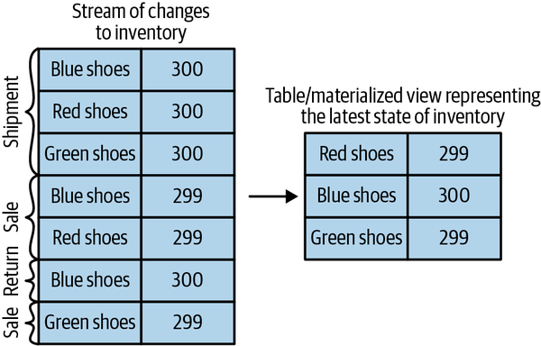

**Hình 14-1. Materialize các thay đổi tồn kho**

### Time Windows

Hầu hết thao tác trên stream đều là các thao tác có cửa sổ (windowed operation), hoạt động trên những lát cắt thời gian: trung bình động, sản phẩm bán chạy nhất tuần này, tải ở phân vị thứ 99 trên hệ thống, v.v. Các thao tác join trên hai stream cũng là windowed — chúng ta join những event xảy ra trong cùng một lát cắt thời gian. Rất ít người dừng lại và suy nghĩ về loại window mà họ muốn cho các thao tác của mình. Ví dụ, khi tính trung bình động, chúng ta muốn biết:

**Kích thước của window**

Chúng ta muốn tính trung bình của tất cả event trong mỗi window năm phút? Mỗi window 15 phút? Hay cả ngày? Window lớn hơn thì mượt hơn nhưng độ trễ cũng lớn hơn — nếu giá tăng, sẽ mất nhiều thời gian hơn để nhận ra so với window nhỏ hơn. Kafka Streams cũng bao gồm session window, trong đó kích thước window được xác định bởi một khoảng thời gian không hoạt động. Lập trình viên định nghĩa một session gap, và tất cả event đến liên tục với khoảng cách nhỏ hơn session gap đã định nghĩa sẽ thuộc về cùng một session. Một khoảng trống trong luồng đến sẽ xác định một session mới, và tất cả event đến sau khoảng trống đó, nhưng trước khoảng trống kế tiếp, sẽ thuộc về session mới.

**Window dịch chuyển thường xuyên đến mức nào (advance interval)**

Trung bình năm phút có thể cập nhật mỗi phút, mỗi giây, hoặc mỗi khi có một event mới. Những window có kích thước là một khoảng thời gian cố định được gọi là hopping window. Khi advance interval bằng đúng kích thước window, nó được gọi là tumbling window.

**Window vẫn còn có thể cập nhật trong bao lâu (grace period)**

Trung bình động năm phút của chúng ta đã tính giá trị trung bình cho window 00:00–00:05. Giờ đây, một giờ sau, chúng ta nhận được thêm vài input record với event time hiển thị là 00:02. Chúng ta có cập nhật kết quả cho khoảng 00:00–00:05 không? Hay chúng ta cho qua chuyện đã rồi? Lý tưởng nhất, chúng ta sẽ có thể định nghĩa một khoảng thời gian nhất định trong đó các event sẽ được thêm vào lát thời gian tương ứng của chúng. Ví dụ, nếu các event bị trễ tới bốn giờ, chúng ta nên tính lại kết quả và cập nhật. Nếu event đến muộn hơn thế, chúng ta có thể bỏ qua chúng.

Window có thể được căn theo thời gian đồng hồ (clock time) — tức là một window năm phút dịch chuyển mỗi phút sẽ có lát đầu tiên là 00:00–00:05 và lát thứ hai là 00:01–00:06. Hoặc nó có thể không căn chỉnh và đơn giản bắt đầu bất cứ khi nào ứng dụng khởi động, và khi đó lát đầu tiên có thể là 03:17–03:22. Xem Hình 14-2 để thấy sự khác biệt giữa hai loại window này.

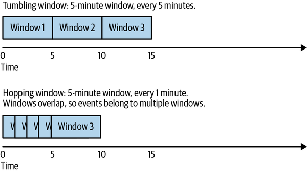

**Hình 14-2. Tumbling window so với hopping window**

### Đảm bảo xử lý (Processing Guarantees)

Một yêu cầu then chốt đối với các ứng dụng stream processing là khả năng xử lý mỗi record đúng một lần, bất kể sự cố. Nếu không có đảm bảo exactly-once, stream processing không thể được dùng trong những trường hợp cần kết quả chính xác. Như đã thảo luận chi tiết ở Chương 8, Apache Kafka hỗ trợ exactly-once semantics với producer có tính transactional và idempotent. Kafka Streams sử dụng transaction của Kafka để triển khai đảm bảo exactly-once cho các ứng dụng stream processing. Mọi ứng dụng dùng thư viện Kafka Streams đều có thể bật đảm bảo exactly-once bằng cách đặt `processing.guarantee` thành `exactly_once`. Kafka Streams phiên bản 2.6 trở lên bao gồm một triển khai exactly-once hiệu quả hơn, đòi hỏi broker Kafka phiên bản 2.5 trở lên. Triển khai hiệu quả này có thể được bật bằng cách đặt `processing.guarantee` thành `exactly_once_beta`.

## Các Design Pattern trong Stream Processing

Mỗi hệ thống stream processing đều khác nhau — từ sự kết hợp cơ bản của một consumer, logic xử lý và một producer, cho đến những cluster phức tạp như Spark Streaming với các thư viện machine learning của nó, và rất nhiều thứ ở giữa. Nhưng vẫn có một số design pattern cơ bản, là những lời giải đã biết cho các yêu cầu phổ biến của kiến trúc stream processing. Chúng ta sẽ điểm qua một vài pattern nổi tiếng đó và cho thấy chúng được dùng như thế nào qua một vài ví dụ.

### Xử lý event đơn lẻ (Single-Event Processing)

Pattern cơ bản nhất của stream processing là xử lý mỗi event một cách độc lập. Nó cũng được biết đến với tên gọi pattern map/filter vì nó thường được dùng để lọc bỏ những event không cần thiết khỏi stream hoặc biến đổi từng event. (Thuật ngữ *map* dựa trên pattern map/reduce, trong đó giai đoạn map biến đổi các event còn giai đoạn reduce tổng hợp chúng.)

Trong pattern này, ứng dụng stream processing consume các event từ stream, sửa đổi từng event, rồi produce các event đó sang một stream khác. Một ví dụ là ứng dụng đọc các log message từ một stream và ghi các event ERROR vào một stream ưu tiên cao còn phần còn lại của các event vào một stream ưu tiên thấp. Một ví dụ khác là ứng dụng đọc các event từ một stream và chuyển đổi chúng từ JSON sang Avro. Những ứng dụng như vậy không cần duy trì state bên trong ứng dụng vì mỗi event có thể được xử lý độc lập. Điều này có nghĩa là việc khôi phục sau sự cố ứng dụng hoặc cân bằng tải cực kỳ dễ dàng vì không cần khôi phục state; chúng ta chỉ đơn giản chuyển giao các event cho một instance khác của ứng dụng để xử lý.

Pattern này có thể được xử lý dễ dàng bằng một producer và consumer đơn giản, như thấy trong Hình 14-3.

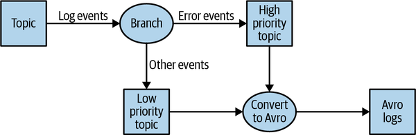

**Hình 14-3. Topology xử lý event đơn lẻ**

### Xử lý với Local State (Processing with Local State)

Hầu hết ứng dụng stream processing đều quan tâm đến việc tổng hợp thông tin, đặc biệt là window aggregation. Một ví dụ của việc này là tìm giá cổ phiếu nhỏ nhất và lớn nhất cho mỗi ngày giao dịch và tính trung bình động.

Những phép tổng hợp này đòi hỏi phải duy trì một state. Trong ví dụ của chúng ta, để tính giá nhỏ nhất và giá trung bình mỗi ngày, chúng ta cần lưu giá trị nhỏ nhất, tổng, và số record chúng ta đã thấy tính đến thời điểm hiện tại.

Tất cả những điều này có thể được thực hiện bằng local state (thay vì một state dùng chung) bởi vì mỗi thao tác trong ví dụ của chúng ta đều là một phép tổng hợp theo nhóm (group by aggregate). Nghĩa là, chúng ta thực hiện tổng hợp trên từng mã cổ phiếu, chứ không phải trên toàn bộ thị trường chứng khoán nói chung. Chúng ta dùng một partitioner của Kafka để đảm bảo rằng tất cả event có cùng mã cổ phiếu được ghi vào cùng một partition. Sau đó, mỗi instance của ứng dụng sẽ nhận được tất cả event từ những partition được gán cho nó (đây là một đảm bảo của Kafka consumer). Điều này có nghĩa là mỗi instance của ứng dụng có thể duy trì state cho tập con các mã cổ phiếu được ghi vào những partition được gán cho nó. Xem Hình 14-4.

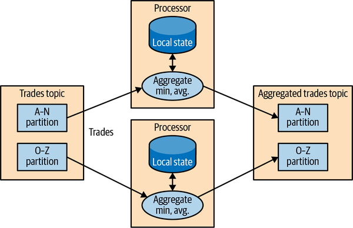

**Hình 14-4. Topology xử lý event với local state**

Các ứng dụng stream processing trở nên phức tạp hơn đáng kể khi ứng dụng có local state. Có một số vấn đề mà ứng dụng stream processing phải giải quyết:

**Sử dụng bộ nhớ**

Lý tưởng nhất là local state vừa với lượng bộ nhớ sẵn có cho instance ứng dụng. Một số local store cho phép tràn xuống đĩa, nhưng việc này có tác động đáng kể đến hiệu năng.

**Tính bền vững (Persistence)**

Chúng ta cần đảm bảo state không bị mất khi một instance ứng dụng tắt đi và rằng state có thể được khôi phục khi instance khởi động lại hoặc bị thay thế bởi một instance khác. Đây là điều mà Kafka Streams xử lý rất tốt — local state được lưu trong bộ nhớ bằng RocksDB nhúng, thứ cũng lưu bền vững dữ liệu xuống đĩa để khôi phục nhanh sau khi khởi động lại. Nhưng tất cả thay đổi đối với local state cũng được gửi tới một topic Kafka. Nếu một node của stream gặp sự cố, local state không bị mất — nó có thể dễ dàng được tạo lại bằng cách đọc lại các event từ topic Kafka. Ví dụ, nếu local state chứa "giá nhỏ nhất hiện tại của IBM = 167.19", chúng ta lưu điều này trong Kafka để sau này có thể nạp lại local cache từ dữ liệu này. Kafka dùng log compaction cho những topic này để đảm bảo chúng không tăng trưởng vô tận và việc tạo lại state luôn khả thi.

**Rebalance**

Đôi khi các partition được gán lại cho một consumer khác. Khi điều này xảy ra, instance mất partition phải lưu lại state tốt cuối cùng, và instance nhận partition phải biết cách khôi phục đúng state.

Các stream processing framework khác nhau ở mức độ hỗ trợ lập trình viên quản lý local state mà họ cần. Nếu ứng dụng của chúng ta yêu cầu duy trì local state, chúng ta phải kiểm tra kỹ framework và các đảm bảo của nó. Chúng tôi sẽ đưa vào một hướng dẫn so sánh ngắn ở cuối chương, nhưng như tất cả chúng ta đều biết, phần mềm thay đổi nhanh chóng và các stream processing framework thì càng nhanh gấp đôi.

### Xử lý nhiều giai đoạn / Repartitioning (Multiphase Processing/Repartitioning)

Local state rất tuyệt nếu chúng ta cần một phép tổng hợp kiểu group by. Nhưng nếu chúng ta cần một kết quả sử dụng toàn bộ thông tin sẵn có thì sao? Ví dụ, giả sử chúng ta muốn công bố 10 cổ phiếu hàng đầu mỗi ngày — 10 cổ phiếu tăng nhiều nhất từ lúc mở cửa đến lúc đóng cửa trong mỗi ngày giao dịch. Rõ ràng, không có gì chúng ta làm cục bộ trên mỗi instance ứng dụng là đủ bởi vì cả 10 cổ phiếu hàng đầu có thể nằm ở những partition được gán cho các instance khác. Cái chúng ta cần là một cách tiếp cận hai giai đoạn. Trước tiên, chúng ta tính mức tăng/giảm hằng ngày cho mỗi mã cổ phiếu. Chúng ta có thể làm điều này trên mỗi instance với local state. Sau đó chúng ta ghi kết quả vào một topic mới với một partition duy nhất. Partition này sẽ được đọc bởi một instance ứng dụng duy nhất, instance đó sau đó có thể tìm ra 10 cổ phiếu hàng đầu trong ngày. Topic thứ hai, vốn chỉ chứa tóm tắt hằng ngày cho mỗi mã cổ phiếu, rõ ràng là nhỏ hơn nhiều với lưu lượng ít hơn đáng kể so với các topic chứa chính các giao dịch, và do đó nó có thể được xử lý bởi một instance duy nhất của ứng dụng. Đôi khi cần nhiều bước hơn để tạo ra kết quả. Xem Hình 14-5.

Kiểu xử lý nhiều giai đoạn này rất quen thuộc với những ai viết code MapReduce, nơi bạn thường phải dùng đến nhiều giai đoạn reduce. Nếu bạn từng viết code map-reduce, bạn sẽ nhớ rằng bạn cần một ứng dụng riêng cho mỗi bước reduce. Không giống MapReduce, hầu hết stream processing framework cho phép đưa tất cả các bước vào một ứng dụng duy nhất, với framework lo liệu chi tiết về việc instance ứng dụng nào (hoặc worker nào) sẽ chạy mỗi bước.

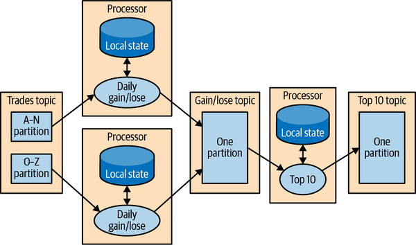

**Hình 14-5. Topology bao gồm cả local state và các bước repartitioning**

### Xử lý với tra cứu bên ngoài: Stream-Table Join

Đôi khi stream processing đòi hỏi tích hợp với dữ liệu nằm ngoài stream — xác thực giao dịch dựa trên một tập quy tắc lưu trong cơ sở dữ liệu hoặc làm giàu thông tin clickstream với dữ liệu về những người dùng đã click.

Ý tưởng hiển nhiên về cách thực hiện tra cứu bên ngoài để làm giàu dữ liệu sẽ giống thế này: với mỗi click event trong stream, tra cứu người dùng trong cơ sở dữ liệu hồ sơ và ghi một event bao gồm cú click gốc, cộng thêm tuổi và giới tính của người dùng, vào một topic khác. Xem Hình 14-6.

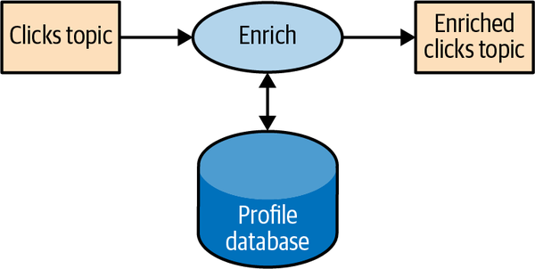

**Hình 14-6. Stream processing có bao gồm một nguồn dữ liệu bên ngoài**

Vấn đề của ý tưởng hiển nhiên này là việc tra cứu bên ngoài thêm latency đáng kể vào việc xử lý mỗi record — thường là từ 5 đến 15 mili giây. Trong nhiều trường hợp, điều này là không khả thi. Thường thì tải bổ sung mà điều này đặt lên kho dữ liệu bên ngoài cũng không thể chấp nhận được — các hệ thống stream processing thường có thể xử lý 100K–500K event mỗi giây, nhưng cơ sở dữ liệu có lẽ chỉ xử lý được 10K event mỗi giây ở mức hiệu năng hợp lý. Còn có thêm độ phức tạp xung quanh tính sẵn sàng — ứng dụng của chúng ta sẽ cần xử lý những tình huống khi DB bên ngoài không khả dụng.

Để có hiệu năng và tính sẵn sàng tốt, chúng ta cần cache thông tin từ cơ sở dữ liệu trong ứng dụng stream processing. Tuy nhiên việc quản lý cache này có thể đầy thách thức — làm sao chúng ta ngăn thông tin trong cache bị cũ? Nếu chúng ta làm mới event quá thường xuyên, chúng ta vẫn đang dội bom cơ sở dữ liệu, và cache chẳng giúp ích được nhiều. Nếu chúng ta chờ quá lâu để lấy event mới, chúng ta đang làm stream processing với thông tin cũ.

Nhưng nếu chúng ta có thể ghi lại tất cả thay đổi xảy ra với bảng cơ sở dữ liệu dưới dạng một stream các event, chúng ta có thể để công việc stream processing của mình lắng nghe stream này và cập nhật cache dựa trên các event thay đổi của cơ sở dữ liệu. Việc ghi lại thay đổi của cơ sở dữ liệu dưới dạng event trong một stream được gọi là change data capture (CDC), và Kafka Connect có nhiều connector có khả năng thực hiện CDC và chuyển đổi các bảng cơ sở dữ liệu thành một stream các event thay đổi. Điều này cho phép chúng ta giữ một bản sao riêng của bảng và được thông báo mỗi khi có một event thay đổi cơ sở dữ liệu để chúng ta có thể cập nhật bản sao của mình cho phù hợp. Xem Hình 14-7.

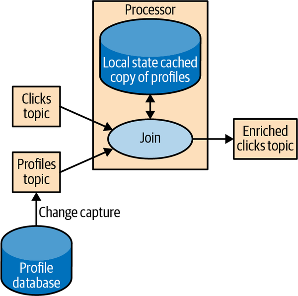

**Hình 14-7. Topology join một table và một stream các event, loại bỏ nhu cầu phải dùng đến một nguồn dữ liệu bên ngoài trong stream processing**

Sau đó, khi chúng ta nhận được các click event, chúng ta có thể tra cứu `user_id` trong local state của mình và làm giàu event. Và bởi vì chúng ta đang dùng local state, cách này mở rộng tốt hơn nhiều và sẽ không ảnh hưởng đến cơ sở dữ liệu cũng như các ứng dụng khác đang dùng nó.

Chúng ta gọi đây là stream-table join vì một trong các stream đại diện cho những thay đổi đối với một bảng được cache cục bộ.

### Table-Table Join

Trong mục trước chúng ta đã thảo luận việc một table và một stream các event cập nhật là tương đương nhau. Chúng ta đã thảo luận chi tiết cách điều này hoạt động khi join một stream và một table. Không có lý do gì chúng ta không thể có những materialized table ở cả hai phía của thao tác join.

Việc join hai table luôn là nonwindowed và join trạng thái hiện tại của cả hai table tại thời điểm thao tác được thực hiện. Với Kafka Streams, chúng ta có thể thực hiện một `equi-join`, trong đó cả hai table có cùng key được partition theo cùng một cách, và do đó thao tác join có thể được phân tán một cách hiệu quả giữa một lượng lớn instance ứng dụng và máy móc.

Kafka Streams cũng hỗ trợ foreign-key join giữa hai table — key của một stream hoặc table được join với một trường tùy ý từ một stream hoặc table khác. Bạn có thể tìm hiểu thêm về cách nó hoạt động trong "Crossing the Streams", một bài nói từ Kafka Summit 2020, hoặc bài blog chi tiết hơn.

### Streaming Join

Đôi khi chúng ta muốn join hai event stream thực sự thay vì một stream với một table. Điều gì làm cho một stream là "thực sự"? Nếu bạn nhớ lại phần thảo luận ở đầu chương, stream là unbounded. Khi chúng ta dùng một stream để biểu diễn một table, chúng ta có thể bỏ qua phần lớn lịch sử trong stream vì chúng ta chỉ quan tâm đến trạng thái hiện tại trong table. Nhưng khi chúng ta join hai stream, chúng ta đang join toàn bộ lịch sử, cố gắng khớp các event trong một stream với các event trong stream kia có cùng key và xảy ra trong cùng những time window. Đây là lý do streaming join còn được gọi là windowed join.

Ví dụ, giả sử chúng ta có một stream chứa các truy vấn tìm kiếm mà người dùng nhập vào website của chúng ta và một stream khác chứa các cú click, bao gồm click vào kết quả tìm kiếm. Chúng ta muốn khớp các truy vấn tìm kiếm với những kết quả mà người dùng đã click để biết kết quả nào phổ biến nhất cho truy vấn nào. Rõ ràng, chúng ta muốn khớp kết quả dựa trên từ khóa tìm kiếm nhưng chỉ khớp chúng trong một time window nhất định. Chúng ta giả định rằng kết quả được click vài giây sau khi truy vấn được nhập vào công cụ tìm kiếm của chúng ta. Vì vậy chúng ta giữ một window nhỏ, dài vài giây trên mỗi stream và khớp các kết quả từ mỗi window. Xem Hình 14-8.

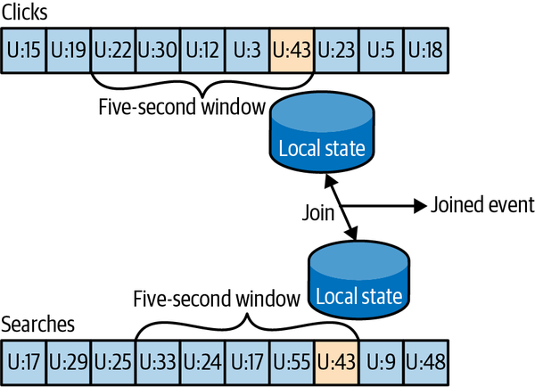

**Hình 14-8. Join hai stream các event; những phép join này luôn liên quan đến một time window dịch chuyển**

Kafka Streams hỗ trợ `equi-joins`, trong đó các stream, truy vấn và click được partition theo cùng những key, và những key này cũng là join key. Bằng cách này, tất cả click event từ `user_id:42` sẽ nằm ở partition 5 của topic clicks, và tất cả search event cho `user_id:42` sẽ nằm ở partition 5 của topic search. Kafka Streams sau đó đảm bảo rằng partition 5 của cả hai topic được gán cho cùng một task. Nhờ vậy task này thấy tất cả các event liên quan cho `user_id:42`. Nó duy trì join window cho cả hai topic trong state store RocksDB nhúng của mình, và đó là cách nó có thể thực hiện phép join.

### Event không đúng thứ tự (Out-of-Sequence Events)

Việc xử lý các event đến stream sai thời điểm là một thách thức không chỉ trong stream processing mà còn trong các hệ thống ETL truyền thống. Các event không đúng thứ tự xảy ra khá thường xuyên và có thể dự đoán được trong các kịch bản IoT (Hình 14-9). Ví dụ, một thiết bị di động mất tín hiệu WiFi trong vài giờ và gửi đi lượng event trị giá vài giờ khi nó kết nối lại. Điều này cũng xảy ra khi giám sát thiết bị mạng (một switch lỗi không gửi tín hiệu chẩn đoán cho đến khi được sửa) hoặc trong sản xuất (kết nối mạng trong các nhà máy nổi tiếng là không đáng tin cậy, đặc biệt ở các nước đang phát triển).

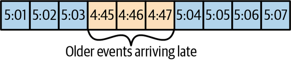

**Hình 14-9. Các event không đúng thứ tự**

Các ứng dụng stream của chúng ta cần có khả năng xử lý những kịch bản đó. Điều này thường có nghĩa là ứng dụng phải làm những việc sau:

- Nhận ra rằng một event là không đúng thứ tự — việc này đòi hỏi ứng dụng phải xem xét event time và phát hiện ra rằng nó cũ hơn thời gian hiện tại.
- Định nghĩa một khoảng thời gian trong đó nó sẽ cố gắng dung hòa các event không đúng thứ tự. Có lẽ độ trễ ba giờ nên được dung hòa, còn các event cũ hơn ba tuần thì có thể vứt bỏ.
- Có khả năng in-band để dung hòa event này. Đây là khác biệt chính giữa ứng dụng streaming và batch job. Nếu chúng ta có một batch job hằng ngày và một vài event đến sau khi job hoàn tất, chúng ta thường chỉ cần chạy lại job của ngày hôm qua và cập nhật các event. Với stream processing, không có chuyện "chạy lại job của hôm qua" — chính tiến trình liên tục đó cần xử lý cả event cũ lẫn event mới tại bất kỳ thời điểm nào.
- Có khả năng cập nhật kết quả. Nếu kết quả của stream processing được ghi vào một cơ sở dữ liệu, một lệnh put hoặc update là đủ để cập nhật kết quả. Nếu ứng dụng stream gửi kết quả qua email, việc cập nhật có thể rắc rối hơn.

Một số stream processing framework, bao gồm Dataflow của Google và Kafka Streams, có hỗ trợ sẵn cho khái niệm event time độc lập với processing time, cùng khả năng xử lý những event có event time cũ hơn hoặc mới hơn processing time hiện tại. Điều này thường được thực hiện bằng cách duy trì nhiều aggregation window sẵn sàng cho việc cập nhật trong local state và cho phép lập trình viên cấu hình xem nên giữ những window aggregate đó sẵn sàng cho việc cập nhật trong bao lâu. Tất nhiên, aggregation window được giữ sẵn sàng cho cập nhật càng lâu thì càng cần nhiều bộ nhớ để duy trì local state.

Kafka Streams API luôn ghi kết quả aggregation vào các result topic. Đó thường là các `compacted topic`, nghĩa là chỉ giá trị mới nhất cho mỗi key được giữ lại. Trong trường hợp kết quả của một aggregation window cần được cập nhật do một event đến muộn, Kafka Streams sẽ đơn giản ghi một kết quả mới cho aggregation window này, và kết quả đó sẽ thay thế kết quả trước đó một cách hiệu quả.

### Xử lý lại (Reprocessing)

Pattern quan trọng cuối cùng là việc xử lý lại các event. Có hai biến thể của pattern này:

- Chúng ta có một phiên bản cải tiến của ứng dụng stream processing. Chúng ta muốn chạy phiên bản mới của ứng dụng trên cùng event stream như phiên bản cũ, tạo ra một stream kết quả mới không thay thế phiên bản đầu tiên, so sánh kết quả giữa hai phiên bản, và đến một lúc nào đó chuyển các client sang dùng kết quả mới thay vì kết quả hiện có.
- Ứng dụng stream processing hiện tại bị lỗi. Chúng ta sửa lỗi, và chúng ta muốn xử lý lại event stream và tính lại các kết quả của mình.

Tình huống sử dụng đầu tiên trở nên đơn giản nhờ việc Apache Kafka lưu trữ toàn bộ các event stream trong thời gian dài ở một kho dữ liệu có khả năng mở rộng. Điều này có nghĩa là việc có hai phiên bản của một ứng dụng stream processing ghi ra hai stream kết quả chỉ đòi hỏi những việc sau:

- Khởi chạy phiên bản mới của ứng dụng như một consumer group mới
- Cấu hình phiên bản mới để bắt đầu xử lý từ offset đầu tiên của các input topic (để nó có bản sao riêng của tất cả event trong các input stream)
- Để ứng dụng mới tiếp tục xử lý, và chuyển các ứng dụng client sang stream kết quả mới khi phiên bản mới của công việc xử lý đã bắt kịp

Tình huống sử dụng thứ hai thách thức hơn — nó đòi hỏi "reset" một ứng dụng hiện có để bắt đầu xử lý lại từ đầu các input stream, reset local state (để chúng ta không trộn lẫn kết quả từ hai phiên bản của ứng dụng), và có thể phải dọn dẹp output stream trước đó. Mặc dù Kafka Streams có một công cụ để reset state cho một ứng dụng stream processing, khuyến nghị của chúng tôi là cố gắng dùng phương pháp đầu tiên bất cứ khi nào có đủ năng lực để chạy hai bản sao của ứng dụng và sinh ra hai stream kết quả. Phương pháp đầu tiên an toàn hơn nhiều — nó cho phép chuyển qua lại giữa nhiều phiên bản và so sánh kết quả giữa các phiên bản, và không có rủi ro mất dữ liệu quan trọng hay tạo ra lỗi trong quá trình dọn dẹp.

### Truy vấn tương tác (Interactive Queries)

Như đã thảo luận trước đó, các ứng dụng stream processing có state, và state này có thể được phân tán giữa nhiều instance của ứng dụng. Phần lớn thời gian, người dùng của các ứng dụng stream processing lấy kết quả xử lý bằng cách đọc chúng từ một output topic. Tuy nhiên, trong một số trường hợp, sẽ là mong muốn nếu có thể đi đường tắt và đọc kết quả từ chính state store. Điều này phổ biến khi kết quả là một table (ví dụ: 10 cuốn sách bán chạy nhất) và stream kết quả thực chất là một stream các cập nhật cho table này — việc đọc trực tiếp table từ state của ứng dụng stream processing nhanh hơn và dễ hơn nhiều.

Kafka Streams bao gồm các API linh hoạt để truy vấn state của một ứng dụng stream processing.

## Kafka Streams qua các ví dụ

Để minh họa các pattern này được triển khai trong thực tế như thế nào, chúng ta sẽ trình bày một vài ví dụ sử dụng Apache Kafka Streams API. Chúng tôi dùng API cụ thể này vì nó tương đối đơn giản để sử dụng và nó đi kèm với Apache Kafka, thứ mà chúng ta đã có sẵn. Điều quan trọng cần nhớ là các pattern có thể được triển khai trong bất kỳ stream processing framework và thư viện nào — các pattern là phổ quát, còn các ví dụ thì cụ thể.

Apache Kafka có hai stream API — một Processor API cấp thấp và một Streams DSL cấp cao. Chúng ta sẽ dùng Kafka Streams DSL trong các ví dụ của mình. DSL cho phép chúng ta định nghĩa ứng dụng stream processing bằng cách định nghĩa một chuỗi các phép biến đổi trên các event trong stream. Các phép biến đổi có thể đơn giản như một filter hoặc phức tạp như một phép stream-to-stream join. API cấp thấp hơn cho phép chúng ta tạo ra những phép biến đổi của riêng mình. Để tìm hiểu thêm về Processor API cấp thấp, developer guide có thông tin chi tiết, và bài thuyết trình "Beyond the DSL" là một giới thiệu tuyệt vời.

Một ứng dụng dùng DSL API luôn bắt đầu bằng việc sử dụng `StreamsBuilder` để tạo ra một processing topology — một đồ thị có hướng không chu trình (DAG) của các phép biến đổi được áp dụng lên các event trong stream. Sau đó chúng ta tạo một đối tượng thực thi `KafkaStreams` từ topology đó. Việc khởi động đối tượng `KafkaStreams` sẽ khởi động nhiều thread, mỗi thread áp dụng processing topology lên các event trong stream. Việc xử lý sẽ kết thúc khi chúng ta đóng đối tượng `KafkaStreams`.

Chúng ta sẽ xem xét một vài ví dụ dùng Kafka Streams để triển khai một số design pattern mà chúng ta vừa thảo luận. Một ví dụ đếm từ đơn giản sẽ được dùng để minh họa pattern map/filter và các phép tổng hợp đơn giản. Sau đó chúng ta sẽ chuyển sang một ví dụ trong đó chúng ta tính các thống kê khác nhau về giao dịch chứng khoán, cho phép chúng ta minh họa window aggregation. Cuối cùng, chúng ta sẽ dùng việc làm giàu ClickStream làm ví dụ để minh họa streaming join.

### Word Count

Hãy cùng đi qua một ví dụ word count rút gọn cho Kafka Streams. Bạn có thể tìm thấy ví dụ đầy đủ trên GitHub.

Việc đầu tiên bạn làm khi tạo một ứng dụng stream processing là cấu hình Kafka Streams. Kafka Streams có rất nhiều cấu hình khả dĩ mà chúng ta sẽ không thảo luận ở đây, nhưng bạn có thể tìm thấy chúng trong tài liệu. Ngoài ra, bạn có thể cấu hình producer và consumer được nhúng trong Kafka Streams bằng cách thêm bất kỳ config nào của producer hoặc consumer vào đối tượng `Properties`:

```java
public class WordCountExample {

    public static void main(String[] args) throws Exception{

        Properties props = new Properties();
        props.put(StreamsConfig.APPLICATION_ID_CONFIG,
           "wordcount");
        props.put(StreamsConfig.BOOTSTRAP_SERVERS_CONFIG,
          "localhost:9092");
        props.put(StreamsConfig.DEFAULT_KEY_SERDE_CLASS_CONFIG,
          Serdes.String().getClass().getName());
        props.put(StreamsConfig.DEFAULT_VALUE_SERDE_CLASS_CONFIG,
          Serdes.String().getClass().getName());
```

1. Mỗi ứng dụng Kafka Streams phải có một application ID. Nó được dùng để điều phối các instance của ứng dụng và cũng được dùng khi đặt tên cho các local store nội bộ cùng các topic liên quan đến chúng. Tên này phải là duy nhất cho mỗi ứng dụng Kafka Streams làm việc với cùng một cluster Kafka.
2. Ứng dụng Kafka Streams luôn đọc dữ liệu từ các topic Kafka và ghi đầu ra của nó vào các topic Kafka. Như chúng ta sẽ thảo luận sau, các ứng dụng Kafka Streams cũng dùng Kafka để điều phối. Vì vậy tốt hơn hết chúng ta nên cho ứng dụng biết tìm Kafka ở đâu.
3. Khi đọc và ghi dữ liệu, ứng dụng của chúng ta sẽ cần serialize và deserialize, nên chúng ta cung cấp các lớp Serde mặc định. Nếu cần, chúng ta có thể ghi đè những giá trị mặc định này về sau khi xây dựng streams topology.

Giờ khi đã có cấu hình, hãy cùng xây dựng streams topology của chúng ta:

```java
StreamsBuilder builder = new StreamsBuilder();

KStream<String, String> source =
  builder.stream("wordcount-input");

final Pattern pattern = Pattern.compile("\\W+");

KStream<String, String> counts  = source.flatMapValues(value->
  Arrays.asList(pattern.split(value.toLowerCase())))
          .map((key, value) -> new KeyValue<String,
              String>(value, value))
          .filter((key, value) -> (!value.equals("the")))
          .groupByKey()
          .count().mapValues(value->
              Long.toString(value)).toStream();
counts.to("wordcount-output");
```

1. Chúng ta tạo một đối tượng `StreamsBuilder` và bắt đầu định nghĩa một stream bằng cách trỏ tới topic mà chúng ta sẽ dùng làm đầu vào.
2. Mỗi event chúng ta đọc từ source topic là một dòng chứa các từ; chúng ta tách nó ra bằng một biểu thức chính quy thành một chuỗi các từ riêng lẻ. Sau đó chúng ta lấy mỗi từ (hiện đang là value của event record) và đặt nó vào key của event record để nó có thể được dùng trong thao tác group-by.
3. Chúng ta lọc bỏ từ *the*, chỉ để cho thấy việc lọc dễ dàng đến mức nào.
4. Và chúng ta group theo key, nên giờ chúng ta có một tập hợp các event cho mỗi từ duy nhất.
5. Chúng ta đếm xem có bao nhiêu event trong mỗi tập hợp. Kết quả của việc đếm là kiểu dữ liệu `Long`. Chúng ta chuyển nó thành `String` để con người dễ đọc kết quả hơn.
6. Chỉ còn một việc nữa — ghi kết quả trở lại Kafka.

Giờ khi chúng ta đã định nghĩa luồng các phép biến đổi mà ứng dụng sẽ chạy, chúng ta chỉ cần… chạy nó:

```java
KafkaStreams streams = new KafkaStreams(builder.build(), props);

streams.start();

// usually the stream application would be running forever,
// in this example we just let it run for some time and stop
Thread.sleep(5000L);

streams.close();
```

1. Định nghĩa một đối tượng `KafkaStreams` dựa trên topology và các properties mà chúng ta đã định nghĩa.
2. Khởi động Kafka Streams.
3. Sau một lúc, dừng nó lại.

Vậy đó! Chỉ trong vài dòng ngắn gọn, chúng ta đã minh họa việc triển khai pattern xử lý event đơn lẻ dễ dàng đến mức nào (chúng ta đã áp dụng một map và một filter lên các event). Chúng ta đã repartition dữ liệu bằng cách thêm một toán tử group-by và sau đó duy trì local state đơn giản khi chúng ta đếm số record có mỗi từ làm key. Rồi chúng ta duy trì local state đơn giản khi chúng ta đếm số lần mỗi từ xuất hiện.

Đến đây, chúng tôi khuyến nghị chạy ví dụ đầy đủ. File README trong repository GitHub chứa hướng dẫn về cách chạy ví dụ. Lưu ý rằng chúng ta có thể chạy toàn bộ ví dụ trên máy của mình mà không cần cài đặt bất cứ thứ gì ngoài Apache Kafka. Nếu input topic của chúng ta chứa nhiều partition, chúng ta có thể chạy nhiều instance của ứng dụng WordCount (chỉ cần chạy ứng dụng trong vài tab terminal khác nhau), và chúng ta có cluster xử lý Kafka Streams đầu tiên của mình. Các instance của ứng dụng WordCount nói chuyện với nhau và điều phối công việc. Một trong những rào cản gia nhập lớn nhất đối với một số stream processing framework là chế độ local rất dễ dùng, nhưng rồi để chạy một cluster production, chúng ta cần cài YARN hoặc Mesos, rồi cài framework xử lý trên tất cả những máy đó, rồi học cách submit ứng dụng của mình lên cluster. Với Streams API của Kafka, chúng ta chỉ cần khởi động nhiều instance của ứng dụng — và chúng ta có một cluster. Chính xác cùng một ứng dụng đó đang chạy trên máy phát triển của chúng ta và trong môi trường production.

### Thống kê thị trường chứng khoán (Stock Market Statistics)

Ví dụ tiếp theo phức tạp hơn — chúng ta sẽ đọc một stream các event giao dịch chứng khoán bao gồm mã cổ phiếu (ticker), giá chào bán (ask price) và khối lượng chào bán (ask size). Trong giao dịch chứng khoán, ask price là mức giá mà người bán yêu cầu, còn bid price là mức giá mà người mua đề nghị trả. Ask size là số lượng cổ phiếu mà người bán sẵn sàng bán ở mức giá đó. Để ví dụ đơn giản, chúng ta sẽ bỏ qua hoàn toàn phần bid. Chúng ta cũng sẽ không đưa timestamp vào dữ liệu; thay vào đó, chúng ta sẽ dựa vào event time do Kafka producer của chúng ta điền vào.

Sau đó chúng ta sẽ tạo các output stream chứa một vài thống kê theo window:

- Giá chào bán tốt nhất (tức là nhỏ nhất) cho mỗi window năm giây
- Số lượng giao dịch cho mỗi window năm giây
- Giá chào bán trung bình cho mỗi window năm giây

Tất cả thống kê sẽ được cập nhật mỗi giây.

Để đơn giản, chúng ta sẽ giả định sàn giao dịch của chúng ta chỉ có 10 mã cổ phiếu được giao dịch. Việc thiết lập và cấu hình rất giống với những gì chúng ta đã dùng trong mục "Word Count":

```java
Properties props = new Properties();
props.put(StreamsConfig.APPLICATION_ID_CONFIG, "stockstat");
props.put(StreamsConfig.BOOTSTRAP_SERVERS_CONFIG, Constants.BROKER);
props.put(StreamsConfig.DEFAULT_KEY_SERDE_CLASS_CONFIG,
  Serdes.String().getClass().getName());
props.put(StreamsConfig.DEFAULT_VALUE_SERDE_CLASS_CONFIG,
   TradeSerde.class.getName());
```

Khác biệt chính là các lớp Serde được sử dụng. Trong "Word Count", chúng ta dùng string cho cả key lẫn value, và do đó dùng lớp `Serdes.String()` làm serializer và deserializer cho cả hai. Trong ví dụ này, key vẫn là một string, nhưng value là một đối tượng `Trade` chứa mã cổ phiếu, ask price và ask size. Để serialize và deserialize đối tượng này (cùng một vài đối tượng khác mà chúng ta dùng trong ứng dụng nhỏ này), chúng ta đã dùng thư viện Gson của Google để sinh ra một serializer và deserializer JSON từ đối tượng Java của mình. Sau đó chúng ta tạo một wrapper nhỏ tạo ra một đối tượng Serde từ những thứ đó. Đây là cách chúng ta tạo Serde:

```java
static public final class TradeSerde extends WrapperSerde<Trade> {
     public TradeSerde() {
         super(new JsonSerializer<Trade>(),
             new JsonDeserializer<Trade>(Trade.class));
     }
}
```

Không có gì cầu kỳ, nhưng hãy nhớ cung cấp một đối tượng Serde cho mọi đối tượng mà bạn muốn lưu trong Kafka — đầu vào, đầu ra, và trong một số trường hợp là cả kết quả trung gian. Để việc này dễ dàng hơn, chúng tôi khuyến nghị sinh ra những Serde này thông qua một thư viện như Gson, Avro, Protobuf hoặc thứ gì đó tương tự.

Giờ khi chúng ta đã cấu hình mọi thứ, đã đến lúc xây dựng topology của mình:

```java
KStream<Windowed<String>, TradeStats> stats = source
     .groupByKey()
     .windowedBy(TimeWindows.of(Duration.ofMillis(windowSize))
                                    .advanceBy(Duration.ofSeconds(1)))
     .aggregate(
           () -> new TradeStats(),
           (k, v, tradestats) -> tradestats.add(v),
           Materialized.<String, TradeStats, WindowStore<Bytes, byte[]>>
                as("trade-aggregates")
              .withValueSerde(new TradeStatsSerde()))
     .toStream()
     .mapValues((trade) -> trade.computeAvgPrice());

stats.to("stockstats-output",
     Produced.keySerde(
         WindowedSerdes.timeWindowedSerdeFrom(String.class, windowSize)));
```

1. Chúng ta bắt đầu bằng việc đọc các event từ input topic và thực hiện thao tác `groupByKey()`. Bất chấp tên gọi của nó, thao tác này không thực hiện bất kỳ việc nhóm nào. Thay vào đó, nó đảm bảo rằng stream các event được partition dựa trên key của record. Vì chúng ta đã ghi dữ liệu vào một topic có key và không sửa key trước khi gọi `groupByKey()`, dữ liệu vẫn được partition theo key của nó — nên phương thức này không làm gì cả trong trường hợp này.
2. Chúng ta định nghĩa window — trong trường hợp này là một window năm giây, dịch chuyển mỗi giây.
3. Sau khi đảm bảo việc partition và windowing đúng đắn, chúng ta bắt đầu phép aggregation. Phương thức `aggregate` sẽ chia stream thành các window chồng lấn (một window năm giây mỗi giây) rồi áp dụng một phương thức aggregate lên tất cả event trong window. Tham số đầu tiên mà phương thức này nhận là một đối tượng mới sẽ chứa kết quả của phép aggregation — `Tradestats` trong trường hợp của chúng ta. Đây là một đối tượng chúng ta tạo ra để chứa tất cả thống kê mà chúng ta quan tâm cho mỗi time window — giá nhỏ nhất, giá trung bình và số lượng giao dịch.
4. Sau đó chúng ta cung cấp một phương thức để thực sự tổng hợp các record — trong trường hợp này, phương thức `add` của đối tượng `Tradestats` được dùng để cập nhật giá nhỏ nhất, số lượng giao dịch và tổng giá trong window với record mới.
5. Như đã đề cập trong "Các Design Pattern trong Stream Processing", windowing aggregation đòi hỏi phải duy trì một state và một local store nơi state sẽ được duy trì. Tham số cuối cùng của phương thức `aggregate` là cấu hình của state store. `Materialized` là đối tượng cấu hình store, và chúng ta cấu hình tên store là `trade-aggregates`. Đây có thể là bất kỳ tên duy nhất nào.
6. Là một phần của cấu hình state store, chúng ta cũng cung cấp một đối tượng Serde để serialize và deserialize kết quả của phép aggregation (đối tượng `Tradestats`).
7. Kết quả của phép aggregation là một table với mã cổ phiếu và time window làm primary key và kết quả aggregation làm value. Chúng ta đang chuyển table trở lại thành một stream các event.
8. Bước cuối cùng là cập nhật giá trung bình — hiện tại kết quả aggregation bao gồm tổng các giá và số lượng giao dịch. Chúng ta duyệt qua những record này và dùng các thống kê hiện có để tính giá trung bình để có thể đưa nó vào output stream.
9. Và cuối cùng, chúng ta ghi kết quả trở lại stream `stockstats-output`. Vì kết quả là một phần của thao tác windowing, chúng ta tạo một `WindowedSerde` lưu kết quả ở định dạng dữ liệu windowed bao gồm timestamp của window. Kích thước window được truyền vào như một phần của Serde, mặc dù nó không được dùng trong quá trình serialization (quá trình deserialization cần kích thước window, bởi vì chỉ có thời điểm bắt đầu của window được lưu trong output topic).

Sau khi định nghĩa luồng, chúng ta dùng nó để sinh ra một đối tượng `KafkaStreams` và chạy nó, giống như chúng ta đã làm trong "Word Count".

Ví dụ này cho thấy cách thực hiện windowed aggregation trên một stream — có lẽ là tình huống sử dụng phổ biến nhất của stream processing. Một điều đáng chú ý là cần rất ít công sức để duy trì local state của phép aggregation — chỉ cần cung cấp một Serde và đặt tên cho state store. Vậy mà ứng dụng này sẽ mở rộng ra nhiều instance và tự động khôi phục sau sự cố của mỗi instance bằng cách chuyển việc xử lý một số partition sang một trong những instance còn sống sót. Chúng ta sẽ xem thêm về cách điều này được thực hiện trong mục "Kafka Streams: Tổng quan kiến trúc".

Như thường lệ, bạn có thể tìm thấy ví dụ hoàn chỉnh, bao gồm hướng dẫn chạy nó, trên GitHub.

### Làm giàu ClickStream (ClickStream Enrichment)

Ví dụ cuối cùng sẽ minh họa streaming join bằng cách làm giàu một stream các cú click trên một website. Chúng ta sẽ tạo ra một stream các cú click mô phỏng, một stream các cập nhật cho một bảng cơ sở dữ liệu hồ sơ giả tưởng, và một stream các lượt tìm kiếm trên web. Sau đó chúng ta sẽ join cả ba stream để có được cái nhìn 360 độ vào hoạt động của mỗi người dùng. Người dùng đã tìm kiếm gì? Họ đã click vào gì sau đó? Họ có thay đổi "sở thích" trong hồ sơ người dùng của mình không? Những kiểu join như thế này cung cấp một bộ dữ liệu phong phú cho việc phân tích. Các gợi ý sản phẩm thường dựa trên loại thông tin này — người dùng tìm kiếm xe đạp, click vào các liên kết cho "Trek", và quan tâm đến du lịch, nên chúng ta có thể quảng cáo xe đạp Trek, mũ bảo hiểm và các tour đạp xe đến những địa điểm kỳ lạ như Nebraska.

Vì việc cấu hình ứng dụng tương tự các ví dụ trước, hãy bỏ qua phần này và xem topology để join nhiều stream:

```java
KStream<Integer, PageView> views =
    builder.stream(Constants.PAGE_VIEW_TOPIC,
        Consumed.with(Serdes.Integer(), new PageViewSerde()));
KStream<Integer, Search> searches =
     builder.stream(Constants.SEARCH_TOPIC,
        Consumed.with(Serdes.Integer(), new SearchSerde()));
KTable<Integer, UserProfile> profiles =
     builder.table(Constants.USER_PROFILE_TOPIC,
        Consumed.with(Serdes.Integer(), new ProfileSerde()));

KStream<Integer, UserActivity> viewsWithProfile = views.leftJoin(profiles,
                 (page, profile) -> {
                      if (profile != null)
                            return new UserActivity(
                              profile.getUserID(), profile.getUserName(),
                              profile.getZipcode(), profile.getInterests(),
                              "", page.getPage());
                      else
                          return new UserActivity(
                             -1, "", "", null, "", page.getPage());
                      });

KStream<Integer, UserActivity> userActivityKStream =
    viewsWithProfile.leftJoin(searches,
      (userActivity, search) -> {
            if (search != null)
                 userActivity.updateSearch(search.getSearchTerms());
            else
                userActivity.updateSearch("");
            return userActivity;
      },
      JoinWindows.of(Duration.ofSeconds(1)).before(Duration.ofSeconds(0)),
                         StreamJoined.with(Serdes.Integer(),
                                                 new UserActivitySerde(),
                                                 new SearchSerde()));
```

1. Trước tiên, chúng ta tạo các đối tượng stream cho hai stream mà chúng ta muốn join — clicks và searches. Khi tạo đối tượng stream, chúng ta truyền vào input topic cùng Serde cho key và value sẽ được dùng khi consume record ra khỏi topic và deserialize chúng thành các đối tượng đầu vào.
2. Chúng ta cũng định nghĩa một `KTable` cho các hồ sơ người dùng. Một `KTable` là một materialized store được cập nhật thông qua một stream các thay đổi.
3. Sau đó chúng ta làm giàu stream các cú click với thông tin hồ sơ người dùng bằng cách join stream các event với bảng hồ sơ. Trong một stream-table join, mỗi event trong stream nhận thông tin từ bản sao được cache của bảng hồ sơ. Chúng ta đang thực hiện một left-join, nên những cú click không xác định được người dùng vẫn sẽ được giữ lại.
4. Đây là phương thức join — nó nhận hai giá trị, một từ stream và một từ record, rồi trả về một giá trị thứ ba. Không giống trong cơ sở dữ liệu, chúng ta được quyền quyết định cách kết hợp hai giá trị thành một kết quả. Trong trường hợp này, chúng ta tạo một đối tượng `activity` chứa cả thông tin chi tiết về người dùng lẫn trang đã được xem.
5. Tiếp theo, chúng ta muốn join thông tin click với các lượt tìm kiếm được thực hiện bởi cùng người dùng đó. Đây vẫn là một `left join`, nhưng giờ chúng ta đang join hai stream, chứ không phải stream với một table.
6. Đây là phương thức join — chúng ta đơn giản thêm các từ khóa tìm kiếm vào tất cả các lượt xem trang khớp với nó.
7. Đây là phần thú vị — một stream-to-stream join là một phép join với một time window. Việc join tất cả các cú click và lượt tìm kiếm cho mỗi người dùng chẳng có nhiều ý nghĩa — chúng ta muốn join mỗi lượt tìm kiếm với những cú click liên quan đến nó, tức là những cú click xảy ra trong một khoảng thời gian ngắn sau lượt tìm kiếm. Vì vậy chúng ta định nghĩa một join window là một giây. Chúng ta gọi `of` để tạo một window một giây trước và sau mỗi lượt tìm kiếm, rồi chúng ta gọi `before` với khoảng thời gian bằng không giây để đảm bảo chúng ta chỉ join những cú click xảy ra một giây sau mỗi lượt tìm kiếm chứ không phải trước đó. Kết quả sẽ bao gồm những cú click liên quan, các từ khóa tìm kiếm và hồ sơ người dùng. Điều này sẽ cho phép phân tích đầy đủ các lượt tìm kiếm và kết quả của chúng.
8. Chúng ta định nghĩa Serde cho kết quả join ở đây. Nó bao gồm một Serde cho key mà cả hai phía của phép join đều có chung, và Serde cho cả hai value sẽ được đưa vào kết quả của phép join. Trong trường hợp này, key là user ID, nên chúng ta dùng một `Integer` Serde đơn giản.

Sau khi định nghĩa luồng, chúng ta dùng nó để sinh ra một đối tượng `KafkaStreams` và chạy nó, giống như chúng ta đã làm trong "Word Count".

Ví dụ này cho thấy hai pattern join khác nhau có thể có trong stream processing. Một pattern join một stream với một table để làm giàu tất cả streaming event với thông tin trong table. Việc này tương tự như join một bảng fact với một dimension khi chạy truy vấn trên một data warehouse. Ví dụ thứ hai join hai stream dựa trên một time window. Thao tác này là đặc thù riêng của stream processing.

Như thường lệ, bạn có thể tìm thấy ví dụ hoàn chỉnh, bao gồm hướng dẫn chạy nó, trên GitHub.

## Kafka Streams: Tổng quan kiến trúc

Các ví dụ ở mục trước đã minh họa cách dùng Kafka Streams API để triển khai một vài design pattern stream processing nổi tiếng. Nhưng để hiểu rõ hơn thư viện Streams của Kafka thực sự hoạt động và mở rộng như thế nào, chúng ta cần nhìn vào bên trong và hiểu một số nguyên tắc thiết kế đằng sau API này.

### Xây dựng một Topology

Mọi ứng dụng streams đều triển khai và thực thi một topology. Topology (còn được gọi là DAG, hay đồ thị có hướng không chu trình, trong các stream processing framework khác) là một tập các thao tác và chuyển tiếp mà mọi event đi qua từ đầu vào đến đầu ra. Hình 14-10 cho thấy topology trong "Word Count".

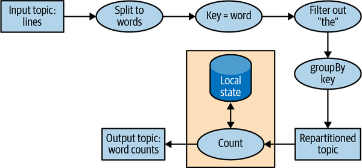

**Hình 14-10. Topology cho ví dụ stream processing word-count**

Ngay cả một ứng dụng đơn giản cũng có một topology không tầm thường. Topology được tạo nên từ các processor — đó là những node trong đồ thị topology (được biểu diễn bằng hình tròn trong sơ đồ của chúng ta). Hầu hết processor triển khai một thao tác trên dữ liệu — filter, map, aggregate, v.v. Cũng có các source processor, vốn consume dữ liệu từ một topic và chuyển tiếp nó, và các sink processor, vốn nhận dữ liệu từ các processor phía trước và produce nó vào một topic. Một topology luôn bắt đầu bằng một hoặc nhiều source processor và kết thúc bằng một hoặc nhiều sink processor.

### Tối ưu hóa một Topology

Theo mặc định, Kafka Streams thực thi những ứng dụng được xây dựng bằng DSL API bằng cách ánh xạ từng phương thức DSL một cách độc lập sang một phương thức tương đương ở cấp thấp hơn. Bằng việc đánh giá từng phương thức DSL một cách độc lập, các cơ hội tối ưu hóa topology tổng thể thu được đã bị bỏ lỡ.

Tuy nhiên, lưu ý rằng việc thực thi một ứng dụng Kafka Streams là một quy trình ba bước:

1. Topology logic được định nghĩa bằng cách tạo các đối tượng `KStream` và `KTable` và thực hiện các thao tác DSL, chẳng hạn filter và join, trên chúng.
2. `StreamsBuilder.build()` sinh ra một topology vật lý từ topology logic.
3. `KafkaStreams.start()` thực thi topology — đây là nơi dữ liệu được consume, xử lý và produce.

Bước thứ hai, nơi topology vật lý được sinh ra từ các định nghĩa logic, là nơi có thể áp dụng các tối ưu hóa tổng thể cho kế hoạch.

Hiện tại, Apache Kafka chỉ chứa một vài tối ưu hóa, chủ yếu xoay quanh việc tái sử dụng các topic khi có thể. Chúng có thể được bật bằng cách đặt `StreamsConfig.TOPOLOGY_OPTIMIZATION` thành `StreamsConfig.OPTIMIZE` và gọi `build(props)`. Nếu bạn chỉ gọi `build()` mà không truyền config vào, việc tối ưu hóa vẫn bị tắt. Khuyến nghị nên kiểm thử ứng dụng cả khi có và không có tối ưu hóa, so sánh thời gian thực thi và khối lượng dữ liệu được ghi vào Kafka, và tất nhiên, xác thực rằng kết quả là giống hệt nhau trong nhiều kịch bản đã biết.

### Kiểm thử một Topology

Nói chung, chúng ta muốn kiểm thử phần mềm trước khi dùng nó trong những kịch bản mà việc nó thực thi thành công là quan trọng. Kiểm thử tự động được xem là tiêu chuẩn vàng. Những bài kiểm thử có thể lặp lại, được đánh giá mỗi khi có một thay đổi đối với ứng dụng hoặc thư viện phần mềm, cho phép lặp nhanh và xử lý sự cố dễ dàng hơn.

Chúng ta muốn áp dụng cùng loại phương pháp luận đó cho các ứng dụng Kafka Streams của mình. Ngoài các bài kiểm thử end-to-end tự động chạy ứng dụng stream processing trên một môi trường staging với dữ liệu được sinh ra, chúng ta cũng sẽ muốn có thêm những bài unit test và integration test nhanh hơn, nhẹ hơn và dễ debug hơn.

Công cụ kiểm thử chính cho các ứng dụng Kafka Streams là `TopologyTestDriver`. Kể từ khi được giới thiệu ở phiên bản 1.1.0, API của nó đã trải qua những cải tiến đáng kể, và các phiên bản từ 2.4 trở đi thì tiện lợi và dễ dùng. Những bài kiểm thử này trông giống như unit test bình thường. Chúng ta định nghĩa dữ liệu đầu vào, produce nó vào các input topic giả lập, chạy topology bằng test driver, đọc kết quả từ các output topic giả lập, và xác thực kết quả bằng cách so sánh nó với những giá trị kỳ vọng.

Chúng tôi khuyến nghị dùng `TopologyTestDriver` để kiểm thử các ứng dụng stream processing, nhưng vì nó không mô phỏng hành vi caching của Kafka Streams (một tối ưu hóa không được thảo luận trong cuốn sách này, hoàn toàn không liên quan đến chính state store, thứ vốn được framework này mô phỏng), nên có cả những lớp lỗi mà nó sẽ không phát hiện được.

Unit test thường được bổ sung bằng integration test, và với Kafka Streams, có hai framework integration test phổ biến: `EmbeddedKafkaCluster` và `Testcontainers`. Cái đầu chạy các broker Kafka bên trong JVM đang chạy các bài kiểm thử, còn cái sau chạy các container Docker với broker Kafka (và nhiều thành phần khác, tùy theo nhu cầu của các bài kiểm thử). `Testcontainers` được khuyến nghị, vì bằng cách dùng Docker nó cô lập hoàn toàn Kafka, các phụ thuộc của nó và việc sử dụng tài nguyên của nó khỏi ứng dụng mà chúng ta đang cố kiểm thử.

Đây chỉ là một tổng quan ngắn gọn về các phương pháp luận kiểm thử Kafka Streams. Chúng tôi khuyến nghị đọc bài blog "Testing Kafka Streams—A Deep Dive" để có những giải thích sâu hơn và các ví dụ code chi tiết về topology và các bài kiểm thử.

### Mở rộng một Topology

Kafka Streams mở rộng bằng cách cho phép nhiều thread thực thi bên trong một instance của ứng dụng và bằng cách hỗ trợ cân bằng tải giữa các instance phân tán của ứng dụng. Chúng ta có thể chạy ứng dụng Streams trên một máy với nhiều thread hoặc trên nhiều máy; trong cả hai trường hợp, tất cả thread đang hoạt động trong ứng dụng sẽ cân bằng khối lượng công việc xử lý dữ liệu.

Streams engine song song hóa việc thực thi một topology bằng cách chia nó thành các task. Số lượng task được xác định bởi Streams engine và phụ thuộc vào số partition trong những topic mà ứng dụng xử lý. Mỗi task chịu trách nhiệm cho một tập con các partition: task sẽ subscribe vào những partition đó và consume các event từ chúng. Với mỗi event nó consume, task sẽ thực thi tất cả các bước xử lý áp dụng cho partition này theo thứ tự trước khi cuối cùng ghi kết quả vào sink. Những task đó là đơn vị song song cơ bản trong Kafka Streams, bởi vì mỗi task có thể thực thi độc lập với các task khác. Xem Hình 14-11.

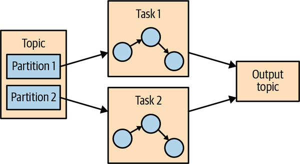

**Hình 14-11. Hai task chạy cùng một topology — mỗi task cho một partition trong input topic**

Lập trình viên của ứng dụng có thể chọn số lượng thread mà mỗi instance ứng dụng sẽ thực thi. Nếu có nhiều thread khả dụng, mỗi thread sẽ thực thi một tập con các task mà ứng dụng tạo ra. Nếu nhiều instance của ứng dụng đang chạy trên nhiều server, các task khác nhau sẽ thực thi cho mỗi thread trên mỗi server. Đây là cách các ứng dụng streaming mở rộng: chúng ta sẽ có số task bằng số partition trong những topic mà chúng ta đang xử lý. Nếu chúng ta muốn xử lý nhanh hơn, hãy thêm nhiều thread hơn. Nếu chúng ta hết tài nguyên trên server, hãy khởi động một instance khác của ứng dụng trên một server khác. Kafka sẽ tự động điều phối công việc — nó sẽ gán cho mỗi task tập con partition riêng của nó, và mỗi task sẽ độc lập xử lý các event từ những partition đó và duy trì local state riêng của nó với các aggregate liên quan nếu topology yêu cầu điều này. Xem Hình 14-12.

Đôi khi một bước xử lý có thể cần đầu vào từ nhiều partition, điều này có thể tạo ra các phụ thuộc giữa các task. Ví dụ, nếu chúng ta join hai stream, như chúng ta đã làm trong ví dụ ClickStream ở mục "Làm giàu ClickStream", chúng ta cần dữ liệu từ một partition trong mỗi stream trước khi có thể phát ra kết quả. Kafka Streams xử lý tình huống này bằng cách gán tất cả partition cần thiết cho một phép join vào cùng một task để task đó có thể consume từ tất cả những partition liên quan và thực hiện phép join một cách độc lập. Đây là lý do Kafka Streams hiện tại yêu cầu rằng tất cả các topic tham gia vào một thao tác join phải có cùng số lượng partition và được partition dựa trên join key.

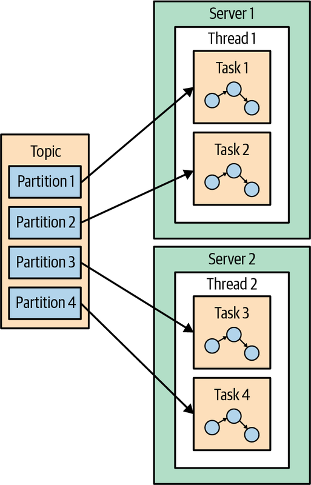

**Hình 14-12. Các task stream processing có thể chạy trên nhiều thread và nhiều server**

Một ví dụ khác về sự phụ thuộc giữa các task là khi ứng dụng của chúng ta yêu cầu repartitioning. Chẳng hạn, trong ví dụ ClickStream, tất cả event của chúng ta được đánh key theo user ID. Nhưng nếu chúng ta muốn tạo thống kê theo từng trang thì sao? Hay theo từng mã bưu chính? Kafka Streams sẽ repartition dữ liệu theo mã bưu chính và chạy một phép aggregation trên dữ liệu với các partition mới. Nếu task 1 xử lý dữ liệu từ partition 1 và đến một processor thực hiện repartition dữ liệu (thao tác `groupBy`), nó sẽ cần shuffle, hay gửi các event tới các task khác. Không giống các framework stream processor khác, Kafka Streams thực hiện repartition bằng cách ghi các event vào một topic mới với key và partition mới. Sau đó một tập task khác đọc các event từ topic mới và tiếp tục xử lý. Các bước repartitioning chia topology của chúng ta thành hai subtopology, mỗi cái có các task riêng. Tập task thứ hai phụ thuộc vào tập đầu tiên, bởi vì nó xử lý kết quả của subtopology thứ nhất. Tuy nhiên, tập task thứ nhất và thứ hai vẫn có thể chạy độc lập và song song bởi vì tập task thứ nhất ghi dữ liệu vào một topic theo nhịp độ riêng của nó và tập thứ hai consume từ topic đó và xử lý các event theo nhịp độ riêng của nó. Không có giao tiếp và không có tài nguyên chia sẻ giữa các task, và chúng không cần chạy trên cùng thread hay server. Đây là một trong những điều hữu ích hơn cả mà Kafka làm được — giảm sự phụ thuộc giữa các phần khác nhau của một pipeline. Xem Hình 14-13.

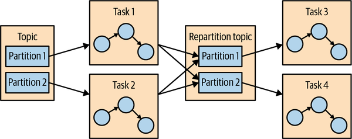

**Hình 14-13. Hai tập task xử lý các event với một topic để repartition các event giữa chúng**

### Vượt qua sự cố (Surviving Failures)

Chính mô hình cho phép chúng ta mở rộng ứng dụng cũng cho phép chúng ta xử lý sự cố một cách êm ái. Trước hết, Kafka có tính sẵn sàng cao, và do đó dữ liệu chúng ta lưu bền vững vào Kafka cũng có tính sẵn sàng cao. Vì vậy nếu ứng dụng gặp sự cố và cần khởi động lại, nó có thể tra cứu vị trí cuối cùng của mình trong stream từ Kafka và tiếp tục xử lý từ offset cuối cùng mà nó đã commit trước khi gặp sự cố. Lưu ý rằng nếu local state store bị mất (ví dụ, vì chúng ta cần thay thế server nơi nó được lưu trữ), ứng dụng streams luôn có thể tạo lại nó từ change log mà nó lưu trong Kafka.

Kafka Streams cũng tận dụng cơ chế điều phối consumer của Kafka để cung cấp tính sẵn sàng cao cho các task. Nếu một task gặp sự cố nhưng vẫn có những thread hoặc instance khác của ứng dụng streams đang hoạt động, task đó sẽ khởi động lại trên một trong những thread khả dụng. Điều này tương tự cách các consumer group xử lý sự cố của một trong các consumer trong nhóm bằng cách gán các partition cho một trong những consumer còn lại. Kafka Streams đã hưởng lợi từ những cải tiến trong giao thức điều phối consumer group của Kafka, chẳng hạn static group membership và cooperative rebalancing (được mô tả ở Chương 4), cũng như những cải tiến đối với exactly-once semantics của Kafka (được mô tả ở Chương 8).

Mặc dù các phương pháp có tính sẵn sàng cao được mô tả ở đây hoạt động tốt về mặt lý thuyết, thực tế lại đưa vào một số phức tạp. Một mối quan tâm quan trọng là tốc độ khôi phục. Khi một thread phải bắt đầu xử lý một task từng chạy trên một thread bị lỗi, trước tiên nó cần khôi phục state đã lưu của mình — chẳng hạn các aggregation window hiện tại. Việc này thường được thực hiện bằng cách đọc lại các topic nội bộ từ Kafka để làm nóng các state store của Kafka Streams. Trong khoảng thời gian cần thiết để khôi phục state của một task bị lỗi, công việc stream processing sẽ không tiến triển trên tập con dữ liệu đó, dẫn đến tính sẵn sàng giảm và dữ liệu cũ.

Do đó, việc giảm thời gian khôi phục thường quy về việc giảm thời gian cần để khôi phục state. Một kỹ thuật then chốt là đảm bảo tất cả các topic của Kafka Streams được cấu hình để compaction quyết liệt — bằng cách đặt `min.compaction.lag.ms` thấp và cấu hình kích thước segment là 100 MB thay vì mặc định 1 GB (hãy nhớ rằng segment cuối cùng trong mỗi partition, tức active segment, không được compact).

Để khôi phục còn nhanh hơn nữa, chúng tôi khuyến nghị cấu hình `standby replica` — đó là những task chỉ đơn giản làm bóng cho các task đang hoạt động trong một ứng dụng stream processing và giữ cho state hiện tại luôn nóng trên một server khác. Khi xảy ra failover, chúng đã có state mới nhất và sẵn sàng tiếp tục xử lý gần như không có downtime.

Thêm thông tin về cả khả năng mở rộng lẫn tính sẵn sàng cao trong Kafka Streams có sẵn trong một bài blog và một bài nói tại Kafka Summit về chủ đề này.

## Các tình huống sử dụng Stream Processing

Xuyên suốt chương này chúng ta đã học cách thực hiện stream processing — từ những khái niệm và pattern tổng quát đến các ví dụ cụ thể trong Kafka Streams. Đến thời điểm này, có lẽ đáng để xem xét các tình huống sử dụng stream processing phổ biến. Như đã giải thích ở đầu chương, stream processing — hay xử lý liên tục — hữu ích trong những trường hợp chúng ta muốn các event được xử lý nhanh chóng thay vì chờ hàng giờ cho đến batch tiếp theo, nhưng cũng là những trường hợp chúng ta không kỳ vọng phản hồi đến trong vòng vài mili giây. Tất cả điều này đều đúng nhưng cũng rất trừu tượng. Hãy cùng xem một vài kịch bản thực tế có thể được giải quyết bằng stream processing:

**Dịch vụ khách hàng**

Giả sử chúng ta vừa đặt phòng tại một chuỗi khách sạn lớn, và chúng ta mong đợi một email xác nhận cùng biên nhận. Vài phút sau khi đặt phòng, khi xác nhận vẫn chưa đến, chúng ta gọi cho bộ phận dịch vụ khách hàng để xác nhận đặt phòng của mình. Giả sử quầy dịch vụ khách hàng nói với chúng ta: "Tôi không thấy đơn hàng trong hệ thống của chúng tôi, nhưng batch job nạp dữ liệu từ hệ thống đặt phòng sang các khách sạn và quầy dịch vụ khách hàng chỉ chạy một lần mỗi ngày, nên xin vui lòng gọi lại vào ngày mai. Bạn sẽ thấy email trong vòng 2–3 ngày làm việc." Điều này nghe không giống một dịch vụ tốt lắm, vậy mà chúng tôi đã có cuộc trò chuyện này hơn một lần với một chuỗi khách sạn lớn. Cái chúng ta thực sự muốn là mọi hệ thống trong chuỗi khách sạn nhận được cập nhật về một đặt phòng mới trong vòng vài giây hoặc vài phút sau khi đặt phòng được thực hiện, bao gồm trung tâm dịch vụ khách hàng, khách sạn, hệ thống gửi email xác nhận, website, v.v. Chúng ta cũng muốn trung tâm dịch vụ khách hàng có thể ngay lập tức truy xuất tất cả chi tiết về bất kỳ lần lưu trú nào trong quá khứ của chúng ta tại bất kỳ khách sạn nào trong chuỗi, và muốn quầy lễ tân tại khách sạn biết rằng chúng ta là khách hàng trung thành để họ có thể nâng hạng phòng cho chúng ta. Việc xây dựng tất cả những hệ thống đó bằng các ứng dụng stream processing cho phép chúng nhận và xử lý cập nhật gần như theo thời gian thực, điều này mang lại trải nghiệm khách hàng tốt hơn. Với một hệ thống như vậy, khách hàng sẽ nhận được email xác nhận trong vòng vài phút, thẻ tín dụng của họ sẽ bị tính phí đúng lúc, biên nhận sẽ được gửi đi, và quầy dịch vụ có thể ngay lập tức trả lời các câu hỏi của họ liên quan đến đặt phòng.

**Internet of Things**

IoT có thể mang nhiều nghĩa — từ một thiết bị gia đình điều chỉnh nhiệt độ và đặt mua bổ sung nước giặt, cho đến kiểm soát chất lượng theo thời gian thực trong sản xuất dược phẩm. Một tình huống sử dụng rất phổ biến khi áp dụng stream processing cho cảm biến và thiết bị là cố gắng dự đoán khi nào cần bảo trì phòng ngừa. Việc này tương tự như giám sát ứng dụng nhưng được áp dụng cho phần cứng và phổ biến trong nhiều ngành, bao gồm sản xuất, viễn thông (xác định các trạm phát sóng di động bị lỗi), truyền hình cáp (xác định các đầu thu bị lỗi trước khi người dùng phàn nàn), và nhiều lĩnh vực khác. Mỗi trường hợp có pattern riêng của nó, nhưng mục tiêu thì tương tự: xử lý các event đến từ thiết bị ở quy mô lớn và xác định những pattern báo hiệu rằng một thiết bị cần được bảo trì. Những pattern này có thể là các gói tin bị mất đối với một switch, lực siết ốc vít cần lớn hơn trong sản xuất, hoặc người dùng khởi động lại đầu thu thường xuyên hơn đối với truyền hình cáp.

**Phát hiện gian lận**

Còn được gọi là phát hiện bất thường (anomaly detection), đây là một lĩnh vực rất rộng tập trung vào việc bắt những "kẻ gian lận" hoặc tác nhân xấu trong hệ thống. Các ví dụ về ứng dụng phát hiện gian lận bao gồm phát hiện gian lận thẻ tín dụng, gian lận giao dịch chứng khoán, gian lận trong trò chơi điện tử và các rủi ro an ninh mạng. Trong tất cả những lĩnh vực này, việc bắt gian lận càng sớm càng tốt mang lại lợi ích lớn, nên một hệ thống gần thời gian thực có khả năng phản ứng nhanh với các event — có lẽ chặn một giao dịch xấu trước cả khi nó được phê duyệt — được ưa chuộng hơn nhiều so với một batch job phát hiện gian lận ba ngày sau khi sự việc xảy ra, khi việc dọn dẹp phức tạp hơn nhiều. Đây, một lần nữa, là bài toán xác định các pattern trong một stream các event ở quy mô lớn.

Trong an ninh mạng, có một phương pháp gọi là beaconing. Khi hacker cài mã độc bên trong tổ chức, nó thỉnh thoảng sẽ vươn ra bên ngoài để nhận lệnh. Có thể khó phát hiện hoạt động này vì nó có thể xảy ra vào bất kỳ lúc nào và với bất kỳ tần suất nào. Thông thường, các mạng được phòng thủ tốt trước những cuộc tấn công từ bên ngoài nhưng dễ tổn thương hơn trước việc ai đó bên trong tổ chức vươn ra ngoài. Bằng cách xử lý stream lớn các event kết nối mạng và nhận diện một pattern giao tiếp là bất thường (ví dụ, phát hiện rằng host này thường không truy cập những IP cụ thể đó), tổ chức an ninh có thể được cảnh báo sớm, trước khi thiệt hại lớn hơn xảy ra.

## Cách chọn một Stream Processing Framework

Khi chọn một stream processing framework, điều quan trọng là phải cân nhắc loại ứng dụng mà bạn dự định viết. Các loại ứng dụng khác nhau đòi hỏi những giải pháp stream processing khác nhau:

**Ingest**

Nơi mục tiêu là đưa dữ liệu từ hệ thống này sang hệ thống khác, với một vài sửa đổi đối với dữ liệu để phù hợp với hệ thống đích.

**Hành động ở mức vài mili giây**

Bất kỳ ứng dụng nào đòi hỏi phản hồi gần như tức thì. Một số tình huống sử dụng phát hiện gian lận thuộc nhóm này.

**Microservice bất đồng bộ**

Những microservice này thực hiện một hành động đơn giản thay mặt cho một quy trình nghiệp vụ lớn hơn, chẳng hạn cập nhật tồn kho của một cửa hàng. Những ứng dụng này có thể cần duy trì local state cache các event như một cách cải thiện hiệu năng.

**Phân tích dữ liệu gần thời gian thực**

Những ứng dụng streaming này thực hiện các phép aggregation và join phức tạp để cắt lát và phân tích dữ liệu theo nhiều chiều rồi sinh ra những hiểu biết thú vị, có liên quan đến nghiệp vụ.

Hệ thống stream processing mà bạn sẽ chọn phụ thuộc rất nhiều vào bài toán mà bạn đang giải quyết:

- Nếu bạn đang cố giải một bài toán ingest, bạn nên cân nhắc lại liệu bạn có muốn một hệ thống stream processing hay một hệ thống tập trung vào ingest đơn giản hơn như Kafka Connect. Nếu bạn chắc chắn muốn một hệ thống stream processing, bạn cần đảm bảo rằng nó vừa có một lựa chọn connector tốt vừa có các connector chất lượng cao cho những hệ thống mà bạn nhắm tới.
- Nếu bạn đang cố giải một bài toán đòi hỏi hành động ở mức vài mili giây, bạn cũng nên cân nhắc lại lựa chọn dùng streams. Các pattern request-response thường phù hợp hơn cho nhiệm vụ này. Nếu bạn chắc chắn muốn một hệ thống stream processing, thì bạn cần chọn một hệ thống hỗ trợ mô hình latency thấp theo từng event thay vì một hệ thống tập trung vào microbatch.
- Nếu bạn đang xây dựng các microservice bất đồng bộ, bạn cần một hệ thống stream processing tích hợp tốt với message bus mà bạn chọn (hy vọng là Kafka), có khả năng change capture để dễ dàng chuyển các thay đổi từ upstream tới local state của microservice, và có sự hỗ trợ tốt cho một local store có thể đóng vai trò cache hoặc materialized view của dữ liệu microservice.
- Nếu bạn đang xây dựng một engine phân tích phức tạp, bạn cũng cần một hệ thống stream processing hỗ trợ tốt cho local store — lần này không phải để duy trì local cache và materialized view mà là để hỗ trợ các phép aggregation, window và join nâng cao vốn khó triển khai bằng cách khác. Các API nên bao gồm hỗ trợ cho aggregation tùy chỉnh, các thao tác window và nhiều kiểu join.

Ngoài những cân nhắc riêng cho từng tình huống sử dụng, có một vài cân nhắc chung mà bạn nên tính đến:

**Khả năng vận hành của hệ thống**

Nó có dễ triển khai lên production không? Có dễ giám sát và xử lý sự cố không? Có dễ mở rộng lên và thu nhỏ lại khi cần không? Nó có tích hợp tốt với hạ tầng hiện có của bạn không? Điều gì xảy ra nếu có sai sót và bạn cần xử lý lại dữ liệu?

**Tính dễ dùng của API và mức độ dễ debug**

Tôi đã chứng kiến sự khác biệt hàng bậc độ lớn về thời gian cần để viết một ứng dụng chất lượng cao giữa các phiên bản khác nhau của cùng một framework. Thời gian phát triển và thời gian ra thị trường là quan trọng, nên bạn cần chọn một hệ thống giúp bạn làm việc hiệu quả.

**Làm cho những việc khó trở nên dễ dàng**

Gần như mọi hệ thống đều tuyên bố chúng có thể thực hiện các phép windowed aggregation nâng cao và duy trì local store, nhưng câu hỏi là: chúng có làm cho việc đó dễ dàng cho bạn không? Chúng có xử lý những chi tiết gai góc xoay quanh quy mô và khôi phục không, hay chúng cung cấp những trừu tượng rò rỉ và bắt bạn tự xử lý phần lớn mớ hỗn độn? Một hệ thống càng phơi bày các API và trừu tượng gọn gàng và tự xử lý những chi tiết gai góc thì lập trình viên càng làm việc hiệu quả.

**Cộng đồng**

Hầu hết ứng dụng stream processing mà bạn cân nhắc đều là mã nguồn mở, và không gì thay thế được một cộng đồng sôi nổi và tích cực. Cộng đồng tốt nghĩa là bạn nhận được những tính năng mới và thú vị một cách đều đặn, chất lượng tương đối tốt (không ai muốn làm việc trên phần mềm tồi), lỗi được sửa nhanh chóng, và câu hỏi của người dùng được trả lời kịp thời. Nó cũng có nghĩa là nếu bạn gặp một lỗi lạ và tìm kiếm nó trên Google, bạn sẽ tìm thấy thông tin về nó bởi vì những người khác đang dùng hệ thống này và gặp cùng vấn đề đó.

## Tóm tắt

Chúng ta đã bắt đầu chương này bằng việc giải thích stream processing. Chúng ta đã đưa ra một định nghĩa hình thức và thảo luận những thuộc tính chung của mô hình stream processing. Chúng ta cũng đã so sánh nó với các mô hình lập trình khác.

Sau đó chúng ta đã thảo luận những khái niệm quan trọng về stream processing. Những khái niệm đó đã được minh họa bằng ba ứng dụng ví dụ viết bằng Kafka Streams.

Sau khi đi qua tất cả chi tiết của những ứng dụng ví dụ này, chúng ta đã đưa ra một tổng quan về kiến trúc Kafka Streams và giải thích cách nó hoạt động bên trong. Chúng ta kết thúc chương này, và cuốn sách, bằng một vài ví dụ về các tình huống sử dụng stream processing cùng lời khuyên về cách so sánh các stream processing framework khác nhau.
