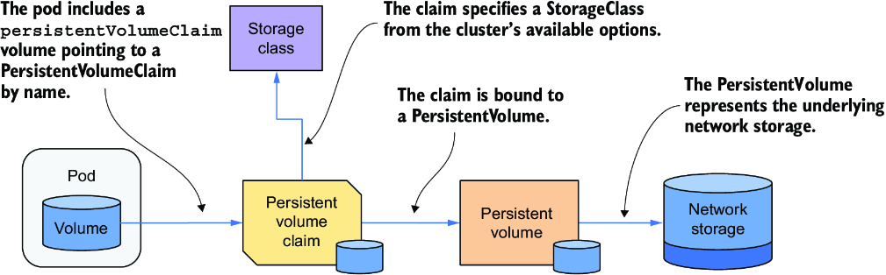
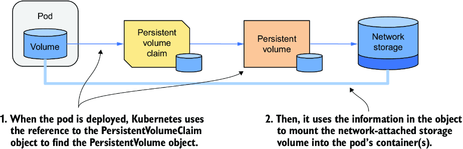
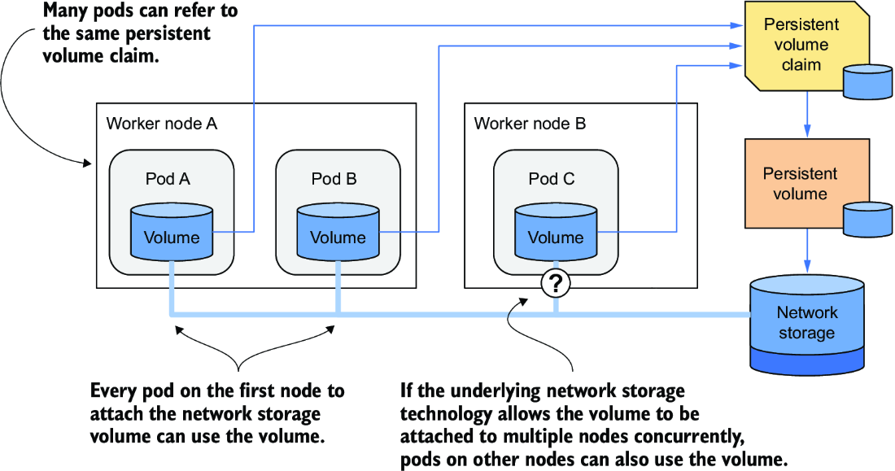
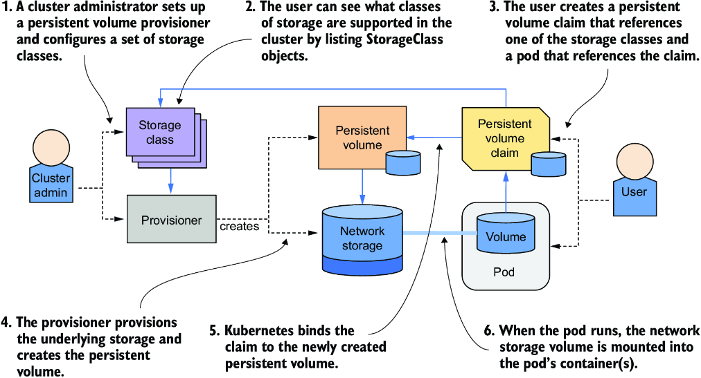
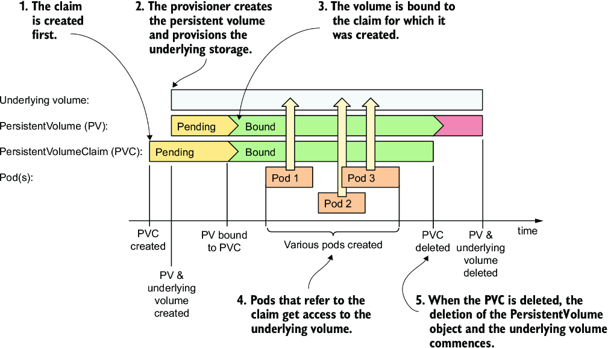
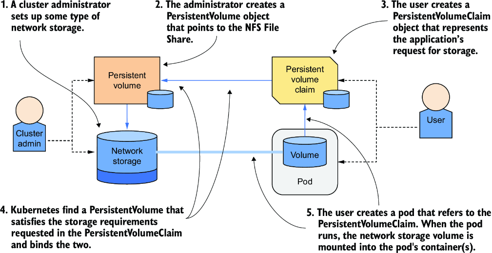
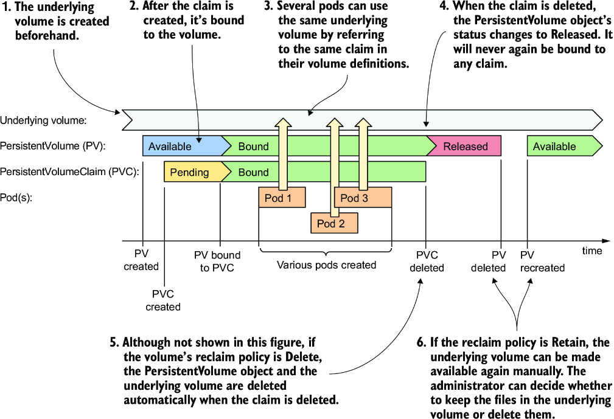
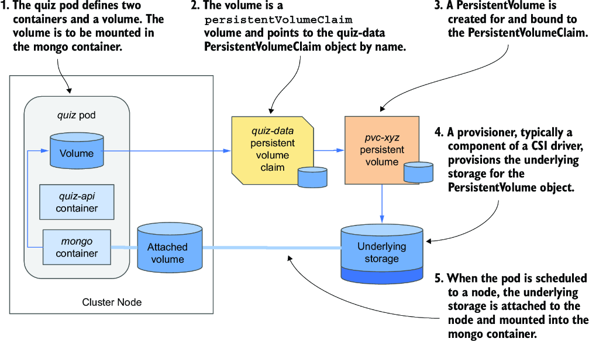
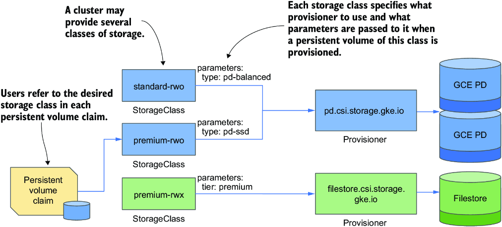

# Chương 10: Lưu trữ dữ liệu bền vững với PersistentVolume

*(Dịch từ "Chapter 10: Persisting data with PersistentVolumes" – Kubernetes in Action, Second Edition, tác giả Marko Lukša, NXB Manning)*

---

## Nội dung chính của chương
* Dùng các PersistentVolume object để biểu diễn persistent storage (lưu trữ bền vững)
* Yêu cầu sở hữu (claim) PersistentVolume bằng PersistentVolumeClaim
* Cấp phát (provisioning) tĩnh và động các PersistentVolume
* Lưu trữ cục bộ trên node (node-local) so với lưu trữ gắn qua mạng (network-attached)
* Tạo snapshot, nhân bản (clone) và khôi phục volume bằng resource VolumeSnapshot
* PersistentVolume tồn tại lâu dài so với PersistentVolume tạm thời (ephemeral)

Chương trước đã dạy bạn cách mount các storage volume tạm thời (ephemeral) vào pod của mình. Trong chương này, bạn sẽ học cách làm điều tương tự với các persistent storage volume, loại volume có thể là cục bộ trên node hoặc gắn qua mạng.

> **GHI CHÚ:** Các file code cho chương này có tại https://mng.bz/Qwj4.

---

## 10.1 Giới thiệu persistent storage trong Kubernetes (Introducing persistent storage in Kubernetes)

Lý tưởng nhất, các nhà phát triển triển khai ứng dụng của họ lên Kubernetes không cần biết cluster cung cấp công nghệ lưu trữ nào, giống như họ không cần biết các thuộc tính của những máy chủ vật lý đang chạy pod. Các chi tiết hạ tầng nên được quản lý bởi những người vận hành cluster.

Vì lý do này, khi triển khai một ứng dụng lên Kubernetes, bạn thường không tham chiếu đến một persistent storage volume cụ thể. Thay vào đó, bạn chỉ định rằng bạn cần persistent storage với những thuộc tính nhất định, và cluster hoặc sẽ tìm một volume hiện có khớp với các thuộc tính đó, hoặc cấp phát một volume mới.

### 10.1.1 Giới thiệu PersistentVolumeClaim và PersistentVolume (Introducing PersistentVolumeClaims and PersistentVolumes)

Khi pod của bạn cần một persistent storage volume, bạn tạo một PersistentVolumeClaim object và tham chiếu nó trong manifest của pod. Cluster của bạn hỗ trợ một hoặc nhiều lớp (class) lưu trữ, được biểu diễn bằng các StorageClass object. Bạn chỉ định StorageClass mong muốn theo tên trong PersistentVolumeClaim của mình.

Cluster tìm một PersistentVolume object khớp hoặc tạo một object mới rồi gắn (bind) nó với PersistentVolumeClaim. PersistentVolume object đại diện cho volume lưu trữ mạng bên dưới. Để hiểu rõ hơn mối quan hệ giữa các object này, hãy xem hình 10.1.



*Hình 10.1: Dùng PersistentVolume và PersistentVolumeClaim để gắn lưu trữ mạng vào pod*

Bây giờ chúng ta hãy xem xét kỹ hơn ba API resource này.

#### Giới thiệu PersistentVolume (Introducing PersistentVolumes)

Như tên gọi gợi ý, một PersistentVolume object đại diện cho một storage volume được dùng để lưu trữ bền vững dữ liệu ứng dụng. Như minh họa trong hình trước, PersistentVolume object đại diện cho phần lưu trữ bên dưới.

Việc cấp phát phần lưu trữ bên dưới cho các PersistentVolume thường được xử lý bởi các CSI (Container Storage Interface) driver được triển khai trong Kubernetes cluster. Một CSI driver thường bao gồm một thành phần controller, có nhiệm vụ cấp phát động các PersistentVolume, và một thành phần chạy trên từng node để mount và unmount storage volume bên dưới.

Có rất nhiều CSI driver, và mỗi driver hỗ trợ một công nghệ lưu trữ cụ thể. Ví dụ, driver Network File System (NFS) cho phép Kubernetes truy cập một máy chủ NFS, driver Azure Disk hỗ trợ Microsoft Azure Disks, driver GCE Persistent Disk hỗ trợ Google Compute Engine Persistent Disks, v.v.

> **MẸO:** Danh sách các CSI driver có tại https://mng.bz/X7BE.

#### Giới thiệu PersistentVolumeClaim (Introducing PersistentVolumeClaims)

Một pod không tham chiếu trực tiếp đến PersistentVolume object. Thay vào đó, nó trỏ đến một PersistentVolumeClaim object, và object này lại trỏ đến PersistentVolume.

Như tên gọi gợi ý, một PersistentVolumeClaim object đại diện cho yêu cầu sở hữu (claim) của người dùng đối với PersistentVolume. Vì vòng đời của nó thường không gắn với vòng đời của pod, nó cho phép tách quyền sở hữu PersistentVolume ra khỏi pod. Trước khi người dùng có thể dùng một PersistentVolume trong pod của họ, họ phải claim volume đó trước bằng cách tạo một PersistentVolumeClaim object. Sau khi claim volume, người dùng có quyền độc quyền đối với nó và có thể dùng nó trong các pod của mình. Họ có thể xóa pod bất cứ lúc nào mà không mất quyền sở hữu PersistentVolume. Khi không còn cần volume nữa, người dùng giải phóng (release) nó bằng cách xóa PersistentVolumeClaim object.

#### Giới thiệu StorageClass (Introducing StorageClasses)

Một Kubernetes cluster có thể cung cấp các lớp persistent storage khác nhau, được biểu diễn bằng resource StorageClass. Một StorageClass định nghĩa provisioner (bộ cấp phát) được dùng để tạo các volume thuộc lớp đó, cùng với các tham số bổ sung cho những volume này.

Khi tạo một PersistentVolumeClaim, người dùng chỉ định tên của StorageClass mà họ muốn dùng. Nếu các storage class được đặt tên nhất quán — chẳng hạn `standard`, `fast`, v.v. — thì các manifest PersistentVolumeClaim trở nên khả chuyển (portable) giữa các cluster khác nhau, ngay cả khi mỗi cluster dùng một công nghệ lưu trữ bên dưới khác nhau.

> **QUAN TRỌNG:** Các manifest PersistentVolumeClaim thường được viết bởi các nhà phát triển ứng dụng và thường được đóng gói cùng với manifest của pod và các manifest khác. Điều này không đúng với PersistentVolume.

#### Dùng PersistentVolumeClaim trong pod (Using a PersistentVolumeClaim in a pod)

Trong chương trước, bạn đã tìm hiểu các kiểu volume khác nhau mà bạn có thể dùng trong pod. Một trong những kiểu chưa được giải thích chi tiết là kiểu volume `persistentVolumeClaim`. Giờ khi bạn đã biết PersistentVolumeClaim là gì, hẳn bạn đã thấy rõ kiểu pod volume này làm gì.

Trong định nghĩa volume `persistentVolumeClaim`, bạn chỉ định tên của PersistentVolumeClaim object mà bạn đã tạo trước đó để gắn PersistentVolume tương ứng vào pod của mình. Ví dụ, nếu bạn tạo một PersistentVolumeClaim tên `my-nfs-share` được gắn với một PersistentVolume có phần lưu trữ bên dưới là một NFS file share, bạn có thể gắn NFS file share đó vào pod bằng cách thêm một định nghĩa volume `persistentVolumeClaim` tham chiếu đến PersistentVolumeClaim object `my-nfs-share`. Định nghĩa volume không cần chứa bất kỳ thông tin đặc thù hạ tầng nào, chẳng hạn địa chỉ IP của máy chủ NFS.

Như minh họa trong hình 10.2, khi pod này được lập lịch (schedule) lên một node trong cluster, Kubernetes tìm PersistentVolume được gắn với claim mà pod tham chiếu và dùng thông tin trong PersistentVolume object để mount volume lưu trữ mạng vào container của pod.



*Hình 10.2: Mount một PersistentVolume vào (các) container của pod*

#### Dùng PersistentVolumeClaim trong nhiều pod (Using a PersistentVolumeClaim in multiple pods)

Nhiều pod có thể dùng chung một storage volume bằng cách tham chiếu cùng một PersistentVolumeClaim, và claim này lại được gắn với cùng một PersistentVolume, như minh họa trong hình 10.3.



*Hình 10.3: Dùng cùng một PersistentVolumeClaim trong nhiều pod*

Việc các pod này phải chạy trên cùng một node của cluster hay có thể truy cập phần lưu trữ bên dưới từ các node khác nhau phụ thuộc vào công nghệ lưu trữ. Nếu phần lưu trữ hỗ trợ gắn (attach) volume vào nhiều node cùng lúc, các pod trên các node khác nhau có thể dùng nó. Nếu không, tất cả các pod phải được lập lịch lên node đã attach storage volume đó đầu tiên.

### 10.1.2 Cấp phát động và cấp phát tĩnh PersistentVolume (Dynamic vs. static provisioning of PersistentVolumes)

PersistentVolume có thể được cấp phát động hoặc tĩnh. Ngày nay, hầu hết các Kubernetes cluster dùng cấp phát động, cách này tự động hóa việc tạo storage volume khi cần. Tuy nhiên, cấp phát tĩnh vẫn hữu ích trong một số tình huống nhất định, chẳng hạn khi quản trị viên cấp phát trước lưu trữ cục bộ. Một cluster đơn lẻ cũng có thể hỗ trợ đồng thời cả hai cách tiếp cận.

#### Cách cấp phát động hoạt động (How dynamic provisioning works)

Trong cấp phát động PersistentVolume, các volume này được tạo theo yêu cầu (on demand). Để hỗ trợ điều này, quản trị viên cluster triển khai một hoặc nhiều CSI driver trong cluster và đăng ký chúng vào Kubernetes API thông qua resource CSIDriver. Ngoài ra, một hoặc nhiều StorageClass tham chiếu đến mỗi driver cũng được tạo. Khi một người dùng cluster tạo một PersistentVolumeClaim, provisioner tạo PersistentVolume object và cấp phát phần lưu trữ bên dưới, như minh họa trong hình 10.4.



*Hình 10.4: Cấp phát động PersistentVolume*

Quản trị viên cluster không cần cấp phát trước bất kỳ PersistentVolume object nào hay phần lưu trữ bên dưới. Thay vào đó, chúng được cấp phát theo yêu cầu và tự động bị hủy khi không còn cần thiết.

Vòng đời của một PersistentVolume được cấp phát động được thể hiện trong hình 10.5. Ngay sau khi người dùng tạo một PersistentVolumeClaim, PersistentVolume và phần lưu trữ bên dưới được cấp phát. Sau đó nhiều pod có thể dùng cùng PersistentVolumeClaim đó và do đó dùng cùng PersistentVolume. Vòng đời của PersistentVolumeClaim và PersistentVolume không gắn với vòng đời của các pod, nên chúng vẫn tồn tại ngay cả khi không có pod nào tham chiếu đến PersistentVolumeClaim. Khi PersistentVolumeClaim object bị xóa, PersistentVolume và phần lưu trữ bên dưới thường bị xóa theo, nhưng chúng cũng có thể được giữ lại nếu cần.



*Hình 10.5: Vòng đời của các PersistentVolume được cấp phát động, các claim và các pod dùng chúng*

#### Cách cấp phát tĩnh hoạt động (How static provisioning works)

Trong cấp phát tĩnh, quản trị viên cluster phải cấp phát thủ công các storage volume bên dưới và tạo một PersistentVolume object tương ứng cho mỗi volume, như minh họa trong hình 10.6. Sau đó người dùng claim các PersistentVolume đã được cấp phát trước này bằng cách tạo các PersistentVolumeClaim. Vòng đời của các PersistentVolume được cấp phát tĩnh được thể hiện trong hình 10.7.



*Hình 10.6: Cấp phát tĩnh PersistentVolume*



*Hình 10.7: Vòng đời của các PersistentVolume được cấp phát tĩnh, các claim và các pod dùng chúng*

Đầu tiên, quản trị viên cluster cấp phát các storage volume thực tế. Sau đó họ tạo các PersistentVolume object. Rồi một người dùng tạo một PersistentVolumeClaim object, trong đó họ có thể tham chiếu đến một PersistentVolume cụ thể theo tên hoặc chỉ định các yêu cầu như kích thước tối thiểu của volume và access mode (chế độ truy cập) mong muốn. Kubernetes sau đó cố gắng khớp PersistentVolumeClaim với một PersistentVolume khả dụng đáp ứng các tiêu chí này.

Khi tìm được một cặp phù hợp, PersistentVolume được gắn với PersistentVolumeClaim, và nó không còn khả dụng để gắn với bất kỳ PersistentVolumeClaim nào khác.

Khi một pod tham chiếu đến PersistentVolumeClaim được lập lịch, storage volume được định nghĩa trong PersistentVolume đã gắn được attach vào node thích hợp và mount vào các container của pod. Cũng như với các volume được cấp phát động, nhiều pod có thể dùng cùng PersistentVolumeClaim và PersistentVolume tương ứng. Khi mỗi pod chạy, volume bên dưới được mount vào các container của pod.

Sau khi tất cả các pod đã hoàn thành và PersistentVolumeClaim không còn cần thiết, nó có thể bị xóa. Khi điều này xảy ra, PersistentVolume tương ứng được giải phóng (release). Tuy nhiên, storage volume bên dưới không được tự động dọn dẹp. Quản trị viên cluster phải làm việc này thủ công và, nếu muốn, làm cho PersistentVolume khả dụng trở lại để tái sử dụng.

---

## 10.2 Cấp phát động một PersistentVolume (Dynamically provisioning a PersistentVolume)

Giờ bạn đã có hiểu biết cơ bản về PersistentVolume, PersistentVolumeClaim và mối quan hệ của chúng với pod, hãy quay lại quiz Pod từ chương trước. Bạn có thể nhớ rằng pod này hiện đang dùng một volume `emptyDir` để lưu dữ liệu. Vì vòng đời của volume này gắn với vòng đời của pod, toàn bộ dữ liệu bị mất mỗi khi pod bị xóa và tạo lại. Đó không phải điều bạn muốn. Bạn muốn các câu trả lời cho các câu hỏi được lưu trữ bền vững.

Bạn sẽ sửa manifest của quiz Pod để nó dùng một PersistentVolume được cấp phát động. Để làm điều này, trước tiên bạn cần tạo một PersistentVolumeClaim.

### 10.2.1 Tạo PersistentVolumeClaim (Creating a PersistentVolumeClaim)

Hầu hết các cluster ngày nay đều đi kèm ít nhất một StorageClass. Và những cluster có nhiều hơn một StorageClass thường đánh dấu một cái là mặc định, nên bạn có thể tạo một PersistentVolumeClaim mà không cần bận tâm về storage class trong hầu hết các cluster. Vì đây là cách đơn giản nhất để tạo một PersistentVolumeClaim, bạn sẽ bắt đầu với nó. Bạn sẽ tìm hiểu về StorageClass ở phần sau của chương.

#### Tạo manifest PersistentVolumeClaim (Creating a PersistentVolumeClaim manifest)

Tạo một PersistentVolumeClaim mà không chỉ định rõ storage class giúp manifest tối giản nhất có thể và khả chuyển trên mọi cluster, với giả định rằng chúng định nghĩa một StorageClass mặc định. Listing sau đây cho thấy manifest PersistentVolumeClaim trong file `pvc.quiz-data.default.yaml`.

**Listing 10.1: Một định nghĩa PVC tối giản dùng storage class mặc định** (`pvc.quiz-data.default.yaml`)

```yaml
apiVersion: v1
kind: PersistentVolumeClaim
metadata:
  name: quiz-data
spec:                        #1
  resources:                 #2
    requests:                #2
      storage: 1Gi           #2
  accessModes:               #3
  - ReadWriteOncePod         #3
```

- **#1** Storage class mặc định được dùng cho claim này vì trường `storageClassName` không được đặt.
- **#2** Kích thước tối thiểu của volume
- **#3** Access mode mong muốn

PersistentVolumeClaim trong listing này chỉ định nghĩa kích thước tối thiểu của volume và các access mode mong muốn. Đây là những giá trị bắt buộc duy nhất trong một PersistentVolumeClaim, nhưng trường `storageClassName` được cho là quan trọng nhất.

#### Chỉ định tên StorageClass (Specifying the StorageClass name)

Các cluster thường cung cấp nhiều lớp lưu trữ. Chúng được biểu diễn bằng resource StorageClass, nghĩa là bạn có thể xem các tùy chọn khả dụng bằng cách chạy lệnh sau (output được định dạng lại do giới hạn không gian):

```bash
$ kubectl get sc
NAME                     PROVISIONER              RECLAIMPOLICY   ...
premium-rwo              pd.csi.storage.gke.io    Delete          ...
standard                 kubernetes.io/gce-pd     Delete          ...
standard-rwo (default)   pd.csi.storage.gke.io    Delete          ...

...   VOLUMEBINDINGMODE      ALLOWVOLUMEEXPANSION   AGE
...   WaitForFirstConsumer   true                   4h44m
...   Immediate              true                   4h44m
...   WaitForFirstConsumer   true                   4h44m
```

> **GHI CHÚ:** Dạng viết tắt của `storageclass` là `sc`.

Tại thời điểm viết sách, GKE cung cấp ba StorageClass, trong đó StorageClass `standard-rwo` là mặc định. Các cluster được tạo bằng Kind cung cấp một StorageClass duy nhất:

```bash
$ kubectl get sc
NAME                 PROVISIONER             RECLAIMPOLICY   ...
standard (default)   rancher.io/local-path   Delete          ...   #1
```

- **#1** Storage class `standard` trong một cluster được tạo bằng công cụ kind

Khi tạo một PersistentVolumeClaim, bạn chỉ định StorageClass nào sẽ được dùng như trong listing sau; nếu bạn không chỉ định, StorageClass mặc định của cluster sẽ được dùng.

**Listing 10.2: Một PersistentVolumeClaim yêu cầu một storage class cụ thể**

```yaml
apiVersion: v1
kind: PersistentVolumeClaim
metadata:
  name: quiz-data
spec:
  storageClassName: premium-rwo   #1
  resources:
    requests:
      storage: 1Gi
  accessModes:
  - ReadWriteOncePod
```

- **#1** Claim này yêu cầu dùng chính storage class cụ thể này để cấp phát volume.

> **GHI CHÚ:** Nếu một PersistentVolumeClaim tham chiếu đến một StorageClass không tồn tại, claim sẽ ở trạng thái `Pending`. Kubernetes cố gắng gắn claim theo định kỳ, mỗi lần sinh ra một event `ProvisioningFailed`. Bạn có thể thấy event này nếu chạy lệnh `kubectl describe` trên PersistentVolumeClaim.

#### Chỉ định kích thước tối thiểu của volume (Specifying the minimum volume size)

Trường `resources.requests.storage` trong `spec` của một PersistentVolumeClaim chỉ định kích thước tối thiểu bắt buộc của volume bên dưới. Với các PersistentVolume được cấp phát động, volume được cấp phát thường sẽ có kích thước chính xác bằng kích thước yêu cầu. Trong trường hợp cấp phát tĩnh, Kubernetes sẽ chỉ xem xét các PersistentVolume có dung lượng bằng hoặc lớn hơn kích thước yêu cầu khi chọn volume để gắn với PersistentVolumeClaim.

#### Chỉ định access mode (Specifying access modes)

Một PersistentVolumeClaim phải chỉ định access mode mà volume phải hỗ trợ. Tùy vào công nghệ bên dưới, một PersistentVolume có thể hỗ trợ hoặc không hỗ trợ việc được mount bởi nhiều node hoặc nhiều pod đồng thời ở chế độ đọc/ghi hoặc chỉ đọc.

Có bốn access mode. Chúng được giải thích trong bảng 10.1, cùng với dạng viết tắt được `kubectl` hiển thị.

**Bảng 10.1: Các access mode của persistent volume**

| Access mode | Viết tắt | Mô tả |
|---|---|---|
| `ReadWriteOncePod` | RWOP | Volume có thể được mount ở chế độ đọc/ghi bởi một pod duy nhất trên toàn bộ cluster. |
| `ReadWriteOnce` | RWO | Volume có thể được mount bởi một node duy nhất trong cluster ở chế độ đọc/ghi. Trong khi nó đang được mount vào node đó, các node khác không thể mount volume. Tuy nhiên, nhiều pod trên node đó đều có thể đọc và ghi vào volume. |
| `ReadWriteMany` | RWX | Volume có thể được mount ở chế độ đọc/ghi trên nhiều worker node cùng lúc. |
| `ReadOnlyMany` | ROX | Volume có thể được mount trên nhiều worker node đồng thời ở chế độ chỉ đọc. |

> **GHI CHÚ:** Tùy chọn `ReadOnlyOnce` không tồn tại. Nếu bạn dùng một volume `ReadWriteOnce` trong một pod không cần ghi vào nó, bạn có thể mount volume ở chế độ chỉ đọc.

Quiz Pod cần đọc và ghi vào volume, và bạn sẽ chỉ chạy một instance pod, nên bạn yêu cầu access mode `ReadWriteOncePod` trong PersistentVolumeClaim.

#### Chỉ định volume mode (Specifying the volume mode)

Storage volume bên dưới của một PersistentVolume có thể được định dạng với một filesystem hoặc không, và khi đó sẽ được dùng như một thiết bị khối thô (raw block device). PersistentVolumeClaim có thể chỉ định loại volume cần thiết bằng trường `volumeMode` trong `spec`. Hai tùy chọn được hỗ trợ, như giải thích trong bảng 10.2.

**Bảng 10.2: Cấu hình volume mode cho PersistentVolume**

| Volume mode | Mô tả |
|---|---|
| `Filesystem` | Khi PersistentVolume được mount vào một container, nó được mount vào một thư mục trong cây file của container. Đây là volume mode mặc định. |
| `Block` | Khi một pod dùng PersistentVolume với mode này, volume được cung cấp cho ứng dụng trong container dưới dạng một thiết bị khối thô (không có filesystem). Điều này cho phép ứng dụng đọc và ghi dữ liệu mà không có bất kỳ chi phí phụ trội (overhead) nào của filesystem. Mode này thường được dùng bởi các loại ứng dụng đặc biệt, chẳng hạn các hệ quản trị cơ sở dữ liệu. |

Manifest PersistentVolumeClaim `quiz-data` trong listing trước không chỉ định trường `volumeMode`, nên nó được xem là yêu cầu một volume kiểu filesystem.

#### Tạo PersistentVolumeClaim từ manifest (Creating the PersistentVolumeClaim from the manifest)

Tạo PersistentVolumeClaim bằng cách áp dụng file manifest với `kubectl apply`. Sau đó kiểm tra xem nó đang dùng StorageClass nào bằng cách xem PersistentVolumeClaim với `kubectl get`. Đây là output trên GKE tại thời điểm viết sách (một số cột bị lược bỏ do giới hạn không gian):

```bash
$ kubectl get pvc
NAME        STATUS    ...   STORAGECLASS   ...   AGE
quiz-data   Pending   ...   standard-rwo   ...   20s
```

> **MẸO:** Dùng `pvc` làm dạng viết tắt cho `persistentvolumeclaim`.

Hãy chú ý đến cột `STATUS` và `STORAGECLASS` trong output. Ba điều sau đây có thể xảy ra:

* Nếu `STATUS` hiển thị là `Bound`, điều này có nghĩa là PersistentVolumeClaim đã được gắn với một PersistentVolume.
* Nếu `STATUS` hiển thị là `Pending` và `STORAGECLASS` không trống, thì rõ ràng PersistentVolumeClaim chưa được gắn, nhưng cluster của bạn có cung cấp một StorageClass mặc định.
* Nếu `STATUS` hiển thị là `Pending` và `STORAGECLASS` trống, thì cluster của bạn không cung cấp StorageClass mặc định. Hãy thử dùng một Kubernetes cluster khác có cung cấp StorageClass mặc định.

Lý do PersistentVolumeClaim được gắn ngay lập tức với một PersistentVolume trong một số cluster nhưng không phải trong các cluster khác là vì các StorageClass khác nhau dùng volume binding mode (chế độ gắn volume) khác nhau. Một số cấp phát PersistentVolume ngay lập tức, trong khi số khác đợi cho đến khi pod đầu tiên dùng PersistentVolumeClaim được lập lịch. Điều này được giải thích ở phần sau trong mục về StorageClass. Bây giờ, hãy tạo pod để PersistentVolume được cấp phát nếu nó chưa được cấp phát.

### 10.2.2 Sử dụng PersistentVolumeClaim (Using PersistentVolumeClaims)

Một PersistentVolumeClaim là một object độc lập đại diện cho một yêu cầu sở hữu (claim) đối với một PersistentVolume. Claim này sau đó có thể được dùng để cung cấp PersistentVolume cho một hoặc nhiều pod.

#### Định nghĩa volume persistentVolumeClaim trong manifest của pod (Defining a persistentVolumeClaim volume in the pod manifest)

Để dùng một PersistentVolume trong pod, bạn định nghĩa một volume `persistentVolumeClaim` tham chiếu đến PersistentVolumeClaim object. Để thử điều này, bạn sẽ sửa quiz Pod từ chương trước và làm cho nó dùng PersistentVolumeClaim `quiz-data` mà bạn đã tạo ở mục trước. Các thay đổi đối với manifest của Pod được làm nổi bật trong listing tiếp theo. Bạn sẽ tìm thấy manifest đầy đủ trong file `pod.quiz.yaml`.

**Listing 10.3: Một pod dùng volume persistentVolumeClaim** (`pod.quiz.yaml`)

```yaml
apiVersion: v1
kind: Pod
metadata:
  name: quiz
spec:
  volumes:
  - name: quiz-data
    persistentVolumeClaim:     #1
      claimName: quiz-data     #1
  containers:
  - name: quiz-api
    image: luksa/quiz-api:0.1
    ports:
    - name: http
      containerPort: 8080
  - name: mongo
    image: mongo
    volumeMounts:              #2
    - name: quiz-data          #2
      mountPath: /data/db      #2
```

- **#1** Volume tham chiếu đến một PersistentVolumeClaim tên `quiz-data`.
- **#2** Volume được mount theo cùng cách mà các kiểu volume khác được mount.

Như bạn thấy trong listing, việc thêm một volume `persistentVolumeClaim` vào pod rất đơn giản. Bạn chỉ cần chỉ định tên của PersistentVolumeClaim trong trường `claimName` và thế là xong. Trường duy nhất khác mà bạn có thể đặt là trường `readOnly`, trường này buộc mọi mount của volume này phải ở chế độ chỉ đọc.

Khi bạn tạo pod, PersistentVolumeClaim mà bạn đã tạo trước đó cuối cùng sẽ được gắn với một PersistentVolume, nếu trước đó chưa được gắn. Hãy kiểm tra:

```bash
$ kubectl get pvc quiz-data
NAME        STATUS   VOLUME             CAPACITY   ACCESS MODES   ...
quiz-data   Bound    pvc-5d9b8a8b-...   1Gi        RWOP           ...
```

Giờ hãy kiểm tra PersistentVolume bên dưới bằng lệnh sau (lưu ý: output được định dạng lại do giới hạn không gian):

```bash
$ kubectl get pv
NAME               CAPACITY   ACCESS MODES   RECLAIM POLICY   STATUS
pvc-5d9b8a8b-...   1Gi        RWOP           Delete           Bound

CLAIM               STORAGECLASS   VOLUMEATTRIBUTESCLASS   REASON   AGE
default/quiz-data   standard-rwo   <unset>                          27m
```

> **MẸO:** Dùng `pv` làm dạng viết tắt cho `persistentvolume`.

PersistentVolume đã được tạo theo yêu cầu, và các thuộc tính của nó khớp hoàn hảo với các yêu cầu được chỉ định trong PersistentVolumeClaim và StorageClass tương ứng. Dung lượng của volume là `1Gi`, và access mode là `RWOP` (`ReadWriteOncePod`).

PersistentVolume cũng được hiển thị là `Bound`. Tên của PersistentVolumeClaim được gắn cũng được hiển thị, nên bạn luôn có thể thấy mỗi PersistentVolume đang được dùng ở đâu khi liệt kê chúng.

Vì đây là một volume mới, cơ sở dữ liệu đang trống. Hãy chạy script `insert-questions.sh` để khởi tạo nó, rồi đảm bảo rằng quiz Pod có thể trả về một câu hỏi ngẫu nhiên từ cơ sở dữ liệu như sau:

```bash
$ kubectl get --raw /api/v1/namespaces/default/pods/quiz/proxy/questions/random
```

Nếu lệnh hiển thị một question object ở định dạng JSON thì mọi thứ đang hoạt động tốt. Quiz Pod dùng một storage volume được attach vào node chủ của pod và được mount vào container `mongo`. Hình 10.8 cho thấy pod, PersistentVolumeClaim, PersistentVolume và storage volume bên dưới.



*Hình 10.8: Quiz Pod và PersistentVolume của nó*

#### Tách PersistentVolumeClaim và PersistentVolume khỏi pod (Detaching a PersistentVolumeClaim and PersistentVolume)

Khi bạn xóa một pod đang dùng PersistentVolume thông qua một PersistentVolumeClaim, storage volume bên dưới được detach (tháo) khỏi node của cluster, nếu đó là pod duy nhất dùng nó trên node đó. Nếu các pod khác dùng cùng PersistentVolumeClaim, PersistentVolume vẫn được attach vào node. Hãy thử xóa quiz Pod ngay bây giờ, rồi kiểm tra PersistentVolumeClaim.

Ngay cả khi tất cả các pod dùng một PersistentVolumeClaim đã bị xóa, PersistentVolumeClaim vẫn tiếp tục tồn tại cho đến khi bạn xóa nó. PersistentVolume object vẫn được gắn với PersistentVolumeClaim cho đến khi điều đó xảy ra. Điều này có nghĩa là bạn có thể dùng cùng PersistentVolumeClaim đó trong một pod khác.

#### Tái sử dụng PersistentVolumeClaim trong một pod mới (Reusing a PersistentVolumeClaim in a new pod)

Khi bạn tạo một pod khác tham chiếu đến cùng PersistentVolumeClaim, pod mới có quyền truy cập vào cùng phần lưu trữ được PersistentVolume đại diện và các file mà nó chứa. Thông thường, việc pod có được lập lịch lên cùng node hay không không quan trọng.

Hãy xem điều này trong thực tế. Tạo lại quiz Pod bằng cách chạy lệnh sau:

```bash
$ kubectl apply -f pod.quiz.yaml
pod/quiz created
```

Đợi pod được lập lịch, rồi kiểm tra xem nó có trả về một câu hỏi ngẫu nhiên từ cơ sở dữ liệu hay không, điều này ngụ ý rằng các file của volume giờ đã khả dụng trong pod mới này. Hãy nhớ rằng pod là tạm thời (ephemeral); chúng bị thay thế liên tục. Quiz Pod giờ dùng một PersistentVolume, điều này đảm bảo dữ liệu luôn sẵn sàng cho instance quiz Pod mới nhất bất kể pod bị di chuyển qua các node bao nhiêu lần.

### 10.2.3 Xóa PersistentVolumeClaim và PersistentVolume (Deleting a PersistentVolumeClaim and PersistentVolume)

Khi bạn không còn dự định triển khai các pod sẽ dùng một PersistentVolumeClaim nào đó, bạn có thể xóa nó để giải phóng PersistentVolume tương ứng. Bạn có thể tự hỏi liệu sau đó bạn có thể tạo lại claim và truy cập cùng volume và dữ liệu hay không. Hãy cùng tìm hiểu. Xóa pod và claim như sau để xem điều gì xảy ra:

```bash
$ kubectl delete pod quiz
pod "quiz" deleted
$ kubectl delete pvc quiz-data
persistentvolumeclaim "quiz-data" deleted
```

Giờ hãy kiểm tra trạng thái của PersistentVolume:

```bash
$ kubectl get pv quiz-data
NAME        ...   RECLAIM POLICY   STATUS     CLAIM               ...
quiz-data   ...   Delete           Released   default/quiz-data   ...
```

Cột `STATUS` hiển thị volume là `Released` thay vì `Available` như lúc ban đầu. Cột `CLAIM` hiển thị PersistentVolumeClaim `quiz-data` mà PersistentVolume vừa được giải phóng khỏi. `RECLAIM POLICY` (chính sách thu hồi) của PersistentVolume được đặt là `Delete`, nghĩa là Kubernetes sẽ xóa nó.

#### Về reclaim policy của PersistentVolume (About the PersistentVolume reclaim policy)

Điều gì xảy ra với một PersistentVolume khi nó được giải phóng được quyết định bởi reclaim policy của PersistentVolume. Chính sách này được cấu hình bằng trường `persistentVolumeReclaimPolicy` trong spec của PersistentVolume object. Reclaim policy cũng được chỉ định trong trường `reclaimPolicy` của StorageClass. Trường này có thể nhận một trong ba giá trị được giải thích trong bảng 10.3.

**Bảng 10.3: Các reclaim policy của persistent volume**

| Reclaim policy | Mô tả |
|---|---|
| `Retain` | Khi PersistentVolume được giải phóng (điều này xảy ra khi bạn xóa claim đang gắn với nó), Kubernetes giữ lại volume. Quản trị viên cluster phải thu hồi volume thủ công. Đây là chính sách mặc định cho các PersistentVolume được tạo thủ công. |
| `Delete` | PersistentVolume object và phần lưu trữ bên dưới tự động bị xóa khi được giải phóng. Đây là chính sách mặc định cho các PersistentVolume được cấp phát động, được thảo luận trong mục tiếp theo. |
| `Recycle` | Tùy chọn này đã lỗi thời (deprecated) và không nên dùng vì nó có thể không được volume plugin bên dưới hỗ trợ. Chính sách này thường khiến tất cả các file trên volume bị xóa và làm cho PersistentVolume khả dụng trở lại mà không cần xóa và tạo lại nó. |

> **MẸO:** Bạn có thể thay đổi reclaim policy của một PersistentVolume hiện có bất cứ lúc nào. Nếu ban đầu nó được đặt là `Delete`, nhưng bạn không muốn mất dữ liệu khi xóa claim, hãy đổi chính sách của volume thành `Retain` trước khi làm vậy.

> **CẢNH BÁO:** Nếu một PersistentVolume đang ở trạng thái `Released` và sau đó bạn đổi reclaim policy của nó từ `Retain` thành `Delete`, PersistentVolume object và phần lưu trữ bên dưới sẽ bị xóa.

### 10.2.4 Tìm hiểu các access mode (Understanding access modes)

Các PersistentVolume trong Kubernetes hỗ trợ bốn access mode, được liệt kê trong bảng 10.1. Chúng đáng để xem xét kỹ hơn.

#### Access mode ReadWriteOncePod (The ReadWriteOncePod access mode)

PersistentVolume được dùng trong quiz Pod chỉ được dùng bởi một instance pod tại một thời điểm, như được chỉ định bởi access mode `ReadWriteOncePod` trong PersistentVolumeClaim. Volume được attach vào một node duy nhất, được mount vào một pod duy nhất có thể vừa đọc vừa ghi các file trong volume.

Nếu bạn cố chạy một quiz Pod thứ hai dùng cùng PersistentVolumeClaim, trạng thái của pod sẽ vẫn là `Pending`, như trong output lệnh sau:

```bash
$ kubectl get pods
NAME    READY   STATUS    RESTARTS   AGE
quiz    2/2     Running   0          20m
quiz2   0/2     Pending   0          12m
```

> **GHI CHÚ:** Nếu bạn muốn tự thử điều này, hãy triển khai pod từ file `pod.quiz2.yaml`.

Hành vi này là điều được mong đợi, vì access mode `ReadWriteOncePod`, không giống các access mode khác, không cho phép nhiều pod dùng volume đồng thời.

#### Access mode ReadWriteOnce (The ReadWriteOnce access mode)

Access mode `ReadWriteOnce` có vẻ giống hệt `ReadWriteOncePod`, nhưng không phải vậy; mode này cho phép một node duy nhất, thay vì một pod duy nhất, attach volume. Nhiều pod có thể dùng volume nếu chúng chạy trên cùng một node.

Hãy thử tạo PersistentVolumeClaim từ file `pvc.demo-read-write-once.yaml`. Sau đó tạo vài pod từ file `pod.demo-read-write-once.yaml`, như trong listing sau.

**Listing 10.4: Manifest pod demo-read-write-once** (`pod.demo-read-write-once.yaml`)

```yaml
apiVersion: v1
kind: Pod
metadata:
  generateName: demo-read-write-once-      #1
  labels:                                  #2
    app: demo-read-write-once              #2
spec:
  volumes:                                 #3
  - name: volume                           #3
    persistentVolumeClaim:                 #3
      claimName: demo-read-write-once      #3
  containers:
  - name: main
    image: busybox
    command:
    - sh
    - -c
    - |
      echo "I can read from the volume; these are its files:" ;
      ls /mnt/volume ;
      echo ;
      echo "Created by pod $HOSTNAME." > /mnt/volume/$HOSTNAME.txt &&    #4
      echo "I can also write to the volume." &&
      echo "Wrote file /mnt/volume/$HOSTNAME" ;
      sleep infinity
    volumeMounts:
    - name: volume
      mountPath: /mnt/volume
```

- **#1** Manifest pod này không đặt tên cho pod. Trường `generateName` cho phép sinh một tên ngẫu nhiên với tiền tố này cho mỗi pod bạn tạo từ manifest này.
- **#2** Vì chúng ta sẽ tạo nhiều pod từ manifest này, chúng ta dùng một label để nhóm chúng lại.
- **#3** Tất cả các pod được tạo từ manifest này sẽ dùng PersistentVolumeClaim `demo-read-write-once`.
- **#4** Pod ghi một thông điệp ngắn vào một file trong PersistentVolume. Tên file là hostname của pod. Nếu việc tạo file thành công, một thông điệp được in ra đầu ra chuẩn (standard output) của container. Sau đó container chờ trong 9999 giây.

Tạo các pod từ manifest này bằng cách chạy lệnh `kubectl create -f pod.demo-read-write-once.yaml` vài lần.

> **GHI CHÚ:** Bạn không thể dùng `kubectl apply` khi manifest dùng trường `generateName` thay vì chỉ định tên pod. Bạn phải dùng `kubectl create` thay thế.

Giờ hiển thị danh sách pod với tùy chọn `-o wide` như sau, để bạn thấy mỗi pod được triển khai trên node nào:

```bash
$ kubectl get pods -l app=demo-read-write-once -o wide
NAME                         READY   STATUS              NODE
demo-read-write-once-4ltgn   1/1     Running             node-36xk   #1
demo-read-write-once-4qjqx   1/1     Running             node-36xk   #1
demo-read-write-once-8msr4   1/1     Running             node-36xk   #1
demo-read-write-once-w8wkj   0/1     ContainerCreating   node-334g   #2
demo-read-write-once-5j24w   0/1     ContainerCreating   node-334g   #2
```

- **#1** Các pod này chạy trên cùng một node và tất cả đều có thể đọc/ghi vào volume.
- **#2** Các pod này không thể mount volume, vì chúng được lập lịch lên một node khác.

> **GHI CHÚ:** Output của lệnh đã được rút gọn cho ngắn gọn.

Nếu tất cả các pod của bạn nằm trên cùng một node, hãy tạo thêm vài pod nữa. Sau đó nhìn vào `STATUS` của các pod này. Bạn sẽ nhận thấy rằng tất cả các pod được lập lịch lên cùng một node chạy tốt, trong khi các pod trên các node khác đều bị kẹt ở trạng thái `ContainerCreating`.

Nếu bạn dùng `kubectl describe` để hiển thị các event liên quan đến một trong những pod này, bạn sẽ thấy nó không chạy được vì PersistentVolume không thể được attach vào node mà pod đang ở trên đó:

```bash
$ kubectl describe po data-writer-97t9j
...
  Warning  FailedAttachVolume  16m  attachdetach-controller  Multi-Attach error for volume "pvc-..." Volume is already used by pod(s) demo-read-write-once-4ltgn, demo-read-write-once-4qjqx, demo-read-write-once-8msr4
```

Lý do volume không thể được attach là vì nó đã được attach vào node đầu tiên ở chế độ đọc-ghi. Điều này có nghĩa là chỉ một node duy nhất có thể attach volume ở chế độ đọc-ghi. Khi node thứ hai cố làm điều tương tự, thao tác thất bại.

Tất cả các pod trên node đầu tiên chạy tốt. Hãy kiểm tra log của chúng để xác nhận rằng tất cả đều có thể ghi một file vào volume. Đây là log của một trong số chúng:

```bash
$ kubectl logs demo-read-write-once-4ltgn
I can read from the volume; these are its files:
demo-read-write-once-4qjqx.txt
demo-read-write-once-8msr4.txt

I can also write to the volume.
Wrote file /mnt/volume/demo-read-write-once-4ltgn
```

Bạn sẽ thấy rằng tất cả các pod trên node đầu tiên đã ghi thành công file của chúng vào volume. Bạn có thể xóa các pod này ngay bây giờ, nhưng hãy giữ lại PersistentVolumeClaim, vì bạn sẽ cần nó sau này. Cách dễ nhất để xóa các pod này là dùng `kubectl delete` với một label selector như sau:

```bash
$ kubectl delete pods -l app=demo-read-write-once
```

#### Access mode ReadWriteMany (The ReadWriteMany access mode)

Như tên gọi của access mode `ReadWriteMany` gợi ý, các volume hỗ trợ mode này có thể được attach vào nhiều node của cluster đồng thời mà vẫn cho phép thực hiện các thao tác đọc và ghi trên volume. Tuy nhiên, không phải mọi công nghệ lưu trữ đều hỗ trợ mode này.

Ví dụ, tại thời điểm viết sách, không có StorageClass mặc định nào trong Google Kubernetes Engine hỗ trợ `ReadWriteMany`. Nhưng khi bạn bật `GcpFilestoreCsiDriver` bằng lệnh sau, một số StorageClass mới có hỗ trợ `ReadWriteMany` sẽ xuất hiện:

```bash
$ gcloud container clusters update <cluster-name> \
    --update-addons=GcpFilestoreCsiDriver=ENABLED
```

> **GHI CHÚ:** Bạn cũng cần bật Cloud Filestore API trong Google console của mình.

Vì mode này không có hạn chế nào về số lượng node hoặc pod có thể dùng PersistentVolume ở chế độ đọc-ghi hay chỉ đọc, nó không cần giải thích thêm. Nếu bạn muốn thử, hãy triển khai PersistentVolumeClaim bằng cách đặt `storageClassName` đúng trong file manifest `pvc.demo-read-write-many.yaml` và áp dụng nó vào cluster của bạn. Sau đó tạo vài pod từ file `pod.demo-read-write-many.yaml` để xem chúng có thể đều đọc và ghi vào volume hay không dù được lập lịch lên các node khác nhau.

> **MẸO:** Bạn có thể xóa các pod cũng như PersistentVolumeClaim bằng `kubectl delete pods,pvc -l app=demo-read-write-many`.

#### Access mode ReadOnlyMany và nhân bản PersistentVolumeClaim (The ReadOnlyMany access mode and cloning a PersistentVolumeClaim)

Access mode cuối cùng chúng ta cần đề cập là `ReadOnlyMany`, mode này hơi khác so với các mode khác khi dùng cấp phát động. Rõ ràng bạn không thể ghi vào một volume `ReadOnlyMany` mà chỉ có thể đọc từ nó. Nhưng như bạn đã biết, trong cấp phát động, một PersistentVolume mới được tạo cho PersistentVolumeClaim của bạn. Một volume mới dĩ nhiên là trống, nên không có ích gì khi dùng nó ở chế độ chỉ đọc trừ khi bạn có cách nào đó điền sẵn dữ liệu vào nó. Đây chính xác là điều bạn cần làm khi dùng access mode `ReadOnlyMany` với các volume được cấp phát động.

Kubernetes cho phép bạn định nghĩa một nguồn dữ liệu (data source) trong PersistentVolumeClaim của mình. Khi PersistentVolume được cấp phát, nó được khởi tạo với dữ liệu từ nguồn dữ liệu và chỉ sau đó mới được mount vào các pod của bạn. Nhiều loại nguồn dữ liệu khác nhau được hỗ trợ. Ở đây, chúng ta chỉ tập trung vào việc dùng một PersistentVolumeClaim khác, hay đúng hơn là PersistentVolume tương ứng, làm nguồn. Hãy xem một ví dụ.

Bạn sẽ dùng PersistentVolumeClaim `demo-read-write-once` làm nguồn dữ liệu. Listing sau đây cho thấy manifest của PersistentVolumeClaim `demo-read-only-many`. Bạn sẽ tìm thấy nó trong file `pvc.demo-read-only-many.yaml`.

**Listing 10.5: Khởi tạo một PersistentVolumeClaim bằng một PersistentVolumeClaim khác** (`pvc.demo-read-only-many.yaml`)

```yaml
apiVersion: v1
kind: PersistentVolumeClaim
metadata:
  name: demo-read-only-many
  labels:
    app: demo-read-only-many
spec:
  resources:
    requests:
      storage: 1Gi
  accessModes:                       #1
  - ReadOnlyMany                     #1
  dataSourceRef:                     #2
    kind: PersistentVolumeClaim      #2
    name: demo-read-write-once       #2
```

- **#1** Claim này yêu cầu access mode `ReadOnlyMany`.
- **#2** PersistentVolumeClaim `demo-read-write-once` sẽ được dùng làm nguồn dữ liệu để khởi tạo PersistentVolume.

Như bạn thấy trong listing, việc dùng một PersistentVolumeClaim khác làm nguồn dữ liệu rất đơn giản. Bạn chỉ cần chỉ định kind và tên của object mà bạn muốn dùng làm nguồn dữ liệu trong trường `dataSourceRef`.

> **GHI CHÚ:** Bạn có thể dùng cách tiếp cận này để nhân bản (clone) bất kỳ PersistentVolume nào sang một PersistentVolume mới bất kể access mode của chúng.

> **GHI CHÚ:** Ngoài trường `dataSourceRef`, PersistentVolumeClaim cũng chấp nhận một trường tương tự gọi là `dataSource`, nhưng trường này dự kiến sẽ bị loại bỏ (deprecated) trong tương lai.

Để mount một PersistentVolume vào pod của bạn ở chế độ chỉ đọc, hãy đặt trường `readOnly` trong định nghĩa volume `persistentVolumeClaim`, như trong listing sau từ file `pod.demo-read-only-many.yaml`.

**Listing 10.6: Một pod dùng PersistentVolume dùng chung ở chế độ chỉ đọc** (`pod.demo-read-only-many.yaml`)

```yaml
apiVersion: v1
kind: Pod
metadata:
  generateName: demo-read-only-many-
  labels:
    app: demo-read-only-many
spec:
  volumes:
  - name: volume
    persistentVolumeClaim:               #1
      claimName: demo-read-only-many     #1
      readOnly: true                     #1
  containers:
  - name: main
    image: busybox
    command:
    - sh
    - -c
    - |
      echo "I can read from the volume; these are its files:" ;   #2
      ls /mnt/volume ;                                            #2
      sleep infinity                                              #2
    volumeMounts:
    - name: volume
      mountPath: /mnt/volume
...
```

- **#1** Volume của PersistentVolumeClaim `demo-read-only-many` sẽ được mount ở chế độ chỉ đọc.
- **#2** Lệnh trong pod này chỉ đọc volume; nó không ghi vào volume.

Dùng lệnh `kubectl create` để tạo bao nhiêu reader pod tùy cần để đảm bảo ít nhất hai node khác nhau chạy một instance của pod này. Dùng lệnh `kubectl get po -o wide` để xem có bao nhiêu pod trên mỗi node.

Chọn một pod và kiểm tra log của nó để xác nhận rằng volume chứa các file từ PersistentVolumeClaim được dùng làm nguồn dữ liệu. Bạn sẽ thấy các file được tạo bởi các pod `demo-read-write-once` như trong ví dụ sau:

```bash
$ kubectl logs demo-read-only-many-2mxjp
I can read from the volume; these are its files:
demo-read-write-once-4ltgn.txt
demo-read-write-once-4qjqx.txt
...
```

Giờ bạn có thể xóa tất cả các demo Pod và PersistentVolumeClaim, vì bạn đã dùng xong chúng.

### 10.2.5 Tìm hiểu StorageClass (Understanding StorageClasses)

Như đã đề cập trước đó, `storageClassName` được cho là thuộc tính quan trọng nhất của một PersistentVolumeClaim. Nó chỉ định lớp persistent storage nào sẽ được cấp phát. Một cluster thường sẽ cung cấp nhiều lớp, được biểu diễn bằng các StorageClass object. Các storage class bổ sung có thể khả dụng khi cài đặt thêm các CSI driver. Sẽ nói thêm về chúng sau.

Đây là danh sách các StorageClass khả dụng trên GKE khi add-on `GcpFilestoreCsiDriver` được cài đặt:

```bash
$ kubectl get sc
NAME                        PROVISIONER                    RECLAIMPOLICY
enterprise-multishare-rwx   filestore.csi.storage.gke.io   Delete
enterprise-rwx              filestore.csi.storage.gke.io   Delete
premium-rwo                 pd.csi.storage.gke.io          Delete
premium-rwx                 filestore.csi.storage.gke.io   Delete
standard                    kubernetes.io/gce-pd           Delete
standard-rwo (default)      pd.csi.storage.gke.io          Delete
standard-rwx                filestore.csi.storage.gke.io   Delete
zonal-rwx                   filestore.csi.storage.gke.io   Delete
```

> **GHI CHÚ:** Dạng viết tắt của `storageclass` là `sc`.

Ba cột khác (`VOLUMEBINDINGMODE`, `ALLOWVOLUMEEXPANSION` và `AGE`) không được hiển thị do giới hạn không gian. Bạn đã biết `AGE`; hai cột còn lại được giải thích sau.

Như bạn thấy, GKE cung cấp đại khái ba nhóm StorageClass: `standard`, `premium` và `enterprise`. Chúng lại được chia nhỏ hơn theo việc chúng hỗ trợ access mode `rwx` (`ReadWriteMany`) hay `rwo` (`ReadWriteOnce`). Các cluster khác nhau sẽ cung cấp các StorageClass khác nhau, nhưng thường sẽ có một cái là mặc định.

Như minh họa trong hình 10.9, mỗi storage class chỉ định provisioner nào sẽ được dùng và các tham số sẽ được truyền cho nó khi cấp phát volume. Người dùng quyết định StorageClass nào sẽ được dùng cho từng PersistentVolumeClaim của họ.



*Hình 10.9: Mối quan hệ giữa StorageClass, PersistentVolumeClaim và các volume provisioner*

#### Xem xét storage class mặc định (Inspecting the default storage class)

Hãy làm quen thêm với resource StorageClass bằng cách xem YAML của StorageClass object `standard-rwo` trong GKE bằng lệnh `kubectl get`:

```bash
$ kubectl get sc standard-rwo -o yaml                              #1
allowVolumeExpansion: true
apiVersion: storage.k8s.io/v1
kind: StorageClass
metadata:
  annotations:
    components.gke.io/component-name: pdcsi
    components.gke.io/component-version: 0.21.32
    components.gke.io/layer: addon
    storageclass.kubernetes.io/is-default-class: "true"            #2
  creationTimestamp: "2025-07-07T07:31:57Z"
  labels:
    addonmanager.kubernetes.io/mode: EnsureExists
    k8s-app: gcp-compute-persistent-disk-csi-driver
  name: standard-rwo
  resourceVersion: "1751873517609007007"
  uid: 6a6a1c0c-48e7-4c10-ab3c-63ad23e0a9a3
parameters:                                                        #3
  type: pd-balanced                                                #3
provisioner: pd.csi.storage.gke.io                                 #4
reclaimPolicy: Delete                                              #5
volumeBindingMode: WaitForFirstConsumer                            #6
```

- **#1** Lệnh này được chạy trên một GKE cluster. Output có thể khác trong cluster của bạn.
- **#2** Annotation này đánh dấu storage class là mặc định.
- **#3** Các tham số cho provisioner
- **#4** Tên của provisioner được gọi để cấp phát các PersistentVolume thuộc lớp này
- **#5** Reclaim policy cho các PersistentVolume thuộc lớp này
- **#6** Thời điểm các PersistentVolume thuộc lớp này được cấp phát và gắn

> **GHI CHÚ:** Bạn sẽ nhận thấy các StorageClass object không có phần `spec` hay `status`. Đó là vì object chỉ chứa thông tin tĩnh. Vì các trường của object không được tổ chức thành hai phần đó, manifest YAML có thể khó đọc hơn. Điều này còn trầm trọng hơn bởi việc các trường trong YAML thường được hiển thị theo thứ tự bảng chữ cái, nghĩa là một số trường có thể xuất hiện phía trên các trường `apiVersion`, `kind` hoặc `metadata`. Đừng bỏ sót chúng.

Như được chỉ định trong manifest, khi bạn tạo một PersistentVolumeClaim tham chiếu đến lớp `standard-rwo` trong GKE, provisioner `pd.csi.storage.gke.io` được gọi để cấp phát PersistentVolume. Các tham số được chỉ định trong StorageClass được truyền cho provisioner, nên ngay cả khi nhiều StorageClass dùng cùng một provisioner, chúng vẫn có thể cung cấp các loại lưu trữ khác nhau bằng cách chỉ định một tập tham số khác nhau.

#### Tìm hiểu thời điểm một volume được cấp phát động thực sự được cấp phát (Understanding when a dynamically provisioned volume is actually provisioned)

`volumeBindingMode` trong một StorageClass cho biết PersistentVolume được gắn ngay lập tức khi PersistentVolumeClaim được tạo hay chỉ khi pod đầu tiên dùng claim được lập lịch. StorageClass `standard` trên GKE dùng `Immediate`, trong khi tất cả các StorageClass khác dùng volume binding mode `WaitForFirstConsumer`. Hai mode này được giải thích trong bảng 10.4.

**Bảng 10.4: Các volume binding mode được hỗ trợ**

| Volume binding mode | Mô tả |
|---|---|
| `Immediate` | Việc cấp phát và gắn PersistentVolume diễn ra ngay lập tức sau khi PersistentVolumeClaim được tạo. Vì bên tiêu thụ (consumer) của claim chưa được biết tại thời điểm này, mode này chỉ áp dụng cho các volume có thể được truy cập từ bất kỳ node nào trong cluster. |
| `WaitForFirstConsumer` | PersistentVolume được cấp phát và gắn với PersistentVolumeClaim khi pod đầu tiên tham chiếu đến claim này được tạo. Nhiều StorageClass hiện nay dùng mode này. |

#### Các trường khác của StorageClass (Other StorageClass fields)

Các StorageClass object cũng hỗ trợ một số trường khác mà chúng ta chưa đề cập. Các trường `allowVolumeExpansion` và `reclaimPolicy` được giải thích sau, và bạn có thể dùng `kubectl explain` để tìm hiểu về những trường còn lại.

#### Tạo thêm storage class (Creating additional storage classes)

Như đã đề cập, nhiều StorageClass có thể dùng cùng một provisioner nhưng với các tham số khác nhau. Điều này có nghĩa là bạn thường có thể thêm các StorageClass bổ sung vào cluster nếu bạn biết các tham số mà provisioner hỗ trợ. Hơn nữa, bạn có thể cài đặt các provisioner để thêm hỗ trợ cho các công nghệ lưu trữ khác trong cluster của mình. Chúng thường là một phần của CSI driver, mà bạn sẽ tìm hiểu tiếp theo.

### 10.2.6 Về CSI driver (About CSI drivers)

Trong những ngày đầu của PersistentVolume, mã nguồn Kubernetes chứa hỗ trợ cho nhiều công nghệ lưu trữ khác nhau. Phần lớn mã này giờ đã được chuyển "ra ngoài cây" (out-of-tree), tức là ra ngoài mã lõi của Kubernetes, và hiện nằm trong các CSI driver khác nhau. Điều này cho phép thêm hỗ trợ cho các công nghệ lưu trữ mới mà không cần thay đổi mã hay API của Kubernetes.

Như đã giải thích trong phần giới thiệu, mỗi CSI driver thường bao gồm một thành phần controller có nhiệm vụ cấp phát động các PersistentVolume, và một thành phần chạy trên từng node để mount và unmount storage volume bên dưới.

#### Giới thiệu resource CSIDriver (Introducing the CSIDriver resource)

Một hoặc nhiều CSI driver có thể được cài đặt trong Kubernetes cluster của bạn. Chúng được biểu diễn bằng resource CSIDriver, nghĩa là bạn có thể dễ dàng liệt kê các driver được hỗ trợ bằng lệnh `kubectl get`. Ví dụ, GKE cluster của tôi hiện cung cấp hai driver:

```bash
$ kubectl get csidrivers
NAME                           ...   MODES        AGE
filestore.csi.storage.gke.io   ...   Persistent   17h
pd.csi.storage.gke.io          ...   Persistent   25h
```

Bạn sẽ nhận thấy tên các CSIDriver khớp với giá trị của trường `provisioner` trong các StorageClass mà bạn đã xem xét trước đó.

#### Xem xét một CSIDriver object (Inspecting a CSIDriver object)

Hãy xem nhanh CSIDriver `pd.csi.storage.gke.io`, driver này có sẵn trong mọi GKE cluster:

```bash
$ kubectl get csidriver pd.csi.storage.gke.io -o yaml
apiVersion: storage.k8s.io/v1
kind: CSIDriver
metadata:
  annotations:
    components.gke.io/component-name: pdcsi
    components.gke.io/component-version: 0.21.32
    components.gke.io/layer: addon
  creationTimestamp: "2025-07-07T07:31:55Z"
  labels:
    addonmanager.kubernetes.io/mode: Reconcile
    k8s-app: gcp-compute-persistent-disk-csi-driver
  name: pd.csi.storage.gke.io
  resourceVersion: "1751873515365679015"
  uid: 064f5216-2d7c-441a-af81-8a30982c9a7c
spec:
  attachRequired: true
  fsGroupPolicy: ReadWriteOnceWithFSType
  podInfoOnMount: false
  requiresRepublish: false
  seLinuxMount: false
  storageCapacity: false
  volumeLifecycleModes:
  - Persistent
```

Thông tin trong phần `spec` của CSIDriver chủ yếu được dùng để cho Kubernetes biết cách tương tác với driver và ở mức rất thấp, nên tôi sẽ không giải thích thêm. Bạn có thể dùng lệnh `kubectl explain csidriver.spec` để tìm hiểu thêm về chúng.

Bạn thường không tạo các CSIDriver object thủ công. Thay vào đó, mỗi nhà cung cấp CSIDriver cung cấp manifest thích hợp, và nó có thể được tạo tự động như một phần của quá trình cài đặt driver.

#### Về controller và agent cấp node (About the controller and the node-level agent)

Một CSI driver thường bao gồm hai thành phần. Một là controller xử lý việc quản lý các PersistentVolume liên kết với StorageClass dùng CSI driver đó; thành phần còn lại là một agent chạy trên mọi node của cluster và đảm nhiệm việc attach và detach storage volume vào và ra khỏi node khi một pod dùng một PersistentVolume được CSI driver này xử lý.

Bạn thường có thể tìm thấy các pod cấp node trong namespace `kube-system` hoặc namespace khác trong cluster. Ví dụ, trong GKE bạn sẽ thấy một pod tên `pdcsi-node-xyz` cho mỗi node trong cluster của mình.

---

## 10.3 Cấp phát tĩnh một PersistentVolume (Statically provisioning a PersistentVolume)

Cấp phát tĩnh bao gồm việc cấp phát trước một hoặc nhiều persistent storage volume, tạo các PersistentVolume object để biểu diễn chúng, rồi để Kubernetes tìm một PersistentVolume hiện có thích hợp cho mỗi PersistentVolumeClaim mà người dùng tạo. Bạn có thể cấp phát trước một PersistentVolume bằng bất kỳ công nghệ lưu trữ nào được hỗ trợ. Cách này tương tự như cách các provisioner tự động được tham chiếu trong StorageClass thực hiện. Điểm khác biệt là PersistentVolume được tạo trước PersistentVolumeClaim mà sau này sẽ claim nó.

Làm ví dụ, mục này sẽ dạy bạn cách cấp phát tĩnh các PersistentVolume cục bộ trên node (node-local). Chúng thường dùng các thiết bị của chính node để cung cấp lưu trữ. Quy trình cấp phát tĩnh lưu trữ gắn qua mạng cũng tương tự, nên bạn hẳn có thể hiểu cách làm bằng cách làm theo gần như cùng các hướng dẫn này.

### 10.3.1 Tạo PersistentVolume cục bộ trên node (Creating a node-local PersistentVolume)

Trong các mục trước của chương này, bạn đã dùng PersistentVolume và claim để cung cấp các storage volume gắn qua mạng cho pod của mình. Tuy nhiên, một số ứng dụng hoạt động tốt nhất với lưu trữ gắn cục bộ, và đây là lúc các PersistentVolume cục bộ trên node được dùng.

Trong chương trước, bạn đã học rằng bạn có thể dùng một volume `hostPath` trong pod nếu muốn pod truy cập một phần file system của máy chủ. Giờ bạn sẽ học cách làm điều tương tự với PersistentVolume.

Bạn có thể nhớ rằng khi bạn thêm một volume `hostPath` vào pod, dữ liệu mà pod thấy phụ thuộc vào việc pod được lập lịch lên node nào. Nói cách khác, nếu pod bị xóa và tạo lại, nó có thể rơi vào một node khác và không còn truy cập được cùng dữ liệu đó.

Nếu thay vào đó bạn dùng một local PersistentVolume, vấn đề này được giải quyết. Kubernetes scheduler đảm bảo rằng pod luôn được lập lịch lên node mà local volume được gắn vào.

> **GHI CHÚ:** Các local PersistentVolume cũng tốt hơn volume `hostPath` vì chúng mang lại bảo mật tốt hơn nhiều. Như đã giải thích trong chương trước, bạn hoàn toàn không muốn cho phép người dùng thông thường dùng volume `hostPath`. Vì PersistentVolume được quản trị viên cluster quản lý, người dùng thông thường không thể dùng chúng để truy cập các đường dẫn tùy ý trên node chủ.

#### Tạo local PersistentVolume (Creating local PersistentVolumes)

Hãy tưởng tượng bạn là quản trị viên cluster và bạn vừa lắp một ổ đĩa có độ trễ cực thấp vào một trong các node của cluster. Nếu bạn đang dùng GKE, bạn có thể mô phỏng việc thêm ổ đĩa này bằng cách tạo một thư mục mới trên một trong các node. Chạy lệnh sau để đăng nhập vào một trong các node:

```bash
$ gcloud compute ssh <node-name>
```

Sau đó, tạo thư mục bằng cách chạy lệnh sau trên node đó:

```bash
$ mkdir /tmp/my-disk
```

Nếu bạn đang dùng một Kubernetes cluster được tạo bằng công cụ kind để thực hiện bài tập này, bạn có thể tạo thư mục như sau:

```bash
$ docker exec kind-worker mkdir /tmp/my-disk
```

Nếu bạn đang dùng một cluster khác, quy trình tạo thư mục hẳn cũng rất tương tự. Hãy tham khảo tài liệu của nhà cung cấp cluster về cách ssh vào một trong các node của bạn.

#### Tạo storage class để biểu diễn lưu trữ cục bộ (Creating a storage class to represent local storage)

Ổ đĩa mới này đại diện cho một lớp lưu trữ mới trong cluster, nên việc tạo một StorageClass object mới để biểu diễn nó là hợp lý. Tạo một manifest StorageClass mới như trong listing sau. Bạn có thể tìm thấy nó trong file `sc.local.yaml`.

**Listing 10.7: Định nghĩa storage class local** (`sc.local.yaml`)

```yaml
apiVersion: storage.k8s.io/v1
kind: StorageClass
metadata:
  name: local                                 #1
provisioner: kubernetes.io/no-provisioner     #2
volumeBindingMode: WaitForFirstConsumer       #3
```

- **#1** Hãy gọi storage class này là local-storage.
- **#2** Các persistent volume thuộc lớp này được cấp phát thủ công.
- **#3** PersistentVolumeClaim chỉ nên được gắn khi pod đầu tiên dùng claim được triển khai.

Vì bạn sẽ cấp phát lưu trữ thủ công, hãy đặt trường `provisioner` thành `kubernetes.io/no-provisioner`, như trong listing. Vì StorageClass này biểu diễn các volume gắn cục bộ chỉ có thể được truy cập trong các node mà chúng được kết nối vật lý, `volumeBindingMode` được đặt là `WaitForFirstConsumer`, để việc gắn claim được trì hoãn cho đến khi pod được lập lịch.

#### Tạo PersistentVolume cho thư mục file cục bộ (Creating a PersistentVolume for the local file directory)

Sau khi gắn ổ đĩa vào một trong các node, bạn phải cho Kubernetes biết về storage volume này bằng cách tạo một PersistentVolume object. Manifest cho PersistentVolume nằm trong file `pv.local-disk-on-my-node.yaml` và được hiển thị trong listing sau.

**Listing 10.8: Định nghĩa một local PersistentVolume** (`pv.local-disk-on-my-node.yaml`)

```yaml
kind: PersistentVolume
apiVersion: v1
metadata:
  name: local-disk-on-my-node                            #1
spec:
  accessModes:
  - ReadWriteOnce
  storageClassName: local                                #2
  capacity:
    storage: 10Gi
  local:                                                 #3
    path: /tmp/my-disk                                   #3
  nodeAffinity:                                          #4
    required:                                            #4
      nodeSelectorTerms:                                 #4
      - matchExpressions:                                #4
        - key: kubernetes.io/hostname                    #4
          operator: In                                   #4
          values:                                        #4
          - insert-the-name-of-the-node-with-the-disk    #4
```

- **#1** PersistentVolume này biểu diễn ổ đĩa cục bộ, do đó có tên như vậy.
- **#2** Volume này thuộc storage class `local`.
- **#3** Volume này được mount trong filesystem của node tại đường dẫn được chỉ định.
- **#4** Phần này cho Kubernetes biết node nào có thể truy cập volume này. Vì ổ đĩa chỉ được gắn vào một node cụ thể, nó chỉ có thể truy cập được trên node này.

Phần `spec` trong một PersistentVolume object chỉ định dung lượng lưu trữ của volume, các access mode mà nó hỗ trợ, và công nghệ lưu trữ bên dưới mà nó dùng, cùng với mọi thông tin cần thiết để dùng phần lưu trữ bên dưới.

Vì PersistentVolume này biểu diễn một ổ đĩa cục bộ gắn vào một node cụ thể, bạn đặt cho nó một cái tên truyền tải thông tin này. Nó tham chiếu đến storage class `local` mà bạn đã tạo trước đó. Không giống các PersistentVolume trước, volume này biểu diễn không gian lưu trữ được gắn trực tiếp vào node. Do đó bạn định nghĩa nó là một volume `local`. Trong cấu hình volume `local`, bạn cũng chỉ định đường dẫn nơi nó được mount (`/tmp/my-disk`).

Ở cuối manifest, bạn sẽ thấy vài dòng chỉ ra node affinity của volume. Node affinity của một volume định nghĩa node nào có thể truy cập volume này.

> **GHI CHÚ:** Bạn đã học một chút về node affinity của pod trong chương 7.

Sau khi tạo PersistentVolume object, hãy xác nhận rằng nó ở trạng thái `Available` bằng cách chạy lệnh sau:

```bash
$ kubectl get pv local-disk-on-my-node
NAME                    ...   STATUS      CLAIM   STORAGECLASS   ...
local-disk-on-my-node   ...   Available           local          ...
```

PersistentVolume không được gắn với PersistentVolumeClaim nào, như được chỉ ra bởi cột `CLAIM` trống. Với tư cách quản trị viên cluster chịu trách nhiệm cấp phát trước một PersistentVolume, công việc của bạn giờ đã xong. Người dùng giờ có thể claim volume này bằng một PersistentVolumeClaim object.

### 10.3.2 Claim một PersistentVolume đã được cấp phát trước (Claiming a pre-provisioned PersistentVolume)

Claim một PersistentVolume đã được cấp phát trước tương tự như claim một PersistentVolume mới thông qua cấp phát động. Bạn tạo một PersistentVolumeClaim object.

#### Tạo PersistentVolumeClaim cho local volume (Creating the PersistentVolumeClaim for a local volume)

Với tư cách nhà phát triển ứng dụng, giờ bạn có thể triển khai pod của mình và PersistentVolumeClaim đi kèm. Cũng như với pod, việc tạo claim cho một local PersistentVolume không khác gì việc tạo bất kỳ PersistentVolumeClaim nào khác.

Hãy triển khai một PersistentVolumeClaim tên `quiz-data-local`, mà bạn sẽ dùng sau này trong `quiz-local` Pod của mình. Bạn có thể tìm thấy manifest trong file `pvc.quiz-data-local.yaml`. Nội dung của nó được hiển thị trong listing tiếp theo.

**Listing 10.9: Persistent volume claim dùng storage class local** (`pvc.quiz-data-local.yaml`)

```yaml
apiVersion: v1
kind: PersistentVolumeClaim
metadata:
  name: quiz-data-local
spec:
  storageClassName: local     #1
  resources:
    requests:
      storage: 1Gi
  accessModes:
  - ReadWriteOnce
```

- **#1** Claim yêu cầu một PersistentVolume từ storage class `local`.

Khi bạn tạo PersistentVolumeClaim này, nó không được gắn ngay lập tức với PersistentVolume mà bạn đã tạo trước đó, vì StorageClass `local` chỉ định volume binding mode `WaitForFirstConsumer`. Bạn cũng phải tạo pod.

#### Gắn PersistentVolumeClaim bằng cách tạo pod (Binding the PersistentVolumeClaim by creating the pod)

Bạn sẽ tạo một pod tên `quiz-local`, pod này dùng PersistentVolumeClaim `quiz-data-local`. Phần liên quan của định nghĩa pod được hiển thị trong listing sau. Bạn có thể tìm thấy toàn bộ manifest trong file `pod.quiz-local.yaml`.

**Listing 10.10: Dùng một PersistentVolume gắn cục bộ** (`pod.quiz-local.yaml`)

```yaml
spec:
  volumes:
  - name: quiz-data
    persistentVolumeClaim:
      claimName: quiz-data-local     #1
```

- **#1** Pod dùng PersistentVolumeClaim `quiz-data-local`.

Tạo pod từ file manifest. Các sự kiện sau diễn ra tiếp theo:

1. PersistentVolumeClaim được gắn với PersistentVolume.
2. Scheduler xác định rằng volume được gắn với claim được dùng trong pod chỉ có thể được truy cập từ một node cụ thể, nên nó lập lịch pod lên node đó.
3. Các container của pod được khởi động với local volume được mount vào trong đó.

Kiểm tra lại PersistentVolumeClaim để đảm bảo rằng giờ nó đã được gắn với PersistentVolume:

```bash
$ kubectl get pvc quiz-data-local
NAME              STATUS   VOLUME                  ...
quiz-data-local   Bound    local-disk-on-my-node   ...
```

Giờ bạn có thể kiểm tra thư mục `/tmp/my-disk` trên node để xác nhận rằng MongoDB đã tạo các file ở đó.

#### Dùng các kiểu PersistentVolume cấp phát trước khác (Using other types of pre-provisioned PersistentVolumes)

Trong ví dụ trước, bạn đã tạo một local PersistentVolume, nhưng cùng quy trình đó có thể được dùng để tạo một PersistentVolume gắn qua mạng. Thay vì dùng trường `local` trong PersistentVolume, bạn có thể dùng bất kỳ kiểu volume nào khác được hỗ trợ, hoặc trường `csi` để cấp phát volume thông qua CSI. Bạn cũng sẽ cần tạo một StorageClass khác.

Khi người dùng tạo một PersistentVolumeClaim sử dụng StorageClass đó, Kubernetes gắn nó với PersistentVolume mà bạn đã tạo từ trước.

### 10.3.3 Giải phóng và tái sử dụng một PersistentVolume được cấp phát thủ công (Releasing and recycling a manually provisioned PersistentVolume)

Như bạn đã biết, việc xóa một pod dùng PersistentVolumeClaim không ảnh hưởng đến claim hay PersistentVolume tương ứng và phần lưu trữ bên dưới. Tuy nhiên, việc xóa một PersistentVolumeClaim có thể ảnh hưởng đến PersistentVolume.

Với cấp phát động, PersistentVolume thường bị xóa cùng với PersistentVolumeClaim, vì provisioner đặt `persistentVolumeReclaimPolicy` của PersistentVolume thành `Delete`. Tuy nhiên, các PersistentVolume được cấp phát tĩnh thường sẽ dùng chính sách `Retain`. Đây cũng là trường hợp trong ví dụ PersistentVolume `local-disk-on-my-node` của chúng ta.

#### Giải phóng PersistentVolume (Releasing a PersistentVolume)

Nếu bạn xóa `quiz-local` Pod và PersistentVolumeClaim `quiz-data-local`, trạng thái của PersistentVolume tương ứng đổi từ `Bound` thành `Released`, như bạn có thể thấy ở đây:

```bash
$ kubectl get pv local-disk-on-my-node
NAME                    RECLAIM POLICY   STATUS     CLAIM
local-disk-on-my-node   Retain           Released   default/quiz-data-local
```

PersistentVolumeClaim `quiz-data-local` vẫn được hiển thị trong cột `CLAIM`, nhưng PersistentVolume không còn được gắn với nó nữa, như thể hiện rõ qua trạng thái `Released` của nó. Hãy tạo lại PersistentVolumeClaim để xem điều gì xảy ra.

#### Gắn với một PersistentVolume đã được giải phóng (Binding to a released PersistentVolume)

Điều gì xảy ra nếu bạn tạo một claim cho một PersistentVolume đã được giải phóng? Chạy các lệnh sau để tìm hiểu:

```bash
$ kubectl apply -f pod.quiz-local.yaml -f pvc.quiz-data-local.yaml
pod/quiz-local created
persistentvolumeclaim/quiz-data-local created

$ kubectl get pod/quiz-local pvc/quiz-data-local
NAME             READY   STATUS    RESTARTS   AGE
pod/quiz-local   0/2     Pending   0          37s   #1
NAME                                    STATUS    VOLUME   ...
persistentvolumeclaim/quiz-data-local   Pending            #2
```

- **#1** Pod đang ở trạng thái Pending.
- **#2** PersistentVolumeClaim cũng đang ở trạng thái Pending.

Cả pod lẫn PersistentVolumeClaim đều đang `Pending`. Trước đó, PersistentVolumeClaim đã được gắn với PersistentVolume và pod đã được khởi động, vậy tại sao bây giờ lại không?

Lý do là volume đã được sử dụng trước đó và có thể chứa dữ liệu cần được xóa trước khi một PersistentVolumeClaim khác có thể claim nó. Đây cũng là lý do trạng thái của volume là `Released` thay vì `Available` và tại sao tên claim vẫn được hiển thị trên PersistentVolume, vì điều này giúp quản trị viên cluster biết liệu dữ liệu có thể được xóa an toàn hay không.

#### Làm cho một PersistentVolume đã giải phóng khả dụng trở lại để tái sử dụng (Making a released PersistentVolume available for re-use)

Để làm cho volume khả dụng trở lại, bạn phải xóa và tạo lại PersistentVolume object. Nhưng liệu điều này có khiến dữ liệu lưu trong volume bị mất không?

Với một PersistentVolume được cấp phát trước như cái đang xét, việc xóa object tương đương với việc xóa một con trỏ dữ liệu. PersistentVolume object chỉ đơn thuần trỏ đến một phần lưu trữ nào đó — nó không lưu dữ liệu. Nếu bạn xóa và tạo lại object, bạn có một con trỏ mới đến cùng phần lưu trữ đó và do đó cùng dữ liệu đó. Hãy thử xóa PersistentVolume và tạo lại nó từ file `pv.local-disk-on-my-node.yaml`.

> **GHI CHÚ:** Một cách khác để làm cho PersistentVolume khả dụng trở lại là sửa PersistentVolume object và xóa `claimRef` khỏi phần `spec`.

Nếu bạn kiểm tra PersistentVolume mới ngay sau khi tạo lại hoặc giải phóng nó, bạn có thể thấy trạng thái của PersistentVolume hiển thị là `Available` như trong ví dụ sau:

```bash
$ kubectl get pv local-disk-on-my-node
NAME                    ...   RECLAIM POLICY   STATUS      CLAIM   ...
local-disk-on-my-node   ...   Retain           Available           ...
```

Vì `quiz-local` Pod và PersistentVolumeClaim `quiz-data-local` đang chờ một PersistentVolume phù hợp xuất hiện, trạng thái của PersistentVolume sau đó nhanh chóng đổi thành `Bound`, vì nó được claim nói trên gắn vào:

```bash
$ kubectl get pv quiz-data
NAME                    ...   STATUS   CLAIM                     ...
local-disk-on-my-node   ...   Bound    default/quiz-data-local   ...   #1
```

- **#1** PersistentVolume lại được gắn với PersistentVolumeClaim.

Pod giờ có thể truy cập các file MongoDB trong PersistentVolume được tạo bởi pod trước đó.

#### Xóa một PersistentVolume trong khi nó đang được gắn (Deleting a PersistentVolume while it's bound)

Bạn đã chơi xong với `quiz-local` Pod, PersistentVolumeClaim `quiz-data-local` và PersistentVolume `local-disk-on-my-node`, nên giờ bạn sẽ xóa chúng. Bạn có bao giờ tự hỏi điều gì xảy ra nếu quản trị viên cluster xóa một PersistentVolume trong khi nó đang được sử dụng (trong khi vẫn được gắn với một claim)? Hãy cùng tìm hiểu. Xóa PersistentVolume như sau:

```bash
$ kubectl delete pv local-disk-on-my-node
persistentvolume "local-disk-on-my-node" deleted     #1
```

- **#1** Lệnh bị chặn (block) sau khi in ra thông báo này.

Lệnh này yêu cầu Kubernetes API xóa PersistentVolume object rồi chờ các Kubernetes controller hoàn tất quá trình. Nhưng điều này không thể xảy ra cho đến khi bạn giải phóng PersistentVolume khỏi PersistentVolumeClaim.

Bạn có thể hủy việc chờ bằng cách nhấn Ctrl-C. Điều này không hủy việc xóa, vì nó đã đang diễn ra. Bạn có thể xác nhận như sau:

```bash
$ kubectl get pv local-disk-on-my-node
NAME                    ...   STATUS        CLAIM                     ...
local-disk-on-my-node   ...   Terminating   default/quiz-data-local   #1
```

- **#1** PersistentVolume đang bị chấm dứt (terminating).

Như bạn thấy, trạng thái của PersistentVolume cho thấy nó đang bị chấm dứt. Nó sẽ giữ nguyên trạng thái này cho đến khi bạn xóa PersistentVolumeClaim object.

#### Xóa một PersistentVolumeClaim trong khi một pod đang dùng nó (Deleting a PersistentVolumeClaim while a pod is using it)

Claim vẫn đang được `quiz-local` Pod sử dụng, nhưng dù sao hãy cứ thử xóa nó:

```bash
$ kubectl delete pvc quiz-data-local
persistentvolumeclaim "quiz-data-local" deleted     #1
```

- **#1** Lệnh bị chặn sau khi in ra thông báo này

Giống như lệnh `kubectl delete pv`, lệnh này cũng chờ cho đến khi quá trình xóa hoàn tất. Bạn có thể ngắt việc thực thi lệnh, nhưng điều này sẽ không hủy việc xóa, như bạn có thể thấy với lệnh sau:

```bash
$ kubectl get pvc quiz-data-local
NAME              STATUS        VOLUME                  ...
quiz-data-local   Terminating   local-disk-on-my-node   #1
```

- **#1** PersistentVolumeClaim đang bị chấm dứt

Việc xóa PersistentVolumeClaim bị pod chặn lại. Không có gì ngạc nhiên, việc xóa một PersistentVolume hay một PersistentVolumeClaim không có tác động tức thời nào đến pod đang dùng nó. Ứng dụng chạy trong pod tiếp tục chạy mà không bị ảnh hưởng. Kubernetes không bao giờ giết pod chỉ vì quản trị viên cluster muốn lấy lại không gian đĩa của họ.

Để cho phép việc chấm dứt PersistentVolumeClaim và PersistentVolume hoàn tất, hãy xóa pod bằng cách chạy `kubectl delete po quiz-local`.

#### Xóa phần lưu trữ bên dưới (Deleting the underlying storage)

Như bạn đã học trong mục trước, việc xóa một PersistentVolume được cấp phát tĩnh không xóa phần lưu trữ bên dưới, chẳng hạn thư mục `/tmp/my-disk` trên node mà bạn đã chọn. Điều này cũng có thể đúng với các storage volume trên đám mây. Hãy đảm bảo xóa thủ công storage volume để tránh phát sinh chi phí không cần thiết. Ví dụ, trong GKE, liệt kê các đĩa lưu trữ bằng `gcloud compute disks list` và xóa mọi đĩa không cần thiết bằng `gcloud compute disks delete <name>`.

> **GHI CHÚ:** Các đĩa được cấp phát động thường được xóa tự động khi bạn xóa PersistentVolume object tương ứng.

---

## 10.4 Quản lý PersistentVolume (Managing PersistentVolumes)

Lưu trữ máy tính là một chủ đề rất rộng. Bạn đã học cách cấp phát lưu trữ theo cả cách tĩnh lẫn động và gắn nó vào các ứng dụng chạy trong pod. Bạn cũng đã học cách nhân bản một storage volume bằng cách tham chiếu một PersistentVolumeClaim hiện có trong trường `dataSourceRef` của một PersistentVolumeClaim mới.

Trong mục này, bạn sẽ học cách thay đổi kích thước (resize) một PersistentVolume hiện có mà không nhân bản nó, tạo snapshot của một PersistentVolume, và tạo một PersistentVolume mới từ snapshot này.

### 10.4.1 Thay đổi kích thước PersistentVolumeClaim (Resizing PersistentVolumeClaims)

Một người dùng cluster có thể tự cấp phát một storage volume với các thuộc tính và kích thước được chỉ định trong PersistentVolumeClaim và StorageClass được tham chiếu. Nếu sau này người dùng muốn chuyển sang một StorageClass khác cho volume của họ, họ phải, như bạn có thể đoán, tạo một PersistentVolumeClaim mới. Kubernetes không hỗ trợ sửa trường `storageClassName` trong một PersistentVolumeClaim. Nếu bạn cố làm vậy, bạn sẽ nhận được thông báo lỗi sau:

```text
* spec: Forbidden: spec is immutable after creation except resources.requests and volumeAttributesClassName for bound claims
```

Lỗi cho biết hầu hết các trường trong phần `spec` của PersistentVolumeClaim là bất biến (immutable). Tuy nhiên, `spec.resources.requests`, trường quyết định kích thước của volume, có thể được sửa ngay cả sau khi PersistentVolumeClaim đã được gắn với một PersistentVolume.

Trong các ví dụ MongoDB trước, bạn đã yêu cầu 1 GiB không gian lưu trữ. Giờ hãy tưởng tượng kích thước cơ sở dữ liệu tăng lên và sắp hết chỗ. Hãy xem liệu bạn có thể thay đổi kích thước volume mà không cần khởi động lại pod và ứng dụng hay không.

#### Yêu cầu một volume lớn hơn trong một PersistentVolumeClaim hiện có (Requesting a larger volume in an existing PersistentVolumeClaim)

Bạn còn nhớ cột `ALLOWVOLUMEEXPANSION` trong output của lệnh `kubectl get storageclasses` chứ? Chính StorageClass quyết định liệu một PersistentVolume có thể được mở rộng hay không. Tất cả các StorageClass khả dụng trong GKE đều được hiển thị là cho phép điều này.

Cho bài tập tiếp theo, bạn sẽ tăng kích thước của volume bằng cách sửa PersistentVolumeClaim `quiz-data`, claim này hẳn vẫn còn tồn tại trong cluster của bạn. Tạo một bản sao của file manifest gốc `pvc.quiz-data.default.yaml` và sửa nó sao cho trường `spec.resources.requests.storage` được đặt là `10Gi`, như trong listing sau. Bạn cũng có thể tìm thấy manifest này trong file `pvc.quiz-data.default-10gib.yaml`.

**Listing 10.11: Yêu cầu một volume lớn hơn** (`pvc.quiz-data.default-10gib.yaml`)

```yaml
apiVersion: v1
kind: PersistentVolumeClaim
metadata:
  name: quiz-data        #1
spec:
  resources:             #2
    requests:            #2
      storage: 10Gi      #2
  accessModes:
  - ReadWriteOncePod
```

- **#1** Đảm bảo tên khớp với tên của claim hiện có.
- **#2** Yêu cầu lượng lưu trữ lớn hơn.

> **GHI CHÚ:** Kích thước volume chỉ có thể tăng, không thể giảm.

Khi bạn áp dụng file này bằng lệnh `kubectl apply`, nếu StorageClass hỗ trợ mở rộng volume, PersistentVolumeClaim object hiện có được cập nhật; nếu không, lệnh trả về lỗi. Dùng lệnh `kubectl get pvc` để xem dung lượng của volume đã tăng chưa:

```bash
$ kubectl get pvc quiz-data
NAME        STATUS   VOLUME         CAPACITY   ACCESS MODES   ...
quiz-data   Bound    pvc-ed36b...   1Gi        RWO            ...
```

Bạn có thể nhớ rằng khi liệt kê các claim, cột `CAPACITY` hiển thị kích thước của volume đã gắn chứ không phải yêu cầu kích thước được chỉ định trong claim. Theo output, điều này có nghĩa là kích thước của volume chưa thay đổi. Hãy tìm hiểu lý do.

#### Xác định tại sao volume chưa được thay đổi kích thước (Determining why the volume hasn't been resized)

Để tìm hiểu tại sao kích thước của volume vẫn giữ nguyên, điều đầu tiên bạn có thể làm là xem xét PersistentVolumeClaim bằng `kubectl describe`. Bạn sẽ thấy một trong các condition trong status của PersistentVolumeClaim giải thích rõ tại sao volume chưa được thay đổi kích thước:

```bash
$ kubectl describe pvc quiz-data
...
Conditions:
  Type                      Status   ...   Message
  ----                      ------   ...   -------
  FileSystemResizePending   True           Waiting for user to (re-)start a
                                           pod to finish file system resize of
                                           volume on node.
```

Để thay đổi kích thước PersistentVolume, bạn cần xóa và tạo lại pod dùng PersistentVolumeClaim. Sau khi làm vậy, claim và volume sẽ hiển thị kích thước mới:

```bash
$ kubectl get pvc quiz-data
NAME        STATUS   VOLUME         CAPACITY   ACCESS MODES   ...
quiz-data   Bound    pvc-ed36b...   10Gi       RWO            ...
```

Như bạn có thể đã đoán, việc thay đổi kích thước một PersistentVolume trong Kubernetes rất đơn giản. Bạn chỉ cần chỉ định kích thước mới và khởi động lại các pod của mình.

### 10.4.2 Tạo snapshot của một PersistentVolumeClaim (Creating a snapshot of a PersistentVolumeClaim)

Cho mục đích sao lưu và nhân bản, Kubernetes cho phép bạn tạo snapshot (ảnh chụp nhanh) của một PersistentVolume, nếu CSI driver bên dưới hỗ trợ. Bạn tạo snapshot bằng cách tạo một VolumeSnapshot object và trỏ đến PersistentVolumeClaim có PersistentVolume mà bạn muốn dùng làm nguồn. Nhưng trước tiên, bạn cần tạo một VolumeSnapshotClass.

#### Tạo VolumeSnapshotClass (Creating a VolumeSnapshotClass)

Một VolumeSnapshotClass, giống như StorageClass, chỉ định driver và các tham số mà CSI driver nên dùng khi tạo một volume snapshot. Hãy tạo một VolumeSnapshotClass đơn giản mà bạn có thể dùng trong một GKE cluster. Listing sau cho thấy manifest. Bạn có thể tìm thấy nó trong file `vsclass.pd-csi.yaml`.

**Listing 10.12: Một manifest VolumeSnapshotClass** (`vsclass.pd-csi.yaml`)

```yaml
apiVersion: snapshot.storage.k8s.io/v1
kind: VolumeSnapshotClass
metadata:
  name: pd-csi                     #1
driver: pd.csi.storage.gke.io      #2
deletionPolicy: Delete             #3
```

- **#1** Tên của VolumeSnapshotClass này là `pd-csi`.
- **#2** CSI driver `pd.csi.storage.gke.io` được dùng để tạo snapshot.
- **#3** Khi VolumeSnapshot dùng lớp này bị xóa, VolumeSnapshotContent tương ứng cũng nên được xóa tự động.

Như bạn thấy, một VolumeSnapshotClass đơn giản không có gì nhiều. Nó phải chỉ định driver nhưng cũng có thể chỉ định các tham số và `deletionPolicy` cho VolumeSnapshotContent object sẽ được tạo cho snapshot này.

Tạo VolumeSnapshotClass từ manifest này ngay bây giờ bằng cách chạy `kubectl apply -f vsclass.pd-csi.yaml`.

#### Yêu cầu một volume snapshot bằng cách tạo VolumeSnapshot object (Requesting a volume snapshot by creating a VolumeSnapshot object)

Khi bạn muốn yêu cầu CSI driver tạo snapshot của một PersistentVolume, bạn tạo một VolumeSnapshot object. Listing sau cho thấy một ví dụ về object như vậy, trong đó bạn yêu cầu tạo một snapshot của PersistentVolumeClaim `quiz-data`. Bạn có thể tìm thấy manifest trong file `vs.quiz-data-1.yaml`.

**Listing 10.13: Yêu cầu một volume snapshot bằng cách tạo VolumeSnapshot object** (`vs.quiz-data-1.yaml`)

```yaml
apiVersion: snapshot.storage.k8s.io/v1
kind: VolumeSnapshot
metadata:
  name: quiz-data-1                        #1
spec:
  volumeSnapshotClassName: pd-csi          #2
  source:                                  #3
    persistentVolumeClaimName: quiz-data   #3
```

- **#1** Tên của snapshot này
- **#2** Một yêu cầu VolumeSnapshot phải chỉ định snapshot class mong muốn.
- **#3** Snapshot sẽ được tạo từ PersistentVolumeClaim `quiz-data`.

Một VolumeSnapshot phải chỉ định hoặc là tên VolumeSnapshotClass và tên của PersistentVolumeClaim object đại diện cho volume mà từ đó snapshot sẽ được tạo, hoặc là tên của một VolumeSnapshotContent object có sẵn đại diện cho một volume snapshot hiện có.

Như bạn sẽ thấy sau, khi một yêu cầu VolumeSnapshot được CSI driver xử lý, snapshot thực tế được biểu diễn bằng một VolumeSnapshotContent object được tạo trong quá trình chụp snapshot.

Tạo VolumeSnapshot object từ manifest rồi kiểm tra trạng thái của nó như sau:

```bash
$ kubectl get vs
NAME          READYTOUSE   SOURCEPVC   RESTORESIZE   SNAPSHOTCONTENT
quiz-data-1   false        quiz-data                 snapcontent-36356...
```

> **GHI CHÚ:** Bạn có thể dùng dạng viết tắt `vs` cho `volumesnapshot`.

Như bạn thấy, cột `READYTOUSE` cho biết snapshot chưa sẵn sàng để dùng. Đó là vì nó đang trong quá trình được tạo. Cột `SNAPSHOTCONTENT` hiển thị tên của VolumeSnapshotContent object sẽ đại diện cho snapshot.

Sau một lúc, quá trình chụp snapshot hoàn tất, và status của VolumeSnapshot object được cập nhật:

```bash
$ kubectl get vs
NAME          READYTOUSE   ...   RESTORESIZE   ...   CREATIONTIME   AGE
quiz-data-1   true         ...   10Gi          ...   63s            66s
```

VolumeSnapshot giờ đã sẵn sàng và hiển thị kích thước của snapshot trong cột `RESTORESIZE`. Cột `CREATIONTIME` cho biết snapshot thực tế đã được tạo cách đây bao lâu, trong khi cột `AGE` cho biết VolumeSnapshot request object được tạo khi nào.

#### Tìm hiểu VolumeSnapshot và VolumeSnapshotContent (Understanding VolumeSnapshots and VolumeSnapshotContents)

Như đã đề cập, VolumeSnapshot object đại diện cho một yêu cầu tạo snapshot. Các volume snapshot thực tế được biểu diễn bằng các VolumeSnapshotContent object. Điều này tương tự như PersistentVolumeClaim, đại diện cho một yêu cầu lưu trữ, và PersistentVolume, đại diện cho phần lưu trữ thực tế.

Ngoài ra, VolumeSnapshot, cũng như PersistentVolumeClaim, là các object thuộc phạm vi namespace, trong khi các VolumeSnapshotContent và PersistentVolume object thuộc phạm vi cluster và do đó được dành cho quản trị viên cluster quản lý chứ không phải người dùng cluster thông thường. Quản trị viên cluster có thể liệt kê các VolumeSnapshotContent object bằng lệnh `kubectl get vsc`.

> **GHI CHÚ:** `vsc` là viết tắt của `volumesnapshotcontent`.

Như đã giải thích, một VolumeSnapshot có thể được tạo từ một PersistentVolumeClaim hoặc từ một VolumeSnapshotContent object có sẵn đã được cấp phát trước. Mỗi VolumeSnapshot được liên kết với một VolumeSnapshotContent. Mỗi lần bạn muốn tạo một snapshot khác, bạn phải tạo một VolumeSnapshot mới, và bạn cũng sẽ nhận được một VolumeSnapshotContent object mới.

### 10.4.3 Khôi phục PersistentVolume từ snapshot (Restoring a PersistentVolume from a snapshot)

Khi bạn đã có VolumeSnapshot và VolumeSnapshotContent object, bạn có thể dùng chúng để khôi phục một PersistentVolumeClaim từ snapshot. Bạn đã học cách tạo một PersistentVolumeClaim từ một PersistentVolumeClaim khác, và việc này không khác nhiều. Thay vì chỉ định PersistentVolumeClaim làm nguồn dữ liệu, bạn chỉ định VolumeSnapshot.

Hãy tạo một PersistentVolumeClaim mới tên `quiz-data-from-snapshot` từ snapshot mà bạn đã tạo trước đó. Listing sau cho thấy manifest PersistentVolumeClaim. Bạn có thể tìm thấy nó trong file `pvc.quiz-data-from-snapshot.yaml`.

**Listing 10.14: Tạo một PersistentVolumeClaim từ VolumeSnapshot** (`pvc.quiz-data-from-snapshot.yaml`)

```yaml
apiVersion: v1
kind: PersistentVolumeClaim
metadata:
  name: quiz-data-from-snapshot
spec:
  resources:
    requests:
      storage: 1Gi
  accessModes:
  - ReadWriteOncePod
  dataSourceRef:                          #1
    apiGroup: snapshot.storage.k8s.io     #1
    kind: VolumeSnapshot                  #1
    name: quiz-data-1                     #1
```

- **#1** PersistentVolumeClaim này sẽ được khởi tạo từ VolumeSnapshot `quiz-data-1`.

> **QUAN TRỌNG:** Khi tham chiếu một VolumeSnapshot trong `dataSourceRef` của PersistentVolumeClaim, bạn phải chỉ định `snapshot.storage.k8s.io` làm `apiGroup`. Ngược lại, bạn có thể bỏ qua `apiGroup` khi dùng một PersistentVolumeClaim làm nguồn.

Hãy thử tạo PersistentVolumeClaim này từ file manifest. Vì PersistentVolumeClaim không chỉ định `storageClassName`, StorageClass mặc định được dùng. Nếu StorageClass này dùng chính sách volume binding `WaitForFirstConsumer`, bạn cũng sẽ cần tạo một pod để bắt đầu quá trình khôi phục. Bạn áp dụng file manifest `pod.quiz-from-snapshot.yaml` để triển khai pod này.

---

## 10.5 Tạo PersistentVolume tạm thời cho từng pod riêng lẻ (Creating ephemeral PersistentVolumes for individual pods)

Trọng tâm của chương này là persistent storage không gắn với một pod cụ thể mà thay vào đó được thiết kế để có vòng đời độc lập với các pod dùng nó. Ngoài ra, cái tên PersistentVolume ngụ ý rằng phần lưu trữ bên dưới được thiết kế để bền vững. Hơi bất ngờ là giờ đây cũng có một thứ gọi là PersistentVolume tạm thời (ephemeral).

### 10.5.1 Giới thiệu kiểu volume ephemeral (Introducing the ephemeral volume type)

Trong chương trước, bạn đã tìm hiểu một số kiểu volume có thể được định nghĩa trong manifest của pod. Sau đó, trong chương này, bạn đã tìm hiểu kiểu volume `persistentVolumeClaim`, kiểu này tham chiếu đến một PersistentVolumeClaim và cho phép bạn mount một PersistentVolume vào pod. Kiểu volume `ephemeral` rất giống kiểu `persistentVolumeClaim`, nhưng như tên gọi gợi ý, nó được thiết kế để tạo một volume tạm thời cho pod.

#### Thêm volume ephemeral vào manifest của pod (Adding an ephemeral volume to the pod manifest)

Như trong listing sau (bạn có thể tìm thấy manifest trong file `pod.demo-ephemeral.yaml`), một định nghĩa volume `ephemeral` phải bao gồm một `volumeClaimTemplate`. Khi pod được tạo, template này được dùng để tạo một PersistentVolumeClaim object, object này sẽ được dùng độc quyền bởi pod này và có vòng đời gắn với vòng đời của pod.

**Listing 10.15: Định nghĩa volume ephemeral trong manifest của pod** (`pod.demo-ephemeral.yaml`)

```yaml
apiVersion: v1
kind: Pod
metadata:
  name: demo-ephemeral
spec:
  volumes:
  - name: my-volume                 #1
    ephemeral:                      #1
      volumeClaimTemplate:          #2
        spec:                       #2
          accessModes:              #2
          - ReadWriteOnce           #2
          resources:                #2
            requests:               #2
              storage: 1Gi          #2
  containers:
  - name: main
    image: busybox
    command:
    - sh
    - -c
    - |
      echo "This is a demo of a Pod using an ephemeral volume." ;
      touch /mnt/ephemeral/file-created-by-$HOSTNAME.txt ;
      sleep infinity
    volumeMounts:
    - mountPath: /mnt/ephemeral
      name: my-volume
  terminationGracePeriodSeconds: 0
```

- **#1** Đây là định nghĩa của một volume ephemeral.
- **#2** Volume ephemeral phải chỉ định một template cho PersistentVolumeClaim.

Listing cho thấy manifest cho một pod tên `demo-ephemeral`. Nó bao gồm một volume `ephemeral` duy nhất tên `my-volume` với một template PersistentVolumeClaim. Template chứa các trường giống như bạn thấy trong một manifest PersistentVolumeClaim. Trong listing, template PersistentVolumeClaim yêu cầu access mode `ReadWriteOnce` và kích thước `1Gi`. Nó yêu cầu StorageClass mặc định của cluster, vì không có trường `storageClassName` nào được chỉ định.

#### Tạo pod và quan sát việc tự động tạo PersistentVolumeClaim (Creating the pod and observing the automatic creation of the PersistentVolumeClaim)

Tạo pod này bằng cách áp dụng file manifest `pod.demo-ephemeral.yaml`. Khi Kubernetes cố lập lịch pod này, nó sẽ xác định rằng pod cần một PersistentVolumeClaim tên `demo-ephemeral-my-volume`. Bạn có thể thấy điều này trong các event của pod:

```bash
$ kubectl describe pod demo-ephemeral
...
Events:
  Type     Reason            Age   From               Message
  ----     ------            ----  ----               -------
  Warning  FailedScheduling  10s   default-scheduler  0/1 nodes are available: waiting for ephemeral volume controller to create the persistentvolumeclaim "demo-ephemeral-my-volume".
```

Như bạn có thể đã nhận thấy, tên của PersistentVolumeClaim được tạo cho một volume ephemeral bao gồm tên pod và tên volume, như được định nghĩa trong manifest của pod. Trong ví dụ, tên pod là `demo-ephemeral`, và tên volume là `my-volume`, nên PersistentVolumeClaim tạo ra có tên `demo-ephemeral-my-volume`.

Dùng lệnh `kubectl get` để xem PersistentVolumeClaim này:

```bash
$ kubectl get pvc demo-ephemeral-my-volume
NAME                       STATUS   VOLUME         CAPACITY   ...
demo-ephemeral-my-volume   Bound    pvc-1856b...   1Gi        ...
```

PersistentVolumeClaim được gắn với một PersistentVolume, vậy hãy xem nó:

```bash
$ kubectl get pv pvc-1856bd99-2738-4640-bc09-ba46ca154e07
NAME           CAPACITY   ACCESS MODES   RECLAIM POLICY   STATUS   ...
pvc-1856b...   1Gi        RWO            Delete           Bound    ...
```

Khi PersistentVolumeClaim và PersistentVolume được tạo, pod được lập lịch và PersistentVolume được mount vào container `main` tại đường dẫn `/mnt/ephemeral`. Ứng dụng trong pod giờ có thể ghi file vào volume. Liệt kê các file trong thư mục để xác nhận rằng pod đã làm được điều đó. Dùng lệnh sau:

```bash
$ kubectl exec demo-ephemeral -- ls /mnt/ephemeral
file-created-by-demo-ephemeral.txt   #1
```

- **#1** Như tên gọi gợi ý, file này được tạo bởi `demo-ephemeral` Pod.

#### Xóa pod và quan sát việc tự động xóa PersistentVolumeClaim (Deleting the pod and observing the automatic deletion of the PersistentVolumeClaim)

Như đã giải thích trước đó, vòng đời của một PersistentVolumeClaim ephemeral gắn với vòng đời của pod, nên khi bạn xóa pod, PersistentVolumeClaim cũng bị xóa. Đến lượt nó, vì reclaim policy của PersistentVolume là `Delete`, PersistentVolume cũng bị xóa. Hãy xóa pod ngay bây giờ và xác nhận rằng PersistentVolumeClaim và PersistentVolume cũng đã biến mất.

### 10.5.2 Tìm hiểu lợi ích của việc dùng volume ephemeral (Understanding the benefits of using an ephemeral volume)

Một volume `ephemeral` giống như một volume `emptyDir`, vì nó cung cấp một thư mục file mà pod có quyền truy cập độc quyền và có thể dùng để lưu dữ liệu tạm (scratch data). Sau khi pod hoàn thành, dữ liệu này thường bị vứt bỏ.

Vậy tại sao chúng ta còn cần đến volume ephemeral, khi mà chúng ta phải mất công tạo một `volumeClaimTemplate` và cần thêm các object PersistentVolumeClaim và PersistentVolume thay vì chỉ có pod và volume `emptyDir` của nó?

PersistentVolume được tạo thông qua volume `ephemeral` của pod là một PersistentVolume bình thường, có thể là cục bộ hoặc gắn qua mạng. Nó cũng cung cấp mọi tính năng mà các PersistentVolume và PersistentVolumeClaim tiêu chuẩn cung cấp. Bạn có thể tạo snapshot từ volume và khởi tạo volume từ các nguồn dữ liệu khác nhau. Ngoài ra, volume ephemeral cho phép bạn đặt một kích thước cố định mà pod không thể vượt quá, trong khi volume `emptyDir` thì có thể. Dĩ nhiên, volume ephemeral sau này cũng có thể được thay đổi kích thước.

Với phần thảo luận này, chúng ta kết thúc chương về PersistentVolumeClaim và PersistentVolume. Lưu trữ là một chủ đề lớn, nên chúng ta mới chỉ chạm đến bề mặt. Hãy dùng lệnh `kubectl explain` hoặc tham khảo tài liệu trực tuyến của Kubernetes để tìm hiểu thêm về PersistentVolumeClaim, PersistentVolume, StorageClass, VolumeSnapshot, CSIDriver và các resource khác liên quan đến lưu trữ.

---

## Tóm tắt

* Việc quản lý persistent storage được thực hiện bởi cả chính Kubernetes lẫn các Container Storage Interface (CSI) driver được cài đặt trong cluster.
* Một PersistentVolume object đại diện cho một storage volume cục bộ hoặc gắn qua mạng, khả dụng cho các ứng dụng trong cluster.
* Trước khi một ứng dụng có thể dùng một PersistentVolume, người dùng triển khai ứng dụng phải claim PersistentVolume bằng cách tạo một PersistentVolumeClaim object.
* Một PersistentVolumeClaim object chỉ định kích thước tối thiểu và các yêu cầu khác mà PersistentVolume phải đáp ứng.
* Khi dùng các volume được cấp phát tĩnh, Kubernetes tìm một PersistentVolume hiện có đáp ứng các yêu cầu được nêu trong claim và gắn nó với claim.
* Khi dùng cấp phát động, một PersistentVolume mới được tạo cho mỗi PersistentVolumeClaim theo yêu cầu. Volume được tạo dựa trên các yêu cầu được chỉ định trong PersistentVolumeClaim và StorageClass được tham chiếu trong đó.
* Các access mode của một PersistentVolume quyết định liệu một hay nhiều pod có thể dùng volume đồng thời và liệu chúng chỉ có thể đọc hay cũng có thể ghi vào nó.
* Người dùng có thể mở rộng kích thước của một PersistentVolume bằng cách cập nhật kích thước lưu trữ được yêu cầu trong PersistentVolumeClaim object.
* Một snapshot của PersistentVolume có thể được yêu cầu bằng cách tạo một VolumeSnapshot object.
* Một PersistentVolume mới có thể được khởi tạo với dữ liệu từ một PersistentVolume khác, một VolumeSnapshot, hoặc bất kỳ nguồn dữ liệu nào khác được hỗ trợ.
* Các local PersistentVolume được dùng khi ứng dụng cần truy cập các đĩa được gắn trực tiếp vào node. Điều này ảnh hưởng đến việc lập lịch pod, vì pod phải được lập lịch lên một trong các node có thể cung cấp local PersistentVolume. Nếu pod sau đó bị xóa và tạo lại, nó sẽ luôn được lập lịch lên cùng node đó.
* Một template PersistentVolumeClaim có thể được chỉ định trong manifest của pod bằng cách định nghĩa một volume `ephemeral`. Khi pod được tạo, PersistentVolumeClaim được tạo tự động từ template.
