# Chương 11: Expose pod bằng Service

*(Dịch từ "Chapter 11: Exposing pods with services" – Kubernetes in Action, Second Edition, tác giả Marko Lukša, NXB Manning)*

---

## Nội dung chính của chương
* Giao tiếp giữa các pod
* Phân phối các kết nối của client lên một nhóm pod cung cấp cùng một service
* Khám phá (discover) các service trong cluster thông qua DNS và biến môi trường
* Expose service cho các client bên ngoài cluster
* Dùng readiness probe để thêm hoặc gỡ từng pod riêng lẻ khỏi service

Thay vì chạy một pod duy nhất để cung cấp một service cụ thể, ngày nay người ta thường chạy nhiều bản sao (replica) của pod để tải có thể được phân phối trên nhiều node trong cluster. Tuy nhiên, điều đó có nghĩa là tất cả các pod replica cung cấp cùng một service phải có thể được truy cập tại một địa chỉ duy nhất, để client có thể dùng địa chỉ duy nhất đó thay vì phải theo dõi và kết nối trực tiếp tới từng instance pod riêng lẻ. Trong Kubernetes, việc này được thực hiện bằng cách dùng các Service object.

Bộ ứng dụng Kiada mà bạn đang xây dựng bao gồm ba service: service Kiada, service Quiz và service Quote. Cho đến giờ, đây vẫn là ba service tách biệt mà bạn tương tác riêng lẻ, nhưng kế hoạch là kết nối chúng lại với nhau, như minh họa trong hình 11.1.

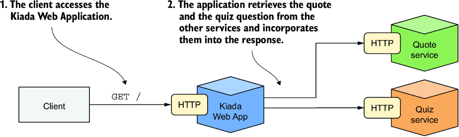

*Hình 11.1: Kiến trúc và hoạt động của bộ ứng dụng Kiada*

Service Kiada sẽ gọi hai service còn lại và tích hợp thông tin mà chúng trả về vào phản hồi gửi cho client. Mỗi service sẽ do nhiều pod replica cung cấp, vì vậy bạn cần dùng các Service object để expose chúng.

> **GHI CHÚ:** Bạn có thể tìm thấy các file mã nguồn cho chương này tại https://github.com/luksa/kubernetes-in-action-2nd-edition/tree/master/Chapter11.

Trước khi tạo các Service object, hãy triển khai các pod và các object khác bằng cách áp dụng các manifest trong thư mục `Chapter11/SETUP/` như sau:

```bash
$ kubectl apply -f SETUP/ --recursive
```

Bạn có thể nhớ từ chương trước rằng lệnh này áp dụng tất cả các manifest trong thư mục được chỉ định và các thư mục con của nó. Sau khi áp dụng các manifest này, bạn sẽ có nhiều pod trong namespace Kubernetes hiện tại của mình.

#### Tìm hiểu cách các pod giao tiếp với nhau (Understanding how pods communicate)

Trong chương 5, bạn đã học pod là gì, khi nào nên gộp nhiều container vào một pod, và các container đó giao tiếp với nhau như thế nào. Nhưng các container thuộc những pod khác nhau giao tiếp với nhau ra sao?

Mỗi pod có giao diện mạng riêng với địa chỉ IP riêng. Tất cả các pod trong cluster được kết nối bởi một mạng riêng duy nhất với không gian địa chỉ phẳng (flat). Như minh họa trong hình tiếp theo, ngay cả khi các node chứa các pod nằm phân tán về mặt địa lý với nhiều bộ định tuyến (router) mạng ở giữa, các pod vẫn có thể giao tiếp qua mạng phẳng của riêng chúng mà không cần NAT (Network Address Translation – dịch địa chỉ mạng). Mạng pod này thường là một mạng định nghĩa bằng phần mềm (software-defined network) được xếp chồng lên mạng thực tế kết nối các node.

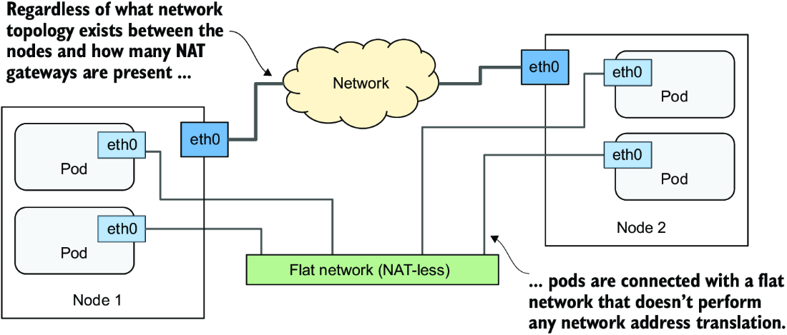

*Các pod giao tiếp với nhau qua mạng máy tính riêng của chúng.*

Khi một pod gửi gói tin mạng tới pod khác, gói tin đó không bị SNAT (Source NAT) hay DNAT (Destination NAT). Điều này có nghĩa là IP và cổng nguồn, cũng như IP và cổng đích, của các gói tin được trao đổi trực tiếp giữa các pod không bao giờ bị thay đổi. Nếu pod gửi biết địa chỉ IP của pod nhận, nó có thể gửi gói tin tới pod đó. Pod nhận thấy IP của pod gửi là địa chỉ IP nguồn của gói tin.

Mặc dù có nhiều network plugin cho Kubernetes, tất cả chúng đều phải hoạt động như mô tả ở trên. Do đó, việc giao tiếp giữa hai pod luôn giống nhau, bất kể các pod đang chạy trên cùng một node hay trên các node nằm ở những vùng địa lý khác nhau. Các container trong các pod có thể giao tiếp qua mạng phẳng không NAT, giống như các máy tính trong một mạng cục bộ (LAN) được nối với một switch mạng duy nhất. Từ góc nhìn của ứng dụng, topology mạng thực tế giữa các node không quan trọng.

---

## 11.1 Expose pod thông qua service (Exposing pods via services)

Nếu một ứng dụng chạy trong một pod cần kết nối tới ứng dụng khác chạy trong một pod khác, nó cần biết địa chỉ của pod kia. Điều này nói thì dễ hơn làm vì các lý do sau:

* Pod là phù du (ephemeral). Một pod có thể bị gỡ bỏ và thay thế bằng một pod mới bất cứ lúc nào. Điều này xảy ra khi pod bị trục xuất (evict) khỏi node để nhường chỗ cho các pod khác, khi node gặp sự cố, khi pod không còn cần thiết vì một số lượng pod replica ít hơn cũng đủ xử lý tải, và vì nhiều lý do khác nữa.
* Pod nhận địa chỉ IP khi nó được gán vào một node. Bạn không biết trước địa chỉ IP của pod, nên bạn không thể cung cấp nó cho các pod sẽ kết nối tới pod đó.
* Khi mở rộng theo chiều ngang (horizontal scaling), nhiều pod replica cùng cung cấp một service. Mỗi replica có địa chỉ IP riêng. Nếu một pod khác cần kết nối tới các replica này, nó phải có thể làm vậy bằng một IP hoặc tên DNS duy nhất trỏ tới một load balancer phân phối tải trên tất cả các replica.

Ngoài ra, một số pod cần được expose cho các client bên ngoài cluster. Cho đến nay, mỗi khi muốn kết nối tới một ứng dụng chạy trong pod, bạn đã dùng port forwarding, vốn chỉ dành cho phát triển. Cách đúng để làm cho một nhóm pod có thể truy cập được từ bên ngoài là dùng Kubernetes Service.

### 11.1.1 Giới thiệu service (Introducing services)

Một Kubernetes Service là object bạn tạo ra để cung cấp một điểm truy cập duy nhất, ổn định tới một tập hợp các pod cung cấp cùng một service. Mỗi service có một địa chỉ IP ổn định không thay đổi chừng nào service còn tồn tại. Client mở kết nối tới địa chỉ IP đó trên một trong các cổng mạng được expose, và những kết nối này sau đó được chuyển tiếp tới một trong các pod đứng sau service đó. Bằng cách này, client không cần biết địa chỉ của từng pod riêng lẻ cung cấp service, nên những pod đó có thể được mở rộng ra hay thu hẹp lại và di chuyển từ node này sang node khác trong cluster một cách tùy ý. Service đóng vai trò như một load balancer đứng trước những pod này.

#### Tìm hiểu vì sao bạn cần service (Understanding why you need services)

Bộ ứng dụng Kiada là một ví dụ tuyệt vời để giải thích về service. Nó chứa ba tập hợp pod cung cấp ba service khác nhau. Service Kiada gọi service Quote để lấy một câu trích dẫn từ cuốn sách, và gọi service Quiz để lấy một câu hỏi đố.

Tôi đã thực hiện những thay đổi cần thiết cho ứng dụng Kiada trong phiên bản 0.5. Bạn có thể tìm thấy mã nguồn đã cập nhật trong thư mục `Chapter11/` của kho mã nguồn của cuốn sách. Bạn sẽ dùng phiên bản mới này xuyên suốt chương. Bạn sẽ học cách cấu hình ứng dụng Kiada để kết nối tới hai service còn lại, và bạn sẽ làm cho nó hiển thị với thế giới bên ngoài. Vì cả số lượng pod trong mỗi service lẫn địa chỉ IP của chúng đều có thể thay đổi, bạn sẽ expose chúng thông qua các Service object, như minh họa trong hình 11.2.

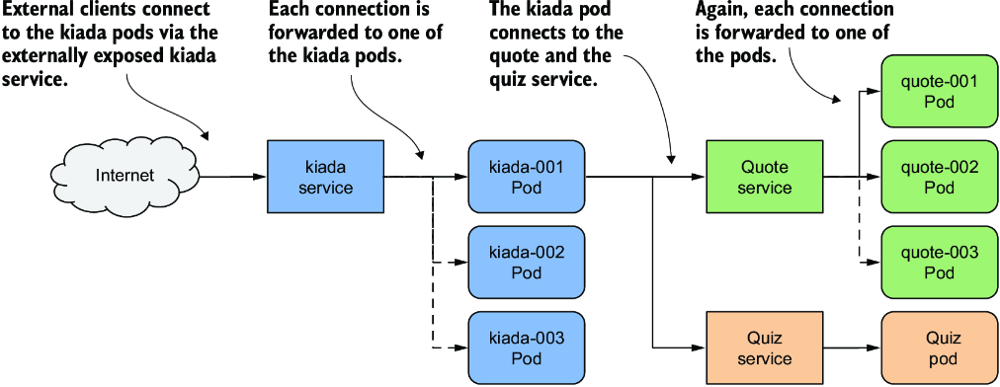

*Hình 11.2: Expose pod bằng các Service object*

Bằng cách tạo một service cho các pod Kiada và cấu hình nó để có thể truy cập được từ bên ngoài cluster, bạn tạo ra một địa chỉ IP duy nhất, cố định mà qua đó các client bên ngoài có thể kết nối tới các pod. Mỗi kết nối được chuyển tiếp tới một trong các pod Kiada. Bằng cách tạo một service cho các pod Quote, bạn tạo ra một địa chỉ IP ổn định mà qua đó các pod Kiada có thể tiếp cận các pod Quote, bất kể số lượng instance pod đứng sau service và vị trí của chúng tại bất kỳ thời điểm nào.

Mặc dù chỉ có một instance của pod Quiz, nó cũng phải được expose thông qua một service, vì địa chỉ IP của pod thay đổi mỗi khi pod bị xóa và tạo lại. Nếu không có service, bạn sẽ phải cấu hình lại các pod Kiada mỗi lần như vậy, hoặc làm cho các pod lấy IP của pod Quiz từ Kubernetes API. Nếu bạn dùng service, bạn không phải làm điều đó vì địa chỉ IP của nó không bao giờ thay đổi.

#### Tìm hiểu cách pod trở thành một phần của service (Understanding how pods become part of a service)

Một service có thể được hỗ trợ bởi nhiều hơn một pod. Khi bạn kết nối tới một service, kết nối được chuyển tới một trong các pod đứng sau. Nhưng làm thế nào để định nghĩa pod nào là một phần của service và pod nào không?

Trong chương trước, bạn đã học về label và label selector, cũng như cách chúng được dùng để tổ chức một tập hợp object thành các tập con. Service dùng cùng cơ chế đó. Như minh họa trong hình 11.3, bạn thêm label vào các Pod object và chỉ định label selector trong Service object. Các pod có label khớp với selector là một phần của service.

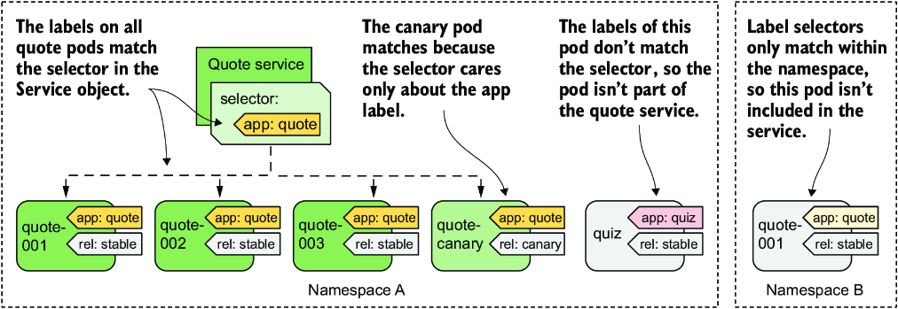

*Hình 11.3: Label selector quyết định pod nào là một phần của service.*

Label selector được định nghĩa trong service `quote` là `app=quote`, nghĩa là nó chọn tất cả các pod quote, cả instance stable lẫn canary, vì tất cả chúng đều chứa label có khóa `app` với giá trị `quote`. Các label khác trên pod không quan trọng.

### 11.1.2 Tạo và cập nhật service (Creating and updating services)

Kubernetes hỗ trợ một số kiểu service: `ClusterIP`, `NodePort`, `LoadBalancer` và `ExternalName`. Kiểu `ClusterIP`, mà bạn sẽ tìm hiểu trước tiên, chỉ được dùng nội bộ, bên trong cluster. Nếu bạn tạo một Service object mà không chỉ định kiểu, đó là kiểu service bạn nhận được. Các service cho pod Quiz và Quote thuộc kiểu này vì chúng được các pod Kiada dùng bên trong cluster. Tuy nhiên, service cho các pod Kiada còn phải truy cập được từ thế giới bên ngoài, nên kiểu `ClusterIP` là chưa đủ.

#### Tạo manifest YAML cho service (Creating a service YAML manifest)

Listing sau đây cho thấy manifest YAML tối thiểu cho Service object `quote`.

**Listing 11.1: Manifest YAML cho Service object `quote`**

```yaml
apiVersion: v1            #1
kind: Service             #1
metadata:
  name: quote             #2
spec:
  type: ClusterIP         #3
  selector:               #4
    app: quote            #4
  ports:                  #5
  - name: http            #5
    port: 80              #5
    targetPort: 80        #5
    protocol: TCP         #5
```

- **#1** Manifest này mô tả một Service object.
- **#2** Tên của service này
- **#3** Các service kiểu ClusterIP chỉ có thể truy cập được bên trong cluster.
- **#4** Label selector chỉ định pod nào là một phần của service này
- **#5** Cổng 80 của service này được ánh xạ tới cổng 80 trong các pod đứng sau service.

> **GHI CHÚ:** Vì Service object `quote` là một trong những object tạo nên ứng dụng Quote, bạn cũng có thể thêm label `app: quote` vào object này. Tuy nhiên, vì label này không bắt buộc để service hoạt động, nó được bỏ qua trong ví dụ này.

> **GHI CHÚ:** Nếu bạn tạo một service có nhiều cổng, bạn phải chỉ định tên cho mỗi cổng. Tốt nhất là làm vậy ngay cả với các service chỉ có một cổng.

> **GHI CHÚ:** Thay vì chỉ định số cổng trong trường `targetPort`, bạn cũng có thể chỉ định tên của cổng như đã định nghĩa trong danh sách cổng của container trong định nghĩa pod. Điều này cho phép service dùng đúng số cổng đích ngay cả khi các pod đứng sau service dùng những số cổng khác nhau.

Manifest này định nghĩa một Service kiểu `ClusterIP` có tên `quote`. Service chấp nhận kết nối trên cổng `80` và chuyển tiếp mỗi kết nối tới cổng `80` của một pod được chọn ngẫu nhiên trong số các pod khớp với label selector `app=quote`, như minh họa trong hình 11.4.

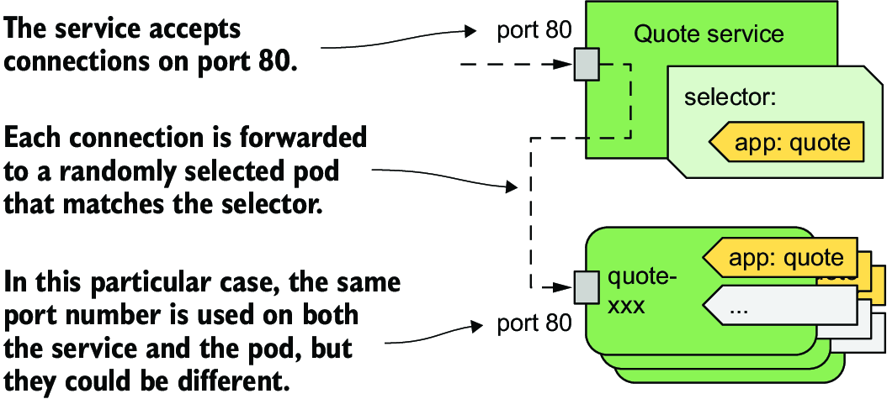

*Hình 11.4: Service quote và các pod mà nó chuyển tiếp traffic tới*

Để tạo service, hãy áp dụng file manifest vào Kubernetes API bằng `kubectl apply`.

#### Tạo service bằng kubectl expose (Creating a service with kubectl expose)

Thông thường, bạn tạo service giống như tạo các object khác, bằng cách áp dụng một object manifest với `kubectl apply`. Tuy nhiên, bạn cũng có thể tạo service bằng lệnh `kubectl expose`, như chúng ta đã làm trong chương 3.

Tạo service cho pod Quiz như sau:

```bash
$ kubectl expose pod quiz --name quiz
service/quiz exposed
```

Lệnh này tạo một service có tên `quiz` để expose pod `quiz`. Để làm điều đó, nó kiểm tra các label của pod và tạo một Service object với label selector khớp với tất cả các label của pod.

> **GHI CHÚ:** Trong chương 3, bạn đã dùng lệnh `kubectl expose` để expose một Deployment object. Trong trường hợp đó, lệnh lấy selector từ Deployment và dùng nó trong Service object để expose tất cả các pod của Deployment. Bạn sẽ tìm hiểu thêm về Deployment trong chương 15.

Giờ bạn đã tạo hai service. Mục 11.1.3 mô tả cách kết nối tới chúng, nhưng trước tiên hãy xem chúng đã được cấu hình đúng chưa.

#### Liệt kê service (Listing services)

Khi bạn tạo một service, nó được gán một địa chỉ IP nội bộ mà bất kỳ workload nào chạy trong cluster đều có thể dùng để kết nối tới các pod thuộc service đó. Đây là địa chỉ cluster IP của service. Bạn có thể xem nó bằng cách liệt kê các service với lệnh `kubectl get services`. Nếu muốn xem label selector của từng service, hãy dùng tùy chọn `-o wide` như sau:

```bash
$ kubectl get svc -o wide
NAME    TYPE        CLUSTER-IP      EXTERNAL-IP   PORT(S)    AGE   SELECTOR
quiz    ClusterIP   10.96.136.190   <none>        8080/TCP   15s   app=quiz,rel=stable
quote   ClusterIP   10.96.74.151    <none>        80/TCP     23s   app=quote
```

> **GHI CHÚ:** Tên viết tắt của services là `svc`.

Output của lệnh cho thấy hai service bạn đã tạo. Với mỗi service, kiểu, các địa chỉ IP, các cổng được expose và label selector được in ra.

> **GHI CHÚ:** Bạn cũng có thể xem chi tiết của từng service bằng lệnh `kubectl describe svc`.

Bạn sẽ nhận thấy service `quiz` dùng một label selector chọn các pod có label `app: quiz` và `rel: stable`. Đó là vì đây là các label của pod `quiz` mà từ đó service được tạo ra bằng lệnh `kubectl expose`.

Hãy suy nghĩ về điều này. Bạn có muốn service `quiz` chỉ bao gồm các pod stable không? Có lẽ là không. Có thể sau này bạn quyết định triển khai một bản phát hành canary của service quiz song song với phiên bản stable. Trong trường hợp đó, bạn muốn traffic được hướng tới cả hai pod.

Một điều nữa tôi không thích ở service `quiz` là số cổng. Vì service dùng HTTP, tôi muốn nó dùng cổng 80 thay vì 8080. May mắn thay, bạn có thể thay đổi service sau khi tạo nó.

#### Thay đổi label selector của service (Changing the service's label selector)

Để thay đổi label selector của một service, bạn có thể dùng lệnh `kubectl set selector`. Để sửa selector của service `quiz`, hãy chạy lệnh sau:

```bash
$ kubectl set selector service quiz app=quiz
service/quiz selector updated
```

Liệt kê lại các service với tùy chọn `-o wide` để xác nhận selector đã thay đổi. Phương pháp thay đổi selector này hữu ích nếu bạn đang triển khai nhiều phiên bản của một ứng dụng và muốn chuyển hướng client từ phiên bản này sang phiên bản khác.

#### Thay đổi các cổng được service expose (Changing the ports exposed by the service)

Để thay đổi các cổng mà service chuyển tiếp tới pod, bạn có thể chỉnh sửa Service object bằng lệnh `kubectl edit` hoặc cập nhật file manifest rồi áp dụng nó vào cluster. Trước khi tiếp tục, hãy chạy `kubectl edit svc quiz` và đổi cổng từ `8080` thành `80`, chú ý chỉ thay đổi trường `port` và giữ nguyên `targetPort` là `8080`, vì đây là cổng mà pod quiz lắng nghe.

#### Cấu hình các thuộc tính cơ bản của service (Configuring basic service properties)

Bảng 11.1 liệt kê các trường cơ bản mà bạn có thể đặt trong Service object. Các trường khác được giải thích xuyên suốt phần còn lại của chương này.

**Bảng 11.1: Các trường trong spec của Service object để cấu hình các thuộc tính cơ bản của service**

| Trường | Kiểu trường | Mô tả |
|---|---|---|
| `type` | string | Chỉ định kiểu của Service object này. Các giá trị cho phép là `ClusterIP`, `NodePort`, `LoadBalancer` và `ExternalName`. Giá trị mặc định là `ClusterIP`. Sự khác biệt giữa các kiểu này được giải thích trong các mục tiếp theo của chương. |
| `clusterIP` | string | Địa chỉ IP nội bộ trong cluster mà tại đó service khả dụng. Thông thường, bạn để trống trường này và để Kubernetes gán IP. Nếu bạn đặt nó thành `None`, service là một headless service. Chúng được giải thích trong mục 11.4. |
| `selector` | map[string]string | Chỉ định các khóa và giá trị label mà pod phải có để service này chuyển tiếp traffic tới nó. Nếu bạn không đặt trường này, bạn chịu trách nhiệm quản lý các endpoint của service. Điều này được giải thích trong mục 11.3. |
| `ports` | []Object | Danh sách các cổng được service này expose. Mỗi mục có thể chỉ định `name`, `protocol`, `appProtocol`, `port`, `nodePort` và `targetPort`. |

#### Hỗ trợ dual-stack IPv4/IPv6 (IPv4/IPv6 dual-stack support)

Kubernetes hỗ trợ cả IPv4 và IPv6. Khi tạo một Service object, bạn có thể chỉ định muốn service là single-stack hay dual-stack thông qua trường `ipFamilyPolicy`. Giá trị mặc định là `SingleStack`, nghĩa là chỉ một họ IP (IP family) duy nhất được gán cho service, bất kể cluster được cấu hình mạng single-stack hay dual-stack. Đặt giá trị thành `PreferDualStack` nếu bạn muốn service nhận cả hai họ IP khi cluster hỗ trợ dual-stack, và một họ IP khi cluster chỉ hỗ trợ mạng single-stack. Nếu service của bạn yêu cầu cả địa chỉ IPv4 lẫn IPv6, hãy đặt giá trị thành `RequireDualStack`. Khi đó việc tạo service chỉ thành công trên các cluster dual-stack.

Sau khi bạn tạo Service object, mảng `spec.ipFamilies` của nó cho biết những họ IP nào đã được gán cho nó. Hai giá trị hợp lệ là `IPv4` và `IPv6`. Bạn cũng có thể tự đặt trường này để chỉ định họ IP cần gán cho service trong các cluster cung cấp mạng dual-stack. `ipFamilyPolicy` phải được đặt tương ứng, nếu không việc tạo sẽ thất bại.

Với các service dual-stack, trường `spec.clusterIP` chỉ chứa một trong các địa chỉ IP, còn trường `spec.clusterIPs` chứa cả địa chỉ IPv4 lẫn IPv6. Thứ tự các IP trong trường `clusterIPs` tương ứng với thứ tự trong trường `ipFamilies`.

### 11.1.3 Truy cập các service nội bộ cluster (Accessing cluster-internal services)

Các service `ClusterIP` bạn tạo ở mục trước chỉ có thể truy cập được bên trong cluster, từ các pod khác và từ các node của cluster. Bạn không thể truy cập chúng từ máy của mình. Để kiểm tra xem một service có thực sự hoạt động hay không, bạn phải hoặc đăng nhập vào một trong các node bằng `ssh` rồi kết nối tới service từ đó, hoặc dùng lệnh `kubectl exec` để chạy một lệnh như `curl` trong một pod hiện có và làm cho nó kết nối tới service.

> **GHI CHÚ:** Bạn cũng có thể dùng lệnh `kubectl port-forward svc/my-service` để kết nối tới một trong các pod đứng sau service. Tuy nhiên, lệnh này không kết nối tới service. Nó chỉ dùng Service object để tìm một pod để kết nối. Kết nối sau đó được thực hiện trực tiếp tới pod, bỏ qua service.

#### Kết nối tới service từ pod (Connecting to services from pods)

Để dùng service từ một pod, hãy chạy một shell trong pod `quote-001` như sau:

```bash
$ kubectl exec -it quote-001 -c nginx -- sh
/ #
```

Bây giờ hãy kiểm tra xem bạn có thể truy cập hai service hay không. Hãy dùng các địa chỉ cluster IP của các service mà `kubectl get services` hiển thị. Trong trường hợp của tôi, service `quiz` dùng cluster IP `10.96.136.190`, còn service `quote` dùng IP `10.96.74.151`. Từ pod `quote-001`, tôi có thể kết nối tới hai service như sau:

```bash
/ # curl http://10.96.136.190      #1
This is the quiz service running in pod quiz

/ # curl http://10.96.74.151       #2
This is the quote service running in pod quote-canary
```

- **#1** Đây là cluster IP của service quiz, như `kubectl get services` hiển thị.
- **#2** Đây là cluster IP của service quote.

> **GHI CHÚ:** Bạn không cần chỉ định cổng trong lệnh `curl`, vì bạn đã đặt cổng của service là `80`, là cổng mặc định cho HTTP.

Nếu bạn lặp lại lệnh cuối vài lần, bạn sẽ thấy service chuyển tiếp request tới một pod khác nhau mỗi lần:

```bash
/ # while true; do curl http://10.96.74.151; done
This is the quote service running in pod quote-canary
This is the quote service running in pod quote-003
This is the quote service running in pod quote-001
...
```

Service đóng vai trò như một load balancer. Nó phân phối request tới tất cả các pod đứng sau nó.

#### Cấu hình session affinity trên service (Configuring session affinity on services)

Bạn có thể cấu hình service nên chuyển tiếp mỗi kết nối tới một pod khác nhau, hay nên chuyển tiếp tất cả các kết nối từ cùng một client tới cùng một pod. Bạn làm điều này thông qua trường `spec.sessionAffinity` trong Service object. Chỉ có hai kiểu session affinity (tính bám phiên) của service được hỗ trợ: `None` và `ClientIP`.

Kiểu mặc định là `None`, nghĩa là không có gì đảm bảo mỗi kết nối sẽ được chuyển tiếp tới pod nào. Tuy nhiên, nếu bạn đặt giá trị thành `ClientIP`, tất cả các kết nối xuất phát từ cùng một IP sẽ được chuyển tiếp tới cùng một pod. Trong trường `spec.sessionAffinityConfig.clientIP.timeoutSeconds`, bạn có thể chỉ định phiên sẽ tồn tại trong bao lâu. Giá trị mặc định là 3 giờ.

Có thể bạn sẽ ngạc nhiên khi Kubernetes không cung cấp session affinity dựa trên cookie. Tuy nhiên, xét rằng các Kubernetes service hoạt động ở tầng giao vận (transport layer) của mô hình mạng OSI (UDP và TCP) chứ không phải ở tầng ứng dụng (HTTP), chúng hoàn toàn không hiểu HTTP cookie.

#### Phân giải service thông qua DNS (Resolving services via DNS)

Các Kubernetes cluster thường chạy một máy chủ DNS nội bộ mà tất cả các pod trong cluster được cấu hình để sử dụng. Trong hầu hết các cluster, dịch vụ DNS nội bộ này do CoreDNS cung cấp, trong khi một số cluster dùng kube-dns. Bạn có thể xem cái nào được triển khai trong cluster của mình bằng cách liệt kê các pod trong namespace `kube-system`.

Bất kể implementation nào chạy trong cluster của bạn, nó cho phép các pod phân giải địa chỉ cluster IP của một service theo tên. Do đó, dùng DNS của cluster, các pod có thể kết nối tới service `quiz` như sau:

```bash
/ # curl http://quiz                   #1
This is the quiz service running in pod quiz
```

- **#1** Tên của service được dùng thay cho cluster IP của nó.

Một pod có thể phân giải bất kỳ service nào được định nghĩa trong cùng namespace với pod bằng cách đơn giản trỏ tới tên của service trong URL. Nếu một pod cần kết nối tới một service ở namespace khác, nó phải thêm namespace của Service object vào URL. Ví dụ, để kết nối tới service `quiz` trong namespace `kiada`, một pod có thể dùng URL `http://quiz.kiada/` bất kể nó ở namespace nào.

Từ pod `quote-001` nơi bạn đã chạy lệnh shell, bạn cũng có thể kết nối tới service như sau:

```bash
/ # curl http://quiz.kiada                   #1
This is the quiz service running in pod quiz
```

- **#1** Tên của service là quiz; kiada là namespace.

Một service có thể được phân giải dưới các tên DNS sau:

* `<service-name>`, nếu service ở cùng namespace với pod thực hiện tra cứu DNS,
* `<service-name>.<service-namespace>` từ bất kỳ namespace nào, nhưng cũng dưới tên
* `<service-name>.<service-namespace>.svc`, và
* `<service-name>.<service-namespace>.svc.cluster.local`.

> **GHI CHÚ:** Hậu tố miền (domain suffix) mặc định là `cluster.local` nhưng có thể được thay đổi ở cấp cluster.

Lý do bạn không cần chỉ định tên miền đầy đủ (FQDN – fully qualified domain name) khi phân giải service qua DNS là nhờ dòng `search` trong file `/etc/resolv.conf` của pod. Với pod `quote-001`, file này trông như sau:

```bash
/ # cat /etc/resolv.conf
search kiada.svc.cluster.local svc.cluster.local cluster.local localdomain
nameserver 10.96.0.10
options ndots:5
```

Khi bạn thử phân giải một service, các tên miền được chỉ định trong trường `search` được nối vào sau tên cho đến khi tìm thấy kết quả khớp. Nếu bạn thắc mắc địa chỉ IP trong dòng `nameserver` là gì, bạn có thể liệt kê tất cả các service trong cluster để tìm hiểu:

```bash
$ kubectl get svc -A
NAMESPACE     NAME         TYPE        CLUSTER-IP      EXTERNAL-IP   PORT(S)
default       kubernetes   ClusterIP   10.96.0.1       <none>        443/TCP
kiada         quiz         ClusterIP   10.96.136.190   <none>        80/TCP
kiada         quote        ClusterIP   10.96.74.151    <none>        80/TCP
kube-system   kube-dns     ClusterIP   10.96.0.10      <none>        53/UDP...   #1
```

- **#1** Đây là địa chỉ IP bạn đang tìm.

`nameserver` trong file `resolv.conf` của pod trỏ tới service `kube-dns` trong namespace `kube-system`. Đây là dịch vụ DNS của cluster mà các pod sử dụng. Như một bài tập, hãy thử tìm hiểu xem service này chuyển tiếp traffic tới (các) pod nào.

#### Cấu hình chính sách DNS của pod (Configuring the pod's DNS policy)

Việc pod có dùng máy chủ DNS nội bộ hay không có thể được cấu hình bằng trường `dnsPolicy` trong spec của pod. Giá trị mặc định là `ClusterFirst`, nghĩa là pod dùng DNS nội bộ trước, rồi mới đến DNS được cấu hình cho node của cluster. Các giá trị hợp lệ khác là `Default` (dùng DNS được cấu hình cho node), `None` (Kubernetes không cung cấp cấu hình DNS nào; bạn phải cấu hình các thiết lập DNS của pod bằng trường `dnsConfig` được giải thích trong đoạn tiếp theo), và `ClusterFirstWithHostNet` (dành cho các pod đặc biệt dùng mạng của host thay vì mạng riêng của chúng, sẽ được giải thích ở phần sau của cuốn sách).

Việc đặt trường `dnsPolicy` ảnh hưởng đến cách Kubernetes cấu hình file `resolv.conf` của pod. Bạn có thể tùy chỉnh thêm file này thông qua trường `dnsConfig` của pod. File `pod-with-dns-options.yaml` trong kho mã nguồn của cuốn sách minh họa cách dùng trường này.

#### Khám phá service thông qua biến môi trường (Discovering services through environment variables)

Ngày nay, hầu như mọi Kubernetes cluster đều cung cấp dịch vụ DNS của cluster. Trong những ngày đầu, điều này không phải lúc nào cũng đúng. Khi đó, các pod tìm địa chỉ IP của các service bằng biến môi trường. Những biến này vẫn tồn tại cho đến ngày nay.

Khi một container được khởi động, Kubernetes khởi tạo một tập hợp biến môi trường cho mỗi service tồn tại trong namespace của pod. Hãy xem các biến môi trường này trông như thế nào bằng cách khám phá môi trường của một trong các pod đang chạy của bạn. Vì bạn đã tạo các pod trước khi tạo các service, bạn sẽ không thấy biến môi trường nào liên quan đến các service, ngoại trừ các biến cho service `kubernetes`, vốn tồn tại trong namespace `default`.

> **GHI CHÚ:** Service `kubernetes` chuyển tiếp traffic tới Kubernetes API server.

Để xem các biến môi trường cho hai service bạn đã tạo, bạn phải khởi động lại container như sau:

```bash
$ kubectl exec quote-001 -c nginx -- kill 1
```

Khi container được khởi động lại, các biến môi trường của nó chứa các mục cho service `quiz` và `quote`. Hiển thị chúng bằng lệnh sau:

```bash
$ kubectl exec -it quote-001 -c nginx -- env | sort
...
QUIZ_PORT_80_TCP_ADDR=10.96.136.190        #1
QUIZ_PORT_80_TCP_PORT=80                   #1
QUIZ_PORT_80_TCP_PROTO=tcp                 #1
QUIZ_PORT_80_TCP=tcp://10.96.136.190:80    #1
QUIZ_PORT=tcp://10.96.136.190:80           #1
QUIZ_SERVICE_HOST=10.96.136.190            #1
QUIZ_SERVICE_PORT=80                       #1
QUOTE_PORT_80_TCP_ADDR=10.96.74.151        #2
QUOTE_PORT_80_TCP_PORT=80                  #2
QUOTE_PORT_80_TCP_PROTO=tcp                #2
QUOTE_PORT_80_TCP=tcp://10.96.74.151:80    #2
QUOTE_PORT=tcp://10.96.74.151:80           #2
QUOTE_SERVICE_HOST=10.96.74.151            #2
QUOTE_SERVICE_PORT=80                      #2
```

- **#1** Các biến môi trường mô tả service quiz
- **#2** Các biến môi trường mô tả service quote

Khá nhiều biến môi trường, phải không? Với các service có nhiều cổng, số lượng biến còn lớn hơn nữa. Một ứng dụng chạy trong container có thể dùng các biến này để tìm địa chỉ IP và (các) cổng của một service cụ thể.

> **GHI CHÚ:** Trong tên các biến môi trường, dấu gạch nối trong tên service được chuyển thành dấu gạch dưới và tất cả các chữ cái được viết hoa.

Ngày nay, các ứng dụng thường lấy thông tin này qua DNS, nên các biến môi trường này không còn hữu ích như thời kỳ đầu. Chúng thậm chí có thể gây ra vấn đề. Nếu số lượng service trong một namespace quá lớn, bất kỳ pod nào bạn tạo trong namespace đó sẽ không khởi động được. Container thoát với exit code 1, và bạn thấy thông báo lỗi sau trong log của container:

```text
standard_init_linux.go:228: exec user process caused: argument list too long
```

Để ngăn điều này, bạn có thể tắt việc tiêm thông tin service vào môi trường bằng cách đặt trường `enableServiceLinks` trong spec của pod thành `false`.

#### Tìm hiểu vì sao bạn không thể ping IP của service (Understanding why you can't ping a service IP)

Bạn đã học cách xác minh rằng một service đang chuyển tiếp traffic tới các pod của bạn. Nhưng nếu nó không làm vậy thì sao? Trong trường hợp đó, bạn có thể muốn thử ping IP của service. Sao bạn không thử ngay bây giờ? Hãy ping service `quiz` từ pod `quote-001` như sau:

```bash
$ kubectl exec -it quote-001 -c nginx -- ping quiz
PING quiz (10.96.136.190): 56 data bytes
^C
--- quiz ping statistics ---
15 packets transmitted, 0 packets received, 100% packet loss
command terminated with exit code 1
```

Đợi vài giây rồi ngắt tiến trình bằng cách nhấn Ctrl-C. Như bạn thấy, địa chỉ IP đã được phân giải đúng, nhưng không gói tin nào đi qua được. Đó là vì địa chỉ IP của service là ảo và chỉ có ý nghĩa khi đi kèm với một trong các cổng được định nghĩa trong service. Bạn không thể ping địa chỉ IP của một service.

#### Sử dụng service trong pod (Using services in a pod)

Giờ bạn đã biết các service Quiz và Quote có thể truy cập được từ các pod, bạn có thể triển khai các pod Kiada và cấu hình chúng để dùng hai service này. Ứng dụng mong đợi URL của các service này trong các biến môi trường `QUIZ_URL` và `QUOTE_URL`. Đây không phải là các biến môi trường mà Kubernetes tự thêm vào, mà là các biến bạn đặt thủ công để ứng dụng biết tìm hai service ở đâu. Do đó, trường `env` của container `kiada` phải được cấu hình như trong listing sau.

**Listing 11.2: Cấu hình URL của các service trong pod Kiada**

```yaml
...
    env:
    - name: QUOTE_URL              #1
      value: http://quote/quote    #1
    - name: QUIZ_URL               #2
      value: http://quiz           #2
    - name: POD_NAME
      ....
```

- **#1** URL mà tại đó service Quote trả về một câu trích dẫn từ cuốn sách
- **#2** URL cơ sở của service Quiz

Biến môi trường `QUOTE_URL` được đặt thành `http://quote/quote`. Hostname chính là tên của service bạn đã tạo trong mục trước. Tương tự, `QUIZ_URL` được đặt thành `http://quiz`, trong đó `quiz` là tên của service còn lại mà bạn đã tạo.

Triển khai các pod Kiada bằng cách áp dụng file manifest `kiada-stable-and-canary.yaml` vào cluster với `kubectl apply`. Sau đó chạy lệnh sau để mở một đường hầm (tunnel) tới một trong các pod bạn vừa tạo:

```bash
$ kubectl port-forward kiada-001 8080 8443
```

Giờ bạn có thể thử ứng dụng tại `http://localhost:8080` hoặc `https://localhost:8443`. Nếu dùng `curl`, bạn sẽ thấy phản hồi như sau:

```bash
$ curl http://localhost:8080
==== TIP OF THE MINUTE
Kubectl options that take a value can be specified with an equal sign or with a space.

==== POP QUIZ
First question
0) First answer
1) Second answer
2) Third answer

Submit your answer to /question/1/answers/<index of answer> using the POST method.

==== REQUEST INFO
Request processed by Kubia 1.0 running in pod "kiada-001" on node "kind-worker2".
Pod hostname: kiada-001; Pod IP: 10.244.1.90; Node IP: 172.18.0.2; Client IP: ::ffff:127.0.0.1

HTML version of this content is available at /html
```

Nếu bạn mở URL trong trình duyệt web, bạn sẽ thấy trang web như trong hình 11.5.

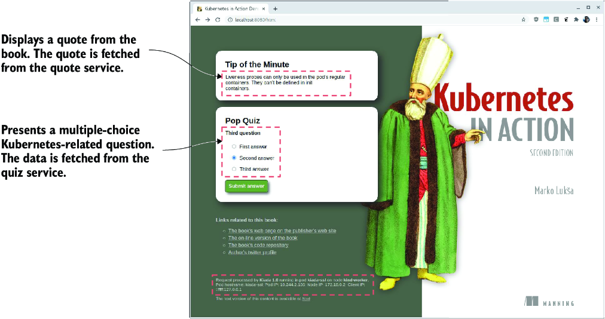

*Hình 11.5: Ứng dụng Kiada khi được truy cập bằng trình duyệt web*

Nếu bạn thấy được câu trích dẫn và câu hỏi đố, điều đó có nghĩa là pod `kiada-001` có thể giao tiếp với các service `quote` và `quiz`. Nếu bạn kiểm tra log của các pod đứng sau các service này, bạn sẽ thấy chúng đang nhận request. Trong trường hợp service `quote`, vốn được nhiều pod hỗ trợ, bạn sẽ thấy mỗi request được gửi tới một pod khác nhau.

---

## 11.2 Expose service ra bên ngoài (Exposing services externally)

Các service `ClusterIP` như những service bạn đã tạo ở mục trước chỉ có thể truy cập được bên trong cluster. Vì các client phải có thể truy cập service Kiada từ bên ngoài cluster, như minh họa trong hình 11.6, việc tạo một service `ClusterIP` là không đủ.

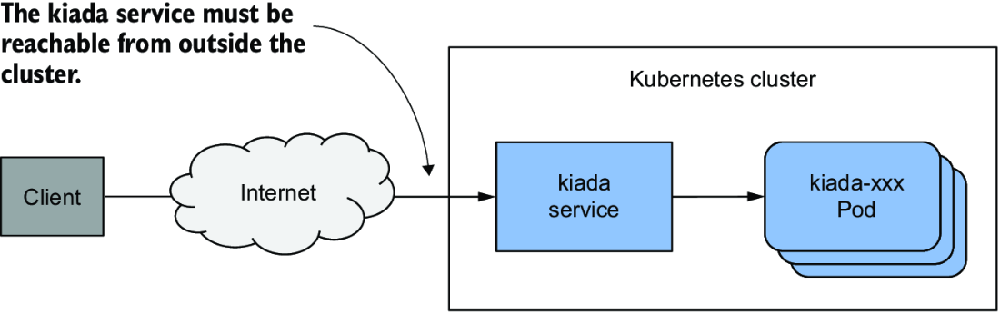

*Hình 11.6: Expose một service ra bên ngoài*

Nếu bạn cần làm cho một service khả dụng với thế giới bên ngoài, bạn có thể làm một trong những việc sau:

* Gán thêm một IP cho một node và đặt nó làm một trong các `externalIPs` của service
* Đặt `type` của service thành `NodePort` và truy cập service qua (các) cổng của node
* Yêu cầu Kubernetes cấp phát (provision) một load balancer bằng cách đặt `type` thành `LoadBalancer`
* Expose service thông qua một Ingress object

Một phương pháp hiếm khi được dùng là chỉ định thêm một IP trong trường `spec.externalIPs` của Service object. Bằng cách này, bạn đang bảo Kubernetes coi mọi traffic hướng tới địa chỉ IP đó là traffic cần được service xử lý. Khi bạn đảm bảo traffic này đến được một node với IP bên ngoài của service là đích đến, Kubernetes sẽ chuyển tiếp nó tới một trong các pod đứng sau service.

Một cách phổ biến hơn để làm cho service khả dụng từ bên ngoài là đặt `type` của nó thành `NodePort`. Kubernetes làm cho service khả dụng trên một cổng mạng trên tất cả các node của cluster (gọi là node port, và kiểu service này lấy tên từ đó). Giống như các service `ClusterIP`, service nhận một cluster IP nội bộ, nhưng nó cũng có thể truy cập được qua node port trên từng node của cluster. Thông thường, sau đó bạn cấp phát một load balancer bên ngoài để chuyển hướng traffic tới các node port này. Các client có thể kết nối tới service của bạn qua địa chỉ IP của load balancer.

Thay vì dùng service `NodePort` và tự thiết lập load balancer, Kubernetes cũng có thể làm việc này cho bạn nếu bạn đặt kiểu service thành `LoadBalancer`. Tuy nhiên, không phải cluster nào cũng hỗ trợ kiểu service này, vì việc cấp phát load balancer phụ thuộc vào hạ tầng mà cluster đang chạy trên đó. Hầu hết các nhà cung cấp cloud hỗ trợ service `LoadBalancer` trong cluster của họ, trong khi các cluster được triển khai on-premises cần một add-on như MetalLB, một implementation load balancer cho các Kubernetes cluster bare-metal.

Cách cuối cùng để expose một nhóm pod ra bên ngoài thì khác biệt hoàn toàn. Thay vì expose service ra bên ngoài qua node port và load balancer, bạn có thể dùng một Ingress object. Cách object này expose service phụ thuộc vào ingress controller bên dưới, nhưng nó cho phép bạn expose nhiều service qua một địa chỉ IP duy nhất có thể truy cập từ bên ngoài. Bạn sẽ tìm hiểu thêm về điều này trong chương tiếp theo.

### 11.2.1 Expose pod thông qua service NodePort (Exposing pods through a NodePort service)

Một cách để làm cho các pod có thể truy cập được bởi các client bên ngoài là expose chúng thông qua một service `NodePort`. Khi bạn tạo một service như vậy, các pod khớp với selector của nó có thể được truy cập qua một cổng cụ thể trên tất cả các node trong cluster, như minh họa trong hình 11.7. Vì cổng này được mở trên các node, nó được gọi là node port.

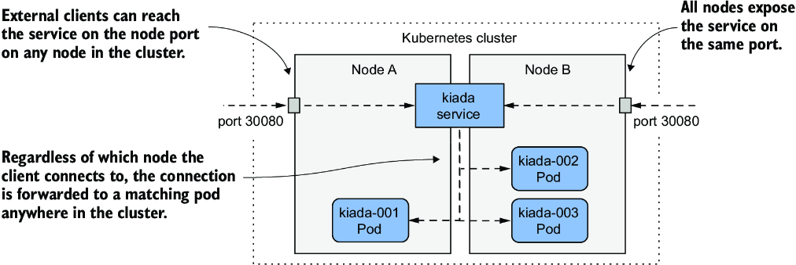

*Hình 11.7: Expose pod thông qua một service NodePort*

Giống như service `ClusterIP`, service `NodePort` có thể truy cập được qua cluster IP nội bộ của nó, nhưng cũng qua node port trên mỗi node của cluster. Trong ví dụ ở hình, các pod có thể truy cập được qua cổng `30080`. Như bạn thấy, cổng này được mở trên cả hai node của cluster.

Client kết nối tới node nào không quan trọng, vì tất cả các node sẽ chuyển tiếp kết nối tới một pod thuộc service, bất kể node nào đang chạy pod đó. Khi client kết nối tới node A, một pod trên node A hoặc B đều có thể nhận kết nối. Điều tương tự cũng đúng khi client kết nối tới cổng trên node B.

#### Tạo service NodePort (Creating a NodePort service)

Để expose các pod Kiada thông qua một service `NodePort`, bạn tạo service từ manifest trong listing sau. Bạn có thể tìm thấy nó trong file `svc.kiada.nodeport.yaml`.

**Listing 11.3: Một service NodePort expose các pod Kiada trên hai cổng**

```yaml
apiVersion: v1
kind: Service
metadata:
  name: kiada
spec:
  type: NodePort          #1
  selector:
    app: kiada
  ports:
  - name: http            #2
    port: 80              #3
    nodePort: 30080       #4
    targetPort: 8080      #5
  - name: https           #6
    port: 443             #6
    nodePort: 30443       #6
    targetPort: 8443      #6
```

- **#1** Kiểu service là NodePort.
- **#2** Service expose hai cổng. Đây là cổng HTTP.
- **#3** Cổng trên cluster IP của service.
- **#4** Service có thể truy cập được qua cổng 30080 của từng node trong cluster của bạn.
- **#5** Đây là cổng mà các pod lắng nghe.
- **#6** Service expose thêm một cổng nữa cho HTTPS.

So với các service `ClusterIP` bạn đã tạo trước đó, kiểu service trong listing là `NodePort`. Không giống các service trước, service này expose hai cổng và định nghĩa số `nodePort` cho từng cổng đó.

> **GHI CHÚ:** Bạn có thể bỏ qua trường `nodePort` để Kubernetes tự gán số cổng. Điều này ngăn xung đột cổng giữa các service NodePort khác nhau.

Service chỉ định sáu số cổng khác nhau, điều này có thể gây khó hiểu, nhưng hình 11.8 sẽ giúp bạn hiểu rõ.

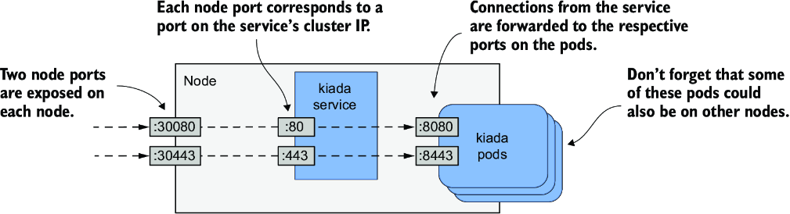

*Hình 11.8: Expose nhiều cổng thông qua một service NodePort*

#### Xem xét service NodePort của bạn (Examining your NodePort service)

Sau khi tạo service, hãy kiểm tra nó bằng lệnh `kubectl get` như sau:

```bash
$ kubectl get svc
NAME    TYPE        CLUSTER-IP      EXTERNAL-IP   PORT(S)                      AGE
kiada   NodePort    10.96.226.212   <none>        80:30080/TCP,443:30443/TCP   1m   #1
quiz    ClusterIP   10.96.173.186   <none>        80/TCP                       3h
quote   ClusterIP   10.96.161.97    <none>        80/TCP                       3h
```

- **#1** Đây là service bạn vừa tạo.

Hãy so sánh cột `TYPE` và `PORT(S)` của các service bạn đã tạo cho đến giờ. Không giống hai service `ClusterIP`, service `kiada` là service `NodePort` expose các node port `30080` và `30443` bên cạnh các cổng `80` và `443` khả dụng trên cluster IP của service.

#### Truy cập service NodePort (Accessing a NodePort service)

Để tìm ra tất cả các tổ hợp `IP:port` mà qua đó service khả dụng, bạn không chỉ cần (các) số node port mà còn cần IP của các node. Bạn có thể lấy chúng bằng cách chạy `kubectl get nodes -o wide` và xem các cột `INTERNAL-IP` và `EXTERNAL-IP`. Các cluster chạy trên cloud thường có IP bên ngoài được đặt cho các node, trong khi các cluster chạy trên bare metal có thể chỉ đặt IP nội bộ của các node. Bạn sẽ có thể truy cập các node port bằng những IP này, nếu không có firewall nào cản trở.

> **GHI CHÚ:** Để cho phép traffic tới các node port khi dùng GKE, hãy chạy `gcloud compute firewall-rules create gke-allow-nodeports --allow=tcp:30000-32767`. Nếu cluster của bạn chạy trên nhà cung cấp cloud khác, hãy xem tài liệu của nhà cung cấp về cách cấu hình firewall để cho phép truy cập các node port.

Trong cluster tôi cấp phát bằng công cụ kind, IP nội bộ của các node như sau:

```bash
$ kubectl get nodes -o wide
NAME                 STATUS   ROLES                  ...   INTERNAL-IP   EXTERNAL-IP
kind-control-plane   Ready    control-plane,master   ...   172.18.0.3    <none>
kind-worker          Ready    <none>                 ...   172.18.0.4    <none>
kind-worker2         Ready    <none>                 ...   172.18.0.2    <none>
```

Service `kiada` khả dụng trên tất cả các IP này, kể cả IP của node đang chạy Kubernetes control plane. Tôi có thể truy cập service tại bất kỳ URL nào sau đây:

* `10.96.226.212:80` từ bên trong cluster (đây là cluster IP và cổng nội bộ).
* `172.18.0.3:30080` từ bất cứ đâu có thể tiếp cận node `kind-control-plane`, vì đây là địa chỉ IP của node; cổng là một trong các node port của service `kiada`.
* `172.18.0.4:30080` (địa chỉ IP của node thứ hai và node port).
* `172.18.0.2:30080` (địa chỉ IP của node thứ ba và node port).

> **GHI CHÚ:** Trên macOS, (các) node của cluster có thể không truy cập được từ hệ điều hành host. Hãy tham khảo tài liệu của công cụ bạn đã dùng để triển khai Kubernetes cluster để xem có cách khắc phục hay không.

> **MẸO:** Nếu bạn không thể truy cập service qua các node port, hãy kiểm tra xem có thể truy cập nó qua cluster IP nội bộ từ bên trong cluster hay không, như đã mô tả trước đó.

Service cũng có thể truy cập được qua HTTPS trên cổng `443` bên trong cluster và qua node port `30443`. Nếu các node của tôi cũng có IP bên ngoài, service cũng sẽ khả dụng qua hai node port trên những IP đó. Nếu bạn đang dùng Minikube hoặc một cluster đơn node khác, bạn nên dùng IP của node đó.

> **MẸO:** Nếu bạn đang dùng Minikube, bạn có thể dễ dàng truy cập các service NodePort của mình qua trình duyệt bằng cách chạy `minikube service <service-name> [-n <namespace>]`.

Hãy dùng `curl` hoặc trình duyệt web để truy cập service. Chọn một trong các node và tìm địa chỉ IP của nó. Gửi HTTP request tới cổng `30080` của IP này. Kiểm tra phần cuối của phản hồi để xem pod nào đã xử lý request và pod đó đang chạy trên node nào. Ví dụ, đây là phản hồi tôi nhận được cho một trong các request của mình:

```bash
$ curl 172.18.0.4:30080
...
==== REQUEST INFO
Request processed by Kubia 1.0 running in pod "kiada-001" on node "kind-worker2".
Pod hostname: kiada-001; Pod IP: 10.244.1.90; Node IP: 172.18.0.2; Client IP: ::ffff:...
```

Lưu ý rằng tôi đã gửi request tới `172.18.0.4`, là IP của node `kind-worker`, nhưng pod xử lý request lại đang chạy trên node `kind-worker2`. Node thứ nhất đã chuyển tiếp kết nối tới node thứ hai, như đã giải thích trong phần giới thiệu về service NodePort.

Bạn có để ý pod nghĩ request đến từ đâu không? Hãy nhìn vào `Client IP` ở cuối phản hồi. Đó không phải là IP của máy tính mà tôi gửi request từ đó. Bạn có thể đã nhận ra đó là IP của node mà tôi gửi request tới. Tôi sẽ giải thích vì sao điều này xảy ra và cách bạn có thể ngăn nó trong mục 11.2.3.

Hãy thử gửi request tới các node khác nữa. Bạn sẽ thấy tất cả chúng đều chuyển tiếp request tới một pod Kiada ngẫu nhiên. Nếu các node của bạn có thể truy cập được từ internet, ứng dụng giờ đã khả dụng với người dùng trên toàn thế giới. Bạn có thể dùng round robin DNS để phân phối các kết nối đến trên các node, hoặc đặt một load balancer Layer 4 thực thụ trước các node và trỏ client tới nó. Hoặc bạn có thể để Kubernetes làm việc này, như giải thích trong mục tiếp theo.

### 11.2.2 Expose service thông qua load balancer bên ngoài (Exposing a service through an external load balancer)

Trong mục trước, bạn đã tạo một service kiểu `NodePort`. Một kiểu service khác là `LoadBalancer`. Như tên gọi gợi ý, kiểu service này làm cho ứng dụng của bạn có thể truy cập được qua một load balancer. Mặc dù mọi service đều đóng vai trò load balancer, việc tạo một service `LoadBalancer` khiến một load balancer thực sự được cấp phát.

Như minh họa trong hình 11.9, load balancer này đứng trước các node và xử lý các kết nối đến từ client. Nó định tuyến mỗi kết nối tới service bằng cách chuyển tiếp nó tới node port trên một trong các node. Điều này khả thi vì kiểu service `LoadBalancer` là phần mở rộng của kiểu `NodePort`, khiến service có thể truy cập được qua các node port này. Bằng cách trỏ client tới load balancer thay vì trực tiếp tới node port của một node cụ thể, client không bao giờ cố kết nối tới một node không khả dụng, vì load balancer chỉ chuyển tiếp traffic tới các node khỏe mạnh. Ngoài ra, load balancer đảm bảo các kết nối được phân phối đồng đều trên tất cả các node trong cluster.

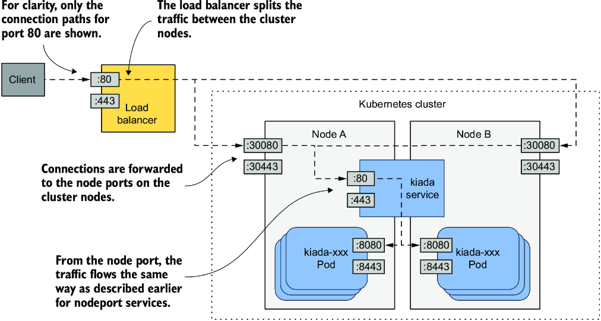

*Hình 11.9: Expose một service LoadBalancer*

Không phải Kubernetes cluster nào cũng hỗ trợ kiểu service này, nhưng nếu cluster của bạn chạy trên cloud thì gần như chắc chắn là có. Nếu cluster của bạn chạy on-premises, nó sẽ hỗ trợ service `LoadBalancer` nếu bạn cài đặt một add-on. Nếu cluster không hỗ trợ kiểu service này, bạn vẫn có thể tạo các service kiểu này, nhưng service chỉ có thể truy cập được qua các node port của nó.

#### Tạo service LoadBalancer (Creating a LoadBalancer service)

Listing sau đây cho thấy manifest YAML của một service kiểu `LoadBalancer` mà bạn có thể tìm thấy trong file `svc.kiada.loadbalancer.yaml`.

**Listing 11.4: Một service kiểu LoadBalancer**

```yaml
apiVersion: v1
kind: Service
metadata:
  name: kiada
spec:
  type: LoadBalancer      #1
  selector:
    app: kiada
  ports:
  - name: http
    port: 80
    nodePort: 30080
    targetPort: 8080
  - name: https
    port: 443
    nodePort: 30443
    targetPort: 8443
```

- **#1** Kubernetes sẽ cấp phát một load balancer cho service này.

Manifest này chỉ khác manifest của service `NodePort` bạn đã triển khai trước đó ở một dòng duy nhất – dòng chỉ định `type` của service. Selector và các cổng vẫn giống như trước. Các node port chỉ được chỉ định để chúng không bị Kubernetes chọn ngẫu nhiên. Nếu bạn không quan tâm đến số node port, bạn có thể bỏ qua các trường `nodePort`.

Áp dụng manifest bằng `kubectl apply`. Bạn không cần xóa service `kiada` hiện có trước. Cách này đảm bảo cluster IP nội bộ của service không thay đổi.

#### Kết nối tới service thông qua load balancer (Connecting to the service through the load balancer)

Sau khi bạn tạo service, có thể mất vài phút để hạ tầng cloud tạo load balancer và cập nhật địa chỉ IP của nó vào Service object. Địa chỉ IP này sau đó sẽ xuất hiện như địa chỉ IP bên ngoài của service:

```bash
$ kubectl get svc kiada
NAME    TYPE           CLUSTER-IP      EXTERNAL-IP      PORT(S)                      AGE
kiada   LoadBalancer   10.96.226.212   172.18.255.200   80:30080/TCP,443:30443/TCP   10m
```

Trong trường hợp của tôi, địa chỉ IP của load balancer là `172.18.255.200`, và tôi có thể tiếp cận service qua cổng `80` và `443` của IP này. Cho đến khi load balancer được tạo, `<pending>` được hiển thị trong cột `EXTERNAL-IP` thay vì địa chỉ IP. Điều này có thể do quá trình cấp phát chưa hoàn tất hoặc do cluster không hỗ trợ service `LoadBalancer`.

> **GHI CHÚ:** Nếu cluster của bạn chạy trong một VM, như thường thấy trên macOS, IP của load balancer có thể không truy cập được từ hệ điều hành host mà chỉ từ bên trong VM. Hãy tham khảo tài liệu của công cụ bạn đã dùng để triển khai cluster để tìm hiểu có cách nào truy cập IP từ host hay không. Hoặc bạn có thể thử truy cập IP từ bên trong VM.

#### Thêm hỗ trợ service LoadBalancer bằng MetalLB (Adding support for LoadBalancer services with MetalLB)

Nếu cluster của bạn chạy trên bare metal, bạn có thể cài đặt MetalLB để hỗ trợ service `LoadBalancer`. Bạn có thể tìm thấy nó tại metallb.universe.tf. Nếu bạn tạo cluster bằng công cụ kind, bạn có thể cài đặt MetalLB bằng script `install-metallb-kind.sh` từ kho mã nguồn của cuốn sách. Nếu bạn tạo cluster bằng công cụ khác, bạn có thể xem tài liệu của MetalLB về cách cài đặt.

Việc thêm hỗ trợ cho service LoadBalancer là tùy chọn. Bạn luôn có thể dùng trực tiếp các node port. Load balancer chỉ là một lớp bổ sung.

#### Tinh chỉnh service LoadBalancer (Tweaking LoadBalancer services)

Service LoadBalancer rất dễ tạo. Bạn chỉ cần đặt `type` thành `LoadBalancer`. Tuy nhiên, nếu bạn cần kiểm soát load balancer nhiều hơn, bạn có thể cấu hình nó bằng các trường bổ sung trong spec của Service object được giải thích trong bảng 11.2.

**Bảng 11.2: Các trường trong spec của service mà bạn có thể dùng để cấu hình service LoadBalancer**

| Trường | Kiểu trường | Mô tả |
|---|---|---|
| `loadBalancerClass` | string | Nếu cluster hỗ trợ nhiều lớp (class) load balancer, bạn có thể chỉ định lớp nào sẽ dùng cho service này. Các giá trị có thể phụ thuộc vào các load balancer controller được cài đặt trong cluster. |
| `loadBalancerIP` | string | Nếu được nhà cung cấp cloud hỗ trợ, trường này có thể được dùng để chỉ định IP mong muốn cho load balancer. |
| `loadBalancerSourceRanges` | []string | Hạn chế các IP client được phép truy cập service qua load balancer. Không phải load balancer controller nào cũng hỗ trợ trường này. |
| `allocateLoadBalancerNodePorts` | boolean | Chỉ định có cấp phát node port cho service kiểu LoadBalancer này hay không. Một số implementation load balancer có thể chuyển tiếp traffic tới pod mà không cần dựa vào node port. |

### 11.2.3 Cấu hình chính sách traffic bên ngoài cho service (Configuring the external traffic policy for a service)

Bạn đã học rằng khi một client bên ngoài kết nối tới service qua node port, dù trực tiếp hay qua load balancer, kết nối có thể được chuyển tiếp tới một pod nằm trên node khác với node đã nhận kết nối. Trong trường hợp này, cần thêm một bước nhảy mạng (network hop) để tới được pod, dẫn đến độ trễ tăng lên.

Ngoài ra, như đã đề cập trước đó, khi chuyển tiếp kết nối từ node này sang node khác theo cách này, IP nguồn phải được thay bằng IP của node đã nhận kết nối ban đầu. Điều này che khuất địa chỉ IP của client. Vì vậy, ứng dụng chạy trong pod không thể biết kết nối đến từ đâu. Ví dụ, một máy chủ web chạy trong pod không thể ghi lại IP thực của client vào access log của nó.

Lý do node cần thay đổi IP nguồn là để đảm bảo các gói tin trả về được gửi lại node đã nhận kết nối ban đầu, để node đó có thể trả chúng về cho client.

#### Ưu và nhược điểm của chính sách traffic bên ngoài Local (Pros and cons of the Local external traffic policy)

Cả vấn đề bước nhảy mạng bổ sung lẫn vấn đề che khuất IP nguồn đều có thể được giải quyết bằng cách ngăn các node chuyển tiếp traffic tới các pod không chạy trên cùng node. Điều này được thực hiện bằng cách đặt trường `externalTrafficPolicy` trong trường `spec` của Service object thành `Local`. Bằng cách này, node chỉ chuyển tiếp traffic bên ngoài tới các pod đang chạy trên node đã nhận kết nối.

Tuy nhiên, việc đặt chính sách traffic bên ngoài thành `Local` dẫn đến những vấn đề khác. Thứ nhất, nếu không có pod cục bộ nào trên node đã nhận kết nối, kết nối sẽ bị treo. Do đó bạn phải đảm bảo load balancer chỉ chuyển tiếp kết nối tới các node có ít nhất một pod như vậy. Điều này được thực hiện bằng trường `healthCheckNodePort`. Load balancer bên ngoài dùng node port này để kiểm tra xem một node có chứa endpoint cho service hay không. Cách tiếp cận này cho phép load balancer chỉ chuyển tiếp traffic tới các node có pod như vậy.

Vấn đề thứ hai bạn gặp phải khi chính sách traffic bên ngoài được đặt thành `Local` là sự phân phối traffic không đồng đều giữa các pod. Nếu load balancer phân phối traffic đồng đều giữa các node, nhưng mỗi node chạy số lượng pod khác nhau, thì các pod trên những node có ít pod hơn sẽ nhận lượng traffic cao hơn.

#### So sánh chính sách traffic bên ngoài Cluster và Local (Comparing the Cluster and the Local external traffic policies)

Hãy xét trường hợp được trình bày trong hình 11.10. Có một pod chạy trên node A và hai pod trên node B. Load balancer định tuyến một nửa traffic tới node A và nửa còn lại tới node B.

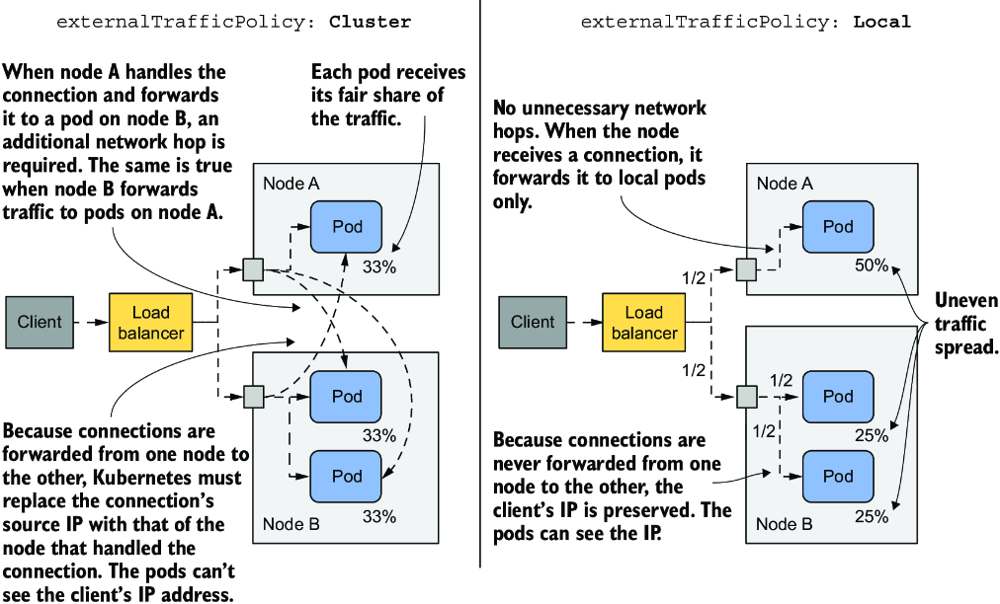

*Hình 11.10: Tìm hiểu hai chính sách traffic bên ngoài cho service NodePort và LoadBalancer*

Khi `externalTrafficPolicy` được đặt thành `Cluster`, mỗi node chuyển tiếp traffic tới tất cả các pod trong hệ thống. Traffic được chia đều giữa các pod. Cần thêm các bước nhảy mạng, và IP của client bị che khuất.

Khi `externalTrafficPolicy` được đặt thành `Local`, tất cả traffic đến node A được chuyển tiếp tới pod duy nhất trên node đó. Điều này có nghĩa là pod này nhận 50% tổng traffic. Traffic đến node B được chia giữa hai pod. Mỗi pod nhận 25% tổng traffic mà load balancer xử lý. Không có bước nhảy mạng không cần thiết, và IP nguồn là IP của client.

Như với hầu hết các quyết định bạn đưa ra với tư cách kỹ sư, việc dùng chính sách traffic bên ngoài nào cho từng service phụ thuộc vào những đánh đổi mà bạn sẵn sàng chấp nhận.

---

## 11.3 Quản lý các endpoint của service (Managing service endpoints)

Cho đến giờ, bạn đã học rằng service được hỗ trợ bởi các pod, nhưng không phải lúc nào cũng vậy. Các endpoint mà service chuyển tiếp traffic tới có thể là bất cứ thứ gì có địa chỉ IP.

### 11.3.1 Giới thiệu Endpoints object (Introducing the Endpoints object)

Một service thường được hỗ trợ bởi một tập hợp pod có label khớp với label selector được định nghĩa trong Service object. Ngoài label selector, phần `spec` hay `status` của Service object không chứa danh sách các pod thuộc service. Tuy nhiên, nếu bạn dùng `kubectl describe` để kiểm tra service, bạn sẽ thấy IP của các pod dưới mục `Endpoints`, như sau:

```bash
$ kubectl describe svc kiada
Name:                     kiada
...
Port:                     http  80/TCP
TargetPort:               8080/TCP
NodePort:                 http  30080/TCP
Endpoints:                10.244.1.7:8080,10.244.1.8:8080,10.244.1.9:8080 + 1 more...   #1
...
```

- **#1** Danh sách các endpoint (IP và cổng của pod) cho service này

Lệnh `kubectl describe` thu thập dữ liệu này không phải từ Service object, mà từ một Endpoints object có tên khớp với tên của service. Các endpoint của service `kiada` được chỉ định trong Endpoints object `kiada`.

#### Liệt kê Endpoints object (Listing Endpoints objects)

Bạn có thể truy xuất các Endpoints object trong namespace hiện tại như sau:

```bash
$ kubectl get endpoints
NAME    ENDPOINTS                                                     AGE
kiada   10.244.1.7:8443,10.244.1.8:8443,10.244.1.9:8443 + 5 more...   25m
quiz    10.244.1.11:8080                                              66m
quote   10.244.1.10:80,10.244.2.10:80,10.244.2.8:80 + 1 more...       66m
```

> **GHI CHÚ:** Tên viết tắt của endpoints là `ep`. Ngoài ra, kind của object là Endpoints (dạng số nhiều) chứ không phải Endpoint. Chạy `kubectl get endpoint` sẽ báo lỗi.

Như bạn thấy, có ba Endpoints object trong namespace. Mỗi object cho một service. Mỗi Endpoints object chứa một danh sách các tổ hợp IP và cổng đại diện cho các endpoint của service.

#### Kiểm tra kỹ hơn một Endpoints object (Inspecting an Endpoints object more closely)

Để xem những pod nào đại diện cho các endpoint này, hãy dùng `kubectl get -o yaml` để truy xuất manifest đầy đủ của Endpoints object như sau:

```bash
$ kubectl get ep kiada -o yaml
apiVersion: v1
kind: Endpoints
metadata:
  name: kiada                       #1
  namespace: kiada                  #1
  ...
subsets:
- addresses:
  - ip: 10.244.1.7                  #2
    nodeName: kind-worker           #3
    targetRef:
      kind: Pod
      name: kiada-002               #4
      namespace: kiada              #4
      resourceVersion: "2950"
      uid: 18cea623-0818-4ff1-9fb2-cddcf5d138c3
  ...                               #5
  ports:                            #6
  - name: https                     #6
    port: 8443                      #6
    protocol: TCP                   #6
  - name: http                      #6
    port: 8080                      #6
    protocol: TCP                   #6
```

- **#1** Tên và namespace của Endpoints object này. Chúng luôn khớp với tên và namespace của Service object liên kết.
- **#2** Địa chỉ IP của endpoint đầu tiên (một pod khớp với label selector)
- **#3** Tên của node trong cluster mà pod đang chạy trên đó
- **#4** Tên và namespace của pod
- **#5** Các mục cho những pod khác khớp với selector không được hiển thị.
- **#6** Danh sách các cổng mà những endpoint này expose. Nó khớp với các cổng được định nghĩa trong Service.

Như bạn thấy, mỗi pod được liệt kê như một phần tử của mảng `addresses`. Trong Endpoints object `kiada`, tất cả các endpoint đều nằm trong cùng một endpoint subset, vì tất cả chúng đều dùng cùng các số cổng. Tuy nhiên, nếu chẳng hạn một nhóm pod dùng cổng `8080` và nhóm khác dùng cổng `8088`, Endpoints object sẽ chứa hai subset, mỗi subset có các cổng riêng.

#### Tìm hiểu ai quản lý Endpoints object (Understanding who manages the Endpoints object)

Bạn không tạo bất kỳ Endpoints object nào trong ba object trên. Chúng được Kubernetes tạo ra khi bạn tạo các Service object liên kết. Các object này hoàn toàn do Kubernetes quản lý. Mỗi khi một pod mới khớp với label selector của Service xuất hiện hoặc biến mất, Kubernetes cập nhật Endpoints object để thêm hoặc gỡ endpoint liên kết với pod đó. Bạn cũng có thể quản lý các endpoint của service theo cách thủ công. Bạn sẽ học cách làm điều đó ở phần sau.

### 11.3.2 Giới thiệu EndpointSlice object (Introducing the EndpointSlice object)

Như bạn có thể hình dung, kích thước của Endpoints object trở thành vấn đề khi một service chứa số lượng endpoint rất lớn. Các thành phần của Kubernetes control plane cần gửi toàn bộ object tới tất cả các node trong cluster mỗi khi có thay đổi. Trong các cluster lớn, điều này dẫn đến các vấn đề hiệu năng đáng kể. Để đối phó, EndpointSlice object được giới thiệu, và Endpoints object bị đánh dấu lỗi thời (deprecated). EndpointSlice object chia các endpoint của một service thành nhiều lát (slice), cải thiện hiệu năng và việc xử lý các endpoint đó.

Trong khi Endpoints object chứa nhiều endpoint subset, mỗi EndpointSlice chỉ chứa một. Nếu hai nhóm pod expose service trên các cổng khác nhau, chúng xuất hiện trong hai EndpointSlice object khác nhau. Ngoài ra, một EndpointSlice object hỗ trợ tối đa 1.000 endpoint, nhưng mặc định Kubernetes chỉ thêm tối đa 100 endpoint vào mỗi slice. Số lượng cổng trong một slice cũng bị giới hạn ở 100. Do đó, một service có hàng trăm endpoint hoặc nhiều cổng có thể có nhiều EndpointSlice object liên kết với nó.

Giống như Endpoints, EndpointSlice được tạo và quản lý tự động.

#### Liệt kê EndpointSlice object (Listing EndpointSlice objects)

Ngoài các Endpoints object, Kubernetes còn tạo các EndpointSlice object cho ba service của bạn. Bạn có thể xem chúng bằng lệnh `kubectl get endpointslices`:

```bash
$ kubectl get endpointslices
NAME          ADDRESSTYPE   PORTS       ENDPOINTS                                       AGE
kiada-m24zq   IPv4          8080,8443   10.244.1.7,10.244.1.8,10.244.1.9 + 1 more...    80m
quiz-qbckq    IPv4          8080        10.244.1.11                                     79m
quote-5dqhx   IPv4          80          10.244.2.8,10.244.1.10,10.244.2.9 + 1 more...   79m
```

> **GHI CHÚ:** Tại thời điểm viết sách, chưa có tên viết tắt cho `endpointslices`.

Bạn sẽ nhận thấy rằng không giống các Endpoints object, vốn có tên khớp với tên của Service object tương ứng, mỗi EndpointSlice object chứa một hậu tố được sinh ngẫu nhiên sau tên service. Bằng cách này, có thể tồn tại nhiều EndpointSlice object cho mỗi service.

#### Liệt kê EndpointSlice của một service cụ thể (Listing EndpointSlices for a particular service)

Để chỉ xem các EndpointSlice object liên kết với một service cụ thể, bạn có thể chỉ định một label selector trong lệnh `kubectl get`. Để liệt kê các EndpointSlice object liên kết với service `kiada`, hãy dùng label selector `kubernetes.io/service-name=kiada` như sau:

```bash
$ kubectl get endpointslices -l kubernetes.io/service-name=kiada
NAME          ADDRESSTYPE   PORTS       ENDPOINTS                                       AGE
kiada-m24zq   IPv4          8080,8443   10.244.1.7,10.244.1.8,10.244.1.9 + 1 more...    88m
```

#### Kiểm tra một EndpointSlice (Inspecting an EndpointSlice)

Để xem xét một EndpointSlice object chi tiết hơn, hãy dùng `kubectl describe`. Vì lệnh `describe` không yêu cầu tên object đầy đủ, và tất cả các EndpointSlice object liên kết với một service đều bắt đầu bằng tên service, bạn có thể xem tất cả chúng bằng cách chỉ định mỗi tên service:

```bash
$ kubectl describe endpointslice kiada
Name:         kiada-m24zq
Namespace:    kiada
Labels:       endpointslice.kubernetes.io/managed-by=endpointslice-controller.k8s.io
              kubernetes.io/service-name=kiada
Annotations:  endpoints.kubernetes.io/last-change-trigger-time: 2021-10-30T08:36:21
AddressType:  IPv4
Ports:                                               #1
  Name   Port  Protocol                              #1
  ----   ----  --------                              #1
  http   8080  TCP                                   #1
  https  8443  TCP                                   #1
Endpoints:                                           #1
  - Addresses:  10.244.1.7                           #2
    Conditions:
      Ready:    true
    Hostname:   <unset>
    TargetRef:  Pod/kiada-002                        #3
    Topology:   kubernetes.io/hostname=kind-worker   #4
...
```

- **#1** Các cổng được các endpoint trong slice này expose
- **#2** Địa chỉ IP của endpoint đầu tiên
- **#3** Pod kiada-002 đại diện cho endpoint này của service
- **#4** Thông tin topology cho endpoint này. Nó được giải thích ở phần sau của chương.

> **GHI CHÚ:** Nếu nhiều EndpointSlice khớp với tên bạn cung cấp cho `kubectl describe`, lệnh sẽ in ra tất cả chúng.

Thông tin trong output của lệnh `kubectl describe` không khác nhiều so với thông tin trong Endpoints object bạn đã xem trước đó. EndpointSlice object chứa danh sách các cổng và địa chỉ endpoint, cũng như thông tin về các pod đại diện cho những endpoint đó. Điều này bao gồm thông tin topology của pod, được dùng cho việc định tuyến traffic theo topology (topology-aware traffic routing). Bạn sẽ tìm hiểu về nó ở phần sau của chương này.

### 11.3.3 Quản lý các endpoint của service theo cách thủ công (Managing service endpoints manually)

Khi bạn tạo một Service object với label selector, Kubernetes tự động tạo và quản lý các Endpoints và EndpointSlice object, và dùng selector để xác định các endpoint của service. Tuy nhiên, bạn cũng có thể quản lý các endpoint theo cách thủ công bằng cách tạo Service object không có label selector. Trong trường hợp này, bạn phải tự tạo Endpoints object. Bạn không cần tạo các EndpointSlice object vì Kubernetes sao chép (mirror) Endpoints object để tạo các EndpointSlice tương ứng.

Thông thường, bạn quản lý các endpoint của service theo cách này khi muốn làm cho một dịch vụ bên ngoài hiện có trở nên truy cập được đối với các pod trong cluster dưới một tên khác. Bằng cách này, service có thể được tìm thấy qua DNS của cluster và các biến môi trường.

#### Tạo service không có label selector (Creating a service without a label selector)

Listing sau đây cho thấy một ví dụ về manifest Service object không định nghĩa label selector. Bạn có thể tìm thấy manifest này trong file `svc.external-service.yaml`. Sau khi tạo service, bạn sẽ cấu hình thủ công các endpoint cho nó.

**Listing 11.5: Một service không có pod selector**

```yaml
apiVersion: v1
kind: Service
metadata:
  name: external-service    #1
spec:                        #2
  ports:                     #2
  - name: http               #2
    port: 80                 #2
```

- **#1** Tên của service phải khớp với tên của Endpoints object (xem listing tiếp theo).
- **#2** Không có label selector nào được định nghĩa cho service này.

Manifest trong listing định nghĩa một service có tên `external-service` chấp nhận các kết nối đến trên cổng `80`. Như đã giải thích ở phần đầu chương, các pod trong cluster có thể dùng service hoặc qua địa chỉ cluster IP của nó, được gán khi bạn tạo service, hoặc qua tên DNS của nó.

#### Tạo Endpoints object (Creating an Endpoints object)

Nếu một service không định nghĩa pod selector, sẽ không có Endpoints object nào được tạo tự động cho nó. Bạn phải tự làm việc này. Listing sau đây cho thấy manifest của Endpoints object cho service bạn đã tạo ở mục trước.

**Listing 11.6: Một Endpoints object được tạo thủ công**

```yaml
apiVersion: v1
kind: Endpoints
metadata:
  name: external-service    #1
subsets:
- addresses:
  - ip: 1.1.1.1              #2
  - ip: 2.2.2.2              #2
  ports:
  - name: http               #3
    port: 88                 #3
```

- **#1** Tên của Endpoints object phải khớp với tên của service (xem listing trước).
- **#2** Các IP của những endpoint mà service sẽ chuyển tiếp kết nối tới
- **#3** Cổng mà các endpoint expose service trên đó

Endpoints object phải có cùng tên với service và chứa danh sách các địa chỉ và cổng đích. Trong listing, các địa chỉ IP `1.1.1.1` và `2.2.2.2` đại diện cho các endpoint của service.

> **GHI CHÚ:** Bạn không phải tạo EndpointSlice object. Kubernetes tạo nó từ Endpoints object.

Việc tạo Service và Endpoints object liên kết cho phép các pod dùng service này giống như các service khác được định nghĩa trong cluster. Như minh họa trong hình 11.11, traffic gửi tới cluster IP của service được phân phối tới các endpoint của service. Các endpoint này nằm ngoài cluster nhưng cũng có thể là nội bộ.

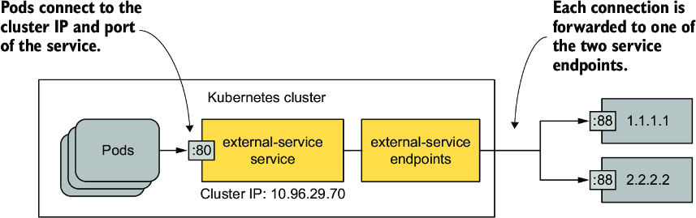

*Hình 11.11: Các pod sử dụng một service có hai endpoint bên ngoài*

Nếu sau này bạn quyết định di dời dịch vụ bên ngoài này vào các pod chạy bên trong Kubernetes cluster, bạn có thể thêm selector vào service để chuyển hướng traffic tới các pod đó thay vì các endpoint bạn đã cấu hình thủ công. Đó là vì Kubernetes lập tức bắt đầu quản lý Endpoints object sau khi bạn thêm selector vào service.

Bạn cũng có thể làm ngược lại: nếu muốn di dời một service hiện có từ cluster ra một vị trí bên ngoài, hãy gỡ selector khỏi Service object để Kubernetes không còn cập nhật Endpoints object liên kết nữa. Từ đó, bạn có thể quản lý các endpoint của service theo cách thủ công.

Bạn không cần xóa service để làm việc này. Bằng cách thay đổi Service object hiện có, địa chỉ cluster IP của service vẫn không đổi. Các client dùng service thậm chí sẽ không nhận ra bạn đã di dời service.

---

## 11.4 Tìm hiểu các bản ghi DNS cho Service object (Understanding DNS records for Service objects)

Một khía cạnh quan trọng của Kubernetes service là khả năng tra cứu chúng qua DNS. Đây là điều cần được xem xét kỹ hơn.

Bạn biết rằng service được gán một địa chỉ cluster IP nội bộ mà các pod có thể phân giải qua DNS của cluster. Đó là vì mỗi service có một bản ghi `A` trong DNS (hoặc bản ghi `AAAA` cho IPv6). Tuy nhiên, service còn nhận một bản ghi `SRV` cho mỗi cổng mà nó cung cấp.

Hãy xem kỹ hơn các bản ghi DNS này. Trước tiên, hãy chạy một pod dùng một lần như sau:

```bash
$ kubectl run -it --rm dns-test --image=giantswarm/tiny-tools
/ #
```

Lệnh này chạy một pod có tên `dns-test` với một container dựa trên container image `giantswarm/tiny-tools`. Image này chứa các công cụ `host`, `nslookup` và `dig` mà bạn có thể dùng để xem xét các bản ghi DNS. Khi bạn chạy lệnh `kubectl run`, terminal của bạn sẽ được gắn vào tiến trình shell chạy trong container (tùy chọn `-it` làm việc này). Khi bạn thoát shell, pod sẽ bị gỡ bỏ (bởi tùy chọn `--rm`).

> **GHI CHÚ:** Hãy đảm bảo bạn chạy pod trong cùng namespace với bộ ứng dụng Kiada bằng cách dùng tùy chọn `-n` nếu cần.

### 11.4.1 Kiểm tra các bản ghi A và SRV của service trong DNS (Inspecting a service's A and SRV records in DNS)

Bạn bắt đầu bằng việc kiểm tra các bản ghi `A` và `SRV` liên kết với các service của mình.

#### Tra cứu bản ghi A của service (Looking up a service's A record)

Để xác định địa chỉ IP của service `quote`, bạn chạy lệnh `nslookup` trong shell đang chạy trong container của pod `dns-test`:

```bash
/ # nslookup quote
Server:         10.96.0.10
Address:        10.96.0.10# 53

Name:   quote.kiada.svc.cluster.local    #1
Address: 10.96.161.97                    #2
```

- **#1** Tên miền đầy đủ của service
- **#2** Cluster IP của service

> **GHI CHÚ:** Bạn có thể dùng `dig` thay cho `nslookup`, nhưng bạn phải hoặc dùng tùy chọn `+search` hoặc chỉ định tên miền đầy đủ của service thì việc tra cứu DNS mới thành công (chạy `dig +search quote` hoặc `dig quote.kiada.svc.cluster.local`).

Bây giờ hãy tra cứu địa chỉ IP của service `kiada`. Mặc dù service này có kiểu `LoadBalancer` và do đó có cả cluster IP nội bộ lẫn IP bên ngoài (IP của load balancer), DNS chỉ trả về cluster IP. Điều này là bình thường vì máy chủ DNS là nội bộ và chỉ được dùng bên trong cluster.

#### Tra cứu bản ghi SRV (Looking up SRV records)

Một service cung cấp một hoặc nhiều cổng. Mỗi cổng được gán một bản ghi `SRV` trong DNS. Hãy dùng lệnh sau để truy xuất các bản ghi SRV của service `kiada`:

```bash
/ # nslookup -query=SRV kiada
Server:         10.96.0.10
Address:        10.96.0.10# 53

kiada.kiada.svc.cluster.local   service = 0 50 80 kiada.kiada.svc.cluster.local.    #1
kiada.kiada.svc.cluster.local   service = 0 50 443 kiada.kiada.svc.cluster.local.   #2
```

- **#1** Bản ghi SRV cho cổng http 80
- **#2** Bản ghi SRV cho cổng https 443

> **GHI CHÚ:** Tại thời điểm viết sách, GKE vẫn chạy kube-dns thay vì CoreDNS. Kube-dns không hỗ trợ tất cả các truy vấn DNS được trình bày trong mục này.

Một client thông minh chạy trong pod có thể tra cứu các bản ghi SRV của một service để tìm ra service cung cấp những cổng nào. Nếu bạn định nghĩa tên cho các cổng đó trong Service object, chúng thậm chí có thể được tra cứu theo tên. Bản ghi SRV có dạng như sau:

```text
_port-name._port-protocol.service-name.namespace.svc.cluster.local
```

Tên của hai cổng trong service `kiada` là `http` và `https`, và cả hai đều định nghĩa TCP là giao thức. Để lấy bản ghi SRV cho cổng `http`, hãy chạy lệnh sau:

```bash
/ # nslookup -query=SRV _http._tcp.kiada
Server:         10.96.0.10
Address:        10.96.0.10# 53

_http._tcp.kiada.kiada.svc.cluster.local   service = 0 100 80 kiada.kiada.svc.cluster.local.
```

> **MẸO:** Để liệt kê tất cả các service và các cổng chúng expose trong namespace `kiada`, bạn có thể chạy lệnh `nslookup -query=SRV any.kiada.svc.cluster.local`. Để liệt kê tất cả các service trong cluster, hãy dùng tên `any.any.svc.cluster.local`.

Có lẽ bạn sẽ không bao giờ cần tìm bản ghi SRV, nhưng một số giao thức Internet, như SIP và XMPP, phụ thuộc vào chúng để hoạt động.

> **GHI CHÚ:** Hãy giữ shell trong pod `dns-test` tiếp tục chạy, vì bạn sẽ cần nó trong các bài thực hành ở mục tiếp theo khi tìm hiểu về headless service.

### 11.4.2 Dùng headless service để kết nối trực tiếp tới pod (Using headless services to connect to pods directly)

Service expose một tập hợp pod tại một địa chỉ IP ổn định. Mỗi kết nối tới địa chỉ IP đó được chuyển tiếp tới một pod ngẫu nhiên hoặc endpoint khác đứng sau service. Các kết nối tới service được tự động phân phối trên các endpoint của nó. Nhưng nếu bạn muốn client tự thực hiện cân bằng tải thì sao? Nếu client cần quyết định kết nối tới pod nào thì sao? Hoặc nếu nó cần kết nối tới tất cả các pod đứng sau service? Nếu các pod thuộc một service đều cần kết nối trực tiếp với nhau thì sao? Kết nối qua cluster IP của service rõ ràng không phải là cách để làm việc này. Bạn làm gì trong tình huống đó?

Thay vì kết nối tới IP của service, client có thể lấy IP của các pod từ Kubernetes API, nhưng tốt hơn là giữ cho chúng không phụ thuộc vào Kubernetes (Kubernetes-agnostic) và dùng các cơ chế tiêu chuẩn như DNS. May mắn thay, bạn có thể cấu hình DNS nội bộ để trả về IP của các pod thay vì cluster IP của service bằng cách tạo một headless service.

Với headless service, DNS của cluster không chỉ trả về một bản ghi `A` duy nhất trỏ tới cluster IP của service, mà trả về nhiều bản ghi `A`, mỗi bản ghi cho một pod thuộc service. Do đó client có thể truy vấn DNS để lấy IP của tất cả các pod trong service. Với thông tin này, client có thể kết nối trực tiếp tới các pod, như minh họa trong hình 11.12.

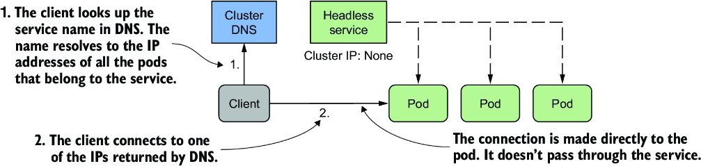

*Hình 11.12: Với headless service, client kết nối trực tiếp tới các pod.*

#### Tạo headless service (Creating a headless service)

Để tạo một headless service, bạn đặt trường `clusterIP` thành `None`. Hãy tạo một service khác cho các pod quote nhưng lần này là headless. Bạn có thể tìm thấy manifest của service trong file `svc.quote-headless.yaml`. Listing sau đây cho thấy nội dung của file này.

**Listing 11.7: Một headless service**

```yaml
apiVersion: v1
kind: Service
metadata:
  name: quote-headless
spec:
  clusterIP: None         #1
  selector:
    app: quote
  ports:
  - name: http
    port: 80
    targetPort: 80
    protocol: TCP
```

- **#1** Đặt clusterIP thành None làm cho đây trở thành một headless service.

Sau khi tạo service bằng `kubectl apply`, bạn có thể kiểm tra nó bằng `kubectl get`. Bạn sẽ thấy nó không có cluster IP:

```bash
$ kubectl get svc quote-headless -o wide
NAME             TYPE        CLUSTER-IP   EXTERNAL-IP   PORT(S)   AGE   SELECTOR
quote-headless   ClusterIP   None         <none>        80/TCP    2m    app=quote
```

Vì service không có cluster IP, máy chủ DNS không thể trả về nó khi bạn thử phân giải tên service. Thay vào đó, nó trả về địa chỉ IP của các pod. Trước khi tiếp tục, hãy liệt kê IP của các pod khớp với label selector của service như sau:

```bash
$ kubectl get po -l app=quote -o wide
NAME           READY   STATUS    RESTARTS   AGE   IP            NODE
quote-canary   2/2     Running   0          3h    10.244.2.9    kind-worker2
quote-001      2/2     Running   0          3h    10.244.2.10   kind-worker2
quote-002      2/2     Running   0          3h    10.244.2.8    kind-worker2
quote-003      2/2     Running   0          3h    10.244.1.10   kind-worker
```

Hãy ghi lại địa chỉ IP của các pod này.

#### Tìm hiểu các bản ghi DNS A được trả về cho headless service (Understanding DNS A records returned for a headless service)

Để xem DNS trả về gì khi bạn phân giải service, hãy chạy lệnh sau trong pod `dns-test` bạn đã tạo ở mục trước:

```bash
/ # nslookup quote-headless
Server:         10.96.0.10
Address:        10.96.0.10# 53

Name:   quote-headless.kiada.svc.cluster.local
Address: 10.244.2.9                              #1
Name:   quote-headless.kiada.svc.cluster.local
Address: 10.244.2.8                              #2
Name:   quote-headless.kiada.svc.cluster.local
Address: 10.244.2.10                             #3
Name:   quote-headless.kiada.svc.cluster.local
Address: 10.244.1.10                             #4
```

- **#1** IP của pod quote-canary
- **#2** IP của pod quote-002
- **#3** IP của pod quote-001
- **#4** IP của pod quote-003

Máy chủ DNS trả về địa chỉ IP của bốn pod khớp với label selector của service. Điều này khác với những gì DNS trả về cho các service thông thường (không headless) như service `quote`, nơi tên được phân giải thành cluster IP của service:

```bash
/ # nslookup quote
Server:         10.96.0.10
Address:        10.96.0.10# 53

Name:   quote.kiada.svc.cluster.local
Address: 10.96.161.97                    #1
```

- **#1** Cluster IP của service quote

#### Tìm hiểu cách client sử dụng headless service (Understanding how clients use headless services)

Các client muốn kết nối trực tiếp tới các pod thuộc một service có thể làm vậy bằng cách truy xuất các bản ghi `A` (hoặc `AAAA`) từ DNS. Sau đó client có thể kết nối tới một, một vài, hoặc tất cả các địa chỉ IP được trả về.

Các client không tự thực hiện tra cứu DNS có thể dùng service như cách chúng dùng một service thông thường, không headless. Vì máy chủ DNS xoay vòng danh sách địa chỉ IP mà nó trả về, một client chỉ đơn giản dùng FQDN của service trong URL kết nối sẽ nhận được một IP pod khác nhau mỗi lần. Do đó, các request của client được phân phối trên tất cả các pod.

Bạn có thể thử điều này bằng cách gửi nhiều request tới service `quote-headless` bằng `curl` từ pod `dns-test` như sau:

```bash
/ # while true; do curl http://quote-headless; done
This is the quote service running in pod quote-002
This is the quote service running in pod quote-001
This is the quote service running in pod quote-002
This is the quote service running in pod quote-canary
...
```

Mỗi request được một pod khác nhau xử lý, giống như khi bạn dùng service thông thường. Điểm khác biệt là với headless service, bạn kết nối trực tiếp tới IP của pod, còn với service thông thường, bạn kết nối tới cluster IP của service và kết nối của bạn được chuyển tiếp tới một trong các pod. Bạn có thể thấy điều này bằng cách chạy `curl` với tùy chọn `--verbose` và xem IP mà nó kết nối tới:

```bash
/ # curl --verbose http://quote-headless                    #1
*   Trying 10.244.1.10:80...                                #1
* Connected to quote-headless (10.244.1.10) port 80 (#0)
...

/ # curl --verbose http://quote                             #2
*   Trying 10.96.161.97:80...                               #2
* Connected to quote (10.96.161.97) port 80 (#0)
...
```

- **#1** Khi kết nối tới headless service, bạn kết nối trực tiếp tới một trong các pod.
- **#2** Khi kết nối tới service thông thường, bạn kết nối tới cluster IP của nó.

#### Headless service không có label selector (Headless services with no label selector)

Để kết thúc mục này về headless service, tôi muốn đề cập rằng các service có endpoint được cấu hình thủ công (service không có label selector) cũng có thể là headless. Nếu bạn bỏ qua label selector và đặt `clusterIP` thành `None`, DNS sẽ trả về một bản ghi `A`/`AAAA` cho mỗi endpoint, giống như khi các endpoint của service là các pod. Để tự kiểm tra, hãy áp dụng manifest trong file `svc.external-service-headless.yaml` và chạy lệnh sau trong pod `dns-test`:

```bash
/ # nslookup external-service-headless
```

### 11.4.3 Tạo bí danh CNAME cho service hiện có (Creating a CNAME alias for an existing service)

Trong các mục trước, bạn đã học cách tạo các bản ghi `A` và `AAAA` trong DNS của cluster. Để làm điều đó, bạn tạo các Service object hoặc chỉ định label selector để tìm các endpoint của service, hoặc bạn tự định nghĩa chúng bằng các Endpoints và EndpointSlice object.

Cũng có một cách để thêm các bản ghi `CNAME` vào DNS của cluster. Trong Kubernetes, bạn thêm bản ghi CNAME vào DNS bằng cách tạo một Service object, giống như cách bạn làm với các bản ghi A và AAAA.

> **GHI CHÚ:** Bản ghi CNAME là bản ghi DNS ánh xạ một bí danh (alias) tới một tên DNS hiện có, không giống bản ghi A, vốn ánh xạ tên tới một địa chỉ IP.

#### Tạo service ExternalName (Creating an ExternalName service)

Để tạo một service đóng vai trò bí danh cho một service hiện có, dù là service nội bộ hay service bên ngoài cluster, bạn tạo một Service object có trường `type` được đặt thành `ExternalName`. Listing sau đây cho thấy một ví dụ về kiểu service này. Bạn có thể tìm thấy manifest trong file `svc.time-api.yaml`.

**Listing 11.8: Một service kiểu ExternalName**

```yaml
apiVersion: v1
kind: Service
metadata:
  name: time-api
spec:
  type: ExternalName                 #1
  externalName: worldtimeapi.org     #2
```

- **#1** Kiểu service được đặt thành ExternalName.
- **#2** Đây là tên miền đầy đủ mà bản ghi CNAME sẽ trỏ tới.

Ngoài việc đặt `type` thành `ExternalName`, manifest của service còn phải chỉ định trong trường `externalName` tên bên ngoài mà service này phân giải tới. Không cần Endpoints hay EndpointSlice object nào cho service `ExternalName`.

#### Kết nối tới service ExternalName từ pod (Connecting to an ExternalName service from a pod)

Sau khi service được tạo, các pod có thể kết nối tới dịch vụ bên ngoài bằng tên miền `time-api.<namespace>.svc.cluster.local` (hoặc `time-api` nếu chúng ở cùng namespace với service) thay vì dùng FQDN thực của dịch vụ bên ngoài, như trong ví dụ sau:

```bash
$ kubectl exec -it kiada-001 -c kiada -- curl http://time-api/api/timezone/CET
```

#### Phân giải service ExternalName trong DNS (Resolving ExternalName services in DNS)

Vì các service `ExternalName` được hiện thực ở cấp DNS (chỉ một bản ghi CNAME được tạo cho service), client không kết nối tới service qua cluster IP như với các service ClusterIP không headless. Chúng kết nối trực tiếp tới dịch vụ bên ngoài. Giống như headless service, service ExternalName không có cluster IP, như output sau cho thấy:

```bash
$ kubectl get svc time-api
NAME       TYPE           CLUSTER-IP   EXTERNAL-IP        PORT(S)   AGE
time-api   ExternalName   <none>       worldtimeapi.org   80/TCP    4m51s   #1
```

- **#1** Service ExternalName không nhận cluster IP.

Như bài thực hành cuối cùng trong mục này về DNS, bạn có thể thử phân giải service `time-api` trong pod `dns-test` như sau:

```bash
/ # nslookup time-api
Server:         10.96.0.10
Address:        10.96.0.10# 53

time-api.kiada.svc.cluster.local   canonical name = worldtimeapi.org.   #1
Name:   worldtimeapi.org                                                #2
Address: 213.188.196.246                                                #2
Name:   worldtimeapi.org                                                #2
Address: 2a09:8280:1::3:e                                               #2
```

- **#1** Service time-api ánh xạ tới worldtimeapi.org
- **#2** Địa chỉ worldtimeapi.org phân giải thành một địa chỉ IPv4 và một địa chỉ IPv6.

Bạn có thể thấy `time-api.kiada.svc.cluster.local` trỏ tới `worldtimeapi.org`. Đến đây kết thúc mục này về các bản ghi DNS cho Kubernetes service. Giờ bạn có thể thoát shell trong pod `dns-test` bằng cách gõ `exit` hoặc nhấn Ctrl-D. Pod sẽ tự động bị xóa.

---

## 11.5 Cấu hình service để định tuyến traffic tới các endpoint ở gần (Configuring services to route traffic to nearby endpoints)

Khi bạn triển khai các pod, chúng được phân bổ trên các node trong cluster. Nếu các node của cluster trải rộng trên nhiều vùng khả dụng (availability zone) hoặc khu vực (region) khác nhau và các pod được triển khai trên những node đó trao đổi traffic với nhau, hiệu năng mạng và chi phí traffic có thể trở thành vấn đề. Trong trường hợp này, sẽ hợp lý nếu service chuyển tiếp traffic tới các pod không ở quá xa pod nơi traffic xuất phát.

Trong các trường hợp khác, một pod có thể chỉ cần giao tiếp với các endpoint của service nằm trên cùng node với pod – không phải vì lý do hiệu năng hay chi phí, mà vì chỉ các endpoint cục bộ trên node mới có thể cung cấp service trong đúng ngữ cảnh. Hãy để tôi giải thích ý mình.

### 11.5.1 Chỉ chuyển tiếp traffic bên trong cùng một node với internalTrafficPolicy (Forwarding traffic only within the same node with internalTrafficPolicy)

Nếu các pod cung cấp một service gắn liền theo cách nào đó với node mà pod đang chạy trên đó, bạn phải đảm bảo các pod client chạy trên một node cụ thể chỉ kết nối tới các endpoint trên cùng node. Bạn có thể làm điều này bằng cách tạo một Service với `internalTrafficPolicy` được đặt thành `Local`.

> **GHI CHÚ:** Trước đó bạn đã học về trường `externalTrafficPolicy`, được dùng để ngăn các bước nhảy mạng không cần thiết giữa các node khi traffic bên ngoài đến cluster. Trường `internalTrafficPolicy` của service tương tự, nhưng phục vụ mục đích khác.

Như minh họa trong hình 11.13, nếu service được cấu hình với chính sách traffic nội bộ `Local`, traffic từ các pod trên một node nhất định chỉ được chuyển tiếp tới các pod trên cùng node đó. Nếu không có endpoint cục bộ nào của service trên node, kết nối thất bại.

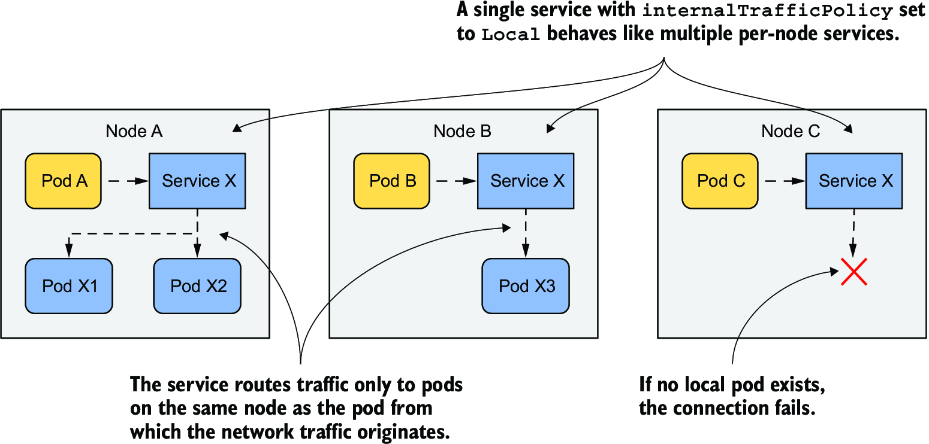

*Hình 11.13: Hành vi của một service có internalTrafficPolicy được đặt thành Local*

Hãy hình dung một pod hệ thống chạy trên mỗi node của cluster để quản lý việc giao tiếp với một thiết bị gắn vào node. Các pod không dùng thiết bị trực tiếp mà giao tiếp với pod hệ thống. Vì IP của pod có thể thay đổi, trong khi IP của service ổn định, các pod kết nối tới pod hệ thống thông qua một service. Để đảm bảo các pod chỉ kết nối tới pod hệ thống cục bộ chứ không phải pod trên các node khác, service được cấu hình để chỉ chuyển tiếp traffic tới các endpoint cục bộ. Bạn không có pod nào như vậy trong cluster của mình, nhưng bạn có thể dùng các pod quote để thử tính năng này.

#### Tạo service với chính sách traffic nội bộ Local (Creating a service with a local internal traffic policy)

Listing sau đây cho thấy manifest của một service có tên `quote-local`, chỉ chuyển tiếp traffic tới các pod chạy trên cùng node với pod client. Bạn có thể tìm thấy manifest trong file `svc.quote-local.yaml`.

**Listing 11.9: Một service chỉ chuyển tiếp traffic tới các endpoint cục bộ**

```yaml
apiVersion: v1
kind: Service
metadata:
  name: quote-local
spec:
  internalTrafficPolicy: Local    #1
  selector:
    app: quote
  ports:
  - name: http
    port: 80
    targetPort: 80
    protocol: TCP
```

- **#1** Service này chỉ chuyển tiếp traffic từ pod tới các endpoint trên cùng node với pod đó.

Như bạn thấy trong manifest, service sẽ chuyển tiếp traffic tới tất cả các pod có label `app: quote`, nhưng vì `internalTrafficPolicy` được đặt thành `Local`, nó sẽ không chuyển tiếp traffic tới tất cả các pod quote trong cluster, mà chỉ tới các pod nằm trên cùng node với pod client. Hãy tạo service bằng cách áp dụng manifest với `kubectl apply`.

#### Quan sát việc định tuyến traffic cục bộ trên node (Observing node-local traffic routing)

Trước khi có thể thấy cách service định tuyến traffic, bạn cần tìm ra các pod client và các pod là endpoint của service nằm ở đâu. Hãy liệt kê các pod với tùy chọn `-o wide` để xem mỗi pod đang chạy trên node nào.

Chọn một trong các pod kiada và ghi lại node của nó. Dùng `curl` để kết nối tới service `quote-local` từ pod đó. Ví dụ, pod `kiada-001` của tôi chạy trên node `kind-worker`. Nếu tôi chạy `curl` trong đó nhiều lần, tất cả các request đều được các pod quote trên cùng node xử lý:

```bash
$ kubectl exec kiada-001 -c kiada -- sh -c "while :; do curl -s quote-local; done"
This is the quote service running in pod quote-002 on node kind-worker      #1
This is the quote service running in pod quote-canary on node kind-worker   #1
This is the quote service running in pod quote-canary on node kind-worker   #1
This is the quote service running in pod quote-002 on node kind-worker      #1
```

- **#1** Cả hai pod đều chạy trên cùng node với pod kiada-001.

Không có request nào được chuyển tiếp tới các pod trên (các) node khác. Nếu tôi xóa hai pod trên node `kind-worker`, lần thử kết nối tiếp theo sẽ thất bại:

```bash
$ kubectl exec -it kiada-001 -c kiada -- curl http://quote-local
curl: (7) Failed to connect to quote-local port 80: Connection refused
```

Trong mục này, bạn đã học cách chỉ chuyển tiếp traffic tới các endpoint cục bộ trên node khi ngữ nghĩa của service yêu cầu điều đó. Trong các trường hợp khác, bạn có thể muốn traffic được ưu tiên chuyển tiếp tới các endpoint gần pod client, và chỉ tới các pod xa hơn khi cần. Bạn sẽ học cách làm điều này trong mục tiếp theo.

### 11.5.2 Gợi ý theo topology (Topology-aware hints)

Hãy hình dung bộ ứng dụng Kiada chạy trong một cluster có các node trải rộng trên nhiều trung tâm dữ liệu ở các zone và region khác nhau, như minh họa trong hình 11.14. Bạn không muốn một pod Kiada chạy trong một zone kết nối tới các pod Quote ở zone khác, trừ khi không có pod Quote nào trong zone cục bộ. Lý tưởng nhất, bạn muốn các kết nối được thực hiện trong cùng một zone để giảm traffic mạng và các chi phí liên quan.

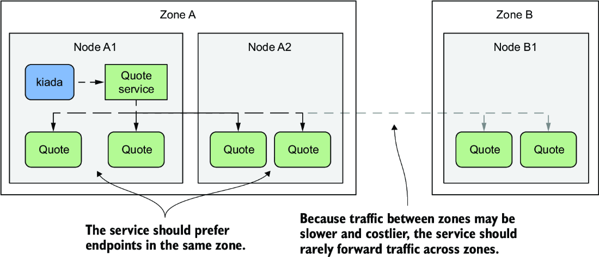

*Hình 11.14: Định tuyến traffic của service qua các availability zone*

Hình minh họa cái được gọi là định tuyến traffic theo topology (topology-aware traffic routing). Kubernetes hỗ trợ điều này bằng cách thêm topology-aware hints (gợi ý theo topology) vào từng endpoint trong EndpointSlice object.

#### Tìm hiểu cách topology-aware hints được tính toán (Understanding how topology aware hints are calculated)

Trước tiên, tất cả các node trong cluster của bạn phải có label `kubernetes.io/zone` để cho biết mỗi node nằm ở zone nào. Để cho biết một service nên dùng topology-aware hints, bạn phải đặt annotation `service.kubernetes.io/topology-aware-hints` thành `Auto`. Nếu service có đủ số lượng endpoint, Kubernetes sẽ thêm các hint vào từng endpoint trong (các) EndpointSlice object. Như bạn thấy trong listing sau, trường `hints` chỉ định các zone mà từ đó endpoint này sẽ được sử dụng.

**Listing 11.10: EndpointSlice với topology-aware hints**

```yaml
apiVersion: discovery.k8s.io/v1
kind: EndpointSlice
endpoints:
- addresses:
  - 10.244.2.2
  conditions:
    ready: true
  hints:                   #1
    forZones:              #1
    - name: zoneA          #1
  nodeName: kind-worker
  targetRef:
    kind: Pod
    name: quote-002
    namespace: default
    resourceVersion: "944"
    uid: 03343161-971d-403c-89ae-9632e7cd0d8d
  zone: zoneA              #2
...
```

- **#1** Endpoint này nên được các client chạy trong zoneA sử dụng.
- **#2** Endpoint này nằm trong zoneA.

Listing chỉ hiển thị một endpoint duy nhất. Endpoint này đại diện cho pod `quote-002` chạy trên node `kind-worker`, nằm trong `zoneA`. Vì lý do này, các hint cho endpoint này cho biết nó sẽ được các pod trong `zoneA` sử dụng. Trong trường hợp cụ thể này, chỉ `zoneA` nên dùng endpoint này, nhưng mảng `forZones` có thể chứa nhiều zone.

Các hint này được EndpointSlice controller, một phần của Kubernetes control plane, tính toán. Nó gán endpoint cho từng zone dựa trên số lõi CPU có thể được cấp phát trong zone đó. Nếu một zone có số lõi CPU cao hơn, nó sẽ được gán số endpoint nhiều hơn so với zone có ít lõi CPU hơn. Trong hầu hết các trường hợp, các hint đảm bảo traffic được giữ trong một zone, nhưng để đảm bảo phân phối đồng đều hơn, không phải lúc nào cũng vậy.

#### Tìm hiểu topology-aware hints được dùng ở đâu (Understanding where topology aware hints are used)

Mỗi node đảm bảo rằng traffic gửi tới cluster IP của service được chuyển tiếp tới một trong các endpoint của service. Nếu không có topology-aware hints trong EndpointSlice object, tất cả các endpoint, bất kể nằm trên node nào, sẽ nhận traffic xuất phát từ một node cụ thể. Tuy nhiên, nếu tất cả các endpoint trong EndpointSlice object đều chứa hint, mỗi node chỉ xử lý các endpoint có chứa zone của node đó trong các hint và bỏ qua phần còn lại. Do đó, traffic xuất phát từ một pod trên node chỉ được chuyển tiếp tới một số endpoint.

Hiện tại, bạn không thể tác động đến việc định tuyến theo topology ngoài việc bật hoặc tắt nó, nhưng điều này có thể thay đổi trong tương lai.

---

## 11.6 Quản lý việc đưa pod vào các endpoint của service (Managing the inclusion of a pod in service endpoints)

Còn một điều nữa về service và endpoint chưa được đề cập. Bạn đã học rằng một pod được đưa vào làm endpoint của service nếu label của nó khớp với label selector của service. Ngay khi một pod mới có label khớp xuất hiện, nó trở thành một phần của service và các kết nối được chuyển tiếp tới pod. Nhưng nếu ứng dụng trong pod chưa sẵn sàng chấp nhận kết nối ngay lập tức thì sao?

Có thể ứng dụng cần thời gian để tải cấu hình hoặc dữ liệu, hoặc cần khởi động nóng (warm up) để kết nối đầu tiên của client có thể được xử lý nhanh nhất có thể mà không có độ trễ không cần thiết do ứng dụng vừa mới khởi động. Trong những trường hợp như vậy, bạn không muốn pod nhận traffic ngay lập tức, đặc biệt nếu các instance pod hiện có đủ sức xử lý traffic. Sẽ hợp lý nếu không chuyển tiếp request tới một pod vừa mới khởi động cho đến khi nó sẵn sàng.

### 11.6.1 Giới thiệu readiness probe (Introducing readiness probes)

Trong chương 6, bạn đã học cách giữ cho ứng dụng của mình khỏe mạnh bằng cách để Kubernetes khởi động lại các container thất bại liveness probe. Một cơ chế tương tự gọi là readiness probe cho phép ứng dụng báo hiệu rằng nó đã sẵn sàng chấp nhận kết nối.

Giống như liveness probe, Kubelet cũng gọi readiness probe định kỳ để xác định trạng thái sẵn sàng (readiness) của pod. Nếu probe thành công, pod được coi là sẵn sàng. Ngược lại nếu nó thất bại. Không giống liveness probe, container có readiness probe thất bại không bị khởi động lại; nó chỉ bị gỡ khỏi các service mà nó thuộc về với tư cách là một endpoint.

Như minh họa trong hình 11.15, nếu một pod thất bại readiness probe, service không chuyển tiếp kết nối tới pod đó ngay cả khi label của nó khớp với label selector được định nghĩa trong service.

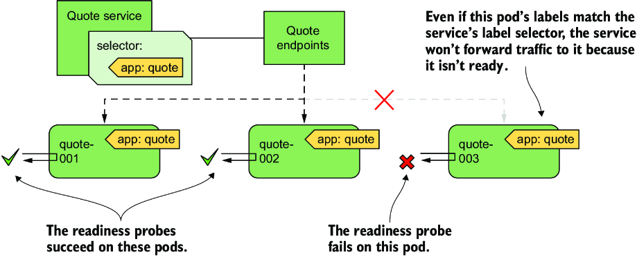

*Hình 11.15: Các pod thất bại readiness probe bị gỡ khỏi service.*

Khái niệm sẵn sàng là đặc thù cho từng ứng dụng. Nhà phát triển ứng dụng quyết định sẵn sàng có nghĩa là gì trong ngữ cảnh ứng dụng của họ. Để làm điều này, họ expose một endpoint mà qua đó Kubernetes hỏi ứng dụng xem nó đã sẵn sàng chưa. Tùy vào kiểu endpoint, phải dùng đúng kiểu readiness probe.

#### Tìm hiểu các kiểu readiness probe (Understanding readiness probe types)

Giống như liveness probe, Kubernetes hỗ trợ ba kiểu readiness probe:

* Probe `exec` thực thi một tiến trình trong container. Exit code dùng để kết thúc tiến trình quyết định container có sẵn sàng hay không.
* Probe `httpGet` gửi một request `GET` tới container qua HTTP hoặc HTTPS. Mã phản hồi quyết định trạng thái sẵn sàng của container.
* Probe `tcpSocket` mở một kết nối TCP tới một cổng được chỉ định trên container. Nếu kết nối được thiết lập, container được coi là sẵn sàng.

#### Cấu hình tần suất thực thi probe (Configuring how often the probe is executed)

Bạn có thể nhớ rằng bạn có thể cấu hình khi nào và bao lâu một lần liveness probe chạy cho một container nhất định bằng các thuộc tính sau: `initialDelaySeconds`, `periodSeconds`, `failureThreshold` và `timeoutSeconds`. Các thuộc tính này cũng áp dụng cho readiness probe, nhưng readiness probe còn hỗ trợ thêm thuộc tính `successThreshold`, chỉ định probe phải thành công bao nhiêu lần để container được coi là sẵn sàng.

Những thiết lập này được giải thích tốt nhất bằng hình ảnh. Hình 11.16 cho thấy từng thuộc tính ảnh hưởng thế nào đến việc thực thi readiness probe và trạng thái sẵn sàng kết quả của container.

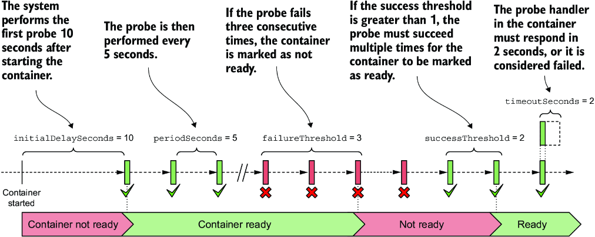

*Hình 11.16: Việc thực thi readiness probe và trạng thái sẵn sàng kết quả của container*

> **GHI CHÚ:** Nếu container định nghĩa một startup probe, độ trễ ban đầu cho readiness probe bắt đầu khi startup probe thành công. Startup probe được giải thích trong chương 6.

Khi container sẵn sàng, pod trở thành endpoint của các service có label selector khớp với nó. Khi nó không còn sẵn sàng, nó bị gỡ khỏi các service đó.

### 11.6.2 Thêm readiness probe vào pod (Adding a readiness probe to a pod)

Để thấy readiness probe hoạt động, hãy tạo một pod mới với một probe mà bạn có thể chuyển từ thành công sang thất bại tùy ý. Đây không phải là ví dụ thực tế về cách cấu hình readiness probe, nhưng nó cho phép bạn thấy kết quả của probe ảnh hưởng thế nào đến việc pod được đưa vào service.

Listing sau đây cho thấy phần liên quan của file manifest pod `pod.kiada-mock-readiness.yaml`, mà bạn có thể tìm thấy trong kho mã nguồn của cuốn sách.

**Listing 11.11: Định nghĩa readiness probe trong pod**

```yaml
apiVersion: v1
kind: Pod
...
spec:
  containers:
  - name: kiada
    ...
    readinessProbe:              #1
      exec:                      #2
        command:                 #2
        - ls                     #2
        - /var/ready             #2
      initialDelaySeconds: 10    #3
      periodSeconds: 5           #3
      failureThreshold: 3        #3
      successThreshold: 2        #3
      timeoutSeconds: 2          #3
  ...                            #3
```

- **#1** Một readiness probe được định nghĩa cho container kiada.
- **#2** Probe thực thi lệnh ls trong container.
- **#3** Định nghĩa khi nào và bao lâu một lần probe được thực thi, và probe phải thất bại hoặc thành công bao nhiêu lần để trạng thái sẵn sàng của container thay đổi. Nó cũng đặt thời gian chờ (timeout) cho mỗi lần gọi probe.

Readiness probe định kỳ chạy lệnh `ls /var/ready` trong container `kiada`. Lệnh `ls` trả về exit code 0 nếu file tồn tại, ngược lại là khác 0. Vì 0 được coi là thành công, readiness probe thành công nếu file có mặt.

Lý do định nghĩa một readiness probe kỳ lạ như vậy là để bạn có thể thay đổi kết quả của nó bằng cách tạo hoặc xóa file được đề cập. Khi bạn tạo pod, file chưa tồn tại, nên pod chưa sẵn sàng. Trước khi tạo pod, hãy xóa tất cả các pod kiada khác ngoại trừ `kiada-001`. Điều này giúp dễ thấy các endpoint của service thay đổi hơn.

#### Quan sát trạng thái sẵn sàng của pod (Observing the pods' readiness status)

Sau khi tạo pod từ file manifest, hãy kiểm tra trạng thái của nó như sau:

```bash
$ kubectl get po kiada-mock-readiness
NAME                   READY   STATUS    RESTARTS   AGE
kiada-mock-readiness   1/2     Running   0          1m    #1
```

- **#1** Chỉ một trong các container của pod là sẵn sàng.

Cột `READY` cho thấy chỉ một trong các container của pod là sẵn sàng. Đó là container `envoy`, vốn không định nghĩa readiness probe. Các container không có readiness probe được coi là sẵn sàng ngay khi chúng được khởi động.

Vì không phải tất cả các container của pod đều sẵn sàng, pod không nên nhận traffic gửi tới service. Bạn có thể kiểm tra điều này bằng cách gửi vài request tới service Kiada. Bạn sẽ nhận thấy tất cả các request đều được pod `kiada-001` xử lý, là endpoint hoạt động duy nhất của service. Điều này thể hiện rõ trong các Endpoints và EndpointSlice object liên kết với service. Ví dụ, pod `kiada-mock-readiness` xuất hiện trong mảng `notReadyAddresses` thay vì `addresses` trong Endpoints object:

```bash
$ kubectl get endpoints kiada -o yaml
apiVersion: v1
kind: Endpoints
metadata:
  name: kiada
  ...
subsets:
- addresses:
  - ...
  notReadyAddresses:               #1
  - ip: 10.244.1.36                #1
    nodeName: kind-worker2         #1
    targetRef:                     #1
      kind: Pod                    #1
      name: kiada-mock-readiness   #1
      namespace: default           #1
    ...                            #1
```

- **#1** Pod kiada-mock-readiness xuất hiện trong danh sách notReadyAddresses của service.

Trong EndpointSlice object, điều kiện `ready` của endpoint là `false`:

```bash
$ kubectl get endpointslices -l kubernetes.io/service-name=kiada -o yaml
apiVersion: v1
items:
- addressType: IPv4
  apiVersion: discovery.k8s.io/v1
  endpoints:
  - addresses:
    - 10.244.1.36
    conditions:                    #1
      ready: false                 #1
    nodeName: kind-worker2
    targetRef:
      kind: Pod
      name: kiada-mock-readiness
      namespace: default
      ...
```

- **#1** Điều kiện ready của pod kiada-mock-readiness là false.

> **GHI CHÚ:** Trong một số trường hợp, bạn có thể muốn bỏ qua trạng thái sẵn sàng của các pod. Đó có thể là trường hợp bạn muốn tất cả các pod trong một nhóm đều nhận được bản ghi `A`, `AAAA` và `SRV` dù chúng chưa sẵn sàng. Nếu bạn đặt trường `publishNotReadyAddresses` trong spec của Service object thành `true`, các pod chưa sẵn sàng được đánh dấu là sẵn sàng trong cả Endpoints lẫn EndpointSlice object. Các thành phần như DNS của cluster coi chúng là sẵn sàng.

Để readiness probe thành công, hãy tạo file `/var/ready` trong container như sau:

```bash
$ kubectl exec kiada-mock-readiness -c kiada -- touch /var/ready
```

Lệnh `kubectl exec` chạy lệnh `touch` trong container `kiada` của pod `kiada-mock-readiness`. Lệnh `touch` tạo file được chỉ định. Readiness probe của container giờ sẽ thành công. Tất cả các container của pod giờ sẽ hiển thị là sẵn sàng. Hãy xác minh điều này như sau:

```bash
$ kubectl get po kiada-mock-readiness
NAME                   READY   STATUS    RESTARTS   AGE
kiada-mock-readiness   1/2     Running   0          10m
```

Thật bất ngờ, pod vẫn chưa sẵn sàng. Có gì đó sai hay đây là kết quả mong đợi? Hãy xem kỹ hơn pod bằng `kubectl describe`. Trong output, bạn sẽ thấy dòng sau:

```text
Readiness:  exec [ls /var/ready] delay=10s timeout=2s period=5s #success=2 #failure=3
```

Readiness probe được định nghĩa trong pod được cấu hình để kiểm tra trạng thái của container mỗi 5 giây. Tuy nhiên, nó cũng được cấu hình để yêu cầu hai lần thử probe liên tiếp thành công trước khi đặt trạng thái của container thành `ready`. Do đó, mất khoảng 10 giây để pod sẵn sàng sau khi bạn tạo file `/var/ready`.

Khi điều này xảy ra, pod sẽ trở thành một endpoint hoạt động của service. Bạn có thể xác minh bằng cách xem xét các Endpoints hoặc EndpointSlice object liên kết với service, hoặc đơn giản là truy cập service vài lần và kiểm tra xem pod `kiada-mock-readiness` có nhận được request nào trong số các request bạn gửi hay không.

Nếu bạn muốn gỡ pod khỏi service lần nữa, hãy chạy lệnh sau để xóa file `/var/ready` khỏi container:

```bash
$ kubectl exec kiada-mock-readiness -c kiada -- rm /var/ready
```

Readiness probe giả lập này chỉ để cho thấy readiness probe hoạt động thế nào. Trong thực tế, readiness probe không nên được hiện thực theo cách này. Nếu bạn muốn gỡ pod khỏi service theo cách thủ công, bạn có thể làm vậy bằng cách xóa pod hoặc thay đổi label của pod, thay vì thao túng kết quả của readiness probe.

> **MẸO:** Nếu bạn muốn kiểm soát thủ công việc một pod có được đưa vào service hay không, hãy thêm một khóa label như `enabled` vào pod và đặt giá trị của nó là `true`. Sau đó thêm label selector `enabled=true` vào service của bạn. Gỡ label khỏi pod để gỡ pod khỏi service.

### 11.6.3 Hiện thực readiness probe trong thực tế (Implementing real-world readiness probes)

Nếu bạn không định nghĩa readiness probe trong pod, nó trở thành endpoint của service ngay khi được tạo. Điều này có nghĩa là mỗi khi bạn tạo một instance pod mới, các kết nối được service chuyển tiếp tới instance mới đó sẽ thất bại cho đến khi ứng dụng trong pod sẵn sàng chấp nhận chúng. Để ngăn điều này, bạn nên luôn định nghĩa readiness probe cho pod.

Trong mục trước, bạn đã học cách thêm một readiness probe giả lập vào container để kiểm soát thủ công việc pod có là endpoint của service hay không. Trong thực tế, kết quả của readiness probe nên phản ánh khả năng chấp nhận kết nối của ứng dụng chạy trong container.

#### Định nghĩa readiness probe tối thiểu (Defining a minimal readiness probe)

Với các container chạy máy chủ HTTP, việc định nghĩa một readiness probe đơn giản kiểm tra xem máy chủ có phản hồi một request `GET /` đơn giản hay không, như trong đoạn code sau, tốt hơn nhiều so với việc không có readiness probe nào:

```yaml
readinessProbe:
  httpGet:            #1
    port: 8080        #1
    path: /           #2
    scheme: HTTP      #2
```

- **#1** Probe gửi một request HTTP GET tới cổng 8080 của container.
- **#2** Probe yêu cầu đường dẫn URL gốc qua HTTP (thay vì HTTPS).

Khi Kubernetes gọi readiness probe này, nó gửi request `GET /` tới cổng `8080` của container và kiểm tra mã phản hồi HTTP được trả về. Nếu mã phản hồi lớn hơn hoặc bằng `200` và nhỏ hơn `400`, probe thành công và pod được coi là sẵn sàng. Nếu mã phản hồi là bất kỳ giá trị nào khác (ví dụ `404` hoặc `500`) hoặc nỗ lực kết nối thất bại, readiness probe được coi là thất bại và pod được đánh dấu là chưa sẵn sàng.

Probe đơn giản này đảm bảo pod chỉ trở thành một phần của service khi nó thực sự có thể xử lý các HTTP request, thay vì ngay khi pod được khởi động.

#### Định nghĩa readiness probe tốt hơn (Defining a better readiness probe)

Một readiness probe đơn giản như ở mục trước không phải lúc nào cũng đủ. Lấy pod Quote làm ví dụ. Bạn có thể nhớ rằng nó chạy hai container. Container `quote-writer` chọn một câu trích dẫn ngẫu nhiên từ cuốn sách này và ghi nó vào một file có tên `quote` trong volume được chia sẻ giữa hai container. Container `nginx` phục vụ các file từ volume chia sẻ này. Do đó, câu trích dẫn có sẵn tại đường dẫn URL `/quote`.

Mục đích của pod Quote rõ ràng là cung cấp một câu trích dẫn ngẫu nhiên từ cuốn sách. Do đó, nó không nên được đánh dấu là sẵn sàng cho đến khi nó có thể phục vụ câu trích dẫn này. Nếu bạn trỏ readiness probe tới đường dẫn URL `/`, nó sẽ thành công ngay cả khi container `quote-writer` chưa tạo file `quote`. Do đó, readiness probe trong pod Quote nên được cấu hình như trong đoạn trích sau từ file `pod.quote-readiness.yaml`:

```yaml
readinessProbe:
  httpGet:
    port: 80
    path: /quote        #1
    scheme: HTTP
  failureThreshold: 1   #2
```

- **#1** Pod Quote sẵn sàng khi nó có thể phục vụ câu trích dẫn.
- **#2** Đặt ngưỡng thất bại là một, để pod lập tức được đánh dấu là chưa sẵn sàng nếu probe thất bại.

Nếu bạn thêm readiness probe này vào pod Quote, bạn sẽ thấy pod chỉ sẵn sàng khi file `quote` tồn tại. Hãy thử xóa file khỏi pod như sau:

```bash
$ kubectl exec quote-readiness -c quote-writer -- rm /var/local/output/quote
```

Bây giờ hãy kiểm tra trạng thái sẵn sàng của pod bằng `kubectl get pod`, và bạn sẽ thấy một trong các container không còn sẵn sàng. Khi `quote-writer` tạo lại file, container lại sẵn sàng. Bạn cũng có thể kiểm tra các endpoint của service `quote` bằng `kubectl get endpoints quote` để thấy pod bị gỡ ra rồi được thêm lại.

#### Hiện thực endpoint readiness chuyên dụng (Implementing a dedicated readiness endpoint)

Như bạn thấy trong ví dụ trước, có thể chỉ cần trỏ readiness probe tới một đường dẫn hiện có do máy chủ HTTP phục vụ là đủ, nhưng cũng rất phổ biến khi ứng dụng cung cấp một endpoint chuyên dụng, chẳng hạn `/healthz/ready` hoặc `/readyz`, mà qua đó nó báo cáo trạng thái sẵn sàng của mình. Khi ứng dụng nhận request trên endpoint này, nó có thể thực hiện một loạt kiểm tra nội bộ để xác định trạng thái sẵn sàng.

Hãy lấy service Quiz làm ví dụ. Pod Quiz chạy cả máy chủ HTTP lẫn container MongoDB. Như bạn thấy trong listing sau, máy chủ `quiz-api` hiện thực endpoint `/healthz/ready`. Khi nhận request, nó kiểm tra xem có thể kết nối thành công tới MongoDB trong container kia hay không. Nếu có, nó phản hồi `200 OK`. Nếu không, nó trả về `500 Internal Server Error`.

**Listing 11.12: Endpoint readiness trong ứng dụng quiz-api**

```go
func (s *HTTPServer) ListenAndServe(listenAddress string) {
    router := mux.NewRouter()
    router.Methods("GET").Path("/").HandlerFunc(s.handleRoot)
    router.Methods("GET").Path("/healthz/ready").HandlerFunc(s.handleReadiness)   #1
    ...
}

func (s *HTTPServer) handleReadiness(res http.ResponseWriter, req *http.Request) {
    conn, err := s.db.Connect()                                   #2
    if err != nil {                                               #3
        res.WriteHeader(http.StatusInternalServerError)           #3
        _, _ = fmt.Fprintf(res, "ERROR: %v\n", err.Error())       #3
        return                                                    #3
    }
    defer conn.Close()

    res.WriteHeader(http.StatusOK)                                #4
    _, _ = res.Write([]byte("Readiness check successful"))        #4
}
```

- **#1** Endpoint /healthz/ready gọi hàm handleReadiness().
- **#2** Thử kết nối tới MongoDB
- **#3** Nếu kết nối thất bại, mã phản hồi 500 Internal Server Error được trả về.
- **#4** Nếu kết nối thành công, mã phản hồi 200 OK được trả về.

Readiness probe được định nghĩa trong pod Quiz đảm bảo mọi thứ mà pod cần để cung cấp service của nó đều có mặt và hoạt động. Khi các thành phần bổ sung được thêm vào ứng dụng quiz-api, các kiểm tra khác có thể được thêm vào code kiểm tra readiness. Một ví dụ là việc thêm một bộ đệm (cache) nội bộ. Endpoint readiness có thể kiểm tra xem cache đã được khởi động nóng chưa, để chỉ khi đó pod mới được expose cho client.

#### Kiểm tra các phụ thuộc trong readiness probe (Checking dependencies in the readiness probe)

Trong pod Quiz, cơ sở dữ liệu MongoDB là một phụ thuộc nội bộ của container quiz-api. Ngược lại, pod Kiada phụ thuộc vào các service Quiz và Quote, là các phụ thuộc bên ngoài. Readiness probe trong pod Kiada nên kiểm tra gì? Nó có nên kiểm tra xem có thể tiếp cận các service Quote và Quiz hay không?

Câu trả lời cho câu hỏi này còn gây tranh cãi, nhưng bất cứ khi nào bạn kiểm tra các phụ thuộc trong readiness probe, bạn phải cân nhắc điều gì xảy ra nếu một vấn đề tạm thời, chẳng hạn độ trễ mạng tăng tạm thời, khiến probe thất bại.

Lưu ý rằng trường `timeoutSeconds` trong định nghĩa readiness probe giới hạn thời gian probe có để phản hồi. Thời gian chờ mặc định chỉ là 1 giây. Container phải phản hồi readiness probe trong thời gian này.

Nếu pod Kiada gọi hai service kia trong kiểm tra readiness của nó, nhưng phản hồi của chúng chỉ bị trễ một chút do gián đoạn mạng tạm thời, readiness probe của nó thất bại và pod bị gỡ khỏi các endpoint của service. Nếu điều này xảy ra với tất cả các pod Kiada cùng lúc, sẽ không còn pod nào để xử lý request của client. Sự gián đoạn có thể chỉ kéo dài một giây, nhưng các pod có thể không được thêm lại vào service cho đến hàng chục giây sau, tùy thuộc vào cách các thuộc tính `periodSeconds` và `successThreshold` được cấu hình.

Khi bạn kiểm tra các phụ thuộc bên ngoài trong readiness probe, bạn nên cân nhắc điều gì xảy ra khi những loại vấn đề mạng tạm thời này xuất hiện. Sau đó bạn nên đặt chu kỳ, thời gian chờ và các ngưỡng cho phù hợp.

> **MẸO:** Các readiness probe cố tỏ ra quá thông minh có thể gây ra nhiều vấn đề hơn là giải quyết. Theo quy tắc chung, readiness probe không nên kiểm tra các phụ thuộc bên ngoài, nhưng có thể kiểm tra các phụ thuộc trong cùng pod.

Ứng dụng Kiada cũng hiện thực endpoint `/healthz/ready` thay vì để readiness probe dùng endpoint `/` để kiểm tra trạng thái của nó. Endpoint này chỉ đơn giản phản hồi với mã phản hồi HTTP `200 OK` và từ `Ready` trong phần thân phản hồi, đảm bảo readiness probe chỉ kiểm tra rằng bản thân ứng dụng đang phản hồi, mà không kết nối tới các service Quiz hay Quote. Bạn có thể tìm thấy manifest của pod trong file `pod.kiada-readiness.yaml`.

#### Tìm hiểu readiness probe trong ngữ cảnh pod tắt (Understanding readiness probes in the context of pod shutdown)

Một lưu ý cuối cùng trước khi chúng ta kết thúc chương này. Như bạn biết, readiness probe quan trọng nhất khi pod khởi động, nhưng chúng cũng đảm bảo pod được đưa ra khỏi service khi có điều gì đó khiến nó không còn sẵn sàng trong quá trình hoạt động bình thường. Nhưng còn khi pod đang kết thúc (terminating) thì sao? Một pod đang trong quá trình tắt không nên là một phần của bất kỳ service nào. Bạn có cần cân nhắc điều đó khi hiện thực readiness probe không?

May mắn thay, khi bạn xóa một pod, Kubernetes không chỉ gửi tín hiệu kết thúc tới các container của pod mà còn gỡ pod khỏi tất cả các service, nghĩa là bạn không cần có bất kỳ chuẩn bị đặc biệt nào cho các pod đang kết thúc trong readiness probe của mình. Bạn không cần đảm bảo probe thất bại khi ứng dụng của bạn nhận tín hiệu kết thúc.

---

## Tóm tắt

* Các pod giao tiếp qua một mạng phẳng cho phép bất kỳ pod nào cũng có thể tiếp cận bất kỳ pod nào khác trong cluster, bất kể topology mạng thực tế kết nối các node của cluster.
* Một Kubernetes service làm cho một nhóm pod khả dụng dưới một địa chỉ IP duy nhất. Trong khi IP của các pod có thể thay đổi, IP của service vẫn không đổi.
* Cluster IP của service có thể tiếp cận được từ bên trong cluster, nhưng các service NodePort và LoadBalancer còn có thể truy cập được từ bên ngoài cluster.
* Các endpoint của service hoặc được xác định bởi label selector chỉ định trong Service object, hoặc được cấu hình thủ công. Các endpoint này được lưu trong các Endpoints và EndpointSlice object.
* Các pod client có thể tìm service bằng DNS của cluster hoặc biến môi trường. Tùy vào kiểu Service, các bản ghi DNS sau có thể được tạo: `A`, `AAAA`, `SRV` và `CNAME`.
* Service có thể được cấu hình để chỉ chuyển tiếp traffic bên ngoài tới các pod trên cùng node đã nhận traffic bên ngoài, hoặc tới các pod ở bất cứ đâu trong cluster. Chúng cũng có thể được cấu hình để chỉ định tuyến traffic nội bộ tới các pod trên cùng node với pod mà traffic xuất phát. Định tuyến theo topology đảm bảo traffic không bị định tuyến qua các availability zone khi một pod cục bộ có thể cung cấp service được yêu cầu.
* Pod không trở thành endpoint của service cho đến khi chúng sẵn sàng. Bằng cách hiện thực một handler readiness probe trong ứng dụng, bạn có thể định nghĩa sẵn sàng có nghĩa là gì trong ngữ cảnh của ứng dụng cụ thể đó.
