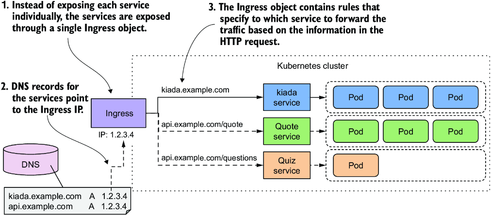
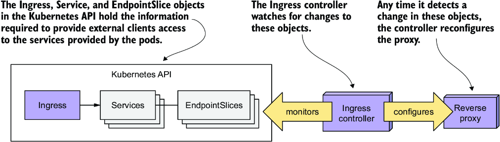
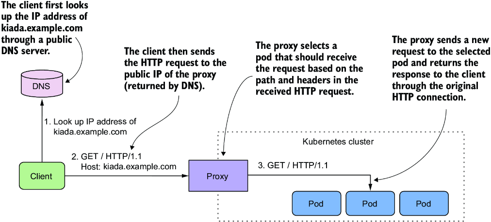
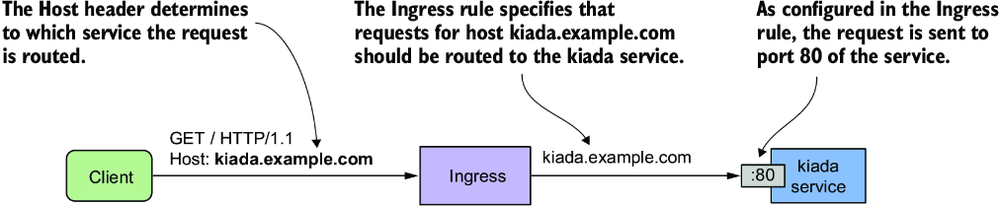
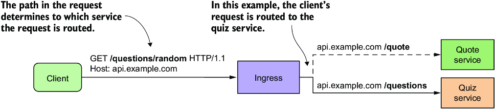
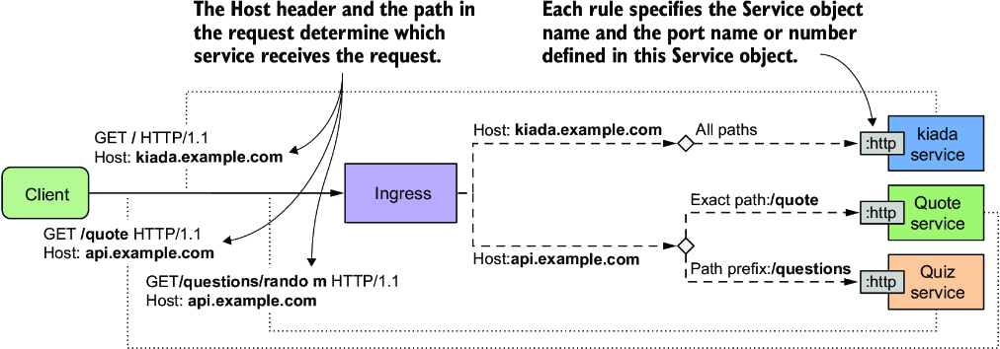
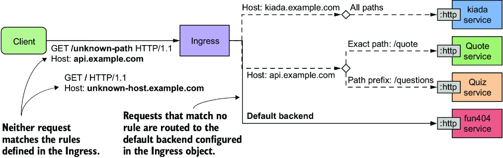
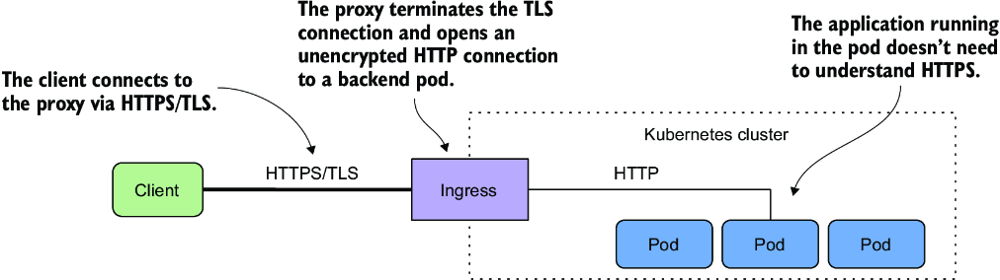
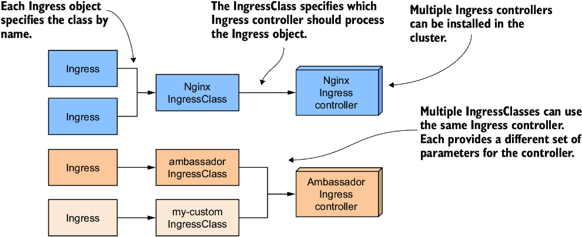

# Chương 12: Sử dụng Ingress để định tuyến lưu lượng đến Service

*(Dịch từ "Chapter 12: Using Ingress to route traffic to services" – Kubernetes in Action, Second Edition, tác giả Marko Lukša, NXB Manning)*

---

## Nội dung chính của chương
* Tạo các Ingress object
* Ingress controller và cách triển khai chúng
* Bảo mật Ingress bằng Transport Layer Security
* Bổ sung cấu hình cho một Ingress
* Sử dụng IngressClass khi có nhiều controller được cài đặt
* Sử dụng Ingress với các backend không phải service

Trong chương trước, bạn đã học cách dùng Service object để public một nhóm pod tại một địa chỉ IP ổn định. Nếu bạn dùng kiểu service LoadBalancer, service sẽ được cung cấp cho các client bên ngoài cluster thông qua một load balancer. Cách tiếp cận này ổn nếu bạn chỉ cần public một service duy nhất ra bên ngoài, nhưng nó trở nên có vấn đề khi số lượng service lớn, vì mỗi service cần một địa chỉ IP công cộng riêng.

May mắn thay, khi public các service này thông qua một Ingress object, bạn chỉ cần một địa chỉ IP duy nhất. Ngoài ra, Ingress còn cung cấp các tính năng khác như xác thực HTTP, session affinity dựa trên cookie, ghi lại URL (URL rewriting) và những tính năng khác mà Service object không thể.

> **GHI CHÚ:** Các file mã nguồn cho chương này có tại https://github.com/luksa/kubernetes-in-action-2nd-edition/tree/master/Chapter12.

---

## 12.1 Giới thiệu về Ingress (Introducing Ingresses)

Trước khi giải thích Ingress là gì trong ngữ cảnh Kubernetes, việc định nghĩa thuật ngữ chung *ingress* có thể giúp ích cho những độc giả không phải người bản ngữ tiếng Anh.

> **ĐỊNH NGHĨA:** Ingress (danh từ) – Hành động đi vào hoặc tiến vào; quyền được vào; phương tiện hoặc nơi để đi vào; lối vào.

Trong Kubernetes, Ingress là một cách để các client bên ngoài truy cập vào các service của những ứng dụng đang chạy trong cluster. Chức năng Ingress bao gồm ba thành phần sau:

* **Ingress API object** – Dùng để định nghĩa và cấu hình một Ingress
* **L7 load balancer hoặc reverse proxy** – Định tuyến lưu lượng đến các backend service
* **Ingress controller** – Theo dõi Kubernetes API để phát hiện các Ingress object, đồng thời triển khai và cấu hình load balancer hoặc reverse proxy

> **GHI CHÚ:** L4 và L7 lần lượt chỉ tầng 4 (Transport Layer – tầng giao vận; TCP, UDP) và tầng 7 (Application Layer – tầng ứng dụng; HTTP) của mô hình Open Systems Interconnection (mô hình OSI).

> **GHI CHÚ:** Không giống forward proxy, vốn định tuyến và lọc lưu lượng đi ra và thường được đặt cùng vị trí với các client mà nó phục vụ, reverse proxy xử lý lưu lượng đi vào và định tuyến nó đến một hoặc nhiều backend server. Reverse proxy được đặt gần các server đó.

Trong hầu hết nội dung trực tuyến, thuật ngữ *ingress controller* thường được dùng để chỉ cả load balancer/reverse proxy lẫn controller thực sự như một thực thể duy nhất, nhưng chúng là hai thành phần khác nhau. Vì lý do này, tôi đề cập đến chúng một cách riêng biệt trong chương này.

Tôi cũng dùng thuật ngữ *proxy* cho L7 load balancer, để bạn không nhầm lẫn nó với L4 load balancer xử lý lưu lượng cho các service kiểu LoadBalancer. Hãy nhớ rằng nếu Ingress chỉ định tuyến lưu lượng đến một backend pod duy nhất thì không có cân bằng tải nào cả.

### 12.1.1 Giới thiệu kiểu object Ingress (Introducing the Ingress object kind)

Khi bạn muốn public một tập hợp service ra bên ngoài, bạn tạo một Ingress object và tham chiếu các Service object trong đó. Kubernetes dùng Ingress object này để cấu hình một L7 load balancer (một HTTP reverse proxy) giúp các service có thể được các client bên ngoài truy cập thông qua một điểm vào (entrypoint) chung.

> **GHI CHÚ:** Nếu bạn public một Service thông qua Ingress, bạn thường có thể để kiểu Service là `ClusterIP`. Tuy nhiên, một số hiện thực ingress yêu cầu kiểu Service phải là `NodePort`. Hãy tham khảo tài liệu của ingress controller để xem có phải trường hợp này không.

#### Public các service thông qua một Ingress object (Exposing services through an Ingress object)

Mặc dù một Ingress object có thể được dùng để public một Service duy nhất, nó thường được dùng kết hợp với nhiều Service object, như minh họa trong hình 12.1. Hình này cho thấy cách một Ingress object duy nhất giúp cả ba service trong bộ Kiada có thể được các client bên ngoài truy cập.



*Hình 12.1: Một Ingress chuyển tiếp lưu lượng bên ngoài đến nhiều service.*

Ingress object chứa các quy tắc (rule) để định tuyến lưu lượng đến ba service dựa trên thông tin trong HTTP request. Các bản ghi DNS công cộng cho các service đều trỏ đến cùng một Ingress. Ingress xác định service nào sẽ nhận request dựa vào chính request đó. Nếu client request chỉ định host `kiada.example.com`, Ingress chuyển tiếp nó đến các pod thuộc service `kiada`, trong khi các request chỉ định host `api.example.com` được chuyển tiếp đến service `quote` hoặc `quiz`, tùy thuộc vào path được yêu cầu.

#### Sử dụng nhiều Ingress object trong một cluster (Using multiple Ingress objects in a cluster)

Một Ingress object thường xử lý lưu lượng cho tất cả Service object trong một Kubernetes namespace cụ thể, nhưng dùng nhiều Ingress cũng là một lựa chọn. Thông thường, mỗi Ingress object có địa chỉ IP riêng, nhưng một số hiện thực ingress dùng một điểm vào chung cho tất cả Ingress object mà bạn tạo trong cluster.

### 12.1.2 Giới thiệu Ingress controller và reverse proxy (Introducing the Ingress controller and the reverse proxy)

Không phải mọi Kubernetes cluster đều hỗ trợ Ingress sẵn có. Chức năng này được cung cấp bởi một thành phần add-on của cluster gọi là Ingress controller. Controller này là mối liên kết giữa Ingress object và ingress vật lý thực sự (reverse proxy). Thông thường, controller và proxy chạy dưới dạng hai tiến trình trong cùng một container hoặc hai container trong cùng một pod. Đó là lý do người ta dùng thuật ngữ ingress controller để chỉ cả hai.

Đôi khi controller hoặc proxy nằm bên ngoài cluster. Ví dụ, Google Kubernetes Engine cung cấp ingress controller riêng dùng L7 load balancer của Google Cloud Platform để cung cấp chức năng Ingress cho cluster.

Nếu cluster của bạn được triển khai trên nhiều availability zone (vùng khả dụng), một ingress duy nhất có thể xử lý lưu lượng cho tất cả các vùng đó. Chẳng hạn, nó chuyển tiếp mỗi HTTP request đến vùng tốt nhất tùy theo vị trí của client.

Có rất nhiều ingress controller để lựa chọn. Cộng đồng Kubernetes duy trì một danh sách tại https://kubernetes.io/docs/concepts/services-networking/ingress-controllers/. Trong số phổ biến nhất có Nginx ingress controller, Ambassador, Contour và Traefik. Hầu hết các ingress controller này dùng Nginx, HAProxy hoặc Envoy làm reverse proxy, nhưng một số dùng hiện thực proxy của riêng chúng.

#### Tìm hiểu vai trò của ingress controller (Understanding the role of the ingress controller)

Ingress controller là thành phần phần mềm đem lại sự sống cho Ingress object. Như minh họa trong hình 12.2, controller kết nối tới Kubernetes API server và theo dõi các object Ingress, Service, và Endpoints hoặc EndpointSlice. Bất cứ khi nào bạn tạo, sửa đổi hoặc xóa các object này, controller sẽ được thông báo. Nó dùng thông tin trong các object này để cung cấp (provision) và cấu hình reverse proxy cho Ingress.



*Hình 12.2: Vai trò của ingress controller*

Khi bạn tạo Ingress object, controller đọc phần spec của nó và kết hợp với thông tin trong các Service và EndpointSlice object mà nó tham chiếu. Controller chuyển đổi thông tin này thành cấu hình cho reverse proxy. Sau đó nó thiết lập một proxy mới với cấu hình này và thực hiện các bước bổ sung để đảm bảo proxy có thể được truy cập từ bên ngoài cluster. Nếu proxy chạy trong một pod bên trong cluster, điều này thường có nghĩa là một service kiểu LoadBalancer được tạo ra để public proxy ra bên ngoài.

Khi bạn thay đổi Ingress object, controller cập nhật cấu hình của proxy, và khi bạn xóa nó, controller dừng và gỡ bỏ proxy cùng mọi object khác mà nó đã tạo kèm theo.

#### Tìm hiểu cách proxy chuyển tiếp lưu lượng đến các service (Understanding how the proxy forwards traffic to the services)

Reverse proxy (hay L7 load balancer) là thành phần xử lý các HTTP request đi vào và chuyển tiếp chúng đến các service. Cấu hình của proxy thường chứa một danh sách các virtual host (máy chủ ảo) và, với mỗi host, một danh sách các IP của endpoint. Thông tin này được lấy từ các object Ingress, Service và Endpoints/EndpointSlice. Khi client kết nối đến proxy, proxy dùng thông tin này để định tuyến request đến một endpoint, chẳng hạn một pod, dựa trên path và các header của request.

Hình 12.3 cho thấy cách một client truy cập service Kiada thông qua proxy. Trước tiên client thực hiện tra cứu DNS cho `kiada.example.com`. DNS server trả về địa chỉ IP công cộng của reverse proxy. Sau đó client gửi một HTTP request đến proxy, trong đó header `Host` chứa giá trị `kiada.example.com`. Proxy ánh xạ host này tới địa chỉ IP của một trong các pod Kiada và chuyển tiếp HTTP request đến pod đó. Lưu ý rằng proxy không gửi request đến IP của service mà gửi trực tiếp đến pod. Đây là cách hầu hết các hiện thực ingress hoạt động.



*Hình 12.3: Truy cập các pod thông qua một Ingress*

### 12.1.3 Cài đặt một ingress controller (Installing an ingress controller)

Trước khi bắt đầu tạo Ingress, bạn cần đảm bảo rằng có một ingress controller đang chạy trong cluster của mình. Như bạn đã học ở mục trước, không phải Kubernetes cluster nào cũng có sẵn.

Nếu bạn dùng managed cluster (cluster được quản lý) của một trong các nhà cung cấp đám mây lớn, ingress controller đã có sẵn. Trong Google Kubernetes Engine, ingress controller là GLBC (GCE L7 Load Balancer), trong AWS chức năng Ingress được cung cấp bởi AWS Load Balancer Controller, còn Azure cung cấp AGIC (Application Gateway Ingress Controller). Hãy kiểm tra tài liệu của nhà cung cấp đám mây để xem ingress controller có được cung cấp hay không và bạn có cần bật nó lên hay không. Ngoài ra, bạn cũng có thể tự cài đặt ingress controller.

Như bạn đã biết, có nhiều hiện thực ingress khác nhau để lựa chọn. Tất cả đều cung cấp kiểu định tuyến lưu lượng được giải thích ở mục trước, nhưng mỗi loại cung cấp những tính năng bổ sung khác nhau. Trong tất cả ví dụ của chương này, tôi dùng Nginx ingress controller. Tôi đề nghị bạn cũng dùng nó trừ khi cluster của bạn cung cấp một loại khác.

> **GHI CHÚ:** Có hai hiện thực của Nginx ingress controller. Một do những người bảo trì Kubernetes cung cấp và một do chính các tác giả của Nginx cung cấp. Nếu bạn mới làm quen với Kubernetes, bạn nên bắt đầu với loại thứ nhất. Đó là loại tôi đã dùng.

#### Cài đặt Nginx ingress controller (Installing the Nginx ingress controller)

Bất kể bạn chạy Kubernetes cluster theo cách nào, bạn đều có thể cài đặt Nginx ingress controller bằng cách làm theo hướng dẫn tại https://kubernetes.github.io/ingress-nginx/deploy/.

Nếu bạn dùng công cụ kind để tạo cluster, hãy dùng script `Chapter12/create-kind-cluster.sh` thay cho script trong `Chapter04/`, vì ingress controller yêu cầu một file cấu hình cluster khác (xem file `Chapter12/kind-multi-node.yaml`). Cấu hình cập nhật này đảm bảo các cổng 80 và 443 được ánh xạ tới máy host, và label `ingress-ready=true` được thêm vào node control-plane để cho phép ingress controller được lập lịch chạy ở đó. Để cài đặt controller, hãy chạy lệnh sau:

```bash
$ kubectl apply -f https://raw.githubusercontent.com/kubernetes/ingress-nginx/main/deploy/static/provider/kind/deploy.yaml
```

Nếu bạn chạy cluster bằng Minikube, bạn có thể cài đặt controller như sau:

```bash
$ minikube addons enable ingress
```

Bạn cũng có thể cần chạy lệnh `minikube tunnel` để truy cập các LoadBalancer service và Ingress từ hệ điều hành host của bạn.

---

## 12.2 Tạo và sử dụng các Ingress object (Creating and using Ingress objects)

Mục trước đã giải thích những điều cơ bản về Ingress object và controller, cũng như cách cài đặt Nginx ingress controller. Trong mục này, bạn sẽ học cách dùng Ingress để public các service của bộ Kiada.

Trước khi tạo Ingress object đầu tiên, bạn phải triển khai các pod và service của bộ Kiada. Nếu bạn đã làm theo các bài thực hành trong chương trước, chúng hẳn đã có sẵn. Nếu chưa, bạn có thể tạo chúng bằng cách tạo namespace `kiada` rồi áp dụng tất cả manifest trong thư mục `Chapter12/SETUP/` bằng lệnh sau:

```bash
$ kubectl apply -f SETUP/ --recursive
```

### 12.2.1 Public một service thông qua Ingress (Exposing a service through an Ingress)

Một Ingress object tham chiếu một hoặc nhiều Service object. Ingress object đầu tiên của bạn public service `kiada`, service mà bạn đã tạo ở chương trước. Trước khi tạo Ingress, hãy ôn lại bằng cách xem manifest của service trong listing sau.

**Listing 12.1: Manifest của service kiada**

```yaml
apiVersion: v1
kind: Service
metadata:
  name: kiada                #1
spec:
  type: ClusterIP            #2
  selector:
    app: kiada
  ports:
  - name: http               #3
    port: 80                 #3
    targetPort: 8080         #3
  - name: https
    port: 443
    targetPort: 8443
```

- **#1** Hãy lưu ý tên service, vì Ingress object sẽ tham chiếu service theo tên.
- **#2** Đây là một service ClusterIP, nên nó chỉ có thể được truy cập từ bên trong cluster.
- **#3** Ingress sẽ public cổng 80 của service này. Các kết nối được chấp nhận trên cổng này được chuyển tiếp đến cổng 8080 của các pod phù hợp.

Kiểu Service là `ClusterIP` vì bản thân service không cần được các client bên ngoài cluster truy cập trực tiếp – Ingress sẽ lo việc đó. Mặc dù service public các cổng `80` và `443`, Ingress sẽ chỉ chuyển tiếp lưu lượng đến cổng `80`.

#### Tạo Ingress object (Creating the Ingress object)

Manifest của Ingress object được trình bày trong listing sau. Bạn có thể tìm thấy nó trong file `Chapter12/ing.kiada-example-com.yaml` trong kho mã nguồn của sách.

**Listing 12.2: Một Ingress object public service kiada tại kiada.example.com**

```yaml
apiVersion: networking.k8s.io/v1
kind: Ingress
metadata:
  name: kiada-example-com          #1
spec:
  rules:
  - host: kiada.example.com        #2
    http:
      paths:
      - path: /                    #3
        pathType: Prefix           #3
        backend:                   #4
          service:                 #4
            name: kiada            #4
            port:                  #4
              number: 80           #4
```

- **#1** Mặc dù tên của object này trùng với host, điều đó không bắt buộc. Bạn có thể đặt tên object theo bất kỳ cách nào bạn muốn.
- **#2** Ingress rule này khớp với mọi HTTP request có header Host được đặt là kiada.example.com.
- **#3** Rule khớp với mọi request, bất kể path trong request.
- **#4** Các request được chuyển tiếp đến cổng 80 của service kiada.

Manifest trong listing định nghĩa một Ingress object có tên `kiada-example-com`. Mặc dù bạn có thể đặt tên object tùy ý, nên đặt tên phản ánh host và/hoặc (các) path được chỉ định trong các ingress rule.

> **CẢNH BÁO:** Trong Google Kubernetes Engine, tên Ingress không được chứa dấu chấm; nếu không, thông báo lỗi sau sẽ hiển thị trong các event liên quan đến Ingress object: `Error syncing to GCP: error running load balancer syncing routine: invalid loadbalancer name`.

> **GHI CHÚ:** Nếu bạn áp dụng manifest này ngay sau khi triển khai Ingress controller, thao tác có thể thất bại với lỗi `failed calling webhook`. Nếu điều này xảy ra, hãy đợi vài giây rồi thử lại.

Ingress object trong listing định nghĩa một rule duy nhất. Rule này phát biểu rằng mọi request cho host `kiada.example.com` phải được chuyển tiếp đến cổng `80` của service `kiada`, bất kể path được yêu cầu (như được chỉ ra bởi các trường `path` và `pathType`). Điều này được minh họa trong hình 12.4.



*Hình 12.4: Cách Ingress object kiada-example-com cấu hình việc định tuyến lưu lượng bên ngoài*

#### Kiểm tra một Ingress object để lấy địa chỉ IP công cộng của nó (Inspecting an Ingress object to get its public IP address)

Sau khi tạo Ingress object bằng `kubectl apply`, bạn có thể xem thông tin cơ bản của nó bằng cách liệt kê các Ingress object trong namespace hiện tại với `kubectl get ingresses` như sau:

```bash
$ kubectl get ingresses
NAME                CLASS   HOSTS               ADDRESS       PORTS   AGE
kiada-example-com   nginx   kiada.example.com   11.22.33.44   80      30s
```

> **GHI CHÚ:** Bạn có thể dùng `ing` làm dạng viết tắt của `ingress`.

Để xem chi tiết Ingress object, hãy dùng lệnh `kubectl describe` như sau:

```bash
$ kubectl describe ing kiada-example-com
Name:             kiada-example-com                                   #1
Namespace:        default                                             #1
Address:          11.22.33.44                                         #2
Default backend:  default-http-backend:80 (172.17.0.15:8080)          #3
Rules:
  Host               Path  Backends
  ----               ----  --------
  kiada.example.com
                     /   kiada:80 (172.17.0.4:8080,172.17.0.5:8080,172.17.0.9:8080)   #4
Annotations:         <none>
Events:
  Type    Reason  Age                   From                      Message
  ----    ------  ----                  ----                      -------
  Normal  Sync    5m6s (x2 over 5m28s)  nginx-ingress-controller  Scheduled for sync
```

- **#1** Tên và namespace của Ingress object
- **#2** Địa chỉ IP của load balancer xử lý các request cho Ingress này
- **#3** Nếu request không khớp với rule nào, nó được chuyển tiếp đến service này. Xem mục 12.2.4.
- **#4** Với mỗi rule, host, path, service đích và các endpoint của nó được hiển thị.

Như bạn thấy, lệnh `kubectl describe` liệt kê tất cả các rule trong Ingress object. Với mỗi rule, không chỉ tên của service đích được hiển thị mà cả các endpoint của nó.

> **GHI CHÚ:** Output có thể hiển thị thông báo lỗi sau liên quan đến default backend: `<error: endpoints "default-http-backend" not found>`. Bạn sẽ tìm hiểu về default backend ở phần sau của chương này. Hiện tại, hãy cứ bỏ qua lỗi này.

Cả `kubectl get` lẫn `kubectl describe` đều hiển thị địa chỉ IP của Ingress. Đây là địa chỉ IP của L7 load balancer hoặc reverse proxy mà các client nên gửi request đến. Trong output ví dụ, địa chỉ IP là `11.22.33.44` và cổng là `80`.

> **GHI CHÚ:** Thông thường, proxy xử lý lưu lượng Ingress chỉ lắng nghe trên các cổng `80` và `443`, nhưng một số hiện thực Ingress cho phép bạn cấu hình (các) số cổng.

> **GHI CHÚ:** Địa chỉ có thể không hiển thị ngay lập tức, đặc biệt nếu cluster của bạn nằm trên đám mây. Nếu địa chỉ không hiển thị sau vài phút, điều đó có nghĩa là không có ingress controller nào đã xử lý Ingress object. Hãy kiểm tra xem controller có đang chạy không. Vì một cluster có thể chạy nhiều ingress controller, có khả năng tất cả chúng đều bỏ qua Ingress object của bạn nếu bạn không chỉ định controller nào sẽ xử lý nó. Hãy kiểm tra tài liệu của ingress controller bạn chọn để biết bạn có cần thêm annotation `kubernetes.io/ingress.class` hoặc đặt trường `spec.ingressClassName` trong Ingress object hay không. Bạn sẽ tìm hiểu thêm về trường này ở phần sau.

Bạn cũng có thể tìm thấy địa chỉ IP trong trường `status` của Ingress object như sau:

```bash
$ kubectl get ing kiada-example-com -o yaml
...
status:
  loadBalancer:
    ingress:
    - ip: 11.22.33.44             #1
```

- **#1** Địa chỉ của Ingress là một hostname hoặc một địa chỉ IP.

> **GHI CHÚ:** Đôi khi, địa chỉ hiển thị có thể gây hiểu lầm. Ví dụ, nếu bạn dùng Minikube và khởi động cluster trong một máy ảo (VM), địa chỉ ingress sẽ hiển thị là `localhost`, nhưng điều đó chỉ đúng từ góc nhìn của VM. Địa chỉ Ingress thực sự là địa chỉ IP của VM, mà bạn có thể lấy được bằng lệnh `minikube ip`.

#### Thêm IP của Ingress vào DNS (Adding the Ingress IP to the DNS)

Sau khi thêm một Ingress vào production cluster, bước tiếp theo là thêm một bản ghi vào DNS server của tên miền internet của bạn. Trong các ví dụ này, chúng ta giả định rằng bạn sở hữu tên miền `example.com`. Để cho phép các client bên ngoài truy cập service của bạn thông qua Ingress, bạn cấu hình DNS server để phân giải tên miền `kiada.example.com` thành IP của Ingress là `11.22.33.44`.

Trong một cluster phát triển cục bộ, bạn không phải bận tâm đến DNS server. Vì bạn chỉ truy cập service từ máy tính của chính mình, bạn có thể phân giải địa chỉ bằng những cách khác. Điều này được giải thích tiếp theo, cùng với hướng dẫn cách truy cập service thông qua Ingress.

#### Truy cập các service thông qua Ingress (Accessing services through the Ingress)

Vì Ingress dùng virtual hosting để xác định nơi chuyển tiếp request, bạn sẽ không nhận được kết quả mong muốn nếu chỉ đơn giản gửi một HTTP request đến địa chỉ IP và cổng của Ingress. Bạn cần đảm bảo rằng header `Host` trong HTTP request khớp với một trong các rule trong Ingress object.

Để đạt được điều này, bạn phải yêu cầu HTTP client gửi request đến host `kiada.example.com`. Tuy nhiên, làm vậy đòi hỏi phải phân giải host này thành IP của Ingress. Nếu bạn dùng `curl`, bạn có thể làm điều này mà không cần cấu hình DNS server hay file `/etc/hosts` cục bộ. Giả sử `11.22.33.44` là IP của Ingress. Bạn có thể truy cập service `kiada` thông qua Ingress bằng lệnh sau:

```bash
$ curl --resolve kiada.example.com:80:11.22.33.44 http://kiada.example.com -v
* Added kiada.example.com:80:11.22.33.44 to DNS cache               #1
* Hostname kiada.example.com was found in DNS cache                #2
*   Trying 11.22.33.44:80...                                        #2
* Connected to kiada.example.com (11.22.33.44) port 80 (#0)        #2
> GET / HTTP/1.1
> Host: kiada.example.com                                           #3
> User-Agent: curl/7.76.1
> Accept: */*
...
```

- **#1** Tùy chọn `--resolve` thêm hostname vào DNS cache.
- **#2** curl kết nối đến địa chỉ IP của Ingress.
- **#3** Header Host cho phép Ingress chuyển tiếp request đến đúng service.

Tùy chọn `--resolve` thêm hostname `kiada.example.com` vào DNS cache, đảm bảo rằng `kiada.example.com` được phân giải thành IP của Ingress. Sau đó `curl` mở kết nối đến Ingress và gửi HTTP request. Header `Host` trong request được đặt là `kiada.example.com`, cho phép Ingress chuyển tiếp request đến đúng service.

Dĩ nhiên, nếu bạn muốn dùng trình duyệt web, bạn không thể dùng tùy chọn `--resolve`. Thay vào đó, bạn có thể thêm mục sau vào file `/etc/hosts`:

```text
11.22.33.44    kiada.example.com     #1
```

- **#1** Thay 11.22.33.44 bằng địa chỉ IP Ingress của bạn

> **GHI CHÚ:** Trên Windows, file hosts thường nằm tại `C:\Windows\System32\Drivers\etc\hosts`.

Giờ bạn có thể truy cập service tại http://kiada.example.com bằng trình duyệt web hoặc `curl` mà không cần dùng tùy chọn `--resolve` để ánh xạ hostname sang IP.

### 12.2.2 Định tuyến lưu lượng ingress dựa trên path (Path-based ingress traffic routing)

Một Ingress object có thể chứa nhiều rule và do đó ánh xạ nhiều host và path tới nhiều service. Bạn đã tạo một Ingress cho service `kiada`. Giờ bạn sẽ tạo một Ingress cho các service `quote` và `quiz`.

Ingress object cho hai service này giúp chúng có thể được truy cập thông qua cùng một host: `api.example.com`. Path trong HTTP request quyết định service nào nhận mỗi request. Như minh họa trong hình 12.5, mọi request có path `/quote` được chuyển tiếp đến service `quote`, còn mọi request có path bắt đầu bằng `/questions` được chuyển tiếp đến service `quiz`.



*Hình 12.5: Định tuyến lưu lượng ingress dựa trên path*

Listing sau trình bày manifest của Ingress.

**Listing 12.3: Ingress ánh xạ các path của request tới những service khác nhau**

```yaml
apiVersion: networking.k8s.io/v1
kind: Ingress
metadata:
  name: api-example-com
spec:
  rules:
  - host: api.example.com          #1
    http:
      paths:
      - path: /quote               #2
        pathType: Exact            #2
        backend:                   #2
          service:                 #2
            name: quote            #2
            port:                  #2
              name: http           #2
      - path: /questions           #3
        pathType: Prefix           #3
        backend:                   #3
          service:                 #3
            name: quiz             #3
            port:                  #3
              name: http           #3
```

- **#1** Cả hai service đều được public thông qua host api.example.com.
- **#2** Các request có path /quote được chuyển tiếp đến service quote.
- **#3** Các request có path bắt đầu bằng /questions được chuyển tiếp đến service quiz.

Trong Ingress object ở listing, một rule duy nhất với hai path được định nghĩa. Rule này khớp với các HTTP request có host `api.example.com`. Trong rule này, mảng `paths` chứa hai mục. Mục thứ nhất khớp với các request yêu cầu path `/quote` và chuyển tiếp chúng đến cổng có tên `http` trong Service object `quote`. Mục thứ hai khớp với mọi request có phần tử path đầu tiên là `/questions` và chuyển tiếp chúng đến cổng `http` của service `quiz`.

> **GHI CHÚ:** Theo mặc định, Ingress proxy không thực hiện ghi lại URL (URL rewriting). Nếu client yêu cầu path `/quote`, path trong request mà proxy gửi đến backend service cũng là `/quote`. Trong một số hiện thực Ingress, bạn có thể thay đổi điều này bằng cách chỉ định một quy tắc ghi lại URL trong Ingress object.

Sau khi tạo Ingress object từ manifest trong listing trước, bạn có thể truy cập hai service mà nó public như sau (thay IP bằng IP Ingress của bạn):

```bash
$ curl --resolve api.example.com:80:11.22.33.44 api.example.com/quote             #1
$ curl --resolve api.example.com:80:11.22.33.44 api.example.com/questions/random  #2
```

- **#1** Gọi service quote
- **#2** Gọi service quiz

Nếu bạn muốn truy cập các service này bằng trình duyệt web, hãy thêm `api.example.com` vào dòng mà bạn đã thêm trước đó vào file `/etc/hosts`. Giờ dòng đó sẽ trông như sau:

```text
11.22.33.44    kiada.example.com api.example.com     #1
```

- **#1** Thay 11.22.33.44 bằng địa chỉ IP Ingress của bạn

#### Tìm hiểu cách path được so khớp (Understanding how the path is matched)

Bạn có nhận thấy sự khác biệt giữa các trường `pathType` trong hai mục ở listing trước không? Trường `pathType` chỉ định cách path trong request được so khớp với các path trong ingress rule. Ba giá trị được hỗ trợ được tóm tắt trong bảng 12.1.

**Bảng 12.1: Các giá trị được hỗ trợ trong trường pathType**

| Kiểu path | Mô tả |
|---|---|
| `Exact` | Path URL được yêu cầu phải khớp chính xác với path được chỉ định trong ingress rule. |
| `Prefix` | Path URL được yêu cầu phải bắt đầu bằng path được chỉ định trong ingress rule, so khớp theo từng phần tử. |
| `ImplementationSpecific` | Việc so khớp path phụ thuộc vào hiện thực của ingress controller. |

Nếu nhiều path được chỉ định trong ingress rule và path trong request khớp với nhiều hơn một path trong rule, ưu tiên được dành cho các path có kiểu path `Exact`.

#### So khớp path bằng kiểu path Exact (Matching paths using the Exact path type)

Bảng 12.2 trình bày các ví dụ về cách so khớp hoạt động khi `pathType` được đặt là `Exact`. Việc so khớp hoạt động đúng như bạn mong đợi. Nó phân biệt chữ hoa chữ thường, và path trong request phải khớp chính xác với path được chỉ định trong ingress rule.

**Bảng 12.2: Các path của request được khớp khi pathType là Exact**

| Path trong rule | Khớp với path của request | Không khớp |
|---|---|---|
| `/` | `/` | `/foo`<br>`/bar` |
| `/foo` | `/foo` | `/foo/`<br>`/bar` |
| `/foo/` | `/foo/` | `/foo`<br>`/foo/bar`<br>`/bar` |
| `/FOO` | `/FOO` | `/foo` |

#### So khớp path bằng kiểu path Prefix (Matching paths using the Prefix path type)

Khi `pathType` được đặt là `Prefix`, mọi thứ không hẳn như bạn mong đợi. Hãy xem xét các ví dụ trong bảng 12.3.

**Bảng 12.3: Các path của request được khớp khi pathType là Prefix**

| Path trong rule | Khớp với các path của request | Không khớp |
|---|---|---|
| `/` | Mọi path; ví dụ:<br>`/`<br>`/foo`<br>`/foo/` | |
| `/foo`<br>hoặc `/foo/` | `/foo`<br>`/foo/`<br>`/foo/bar` | `/foobar`<br>`/bar` |
| `/FOO` | `/FOO` | `/foo` |

Path của request không được xử lý như một chuỗi rồi kiểm tra xem nó có bắt đầu bằng tiền tố (prefix) được chỉ định hay không. Thay vào đó, cả path trong rule lẫn path của request đều được tách theo dấu `/`, rồi mỗi phần tử của path trong request được so sánh với phần tử tương ứng của prefix. Lấy path `/foo` làm ví dụ. Nó khớp với path của request `/foo/bar`, nhưng không khớp với `/foobar`. Nó cũng không khớp với path của request `/fooxyz/bar`.

Khi so khớp, việc path trong rule hay path trong request có kết thúc bằng dấu gạch chéo hay không không quan trọng. Giống như kiểu path `Exact`, việc so khớp phân biệt chữ hoa chữ thường.

#### So khớp path bằng kiểu path ImplementationSpecific (Matching paths using the ImplementationSpecific path type)

Kiểu path `ImplementationSpecific`, như tên gọi của nó, phụ thuộc vào hiện thực của ingress controller. Với kiểu path này, mỗi controller có thể đặt ra các quy tắc riêng để so khớp path của request. Ví dụ, trong GKE bạn có thể dùng ký tự đại diện (wildcard) trong path. Thay vì dùng kiểu `Prefix` và đặt path là `/foo`, bạn có thể đặt kiểu là `ImplementationSpecific` và path là `/foo/*`.

### 12.2.3 Sử dụng nhiều rule trong một Ingress object (Using multiple rules in an Ingress object)

Trong các mục trước, bạn đã tạo hai Ingress object để truy cập các service của bộ Kiada. Trong hầu hết các hiện thực Ingress, mỗi Ingress object cần địa chỉ IP công cộng riêng, vì vậy hiện giờ có lẽ bạn đang dùng hai địa chỉ IP công cộng. Vì điều này có thể tốn kém, tốt hơn là hợp nhất các Ingress object thành một.

#### Tạo một Ingress object với nhiều rule (Creating an Ingress object with multiple rules)

Vì một Ingress object có thể chứa nhiều rule, việc gộp nhiều object thành một là chuyện đơn giản. Tất cả những gì bạn phải làm là lấy các rule và đặt chúng vào cùng một Ingress object, như minh họa trong listing sau. Bạn có thể tìm thấy manifest trong file `ing.kiada.yaml`.

**Listing 12.4: Ingress public nhiều service trên các host khác nhau**

```yaml
apiVersion: networking.k8s.io/v1
kind: Ingress
metadata:
  name: kiada
spec:
  rules:
  - host: kiada.example.com        #1
    http:                          #1
      paths:                       #1
      - path: /                    #1
        pathType: Prefix           #1
        backend:                   #1
          service:                 #1
            name: kiada            #1
            port:                  #1
              name: http           #1
  - host: api.example.com          #2
    http:                          #2
      paths:                       #2
      - path: /quote               #2
        pathType: Exact            #2
        backend:                   #2
          service:                 #2
            name: quote            #2
            port:                  #2
              name: http           #2
      - path: /questions           #2
        pathType: Prefix           #2
        backend:                   #2
          service:                 #2
            name: quiz             #2
            port:                  #2
              name: http           #2
```

- **#1** Rule thứ nhất khớp với host kiada.example.com. Rule này được sao chép từ Ingress object kiada-example-com.
- **#2** Rule thứ hai khớp với host api.example.com. Nó được sao chép từ Ingress object api-example-com.

Ingress object duy nhất này xử lý toàn bộ lưu lượng cho tất cả service trong bộ Kiada mà chỉ cần một địa chỉ IP công cộng duy nhất.

Ingress object dùng virtual host để định tuyến lưu lượng đến các backend service. Nếu giá trị của header `Host` trong request là `kiada.example.com`, request được chuyển tiếp đến service `kiada`. Nếu giá trị header là `api.example.com`, request được định tuyến đến một trong hai service còn lại, tùy thuộc vào path được yêu cầu. Ingress và các Service object liên quan được thể hiện trong hình 12.6.



*Hình 12.6: Một Ingress object bao trùm tất cả service của bộ Kiada*

Bạn có thể xóa hai Ingress object đã tạo trước đó và thay thế chúng bằng Ingress trong listing trước. Sau đó bạn có thể thử truy cập cả ba service thông qua Ingress này. Vì đây là một Ingress object mới, địa chỉ IP của nó rất có thể không giống như trước. Do đó, bạn cần cập nhật DNS, file `/etc/hosts`, hoặc tùy chọn `--resolve` khi bạn chạy lại lệnh `curl`.

#### Sử dụng ký tự đại diện trong trường host (Using wildcards in the host field)

Trường `host` trong các ingress rule hỗ trợ dùng ký tự đại diện (wildcard). Điều này cho phép bạn bắt tất cả các request gửi đến một host khớp với `*.example.com` và chuyển tiếp chúng đến các service của bạn. Bảng 12.4 cho thấy cách so khớp wildcard hoạt động.

**Bảng 12.4: Ví dụ về việc dùng wildcard trong trường host của ingress rule**

| Host | Khớp với các host của request | Không khớp |
|---|---|---|
| `kiada.example.com` | `kiada.example.com` | `example.com`<br>`api.example.com`<br>`foo.kiada.example.com` |
| `*.example.com` | `kiada.example.com`<br>`api.example.com`<br>`foo.example.com` | `example.com`<br>`foo.kiada.example.com` |

Hãy xem ví dụ với wildcard. Như bạn thấy, `*.example.com` khớp với `kiada.example.com`, nhưng không khớp với `foo.kiada.example.com` hay `example.com`. Đó là vì một wildcard chỉ bao phủ một phần tử duy nhất của tên DNS. Giống như path trong rule, một rule khớp chính xác với host trong request được ưu tiên hơn các rule có host chứa wildcard.

> **GHI CHÚ:** Bạn cũng có thể bỏ hẳn trường `host` để rule khớp với mọi host.

### 12.2.4 Thiết lập default backend (Setting the default backend)

Nếu client request không khớp với bất kỳ rule nào được định nghĩa trong Ingress object, phản hồi `404 Not Found` thường được trả về. Tuy nhiên, bạn cũng có thể định nghĩa một default backend service (backend mặc định) mà Ingress sẽ chuyển tiếp request đến nếu không rule nào khớp. Default backend đóng vai trò là một rule "bắt tất cả" (catch-all).

Hình 12.7 cho thấy default backend trong bối cảnh các rule khác trong Ingress object. Một service có tên `fun404` được dùng làm default backend, vì vậy hãy thêm nó vào Ingress object `kiada`.



*Hình 12.7: Default backend xử lý các request không khớp với ingress rule nào.*

#### Chỉ định default backend trong một Ingress object (Specifying the default backend in an Ingress object)

Bạn chỉ định default backend trong trường `spec.defaultBackend`, như minh họa trong listing sau (manifest đầy đủ có trong file `ing.kiada.defaultBackend.yaml`).

**Listing 12.5: Chỉ định default backend trong Ingress object**

```yaml
apiVersion: networking.k8s.io/v1
kind: Ingress
metadata:
  name: kiada
spec:
  defaultBackend:              #1
    service:                   #1
      name: fun404             #1
      port:                    #1
        name: http             #1
  rules:
  ...
```

- **#1** Request được chuyển tiếp đến default backend nếu nó không khớp với rule nào.

Như listing cho thấy, việc thiết lập default backend không khác nhiều so với thiết lập backend trong các rule. Cũng như bạn chỉ định tên và cổng của backend service trong mỗi rule, bạn cũng chỉ định tên và cổng của default backend service trong trường `service` bên dưới `spec.defaultBackend`.

> **GHI CHÚ:** Một số hiện thực ingress dùng service `default-http-backend` trong namespace `kube-system` làm default backend nếu nó không được chỉ định rõ ràng trong Ingress object. Service này có thể có hoặc không tồn tại trong cluster của bạn, nhưng bạn luôn có thể tạo nó.

#### Tạo Service và Pod cho default backend (Creating the Service and Pod for the default backend)

Ingress object `kiada` giờ được cấu hình để chuyển tiếp các request không khớp với rule nào đến một service có tên `fun404`. Bạn cần tạo service này và pod bên dưới nó. Bạn có thể tìm thấy một object manifest chứa cả hai định nghĩa object trong file `all.fun404.yaml`. Nội dung của file được trình bày trong listing sau.

**Listing 12.6: Manifest của Pod và Service object cho default backend của Ingress**

```yaml
apiVersion: v1
kind: Pod
metadata:
  name: fun404                                              #1
  labels:
    app: fun404                                             #2
spec:
  containers:
  - name: server
    image: luksa/static-http-server                         #3
    args:                                                   #4
    - --listen-port=8080                                    #4
    - --response-code=404                                   #4
    - --text=This isn't the URL you're looking for.         #4
    ports:
    - name: http                                            #5
      containerPort: 8080                                   #5
---
apiVersion: v1
kind: Service
metadata:
  name: fun404                                              #6
  labels:
    app: fun404
spec:
  selector:                                                 #7
    app: fun404                                             #7
  ports:
  - name: http                                              #8
    port: 80                                                #8
    targetPort: http                                        #9
```

- **#1** Tên của pod là fun404.
- **#2** Label này phải khớp với label selector của Service object.
- **#3** Container chạy một HTTP server luôn trả về cùng một phản hồi.
- **#4** Phản hồi HTTP được cấu hình thông qua các đối số dòng lệnh.
- **#5** Container lắng nghe trên cổng 8080.
- **#6** Service cũng được gọi là fun404.
- **#7** Label selector định nghĩa các pod thuộc về service này.
- **#8** Tên cổng của service là http. Số cổng là 80.
- **#9** Service chuyển tiếp các kết nối đến cổng có tên http trên pod.

Sau khi áp dụng cả manifest của Ingress object lẫn manifest của Pod và Service object, bạn có thể kiểm tra default backend bằng cách gửi một request không khớp với bất kỳ rule nào trong Ingress. Ví dụ,

```bash
$ curl api.example.com/unknown-path --resolve api.example.com:80:11.22.33.44   #1
This isn't the URL you're looking for.                                          #2
```

- **#1** Request này không khớp với bất kỳ tổ hợp host/path nào trong Ingress object.
- **#2** Phản hồi này đến từ pod fun404.

Như mong đợi, văn bản phản hồi khớp với những gì bạn đã cấu hình trong pod `fun404`. Dĩ nhiên, thay vì dùng default backend để trả về một trạng thái 404 tùy chỉnh, bạn có thể dùng nó để chuyển tiếp tất cả request đến một service do bạn chọn.

Bạn thậm chí có thể tạo một Ingress object chỉ có default backend mà không có rule nào để chuyển tiếp toàn bộ lưu lượng bên ngoài đến một service duy nhất. Nếu bạn thắc mắc tại sao lại làm điều này bằng Ingress object thay vì chỉ đơn giản đặt kiểu service là LoadBalancer, đó là vì Ingress có thể cung cấp các tính năng HTTP bổ sung mà service không thể. Một ví dụ là bảo mật giao tiếp giữa client và service bằng Transport Layer Security (TLS), được giải thích tiếp theo.

---

## 12.3 Cấu hình TLS cho một Ingress (Configuring TLS for an Ingress)

Cho đến giờ trong chương này, bạn đã dùng Ingress object để cho phép lưu lượng HTTP bên ngoài đi vào các service của mình. Tuy nhiên, ngày nay bạn thường muốn bảo mật ít nhất toàn bộ lưu lượng bên ngoài bằng SSL/TLS.

Bạn có thể nhớ rằng service `kiada` cung cấp cả cổng HTTP lẫn cổng HTTPS. Khi tạo Ingress, bạn chỉ cấu hình nó để chuyển tiếp lưu lượng HTTP đến service, chứ không phải HTTPS. Giờ bạn sẽ làm điều đó.

Có hai cách để thêm hỗ trợ HTTPS. Bạn có thể cho phép HTTPS đi xuyên qua (pass through) ingress proxy và để backend pod kết thúc (terminate) kết nối TLS, hoặc để proxy kết thúc kết nối TLS rồi kết nối đến backend pod qua HTTP.

### 12.3.1 Cấu hình Ingress cho TLS passthrough (Configuring the Ingress for TLS passthrough)

Bạn có thể ngạc nhiên khi biết rằng Kubernetes không cung cấp một cách chuẩn để cấu hình TLS passthrough trong các Ingress object. Nếu ingress controller hỗ trợ TLS passthrough, bạn thường có thể cấu hình nó bằng cách thêm annotation vào Ingress object. Với Nginx ingress controller, bạn thêm annotation được trình bày trong listing sau.

**Listing 12.7: Bật SSL passthrough khi dùng Nginx ingress controller**

```yaml
apiVersion: networking.k8s.io/v1
kind: Ingress
metadata:
  name: kiada-ssl-passthrough
  annotations:
    nginx.ingress.kubernetes.io/ssl-passthrough: "true"    #1
spec:
  ...
```

- **#1** Bật SSL passthrough cho Ingress này

Hỗ trợ SSL passthrough trong Nginx ingress controller không được bật theo mặc định. Để bật nó, controller phải được khởi động với cờ `--enable-ssl-passthrough`.

Vì đây là một tính năng không chuẩn và phụ thuộc nhiều vào ingress controller bạn đang dùng, chúng ta sẽ không đi sâu hơn nữa. Để biết thêm thông tin về cách bật passthrough trong trường hợp của bạn, hãy xem tài liệu của controller mà bạn đang dùng.

Thay vào đó, hãy tập trung vào việc kết thúc kết nối TLS tại ingress proxy. Đây là một tính năng chuẩn được hầu hết các Ingress controller cung cấp và do đó xứng đáng được xem xét kỹ hơn.

### 12.3.2 Kết thúc TLS tại Ingress (Terminating TLS at the Ingress)

Hầu hết, nếu không muốn nói là tất cả, các hiện thực ingress controller đều hỗ trợ TLS termination (kết thúc TLS) tại ingress proxy. Proxy kết thúc kết nối TLS giữa client và chính nó, rồi chuyển tiếp HTTP request không mã hóa đến backend pod, như minh họa trong hình 12.8.



*Hình 12.8: Bảo mật các kết nối đến Ingress bằng TLS*

Để kết thúc kết nối TLS, proxy cần một chứng chỉ TLS (TLS certificate) và một khóa riêng (private key). Bạn cung cấp chúng thông qua một Secret mà bạn tham chiếu trong Ingress object.

#### Tạo một TLS Secret cho Ingress (Creating a TLS Secret for the Ingress)

Với Ingress `kiada`, bạn có thể tạo Secret từ file manifest `secret.tls-example-com.yaml` trong kho mã nguồn của sách, hoặc tạo khóa riêng, chứng chỉ và Secret bằng các lệnh sau:

```bash
$ openssl req -x509 -newkey rsa:2048 -keyout example.key -out example.crt \   #1
    -sha256 -days 7300 -nodes \                                               #1
    -subj '/CN=*.example.com' \                                               #1
    -addext 'subjectAltName = DNS:*.example.com'                              #1

$ kubectl create secret tls tls-example-com --cert=example.crt --key=example.key
secret/tls-example-com created                                                #2
```

- **#1** Tạo khóa riêng và chứng chỉ
- **#2** Tạo secret từ khóa và chứng chỉ

Chứng chỉ và khóa riêng giờ được lưu trong một Secret có tên `tls-example-com` dưới các khóa `tls.crt` và `tls.key` tương ứng.

#### Thêm TLS Secret vào Ingress (Adding the TLS Secret to the Ingress)

Để thêm Secret vào Ingress object, hoặc là chỉnh sửa object bằng `kubectl edit` và thêm các dòng được đánh dấu trong listing tiếp theo, hoặc là áp dụng file `ing.kiada.tls.yaml` bằng `kubectl apply`.

**Listing 12.8: Thêm một TLS secret vào Ingress**

```yaml
apiVersion: networking.k8s.io/v1
kind: Ingress
metadata:
  name: kiada
spec:
  tls:                               #1
  - secretName: tls-example-com      #2
    hosts:                           #3
    - "*.example.com"                #3
  rules:
  ...
```

- **#1** Trường tls là một mảng, nên bạn có thể thêm nhiều TLS secret vào Ingress.
- **#2** Tên của Secret chứa chứng chỉ TLS và khóa riêng
- **#3** Danh sách các host có trong chứng chỉ TLS

Như listing cho thấy, trường `tls` có thể chứa một hoặc nhiều mục. Mỗi mục chỉ định `secretName` nơi cặp chứng chỉ–khóa TLS được lưu và một danh sách các `hosts` mà cặp này áp dụng.

> **CẢNH BÁO:** Các host được chỉ định trong `tls.hosts` phải khớp với các tên được dùng trong chứng chỉ trong Secret.

#### Truy cập Ingress thông qua TLS (Accessing the Ingress through TLS)

Sau khi cập nhật Ingress object, bạn có thể truy cập service qua HTTPS như sau:

```bash
$ curl https://kiada.example.com --resolve kiada.example.com:443:11.22.33.44 -k -v
* Added kiada.example.com:443:11.22.33.44 to DNS cache
* Hostname kiada.example.com was found in DNS cache
*   Trying 11.22.33.44:443...
* Connected to kiada.example.com (11.22.33.44) port 443 (#0)
...
* Server certificate:                                   #1
*   subject: CN=*.example.com                           #1
*   start date: Dec  5 09:48:10 2021 GMT                #1
*   expire date: Nov 30 09:48:10 2041 GMT               #1
*   issuer: CN=*.example.com                            #1
...
> GET / HTTP/2
> Host: kiada.example.com
...
```

- **#1** Ingress dùng chứng chỉ TLS mà bạn đã cấu hình trong Ingress object.

Output của lệnh cho thấy chứng chỉ của server khớp với chứng chỉ mà bạn đã cấu hình cho Ingress.

Bằng cách thêm TLS secret vào Ingress, bạn không chỉ bảo mật service `kiada` mà cả các service `quote` và `quiz`, vì tất cả chúng đều được bao gồm trong Ingress object. Hãy thử truy cập chúng thông qua Ingress bằng HTTPS. Hãy nhớ rằng các pod cung cấp hai service này không tự cung cấp HTTPS. Ingress làm điều đó thay cho chúng.

---

## 12.4 Các tùy chọn cấu hình bổ sung cho Ingress (Additional Ingress configuration options)

Tôi hy vọng bạn chưa quên rằng bạn có thể dùng lệnh `kubectl explain` để tìm hiểu thêm về một kiểu API object cụ thể và rằng bạn dùng nó thường xuyên. Nếu chưa, giờ là lúc thích hợp để dùng nó xem bạn còn có thể cấu hình gì khác trong trường `spec` của một Ingress object. Hãy xem xét output của lệnh sau:

```bash
$ kubectl explain ingress.spec
```

Hãy nhìn vào danh sách các trường được lệnh này hiển thị. Bạn có thể ngạc nhiên khi thấy rằng ngoài các trường `defaultBackend`, `rules` và `tls` đã được giải thích ở các mục trước, chỉ có một trường khác được hỗ trợ, đó là `ingressClassName`. Trường này được dùng để chỉ định ingress controller nào sẽ xử lý Ingress object. Bạn sẽ tìm hiểu thêm về nó ở phần sau. Hiện tại, tôi muốn tập trung vào việc thiếu vắng các tùy chọn cấu hình bổ sung mà các HTTP proxy thường cung cấp.

Lý do bạn không thấy bất kỳ trường nào khác để chỉ định các tùy chọn này là vì gần như không thể đưa tất cả các tùy chọn cấu hình khả dĩ cho mọi hiện thực ingress có thể có vào schema của Ingress object. Thay vào đó, các tùy chọn tùy chỉnh này được cấu hình thông qua annotation hoặc trong các Kubernetes API object tùy chỉnh riêng biệt.

Mỗi hiện thực ingress controller hỗ trợ tập annotation hoặc object riêng của nó. Tôi đã đề cập trước đó rằng Nginx ingress controller dùng annotation để cấu hình TLS passthrough. Annotation cũng được dùng để cấu hình xác thực HTTP, session affinity, ghi lại URL, chuyển hướng (redirect), Cross-Origin Resource Sharing (CORS) và nhiều thứ khác. Danh sách các annotation được hỗ trợ có tại https://kubernetes.github.io/ingress-nginx/user-guide/nginx-configuration/annotations/.

Tôi không muốn đi vào từng annotation này, vì chúng đặc thù cho từng hiện thực, nhưng tôi muốn cho bạn xem một ví dụ về cách bạn có thể dùng chúng.

### 12.4.1 Cấu hình Ingress bằng annotation (Configuring the Ingress using annotations)

Bạn đã học ở chương trước rằng các Kubernetes service chỉ hỗ trợ session affinity dựa trên IP của client. Session affinity dựa trên cookie không được hỗ trợ vì service hoạt động ở tầng 4 của mô hình mạng OSI, trong khi cookie là một phần của tầng 7 (HTTP). Tuy nhiên, vì Ingress hoạt động ở L7, chúng có thể hỗ trợ session affinity dựa trên cookie. Đây là trường hợp của Nginx ingress controller được dùng trong ví dụ sau.

#### Sử dụng annotation để bật session affinity dựa trên cookie trong Nginx ingress (Using annotations to enable cookie-based session affinity in Nginx ingresses)

Listing sau trình bày một ví dụ về việc dùng các annotation đặc thù của Nginx ingress để bật session affinity dựa trên cookie và cấu hình tên cookie phiên (session cookie). Manifest trong listing có thể được tìm thấy trong file `ing.kiada.nginx-affinity.yaml`.

**Listing 12.9: Dùng annotation để cấu hình session affinity trong một Nginx ingress**

```yaml
apiVersion: networking.k8s.io/v1
kind: Ingress
metadata:
  name: kiada
  annotations:
    nginx.ingress.kubernetes.io/affinity: cookie                        #1
    nginx.ingress.kubernetes.io/session-cookie-name: SESSION_COOKIE     #2
spec:
  ...
```

- **#1** Bật session affinity dựa trên cookie
- **#2** Ghi đè tên HTTP cookie mặc định

Trong listing, bạn có thể thấy các annotation `nginx.ingress.kubernetes.io/affinity` và `nginx.ingress.kubernetes.io/session-cookie-name`. Annotation thứ nhất bật session affinity dựa trên cookie, còn annotation thứ hai đặt tên cookie. Tiền tố của khóa annotation cho thấy các annotation này đặc thù cho Nginx ingress controller và bị các hiện thực khác bỏ qua.

#### Kiểm tra session affinity dựa trên cookie (Testing the cookie-based session affinity)

Nếu bạn muốn thấy session affinity hoạt động, trước tiên hãy áp dụng file manifest, đợi cho đến khi cấu hình Nginx được cập nhật, rồi lấy cookie như sau:

```bash
$ curl -I http://kiada.example.com --resolve kiada.example.com:80:11.22.33.44
HTTP/1.1 200 OK
Date: Mon, 06 Dec 2021 08:58:10 GMT
Content-Type: text/plain
Connection: keep-alive
Set-Cookie: SESSION_COOKIE=1638781091; Path=/; HttpOnly        #1
```

- **#1** Đây là session cookie mà Nginx thêm vào phản hồi HTTP.

Giờ bạn có thể đưa cookie này vào request bằng cách chỉ định header `Cookie`:

```bash
$ curl -H "Cookie: SESSION_COOKIE=1638781091" http://kiada.example.com \
    --resolve kiada.example.com:80:11.22.33.44
```

Nếu bạn chạy lệnh này vài lần, bạn sẽ nhận thấy HTTP request luôn được chuyển tiếp đến cùng một pod, cho thấy session affinity đang dùng cookie.

### 12.4.2 Cấu hình Ingress bằng các API object bổ sung (Configuring the Ingress using additional API objects)

Một số hiện thực ingress không dùng annotation cho cấu hình ingress bổ sung, mà thay vào đó cung cấp các kiểu object riêng của chúng. Ở mục trước, bạn đã thấy cách dùng annotation để cấu hình session affinity khi dùng Nginx ingress controller. Trong mục này, bạn sẽ học cách làm điều tương tự trong Google Kubernetes Engine.

#### Sử dụng kiểu object BackendConfig để bật session affinity dựa trên cookie trong GKE (Using the BackendConfig object type to enable cookie-based session affinity in GKE)

Trong các cluster chạy trên GKE, một object tùy chỉnh kiểu BackendConfig có thể được tìm thấy trong Kubernetes API. Bạn tạo một instance của object này và tham chiếu nó theo tên trong Service object mà bạn muốn áp dụng object đó. Bạn tham chiếu object bằng annotation `cloud.google.com/backend-config`, như minh họa trong listing sau.

**Listing 12.10: Tham chiếu một BackendConfig trong một Service object trong GKE**

```yaml
apiVersion: v1
kind: Service
metadata:
  name: kiada
  annotations:
    cloud.google.com/backend-config: '{"default": "kiada-backend-config"}'   #1
spec:
```

- **#1** Chỉ định tên của BackendConfig object áp dụng cho service này

Bạn có thể dùng BackendConfig object để cấu hình nhiều thứ. Vì object này nằm ngoài phạm vi của cuốn sách, hãy dùng `kubectl explain backendconfig.spec` để tìm hiểu thêm về nó, hoặc xem tài liệu GKE.

Như một ví dụ nhanh về cách các object tùy chỉnh được dùng để cấu hình Ingress, tôi sẽ chỉ cho bạn cách cấu hình session affinity dựa trên cookie bằng BackendConfig object. Bạn có thể xem manifest của object trong listing sau.

**Listing 12.11: Dùng BackendConfig object đặc thù của GKE để cấu hình session affinity**

```yaml
apiVersion: cloud.google.com/v1          #1
kind: BackendConfig                      #1
metadata:
  name: kiada-backend-config
spec:
  sessionAffinity:                       #2
    affinityType: GENERATED_COOKIE       #2
```

- **#1** Một Kubernetes API object tùy chỉnh chỉ có trong Google Kubernetes Engine
- **#2** Bật session affinity dựa trên cookie cho service tham chiếu BackendConfig này

Trong listing, kiểu session affinity được đặt là `GENERATED_COOKIE`. Vì object này được tham chiếu trong service `kiada`, bất cứ khi nào một client truy cập service thông qua Ingress, request luôn được định tuyến đến cùng một backend pod.

Hai mục vừa rồi đã mô tả cách thêm cấu hình tùy chỉnh vào một Ingress object. Vì phương pháp phụ thuộc vào kiểu ingress controller bạn đang dùng, hãy xem tài liệu của nó để biết thêm thông tin.

---

## 12.5 Sử dụng nhiều ingress controller (Using multiple ingress controllers)

Vì các hiện thực ingress khác nhau cung cấp những chức năng bổ sung khác nhau, bạn có thể muốn cài đặt nhiều ingress controller trong một cluster. Trong trường hợp này, mỗi Ingress object cần chỉ ra ingress controller nào sẽ xử lý nó. Ban đầu, điều này được thực hiện bằng cách chỉ định tên controller trong annotation `kubernetes.io/ingress.class` của Ingress object. Phương pháp này hiện đã bị loại bỏ (deprecated), nhưng một số controller vẫn dùng nó.

Thay vì dùng annotation, cách đúng để chỉ định controller là thông qua các IngressClass object. Một hoặc nhiều IngressClass object thường được tạo khi bạn cài đặt một ingress controller.

Khi tạo một Ingress object, bạn chỉ định ingress class bằng cách chỉ định tên của IngressClass object trong trường `spec` của Ingress object. Mỗi IngressClass chỉ định tên của controller và các tham số tùy chọn. Do đó, class mà bạn tham chiếu trong Ingress object quyết định ingress proxy nào được cung cấp và nó được cấu hình như thế nào. Như minh họa trong hình 12.9, các Ingress object khác nhau có thể tham chiếu các IngressClass khác nhau, và các IngressClass này lại tham chiếu các ingress controller khác nhau.



*Hình 12.9: Mối quan hệ giữa Ingress, IngressClass và ingress controller*

### 12.5.1 Giới thiệu kiểu object IngressClass (Introducing the IngressClass object kind)

Nếu Nginx ingress controller đang chạy trong cluster của bạn, một IngressClass object có tên `nginx` đã được tạo khi bạn cài đặt controller. Nếu các ingress controller khác được triển khai trong cluster, bạn cũng có thể tìm thấy các IngressClass khác.

#### Tìm các IngressClass trong cluster của bạn (Finding IngressClasses in your cluster)

Để xem cluster của bạn cung cấp những ingress class nào, bạn có thể liệt kê chúng bằng `kubectl get`:

```bash
$ kubectl get ingressclasses
NAME    CONTROLLER             PARAMETERS   AGE
nginx   k8s.io/ingress-nginx   <none>       10h    #1
```

- **#1** IngressClass chỉ định ingress controller và các tham số được truyền cho nó.

Output của lệnh cho thấy một IngressClass duy nhất có tên `nginx` tồn tại trong cluster. Các Ingress dùng class này được xử lý bởi controller `k8s.io/ingress-nginx`. Bạn cũng có thể thấy class này không chỉ định tham số controller nào.

#### Kiểm tra manifest YAML của một IngressClass object (Inspecting the YAML manifest of an IngressClass object)

Hãy xem xét kỹ hơn IngressClass object `nginx` bằng cách kiểm tra định nghĩa YAML của nó:

```bash
$ kubectl get ingressclasses nginx -o yaml
apiVersion: networking.k8s.io/v1        #1
kind: IngressClass                      #1
metadata:
  name: nginx                           #2
spec:
  controller: k8s.io/ingress-nginx      #3
```

- **#1** Các IngressClass object thuộc về API group và version này.
- **#2** Tên của class
- **#3** Controller sẽ xử lý các Ingress thuộc class này

IngressClass object này không chỉ định gì khác ngoài tên của controller. Ở phần sau bạn sẽ thấy cách bạn cũng có thể thêm các tham số cho controller vào object.

### 12.5.2 Chỉ định IngressClass trong Ingress object (Specifying the IngressClass in the Ingress object)

Khi tạo một Ingress object, bạn có thể chỉ định class của Ingress bằng trường `ingressClassName` trong phần `spec` của Ingress object, như trong listing sau.

**Listing 12.12: Ingress object tham chiếu một IngressClass cụ thể**

```yaml
apiVersion: networking.k8s.io/v1
kind: Ingress
metadata:
  name: kiada
spec:
  ingressClassName: nginx        #1
  rules:
  ...
```

- **#1** Đây là nơi class của Ingress object này được chỉ định.

Ingress object trong listing chỉ ra rằng class của nó phải là `nginx`. Vì IngressClass này chỉ định `k8s.io/ingress-nginx` làm controller, Ingress trong listing này được xử lý bởi Nginx ingress controller.

#### Thiết lập IngressClass mặc định (Setting the default IngressClass)

Nếu nhiều ingress controller được cài đặt trong cluster, sẽ có nhiều IngressClass object. Nếu một Ingress object không chỉ định class, Kubernetes áp dụng IngressClass mặc định, được đánh dấu như vậy bằng cách đặt annotation `ingressclass.kubernetes.io/is-default-class` là `"true"`.

### 12.5.3 Thêm tham số vào một IngressClass (Adding parameters to an IngressClass)

Ngoài việc dùng IngressClass để chỉ định ingress controller nào được dùng cho một Ingress object cụ thể, IngressClass cũng có thể được dùng với một ingress controller duy nhất nếu controller đó có thể cung cấp các "hương vị" (flavor) ingress khác nhau. Điều này đạt được bằng cách chỉ định các tham số khác nhau trong mỗi IngressClass.

#### Chỉ định tham số trong IngressClass object (Specifying parameters in the IngressClass object)

IngressClass object không cung cấp trường nào để bạn đặt các tham số ngay trong chính object, vì mỗi ingress controller có những đặc thù riêng và sẽ cần một tập trường khác nhau. Thay vào đó, cấu hình tùy chỉnh của một IngressClass thường được lưu trong một kiểu Kubernetes object tùy chỉnh riêng biệt, đặc thù cho từng hiện thực ingress controller. Bạn tạo một instance của kiểu object tùy chỉnh này và tham chiếu nó trong IngressClass object.

Ví dụ, AWS cung cấp một object có kind `IngressClassParams` trong API group `elbv2.k8s.aws`, phiên bản `v1beta1`. Để cấu hình các tham số trong một IngressClass object, bạn tham chiếu instance của IngressClassParams object, như minh họa trong listing 12.13.

**Listing 12.13: Tham chiếu một object tham số tùy chỉnh trong IngressClass**

```yaml
apiVersion: networking.k8s.io/v1
kind: IngressClass                       #1
metadata:
  name: custom-ingress-class
spec:
  controller: ingress.k8s.aws/alb        #2
  parameters:                            #3
    apiGroup: elbv2.k8s.aws              #3
    kind: IngressClassParams             #3
    name: custom-ingress-params          #3
```

- **#1** Đây là một IngressClass object chuẩn.
- **#2** AWS Load Balancer controller được dùng để cung cấp các Ingress thuộc class này.
- **#3** Các tham số được dùng khi triển khai một Ingress thuộc class này được lưu trong IngressClassParams object có tên custom-ingress-params.

Trong listing, instance IngressClassParams object chứa các tham số cho IngressClass này có tên `custom-ingress-params`. Kind và `apiGroup` của object cũng được chỉ định.

#### Ví dụ về một kiểu API object tùy chỉnh dùng để chứa tham số cho IngressClass (Example of a custom API object type used to hold parameters for the IngressClass)

Listing sau trình bày một ví dụ về IngressClassParams object.

**Listing 12.14: Ví dụ manifest của IngressClassParams object**

```yaml
apiVersion: elbv2.k8s.aws/v1beta1        #1
kind: IngressClassParams                 #1
metadata:
  name: custom-ingress-params            #2
spec:
  scheme: internal                       #3
  ipAddressType: dualstack               #3
  tags:                                  #3
  - key: org                             #3
    value: my-org                        #3
```

- **#1** Đây là một kiểu object tùy chỉnh có trong AWS.
- **#2** Tên object tương ứng với tên được tham chiếu trong trường parameter của IngressClass object.
- **#3** Các trường này chứa cấu hình cho ingress.

Với các object IngressClass và IngressClassParams đã sẵn sàng, người dùng cluster có thể tạo các Ingress object với `ingressClassName` được đặt là `custom-ingress-class`. Các object này được xử lý bởi controller `ingress.k8s.aws/alb` (AWS Load Balancer controller). Controller đọc các tham số từ IngressClassParams object và dùng chúng để cấu hình load balancer.

Kubernetes không quan tâm đến nội dung của IngressClassParams object, vì nó chỉ được ingress controller sử dụng. Vì mỗi hiện thực dùng kiểu object riêng của mình, bạn nên tham khảo tài liệu của controller hoặc dùng `kubectl explain` để tìm hiểu thêm về từng kiểu.

---

## 12.6 Sử dụng custom resource thay cho service làm backend (Using custom resources instead of services as backends)

Trong chương này, các backend được tham chiếu trong Ingress luôn là các Service object. Tuy nhiên, một số ingress controller cho phép bạn dùng các resource khác làm backend.

Về lý thuyết, một ingress controller có thể cho phép dùng Ingress object để public nội dung của một ConfigMap hay PersistentVolume, nhưng điển hình hơn là các controller dùng resource backend để cung cấp một tùy chọn cấu hình các quy tắc định tuyến Ingress nâng cao thông qua một custom resource.

### 12.6.1 Sử dụng một object tùy chỉnh để cấu hình định tuyến Ingress (Using a custom object to configure Ingress routing)

Citrix ingress controller cung cấp kiểu object tùy chỉnh HTTPRoute, cho phép bạn cấu hình nơi Ingress sẽ định tuyến các HTTP request. Như minh họa trong manifest sau, bạn không chỉ định một Service object làm backend, mà thay vào đó chỉ định `kind`, `apiGroup` và `name` của HTTPRoute object chứa các quy tắc định tuyến.

**Listing 12.15: Ví dụ Ingress object dùng resource backend**

```yaml
apiVersion: networking.k8s.io/v1
kind: Ingress
metadata:
  name: my-ingress
spec:
  ingressClassName: citrix
  rules:
  - host: example.com
    http:
      paths:
      - pathType: ImplementationSpecific
        backend:                              #1
          resource:                           #1
            apiGroup: citrix.com              #2
            kind: HTTPRoute                   #2
            name: my-example-route            #3
```

- **#1** Ingress backend cho rule này không phải là một Service, mà là một Kubernetes resource tùy chỉnh.
- **#2** Kind và API group của resource được chỉ định ở đây.
- **#3** Đây là tên của instance HTTPRoute object chứa các quy tắc định tuyến HTTP.

Ingress object trong listing chỉ định một rule duy nhất. Nó phát biểu rằng ingress controller phải chuyển tiếp lưu lượng dành cho host `example.com` theo cấu hình được chỉ định trong object có kind `HTTPRoute` (thuộc API group `citrix.com`) có tên `my-example-route`. Vì HTTPRoute object không phải là một phần của Kubernetes API, nội dung của nó nằm ngoài phạm vi cuốn sách này, nhưng có lẽ bạn có thể đoán rằng nó chứa các quy tắc giống như trong Ingress object nhưng được chỉ định theo cách khác và với các tùy chọn cấu hình bổ sung.

Tại thời điểm viết sách, các ingress controller hỗ trợ custom resource backend còn hiếm, nhưng có lẽ bạn muốn tự hiện thực một cái. Khi đọc xong cuốn sách này, bạn sẽ biết cách làm.

---

## Tóm tắt

* Một ingress controller cấu hình một L7 load balancer hoặc reverse proxy dựa trên cấu hình trong Ingress object.
* Trong khi Service là một lớp trừu tượng trên một tập hợp pod, Ingress là một lớp trừu tượng trên một tập hợp service.
* Một Ingress chỉ cần một IP công cộng duy nhất bất kể số lượng service mà nó public, trong khi mỗi LoadBalancer service cần IP công cộng riêng.
* Các client bên ngoài phải phân giải các hostname được chỉ định trong Ingress object thành địa chỉ IP của ingress proxy. Để làm được điều này, bạn phải thêm các bản ghi cần thiết vào DNS server chịu trách nhiệm cho tên miền mà host thuộc về. Ngoài ra, cho mục đích phát triển, bạn có thể sửa file `/etc/hosts` trên máy cục bộ của mình.
* Một Ingress hoạt động ở tầng 7 của mô hình OSI và do đó có thể cung cấp các chức năng liên quan đến HTTP mà các service hoạt động ở tầng 4 không thể.
* Một ingress proxy thường chuyển tiếp HTTP request trực tiếp đến backend pod mà không đi qua IP của service, nhưng điều này phụ thuộc vào hiện thực ingress.
* Ingress object chứa các rule chỉ định HTTP request mà ingress proxy nhận được sẽ được chuyển tiếp đến service nào dựa trên host và path trong request. Mỗi rule có thể chỉ định một host chính xác hoặc một host có wildcard, và một path chính xác hoặc một tiền tố path.
* Default backend là một rule "bắt tất cả" quyết định service nào sẽ xử lý các request không khớp với rule nào.
* Một Ingress có thể được cấu hình để public các service qua TLS. Ingress proxy có thể kết thúc kết nối TLS và chuyển tiếp HTTP request không mã hóa đến backend pod. Một số hiện thực ingress hỗ trợ TLS passthrough.
* Các tùy chọn cấu hình Ingress đặc thù cho một hiện thực ingress cụ thể được đặt thông qua annotation của Ingress object hoặc thông qua các kiểu Kubernetes object tùy chỉnh mà controller cung cấp.
* Một Kubernetes cluster có thể chạy nhiều hiện thực ingress controller đồng thời. Khi tạo một Ingress object, bạn chỉ định IngressClass. IngressClass object chỉ định controller nào sẽ xử lý Ingress object. Tùy chọn, IngressClass cũng có thể chỉ định các tham số cho controller.
