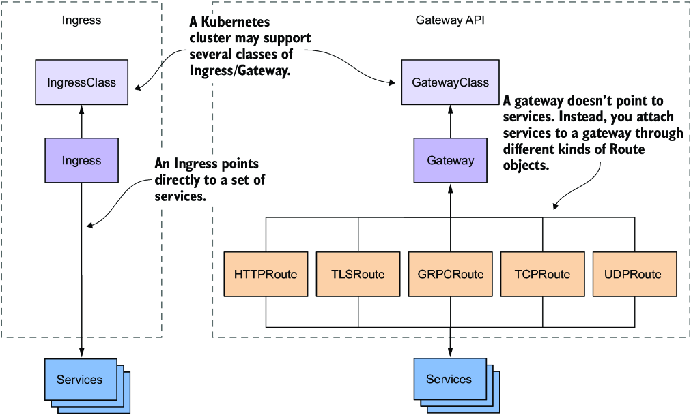
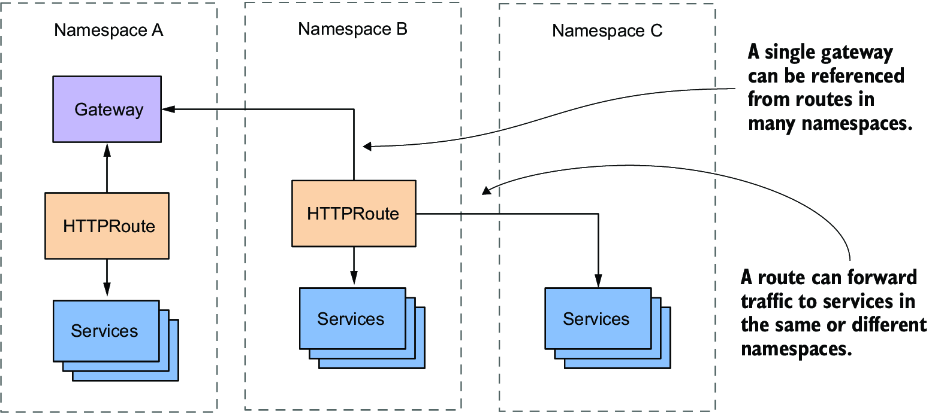
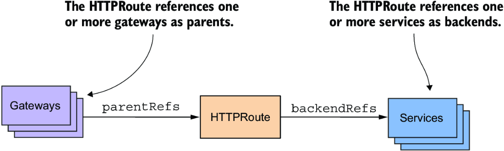

# Chương 13: Định tuyến lưu lượng bằng Gateway API

*(Dịch từ "Chapter 13: Routing traffic using the Gateway API" – Kubernetes in Action, Second Edition, tác giả Marko Lukša, NXB Manning)*

---

## Nội dung chính của chương
* Sự khác biệt giữa Ingress API và Gateway API
* Sử dụng Istio làm Gateway API provider
* Public các HTTP service và TLS service ra bên ngoài
* Public các TCP, UDP và gRPC service ra bên ngoài
* Định tuyến (routing), phản chiếu (mirroring) và phân chia (splitting) lưu lượng

Trong chương trước, bạn đã học cách public các service ra bên ngoài bằng resource Ingress. Tuy nhiên, các tính năng mà Ingress API tiêu chuẩn hỗ trợ khá hạn chế. Với các ứng dụng thực tế, bạn buộc phải dùng những phần mở rộng không chuẩn do implementation Ingress mà bạn chọn cung cấp. Như một giải pháp thay thế, một API mới đã được giới thiệu – Gateway API. Gateway API cung cấp cho người dùng một tập hợp khả năng rộng hơn để làm cho các Kubernetes Service có thể truy cập được từ thế giới bên ngoài bằng cách định tuyến chúng qua một hoặc nhiều gateway proxy. Những proxy này không chỉ hỗ trợ HTTP và TLS mà còn hỗ trợ cả các Service TCP và UDP tổng quát. Vì vậy, trong khi Ingress là một proxy tầng L7, Gateway API hỗ trợ proxy xuống tới tầng L4. Trong chương này, bạn sẽ tìm hiểu thêm về API mới này.

Trước khi bắt đầu, hãy tạo Namespace `kiada`, chuyển sang thư mục `Chapter13/` và áp dụng tất cả các manifest trong thư mục `SETUP/` bằng cách chạy các lệnh sau:

```bash
$ kubectl create ns kiada
$ kubectl config set-context --current --namespace kiada
$ kubectl apply -f SETUP -R
```

> **GHI CHÚ:** Các file code của chương này có tại https://github.com/luksa/kubernetes-in-action-2nd-edition/tree/master/Chapter13.

---

## 13.1 Giới thiệu Gateway API (Introducing the Gateway API)

Gateway API bao gồm một tập hợp các Kubernetes resource cho phép bạn thiết lập một gateway proxy và dùng nó để dẫn lưu lượng từ bên ngoài cluster tới các service của bạn. Những service này không cần phải thuộc kiểu NodePort hay LoadBalancer, mà có thể là các Service ClusterIP tiêu chuẩn, giống như trường hợp của Ingress.

### 13.1.1 So sánh Gateway API với Ingress (Comparing Gateway API to Ingress)

Vì bạn đã học về Ingress trong chương trước, cách tốt nhất để giới thiệu Gateway API là so sánh nó với Ingress. Hình 13.1 cho thấy các kiểu Kubernetes object mà bạn sẽ gặp trong mỗi API và cách chúng liên hệ với nhau.



*Hình 13.1: So sánh các resource của Ingress và Gateway API*

Để public một tập hợp service ra bên ngoài bằng Ingress API, bạn tạo một Ingress object. Tương tự, trong Gateway API, bạn tạo một Gateway object. Mỗi gateway thuộc về một GatewayClass cụ thể, cũng như mỗi Ingress object thuộc về một IngressClass cụ thể. Một cluster có thể cung cấp một hoặc nhiều class như vậy, nên bạn có thể chọn provider cho từng gateway mà bạn tạo.

Đến đây, không có sự khác biệt nào giữa hai API, ngoại trừ tên của các kiểu object. Nhưng khi nói đến việc kết nối các service với Ingress object hoặc Gateway object thì mọi thứ lại khác. Trong Gateway API, bạn làm việc này bằng cách tạo một Route object thuộc một kiểu nhất định, tùy thuộc vào kiểu service mà bạn muốn public. Còn trong Ingress API, bạn chỉ định các service trực tiếp trong Ingress object.

#### Hiểu vì sao tách riêng các Route object lại tốt hơn (Understanding why having separate Route objects is better)

Một ưu điểm của việc tách các quy tắc định tuyến lưu lượng ra thành các object riêng là Gateway object vẫn giữ được kích thước nhỏ. Thay vì chỉ định tất cả các quy tắc trong một object lớn duy nhất, chúng được chia ra thành nhiều Route object thuộc các kiểu khác nhau, thể hiện bản chất của route. Trong khi Ingress chỉ hỗ trợ HTTP, Gateway API còn hỗ trợ trực tiếp cả lưu lượng TLS, gRPC, TCP và UDP.

Tuy nhiên, ưu điểm lớn nhất của việc tách riêng gateway và route là bạn có thể phân chia việc quản lý các object này cho những vai trò người dùng khác nhau. Mỗi vai trò có thể được cấp các đặc quyền riêng. Chẳng hạn, gateway thường do quản trị viên cluster quản lý, trong khi route thường do các lập trình viên ứng dụng tạo ra. Trong Ingress API, bạn không thể tách hai trách nhiệm này, nên hoặc là lập trình viên phải tự quản lý gateway, hoặc là quản trị viên cluster phải làm việc đó thay họ. Nếu bạn dùng Gateway API, bạn có thể phân chia các trách nhiệm này một cách hợp lý.

Ưu điểm cuối cùng của route là một Gateway object có thể được chia sẻ giữa nhiều namespace, như minh họa trong hình 13.2. Một route trong namespace này có thể tham chiếu tới một gateway trong namespace khác. Nó cũng có thể tham chiếu tới các service trong những namespace khác. Tính năng này làm cho Gateway API mạnh hơn Ingress rất nhiều, vì bạn có thể dùng một Gateway duy nhất và một địa chỉ IP public duy nhất để public các service trong nhiều namespace.



*Hình 13.2: Sử dụng gateway và HTTPRoute xuyên namespace*

### 13.1.2 Tìm hiểu implementation của Gateway API (Understanding the Gateway API implementation)

Gateway API, đúng như tên gọi, là một giao diện lập trình ứng dụng (application programming interface – API), tức là một tập hợp các quy tắc định nghĩa hành vi của một hệ thống. Các quy tắc này phải được ai đó hiện thực (implement). Cũng như với Ingress, bản thân Kubernetes không cung cấp implementation của Gateway API. Thay vào đó, có nhiều implementation của bên thứ ba.

Như bạn có thể biết, việc có nhiều implementation cho cùng một API tất yếu dẫn đến sự khác biệt về hành vi và chức năng sẵn có giữa các implementation đó. Chúng ta đã thấy điều này trong chương trước, khi các Ingress provider khác nhau dùng các annotation khác nhau để cấu hình những tính năng không chuẩn.

Kubernetes Network Special Interest Group (SIG), nhóm giám sát mảng mạng của Kubernetes và là tác giả của Gateway API, đã cẩn trọng để không lặp lại những sai lầm đã mắc phải với Ingress API. Vì lý do này, họ tổ chức API sao cho đảm bảo tính nhất quán giữa các implementation khác nhau. Để làm được điều đó, họ gắn mỗi tính năng với các thuộc tính sau:

* Một kênh phát hành (release channel) – standard hoặc experimental
* Một mức hỗ trợ (support level) – core, extended hoặc implementation-specific

Các mục tiếp theo sẽ giải thích những thuộc tính này.

#### Kênh phát hành experimental và kênh stable (Experimental vs stable release channel)

Bạn không thể dùng Gateway API cho đến khi cài đặt cái gọi là Custom Resource Definition (CRD) cho các resource của Gateway API. Mỗi resource của Gateway API và mỗi trường bên trong resource đó thuộc về một trong hai kênh phát hành. Khi cài đặt các CRD của Gateway API, bạn phải quyết định dùng kênh phát hành nào:

* Kênh *standard* chỉ chứa các resource và trường được xem là ổn định (stable) và sẽ không thay đổi trong các phiên bản tương lai của API.
* Kênh *experimental* chứa thêm các resource và trường mà, đúng như tên gọi, còn đang thử nghiệm và có thể thay đổi trong tương lai.

Ví dụ, vào thời điểm tôi viết những dòng này, chỉ có kiểu HTTPRoute là có trong kênh standard, còn tất cả các kiểu route khác vẫn ở trạng thái experimental. Khi Network SIG chắc chắn rằng API cho các kiểu route này đã bao phủ tối ưu mọi trường hợp sử dụng, họ sẽ chuyển chúng sang kênh standard.

#### Tính năng core, extended và implementation-specific (Core vs. extended vs. implementation-specific features)

Việc một tính năng của Gateway API có mặt trong kênh standard chỉ đơn giản có nghĩa là phần API này sẽ không thay đổi trong tương lai, chứ không nói lên điều gì về việc mọi implementation có hỗ trợ tính năng đó hay không. Đó là vì các tính năng của Gateway API, dù stable hay experimental, còn được phân loại thêm theo ba mức hỗ trợ sau:

* Các tính năng *core* là những tính năng tiêu chuẩn mà mọi implementation của Gateway API đều phải hỗ trợ. Những tính năng này có tính khả chuyển (portable). Vì vậy, nếu bạn chỉ dùng chúng, bạn có thể chuyển đổi giữa các implementation Gateway API khác nhau mà không gặp vấn đề gì.
* Các tính năng *extended* có tính khả chuyển nhưng có thể không được mọi implementation hỗ trợ. Nghĩa là, nếu một implementation hỗ trợ một tính năng như vậy, bạn có thể giả định rằng hành vi của nó là giống nhau ở mọi implementation khác. Nếu một implementation Gateway API khác hỗ trợ tất cả các tính năng bạn dùng, bạn có thể chuyển sang implementation đó mà không lo ngữ nghĩa sẽ thay đổi.
* Các tính năng *implementation-specific* (đặc thù của implementation) không có tính khả chuyển, hành vi và ngữ nghĩa của chúng phụ thuộc vào implementation Gateway API. Bạn không thể chuyển sang một implementation khác mà không thay đổi cấu hình của mình.

Điều này nghe có vẻ đáng ngại, nhưng bạn không cần lo lắng về việc một tính năng cụ thể thuộc mức hỗ trợ nào. Trong thực tế, bạn hiếm khi chuyển sang một Gateway API provider khác, nên việc một tính năng là core, extended hay implementation-specific không thực sự quan trọng.

#### Các implementation Gateway API hiện có (Available Gateway API implementations)

Như đã đề cập trước đó, Gateway API bao gồm một tập hợp các Kubernetes API resource mà bạn dùng để cấu hình một gateway. Implementation của API này phụ thuộc vào Gateway API provider nào được cài đặt trong cluster của bạn. Bạn có thể chọn trong số nhiều provider và thậm chí cài nhiều hơn một provider trong cùng một cluster. Tôi không muốn liệt kê tất cả các provider hiện có, vì danh sách này chắc chắn sẽ thay đổi sau khi cuốn sách được xuất bản. Vì thế, đây là danh sách các Gateway API provider phổ biến nhất vào thời điểm viết sách:

* Contour (https://projectcontour.io/)
* Cilium (https://cilium.io/)
* Google Kubernetes Engine, có implementation Gateway API của riêng mình (https://cloud.google.com/kubernetes-engine/docs/concepts/gateway-api)
* Istio (https://istio.io/latest/docs/tasks/traffic-management/ingress/gateway-api/)
* Kong (https://konghq.com/)
* NGINX Kubernetes Gateway (https://github.com/nginxinc/nginx-kubernetes-gateway)

Tôi không thể đưa ra câu trả lời dứt khoát về việc nên dùng provider nào, vì điều đó phụ thuộc vào nhu cầu của bạn và cũng có thể thay đổi theo thời gian. Nếu bạn dùng Google Kubernetes Engine hoặc một cluster do nhà cung cấp cloud khác cung cấp có sẵn implementation Gateway API của riêng nó, bạn có thể muốn dùng implementation đó thay vì cài thêm một cái khác. Nếu cluster của bạn không cung cấp sẵn implementation nào, một trong các provider kể trên chắc chắn sẽ đáp ứng được nhu cầu của bạn.

Trong cuốn sách này, tôi trình bày cách dùng Istio làm Gateway API provider. Bạn có thể đã nghe nói Istio là một Service Mesh, nhưng nó cũng hiện thực Gateway API. Bạn có thể dùng Istio làm Gateway API provider ngay cả khi không muốn dùng chức năng service mesh.

> **GHI CHÚ:** Service mesh là một tầng hạ tầng tạo thuận lợi cho việc giao tiếp giữa các (micro)service. Nó cho phép các nhóm vận hành (ops) cải thiện khả năng quan sát (observability), quản lý lưu lượng và bảo mật giữa các service này mà không cần thay đổi code. Bạn có thể tìm hiểu thêm về Istio Service Mesh trong cuốn sách xuất sắc *Istio in Action* (2022, Manning) của Christian E. Posta và Rinor Maloku.

### 13.1.3 Triển khai Istio làm Gateway API provider (Deploying Istio as the Gateway API provider)

Trước khi bắt đầu dùng Gateway API, bạn phải đảm bảo rằng cluster của bạn cho phép bạn tạo các resource của Gateway API và các resource đó được quản lý bởi các controller. Để làm việc này, bạn phải cài đặt các Custom Resource Definition (CRD) của Gateway API và cả chính các controller.

#### Kiểm tra xem các resource của Gateway API đã được cài đặt chưa (Checking if Gateway API resources are installed)

Trước hết, hãy kiểm tra xem cluster của bạn đã biết về các resource của Gateway API chưa. Bạn có thể làm việc này bằng cách chạy lệnh sau:

```bash
$ kubectl get crd gateways.gateway.networking.k8s.io
Error from server (NotFound): customresourcedefinitions.apiextensions.k8s.io "gateways.gateway.networking.k8s.io" not found
```

Lỗi từ server cho thấy resource gateway chưa được hỗ trợ. Khi nó được hỗ trợ, output của lệnh sẽ trông như sau:

```bash
$ kubectl get crd gateways.gateway.networking.k8s.io
NAME                                 CREATED AT
gateways.gateway.networking.k8s.io   2023-02-19T11:43:50Z     #1
```

- **#1** Đây là Custom Resource Definition (CRD) cho kiểu object Gateway.

Nếu cluster của bạn đã chứa CRD này, bạn có thể bỏ qua bước tiếp theo.

#### Cài đặt các resource của Gateway API (Installing the Gateway API resources)

Nếu cluster của bạn chưa hỗ trợ Gateway API, bạn có thể cài đặt các custom resource từ GitHub như sau:

```bash
$ kubectl apply -k github.com/kubernetes-sigs/gateway-api/config/crd/experimental
customresourcedefinition/gatewayclasses.gateway.networking.k8s.io created
customresourcedefinition/gateways.gateway.networking.k8s.io created
...
```

> **GHI CHÚ:** Bạn phải dùng tùy chọn `-k` thay vì tùy chọn `-f` mà bạn đã dùng trong các chương trước. Sự khác biệt giữa hai tùy chọn này được giải thích trong sidebar.

Lệnh này dùng kênh experimental để cài đặt các resource. Bạn phải dùng kênh này nếu muốn thử tất cả các ví dụ trong chương này.

> **Về Kustomize**
>
> Khi bạn gọi `kubectl apply` với tùy chọn `-k` thay vì `-f`, các file được xử lý bởi công cụ Kustomize trước khi được áp dụng vào cluster.
>
> Kustomize ban đầu là một công cụ độc lập, sau đó được tích hợp vào `kubectl`. Đúng như tên gọi gợi ý, bạn dùng công cụ này để tùy biến (customize) các Kubernetes manifest.
>
> Việc tùy biến bắt đầu với một file `kustomization.yaml` chứa danh sách các file manifest và danh sách các patch (bản vá) cần áp dụng lên các manifest đó. Các patch có thể được chỉ định theo định dạng JSON Patch (RFC 6902: https://datatracker.ietf.org/doc/html/rfc6902) hoặc dưới dạng các manifest YAML hay JSON một phần. Khi bạn chạy lệnh `kubectl apply -k`, một danh sách các manifest đã được vá sẽ được sinh ra rồi áp dụng vào cluster.
>
> Kustomize rất hữu ích nếu bạn cần thực hiện những thay đổi nhỏ trên manifest cho từng Kubernetes cluster. Ví dụ, hãy tưởng tượng bạn cần cấu hình một pod khác nhau tùy theo việc bạn triển khai nó trong cluster dev, staging hay production. Thay vì có ba manifest pod khác nhau, bạn chỉ cần một manifest chung và ba patch cho mỗi môi trường trong ba môi trường đó. Bằng cách này, không có sự trùng lặp, và những điểm khác biệt được thể hiện rõ ràng.
>
> Để tìm hiểu thêm về Kustomize, hãy tham khảo https://kustomize.io/.

Sau khi cài đặt các CRD, bạn có thể bắt đầu tạo các resource của Gateway API, nhưng chúng chưa làm được gì cả. Như bạn đã biết, các Kubernetes resource chỉ là metadata. Bạn cần một controller để "thổi hồn" cho chúng. Để làm được điều này, bạn cần cài đặt Istio hoặc một Gateway API provider khác.

#### Cài đặt Istio làm Gateway API provider (Installing Istio as the Gateway API provider)

Cách dễ nhất để cài đặt Istio là dùng công cụ dòng lệnh `istioctl`. Để biết cách tải và cài đặt nó, hãy xem hướng dẫn tại https://istio.io/latest/docs/ops/diagnostic-tools/istioctl/. Vào thời điểm viết sách, bạn có thể cài đặt `istioctl` trên Linux hoặc macOS bằng lệnh sau:

```bash
$ curl -sL https://istio.io/downloadIstioctl | sh -
```

Lệnh này tải `istioctl` về và lưu vào thư mục `.istioctl/bin/` trong thư mục home của bạn. Hãy thêm thư mục này vào biến `PATH` rồi cài đặt Istio như sau:

```bash
$ istioctl install -y --set profile=minimal
```

Nếu mọi việc suôn sẻ, Istio giờ đã được cài đặt trong namespace `istio-system`. Hãy liệt kê các pod trong namespace này để xác nhận, như sau:

```bash
$ kubectl get pods -n istio-system
NAME                       READY   STATUS    RESTARTS   AGE
istiod-7448594799-fwd44    1/1     Running   0          54s   #1
```

- **#1** Đây là pod của daemon Istiod.

Bạn sẽ thấy một pod duy nhất có tên `istiod`, với một container duy nhất. Đây là nơi các controller quản lý các resource của Gateway API chạy, vì vậy hãy đảm bảo container đó đã sẵn sàng (ready). Giờ bạn đã sẵn sàng để triển khai Gateway đầu tiên của mình.

> **CẢNH BÁO:** Ngoài resource Gateway thuộc Gateway API, Istio còn cài đặt một resource Gateway khác mà bạn nên bỏ qua. Resource của Gateway API nằm trong API group/version `gateway.networking.k8s.io/v1`, trong khi resource kia nằm trong `networking.istio.io/v1`.

#### Bật Gateway API trong Google Kubernetes Engine (Enabling Gateway API in Google Kubernetes Engine)

Nếu bạn dùng GKE, bạn không cần cài đặt Istio. Thay vào đó, bạn phải bật hỗ trợ Gateway API bằng lệnh sau:

```bash
$ gcloud container clusters update <cluster-name> --gateway-api=standard --region=<region>
```

Hãy tham khảo tài liệu GKE tại https://cloud.google.com/kubernetes-engine/docs/how-to/deploying-gateways để biết thêm thông tin.

---

## 13.2 Triển khai một Gateway (Deploying a Gateway)

Ở đầu chương này, bạn đã biết rằng một Kubernetes cluster có thể cung cấp nhiều Gateway class. Khi tạo một Gateway object, bạn cần chỉ định class. Vì vậy, trước khi đi vào Gateway, hãy bàn về các gateway class.

### 13.2.1 Tìm hiểu Gateway class (Understanding Gateway classes)

Mỗi Gateway class có sẵn trong cluster được biểu diễn bằng một GatewayClass object, cũng như mỗi Ingress class được biểu diễn bằng một IngressClass object. Khi bạn cài đặt Istio làm Gateway API provider, GatewayClass `istio` được tạo tự động. Bạn có thể thấy nó bằng cách liệt kê các class như sau:

```bash
$ kubectl get gatewayclasses
NAME    CONTROLLER                    ACCEPTED   AGE
istio   istio.io/gateway-controller   True       2m     #1
```

- **#1** Đây là gateway class `istio` mà Istio cài đặt khi khởi động.

> **GHI CHÚ:** Nếu cluster của bạn hỗ trợ Gateway API một cách tự nhiên (natively), lệnh này sẽ hiển thị một gateway class khác, có thể là nhiều hơn một.

Hãy xem định nghĩa YAML của GatewayClass object này như sau:

```bash
$ kubectl get gatewayclass istio -o yaml
apiVersion: gateway.networking.k8s.io/v1
kind: GatewayClass
...
spec:
  controllerName: istio.io/gateway-controller   #1
  description: The default Istio GatewayClass   #2
```

- **#1** Tên của controller xử lý các Gateway gắn với class này
- **#2** Mô tả của GatewayClass này

Như bạn thấy, phần `spec` của object bao gồm một mô tả và tên của controller (`controllerName`) quản lý các gateway thuộc class này. Mặc dù không có trong GatewayClass `istio`, manifest cũng có thể bao gồm một tham chiếu tới một object chứa các tham số bổ sung mà controller dùng để tạo các gateway thuộc class này.

Khi có nhiều GatewayClass trong một cluster, chúng thường trỏ tới một controller khác nhau hoặc một object chứa tham số khác nhau. Bất kể cluster có một hay nhiều GatewayClass, bạn đều phải tham chiếu class trong mỗi Gateway object mà bạn tạo, vì vậy hãy ghi nhớ tên class.

### 13.2.2 Tạo một Gateway object (Creating a Gateway object)

Khi đã biết tên class, bạn có thể tạo một Gateway object thuộc class đó. Hãy bắt đầu với gateway đơn giản nhất mà bạn có thể tạo.

#### Tạo manifest cho Gateway object (Creating a Gateway object manifest)

Để tạo một Gateway nhằm public các HTTP Service, trước tiên bạn phải tạo một manifest YAML cho Gateway object, như trong listing sau. Bạn có thể tìm thấy manifest này trong file `gtw.kiada.yaml`.

**Listing 13.1: Định nghĩa một Gateway với một listener duy nhất**

```yaml
apiVersion: gateway.networking.k8s.io/v1   #1
kind: Gateway                              #1
metadata:
  name: kiada                              #2
  labels:
    suite: kiada
spec:
  gatewayClassName: istio                  #3
  listeners:                               #4
  - name: http                             #5
    port: 80                               #6
    protocol: HTTP                         #7
    hostname: '*.example.com'              #8
```

- **#1** Manifest của Gateway object này được định nghĩa bằng API group và version `gateway.networking.k8s.io/v1`.
- **#2** Tên của gateway này
- **#3** Class của gateway này. Nó phải khớp với một trong các Gateway class trong cluster của bạn.
- **#4** Một gateway phải định nghĩa một hoặc nhiều listener.
- **#5** Tên của listener này
- **#6** Cổng mạng mà listener này dùng. Nhiều listener có thể dùng chung một cổng.
- **#7** Giao thức mạng mà listener này mong đợi nhận được
- **#8** Hostname mà listener này sẽ khớp

Manifest này định nghĩa một gateway có tên `kiada`. Bạn sẽ dùng nó để public tất cả các service trong bộ ứng dụng Kiada. Bạn đặt trường `gatewayClassName` thành `istio`, vì đây là GatewayClass duy nhất có trong cluster. Nếu bạn dùng một Gateway API provider khác, bạn phải chỉ định một tên class khác.

Một gateway cũng phải chỉ định một danh sách `listeners`. Listener là một điểm cuối (endpoint) logic nơi gateway chấp nhận các kết nối mạng. Bạn chỉ cần một HTTP listener duy nhất để public các service của mình. Listener trong listing được gắn với cổng 80 và khớp với mọi hostname trong miền `example.com`.

Một Gateway object cũng có thể chỉ định một danh sách `addresses`. Nếu có thể, implementation của Gateway API sẽ gán các địa chỉ này cho gateway để các client bên ngoài có thể dùng chúng kết nối tới gateway.

#### Tạo Gateway từ manifest (Creating a Gateway from the manifest)

Hãy tạo gateway từ manifest trong file `gtw.kiada.yaml` bằng lệnh `kubectl apply`:

```bash
$ kubectl apply -f gtw.kiada.yaml
gateway.gateway.networking.k8s.io/kiada created
```

Vì bạn không chỉ định địa chỉ trong gateway, nó được gán tự động. Hãy dùng lệnh `kubectl get` để hiển thị địa chỉ và trạng thái của gateway như sau:

```bash
$ kubectl get gtw
NAME    CLASS   ADDRESS          PROGRAMMED   AGE
kiada   istio   172.18.255.200   True         14s
```

> **GHI CHÚ:** Tên viết tắt của gateways là `gtw`.

> **CẢNH BÁO:** Hãy cẩn thận đừng nhầm `gtw` với `gw`. Cái sau là tên viết tắt của resource gateway riêng của Istio, thứ mà bạn nên bỏ qua như đã giải thích trước đó.

Output hiển thị class và địa chỉ của gateway. Cột `ADDRESS` cho thấy các địa chỉ đã được gắn với gateway. Nếu cluster được cấu hình đúng, địa chỉ này có thể truy cập được từ bên ngoài cluster.

#### Kiểm tra Gateway (Inspecting the Gateway)

Khi bạn tạo Gateway object, controller chịu trách nhiệm "thổi hồn" cho object đó thường tạo một service kiểu LoadBalancer và gắn nó với gateway. Để xem Service này, hãy dùng lệnh `kubectl get` như sau:

```bash
$ kubectl get services
NAME          TYPE           CLUSTER-IP     EXTERNAL-IP      PORT(S)
kiada-istio   LoadBalancer   10.96.155.20   172.18.255.200   15021:31961/TCP,80:32313/TCP
kubernetes    ClusterIP      10.96.0.1      <none>           443/TCP
```

Như bạn thấy, controller đã tạo Service `kiada-istio`. Đây là một Service LoadBalancer đã được gán IP ngoài (external IP) là `172.18.255.200`. Đây chính là địa chỉ IP mà lệnh `kubectl get gtw` đã hiển thị trước đó. Cổng 80 của Service khớp với cổng bạn đã định nghĩa trong danh sách `listeners` của Gateway.

Được rồi, giờ bạn đã có một service truy cập được từ bên ngoài, nhưng service này chuyển tiếp lưu lượng đến đâu? Như bạn đã học trong các chương trước, một service chuyển tiếp lưu lượng tới một hoặc nhiều pod khớp với label selector của service. Bạn có thể hiển thị selector này bằng tùy chọn `-o wide` khi chạy `kubectl get service` như sau:

```bash
$ kubectl get service kiada-istio -o wide
NAME          TYPE           ...   AGE   SELECTOR
kiada-istio   LoadBalancer   ...   14m   istio.io/gateway-name=kiada
```

Service `kiada-istio` gửi lưu lượng tới các pod có label `istio.io/gateway-name=kiada`. Hãy dùng lệnh `kubectl get pods` để tìm các pod khớp với selector này như sau:

```bash
$ kubectl get pods -l istio.io/gateway-name=kiada
NAME                           READY   STATUS    RESTARTS   AGE
kiada-istio-86c59d8dd6-jfrnv   1/1     Running   0          16m
```

Như bạn thấy, service chuyển tiếp lưu lượng tới một pod có tên `kiada-istio-something`. Pod này chạy Envoy proxy, đóng vai trò gateway mạng mà toàn bộ lưu lượng bên ngoài dành cho các Kiada Pod của bạn chảy qua. Cũng như Service, nó được Istio tạo ra khi bạn tạo Gateway object.

Pod và service được triển khai trong cùng namespace mà bạn tạo Gateway object. Vì vậy, với mỗi Gateway object bạn tạo, bạn nhận được một proxy chuyên dụng, truy cập được từ bên ngoài, chỉ dùng cho lưu lượng của ứng dụng của bạn. Nó không phải là một proxy toàn hệ thống được cả cluster dùng chung.

> **GHI CHÚ:** Mặc dù Istio tạo cả pod lẫn service cho gateway của bạn, đây là một chi tiết hiện thực (implementation detail). Các Gateway API provider khác có thể tạo gateway theo cách khác.

### 13.2.3 Khám phá status của Gateway (Exploring the Gateway's status)

Phần lớn thời gian, bạn có thể xem Gateway object như một hộp đen. Bạn cấu hình nó bằng trường `spec` rồi kiểm tra trường `status` để biết khi nào nó sẵn sàng. Để xem status, bạn có thể dùng lệnh `kubectl describe` hoặc lệnh `kubectl get -o yaml` như sau:

```bash
$ kubectl get gtw kiada -oyaml
```

Vì output khá dài, tôi sẽ giải thích theo từng phần, bắt đầu với trường `status.addresses`.

#### Các địa chỉ của Gateway (The Gateway's addresses)

Phần quan trọng nhất trong status của một Gateway là danh sách các địa chỉ mà gateway có thể được truy cập:

```yaml
status:
  addresses:                 #1
  - type: IPAddress          #1
    value: 172.18.255.200    #1
```

- **#1** Đây là danh sách các địa chỉ được gán cho gateway. Chúng có thể khớp hoặc không khớp với các địa chỉ mà bạn chỉ định trong spec của object.

Trường `addresses` trong status có thể không khớp với trường `addresses` mà bạn đặt trong `spec`. Như bạn đã thấy, bạn hoàn toàn không cần chỉ định trường `spec.addresses`.

Mỗi địa chỉ có một `type` và một `value`. `type` có thể là `IPAddress`, `Hostname` hoặc bất kỳ chuỗi đặc thù của implementation nào. Trường `value` chứa giá trị của địa chỉ, phụ thuộc vào `type` của địa chỉ. Nó có thể là một địa chỉ IPv4 hoặc IPv6, một hostname hoặc bất kỳ chuỗi đặc thù của implementation nào khác.

#### Các condition của Gateway (The Gateway conditions)

Phần status tiếp theo hiển thị các `conditions` (tình trạng) của Gateway object. Cũng như mọi Kubernetes object khác, phần này khá khó đọc. Chiến lược của tôi là trước tiên tìm trường `type`, rồi kiểm tra `status` để xem condition là `True` hay `False`. Nếu condition là `False`, tôi sẽ kiểm tra tiếp các trường `reason` và `message` để tìm hiểu nguyên nhân.

Ví dụ, hãy xem condition `Accepted`. YAML của nó trông như sau:

```yaml
conditions:
- lastTransitionTime: "2023-02-19T13:46:01Z"   #1
  message: Deployed gateway to the cluster     #2
  observedGeneration: 1                        #3
  reason: Accepted                             #4
  status: "True"                               #5
  type: Accepted                               #6
```

- **#1** Trường `lastTransitionTime` cho biết lần cuối cùng trạng thái của condition này thay đổi.
- **#2** Trường `message` hiển thị thông điệp dễ đọc cho con người, cho biết chi tiết về lần chuyển trạng thái.
- **#3** Trường `observedGeneration` thể hiện generation của object mà condition này dựa trên. Nếu giá trị trong trường này không khớp với giá trị của `metadata.generation`, status đã lỗi thời.
- **#4** Trường `reason` xác định lý do cho lần chuyển trạng thái gần nhất của condition. Trường này dành cho các công cụ khác dùng, không phải cho con người.
- **#5** Trạng thái của condition (`True`, `False` hoặc `Unknown`)
- **#6** Kiểu của condition. Khi kiểm tra một condition, đây là trường bạn nên xem trước tiên.

Ngoài condition `Accepted`, một gateway còn có condition kiểu `Programmed`, cho biết liệu đã có cấu hình nào được sinh ra cho gateway mà cuối cùng sẽ làm cho gateway truy cập được hay chưa. Kiểu condition `Ready` được dành riêng cho việc sử dụng trong tương lai, trong khi kiểu condition `Scheduled` đã bị loại bỏ (deprecated).

> **GHI CHÚ:** Bạn có thể tìm hiểu thêm về từng kiểu condition bằng cách đọc các comment trong code tại https://github.com/kubernetes-sigs/gateway-api/tree/main/apis.

#### Trạng thái của từng listener (The status of each listener)

Phần cuối cùng trong status của một Gateway là danh sách các `listeners` và các `conditions` của chúng. Tạm thời hãy bỏ qua các condition và chỉ tập trung vào phần còn lại:

```yaml
listeners:
- attachedRoutes: 0                       #1
  conditions:                             #2
  - ...                                   #2
  name: http                              #3
  supportedKinds:                         #4
  - group: gateway.networking.k8s.io      #4
    kind: HTTPRoute                       #4
```

- **#1** Số lượng route được gắn với listener này
- **#2** Các condition của listener này
- **#3** Tên của listener này. Nó khớp với tên bạn đặt trong spec của Gateway.
- **#4** Các kiểu route mà bạn có thể gắn vào listener này

Mỗi listener được định nghĩa trong mảng `spec.listeners` của Gateway có một mục tương ứng trong mảng `status.listeners`, hiển thị trạng thái của listener. Trong mảng này, mỗi mục chứa trường `attachedRoutes` cho biết số lượng route gắn với listener, trường `supportedKinds` cho biết các kiểu route mà listener chấp nhận, và trường `conditions` cho biết trạng thái chi tiết của listener. Các condition này được giải thích trong bảng 13.1.

**Bảng 13.1: Các condition của Gateway listener**

| Kiểu condition | Mô tả |
|---|---|
| `Accepted` | Cho biết listener có hợp lệ và có thể được cấu hình trong Gateway hay không. Nếu `True`, reason là `Accepted`. Nếu `False`, reason có thể là `PortUnavailable` nếu cổng đã được sử dụng hoặc không được hỗ trợ, `UnsupportedProtocol` nếu kiểu giao thức không được hỗ trợ, hoặc `UnsupportedAddress` nếu địa chỉ được yêu cầu đã được sử dụng hoặc kiểu địa chỉ không được hỗ trợ. Nếu `Unknown`, reason là `Pending`, nghĩa là Gateway chưa được reconcile. |
| `Conflicted` | Cho biết controller không thể giải quyết các yêu cầu xung đột trong spec của listener này. Trong trường hợp này, cổng của listener không được cấu hình trên bất kỳ thành phần mạng nào. Nếu `True`, reason là `HostnameConflict`, để chỉ ra rằng hostname được cấu hình trong listener xung đột với các listener khác, hoặc `ProtocolConflict`, để chỉ ra rằng nhiều giao thức xung đột được cấu hình trên cùng một số cổng. Nếu condition là `False`, reason là `NoConflicts`. |
| `Programmed` | Cho biết listener đã tạo ra một cấu hình được kỳ vọng sẽ sẵn sàng hay chưa. Nếu `True`, reason là `Programmed`. Nếu `False`, reason là `Invalid`, nghĩa là cấu hình của listener không hợp lệ, hoặc `Pending`, nghĩa là listener chưa được cấu hình, hoặc vì controller chưa reconcile nó, hoặc vì gateway chưa online và sẵn sàng nhận lưu lượng. Nếu `Unknown`, reason là `Pending`. |
| `Ready` | Cho biết listener đã được cấu hình trên gateway và lưu lượng đã sẵn sàng chảy qua nó. Nếu `True`, reason là `Ready`. Nếu `False`, reason là `Invalid`, nghĩa là cấu hình của listener không hợp lệ, hoặc `Pending`, nếu listener chưa được reconcile hoặc chưa online và sẵn sàng nhận lưu lượng. Nếu trạng thái của condition là `Unknown`, reason cũng là `Pending`. |
| `ResolvedRefs` | Cho biết controller có phân giải được tất cả các tham chiếu của listener hay không. Nếu `True`, reason là `ResolvedRefs`. Nếu `False`, reason là một trong các giá trị sau: `InvalidCertificateRef` nếu listener được cấu hình cho TLS nhưng ít nhất một trong các tham chiếu chứng chỉ (certificate) không hợp lệ hoặc không tồn tại, `InvalidRouteKinds` nếu một kiểu route không hợp lệ hoặc không được hỗ trợ được chỉ định trong listener, hoặc `RefNotPermitted` nếu listener có cấu hình TLS tham chiếu tới một object ở namespace khác mà không có quyền đối với object đó. |

> **MẸO:** Nếu bạn không thể kết nối tới một service thông qua gateway của mình, hãy kiểm tra status của listener tương ứng bên cạnh status của Gateway.

Gateway `kiada` định nghĩa một listener duy nhất. Nếu bạn kiểm tra các condition của listener này trong status của Gateway object, bạn sẽ thấy không có lỗi nào. Các condition `Accepted`, `Attached`, `Programmed`, `ResolvedRefs` và `Ready` đều là `True`, trong khi các condition `Conflicted` và `Detached` là `False`, đúng như mong đợi. Điều này có nghĩa là listener ổn.

Tuy nhiên, theo trường `attachedRoutes`, chưa có route nào gắn với listener, nên bạn sẽ nhận được thông báo lỗi `404 Not Found` khi kết nối tới gateway. Trong mục tiếp theo, bạn sẽ tạo route đầu tiên để khắc phục lỗi này.

---

## 13.3 Public các HTTP service bằng HTTPRoute (Exposing HTTP services using HTTPRoute)

Ở phần đầu chương này, bạn đã biết rằng Gateway API hỗ trợ nhiều kiểu route, được cấu hình bằng các kiểu Route object khác nhau. Kiểu phổ biến nhất là HTTPRoute, cho phép bạn kết nối một HTTP Service tới một hoặc nhiều gateway.

### 13.3.1 Tạo một HTTPRoute đơn giản (Creating a simple HTTPRoute)

Listing sau cho thấy manifest của HTTPRoute đơn giản nhất có thể. Manifest này định nghĩa một HTTPRoute có tên `kiada`, kết nối Service `kiada` tới Gateway `kiada` mà bạn đã tạo trước đó. Bạn có thể tìm thấy manifest này trong file `httproute.kiada.yaml`.

> **GHI CHÚ:** Mặc dù HTTPRoute, Gateway và Service `kiada` đều có cùng tên, đây không phải là một yêu cầu bắt buộc.

**Listing 13.2: Gắn một HTTP Service vào một Gateway bằng HTTPRoute object**

```yaml
apiVersion: gateway.networking.k8s.io/v1   #1
kind: HTTPRoute                            #1
metadata:
  name: kiada                              #2
spec:
  parentRefs:                              #3
  - name: kiada                            #3
  hostnames:                               #4
  - kiada.example.com                      #4
  rules:                                   #5
  - backendRefs:                           #5
    - name: kiada                          #5
      port: 80                             #5
```

- **#1** HTTPRoute thuộc phần ổn định của Gateway API và do đó được định nghĩa trong API version `v1`.
- **#2** Vì bạn public Service `kiada` bằng HTTPRoute này, bạn đặt cho nó cùng tên với Service, nhưng bạn cũng có thể dùng một tên khác.
- **#3** Mỗi HTTPRoute phải tham chiếu tới một gateway thông qua trường `spec.parentRefs`.
- **#4** HTTPRoute này khớp với các request gửi tới host `kiada.example.com`.
- **#5** Mỗi HTTPRoute cũng phải chỉ định backend service và cổng mà lưu lượng sẽ chảy tới.

Vào thời điểm tôi viết những dòng này, HTTPRoute là kiểu route duy nhất được xem là ổn định và do đó thuộc API version `v1`. Như bạn sẽ thấy sau này, tất cả các kiểu route khác đều dùng version `v1alpha2`.

Như listing trên và hình 13.3 cho thấy, một HTTPRoute (cũng như mọi kiểu route khác) kết nối một hoặc nhiều gateway tới một hoặc nhiều service bằng cách tham chiếu chúng lần lượt trong các trường `parentRefs` và `backendRefs`. HTTPRoute `kiada` trong ví dụ kết nối Gateway `kiada` tới Service `kiada`. Toàn bộ lưu lượng HTTP mà Gateway `kiada` nhận được, khớp với hostname `kiada.example.com`, sẽ được chuyển tiếp tới backend service `kiada`.



*Hình 13.3: Một HTTPRoute gắn một hoặc nhiều gateway vào một hoặc nhiều service.*

#### Tạo và kiểm thử HTTPRoute (Creating and testing the HTTPRoute)

Hãy tạo HTTPRoute bằng cách áp dụng file manifest như sau:

```bash
$ kubectl apply -f httproute.kiada.yaml
httproute.gateway.networking.k8s.io/kiada created
```

Kiểm tra route bằng `kubectl get`:

```bash
$ kubectl get httproutes
NAME    HOSTNAMES               AGE
kiada   ["kiada.example.com"]   18s
```

Hãy dùng lệnh `kubectl get gtw` để hiển thị lại địa chỉ của Gateway, rồi dùng `curl` để kết nối tới nó như sau:

```bash
$ curl --resolve kiada.example.com:80:172.18.255.200 http://kiada.example.com
KUBERNETES IN ACTION DEMO APPLICATION v0.5
...
```

> **GHI CHÚ:** Hãy thay địa chỉ IP `172.18.255.200` bằng địa chỉ IP của gateway của bạn.

Nếu bạn muốn truy cập ứng dụng thông qua trình duyệt web, bạn phải đảm bảo rằng `kiada.example.com` phân giải tới địa chỉ IP của gateway. Bạn có thể làm việc này bằng cách thêm mục tương ứng vào file `/etc/hosts` hoặc file tương đương.

#### Kiểm tra spec của HTTPRoute (Inspecting the HTTPRoute spec)

HTTPRoute mà bạn vừa tạo là một ví dụ tốt nhưng tầm thường, chưa thể hiện được toàn bộ tiềm năng của HTTPRoute. Thực tế, một số trường đã được khởi tạo với giá trị mặc định, nên để hiểu rõ hơn về ví dụ định tuyến cơ bản này, bạn nên xem xét YAML của HTTPRoute object. Trước tiên hãy tập trung vào `spec` của object. Hãy dùng lệnh `kubectl get` để hiển thị YAML như sau:

```bash
$ kubectl get httproute kiada -o yaml
...
spec:
  hostnames:
  - kiada.example.com
  parentRefs:                            #1
  - group: gateway.networking.k8s.io     #1
    kind: Gateway                        #1
    name: kiada                          #1
  rules:                                 #1
  - backendRefs:
    - group: ""                          #2
      kind: Service                      #2
      name: kiada                        #2
      port: 80                           #2
      weight: 1                          #3
    matches:                             #4
    - path:                              #4
        type: PathPrefix                 #4
        value: /                         #4
```

- **#1** Trong manifest của bạn, bạn chỉ chỉ định tên, nhưng khi bạn tạo object, các trường `group` và `kind` đã được khởi tạo để trỏ tới một gateway.
- **#2** Trong manifest của bạn, bạn chỉ chỉ định tên và cổng, nhưng khi bạn tạo object, `group` và `kind` đã được khởi tạo thành một service.
- **#3** Mỗi backend reference cũng nhận được một giá trị `weight`. Bạn sẽ tìm hiểu nó là gì trong mục 13.3.1.
- **#4** Mỗi rule cũng nhận được một bộ lọc xác định những HTTP request nào khớp với rule này. Theo mặc định, một rule khớp với mọi request, bất kể đường dẫn của request.

Bạn còn nhớ manifest ban đầu của HTTPRoute này chứ? Nó không chứa bất kỳ trường nào trong số các trường được in đậm. Tất cả các trường này đều được khởi tạo với giá trị mặc định. Việc xem thông tin này sẽ giúp bạn hiểu HTTPRoute rõ hơn một chút.

Hãy bắt đầu với phần `parentRefs`. Trong manifest ban đầu, bạn chỉ chỉ định tên của gateway, nhưng giờ tham chiếu này nói rõ rằng nó tham chiếu tới một Gateway thuộc API group `gateway.networking.k8s.io`. Có lẽ bạn đã đoán được rằng điều này có nghĩa là một HTTPRoute cũng có thể tham chiếu tới một resource khác nào đó, và đó chính là điều làm cho Gateway API mạnh mẽ và dễ mở rộng đến vậy. Bạn sẽ thấy mẫu hình này lặp lại trong toàn bộ Gateway API. Bất cứ khi nào một object tham chiếu tới một object khác, tham chiếu đó không cần phải trỏ tới một kiểu object cụ thể, nhưng nó sẽ mặc định là kiểu phổ biến nhất từ Gateway API hoặc từ Kubernetes core.

Trong phần `backendRefs` của manifest ban đầu, bạn cũng chỉ chỉ định tên của service. Trong chính object, backend reference giờ trỏ rõ ràng tới một service thuộc API group core của Kubernetes (theo quy ước, một chuỗi rỗng được dùng cho group đó). Backend reference còn chứa một trường mới là `weight`, được dùng để phân chia lưu lượng giữa nhiều backend. Bạn sẽ tìm hiểu thêm về điều này trong mục 13.3.1.

Manifest ban đầu của bạn chứa một rule duy nhất chuyển tiếp toàn bộ lưu lượng tới service duy nhất một cách không phân biệt, nhưng một rule thường định nghĩa những request nào nó nên khớp. Đó là mục đích của trường `matches` mới. Như bạn thấy, nó chỉ định rằng nó khớp với mọi HTTP request có đường dẫn được yêu cầu bắt đầu bằng dấu gạch chéo, điều này đúng với mọi request. Bạn sẽ tìm hiểu thêm về việc khớp request trong mục 13.3.2, nơi tôi giải thích về định tuyến lưu lượng.

#### Kiểm tra status của HTTPRoute (Inspecting the HTTPRoute status)

Dù HTTPRoute `kiada` có hoạt động như mong đợi hay không, bạn cũng nên xem xét status của nó để biết nó có thể giúp bạn xác định vì sao lưu lượng không chảy đúng như thế nào khi bạn bắt đầu tạo các route của riêng mình.

Hãy hiển thị lại YAML để kiểm tra `status`:

```bash
$ kubectl get httproute kiada -o yaml
...
status:
  parents:                                          #1
  - conditions:                                     #2
    - ...                                           #2
    controllerName: istio.io/gateway-controller     #3
    parentRef:                                      #4
      group: gateway.networking.k8s.io              #4
      kind: Gateway                                 #4
      name: kiada                                   #4
```

- **#1** Status được báo cáo riêng cho từng parent.
- **#2** Một tập các condition được hiển thị cho từng parent. Chúng được giải thích ở phần sau.
- **#3** Đây là controller xử lý parent này. Giá trị này đến từ GatewayClass gắn với Gateway parent.
- **#4** Trường `parentRefs` cho biết tên và kiểu của parent mà mục status này áp dụng.

Vì một HTTPRoute có thể được gắn vào nhiều gateway, object không báo cáo một status duy nhất mà báo cáo status cho từng parent riêng biệt trong các phần tử riêng lẻ của mảng `parents`.

Gateway mà mỗi mục liên quan tới được chỉ định trong trường `parentRefs`. Ngoài ra, trường `controllerName` cho biết controller xử lý Gateway hoặc kiểu parent cụ thể đó. Bạn có thể nhớ rằng `controllerName` được chỉ định trong GatewayClass object; do đó, giá trị của trường status này đến từ GatewayClass gắn với Gateway parent. Thực tế, chính controller này đã ghi toàn bộ mục status cho parent này.

Status của HTTPRoute trong ngữ cảnh của từng parent được chỉ định trong mảng `conditions`. Mảng đó có thể trông như sau:

```yaml
conditions:
- lastTransitionTime: "2023-02-19T17:04:09Z"   #1
  message: Route was valid                     #1
  observedGeneration: 1                        #1
  reason: Accepted                             #1
  status: "True"                               #1
  type: Accepted                               #1
- lastTransitionTime: "2023-02-19T17:04:09Z"   #2
  message: All references resolved             #2
  observedGeneration: 1                        #2
  reason: ResolvedRefs                         #2
  status: "True"                               #2
  type: ResolvedRefs                           #2
```

- **#1** Condition `Accepted` cho biết HTTPRoute này có được Gateway parent chấp nhận hay không.
- **#2** Condition `ResolvedRefs` cho biết tất cả các tham chiếu trong HTTPRoute này có được phân giải cho Gateway hay không.

Status của HTTPRoute hiển thị hai condition trong ngữ cảnh của từng parent. Bảng 13.2 giải thích hai kiểu condition và các reason có thể có của từng condition.

**Bảng 13.2: Các condition của Route**

| Kiểu condition | Mô tả |
|---|---|
| `Accepted` | Cho biết route đã được một Gateway hoặc parent khác chấp nhận hay từ chối. Nếu `True`, reason là `Accepted`. Nếu `False`, reason có thể là `NotAllowedByListeners` nếu route không được Gateway chấp nhận vì Gateway không có listener nào có tiêu chí `allowedRoutes` chấp nhận route; `NoMatchingListenerHostname` nếu Gateway không có listener nào có hostname khớp với route; `NoMatchingParent` khi không có parent nào khớp, ví dụ khớp cổng; hoặc `UnsupportedValue` khi một giá trị không được hỗ trợ. Nếu `Unknown`, reason là `Pending`, cho biết route chưa được reconcile. |
| `ResolvedRefs` | Cho biết controller có phân giải được tất cả các tham chiếu của route hay không. Nếu `True`, reason là `ResolvedRefs`. Nếu `False`, reason là một trong các giá trị: `RefNotPermitted` khi một trong các rule của route có `backendRef` trỏ tới một object ở namespace khác mà nó không có quyền tham chiếu; `InvalidKind` khi một trong các rule của route tham chiếu tới một `group` hoặc `kind` không xác định hoặc không được hỗ trợ; và `BackendNotFound` khi một trong các rule của route tham chiếu tới một object, chẳng hạn như một Service, không tồn tại. |

> **MẸO:** Bất cứ khi nào bạn gặp vấn đề với một HTTPRoute, hãy kiểm tra status của nó trước tiên. Tuy nhiên, vì status này có thể không cho bạn biết toàn bộ câu chuyện, hãy nhớ kiểm tra cả status của Gateway parent.

Nếu bạn đã triển khai thành công ví dụ HTTPRoute đơn giản này, giờ bạn có thể chuyển sang các trường hợp sử dụng phức tạp hơn, nơi route chuyển tiếp lưu lượng tới các backend service khác nhau.

### 13.3.2 Phân chia lưu lượng giữa nhiều backend (Splitting traffic between multiple backends)

Một HTTPRoute có thể được cấu hình để phân chia lưu lượng giữa nhiều backend service dựa trên trọng số (weight). Ví dụ, bạn có thể chuyển tiếp 1% số request tới một canary Service để thử nghiệm phiên bản mới của ứng dụng. Nếu phiên bản mới hoạt động sai, chỉ có 1% số request bị ảnh hưởng.

#### Triển khai một canary pod và service (Deploying a canary pod and service)

Hãy triển khai một pod có tên `kiada-new` và một service chỉ chuyển tiếp lưu lượng tới pod đó. Tuy nhiên, vì Service `kiada` hiện tại của bạn chuyển tiếp lưu lượng tới cả Pod `kiada` ổn định (stable) hiện có lẫn Pod `kiada-new`, bạn cũng cần tạo một service chỉ chuyển tiếp lưu lượng tới pod ổn định, để bạn có thể định tuyến lưu lượng đúng cách tới các service này với trọng số mong muốn.

Để triển khai Pod `kiada-new` cùng các Service `kiada-new` và `kiada-stable`, hãy áp dụng file manifest `pod.kiada-new.yaml` bằng `kubectl apply`. Hãy xác nhận rằng pod đã sẵn sàng và các pod stable cũng như new xuất hiện dưới dạng endpoint trong mỗi service trong hai service bằng lệnh `kubectl get endpoints`.

#### Cấu hình một rule HTTPRoute để phân chia lưu lượng giữa hai backend (Configuring a HTTPRoute rule to split traffic between two backends)

Với mục đích minh họa, hãy cấu hình HTTPRoute để chuyển tiếp 10% lưu lượng tới service mới và 90% lưu lượng tới service ổn định. Listing sau cho thấy phần liên quan của manifest HTTPRoute mà bạn có thể tìm thấy trong file `httproute.kiada.splitting.yaml`.

**Listing 13.3: Phân chia lưu lượng HTTP bằng trọng số**

```yaml
spec:
  rules:
  - backendRefs:            #1
    - name: kiada-stable    #2
      port: 80              #2
      weight: 9             #2
    - name: kiada-new       #3
      port: 80              #3
      weight: 1             #3
```

- **#1** Hai backend service được tham chiếu trong HTTPRoute này.
- **#2** 90% số request được gửi tới Service `kiada-stable`.
- **#3** 10% số request được gửi tới Service `kiada-new`.

Như đã thấy, bạn có thể phân chia lưu lượng trong một HTTPRoute giữa nhiều service bằng cách liệt kê nhiều hơn một service trong danh sách `backendRefs`. Nếu bạn bỏ qua trường `weight`, lưu lượng được chia đều cho tất cả các service được liệt kê. Nếu bạn chỉ định `weight` trong một mục `backendRefs`, phần request tương ứng theo tỷ lệ sẽ được gửi tới mục đó. Trong ví dụ, trọng số của Service `kiada-stable` là 9, trong khi trọng số của Service `kiada-new` là 1. Tổng tất cả các trọng số là 10, nghĩa là `kiada-stable` nhận chín phần mười số request, còn `kiada-new` nhận một phần mười.

Hãy thử chạy `curl` trong một vòng lặp và quan sát xem mỗi service trong hai service xử lý bao nhiêu request.

### 13.3.3 Định tuyến các HTTP request tới các backend khác nhau (Routing HTTP requests to different backends)

Ngoài việc phân chia lưu lượng theo trọng số đã giải thích trong mục trước, bạn cũng có thể cấu hình một HTTPRoute để định tuyến lưu lượng tới các service khác nhau dựa trên dữ liệu trong HTTP request. Bạn có thể định tuyến lưu lượng dựa trên HTTP method, các header, đường dẫn được yêu cầu và các tham số truy vấn (query parameter).

Một request được chuyển tiếp tới một backend cụ thể nếu nó khớp với bất kỳ mục nào trong danh sách `spec.rules.backendRefs.matches`. Mỗi mục có thể chỉ định điều kiện cho HTTP method, các header, đường dẫn request và các tham số truy vấn. Một request khớp với mục đó nếu nó thỏa mãn tất cả các điều kiện được chỉ định trong mục.

#### Định tuyến dựa trên method (Method-based routing)

Để định tuyến các HTTP request dựa trên HTTP method của request, hãy chỉ định trường `method` như trong listing sau.

**Listing 13.4: Định tuyến request dựa trên HTTP method**

```yaml
spec:
  rules:
  - matches:                #1
    - method: POST          #1
    backendRefs:            #1
    - name: kiada-new       #1
      port: 80              #1
  - backendRefs:            #2
    - name: kiada-stable    #2
      port: 80              #2
```

- **#1** Các request dùng method `POST` được định tuyến tới Service `kiada-new`.
- **#2** Tất cả các request khác được định tuyến tới Service `kiada-stable`.

HTTPRoute trong listing chứa hai rule, mỗi rule liên quan tới một backend service khác nhau. Rule thứ nhất khớp với các request được thực hiện bằng method `POST` và chuyển tiếp chúng tới Service `kiada-new`. Rule thứ hai không chứa điều kiện cụ thể nào để khớp request và do đó đóng vai trò là rule bắt tất cả (catch-all). Vì vậy, bất kỳ request nào không phải là request `POST` đều được chuyển tiếp tới Service `kiada-stable`.

Nếu giờ bạn dùng `curl` để gửi request tới `kiada.example.com` bằng các HTTP method khác nhau, bạn sẽ thấy các request `POST` được Pod `kiada-new` nhận, trong khi phần còn lại được các Pod `kiada-stable` nhận.

#### Định tuyến dựa trên header (Header-based routing)

Để chuyển tiếp request dựa trên các HTTP header, bạn chỉ định một danh sách các header cần khớp trong danh sách `headers`. Với mỗi mục trong danh sách này, bạn chỉ định tên header, kiểu khớp và giá trị. Ví dụ, để khớp với các request chứa header `release` có giá trị `new`, bạn chỉ định rule như trong listing sau.

**Listing 13.5: Khớp request dựa trên các HTTP header**

```yaml
spec:
  rules:
  - matches:                #1
    - headers:              #1
      - type: Exact         #1
        name: Release       #1
        value: new          #1
    backendRefs:            #1
    - name: kiada-new       #1
      port: 80              #1
  - backendRefs:            #2
    - name: kiada-stable    #2
      port: 80              #2
```

- **#1** Nếu request chứa HTTP header `release` với giá trị `new`, request được định tuyến tới Service `kiada-new`.
- **#2** Tất cả các request khác được định tuyến tới Service `kiada-stable`.

Như trong ví dụ trước, hai rule được định nghĩa trong HTTPRoute. Rule thứ nhất khớp request dựa trên các HTTP header, trong khi rule thứ hai khớp với tất cả các request khác. Rule thứ nhất khớp với các request trông như thế này:

```text
GET / HTTP/1.1
Host: kiada.example.com
Release: new
```

Trong rule khớp header, `type` được đặt thành `Exact`, nên giá trị header phải khớp chính xác. Tuy nhiên, bạn cũng có thể khớp bằng biểu thức chính quy (regular expression):

```yaml
matches:
- headers:
  - type: RegularExpression    #1
    name: Release              #2
    value: new.*               #3
```

- **#1** Một biểu thức chính quy được dùng để khớp HTTP header.
- **#2** Tên header
- **#3** Biểu thức chính quy dùng để khớp giá trị header

Không như ví dụ trước, trường `value` giờ chỉ định biểu thức chính quy dùng để khớp giá trị header. Cú pháp chính xác phụ thuộc vào implementation của Gateway API, nên hãy kiểm tra tài liệu trước khi dùng cách này.

Trong cả hai ví dụ, chỉ một rule khớp header được dùng, nhưng bạn có thể chỉ định nhiều rule trong trường `headers`. Khi đó, request phải khớp với tất cả các rule đã chỉ định.

#### Định tuyến dựa trên đường dẫn (Path-based routing)

Một HTTPRoute có thể khớp request dựa trên đường dẫn (`path`) được yêu cầu, như trong listing sau.

**Listing 13.6: Khớp request dựa trên đường dẫn request**

```yaml
spec:
  rules:
  - matches:            #1
    - path:             #1
        type: Exact     #1
        value: /quote   #1
    backendRefs:        #1
    - name: quote       #1
      port: 80          #1
```

- **#1** Rule này định tuyến các request cho đường dẫn `/quote` tới Service `quote`.

Rule trong listing khớp với mọi HTTP request chứa đúng đường dẫn `/quote` và định tuyến chúng tới Service `quote`.

Ngoài kiểu khớp đường dẫn `Exact`, bạn cũng có thể dùng khớp theo tiền tố (prefix) bằng cách đặt `type` thành `PathPrefix`:

```yaml
- matches:
  - path:
      type: PathPrefix    #1
      value: /quiz        #1
  backendRefs:
  - name: quiz
    port: 80
```

- **#1** Request khớp nếu đường dẫn request bắt đầu bằng tiền tố đã chỉ định.

Trong trường hợp này, HTTP request khớp nếu đường dẫn bắt đầu bằng tiền tố `/quiz`.

Cả hai kiểu `Exact` và `PathPrefix` đều phải được mọi implementation của Gateway API hỗ trợ đầy đủ, nhưng một số implementation còn hỗ trợ khớp đường dẫn dựa trên biểu thức chính quy, như trong ví dụ sau:

```yaml
- path:
    type: RegularExpression        #1
    value: .*\.(css|js|png|ico)    #1
```

- **#1** Request khớp nếu đường dẫn request khớp với biểu thức chính quy đã chỉ định.

Một lần nữa, cú pháp biểu thức chính quy phụ thuộc vào implementation của Gateway API, nên hãy nhớ kiểm tra tài liệu trước khi dùng kiểu này.

#### Định tuyến dựa trên tham số truy vấn (Query-parameter-based routing)

Phương pháp định tuyến request cuối cùng trong HTTPRoute là dùng các tham số truy vấn của request. Listing sau cho thấy cách bạn có thể định tuyến request tới Service `kiada-new` khi nó chứa tham số truy vấn `release=new`.

**Listing 13.7: Định tuyến request dựa trên tham số truy vấn**

```yaml
spec:
  rules:
  - backendRefs:            #1
    - name: kiada-new       #1
      port: 80              #1
    matches:                #1
    - queryParams:          #1
      - type: Exact         #1
        name: release       #1
        value: new          #1
  - backendRefs:            #2
    - name: kiada-stable    #2
      port: 80              #2
```

- **#1** Nếu request chứa tham số truy vấn `release=new`, nó được định tuyến tới Service `kiada-new`.
- **#2** Nếu không, nó được định tuyến tới Service `kiada-stable`.

Trong listing, trường `queryParams` được dùng để khớp các request có giá trị của tham số truy vấn `release` là `new`. Ví dụ này rất giống với ví dụ mà bạn đã dùng khớp header. Nó dùng khớp `Exact`, nhưng bạn cũng có thể đặt `type` thành `RegularExpression` nếu muốn khớp giá trị của tham số truy vấn bằng biểu thức chính quy:

```yaml
- queryParams:
  - type: RegularExpression    #1
    name: release              #2
    value: new.*               #3
```

- **#1** Đặt `type` thành `RegularExpression` nếu bạn muốn khớp giá trị tham số truy vấn với một biểu thức chính quy.
- **#2** Tên của tham số truy vấn cần khớp
- **#3** Biểu thức chính quy để khớp giá trị

Cũng như với khớp header, bạn có thể chỉ định nhiều tham số truy vấn trong mỗi rule, trong trường hợp đó tất cả chúng đều phải khớp.

#### Kết hợp nhiều điều kiện trong một rule (Combining multiple conditions in a rule)

Trong tất cả các ví dụ trên, mỗi rule chỉ dùng một kiểu điều kiện duy nhất. Tuy nhiên, bạn có thể kết hợp các điều kiện này. Ví dụ, bạn có thể định tuyến request tới `kiada-new` chỉ khi đường dẫn được yêu cầu bắt đầu bằng `/some-prefix`, có header `Release: new` và có cookie `specialCookie`. Rule sẽ trông đại loại như sau:

```yaml
rules:
- backendRefs:
  - name: kiada-new
    port: 80
  matches:
  - path:                            #1
      type: PathPrefix               #1
      value: /some-prefix            #1
  - headers:                         #2
    - type: Exact                    #2
      name: Release                  #2
      value: new                     #2
    - type: RegularExpression        #3
      name: Cookie                   #3
      value: .*specialCookie.*       #3
```

- **#1** Đường dẫn được yêu cầu phải bắt đầu bằng tiền tố này.
- **#2** Request phải chứa header `Release` với giá trị `new`.
- **#3** Request phải chứa cookie đã chỉ định.

Hơn nữa, bạn có thể phân chia lưu lượng khớp với rule này giữa nhiều backend service bằng cách chỉ định nhiều hơn một backend reference cùng với trọng số mong muốn, như bạn đã học trong mục 13.3.2.

### 13.3.4 Bổ sung cho lưu lượng HTTP bằng filter (Augmenting HTTP traffic with filters)

Ngoài việc định tuyến các HTTP request tới các backend khác nhau, bạn còn có thể sửa đổi request, gửi nó tới nhiều backend cùng lúc, chuyển hướng (redirect) client mà hoàn toàn không định tuyến request tới backend nào, hoặc thậm chí sửa đổi response mà backend service gửi trả về client. Bạn làm việc này bằng cách định nghĩa các filter trong trường `spec.rules.filters`.

#### Sửa đổi các request header (Modifying request headers)

Để thêm, xóa hoặc thay đổi các request header, hãy thêm một filter `RequestHeaderModifier` vào rule của HTTPRoute, như trong listing sau.

**Listing 13.8: Sửa đổi các request header**

```yaml
spec:
  rules:
  - backendRefs:
    - name: kiada-stable
      port: 80
    filters:                                                        #1
    - type: RequestHeaderModifier                                   #2
      requestHeaderModifier:                                        #3
        add:                                                        #4
        - name: added-by-gateway                                    #4
          value: This header was added via requestHeaderModifier    #4
        remove:                                                     #5
        - RemoveMe                                                  #5
        set:                                                        #6
        - name: set-by-gateway                                      #6
          value: This header was set via requestHeaderModifier      #6
```

- **#1** Bạn có thể chỉ định một danh sách filter cho mỗi rule trong một HTTPRoute.
- **#2** Bạn chỉ định kiểu filter ở đây.
- **#3** Bạn chỉ định cấu hình cho filter ở đây.
- **#4** Bạn thêm một header như thế này. Nếu đã tồn tại header cùng khóa (key), giá trị sẽ được nối thêm vào giá trị hiện có.
- **#5** Bạn xóa các header bằng cách chỉ định tên của chúng.
- **#6** Bạn có thể thay đổi các header hiện có như thế này. Nếu request chứa header cùng khóa, giá trị header sẽ bị ghi đè. Nếu không, header sẽ được thêm vào request.

Ví dụ trong listing thêm một header có tên `added-by-gateway` vào request, xóa header `RemoveMe` và thay đổi giá trị của header `set-by-gateway`. Sự khác biệt giữa `add` và `set` là cái trước thêm giá trị đã chỉ định vào header, trong khi cái sau thay thế giá trị. Nếu request đã chứa một header có tên đã chỉ định, `add` sẽ nối thêm giá trị đã chỉ định vào giá trị của header.

#### Sửa đổi các response header (Modifying response headers)

Cũng như bạn có thể sửa đổi các request header, bạn cũng có thể sửa đổi các response header. Bạn có thể nối thêm vào giá trị của một header hiện có, ghi đè giá trị, hoặc xóa hẳn header bằng cách dùng lần lượt các trường `add`, `set` và `remove`. Tuy nhiên, bạn thêm các trường này dưới `responseHeaderModifier` thay vì `requestHeaderModifier`, và bạn đặt kiểu filter thành `RequestHeaderModifier`, như trong listing sau.

**Listing 13.9: Sửa đổi các response header**

```yaml
spec:
  rules:
  - ...
    filters:
    - type: ResponseHeaderModifier    #1
      responseHeaderModifier:         #2
        add/remove/set: ...           #3
```

- **#1** Bạn chỉ định kiểu filter ở đây.
- **#2** Bạn chỉ định cấu hình cho filter ở đây.
- **#3** Bạn thêm một header như thế này. Nếu đã tồn tại header cùng khóa, giá trị sẽ được nối thêm vào giá trị hiện có.

Cả hai trường `add` và `set` đều thêm một header vào response được gửi trả về client nếu response mà gateway nhận được không chứa header đó. Tuy nhiên, nếu header đã có, `add` nối thêm giá trị đã chỉ định vào giá trị của header, trong khi `set` ghi đè giá trị.

#### Viết lại URL của request (Rewriting the request URL)

Bạn cũng có thể dùng một filter để viết lại URL của request trước khi nó được gửi tới backend. Điều này đặc biệt hữu ích khi HTTPRoute khớp với một đường dẫn request cụ thể khác với đường dẫn mà backend mong đợi. Hiện tại, bạn có thể thay thế toàn bộ đường dẫn request hoặc chỉ phần tiền tố đã khớp. Listing sau cho thấy một ví dụ về trường hợp thứ nhất.

**Listing 13.10: Thay thế toàn bộ đường dẫn request**

```yaml
spec:
  rules:
  - backendRefs:                              #1
    - name: kiada-stable                      #1
      port: 80                                #1
    matches:                                  #2
    - path:                                   #2
        type: PathPrefix                      #2
        value: /foo                           #2
    filters:
    - type: URLRewrite                        #3
      urlRewrite:                             #4
        hostname: newhost.kiada.example.com   #5
        path:                                 #6
          type: ReplaceFullPath               #6
          replaceFullPath: /new/path          #6
```

- **#1** Request được gửi tới Service `kiada-stable`.
- **#2** Rule này chỉ khớp với các request có đường dẫn request bắt đầu bằng tiền tố đã chỉ định.
- **#3** Kiểu filter được chỉ định ở đây.
- **#4** Cấu hình filter được chỉ định dưới trường này.
- **#5** Header host của request được thay bằng hostname này.
- **#6** Toàn bộ đường dẫn request được thay bằng `/new/path`.

Như bạn thấy trong manifest, bất kỳ request nào có đường dẫn bắt đầu bằng `/foo` đều được gửi tới Service `kiada-stable`, nhưng header `Host` và đường dẫn request được viết lại. Request gửi tới backend service trông như thế này:

```text
GET /new/path HTTP/1.1
Host: newhost.kiada.example.com
```

Như vậy, dù đường dẫn request trong request của client là `/foo`, `/foo/bar` hay bất cứ thứ gì khác có tiền tố `/foo`, đường dẫn request mà service nhận được sẽ là `/new/path`. Host cũng luôn là `newhost.kiada.example.com`.

> **GHI CHÚ:** Đường dẫn request `/foobar` không khớp với rule trong listing.

Thay vì thay thế toàn bộ đường dẫn, bạn cũng có thể chỉ thay thế phần tiền tố đã khớp. Listing sau cho thấy một ví dụ trong đó tiền tố `/foo` được viết lại thành `/new/path`.

**Listing 13.11: Thay thế phần tiền tố đã khớp**

```yaml
...
    matches:
    - path:
        type: PathPrefix                 #1
        value: /foo                      #1
    filters:
    - type: URLRewrite
      urlRewrite:
        path:
          type: ReplacePrefixMatch       #2
          replacePrefixMatch: /new/path  #2
```

- **#1** Khi đường dẫn request bắt đầu bằng `/foo`...
- **#2** ...tiền tố được viết lại thành `/new/path`.

Nếu client yêu cầu đường dẫn `/foo`, đường dẫn trong request gửi tới Service là `/new/path`. Nếu client yêu cầu đường dẫn `/foo/bar`, Service nhận được `/new/path/bar`.

#### Chuyển hướng request (Redirecting requests)

Bạn có thể dùng kiểu filter `RequestRedirect` nếu muốn chuyển hướng request của client tới một URL khác. Điều này cho phép bạn trỏ client tới một vị trí khác mà không cần hiện thực việc chuyển hướng trong ứng dụng. Ví dụ, bạn có thể chuyển hướng client từ HTTP sang HTTPS bằng cấu hình filter trong listing sau.

**Listing 13.12: Chuyển hướng một request**

```yaml
rules:
- filters:
  - type: RequestRedirect    #1
    requestRedirect:         #2
      scheme: https          #3
      port: 443              #4
      statusCode: 301        #5
```

- **#1** Bạn chỉ định kiểu filter trong trường `type`.
- **#2** Bạn chỉ định cấu hình cho filter dưới trường này.
- **#3** Scheme sẽ được dùng trong header `Location` của response. Khi để trống, scheme của request được dùng.
- **#4** Cổng sẽ được dùng trong header `Location`. Khi để trống, cổng của request được dùng.
- **#5** Mã trạng thái (status code) sẽ được dùng trong response.

> **GHI CHÚ:** Khi dùng filter `RequestRedirect`, bạn không cần chỉ định `backendRefs` nào trong rule, vì gateway không bao giờ định tuyến request.

Trong listing, `scheme` và `port` được đặt lần lượt thành `https` và `443`. `statusCode` được đặt thành `302 Moved Permanently`. Bạn cũng có thể đặt `hostname` và `path` mới, nhưng vì bạn muốn chuyển hướng tới cùng hostname và đường dẫn, bạn có thể bỏ qua các trường này. Khi bạn bỏ qua một trường, giá trị tương ứng từ request gốc sẽ được dùng.

> **GHI CHÚ:** Trường `path` hoạt động giống hệt như trong filter `URLRewrite` đã giải thích trong mục trước. Bạn đặt `type` thành `ReplaceFullPath` hoặc `ReplacePrefixMatch`, tùy thuộc vào việc bạn muốn thay thế toàn bộ đường dẫn hay chỉ phần tiền tố đã khớp.

Bạn có thể cấu hình mã trạng thái HTTP sẽ được gửi trong response chuyển hướng bằng trường `statusCode`. Nếu bạn bỏ qua trường này, gateway gửi mã trạng thái `302 Found`.

#### Phản chiếu lưu lượng sang một service khác (Mirroring traffic to another service)

Tất cả các filter đã giải thích cho đến giờ đều có chỗ đứng riêng, nhưng filter thú vị nhất là `RequestMirror`. Filter này cho phép bạn gửi một bản sao của request tới một backend khác, trong khi vẫn định tuyến request gốc tới backend được định nghĩa trong rule. Client chỉ nhận được response từ backend được định nghĩa trong rule, còn response từ service kia bị loại bỏ.

Điều này rất tuyệt khi bạn muốn xem phiên bản mới của service sẽ hoạt động thế nào trong môi trường production mà không ảnh hưởng tới client. Listing sau cho thấy cách cấu hình một rule để định tuyến lưu lượng tới Service `kiada-stable`, nhưng đồng thời phản chiếu (mirror) nó sang Service `kiada-new`.

**Listing 13.13: Phản chiếu lưu lượng sang một service khác**

```yaml
rules:
- backendRefs:            #1
  - name: kiada-stable    #1
    port: 80              #1
  filters:
  - type: RequestMirror   #2
    requestMirror:        #2
      backendRef:         #2
        name: kiada-new   #2
        port: 80          #2
```

- **#1** Request được định tuyến tới Service `kiada-stable` và response của nó được gửi trả về client.
- **#2** Một bản sao của request được gửi tới Service `kiada-new`, nhưng response của nó bị loại bỏ.

Backend của rule là Service `kiada-stable`, nhưng rule cũng chỉ định một filter phản chiếu các request sang Service `kiada-new`. Hãy thử áp dụng file manifest và gửi vài request tới http://kiada.example.com. Hãy kiểm tra response để xem nó đến từ pod nào. Đồng thời hãy kiểm tra log của Pod `kiada-new` để thấy rằng nó cũng nhận được từng request:

```bash
$ curl --resolve kiada.example.com:80:172.18.255.200 http://kiada.example.com     #1
... Request processed by Kiada 0.5 running in pod "kiada-001"...                  #2

$ kubectl logs kiada-001 -c kiada                                                  #3
... 2023-03-12T12:40:32.930Z Received request for / from ::ffff:10.244.1.9         #4

$ kubectl logs kiada-new -c kiada                                                  #5
... 2023-03-12T12:40:32.931Z Received request for / from ::ffff:10.244.1.9         #6
```

- **#1** Gửi request tới gateway.
- **#2** Response được nhận từ Pod `kiada-001`.
- **#3** Kiểm tra log của pod đã gửi response.
- **#4** Đây là request bạn vừa gửi.
- **#5** Kiểm tra log của Pod `kiada-new`.
- **#6** Pod `kiada-new` cũng nhận được cùng request đó nhờ việc phản chiếu request.

#### Sử dụng các filter đặc thù của implementation (Using implementation-specific filters)

Các filter đã giải thích cho đến giờ đều đã được chứng minh là đủ phổ biến để được đưa vào Gateway API. Tuy nhiên, mỗi bên hiện thực Gateway API cũng có thể cung cấp các filter đặc thù của riêng họ. Để dùng một filter như vậy, hãy đặt kiểu filter thành `ExtensionRef` và chỉ định object chứa cấu hình filter trong trường `extensionRef`, như trong listing sau.

**Listing 13.14: Sử dụng một filter đặc thù của implementation**

```yaml
spec:
  rules:
  - backendRefs:
    - name: kiada-stable
      port: 80
    filters:
    - type: ExtensionRef                  #1
      extensionRef:                       #2
        group: networking.example.com     #3
        kind: SomeCustomFilter            #4
        name: kiada-filter                #5
```

- **#1** Để áp dụng một filter đặc thù của implementation, hãy dùng kiểu `ExtensionRef`.
- **#2** Cấu hình filter được chỉ định trong một custom object do implementation của Gateway API cung cấp. Bạn phải tham chiếu tới object đó ở đây.
- **#3** Chỉ định API group của object.
- **#4** Chỉ định kind của custom object.
- **#5** Chỉ định tên của object. Object phải nằm trong cùng namespace với HTTPRoute.

Không như các filter khác, cấu hình của một filter đặc thù của implementation không được định nghĩa trực tiếp trong HTTPRoute mà trong một object riêng. Implementation của Gateway API phải đăng ký kiểu object này trong Kubernetes API. Để dùng custom filter, bạn tạo một object thuộc kiểu này và tham chiếu tới nó trong trường `extensionRef`. Trong listing, HTTPRoute tham chiếu tới cấu hình filter trong một object có tên `kiada-filter` thuộc kind `SomeCustomFilter` trong API group `networking.example.com`.

Vào thời điểm viết sách, hầu hết các implementation của Gateway API chưa cung cấp custom filter của riêng họ. Tuy nhiên, cuối cùng thì chắc chắn họ sẽ làm vậy, và một số implementation sẽ cung cấp những kiểu filter gần như giống nhau. Khi cùng một kiểu filter được nhiều implementation cung cấp, nó có thể trở thành một trong các filter tiêu chuẩn của Gateway API.

---

## 13.4 Cấu hình gateway cho TLS (Configuring a gateway for TLS)

Trong các mục trước, bạn đã public Service `kiada` qua HTTP thuần, không bảo mật. Vì đây không phải là cách để public service một cách công khai, giờ hãy xem cách bạn có thể dùng Gateway API để public service một cách an toàn thông qua TLS. Bạn có hai lựa chọn:

* Kết thúc (terminate) phiên TLS tại gateway và dùng HTTP thuần từ gateway tới backend.
* Cho phiên TLS đi xuyên qua (pass through) gateway và để backend kết thúc nó.

Mặc dù hai lựa chọn này có vẻ giống nhau, chúng rất khác nhau, vì khi gateway kết thúc phiên TLS, nó có thể hiểu được lưu lượng bên dưới, trong khi với TLS pass-through, gateway không giải mã lưu lượng và do đó không biết gì về các HTTP request được gửi bên trong phiên TLS. Điều duy nhất nó biết là hostname của bên nhận, nhờ phần mở rộng Server Name Identification (SNI) trong giao thức TLS.

Gateway `kiada` hiện chưa được cấu hình để cung cấp lựa chọn TLS nào trong hai lựa chọn này. Bạn không thể dùng HTTPS để kết nối tới Service `kiada`:

```bash
$ curl --resolve kiada.example.com:443:172.18.255.200 https://kiada.example.com -k
curl: (7) Failed to connect to kiada.example.com port 443 after 3082 ms: No route to host
```

Bạn sẽ xử lý việc này trong hai mục tiếp theo.

### 13.4.1 Kết thúc phiên TLS tại gateway (Terminating TLS sessions at the gateway)

Khi backend service không hỗ trợ TLS, bạn sẽ muốn để gateway kết thúc phiên TLS và dùng HTTP không mã hóa khi kết nối tới backend. Bạn có thể nhớ rằng mỗi Pod `kiada` chạy một sidecar container xử lý HTTPS, nhưng hãy giả sử là không có.

#### Cấu hình TLS termination trong một Gateway listener (Configuring TLS termination in a Gateway listener)

Để cấu hình gateway kết thúc lưu lượng TLS, bạn đặt `tls.mode` thành `Terminate` trong listener bên trong Gateway object. Tuy nhiên, để gateway giải mã được các gói TLS, nó cần biết dùng chứng chỉ TLS nào. Bạn đã có sẵn một chứng chỉ TLS và khóa riêng (private key) được lưu trong Secret `kiada-tls`. Đây là chứng chỉ mà sidecar container trong các Pod `kiada` sử dụng, nhưng giờ bạn cũng sẽ dùng nó trong gateway.

Listing sau cho thấy manifest Gateway đầy đủ với TLS termination được bật. Bạn có thể tìm thấy manifest này trong file `gtw.kiada.tls-terminate.yaml`.

**Listing 13.15: Cấu hình gateway để kết thúc TLS**

```yaml
apiVersion: gateway.networking.k8s.io/v1
kind: Gateway
metadata:
  name: kiada
spec:
  gatewayClassName: istio
  listeners:
  - name: http
    port: 80
    protocol: HTTP
  - name: https             #1
    port: 443               #1
    protocol: HTTPS         #1
    tls:                    #1
      mode: Terminate       #2
      certificateRefs:      #3
      - kind: Secret        #3
        name: kiada-tls     #3
```

- **#1** Ngoài HTTP listener, gateway này còn chứa một listener thứ hai cho HTTPS.
- **#2** Yêu cầu gateway kết thúc phiên TLS
- **#3** Chứng chỉ dùng để giải mã các gói TLS được chỉ định trong một Secret và được tham chiếu trong trường `certificateRefs`.

Như trong listing, giờ có hai listener được cấu hình trong Gateway `kiada`: một cho HTTP và một cho HTTPS. HTTPS listener được cấu hình để `Terminate` lưu lượng TLS bằng chứng chỉ TLS và khóa riêng trong Secret có tên `kiada-tls`.

> **GHI CHÚ:** Khi chứng chỉ TLS của bạn được lưu trong một Secret, bạn chỉ cần chỉ định tên của Secret trong `certificateRefs`. Bạn có thể bỏ qua trường `kind` vì nó mặc định là `Secret`.

Sau khi áp dụng manifest Gateway vào cluster, bạn sẽ có thể truy cập Service `kiada` tại https://kiada.example.com nếu hostname này vẫn phân giải tới địa chỉ IP của gateway. Bạn có thể dùng lệnh `curl` sau để truy cập service:

```bash
$ curl --resolve kiada.example.com:443:172.18.255.200 https://kiada.example.com -k
```

> **GHI CHÚ:** Hãy nhớ thay `172.18.255.200` bằng IP của gateway của bạn.

#### Chỉ định các tùy chọn cấu hình TLS bổ sung (Specifying additional TLS configuration options)

Kết thúc TLS tại gateway rất đơn giản. Bạn chỉ cần đặt chế độ TLS và chỉ định tên của Secret chứa chứng chỉ TLS. Tuy nhiên, nếu cần, bạn cũng có thể chỉ định các tùy chọn cấu hình TLS bổ sung, chẳng hạn như phiên bản TLS tối thiểu hoặc các bộ mã hóa (cipher suite) được hỗ trợ. Bạn có thể làm việc này trong trường `options` dưới `tls`, như trong ví dụ sau:

```yaml
tls:
  mode: Terminate
  certificateRefs:
  - kind: Secret
    name: kiada-tls
  options:                                                    #1
    example.com/my-custom-option: my-value                    #1
    example.com/my-other-custom-option: my-other-value        #1
```

- **#1** Đặt các tùy chọn TLS ở đây. Các khóa được dùng ở đây phụ thuộc vào implementation của Gateway API mà bạn sử dụng.

Các tùy chọn bạn có thể đặt ở đây phụ thuộc vào implementation của Gateway API mà bạn đang dùng, nhưng một số tùy chọn có thể sẽ trở thành tiêu chuẩn.

#### Gắn HTTPRoute vào các gateway kết thúc TLS (Attaching HTTPRoutes to gateways that terminate TLS)

Khi bạn cấu hình gateway để kết thúc TLS, nó biết giao thức nào được dùng bên dưới. Với HTTP qua TLS, do đó bạn có thể dùng HTTPRoute để định tuyến lưu lượng tới các backend, giống như với HTTP thuần, vì đó là giao thức mà gateway dùng để kết nối tới backend. Đó là lý do HTTPRoute `kiada` mà bạn đã tạo trong mục 13.3.1 giờ định tuyến các request của bạn tới các Pod `kiada` bất kể bạn dùng HTTP hay HTTPS khi gửi request tới gateway.

Request đến gateway có thể được mã hóa hoặc không, nhưng request mà gateway gửi tới backend service luôn không được mã hóa, điều này có thể không như mong muốn. Để tăng cường bảo mật, bạn có thể muốn các request của mình được giữ nguyên mã hóa suốt chặng đường tới backend service. Mục tiếp theo giải thích cách làm điều này.

### 13.4.2 Mã hóa đầu cuối bằng TLSRoute và TLS pass-through (End-to-end encryption using TLSRoutes and pass-through TLS)

Như đã đề cập trước đó, mỗi Pod `kiada` chạy một sidecar container có thể kết thúc lưu lượng TLS và gửi nó tới container chính trong pod. Điều này có nghĩa là gateway không cần kết thúc phiên TLS mà thay vào đó có thể cho các gói TLS đi xuyên qua Gateway đến tận backend service. Đây là một cách tiếp cận an toàn hơn nhiều, vì HTTP không mã hóa chỉ được gửi qua thiết bị loopback bên trong pod và không bao giờ đi qua bất kỳ mạng nào.

Tuy nhiên, vì lưu lượng giờ được mã hóa từ client tới backend, gateway không biết gì về nó, ngoại trừ hostname mà lưu lượng hướng tới. Điều này có nghĩa là bạn không thể dùng HTTPRoute để định tuyến lưu lượng này. Thay vào đó, bạn phải dùng một TLSRoute object. Bạn sẽ học cách tạo nó sau, nhưng trước tiên, bạn phải cấu hình gateway cho TLS pass-through.

#### Cấu hình TLS pass-through trong một Gateway (Configuring TLS pass-through in a Gateway)

Để cấu hình một listener trong gateway cho TLS pass-through, hãy đặt `tls.mode` thành `Passthrough`, như trong listing sau. Bạn có thể tìm thấy manifest này trong file `gtw.kiada.tls-passthrough.yaml`.

**Listing 13.16: Cấu hình gateway cho TLS pass-through**

```yaml
apiVersion: gateway.networking.k8s.io/v1
kind: Gateway
metadata:
  name: kiada
spec:
  gatewayClassName: istio
  listeners:
  - name: http
    port: 80
    protocol: HTTP
  - name: tls               #1
    port: 443               #2
    protocol: TLS           #3
    tls:                    #4
      mode: Passthrough     #4
```

- **#1** Như trước, gateway phải có một listener riêng cho lưu lượng TLS.
- **#2** Listener được gắn với cổng TLS mặc định.
- **#3** Không như TLS termination dùng HTTPS làm giao thức, với TLS pass-through, giao thức phải là TLS.
- **#4** Chế độ TLS phải được đặt thành `Passthrough`.

Bạn lại định nghĩa hai listener trong gateway – một cho HTTP và một cho TLS. Không như trong ví dụ TLS termination, lần này giao thức phải được đặt thành `TLS`, không phải `HTTPS`, điều này hợp lý vì listener này giờ có thể được dùng cho bất kỳ kiểu lưu lượng TLS nào, bất kể giao thức bên dưới. Gateway không quan tâm (hay biết) giao thức nào đang được dùng bên dưới, vì chế độ TLS được đặt thành `Passthrough`.

Nếu bạn thử truy cập Service `kiada` sau khi áp dụng manifest mới, bạn sẽ thấy rằng bạn không còn truy cập được service nữa:

```bash
$ curl --resolve kiada.example.com:443:172.18.255.200 https://kiada.example.com -k
curl: (7) Failed to connect to kiada.example.com port 443 after 0 ms: Connection refused
```

> **GHI CHÚ:** Một lần nữa, đừng quên dùng địa chỉ IP của Gateway của bạn thay vì `172.18.255.200`.

Kết nối giờ bị từ chối. Đó là vì gateway không biết định tuyến nó đi đâu, do bạn chưa tạo TLSRoute object. Bạn sẽ làm việc này ngay bây giờ.

#### Tạo một TLSRoute (Creating a TLSRoute)

Khi gateway được cấu hình cho TLS pass-through, bạn phải dùng TLSRoute để định tuyến lưu lượng tới các backend của mình. Listing sau cho thấy một manifest TLSRoute định tuyến lưu lượng tới Service `kiada` của bạn. Bạn có thể tìm thấy manifest này trong file `tlsroute.kiada.yaml`.

**Listing 13.17: Tạo một TLSRoute**

```yaml
apiVersion: gateway.networking.k8s.io/v1alpha2   #1
kind: TLSRoute                                   #1
metadata:
  name: kiada
spec:
  parentRefs:                                    #2
  - name: kiada                                  #2
  hostnames:                                     #3
  - kiada.example.com                            #3
  rules:                                         #4
  - backendRefs:                                 #5
    - name: kiada-stable                         #5
      port: 443                                  #5
```

- **#1** TLSRoute thuộc API group `gateway.networking.k8s.io`. Hiện tại, chúng vẫn còn experimental và do đó dùng API version `v1alpha2`.
- **#2** Giống như HTTPRoute, một TLSRoute phải tham chiếu tới một hoặc nhiều parent. Parent thường là một Gateway object.
- **#3** Một TLSRoute có thể chỉ định một danh sách hostname mà kết nối TLS phải khớp để được định tuyến tới các backend đã chỉ định.
- **#4** Cũng như với HTTPRoute, bạn chỉ định một hoặc nhiều rule cho TLSRoute.
- **#5** Không như HTTPRoute, mỗi rule trong TLSRoute chỉ chỉ định backend và một trọng số tùy chọn.

TLSRoute trong listing kết nối Gateway `kiada` tới backend service `kiada-stable`. Như bạn thấy, không có điều kiện đặc biệt nào được chỉ định trong rule hay trong toàn bộ TLSRoute. Đó là vì gateway không biết gì về thông tin trong các gói TLS, do hầu hết thông tin đó được mã hóa. Mẩu thông tin không mã hóa duy nhất mà gateway có thể đọc từ các gói TLS là hostname của bên nhận. Nó làm được điều này nhờ phần mở rộng Server Name Identification (SNI) của giao thức TLS.

Vì vậy, với một TLSRoute, bạn chỉ có thể định tuyến lưu lượng dựa trên hostname. Ngay cả khi giao thức bên dưới là HTTP, bạn cũng không thể dùng định tuyến dựa trên đường dẫn request hay header như với HTTPRoute. Và, như bạn đã thấy trước đó, bạn không thể dùng HTTPRoute khi dùng TLS pass-through.

> **GHI CHÚ:** Bạn không thể định tuyến lưu lượng TLS dựa trên bất cứ thứ gì khác ngoài hostname của bên nhận, nhưng bạn có thể phân chia lưu lượng giữa các backend service khác nhau bằng cách định nghĩa trọng số cho từng backend, giống như trong HTTPRoute.

Để xem TLSRoute hoạt động, hãy áp dụng manifest bằng `kubectl apply` rồi dùng `curl` hoặc trình duyệt web để truy cập Service `kiada`. Khi bạn gửi một request, nó được bọc trong các gói TLS, chảy từ web client của bạn qua gateway tới Envoy sidecar trong một trong các Pod `kiada`. Envoy giải mã các gói TLS và proxy HTTP request tới container chính chạy trong cùng pod. Response sau đó được mã hóa và gửi trả về client thông qua gateway.

---

## 13.5 Public các kiểu service khác (Exposing other types of services)

Không như Ingress API mà bạn đã học trong chương trước, Gateway API hỗ trợ các TCP và UDP service tổng quát, thông qua TCPRoute và UDPRoute. Ngoài ra, với việc nhiều service hiện nay dùng giao thức gRPC, API cũng cung cấp hỗ trợ chuyên biệt cho kiểu service đó thông qua resource GRPCRoute. Hãy xem nhanh qua cả ba.

Trước khi tiếp tục, hãy dùng `kubectl apply` để áp dụng file manifest `podsvc.test.yaml`. File này chứa manifest cho một service và một pod chạy một TCP server, một UDP server và một gRPC server.

### 13.5.1 Public một TCP service bằng TCPRoute (Exposing a TCP service with a TCPRoute)

Bất cứ khi nào bạn cần public một Service không phải HTTP hay TLS ra bên ngoài, bạn có thể làm việc đó thông qua Gateway API. Việc này được thực hiện bằng cách thêm một listener phù hợp vào gateway và tạo một TCPRoute object.

#### Thêm một TCP listener vào gateway (Adding a TCP listener to the Gateway)

Để cho phép public các TCPRoute thông qua Gateway, bạn thêm một listener có `protocol` được đặt thành `TCP` như trong listing sau (listener được in đậm). Bạn có thể tìm thấy manifest đầy đủ trong file `gtw.kiada.tcp-udp-grpc.yaml`.

**Listing 13.18: Thêm một TCP listener vào một gateway**

```yaml
apiVersion: gateway.networking.k8s.io/v1
kind: Gateway
metadata:
  name: test-gtw
spec:
  gatewayClassName: istio
  listeners:
  - name: tcp200        #1
    port: 200           #2
    protocol: TCP       #3
```

- **#1** Chọn một tên cho listener.
- **#2** Chọn một cổng mạng.
- **#3** Đặt giao thức thành `TCP`.

Trong listing, một listener có tên `tcp200` được gắn với cổng TCP `200`. Khi bạn áp dụng manifest, gateway được cấu hình để chấp nhận các kết nối TCP trên cổng đó, nhưng nó không biết định tuyến chúng đi đâu cho đến khi bạn tạo một TCPRoute object.

#### Tạo một TCPRoute (Creating a TCPRoute)

Để định tuyến lưu lượng từ một gateway tới một backend service, bạn phải liên kết hai bên bằng cách tạo một TCPRoute object. Manifest sau cho thấy một TCPRoute liên kết Gateway `kiada` với Service `test`.

**Listing 13.19: Tạo một TCPRoute**

```yaml
apiVersion: gateway.networking.k8s.io/v1alpha2   #1
kind: TCPRoute                                   #1
metadata:
  name: test
spec:
  parentRefs:                                    #2
  - name: test-gtw                               #2
  rules:                                         #3
  - backendRefs:                                 #3
    - name: test                                 #3
      port: 2000                                 #3
```

- **#1** TCPRoute thuộc API group `gateway.networking.k8s.io`. Chúng vẫn còn experimental và do đó thuộc API version `v1alpha2`.
- **#2** Như mọi Route, một TCPRoute phải tham chiếu tới ít nhất một gateway hoặc một kiểu parent khác.
- **#3** Một TCPRoute cũng chứa một danh sách backend, thường là các service. Bạn phải chỉ định cổng TCP trên service.

> **GHI CHÚ:** Cũng như với các kiểu route khác, bạn có thể chỉ định nhiều backend để phân chia lưu lượng giữa chúng. Việc chỉ định các trọng số khác nhau cho các backend cho phép bạn phân chia lưu lượng theo bất kỳ cách nào bạn muốn.

Một TCPRoute rất đơn giản. Giống như TLSRoute, nó chỉ đơn thuần liên kết một tập parent với một tập backend. TCPRoute trong manifest định tuyến các kết nối TCP tới backend service có tên `test` trên cổng `2000`.

Khi bạn định nghĩa nhiều backend, bạn có thể gán trọng số cho từng backend để phân chia lưu lượng theo bất kỳ cách nào bạn muốn, nhưng bạn không thể thực hiện bất kỳ kiểu định tuyến dựa trên nội dung (content-aware) nào. Bạn thực sự không thể mong đợi điều đó, vì gateway không biết gì về nội dung của các gói TCP đi qua nó.

Sau khi áp dụng manifest này vào cluster, bạn có thể xem TCPRoute hoạt động bằng cách dùng công cụ `nc` như sau:

```bash
$ nc 172.18.255.200 200
```

> **GHI CHÚ:** Hãy thay `172.18.255.200` bằng IP của gateway của bạn.

Lệnh này thiết lập một kết nối TCP với gateway trên cổng `200`. Gateway đến lượt mình thiết lập một kết nối mới tới cổng `2000` của backend. Trong ví dụ này, backend là Service `test`, được hậu thuẫn bởi một pod duy nhất cũng có tên `test`. Pod này cũng chạy công cụ `nc`, nhưng ở chế độ lắng nghe (listener).

Sau khi bạn chạy công cụ `nc`, bất cứ thứ gì bạn gõ vào console sẽ được gửi tới pod. Pod sau đó sẽ phản hồi bằng "`You said:`", theo sau là văn bản bạn đã gõ. Nhấn Ctrl-C để kết thúc kết nối.

### 13.5.2 UDPRoute

Để public các UDP service thông qua Gateway API, bạn phải thêm một UDP listener vào gateway và tạo một UDPRoute object để tạo liên kết giữa gateway và một backend service.

#### Thêm một UDP listener vào gateway (Adding a UDP listener to the Gateway)

Định nghĩa một UDP listener trong gateway trông như sau:

```yaml
...
spec:
  listeners:
  - name: udp300        #1
    port: 300           #2
    protocol: UDP       #3
```

- **#1** Một tên duy nhất cho listener.
- **#2** Số cổng UDP.
- **#3** Với các UDP service, đặt giao thức thành `UDP`.

Trong ví dụ, một listener có tên `udp300` được định nghĩa. Nó lắng nghe trên cổng UDP `300`. Nếu bạn chưa áp dụng file manifest `gtw.test.yaml` trong mục trước, hãy làm việc đó ngay bây giờ.

#### Tạo một UDPRoute (Creating a UDPRoute)

Sau khi cấu hình gateway, bạn phải tạo UDPRoute như trong listing sau. Bạn có thể tìm thấy manifest trong file `udproute.test.yaml`.

**Listing 13.20: Định nghĩa một UDPRoute**

```yaml
apiVersion: gateway.networking.k8s.io/v1alpha2   #1
kind: UDPRoute                                   #1
metadata:
  name: test
spec:
  parentRefs:                                    #2
  - name: test-gtw                               #2
  rules:                                         #3
  - backendRefs:                                 #3
    - name: test                                 #3
      port: 3000                                 #3
```

- **#1** Như mọi Route khác, UDPRoute thuộc API group `gateway.networking.k8s.io`. Vì hiện còn experimental, chúng thuộc API version `v1alpha2`.
- **#2** UDPRoute này tham chiếu tới Gateway `kiada` làm parent.
- **#3** Backend của route này là cổng UDP `3000` của Service có tên `test`.

UDPRoute trong listing tham chiếu tới Gateway `kiada` và định tuyến các gói UDP tới cổng `3000` của Service `test`. Để kiểm thử route này, hãy dùng lệnh sau:

```bash
$ nc --udp 172.18.255.200 300
```

> **GHI CHÚ:** Hãy thay `172.18.255.200` bằng IP của gateway của bạn.

Nếu mọi thứ ổn, bất cứ thứ gì bạn gõ sau khi chạy lệnh này sẽ được Pod `test` vọng lại (echo). Tuy nhiên, vào thời điểm viết sách, Istio chưa hỗ trợ UDPRoute, nên bạn sẽ không nhận được phản hồi nào.

Nhưng làm sao bạn biết được UDPRoute có được implementation Gateway API mà bạn chọn hỗ trợ hay không? Bạn kiểm tra status của UDPRoute object sau khi tạo object. Bạn sẽ nhận thấy UDPRoute `test`, không như TCPRoute `test`, không có status nào được thiết lập. Đây là dấu hiệu cho thấy không có controller nào đã xử lý object này.

### 13.5.3 GRPCRoute

Kiểu Route cuối cùng mà chúng ta sẽ xem xét là GRPCRoute. Đúng như tên gọi, nó dành riêng cho việc định tuyến các thông điệp gRPC. Vào thời điểm viết sách, Istio chưa hỗ trợ GRPCRoute, nên tôi chỉ đưa ra một cái nhìn tổng quan ngắn gọn.

#### Định nghĩa một gRPC listener trong gateway (Defining a gRPC listener in the Gateway)

Để thêm một gRPC listener vào gateway, hãy thêm một mục như sau vào danh sách `listeners`:

```yaml
...
spec:
  listeners:
  - name: grpc                          #1
    port: 900                           #2
    protocol: HTTP                      #3
    hostname: 'test.example.com'        #4
```

- **#1** Một tên duy nhất cho listener.
- **#2** Số cổng TCP.
- **#3** Với gRPC, đặt giao thức thành `HTTP`.
- **#4** Đặt hostname.

Với gRPC, hãy đặt giao thức thành `HTTP`, chọn một số cổng và tùy chọn đặt hostname.

#### Tạo một GRPCRoute (Creating a GRPCRoute)

Sau khi thêm một gRPC listener vào gateway, hãy tạo một GRPCRoute object như trong listing sau. Bạn có thể tìm thấy manifest trong file `grpcroute.test.yaml`.

**Listing 13.21: Định nghĩa một GRPCRoute**

```yaml
apiVersion: gateway.networking.k8s.io/v1alpha2   #1
kind: GRPCRoute                                  #1
metadata:
  name: test
spec:
  parentRefs:                                    #2
  - name: test                                   #2
  hostnames:                                     #3
  - test.example.com                             #3
  rules:
  - matches:                                     #4
    - method:                                    #4
        service: yages.Echo                      #4
        method: Ping                             #4
        type: Exact                              #4
    backendRefs:                                 #5
    - name: test                                 #5
      port: 9000                                 #5
```

- **#1** GRPCRoute thuộc API group tiêu chuẩn `gateway.networking.k8s.io`. Chúng thuộc API version `v1alpha2` vì vẫn còn experimental.
- **#2** Một GRPCRoute phải tham chiếu tới ít nhất một parent, thường là một gateway.
- **#3** Giống như HTTPRoute và TLSRoute, GRPCRoute có thể chỉ định một danh sách hostname để khớp.
- **#4** Bạn phải chỉ định gRPC service và/hoặc method cùng kiểu khớp trong mỗi rule.
- **#5** Bạn phải chỉ định backend sẽ nhận thông điệp gRPC.

Với GRPCRoute trong listing được áp dụng vào cluster, bất cứ khi nào một client gọi method `Ping` trên gRPC service `yages.Echo`, gateway sẽ định tuyến lời gọi tới cổng `9000` của Service `test`.

> **GHI CHÚ:** Vào thời điểm viết sách, Istio chưa hỗ trợ GRPCRoute. Hãy kiểm tra status sau khi áp dụng manifest của GRPCRoute object để xem nó có được chấp nhận hay không.

Để thực hiện lời gọi gRPC, bạn có thể dùng công cụ `grpcurl` như sau:

```bash
$ grpcurl -proto yages-schema.proto --plaintext test.example.com:900 yages.Echo.Ping
{
  "text": "pong"
}
```

#### Khớp rule với các gRPC request đến (Matching rules against incoming gRPC requests)

Như bạn thấy từ ví dụ trước, GRPCRoute, giống như HTTPRoute, cho phép bạn chỉ định các điều kiện trong trường `matches` để khớp từng rule với các gRPC request đến. Bạn có thể khớp theo các gRPC request `headers`, cũng như theo gRPC service và/hoặc method, như bạn đã thấy trong ví dụ trước. Kiểu rule khớp service/method có thể là `Exact`, được mọi implementation hỗ trợ, hoặc `RegularExpression`, chỉ được một số implementation hỗ trợ.

#### Sửa đổi các gRPC request bằng filter (Modifying gRPC requests using filters)

Cũng như với HTTPRoute, bạn có thể thêm filter vào các rule trong một GRPCRoute. Hiện tại, các filter sau đây có sẵn:

* `RequestHeaderModifier` để sửa đổi các request header gửi từ client tới server.
* `ResponseHeaderModifier` để sửa đổi các response header gửi từ server trả về client.
* `RequestMirror` để phản chiếu các gRPC request sang một service khác.
* `ExtensionRef` cho các filter tùy biến, đặc thù của implementation.

Các filter này hoạt động giống hệt như các filter trong HTTPRoute, vì vậy hãy tham khảo mục 13.3.4 để biết thêm thông tin.

---

## 13.6 Sử dụng các resource của Gateway API xuyên namespace (Using Gateway API resources across namespaces)

Trong các ví dụ trước, gateway, route và backend service luôn nằm trong cùng một Kubernetes Namespace. Tuy nhiên, Gateway API cho phép một route tham chiếu tới cả gateway lẫn backend service ở một namespace khác, và nó chỉ có thể làm vậy khi được cấp quyền rõ ràng. Cách cấp quyền này khác nhau giữa hai trường hợp.

### 13.6.1 Chia sẻ một gateway giữa các namespace (Sharing a gateway across namespaces)

Theo mặc định, một gateway chỉ có thể được tham chiếu bởi các route trong cùng namespace. Tuy nhiên, bạn cũng có thể tạo một gateway được chia sẻ giữa nhiều namespace.

#### Cho phép một gateway được các route ở namespace khác sử dụng (Allowing a Gateway to be used by routes in other namespaces)

Mỗi listener được định nghĩa trong một gateway có thể chỉ định những namespace nào được phép tham chiếu tới nó thông qua trường `allowedRoutes.namespaces`. Ví dụ, trong listing sau, listener `http` có thể được dùng trong tất cả (`All`) các namespace, trong khi listener `tcp` chỉ có thể được dùng trong các namespace có label `part-of: kiada`.

**Listing 13.22: Các namespace được phép cho các route tham chiếu tới gateway này**

```yaml
apiVersion: gateway.networking.k8s.io/v1
kind: Gateway
metadata:
  name: shared
  namespace: gateway-namespace
spec:
  gatewayClassName: istio
  listeners:
  - name: http
    port: 80
    protocol: HTTP
    allowedRoutes:            #1
      namespaces:             #1
        from: All             #1
  - name: tcp
    port: 200
    protocol: TCP
    allowedRoutes:            #2
      namespaces:             #2
        from: Selector        #2
        selector:             #2
          matchLabels:        #2
            part-of: kiada    #2
```

- **#1** Listener `http` có thể được gắn bởi bất kỳ route nào từ bất kỳ namespace nào.
- **#2** Listener `tcp` chỉ có thể được gắn bởi các route trong những namespace có label đã chỉ định.

Theo mặc định, trường `allowedRoutes.namespaces.from` được đặt thành `Same`, nhưng bạn cũng có thể đặt nó thành `All` hoặc `Selector`, như trong listing. Khi dùng selector, bạn có thể dùng selector dựa trên đẳng thức đơn giản `matchLabels` hoặc selector dựa trên tập hợp có tính biểu đạt cao hơn `matchExpressions`, như đã giải thích trong chương 10.

> **MẸO:** Để chỉ định các namespace theo tên, hãy dùng khóa `kubernetes.io/metadata.name` trong label selector. Với một namespace duy nhất, bạn có thể dùng trường `matchLabels`. Với nhiều namespace, hãy dùng trường `matchExpressions`, đặt `operator` thành `In` và chỉ định tên các namespace trong trường `values`.

#### Tham chiếu tới một gateway ở namespace khác (Referring to a Gateway in another namespace)

Khi bạn muốn một route tham chiếu tới một gateway ở namespace khác, bạn phải chỉ định trường `namespace` trong `parentRefs` của route như trong listing sau. Bạn có thể tìm thấy manifest trong file `httproute.cross-namespace-gateway.yaml`.

**Listing 13.23: Tham chiếu tới một gateway ở namespace khác**

```yaml
apiVersion: gateway.networking.k8s.io/v1
kind: HTTPRoute
metadata:
  name: cross-namespace-gateway
spec:
  parentRefs:                       #1
  - name: shared                    #1
    namespace: gateway-namespace    #1
  ...
```

- **#1** Khi tham chiếu tới một gateway ở namespace khác, hãy chỉ định namespace trong parent reference.

Bạn có thể tạo HTTPRoute được định nghĩa trong listing trong Namespace `kiada`. Nó sẽ được gắn vào Gateway `shared` trong Namespace `gateway-namespace`.

Nếu bạn thử làm điều tương tự với TCPRoute được định nghĩa trong file `tcproute.cross-namespace-gateway.yaml`, bạn sẽ thấy nó không được gắn vào Gateway `shared`, mặc dù nó tham chiếu tới gateway đó giống hệt như HTTPRoute. Status của TCPRoute object sẽ hiển thị thông điệp sau cho condition `Accepted`:

```bash
$ kubectl get tcproute cross-namespace-gateway -o yaml
...
status:
  parents:
  - conditions:
    - lastTransitionTime: "2023-03-12T17:02:54Z"
      message: kind gateway.networking.k8s.io/v1alpha2/TCPRoute is not allowed; hostnames
        matched parent hostname "", but namespace "kiada" is not allowed by the parent
      observedGeneration: 1
      reason: NotAllowedByListeners
      status: "False"
      type: Accepted                     #1
```

- **#1** Tìm condition `Accepted`

Để khắc phục, hãy thêm label `part-of=kiada` vào Namespace `kiada` như sau:

```bash
$ kubectl label ns kiada part-of=kiada
namespace/kiada labeled
```

### 13.6.2 Định tuyến tới một service ở namespace khác (Routing to a service in a different namespace)

Trong khi bạn có thể cho phép các route từ namespace khác tham chiếu tới một gateway ngay trong chính Gateway object, thì để cho phép một route tham chiếu tới một service ở namespace khác, bạn không làm việc đó trong Service object mà trong một object riêng thuộc kind ReferenceGrant. Hãy xem điều gì xảy ra nếu bạn tạo một service có tên `some-service` trong Namespace `service-namespace` và dùng nó làm backend trong một HTTPRoute ở Namespace `kiada`. Hãy áp dụng file manifest `httproute.cross-namespace-backend.yaml`. Nó chứa HTTPRoute, Service và Namespace object. Như trong listing sau, HTTPRoute chứa một rule duy nhất tham chiếu tới một backend ở namespace khác.

**Listing 13.24: Tham chiếu tới một backend ở namespace khác**

```yaml
spec:
  rules:
  - backendRefs:
    - name: some-service                #1
      namespace: service-namespace      #1
      port: 80
```

- **#1** Backend reference này trỏ tới một service ở namespace khác.

Nếu bạn kiểm tra status của HTTPRoute, bạn sẽ thấy condition `ResolvedRefs` là `False`:

```bash
$ kubectl get httproute cross-namespace-backend -o yaml
...
status:
  parents:
  - conditions:
    - ...
    - lastTransitionTime: "2023-03-12T17:23:59Z"
      message: backendRef some-service/service-namespace not accessible to a route
        in namespace "kiada" (missing a ReferenceGrant?)
      observedGeneration: 1
      reason: RefNotPermitted
      status: "False"
      type: ResolvedRefs
```

Thông điệp của condition cho biết backend không thể truy cập được vì thiếu một ReferenceGrant, vậy hãy tạo nó.

#### Cho phép các route tham chiếu tới một backend xuyên namespace (Allowing routes to reference a backend across namespaces)

Để cho phép một HTTPRoute trong Namespace `kiada` tham chiếu tới Service `some-service` trong `service-namespace`, bạn phải tạo ReferenceGrant trong namespace của đối tượng được tham chiếu (referent – trong trường hợp này là Service). Listing sau cho thấy manifest của object. Bạn có thể tìm thấy nó trong file `referencegrant.from-httproutes-in-kiada-to-some-service.yaml`.

**Listing 13.25: Cho phép một HTTPRoute từ namespace khác tham chiếu tới một service**

```yaml
apiVersion: gateway.networking.k8s.io/v1beta1        #1
kind: ReferenceGrant                                 #1
metadata:
  name: from-httproutes-in-kiada-to-some-service     #2
  namespace: service-namespace                       #3
spec:
  from:                                              #4
  - group: gateway.networking.k8s.io                 #4
    kind: HTTPRoute                                  #4
    namespace: kiada                                 #4
  to:                                                #5
  - group: ''                                        #5
    kind: Service                                    #5
    name: some-service                               #5
```

- **#1** Kind ReferenceGrant thuộc API group `gateway.networking.k8s.io`. Nó được xem là ổn định và do đó thuộc API version `v1beta1`.
- **#2** Hãy đặt cho ReferenceGrant một cái tên có ý nghĩa để có thể thấy ngay nó cấp quyền gì.
- **#3** ReferenceGrant phải được tạo trong namespace của đối tượng được tham chiếu.
- **#4** Trường `from` chỉ định những resource nào được phép là bên tham chiếu (referrer). Trong trường hợp này là tất cả các HTTPRoute trong Namespace `kiada`.
- **#5** Trường `to` chỉ định những resource nào được phép được dùng làm đối tượng được tham chiếu (referent). Trong trường hợp này là Service có tên `some-service`.

Nhìn lướt qua listing, bạn thấy ngay rằng một ReferenceGrant chỉ định một danh sách bên tham chiếu (trong trường `from`) và một danh sách đối tượng được tham chiếu (trong trường `to`). ReferenceGrant trong listing cho phép tất cả các HTTPRoute trong Namespace `kiada` tham chiếu tới service có tên `some-service` trong namespace của ReferenceGrant (tức là `service-namespace`).

Với mỗi mục trong danh sách `from`, bạn phải chỉ định API `group`, `kind` và `namespace`. Bạn không thể chỉ định tên của bên tham chiếu. Với mỗi mục trong danh sách `to`, bạn phải chỉ định API `group` và `kind`, còn `name` là tùy chọn.

> **GHI CHÚ:** Nếu bạn bỏ qua trường `name` trong phần `to`, bạn cho phép (các) bên tham chiếu tham chiếu tới bất kỳ object nào thuộc kind đã chỉ định.

Sau khi bạn tạo ReferenceGrant trong listing, trường `status` của condition `ResolvedRefs` trong HTTPRoute `cross-namespace-backend` sẽ đổi thành `True`. Nếu service có endpoint, HTTPRoute sẽ định tuyến thành công lưu lượng tới các endpoint đó.

---

## 13.7 Từ ingress gateway tới service mesh (From ingress gateways to service mesh)

Bạn đã học cách dùng Gateway API để public các service cho các client bên ngoài cluster, còn được gọi là lưu lượng bắc/nam (north/south traffic). Đây là mục đích ban đầu mà Gateway API được thiết kế. Tuy nhiên, sau đó người ta nhận ra rằng cùng một API này, chỉ với những thay đổi nhỏ, cũng có thể được dùng để quản lý giao tiếp giữa các service bên trong một cluster. Bạn sẽ thấy điều này được gọi là lưu lượng đông/tây (east/west traffic). Việc quản lý lưu lượng giữa các service là một khía cạnh then chốt trong service mesh.

> **ĐỊNH NGHĨA:** Service mesh là một tầng hạ tầng chuyên dụng để tạo thuận lợi cho việc giao tiếp giữa các service với nhau.

Service mesh cho phép bạn quản lý giao tiếp giữa các service mà không cần cấu hình lại hay triển khai lại các ứng dụng đang chạy trong mesh. Thay vào đó, giao tiếp giữa các service bị tác động bởi cấu hình của chính service mesh.

Ban đầu, mỗi implementation service mesh cung cấp cách riêng để thiết lập cấu hình này, nhưng sau đó đặc tả Service Mesh Interface (SMI) đã nhắm tới việc chuẩn hóa cách cấu hình các service mesh. Rồi, với nhận thức rằng Gateway API có thể được mở rộng để cung cấp cùng một cách thức chung cho việc cấu hình service mesh, công việc chuẩn hóa cấu hình đã chuyển sang sáng kiến Gateway API Mesh Management and Administration (GAMMA) bên trong Gateway API.

Việc giải thích đầy đủ về service mesh và cách Gateway API có thể được dùng từ góc nhìn đó nằm ngoài phạm vi của cuốn sách này. Để tìm hiểu thêm về service mesh, tôi thực sự khuyên bạn đọc cuốn *Istio in Action*. Để tìm hiểu thêm về sáng kiến GAMMA, hãy tham khảo https://gateway-api.sigs.k8s.io/concepts/gamma/.

Nếu bạn đã quen thuộc với service mesh, bạn có thể thắc mắc Gateway API được dùng như thế nào để cấu hình lưu lượng giữa các service, vì tất cả các ví dụ trong chương này đều kết hợp route với một hoặc nhiều gateway, trong khi với lưu lượng giữa các service, bạn muốn lưu lượng đó chảy trực tiếp giữa các service chứ không qua thêm một gateway nào. Đây là cách sáng kiến GAMMA giải quyết vấn đề này.

Bạn có thể nhớ rằng các route object khác nhau như HTTPRoute và TLSRoute có trường `parentRefs` thường tham chiếu tới Gateway object. Tuy nhiên, ngoài trường `name`, bạn cũng có thể chỉ định `group` và `kind` trong mỗi mục `parentRefs`, cho phép bạn đặt một service làm parent, như trong ví dụ sau:

```yaml
kind: HTTPRoute
metadata:
  name: my-interservice-route
spec:
  parentRefs:
  - name: destination-service
    kind: Service
    group: core
    port: 80
  rules:
  - ...
```

HTTPRoute trong ví dụ tác động tới lưu lượng xuất phát từ các pod thuộc Service `from-service`. Cũng như với lưu lượng đến từ một gateway, lưu lượng từ các pod này được khớp với các `rules` được chỉ định trong HTTPRoute rồi được định tuyến tới các backend đã chỉ định, trong ví dụ này là Service `to-service`. Lưu lượng này có thể được bổ sung bằng các filter được chỉ định trong trường `filters`, như đã giải thích trong mục 13.3.4.

---

## Tóm tắt

* Gateway API thay thế và cải tiến Ingress API đã giải thích trong chương trước. Nó có tính biểu đạt cao hơn và dễ được nhiều người cùng quản lý hơn.
* Gateway API yêu cầu một implementation của Gateway API phải được cài đặt trong cluster. Kubernetes không bao gồm sẵn implementation nào theo mặc định.
* Quản trị viên cluster tạo một hoặc nhiều Gateway object. Mỗi object đại diện cho một điểm vào mạng giữa các client bên ngoài và các service trong cluster, và nó thường được hậu thuẫn bởi một reverse proxy. Một gateway có thể được chia sẻ giữa nhiều Kubernetes namespace.
* Mỗi cluster cung cấp một hoặc nhiều gateway class, được biểu diễn bằng các GatewayClass object. Mỗi class chỉ định controller chịu trách nhiệm cung cấp (provision) một proxy cho từng Gateway object. Một GatewayClass object cũng có thể chỉ định các tham số cho cấu hình proxy.
* Để public một HTTP service thông qua gateway, một HTTPRoute object được sử dụng. Nó chỉ định Gateway object parent và một tập rule xác định service hoặc backend khác mà các HTTP request khớp với tiêu chí đã chỉ định sẽ được định tuyến tới.
* Một HTTPRoute có thể định tuyến lưu lượng dựa trên hostname, HTTP method, đường dẫn request, các header và các tham số truy vấn. Lưu lượng cũng có thể được phân chia giữa nhiều service bằng cách phân chia lưu lượng theo trọng số, hoặc được phản chiếu sang một service khác.
* Một HTTPRoute cũng có thể sửa đổi lưu lượng HTTP. Nó có thể thêm, xóa và sửa đổi các HTTP header, viết lại URL của request, chuyển hướng request và sửa đổi các response header.
* Gateway có thể kết thúc mã hóa TLS ngay tại gateway hoặc chuyển lưu lượng TLS nguyên vẹn tới một backend service. Một TLSRoute object được dùng để định tuyến lưu lượng này.
* Một GRPCRoute được dùng để định tuyến các thông điệp gRPC. Giống như HTTPRoute, một GRPCRoute có thể chuyển tiếp các thông điệp gRPC tới các backend khác nhau dựa trên các thuộc tính của thông điệp gRPC, và nó cũng có thể sửa đổi chúng.
* Gateway cũng hỗ trợ lưu lượng TCP và UDP thô. Một TCPRoute object được dùng để cấu hình định tuyến lưu lượng TCP, trong khi một UDPRoute object được dùng cho UDP.
