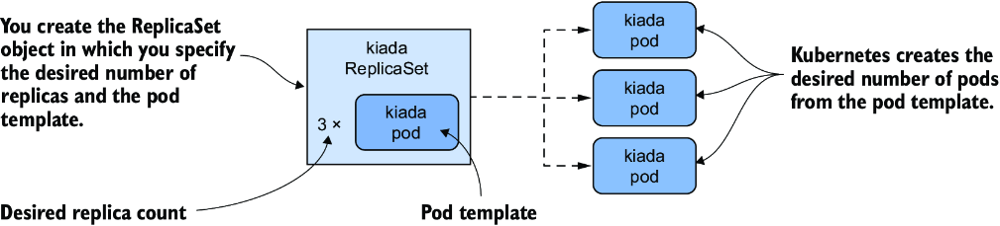
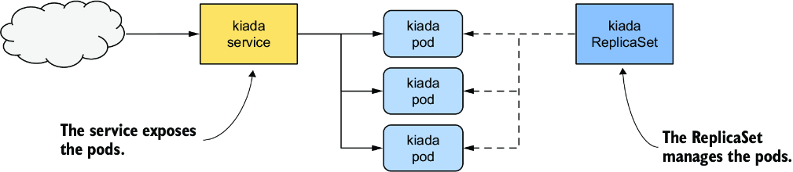
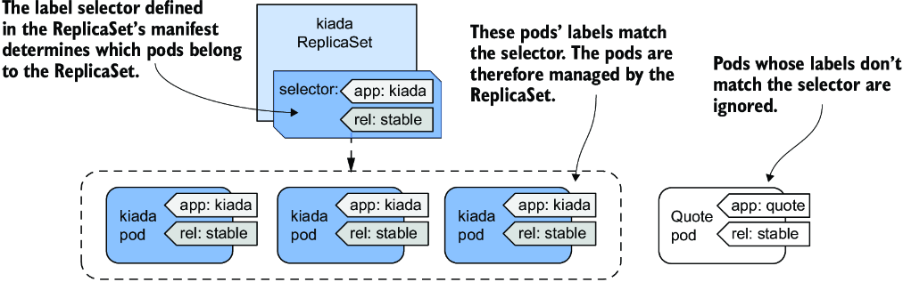
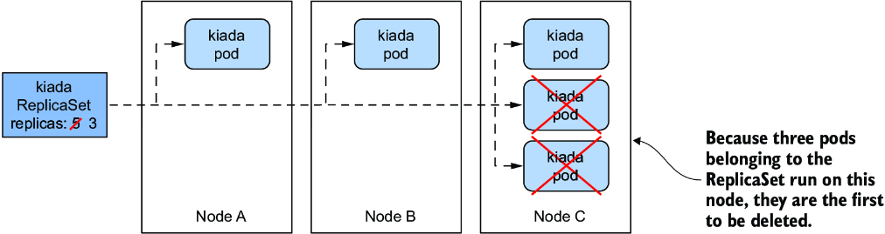
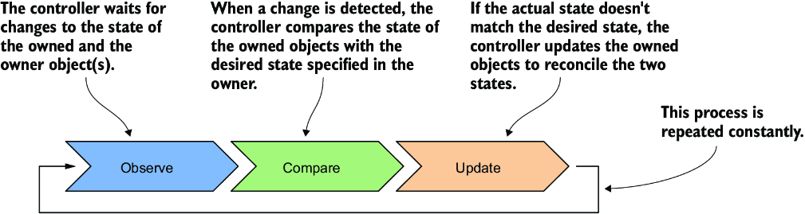
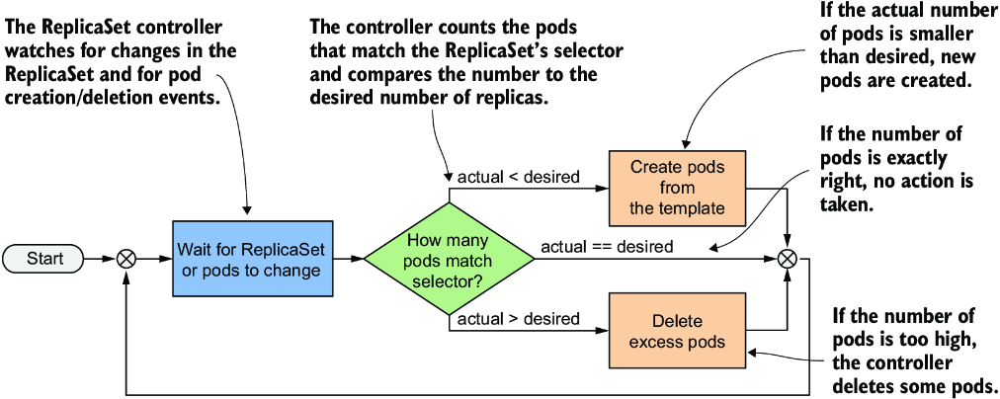
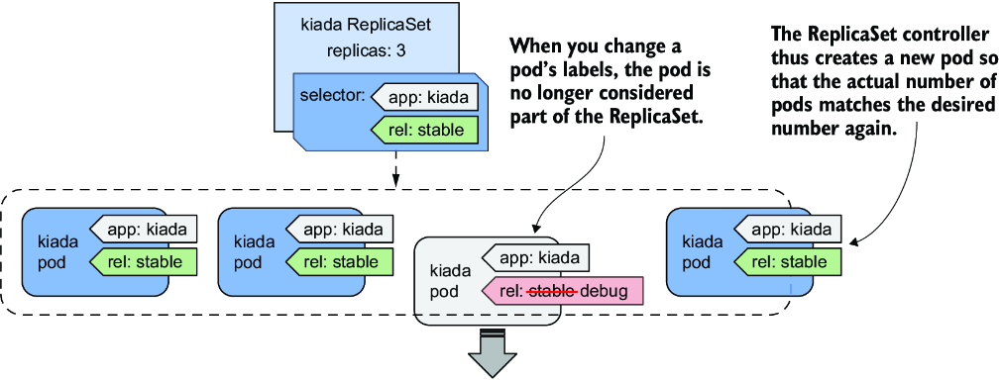

# Chương 14: Mở rộng quy mô và duy trì pod với ReplicaSet

*(Dịch từ "Chapter 14: Scaling and maintaining pods with ReplicaSets" – Kubernetes in Action, Second Edition, tác giả Marko Lukša, NXB Manning)*

---

## Nội dung chính của chương
* Nhân bản (replicate) pod bằng ReplicaSet object
* Duy trì pod tiếp tục chạy khi các node trong cluster gặp sự cố
* Vòng lặp điều khiển đối chiếu (reconciliation control loop) trong các Kubernetes controller
* Quyền sở hữu (ownership) của API object và cơ chế thu gom rác (garbage collection)

Cho đến nay, bạn đã triển khai các workload bằng cách tạo trực tiếp các Pod object. Trong một cluster production, bạn có thể cần triển khai hàng chục hoặc thậm chí hàng trăm bản sao của cùng một pod, nên việc tạo và quản lý những pod như vậy sẽ rất khó khăn. May mắn thay, trong Kubernetes, bạn có thể tự động hóa việc tạo và quản lý các pod replica bằng ReplicaSet object.

> **GHI CHÚ:** Trước khi ReplicaSet được giới thiệu, chức năng tương tự được cung cấp bởi kiểu object ReplicationController, kiểu này hiện đã bị loại bỏ dần (deprecated). Một ReplicationController hoạt động hoàn toàn giống một ReplicaSet, nên mọi điều được giải thích trong chương này cũng áp dụng cho ReplicationController.

Trước khi bắt đầu, hãy đảm bảo rằng các Pod, Service và những object khác của bộ ứng dụng Kiada đã có mặt trong cluster của bạn. Nếu bạn đã làm theo các bài tập trong chương trước, chúng hẳn đã ở đó. Nếu chưa, bạn có thể tạo chúng bằng cách tạo namespace `kiada` và áp dụng tất cả các manifest trong thư mục `Chapter14/SETUP/` bằng lệnh sau:

```bash
$ kubectl apply -f SETUP -R
```

> **GHI CHÚ:** Bạn có thể tìm thấy các file code cho chương này tại https://github.com/luksa/kubernetes-in-action-2nd-edition/tree/master/Chapter14.

---

## 14.1 Giới thiệu ReplicaSet (Introducing ReplicaSets)

Một ReplicaSet đại diện cho một nhóm các pod replica (những bản sao chính xác của một pod). Thay vì tạo từng pod một, bạn có thể tạo một ReplicaSet object, trong đó bạn chỉ định một Pod template và số lượng replica mong muốn, rồi để Kubernetes tạo ra các pod, như minh họa trong hình 14.1.



*Hình 14.1: Tóm lược về ReplicaSet*

ReplicaSet cho phép bạn quản lý các pod như một đơn vị duy nhất, nhưng chỉ có vậy. Nếu bạn muốn public (expose) các pod này như một thể thống nhất, bạn vẫn cần một Service object. Như minh họa trong hình 14.2, mỗi tập hợp pod cung cấp một dịch vụ cụ thể thường cần cả ReplicaSet lẫn Service object.



*Hình 14.2: Mối quan hệ giữa service, ReplicaSet và pod*

Và cũng giống như với service, label selector của ReplicaSet và các label của pod quyết định pod nào thuộc về ReplicaSet. Như minh họa trong hình 14.3, một ReplicaSet chỉ quan tâm đến các pod khớp với label selector của nó và bỏ qua những pod còn lại.



*Hình 14.3: Một ReplicaSet chỉ quan tâm đến các pod khớp với label selector của nó.*

Dựa trên những thông tin cho đến giờ, bạn có thể nghĩ rằng ReplicaSet chỉ được dùng để tạo nhiều bản sao của một pod, nhưng không phải vậy. Ngay cả khi bạn chỉ cần tạo một pod duy nhất, tốt hơn vẫn là tạo nó thông qua ReplicaSet thay vì tạo trực tiếp, vì ReplicaSet đảm bảo rằng pod luôn có mặt để làm công việc của nó.

Hãy tưởng tượng bạn tạo trực tiếp một pod cho một dịch vụ quan trọng, rồi node đang chạy pod đó gặp sự cố khi bạn không có mặt. Dịch vụ của bạn ngừng hoạt động cho đến khi bạn tạo lại pod. Nếu bạn đã triển khai pod thông qua ReplicaSet, nó sẽ tự động tạo lại pod. Rõ ràng tạo pod thông qua ReplicaSet tốt hơn là tạo trực tiếp.

Tuy nhiên, dù ReplicaSet hữu ích đến đâu, chúng không cung cấp mọi thứ bạn cần để chạy một workload lâu dài. Đến một lúc nào đó, bạn sẽ muốn nâng cấp workload lên phiên bản mới hơn, và đó là chỗ ReplicaSet còn thiếu sót. Vì lý do này, các ứng dụng thường được triển khai không phải thông qua ReplicaSet, mà thông qua Deployment, thứ cho phép bạn cập nhật chúng một cách khai báo (declarative). Điều này đặt ra câu hỏi tại sao bạn cần tìm hiểu về ReplicaSet nếu bạn sẽ không dùng chúng. Lý do là phần lớn chức năng mà một Deployment mang lại được cung cấp bởi các ReplicaSet mà Kubernetes tạo ra bên dưới nó. Deployment lo việc cập nhật, nhưng mọi thứ khác đều do các ReplicaSet bên dưới xử lý. Do đó, điều quan trọng là phải hiểu chúng làm gì và làm như thế nào.

### 14.1.1 Tạo một ReplicaSet (Creating a ReplicaSet)

Hãy bắt đầu bằng cách tạo ReplicaSet object cho service Kiada. Service này hiện đang chạy trong ba pod mà bạn đã tạo trực tiếp từ ba pod manifest riêng biệt, và giờ bạn sẽ thay thế chúng bằng một ReplicaSet manifest duy nhất. Trước khi tạo manifest, hãy xem những trường nào bạn cần chỉ định trong phần `spec`.

#### Giới thiệu spec của ReplicaSet (Introducing the ReplicaSet spec)

ReplicaSet là một object tương đối đơn giản. Bảng 14.1 giải thích ba trường chính mà bạn chỉ định trong phần `spec` của ReplicaSet.

**Bảng 14.1: Các trường chính trong đặc tả (specification) của ReplicaSet**

| Tên trường | Mô tả |
|---|---|
| `replicas` | Số lượng replica mong muốn. Khi bạn tạo ReplicaSet object, Kubernetes tạo ra số lượng pod này từ Pod template. Số lượng pod này được duy trì cho đến khi bạn xóa ReplicaSet. |
| `selector` | Label selector chứa hoặc một map các label trong trường con `matchLabels`, hoặc một danh sách các yêu cầu label selector trong trường con `matchExpressions`. Các pod khớp với label selector được xem là một phần của ReplicaSet này. |
| `template` | Pod template cho các pod của ReplicaSet. Khi cần tạo một pod mới, object được tạo bằng template này. |

Các trường `selector` và `template` là bắt buộc, nhưng bạn có thể bỏ qua trường `replicas`. Nếu bạn bỏ qua, một replica duy nhất sẽ được tạo.

#### Tạo manifest cho ReplicaSet object (Creating a ReplicaSet object manifest)

Hãy tạo một manifest ReplicaSet object cho các pod Kiada. Listing sau đây cho thấy nó trông như thế nào. Bạn có thể tìm thấy manifest này trong file `rs.kiada.yaml`.

**Listing 14.1: Manifest của ReplicaSet object Kiada** (`rs.kiada.yaml`)

```yaml
apiVersion: apps/v1                 #1
kind: ReplicaSet                    #1
metadata:                           #1
  name: kiada                       #2
spec:
  replicas: 5                       #3
  selector:                         #4
    matchLabels:                    #4
      app: kiada                    #4
      rel: stable                   #4
  template:                         #5
    metadata:                       #5
      labels:                       #5
        app: kiada                  #5
        rel: stable                 #5
    spec:                           #5
      containers:                   #5
      - name: kiada                 #5
        image: luksa/kiada:0.5      #5
        ...                         #5
      volumes:                      #5
      - ...                         #5
```

- **#1** ReplicaSet thuộc API group `apps`, phiên bản `v1`.
- **#2** Giống mọi object khác, tên của ReplicaSet được chỉ định trong phần `metadata`.
- **#3** Chỉ định số lượng pod mà ReplicaSet này nên chứa
- **#4** Giống như với Service, ReplicaSet dùng label selector để xác định pod nào thuộc về ReplicaSet này.
- **#5** ReplicaSet tạo các pod object từ template này.

ReplicaSet thuộc API group `apps`, phiên bản `v1`. Như đã giải thích trong bảng 14.1, trường `replicas` chỉ định rằng ReplicaSet này nên tạo ba bản sao của pod bằng template trong trường `template`.

Bạn sẽ nhận thấy các label trong Pod template khớp với những label trong trường `selector`. Nếu chúng không khớp, Kubernetes API sẽ từ chối ReplicaSet, vì các pod được tạo bằng template sẽ không được tính vào số lượng replica mong muốn, điều đó sẽ dẫn đến việc tạo ra vô số Pod.

Bạn có để ý rằng không có tên pod trong template không? Đó là vì tên pod được sinh ra từ tên của ReplicaSet.

Phần còn lại của template khớp hoàn toàn với manifest của các pod Kiada mà bạn đã tạo trong các chương trước. Để tạo ReplicaSet, hãy dùng cùng lệnh `kubectl apply` mà bạn đã dùng nhiều lần trước đây:

```bash
$ kubectl apply -f rs.kiada.yaml
replicaset.apps/kiada created
```

### 14.1.2 Kiểm tra một ReplicaSet và các pod của nó (Inspecting a ReplicaSet and its pods)

Để hiển thị thông tin cơ bản về ReplicaSet bạn vừa tạo, hãy dùng lệnh `kubectl get`:

```bash
$ kubectl get rs kiada
NAME    DESIRED   CURRENT   READY   AGE
kiada   5         5         5       1m
```

> **GHI CHÚ:** Dạng viết tắt của `replicaset` là `rs`.

Output của lệnh cho thấy số lượng mong muốn, số lượng hiện tại và số lượng replica được xem là sẵn sàng (ready) theo báo cáo của readiness probe của chúng. Thông tin này được đọc lần lượt từ các trường status `replicas`, `fullyLabeledReplicas` và `readyReplicas` của ReplicaSet object. Một trường status khác tên là `availableReplicas` cho biết có bao nhiêu replica đang khả dụng (available), nhưng giá trị của nó không được lệnh `kubectl get` hiển thị.

Nếu bạn chạy lệnh `kubectl get replicasets` với tùy chọn `-o wide`, một số thông tin bổ sung rất hữu ích sẽ được hiển thị. Hãy chạy lệnh sau để xem:

```bash
$ kubectl get rs -o wide
NAME    ...   CONTAINERS    IMAGES                     SELECTOR
kiada   ...   kiada,envoy   luksa/kiada:0.5,           app=kiada,rel=stable
                            envoyproxy/envoy:v1.14.1
```

Ngoài các cột đã hiển thị trước đó, output mở rộng này không chỉ cho thấy label selector mà còn cả tên container và image được dùng trong Pod template. Xét đến tầm quan trọng của thông tin này, thật ngạc nhiên là nó không được hiển thị khi liệt kê các pod bằng `kubectl get pods`.

> **MẸO:** Để xem tên container và image, hãy liệt kê các ReplicaSet với tùy chọn `-o wide` thay vì cố lấy thông tin này từ các pod.

Để xem toàn bộ thông tin về một ReplicaSet, hãy dùng lệnh `kubectl describe`:

```bash
$ kubectl describe rs kiada
```

Output cho thấy label selector được dùng trong ReplicaSet, số lượng pod và trạng thái của chúng, cùng toàn bộ template được dùng để tạo các pod đó.

#### Liệt kê các pod trong một ReplicaSet (Listing the pods in a ReplicaSet)

Kubectl không cung cấp cách trực tiếp để liệt kê các pod trong một ReplicaSet, nhưng bạn có thể lấy label selector của ReplicaSet và dùng nó trong lệnh `kubectl get pods` như sau:

```bash
$ kubectl get po -l app=kiada,rel=stable
NAME          READY   STATUS    RESTARTS   AGE
kiada-001     2/2     Running   0          12m   #1
kiada-002     2/2     Running   0          12m   #1
kiada-003     2/2     Running   0          12m   #1
kiada-86wzp   2/2     Running   0          8s    #2
kiada-k9hn2   2/2     Running   0          8s    #2
```

- **#1** Ba pod Kiada bạn đã tạo trong các chương trước
- **#2** Hai pod Kiada mới

Trước khi bạn tạo ReplicaSet, bạn có ba pod Kiada từ các chương trước, và giờ bạn có năm pod, đó là số lượng replica mong muốn được định nghĩa trong ReplicaSet. Các label của ba pod hiện có khớp với label selector của ReplicaSet và chúng đã được ReplicaSet nhận nuôi (adopt). Hai pod bổ sung đã được tạo để đảm bảo số lượng pod trong tập hợp khớp với số lượng replica mong muốn.

#### Tìm hiểu cách các pod trong ReplicaSet được đặt tên (Understanding how pods in a ReplicaSet are named)

Như bạn thấy, tên của hai pod mới chứa năm ký tự chữ-số ngẫu nhiên thay vì tiếp tục dãy số mà bạn đã dùng trong tên các pod của mình. Việc Kubernetes gán tên ngẫu nhiên cho các object mà nó tạo ra là điều bình thường.

Thậm chí còn có một trường metadata đặc biệt cho phép bạn tạo object mà không cần đưa ra tên đầy đủ. Thay vì trường `name`, bạn chỉ định tiền tố của tên trong trường `generateName`. Bạn đã dùng trường này lần đầu trong chương 9, khi bạn chạy lệnh `kubectl create` nhiều lần để tạo nhiều bản sao của một pod và đặt cho mỗi bản một tên duy nhất. Cách tiếp cận tương tự được dùng khi Kubernetes tạo pod cho một ReplicaSet.

Khi Kubernetes tạo pod cho một ReplicaSet, nó đặt trường `generateName` khớp với tên của ReplicaSet. Sau đó Kubernetes API server sinh ra tên đầy đủ và đưa vào trường `name`. Để thấy điều này, hãy chọn một trong hai pod bổ sung vừa được tạo và kiểm tra phần `metadata` của nó như sau:

```bash
$ kubectl get po kiada-86wzp -o yaml
apiVersion: v1
kind: Pod
metadata:
  generateName: kiada-      #1
  labels:
    ...
  name: kiada-86wzp         #2
  ...
```

- **#1** Giá trị của trường này khớp với tên của ReplicaSet. Sự hiện diện của trường này báo cho Kubernetes API sinh tên cho pod này, dùng giá trị của trường làm tiền tố.
- **#2** Tên pod do Kubernetes API sinh ra

Trong trường hợp các pod của ReplicaSet, việc đặt tên ngẫu nhiên cho pod là hợp lý vì các pod này là bản sao chính xác của nhau và do đó có thể thay thế cho nhau (fungible). Cũng không có khái niệm thứ tự giữa các pod này, nên việc dùng số thứ tự là vô nghĩa. Dù hiện tại tên pod trông có vẻ hợp lý, hãy tưởng tượng điều gì xảy ra nếu bạn xóa một vài pod trong số đó. Nếu bạn xóa chúng không theo thứ tự, các con số sẽ không còn liên tiếp nữa.

Tuy nhiên, với các workload có trạng thái (stateful), việc đánh số pod theo thứ tự có thể hợp lý. Đó là điều xảy ra khi bạn dùng StatefulSet object để tạo pod. Bạn sẽ tìm hiểu thêm về StatefulSet trong chương 16.

#### Hiển thị log của các pod trong ReplicaSet (Displaying the logs of the ReplicaSet's pods)

Tên ngẫu nhiên của các pod trong ReplicaSet khiến chúng hơi khó làm việc. Ví dụ, để xem log của một trong các pod này, việc gõ tên pod khi chạy lệnh `kubectl logs` là khá tẻ nhạt. Nếu ReplicaSet chỉ chứa một pod duy nhất, việc nhập tên đầy đủ có vẻ không cần thiết. May mắn thay, trong trường hợp này, bạn có thể in log của pod bằng lệnh

```bash
$ kubectl logs rs/kiada -c kiada
```

Vậy là thay vì chỉ định tên pod, bạn gõ `rs/kiada`, trong đó `rs` là viết tắt của ReplicaSet và `kiada` là tên của ReplicaSet object. Tùy chọn `-c kiada` báo cho kubectl in log của container `kiada`. Bạn chỉ cần dùng tùy chọn này nếu pod có nhiều hơn một container.

Nếu ReplicaSet có nhiều pod, như trong trường hợp của bạn, chỉ log của một trong các pod sẽ được hiển thị, nhưng bạn có thể hiển thị log từ tất cả các pod bằng cách chỉ định cờ `--all-pods`. Ví dụ, để stream log của các container `envoy` trong tất cả các pod kiada, hãy chạy

```bash
$ kubectl logs rs/kiada --all-pods -c envoy
```

Để hiển thị log của tất cả các container, hãy dùng tùy chọn `--all-containers` thay vì chỉ định tên container:

```bash
$ kubectl logs rs/kiada --all-pods --all-containers
```

Xem log từ nhiều pod rất hữu ích khi lưu lượng được chia giữa các pod và bạn muốn xem mọi request nhận được, bất kể pod nào xử lý nó. Ví dụ, hãy thử stream log bằng lệnh sau:

```bash
$ kubectl logs rs/kiada --all-pods -c kiada -f
```

Giờ hãy mở ứng dụng trong trình duyệt web hoặc bằng `curl`. Hãy dùng Ingress, Gateway, hoặc service kiểu LoadBalancer hay NodePort như đã giải thích trong ba chương trước.

### 14.1.3 Tìm hiểu quyền sở hữu pod (Understanding pod ownership)

Kubernetes đã tạo hai pod mới từ template bạn chỉ định trong ReplicaSet object. Chúng được sở hữu và điều khiển bởi ReplicaSet, giống như ba pod bạn đã tạo thủ công. Bạn có thể thấy điều này khi dùng lệnh `kubectl describe` để kiểm tra các pod. Ví dụ, hãy kiểm tra Pod `kiada-001` như sau:

```bash
$ kubectl describe po kiada-001
Name:           kiada-001
Namespace:      kiada
...
Controlled By:  ReplicaSet/kiada    #1
...
```

- **#1** Pod này giờ được điều khiển bởi ReplicaSet `kiada`.

Lệnh `kubectl describe` lấy thông tin này từ phần `metadata` trong manifest của pod. Hãy xem kỹ hơn. Chạy lệnh sau:

```bash
$ kubectl get po kiada-001 -o yaml
apiVersion: v1
kind: Pod
metadata:
  labels:
    app: kiada
    rel: stable
  name: kiada-001
  namespace: kiada
  ownerReferences:                                #1
  - apiVersion: apps/v1                           #1
    blockOwnerDeletion: true                      #1
    controller: true                              #1
    kind: ReplicaSet                              #1
    name: kiada                                   #1
    uid: 8e19d9b3-bbf1-4830-b0b4-da81dd0e6e22     #1
  resourceVersion: "527511"
  uid: d87afa5c-297d-4ccb-bb0a-9eb48670673f
spec:
  ...
```

- **#1** Phần `metadata` của một object có thể chứa danh sách các chủ sở hữu (owner) của object.

Phần `metadata` trong manifest của một object đôi khi chứa trường `ownerReferences`, trường này chứa các tham chiếu đến (các) chủ sở hữu của object. Trường này có thể chứa nhiều owner, nhưng hầu hết các object chỉ có một owner duy nhất, giống như Pod `kiada-001`. Trong trường hợp pod này, ReplicaSet `kiada` là owner, còn pod là cái gọi là dependent (đối tượng phụ thuộc).

Kubernetes có một garbage collector (bộ thu gom rác) tự động xóa các dependent object khi owner của chúng bị xóa. Nếu một object có nhiều owner, object đó chỉ bị xóa khi tất cả các owner của nó không còn nữa. Nếu bạn xóa ReplicaSet object sở hữu `kiada-001` và các pod khác, garbage collector cũng sẽ xóa các pod đó.

Một owner reference cũng có thể cho biết owner nào là controller của object. Pod `kiada-001` được điều khiển bởi ReplicaSet `kiada`, như được chỉ ra bởi dòng `controller: true` trong manifest. Điều này có nghĩa là bạn không nên điều khiển trực tiếp ba pod này nữa mà phải thông qua ReplicaSet object.

---

## 14.2 Cập nhật một ReplicaSet (Updating a ReplicaSet)

Trong một ReplicaSet, bạn chỉ định số lượng replica mong muốn, một Pod template và một label selector. Selector là bất biến (immutable), nhưng bạn có thể cập nhật hai thuộc tính còn lại. Bằng cách thay đổi số lượng replica mong muốn, bạn scale (thay đổi quy mô) ReplicaSet. Hãy xem điều gì xảy ra khi bạn làm vậy.

### 14.2.1 Scale một ReplicaSet (Scaling a ReplicaSet)

Trong ReplicaSet, bạn đã đặt số lượng replica mong muốn là năm, và đó là số pod hiện đang được ReplicaSet sở hữu. Tuy nhiên, giờ bạn có thể cập nhật ReplicaSet object để thay đổi con số này. Việc này có thể được thực hiện bằng cách thay đổi giá trị trong file manifest rồi áp dụng lại, hoặc bằng cách sửa trực tiếp object với lệnh `kubectl edit`. Tuy nhiên, cách dễ nhất để scale một ReplicaSet là dùng lệnh `kubectl scale`.

#### Scale một ReplicaSet bằng lệnh kubectl scale (Scaling a ReplicaSet using the kubectl scale command)

Hãy tăng số lượng pod Kiada lên sáu. Để làm điều này, hãy thực thi lệnh sau:

```bash
$ kubectl scale rs kiada --replicas 6
replicaset.apps/kiada scaled
```

Giờ hãy kiểm tra lại ReplicaSet để xác nhận rằng nó hiện có sáu pod:

```bash
$ kubectl get rs kiada
NAME    DESIRED   CURRENT   READY   AGE
kiada   6         6         5       10m
```

Các cột cho thấy ReplicaSet hiện được cấu hình với sáu pod, và đây cũng là số pod hiện tại. Một trong các pod chưa sẵn sàng, nhưng đó chỉ là vì nó vừa mới được tạo. Hãy liệt kê lại các pod để xác nhận rằng một instance pod bổ sung đã được tạo:

```bash
$ kubectl get po -l app=kiada,rel=stable
NAME          READY   STATUS    RESTARTS   AGE
kiada-001     2/2     Running   0          22m
kiada-002     2/2     Running   0          22m
kiada-003     2/2     Running   0          22m
kiada-86wzp   2/2     Running   0          10m
kiada-dmshr   2/2     Running   0          11s   #1
kiada-k9hn2   2/2     Running   0          10m
```

- **#1** Cột AGE cho thấy pod này vừa mới được tạo.

Như dự kiến, một pod mới đã được tạo, nâng tổng số pod lên sáu như mong muốn. Nếu ứng dụng này phục vụ người dùng thật và bạn cần scale lên một trăm pod hoặc hơn do lưu lượng tăng, bạn có thể làm điều đó trong nháy mắt với cùng lệnh này. Tuy nhiên, cluster của bạn có thể không xử lý nổi nhiều pod đến vậy.

#### Scale xuống (Scaling down)

Giống như khi scale lên một ReplicaSet, bạn cũng có thể scale nó xuống bằng cùng lệnh đó. Bạn cũng có thể scale một ReplicaSet bằng cách sửa manifest của nó với `kubectl edit`. Hãy scale nó xuống bốn replica bằng phương pháp này. Chạy lệnh sau:

```bash
$ kubectl edit rs kiada
```

Lệnh này sẽ mở manifest của ReplicaSet object trong trình soạn thảo văn bản của bạn. Tìm trường `replicas` và đổi giá trị thành 4. Lưu file và đóng trình soạn thảo để kubectl có thể gửi manifest đã cập nhật lên Kubernetes API. Xác nhận rằng giờ bạn có bốn pod:

```bash
$ kubectl get pods -l app=kiada,rel=stable
NAME          READY   STATUS        RESTARTS   AGE
kiada-001     2/2     Running       0          28m
kiada-002     2/2     Running       0          28m
kiada-003     2/2     Running       0          28m
kiada-86wzp   0/2     Terminating   0          16m    #1
kiada-dmshr   2/2     Terminating   0          125m   #1
kiada-k9hn2   2/2     Running       0          16m
```

- **#1** Hai pod đã được đánh dấu để xóa và sẽ biến mất khi tất cả các container của chúng kết thúc.

Như dự kiến, hai trong số các pod đang bị kết thúc (terminate) và sẽ biến mất khi các tiến trình trong container của chúng ngừng chạy. Nhưng Kubernetes quyết định xóa pod nào bằng cách nào? Nó chỉ chọn ngẫu nhiên thôi sao?

#### Tìm hiểu pod nào bị xóa trước khi một ReplicaSet được scale xuống (Understanding which pods are deleted first when a ReplicaSet is scaled down)

Khi bạn scale xuống một ReplicaSet, Kubernetes tuân theo một số quy tắc được cân nhắc kỹ lưỡng để quyết định (các) pod nào bị xóa trước. Nó xóa pod theo thứ tự sau:

1. Các pod chưa được gán cho node nào
2. Các pod có phase là unknown (không xác định)
3. Các pod chưa sẵn sàng (not ready)
4. Các pod có chi phí xóa (deletion cost) thấp hơn
5. Các pod được đặt cùng vị trí (collocated) với số lượng replica liên quan lớn hơn
6. Các pod đã ở trạng thái sẵn sàng trong thời gian ngắn hơn
7. Các pod có số lần khởi động lại container nhiều hơn
8. Các pod được tạo muộn hơn các pod khác

Những quy tắc này đảm bảo rằng các pod chưa được lên lịch (schedule) và các pod lỗi bị xóa trước, trong khi những pod đang hoạt động tốt được giữ nguyên. Bạn cũng có thể tác động đến việc pod nào bị xóa trước bằng cách đặt annotation `controller.kubernetes.io/pod-deletion-cost` trên các pod của bạn. Giá trị của annotation phải là một chuỗi có thể phân tích thành số nguyên 32-bit. Các pod không có annotation này và những pod có giá trị thấp hơn sẽ bị xóa trước các pod có giá trị cao hơn.

Kubernetes cũng cố gắng giữ các pod được phân bố đều trên các node của cluster. Hình 14.4 cho thấy một ví dụ trong đó ReplicaSet được scale từ năm xuống ba replica. Vì node thứ ba chạy nhiều hơn hai node còn lại hai replica đặt cùng vị trí, các pod trên node thứ ba bị xóa trước. Nếu quy tắc này không tồn tại, bạn có thể rơi vào tình huống cả ba replica nằm trên cùng một node.



*Hình 14.4: Kubernetes giữ các pod liên quan được phân bố đều trên các node của cluster.*

#### Scale xuống không (Scaling down to zero)

Trong một số trường hợp, việc scale số lượng replica xuống không là hữu ích. Tất cả các pod do ReplicaSet quản lý sẽ bị xóa, nhưng bản thân ReplicaSet object vẫn còn và có thể được scale lên lại bất cứ lúc nào bạn muốn. Bạn có thể thử ngay bây giờ bằng cách chạy các lệnh sau:

```bash
$ kubectl scale rs kiada --replicas 0        #1
replicaset.apps/kiada scaled

$ kubectl get po -l app=kiada                #2
No resources found in kiada namespace.       #2

$ kubectl scale rs kiada --replicas 2        #3
replicaset.apps/kiada scaled

$ kubectl get po -l app=kiada
NAME          READY   STATUS    RESTARTS   AGE   #4
kiada-dl7vz   2/2     Running   0          6s    #4
kiada-dn9fb   2/2     Running   0          6s    #4
```

- **#1** Scale ReplicaSet Kiada xuống không
- **#2** Tất cả các pod đã bị xóa.
- **#3** Scale ReplicaSet lên hai replica
- **#4** Hai pod hiện đang chạy.

Như bạn sẽ thấy trong chương tiếp theo, một ReplicaSet được scale xuống không là rất phổ biến khi ReplicaSet được sở hữu bởi một Deployment object.

> **MẸO:** Nếu bạn cần tạm thời tắt tất cả các instance của workload, hãy đặt số lượng replica mong muốn thành không thay vì xóa ReplicaSet object.

### 14.2.2 Cập nhật Pod template (Updating the Pod template)

Trong chương tiếp theo, bạn sẽ tìm hiểu về Deployment object, thứ khác với ReplicaSet ở cách xử lý các cập nhật Pod template. Sự khác biệt này là lý do bạn thường quản lý pod bằng Deployment chứ không phải ReplicaSet. Do đó, điều quan trọng là phải thấy những gì ReplicaSet không làm.

#### Sửa Pod template của một ReplicaSet (Editing a ReplicaSet's Pod template)

Các pod Kiada hiện có các label cho biết tên ứng dụng và loại phát hành (release type – đó là bản phát hành ổn định hay thứ gì khác). Sẽ thật tuyệt nếu có một label cho biết số phiên bản chính xác, để bạn có thể dễ dàng phân biệt chúng khi chạy đồng thời nhiều phiên bản khác nhau.

Để thêm một label vào các pod mà ReplicaSet tạo ra, bạn phải thêm label đó vào Pod template của nó. Bạn không thể thêm label bằng lệnh `kubectl label`, vì khi đó nó sẽ được thêm vào chính ReplicaSet chứ không phải vào Pod template. Không có lệnh kubectl nào làm việc này, nên bạn phải sửa manifest bằng `kubectl edit` như đã làm trước đó. Tìm trường `template` và thêm label có khóa `ver` với giá trị `0.5` vào trường `metadata.labels` trong template, như trong listing sau.

**Listing 14.2: Thêm một label vào Pod template**

```yaml
apiVersion: apps/v1
kind: ReplicaSet
metadata:
  ...
spec:
  replicas: 2
  selector:               #1
    matchLabels:          #1
      app: kiada          #1
      rel: stable         #1
  template:
    metadata:
      labels:
        app: kiada
        rel: stable
        ver: '0.5'        #2
    spec:
      ...
```

- **#1** Không thêm label vào selector.
- **#2** Thêm label vào đây. Giá trị của label phải là chuỗi, nên bạn phải đặt số phiên bản trong dấu nháy.

Hãy đảm bảo bạn thêm label đúng chỗ. Đừng thêm nó vào selector vì selector là bất biến, và điều này sẽ khiến Kubernetes API từ chối cập nhật của bạn. Số phiên bản phải được đặt trong dấu nháy; nếu không, bộ phân tích cú pháp YAML sẽ hiểu nó là một số thập phân và việc cập nhật sẽ thất bại, vì giá trị label phải là chuỗi. Lưu file và đóng trình soạn thảo để kubectl có thể gửi manifest đã cập nhật lên API server.

> **GHI CHÚ:** Bạn có để ý rằng các label trong Pod template và các label trong selector không giống hệt nhau không? Chúng không nhất thiết phải giống hệt nhau, nhưng các label trong selector phải là tập con của các label trong template.

#### Tìm hiểu cách Pod template của ReplicaSet được sử dụng (Understanding how the ReplicaSet's Pod template is used)

Bạn đã cập nhật Pod template. Giờ hãy kiểm tra xem thay đổi có được phản ánh trong các pod hay không. Liệt kê các pod cùng các label của chúng như sau:

```bash
$ kubectl get pods -l app=kiada --show-labels
NAME          READY   STATUS    RESTARTS   AGE   LABELS
kiada-dl7vz   2/2     Running   0          10m   app=kiada,rel=stable
kiada-dn9fb   2/2     Running   0          10m   app=kiada,rel=stable
```

Vì các pod vẫn chỉ có hai label từ Pod template ban đầu, rõ ràng Kubernetes đã không cập nhật các pod. Tuy nhiên, nếu giờ bạn scale ReplicaSet lên thêm một, pod mới sẽ chứa label bạn đã thêm:

```bash
$ kubectl scale rs kiada --replicas 3
replicaset.apps/kiada scaled

$ kubectl get pods -l app=kiada --show-labels
NAME          READY   STATUS    RESTARTS   AGE   LABELS
kiada-dl7vz   2/2     Running   0          14m   app=kiada,rel=stable
kiada-dn9fb   2/2     Running   0          14m   app=kiada,rel=stable
kiada-z9dp2   2/2     Running   0          47s   app=kiada,rel=stable,ver=0.5   #1
```

- **#1** Pod mới được tạo có thêm label bổ sung.

Bạn nên xem Pod template như một khuôn cắt bánh quy (cookie cutter) mà Kubernetes dùng để cắt ra các pod mới. Khi bạn thay đổi Pod template, chỉ có khuôn cắt thay đổi, và điều đó chỉ ảnh hưởng đến các pod được tạo sau đó.

---

## 14.3 Tìm hiểu hoạt động của ReplicaSet controller (Understanding the operation of the ReplicaSet controller)

Trong các mục trước, bạn đã thấy việc thay đổi `replicas` và `template` trong ReplicaSet object khiến Kubernetes làm gì đó với các pod thuộc về ReplicaSet như thế nào. Thành phần Kubernetes thực hiện những hành động này được gọi là controller. Hầu hết các kiểu object bạn tạo thông qua API của cluster đều có một controller liên kết với chúng. Ví dụ, trong các chương trước bạn đã tìm hiểu về Ingress controller, thứ quản lý các Ingress object. Còn có Endpoints controller cho các Endpoints object, Namespace controller cho các Namespace object, v.v.

Không có gì ngạc nhiên, các ReplicaSet được quản lý bởi ReplicaSet controller. Bất kỳ thay đổi nào bạn thực hiện trên một ReplicaSet object đều được controller này phát hiện và xử lý. Khi bạn scale ReplicaSet, chính controller là thứ tạo hoặc xóa các pod. Mỗi lần làm vậy, nó cũng tạo một Event object để thông báo cho bạn biết nó đã làm gì. Như bạn đã học trong chương 4, bạn có thể xem các event liên quan đến một object ở cuối output của lệnh `kubectl describe`, như trong đoạn code tiếp theo, hoặc bằng cách dùng lệnh `kubectl get events` để liệt kê riêng các Event object.

```bash
$ kubectl describe rs kiada
...
Events:
  Type    Reason            Age   From                   Message
  ----    ------            ----  ----                   -------
  Normal  SuccessfulDelete  34m   replicaset-controller  Deleted pod: kiada...   #1
  Normal  SuccessfulCreate  30m   replicaset-controller  Created pod: kiada...   #2
  Normal  SuccessfulCreate  30m   replicaset-controller  Created pod: kiada...   #2
  Normal  SuccessfulCreate  16m   replicaset-controller  Created pod: kiada...   #2
```

- **#1** Event này cho biết controller đã xóa một pod.
- **#2** Các event này cho thấy ReplicaSet controller đã tạo ba pod.

Để hiểu ReplicaSet, bạn phải hiểu hoạt động của controller của chúng.

### 14.3.1 Giới thiệu vòng lặp điều khiển đối chiếu (Introducing the reconciliation control loop)

Như minh họa trong hình 14.5, một controller quan sát trạng thái của cả owner object lẫn các dependent object. Sau mỗi thay đổi trong trạng thái này, controller so sánh trạng thái của các dependent object với trạng thái mong muốn được chỉ định trong owning object (object sở hữu). Nếu hai trạng thái này khác nhau, controller thực hiện các thay đổi trên (các) dependent object để đối chiếu (reconcile) hai trạng thái. Đây là cái gọi là vòng lặp điều khiển đối chiếu (reconciliation control loop) mà bạn sẽ thấy trong mọi controller.



*Hình 14.5: Vòng lặp điều khiển đối chiếu của một controller*

Vòng lặp điều khiển đối chiếu của ReplicaSet controller bao gồm việc quan sát các ReplicaSet và Pod. Mỗi khi một ReplicaSet hoặc pod thay đổi, controller kiểm tra danh sách các pod liên kết với ReplicaSet và đảm bảo rằng số pod thực tế khớp với số lượng mong muốn được chỉ định trong ReplicaSet. Nếu số pod thực tế thấp hơn số mong muốn, nó tạo các replica mới từ Pod template. Nếu số pod cao hơn mong muốn, nó xóa các replica dư thừa. Lưu đồ trong hình 14.6 giải thích toàn bộ quá trình.



*Hình 14.6: Vòng lặp đối chiếu của ReplicaSet controller*

### 14.3.2 Tìm hiểu cách ReplicaSet controller phản ứng với các thay đổi của pod (Understanding how the ReplicaSet controller reacts to pod changes)

Bạn đã thấy controller phản ứng ngay lập tức với các thay đổi trong trường `replicas` của ReplicaSet như thế nào. Tuy nhiên, đó không phải là cách duy nhất khiến số lượng mong muốn và số lượng pod thực tế có thể khác nhau. Điều gì xảy ra nếu không ai đụng đến ReplicaSet, nhưng số pod thực tế lại thay đổi? Công việc của ReplicaSet controller là đảm bảo số pod luôn khớp với số đã chỉ định. Do đó, nó cũng phải được áp dụng trong tình huống này.

#### Xóa một pod do ReplicaSet quản lý (Deleting a pod managed by a ReplicaSet)

Hãy xem điều gì xảy ra nếu bạn xóa một trong các pod do ReplicaSet quản lý. Chọn một pod và xóa nó bằng `kubectl delete`:

```bash
$ kubectl delete pod kiada-z9dp2      #1
pod "kiada-z9dp2" deleted
```

- **#1** Hãy thay tên pod bằng một trong các pod của chính bạn.

Giờ hãy liệt kê lại các pod:

```bash
$ kubectl get pods -l app=kiada
NAME          READY   STATUS    RESTARTS   AGE
kiada-dl7vz   2/2     Running   0          34m
kiada-dn9fb   2/2     Running   0          34m
kiada-rfkqb   2/2     Running   0          47s   #1
```

- **#1** Pod mới được tạo

Pod bạn đã xóa không còn nữa, nhưng một pod mới đã xuất hiện để thay thế pod bị thiếu. Số pod lại khớp với số lượng replica mong muốn được đặt trong ReplicaSet object. Như trước, ReplicaSet controller đã phản ứng ngay lập tức và đối chiếu trạng thái thực tế với trạng thái mong muốn.

Ngay cả khi bạn xóa tất cả các pod Kiada, ba pod mới sẽ xuất hiện ngay lập tức để chúng có thể phục vụ người dùng của bạn. Bạn có thể thấy điều này bằng cách chạy lệnh sau:

```bash
$ kubectl delete pod -l app=kiada
```

#### Tạo một pod khớp với label selector của ReplicaSet (Creating a pod that matches the ReplicaSet's label selector)

Giống như ReplicaSet controller tạo pod mới khi phát hiện có ít pod hơn cần thiết, nó cũng xóa pod khi phát hiện có quá nhiều. Bạn đã thấy điều này xảy ra khi giảm số lượng replica mong muốn, nhưng điều gì xảy ra nếu bạn tạo thủ công một pod khớp với label selector của ReplicaSet? Từ góc nhìn của controller, một trong các pod phải biến mất.

Hãy tạo một pod tên là `one-kiada-too-many`. Tên này không khớp với tiền tố mà controller gán cho các pod của ReplicaSet, nhưng các label của pod khớp với label selector của ReplicaSet. Bạn có thể tìm thấy manifest của pod trong file `pod.one-kiada-too-many.yaml`. Áp dụng manifest bằng `kubectl apply` để tạo pod, rồi ngay lập tức liệt kê các pod kiada như sau:

```bash
$ kubectl get po -l app=kiada
NAME                 READY   STATUS        RESTARTS   AGE
kiada-jp4vh          2/2     Running       0          11m
kiada-r4k9f          2/2     Running       0          11m
kiada-shfgj          2/2     Running       0          11m
one-kiada-too-many   0/2     Terminating   0          3s    #1
```

- **#1** Dù pod vừa mới được tạo cách đây ít giây, nó đã đang bị gỡ bỏ.

Như dự kiến, ReplicaSet controller xóa pod ngay khi phát hiện ra nó. Controller can thiệp khi bạn tạo các pod khớp với label selector của một ReplicaSet. Như đã thấy, tên của pod không quan trọng. Chỉ các label của pod mới quan trọng.

#### Điều gì xảy ra khi node chạy pod của ReplicaSet gặp sự cố? (What happens when a node that runs a ReplicaSet's pod fails?)

Trong các ví dụ trước, bạn đã thấy ReplicaSet controller phản ứng thế nào khi ai đó can thiệp vào các pod của một ReplicaSet. Dù những ví dụ này minh họa hiệu quả cách ReplicaSet controller hoạt động, chúng không thực sự cho thấy lợi ích thật sự của việc dùng ReplicaSet để chạy pod. Lý do tốt nhất để tạo pod thông qua ReplicaSet thay vì tạo trực tiếp là các pod được tự động thay thế khi các node trong cluster của bạn gặp sự cố.

> **CẢNH BÁO:** Trong ví dụ tiếp theo, một node của cluster bị cố ý làm cho hỏng. Trong một cluster được cấu hình kém, điều này có thể khiến toàn bộ cluster hỏng. Do đó, bạn chỉ nên thực hiện bài tập này nếu bạn sẵn sàng xây dựng lại cluster từ đầu khi cần thiết.

Để thấy điều gì xảy ra khi một node ngừng phản hồi, bạn có thể vô hiệu hóa giao diện mạng (network interface) của nó. Nếu bạn tạo cluster bằng công cụ kind, bạn có thể vô hiệu hóa giao diện mạng của node `kind-worker2` bằng lệnh sau:

```bash
$ docker exec kind-worker2 ip link set eth0 down
```

> **GHI CHÚ:** Hãy chọn một node có ít nhất một pod Kiada của bạn đang chạy trên đó. Liệt kê các pod với tùy chọn `-o wide` để xem mỗi pod chạy trên node nào.

> **GHI CHÚ:** Nếu bạn đang dùng GKE, bạn có thể đăng nhập vào node bằng lệnh `gcloud compute ssh` và tắt giao diện mạng của nó bằng lệnh `sudo ifconfig eth0 down`. Phiên ssh sẽ ngừng phản hồi, nên bạn sẽ cần đóng nó bằng cách nhấn Enter, rồi gõ "~." (dấu ngã và dấu chấm, không có dấu nháy).

Chẳng bao lâu sau, trạng thái của Node object đại diện cho node đó trong cluster chuyển sang `NotReady`:

```bash
$ kubectl get node
NAME                 STATUS     ROLES                  AGE    VERSION
kind-control-plane   Ready      control-plane,master   2d3h   v1.21.1
kind-worker          Ready      <none>                 2d3h   v1.21.1
kind-worker2         NotReady   <none>                 2d3h   v1.21.1   #1
```

- **#1** Node này không còn trực tuyến nữa.

Trạng thái này cho biết Kubelet chạy trên node đã không liên lạc với API server trong một khoảng thời gian. Vì đây không phải là dấu hiệu rõ ràng rằng node đã hỏng, bởi nó có thể chỉ là một trục trặc mạng tạm thời, nên điều này không ảnh hưởng ngay lập tức đến trạng thái của các pod đang chạy trên node. Chúng sẽ tiếp tục hiển thị là `Running`. Tuy nhiên, sau vài phút, Kubernetes nhận ra rằng node đã hỏng và đánh dấu các pod để xóa.

> **GHI CHÚ:** Khoảng thời gian trôi qua giữa lúc một node trở nên không khả dụng và lúc các pod của nó bị xóa có thể được cấu hình bằng cơ chế Taints và Tolerations.

Khi các pod đã được đánh dấu để xóa, ReplicaSet controller tạo các pod mới để thay thế chúng, như trong output sau.

```bash
$ kubectl get pods -l app=kiada -o wide
NAME          READY   STATUS        RESTARTS   AGE   IP             NODE
kiada-ffstj   2/2     Running       0          35s   10.244.1.150   kind-worker    #1
kiada-l2r85   2/2     Terminating   0          37m   10.244.2.173   kind-worker2   #2
kiada-n98df   2/2     Terminating   0          37m   10.244.2.174   kind-worker2   #2
kiada-vnc4b   2/2     Running       0          37m   10.244.1.148   kind-worker
kiada-wkpsn   2/2     Running       0          35s   10.244.1.151   kind-worker    #1
```

- **#1** Các pod mới được tạo để thay thế những pod trên node bị hỏng
- **#2** Hai pod trên node bị hỏng

Hai pod trên node `kind-worker2` được đánh dấu là `Terminating` và đã được thay thế bởi hai pod mới được lên lịch lên node khỏe mạnh `kind-worker`. Một lần nữa, ba pod replica đang chạy như đã chỉ định trong ReplicaSet.

Hai pod đang bị xóa vẫn ở trạng thái `Terminating` cho đến khi node trực tuyến trở lại. Trên thực tế, các container trong những pod đó vẫn đang chạy, vì Kubelet trên node không thể liên lạc với API server và do đó không biết rằng chúng phải bị kết thúc. Tuy nhiên, khi giao diện mạng của node hoạt động trở lại, Kubelet kết thúc các container và các pod object bị xóa. Các lệnh sau khôi phục giao diện mạng của node:

```bash
$ docker exec kind-worker2 ip link set eth0 up
$ docker exec kind-worker2 ip route add default via 172.18.0.1
```

Cluster của bạn có thể đang dùng một địa chỉ IP gateway khác với `172.18.0.1`. Để tìm nó, hãy chạy lệnh sau:

```bash
$ docker network inspect kind -f '{{ (index .IPAM.Config 0).Gateway }}'
```

> **GHI CHÚ:** Nếu bạn đang dùng GKE, bạn phải reset node từ xa bằng lệnh `gcloud compute instances reset <node-name>`.

#### Khi nào pod không được thay thế? (When do pods not get replaced?)

Các mục trước đã chứng minh rằng ReplicaSet controller đảm bảo luôn có đúng số pod khỏe mạnh như được chỉ định trong ReplicaSet object. Nhưng có phải lúc nào cũng vậy không? Liệu có thể rơi vào trạng thái mà số pod khớp với số replica mong muốn, nhưng các pod lại không thể cung cấp dịch vụ cho client của chúng?

Bạn còn nhớ liveness probe và readiness probe chứ? Nếu liveness probe của một container thất bại, container sẽ được khởi động lại. Nếu probe thất bại nhiều lần, sẽ có một khoảng trễ đáng kể trước khi container được khởi động lại. Tình huống này là kết quả của cơ chế exponential backoff (lùi theo cấp số nhân) đã giải thích trong chương 6. Trong khoảng trễ backoff, container không hoạt động. Tuy nhiên, người ta giả định rằng container cuối cùng sẽ hoạt động trở lại. Nếu container thất bại readiness probe thay vì liveness probe, cũng có giả định rằng vấn đề cuối cùng sẽ được khắc phục.

Vì lý do này, các pod có container liên tục crash hoặc thất bại probe không bao giờ bị tự động xóa, dù ReplicaSet controller có thể dễ dàng thay thế chúng bằng các pod có thể chạy đúng. Do đó, hãy lưu ý rằng ReplicaSet không đảm bảo bạn sẽ luôn có đúng số replica khỏe mạnh như bạn chỉ định trong ReplicaSet object.

Bạn có thể tự mình thấy điều này bằng cách làm cho readiness probe của một trong các pod thất bại với lệnh sau:

```bash
$ kubectl exec rs/kiada -c kiada -- curl -X POST localhost:9901/healthcheck
```

> **GHI CHÚ:** Nếu bạn chỉ định ReplicaSet thay vì tên Pod khi chạy lệnh `kubectl exec`, lệnh được chỉ định sẽ chạy trong một trong các pod, không phải tất cả, giống như với `kubectl logs`.

Sau khoảng 30 giây, lệnh `kubectl get pods` cho thấy một trong các container của pod không còn sẵn sàng nữa:

```bash
$ kubectl get pods -l app=kiada
NAME          READY   STATUS    RESTARTS   AGE
kiada-78j7m   1/2     Running   0          21m   #1
kiada-98lmx   2/2     Running   0          21m
kiada-wk99p   2/2     Running   0          21m
```

- **#1** Cột READY cho thấy chỉ một trong hai container trong pod là sẵn sàng.

Pod không còn nhận bất kỳ lưu lượng nào từ client, nhưng ReplicaSet controller không xóa và thay thế nó, dù nó biết rằng chỉ hai trong ba pod là sẵn sàng và có thể truy cập, như được chỉ ra bởi status của ReplicaSet:

```bash
$ kubectl get rs
NAME    DESIRED   CURRENT   READY   AGE
kiada   3         3         2       2h    #1
```

- **#1** Chỉ hai trong ba pod là sẵn sàng.

> **GHI CHÚ:** Một ReplicaSet chỉ đảm bảo rằng số lượng pod mong muốn có mặt. Nó không đảm bảo rằng các container của chúng thực sự đang chạy và sẵn sàng xử lý lưu lượng.

Nếu điều này xảy ra trong một cluster production thật và các pod còn lại không thể xử lý toàn bộ lưu lượng, bạn sẽ phải tự xóa pod hỏng. Nhưng nếu trước tiên bạn muốn tìm hiểu xem pod có vấn đề gì thì sao? Làm thế nào bạn có thể nhanh chóng thay thế pod lỗi mà không xóa nó, để có thể gỡ lỗi nó?

Bạn có thể scale ReplicaSet lên thêm một replica, nhưng khi đó bạn sẽ phải scale xuống lại sau khi gỡ lỗi xong pod lỗi. May mắn thay, có một cách tốt hơn. Nó sẽ được giải thích trong mục tiếp theo.

### 14.3.3 Gỡ một pod khỏi sự kiểm soát của ReplicaSet (Removing a pod from the ReplicaSet's control)

Bạn đã biết rằng ReplicaSet controller liên tục đảm bảo rằng số pod khớp với label selector của ReplicaSet cũng khớp với số lượng replica mong muốn. Vì vậy, nếu bạn gỡ một pod khỏi tập các pod khớp với selector, controller sẽ thay thế nó. Để làm điều này, bạn chỉ cần thay đổi các label của pod lỗi, như minh họa trong hình 14.7.



*Hình 14.7: Thay đổi label của một pod để gỡ nó khỏi ReplicaSet*

ReplicaSet controller thay thế pod bằng một pod mới, và từ thời điểm đó, nó không còn để ý đến pod lỗi nữa. Bạn có thể khắc phục sự cố theo nhịp độ của riêng mình trong khi pod mới tiếp quản lưu lượng.

Hãy thử điều này với pod mà bạn đã làm thất bại readiness probe ở mục trước. Để một pod khớp với label selector của ReplicaSet, nó phải có các label `app=kiada` và `rel=stable`. Các pod không có những label này không được xem là một phần của ReplicaSet. Vì vậy, để gỡ pod hỏng khỏi ReplicaSet, bạn cần xóa hoặc thay đổi ít nhất một trong hai label này. Một cách là đổi giá trị của label `rel` thành `debug` như sau:

```bash
$ kubectl label po kiada-78j7m rel=debug --overwrite
```

Vì giờ chỉ có hai pod khớp với label selector, ít hơn số lượng replica mong muốn một pod, controller ngay lập tức tạo thêm một pod, như trong output sau:

```bash
$ kubectl get pods -l app=kiada -L app,rel
NAME          READY   STATUS    RESTARTS   AGE   APP     REL
kiada-78j7m   1/2     Running   0          60m   kiada   debug    #1
kiada-98lmx   2/2     Running   0          60m   kiada   stable
kiada-wk99p   2/2     Running   0          60m   kiada   stable
kiada-xtxcl   2/2     Running   0          9s    kiada   stable   #2
```

- **#1** Pod hỏng không còn khớp với label selector của ReplicaSet nữa
- **#2** Pod này được tạo để thay thế pod hỏng.

Như bạn thấy từ các giá trị trong cột APP và REL, ba pod khớp với selector, trong khi pod hỏng thì không. Pod này không còn được ReplicaSet quản lý nữa. Do đó, khi bạn kiểm tra pod xong, bạn cần xóa nó thủ công.

> **GHI CHÚ:** Khi bạn gỡ một pod khỏi ReplicaSet, tham chiếu đến ReplicaSet object sẽ bị xóa khỏi trường `ownerReferences` của pod.

Giờ bạn đã thấy ReplicaSet controller phản ứng thế nào với tất cả các sự kiện được trình bày trong mục này và các mục trước, bạn đã hiểu mọi thứ cần biết về controller này.

---

## 14.4 Xóa một ReplicaSet (Deleting a ReplicaSet)

Một ReplicaSet đại diện cho một nhóm pod replica được quản lý như một đơn vị. Bằng cách tạo một ReplicaSet object, bạn cho biết rằng bạn muốn có một số lượng pod replica cụ thể dựa trên một Pod template cụ thể trong cluster của mình. Bằng cách xóa ReplicaSet, bạn cho biết rằng bạn không còn muốn những pod đó tồn tại nữa. Vì vậy, khi bạn xóa một ReplicaSet, tất cả các pod thuộc về nó cũng bị xóa. Việc này được thực hiện bởi garbage collector, như đã giải thích ở phần đầu chương này.

### 14.4.1 Xóa một ReplicaSet và tất cả các pod liên quan (Deleting a ReplicaSet and all associated pods)

Để xóa một ReplicaSet và tất cả các pod mà nó điều khiển, hãy chạy lệnh sau:

```bash
$ kubectl delete rs kiada
replicaset.apps "kiada" deleted
```

Như dự kiến, việc này cũng xóa các pod:

```bash
$ kubectl get pods -l app=kiada
NAME          READY   STATUS        RESTARTS   AGE
kiada-2dq4f   0/2     Terminating   0          7m29s
kiada-f5nff   0/2     Terminating   0          7m29s
kiada-khmj5   0/2     Terminating   0          7m29s
```

Nhưng trong một số trường hợp, bạn không muốn như vậy. Vậy làm thế nào để ngăn garbage collector gỡ bỏ các pod? Trước khi đến phần đó, hãy tạo lại ReplicaSet bằng cách áp dụng lại file `rs.kiada.versionLabel.yaml`.

### 14.4.2 Xóa một ReplicaSet nhưng giữ lại các pod (Deleting a ReplicaSet while preserving the pods)

Ở đầu chương này, bạn đã học rằng label selector trong một ReplicaSet là bất biến. Nếu bạn muốn thay đổi label selector, bạn phải xóa ReplicaSet object và tạo một cái mới. Tuy nhiên, khi làm vậy, bạn có thể không muốn các pod bị xóa, vì điều đó sẽ khiến dịch vụ của bạn không khả dụng. May mắn thay, bạn có thể bảo Kubernetes bỏ rơi (orphan) các pod thay vì xóa chúng.

Để giữ lại các pod khi xóa ReplicaSet object, hãy dùng lệnh sau:

```bash
$ kubectl delete rs kiada --cascade=orphan     #1
replicaset.apps "kiada" deleted
```

- **#1** Tùy chọn `--cascade=orphan` đảm bảo rằng chỉ ReplicaSet bị xóa, còn các pod được giữ lại.

Giờ, nếu bạn liệt kê các pod, bạn sẽ thấy chúng đã được giữ lại. Nếu bạn xem manifest của chúng, bạn sẽ nhận thấy ReplicaSet object đã bị xóa khỏi `ownerReferences`. Các pod này giờ đã mồ côi (orphaned), nhưng nếu bạn tạo một ReplicaSet mới với cùng label selector, nó sẽ nhận các pod này về dưới sự bảo trợ của mình. Hãy áp dụng lại file `rs.kiada.versionLabel.yaml` để tự mình thấy điều này.

---

## Tóm tắt

* Một ReplicaSet đại diện cho một nhóm các pod giống hệt nhau mà bạn quản lý như một đơn vị. Trong ReplicaSet, bạn chỉ định một Pod template, số lượng replica mong muốn và một label selector.
* Hầu hết tất cả các kiểu Kubernetes API object đều có một controller liên kết xử lý các object của kiểu đó. Trong mỗi controller, một vòng lặp điều khiển đối chiếu chạy liên tục sẽ đối chiếu trạng thái thực tế với trạng thái mong muốn.
* ReplicaSet controller đảm bảo rằng số pod thực tế luôn khớp với số lượng mong muốn được chỉ định trong ReplicaSet. Khi hai con số này lệch nhau, controller ngay lập tức đối chiếu chúng bằng cách tạo hoặc xóa các Pod object.
* Bạn có thể thay đổi số lượng replica bất cứ khi nào cần, và controller sẽ thực hiện các bước cần thiết để đáp ứng yêu cầu của bạn. Tuy nhiên, khi bạn cập nhật Pod template, controller sẽ không cập nhật các pod hiện có.
* Các pod được tạo bởi một ReplicaSet được sở hữu bởi ReplicaSet đó. Nếu bạn xóa owner, các dependent sẽ bị garbage collector xóa, nhưng bạn có thể bảo kubectl bỏ rơi (orphan) chúng thay vì xóa.
