# Chương 15: Tự động hóa việc cập nhật ứng dụng với Deployment

*(Dịch từ "Chapter 15: Automating application updates with Deployments" – Kubernetes in Action, Second Edition, tác giả Marko Lukša, NXB Manning)*

---

## Nội dung chính của chương
* Triển khai các workload phi trạng thái (stateless) với Deployment object
* Mở rộng theo chiều ngang (horizontal scaling) các Deployment
* Cách cập nhật workload theo kiểu khai báo (declarative)
* Ngăn chặn việc rollout các workload bị lỗi
* Các chiến lược triển khai (deployment strategy) khác nhau

Trong chương trước, bạn đã học cách triển khai pod thông qua ReplicaSet. Tuy nhiên, các workload hiếm khi được triển khai theo cách này, vì ReplicaSet không cung cấp chức năng cập nhật pod một cách liền mạch. Chức năng này được cung cấp bởi kiểu object Deployment. Đến cuối chương này, mỗi service trong ba service của bộ ứng dụng Kiada sẽ có Deployment object của riêng nó.

Trước khi bắt đầu, hãy đảm bảo rằng các Pod, Service và những object khác của bộ Kiada đã có mặt trong cluster của bạn. Nếu bạn đã làm theo các bài thực hành trong chương trước, chúng hẳn đã ở đó rồi. Nếu chưa, bạn có thể tạo chúng bằng cách tạo namespace `kiada` và áp dụng toàn bộ các manifest trong thư mục `Chapter15/SETUP/` bằng lệnh sau:

```bash
$ kubectl apply -f SETUP -R
```

> **GHI CHÚ:** Các file mã nguồn cho chương này có tại https://github.com/luksa/kubernetes-in-action-2nd-edition/tree/master/Chapter15.

---

## 15.1 Giới thiệu Deployment (Introducing Deployments)

Một workload thường được triển khai lên Kubernetes bằng cách tạo một Deployment object. Deployment object không quản lý các Pod object một cách trực tiếp, mà thông qua một ReplicaSet object được tự động sinh ra khi Deployment được tạo. Như minh họa trong hình 15.1, Deployment điều khiển ReplicaSet, và ReplicaSet lại điều khiển từng pod riêng lẻ.

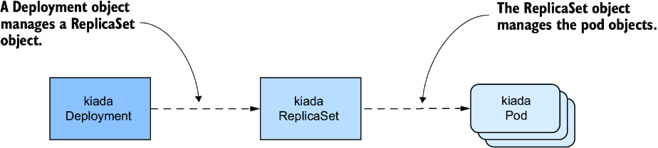

*Hình 15.1: Mối quan hệ giữa Deployment, ReplicaSet và pod*

Deployment cho phép bạn cập nhật ứng dụng theo kiểu khai báo, nghĩa là thay vì phải tự tay thực hiện một chuỗi thao tác để thay thế một tập pod bằng những pod chạy phiên bản mới của ứng dụng, bạn chỉ cần cập nhật cấu hình trong Deployment object và để Kubernetes tự động hóa việc cập nhật.

Cũng như với ReplicaSet, trong một Deployment bạn chỉ định một Pod template, số lượng replica mong muốn và một label selector. Các pod được tạo dựa trên Deployment này là những bản sao chính xác của nhau và có thể thay thế lẫn nhau. Vì lý do này cùng một số lý do khác, Deployment chủ yếu được dùng cho các workload phi trạng thái (stateless), nhưng bạn cũng có thể dùng chúng để chạy một instance đơn lẻ của một workload có trạng thái (stateful). Tuy nhiên, vì không có cách tích hợp sẵn nào để ngăn người dùng scale Deployment lên nhiều instance, nên chính ứng dụng phải đảm bảo rằng chỉ có một instance duy nhất hoạt động khi nhiều replica đang chạy đồng thời.

> **GHI CHÚ:** Để chạy các workload có trạng thái được nhân bản (replicated stateful workload), StatefulSet là lựa chọn tốt hơn. Bạn sẽ học về chúng trong chương tiếp theo.

### 15.1.1 Tạo một Deployment (Creating a Deployment)

Trong mục này, bạn sẽ thay thế ReplicaSet `kiada` bằng một Deployment. Hãy xóa ReplicaSet mà không xóa các pod bằng lệnh

```bash
$ kubectl delete rs kiada --cascade=orphan
```

Hãy xem bạn cần đưa những gì vào phần `spec` của một Deployment và nó khác gì so với phần `spec` của ReplicaSet.

#### Giới thiệu phần spec của Deployment (Introducing the Deployment spec)

Phần `spec` của một Deployment object không khác nhiều so với của ReplicaSet. Như bảng 15.1 cho thấy, các trường chính giống với các trường trong ReplicaSet, chỉ có thêm một trường bổ sung.

**Bảng 15.1: Các trường chính cần chỉ định trong phần `spec` của một Deployment**

| Tên trường | Mô tả |
|---|---|
| `replicas` | Số lượng replica mong muốn. Khi bạn tạo Deployment object, Kubernetes tạo ra số lượng pod này từ Pod template. Số lượng pod này được duy trì cho đến khi bạn xóa Deployment. |
| `selector` | Label selector chứa hoặc một map các label trong trường con `matchLabels`, hoặc một danh sách các yêu cầu label selector trong trường con `matchExpressions`. Các pod khớp với label selector được coi là một phần của Deployment này. |
| `template` | Pod template cho các pod của Deployment. Khi cần tạo một pod mới, object được tạo bằng template này. |
| `strategy` | Chiến lược cập nhật (update strategy) định nghĩa cách các pod trong Deployment này được thay thế khi bạn cập nhật Pod template. |

Các trường `replicas`, `selector` và `template` phục vụ cùng mục đích như các trường tương ứng trong ReplicaSet. Trong trường bổ sung `strategy`, bạn có thể cấu hình chiến lược cập nhật mà Kubernetes sẽ áp dụng khi cập nhật Deployment này.

#### Tạo manifest Deployment từ đầu (Creating a Deployment manifest from scratch)

Khi tạo một manifest Deployment mới, hầu hết chúng ta thường sao chép một file manifest có sẵn rồi sửa lại. Tuy nhiên, nếu bạn không có sẵn manifest nào trong tay, có một cách khéo léo để tạo file manifest từ đầu.

Bạn có thể còn nhớ rằng lần đầu tiên bạn tạo một Deployment là trong chương 3, bằng lệnh sau:

```bash
$ kubectl create deployment kiada --image=luksa/kiada:0.1
```

Nhưng vì lệnh này tạo object trực tiếp thay vì tạo file manifest, nó không hẳn là thứ bạn muốn. Tuy nhiên, bạn có thể nhớ lại từ chương 5 rằng bạn có thể truyền các tùy chọn `--dry-run=client` và `-o yaml` cho lệnh `kubectl create` nếu bạn muốn tạo manifest của object mà không gửi nó tới API. Vì vậy, để tạo một phiên bản thô của file manifest Deployment, bạn có thể dùng

```bash
$ kubectl create deployment my-app --image=my-image \
    --dry-run=client -o yaml > deploy.yaml
```

Sau đó, file manifest có thể được chỉnh sửa để thực hiện những thay đổi cuối cùng, chẳng hạn thêm các container và volume bổ sung hoặc thay đổi định nghĩa container hiện có. Tuy nhiên, vì bạn đã có sẵn file manifest cho ReplicaSet `kiada`, lựa chọn nhanh nhất là biến nó thành một manifest Deployment.

#### Tạo manifest Deployment từ manifest của Pod hoặc ReplicaSet (Creating a Deployment manifest from a Pod or ReplicaSet manifest)

Việc tạo một manifest Deployment là chuyện đơn giản nếu bạn đã có manifest của ReplicaSet. Bạn chỉ cần sao chép file `rs.kiada.versionLabel.yaml` thành `deploy.kiada.yaml` chẳng hạn, rồi chỉnh sửa nó để đổi trường `kind` từ `ReplicaSet` thành `Deployment`. Nhân tiện, hãy đổi luôn số lượng replica từ hai thành ba. Manifest Deployment của bạn sẽ trông giống như listing sau.

**Listing 15.1: Manifest của Deployment object kiada**

```yaml
apiVersion: apps/v1
kind: Deployment                 #1
metadata:
  name: kiada
spec:
  replicas: 3                    #2
  selector:                      #3
    matchLabels:                 #3
      app: kiada                 #3
      rel: stable                #3
  template:                      #4
    metadata:                    #4
      labels:                    #4
        app: kiada               #4
        rel: stable              #4
        ver: '0.5'               #4
    spec:                        #4
      ...                        #4
```

- **#1** Thay vì ReplicaSet, kiểu object là Deployment.
- **#2** Bạn muốn Deployment chạy ba replica.
- **#3** Label selector khớp với label selector trong ReplicaSet `kiada` mà bạn đã tạo ở chương trước.
- **#4** Pod template cũng khớp với Pod template trong ReplicaSet.

#### Tạo và kiểm tra Deployment object (Creating and inspecting the Deployment object)

Để tạo Deployment object từ file manifest, hãy dùng lệnh `kubectl apply`. Bạn có thể dùng các lệnh quen thuộc như `kubectl get deployment` và `kubectl describe deployment` để lấy thông tin về Deployment mà bạn đã tạo. Ví dụ,

```bash
$ kubectl get deploy kiada
NAME       READY       UP-TO-DATE        AVAILABLE       AGE
kiada      3/3         3                 3               25s
```

> **GHI CHÚ:** Tên viết tắt của `deployment` là `deploy`.

Thông tin về số lượng pod mà lệnh `kubectl get` hiển thị được đọc từ các trường `readyReplicas`, `replicas`, `updatedReplicas` và `availableReplicas` trong phần `status` của Deployment object. Hãy dùng tùy chọn `-o yaml` để xem toàn bộ phần status.

> **GHI CHÚ:** Hãy dùng tùy chọn hiển thị mở rộng (`-o wide`) với `kubectl get deploy` để hiển thị label selector cùng tên container và image được dùng trong Pod template.

Nếu bạn chỉ muốn biết việc rollout Deployment có thành công hay không, bạn cũng có thể dùng lệnh sau:

```bash
$ kubectl rollout status deployment kiada
Waiting for deployment "kiada" rollout to finish: 0 of 3 updated replicas are available...
Waiting for deployment "kiada" rollout to finish: 1 of 3 updated replicas are available...
Waiting for deployment "kiada" rollout to finish: 2 of 3 updated replicas are available...
deployment "kiada" successfully rolled out
```

Nếu bạn chạy lệnh này ngay sau khi tạo Deployment, bạn có thể theo dõi tiến trình triển khai các pod. Theo output của lệnh, Deployment đã rollout thành công ba pod replica.

> **MẸO:** Nếu bạn đang tạo một Deployment trong một shell script và cần đợi nó sẵn sàng trước khi chạy các lệnh tiếp theo, bạn có thể dùng lệnh `kubectl wait --for condition=Available deployment/deployment-name`.

Bây giờ hãy liệt kê các pod thuộc về Deployment. Nó dùng cùng selector với ReplicaSet ở chương trước, nên bạn sẽ thấy ba pod, đúng không? Để kiểm tra, hãy liệt kê các pod bằng label selector `app=kiada,rel=stable` như sau:

```bash
$ kubectl get pods -l app=kiada,rel=stable
NAME                               READY      STATUS        RESTARTS         AGE
kiada-4t87s                        2/2        Running       0                16h        #1
kiada-5lg8b                        2/2        Running       0                16h        #1
kiada-7bffb9bf96-4knb6             2/2        Running       0                6m         #2
kiada-7bffb9bf96-7g2md             2/2        Running       0                6m         #2
kiada-7bffb9bf96-qf4t7             2/2        Running       0                6m
```

- **#1** Hai pod này cũ hơn ba pod còn lại.
- **#2** Căn cứ vào tuổi của các pod này, chúng có vẻ là các pod do Deployment tạo ra.

Thật bất ngờ, có tới năm pod khớp với selector. Hai pod đầu là những pod được tạo bởi ReplicaSet ở chương trước, còn ba pod cuối được tạo bởi Deployment. Mặc dù label selector trong Deployment khớp với hai pod đã có sẵn, chúng lại không được tiếp nhận như bạn mong đợi. Tại sao vậy?

Ở đầu chương này, tôi đã giải thích rằng Deployment không trực tiếp điều khiển các pod mà ủy thác nhiệm vụ này cho một ReplicaSet bên dưới. Hãy xem nhanh ReplicaSet này:

```bash
$ kubectl get rs
NAME                        DESIRED        CURRENT     READY       AGE
kiada-7bffb9bf96            3              3           3           17m
```

Bạn sẽ nhận thấy tên của ReplicaSet không đơn giản là `kiada` – nó còn chứa một hậu tố chữ-số (`-7bffb9bf96`) trông như được sinh ngẫu nhiên giống tên của các pod. Hãy tìm hiểu xem nó là gì. Hãy xem kỹ hơn ReplicaSet này:

```bash
$ kubectl describe rs kiada                      #1
Name:           kiada-7bffb9bf96
Namespace:               kiada
Selector:                app=kiada,pod-template-hash=7bffb9bf96,rel=stable       #2
Labels:                  app=kiada
                         pod-template-hash=7bffb9bf96               #3
                         rel=stable
                         ver=0.5
Annotations:             deployment.kubernetes.io/desired-replicas: 3
                         deployment.kubernetes.io/max-replicas: 4
                         deployment.kubernetes.io/revision: 1
Controlled By:           Deployment/kiada     #4
Replicas:                3 current / 3 desired
Pods Status:             3 Running / 0 Waiting / 0 Succeeded / 0 Failed
Pod Template:
   Labels:      app=kiada
                pod-template-hash=7bffb9bf96                       #3
                rel=stable
                ver=0.5
   Containers:
      ...
```

- **#1** Lệnh `kubectl describe` không yêu cầu bạn gõ tên đầy đủ của object, nên chỉ cần gõ một phần tên là đủ.
- **#2** Label selector của ReplicaSet không hoàn toàn khớp với label selector trong Deployment.
- **#3** Một label bổ sung `pod-template-hash` xuất hiện trong cả label của ReplicaSet lẫn label của pod.
- **#4** ReplicaSet này được sở hữu và điều khiển bởi Deployment `kiada`.

Dòng `Controlled By` cho biết ReplicaSet này đã được tạo ra, được sở hữu và điều khiển bởi Deployment `kiada`. Bạn sẽ nhận thấy Pod template, selector và bản thân ReplicaSet đều chứa thêm một khóa label `pod-template-hash` mà bạn chưa từng định nghĩa trong Deployment object. Giá trị của label này khớp với phần cuối trong tên của ReplicaSet. Chính label bổ sung này là lý do hai pod có sẵn không được ReplicaSet này tiếp nhận. Hãy liệt kê các pod cùng toàn bộ label của chúng để xem chúng khác nhau thế nào:

```bash
$ kubectl get pods -l app=kiada,rel=stable --show-labels
NAME                             ...    LABELS
kiada-4t87s                      ...    app=kiada,rel=stable,ver=0.5         #1
kiada-5lg8b                      ...    app=kiada,rel=stable,ver=0.5         #1
kiada-7bffb9bf96-4knb6           ...    app=kiada,pod-template-hash=7bffb9bf96,rel=stable,ver=0.5   #2
kiada-7bffb9bf96-7g2md           ...    app=kiada,pod-template-hash=7bffb9bf96,rel=stable,ver=0.5   #2
kiada-7bffb9bf96-qf4t7           ...    app=kiada,pod-template-hash=7bffb9bf96,rel=stable,ver=0.5   #2
```

- **#1** Hai Pod đã tồn tại từ trước không có label `pod-template-hash`.
- **#2** Ba pod được Deployment tạo ra thì có.

Như hình 15.2 cho thấy, khi ReplicaSet được tạo, ReplicaSet controller không tìm thấy pod nào khớp với label selector, nên nó đã tạo ba pod mới. Nếu bạn đã thêm label này vào hai pod có sẵn trước khi tạo Deployment, chúng hẳn đã được ReplicaSet tiếp nhận.

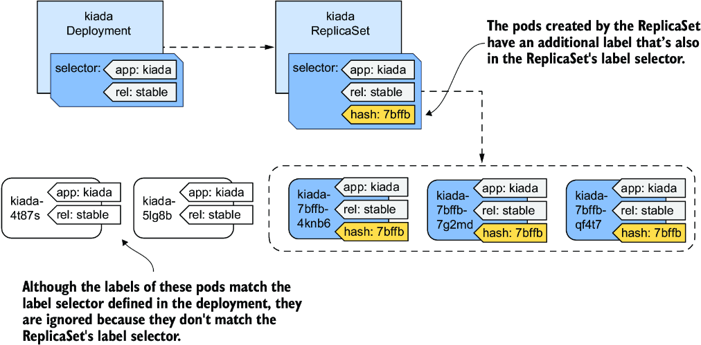

*Hình 15.2: Label selector trong Deployment và ReplicaSet, cùng các label trong pod*

Giá trị của label `pod-template-hash` không phải ngẫu nhiên mà được tính toán từ nội dung của Pod template. Vì cùng giá trị này được dùng cho tên của ReplicaSet, nên tên đó phụ thuộc vào nội dung của Pod template. Từ đó suy ra, mỗi lần bạn thay đổi Pod template, một ReplicaSet mới sẽ được tạo. Bạn sẽ tìm hiểu thêm về điều này trong mục 15.2, nơi giải thích về việc cập nhật Deployment.

Giờ bạn có thể xóa hai pod Kiada không thuộc về Deployment. Để làm điều này, hãy dùng lệnh `kubectl delete` với một label selector chỉ chọn những pod có các label `app=kiada` và `rel=stable` mà không có label `pod-template-hash`. Lệnh đầy đủ trông như sau:

```bash
$ kubectl delete po -l 'app=kiada,rel=stable,!pod-template-hash'
```

#### Khắc phục sự cố Deployment không tạo ra pod nào (Troubleshooting Deployments that fail to produce any pods)

Trong một số trường hợp nhất định, khi tạo một Deployment, các pod có thể không xuất hiện. Việc khắc phục sự cố trong trường hợp này rất dễ nếu bạn biết phải nhìn vào đâu. Để tự thử, hãy áp dụng file manifest `deploy.where-are-the-pods.yaml`, file này sẽ tạo một Deployment object có tên `where-are-the-pods`. Bạn sẽ nhận thấy không có pod nào được tạo cho Deployment này, dù số lượng replica mong muốn là ba. Để khắc phục sự cố, bạn có thể kiểm tra Deployment object bằng `kubectl describe`. Các event của Deployment không cho thấy điều gì hữu ích, nhưng các condition của nó thì có:

```bash
$ kubectl describe deploy where-are-the-pods
...
Conditions:
  Type              Status    Reason
  ----              ------    ------
  Progressing       True      NewReplicaSetCreated
  Available         False     MinimumReplicasUnavailable
  ReplicaFailure    True      FailedCreate                  #1
```

- **#1** Condition `ReplicaFailure` cho biết một replica đã không thể được tạo.

Condition `ReplicaFailure` có giá trị `True`, cho thấy có lỗi. Lý do của lỗi là `FailedCreate`, điều này chẳng nói lên được gì nhiều. Tuy nhiên, nếu bạn nhìn vào các condition trong phần `status` của manifest YAML của Deployment, bạn sẽ nhận thấy trường `message` của condition `ReplicaFailure` cho bạn biết chính xác điều gì đã xảy ra.

Ngoài ra, bạn có thể xem xét ReplicaSet và các event của nó để thấy cùng thông báo đó như sau:

```bash
$ kubectl describe rs where-are-the-pods-67cbc77f88
...
Events:
  Type          Reason               Age                          From                    Message
  ----          ------               ----                         ----                    -------
  Warning       FailedCreate         61s (x18 over 11m)           replicaset-controller   Error creating: pods "where-are-the-pods-67cbc77f88-" is forbidden: error looking up service account kiada/...: serviceaccount "..." not found
```

Có nhiều lý do khả dĩ khiến ReplicaSet controller không thể tạo pod, nhưng chúng thường liên quan đến đặc quyền của người dùng. Trong ví dụ này, ReplicaSet controller không thể tạo pod vì thiếu một service account. Kết luận quan trọng nhất từ bài thực hành này là nếu các pod không xuất hiện sau khi bạn tạo (hoặc cập nhật) một Deployment, bạn nên tìm nguyên nhân ở ReplicaSet bên dưới.

### 15.1.2 Scale một Deployment (Scaling a Deployment)

Việc scale một Deployment không khác gì scale một ReplicaSet. Khi bạn scale một Deployment, Deployment controller chẳng làm gì khác ngoài việc scale ReplicaSet bên dưới, để phần còn lại cho ReplicaSet controller thực hiện, như minh họa trong hình 15.3.

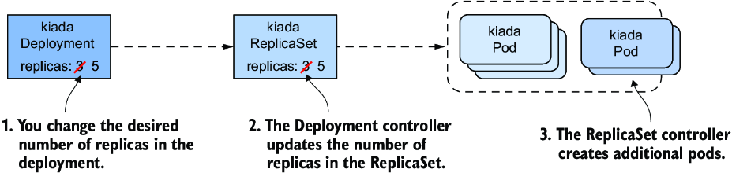

*Hình 15.3: Scale một Deployment*

#### Scale một Deployment (Scaling a Deployment)

Bạn có thể scale một Deployment bằng cách chỉnh sửa object với lệnh `kubectl edit` và thay đổi giá trị của trường `replicas`, bằng cách thay đổi giá trị trong file manifest rồi áp dụng lại, hoặc bằng cách dùng lệnh `kubectl scale`. Ví dụ, hãy scale Deployment `kiada` lên năm replica như sau:

```bash
$ kubectl scale deploy kiada --replicas 5
deployment.apps/kiada scaled
```

Nếu bạn liệt kê các pod, bạn sẽ thấy giờ đã có năm pod `kiada`. Nếu bạn kiểm tra các event gắn với Deployment bằng lệnh `kubectl describe`, bạn sẽ thấy Deployment controller đã scale ReplicaSet.

```bash
$ kubectl describe deploy kiada
...
Events:
  Type         Reason                 Age     From                         Message
  ----         ------                 ----    ----                         -------
  Normal       ScalingReplicaSet      4s      deployment-controller        Scaled up replica
                                                                           set kiada-
                                                                           7bffb9bf96 to 5
```

Nếu bạn kiểm tra các event gắn với ReplicaSet bằng `kubectl describe rs kiada`, bạn sẽ thấy quả thật chính ReplicaSet controller là thành phần đã tạo ra các pod.

Mọi điều bạn đã học về việc scale ReplicaSet và cách ReplicaSet controller đảm bảo số lượng pod thực tế luôn khớp với số lượng replica mong muốn cũng áp dụng cho các pod được triển khai thông qua Deployment.

#### Scale một ReplicaSet thuộc sở hữu của Deployment (Scaling a ReplicaSet owned by a Deployment)

Bạn có thể tự hỏi điều gì xảy ra khi bạn scale một ReplicaSet object được sở hữu và điều khiển bởi một Deployment. Hãy cùng tìm hiểu. Trước tiên, bắt đầu theo dõi các ReplicaSet bằng cách chạy

```bash
$ kubectl get rs -w
```

Bây giờ hãy scale ReplicaSet `kiada-7bffb9bf96` bằng cách chạy lệnh sau trong một terminal khác:

```bash
$ kubectl scale rs kiada-7bffb9bf96 --replicas 7
replicaset.apps/kiada-7bffb9bf96 scaled
```

Nếu bạn nhìn vào output của lệnh đầu tiên, bạn sẽ thấy số lượng replica mong muốn tăng lên bảy nhưng nhanh chóng bị đưa trở về năm. Điều này xảy ra vì Deployment controller phát hiện rằng số lượng replica mong muốn trong ReplicaSet không còn khớp với con số trong Deployment object nữa, nên nó đổi lại.

> **GHI CHÚ:** Nếu bạn thay đổi một object được sở hữu bởi một object khác, bạn nên lường trước rằng các thay đổi của bạn sẽ bị controller quản lý object đó hoàn tác.

Tùy thuộc vào việc ReplicaSet controller có kịp nhận ra thay đổi trước khi Deployment controller hoàn tác nó hay không, nó có thể đã tạo ra hai pod mới. Nhưng khi Deployment controller sau đó đặt lại số lượng replica mong muốn về năm, ReplicaSet controller đã xóa các pod đó.

Như bạn có thể đoán, Deployment controller sẽ hoàn tác mọi thay đổi bạn thực hiện trên ReplicaSet, chứ không chỉ khi bạn scale nó. Ngay cả khi bạn xóa ReplicaSet object, Deployment controller cũng sẽ tạo lại nó. Bạn cứ thoải mái thử ngay bây giờ.

#### Vô tình scale một Deployment (Inadvertently scaling a Deployment)

Để kết thúc mục về scale Deployment này, tôi cần cảnh báo bạn về một tình huống mà bạn có thể vô tình scale một Deployment dù không hề có ý định đó. Trong manifest Deployment mà bạn đã áp dụng vào cluster, số lượng replica mong muốn là ba. Sau đó bạn đổi nó thành năm bằng lệnh `kubectl scale`. Hãy tưởng tượng bạn làm điều tương tự trong một cluster production (ví dụ, vì bạn cần năm replica để xử lý toàn bộ lưu lượng mà ứng dụng đang nhận).

Rồi bạn nhận ra mình đã quên thêm các label `app` và `rel` vào Deployment object. Bạn đã thêm chúng vào Pod template bên trong Deployment object, nhưng chưa thêm vào chính object đó. Điều này không ảnh hưởng đến hoạt động của Deployment, nhưng bạn muốn mọi object của mình đều được gán label gọn gàng, nên bạn quyết định thêm các label ngay bây giờ. Bạn có thể dùng lệnh `kubectl label`, nhưng bạn thà sửa file manifest gốc rồi áp dụng lại. Bằng cách này, khi bạn dùng file đó để tạo Deployment trong tương lai, nó sẽ chứa những label bạn muốn.

Để xem điều gì xảy ra trong trường hợp này, hãy áp dụng file manifest `deploy.kiada.labelled.yaml`. Khác biệt duy nhất so với file manifest gốc `deploy.kiada.yaml` là các label được thêm vào Deployment. Nếu bạn liệt kê các pod sau khi áp dụng manifest, bạn sẽ thấy bạn không còn năm pod trong Deployment nữa. Hai trong số các pod đã bị xóa:

```bash
$ kubectl get pods -l app=kiada
NAME                       READY   STATUS        RESTARTS   AGE
kiada-7bffb9bf96-4knb6     2/2     Running       0          46m
kiada-7bffb9bf96-7g2md     2/2     Running       0          46m
kiada-7bffb9bf96-lkgmx     2/2     Terminating   0          5m    #1
kiada-7bffb9bf96-qf4t7     2/2     Running       0          46m
kiada-7bffb9bf96-z6skm     2/2     Terminating   0          5m    #1
```

- **#1** Hai pod đang bị xóa.

Để xem lý do, hãy kiểm tra Deployment object:

```bash
$ kubectl get deploy
NAME    READY   UP-TO-DATE   AVAILABLE   AGE
kiada   3/3     3            3           46m
```

Deployment giờ được cấu hình chỉ có ba replica, thay vì năm như trước khi bạn áp dụng manifest. Thế nhưng, bạn chưa bao giờ có ý định thay đổi số lượng replica, mà chỉ muốn thêm label vào Deployment object. Vậy chuyện gì đã xảy ra?

Lý do việc áp dụng manifest làm thay đổi số lượng replica mong muốn là vì trường `replicas` trong file manifest được đặt là `3`. Bạn có thể nghĩ rằng việc bỏ trường này khỏi manifest đã cập nhật sẽ tránh được vấn đề, nhưng thực tế, điều đó còn khiến vấn đề tệ hơn. Hãy thử áp dụng file manifest `deploy.kiada.noReplicas.yaml` không chứa trường `replicas` để xem điều gì xảy ra.

Nếu bạn áp dụng file này, bạn sẽ chỉ còn lại một replica. Đó là vì Kubernetes API đặt giá trị về `1` khi trường `replicas` bị bỏ qua. Ngay cả khi bạn đặt tường minh giá trị là `null`, hiệu ứng vẫn như vậy.

Hãy tưởng tượng điều này xảy ra trong cluster production của bạn khi tải trên ứng dụng cao đến mức cần hàng chục hoặc hàng trăm replica để xử lý. Một cập nhật vô hại như trong ví dụ này sẽ làm gián đoạn nghiêm trọng dịch vụ.

Bạn có thể ngăn ngừa điều này bằng cách không chỉ định trường `replicas` trong manifest gốc khi bạn tạo Deployment object. Nếu bạn quên làm vậy, bạn vẫn có thể sửa chữa Deployment object hiện có bằng cách chạy

```bash
$ kubectl apply edit-last-applied deploy kiada
```

Lệnh này mở nội dung của annotation `kubectl.kubernetes.io/last-applied-configuration` của Deployment object trong một trình soạn thảo văn bản và cho phép bạn bỏ trường `replicas`. Khi bạn lưu file và đóng trình soạn thảo, annotation trong Deployment object được cập nhật. Từ thời điểm đó, việc cập nhật Deployment bằng `kubectl apply` không còn ghi đè số lượng replica mong muốn nữa, miễn là bạn không đưa trường `replicas` vào.

> **GHI CHÚ:** Khi bạn dùng `kubectl apply`, giá trị của `kubectl.kubernetes.io/last-applied-configuration` được dùng để tính toán các thay đổi cần thực hiện trên API object.

> **MẸO:** Để tránh vô tình scale một Deployment mỗi lần bạn áp dụng lại file manifest của nó, hãy bỏ trường `replicas` khỏi manifest khi bạn tạo object. Ban đầu bạn chỉ có một replica, nhưng bạn có thể dễ dàng scale Deployment cho phù hợp với nhu cầu của mình.

### 15.1.3 Xóa một Deployment (Deleting a Deployment)

Trước khi đến với việc cập nhật Deployment, khía cạnh quan trọng nhất của Deployment, hãy xem nhanh điều gì xảy ra khi bạn xóa một Deployment. Sau khi đã biết điều gì xảy ra khi bạn xóa một ReplicaSet, có lẽ bạn đã biết rằng khi bạn xóa một Deployment object, ReplicaSet và các pod bên dưới cũng bị xóa theo.

#### Giữ lại ReplicaSet và các pod khi xóa Deployment (Preserving the ReplicaSet and pods when deleting a Deployment)

Nếu bạn muốn giữ lại các pod, bạn có thể chạy lệnh `kubectl delete` với tùy chọn `--cascade=orphan`, như bạn có thể làm với ReplicaSet. Nếu bạn dùng cách này với một Deployment, bạn sẽ thấy nó không chỉ giữ lại các pod mà còn giữ lại cả các ReplicaSet. Các pod vẫn thuộc về và được điều khiển bởi ReplicaSet đó.

#### Tiếp nhận ReplicaSet và các pod có sẵn (Adopting an existing ReplicaSet and pods)

Nếu bạn tạo lại Deployment, nó sẽ tiếp nhận ReplicaSet hiện có, với giả định rằng bạn không thay đổi Pod template của Deployment trong thời gian đó. Điều này xảy ra vì Deployment controller tìm thấy một ReplicaSet có sẵn với tên khớp với ReplicaSet mà controller lẽ ra sẽ tạo.

---

## 15.2 Cập nhật một Deployment (Updating a Deployment)

Trong mục trước, nơi bạn học về những điều cơ bản của Deployment, có lẽ bạn chưa thấy được lợi thế nào của việc dùng Deployment thay vì ReplicaSet. Lợi thế chỉ trở nên rõ ràng khi bạn cập nhật Pod template trong Deployment. Bạn có thể nhớ rằng với ReplicaSet, việc này không có tác dụng ngay lập tức. Template đã cập nhật chỉ được dùng khi ReplicaSet controller tạo một pod mới. Tuy nhiên, khi bạn cập nhật Pod template trong một Deployment, các pod được thay thế ngay lập tức.

Các pod Kiada hiện đang chạy phiên bản 0.5 của ứng dụng, và giờ bạn sẽ cập nhật lên phiên bản 0.6. Bạn có thể tìm thấy các file cho phiên bản mới này trong thư mục `Chapter15/kiada-0.6`. Bạn có thể tự build container image hoặc dùng image `luksa/kiada:0.6` mà tôi đã tạo.

#### Giới thiệu các chiến lược cập nhật hiện có (Introducing the available update strategies)

Khi bạn cập nhật Pod template để dùng container image mới, Deployment controller dừng các pod đang chạy với image cũ và thay thế chúng bằng các pod mới. Cách các pod được thay thế phụ thuộc vào chiến lược cập nhật được cấu hình trong Deployment. Tại thời điểm viết sách, Kubernetes hỗ trợ hai chiến lược được mô tả trong bảng 15.2.

**Bảng 15.2: Các chiến lược cập nhật được Deployment hỗ trợ**

| Kiểu chiến lược | Mô tả |
|---|---|
| `Recreate` | Trong chiến lược Recreate, tất cả các pod bị xóa đồng thời, rồi sau đó, khi mọi container của chúng đã kết thúc, các pod mới được tạo đồng thời. Trong một khoảng thời gian ngắn, khi các Pod cũ đang bị chấm dứt và trước khi các pod mới sẵn sàng, dịch vụ không khả dụng. Hãy dùng chiến lược này nếu ứng dụng của bạn không cho phép chạy phiên bản cũ và mới cùng lúc và việc dịch vụ gián đoạn không phải là vấn đề. |
| `RollingUpdate` | Chiến lược RollingUpdate khiến các pod cũ được gỡ bỏ dần dần và thay thế bằng các pod mới. Khi một pod bị gỡ bỏ, Kubernetes đợi cho đến khi pod mới sẵn sàng rồi mới gỡ bỏ pod tiếp theo. Bằng cách này, dịch vụ do các pod cung cấp vẫn khả dụng trong suốt quá trình nâng cấp. Đây là chiến lược mặc định. |

Hình 15.4 minh họa sự khác biệt giữa hai chiến lược. Nó cho thấy các pod được thay thế theo thời gian như thế nào với từng chiến lược.

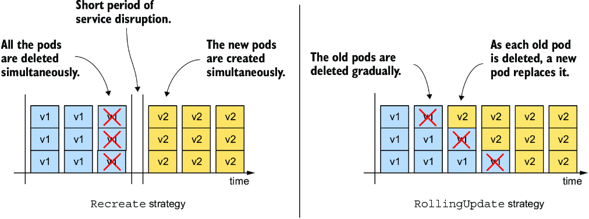

*Hình 15.4: Sự khác biệt giữa chiến lược Recreate và chiến lược RollingUpdate*

Chiến lược Recreate không có tùy chọn cấu hình nào, trong khi chiến lược RollingUpdate cho phép bạn cấu hình số lượng pod mà Kubernetes thay thế mỗi lần. Bạn sẽ tìm hiểu thêm về điều này ở phần sau.

### 15.2.1 Chiến lược Recreate (The Recreate strategy)

Chiến lược `Recreate` đơn giản hơn nhiều so với `RollingUpdate`, nên chúng ta sẽ đề cập đến nó trước. Vì bạn chưa chỉ định chiến lược trong Deployment object, nó mặc định là `RollingUpdate`, nên bạn cần thay đổi nó trước khi kích hoạt việc cập nhật.

#### Cấu hình Deployment dùng chiến lược Recreate (Configuring the Deployment to use the Recreate strategy)

Để cấu hình một Deployment dùng chiến lược cập nhật Recreate, bạn phải đưa các dòng được đánh dấu trong listing sau vào manifest Deployment của mình. Bạn có thể tìm thấy manifest này trong file `deploy.kiada.recreate.yaml`.

**Listing 15.2: Bật chiến lược cập nhật Recreate trong một Deployment**

```yaml
...
spec:
  strategy:              #1
    type: Recreate       #1
  replicas: 3
...
```

- **#1** Đây là cách bạn bật chiến lược cập nhật Recreate trong một Deployment.

Bạn có thể thêm các dòng này vào Deployment object bằng cách chỉnh sửa nó với lệnh `kubectl edit` hoặc áp dụng file manifest đã cập nhật bằng `kubectl apply`. Vì thay đổi này không ảnh hưởng đến Pod template, nó không kích hoạt việc cập nhật. Việc thay đổi label, annotation hay số lượng replica mong muốn của Deployment cũng không kích hoạt nó.

#### Cập nhật container image bằng kubectl set image (Updating the container image with kubectl set image)

Để cập nhật các pod lên phiên bản mới của container image Kiada, bạn cần cập nhật trường `image` trong định nghĩa container `kiada` bên trong Pod template. Bạn có thể làm điều này bằng cách cập nhật manifest với `kubectl edit` hoặc `kubectl apply`, nhưng với một thay đổi image đơn giản, bạn cũng có thể dùng lệnh `kubectl set image`. Với lệnh này, bạn có thể thay đổi tên image của bất kỳ container nào trong bất kỳ API object nào có chứa container. Điều này áp dụng cho Deployment, ReplicaSet và thậm chí cả pod. Ví dụ, bạn có thể dùng lệnh sau để cập nhật container `kiada` trong Deployment `kiada` của bạn để dùng phiên bản 0.6 của container image `luksa/kiada`:

```bash
$ kubectl set image deployment kiada kiada=luksa/kiada:0.6
```

Tuy nhiên, vì Pod template trong Deployment của bạn cũng chỉ định phiên bản ứng dụng trong các label của pod, nên việc thay đổi image mà không thay đổi giá trị label theo sẽ dẫn đến sự không nhất quán.

#### Cập nhật container image và label bằng kubectl patch (Updating the container image and labels using kubectl patch)

Để thay đổi tên image và giá trị label cùng lúc, bạn có thể dùng lệnh `kubectl patch`, lệnh này cho phép bạn cập nhật nhiều trường của manifest mà không cần tự tay chỉnh sửa manifest hay áp dụng toàn bộ file manifest. Để cập nhật cả tên image lẫn giá trị label, bạn có thể chạy lệnh sau:

```bash
$ kubectl patch deploy kiada --patch '{"spec": {"template": {"metadata": {"labels": {"ver": "0.6"}}, "spec": {"containers": [{"name": "kiada", "image": "luksa/kiada:0.6"}]}}}}'
```

Lệnh này có thể khó đọc với bạn vì bản patch được đưa ra dưới dạng một chuỗi JSON trên một dòng. Trong chuỗi này, bạn sẽ thấy một manifest Deployment không đầy đủ, chỉ chứa những trường bạn muốn thay đổi. Nếu bạn chỉ định bản patch dưới dạng một chuỗi YAML nhiều dòng, nó sẽ rõ ràng hơn nhiều. Lệnh đầy đủ khi đó trông như sau:

```bash
$ kubectl patch deploy kiada --patch '                       #1
spec:                                                        #2
  template:                                                  #2
    metadata:                                                #2
      labels:                                                #2
        ver: "0.6"                                           #2
    spec:                                                    #2
      containers:                                            #2
      - name: kiada                                          #2
        image: luksa/kiada:0.6'                              #2
```

- **#1** Lưu ý dấu nháy đơn ở cuối dòng này.
- **#2** Một manifest Deployment không đầy đủ, chỉ chỉ định những trường bạn muốn cập nhật

> **GHI CHÚ:** Bạn cũng có thể ghi manifest không đầy đủ này vào một file và dùng `--patch-file` thay vì `--patch`.

Bây giờ hãy chạy một trong hai lệnh `kubectl patch` để cập nhật Deployment, hoặc áp dụng file manifest `deploy.kiada.0.6.recreate.yaml` để có cùng kết quả.

#### Quan sát sự thay đổi trạng thái pod trong quá trình cập nhật (Observing the pod state changes during an update)

Ngay sau khi bạn cập nhật Deployment, hãy chạy lệnh sau lặp đi lặp lại để quan sát điều gì xảy ra với các pod:

```bash
$ kubectl get po -l app=kiada -L ver
```

Lệnh này liệt kê các Pod `kiada` và hiển thị giá trị label phiên bản của chúng trong cột `VER`. Bạn sẽ nhận thấy trạng thái của tất cả các pod này chuyển sang `Terminating` cùng lúc:

```bash
NAME                     READY   STATUS        RESTARTS   AGE     VER
kiada-7bffb9bf96-7w92k   0/2     Terminating   0          3m38s   0.5
kiada-7bffb9bf96-h8wnv   0/2     Terminating   0          3m38s   0.5
kiada-7bffb9bf96-xgb6d   0/2     Terminating   0          3m38s   0.5
```

Các pod sớm biến mất nhưng ngay lập tức được thay thế bằng các pod chạy phiên bản mới:

```bash
NAME                     READY   STATUS              RESTARTS   AGE   VER
kiada-5d5c5f9d76-5pghx   0/2     ContainerCreating   0          1s    0.6   #1
kiada-5d5c5f9d76-qfkts   0/2     ContainerCreating   0          1s    0.6   #1
kiada-5d5c5f9d76-vkdrl   0/2     ContainerCreating   0          1s    0.6   #1
```

- **#1** Các pod này chạy phiên bản mới của ứng dụng.

Sau vài giây, tất cả các pod mới đều sẵn sàng. Toàn bộ quá trình diễn ra rất nhanh, nhưng bạn có thể lặp lại nó bao nhiêu lần tùy thích. Hãy đưa Deployment về trạng thái trước bằng cách áp dụng phiên bản trước của manifest trong file `deploy.kiada.recreate.yaml`, đợi cho đến khi các pod được thay thế, rồi cập nhật lên phiên bản 0.6 bằng cách áp dụng lại file `deploy.kiada.0.6.recreate.yaml`.

#### Tìm hiểu cách một cập nhật dùng chiến lược Recreate ảnh hưởng đến tính khả dụng của dịch vụ (Understanding how an update using the Recreate strategy affects service availability)

Ngoài việc theo dõi danh sách Pod, hãy thử truy cập dịch vụ trong khi quá trình cập nhật đang diễn ra thông qua Ingress hoặc Gateway trong trình duyệt web của bạn, như đã mô tả trong chương 12 và 13.

Bạn sẽ nhận thấy khoảng thời gian ngắn mà Ingress proxy trả về trạng thái `503 Service Temporarily Unavailable`. Nếu bạn thử truy cập dịch vụ trực tiếp bằng IP nội bộ của cluster, bạn sẽ thấy kết nối bị từ chối trong khoảng thời gian này.

#### Tìm hiểu mối quan hệ giữa một Deployment và các ReplicaSet của nó (Understanding the relationship between a Deployment and its ReplicaSets)

Khi bạn liệt kê các pod, bạn sẽ nhận thấy tên của các pod đã chạy phiên bản 0.5 khác với tên của các pod chạy phiên bản 0.6. Tên các pod cũ bắt đầu bằng `kiada-7bffb9bf96`, trong khi tên các pod mới bắt đầu bằng `kiada-5d5c5f9d76`. Bạn có thể nhớ rằng các pod do một ReplicaSet tạo ra lấy tên từ ReplicaSet đó. Sự thay đổi tên cho thấy các pod mới này thuộc về một ReplicaSet khác. Hãy liệt kê các ReplicaSet để xác nhận điều này như sau:

```bash
$ kubectl get rs -L ver
NAME               DESIRED   CURRENT   READY   AGE   VER
kiada-5d5c5f9d76   3         3         3       13m   0.6   #1
kiada-7bffb9bf96   0         0         0       16m   0.5   #2
```

- **#1** Đây là ReplicaSet quản lý các pod chạy phiên bản ứng dụng mới.
- **#2** Đây là ReplicaSet đã quản lý các pod với phiên bản cũ. Giờ nó không có pod nào.

> **GHI CHÚ:** Các label bạn chỉ định trong Pod template của một Deployment cũng được áp dụng cho ReplicaSet. Vì vậy, nếu bạn thêm một label với số phiên bản của ứng dụng, bạn có thể thấy phiên bản khi liệt kê các ReplicaSet. Bằng cách này, bạn có thể dễ dàng phân biệt các ReplicaSet khác nhau, vì bạn không thể làm điều đó bằng cách nhìn vào tên của chúng.

Khi bạn tạo Deployment lần đầu, chỉ có một ReplicaSet được tạo và tất cả các pod đều thuộc về nó. Khi bạn cập nhật Deployment, một ReplicaSet mới được tạo. Giờ đây tất cả các pod của Deployment này được điều khiển bởi ReplicaSet này, như minh họa trong hình 15.5.

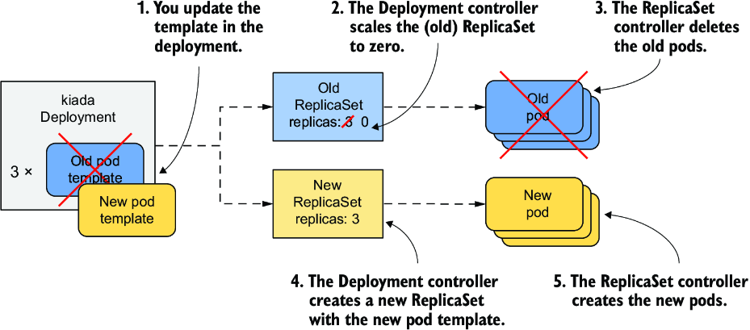

*Hình 15.5: Cập nhật một Deployment*

#### Tìm hiểu cách các pod của Deployment chuyển từ ReplicaSet này sang ReplicaSet kia (Understanding how the Deployment's pods transitioned from one ReplicaSet to the other)

Nếu bạn theo dõi các ReplicaSet khi kích hoạt việc cập nhật, bạn hẳn đã thấy diễn tiến sau đây. Ban đầu, chỉ có ReplicaSet cũ hiện diện:

```bash
NAME               DESIRED   CURRENT   READY   AGE   VER
kiada-7bffb9bf96   3         3         3       16m   0.5   #1
```

- **#1** Đây là ReplicaSet duy nhất. Cả ba pod đều thuộc về nó.

Sau đó Deployment controller scale ReplicaSet về không replica, khiến ReplicaSet controller xóa tất cả các pod:

```bash
NAME               DESIRED   CURRENT   READY   AGE   VER
kiada-7bffb9bf96   0         0         0       16m   0.5   #1
```

- **#1** Tất cả các số đếm pod đều bằng không.

Tiếp theo, Deployment controller tạo ReplicaSet mới và cấu hình nó với ba replica.

```bash
NAME               DESIRED   CURRENT   READY   AGE   VER
kiada-5d5c5f9d76   3         0         0       0s    0.6   #1
kiada-7bffb9bf96   0         0         0       16m   0.5   #2
```

- **#1** Số lượng replica mong muốn là ba, nhưng chưa có pod nào.
- **#2** ReplicaSet cũ vẫn còn đây nhưng không có pod nào.

ReplicaSet controller tạo ba pod mới, như được chỉ ra bởi con số trong cột `CURRENT`. Khi các container trong những pod này khởi động và bắt đầu chấp nhận kết nối, giá trị trong cột `READY` cũng chuyển thành ba.

```bash
NAME               DESIRED   CURRENT   READY   AGE   VER
kiada-5d5c5f9d76   3         3         0       1s    0.6   #1
kiada-7bffb9bf96   0         0         0       16m   0.5
```

- **#1** ReplicaSet mới có ba replica, nhưng chưa replica nào sẵn sàng. Chúng sẽ sẵn sàng ngay sau đó.

> **GHI CHÚ:** Bạn có thể xem Deployment controller và ReplicaSet controller đã làm gì bằng cách nhìn vào các event gắn với Deployment object và hai ReplicaSet.

Việc cập nhật giờ đã hoàn tất. Nếu bạn mở dịch vụ Kiada trong trình duyệt web, bạn sẽ thấy phiên bản đã cập nhật. Ở góc dưới bên phải, bạn sẽ thấy bốn ô cho biết phiên bản của pod đã xử lý request của trình duyệt cho từng file HTML, CSS, JavaScript và file ảnh chính. Những ô này sẽ hữu ích khi bạn thực hiện rolling update lên phiên bản 0.7 trong mục tiếp theo.

### 15.2.2 Chiến lược RollingUpdate (The RollingUpdate strategy)

Sự gián đoạn dịch vụ đi kèm với chiến lược `Recreate` thường không thể chấp nhận được. Đó là lý do chiến lược mặc định trong Deployment là `RollingUpdate`. Khi bạn dùng chiến lược này, các pod được thay thế dần dần, bằng cách scale down ReplicaSet cũ và đồng thời scale up ReplicaSet mới với cùng số lượng replica. Service không bao giờ rơi vào tình trạng không có pod để chuyển tiếp lưu lượng tới (hình 15.6).

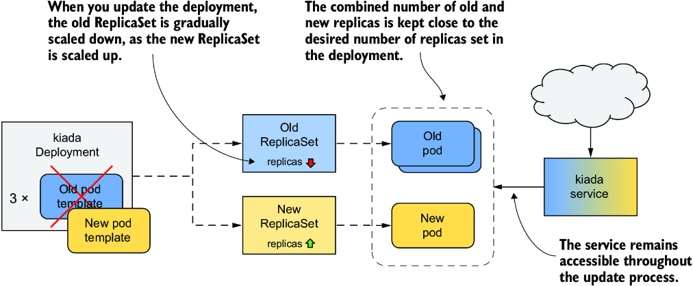

*Hình 15.6: Điều gì xảy ra với các ReplicaSet, pod và Service trong một rolling update*

#### Cấu hình Deployment dùng chiến lược RollingUpdate (Configuring the Deployment to use the RollingUpdate strategy)

Để cấu hình một Deployment dùng chiến lược cập nhật RollingUpdate, bạn phải đặt trường `strategy` của nó như trong listing sau. Bạn có thể tìm thấy manifest này trong file `deploy.kiada.0.7.rollingUpdate.yaml`.

**Listing 15.3: Bật chiến lược RollingUpdate trong một Deployment**

```yaml
apiVersion: apps/v1
kind: Deployment
metadata:
  name: kiada
spec:
  strategy:
    type: RollingUpdate       #1
    rollingUpdate:            #2
      maxSurge: 0             #2
      maxUnavailable: 1       #2
  minReadySeconds: 10
  replicas: 3
  selector:
    ...
```

- **#1** Chiến lược RollingUpdate được bật thông qua trường này.
- **#2** Các tham số cho chiến lược được cấu hình ở đây. Hai tham số này sẽ được giải thích sau.

Trong phần `strategy`, trường `type` đặt chiến lược là `RollingUpdate`, còn các tham số `maxSurge` và `maxUnavailable` trong phần con `rollingUpdate` cấu hình cách thực hiện cập nhật. Bạn có thể bỏ toàn bộ phần con này và chỉ đặt `type`, nhưng vì giá trị mặc định của các tham số `maxSurge` và `maxUnavailable` khiến việc giải thích quá trình cập nhật trở nên khó khăn, bạn đặt chúng theo các giá trị trong listing để dễ theo dõi quá trình cập nhật hơn. Tạm thời đừng bận tâm về hai tham số này, vì chúng sẽ được giải thích sau.

Bạn có thể đã nhận thấy `spec` của Deployment trong listing 15.3 cũng bao gồm trường `minReadySeconds`. Mặc dù trường này không phải là một phần của chiến lược cập nhật, nó ảnh hưởng đến tốc độ tiến triển của việc cập nhật. Bằng cách đặt trường này là `10`, bạn sẽ có thể theo dõi diễn tiến của rolling update tốt hơn nữa. Bạn sẽ học được thuộc tính này làm gì vào cuối chương.

#### Cập nhật tên image trong manifest (Updating the image name in the manifest)

Ngoài việc đặt chiến lược và `minReadySeconds` trong manifest Deployment, hãy đặt luôn tên image thành `luksa/kiada:0.7` và cập nhật label phiên bản, để khi bạn áp dụng file manifest này, việc cập nhật được kích hoạt ngay lập tức. Điều này nhằm cho thấy bạn có thể thay đổi chiến lược và kích hoạt cập nhật trong một thao tác `kubectl apply` duy nhất. Bạn không cần phải thay đổi chiến lược từ trước để nó được dùng trong việc cập nhật.

#### Kích hoạt cập nhật và quan sát quá trình rollout phiên bản mới (Triggering the update and observing the rollout of the new version)

Để bắt đầu rolling update, hãy áp dụng file manifest `deploy.kiada.0.7.rollingUpdate.yaml`. Bạn có thể theo dõi tiến trình rollout bằng lệnh `kubectl rollout status`, nhưng nó chỉ hiển thị như sau:

```bash
$ kubectl rollout status deploy kiada
Waiting for deploy "kiada" rollout to finish: 1 out of 3 new replicas have been updated...
Waiting for deploy "kiada" rollout to finish: 2 out of 3 new replicas have been updated...
Waiting for deploy "kiada" rollout to finish: 2 of 3 updated replicas are available
deployment "kiada" successfully rolled out
```

Để thấy chính xác Deployment controller thực hiện cập nhật như thế nào, tốt nhất là xem trạng thái của các ReplicaSet bên dưới thay đổi ra sao. Đầu tiên, ReplicaSet với phiên bản 0.6 chạy cả ba pod. ReplicaSet cho phiên bản 0.7 chưa tồn tại. ReplicaSet cho phiên bản 0.5 trước đó cũng có mặt, nhưng hãy bỏ qua nó vì nó không liên quan đến lần cập nhật này. Trạng thái ban đầu của ReplicaSet 0.6 như sau:

```bash
NAME               DESIRED   CURRENT   READY   AGE   VER
kiada-5d5c5f9d76   3         3         3       53m   0.6   #1
```

- **#1** Cả ba pod đều được quản lý bởi ReplicaSet 0.6.

Khi việc cập nhật bắt đầu, ReplicaSet chạy phiên bản 0.6 được scale down bớt một pod, trong khi ReplicaSet cho phiên bản 0.7 được tạo và cấu hình để chạy một replica duy nhất:

```bash
NAME               DESIRED   CURRENT   READY   AGE   VER
kiada-58df67c6f6   1         1         0       2s    0.7   #1
kiada-5d5c5f9d76   2         2         2       53m   0.6   #2
```

- **#1** ReplicaSet cho phiên bản 0.7 xuất hiện, được cấu hình chạy một replica.
- **#2** ReplicaSet cho phiên bản 0.6 giờ chạy hai replica.

Vì ReplicaSet cũ đã được scale down, ReplicaSet controller đã đánh dấu một trong các pod cũ để xóa. Pod này giờ đang chấm dứt và không còn được coi là sẵn sàng, trong khi hai pod cũ còn lại tiếp nhận toàn bộ lưu lượng của service. Pod thuộc ReplicaSet mới thì mới chỉ đang khởi động nên chưa sẵn sàng. Deployment controller đợi cho đến khi pod mới này sẵn sàng rồi mới tiếp tục quá trình cập nhật. Khi điều này xảy ra, trạng thái của các ReplicaSet như sau:

```bash
NAME               DESIRED   CURRENT   READY   AGE   VER
kiada-58df67c6f6   1         1         1       6s    0.7   #1
kiada-5d5c5f9d76   2         2         2       53m   0.6
```

- **#1** Pod mới đã sẵn sàng và đang nhận lưu lượng.

Tại thời điểm này, lưu lượng lại được xử lý bởi ba pod. Hai pod vẫn chạy phiên bản 0.6, và một pod chạy phiên bản 0.7. Vì bạn đã đặt `minReadySeconds` là 10, Deployment controller đợi chừng ấy giây trước khi tiếp tục cập nhật. Sau đó nó scale down ReplicaSet cũ bớt một replica, đồng thời scale up ReplicaSet mới thêm một replica. Các ReplicaSet giờ trông như sau:

```bash
NAME               DESIRED   CURRENT   READY   AGE   VER
kiada-58df67c6f6   2         2         1       16s   0.7   #1
kiada-5d5c5f9d76   1         1         1       53m   0.6   #2
```

- **#1** ReplicaSet mới được scale up thêm một.
- **#2** ReplicaSet cũ được scale down bớt một.

Tải của service giờ được xử lý bởi một pod cũ và một pod mới. Pod mới thứ hai chưa sẵn sàng nên chưa nhận lưu lượng. Mười giây sau khi pod này sẵn sàng, Deployment controller thực hiện những thay đổi cuối cùng trên hai ReplicaSet. Một lần nữa, ReplicaSet cũ được scale down bớt một, đưa số lượng replica mong muốn về không. ReplicaSet mới được scale up để số lượng replica mong muốn là ba:

```bash
NAME               DESIRED   CURRENT   READY   AGE   VER
kiada-58df67c6f6   3         3         2       29s   0.7   #1
kiada-5d5c5f9d76   0         0         0       54m   0.6   #2
```

- **#1** ReplicaSet mới được scale đến số lượng replica cuối cùng.
- **#2** ReplicaSet cũ giờ được scale về không.

Pod cũ cuối cùng còn lại bị chấm dứt và không còn nhận lưu lượng nữa. Toàn bộ lưu lượng từ client giờ được xử lý bởi phiên bản mới của ứng dụng. Khi pod mới thứ ba sẵn sàng, rolling update hoàn tất.

Không có thời điểm nào trong quá trình cập nhật mà dịch vụ không khả dụng. Luôn có ít nhất hai replica xử lý lưu lượng. Bạn có thể quan sát trực tiếp hành vi này bằng cách quay lại phiên bản cũ và kích hoạt cập nhật một lần nữa. Để làm điều đó, hãy áp dụng lại file manifest `deploy.kiada.0.6.recreate.yaml`. Vì manifest này dùng chiến lược `Recreate`, tất cả các pod bị xóa ngay lập tức, rồi sau đó các pod với phiên bản 0.6 được khởi động đồng thời.

Trước khi bạn kích hoạt lại việc cập nhật lên 0.7, hãy chạy lệnh sau để theo dõi quá trình cập nhật từ góc nhìn của client:

```bash
$ kubectl run -it --rm --restart=Never kiada-client --image curlimages/curl -- sh -c \
   'while true; do curl -s http://kiada | grep "Request processed by"; done'
```

Khi bạn chạy lệnh này, bạn tạo một pod có tên `kiada-client` dùng `curl` để liên tục gửi request tới service `kiada`. Thay vì in toàn bộ phản hồi, nó chỉ in ra dòng chứa số phiên bản cùng tên pod và tên node.

Trong khi client đang gửi request tới service, hãy kích hoạt một cập nhật khác bằng cách áp dụng lại file manifest `deploy.kiada.0.7.rollingUpdate.yaml`. Hãy quan sát output của lệnh `curl` thay đổi thế nào trong quá trình rolling update. Đây là một bản tóm tắt ngắn:

```bash
Request processed by Kiada 0.6 running in pod "kiada-5d5c5f9d76-qfx9p"   #1
Request processed by Kiada 0.6 running in pod "kiada-5d5c5f9d76-22zr7"   #1
...
Request processed by Kiada 0.6 running in pod "kiada-5d5c5f9d76-22zr7"   #2
Request processed by Kiada 0.7 running in pod "kiada-58df67c6f6-468bd"   #2
Request processed by Kiada 0.6 running in pod "kiada-5d5c5f9d76-6wb87"
Request processed by Kiada 0.7 running in pod "kiada-58df67c6f6-468bd"   #2
Request processed by Kiada 0.7 running in pod "kiada-58df67c6f6-468bd"   #2
...
Request processed by Kiada 0.7 running in pod "kiada-58df67c6f6-468bd"   #3
Request processed by Kiada 0.7 running in pod "kiada-58df67c6f6-fjnpf"   #3
Request processed by Kiada 0.7 running in pod "kiada-58df67c6f6-lssdp"   #3
```

- **#1** Ban đầu, tất cả các request được xử lý bởi các pod chạy phiên bản 0.6.
- **#2** Sau đó, một số request được xử lý bởi các pod chạy phiên bản 0.7, và một số bởi các pod chạy phiên bản cũ hơn.
- **#3** Cuối cùng, tất cả các request được xử lý bởi các pod chạy phiên bản mới.

Trong quá trình rolling update, một số request từ client được xử lý bởi các pod mới chạy phiên bản 0.7, trong khi những request khác được xử lý bởi các pod phiên bản 0.6. Do tỷ lệ pod mới ngày càng tăng, ngày càng nhiều phản hồi đến từ phiên bản mới của ứng dụng. Khi việc cập nhật hoàn tất, các phản hồi chỉ đến từ phiên bản mới.

### 15.2.3 Cấu hình số lượng pod được thay thế mỗi lần (Configuring how many pods are replaced at a time)

Trong rolling update được trình bày ở mục trước, các pod được thay thế từng cái một. Bạn có thể thay đổi điều này bằng cách thay đổi các tham số của chiến lược rolling update.

#### Giới thiệu các tùy chọn cấu hình maxSurge và maxUnavailable (Introducing the maxSurge and maxUnavailable configuration options)

Hai tham số ảnh hưởng đến tốc độ thay thế pod trong một rolling update là `maxSurge` và `maxUnavailable`, mà tôi đã nhắc qua khi giới thiệu chiến lược `RollingUpdate`. Bạn có thể đặt các tham số này trong phần con `rollingUpdate` của trường `strategy` trong Deployment, như trong listing sau.

**Listing 15.4: Chỉ định các tham số cho chiến lược rollingUpdate**

```yaml
spec:
  strategy:
    type: RollingUpdate
    rollingUpdate:
      maxSurge: 0          #1
      maxUnavailable: 1    #1
```

- **#1** Các tham số của chiến lược rolling update

Bảng 15.3 giải thích tác dụng của từng tham số.

**Bảng 15.3: Về các tùy chọn cấu hình maxSurge và maxUnavailable**

| Thuộc tính | Mô tả |
|---|---|
| `maxSurge` | Số lượng pod tối đa vượt trên số lượng replica mong muốn mà Deployment có thể có trong quá trình rolling update. Giá trị có thể là một số tuyệt đối hoặc một tỷ lệ phần trăm của số lượng replica mong muốn. |
| `maxUnavailable` | Số lượng pod tối đa, so với số lượng replica mong muốn, có thể không khả dụng trong quá trình rolling update. Giá trị có thể là một số tuyệt đối hoặc một tỷ lệ phần trăm của số lượng replica mong muốn. |

Điều quan trọng nhất về hai tham số này là giá trị của chúng được tính tương đối so với số lượng replica mong muốn. Ví dụ, nếu số lượng replica mong muốn là ba, `maxUnavailable` là một, và số lượng pod hiện tại là năm, thì số lượng pod phải khả dụng là hai, chứ không phải bốn.

Hãy xem hai tham số này ảnh hưởng thế nào đến cách Deployment controller thực hiện cập nhật. Điều này được giải thích tốt nhất bằng cách xem xét riêng từng tổ hợp có thể có.

#### maxSurge=0, maxUnavailable=1 (maxSurge=0, maxUnavailable=1)

Khi bạn thực hiện rolling update ở mục trước, số lượng replica mong muốn là ba, `maxSurge` là không, và `maxUnavailable` là một. Hình 15.7 cho thấy các pod được cập nhật theo thời gian như thế nào.

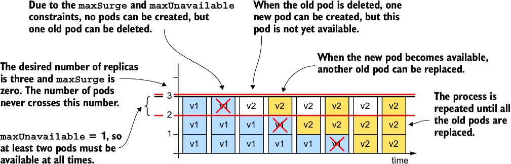

*Hình 15.7: Thay thế pod khi maxSurge là 0 và maxUnavailable là 1*

Vì `maxSurge` được đặt là `0`, Deployment controller không được phép thêm pod vượt quá số lượng replica mong muốn. Do đó, không bao giờ có nhiều hơn ba pod gắn với Deployment. Vì `maxUnavailable` được đặt là `1`, Deployment controller phải giữ số lượng replica khả dụng trên hai và do đó chỉ có thể xóa một pod cũ mỗi lần. Nó không thể xóa pod tiếp theo cho đến khi pod mới thay thế cho pod đã xóa trở nên khả dụng.

#### maxSurge=1, maxUnavailable=0 (maxSurge=1, maxUnavailable=0)

Điều gì xảy ra nếu bạn đảo ngược hai tham số, đặt `maxSurge` là `1` và `maxUnavailable` là `0`? Nếu số lượng replica mong muốn là ba, phải luôn có ít nhất ba replica khả dụng trong suốt quá trình. Vì tham số `maxSurge` được đặt là `1`, tổng số pod không bao giờ được vượt quá bốn. Hình 15.8 cho thấy việc cập nhật diễn ra như thế nào.

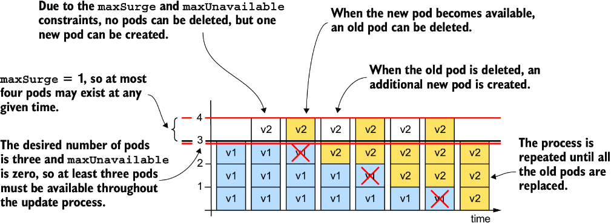

*Hình 15.8: Thay thế pod khi maxSurge là 1 và maxUnavailable là 0*

Đầu tiên, Deployment controller không thể scale down ReplicaSet cũ vì điều đó sẽ khiến số lượng pod khả dụng tụt xuống dưới số lượng replica mong muốn. Nhưng controller có thể scale up ReplicaSet mới thêm một pod, vì tham số `maxSurge` cho phép Deployment có một pod vượt trên số lượng replica mong muốn.

Tại thời điểm này, Deployment có ba pod cũ và một pod mới. Khi pod mới khả dụng, lưu lượng được xử lý bởi cả bốn pod trong chốc lát. Deployment controller giờ có thể scale down ReplicaSet cũ bớt một pod, vì vẫn còn ba pod khả dụng. Sau đó controller có thể scale up ReplicaSet mới. Quá trình này lặp lại cho đến khi ReplicaSet mới có ba pod và ReplicaSet cũ không còn pod nào.

Trong suốt quá trình cập nhật, số lượng pod mong muốn luôn khả dụng, và tổng số pod không bao giờ vượt quá một so với số lượng replica mong muốn.

> **GHI CHÚ:** Bạn không thể đặt cả `maxSurge` lẫn `maxUnavailable` bằng không, vì điều này sẽ không cho phép Deployment vượt quá số lượng replica mong muốn hay gỡ bỏ pod, vì khi đó một pod sẽ không khả dụng.

#### maxSurge=1, maxUnavailable=1 (maxSurge=1, maxUnavailable=1)

Nếu bạn đặt cả `maxSurge` lẫn `maxUnavailable` là `1`, tổng số replica trong Deployment có thể lên đến bốn, và hai replica phải luôn khả dụng. Hình 15.9 cho thấy diễn tiến theo thời gian.

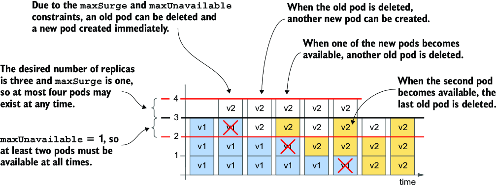

*Hình 15.9: Cách các pod được thay thế khi cả maxSurge lẫn maxUnavailable đều là 1*

Deployment controller ngay lập tức scale up ReplicaSet mới thêm một replica và scale down ReplicaSet cũ bớt cùng số lượng đó. Ngay khi ReplicaSet cũ báo cáo rằng nó đã đánh dấu một trong các pod cũ để xóa, Deployment controller scale up ReplicaSet mới thêm một pod nữa.

Mỗi ReplicaSet giờ được cấu hình với hai replica. Hai pod trong ReplicaSet cũ vẫn đang chạy và khả dụng, trong khi hai pod mới đang khởi động. Khi một trong các pod mới khả dụng, một pod cũ khác bị xóa và một pod mới khác được tạo. Điều này tiếp diễn cho đến khi tất cả các pod cũ được thay thế. Tổng số pod không bao giờ vượt quá bốn, và luôn có ít nhất hai pod khả dụng tại bất kỳ thời điểm nào.

> **GHI CHÚ:** Vì Deployment controller không tự đếm các pod mà lấy thông tin về số lượng pod từ status của các ReplicaSet bên dưới, và vì ReplicaSet không bao giờ đếm các pod đang bị chấm dứt, nên tổng số pod thực tế có thể vượt quá bốn nếu bạn tính cả các pod đang bị chấm dứt.

#### Dùng các giá trị maxSurge và maxUnavailable cao hơn (Using higher values of maxSurge and maxUnavailable)

Nếu `maxSurge` được đặt thành giá trị cao hơn một, Deployment controller được phép thêm nhiều Pod hơn nữa mỗi lần. Nếu `maxUnavailable` cao hơn một, controller được phép gỡ bỏ nhiều pod hơn.

#### Dùng tỷ lệ phần trăm (Using percentages)

Thay vì đặt `maxSurge` và `maxUnavailable` là một số tuyệt đối, bạn có thể đặt chúng là một tỷ lệ phần trăm của số lượng replica mong muốn. Controller tính số `maxSurge` tuyệt đối bằng cách làm tròn lên, và `maxUnavailable` bằng cách làm tròn xuống.

Hãy xét trường hợp `replicas` được đặt là `10` và `maxSurge` cùng `maxUnavailable` được đặt là `25%`. Nếu bạn tính các giá trị tuyệt đối, `maxSurge` trở thành `3`, và `maxUnavailable` trở thành `2`. Vì vậy, trong quá trình cập nhật, Deployment có thể có tới 13 pod, trong đó luôn có ít nhất 8 pod khả dụng và xử lý lưu lượng.

> **GHI CHÚ:** Giá trị mặc định cho `maxSurge` và `maxUnavailable` là 25%.

### 15.2.4 Tạm dừng quá trình rollout (Pausing the rollout process)

Quá trình rolling update hoàn toàn tự động. Một khi bạn cập nhật Pod template trong Deployment object, quá trình rollout bắt đầu và không kết thúc cho đến khi tất cả các pod được thay thế bằng phiên bản mới. Tuy nhiên, bạn có thể tạm dừng (pause) rolling update bất cứ lúc nào. Bạn có thể muốn làm điều này để kiểm tra hành vi của hệ thống khi cả hai phiên bản của ứng dụng đang cùng chạy, hoặc để xem pod mới đầu tiên có hoạt động như mong đợi hay không trước khi thay thế các pod còn lại.

#### Tạm dừng rollout (Pausing the rollout)

Để tạm dừng một cập nhật ngay giữa quá trình rolling update, hãy dùng

```bash
$ kubectl rollout pause deployment kiada
deployment.apps/kiada paused
```

Lệnh này đặt giá trị của trường `paused` trong phần `spec` của Deployment thành `true`. Deployment controller kiểm tra trường này trước bất kỳ thay đổi nào đối với các ReplicaSet bên dưới.

Hãy thử lại việc cập nhật từ phiên bản 0.6 lên phiên bản 0.7 và tạm dừng Deployment khi pod đầu tiên được thay thế. Mở ứng dụng trong trình duyệt web của bạn và quan sát hành vi của nó. Hãy đọc sidebar để biết cần chú ý điều gì.

> **Hãy cẩn thận khi dùng rolling update với ứng dụng web**
>
> Nếu bạn tạm dừng việc cập nhật trong khi Deployment đang chạy cả phiên bản cũ lẫn phiên bản mới của ứng dụng và truy cập nó qua trình duyệt web, bạn sẽ nhận thấy một vấn đề có thể xảy ra khi dùng chiến lược này với các ứng dụng web.
>
> Hãy làm mới trang trong trình duyệt vài lần và quan sát màu sắc cùng số phiên bản hiển thị trong bốn ô ở góc dưới bên phải. Bạn sẽ nhận thấy bạn nhận được phiên bản 0.6 cho một số tài nguyên và phiên bản 0.7 cho những tài nguyên khác. Đó là vì một số request do trình duyệt của bạn gửi được định tuyến tới các pod chạy phiên bản 0.6 và một số được định tuyến tới các pod chạy phiên bản 0.7. Với ứng dụng Kiada, điều này không thành vấn đề, vì không có thay đổi lớn nào trong các file CSS, JavaScript và ảnh giữa hai phiên bản. Tuy nhiên, nếu có, HTML có thể được hiển thị sai.
>
> Để ngăn điều này, bạn có thể dùng session affinity hoặc cập nhật ứng dụng theo hai bước. Đầu tiên, bạn thêm các tính năng mới vào CSS và các tài nguyên khác nhưng vẫn duy trì tương thích ngược. Sau khi đã rollout hoàn toàn phiên bản này, bạn có thể rollout phiên bản với các thay đổi trong HTML. Ngoài ra, bạn có thể dùng chiến lược triển khai Blue/Green, được giải thích ở phần sau của chương này.

#### Tiếp tục rollout (Resuming the rollout)

Để tiếp tục (resume) một rollout đang tạm dừng, hãy thực thi lệnh sau:

```bash
$ kubectl rollout resume deployment kiada
deployment.apps/kiada resumed
```

#### Dùng tính năng tạm dừng để chặn rollout (Using the pause feature to block rollouts)

Việc tạm dừng một Deployment cũng có thể được dùng để ngăn các cập nhật lên Deployment kích hoạt ngay quá trình cập nhật. Điều này cho phép bạn thực hiện nhiều thay đổi trên Deployment mà không bắt đầu rollout cho đến khi bạn đã thực hiện xong mọi thay đổi cần thiết. Khi bạn đã sẵn sàng để các thay đổi có hiệu lực, bạn tiếp tục Deployment và quá trình rollout bắt đầu.

### 15.2.5 Cập nhật lên một phiên bản bị lỗi (Updating to a faulty version)

Khi bạn rollout một phiên bản mới của ứng dụng, bạn có thể dùng lệnh `kubectl rollout pause` để xác minh rằng các pod chạy phiên bản mới hoạt động như mong đợi trước khi bạn tiếp tục rollout. Bạn cũng có thể để Kubernetes tự động làm việc này cho bạn.

#### Tìm hiểu tính khả dụng của pod (Understanding pod availability)

Trong chương 11, bạn đã học thế nào là một pod và các container của nó được coi là sẵn sàng (ready). Tuy nhiên, khi bạn liệt kê các Deployment bằng `kubectl get deployments`, bạn thấy cả số lượng pod sẵn sàng lẫn số lượng pod khả dụng (available). Ví dụ, trong một rolling update, bạn có thể thấy output sau:

```bash
$ kubectl get deploy kiada
NAME    READY   UP-TO-DATE   AVAILABLE   AGE
kiada   3/3     1            2           50m   #1
```

- **#1** Ba pod sẵn sàng, nhưng chỉ có hai pod khả dụng.

Mặc dù ba pod sẵn sàng, không phải cả ba đều khả dụng. Để một pod được coi là khả dụng, nó phải ở trạng thái sẵn sàng trong một khoảng thời gian nhất định. Thời gian này có thể cấu hình thông qua trường `minReadySeconds` mà tôi đã nhắc qua khi giới thiệu chiến lược `RollingUpdate`.

> **GHI CHÚ:** Một pod đã sẵn sàng nhưng chưa khả dụng vẫn được đưa vào các service của bạn và do đó vẫn nhận các request từ client.

#### Trì hoãn tính khả dụng của pod với minReadySeconds (Delaying pod availability with minReadySeconds)

Khi một pod mới được tạo trong một rolling update, Deployment controller đợi cho đến khi pod khả dụng rồi mới tiếp tục quá trình rollout. Theo mặc định, pod được coi là khả dụng khi nó sẵn sàng (theo chỉ báo của readiness probe của pod). Nếu bạn chỉ định `minReadySeconds`, pod không được coi là khả dụng cho đến khi khoảng thời gian được chỉ định đã trôi qua kể từ khi pod sẵn sàng. Nếu các container của pod bị crash hoặc không vượt qua readiness probe trong thời gian này, bộ đếm thời gian được đặt lại.

Trong một mục trước, bạn đã đặt `minReadySeconds` là 10 để làm chậm rollout nhằm theo dõi nó dễ hơn. Trong thực tế, bạn có thể đặt thuộc tính này ở giá trị cao hơn nhiều để tự động tạm dừng rollout trong một khoảng thời gian dài hơn sau khi các pod mới được tạo. Ví dụ, nếu bạn đặt `minReadySeconds` là `3600`, bạn đảm bảo rằng việc cập nhật sẽ không tiếp tục cho đến khi những pod đầu tiên với phiên bản mới chứng minh được rằng chúng có thể hoạt động trọn một giờ mà không gặp vấn đề.

Mặc dù hiển nhiên bạn nên kiểm thử ứng dụng trong cả môi trường test lẫn staging trước khi đưa vào production, việc dùng `minReadySeconds` giống như một túi khí giúp tránh thảm họa nếu một phiên bản lỗi lọt qua mọi bài kiểm thử. Nhược điểm là nó làm chậm toàn bộ quá trình rollout, chứ không chỉ giai đoạn đầu.

#### Triển khai một phiên bản ứng dụng bị hỏng (Deploying a broken application version)

Để xem sự kết hợp giữa readiness probe và `minReadySeconds` có thể cứu bạn khỏi việc rollout một phiên bản ứng dụng lỗi như thế nào, bạn sẽ triển khai phiên bản 0.8 của service Kiada. Đây là một phiên bản đặc biệt trả về phản hồi `500 Internal Server Error` trong một khoảng thời gian sau khi tiến trình khởi động. Thời gian này có thể cấu hình thông qua biến môi trường `FAIL_AFTER_SECONDS`.

Để triển khai phiên bản này, hãy áp dụng file manifest `deploy.kiada.0.8.minReadySeconds60.yaml`. Các phần liên quan của manifest được trình bày trong listing 15.5.

**Listing 15.5: Manifest Deployment với readiness probe và minReadySeconds**

```yaml
apiVersion: apps/v1
kind: Deployment
...
spec:
  strategy:
    type: RollingUpdate
    rollingUpdate:
      maxSurge: 0
      maxUnavailable: 1
  minReadySeconds: 60                   #1
  ...
  template:
    ...
    spec:
      containers:
      - name: kiada
        image: luksa/kiada:0.8              #2
        env:
        - name: FAIL_AFTER_SECONDS          #3
          value: "30"                       #3
        ...
        readinessProbe:                     #4
          initialDelaySeconds: 0            #4
          periodSeconds: 10                 #4
          failureThreshold: 1               #4
          httpGet:                          #4
            port: 8080                      #4
            path: /healthz/ready            #4
            scheme: HTTP                    #4
        ...                                 #4
```

- **#1** Mỗi pod phải sẵn sàng trong 60 giây trước khi được coi là khả dụng.
- **#2** Phiên bản 0.8 của service Kiada là một phiên bản đặc biệt sẽ gặp lỗi sau một khoảng thời gian nhất định.
- **#3** Ứng dụng đọc biến môi trường này và gặp lỗi sau chừng ấy giây kể từ khi khởi động.
- **#4** Readiness probe được cấu hình để chạy ngay khi khởi động và sau đó cứ mỗi 10 giây.

Như bạn thấy trong listing, `minReadySeconds` được đặt là `60`, trong khi `FAIL_AFTER_SECONDS` được đặt là 30. Readiness probe chạy mỗi 10 giây. Pod đầu tiên được tạo trong quá trình rolling update chạy trơn tru trong 30 giây đầu. Nó được đánh dấu là sẵn sàng và do đó nhận các request từ client. Nhưng sau 30 giây đó, những request này và các request được thực hiện như một phần của readiness probe đều thất bại. Pod bị đánh dấu là không sẵn sàng và không bao giờ được coi là khả dụng do thiết lập `minReadySeconds`. Điều này khiến rolling update dừng lại.

Ban đầu, một số phản hồi mà client nhận được sẽ do phiên bản mới gửi. Sau đó, một số request sẽ thất bại, nhưng ngay sau đó, tất cả các phản hồi sẽ lại đến từ phiên bản cũ.

Việc đặt `minReadySeconds` là `60` giảm thiểu tác động tiêu cực của phiên bản lỗi. Nếu bạn không đặt `minReadySeconds`, pod mới hẳn đã được coi là khả dụng ngay lập tức, và rollout hẳn đã thay thế tất cả các pod cũ bằng phiên bản mới. Tất cả các pod mới này sẽ sớm gặp lỗi, dẫn đến dịch vụ ngừng hoạt động hoàn toàn. Nếu bạn muốn tự mình chứng kiến điều này, bạn có thể thử áp dụng file manifest `deploy.kiada.0.8.minReadySeconds0.yaml` sau. Nhưng trước tiên, hãy xem điều gì xảy ra khi rollout bị kẹt trong một thời gian dài.

#### Kiểm tra rollout có đang tiến triển hay không (Checking whether the rollout is progressing)

Deployment object cho biết quá trình rollout có đang tiến triển hay không thông qua condition `Progressing`, mà bạn có thể tìm thấy trong danh sách `status.conditions` của object. Nếu không có tiến triển nào trong 10 phút, status của condition này chuyển thành `false` và lý do chuyển thành `ProgressDeadlineExceeded`. Bạn có thể thấy điều này bằng cách chạy lệnh `kubectl describe` như sau:

```bash
$ kubectl describe deploy kiada
...
Conditions:
  Type                Status      Reason
  ----                ------      ------
  Available           True        MinimumReplicasAvailable
  Progressing         False       ProgressDeadlineExceeded            #1
```

- **#1** Quá trình triển khai không tiến triển.

> **GHI CHÚ:** Bạn có thể cấu hình một hạn chót tiến triển (progress deadline) khác bằng cách đặt trường `spec.progressDeadlineSeconds` trong Deployment object. Nếu bạn tăng `minReadySeconds` lên hơn `600`, bạn phải đặt trường `progressDeadlineSeconds` tương ứng.

Nếu bạn chạy lệnh `kubectl rollout status` sau khi kích hoạt cập nhật, nó in ra một thông báo rằng hạn chót tiến triển đã bị vượt quá, rồi kết thúc:

```bash
$ kubectl rollout status deploy kiada
Waiting for "kiada" rollout to finish: 1 out of 3 new replicas have been updated...
error: deployment "kiada" exceeded its progress deadline
```

Ngoài việc báo cáo rằng rollout đã bị đình trệ, Kubernetes không thực hiện thêm hành động nào. Quá trình rollout không bao giờ dừng hẳn. Nếu pod trở nên sẵn sàng và duy trì như vậy trong khoảng thời gian `minReadySeconds`, quá trình rollout tiếp tục. Nếu pod không bao giờ sẵn sàng trở lại, quá trình rollout đơn giản là không tiếp tục. Bạn có thể hủy rollout như được giải thích trong mục tiếp theo.

### 15.2.6 Rollback một Deployment (Rolling back a Deployment)

Nếu bạn cập nhật một Deployment và việc cập nhật thất bại, bạn có thể dùng lệnh `kubectl apply` để áp dụng lại phiên bản trước của manifest Deployment, hoặc yêu cầu Kubernetes rollback (quay lui) lần cập nhật gần nhất.

#### Rollback một Deployment (Rolling back a Deployment)

Bạn có thể rollback Deployment về phiên bản trước bằng cách chạy lệnh `kubectl rollout undo` như sau:

```bash
$ kubectl rollout undo deployment kiada
deployment.apps/kiada rolled back
```

Việc chạy lệnh này có hiệu ứng tương tự như áp dụng phiên bản trước của file manifest object. Quá trình undo tuân theo cùng các bước như một cập nhật thông thường. Nó làm vậy bằng cách tôn trọng chiến lược cập nhật được chỉ định trong Deployment object. Do đó, nếu chiến lược `RollingUpdate` được dùng, các pod được rollback dần dần.

> **MẸO:** Lệnh `kubectl rollout undo` có thể được dùng trong khi quá trình rollout đang chạy để hủy rollout, hoặc sau khi rollout hoàn tất để hoàn tác nó.

> **GHI CHÚ:** Khi một Deployment bị tạm dừng bằng lệnh `kubectl pause`, lệnh `kubectl rollout undo` không làm gì cả cho đến khi bạn tiếp tục Deployment bằng `kubectl rollout resume`.

#### Hiển thị lịch sử rollout của một Deployment (Displaying a Deployment's rollout history)

Không chỉ có thể dùng lệnh `kubectl rollout undo` để quay về phiên bản trước, bạn còn có thể quay về một trong những phiên bản trước đó nữa. Tất nhiên, bạn có thể muốn xem trước những phiên bản đó trông như thế nào. Bạn có thể làm điều đó bằng lệnh `kubectl rollout history`. Đáng tiếc, tại thời điểm tôi viết sách, lệnh này gần như vô dụng. Để hiểu ý tôi, hãy xem output của nó:

```bash
$ kubectl rollout history deploy kiada
deployment.apps/kiada
REVISION         CHANGE-CAUSE
1                <none>
2                <none>
11               <none>
```

Thông tin duy nhất chúng ta có thể rút ra từ lệnh này là Deployment đã trải qua hai revision. Cột `CHANGE-CAUSE` trống, nên chúng ta không thể thấy lý do của từng thay đổi là gì.

Các giá trị trong cột này được điền nếu bạn dùng tùy chọn `--record` khi chạy các lệnh `kubectl` làm thay đổi Deployment. Tuy nhiên, tùy chọn này hiện đã bị đánh dấu là lỗi thời (deprecated) và sẽ bị loại bỏ. Hy vọng rằng một cơ chế khác sẽ được giới thiệu trong tương lai cho phép lệnh `rollout history` hiển thị nhiều thông tin hơn về từng thay đổi.

Hiện tại, bạn có thể kiểm tra từng revision riêng lẻ bằng cách chạy lệnh `kubectl rollout history` với tùy chọn `--revision`. Ví dụ, để kiểm tra revision thứ hai, hãy chạy

```bash
$ kubectl rollout history deploy kiada --revision 2
deployment.apps/kiada with revision #2
Pod Template:
    Labels:              app=kiada
                         pod-template-hash=7bffb9bf96
                         rel=stable
    Containers:
     kiada:
      Image:             luksa/kiada:0.6
       ...
```

Bạn có thể tự hỏi lịch sử revision được lưu ở đâu. Bạn sẽ không tìm thấy nó trong Deployment object. Thay vào đó, lịch sử của một Deployment được biểu diễn bởi các ReplicaSet gắn với Deployment, như minh họa trong hình 15.10. Mỗi ReplicaSet đại diện cho một revision. Đây là lý do Deployment controller không xóa ReplicaSet object cũ sau khi quá trình cập nhật hoàn tất.

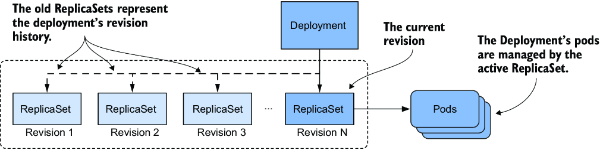

*Hình 15.10: Lịch sử revision của một Deployment*

> **GHI CHÚ:** Kích thước của lịch sử revision, và do đó số lượng ReplicaSet mà Deployment controller giữ lại cho một Deployment nhất định, được xác định bởi trường `revisionHistoryLimit` trong `spec` của Deployment. Giá trị mặc định là `10`.

Như một bài tập, hãy thử tìm số revision mà tại đó phiên bản 0.6 của service Kiada được triển khai. Bạn sẽ cần số revision này trong mục tiếp theo.

> **MẸO:** Thay vì dùng `kubectl rollout history` để xem lịch sử của một Deployment, liệt kê các ReplicaSet với `-o wide` là lựa chọn tốt hơn, vì nó hiển thị các tag image được dùng trong pod. Để tìm số revision của từng ReplicaSet, hãy xem các annotation của ReplicaSet.

#### Rollback về một revision cụ thể của Deployment (Rolling back to a specific Deployment revision)

Bạn đã dùng lệnh `kubectl rollout undo` để quay từ phiên bản lỗi 0.8 về phiên bản 0.7. Nhưng nền màu vàng của các phần "Tip of the day" và "Pop quiz" trong giao diện người dùng trông không đẹp bằng nền màu trắng trong phiên bản 0.6, nên hãy rollback về phiên bản này.

Bạn có thể quay về một revision cụ thể bằng cách chỉ định số revision trong lệnh `kubectl rollout undo`. Ví dụ, nếu bạn muốn quay về revision đầu tiên, hãy chạy

```bash
$ kubectl rollout undo deployment kiada --to-revision=1
```

Nếu bạn đã tìm được số revision chứa phiên bản 0.6 của service Kiada, hãy dùng lệnh `kubectl rollout undo` để quay về nó.

#### Tìm hiểu sự khác biệt giữa rollback và áp dụng phiên bản cũ hơn của file manifest (Understanding the difference between rolling back and applying an older version of the manifest file)

Bạn có thể nghĩ rằng dùng `kubectl rollout undo` để quay về phiên bản trước của manifest Deployment tương đương với việc áp dụng file manifest trước đó, nhưng không phải vậy. Lệnh `kubectl rollout undo` chỉ hoàn nguyên Pod template và giữ nguyên mọi thay đổi khác mà bạn đã thực hiện trên manifest Deployment. Điều này bao gồm các thay đổi đối với chiến lược cập nhật và số lượng replica mong muốn. Trong khi đó, lệnh `kubectl apply` ghi đè những thay đổi này.

#### Khởi động lại các pod bằng kubectl rollout restart (Restarting pods with kubectl rollout restart)

Ngoài các lệnh `kubectl rollout` đã được giải thích trong mục này và các mục trước, còn một lệnh nữa tôi nên nhắc đến. Đến một lúc nào đó, bạn có thể muốn khởi động lại tất cả các pod thuộc về một Deployment. Bạn có thể làm điều đó bằng lệnh `kubectl rollout restart`. Lệnh này xóa và thay thế các pod bằng cùng chiến lược được dùng cho việc cập nhật.

Nếu Deployment được cấu hình với chiến lược `RollingUpdate`, các Pod được tạo lại dần dần để tính khả dụng của dịch vụ được duy trì trong suốt quá trình. Nếu chiến lược `Recreate` được dùng, tất cả các pod bị xóa và tạo lại đồng thời.

---

## 15.3 Hiện thực các chiến lược triển khai khác (Implementing other deployment strategies)

Trong các mục trước, bạn đã học cách các chiến lược `Recreate` và `RollingUpdate` hoạt động. Mặc dù đây là những chiến lược duy nhất được Deployment controller hỗ trợ, bạn cũng có thể hiện thực các chiến lược nổi tiếng khác, nhưng với chút công sức nhiều hơn. Bạn có thể làm điều này thủ công hoặc để một controller cấp cao hơn tự động hóa quá trình. Tại thời điểm viết sách, Kubernetes không cung cấp những controller như vậy, nhưng bạn có thể tìm thấy chúng trong các dự án như Flagger (github.com/fluxcd/flagger) và Argo Rollouts (argoproj.github.io/argo-rollouts).

Trong mục này, tôi sẽ chỉ cung cấp cho bạn một cái nhìn tổng quan về cách các chiến lược triển khai phổ biến nhất được hiện thực. Bảng 15.4 giải thích các chiến lược này, còn các mục tiếp theo giải thích cách chúng được hiện thực trong Kubernetes.

**Bảng 15.4: Các chiến lược triển khai phổ biến**

| Chiến lược | Mô tả |
|---|---|
| Recreate | Dừng tất cả các pod chạy phiên bản trước, rồi tạo tất cả các pod với phiên bản mới. |
| Rolling update | Thay thế dần các pod cũ bằng các pod mới, từng cái một hoặc nhiều cái cùng lúc. Chiến lược này còn được gọi là ramped hoặc incremental (tăng dần). |
| Canary | Tạo một hoặc một số rất ít pod mới, và chuyển hướng một lượng nhỏ lưu lượng tới các pod đó để đảm bảo chúng hoạt động như mong đợi. Sau đó thay thế tất cả các pod còn lại. |
| A/B testing | Tạo một số ít pod mới và chuyển hướng một tập con người dùng tới các pod đó dựa trên một điều kiện nào đó. Một người dùng luôn được chuyển hướng tới cùng một phiên bản của ứng dụng. Thông thường, bạn dùng chiến lược này để thu thập dữ liệu về mức độ hiệu quả của từng phiên bản trong việc đạt được những mục tiêu nhất định. |
| Blue/Green | Triển khai phiên bản mới của các pod song song với phiên bản cũ. Đợi cho đến khi các pod mới sẵn sàng rồi chuyển toàn bộ lưu lượng sang các pod mới. Tiếp theo xóa các pod cũ. |
| Shadowing | Triển khai phiên bản mới của các pod bên cạnh phiên bản cũ. Chuyển tiếp mỗi request tới cả hai phiên bản, nhưng chỉ trả về phản hồi của phiên bản cũ cho người dùng, trong khi bỏ đi phản hồi của phiên bản mới. Bằng cách này, bạn có thể thấy phiên bản mới hoạt động ra sao mà không ảnh hưởng đến người dùng. Chiến lược này còn được gọi là traffic mirroring (phản chiếu lưu lượng) hoặc dark launch. |

Như bạn đã biết, các chiến lược `Recreate` và `RollingUpdate` được Kubernetes hỗ trợ trực tiếp, nhưng bạn cũng có thể coi chiến lược Canary là được hỗ trợ một phần. Điều này được giải thích trong mục sau.

### 15.3.1 Chiến lược triển khai Canary (The Canary deployment strategy)

Nếu bạn đặt tham số `minReadySeconds` ở một giá trị đủ cao, quá trình cập nhật giống với một triển khai Canary ở chỗ quá trình được tạm dừng cho đến khi những pod mới đầu tiên chứng minh được giá trị của chúng. Điểm khác biệt so với một triển khai Canary thực thụ là việc tạm dừng này không chỉ áp dụng cho (các) pod đầu tiên, mà cho mọi bước của quá trình cập nhật.

Ngoài ra, bạn có thể dùng lệnh `kubectl rollout pause` ngay sau khi (các) pod đầu tiên được tạo và tự tay kiểm tra những pod canary đó. Khi bạn chắc chắn rằng phiên bản mới hoạt động như mong đợi, bạn tiếp tục việc cập nhật bằng lệnh `kubectl rollout resume`.

Một cách khác để đạt được cùng mục đích là tạo một Deployment riêng cho các pod canary và đặt số lượng replica mong muốn ở một con số thấp hơn nhiều so với Deployment cho phiên bản ổn định. Bạn cấu hình Service để chuyển tiếp lưu lượng tới các pod trong cả hai Deployment. Vì Service phân phối lưu lượng đều trên các pod và vì Deployment canary có ít pod hơn nhiều so với Deployment ổn định, chỉ một lượng nhỏ lưu lượng được gửi tới các pod canary, trong khi phần lớn được gửi tới các pod ổn định. Hình 15.11 minh họa cách tiếp cận này.

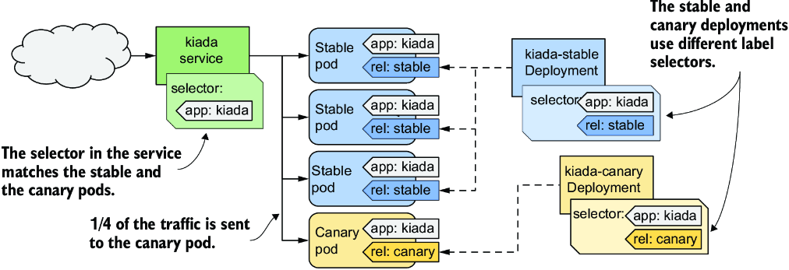

*Hình 15.11: Hiện thực chiến lược triển khai Canary bằng hai Deployment*

Khi bạn đã sẵn sàng cập nhật các pod còn lại, bạn có thể thực hiện một rolling update thông thường trên Deployment cũ và xóa Deployment canary.

### 15.3.2 Chiến lược A/B (The A/B strategy)

Nếu bạn muốn hiện thực chiến lược triển khai A/B để rollout một phiên bản mới chỉ cho những người dùng cụ thể dựa trên một điều kiện cụ thể như vị trí, ngôn ngữ, user agent, HTTP cookie hoặc header, bạn tạo hai Deployment và hai Service. Bạn cấu hình Ingress object để định tuyến lưu lượng tới Service này hoặc Service kia dựa trên điều kiện đã chọn, như minh họa trong hình 15.12.

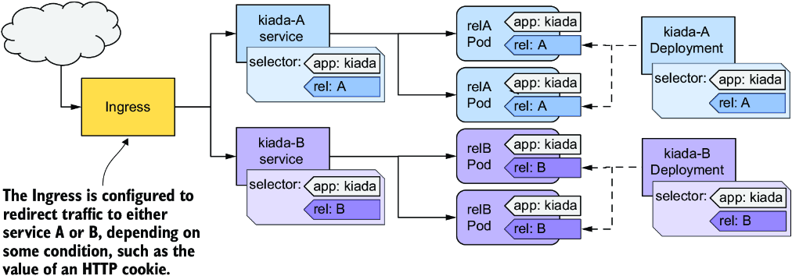

*Hình 15.12: Hiện thực chiến lược A/B bằng hai Deployment, hai Service và một Ingress*

Tại thời điểm viết sách, Kubernetes không cung cấp cách thức gốc (native) để hiện thực chiến lược triển khai này, nhưng một số hiện thực Ingress thì có. Hãy xem tài liệu của hiện thực Ingress mà bạn chọn để biết thêm thông tin.

### 15.3.3 Chiến lược Blue/Green (The Blue/Green strategy)

Trong chiến lược Blue/Green, một Deployment khác, gọi là Deployment Green, được tạo bên cạnh Deployment đầu tiên, gọi là Deployment Blue. Service được cấu hình để chỉ chuyển tiếp lưu lượng tới Deployment Blue cho đến khi bạn quyết định chuyển toàn bộ lưu lượng sang Deployment Green. Do đó hai nhóm pod dùng các label khác nhau, và label selector trong Service khớp với một nhóm tại một thời điểm. Bạn chuyển lưu lượng từ nhóm này sang nhóm kia bằng cách cập nhật label selector trong Service, như minh họa trong hình 15.13.

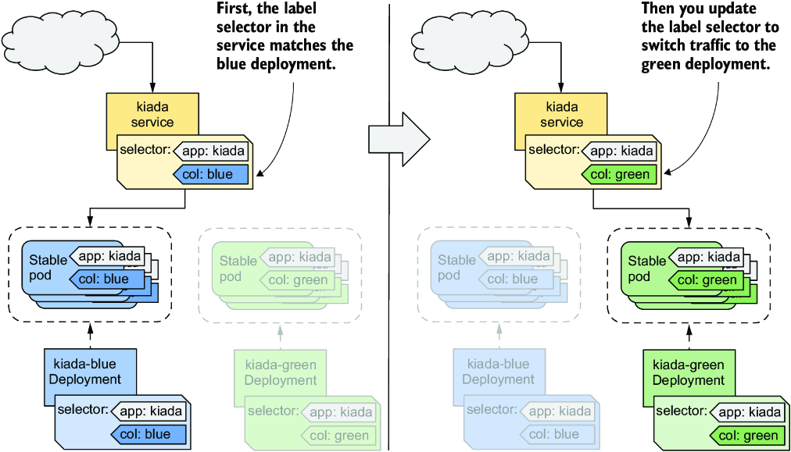

*Hình 15.13: Hiện thực triển khai Blue/Green bằng label và selector*

Như bạn đã biết, Kubernetes cung cấp mọi thứ bạn cần để hiện thực chiến lược này. Không cần công cụ bổ sung nào.

### 15.3.4 Traffic shadowing (Traffic shadowing)

Đôi khi bạn không hoàn toàn chắc chắn liệu phiên bản mới của ứng dụng có hoạt động đúng trong môi trường production thực tế hay không, hay liệu nó có chịu được tải hay không. Trong trường hợp này, bạn có thể triển khai phiên bản mới bên cạnh phiên bản hiện có bằng cách tạo một Deployment object khác và cấu hình các label của pod sao cho các pod của Deployment này không khớp với label selector trong Service.

Bạn cấu hình Ingress hoặc proxy đứng trước các pod để gửi lưu lượng tới các pod hiện có, nhưng đồng thời phản chiếu (mirror) nó tới các pod mới. Proxy gửi phản hồi từ các pod hiện có cho client và bỏ đi phản hồi từ các pod mới, như minh họa trong hình 15.14.

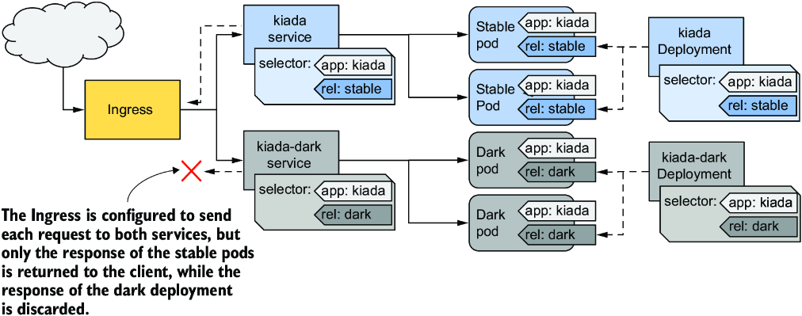

*Hình 15.14: Hiện thực traffic shadowing*

Cũng như với A/B testing, Kubernetes không cung cấp sẵn chức năng cần thiết để hiện thực traffic shadowing, nhưng một số hiện thực Ingress thì có.

---

## Tóm tắt

* Deployment là một lớp trừu tượng bên trên ReplicaSet. Ngoài toàn bộ chức năng mà một ReplicaSet cung cấp, Deployment còn cho phép bạn cập nhật các pod theo kiểu khai báo. Khi bạn sửa đổi Pod template, các pod cũ được thay thế bằng các pod mới được tạo từ template đã cập nhật.
* Trong quá trình cập nhật, Deployment controller thay thế các pod dựa trên chiến lược được cấu hình trong Deployment. Với chiến lược `Recreate`, tất cả các pod được thay thế cùng lúc, còn với chiến lược `RollingUpdate`, chúng được thay thế dần dần.
* Các pod do một ReplicaSet tạo ra thuộc sở hữu của ReplicaSet đó. ReplicaSet thường thuộc sở hữu của một Deployment. Nếu owner (chủ sở hữu) bị xóa, các dependent (object phụ thuộc) bị garbage collector xóa theo, nhưng bạn có thể yêu cầu `kubectl` để chúng lại mồ côi (orphan) thay vì xóa.
* Các chiến lược triển khai khác không được Kubernetes hỗ trợ trực tiếp nhưng có thể được hiện thực bằng cách cấu hình phù hợp các Deployment, Service và Ingress.
