# Chương 16: Xử lý ứng dụng stateful với StatefulSet

*(Dịch từ "Chapter 16: Handling stateful applications with StatefulSets" – Kubernetes in Action, Second Edition, tác giả Marko Lukša, NXB Manning)*

---

## Nội dung chính của chương
* Quản lý các workload stateful thông qua StatefulSet object
* Public từng pod riêng lẻ thông qua headless Service
* Sự khác biệt giữa Deployment và StatefulSet
* Tự động hóa việc quản lý workload stateful bằng Kubernetes Operator

Mỗi service trong ba service của bộ Kiada hiện đều được triển khai thông qua một Deployment object. Service Kiada và Quote mỗi service có ba replica, trong khi service Quiz chỉ có một, vì dữ liệu của nó không cho phép mở rộng (scale) một cách dễ dàng. Chương này thảo luận cách triển khai và mở rộng đúng đắn các workload stateful (có trạng thái) như service Quiz bằng một StatefulSet.

Trước khi bắt đầu, hãy tạo Namespace `kiada`, chuyển sang thư mục `Chapter16/` và áp dụng tất cả các manifest trong thư mục `SETUP/` bằng lệnh sau:

```bash
$ kubectl apply -n kiada -f SETUP -R
```

> **QUAN TRỌNG:** Các ví dụ trong chương này giả định rằng các object được tạo trong Namespace `kiada`. Nếu bạn tạo chúng ở một vị trí khác, bạn phải cập nhật tên miền DNS ở nhiều chỗ.

> **GHI CHÚ:** Các file code của chương này có tại https://github.com/luksa/kubernetes-in-action-2nd-edition/tree/master/Chapter16.

---

## 16.1 Giới thiệu StatefulSet (Introducing StatefulSets)

Trước khi tìm hiểu về StatefulSet và cách chúng khác với Deployment, hãy xem các yêu cầu của workload stateful khác với các yêu cầu của workload stateless (không trạng thái) như thế nào.

### 16.1.1 Tìm hiểu các yêu cầu của workload stateful (Understanding stateful workload requirements)

Một workload stateful là một phần mềm phải lưu trữ và duy trì trạng thái (state) để hoạt động. Trạng thái này phải được duy trì khi workload được khởi động lại hoặc di chuyển sang nơi khác, điều này khiến các workload stateful khó vận hành hơn nhiều.

So với workload stateless, workload stateful cũng khó mở rộng hơn nhiều vì không thể chỉ đơn giản thêm và bớt replica mà không xét đến trạng thái của chúng. Nếu các replica có thể chia sẻ trạng thái bằng cách đọc và ghi cùng các file, việc thêm replica mới không phải là vấn đề. Tuy nhiên, để điều này khả thi, công nghệ lưu trữ bên dưới phải hỗ trợ nó. Mặt khác, nếu mỗi replica lưu trạng thái của nó trong các file riêng, bạn sẽ cần cấp phát một volume riêng cho mỗi replica. Với các Kubernetes resource bạn đã gặp cho đến nay, việc này nói thì dễ hơn làm. Hãy xem xét hai lựa chọn này để hiểu các vấn đề liên quan đến cả hai.

#### Chia sẻ trạng thái giữa nhiều pod replica (Sharing state across multiple pod replicas)

Trong Kubernetes, bạn có thể dùng PersistentVolume với access mode `ReadWriteMany` để chia sẻ dữ liệu giữa nhiều pod. Tuy nhiên, trong hầu hết các môi trường cloud, công nghệ lưu trữ bên dưới thường chỉ hỗ trợ các access mode `ReadWriteOnce` và `ReadOnlyMany`, chứ không hỗ trợ `ReadWriteMany`, nghĩa là bạn không thể mount volume trên nhiều node ở chế độ đọc/ghi. Do đó, các pod trên các node khác nhau không thể đọc và ghi vào cùng một PersistentVolume.

Hãy minh họa vấn đề này bằng service Quiz. Bạn có thể mở rộng Deployment `quiz` lên, chẳng hạn, ba replica không? Hãy xem điều gì xảy ra. Lệnh `kubectl scale` như sau:

```bash
$ kubectl scale deploy quiz --replicas 3
deployment.apps/quiz scaled
```

Bây giờ kiểm tra các pod như sau:

```bash
$ kubectl get pods -l app=quiz
NAME                   READY   STATUS             RESTARTS      AGE
quiz-6f4968457-2c8ws   2/2     Running            0             10m   #1
quiz-6f4968457-cdw97   0/2     CrashLoopBackOff   1 (14s ago)   22s   #2
quiz-6f4968457-qdn29   0/2     Error              2 (16s ago)   22s   #2
```

- **#1** Pod đầu tiên chạy bình thường.
- **#2** Hai pod vừa được tạo đang bị crash.

Như bạn thấy, chỉ pod đã tồn tại trước khi mở rộng là đang chạy, còn hai pod mới thì không. Tùy vào loại cluster bạn đang dùng, hai pod này có thể hoàn toàn không khởi động được, hoặc chúng khởi động nhưng lập tức kết thúc với một thông báo lỗi. Ví dụ, trong một cluster trên Google Kubernetes Engine, các container trong các pod không khởi động được vì PersistentVolume không thể được gắn (attach) vào các pod mới do access mode của nó là `ReadWriteOnce` và volume không thể được gắn vào nhiều node cùng lúc. Trong các cluster được tạo bằng kind, các container khởi động, nhưng container `mongo` thất bại với một thông báo lỗi, như được minh họa tiếp theo:

```bash
$ kubectl logs quiz-6f4968457-cdw97 -c mongo   #1
..."msg":"DBException in initAndListen, terminating","attr":{"error":"DBPathInUse:
```

- **#1** Hãy thay tên pod bằng tên các pod của bạn.

Thông báo lỗi cho biết bạn không thể dùng cùng một thư mục dữ liệu trong nhiều instance của MongoDB. Ba Pod `quiz` dùng cùng một thư mục vì tất cả chúng đều dùng cùng một PersistentVolumeClaim và do đó cùng một PersistentVolume, như minh họa trong hình 16.1.

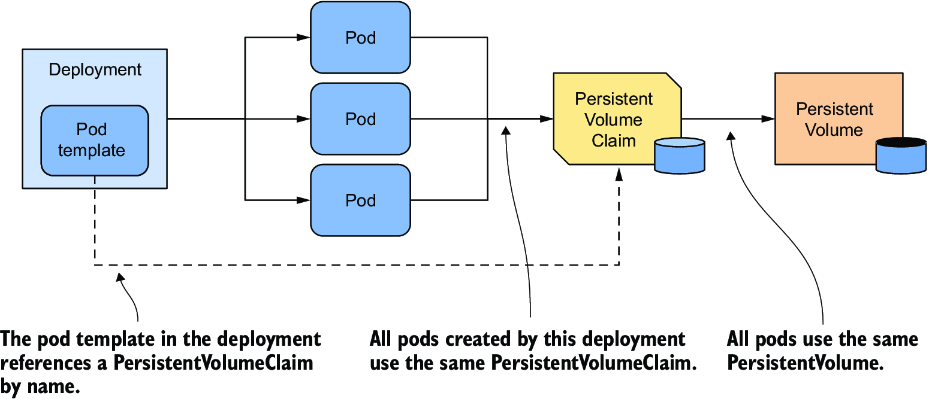

*Hình 16.1: Tất cả các pod của một Deployment dùng cùng một PersistentVolumeClaim và PersistentVolume.*

Vì cách tiếp cận này không hoạt động, giải pháp thay thế là dùng một PersistentVolume riêng cho mỗi pod replica. Hãy xem điều này có nghĩa là gì và liệu bạn có thể làm được với một Deployment object duy nhất hay không.

#### Dùng một PersistentVolume riêng cho mỗi replica (Using a dedicated PersistentVolume for each replica)

Như bạn đã học trong mục trước, MongoDB mặc định chỉ hỗ trợ một instance duy nhất. Nếu bạn muốn triển khai nhiều instance MongoDB với cùng dữ liệu, bạn phải tạo một MongoDB replica set để sao chép (replicate) dữ liệu giữa các instance đó (ở đây, thuật ngữ "replica set" là thuật ngữ riêng của MongoDB và không đề cập đến Kubernetes ReplicaSet resource). Mỗi instance cần có storage volume riêng và một địa chỉ ổn định mà các replica khác cùng các client có thể dùng để kết nối tới nó. Do đó, để triển khai một MongoDB replica set trong Kubernetes, bạn cần đảm bảo rằng

* Mỗi pod có PersistentVolume riêng của nó
* Mỗi pod có thể được truy cập bằng địa chỉ duy nhất của riêng nó
* Khi một pod bị xóa và được thay thế, pod mới được gán cùng địa chỉ và PersistentVolume

Bạn không thể làm điều này với một Deployment và một Service duy nhất, nhưng bạn có thể làm được bằng cách tạo một Deployment, một Service và một PersistentVolumeClaim riêng cho mỗi replica, như minh họa trong hình 16.2.

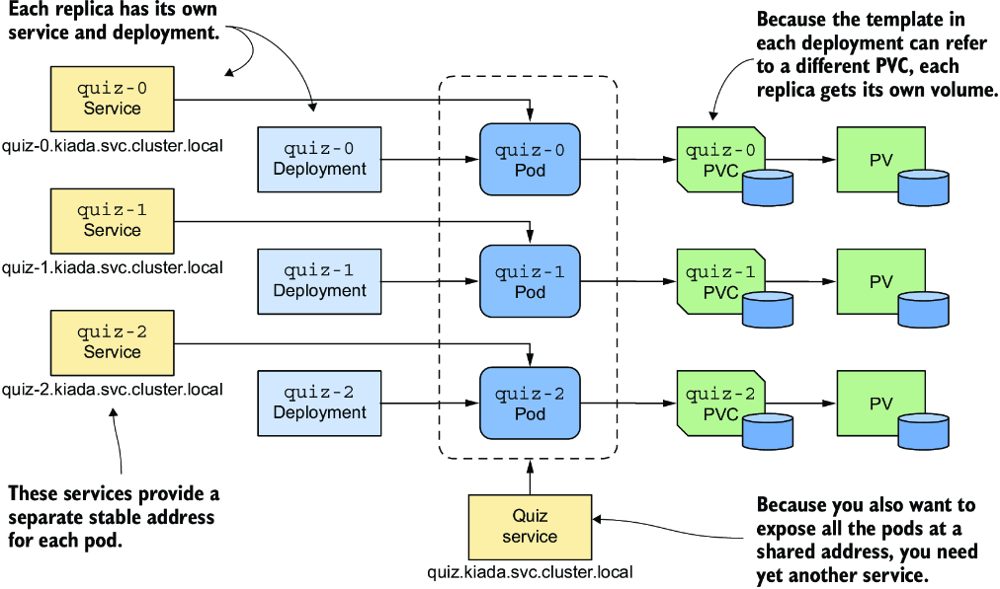

*Hình 16.2: Cung cấp cho mỗi replica volume và địa chỉ riêng của nó*

Mỗi pod có Deployment riêng, nên pod có thể dùng PersistentVolumeClaim và PersistentVolume riêng của nó. Service gắn với mỗi replica cung cấp cho nó một địa chỉ ổn định luôn phân giải đến địa chỉ IP của pod, ngay cả khi pod bị xóa và được tạo lại ở nơi khác. Điều này là cần thiết vì với MongoDB, cũng như nhiều hệ thống phân tán khác, địa chỉ của mỗi replica phải được chỉ định khi khởi tạo replica set. Ngoài các Service theo từng replica này, bạn có thể còn cần thêm một Service nữa để làm cho tất cả các Pod có thể được các client truy cập tại một địa chỉ duy nhất. Vì vậy, toàn bộ hệ thống trông thật đáng ngại.

Mọi chuyện còn tệ hơn từ đây. Nếu bạn cần tăng số lượng replica, bạn không thể dùng lệnh `kubectl scale`; bạn phải tạo thêm các Deployment, Service và PersistentVolumeClaim, điều này làm tăng thêm độ phức tạp.

Mặc dù cách tiếp cận này khả thi, nó phức tạp và sẽ khó vận hành hệ thống này. May mắn thay, Kubernetes cung cấp một cách tốt hơn để làm điều này với một Service duy nhất và một StatefulSet object duy nhất.

> **GHI CHÚ:** Bạn không cần Deployment `quiz` và PersistentVolumeClaim `quiz-data` nữa, vì vậy hãy xóa chúng bằng lệnh `kubectl delete deploy/quiz pvc/quiz-data`.

### 16.1.2 So sánh StatefulSet với Deployment (Comparing StatefulSets with Deployments)

Một StatefulSet tương tự như một Deployment, nhưng được thiết kế riêng cho các workload stateful. Tuy nhiên, có những khác biệt đáng kể trong hành vi của hai object này. Sự khác biệt này được giải thích tốt nhất bằng phép so sánh Thú cưng và Gia súc (Pets vs. Cattle) mà có thể bạn đã nghe nói đến. Nếu chưa, hãy để tôi giải thích.

> **GHI CHÚ:** StatefulSet ban đầu được gọi là PetSet. Cái tên này xuất phát từ phép so sánh Pets vs. Cattle này.

#### Phép so sánh Thú cưng và Gia súc (The Pets vs. Cattle analogy)

Trước đây chúng ta thường đối xử với hạ tầng phần cứng và các workload của mình như thú cưng. Chúng ta đặt tên cho từng máy chủ và chăm sóc từng instance workload một cách riêng lẻ. Tuy nhiên, hóa ra việc quản lý phần cứng và phần mềm sẽ dễ dàng hơn nhiều nếu bạn đối xử với chúng như gia súc và coi chúng là những thực thể không thể phân biệt. Điều đó giúp dễ dàng thay thế từng đơn vị mà không phải lo lắng rằng cái thay thế không hoàn toàn giống với cái đã ở đó trước đây, giống như cách một người nông dân đối xử với gia súc (hình 16.3).

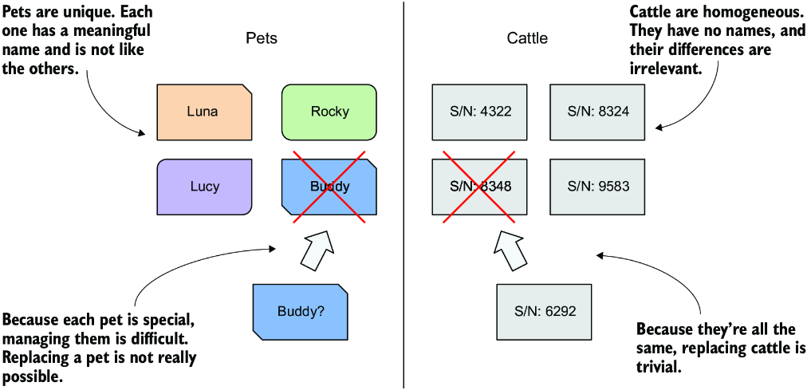

*Hình 16.3: Đối xử với các thực thể như thú cưng so với đối xử với chúng như gia súc*

Các workload stateless được triển khai thông qua Deployment giống như gia súc. Nếu một Pod bị thay thế, có lẽ bạn thậm chí sẽ không nhận ra. Tuy nhiên, các workload stateful lại giống như thú cưng. Nếu một con thú cưng bị lạc, bạn không thể chỉ đơn giản thay thế nó bằng một con mới. Ngay cả khi bạn đặt cho con thú cưng thay thế cùng tên, nó sẽ không hành xử hoàn toàn giống con ban đầu. Tuy nhiên, trong thế giới phần cứng/phần mềm, điều này là khả thi nếu bạn có thể cung cấp cho cái thay thế cùng danh tính mạng (network identity) và trạng thái như instance bị thay thế. Và đây chính xác là điều xảy ra khi bạn triển khai một ứng dụng bằng StatefulSet.

#### Triển khai pod bằng StatefulSet (Deploying Pods with a StatefulSet)

Cũng như với Deployment, trong một StatefulSet bạn chỉ định một Pod template, số lượng replica mong muốn và một label selector. Tuy nhiên, bạn cũng có thể chỉ định một PersistentVolumeClaim template. Mỗi lần StatefulSet controller tạo một replica mới, nó không chỉ tạo một Pod object mới mà còn tạo một hoặc nhiều PersistentVolumeClaim object.

Các pod được tạo từ một StatefulSet không phải là bản sao chính xác của nhau như trường hợp với Deployment, vì mỗi pod trỏ đến một tập PersistentVolumeClaim khác nhau. Ngoài ra, tên của các pod không phải là ngẫu nhiên. Thay vào đó, mỗi pod được gán một số thứ tự (ordinal number) duy nhất, và mỗi PersistentVolumeClaim cũng vậy. Khi một Pod của StatefulSet bị xóa và được tạo lại, nó được đặt cùng tên với pod mà nó thay thế. Đồng thời, một pod với một số thứ tự cụ thể luôn được gắn với các PersistentVolumeClaim có cùng số đó. Điều này có nghĩa là trạng thái gắn với một replica cụ thể luôn giống nhau, bất kể pod được tạo lại bao nhiêu lần (hình 16.4).

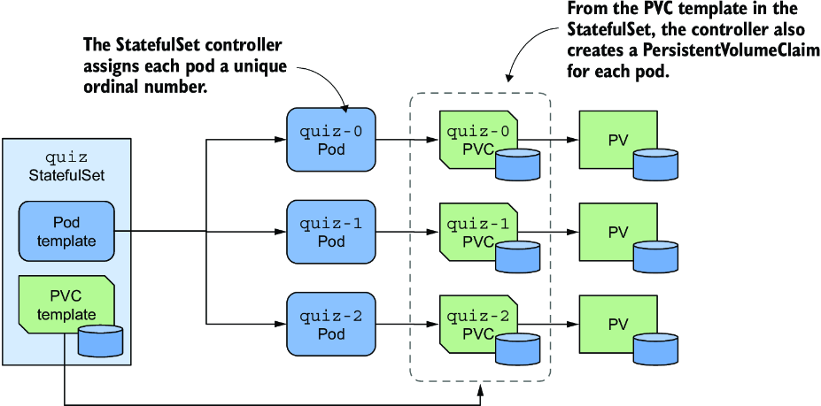

*Hình 16.4: Một StatefulSet, các pod của nó và các PersistentVolumeClaim*

Một khác biệt đáng chú ý khác giữa Deployment và StatefulSet là, theo mặc định, các pod của một StatefulSet không được tạo đồng thời. Thay vào đó, chúng được tạo lần lượt từng cái một, tương tự như một rolling update của Deployment. Khi bạn tạo một StatefulSet, ban đầu chỉ có pod đầu tiên được tạo. Sau đó StatefulSet controller chờ cho đến khi pod đó sẵn sàng (ready) rồi mới tạo pod tiếp theo.

Một StatefulSet có thể được mở rộng giống như một Deployment. Khi bạn mở rộng (scale up) một StatefulSet, các pod và PersistentVolumeClaim mới được tạo từ các template tương ứng của chúng. Khi bạn thu hẹp (scale down) StatefulSet, các pod bị xóa, nhưng các PersistentVolumeClaim hoặc được giữ lại hoặc bị xóa, tùy vào chính sách (policy) bạn cấu hình trong StatefulSet.

### 16.1.3 Tạo một StatefulSet (Creating a StatefulSet)

Trong mục này, bạn sẽ thay thế Deployment `quiz` bằng một StatefulSet. Mỗi StatefulSet phải có một headless Service liên kết để public các pod một cách riêng lẻ, vì vậy việc đầu tiên bạn phải làm là tạo Service này.

#### Tạo Service quản lý (Creating the governing Service)

Headless Service liên kết với một StatefulSet cung cấp cho các pod danh tính mạng của chúng. Bạn có thể nhớ lại từ chương 11 rằng một headless Service không có địa chỉ cluster IP, nhưng bạn vẫn có thể dùng nó để giao tiếp với các pod khớp với label selector của nó. Thay vì một bản ghi DNS A hoặc AAAA duy nhất trỏ đến IP của Service, bản ghi DNS của một headless Service trỏ đến các IP của tất cả các pod là thành phần của Service.

Như minh họa trong hình 16.5, khi dùng một headless Service với một StatefulSet, một bản ghi DNS bổ sung được tạo cho mỗi pod để địa chỉ IP của mỗi pod có thể được tra cứu bằng tên của nó. Đây là cách các pod stateful duy trì danh tính mạng ổn định của chúng. Các bản ghi DNS này không tồn tại khi headless Service không được liên kết với một StatefulSet.

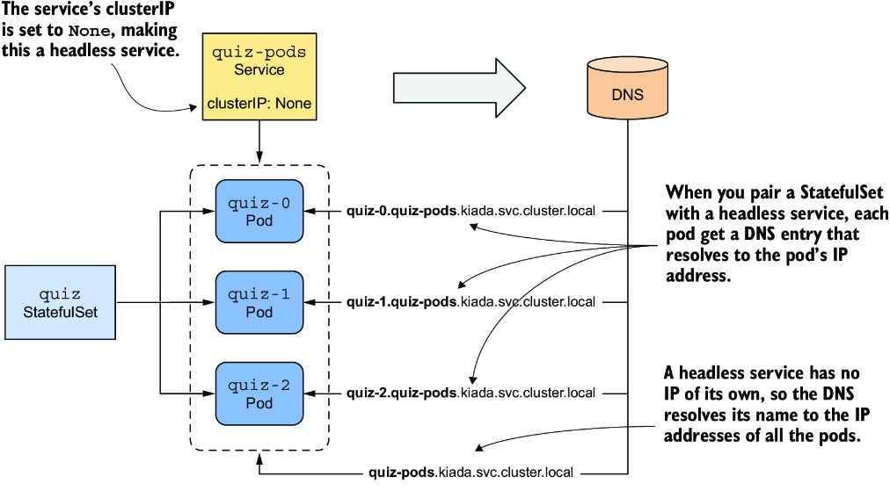

*Hình 16.5: Một headless Service được dùng kết hợp với một StatefulSet*

Bạn đã có một Service tên là `quiz` mà bạn đã tạo trong các chương trước. Bạn có thể đổi nó thành một headless Service, nhưng thay vào đó hãy tạo thêm một Service nữa, vì Service mới sẽ public tất cả các Pod `quiz`, bất kể chúng có sẵn sàng hay không.

Headless Service này sẽ cho phép bạn phân giải từng pod riêng lẻ, vì vậy hãy gọi nó là `quiz-pods`. Tạo service bằng lệnh `kubectl apply`. Bạn có thể tìm thấy manifest của Service trong file `svc.quiz-pods.yaml`, nội dung của nó được hiển thị trong listing sau.

**Listing 16.1: Headless Service cho StatefulSet quiz**

```yaml
apiVersion: v1
kind: Service
metadata:
  name: quiz-pods                 #1
spec:
  clusterIP: None                 #2
  publishNotReadyAddresses: true  #3
  selector:                       #4
    app: quiz                     #4
  ports:                          #5
  - name: mongodb                 #5
    port: 27017                   #5
```

- **#1** Tên của Service này là `quiz-pods` vì nó cho phép bạn phân giải từng Pod `quiz` riêng lẻ.
- **#2** Bằng cách đặt trường này, Service trở thành headless.
- **#3** Bằng cách đặt trường này, một bản ghi DNS được tạo cho mỗi pod, dù pod có sẵn sàng hay không.
- **#4** Label selector khớp với tất cả các Pod `quiz`.
- **#5** Service này cũng cung cấp các bản ghi SRV cho các pod. MongoDB client dùng chúng để kết nối tới từng MongoDB server riêng lẻ.

Trong listing, trường `clusterIP` được đặt là `None`, điều này khiến đây là một headless Service. Nếu bạn đặt `publishNotReadyAddresses` là `true`, các bản ghi DNS cho mỗi pod được tạo ngay lập tức khi pod được tạo, thay vì chỉ khi pod sẵn sàng. Bằng cách này, Service `quiz-pods` sẽ bao gồm tất cả các Pod `quiz`, bất kể trạng thái sẵn sàng của chúng.

#### Tạo StatefulSet (Creating the StatefulSet)

Sau khi tạo headless Service, bạn có thể tạo StatefulSet. Bạn có thể tìm thấy manifest của object trong file `sts.quiz.yaml`. Các phần quan trọng nhất của manifest được hiển thị trong listing sau.

**Listing 16.2: Manifest của một StatefulSet object**

```yaml
apiVersion: apps/v1                 #1
kind: StatefulSet                   #1
metadata:
  name: quiz
spec:
  serviceName: quiz-pods            #2
  podManagementPolicy: Parallel     #3
  replicas: 3                       #4
  selector:                         #5
    matchLabels:                    #5
      app: quiz                     #5
  template:                         #6
    metadata:
      labels:                       #7
        app: quiz                   #7
        ver: "0.1"                  #7
    spec:
      volumes:                      #8
      - name: db-data               #8
        persistentVolumeClaim:      #8
          claimName: db-data        #8
      containers:
      - name: quiz-api
        ...
      - name: mongo
        image: mongo:5
        command:                    #9
        - mongod                    #9
        - --bind_ip                 #9
        - 0.0.0.0                   #9
        - --replSet                 #9
        - quiz                      #9
        volumeMounts:               #10
        - name: db-data             #10
          mountPath: /data/db       #10
  volumeClaimTemplates:             #11
  - metadata:                       #11
      name: db-data                 #11
      labels:                       #11
        app: quiz                   #11
    spec:                           #11
      resources:                    #11
        requests:                   #11
          storage: 1Gi              #11
      accessModes:                  #11
      - ReadWriteOnce               #11
```

- **#1** StatefulSet nằm trong API group và version `apps/v1`.
- **#2** Tên của headless Service quản lý StatefulSet này
- **#3** Yêu cầu StatefulSet controller tạo tất cả các pod cùng lúc
- **#4** StatefulSet được cấu hình để tạo ba replica.
- **#5** Label selector xác định pod nào thuộc về StatefulSet này. Nó phải khớp với các label trong Pod template.
- **#6** Các pod của StatefulSet này được tạo bằng template này.
- **#7** Label selector xác định pod nào thuộc về StatefulSet này. Nó phải khớp với các label trong Pod template.
- **#8** Một volume duy nhất được định nghĩa trong pod. Volume này tham chiếu đến một PersistentVolumeClaim có tên được chỉ định.
- **#9** MongoDB phải được khởi động với các tùy chọn này để bật tính năng replication.
- **#10** Volume PersistentVolumeClaim được mount tại đây.
- **#11** Template dùng để tạo các PersistentVolumeClaim

Manifest định nghĩa một object kiểu StatefulSet thuộc API group `apps`, version `v1`. Tên của StatefulSet là `quiz`. Trong `spec` của StatefulSet, bạn sẽ thấy một số trường mà bạn đã biết từ Deployment và ReplicaSet, chẳng hạn như `replicas`, `selector` và `template`, đã được giải thích trong chương trước, nhưng manifest này còn chứa các trường khác đặc thù cho StatefulSet. Ví dụ, trong trường `serviceName`, bạn chỉ định tên của headless Service quản lý StatefulSet này.

Bằng cách đặt `podManagementPolicy` là `Parallel`, StatefulSet controller tạo tất cả các pod đồng thời. Vì một số ứng dụng phân tán không thể xử lý việc nhiều instance được khởi chạy cùng lúc, hành vi mặc định của controller là tạo từng pod một. Tuy nhiên, trong ví dụ này, tùy chọn `Parallel` làm cho việc mở rộng ban đầu bớt phức tạp hơn.

Trong trường `volumeClaimTemplates`, bạn chỉ định các template cho các PersistentVolumeClaim mà controller tạo cho mỗi replica. Không giống Pod template, nơi bạn bỏ qua trường `name`, bạn phải chỉ định `name` trong PersistentVolumeClaim template. Tên này phải khớp với tên trong phần `volumes` của Pod template.

Tạo StatefulSet bằng cách áp dụng file manifest như sau:

```bash
$ kubectl apply -f sts.quiz.yaml
statefulset.apps/quiz created
```

### 16.1.4 Kiểm tra StatefulSet, các Pod và PersistentVolumeClaim (Inspecting the StatefulSet, Pods, and PersistentVolumeClaims)

Sau khi tạo StatefulSet, bạn có thể dùng lệnh `kubectl rollout status` để xem trạng thái của nó:

```bash
$ kubectl rollout status sts quiz
Waiting for 3 pods to be ready...
```

> **GHI CHÚ:** Tên viết tắt của StatefulSet là `sts`.

Sau khi `kubectl` in ra thông báo này, nó không tiếp tục. Hãy ngắt việc thực thi của nó bằng cách nhấn Ctrl-C và kiểm tra trạng thái của StatefulSet bằng lệnh `kubectl get` để tìm hiểu lý do.

```bash
$ kubectl get sts
NAME   READY   AGE
quiz   0/3     22s
```

> **GHI CHÚ:** Cũng như với Deployment và ReplicaSet, bạn có thể dùng tùy chọn `-o wide` để hiển thị tên của các container và image được dùng trong StatefulSet.

Giá trị trong cột `READY` cho thấy không có replica nào sẵn sàng. Liệt kê các pod bằng `kubectl get pods` như sau:

```bash
$ kubectl get pods -l app=quiz
NAME     READY   STATUS    RESTARTS   AGE
quiz-0   1/2     Running   0          56s
quiz-1   1/2     Running   0          56s
quiz-2   1/2     Running   0          56s
```

> **GHI CHÚ:** Bạn để ý tên các pod chứ? Chúng không chứa template hash hay các ký tự ngẫu nhiên. Thay vào đó, mỗi tên pod gồm tên StatefulSet theo sau là một chỉ số thứ tự (ordinal index), như đã giải thích trong phần giới thiệu.

> **MẸO:** Theo mặc định, các chỉ số thứ tự bắt đầu từ 0. Tuy nhiên, bạn có thể chỉ định một giá trị bắt đầu tùy chỉnh bằng cách đặt trường `spec.ordinals.start` trong manifest của StatefulSet.

Bạn sẽ nhận thấy chỉ một trong hai container của mỗi pod là sẵn sàng. Nếu bạn xem xét một pod bằng lệnh `kubectl describe`, bạn sẽ thấy container `mongo` sẵn sàng, nhưng container `quiz-api` thì không, vì kiểm tra readiness của nó thất bại. Điều này là do endpoint được readiness probe gọi (`/healthz/ready`) kiểm tra xem tiến trình `quiz-api` có thể truy vấn MongoDB server hay không. Readiness probe thất bại cho thấy điều này là không thể. Nếu bạn kiểm tra log của container `quiz-api` như sau, bạn sẽ thấy lý do:

```bash
$ kubectl logs quiz-0 -c quiz-api
... INTERNAL ERROR: connected to mongo, but couldn't execute the ping command: server selection error: server selection timeout ...
```

Như thông báo lỗi cho biết, kết nối tới MongoDB đã được thiết lập, nhưng server không cho phép thực thi lệnh ping. Lý do là server đã được khởi động với tùy chọn `--replSet` cấu hình nó dùng replication, nhưng MongoDB replica set chưa được khởi tạo (initiate). Để làm việc này, hãy chạy lệnh sau:

```bash
$ kubectl exec -it quiz-0 -c mongo -- mongosh --quiet --eval 'rs.initiate({
    _id: "quiz",
    members: [
      {_id: 0, host: "quiz-0.quiz-pods.kiada.svc.cluster.local:27017"},
      {_id: 1, host: "quiz-1.quiz-pods.kiada.svc.cluster.local:27017"},
      {_id: 2, host: "quiz-2.quiz-pods.kiada.svc.cluster.local:27017"}]})'
```

> **GHI CHÚ:** Thay vì gõ lệnh dài này, bạn cũng có thể chạy shell script `initiate-mongo-replicaset.sh`, mà bạn có thể tìm thấy trong thư mục code của chương này.

Nếu MongoDB shell đưa ra thông báo lỗi sau, có lẽ bạn đã quên tạo Service `quiz-pods` trước đó:

```bash
MongoServerError: replSetInitiate quorum check failed because not all proposed set members responded affirmatively: ...
```

Nếu việc khởi tạo replica set thành công, lệnh in ra thông báo sau:

```bash
{ ok: 1 }
```

Cả ba Pod `quiz` sẽ sẵn sàng ngay sau khi replica set được khởi tạo. Nếu bạn chạy lại lệnh `kubectl rollout status`, bạn sẽ thấy output sau:

```bash
$ kubectl rollout status sts quiz
partitioned roll out complete: 3 new pods have been updated...
```

#### Kiểm tra StatefulSet bằng kubectl describe (Inspecting the StatefulSet with kubectl describe)

Như bạn đã biết, bạn có thể xem xét chi tiết một object bằng lệnh `kubectl describe`. Ở đây bạn có thể thấy nó hiển thị gì cho StatefulSet `quiz`:

```bash
$ kubectl describe sts quiz
Name:               quiz
Namespace:          kiada
CreationTimestamp:  Sat, 12 Mar 2022 18:05:43 +0100
Selector:           app=quiz                                            #1
Labels:             app=quiz
Annotations:        <none>
Replicas:           3 desired | 3 total                                 #2
Update Strategy:    RollingUpdate
  Partition:        0
Pods Status:        3 Running / 0 Waiting / 0 Succeeded / 0 Failed      #3
Pod Template:                                                           #4
  ...                                                                   #4
Volume Claims:                                                          #5
  Name:          db-data                                                #5
  StorageClass:                                                         #5
  Labels:        app=quiz                                               #5
  Annotations:   <none>                                                 #5
  Capacity:      1Gi                                                    #5
  Access Modes:  [ReadWriteOnce]                                        #5
Events:                                                                 #6
  Type    Reason            Age   From                    Message       #6
  ----    ------            ----  ----                    -------       #6
  Normal  SuccessfulCreate  10m   statefulset-controller  create Claim db-data- #6
                                                          quiz-0        #6
                                                          Pod quiz-0 in #6
                                                          StatefulSet   #6
                                                          quiz success  #6
  Normal  SuccessfulCreate  10m   statefulset-controller  create Pod quiz-0 in #6
                                                          StatefulSet quiz #6
                                                          successful    #6
  ...                                                                   #6
```

- **#1** Label selector xác định pod nào thuộc về StatefulSet này
- **#2** Số replica mong muốn và số replica thực tế
- **#3** Trạng thái của các Pod của StatefulSet
- **#4** Template dùng để tạo các pod của StatefulSet này
- **#5** Template dùng để tạo các PersistentVolumeClaim của StatefulSet này
- **#6** Các event cho thấy StatefulSet controller đã làm gì. Danh sách này có thể bao gồm các event Warning nếu có gì đó không ổn.

Như bạn thấy, output rất giống với output của ReplicaSet và Deployment. Khác biệt đáng chú ý nhất là sự hiện diện của PersistentVolumeClaim template, thứ mà bạn sẽ không tìm thấy ở hai kiểu object kia. Các event ở cuối output cho bạn biết chính xác StatefulSet controller đã làm gì. Bất cứ khi nào nó tạo một pod hoặc một PersistentVolumeClaim, nó cũng tạo một Event cho bạn biết nó đã làm gì.

#### Kiểm tra các Pod (Inspecting the Pods)

Hãy xem xét kỹ hơn manifest của pod đầu tiên để thấy nó khác thế nào so với các pod được tạo bởi ReplicaSet. Dùng lệnh `kubectl get` để in ra manifest của Pod:

```bash
$ kubectl get pod quiz-0 -o yaml
apiVersion: v1
kind: Pod
metadata:
  labels:
    app: quiz                                       #1
    controller-revision-hash: quiz-7576f64fbc       #1
    statefulset.kubernetes.io/pod-name: quiz-0      #1
    ver: "0.1"                                      #1
  name: quiz-0
  namespace: kiada
  ownerReferences:                                  #2
  - apiVersion: apps/v1                             #2
    blockOwnerDeletion: true                        #2
    controller: true                                #2
    kind: StatefulSet                               #2
    name: quiz                                      #2
spec:                                               #2
  containers:                                       #3
  ...                                               #3
  volumes:
  - name: db-data
    persistentVolumeClaim:                          #4
      claimName: db-data-quiz-0                     #4
status:
  ...
```

- **#1** Các label bao gồm các label được đặt trong Pod template của StatefulSet và hai label bổ sung do StatefulSet controller thêm vào.
- **#2** Pod object này thuộc sở hữu của StatefulSet.
- **#3** Các container khớp với các container trong Pod template của StatefulSet.
- **#4** Vì mỗi Pod instance có PersistentVolumeClaim riêng của nó, tên claim được chỉ định trong Pod template của StatefulSet đã được thay bằng tên của claim gắn với Pod instance cụ thể này.

Label duy nhất bạn định nghĩa trong pod template trong manifest của StatefulSet là `app`, nhưng StatefulSet controller đã thêm hai label bổ sung vào pod:

* Label `controller-revision-hash` phục vụ cùng mục đích như label `pod-template-hash` trên các pod của một ReplicaSet. Nó cho phép controller xác định một pod cụ thể thuộc về revision nào của StatefulSet.
* Label `statefulset.kubernetes.io/pod-name` chỉ định tên pod và cho phép bạn tạo một Service cho một Pod instance cụ thể bằng cách dùng label này trong label selector của Service.

Vì Pod object này được quản lý bởi StatefulSet, trường `ownerReferences` cho biết điều này. Không giống Deployment, nơi các pod thuộc sở hữu của ReplicaSet, mà ReplicaSet lại thuộc sở hữu của Deployment, StatefulSet sở hữu các pod một cách trực tiếp. StatefulSet đảm nhận cả việc nhân bản (replication) lẫn cập nhật các pod.

Các container của pod khớp với các container được định nghĩa trong Pod template của StatefulSet, nhưng điều đó không đúng với `volumes` của pod. Trong template, bạn đã chỉ định `claimName` là `db-data`, nhưng ở đây trong pod, nó đã được đổi thành `db-data-quiz-0`. Điều này là do mỗi Pod instance có PersistentVolumeClaim riêng của nó. Tên của claim được tạo thành từ `claimName` và tên của pod.

#### Kiểm tra các PersistentVolumeClaim (Inspecting the PersistentVolumeClaims)

Cùng với các pod, StatefulSet controller tạo một PersistentVolumeClaim cho mỗi pod. Liệt kê chúng như sau:

```bash
$ kubectl get pvc -l app=quiz
NAME             STATUS   VOLUME           CAPACITY   ACCESS MODES   STORAGECLASS   AGE
db-data-quiz-0   Bound    pvc...1bf8ccaf   1Gi        RWO            standard       10m
db-data-quiz-1   Bound    pvc...c8f860c2   1Gi        RWO            standard       10m
db-data-quiz-2   Bound    pvc...2cc494d6   1Gi        RWO            standard       10m
```

Bạn có thể kiểm tra manifest của các PersistentVolumeClaim này để chắc chắn rằng chúng khớp với template được chỉ định trong StatefulSet. Mỗi claim được liên kết (bound) với một PersistentVolume đã được cấp phát động (dynamically provisioned) cho nó. Các volume này chưa chứa dữ liệu nào, vì vậy service Quiz hiện không trả về gì cả. Bạn sẽ import dữ liệu tiếp theo.

### 16.1.5 Tìm hiểu vai trò của headless Service (Understanding the role of the headless Service)

Một yêu cầu quan trọng của các ứng dụng phân tán là khám phá đồng đẳng (peer discovery) – khả năng để mỗi thành viên cluster tìm thấy các thành viên khác. Nếu một ứng dụng được triển khai thông qua StatefulSet cần tìm tất cả các pod khác trong StatefulSet, nó có thể làm vậy bằng cách lấy danh sách pod từ Kubernetes API. Tuy nhiên, vì chúng ta muốn các ứng dụng không phụ thuộc vào Kubernetes (Kubernetes-agnostic), tốt hơn là ứng dụng dùng DNS chứ không nói chuyện trực tiếp với Kubernetes.

Ví dụ, một client kết nối tới một MongoDB replica set phải biết địa chỉ của tất cả các replica, để nó có thể tìm ra replica primary khi cần ghi dữ liệu. Bạn phải chỉ định các địa chỉ trong chuỗi kết nối (connection string) mà bạn truyền cho MongoDB client. Với ba Pod `quiz` của bạn, có thể dùng URI kết nối sau:

```text
mongodb://quiz-0.quiz-pods.kiada.svc.cluster.local:27017,quiz-1.quiz-pods.kiada.svc.cluster.local:27017,quiz-2.quiz-pods.kiada.svc.cluster.local:27017
```

Nếu StatefulSet được cấu hình với thêm replica, bạn cũng sẽ phải thêm địa chỉ của chúng vào chuỗi kết nối. May mắn thay, có một cách tốt hơn.

#### Public từng pod stateful riêng lẻ thông qua DNS (Exposing stateful Pods through DNS individually)

Trong chương 11, bạn đã học rằng một Service object không chỉ public một tập pod tại một địa chỉ IP ổn định mà còn làm cho cluster DNS phân giải tên Service thành địa chỉ IP này. Mặt khác, với một headless Service, tên phân giải thành các IP của các pod thuộc về Service. Tuy nhiên, khi một headless Service được liên kết với một StatefulSet, mỗi pod cũng nhận được bản ghi A hoặc AAAA riêng của nó phân giải trực tiếp thành IP của pod đó. Ví dụ, vì bạn đã kết hợp StatefulSet `quiz` với headless Service `quiz-pods`, IP của Pod `quiz-0` có thể được phân giải tại địa chỉ sau:

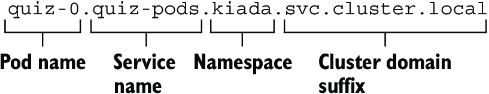

Tất cả các replica khác do StatefulSet tạo ra đều có thể được phân giải theo cùng cách.

#### Public các pod stateful thông qua bản ghi SRV (Exposing stateful Pods via SRV records)

Ngoài các bản ghi A và AAAA, mỗi Pod stateful còn nhận được các bản ghi SRV. MongoDB client có thể dùng chúng để tra cứu địa chỉ và số cổng mà mỗi pod dùng, để bạn không phải chỉ định chúng thủ công. Tuy nhiên, bạn phải đảm bảo bản ghi SRV có tên đúng. MongoDB mong đợi bản ghi SRV bắt đầu bằng `_mongodb`. Để đảm bảo điều đó, bạn phải đặt tên cổng trong định nghĩa Service là `mongodb` như bạn đã làm trong listing 16.1. Điều này đảm bảo bản ghi SRV có dạng như sau:

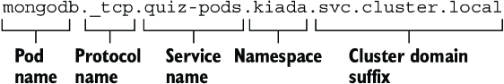

Dùng các bản ghi SRV cho phép chuỗi kết nối MongoDB đơn giản hơn nhiều. Bất kể số lượng replica trong set, chuỗi kết nối luôn có dạng như sau:

```text
mongodb+srv://quiz-pods.kiada.svc.cluster.local
```

Thay vì chỉ định từng địa chỉ riêng lẻ, scheme `mongodb+srv` yêu cầu client tìm các địa chỉ bằng cách thực hiện một tra cứu SRV cho tên miền `_mongodb._tcp.quiz-pods.kiada.svc.cluster.local`. Bạn sẽ dùng chuỗi kết nối này để import dữ liệu quiz vào MongoDB, như được giải thích tiếp theo.

#### Import dữ liệu quiz vào MongoDB (Importing quiz data into MongoDB)

Trong các chương trước, một init container được dùng để import dữ liệu quiz vào kho MongoDB. Cách tiếp cận dùng init container không còn hợp lệ nữa vì dữ liệu giờ đây được nhân bản, nên nếu bạn dùng nó, dữ liệu sẽ bị import nhiều lần. Thay vào đó, hãy chuyển việc import sang một pod chuyên dụng.

Bạn có thể tìm thấy manifest của Pod trong file `pod.quiz-data-importer.yaml`. File này cũng chứa một ConfigMap chứa dữ liệu cần import. Listing sau hiển thị nội dung của file manifest.

**Listing 16.3: Manifest của Pod quiz-data-importer**

```yaml
apiVersion: v1
kind: Pod
metadata:
  name: quiz-data-importer
spec:
  restartPolicy: OnFailure                                                  #1
  volumes:
  - name: quiz-questions
    configMap:
      name: quiz-questions
  containers:
  - name: mongoimport
    image: mongo:5
    command:
    - mongoimport
    - mongodb+srv://quiz-pods.kiada.svc.cluster.local/kiada?tls=false       #2
    - --collection
    - questions
    - --file
    - /questions.json
    - --drop
    volumeMounts:
    - name: quiz-questions
      mountPath: /questions.json
      subPath: questions.json
      readOnly: true
---
apiVersion: v1
kind: ConfigMap
metadata:
  name: quiz-questions
  labels:
    app: quiz
data:
  questions.json: ...
```

- **#1** Container của pod này chỉ cần chạy đến khi hoàn thành một lần duy nhất.
- **#2** Client dùng phương thức tra cứu SRV để tìm các MongoDB replica.

ConfigMap `quiz-questions` được mount vào Pod `quiz-data-importer` thông qua một volume `configMap`. Khi container của pod khởi động, nó chạy lệnh `mongoimport`, lệnh này kết nối tới MongoDB replica primary và import dữ liệu từ file trong volume. Dữ liệu sau đó được nhân bản sang các replica secondary.

Vì container `mongoimport` chỉ cần chạy một lần, `restartPolicy` của Pod được đặt là `OnFailure`. Nếu việc import thất bại, container sẽ được khởi động lại bao nhiêu lần tùy cần cho đến khi việc import thành công. Triển khai pod bằng lệnh `kubectl apply` và xác nhận rằng nó đã hoàn thành thành công. Bạn có thể làm điều này bằng cách kiểm tra trạng thái của pod như sau:

```bash
$ kubectl get pod quiz-data-importer
NAME                 READY   STATUS      RESTARTS   AGE
quiz-data-importer   0/1     Completed   0          50s
```

Nếu cột `STATUS` hiển thị giá trị `Completed`, nghĩa là container đã thoát mà không có lỗi. Log của container sẽ cho thấy số lượng document đã được import. Giờ bạn sẽ có thể truy cập bộ Kiada qua `curl` hoặc trình duyệt web và thấy service Quiz trả về các câu hỏi bạn đã import. Bạn có thể xóa Pod `quiz-data-importer` và ConfigMap `quiz-questions` tùy ý.

Bây giờ hãy trả lời vài câu hỏi quiz và dùng lệnh sau để kiểm tra xem câu trả lời của bạn có được lưu trong MongoDB hay không:

```bash
$ kubectl exec quiz-0 -c mongo -- mongosh kiada --quiet --eval 'db.responses.find()'
```

Khi bạn chạy lệnh này, shell `mongosh` trong pod `quiz-0` kết nối tới database `kiada` và hiển thị tất cả các document được lưu trong collection `responses` ở dạng JSON. Mỗi document này đại diện cho một câu trả lời mà bạn đã gửi.

> **GHI CHÚ:** Lệnh này giả định rằng `quiz-0` là MongoDB replica primary, điều này hẳn đúng trừ khi bạn đã làm khác với hướng dẫn tạo StatefulSet. Nếu lệnh thất bại, hãy thử chạy nó trong các Pod `quiz-1` và `quiz-2`. Bạn cũng có thể tìm replica primary bằng cách chạy lệnh MongoDB `rs.hello().primary` trong bất kỳ Pod `quiz` nào.

---

## 16.2 Tìm hiểu hành vi của StatefulSet (Understanding StatefulSet behavior)

Trong mục trước, bạn đã tạo StatefulSet và thấy cách controller tạo các pod. Bạn đã dùng các bản ghi cluster DNS được tạo cho headless Service để import dữ liệu vào MongoDB replica set. Bây giờ bạn sẽ đưa StatefulSet vào thử nghiệm và tìm hiểu về hành vi của nó. Trước tiên, bạn sẽ thấy nó xử lý các pod bị thiếu và các lỗi node như thế nào.

### 16.2.1 Tìm hiểu cách StatefulSet thay thế các pod bị thiếu (Understanding how a StatefulSet replaces missing pods)

Không giống các pod được tạo bởi ReplicaSet, các pod của một StatefulSet được đặt tên khác đi và mỗi pod có PersistentVolumeClaim riêng của nó (hoặc một tập PersistentVolumeClaim nếu StatefulSet chứa nhiều claim template). Như đã đề cập trong phần giới thiệu, nếu một Pod của StatefulSet bị xóa và được controller thay thế bằng một instance mới, replica đó giữ nguyên danh tính và được gắn với cùng PersistentVolumeClaim. Hãy thử xóa Pod `quiz-1` như sau:

```bash
$ kubectl delete po quiz-1
pod "quiz-1" deleted
```

Pod được tạo ra để thay thế nó có cùng tên, như bạn có thể thấy ở đây:

```bash
$ kubectl get po -l app=quiz
NAME     READY   STATUS    RESTARTS   AGE
quiz-0   2/2     Running   0          94m
quiz-1   2/2     Running   0          5s    #1
quiz-2   2/2     Running   0          94m
```

- **#1** Cột `AGE` cho thấy đây là một pod mới, nhưng nó có cùng tên với pod trước đó.

Địa chỉ IP của pod mới có thể khác, nhưng điều đó không quan trọng vì các bản ghi DNS đã được cập nhật để trỏ đến địa chỉ mới. Các client dùng hostname của pod để giao tiếp với nó sẽ không nhận thấy bất kỳ khác biệt nào.

Nói chung, pod mới này có thể được lập lịch (schedule) lên bất kỳ node nào trong cluster nếu PersistentVolume được liên kết với PersistentVolumeClaim đại diện cho một volume gắn qua mạng (network-attached) chứ không phải một volume cục bộ (local). Nếu volume là cục bộ của node, pod luôn được lập lịch lên node này.

Giống như ReplicaSet controller, StatefulSet controller tương ứng đảm bảo luôn có đúng số lượng pod mong muốn được cấu hình trong trường `replicas`. Tuy nhiên, có một khác biệt quan trọng trong các đảm bảo mà StatefulSet cung cấp so với ReplicaSet. Khác biệt này được giải thích tiếp theo.

### 16.2.2 Tìm hiểu cách StatefulSet xử lý lỗi node (Understanding how a StatefulSet handles node failures)

StatefulSet cung cấp các đảm bảo về việc thực thi pod đồng thời chặt chẽ hơn nhiều so với ReplicaSet. Điều này ảnh hưởng đến cách StatefulSet controller xử lý lỗi node và do đó cần được giải thích trước.

#### Tìm hiểu ngữ nghĩa tối-đa-một của StatefulSet (Understanding the at-most-one semantics of StatefulSets)

Một StatefulSet đảm bảo ngữ nghĩa tối-đa-một (at-most-one) cho các pod của nó. Vì hai pod có cùng tên không thể cùng tồn tại trong cùng một namespace tại cùng một thời điểm, cơ chế đặt tên dựa trên số thứ tự của StatefulSet là đủ để ngăn hai pod có cùng danh tính chạy cùng lúc.

Bạn còn nhớ điều gì xảy ra khi bạn chạy một nhóm pod thông qua ReplicaSet và một trong các node ngừng báo cáo về Kubernetes control plane không? Vài phút sau, ReplicaSet controller xác định rằng node và các pod đã mất và tạo các pod thay thế chạy trên các node còn lại, mặc dù các pod trên node ban đầu có thể vẫn đang chạy. Nếu StatefulSet controller cũng thay thế các pod trong kịch bản này, bạn sẽ có hai replica với cùng danh tính chạy đồng thời. Hãy xem điều đó có xảy ra không.

#### Ngắt kết nối mạng của một node (Disconnecting a node from the network)

Như trong chương 14, bạn sẽ làm cho giao diện mạng của một trong các node bị hỏng. Bạn có thể thử bài tập này nếu cluster của bạn có nhiều hơn một node. Tìm tên của node đang chạy Pod `quiz-1`. Giả sử đó là node `kind-worker2`. Nếu bạn dùng cluster được tạo bằng kind, hãy tắt giao diện mạng của node như sau:

```bash
$ docker exec kind-worker2 ip link set eth0 down   #1
```

- **#1** Hãy thay `kind-worker2` bằng tên node đúng.

Nếu bạn đang dùng cluster GKE, hãy dùng lệnh sau để kết nối tới node:

```bash
$ gcloud compute ssh gke-kiada-default-pool-35644f7e-300l   #1
```

- **#1** Hãy thay tên node bằng tên node của bạn.

Chạy lệnh sau trên node để tắt giao diện mạng của nó:

```bash
$ sudo ifconfig eth0 down
```

> **GHI CHÚ:** Việc tắt giao diện mạng sẽ làm treo phiên ssh. Bạn có thể kết thúc phiên bằng cách nhấn Enter rồi gõ "~." (dấu ngã và dấu chấm, không có dấu ngoặc kép).

Vì giao diện mạng của node đã tắt, Kubelet chạy trên node không còn có thể liên lạc với Kubernetes API server để báo rằng node và tất cả các pod của nó vẫn đang chạy. Kubernetes control plane sớm đánh dấu node là `NotReady`, như thấy ở đây:

```bash
$ kubectl get nodes
NAME                 STATUS     ROLES                  AGE   VERSION
kind-control-plane   Ready      control-plane,master   10h   v1.23.4
kind-worker          Ready      <none>                 10h   v1.23.4
kind-worker2         NotReady   <none>                 10h   v1.23.4   #1
```

- **#1** Node không còn sẵn sàng vì nó đã ngừng giao tiếp với Kubernetes API.

Sau vài phút, trạng thái của Pod `quiz-1` đang chạy trên node này chuyển thành `Terminating`, như bạn có thể thấy trong danh sách Pod:

```bash
$ kubectl get pods -l app=quiz
NAME     READY   STATUS        RESTARTS   AGE
quiz-0   2/2     Running       0          12m
quiz-1   2/2     Terminating   0          7m39s   #1
quiz-2   2/2     Running       0          12m
```

- **#1** Pod này đang bị kết thúc vì node của nó đã ngừng hoạt động.

Khi bạn kiểm tra pod bằng lệnh `kubectl describe`, bạn thấy một event Warning với thông báo "Node is not ready" như hiển thị ở đây:

```bash
$ kubectl describe po quiz-1
...
Events:
  Type     Reason        Age   From             Message
  ----     ------        ----  ----             -------
  Warning  NodeNotReady  11m   node-controller  Node is not ready   #1
```

- **#1** Event `NodeNotReady` cho biết node mà Pod đang chạy trên đó không còn phản hồi nữa.

#### Tìm hiểu tại sao StatefulSet controller không thay thế pod (Understanding why the StatefulSet controller doesn't replace the Pod)

Ở điểm này tôi muốn chỉ ra rằng các container của pod vẫn đang chạy. Node không hề ngừng hoạt động, nó chỉ mất kết nối mạng. Điều tương tự cũng xảy ra nếu tiến trình Kubelet chạy trên node bị lỗi, nhưng các container vẫn tiếp tục chạy.

Đây là một thực tế quan trọng vì nó giải thích tại sao StatefulSet controller không nên xóa và tạo lại pod. Nếu StatefulSet controller xóa và tạo lại pod trong khi Kubelet đang ngừng hoạt động, pod mới sẽ được lập lịch lên một node khác và các container của pod sẽ khởi động. Khi đó sẽ có hai instance của cùng một workload chạy với cùng danh tính. Đó là lý do tại sao StatefulSet controller không làm vậy.

#### Xóa pod thủ công (Manually deleting the Pod)

Nếu bạn muốn pod được tạo lại ở nơi khác, cần có sự can thiệp thủ công. Một người vận hành cluster phải xác nhận rằng node thực sự đã hỏng và xóa Pod object một cách thủ công. Tuy nhiên, Pod object đã được đánh dấu để xóa, như trạng thái của nó cho biết, hiển thị Pod là `Terminating`. Việc xóa pod bằng lệnh `kubectl delete pod` thông thường không có tác dụng.

Kubernetes control plane chờ Kubelet báo cáo rằng các container của pod đã kết thúc. Chỉ khi đó việc xóa Pod object mới hoàn tất. Tuy nhiên, vì Kubelet chịu trách nhiệm cho pod này không hoạt động, điều này không bao giờ xảy ra. Để xóa pod mà không chờ xác nhận, bạn phải xóa nó như sau:

```bash
$ kubectl delete pod quiz-1 --force --grace-period 0
warning: Immediate deletion does not wait for confirmation that the running resource has been terminated. The resource may continue to run on the cluster indefinitely.
pod "quiz-0" force deleted
```

Hãy lưu ý cảnh báo rằng các container của pod có thể vẫn tiếp tục chạy. Đó là lý do tại sao bạn phải chắc chắn rằng node thực sự đã hỏng trước khi xóa pod theo cách này.

#### Tạo lại pod (Recreating the Pod)

Sau khi bạn xóa pod, nó được StatefulSet controller thay thế, nhưng pod có thể không khởi động được. Có hai kịch bản có thể xảy ra, tùy thuộc vào việc PersistentVolume của replica là một volume cục bộ, như trong kind, hay một volume gắn qua mạng, như trong GKE.

Nếu PersistentVolume là một volume cục bộ trên node bị hỏng, pod không thể được lập lịch và `STATUS` của nó vẫn là `Pending`, như hiển thị ở đây:

```bash
$ kubectl get pod quiz-1 -o wide
NAME     READY   STATUS    RESTARTS   AGE     IP       NODE     NOMINATED NODE
quiz-1   0/2     Pending   0          2m38s   <none>   <none>   <none>           #1
```

- **#1** Pod chưa được lập lịch lên node nào.

Các event của pod cho thấy tại sao pod không thể được lập lịch. Dùng lệnh `kubectl describe` để hiển thị chúng như sau:

```bash
$ kubectl describe pod quiz-1
...
Events:
  Type     Reason            Age  From               Message
  ----     ------            ---- ----               -------
  Warning  FailedScheduling  21s  default-scheduler  0/3 nodes are available:   #1
1 node had taint {node-role.kubernetes.io/master: }, that the pod didn't tolerate, #2
1 node had taint {node.kubernetes.io/unreachable: }, that the pod didn't tolerate, #3
1 node had volume node affinity conflict.                                          #4
```

- **#1** Scheduler không thể tìm thấy node nào phù hợp để lập lịch pod.
- **#2** Node control plane chỉ chấp nhận các workload hệ thống của Kubernetes chứ không chấp nhận các workload thông thường như pod này.
- **#3** Node `kind-worker2` không thể truy cập được.
- **#4** Pod không thể được lập lịch lên node `kind-worker` vì PersistentVolume không thể được gắn vào đó.

Thông báo event đề cập đến các taint. Không đi vào chi tiết ở đây, tôi chỉ nói rằng pod không thể được lập lịch lên bất kỳ node nào trong ba node vì một node là node control plane, một node khác không thể truy cập được (dĩ nhiên rồi, bạn vừa làm nó như vậy mà), nhưng phần quan trọng nhất của thông báo cảnh báo là phần về xung đột affinity. Pod `quiz-1` mới chỉ có thể được lập lịch lên cùng node với pod instance trước đó, vì đó là nơi volume của nó nằm. Và vì node này không thể truy cập được, pod không thể được lập lịch.

Nếu bạn đang chạy bài tập này trên GKE hoặc cluster khác dùng các volume gắn qua mạng, pod sẽ được lập lịch lên một node khác nhưng có thể không chạy được nếu volume không thể được tháo (detach) khỏi node bị hỏng và gắn vào node khác đó. Trong trường hợp này, `STATUS` của pod như sau:

```bash
$ kubectl get pod quiz-1 -o wide
NAME     READY   STATUS              RESTARTS   AGE   IP        NODE
quiz-1   0/2     ContainerCreating   0          38s   1.2.3.4   gke-kiada-...   #1
```

- **#1** Pod đã được lập lịch, nhưng các container của nó chưa được khởi động.

Các event của pod cho biết PersistentVolume không thể được tháo ra. Dùng `kubectl describe` như sau để hiển thị chúng:

```bash
$ kubectl describe pod quiz-1
...
Events:
  Type     Reason              Age  From                     Message
  ----     ------              ---- ----                     -------
  Warning  FailedAttachVolume  77s  attachdetach-controller  Multi-Attach error for volume "pvc...c8f860c2" Volume is already exclusively attached to one node and can't be attached to another
```

#### Xóa PersistentVolumeClaim để pod mới chạy được (Deleting the PersistentVolumeClaim to get the new Pod to run)

Bạn làm gì nếu pod không thể được gắn vào cùng volume? Nếu workload chạy trong pod có thể xây dựng lại dữ liệu của nó từ đầu, ví dụ bằng cách nhân bản dữ liệu từ các replica khác, bạn có thể xóa PersistentVolumeClaim để một claim mới có thể được tạo và liên kết với một PersistentVolume mới. Tuy nhiên, vì StatefulSet controller chỉ tạo các PersistentVolumeClaim khi nó tạo pod, bạn cũng phải xóa pod object. Bạn có thể xóa cả hai object như sau:

```bash
$ kubectl delete pvc/db-data-quiz-1 pod/quiz-1
persistentvolumeclaim "db-data-quiz-1" deleted
pod "quiz-1" deleted
```

Một PersistentVolumeClaim mới và một pod mới được tạo. PersistentVolume được liên kết với claim là trống, nhưng MongoDB tự động nhân bản dữ liệu.

#### Sửa node (Fixing the node)

Tất nhiên, bạn có thể tránh được tất cả những rắc rối đó nếu bạn có thể sửa được node. Nếu bạn đang chạy ví dụ này trên GKE, hệ thống tự động làm việc đó bằng cách khởi động lại node vài phút sau khi nó ngoại tuyến. Để khôi phục node khi dùng công cụ kind, hãy chạy các lệnh sau:

```bash
$ docker exec kind-worker2 ip link set eth0 up
$ docker exec kind-worker2 ip route add default via 172.18.0.1   #1
```

- **#1** Cluster của bạn có thể dùng một IP gateway khác. Bạn có thể tìm nó bằng lệnh `docker inspect network`, như đã mô tả trong chương 14.

Khi node hoạt động trở lại, việc xóa pod hoàn tất, và Pod `quiz-1` mới được tạo. Trong cluster kind, pod được lập lịch lên cùng node vì volume là cục bộ.

### 16.2.3 Mở rộng một StatefulSet (Scaling a StatefulSet)

Giống như ReplicaSet và Deployment, bạn cũng có thể mở rộng StatefulSet. Khi bạn mở rộng một StatefulSet, controller tạo cả một pod mới lẫn một PersistentVolumeClaim mới. Nhưng điều gì xảy ra khi bạn thu hẹp nó? Các PersistentVolumeClaim có bị xóa cùng với các pod không?

#### Thu hẹp (Scaling down)

Để mở rộng/thu hẹp một StatefulSet, bạn có thể dùng lệnh `kubectl scale` hoặc thay đổi giá trị của trường `replicas` trong manifest của StatefulSet object. Dùng cách thứ nhất, hãy thu hẹp StatefulSet `quiz` xuống còn một replica duy nhất như sau:

```bash
$ kubectl scale sts quiz --replicas 1
statefulset.apps/quiz scaled
```

Như mong đợi, hai pod hiện đang trong quá trình kết thúc:

```bash
$ kubectl get pods -l app=quiz
NAME     READY   STATUS        RESTARTS   AGE
quiz-0   2/2     Running       0          1h
quiz-1   2/2     Terminating   0          14m   #1
quiz-2   2/2     Terminating   0          1h    #1
```

- **#1** Các pod này đang bị xóa.

Không giống ReplicaSet, khi bạn thu hẹp một StatefulSet, pod có số thứ tự cao nhất bị xóa trước. Bạn đã thu hẹp StatefulSet `quiz` từ ba replica xuống một, nên hai pod có số thứ tự cao nhất, `quiz-2` và `quiz-1`, đã bị xóa. Phương pháp mở rộng này đảm bảo rằng các số thứ tự của các pod luôn bắt đầu từ 0 và kết thúc ở một số nhỏ hơn số lượng replica.

Nhưng điều gì xảy ra với các PersistentVolumeClaim? Liệt kê chúng như sau:

```bash
$ kubectl get pvc -l app=quiz
NAME             STATUS   VOLUME           CAPACITY   ACCESS MODES   STORAGECLASS   AGE
db-data-quiz-0   Bound    pvc...1bf8ccaf   1Gi        RWO            standard       1h
db-data-quiz-1   Bound    pvc...c8f860c2   1Gi        RWO            standard       1h
db-data-quiz-2   Bound    pvc...2cc494d6   1Gi        RWO            standard       1h
```

Không giống các pod, các PersistentVolumeClaim của chúng được giữ lại. Điều này là do việc xóa một claim sẽ khiến PersistentVolume được liên kết bị tái chế (recycle) hoặc xóa, dẫn đến mất dữ liệu. Giữ lại các PersistentVolumeClaim là hành vi mặc định, nhưng bạn có thể cấu hình StatefulSet để xóa chúng thông qua trường `persistentVolumeClaimRetentionPolicy`, như bạn sẽ học sau. Lựa chọn còn lại là xóa các claim một cách thủ công.

Đáng lưu ý là nếu bạn thu hẹp StatefulSet `quiz` xuống chỉ còn một replica, Service `quiz` không còn khả dụng, nhưng điều này không liên quan gì đến Kubernetes. Đó là vì bạn đã cấu hình MongoDB replica set với ba replica, nên cần ít nhất hai replica để có quorum (số đại biểu tối thiểu). Một replica đơn lẻ không có quorum và do đó phải từ chối cả đọc lẫn ghi. Điều này khiến readiness probe trong container `quiz-api` thất bại, từ đó khiến pod bị loại khỏi Service và Service không còn Endpoint nào. Để xác nhận, hãy liệt kê các Endpoint như sau:

```bash
$ kubectl get endpoints -l app=quiz
NAME        ENDPOINTS          AGE
quiz                           1h    #1
quiz-pods   10.244.1.9:27017   1h    #2
```

- **#1** Service `quiz` không có endpoint nào.
- **#2** Service `quiz-pods` vẫn có `quiz-0` là một endpoint vì Service này được cấu hình để bao gồm tất cả các endpoint bất kể trạng thái sẵn sàng của chúng.

Sau khi thu hẹp StatefulSet, bạn cần cấu hình lại MongoDB replica set để hoạt động với số lượng replica mới, nhưng điều đó nằm ngoài phạm vi của cuốn sách này. Thay vào đó, hãy mở rộng StatefulSet trở lại để có lại quorum.

#### Mở rộng (Scaling up)

Vì các PersistentVolumeClaim được giữ lại khi bạn thu hẹp một StatefulSet, chúng có thể được gắn lại khi bạn mở rộng trở lại, như minh họa trong hình 16.6. Mỗi pod được gắn với cùng PersistentVolumeClaim như trước, dựa trên số thứ tự của pod.

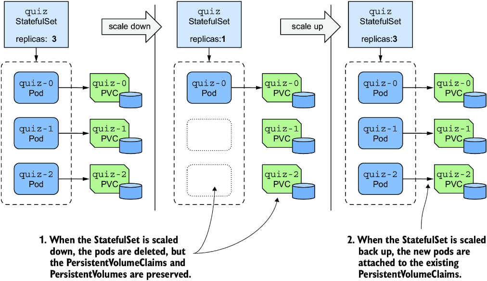

*Hình 16.6: StatefulSet không xóa các PersistentVolumeClaim khi thu hẹp; nó gắn lại chúng khi mở rộng trở lại.*

Mở rộng StatefulSet `quiz` trở lại ba replica như sau:

```bash
$ kubectl scale sts quiz --replicas 3
statefulset.apps/quiz scaled
```

Bây giờ hãy kiểm tra từng pod để xem nó có được gắn với đúng PersistentVolumeClaim hay không. Quorum được khôi phục, tất cả các pod đều sẵn sàng và Service khả dụng trở lại. Hãy dùng trình duyệt web của bạn để xác nhận.

Bây giờ hãy mở rộng StatefulSet lên năm replica. Controller tạo thêm hai pod và PersistentVolumeClaim, nhưng các pod không sẵn sàng. Xác nhận điều này như sau:

```bash
$ kubectl get pods quiz-3 quiz-4
NAME     READY   STATUS    RESTARTS   AGE
quiz-3   1/2     Running   0          4m55s   #1
quiz-4   1/2     Running   0          4m55s   #1
```

- **#1** Một container trong mỗi pod này không sẵn sàng.

Như bạn thấy, chỉ một trong hai container là sẵn sàng trong mỗi replica. Các replica này không có gì sai ngoại trừ việc chúng chưa được thêm vào MongoDB replica set. Bạn có thể thêm chúng bằng cách cấu hình lại replica set, nhưng điều đó nằm ngoài phạm vi của cuốn sách này, như đã đề cập trước đó.

Có lẽ bạn đang bắt đầu nhận ra rằng việc quản lý các ứng dụng stateful trong Kubernetes liên quan đến nhiều thứ hơn là chỉ tạo và quản lý một StatefulSet object. Đó là lý do tại sao bạn thường dùng một Kubernetes Operator cho việc này, như được giải thích trong phần cuối của chương này.

Trước khi kết thúc mục này về việc mở rộng StatefulSet, tôi muốn chỉ ra thêm một điều nữa. Các Pod `quiz` được public bởi hai Service: Service `quiz` thông thường, chỉ trỏ đến các Pod sẵn sàng, và headless Service `quiz-pods`, bao gồm tất cả các pod, bất kể trạng thái sẵn sàng của chúng. Các Pod `kiada` kết nối tới Service `quiz`, và do đó tất cả các request gửi đến Service đều thành công, vì các request chỉ được chuyển tiếp đến ba pod khỏe mạnh.

Thay vì thêm Service `quiz-pods`, bạn có thể đã làm cho Service `quiz` thành headless, nhưng khi đó bạn sẽ phải chọn xem Service có nên công bố địa chỉ của các pod chưa sẵn sàng hay không. Từ góc nhìn của các client, các pod chưa sẵn sàng không nên là một phần của Service. Từ góc nhìn của MongoDB, tất cả các pod phải được bao gồm vì đó là cách các replica tìm thấy nhau. Dùng hai Service giải quyết được vấn đề này. Vì lý do này, việc một StatefulSet được liên kết với cả một Service thông thường lẫn một headless Service là điều phổ biến.

### 16.2.4 Thay đổi chính sách giữ lại PersistentVolumeClaim (Changing the PersistentVolumeClaim retention policy)

Trong mục trước, bạn đã học rằng StatefulSet mặc định giữ lại các PersistentVolumeClaim khi bạn thu hẹp chúng. Tuy nhiên, nếu workload do StatefulSet quản lý không bao giờ yêu cầu dữ liệu phải được giữ lại, bạn có thể cấu hình StatefulSet để tự động xóa PersistentVolumeClaim bằng cách đặt trường `persistentVolumeClaimRetentionPolicy`. Trong trường này, bạn chỉ định chính sách giữ lại (retention policy) được dùng khi thu hẹp và khi StatefulSet bị xóa.

Ví dụ, để cấu hình StatefulSet `quiz` xóa các PersistentVolumeClaim khi StatefulSet được thay đổi kích thước nhưng giữ lại chúng khi nó bị xóa, bạn phải đặt chính sách như trong listing sau, listing này hiển thị một phần của file manifest `sts.quiz.pvcRetentionPolicy.yaml`.

**Listing 16.4: Cấu hình chính sách giữ lại PersistentVolumeClaim trong một StatefulSet**

```yaml
apiVersion: apps/v1
kind: StatefulSet
metadata:
  name: quiz
spec:
  persistentVolumeClaimRetentionPolicy:
    whenScaled: Delete    #1
    whenDeleted: Retain   #2
  ...
```

- **#1** Khi StatefulSet bị thu hẹp, các PersistentVolumeClaim bị xóa.
- **#2** Khi StatefulSet bị xóa, các PersistentVolumeClaim được giữ lại.

Các trường `whenScaled` và `whenDeleted` là tự giải thích. Mỗi trường có thể có giá trị `Retain`, là giá trị mặc định, hoặc `Delete`. Áp dụng file manifest này bằng `kubectl apply` để thay đổi chính sách giữ lại PersistentVolumeClaim trong StatefulSet `quiz` như sau:

```bash
$ kubectl apply -f sts.quiz.pvcRetentionPolicy.yaml
```

#### Mở rộng/thu hẹp StatefulSet (Scaling the StatefulSet)

Chính sách `whenScaled` trong StatefulSet `quiz` hiện được đặt là `Delete`. Hãy thu hẹp StatefulSet xuống ba replica, để loại bỏ hai pod không khỏe mạnh cùng các PersistentVolumeClaim của chúng.

```bash
$ kubectl scale sts quiz --replicas 3
statefulset.apps/quiz scaled
```

Liệt kê các PersistentVolumeClaim để xác nhận rằng chỉ còn lại ba claim.

#### Xóa StatefulSet (Deleting the StatefulSet)

Bây giờ hãy xem chính sách `whenDeleted` có được tuân theo không. Mục tiêu của bạn là xóa các pod, nhưng không xóa các PersistentVolumeClaim. Bạn đã đặt chính sách `whenDeleted` là `Retain`, nên bạn có thể xóa StatefulSet như sau:

```bash
$ kubectl delete sts quiz
statefulset.apps "quiz" deleted
```

Liệt kê các PersistentVolumeClaim để xác nhận rằng cả ba đều còn. Do đó các file dữ liệu MongoDB được giữ lại.

> **GHI CHÚ:** Nếu bạn muốn xóa một StatefulSet nhưng giữ lại các pod và các PersistentVolumeClaim, bạn có thể dùng tùy chọn `--cascade=orphan`. Trong trường hợp này, các PersistentVolumeClaim sẽ được giữ lại ngay cả khi chính sách giữ lại được đặt là `Delete`.

#### Đảm bảo dữ liệu không bao giờ bị mất (Ensuring data is never lost)

Để kết thúc mục này, tôi muốn cảnh báo bạn về việc đặt một trong hai chính sách giữ lại thành `Delete`. Hãy xem xét ví dụ trước. Bạn đã đặt chính sách `whenDeleted` là `Retain` để dữ liệu được giữ lại nếu StatefulSet vô tình bị xóa, nhưng vì chính sách `whenScaled` được đặt là `Delete`, dữ liệu vẫn sẽ bị mất nếu StatefulSet bị thu hẹp về 0 trước khi bị xóa.

> **MẸO:** Chỉ đặt `persistentVolumeClaimRetentionPolicy` là `Delete` nếu dữ liệu lưu trong các PersistentVolume gắn với StatefulSet được lưu giữ ở nơi khác hoặc không cần được lưu giữ. Bạn luôn có thể xóa các PersistentVolumeClaim một cách thủ công. Một cách khác để đảm bảo giữ lại dữ liệu là đặt `reclaimPolicy` trong StorageClass được tham chiếu trong PersistentVolumeClaim template thành `Retain`.

### 16.2.5 Dùng chính sách quản lý Pod OrderedReady (Using the OrderedReady Pod management policy)

Làm việc với StatefulSet `quiz` đến giờ thật dễ dàng. Tuy nhiên, bạn có thể nhớ lại rằng trong manifest của StatefulSet, bạn đã đặt trường `podManagementPolicy` là `Parallel`, điều này yêu cầu controller tạo tất cả các pod đồng thời thay vì từng cái một. Trong khi MongoDB không gặp vấn đề gì khi khởi động tất cả các replica cùng lúc, một số workload stateful thì có.

#### Giới thiệu hai chính sách quản lý Pod (Introducing the two Pod management policies)

Khi StatefulSet được giới thiệu, chính sách quản lý pod không thể cấu hình được, và controller luôn triển khai các pod một cách tuần tự. Để duy trì tương thích ngược, cách làm việc này phải được giữ lại khi trường này được đưa vào. Do đó, `podManagementPolicy` mặc định là `OrderedReady`, nhưng bạn có thể nới lỏng các đảm bảo về thứ tự của StatefulSet bằng cách đổi chính sách thành `Parallel`. Hình 16.7 cho thấy cách các pod được tạo và xóa theo thời gian với mỗi chính sách.

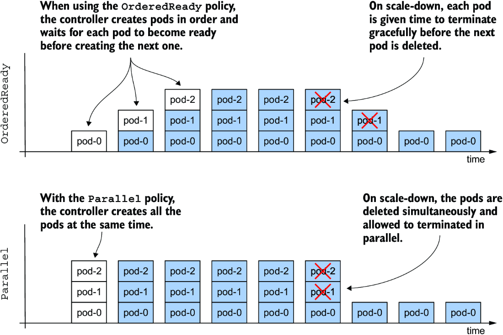

*Hình 16.7: So sánh giữa chính sách quản lý Pod OrderedReady và Parallel*

Bảng 16.1 giải thích chi tiết hơn sự khác biệt giữa hai chính sách.

**Bảng 16.1: Các giá trị `podManagementPolicy` được hỗ trợ**

| Giá trị | Mô tả |
|---|---|
| `OrderedReady` | Các pod được tạo từng cái một theo thứ tự tăng dần. Sau khi tạo mỗi pod, controller chờ cho đến khi pod sẵn sàng rồi mới tạo pod tiếp theo. Quy trình tương tự được dùng khi mở rộng và khi thay thế các pod khi chúng bị xóa hoặc node của chúng bị hỏng. Khi thu hẹp, các pod bị xóa theo thứ tự ngược lại. Controller chờ cho đến khi mỗi pod bị xóa kết thúc hoàn toàn rồi mới xóa pod tiếp theo. |
| `Parallel` | Tất cả các pod được tạo và xóa cùng lúc. Controller không chờ từng pod sẵn sàng. |

Chính sách `OrderedReady` thuận tiện khi workload yêu cầu mỗi replica phải được khởi động hoàn toàn trước khi replica tiếp theo được tạo và/hoặc phải tắt hoàn toàn trước khi replica tiếp theo được yêu cầu thoát. Tuy nhiên, chính sách này có những nhược điểm của nó. Hãy xem điều gì xảy ra khi chúng ta dùng nó trong StatefulSet `quiz`.

#### Tìm hiểu nhược điểm của chính sách quản lý Pod OrderedReady (Understanding the drawbacks of the OrderedReady Pod management policy)

Tạo lại StatefulSet bằng cách áp dụng file manifest `sts.quiz.orderedReady.yaml` với `podManagementPolicy` được đặt là `OrderedReady`, như hiển thị trong listing sau.

**Listing 16.5: Chỉ định podManagementPolicy trong StatefulSet**

```yaml
apiVersion: apps/v1
kind: StatefulSet
metadata:
  name: quiz
spec:
  podManagementPolicy: OrderedReady   #1
  minReadySeconds: 10                 #2
  serviceName: quiz-pods
  replicas: 3
  ...
```

- **#1** Các pod của StatefulSet này được tạo theo thứ tự. Mỗi pod phải trở nên sẵn sàng trước khi pod tiếp theo được tạo.
- **#2** Pod phải sẵn sàng trong số giây này trước khi pod tiếp theo được tạo.

Ngoài việc đặt `podManagementPolicy`, trường `minReadySeconds` cũng được đặt là `10` để bạn có thể thấy rõ hơn tác động của chính sách `OrderedReady`. Trường này có cùng vai trò như trong Deployment, nhưng được dùng không chỉ cho việc cập nhật StatefulSet mà còn khi StatefulSet được mở rộng/thu hẹp.

> **GHI CHÚ:** Tại thời điểm viết sách, trường `podManagementPolicy` là bất biến (immutable). Nếu bạn muốn thay đổi chính sách của một StatefulSet hiện có, bạn phải xóa và tạo lại nó, như bạn vừa làm. Bạn có thể dùng tùy chọn `--cascade=orphan` để ngăn các pod bị xóa trong thao tác này.

Quan sát các Pod `quiz` với tùy chọn `--watch` để xem chúng được tạo như thế nào. Chạy lệnh `kubectl get` như sau:

```bash
$ kubectl get pods -l app=quiz --watch
NAME     READY   STATUS    RESTARTS   AGE
quiz-0   1/2     Running   0          22s
```

Như bạn có thể nhớ lại từ các chương trước, tùy chọn `--watch` yêu cầu `kubectl` theo dõi các thay đổi đối với các object được chỉ định. Lệnh trước tiên liệt kê các object rồi chờ. Khi trạng thái của một object hiện có được cập nhật hoặc một object mới xuất hiện, lệnh in ra thông tin đã cập nhật về object đó.

> **GHI CHÚ:** Khi bạn chạy `kubectl` với tùy chọn `--watch`, nó dùng cùng cơ chế API mà các controller dùng để chờ các thay đổi đối với các object mà chúng đang quan sát.

Bạn sẽ ngạc nhiên khi thấy chỉ một replica duy nhất được tạo khi bạn tạo lại StatefulSet với chính sách `OrderedReady`, mặc dù StatefulSet được cấu hình với ba replica. Pod tiếp theo, `quiz-1`, không xuất hiện dù bạn chờ bao lâu. Lý do là container `quiz-api` trong pod `quiz-0` không bao giờ trở nên sẵn sàng, như trường hợp khi bạn thu hẹp StatefulSet xuống một replica duy nhất. Vì pod đầu tiên không bao giờ sẵn sàng, controller không bao giờ tạo pod tiếp theo. Nó không thể làm vậy vì chính sách đã được cấu hình.

Như trước, container `quiz-api` không sẵn sàng vì MongoDB instance chạy bên cạnh nó không có quorum. Vì readiness probe được định nghĩa trong container `quiz-api` phụ thuộc vào tính khả dụng của MongoDB, mà MongoDB cần ít nhất hai pod để có quorum, và vì StatefulSet controller không khởi động pod tiếp theo cho đến khi pod đầu tiên sẵn sàng, StatefulSet giờ đây bị kẹt trong một tình trạng bế tắc (deadlock).

Có thể có người cho rằng readiness probe trong container `quiz-api` không nên phụ thuộc vào MongoDB. Điều này còn phải bàn, nhưng có lẽ vấn đề nằm ở việc dùng chính sách `OrderedReady`. Dù sao hãy cứ giữ chính sách này, vì bạn đã thấy chính sách `Parallel` hoạt động thế nào rồi. Thay vào đó, hãy cấu hình lại readiness probe để gọi URI gốc thay vì endpoint `/healthz/ready`. Bằng cách này, probe chỉ kiểm tra xem HTTP server có đang chạy trong container `quiz-api` hay không, mà không kết nối tới MongoDB.

#### Cập nhật một StatefulSet bị kẹt với chính sách OrderedReady (Updating a stuck StatefulSet with the OrderedReady policy)

Dùng lệnh `kubectl edit sts quiz` để thay đổi đường dẫn trong định nghĩa readiness probe, hoặc dùng lệnh `kubectl apply` để áp dụng file manifest đã cập nhật `sts.quiz.orderedReady.readinessProbe.yaml`. Listing sau cho thấy readiness probe nên được cấu hình như thế nào:

**Listing 16.6: Thiết lập readiness probe trong container quiz-api**

```yaml
apiVersion: apps/v1
kind: StatefulSet
metadata:
  name: quiz
spec:
  ...
  template:
    ...
    spec:
      containers:
      - name: quiz-api
        ...
        readinessProbe:
          httpGet:
            port: 8080
            path: /          #1
            scheme: HTTP
      ...
```

- **#1** Đổi đường dẫn từ `/healthz/ready` thành `/`.

Sau khi bạn cập nhật Pod template trong StatefulSet, bạn mong đợi Pod `quiz-0` bị xóa và được tạo lại với Pod template mới, đúng không? Liệt kê các pod như sau để kiểm tra xem điều này có xảy ra không.

```bash
$ kubectl get pods -l app=quiz
NAME     READY   STATUS    RESTARTS   AGE
quiz-0   1/2     Running   0          5m    #1
```

- **#1** Tuổi (age) của pod cho thấy đây vẫn là pod cũ.

Như bạn có thể thấy từ tuổi của pod, nó vẫn là cùng một pod. Tại sao pod chưa được cập nhật? Khi bạn cập nhật Pod template trong một ReplicaSet hoặc Deployment, các pod bị xóa và được tạo lại, vậy tại sao ở đây thì không?

Lý do cho điều này có lẽ là nhược điểm lớn nhất của việc dùng StatefulSet với chính sách quản lý Pod mặc định `OrderedReady`. Khi bạn dùng chính sách này, StatefulSet không làm gì cả cho đến khi pod sẵn sàng. Nếu StatefulSet của bạn rơi vào trạng thái như hiển thị ở đây, bạn sẽ phải xóa pod không khỏe mạnh một cách thủ công.

Bây giờ hãy xóa Pod `quiz-0` và quan sát StatefulSet controller tạo ba pod lần lượt từng cái một như sau:

```bash
$ kubectl get pods -l app=quiz --watch
NAME     READY   STATUS              RESTARTS   AGE
quiz-0   0/2     Terminating         0          20m   #1
quiz-0   0/2     Pending             0          0s    #2
quiz-0   0/2     ContainerCreating   0          0s    #2
quiz-0   1/2     Running             0          3s    #2
quiz-0   2/2     Running             0          3s    #2
quiz-1   0/2     Pending             0          0s    #3
quiz-1   0/2     ContainerCreating   0          0s    #3
quiz-1   2/2     Running             0          3s    #3
quiz-2   0/2     Pending             0          0s    #4
quiz-2   0/2     ContainerCreating   0          1s    #4
quiz-2   2/2     Running             0          4s    #4
```

- **#1** Bạn đã xóa pod, nên nó đang bị kết thúc.
- **#2** Đây là một pod instance mới với định nghĩa readiness probe mới. Cả hai container của nó sớm trở nên sẵn sàng.
- **#3** Replica thứ hai chỉ được tạo và khởi động sau khi replica thứ nhất trở nên sẵn sàng.
- **#4** Replica thứ ba được tạo sau khi replica thứ hai trở nên sẵn sàng.

Như bạn thấy, các pod được tạo theo thứ tự tăng dần, từng cái một. Bạn có thể thấy rằng Pod `quiz-1` không được tạo cho đến khi cả hai container trong Pod `quiz-0` đều sẵn sàng. Điều bạn không thể thấy là do thiết lập `minReadySeconds`, controller chờ thêm 10 giây nữa trước khi tạo Pod `quiz-1`. Tương tự, Pod `quiz-2` được tạo 10 giây sau khi các container trong Pod `quiz-1` sẵn sàng. Trong toàn bộ quá trình, tối đa chỉ có một pod đang được khởi động. Với một số workload, điều này là cần thiết để tránh các tình huống tranh chấp (race condition).

#### Mở rộng/thu hẹp một StatefulSet với chính sách OrderedReady (Scaling a StatefulSet with the OrderedReady policy)

Khi bạn mở rộng/thu hẹp StatefulSet được cấu hình với chính sách quản lý Pod `OrderedReady`, các pod được tạo/xóa từng cái một. Hãy thu hẹp StatefulSet `quiz` xuống một replica duy nhất và quan sát các pod bị loại bỏ. Trước tiên, pod có số thứ tự cao nhất, `quiz-2`, được đánh dấu để xóa, trong khi Pod `quiz-1` không bị động đến. Khi việc kết thúc Pod `quiz-2` hoàn tất, Pod `quiz-1` bị xóa. Thiết lập `minReadySeconds` không được dùng trong quá trình thu hẹp, nên không có độ trễ bổ sung.

Cũng như với việc khởi động đồng thời, một số workload stateful không thích việc bạn loại bỏ nhiều replica cùng lúc. Với chính sách `OrderedReady`, bạn để mỗi replica hoàn thành quy trình tắt của nó trước khi việc tắt replica tiếp theo được kích hoạt.

#### Thu hẹp bị chặn (Blocked scale-downs)

Một tính năng khác của chính sách quản lý Pod `OrderedReady` là controller chặn thao tác thu hẹp nếu không phải tất cả các replica đều sẵn sàng. Để tự mình thấy điều này, hãy tạo một StatefulSet mới bằng cách áp dụng file manifest `sts.demo-ordered.yaml`. StatefulSet này triển khai ba replica dùng chính sách `OrderedReady`. Sau khi các pod được tạo, hãy làm readiness probe trong Pod `demo-ordered-0` thất bại bằng cách chạy lệnh sau:

```bash
$ kubectl exec demo-ordered-0 -- rm /tmp/ready
```

Chạy lệnh này sẽ xóa file `/tmp/ready` mà readiness probe kiểm tra. Probe thành công nếu file tồn tại. Sau khi bạn chạy lệnh này, Pod `demo-ordered-0` không còn sẵn sàng nữa. Bây giờ hãy thu hẹp StatefulSet xuống hai replica như sau:

```bash
$ kubectl scale sts demo-ordered --replicas 2
statefulset.apps/demo-ordered scaled
```

Nếu bạn liệt kê các pod với label selector `app=demo-ordered`, bạn sẽ thấy StatefulSet controller không làm gì cả. Thật không may, controller không tạo ra Event nào hay cập nhật status của StatefulSet object để cho bạn biết tại sao nó không thực hiện việc thu hẹp.

Controller hoàn thành thao tác thay đổi kích thước khi pod sẵn sàng. Bạn có thể làm cho readiness probe của Pod `demo-ordered-0` thành công bằng cách tạo lại file `/tmp/ready` như sau:

```bash
$ kubectl exec demo-ordered-0 -- touch /tmp/ready
```

Tôi gợi ý bạn tìm hiểu thêm hành vi của StatefulSet này và so sánh nó với StatefulSet trong file manifest `sts.demo-parallel.yaml`, vốn dùng chính sách quản lý Pod `Parallel`. Hãy dùng các lệnh `rm` và `touch` như đã minh họa để tác động đến kết quả của readiness probe trong các replica khác nhau và xem nó ảnh hưởng thế nào đến hai StatefulSet.

#### Loại bỏ pod có thứ tự khi xóa StatefulSet (Ordered removal of Pods when deleting the StatefulSet)

Chính sách quản lý Pod `OrderedReady` ảnh hưởng đến việc triển khai ban đầu của các Pod của StatefulSet, việc mở rộng/thu hẹp chúng, và cách các pod được thay thế khi một node bị hỏng. Tuy nhiên, chính sách này không áp dụng khi bạn xóa StatefulSet. Nếu bạn muốn kết thúc các Pod theo thứ tự, trước tiên bạn nên thu hẹp StatefulSet về 0, chờ cho đến khi Pod cuối cùng kết thúc, và chỉ khi đó mới xóa StatefulSet.

---

## 16.3 Cập nhật một StatefulSet (Updating a StatefulSet)

Ngoài việc mở rộng/thu hẹp theo kiểu khai báo, StatefulSet còn cung cấp các cập nhật theo kiểu khai báo, tương tự như Deployment. Khi bạn cập nhật Pod template trong một StatefulSet, controller tạo lại các pod với template đã cập nhật. Bạn có thể nhớ lại rằng Deployment controller có thể thực hiện cập nhật theo hai cách, tùy vào chiến lược (strategy) được chỉ định trong Deployment object. Bạn cũng có thể chỉ định chiến lược cập nhật trong trường `updateStrategy` ở phần `spec` của manifest StatefulSet, nhưng các chiến lược có sẵn khác với những chiến lược trong Deployment, như hiển thị trong bảng 16.2.

**Bảng 16.2: Các chiến lược cập nhật StatefulSet được hỗ trợ**

| Giá trị | Mô tả |
|---|---|
| `RollingUpdate` | Trong chiến lược cập nhật này, các pod được thay thế từng cái một. Pod có số thứ tự cao nhất bị xóa trước và được thay thế bằng một pod được tạo từ template mới. Khi pod mới này sẵn sàng, pod có số thứ tự cao kế tiếp được thay thế. Quá trình tiếp tục cho đến khi tất cả các pod đã được thay thế. Đây là chiến lược mặc định. |
| `OnDelete` | StatefulSet controller chờ từng pod bị xóa thủ công. Khi bạn xóa pod, controller thay thế nó bằng một pod được tạo từ template mới. Với chiến lược này, bạn có thể thay thế các pod theo bất kỳ thứ tự nào và với bất kỳ tốc độ nào. |

Hình 16.8 cho thấy cách các Pod được cập nhật theo thời gian với mỗi chiến lược cập nhật. Chiến lược `RollingUpdate`, mà bạn có thể tìm thấy ở cả Deployment lẫn StatefulSet, là tương tự nhau giữa hai object, nhưng khác nhau ở các tham số bạn có thể đặt. Chiến lược `OnDelete` cho phép bạn thay thế các pod theo tốc độ của riêng bạn và theo bất kỳ thứ tự nào. Nó khác với chiến lược `Recreate` có trong Deployment, vốn tự động xóa và thay thế tất cả các pod cùng lúc.

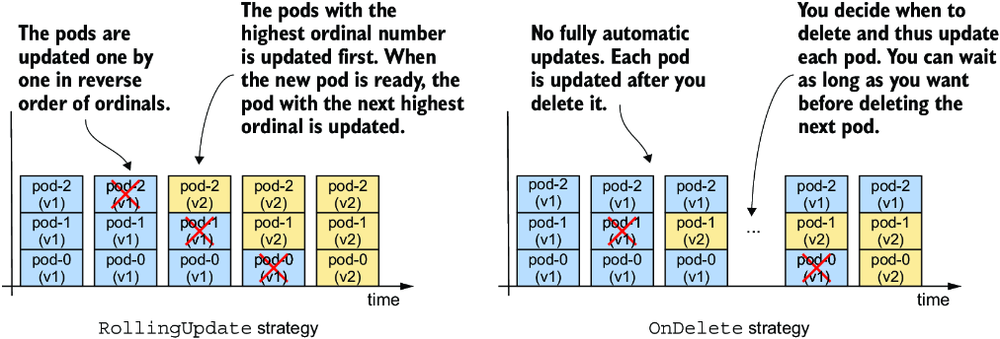

*Hình 16.8: Cách các pod được cập nhật theo thời gian với các chiến lược cập nhật khác nhau*

### 16.3.1 Dùng chiến lược RollingUpdate (Using the RollingUpdate strategy)

Chiến lược `RollingUpdate` trong một StatefulSet hoạt động tương tự chiến lược `RollingUpdate` trong Deployment, nhưng mỗi lần chỉ có một pod được thay thế. Bạn có thể nhớ lại rằng bạn có thể cấu hình Deployment để thay thế nhiều pod cùng lúc bằng các tham số `maxSurge` và `maxUnavailable`. Chiến lược rolling update trong StatefulSet không có các tham số như vậy.

Bạn cũng có thể nhớ lại rằng bạn có thể làm chậm việc triển khai (rollout) trong một Deployment bằng cách đặt trường `minReadySeconds`, điều này khiến controller chờ một khoảng thời gian nhất định sau khi các pod mới sẵn sàng trước khi thay thế các pod khác. Bạn đã học rằng StatefulSet cũng cung cấp trường này và nó ảnh hưởng đến việc mở rộng/thu hẹp StatefulSet bên cạnh các cập nhật.

Hãy cập nhật container `quiz-api` trong StatefulSet `quiz` lên phiên bản `0.2`. Vì `RollingUpdate` là kiểu chiến lược cập nhật mặc định, bạn có thể bỏ qua trường `updateStrategy` trong manifest. Để kích hoạt cập nhật, hãy dùng `kubectl edit` để đổi giá trị của label `ver` và tag của image trong container `quiz-api` thành `0.2`. Thay vào đó bạn cũng có thể áp dụng file manifest `sts.quiz.0.2.yaml` bằng `kubectl apply`.

Bạn có thể theo dõi việc rollout bằng lệnh `kubectl rollout status` như trong chương trước. Lệnh đầy đủ và output của nó như sau:

```bash
$ kubectl rollout status sts quiz
Waiting for partitioned roll out to finish: 0 out of 3 new pods have been updated...
Waiting for 1 pods to be ready...
Waiting for partitioned roll out to finish: 1 out of 3 new pods have been updated...
Waiting for 1 pods to be ready...
...
```

Vì các pod được thay thế từng cái một và controller chờ cho đến khi mỗi replica sẵn sàng rồi mới chuyển sang replica tiếp theo, Service `quiz` vẫn có thể truy cập được trong suốt quá trình. Nếu bạn liệt kê các pod trong khi chúng đang được cập nhật, bạn sẽ thấy pod có số thứ tự cao nhất, `quiz-2`, được cập nhật trước, tiếp theo là `quiz-1`, như hiển thị ở đây:

```bash
$ kubectl get pods -l app=quiz -L controller-revision-hash,ver
NAME     READY   STATUS        RESTARTS   AGE   CONTROLLER-REVISION-HASH   VER
quiz-0   2/2     Running       0          50m   quiz-6c48bdd8df            0.1   #1
quiz-1   2/2     Terminating   0          10m   quiz-6c48bdd8df            0.1   #2
quiz-2   2/2     Running       0          20s   quiz-6945968d9             0.2   #3
```

- **#1** Pod có số thứ tự thấp nhất vẫn chưa được cập nhật.
- **#2** Đây là pod đang được cập nhật lúc này.
- **#3** Pod có số thứ tự cao nhất đã được cập nhật đầu tiên.

Quá trình cập nhật hoàn tất khi pod có số thứ tự thấp nhất, `quiz-0`, được cập nhật. Tại thời điểm này, lệnh `kubectl rollout status` báo cáo trạng thái sau:

```bash
$ kubectl rollout status sts quiz
partitioned roll out complete: 3 new pods have been updated...
```

#### Cập nhật khi có pod chưa sẵn sàng (Updates with Pods that aren't ready)

Nếu StatefulSet được cấu hình với chiến lược `RollingUpdate` và bạn kích hoạt cập nhật trước khi tất cả các pod sẵn sàng, việc rollout bị giữ lại. Lệnh `kubectl rollout status` cho biết controller đang chờ một hoặc nhiều pod sẵn sàng.

Nếu một pod mới không trở nên sẵn sàng trong quá trình cập nhật, việc cập nhật cũng bị tạm dừng, giống như cập nhật Deployment. Việc rollout sẽ tiếp tục khi pod sẵn sàng trở lại. Vì vậy, nếu bạn triển khai một phiên bản lỗi mà readiness probe của nó không bao giờ thành công, việc cập nhật sẽ bị chặn sau khi pod đầu tiên được thay thế. Nếu số lượng replica trong StatefulSet là đủ, dịch vụ do các pod trong StatefulSet cung cấp không bị ảnh hưởng.

#### Hiển thị lịch sử revision (Displaying the revision history)

Bạn có thể nhớ lại rằng Deployment lưu giữ lịch sử của các revision gần đây. Mỗi revision được đại diện bởi ReplicaSet mà Deployment controller đã tạo khi revision đó đang hoạt động. StatefulSet cũng lưu giữ lịch sử revision. Bạn có thể dùng lệnh `kubectl rollout history` để hiển thị nó như sau:

```bash
$ kubectl rollout history sts quiz
statefulset.apps/quiz
REVISION   CHANGE-CAUSE
1          <none>
2          <none>
```

Bạn có thể tự hỏi lịch sử này được lưu ở đâu, vì không giống Deployment, một StatefulSet quản lý các pod một cách trực tiếp. Và nếu bạn nhìn vào manifest của StatefulSet `quiz`, bạn sẽ nhận thấy nó chỉ chứa Pod template hiện tại chứ không có các revision trước đó. Vậy lịch sử revision của StatefulSet được lưu ở đâu?

Lịch sử revision của StatefulSet và DaemonSet, mà bạn sẽ học trong chương tiếp theo, được lưu trong các ControllerRevision object. Một ControllerRevision là một object tổng quát đại diện cho một ảnh chụp (snapshot) bất biến của trạng thái một object tại một thời điểm cụ thể. Bạn có thể liệt kê các ControllerRevision object như sau:

```bash
$ kubectl get controllerrevisions
NAME              CONTROLLER              REVISION   AGE
quiz-6945968d9    statefulset.apps/quiz   2          1m
quiz-6c48bdd8df   statefulset.apps/quiz   1          50m
```

Vì các object này được dùng nội bộ, bạn không cần biết thêm gì về chúng. Tuy nhiên, nếu bạn muốn tìm hiểu thêm, bạn có thể dùng lệnh `kubectl explain`.

#### Quay lại revision trước (Rolling back to a previous revision)

Nếu bạn đang cập nhật StatefulSet và việc rollout bị treo, hoặc nếu việc rollout thành công nhưng bạn muốn quay lại revision trước, bạn có thể dùng lệnh `kubectl rollout undo`, như đã mô tả trong chương trước. Bạn sẽ cập nhật StatefulSet `quiz` một lần nữa trong mục tiếp theo, vì vậy hãy đặt lại nó về phiên bản trước như sau:

```bash
$ kubectl rollout undo sts quiz
statefulset.apps/quiz rolled back
```

Bạn cũng có thể dùng tùy chọn `--to-revision` để quay về một revision cụ thể. Cũng như với Deployment, các pod được quay lại (roll back) bằng chiến lược cập nhật được cấu hình trong StatefulSet. Nếu chiến lược là `RollingUpdate`, các pod được hoàn nguyên từng cái một.

### 16.3.2 RollingUpdate với partition (RollingUpdate with partition)

StatefulSet không có trường `pause` mà bạn có thể dùng để ngăn việc rollout của Deployment bị kích hoạt, hoặc để tạm dừng nó giữa chừng. Nếu bạn cố tạm dừng StatefulSet bằng lệnh `kubectl rollout pause`, bạn nhận được thông báo lỗi sau:

```bash
$ kubectl rollout pause sts quiz
error: statefulsets.apps "quiz" pausing is not supported
```

Trong một StatefulSet, bạn có thể đạt được kết quả tương tự và hơn thế nữa với tham số `partition` của chiến lược `RollingUpdate`. Giá trị của trường này chỉ định số thứ tự mà tại đó StatefulSet nên được phân vùng (partition). Như minh họa trong hình 16.9, các pod có số thứ tự thấp hơn giá trị `partition` không được cập nhật.

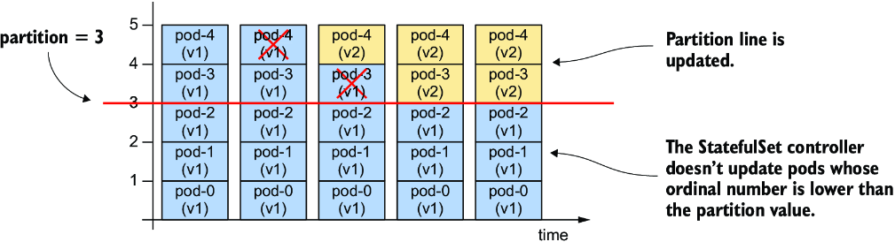

*Hình 16.9: Phân vùng một rolling update*

Nếu bạn đặt giá trị `partition` một cách phù hợp, bạn có thể hiện thực một triển khai canary, kiểm soát việc rollout một cách thủ công, hoặc dàn dựng (stage) một cập nhật thay vì kích hoạt nó ngay lập tức.

#### Dàn dựng một cập nhật (Staging an update)

Để dàn dựng một cập nhật StatefulSet mà không thực sự kích hoạt nó, hãy đặt giá trị `partition` bằng số lượng replica hoặc cao hơn, như trong file manifest `sts.quiz.0.2.partition.yaml` được hiển thị trong listing sau.

**Listing 16.7: Dàn dựng một cập nhật StatefulSet bằng trường partition**

```yaml
apiVersion: apps/v1
kind: StatefulSet
metadata:
  name: quiz
spec:
  updateStrategy:
    type: RollingUpdate
    rollingUpdate:
      partition: 3      #1
  replicas: 3           #1
  ...
```

- **#1** Giá trị `partition` bằng số lượng replica.

Áp dụng file manifest này và xác nhận rằng việc rollout không bắt đầu mặc dù Pod template đã được cập nhật. Nếu bạn đặt giá trị `partition` theo cách này, bạn có thể thực hiện nhiều thay đổi đối với StatefulSet mà không kích hoạt việc rollout. Bây giờ hãy xem cách bạn có thể kích hoạt cập nhật một pod duy nhất.

#### Triển khai một canary (Deploying a canary)

Để triển khai một canary, hãy đặt giá trị `partition` bằng số lượng replica trừ đi một. Vì StatefulSet `quiz` có ba replica, bạn đặt `partition` là `2`. Bạn có thể làm điều này bằng lệnh `kubectl patch` như sau:

```bash
$ kubectl patch sts quiz -p '{"spec": {"updateStrategy": {"rollingUpdate": {"partition": 2}}}}'
statefulset.apps/quiz patched
```

Nếu bây giờ bạn nhìn vào danh sách các Pod `quiz`, bạn sẽ thấy chỉ Pod `quiz-2` đã được cập nhật lên phiên bản `0.2` vì chỉ số thứ tự của nó là lớn hơn hoặc bằng giá trị `partition`.

```bash
$ kubectl get pods -l app=quiz -L controller-revision-hash,ver
NAME     READY   STATUS    RESTARTS   AGE   CONTROLLER-REVISION-HASH   VER
quiz-0   2/2     Running   0          8m    quiz-6c48bdd8df            0.1
quiz-1   2/2     Running   0          8m    quiz-6c48bdd8df            0.1
quiz-2   2/2     Running   0          20s   quiz-6945968d9             0.2   #1
```

- **#1** Chỉ Pod `quiz-2` được cập nhật vì chỉ số thứ tự của nó là lớn hơn hoặc bằng giá trị `partition`.

Pod `quiz-2` là canary mà bạn dùng để kiểm tra xem phiên bản mới có hoạt động như mong đợi hay không trước khi triển khai các thay đổi cho các pod còn lại.

Tại điểm này, tôi muốn hướng sự chú ý của bạn đến phần `status` của StatefulSet object. Nó chứa thông tin về tổng số replica, số replica sẵn sàng và khả dụng, số replica hiện tại (current) và đã cập nhật (updated), cùng các revision hash của chúng. Để hiển thị status, hãy chạy lệnh sau:

```bash
$ kubectl get sts quiz -o yaml
...
status:
  availableReplicas: 3                 #1
  collisionCount: 0
  currentReplicas: 2                   #2
  currentRevision: quiz-6c48bdd8df     #2
  observedGeneration: 8
  readyReplicas: 3                     #1
  replicas: 3                          #1
  updateRevision: quiz-6945968d9       #3
  updatedReplicas: 1                   #3
```

- **#1** Ba replica tồn tại, và cả ba đều sẵn sàng và khả dụng.
- **#2** Hai replica thuộc về revision hiện tại.
- **#3** Một replica đã được cập nhật.

Như bạn có thể thấy từ `status`, StatefulSet giờ đây được chia thành hai phân vùng. Nếu một pod bị xóa vào lúc này, StatefulSet controller sẽ tạo nó với template đúng. Ví dụ, nếu bạn xóa một trong các pod có phiên bản 0.1, pod thay thế sẽ được tạo với template trước đó và sẽ chạy lại với phiên bản 0.1. Nếu bạn xóa pod đã được cập nhật, nó sẽ được tạo lại với template mới. Hãy thoải mái tự mình thử điều này. Bạn không thể làm hỏng gì cả.

#### Hoàn tất một cập nhật được phân vùng (Completing a partitioned update)

Khi bạn tự tin rằng canary ổn, bạn có thể để StatefulSet cập nhật các pod còn lại bằng cách đặt giá trị `partition` về 0 như sau:

```bash
$ kubectl patch sts quiz -p '{"spec": {"updateStrategy": {"rollingUpdate": {"partition": 0}}}}'
statefulset.apps/quiz patched
```

Khi trường `partition` được đặt về 0, StatefulSet cập nhật tất cả các pod. Trước tiên, pod `quiz-1` được cập nhật, tiếp theo là `quiz-0`. Nếu bạn có nhiều pod hơn, bạn cũng có thể dùng trường `partition` để cập nhật StatefulSet theo từng giai đoạn. Trong mỗi giai đoạn, bạn quyết định muốn cập nhật bao nhiêu pod và đặt giá trị `partition` tương ứng.

Tại thời điểm viết sách, `partition` là tham số duy nhất của chiến lược `RollingUpdate`. Bạn đã thấy cách dùng nó để kiểm soát việc rollout. Nếu bạn muốn kiểm soát nhiều hơn nữa, bạn có thể dùng chiến lược `OnDelete`, mà tôi sẽ thử tiếp theo. Trước khi tiếp tục, hãy đặt lại StatefulSet về revision trước như sau:

```bash
$ kubectl rollout undo sts quiz
statefulset.apps/quiz rolled back
```

### 16.3.3 Chiến lược OnDelete (OnDelete strategy)

Nếu bạn muốn có toàn quyền kiểm soát quá trình rollout, bạn có thể dùng chiến lược cập nhật `OnDelete`. Để cấu hình StatefulSet với chiến lược này, hãy dùng `kubectl apply` để áp dụng file manifest `sts.quiz.0.2.onDelete.yaml`. Listing sau cho thấy chiến lược cập nhật được thiết lập như thế nào.

**Listing 16.8: Thiết lập chiến lược cập nhật OnDelete**

```yaml
apiVersion: apps/v1
kind: StatefulSet
metadata:
  name: quiz
spec:
  updateStrategy:     #1
    type: OnDelete    #1
  ...
```

- **#1** Để bật chiến lược `OnDelete`, hãy đặt trường `type` như hiển thị. Chiến lược này không có tham số.

Manifest này cập nhật container `quiz-api` trong Pod template để dùng tag image `:0.2`. Tuy nhiên, vì nó đặt chiến lược cập nhật là `OnDelete`, không có gì xảy ra khi bạn áp dụng manifest.

Nếu bạn dùng chiến lược `OnDelete`, việc rollout là bán tự động. Bạn xóa thủ công từng pod, và StatefulSet controller sau đó tạo pod thay thế với template mới. Với chiến lược này, bạn có thể quyết định cập nhật pod nào và khi nào. Bạn không nhất thiết phải xóa pod có số thứ tự cao nhất trước. Hãy thử xóa Pod `quiz-0`. Khi các container của nó thoát, một Pod `quiz-0` mới với phiên bản `0.2` xuất hiện:

```bash
$ kubectl get pods -l app=quiz -L controller-revision-hash,ver
NAME     READY   STATUS    RESTARTS   AGE   CONTROLLER-REVISION-HASH   VER
quiz-0   2/2     Running   0          53s   quiz-6945968d9             0.2   #1
quiz-1   2/2     Running   0          11m   quiz-6c48bdd8df            0.1
quiz-2   2/2     Running   0          12m   quiz-6c48bdd8df            0.1
```

- **#1** Bạn đã xóa pod này, và controller đã thay thế nó bằng một pod từ template đã cập nhật.

Để hoàn tất việc rollout, bạn cần xóa các pod còn lại. Bạn có thể làm điều này theo thứ tự mà workload yêu cầu, hoặc theo thứ tự bạn muốn.

#### Quay lại với chiến lược OnDelete (Rolling back with the OnDelete strategy)

Vì chiến lược cập nhật cũng áp dụng khi bạn dùng lệnh `kubectl rollout undo`, quá trình quay lại cũng là bán tự động. Bạn phải tự xóa từng pod nếu muốn quay nó về revision trước.

#### Cập nhật khi có pod chưa sẵn sàng (Updates with Pods that aren't ready)

Vì bạn kiểm soát việc rollout và controller thay thế bất kỳ pod nào bạn xóa, trạng thái sẵn sàng của pod không quan trọng. Nếu bạn xóa một pod chưa sẵn sàng, controller cập nhật nó.

Nếu bạn xóa một pod và pod mới chưa sẵn sàng, nhưng bạn vẫn xóa pod tiếp theo, controller cũng sẽ cập nhật pod thứ hai đó. Việc cân nhắc trạng thái sẵn sàng của pod là trách nhiệm của bạn.

---

## 16.4 Quản lý ứng dụng stateful bằng Kubernetes Operator (Managing stateful applications with Kubernetes Operators)

Trong chương này, bạn đã thấy rằng việc quản lý một ứng dụng stateful có thể liên quan đến nhiều thứ hơn những gì StatefulSet object cung cấp. Trong trường hợp của MongoDB, bạn cần cấu hình lại MongoDB replica set mỗi khi bạn mở rộng/thu hẹp StatefulSet. Nếu không, replica set có thể mất quorum và ngừng hoạt động. Ngoài ra, nếu một node trong cluster bị hỏng, cần có sự can thiệp thủ công để di chuyển các Pod sang các node còn lại.

Quản lý các ứng dụng stateful là việc khó. StatefulSet làm tốt việc tự động hóa một số tác vụ cơ bản, nhưng phần lớn công việc vẫn phải được làm thủ công. Nếu bạn muốn triển khai một ứng dụng stateful hoàn toàn tự động, bạn cần nhiều hơn những gì StatefulSet có thể cung cấp. Đây là lúc các Kubernetes operator phát huy tác dụng. Tôi không nói đến những người vận hành các Kubernetes cluster, mà là phần mềm làm việc đó thay cho họ.

Một Kubernetes operator là một controller đặc thù cho ứng dụng, tự động hóa việc triển khai và quản lý một ứng dụng chạy trên Kubernetes. Một operator thường được phát triển bởi chính tổ chức xây dựng ứng dụng, vì họ biết rõ nhất cách quản lý nó. Kubernetes không đi kèm các operator. Thay vào đó, bạn phải cài đặt chúng riêng.

Mỗi operator mở rộng Kubernetes API bằng tập kiểu object tùy chỉnh (custom object type) của riêng nó mà bạn dùng để triển khai và cấu hình ứng dụng. Bạn tạo một instance của kiểu object tùy chỉnh này thông qua Kubernetes API và để operator tạo các Deployment hoặc StatefulSet, từ đó tạo ra các pod mà ứng dụng chạy trong đó, như minh họa trong hình 16.10.

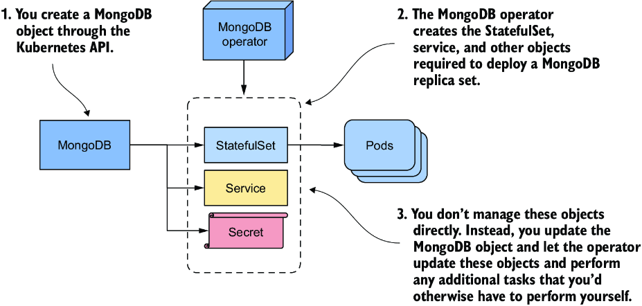

*Hình 16.10: Quản lý một ứng dụng thông qua các custom resource và operator*

Trong mục này, bạn sẽ học cách dùng MongoDB Community Operator để triển khai MongoDB. Vì tôi không biết operator sẽ thay đổi thế nào sau khi cuốn sách được xuất bản, tôi sẽ không đi quá sâu vào chi tiết, nhưng tôi sẽ liệt kê tất cả các bước cần thiết để cài đặt Operator và triển khai MongoDB tại thời điểm tôi viết sách, để bạn có thể hình dung những gì cần làm ngay cả khi bạn không tự thử.

Nếu bạn muốn tự mình thử, hãy làm theo tài liệu trong kho GitHub của MongoDB community operator tại https://github.com/mongodb/mongodb-kubernetes-operator.

### 16.4.1 Triển khai MongoDB community operator (Deploying the MongoDB community operator)

Bản thân một operator là một ứng dụng mà bạn thường triển khai trong cùng Kubernetes cluster với ứng dụng mà operator sẽ quản lý. Tại thời điểm viết sách, tài liệu của MongoDB operator hướng dẫn bạn trước tiên clone kho GitHub như sau:

```bash
$ git clone https://github.com/mongodb/mongodb-kubernetes-operator.git
```

Sau đó vào thư mục `mongodb-kubernetes-operator`, nơi bạn có thể tìm thấy mã nguồn của operator và một số manifest Kubernetes object. Bạn có thể bỏ qua mã nguồn. Bạn chỉ quan tâm đến các file manifest.

Bạn có thể quyết định muốn triển khai operator và MongoDB trong cùng namespace, hay muốn triển khai operator sao cho mỗi người dùng trong cluster có thể triển khai (các) MongoDB instance của riêng họ. Để đơn giản, tôi sẽ dùng một namespace duy nhất.

#### Mở rộng API với kiểu object MongoDBCommunity (Extending the API with the MongoDBCommunity object kind)

Trước tiên, bạn tạo một CustomResourceDefinition object để mở rộng Kubernetes API của cluster bằng một kiểu object bổ sung. Để làm việc này, bạn áp dụng manifest của object như sau:

```bash
$ kubectl apply -f config/crd/bases/mongodbcommunity.mongodb.com_mongodbcommunity.yaml
customresourcedefinition/mongodbcommunity.mongodbcommunity.mongodb.com created
```

Dùng API của cluster, giờ bạn có thể tạo các object kiểu MongoDBCommunity. Bạn sẽ tạo object này sau.

> **GHI CHÚ:** Thật không may, kiểu object là MongoDBCommunity, điều này khiến khó hiểu rằng object này đại diện cho một bản triển khai MongoDB chứ không phải một cộng đồng. Lý do nó được gọi là MongoDBCommunity là vì bạn đang dùng phiên bản community của operator. Nếu bạn dùng phiên bản Enterprise, việc đặt tên phù hợp hơn. Ở đó kiểu object là MongoDB, chỉ rõ rằng object đại diện cho một bản triển khai MongoDB.

#### Tạo các object hỗ trợ (Creating supporting objects)

Tiếp theo, bạn tạo nhiều object khác liên quan đến bảo mật bằng cách áp dụng manifest của chúng. Ở đây bạn cần chỉ định namespace mà các object này nên được tạo trong đó. Hãy dùng namespace `mongodb`. Áp dụng các manifest như sau:

```bash
$ kubectl apply -k config/rbac/ -n mongodb
serviceaccount/mongodb-database created
serviceaccount/mongodb-kubernetes-operator created
role.rbac.authorization.k8s.io/mongodb-database created
role.rbac.authorization.k8s.io/mongodb-kubernetes-operator created
rolebinding.rbac.authorization.k8s.io/mongodb-database created
rolebinding.rbac.authorization.k8s.io/mongodb-kubernetes-operator created
```

#### Cài đặt operator (Installing the operator)

Bước cuối cùng là cài đặt operator bằng cách tạo một Deployment như sau:

```bash
$ kubectl create -f config/manager/manager.yaml -n mongodb
deployment.apps/mongodb-kubernetes-operator created
```

Xác nhận rằng pod của operator tồn tại và đang chạy bằng cách liệt kê các pod trong namespace `mongodb`:

```bash
$ kubectl get pods -n mongodb
NAME                                           READY   STATUS    RESTARTS   AGE
mongodb-kubernetes-operator-648bf8cc59-wzvhx   1/1     Running   0          9s
```

Không khó lắm, phải không? Operator giờ đang chạy, nhưng bạn chưa triển khai MongoDB. Operator chỉ là công cụ bạn dùng để làm việc đó.

### 16.4.2 Triển khai MongoDB thông qua operator (Deploying MongoDB via the operator)

Để triển khai một MongoDB replica set, bạn tạo một instance của kiểu object MongoDBCommunity thay vì tạo các StatefulSet và các object khác.

#### Tạo một instance của kiểu object MongoDBCommunity (Creating an instance of the MongoDBCommunity object type)

Trước tiên hãy sửa file `config/samples/mongodb.com_v1_mongodbcommunity_cr.yaml` để thay chuỗi `<your-password-here>` bằng mật khẩu bạn chọn. File này chứa manifest cho một MongoDBCommunity và một Secret object. Listing sau hiển thị manifest của object thứ nhất.

**Listing 16.9: Manifest của custom object MongoDBCommunity**

```yaml
apiVersion: mongodbcommunity.mongodb.com/v1                        #1
kind: MongoDBCommunity                                             #1
metadata:
  name: example-mongodb                                            #2
spec:
  members: 3                                                       #3
  type: ReplicaSet                                                 #3
  version: "4.2.6"                                                 #4
  security:                                                        #5
    authentication:                                                #5
      modes: ["SCRAM"]                                             #5
  users:                                                           #5
    - name: my-user                                                #5
      db: admin                                                    #5
      passwordSecretRef:                                           #5
        name: my-user-password                                     #5
      roles:                                                       #5
        - name: clusterAdmin                                       #5
          db: admin                                                #5
        - name: userAdminAnyDatabase                               #5
          db: admin                                                #5
      scramCredentialsSecretName: my-scram                         #5
  additionalMongodConfig:                                          #6
    storage.wiredTiger.engineConfig.journalCompressor: zlib        #6
```

- **#1** Kiểu object này là MongoDBCommunity, một kiểu object tùy chỉnh, là phần mở rộng của Kubernetes API lõi.
- **#2** Tên object được chỉ định trong phần `metadata`, giống như trong tất cả các kiểu Kubernetes object khác.
- **#3** Điều này yêu cầu operator tạo một MongoDB replica set với ba replica.
- **#4** Ở đây bạn chỉ định phiên bản MongoDB nào bạn muốn triển khai.
- **#5** Bạn cũng có thể chỉ định nhiều tùy chọn cấu hình khác cho bản triển khai MongoDB.
- **#6** Bạn cũng có thể chỉ định nhiều tùy chọn cấu hình khác cho bản triển khai MongoDB.

Như bạn thấy, custom object này có cùng cấu trúc với các object lõi của Kubernetes API. Các trường `apiVersion` và `kind` chỉ định kiểu object, trường `name` trong phần `metadata` chỉ định tên object, và phần `spec` chỉ định cấu hình cho bản triển khai MongoDB, bao gồm `type` và `version`, số lượng `members` mong muốn của replica set, và cấu hình liên quan đến bảo mật.

> **GHI CHÚ:** Nếu custom resource definition được làm tốt, như trong trường hợp này, bạn có thể dùng lệnh `kubectl explain` để tìm hiểu thêm về các trường được hỗ trợ trong kiểu object này.

Để triển khai MongoDB, bạn áp dụng file manifest này bằng `kubectl apply` như sau:

```bash
$ kubectl apply -f config/samples/mongodb.com_v1_mongodbcommunity_cr.yaml
mongodbcommunity.mongodbcommunity.mongodb.com/example-mongodb created
secret/my-user-password created
```

#### Kiểm tra MongoDBCommunity object (Inspecting the MongoDBCommunity object)

Sau đó bạn có thể xem object bạn đã tạo bằng lệnh `kubectl get` như sau:

```bash
$ kubectl get mongodbcommunity
NAME              PHASE     VERSION
example-mongodb   Running   4.2.6
```

Giống như các Kubernetes controller khác, object bạn đã tạo giờ được xử lý trong vòng lặp điều hòa (reconciliation loop) chạy trong operator. Dựa trên MongoDBCommunity object, operator tạo ra nhiều object: một StatefulSet, hai Service và một số Secret. Nếu bạn kiểm tra trường `ownerReferences` trong các object này, bạn sẽ thấy tất cả chúng đều thuộc sở hữu của MongoDBCommunity object `example-mongodb`. Nếu bạn thực hiện thay đổi trực tiếp lên các object này, chẳng hạn như mở rộng StatefulSet, operator sẽ ngay lập tức hoàn tác các thay đổi của bạn.

Sau khi operator tạo các object lõi của Kubernetes, các controller lõi làm phần việc của chúng. Ví dụ, StatefulSet controller tạo các pod. Dùng `kubectl get` để liệt kê chúng như sau:

```bash
$ kubectl get pods -l app=example-mongodb-svc
NAME                READY   STATUS    RESTARTS   AGE
example-mongodb-0   2/2     Running   0          3m
example-mongodb-1   2/2     Running   0          2m
example-mongodb-2   2/2     Running   0          1m
```

MongoDB operator không chỉ tạo StatefulSet mà còn đảm bảo MongoDB replica set được khởi tạo tự động. Bạn có thể dùng nó ngay lập tức. Không cần cấu hình thủ công bổ sung nào.

#### Quản lý bản triển khai MongoDB (Managing the MongoDB deployment)

Bạn kiểm soát bản triển khai MongoDB thông qua MongoDBCommunity object. Operator cập nhật cấu hình mỗi khi bạn cập nhật object này. Ví dụ, nếu bạn muốn thay đổi kích thước MongoDB replica set, bạn thay đổi giá trị của trường `members` trong object `example-mongodb`. Operator sau đó mở rộng/thu hẹp StatefulSet bên dưới và cấu hình lại MongoDB replica set. Điều này khiến việc mở rộng MongoDB trở nên đơn giản.

> **GHI CHÚ:** Tại thời điểm viết sách, bạn không thể dùng lệnh `kubectl scale` để mở rộng/thu hẹp MongoDBCommunity object, nhưng tôi chắc rằng các nhà phát triển MongoDB operator sẽ sớm khắc phục điều này.

### 16.4.3 Dọn dẹp (Cleaning up)

Để gỡ cài đặt MongoDB, hãy xóa MongoDBCommunity object như sau:

```bash
$ kubectl delete mongodbcommunity example-mongodb
mongodbcommunity.mongodbcommunity.mongodb.com "example-mongodb" deleted
```

Như bạn có thể đoán, việc này làm cho StatefulSet, các Service và các object khác bên dưới trở thành mồ côi (orphan). Garbage collector sau đó xóa chúng. Để gỡ bỏ operator, bạn có thể xóa toàn bộ Namespace `mongodb` như sau:

```bash
$ kubectl delete ns mongodb
namespace "mongodb" deleted
```

Bước cuối cùng, bạn cũng cần xóa CustomResourceDefinition để gỡ bỏ kiểu object tùy chỉnh khỏi API như sau:

```bash
$ kubectl delete crd mongodbcommunity.mongodbcommunity.mongodb.com
customresourcedefinition "mongodbcommunity.mongodbcommunity.mongodb.com" deleted
```

---

## Tóm tắt

* Các workload stateful khó quản lý hơn các workload stateless vì việc quản lý trạng thái là khó. Tuy nhiên, với StatefulSet, việc quản lý các workload stateful trở nên dễ dàng hơn nhiều vì StatefulSet controller tự động hóa phần lớn công việc.
* Với StatefulSet, bạn có thể quản lý một nhóm pod như thú cưng, trong khi Deployment đối xử với các pod như gia súc. Các pod trong một StatefulSet dùng số thứ tự thay vì tên ngẫu nhiên.
* Một StatefulSet đảm bảo mỗi replica có danh tính ổn định riêng và (các) PersistentVolumeClaim riêng của nó. Các claim này luôn được gắn với cùng các pod.
* Kết hợp với một StatefulSet, một headless Service đảm bảo mỗi pod nhận được một bản ghi DNS luôn phân giải thành địa chỉ IP của pod, ngay cả khi pod được di chuyển sang node khác và nhận địa chỉ IP mới.
* Các Pod của StatefulSet được tạo theo thứ tự số thứ tự tăng dần và bị xóa theo thứ tự ngược lại.
* Chính sách quản lý Pod được cấu hình trong StatefulSet xác định các pod được tạo và xóa tuần tự hay đồng thời.
* Chính sách giữ lại PersistentVolumeClaim xác định các claim bị xóa hay được giữ lại khi bạn thu hẹp hoặc xóa một StatefulSet.
* Khi bạn cập nhật pod template trong một StatefulSet, controller cập nhật các pod bên dưới. Việc này diễn ra theo kiểu cuốn chiếu (rolling), từ số thứ tự cao nhất đến thấp nhất. Ngoài ra, bạn có thể dùng chiến lược cập nhật bán tự động, trong đó bạn xóa một pod và controller sau đó thay thế nó.
* Vì StatefulSet không cung cấp mọi thứ cần thiết để quản lý đầy đủ một workload stateful, các loại workload này thường được quản lý thông qua các kiểu API object tùy chỉnh và các Kubernetes Operator. Bạn tạo một instance của custom object, và Operator sau đó tạo StatefulSet cùng các object hỗ trợ.
