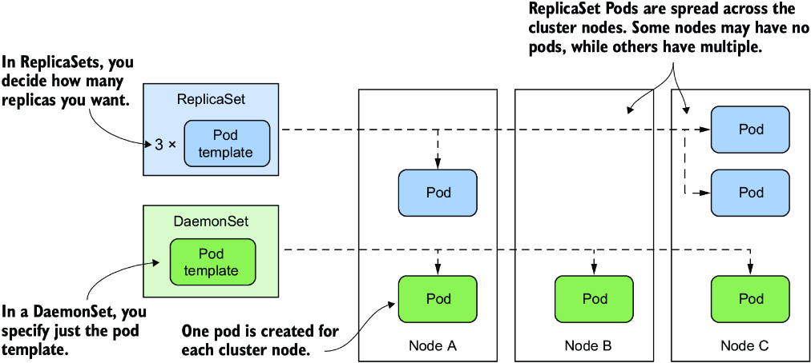
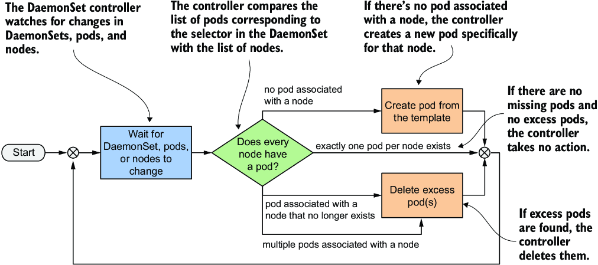
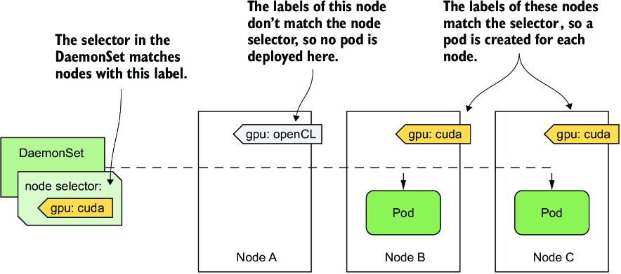
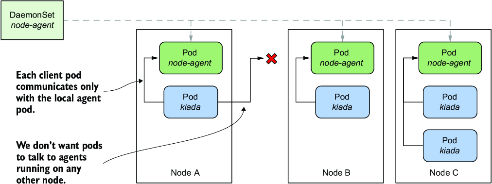
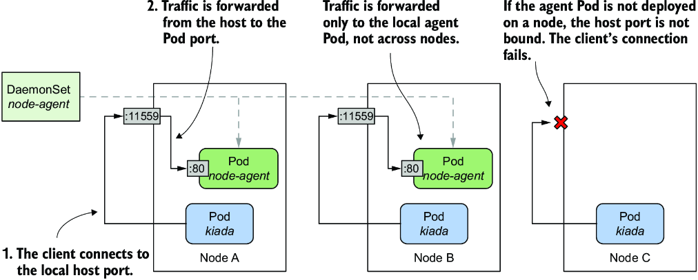
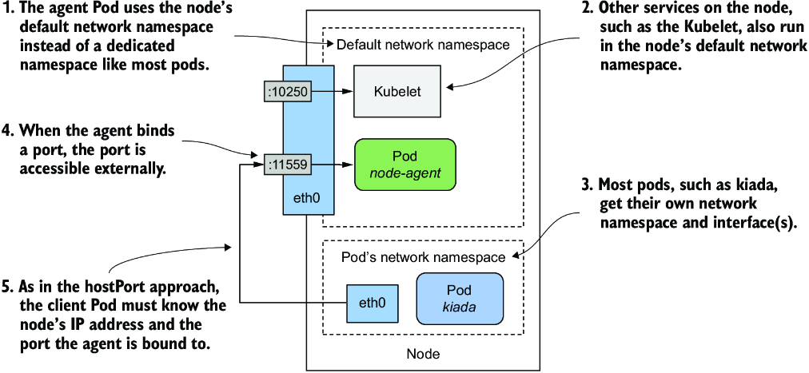
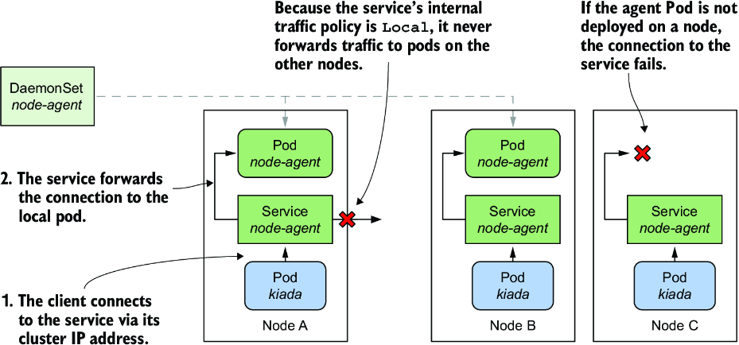

# Chương 17: Triển khai workload trên từng node với DaemonSet

*(Dịch từ "Chapter 17: Deploying per-node workloads with DaemonSets" – Kubernetes in Action, Second Edition, tác giả Marko Lukša, NXB Manning)*

---

## Nội dung chính của chương
* Chạy một agent Pod trên mỗi node của cluster
* Chạy các agent Pod trên một tập con các node
* Cho phép pod truy cập tài nguyên của node chủ (host node)
* Gán priority class (lớp ưu tiên) cho một pod
* Giao tiếp với agent Pod cục bộ

Trong các chương trước, bạn đã học cách dùng Deployment hoặc StatefulSet để phân phối nhiều replica của một workload lên các node trong cluster của bạn. Nhưng nếu bạn muốn chạy đúng một replica trên mỗi node thì sao? Ví dụ, bạn có thể muốn mỗi node chạy một agent hoặc daemon cung cấp một dịch vụ hệ thống như thu thập số liệu (metrics) hoặc tổng hợp log cho node đó. Để triển khai những loại workload này trong Kubernetes, chúng ta dùng DaemonSet.

Trước khi bắt đầu, hãy tạo Namespace `kiada`, chuyển sang thư mục `Chapter17/` và áp dụng tất cả các manifest trong thư mục `SETUP/` bằng cách chạy các lệnh sau:

```bash
$ kubectl create ns kiada
$ kubectl config set-context --current --namespace kiada
$ kubectl apply -f SETUP -R
```

> **GHI CHÚ:** Bạn có thể tìm thấy các file mã nguồn cho chương này tại https://github.com/luksa/kubernetes-in-action-2nd-edition/tree/master/Chapter17.

---

## 17.1 Giới thiệu DaemonSet (Introducing DaemonSets)

DaemonSet là một API object đảm bảo rằng có đúng một replica của một pod chạy trên mỗi node của cluster. Mặc định, các daemon Pod được triển khai trên mọi node, nhưng bạn có thể dùng node selector để giới hạn việc triển khai chỉ trên một số node.

### 17.1.1 Tìm hiểu DaemonSet object (Understanding the DaemonSet object)

Một DaemonSet chứa một Pod template và dùng nó để tạo nhiều pod replica, giống như Deployment, ReplicaSet và StatefulSet. Tuy nhiên, với DaemonSet, bạn không chỉ định số replica mong muốn như với các object khác. Thay vào đó, DaemonSet controller tạo ra số pod bằng đúng số node trong cluster. Nó đảm bảo mỗi pod được lập lịch (schedule) lên một node khác nhau, khác với các pod do ReplicaSet triển khai, nơi nhiều pod có thể được lập lịch lên cùng một node, như minh họa trong hình 17.1.



*Hình 17.1: DaemonSet chạy một pod replica trên mỗi node, trong khi ReplicaSet rải chúng khắp cluster.*

#### Những loại workload nào được triển khai qua DaemonSet và tại sao (What type of workloads are deployed via DaemonSets and why)

DaemonSet thường được dùng để triển khai các pod hạ tầng cung cấp một dạng dịch vụ cấp hệ thống nào đó cho mỗi node của cluster. Điều này bao gồm việc thu thập log cho các tiến trình hệ thống của node cũng như các pod của nó; các daemon giám sát những tiến trình này; các công cụ cung cấp mạng và lưu trữ cho cluster, quản lý việc cài đặt và cập nhật các gói phần mềm; và các dịch vụ cung cấp giao diện tới các thiết bị khác nhau gắn vào node.

Thành phần Kube Proxy, chịu trách nhiệm định tuyến lưu lượng cho các Service object mà bạn tạo trong cluster, thường được triển khai qua một DaemonSet trong Namespace `kube-system`. Plugin Container Network Interface (CNI), thứ cung cấp mạng mà qua đó các pod giao tiếp với nhau, cũng thường được triển khai qua DaemonSet.

Mặc dù bạn có thể chạy phần mềm hệ thống trên các node của cluster bằng những phương pháp tiêu chuẩn như init script hay systemd, việc dùng DaemonSet đảm bảo rằng bạn quản lý mọi workload trong cluster theo cùng một cách.

#### Tìm hiểu hoạt động của DaemonSet controller (Understanding the operation of the DaemonSet controller)

Giống như ReplicaSet và StatefulSet, một DaemonSet chứa một Pod template và một label selector xác định những pod nào thuộc về DaemonSet. Trong mỗi lượt của vòng lặp điều hòa (reconciliation loop), DaemonSet controller tìm các pod khớp với label selector, kiểm tra rằng mỗi node có đúng một pod khớp, và tạo hoặc xóa pod để đảm bảo điều này. Quá trình này được minh họa trong hình 17.2.



*Hình 17.2: Vòng lặp điều hòa của DaemonSet controller*

Khi bạn thêm một node vào cluster, DaemonSet controller tạo một pod mới và liên kết nó với node đó. Khi bạn gỡ bỏ một node, DaemonSet xóa Pod object liên kết với node đó. Nếu một trong các daemon Pod này biến mất, chẳng hạn vì bị xóa thủ công, controller lập tức tạo lại nó. Nếu xuất hiện thêm một pod, chẳng hạn khi bạn tạo một pod khớp với label selector trong DaemonSet, controller lập tức xóa nó.

### 17.1.2 Triển khai pod bằng DaemonSet (Deploying pods with a DaemonSet)

Manifest của một DaemonSet object trông rất giống với manifest của ReplicaSet, Deployment hoặc StatefulSet. Hãy xem một ví dụ DaemonSet tên là `demo`, bạn có thể tìm thấy nó trong kho mã nguồn của sách ở file `ds.demo.yaml`. Listing sau đây cho thấy manifest đầy đủ.

**Listing 17.1: Ví dụ manifest của một DaemonSet**

```yaml
apiVersion: apps/v1              #1
kind: DaemonSet                  #1
metadata:
  name: demo                     #2
spec:
  selector:                      #3
    matchLabels:                 #3
      app: demo                  #3
  template:                      #4
    metadata:                    #4
      labels:                    #4
        app: demo                #4
    spec:                        #4
      containers:                #4
      - name: demo               #4
        image: busybox           #4
        command:                 #4
        - sleep                  #4
        - infinity               #4
```

- **#1** DaemonSet thuộc nhóm API và phiên bản `apps/v1`.
- **#2** DaemonSet này có tên là `demo`.
- **#3** Label selector xác định những pod nào thuộc về DaemonSet này.
- **#4** Đây là Pod template được dùng để tạo các pod cho DaemonSet này.

Kind của DaemonSet object thuộc nhóm/phiên bản API `apps/v1`. Trong phần `spec` của object, bạn chỉ định label `selector` và Pod `template`, giống như với ReplicaSet chẳng hạn. Phần `metadata` bên trong `template` phải chứa các label khớp với `selector`.

> **GHI CHÚ:** Selector là bất biến (immutable), nhưng bạn có thể thay đổi các label miễn là chúng vẫn khớp với selector. Nếu cần thay đổi selector, bạn phải xóa DaemonSet và tạo lại nó. Bạn có thể dùng tùy chọn `--cascade=orphan` để giữ lại các pod trong khi thay thế DaemonSet.

Như bạn thấy trong listing, DaemonSet `demo` triển khai các pod không làm gì khác ngoài thực thi lệnh `sleep`. Đó là vì mục tiêu của bài tập này là quan sát hành vi của chính DaemonSet, chứ không phải của các pod của nó. Ở phần sau của chương này, bạn sẽ tạo một DaemonSet mà các pod của nó thực hiện công việc có ý nghĩa.

#### Kiểm tra nhanh một DaemonSet (Quickly inspecting a DaemonSet)

Tạo DaemonSet bằng cách áp dụng file manifest `ds.demo.yaml` với `kubectl apply`, rồi liệt kê tất cả các DaemonSet trong namespace hiện tại như sau:

```bash
$ kubectl get ds
NAME   DESIRED   CURRENT   READY   UP-TO-DATE   AVAILABLE   NODE SELECTOR   AGE
demo   2         2         2       2            2           <none>          7s
```

> **GHI CHÚ:** Tên viết tắt của DaemonSet là `ds`.

Output của lệnh cho thấy hai pod đã được DaemonSet này tạo ra. Trong trường hợp của bạn, con số này có thể khác vì nó phụ thuộc vào số lượng và loại node trong cluster của bạn, như tôi sẽ giải thích ở phần sau của mục này.

Cũng như với ReplicaSet, Deployment và StatefulSet, bạn có thể chạy `kubectl get` với tùy chọn `-o wide` để hiển thị thêm tên và image của các container cùng với label selector.

```bash
$ kubectl get ds -o wide
NAME   DESIRED   CURRENT   ...   CONTAINERS   IMAGES    SELECTOR
Demo   2         2         ...   demo         busybox   app=demo
```

#### Kiểm tra chi tiết một DaemonSet (Inspecting a DaemonSet in detail)

Tùy chọn `-o wide` là cách nhanh nhất để xem những gì đang chạy trong các pod được tạo bởi mỗi DaemonSet. Nhưng nếu bạn muốn xem thêm nhiều chi tiết hơn nữa về DaemonSet, bạn có thể dùng lệnh `kubectl describe`, lệnh này cho output như sau:

```bash
$ kubectl describe ds demo
Name:           demo                                          #1
Selector:       app=demo                                      #2
Node-Selector:  <none>                                        #3
Labels:         <none>                                        #4
Annotations:    deprecated.daemonset.template.generation: 1   #5
Desired Number of Nodes Scheduled: 2                          #6
Current Number of Nodes Scheduled: 2                          #6
Number of Nodes Scheduled with Up-to-date Pods: 2             #6
Number of Nodes Scheduled with Available Pods: 2              #6
Number of Nodes Misscheduled: 0                               #6
Pods Status:  2 Running / 0 Waiting / 0 Succeeded / 0 Failed  #6
Pod Template:                                                 #7
  Labels:  app=demo                                           #7
  Containers:                                                 #7
   demo:                                                      #7
    Image:      busybox                                       #7
    Port:       <none>                                        #7
    Host Port:  <none>                                        #7
    Command:                                                  #7
      sleep                                                   #7
      infinity                                                #7
    Environment:  <none>                                      #7
    Mounts:       <none>                                      #7
  Volumes:        <none>                                      #7
Events:                                                       #8
  Type    Reason            Age   From                  Message                  #7
  ----    ------            ----  ----                  -------                  #7
  Normal  SuccessfulCreate  40m   daemonset-controller  Created pod: demo-wqd22  #8
  Normal  SuccessfulCreate  40m   daemonset-controller  Created pod: demo-w8tgm  #8
```

- **#1** Tên của DaemonSet
- **#2** Label selector dùng để tìm các pod thuộc về DaemonSet này
- **#3** Một label selector khác, nhưng dành cho node. Nó xác định các Pod của DaemonSet này được triển khai lên những node nào.
- **#4** Các label của DaemonSet này (không phải của các pod của nó)
- **#5** Các annotation của DaemonSet này
- **#6** Số lượng và trạng thái của các pod liên kết
- **#7** Template được dùng để tạo các pod
- **#8** Các event liên kết với DaemonSet này

Output của lệnh `kubectl describe` bao gồm thông tin về các label và annotation của object, label selector dùng để tìm các pod của DaemonSet này, số lượng và trạng thái của những pod đó, template dùng để tạo chúng, và các event liên kết với DaemonSet này.

#### Tìm hiểu status của một DaemonSet (Understanding a DaemonSet's status)

Trong mỗi lần điều hòa, DaemonSet controller báo cáo trạng thái của DaemonSet trong phần `status` của object. Hãy xem status của DaemonSet `demo`. Chạy lệnh sau để in ra manifest YAML của object:

```bash
$ kubectl get ds demo -o yaml
...
status:
  currentNumberScheduled: 2
  desiredNumberScheduled: 2
  numberAvailable: 2
  numberMisscheduled: 0
  numberReady: 2
  observedGeneration: 1
  updatedNumberScheduled: 2
```

Như bạn thấy, status của một DaemonSet bao gồm một số trường kiểu số nguyên. Bảng 17.1 giải thích ý nghĩa của các con số trong những trường này.

**Bảng 17.1: Các trường status của DaemonSet**

| Giá trị | Mô tả |
|---|---|
| `currentNumberScheduled` | Số node đang chạy ít nhất một pod liên kết với DaemonSet này. |
| `desiredNumberScheduled` | Số node lẽ ra phải chạy daemon pod, bất kể chúng có thực sự đang chạy nó hay không |
| `numberAvailable` | Số node đang chạy ít nhất một daemon Pod ở trạng thái sẵn sàng (available) |
| `numberMisscheduled` | Số node đang chạy một daemon Pod nhưng lẽ ra không nên chạy nó |
| `numberReady` | Số node có ít nhất một daemon Pod đang chạy và ready |
| `updatedNumberScheduled` | Số node có daemon Pod đang ở phiên bản hiện hành so với Pod template trong DaemonSet |

Status cũng chứa trường `observedGeneration`, trường này không liên quan gì đến các DaemonSet Pod. Bạn có thể tìm thấy trường này trong hầu hết mọi object khác có `spec` và `status`.

Bạn sẽ nhận thấy rằng tất cả các trường status được giải thích trong bảng trên đều chỉ số lượng node, chứ không phải số pod. Một số mô tả trường cũng ngụ ý rằng có thể có nhiều hơn một daemon pod đang chạy trên một node, mặc dù DaemonSet được cho là chạy đúng một pod trên mỗi node. Lý do là khi bạn cập nhật Pod template của DaemonSet, controller chạy một pod mới song song với pod cũ cho đến khi pod mới sẵn sàng (available). Khi bạn quan sát status của một DaemonSet, bạn không quan tâm đến tổng số pod trong cluster, mà đến số node mà DaemonSet phục vụ.

#### Tìm hiểu vì sao số daemon Pod ít hơn số node (Understanding why there are fewer daemon Pods than nodes)

Trong mục trước, bạn đã thấy status của DaemonSet cho biết có hai pod liên kết với DaemonSet `demo`. Điều này thật bất ngờ vì cluster của tôi có ba node, chứ không phải chỉ hai.

Tôi đã đề cập rằng bạn có thể dùng node selector để giới hạn các pod của một DaemonSet chỉ trên một số node. Tuy nhiên, DaemonSet `demo` không chỉ định node selector, nên bạn sẽ kỳ vọng ba pod được tạo trong một cluster có ba node. Chuyện gì đang xảy ra ở đây? Hãy làm rõ bí ẩn này bằng cách liệt kê các daemon Pod với cùng label selector được định nghĩa trong DaemonSet.

> **GHI CHÚ:** Đừng nhầm lẫn label selector với node selector; cái trước được dùng để liên kết pod với DaemonSet, còn cái sau được dùng để liên kết pod với node.

Label selector trong DaemonSet là `app=demo`. Truyền nó cho lệnh `kubectl get` với tùy chọn `-l` (hoặc `--selector`). Ngoài ra, hãy dùng tùy chọn `-o wide` để hiển thị node của từng pod. Lệnh đầy đủ và output của nó như sau:

```bash
$ kubectl get pods -l app=demo -o wide
NAME         READY   STATUS    RESTARTS   AGE   IP            NODE           ...
demo-w8tgm   1/1     Running   0          80s   10.244.2.42   kind-worker    ...
demo-wqd22   1/1     Running   0          80s   10.244.1.64   kind-worker2   ...
```

Bây giờ hãy liệt kê các node trong cluster và so sánh hai danh sách:

```bash
$ kubectl get nodes
NAME                 STATUS   ROLES                  AGE   VERSION
kind-control-plane   Ready    control-plane,master   22h   v1.23.4
kind-worker          Ready    <none>                 22h   v1.23.4
kind-worker2         Ready    <none>                 22h   v1.23.4
```

Có vẻ như DaemonSet controller chỉ triển khai pod trên các worker node, chứ không trên master node đang chạy các thành phần control plane của cluster. Tại sao vậy?

Thực tế, nếu bạn đang dùng một cluster nhiều node, rất có thể không pod nào bạn đã triển khai trong các chương trước được lập lịch lên node chứa control plane, chẳng hạn Node `kind-control-plane` trong một cluster được tạo bằng công cụ kind. Như tên gọi của nó, node này được dành riêng để chỉ chạy các thành phần Kubernetes điều khiển cluster. Trong chương 2, bạn đã học rằng container giúp cô lập các workload, nhưng sự cô lập này không tốt bằng khi bạn dùng nhiều máy ảo hoặc máy vật lý riêng biệt. Một workload hoạt động sai trên control plane node có thể ảnh hưởng tiêu cực đến hoạt động của toàn bộ cluster. Vì lý do này, Kubernetes chỉ lập lịch workload lên các control plane node nếu bạn cho phép một cách tường minh. Quy tắc này cũng áp dụng cho các workload được triển khai qua DaemonSet.

#### Triển khai daemon Pod trên các control plane node (Deploying daemon Pods on control plane nodes)

Cơ chế ngăn các pod thông thường được lập lịch lên control plane node được gọi là taint và toleration. Ở đây, bạn sẽ chỉ học cách làm cho DaemonSet triển khai pod lên tất cả các node. Điều này có thể cần thiết nếu các daemon pod cung cấp một dịch vụ quan trọng cần chạy trên mọi node trong cluster. Bản thân Kubernetes có ít nhất một dịch vụ như vậy – Kube Proxy. Trong hầu hết các cluster ngày nay, Kube Proxy được triển khai qua DaemonSet. Bạn có thể kiểm tra xem cluster của mình có như vậy không bằng cách liệt kê các DaemonSet trong namespace `kube-system` như sau:

```bash
$ kubectl get ds -n kube-system
NAME         DESIRED   CURRENT   READY   UP-TO-DATE   AVAILABLE   NODE SELECTOR      AGE
kindnet      3         3         3       3            3           <none>             23h
kube-proxy   3         3         3       3            3           kubernetes.io...   23h
```

Nếu, giống như tôi, bạn dùng công cụ kind để chạy cluster, bạn sẽ thấy hai DaemonSet. Bên cạnh DaemonSet `kube-proxy`, bạn cũng sẽ thấy một DaemonSet tên là `kindnet`. DaemonSet này triển khai các pod cung cấp mạng giữa tất cả các pod trong cluster thông qua CNI, tức Container Network Interface.

Các con số trong output của lệnh trước cho thấy các pod của những DaemonSet này được triển khai trên tất cả các node của cluster. Manifest của chúng tiết lộ cách chúng làm điều đó. Hiển thị manifest của DaemonSet `kube-proxy` như sau và tìm các dòng mà tôi đã đánh dấu:

```bash
$ kubectl get ds kube-proxy -n kube-system -o yaml
apiVersion: apps/v1
kind: DaemonSet
...
spec:
  template:
    spec:
      ...
      tolerations:           #1
      - operator: Exists     #1
      volumes:
      ...
```

- **#1** Điều này cho Kubernetes biết rằng các pod được tạo từ template này dung nạp (tolerate) mọi taint của node.

Những dòng được đánh dấu không tự giải thích được, và khó có thể giải thích chúng mà không đi vào chi tiết về taint và toleration. Nói ngắn gọn, một số node có thể chỉ định các taint, và một pod phải dung nạp các taint của node thì mới được lập lịch lên node đó. Hai dòng trong ví dụ trên cho phép pod dung nạp mọi taint có thể có, vì vậy hãy xem chúng như một cách để triển khai daemon Pod lên tuyệt đối tất cả các node.

Như bạn thấy, những dòng này là một phần của Pod template chứ không phải thuộc tính trực tiếp của DaemonSet. Dù vậy, chúng vẫn được DaemonSet controller xem xét, vì sẽ vô nghĩa nếu tạo ra một pod mà node từ chối.

#### Kiểm tra một daemon Pod (Inspecting a daemon Pod)

Bây giờ hãy quay lại DaemonSet `demo` để tìm hiểu thêm về các pod mà nó tạo ra. Lấy một trong các pod này và hiển thị manifest của nó như sau:

```bash
$ kubectl get po demo-w8tgm -o yaml                       #1
apiVersion: v1
kind: Pod
metadata:
  creationTimestamp: "2022-03-23T19:50:35Z"
  generateName: demo-
  labels:                                                 #2
    app: demo                                             #2
    controller-revision-hash: 8669474b5b                  #2
    pod-template-generation: "1"                          #2
  name: demo-w8tgm
  namespace: bookinfo
  ownerReferences:                                        #3
  - apiVersion: apps/v1                                   #3
    blockOwnerDeletion: true                              #3
    controller: true                                      #3
    kind: DaemonSet                                       #3
    name: demo                                            #3
    uid: 7e1da779-248b-4ff1-9bdb-5637dc6b5b86             #3
  resourceVersion: "67969"                                #3
  uid: 2d044e7f-a237-44ee-aa4d-1fe42c39da4e
spec:
  affinity:                                               #4
    nodeAffinity:                                         #4
      requiredDuringSchedulingIgnoredDuringExecution:     #4
        nodeSelectorTerms:                                #4
        - matchFields:                                    #4
          - key: metadata.name                            #4
            operator: In                                  #4
            values:                                       #4
            - kind-worker                                 #4
  containers:                                             #4
  ...                                                     #4
```

- **#1** Thay tên pod bằng một pod trong cluster của bạn.
- **#2** Một label đến từ Pod template, còn hai label kia được DaemonSet controller thêm vào.
- **#3** Các daemon Pod được sở hữu trực tiếp bởi DaemonSet.
- **#4** Mỗi pod có affinity với một node cụ thể.

Mỗi pod trong DaemonSet nhận các label mà bạn định nghĩa trong Pod template, cộng thêm một số label bổ sung mà chính DaemonSet controller thêm vào. Bạn có thể bỏ qua label `pod-template-generation` vì nó đã lỗi thời. Nó đã được thay thế bằng label `controller-revision-hash`. Bạn có thể nhớ đã thấy label này trong các StatefulSet Pod ở chương trước. Nó phục vụ cùng mục đích – cho phép controller phân biệt giữa các pod được tạo bằng Pod template cũ và Pod template mới trong quá trình cập nhật.

Trường `ownerReferences` cho thấy các daemon Pod thuộc trực tiếp về DaemonSet object, giống như các stateful Pod thuộc về StatefulSet object. Không có object nào nằm giữa DaemonSet và các pod, như trường hợp của Deployment và các pod của nó.

Mục cuối cùng trong manifest của một daemon Pod mà tôi muốn bạn lưu ý là phần `spec.affinity`. Bạn hẳn có thể nhận ra rằng trường `nodeAffinity` cho biết pod cụ thể này cần được lập lịch lên Node `kind-worker`. Phần này của manifest không có trong Pod template của DaemonSet mà được DaemonSet controller thêm vào từng pod nó tạo ra. Node affinity của mỗi pod được cấu hình khác nhau để đảm bảo pod được lập lịch lên một node cụ thể.

Trong các phiên bản Kubernetes cũ hơn, DaemonSet controller chỉ định node đích trong trường `spec.nodeName` của Pod, điều đó có nghĩa là DaemonSet controller lập lịch pod trực tiếp mà không cần đến Kubernetes Scheduler. Hiện nay, DaemonSet controller đặt trường `nodeAffinity` và để trống trường `nodeName`. Điều này giao việc lập lịch cho Scheduler, thành phần cũng tính đến yêu cầu tài nguyên và các thuộc tính khác của Pod.

### 17.1.3 Triển khai lên một tập con các Node bằng node selector (Deploying to a subset of Nodes with a node selector)

Một DaemonSet triển khai pod lên tất cả các node của cluster không có taint mà pod không dung nạp, nhưng bạn có thể muốn một workload cụ thể chỉ chạy trên một tập con của những node đó. Ví dụ, nếu chỉ một số node có phần cứng đặc biệt, bạn có thể muốn chạy phần mềm liên quan chỉ trên những node đó chứ không phải tất cả. Với DaemonSet, bạn có thể làm vậy bằng cách chỉ định node selector trong Pod template. Lưu ý sự khác biệt giữa node selector và pod selector. DaemonSet controller dùng cái trước để lọc các node đủ điều kiện, còn dùng cái sau để biết những pod nào thuộc về DaemonSet. Như minh họa trong hình 17.3, DaemonSet chỉ tạo pod cho một node cụ thể nếu các label của node khớp với node selector.



*Hình 17.3: Node selector được dùng để triển khai DaemonSet Pod lên một tập con các node của cluster.*

Hình vẽ cho thấy một DaemonSet chỉ triển khai pod trên các node có GPU hỗ trợ CUDA và được gắn label `gpu: cuda`. DaemonSet controller chỉ triển khai pod trên node B và C, nhưng bỏ qua node A, vì label của nó không khớp với node selector được chỉ định trong DaemonSet.

> **GHI CHÚ:** CUDA hay Compute Unified Device Architecture là một nền tảng tính toán song song và API cho phép phần mềm sử dụng các bộ xử lý đồ họa (GPU) tương thích cho việc xử lý đa dụng.

#### Chỉ định node selector trong DaemonSet (Specifying a node selector in the DaemonSet)

Bạn chỉ định node selector trong trường `spec.nodeSelector` của Pod template. Listing sau đây cho thấy cùng DaemonSet `demo` mà bạn đã tạo trước đó, nhưng với một `nodeSelector` được cấu hình để DaemonSet chỉ triển khai pod lên các node có label `gpu: cuda`. Bạn có thể tìm thấy manifest này trong file `ds.demo.nodeSelector.yaml`.

**Listing 17.2: Một DaemonSet với node selector**

```yaml
apiVersion: apps/v1
kind: DaemonSet
metadata:
  name: demo
  labels:
    app: demo
spec:
  selector:
    matchLabels:
      app: demo
  template:
    metadata:
      labels:
        app: demo
    spec:
      nodeSelector:          #1
        gpu: cuda            #1
      containers:
      - name: demo
        image: busybox
        command:
        - sleep
        - infinity
```

- **#1** Các pod của DaemonSet này chỉ được triển khai trên những node có label này.

Dùng lệnh `kubectl apply` để cập nhật DaemonSet `demo` với file manifest này. Dùng lệnh `kubectl get` để xem status của DaemonSet:

```bash
$ kubectl get ds
NAME   DESIRED   CURRENT   READY   UP-TO-DATE   AVAILABLE   NODE SELECTOR   AGE
demo   0         0         0       0            0           gpu=cuda        46m   #1
```

- **#1** DaemonSet này chỉ triển khai pod lên các node khớp với node selector.

Như bạn thấy, hiện không có pod nào được DaemonSet `demo` triển khai vì không có node nào khớp với node selector được chỉ định trong DaemonSet. Bạn có thể xác nhận điều này bằng cách liệt kê các node với node selector như sau:

```bash
$ kubectl get nodes -l gpu=cuda
No resources found
```

#### Đưa node vào và ra khỏi phạm vi của DaemonSet bằng cách thay đổi label của chúng (Moving nodes in and out of scope of a DaemonSet by changing their labels)

Bây giờ hãy tưởng tượng bạn vừa lắp một GPU hỗ trợ CUDA vào Node `kind-worker2`. Bạn thêm label vào node như sau:

```bash
$ kubectl label node kind-worker2 gpu=cuda
node/kind-worker2 labeled
```

DaemonSet controller không chỉ theo dõi (watch) các DaemonSet và Pod mà còn cả các Node object. Khi phát hiện thay đổi trong các label của Node `kind-worker2`, nó chạy vòng lặp điều hòa và tạo một pod cho node này, vì giờ đây node đã khớp với node selector. Liệt kê các pod để xác nhận:

```bash
$ kubectl get pods -l app=demo -o wide
NAME         READY   STATUS    RESTARTS   AGE   IP            NODE           ...
demo-jbhqg   1/1     Running   0          16s   10.244.1.65   kind-worker2   ...
```

Khi bạn gỡ label khỏi node, controller xóa pod:

```bash
$ kubectl label node kind-worker2 gpu-          #1
node/kind-worker2 unlabeled

$ kubectl get pods -l app=demo
NAME         READY   STATUS        RESTARTS   AGE
demo-jbhqg   1/1     Terminating   0          71s   #2
```

- **#1** Bạn gỡ label `gpu` khỏi Node.
- **#2** DaemonSet controller xóa Pod.

#### Dùng các label chuẩn của node trong DaemonSet (Using standard node labels in DaemonSets)

Kubernetes tự động thêm một số label chuẩn vào mỗi node. Dùng lệnh `kubectl describe` để xem chúng. Ví dụ, các label của node `kind-worker2` của tôi như sau:

```bash
$ kubectl describe node kind-worker2
Name:               kind-worker2
Roles:              <none>
Labels:             gpu=cuda
                    kubernetes.io/arch=amd64
                    kubernetes.io/hostname=kind-worker2
                    kubernetes.io/os=linux
```

Bạn có thể dùng những label này trong các DaemonSet của mình để triển khai pod dựa trên thuộc tính của từng node. Ví dụ, nếu cluster của bạn gồm các node không đồng nhất dùng các hệ điều hành hoặc kiến trúc khác nhau, bạn cấu hình DaemonSet nhắm đến một OS và/hoặc kiến trúc cụ thể bằng cách dùng các label `kubernetes.io/arch` và `kubernetes.io/os` trong node selector của nó.

Giả sử cluster của bạn gồm các node dựa trên AMD và ARM. Bạn có hai phiên bản container image của node agent. Một được biên dịch cho CPU AMD và một cho CPU ARM. Bạn có thể tạo một DaemonSet để triển khai image dựa trên AMD lên các node AMD, và một DaemonSet riêng để triển khai image dựa trên ARM lên các node còn lại. DaemonSet thứ nhất sẽ dùng node selector sau:

```yaml
nodeSelector:
  kubernetes.io/arch: amd64
```

DaemonSet còn lại sẽ dùng node selector sau:

```yaml
nodeSelector:
  kubernetes.io/arch: arm
```

Cách tiếp cận dùng nhiều DaemonSet này là lý tưởng nếu cấu hình của hai loại pod không chỉ khác nhau ở container image mà còn ở lượng tài nguyên tính toán bạn muốn cấp cho mỗi container.

> **GHI CHÚ:** Bạn không cần nhiều DaemonSet nếu chỉ muốn mỗi node chạy đúng biến thể container image phù hợp với kiến trúc của node và không có khác biệt nào khác giữa các pod. Trong trường hợp này, dùng một DaemonSet duy nhất với container image đa kiến trúc (multiarch) là lựa chọn tốt hơn.

#### Cập nhật node selector (Updating the node selector)

Khác với pod label selector, node selector là có thể thay đổi (mutable). Bạn có thể thay đổi nó bất cứ khi nào muốn thay đổi tập node mà DaemonSet nhắm đến. Một cách để thay đổi selector là dùng lệnh `kubectl patch`. Trong chương 15, bạn đã học cách patch một object bằng cách chỉ định phần manifest mà bạn muốn cập nhật. Tuy nhiên, bạn cũng có thể cập nhật một object bằng cách chỉ định một danh sách các thao tác patch theo định dạng JSON patch. Bạn có thể tìm hiểu thêm về định dạng này tại jsonpatch.com. Ở đây tôi cho bạn xem một ví dụ về cách dùng JSON patch để gỡ trường `nodeSelector` khỏi manifest của DaemonSet `demo`:

```bash
$ kubectl patch ds demo --type='json' -p='[{
"op": "remove",
"path": "/spec/template/spec/nodeSelector"}]'
daemonset.apps/demo patched
```

Thay vì cung cấp một phần đã cập nhật của manifest object, JSON patch trong lệnh này chỉ định rằng trường `spec.template.spec.nodeSelector` cần được gỡ bỏ.

### 17.1.4 Cập nhật một DaemonSet (Updating a DaemonSet)

Cũng như với Deployment và StatefulSet, khi bạn cập nhật Pod template trong một DaemonSet, controller tự động xóa các pod thuộc về DaemonSet và thay thế chúng bằng các pod được tạo từ template mới. Bạn có thể cấu hình chiến lược cập nhật (update strategy) sẽ dùng trong trường `spec.updateStrategy` của manifest DaemonSet object, nhưng trường `spec.minReadySeconds` cũng đóng một vai trò, giống như với Deployment và StatefulSet. Tại thời điểm viết sách, DaemonSet hỗ trợ các chiến lược được liệt kê trong bảng 17.2.

**Bảng 17.2: Các chiến lược cập nhật DaemonSet được hỗ trợ**

| Giá trị | Mô tả |
|---|---|
| `RollingUpdate` | Trong chiến lược cập nhật này, các pod được thay thế lần lượt từng cái một. Khi một pod bị xóa và được tạo lại, controller chờ cho đến khi pod mới ready. Sau đó nó chờ thêm một khoảng thời gian, được chỉ định trong trường `spec.minReadySeconds` của DaemonSet, trước khi cập nhật các pod trên những node khác. Đây là chiến lược mặc định. |
| `OnDelete` | DaemonSet controller thực hiện việc cập nhật theo cách bán tự động. Nó chờ bạn xóa thủ công từng pod rồi mới thay thế nó bằng một pod mới từ template đã cập nhật. Với chiến lược này, bạn có thể thay thế các pod theo nhịp độ của riêng mình. |

Chiến lược `RollingUpdate` tương tự như trong Deployment, còn chiến lược `OnDelete` giống hệt như trong StatefulSet. Cũng như trong Deployment, bạn có thể cấu hình chiến lược `RollingUpdate` bằng các tham số `maxSurge` và `maxUnavailable`, nhưng giá trị mặc định của những tham số này trong DaemonSet thì khác. Mục tiếp theo giải thích tại sao.

#### Chiến lược RollingUpdate (The RollingUpdate strategy)

Để cập nhật các pod của DaemonSet `demo`, dùng lệnh `kubectl apply` để áp dụng file manifest `ds.demo.v2.rollingUpdate.yaml`. Nội dung của nó được thể hiện trong listing sau.

**Listing 17.3: Chỉ định chiến lược RollingUpdate trong một DaemonSet**

```yaml
apiVersion: apps/v1
kind: DaemonSet
metadata:
  name: demo
spec:
  minReadySeconds: 30          #1
  updateStrategy:              #2
    type: RollingUpdate        #2
    rollingUpdate:             #2
      maxSurge: 0              #2
      maxUnavailable: 1        #2
  selector:                    #2
    matchLabels:
      app: demo
  template:
    metadata:
      labels:
        app: demo
        ver: v2                #3
    spec:
      ...
```

- **#1** Mỗi pod phải ready trong 30 giây thì mới được xem là sẵn sàng (available).
- **#2** Chiến lược `RollingUpdate` được dùng, với các tham số được chỉ định.
- **#3** Pod template đã cập nhật thêm một label phiên bản vào pod.

Trong listing, kiểu (`type`) của `updateStrategy` là `RollingUpdate`, với `maxSurge` đặt là `0` và `maxUnavailable` đặt là `1`.

> **GHI CHÚ:** Đây là các giá trị mặc định, nên bạn cũng có thể bỏ hẳn trường `updateStrategy`, và việc cập nhật vẫn được thực hiện theo cùng cách.

Khi bạn áp dụng manifest này, các pod được thay thế như sau:

```bash
$ kubectl get pods -l app=demo -L ver
NAME         READY   STATUS        RESTARTS   AGE    VER
demo-5nrz4   1/1     Terminating   0          10m          #1
demo-vx27t   1/1     Running       0          11m          #1

$ kubectl get pods -l app=demo -L ver
NAME         READY   STATUS        RESTARTS   AGE    VER
demo-k2d6k   1/1     Running       0          36s    v2    #2
demo-vx27t   1/1     Terminating   0          11m          #2

$ kubectl get pods -l app=demo -L ver
NAME         READY   STATUS        RESTARTS   AGE    VER
demo-k2d6k   1/1     Running       0          126s   v2    #3
demo-s7hsc   1/1     Running       0          62s    v2    #3
```

- **#1** Đầu tiên, một pod trên một node bị xóa.
- **#2** Sau khi pod thay thế trên node thứ nhất đã ready được 30 giây, pod trên node tiếp theo bị xóa.
- **#3** Khi pod thay thế trên node thứ hai đã ready được 30 giây, việc cập nhật hoàn tất.

Vì `maxSurge` được đặt là 0, DaemonSet controller dừng daemon Pod hiện có trước rồi mới tạo pod mới. Tình cờ là 0 cũng chính là giá trị mặc định của `maxSurge`, vì đây là hành vi hợp lý nhất cho các daemon Pod, xét đến việc các workload trong những pod này thường là node agent và daemon, mà tại một thời điểm chỉ nên có một instance duy nhất chạy.

Nếu bạn đặt `maxSurge` lớn hơn 0, hai instance của pod sẽ chạy trên node trong quá trình cập nhật trong khoảng thời gian được chỉ định ở trường `minReadySeconds`. Hầu hết các daemon không hỗ trợ chế độ này vì chúng dùng khóa (lock) để ngăn nhiều instance chạy đồng thời. Nếu bạn cố cập nhật một daemon như vậy theo cách này, pod mới sẽ không bao giờ ready vì nó không thể lấy được khóa, và việc cập nhật sẽ thất bại.

Tham số `maxUnavailable` được đặt là 1, nghĩa là DaemonSet controller chỉ cập nhật một node tại một thời điểm. Nó không bắt đầu cập nhật pod trên node tiếp theo cho đến khi pod trên node trước đó đã ready và sẵn sàng (available). Bằng cách này, chỉ một node bị ảnh hưởng nếu phiên bản mới của workload chạy trong pod mới không thể khởi động.

Nếu bạn muốn các pod được cập nhật với tốc độ cao hơn, hãy tăng tham số `maxUnavailable`. Nếu bạn đặt nó thành một giá trị lớn hơn số node trong cluster, các daemon Pod sẽ được cập nhật trên tất cả các node cùng lúc, giống như chiến lược `Recreate` trong Deployment.

> **MẸO:** Để hiện thực chiến lược cập nhật `Recreate` trong một DaemonSet, hãy đặt tham số `maxSurge` là `0` và `maxUnavailable` là `10000` hoặc lớn hơn, sao cho giá trị này luôn cao hơn số node trong cluster của bạn.

Một điểm cần lưu ý quan trọng với rolling update của DaemonSet là nếu readiness probe của một daemon pod hiện có thất bại, DaemonSet controller lập tức xóa pod đó và thay thế nó bằng một pod với template đã cập nhật. Trong trường hợp này, các tham số `maxSurge` và `maxUnavailable` bị bỏ qua.

Tương tự, nếu bạn xóa một pod hiện có trong lúc rolling update, nó sẽ được thay thế bằng một pod mới. Điều tương tự cũng xảy ra nếu bạn cấu hình DaemonSet với chiến lược cập nhật `OnDelete`. Hãy cùng xem nhanh chiến lược này nữa.

#### Chiến lược cập nhật OnDelete (The OnDelete update strategy)

Một lựa chọn thay thế cho chiến lược `RollingUpdate` là `OnDelete`. Như bạn đã biết từ chương trước về StatefulSet, đây là chiến lược bán tự động cho phép bạn phối hợp với DaemonSet controller để thay thế các pod theo ý mình, như trong bài tập tiếp theo. Listing sau đây cho thấy nội dung của file manifest `ds.demo.v3.onDelete.yaml`.

**Listing 17.4: Chỉ định chiến lược OnDelete trong một DaemonSet**

```yaml
apiVersion: apps/v1
kind: DaemonSet
metadata:
  name: demo
spec:
  updateStrategy:        #1
    type: OnDelete       #1
  selector:
    matchLabels:
      app: demo
  template:
    metadata:
      labels:
        app: demo
        ver: v3          #2
    spec:
      ...
```

- **#1** Chiến lược cập nhật `OnDelete` được dùng. Chiến lược này không có tham số nào để bạn thiết lập.
- **#2** Pod template được cập nhật để đặt label phiên bản là `v3`.

Chiến lược `OnDelete` không có tham số nào bạn có thể thiết lập để ảnh hưởng đến cách nó hoạt động, vì controller chỉ cập nhật những pod mà bạn xóa thủ công. Áp dụng file manifest này bằng `kubectl apply` rồi kiểm tra DaemonSet như sau để thấy rằng DaemonSet controller không thực hiện hành động nào:

```bash
$ kubectl get ds
NAME   DESIRED   CURRENT   READY   UP-TO-DATE   AVAILABLE   NODE SELECTOR   AGE
demo   2         2         2       0            2           <none>          80m
```

Output của lệnh `kubectl get ds` cho thấy không Pod nào trong DaemonSet này là mới nhất (up to date). Điều này là dễ hiểu vì bạn đã cập nhật Pod template trong DaemonSet, nhưng các Pod chưa được cập nhật, như bạn có thể thấy khi liệt kê chúng:

```bash
$ kubectl get pods -l app=demo -L ver
NAME         READY   STATUS    RESTARTS   AGE   VER
demo-k2d6k   1/1     Running   0          10m   v2    #1
demo-s7hsc   1/1     Running   0          10m   v2    #1
```

- **#1** Cả hai pod vẫn ở v2, nhưng giá trị label phiên bản trong Pod template là v3.

Để cập nhật các pod, bạn phải xóa chúng thủ công. Bạn có thể xóa bao nhiêu pod tùy ý và theo bất kỳ thứ tự nào, nhưng lúc này hãy chỉ xóa một pod thôi. Chọn một pod và xóa nó như sau:

```bash
$ kubectl delete po demo-k2d6k --wait=false      #1
pod "demo-k2d6k" deleted
```

- **#1** Thay tên pod bằng một trong các pod của bạn.

Bạn có thể nhớ rằng, theo mặc định, lệnh `kubectl delete` không thoát cho đến khi việc xóa object hoàn tất. Nếu bạn dùng tùy chọn `--wait=false`, lệnh sẽ đánh dấu object để xóa và thoát mà không chờ pod thực sự bị xóa. Bằng cách này, bạn có thể theo dõi những gì diễn ra phía sau bằng cách liệt kê các pod nhiều lần như sau:

```bash
$ kubectl get pods -l app=demo -L ver
NAME         READY   STATUS        RESTARTS   AGE   VER
demo-k2d6k   1/1     Terminating   0          10m   v2    #1
demo-s7hsc   1/1     Running       0          10m   v2    #1

$ kubectl get pods -l app=demo -L ver
NAME         READY   STATUS    RESTARTS   AGE   VER
demo-4gf5h   1/1     Running   0          15s   v3    #2
demo-s7hsc   1/1     Running   0          11m   v2    #2
```

- **#1** Pod mà bạn đã xóa đang được kết thúc.
- **#2** Pod mà bạn đã xóa đã được thay thế bằng một pod phiên bản 3, nhưng pod còn lại vẫn ở v2.

Nếu bạn liệt kê các DaemonSet bằng lệnh `kubectl get` như sau, bạn sẽ thấy chỉ một pod đã được cập nhật:

```bash
$ kubectl get ds
NAME   DESIRED   CURRENT   READY   UP-TO-DATE   AVAILABLE   NODE SELECTOR   AGE
demo   2         2         2       1            2           <none>          91m   #1
```

- **#1** Một pod đã được cập nhật.

Xóa (các) pod còn lại để hoàn tất việc cập nhật.

#### Cân nhắc dùng chiến lược OnDelete cho các daemon Pod quan trọng (Considering the use of the OnDelete strategy for critical daemon Pods)

Với chiến lược này, bạn có thể cập nhật các pod quan trọng đối với cluster với mức kiểm soát cao hơn nhiều, dù tốn công hơn. Bằng cách này, bạn có thể chắc chắn rằng việc cập nhật sẽ không làm hỏng toàn bộ cluster, điều có thể xảy ra với một bản cập nhật hoàn toàn tự động nếu readiness probe trong daemon Pod không thể phát hiện mọi vấn đề có thể có.

Ví dụ, readiness probe được định nghĩa trong DaemonSet có lẽ không kiểm tra xem các pod khác trên cùng node có còn hoạt động đúng hay không. Nếu daemon Pod đã cập nhật ready trong khoảng `minReadySeconds`, controller sẽ tiếp tục cập nhật trên node tiếp theo, ngay cả khi việc cập nhật trên node thứ nhất đã khiến tất cả các pod khác trên node đó bị lỗi. Chuỗi lỗi dây chuyền này có thể làm sập toàn bộ cluster của bạn. Tuy nhiên, nếu bạn thực hiện cập nhật bằng chiến lược `OnDelete`, bạn có thể kiểm tra hoạt động của các pod khác sau khi cập nhật mỗi daemon Pod và trước khi xóa pod tiếp theo.

### 17.1.5 Xóa DaemonSet (Deleting the DaemonSet)

Để kết thúc phần giới thiệu về DaemonSet này, hãy xóa DaemonSet `demo` như sau:

```bash
$ kubectl delete ds demo
daemonset.apps "demo" deleted
```

Như bạn mong đợi, làm vậy cũng sẽ xóa tất cả các Pod `demo`. Để xác nhận, hãy liệt kê các pod như sau:

```bash
$ kubectl get pods -l app=demo
NAME         READY   STATUS        RESTARTS   AGE
demo-4gf5h   1/1     Terminating   0          2m22s
demo-s7hsc   1/1     Terminating   0          6m53s
```

Đến đây kết thúc phần giải thích về bản thân DaemonSet, nhưng các pod được triển khai qua DaemonSet khác với các pod được triển khai qua Deployment và StatefulSet ở chỗ chúng thường truy cập hệ thống file, (các) giao diện mạng hoặc phần cứng khác của node chủ. Bạn sẽ tìm hiểu về điều này trong mục tiếp theo.

---

## 17.2 Các tính năng đặc biệt trong pod chạy node agent và daemon (Special features in pods running node agents and daemons)

Khác với các workload thông thường, vốn thường được cô lập khỏi node mà chúng chạy trên đó, node agent và daemon thường yêu cầu quyền truy cập rộng hơn vào node. Như bạn đã biết, các container chạy trong một pod không thể truy cập các thiết bị và file của node, hay tất cả các lời gọi hệ thống (system call) tới kernel của node, vì chúng sống trong các Linux namespace của riêng mình (xem chương 2). Nếu bạn muốn một daemon, agent hoặc workload khác chạy trong pod được miễn trừ khỏi hạn chế này, bạn phải chỉ định điều đó trong manifest của pod.

Để giải thích cách bạn có thể làm điều này, hãy xem các DaemonSet trong namespace `kube-system`. Nếu bạn chạy Kubernetes qua kind, cluster của bạn hẳn chứa hai DaemonSet như sau:

```bash
$ kubectl get ds -n kube-system
NAME         DESIRED   CURRENT   READY   UP-TO-DATE   AVAILABLE   NODE SELECTOR      AGE
kindnet      3         3         3       3            3           <none>             23h
kube-proxy   3         3         3       3            3           kubernetes.io...   23h
```

Nếu bạn không dùng kind, danh sách DaemonSet trong `kube-system` có thể trông khác, nhưng bạn hẳn sẽ tìm thấy DaemonSet `kube-proxy` trong hầu hết các cluster, nên tôi sẽ tập trung vào DaemonSet này.

### 17.2.1 Cấp cho container quyền truy cập kernel của hệ điều hành (Giving containers access to the OS kernel)

Kernel của hệ điều hành cung cấp các lời gọi hệ thống mà các chương trình có thể dùng để tương tác với hệ điều hành và phần cứng. Một số lời gọi này là vô hại, trong khi những lời gọi khác có thể ảnh hưởng tiêu cực đến hoạt động của node hoặc các container khác đang chạy trên đó. Vì lý do này, container không được phép thực thi những lời gọi này trừ khi được cho phép một cách tường minh. Điều này có thể đạt được theo hai cách. Bạn có thể cấp cho container toàn quyền truy cập kernel, hoặc truy cập các nhóm lời gọi hệ thống bằng cách chỉ định các capability (khả năng) sẽ được cấp cho container.

#### Chạy một container đặc quyền (Running a privileged container)

Nếu bạn muốn cấp cho một tiến trình chạy trong container toàn quyền truy cập kernel của hệ điều hành, bạn có thể đánh dấu container là đặc quyền (privileged). Bạn có thể xem cách làm điều này bằng cách kiểm tra pod template trong DaemonSet `kube-proxy` như sau:

```bash
$ kubectl -n kube-system get ds kube-proxy -o yaml
apiVersion: apps/v1
kind: DaemonSet
spec:
  template:
    spec:
      containers:
      - name: kube-proxy
        securityContext:        #1
          privileged: true      #1
        ...
```

- **#1** Container `kube-proxy` được đánh dấu là privileged.

DaemonSet `kube-proxy` chạy các pod có một container duy nhất, cũng tên là `kube-proxy`. Trong phần `securityContext` của định nghĩa container này, cờ `privileged` được đặt là `true`. Điều này cấp cho tiến trình chạy trong container `kube-proxy` quyền truy cập root vào kernel của máy chủ và cho phép nó sửa đổi các quy tắc lọc gói tin mạng của node. Đây là cách các Kubernetes Service được hiện thực.

#### Cấp cho container quyền truy cập các capability cụ thể (Giving a container access to specific capabilities)

Một container đặc quyền bỏ qua mọi kiểm tra quyền của kernel và do đó có toàn quyền truy cập kernel, trong khi một node agent hoặc daemon thường chỉ cần truy cập một tập con các lời gọi hệ thống mà kernel cung cấp. Từ góc độ bảo mật, chạy những workload như vậy ở chế độ đặc quyền là điều còn xa mới lý tưởng. Thay vào đó, bạn nên cấp cho workload quyền truy cập chỉ tập tối thiểu các lời gọi hệ thống mà nó cần để làm việc. Bạn đạt được điều này bằng cách chỉ định các capability mà nó cần trong định nghĩa container.

DaemonSet `kube-proxy` không dùng capability, nhưng các DaemonSet khác trong namespace `kube-system` có thể dùng. Một ví dụ là DaemonSet `kindnet`, thứ thiết lập mạng cho pod trong một cluster do kind cung cấp. Các capability được liệt kê trong pod template như sau:

```bash
$ kubectl -n kube-system get ds kindnet -o yaml
apiVersion: apps/v1
kind: DaemonSet
spec:
  template:
    spec:
      containers:
      - name: kindnet-cni
        securityContext:        #1
          capabilities:         #1
            add:                #1
            - NET_RAW           #1
            - NET_ADMIN         #1
          privileged: false     #2
```

- **#1** Các capability `NET_RAW` và `NET_ADMIN` được thêm vào container.
- **#2** Container không phải là privileged.

Thay vì được cấp đặc quyền toàn phần, các capability `NET_RAW` và `NET_ADMIN` được thêm vào container. Theo các trang man về capabilities, mà bạn có thể hiển thị bằng lệnh `man capabilities` trên một hệ thống Linux, capability `NET_RAW` cho phép container dùng các kiểu socket đặc biệt và bind tới bất kỳ địa chỉ nào, còn capability `NET_ADMIN` cho phép nhiều thao tác đặc quyền liên quan đến mạng như cấu hình giao diện mạng, quản lý tường lửa, thay đổi bảng định tuyến, v.v. – những thứ bạn sẽ kỳ vọng ở một container thiết lập mạng cho tất cả các pod khác trên node.

### 17.2.2 Truy cập hệ thống file của node (Accessing the node's filesystem)

Một node agent hoặc daemon có thể cần truy cập hệ thống file của node chủ. Ví dụ, một node agent được triển khai qua DaemonSet có thể được dùng để cài đặt các gói phần mềm trên tất cả các node của cluster.

Bạn đã học trong chương 8 cách cấp cho container của pod quyền truy cập hệ thống file của node chủ thông qua volume `hostPath`, nên tôi sẽ không nhắc lại nữa, nhưng sẽ thú vị khi xem loại volume này được dùng như thế nào trong bối cảnh một daemon pod.

Hãy xem lại DaemonSet `kube-proxy` một lần nữa. Trong Pod template, bạn sẽ thấy hai volume `hostPath`, như sau:

```bash
$ kubectl -n kube-system get ds kube-proxy -o yaml
apiVersion: apps/v1
kind: DaemonSet
spec:
  template:
    spec:
      volumes:
      - hostPath:                     #1
          path: /run/xtables.lock     #1
          type: FileOrCreate          #1
        name: xtables-lock            #1
      - hostPath:                     #2
          path: /lib/modules          #2
          type: ""                    #2
        name: lib-modules             #2
```

- **#1** Volume này cho phép tiến trình trong container truy cập file `xtables.lock` của node.
- **#2** Volume này cho phép nó truy cập thư mục chứa các kernel module.

Volume thứ nhất cho phép tiến trình trong daemon Pod `kube-proxy` truy cập file `xtables.lock` của node, file này được các công cụ `iptables` hoặc `nftables` mà tiến trình dùng để thao tác việc lọc gói tin IP của node sử dụng. Volume `hostPath` còn lại cho phép tiến trình truy cập các kernel module được cài đặt trên node.

### 17.2.3 Dùng namespace mạng và các namespace khác của node (Using the node's network and other namespaces)

Như bạn đã biết, mỗi pod có giao diện mạng của riêng mình. Tuy nhiên, bạn có thể muốn một số pod của mình, đặc biệt là những pod được triển khai qua DaemonSet, dùng (các) giao diện mạng của node thay vì có giao diện riêng. Các pod được triển khai qua DaemonSet `kube-proxy` dùng cách tiếp cận này. Bạn có thể thấy điều đó bằng cách xem xét Pod template như sau:

```bash
$ kubectl -n kube-system get ds kube-proxy -o yaml
apiVersion: apps/v1
kind: DaemonSet
spec:
  template:
    spec:
      dnsPolicy: ClusterFirst
      hostNetwork: true         #1
```

- **#1** Các Pod `kube-proxy` dùng (các) giao diện mạng của node thay vì của riêng chúng.

Trong `spec` của Pod, trường `hostNetwork` được đặt là `true`. Điều này khiến pod dùng môi trường mạng của node chủ (thiết bị, ngăn xếp mạng và cổng) thay vì có môi trường của riêng nó, giống như mọi tiến trình khác chạy trực tiếp trên node chứ không phải trong container. Điều này có nghĩa là pod thậm chí sẽ không có địa chỉ IP riêng mà sẽ dùng (các) địa chỉ của node. Nếu bạn liệt kê các pod trong Namespace `kube-system` với tùy chọn `-o wide` như sau, bạn sẽ thấy IP của các Pod `kube-proxy` trùng với IP của các node chủ tương ứng.

```bash
$ kubectl -n kube-system get po -o wide
NAME               READY   STATUS    RESTARTS   AGE   IP           ...
kube-proxy-gj9pd   1/1     Running   0          90m   172.18.0.4   ...   #1
kube-proxy-rhjqr   1/1     Running   0          90m   172.18.0.2   ...   #1
kube-proxy-vq5g8   1/1     Running   0          90m   172.18.0.3   ...   #1
```

- **#1** IP của mỗi Pod trùng với IP của node mà nó chạy trên đó.

Cấu hình daemon Pod dùng mạng của node chủ hữu ích khi tiến trình chạy trong pod cần được truy cập thông qua một cổng mạng tại địa chỉ IP của node.

> **GHI CHÚ:** Một lựa chọn khác là để pod dùng mạng của riêng nó, nhưng chuyển tiếp một hoặc nhiều host port (cổng của máy chủ) tới container bằng cách dùng trường `hostPort` trong danh sách cổng của container. Bạn sẽ học cách làm điều này ở phần sau.

Các container trong pod được cấu hình với `hostNetwork: true` vẫn tiếp tục dùng các loại namespace khác, nên chúng vẫn được cô lập khỏi node ở các khía cạnh khác. Ví dụ, chúng dùng IPC namespace và PID namespace của riêng mình, nên chúng không thể thấy các tiến trình khác hoặc giao tiếp với chúng qua giao tiếp liên tiến trình (inter-process communication). Nếu bạn muốn một daemon Pod dùng IPC namespace và PID namespace của node, bạn có thể cấu hình điều này bằng các thuộc tính `hostIPC` và `hostPID` trong `spec` của Pod.

### 17.2.4 Đánh dấu daemon Pod là quan trọng (Marking daemon Pods as critical)

Một node có thể chạy vài pod hệ thống và nhiều pod với các workload thông thường. Bạn không muốn Kubernetes đối xử với hai nhóm pod này như nhau, vì các pod hệ thống có lẽ quan trọng hơn các Pod không thuộc hệ thống. Ví dụ, nếu một pod hệ thống không thể được lập lịch lên một node vì node đã đầy, Kubernetes nên trục xuất (evict) một số pod không thuộc hệ thống để nhường chỗ cho pod hệ thống.

#### Giới thiệu priority class (Introducing priority classes)

Mặc định, các pod được triển khai qua DaemonSet không quan trọng hơn các pod được triển khai qua Deployment hoặc StatefulSet. Để đánh dấu các daemon Pod của bạn là quan trọng hơn hoặc kém quan trọng hơn, bạn dùng các Pod priority class (lớp ưu tiên). Chúng được biểu diễn bằng PriorityClass object. Bạn có thể liệt kê chúng như sau:

```bash
$ kubectl get priorityclasses
NAME                      VALUE        GLOBAL-DEFAULT   AGE
system-cluster-critical   2000000000   false            9h
system-node-critical      2000001000   false            9h
```

Mỗi cluster thường đi kèm hai priority class – `system-cluster-critical` và `system-node-critical` – nhưng bạn cũng có thể tạo priority class của riêng mình. Như tên gọi, các pod trong lớp `system-cluster-critical` là quan trọng đối với hoạt động của cluster. Các pod trong lớp `system-node-critical` là quan trọng đối với hoạt động của từng node riêng lẻ, nghĩa là chúng không thể được chuyển sang node khác.

Bạn có thể tìm hiểu thêm về các priority class được định nghĩa trong cluster của mình bằng lệnh `kubectl describe priorityclasses` như sau:

```bash
$ kubectl describe priorityclasses
Name:           system-cluster-critical
Value:          2000000000
GlobalDefault:  false
Description:    Used for system critical pods that must run in the cluster, but can be moved to another node if necessary.
Annotations:    <none>
Events:         <none>

Name:           system-node-critical
Value:          2000001000
GlobalDefault:  false
Description:    Used for system critical pods that must not be moved from their current node.
Annotations:    <none>
Events:         <none>
```

Như bạn thấy, mỗi priority class có một giá trị. Giá trị càng cao, độ ưu tiên càng cao. Chính sách chiếm chỗ (preemption policy) trong mỗi lớp xác định liệu các pod có độ ưu tiên thấp hơn có nên bị trục xuất hay không khi một pod thuộc lớp đó được lập lịch lên một node đã quá tải.

Bạn chỉ định pod thuộc priority class nào bằng cách ghi tên lớp trong trường `priorityClassName` thuộc phần `spec` của Pod. Ví dụ, DaemonSet `kube-proxy` đặt priority class cho các pod của nó là `system-node-critical`. Bạn có thể thấy điều này như sau:

```bash
$ kubectl -n kube-system get ds kube-proxy -o yaml
apiVersion: apps/v1
kind: DaemonSet
spec:
  template:
    spec:
      priorityClassName: system-node-critical    #1
```

- **#1** Các Pod `kube-proxy` thuộc priority class `system-node-critical`.

Priority class của các Pod `kube-proxy` đảm bảo rằng các Pod `kube-proxy` có độ ưu tiên cao hơn các pod khác, vì một node không thể hoạt động đúng nếu không có Pod `kube-proxy` (các pod trên node không thể dùng Kubernetes Service).

Khi bạn tạo các DaemonSet của riêng mình để chạy những node agent khác quan trọng đối với hoạt động của node, hãy nhớ đặt `priorityClassName` một cách phù hợp.

---

## 17.3 Giao tiếp với daemon Pod cục bộ (Communicating with the local daemon Pod)

Một daemon Pod thường cung cấp dịch vụ cho các pod khác chạy trên cùng node. Các workload chạy trong những pod này phải kết nối tới daemon đang chạy cục bộ, chứ không phải daemon chạy trên node khác. Trong chương 11, bạn đã học rằng các pod giao tiếp với nhau thông qua Service. Tuy nhiên, khi một Service nhận lưu lượng từ một client pod, nó chuyển tiếp lưu lượng đó tới một pod ngẫu nhiên, pod này có thể đang chạy hoặc không chạy trên cùng node với client.

Làm thế nào để đảm bảo một pod luôn kết nối tới daemon Pod đang chạy trên cùng node, như minh họa trong hình 17.4? Trong mục này, bạn sẽ học một số cách để làm điều đó.



*Hình 17.4: Làm sao để các client pod chỉ nói chuyện với daemon Pod đang chạy cục bộ?*

Trong các ví dụ sau, bạn sẽ dùng một node agent mẫu viết bằng Go, cho phép client truy xuất thông tin hệ thống như uptime và mức sử dụng trung bình của node qua HTTP. Điều này cho phép các pod như Kiada lấy thông tin từ agent thay vì lấy trực tiếp từ node.

Mã nguồn của node agent có thể được tìm thấy trong thư mục `Chapter17/node-agent-0.1/`. Bạn có thể tự build container image hoặc dùng image đã build sẵn tại `luksa/node-agent:0.1`.

Trong `Chapter17/kiada-0.9` bạn sẽ tìm thấy phiên bản 0.9 của ứng dụng Kiada. Phiên bản này kết nối tới node agent, truy xuất thông tin node và hiển thị nó cùng với các thông tin khác về pod và node đã được hiển thị trong những phiên bản trước.

### 17.3.1 Bind trực tiếp vào một host port (Binding directly to a host port)

Một cách để đảm bảo client có thể kết nối tới daemon Pod cục bộ trên một node cho trước là chuyển tiếp một cổng mạng trên node chủ tới một cổng trên daemon Pod và cấu hình client kết nối tới cổng đó. Để làm điều này, bạn chỉ định số cổng mong muốn của node chủ trong danh sách cổng của manifest Pod bằng trường `hostPort`, như trong listing sau. Bạn có thể tìm thấy ví dụ này trong file `ds.node-agent.hostPort.yaml`.

**Listing 17.5: Chuyển tiếp một host port tới container**

```yaml
apiVersion: apps/v1
kind: DaemonSet
metadata:
  name: node-agent
  ...
spec:
  template:
    spec:
      containers:
      - name: node-agent
        image: luksa/node-agent:0.1
        args:                        #1
        - --listen-address           #1
        - :80                        #1
        ...
        ports:                       #2
        - name: http
          containerPort: 80          #3
          hostPort: 11559            #4
```

- **#1** Tiến trình node agent chạy trong container của pod có thể được truy cập trên cổng 80 của (các) giao diện mạng của pod.
- **#2** Danh sách các cổng được các pod do DaemonSet này tạo ra công khai.
- **#3** Tiến trình node agent chạy trong container của pod có thể được truy cập trên cổng 80 của (các) giao diện mạng của pod.
- **#4** Điều này làm cho pod cũng có thể được truy cập trên cổng 11559 của (các) giao diện mạng của node chủ.

Manifest định nghĩa một DaemonSet triển khai các node agent pod lắng nghe trên cổng 80 của giao diện mạng của pod. Tuy nhiên, trong danh sách `ports`, cổng 80 của container cũng có thể được truy cập thông qua cổng `11559` của node chủ. Tiến trình trong container chỉ bind vào cổng `80`, nhưng Kubernetes đảm bảo rằng lưu lượng mà node chủ nhận được trên cổng `11559` được chuyển tiếp tới cổng `80` bên trong container `node-agent`, như minh họa trong hình 17.5.



*Hình 17.5: Công khai một daemon Pod thông qua host port*

Như bạn thấy trong hình, mỗi node chỉ chuyển tiếp lưu lượng từ host port tới agent pod cục bộ. Điều này khác với NodePort Service được giải thích trong chương 11, nơi một kết nối của client tới node port được chuyển tiếp tới một pod ngẫu nhiên trong cluster, có thể là pod đang chạy trên node khác. Điều đó cũng có nghĩa là nếu không có agent pod nào được triển khai trên một node, nỗ lực kết nối tới host port sẽ thất bại.

#### Triển khai agent và kiểm tra khả năng kết nối của nó (Deploying the agent and checking its connectivity)

Triển khai DaemonSet `node-agent` bằng cách áp dụng manifest `ds.node-agent.hostPort.yaml`. Xác minh rằng số pod khớp với số node trong cluster của bạn và tất cả các pod đều đang chạy.

Kiểm tra xem node agent pod có phản hồi các request không. Chọn một trong các node, tìm địa chỉ IP của nó và gửi một request `GET /` tới cổng `11559` của nó. Ví dụ, nếu bạn dùng kind để tạo cluster, bạn có thể tìm IP của node `kind-worker` như sau:

```bash
$ kubectl get node kind-worker -o wide
NAME          STATUS   ROLES    AGE   VERSION   INTERNAL-IP   EXTERNAL-IP   ...
kind-worker   Ready    <none>   26m   v1.23.4   172.18.0.2    <none>        ...
```

Trong trường hợp của tôi, IP của node là `172.18.0.2`. Để gửi request GET, tôi chạy `curl` như sau:

```bash
$ curl 172.18.0.2:11559
kind-worker uptime: 5h58m10s, load average: 1.62, 1.83, 2.25, active/total threads:
```

Nếu việc truy cập node bị tường lửa chặn, bạn có thể cần kết nối tới node qua SSH và truy cập cổng qua `localhost`, như sau:

```bash
root@kind-worker:/# curl localhost:11559
kind-worker uptime: 5h59m20s, load average: 1.53, 1.77, 2.20, active/total threads:
```

Phản hồi HTTP cho thấy pod `node-agent` đang hoạt động. Giờ bạn có thể triển khai ứng dụng Kiada và để nó kết nối tới agent. Nhưng làm sao để cho Kiada biết phải tìm pod `node-agent` cục bộ ở đâu?

#### Trỏ ứng dụng Kiada tới agent thông qua địa chỉ IP của node (Pointing the Kiada application to the agent via the node's IP address)

Kiada tìm URL của node agent bằng biến môi trường `NODE_AGENT_URL`. Để ứng dụng kết nối tới agent cục bộ, bạn phải truyền IP của node chủ và cổng `11559` vào biến này. Tất nhiên, IP này phụ thuộc vào việc từng Kiada Pod được lập lịch lên node nào, nên bạn không thể chỉ định một địa chỉ IP cố định trong manifest Pod. Thay vào đó, bạn dùng Downward API để lấy IP của Node cục bộ, như bạn đã học trong chương 7. Listing sau đây cho thấy phần của manifest `deploy.kiada.0.9.hostPort.yaml` nơi biến môi trường `NODE_AGENT_URL` được thiết lập.

**Listing 17.6: Dùng Downward API để thiết lập biến NODE_AGENT_URL**

```yaml
apiVersion: apps/v1
kind: Deployment
metadata:
  name: kiada
spec:
  template:
    spec:
      containers:
      - name: kiada
        image: luksa/kiada:0.9
        imagePullPolicy: Always
        env:
        ...
        - name: NODE_IP                      #1
          valueFrom:                         #1
            fieldRef:                        #1
              fieldPath: status.hostIP       #1
        - name: NODE_AGENT_URL               #2
          value: http://$(NODE_IP):11559     #2
        ...
```

- **#1** IP của node chủ được công khai qua Downward API trong biến môi trường `NODE_IP`.
- **#2** Biến `NODE_IP` được tham chiếu trong biến `NODE_AGENT_URL`.

Như trong listing, biến môi trường `NODE_AGENT_URL` tham chiếu biến `NODE_IP`, biến này được khởi tạo thông qua Downward API. Host port `11559` mà agent bind vào được ghi cố định (hardcode).

Áp dụng manifest `deploy.kiada.0.9.hostPort.yaml` và gọi ứng dụng Kiada để xem nó có truy xuất và hiển thị thông tin node từ node agent cục bộ hay không, như sau:

```bash
$ curl http://kiada.example.com
...
Request processed by Kiada 0.9 running in pod "kiada-68fbb5fcb9-rp7hc" on node "kin
...
Node info: kind-worker2 uptime: 6h17m48s, load average: 0.87, 1.29, 1.61,   #1
           active/total threads: 5/4283                                    #1
...
```

- **#1** Ứng dụng lấy thông tin này từ daemon Pod `node-agent` cục bộ.

Phản hồi cho thấy request được xử lý bởi một Kiada Pod chạy trên node `kind-worker2`. Dòng `Node info` cho biết thông tin node được lấy từ agent trên cùng node đó. Mỗi lần bạn nhấn làm mới (refresh) trong trình duyệt hoặc chạy lệnh `curl`, tên node trong dòng `Node info` phải luôn trùng với node trong dòng `Request processed by`. Điều này cho thấy mỗi Kiada pod lấy thông tin node từ agent cục bộ của nó và không bao giờ từ agent trên node khác.

### 17.3.2 Dùng ngăn xếp mạng của node (Using the node's network stack)

Một cách tiếp cận tương tự như mục trước là để agent pod dùng trực tiếp môi trường mạng của node thay vì có môi trường riêng, như mô tả trong mục 17.2.3. Trong trường hợp này, agent có thể được truy cập thông qua địa chỉ IP của node qua cổng mà nó bind vào. Khi agent bind vào cổng 11559, các client pod có thể kết nối tới agent qua cổng này trên giao diện mạng của node, như minh họa trong hình 17.6.



*Hình 17.6: Công khai một daemon Pod bằng cách dùng network namespace của node chủ*

Listing sau đây cho thấy manifest `ds.node-agent.hostNetwork.yaml`, trong đó pod được cấu hình để dùng môi trường mạng của node chủ thay vì của riêng nó. Agent được cấu hình để lắng nghe trên cổng `11559`.

**Listing 17.7: Công khai một node agent bằng cách để pod dùng mạng của node chủ**

```yaml
apiVersion: apps/v1
kind: DaemonSet
metadata:
  name: node-agent
  ...
spec:
  template:
    spec:
      hostNetwork: true              #1
      ...
      containers:
      - name: node-agent
        image: luksa/node-agent:0.1
        imagePullPolicy: Always
        args:
        - --listen-address           #2
        - :11559                     #2
        ...
        ports:                       #3
        - name: http                 #3
          containerPort: 11559       #3
        readinessProbe:
          failureThreshold: 1
          httpGet:
            port: 11559
            scheme: HTTP
```

- **#1** Pod này dùng mạng của node chủ thay vì mạng của riêng nó.
- **#2** Tiến trình `node-agent` lắng nghe trên cổng 11559.
- **#3** Không cần dùng `hostPort`, vì cổng của container và cổng của máy chủ là một.

Vì node agent được cấu hình để bind vào cổng `11559` thông qua đối số `--listen-address`, agent có thể được truy cập qua cổng này trên (các) giao diện mạng của node. Từ góc nhìn của client, điều này giống hệt như dùng trường `hostPort` trong mục trước, nhưng từ góc nhìn của agent thì khác, vì trước đây agent bind vào cổng `80` và lưu lượng từ cổng `11559` của node được chuyển tiếp tới cổng `80` của container, còn giờ đây nó bind trực tiếp vào cổng `11559`.

Dùng lệnh `kubectl apply` để cập nhật DaemonSet và xem điều này hoạt động. Vì không có gì thay đổi từ góc nhìn của client, ứng dụng Kiada mà bạn đã dùng trong mục trước vẫn có thể lấy thông tin node từ agent. Bạn có thể kiểm tra điều này bằng cách tải lại ứng dụng trong trình duyệt hoặc gửi một request mới bằng lệnh `curl`.

### 17.3.3 Dùng một Service cục bộ (Using a local Service)

Hai cách tiếp cận để kết nối tới daemon Pod cục bộ được mô tả trong các mục trước không lý tưởng vì chúng yêu cầu daemon Pod phải có thể được truy cập thông qua giao diện mạng của node, nghĩa là các client pod phải tra cứu địa chỉ IP của node. Những cách tiếp cận này cũng không ngăn được các client bên ngoài truy cập agent.

Nếu bạn không muốn daemon bị lộ ra thế giới bên ngoài, hoặc nếu bạn muốn các client pod truy cập daemon theo cùng cách chúng truy cập các pod khác trong cluster, bạn có thể làm cho các daemon Pod có thể được truy cập thông qua một Kubernetes Service. Tuy nhiên, như bạn đã biết, điều này dẫn đến việc các kết nối được chuyển tiếp tới một daemon Pod ngẫu nhiên không nhất thiết chạy trên cùng node với client. May mắn thay, như bạn đã học trong chương 11, bạn có thể cấu hình một service chỉ chuyển tiếp lưu lượng trong phạm vi cùng node bằng cách đặt `internalTrafficPolicy` trong manifest Service thành `Local`.

Hình 17.7 cho thấy cách loại service này được dùng để công khai các Pod `node-agent` sao cho các client của chúng luôn kết nối tới agent chạy trên cùng Node với client.



*Hình 17.7: Công khai các daemon Pod thông qua một service có internal traffic policy đặt là Local*

Như đã giải thích trong chương 11, một service có `internalTrafficPolicy` đặt là `Local` hoạt động như nhiều Service riêng cho từng Node, mỗi Service chỉ được hậu thuẫn bởi các pod chạy trên node đó. Ví dụ, khi các client trên node A kết nối tới service, kết nối chỉ được chuyển tiếp tới các pod trên node A. Các client trên node B chỉ kết nối tới các pod trên node B. Trong trường hợp Service `node-agent`, chỉ có một pod như vậy trên mỗi node.

> **GHI CHÚ:** Nếu DaemonSet dùng để triển khai các agent pod có node selector, một số node có thể không có agent nào đang chạy. Nếu một service với `internalTrafficPolicy` đặt là `Local` được dùng để công khai agent cục bộ, kết nối của client tới service trên node đó sẽ thất bại.

Để thử cách tiếp cận này, hãy cập nhật DaemonSet `node-agent` của bạn, tạo service và cấu hình ứng dụng Kiada dùng nó, như giải thích tiếp theo.

#### Cập nhật DaemonSet node-agent (Updating the node-agent DaemonSet)

Trong file `ds.node-agent.yaml`, bạn sẽ tìm thấy một manifest DaemonSet triển khai các pod thông thường không dùng các trường `hostPort` hay `hostNetwork`. Agent trong pod đơn giản là bind vào cổng 80 của địa chỉ IP của container.

Khi bạn áp dụng manifest này vào cluster, ứng dụng Kiada không còn truy cập được node agent vì agent không còn bind vào cổng 11559 của node nữa. Để khắc phục, bạn cần tạo một service tên là `node-agent` và cấu hình lại ứng dụng Kiada để truy cập agent thông qua service này.

#### Tạo Service với internal traffic policy đặt là Local (Creating the Service with internal traffic policy set to Local)

Listing sau đây cho thấy manifest Service, bạn có thể tìm thấy nó trong file `svc.node-agent.yaml`.

**Listing 17.8: Công khai các daemon Pod thông qua một service dùng internal traffic policy Local**

```yaml
apiVersion: v1
kind: Service
metadata:
  name: node-agent
  labels:
    app: node-agent
spec:
  internalTrafficPolicy: Local    #1
  selector:                       #2
    app: node-agent               #2
  ports:                          #3
  - name: http                    #3
    port: 80                      #3
```

- **#1** Service được cấu hình để chỉ chuyển tiếp lưu lượng tới các pod chạy trên node nhận lưu lượng của service.
- **#2** Label selector của service khớp với các pod được triển khai bởi DaemonSet `node-agent`.
- **#3** Service công khai cổng 80. Vì target port không được chỉ định, nó mặc định cùng số cổng. Đó cũng là cổng mà các daemon Pod lắng nghe.

Selector trong manifest Service được cấu hình để khớp với các pod có label `app: node-agent`. Điều này tương ứng với label được gán cho các agent pod trong Pod template của DaemonSet. Vì `internalTrafficPolicy` của service được đặt là `Local`, service chỉ chuyển tiếp lưu lượng tới các pod có label này trên cùng node. Các pod trên các node khác bị bỏ qua ngay cả khi label của chúng khớp với selector.

#### Cấu hình Kiada kết nối tới Service node-agent (Configuring Kiada to connect to the node-agent Service)

Sau khi đã tạo service, bạn có thể cấu hình lại ứng dụng Kiada để dùng nó, như trong listing sau. Manifest đầy đủ có thể được tìm thấy trong file `deploy.kiada.0.9.yaml`.

**Listing 17.9: Cấu hình ứng dụng Kiada truy cập node agent thông qua Service cục bộ**

```yaml
apiVersion: apps/v1
kind: Deployment
metadata:
  name: kiada
spec:
  template:
    spec:
      containers:
      - name: kiada
        image: luksa/kiada:0.9
        env:
        ...
        - name: NODE_AGENT_URL        #1
          value: http://node-agent    #1
        ...
```

- **#1** URL của node agent trỏ tới Service `node-agent`.

Biến môi trường `NODE_AGENT_URL` giờ được đặt là `http://node-agent`. Đây là tên của service được định nghĩa trong file manifest `svc.node-agent.local.yaml` ở trên. Áp dụng service và manifest Deployment đã cập nhật, rồi xác nhận rằng mỗi Kiada Pod dùng agent cục bộ để hiển thị thông tin node, giống như trong các cách tiếp cận trước.

#### Quyết định dùng cách tiếp cận nào (Deciding which approach to use)

Bạn có thể tự hỏi nên dùng cách nào trong ba cách tiếp cận này. Cách tiếp cận được mô tả trong mục này, dùng một Service cục bộ, là sạch nhất và ít xâm phạm nhất vì nó không ảnh hưởng đến mạng của node và không đòi hỏi quyền đặc biệt. Chỉ dùng cách tiếp cận `hostPort` hoặc `hostNetwork` nếu bạn cần truy cập agent từ bên ngoài cluster.

Nếu agent công khai nhiều cổng, bạn có thể nghĩ rằng dùng `hostNetwork` thay vì `hostPort` sẽ dễ hơn để không phải chuyển tiếp từng cổng một, nhưng điều đó không lý tưởng từ góc độ bảo mật. Nếu pod được cấu hình dùng mạng của máy chủ, kẻ tấn công có thể lợi dụng pod để bind vào bất kỳ cổng nào trên node, có khả năng mở đường cho các cuộc tấn công xen giữa (man-in-the-middle).

---

## Tóm tắt

* Một DaemonSet object đại diện cho một tập các daemon Pod được phân phối trên các node của cluster sao cho có đúng một instance daemon Pod chạy trên mỗi node.
* DaemonSet được dùng để triển khai các daemon và agent cung cấp các dịch vụ cấp hệ thống như thu thập log, giám sát tiến trình, cấu hình node và các dịch vụ khác mà mỗi node của cluster cần.
* Khi bạn thêm node selector vào một DaemonSet, các daemon chỉ được triển khai trên một tập con của tất cả các node trong cluster.
* DaemonSet không triển khai pod lên các control plane node trừ khi bạn cấu hình pod dung nạp (tolerate) các taint của những node đó.
* DaemonSet controller đảm bảo rằng một daemon Pod mới được tạo khi một node mới được thêm vào cluster và nó bị xóa khi node bị gỡ bỏ.
* Các daemon Pod được cập nhật theo chiến lược cập nhật được chỉ định trong DaemonSet. Chiến lược `RollingUpdate` cập nhật các pod tự động và theo kiểu cuốn chiếu (rolling), còn chiến lược `OnDelete` yêu cầu bạn xóa thủ công từng pod để nó được cập nhật.
* Nếu các pod được triển khai qua DaemonSet cần quyền truy cập mở rộng vào tài nguyên của node, chẳng hạn hệ thống file, môi trường mạng hoặc các lời gọi hệ thống đặc quyền, bạn cấu hình điều này trong Pod template của DaemonSet.
* Các daemon Pod nhìn chung nên có độ ưu tiên cao hơn các pod được triển khai qua Deployment. Điều này đạt được bằng cách đặt một PriorityClass cao hơn cho pod.
* Các client pod có thể giao tiếp với daemon Pod cục bộ thông qua một service có `internalTrafficPolicy` đặt là `Local`, hoặc thông qua địa chỉ IP của node nếu daemon Pod được cấu hình dùng môi trường mạng của node (`hostNetwork`) hoặc một host port được chuyển tiếp tới pod (`hostPort`).
