# Chương 18: Xử lý batch với Job và CronJob

*(Dịch từ "Chapter 18: Batch processing with Jobs and CronJobs" – Kubernetes in Action, Second Edition, tác giả Marko Lukša, NXB Manning)*

---

## Nội dung chính của chương
* Chạy các tác vụ hữu hạn bằng Job
* Xử lý lỗi của Job
* Tham số hóa các pod được tạo thông qua một Job
* Xử lý các mục trong một hàng đợi công việc (work queue)
* Cho phép các Pod của một Job giao tiếp với nhau
* Dùng CronJob để chạy Job vào một thời điểm cụ thể hoặc theo định kỳ

Như bạn đã học trong các chương trước, một pod được tạo thông qua Deployment, StatefulSet hoặc DaemonSet sẽ chạy liên tục. Khi tiến trình chạy trong một trong các container của pod kết thúc, Kubelet sẽ khởi động lại container đó. Pod không bao giờ tự dừng lại, mà chỉ dừng khi bạn xóa Pod object. Mặc dù tính năng này lý tưởng để chạy web server, cơ sở dữ liệu, dịch vụ hệ thống và các workload tương tự, nó không phù hợp với các workload hữu hạn (finite workload) chỉ cần thực hiện một tác vụ duy nhất.

Một workload hữu hạn không chạy liên tục mà cho phép một tác vụ chạy đến khi hoàn thành. Trong Kubernetes, bạn chạy loại workload này bằng Job resource. Tuy nhiên, một Job luôn chạy các pod của nó ngay lập tức, nên bạn không thể dùng nó để lập lịch cho các tác vụ. Để làm điều đó, bạn cần bọc Job trong một CronJob object. Điều này cho phép bạn lập lịch để tác vụ chạy vào một thời điểm cụ thể trong tương lai hoặc theo định kỳ.

Trong chương này, bạn sẽ học mọi thứ về Job và CronJob. Trước khi bắt đầu, hãy tạo Namespace `kiada`, chuyển sang thư mục `Chapter18/` và apply tất cả các manifest trong thư mục `SETUP/` bằng cách chạy các lệnh sau:

```bash
$ kubectl create ns kiada
$ kubectl config set-context --current --namespace kiada
$ kubectl apply -f SETUP -R
```

> **GHI CHÚ:** Các file mã nguồn của chương này có tại https://github.com/luksa/kubernetes-in-action-2nd-edition/tree/master/Chapter18.

Đừng hoảng hốt nếu bạn thấy một trong các container của mỗi Pod `quiz` không thể chuyển sang trạng thái sẵn sàng (ready). Điều này là bình thường vì cơ sở dữ liệu MongoDB chạy trong những pod đó chưa được khởi tạo. Bạn sẽ tạo một Job resource để làm chính việc đó.

---

## 18.1 Chạy tác vụ với Job resource (Running tasks with the Job resource)

Trước khi tạo pod đầu tiên thông qua Job resource, hãy nghĩ về các pod trong Namespace `kiada`. Tất cả chúng đều được thiết kế để chạy liên tục. Khi một container trong một trong các pod này kết thúc, nó sẽ tự động được khởi động lại. Khi pod bị xóa, nó được tạo lại bởi controller đã tạo ra pod ban đầu. Ví dụ, nếu bạn xóa một trong các pod `kiada`, nó sẽ nhanh chóng được Deployment controller tạo lại vì trường `replicas` trong Deployment `kiada` chỉ định rằng phải luôn tồn tại ba pod.

Bây giờ hãy xem xét một pod có nhiệm vụ khởi tạo cơ sở dữ liệu MongoDB. Bạn không muốn nó chạy liên tục; bạn muốn nó thực hiện một tác vụ rồi thoát. Mặc dù bạn muốn các container của pod khởi động lại nếu chúng thất bại, bạn không muốn chúng khởi động lại khi đã hoàn thành thành công. Bạn cũng không muốn một pod mới được tạo ra sau khi bạn xóa pod đã hoàn thành tác vụ của nó.

Có thể bạn còn nhớ rằng bạn đã tạo một pod như vậy ở chương 15, đó là Pod `quiz-data-importer`. Nó được cấu hình với restart policy `OnFailure` để đảm bảo container chỉ khởi động lại khi thất bại. Khi container hoàn thành thành công, pod xem như đã xong và bạn có thể xóa nó. Vì bạn tạo pod này trực tiếp chứ không thông qua Deployment, StatefulSet hay DaemonSet, nó không được tạo lại. Vậy, cách tiếp cận này có gì không ổn, và tại sao bạn lại nên tạo pod thông qua một Job thay vì như vậy?

Để trả lời câu hỏi này, hãy xem xét điều gì xảy ra nếu ai đó vô tình xóa pod trước khi nó hoàn thành, hoặc nếu node đang chạy pod bị hỏng. Trong những trường hợp này, Kubernetes sẽ không tự động tạo lại pod. Bạn sẽ phải tự làm điều đó. Và bạn sẽ phải theo dõi pod đó từ lúc tạo đến khi hoàn thành. Điều này có thể chấp nhận được với một pod hoàn thành tác vụ trong vài giây, nhưng có lẽ bạn không muốn bị kẹt lại để theo dõi một pod suốt nhiều giờ. Vì vậy, tốt hơn là tạo một Job object và để Kubernetes lo phần còn lại.

### 18.1.1 Giới thiệu Job resource (Introducing the Job resource)

Job resource giống với Deployment ở chỗ nó tạo ra một hoặc nhiều pod. Tuy nhiên, thay vì đảm bảo các pod đó chạy vô thời hạn, nó chỉ đảm bảo rằng một số lượng nhất định các pod đó hoàn thành thành công.

Như bạn có thể thấy trong hình 18.1, Job đơn giản nhất chạy một pod duy nhất đến khi hoàn thành, trong khi các Job phức tạp hơn chạy nhiều pod, hoặc tuần tự hoặc đồng thời. Khi tất cả các container trong một pod kết thúc thành công, pod được xem là đã hoàn thành (completed). Khi tất cả các pod đã hoàn thành, bản thân Job cũng được xem là hoàn thành.

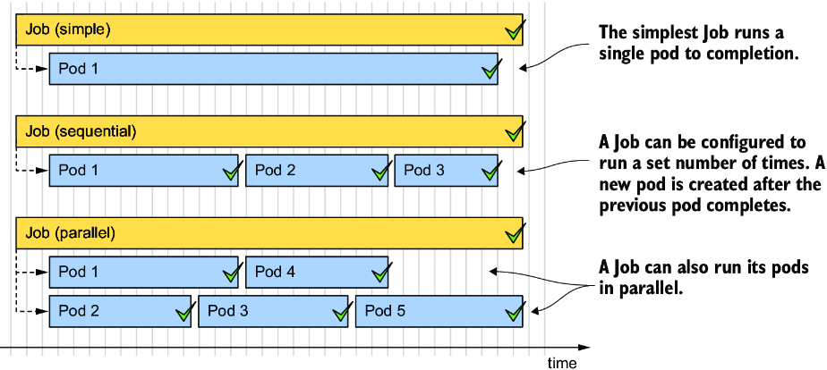

*Hình 18.1: Ba ví dụ Job khác nhau. Mỗi Job hoàn thành khi các pod của nó đã hoàn thành thành công.*

Như bạn có thể đoán, một Job resource định nghĩa một Pod template và số lượng pod phải hoàn thành thành công. Nó cũng định nghĩa số lượng pod có thể chạy song song.

> **GHI CHÚ:** Không giống Deployment và các resource khác có chứa Pod template, bạn không thể sửa đổi template trong một Job object sau khi đã tạo object.

Hãy xem Job object đơn giản nhất trông như thế nào.

#### Định nghĩa một Job resource (Defining a Job resource)

Trong mục này, bạn lấy Pod `quiz-data-importer` từ chương 15 và biến nó thành một Job. Pod này nhập dữ liệu vào cơ sở dữ liệu MongoDB của Quiz. Có thể bạn còn nhớ rằng trước khi chạy pod này, bạn phải khởi tạo MongoDB replica set bằng cách thực thi một lệnh trong một trong các Pod `quiz`. Bạn cũng có thể làm điều đó trong Job này bằng một init container. Job và pod mà nó tạo ra được trình bày trong hình 18.2.

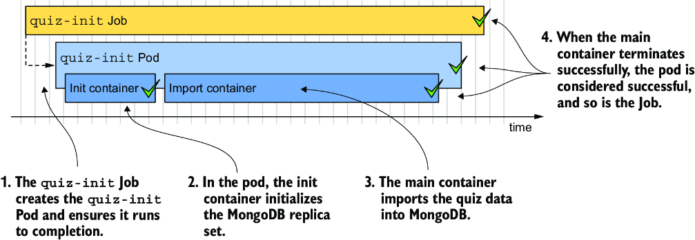

*Hình 18.2: Tổng quan về Job quiz-init*

Listing 18.1 cho thấy manifest của Job, bạn có thể tìm thấy nó trong file `job.quiz-init.yaml`. File manifest này cũng chứa một ConfigMap lưu các câu hỏi của quiz, nhưng ConfigMap đó không được hiển thị trong listing.

**Listing 18.1: Manifest của một Job để chạy một tác vụ đơn lẻ**

```yaml
apiVersion: batch/v1                                                     #1
kind: Job                                                                #1
metadata:
  name: quiz-init
  labels:
    app: quiz
    task: init
spec:
  template:                                                              #2
    metadata:                                                            #3
      labels:                                                            #3
        app: quiz                                                        #3
        task: init                                                       #3
    spec:
      restartPolicy: OnFailure                                           #4
      initContainers:                                                    #5
      - name: init                                                       #5
        image: mongo:5                                                   #5
        command:                                                         #5
        - sh                                                             #5
        - -c                                                             #5
        - |                                                              #5
          mongosh mongodb://quiz-0.quiz-pods.kiada.svc.cluster.local \   #5
            --quiet --file /dev/stdin <<EOF                              #5
                                                                         #5
          # MongoDB code that initializes the replica set                #5
          # Refer to the job.quiz-init.yaml file to see the actual code  #5
                                                                         #5
          EOF                                                            #5
      containers:                                                        #6
      - name: import                                                     #6
        image: mongo:5                                                   #6
        command:                                                         #6
        - mongoimport                                                    #6
        - mongodb+srv://quiz-pods.kiada.svc.cluster.local/kiada?tls=false #6
        - --collection                                                   #6
        - questions                                                      #6
        - --file                                                         #6
        - /questions.json                                                #6
        - --drop                                                         #6
        volumeMounts:                                                    #6
        - name: quiz-data                                                #6
          mountPath: /questions.json                                     #6
          subPath: questions.json                                        #6
          readOnly: true                                                 #6
      volumes:
      - name: quiz-data
        configMap:
          name: quiz-data
```

- **#1** Manifest này định nghĩa một Job object thuộc API group `batch`, phiên bản `v1`.
- **#2** Pod template bắt đầu từ đây.
- **#3** Gán label cho pod để mọi người biết vai trò của nó trong hệ thống. Phần này là tùy chọn.
- **#4** Job không thể dùng restart policy mặc định "Always". Chúng phải dùng `OnFailure` hoặc `Never`.
- **#5** Init container khởi tạo MongoDB replica set.
- **#6** Container chính nhập các câu hỏi quiz từ file `questions.json`, file này được mount vào container thông qua một ConfigMap volume.

Manifest trong listing định nghĩa một Job object chạy một pod duy nhất đến khi hoàn thành. Job thuộc API group `batch`, và bạn đang dùng API phiên bản `v1` để định nghĩa object. Pod mà Job này tạo ra gồm hai container thực thi tuần tự, vì một cái là init container và cái kia là container thông thường. Init container đảm bảo MongoDB replica set đã được khởi tạo, sau đó container chính nhập các câu hỏi quiz từ ConfigMap `quiz-data` được mount vào container thông qua một volume.

`restartPolicy` của Pod được đặt là `OnFailure`. Một pod được định nghĩa bên trong Job không thể dùng policy mặc định là `Always`, vì điều đó sẽ ngăn pod hoàn thành.

> **GHI CHÚ:** Trong pod template của một Job, bạn phải đặt restart policy một cách tường minh là `OnFailure` hoặc `Never`.

Bạn sẽ nhận thấy rằng không giống Deployment, manifest của Job trong listing không định nghĩa `selector`. Mặc dù bạn có thể chỉ định nó, bạn không bắt buộc phải làm vậy, vì Kubernetes tự động thiết lập nó. Pod template trong listing có chứa hai label, nhưng chúng ở đó chỉ để tiện cho bạn.

#### Chạy một Job (Running a Job)

Job controller tạo các pod ngay sau khi bạn tạo Job object. Để chạy Job `quiz-init`, hãy apply manifest `job.quiz-init.yaml` bằng `kubectl apply`.

#### Hiển thị trạng thái tóm tắt của Job (Displaying a brief Job status)

Để có cái nhìn tổng quan ngắn gọn về trạng thái của Job, hãy liệt kê các Job trong namespace hiện tại như sau:

```bash
$ kubectl get jobs
NAME        STATUS    COMPLETIONS   DURATION   AGE
quiz-init   Running   0/1           3s         3s
```

Cột `STATUS` cho biết Job đang chạy, đã thất bại hay đã hoàn thành. Cột `COMPLETIONS` cho biết Job đã chạy bao nhiêu lần và được cấu hình để hoàn thành bao nhiêu lần. Cột `DURATION` cho biết Job đã chạy trong bao lâu. Vì tác vụ mà Job `quiz-init` thực hiện tương đối ngắn, trạng thái của nó sẽ thay đổi trong vòng vài giây. Liệt kê lại các Job để xác nhận điều này:

```bash
$ kubectl get jobs
NAME        STATUS     COMPLETIONS   DURATION   AGE
quiz-init   Complete   1/1           6s         42s
```

Output cho thấy Job giờ đã hoàn thành, mất 6 giây.

#### Hiển thị trạng thái chi tiết của Job (Displaying the detailed Job status)

Để xem thêm chi tiết về Job, hãy dùng lệnh `kubectl describe` như sau:

```bash
$ kubectl describe job quiz-init
Name:                     quiz-init
Namespace:                kiada
Selector:                 controller-uid=98f0fe52-12ec-4c76-a185-4ccee9bae1ef   #1
Labels:                   app=quiz
                          task=init
Annotations:              batch.kubernetes.io/job-tracking:
Parallelism:              1
Completions:              1
Completion Mode:          NonIndexed
Start Time:               Sun, 02 Oct 2022 12:17:59 +0200
Completed At:             Sun, 02 Oct 2022 12:18:05 +0200
Duration:                 6s
Pods Statuses:            0 Active / 1 Succeeded / 0 Failed                     #2
Pod Template:
  Labels:  app=quiz
           batch.kubernetes.io/controller-uid=98f0fe52-12ec-4c76-a185-4ccee9bae1ef   #3
           batch.kubernetes.io/job-name=quiz-init                                    #3
           controller-uid=98f0fe52-12ec-4c76-a185-4ccee9bae1ef                       #3
           job-name=quiz-init                                                        #3
           task=init
  Init Containers:
   init: ...
  Containers:
   import: ...
  Volumes:
   quiz-data: ...
Events:
  Type    Reason            Age    From            Message
  ----    ------            ----   ----            -------
  Normal  SuccessfulCreate  7m33s  job-controller  Created pod: quiz-init-xpl8d   #4
  Normal  Completed         7m27s  job-controller  Job completed                  #4
```

- **#1** Selector được tự động sinh ra cho Job này
- **#2** Trạng thái của các Pod thuộc Job này
- **#3** Ngoài các label bạn đã định nghĩa trong Pod template, các label `controller-uid` và `job-name` đã được tự động thêm vào.
- **#4** Các event của Job cho thấy một pod duy nhất đã được tạo cho Job này và Job đã hoàn thành.

Ngoài `name`, `namespace`, `labels`, `annotations` và các thuộc tính khác của Job, output của lệnh `kubectl describe` còn cho thấy `selector` đã được gán tự động. Label `controller-uid` dùng trong selector cũng được tự động thêm vào Pod template của Job. Label `job-name` cũng được thêm vào template. Như bạn sẽ thấy ở mục tiếp theo, bạn có thể dễ dàng dùng label này để liệt kê các pod thuộc về một Job cụ thể.

Ở cuối output của `kubectl describe`, bạn thấy các Event gắn với Job object này. Chỉ có hai event được sinh ra cho Job này: việc tạo pod và việc Job hoàn thành thành công.

#### Xem xét các pod thuộc về một Job (Examining the pods that belong to a Job)

Để liệt kê các pod được tạo cho một Job cụ thể, bạn có thể dùng label `job-name` được tự động thêm vào các pod đó. Để liệt kê các pod của Job `quiz-init`, hãy chạy lệnh sau:

```bash
$ kubectl get pods -l job-name=quiz-init
NAME              READY   STATUS      RESTARTS   AGE
quiz-init-xpl8d   0/1     Completed   0          25m
```

Pod hiển thị trong output đã hoàn thành tác vụ của nó. Job controller không xóa pod, nên bạn có thể xem trạng thái và xem log của nó.

#### Xem xét log của một Job pod (Examining the logs of a Job pod)

Cách nhanh nhất để xem log của một Job là truyền tên Job thay vì tên Pod cho lệnh `kubectl logs`. Để xem log của Job `quiz-init`, bạn có thể làm như sau:

```bash
$ kubectl logs job/quiz-init --all-containers --prefix                                    #1
[pod/quiz-init-xpl8d/init] Replica set initialized successfully!                          #2
[pod/quiz-init-xpl8d/import] 2022-10-02T10:51:01.967+0000 connected to: ...               #3
[pod/quiz-init-xpl8d/import] 2022-10-02T10:51:01.969+0000 dropping: kiada.question
[pod/quiz-init-xpl8d/import] 2022-10-02T10:51:03.811+0000 6 document(s) imported successfully. 0 document(s) failed to import.
```

- **#1** Dùng tùy chọn `--all-containers` để hiển thị log của tất cả các container trong Pod, và tùy chọn `--prefix` để thêm tiền tố tên pod và container vào mỗi dòng.
- **#2** Log của init container
- **#3** Log của container `import`

Tùy chọn `--all-containers` yêu cầu kubectl in log của tất cả các container trong pod, và tùy chọn `--prefix` đảm bảo mỗi dòng được thêm tiền tố là nguồn, tức là tên pod và tên container.

Output chứa log của cả container `init` lẫn container `import`. Các log này cho thấy MongoDB replica set đã được khởi tạo thành công và cơ sở dữ liệu câu hỏi đã được nạp dữ liệu.

#### Tạm dừng Job đang hoạt động và tạo Job ở trạng thái tạm dừng (Suspending active Jobs and creating Jobs in a suspended state)

Khi bạn tạo Job `quiz-init`, Job controller đã tạo pod ngay khi bạn tạo Job object. Tuy nhiên, bạn cũng có thể tạo Job ở trạng thái tạm dừng (suspended). Hãy thử điều này bằng cách tạo một Job khác. Như bạn có thể thấy trong listing sau, bạn tạm dừng nó bằng cách đặt trường `suspend` thành `true`. Bạn có thể tìm thấy manifest này trong file `job.demo-suspend.yaml`.

**Listing 18.2: Manifest của một Job bị tạm dừng**

```yaml
apiVersion: batch/v1
kind: Job
metadata:
  name: demo-suspend
spec:
  suspend: true                 #1
  template:
    spec:
      restartPolicy: OnFailure
      containers:
      - name: demo
        image: busybox
        command:
        - sleep
        - "60"
```

- **#1** Job này bị tạm dừng. Khi bạn tạo Job, không có pod nào được tạo cho đến khi bạn bỏ tạm dừng Job.

Apply manifest trong listing để tạo Job. Liệt kê các pod như sau để xác nhận rằng chưa có pod nào được tạo:

```bash
$ kubectl get po -l job-name=demo-suspend
No resources found in kiada namespace.
```

Job controller sinh ra một Event cho biết Job đã bị tạm dừng. Bạn có thể thấy nó khi chạy `kubectl get events` hoặc khi describe Job bằng `kubectl describe`:

```bash
$ kubectl describe job demo-suspend
...
Events:
  Type    Reason     Age    From            Message
  ----    ------     ----   ----            -------
  Normal  Suspended  3m37s  job-controller  Job suspended
```

Khi bạn sẵn sàng chạy Job, bạn bỏ tạm dừng nó bằng cách patch object như sau:

```bash
$ kubectl patch job demo-suspend -p '{"spec":{"suspend": false}}'
job.batch/demo-suspend patched
```

Job controller tạo pod và sinh ra một Event cho biết Job đã được tiếp tục (resumed).

Bạn cũng có thể tạm dừng một Job đang chạy, bất kể bạn có tạo nó ở trạng thái tạm dừng hay không. Để tạm dừng một Job, hãy đặt `suspend` thành `true` bằng lệnh `kubectl patch` sau:

```bash
$ kubectl patch job demo-suspend -p '{"spec":{"suspend": true}}'
job.batch/demo-suspend patched
```

Job controller lập tức xóa pod gắn với Job và sinh ra một Event cho biết Job đã bị tạm dừng. Các container của pod được tắt một cách êm ái (gracefully), giống như mỗi lần bạn xóa một pod, bất kể pod được tạo bằng cách nào. Bạn có thể tiếp tục Job bất cứ lúc nào bạn muốn bằng cách đặt lại trường `suspend` thành `false`.

#### Xóa Job và các pod của nó (Deleting Jobs and their pods)

Bạn có thể xóa một Job bất cứ lúc nào. Bất kể các pod của nó có còn đang chạy hay không, chúng được xóa theo cùng cách như khi bạn xóa một Deployment, StatefulSet hoặc DaemonSet.

Bạn không cần Job `quiz-init` nữa, nên hãy xóa nó như sau:

```bash
$ kubectl delete job quiz-init
job.batch "quiz-init" deleted
```

Xác nhận rằng pod cũng đã bị xóa bằng cách liệt kê các pod như sau:

```bash
$ kubectl get po -l job-name=quiz-init
No resources found in kiada namespace.
```

Có thể bạn còn nhớ rằng các pod bị garbage collector xóa vì chúng trở thành mồ côi (orphaned) khi chủ sở hữu của chúng, trong trường hợp này là Job object tên `quiz-init`, bị xóa. Nếu bạn chỉ muốn xóa Job nhưng giữ lại các pod, bạn xóa Job với tùy chọn `--cascade=orphan`. Bạn có thể thử cách này với Job `demo-suspend` như sau:

```bash
$ kubectl delete job demo-suspend --cascade=orphan
job.batch "demo-suspend" deleted
```

Nếu bây giờ bạn liệt kê các pod, bạn sẽ thấy pod vẫn còn tồn tại. Vì giờ nó là một pod độc lập, việc xóa nó khi không cần nữa là tùy thuộc vào bạn.

#### Tự động xóa Job (Automatically deleting Jobs)

Theo mặc định, bạn phải xóa các Job object một cách thủ công. Tuy nhiên, bạn có thể đánh dấu Job để tự động xóa bằng cách đặt trường `ttlSecondsAfterFinished` trong `spec` của Job. Như tên gọi của nó, trường này chỉ định Job và các pod của nó được giữ lại trong bao lâu sau khi Job kết thúc.

Để thấy thiết lập này hoạt động, hãy thử tạo Job trong manifest `job.demo-ttl.yaml`. Job này sẽ chạy một pod duy nhất, pod này sẽ hoàn thành thành công sau 20 giây. Vì `ttlSecondsAfterFinished` được đặt là `10`, Job và pod của nó bị xóa 10 giây sau đó.

> **CẢNH BÁO:** Nếu bạn đặt trường `ttlSecondsAfterFinished` trong một Job, Job và các pod của nó sẽ bị xóa bất kể Job hoàn thành thành công hay không. Nếu điều này xảy ra trước khi bạn kịp kiểm tra log của các pod thất bại, sẽ rất khó xác định nguyên nhân khiến Job thất bại.

### 18.1.2 Chạy một tác vụ nhiều lần (Running a task multiple times)

Ở mục trước, bạn đã học cách thực thi một tác vụ một lần. Tuy nhiên, bạn cũng có thể cấu hình Job để thực thi cùng một tác vụ nhiều lần, hoặc song song hoặc tuần tự. Điều này có thể cần thiết vì container chạy tác vụ chỉ có thể xử lý một mục duy nhất, nên bạn cần chạy container nhiều lần để xử lý toàn bộ đầu vào, hoặc đơn giản là bạn muốn chạy việc xử lý trên nhiều node của cluster để cải thiện hiệu năng.

Bây giờ bạn sẽ tạo một Job chèn các câu trả lời giả vào cơ sở dữ liệu Quiz, mô phỏng một lượng lớn người dùng. Thay vì chỉ có một pod chèn dữ liệu vào cơ sở dữ liệu như ở ví dụ trước, bạn sẽ cấu hình Job để tạo năm pod như vậy. Tuy nhiên, thay vì chạy cả năm pod cùng lúc, bạn sẽ cấu hình Job để chạy tối đa hai pod tại một thời điểm. Listing sau cho thấy manifest của Job. Bạn có thể tìm thấy nó trong file `job.generate-responses.yaml`.

**Listing 18.3: Một Job để chạy một tác vụ nhiều lần**

```yaml
apiVersion: batch/v1                         #1
kind: Job                                    #1
metadata:                                    #1
  name: generate-responses                   #1
  labels:
    app: quiz
spec:
  completions: 5                             #2
  parallelism: 2                             #3
  template:
    metadata:
      labels:
        app: quiz
    spec:
      restartPolicy: OnFailure
      containers:
      - name: mongo
        image: mongo:5
        command:
        ...
```

- **#1** Manifest này mô tả Job `generate-responses`.
- **#2** Job này chạy năm lần.
- **#3** Job này chạy tối đa hai pod song song.

Ngoài Pod template, manifest của Job trong listing còn định nghĩa hai thuộc tính mới, `completions` và `parallelism`, sẽ được giải thích ngay sau đây.

#### Tìm hiểu completions và parallelism của Job (Understanding Job completions and parallelism)

Trường `completions` chỉ định số lượng pod phải hoàn thành thành công để Job này được xem là hoàn thành. Trường `parallelism` chỉ định bao nhiêu pod trong số này có thể chạy song song. Không có giới hạn trên cho các giá trị này, nhưng cluster của bạn có thể chỉ chạy được một số lượng pod song song nhất định.

Bạn có thể chọn không đặt trường nào, đặt một trong hai, hoặc cả hai. Nếu không đặt trường nào, cả hai giá trị mặc định là một. Nếu bạn chỉ đặt `completions`, đây là số lượng pod chạy lần lượt nối tiếp nhau. Nếu bạn chỉ đặt `parallelism`, đây là số lượng pod được chạy, nhưng chỉ cần một pod hoàn thành thành công là Job được xem là hoàn thành.

> **GHI CHÚ:** Bạn cũng có thể thay đổi success policy (chính sách thành công) mặc định của một Job. Ví dụ, bạn có thể yêu cầu Kubernetes tính Job là thành công khi các pod có những index cụ thể hoàn thành thành công. Để biết thêm thông tin, xem `kubectl explain job.spec.successPolicy`.

Nếu bạn đặt `parallelism` cao hơn `completions`, Job controller chỉ tạo đúng số lượng pod mà bạn chỉ định trong trường `completions`.

Nếu `parallelism` thấp hơn `completions`, Job controller chạy tối đa `parallelism` Pod song song nhưng tạo thêm các pod mới khi những pod đầu tiên hoàn thành. Nó tiếp tục tạo pod mới cho đến khi số lượng pod hoàn thành thành công bằng `completions`. Hình 18.3 cho thấy điều gì xảy ra khi `completions` là 5 và `parallelism` là 2.

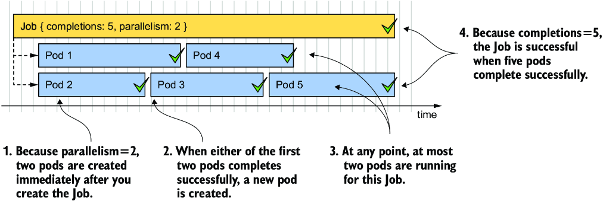

*Hình 18.3: Chạy một Job song song với completion = 5 và parallelism = 2*

Như trong hình, Job controller trước tiên tạo hai pod và đợi cho đến khi một trong hai hoàn thành. Trong hình, pod 2 là pod hoàn thành đầu tiên. Controller lập tức tạo pod tiếp theo (pod 3), đưa số lượng pod đang chạy trở lại hai. Controller lặp lại quá trình này cho đến khi năm pod hoàn thành thành công. Bảng 18.1 giải thích hành vi với các ví dụ khác nhau về `completions` và `parallelism`.

**Bảng 18.1: Các tổ hợp completions và parallelism**

| Completions | Parallelism | Hành vi của Job |
|---|---|---|
| Không đặt | Không đặt | Một pod duy nhất được tạo, giống như khi `completions` và `parallelism` là `1`. |
| `1` | `1` | Một pod duy nhất được tạo. Nếu pod hoàn thành thành công, Job hoàn thành. Nếu pod bị xóa trước khi hoàn thành, nó được thay thế bằng một pod mới. |
| `2` | `5` | Chỉ ba pod được tạo, giống như khi `parallelism` là 2. |
| `5` | `2` | Ban đầu hai pod được tạo. Khi một trong hai hoàn thành, pod thứ ba được tạo. Lại có hai pod đang chạy. Khi một trong hai hoàn thành, pod thứ tư được tạo. Lại có hai pod đang chạy. Khi một pod nữa hoàn thành, pod thứ năm và cũng là pod cuối cùng được tạo. |
| `5` | `5` | Năm pod chạy đồng thời. Nếu một trong số chúng bị xóa trước khi hoàn thành, một pod thay thế được tạo. Job hoàn thành khi năm pod hoàn thành thành công. |
| `5` | Không đặt | Năm pod được tạo tuần tự. Một pod mới chỉ được tạo khi pod trước đó hoàn thành (hoặc thất bại). |
| Không đặt | `5` | Năm pod được tạo đồng thời, nhưng chỉ cần một pod hoàn thành thành công là Job hoàn thành. |

Trong Job `generate-responses` mà bạn sắp tạo, số `completions` được đặt là `5` và `parallelism` được đặt là `2`, nên tối đa hai pod sẽ chạy song song. Job không hoàn thành cho đến khi năm pod hoàn thành thành công. Tổng số pod có thể cuối cùng cao hơn nếu một số pod thất bại. Sẽ nói thêm về điều này ở mục tiếp theo.

#### Chạy Job (Running the Job)

Dùng `kubectl apply` để tạo Job bằng cách apply file manifest `job.generate-responses.yaml`. Liệt kê các pod trong lúc Job đang chạy như sau:

```bash
$ kubectl get po -l job-name=generate-responses
NAME                       READY   STATUS      RESTARTS      AGE
generate-responses-7kqw4   1/1     Running     2 (20s ago)   27s   #1
generate-responses-98mh8   0/1     Completed   0             27s   #2
generate-responses-tbgns   1/1     Running     0             3s    #1
```

- **#1** Hai pod hiện đang chạy.
- **#2** Pod này đã hoàn thành.

Liệt kê các pod nhiều lần để quan sát số lượng pod có `STATUS` hiển thị là `Running` hoặc `Completed`. Như bạn có thể thấy, tại bất kỳ thời điểm nào, tối đa hai pod chạy đồng thời. Sau một khoảng thời gian, Job hoàn thành. Bạn có thể thấy điều này bằng cách hiển thị trạng thái của Job với lệnh `kubectl get` như sau:

```bash
$ kubectl get job generate-responses
NAME                 STATUS     COMPLETIONS   DURATION   AGE
generate-responses   Complete   5/5           110s       115s   #1
```

- **#1** Mất 110 giây để chạy Job này năm lần.

Cột `COMPLETIONS` cho thấy Job này đã hoàn thành năm trên năm lần mong muốn, mất 110 giây. Nếu bạn liệt kê lại các pod, bạn sẽ thấy năm pod đã hoàn thành, như sau:

```bash
$ kubectl get po -l job-name=generate-responses
NAME                       READY   STATUS      RESTARTS   AGE
generate-responses-5xtlk   0/1     Completed   0          82s     #1
generate-responses-7kqw4   0/1     Completed   3          2m46s   #2
generate-responses-98mh8   0/1     Completed   0          2m46s   #1
generate-responses-tbgns   0/1     Completed   1          2m22s   #3
generate-responses-vbvq8   0/1     Completed   1          111s    #3
```

- **#1** Container của các pod này kết thúc thành công ngay lần chạy đầu tiên.
- **#2** Container của pod này thất bại ba lần, được khởi động lại sau mỗi lần thất bại, và cuối cùng kết thúc thành công.
- **#3** Container của các pod này thất bại một lần nhưng kết thúc thành công ở lần thử thứ hai.

Như trạng thái của Job đã cho thấy trước đó, bạn sẽ thấy năm pod `Completed`. Tuy nhiên, nếu nhìn kỹ cột `RESTARTS`, bạn sẽ nhận thấy một số pod trong đó đã phải khởi động lại. Lý do là tôi đã cố tình viết cứng (hard-code) tỷ lệ thất bại 25% vào mã chạy trong các pod đó để cho thấy điều gì xảy ra khi có lỗi.

### 18.1.3 Tìm hiểu cách xử lý lỗi của Job (Understanding how Job failures are handled)

Như đã giải thích trước đó, lý do để chạy các tác vụ thông qua Job thay vì trực tiếp thông qua pod là Kubernetes đảm bảo tác vụ được hoàn thành ngay cả khi từng pod hoặc node của chúng bị lỗi. Tuy nhiên, có hai cấp độ mà tại đó những lỗi như vậy được xử lý:

* Ở cấp Pod
* Ở cấp Job

Khi một container trong pod thất bại, `restartPolicy` của pod quyết định lỗi được xử lý ở cấp Pod bởi Kubelet hay ở cấp Job bởi Job controller. Như trong hình 18.4, nếu `restartPolicy` là `OnFailure`, container thất bại được khởi động lại bên trong cùng pod đó. Tuy nhiên, nếu policy là `Never`, toàn bộ pod bị đánh dấu là thất bại và Job controller tạo một pod mới.

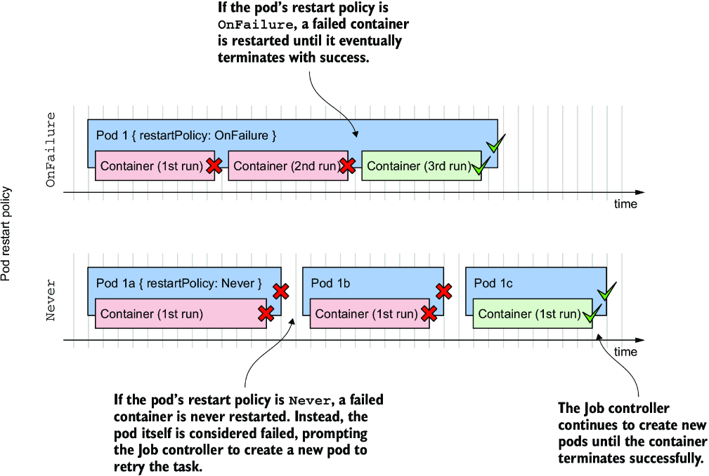

*Hình 18.4: Cách xử lý lỗi tùy thuộc vào restart policy của pod*

Hãy xem xét sự khác biệt giữa hai kịch bản này.

#### Xử lý lỗi ở cấp Pod (Handling failures at the Pod level)

Trong Job `generate-responses` bạn đã tạo ở mục trước, `restartPolicy` của pod được đặt là `OnFailure`. Như đã thảo luận trước đó, mỗi khi container được thực thi, có 25% khả năng nó sẽ thất bại. Trong những trường hợp này, container kết thúc với exit code khác không. Kubelet nhận thấy lỗi và khởi động lại container.

Container mới chạy trong cùng pod trên cùng node, do đó cho phép quay vòng nhanh. Container có thể thất bại lần nữa và được khởi động lại nhiều lần nhưng cuối cùng sẽ kết thúc thành công, và pod sẽ được đánh dấu là hoàn thành.

> **GHI CHÚ:** Như bạn đã học ở một trong các chương trước, Kubelet không khởi động lại container ngay lập tức nếu nó crash nhiều lần, mà thêm một khoảng trễ sau mỗi lần crash và nhân đôi khoảng trễ đó sau mỗi lần khởi động lại.

#### Xử lý lỗi ở cấp Job (Handling failures at the Job level)

Khi Pod template trong manifest của Job đặt `restartPolicy` của Pod là `Never`, Kubelet không khởi động lại các container của nó. Thay vào đó, toàn bộ pod bị đánh dấu là thất bại và Job controller phải tạo một pod mới. Pod mới này có thể được lập lịch lên một node khác.

> **GHI CHÚ:** Nếu pod được lập lịch chạy trên một node khác, các container image có thể cần được tải về trước khi container có thể chạy.

Nếu bạn muốn thấy Job controller xử lý lỗi trong Job `generate-responses`, hãy xóa Job hiện có và tạo lại nó từ file manifest `job.generate-responses.restartPolicyNever.yaml`. Trong manifest này, `restartPolicy` của pod được đặt là `Never`.

Job hoàn thành trong khoảng một hai phút. Nếu bạn liệt kê các pod như sau, bạn sẽ nhận thấy giờ đây cần nhiều hơn năm pod để hoàn thành công việc.

```bash
$ kubectl get po -l job-name=generate-responses
NAME                       READY   STATUS      RESTARTS   AGE
generate-responses-2dbrn   0/1     Error       0          2m43s   #1
generate-responses-4pckt   0/1     Error       0          2m39s   #1
generate-responses-8c8wz   0/1     Completed   0          2m43s   #2
generate-responses-bnm4t   0/1     Completed   0          3m10s   #2
generate-responses-kn55w   0/1     Completed   0          2m16s   #2
generate-responses-t2r67   0/1     Completed   0          3m10s   #2
generate-responses-xpbnr   0/1     Completed   0          2m34s   #2
```

- **#1** Hai pod thất bại. Container của chúng không được khởi động lại do `restartPolicy`.
- **#2** Năm pod hoàn thành thành công.

Bạn sẽ thấy năm Pod `Completed` và một vài pod có trạng thái `Error`. Số lượng các pod đó phải khớp với số pod thành công và thất bại khi bạn kiểm tra Job object bằng lệnh `kubectl describe job` như sau:

```bash
$ kubectl describe job generate-responses
...
Pods Statuses:   0 Active / 5 Succeeded / 2 Failed
...
```

> **GHI CHÚ:** Có thể số lượng pod trong trường hợp của bạn khác đi. Cũng có thể Job chưa hoàn thành. Điều này được giải thích ở mục tiếp theo.

Để kết thúc mục này, hãy xóa Job `generate-responses`.

#### Ngăn Job thất bại vô hạn (Preventing Jobs from failing indefinitely)

Hai Job bạn đã tạo ở các mục trước có thể đã không hoàn thành vì chúng thất bại quá nhiều lần. Khi điều đó xảy ra, Job controller bỏ cuộc. Hãy minh họa điều này bằng cách tạo một Job luôn thất bại. Bạn có thể tìm thấy manifest trong file `job.demo-always-fails.yaml`. Nội dung của nó được hiển thị trong listing sau.

**Listing 18.4: Một Job luôn thất bại**

```yaml
apiVersion: batch/v1
kind: Job
metadata:
  name: demo-always-fails
spec:
  completions: 10
  parallelism: 3
  template:
    spec:
      restartPolicy: OnFailure
      containers:
      - name: demo
        image: busybox
        command:
        - 'false'            #1
```

- **#1** Lệnh này kết thúc với exit code khác không, khiến container bị xem là thất bại.

Khi bạn tạo Job trong manifest này, Job controller tạo ba pod. Container trong các pod này kết thúc với exit code khác không, khiến Kubelet khởi động lại nó. Sau vài lần khởi động lại, Job controller nhận thấy các pod này đang thất bại, nên nó xóa chúng và đánh dấu Job là thất bại. Bạn có thể thấy Job đã thất bại bằng cách xem cột `STATUS`:

```bash
$ kubectl get job
NAME                STATUS   COMPLETIONS   DURATION   AGE
demo-always-fails   Failed   0/10          2m48s      2m48s
```

Như mọi khi, bạn có thể xem thêm thông tin bằng cách chạy `kubectl describe` như sau:

```bash
$ kubectl describe job demo-always-fails
...
Events:
  Type     Reason                Age    From            Message
  ----     ------                ----   ----            -------
  Normal   SuccessfulCreate      5m6s   job-controller  Created pod: demo-always-fails-t9xkw
  Normal   SuccessfulCreate      5m6s   job-controller  Created pod: demo-always-fails-6kcb2
  Normal   SuccessfulCreate      5m6s   job-controller  Created pod: demo-always-fails-4nfmd
  Normal   SuccessfulDelete      4m43s  job-controller  Deleted pod: demo-always-fails-4nfmd
  Normal   SuccessfulDelete      4m43s  job-controller  Deleted pod: demo-always-fails-6kcb2
  Normal   SuccessfulDelete      4m43s  job-controller  Deleted pod: demo-always-fails-t9xkw
  Warning  BackoffLimitExceeded  4m43s  job-controller  Job has reached the specified backoff limit
```

Event `Warning` ở cuối cho biết backoff limit (giới hạn thử lại) của Job đã đạt tới, nghĩa là Job đã thất bại. Bạn có thể xác nhận điều này bằng cách kiểm tra trạng thái của Job như sau:

```bash
$ kubectl get job demo-always-fails -o yaml
...
status:
  conditions:
  - lastProbeTime: "2022-10-02T15:42:39Z"
    lastTransitionTime: "2022-10-02T15:42:39Z"
    message: Job has reached the specified backoff limit   #1
    reason: BackoffLimitExceeded                            #1
    status: "True"                                          #2
    type: Failed                                            #2
  failed: 3
  startTime: "2022-10-02T15:42:16Z"
  uncountedTerminatedPods: {}
```

- **#1** Lý do Job thất bại
- **#2** Trạng thái của condition `Failed` của Job là `True`, cho biết Job đã thất bại.

Gần như không thể nhìn thấy điều này, nhưng Job đã kết thúc sau sáu lần thử lại, đó là backoff limit mặc định. Bạn có thể đặt giới hạn này cho từng Job trong trường `spec.backoffLimit` trong manifest của nó.

Một khi Job vượt quá giới hạn này, Job controller xóa tất cả các pod đang chạy và không tạo thêm pod mới cho nó nữa. Để chạy lại một Job đã thất bại, bạn phải xóa và tạo lại nó.

#### Giới hạn thời gian cho phép để một Job hoàn thành (Limiting the time allowed for a Job to complete)

Một cách khác khiến Job có thể thất bại là nếu nó không hoàn thành đúng hạn. Theo mặc định, thời gian này không bị giới hạn, nhưng bạn có thể đặt thời gian tối đa bằng trường `activeDeadlineSeconds` trong `spec` của Job, như trong listing sau (xem file manifest `job.demo-deadline.yaml`):

**Listing 18.5: Một Job có giới hạn thời gian**

```yaml
apiVersion: batch/v1
kind: Job
metadata:
  name: demo-deadline
spec:
  completions: 2                 #1
  parallelism: 1                 #2
  activeDeadlineSeconds: 90      #3
  template:
    spec:
      restartPolicy: OnFailure
      containers:
      - name: demo-suspend
        image: busybox
        command:
        - sleep                  #4
        - "60"                   #4
```

- **#1** Job này phải hoàn thành hai lần.
- **#2** Các pod của Job này chạy tuần tự.
- **#3** Job phải hoàn thành trong 90 giây.
- **#4** Mỗi pod hoàn thành sau 60 giây.

Từ trường `completions` trong listing, bạn có thể thấy Job cần hai lần hoàn thành để được xem là hoàn thành. Vì `parallelism` được đặt là `1`, hai pod chạy lần lượt nối tiếp nhau. Với việc thực thi tuần tự hai pod này và thực tế là mỗi pod cần 60 giây để hoàn thành, việc thực thi toàn bộ Job mất hơn 120 giây một chút. Tuy nhiên, vì `activeDeadlineSeconds` cho Job này được đặt là `90`, Job không thể thành công. Hình 18.5 minh họa kịch bản này.

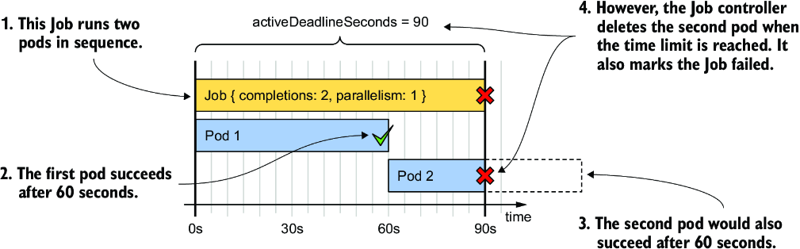

*Hình 18.5: Đặt giới hạn thời gian cho một Job*

Để tự mình thấy điều này, hãy tạo Job này bằng cách apply manifest và đợi nó thất bại. Khi điều đó xảy ra, Event sau được Job controller sinh ra:

```bash
$ kubectl describe job demo-deadline
...
Events:
  Type     Reason            Age   From            Message
  ----     ------            ----  ----            -------
  Warning  DeadlineExceeded  1m    job-controller  Job was active longer than specified deadline
```

> **GHI CHÚ:** Hãy nhớ rằng `activeDeadlineSeconds` trong một Job áp dụng cho toàn bộ Job, chứ không phải cho từng pod riêng lẻ được tạo trong ngữ cảnh của Job đó.

#### Định nghĩa các quy tắc failure policy tùy chỉnh (Defining custom failure policy rules)

Thay vì failure policy (chính sách xử lý lỗi) mặc định của Job đã giải thích trước đó, bạn cũng có thể chỉ định tập quy tắc failure policy của riêng mình trong trường `spec.podFailurePolicy` của Job. Ví dụ, bạn có thể đặt một quy tắc đánh dấu toàn bộ Job là thất bại khi một container cụ thể kết thúc với một exit code cụ thể, như trong đoạn mã sau:

```yaml
kind: Job
spec:
  podFailurePolicy:
    rules:
    - onExitCodes:              #1
        containerName: main     #1
        operator: In            #1
        values: [123]           #1
      action: FailJob           #1
```

- **#1** Khi container tên `main` thoát với exit code 123, toàn bộ Job bị đánh dấu là thất bại.

Thay vì làm toàn bộ Job thất bại, bạn cũng có thể chỉ đánh dấu index cụ thể của pod là thất bại, hoặc bỏ qua một số exit code nhất định. Để biết thêm thông tin về các quy tắc failure policy của Job, hãy chạy `kubectl explain job.spec.podFailurePolicy`.

### 18.1.4 Tham số hóa các pod trong một Job (Parameterizing pods in a Job)

Cho đến giờ, các tác vụ bạn thực hiện trong mỗi Job đều giống hệt nhau. Ví dụ, các pod trong Job `generate-responses` đều làm cùng một việc: chúng chèn một loạt câu trả lời vào cơ sở dữ liệu. Nhưng nếu bạn muốn chạy một loạt tác vụ liên quan nhưng không giống hệt nhau thì sao? Có thể bạn muốn mỗi pod chỉ xử lý một tập con của dữ liệu? Đó chính là lúc trường `completionMode` của Job phát huy tác dụng.

Tại thời điểm viết sách, hai completion mode (chế độ hoàn thành) được hỗ trợ: `Indexed` và `NonIndexed`. Các Job bạn đã tạo cho đến giờ trong chương này đều là `NonIndexed`, vì đây là chế độ mặc định. Tất cả các pod được tạo bởi một Job như vậy không thể phân biệt được với nhau. Tuy nhiên, nếu bạn đặt `completionMode` của Job là `Indexed`, mỗi pod được gán một số index mà bạn có thể dùng để phân biệt các pod. Điều này cho phép mỗi pod chỉ thực hiện một phần của toàn bộ tác vụ. Bảng 18.2 so sánh hai completion mode.

**Bảng 18.2: Các completion mode được hỗ trợ của Job**

| Giá trị | Mô tả |
|---|---|
| `NonIndexed` | Job được xem là hoàn thành khi số lượng pod hoàn thành thành công do Job này tạo ra bằng giá trị của trường `spec.completions` trong manifest của Job. Tất cả các pod đều như nhau. Đây là chế độ mặc định. |
| `Indexed` | Mỗi pod được gán một completion index (bắt đầu từ `0`) để phân biệt các pod với nhau. Theo mặc định, Job được xem là hoàn thành khi có một pod hoàn thành thành công cho mỗi index. Nếu một pod với một index cụ thể thất bại, Job controller tạo một pod mới với cùng index đó. Bạn cũng có thể thay đổi success policy mặc định để Job được tính là thành công khi các pod có những index cụ thể hoàn thành thành công.<br><br>Completion index được gán cho mỗi pod được chỉ định trong annotation `batch.kubernetes.io/job-completion-index` của pod và trong biến môi trường `JOB_COMPLETION_INDEX` trong các container của pod. |

> **GHI CHÚ:** Trong tương lai, Kubernetes có thể hỗ trợ thêm các chế độ xử lý Job khác, thông qua Job controller tích hợp sẵn hoặc thông qua các controller bổ sung.

Để hiểu rõ hơn các completion mode này, bạn sẽ tạo một Job đọc các câu trả lời trong cơ sở dữ liệu Quiz, tính số câu trả lời hợp lệ và không hợp lệ cho mỗi ngày, rồi lưu các kết quả đó trở lại cơ sở dữ liệu. Bạn sẽ làm việc này theo hai cách, dùng cả hai completion mode để bạn hiểu được sự khác biệt.

#### Hiện thực script tổng hợp (Implementing the aggregation script)

Như bạn có thể hình dung, cơ sở dữ liệu Quiz có thể trở nên rất lớn nếu nhiều người dùng sử dụng ứng dụng. Do đó, bạn không muốn một pod duy nhất xử lý tất cả các câu trả lời, mà muốn mỗi pod chỉ xử lý một tháng cụ thể.

Tôi đã chuẩn bị sẵn một script làm việc này. Các pod sẽ lấy script này từ một ConfigMap. Bạn có thể tìm thấy manifest của nó trong file `cm.aggregate-responses.yaml`. Bản thân đoạn mã không quan trọng, nhưng điều quan trọng là nó nhận hai tham số: năm và tháng cần xử lý. Đoạn mã đọc các tham số này qua các biến môi trường `YEAR` và `MONTH`, như bạn có thể thấy trong listing sau.

**Listing 18.6: ConfigMap chứa script MongoDB để xử lý các câu trả lời Quiz**

```yaml
apiVersion: v1
kind: ConfigMap
metadata:
  name: aggregate-responses
  labels:
    app: aggregate-responses
data:
  script.js: |
    var year = parseInt(process.env["YEAR"]);     #1
    var month = parseInt(process.env["MONTH"]);   #1
    ...
```

- **#1** Script đọc năm và tháng từ các biến môi trường.

Apply manifest ConfigMap này vào cluster của bạn bằng lệnh sau:

```bash
$ kubectl apply -f cm.aggregate-responses.yaml
configmap/aggregate-responses created
```

Bây giờ hãy tưởng tượng bạn muốn tính tổng cho mỗi tháng của năm 2020. Vì script chỉ xử lý một tháng, bạn cần 12 pod để xử lý cả năm. Bạn nên tạo Job như thế nào để sinh ra các pod này, khi bạn cần truyền một tháng khác nhau cho mỗi pod?

#### Completion mode NonIndexed (The NonIndexed completion mode)

Trước khi Job resource được bổ sung hỗ trợ `completionMode`, tất cả các Job đều hoạt động ở chế độ gọi là `NonIndexed`. Vấn đề với chế độ này là tất cả các pod được sinh ra đều giống hệt nhau (hình 18.6).


*Hình 18.6: Các Job dùng completionMode NonIndexed sinh ra các pod giống hệt nhau*

Vì vậy, nếu bạn dùng completion mode này, bạn không thể truyền một giá trị `MONTH` khác nhau cho mỗi pod. Bạn phải tạo một Job object riêng cho mỗi tháng. Bằng cách này, mỗi Job có thể đặt biến môi trường `MONTH` trong pod template thành một giá trị khác nhau, như trong hình 18.7.

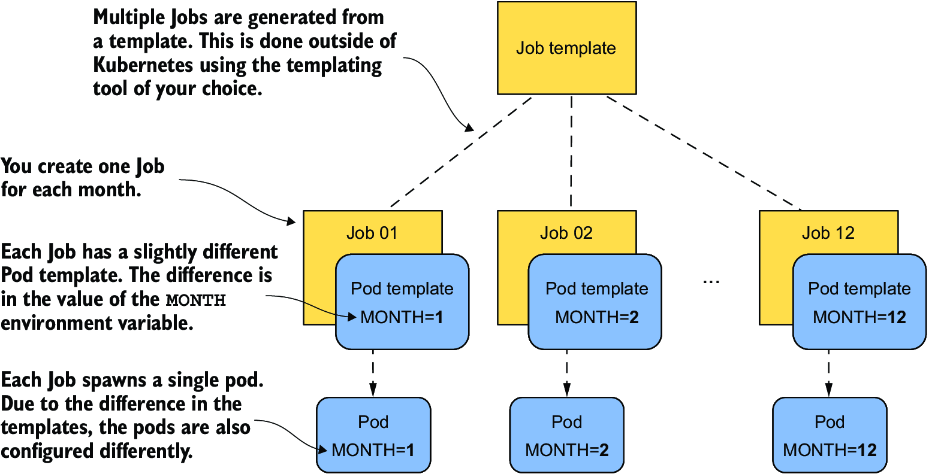

*Hình 18.7: Tạo các Job tương tự nhau từ một template*

Để tạo các Job khác nhau này, bạn cần tạo các manifest Job riêng biệt. Bạn có thể làm thủ công hoặc dùng một hệ thống templating bên ngoài. Bản thân Kubernetes không cung cấp chức năng nào để tạo Job từ template.

Hãy quay lại ví dụ với Job `aggregate-responses`. Để xử lý toàn bộ năm 2020, bạn cần tạo 12 manifest Job. Bạn có thể dùng một template engine đầy đủ cho việc này, nhưng bạn cũng có thể làm bằng một lệnh shell tương đối đơn giản.

Trước tiên bạn phải tạo template. Bạn có thể tìm thấy nó trong file `job.aggregate-responses-2020.tmpl.yaml`. Listing sau cho thấy nó trông như thế nào.

**Listing 18.7: Một template để tạo các manifest Job cho Job aggregate-responses**

```yaml
apiVersion: batch/v1
kind: Job
metadata:
  name: aggregate-responses-2020-__MONTH__   #1
spec:
  completionMode: NonIndexed
  template:
    spec:
      restartPolicy: OnFailure
      containers:
      - name: updater
        image: mongo:5
        env:
        - name: YEAR
          value: "2020"
        - name: MONTH
          value: "__MONTH__"                 #2
        ...
```

- **#1** Tên chứa placeholder "`__MONTH__`". Khi template này được render, placeholder được thay bằng số tháng thực tế.
- **#2** Cùng placeholder đó được dùng trong biến môi trường `MONTH` được truyền vào container.

Nếu bạn dùng Bash, bạn có thể tạo các manifest từ template này và apply chúng trực tiếp vào cluster bằng lệnh sau:

```bash
$ for month in {1..12}; do \                                                      #1
    sed -e "s/__MONTH__/$month/g" job.aggregate-responses-2020.tmpl.yaml \        #2
    | kubectl apply -f - ; \                                                      #3
  done
job.batch/aggregate-responses-2020-1 created                                      #4
job.batch/aggregate-responses-2020-2 created                                      #4
...                                                                               #4
job.batch/aggregate-responses-2020-12 created                                     #4
```

- **#1** Thực thi một vòng lặp để lặp lại lệnh sau 12 lần
- **#2** Render template bằng cách thay placeholder `__MONTH__` bằng số tháng
- **#3** Apply file YAML đã render vào cluster
- **#4** Output của lệnh cho thấy 12 Job object khác nhau đã được tạo.

Lệnh này dùng một vòng lặp for để render template 12 lần. Render template đơn giản là thay chuỗi `__MONTH__` trong template bằng số tháng thực tế. Manifest thu được được apply vào cluster bằng `kubectl apply`.

> **GHI CHÚ:** Nếu bạn muốn chạy ví dụ này nhưng không dùng Linux, bạn có thể dùng các manifest tôi đã tạo sẵn cho bạn. Dùng lệnh sau để apply chúng vào cluster của bạn: `kubectl apply -f job.aggregate-responses-2020.generated.yaml`.

12 Job bạn vừa tạo giờ đang chạy trong cluster của bạn. Mỗi Job tạo một Pod duy nhất xử lý một tháng cụ thể. Để xem thống kê được sinh ra, hãy dùng lệnh sau:

```bash
$ kubectl exec quiz-0 -c mongo -- mongosh kiada --quiet --eval 'db.statistics.find()'
[
  {                                                   #1
    _id: ISODate("2020-02-28T00:00:00.000Z"),         #1
    totalCount: 120,                                  #1
    correctCount: 25,                                 #1
    incorrectCount: 95                                #1
  },                                                  #1
  ...                                                 #1
```

- **#1** Vào ngày 28 tháng 2 năm 2020, có tổng cộng 120 câu trả lời, với 25 câu đúng và 95 câu sai.

Nếu cả 12 Job đã xử lý xong các tháng tương ứng của chúng, bạn sẽ thấy nhiều mục giống như mục hiển thị ở đây. Bây giờ bạn có thể xóa cả 12 Job `aggregate-responses` như sau:

```bash
$ kubectl delete jobs -l app=aggregate-responses
```

Trong ví dụ này, tham số truyền cho mỗi Job là một số nguyên đơn giản, nhưng lợi thế thực sự của cách tiếp cận này là bạn có thể truyền bất kỳ giá trị hoặc tập giá trị nào cho mỗi Job và pod của nó. Nhược điểm, dĩ nhiên, là bạn có nhiều hơn một Job, nghĩa là nhiều việc phải quản lý hơn so với việc quản lý một Job object duy nhất. Và nếu bạn tạo các Job object đó cùng lúc, tất cả chúng sẽ chạy đồng thời. Đó là lý do tại sao tạo một Job duy nhất dùng completion mode `Indexed` là lựa chọn tốt hơn, như bạn sẽ thấy tiếp theo.

#### Giới thiệu completion mode Indexed (Introducing the Indexed completion mode)

Như đã đề cập trước đó, khi một Job được cấu hình với completion mode `Indexed`, mỗi pod được gán một completion index (bắt đầu từ `0`) phân biệt pod đó với các pod khác trong cùng Job, như trong hình 18.8.

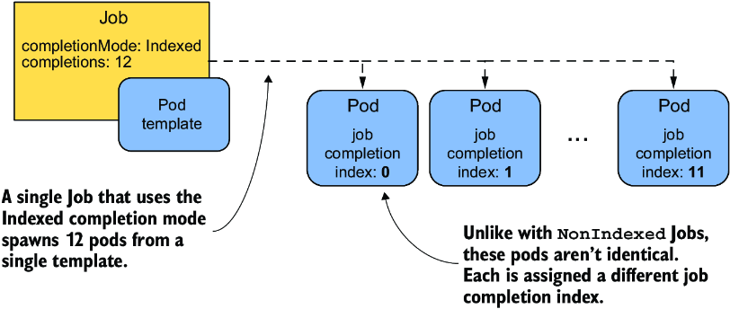

*Hình 18.8: Các pod được sinh ra bởi một Job với completion mode Indexed, mỗi pod nhận số index riêng của nó.*

Số lượng pod được xác định bởi trường `completions` trong `spec` của Job. Job được xem là hoàn thành khi có một pod hoàn thành thành công cho mỗi index.

Listing sau cho thấy một manifest Job dùng completion mode `Indexed` để chạy 12 pod, mỗi pod cho một tháng. Lưu ý rằng biến môi trường `MONTH` không được đặt. Đó là vì script, như bạn sẽ thấy sau, dùng completion index để xác định tháng cần xử lý.

**Listing 18.8: Một manifest Job dùng completion mode Indexed**

```yaml
apiVersion: batch/v1
kind: Job
metadata:
  name: aggregate-responses-2021
  labels:
    app: aggregate-responses
    year: "2021"
spec:
  completionMode: Indexed                     #1
  completions: 12                             #2
  parallelism: 3                              #3
  template:
    metadata:
      labels:
        app: aggregate-responses
        year: "2021"
    spec:
      restartPolicy: OnFailure
      containers:
      - name: updater
        image: mongo:5
        env:
        - name: YEAR                          #4
          value: "2021"                       #4
        command:
        - mongosh
        - mongodb+srv://quiz-pods.kiada.svc.cluster.local/kiada?tls=false
        - --quiet
        - --file
        - /script.js
        volumeMounts:
        - name: script
          subPath: script.js
          mountPath: /script.js
      volumes:
      - name: script
        configMap:                            #5
          name: aggregate-responses-indexed   #5
```

- **#1** Vì completion mode là `Indexed`, mỗi pod được tạo cho Job này được gán một số index, phân biệt nó với các pod khác.
- **#2** Đặt số completions để xử lý cả 12 tháng
- **#3** Cho phép tối đa ba pod chạy song song
- **#4** Chỉ có biến môi trường `YEAR` được đặt trong Pod template. Tháng được truyền vào bằng cách khác. Điều này được giải thích ở phần sau của mục này.
- **#5** Script tổng hợp các câu trả lời được nạp từ ConfigMap `aggregate-responses-indexed` và hơi khác so với ví dụ trước.

Trong listing, `completionMode` là `Indexed`, và số `completions` là `12`, như bạn có thể đoán. Để chạy ba pod song song, `parallelism` được đặt là `3`.

#### Biến môi trường JOB_COMPLETION_INDEX (The JOB_COMPLETION_INDEX environment variable)

Không giống ví dụ `aggregate-responses-2020`, trong đó bạn truyền cả hai biến môi trường `YEAR` và `MONTH`, ở đây bạn chỉ truyền biến `YEAR`. Để xác định pod nên xử lý tháng nào, script tra cứu biến môi trường `JOB_COMPLETION_INDEX`, như trong listing sau.

**Listing 18.9: Dùng biến môi trường JOB_COMPLETION_INDEX trong mã của bạn**

```yaml
apiVersion: v1
kind: ConfigMap
metadata:
  name: aggregate-responses-indexed
  labels:
    app: aggregate-responses-indexed
data:
  script.js: |
    var year = parseInt(process.env["YEAR"]);
    var month = parseInt(process.env["JOB_COMPLETION_INDEX"]) + 1;   #1
    ...
```

- **#1** `JOB_COMPLETION_INDEX` là biến môi trường bắt đầu từ 0 (zero-based) mà Job controller đặt trong các pod được tạo cho một Job có `completionMode` là `Indexed`.

Biến môi trường này không được chỉ định trong Pod template mà được Job controller thêm vào mỗi pod. Workload chạy trong pod có thể dùng biến này để xác định phần nào của tập dữ liệu cần xử lý.

Trong ví dụ `aggregate-responses`, giá trị của biến đại diện cho số tháng. Tuy nhiên, vì biến môi trường bắt đầu từ 0, script phải tăng giá trị lên 1 để có được tháng.

#### Annotation job-completion-index (The job-completion-index annotation)

Ngoài việc đặt biến môi trường, Job controller còn đặt job completion index trong annotation `batch.kubernetes.io/job-completion-index` của pod. Thay vì dùng biến môi trường `JOB_COMPLETION_INDEX`, bạn có thể truyền index qua bất kỳ biến môi trường nào bằng cách dùng Downward API, như đã giải thích ở chương 7. Ví dụ, để truyền giá trị của annotation này vào biến môi trường `MONTH`, mục `env` trong Pod template sẽ trông như sau:

```yaml
env:
- name: MONTH                                                   #1
  valueFrom:                                                    #2
    fieldRef:                                                   #2
      fieldPath: metadata.annotations['batch.kubernetes.        #2
↪io/job-completion-index']                                      #2
```

- **#1** Mục `env` này đặt biến môi trường `MONTH`.
- **#2** Nguồn của giá trị là annotation được chỉ định của pod.

Bạn có thể nghĩ rằng với cách tiếp cận này bạn có thể dùng lại chính script như trong ví dụ `aggregate-responses-2020`, nhưng không phải vậy. Vì bạn không thể thực hiện phép toán khi dùng Downward API, bạn sẽ phải sửa script để xử lý đúng biến môi trường `MONTH`, biến này bắt đầu từ `0` thay vì `1`.

#### Chạy một Indexed Job (Running an indexed Job)

Để chạy biến thể indexed này của Job `aggregate-responses`, hãy apply file manifest `job.aggregate-responses-2021-indexed.yaml`. Sau đó bạn có thể theo dõi các pod được tạo bằng cách chạy lệnh sau:

```bash
$ kubectl get pods -l job-name=aggregate-responses-2021
NAME                               READY   STATUS    RESTARTS   AGE
aggregate-responses-2021-0-kptfr   1/1     Running   0          24s   #1
aggregate-responses-2021-1-r4vfq   1/1     Running   0          24s   #2
aggregate-responses-2021-2-snz4m   1/1     Running   0          24s   #3
```

- **#1** Pod với job completion index 0.
- **#2** Pod với job completion index 1.
- **#3** Pod với job completion index 2.

Bạn có nhận thấy tên các Pod chứa job completion index không? Tên Job là `aggregate-responses-2021`, nhưng tên các Pod có dạng `aggregate-responses-2021-<index>-<chuỗi ngẫu nhiên>`.

> **GHI CHÚ:** Completion index cũng xuất hiện trong hostname của Pod. Hostname có dạng `<job-name>-<index>`. Điều này tạo thuận lợi cho việc giao tiếp giữa các pod của một indexed Job, như bạn sẽ thấy sau.

Bây giờ hãy kiểm tra trạng thái của Job bằng lệnh sau:

```bash
$ kubectl get jobs
NAME                       STATUS    COMPLETIONS   DURATION   AGE
aggregate-responses-2021   Running   7/12          2m17s      2m17s
```

Không giống ví dụ bạn dùng nhiều Job với completion mode `NonIndexed`, toàn bộ công việc được thực hiện với một Job object duy nhất, khiến mọi thứ dễ quản lý hơn nhiều. Mặc dù vẫn có 12 pod, bạn không phải quan tâm đến chúng trừ khi Job thất bại. Khi bạn thấy Job đã hoàn thành, bạn có thể chắc chắn rằng tác vụ đã xong, và bạn có thể xóa Job để dọn dẹp mọi thứ.

#### Dùng job completion index trong các trường hợp nâng cao hơn (Using the Job completion index in more advanced use-cases)

Trong ví dụ trước, mã trong workload dùng trực tiếp job completion index làm đầu vào. Nhưng còn những tác vụ mà đầu vào không phải là một con số đơn giản thì sao?

Ví dụ, hãy tưởng tượng một container image nhận một file đầu vào và xử lý nó theo cách nào đó. Nó mong đợi file nằm ở một vị trí nhất định và có một tên nhất định. Giả sử file tên là `/var/input/file.bin`. Bạn muốn dùng image này để xử lý 1.000 file. Bạn có thể làm điều đó với một indexed job mà không cần thay đổi mã trong image không?

Có, bạn có thể! Bằng cách thêm một init container và một volume vào Pod template. Bạn tạo một Job với `completionMode` đặt là `Indexed` và `completions` đặt là `1000`. Trong Pod template của Job, bạn thêm hai container và một volume được chia sẻ bởi hai container này. Một container chạy image xử lý file. Hãy gọi nó là container chính. Container còn lại là một init container đọc completion index từ biến môi trường và chuẩn bị file đầu vào trên volume chia sẻ.

Nếu một nghìn file bạn cần xử lý nằm trên một volume mạng, bạn cũng có thể mount volume đó vào pod và để init container tạo một liên kết tượng trưng (symbolic link) tên `file.bin` trong volume nội bộ chia sẻ của pod trỏ tới một trong các file trên volume mạng. Init container phải đảm bảo rằng mỗi completion index tương ứng với một file khác nhau trên volume mạng.

Nếu volume nội bộ được mount vào container chính tại `/var/input`, container chính có thể xử lý file mà không cần biết gì về completion index hay thực tế là có một nghìn file đang được xử lý. Hình 18.9 cho thấy tất cả những điều này sẽ trông như thế nào.

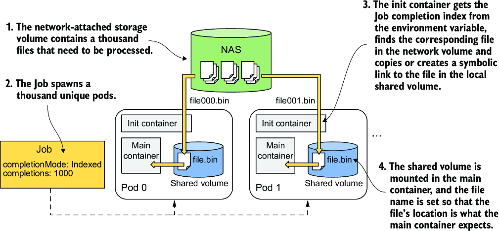

*Hình 18.9: Một init container cung cấp file đầu vào cho container chính dựa trên job completion index*

Như bạn có thể thấy, mặc dù một indexed Job chỉ cung cấp một số nguyên đơn giản cho mỗi pod, vẫn có cách dùng số nguyên đó để chuẩn bị dữ liệu đầu vào phức tạp hơn nhiều cho workload. Tất cả những gì bạn cần là một init container biến đổi số nguyên đó thành dữ liệu đầu vào này.

### 18.1.5 Chạy Job với một work queue (Running Jobs with a work queue)

Các Job ở mục trước được giao công việc tĩnh. Tuy nhiên, thường thì công việc cần thực hiện được giao một cách động thông qua một work queue (hàng đợi công việc). Thay vì chỉ định dữ liệu đầu vào ngay trong Job, pod lấy dữ liệu đó từ hàng đợi. Trong mục này, bạn sẽ học hai phương pháp xử lý một work queue trong một Job.

Đoạn trên có thể tạo ấn tượng rằng bản thân Kubernetes cung cấp một kiểu xử lý dựa trên hàng đợi nào đó, nhưng không phải vậy. Khi chúng ta nói về các Job dùng hàng đợi, thì hàng đợi và thành phần lấy các mục công việc từ hàng đợi đó cần được hiện thực trong các container của bạn. Sau đó bạn tạo một Job chạy các container đó trong một hoặc nhiều pod. Để học cách làm điều này, bây giờ bạn sẽ hiện thực một biến thể khác của Job `aggregate-responses`. Biến thể này dùng một hàng đợi làm nguồn công việc cần thực thi.

Có hai cách xử lý một work queue: thô (coarse) hoặc mịn (fine). Hình 18.10 minh họa sự khác biệt giữa hai phương pháp này.

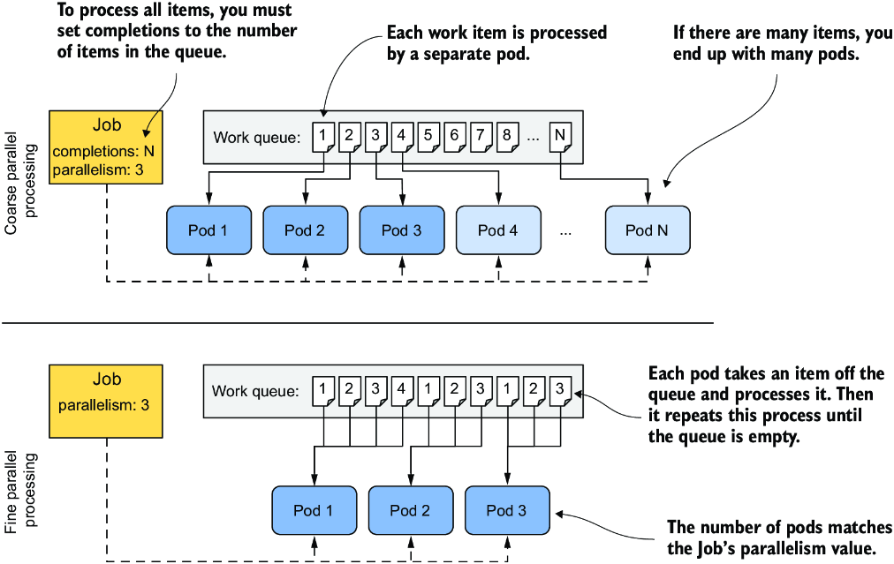

*Hình 18.10: Sự khác biệt giữa xử lý song song thô và mịn*

Trong xử lý song song thô (coarse parallel processing), mỗi pod lấy một mục từ hàng đợi, xử lý nó, rồi kết thúc. Do đó, bạn có một pod cho mỗi mục công việc. Ngược lại, trong xử lý song song mịn (fine parallel processing), thường chỉ một số ít pod được tạo, và mỗi pod xử lý nhiều mục công việc. Tất cả chúng làm việc song song cho đến khi toàn bộ hàng đợi được xử lý xong. Với cả hai phương pháp, bạn có thể chạy bao nhiêu pod song song tùy ý, nếu cluster của bạn đáp ứng được.

#### Tạo work queue (Creating the work queue)

Job bạn sẽ tạo cho bài tập này sẽ xử lý các câu trả lời Quiz của năm 2022. Trước khi tạo Job này, bạn phải thiết lập work queue trước. Để đơn giản, bạn hiện thực hàng đợi ngay trong cơ sở dữ liệu MongoDB hiện có. Để tạo hàng đợi, bạn chạy lệnh sau:

```bash
$ kubectl exec -it quiz-0 -c mongo -- mongosh kiada --eval '
  db.monthsToProcess.insertMany([
    {_id: "2022-01", year: 2022, month: 1},
    {_id: "2022-02", year: 2022, month: 2},
    {_id: "2022-03", year: 2022, month: 3},
    {_id: "2022-04", year: 2022, month: 4},
    {_id: "2022-05", year: 2022, month: 5},
    {_id: "2022-06", year: 2022, month: 6},
    {_id: "2022-07", year: 2022, month: 7},
    {_id: "2022-08", year: 2022, month: 8},
    {_id: "2022-09", year: 2022, month: 9},
    {_id: "2022-10", year: 2022, month: 10},
    {_id: "2022-11", year: 2022, month: 11},
    {_id: "2022-12", year: 2022, month: 12}])'
```

> **GHI CHÚ:** Lệnh này giả định rằng `quiz-0` là replica chính (primary) của MongoDB. Nếu lệnh thất bại với thông báo lỗi "not primary", hãy thử chạy lệnh trong cả ba pod, hoặc bạn có thể hỏi MongoDB xem replica nào trong ba replica là primary bằng lệnh sau: `kubectl exec quiz-0 -c mongo -- mongosh --eval 'rs.hello().primary'`.

Lệnh này chèn 12 mục công việc vào collection MongoDB tên `monthsToProcess`. Mỗi mục công việc đại diện cho một tháng cụ thể cần được xử lý.

#### Xử lý work queue bằng xử lý song song thô (Processing a work queue using coarse parallel processing)

Hãy bắt đầu với một ví dụ về xử lý song song thô, trong đó mỗi pod chỉ xử lý một mục công việc duy nhất. Bạn có thể tìm thấy manifest của Job trong file `job.aggregate-responses-queue-coarse.yaml`, và nó được hiển thị trong listing sau.

**Listing 18.10: Xử lý một work queue bằng xử lý song song thô**

```yaml
apiVersion: batch/v1
kind: Job
metadata:
  name: aggregate-responses-queue-coarse
spec:
  completions: 6                                                        #1
  parallelism: 3                                                        #2
  template:
    spec:
      restartPolicy: OnFailure
      containers:
      - name: processor
        image: mongo:5
        command:
        - mongosh                                                       #3
        - mongodb+srv://quiz-pods.kiada.svc.cluster.local/kiada?tls=false #3
        - --quiet                                                       #3
        - --file                                                        #3
        - /script.js                                                    #3
        volumeMounts:                                                   #4
        - name: script                                                  #4
          subPath: script.js                                            #4
          mountPath: /script.js                                         #4
      volumes:                                                          #4
      - name: script                                                    #4
        configMap:                                                      #4
          name: aggregate-responses-queue-coarse                        #4
```

- **#1** Job này được cấu hình để xử lý sáu mục công việc.
- **#2** Ba mục công việc được xử lý song song.
- **#3** Các pod được sinh ra bởi Job này chạy một script trong MongoDB.
- **#4** Nguồn của script là một ConfigMap.

Job tạo các pod chạy một script trong MongoDB, script này lấy một mục duy nhất từ hàng đợi và xử lý nó. Lưu ý rằng `completions` là `6`, nghĩa là Job này chỉ xử lý 6 trong số 12 mục bạn đã thêm vào hàng đợi. Lý do là tôi muốn để lại vài mục cho ví dụ xử lý song song mịn ngay sau ví dụ này.

Thiết lập `parallelism` cho Job này là `3`, nghĩa là ba mục công việc được xử lý song song bởi ba pod khác nhau. Script mà mỗi pod thực thi được định nghĩa trong ConfigMap `aggregate-responses-queue-coarse`. Manifest của ConfigMap này nằm trong cùng file với manifest của Job. Bạn có thể xem phác thảo sơ lược của script trong listing sau.

**Listing 18.11: Một script MongoDB xử lý một mục công việc duy nhất**

```javascript
print("Fetching one work item from queue...");
var workItem = db.monthsToProcess.findOneAndDelete({});          #1
if (workItem == null) {                                          #2
    print("No work item found. Processing is complete.");        #2
    quit(0);                                                     #2
}                                                                #2
print("Found work item:");                                       #3
print("  Year:  " + workItem.year);                              #3
print("  Month: " + workItem.month);                             #3
                                                                 #3
var year = parseInt(workItem.year);                              #3
var month = parseInt(workItem.month) + 1;                        #3
// code that processes the item                                  #3
print("Done.");                                                  #4
quit(0);                                                         #4
```

- **#1** Lấy một mục công việc từ hàng đợi.
- **#2** Nếu hàng đợi rỗng, kết thúc với exit code 0, cho biết việc xử lý đã xong.
- **#3** Xử lý mục công việc.
- **#4** Sau khi mục đã được xử lý, kết thúc thành công.

Script lấy một mục từ work queue. Như bạn đã biết, mỗi mục đại diện cho một tháng. Script thực hiện một truy vấn tổng hợp (aggregation query) trên các câu trả lời Quiz của tháng đó để tính số câu trả lời đúng, sai và tổng số, rồi lưu kết quả trở lại MongoDB.

Để chạy Job, hãy apply `job.aggregate-responses-queue-coarse.yaml` bằng `kubectl apply` và quan sát trạng thái của Job bằng `kubectl get jobs`. Bạn cũng có thể kiểm tra các pod để đảm bảo rằng ba pod đang chạy song song, và tổng số pod là sáu sau khi Job hoàn thành.

Nếu mọi việc suôn sẻ, work queue của bạn giờ chỉ còn chứa sáu tháng chưa được Job xử lý. Bạn có thể xác nhận điều này bằng cách chạy lệnh sau:

```bash
$ kubectl exec quiz-0 -c mongo -- mongosh kiada --quiet --eval 'db.monthsToProcess.find()'
[
  { _id: '2022-07', year: 2022, month: 7 },
  { _id: '2022-08', year: 2022, month: 8 },
  { _id: '2022-09', year: 2022, month: 9 },
  { _id: '2022-10', year: 2022, month: 10 },
  { _id: '2022-11', year: 2022, month: 11 },
  { _id: '2022-12', year: 2022, month: 12 }
]
```

Bạn có thể kiểm tra log của sáu pod để xem chúng có xử lý đúng chính xác các tháng mà các mục tương ứng đã bị lấy ra khỏi hàng đợi hay không. Bạn sẽ xử lý các mục còn lại bằng xử lý song song mịn. Trước khi tiếp tục, hãy xóa Job `aggregate-responses-queue-coarse` bằng `kubectl delete`. Việc này cũng xóa luôn sáu pod.

#### Xử lý work queue bằng xử lý song song mịn (Processing a work queue using fine parallel processing)

Trong xử lý song song mịn, mỗi pod xử lý nhiều mục công việc. Nó lấy một mục từ hàng đợi, xử lý nó, lấy mục tiếp theo, và lặp lại quá trình này cho đến khi không còn mục nào trong hàng đợi. Như trước, nhiều pod có thể làm việc song song.

Manifest của Job nằm trong file `job.aggregate-responses-queue-fine.yaml`. Pod template gần như giống hệt ví dụ trước, nhưng nó không chứa trường `completions`, như trong listing sau.

**Listing 18.12: Xử lý một work queue bằng cách tiếp cận xử lý song song mịn**

```yaml
apiVersion: batch/v1
kind: Job
metadata:
  name: aggregate-responses-queue-fine
spec:
  parallelism: 3              #1
  template:
    ...
```

- **#1** Chỉ có `parallelism` được đặt cho Job này. Trường `completions` không được đặt.

Một Job dùng xử lý song song mịn không đặt trường `completions` vì một lần hoàn thành thành công duy nhất đã cho biết tất cả các mục trong hàng đợi đã được xử lý. Đó là vì pod kết thúc thành công khi nó đã xử lý xong mục công việc cuối cùng.

Bạn có thể tự hỏi điều gì xảy ra nếu một số pod vẫn đang xử lý các mục của chúng khi một pod khác báo cáo thành công. May mắn thay, Job controller để các pod còn lại hoàn thành công việc của chúng. Nó không kill chúng.

Như trước, file manifest cũng chứa một ConfigMap chứa script MongoDB. Không giống script trước, script này xử lý lần lượt từng mục công việc cho đến khi hàng đợi rỗng, như trong listing 18.13.

**Listing 18.13: Một script MongoDB xử lý toàn bộ hàng đợi**

```javascript
print("Processing quiz responses - queue - all work items");
print("==================================================");
print();
print("Fetching work items from queue...");
print();
while (true) {                                                       #1
    var workItem = db.monthsToProcess.findOneAndDelete({});          #2
    if (workItem == null) {                                          #3
        print("No work item found. Processing is complete.");        #3
        quit(0);                                                     #3
    }                                                                #3
    print("Found work item:");                                       #4
    print("  Year:  " + workItem.year);                              #4
    print("  Month: " + workItem.month);                             #4
    // process the item                                              #4
    ...                                                              #4
    print("Done processing item.");                                  #5
    print("------------------");                                     #5
    print();                                                         #5
}                                                                    #5
```

- **#1** Script chạy một vòng lặp, xử lý các mục cho đến khi không còn mục nào.
- **#2** Lấy một mục từ work queue
- **#3** Khi hàng đợi rỗng, kết thúc script với exit code 0. Dĩ nhiên điều này sẽ thoát khỏi vòng lặp.
- **#4** Xử lý mục công việc
- **#5** Tiếp tục vòng lặp sau khi mục đã được xử lý.

Để chạy Job này, hãy apply file manifest `job.aggregate-responses-queue-fine.yaml`. Bạn sẽ thấy ba pod gắn với nó. Khi chúng xử lý xong các mục trong hàng đợi, các container của chúng kết thúc, và các pod hiển thị là `Completed`:

```bash
$ kubectl get pods -l job-name=aggregate-responses-queue-fine
NAME                                   READY   STATUS      RESTARTS   AGE
aggregate-responses-queue-fine-9slkl   0/1     Completed   0          4m21s
aggregate-responses-queue-fine-hxqbw   0/1     Completed   0          4m21s
aggregate-responses-queue-fine-szqks   0/1     Completed   0          4m21s
```

Trạng thái của Job cũng cho thấy cả ba pod đã hoàn thành:

```bash
$ kubectl get jobs
NAME                             STATUS     COMPLETIONS   DURATION   AGE
aggregate-responses-queue-fine   Complete   3/1 of 3      3m19s      5m34s
```

Việc cuối cùng bạn cần làm là kiểm tra xem work queue có thực sự rỗng hay không. Bạn có thể làm điều này bằng lệnh sau:

```bash
$ kubectl exec quiz-1 -c mongo -- mongosh kiada --quiet --eval 'db.monthsToProcess.countDocuments()'
0       #1
```

- **#1** Không còn document nào trong collection `monthsToProcess` đại diện cho work queue của bạn.

Như bạn có thể thấy, hàng đợi bằng không, nên Job đã hoàn thành.

#### Xử lý liên tục các work queue (Continuous processing of work queues)

Để kết thúc mục về Job với work queue này, hãy xem điều gì xảy ra khi bạn thêm các mục vào hàng đợi sau khi Job đã hoàn thành. Thêm một mục công việc cho tháng 1 năm 2023 như sau:

```bash
$ kubectl exec -it quiz-0 -c mongo -- mongosh kiada --quiet --eval 'db.monthsToProcess.insertOne({_id: "2023-01", year: 2023, month: 1})'
{ acknowledged: true, insertedId: '2023-01' }
```

Bạn có nghĩ Job sẽ tạo một pod khác để xử lý mục công việc này không? Câu trả lời là hiển nhiên khi bạn xét đến việc Kubernetes không biết gì về hàng đợi, như tôi đã giải thích trước đó. Chỉ các container chạy trong các pod mới biết về sự tồn tại của hàng đợi. Vì vậy, dĩ nhiên, nếu bạn thêm một mục mới sau khi Job đã kết thúc, nó sẽ không được xử lý trừ khi bạn tạo lại Job.

Hãy nhớ rằng Job được thiết kế để chạy các tác vụ đến khi hoàn thành, chứ không phải chạy liên tục. Để hiện thực một worker Pod liên tục giám sát một hàng đợi, bạn nên chạy pod bằng một Deployment thay thế. Tuy nhiên, nếu bạn muốn chạy Job theo định kỳ thay vì liên tục, bạn cũng có thể dùng một CronJob, như được giải thích ở phần thứ hai của chương này.

### 18.1.6 Giao tiếp giữa các Pod của Job (Communication between Job's Pods)

Hầu hết các pod thuộc về một job chạy độc lập, không biết gì về các pod khác trong cùng Job. Tuy nhiên, một số tác vụ yêu cầu các pod này giao tiếp với nhau.

Trong hầu hết các trường hợp, mỗi pod cần giao tiếp với một pod cụ thể hoặc với tất cả các pod đồng cấp (peer) của nó, chứ không phải chỉ với một pod ngẫu nhiên trong nhóm. May mắn thay, việc cho phép kiểu giao tiếp này rất đơn giản. Bạn chỉ phải làm ba việc:

* Đặt `completionMode` của Job là `Indexed`.
* Tạo một headless Service.
* Cấu hình service này làm `subdomain` trong Pod template.

Hãy để tôi giải thích điều này bằng một ví dụ.

#### Tạo manifest của headless Service (Creating the headless Service manifest)

Trước tiên hãy xem headless Service phải được cấu hình như thế nào. Manifest của nó được hiển thị trong listing sau.

**Listing 18.14: Headless Service cho việc giao tiếp giữa các Pod của Job**

```yaml
apiVersion: v1
kind: Service
metadata:
  name: demo-service
spec:
  clusterIP: none                #1
  selector:
    job-name: comm-demo          #2
  ports:
  - name: http
    port: 80
```

- **#1** Làm cho service trở thành headless. Để biết thêm thông tin, xem chương 11.
- **#2** Selector phải khớp với các pod mà Job tạo ra. Cách dễ nhất là dùng label "`job-name`", label này được tự động gán cho các pod đó.

Như bạn đã học ở chương 11, bạn phải đặt `clusterIP` là `none` để làm Service trở thành headless. Bạn cũng cần đảm bảo rằng label selector khớp với các pod mà Job tạo ra. Cách dễ nhất để làm điều này là dùng label `job-name` trong selector. Bạn đã học ở đầu chương này rằng label này được tự động thêm vào các pod. Giá trị của label được đặt là tên của Job object, nên bạn cần đảm bảo giá trị bạn dùng trong selector khớp với tên Job.

#### Tạo manifest của Job (Creating the Job manifest)

Bây giờ hãy xem manifest của Job phải được cấu hình như thế nào. Hãy xem xét listing sau.

**Listing 18.15: Một manifest Job cho phép giao tiếp pod-với-pod**

```yaml
apiVersion: batch/v1
kind: Job
metadata:
  name: comm-demo                 #1
spec:
  completionMode: Indexed         #2
  completions: 2                  #3
  parallelism: 2                  #3
  template:
    spec:
      subdomain: demo-service     #4
      restartPolicy: Never
      containers:
      - name: comm-demo
        image: busybox
        command:                  #5
        - sleep                   #5
        - "600"                   #5
```

- **#1** Tên Job phải khớp với giá trị bạn đã dùng trong label selector của headless Service.
- **#2** Completion mode phải được đặt là `Indexed`.
- **#3** Trong demo này, Job tạo hai pod. Chúng chạy song song để có thể giao tiếp với nhau.
- **#4** Giá trị này phải khớp với tên của headless Service.
- **#5** Các pod demo này không làm gì cả. Chúng chỉ sleep trong 10 phút để bạn có thể thử nghiệm với chúng.

Như đã đề cập trước đó, completion mode phải được đặt là `Indexed`. Job này được cấu hình để chạy hai pod song song để bạn có thể thử nghiệm với chúng. Bạn cần đặt `subdomain` của chúng là tên của headless Service để các pod có thể tìm thấy nhau qua DNS.

Bạn có thể tìm thấy cả manifest của Job lẫn Service trong file `job.comm-demo.yaml`. Tạo hai object bằng cách apply file này rồi liệt kê các pod như sau:

```bash
$ kubectl get pods -l job-name=comm-demo
NAME                READY   STATUS    RESTARTS   AGE
comm-demo-0-mrvlp   1/1     Running   0          34s
comm-demo-1-kvpb4   1/1     Running   0          34s
```

Hãy ghi lại tên của hai pod. Bạn cần chúng để thực thi lệnh trong các container của chúng.

#### Kết nối tới pod từ các pod khác (Connecting to pods from other pods)

Kiểm tra hostname của pod thứ nhất bằng lệnh sau. Hãy dùng tên pod của bạn.

```bash
$ kubectl exec comm-demo-0-mrvlp -- hostname -f
comm-demo-0.demo-service.kiada.svc.cluster.local
```

Pod thứ hai có thể giao tiếp với pod thứ nhất tại địa chỉ này. Để xác nhận, hãy thử ping pod thứ nhất từ pod thứ hai bằng lệnh sau (lần này, truyền tên pod thứ hai của bạn cho lệnh `kubectl exec`):

```bash
$ kubectl exec comm-demo-1-kvpb4 -- ping comm-demo-0.demo-service.kiada.svc.cluster.local
PING comm-demo-0.demo-service.kiada.svc.cluster.local (10.244.2.71): 56 data bytes
64 bytes from 10.244.2.71: seq=0 ttl=63 time=0.060 ms
64 bytes from 10.244.2.71: seq=1 ttl=63 time=0.062 ms
...
```

Như bạn có thể thấy, pod thứ hai có thể giao tiếp với pod thứ nhất mà không cần biết tên chính xác của nó, vốn được biết là ngẫu nhiên. Một pod chạy trong ngữ cảnh của một Job có thể xác định tên của các pod đồng cấp theo mẫu sau:

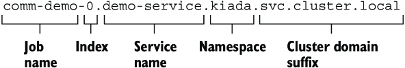

Nhưng bạn có thể đơn giản hóa địa chỉ hơn nữa. Như bạn có thể nhớ, khi phân giải các bản ghi DNS cho các object trong cùng namespace, bạn không cần dùng tên miền đầy đủ (fully qualified domain name). Bạn có thể bỏ namespace và hậu tố cluster domain. Vì vậy, pod thứ hai có thể kết nối tới pod thứ nhất bằng địa chỉ `comm-demo-0.demo-service`, như trong ví dụ sau:

```bash
$ kubectl exec comm-demo-1-kvpb4 -- ping comm-demo-0.demo-service
PING comm-demo-0.demo-service (10.244.2.71): 56 data bytes
64 bytes from 10.244.2.71: seq=0 ttl=63 time=0.040 ms
64 bytes from 10.244.2.71: seq=1 ttl=63 time=0.067 ms
...
```

Nếu các pod biết có bao nhiêu pod thuộc về cùng Job (giá trị của trường `completions` là bao nhiêu), chúng có thể dễ dàng tìm thấy tất cả các pod đồng cấp của mình qua DNS. Chúng không cần hỏi Kubernetes API server về tên hay địa chỉ IP của các pod đó.

### 18.1.7 Sidecar container trong Job pod (Sidecar containers in Job pods)

Job pod có thể chứa các sidecar container giống như các pod không thuộc job, nhưng có một lưu ý. Một job pod được xem là hoàn thành khi tất cả các container của nó đã dừng. Container chính thực hiện tác vụ batch thường hoàn thành khi tác vụ kết thúc, nhưng các sidecar container thường chạy vô thời hạn. Nếu bạn định nghĩa một sidecar trong manifest Pod của Job trong danh sách `spec.containers`, Pod của bạn và do đó cả bản thân Job sẽ không bao giờ hoàn thành, như bạn sẽ thấy trong ví dụ tiếp theo.

#### Cách không nên chạy sidecar trong Job pod (How not to run a sidecar in a Job pod)

File manifest Job `job.demo-bad-sidecar.yaml` định nghĩa một Job với hai container. Cả container chính lẫn sidecar container đều được định nghĩa trong danh sách `spec.containers` bên trong Pod template của Job. Khi bạn chạy Job này, bạn sẽ thấy nó không bao giờ hoàn thành, vì sidecar không bao giờ ngừng chạy:

```bash
$ kubectl get pods -w
NAME                     READY   STATUS              RESTARTS   AGE
demo-bad-sidecar-nfgj2   0/2     Pending             0          0s    #1
demo-bad-sidecar-nfgj2   0/2     Pending             0          0s    #1
demo-bad-sidecar-nfgj2   0/2     ContainerCreating   0          0s    #1
demo-bad-sidecar-nfgj2   2/2     Running             0          3s    #2
demo-bad-sidecar-nfgj2   1/2     NotReady            0          22s   #3
```

- **#1** Pod được tạo và lập lịch.
- **#2** Cả container chính lẫn sidecar container đều đang chạy.
- **#3** Container chính đã hoàn thành, nhưng sidecar vẫn đang chạy.

Như bạn có thể thấy, khi container chính hoàn thành, pod tiếp tục chạy, nhưng được hiển thị là `NotReady`, vì container chính không còn sẵn sàng nữa do nó không còn chạy. Job được hiển thị là đang chạy và sẽ tiếp tục được hiển thị như vậy vô thời hạn:

```bash
$ kubectl get jobs
NAME               STATUS    COMPLETIONS   DURATION   AGE
demo-bad-sidecar   Running   0/1           2m46s      2m46s
```

Bạn không thể làm gì khác ngoài việc xóa Job.

#### Cách đúng để chạy sidecar trong Job pod (The correct way to run a sidecar in a Job pod)

Cách đúng để thêm một sidecar vào Pod của Job là thông qua danh sách `initContainers`, như đã giải thích ở chương 5, và như trong listing sau. Bạn có thể tìm thấy manifest của Job trong file `job.demo-good-sidecar.yaml`.

**Listing 18.16: Thêm một native sidecar vào Job**

```yaml
apiVersion: batch/v1
kind: Job
metadata:
  name: demo-good-sidecar
spec:
  completions: 1
  template:
    spec:
      restartPolicy: OnFailure
      initContainers:                                   #1
      - name: sidecar                                   #1
        restartPolicy: Always                           #1
        image: busybox
        command:
        - sh
        - -c
        - "while true; do echo 'Sidecar still running...'; sleep 5; done"
      containers:                                       #2
      - name: demo                                      #2
        image: busybox                                  #2
        command: ["sleep", "20"]                        #2
```

- **#1** Sidecar container được định nghĩa như một init container với restart policy là `Always`.
- **#2** Container chính được định nghĩa như bình thường.

Khi bạn chạy Job này, pod và Job hoàn thành khi container chính kết thúc:

```bash
$ kubectl get pods -w
NAME                      READY   STATUS            RESTARTS   AGE
demo-good-sidecar-pz8fb   0/2     Pending           0          0s    #1
demo-good-sidecar-pz8fb   0/2     Pending           0          0s    #1
demo-good-sidecar-pz8fb   0/2     Init:0/1          0          0s    #2
demo-good-sidecar-pz8fb   1/2     PodInitializing   0          3s    #2
demo-good-sidecar-pz8fb   2/2     Running           0          5s    #3
demo-good-sidecar-pz8fb   1/2     Completed         0          25s   #4
demo-good-sidecar-pz8fb   0/2     Completed         0          56s   #5
```

- **#1** Pod được tạo và lập lịch.
- **#2** Sidecar container được khởi động.
- **#3** Container chính khởi động.
- **#4** Container chính hoàn thành, đánh dấu pod là `Completed`.
- **#5** Sidecar container kết thúc.

Như bạn có thể thấy trong output, pod được đánh dấu `Completed` khi container chính hoàn thành. Sidecar container bị kết thúc sau đó. Vì pod đã hoàn thành, Job cũng hoàn thành:

```bash
$ kubectl get jobs
NAME                STATUS     COMPLETIONS   DURATION   AGE
demo-good-sidecar   Complete   1/1           59s        2m28s
```

Đến đây kết thúc phần thứ nhất của chương này. Hãy xóa mọi Job còn lại trước khi tiếp tục.

---

## 18.2 Lập lịch Job với CronJob (Scheduling Jobs with CronJobs)

Khi bạn tạo một Job object, nó bắt đầu thực thi ngay lập tức. Mặc dù bạn có thể tạo Job ở trạng thái tạm dừng rồi bỏ tạm dừng sau, bạn không thể cấu hình nó để chạy vào một thời điểm cụ thể. Để đạt được điều này, bạn có thể bọc Job trong một CronJob object.

Trong CronJob object, bạn chỉ định một Job template và một lịch (schedule). Theo lịch này, CronJob controller tạo một Job object mới từ template. Bạn có thể đặt lịch để làm điều này nhiều lần một ngày, vào một thời điểm cụ thể trong ngày, hoặc vào những ngày cụ thể trong tuần hoặc trong tháng. Controller sẽ tiếp tục tạo Job theo lịch cho đến khi bạn xóa CronJob object. Hình 18.11 minh họa cách một CronJob hoạt động.

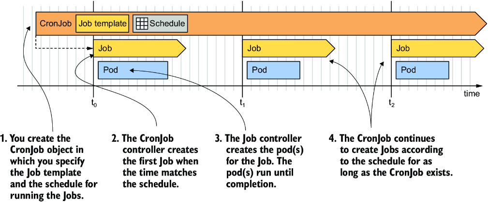

*Hình 18.11: Hoạt động của một CronJob*

Như trong hình, mỗi lần CronJob controller tạo một Job, Job controller sau đó tạo (các) pod, giống hệt như khi bạn tạo Job object thủ công. Hãy xem quá trình này hoạt động.

### 18.2.1 Tạo một CronJob (Creating a CronJob)

Listing sau cho thấy một manifest CronJob chạy một Job mỗi phút. Job này tổng hợp các câu trả lời Quiz nhận được trong ngày hôm nay và cập nhật thống kê Quiz theo ngày. Bạn có thể tìm thấy manifest trong file `cj.aggregate-responses-every-minute.yaml`.

**Listing 18.17: Một CronJob chạy một Job mỗi phút**

```yaml
apiVersion: batch/v1                                                    #1
kind: CronJob                                                           #1
metadata:
  name: aggregate-responses-every-minute
spec:
  schedule: "* * * * *"                                                 #2
  jobTemplate:                                                          #3
    metadata:                                                           #3
      labels:                                                           #3
        app: aggregate-responses-today                                  #3
    spec:                                                               #3
      template:                                                         #3
        metadata:                                                       #3
          labels:                                                       #3
            app: aggregate-responses-today                              #3
        spec:                                                           #3
          restartPolicy: OnFailure                                      #3
          containers:                                                   #3
          - name: updater                                               #3
            image: mongo:5                                              #3
            command:                                                    #3
            - mongosh                                                   #3
            - mongodb+srv://quiz-pods.kiada.svc.cluster.local/kiada?tls=false #3
            - --quiet                                                   #3
            - --file                                                    #3
            - /script.js                                                #3
            volumeMounts:                                               #3
            - name: script                                              #3
              subPath: script.js                                        #3
              mountPath: /script.js                                     #3
          volumes:                                                      #3
          - name: script                                                #3
            configMap:                                                  #3
              name: aggregate-responses-today                           #3
```

- **#1** CronJob thuộc API group `batch`, phiên bản `v1`.
- **#2** Lịch được chỉ định theo định dạng crontab. Lịch cụ thể này chạy Job mỗi phút.
- **#3** Một CronJob phải chỉ định một template cho Job object.

Như bạn có thể thấy trong listing, CronJob chỉ là một lớp bọc mỏng quanh một Job. Chỉ có hai phần trong `spec` của CronJob: `schedule` và `jobTemplate`. Bạn đã học cách viết manifest Job ở các mục trước, nên phần đó hẳn đã rõ. Nếu bạn biết định dạng crontab, bạn cũng sẽ hiểu cách trường schedule hoạt động. Nếu không, tôi sẽ giải thích ở mục 18.2.2. Trước tiên, hãy tạo CronJob object từ manifest và xem nó hoạt động.

#### Chạy một CronJob (Running a CronJob)

Apply file manifest để tạo CronJob. Dùng lệnh `kubectl get cj` để kiểm tra object:

```bash
$ kubectl get cj
NAME                               SCHEDULE    TIMEZONE   SUSPEND   ACTIVE   LAST SCHEDULE   AGE
aggregate-responses-every-minute   * * * * *   <none>     False     0        <none>          2s
```

> **GHI CHÚ:** Tên viết tắt của CronJob là `cj`.

> **GHI CHÚ:** Khi bạn liệt kê CronJob với tùy chọn `-o wide`, lệnh còn hiển thị tên container và image được dùng trong pod, nên bạn có thể dễ dàng thấy CronJob làm gì.

Output của lệnh hiển thị danh sách CronJob trong namespace hiện tại. Với mỗi CronJob, tên, lịch, múi giờ, CronJob có bị tạm dừng hay không, số Job hiện đang hoạt động, lần cuối cùng một Job được lập lịch, và tuổi của object được hiển thị.

Như thông tin trong các cột `ACTIVE` và `LAST SCHEDULE` cho thấy, chưa có Job nào được tạo cho CronJob này. CronJob được cấu hình để tạo một Job mới mỗi phút. Job đầu tiên được tạo khi phút tiếp theo bắt đầu, và output của lệnh `kubectl get cj` khi đó trông như sau:

```bash
$ kubectl get cj
NAME                               SCHEDULE    TIMEZONE   SUSPEND   ACTIVE   LAST SCHEDULE   AGE
aggregate-responses-every-minute   * * * * *   <none>     False     1        2s              53s
```

Output của lệnh giờ hiển thị một Job đang hoạt động được tạo cách đây 2 giây. Không giống Job controller, vốn thêm label `job-name` vào các pod để bạn có thể dễ dàng liệt kê các pod gắn với một Job, CronJob controller không thêm label nào vào Job. Vì vậy, nếu bạn muốn liệt kê các Job được tạo bởi một CronJob cụ thể, bạn cần tự thêm label của mình vào Job template.

Trong manifest của CronJob `aggregate-responses-every-minute`, bạn đã thêm label `app: aggregate-responses-today` vào cả Job template lẫn Pod template bên trong Job template đó. Điều này cho phép bạn dễ dàng liệt kê các Job và pod gắn với CronJob này. Liệt kê các Job gắn với nó như sau:

```bash
$ kubectl get jobs -l app=aggregate-responses-today
NAME                                        COMPLETIONS   DURATION   AGE
aggregate-responses-every-minute-27755219   1/1           36s        37s
```

Cho đến giờ CronJob mới chỉ tạo một Job. Như bạn có thể thấy, tên Job được sinh ra từ tên CronJob. Con số ở cuối tên là thời điểm được lập lịch của Job theo Unix Epoch Time, quy đổi ra phút.

> **MẸO:** Bạn có thể tạo thủ công một Job từ một CronJob bất cứ lúc nào. Ví dụ, để tạo một Job từ CronJob tên `my-cronjob`, hãy chạy lệnh `kubectl create job my-job --from cronjob/my-cronjob`. Đây là cách tuyệt vời để kiểm thử một CronJob mà không cần đợi đến thời điểm được lập lịch của nó.

Khi CronJob controller tạo Job object, Job controller tạo một hoặc nhiều pod, tùy thuộc vào Job template. Để liệt kê các pod, bạn dùng cùng label selector như trước. Lệnh trông như sau:

```bash
$ kubectl get pods -l app=aggregate-responses-today
NAME                                              READY   STATUS      RESTARTS   AGE
aggregate-responses-every-minute-27755219-4sl97   0/1     Completed   0          52s
```

Trạng thái cho thấy pod này đã hoàn thành thành công, nhưng bạn đã biết điều đó từ trạng thái của Job rồi.

#### Kiểm tra chi tiết trạng thái của CronJob (Inspecting the CronJob status in detail)

Lệnh `kubectl get cronjobs` chỉ hiển thị số Job hiện đang hoạt động và thời điểm Job cuối cùng được lập lịch. Đáng tiếc là nó không cho biết Job cuối cùng có thành công hay không. Để có thông tin này, bạn có thể liệt kê trực tiếp các Job hoặc kiểm tra trạng thái của CronJob ở dạng YAML như sau:

```bash
$ kubectl get cj aggregate-responses-every-minute -o yaml
...
status:
  active:                                              #1
  - apiVersion: batch/v1                               #1
    kind: Job                                          #1
    name: aggregate-responses-every-minute-27755221    #1
    namespace: kiada                                   #1
    resourceVersion: "5299"                            #1
    uid: 430a0064-098f-4b46-b1af-eaa690597353          #1
  lastScheduleTime: "2022-10-09T11:01:00Z"             #2
  lastSuccessfulTime: "2022-10-09T11:00:41Z"           #3
```

- **#1** Danh sách các Job hiện đang chạy của CronJob này
- **#2** Thời điểm Job cuối cùng của CronJob này được lập lịch
- **#3** Thời điểm Job cuối cùng của CronJob này hoàn thành thành công

Như bạn có thể thấy, phần `status` của một CronJob object hiển thị một danh sách các tham chiếu tới các Job hiện đang chạy (trường `active`), lần cuối cùng Job được lập lịch (trường `lastScheduleTime`), và lần cuối cùng Job hoàn thành thành công (trường `lastSuccessfulTime`). Từ hai trường sau, bạn có thể suy ra lần chạy cuối cùng có thành công hay không.

#### Kiểm tra các event gắn với một CronJob (Inspecting events associated with a CronJob)

Để xem đầy đủ chi tiết của một CronJob và tất cả các event gắn với object đó, hãy dùng lệnh `kubectl describe` như sau:

```bash
$ kubectl describe cj aggregate-responses-every-minute
Name:                          aggregate-responses-every-minute
Namespace:                     kiada
Labels:                        <none>
Annotations:                   <none>
Schedule:                      * * * * *
Concurrency Policy:            Allow
Suspend:                       False
Successful Job History Limit:  3
Failed Job History Limit:      1
Starting Deadline Seconds:     <unset>
Selector:                      <unset>
Parallelism:                   <unset>
Completions:                   <unset>
Pod Template:
  ...
Last Schedule Time:  Sun, 09 Oct 2022 11:01:00 +0200
Active Jobs:         aggregate-responses-every-minute-27755221
Events:
  Type    Reason            Age   From                Message
  ----    ------            ----  ----                -------
  Normal  SuccessfulCreate  98s   cronjob-controller  Created job aggregate-responses-every-minute-27755219
  Normal  SawCompletedJob   41s   cronjob-controller  Saw completed job: aggregate-responses-every-minute-27755219, status: Complete
...
```

Như có thể thấy từ output của lệnh, CronJob controller sinh ra một Event `SuccessfulCreate` khi nó tạo một Job, và một Event `SawCompletedJob` khi Job hoàn thành.

### 18.2.2 Cấu hình lịch (Configuring the schedule)

Lịch (`schedule`) trong `spec` của CronJob được viết theo định dạng crontab. Nếu bạn chưa quen với cú pháp này, bạn có thể tìm các hướng dẫn và giải thích trên mạng, nhưng mục sau đây được dành làm phần giới thiệu ngắn gọn.

#### Tìm hiểu định dạng crontab (Understanding the crontab format)

Một lịch theo định dạng crontab gồm năm trường và trông như sau:

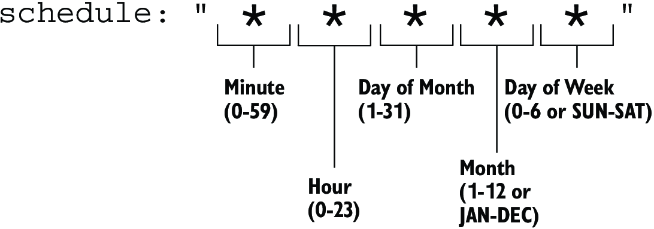

Từ trái sang phải, các trường là phút, giờ, ngày trong tháng, tháng và ngày trong tuần mà lịch sẽ được kích hoạt. Trong ví dụ, một dấu sao (`*`) xuất hiện ở mỗi trường, nghĩa là mỗi trường khớp với bất kỳ giá trị nào.

Nếu bạn chưa từng thấy một lịch cron trước đây, có thể không hiển nhiên rằng lịch trong ví dụ này kích hoạt mỗi phút. Nhưng đừng lo. Điều này sẽ trở nên rõ ràng với bạn khi bạn học được những giá trị nào có thể dùng thay cho dấu sao và khi bạn xem các ví dụ khác. Trong mỗi trường, bạn có thể chỉ định một giá trị, một khoảng giá trị, hoặc một nhóm giá trị thay cho dấu sao, như giải thích trong bảng 18.3.

**Bảng 18.3: Tìm hiểu các mẫu trong trường schedule của CronJob**

| Giá trị | Mô tả |
|---|---|
| `5` | Một giá trị đơn. Ví dụ, nếu giá trị `5` được dùng trong trường Month (tháng), lịch sẽ kích hoạt nếu tháng hiện tại là tháng Năm. |
| `MAY` | Trong các trường Month (tháng) và Day of week (ngày trong tuần), bạn có thể dùng tên ba chữ cái thay cho giá trị số. |
| `1-5` | Một khoảng giá trị. Khoảng được chỉ định bao gồm cả hai đầu mút. Với trường Month, `1-5` tương ứng với `JAN-MAY`, trong trường hợp đó lịch kích hoạt nếu tháng hiện tại nằm giữa tháng Một và tháng Năm (bao gồm cả hai). |
| `1,2,5-8` | Một danh sách các số hoặc khoảng. Trong trường Month, `1,2,5-8` nghĩa là tháng Một, tháng Hai, tháng Năm, tháng Sáu, tháng Bảy và tháng Tám. |
| `*` | Khớp với toàn bộ khoảng giá trị. Ví dụ, `*` trong trường Month tương đương với `1-12` hoặc `JAN-DEC`. |
| `*/3` | Mỗi giá trị thứ N, bắt đầu từ giá trị đầu tiên. Ví dụ, nếu `*/3` được dùng trong trường Month, nghĩa là cứ mỗi tháng thứ ba được đưa vào lịch, còn các tháng khác thì không. Một CronJob dùng lịch này sẽ được thực thi vào tháng Một, tháng Tư, tháng Bảy và tháng Mười. |
| `5/2` | Mỗi giá trị thứ N, bắt đầu từ giá trị được chỉ định. Trong trường Month, `5/2` khiến lịch kích hoạt cách một tháng một lần, bắt đầu từ tháng Năm. Nói cách khác, lịch này được kích hoạt nếu tháng là tháng Năm, tháng Bảy, tháng Chín hoặc tháng Mười Một. |
| `3-10/2` | Mẫu `/N` cũng có thể được áp dụng cho các khoảng. Trong trường Month, `3-10/2` cho biết giữa tháng Ba và tháng Mười, chỉ cách một tháng một lần được đưa vào lịch. Do đó, lịch bao gồm các tháng Ba, tháng Năm, tháng Bảy và tháng Chín. |

Dĩ nhiên, các giá trị này có thể xuất hiện trong các trường thời gian khác nhau, và cùng nhau, chúng xác định chính xác các thời điểm mà lịch này được kích hoạt. Bảng 18.4 cho thấy các ví dụ về những lịch khác nhau và giải thích của chúng.

**Bảng 18.4: Các ví dụ cron**

| Lịch | Giải thích |
|---|---|
| `* * * * *` | Mỗi phút (vào mỗi phút của mỗi giờ, bất kể tháng, ngày trong tháng hay ngày trong tuần). |
| `15 * * * *` | Mười lăm phút sau mỗi giờ. |
| `0 0 * 1-3 *` | Mỗi ngày vào lúc nửa đêm, nhưng chỉ từ tháng Một đến tháng Ba. |
| `*/5 18 * * *` | Mỗi năm phút trong khoảng từ 18:00 (6 giờ chiều) đến 18:59 (6:59 chiều). |
| `* * 7 5 *` | Mỗi phút vào ngày 7 tháng Năm. |
| `0,30 3 7 5 *` | Lúc 3:00 sáng và 3:30 sáng ngày 7 tháng Năm. |
| `0 0 * * 1-5` | Lúc 0:00 sáng mỗi ngày trong tuần làm việc (thứ Hai đến thứ Sáu). |

> **CẢNH BÁO:** Một CronJob tạo Job mới khi tất cả các trường trong crontab khớp với ngày giờ hiện tại, ngoại trừ các trường Day of month (ngày trong tháng) và Day of week (ngày trong tuần). CronJob sẽ chạy nếu một trong hai trường này khớp. Bạn có thể mong đợi lịch `"* * 13 * 5"` chỉ kích hoạt vào thứ Sáu ngày 13, nhưng nó sẽ kích hoạt vào mọi ngày 13 của tháng cũng như mọi thứ Sáu.

May mắn thay, các lịch đơn giản không nhất thiết phải chỉ định theo cách này. Thay vào đó, bạn có thể dùng một trong các giá trị đặc biệt sau:

* `@hourly`, để chạy Job mỗi giờ (vào đầu mỗi giờ),
* `@daily`, để chạy nó mỗi ngày vào lúc nửa đêm,
* `@weekly`, để chạy nó mỗi Chủ nhật vào lúc nửa đêm,
* `@monthly`, để chạy nó lúc 0:00 ngày đầu tiên của mỗi tháng, và
* `@yearly` hoặc `@annually` để chạy nó lúc 0:00 ngày 1 tháng Một mỗi năm.

#### Đặt múi giờ dùng cho việc lập lịch (Setting the time zone to use for scheduling)

CronJob controller, giống như hầu hết các controller khác trong Kubernetes, chạy bên trong thành phần Controller Manager của Kubernetes Control Plane. Theo mặc định, CronJob controller lập lịch các CronJob dựa trên múi giờ mà Controller Manager sử dụng. Điều này có thể khiến các CronJob của bạn chạy vào những thời điểm bạn không mong muốn, đặc biệt nếu Control Plane đang chạy ở một địa điểm khác dùng múi giờ khác.

Theo mặc định, múi giờ không được chỉ định. Tuy nhiên, bạn có thể chỉ định nó bằng trường `timeZone` trong phần `spec` của manifest CronJob. Ví dụ, nếu bạn muốn CronJob của mình chạy các Job lúc 3 giờ sáng theo giờ Trung Âu (múi giờ `CET`), manifest CronJob sẽ trông như listing sau:

**Listing 18.18: Đặt múi giờ cho lịch của CronJob**

```yaml
apiVersion: batch/v1                  #1
kind: CronJob                         #1
metadata:
  name: runs-at-3am-cet
spec:
  schedule: "0 3 * * *"               #1
  timeZone: CET                       #1
  jobTemplate:
    ...
```

- **#1** CronJob này chạy lúc 3:00 sáng theo giờ Trung Âu.

### 18.2.3 Tạm dừng và tiếp tục một CronJob (Suspending and resuming a CronJob)

Cũng như bạn có thể tạm dừng một Job, bạn có thể tạm dừng một CronJob. Tại thời điểm viết sách, không có lệnh kubectl chuyên biệt nào để tạm dừng một CronJob, nên bạn phải làm điều đó bằng lệnh `kubectl patch` như sau:

```bash
$ kubectl patch cj aggregate-responses-every-minute -p '{"spec":{"suspend": true}}'
cronjob.batch/aggregate-responses-every-minute patched
```

Trong khi một CronJob bị tạm dừng, controller không khởi động Job mới nào cho nó, nhưng cho phép tất cả các Job đang chạy hoàn thành, như output sau cho thấy:

```bash
$ kubectl get cj
NAME                               SCHEDULE    TIMEZONE   SUSPEND   ACTIVE   LAST SCHEDULE   AGE
aggregate-responses-every-minute   * * * * *   <none>     True      1        19s             10m
```

Output cho thấy CronJob đã bị tạm dừng, nhưng vẫn có một Job đang hoạt động. Khi Job đó kết thúc, sẽ không có Job mới nào được tạo cho đến khi bạn tiếp tục CronJob. Bạn có thể làm điều đó như sau:

```bash
$ kubectl patch cj aggregate-responses-every-minute -p '{"spec":{"suspend": false}}'
cronjob.batch/aggregate-responses-every-minute patched
```

Cũng như với Job, bạn có thể tạo CronJob ở trạng thái tạm dừng và tiếp tục chúng sau.

### 18.2.4 Tự động xóa các Job đã kết thúc (Automatically removing finished Jobs)

CronJob `aggregate-responses-every-minute` của bạn đã hoạt động được vài phút, nên vài Job object đã được tạo trong khoảng thời gian đó. Trong trường hợp của tôi, CronJob đã tồn tại hơn 10 phút, nghĩa là hơn 10 job đã được tạo. Tuy nhiên, khi tôi liệt kê các job, tôi chỉ thấy có bốn, như bạn có thể thấy trong output sau:

```bash
$ kubectl get job -l app=aggregate-responses-today
NAME                                        STATUS     COMPLETIONS   DURATION   AGE
aggregate-responses-every-minute-27755408   Complete   1/1           57s        3m5s   #1
aggregate-responses-every-minute-27755409   Complete   1/1           61s        2m5s   #1
aggregate-responses-every-minute-27755410   Complete   1/1           53s        65s    #1
aggregate-responses-every-minute-27755411   Running    0/1           5s         5s     #2
```

- **#1** Ba Job đã hoàn thành
- **#2** Một Job hiện đang chạy

Tại sao tôi không thấy nhiều Job hơn? Đó là vì CronJob controller tự động xóa các Job đã hoàn thành. Tuy nhiên, không phải tất cả chúng đều bị xóa. Trong `spec` của CronJob, bạn có thể dùng các trường `successfulJobsHistoryLimit` và `failedJobsHistoryLimit` để chỉ định số Job thành công và thất bại cần giữ lại. Theo mặc định, CronJob giữ lại ba Job thành công và một Job thất bại. Các pod gắn với mỗi Job được giữ lại cũng được bảo toàn, nên bạn có thể xem log của chúng.

Như một bài tập, bạn có thể thử đặt `successfulJobsHistoryLimit` trong CronJob `aggregate-responses-every-minute` thành `1`. Bạn có thể làm điều đó bằng cách sửa CronJob object hiện có với lệnh `kubectl edit`. Sau khi bạn đã cập nhật CronJob, hãy liệt kê lại các Job để xác nhận rằng tất cả các Job trừ một đã bị xóa.

### 18.2.5 Đặt hạn chót bắt đầu (Setting a start deadline)

CronJob controller tạo các Job object vào khoảng thời điểm được lập lịch. Nếu cluster hoạt động bình thường, độ trễ tối đa là vài giây. Tuy nhiên, nếu Control Plane của cluster bị quá tải hoặc nếu thành phần Controller Manager chạy CronJob controller bị offline, độ trễ này có thể lâu hơn.

Nếu điều quan trọng là Job không được bắt đầu quá muộn so với thời điểm được lập lịch, bạn có thể đặt một hạn chót trong trường `startingDeadlineSeconds`, như trong listing sau.

**Listing 18.19: Chỉ định hạn chót bắt đầu trong một CronJob**

```yaml
apiVersion: batch/v1
kind: CronJob
spec:
  schedule: "* * * * *"
  startingDeadlineSeconds: 30       #1
  ...
```

- **#1** Job được xem là thất bại nếu nó không bắt đầu trong vòng 30 giây kể từ thời điểm dự kiến theo lịch.

Nếu CronJob controller không thể tạo Job trong vòng 30 giây kể từ thời điểm được lập lịch, nó sẽ không tạo Job đó. Thay vào đó, một event `MissSchedule` sẽ được sinh ra để thông báo cho bạn lý do Job không được tạo.

#### Điều gì xảy ra khi CronJob controller offline trong thời gian dài (What happens when the CronJob controller is offline for a long time)

Nếu trường `startingDeadlineSeconds` không được đặt và CronJob controller bị offline trong một khoảng thời gian dài, hành vi không mong muốn có thể xảy ra khi controller hoạt động trở lại. Đó là vì controller sẽ lập tức tạo tất cả các Job lẽ ra phải được tạo trong lúc nó offline.

Tuy nhiên, điều này chỉ xảy ra nếu số job bị bỏ lỡ ít hơn 100. Nếu controller phát hiện hơn 100 Job đã bị bỏ lỡ, nó không tạo Job nào cả. Thay vào đó, nó sinh ra một event `TooManyMissedTimes`. Bằng cách đặt hạn chót bắt đầu, bạn có thể ngăn điều này xảy ra.

### 18.2.6 Xử lý đồng thời của Job (Handling Job concurrency)

CronJob `aggregate-responses-every-minute` tạo một Job mới mỗi phút. Điều gì xảy ra nếu một lần chạy Job mất hơn một phút? CronJob controller có tạo một Job khác ngay cả khi Job trước vẫn đang chạy không?

Có! Nếu bạn theo dõi trạng thái của CronJob, cuối cùng bạn có thể thấy trạng thái sau:

```bash
$ kubectl get cj
NAME                               SCHEDULE    TIMEZONE   SUSPEND   ACTIVE   LAST SCHEDULE   AGE
aggregate-responses-every-minute   * * * * *   <none>     True      2        5s              20m
```

Cột `ACTIVE` cho thấy hai Job đang hoạt động cùng lúc. Theo mặc định, CronJob controller tạo Job mới bất kể có bao nhiêu Job trước đó vẫn đang hoạt động. Tuy nhiên, bạn có thể thay đổi hành vi này bằng cách đặt `concurrencyPolicy` trong `spec` của CronJob. Hình 18.12 cho thấy ba concurrency policy (chính sách đồng thời) được hỗ trợ.

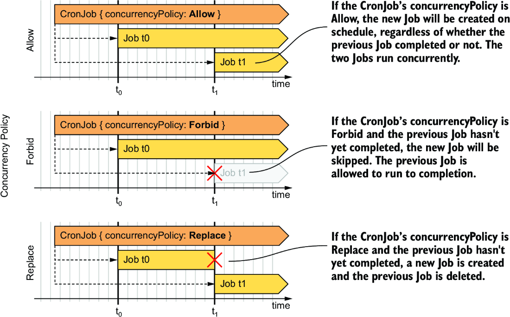

*Hình 18.12: So sánh hành vi của ba concurrency policy của CronJob*

Để dễ tham khảo, các concurrency policy được hỗ trợ cũng được giải thích trong bảng 18.5.

**Bảng 18.5: Các concurrency policy được hỗ trợ**

| Giá trị | Mô tả |
|---|---|
| `Allow` | Nhiều Job được phép chạy cùng lúc. Đây là thiết lập mặc định. |
| `Forbid` | Các lần chạy đồng thời bị cấm. Nếu lần chạy trước vẫn đang hoạt động khi một lần chạy mới đến hạn được lập lịch, CronJob controller ghi nhận một event `JobAlreadyActive` và bỏ qua việc tạo Job mới. |
| `Replace` | Job đang hoạt động bị hủy và được thay thế bằng một Job mới. CronJob controller hủy Job đang hoạt động bằng cách xóa Job object. Job controller sau đó xóa các pod, nhưng chúng được phép kết thúc êm ái (gracefully). Điều này nghĩa là vẫn có hai Job chạy cùng lúc, nhưng một trong số đó đang bị kết thúc. |

Nếu bạn muốn xem concurrency policy ảnh hưởng thế nào đến việc thực thi CronJob, bạn có thể thử triển khai các CronJob trong các file manifest sau:

* `cj.concurrency-allow.yaml`,
* `cj.concurrency-forbid.yaml`,
* `cj.concurrency-replace.yaml`.

### 18.2.7 Xóa một CronJob và các Job của nó (Deleting a CronJob and its Jobs)

Để tạm thời dừng một CronJob, bạn có thể tạm dừng nó như mô tả ở một trong các mục trước. Nếu bạn muốn hủy hoàn toàn một CronJob, hãy xóa CronJob object như sau:

```bash
$ kubectl delete cj aggregate-responses-every-minute
cronjob.batch "aggregate-responses-every-minute" deleted
```

Khi bạn xóa CronJob, tất cả các Job mà nó đã tạo cũng sẽ bị xóa. Khi chúng bị xóa, các pod cũng bị xóa theo, khiến các container của chúng được tắt một cách êm ái.

#### Xóa CronJob nhưng giữ lại các Job và pod của chúng (Deleting the CronJob while preserving the Jobs and their pods)

Nếu bạn muốn xóa CronJob nhưng giữ lại các Job và các pod bên dưới, bạn nên dùng tùy chọn `--cascade=orphan` khi xóa CronJob, như trong ví dụ sau:

```bash
$ kubectl delete cj aggregate-responses-every-minute --cascade=orphan
```

> **GHI CHÚ:** Nếu bạn xóa một CronJob với tùy chọn `--cascade=orphan` trong khi một Job đang hoạt động, Job đang hoạt động đó sẽ được giữ lại và được phép hoàn thành tác vụ mà nó đang thực thi.

---

## Tóm tắt

* Một Job object được dùng để chạy các workload thực thi một tác vụ đến khi hoàn thành thay vì chạy vô thời hạn.
* Chạy một tác vụ bằng Job object đảm bảo rằng pod chạy tác vụ được lập lịch lại trong trường hợp node bị lỗi.
* Một Job có thể được cấu hình để lặp lại cùng một tác vụ nhiều lần nếu bạn đặt trường `completions`. Bạn có thể chỉ định số tác vụ được thực thi song song bằng trường `parallelism`.
* Khi một container chạy tác vụ thất bại, lỗi được xử lý hoặc ở cấp pod bởi Kubelet hoặc ở cấp Job bởi Job controller.
* Theo mặc định, các pod được tạo bởi một Job giống hệt nhau trừ khi bạn đặt `completionMode` của Job là `Indexed`. Trong trường hợp đó, mỗi pod nhận completion index riêng của nó. Index này cho phép mỗi pod chỉ xử lý một phần nhất định của dữ liệu.
* Bạn có thể dùng một work queue trong Job, nhưng bạn phải tự cung cấp hàng đợi của mình và hiện thực việc lấy mục công việc trong container của bạn.
* Các pod chạy trong một Job có thể giao tiếp với nhau, nhưng bạn cần định nghĩa một headless Service để chúng có thể tìm thấy nhau qua DNS.
* Nếu một Job Pod cần một sidecar không bao giờ tự hoàn thành, sidecar đó phải được định nghĩa như một native sidecar container (init container với `restartPolicy` là `Always`).
* Nếu bạn muốn chạy một Job vào một thời điểm cụ thể hoặc theo định kỳ, bạn bọc nó trong một CronJob. Trong CronJob, bạn định nghĩa lịch theo định dạng crontab quen thuộc.
