# Chương 1: Giới thiệu Kubernetes

*(Dịch từ "Chapter 1: Introducing Kubernetes" – Kubernetes in Action, Second Edition, tác giả Marko Lukša, NXB Manning)*

---

## Nội dung chính của chương
* Giới thiệu Kubernetes và nguồn gốc của nó
* Vì sao Kubernetes được ứng dụng rộng rãi đến vậy
* Kubernetes biến đổi trung tâm dữ liệu (data center) của bạn như thế nào
* Tổng quan về kiến trúc và cách hoạt động của nó
* Bạn có nên tích hợp Kubernetes vào tổ chức của mình hay không, và nếu có thì bằng cách nào

Kubernetes đã được công nhận rộng rãi là nền tảng hàng đầu để chạy các ứng dụng hiện đại. Cơn sốt ban đầu đã lắng xuống, và dù ngày nay một số người có thể gọi Kubernetes là "nhàm chán", sự thật là hầu như ai cũng đang dùng nó.

Thoạt nhìn, Kubernetes có vẻ phức tạp – như một lớp phức tạp không cần thiết được thêm vào hạ tầng của bạn. Nhưng bất kỳ ai đã thực sự dùng nó đều biết rằng lợi ích là có thật. Và sự thật là Kubernetes không khó hiểu đến thế một khi bạn bắt đầu làm việc với nó.

Về cốt lõi, Kubernetes đơn giản chỉ là một API và một tập hợp các controller tương đối đơn giản giúp giữ cho các ứng dụng đóng gói trong container (containerized application) của bạn chạy trơn tru. Nó quyết định ứng dụng của bạn nên chạy ở đâu, khởi động lại chúng khi có sự cố, và đảm bảo chúng luôn có thể truy cập được. Nếu bạn từng dùng Docker Compose, Nomad, hay thậm chí máy ảo truyền thống, thì Kubernetes hoạt động trong một không gian tương tự, nhưng nó tự động hóa nhiều hơn rất nhiều công việc thường ngày. Bạn định nghĩa trạng thái mong muốn (desired state) của các ứng dụng, và Kubernetes xử lý mọi thứ cần thiết để đạt được và duy trì trạng thái đó.

Kubernetes đảm nhận những tác vụ mà các nhà phát triển và quản trị viên hệ thống không muốn phải xử lý thủ công, chẳng hạn như lập lịch (scheduling), mạng (networking), cấu hình, và đảm bảo hành vi nhất quán giữa các môi trường. Tất nhiên, Kubernetes không hoàn hảo cho mọi tình huống. Các tổ chức nhỏ chạy những ứng dụng đơn giản, ít cần mở rộng quy mô (scaling) có thể sẽ phù hợp hơn với các công cụ đơn giản hơn. Dù vậy, ngay cả những đội nhóm nhỏ hơn cũng có thể dùng các dịch vụ Kubernetes được quản lý (managed Kubernetes service), giúp họ tránh được phần khó nhất – quản lý chính Kubernetes.

Cuốn sách này được thiết kế để giúp bạn thành thạo Kubernetes thông qua trải nghiệm thực hành, chứ không chỉ lý thuyết. Chúng ta sẽ xây dựng một ứng dụng microservice nhỏ từ đầu và triển khai nó từng bước một. Trên đường đi, bạn sẽ học các khái niệm cơ bản mà cả nhà phát triển lẫn quản trị viên cluster đều phải hiểu, bao gồm pod, deployment, service, volume, cấu hình, và nhiều thứ khác. Bạn không cần kinh nghiệm trước đó với container, Docker, hay thậm chí Linux, vì chúng ta sẽ đề cập đến mọi thứ bạn cần trong quá trình học.

Mặc dù các quản trị viên Kubernetes tương lai sẽ tìm thấy những hiểu biết giá trị ở đây, cuốn sách này tập trung vào những điều cơ bản về phát triển và chạy ứng dụng trên một cluster phát triển (development cluster). Các chủ đề như tính sẵn sàng cao (high availability) của control plane, bảo mật, cài đặt cluster và các add-on nằm ngoài phạm vi của cuốn sách này nhưng được đề cập trong tập tiếp theo của chúng tôi.

Đến cuối cuốn sách, bạn sẽ hiểu Kubernetes hoạt động ra sao, cách đóng gói và triển khai ứng dụng của chính bạn, và cách dùng cả cluster cục bộ (thông qua Kind) lẫn cluster trên cloud như Google Kubernetes Engine. Quan trọng nhất, bạn sẽ có được sự tự tin để định hướng trong Kubernetes mà không cảm thấy choáng ngợp.

---

## 1.1 Giới thiệu Kubernetes (Introducing Kubernetes)

Từ Kubernetes là một thuật ngữ Hy Lạp có nghĩa là "hoa tiêu" (pilot) hay "người cầm lái" (helmsman), người điều khiển con tàu – người đứng ở bánh lái (helm, tức vô lăng của tàu). Người cầm lái không nhất thiết là thuyền trưởng. Thuyền trưởng chịu trách nhiệm về con tàu, còn người cầm lái là người điều khiển nó.

Sau khi tìm hiểu thêm về những gì Kubernetes làm, bạn sẽ thấy cái tên này hoàn toàn phù hợp. Người cầm lái duy trì hải trình của con tàu, thực hiện các mệnh lệnh do thuyền trưởng đưa ra, và báo cáo lại hướng đi của tàu. Kubernetes điều khiển các ứng dụng của bạn và báo cáo trạng thái của chúng, trong khi bạn – thuyền trưởng – quyết định bạn muốn hệ thống đi về đâu.

> **Cách phát âm Kubernetes, và K8s là gì?**
>
> Cách phát âm tiếng Hy Lạp chính xác của Kubernetes là *kie-ver-nee-tees*, khác với cách phát âm tiếng Anh mà bạn thường nghe trong các cuộc trò chuyện kỹ thuật. Thường gặp nhất là *koo-ber-netties* hoặc *koo-ber-nay'-tace*, nhưng đôi khi bạn cũng có thể nghe *koo-ber-nets*, dù hiếm.
>
> Trong cả văn viết lẫn văn nói, nó cũng được gọi là Kube hoặc K8s, phát âm là *kates*, trong đó số 8 biểu thị số chữ cái bị lược bỏ giữa chữ cái đầu và chữ cái cuối.

### 1.1.1 Tóm lược về Kubernetes (Kubernetes in a nutshell)

Kubernetes là một hệ thống phần mềm dùng để tự động hóa việc triển khai và quản lý các hệ thống ứng dụng phức tạp, quy mô lớn, được cấu thành từ các tiến trình máy tính chạy trong container. Hãy cùng tìm hiểu nó làm gì và làm như thế nào.

#### Trừu tượng hóa hạ tầng (Abstracting the infrastructure away)

Khi các nhà phát triển phần mềm hoặc người vận hành (operator) quyết định triển khai một ứng dụng, họ thực hiện việc này thông qua Kubernetes thay vì triển khai ứng dụng lên từng máy tính riêng lẻ. Kubernetes cung cấp một lớp trừu tượng (abstraction layer) bên trên phần cứng bên dưới cho cả người dùng lẫn ứng dụng.

Như minh họa trong hình 1.1, hạ tầng bên dưới, tức là các máy tính, mạng và các thành phần khác, được ẩn khỏi các ứng dụng, giúp việc phát triển và cấu hình chúng dễ dàng hơn.

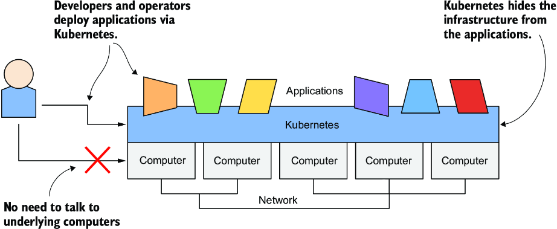

*Hình 1.1: Trừu tượng hóa hạ tầng bằng Kubernetes*

#### Chuẩn hóa cách chúng ta triển khai ứng dụng (Standardizing how we deploy applications)

Vì các chi tiết của hạ tầng bên dưới không còn ảnh hưởng đến việc triển khai ứng dụng, bạn triển khai ứng dụng vào trung tâm dữ liệu của công ty theo cùng một cách như khi triển khai trên cloud. Một manifest duy nhất mô tả ứng dụng có thể được dùng cho việc triển khai cục bộ lẫn triển khai trên bất kỳ nhà cung cấp cloud nào. Mọi khác biệt trong hạ tầng bên dưới đều do Kubernetes xử lý, nên bạn có thể tập trung vào ứng dụng và logic nghiệp vụ mà nó chứa.

#### Triển khai ứng dụng theo cách khai báo (Deploying applications declaratively)

Kubernetes dùng mô hình khai báo (declarative model) để định nghĩa một ứng dụng, như minh họa trong hình 1.2. Bạn mô tả các thành phần tạo nên ứng dụng của mình, và Kubernetes biến mô tả này thành một ứng dụng đang chạy. Sau đó nó giữ cho ứng dụng luôn khỏe mạnh bằng cách khởi động lại hoặc tạo lại các phần của ứng dụng khi cần.

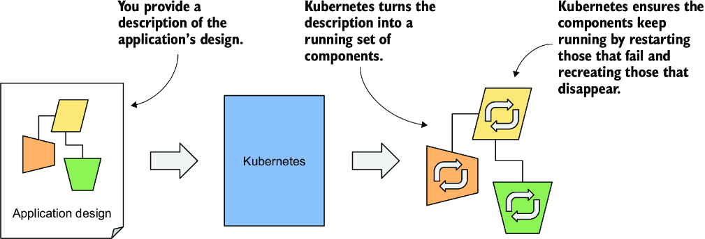

*Hình 1.2: Mô hình khai báo của việc triển khai ứng dụng*

Bất cứ khi nào bạn thay đổi mô tả, Kubernetes sẽ thực hiện các bước cần thiết để cấu hình lại ứng dụng đang chạy sao cho khớp với mô tả mới, như minh họa trong hình 1.3.

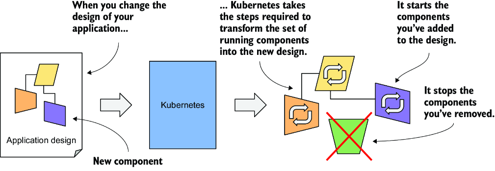

*Hình 1.3: Những thay đổi trong mô tả được phản ánh vào ứng dụng đang chạy.*

#### Đảm nhận việc quản lý hằng ngày các ứng dụng (Taking on the daily management of applications)

Ngay khi bạn triển khai một ứng dụng lên Kubernetes, nó sẽ tiếp quản việc quản lý hằng ngày của ứng dụng đó. Nếu ứng dụng gặp sự cố, Kubernetes sẽ tự động khởi động lại nó. Nếu phần cứng hỏng hoặc cấu trúc liên kết (topology) của hạ tầng thay đổi khiến ứng dụng cần được chuyển sang các máy khác, Kubernetes tự mình làm tất cả những việc này. Các kỹ sư chịu trách nhiệm vận hành hệ thống có thể tập trung vào bức tranh toàn cảnh thay vì lãng phí thời gian vào các chi tiết (hình 1.4). Quay lại phép ẩn dụ về hàng hải: các kỹ sư phát triển và vận hành là các sĩ quan trên tàu, những người đưa ra các quyết định cấp cao trong khi ngồi thoải mái trên ghế bành, còn Kubernetes là người cầm lái đảm nhiệm những công việc cấp thấp là điều khiển hệ thống vượt qua vùng nước dữ mà các ứng dụng và hạ tầng của bạn đang đi qua.

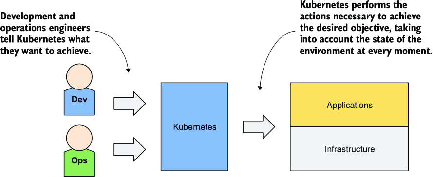

*Hình 1.4: Kubernetes tiếp quản việc quản lý các ứng dụng.*

Mọi thứ Kubernetes làm và mọi lợi thế nó mang lại đòi hỏi một lời giải thích dài hơn, mà chúng ta sẽ thảo luận sau. Trước khi làm điều đó, có lẽ bạn nên biết mọi chuyện bắt đầu như thế nào và dự án Kubernetes hiện đang ở đâu.

### 1.1.2 Về dự án Kubernetes (About the Kubernetes project)

Kubernetes ban đầu được phát triển bởi Google, công ty hầu như luôn chạy ứng dụng trong container. Ngay từ năm 2014, đã có báo cáo rằng họ khởi động hai tỷ container mỗi tuần. Đó là hơn 3.000 container mỗi giây, và con số này ngày nay còn cao hơn nhiều. Những container này được chạy trên hàng nghìn máy tính phân bố tại hàng chục trung tâm dữ liệu trên khắp thế giới. Giờ hãy tưởng tượng làm tất cả những việc này bằng tay. Rõ ràng là bạn cần tự động hóa, và ở quy mô khổng lồ này, tốt nhất là nó phải hoàn hảo.

#### Borg và Omega: những tiền thân của Kubernetes (Borg and Omega: the predecessors of Kubernetes)

Quy mô khối lượng công việc khổng lồ của Google đã buộc họ phải phát triển các giải pháp để việc phát triển và quản lý hàng nghìn thành phần phần mềm trở nên khả thi và hiệu quả về chi phí. Qua nhiều năm, Google đã phát triển một hệ thống nội bộ tên là Borg (và sau này là một hệ thống mới tên là Omega) giúp cả các nhà phát triển ứng dụng lẫn người vận hành quản lý hàng nghìn ứng dụng và dịch vụ này.

Bên cạnh việc đơn giản hóa phát triển và quản lý, những hệ thống này cũng giúp họ đạt được mức sử dụng hạ tầng tốt hơn. Điều này quan trọng với bất kỳ tổ chức nào, nhưng khi bạn vận hành hàng trăm nghìn máy, thì ngay cả những cải thiện nhỏ xíu về mức sử dụng cũng đồng nghĩa với khoản tiết kiệm hàng triệu đô la, nên động lực để phát triển một hệ thống như vậy là rất rõ ràng.

Theo thời gian, hạ tầng của bạn phát triển và tiến hóa. Mỗi trung tâm dữ liệu mới đều là hiện đại nhất. Hạ tầng của nó khác với những trung tâm được xây dựng trước đây. Bất chấp những khác biệt đó, việc triển khai ứng dụng ở trung tâm dữ liệu này không nên khác với việc triển khai ở trung tâm dữ liệu khác. Điều này đặc biệt quan trọng khi bạn triển khai ứng dụng trên nhiều zone hoặc region để giảm khả năng một sự cố cấp vùng gây ra thời gian ngừng hoạt động (downtime) của ứng dụng. Để làm điều này một cách hiệu quả, việc có một phương pháp triển khai ứng dụng nhất quán là rất đáng giá.

#### Kubernetes với tư cách dự án mã nguồn mở và các sản phẩm thương mại phái sinh từ nó (Kubernetes as the open source project and commercial products derived from it)

Dựa trên kinh nghiệm thu được trong quá trình phát triển Borg, Omega và các hệ thống nội bộ khác, Google đã giới thiệu Kubernetes vào năm 2014, một dự án mã nguồn mở mà giờ đây mọi người đều có thể sử dụng và tiếp tục cải tiến (hình 1.5). Ngay khi Kubernetes được công bố, rất lâu trước khi phiên bản 1.0 chính thức được phát hành, các công ty khác, chẳng hạn như Red Hat, vốn luôn đi đầu trong lĩnh vực phần mềm mã nguồn mở, đã nhanh chóng tham gia và giúp phát triển dự án.

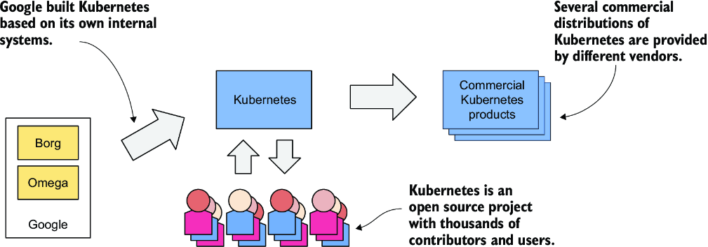

*Hình 1.5: Nguồn gốc và hiện trạng của dự án mã nguồn mở Kubernetes*

Kubernetes cuối cùng đã phát triển vượt xa kỳ vọng của những người sáng lập và ngày nay được xem là một trong những dự án mã nguồn mở hàng đầu thế giới, với hàng chục tổ chức và hàng nghìn cá nhân đóng góp cho nó. Ngoài ra, một số công ty đang cung cấp các sản phẩm Kubernetes chất lượng doanh nghiệp được xây dựng từ dự án mã nguồn mở này. Trong số đó có Red Hat OpenShift, Pivotal Container Service, Rancher và nhiều sản phẩm khác.

#### Kubernetes đã tạo ra cả một hệ sinh thái cloud-native mới như thế nào (How Kubernetes grew a whole new cloud-native ecosystem)

Kubernetes cũng đã sản sinh ra nhiều dự án mã nguồn mở liên quan khác. Hầu hết trong số đó hiện nằm dưới sự bảo trợ của Cloud Native Computing Foundation (CNCF), một phần của Linux Foundation.

CNCF tổ chức nhiều hội nghị KubeCon–CloudNativeCon mỗi năm, tại Bắc Mỹ, châu Âu và Trung Quốc. Năm 2023, hơn 30.000 kỹ sư đã tham dự các hội nghị này, trực tiếp hoặc trực tuyến. Con số này cho thấy Kubernetes đã có tác động tích cực đáng kinh ngạc đến cách các công ty trên khắp thế giới triển khai ứng dụng ngày nay. Nó đã không thể được ứng dụng rộng rãi đến thế nếu không phải như vậy.

### 1.1.3 Tìm hiểu vì sao Kubernetes lại phổ biến đến vậy (Understanding why Kubernetes is so popular)

Gần đây, cách các ứng dụng được phát triển đã thay đổi đáng kể. Điều này dẫn đến sự ra đời của các công cụ mới như Kubernetes, và đến lượt chúng lại tác động ngược trở lại, thúc đẩy thêm những thay đổi trong kiến trúc ứng dụng và cách chúng ta phát triển chúng. Hãy xem xét các ví dụ cụ thể.

#### Tự động hóa việc quản lý microservices (Automating the management of microservices)

Trước đây, hầu hết các ứng dụng đều là những khối nguyên khối (monolith) lớn. Các thành phần của ứng dụng được ghép nối chặt chẽ với nhau, và tất cả chúng chạy trong một tiến trình máy tính duy nhất. Ứng dụng được phát triển như một khối thống nhất bởi một đội ngũ lớn các nhà phát triển, và việc triển khai ứng dụng khá đơn giản. Bạn cài đặt nó lên một máy tính mạnh và cung cấp chút ít cấu hình mà nó cần. Việc mở rộng ứng dụng theo chiều ngang (scale horizontally) hiếm khi khả thi, nên bất cứ khi nào cần tăng công suất của ứng dụng, bạn phải nâng cấp phần cứng (tức là mở rộng ứng dụng theo chiều dọc – scale vertically).

Rồi mô hình microservices xuất hiện. Các khối nguyên khối được chia thành hàng chục, đôi khi hàng trăm, tiến trình riêng biệt, như minh họa trong hình 1.6. Điều này cho phép các tổ chức chia bộ phận phát triển của họ thành các đội nhỏ hơn, trong đó mỗi đội chỉ phát triển một phần của toàn bộ hệ thống – chỉ một vài microservice.

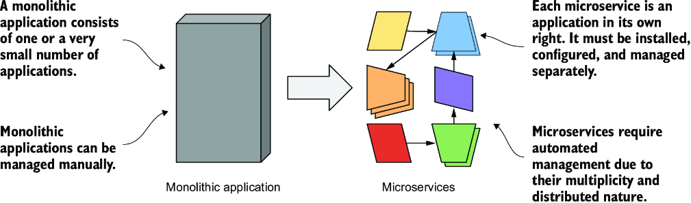

*Hình 1.6: So sánh ứng dụng nguyên khối với microservices*

Giờ đây mỗi microservice là một ứng dụng riêng biệt với chu kỳ phát triển và phát hành của riêng nó. Các phụ thuộc (dependency) của những microservice khác nhau chắc chắn sẽ phân kỳ theo thời gian. Một microservice cần một phiên bản của một thư viện, trong khi microservice khác lại cần một phiên bản khác, có thể không tương thích, của cùng thư viện đó. Việc chạy hai ứng dụng này trong cùng một hệ điều hành trở nên khó khăn.

May mắn thay, chỉ riêng container đã giải quyết được vấn đề mỗi microservice cần một môi trường khác nhau này, nhưng giờ đây mỗi microservice là một ứng dụng riêng biệt phải được quản lý riêng lẻ. Số lượng ứng dụng tăng lên khiến việc này khó khăn hơn nhiều.

Các phần riêng lẻ của toàn bộ ứng dụng không còn cần chạy trên cùng một máy tính, điều này giúp việc mở rộng toàn hệ thống dễ dàng hơn, nhưng cũng có nghĩa là các ứng dụng cần được cấu hình để giao tiếp với nhau. Với các hệ thống chỉ có một vài thành phần, việc này thường có thể làm thủ công, nhưng ngày nay việc thấy các bản triển khai với hơn một trăm microservice là chuyện phổ biến.

Khi hệ thống bao gồm nhiều microservice, việc quản lý tự động là cực kỳ quan trọng. Kubernetes cung cấp sự tự động hóa này. Các tính năng mà nó cung cấp khiến nhiệm vụ quản lý hàng trăm microservice trở nên gần như tầm thường.

#### Thu hẹp khoảng cách giữa Dev và Ops (Bridging the Dev and Ops divide)

Cùng với những thay đổi trong kiến trúc ứng dụng, chúng ta cũng đã chứng kiến những thay đổi trong cách các đội nhóm phát triển và vận hành phần mềm. Trước đây, chuyện bình thường là đội phát triển xây dựng phần mềm một cách biệt lập rồi "ném sản phẩm hoàn chỉnh qua bức tường" cho đội vận hành, và đội này sẽ triển khai rồi quản lý nó từ đó.

Với sự xuất hiện của mô hình Dev-Ops, hai đội giờ đây làm việc gắn bó hơn nhiều trong suốt toàn bộ vòng đời của sản phẩm phần mềm. Đội phát triển giờ tham gia nhiều hơn hẳn vào việc quản lý hằng ngày phần mềm đã triển khai. Nhưng điều đó có nghĩa là giờ họ cần biết về hạ tầng mà phần mềm đang chạy trên đó.

Là một nhà phát triển phần mềm, trọng tâm chính của bạn là hiện thực logic nghiệp vụ. Bạn không muốn phải bận tâm đến các chi tiết của những máy chủ bên dưới. May mắn thay, Kubernetes che giấu những chi tiết này.

#### Chuẩn hóa cloud (Standardizing the cloud)

Trong một hai thập kỷ qua, nhiều tổ chức đã chuyển phần mềm của họ từ các máy chủ cục bộ lên cloud. Lợi ích dường như đã lấn át nỗi lo bị khóa chặt (lock-in) vào một nhà cung cấp cloud cụ thể, nỗi lo xuất phát từ việc phụ thuộc vào các API độc quyền của nhà cung cấp để triển khai và quản lý ứng dụng.

Bất kỳ công ty nào muốn có khả năng chuyển ứng dụng của mình từ nhà cung cấp này sang nhà cung cấp khác sẽ phải bỏ ra những nỗ lực bổ sung, ban đầu là không cần thiết, để trừu tượng hóa hạ tầng và các API của nhà cung cấp cloud bên dưới khỏi các ứng dụng. Việc này đòi hỏi những nguồn lực mà lẽ ra có thể tập trung vào việc xây dựng logic nghiệp vụ chính.

Kubernetes cũng đã giúp ích trong khía cạnh này. Sự phổ biến của Kubernetes đã buộc tất cả các nhà cung cấp cloud lớn phải tích hợp Kubernetes vào các dịch vụ của họ. Khách hàng giờ đây có thể triển khai ứng dụng lên bất kỳ nhà cung cấp cloud nào thông qua một tập API tiêu chuẩn do Kubernetes cung cấp.

Nếu ứng dụng được xây dựng trên các API của Kubernetes thay vì trực tiếp trên các API độc quyền của một nhà cung cấp cloud cụ thể, nó có thể được chuyển tương đối dễ dàng sang bất kỳ nhà cung cấp nào khác.

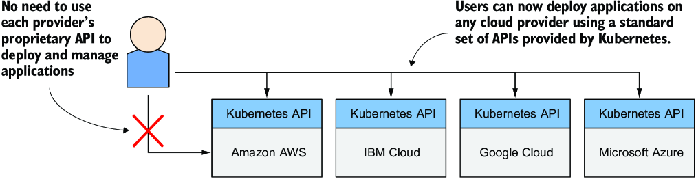

*Hình 1.7: Kubernetes đã chuẩn hóa cách bạn triển khai ứng dụng trên các nhà cung cấp cloud.*

---

## 1.2 Tìm hiểu Kubernetes (Understanding Kubernetes)

Mục trước đã giải thích nguồn gốc của Kubernetes và những lý do khiến nó được ứng dụng rộng rãi. Mục này sẽ xem xét kỹ hơn Kubernetes chính xác là gì.

### 1.2.1 Tìm hiểu cách Kubernetes biến đổi một cụm máy tính (Understanding how Kubernetes transforms a computer cluster)

Hãy xem xét kỹ hơn cách nhận thức về trung tâm dữ liệu thay đổi khi bạn triển khai Kubernetes trên các máy chủ của mình.

#### Kubernetes – một hệ điều hành cho cụm máy tính (Kubernetes—an operating system for computer clusters)

Có thể hình dung Kubernetes như một hệ điều hành cho cluster. Hình 1.8 minh họa những điểm tương đồng giữa một hệ điều hành chạy trên một máy tính và Kubernetes chạy trên một cụm máy tính.

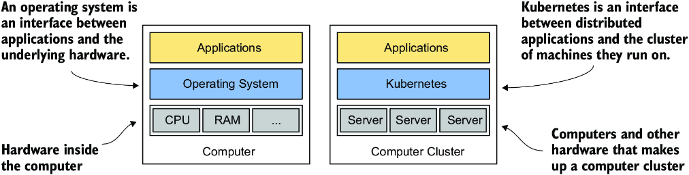

*Hình 1.8: Kubernetes đối với một cụm máy tính cũng giống như hệ điều hành đối với một máy tính.*

Giống như hệ điều hành hỗ trợ các chức năng cơ bản của máy tính, chẳng hạn như lập lịch các tiến trình lên các CPU của nó và đóng vai trò giao diện giữa ứng dụng và phần cứng của máy tính, Kubernetes lập lịch các thành phần của một ứng dụng phân tán lên các máy tính riêng lẻ trong cụm máy tính bên dưới và đóng vai trò giao diện giữa ứng dụng và cluster.

Nó giải phóng các nhà phát triển ứng dụng khỏi nhu cầu phải hiện thực các cơ chế liên quan đến hạ tầng trong ứng dụng của họ; thay vào đó, họ dựa vào Kubernetes để cung cấp chúng. Điều này bao gồm những thứ như

* **Service discovery** (khám phá dịch vụ) – Một cơ chế cho phép các ứng dụng tìm thấy các ứng dụng khác và sử dụng các dịch vụ mà chúng cung cấp
* **Horizontal scaling** (mở rộng theo chiều ngang) – Nhân bản ứng dụng của bạn để thích ứng với những biến động về tải
* **Load-balancing** (cân bằng tải) – Phân phối tải trên tất cả các replica của ứng dụng
* **Self-healing** (tự phục hồi) – Giữ cho hệ thống khỏe mạnh bằng cách tự động khởi động lại các ứng dụng bị lỗi và chuyển chúng sang các node khỏe mạnh sau khi node của chúng gặp sự cố
* **Leader election** (bầu chọn leader) – Một cơ chế quyết định instance nào của ứng dụng sẽ hoạt động trong khi các instance khác ở trạng thái chờ nhưng sẵn sàng tiếp quản nếu instance đang hoạt động gặp sự cố

Bằng cách dựa vào Kubernetes để cung cấp những tính năng này, các nhà phát triển ứng dụng có thể tập trung vào việc hiện thực logic nghiệp vụ cốt lõi thay vì lãng phí thời gian tích hợp ứng dụng với hạ tầng.

#### Kubernetes khớp vào một cụm máy tính như thế nào (How Kubernetes fits into a computer cluster)

Để có một ví dụ cụ thể về cách Kubernetes được triển khai lên một cụm máy tính, hãy xem hình 1.9.

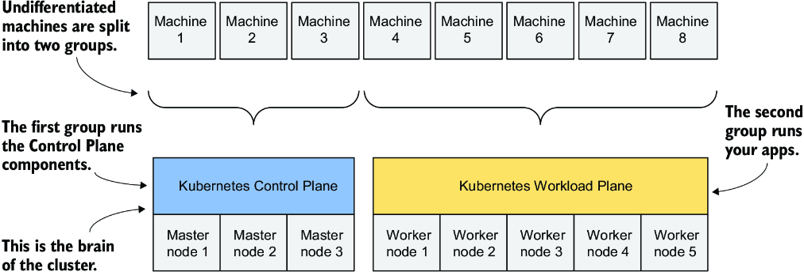

*Hình 1.9: Các máy tính trong một Kubernetes cluster được chia thành control plane và workload plane.*

Bạn bắt đầu với một đội máy mà bạn chia thành hai nhóm: control plane và các worker node. Các node của control plane là bộ não của hệ thống và điều khiển cluster, trong khi các worker node sẽ chạy các ứng dụng, tức các workload của bạn, và do đó đại diện cho workload plane.

> **GHI CHÚ:** Workload plane đôi khi được gọi là data plane, nhưng thuật ngữ này có thể gây nhầm lẫn vì plane này không chứa dữ liệu mà chứa ứng dụng. Cũng đừng bối rối bởi thuật ngữ "plane" (mặt phẳng). Trong ngữ cảnh này, bạn có thể hình dung nó như "bề mặt" mà các ứng dụng chạy trên đó.

Các cluster không dùng cho production có thể dùng một node control plane duy nhất, nhưng các cluster có tính sẵn sàng cao dùng ít nhất ba node control plane vật lý để lưu trữ control plane. Số lượng worker node phụ thuộc vào số lượng ứng dụng bạn sẽ triển khai.

#### Tất cả các node trong cluster trở thành một vùng triển khai lớn như thế nào (How all cluster nodes become one large deployment area)

Sau khi Kubernetes được cài đặt trên các máy tính, bạn không còn cần nghĩ về từng máy tính riêng lẻ khi triển khai ứng dụng nữa. Bất kể số lượng worker node trong cluster của bạn là bao nhiêu, tất cả chúng trở thành một không gian duy nhất nơi bạn triển khai ứng dụng. Bạn làm điều này bằng Kubernetes API, được cung cấp bởi Kubernetes Control Plane (hình 1.10).

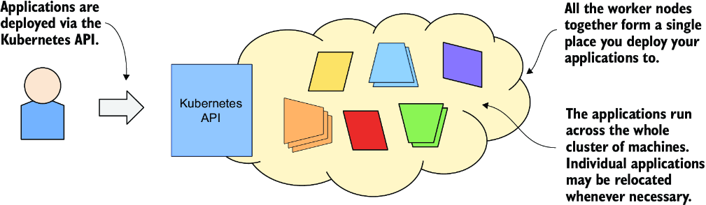

*Hình 1.10: Kubernetes trình bày cluster như một vùng triển khai thống nhất.*

Khi tôi nói rằng tất cả các worker node trở thành một không gian, tôi không muốn bạn nghĩ rằng bạn có thể triển khai một ứng dụng cực lớn được trải rộng trên nhiều máy nhỏ. Kubernetes không làm những trò ảo thuật như thế. Mỗi ứng dụng phải đủ nhỏ để vừa với một trong các worker node.

Ý tôi là khi triển khai ứng dụng, việc chúng rơi vào worker node nào không quan trọng. Kubernetes sau đó có thể chuyển ứng dụng từ node này sang node khác. Bạn thậm chí có thể không nhận ra khi điều đó xảy ra, và bạn cũng không cần bận tâm.

### 1.2.2 Lợi ích của việc sử dụng Kubernetes (The benefits of using Kubernetes)

Bạn đã biết vì sao nhiều tổ chức trên toàn thế giới đã chào đón Kubernetes vào trung tâm dữ liệu của họ. Giờ hãy xem xét kỹ hơn những lợi ích cụ thể mà nó mang lại cho cả đội phát triển lẫn đội vận hành IT.

#### Tự phục vụ trong việc triển khai ứng dụng (Self-service deployment of applications)

Vì Kubernetes trình bày tất cả các worker node của nó như một bề mặt triển khai duy nhất, việc bạn triển khai ứng dụng lên node nào không còn quan trọng nữa. Điều này có nghĩa là các nhà phát triển giờ có thể tự mình triển khai ứng dụng, ngay cả khi họ không biết gì về số lượng node hay đặc điểm của từng node.

Trước đây, các quản trị viên hệ thống là những người quyết định mỗi ứng dụng nên được đặt ở đâu. Nhiệm vụ này giờ được giao cho Kubernetes, cho phép nhà phát triển triển khai ứng dụng mà không cần phụ thuộc vào người khác để làm việc đó. Khi một nhà phát triển triển khai ứng dụng, Kubernetes chọn node tốt nhất để chạy ứng dụng dựa trên yêu cầu tài nguyên của ứng dụng và tài nguyên sẵn có trên mỗi node.

#### Giảm chi phí nhờ sử dụng hạ tầng tốt hơn (Reducing costs via better infrastructure utilization)

Nếu bạn không quan tâm ứng dụng của mình rơi vào node nào, điều đó cũng có nghĩa là nó có thể được chuyển sang bất kỳ node nào khác vào bất kỳ lúc nào mà bạn không phải lo lắng. Kubernetes có thể cần làm điều này để nhường chỗ cho một ứng dụng lớn hơn mà ai đó muốn triển khai. Khả năng di chuyển ứng dụng này cho phép các ứng dụng được xếp chặt lại với nhau để tài nguyên của các node được sử dụng theo cách tốt nhất có thể.

Việc tìm ra các tổ hợp tối ưu có thể rất khó khăn và tốn thời gian, đặc biệt khi số lượng các lựa chọn khả dĩ là khổng lồ, chẳng hạn khi bạn có nhiều thành phần ứng dụng và nhiều node máy chủ mà chúng có thể được triển khai lên. Máy tính có thể thực hiện nhiệm vụ này tốt hơn và nhanh hơn con người nhiều. Kubernetes làm việc này rất tốt. Bằng cách kết hợp các ứng dụng khác nhau trên cùng những máy, Kubernetes cải thiện mức sử dụng hạ tầng phần cứng của bạn để bạn có thể chạy nhiều ứng dụng hơn trên ít máy chủ hơn.

#### Tự động điều chỉnh theo tải thay đổi (Automatically adjusting to changing load)

Dùng Kubernetes để quản lý các ứng dụng đã triển khai cũng có nghĩa là đội vận hành không phải liên tục theo dõi tải của từng ứng dụng để phản ứng với những đỉnh tải đột ngột. Kubernetes cũng lo cả việc này. Nó có thể theo dõi tài nguyên mà mỗi ứng dụng tiêu thụ cùng các chỉ số (metric) khác và điều chỉnh số lượng instance đang chạy của từng ứng dụng để đối phó với tải tăng hoặc mức sử dụng tài nguyên tăng.

Khi bạn chạy Kubernetes trên hạ tầng cloud, nó thậm chí có thể tăng kích thước cluster của bạn bằng cách cấp phát (provision) thêm node thông qua API của nhà cung cấp cloud. Bằng cách này, bạn không bao giờ hết chỗ để chạy thêm các instance của ứng dụng.

#### Giữ cho ứng dụng chạy trơn tru (Keeping applications running smoothly)

Kubernetes cũng nỗ lực hết sức để đảm bảo các ứng dụng của bạn chạy trơn tru. Nếu ứng dụng của bạn bị crash, Kubernetes sẽ tự động khởi động lại nó. Vì vậy, ngay cả khi bạn có một ứng dụng lỗi bị hết bộ nhớ sau khi chạy hơn vài giờ, Kubernetes sẽ đảm bảo ứng dụng của bạn tiếp tục cung cấp dịch vụ cho người dùng bằng cách tự động khởi động lại nó trong trường hợp này.

Kubernetes là một hệ thống tự phục hồi ở chỗ nó xử lý các lỗi phần mềm như lỗi vừa mô tả, nhưng nó cũng xử lý cả các sự cố phần cứng. Khi cluster tăng kích thước, tần suất sự cố node cũng tăng theo. Ví dụ, trong một cluster có một trăm node và MTBF (mean-time-between-failure – thời gian trung bình giữa các lần hỏng) là 100 ngày cho mỗi node, bạn có thể dự kiến mỗi ngày có một node gặp sự cố.

Khi một node gặp sự cố, Kubernetes tự động chuyển các ứng dụng sang các node khỏe mạnh còn lại. Đội vận hành không còn phải chuyển ứng dụng bằng tay nữa và thay vào đó có thể tập trung vào việc sửa chữa chính node đó và đưa nó trở lại nhóm tài nguyên phần cứng khả dụng.

Nếu hạ tầng của bạn có đủ tài nguyên rảnh để hệ thống hoạt động bình thường mà không cần node bị hỏng, đội vận hành thậm chí không phải phản ứng ngay lập tức với sự cố. Nếu sự cố xảy ra vào giữa đêm, không ai trong đội vận hành phải thức dậy cả. Họ có thể ngủ yên và xử lý node bị hỏng trong giờ làm việc bình thường.

#### Đơn giản hóa việc phát triển ứng dụng (Simplifying application development)

Những cải thiện được mô tả trong phần trước chủ yếu liên quan đến việc triển khai ứng dụng. Nhưng còn quá trình phát triển ứng dụng thì sao? Kubernetes có mang lại điều gì cho các nhà phát triển không? Chắc chắn là có.

Như đã đề cập trước đó, Kubernetes cung cấp các dịch vụ liên quan đến hạ tầng mà nếu không có nó thì bạn sẽ phải hiện thực trong ứng dụng của mình. Điều này bao gồm việc khám phá các service và/hoặc các peer trong một ứng dụng phân tán, bầu chọn leader, cấu hình ứng dụng tập trung, và những thứ khác. Kubernetes cung cấp những điều này trong khi vẫn giữ cho ứng dụng không phụ thuộc vào Kubernetes (Kubernetes-agnostic), nhưng khi cần, các ứng dụng cũng có thể truy vấn Kubernetes API để lấy thông tin chi tiết về môi trường của chúng. Chúng cũng có thể dùng API này để thay đổi môi trường.

### 1.2.3 Kiến trúc của một Kubernetes cluster (The architecture of a Kubernetes cluster)

Như bạn đã biết, một Kubernetes cluster bao gồm các node được chia thành hai nhóm:

* Một tập các node control plane để lưu trữ các thành phần của control plane, vốn là bộ não của hệ thống, vì chúng điều khiển toàn bộ cluster
* Một tập các worker node tạo thành workload plane, là nơi các workload (hay ứng dụng) của bạn chạy

Hình 1.11 cho thấy hai plane này và các node khác nhau cấu thành chúng.

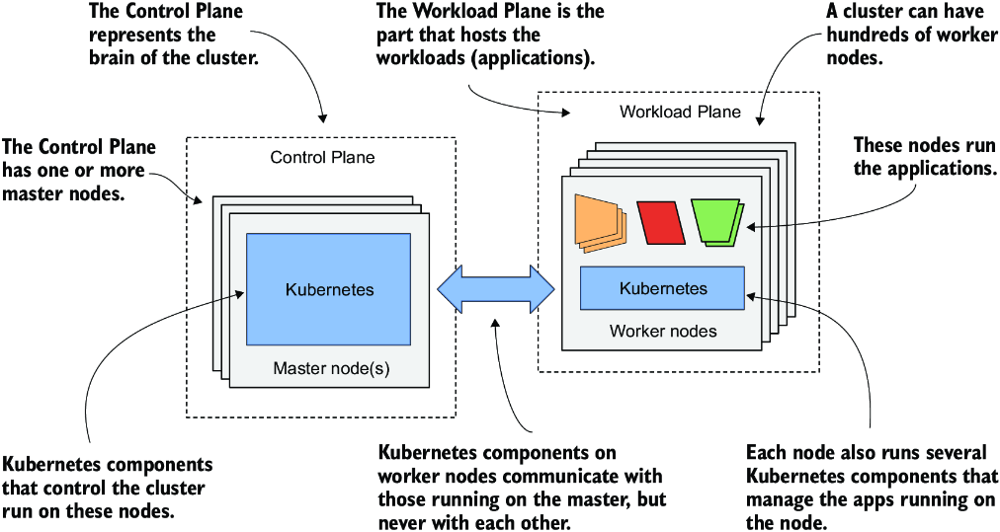

*Hình 1.11: Hai plane tạo nên một Kubernetes cluster*

Hai plane này, và do đó hai loại node, chạy các thành phần Kubernetes khác nhau. Hai phần tiếp theo của cuốn sách giới thiệu chúng, tóm tắt các chức năng của chúng mà không đi vào chi tiết. Những thành phần này sẽ được nhắc đến nhiều lần trong phần tiếp theo của cuốn sách, nơi tôi giải thích các khái niệm cơ bản của Kubernetes. Phần thứ ba của cuốn sách sẽ xem xét sâu về các thành phần này và cơ chế bên trong của chúng.

#### Các thành phần của control plane (Control plane components)

Control plane là thứ điều khiển cluster. Nó bao gồm nhiều thành phần chạy trên một node duy nhất hoặc được nhân bản trên nhiều node để đảm bảo tính sẵn sàng cao. Hình 1.12 cho thấy các thành phần của control plane.

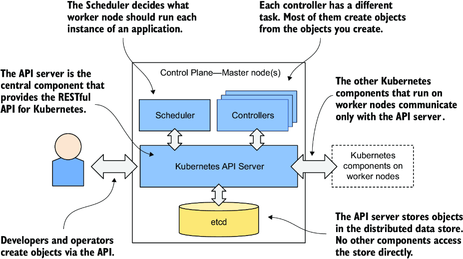

*Hình 1.12: Các thành phần của Kubernetes control plane*

Đây là các thành phần và chức năng của chúng:

* **Kubernetes API Server** công khai (expose) Kubernetes API theo kiểu RESTful. Các kỹ sư sử dụng cluster và các thành phần Kubernetes khác tạo object thông qua API này.
* **Kho dữ liệu phân tán etcd** lưu trữ bền vững các object được tạo thông qua API, vì bản thân API Server là phi trạng thái (stateless). API Server là thành phần duy nhất giao tiếp với etcd.
* **Scheduler** quyết định mỗi instance ứng dụng nên chạy trên worker node nào.
* **Các controller** đem lại sự sống cho các object được tạo thông qua API. Hầu hết chúng chỉ đơn giản tạo ra các object khác, nhưng một số cũng giao tiếp với các hệ thống bên ngoài (ví dụ, nhà cung cấp cloud thông qua API của nó).

Các thành phần của control plane lưu giữ và điều khiển trạng thái của cluster, nhưng chúng không chạy các ứng dụng của bạn. Việc này do các (worker) node đảm nhiệm.

#### Các thành phần của worker node (Worker node components)

Các worker node là những máy tính mà ứng dụng của bạn chạy trên đó. Chúng tạo thành workload plane của cluster. Ngoài các ứng dụng, một số thành phần Kubernetes cũng chạy trên những node này. Chúng thực hiện nhiệm vụ chạy, giám sát và cung cấp kết nối giữa các ứng dụng của bạn, như minh họa trong hình 1.13.

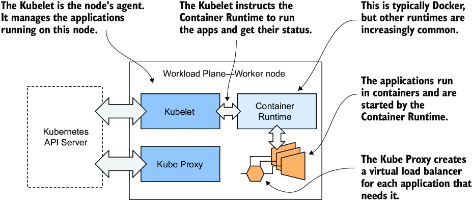

*Hình 1.13: Các thành phần Kubernetes chạy trên mỗi node*

Mỗi node chạy tập các thành phần sau:

* **Kubelet**, một agent giao tiếp với API server và quản lý các ứng dụng chạy trên node của nó. Nó báo cáo trạng thái của các ứng dụng này và của node thông qua API.
* **Container runtime**, có thể là Docker hoặc bất kỳ runtime nào khác tương thích với Kubernetes. Nó chạy các ứng dụng của bạn trong container theo chỉ thị của Kubelet.
* **Kubernetes Service Proxy (kube-proxy)** cân bằng tải lưu lượng mạng giữa các ứng dụng.

#### Các thành phần bổ sung (Add-on components)

Hầu hết các Kubernetes cluster cũng chứa một số thành phần khác – một DNS server, các network plugin, các logging agent, và nhiều thứ khác. Chúng thường chạy trên các worker node nhưng cũng có thể được cấu hình để chạy trên (các) node control plane.

#### Hiểu sâu hơn về kiến trúc (Gaining a deeper understanding of the architecture)

Hiện tại, tôi chỉ mong bạn quen sơ với tên của các thành phần này và chức năng của chúng, vì tôi sẽ nhắc đến chúng nhiều lần trong các chương tiếp theo. Ngoài ra, tôi không thích giải thích cách mọi thứ hoạt động trước khi giải thích một thứ làm gì và dạy bạn cách dùng nó. Giống như học lái xe vậy. Bạn không muốn biết dưới nắp ca-pô có gì. Ban đầu, bạn chỉ muốn học cách đi từ điểm A đến điểm B. Chỉ sau đó bạn mới quan tâm đến việc chiếc xe làm điều đó bằng cách nào.

Biết những gì dưới nắp ca-pô một ngày nào đó có thể giúp bạn khởi động lại chiếc xe sau khi nó hỏng và bạn bị mắc kẹt bên lề đường. Tôi rất tiếc phải nói rằng bạn sẽ có nhiều khoảnh khắc như thế khi làm việc với Kubernetes do độ phức tạp khổng lồ của nó.

### 1.2.4 Kubernetes chạy một ứng dụng như thế nào (How Kubernetes runs an application)

Với cái nhìn tổng quan chung về các thành phần tạo nên Kubernetes, cuối cùng tôi có thể giải thích cách triển khai một ứng dụng.

#### Định nghĩa ứng dụng của bạn (Defining your application)

Mọi thứ trong Kubernetes đều được biểu diễn bằng một object. Bạn tạo và truy xuất các object này thông qua Kubernetes API. Ứng dụng của bạn bao gồm nhiều kiểu object như vậy – một kiểu đại diện cho toàn bộ bản triển khai ứng dụng (application deployment), một kiểu khác đại diện cho một instance đang chạy của ứng dụng hoặc cho dịch vụ được cung cấp bởi một tập các instance đó và cho phép truy cập chúng tại một địa chỉ IP duy nhất, và còn nhiều kiểu khác nữa.

Tất cả các kiểu này được giải thích chi tiết trong phần thứ hai của cuốn sách. Lúc này, chỉ cần biết rằng bạn định nghĩa ứng dụng của mình thông qua nhiều kiểu object. Những object này thường được định nghĩa trong một hoặc nhiều file manifest ở định dạng YAML hoặc JSON.

> **ĐỊNH NGHĨA:** YAML ban đầu được cho là có nghĩa "Yet Another Markup Language" (Lại một ngôn ngữ đánh dấu nữa), nhưng sau đó đã được đổi thành từ viết tắt đệ quy "YAML Ain't Markup Language" (YAML không phải ngôn ngữ đánh dấu). Đây là một trong những cách để tuần tự hóa (serialize) một object thành file văn bản mà con người đọc được.

> **ĐỊNH NGHĨA:** JSON là viết tắt của JavaScript Object Notation. Đây là một cách khác để tuần tự hóa một object, nhưng phù hợp hơn cho việc trao đổi dữ liệu giữa các ứng dụng.

Hình 1.14 cho thấy một ví dụ về việc triển khai ứng dụng bằng cách tạo một manifest với hai deployment được công khai bằng hai service.

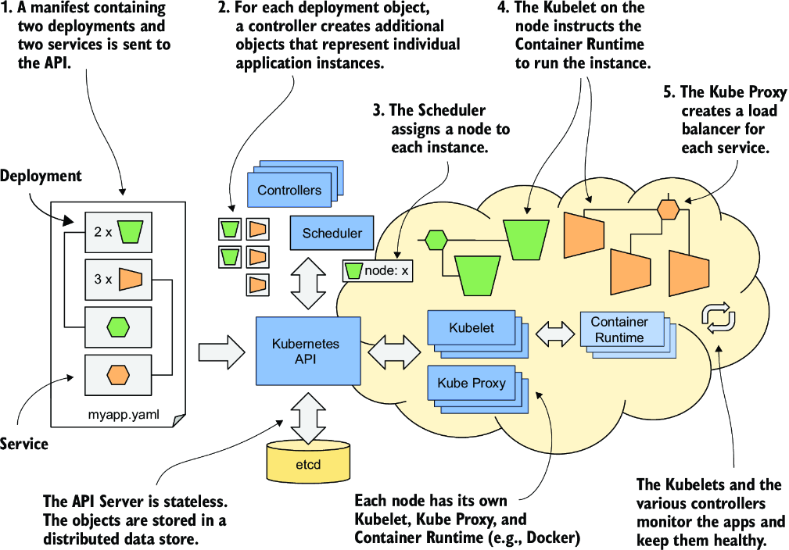

*Hình 1.14: Triển khai một ứng dụng lên Kubernetes*

Các hành động sau diễn ra khi bạn triển khai ứng dụng:

1. Bạn gửi manifest của ứng dụng tới Kubernetes API. API Server ghi các object được định nghĩa trong manifest vào etcd.
2. Một controller nhận thấy các object mới được tạo và tạo ra nhiều object mới – một object cho mỗi instance ứng dụng.
3. Scheduler gán một node cho mỗi instance.
4. Kubelet nhận thấy có một instance được gán cho node của Kubelet đó. Nó chạy instance ứng dụng thông qua container runtime.
5. Kube-proxy nhận thấy các instance ứng dụng đã sẵn sàng chấp nhận kết nối từ client và cấu hình một load balancer cho chúng.
6. Các Kubelet và các controller giám sát hệ thống và giữ cho các ứng dụng luôn chạy.

Quy trình này được giải thích chi tiết hơn trong các phần tiếp theo.

#### Gửi ứng dụng tới API (Submitting the application to the API)

Sau khi bạn đã tạo (các) file YAML hoặc JSON, bạn gửi file tới API, thường thông qua công cụ dòng lệnh của Kubernetes có tên là kubectl.

> **GHI CHÚ:** Kubectl được phát âm là *kube-control*, nhưng những tâm hồn mềm mại hơn trong cộng đồng thích gọi nó là *kube-cuddle*. Một số người gọi nó là *kube-C-T-L*.

Kubectl tách file thành các object riêng lẻ và tạo từng object bằng cách gửi một HTTP request `PUT` hoặc `POST` tới API, như thường thấy với các RESTful API. API Server xác thực các object và lưu chúng vào kho dữ liệu etcd. Ngoài ra, nó thông báo cho tất cả các thành phần quan tâm rằng những object này đã được tạo. Các controller, sẽ được giải thích tiếp theo, là một trong những thành phần này.

#### Về các controller (About the controllers)

Hầu hết các kiểu object đều có một controller liên kết với nó. Một controller quan tâm đến một kiểu object cụ thể. Nó chờ API server thông báo rằng một object mới đã được tạo và sau đó thực hiện các thao tác để đem lại sự sống cho object đó. Thông thường, controller chỉ tạo ra các object khác thông qua cùng Kubernetes API đó. Ví dụ, controller chịu trách nhiệm cho các bản triển khai ứng dụng tạo ra một hoặc nhiều object đại diện cho các instance riêng lẻ của ứng dụng. Số lượng object do controller tạo ra phụ thuộc vào số replica được chỉ định trong object triển khai ứng dụng.

#### Về scheduler (About the scheduler)

Scheduler là một loại controller đặc biệt mà nhiệm vụ duy nhất là lập lịch các instance ứng dụng lên các worker node. Nó chọn worker node tốt nhất cho mỗi object instance ứng dụng mới và gán node đó cho instance bằng cách sửa đổi object thông qua API.

#### Về Kubelet và container runtime (About the Kubelet and the container runtime)

Kubelet chạy trên mỗi worker node cũng là một loại controller. Nhiệm vụ của nó là chờ các instance ứng dụng được gán cho node mà nó nằm trên đó và chạy ứng dụng. Việc này được thực hiện bằng cách chỉ thị cho container runtime khởi động container của ứng dụng.

#### Về kube-proxy (About the kube-proxy)

Vì một bản triển khai ứng dụng có thể bao gồm nhiều instance ứng dụng, cần có một load balancer để công khai chúng tại một địa chỉ IP duy nhất. Kube-proxy, một controller khác chạy cùng với Kubelet, chịu trách nhiệm thiết lập load balancer này.

#### Giữ cho các ứng dụng khỏe mạnh (Keeping the applications healthy)

Một khi ứng dụng đã hoạt động, Kubelet giữ cho ứng dụng khỏe mạnh bằng cách khởi động lại nó khi nó kết thúc. Nó cũng báo cáo trạng thái của ứng dụng bằng cách cập nhật object đại diện cho instance ứng dụng. Các controller khác giám sát những object này và đảm bảo các ứng dụng được chuyển sang các node khỏe mạnh nếu node của chúng gặp sự cố.

Giờ bạn đã tạm quen với kiến trúc và chức năng của Kubernetes. Bạn không cần hiểu hay nhớ hết mọi chi tiết vào lúc này, vì việc thấm nhuần thông tin này sẽ dễ dàng hơn khi bạn tìm hiểu về từng kiểu object riêng lẻ và các controller đem lại sự sống cho chúng trong phần thứ hai của cuốn sách.

---

## 1.3 Đưa Kubernetes vào tổ chức của bạn (Introducing Kubernetes into your organization)

Để khép lại chương này, hãy xem bạn có những lựa chọn nào nếu quyết định đưa Kubernetes vào môi trường IT của chính mình.

### 1.3.1 Chạy Kubernetes tại chỗ (on-premises) và trên cloud (Running Kubernetes on-premises and in the cloud)

Nếu bạn muốn chạy ứng dụng của mình trên Kubernetes, bạn phải quyết định xem muốn chạy chúng cục bộ, trong hạ tầng riêng của tổ chức (on-premises), hay với một trong các nhà cung cấp cloud lớn, hay có lẽ cả hai (trong một giải pháp hybrid cloud – đám mây lai).

#### Chạy Kubernetes tại chỗ (Running Kubernetes on-premises)

Chạy Kubernetes trên hạ tầng của riêng bạn có thể là lựa chọn duy nhất nếu các quy định yêu cầu bạn phải chạy ứng dụng tại chỗ. Điều này thường có nghĩa là bạn sẽ phải tự quản lý Kubernetes, nhưng chúng ta sẽ bàn đến điều đó sau.

Kubernetes có thể chạy trực tiếp trên các máy vật lý (bare-metal) của bạn hoặc trong các máy ảo chạy trong trung tâm dữ liệu của bạn. Trong cả hai trường hợp, bạn sẽ không thể mở rộng cluster dễ dàng như khi chạy nó trong các máy ảo do nhà cung cấp cloud cung cấp.

#### Triển khai Kubernetes trên cloud (Deploying Kubernetes in the cloud)

Nếu bạn không có hạ tầng tại chỗ, bạn không còn lựa chọn nào khác ngoài việc chạy Kubernetes trên cloud. Điều này có lợi thế là bạn có thể mở rộng cluster bất cứ lúc nào trong thời gian ngắn nếu cần. Như đã đề cập trước đó, bản thân Kubernetes có thể yêu cầu nhà cung cấp cloud cấp phát thêm máy ảo khi kích thước hiện tại của cluster không còn đủ để chạy tất cả các ứng dụng bạn muốn triển khai.

Khi số lượng workload giảm và một số worker node không còn workload nào đang chạy, Kubernetes có thể yêu cầu nhà cung cấp cloud hủy các máy ảo của những node này để giảm chi phí vận hành của bạn. Tính đàn hồi (elasticity) này của cluster chắc chắn là một trong những lợi ích chính của việc chạy Kubernetes trên cloud.

#### Sử dụng giải pháp hybrid cloud (Using a hybrid cloud solution)

Một lựa chọn phức tạp hơn là chạy Kubernetes tại chỗ, nhưng cũng cho phép nó "tràn" sang cloud. Có thể cấu hình Kubernetes để cấp phát thêm node trên cloud nếu bạn vượt quá công suất của trung tâm dữ liệu của mình. Bằng cách này, bạn có được điều tốt nhất của cả hai thế giới. Phần lớn thời gian, các ứng dụng của bạn chạy cục bộ mà không tốn chi phí thuê máy ảo, nhưng trong những khoảng thời gian ngắn tải đạt đỉnh, có thể chỉ xảy ra vài lần trong năm, các ứng dụng của bạn có thể xử lý tải tăng thêm bằng cách dùng các tài nguyên bổ sung trên cloud.

Nếu trường hợp sử dụng của bạn yêu cầu, bạn cũng có thể chạy một Kubernetes cluster trải trên nhiều nhà cung cấp cloud hoặc kết hợp bất kỳ lựa chọn nào đã đề cập. Việc này có thể được thực hiện bằng một control plane duy nhất hoặc một control plane tại mỗi địa điểm.

### 1.3.2 Tự quản lý Kubernetes hay không (To manage or not to manage Kubernetes yourself)

Nếu bạn đang cân nhắc đưa Kubernetes vào tổ chức của mình, câu hỏi quan trọng nhất bạn cần trả lời là liệu bạn sẽ tự quản lý Kubernetes hay dùng một dịch vụ kiểu Kubernetes-as-a-Service, nơi người khác quản lý nó cho bạn.

#### Tự quản lý Kubernetes (Managing Kubernetes yourself)

Nếu bạn đã chạy ứng dụng tại chỗ và có đủ phần cứng để chạy một Kubernetes cluster sẵn sàng cho production, bản năng đầu tiên của bạn có lẽ là tự triển khai và quản lý nó. Nếu bạn hỏi bất kỳ ai trong cộng đồng Kubernetes rằng đây có phải là ý hay không, bạn thường sẽ nhận được một câu "không" rất dứt khoát.

Hình 1.14 là một biểu diễn rất đơn giản hóa của những gì xảy ra trong một Kubernetes cluster khi bạn triển khai một ứng dụng. Ngay cả hình đó lẽ ra cũng đã khiến bạn e ngại. Kubernetes mang đến một lượng phức tạp bổ sung khổng lồ. Bất kỳ ai muốn vận hành một Kubernetes cluster đều phải hết sức quen thuộc với cơ chế hoạt động bên trong của nó.

Việc quản lý các Kubernetes cluster sẵn sàng cho production là một ngành công nghiệp trị giá nhiều tỷ đô la. Trước khi quyết định tự quản lý một cluster, điều thiết yếu là bạn phải tham khảo ý kiến của các kỹ sư đã từng làm việc đó để tìm hiểu về những vấn đề mà hầu hết các đội gặp phải. Nếu không, bạn có thể đang tự đẩy mình vào thất bại. Tuy nhiên, việc thử nghiệm Kubernetes cho các trường hợp sử dụng không phải production hoặc dùng một Kubernetes cluster được quản lý thì ít vấn đề hơn nhiều.

#### Sử dụng Kubernetes cluster được quản lý trên cloud (Using a managed Kubernetes cluster in the cloud)

Sử dụng Kubernetes dễ hơn quản lý nó gấp mười lần. Hầu hết các nhà cung cấp cloud lớn hiện nay đều cung cấp Kubernetes-as-a-Service. Họ lo việc quản lý Kubernetes và các thành phần của nó, trong khi bạn chỉ đơn giản sử dụng Kubernetes API như bất kỳ API nào khác mà nhà cung cấp cloud đưa ra.

Các dịch vụ Kubernetes được quản lý hàng đầu bao gồm

* Google Kubernetes Engine (GKE)
* Azure Kubernetes Service (AKS)
* Amazon Elastic Kubernetes Service (EKS)
* IBM Cloud Kubernetes Service
* Red Hat OpenShift Online và Dedicated
* VMware Cloud PKS
* Alibaba Cloud Container Service for Kubernetes (ACK)

Nửa đầu của cuốn sách tập trung vào việc chỉ sử dụng Kubernetes. Bạn sẽ chạy các bài thực hành trong một cluster phát triển cục bộ và trên một cluster GKE được quản lý, vì nó dễ dùng nhất và mang lại trải nghiệm người dùng tốt nhất. Phần thứ hai của cuốn sách cung cấp cho bạn nền tảng vững chắc để quản lý Kubernetes, nhưng để thực sự làm chủ nó, bạn sẽ cần tích lũy thêm kinh nghiệm.

### 1.3.3 Sử dụng Kubernetes nguyên bản (vanilla) hay bản mở rộng (Using vanilla or extended Kubernetes)

Câu hỏi cuối cùng là nên dùng phiên bản mã nguồn mở nguyên bản (vanilla) của Kubernetes hay một sản phẩm Kubernetes mở rộng, chất lượng doanh nghiệp.

#### Sử dụng phiên bản vanilla của Kubernetes (Using a vanilla version of Kubernetes)

Phiên bản mã nguồn mở của Kubernetes được cộng đồng duy trì và đại diện cho tuyến đầu của quá trình phát triển Kubernetes. Điều này cũng có nghĩa là nó có thể không ổn định bằng các lựa chọn khác. Nó cũng có thể thiếu các thiết lập bảo mật mặc định tốt. Triển khai phiên bản vanilla đòi hỏi rất nhiều tinh chỉnh để thiết lập mọi thứ cho việc sử dụng trong production.

#### Sử dụng các bản phân phối Kubernetes cấp doanh nghiệp (Using enterprise-grade Kubernetes distributions)

Một lựa chọn tốt hơn để dùng Kubernetes trong production là dùng một bản phân phối Kubernetes chất lượng doanh nghiệp như OpenShift hoặc Rancher. Bên cạnh tính bảo mật và hiệu năng được nâng cao nhờ các thiết lập mặc định tốt hơn, chúng còn cung cấp thêm các kiểu object bên cạnh những kiểu có trong Kubernetes API upstream. Ví dụ, Kubernetes vanilla không chứa các kiểu object đại diện cho người dùng của cluster, trong khi các bản phân phối thương mại thì có. Chúng cũng cung cấp thêm các công cụ phần mềm để triển khai và quản lý các ứng dụng bên thứ ba nổi tiếng trên Kubernetes.

Tất nhiên, việc mở rộng và gia cố (harden) Kubernetes cần thời gian, nên các bản phân phối Kubernetes thương mại này thường chậm hơn phiên bản upstream của Kubernetes một hoặc hai phiên bản. Điều này không tệ như nghe có vẻ. Lợi ích thường lớn hơn bất lợi.

### 1.3.4 Liệu bạn có nên dùng Kubernetes không? (Should you even use Kubernetes?)

Tôi hy vọng chương này đã khiến bạn hào hứng với Kubernetes và nóng lòng muốn nhét nó vào IT stack của mình. Nhưng để khép lại chương này một cách trọn vẹn, chúng ta cần nói đôi lời về việc khi nào đưa Kubernetes vào không phải là ý hay.

#### Các workload của bạn có cần quản lý tự động không? (Do your workloads require automated management?)

Điều đầu tiên bạn cần thành thật với bản thân là liệu bạn có cần tự động hóa việc quản lý ứng dụng của mình hay không. Nếu ứng dụng của bạn là một khối nguyên khối lớn, bạn chắc chắn không cần Kubernetes.

Ngay cả khi bạn triển khai microservices, dùng Kubernetes có thể không phải lựa chọn tốt nhất, đặc biệt nếu số lượng microservice của bạn rất nhỏ. Khó đưa ra con số chính xác cho điểm mà cán cân nghiêng hẳn sang một bên, vì các yếu tố khác cũng ảnh hưởng đến quyết định. Nhưng nếu hệ thống của bạn bao gồm ít hơn 5 microservice, thêm Kubernetes vào có lẽ không phải ý hay. Nếu hệ thống của bạn có hơn 20 microservice, rất có thể bạn sẽ hưởng lợi từ việc tích hợp Kubernetes. Nếu số microservice của bạn nằm đâu đó ở giữa, cần cân nhắc các yếu tố khác, chẳng hạn như những yếu tố được mô tả tiếp theo.

#### Bạn có đủ khả năng đầu tư thời gian của các kỹ sư vào việc học Kubernetes không? (Can you afford to invest your engineers' time into learning Kubernetes?)

Kubernetes được thiết kế để cho phép các ứng dụng chạy mà không cần biết rằng chúng đang chạy trong Kubernetes. Mặc dù bản thân các ứng dụng không cần sửa đổi để chạy trong Kubernetes, các kỹ sư phát triển chắc chắn sẽ dành rất nhiều thời gian học cách dùng Kubernetes, dù rằng những người vận hành mới là những người duy nhất thực sự cần kiến thức đó.

Sẽ khó mà nói với các đội của bạn rằng bạn đang chuyển sang Kubernetes và mong đợi chỉ có đội vận hành bắt đầu khám phá nó. Các nhà phát triển thích những thứ mới mẻ hào nhoáng. Tại thời điểm viết sách, Kubernetes vẫn là một thứ rất hào nhoáng.

#### Bạn đã chuẩn bị cho chi phí tăng lên trong giai đoạn chuyển tiếp chưa? (Are you prepared for increased costs in the interim?)

Mặc dù Kubernetes giảm chi phí vận hành dài hạn, việc đưa Kubernetes vào tổ chức của bạn ban đầu kéo theo chi phí tăng lên cho đào tạo, tuyển dụng kỹ sư mới, xây dựng và mua sắm công cụ mới và có thể cả phần cứng bổ sung. Kubernetes đòi hỏi thêm tài nguyên tính toán bên cạnh những tài nguyên mà các ứng dụng sử dụng.

Đến giờ, bạn mới chỉ quan sát con tàu từ trên cầu cảng. Đã đến lúc lên tàu. Nhưng trước khi rời bến, bạn nên kiểm tra các container hàng hóa mà nó đang chở. Chúng ta sẽ làm điều đó tiếp theo.

---

## Tóm tắt

* Kubernetes là từ tiếng Hy Lạp có nghĩa là "người cầm lái". Giống như thuyền trưởng giám sát con tàu trong khi người cầm lái điều khiển nó, bạn giám sát cụm máy tính của mình, trong khi Kubernetes thực hiện các nhiệm vụ quản lý hằng ngày.
* Kubernetes được phát âm là *koo-ber-netties*. Kubectl, công cụ dòng lệnh của Kubernetes, được phát âm là *kube-control*.
* Kubernetes là một dự án mã nguồn mở được xây dựng trên kinh nghiệm phong phú của Google trong việc chạy ứng dụng ở quy mô toàn cầu. Hàng nghìn cá nhân đang đóng góp cho nó ngày nay.
* Kubernetes dùng mô hình khai báo để mô tả các bản triển khai ứng dụng. Sau khi bạn cung cấp mô tả về ứng dụng cho Kubernetes, nó đem lại sự sống cho ứng dụng đó.
* Kubernetes giống như một hệ điều hành cho cluster. Nó trừu tượng hóa hạ tầng và trình bày tất cả các máy tính trong một trung tâm dữ liệu như một vùng triển khai lớn, liền mạch.
* Các ứng dụng dựa trên microservice khó quản lý hơn các ứng dụng nguyên khối. Bạn càng có nhiều microservice, bạn càng cần tự động hóa việc quản lý chúng bằng một hệ thống như Kubernetes.
* Kubernetes giúp cả đội phát triển lẫn đội vận hành làm tốt nhất việc của họ. Nó giải phóng họ khỏi những công việc tẻ nhạt và đưa ra một cách thức chuẩn để triển khai ứng dụng cả tại chỗ lẫn trên bất kỳ cloud nào.
* Sử dụng Kubernetes cho phép các nhà phát triển triển khai ứng dụng mà không cần sự trợ giúp của quản trị viên hệ thống. Nó giảm chi phí vận hành thông qua việc sử dụng tốt hơn phần cứng hiện có, tự động điều chỉnh hệ thống của bạn theo biến động tải, và tự phục hồi chính nó cùng các ứng dụng chạy trên nó.
* Một Kubernetes cluster bao gồm một hoặc nhiều node control plane và nhiều worker node. Các thành phần Kubernetes chạy trên các node control plane điều khiển cluster, trong khi các worker node chạy các ứng dụng hay workload đã triển khai.
* Sử dụng Kubernetes không quá khó, nhưng quản lý nó thì khó. Một đội thiếu kinh nghiệm nên dùng dịch vụ Kubernetes-as-a-Service thay vì tự triển khai Kubernetes.
