# Chương 2: Tìm hiểu container và các ứng dụng được container hóa

*(Dịch từ "Chapter 2: Understanding containers and containerized applications" – Kubernetes in Action, Second Edition, tác giả Marko Lukša, NXB Manning)*

---

## Nội dung chính của chương
* Giới thiệu về container
* Sự khác biệt giữa container và máy ảo (virtual machine)
* Tạo, chạy và chia sẻ một container image bằng Docker
* Các tính năng của Linux kernel giúp container trở nên khả thi

Kubernetes chủ yếu quản lý các ứng dụng chạy trong container, vì vậy trước khi bắt đầu khám phá Kubernetes, bạn cần hiểu rõ container là gì. Chương này giải thích những kiến thức cơ bản về Linux container mà một người dùng Kubernetes điển hình cần biết.

---

## 2.1 Giới thiệu về container (Introducing containers)

Trong chương 1, bạn đã học được rằng các microservice khác nhau chạy trong cùng một hệ điều hành có thể yêu cầu những phiên bản khác nhau, thậm chí xung đột nhau, của các thư viện liên kết động (dynamically linked library), hoặc có những yêu cầu khác nhau về môi trường.

Khi một hệ thống chỉ gồm một số lượng nhỏ ứng dụng hoặc service, việc gán cho mỗi ứng dụng một máy ảo (VM) riêng và để nó chạy trong hệ điều hành của riêng mình là điều chấp nhận được. Nhưng với những hệ thống chạy nhiều ứng dụng, bạn có thể không đủ khả năng cấp cho mỗi ứng dụng hoặc service một VM riêng nếu muốn giữ chi phí phần cứng ở mức thấp.

Đây không chỉ là vấn đề lãng phí tài nguyên phần cứng – mỗi VM thường phải được cấu hình và quản lý riêng lẻ, nghĩa là việc chạy nhiều VM hơn cũng kéo theo yêu cầu cao hơn về nhân sự và cần một hệ thống tự động hóa phức tạp hơn. Sự chuyển dịch sang kiến trúc microservice, với những hệ thống bao gồm hàng trăm instance ứng dụng được triển khai, đã thúc đẩy việc tìm kiếm một giải pháp thay thế phù hợp hơn cho VM. Và đây chính là lúc container xuất hiện.

### 2.1.1 So sánh container với VM (Comparing containers to VMs)

Thay vì dùng VM để cô lập môi trường của từng microservice (hay nói chung là của từng tiến trình phần mềm), hầu hết các nhóm phát triển và vận hành hiện nay đều ưa thích dùng container. Container cho phép chạy nhiều service trên cùng một máy chủ (host), đồng thời vẫn giữ chúng cô lập với nhau – giống như VM, nhưng với chi phí phụ trội (overhead) thấp hơn.

Khác với VM, mỗi VM chạy một hệ điều hành riêng biệt cùng với nhiều tiến trình hệ thống, một tiến trình chạy trong container diễn ra ngay bên trong hệ điều hành host hiện có. Vì chỉ có một hệ điều hành duy nhất, nên không tồn tại các tiến trình hệ thống bị trùng lặp. Mặc dù tất cả các tiến trình ứng dụng đều chạy trong cùng một hệ điều hành, môi trường của chúng vẫn được cô lập, dù không tốt bằng khi chạy trong các VM riêng biệt. Từ góc nhìn của tiến trình đang chạy trong container, sự cô lập này tạo ra ảo giác rằng nó là tiến trình duy nhất trên toàn bộ hệ thống. Trước khi khám phá xem điều này khả thi như thế nào trong các mục tiếp theo, hãy cùng đi sâu hơn vào sự khác biệt giữa container và máy ảo.

#### Chi phí phụ trội (Overhead)

Trong khi mỗi VM thường chạy một bộ tiến trình hệ thống riêng, có thể đòi hỏi tài nguyên tính toán đáng kể bên cạnh những tài nguyên mà chính tiến trình ứng dụng của người dùng cần, thì một container chẳng qua chỉ là một tiến trình bổ sung chạy trong hệ điều hành host hiện có. Do đó, một container hầu như không có chi phí phụ trội.

Hình 2.1 so sánh hai máy tính, trong đó một máy chạy các ứng dụng trong hai VM, còn máy kia chạy mỗi ứng dụng trong container riêng của nó. Máy thứ hai có thể chạy thêm nhiều container khác, vì nó còn nhiều CPU và bộ nhớ chưa dùng đến hơn so với máy thứ nhất. Điều này là do máy thứ hai chỉ chạy một hệ điều hành duy nhất, trong khi máy thứ nhất chạy tới ba (một hệ điều hành host và hai hệ điều hành guest), và tổng cộng chúng tiêu tốn nhiều tài nguyên hơn.

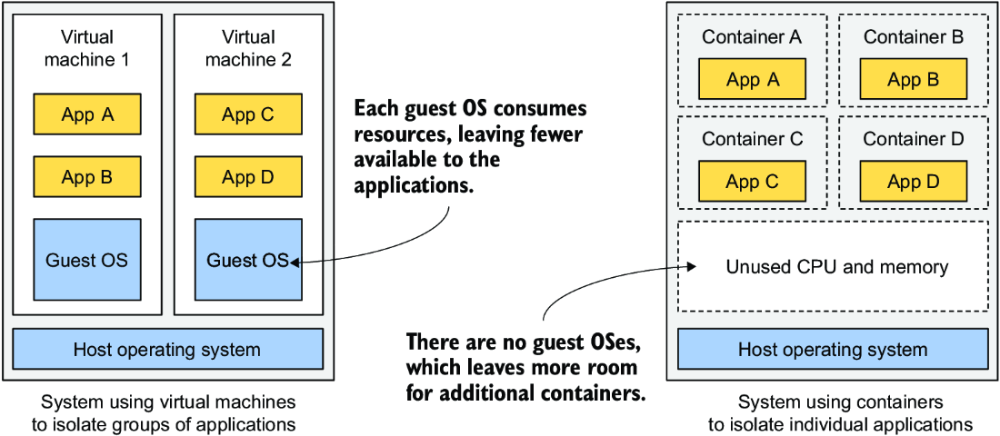

*Hình 2.1: Chạy ứng dụng trong VM so với trong container*

Do chi phí phụ trội về tài nguyên của VM, nhiều ứng dụng thường được gom chung vào mỗi VM. Bạn có thể không đủ khả năng dành riêng cả một VM cho mỗi ứng dụng. Nhưng vì container không tạo ra chi phí phụ trội, bạn hoàn toàn tự do tạo một container riêng cho từng ứng dụng. Trên thực tế, bạn không bao giờ nên chạy nhiều ứng dụng trong cùng một container, vì điều này khiến việc quản lý các tiến trình trong container trở nên khó khăn hơn nhiều. Hơn nữa, mọi phần mềm hiện có liên quan đến container, kể cả bản thân Kubernetes, đều được thiết kế dựa trên tiền đề rằng chỉ có một ứng dụng trong một container. Thiết kế hệ thống của bạn đi ngược lại nguyên tắc này chẳng khác nào tự rước lấy rắc rối.

#### Thời gian khởi động của container và VM (Start-up time of containers and VMs)

Ngoài chi phí phụ trội thấp hơn khi chạy, container còn khởi động ứng dụng nhanh hơn, vì chỉ cần khởi động chính tiến trình của ứng dụng. Không cần khởi tạo thêm tiến trình hệ thống nào trước đó, như trường hợp khi khởi động (boot) một VM mới.

#### Sự cô lập của container và VM (Isolation of containers and VMs)

Bạn sẽ đồng ý rằng container rõ ràng tốt hơn về mặt sử dụng tài nguyên, nhưng nó cũng có một nhược điểm. Khi bạn chạy ứng dụng trong máy ảo, mỗi VM chạy hệ điều hành và kernel của riêng nó. Bên dưới những VM đó là hypervisor (và có thể là thêm một hệ điều hành nữa), hypervisor này chia các tài nguyên phần cứng vật lý thành những tập tài nguyên ảo nhỏ hơn cho từng VM. Như hình 2.2 cho thấy, các ứng dụng chạy trong những VM này thực hiện các lời gọi hệ thống (system call – syscall) tới kernel của hệ điều hành guest trong VM, và các lệnh máy mà kernel sau đó thực thi trên các CPU ảo sẽ được chuyển tiếp tới CPU vật lý của host thông qua hypervisor.

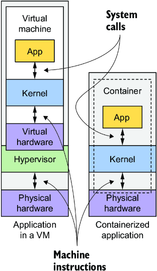

*Hình 2.2: Cách ứng dụng sử dụng phần cứng khi chạy trong VM so với trong container*

> **GHI CHÚ:** Có hai loại hypervisor: hypervisor loại 1 (type 1) không yêu cầu chạy một hệ điều hành host, trong khi hypervisor loại 2 (type 2) thì có.

Ngược lại, tất cả các container đều thực hiện lời gọi hệ thống trên một kernel duy nhất đang chạy trong hệ điều hành host. Kernel duy nhất này là kernel duy nhất thực thi các lệnh trên CPU của host, nhờ đó loại bỏ nhu cầu ảo hóa CPU.

Hãy xem hình 2.3 để thấy sự khác biệt giữa việc chạy ba ứng dụng trực tiếp trên phần cứng (bare metal), trong hai VM riêng biệt, và trong ba container. Trong trường hợp thứ nhất, cả ba ứng dụng đều dùng chung một kernel và hoàn toàn không được cô lập. Trong trường hợp thứ hai, ứng dụng A và B chạy trong cùng một VM và do đó dùng chung kernel, trong khi ứng dụng C được cô lập khỏi hai ứng dụng kia vì nó dùng kernel của riêng mình.

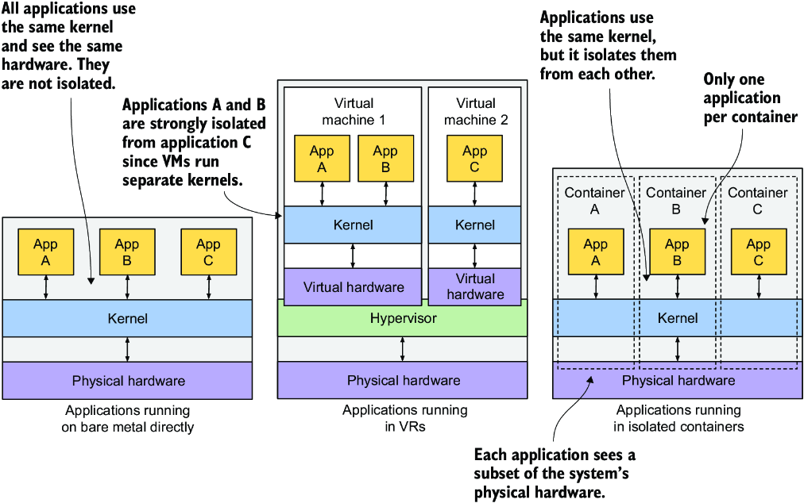

*Hình 2.3: Sự khác biệt giữa việc chạy ứng dụng trên bare metal, trong VM và trong container*

Trường hợp thứ ba trong hình 2.3 cho thấy cùng ba ứng dụng đó chạy trong container. Mặc dù tất cả đều dùng chung một kernel, chúng vẫn được cô lập với nhau và không biết đến sự tồn tại của nhau. Sự cô lập này được cung cấp bởi chính kernel. Mỗi ứng dụng chỉ nhìn thấy một phần của phần cứng vật lý và hành xử như thể nó là tiến trình duy nhất chạy trong hệ điều hành, dù tất cả đều chạy trong cùng một hệ điều hành.

#### Tìm hiểu các hệ quả về bảo mật của việc cô lập bằng container (Understanding the security implications of container isolation)

Lợi thế chính của việc dùng VM so với container là sự cô lập hoàn toàn mà chúng mang lại, vì mỗi VM có Linux kernel của riêng mình, trong khi tất cả các container đều dùng chung một kernel. Điều này rõ ràng có thể gây ra rủi ro bảo mật. Nếu kernel có một lỗi (bug), một ứng dụng trong một container có thể lợi dụng lỗi đó để đọc bộ nhớ của các ứng dụng trong những container khác. Nếu các ứng dụng chạy trong các VM khác nhau và do đó chỉ dùng chung phần cứng, xác suất xảy ra những cuộc tấn công như vậy thấp hơn nhiều. Tất nhiên, sự cô lập hoàn toàn chỉ đạt được khi chạy các ứng dụng trên những máy vật lý riêng biệt.

Ngoài ra, các container dùng chung không gian bộ nhớ, trong khi mỗi VM dùng một phần bộ nhớ riêng của nó. Vì vậy, nếu bạn không giới hạn lượng bộ nhớ mà một container có thể sử dụng, điều này có thể khiến các container khác bị cạn bộ nhớ hoặc khiến dữ liệu của chúng bị hoán đổi (swap) ra đĩa.

> **GHI CHÚ:** Trong khi VM dựa vào sự hỗ trợ ảo hóa của CPU và phần mềm hypervisor trên host, container được hiện thực nhờ các công nghệ container được Linux kernel hỗ trợ. Nhưng thay vì tương tác trực tiếp với những công nghệ này, bạn thường dựa vào các công cụ như Docker hoặc Podman, những công cụ cung cấp giao diện thân thiện với người dùng để quản lý container.

### 2.1.2 Giới thiệu nền tảng container Docker (Introducing the Docker container platform)

Mặc dù các công nghệ container đã tồn tại từ lâu, chúng chỉ trở nên được biết đến rộng rãi cùng với sự trỗi dậy của Docker. Docker là hệ thống container đầu tiên giúp container dễ dàng di chuyển (portable) giữa các máy tính khác nhau. Nó đơn giản hóa quá trình đóng gói ứng dụng cùng các phụ thuộc (dependency) của nó vào một gói duy nhất có thể được triển khai trên bất kỳ máy tính nào chạy Docker.

#### Container, image và registry (Containers, images, and registries)

Docker là một nền tảng để đóng gói, phân phối và chạy ứng dụng. Như đã đề cập trước đó, nó cho phép bạn đóng gói ứng dụng cùng với toàn bộ môi trường của ứng dụng. Môi trường này có thể chỉ bao gồm một vài thư viện liên kết động mà ứng dụng cần, hoặc toàn bộ các file thường được phân phối cùng một hệ điều hành. Docker cho phép bạn phân phối gói này thông qua một kho lưu trữ (repository) công khai tới bất kỳ máy tính nào khác có cài Docker. Hình 2.4 cho thấy ba khái niệm chính của Docker xuất hiện trong quy trình mà tôi vừa mô tả.

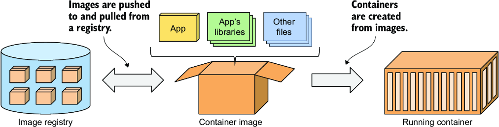

*Hình 2.4: Ba khái niệm chính của Docker là image, registry và container.*

Một *container image* là gói đã được đóng gói bao gồm ứng dụng của bạn và môi trường của nó, tương tự như một file zip hoặc tarball. Nó bao gồm toàn bộ hệ thống file (filesystem) mà ứng dụng của bạn cần, cùng với metadata, chẳng hạn như file thực thi nào cần chạy, các cổng (port) mà ứng dụng lắng nghe, và các thông tin khác về image.

Một *image registry* là một kho lưu trữ để lưu và chia sẻ container image giữa những người và máy tính khác nhau. Sau khi build image, bạn có thể chạy nó cục bộ hoặc tải lên (push) image đó tới một registry rồi tải xuống (pull) về một máy tính khác. Một số registry là công khai, cho phép bất kỳ ai cũng có thể pull image từ đó, trong khi những registry khác là riêng tư và chỉ những cá nhân, tổ chức hoặc máy tính có thông tin xác thực (authentication credential) cần thiết mới truy cập được.

Một *container* được tạo ra từ một container image và chạy như một tiến trình thông thường trên hệ điều hành host. Tuy nhiên, môi trường của nó được cô lập khỏi host và các tiến trình khác. Filesystem của container được dẫn xuất từ container image, nhưng các filesystem bổ sung cũng có thể được gắn (mount) vào container. Container thường bị giới hạn về tài nguyên, nghĩa là chúng được cấp phát những lượng tài nguyên cụ thể, chẳng hạn CPU và bộ nhớ, và không thể vượt quá các giới hạn này.

#### Build, phân phối và chạy một container image (Building, distributing, and running a container image)

Để hiểu container, image và registry liên quan với nhau như thế nào, hãy xem cách build một container image, phân phối nó thông qua một registry, và tạo một container đang chạy từ image đó. Ba quy trình này được minh họa trong các hình 2.5–2.7. Đầu tiên, nhà phát triển build một image (hình 2.5). Image được lưu cục bộ cho đến khi nhà phát triển push nó lên một registry (hình 2.6). Giờ đây, bất kỳ ai có quyền truy cập registry đều có thể pull image về bất kỳ máy tính nào khác chạy Docker và chạy nó ở đó (hình 2.7). Docker tạo một container cô lập dựa trên image và chạy file thực thi được chỉ định bên trong container đó.

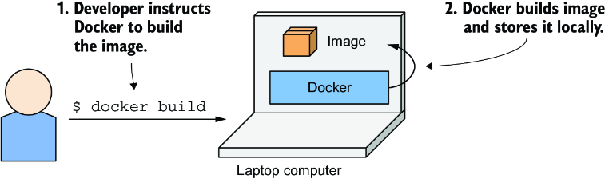

*Hình 2.5: Build một container image*

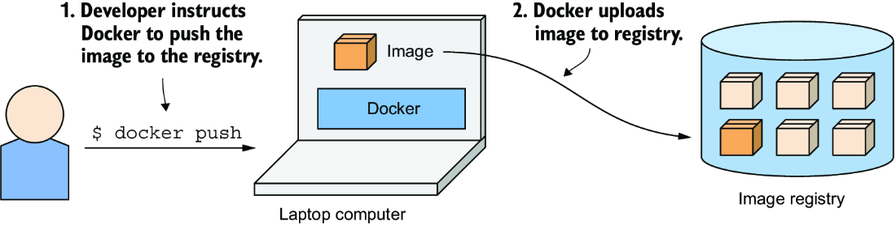

*Hình 2.6: Tải một container image lên registry*

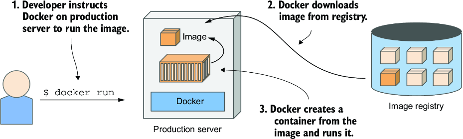

*Hình 2.7: Chạy một container trên một máy tính khác*

Việc chạy ứng dụng trên bất kỳ máy tính nào là khả thi bởi vì môi trường của ứng dụng được tách rời khỏi môi trường của host.

#### Tìm hiểu môi trường mà ứng dụng nhìn thấy (Understanding the environment that the application sees)

Khi bạn chạy một ứng dụng trong container, nó tương tác với các file được đóng gói trong container image, cùng với các file trong những filesystem bổ sung mà bạn mount vào container. Ứng dụng nhìn thấy cùng một bộ file, bất kể nó đang chạy trên laptop của bạn hay trên một máy chủ production, ngay cả khi máy chủ production dùng một bản phân phối Linux hoàn toàn khác với laptop của bạn. Vì ứng dụng thường không thể truy cập các file trong filesystem của host, nên việc các thư viện phần mềm được cài trên máy chủ production có khác với trên laptop của bạn hay không cũng không quan trọng.

Điều này tương tự như việc tạo một VM image bằng cách thiết lập một VM mới, cài đặt hệ điều hành và ứng dụng của bạn, rồi phân phối image này tới các host khác nhau. Tuy nhiên, Docker đạt được cùng kết quả đó mà không cần bao gồm tất cả các thành phần thường có trong filesystem của một hệ điều hành.

#### Tìm hiểu các layer của image (Understanding image layers)

Khác với VM image, container image được cấu thành từ các lớp (layer) mỏng có thể được tái sử dụng giữa nhiều image. Đặc điểm này cho phép truyền tải image một cách hiệu quả, vì chỉ cần tải xuống một số layer nhất định nếu phần còn lại đã được tải về host trước đó, chẳng hạn như một phần của một image khác có chứa cùng các layer đó.

Layer giúp việc phân phối image trở nên rất hiệu quả, đồng thời cũng giúp giảm dung lượng lưu trữ của image. Docker chỉ lưu mỗi layer một lần duy nhất. Như minh họa trong hình 2.8, hai container được tạo từ hai image bao gồm cùng các layer sẽ dùng chung các file.

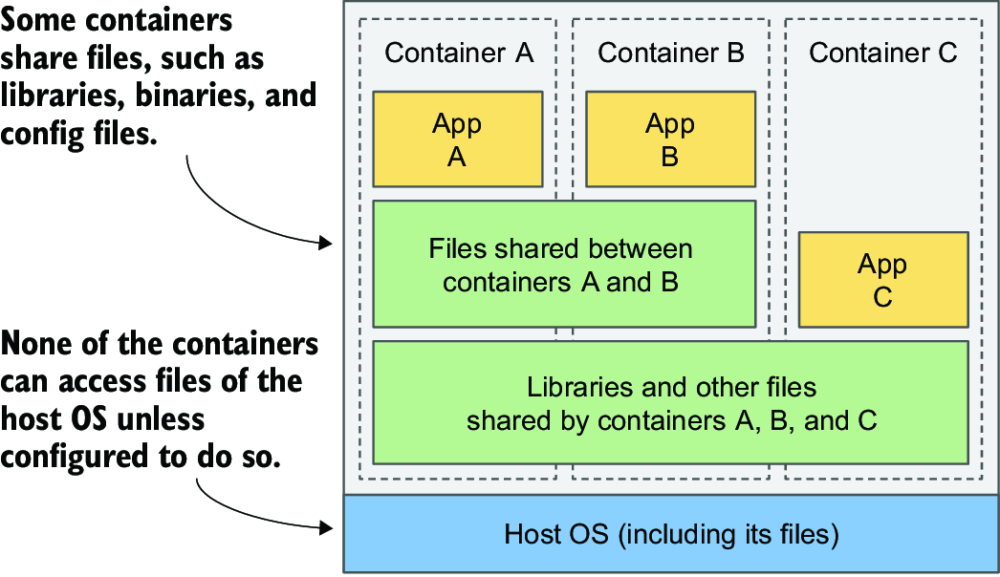

*Hình 2.8: Các container có thể dùng chung các image layer.*

Hình vẽ cho thấy container A và B dùng chung một image layer, nghĩa là ứng dụng A và B đọc một số file giống nhau. Ngoài ra, chúng còn dùng chung layer bên dưới với container C. Nhưng nếu cả ba container đều truy cập được cùng các file đó, làm sao chúng có thể được cô lập hoàn toàn với nhau? Chẳng lẽ những thay đổi mà ứng dụng A thực hiện trên một file nằm trong layer dùng chung lại không được ứng dụng B nhìn thấy? Đúng là không. Lý do như sau.

Các filesystem được cô lập bằng cơ chế copy-on-write (CoW – sao chép khi ghi). Filesystem của một container bao gồm các layer chỉ đọc (read-only) từ container image và một layer đọc/ghi (read/write) bổ sung được xếp chồng lên trên cùng. Khi một ứng dụng chạy trong container A thay đổi một file trong một trong các layer chỉ đọc, toàn bộ file đó được sao chép vào layer đọc/ghi của container, và nội dung file được thay đổi tại đó. Vì mỗi container có layer ghi được của riêng mình, những thay đổi trên các file dùng chung không được nhìn thấy trong bất kỳ container nào khác.

Khi bạn xóa một file, nó chỉ được đánh dấu là đã xóa trong layer đọc/ghi, nhưng vẫn còn tồn tại trong một hoặc nhiều layer bên dưới. Tuy nhiên, điều này có nghĩa là việc xóa file không làm giảm kích thước của image.

> **CẢNH BÁO:** Ngay cả những thao tác tưởng chừng vô hại, chẳng hạn thay đổi quyền (permission) hoặc chủ sở hữu (ownership) của một file, cũng dẫn đến việc tạo ra một bản sao mới của toàn bộ file trong layer đọc/ghi. Nếu bạn thực hiện loại thao tác này trên một file lớn hoặc trên nhiều file, kích thước image có thể phình lên đáng kể.

#### Tìm hiểu những hạn chế về tính di động của container image (Understanding the portability limitations of container images)

Về lý thuyết, một container image dựa trên Docker có thể chạy trên bất kỳ máy tính Linux nào chạy Docker, nhưng có một lưu ý nhỏ vì Linux kernel không được đóng gói cùng image. Nếu một ứng dụng được container hóa yêu cầu một phiên bản kernel cụ thể, nó có thể không hoạt động trên mọi máy tính. Nếu một máy tính đang chạy một phiên bản Linux kernel khác hoặc không nạp các kernel module cần thiết, ứng dụng không thể chạy trên đó. Kịch bản này được minh họa trong hình 2.9.

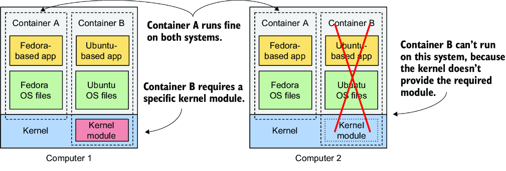

*Hình 2.9: Nếu một container yêu cầu các tính năng hoặc module cụ thể của kernel, nó có thể không hoạt động ở mọi nơi.*

Container B cần một kernel module cụ thể để chạy đúng. Module này được nạp vào kernel trên máy tính thứ nhất, nhưng không được nạp trên máy tính thứ hai. Bạn vẫn có thể chạy container image trên máy tính thứ hai, nhưng nó sẽ bị lỗi khi cố dùng module còn thiếu.

Ngoài ra, kernel không phải là thứ duy nhất có thể khiến một container không tương thích với một host cụ thể. Một ứng dụng được container hóa được build cho một kiến trúc phần cứng cụ thể chỉ có thể chạy trên những máy tính có cùng kiến trúc. Bạn không thể đặt một ứng dụng được biên dịch cho kiến trúc CPU x86 vào container rồi mong nó chạy được trên một máy tính dùng ARM chỉ vì máy đó có cài Docker. Để làm điều này, bạn sẽ cần một VM để giả lập kiến trúc x86.

### 2.1.3 Cài đặt Docker và chạy một container "Hello, World!" (Installing Docker and running a "Hello, World!" container)

Giờ bạn hẳn đã có hiểu biết cơ bản về container là gì, vậy hãy dùng Docker để chạy một container. Bạn sẽ cài đặt Docker và chạy một container "Hello, World!".

> **GHI CHÚ:** Thay vì Docker, bạn cũng có thể dùng Podman để tạo và chạy container trong các ví dụ này. Podman là một container engine mã nguồn mở mang lại trải nghiệm tương tự Docker. Hầu hết các lệnh Docker nhìn chung đều tương thích với Podman và có thể được thực thi theo cùng một cách.

#### Cài đặt Docker (Installing Docker)

Lý tưởng nhất là bạn cài Docker trực tiếp trên một máy tính Linux, để không phải đối mặt với sự phức tạp phát sinh thêm khi chạy container bên trong một VM chạy trong hệ điều hành host của bạn. Nhưng nếu bạn dùng macOS hoặc Windows và không biết cách thiết lập một VM Linux, ứng dụng Docker Desktop sẽ thiết lập nó cho bạn. Công cụ dòng lệnh Docker (CLI) mà bạn sẽ dùng để chạy container sẽ được cài trong hệ điều hành host của bạn, nhưng Docker daemon sẽ chạy bên trong VM, cũng như tất cả các container mà nó tạo ra.

Nền tảng Docker (Docker Platform) bao gồm nhiều thành phần, nhưng bạn chỉ cần cài Docker Engine để chạy container. Nếu bạn dùng macOS hoặc Windows, hãy cài Docker Desktop. Hãy làm theo hướng dẫn tại http://docs.docker.com/install.

> **GHI CHÚ:** Docker Desktop cho Windows có thể chạy container Windows hoặc container Linux. Hãy đảm bảo bạn cấu hình nó để dùng container Linux, vì tất cả các ví dụ trong cuốn sách này đều giả định như vậy.

#### Chạy một container "Hello, World!" (Running a "Hello, World!" container)

Sau khi cài đặt hoàn tất, bạn dùng công cụ CLI `docker` để chạy các lệnh Docker. Hãy thử pull và chạy một image có sẵn từ Docker Hub, image registry công khai chứa các container image sẵn sàng sử dụng cho nhiều gói phần mềm nổi tiếng. Một trong số đó là image `busybox`, mà bạn sẽ dùng để chạy một lệnh `echo "Hello, World!"` đơn giản trong container đầu tiên của mình.

Nếu bạn chưa quen với `busybox`, đó là một file thực thi duy nhất kết hợp nhiều công cụ CLI UNIX tiêu chuẩn, chẳng hạn như `echo`, `ls`, `gzip`, v.v. Thay vì image `busybox`, bạn cũng có thể dùng bất kỳ container image hệ điều hành đầy đủ nào khác như Fedora, Ubuntu, hoặc bất kỳ image nào khác có chứa file thực thi `echo`.

Khi đã cài Docker, bạn không cần tải xuống hay cài đặt thêm gì khác để chạy image `busybox`. Bạn có thể làm tất cả chỉ với một lệnh `docker run` duy nhất, bằng cách chỉ định image cần tải xuống và lệnh cần chạy bên trong nó. Để chạy container "Hello, World!", lệnh và output của nó như sau:

```bash
$ docker run busybox echo "Hello World"
Unable to find image 'busybox:latest' locally                              #1
latest: Pulling from library/busybox                                       #1
7c9d20b9b6cd: Pull complete                                                #1
Digest: sha256:fe301db49df08c384001ed752dff6d52b4...                       #1
Status: Downloaded newer image for busybox:latest                          #1
Hello World         #2
```

- **#1** Docker tải container image xuống.
- **#2** Output do lệnh `echo` tạo ra

> **GHI CHÚ:** Để chạy lệnh này với Podman, hãy thay `docker` bằng `podman`. Điều này cũng áp dụng cho tất cả các lệnh tiếp theo.

Với một lệnh duy nhất này, bạn đã cho Docker biết cần tạo container từ image nào và chạy lệnh nào trong container. Điều này có thể trông không mấy ấn tượng, nhưng hãy nhớ rằng toàn bộ ứng dụng đã được tải xuống và thực thi chỉ với một lệnh duy nhất, mà bạn không phải cài đặt ứng dụng hay bất kỳ phụ thuộc nào của nó.

Trong ví dụ này, ứng dụng rất đơn giản, nhưng nó cũng có thể là một ứng dụng phức tạp với hàng chục thư viện và file bổ sung. Toàn bộ quy trình thiết lập và chạy ứng dụng vẫn sẽ giống hệt như vậy. Điều không hiển nhiên là nó đã chạy trong một container, được cô lập khỏi các tiến trình khác trên máy tính. Bạn sẽ thấy điều này là đúng trong các bài tập còn lại của chương này.

#### Tìm hiểu điều gì xảy ra khi bạn chạy một container (Understanding what happens when you run a container)

Hình 2.10 cho thấy chính xác điều gì xảy ra khi bạn thực thi lệnh `docker run`. Công cụ CLI `docker` gửi một chỉ thị chạy container tới Docker daemon, daemon này kiểm tra xem image `busybox` đã có trong bộ nhớ đệm (cache) image cục bộ của nó hay chưa. Nếu chưa, daemon sẽ pull image đó từ registry Docker Hub.

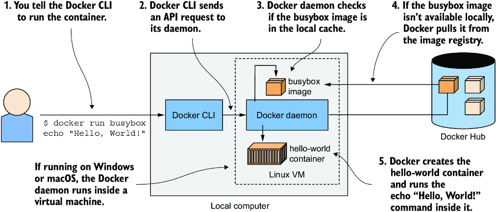

*Hình 2.10: Chạy `echo "Hello, World!"` trong một container dựa trên container image busybox*

Sau khi tải image về máy tính của bạn, Docker daemon tạo một container từ image đó và thực thi lệnh `echo` bên trong nó. Lệnh này in văn bản ra standard output. Sau đó tiến trình kết thúc, và container dừng lại.

Nếu máy tính cục bộ của bạn chạy hệ điều hành Linux, công cụ Docker CLI và daemon đều chạy trong hệ điều hành này. Nếu nó chạy macOS hoặc Windows, daemon và các container sẽ chạy trong VM Linux.

#### Chạy các image khác (Running other images)

Việc chạy các container image có sẵn khác cũng gần giống như chạy image `busybox`. Trên thực tế, nó thường còn đơn giản hơn vì bạn thường không cần chỉ định lệnh nào cần thực thi, như với lệnh `echo` trong ví dụ trước. Lệnh cần được thực thi thường được ghi sẵn trong chính image, nhưng bạn có thể ghi đè nó khi chạy.

Ví dụ, nếu bạn muốn chạy kho dữ liệu (datastore) Redis, bạn có thể tìm tên image trên http://hub.docker.com hoặc một registry công khai khác. Trong trường hợp của Redis, một trong các image có tên là `redis:alpine`, nên bạn sẽ chạy nó như sau:

```bash
$ docker run redis:alpine
```

Để dừng và thoát khỏi container, nhấn Ctrl-C.

> **GHI CHÚ:** Nếu bạn muốn chạy một image từ một registry khác, bạn phải chỉ định địa chỉ của registry cùng với tên image. Ví dụ, để chạy một image từ Quay.io, một image registry truy cập công khai tương tự Docker Hub, bạn sẽ dùng `docker run quay.io/some/image`.

#### Tìm hiểu về image tag (Understanding image tags)

Nếu bạn đã tìm kiếm image Redis trên Docker Hub, bạn sẽ nhận thấy có rất nhiều image tag để bạn lựa chọn. Với Redis, các tag là `latest`, `bookworm` và `alpine`, cũng như `7.4.1-bookworm`, `7.4.1-alpine`, v.v.

Docker cho phép có nhiều phiên bản và biến thể của cùng một image dưới cùng một tên. Mỗi biến thể có một tag duy nhất. Nếu bạn tham chiếu đến image mà không chỉ định tag một cách tường minh, Docker giả định rằng bạn đang tham chiếu đến tag đặc biệt `latest`. Khi tải lên một phiên bản mới của image, các tác giả image thường gắn tag cho nó bằng cả số phiên bản thực tế lẫn `latest`. Khi bạn muốn chạy phiên bản mới nhất của một image, hãy dùng tag `latest` thay vì chỉ định phiên bản.

> **GHI CHÚ:** Lệnh `docker run` chỉ pull image nếu trước đó nó chưa pull image này. Dùng tag `latest` đảm bảo bạn nhận được phiên bản mới nhất khi chạy image lần đầu tiên. Từ thời điểm đó trở đi, image được lưu đệm cục bộ sẽ được sử dụng.

Ngay cả với một phiên bản duy nhất, thường cũng có nhiều biến thể của một image. Với Redis, tôi đã đề cập đến `7.4.1-bookworm` và `7.4.1-alpine`. Cả hai đều chứa cùng một phiên bản Redis nhưng được build trên các base image khác nhau. `7.4.1-bookworm` dựa trên Debian phiên bản "Bookworm", trong khi `7.4.1-alpine` dựa trên base image Alpine Linux, một image được cắt giảm tối đa với tổng dung lượng chỉ 3 MB – nó chỉ chứa một tập nhỏ các file nhị phân (binary) mà bạn thấy trong một bản phân phối Linux điển hình.

Để chạy một phiên bản và/hoặc biến thể cụ thể của image, hãy chỉ định tag trong tên image. Ví dụ, để chạy tag `7.4.1-alpine`, bạn sẽ thực thi lệnh sau:

```bash
$ docker run redis:7.4.1-alpine
```

Như bạn thấy, việc chạy bất kỳ phiên bản Redis nào bằng Docker đều vô cùng đơn giản. Và Redis chỉ là một ví dụ – giờ đây bạn có thể chạy hầu hết các phần mềm phổ biến chỉ bằng cách gõ một lệnh `docker run` duy nhất.

### 2.1.4 Giới thiệu Open Container Initiative và các lựa chọn thay thế Docker (Introducing the Open Container Initiative and Docker alternatives)

Docker là nền tảng container đầu tiên đưa container trở thành xu hướng chủ đạo. Tôi hy vọng mình đã làm rõ rằng bản thân Docker không phải là thứ cung cấp sự cô lập tiến trình. Sự cô lập thực sự của container diễn ra ở cấp độ Linux kernel, sử dụng các cơ chế mà kernel cung cấp. Docker chỉ là một công cụ tận dụng các cơ chế đó, nhưng nó hoàn toàn không phải công cụ duy nhất.

#### Open Container Initiative (The Open Container Initiative)

Sau thành công của Docker, Open Container Initiative (OCI) ra đời nhằm tạo ra các tiêu chuẩn công nghiệp mở xoay quanh định dạng container và runtime. Docker là một phần của sáng kiến này, cùng với các container runtime khác và một số tổ chức quan tâm đến công nghệ container.

Các thành viên OCI đã tạo ra OCI Image Format Specification (đặc tả định dạng image OCI), quy định một định dạng tiêu chuẩn cho container image, và OCI Runtime Specification (đặc tả runtime OCI), định nghĩa một giao diện tiêu chuẩn cho các container runtime với mục tiêu chuẩn hóa việc tạo, cấu hình và thực thi container.

#### Container Runtime Interface, CRI-O và containerd (The Container Runtime Interface, CRI-O, and containerd)

Ban đầu, Kubernetes dùng Docker làm container runtime. Tuy nhiên, hiện nay Kubernetes hỗ trợ nhiều container runtime khác nhau thông qua Container Runtime Interface (CRI), giao diện này định nghĩa một tập các phương thức để tạo, khởi động, dừng và quản lý container.

Một hiện thực của CRI là CRI-O, một container runtime gọn nhẹ được tối ưu cho Kubernetes, cho phép Kubernetes chạy container mà không cần dùng Docker. Một hiện thực CRI khác cũng được dùng phổ biến là containerd, một container runtime hiệu năng cao do Docker phát triển.

Nhờ OCI và CRI, việc lựa chọn container runtime trong một Kubernetes cluster trở nên không còn quan trọng. Bạn có thể build container image bằng Docker rồi chạy chúng trong một cluster sử dụng bất kỳ container runtime nào khác tuân thủ OCI.

---

## 2.2 Triển khai ứng dụng Kubernetes in Action Demo (Deploying the Kubernetes in Action Demo Application)

Giờ bạn đã có một bộ cài Docker hoạt động, bạn có thể bắt đầu build một ứng dụng phức tạp hơn. Bạn sẽ build một ứng dụng dựa trên microservice có tên là Kiada – Kubernetes in Action Demo Application (ứng dụng minh họa Kubernetes in Action).

Trong chương này, bạn sẽ dùng Docker để chạy ứng dụng này. Trong chương tiếp theo và các chương còn lại, bạn sẽ chạy ứng dụng trong Kubernetes. Xuyên suốt cuốn sách, bạn sẽ mở rộng nó dần dần và tìm hiểu về từng tính năng của Kubernetes giúp bạn giải quyết những vấn đề điển hình gặp phải khi vận hành ứng dụng.

### 2.2.1 Giới thiệu ứng dụng Kiada (Introducing the Kiada Application)

Kiada là một ứng dụng web hiển thị các trích dẫn từ cuốn sách này, đặt cho bạn những câu hỏi liên quan đến Kubernetes để giúp bạn kiểm tra xem kiến thức của mình đang tiến bộ ra sao, và cung cấp một danh sách các siêu liên kết (hyperlink) tới những trang web bên ngoài liên quan đến Kubernetes hoặc cuốn sách này.

#### Giao diện và hoạt động của ứng dụng (The look and operation of the application)

Ảnh chụp màn hình của ứng dụng web được trình bày trong hình 2.11. Kiến trúc của ứng dụng Kiada được thể hiện trong hình 2.12. HTML được phục vụ bởi một ứng dụng web chạy trong một máy chủ Node.js. Sau đó, mã JavaScript phía client truy xuất trích dẫn và câu hỏi từ các RESTful service Quote và Quiz. Ứng dụng Node.js cùng với các service này tạo thành ứng dụng Kiada hoàn chỉnh.

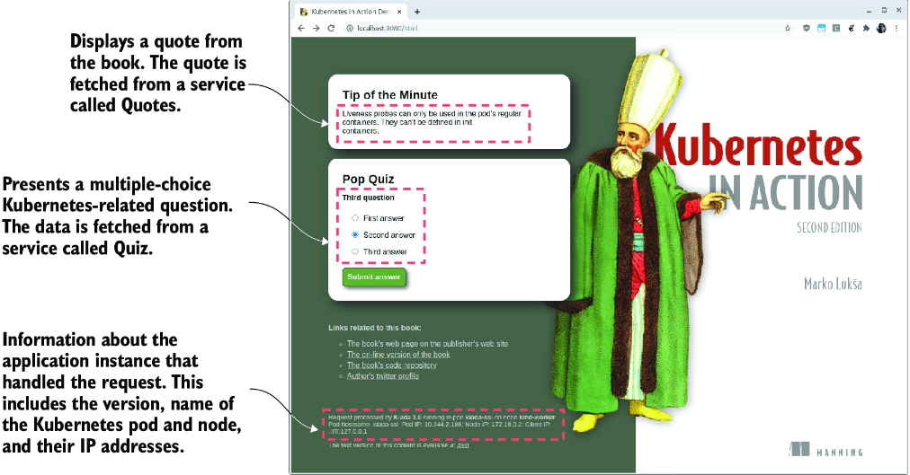

*Hình 2.11: Ảnh chụp màn hình của ứng dụng Kubernetes in Action Demo Application (Kiada)*

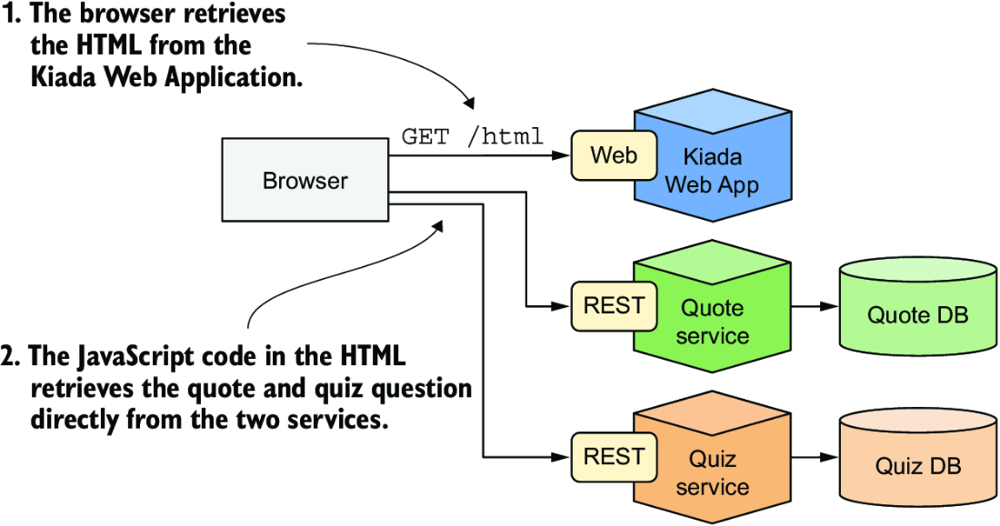

*Hình 2.12: Kiến trúc và hoạt động của ứng dụng Kiada*

Trình duyệt web nói chuyện trực tiếp với ba service khác nhau. Nếu bạn quen thuộc với kiến trúc microservice, bạn có thể thắc mắc tại sao trong hệ thống không có API gateway. Lý do là để chúng ta có thể minh họa các vấn đề và giải pháp cho những hệ thống trong đó nhiều service khác nhau được triển khai trong Kubernetes (những service có thể không thuộc về cùng một API gateway).

#### Giao diện và hoạt động của phiên bản văn bản thuần (The look and operation of the plain-text version)

Bạn sẽ dành rất nhiều thời gian tương tác với Kubernetes qua terminal, nên bạn có thể không muốn liên tục chuyển qua lại giữa terminal và trình duyệt web. Vì lý do này, ứng dụng cũng có thể được sử dụng ở chế độ văn bản thuần (plain-text).

Chế độ văn bản thuần cho phép bạn sử dụng ứng dụng trực tiếp từ terminal bằng một công cụ như `curl`. Trong trường hợp đó, phản hồi mà ứng dụng gửi về trông giống như ví dụ sau:

```text
==== TIP OF THE MINUTE
Liveness probes can only be used in the pod's regular containers.
They can't be defined in init containers.

==== POP QUIZ
Third question
0) First answer
1) Second answer
2) Third answer

Submit your answer to /question/0/answers/<index of answer> using the POST method

==== REQUEST INFO
Request processed by Kubia 1.0 running in pod "kiada-ssl" on node "kind-worker2".
Pod hostname: kiada-ssl; Pod IP: 10.244.2.188; Node IP: 172.18.0.2; Client IP: ...
```

Phiên bản HTML có thể truy cập tại URI request `/html`, trong khi phiên bản văn bản nằm ở `/text`. Nếu client yêu cầu đường dẫn URI gốc `/`, ứng dụng sẽ kiểm tra header request `Accept` để đoán xem client là một trình duyệt web đồ họa, trong trường hợp đó nó chuyển hướng (redirect) client tới `/html`, hay là một công cụ dựa trên văn bản như `curl`, trong trường hợp đó nó gửi phản hồi văn bản thuần.

Có một sự khác biệt quan trọng giữa phiên bản HTML và phiên bản văn bản thuần của ứng dụng. Khác với phiên bản HTML, phản hồi văn bản thuần được tạo ra hoàn toàn ở phía máy chủ, như minh họa trong hình 2.13. Khi bạn yêu cầu phản hồi văn bản thuần, chính ứng dụng Node.js là bên gọi các service Quote và Quiz, chứ không phải trình duyệt.

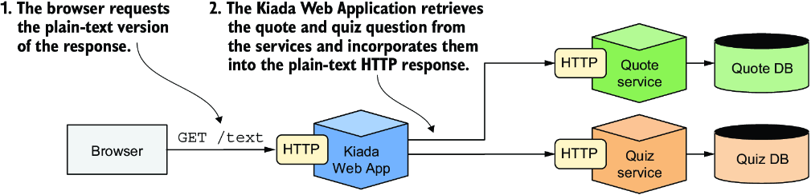

*Hình 2.13: Hoạt động khi client yêu cầu phiên bản văn bản*

Từ góc độ mạng, chế độ văn bản thuần khác biệt đáng kể so với chế độ HTML. Ở đây, service Quote và Quiz được truy cập từ bên trong cluster, trong khi ở chế độ HTML, chúng được truy cập từ bên ngoài cluster. Do đó, để hỗ trợ cả hai chế độ hoạt động, các service phải được công khai (expose) cả bên trong lẫn bên ngoài.

> **GHI CHÚ:** Phiên bản ban đầu của ứng dụng sẽ không kết nối tới bất kỳ service nào. Bạn sẽ build và tích hợp các service này trong các chương sau.

### 2.2.2 Build ứng dụng (Building the application)

Sau khi đã có cái nhìn tổng quan về ứng dụng, đã đến lúc bắt đầu build ứng dụng. Thay vì đi thẳng vào phiên bản đầy đủ, chúng ta sẽ đi từ từ và build ứng dụng theo từng bước lặp.

#### Giới thiệu phiên bản ban đầu của ứng dụng (Introducing the initial version of the application)

Phiên bản ban đầu của ứng dụng mà bạn sẽ chạy trong chương này, dù hỗ trợ cả chế độ HTML lẫn văn bản thuần, sẽ không hiển thị trích dẫn và câu đố (pop quiz), mà chỉ hiển thị thông tin về ứng dụng và về request. Thông tin này bao gồm phiên bản của ứng dụng, hostname mạng của máy chủ đã xử lý request của client, và IP của client. Đây là phản hồi văn bản thuần mà nó gửi về:

```text
Kiada version 0.1. Request processed by "<server-hostname>". Client IP:
            <client-IP>
```

Mã nguồn của ứng dụng có sẵn trong kho code của cuốn sách trên GitHub. Bạn sẽ tìm thấy code của phiên bản ban đầu trong thư mục `Chapter02/kiada-0.1`. Mã JavaScript nằm trong file `app.js`, còn HTML và các tài nguyên khác nằm trong thư mục con `html`. Template cho phản hồi HTML nằm trong `index.html`. Với phản hồi văn bản thuần, template nằm trong `index.txt`.

Giờ bạn có thể tải xuống và cài Node.js cục bộ rồi kiểm thử ứng dụng trực tiếp trên máy tính của mình, nhưng điều đó không cần thiết. Vì bạn đã cài Docker, nên đóng gói ứng dụng vào một container image rồi chạy nó trong container sẽ dễ dàng hơn. Bằng cách này, bạn không cần cài đặt gì cả, và bạn sẽ có thể chạy chính image đó với Kubernetes trong chương tiếp theo.

#### Tạo Dockerfile cho container image (Creating the Dockerfile for the container image)

Để đóng gói ứng dụng của bạn vào một image, bạn cần một file có tên `Dockerfile`, chứa danh sách các chỉ thị (instruction) mà Docker sẽ thực hiện khi build image. Listing sau đây cho thấy nội dung của file này, mà bạn sẽ tìm thấy trong `Chapter02/kiada-0.1/Dockerfile`.

**Listing 2.1: Một Dockerfile tối giản để build một container image**

```dockerfile
FROM node:23-alpine                  #1
COPY app.js /app.js                   #2
COPY html/ /html                #3
ENTRYPOINT ["node", "app.js"]                     #4
```

- **#1** Base image để build trên đó
- **#2** Thêm file `app.js` vào container image
- **#3** Sao chép các file trong thư mục `html/` vào container image tại `/html/`
- **#4** Chỉ định lệnh cần thực thi khi image được chạy

Dòng `FROM` định nghĩa container image mà bạn sẽ dùng làm điểm khởi đầu (base image mà bạn build trên đó). Base image được dùng trong listing là container image `node` với tag `23-alpine`. Ở dòng thứ hai, file `app.js` được sao chép từ thư mục cục bộ của bạn vào thư mục gốc của image. Tương tự, dòng thứ ba sao chép thư mục `html` vào image. Cuối cùng, dòng cuối chỉ định lệnh mà Docker sẽ chạy khi bạn khởi động container. Trong listing, lệnh đó là `node app.js`.

#### Chọn base image (Choosing a base image)

Bạn có thể thắc mắc tại sao lại dùng image cụ thể này làm base. Vì ứng dụng của bạn là một ứng dụng Node.js, bạn cần image của mình chứa file nhị phân `node` để chạy ứng dụng. Bạn có thể dùng bất kỳ image nào chứa file nhị phân này, hoặc thậm chí có thể dùng một base image của một bản phân phối Linux như `fedora` hay `ubuntu` rồi cài Node.js vào container khi build image. Nhưng vì image `node` đã chứa sẵn mọi thứ cần thiết để chạy ứng dụng Node.js, nên việc build image từ đầu là không hợp lý. Tuy nhiên, ở một số tổ chức, việc dùng một base image cụ thể và thêm phần mềm vào nó tại thời điểm build có thể là bắt buộc.

#### Build container image (Building the container image)

`Dockerfile`, file `app.js` và các file trong thư mục `html` là tất cả những gì bạn cần để build image của mình. Với lệnh sau, bạn sẽ build image và gắn tag cho nó là `kiada:latest`:

```bash
$ docker build -t kiada:latest .
[+] Building 6.7s (8/8) FINISHED
  => [internal] load build definition from Dockerfile
  => => transferring dockerfile: 182B
  => [internal] load metadata for docker.io/library/node:23-alpine
  => [internal] load .dockerignore
  => => transferring context: 2B
  => [1/3] FROM docker.io/library/node:23-alpine...                           #1
  => => resolve docker.io/library/node:23-alpine...
  => => sha256:dd44ec6132f29f... 6.49kB / 6.49kB                          #2
  => => sha256:18b16449d0c592... 1.93kB / 1.93kB                          #2
  => => ...                                                               #2
  => [2/3] COPY app.js /app.js                   #3
  => [3/3] COPY html/ /html   #4
  => exporting to image
  => => exporting layers
  => => writing image sha256:afeb94f9465c...                        #5
  => => naming to docker.io/library/kiada:latest                         #6
```

- **#1** Dòng này tương ứng với dòng đầu tiên trong Dockerfile của bạn.
- **#2** Docker tải xuống từng layer riêng lẻ của base image.
- **#3** File `app.js` được sao chép vào image.
- **#4** Thư mục `html` được sao chép vào image.
- **#5** ID của image cuối cùng
- **#6** Tag của image cuối cùng

Tùy chọn `-t` chỉ định tên và tag image mong muốn, còn dấu chấm ở cuối chỉ ra rằng Dockerfile và các tạo tác (artifact) cần thiết để build image nằm trong thư mục hiện tại. Đây là cái gọi là ngữ cảnh build (build context).

Khi quá trình build hoàn tất, image mới tạo sẽ có sẵn trong kho image cục bộ trên máy tính của bạn. Bạn có thể thấy nó bằng cách liệt kê các image cục bộ bằng lệnh sau:

```bash
$ docker images
REPOSITORY   TAG                 IMAGE ID                CREATED          VIRTUAL SIZE
kiada                latest      afeb94f9465c            7 minutes ago    161MB
...
```

#### Tìm hiểu cách image được build (Understanding how the image is built)

Hình 2.14 cho thấy điều gì xảy ra trong quá trình build. Bạn bảo Docker build một image có tên `kiada` dựa trên nội dung của thư mục hiện tại. Docker đọc `Dockerfile` trong thư mục đó và build image dựa trên các chỉ thị (directive) trong file.

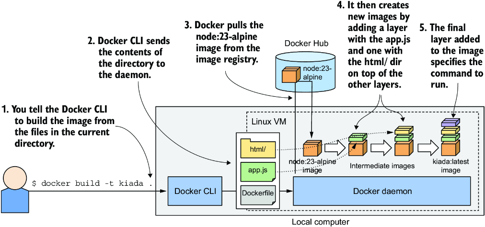

*Hình 2.14: Build một container image mới bằng Dockerfile*

Bản thân quá trình build không được thực hiện bởi công cụ CLI `docker`. Thay vào đó, nội dung của toàn bộ thư mục được tải lên Docker daemon, và image được build bởi daemon. Bạn đã biết rằng công cụ CLI và daemon không nhất thiết phải nằm trên cùng một máy tính. Nếu bạn dùng Docker trên một hệ thống không phải Linux như macOS hoặc Windows, client nằm trong hệ điều hành host của bạn, nhưng daemon chạy bên trong một VM Linux. Nhưng nó cũng có thể chạy trên một máy tính từ xa.

> **MẸO:** Đừng thêm các file không cần thiết vào thư mục build, vì chúng sẽ làm chậm quá trình build, đặc biệt là khi Docker daemon nằm trên một hệ thống từ xa.

Để build image, trước tiên Docker pull base image (`node:23-alpine`) từ kho image công khai, trừ khi image đó đã được lưu cục bộ. Sau đó, nó tạo một container mới từ image này và thực thi chỉ thị tiếp theo trong Dockerfile. Trạng thái cuối cùng của container tạo ra một image mới với ID riêng của nó. Quá trình build tiếp tục bằng cách xử lý các chỉ thị còn lại trong Dockerfile. Mỗi chỉ thị tạo ra một image mới. Image cuối cùng sau đó được gắn tag bằng tag mà bạn đã chỉ định với cờ `-t` trong lệnh `docker build`.

#### Tìm hiểu các layer của image (Understanding the image layers)

Vài trang trước, bạn đã học được rằng image bao gồm nhiều layer. Có người có thể nghĩ rằng mỗi image chỉ bao gồm các layer của base image và một layer mới duy nhất ở trên cùng, nhưng không phải vậy. Khi build một image, một layer mới được tạo ra cho từng chỉ thị riêng lẻ trong Dockerfile.

Trong quá trình build image `kiada`, sau khi pull tất cả các layer của base image, Docker tạo một layer mới và thêm file `app.js` vào đó. Sau đó nó thêm một layer khác với các file từ thư mục `html`, và cuối cùng tạo layer cuối cùng, layer này chỉ định lệnh cần chạy khi container được khởi động. Layer cuối cùng này sau đó được gắn tag `kiada:latest`.

Bạn có thể xem các layer của một image và kích thước của chúng bằng cách chạy `docker history`. Lệnh và output của nó được hiển thị tiếp theo đây (lưu ý rằng các layer trên cùng được in ra trước):

```bash
$ docker history kiada:latest
IMAGE              CREATED        CREATED BY                                  SIZE
afeb94f9465c       13m ago        ENTRYPOINT ["node" "app.js"]                0B       #1
<missing>          13m ago        COPY html/ /html                            533kB    #1
<missing>          13m ago        COPY app.js /app.js                         2.9kB    #1
<missing>          17h ago        CMD ["node"]                                0B        #2
<missing>          17h ago        ENTRYPOINT ["docker-entrypoint.sh"]         0B        #2
<missing>          17h ago        COPY docker-entrypoint.sh /usr/l...         388B      #2
<missing>          17h ago        RUN /bin/sh -c set -ex         && save...   7.18MB    #2
<missing>          17h ago        ENV YARN_VERSION=1.22.22                    0B        #2
<missing>          17h ago        RUN /bin/sh -c ARCH= OPENSSL_ARC...         143MB     #2
<missing>          17h ago        ENV NODE_VERSION=23.4.0                               #2
<missing>          17h ago        RUN /bin/sh -c groupadd --gid 10...         8.9kB     #2
<missing>          9d ago         # debian.sh --arch 'amd64' out/...          74.8MB    #2
```

- **#1** Ba layer mà bạn đã thêm vào
- **#2** Các layer của image `node:23-alpine` và (các) base image của nó

Ba layer đầu tiên tương ứng với các chỉ thị `COPY` và `ENTRYPOINT` trong Dockerfile, và phần còn lại đến từ image `node:23-alpine` cùng (các) base image của nó.

Như bạn thấy trong cột `CREATED BY`, mỗi layer được tạo ra bằng cách thực thi một lệnh trong container. Một số layer được tạo bằng cách thêm file với chỉ thị `COPY`, còn những layer khác được tạo bằng cách thực thi một lệnh tại thời điểm build bên trong container bằng chỉ thị `RUN`. Trong listing trước, bạn sẽ thấy nhiều layer như vậy. Để tìm hiểu về `RUN` và các chỉ thị khác, hãy tham khảo tài liệu Dockerfile reference tại https://docs.docker.com/engine/reference/builder/.

> **MẸO:** Mỗi chỉ thị tạo ra một layer mới. Như đã đề cập trước đó, việc xóa một file chỉ đánh dấu file đó là đã xóa trong layer mới chứ không thực sự loại bỏ file khỏi các layer bên dưới. Do đó, bạn phải đảm bảo rằng lệnh bạn chạy bằng chỉ thị `RUN` xóa hết tất cả các file tạm mà nó tạo ra trước khi kết thúc. Việc xóa những file đó trong chỉ thị `RUN` tiếp theo là vô nghĩa.

### 2.2.3 Chạy container (Running the container)

Với image đã được build và sẵn sàng, giờ bạn có thể chạy container bằng lệnh sau:

```bash
$ docker run --name kiada-container -p 1234:8080 -d kiada
9d62e8a9c37e056a82bb1efad57789e947df58669f94adc2006c087a03c54e02
```

Lệnh này bảo Docker chạy một container mới có tên `kiada-container` từ image `kiada`. Container được tách khỏi console (cờ `-d`) và chạy ở chế độ nền (background). Cổng 1234 trên máy host được ánh xạ tới cổng 8080 trong container (được chỉ định bằng tùy chọn `-p 1234:8080`), nên bạn có thể truy cập ứng dụng tại http://localhost:1234.

Hình 2.15 minh họa cách mọi thứ khớp với nhau. Lưu ý rằng VM Linux chỉ tồn tại nếu bạn dùng macOS hoặc Windows. Nếu bạn dùng Linux trực tiếp, sẽ không có VM, và ô biểu thị cổng 1234 nằm ở rìa của máy tính cục bộ.

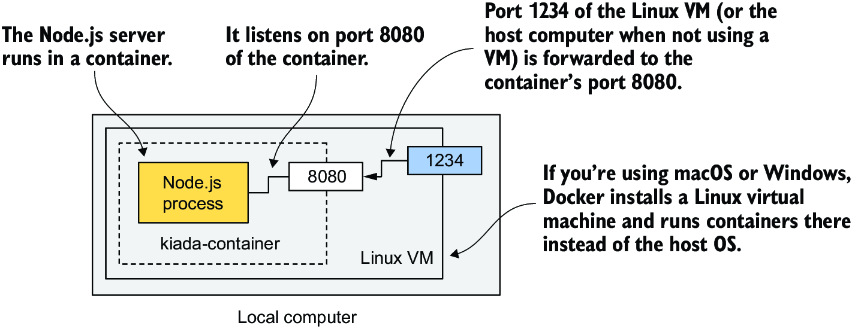

*Hình 2.15: Hình dung container đang chạy của bạn*

#### Truy cập ứng dụng của bạn (Accessing your app)

Giờ hãy truy cập ứng dụng tại http://localhost:1234 bằng `curl` hoặc trình duyệt internet của bạn:

```bash
$ curl localhost:1234
Kiada version 0.1. Request processed by "44d76963e8e1". Client IP: ::ffff:172.17.0.1
```

> **GHI CHÚ:** Nếu Docker daemon chạy trên một máy khác, bạn phải thay `localhost` bằng IP của máy đó. Bạn có thể tra IP này trong biến môi trường `DOCKER_HOST`.

Nếu mọi thứ suôn sẻ, bạn sẽ thấy phản hồi do ứng dụng gửi về. Trong trường hợp của tôi, nó trả về `44d76963e8e1` làm hostname. Trong trường hợp của bạn, bạn sẽ thấy một số thập lục phân (hexadecimal) khác. Đó chính là ID của container. Bạn cũng sẽ thấy nó được hiển thị khi liệt kê các container đang chạy ở phần tiếp theo.

#### Liệt kê tất cả các container đang chạy (Listing all running containers)

Để liệt kê tất cả các container đang chạy trên máy tính của bạn, hãy chạy lệnh sau. Output của nó đã được chỉnh sửa để dễ đọc hơn – hai dòng cuối của output là phần tiếp nối của hai dòng đầu:

```bash
$ docker ps
CONTAINER ID          IMAGE               COMMAND                CREATED         ...
44d76963e8e1          kiada:latest        "node app.js"          6 minutes ago   ...

...   STATUS                PORTS                             NAMES
...   Up 6 minutes          0.0.0.0:1234->8080/tcp            kiada-container
```

Docker in ra ID và tên của từng container, image mà container được tạo từ đó, và lệnh đang chạy trong container. Nó cũng cho thấy container được tạo khi nào, trạng thái của nó, và những cổng nào của host được ánh xạ tới container.

#### Lấy thêm thông tin về một container (Getting additional information about a container)

Lệnh `docker ps` chỉ hiển thị những thông tin cơ bản nhất về các container. Để xem thêm thông tin, bạn có thể dùng `docker inspect`:

```bash
$ docker inspect kiada-container
```

Docker in ra một tài liệu dài định dạng JSON chứa rất nhiều thông tin về container, chẳng hạn như trạng thái (state), cấu hình (config) và các thiết lập mạng, bao gồm cả địa chỉ IP của nó.

#### Kiểm tra log của ứng dụng (Inspecting the application log)

Docker thu thập và lưu trữ mọi thứ mà ứng dụng ghi ra luồng standard output và standard error. Đây thường là nơi các ứng dụng ghi log của chúng. Bạn có thể dùng lệnh `docker logs` để xem output:

```bash
$ docker logs kiada-container
Kiada - Kubernetes in Action Demo Application
---------------------------------------------
Kiada 0.1 starting...
Local hostname is 44d76963e8e1
Listening on port 8080
Received request for / from ::ffff:172.17.0.1
```

Giờ bạn đã biết các lệnh cơ bản để thực thi và kiểm tra một ứng dụng trong container. Tiếp theo, bạn sẽ học cách phân phối container image thông qua một image registry.

### 2.2.4 Phân phối container image (Distributing the container image)

Image mà bạn đã build chỉ có sẵn cục bộ. Để chạy nó trên các máy tính khác, trước tiên bạn phải push nó lên một image registry bên ngoài. Hãy push nó lên registry công khai Docker Hub để bạn không cần thiết lập một registry riêng. Bạn cũng có thể dùng các registry khác, chẳng hạn Quay.io mà tôi đã đề cập, hoặc Google Container Registry.

Trước khi push image, bạn phải gắn tag lại cho nó theo quy ước đặt tên image của Docker Hub. Tên image phải bao gồm Docker Hub ID của bạn, ID này do bạn chọn khi đăng ký tại http://hub.docker.com. Tôi sẽ dùng ID của chính mình (`luksa`) trong các ví dụ sau, vì vậy hãy nhớ thay nó bằng ID của bạn khi tự thử các lệnh.

#### Gắn thêm một tag cho image (Tagging an image under an additional tag)

Khi đã có ID, bạn sẵn sàng thêm một tag bổ sung cho image của mình. Tên hiện tại của nó là `kiada`, và giờ bạn sẽ gắn thêm tag `yourid/kiada:0.1` cho nó (thay `yourid` bằng Docker Hub ID thực tế của bạn). Đây là lệnh tôi đã dùng:

```bash
$ docker tag kiada luksa/kiada:0.1
```

Chạy lại `docker images` để xác nhận rằng image của bạn giờ đã có hai tên:

```bash
$ docker images
REPOSITORY     TAG              IMAGE ID             CREATED               VIRTUAL SIZE
luksa/kiada        0.1          b0ecc49d7a1d         About an hour ago     161MB
kiada              latest       b0ecc49d7a1d         About an hour ago     161MB
...
```

Như bạn thấy, cả `kiada` lẫn `luksa/kiada:0.1` đều trỏ tới cùng một image ID, nghĩa là đây không phải hai image, mà là một image duy nhất với hai tag.

#### Push image lên Docker Hub (Pushing the image to Docker Hub)

Trước khi có thể push image lên Docker Hub, bạn phải đăng nhập bằng user ID của mình bằng lệnh `docker login` như sau:

```bash
$ docker login -u yourid docker.io
```

Lệnh này sẽ yêu cầu bạn nhập mật khẩu Docker Hub. Sau khi đăng nhập, hãy push image `yourid/kiada:0.1` lên Docker Hub bằng lệnh sau:

```bash
$ docker push yourid/kiada:0.1
```

#### Chạy image trên các host khác (Running the image on other hosts)

Bạn có thể chạy image trên bất kỳ host nào có cài Docker bằng cách chạy lệnh sau:

```bash
$ docker run --name kiada-container -p 1234:8080 -d luksa/kiada:0.1
```

Nếu container chạy đúng trên máy tính của bạn, nó cũng sẽ chạy được trên bất kỳ máy tính Linux nào khác.

### 2.2.5 Dừng, tiếp tục và xóa container (Stopping, resuming, and deleting the container)

Nếu bạn đã chạy container trên host kia, giờ bạn có thể kết thúc nó, vì bạn chỉ cần container trên máy tính cục bộ cho phần còn lại của chương này.

#### Dừng một container (Stopping a container)

Hãy chỉ thị cho Docker dừng container bằng lệnh sau:

```bash
$ docker stop kiada-container
```

Lệnh này gửi một tín hiệu kết thúc (termination signal) tới tiến trình chính trong container để nó có thể tắt một cách êm thấm (gracefully). Nếu tiến trình không phản hồi tín hiệu kết thúc hoặc không tắt kịp thời, Docker sẽ kill nó. Khi tiến trình cấp cao nhất trong container kết thúc, không còn tiến trình nào khác chạy trong container, nên container dừng lại.

#### Tiếp tục một container (Resuming a container)

Container không còn chạy nữa, nhưng nó vẫn tồn tại, bị đóng băng ở trạng thái lúc nó bị dừng. Bạn có thể xem các container đã dừng bằng cách chạy `docker ps -a`. Tùy chọn `-a` in ra tất cả các container, cả đang chạy lẫn đã dừng. Docker cho phép bạn tiếp tục (resume) một container đã dừng. Ví dụ, để khởi động lại `kiada-container`, hãy chạy

```bash
$ docker start kiada-container
```

Hãy giữ container này chạy để dùng về sau.

#### Xóa một container (Deleting a container)

Bạn có thể xóa container trên host kia một cách an toàn bằng cách chạy lệnh sau:

```bash
$ docker rm kiada-container
```

Lệnh này xóa hoàn toàn container. Toàn bộ trạng thái của nó bị loại bỏ, và nó không thể được khởi động nữa. Tuy nhiên, container image vẫn được lưu trên host và sẽ được tái sử dụng nếu bạn quyết định tạo lại container.

#### Xóa một container image (Deleting a container image)

Để xóa container image và giải phóng dung lượng đĩa, hãy dùng lệnh `docker rmi`:

```bash
$ docker rmi kiada:latest
```

Ngoài ra, bạn có thể xóa tất cả các image không dùng đến bằng lệnh `docker image prune`.

---

## 2.3 Tìm hiểu về container (Understanding containers)

Trong mục này, bạn sẽ xem xét cách container cho phép cô lập tiến trình mà không cần dùng máy ảo. Một số tính năng của Linux kernel giúp điều này trở nên khả thi, và đã đến lúc làm quen với chúng.

### 2.3.1 Tùy chỉnh môi trường tiến trình bằng Kernel Namespace (Customizing the process environment with Kernel Namespaces)

Tính năng đầu tiên, gọi là Linux Namespace (còn được gọi là Kernel Namespace), đảm bảo rằng mỗi tiến trình có góc nhìn riêng của nó về hệ thống. Điều này có nghĩa là một tiến trình chạy trong container sẽ chỉ nhìn thấy một phần các file, tiến trình và giao diện mạng (network interface) trên hệ thống, và thậm chí là một hostname hệ thống khác, cứ như thể nó đang chạy trong một máy ảo riêng biệt.

Ban đầu, tất cả các tài nguyên hệ thống có sẵn trong một hệ điều hành Linux, chẳng hạn filesystem, ID tiến trình, ID người dùng, giao diện mạng và những thứ khác, đều nằm trong cùng một "thùng" (bucket) mà mọi tiến trình đều nhìn thấy và sử dụng. Nhưng Linux Kernel cho phép bạn tạo thêm các thùng khác gọi là namespace và tổ chức các tài nguyên thành những tập nhỏ hơn. Bạn có thể làm cho mỗi tập chỉ hiển thị với một tiến trình hoặc một nhóm tiến trình. Khi tạo một tiến trình mới, bạn có thể chỉ định nó thuộc về namespace nào. Tiến trình đó chỉ nhìn thấy các tài nguyên trong namespace này chứ không thấy tài nguyên trong bất kỳ namespace nào khác.

#### Giới thiệu các kiểu namespace hiện có (Introducing the available namespace types)

Trên thực tế, có nhiều kiểu namespace, mỗi kiểu ứng với một loại tài nguyên. Do đó, một tiến trình không chỉ dùng một namespace duy nhất, mà dùng một namespace cho mỗi kiểu.

Các kiểu namespace sau đây tồn tại:

* Mount namespace (mnt) cô lập các điểm gắn (mount point – tức là các filesystem).
* Process ID namespace (pid) cô lập các ID tiến trình.
* Network namespace (net) cô lập các thiết bị mạng, network stack, cổng, v.v.
* Inter-process communication namespace (ipc) cô lập việc giao tiếp giữa các tiến trình (bao gồm cô lập hàng đợi thông điệp (message queue), bộ nhớ dùng chung (shared memory) và những thứ khác).
* UNIX Time-sharing System (UTS) namespace cô lập hostname của hệ thống và tên miền Network Information Service (NIS).
* User ID namespace (user) cô lập các ID người dùng và nhóm.
* Time namespace cho phép mỗi container có độ lệch (offset) riêng so với đồng hồ hệ thống.
* Cgroup namespace cô lập thư mục gốc của Control Group. Bạn sẽ tìm hiểu về cgroups ở phần sau của chương này.

#### Dùng network namespace để cấp cho container các giao diện mạng riêng (Using network namespaces to give a container its own network interfaces)

Network namespace mà một tiến trình chạy trong đó quyết định tiến trình có thể nhìn thấy những giao diện mạng nào. Mỗi giao diện mạng thuộc về đúng một namespace nhưng có thể được di chuyển từ namespace này sang namespace khác. Nếu mỗi container dùng network namespace riêng của mình, mỗi container sẽ nhìn thấy tập giao diện mạng riêng của nó.

Hãy xem hình 2.16 để có cái nhìn tổng quan hơn về cách network namespace được dùng để tạo một container. Hãy tưởng tượng bạn muốn chạy một tiến trình được container hóa và cung cấp cho nó một tập giao diện mạng chuyên dụng mà chỉ tiến trình này mới có thể sử dụng.

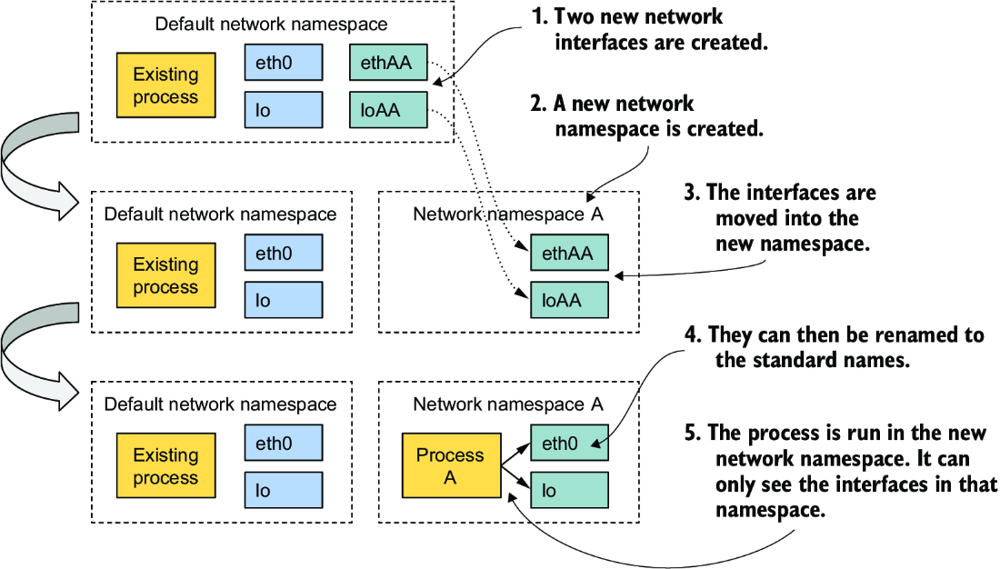

*Hình 2.16: Network namespace giới hạn khả năng truy cập các giao diện mạng.*

Ban đầu, chỉ tồn tại network namespace mặc định. Sau đó bạn tạo hai giao diện mạng mới cho container và một network namespace mới. Các giao diện này sau đó có thể được di chuyển từ namespace mặc định sang namespace mới. Khi đã ở đó, chúng có thể được đổi tên, vì tên chỉ cần là duy nhất trong phạm vi mỗi namespace. Cuối cùng, tiến trình có thể được khởi động trong network namespace này, cho phép nó chỉ nhìn thấy hai giao diện nằm trong namespace này.

Nếu chỉ nhìn vào các giao diện mạng có sẵn, tiến trình không thể biết được nó đang ở trong một container, một VM, hay một hệ điều hành chạy trực tiếp trên máy bare-metal.

#### Dùng UTS namespace để cấp cho tiến trình một hostname riêng (Using the UTS namespace to give a process a dedicated hostname)

Một ví dụ khác về cách làm cho một tiến trình có vẻ như đang chạy trên host của riêng nó là dùng UTS namespace. Namespace này quyết định tiến trình chạy bên trong nó nhìn thấy hostname và tên miền nào. Bằng cách gán hai UTS namespace khác nhau cho hai tiến trình khác nhau, bạn có thể làm cho chúng nhìn thấy hai hostname hệ thống khác nhau. Với hai tiến trình này, có vẻ như chúng đang chạy trên hai máy tính khác nhau.

#### Tìm hiểu cách namespace cô lập các tiến trình với nhau (Understanding how namespaces isolate processes from each other)

Bằng cách tạo các namespace chuyên dụng cho tất cả các kiểu namespace hiện có và gán chúng cho một tiến trình, bạn có thể khiến tiến trình tin rằng nó đang chạy trong hệ điều hành của riêng nó. Tiến trình chỉ có thể nhìn thấy và sử dụng các tài nguyên trong các namespace của chính nó. Nó không thể dùng bất kỳ tài nguyên nào trong các namespace khác. Đây là cách container cô lập môi trường của các tiến trình chạy bên trong chúng khỏi những tiến trình chạy trong các container khác.

#### Chia sẻ namespace giữa nhiều tiến trình (Sharing namespaces between multiple processes)

Trong chương tiếp theo, bạn sẽ học được rằng không phải lúc nào bạn cũng muốn cô lập các container hoàn toàn. Các container có liên quan có thể cần chia sẻ một số tài nguyên nhất định. Ví dụ, hình 2.17 cho thấy hai tiến trình dùng chung các giao diện mạng cũng như hostname và tên miền, nhưng chúng dùng các filesystem riêng biệt.

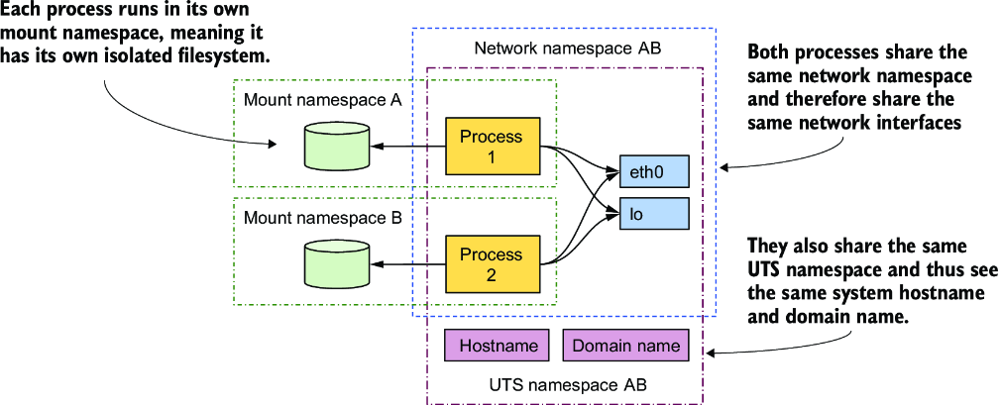

*Hình 2.17: Mỗi tiến trình được liên kết với nhiều kiểu namespace, một số trong đó có thể được dùng chung.*

Hai tiến trình nhìn thấy và sử dụng cùng hai thiết bị mạng (`eth0` và `lo`) vì chúng dùng cùng một network namespace. Điều này cho phép chúng gắn (bind) vào cùng một địa chỉ IP và giao tiếp qua thiết bị loopback, giống hệt như khi chúng chạy trên một máy không dùng container. Hai tiến trình cũng dùng cùng một UTS namespace và do đó nhìn thấy cùng một hostname hệ thống. Ngược lại, mỗi tiến trình dùng mount namespace riêng của mình, nghĩa là mỗi tiến trình có filesystem riêng.

Tóm lại, các tiến trình có thể muốn chia sẻ một số tài nguyên nhưng không chia sẻ những tài nguyên khác. Điều này khả thi nhờ có các kiểu namespace riêng biệt. Một tiến trình có một namespace liên kết với nó cho mỗi kiểu. Vì một số tài nguyên được chia sẻ giữa nhiều tiến trình, điều này đặt ra câu hỏi: vậy rốt cuộc container chính xác là gì? Một tiến trình chạy "trong một container" thực ra không hề bị bao bọc trong bất cứ thứ gì theo cách nó bị bao bọc khi chạy trong VM; nó đơn giản chỉ là một tiến trình được gán một số namespace (một namespace cho mỗi kiểu namespace). Vì một số namespace được chia sẻ với các tiến trình khác, ranh giới giữa các tiến trình không phải lúc nào cũng trùng khớp nhau.

Trong một chương sau, bạn sẽ học cách gỡ lỗi (debug) một container bằng cách chạy một tiến trình mới trực tiếp trên hệ điều hành host, nhưng dùng network namespace của một container hiện có, trong khi dùng các namespace mặc định của host cho mọi thứ khác. Điều này sẽ cho phép bạn gỡ lỗi hệ thống mạng của container bằng các công cụ có sẵn trên host mà có thể không có sẵn trong container.

### 2.3.2 Khám phá môi trường của một container đang chạy (Exploring the environment of a running container)

Nếu bạn muốn xem môi trường bên trong container trông như thế nào thì sao? Hostname của hệ thống là gì, địa chỉ IP cục bộ là gì, những file nhị phân và thư viện nào có sẵn trên filesystem, v.v.?

Để khám phá những đặc điểm này trong trường hợp của VM, bạn thường kết nối từ xa tới nó qua ssh và dùng một shell để thực thi các lệnh. Với container, bạn chạy một shell bên trong container.

> **GHI CHÚ:** File thực thi của shell phải có mặt trong filesystem của container. Điều này không phải lúc nào cũng đúng với các container chạy trong môi trường production.

#### Chạy một shell bên trong một container hiện có (Running a shell inside an existing container)

Image Node.js bao gồm shell `sh`, cho phép bạn chạy nó song song với máy chủ Node.js trong cùng một container bằng lệnh sau:

```bash
$ docker exec -it kiada-container sh
root@44d76963e8e1:/#      #1
```

- **#1** Đây là dấu nhắc lệnh (command prompt) của shell.

Lệnh này chạy `sh` như một tiến trình bổ sung trong container `kiada-container` hiện có. Tiến trình này có cùng các Linux namespace với tiến trình chính của container (máy chủ Node.js đang chạy). Bằng cách này, bạn có thể khám phá container từ bên trong và thấy được Node.js cùng ứng dụng của bạn nhìn thấy hệ thống như thế nào khi chạy trong container. Tùy chọn `-it` là cách viết tắt của hai tùy chọn:

* `-i` bảo Docker chạy lệnh ở chế độ tương tác (interactive).
* `-t` bảo nó cấp phát một pseudo terminal (TTY) để bạn có thể dùng shell đúng cách.

Bạn cần cả hai nếu muốn dùng shell theo cách bạn quen thuộc. Nếu bỏ tùy chọn thứ nhất, bạn không thể thực thi bất kỳ lệnh nào, và nếu bỏ tùy chọn thứ hai, dấu nhắc lệnh sẽ không xuất hiện, và một số lệnh có thể phàn nàn rằng biến `TERM` chưa được thiết lập.

#### Liệt kê các tiến trình đang chạy trong container (Listing running processes in a container)

Hãy liệt kê các tiến trình đang chạy trong container bằng cách thực thi lệnh `ps aux` bên trong shell mà bạn đã chạy trong container:

```bash
root@44d76963e8e1:/# ps aux
PID    USER          TIME COMMAND
     1 root           0:00 node app.js
    19 root           0:00 sh
    31 root           0:00 ps aux
```

Danh sách chỉ hiển thị ba tiến trình. Đây là những tiến trình duy nhất chạy trong container. Bạn không thể thấy các tiến trình khác chạy trong hệ điều hành host hay trong các container khác, vì container chạy trong Process ID namespace riêng của nó.

#### Xem các tiến trình của container trong danh sách tiến trình của host (Seeing container processes in the host's list of processes)

Nếu bây giờ bạn mở một terminal khác và liệt kê các tiến trình trong chính hệ điều hành host, bạn cũng sẽ thấy các tiến trình chạy trong container. Điều này sẽ xác nhận rằng các tiến trình trong container thực chất là những tiến trình thông thường chạy trong hệ điều hành host. Đây là lệnh và output của nó:

```bash
$ ps aux | grep app.js | grep -v grep
root 3175580 0.0 0.0 682968 50456 ?                     Ssl    15:13      0:00 node app.js
```

> **GHI CHÚ:** Nếu bạn dùng macOS hoặc Windows, bạn phải liệt kê các tiến trình trong VM lưu trữ Docker daemon, vì đó là nơi các container của bạn chạy. Trong Docker Desktop, bạn có thể vào VM bằng lệnh `wsl -d docker-desktop` hoặc bằng `docker run --net=host --ipc=host --uts=host --pid=host -it --security-opt=seccomp=unconfined --privileged --rm -v /:/host alpine chroot /host`.

Bạn có nhận thấy rằng ID của tiến trình Node.js khác với ID được hiển thị khi bạn chạy lệnh `ps` bên trong container không? Bên trong container, ID tiến trình (PID) là `1`, nhưng trên host, nó là `3175580`. Sự khác biệt này tồn tại vì container hoạt động trong Process ID namespace riêng của nó, duy trì một cây tiến trình độc lập và dãy ID riêng của nó. Như hình 2.18 cho thấy, cây này là một cây con của cây tiến trình đầy đủ của host. Do đó mỗi tiến trình có hai ID.

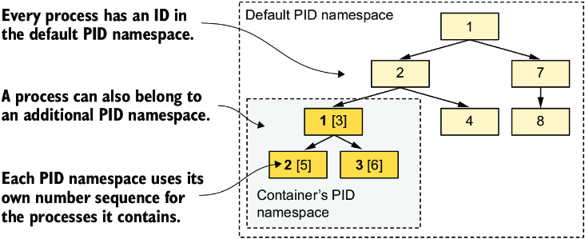

*Hình 2.18: PID namespace làm cho một cây con tiến trình trông như một cây tiến trình riêng biệt với dãy đánh số riêng của nó.*

#### Tìm hiểu sự cô lập filesystem của container (Understanding container filesystem isolation)

Cũng như cây tiến trình được cô lập, mỗi container còn có một filesystem được cô lập. Nếu bạn liệt kê nội dung của thư mục gốc trong container, chỉ các file trong container được hiển thị. Chúng bao gồm các file từ container image và bất kỳ file nào được tạo ra trong khi container chạy, chẳng hạn các file log. Lệnh sau liệt kê các file trong thư mục gốc của container kiada:

```bash
root@44d76963e8e1:/# ls /
app.js boot etc     lib             media     opt     root    sbin     sys   usr
bin        dev      home   lib64    mnt       proc    run     srv      tmp   var
```

Thư mục này chứa file `app.js` và các thư mục hệ thống khác vốn là một phần của base image `node:23-alpine`. Bạn có thể tự do duyệt filesystem của container. Bạn sẽ thấy rằng không có cách nào để xem các file từ filesystem của host. Điều này thật tuyệt vì nó ngăn kẻ tấn công tiềm tàng giành được quyền truy cập vào các file của host thông qua các lỗ hổng trong máy chủ Node.js.

Khi bạn đã xem xét xong bên trong container, hãy thoát khỏi shell bằng cách chạy lệnh `exit` hoặc nhấn Ctrl-D. Thao tác này sẽ đưa bạn trở lại máy tính host của mình (tương tự như đăng xuất khỏi một phiên ssh).

> **MẸO:** Vào một container đang chạy theo cách này rất hữu ích khi bạn muốn gỡ lỗi một ứng dụng chạy trong container. Khi có gì đó hỏng hóc, điều đầu tiên bạn sẽ muốn điều tra là trạng thái thực tế của hệ thống mà ứng dụng của bạn nhìn thấy.

### 2.3.3 Giới hạn tài nguyên khả dụng cho một tiến trình bằng cgroups (Limiting the resources available to a process using cgroups)

Linux namespace giúp các tiến trình chỉ có thể truy cập một phần tài nguyên của host, nhưng chúng không giới hạn mỗi tiến trình có thể tiêu thụ bao nhiêu của một tài nguyên đơn lẻ. Ví dụ, bạn có thể dùng namespace để cho phép một tiến trình chỉ truy cập một giao diện mạng cụ thể, nhưng bạn không thể giới hạn băng thông mạng mà tiến trình đó tiêu thụ. Tương tự, bạn không thể dùng namespace để giới hạn thời gian CPU hay bộ nhớ khả dụng cho một tiến trình. Nhưng bạn có thể cần làm điều này để ngăn một tiến trình tiêu thụ toàn bộ thời gian CPU và khiến các tiến trình hệ thống quan trọng không thể chạy đúng cách. Để làm việc đó, chúng ta cần một tính năng khác của Linux kernel.

#### Giới thiệu cgroups (Introducing cgroups)

Tính năng thứ hai của Linux kernel giúp container trở nên khả thi được gọi là Linux Control Groups (cgroups). Nó giới hạn, thống kê (account) và cô lập các tài nguyên hệ thống như CPU, bộ nhớ, cũng như băng thông đĩa và mạng. Khi dùng cgroups, một tiến trình hoặc một nhóm tiến trình chỉ có thể sử dụng lượng thời gian CPU, bộ nhớ và băng thông mạng đã được cấp phát. Bằng cách này, các tiến trình không thể tiêu thụ những tài nguyên được dành riêng cho các tiến trình khác.

Ở thời điểm này, bạn không cần biết Control Group làm tất cả những điều này như thế nào, nhưng có thể đáng để xem cách bạn có thể yêu cầu Docker giới hạn lượng CPU và bộ nhớ mà một container có thể sử dụng.

#### Giới hạn việc sử dụng CPU của một container (Limiting a container's use of the CPU)

Nếu bạn không áp đặt bất kỳ hạn chế nào lên việc sử dụng CPU của container, nó có quyền truy cập không giới hạn vào tất cả các nhân (core) CPU trên host. Bạn có thể chỉ định tường minh những nhân nào mà một container được phép dùng bằng tùy chọn `--cpuset-cpus` của Docker. Ví dụ, để cho phép container chỉ dùng nhân một và hai, bạn có thể chạy container bằng lệnh

```bash
$ docker run --cpuset-cpus="1,2" ...
```

Bạn cũng có thể giới hạn thời gian CPU khả dụng bằng các tùy chọn `--cpus`, `--cpu-period`, `--cpu-quota` và `--cpu-shares`. Ví dụ, để cho phép container chỉ dùng một nửa nhân CPU, hãy chạy container như sau:

```bash
$ docker run --cpus="0.5" ...
```

#### Giới hạn việc sử dụng bộ nhớ của một container (Limiting a container's use of memory)

Cũng như với CPU, một container có thể dùng toàn bộ bộ nhớ hệ thống khả dụng, giống như bất kỳ tiến trình hệ điều hành thông thường nào, nhưng bạn có thể muốn giới hạn điều này. Docker cung cấp các tùy chọn sau để giới hạn việc sử dụng bộ nhớ và swap của container: `--memory`, `--memory-reservation`, `--kernel-memory`, `--memory-swap` và `--memory-swappiness`.

Ví dụ, để đặt kích thước bộ nhớ tối đa khả dụng trong container là 100 MB, hãy chạy container như sau (`m` là viết tắt của megabyte):

```bash
$ docker run --memory="100m" ...
```

Đằng sau hậu trường, tất cả các tùy chọn Docker này chỉ đơn thuần cấu hình cgroups của tiến trình. Chính Kernel mới là thứ thực thi các giới hạn này. Hãy xem tài liệu Docker để biết thêm thông tin về các tùy chọn giới hạn bộ nhớ và CPU khác.

### 2.3.4 Tăng cường sự cô lập giữa các container (Strengthening isolation between containers)

Linux namespace và cgroups tách biệt môi trường của các container và ngăn một container làm các container khác bị "đói" tài nguyên tính toán. Nhưng các tiến trình trong những container này dùng cùng một kernel hệ thống, nên chúng ta không thể nói rằng chúng được cô lập hoàn toàn. Một container bất hảo (rogue) có thể thực hiện các lời gọi hệ thống độc hại gây ảnh hưởng đến các container láng giềng.

Hãy tưởng tượng một Kubernetes node trên đó có nhiều container đang chạy. Mỗi container có các thiết bị mạng và file riêng, và chỉ có thể tiêu thụ một lượng CPU và bộ nhớ giới hạn. Thoạt nhìn, một chương trình bất hảo trong một trong những container này không thể gây hại cho các container khác. Nhưng nếu chương trình bất hảo đó sửa đổi đồng hồ hệ thống được tất cả các container dùng chung thì sao? Tùy vào ứng dụng, việc thay đổi thời gian có thể không phải là vấn đề quá lớn, nhưng cho phép các chương trình thực hiện bất kỳ lời gọi hệ thống nào tới kernel đồng nghĩa với việc cho phép chúng làm hầu như mọi thứ. Các syscall cho phép chúng sửa đổi bộ nhớ kernel, thêm hoặc gỡ bỏ kernel module, và nhiều việc khác mà container không được phép làm.

Điều này đưa chúng ta đến tập công nghệ thứ ba giúp container trở nên khả thi. Giải thích đầy đủ về chúng nằm ngoài phạm vi của cuốn sách này, vì vậy hãy tham khảo các tài liệu khác tập trung cụ thể vào container hoặc các công nghệ dùng để bảo mật chúng. Mục này chỉ cung cấp một phần giới thiệu ngắn gọn về những công nghệ đó.

#### Cấp cho container toàn quyền đối với hệ thống (Giving containers full privileges to the system)

Kernel của hệ điều hành cung cấp một tập các syscall mà các chương trình dùng để tương tác với hệ điều hành và phần cứng bên dưới. Chúng bao gồm các lời gọi để tạo tiến trình, thao tác với file và thiết bị, thiết lập các kênh giao tiếp giữa các ứng dụng, và những lời gọi khác.

Một số syscall trong đó là an toàn và có sẵn cho mọi tiến trình, nhưng những syscall khác chỉ dành riêng cho các tiến trình có đặc quyền nâng cao (elevated privilege). Nếu nhìn vào ví dụ được trình bày trước đó, các ứng dụng chạy trên Kubernetes node nên được phép mở các file cục bộ của chúng, nhưng không được thay đổi đồng hồ hệ thống hay sửa đổi kernel theo cách làm hỏng các container khác.

Vì vậy, hầu hết các container nên chạy mà không có đặc quyền nâng cao để tăng cường bảo mật. Tuy nhiên, nếu một ứng dụng yêu cầu đặc quyền nâng cao và bạn tin tưởng nhà cung cấp của nó, nó có thể được chạy trong một container đặc quyền (privileged container). Nhưng hãy nhớ rằng các tiến trình trong container đặc quyền không bị hạn chế và có thể thực thi bất kỳ lời gọi hệ thống nào. Do đó, việc chạy một container đặc quyền cần được tiếp cận một cách thận trọng và chỉ khi thực sự cần thiết.

> **GHI CHÚ:** Với Docker, hãy tạo một container đặc quyền bằng cờ `--privileged`.

#### Dùng capability để cấp cho container một tập con của toàn bộ đặc quyền (Using capabilities to give containers a subset of all privileges)

Nếu một ứng dụng chỉ cần một tập con các syscall đòi hỏi đặc quyền nâng cao, việc tạo một container đặc quyền hoàn toàn không phải là lý tưởng. May mắn thay, Linux kernel chia nhỏ các đặc quyền thành những đơn vị gọi là capability. Một số ví dụ về các capability này bao gồm

* `CAP_NET_ADMIN` – Cho phép tiến trình thực hiện các thao tác liên quan đến mạng
* `CAP_NET_BIND_SERVICE` – Cho phép nó bind vào các số cổng nhỏ hơn 1024
* `CAP_SYS_TIME` – Cho phép nó sửa đổi đồng hồ hệ thống, v.v.

Capability có thể được thêm vào hoặc gỡ bỏ (drop) khỏi một container khi bạn tạo nó. Mỗi capability đại diện cho một tập các đặc quyền có sẵn cho các tiến trình trong container. Docker và Kubernetes gỡ bỏ tất cả các capability ngoại trừ những capability mà các ứng dụng điển hình cần đến, nhưng người dùng có thể thêm hoặc gỡ bỏ các capability khác.

> **GHI CHÚ:** Hãy luôn tuân theo nguyên tắc đặc quyền tối thiểu (principle of least privilege) khi chạy container. Đừng cấp cho chúng bất kỳ capability nào mà chúng không cần. Điều này ngăn kẻ tấn công lợi dụng chúng để giành quyền truy cập vào hệ điều hành của host.

#### Dùng seccomp profile để lọc từng syscall riêng lẻ (Using seccomp profiles to filter individual syscalls)

Nếu bạn cần kiểm soát chi tiết (fine-grained) về những syscall nào mà một chương trình có thể thực hiện, bạn có thể dùng seccomp (Secure Computing Mode). Bạn có thể tạo một seccomp profile tùy chỉnh bằng cách tạo một file JSON liệt kê các syscall mà container được phép thực hiện. Sau đó bạn cung cấp file này cho Docker khi tạo container.

#### Gia cố container bằng AppArmor và SELinux (Hardening containers using AppArmor and SELinux)

Container cũng có thể được bảo mật bằng hai cơ chế kiểm soát truy cập bắt buộc (mandatory access control – MAC) bổ sung: SELinux (Security-Enhanced Linux) và AppArmor (Application Armor).

Với SELinux, bạn gắn nhãn (label) cho các file và tài nguyên hệ thống, cũng như cho người dùng và tiến trình. Một người dùng hoặc tiến trình chỉ có thể truy cập một file hoặc tài nguyên nếu nhãn của tất cả các chủ thể (subject) và đối tượng (object) liên quan khớp với một tập chính sách (policy). AppArmor cũng tương tự nhưng dùng đường dẫn file thay vì nhãn và tập trung vào tiến trình hơn là người dùng. Cả SELinux lẫn AppArmor đều cải thiện đáng kể tính bảo mật của một hệ điều hành.

Đừng choáng ngợp trước tất cả những cơ chế bảo mật này. Mục tiêu của mục này là làm rõ các khía cạnh khác nhau của việc cô lập container. Hiện tại, một hiểu biết cơ bản về namespace là tất cả những gì bạn cần.

---

## Tóm tắt

* Container là những tiến trình thông thường được cô lập với nhau và với tất cả các tiến trình khác trong hệ điều hành host.
* Container nhẹ hơn nhiều so với VM, nhưng vì chúng dùng cùng một Linux kernel, chúng không được cô lập tốt bằng.
* Docker là nền tảng container đầu tiên khiến container trở nên phổ biến và là container runtime đầu tiên được Kubernetes hỗ trợ. Hiện nay, các container runtime khác được hỗ trợ thông qua Container Runtime Interface (CRI).
* Một container image chứa ứng dụng của người dùng và tất cả các phụ thuộc của nó. Nó được phân phối thông qua một container registry và được dùng để tạo các container đang chạy.
* Container có thể được tải xuống và thực thi chỉ bằng một lệnh `docker run` duy nhất.
* Docker build một image từ một `Dockerfile` chứa các lệnh cần thực thi trong quá trình build. Image bao gồm các layer có thể được chia sẻ giữa nhiều image. Mỗi layer chỉ cần được truyền tải và lưu trữ một lần.
* Container được cô lập bởi các tính năng của Linux kernel gọi là namespace, control group, capability, seccomp, AppArmor và/hoặc SELinux. Namespace đảm bảo rằng một container chỉ nhìn thấy một phần các tài nguyên có sẵn trên host, control group giới hạn lượng tài nguyên mà nó có thể sử dụng, trong khi các tính năng khác tăng cường sự cô lập giữa các container.
