# Chương 3: Triển khai ứng dụng đầu tiên trên Kubernetes

*(Dịch từ "Chapter 3: Deploying your first application on Kubernetes" – Kubernetes in Action, Second Edition, tác giả Marko Lukša, NXB Manning)*

---

## Nội dung chính của chương
* Chạy một Kubernetes cluster cục bộ
* Thiết lập một cluster trên đám mây (cloud)
* Cài đặt và sử dụng kubectl

Chương này minh họa cách chạy một Kubernetes cluster phát triển cục bộ chỉ có một node, hoặc thiết lập một cluster nhiều node được quản lý (managed) đúng nghĩa trên đám mây. Khi cluster của bạn đã hoạt động, bạn sẽ dùng nó để triển khai container mà bạn đã tạo ở chương trước.

> **GHI CHÚ:** Các file mã nguồn cho chương này có tại https://mng.bz/26xa.

---

## 3.1 Triển khai một Kubernetes cluster (Deploying a Kubernetes cluster)

Thiết lập một Kubernetes cluster nhiều node hoàn chỉnh không phải là việc đơn giản, đặc biệt nếu bạn chưa quen với Linux và quản trị mạng. Một bản cài đặt Kubernetes đúng nghĩa trải rộng trên nhiều máy vật lý hoặc máy ảo (VM), và nó đòi hỏi một thiết lập mạng phù hợp để mọi container trong cluster có thể giao tiếp với nhau.

Bạn có thể cài đặt Kubernetes trên máy tính xách tay của mình, trên hạ tầng của tổ chức bạn, hoặc trên các VM do các nhà cung cấp đám mây cung cấp (Google Compute Engine, Amazon EC2, Microsoft Azure, v.v.). Ngoài ra, bạn cũng có thể để nhà cung cấp đám mây quản lý Kubernetes cluster cho bạn. Dưới đây là danh sách ngắn các tùy chọn Kubernetes được quản lý (managed Kubernetes) lớn nhất và phổ biến nhất:

* Google Kubernetes Engine (GKE)
* Amazon Elastic Kubernetes Service (EKS)
* Microsoft Azure Kubernetes Service (AKS)
* IBM Cloud Kubernetes Service
* Oracle Cloud Infrastructure Container Engine for Kubernetes
* DigitalOcean Kubernetes (DOKS)
* Alibaba Cloud Container Service

Cài đặt và quản lý Kubernetes khó hơn nhiều so với chỉ sử dụng nó, đặc biệt là cho đến khi bạn quen với kiến trúc và cách vận hành của nó. Nếu bạn mới làm quen với Kubernetes, tôi đề nghị dùng một trong các tùy chọn sau đây được mô tả trong chương này:

* Docker Desktop
* Minikube
* Kubernetes in Docker (Kind)
* Google Kubernetes Engine

Tôi chủ yếu dùng Kind để phát triển vì nó chiếm rất ít tài nguyên. Tuy nhiên, tôi khuyên bạn nên khám phá các tùy chọn khác nhau thay vì bám vào lựa chọn đầu tiên của mình, vì mỗi tùy chọn đều có thế mạnh và trường hợp sử dụng riêng. Ngoài ra, hãy truy cập trang web chính thức của Kubernetes tại kubernetes.io để tìm thêm các tùy chọn khác để chạy Kubernetes cục bộ hoặc trên đám mây.

> **GHI CHÚ:** Nếu bạn đã có quyền truy cập vào một cluster sẵn có, bạn có thể bỏ qua các mục tiếp theo và đi thẳng đến mục 3.2, nơi bạn sẽ học cách tương tác với cluster.

### 3.1.1 Sử dụng Kubernetes cluster tích hợp sẵn trong Docker Desktop (Using the built-in Kubernetes cluster in Docker Desktop)

Nếu bạn dùng macOS hoặc Windows, rất có thể bạn đã cài Docker Desktop để chạy các bài tập ở chương trước. Docker Desktop cung cấp một Kubernetes cluster đơn node mà bạn có thể bật thông qua hộp thoại Settings của nó. Đây có lẽ là cách dễ nhất để bắt đầu hành trình Kubernetes của bạn, nhưng hãy lưu ý rằng phiên bản Kubernetes có thể không mới bằng khi dùng các tùy chọn khác.

> **GHI CHÚ:** Mặc dù về mặt kỹ thuật không phải là một cluster, hệ thống Kubernetes đơn node do Docker Desktop cung cấp là đủ để khám phá hầu hết các chủ đề được thảo luận trong cuốn sách này. Tôi sẽ nói rõ khi một bài tập đòi hỏi phải thiết lập cluster nhiều node.

#### Bật Kubernetes trong Docker Desktop (Enabling Kubernetes in Docker Desktop)

Giả sử Docker Desktop đã được cài đặt trên máy tính của bạn, bạn có thể khởi động Kubernetes cluster bằng cách nhấp vào biểu tượng cá voi trong khay hệ thống (system tray) và mở hộp thoại Settings. Nhấp vào tab Kubernetes và đảm bảo công tắc Enable Kubernetes đã được bật. Các thành phần tạo nên Kubernetes Control Plane chạy dưới dạng các Docker container, nhưng Docker ẩn chúng đi trừ khi bạn chọn hộp kiểm "Show system containers" (xem hình 3.1).

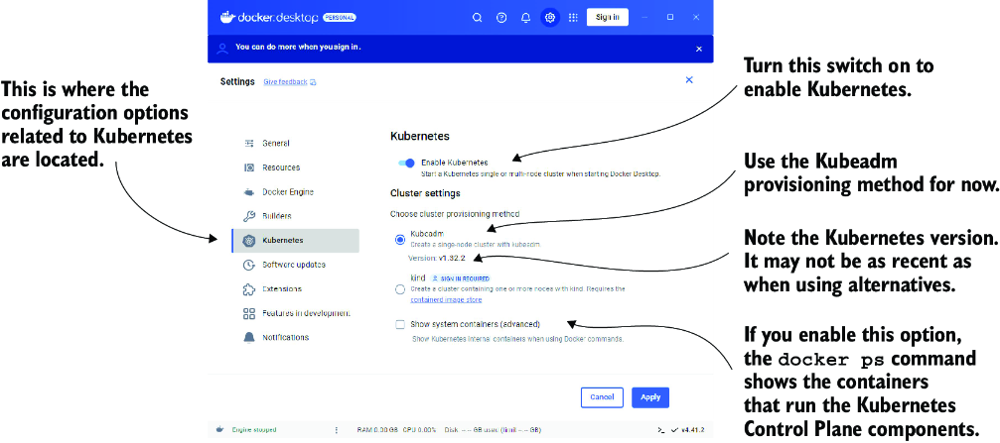

*Hình 3.1: Hộp thoại Settings trong Docker Desktop dành cho Windows*

> **GHI CHÚ:** Lần cài đặt cluster đầu tiên có thể mất vài phút, vì tất cả các container image của các thành phần Kubernetes phải được tải về.

#### Hình dung hệ thống (Visualizing the system)

Bạn đã biết rằng Kubernetes bao gồm nhiều thành phần. Hình 3.2 cho thấy các thành phần đó chạy ở đâu trong Kubernetes cluster do Docker Desktop cung cấp.

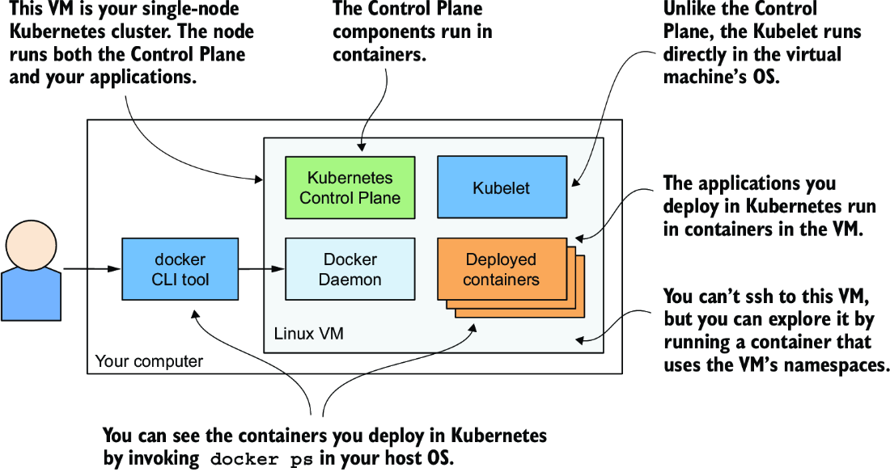

*Hình 3.2: Kubernetes chạy trong Docker Desktop*

Docker Desktop thiết lập một máy ảo Linux để chứa Docker Daemon và tất cả các container. VM này cũng chạy Kubelet – agent của Kubernetes chịu trách nhiệm quản lý node. Các thành phần của control plane chạy trong các container, và tất cả các ứng dụng bạn triển khai cũng vậy.

Để liệt kê các container đang chạy, bạn không cần đăng nhập vào VM, vì công cụ CLI `docker` có sẵn trong hệ điều hành máy chủ (host OS) của bạn sẽ hiển thị chúng.

#### Khám phá máy ảo từ bên trong (Exploring the virtual machine from the inside)

Tại thời điểm viết sách, Docker Desktop không cung cấp lệnh nào để đăng nhập vào VM nếu bạn muốn khám phá nó từ bên trong. Tuy nhiên, bạn có thể chạy một container đặc biệt được cấu hình để dùng các namespace của VM nhằm chạy một shell từ xa, gần như giống hệt việc dùng SSH để truy cập một máy chủ từ xa. Để chạy container này, hãy thực thi lệnh sau:

```bash
$ docker run --net=host --ipc=host --uts=host --pid=host --privileged \
  --security-opt=seccomp=unconfined -it --rm -v /:/host alpine chroot /host
```

Lệnh dài này cần được giải thích rõ:

* Container được tạo từ image `alpine`.
* Các cờ `--net`, `--ipc`, `--uts` và `--pid` khiến container dùng các namespace của host thay vì bị cô lập (sandbox), còn các cờ `--privileged` và `--security-opt` cho phép container truy cập không giới hạn tới mọi lời gọi hệ thống (sys-call).
* Cờ `-it` chạy container ở chế độ tương tác, và cờ `--rm` đảm bảo container bị xóa khi nó kết thúc.
* Cờ `-v` mount thư mục gốc của host vào thư mục `/host` trong container. Lệnh `chroot /host` sau đó biến thư mục này thành thư mục gốc trong container.

Sau khi chạy lệnh, bạn sẽ ở trong một shell mà về bản chất giống hệt như khi bạn dùng SSH để vào VM. Hãy dùng shell này để khám phá VM – thử liệt kê các tiến trình bằng cách thực thi lệnh `ps aux`, hoặc khám phá các giao diện mạng bằng cách chạy `ip addr`.

### 3.1.2 Chạy một cluster cục bộ bằng Minikube (Running a local cluster using Minikube)

Một cách khác để tạo Kubernetes cluster là dùng Minikube, một công cụ do cộng đồng Kubernetes duy trì. Phiên bản Kubernetes mà Minikube triển khai thường mới hơn phiên bản do Docker Desktop triển khai. Cluster bao gồm một node duy nhất và phù hợp cho cả việc thử nghiệm Kubernetes lẫn phát triển ứng dụng cục bộ. Thông thường nó chạy Kubernetes trong một VM Linux, nhưng nếu máy tính của bạn chạy Linux, nó cũng có thể triển khai Kubernetes trực tiếp trong host OS của bạn thông qua Docker.

> **GHI CHÚ:** Nếu bạn cấu hình Minikube dùng VM, bạn không cần Docker, nhưng bạn cần một hypervisor như VirtualBox. Trong trường hợp còn lại, bạn cần Docker nhưng không cần hypervisor.

#### Cài đặt Minikube (Installing Minikube)

Minikube hỗ trợ macOS, Linux và Windows. Nó có một file thực thi nhị phân duy nhất, mà bạn sẽ tìm thấy trong kho Minikube trên GitHub (http://github.com/kubernetes/minikube). Tốt nhất là làm theo hướng dẫn cài đặt hiện hành được công bố ở đó, nhưng nói chung, bạn cài đặt nó như sau.

Trên macOS bạn có thể cài nó bằng trình quản lý gói Brew; trên Windows có một trình cài đặt để bạn tải về; còn trên Linux, bạn có thể tải gói `.deb` hoặc `.rpm`, hoặc đơn giản là tải file nhị phân về và làm cho nó có thể thực thi bằng lệnh sau:

```bash
$ curl -LO https://storage.googleapis.com/minikube/releases/latest/minikube-linux-amd64
$ sudo install minikube-linux-amd64 /usr/local/bin/minikube
```

Để biết chi tiết cho hệ điều hành cụ thể của bạn, vui lòng tham khảo hướng dẫn cài đặt trực tuyến.

#### Khởi động một Kubernetes cluster bằng Minikube (Starting a Kubernetes cluster with Minikube)

Sau khi Minikube đã được cài đặt, hãy khởi động Kubernetes cluster như sau:

```bash
$ minikube start
minikube v1.11.0 on Fedora 31
Using the virtualbox driver based on user configuration
Downloading VM boot image ...
> minikube-v1.11.0.iso.sha256: 65 B / 65 B [-------------] 100.00% ? p/s 0s
> minikube-v1.11.0.iso: 174.99 MiB / 174.99 MiB [] 100.00% 50.16 MiB p/s 4s
Starting control plane node minikube in cluster minikube
Downloading Kubernetes v1.18.3 preload ...
> preloaded-images-k8s-v3-v1.18.3-docker-overlay2-amd64.tar.lz4: 526.01 MiB
Creating virtualbox VM (CPUs=2, Memory=6000MB, Disk=20000MB) ...
Preparing Kubernetes v1.18.3 on Docker 19.03.8 ...
Verifying Kubernetes components...
Enabled addons: default-storageclass, storage-provisioner
Done! kubectl is now configured to use "minikube"
```

Quá trình này có thể mất vài phút, vì image của VM và các container image của các thành phần Kubernetes phải được tải về.

> **MẸO:** Nếu bạn dùng Linux, bạn có thể giảm lượng tài nguyên mà Minikube cần bằng cách tạo cluster không dùng VM. Hãy dùng lệnh `minikube start --vm-driver none`.

#### Kiểm tra trạng thái của Minikube (Checking Minikube's status)

Khi lệnh `minikube start` hoàn tất, bạn có thể kiểm tra trạng thái của cluster bằng cách chạy lệnh `minikube status`:

```bash
$ minikube status
host: Running
kubelet: Running
apiserver: Running
kubeconfig: Configured
```

Output của lệnh cho thấy Kubernetes host (VM chứa Kubernetes) đang chạy, và Kubelet (agent chịu trách nhiệm quản lý node) cũng như Kubernetes API server cũng đang chạy. Dòng cuối cùng cho thấy công cụ dòng lệnh (CLI) `kubectl` đã được cấu hình để dùng Kubernetes cluster mà Minikube vừa cung cấp. Minikube không cài đặt công cụ CLI này, nhưng nó có tạo file cấu hình cho công cụ đó. Việc cài đặt công cụ CLI được giải thích trong mục 3.2.

#### Hình dung hệ thống (Visualizing the system)

Kiến trúc của hệ thống, được thể hiện trong hình 3.3, thực tế giống hệt kiến trúc trong Docker Desktop. Các thành phần của control plane chạy trong các container bên trong VM, hoặc trực tiếp trong host OS của bạn nếu bạn dùng tùy chọn `--vm-driver none` để tạo cluster. Kubelet chạy trực tiếp trong hệ điều hành của VM hoặc của host. Nó chạy các ứng dụng mà bạn triển khai vào cluster thông qua Docker Daemon.

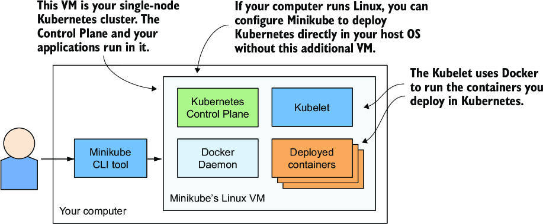

*Hình 3.3: Chạy một Kubernetes cluster đơn node bằng Minikube*

Bạn có thể chạy `minikube ssh` để đăng nhập vào VM của Minikube và khám phá nó từ bên trong. Ví dụ, bạn có thể xem những gì đang chạy trong VM bằng cách chạy `ps aux` để liệt kê các tiến trình đang chạy, hoặc `docker ps` để liệt kê các container đang chạy.

> **MẸO:** Nếu bạn muốn liệt kê các container bằng instance `docker` CLI cục bộ của mình, như trong trường hợp Docker Desktop, hãy chạy lệnh `eval $(minikube docker-env)`.

### 3.1.3 Chạy một cluster cục bộ bằng kind (Kubernetes in Docker) (Running a local cluster using kind (Kubernetes in Docker))

Một lựa chọn thay thế cho Minikube, dù chưa trưởng thành bằng, là kind (Kubernetes-in-Docker). Thay vì chạy Kubernetes trong máy ảo hoặc trực tiếp trên host, kind chạy mỗi node của Kubernetes cluster bên trong một container. Không giống Minikube, tính năng này cho phép nó tạo cluster nhiều node bằng cách khởi động nhiều container. Các container ứng dụng thực sự mà bạn triển khai lên Kubernetes khi đó chạy bên trong các container node này. Hệ thống được thể hiện trong hình 3.4.

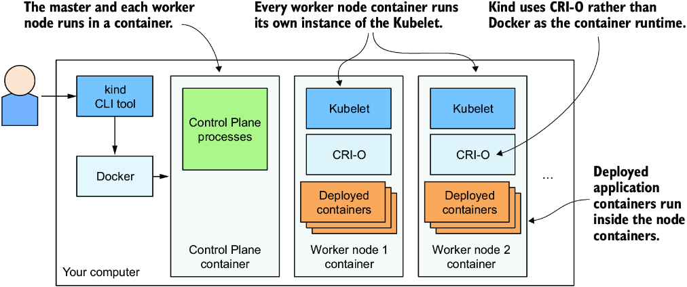

*Hình 3.4: Chạy một Kubernetes cluster nhiều node bằng kind*

Ở chương trước, tôi đã đề cập rằng một tiến trình chạy trong container thực chất chạy trong host OS. Điều này có nghĩa là khi bạn chạy Kubernetes bằng kind, tất cả các thành phần Kubernetes đều chạy trong host OS của bạn. Các ứng dụng bạn triển khai lên Kubernetes cluster cũng chạy trong host OS của bạn.

Điều này khiến kind trở thành công cụ hoàn hảo cho phát triển và thử nghiệm, vì mọi thứ đều chạy cục bộ, và bạn có thể debug các tiến trình đang chạy dễ dàng như khi chạy chúng bên ngoài container. Tôi thích dùng cách tiếp cận này khi phát triển ứng dụng trên Kubernetes vì nó cho phép tôi làm những điều kỳ diệu như chạy các công cụ phân tích lưu lượng mạng chẳng hạn Wireshark, hoặc thậm chí cả trình duyệt web của tôi, bên trong các container đang chạy ứng dụng của tôi. Tôi dùng một công cụ tên là `nsenter`, cho phép tôi chạy các công cụ này trong network namespace hoặc các namespace khác của container.

Nếu bạn mới làm quen với Kubernetes, lựa chọn an toàn nhất là bắt đầu với Minikube, nhưng nếu bạn thích phiêu lưu, đây là cách bắt đầu với kind.

#### Cài đặt kind (Installing kind)

Giống như Minikube, kind bao gồm một file thực thi nhị phân duy nhất. Để cài đặt nó, hãy tham khảo hướng dẫn cài đặt tại https://kind.sigs.k8s.io/docs/user/quick-start/. Trên macOS và Linux, các lệnh để cài đặt nó như sau:

```bash
$ curl -Lo ./kind https://kind.sigs.k8s.io/dl/v0.11.1/kind-$(uname)-amd64
$ chmod +x ./kind
$ mv ./kind /some-dir-in-your-PATH/kind
```

Hãy kiểm tra tài liệu để xem phiên bản mới nhất là gì và dùng nó thay cho `v0.7.0` trong ví dụ trên. Ngoài ra, hãy thay `/some-dir-in-your-PATH/` bằng một thư mục thực tế nằm trong path của bạn.

> **GHI CHÚ:** Docker phải được cài đặt trên hệ thống của bạn để dùng kind.

#### Khởi động một Kubernetes cluster bằng kind (Starting a Kubernetes cluster with kind)

Khởi động một cluster mới cũng dễ như với Minikube. Hãy thực thi lệnh sau:

```bash
$ kind create cluster
```

Giống như Minikube, kind cấu hình kubectl để dùng cluster mà nó tạo ra.

#### Khởi động một cluster nhiều node bằng kind (Starting a multi-node cluster with kind)

Kind mặc định chạy một cluster đơn node. Nếu bạn muốn chạy một cluster có nhiều worker node, trước tiên bạn phải tạo một file cấu hình. Listing sau đây cho thấy nội dung của file này (`Chapter03/kind-multi-node.yaml`).

**Listing 3.1: File cấu hình để chạy cluster ba node bằng công cụ kind** (`Chapter03/kind-multi-node.yaml`)

```yaml
kind: Cluster
apiVersion: kind.sigs.k8s.io/v1alpha4
nodes:
- role: control-plane
- role: worker
- role: worker
```

Khi đã có file này, hãy tạo cluster bằng lệnh sau:

```bash
$ kind create cluster --config kind-multi-node.yaml
```

#### Liệt kê các worker node (Listing worker nodes)

Tại thời điểm viết sách, kind không cung cấp lệnh để kiểm tra trạng thái của cluster, nhưng bạn có thể liệt kê các node của cluster bằng `kind get nodes`:

```bash
$ kind get nodes
kind-worker2
kind-worker
kind-control-plane
```

Vì mỗi node chạy dưới dạng một container, bạn cũng có thể thấy các node bằng cách liệt kê các container đang chạy với `docker ps`:

```bash
$ docker ps
CONTAINER ID    IMAGE                   ...    NAMES
45d0f712eac0    kindest/node:v1.18.2    ...    kind-worker2
d1e88e98e3ae    kindest/node:v1.18.2    ...    kind-worker
4b7751144ca4    kindest/node:v1.18.2    ...    kind-control-plane
```

#### Đăng nhập vào các node của cluster do kind cung cấp (Logging into cluster nodes provisioned by kind)

Không giống Minikube, nơi bạn dùng `minikube ssh` để đăng nhập vào node nếu muốn khám phá các tiến trình chạy bên trong nó, với kind bạn dùng `docker exec`. Ví dụ, để vào node có tên `kind-control-plane`, hãy chạy:

```bash
$ docker exec -it kind-control-plane bash
```

Thay vì dùng Docker để chạy các container, các node do kind tạo ra dùng container runtime CRI-O, mà tôi đã đề cập ở chương trước như một lựa chọn thay thế gọn nhẹ cho Docker. Công cụ CLI `crictl` được dùng để tương tác với CRI-O. Cách dùng của nó rất giống với công cụ `docker`. Sau khi đăng nhập vào node, hãy liệt kê các container đang chạy trong đó bằng `crictl ps` thay vì `docker ps`. Đây là ví dụ về lệnh và output của nó:

```bash
root@kind-control-plane:/# crictl ps
CONTAINER ID     IMAGE            CREATED       STATE     NAME
c7f44d171fb72    eb516548c180f    15 min ago    Running   coredns          ...
cce9c0261854c    eb516548c180f    15 min ago    Running   coredns          ...
e6522aae66fcc    d428039608992    16 min ago    Running   kube-proxy       ...
6b2dc4bbfee0c    ef97cccdfdb50    16 min ago    Running   kindnet-cni      ...
c3e66dfe44deb    be321f2ded3f3    16 min ago    Running   kube-apiserver   ...
```

### 3.1.4 Tạo một cluster được quản lý với Google Kubernetes Engine (Creating a managed cluster with Google Kubernetes Engine)

Nếu bạn muốn dùng một Kubernetes cluster nhiều node hoàn chỉnh thay vì một cluster cục bộ, bạn có thể dùng một cluster được quản lý (managed cluster), chẳng hạn như cluster do Google Kubernetes Engine (GKE) cung cấp. Bằng cách này, bạn không phải tự tay thiết lập tất cả các node của cluster và mạng, việc thường là quá khó đối với người mới chập chững bước vào Kubernetes. Dùng một giải pháp được quản lý như GKE đảm bảo rằng bạn sẽ không rơi vào tình trạng có một cluster bị cấu hình sai.

#### Thiết lập Google Cloud và cài đặt file nhị phân client gcloud (Setting up Google Cloud and installing the gcloud client binary)

Trước khi có thể thiết lập một Kubernetes cluster mới, bạn phải thiết lập môi trường GKE của mình. Quy trình này có thể thay đổi trong tương lai, nên ở đây tôi chỉ đưa ra vài hướng dẫn chung. Để có hướng dẫn đầy đủ, hãy tham khảo https://mng.bz/15xq.

Đại khái, toàn bộ quy trình bao gồm

1. Đăng ký một tài khoản Google nếu bạn chưa có.
2. Tạo một project trong Google Cloud Platform Console.
3. Bật thanh toán (billing). Việc này đòi hỏi thông tin thẻ tín dụng của bạn, nhưng Google cung cấp bản dùng thử miễn phí 12 tháng với 300 USD tín dụng miễn phí. Và họ không tự động bắt đầu tính phí sau khi hết thời gian dùng thử.
4. Tải về và cài đặt Google Cloud SDK, trong đó có công cụ `gcloud`.
5. Tạo cluster bằng công cụ dòng lệnh `gcloud`.

> **GHI CHÚ:** Một số thao tác (ví dụ thao tác ở bước 2) có thể mất vài phút để hoàn tất, nên hãy thư giãn và đi lấy một tách cà phê trong lúc chờ.

#### Tạo một GKE Kubernetes cluster với ba node (Creating a GKE Kubernetes cluster with three nodes)

Trước khi tạo cluster, bạn phải quyết định nó sẽ được tạo ở khu vực địa lý (region) và vùng (zone) nào. Hãy tham khảo https://mng.bz/Pw9R để xem danh sách các vị trí khả dụng. Trong các ví dụ sau, tôi dùng region `europe-west3` đặt tại Frankfurt, Đức. Region này có ba zone khác nhau, và tôi sẽ dùng zone `europe-west3-c`. Zone mặc định cho mọi thao tác `gcloud` có thể được thiết lập bằng lệnh sau:

```bash
$ gcloud config set compute/zone europe-west3-c
```

Tạo Kubernetes cluster như sau:

```bash
$ gcloud container clusters create kiada --num-nodes 3
Creating cluster kiada in europe-west3-c...
...
kubeconfig entry generated for kiada.
NAME   LOCAT.   MASTER_VER  MASTER_IP   MACH_TYPE      ... NODES STATUS
kiada  eu-w3-c  1.13.11...  5.24.21.22  n1-standard-1  ... 3     RUNNING
```

> **GHI CHÚ:** Tôi đang tạo cả ba worker node trong cùng một zone, nhưng bạn cũng có thể trải chúng ra trên tất cả các zone trong region bằng cách đặt giá trị cấu hình `compute/zone` thành cả một region thay vì một zone duy nhất. Nếu bạn làm vậy, hãy lưu ý rằng `--num-nodes` chỉ số node trên mỗi zone. Nếu region có ba zone và bạn chỉ muốn ba node, bạn phải đặt `--num-nodes` thành `1`.

Giờ bạn đã có một Kubernetes cluster đang chạy với ba worker node. Mỗi node là một máy ảo do nền tảng hạ tầng-như-một-dịch-vụ (infrastructure-as-a-service) Google Compute Engine (GCE) cung cấp. Bạn có thể liệt kê các máy ảo GCE bằng lệnh sau:

```bash
$ gcloud compute instances list
NAME      ZONE        MACHINE_TYPE   INTERNAL_IP  EXTERNAL_IP     STATUS
...-ctlk  eu-west3-c  n1-standard-1  10.156.0.16  34.89.238.55    RUNNING
...-gj1f  eu-west3-c  n1-standard-1  10.156.0.14  35.242.223.97   RUNNING
...-r01z  eu-west3-c  n1-standard-1  10.156.0.15  35.198.191.189  RUNNING
```

> **MẸO:** Mỗi VM đều phát sinh chi phí. Để giảm chi phí của cluster, bạn có thể giảm số node xuống còn một, hoặc thậm chí xuống không khi không dùng đến. Xem mục tiếp theo để biết chi tiết.

Hệ thống được thể hiện trong hình 3.5. Lưu ý rằng chỉ các worker node của bạn chạy trong các máy ảo GCE. Control plane chạy ở nơi khác – bạn không thể truy cập các máy chứa nó.

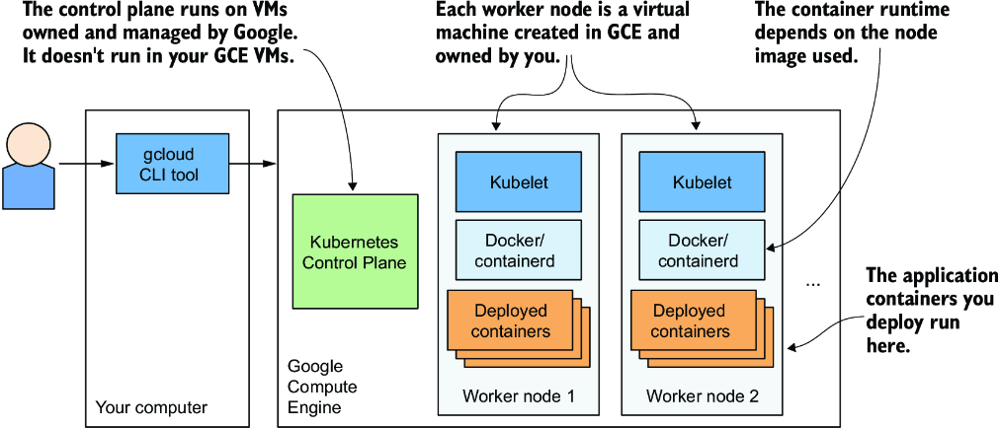

*Hình 3.5: Kubernetes cluster của bạn trong Google Kubernetes Engine*

#### Thay đổi số lượng node (Scaling the number of nodes)

Google cho phép bạn dễ dàng tăng hoặc giảm số node trong cluster của mình. Với hầu hết các bài tập trong cuốn sách này, bạn có thể thu nhỏ nó xuống chỉ còn một node nếu muốn tiết kiệm tiền. Bạn thậm chí có thể thu nhỏ nó xuống không để cluster của bạn không phát sinh bất kỳ chi phí nào. Để thu nhỏ cluster xuống không, hãy dùng lệnh sau:

```bash
$ gcloud container clusters resize kiada --size 0
```

Điều hay của việc thu nhỏ xuống không là không có object nào bạn tạo trong Kubernetes cluster, kể cả các ứng dụng bạn triển khai, bị xóa. Đúng là nếu bạn thu nhỏ xuống không, các ứng dụng sẽ không có node nào để chạy, nên chúng sẽ không chạy. Nhưng ngay khi bạn mở rộng cluster trở lại, chúng sẽ được triển khai lại. Và ngay cả khi không có worker node nào, bạn vẫn có thể tương tác với Kubernetes API (bạn có thể tạo, cập nhật và xóa các object).

#### Kiểm tra một worker node của GKE (Inspecting a GKE worker node)

Nếu bạn quan tâm đến những gì đang chạy trên các node của mình, bạn có thể đăng nhập vào chúng bằng lệnh sau (dùng một trong các tên node từ output của lệnh trước đó):

```bash
$ gcloud compute ssh gke-kiada-default-pool-9bba9b18-4glf
```

Khi đã đăng nhập vào node, bạn có thể thử liệt kê tất cả các container đang chạy bằng `docker ps`. Bạn chưa chạy ứng dụng nào, nên bạn sẽ chỉ thấy các container hệ thống của Kubernetes. Chúng là gì thì hiện giờ chưa quan trọng – bạn sẽ tìm hiểu về chúng trong các chương sau.

### 3.1.5 Tạo một cluster bằng Amazon Elastic Kubernetes Service (Creating a cluster using Amazon Elastic Kubernetes Service)

Nếu bạn thích dùng Amazon thay vì Google để triển khai Kubernetes cluster của mình trên đám mây, bạn có thể thử Amazon Elastic Kubernetes Service (EKS). Hãy cùng điểm qua những điều cơ bản. Trước tiên, bạn phải cài đặt công cụ dòng lệnh `eksctl` theo hướng dẫn tại https://mng.bz/JwOZ.

#### Tạo một EKS Kubernetes cluster (Creating an EKS Kubernetes cluster)

Tạo một EKS Kubernetes cluster bằng `eksctl` không khác nhiều so với cách bạn tạo cluster trong GKE. Tất cả những gì bạn phải làm là chạy lệnh sau:

```bash
$ eksctl create cluster --name kiada --region eu-central-1 --nodes 3 --ssh-access
```

Lệnh này tạo một cluster ba node trong region `eu-central-1`. Danh sách các region được liệt kê tại https://mng.bz/wZd5.

#### Kiểm tra một worker node của EKS (Inspecting an EKS worker node)

Nếu bạn quan tâm đến những gì đang chạy trên các node đó, bạn có thể dùng SSH để kết nối tới chúng. Cờ `--ssh-access` được dùng trong lệnh tạo cluster đảm bảo rằng khóa công khai SSH của bạn được nhập vào node.

Cũng như với GKE và Minikube, một khi đã đăng nhập vào node, bạn có thể thử liệt kê tất cả các container đang chạy bằng `docker ps`. Bạn có thể trông đợi thấy các container tương tự như trong các cluster mà chúng ta đã đề cập trước đó.

### 3.1.6 Triển khai một cluster nhiều node từ đầu (Deploying a multi-node cluster from scratch)

Cho đến khi bạn có hiểu biết sâu hơn về Kubernetes, tôi đặc biệt khuyên bạn đừng cố cài đặt một cluster nhiều node từ đầu. Nếu bạn là một quản trị viên hệ thống giàu kinh nghiệm, bạn có thể làm được việc đó mà không quá vất vả và khổ sở, nhưng hầu hết mọi người có lẽ nên thử một trong các phương pháp được mô tả ở các mục trước trước đã. Quản lý đúng cách các Kubernetes cluster là việc cực kỳ khó. Chỉ riêng việc cài đặt đã là một nhiệm vụ không thể xem thường.

Một khi bạn đã triển khai thành công một hoặc hai cluster bằng kubeadm, khi đó bạn có thể thử triển khai nó hoàn toàn thủ công, bằng cách làm theo hướng dẫn Kubernetes the Hard Way của Kelsey Hightower tại github.com/kelseyhightower/Kubernetes-the-hard-way. Dù bạn có thể gặp phải nhiều vấn đề, việc tìm cách giải quyết chúng có thể là một trải nghiệm học hỏi tuyệt vời.

---

## 3.2 Tương tác với Kubernetes (Interacting with Kubernetes)

Giờ bạn đã biết về một số phương pháp khả dĩ để triển khai một Kubernetes cluster. Đã đến lúc học cách sử dụng cluster. Để tương tác với Kubernetes, bạn dùng một công cụ dòng lệnh tên là `kubectl`, phát âm là kube-control, kube-C-T-L hoặc kube-cuddle.

Như hình 3.6 cho thấy, công cụ này giao tiếp với Kubernetes API server, một phần của Kubernetes Control Plane. Control plane sau đó kích hoạt các thành phần khác để làm bất cứ điều gì cần làm dựa trên những thay đổi bạn đã thực hiện thông qua API.

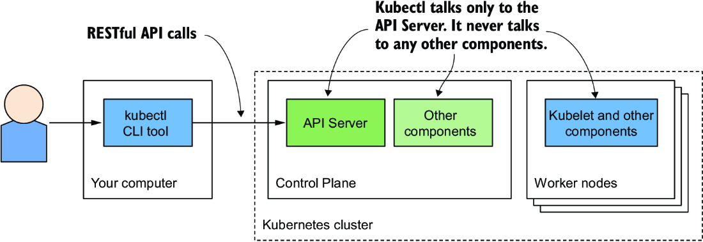

*Hình 3.6: Tương tác với một Kubernetes cluster*

### 3.2.1 Cài đặt kubectl, client dòng lệnh của Kubernetes (Setting up kubectl, the Kubernetes command-line client)

Kubectl là một file thực thi duy nhất mà bạn phải tải về máy tính của mình và đặt vào path. Nó nạp cấu hình từ một file cấu hình gọi là kubeconfig. Để dùng kubectl, bạn phải cài đặt nó và chuẩn bị file kubeconfig để kubectl biết cần nói chuyện với cluster nào.

#### Tải về và cài đặt kubectl (Downloading and installing kubectl)

Bản phát hành ổn định mới nhất cho Linux có thể được tải về và cài đặt bằng các lệnh sau:

```bash
$ curl -LO "https://dl.k8s.io/release/$(curl -L -s https://dl.k8s.io/release/stable.txt)/bin/linux/amd64/kubectl"
$ chmod +x kubectl
$ sudo mv kubectl /usr/local/bin/
```

Để cài đặt kubectl trên macOS, bạn có thể chạy cùng lệnh trên nhưng thay `linux` trong URL bằng `darwin`, hoặc cài công cụ này thông qua Homebrew bằng cách chạy `brew install kubectl`.

Trên Windows, hãy tải `kubectl.exe` từ https://mng.bz/qR8x. Để tải phiên bản mới nhất, trước tiên hãy vào https://mng.bz/7Q7Q để xem phiên bản ổn định mới nhất là gì, rồi thay số phiên bản trong URL đầu tiên bằng phiên bản này. Để kiểm tra xem bạn đã cài đặt đúng chưa, hãy chạy `kubectl --help`. Lưu ý rằng kubectl có thể đã hoặc chưa được cấu hình để nói chuyện với Kubernetes cluster của bạn, nghĩa là hầu hết các lệnh có thể chưa hoạt động.

> **MẸO:** Bạn luôn có thể thêm `--help` vào bất kỳ lệnh kubectl nào để có thêm thông tin.

#### Thiết lập một alias ngắn cho kubectl (Setting up a short alias for kubectl)

Bạn sẽ dùng kubectl thường xuyên. Phải gõ đầy đủ lệnh mỗi lần là tốn thời gian một cách không cần thiết, nhưng bạn có thể tăng tốc bằng cách thiết lập một alias (bí danh) và tính năng hoàn thành bằng phím tab (tab completion) cho nó.

Hầu hết người dùng Kubernetes dùng `k` làm alias cho kubectl. Nếu bạn chưa từng dùng alias, đây là cách định nghĩa nó trong Linux và macOS. Hãy thêm dòng sau vào file `~/.bashrc` hoặc file tương đương của bạn:

```bash
alias k=kubectl
```

Trên Windows, nếu bạn dùng Command Prompt, hãy định nghĩa alias bằng cách thực thi `doskey k=kubectl $*`. Nếu bạn dùng PowerShell, hãy thực thi `set-alias -name k -value kubectl`.

> **GHI CHÚ:** Bạn có thể không cần alias nếu bạn đã dùng `gcloud` để thiết lập cluster. Nó cài đặt file nhị phân `k` bên cạnh `kubectl`.

#### Cấu hình tab completion cho kubectl (Configuring tab completion for kubectl)

Ngay cả với một alias ngắn như `k`, bạn vẫn sẽ phải gõ rất nhiều. May mắn thay, lệnh `kubectl` cũng có thể xuất ra mã hoàn thành (completion code) cho shell, cho cả bash lẫn zsh. Nó cho phép hoàn thành bằng phím tab không chỉ tên lệnh mà cả tên object. Ví dụ, sau này bạn sẽ học cách xem chi tiết của một node cụ thể trong cluster bằng cách thực thi lệnh sau:

```bash
$ kubectl describe node gke-kiada-default-pool-9bba9b18-4glf
```

Đó là rất nhiều thứ phải gõ mà bạn sẽ lặp đi lặp lại suốt. Với tab completion, mọi thứ dễ dàng hơn nhiều. Bạn chỉ cần nhấn TAB sau khi gõ vài ký tự đầu của mỗi token:

```bash
$ kubectl desc<TAB> no<TAB> gke-ku<TAB>
```

Để bật tab completion trong bash, trước tiên bạn phải cài một gói tên là `bash-completion`, rồi chạy lệnh sau (bạn cũng có thể thêm nó vào `~/.bashrc` hoặc file tương đương):

```bash
$ source <(kubectl completion bash)
```

> **GHI CHÚ:** Lệnh này bật tính năng completion trong bash. Bạn cũng có thể chạy lệnh này với một shell khác. Tại thời điểm viết sách, các tùy chọn khả dụng là `bash`, `zsh`, `fish` và `powershell`.

Tuy nhiên, cách này chỉ hoàn thành lệnh khi bạn dùng tên lệnh đầy đủ `kubectl`. Nó sẽ không hoạt động khi bạn dùng alias `k`. Để bật completion cho alias, bạn phải chạy lệnh sau:

```bash
$ complete -o default -F __start_kubectl k
```

### 3.2.2 Cấu hình kubectl để dùng một Kubernetes cluster cụ thể (Configuring kubectl to use a specific Kubernetes cluster)

File cấu hình kubeconfig nằm tại `~/.kube/config`. Nếu bạn đã triển khai cluster bằng Docker Desktop, Minikube hoặc GKE, file này đã được tạo sẵn cho bạn. Nếu bạn được cấp quyền truy cập vào một cluster sẵn có, hẳn bạn đã nhận được file này. Các công cụ khác, chẳng hạn kind, có thể đã ghi file vào một vị trí khác. Thay vì di chuyển file đến vị trí mặc định, bạn cũng có thể trỏ kubectl tới nó bằng cách đặt biến môi trường `KUBECONFIG` như sau:

```bash
$ export KUBECONFIG=/path/to/custom/kubeconfig
```

### 3.2.3 Sử dụng kubectl (Using kubectl)

Giả sử bạn đã cài đặt và cấu hình kubectl, giờ bạn có thể dùng nó để nói chuyện với cluster của mình.

#### Xác minh rằng cluster đang hoạt động và kubectl có thể nói chuyện với nó (Verifying that the cluster is up and that kubectl can talk to it)

Để xác minh rằng cluster của bạn đang hoạt động, hãy dùng lệnh `kubectl cluster-info`:

```bash
$ kubectl cluster-info
Kubernetes master is running at https://192.168.99.101:8443
KubeDNS is running at https://192.168.99.101:8443/api/v1/namespaces/...
```

Điều này cho thấy API server đang hoạt động và phản hồi các request. Output liệt kê URL của các dịch vụ khác nhau của Kubernetes cluster đang chạy trong cluster của bạn. Ví dụ trên cho thấy bên cạnh API server, KubeDNS Service, dịch vụ cung cấp dịch vụ tên miền (domain-name service) bên trong cluster, là một dịch vụ khác đang chạy trong cluster.

#### Liệt kê các node của cluster (Listing cluster nodes)

Giờ hãy dùng lệnh `kubectl get nodes` để liệt kê tất cả các node trong cluster của bạn. Đây là output được sinh ra khi bạn chạy lệnh này trong một cluster do kind cung cấp:

```bash
$ kubectl get nodes
NAME                 STATUS   ROLES    AGE   VERSION
kind-control-plane   Ready    <none>   12m   v1.18.2
kind-worker          Ready    <none>   12m   v1.18.2
kind-worker2         Ready    <none>   12m   v1.18.2
```

Mọi thứ trong Kubernetes đều được biểu diễn bằng một object và có thể được truy xuất cũng như thao tác thông qua RESTful API. Lệnh `kubectl get` truy xuất danh sách các object thuộc kiểu được chỉ định từ API. Bạn sẽ dùng lệnh này suốt, nhưng nó chỉ hiển thị thông tin tóm tắt về các object được liệt kê.

#### Truy xuất thêm chi tiết của một object (Retrieving additional details of an object)

Để xem thông tin chi tiết hơn về một object, hãy dùng lệnh `kubectl describe`, lệnh này hiển thị nhiều hơn rất nhiều:

```bash
$ kubectl describe node gke-kiada-85f6-node-0rrx
```

Tôi lược bỏ output thực tế của lệnh `describe` vì nó khá rộng và sẽ hoàn toàn không đọc được ở đây trong sách. Nếu bạn tự chạy lệnh này, bạn sẽ thấy nó hiển thị trạng thái của node, thông tin về mức sử dụng CPU và bộ nhớ của nó, thông tin hệ thống, các container đang chạy trên node, và nhiều thứ khác nữa.

Nếu bạn chạy lệnh `kubectl describe` mà không chỉ định tên resource, thông tin của tất cả các node sẽ được in ra.

> **MẸO:** Thực thi lệnh `describe` mà không chỉ định tên object rất hữu ích khi chỉ tồn tại một object thuộc một kiểu nhất định. Bạn không phải gõ hoặc sao chép/dán tên object.

Bạn sẽ tìm hiểu thêm về vô số lệnh kubectl khác trong suốt cuốn sách.

### 3.2.4 Tương tác với Kubernetes thông qua web dashboard (Interacting with Kubernetes through web dashboards)

Nếu bạn thích dùng giao diện web đồ họa, bạn sẽ vui khi biết rằng Kubernetes cũng đi kèm một web dashboard khá đẹp. Tuy nhiên, hãy lưu ý rằng chức năng của dashboard có thể tụt hậu đáng kể so với kubectl, công cụ chính để tương tác với Kubernetes. Dù vậy, dashboard hiển thị các resource khác nhau trong ngữ cảnh của chúng và có thể là một khởi đầu tốt để cảm nhận xem các kiểu resource chính trong Kubernetes là gì và chúng liên hệ với nhau như thế nào. Dashboard cũng cung cấp khả năng sửa đổi các object đã triển khai và hiển thị lệnh kubectl tương đương cho mỗi hành động – một tính năng mà hầu hết người mới bắt đầu sẽ đánh giá cao.

Hình 3.7 cho thấy dashboard với hai workload được triển khai trong cluster. Mặc dù bạn sẽ không dùng dashboard trong cuốn sách này, bạn luôn có thể mở nó để nhanh chóng xem hình ảnh trực quan về các object đã triển khai trong cluster sau khi bạn tạo chúng thông qua kubectl.

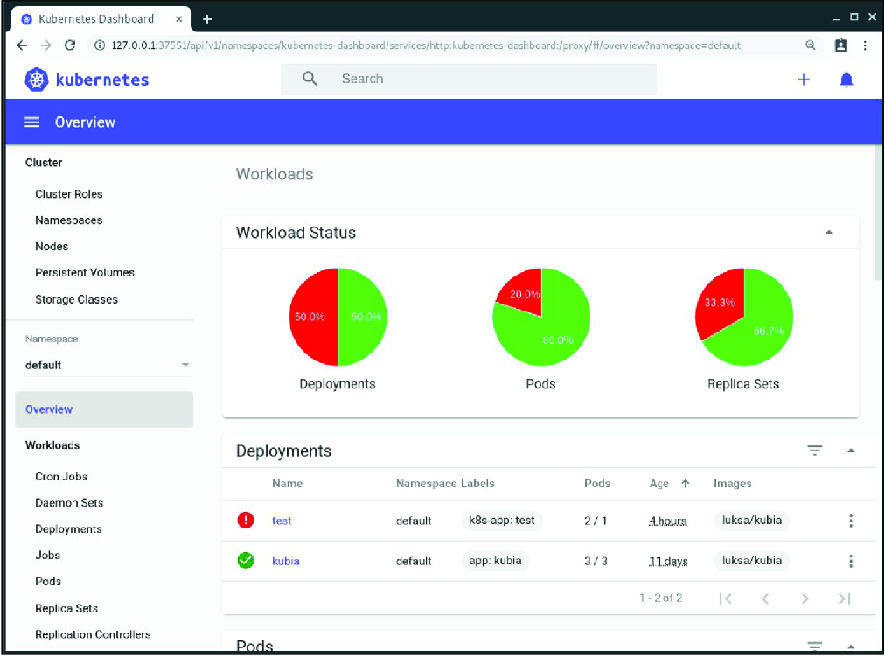

*Hình 3.7: Ảnh chụp màn hình web dashboard của Kubernetes*

#### Truy cập dashboard trong Docker Desktop (Accessing the dashboard in Docker Desktop)

Đáng tiếc là Docker Desktop không cài đặt Kubernetes dashboard theo mặc định. Việc truy cập nó cũng không đơn giản, nhưng đây là cách bạn có thể làm. Trước tiên, bạn cần cài đặt nó bằng lệnh sau:

```bash
$ kubectl apply -f https://raw.githubusercontent.com/kubernetes/dashboard/v2.0.0-rc7/aio/deploy/recommended.yaml
```

Hãy tham khảo github.com/kubernetes/dashboard để tìm số phiên bản mới nhất. Sau khi cài đặt dashboard, lệnh tiếp theo bạn phải chạy là

```bash
$ kubectl proxy
```

Lệnh này chạy một proxy cục bộ tới API server, cho phép bạn truy cập các dịch vụ thông qua nó. Hãy để tiến trình proxy chạy và dùng trình duyệt để mở dashboard tại URL sau:

```text
http://localhost:8001/api/v1/namespaces/kubernetes-dashboard/services/https:kubernetes-dashboard:/proxy/
```

Bạn sẽ thấy một trang xác thực. Khi đó bạn phải chạy lệnh sau để lấy token xác thực:

```powershell
PS C:\> kubectl -n kubernetes-dashboard describe secret $(kubectl -n kubernetes-dashboard get secret | sls kubernetes-dashboard-token | ForEach-Object { $_ -Split '\s+' } | Select -First 1)
```

> **GHI CHÚ:** Lệnh này phải được chạy trong Windows PowerShell.

Tìm token được liệt kê dưới mục `kubernetes-dashboard-token-xyz` và dán nó vào ô token trên trang xác thực hiển thị trong trình duyệt của bạn. Sau khi làm vậy, bạn sẽ có thể dùng dashboard. Khi dùng xong, hãy kết thúc tiến trình `kubectl proxy` bằng Ctrl-C.

#### Truy cập dashboard khi dùng Minikube (Accessing the dashboard when using Minikube)

Nếu bạn dùng Minikube, việc truy cập dashboard dễ hơn nhiều. Hãy chạy lệnh sau và dashboard sẽ mở trong trình duyệt mặc định của bạn:

```bash
$ minikube dashboard
```

#### Truy cập dashboard khi chạy Kubernetes ở nơi khác (Accessing the dashboard when running Kubernetes elsewhere)

Google Kubernetes Engine không còn cung cấp quyền truy cập vào Kubernetes Dashboard mã nguồn mở nữa, nhưng nó cung cấp một console dựa trên web thay thế. Điều tương tự cũng áp dụng cho các nhà cung cấp đám mây khác. Để biết thông tin về cách truy cập dashboard, vui lòng tham khảo tài liệu của nhà cung cấp tương ứng.

Nếu cluster của bạn chạy trên hạ tầng của riêng bạn, bạn có thể triển khai dashboard bằng cách làm theo hướng dẫn tại https://mng.bz/mZK8.

---

## 3.3 Chạy ứng dụng đầu tiên của bạn trên Kubernetes (Running your first application on Kubernetes)

Cuối cùng cũng đã đến lúc triển khai thứ gì đó lên cluster của bạn. Thông thường, để triển khai một ứng dụng, bạn sẽ chuẩn bị một file JSON hoặc YAML mô tả tất cả các thành phần mà ứng dụng của bạn bao gồm, rồi áp dụng (apply) file đó vào cluster. Đây là cách tiếp cận khai báo (declarative).

Vì đây có thể là lần đầu tiên bạn triển khai một ứng dụng lên Kubernetes, hãy chọn một cách dễ hơn để làm việc này. Chúng ta sẽ dùng các lệnh mệnh lệnh (imperative) đơn giản, một dòng, để triển khai ứng dụng của bạn.

### 3.3.1 Triển khai ứng dụng của bạn (Deploying your application)

Cách mệnh lệnh để triển khai một ứng dụng là dùng lệnh `kubectl create deployment`. Như chính tên lệnh gợi ý, nó tạo một Deployment object, đại diện cho một ứng dụng được triển khai trong cluster. Bằng cách dùng lệnh mệnh lệnh, bạn tránh được việc phải biết cấu trúc của các Deployment object như khi bạn viết manifest YAML hoặc JSON.

#### Tạo một Deployment (Creating a Deployment)

Ở chương trước, bạn đã tạo một ứng dụng Node.js tên là Kiada, đóng gói nó vào một container image và đẩy (push) lên Docker Hub để nó có thể dễ dàng được phân phối tới bất kỳ máy tính nào.

> **GHI CHÚ:** Nếu bạn đã bỏ qua chương 2 vì đã quen thuộc với Docker và container, bạn có thể muốn quay lại đọc mục 2.2.1, mục mô tả ứng dụng mà bạn sẽ triển khai ở đây và trong phần còn lại của cuốn sách này.

Hãy triển khai ứng dụng Kiada lên Kubernetes cluster của bạn. Đây là lệnh thực hiện việc đó:

```bash
$ kubectl create deployment kiada --image=luksa/kiada:0.1
deployment.apps/kiada created
```

Trong lệnh này, bạn chỉ định ba điều sau:

* Bạn muốn tạo một deployment object.
* Bạn muốn object có tên là `kiada`.
* Bạn muốn Deployment dùng container image `luksa/kiada:0.1`.

Theo mặc định, image được kéo (pull) từ Docker Hub, nhưng bạn cũng có thể chỉ định image registry trong tên image (ví dụ `quay.io/luksa/kiada:0.1`).

> **GHI CHÚ:** Hãy đảm bảo rằng image được lưu trong một registry công khai và có thể được kéo về mà không cần ủy quyền truy cập. Bạn sẽ học cách cung cấp thông tin xác thực (credentials) để kéo các image riêng tư trong chương 8.

Deployment object giờ đã được lưu trong Kubernetes API. Sự tồn tại của object này cho Kubernetes biết rằng container `luksa/kiada:0.1` phải chạy trong cluster của bạn. Bạn đã tuyên bố trạng thái mong muốn (desired state) của mình. Giờ Kubernetes phải đảm bảo rằng trạng thái thực tế phản ánh mong muốn của bạn.

#### Liệt kê các Deployment (Listing Deployments)

Việc tương tác với Kubernetes chủ yếu bao gồm việc tạo và thao tác các object thông qua API của nó. Kubernetes lưu trữ các object này rồi thực hiện các thao tác để hiện thực hóa chúng. Ví dụ, khi bạn tạo một Deployment object, Kubernetes chạy một ứng dụng. Sau đó Kubernetes liên tục thông báo cho bạn về trạng thái hiện tại của ứng dụng bằng cách ghi status vào chính Deployment object đó. Bạn có thể xem status bằng cách đọc lại object. Một cách để làm việc này là liệt kê tất cả các Deployment object như sau:

```bash
$ kubectl get deployments
NAME    READY   UP-TO-DATE   AVAILABLE   AGE
kiada   0/1     1            0           6s
```

Lệnh `kubectl get deployments` liệt kê tất cả các Deployment object hiện đang tồn tại trong cluster. Bạn chỉ có một Deployment trong cluster của mình. Nó chạy một instance của ứng dụng của bạn, như được thể hiện trong cột `UP-TO-DATE`, nhưng cột `AVAILABLE` cho thấy ứng dụng chưa sẵn sàng phục vụ. Đó là vì container chưa sẵn sàng, như được thể hiện trong cột `READY`. Bạn có thể thấy rằng không (0) trên tổng số một (1) container đã sẵn sàng.

Bạn có thể tự hỏi liệu có thể yêu cầu Kubernetes liệt kê tất cả các container đang chạy bằng cách chạy `kubectl get containers` hay không. Hãy thử xem:

```bash
$ kubectl get containers
error: the server doesn't have a resource type "containers"
```

Lệnh thất bại vì Kubernetes không có kiểu object "Container". Điều này có vẻ lạ, vì Kubernetes là tất cả về việc chạy container, nhưng có một điểm bất ngờ. Container không phải là đơn vị triển khai nhỏ nhất trong Kubernetes. Vậy đơn vị nhỏ nhất là gì?

#### Giới thiệu về pod (Introducing pods)

Trong Kubernetes, thay vì triển khai từng container riêng lẻ, bạn triển khai các nhóm container được đặt cùng nơi (co-located), gọi là pod. Bạn biết đấy, như trong "a pod of whales" (một đàn cá voi) hay "a pea pod" (một quả đậu). Một pod là một nhóm gồm một hoặc nhiều container có liên quan chặt chẽ với nhau (không khác gì các hạt đậu trong một quả đậu), chạy cùng nhau trên cùng một worker node và cần chia sẻ một số Linux namespace nhất định để chúng có thể tương tác với nhau chặt chẽ hơn so với với các pod khác.

Ở chương trước, tôi đã đưa ra một ví dụ trong đó hai tiến trình dùng chung các namespace. Bằng cách chia sẻ network namespace, cả hai tiến trình dùng chung các giao diện mạng và chia sẻ cùng địa chỉ IP và không gian cổng (port space). Bằng cách chia sẻ UTS namespace, cả hai đều thấy cùng một hostname hệ thống. Đây chính xác là điều xảy ra khi bạn chạy các container trong cùng một pod. Chúng dùng chung network namespace và UTS namespace, cũng như các namespace khác, tùy thuộc vào spec của pod (hình 3.8).

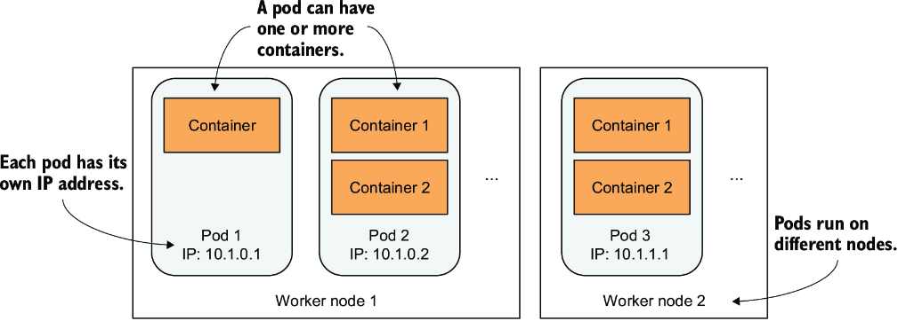

*Hình 3.8: Mối quan hệ giữa container, pod và worker node*

Như minh họa trong hình, mỗi pod có thể được xem như một máy tính logic riêng biệt chứa một ứng dụng. Ứng dụng có thể bao gồm một tiến trình duy nhất chạy trong một container, hoặc một tiến trình ứng dụng chính cùng các tiến trình hỗ trợ bổ sung, mỗi tiến trình chạy trong một container riêng. Các pod được phân bổ trên tất cả các worker node của cluster.

Mỗi pod có IP, hostname, tiến trình, giao diện mạng và các tài nguyên khác của riêng nó. Các container thuộc cùng một pod nghĩ rằng chúng là những thứ duy nhất đang chạy trên máy tính đó. Chúng không thấy các tiến trình của bất kỳ pod nào khác, ngay cả khi nằm trên cùng một node.

#### Liệt kê các pod (Listing pods)

Vì container không phải là object cấp cao nhất của Kubernetes, bạn không thể liệt kê chúng, nhưng bạn có thể liệt kê các pod. Như output sau của lệnh `kubectl get pods` cho thấy, bằng cách tạo Deployment object, bạn đã triển khai một pod:

```bash
$ kubectl get pods
NAME                    READY   STATUS    RESTARTS   AGE
kiada-9d785b578-p449x   0/1     Pending   0          1m    #1
```

- **#1** Kubernetes đã tạo pod này từ Deployment object.

Đây là pod chứa container đang chạy ứng dụng của bạn. Nói chính xác, vì status vẫn là `Pending`, ứng dụng, hay đúng hơn là container, vẫn chưa chạy. Điều này cũng được thể hiện trong cột `READY`, cho thấy pod có một container duy nhất và container đó chưa sẵn sàng.

Lý do pod ở trạng thái pending là vì worker node mà pod được gán vào trước tiên phải tải container image về trước khi có thể chạy nó. Khi việc tải về hoàn tất, container của pod được tạo, và pod chuyển sang trạng thái `Running`.

Nếu Kubernetes không thể kéo image từ registry, lệnh `kubectl get pods` sẽ cho biết điều này trong cột `STATUS`. Nếu bạn dùng image của riêng mình, hãy đảm bảo nó được đánh dấu là công khai (public) trên Docker Hub. Hãy thử kéo image thủ công bằng lệnh `docker pull` trên một máy tính khác.

Nếu một vấn đề khác khiến pod của bạn không chạy, hoặc nếu bạn đơn giản muốn xem thêm thông tin về pod, bạn cũng có thể dùng lệnh `kubectl describe pod`, như bạn đã làm trước đó để xem chi tiết của một worker node. Nếu có bất kỳ vấn đề gì với pod, chúng sẽ được lệnh này hiển thị. Hãy xem các event được hiển thị ở cuối output của nó. Với một pod đang chạy, chúng sẽ gần giống như sau:

```bash
Type     Reason      Age   From                    Message
----     ------      ----  ----                    -------
Normal   Scheduled   25s   default-scheduler       Successfully assigned
                                                   default/kiada-9d785b578-p449x
                                                   to kind-worker2
Normal   Pulling     23s   kubelet, kind-worker2   Pulling image "luksa/kiada:0.1"
Normal   Pulled      21s   kubelet, kind-worker2   Successfully pulled image
Normal   Created     21s   kubelet, kind-worker2   Created container kiada
Normal   Started     21s   kubelet, kind-worker2   Started container kiada
```

#### Tìm hiểu điều gì xảy ra ở hậu trường (Understanding what happens behind the scenes)

Để hình dung điều gì đã xảy ra khi bạn tạo Deployment, hãy xem hình 3.9.

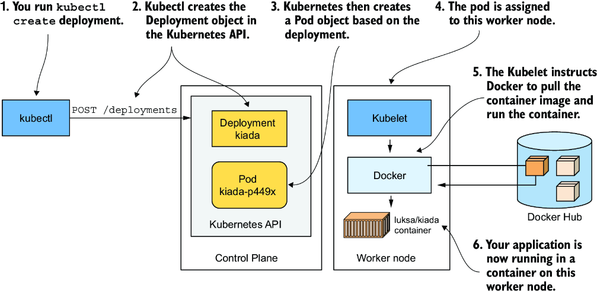

*Hình 3.9: Việc tạo một Deployment object dẫn đến một container ứng dụng đang chạy như thế nào*

Khi bạn chạy lệnh `kubectl create`, nó đã tạo một Deployment object mới trong cluster bằng cách gửi một HTTP request tới Kubernetes API server. Sau đó Kubernetes tạo một Pod object mới, rồi Pod object này được gán hay được lập lịch (scheduled) cho một trong các worker node. Agent của Kubernetes trên worker node đó (Kubelet) nhận biết được Pod object vừa được tạo, thấy rằng nó được lập lịch cho node của mình, và chỉ thị cho Docker kéo image được chỉ định từ registry, tạo một container từ image đó và thực thi nó.

> **ĐỊNH NGHĨA:** Thuật ngữ lập lịch (scheduling) chỉ việc gán pod cho một node. Pod chạy ngay lập tức, chứ không phải vào một thời điểm nào đó trong tương lai. Giống như cách bộ lập lịch CPU (CPU scheduler) trong hệ điều hành chọn CPU nào để chạy một tiến trình, scheduler trong Kubernetes quyết định worker node nào sẽ thực thi mỗi container. Không giống một tiến trình của hệ điều hành, một khi pod đã được gán cho một node, nó chỉ chạy trên node đó. Ngay cả khi nó thất bại, instance pod này không bao giờ được chuyển sang node khác như trường hợp của các tiến trình CPU, nhưng một instance pod mới có thể được tạo để thay thế nó.

Tùy thuộc vào thứ bạn dùng để chạy Kubernetes cluster, số worker node trong cluster của bạn có thể khác nhau. Hình 3.9 chỉ cho thấy worker node mà pod được lập lịch vào. Trong một cluster nhiều node, không có worker node nào khác tham gia vào quá trình này.

### 3.3.2 Public ứng dụng của bạn ra thế giới (Exposing your application to the world)

Ứng dụng của bạn giờ đang chạy, nên câu hỏi tiếp theo cần trả lời là làm thế nào để truy cập nó. Tôi đã đề cập rằng mỗi pod có địa chỉ IP của riêng nó, nhưng địa chỉ này là nội bộ trong cluster và không thể truy cập từ bên ngoài. Để pod có thể được truy cập từ bên ngoài, bạn sẽ public (expose) nó bằng cách tạo một Service object.

Có nhiều kiểu Service object. Bạn quyết định mình cần kiểu nào. Một số kiểu chỉ public các pod bên trong cluster, trong khi các kiểu khác public chúng ra bên ngoài. Một service có kiểu `LoadBalancer` cung cấp (provision) một load balancer bên ngoài, giúp service có thể được truy cập thông qua một IP công khai. Đây là kiểu service mà chúng ta sẽ tạo bây giờ.

#### Tạo một Service (Creating a Service)

Cách dễ nhất để tạo service là dùng lệnh mệnh lệnh sau:

```bash
$ kubectl expose deployment kiada --type=LoadBalancer --port 8080
service/kiada exposed
```

Lệnh `create deployment` mà bạn chạy trước đó tạo một Deployment object, trong khi lệnh `expose deployment` tạo một Service object. Đây là những gì việc chạy lệnh trên nói với Kubernetes:

* Bạn muốn public tất cả các pod thuộc Deployment `kiada` dưới dạng một Service mới.
* Bạn muốn các pod có thể được truy cập từ bên ngoài cluster thông qua một load balancer.
* Ứng dụng lắng nghe trên cổng 8080, nên bạn muốn truy cập nó qua cổng đó.

Bạn không chỉ định tên cho Service object, nên nó thừa hưởng tên của Deployment.

#### Liệt kê các Service (Listing Services)

Service là các API object, giống như Pod, Deployment, Node và hầu như mọi thứ khác trong Kubernetes, nên bạn có thể liệt kê chúng bằng cách thực thi `kubectl get services`:

```bash
$ kubectl get svc
NAME         TYPE           CLUSTER-IP     EXTERNAL-IP   PORT(S)          AGE
kubernetes   ClusterIP      10.19.240.1    <none>        443/TCP          34m
kiada        LoadBalancer   10.19.243.17   <pending>     8080:30838/TCP   4s
```

> **GHI CHÚ:** Hãy để ý việc dùng chữ viết tắt `svc` thay cho `services`. Hầu hết các kiểu resource đều có một tên ngắn mà bạn có thể dùng thay cho tên kiểu object đầy đủ (ví dụ, `po` là viết tắt của `pods`, `no` của `nodes`, và `deploy` của `deployments`).

Danh sách cho thấy hai service cùng với kiểu, IP và các cổng mà chúng public. Tạm thời hãy bỏ qua Service `kubernetes` và nhìn kỹ vào Service `kiada`. Nó chưa có địa chỉ IP bên ngoài. Việc nó có nhận được IP hay không phụ thuộc vào cách bạn đã triển khai cluster.

#### Liệt kê các kiểu object khả dụng bằng kubectl api-resources (Listing the available object types with kubectl api-resources)

Bạn đã dùng lệnh `kubectl get` để liệt kê nhiều thứ khác nhau trong cluster của mình: Node, Deployment, Pod, và giờ là Service. Tất cả chúng đều là các kiểu object của Kubernetes. Bạn có thể hiển thị danh sách tất cả các kiểu được hỗ trợ bằng cách chạy `kubectl api-resources`. Danh sách này cũng hiển thị tên ngắn của mỗi kiểu và một số thông tin khác mà bạn cần để định nghĩa các object trong file JSON/YAML, điều bạn sẽ học trong các chương tiếp theo.

#### Tìm hiểu về LoadBalancer Service (Understanding LoadBalancer Services)

Mặc dù Kubernetes cho phép bạn tạo cái gọi là `LoadBalancer` Service, bản thân nó không cung cấp load balancer. Nếu cluster của bạn được triển khai trên đám mây, Kubernetes có thể yêu cầu hạ tầng đám mây cung cấp một load balancer và cấu hình nó để chuyển tiếp lưu lượng vào cluster của bạn. Hạ tầng cho Kubernetes biết địa chỉ IP của load balancer, và địa chỉ này trở thành địa chỉ bên ngoài của service của bạn. Quá trình tạo Service object, cung cấp load balancer, và cách nó chuyển tiếp các kết nối vào cluster được thể hiện trong hình 3.10.

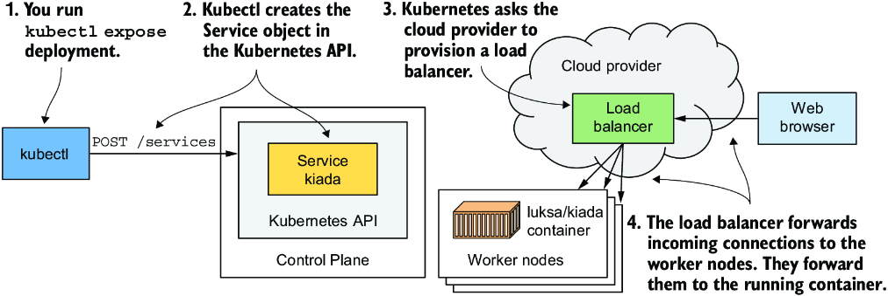

*Hình 3.10: Điều gì xảy ra khi bạn tạo một Service object có kiểu LoadBalancer*

Việc cung cấp load balancer mất một chút thời gian, nên hãy đợi thêm vài giây rồi kiểm tra lại xem địa chỉ IP đã được gán chưa. Lần này, thay vì liệt kê tất cả các service, bạn sẽ chỉ hiển thị Service `kiada` như sau:

```bash
$ kubectl get svc kiada
NAME    TYPE           CLUSTER-IP     EXTERNAL-IP     PORT(S)          AGE
kiada   LoadBalancer   10.19.243.17   35.246.179.22   8080:30838/TCP   82s
```

IP bên ngoài giờ đã được hiển thị. Điều này có nghĩa là load balancer đã sẵn sàng chuyển tiếp các request tới ứng dụng của bạn cho các client trên toàn thế giới.

> **GHI CHÚ:** Nếu bạn triển khai cluster bằng Docker Desktop, địa chỉ IP của load balancer được hiển thị là `localhost`, tức là máy Windows hoặc macOS của bạn, chứ không phải VM nơi Kubernetes và ứng dụng chạy. Nếu bạn dùng Minikube để tạo cluster, không có load balancer nào được tạo, nhưng bạn có thể truy cập service theo cách khác. Sẽ nói thêm về việc này sau.

#### Truy cập ứng dụng của bạn thông qua load balancer (Accessing your application through the load balancer)

Giờ bạn có thể gửi request tới ứng dụng của mình thông qua IP bên ngoài và cổng của service:

```bash
$ curl 35.246.179.22:8080
Kiada version 0.1. Request processed by "kiada-9d785b578-p449x". Client IP: ::ffff:1.2.3.4
```

> **GHI CHÚ:** Nếu bạn dùng Docker Desktop, service có sẵn tại `localhost:8080` từ bên trong hệ điều hành máy chủ của bạn. Hãy dùng `curl` hoặc trình duyệt để truy cập nó.

Xin chúc mừng! Nếu bạn dùng Google Kubernetes Engine, bạn đã xuất bản thành công ứng dụng của mình tới người dùng trên toàn cầu. Bất kỳ ai biết IP và cổng của nó giờ đều có thể truy cập nó. Nếu không tính các bước cần thiết để triển khai chính cluster, chỉ cần hai lệnh đơn giản để triển khai ứng dụng của bạn:

* `kubectl create deployment` và
* `kubectl expose deployment`.

#### Truy cập ứng dụng của bạn thông qua node port (Accessing your application through a node port)

Không phải mọi Kubernetes cluster đều có cơ chế để cung cấp load balancer. Khi bạn tạo một service kiểu `LoadBalancer`, bản thân service vẫn hoạt động, nhưng không có load balancer nào để bạn có thể truy cập service từ bên ngoài cluster. Khi rơi vào trường hợp này, kubectl hiển thị IP bên ngoài là `<pending>`, và bạn phải dùng một phương pháp khác để truy cập service. Bạn sẽ cần làm việc này nếu dùng Minikube, Docker Desktop hoặc công cụ kind để chạy cluster. Đây là cách làm.

Khi bạn tạo một Service kiểu `LoadBalancer`, nó cũng được gán một cái gọi là node port. Đó là một cổng mạng trên các node của cluster, có nhiệm vụ chuyển tiếp lưu lượng tới service. Hình 3.11 cho thấy cách các client bên ngoài dùng node port này để truy cập ứng dụng.

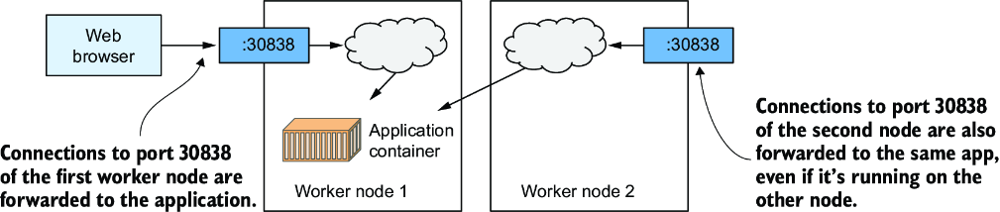

*Hình 3.11: Định tuyến kết nối thông qua node port của một service*

Do đó, để truy cập ứng dụng, bạn cần hai mẩu thông tin: số node port và IP của một trong các node của cluster.

Khi bạn tạo service, Kubernetes đã tìm một node port chưa được sử dụng và gán nó cho service của bạn. Bạn có thể thấy số cổng trong cột `PORT(S)` khi chạy lệnh `kubectl get services`:

```bash
$ kubectl get svc kiada
NAME    TYPE           CLUSTER-IP     EXTERNAL-IP   PORT(S)          AGE
kiada   LoadBalancer   10.19.243.17   <pending>     8080:30838/TCP   82s
```

Trong ví dụ trên, `8080` là cổng nội bộ của service, còn `30838` là node port. Thay vì để Kubernetes chọn số node port, bạn cũng có thể tự chỉ định nó. Bạn sẽ học cách làm việc đó trong chương 11.

Ngoài số node port, bạn cũng cần lấy địa chỉ IP của một trong các node của cluster. Bạn có thể làm việc này bằng cách liệt kê các node với lệnh `kubectl get nodes -o wide` như sau:

```bash
$ kubectl get nodes -o wide
NAME                 STATUS   ROLES                  AGE   VERSION   INTERNAL-IP   ...
kind-control-plane   Ready    control-plane,master   18h   v1.21.1   172.18.0.2    ...
kind-worker          Ready    <none>                 18h   v1.21.1   172.18.0.3    ...
kind-worker2         Ready    <none>                 18h   v1.21.1   172.18.0.4    ...
```

Ở đây, cluster bao gồm ba node. IP của chúng được hiển thị trong cột `INTERNAL-IP`. Bạn có thể chọn bất kỳ IP nào trong ba IP đó và kết hợp nó với node port để truy cập service. Ví dụ, bạn có thể lấy địa chỉ IP của node đầu tiên, là `172.18.0.2`, và kết hợp nó với node port `30838` mà bạn đã tra được trước đó. Bạn có thể dùng tổ hợp IP:port này để truy cập ứng dụng thông qua `curl` hoặc trình duyệt web của mình:

```bash
$ curl 172.18.0.2:30838
Kiada version 0.1. Request processed by "kiada-9d785b578-p449x". Client IP: ::ffff:1.2.3.4
```

#### Truy cập service (Accessing the service)

Các quy tắc tường lửa (firewall) có thể đang chặn việc truy cập node port. Nếu các node của cluster chạy trên máy cục bộ của bạn, điều này thường không xảy ra, nhưng nếu cluster của bạn chạy trên đám mây thì rất có thể là có. Tuy nhiên, nếu cluster của bạn chạy trên đám mây, tôi khuyên bạn nên truy cập service thông qua IP của load balancer thay vì cách này.

Nếu bạn dùng Minikube, bạn có thể truy cập service bằng cách chạy lệnh `minikube service kiada`. Lệnh này điều hướng trình duyệt của bạn tới URL của service. Nếu bạn thêm tùy chọn `--url`, lệnh sẽ in ra URL mà không mở trình duyệt.

Nếu bạn dùng Docker Desktop, node của cluster chạy trong một máy ảo. Bạn có thể không truy cập được nó thông qua IP của nó từ host OS của bạn, nhưng bạn có thể truy cập service thông qua node port từ bên trong VM bằng cách đăng nhập vào VM bằng một container đặc biệt như đã mô tả trong mục 3.1.1.

### 3.3.3 Mở rộng ứng dụng theo chiều ngang (Horizontally scaling the application)

Giờ bạn đã có một ứng dụng đang chạy, được đại diện bởi một Deployment object và được public ra thế giới bằng một Service object. Giờ hãy tạo thêm chút phép màu nữa.

Một trong những lợi ích lớn của việc chạy ứng dụng trong container là sự dễ dàng khi bạn muốn mở rộng (scale) các bản triển khai ứng dụng của mình. Hiện tại bạn đang chạy một instance duy nhất của ứng dụng. Hãy tưởng tượng bạn đột nhiên thấy có nhiều người dùng hơn hẳn đang sử dụng ứng dụng của bạn. Instance duy nhất đó không còn xử lý nổi tải. Bạn cần chạy thêm các instance để phân tán tải và phục vụ người dùng của mình. Việc này được gọi là mở rộng theo chiều ngang (scaling out). Với Kubernetes, việc này cực kỳ đơn giản.

#### Tăng số instance ứng dụng đang chạy (Increasing the number of running application instances)

Để triển khai ứng dụng, bạn đã tạo một Deployment object. Theo mặc định, nó chạy một instance duy nhất của ứng dụng. Để chạy thêm các instance, bạn chỉ cần scale Deployment object bằng lệnh sau:

```bash
$ kubectl scale deployment kiada --replicas=3
deployment.apps/kiada scaled
```

Bạn vừa nói với Kubernetes rằng bạn muốn chạy ba bản sao chính xác, hay replica, của pod của mình. Hãy lưu ý rằng bạn không hề chỉ thị cho Kubernetes phải làm gì. Bạn không bảo nó thêm hai pod nữa. Bạn chỉ đặt số replica mong muốn mới và để Kubernetes tự xác định hành động nó phải thực hiện để đạt tới trạng thái mong muốn mới đó.

Đây là một trong những nguyên tắc nền tảng nhất của Kubernetes. Thay vì bảo nó phải làm gì, bạn đơn giản chỉ đặt một trạng thái mong muốn mới cho hệ thống và để Kubernetes đạt tới trạng thái đó. Để làm việc này, nó xem xét trạng thái hiện tại, so sánh với trạng thái mong muốn, xác định các điểm khác biệt, và quyết định nó phải làm gì để điều hòa (reconcile) chúng.

#### Xem kết quả của việc scale-out (Seeing the results of the scale-out)

Mặc dù đúng là lệnh `kubectl scale deployment` trông có vẻ mệnh lệnh, vì rõ ràng nó bảo Kubernetes scale ứng dụng của bạn, nhưng thứ mà lệnh này thực sự làm là sửa đổi Deployment object được chỉ định. Như bạn sẽ thấy sau này, bạn hoàn toàn có thể chỉ cần chỉnh sửa object đó thay vì đưa ra lệnh mệnh lệnh. Hãy xem lại Deployment object để thấy lệnh scale đã ảnh hưởng tới nó như thế nào:

```bash
$ kubectl get deploy
NAME    READY   UP-TO-DATE   AVAILABLE   AGE
kiada   3/3     3            3           18m
```

Ba instance giờ đã được cập nhật và sẵn sàng phục vụ, và ba trên tổng số ba container đã sẵn sàng. Điều này không rõ ràng từ output của lệnh, nhưng ba container đó không thuộc cùng một instance pod. Có ba pod, mỗi pod một container, và điều này có thể được xác nhận bằng cách liệt kê các pod:

```bash
$ kubectl get pods
NAME                    READY   STATUS    RESTARTS   AGE
kiada-9d785b578-58vhc   1/1     Running   0          17s
kiada-9d785b578-jmnj8   1/1     Running   0          17s
kiada-9d785b578-p449x   1/1     Running   0          18m
```

Như bạn thấy, giờ tồn tại ba pod. Như được thể hiện trong cột `READY`, mỗi pod có một container duy nhất, và tất cả các container đều đã sẵn sàng. Tất cả các pod đều ở trạng thái `Running`.

#### Hiển thị node chứa pod khi liệt kê các pod (Displaying the pods' host node when listing pods)

Nếu bạn dùng cluster đơn node, tất cả các pod của bạn đều chạy trên cùng một node. Nhưng trong cluster nhiều node, ba pod sẽ được phân bổ khắp cluster. Để xem các pod được lập lịch vào node nào, bạn có thể dùng tùy chọn `-o wide` để hiển thị danh sách pod chi tiết hơn:

```bash
$ kubectl get pods -o wide
NAME                    ...   IP           NODE
kiada-9d785b578-58vhc   ...   10.244.1.5   kind-worker    #1
kiada-9d785b578-jmnj8   ...   10.244.2.4   kind-worker2   #2
kiada-9d785b578-p449x   ...   10.244.2.3   kind-worker2   #2
```

- **#1** Pod được lập lịch vào một node
- **#2** Hai pod được lập lịch vào một node khác

> **GHI CHÚ:** Bạn cũng có thể dùng tùy chọn output `-o wide` để xem thêm thông tin khi liệt kê các kiểu object khác.

Output dạng wide cho thấy một pod được lập lịch vào một node, trong khi hai pod còn lại đều được lập lịch vào một node khác. Scheduler thường phân bổ các pod một cách đồng đều, nhưng điều đó phụ thuộc vào cách nó được cấu hình.

#### Node chứa pod có quan trọng không? (Does the host node matter?)

Bất kể chạy trên node nào, tất cả các instance của ứng dụng của bạn đều có môi trường hệ điều hành giống hệt nhau, vì chúng chạy trong các container được tạo từ cùng một container image. Bạn có thể nhớ từ chương trước rằng thứ duy nhất có thể khác biệt là kernel của hệ điều hành, nhưng điều này chỉ xảy ra khi các node khác nhau dùng các phiên bản kernel khác nhau hoặc nạp các kernel module khác nhau.

Ngoài ra, mỗi pod có IP của riêng nó và có thể giao tiếp theo cùng một cách với bất kỳ pod nào khác, bất kể pod đó nằm trên cùng worker node, ở nơi khác trong cùng rack, hay ở một trung tâm dữ liệu hoàn toàn khác.

Cho đến giờ, chúng ta chưa đặt bất kỳ yêu cầu tài nguyên nào cho các pod, nhưng nếu có, mỗi pod sẽ được cấp phát lượng tài nguyên tính toán mà nó yêu cầu. Việc node nào cung cấp các tài nguyên này không quan trọng đối với pod, miễn là các yêu cầu của pod được đáp ứng.

Do đó, bạn không cần quan tâm pod được lập lịch vào đâu. Đó cũng là lý do lệnh `kubectl get pods` mặc định không hiển thị thông tin về worker node của các pod được liệt kê. Trong thế giới Kubernetes, điều đó đơn giản là không quan trọng đến thế.

Như bạn thấy, việc mở rộng một ứng dụng cực kỳ dễ dàng. Một khi ứng dụng của bạn đã vào sản xuất (production) và cần được mở rộng, bạn có thể thêm các instance bổ sung chỉ bằng một lệnh duy nhất mà không cần phải cài đặt, cấu hình và chạy thêm các bản sao một cách thủ công.

> **GHI CHÚ:** Bản thân ứng dụng phải hỗ trợ mở rộng theo chiều ngang. Kubernetes không biến ứng dụng của bạn thành có thể mở rộng một cách kỳ diệu; nó chỉ làm cho việc nhân bản ứng dụng trở nên cực kỳ đơn giản.

#### Quan sát các request tới cả ba pod khi dùng service (Observing requests hitting all three pods when using the service)

Giờ khi nhiều instance của ứng dụng đang chạy, hãy xem điều gì xảy ra khi bạn truy cập URL của service một lần nữa. Liệu phản hồi có luôn đến từ cùng một instance không? Đây là câu trả lời:

```bash
$ curl 35.246.179.22:8080
Kiada version 0.1. Request processed by "kiada-9d785b578-58vhc". Client IP: ::ffff:1.2.3.4    #1
$ curl 35.246.179.22:8080
Kiada version 0.1. Request processed by "kiada-9d785b578-p449x". Client IP: ::ffff:1.2.3.4    #2
$ curl 35.246.179.22:8080
Kiada version 0.1. Request processed by "kiada-9d785b578-jmnj8". Client IP: ::ffff:1.2.3.4    #3
$ curl 35.246.179.22:8080
Kiada version 0.1. Request processed by "kiada-9d785b578-p449x". Client IP: ::ffff:1.2.3.4    #4
```

- **#1** Request tới pod thứ nhất.
- **#2** Request tới pod thứ ba.
- **#3** Request tới pod thứ hai.
- **#4** Request lại tới pod thứ ba.

Nếu nhìn kỹ các phản hồi, bạn sẽ thấy chúng tương ứng với tên của các pod. Mỗi request đến một pod khác nhau theo thứ tự ngẫu nhiên. Đây là điều mà các Service trong Kubernetes làm khi có nhiều hơn một instance pod đứng phía sau. Chúng đóng vai trò load balancer đứng trước các pod. Hình 3.12 minh họa hệ thống.

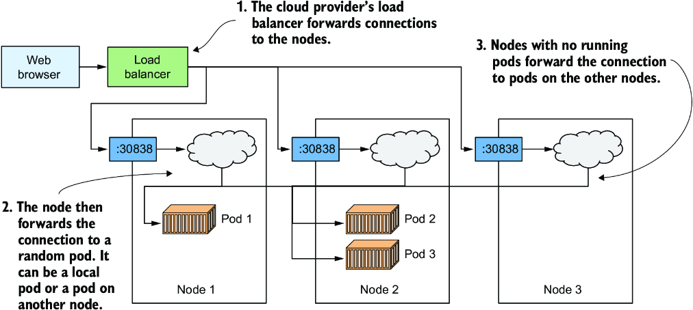

*Hình 3.12: Cân bằng tải trên nhiều pod đứng sau cùng một service*

Như hình vẽ cho thấy, bạn không nên nhầm lẫn cơ chế cân bằng tải này, vốn do chính Kubernetes Service cung cấp, với load balancer bổ sung do hạ tầng cung cấp khi chạy trong GKE hoặc một cluster khác chạy trên đám mây. Ngay cả khi bạn dùng Minikube và không có load balancer bên ngoài, các request của bạn vẫn được phân phối trên ba pod bởi chính service. Nếu bạn dùng GKE, thực ra có hai load balancer cùng tham gia. Hình vẽ cho thấy load balancer do hạ tầng cung cấp phân phối các request trên các node, rồi service phân phối các request trên các pod.

Tôi biết điều này lúc này nghe có vẻ rất rối rắm, nhưng tất cả sẽ trở nên rõ ràng trong chương 11.

### 3.3.4 Tìm hiểu về ứng dụng đã triển khai (Understanding the deployed application)

Để kết thúc chương này, hãy cùng xem lại các thành phần của hệ thống của bạn. Có hai cách để nhìn vào hệ thống của bạn: góc nhìn logic và góc nhìn vật lý. Bạn vừa thấy góc nhìn vật lý trong hình 3.12. Có ba container đang chạy được triển khai trên ba worker node (một node duy nhất khi dùng Minikube). Nếu bạn chạy Kubernetes trên đám mây, hạ tầng đám mây cũng đã tạo một load balancer cho bạn. Docker Desktop cũng tạo một kiểu load balancer cục bộ. Minikube không tạo load balancer, nhưng bạn có thể truy cập service của mình trực tiếp thông qua node port.

Mặc dù có những khác biệt trong góc nhìn vật lý của hệ thống ở các cluster khác nhau, góc nhìn logic luôn giống nhau, dù bạn dùng một cluster phát triển nhỏ hay một cluster sản xuất lớn với hàng nghìn node. Nếu bạn không phải là người quản lý cluster, bạn thậm chí không cần bận tâm đến góc nhìn vật lý. Nếu mọi thứ hoạt động như mong đợi, góc nhìn logic là tất cả những gì bạn cần quan tâm. Hãy xem xét kỹ hơn góc nhìn này.

#### Tìm hiểu các API object đại diện cho ứng dụng của bạn (Understanding the API objects representing your application)

Góc nhìn logic bao gồm các object bạn đã tạo trong Kubernetes API – dù trực tiếp hay gián tiếp. Hình 3.13 cho thấy các object này liên hệ với nhau như thế nào.

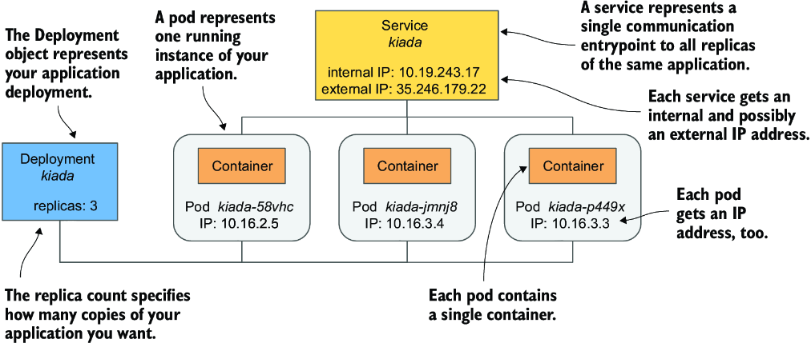

*Hình 3.13: Ứng dụng đã triển khai của bạn bao gồm một Deployment, một số pod và một service.*

Các object đó là

* Deployment object mà bạn đã tạo
* Các Pod object được tạo tự động dựa trên Deployment
* Service object được tạo thủ công

Còn có các object khác nằm giữa ba object vừa nêu, nhưng bạn chưa cần biết về chúng. Bạn sẽ tìm hiểu về chúng trong các chương tiếp theo.

Bạn còn nhớ khi tôi giải thích ở chương 1 rằng Kubernetes trừu tượng hóa hạ tầng không? Góc nhìn logic về ứng dụng của bạn là một ví dụ tuyệt vời về điều này. Không có node, không có cấu trúc mạng phức tạp, không có load balancer vật lý, mà chỉ là một góc nhìn đơn giản chứa duy nhất các ứng dụng của bạn và các object hỗ trợ. Hãy xem các object này khớp với nhau như thế nào và chúng đóng vai trò gì trong hệ thống nhỏ của bạn.

Deployment object đại diện cho một bản triển khai ứng dụng. Nó chỉ định container image nào chứa ứng dụng của bạn và Kubernetes nên chạy bao nhiêu replica của ứng dụng. Mỗi replica được đại diện bởi một Pod object. Service object đại diện cho một điểm vào giao tiếp duy nhất tới các replica này.

#### Tìm hiểu về các pod (Understanding the pods)

Phần thiết yếu và quan trọng nhất trong hệ thống của bạn là các pod. Mỗi định nghĩa pod chứa một hoặc nhiều container tạo nên pod đó. Khi Kubernetes hiện thực hóa một pod, nó chạy tất cả các container được chỉ định trong định nghĩa của pod. Chừng nào Pod object còn tồn tại, Kubernetes sẽ làm hết sức để đảm bảo các container của nó tiếp tục chạy. Nó chỉ tắt chúng khi Pod object bị xóa.

#### Tìm hiểu vai trò của Deployment (Understanding the role of the Deployment)

Khi bạn tạo Deployment object lần đầu, chỉ có một Pod object duy nhất được tạo. Nhưng khi bạn tăng số replica mong muốn trên Deployment, Kubernetes đã tạo thêm các replica. Kubernetes đảm bảo rằng số pod thực tế luôn khớp với số mong muốn.

Nếu một hoặc nhiều pod biến mất hoặc trạng thái của chúng không xác định, Kubernetes sẽ thay thế chúng để đưa số pod thực tế trở lại bằng số replica mong muốn. Một pod biến mất khi ai đó hoặc thứ gì đó xóa nó, còn trạng thái của pod là không xác định khi node mà nó đang chạy không còn báo cáo trạng thái của nó nữa do lỗi mạng hoặc lỗi node.

Nói một cách chặt chẽ, một Deployment object không dẫn đến điều gì khác ngoài việc tạo ra một số lượng Pod object nhất định. Bạn có thể tự hỏi liệu có thể tạo các pod trực tiếp thay vì để Deployment tạo chúng cho bạn không. Chắc chắn bạn có thể làm vậy, nhưng nếu muốn chạy nhiều replica, bạn sẽ phải tự tay tạo từng pod một và đảm bảo đặt cho mỗi pod một tên duy nhất. Sau đó bạn cũng sẽ phải liên tục để mắt tới các pod của mình để thay thế chúng nếu chúng đột ngột biến mất hoặc node mà chúng chạy trên đó bị lỗi. Và đó chính xác là lý do bạn hầu như không bao giờ tạo pod trực tiếp mà dùng Deployment thay thế.

#### Tìm hiểu tại sao bạn cần Service (Understanding why you need a Service)

Thành phần thứ ba trong hệ thống của bạn là Service object. Bằng cách tạo nó, bạn nói với Kubernetes rằng bạn cần một điểm vào giao tiếp duy nhất tới các pod của mình. Service cung cấp cho bạn một địa chỉ IP duy nhất để nói chuyện với các pod, bất kể hiện có bao nhiêu replica đang được triển khai. Nếu service được hậu thuẫn bởi nhiều pod, nó đóng vai trò load balancer. Nhưng ngay cả khi chỉ có một pod, bạn vẫn muốn public nó thông qua một service. Để hiểu lý do, điều thiết yếu là phải nắm được một khía cạnh then chốt về cách các pod hoạt động.

Các pod là phù du (ephemeral). Một pod có thể biến mất bất cứ lúc nào. Điều này có thể xảy ra khi node chứa nó bị lỗi, khi ai đó vô tình xóa pod, hoặc khi pod bị trục xuất (evict) khỏi một node vẫn khỏe mạnh để nhường chỗ cho các pod khác quan trọng hơn. Như đã giải thích ở mục trước, khi các pod được tạo thông qua một Deployment, một pod bị mất sẽ ngay lập tức được thay thế bằng một pod mới. Pod mới này không giống pod mà nó thay thế. Nó là một pod hoàn toàn mới, với một địa chỉ IP mới.

Nếu bạn không dùng service và đã cấu hình các client của mình kết nối trực tiếp tới IP của pod ban đầu, giờ bạn sẽ phải cấu hình lại tất cả các client này để kết nối tới IP của pod mới. Điều này là không cần thiết khi dùng service. Không giống các pod, các service không phù du. Khi bạn tạo một service, nó được gán một địa chỉ IP tĩnh không bao giờ thay đổi trong suốt vòng đời của service.

Thay vì kết nối trực tiếp tới pod, các client nên kết nối tới IP của service. Bước này đảm bảo rằng các kết nối của chúng luôn được định tuyến tới một pod khỏe mạnh, ngay cả khi tập hợp các pod đứng sau service liên tục thay đổi. Nó cũng đảm bảo rằng tải được phân phối đồng đều trên tất cả các pod nếu bạn quyết định scale Deployment theo chiều ngang.

---

## Tóm tắt

* Hầu như mọi nhà cung cấp đám mây đều cung cấp tùy chọn Kubernetes được quản lý (managed). Họ gánh vác việc bảo trì Kubernetes cluster của bạn, trong khi bạn chỉ dùng API của nó để triển khai các ứng dụng của mình.
* Bạn cũng có thể tự cài đặt Kubernetes trên đám mây, nhưng đây có thể không phải là ý hay cho đến khi bạn làm chủ mọi khía cạnh của việc quản lý Kubernetes.
* Bạn có thể cài đặt Kubernetes cục bộ, ngay cả trên máy tính xách tay của mình, bằng các công cụ như Docker Desktop hoặc Minikube, vốn chạy Kubernetes trong một VM Linux, hoặc kind, vốn chạy các master node và worker node dưới dạng các Docker container và các container ứng dụng bên trong các container đó.
* Kubectl, công cụ dòng lệnh, là cách thông thường để bạn tương tác với Kubernetes. Cũng tồn tại một dashboard dựa trên web, nhưng nó không ổn định và cập nhật bằng công cụ CLI.
* Để làm việc nhanh hơn với kubectl, sẽ hữu ích khi tạo một alias ngắn cho nó và bật tính năng shell completion.
* Một ứng dụng có thể được triển khai bằng `kubectl create deployment`. Sau đó nó có thể được public ra cho các client bằng cách chạy `kubectl expose deployment`. Mở rộng ứng dụng theo chiều ngang cực kỳ đơn giản: `kubectl scale deployment` chỉ thị cho Kubernetes thêm các replica mới hoặc gỡ bỏ các replica hiện có để đạt tới số replica mà bạn chỉ định.
* Đơn vị triển khai cơ bản không phải là container, mà là pod, thứ có thể chứa một hoặc nhiều container có liên quan với nhau.
* Deployment, Service, Pod và Node là các object/resource của Kubernetes. Bạn có thể liệt kê chúng bằng `kubectl get` và kiểm tra chúng bằng `kubectl describe`.
* Deployment object triển khai số pod mong muốn, trong khi Service object làm cho chúng có thể được truy cập dưới một địa chỉ IP duy nhất, ổn định.
* Mỗi service cung cấp cân bằng tải nội bộ trong cluster, nhưng nếu bạn đặt kiểu của service là `LoadBalancer`, Kubernetes sẽ yêu cầu hạ tầng đám mây mà nó chạy trong đó cung cấp thêm một load balancer bổ sung để ứng dụng của bạn có thể được truy cập tại một địa chỉ công khai.
