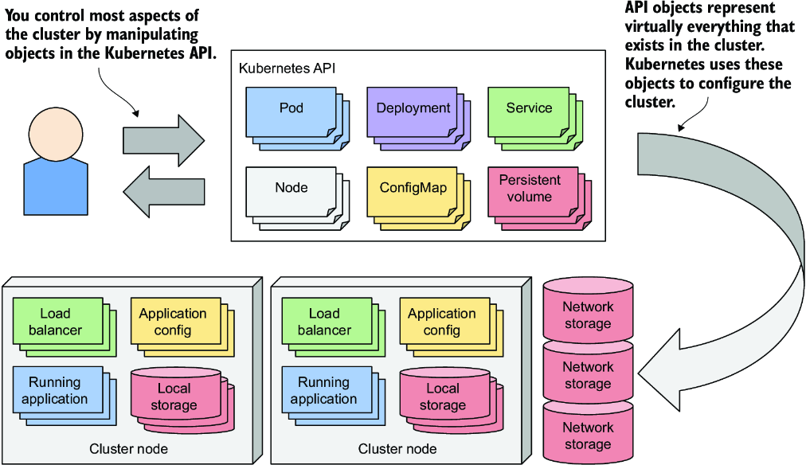
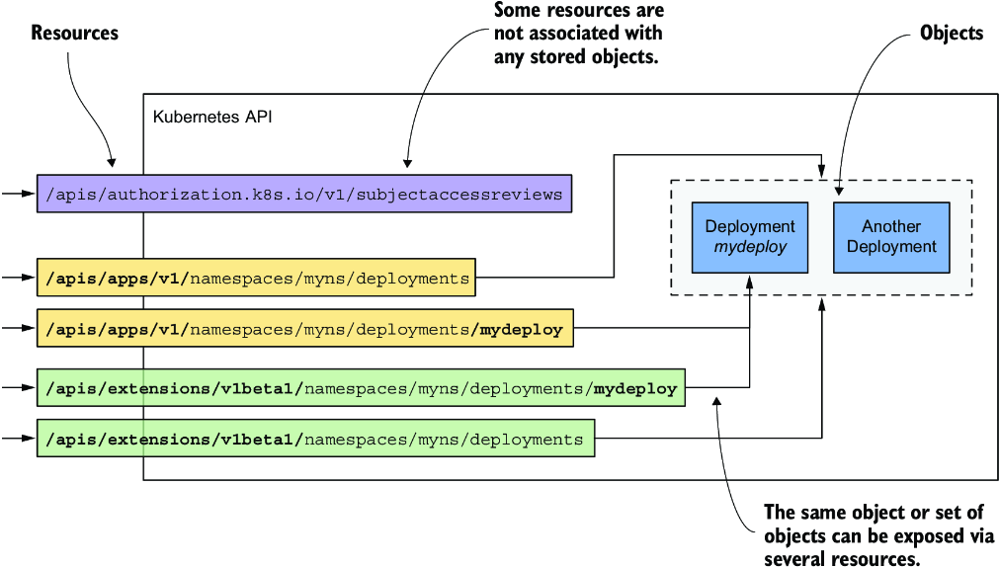
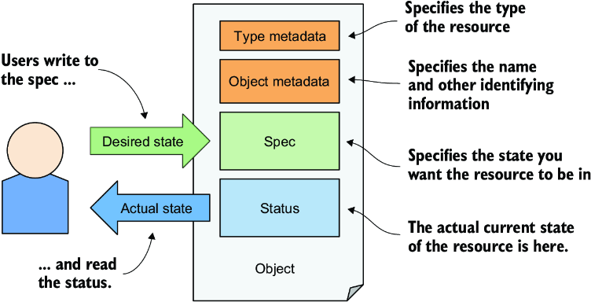
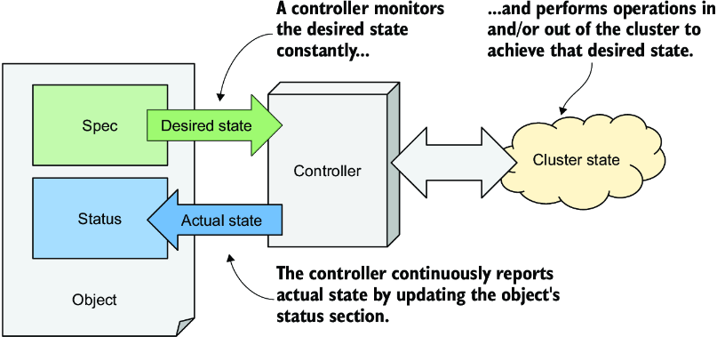
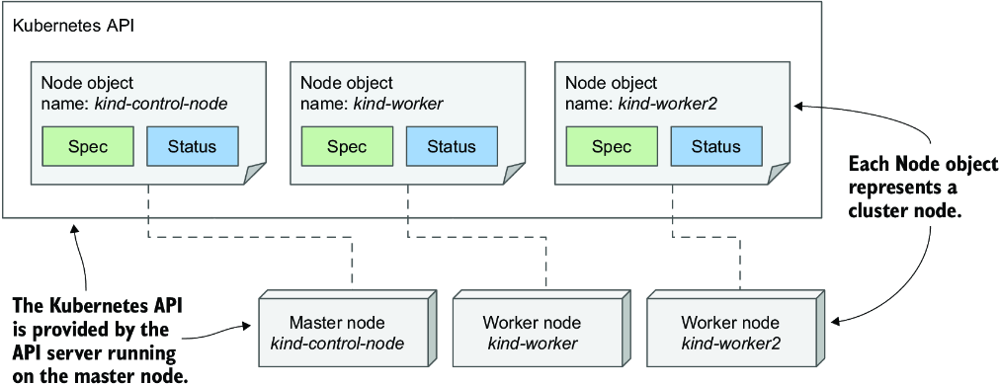
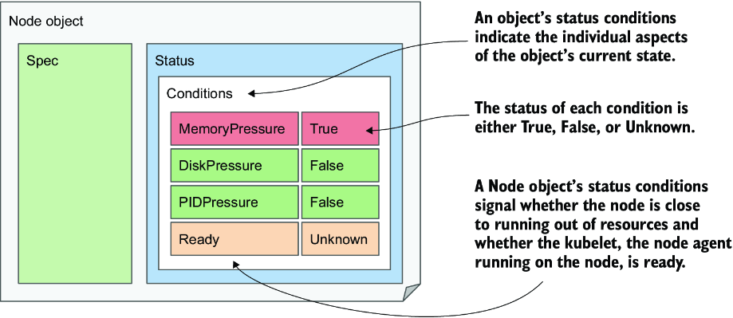
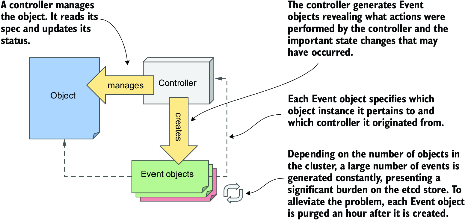

# Chương 4: Khám phá Kubernetes API và mô hình đối tượng

*(Dịch từ "Chapter 4: Navigating the Kubernetes API and object model" – Kubernetes in Action, Second Edition, tác giả Marko Lukša, NXB Manning)*

---

## Nội dung chính của chương
* Quản lý một Kubernetes cluster và các ứng dụng mà nó lưu trữ thông qua API của nó
* Cấu trúc của các Kubernetes API object
* Truy xuất và hiểu manifest YAML hoặc JSON của một object
* Kiểm tra trạng thái của các node trong cluster thông qua các Node object
* Kiểm tra các sự kiện (event) của cluster thông qua các Event object

Chương trước đã giới thiệu ba object cơ bản tạo nên một ứng dụng được triển khai. Bạn đã tạo một Deployment object, object này sinh ra nhiều Pod object đại diện cho từng instance riêng lẻ của ứng dụng, và bạn đã public chúng ra thế giới bên ngoài bằng cách tạo một Service object, object này triển khai một load balancer đứng trước chúng.

Các chương trong phần thứ hai của cuốn sách sẽ giải thích chi tiết những kiểu object này và các kiểu object khác. Trong chương này, các đặc điểm chung của Kubernetes object được trình bày thông qua ví dụ về Node object và Event object.

---

## 4.1 Làm quen với Kubernetes API (Getting familiar with the Kubernetes API)

Trong một Kubernetes cluster, cả người dùng lẫn các thành phần của Kubernetes đều tương tác với cluster bằng cách thao tác trên các object thông qua Kubernetes API, như minh họa trong hình 4.1. Những object này đại diện cho cấu hình của toàn bộ cluster. Chúng bao gồm các ứng dụng đang chạy trong cluster, cấu hình của các ứng dụng đó, các load balancer mà qua đó ứng dụng được public ra bên trong cluster hoặc ra bên ngoài, các máy chủ bên dưới và phần lưu trữ (storage) mà các ứng dụng này sử dụng, các đặc quyền bảo mật của người dùng và ứng dụng, cùng nhiều chi tiết hạ tầng khác.



*Hình 4.1: Một Kubernetes cluster được cấu hình bằng cách thao tác trên các object trong Kubernetes API.*

### 4.1.1 Giới thiệu API (Introducing the API)

Kubernetes API là điểm tương tác trung tâm với cluster, vì vậy phần lớn cuốn sách này được dành để giải thích API này. Các API object quan trọng nhất sẽ được mô tả trong những chương tiếp theo, nhưng ở đây tôi sẽ trình bày phần giới thiệu cơ bản về API.

#### Tìm hiểu phong cách kiến trúc của API (Understanding the architectural style of the API)

Kubernetes API là một RESTful API dựa trên HTTP, trong đó trạng thái được biểu diễn bằng các resource, và trên các resource đó các thao tác CRUD (create, read, update, delete – tạo, đọc, cập nhật, xóa) được thực hiện bằng các phương thức HTTP tiêu chuẩn như `POST`, `GET`, `PUT`/`PATCH` hoặc `DELETE`.

> **ĐỊNH NGHĨA:** REST là viết tắt của Representational State Transfer, một phong cách kiến trúc để hiện thực khả năng tương tác giữa các hệ thống máy tính thông qua các dịch vụ web bằng các thao tác phi trạng thái (stateless), như được Roy Thomas Fielding mô tả trong luận án tiến sĩ của ông. Để tìm hiểu thêm, hãy đọc luận án tại https://mng.bz/5vx7.

Chính những resource (hay object) này là thứ đại diện cho cấu hình của cluster. Do đó, các quản trị viên cluster và các kỹ sư triển khai ứng dụng vào cluster tác động lên cấu hình bằng cách thao tác trên các object này.

Trong cộng đồng Kubernetes, hai thuật ngữ "resource" và "object" được dùng thay thế cho nhau, nhưng giữa chúng có những khác biệt tinh tế đáng để giải thích.

#### Tìm hiểu sự khác biệt giữa resource và object (Understanding the difference between resources and objects)

Khái niệm cốt lõi trong các RESTful API là resource, và mỗi resource được gán một URI (Uniform Resource Identifier – định danh tài nguyên thống nhất) để nhận diện nó một cách duy nhất. Ví dụ, trong Kubernetes API, các bản triển khai ứng dụng (application deployment) được biểu diễn bằng các deployment resource.

Tập hợp tất cả các deployment trong cluster là một REST resource được công khai (expose) tại `/api/v1/deployments`. Khi bạn dùng phương thức `GET` để gửi một HTTP request tới URI này, bạn sẽ nhận được phản hồi liệt kê tất cả các instance deployment trong cluster.

Mỗi instance deployment riêng lẻ cũng có URI duy nhất của riêng nó, qua đó bạn có thể thao tác lên instance đó. Như vậy, mỗi deployment riêng lẻ được công khai dưới dạng một REST resource khác. Bạn có thể truy xuất thông tin về deployment bằng cách gửi một request `GET` tới URI của resource, và bạn có thể sửa đổi nó bằng một request `PUT`.

Do đó, một object có thể được công khai thông qua nhiều hơn một resource. Như minh họa trong hình 4.2, instance Deployment object có tên `mydeploy` được trả về vừa như một phần tử của một tập hợp khi bạn truy vấn resource `deployments`, vừa như một object đơn lẻ khi bạn truy vấn trực tiếp URI của resource riêng lẻ đó.



*Hình 4.2: Một object đơn lẻ có thể được công khai bởi hai hay nhiều resource.*

Ngoài ra, một instance object đơn lẻ cũng có thể được công khai thông qua nhiều resource nếu tồn tại nhiều phiên bản API cho một kiểu object. Cho đến phiên bản Kubernetes 1.15, API công khai hai cách biểu diễn khác nhau của Deployment object. Bên cạnh phiên bản `apps/v1`, được công khai tại `/apis/apps/v1/deployments`, còn có một phiên bản cũ hơn là `extensions/v1beta1`, được công khai tại `/apis/extensions/v1beta1/deployments`. Hai resource này không đại diện cho hai tập Deployment object khác nhau, mà là một tập duy nhất được biểu diễn theo hai cách khác nhau, với những khác biệt nhỏ trong schema của object. Bạn có thể tạo một instance Deployment object thông qua URI thứ nhất rồi đọc lại nó bằng URI thứ hai.

Trong một số trường hợp, một resource hoàn toàn không đại diện cho object nào cả. Một ví dụ là cách Kubernetes API cho phép client kiểm tra xem một chủ thể (subject – một người hoặc một service) có được phép thực hiện một thao tác API hay không. Việc này được thực hiện bằng cách gửi một request `POST` tới resource `/apis/authorization.k8s.io/v1/subjectaccessreviews`. Phản hồi cho biết chủ thể đó có được phép thực hiện thao tác được chỉ định trong phần thân (body) của request hay không. Điểm mấu chốt ở đây là không có object nào được tạo ra bởi request `POST` này.

Các ví dụ mô tả ở trên cho thấy resource không giống với object. Nếu bạn quen thuộc với các hệ quản trị cơ sở dữ liệu quan hệ, bạn có thể so sánh resource và kiểu object với view và bảng (table). Resource là các view mà qua đó bạn tương tác với object.

> **GHI CHÚ:** Vì thuật ngữ "resource" cũng có thể dùng để chỉ tài nguyên tính toán (compute resource), chẳng hạn như CPU và bộ nhớ, nên để tránh nhầm lẫn, cuốn sách này dùng thuật ngữ "object" để chỉ các API resource.

#### Tìm hiểu cách các object được biểu diễn (Understanding how objects are represented)

Khi bạn thực hiện một request `GET` cho một resource, Kubernetes API server trả về object dưới dạng văn bản có cấu trúc. Mô hình dữ liệu mặc định là JSON, nhưng bạn cũng có thể yêu cầu server trả về YAML thay thế. Khi bạn cập nhật object bằng một request `POST` hoặc `PUT`, bạn cũng chỉ định trạng thái mới bằng JSON hoặc YAML.

Các trường riêng lẻ trong manifest của một object phụ thuộc vào kiểu object, nhưng cấu trúc chung và nhiều trường được dùng chung cho tất cả các Kubernetes API object. Bạn sẽ tìm hiểu về chúng ngay sau đây.

### 4.1.2 Tìm hiểu cấu trúc của manifest object (Understanding the structure of an object manifest)

Trước khi bạn làm việc với manifest hoàn chỉnh của một Kubernetes object, hãy để tôi giải thích trước các phần chính của nó, vì điều này sẽ giúp bạn định hướng được giữa hàng trăm dòng mà đôi khi một manifest bao gồm.

#### Giới thiệu các phần chính của một object (Introducing the main parts of an object)

Manifest của hầu hết các Kubernetes API object bao gồm bốn phần sau:

* **Type metadata** – Chứa thông tin về kiểu object mà manifest mô tả. Nó chỉ định kiểu object, nhóm (group) mà kiểu đó thuộc về, và phiên bản API.
* **Object metadata** – Lưu giữ thông tin cơ bản về instance object, bao gồm tên, thời điểm tạo, chủ sở hữu (owner) của object và các thông tin nhận dạng khác. Các trường trong object metadata là giống nhau cho mọi kiểu object.
* **Spec** – Phần mà trong đó bạn chỉ định trạng thái mong muốn (desired state) của object. Các trường của nó khác nhau tùy theo kiểu object. Với pod, đây là phần chỉ định các container của pod, các storage volume và các thông tin khác liên quan đến hoạt động của pod.
* **Status** – Chứa trạng thái thực tế hiện tại của object. Với một pod, nó cho bạn biết tình trạng (condition) của pod, trạng thái của từng container trong pod, địa chỉ IP của pod, node mà pod đang chạy trên đó, và các thông tin khác tiết lộ điều gì đang xảy ra với pod của bạn.

Hình 4.3 minh họa một manifest object và bốn phần của nó.



*Hình 4.3: Các phần chính của một Kubernetes API object*

> **GHI CHÚ:** Mặc dù hình vẽ cho thấy người dùng ghi vào phần spec của object và đọc phần status của nó, API server luôn trả về toàn bộ object khi bạn thực hiện một request `GET`; để cập nhật object, bạn cũng gửi toàn bộ object trong request `PUT`.

Một ví dụ ở phần sau sẽ cho thấy những trường nào tồn tại trong các phần này, nhưng trước tiên hãy để tôi giải thích về phần spec và status, vì chúng là phần "thịt" của object.

#### Tìm hiểu phần spec và status (Understanding the spec and status sections)

Như bạn có thể đã nhận thấy trong hình trước, hai phần quan trọng nhất của một object là phần spec và status. Bạn dùng spec để chỉ định trạng thái mong muốn của object và đọc trạng thái thực tế của object từ phần status. Vậy là, bạn chính là người ghi spec và đọc status, nhưng ai hoặc cái gì đọc spec và ghi status?

Kubernetes Control Plane chạy một số thành phần gọi là controller, chúng quản lý các object mà bạn tạo ra. Mỗi controller thường chỉ chịu trách nhiệm cho một kiểu object. Ví dụ, deployment controller quản lý các Deployment object.

Như minh họa trong hình 4.4, nhiệm vụ của một controller là đọc trạng thái mong muốn của object từ phần Spec của object, thực hiện các hành động cần thiết để đạt được trạng thái này, và báo cáo lại trạng thái thực tế của object bằng cách ghi vào phần Status của nó.



*Hình 4.4: Cách một controller quản lý một object*

Về bản chất, bạn cho Kubernetes biết nó phải làm gì bằng cách tạo và cập nhật các API object. Các Kubernetes controller dùng chính những API object đó để cho bạn biết chúng đã làm gì và trạng thái công việc của chúng ra sao. Hãy nhớ rằng hầu như mọi kiểu object đều có một controller liên kết với nó, và chính controller này là thứ đọc spec và ghi status của object.

#### Không phải mọi object đều có phần spec và status (Not all objects have the spec and status sections)

Tất cả các Kubernetes API object đều chứa hai phần metadata, nhưng không phải object nào cũng có phần spec và status. Những object không có hai phần này thường chỉ chứa dữ liệu tĩnh và không có controller tương ứng, nên không cần phân biệt giữa trạng thái mong muốn và trạng thái thực tế của object.

Một ví dụ về loại object như vậy là Event object, được nhiều controller khác nhau tạo ra để cung cấp thông tin bổ sung về những gì đang xảy ra với object mà controller đó đang quản lý. Event object sẽ được giải thích trong mục 4.3.

Giờ bạn đã có cái nhìn tổng quát về một object, nên mục tiếp theo cuối cùng sẽ khám phá các trường riêng lẻ của một object.

---

## 4.2 Xem xét các thuộc tính riêng lẻ của một object (Examining an object's individual properties)

Để xem xét các Kubernetes API object một cách cận cảnh, chúng ta cần một ví dụ cụ thể. Hãy lấy Node object, object này hẳn sẽ dễ hiểu vì nó đại diện cho thứ mà bạn có thể tương đối quen thuộc – một máy tính trong cluster.

Kubernetes cluster của tôi, được tạo bằng công cụ kind, có ba node: một master và hai worker. Chúng được biểu diễn bằng ba Node object trong API. Tôi có thể truy vấn API và liệt kê các object này bằng `kubectl get nodes`:

```bash
$ kubectl get nodes
NAME                 STATUS   ROLES    AGE   VERSION
kind-control-plane   Ready    master   1h    v1.18.2
kind-worker          Ready    <none>   1h    v1.18.2
kind-worker2         Ready    <none>   1h    v1.18.2
```

Hình 4.5 cho thấy ba Node object và các máy thực tế tạo nên cluster. Mỗi instance Node object đại diện cho một host. Trong mỗi instance, phần spec chứa (một phần) cấu hình của host, và phần status chứa trạng thái của host.



*Hình 4.5: Các node trong cluster được biểu diễn bằng các Node object.*

> **GHI CHÚ:** Node object hơi khác so với các object khác vì chúng thường được tạo bởi Kubelet (tức là node agent chạy trên node của cluster) chứ không phải bởi người dùng. Khi bạn thêm một máy vào cluster, Kubelet đăng ký node bằng cách tạo một Node object đại diện cho host đó. Sau đó, người dùng có thể chỉnh sửa (một số) trường trong phần spec.

### 4.2.1 Khám phá manifest đầy đủ của một Node object (Exploring the full manifest of a Node object)

Hãy xem xét kỹ một trong các Node object. Liệt kê tất cả các Node object trong cluster của bạn bằng cách chạy lệnh `kubectl get nodes` và chọn một node mà bạn muốn kiểm tra. Sau đó, thực thi lệnh `kubectl get node <node-name> -o yaml`, trong đó bạn thay `<node-name>` bằng tên của node:

```yaml
$ kubectl get node kind-control-plane -o yaml
apiVersion: v1                                                #1
kind: Node                                                    #1
metadata:                                                     #2
  annotations: ...
  creationTimestamp: "2020-05-03T15:09:17Z"
  labels: ...
  name: kind-control-plane                                    #3
  resourceVersion: "3220054"
  selfLink: /api/v1/nodes/kind-control-plane
  uid: 16dc1e0b-8d34-4cfb-8ade-3b0e91ec838b
spec:                                                         #4
  podCIDR: 10.244.0.0/24                                      #5
  podCIDRs:                                                   #5
  - 10.244.0.0/24                                             #5
  taints:
  - effect: NoSchedule
    key: node-role.kubernetes.io/master
status:                                                       #6
  addresses:                                                  #7
  - address: 172.18.0.2                                       #7
    type: InternalIP                                          #7
  - address: kind-control-plane                               #7
    type: Hostname                                            #7
  allocatable: ...                                            #7
  capacity:                                                   #8
    cpu: "8"                                                  #8
    ephemeral-storage: 401520944Ki                            #8
    hugepages-1Gi: "0"                                        #8
    hugepages-2Mi: "0"                                        #8
    memory: 32720824Ki                                        #8
    pods: "110"                                               #8
  conditions:                                                 #8
  - lastHeartbeatTime: "2020-05-17T12:28:41Z"
    lastTransitionTime: "2020-05-03T15:09:17Z"
    message: kubelet has sufficient memory available
    reason: KubeletHasSufficientMemory
    status: "False"
    type: MemoryPressure
  ...
  daemonEndpoints:
    kubeletEndpoint:
      Port: 10250
  images:                                                     #9
  - names:                                                    #9
    - k8s.gcr.io/etcd:3.4.3-0                                 #9
    sizeBytes: 289997247                                      #9
  ...                                                         #9
  nodeInfo:                                                   #10
    architecture: amd64                                       #10
    bootID: 233a359f-5897-4860-863d-06546130e1ff              #10
    containerRuntimeVersion: containerd://1.3.3-14-g449e9269  #10
    kernelVersion: 5.5.10-200.fc31.x86_64                     #10
    kubeProxyVersion: v1.18.2                                 #10
    kubeletVersion: v1.18.2                                   #10
    machineID: 74b74e389bb246e99abdf731d145142d               #10
    operatingSystem: linux                                    #10
    osImage: Ubuntu 19.10                                     #10
    systemUUID: 8749f818-8269-4a02-bdc2-84bf5fa21700          #10
```

- **#1** Type metadata chỉ định kiểu object và phiên bản API của manifest object này.
- **#2** Phần object metadata bắt đầu từ đây.
- **#3** Tên của object (tên của node)
- **#4** Trạng thái mong muốn của node được chỉ định trong phần spec, bắt đầu từ đây.
- **#5** Dải IP được dành riêng cho các pod trên node này
- **#6** Trạng thái thực tế của node được thể hiện trong phần status, bắt đầu từ đây và kéo dài đến cuối listing này.
- **#7** (Các) địa chỉ IP và hostname của node
- **#8** Capacity (dung lượng) của node (lượng tài nguyên tính toán mà nó có)
- **#9** Danh sách các container image được cache trên node này
- **#10** Thông tin về hệ điều hành của node và các thành phần Kubernetes đang chạy trên đó

> **GHI CHÚ:** Dùng tùy chọn `-o json` để hiển thị object ở dạng JSON thay vì YAML.

Trong manifest YAML, bốn phần chính của định nghĩa object và các thuộc tính quan trọng hơn của node được chú thích để giúp bạn phân biệt giữa các trường quan trọng hơn và ít quan trọng hơn. Một số dòng đã được lược bỏ để giảm độ dài của manifest.

#### Truy cập API trực tiếp (Accessing the API directly)

Bạn có thể muốn thử truy cập API trực tiếp thay vì thông qua kubectl. Như đã giải thích trước đó, Kubernetes API dựa trên nền web, nên bạn có thể dùng trình duyệt web hoặc lệnh `curl` để thực hiện các thao tác API, nhưng API server sử dụng TLS, và bạn thường cần một chứng chỉ client (client certificate) hoặc token để xác thực. May mắn thay, kubectl cung cấp một proxy đặc biệt lo liệu việc này, cho phép bạn nói chuyện với API thông qua proxy bằng HTTP thuần.

Để chạy proxy, hãy thực thi

```bash
$ kubectl proxy
Starting to serve on 127.0.0.1:8001
```

Giờ bạn có thể truy cập API bằng HTTP tại `127.0.0.1:8001`. Ví dụ, để truy xuất Node object, hãy mở URL http://127.0.0.1:8001/api/v1/nodes/kind-control-plane (thay `kind-control-plane` bằng tên một trong các node của bạn).

Bây giờ hãy xem xét kỹ hơn các trường trong từng phần của bốn phần chính.

#### Các trường type metadata (The type metadata fields)

Như bạn có thể thấy, manifest bắt đầu bằng các trường `apiVersion` và `kind`, chúng chỉ định phiên bản API và kiểu của object mà manifest object này mô tả. Phiên bản API là schema được dùng để mô tả object này. Như đã đề cập trước đó, một kiểu object có thể được liên kết với nhiều hơn một schema, với các trường khác nhau trong mỗi schema được dùng để mô tả object. Tuy nhiên, thường thì chỉ tồn tại một schema cho mỗi kiểu.

`apiVersion` trong manifest trước là `v1`, nhưng trong các chương tiếp theo bạn sẽ thấy `apiVersion` ở các kiểu object khác chứa nhiều hơn chỉ số phiên bản. Ví dụ, với Deployment object, `apiVersion` là `apps/v1`. Trong khi trường này ban đầu chỉ được dùng để chỉ định phiên bản API, giờ đây nó còn được dùng để chỉ định API group (nhóm API) mà resource thuộc về. Node object thuộc về core API group, nhóm này theo quy ước được bỏ qua trong trường `apiVersion`.

Kiểu của object được định nghĩa trong manifest được chỉ định bởi trường `kind`. Kind của object trong manifest trước là `Node`. Trong các chương trước, bạn đã tạo các object thuộc kind `Deployment`, `Service` và `Pod`.

#### Các trường trong phần object metadata (Fields in the object metadata section)

Phần `metadata` chứa metadata của instance object này. Nó chứa tên của instance, cùng với các thuộc tính bổ sung như `labels` và `annotations`, được giải thích trong chương 10, và các trường như `resourceVersion`, `managedFields`, cùng các trường cấp thấp khác.

#### Các trường trong phần spec (Fields in the spec section)

Tiếp theo là phần `spec`, phần này đặc thù cho từng kind của object. Với Node object, nó tương đối ngắn so với những gì bạn thấy ở các kind object khác. Các trường `podCIDR` chỉ định dải IP dành cho pod được gán cho node. Các pod chạy trên node này được gán IP từ dải này. Trường `taints` không quan trọng ở thời điểm này.

Thông thường, phần spec của một object chứa nhiều trường hơn thế để cấu hình object.

#### Các trường trong phần status (Fields in the status section)

Phần `status` cũng khác nhau giữa các kind object, nhưng mục đích của nó luôn giống nhau – nó chứa trạng thái được quan sát gần nhất của thứ mà object đại diện. Với Node object, status tiết lộ (các) địa chỉ IP của node, hostname, khả năng cung cấp tài nguyên tính toán (capacity), các condition hiện tại của node, các container image mà node đã tải xuống và hiện được cache cục bộ, cùng thông tin về hệ điều hành của node và phiên bản các thành phần Kubernetes đang chạy trên đó.

### 4.2.2 Tìm hiểu từng trường của object (Understanding individual object fields)

Để tìm hiểu thêm về từng trường trong manifest, bạn có thể tham khảo tài liệu tham chiếu API tại http://kubernetes.io/docs/reference/ hoặc dùng lệnh `kubectl explain` như được mô tả tiếp theo đây.

#### Dùng kubectl explain để khám phá các trường của API object (Using kubectl explain to explore API object fields)

Công cụ kubectl có một tính năng hay cho phép bạn tra cứu phần giải thích của từng trường cho từng kiểu object (kind) ngay từ dòng lệnh. Thông thường, bạn bắt đầu bằng cách yêu cầu nó cung cấp mô tả cơ bản về kind của object bằng cách chạy `kubectl explain <kind>`:

```bash
$ kubectl explain nodes
KIND:     Node
VERSION:  v1

DESCRIPTION:
     Node is a worker node in Kubernetes. Each node will have a unique
     identifier in the cache (i.e. in etcd).

FIELDS:
   apiVersion   <string>
     APIVersion defines the versioned schema of this representation of
     object. Servers should convert recognized schemas to the latest..

   kind <string>
     Kind is a string value representing the REST resource this object
     represents. Servers may infer this from the endpoint the client..

   metadata     <Object>
     Standard object's metadata. More info: ...

   spec <Object>
     Spec defines the behavior of a node...

   status       <Object>
     Most recently observed status of the node. Populated by the system
     Read-only. More info: ...
```

Lệnh này in ra phần giải thích về object và liệt kê các trường cấp cao nhất mà object có thể chứa.

#### Đào sâu hơn vào cấu trúc của một API object (Drilling deeper into an API object's structure)

Sau đó bạn có thể đào sâu hơn để tìm các trường con bên dưới từng trường cụ thể. Ví dụ, bạn có thể dùng lệnh sau để giải thích trường `spec` của node:

```bash
$ kubectl explain node.spec
KIND:     Node
VERSION:  v1

RESOURCE: spec <Object>

DESCRIPTION:
     Spec defines the behavior of a node.

     NodeSpec describes the attributes that a node is created with.

FIELDS:
   configSource <Object>
     If specified, the source to get node configuration from The
     DynamicKubeletConfig feature gate must be enabled for the Kubelet

   externalID   <string>
     Deprecated. Not all kubelets will set this field...

   podCIDR      <string>
     PodCIDR represents the pod IP range assigned to the node.
```

Hãy lưu ý phiên bản API được đưa ra ở đầu. Như đã giải thích trước đó, có thể tồn tại nhiều phiên bản của cùng một kind. Các phiên bản khác nhau có thể có các trường hoặc giá trị mặc định khác nhau. Nếu bạn muốn hiển thị một phiên bản khác, hãy chỉ định nó bằng tùy chọn `--api-version`.

> **GHI CHÚ:** Nếu bạn muốn xem cấu trúc hoàn chỉnh của một object (danh sách phân cấp đầy đủ các trường mà không có phần mô tả), hãy thử `kubectl explain pods --recursive`.

### 4.2.3 Tìm hiểu các status condition của một object (Understanding an object's status conditions)

Tập hợp các trường trong cả phần spec lẫn status là khác nhau cho từng kind object, nhưng trường `conditions` xuất hiện trong nhiều kind trong số đó. Nó đưa ra danh sách các condition (tình trạng) mà object hiện đang ở trong. Chúng rất hữu ích khi bạn cần khắc phục sự cố (troubleshoot) một object, vì vậy hãy xem xét chúng kỹ hơn. Vì Node object được dùng làm ví dụ, mục này cũng cho thấy cách dễ dàng nhận diện các vấn đề với một node trong cluster.

#### Giới thiệu các status condition của node (Introducing the node's status conditions)

Hãy in ra manifest YAML của một Node object, nhưng lần này, chúng ta sẽ chỉ tập trung vào trường `conditions` trong phần `status` của object. Lệnh cần chạy và output của nó như sau:

```yaml
$ kubectl get node kind-control-plane -o yaml
...
status:
  ...
  conditions:
  - lastHeartbeatTime: "2020-05-17T13:03:42Z"
    lastTransitionTime: "2020-05-03T15:09:17Z"
    message: kubelet has sufficient memory available
    reason: KubeletHasSufficientMemory
    status: "False"                                   #1
    type: MemoryPressure                              #1
  - lastHeartbeatTime: "2020-05-17T13:03:42Z"
    lastTransitionTime: "2020-05-03T15:09:17Z"
    message: kubelet has no disk pressure
    reason: KubeletHasNoDiskPressure
    status: "False"                                   #2
    type: DiskPressure                                #2
  - lastHeartbeatTime: "2020-05-17T13:03:42Z"
    lastTransitionTime: "2020-05-03T15:09:17Z"
    message: kubelet has sufficient PID available
    reason: KubeletHasSufficientPID
    status: "False"                                   #3
    type: PIDPressure                                 #3
  - lastHeartbeatTime: "2020-05-17T13:03:42Z"
    lastTransitionTime: "2020-05-03T15:10:15Z"
    message: kubelet is posting ready status
    reason: KubeletReady
    status: "True"                                    #4
    type: Ready                                       #4
```

- **#1** Node không bị thiếu bộ nhớ.
- **#2** Node không bị thiếu dung lượng đĩa.
- **#3** Node chưa cạn kiệt các process ID còn trống.
- **#4** Node đã sẵn sàng.

> **MẸO:** Công cụ `jq` rất tiện dụng nếu bạn chỉ muốn xem một phần cấu trúc của object. Ví dụ, để hiển thị các status condition của node, bạn có thể chạy `kubectl get node <name> -o json | jq .status.conditions`. Công cụ tương đương cho YAML là `yq`.

Có bốn condition tiết lộ trạng thái của node. Mỗi condition có một trường `type` và một trường `status`, trường status có thể là `True`, `False` hoặc `Unknown`, như minh họa trong hình 4.6. Một condition cũng có thể chỉ định một `reason` hướng tới máy (machine-facing) cho lần chuyển trạng thái gần nhất của condition và một `message` hướng tới con người (human-facing) với các chi tiết về lần chuyển đó. Trường `lastTransitionTime` cho biết thời điểm condition chuyển từ status này sang status khác, trong khi trường `lastHeartbeatTime` tiết lộ lần cuối cùng controller nhận được cập nhật về condition đó.



*Hình 4.6: Các status condition cho biết trạng thái của một Node object*

Mặc dù là condition cuối cùng trong danh sách, condition `Ready` có lẽ là quan trọng nhất, vì nó báo hiệu node có sẵn sàng chấp nhận các workload mới (pod) hay không. Các condition còn lại (`MemoryPressure`, `DiskPressure` và `PIDPressure`) báo hiệu node có đang cạn kiệt tài nguyên hay không. Hãy nhớ kiểm tra các condition này nếu một node bắt đầu hoạt động bất thường (ví dụ, nếu các ứng dụng bắt đầu thiếu tài nguyên và/hoặc bị crash).

#### Tìm hiểu condition trong các kind object khác (Understanding conditions in other object kinds)

Danh sách condition như trong Node object cũng được dùng trong nhiều kind object khác. Các condition đã giải thích ở trên là một ví dụ tốt cho thấy tại sao trạng thái của hầu hết các object được biểu diễn bằng nhiều condition thay vì một trường duy nhất.

> **GHI CHÚ:** Các condition thường trực giao với nhau, nghĩa là chúng biểu diễn những khía cạnh không liên quan đến nhau của object.

Nếu trạng thái của một object được biểu diễn dưới dạng một trường duy nhất, sẽ rất khó để sau này mở rộng nó với các giá trị mới, vì việc này đòi hỏi phải cập nhật tất cả các client đang theo dõi trạng thái của object và thực hiện hành động dựa trên trạng thái đó. Một số kind object ban đầu đã dùng một trường duy nhất như vậy, và một số vẫn còn dùng, nhưng hiện nay, hầu hết dùng danh sách condition thay thế.

Vì chương này nhằm giới thiệu các đặc điểm chung của các Kubernetes API object, chúng ta chỉ tập trung vào trường `conditions`, nhưng nó còn lâu mới là trường duy nhất trong status của Node object. Để khám phá các trường khác, hãy dùng lệnh `kubectl explain` như đã mô tả trong mục 4.2.2. Những trường không dễ hiểu ngay lập tức sẽ trở nên rõ ràng sau khi bạn đọc các chương còn lại trong phần này của cuốn sách.

> **GHI CHÚ:** Như một bài tập, hãy dùng lệnh `kubectl get <kind> <name> -o yaml` để khám phá các object khác mà bạn đã tạo cho đến nay (Deployment, Service và Pod).

### 4.2.4 Kiểm tra object bằng lệnh kubectl describe (Inspecting objects using the kubectl describe command)

Để giúp bạn hiểu toàn bộ cấu trúc của các Kubernetes API object, việc hiển thị manifest YAML hoàn chỉnh của một object là cần thiết. Mặc dù cá nhân tôi thường dùng phương pháp này để kiểm tra một object, một cách thân thiện hơn với người dùng để kiểm tra một object là lệnh `kubectl describe`, lệnh này thường hiển thị cùng thông tin đó hoặc đôi khi còn nhiều hơn.

#### Tìm hiểu output của kubectl describe cho một Node object (Understanding the kubectl describe output for a Node object)

Hãy thử chạy lệnh `kubectl describe` trên một Node object. Để mọi thứ thú vị hơn, hãy dùng nó để mô tả một trong các worker node thay vì master. Đây là lệnh và output của nó:

```bash
$ kubectl describe node kind-worker-2
Name:               kind-worker2
Roles:              <none>
Labels:             beta.kubernetes.io/arch=amd64
                    beta.kubernetes.io/os=linux
                    kubernetes.io/arch=amd64
                    kubernetes.io/hostname=kind-worker2
                    kubernetes.io/os=linux
Annotations:        kubeadm.alpha.kubernetes.io/cri-socket: /run/containerd/containerd.sock
                    node.alpha.kubernetes.io/ttl: 0
                    volumes.kubernetes.io/controller-managed-attach-det
CreationTimestamp:  Sun, 03 May 2020 17:09:48 +0200
Taints:             <none>
Unschedulable:      false
Lease:
  HolderIdentity:   kind-worker2
  AcquireTime:      <unset>
  RenewTime:        Sun, 17 May 2020 16:15:03 +0200
Conditions:
  Type             Status  ...  Reason                      Message
  ----             ------  ---  ------                      -------
  MemoryPressure   False   ...  KubeletHasSufficientMemory  ...
  DiskPressure     False   ...  KubeletHasNoDiskPressure    ...
  PIDPressure      False   ...  KubeletHasSufficientPID     ...
  Ready            True    ...  KubeletReady                ...
Addresses:
  InternalIP:  172.18.0.4
  Hostname:    kind-worker2
Capacity:
  cpu:                8
  ephemeral-storage:  401520944Ki
  hugepages-1Gi:      0
  hugepages-2Mi:      0
  memory:             32720824Ki
  pods:               110
Allocatable:
  ...
System Info:
  ...
PodCIDR:                      10.244.1.0/24
PodCIDRs:                     10.244.1.0/24
Non-terminated Pods:          (2 in total)
  Namespace    Name              CPU Requests  CPU Limits  ...  AGE
  ---------    ----              ------------  ----------  ...  ---
  kube-system  kindnet-4xmjh     100m (1%)     100m (1%)   ...  13d
  kube-system  kube-proxy-dgkfm  0 (0%)        0 (0%)      ...  13d
Allocated resources:
  (Total limits may be over 100 percent, i.e., overcommitted.)
  Resource           Requests   Limits
  --------           --------   ------
  cpu                100m (1%)  100m (1%)
  memory             50Mi (0%)  50Mi (0%)
  ephemeral-storage  0 (0%)     0 (0%)
  hugepages-1Gi      0 (0%)     0 (0%)
  hugepages-2Mi      0 (0%)     0 (0%)
Events:
  Type    Reason                   Age    From                      Message
  ----    ------                   ----   ----                      -------
  Normal  Starting                 3m50s  kubelet, kind-worker2     Starting kubelet.
  Normal  NodeAllocatableEnforced  3m50s  kubelet, kind-worker2     Updated Node Allocatable limit across pods
  Normal  NodeHasSufficientMemory  3m50s  kubelet, kind-worker2     Node kind-worker2 status is now: NodeHasSufficientMemory
  Normal  NodeHasNoDiskPressure    3m50s  kubelet, kind-worker2     Node kind-worker2 status is now: NodeHasNoDiskPressure
  Normal  NodeHasSufficientPID     3m50s  kubelet, kind-worker2     Node kind-worker2 status is now: NodeHasSufficientPID
  Normal  Starting                 3m49s  kube-proxy, kind-worker2  Starting kube-proxy.
```

Lệnh `kubectl describe` hiển thị tất cả thông tin mà trước đó bạn đã thấy trong manifest YAML của Node object, nhưng ở dạng dễ đọc hơn. Bạn có thể thấy tên, địa chỉ IP và hostname, cũng như các condition và capacity khả dụng của node.

#### Kiểm tra các object khác liên quan đến node (Inspecting other objects related to the node)

Ngoài thông tin được lưu trong chính Node object, lệnh `kubectl describe` còn hiển thị các pod đang chạy trên node và tổng lượng tài nguyên tính toán đã được cấp phát. Bên dưới còn có danh sách các event liên quan đến node.

Thông tin bổ sung này không nằm trong chính Node object mà được công cụ kubectl thu thập từ các API object khác. Ví dụ, danh sách các pod đang chạy trên node được lấy bằng cách truy xuất các Pod object thông qua resource `pods`.

Nếu bạn tự chạy lệnh `describe`, có thể sẽ không có event nào được hiển thị. Đó là vì chỉ những event xảy ra gần đây mới được hiển thị. Với Node object, trừ khi node gặp vấn đề về capacity tài nguyên, bạn sẽ chỉ thấy event nếu gần đây bạn đã khởi động (lại) node.

Hầu như mọi kind API object đều có các event gắn với nó. Vì chúng rất quan trọng để gỡ lỗi một cluster, chúng đáng được xem xét kỹ hơn trước khi bạn bắt đầu khám phá các object khác.

---

## 4.3 Quan sát các sự kiện trong cluster thông qua Event object (Observing cluster events via Event objects)

Khi các controller thực hiện nhiệm vụ điều hòa (reconcile) trạng thái thực tế của một object với trạng thái mong muốn, như được chỉ định trong trường `spec` của object, chúng sinh ra các event để tiết lộ những gì chúng đã làm. Có hai kiểu event: `Normal` và `Warning`. Các event thuộc kiểu thứ hai thường được controller sinh ra khi có điều gì đó ngăn chúng điều hòa object.

Bằng cách theo dõi các kiểu event này, bạn có thể nhanh chóng được thông báo về bất kỳ vấn đề nào mà cluster gặp phải.

### 4.3.1 Giới thiệu Event object (Introducing the Event object)

Giống như mọi thứ khác trong Kubernetes, các event được biểu diễn bằng các Event object, chúng được tạo và đọc thông qua Kubernetes API. Như minh họa trong hình 4.7, chúng chứa thông tin về điều gì đã xảy ra với object và nguồn gốc của event là gì. Khác với các object khác, mỗi Event object bị xóa một giờ sau khi được tạo để giảm gánh nặng cho etcd, kho dữ liệu (data store) của các Kubernetes API object.



*Hình 4.7: Mối quan hệ giữa Event object, controller và các API object khác*

> **GHI CHÚ:** Khoảng thời gian lưu giữ event có thể cấu hình được thông qua các tùy chọn dòng lệnh của API server.

#### Liệt kê event bằng kubectl get events (Listing events using kubectl get events)

Các event được `kubectl describe` hiển thị tham chiếu đến object được chỉ định làm đối số cho lệnh. Do bản chất của chúng và do nhiều event có thể được tạo ra cho một object trong thời gian ngắn, chúng không phải là một phần của chính object. Bạn sẽ không tìm thấy chúng trong manifest YAML của object, vì chúng tồn tại độc lập, giống như các node và các object khác mà bạn đã thấy cho đến nay.

> **GHI CHÚ:** Nếu bạn muốn làm theo các bài tập trong mục này trên cluster của mình, bạn có thể cần khởi động lại một trong các node để đảm bảo các event đủ mới để vẫn còn tồn tại trong etcd. Nếu bạn không thể làm vậy, đừng lo. Chỉ cần bỏ qua các bài tập này, vì chúng ta cũng sẽ sinh ra và kiểm tra các event trong các bài tập ở chương tiếp theo.

Vì event là các object độc lập, bạn có thể liệt kê chúng bằng `kubectl get events`:

```bash
$ kubectl get ev
LAST
SEEN   TYPE     REASON                    OBJECT              MESSAGE
48s    Normal   Starting                  node/kind-worker2   Starting kubelet.
48s    Normal   NodeAllocatableEnforced   node/kind-worker2   Updated Node Allocatable limit across pods
48s    Normal   NodeHasSufficientMemory   node/kind-worker2   Node kind-worker2 status is now: NodeHasSufficientMemory
48s    Normal   NodeHasNoDiskPressure     node/kind-worker2   Node kind-worker2 status is now: NodeHasNoDiskPressure
48s    Normal   NodeHasSufficientPID      node/kind-worker2   Node kind-worker2 status is now: NodeHasSufficientPID
47s    Normal   Starting                  node/kind-worker2   Starting kube-proxy.
```

> **GHI CHÚ:** Listing trước dùng tên viết tắt `ev` thay cho `events`.

Bạn sẽ nhận thấy một số event hiển thị trong listing khớp với các status condition của node. Điều này thường xảy ra, nhưng bạn cũng sẽ thấy các event bổ sung. Hai event với reason `Starting` là hai ví dụ như vậy. Trong trường hợp này, chúng báo hiệu rằng các thành phần Kubelet và Kube Proxy đã được khởi động trên node. Bạn chưa cần bận tâm về các thành phần này. Chúng được giải thích trong phần thứ ba của cuốn sách.

#### Tìm hiểu bên trong một Event object có gì (Understanding what's in an Event object)

Cũng như với các object khác, lệnh `kubectl get` chỉ xuất ra những dữ liệu quan trọng nhất của object. Để hiển thị thông tin bổ sung, bạn có thể bật thêm các cột bằng cách thực thi lệnh với tùy chọn `-o wide`:

```bash
$ kubectl get ev -o wide
```

Output của lệnh này cực kỳ rộng và không được liệt kê ở đây. Thay vào đó, thông tin được hiển thị được giải thích trong bảng 4.1.

**Bảng 4.1: Các thuộc tính của Event object**

| Thuộc tính | Mô tả |
|---|---|
| Name | Tên của instance Event object này. Chỉ hữu ích nếu bạn muốn truy xuất object đó từ API. |
| Type | Kiểu của event. Là `Normal` hoặc `Warning`. |
| Reason | Mô tả hướng tới máy (machine-facing) về lý do event xảy ra. |
| Source | Thành phần đã báo cáo event này. Thường là một controller. |
| Object | Instance object mà event tham chiếu đến (ví dụ, `node/xyz`). |
| Sub-object | Sub-object (đối tượng con) mà event tham chiếu đến. Ví dụ, container nào của pod. |
| Message | Mô tả hướng tới con người (human-facing) về event. |
| First seen | Lần đầu tiên event này xảy ra. Hãy nhớ rằng mỗi Event object bị xóa sau một khoảng thời gian, nên đây có thể không phải là lần đầu tiên event thực sự xảy ra. |
| Last seen | Các event thường xảy ra lặp đi lặp lại. Trường này cho biết thời điểm event này xảy ra lần gần nhất. |
| Count | Số lần event đã xảy ra. |

> **MẸO:** Khi bạn hoàn thành các bài tập xuyên suốt cuốn sách này, bạn có thể thấy hữu ích khi chạy lệnh `kubectl get events` mỗi lần bạn thay đổi một trong các object của mình. Điều này sẽ giúp bạn hiểu điều gì xảy ra bên dưới bề mặt.

#### Chỉ hiển thị các event Warning (Displaying only warning events)

Khác với lệnh `kubectl describe`, vốn chỉ hiển thị các event liên quan đến object mà bạn đang mô tả, lệnh `kubectl get events` hiển thị tất cả các event. Điều này hữu ích nếu bạn muốn kiểm tra xem có event nào mà bạn nên quan tâm hay không. Bạn có thể muốn bỏ qua các event kiểu `Normal` và chỉ tập trung vào `Warning`.

API cung cấp một cách để lọc object thông qua field selector (bộ chọn trường). Chỉ những object có trường được chỉ định khớp với giá trị selector được chỉ định mới được trả về. Bạn có thể dùng cách này để chỉ hiển thị các event `Warning`. Lệnh `kubectl get` cho phép bạn chỉ định field selector bằng tùy chọn `--field-selector`. Để chỉ liệt kê các event biểu thị cảnh báo, hãy thực thi lệnh sau:

```bash
$ kubectl get ev --field-selector type=Warning
No resources found in default namespace.
```

Nếu lệnh không in ra event nào, như trong trường hợp trên, thì gần đây không có cảnh báo nào được ghi nhận trong cluster của bạn.

Bạn có thể thắc mắc làm sao tôi biết chính xác tên trường cần dùng trong field selector và giá trị chính xác của nó phải là gì (biết đâu nó phải viết thường). Xin ngả mũ nếu bạn đoán được rằng thông tin này được cung cấp bởi lệnh `kubectl explain events`. Vì event là các API object thông thường, bạn có thể dùng lệnh này để tra cứu tài liệu về cấu trúc của Event object. Ở đó, bạn sẽ biết rằng trường `type` có thể có hai giá trị, `Normal` hoặc `Warning`.

### 4.3.2 Xem xét YAML của Event object (Examining the YAML of the Event object)

Để kiểm tra các event trong cluster của bạn, các lệnh `kubectl describe` và `kubectl get events` hẳn là đủ. Khác với các object khác, có lẽ bạn sẽ không bao giờ phải hiển thị YAML hoàn chỉnh của một Event object. Nhưng tôi muốn nhân cơ hội này để cho bạn thấy một điều khó chịu về các manifest object Kubernetes mà API trả về.

#### Event object không có phần spec và status (Event objects have no spec and status sections)

Nếu bạn dùng `kubectl explain` để khám phá cấu trúc của Event object, bạn sẽ nhận thấy nó không có phần spec hay status. Thật không may, điều này có nghĩa là các trường của nó không được tổ chức gọn gàng như trong Node object chẳng hạn.

Hãy xem xét YAML sau và thử xem bạn có dễ dàng tìm thấy `kind`, metadata và các trường khác của object hay không:

```yaml
apiVersion: v1                                                    #1
count: 1
eventTime: null
firstTimestamp: "2020-05-17T18:16:40Z"
involvedObject:
  kind: Node
  name: kind-worker2
  uid: kind-worker2
kind: Event                                                       #2
lastTimestamp: "2020-05-17T18:16:40Z"
message: Starting kubelet.
metadata:                                                         #3
  creationTimestamp: "2020-05-17T18:16:40Z"
  name: kind-worker2.160fe38fc0bc3703                             #4
  namespace: default
  resourceVersion: "3528471"
  selfLink: /api/v1/namespaces/default/events/kind-worker2.160f...
  uid: da97e812-d89e-4890-9663-091fd1ec5e2d
reason: Starting
reportingComponent: ""
reportingInstance: ""
source:
  component: kubelet
  host: kind-worker2
type: Normal
```

- **#1** Trường `apiVersion` thì dễ nhận ra.
- **#2** Trường `kind` thì khó tìm.
- **#3** Metadata của object xuất hiện trong phần `metadata`, bắt đầu từ đây.
- **#4** Tên của object bị ẩn ở đây.

Chắc hẳn bạn sẽ đồng ý rằng manifest YAML trong listing này thật lộn xộn. Các trường được liệt kê theo thứ tự bảng chữ cái thay vì được tổ chức thành các nhóm mạch lạc, điều này khiến con người chúng ta khó đọc. Nó trông hỗn loạn đến mức không có gì lạ khi nhiều người ghét phải làm việc với các manifest YAML hoặc JSON của Kubernetes, vì cả hai đều gặp vấn đề này.

Ngược lại, manifest YAML của Node object ở phần trước tương đối dễ đọc, vì thứ tự của các trường cấp cao nhất đúng như người ta mong đợi: `apiVersion`, `kind`, `metadata`, `spec` và `status`. Bạn sẽ nhận thấy điều này đơn giản là vì thứ tự bảng chữ cái của năm trường này tình cờ lại hợp lý. Nhưng các trường nằm bên dưới những trường đó vẫn gặp cùng vấn đề, vì chúng cũng được sắp xếp theo bảng chữ cái.

YAML được thiết kế để dễ đọc, nhưng thứ tự trường theo bảng chữ cái trong YAML của Kubernetes phá vỡ điều này. May mắn thay, hầu hết các object đều chứa phần spec và status, nên ít nhất các trường cấp cao nhất trong những object này được tổ chức tốt. Còn với phần còn lại, bạn đành phải chấp nhận khía cạnh đáng tiếc này khi làm việc với các manifest Kubernetes.

---

## Tóm tắt

* Kubernetes cung cấp một RESTful API để tương tác với cluster. Các API object ánh xạ tới các thành phần thực tế tạo nên cluster, bao gồm ứng dụng, load balancer, node, storage volume và nhiều thứ khác.
* Một instance object có thể được biểu diễn bằng nhiều resource. Một kiểu object duy nhất có thể được công khai thông qua nhiều resource, chúng chỉ là những cách biểu diễn khác nhau của cùng một thứ.
* Các Kubernetes API object được mô tả bằng các manifest YAML hoặc JSON. Object được tạo bằng cách gửi (post) một manifest tới API. Status của object được lưu trong chính object và có thể được truy xuất bằng cách yêu cầu object từ API bằng một request `GET`.
* Tất cả các Kubernetes API object đều chứa type metadata và object metadata, và hầu hết đều có phần spec và status. Một số ít kiểu object không có hai phần này vì chúng chỉ chứa dữ liệu tĩnh.
* Các controller đem lại sức sống cho các object bằng cách liên tục theo dõi các thay đổi trong `spec` của chúng, cập nhật trạng thái của cluster và báo cáo trạng thái hiện tại thông qua trường `status` của object.
* Khi các controller quản lý các Kubernetes API object, chúng phát ra các event để cho thấy những hành động chúng đã thực hiện. Giống như mọi thứ khác, event được biểu diễn bằng các object và có thể được truy xuất thông qua API.
* Các event báo hiệu điều gì đang xảy ra với một Node hoặc object khác. Chúng cho thấy điều gì đã xảy ra gần đây với object và có thể cung cấp manh mối về lý do object bị hỏng.
* Lệnh `kubectl explain` cung cấp một cách nhanh chóng để tra cứu tài liệu về một kind object cụ thể và các trường của nó ngay từ dòng lệnh.
* Status trong một Node object chứa thông tin về địa chỉ IP và hostname của node, capacity tài nguyên, các condition, các container image được cache và các thông tin khác về node. Các pod chạy trên node không phải là một phần của status của node, nhưng lệnh `kubectl describe node` lấy thông tin này từ resource `pods`.
* Nhiều kiểu object dùng các status condition để báo hiệu trạng thái của thành phần mà object đại diện. Với node, các condition này là `MemoryPressure`, `DiskPressure` và `PIDPressure`. Mỗi condition là `True`, `False` hoặc `Unknown` và có một reason và message đi kèm giải thích tại sao condition ở trạng thái được chỉ định.
