# Chương 5: Chạy ứng dụng với pod

*(Dịch từ "Chapter 5: Running applications with pods" – Kubernetes in Action, Second Edition, tác giả Marko Lukša, NXB Manning)*

---

## Nội dung chính của chương
* Cách thức và thời điểm nên nhóm các container lại với nhau
* Chạy một ứng dụng bằng cách tạo Pod object từ file YAML
* Giao tiếp với ứng dụng, xem log của nó và khám phá môi trường của nó
* Thêm một sidecar container để mở rộng container chính của pod
* Khởi tạo pod bằng cách chạy các init container khi pod khởi động

Hãy nhanh chóng xem lại ba kiểu object đã được tạo trong chương 3 để triển khai một ứng dụng tối thiểu trên Kubernetes. Hình 5.1 cho thấy mối quan hệ giữa chúng và các chức năng mà chúng đảm nhiệm trong hệ thống.

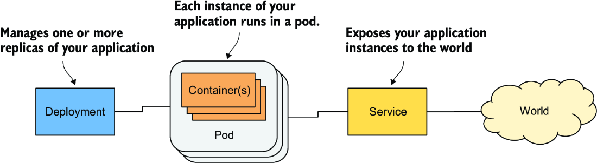

*Hình 5.1: Ba kiểu object cơ bản tạo nên một ứng dụng đã triển khai*

Giờ bạn đã có hiểu biết cơ bản về cách các object này được công khai thông qua Kubernetes API. Trong chương này và các chương tiếp theo, bạn sẽ tìm hiểu về từng object trong số đó cùng nhiều object khác thường được dùng để triển khai một ứng dụng hoàn chỉnh. Hãy bắt đầu với Pod object, vì nó đại diện cho khái niệm trung tâm, quan trọng nhất trong Kubernetes – một instance đang chạy của ứng dụng của bạn.

> **GHI CHÚ:** Các file code cho chương này có tại https://mng.bz/64JR.

---

## 5.1 Tìm hiểu về pod (Understanding pods)

Bạn đã biết rằng pod là một nhóm container được đặt cùng chỗ (co-located) và là khối xây dựng cơ bản trong Kubernetes. Thay vì triển khai từng container riêng lẻ, bạn triển khai và quản lý một nhóm container như một đơn vị duy nhất – một pod. Mặc dù pod có thể chứa nhiều container, việc một pod chạy chỉ với một container là khá phổ biến. Khi một pod có nhiều container, tất cả chúng đều chạy trên cùng một worker node – một instance pod không bao giờ trải rộng trên nhiều node. Hình 5.2 minh họa thông tin này.

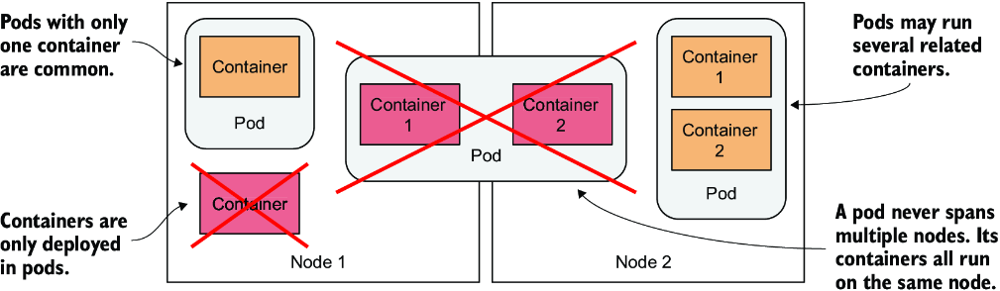

*Hình 5.2: Tất cả các container của một pod đều chạy trên cùng một node. Một pod không bao giờ trải rộng trên nhiều node.*

### 5.1.1 Tìm hiểu mục đích của pod (Understanding the purpose of pods)

Hãy thảo luận về lý do tại sao chúng ta cần chạy nhiều container cùng nhau, thay vì chạy nhiều tiến trình (process) trong cùng một container.

#### Tìm hiểu tại sao một container không nên chứa nhiều tiến trình (Understanding why one container shouldn't contain multiple processes)

Hãy tưởng tượng một ứng dụng bao gồm nhiều tiến trình giao tiếp với nhau qua IPC (Inter-Process Communication – giao tiếp liên tiến trình) hoặc qua các file dùng chung, điều này đòi hỏi chúng phải chạy trên cùng một máy tính. Trong chương 2, bạn đã biết rằng mỗi container giống như một máy tính hoặc máy ảo biệt lập. Một máy tính thường chạy nhiều tiến trình; container cũng có thể làm điều này. Bạn có thể chạy tất cả các tiến trình tạo nên một ứng dụng chỉ trong một container, nhưng điều đó khiến container trở nên rất khó quản lý.

Container được thiết kế để chạy chỉ một tiến trình duy nhất, không tính các tiến trình con mà nó sinh ra. Cả bộ công cụ container lẫn Kubernetes đều được phát triển xoay quanh thực tế này. Ví dụ, một tiến trình chạy trong container được kỳ vọng sẽ ghi log của nó ra đầu ra chuẩn (standard output). Các lệnh Docker và Kubernetes mà bạn dùng để hiển thị log chỉ cho thấy những gì đã được thu thập từ đầu ra này. Nếu chỉ có một tiến trình chạy trong container, nó là bên ghi duy nhất, nhưng nếu bạn chạy nhiều tiến trình trong container, tất cả chúng đều ghi vào cùng một đầu ra. Do đó log của chúng bị đan xen vào nhau, và rất khó để biết mỗi dòng thuộc về tiến trình nào.

Một lý do khác khiến container thường được thiết kế để chạy một tiến trình duy nhất là thực tế rằng container runtime chỉ khởi động lại container khi tiến trình gốc (root process) của container chết. Nó không quan tâm đến bất kỳ tiến trình con nào được tạo bởi tiến trình gốc này. Nếu tiến trình gốc sinh ra các tiến trình con, thì chỉ mình nó chịu trách nhiệm giữ cho tất cả các tiến trình này tiếp tục chạy.

Để tận dụng tối đa các tính năng mà container runtime cung cấp, bạn nên cân nhắc chỉ chạy một tiến trình trong mỗi container.

#### Tìm hiểu cách một pod kết hợp nhiều container (Understanding how a pod combines multiple containers)

Vì chúng ta không nên chạy nhiều tiến trình trong một container duy nhất, rõ ràng chúng ta cần một cấu trúc ở cấp cao hơn cho phép chạy các tiến trình có liên quan cùng với nhau, ngay cả khi chúng được chia ra thành nhiều container. Các tiến trình này phải có thể giao tiếp với nhau giống như các tiến trình trong một máy tính bình thường. Và đó là lý do pod ra đời.

Với pod, bạn có thể chạy các tiến trình có liên quan chặt chẽ cùng với nhau, mang lại cho chúng (gần như) cùng một môi trường như thể tất cả chúng đang chạy trong một container duy nhất. Các tiến trình này được cô lập ở một mức độ nào đó, nhưng không hoàn toàn – chúng chia sẻ một số tài nguyên. Điều này mang lại cho chúng ta điều tốt nhất của cả hai thế giới. Bạn có thể dùng mọi tính năng mà container cung cấp, nhưng đồng thời cho phép các tiến trình làm việc cùng nhau. Pod khiến những container liên kết với nhau này có thể được quản lý như một đơn vị.

Trong chương 2, bạn đã biết rằng một container dùng tập hợp Linux namespace của riêng nó, nhưng nó cũng có thể chia sẻ một số namespace với các container khác. Chính việc chia sẻ namespace này là cách Kubernetes và container runtime kết hợp các container thành pod. Như minh họa trong hình 5.3, tất cả các container trong một pod đều dùng chung Network namespace và do đó dùng chung các giao diện mạng (network interface), (các) địa chỉ IP và không gian cổng (port space) thuộc về namespace đó.

Do dùng chung không gian cổng, các tiến trình chạy trong các container của cùng một pod không thể gắn (bind) vào cùng một số cổng, trong khi các tiến trình ở các pod khác có giao diện mạng và không gian cổng riêng, điều này loại bỏ xung đột cổng giữa các pod khác nhau. Tất cả các container trong một pod cũng thấy cùng một hostname hệ thống, vì chúng dùng chung UTS namespace, và có thể giao tiếp qua các cơ chế IPC thông thường vì chúng dùng chung IPC namespace. Một pod cũng có thể được cấu hình để dùng một PID namespace duy nhất cho tất cả các container của nó, điều này khiến chúng dùng chung một cây tiến trình (process tree) duy nhất, nhưng bạn phải bật tính năng này một cách tường minh cho từng pod riêng lẻ.

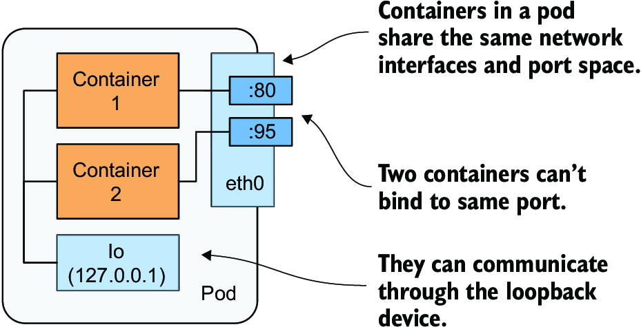

*Hình 5.3: Các container trong một pod dùng chung các giao diện mạng.*

> **GHI CHÚ:** Khi các container của cùng một pod dùng các PID namespace riêng biệt, chúng không thể nhìn thấy nhau hoặc gửi các tín hiệu tiến trình (process signal) như SIGTERM hay SIGINT cho nhau.

Chính việc chia sẻ một số namespace nhất định này mang lại cho các tiến trình chạy trong pod cảm giác rằng chúng chạy cùng nhau, mặc dù chúng chạy trong các container riêng biệt. Ngược lại, mỗi container luôn có Mount namespace riêng, mang lại cho nó hệ thống file (file system) riêng, nhưng khi hai container phải chia sẻ một phần của hệ thống file, bạn có thể thêm một volume vào pod và mount nó vào cả hai container. Hai container vẫn dùng hai Mount namespace riêng biệt, nhưng volume dùng chung được mount vào cả hai. Chúng ta sẽ nói thêm về volume trong chương 8.

### 5.1.2 Tổ chức các container thành pod (Organizing containers into pods)

Bạn có thể coi mỗi pod như một máy tính riêng biệt. Không giống máy ảo, vốn thường chứa nhiều ứng dụng, bạn thường chỉ chạy một ứng dụng trong mỗi pod. Bạn không bao giờ cần kết hợp nhiều ứng dụng trong một pod duy nhất, vì pod hầu như không có chi phí tài nguyên phụ trội (resource overhead). Bạn có thể có bao nhiêu pod tùy ý, nên thay vì nhồi nhét tất cả các ứng dụng của bạn vào một pod duy nhất, bạn nên chia chúng ra sao cho mỗi pod chỉ chạy các tiến trình ứng dụng có liên quan chặt chẽ với nhau. Hãy để tôi minh họa điều này bằng một ví dụ cụ thể.

#### Tách một ngăn xếp ứng dụng nhiều tầng thành nhiều pod (Splitting a multi-tier application stack into multiple pods)

Hãy tưởng tượng một hệ thống đơn giản gồm một máy chủ web frontend và một cơ sở dữ liệu backend. Tôi đã giải thích rằng máy chủ frontend và cơ sở dữ liệu không nên chạy trong cùng một container, vì mọi tính năng được tích hợp trong container đều được thiết kế xoay quanh kỳ vọng rằng không có nhiều hơn một tiến trình chạy trong một container. Nếu không chạy trong một container duy nhất, vậy bạn có nên chạy chúng trong các container riêng biệt nhưng đều nằm trong cùng một pod?

Mặc dù không có gì ngăn cản chúng ta chạy cả máy chủ frontend và cơ sở dữ liệu trong một pod duy nhất, đây không phải là cách tiếp cận tốt nhất. Tôi đã giải thích rằng tất cả các container của một pod luôn chạy cùng chỗ, nhưng máy chủ web và cơ sở dữ liệu có nhất thiết phải chạy trên cùng một máy tính không? Câu trả lời rõ ràng là không, vì chúng có thể dễ dàng giao tiếp qua mạng. Do đó, bạn không nên chạy chúng trong cùng một pod.

Nếu cả frontend và backend đều nằm trong cùng một pod, cả hai sẽ chạy trên cùng một node của cluster. Nếu bạn có một cluster hai node và chỉ tạo một pod, bạn chỉ đang dùng một worker node duy nhất và không tận dụng được tài nguyên tính toán có sẵn trên node thứ hai. Điều này đồng nghĩa với việc lãng phí CPU, bộ nhớ, dung lượng lưu trữ đĩa và băng thông. Việc tách các container thành hai pod cho phép Kubernetes đặt pod frontend trên một node và pod backend trên node kia, qua đó cải thiện hiệu suất sử dụng phần cứng.

#### Tách thành nhiều pod để cho phép scale riêng lẻ (Splitting into multiple pods to enable individual scaling)

Một lý do khác để không dùng một pod duy nhất liên quan đến việc scale theo chiều ngang (horizontal scaling). Pod không chỉ là đơn vị cơ bản của Deployment, mà còn là đơn vị cơ bản của việc scale. Trong chương 2, bạn đã scale Deployment object, và Kubernetes đã tạo thêm các pod – các replica bổ sung của ứng dụng của bạn. Kubernetes không nhân bản các container trong một pod, mà nó nhân bản toàn bộ pod.

Các thành phần frontend thường có yêu cầu scale khác với các thành phần backend, nên chúng ta thường scale chúng một cách riêng lẻ. Khi pod của bạn chứa cả container frontend lẫn backend và Kubernetes nhân bản nó, bạn sẽ có nhiều instance của cả container frontend lẫn backend, điều này không phải lúc nào cũng là điều bạn muốn. Các backend có trạng thái (stateful), chẳng hạn như cơ sở dữ liệu, thường không thể scale được, ít nhất là không dễ dàng như các frontend phi trạng thái (stateless). Nếu một container phải được scale riêng biệt với các thành phần khác, đây là một dấu hiệu rõ ràng rằng nó phải được triển khai trong một pod riêng. Hình 5.4 minh họa khái niệm này.

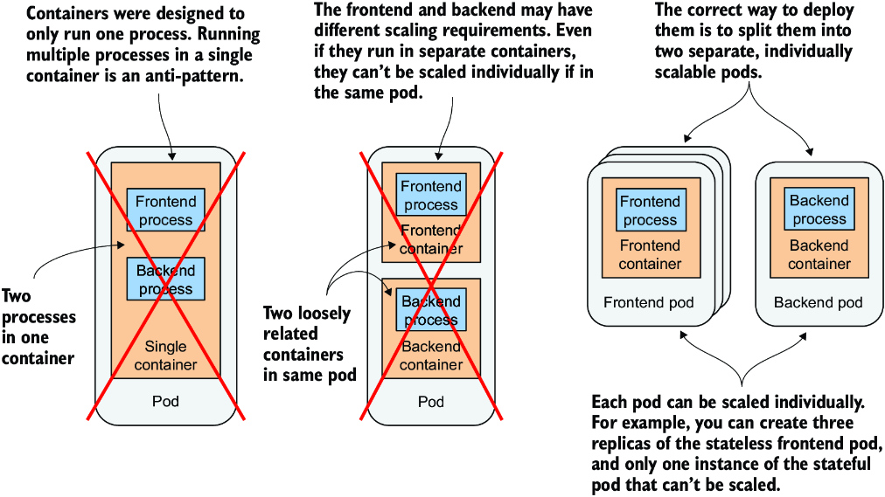

*Hình 5.4: Tách một ngăn xếp ứng dụng thành các pod*

Tách các ngăn xếp ứng dụng thành nhiều pod là cách tiếp cận đúng đắn. Nhưng vậy thì, khi nào người ta chạy nhiều container trong cùng một pod?

#### Giới thiệu sidecar container (Introducing sidecar containers)

Việc đặt nhiều container trong một pod duy nhất chỉ phù hợp nếu ứng dụng bao gồm một tiến trình chính (primary process) và một hoặc nhiều tiến trình bổ trợ cho hoạt động của tiến trình chính. Container mà trong đó tiến trình bổ trợ chạy được gọi là sidecar container, vì nó tương tự như thùng xe bên (sidecar) của xe máy, thứ làm cho chiếc xe máy ổn định hơn và cho phép chở thêm một hành khách. Nhưng không giống xe máy, một pod có thể có nhiều hơn một sidecar, như minh họa trong hình 5.5.

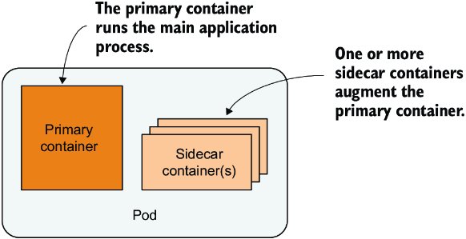

*Hình 5.5: Một pod với container chính và (các) sidecar container*

Thật khó để hình dung một tiến trình bổ trợ là gì, nên tôi sẽ đưa ra cho bạn vài ví dụ. Trong chương 2, bạn đã triển khai các pod với một container chạy ứng dụng Node.js. Ứng dụng Node.js chỉ hỗ trợ giao thức HTTP. Để khiến nó hỗ trợ HTTPS, chúng ta có thể thêm một chút code JavaScript, nhưng chúng ta cũng có thể làm được điều đó mà không cần thay đổi ứng dụng hiện có chút nào bằng cách thêm một container bổ sung vào pod – một reverse proxy (proxy ngược) chuyển đổi lưu lượng HTTPS sang HTTP và chuyển tiếp nó tới container Node.js. Container Node.js do đó là container chính, trong khi container chạy proxy là sidecar container. Hình 5.6 cho thấy ví dụ này.

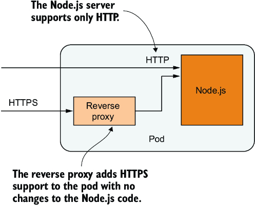

*Hình 5.6: Một sidecar container chuyển đổi lưu lượng HTTPS sang HTTP*

> **GHI CHÚ:** Bạn sẽ tạo pod này trong mục 5.4.

Một ví dụ khác, được minh họa trong hình 5.7, là một pod mà trong đó container chính chạy một máy chủ web phục vụ các file từ thư mục webroot của nó. Container còn lại trong pod là một agent định kỳ tải nội dung từ một nguồn bên ngoài và lưu nó vào thư mục webroot của máy chủ web. Như tôi đã đề cập trước đó, hai container có thể chia sẻ file bằng cách dùng chung một volume. Thư mục webroot sẽ được đặt trên volume này.

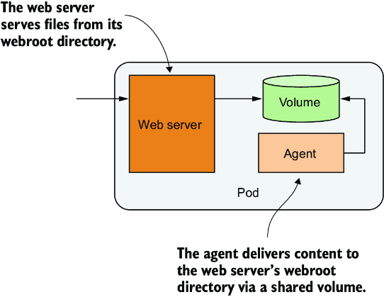

*Hình 5.7: Một sidecar container cung cấp nội dung cho container máy chủ web thông qua một volume*

Các ví dụ khác về sidecar container là các bộ xoay vòng và thu thập log (log rotator và collector), bộ xử lý dữ liệu, bộ chuyển đổi giao tiếp (communication adapter), và nhiều loại khác.

Không giống như việc thay đổi code hiện có của ứng dụng, việc thêm một sidecar làm tăng yêu cầu tài nguyên của pod vì phải có thêm một tiến trình chạy trong pod. Nhưng hãy nhớ rằng việc thêm code vào các ứng dụng cũ (legacy) có thể rất khó khăn. Điều này có thể là do code của nó khó sửa đổi, khó thiết lập môi trường build, hoặc bản thân mã nguồn không còn nữa. Mở rộng ứng dụng bằng cách thêm một tiến trình bổ sung đôi khi là lựa chọn rẻ hơn và nhanh hơn.

#### Quyết định có nên tách các container thành nhiều pod hay không (Deciding whether to split containers into multiple pods)

Khi quyết định có nên dùng mẫu sidecar và đặt các container trong một pod duy nhất, hay đặt chúng trong các pod riêng biệt, hãy tự hỏi những câu sau:

* Các container này có bắt buộc phải chạy trên cùng một host không?
* Tôi có muốn quản lý chúng như một đơn vị duy nhất không?
* Chúng có tạo thành một tổng thể thống nhất thay vì là các thành phần độc lập không?
* Chúng có bắt buộc phải được scale cùng nhau không?
* Một node duy nhất có thể đáp ứng nhu cầu tài nguyên tổng hợp của chúng không?

Nếu câu trả lời cho tất cả các câu hỏi này là có, hãy đặt tất cả chúng vào cùng một pod. Theo nguyên tắc chung, hãy luôn đặt các container vào các pod riêng biệt, trừ khi có một lý do cụ thể đòi hỏi chúng phải là một phần của cùng một pod.

---

## 5.2 Tạo pod từ file YAML hoặc JSON (Creating pods from YAML or JSON files)

Với những thông tin bạn đã học trong các mục trước, giờ bạn có thể bắt đầu tạo pod. Trong chương 3, bạn đã tạo chúng bằng lệnh mệnh lệnh (imperative) `kubectl create`, nhưng pod và các Kubernetes object khác thường được tạo bằng cách tạo một file manifest JSON hoặc YAML rồi gửi (post) nó tới Kubernetes API, như bạn đã học trong chương trước.

> **GHI CHÚ:** Quyết định dùng YAML hay JSON để định nghĩa các object là của bạn. Hầu hết mọi người thích dùng YAML hơn vì nó thân thiện với con người hơn một chút và cho phép thêm chú thích (comment) vào định nghĩa object.

Bằng cách dùng các file YAML để định nghĩa cấu trúc ứng dụng của bạn, bạn không cần các shell script để làm cho quá trình triển khai ứng dụng có thể lặp lại được, và bạn có thể lưu giữ lịch sử của mọi thay đổi bằng cách lưu các file này trong một VCS (Version Control System – hệ thống quản lý phiên bản), giống như cách bạn lưu code. Thực tế, các manifest ứng dụng của các bài tập trong cuốn sách này đều được lưu trong một VCS. Bạn có thể tìm thấy chúng trên GitHub tại github.com/luksa/kubernetes-in-action-2nd-edition.

### 5.2.1 Tạo manifest YAML cho một pod (Creating a YAML manifest for a pod)

Trong chương trước, bạn đã học cách truy xuất và xem xét manifest YAML của các API object hiện có. Giờ bạn sẽ tạo một manifest object từ đầu.

Bạn sẽ bắt đầu bằng cách tạo một file có tên `pod.kiada.yaml` trên máy tính của bạn, ở vị trí tùy bạn chọn. Bạn cũng có thể tìm thấy file này trong kho code của sách, trong thư mục `Chapter05/`. Listing sau đây cho thấy nội dung của file.

**Listing 5.1: Một file manifest pod cơ bản**

```yaml
apiVersion: v1               #1
kind: Pod                    #2
metadata:
  name: kiada                #3
spec:
  containers:
  - name: kiada              #4
    image: luksa/kiada:0.1   #5
    ports:
    - containerPort: 8080    #6
```

- **#1** Manifest này dùng phiên bản API v1 để định nghĩa object.
- **#2** Object được chỉ định trong manifest này là một pod.
- **#3** Tên của pod
- **#4** Tên của container
- **#5** Container image dùng để tạo container
- **#6** Cổng mà ứng dụng đang lắng nghe

Tôi chắc bạn sẽ đồng ý rằng manifest pod này dễ hiểu hơn nhiều so với manifest khổng lồ đại diện cho Node object mà bạn đã thấy trong chương trước. Nhưng một khi bạn gửi manifest Pod object này tới API rồi đọc lại nó, nó sẽ không khác biệt là bao.

Manifest trong listing 5.1 ngắn chỉ vì nó chưa chứa tất cả các trường mà một Pod object có được sau khi nó được tạo thông qua API. Ví dụ, bạn sẽ nhận thấy rằng phần metadata chỉ chứa một trường duy nhất và phần status hoàn toàn vắng mặt. Một khi bạn tạo object từ manifest này, điều đó sẽ không còn đúng nữa. Nhưng chúng ta sẽ đề cập đến việc đó sau.

Trước khi tạo object, hãy xem xét manifest một cách chi tiết. Nó dùng phiên bản `v1` của Kubernetes API để mô tả object. Kind của object là `Pod` và tên của object là `kiada`. Pod bao gồm một container duy nhất, cũng có tên là `kiada`, dựa trên image `luksa/kiada:0.1`. Định nghĩa pod cũng chỉ định rằng ứng dụng trong container lắng nghe trên cổng `8080`.

> **MẸO:** Bất cứ khi nào bạn muốn tạo một manifest pod từ đầu, bạn cũng có thể dùng lệnh sau để tạo file rồi chỉnh sửa nó để thêm các trường khác: `kubectl run kiada --image=luksa/kiada:0.1 --dry-run=client -o yaml > mypod.yaml`. Cờ `--dry-run=client` bảo kubectl xuất ra định nghĩa thay vì thực sự tạo object thông qua API.

Các trường trong file YAML đều tự giải thích, nhưng nếu bạn muốn biết thêm thông tin về từng trường hoặc muốn biết bạn có thể thêm những trường nào khác, hãy nhớ dùng lệnh `kubectl explain pods`.

### 5.2.2 Tạo Pod object từ file YAML (Creating the Pod object from the YAML file)

Sau khi đã chuẩn bị file manifest cho pod, giờ bạn có thể tạo object bằng cách gửi file này tới Kubernetes API.

#### Tạo object bằng cách áp dụng file manifest vào cluster (Creating objects by applying the manifest file to the cluster)

Khi bạn gửi manifest tới API, bạn đang chỉ đạo Kubernetes áp dụng (apply) manifest vào cluster. Đó là lý do lệnh con của kubectl thực hiện việc này được gọi là `apply`. Hãy dùng nó để tạo pod:

```bash
$ kubectl apply -f pod.kiada.yaml
pod "kiada" created
```

#### Cập nhật object bằng cách sửa file manifest và áp dụng lại (Updating objects by modifying the manifest file and re-applying it)

Lệnh `kubectl apply` được dùng để tạo object cũng như để thực hiện thay đổi trên các object hiện có. Nếu sau này bạn quyết định thay đổi Pod object của mình, bạn chỉ cần chỉnh sửa file `pod.kiada.yaml` và chạy lại lệnh `apply`. Một số trường của pod là bất biến (immutable), nên việc cập nhật có thể thất bại, nhưng bạn luôn có thể xóa pod và tạo lại nó. Bạn sẽ học cách xóa pod và các object khác ở cuối chương này.

#### Truy xuất manifest đầy đủ của một pod đang chạy (Retrieving the full manifest of a running pod)

Pod object giờ đã là một phần của cấu hình cluster. Bạn có thể đọc lại nó từ API để xem manifest object đầy đủ bằng lệnh sau:

```bash
$ kubectl get po kiada -o yaml
```

Khi chạy lệnh này, bạn sẽ nhận thấy manifest đã phình to lên đáng kể so với manifest trong file `pod.kiada.yaml`. Bạn sẽ thấy phần metadata giờ lớn hơn nhiều, và object đã có phần status. Phần spec cũng đã có thêm nhiều trường. Bạn có thể dùng `kubectl explain` để tìm hiểu thêm về các trường mới này, nhưng hầu hết chúng sẽ được giải thích trong chương này và các chương tiếp theo.

### 5.2.3 Kiểm tra pod vừa tạo (Checking the newly created pod)

Hãy dùng các lệnh kubectl cơ bản để xem pod đang hoạt động ra sao trước khi chúng ta bắt đầu tương tác với ứng dụng chạy bên trong nó.

#### Kiểm tra nhanh trạng thái của một pod (Quickly checking the status of a pod)

Pod object của bạn đã được tạo, nhưng làm sao bạn biết container trong pod có thực sự đang chạy hay không? Bạn có thể dùng lệnh `kubectl get` để xem tóm tắt về pod:

```bash
$ kubectl get pod kiada
NAME     READY   STATUS    RESTARTS   AGE
kiada    1/1     Running   0          32s
```

Bạn có thể thấy pod đang chạy, nhưng không có nhiều thông tin khác. Để biết thêm, bạn có thể thử lệnh `kubectl get pod -o wide` hoặc lệnh `kubectl describe` mà bạn đã học trong chương trước.

#### Dùng kubectl describe để xem chi tiết pod (Using kubectl describe to see pod details)

Để hiển thị cái nhìn chi tiết hơn về pod, hãy dùng lệnh `kubectl describe`:

```bash
$ kubectl describe pod kiada
Name:         kiada
Namespace:    default
Priority:     0
Node:         worker2/172.18.0.4
Start Time:   Mon, 27 Jan 2020 12:53:28 +0100
...
```

Listing trên không hiển thị toàn bộ output, nhưng nếu bạn tự chạy lệnh, bạn sẽ thấy hầu như tất cả thông tin mà bạn sẽ thấy nếu in ra manifest object hoàn chỉnh bằng lệnh `kubectl get -o yaml`.

#### Kiểm tra các event để tìm hiểu điều gì xảy ra bên dưới bề mặt (Inspecting events to find what happens beneath the surface)

Giống như trong chương trước khi bạn dùng lệnh `describe node` để kiểm tra một Node object, lệnh `describe pod` hiển thị một số event liên quan đến pod ở cuối output. Nếu bạn còn nhớ, các event này không phải là một phần của chính object mà là các object riêng biệt. Hãy in chúng ra để tìm hiểu thêm về điều gì xảy ra khi bạn tạo Pod object. Đây là các event được ghi lại sau khi pod được tạo:

```bash
$ kubectl get events
LAST SEEN   TYPE     REASON      OBJECT      MESSAGE
<unknown>   Normal   Scheduled   pod/kiada   Successfully assigned default/
                                             kiada to kind-worker2
5m          Normal   Pulling     pod/kiada   Pulling image luksa/kiada:0.1
5m          Normal   Pulled      pod/kiada   Successfully pulled image
5m          Normal   Created     pod/kiada   Created container kiada
5m          Normal   Started     pod/kiada   Started container kiada
```

Các event này được in theo thứ tự thời gian. Event gần nhất nằm ở cuối. Bạn thấy rằng pod trước tiên được gán cho một trong các worker node. Sau đó, container image được kéo (pull) về, container được tạo và cuối cùng được khởi động.

Không có event cảnh báo nào được hiển thị, nên mọi thứ có vẻ ổn. Nếu trên cluster của bạn không được như vậy, bạn nên đọc mục 5.4 để học cách khắc phục sự cố pod bị lỗi.

---

## 5.3 Tương tác với ứng dụng và pod (Interacting with the application and the pod)

Container của bạn giờ đang chạy. Trong mục này, bạn sẽ học cách giao tiếp với ứng dụng, kiểm tra log của nó và thực thi các lệnh trong container để khám phá môi trường của ứng dụng. Hãy xác nhận rằng ứng dụng chạy trong container phản hồi các request của bạn.

### 5.3.1 Gửi request tới ứng dụng trong pod (Sending requests to the application in the pod)

Trong chương 2, bạn đã dùng lệnh `kubectl expose` để tạo một service cấp phát (provision) một load balancer để bạn có thể nói chuyện với ứng dụng chạy trong (các) pod của mình. Giờ chúng ta sẽ dùng một cách tiếp cận khác. Cho mục đích phát triển, kiểm thử và gỡ lỗi (debug), bạn có thể muốn giao tiếp trực tiếp với một pod cụ thể, thay vì dùng một service chuyển tiếp kết nối tới các pod được chọn ngẫu nhiên.

Bạn đã biết rằng mỗi pod được gán địa chỉ IP riêng, tại đó nó có thể được truy cập bởi mọi pod khác trong cluster. Địa chỉ IP này thường là nội bộ của cluster. Bạn không thể truy cập nó từ máy tính cục bộ của mình, trừ khi Kubernetes được triển khai theo một cách cụ thể – ví dụ, khi dùng kind hoặc Minikube không dùng máy ảo để tạo cluster.

Nói chung, để truy cập pod, bạn phải dùng một trong các phương pháp được mô tả trong các mục sau. Trước tiên, hãy xác định địa chỉ IP của pod.

#### Lấy địa chỉ IP của pod (Getting the pod's IP address)

Bạn có thể lấy địa chỉ IP của pod bằng cách truy xuất YAML đầy đủ của pod và tìm trường `podIP` trong phần status. Ngoài ra, bạn có thể hiển thị IP bằng `kubectl describe`, nhưng cách dễ nhất là dùng `kubectl get` với tùy chọn output `wide`:

```bash
$ kubectl get pod kiada -o wide
NAME    READY   STATUS    RESTARTS   AGE   IP           NODE      ...
kiada   1/1     Running   0          35m   10.244.2.4   worker2   ...
```

Như được chỉ ra trong cột `IP`, IP của pod của tôi là `10.244.2.4`. Giờ tôi cần xác định số cổng mà ứng dụng đang lắng nghe.

#### Lấy số cổng mà ứng dụng sử dụng (Getting the port number used by the application)

Nếu tôi không phải là tác giả của ứng dụng, sẽ rất khó để tôi xác định ứng dụng lắng nghe trên cổng nào. Tôi có thể kiểm tra mã nguồn của nó hoặc Dockerfile của container image, vì cổng thường được chỉ định ở đó, nhưng tôi có thể không có quyền truy cập vào cả hai. Nếu ai đó khác đã tạo pod, làm sao tôi biết được nó đang lắng nghe trên cổng nào?

May mắn thay, bạn có thể chỉ định danh sách các cổng ngay trong định nghĩa pod. Không bắt buộc phải chỉ định cổng nào cả, nhưng luôn làm vậy là một ý tưởng hay.

#### Tại sao nên chỉ định cổng container trong định nghĩa pod (Why specify container ports in pod definitions)

Việc chỉ định cổng trong định nghĩa pod hoàn toàn chỉ mang tính thông tin. Việc bỏ qua chúng không ảnh hưởng đến việc client có thể kết nối tới cổng của pod hay không. Nếu container chấp nhận kết nối qua một cổng được gắn với địa chỉ IP của nó, bất kỳ ai cũng có thể kết nối tới cổng đó, ngay cả khi cổng không được chỉ định tường minh trong spec của pod hoặc khi bạn chỉ định sai số cổng.

Dù vậy, luôn chỉ định các cổng là một ý tưởng hay để bất kỳ ai có quyền truy cập vào cluster của bạn đều có thể thấy mỗi pod công khai những cổng nào. Bằng cách định nghĩa cổng một cách tường minh, bạn cũng có thể gán tên cho mỗi cổng, điều này rất hữu ích khi bạn công khai pod thông qua service.

Manifest pod cho biết container dùng cổng 8080, vậy là giờ bạn đã có mọi thứ cần thiết để nói chuyện với ứng dụng.

#### Truy cập ứng dụng từ các worker node (Accessing the application from the worker nodes)

Mô hình mạng của Kubernetes quy định rằng mỗi pod có thể được truy cập từ bất kỳ pod nào khác và mỗi node có thể tiếp cận bất kỳ pod nào trên bất kỳ node nào trong cluster. Vì thế, một cách để giao tiếp với pod của bạn là đăng nhập vào một trong các worker node và nói chuyện với pod từ đó.

Bạn đã biết rằng cách đăng nhập vào một node phụ thuộc vào công cụ bạn đã dùng để triển khai cluster. Nếu bạn đang dùng kind, hãy chạy `docker exec -it kind-worker bash`, hoặc `minikube ssh` nếu bạn đang dùng Minikube. Trên GKE, hãy dùng lệnh `gcloud compute ssh <node-name>`. Với các cluster khác, hãy tham khảo tài liệu của chúng.

Sau khi đã đăng nhập vào node, hãy dùng lệnh `curl` với IP và cổng của pod để truy cập ứng dụng của bạn. IP của pod của tôi là 10.244.2.4 và cổng là 8080, nên tôi chạy lệnh sau:

```bash
$ curl 10.244.2.4:8080
Kiada version 0.1. Request processed by "kiada". Client IP: ::ffff:10.244.2.1
```

Thông thường, bạn không dùng phương pháp này để nói chuyện với các pod của mình, nhưng bạn có thể cần dùng đến nó khi có vấn đề về giao tiếp và bạn muốn tìm nguyên nhân bằng cách thử tuyến giao tiếp ngắn nhất có thể trước tiên. Trong trường hợp này, tốt nhất là đăng nhập vào node nơi pod đang nằm và chạy `curl` từ đó. Giao tiếp giữa node và pod diễn ra cục bộ, nên phương pháp này luôn có khả năng thành công cao nhất.

#### Truy cập ứng dụng từ một client pod dùng một lần (Accessing the application from a one-off client pod)

Cách thứ hai để kiểm tra kết nối tới ứng dụng của bạn là chạy `curl` trong một pod khác mà bạn tạo riêng cho nhiệm vụ này. Hãy dùng phương pháp này để kiểm tra xem các pod khác có thể truy cập pod của bạn hay không. Ngay cả khi mạng hoạt động hoàn hảo, điều này có thể vẫn không được đảm bảo. Cũng có thể khóa chặt mạng bằng cách cô lập các pod khỏi nhau. Trong một hệ thống như vậy, một pod chỉ có thể nói chuyện với những pod mà nó được phép. Để chạy `curl` trong một pod dùng một lần, hãy dùng lệnh sau:

```bash
$ kubectl run --image=curlimages/curl -it --restart=Never --rm client-pod curl 10.244.2.4:8080
Kiada version 0.1. Request processed by "kiada". Client IP: ::ffff:10.244.2.5
pod "client-pod" deleted
```

Lệnh này chạy một pod với một container duy nhất được tạo từ image `curlimages/curl`. Bạn cũng có thể dùng bất kỳ image nào khác cung cấp file thực thi `curl`. Tùy chọn `-it` gắn console của bạn vào đầu vào và đầu ra chuẩn của container, tùy chọn `--restart=Never` đảm bảo pod được coi là `Completed` khi lệnh `curl` và container của nó kết thúc, và tùy chọn `--rm` xóa pod khi kết thúc. Tên của pod là `client-pod`, và lệnh được thực thi trong container của nó là `curl 10.244.2.4:8080`.

> **GHI CHÚ:** Bạn cũng có thể sửa lệnh này để chạy shell `sh` trong client pod rồi chạy `curl` từ shell đó.

Tạo một pod chỉ để xem nó có thể truy cập pod khác hay không là hữu ích khi bạn đặc biệt muốn kiểm tra kết nối pod-tới-pod. Nếu bạn chỉ muốn biết pod của mình có phản hồi request hay không, bạn cũng có thể dùng phương pháp được giải thích trong mục tiếp theo.

#### Truy cập pod bằng port forwarding của kubectl (Accessing the pod with kubectl port forwarding)

Trong quá trình phát triển, cách dễ nhất để nói chuyện với các ứng dụng chạy trong pod của bạn là dùng lệnh `kubectl port-forward`, lệnh này cho phép bạn giao tiếp với một pod cụ thể thông qua một proxy được gắn với một cổng mạng trên máy tính cục bộ của bạn, như minh họa trong hình 5.8.

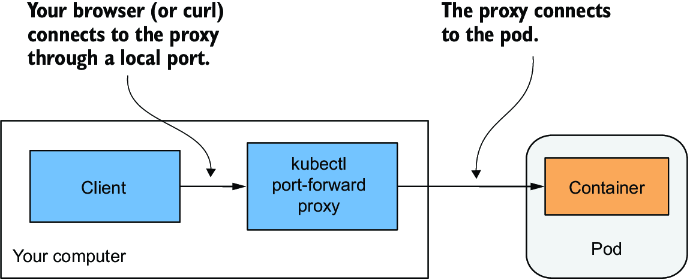

*Hình 5.8: Kết nối tới một pod thông qua proxy kubectl port-forward*

Để mở một đường giao tiếp với pod, bạn thậm chí không cần tra cứu IP của pod, vì bạn chỉ cần chỉ định tên và cổng của nó. Lệnh sau khởi động một proxy chuyển tiếp cổng cục bộ `8080` trên máy tính của bạn tới cổng `8080` của Pod `kiada`:

```bash
$ kubectl port-forward kiada 8080
... Forwarding from 127.0.0.1:8080 -> 8080
... Forwarding from [::1]:8080 -> 8080
```

Proxy giờ đang chờ các kết nối đến. Hãy chạy lệnh `curl` sau trong một terminal khác:

```bash
$ curl localhost:8080
Kiada version 0.1. Request processed by "kiada". Client IP: ::ffff:127.0.0.1
```

Như bạn có thể thấy, `curl` đã kết nối tới proxy cục bộ và nhận được phản hồi từ pod. Mặc dù lệnh `port-forward` là phương pháp dễ nhất để giao tiếp với một pod cụ thể trong quá trình phát triển và khắc phục sự cố, nó cũng là phương pháp phức tạp nhất xét về những gì diễn ra bên dưới. Giao tiếp đi qua nhiều thành phần, nên nếu bất cứ thứ gì trên đường giao tiếp bị hỏng, bạn sẽ không thể nói chuyện với pod, ngay cả khi bản thân pod vẫn có thể truy cập được qua các kênh giao tiếp thông thường.

> **GHI CHÚ:** Lệnh `kubectl port-forward` cũng có thể chuyển tiếp kết nối tới các service thay vì pod và có một số tính năng hữu ích khác. Hãy chạy `kubectl port-forward --help` để tìm hiểu thêm.

Hình 5.9 cho thấy cách các gói tin mạng đi từ tiến trình `curl` tới ứng dụng của bạn và quay trở lại.

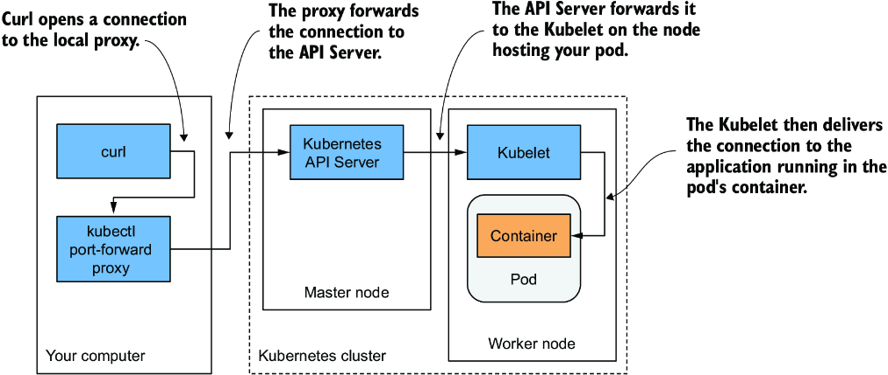

*Hình 5.9: Đường giao tiếp dài giữa curl và container khi dùng port forwarding*

Như minh họa trong hình, tiến trình `curl` kết nối tới proxy, proxy kết nối tới API server, API server sau đó kết nối tới Kubelet trên node chứa pod, rồi Kubelet kết nối tới container thông qua thiết bị loopback của pod (nói cách khác, qua địa chỉ localhost). Tôi chắc bạn sẽ đồng ý rằng đường giao tiếp này dài một cách khác thường.

> **GHI CHÚ:** Ứng dụng trong container phải được gắn với một cổng trên thiết bị loopback thì Kubelet mới tiếp cận được nó. Nếu nó chỉ lắng nghe trên giao diện mạng `eth0` của pod, bạn sẽ không thể tiếp cận nó bằng lệnh `kubectl port-forward`.

#### Truy cập ứng dụng thông qua API server (Accessing the application through the API server)

Một cách ít được biết đến nhưng nhanh chóng để truy cập một ứng dụng HTTP chạy trong pod là dùng lệnh `kubectl get --raw`. Lệnh này gửi một request tới Kubernetes API server, sau đó API server proxy request đó tới pod. Không cần chạy thêm lệnh nào khác hay thiết lập port-forwarding. Phương pháp này thường được các nhà phát triển và quản trị viên hệ thống sử dụng – không phải người dùng cuối hay các client bên ngoài.

Để truy cập ứng dụng Kiada chạy trong Pod `kiada` của bạn, hãy chạy lệnh sau:

```bash
$ kubectl get --raw /api/v1/namespaces/default/pods/kiada/proxy/
Kiada version 0.1. Request processed by "kiada". Client IP: ::ffff:172.18.0.5
```

Trong ví dụ này, bạn đang yêu cầu đường dẫn gốc (root path). Nếu bạn muốn yêu cầu một đường dẫn URL khác, hãy nối nó vào cuối URI.

### 5.3.2 Xem log của ứng dụng (Viewing application logs)

Ứng dụng Node.js của bạn ghi log của nó ra luồng đầu ra chuẩn. Thay vì ghi log ra file, các ứng dụng được container hóa thường ghi log ra đầu ra chuẩn (stdout) và luồng lỗi chuẩn (stderr). Điều này cho phép container runtime chặn bắt output đó, lưu trữ nó ở một vị trí nhất quán (thường là `/var/log/containers`), và cung cấp quyền truy cập vào log mà không cần biết mỗi ứng dụng lưu file log của nó ở đâu.

Khi bạn chạy một ứng dụng trong container bằng Docker, bạn có thể hiển thị log của nó bằng `docker logs <container-id>`. Khi bạn chạy ứng dụng trong Kubernetes, bạn có thể đăng nhập vào node chứa pod và hiển thị log của nó bằng `docker logs`, nhưng Kubernetes cung cấp một cách dễ hơn để làm việc này với lệnh `kubectl logs`.

#### Truy xuất log của pod bằng kubectl logs (Retrieving a pod's log with kubectl logs)

Để xem log của pod (cụ thể hơn là log của container), hãy chạy lệnh sau:

```bash
$ kubectl logs kiada
Kiada - Kubernetes in Action Demo Application
---------------------------------------------
Kiada 0.1 starting...
Local hostname is kiada
Listening on port 8080
Received request for / from ::ffff:10.244.2.1    #1
Received request for / from ::ffff:10.244.2.5    #2
Received request for / from ::ffff:127.0.0.1     #3
```

- **#1** Request bạn đã gửi từ bên trong node
- **#2** Request từ client pod dùng một lần
- **#3** Request được gửi qua port forwarding

#### Truyền log theo thời gian thực bằng kubectl logs -f (Streaming logs using kubectl logs -f)

Nếu bạn muốn truyền (stream) log của ứng dụng theo thời gian thực để thấy từng request khi nó đến, bạn có thể chạy lệnh với tùy chọn `--follow` (hoặc phiên bản ngắn hơn `-f`):

```bash
$ kubectl logs kiada -f
```

Giờ hãy gửi thêm vài request tới ứng dụng và xem log. Nhấn Ctrl-C để dừng truyền log khi bạn xong.

#### Hiển thị dấu thời gian của từng dòng log (Displaying the timestamp of each logged line)

Bạn có thể đã nhận thấy rằng chúng ta đã quên đưa dấu thời gian (timestamp) vào câu lệnh ghi log. Log không có dấu thời gian có tính hữu dụng hạn chế. May mắn thay, container runtime gắn dấu thời gian hiện tại vào mọi dòng do ứng dụng tạo ra. Bạn có thể hiển thị các dấu thời gian này bằng tùy chọn `--timestamps=true` như sau:

```bash
$ kubectl logs kiada --timestamps=true
2020-02-01T09:44:40.954641934Z Kiada - Kubernetes in Action Demo Application
2020-02-01T09:44:40.954843234Z ---------------------------------------------
2020-02-01T09:44:40.955032432Z Kiada 0.1 starting...
2020-02-01T09:44:40.955123432Z Local hostname is kiada
2020-02-01T09:44:40.956435431Z Listening on port 8080
2020-02-01T09:50:04.978043089Z Received request for / from ...
2020-02-01T09:50:33.640897378Z Received request for / from ...
2020-02-01T09:50:44.781473256Z Received request for / from ...
```

> **MẸO:** Bạn có thể hiển thị dấu thời gian bằng cách chỉ gõ `--timestamps` mà không cần giá trị. Với các tùy chọn boolean, chỉ cần chỉ định tên tùy chọn là đã đặt tùy chọn đó thành `true`. Điều này áp dụng cho tất cả các tùy chọn kubectl nhận giá trị Boolean và mặc định là `false`.

#### Hiển thị các log gần đây (Displaying recent logs)

Tính năng vừa rồi rất tuyệt nếu bạn chạy các ứng dụng của bên thứ ba không có dấu thời gian trong output log của chúng, nhưng việc mỗi dòng đều được gắn dấu thời gian còn mang lại một lợi ích khác: lọc các dòng log theo thời gian. Kubectl cung cấp hai cách để lọc log theo thời gian.

Tùy chọn thứ nhất dành cho khi bạn chỉ muốn hiển thị log từ vài giây, vài phút hoặc vài giờ vừa qua. Ví dụ, để xem log được tạo ra trong 2 phút gần nhất, hãy chạy

```bash
$ kubectl logs kiada --since=2m
```

Tùy chọn còn lại là hiển thị log được tạo ra sau một ngày giờ cụ thể bằng tùy chọn `--since-time`. Định dạng thời gian được dùng là RFC3339. Ví dụ, lệnh sau được dùng để in log được tạo ra sau 9:50 sáng ngày 1 tháng 2 năm 2020:

```bash
$ kubectl logs kiada --since-time=2020-02-01T09:50:00Z
```

#### Hiển thị vài dòng cuối của log (Displaying the last several lines of the log)

Thay vì dùng thời gian để giới hạn output, bạn cũng có thể chỉ định số dòng tính từ cuối log mà bạn muốn hiển thị. Để hiển thị 10 dòng cuối, hãy thử

```bash
$ kubectl logs kiada --tail=10
```

> **GHI CHÚ:** Các tùy chọn kubectl nhận giá trị có thể được chỉ định bằng dấu bằng hoặc bằng dấu cách. Thay vì `--tail=10`, bạn cũng có thể gõ `--tail 10`.

#### Tìm hiểu tính khả dụng của log của pod (Understanding the availability of the pod's logs)

Kubernetes giữ một file log riêng cho mỗi container. Chúng thường được lưu trong `/var/log/containers` trên node chạy container. Một file riêng được tạo cho mỗi container. Nếu container được khởi động lại, log của nó được ghi vào một file mới. Vì thế, nếu container được khởi động lại trong khi bạn đang theo dõi log của nó bằng `kubectl logs -f`, lệnh sẽ kết thúc, và bạn sẽ cần chạy lại nó để truyền log của container mới.

Lệnh `kubectl logs` chỉ hiển thị log của container hiện tại. Để xem log từ container trước đó, hãy dùng tùy chọn `--previous` (hoặc `-p`).

> **GHI CHÚ:** Tùy thuộc vào cấu hình cluster của bạn, các file log cũng có thể được xoay vòng (rotate) khi chúng đạt đến một kích thước nhất định. Trong trường hợp này, `kubectl logs` sẽ chỉ hiển thị file log hiện tại. Khi đang truyền log, bạn phải khởi động lại lệnh để chuyển sang file mới khi log được xoay vòng.

Khi bạn xóa một pod, tất cả các file log của nó cũng bị xóa. Để log của các pod luôn sẵn có vĩnh viễn, bạn cần thiết lập một hệ thống ghi log tập trung trên toàn cluster.

> **Còn các ứng dụng ghi log ra file thì sao? (What about applications that write their logs to files?)**
>
> Nếu ứng dụng của bạn ghi log ra file thay vì stdout, bạn có thể tự hỏi làm thế nào để truy cập file đó. Lý tưởng nhất, bạn sẽ cấu hình hệ thống ghi log tập trung để thu thập log sao cho bạn có thể xem chúng ở một nơi tập trung, nhưng đôi khi, bạn chỉ muốn giữ mọi thứ đơn giản và không ngại truy cập log thủ công. Trong hai mục tiếp theo, bạn sẽ học cách sao chép log và các file khác từ container sang máy tính của bạn và ngược lại, cũng như cách chạy lệnh trong các container đang chạy. Bạn có thể dùng một trong hai phương pháp này để hiển thị các file log hoặc bất kỳ file nào khác bên trong container.

### 5.3.3 Gắn vào một container đang chạy (Attaching to a running container)

Lệnh `kubectl logs` cho thấy những gì ứng dụng đã ghi ra đầu ra chuẩn và đầu ra lỗi. Với tùy chọn `kubectl logs -f`, bạn có thể thấy những gì đang được ghi theo thời gian thực. Một cách khác để xem output của ứng dụng là kết nối tới đầu ra chuẩn và đầu ra lỗi của nó bằng lệnh `kubectl attach`. Nhưng lệnh này còn cho phép bạn gắn (attach) vào đầu vào chuẩn của ứng dụng, cho phép tương tác thông qua cơ chế này.

#### Dùng kubectl attach để xem những gì ứng dụng in ra đầu ra chuẩn (Using kubectl attach to see what the application prints to standard output)

Nếu ứng dụng không đọc từ đầu vào chuẩn, lệnh `kubectl attach` chẳng qua chỉ là một cách khác để truyền log của ứng dụng, vì log thường được ghi ra luồng đầu ra chuẩn và luồng lỗi chuẩn, và lệnh `attach` truyền chúng giống hệt như lệnh `kubectl logs -f`. Hãy xem điều này trong thực tế.

Gắn vào Pod `kiada` của bạn bằng cách chạy lệnh sau:

```bash
$ kubectl attach kiada
If you don't see a command prompt, try pressing enter.
```

Giờ, khi bạn gửi các HTTP request mới tới ứng dụng bằng `curl` trong một terminal khác, bạn sẽ thấy các dòng mà ứng dụng ghi ra đầu ra chuẩn cũng được in trong terminal nơi lệnh `kubectl attach` đang được thực thi.

#### Dùng kubectl attach để ghi vào đầu vào chuẩn của ứng dụng (Using kubectl attach to write to the application's standard input)

Ứng dụng Kiada phiên bản 0.1 không đọc từ luồng đầu vào chuẩn, nhưng bạn sẽ tìm thấy mã nguồn của phiên bản 0.2 làm điều này trong kho code của sách. Phiên bản này cho phép bạn đặt một thông điệp trạng thái (status message) bằng cách ghi nó vào luồng đầu vào chuẩn của ứng dụng. Thông điệp trạng thái này sẽ được đưa vào phản hồi của ứng dụng. Hãy triển khai phiên bản này của ứng dụng trong một pod mới và dùng lệnh `kubectl attach` để đặt thông điệp trạng thái.

Bạn có thể tìm thấy các thành phần cần thiết để build image trong thư mục `kiada-0.2/`. Bạn cũng có thể dùng image đã được build sẵn `docker.io/luksa/kiada:0.2`. Manifest của pod nằm trong file `Chapter05/pod.kiada-stdin.yaml` và được hiển thị trong listing sau. Nó chứa thêm một dòng so với manifest trước (dòng này được in đậm).

**Listing 5.2: Bật đầu vào chuẩn cho một container**

```yaml
apiVersion: v1
kind: Pod
metadata:
  name: kiada-stdin          #1
spec:
  containers:
  - name: kiada
    image: luksa/kiada:0.2   #2
    stdin: true              #3
    ports:
    - containerPort: 8080
```

- **#1** Pod này có tên là kiada-stdin.
- **#2** Nó dùng phiên bản 0.2 của ứng dụng Kiada.
- **#3** Ứng dụng cần đọc từ luồng đầu vào chuẩn.

Như có thể thấy, nếu ứng dụng chạy trong pod muốn đọc từ đầu vào chuẩn, bạn phải chỉ ra điều này trong manifest pod bằng cách đặt trường `stdin` trong định nghĩa container thành `true`. Điều này bảo Kubernetes cấp phát một bộ đệm (buffer) cho luồng đầu vào chuẩn – nếu không, ứng dụng sẽ luôn nhận được EOF khi nó cố đọc từ luồng này.

Tạo pod từ file manifest này bằng lệnh `kubectl apply`:

```bash
$ kubectl apply -f pod.kiada-stdin.yaml
pod/kiada-stdin created
```

Để cho phép giao tiếp với ứng dụng, hãy dùng lại lệnh `kubectl port-forward`, nhưng vì cổng cục bộ 8080 vẫn đang được lệnh port-forward thực thi trước đó sử dụng, bạn phải hoặc kết thúc lệnh đó hoặc chọn một cổng cục bộ khác để chuyển tiếp tới pod mới. Bạn có thể làm điều này như sau:

```bash
$ kubectl port-forward kiada-stdin 8888:8080
Forwarding from 127.0.0.1:8888 -> 8080
Forwarding from [::1]:8888 -> 8080
```

Đối số dòng lệnh `8888:8080` chỉ thị lệnh chuyển tiếp cổng cục bộ `8888` tới cổng `8080` của pod.

Giờ bạn có thể truy cập ứng dụng tại http://localhost:8888:

```bash
$ curl localhost:8888
Kiada version 0.2. Request processed by "kiada-stdin". Client IP: ::ffff:127.0.0.1
```

Hãy đặt thông điệp trạng thái bằng cách dùng `kubectl attach` để ghi vào luồng đầu vào chuẩn của ứng dụng. Chạy lệnh sau:

```bash
$ kubectl attach -i kiada-stdin
```

Lưu ý việc dùng thêm tùy chọn `-i` trong lệnh. Nó chỉ thị kubectl chuyển đầu vào chuẩn của nó tới container.

> **GHI CHÚ:** Giống như lệnh `kubectl exec`, `kubectl attach` cũng hỗ trợ tùy chọn `--tty` hay `-t`, tùy chọn này chỉ ra rằng đầu vào chuẩn là một terminal (TTY), nhưng container phải được cấu hình để cấp phát một terminal thông qua trường `tty` trong định nghĩa container.

Giờ bạn có thể nhập thông điệp trạng thái vào terminal và nhấn phím Enter. Ví dụ, hãy gõ thông điệp sau:

```bash
This is my custom status message.
```

Ứng dụng in thông điệp mới ra đầu ra chuẩn:

```bash
Status message set to: This is my custom status message.
```

Để xem ứng dụng giờ có đưa thông điệp vào phản hồi cho các HTTP request hay không, hãy thực thi lại lệnh `curl` hoặc làm mới trang trong trình duyệt web của bạn:

```bash
$ curl localhost:8888
Kiada version 0.2. Request processed by "kiada-stdin". Client IP: ::ffff:127.0.0.1
This is my custom status message.    #1
```

- **#1** Đây là thông điệp bạn đã đặt thông qua lệnh kubectl attach.

Bạn có thể thay đổi thông điệp trạng thái một lần nữa bằng cách gõ một dòng khác trong terminal đang chạy lệnh `kubectl attach`. Để thoát lệnh `attach`, hãy nhấn Ctrl-C hoặc phím tương đương.

> **GHI CHÚ:** Một trường bổ sung trong định nghĩa container, `stdinOnce`, xác định xem kênh đầu vào chuẩn có bị đóng khi phiên attach kết thúc hay không. Nó mặc định là `false`, cho phép bạn dùng đầu vào chuẩn trong mọi phiên `kubectl attach`. Nếu bạn đặt nó thành `true`, đầu vào chuẩn chỉ mở trong phiên đầu tiên.

### 5.3.4 Thực thi lệnh trong các container đang chạy (Executing commands in running containers)

Khi gỡ lỗi một ứng dụng chạy trong container, có thể cần phải xem xét container và môi trường của nó từ bên trong. Kubectl cũng cung cấp chức năng này. Bạn có thể thực thi bất kỳ file nhị phân (binary) nào có trong hệ thống file của container bằng lệnh `kubectl exec`.

#### Gọi một lệnh đơn lẻ trong container (Invoking a single command in the container)

Ví dụ, bạn có thể liệt kê các tiến trình đang chạy trong container của Pod `kiada` bằng cách chạy lệnh sau:

```bash
$ kubectl exec kiada -- ps aux
USER  PID %CPU %MEM    VSZ   RSS TTY STAT START TIME COMMAND
root    1  0.0  1.3 812860 27356 ?   Ssl  11:54 0:00 node app.js    #1
root  120  0.0  0.1  17500  2128 ?   Rs   12:22 0:00 ps aux         #2
```

- **#1** Máy chủ Node.js
- **#2** Lệnh bạn vừa gọi

Đây là lệnh tương đương trong Kubernetes của lệnh Docker mà bạn đã dùng để khám phá các tiến trình trong một container đang chạy ở chương 2. Nó cho phép bạn chạy từ xa một lệnh trong bất kỳ pod nào mà không cần đăng nhập vào node chứa pod. Nếu bạn đã từng dùng `ssh` để thực thi lệnh trên một hệ thống từ xa, bạn sẽ thấy `kubectl exec` không khác là mấy.

Trong mục 5.3.1, bạn đã thực thi lệnh `curl` trong một client pod dùng một lần để gửi request tới ứng dụng của bạn, nhưng bạn cũng có thể chạy lệnh này ngay bên trong Pod `kiada`:

```bash
$ kubectl exec kiada -- curl -s localhost:8080
Kiada version 0.1. Request processed by "kiada". Client IP: ::1
```

#### Chạy một shell tương tác trong container (Running an interactive shell in the container)

Hai ví dụ trước đã cho thấy cách một lệnh đơn lẻ có thể được thực thi trong container. Khi lệnh hoàn thành, bạn được trả về shell của mình. Nếu bạn muốn chạy nhiều lệnh trong container, bạn có thể chạy một shell trong container như sau:

```bash
$ kubectl exec -it kiada -- bash
root@kiada:/#    #1
```

- **#1** Dấu nhắc lệnh của shell đang chạy trong container

`-it` là viết tắt của hai tùy chọn, `-i` và `-t`, chúng chỉ ra rằng bạn muốn thực thi lệnh `bash` một cách tương tác bằng cách chuyển đầu vào chuẩn tới container và đánh dấu nó là một terminal (TTY).

Giờ bạn có thể khám phá bên trong container bằng cách thực thi các lệnh trong shell. Ví dụ, bạn có thể xem các file trong container bằng cách chạy `ls -la`, xem các giao diện mạng của nó bằng `ip link`, hoặc kiểm tra kết nối của nó bằng `ping`. Bạn có thể chạy bất kỳ công cụ nào có sẵn trong container. Nếu container không cung cấp shell hoặc công cụ bạn cần, bạn có thể hoặc sao chép file nhị phân vào container, hoặc thêm một container bổ sung, tạm thời (ephemeral container) vào pod. Chúng ta sẽ khám phá các lựa chọn này trong hai mục tiếp theo.

### 5.3.5 Sao chép file vào và ra khỏi container (Copying files to and from containers)

Đôi khi bạn có thể muốn thêm một file vào một container đang chạy hoặc lấy một file từ nó. Sửa đổi file trong các container đang chạy không phải là việc bạn thường làm – ít nhất là không phải trong môi trường sản xuất (production) – nhưng nó có thể hữu ích trong quá trình phát triển.

#### Sao chép một file từ container (Copying a file from the container)

Kubectl cung cấp lệnh `cp` để sao chép file hoặc thư mục từ máy tính cục bộ của bạn vào container của bất kỳ pod nào hoặc từ container về máy tính của bạn. Ví dụ, nếu bạn muốn sửa file HTML mà Pod `kiada` phục vụ, bạn có thể dùng lệnh sau để sao chép nó về hệ thống file cục bộ của bạn:

```bash
$ kubectl cp kiada:html/index.html /tmp/index.html -c kiada
```

Lệnh này sao chép file `/html/index.html` từ container `kiada` trong pod `kiada` tới file `/tmp/index.html` trên máy tính của bạn. Cờ `-c` được dùng để chỉ định container mà từ đó file được sao chép.

> **MẸO:** Bạn không cần chỉ định tên container nếu pod chỉ chứa một container duy nhất hoặc nếu bạn muốn sao chép file từ container mặc định. Container mặc định có thể được chỉ định trong annotation `kubectl.kubernetes.io/default-container` của pod. Hãy tham khảo chương 7 để tìm hiểu về annotation.

Sau khi đã sao chép file, bạn có thể chỉnh sửa nó cục bộ rồi sao chép ngược lại vào container.

#### Sao chép một file vào container (Copying a file to the container)

Để sao chép một file ngược lại vào container, hãy chỉ định đường dẫn cục bộ trước, rồi đến tên pod và đường dẫn sau. Bạn cũng có thể chỉ định tên container đích bằng cờ `-c`, nếu cần. Ví dụ, lệnh sau sao chép file cục bộ `/tmp/index.html` vào thư mục `/html` của container `kiada` trong pod `kiada`:

```bash
$ kubectl cp /tmp/index.html kiada:html/ -c kiada
```

Sau khi đã sao chép file, hãy làm mới trình duyệt của bạn để thấy các thay đổi trong file HTML.

> **GHI CHÚ:** Lệnh `kubectl cp` yêu cầu file nhị phân `tar` phải có trong container của bạn, nhưng yêu cầu này có thể thay đổi trong tương lai.

Bạn có thể dùng `kubectl cp` để sao chép các file nhị phân cần thiết cho việc gỡ lỗi container trong những trường hợp các file nhị phân đó không có sẵn trong container image. Tuy nhiên, bạn chỉ có thể làm điều này nếu file nhị phân `tar` có mặt, điều này không phải lúc nào cũng đúng. Ngoài ra, một lựa chọn thay thế tốt hơn cho việc sao chép file nhị phân là gắn một debug container vào pod của bạn, như được giải thích tiếp theo đây.

### 5.3.6 Gỡ lỗi pod bằng ephemeral container (Debugging pods using ephemeral containers)

Các container image mà bạn triển khai lên Kubernetes không phải lúc nào cũng chứa tất cả các công cụ gỡ lỗi mà bạn có thể cần. Đôi khi chúng thậm chí không chứa bất kỳ file nhị phân shell nào. Để giữ cho image nhỏ và cải thiện bảo mật trong container, hầu hết các container được dùng trong môi trường sản xuất không chứa bất kỳ file nhị phân nào ngoài những file cần thiết cho tiến trình chính của container.

Điều này làm giảm đáng kể bề mặt tấn công (attack surface) nhưng cũng có nghĩa là bạn không thể chạy shell hoặc các công cụ khác trong các container sản xuất. May mắn thay, các ephemeral container (container tạm thời) cho phép bạn gỡ lỗi các container đang chạy bằng cách gắn một debug container vào pod.

Hãy lấy ứng dụng kiada làm ví dụ. Container image `kiada:0.1` có chứa một shell, và nó có chứa một loạt các công cụ tiêu chuẩn như `curl`, `ping` và `ip`, nhưng nó không cung cấp các công cụ như `netcat` hay `tcpdump`.

Giờ hãy tưởng tượng ứng dụng của bạn biểu hiện một hành vi lạ nào đó, và bạn muốn bắt các gói tin mạng để có thể tìm hiểu điều gì đang xảy ra. Bạn có thể build lại container image để đưa công cụ `tcpdump` vào rồi triển khai lại ứng dụng, nhưng nếu hành vi lạ đó chỉ xảy ra thỉnh thoảng sau khi ứng dụng đã chạy được vài ngày thì sao? Lý tưởng nhất, bạn muốn gỡ lỗi ngay lập tức chính xác pod đang biểu hiện hành vi lạ đó.

May mắn thay, bạn có thể làm điều này bằng cách gắn một container khác vào pod hiện có. Bạn có thể thêm một ephemeral debug container vào pod mà không cần phải tạo lại pod.

#### Thêm một ephemeral container bằng kubectl debug (Adding an ephemeral container using kubectl debug)

Cách dễ nhất để thêm một ephemeral container vào một pod hiện có là dùng lệnh `kubectl debug`. Trước tiên, bạn cần một container image có các công cụ bạn cần. Image `nicolaka/netshoot` là một lựa chọn phổ biến. Để thêm một debug container dựa trên image này vào Pod `kiada` của bạn, hãy chạy lệnh sau:

```bash
$ kubectl debug kiada -it --image nicolaka/netshoot
Defaulting debug container name to debugger-d6hdd.
If you don't see a command prompt, try pressing enter.

Welcome to Netshoot! (github.com/nicolaka/netshoot)
Version: 0.13

kiada > ~ >
```

Như bạn có thể thấy trong output của lệnh, một debug container có tên `debugger-d6hdd` đã được thêm vào pod của bạn. Bạn có thể thấy container này trong manifest của pod bằng cách chạy lệnh sau trong một terminal khác:

```bash
$ kubectl get pod kiada -o yaml | grep ephemeralContainers: -A 5
  ephemeralContainers:
  - image: nicolaka/netshoot
    imagePullPolicy: Always
    name: debugger-d6hdd
    resources: {}
    stdin: true
```

#### Gỡ lỗi pod từ bên trong ephemeral container (Debugging the pod from within the ephemeral container)

Lệnh `kubectl debug` gắn vào container mới và cho phép bạn chạy các lệnh bên trong nó. Ví dụ, giờ bạn có thể chạy `tcpdump` trong pod của mình để bắt lưu lượng mạng:

```bash
$ tcpdump -i any
```

Giờ hãy dùng `curl` để tạo một HTTP request tới ứng dụng của bạn, như đã giải thích trước đó, và quan sát output của lệnh `tcpdump`. Như bạn có thể thấy, ephemeral container là một công cụ cực kỳ hữu ích, đặc biệt là trong môi trường sản xuất, nơi các container image được tinh giản đến mức tối thiểu và thường không chứa gì ngoài file nhị phân của ứng dụng mà không có công cụ bổ sung nào.

> **GHI CHÚ:** Lệnh `kubectl debug` cũng có thể được dùng để tạo một bản sao của pod với một số hoặc tất cả container image được thay thế bằng các phiên bản khác, và nó có thể được dùng để gỡ lỗi chính các node của cluster bằng cách tạo một pod mới và chạy container của nó trong network namespace và các namespace khác của node. Hãy chạy `kubectl debug --help` để tìm hiểu thêm về điều này.

#### Gỡ lỗi tiến trình bằng cách dùng chung một process namespace (Debugging processes by sharing a single process namespace)

Theo mặc định, mọi container trong pod đều dùng PID namespace hay process namespace của riêng nó, nghĩa là mỗi container có cây tiến trình riêng, như đã giải thích trong chương 2. Điều này khiến việc nhìn thấy các tiến trình từ các container khác trong ephemeral container là bất khả thi. Tuy nhiên, bạn có thể cấu hình pod để dùng một process (PID) namespace duy nhất cho tất cả các container bằng cách đặt `shareProcessNamespace` thành `true` trong `spec` của pod:

```yaml
apiVersion: v1
kind: Pod
metadata:
  name: kiada-ssl
spec:
  shareProcessNamespace: true   #1
  containers:
  ...
```

- **#1** Khiến tất cả các container trong pod dùng cùng một process namespace và có một cây tiến trình duy nhất

Hãy thử chạy lệnh `ps aux` trong debug container của pod hiện tại. Sau đó thêm trường này vào manifest pod `kiada-ssl` của bạn, tạo lại pod và chạy lại lệnh `kubectl debug`. Nếu bạn chạy lệnh `ps aux` trong pod mới này, bạn sẽ thấy tất cả các tiến trình đang chạy. Output của lệnh sẽ trông giống ví dụ sau:

```bash
PID   USER     TIME  COMMAND
    1 65535    0:00  /pause                            #1
    7 root     0:00  node app.js                       #2
   26 101      0:02  envoy -c /etc/envoy/envoy.yaml    #3
   63 root     0:00  zsh                               #4
  140 root     0:00  ps aux                            #4
```

- **#1** Đây là một tiến trình không làm gì (no-op) giữ cho pod tồn tại ngay cả khi không có container nào khác đang chạy.
- **#2** Đây là tiến trình NodeJS chạy trong container kiada.
- **#3** Đây là tiến trình Envoy proxy trong container envoy.
- **#4** Đây là shell và lệnh ps trong debug container.

---

## 5.4 Chạy nhiều container trong một pod (Running multiple containers in a pod)

Ứng dụng Kiada mà bạn đã triển khai trong mục 5.2 chỉ hỗ trợ HTTP. Hãy thêm hỗ trợ TLS để nó cũng có thể phục vụ client qua HTTPS. Bạn có thể làm điều này bằng cách thêm code vào file `app.js`, nhưng có một lựa chọn dễ hơn mà bạn hoàn toàn không cần đụng đến code.

Bạn có thể chạy một reverse proxy bên cạnh ứng dụng Node.js trong một sidecar container, như đã giải thích trong mục 5.1.2, và để nó xử lý các HTTPS request thay cho ứng dụng. Một gói phần mềm rất phổ biến có thể cung cấp chức năng này là Envoy. Envoy proxy là một service proxy mã nguồn mở hiệu năng cao, ban đầu được xây dựng bởi Lyft và sau đó đã được đóng góp cho Cloud Native Computing Foundation. Hãy thêm nó vào pod của bạn.

### 5.4.1 Mở rộng ứng dụng Kiada Node.js bằng Envoy proxy (Extending the Kiada Node.js application using the Envoy proxy)

Hãy để tôi giải thích ngắn gọn kiến trúc mới của ứng dụng sẽ trông như thế nào. Như minh họa trong hình tiếp theo, pod sẽ có hai container: container Node.js và container Envoy mới. Container Node.js sẽ tiếp tục xử lý trực tiếp các HTTP request, nhưng các HTTPS request sẽ được Envoy xử lý. Như minh họa trong hình 5.10, với mỗi HTTPS request đến, Envoy sẽ tạo một HTTP request mới rồi gửi nó tới ứng dụng Node.js thông qua thiết bị loopback cục bộ (tức là qua địa chỉ IP localhost).

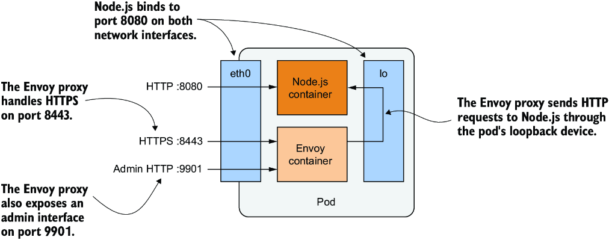

*Hình 5.10: Cái nhìn chi tiết về các container và giao diện mạng của pod*

Rõ ràng là nếu bạn hiện thực hỗ trợ TLS ngay trong ứng dụng Node.js, ứng dụng sẽ tiêu tốn ít tài nguyên tính toán hơn và có độ trễ thấp hơn vì không cần thêm chặng mạng (network hop) nào, nhưng việc thêm Envoy proxy có thể là một giải pháp nhanh hơn và dễ hơn. Nó cũng cung cấp một điểm khởi đầu tốt mà từ đó bạn có thể thêm nhiều tính năng khác do Envoy cung cấp mà có lẽ bạn sẽ không bao giờ tự hiện thực trong code ứng dụng. Hãy tham khảo tài liệu của Envoy proxy tại envoyproxy.io để tìm hiểu thêm. Envoy cũng cung cấp một giao diện quản trị dựa trên web, thứ sẽ tỏ ra hữu ích trong một số bài tập ở chương tiếp theo.

### 5.4.2 Thêm Envoy proxy vào pod (Adding Envoy proxy to the pod)

Trong mục này, bạn sẽ tạo một pod mới với hai container. Bạn đã có container Node.js, nhưng bạn còn cần một container sẽ chạy Envoy.

#### Tạo container image cho Envoy (Creating the Envoy container image)

Các tác giả của proxy này đã xuất bản container image Envoy proxy chính thức trên Docker Hub. Bạn có thể dùng trực tiếp image này, nhưng bạn sẽ cần bằng cách nào đó cung cấp các file cấu hình, chứng chỉ (certificate) và khóa riêng (private key) cho tiến trình Envoy trong container. Bạn sẽ học cách làm điều này trong chương 8. Hiện tại, chúng ta sẽ dùng một image đã chứa sẵn cả ba file.

Tôi đã tạo sẵn image này và cung cấp nó tại `docker.io/luksa/kiada-ssl-proxy:0.1`, nhưng nếu bạn muốn tự build, bạn có thể tìm thấy các file trong thư mục `kiada-ssl-proxy-0.1` trong kho code của sách. Thư mục này chứa `Dockerfile`, cũng như khóa riêng và chứng chỉ mà proxy sẽ dùng để phục vụ HTTPS. Nó cũng chứa file cấu hình `envoy.yaml`. Trong đó, bạn sẽ thấy proxy được cấu hình để lắng nghe trên cổng `8443`, kết thúc (terminate) TLS, và chuyển tiếp request tới cổng `8080` trên `localhost`, là nơi ứng dụng Node.js đang lắng nghe. Proxy cũng được cấu hình để cung cấp một giao diện quản trị trên cổng `9901`, như đã giải thích trước đó.

#### Tạo manifest cho pod (Creating the pod manifest)

Sau khi build image, bạn phải tạo manifest cho pod mới. Listing sau cho thấy nội dung của file manifest pod `pod.kiada-ssl.yaml`.

**Listing 5.3: Manifest của Pod kiada-ssl**

```yaml
apiVersion: v1
kind: Pod
metadata:
  name: kiada-ssl
spec:
  containers:
  - name: kiada                        #1
    image: luksa/kiada:0.2             #1
    ports:                             #1
    - name: http                       #1
      containerPort: 8080              #1
  - name: envoy                        #2
    image: luksa/kiada-ssl-proxy:0.1   #2
    ports:                             #2
    - name: https                      #2
      containerPort: 8443              #2
    - name: admin                      #2
      containerPort: 9901              #2
```

- **#1** Container chạy máy chủ Node.js, lắng nghe trên cổng 8080
- **#2** Container chạy Envoy proxy trên các cổng 8443 (HTTPS) và 9901 (admin)

Tên của pod này là `kiada-ssl`. Nó có hai container: `kiada` và `envoy`. Manifest này chỉ phức tạp hơn một chút so với manifest trong mục 5.2.1. Các trường mới duy nhất là tên của các cổng, được đưa vào để bất kỳ ai đọc manifest cũng có thể hiểu mỗi số cổng đại diện cho cái gì.

#### Tạo pod (Creating the pod)

Tạo pod từ manifest bằng lệnh `kubectl apply -f pod.kiada-ssl.yaml`. Sau đó dùng các lệnh `kubectl get` và `kubectl describe` để xác nhận rằng các container của pod đã được khởi chạy thành công.

### 5.4.3 Tương tác với pod hai container (Interacting with the two-container pod)

Khi pod khởi động, bạn có thể bắt đầu dùng ứng dụng trong pod, kiểm tra log của nó và khám phá các container từ bên trong.

#### Giao tiếp với ứng dụng (Communicating with the application)

Như trước đây, bạn có thể dùng `kubectl port-forward` để cho phép giao tiếp với ứng dụng trong pod. Vì nó công khai ba cổng khác nhau, bạn bật chuyển tiếp tới cả ba cổng như sau:

```bash
$ kubectl port-forward kiada-ssl 8080 8443 9901
Forwarding from 127.0.0.1:8080 -> 8080
Forwarding from [::1]:8080 -> 8080
Forwarding from 127.0.0.1:8443 -> 8443
Forwarding from [::1]:8443 -> 8443
Forwarding from 127.0.0.1:9901 -> 9901
Forwarding from [::1]:9901 -> 9901
```

Trước tiên, hãy xác nhận rằng bạn có thể giao tiếp với ứng dụng qua HTTP bằng cách mở URL http://localhost:8080 trong trình duyệt hoặc dùng `curl`:

```bash
$ curl localhost:8080
Kiada version 0.2. Request processed by "kiada-ssl". Client IP: ::ffff:127.0.0.1
```

Nếu điều này hoạt động, bạn cũng có thể thử truy cập ứng dụng qua HTTPS tại https://localhost:8443. Với `curl`, bạn có thể làm như sau:

```bash
$ curl https://localhost:8443 --insecure
Kiada version 0.2. Request processed by "kiada-ssl". Client IP: ::ffff:127.0.0.1
```

Thành công! Envoy proxy xử lý nhiệm vụ này một cách hoàn hảo. Ứng dụng của bạn giờ đã hỗ trợ HTTPS nhờ một sidecar container.

> **Tại sao dùng tùy chọn --insecure? (Why use the --insecure option?)**
>
> Có hai lý do để dùng tùy chọn `--insecure` khi truy cập service. Chứng chỉ mà Envoy proxy dùng là chứng chỉ tự ký (self-signed) và được cấp cho tên miền `example.com`. Bạn đang truy cập service qua `localhost`, nơi tiến trình proxy kubectl cục bộ đang lắng nghe. Do đó, hostname không khớp với tên trong chứng chỉ của máy chủ.
>
> Để làm cho các tên khớp nhau, bạn có thể bảo `curl` gửi request tới example.com, nhưng phân giải nó thành 127.0.0.1 bằng cờ `--resolve`. Điều này sẽ đảm bảo chứng chỉ khớp với URL được yêu cầu, nhưng vì chứng chỉ của máy chủ là tự ký, `curl` vẫn sẽ không chấp nhận nó là hợp lệ. Bạn có thể khắc phục vấn đề bằng cách cho `curl` biết chứng chỉ cần dùng để xác minh máy chủ bằng cờ `--cacert`. Toàn bộ lệnh khi đó trông như sau:
>
> ```bash
> $ curl https://example.com:8443 --resolve example.com:8443:127.0.0.1 --cacert kiada-ssl-proxy-0.1/example-com.crt
> ```
>
> Phải gõ khá nhiều. Đó là lý do tôi thích dùng tùy chọn `--insecure` hoặc biến thể ngắn hơn `-k`.

#### Hiển thị log của pod có nhiều container (Displaying logs of pods with multiple containers)

Pod `kiada-ssl` chứa hai container, nên nếu bạn muốn hiển thị log, bạn phải chỉ định tên container bằng tùy chọn `--container` hoặc `-c`. Ví dụ, để xem log của container `kiada`, hãy chạy lệnh sau:

```bash
$ kubectl logs kiada-ssl -c kiada
```

Envoy proxy chạy trong container có tên `envoy`, nên bạn hiển thị log của nó như sau:

```bash
$ kubectl logs kiada-ssl -c envoy
```

Ngoài ra, bạn có thể hiển thị log của cả hai container bằng tùy chọn `--all-containers`:

```bash
$ kubectl logs kiada-ssl --all-containers
```

Bạn cũng có thể kết hợp các lệnh này với các tùy chọn khác đã được giải thích trong mục 5.3.2.

#### Chạy lệnh trong các container của pod nhiều container (Running commands in containers of multi-container pods)

Nếu bạn muốn chạy một shell hoặc một lệnh khác trong một trong các container của pod bằng lệnh `kubectl exec`, bạn cũng chỉ định tên container bằng tùy chọn `--container` hoặc `-c`. Ví dụ, để chạy một shell bên trong container `envoy`, hãy chạy lệnh sau:

```bash
$ kubectl exec -it kiada-ssl -c envoy -- bash
```

> **GHI CHÚ:** Nếu bạn không cung cấp tên, `kubectl exec` mặc định dùng container đầu tiên được chỉ định trong manifest pod.

---

## 5.5 Chạy các container bổ sung khi pod khởi động (Running additional containers at pod startup)

Khi một pod chứa nhiều hơn một container, tất cả các container đều được khởi động song song. Kubernetes không cung cấp cơ chế để chỉ định một container phụ thuộc vào một container khác, thứ cho phép bạn đảm bảo rằng container này được khởi động trước container kia. Tuy nhiên, Kubernetes cho phép bạn chạy một chuỗi các container để khởi tạo pod trước khi các container chính của nó khởi động. Kiểu container đặc biệt này được giải thích trong mục này.

### 5.5.1 Giới thiệu init container (Introducing init containers)

Một manifest pod có thể chỉ định danh sách các container sẽ chạy khi pod khởi động và trước khi các container thông thường của pod được khởi động. Các container này nhằm mục đích khởi tạo pod và được gọi một cách thích hợp là init container. Như hình 5.11 cho thấy, chúng chạy lần lượt từng cái một và tất cả phải hoàn thành thành công trước khi các container chính của pod được khởi động.

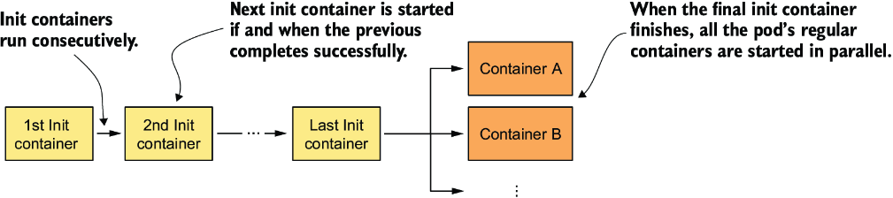

*Hình 5.11: Trình tự thời gian cho thấy cách các init container và container thông thường của pod được khởi động*

Init container giống như các container thông thường của pod, nhưng chúng không chạy song song – chỉ một init container chạy tại một thời điểm.

#### Tìm hiểu init container có thể làm gì (Understanding what init containers can do)

Init container thường được thêm vào pod để

* **Khởi tạo file trong các volume được dùng bởi các container chính của pod** – Điều này bao gồm việc lấy các chứng chỉ và khóa riêng mà container chính dùng từ các kho chứng chỉ bảo mật, sinh file cấu hình, tải dữ liệu, v.v.
* **Khởi tạo hệ thống mạng của pod** – Vì tất cả các container của pod dùng chung các network namespace, và do đó dùng chung các giao diện mạng và cấu hình mạng, nên bất kỳ thay đổi nào mà một init container thực hiện trên đó cũng ảnh hưởng đến container chính.
* **Trì hoãn việc khởi động các container chính của pod cho đến khi một điều kiện tiên quyết được thỏa mãn** – Ví dụ, nếu container chính phụ thuộc vào một service khác phải sẵn sàng trước khi container được khởi động, một init container có thể chặn (block) cho đến khi service này sẵn sàng.
* **Thông báo cho một service bên ngoài rằng pod sắp bắt đầu chạy** – Trong những trường hợp đặc biệt khi một hệ thống bên ngoài phải được thông báo khi một instance mới của ứng dụng được khởi động, một init container có thể được dùng để gửi thông báo này.

Bạn có thể thực hiện các thao tác này ngay trong container chính, nhưng dùng init container đôi khi là lựa chọn tốt hơn và có thể có những lợi thế khác. Hãy xem tại sao.

#### Tìm hiểu khi nào việc chuyển code khởi tạo sang init container là hợp lý (Understanding when moving initialization code to init containers makes sense)

Dùng init container để thực hiện các tác vụ khởi tạo không đòi hỏi phải build lại image của container chính và cho phép một image init container duy nhất được tái sử dụng với nhiều ứng dụng khác nhau. Điều này đặc biệt hữu ích nếu bạn muốn tiêm (inject) cùng một đoạn code khởi tạo đặc thù cho hạ tầng vào tất cả các pod của bạn. Dùng init container cũng đảm bảo rằng việc khởi tạo này hoàn tất trước khi bất kỳ container chính nào (có thể có nhiều) khởi động.

Một lý do quan trọng khác là bảo mật. Bằng cách chuyển các công cụ hoặc dữ liệu mà kẻ tấn công có thể dùng để xâm phạm cluster của bạn từ container chính sang một init container, bạn giảm bề mặt tấn công của pod.

Ví dụ, hãy tưởng tượng pod phải được đăng ký với một hệ thống bên ngoài. Pod cần một loại token bí mật nào đó để xác thực với hệ thống này. Nếu thủ tục đăng ký được thực hiện bởi container chính, token bí mật này phải có mặt trong hệ thống file của nó. Nếu ứng dụng chạy trong container chính có một lỗ hổng cho phép kẻ tấn công đọc các file tùy ý trên hệ thống file, kẻ tấn công có thể lấy được token này. Bằng cách thực hiện việc đăng ký từ một init container, token chỉ cần có mặt trong hệ thống file của init container, thứ mà kẻ tấn công không thể dễ dàng xâm phạm.

### 5.5.2 Thêm init container vào pod (Adding init containers to a pod)

Trong manifest pod, các init container được định nghĩa trong trường `initContainers` của phần `spec`, giống như các container thông thường được định nghĩa trong trường `containers` của nó.

#### Định nghĩa init container trong manifest pod (Defining init containers in a pod manifest)

Hãy xem một ví dụ về việc thêm hai init container vào Pod `kiada`. Init container thứ nhất mô phỏng một thủ tục khởi tạo. Nó chạy trong 5 giây, đồng thời in vài dòng văn bản ra đầu ra chuẩn.

Init container thứ hai thực hiện kiểm tra kết nối mạng bằng cách dùng lệnh `ping` để kiểm tra xem một địa chỉ IP cụ thể có thể tiếp cận được từ bên trong pod hay không. Địa chỉ IP có thể cấu hình được thông qua một đối số dòng lệnh, mặc định là 1.1.1.1.

> **GHI CHÚ:** Một init container kiểm tra xem các địa chỉ IP cụ thể có tiếp cận được hay không có thể được dùng để chặn một ứng dụng khởi động cho đến khi các service mà nó phụ thuộc trở nên sẵn sàng.

Bạn sẽ tìm thấy các `Dockerfile` và các thành phần khác cho cả hai image trong kho code của sách, nếu bạn muốn tự build chúng. Ngoài ra, bạn có thể dùng các image mà tôi đã build.

File manifest pod chứa hai init container này là `pod.kiada-init.yaml`. Nội dung của nó được hiển thị trong listing sau.

**Listing 5.4: Định nghĩa init container trong manifest pod**

```yaml
apiVersion: v1
kind: Pod
metadata:
  name: kiada-init
spec:
  initContainers:                                   #1
  - name: init-demo                                 #2
    image: luksa/init-demo:0.1                      #2
  - name: network-check                             #3
    image: luksa/network-connectivity-checker:0.1   #3
  containers:                                       #4
  - name: kiada                                     #4
    image: luksa/kiada:0.2                          #4
    stdin: true                                     #4
    ports:                                          #4
    - name: http                                    #4
      containerPort: 8080                           #4
  - name: envoy                                     #4
    image: luksa/kiada-ssl-proxy:0.1                #4
    ports:                                          #4
    - name: https                                   #4
      containerPort: 8443                           #4
    - name: admin                                   #4
      containerPort: 9901                           #4
```

- **#1** Các init container được chỉ định trong trường initContainers.
- **#2** Container này chạy trước.
- **#3** Container này chạy sau khi container thứ nhất hoàn thành.
- **#4** Đây là các container thông thường của pod. Chúng chạy đồng thời.

Như bạn có thể thấy, định nghĩa của một init container gần như đơn giản đến mức tầm thường. Chỉ cần chỉ định tên và image cho mỗi container là đủ.

> **GHI CHÚ:** Tên container phải là duy nhất trong tập hợp gộp của tất cả các init container và container thông thường.

#### Triển khai một pod có init container (Deploying a pod with init containers)

Trước khi tạo pod từ file manifest, hãy chạy lệnh sau trong một terminal riêng để bạn có thể thấy trạng thái của pod thay đổi ra sao khi các init container và container thông thường khởi động:

```bash
$ kubectl get pods -w
```

Bạn cũng sẽ muốn theo dõi các event trong một terminal khác bằng lệnh sau:

```bash
$ kubectl get events -w
```

Khi đã sẵn sàng, hãy tạo pod bằng cách chạy lệnh `apply`:

```bash
$ kubectl apply -f pod.kiada-init.yaml
```

#### Kiểm tra quá trình khởi động của một pod có init container (Inspecting the startup of a pod with init containers)

Khi pod khởi động, hãy kiểm tra các event được hiển thị bởi lệnh `kubectl get events -w`:

```bash
TYPE     REASON      MESSAGE
Normal   Scheduled   Successfully assigned pod to worker2
Normal   Pulling     Pulling image "luksa/init-demo:0.1"        #1
Normal   Pulled      Successfully pulled image                  #1
Normal   Created     Created container init-demo                #1
Normal   Started     Started container init-demo                #1
Normal   Pulling     Pulling image "luksa/network-connectivity-checker:0.1"   #2
Normal   Pulled      Successfully pulled image                  #2
Normal   Created     Created container network-check            #2
Normal   Started     Started container network-check            #2
Normal   Pulled      Container image "luksa/kiada:0.1"          #3
                     already present on machine                 #3
Normal   Created     Created container kiada                    #3
Normal   Started     Started container kiada                    #3
Normal   Pulled      Container image "luksa/kiada-ssl-          #3
                     proxy:0.1" already present on machine      #3
Normal   Created     Created container envoy                    #3
Normal   Started     Started container envoy                    #3
```

- **#1** Image của init container thứ nhất được kéo về, và container được khởi động.
- **#2** Sau khi init container thứ nhất hoàn thành, container thứ hai được khởi động.
- **#3** Hai container chính của pod sau đó được khởi động song song.

Listing trên cho thấy thứ tự các container được khởi động. Container `init-demo` được khởi động trước. Khi nó hoàn thành, container `network-check` được khởi động, và khi container này hoàn thành, hai container chính, `kiada` và `envoy`, được khởi động.

Giờ hãy kiểm tra các chuyển đổi trạng thái của pod trong terminal còn lại. Chúng sẽ trông như thế này:

```bash
NAME         READY   STATUS            RESTARTS   AGE
kiada-init   0/2     Pending           0          0s
kiada-init   0/2     Pending           0          0s
kiada-init   0/2     Init:0/2          0          0s    #1
kiada-init   0/2     Init:0/2          0          1s    #1
kiada-init   0/2     Init:1/2          0          6s    #2
kiada-init   0/2     PodInitializing   0          7s    #3
kiada-init   2/2     Running           0          8s    #4
```

- **#1** Init container thứ nhất đang chạy.
- **#2** Init container thứ nhất đã hoàn thành; container thứ hai giờ đang chạy.
- **#3** Tất cả các init container đã hoàn thành thành công.
- **#4** Các container chính của pod đang chạy.

Như vậy, khi các init container chạy, trạng thái của pod hiển thị số init container đã hoàn thành và tổng số init container. Khi tất cả các init container đã xong, trạng thái của pod được hiển thị là `PodInitializing`. Tại thời điểm này, image của các container chính được kéo về. Khi các container khởi động, trạng thái chuyển thành `Running`.

### 5.5.3 Kiểm tra init container (Inspecting init containers)

Giống như với các container thông thường, bạn có thể chạy các lệnh bổ sung trong một init container đang chạy bằng `kubectl exec` và hiển thị log bằng `kubectl logs`.

#### Hiển thị log của một init container (Displaying the logs of an init container)

Đầu ra chuẩn và đầu ra lỗi, nơi mỗi init container có thể ghi vào, được thu thập chính xác như đối với các container thông thường. Log của một init container có thể được hiển thị bằng lệnh `kubectl logs` bằng cách chỉ định tên container với tùy chọn `-c`, hoặc trong khi container đang chạy hoặc sau khi nó đã hoàn thành. Để hiển thị log của container `network-check` trong pod `kiada-init`, hãy chạy lệnh tiếp theo:

```bash
$ kubectl logs kiada-init -c network-check
Checking network connectivity to 1.1.1.1 ...
Host appears to be reachable
```

Log cho thấy init container `network-check` đã chạy mà không có lỗi. Trong chương tiếp theo, bạn sẽ thấy điều gì xảy ra khi một init container thất bại.

#### Vào một init container đang chạy (Entering a running init container)

Bạn có thể dùng lệnh `kubectl exec` để chạy một shell hoặc một lệnh khác bên trong init container giống như cách bạn làm với các container thông thường, nhưng bạn chỉ có thể làm điều này trước khi init container kết thúc.

Nếu bạn muốn tự mình thử, hãy tạo một pod từ file `pod.kiada-init-slow.yaml`, file này khiến container `init-demo` chạy trong 60 giây. Khi pod khởi động, hãy chạy một shell trong container bằng lệnh sau:

```bash
$ kubectl exec -it kiada-init-slow -c init-demo -- sh
```

Bạn có thể dùng shell để khám phá container từ bên trong, nhưng chỉ trong một thời gian ngắn. Khi tiến trình chính của container thoát sau 60 giây, tiến trình shell cũng bị kết thúc.

Bạn thường chỉ vào một init container đang chạy khi nó không hoàn thành đúng hạn, và bạn muốn tìm nguyên nhân. Trong hoạt động bình thường, init container kết thúc trước khi bạn kịp chạy lệnh `kubectl exec`.

### 5.5.4 Native sidecar container của Kubernetes (Kubernetes native sidecar containers)

Trước đó bạn đã biết rằng có thể chạy các container bổ sung khi bạn muốn tăng cường hoạt động của container chính. Và bạn có thể dùng init container để khởi tạo pod trước khi các container chính và sidecar chạy. Nhưng nếu dịch vụ do một sidecar container cung cấp cũng được các init container cần đến thì sao? Và nếu bạn muốn đảm bảo rằng sidecar container khởi động trước các container chính và chỉ dừng lại sau khi các container chính đã dừng hoàn toàn thì sao?

Ví dụ, hãy tưởng tượng bạn muốn tất cả lưu lượng đi ra từ một pod đều đi qua một network proxy chạy trong một sidecar container. Như bạn vừa học, các init container chạy trước khi bất kỳ container thông thường nào được khởi động. Ngoài ra, các init container chạy lần lượt từng cái một. Vậy làm sao một sidecar container có thể cung cấp dịch vụ của nó cho một init container nếu nó thậm chí còn chưa được khởi động?

#### Giới thiệu native sidecar container (Introducing native sidecar containers)

Kể từ phiên bản 1.28, Kubernetes đã hỗ trợ sidecar một cách tự nhiên (native). Nếu bạn đặt `restartPolicy` của một init container thành `Always`, điều này đánh dấu container đó là một native sidecar container. Những container như vậy không thực sự là init container, nhưng chúng khởi động trong giai đoạn init của pod, và đó là lý do chúng được định nghĩa trong danh sách `initContainers`. Một native sidecar container khởi động giống như các init container khác khi đến lượt nó, nhưng sau đó Kubernetes không chờ nó kết thúc. Thay vào đó, nó chạy các init container còn lại rồi khởi động các container thông thường của pod. Sidecar container tiếp tục chạy trong suốt vòng đời của pod. Điều này cho phép sidecar container cung cấp dịch vụ không chỉ cho các container thông thường, mà còn cho tất cả các init container đứng sau sidecar.

Theo restart policy, Kubernetes sẽ khởi động lại sidecar container bất cứ khi nào nó kết thúc. Đây thường chính xác là điều bạn muốn ở một sidecar, vì nó được kỳ vọng sẽ cung cấp dịch vụ của mình trong toàn bộ thời gian pod đang chạy.

Việc đánh dấu một init container là sidecar cũng ảnh hưởng đến trình tự tắt (shutdown) của pod. Với các container thông thường, Kubernetes phát tín hiệu cho tất cả các container kết thúc cùng một lúc, nghĩa là sidecar container của bạn có thể kết thúc trước các container khác. Nhưng native sidecar được đối xử khác. Kubernetes sẽ phát tín hiệu cho các container thông thường kết thúc trước khi đến lúc chúng phải kết thúc, và chỉ sau đó mới phát tín hiệu cho các native sidecar kết thúc. Quy trình này đảm bảo các native sidecar không bị dừng khi chúng vẫn còn cần thiết.

Ví dụ, nếu sidecar cung cấp kết nối mạng, thì rõ ràng nó không nên dừng cho đến khi tất cả các container khác đã dừng. Một ví dụ khác là một sidecar xử lý log phải xử lý log của các container khác từ đầu đến cuối. Nếu sidecar này bị kết thúc trước các container khác, nó sẽ không thu thập được toàn bộ log của chúng.

> **GHI CHÚ:** Kubernetes kết thúc các native sidecar theo thứ tự ngược lại với thứ tự xuất hiện của chúng trong danh sách `initContainers`.

#### Định nghĩa native sidecar trong manifest pod (Defining a native sidecar in the pod manifest)

Hãy chạy một ví dụ nhanh về một pod có native sidecar container đúng nghĩa. Sidecar container sẽ ghi log lưu lượng vào và ra của pod cứ mỗi 10 giây. Nếu chúng ta chạy container này như một container thông thường, nó sẽ không thu thập được lưu lượng do init container network-checker tạo ra, và nó cũng có thể kết thúc trong khi các container `kiada` hoặc `envoy` vẫn đang xử lý một request.

Listing sau cho thấy cách định nghĩa một native sidecar container. Bạn có thể tìm thấy manifest pod trong file `pod.kiada-native-sidecar.yaml`.

**Listing 5.5: Định nghĩa một native sidecar container**

```yaml
apiVersion: v1
kind: Pod
metadata:
  name: kiada-native-sidecar
spec:
  initContainers:                                   #1
  - name: init-demo
    image: luksa/init-demo:0.1
  - name: traffic-meter                             #2
    image: luksa/network-traffic-meter:0.1          #2
    restartPolicy: Always                           #3
  - name: network-check
    image: luksa/network-connectivity-checker:0.1
  containers:
  - name: kiada
    image: luksa/kiada:0.2
    stdin: true
    ports:
    - name: http
      containerPort: 8080
  - name: envoy
    image: luksa/kiada-ssl-proxy:0.1
    ports:
    - name: https
      containerPort: 8443
    - name: admin
      containerPort: 9901
```

- **#1** Các native sidecar container được chỉ định trong danh sách initContainers.
- **#2** Tên của sidecar là traffic-meter, và nó chạy image network-traffic-meter:0.1.
- **#3** Đặt restartPolicy thành Always khiến đây trở thành một native sidecar container.

Như listing cho thấy, sidecar container `traffic-meter` được định nghĩa như một init container với `restartPolicy` được đặt thành `Always`. Việc sidecar cần được định nghĩa như init container có phần kỳ lạ, nhưng các nhà phát triển Kubernetes đã buộc phải chọn cách tiếp cận vụng về này để tránh phải sửa đổi API hiện có.

Nếu bạn chạy pod này bằng cách áp dụng file manifest `pod.kiada-native-sidecar.yaml` với `kubectl apply`, bạn sẽ thấy nó chứa ba container đang chạy:

```bash
$ kubectl get pod kiada-native-sidecar
NAME                   READY   STATUS    RESTARTS   AGE
kiada-native-sidecar   3/3     Running   0          1m
```

Bạn có lẽ đã nhận thấy rằng container `traffic-meter` được định nghĩa trước init container `network-check`. Điều này đảm bảo bộ đo (meter) thu thập được lưu lượng của bộ kiểm tra mạng, như bạn có thể thấy bằng cách kiểm tra log của container `traffic-meter` như sau:

```bash
$ kubectl logs -f kiada-native-sidecar -c traffic-meter
[traffic-meter] Starting traffic meter...
[traffic-meter] Inbound: 182 bytes, Outbound: 252 bytes (last 10s)    #1
```

- **#1** Lưu lượng này được tạo ra bởi container network-checker.

#### Quyết định chạy sidecar như container thông thường hay như native sidecar container (Deciding whether to run a sidecar as a normal or as a native sidecar container)

Như bạn đã thấy, Pod `kiada-native-sidecar` chạy ba container chạy lâu dài (long-running). Container chính có tên `kiada` chạy ứng dụng Kiada, trong khi hai container còn lại, `envoy` và `traffic-meter`, chạy như các sidecar. Container `envoy` không phải là một native sidecar đúng nghĩa, không giống container `traffic-meter`. Vậy tại sao có sự phân biệt này? Tại sao chúng ta không chạy cả container `envoy` như một native sidecar?

Bạn chắc chắn có thể chạy `envoy` như một native sidecar, nhưng điều đó không thực sự cần thiết, vì nó không cần khởi động trước container `kiada` và cũng có thể kết thúc cùng lúc với `kiada`. Ngược lại, khi một sidecar container là bắt buộc để pod có thể hoạt động được, thì nó nên được định nghĩa như một native sidecar đúng nghĩa. Nếu không phải vậy, thì chạy nó như một container thông thường là ổn.

> **GHI CHÚ:** Trong chương 18, bạn sẽ tìm hiểu về các pod xử lý theo lô (batch-processing). Các pod này không chạy vô thời hạn mà thay vào đó thực hiện một tác vụ rồi hoàn thành. Khi thêm sidecar vào những pod như vậy, bạn phải chạy sidecar như một native sidecar để nó không ngăn pod hoàn thành khi container chính hoàn thành tác vụ của nó.

---

## 5.6 Xóa pod và các object khác (Deleting pods and other objects)

Nếu bạn đã thử các bài tập trong chương này và trong chương 2, hiện có nhiều pod và các object khác đang tồn tại trong cluster của bạn. Để kết thúc chương này, bạn sẽ học nhiều cách khác nhau để xóa chúng. Xóa một pod sẽ kết thúc các container của nó và loại bỏ chúng khỏi node. Xóa một Deployment object dẫn đến việc xóa các pod của nó, trong khi xóa một service kiểu `LoadBalancer` sẽ thu hồi (deprovision) load balancer nếu một load balancer đã được cấp phát.

### 5.6.1 Xóa pod theo tên (Deleting a pod by name)

Cách dễ nhất để xóa một object là xóa nó theo tên.

#### Xóa một pod đơn lẻ (Deleting a single pod)

Dùng lệnh sau để loại bỏ Pod `kiada` khỏi cluster của bạn:

```bash
$ kubectl delete po kiada
pod "kiada" deleted
```

Bằng cách xóa một pod, bạn tuyên bố rằng bạn không còn muốn pod hay các container của nó tồn tại nữa. Kubelet tắt các container của pod, loại bỏ tất cả các tài nguyên liên quan, chẳng hạn như các file log, và thông báo cho API server sau khi quá trình này hoàn tất. Pod object sau đó được loại bỏ.

> **MẸO:** Theo mặc định, lệnh `kubectl delete` chờ cho đến khi object không còn tồn tại. Để bỏ qua việc chờ, hãy chạy lệnh với tùy chọn `--wait=false`.

Trong khi pod đang trong quá trình tắt, trạng thái của nó chuyển thành `Terminating`:

```bash
$ kubectl get po kiada
NAME    READY   STATUS        RESTARTS   AGE
kiada   1/1     Terminating   0          35m
```

Biết chính xác cách các container được tắt là điều quan trọng nếu bạn muốn ứng dụng của mình mang lại trải nghiệm tốt cho các client của nó. Điều này được giải thích trong chương tiếp theo, nơi chúng ta đi sâu hơn vào vòng đời của pod và các container của nó.

> **MẸO:** Lệnh `kubectl delete` Pod chờ cho đến khi pod được xóa hoàn toàn, việc này có thể mất một chút thời gian tùy thuộc vào tốc độ tắt của ứng dụng. Nếu bạn không muốn chờ quá trình hoàn tất, hãy thêm cờ `--wait=false` vào lệnh.

> **GHI CHÚ:** Nếu bạn quen thuộc với Docker, bạn có thể tự hỏi liệu bạn có thể dừng một pod rồi khởi động lại nó sau, như bạn có thể làm với các Docker container hay không. Câu trả lời là không. Với Kubernetes, bạn chỉ có thể loại bỏ hoàn toàn một pod và tạo lại nó sau.

#### Xóa nhiều pod bằng một lệnh duy nhất (Deleting multiple pods with a single command)

Bạn cũng có thể xóa nhiều pod bằng một lệnh duy nhất. Nếu bạn đã chạy các Pod `kiada-init` và `kiada-init-slow`, bạn có thể xóa cả hai bằng cách chỉ định tên của chúng cách nhau bởi dấu cách, như sau:

```bash
$ kubectl delete po kiada-init kiada-init-slow
pod "kiada-init" deleted
pod "kiada-init-slow" deleted
```

### 5.6.2 Xóa các object được định nghĩa trong file manifest (Deleting objects defined in manifest files)

Bất cứ khi nào bạn tạo object từ một file, bạn cũng có thể xóa chúng bằng cách truyền file đó cho lệnh `delete` thay vì chỉ định tên của pod.

#### Xóa object bằng cách chỉ định file manifest (Deleting objects by specifying the manifest file)

Bạn có thể xóa Pod `kiada-ssl`, mà bạn đã tạo từ file `pod.kiada-ssl.yaml`, bằng lệnh sau:

```bash
$ kubectl delete -f pod.kiada-ssl.yaml
pod "kiada-ssl" deleted
```

Trong trường hợp của bạn, file chỉ chứa một pod object duy nhất, nhưng bạn sẽ thường gặp các file chứa nhiều object thuộc các kiểu khác nhau đại diện cho một ứng dụng hoàn chỉnh. Điều này làm cho việc triển khai và gỡ bỏ ứng dụng dễ dàng như việc thực thi lần lượt `kubectl apply -f app.yaml` và `kubectl delete -f app.yaml`.

#### Xóa object từ nhiều file manifest (Deleting objects from multiple manifest files)

Đôi khi, một ứng dụng được định nghĩa trong nhiều file manifest. Bạn có thể chỉ định nhiều file bằng cách ngăn cách chúng bởi dấu phẩy. Ví dụ,

```bash
$ kubectl delete -f pod.kiada.yaml,pod.kiada-ssl.yaml
```

> **GHI CHÚ:** Bạn cũng có thể áp dụng nhiều file cùng lúc bằng cú pháp này (ví dụ: `kubectl apply -f pod.kiada.yaml,pod.kiada-ssl.yaml`).

Tôi thực sự chưa bao giờ dùng cách tiếp cận này trong nhiều năm sử dụng Kubernetes, nhưng tôi thường triển khai tất cả các file manifest từ một thư mục bằng cách chỉ định tên thư mục thay vì tên của từng file riêng lẻ. Ví dụ, bạn có thể triển khai lại tất cả các pod bạn đã tạo trong chương này bằng cách chạy lệnh sau trong thư mục gốc của kho code của sách:

```bash
$ kubectl apply -f Chapter05/
```

Lệnh này áp dụng cho tất cả các file trong thư mục có phần mở rộng file đúng (`.yaml`, `.json` và tương tự). Sau đó bạn có thể xóa các pod bằng cùng phương pháp:

```bash
$ kubectl delete -f Chapter05/
```

> **GHI CHÚ:** Nếu các file manifest của bạn được lưu trong các thư mục con, bạn phải dùng cờ `--recursive` (hoặc `-R`).

### 5.6.3 Xóa tất cả các pod (Deleting all pods)

Giờ bạn đã loại bỏ tất cả các pod ngoại trừ `kiada-stdin` và các pod bạn đã tạo trong chương 3 bằng lệnh `kubectl create deployment`. Tùy thuộc vào cách bạn đã scale Deployment, một số pod trong số này hẳn vẫn đang chạy:

```bash
$ kubectl get pods
NAME                    READY   STATUS    RESTARTS   AGE
kiada-stdin             1/1     Running   0          10m
kiada-9d785b578-58vhc   1/1     Running   0          1d
kiada-9d785b578-jmnj8   1/1     Running   0          1d
```

Thay vì xóa các pod này theo tên, chúng ta có thể xóa tất cả chúng bằng tùy chọn `--all`:

```bash
$ kubectl delete po --all
pod "kiada-stdin" deleted
pod "kiada-9d785b578-58vhc" deleted
pod "kiada-9d785b578-jmnj8" deleted
```

Giờ hãy xác nhận rằng không còn pod nào tồn tại bằng cách thực thi lại lệnh `kubectl get pods`:

```bash
$ kubectl get po
NAME                    READY   STATUS    RESTARTS   AGE
kiada-9d785b578-cc6tk   1/1     Running   0          13s
kiada-9d785b578-h4gml   1/1     Running   0          13s
```

Thật bất ngờ! Hai pod vẫn đang chạy. Nếu bạn nhìn kỹ tên của chúng, bạn sẽ thấy đây không phải là hai pod bạn vừa xóa. Cột `AGE` cũng cho thấy đây là các pod mới. Bạn có thể thử xóa cả chúng, nhưng bạn sẽ thấy rằng dù bạn xóa bao nhiêu lần đi nữa, các pod mới vẫn được tạo ra để thay thế chúng.

Lý do các pod này liên tục xuất hiện là vì Deployment object. Controller chịu trách nhiệm đem lại sức sống cho các Deployment object phải đảm bảo rằng số lượng pod luôn khớp với số replica mong muốn được chỉ định trong object. Khi bạn xóa một pod liên kết với Deployment, controller ngay lập tức tạo một pod thay thế.

Để xóa các pod này, bạn phải hoặc scale Deployment về 0 hoặc xóa hoàn toàn object đó. Điều này cho thấy bạn không còn muốn Deployment này hay các pod của nó tồn tại trong cluster của bạn nữa.

### 5.6.4 Xóa object bằng từ khóa "all" (Deleting objects using the "all" keyword)

Bạn có thể xóa mọi thứ bạn đã tạo cho đến nay – bao gồm Deployment, các pod của nó và service – bằng lệnh sau:

```bash
$ kubectl delete all --all
pod "kiada-9d785b578-cc6tk" deleted
pod "kiada-9d785b578-h4gml" deleted
service "kubernetes" deleted
service "kiada" deleted
deployment.apps "kiada" deleted
replicaset.apps "kiada-9d785b578" deleted
```

Từ `all` đầu tiên trong lệnh cho biết bạn muốn xóa các object thuộc mọi kiểu. Tùy chọn `--all` cho biết bạn muốn xóa tất cả các instance của mỗi kiểu object. Chúng ta đã dùng tùy chọn này trong mục trước khi cố xóa tất cả các pod.

Khi xóa object, kubectl in ra kiểu và tên của mỗi object đã xóa. Trong listing trước, bạn hẳn thấy rằng nó đã xóa các Pod, Deployment và Service, nhưng cũng xóa cả một object gọi là ReplicaSet. Bạn sẽ tìm hiểu thêm về nó trong chương 14.

Bạn sẽ nhận thấy lệnh `delete` cũng xóa cả service `kubernetes` tích hợp sẵn. Đừng lo lắng về điều này, vì service đó được tự động tạo lại sau vài khoảnh khắc.

Một số object nhất định không bị xóa khi dùng phương pháp này, vì từ khóa `all` không bao gồm tất cả các kind object. Đây là một biện pháp phòng ngừa để tránh cho bạn vô tình xóa các object chứa thông tin quan trọng. Kind Event object là một ví dụ về điều này.

> **GHI CHÚ:** Bạn có thể chỉ định nhiều kiểu object trong lệnh `delete`. Ví dụ, bạn có thể dùng `kubectl delete events,all --all` để xóa các event cùng với tất cả các kind object được bao gồm trong `all`.

> **MẸO:** Để xem những object nào sẽ bị xóa và xác nhận việc xóa trước khi nó diễn ra, hãy chạy lệnh `kubectl delete` với cờ `--interactive`.

---

## Tóm tắt

* Pod chạy một hoặc nhiều container như một nhóm được đặt cùng chỗ. Chúng là đơn vị của Deployment và của việc scale theo chiều ngang. Một container điển hình chỉ chạy một tiến trình. Các sidecar container bổ trợ cho container chính trong pod.
* Các container chỉ nên là một phần của cùng một pod nếu chúng bắt buộc phải chạy cùng nhau. Một tiến trình frontend và một tiến trình backend nên chạy trong các pod riêng biệt. Điều này cho phép chúng được scale một cách riêng lẻ.
* Khi một pod khởi động, các init container của nó chạy lần lượt từng cái một. Khi init container cuối cùng hoàn thành, các container chính của pod được khởi động. Bạn có thể dùng init container để cấu hình pod từ bên trong, trì hoãn việc khởi động các container chính của nó cho đến khi một điều kiện tiên quyết được thỏa mãn, hoặc thông báo cho một service bên ngoài rằng pod sắp bắt đầu chạy.
* Công cụ kubectl được dùng để tạo pod, xem log của chúng, sao chép file vào/ra các container của chúng, thực thi lệnh trong các container đó, và cho phép giao tiếp với từng pod riêng lẻ trong quá trình phát triển.
