# Chương 6: Quản lý vòng đời của pod và sức khỏe của container

*(Dịch từ "Chapter 6: Managing the pod life cycle and container health" – Kubernetes in Action, Second Edition, tác giả Marko Lukša, NXB Manning)*

---

## Nội dung chính của chương
* Kiểm tra status của pod
* Giữ cho các container khỏe mạnh bằng liveness probe
* Dùng lifecycle hook để thực hiện các hành động khi container khởi động và tắt
* Vòng đời hoàn chỉnh của pod và các container của nó

Sau khi đọc chương trước, bạn hẳn đã có thể triển khai, kiểm tra và giao tiếp với các pod chứa một hoặc nhiều container. Chương này cung cấp một hiểu biết sâu hơn nhiều về cách pod và các container của nó hoạt động.

> **GHI CHÚ:** Các file mã nguồn cho chương này có tại https://mng.bz/oZjD.

---

## 6.1 Tìm hiểu status của pod (Understanding the pod's status)

Sau khi bạn tạo một Pod object và nó chạy, bạn có thể xem điều gì đang diễn ra với pod bằng cách đọc lại Pod object từ API. Như đã thảo luận trong chương 4, manifest của Pod object, cũng như manifest của hầu hết các kiểu object khác, chứa một phần cung cấp status của object. Phần status của một pod chứa các thông tin sau:

* Địa chỉ IP của pod và của worker node đang lưu trữ nó
* Thời điểm pod được khởi động
* Lớp chất lượng dịch vụ (quality-of-service – QoS) của pod
* Phase (giai đoạn) mà pod đang ở
* Các condition (tình trạng) của pod
* State (trạng thái) của từng container riêng lẻ trong pod

Địa chỉ IP và thời điểm khởi động không cần giải thích thêm, còn lớp QoS thì hiện chưa liên quan. Tuy nhiên, phase và các condition của pod, cũng như state của các container trong pod, đều quan trọng để hiểu vòng đời của pod.

### 6.1.1 Tìm hiểu phase của pod (Understanding the pod phase)

Tại bất kỳ thời điểm nào trong đời, một Kubernetes Pod ở trong một trong năm phase được thể hiện trong hình 6.1.

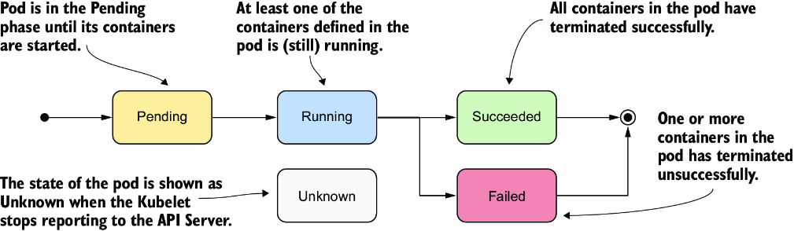

*Hình 6.1: Các phase của một Kubernetes Pod*

Bảng 6.1 giải thích ý nghĩa của từng phase.

**Bảng 6.1: Danh sách các phase mà một pod có thể ở**

| Phase của pod | Mô tả |
|---|---|
| `Pending` | Phase khởi đầu, bắt đầu sau khi Pod object được tạo. Cho đến khi pod được lập lịch (schedule) lên một node, và các image của các container trong pod được kéo (pull) về và khởi động, pod vẫn ở trong phase này. |
| `Running` | Ít nhất một trong các container của pod đang chạy. |
| `Succeeded` | Các pod không được dự định chạy vô thời hạn sẽ được đánh dấu là `Succeeded` khi tất cả các container của chúng hoàn thành thành công. |
| `Failed` | Khi một pod không được cấu hình để chạy vô thời hạn và ít nhất một trong các container của nó kết thúc không thành công, pod được đánh dấu là `Failed`. |
| `Unknown` | Trạng thái của pod không xác định được vì Kubelet đã ngừng báo cáo/giao tiếp với API server. Có thể worker node đã bị lỗi hoặc đã bị ngắt kết nối khỏi mạng. |

Phase của pod cung cấp một bản tóm tắt nhanh về những gì đang xảy ra với pod. Hãy triển khai lại pod `kiada` và kiểm tra phase của nó. Tạo pod bằng cách áp dụng lại file manifest vào cluster của bạn, như trong chương trước (bạn sẽ tìm thấy nó trong `Chapter06/pod.kiada.yaml`):

```bash
$ kubectl apply -f pod.kiada.yaml
```

#### Hiển thị phase của một pod (Displaying a pod's phase)

Phase của pod là một trong các trường trong phần status của Pod object. Bạn có thể xem nó bằng cách hiển thị manifest của pod và tùy chọn grep output để tìm trường này:

```bash
$ kubectl get po kiada -o yaml | grep phase
phase: Running
```

> **MẸO:** Còn nhớ công cụ `jq` chứ? Bạn có thể dùng nó để in ra giá trị của trường phase như sau: `kubectl get po kiada -o json | jq .status.phase`

Bạn cũng có thể xem phase của pod bằng `kubectl describe`. Status của pod được hiển thị gần đầu output:

```bash
$ kubectl describe po kiada
Name:         kiada
Namespace:    default
...
Status:       Running
...
```

Mặc dù có vẻ như cột `STATUS` mà `kubectl get pods` hiển thị cũng cho thấy phase, điều này chỉ đúng với các pod khỏe mạnh:

```bash
$ kubectl get po kiada
NAME    READY   STATUS    RESTARTS   AGE
kiada   1/1     Running   0          40m
```

Với các pod không khỏe mạnh, cột `STATUS` cho biết pod đang gặp vấn đề gì. Chúng ta sẽ thảo luận điều này ở phần sau của chương.

### 6.1.2 Tìm hiểu các condition của pod (Understanding pod conditions)

Phase của pod nói rất ít về tình trạng của pod. Bạn có thể tìm hiểu thêm bằng cách xem danh sách các condition của pod, giống như bạn đã làm với Node object trong chương 4. Các condition của pod cho biết pod đã đạt tới một trạng thái nhất định hay chưa và tại sao.

Trái ngược với phase, một pod có nhiều condition cùng một lúc. Tại thời điểm viết sách có bốn kiểu condition đã biết. Chúng được giải thích trong bảng 6.2.

**Bảng 6.2: Danh sách các condition của pod**

| Condition của pod | Mô tả |
|---|---|
| `PodScheduled` | Cho biết pod đã được lập lịch lên một node hay chưa. |
| `Initialized` | Tất cả các init container của pod đã hoàn thành thành công. |
| `ContainersReady` | Tất cả các container trong pod báo rằng chúng đã sẵn sàng. Đây là điều kiện cần nhưng chưa đủ để toàn bộ pod sẵn sàng. |
| `Ready` | Pod đã sẵn sàng cung cấp dịch vụ cho các client của nó. Các container trong pod và các readiness gate của pod đều báo rằng chúng đã sẵn sàng. Lưu ý: Điều này được giải thích trong chương 11. |

Mỗi condition hoặc được thỏa mãn hoặc không. Như minh họa trong hình 6.2, các condition `PodScheduled` và `Initialized` bắt đầu ở trạng thái chưa thỏa mãn, nhưng chúng sớm được thỏa mãn và giữ nguyên như vậy trong suốt vòng đời của pod. Ngược lại, các condition `Ready` và `ContainersReady` có thể thay đổi nhiều lần trong thời gian tồn tại của pod.

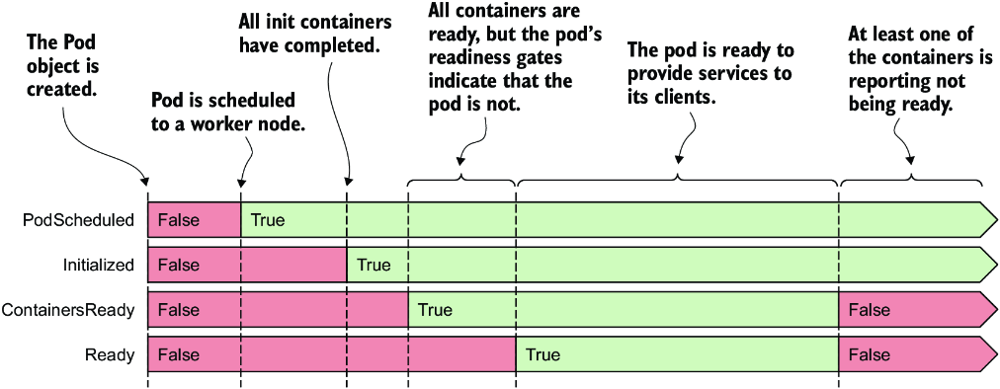

*Hình 6.2: Các bước chuyển của những condition của pod trong vòng đời của nó*

Bạn có nhớ các condition mà bạn có thể tìm thấy trong một Node object không? Đó là `MemoryPressure`, `DiskPressure`, `PIDPressure` và `Ready`. Như bạn thấy, mỗi object có tập kiểu condition riêng của nó, nhưng nhiều object chứa condition `Ready` chung, condition này thường cho biết mọi thứ có ổn với object hay không.

#### Kiểm tra các condition của pod (Inspecting the pod's conditions)

Để xem các condition của một pod, bạn có thể dùng `kubectl describe` như sau:

```bash
$ kubectl describe po kiada
...
Conditions:
  Type              Status
  Initialized       True      #1
  Ready             True      #2
  ContainersReady   True      #2
  PodScheduled      True      #3
...
```

- **#1** Pod đã được khởi tạo (initialized).
- **#2** Pod và các container của nó đã sẵn sàng.
- **#3** Pod đã được lập lịch lên một node.

Lệnh `kubectl describe` chỉ cho biết mỗi condition có đúng (true) hay không. Để tìm hiểu tại sao một condition là false, bạn phải xem trường `status.conditions` trong manifest của pod:

```bash
$ kubectl get po kiada -o json | jq .status.conditions
[
  {
    "lastProbeTime": null,
    "lastTransitionTime": "2020-02-02T11:42:59Z",
    "status": "True",
    "type": "Initialized"
  },
  ...
```

Mỗi condition có một trường `status` cho biết condition đó là `True`, `False` hay `Unknown`. Trong trường hợp pod `kiada`, status của tất cả các condition đều là `True`, nghĩa là tất cả đều được thỏa mãn. Condition cũng có thể chứa một trường `reason` chỉ định lý do hướng tới máy (machine-facing) cho lần thay đổi status gần nhất của condition, và một trường `message` giải thích chi tiết sự thay đổi đó. Trường `lastTransitionTime` cho biết thời điểm thay đổi xảy ra, còn `lastProbeTime` cho biết lần cuối condition này được kiểm tra.

### 6.1.3 Tìm hiểu status của container (Understanding the container status)

Ngoài ra, status của pod còn chứa status của từng container trong pod. Kiểm tra status này cho ta cái nhìn sâu hơn về hoạt động của từng container riêng lẻ.

Status chứa một số trường. Trường `state` cho biết trạng thái hiện tại của container, trong khi trường `lastState` cho biết trạng thái của container trước đó sau khi nó đã kết thúc. Status của container cũng cho biết ID nội bộ của container (`containerID`), `image` và `imageID` mà container đang chạy, container đã `ready` hay chưa, và nó đã được khởi động lại bao nhiêu lần (`restartCount`).

#### Tìm hiểu state của container (Understanding the container state)

Phần quan trọng nhất trong status của một container là `state` của nó. Một container có thể ở một trong các trạng thái được thể hiện trong hình 6.3.

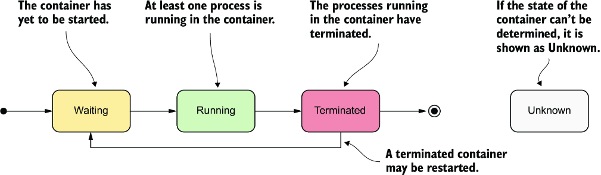

*Hình 6.3: Các trạng thái có thể có của một container*

Từng trạng thái được giải thích trong bảng 6.3.

**Bảng 6.3: Các trạng thái có thể có của container**

| Trạng thái container | Mô tả |
|---|---|
| `Waiting` | Container đang chờ được khởi động. Các trường `reason` và `message` cho biết tại sao container ở trạng thái này. |
| `Running` | Container đã được tạo, và các tiến trình đang chạy trong nó. Trường `startedAt` cho biết thời điểm container này được khởi động. |
| `Terminated` | Các tiến trình từng chạy trong container đã kết thúc. Các trường `startedAt` và `finishedAt` cho biết thời điểm container được khởi động và thời điểm nó kết thúc. Exit code mà tiến trình chính kết thúc với nằm trong trường `exitCode`. |
| `Unknown` | Không thể xác định được trạng thái của container. |

#### Hiển thị status của các container trong pod (Displaying the status of the pod's containers)

Danh sách pod được `kubectl get pods` hiển thị chỉ cho thấy số lượng container trong mỗi pod và bao nhiêu trong số đó đã sẵn sàng. Để xem status của từng container riêng lẻ, bạn có thể dùng `kubectl describe`:

```bash
$ kubectl describe po kiada
...
Containers:
  kiada:
    Container ID:   docker://c64944a684d57faacfced0be1af44686...
    Image:          luksa/kiada:0.1
    Image ID:       docker-pullable://luksa/kiada@sha256:3f28...
    Port:           8080/TCP
    Host Port:      0/TCP
    State:          Running                                   #1
      Started:      Sun, 02 Feb 2020 12:43:03 +0100           #1
    Ready:          True                                      #2
    Restart Count:  0                                         #3
    Environment:    <none>
...
```

- **#1** Trạng thái hiện tại của container và thời điểm nó được khởi động
- **#2** Container đã sẵn sàng cung cấp dịch vụ của nó hay chưa
- **#3** Số lần container đã được khởi động lại

Hãy tập trung vào các dòng được chú thích trong listing, vì chúng cho biết container có khỏe mạnh hay không. Container `kiada` đang `Running` và đã `Ready`. Nó chưa bao giờ bị khởi động lại.

> **MẸO:** Bạn cũng có thể hiển thị status của (các) container bằng `jq` như sau: `kubectl get po kiada -o json | jq .status.containerStatuses`.

#### Kiểm tra status của một init container (Inspecting the status of an init container)

Trong chương trước, bạn đã học rằng ngoài các container thông thường, một pod cũng có thể có các init container chạy khi pod khởi động. Cũng như với các container thông thường, status của những container này có trong phần status của manifest Pod object, nhưng nằm trong trường `initContainerStatuses`.

#### Kiểm tra status của pod kiada-init (Inspecting the status of the kiada-init pod)

Như một bài tập bổ sung mà bạn có thể tự thử, hãy tạo pod `kiada-init` từ chương trước và kiểm tra phase, các condition của nó, và status của hai container thông thường cùng hai init container của nó. Dùng lệnh `kubectl describe` và lệnh `kubectl get po kiada-init -o json | jq .status` để tìm thông tin trong định nghĩa object.

---

## 6.2 Giữ cho các container khỏe mạnh (Keeping containers healthy)

Các pod bạn đã tạo trong chương trước chạy mà không gặp vấn đề gì. Nhưng nếu một trong các container chết thì sao? Nếu tất cả các container trong một pod đều chết thì sao? Làm thế nào để giữ cho các pod khỏe mạnh và các container của chúng tiếp tục chạy? Đó là trọng tâm của mục này.

### 6.2.1 Tìm hiểu cơ chế tự động khởi động lại container (Understanding container auto-restart)

Khi một pod được lập lịch lên một node, Kubelet trên node đó khởi động các container của pod và từ đó trở đi giữ cho chúng chạy chừng nào Pod object còn tồn tại. Nếu tiến trình chính trong container kết thúc vì bất kỳ lý do gì, Kubelet sẽ khởi động lại container. Nếu một lỗi trong ứng dụng của bạn khiến nó bị crash, Kubernetes sẽ tự động khởi động lại nó, vì vậy ngay cả khi không làm gì đặc biệt trong chính ứng dụng, việc chạy nó trong Kubernetes tự động mang lại cho ứng dụng khả năng tự chữa lành.

#### Quan sát một container bị lỗi (Observing a container failure)

Trong chương trước, bạn đã tạo pod `kiada-ssl`, pod này chứa container Node.js và container Envoy. Hãy tạo lại pod và bật giao tiếp với pod bằng cách chạy hai lệnh sau:

```bash
$ kubectl apply -f pod.kiada-ssl.yaml
$ kubectl port-forward kiada-ssl 8080 8443 9901
```

Bây giờ bạn sẽ làm cho container Envoy kết thúc để xem Kubernetes xử lý tình huống này như thế nào. Chạy lệnh sau trong một terminal riêng để bạn có thể thấy status của pod thay đổi ra sao khi một trong các container của nó kết thúc:

```bash
$ kubectl get pods -w
```

Bạn cũng sẽ muốn theo dõi các event trong một terminal khác bằng lệnh sau:

```bash
$ kubectl get events -w
```

Bạn có thể giả lập việc tiến trình chính của container bị crash bằng cách gửi cho nó tín hiệu `KILL`, nhưng bạn không thể làm điều này từ bên trong container vì Linux Kernel không cho phép bạn kill tiến trình gốc (tiến trình có PID 1). Bạn sẽ phải SSH vào node host của pod và kill tiến trình từ đó. May mắn thay, giao diện quản trị của Envoy cho phép bạn dừng tiến trình thông qua HTTP API của nó.

Để kết thúc container `envoy`, hãy mở URL http://localhost:9901 trong trình duyệt và nhấn nút `quitquitquit`, hoặc chạy lệnh `curl` sau trong một terminal khác:

```bash
$ curl -X POST http://localhost:9901/quitquitquit
OK
```

Để xem điều gì xảy ra với container và pod chứa nó, hãy xem output của lệnh `kubectl get pods -w` mà bạn đã chạy trước đó. Đây là output của nó:

```bash
$ kubectl get po -w
NAME        READY   STATUS     RESTARTS   AGE
kiada-ssl   2/2     Running    0          1s
kiada-ssl   1/2     NotReady   0          9m33s
kiada-ssl   2/2     Running    1          9m34s
```

`STATUS` của pod thay đổi từ `Running` sang `NotReady`, trong khi cột `READY` cho biết chỉ một trong hai container là sẵn sàng. Ngay sau đó, Kubernetes khởi động lại container, và `STATUS` của pod trở về `Running`. Cột `RESTARTS` cho biết một container đã được khởi động lại.

> **GHI CHÚ:** Nếu một trong các container của pod bị lỗi, các container còn lại vẫn tiếp tục chạy.

Bây giờ hãy xem output của lệnh `kubectl get events -w` mà bạn đã chạy trước đó. Đây là lệnh và output của nó:

```bash
$ kubectl get ev -w
LAST SEEN   TYPE     REASON    OBJECT          MESSAGE
0s          Normal   Pulled    pod/kiada-ssl   Container image already
                                               present on machine
0s          Normal   Created   pod/kiada-ssl   Created container envoy
0s          Normal   Started   pod/kiada-ssl   Started container envoy
```

Các event cho thấy container `envoy` mới đã được khởi động. Bạn hẳn có thể truy cập lại ứng dụng qua HTTPS. Hãy xác nhận bằng trình duyệt hoặc `curl`.

Các event trong listing cũng để lộ một chi tiết quan trọng về cách Kubernetes khởi động lại container. Event thứ hai cho biết toàn bộ container `envoy` đã được tạo lại. Kubernetes không bao giờ khởi động lại một container, mà thay vào đó loại bỏ nó và tạo một container mới. Dù vậy, chúng ta vẫn gọi đây là khởi động lại một container.

> **GHI CHÚ:** Mọi dữ liệu mà tiến trình ghi vào filesystem của container đều bị mất khi container được tạo lại. Hành vi này đôi khi không mong muốn. Để lưu giữ dữ liệu lâu dài, bạn phải thêm một storage volume vào pod, như được giải thích trong chương tiếp theo.

> **GHI CHÚ:** Nếu pod có định nghĩa các init container, và một trong các container thông thường của pod được khởi động lại, các init container sẽ không được thực thi lại.

#### Cấu hình restart policy của pod (Configuring the pod's restart policy)

Theo mặc định, Kubernetes khởi động lại container bất kể tiến trình trong container thoát với exit code bằng không hay khác không, tức là bất kể container hoàn thành thành công hay thất bại. Hành vi này có thể được thay đổi bằng cách đặt trường `restartPolicy` trong spec của pod.

Có ba restart policy. Chúng được trình bày trong hình 6.4.

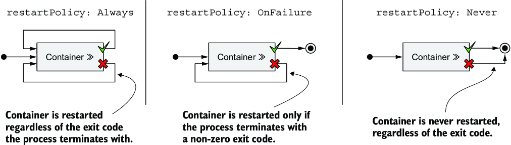

*Hình 6.4: `restartPolicy` của pod quyết định các container của nó có được khởi động lại hay không.*

Bảng 6.4 mô tả ba restart policy.

**Bảng 6.4: Các restart policy của pod**

| Restart policy | Mô tả |
|---|---|
| `Always` | Container được khởi động lại bất kể exit code mà tiến trình trong container kết thúc với. Đây là restart policy mặc định. |
| `OnFailure` | Container chỉ được khởi động lại nếu tiến trình kết thúc với exit code khác không, theo quy ước là biểu thị thất bại. |
| `Never` | Container không bao giờ được khởi động lại, kể cả khi nó thất bại. |

> **GHI CHÚ:** Đáng ngạc nhiên là restart policy được cấu hình ở cấp pod và áp dụng cho tất cả các container của pod. Nó không thể được cấu hình riêng cho từng container.

#### Tìm hiểu độ trễ thời gian được chèn vào trước khi container được khởi động lại (Understanding the time delay inserted before a container is restarted)

Nếu bạn gọi endpoint `/quitquitquit` của Envoy nhiều lần, bạn sẽ nhận thấy rằng mỗi lần, việc khởi động lại container sau khi nó kết thúc lại mất nhiều thời gian hơn. Status của pod được hiển thị là `NotReady` hoặc `CrashLoopBackOff`. Đây là ý nghĩa của nó.

Như minh họa trong hình 6.5, lần đầu tiên một container kết thúc, nó được khởi động lại ngay lập tức. Tuy nhiên, lần tiếp theo, Kubernetes chờ 10 giây trước khi khởi động lại nó. Độ trễ này sau đó được nhân đôi lên 20, 40, 80, rồi 160 giây sau mỗi lần kết thúc tiếp theo. Từ đó trở đi, độ trễ được giữ ở mức 5 phút. Độ trễ này, vốn tăng gấp đôi giữa các lần thử, được gọi là exponential back-off (lùi theo cấp số nhân).

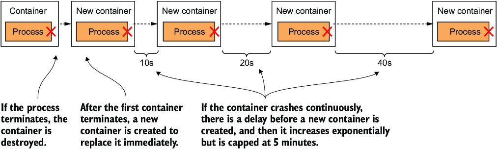

*Hình 6.5: Exponential back-off giữa các lần khởi động lại container*

Trong trường hợp xấu nhất, một container do đó có thể bị ngăn không cho khởi động trong tối đa 5 phút.

> **GHI CHÚ:** Độ trễ được đặt lại về không khi container đã chạy thành công trong 10 phút. Nếu sau đó container phải được khởi động lại, nó sẽ được khởi động lại ngay lập tức.

Kiểm tra status của container trong manifest của pod như sau:

```bash
$ kubectl get po kiada-ssl -o json | jq .status.containerStatuses
...
"state": {
  "waiting": {
    "message": "back-off 40s restarting failed container=envoy ...",
    "reason": "CrashLoopBackOff"
```

Như bạn thấy trong output, trong khi container đang chờ được khởi động lại, state của nó là `Waiting`, và `reason` là `CrashLoopBackOff`. Trường `message` cho bạn biết còn bao lâu nữa container sẽ được khởi động lại.

> **GHI CHÚ:** Khi bạn bảo Envoy kết thúc, nó kết thúc với exit code không, nghĩa là nó không bị crash. Do đó status `CrashLoopBackOff` có thể gây hiểu nhầm.

### 6.2.2 Kiểm tra sức khỏe của container bằng liveness probe (Checking the container's health using liveness probes)

Trong mục trước, bạn đã học rằng Kubernetes giữ cho ứng dụng của bạn khỏe mạnh bằng cách khởi động lại nó khi tiến trình của nó kết thúc. Nhưng các ứng dụng cũng có thể trở nên không phản hồi mà không kết thúc. Ví dụ, một ứng dụng Java bị rò rỉ bộ nhớ (memory leak) cuối cùng sẽ bắt đầu tuôn ra các `OutOfMemoryError`, nhưng tiến trình JVM của nó vẫn tiếp tục chạy. Lý tưởng nhất, Kubernetes nên phát hiện loại lỗi này và khởi động lại container.

Ứng dụng có thể tự bắt những lỗi này và kết thúc ngay lập tức, nhưng còn những tình huống ứng dụng của bạn ngừng phản hồi vì rơi vào vòng lặp vô hạn hoặc deadlock thì sao? Nếu ứng dụng không thể phát hiện điều này thì sao? Để đảm bảo ứng dụng được khởi động lại trong những trường hợp như vậy, có thể cần kiểm tra trạng thái của nó từ bên ngoài.

#### Giới thiệu liveness probe (Introducing liveness probes)

Kubernetes có thể được cấu hình để kiểm tra xem một ứng dụng còn sống hay không bằng cách định nghĩa một liveness probe (đầu dò sự sống). Bạn có thể chỉ định một liveness probe cho từng container trong pod. Kubernetes chạy probe định kỳ để hỏi ứng dụng xem nó còn sống và khỏe mạnh không. Nếu ứng dụng không phản hồi, xảy ra lỗi, hoặc phản hồi là tiêu cực, container bị coi là không khỏe mạnh và bị kết thúc. Container sau đó được khởi động lại nếu restart policy cho phép.

> **GHI CHÚ:** Liveness probe chỉ có thể được dùng trong các container thông thường của pod. Chúng không thể được định nghĩa trong init container.

#### Các kiểu liveness probe (Types of liveness probes)

Kubernetes có thể thăm dò (probe) một container bằng một trong ba cơ chế sau:

* Một *HTTP GET probe* gửi một request `GET` tới địa chỉ IP của container, trên cổng mạng và đường dẫn mà bạn chỉ định. Nếu probe nhận được phản hồi, và mã phản hồi không biểu thị lỗi (tức là nếu mã phản hồi HTTP là `2xx` hoặc `3xx`), probe được coi là thành công. Nếu server trả về mã phản hồi lỗi, hoặc không phản hồi kịp thời, probe được coi là thất bại.
* Một *TCP Socket probe* cố gắng mở một kết nối TCP tới cổng được chỉ định của container. Nếu kết nối được thiết lập thành công, probe được coi là thành công. Nếu không thể thiết lập kết nối kịp thời, probe được coi là thất bại.
* Một *Exec probe* thực thi một lệnh bên trong container và kiểm tra exit code mà lệnh kết thúc với. Nếu exit code bằng không, probe thành công. Exit code khác không được coi là thất bại. Probe cũng được coi là thất bại nếu lệnh không kết thúc kịp thời.

> **GHI CHÚ:** Ngoài liveness probe, một container cũng có thể có startup probe, được thảo luận trong mục 6.2.6, và readiness probe, được giải thích trong chương 11.

### 6.2.3 Tạo một HTTP GET liveness probe (Creating an HTTP GET liveness probe)

Hãy xem cách thêm một liveness probe vào từng container trong pod `kiada-ssl`. Vì cả hai đều chạy các ứng dụng hiểu HTTP, nên dùng HTTP GET probe cho mỗi container là hợp lý. Ứng dụng Node.js không cung cấp endpoint nào để kiểm tra sức khỏe của ứng dụng một cách tường minh, nhưng Envoy proxy thì có. Trong các ứng dụng thực tế, bạn sẽ gặp cả hai trường hợp.

#### Định nghĩa liveness probe trong manifest của pod (Defining liveness probes in the pod manifest)

Listing sau đây cho thấy manifest đã cập nhật của pod, định nghĩa một liveness probe cho mỗi container trong hai container, với các mức độ cấu hình khác nhau (file `pod.kiada-liveness.yaml`).

**Listing 6.1: Thêm liveness probe vào một pod (`pod.kiada-liveness.yaml`)**

```yaml
apiVersion: v1
kind: Pod
metadata:
  name: kiada-liveness
spec:
  containers:
  - name: kiada
    image: luksa/kiada:0.1
    ports:
    - name: http
      containerPort: 8080
    livenessProbe:               #1
      httpGet:                   #1
        path: /                  #1
        port: 8080               #1
  - name: envoy
    image: luksa/kiada-ssl-proxy:0.1
    ports:
    - name: https
      containerPort: 8443
    - name: admin
      containerPort: 9901
    livenessProbe:               #2
      httpGet:                   #2
        path: /ready             #2
        port: admin              #2
      initialDelaySeconds: 10    #2
      periodSeconds: 5           #2
      timeoutSeconds: 2          #2
      failureThreshold: 3        #2
```

- **#1** Định nghĩa liveness probe cho container chạy Node.js
- **#2** Liveness probe cho Envoy proxy

Các liveness probe này được giải thích trong hai mục tiếp theo.

#### Định nghĩa liveness probe với cấu hình tối thiểu cần thiết (Defining a liveness probe using the minimum required configuration)

Liveness probe cho container `kiada` là phiên bản đơn giản nhất của một probe cho các ứng dụng dựa trên HTTP. Probe chỉ đơn giản gửi một request HTTP `GET` tới đường dẫn `/` trên cổng `8080` để xác định xem container còn có thể phục vụ request hay không. Nếu ứng dụng phản hồi với mã trạng thái HTTP từ `200` đến `399`, ứng dụng được coi là khỏe mạnh.

Probe không chỉ định bất kỳ trường nào khác, nên các thiết lập mặc định được sử dụng. Request đầu tiên được gửi 10 giây sau khi container khởi động và được lặp lại mỗi 5 giây. Nếu ứng dụng không phản hồi trong vòng 2 giây, lần thử probe được coi là thất bại. Nếu thất bại ba lần liên tiếp, container bị coi là không khỏe mạnh và bị kết thúc.

#### Tìm hiểu các tùy chọn cấu hình của liveness probe (Understanding liveness probe configuration options)

Giao diện quản trị của Envoy proxy cung cấp endpoint đặc biệt `/ready`, qua đó nó công khai trạng thái sức khỏe của mình. Thay vì nhắm tới cổng `8443`, là cổng mà qua đó Envoy chuyển tiếp các request HTTPS tới Node.js, liveness probe cho container `envoy` nhắm tới endpoint đặc biệt này trên cổng admin, tức là cổng số `9901`.

> **GHI CHÚ:** Như bạn thấy trong liveness probe của container `envoy`, bạn có thể chỉ định cổng đích của probe bằng tên thay vì bằng số.

Liveness probe cho container `envoy` cũng chứa các trường bổ sung. Chúng được giải thích trong hình 6.6.

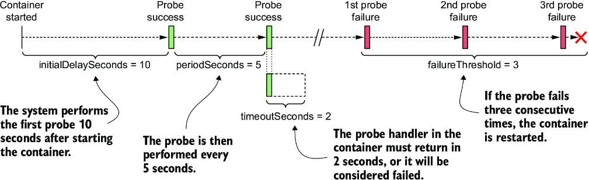

*Hình 6.6: Cấu hình và hoạt động của một liveness probe*

Tham số `initialDelaySeconds` xác định Kubernetes nên trì hoãn việc thực thi probe đầu tiên bao lâu sau khi khởi động container. Trường `periodSeconds` chỉ định khoảng thời gian giữa hai lần thực thi probe liên tiếp, trong khi trường `timeoutSeconds` chỉ định thời gian chờ phản hồi trước khi lần thử probe bị tính là thất bại. Trường `failureThreshold` chỉ định probe phải thất bại bao nhiêu lần thì container mới bị coi là không khỏe mạnh và có thể bị khởi động lại.

### 6.2.4 Quan sát liveness probe hoạt động (Observing the liveness probe in action)

Để thấy Kubernetes khởi động lại một container khi liveness probe của nó thất bại, hãy tạo pod từ file manifest `pod.kiada-liveness.yaml` bằng `kubectl apply`, và chạy `kubectl port-forward` để bật giao tiếp với pod. Bạn sẽ cần dừng lệnh `kubectl port-forward` vẫn đang chạy từ bài tập trước. Hãy xác nhận rằng pod đang chạy và đang phản hồi các request HTTP.

#### Quan sát một liveness probe thành công (Observing a successful liveness probe)

Các liveness probe cho các container của pod bắt đầu hoạt động ngay sau khi từng container riêng lẻ khởi động. Vì các tiến trình trong cả hai container đều khỏe mạnh, các probe liên tục báo cáo thành công. Vì đây là trạng thái bình thường, việc các probe thành công không được chỉ ra một cách tường minh ở bất cứ đâu trong status của pod hay trong các event của nó.

Dấu hiệu duy nhất cho thấy Kubernetes đang thực thi probe nằm trong log của container. Ứng dụng Node.js trong container `kiada` in một dòng ra standard output mỗi khi nó xử lý một request HTTP. Điều này bao gồm cả các request của liveness probe, nên bạn có thể hiển thị chúng bằng lệnh sau:

```bash
$ kubectl logs kiada-liveness -c kiada -f
```

Liveness probe cho container `envoy` được cấu hình để gửi các request HTTP tới giao diện quản trị của Envoy, giao diện này không ghi log các request HTTP ra standard output, mà ghi vào file `/tmp/envoy.admin.log` trong filesystem của container. Để hiển thị file log này, bạn dùng lệnh sau:

```bash
$ kubectl exec kiada-liveness -c envoy -- tail -f /tmp/envoy.admin.log
```

#### Quan sát liveness probe thất bại (Observing the liveness probe fail)

Một liveness probe thành công thì chẳng có gì thú vị, nên hãy làm cho liveness probe của Envoy thất bại. Để xem điều gì sẽ xảy ra ở hậu trường, hãy bắt đầu theo dõi các event bằng cách thực thi lệnh sau trong một terminal riêng:

```bash
$ kubectl get events -w
```

Bằng giao diện quản trị của Envoy, bạn có thể cấu hình endpoint kiểm tra sức khỏe của nó để thành công hoặc thất bại. Để làm nó thất bại, hãy mở URL http://localhost:9901 trong trình duyệt và nhấn nút `healthcheck/fail`, hoặc dùng lệnh `curl` sau:

```bash
$ curl -X POST localhost:9901/healthcheck/fail
```

Ngay sau khi thực thi lệnh, hãy quan sát các event được hiển thị trong terminal kia. Khi probe thất bại, một event `Warning` được ghi lại, cho biết lỗi và mã trạng thái HTTP được trả về:

```bash
Warning   Unhealthy   Liveness probe failed: HTTP probe failed with code 503
```

Vì `failureThreshold` của probe được đặt là ba, một lần thất bại đơn lẻ không đủ để coi container là không khỏe mạnh, nên nó tiếp tục chạy. Bạn có thể làm cho liveness probe thành công trở lại bằng cách nhấn nút `healthcheck/ok` trong giao diện admin của Envoy, hoặc bằng `curl` như sau:

```bash
$ curl -X POST localhost:9901/healthcheck/ok
```

Nếu bạn đủ nhanh, container sẽ không bị khởi động lại.

#### Quan sát liveness probe chạm ngưỡng thất bại (Observing the liveness probe reach the failure threshold)

Nếu bạn để liveness probe thất bại nhiều lần, lệnh `kubectl get events -w` sẽ in ra các event sau (lưu ý rằng một số cột bị lược bỏ do giới hạn chiều rộng trang):

```bash
$ kubectl get events -w
TYPE      REASON      MESSAGE
Warning   Unhealthy   Liveness probe failed: HTTP probe failed with code 503     #1
Warning   Unhealthy   Liveness probe failed: HTTP probe failed with code 503     #1
Warning   Unhealthy   Liveness probe failed: HTTP probe failed with code 503     #1
Normal    Killing     Container envoy failed liveness probe, will be restarted   #2
Normal    Pulled      Container image already present on machine
Normal    Created     Created container envoy
Normal    Started     Started container envoy
```

- **#1** Liveness probe thất bại ba lần.
- **#2** Khi chạm ngưỡng thất bại, container được khởi động lại.

Hãy nhớ rằng ngưỡng thất bại của probe được đặt là ba, nên khi probe thất bại ba lần liên tiếp, container bị dừng và khởi động lại. Điều này được chỉ ra bởi các event trong listing.

Lệnh `kubectl get pods` cho thấy container đã được khởi động lại:

```bash
$ kubectl get po kiada-liveness
NAME             READY   STATUS    RESTARTS   AGE
kiada-liveness   2/2     Running   1          5m
```

Cột `RESTARTS` cho thấy một lần khởi động lại container đã diễn ra trong pod.

#### Tìm hiểu cách một container thất bại liveness probe được khởi động lại (Understanding how a container that fails its liveness probe is restarted)

Nếu bạn thắc mắc liệu tiến trình chính trong container đã được dừng một cách êm thấm (graceful) hay bị kill cưỡng bức, bạn có thể kiểm tra status của pod bằng cách truy xuất manifest đầy đủ bằng `kubectl get` hoặc dùng `kubectl describe`:

```bash
$ kubectl describe po kiada-liveness
Name:         kiada-liveness
...
Containers:
  ...
  envoy:
    ...
    State:          Running                              #1
      Started:      Sun, 31 May 2020 21:33:13 +0200      #1
    Last State:     Terminated                           #2
      Reason:       Completed                            #2
      Exit Code:    0                                    #2
      Started:      Sun, 31 May 2020 21:16:43 +0200      #2
      Finished:     Sun, 31 May 2020 21:33:13 +0200      #2
    ...                                                  #2
```

- **#1** Đây là state của container mới.
- **#2** Container trước đó đã kết thúc với exit code 0.

Exit code không được hiển thị trong listing ngụ ý rằng tiến trình ứng dụng đã tự thoát một cách êm thấm. Nếu nó bị kill, exit code sẽ là 137.

> **GHI CHÚ:** Exit code `128+n` cho biết tiến trình đã thoát do tín hiệu bên ngoài `n`. Exit code `137` là `128+9`, trong đó `9` đại diện cho tín hiệu `KILL`. Bạn sẽ thấy exit code này bất cứ khi nào container bị kill. Exit code `143` là `128+15`, trong đó `15` là tín hiệu `SIGTERM`. Bạn thường thấy exit code này khi container chạy một shell đã kết thúc một cách êm thấm.

Hãy xem log của Envoy để xác nhận rằng nó đã bắt được tín hiệu `SIGTERM` và đã tự kết thúc. Bạn phải dùng lệnh `kubectl logs` với tùy chọn `--container` hoặc dạng ngắn hơn `-c` để chỉ định container mà bạn quan tâm.

Ngoài ra, vì container đã được thay thế bằng một container mới do việc khởi động lại, bạn phải yêu cầu log của container trước đó bằng cờ `--previous` hoặc `-p`. Đây là lệnh cần dùng và bốn dòng cuối trong output của nó:

```bash
$ kubectl logs kiada-liveness -c envoy -p
...
...[warning][main] [source/server/server.cc:493] caught SIGTERM
...[info][main] [source/server/server.cc:613] shutting down server instance
...[info][main] [source/server/server.cc:560] main dispatch loop exited
...[info][main] [source/server/server.cc:606] exiting
```

Log xác nhận rằng Kubernetes đã gửi tín hiệu `SIGTERM` tới tiến trình, cho phép nó tắt một cách êm thấm. Nếu nó không tự kết thúc, Kubernetes sẽ kill nó một cách cưỡng bức.

Sau khi container được khởi động lại, endpoint kiểm tra sức khỏe của nó lại phản hồi với mã trạng thái HTTP `200 OK`, cho biết container khỏe mạnh.

### 6.2.5 Sử dụng các kiểu liveness probe exec và tcpSocket (Using the exec and the tcpSocket liveness probe types)

Với các ứng dụng không công khai endpoint kiểm tra sức khỏe HTTP, nên dùng liveness probe kiểu `tcpSocket` hoặc `exec`.

#### Thêm một liveness probe tcpSocket (Adding a tcpSocket liveness probe)

Với các ứng dụng chấp nhận kết nối TCP không phải HTTP, có thể cấu hình một liveness probe `tcpSocket`. Kubernetes cố gắng mở một socket tới cổng TCP và nếu kết nối được thiết lập, probe được coi là thành công; nếu không, nó bị coi là thất bại.

Một ví dụ về liveness probe `tcpSocket` được trình bày ở đây:

```yaml
    livenessProbe:
      tcpSocket:              #1
        port: 1234            #1
      periodSeconds: 2        #2
      failureThreshold: 1     #3
```

- **#1** Probe `tcpSocket` này dùng cổng TCP 1234.
- **#2** Probe chạy mỗi 2 giây.
- **#3** Một lần probe thất bại là đủ để khởi động lại container.

Probe trong listing được cấu hình để kiểm tra xem cổng mạng `1234` của container có mở hay không. Việc cố gắng thiết lập kết nối được thực hiện mỗi 2 giây, và một lần thử thất bại là đủ để coi container là không khỏe mạnh.

#### Thêm một liveness probe exec (Adding an exec liveness probe)

Các ứng dụng không chấp nhận kết nối TCP có thể cung cấp một lệnh để kiểm tra trạng thái của chúng. Với các ứng dụng này, liveness probe `exec` được sử dụng. Như minh họa trong hình 6.7, lệnh được thực thi bên trong container và do đó phải có sẵn trên filesystem của container.

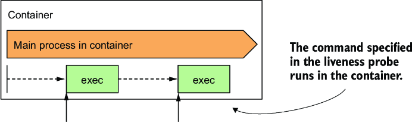

*Hình 6.7: Liveness probe exec chạy lệnh bên trong container.*

Sau đây là ví dụ về một probe chạy `/usr/bin/healthcheck` mỗi 2 giây để xác định xem ứng dụng chạy trong container còn sống hay không:

```yaml
    livenessProbe:
      exec:
        command:                   #1
        - /usr/bin/healthcheck     #1
      periodSeconds: 2             #2
      timeoutSeconds: 1            #3
      failureThreshold: 1          #4
```

- **#1** Lệnh cần chạy và các đối số của nó
- **#2** Probe chạy mỗi giây.
- **#3** Lệnh phải trả về trong vòng 1 giây.
- **#4** Một lần probe thất bại là đủ để khởi động lại container.

Nếu lệnh trả về exit code không, container được coi là khỏe mạnh. Nếu nó trả về exit code khác không hoặc không hoàn thành trong vòng 1 giây như được chỉ định trong trường `timeoutSeconds`, container bị kết thúc ngay lập tức, như được cấu hình trong trường `failureThreshold`, trường này cho biết một lần probe thất bại là đủ để coi container là không khỏe mạnh.

### 6.2.6 Sử dụng startup probe khi ứng dụng khởi động chậm (Using a startup probe when an application is slow to start)

Các thiết lập mặc định của liveness probe cho ứng dụng từ 20 đến 30 giây để bắt đầu phản hồi các request của liveness probe. Nếu ứng dụng mất nhiều thời gian hơn, nó bị khởi động lại và phải khởi động lại từ đầu. Nếu lần khởi động thứ hai cũng mất lâu như vậy, nó lại bị khởi động lại. Nếu điều này tiếp diễn, container không bao giờ đạt tới trạng thái mà liveness probe thành công và bị kẹt trong một vòng lặp khởi động lại vô tận.

Để ngăn điều này, bạn có thể tăng các thiết lập `initialDelaySeconds`, `periodSeconds` hoặc `failureThreshold` để tính đến thời gian khởi động lâu, nhưng điều này sẽ có tác động tiêu cực đến hoạt động bình thường của ứng dụng. Kết quả của `periodSeconds * failureThreshold` càng cao, thì càng mất nhiều thời gian để khởi động lại ứng dụng nếu nó trở nên không khỏe mạnh. Với các ứng dụng mất nhiều phút để khởi động, việc tăng các tham số này đủ để ngăn ứng dụng bị khởi động lại quá sớm có thể không phải là một lựa chọn khả thi.

#### Giới thiệu startup probe (Introducing startup probes)

Để xử lý sự khác biệt giữa giai đoạn khởi động và hoạt động ở trạng thái ổn định của một ứng dụng, Kubernetes còn cung cấp startup probe (đầu dò khởi động).

Nếu một startup probe được định nghĩa cho một container, chỉ startup probe được thực thi khi container khởi động. Startup probe có thể được cấu hình để tính đến việc ứng dụng khởi động chậm. Khi startup probe thành công, Kubernetes chuyển sang dùng liveness probe, vốn được cấu hình để nhanh chóng phát hiện khi ứng dụng trở nên không khỏe mạnh.

#### Thêm startup probe vào manifest của pod (Adding a startup probe to a pod's manifest)

Hãy tưởng tượng ứng dụng Kiada Node.js cần hơn một phút để làm nóng (warm up), nhưng bạn muốn nó được khởi động lại trong vòng 10 giây khi nó trở nên không khỏe mạnh trong quá trình hoạt động bình thường. Listing sau đây cho thấy cách bạn cấu hình startup probe và liveness probe (bạn có thể tìm thấy nó trong file `pod.kiada-startup-probe.yaml`).

**Listing 6.2: Kết hợp startup probe và liveness probe (`pod.kiada-startup-probe.yaml`)**

```yaml
...
  containers:
  - name: kiada
    image: luksa/kiada:0.1
    ports:
    - name: http
      containerPort: 8080
    startupProbe:
      httpGet:
        path: /               #1
        port: http            #1
      periodSeconds: 10       #2
      failureThreshold: 12    #2
    livenessProbe:
      httpGet:
        path: /               #3
        port: http            #3
      periodSeconds: 5        #4
      failureThreshold: 2     #4
```

- **#1** Startup probe và liveness probe thường dùng cùng một endpoint.
- **#2** Ứng dụng có 120 giây để khởi động.
- **#3** Startup probe và liveness probe thường dùng cùng một endpoint.
- **#4** Sau khi khởi động, sức khỏe của ứng dụng được kiểm tra mỗi 5 giây, và ứng dụng được khởi động lại khi nó thất bại liveness probe hai lần.

Khi container được định nghĩa trong listing khởi động, ứng dụng có 120 giây để bắt đầu phản hồi các request. Kubernetes thực hiện startup probe mỗi 10 giây và thực hiện tối đa 12 lần thử.

Như minh họa trong hình 6.8, không giống liveness probe, việc một startup probe thất bại là hoàn toàn bình thường. Thất bại chỉ cho biết ứng dụng chưa được khởi động hoàn toàn. Một startup probe thành công cho biết ứng dụng đã khởi động thành công, và Kubernetes nên chuyển sang liveness probe. Liveness probe sau đó thường được thực thi với chu kỳ ngắn hơn, cho phép phát hiện nhanh hơn các ứng dụng không phản hồi.

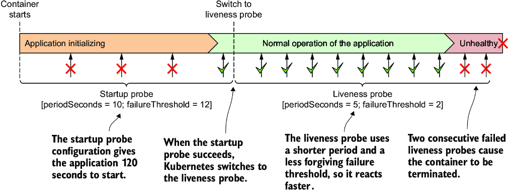

*Hình 6.8: Phát hiện nhanh các vấn đề về sức khỏe của ứng dụng bằng cách kết hợp startup probe và liveness probe*

> **GHI CHÚ:** Nếu startup probe thất bại đủ nhiều lần để chạm tới `failureThreshold`, container bị kết thúc như thể liveness probe đã thất bại.

Thông thường, startup probe và liveness probe được cấu hình để dùng cùng một endpoint HTTP, nhưng cũng có thể dùng các endpoint khác nhau. Bạn cũng có thể cấu hình startup probe dưới dạng probe `exec` hoặc `tcpSocket` thay vì probe `httpGet`.

### 6.2.7 Tạo các trình xử lý liveness probe hiệu quả (Creating effective liveness probe handlers)

Bạn nên định nghĩa liveness probe cho tất cả các pod của mình. Không có nó, Kubernetes không có cách nào biết ứng dụng của bạn còn sống hay không, ngoài việc kiểm tra xem tiến trình ứng dụng đã kết thúc hay chưa.

#### Gây ra các lần khởi động lại không cần thiết do trình xử lý liveness probe được hiện thực kém (Causing unnecessary restarts with badly implemented liveness probe handlers)

Khi bạn hiện thực một trình xử lý (handler) cho liveness probe, dù là dưới dạng một endpoint HTTP trong ứng dụng hay một lệnh thực thi bổ sung, hãy rất cẩn thận để hiện thực nó đúng cách. Nếu một probe được hiện thực kém trả về phản hồi tiêu cực ngay cả khi ứng dụng khỏe mạnh, ứng dụng sẽ bị khởi động lại một cách không cần thiết. Nhiều người dùng Kubernetes đã học được bài học này một cách đau đớn. Nếu bạn có thể đảm bảo rằng tiến trình ứng dụng tự kết thúc khi nó trở nên không khỏe mạnh, thì có lẽ an toàn hơn là không định nghĩa liveness probe.

#### Liveness probe nên kiểm tra những gì (What a liveness probe should check)

Liveness probe cho container `kiada` không được cấu hình để gọi một endpoint kiểm tra sức khỏe thực sự, mà chỉ kiểm tra xem server Node.js có phản hồi các request HTTP đơn giản tới URI gốc hay không. Điều này có vẻ quá đơn giản, nhưng ngay cả một liveness probe như vậy cũng làm nên điều kỳ diệu, vì nó khiến container được khởi động lại nếu server không còn phản hồi các request HTTP, vốn là nhiệm vụ chính của nó. Nếu không có liveness probe nào được định nghĩa, pod sẽ vẫn ở trong trạng thái không khỏe mạnh, trong đó nó không phản hồi bất kỳ request nào và sẽ phải được khởi động lại thủ công. Một liveness probe đơn giản như thế này còn hơn là không có gì.

Để cung cấp một kiểm tra sự sống tốt hơn, các ứng dụng web thường công khai một endpoint kiểm tra sức khỏe cụ thể, chẳng hạn `/healthz`. Khi endpoint này được gọi, ứng dụng thực hiện kiểm tra trạng thái nội bộ của tất cả các thành phần chính đang chạy bên trong ứng dụng để đảm bảo không thành phần nào đã chết hoặc không còn làm những gì chúng phải làm.

> **MẸO:** Hãy đảm bảo endpoint HTTP `/healthz` không yêu cầu xác thực, nếu không probe sẽ luôn thất bại, khiến container của bạn bị khởi động lại liên tục.

Hãy đảm bảo ứng dụng chỉ kiểm tra hoạt động của các thành phần nội bộ của nó và không kiểm tra bất cứ thứ gì bị ảnh hưởng bởi yếu tố bên ngoài. Ví dụ, endpoint kiểm tra sức khỏe của một service frontend không bao giờ nên phản hồi thất bại khi nó không thể kết nối tới một service backend. Nếu service backend bị lỗi, khởi động lại frontend sẽ không giải quyết được vấn đề. Một liveness probe như vậy sẽ lại thất bại sau khi khởi động lại, nên container sẽ bị khởi động lại liên tục cho đến khi backend được sửa. Nếu có nhiều service phụ thuộc lẫn nhau theo cách này, lỗi của một service đơn lẻ có thể dẫn đến các lỗi dây chuyền (cascading failures) trên toàn bộ hệ thống.

#### Giữ cho probe nhẹ (Keeping probes light)

Trình xử lý được liveness probe gọi không nên dùng quá nhiều tài nguyên tính toán và không nên mất quá nhiều thời gian để hoàn thành. Theo mặc định, các probe được thực thi tương đối thường xuyên và chỉ được cho một giây để hoàn thành.

Dùng một trình xử lý tiêu tốn nhiều CPU hoặc bộ nhớ có thể ảnh hưởng nghiêm trọng đến tiến trình chính của container. Ở phần sau của cuốn sách, bạn sẽ học cách giới hạn thời gian CPU và tổng bộ nhớ khả dụng cho một container. CPU và bộ nhớ mà lần gọi trình xử lý probe tiêu thụ được tính vào hạn ngạch tài nguyên (resource quota) của container, nên dùng một trình xử lý tốn nhiều tài nguyên sẽ làm giảm thời gian CPU khả dụng cho tiến trình chính của ứng dụng.

> **MẸO:** Khi chạy một ứng dụng Java trong container, bạn có thể muốn dùng HTTP GET probe thay vì liveness probe `exec` khởi động cả một JVM. Điều tương tự cũng áp dụng cho các lệnh đòi hỏi nhiều tài nguyên tính toán.

#### Tránh các vòng lặp thử lại trong trình xử lý probe (Avoiding retry loops in your probe handlers)

Bạn đã học rằng ngưỡng thất bại của probe có thể cấu hình được. Thay vì hiện thực một vòng lặp thử lại (retry loop) trong trình xử lý probe, hãy giữ mọi thứ đơn giản và thay vào đó đặt trường `failureThreshold` ở giá trị cao hơn để probe phải thất bại nhiều lần trước khi ứng dụng bị coi là không khỏe mạnh. Tự hiện thực cơ chế thử lại của riêng bạn trong trình xử lý là lãng phí công sức và là một điểm lỗi tiềm ẩn khác.

---

## 6.3 Thực thi các hành động khi container khởi động và tắt (Executing actions at container start-up and shutdown)

Trong chương trước, bạn đã học rằng có thể dùng init container để chạy các container ở đầu vòng đời của pod. Bạn cũng có thể muốn chạy các tiến trình bổ sung mỗi khi một container khởi động và ngay trước khi nó dừng. Bạn có thể làm điều này bằng cách thêm các lifecycle hook vào container. Hiện có hai kiểu hook được hỗ trợ:

* **Post-start hook** – Được thực thi khi container khởi động
* **Pre-stop hook** – Được thực thi ngay trước khi container dừng

Các lifecycle hook này được chỉ định theo từng container, trái với init container vốn được chỉ định ở cấp pod. Hình 6.9 minh họa cách các lifecycle hook khớp vào vòng đời của một container.

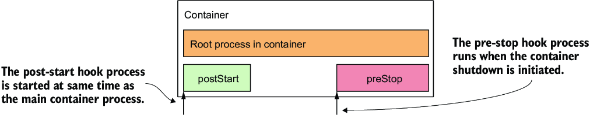

*Hình 6.9: Cách post-start hook và pre-stop hook khớp vào vòng đời của container*

Giống như liveness probe, lifecycle hook có thể được dùng để thực thi một lệnh bên trong container, hoặc gửi một request HTTP GET tới ứng dụng trong container.

> **GHI CHÚ:** Cũng như với liveness probe, lifecycle hook chỉ có thể được áp dụng cho các container thông thường chứ không phải init container. Không giống probe, lifecycle hook không hỗ trợ trình xử lý `tcpSocket`.

Hãy xem xét riêng từng kiểu hook trong hai kiểu này để thấy chúng có thể được dùng vào việc gì.

### 6.3.1 Sử dụng post-start hook để thực hiện hành động khi container khởi động (Using post-start hooks to perform actions when the container starts)

Post-start lifecycle hook được gọi ngay sau khi container được tạo. Bạn có thể dùng hook kiểu `exec` để thực thi một tiến trình bổ sung khi tiến trình chính khởi động, hoặc bạn có thể dùng hook `httpGet` để gửi một request HTTP tới ứng dụng chạy trong container nhằm thực hiện một kiểu thủ tục khởi tạo hoặc làm nóng (warm-up) nào đó.

Nếu bạn là tác giả của ứng dụng, bạn có thể thực hiện cùng thao tác đó ngay trong mã của ứng dụng, nhưng nếu bạn cần thêm nó vào một ứng dụng có sẵn mà bạn không tự tạo ra, bạn có thể không làm được như vậy. Post-start hook cung cấp một giải pháp thay thế đơn giản, không đòi hỏi bạn phải thay đổi ứng dụng hay container image của nó.

Sau đây là một ví dụ về cách post-start hook có thể được dùng trong một service mới mà bạn sẽ tạo.

#### Giới thiệu Quote service (Introducing the Quote service)

Bạn có thể nhớ từ mục 2.2.1 rằng phiên bản cuối cùng của Kubernetes in Action Demo Application (Kiada) Suite sẽ chứa các service Quote và Quiz bên cạnh ứng dụng Node.js. Dữ liệu từ hai service này sẽ được dùng để hiển thị một câu trích dẫn ngẫu nhiên từ cuốn sách và một câu đố trắc nghiệm nhanh giúp bạn kiểm tra kiến thức Kubernetes của mình. Để làm mới trí nhớ của bạn, hình 6.10 cho thấy ba thành phần tạo nên Kiada Suite.

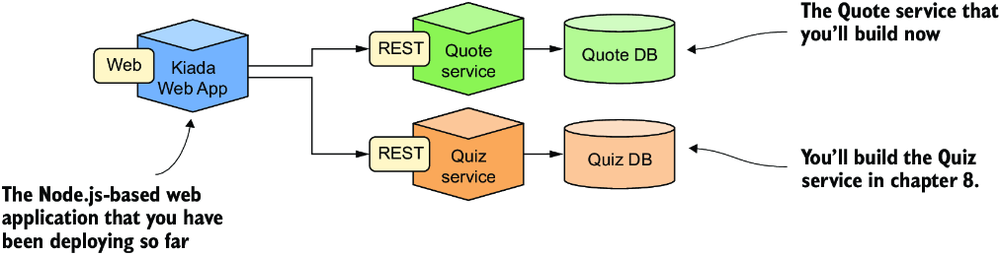

*Hình 6.10: Kubernetes in Action Demo Application Suite*

Trong những bước đầu tiên làm quen với Unix vào thập niên 1990, một trong những điều tôi thấy thú vị nhất là thông điệp ngẫu nhiên, đôi khi hài hước, mà lệnh `fortune` hiển thị mỗi lần tôi đăng nhập vào máy chủ Sun Ultra của trường trung học chúng tôi. Ngày nay, bạn hiếm khi thấy lệnh `fortune` được cài sẵn trên các hệ thống Unix/Linux nữa, nhưng bạn vẫn có thể cài nó và chạy nó bất cứ khi nào bạn thấy chán. Đây là một ví dụ về những gì nó có thể hiển thị:

```bash
$ fortune
Dinner is ready when the smoke alarm goes off.
```

Lệnh này lấy các câu trích dẫn từ những file được đóng gói kèm với nó, nhưng bạn cũng có thể dùng (các) file của riêng mình. Vậy tại sao không dùng `fortune` để xây dựng Quote service? Thay vì dùng các file mặc định, tôi sẽ cung cấp một file chứa các câu trích dẫn từ cuốn sách này.

Nhưng có một điểm cần lưu ý. Lệnh `fortune` in ra standard output. Nó không thể phục vụ câu trích dẫn qua HTTP. Tuy nhiên, đây không phải là vấn đề khó giải quyết. Chúng ta có thể kết hợp chương trình `fortune` với một web server như Nginx để có được kết quả mong muốn.

#### Dùng post-start container lifecycle hook để chạy một lệnh trong container (Using a post-start container lifecycle hook to run a command in the container)

Với phiên bản đầu tiên của service, container sẽ chạy lệnh `fortune` khi nó khởi động. Output sẽ được chuyển hướng vào một file trong thư mục web-root của Nginx để Nginx có thể phục vụ nó. Mặc dù điều này có nghĩa là cùng một câu trích dẫn được trả về cho mọi request, đây là một khởi đầu hoàn toàn tốt. Bạn sẽ cải tiến service này dần dần sau.

Web server Nginx có sẵn dưới dạng container image, nên hãy dùng nó. Vì lệnh `fortune` không có sẵn trong image, thông thường bạn sẽ xây dựng một image mới dùng image đó làm nền (base) và cài gói `fortune` lên trên. Nhưng hiện tại chúng ta sẽ giữ mọi thứ còn đơn giản hơn nữa.

Thay vì xây dựng một image hoàn toàn mới, bạn sẽ dùng post-start hook để cài gói phần mềm `fortune`, tải về file chứa các câu trích dẫn từ cuốn sách này, và cuối cùng chạy lệnh `fortune` rồi ghi output của nó vào một file mà Nginx có thể phục vụ. Hoạt động của pod `quote-poststart` được trình bày trong hình 6.11.

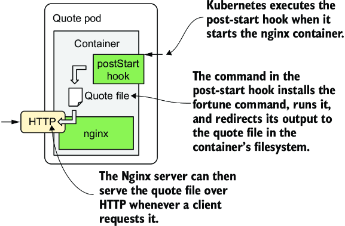

*Hình 6.11: Hoạt động của pod quote-poststart*

Listing sau đây cho thấy cách định nghĩa hook (file `pod.quote-poststart.yaml`).

**Listing 6.3: Pod với một post-start lifecycle hook (`pod.quote-poststart.yaml`)**

```yaml
apiVersion: v1
kind: Pod
metadata:
  name: quote-poststart                                                    #1
spec:
  containers:
  - name: nginx                                                            #2
    image: nginx:alpine                                                    #2
    ports:                                                                 #3
    - name: http                                                           #3
      containerPort: 80                                                    #3
    lifecycle:                                                             #4
      postStart:                                                           #4
        exec:                                                              #4
          command:                                                         #4
          - sh                                                             #5
          - -c                                                             #6
          - |                                                              #7
            apk add fortune && \                                           #8
            curl -O https://luksa.github.io/kiada/book-quotes.txt && \     #8
            curl -O https://luksa.github.io/kiada/book-quotes.txt.dat && \ #8
            fortune book-quotes.txt > /usr/share/nginx/html/quote          #8
```

- **#1** Tên của pod này là quote-poststart.
- **#2** Container image nginx:alpine được dùng trong pod một container này.
- **#3** Server Nginx chạy trên cổng 80.
- **#4** Một post-start lifecycle hook được dùng để chạy một lệnh khi container khởi động.
- **#5** Đây là lệnh.
- **#6** Đây là đối số đầu tiên của nó.
- **#7** Đối số thứ hai là chuỗi nhiều dòng theo sau.
- **#8** Đối số thứ hai bao gồm các dòng này.

YAML trong listing không đơn giản, nên hãy để tôi giải thích nó. Trước tiên là những phần dễ. Pod có tên `quote-poststart` và chứa một container duy nhất dựa trên image `nginx:alpine`. Một cổng duy nhất được định nghĩa trong container. Một `postStart` lifecycle hook cũng được định nghĩa cho container. Nó chỉ định lệnh cần chạy khi container khởi động. Phần khó là định nghĩa của lệnh này, nhưng tôi sẽ phân tích nó cho bạn.

Đó là một danh sách các lệnh được truyền cho lệnh `sh` dưới dạng đối số. Sở dĩ như vậy là vì không thể định nghĩa nhiều lệnh trong một lifecycle hook. Giải pháp là gọi một shell làm lệnh chính và để nó chạy danh sách các lệnh bằng cách chỉ định chúng trong chuỗi lệnh:

```bash
sh -c "the command string"
```

Trong listing trước, đối số thứ ba (chuỗi lệnh) khá dài, nên nó phải được chỉ định trên nhiều dòng để giữ cho YAML dễ đọc. Các giá trị chuỗi nhiều dòng trong YAML có thể được định nghĩa bằng cách gõ ký tự pipe (`|`) theo sau là các dòng được thụt lề đúng cách. Do đó chuỗi lệnh trong listing trước như sau:

```bash
apk add fortune && \
curl -O https://luksa.github.io/kiada/book-quotes.txt && \
curl -O https://luksa.github.io/kiada/book-quotes.txt.dat && \
fortune book-quotes.txt > /usr/share/nginx/html/quote
```

Như bạn thấy, chuỗi lệnh gồm bốn lệnh. Đây là những gì chúng làm:

* Lệnh `apk add fortune` chạy công cụ quản lý gói của Alpine Linux, vốn là một phần của image mà `nginx:alpine` dựa trên, để cài gói `fortune` vào container.
* Lệnh `curl` thứ nhất tải về file `book-quotes.txt`.
* Lệnh `curl` thứ hai tải về file `book-quotes.txt.dat`.
* Lệnh `fortune` chọn một câu trích dẫn ngẫu nhiên từ file `book-quotes.txt` và in nó ra standard output. Output đó được chuyển hướng vào file `/usr/share/nginx/html/quote`.

Lệnh của lifecycle hook chạy song song với tiến trình chính. Cái tên `postStart` hơi gây hiểu nhầm, vì hook không được thực thi sau khi tiến trình chính đã khởi động hoàn toàn, mà ngay khi container được tạo, gần như cùng lúc tiến trình chính khởi động.

Khi `postStart` hook trong ví dụ này hoàn thành, câu trích dẫn do lệnh `fortune` tạo ra được lưu trong file `/usr/share/nginx/html/quote` và có thể được Nginx phục vụ.

Dùng lệnh `kubectl apply` để tạo pod từ file `pod.quote-poststart.yaml`, và sau đó bạn hẳn có thể dùng `curl` hoặc trình duyệt để lấy câu trích dẫn tại URI `/quote` trên cổng `80` của pod `quote-poststart`. Bạn đã học cách dùng lệnh `kubectl port-forward` để mở một đường hầm (tunnel) tới container, nhưng bạn có thể muốn tham khảo sidebar vì có một điểm cần lưu ý.

> **Truy cập pod quote-poststart (Accessing the quote-poststart pod)**
>
> Để lấy câu trích dẫn từ pod `quote-poststart`, trước tiên bạn phải chạy lệnh `kubectl port-forward`, lệnh này có thể thất bại như sau:
>
> ```bash
> $ kubectl port-forward quote-poststart 80
> Unable to listen on port 80: Listeners failed to create with the following errors:
> error: unable to listen on any of the requested ports: [{80 80}]
> ```
>
> Lệnh thất bại nếu hệ điều hành của bạn không cho phép bạn chạy các tiến trình gắn (bind) vào các số cổng 0–1023. Để khắc phục, bạn phải dùng một số cổng cục bộ cao hơn như sau:
>
> ```bash
> $ kubectl port-forward quote-poststart 1080:80
> ```
>
> Đối số cuối cùng bảo `kubectl` dùng cổng 1080 ở máy cục bộ và chuyển tiếp nó tới cổng 80 của pod. Giờ bạn có thể truy cập Quote service tại http://localhost:1080/quote.

Nếu mọi thứ hoạt động như dự định, server Nginx sẽ trả về một câu trích dẫn ngẫu nhiên từ cuốn sách này như trong ví dụ sau:

```bash
$ curl localhost:1080/quote
The same as with liveness probes, lifecycle hooks can only be applied to regular containers and
not to init containers. Unlike probes, lifecycle hooks do not support tcpSocket handlers.
```

Phiên bản đầu tiên của Quote service giờ đã xong, nhưng bạn sẽ cải tiến nó trong chương tiếp theo. Bây giờ hãy tìm hiểu về những điểm cần lưu ý khi dùng post-start hook trước khi chúng ta đi tiếp.

#### Tìm hiểu cách post-start hook ảnh hưởng đến container (Understanding how a post-start hook affects the container)

Mặc dù post-start hook chạy bất đồng bộ với tiến trình chính của container, nó ảnh hưởng đến container theo hai cách. Thứ nhất, container vẫn ở trạng thái `Waiting` với reason là `ContainerCreating` cho đến khi lời gọi hook hoàn thành. Phase của pod là `Pending`. Nếu bạn chạy lệnh `kubectl logs` vào thời điểm này, nó từ chối hiển thị log, mặc dù container đang chạy. Lệnh `kubectl port-forward` cũng từ chối chuyển tiếp cổng tới pod.

Nếu bạn muốn tự mình thấy điều này, hãy triển khai file manifest Pod `pod.quote-poststart-slow.yaml`. Nó định nghĩa một post-start hook mất 60 giây để hoàn thành. Ngay sau khi pod được tạo, hãy kiểm tra trạng thái của nó và hiển thị log bằng lệnh sau:

```bash
$ kubectl logs quote-poststart-slow
Error from server (BadRequest): container "nginx" in pod "quote-poststart-slow" is waiting to start: ContainerCreating
```

Thông báo lỗi trả về ngụ ý rằng container chưa khởi động, nhưng thực tế không phải vậy. Để chứng minh điều này, hãy dùng lệnh sau để liệt kê các tiến trình trong container:

```bash
$ kubectl exec quote-poststart-slow -- ps x
PID   USER     TIME  COMMAND
    1 root      0:00 nginx: master process nginx -g daemon off;         #1
    7 root      0:00 sh -c apk add fortune && \ sleep 60 && \ curl...   #2
   13 nginx     0:00 nginx: worker process                              #1
...                                                                     #1
   20 nginx     0:00 nginx: worker process                              #1
   21 root      0:00 sleep 60                                           #2
   22 root      0:00 ps x
```

- **#1** Nginx đang chạy.
- **#2** Các tiến trình chạy như một phần của post-start hook

Cách thứ hai mà post-start hook có thể ảnh hưởng đến container là khi lệnh được dùng trong hook không thể thực thi hoặc trả về exit code khác không. Khi điều này xảy ra, toàn bộ container bị khởi động lại. Để có một ví dụ về post-start hook thất bại, hãy triển khai manifest pod `pod.quote-poststart-fail.yaml`.

Nếu bạn theo dõi status của pod bằng `kubectl get pods -w`, bạn sẽ thấy status sau:

```bash
quote-poststart-fail   0/1   PostStartHookError: command 'sh -c echo 'Emulating a...
```

Nó cho thấy lệnh đã được thực thi và mã mà lệnh kết thúc với. Khi bạn xem lại các event của pod, bạn sẽ thấy một warning event `FailedPostStartHook` cho biết exit code và những gì lệnh đã in ra standard output hoặc error output. Đây là event đó:

```bash
Warning   FailedPostStartHook   Exec lifecycle hook ([sh -c ...]) for Container "nginx"...
```

Thông tin tương tự cũng có trong trường `containerStatuses` trong trường `STATUS` của pod, nhưng chỉ trong một thời gian ngắn, vì status của container chuyển sang `CrashLoopBackOff` ngay sau đó.

> **MẸO:** Vì trạng thái của một pod có thể thay đổi nhanh chóng, chỉ kiểm tra status của nó có thể không cho bạn biết mọi thứ bạn cần biết. Thay vì kiểm tra trạng thái tại một thời điểm cụ thể, xem lại các event của pod thường là cách tốt hơn để có được bức tranh toàn cảnh.

#### Ghi lại output do tiến trình được gọi qua post-start hook tạo ra (Capturing the output produced by the process invoked via a post-start hook)

Như bạn vừa học, output của lệnh được định nghĩa trong post-start hook có thể được kiểm tra nếu nó thất bại. Trong trường hợp lệnh hoàn thành thành công, output của lệnh không được ghi log ở đâu cả. Để xem output, lệnh phải ghi log vào một file thay vì standard output hoặc error output. Sau đó bạn có thể xem nội dung file bằng

```bash
$ kubectl exec my-pod -- cat logfile.txt
```

#### Sử dụng HTTP GET post-start hook (Using an HTTP GET post-start hook)

Trong ví dụ trước, bạn đã cấu hình post-start hook để thực thi một lệnh bên trong container. Thay vào đó, bạn có thể để Kubernetes gửi một request HTTP GET khi nó khởi động container bằng cách dùng post-start hook `httpGet`.

> **GHI CHÚ:** Bạn không thể chỉ định cả post-start hook `exec` lẫn `httpGet` cho một container. Chúng loại trừ lẫn nhau.

Bạn có thể cấu hình lifecycle hook để gửi request tới một tiến trình chạy trong chính container đó, một container khác trong pod, hoặc một host hoàn toàn khác.

Ví dụ, bạn có thể dùng post-start hook `httpGet` để thông báo cho một service khác về pod của bạn. Listing sau đây cho thấy một ví dụ về định nghĩa post-start hook làm việc này. Bạn sẽ tìm thấy nó trong file `pod.poststart-httpget.yaml`.

**Listing 6.4: Dùng post-start hook httpGet để làm nóng một web server (`pod.poststart-httpget.yaml`)**

```yaml
    lifecycle:                          #1
      postStart:                        #1
        httpGet:                        #1
          host: myservice.example.com   #2
          port: 80                      #2
          path: /container-started      #3
```

- **#1** Đây là post-start lifecycle hook gửi một request HTTP GET.
- **#2** Host và cổng mà request được gửi tới
- **#3** URI được yêu cầu trong request HTTP

Ví dụ trong listing cho thấy một post-start hook `httpGet` gọi URL sau khi container khởi động: http://myservice.example.com/container-started.

Ngoài các trường `host`, `port` và `path` được thể hiện trong listing, bạn cũng có thể chỉ định `scheme` (`HTTP` hoặc `HTTPS`) và `httpHeaders` sẽ được gửi trong request. Trường `host` mặc định là IP của pod. Đừng đặt nó thành `localhost` trừ khi bạn muốn gửi request tới node đang lưu trữ pod. Đó là vì request được gửi từ node host, chứ không phải từ bên trong container.

Cũng giống như post-start hook dựa trên lệnh, HTTP GET post-start hook được thực thi cùng lúc với tiến trình chính của container. Và đây chính là điều khiến những kiểu lifecycle hook này chỉ áp dụng được cho một tập hợp giới hạn các trường hợp sử dụng.

Nếu bạn cấu hình hook để gửi request tới chính container mà nó được định nghĩa trong đó, bạn sẽ gặp rắc rối nếu tiến trình chính của container chưa sẵn sàng chấp nhận request. Trong trường hợp đó, post-start hook sẽ thất bại, và điều này khiến container bị khởi động lại. Ở lần chạy tiếp theo, điều tương tự lại xảy ra. Kết quả là một container cứ khởi động lại mãi.

Để tự mình thấy điều này, hãy thử tạo pod được định nghĩa trong `pod.poststart-httpget-slow.yaml`. Tôi đã cho container chờ 1 giây trước khi khởi động web server. Điều này đảm bảo post-start hook không bao giờ thành công. Nhưng điều tương tự cũng có thể xảy ra ngay cả khi không có khoảng dừng đó. Không có gì đảm bảo web server sẽ luôn khởi động đủ nhanh. Nó có thể khởi động nhanh trên máy tính của bạn hoặc trên một máy chủ không bị quá tải, nhưng trên một hệ thống production chịu tải đáng kể, container có thể không bao giờ khởi động được đúng cách.

> **CẢNH BÁO:** Dùng HTTP GET post-start hook có thể khiến container rơi vào vòng lặp khởi động lại vô tận. Không bao giờ cấu hình kiểu lifecycle hook này để nhắm tới chính container đó hoặc bất kỳ container nào khác trong cùng pod.

Một vấn đề khác với HTTP GET post-start hook là Kubernetes không coi hook là thất bại nếu HTTP server phản hồi với mã trạng thái chẳng hạn như `404 Not Found`. Hãy đảm bảo bạn chỉ định đúng URI trong HTTP GET hook của mình. Nếu không, bạn thậm chí có thể không nhận ra rằng post-start hook đã bắn trượt mục tiêu.

### 6.3.2 Sử dụng pre-stop hook để chạy một tiến trình ngay trước khi container kết thúc (Using pre-stop hooks to run a process just before the container terminates)

Ngoài việc thực thi một lệnh hoặc gửi một request HTTP khi container khởi động, Kubernetes còn cho phép định nghĩa pre-stop hook trong các container của bạn. Pre-stop hook được thực thi ngay trước khi container bị kết thúc. Để kết thúc một tiến trình, tín hiệu `SIGTERM` thường được gửi tới nó. Tín hiệu này bảo ứng dụng hoàn thành việc đang làm và tắt. Điều tương tự cũng xảy ra với container. Bất cứ khi nào một container cần được dừng hoặc khởi động lại, tín hiệu `SIGTERM` được gửi tới tiến trình chính trong container. Tuy nhiên, trước khi điều này xảy ra, Kubernetes trước tiên thực thi pre-stop hook, nếu container có cấu hình hook này. Tín hiệu `SIGTERM` không được gửi cho đến khi pre-stop hook hoàn thành, trừ khi tiến trình đã kết thúc do chính lời gọi trình xử lý pre-stop hook.

> **GHI CHÚ:** Khi việc kết thúc container được khởi phát, liveness probe và các probe khác không còn được gọi nữa.

Pre-stop hook có thể được dùng để khởi phát việc tắt êm thấm (graceful shutdown) của container hoặc để thực hiện các thao tác bổ sung mà không cần hiện thực chúng trong chính ứng dụng. Cũng như với post-start hook, bạn có thể thực thi một lệnh bên trong container hoặc gửi một request HTTP tới ứng dụng chạy trong đó.

#### Dùng pre-stop lifecycle hook để tắt container một cách êm thấm (Using a pre-stop lifecycle hook to shut down a container gracefully)

Web server Nginx được dùng trong pod Quote phản hồi tín hiệu `SIGTERM` bằng cách đóng ngay lập tức tất cả các kết nối đang mở và kết thúc tiến trình. Điều này không lý tưởng, vì các request của client đang được xử lý vào thời điểm đó không được phép hoàn thành.

May mắn thay, bạn có thể chỉ thị Nginx tắt một cách êm thấm bằng cách chạy lệnh `nginx -s quit`. Khi bạn chạy lệnh này, server ngừng chấp nhận kết nối mới, chờ cho đến khi tất cả các request đang xử lý (in-flight) được xử lý xong, rồi mới thoát.

Khi bạn chạy Nginx trong một Kubernetes Pod, bạn có thể dùng pre-stop lifecycle hook để chạy lệnh này và đảm bảo pod tắt một cách êm thấm. Listing sau đây cho thấy định nghĩa của pre-stop hook này (bạn sẽ tìm thấy nó trong file `pod.quote-prestop.yaml`).

**Listing 6.5: Định nghĩa pre-stop hook cho Nginx (`pod.quote-prestop.yaml`)**

```yaml
    lifecycle:       #1
      preStop:       #1
        exec:        #2
          command:   #2
          - nginx    #3
          - -s       #3
          - quit     #3
```

- **#1** Đây là pre-stop lifecycle hook.
- **#2** Thực thi một lệnh
- **#3** Đây là lệnh được thực thi.

Bất cứ khi nào một container dùng pre-stop hook này bị kết thúc, lệnh `nginx -s quit` được thực thi trong container trước khi tiến trình chính của container nhận tín hiệu `SIGTERM`.

Không giống post-start hook, container bị kết thúc bất kể kết quả của pre-stop hook – việc không thể thực thi lệnh hoặc exit code khác không không ngăn container bị kết thúc. Nếu pre-stop hook thất bại, bạn sẽ thấy một warning event `FailedPreStopHook` trong số các event của pod, nhưng bạn có thể không thấy dấu hiệu nào của thất bại đó nếu bạn chỉ theo dõi status của pod.

> **MẸO:** Nếu việc pre-stop hook hoàn thành thành công là thiết yếu đối với hoạt động đúng đắn của hệ thống, hãy đảm bảo rằng nó chạy thành công. Tôi đã từng gặp những tình huống pre-stop hook hoàn toàn không chạy, nhưng các kỹ sư thậm chí không hề hay biết.

Giống như post-start hook, bạn cũng có thể cấu hình pre-stop hook để gửi một request HTTP GET tới ứng dụng thay vì thực thi lệnh. Cấu hình của HTTP GET pre-stop hook giống như với post-start hook. Để biết thêm thông tin, xem mục 6.3.1.

Hành động thứ ba có thể có của pre-stop hook là làm container ngủ (sleep) trước khi bị kết thúc. Thay vì chỉ định `exec` hoặc `httpGet`, bạn chỉ định `sleep` và bên trong nó là số giây container nên ngủ.

> **Tại sao ứng dụng của tôi không nhận được tín hiệu SIGTERM? (Why doesn't my application receive the SIGTERM signal?)**
>
> Nhiều nhà phát triển mắc sai lầm khi định nghĩa một pre-stop hook chỉ để gửi tín hiệu `SIGTERM` tới ứng dụng của họ trong pre-stop hook. Họ làm vậy khi thấy ứng dụng của mình không bao giờ nhận được tín hiệu `SIGTERM`. Nguyên nhân gốc rễ thường không phải là tín hiệu không bao giờ được gửi, mà là nó bị một thứ gì đó bên trong container nuốt mất. Điều này thường xảy ra khi bạn dùng dạng shell của chỉ thị `ENTRYPOINT` hoặc `CMD` trong Dockerfile. Hai dạng của các chỉ thị này tồn tại:
>
> * Dạng exec là `ENTRYPOINT ["/myexecutable", "1st-arg", "2nd-arg"]`.
> * Dạng shell là `ENTRYPOINT /myexecutable 1st-arg 2nd-arg`.
>
> Khi bạn dùng dạng exec, file thực thi được gọi trực tiếp. Tiến trình mà nó khởi động trở thành tiến trình gốc của container. Khi bạn dùng dạng shell, một shell chạy với tư cách tiến trình gốc, và shell chạy file thực thi như tiến trình con của nó. Trong trường hợp này, tiến trình shell là tiến trình nhận tín hiệu `SIGTERM`. Thật không may, nó không chuyển tín hiệu này cho tiến trình con.
>
> Trong những trường hợp như vậy, thay vì thêm một pre-stop hook để gửi tín hiệu `SIGTERM` tới ứng dụng của bạn, giải pháp đúng là dùng dạng exec của `ENTRYPOINT` hoặc `CMD`.
>
> Lưu ý rằng vấn đề tương tự cũng xảy ra nếu bạn dùng một shell script trong container để chạy ứng dụng. Trong trường hợp này, bạn phải hoặc chặn và chuyển tiếp các tín hiệu tới ứng dụng, hoặc dùng lệnh shell `exec` để chạy ứng dụng trong script của bạn.

Pre-stop hook chỉ được gọi khi container được yêu cầu kết thúc, hoặc vì nó đã thất bại liveness probe hoặc vì pod phải tắt. Chúng không được gọi khi tiến trình chạy trong container tự kết thúc.

#### Hiểu rằng lifecycle hook nhắm tới container, không phải pod (Understanding that lifecycle hooks target containers, not pods)

Như một cân nhắc cuối cùng về post-start hook và pre-stop hook, tôi muốn nhấn mạnh rằng các lifecycle hook này áp dụng cho container chứ không phải pod. Bạn không nên dùng pre-stop hook để thực hiện một hành động cần được thực hiện khi toàn bộ pod tắt, vì pre-stop hook chạy mỗi lần container cần kết thúc. Điều này có thể xảy ra nhiều lần trong thời gian tồn tại của pod, chứ không chỉ khi pod tắt.

---

## 6.4 Tìm hiểu vòng đời của pod (Understanding the pod life cycle)

Cho đến giờ trong chương này, bạn đã học được nhiều điều về cách các container trong một pod chạy. Bây giờ hãy xem xét kỹ hơn toàn bộ vòng đời của một pod và các container của nó.

Khi bạn tạo một Pod object, Kubernetes lập lịch nó lên một worker node, node này sau đó chạy các container của pod. Vòng đời của pod được chia thành ba giai đoạn (stage) được thể hiện trong hình 6.12.

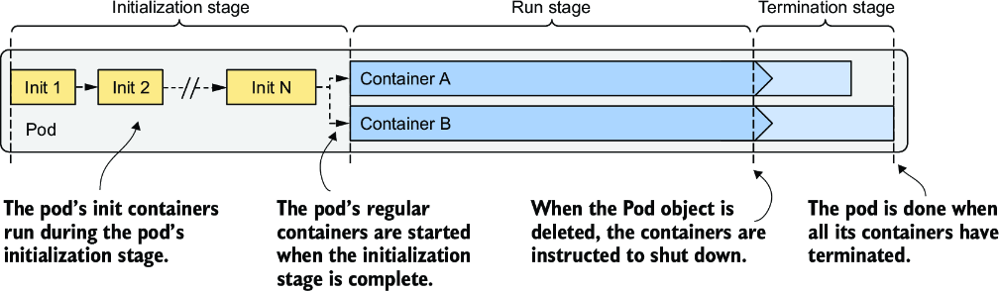

*Hình 6.12: Ba giai đoạn của vòng đời pod*

Ba giai đoạn của vòng đời pod là

1. Giai đoạn khởi tạo (initialization stage), trong đó các init container của pod chạy.
2. Giai đoạn chạy (run stage), trong đó các container thông thường của pod chạy.
3. Giai đoạn kết thúc (termination stage), trong đó các container của pod bị kết thúc.

Hãy xem điều gì xảy ra trong từng giai đoạn này.

### 6.4.1 Tìm hiểu giai đoạn khởi tạo (Understanding the initialization stage)

Như bạn đã học, các init container của pod chạy trước tiên. Chúng chạy theo thứ tự được chỉ định trong trường `initContainers` trong spec của pod. Hãy để tôi giải thích mọi thứ diễn ra như thế nào.

#### Kéo container image (Pulling the container image)

Trước khi mỗi init container được khởi động, container image của nó được kéo về worker node. Trường `imagePullPolicy` trong định nghĩa container trong đặc tả (spec) của pod quyết định image được kéo mỗi lần, chỉ lần đầu tiên, hay không bao giờ (bảng 6.5).

**Bảng 6.5: Danh sách các image-pull policy**

| Image-pull policy | Mô tả |
|---|---|
| Không chỉ định | Nếu `imagePullPolicy` không được chỉ định tường minh, nó mặc định là `Always` nếu tag `:latest` được dùng trong image. Với các tag image khác, nó mặc định là `IfNotPresent`. |
| `Always` | Image được kéo mỗi lần container được khởi động (lại). Nếu image được cache cục bộ khớp với image trong registry, nó không được tải lại, nhưng registry vẫn cần được liên hệ. |
| `Never` | Container image không bao giờ được kéo từ registry. Nó phải tồn tại sẵn trên worker node. Hoặc nó đã được lưu cục bộ khi một container khác dùng cùng image được triển khai, hoặc nó được xây dựng ngay trên node, hoặc đơn giản là được ai đó hay thứ gì đó khác tải về. |
| `IfNotPresent` | Image được kéo nếu nó chưa có sẵn trên worker node. Điều này đảm bảo image chỉ được kéo lần đầu tiên nó được cần đến. |

Image-pull policy cũng được áp dụng mỗi lần container được khởi động lại, nên đáng để xem xét kỹ hơn. Hình 6.13 minh họa hành vi của ba policy này.

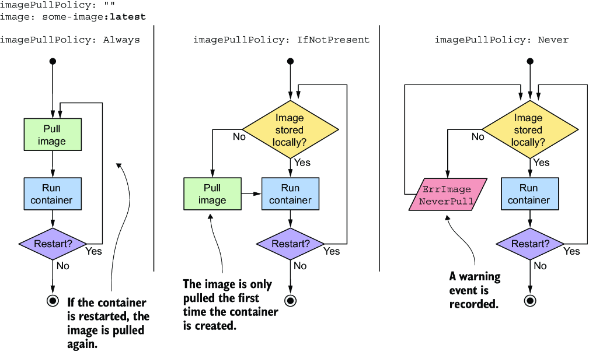

*Hình 6.13: Tổng quan về ba image-pull policy khác nhau*

> **CẢNH BÁO:** Nếu `imagePullPolicy` được đặt là `Always` và image registry không hoạt động (offline), container sẽ không chạy ngay cả khi cùng image đó đã được lưu cục bộ. Do đó một registry không khả dụng có thể ngăn ứng dụng của bạn khởi động (lại).

#### Chạy các container (Running the containers)

Khi container image đầu tiên được tải về node, container được khởi động. Khi init container đầu tiên hoàn thành, image cho init container tiếp theo được kéo về và container được khởi động. Quá trình này được lặp lại cho đến khi tất cả các init container hoàn thành thành công. Các container thất bại có thể được khởi động lại, như minh họa trong hình 6.14.

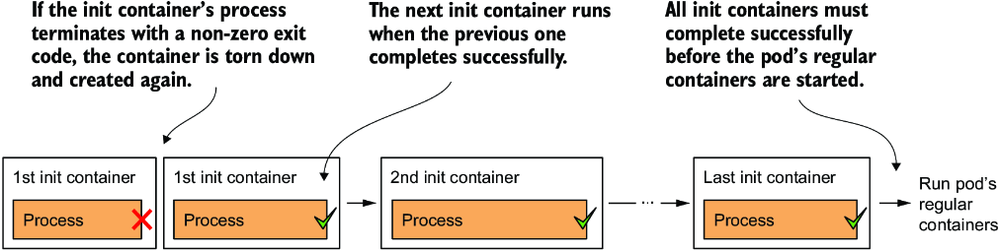

*Hình 6.14: Tất cả các init container phải chạy đến khi hoàn thành trước khi các container thông thường có thể khởi động.*

#### Khởi động lại các init container thất bại (Restarting failed init containers)

Nếu một init container kết thúc với lỗi và restart policy của pod được đặt là `Always` hoặc `OnFailure`, init container thất bại được khởi động lại. Nếu policy được đặt là `Never`, các init container tiếp theo và các container thông thường của pod không bao giờ được khởi động. Status của pod được hiển thị là `Init:Error` vô thời hạn. Khi đó bạn phải xóa và tạo lại Pod object để khởi động lại ứng dụng. Để tự thử điều này, hãy triển khai file `pod.kiada-init-fail-norestart.yaml`.

> **GHI CHÚ:** Nếu container cần được khởi động lại và `imagePullPolicy` được đặt là `Always`, container image được kéo lại. Nếu container đã kết thúc do lỗi và bạn đẩy (push) một image mới với cùng tag đã sửa lỗi đó, bạn không cần tạo lại pod, vì container image đã cập nhật sẽ được kéo về trước khi container được khởi động lại.

#### Thực thi lại các init container của pod (Re-executing the pod's init containers)

Init container thông thường chỉ được thực thi một lần. Ngay cả khi một trong các container chính của pod bị kết thúc sau đó, các init container của pod cũng không được thực thi lại. Tuy nhiên, trong những trường hợp ngoại lệ, chẳng hạn khi Kubernetes phải khởi động lại toàn bộ pod, các init container của pod có thể được thực thi lại. Điều này có nghĩa là các thao tác do init container của bạn thực hiện phải có tính lũy đẳng (idempotent).

### 6.4.2 Tìm hiểu giai đoạn chạy (Understanding the run stage)

Khi tất cả các init container hoàn thành thành công, các container thông thường của pod đều được tạo song song. Về lý thuyết, vòng đời của mỗi container nên độc lập với các container khác trong pod, nhưng điều này không hoàn toàn đúng. Xem sidebar để biết thêm thông tin.

> **Post-start hook của một container chặn việc tạo container tiếp theo (A container's post-start hook blocks the creation of the subsequent container)**
>
> Kubelet không khởi động tất cả các container của pod cùng một lúc. Nó tạo và khởi động các container một cách đồng bộ theo thứ tự chúng được định nghĩa trong spec của pod. Nếu một post-start hook được định nghĩa cho một container, nó chạy bất đồng bộ với tiến trình chính của container, nhưng việc thực thi trình xử lý post-start hook chặn việc tạo và khởi động các container tiếp theo.
>
> Đây là một chi tiết hiện thực có thể thay đổi trong tương lai.
>
> Ngược lại, việc kết thúc các container được thực hiện song song. Một pre-stop hook chạy lâu có chặn việc tắt container mà nó được định nghĩa trong đó, nhưng nó không chặn việc tắt các container khác. Các pre-stop hook của các container đều được gọi cùng một lúc.

Trình tự sau đây chạy độc lập cho từng container. Trước tiên, container image được kéo về, và container được khởi động. Khi container kết thúc, nó được khởi động lại, nếu restart policy của pod có quy định như vậy. Container tiếp tục chạy cho đến khi việc kết thúc pod được khởi phát. Giải thích chi tiết hơn về trình tự này được trình bày tiếp theo.

#### Kéo container image (Pulling the container image)

Trước khi container được tạo, image của nó được kéo từ image registry, theo `imagePullPolicy` của pod. Khi image đã được kéo về, container được tạo.

> **GHI CHÚ:** Ngay cả khi một container image không thể được kéo về, các container khác trong pod vẫn được khởi động.

> **CẢNH BÁO:** Các container không nhất thiết khởi động cùng một thời điểm. Nếu việc kéo image mất thời gian, container có thể khởi động rất lâu sau khi tất cả các container khác đã khởi động. Hãy cân nhắc điều này nếu một container phụ thuộc vào các container khác.

#### Chạy container (Running the container)

Container khởi động khi tiến trình chính của container khởi động. Nếu một post-start hook được định nghĩa trong container, nó được gọi song song với tiến trình chính của container. Post-start hook chạy bất đồng bộ và phải thành công thì container mới tiếp tục chạy.

Cùng với container chính và tiến trình post-start hook (nếu có), startup probe, nếu được định nghĩa cho container, được khởi động. Khi startup probe thành công, hoặc nếu startup probe không được cấu hình, liveness probe được khởi động.

#### Kết thúc và khởi động lại container khi có lỗi (Terminating and restarting the container on failures)

Nếu startup probe hoặc liveness probe thất bại nhiều lần đến mức chạm ngưỡng thất bại đã cấu hình, container bị kết thúc. Cũng như với init container, `restartPolicy` của pod quyết định container sau đó có được khởi động lại hay không.

Có lẽ đáng ngạc nhiên là nếu restart policy được đặt là `Never` và startup hook thất bại, status của pod được hiển thị là `Completed` mặc dù post-start hook đã thất bại. Bạn có thể tự mình thấy điều này bằng cách tạo pod được định nghĩa trong file `pod.quote-poststart-fail-norestart.yaml`.

#### Giới thiệu termination grace period (Introducing the termination grace period)

Nếu một container phải bị kết thúc, pre-stop hook của container được gọi để ứng dụng có thể tắt một cách êm thấm. Khi pre-stop hook hoàn thành, hoặc nếu không có pre-stop hook nào được định nghĩa, tín hiệu `SIGTERM` được gửi tới tiến trình chính của container. Đây là một gợi ý nữa cho ứng dụng rằng nó nên tắt.

> **GHI CHÚ:** Bạn có thể cấu hình Kubernetes gửi một tín hiệu khác tới container khi nó cần dừng container. Để làm điều này, hãy đặt trường `lifecycle.stopSignal` trong định nghĩa container bên trong manifest của pod.

Ứng dụng được cho một khoảng thời gian nhất định để kết thúc. Thời gian này có thể được cấu hình bằng trường `terminationGracePeriodSeconds` trong spec của pod và mặc định là 30 giây. Bộ đếm thời gian bắt đầu khi pre-stop hook được gọi hoặc khi tín hiệu `SIGTERM` được gửi nếu không có hook nào được định nghĩa. Nếu tiến trình vẫn còn chạy sau khi termination grace period (thời gian ân hạn kết thúc) hết hạn, nó bị kết thúc cưỡng bức bằng tín hiệu `KILL`. Hành động này kết thúc container. Hình 6.15 minh họa trình tự kết thúc container.

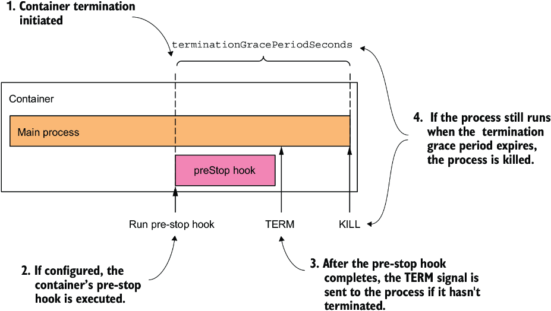

*Hình 6.15: Trình tự kết thúc của một container*

Sau khi container đã kết thúc, nó sẽ được khởi động lại nếu restart policy của pod cho phép. Nếu không, container sẽ vẫn ở trạng thái `Terminated`, nhưng các container khác sẽ tiếp tục chạy cho đến khi toàn bộ pod bị tắt hoặc cho đến khi chúng cũng thất bại.

### 6.4.3 Tìm hiểu giai đoạn kết thúc (Understanding the termination stage)

Các container của pod tiếp tục chạy cho đến khi cuối cùng bạn xóa Pod object. Khi điều này xảy ra, việc kết thúc tất cả các container trong pod được khởi phát, và status của nó được đổi thành `Terminating`.

#### Giới thiệu deletion grace period (Introducing the deletion grace period)

Việc kết thúc từng container khi pod tắt tuân theo cùng trình tự như khi container bị kết thúc vì thất bại liveness probe, ngoại trừ việc thay vì termination grace period, deletion grace period (thời gian ân hạn xóa) của pod quyết định các container có bao nhiêu thời gian để tự tắt.

Thời gian ân hạn này được định nghĩa trong trường `metadata.deletionGracePeriodSeconds` của pod, trường này được khởi tạo khi bạn xóa pod. Theo mặc định, nó lấy giá trị từ trường `spec.terminationGracePeriodSeconds`, nhưng bạn có thể chỉ định một giá trị khác trong lệnh `kubectl delete`. Bạn sẽ thấy cách làm điều này ở phần sau.

#### Tìm hiểu cách các container của pod bị kết thúc (Understanding how the pod's containers are terminated)

Như minh họa trong hình 6.16, các container của pod bị kết thúc song song. Với mỗi container của pod, pre-stop hook của container được gọi, sau đó tín hiệu `SIGTERM` được gửi tới tiến trình chính của container, và cuối cùng, tiến trình bị kết thúc bằng tín hiệu `KILL` nếu deletion grace period hết hạn trước khi tiến trình tự dừng. Sau khi tất cả các container trong pod đã ngừng chạy, Pod object bị xóa.

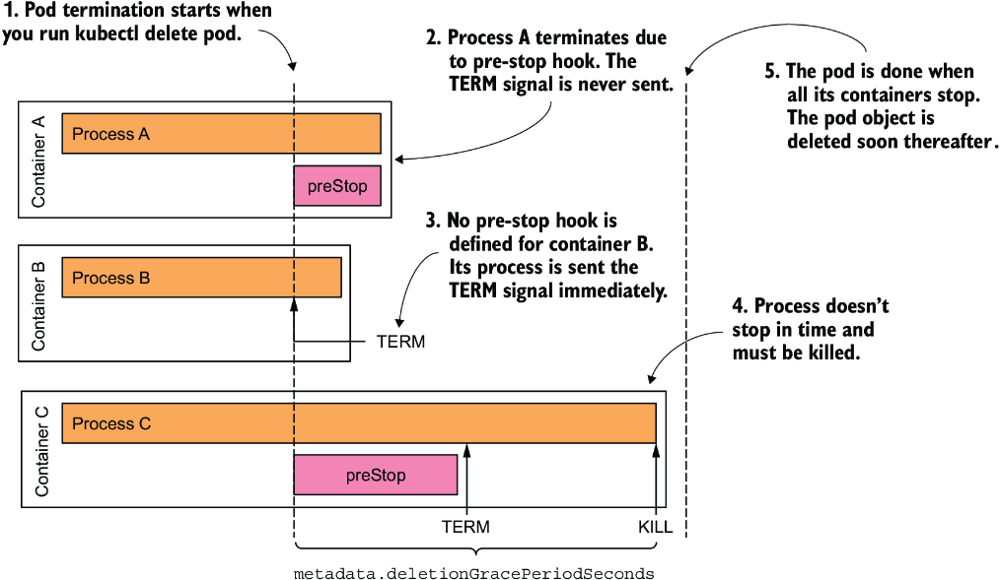

*Hình 6.16: Trình tự kết thúc bên trong một pod*

#### Kiểm tra việc tắt chậm của một pod (Inspecting the slow shutdown of a pod)

Hãy xem xét giai đoạn cuối cùng này trong vòng đời của pod trên một trong các pod bạn đã tạo trước đó. Nếu pod `kiada-ssl` không chạy trong cluster của bạn, hãy tạo lại nó. Bây giờ hãy xóa pod bằng cách chạy `kubectl delete pod kiada-ssl`.

Việc xóa pod mất thời gian lâu đến ngạc nhiên, phải không? Tôi đếm được ít nhất 30 giây. Điều này không bình thường và cũng không chấp nhận được, nên hãy sửa nó.

Xét những gì bạn đã học trong mục này, bạn có thể đã biết điều gì khiến pod mất nhiều thời gian đến vậy để kết thúc. Nếu chưa, hãy để tôi giúp bạn phân tích tình huống.

Pod `kiada-ssl` có hai container. Cả hai phải dừng trước khi Pod object có thể bị xóa. Không container nào có định nghĩa pre-stop hook, nên cả hai container hẳn nhận tín hiệu `SIGTERM` ngay lập tức khi bạn xóa pod. Con số 30 giây tôi đề cập trước đó khớp với giá trị mặc định của termination grace period, nên có vẻ như một trong hai container, nếu không phải cả hai, không dừng khi nhận tín hiệu `SIGTERM` và bị kill sau khi thời gian ân hạn hết hạn.

#### Thay đổi termination grace period (Changing the termination grace period)

Bạn có thể thử đặt trường `terminationGracePeriodSeconds` của pod ở giá trị thấp hơn để xem nó có kết thúc sớm hơn không. Listing sau đây cho thấy cách thêm trường này vào manifest của pod (file `pod.kiada-ssl-shortgraceperiod.yaml`).

**Listing 6.6: Đặt terminationGracePeriodSeconds thấp hơn để pod tắt nhanh hơn (`pod.kiada-ssl-shortgraceperiod.yaml`)**

```yaml
apiVersion: v1
kind: Pod
metadata:
  name: kiada-ssl-shortgraceperiod
spec:
  terminationGracePeriodSeconds: 5    #1
  containers:
  ...
```

- **#1** Các container của pod này có 5 giây để kết thúc sau khi nhận tín hiệu SIGTERM, nếu không chúng sẽ bị kill.

Trong listing trên, `terminationGracePeriodSeconds` của pod được đặt là `5`. Nếu bạn tạo rồi xóa pod này, bạn sẽ thấy các container của nó bị kết thúc trong vòng 5 giây sau khi nhận tín hiệu `SIGTERM`.

> **MẸO:** Hiếm khi cần giảm termination grace period. Tuy nhiên, nên kéo dài nó nếu ứng dụng thường cần nhiều thời gian hơn để tắt một cách êm thấm.

#### Chỉ định deletion grace period khi xóa pod (Specifying the deletion grace period when deleting the pod)

Bất cứ khi nào bạn xóa một pod, `terminationGracePeriodSeconds` của pod quyết định khoảng thời gian pod được cho để tắt, nhưng bạn có thể ghi đè thời gian này khi thực thi lệnh `kubectl delete` bằng tùy chọn dòng lệnh `--grace-period`. Ví dụ, để cho pod 10 giây để tắt, hãy chạy lệnh sau:

```bash
$ kubectl delete po kiada-ssl --grace-period 10
```

> **GHI CHÚ:** Nếu bạn đặt thời gian ân hạn này bằng không, các pre-stop hook của pod sẽ không được thực thi.

#### Sửa hành vi tắt của ứng dụng Kiada (Fixing the shutdown behavior of the Kiada application)

Xét việc rút ngắn thời gian ân hạn dẫn đến pod tắt nhanh hơn, rõ ràng là ít nhất một trong hai container không tự kết thúc sau khi nhận tín hiệu `SIGTERM`. Để xem đó là container nào, hãy tạo lại pod, rồi chạy các lệnh sau để stream log của từng container trước khi xóa pod một lần nữa:

```bash
$ kubectl logs kiada-ssl -c kiada -f
$ kubectl logs kiada-ssl -c envoy -f
```

Log cho thấy Envoy proxy bắt được tín hiệu và kết thúc ngay lập tức, trong khi ứng dụng Node.js không phản ứng với tín hiệu. Để sửa điều này, bạn cần thêm đoạn mã trong listing sau vào cuối file `app.js` của mình. Bạn sẽ tìm thấy file đã cập nhật trong `Chapter06/kiada-0.3/app.js`.

**Listing 6.7: Xử lý tín hiệu SIGTERM trong ứng dụng kiada (`Chapter06/kiada-0.3/app.js`)**

```javascript
process.on('SIGTERM', function () {
  console.log("Received SIGTERM. Server shutting down...");
  server.close(function () {
    process.exit(0);
  });
});
```

Sau khi bạn thay đổi mã, hãy tạo một container image mới với tag `:0.3`, đẩy nó lên image registry của bạn, và triển khai một pod mới dùng image mới này. Bạn cũng có thể dùng image `docker.io/luksa/kiada:0.3` mà tôi đã xây dựng. Để tạo pod, hãy áp dụng file manifest `pod.kiada-ssl-0.3.yaml`.

Nếu bạn xóa pod mới này, bạn sẽ thấy nó tắt nhanh hơn đáng kể. Từ log của container `kiada`, bạn có thể thấy nó bắt đầu tắt ngay khi nhận được tín hiệu `SIGTERM`.

> **MẸO:** Đừng quên đảm bảo rằng các init container của bạn cũng xử lý tín hiệu `SIGTERM` để chúng tắt ngay lập tức nếu bạn xóa Pod object trong khi nó vẫn đang được khởi tạo.

### 6.4.4 Hình dung toàn bộ vòng đời của các container trong pod (Visualizing the full life cycle of the pod's containers)

Để kết thúc chương này về những gì diễn ra trong một pod, tôi trình bày một tổng quan cuối cùng về mọi thứ xảy ra trong suốt đời của một pod. Hình 6.17 và 6.18 tóm tắt mọi thứ đã được giải thích trong chương này. Quá trình khởi tạo pod được thể hiện trong hình tiếp theo.

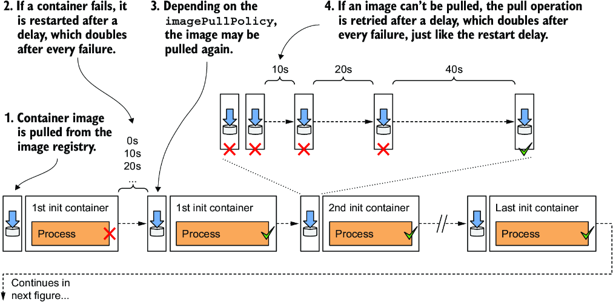

*Hình 6.17: Tổng quan đầy đủ về giai đoạn khởi tạo của pod*

> **GHI CHÚ:** Nếu `restartPolicy` của một init container được đặt là `Always`, init container đó là một sidecar container và không được kỳ vọng sẽ kết thúc. Do đó, init container tiếp theo được khởi động sau khi sidecar container khởi động hoàn toàn.

Khi việc khởi tạo hoàn tất, hoạt động bình thường của các container trong pod bắt đầu. Điều này được thể hiện trong hình tiếp theo.

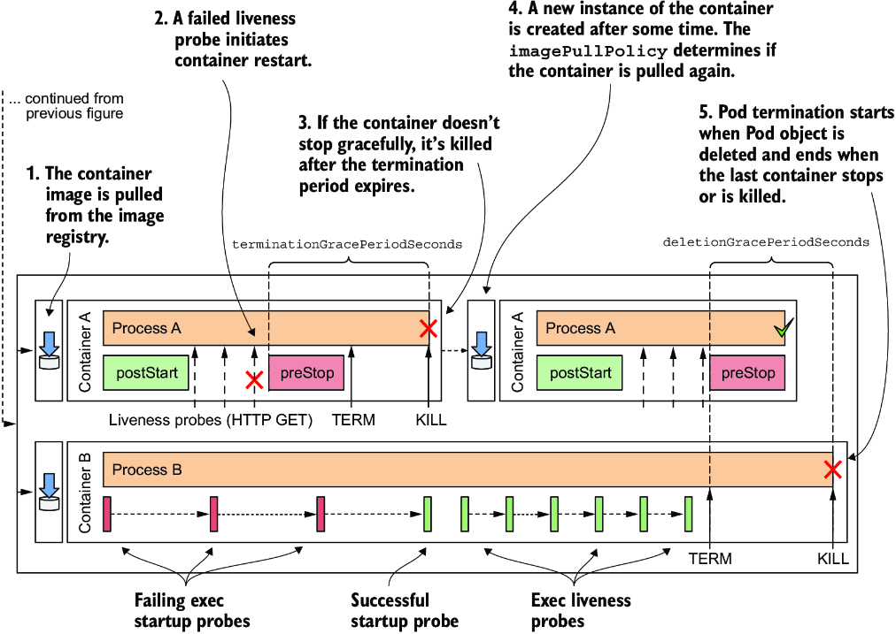

*Hình 6.18: Tổng quan đầy đủ về hoạt động bình thường của pod*

> **GHI CHÚ:** Nếu Pod chứa các native sidecar container, chúng bị kết thúc sau khi tất cả các container thông thường đã kết thúc. Các sidecar bị kết thúc theo thứ tự ngược với thứ tự xuất hiện của chúng trong danh sách `initContainers`.

---

## Tóm tắt

* Status của pod chứa thông tin về phase của pod, các condition của nó, và status của từng container trong pod. Bạn có thể xem status bằng cách chạy lệnh `kubectl describe` hoặc bằng cách truy xuất manifest đầy đủ của pod bằng lệnh `kubectl get -o yaml`.
* Tùy thuộc vào restart policy của pod, các container của nó có thể được khởi động lại sau khi bị kết thúc. Trên thực tế, một container không bao giờ thực sự được khởi động lại. Thay vào đó, container cũ bị hủy, và một container mới được tạo ra thay thế.
* Nếu một container bị kết thúc liên tục, một độ trễ tăng theo cấp số nhân được chèn vào trước mỗi lần khởi động lại. Không có độ trễ cho lần khởi động lại đầu tiên, sau đó độ trễ là 10 giây, rồi nó tăng gấp đôi trước mỗi lần khởi động lại tiếp theo. Độ trễ tối đa là 5 phút và được đặt lại về không khi container đã chạy ổn định trong ít nhất gấp đôi khoảng thời gian này.
* Độ trễ tăng theo cấp số nhân cũng được dùng sau mỗi lần thử tải container image thất bại.
* Thêm liveness probe vào một container đảm bảo container được khởi động lại khi nó ngừng phản hồi. Liveness probe kiểm tra trạng thái của ứng dụng thông qua một request HTTP GET, bằng cách thực thi một lệnh trong container, hoặc mở một kết nối TCP tới một trong các cổng mạng của container.
* Nếu ứng dụng cần nhiều thời gian để khởi động, có thể định nghĩa một startup probe với các thiết lập khoan dung hơn so với liveness probe để ngăn container bị khởi động lại quá sớm.
* Bạn có thể định nghĩa lifecycle hook cho từng container chính của pod. Post-start hook được gọi khi container khởi động, trong khi pre-stop hook được gọi khi container phải tắt. Một lifecycle hook được cấu hình để hoặc gửi một request HTTP GET hoặc thực thi một lệnh bên trong container.
* Nếu một pre-stop hook được định nghĩa trong container và container phải kết thúc, hook được gọi trước tiên. Sau đó tín hiệu `SIGTERM` được gửi tới tiến trình chính trong container. Nếu tiến trình không dừng trong vòng `terminationGracePeriodSeconds` kể từ khi bắt đầu trình tự kết thúc, tiến trình bị kill.
* Khi bạn xóa một Pod object, tất cả các container thông thường của nó bị kết thúc song song, và mọi native sidecar bị kết thúc sau đó, khi tất cả các container thông thường đã dừng. `deletionGracePeriodSeconds` của pod là thời gian được cho các container để tắt. Theo mặc định, nó được đặt bằng termination grace period nhưng có thể được ghi đè bằng lệnh `kubectl delete`.
* Nếu việc tắt một pod mất nhiều thời gian, rất có thể một trong các tiến trình chạy trong nó không xử lý tín hiệu `SIGTERM`. Thêm một trình xử lý tín hiệu `SIGTERM` là giải pháp tốt hơn so với rút ngắn termination grace period hoặc deletion grace period.
