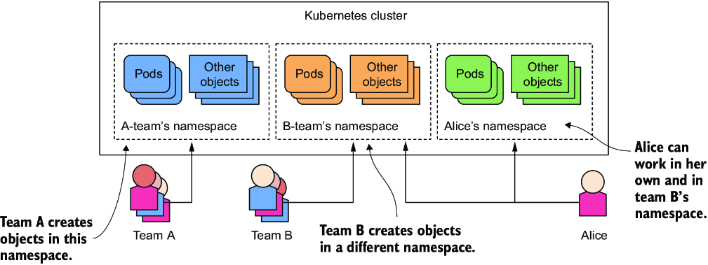
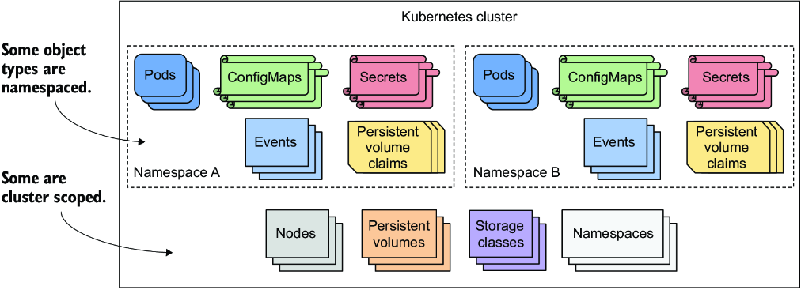
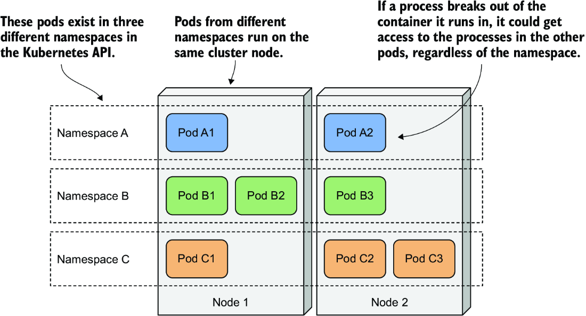
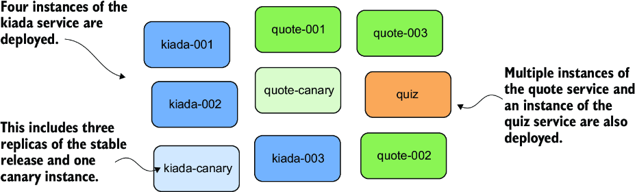
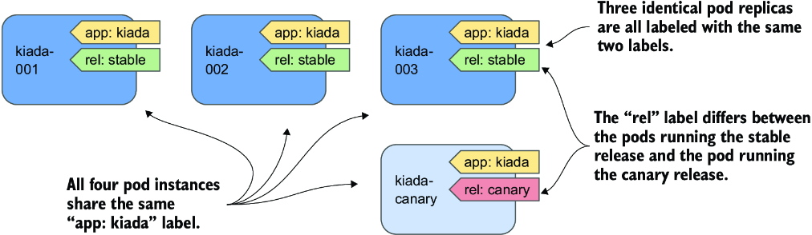
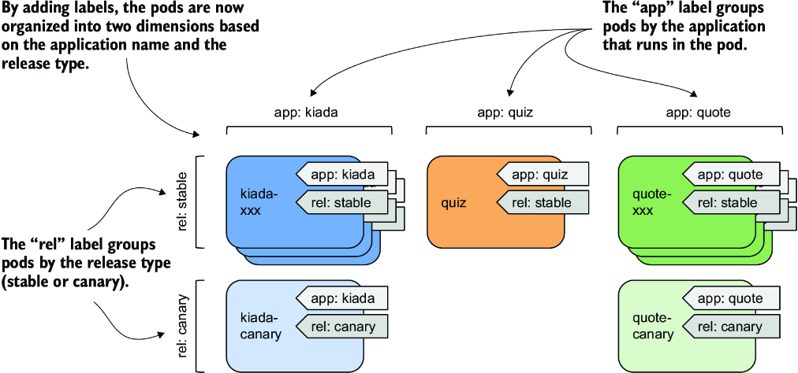
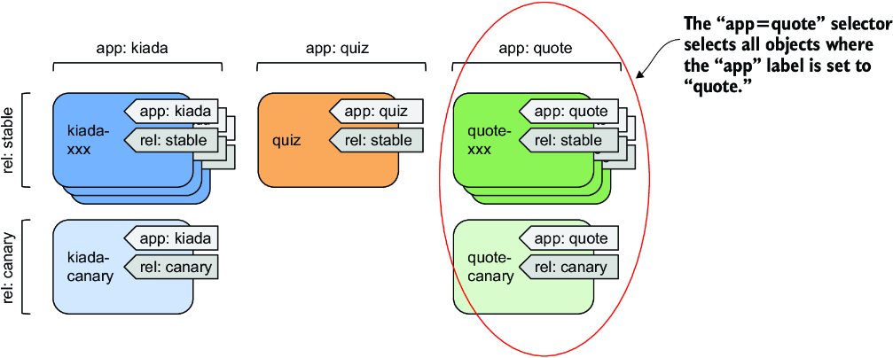
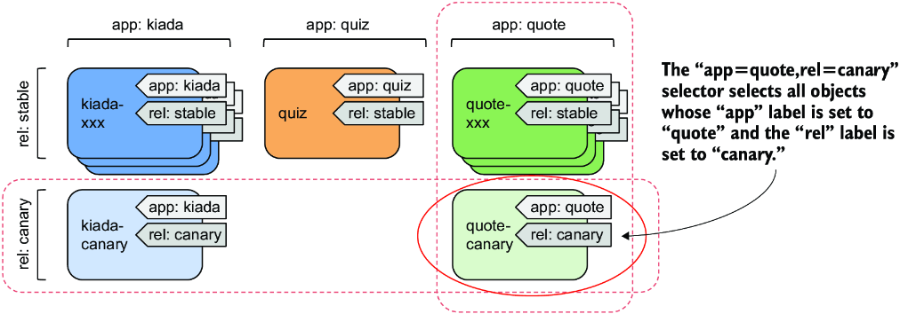
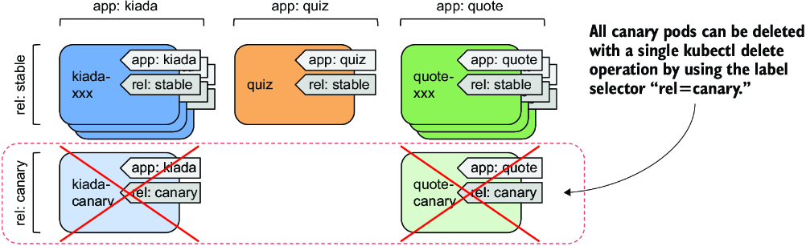

# Chương 7: Tổ chức pod và các tài nguyên khác bằng namespace và label

*(Dịch từ "Chapter 7: Organizing pods and other resources using namespaces and labels" – Kubernetes in Action, Second Edition, tác giả Marko Lukša, NXB Manning)*

---

## Nội dung chính của chương
* Dùng namespace để chia một cluster vật lý thành các cluster ảo
* Tổ chức các object bằng label
* Dùng label selector để thực hiện các thao tác trên những tập con của object
* Dùng label selector để lập lịch (schedule) pod lên những node cụ thể
* Dùng field selector để lọc object dựa trên các thuộc tính của chúng
* Gắn annotation cho object với thông tin bổ sung không dùng để nhận dạng

Một Kubernetes cluster thường được nhiều nhóm (team) sử dụng. Vậy, các nhóm này nên triển khai object vào cùng một cluster và tổ chức chúng như thế nào để một nhóm không vô tình sửa đổi các object do nhóm khác tạo ra? Và làm thế nào một nhóm lớn đang triển khai hàng trăm microservice có thể tổ chức chúng sao cho mỗi thành viên trong nhóm, kể cả người mới, có thể nhanh chóng thấy được mỗi object thuộc về đâu và vai trò của nó trong hệ thống là gì (ví dụ: một pod thuộc về ứng dụng nào)?

Đây là hai vấn đề khác nhau. Kubernetes giải quyết vấn đề thứ nhất bằng object namespace và vấn đề thứ hai bằng object label. Cả hai đều được giải thích trong chương này.

> **GHI CHÚ:** Bạn có thể tìm thấy các file code của chương này tại https://mng.bz/nZ9d.

---

## 7.1 Tổ chức object vào các namespace (Organizing objects into namespaces)

Hãy tưởng tượng tổ chức của bạn đang vận hành một Kubernetes cluster duy nhất được nhiều nhóm kỹ sư sử dụng. Mỗi nhóm này triển khai toàn bộ bộ ứng dụng Kiada (Kiada application suite) để phát triển và kiểm thử nó. Bạn muốn mỗi nhóm chỉ phải làm việc với instance riêng của họ của bộ ứng dụng – mỗi nhóm chỉ muốn thấy các object mà họ đã tạo chứ không phải những object do các nhóm khác tạo ra. Điều này đạt được bằng cách tạo các object trong những Kubernetes namespace riêng biệt.

> **GHI CHÚ:** Namespace trong Kubernetes giúp tổ chức các Kubernetes API object thành những nhóm không chồng lấn nhau. Chúng không liên quan gì đến Linux namespace, thứ giúp cô lập các tiến trình chạy trong một container khỏi các tiến trình trong container khác, như bạn đã học trong chương 2.

Như minh họa trong hình 7.1, bạn có thể dùng namespace để chia một Kubernetes cluster vật lý duy nhất thành nhiều cluster ảo. Thay vì mọi người đều tạo object của mình ở một nơi duy nhất, mỗi nhóm được cấp quyền truy cập vào một hoặc nhiều namespace để tạo object trong đó. Vì namespace cung cấp một phạm vi (scope) cho tên object, các nhóm khác nhau có thể dùng cùng một tên cho object của họ khi tạo chúng trong namespace tương ứng của mình. Một số namespace có thể được chia sẻ giữa các nhóm hoặc người dùng cá nhân khác nhau.



*Hình 7.1: Chia một cluster vật lý thành nhiều cluster ảo bằng cách tận dụng Kubernetes Namespace*

#### Hiểu khi nào nên tổ chức object vào namespace (Understanding when to organize objects into namespaces)

Dùng nhiều namespace cho phép chia những hệ thống phức tạp với vô số thành phần thành các nhóm nhỏ hơn do các team khác nhau quản lý. Chúng cũng có thể được dùng để tách biệt các object trong môi trường đa người thuê (multitenant). Ví dụ, bạn có thể tạo một namespace riêng (hoặc một nhóm namespace) cho mỗi khách hàng và triển khai toàn bộ bộ ứng dụng cho khách hàng đó trong namespace (hoặc nhóm namespace) đó.

> **GHI CHÚ:** Hầu hết các kiểu Kubernetes API object đều thuộc phạm vi namespace (namespaced), nhưng một số thì không. Pod, ConfigMap, Secret, PersistentVolumeClaim và Event đều thuộc phạm vi namespace. Node, PersistentVolume, StorageClass và bản thân Namespace thì không. Để xem một resource thuộc phạm vi namespace hay phạm vi cluster (cluster scoped), hãy kiểm tra cột `NAMESPACED` khi chạy `kubectl api-resources`.

Nếu không có namespace, mỗi người dùng của cluster sẽ phải thêm một tiền tố duy nhất vào tên object của họ, hoặc mỗi người dùng sẽ phải dùng Kubernetes cluster riêng của mình (hình 7.2). Namespace cũng cung cấp phạm vi cho các đặc quyền của người dùng. Một người dùng có thể có quyền quản lý object trong một namespace nhưng không có quyền trong các namespace khác. Vì lý do này, namespace rất quan trọng trong các cluster production, vốn thường được nhiều người dùng và nhóm khác nhau chia sẻ.



*Hình 7.2: Một số kiểu Kubernetes API thuộc phạm vi namespace, trong khi những kiểu khác thuộc phạm vi cluster.*

### 7.1.1 Liệt kê namespace và các object chúng chứa (Listing namespaces and the objects they contain)

Mọi Kubernetes cluster bạn tạo đều chứa một vài namespace chung. Hãy xem chúng là gì.

#### Liệt kê namespace (Listing namespaces)

Vì mỗi namespace được biểu diễn bằng Namespace object, bạn có thể hiển thị chúng bằng lệnh `kubectl get`, giống như với bất kỳ Kubernetes API object nào khác. Để xem các namespace trong cluster của bạn, hãy chạy lệnh sau:

```bash
$ kubectl get namespaces
NAME                 STATUS   AGE
default              Active   1h
kube-node-lease      Active   1h
kube-public          Active   1h
kube-system          Active   1h
local-path-storage   Active   1h
```

> **GHI CHÚ:** Dạng viết tắt của namespace là `ns`. Bạn cũng có thể liệt kê namespace bằng `kubectl get ns`.

Cho đến giờ, bạn vẫn đang làm việc trong namespace `default`. Mỗi lần bạn tạo một object, nó được tạo trong namespace đó. Tương tự, khi bạn liệt kê các object, chẳng hạn như pod, bằng lệnh `kubectl get`, lệnh này chỉ hiển thị các object trong namespace đó. Có thể bạn đang tự hỏi liệu có pod nào trong các namespace khác không. Hãy cùng xem.

> **GHI CHÚ:** Các namespace có tiền tố `kube-` được dành riêng cho các namespace hệ thống của Kubernetes.

#### Liệt kê object trong một namespace cụ thể (Listing objects in a specific namespace)

Để liệt kê các pod trong namespace `kube-system`, hãy chạy `kubectl get` với tùy chọn `--namespace` như sau:

```bash
$ kubectl get pods --namespace kube-system
NAME                       READY   STATUS    RESTARTS   AGE
coredns-558bd4d5db-4n5zg   1/1     Running   0          1h
coredns-558bd4d5db-tnfws   1/1     Running   0          1h
etcd-kind-control-plane    1/1     Running   0          1h
kindnet-54ks9              1/1     Running   0          1h
...
```

> **MẸO:** Bạn cũng có thể dùng `-n` thay cho `--namespace`.

Bạn sẽ tìm hiểu thêm về các pod này ở phần sau của cuốn sách. Đừng lo nếu các pod hiển thị ở đây không hoàn toàn khớp với các pod trong cluster của bạn. Đúng như tên namespace gợi ý, đây là các pod hệ thống của Kubernetes. Bằng cách đặt chúng trong namespace riêng biệt này, mọi thứ luôn gọn gàng và rõ ràng. Nếu tất cả chúng đều nằm trong namespace `default`, lẫn lộn với các pod bạn tự tạo, sẽ rất khó biết cái gì thuộc về đâu, và bạn có thể vô tình xóa các object hệ thống.

#### Liệt kê object trên tất cả các namespace (Listing objects across all namespaces)

Thay vì liệt kê object trong từng namespace riêng lẻ, bạn cũng có thể yêu cầu kubectl liệt kê object trong tất cả các namespace. Hãy liệt kê tất cả các pod trong cluster bằng cách chạy lệnh sau:

```bash
$ kubectl get pods --all-namespaces
NAMESPACE     NAME                        READY   STATUS    RESTARTS   AGE
default       kiada-ssl                   2/2     Running   0          6m3s
kube-system   gke-metrics-agent-jqz98     2/2     Running   0          21h
kube-system   kube-dns-5f6d887967-6sg6m   4/4     Running   0          21h
...
```

Như bạn thấy, cột `NAMESPACE` được hiển thị để cho biết namespace của mỗi object.

> **MẸO:** Bạn cũng có thể gõ `-A` thay cho `--all-namespaces`.

Tùy chọn `--all-namespaces` rất tiện khi bạn muốn xem tất cả các object trong cluster, bất kể namespace, hoặc khi bạn không nhớ một object nằm trong namespace nào.

### 7.1.2 Tạo namespace (Creating namespaces)

Giờ bạn đã biết các namespace khác trong cluster của mình, bạn sẽ tạo hai namespace mới.

#### Tạo namespace bằng kubectl create namespace (Creating a namespace with kubectl create namespace)

Cách nhanh nhất để tạo một namespace là dùng lệnh `kubectl create namespace`. Hãy tạo một namespace tên là `kiada-test1` như sau:

```bash
$ kubectl create namespace kiada-test1
namespace/kiada-test1 created
```

> **GHI CHÚ:** Tên của hầu hết các object phải tuân theo quy ước đặt tên cho tên miền con DNS (DNS subdomain name), như được quy định trong RFC 1123, tức là chúng chỉ được chứa các ký tự chữ và số viết thường, dấu gạch ngang và dấu chấm, và phải bắt đầu cũng như kết thúc bằng một ký tự chữ hoặc số. Điều tương tự cũng áp dụng cho namespace, nhưng chúng không được chứa dấu chấm.

Bạn vừa tạo namespace `kiada-test1`. Giờ bạn sẽ tạo thêm một namespace nữa bằng một phương pháp khác.

#### Tạo namespace từ file manifest (Creating a namespace from a manifest file)

Như đã đề cập trước đó, các Kubernetes namespace được biểu diễn bằng Namespace object. Do đó, bạn có thể liệt kê chúng bằng lệnh `kubectl get`, như bạn đã làm, nhưng bạn cũng có thể tạo chúng từ một file manifest YAML hoặc JSON mà bạn gửi (post) lên Kubernetes API.

Hãy dùng phương pháp này để tạo một namespace khác có tên `kiada-test2`. Trước tiên, tạo một file tên là `ns.kiada-test2.yaml` với nội dung như trong listing sau.

**Listing 7.1: Định nghĩa YAML của một Namespace object**

```yaml
apiVersion: v1
kind: Namespace       #1
metadata:
  name: kiada-test2   #2
```

- **#1** Manifest này chứa một Namespace object.
- **#2** Đây là tên của namespace.

Giờ hãy dùng `kubectl apply` để gửi file lên Kubernetes API:

```bash
$ kubectl apply -f ns.kiada-test2.yaml
namespace/kiada-test2 created
```

Các nhà phát triển (developer) thường không tạo namespace theo cách này, nhưng các operator thì có. Ví dụ, nếu bạn muốn tạo một bộ file manifest cho một bộ ứng dụng sẽ được phân bổ trên nhiều namespace, bạn có thể thêm các Namespace object cần thiết vào những manifest đó để mọi thứ có thể được triển khai mà không cần phải tạo namespace bằng `kubectl create` trước rồi mới apply các manifest.

Trước khi tiếp tục, bạn nên chạy `kubectl get ns` để liệt kê lại tất cả các namespace và thấy rằng cluster của bạn giờ đã chứa hai namespace bạn vừa tạo.

### 7.1.3 Quản lý object trong các namespace khác (Managing objects in other namespaces)

Bạn đã tạo hai namespace mới – `kiada-test1` và `kiada-test2` – nhưng như đã đề cập trước đó, bạn vẫn đang ở trong namespace `default`. Nếu bạn tạo một object như pod mà không chỉ định namespace một cách tường minh, object đó được tạo trong namespace hiện tại. Trừ khi bạn đã cấu hình kubectl để dùng một namespace khác, namespace hiện tại chính là namespace có tên `default`.

#### Tạo object trong một namespace cụ thể (Creating objects in a specific namespace)

Trong mục 7.1.1, bạn đã học rằng bạn có thể chỉ định cờ `--namespace` (hoặc tùy chọn ngắn hơn `-n`) để liệt kê object trong một namespace cụ thể. Bạn có thể dùng cùng tham số đó khi apply một object manifest lên API.

Để tạo Pod `kiada-ssl` trong namespace `kiada-test1`, hãy chạy lệnh sau:

```bash
$ kubectl apply -f kiada-ssl.yaml -n kiada-test1
pod/kiada-ssl created
```

Giờ bạn có thể liệt kê các pod trong namespace `kiada-test1` để xác nhận rằng Pod object đã được tạo ở đó chứ không phải trong namespace `default`:

```bash
$ kubectl -n kiada-test1 get pods
NAME        READY   STATUS    RESTARTS   AGE
kiada-ssl   2/2     Running   0          1m
```

#### Chỉ định namespace trong object manifest (Specifying the namespace in the object manifest)

Object manifest có thể chỉ định namespace của object trong trường `namespace` thuộc phần `metadata` của manifest. Khi bạn apply manifest bằng lệnh `kubectl apply`, object được tạo trong namespace đã chỉ định. Bạn không cần chỉ định namespace bằng tùy chọn `--namespace`.

Manifest trong listing 7.2 chứa cùng ba object như trước, nhưng với namespace được chỉ định trong manifest.

**Listing 7.2: Chỉ định namespace trong object manifest**

```yaml
apiVersion: v1
kind: Pod
metadata:
  name: kiada-ssl
  namespace: kiada-test2   #1
spec:
  ...
```

- **#1** Pod object này chỉ định namespace. Khi bạn apply manifest, pod này được tạo trong namespace kiada-test2.

Khi bạn apply manifest này bằng lệnh sau, pod được tạo trong namespace `kiada-test2`:

```bash
$ kubectl apply -f kiada-ssl.kiada-test2-namespace.yaml
pod/kiada-ssl created
```

Lưu ý rằng lần này bạn không chỉ định tùy chọn `--namespace`. Nếu bạn có chỉ định, namespace đó sẽ phải khớp với namespace được chỉ định trong object manifest, nếu không kubectl sẽ hiển thị một lỗi như trong ví dụ sau:

```bash
$ kubectl apply -f kiada-ssl.kiada-test2-namespace.yaml -n kiada-test1
the namespace from the provided object "kiada-test2" does not match the namespace "kiada-test1". You must pass '--namespace=kiada-test2' to perform this operation.
```

#### Đặt namespace mặc định khác cho kubectl (Making kubectl default to a different namespace)

Trong hai ví dụ trước, bạn đã học cách tạo và quản lý object trong các namespace khác với namespace mà kubectl hiện đang dùng làm mặc định. Bạn sẽ dùng tùy chọn `--namespace` thường xuyên – đặc biệt khi muốn nhanh chóng kiểm tra xem có gì trong một namespace khác. Tuy nhiên, bạn sẽ làm phần lớn công việc của mình trong namespace hiện tại.

Sau khi tạo một namespace mới, bạn thường sẽ chạy nhiều lệnh trong đó. Để cuộc sống dễ dàng hơn, bạn có thể yêu cầu kubectl chuyển sang namespace đó. Namespace hiện tại là một thuộc tính của kubectl context hiện tại, được cấu hình trong file kubeconfig.

> **GHI CHÚ:** Bạn đã học về file kubeconfig trong chương 3.

Để chuyển sang một namespace khác, bạn phải cập nhật context hiện tại. Ví dụ, để chuyển sang namespace `kiada-test1`, hãy chạy lệnh sau:

```bash
$ kubectl config set-context --current --namespace kiada-test1
Context "kind-kind" modified.
```

Mọi lệnh kubectl bạn chạy từ giờ trở đi sẽ dùng namespace `kiada-test1`. Ví dụ, giờ bạn có thể liệt kê các pod trong namespace này chỉ bằng cách gõ `kubectl get pods`.

> **MẸO:** Để nhanh chóng chuyển sang một namespace khác, bạn có thể thiết lập alias sau: `alias kns='kubectl config set-context --current --namespace '`. Sau đó bạn có thể chuyển giữa các namespace bằng `kns some-namespace`. Ngoài ra, bạn có thể cài đặt một kubectl plugin làm điều tương tự. Plugin này có tại https://github.com/ahmetb/kubectx.

Không còn nhiều điều để học về việc tạo và quản lý object trong các namespace khác nhau. Nhưng trước khi kết thúc mục này, tôi cần giải thích Kubernetes cô lập các workload chạy trong các namespace khác nhau tốt đến mức nào.

### 7.1.4 Hiểu về sự (thiếu) cô lập giữa các namespace (Understanding the (lack of) isolation between namespaces)

Cho đến giờ bạn đã tạo vài pod trong các namespace khác nhau. Bạn đã biết cách dùng tùy chọn `--all-namespaces` (hoặc viết tắt `-A`) để liệt kê pod trên tất cả các namespace, vậy hãy làm điều đó ngay bây giờ:

```bash
$ kubectl get pods -A
NAMESPACE     NAME        READY   STATUS    RESTARTS   AGE
default       kiada-ssl   2/2     Running   0          8h    #1
default       quiz        2/2     Running   0          8h
default       quote       2/2     Running   0          8h
kiada-test1   kiada-ssl   2/2     Running   0          2m
kiada-test2   kiada-ssl   2/2     Running   0          1m
...
```

- **#1** Ba pod có tên kiada-ssl tồn tại trong các namespace khác nhau.

Trong output của lệnh, bạn sẽ thấy ít nhất hai pod tên là `kiada-ssl`: một trong namespace `kiada-test1` và một trong namespace `kiada-test2`. Bạn cũng có thể có thêm một pod nữa tên `kiada-ssl` trong namespace `default` từ các bài tập ở chương trước. Trong trường hợp này, có ba pod trong cluster của bạn với cùng một tên, và bạn đã có thể tạo tất cả chúng mà không gặp vấn đề gì nhờ có namespace. Những người dùng khác của cùng cluster này có thể triển khai thêm nhiều pod như vậy nữa mà không giẫm chân lên nhau.

#### Hiểu về sự cô lập lúc thực thi giữa các pod trong những namespace khác nhau (Understanding the runtime isolation between pods in different namespaces)

Khi người dùng dùng namespace trong một cluster vật lý duy nhất, giống như mỗi người đang dùng cluster ảo của riêng mình. Nhưng điều này chỉ đúng ở mức có thể tạo object mà không gặp xung đột về tên. Các node vật lý của cluster được chia sẻ bởi tất cả người dùng trong cluster. Điều này có nghĩa là sự cô lập giữa các pod của họ không giống như khi chúng chạy trên các cluster vật lý khác nhau và do đó trên các node vật lý khác nhau (xem hình 7.3).



*Hình 7.3: Các pod từ những namespace khác nhau có thể chạy trên cùng một node của cluster.*

Khi hai pod được tạo trong các namespace khác nhau được lập lịch lên cùng một node của cluster, cả hai đều chạy trong cùng một kernel hệ điều hành. Mặc dù chúng được cô lập với nhau bằng các công nghệ container, một ứng dụng thoát ra khỏi container của nó hoặc tiêu thụ quá nhiều tài nguyên của node có thể ảnh hưởng đến hoạt động của ứng dụng kia. Kubernetes namespace không đóng vai trò gì ở đây.

#### Hiểu về sự cô lập mạng giữa các namespace (Understanding network isolation between namespaces)

Trừ khi được cấu hình tường minh để làm vậy, Kubernetes không cung cấp sự cô lập mạng giữa các ứng dụng chạy trong các pod ở những namespace khác nhau. Một ứng dụng chạy trong một namespace có thể giao tiếp với các ứng dụng chạy trong những namespace khác. Theo mặc định, không có sự cô lập mạng nào giữa các namespace. Tuy nhiên, bạn có thể dùng NetworkPolicy object để cấu hình những ứng dụng nào trong các namespace cụ thể được phép kết nối tới các ứng dụng trong namespace khác.

#### Dùng namespace để tách biệt các môi trường production, staging và development (Using namespaces to separate production, staging, and development environments)

Vì namespace không cung cấp sự cô lập thực sự, bạn không nên dùng chúng để chia một Kubernetes cluster vật lý duy nhất thành các môi trường production, staging và development. Đặt mỗi môi trường trên một cluster vật lý riêng biệt là cách tiếp cận an toàn hơn nhiều.

### 7.1.5 Xóa namespace (Deleting namespaces)

Hãy kết thúc mục về namespace này bằng cách xóa hai namespace bạn đã tạo. Khi bạn xóa Namespace object, tất cả các object bạn đã tạo trong namespace đó sẽ tự động bị xóa. Bạn không cần xóa chúng trước.

Xóa namespace `kiada-test2` như sau:

```bash
$ kubectl delete ns kiada-test2
namespace "kiada-test2" deleted
```

Lệnh này sẽ chặn (block) cho đến khi mọi thứ trong namespace và bản thân namespace đó bị xóa. Nhưng nếu bạn ngắt lệnh và liệt kê các namespace trước khi việc xóa hoàn tất, bạn sẽ thấy trạng thái của namespace là `Terminating`:

```bash
$ kubectl get ns
NAME          STATUS        AGE
default       Active        2h
kiada-test1   Active        2h
kiada-test2   Terminating   2h
...
```

Lý do tôi cho bạn thấy điều này là vì rồi sẽ có lúc bạn chạy lệnh `delete` và nó không bao giờ kết thúc. Bạn có thể sẽ ngắt lệnh và kiểm tra danh sách namespace, như minh họa ở đây. Rồi bạn sẽ tự hỏi tại sao việc kết thúc (termination) namespace không hoàn tất.

> **MẸO:** Bạn có thể dùng tùy chọn `--wait=false` để lệnh `kubectl delete` thoát ngay lập tức thay vì chờ object bị xóa hoàn toàn.

#### Chẩn đoán tại sao việc kết thúc namespace bị kẹt (Diagnosing why namespace termination is stuck)

Nói ngắn gọn, lý do một namespace không thể bị xóa là vì một hoặc nhiều object được tạo trong đó không thể bị xóa. Bạn có thể tự nhủ: "Ồ, tôi sẽ liệt kê các object trong namespace bằng `kubectl get all` để xem object nào vẫn còn đó", nhưng điều đó thường không giúp bạn tiến xa hơn vì kubectl không trả về kết quả nào.

> **GHI CHÚ:** Hãy nhớ rằng lệnh `kubectl get all` chỉ liệt kê một số kiểu object. Ví dụ, nó không liệt kê Secret. Dù lệnh không trả về gì, điều đó không có nghĩa là namespace trống.

Trong hầu hết, nếu không muốn nói là tất cả, các trường hợp tôi từng thấy một namespace bị kẹt theo cách này, vấn đề là do một custom object và custom controller của nó không xử lý việc xóa object và không gỡ bỏ một finalizer khỏi object.

Ở đây tôi chỉ muốn cho bạn thấy cách tìm ra object nào đang khiến namespace bị kẹt. Đây là một gợi ý: Namespace object cũng có trường `status`. Mặc dù lệnh `kubectl describe` thông thường cũng hiển thị status của object, tại thời điểm viết sách, điều này không đúng với namespace. Tôi coi đây là một lỗi (bug) có thể sẽ được sửa vào một lúc nào đó. Cho đến khi đó, bạn có thể kiểm tra status của namespace như sau:

```bash
$ kubectl get ns kiada-test2 -o yaml
...
status:
  conditions:
  - lastTransitionTime: "2021-10-10T08:35:11Z"
    message: All resources successfully discovered
    reason: ResourcesDiscovered
    status: "False"
    type: NamespaceDeletionDiscoveryFailure
  - lastTransitionTime: "2021-10-10T08:35:11Z"
    message: All legacy kube types successfully parsed
    reason: ParsedGroupVersions
    status: "False"
    type: NamespaceDeletionGroupVersionParsingFailure
  - lastTransitionTime: "2021-10-10T08:35:11Z"                                #1
    message: All content successfully deleted, may be waiting on finalization #1
    reason: ContentDeleted                                                    #1
    status: "False"                                                           #1
    type: NamespaceDeletionContentFailure                                     #1
  - lastTransitionTime: "2021-10-10T08:35:11Z"                                #2
    message: 'Some resources are remaining: pods. has 1 resource instances'   #2
    reason: SomeResourcesRemain                                               #2
    status: "True"                                                            #2
    type: NamespaceContentRemaining                                           #2
  - lastTransitionTime: "2021-10-10T08:35:11Z"                                #3
    message: 'Some content in the namespace has finalizers remaining:         #3
      xyz.xyz/xyz-finalizer in 1 resource instances'                          #3
    reason: SomeFinalizersRemain                                              #3
    status: "True"                                                            #3
    type: NamespaceFinalizersRemaining                                        #3
  phase: Terminating                                                          #3
```

- **#1** Tất cả các object trong namespace đã được đánh dấu để xóa, nhưng một số vẫn chưa bị xóa hoàn toàn.
- **#2** Một pod vẫn còn trong namespace.
- **#3** Pod chưa bị xóa hoàn toàn vì một controller chưa gỡ bỏ finalizer được chỉ định khỏi object.

Khi bạn xóa namespace `kiada-test2`, bạn sẽ không thấy output như trong ví dụ này. Output lệnh trong ví dụ này là giả định. Tôi đã ép Kubernetes tạo ra nó để minh họa điều gì xảy ra khi quá trình xóa bị kẹt. Nếu nhìn vào output, bạn sẽ thấy tất cả các object trong namespace đều đã được đánh dấu xóa thành công, nhưng một pod vẫn còn trong namespace do một finalizer chưa được gỡ khỏi pod. Đừng lo về finalizer lúc này. Bạn sẽ sớm tìm hiểu về chúng.

Trước khi chuyển sang mục tiếp theo, hãy xóa cả namespace `kiada-test1` nữa.

---

## 7.2 Tổ chức pod bằng label (Organizing pods with labels)

Trong cuốn sách này, bạn sẽ xây dựng và triển khai toàn bộ bộ ứng dụng Kiada, vốn bao gồm nhiều service. Ít nhất một Pod object, nhưng cũng có nhiều object khác, sẽ được liên kết với mỗi service. Như bạn có thể hình dung, số lượng các object này sẽ tăng lên khi cuốn sách tiến triển. Trước khi mọi thứ vượt khỏi tầm kiểm soát, bạn cần bắt đầu tổ chức các object này để bạn và tất cả những người dùng khác trong cluster có thể dễ dàng nhận ra object nào được liên kết với service nào.

Trong các hệ thống khác dùng microservice, số lượng service có thể vượt quá 100 hoặc hơn. Một số service trong đó được nhân bản (replicated), nghĩa là nhiều bản sao của cùng một pod được triển khai. Ngoài ra, tại những thời điểm nhất định, nhiều phiên bản của một service chạy đồng thời. Điều này dẫn đến hàng trăm, thậm chí hàng nghìn pod trong hệ thống.

Hãy tưởng tượng bạn cũng bắt đầu nhân bản và chạy nhiều bản phát hành (release) của các pod trong bộ Kiada của mình. Ví dụ, giả sử bạn đang chạy cả bản phát hành ổn định (stable) lẫn bản canary của Kiada service.

> **ĐỊNH NGHĨA:** Canary release là một mẫu triển khai (deployment pattern) trong đó một phiên bản mới của ứng dụng được triển khai song song với phiên bản ổn định và chỉ điều hướng một phần nhỏ request đến phiên bản mới để xem nó hoạt động ra sao trước khi triển khai (roll out) cho tất cả người dùng. Điều này ngăn một bản phát hành lỗi được đưa đến quá nhiều người dùng.

Hãy tưởng tượng bạn chạy ba replica của phiên bản Kiada ổn định và một instance canary. Tương tự, bạn chạy ba instance của bản phát hành ổn định của Quote service, cùng với một bản phát hành canary của Quote service. Bạn chạy một bản phát hành ổn định duy nhất của Quiz service. Tất cả các pod này được thể hiện trong hình 7.4.



*Hình 7.4: Các pod chưa được tổ chức của bộ ứng dụng Kiada*

Ngay cả khi chỉ có chín pod trong hệ thống, sơ đồ hệ thống đã khó hiểu. Và nó thậm chí còn chưa thể hiện bất kỳ API object nào khác mà các pod cần đến. Rõ ràng bạn cần tổ chức chúng thành các nhóm nhỏ hơn. Bạn có thể chia ba service này vào ba namespace, nhưng đó không phải mục đích thực sự của namespace. Cơ chế phù hợp hơn cho trường hợp này là object label.

### 7.2.1 Giới thiệu label (Introducing labels)

Label là một tính năng cực kỳ mạnh mẽ nhưng đơn giản để tổ chức các Kubernetes API object. Một label là một cặp khóa–giá trị (key–value) bạn gắn vào một object, cho phép bất kỳ người dùng nào của cluster nhận ra vai trò của object trong hệ thống. Cả khóa lẫn giá trị đều là các chuỗi đơn giản mà bạn có thể chỉ định tùy ý. Một object có thể có nhiều hơn một label, nhưng các khóa label phải là duy nhất trong object đó. Bạn thường thêm label vào object khi tạo chúng, nhưng bạn cũng có thể thay đổi label của một object sau này.

#### Dùng label để cung cấp thông tin bổ sung về một object (Using labels to provide additional information about an object)

Để minh họa lợi ích của việc thêm label vào object, hãy lấy các pod trong hình 7.4. Các pod này chạy ba service khác nhau: Kiada service, Quote và Quiz service. Ngoài ra, các pod đứng sau Kiada và Quote service chạy các bản phát hành khác nhau của mỗi ứng dụng. Có ba instance pod chạy bản phát hành ổn định và một instance chạy bản phát hành canary.

Để giúp nhận diện ứng dụng và bản phát hành đang chạy trong mỗi pod, chúng ta dùng pod label. Kubernetes không quan tâm bạn thêm label gì vào object của mình. Bạn có thể chọn khóa và giá trị theo bất kỳ cách nào bạn muốn. Trong trường hợp này, hai label sau là hợp lý:

* Label `app` cho biết pod thuộc về ứng dụng nào.
* Label `rel` cho biết pod đang chạy bản phát hành ổn định hay canary của ứng dụng.

Như minh họa trong hình 7.5, giá trị của label `app` được đặt là `kiada` trong cả ba Pod `kiada-xxx` và Pod `kiada-canary`, vì tất cả các pod này đều đang chạy ứng dụng Kiada. Label `rel` khác nhau giữa các pod chạy bản phát hành ổn định và pod chạy bản phát hành canary.



*Hình 7.5: Gắn label `app` và `rel` cho các pod*

Hình minh họa chỉ thể hiện các Pod kiada, nhưng hãy tưởng tượng việc thêm hai label tương tự vào các pod khác nữa. Với những label này, người dùng gặp các pod này có thể dễ dàng biết ứng dụng nào và loại bản phát hành nào đang chạy trong pod.

#### Hiểu cách label giữ cho object được tổ chức (Understanding how labels keep objects organized)

Nếu bạn vẫn chưa nhận ra giá trị của việc thêm label vào object, hãy cân nhắc rằng bằng cách thêm label `app` và `rel`, bạn đã tổ chức các pod của mình theo hai chiều (theo chiều ngang là ứng dụng và theo chiều dọc là bản phát hành), như minh họa trong hình 7.6.



*Hình 7.6: Tất cả các pod của bộ Kiada được tổ chức theo hai tiêu chí*

Điều này có vẻ trừu tượng cho đến khi bạn thấy cách những label này giúp quản lý các pod bằng kubectl dễ dàng hơn, vậy hãy thực hành.

### 7.2.2 Thêm label vào pod (Adding labels to pods)

Kho code của cuốn sách chứa một bộ file manifest với tất cả các pod từ ví dụ trước. Tất cả các pod ổn định đã được gắn label, nhưng các pod canary thì chưa. Bạn sẽ gắn label cho chúng thủ công.

#### Thiết lập bài tập (Setting up the exercise)

Để bắt đầu, hãy tạo một namespace mới tên là `kiada` như sau:

```bash
$ kubectl create namespace kiada
namespace/kiada created
```

Cấu hình kubectl để dùng namespace mới này như sau:

```bash
$ kubectl config set-context --current --namespace kiada
Context "kind-kind" modified.
```

Các file manifest được tổ chức trong ba thư mục con bên trong `Chapter10/kiada-suite/`. Thay vì apply từng manifest riêng lẻ, bạn có thể apply tất cả chúng bằng lệnh sau:

```bash
$ kubectl apply -f kiada-suite/ -R   #1
pod/kiada-001 created
...
pod/quote-003 created
pod/quote-canary created
```

- **#1** Apply tất cả các manifest trong thư mục kiada-suite/ và các thư mục con của nó

Bạn đã quen với việc apply một file manifest, nhưng ở đây bạn dùng tùy chọn `-f` để chỉ định tên thư mục. Kubectl sẽ apply tất cả các file manifest nó tìm thấy trong thư mục đó.

> **GHI CHÚ:** Tùy chọn `-R` (viết tắt của `--recursive`) chỉ thị kubectl tìm kiếm manifest trong tất cả các thư mục con của thư mục được chỉ định, thay vì chỉ giới hạn việc tìm kiếm trong chính thư mục đó.

Như bạn thấy, lệnh này tạo ra nhiều pod. Việc thêm label sẽ giúp giữ chúng được tổ chức.

#### Định nghĩa label trong object manifest (Defining labels in object manifests)

Hãy xem xét file manifest `kiada-suite/kiada/pod.kiada-001.yaml` trong listing sau. Hãy nhìn vào phần `metadata`. Bên cạnh trường `name` mà bạn đã thấy nhiều lần trước đây, manifest này còn chứa trường `labels`. Nó chỉ định hai label: `app` và `rel`.

**Listing 7.3: Một pod có label**

```yaml
apiVersion: v1
kind: Pod
metadata:
  name: kiada-001
  labels:          #1
    app: kiada     #2
    rel: stable    #3
spec:
  ...
```

- **#1** Các label của object được định nghĩa trong trường metadata.labels.
- **#2** Label "app" được đặt là "kiada".
- **#3** Label "rel" được đặt là "stable".

Label được hỗ trợ bởi tất cả các kiểu object. Bạn chỉ định chúng trong map `metadata.labels`.

#### Hiển thị label của object (Displaying object labels)

Bạn có thể xem label của một object cụ thể bằng cách chạy lệnh `kubectl describe`. Xem label của Pod `kiada-001` như sau:

```bash
$ kubectl describe pod kiada-001
Name:         kiada-001
Namespace:    kiada
Priority:     0
Node:         kind-worker2/172.18.0.2
Start Time:   Sun, 10 Oct 2021 21:58:25 +0200
Labels:       app=kiada    #1
              rel=stable   #1
Annotations:  <none>       #2
...
```

- **#1** Đây là hai label được định nghĩa trong file manifest của pod này.
- **#2** Annotation được giải thích trong mục 7.5.

> **MẸO:** Để chỉ hiển thị label của object, hãy dùng lệnh `kubectl get pod <name> -o yaml | yq .metadata.labels`.

Lệnh `kubectl get pods` không hiển thị label theo mặc định, nhưng bạn có thể hiển thị chúng bằng tùy chọn `--show-labels`. Kiểm tra label của tất cả các pod trong namespace như sau:

```bash
$ kubectl get pods --show-labels
NAME           READY   STATUS    RESTARTS   AGE   LABELS
kiada-001      2/2     Running   0          12m   app=kiada,rel=stable   #1
kiada-002      2/2     Running   0          12m   app=kiada,rel=stable   #1
kiada-003      2/2     Running   0          12m   app=kiada,rel=stable   #1
kiada-canary   2/2     Running   0          12m   <none>                 #2
quiz           2/2     Running   0          12m   app=quiz,rel=stable    #3
quote-001      2/2     Running   0          12m   app=quote,rel=stable   #4
quote-002      2/2     Running   0          12m   app=quote,rel=stable   #4
quote-003      2/2     Running   0          12m   app=quote,rel=stable   #4
quote-canary   2/2     Running   0          12m   <none>                 #2
```

- **#1** Đây là các Pod kiada ổn định.
- **#2** Các pod này không có label.
- **#3** Đây là pod Quiz ổn định.
- **#4** Đây là các pod Quote ổn định.

Thay vì hiển thị tất cả label bằng `--show-labels`, bạn cũng có thể hiển thị các label cụ thể bằng tùy chọn `--label-columns` (hoặc tùy chọn ngắn hơn `-L`). Mỗi label được hiển thị trong một cột riêng. Liệt kê tất cả các pod cùng với label `app` và `rel` của chúng như sau:

```bash
$ kubectl get pods -L app,rel
NAME           READY   STATUS    RESTARTS   AGE   APP     REL
kiada-001      2/2     Running   0          14m   kiada   stable
kiada-002      2/2     Running   0          14m   kiada   stable
kiada-003      2/2     Running   0          14m   kiada   stable
kiada-canary   2/2     Running   0          14m
quiz           2/2     Running   0          14m   quiz    stable
quote-001      2/2     Running   0          14m   quote   stable
quote-002      2/2     Running   0          14m   quote   stable
quote-003      2/2     Running   0          14m   quote   stable
quote-canary   2/2     Running   0          14m
```

Bạn có thể thấy hai pod canary không có label. Hãy thêm label cho chúng.

#### Thêm label vào một object đã tồn tại (Adding labels to an existing object)

Để thêm label vào một object đã tồn tại, bạn có thể chỉnh sửa file manifest của object, thêm label vào phần `metadata`, và apply lại manifest bằng `kubectl apply`. Bạn cũng có thể chỉnh sửa định nghĩa object trực tiếp trong API bằng `kubectl edit`. Tuy nhiên, phương pháp đơn giản nhất là dùng lệnh `kubectl label`.

Thêm label `app` và `rel` vào Pod `kiada-canary` bằng lệnh sau:

```bash
$ kubectl label pod kiada-canary app=kiada rel=canary
pod/kiada-canary labeled
```

Giờ làm tương tự cho pod `quote-canary`:

```bash
$ kubectl label pod quote-canary app=kiada rel=canary
pod/quote-canary labeled
```

Bạn có phát hiện ra lỗi trong lệnh `kubectl label` thứ hai không? Nếu không, có lẽ bạn sẽ nhận ra khi liệt kê lại các pod cùng với label của chúng. Label `app` của Pod `quote-canary` bị đặt sai giá trị (`kiada` thay vì `quote`). Hãy sửa lỗi này.

#### Thay đổi label của một object đã tồn tại (Changing labels of an existing object)

Bạn có thể dùng cùng lệnh này để cập nhật label của object. Để thay đổi label mà bạn đã đặt sai, hãy chạy lệnh sau:

```bash
$ kubectl label pod quote-canary app=quote
error: 'app' already has a value (kiada), and --overwrite is false
```

Để ngăn việc vô tình thay đổi giá trị của một label đã tồn tại, bạn phải nói rõ với kubectl rằng bạn muốn ghi đè label bằng `--overwrite`. Đây là lệnh đúng:

```bash
$ kubectl label pod quote-canary app=quote --overwrite
pod/quote-canary labeled
```

Liệt kê lại các pod để kiểm tra rằng tất cả các label giờ đã đúng.

#### Gắn label cho tất cả object của một kiểu (Labeling all objects of a kind)

Giờ hãy tưởng tượng bạn muốn triển khai một bộ ứng dụng khác trong cùng namespace. Trước khi làm điều này, sẽ hữu ích nếu thêm label `suite` vào tất cả các pod hiện có để bạn có thể biết pod nào thuộc bộ này và pod nào thuộc bộ kia. Chạy lệnh sau để thêm label vào tất cả các pod trong namespace:

```bash
$ kubectl label pod --all suite=kiada-suite
pod/kiada-canary labeled
pod/kiada-001 labeled
...
pod/quote-003 labeled
```

Liệt kê lại các pod với tùy chọn `--show-labels` hoặc `-L suite` để xác nhận rằng tất cả các pod giờ đều chứa label mới này.

#### Gỡ một label khỏi object (Removing a label from an object)

Được rồi, tôi đã nói dối. Bạn sẽ không thiết lập một bộ ứng dụng khác đâu. Do đó, label `suite` là thừa. Để gỡ label khỏi một object, hãy chạy lệnh `kubectl label` với dấu trừ sau khóa label như sau:

```bash
$ kubectl label pod kiada-canary suite-   #1
pod/kiada-canary unlabeled
```

- **#1** Dấu trừ biểu thị việc gỡ bỏ một label.

Để gỡ label khỏi tất cả các pod còn lại, hãy chỉ định `--all` thay vì tên pod:

```bash
$ kubectl label pod --all suite-
pod/kiada-001 unlabeled
pod/kiada-002 unlabeled
pod/kiada-003 unlabeled
label "suite" not found.        #1
pod/kiada-canary not labeled    #1
...
pod/quote-canary unlabeled
```

- **#1** Pod kiada-canary không có label suite.

> **GHI CHÚ:** Nếu bạn đặt giá trị label thành chuỗi rỗng, khóa label sẽ không bị gỡ bỏ. Để gỡ nó, bạn phải dùng dấu trừ sau khóa label.

### 7.2.3 Quy tắc cú pháp của label (Label syntax rules)

Mặc dù bạn có thể gắn label cho object theo bất kỳ cách nào bạn thích, có một số hạn chế đối với cả khóa lẫn giá trị của label.

#### Khóa label hợp lệ (Valid label keys)

Trong các ví dụ, bạn đã dùng các khóa label `app`, `rel` và `suite`. Các khóa này không có tiền tố và được coi là riêng tư của người dùng. Các khóa label phổ biến mà chính Kubernetes áp dụng hoặc đọc luôn bắt đầu bằng một tiền tố. Điều này cũng áp dụng cho các label được dùng bởi các thành phần Kubernetes bên ngoài phần lõi (core), cũng như các khóa label được chấp nhận rộng rãi khác.

Một ví dụ về khóa label có tiền tố được Kubernetes dùng là `kubernetes.io/arch`. Bạn có thể tìm thấy nó trên các Node object để nhận diện kiểu kiến trúc mà node sử dụng.

```bash
$ kubectl get node -L kubernetes.io/arch
NAME                 STATUS   ROLES           AGE   VERSION   ARCH
kind-control-plane   Ready    control-plane   31d   v1.21.1   amd64   #1
kind-worker          Ready    <none>          31d   v1.21.1   amd64   #1
kind-worker2         Ready    <none>          31d   v1.21.1   amd64   #1
```

- **#1** Label kubernetes.io/arch được đặt là amd64 trên cả ba node.

Các tiền tố label `kubernetes.io/` và `k8s.io/` được dành riêng cho các thành phần Kubernetes. Nếu bạn muốn dùng tiền tố cho label của mình, hãy dùng tên miền của tổ chức bạn để tránh xung đột.

Khi chọn khóa cho label, một số hạn chế về cú pháp áp dụng cho cả phần tiền tố lẫn phần tên. Bảng 7.1 đưa ra các ví dụ về khóa label hợp lệ và không hợp lệ.

**Bảng 7.1: Ví dụ về khóa label hợp lệ và không hợp lệ**

| Khóa label hợp lệ | Khóa label không hợp lệ |
|---|---|
| `foo` | `_foo` |
| `foo-bar_baz` | `foo%bar*baz` |
| `example/foo` | `/foo` |
| `example/FOO` | `EXAMPLE/foo` |
| `example.com/foo` | `example..com/foo` |
| `my_example.com/foo` | `my@example.com/foo` |
| `example.com/foo-bar` | `example.com/-foo-bar` |
| `my.example.com/foo` | `a.very.long.prefix.over.253.characters/foo` |

Các quy tắc cú pháp sau áp dụng cho tiền tố:

* Phải là một tên miền con DNS (tức là chỉ được chứa các ký tự chữ và số viết thường, dấu gạch ngang, dấu gạch dưới và dấu chấm)
* Không được dài quá 253 ký tự (không tính ký tự dấu gạch chéo)
* Phải kết thúc bằng dấu gạch chéo xuôi (`/`)

Sau tiền tố phải là tên label, tên này:

* Phải bắt đầu và kết thúc bằng một ký tự chữ hoặc số
* Có thể chứa dấu gạch ngang, dấu gạch dưới và dấu chấm
* Có thể chứa chữ in hoa
* Không được dài quá 63 ký tự

#### Giá trị label hợp lệ (Valid label values)

Hãy nhớ rằng label được dùng để thêm thông tin nhận dạng vào object của bạn. Cũng như với khóa label, có những quy tắc nhất định bạn phải tuân theo đối với giá trị label. Ví dụ, giá trị label không được chứa khoảng trắng hoặc ký tự đặc biệt. Bảng 7.2 đưa ra các ví dụ về giá trị label hợp lệ và không hợp lệ.

**Bảng 7.2: Ví dụ về giá trị label hợp lệ và không hợp lệ**

| Giá trị label hợp lệ | Giá trị label không hợp lệ |
|---|---|
| `foo` | `_foo` |
| `foo-bar_baz` | `foo%bar*baz` |
| `FOO` | `value.longer.than.63.characters` |
| `""` | `value with spaces` |

Một giá trị label:

* Có thể rỗng
* Phải bắt đầu bằng một ký tự chữ hoặc số nếu không rỗng
* Chỉ được chứa các ký tự chữ và số, dấu gạch ngang, dấu gạch dưới và dấu chấm
* Không được chứa khoảng trắng
* Không được dài quá 63 ký tự

Nếu bạn cần thêm các giá trị không tuân theo những quy tắc này, bạn có thể thêm chúng dưới dạng annotation thay vì label. Bạn sẽ tìm hiểu thêm về annotation ở phần sau của chương này.

### 7.2.4 Dùng các khóa label tiêu chuẩn (Using standard label keys)

Mặc dù bạn luôn có thể chọn khóa label của riêng mình, có một số khóa tiêu chuẩn bạn nên biết. Một số trong đó được chính Kubernetes dùng để gắn label cho các object hệ thống, trong khi những khóa khác đã trở nên phổ biến để dùng trong các object do người dùng tạo.

#### Các label nổi tiếng được Kubernetes sử dụng (Well-known labels used by Kubernetes)

Kubernetes thường không thêm label vào các object bạn tạo. Tuy nhiên, nó dùng nhiều label khác nhau cho các object hệ thống như node, đặc biệt nếu cluster đang chạy trong môi trường cloud. Bảng 7.3 liệt kê một số label nổi tiếng mà bạn có thể tìm thấy trên các object này.

**Bảng 7.3: Các label nổi tiếng trên node và PersistentVolume**

| Khóa label | Giá trị ví dụ | Áp dụng cho | Mô tả |
|---|---|---|---|
| `kubernetes.io/arch` | `amd64` | Node | Kiến trúc của node |
| `kubernetes.io/os` | `linux` | Node | Hệ điều hành đang chạy trên node |
| `kubernetes.io/hostname` | `worker-node1` | Node | Hostname của node |
| `topology.kubernetes.io/region` | `eu-west3` | Node<br>PersistentVolume | Vùng (region) mà node hoặc persistent volume nằm trong đó |
| `topology.kubernetes.io/zone` | `eu-west3-c` | Node<br>PersistentVolume | Khu vực (zone) mà node hoặc persistent volume nằm trong đó |
| `node.kubernetes.io/instance-type` | `micro-1` | Node | Kiểu instance của node. Được đặt khi dùng hạ tầng do cloud cung cấp |

> **GHI CHÚ:** Bạn cũng có thể tìm thấy một số label này dưới tiền tố cũ hơn là `beta.kubernetes.io`, bên cạnh `kubernetes.io`.

Các nhà cung cấp cloud có thể cung cấp thêm label cho node và các object khác. Ví dụ, Google Kubernetes Engine thêm các label `cloud.google.com/gke-nodepool` và `cloud.google.com/gke-os-distribution` để cung cấp thêm thông tin về mỗi node. Bạn cũng có thể tìm thấy nhiều label tiêu chuẩn khác trên các object khác.

#### Các label được khuyến nghị cho các thành phần ứng dụng được triển khai (Recommended labels for deployed application components)

Cộng đồng Kubernetes đã thống nhất một bộ label tiêu chuẩn mà bạn có thể thêm vào object của mình để những người dùng và công cụ khác có thể hiểu chúng. Bảng 7.4 liệt kê các label tiêu chuẩn này.

**Bảng 7.4: Các label được khuyến nghị dùng trong cộng đồng Kubernetes**

| Label | Ví dụ | Mô tả |
|---|---|---|
| `app.kubernetes.io/name` | `quotes` | Tên của ứng dụng. Nếu ứng dụng gồm nhiều thành phần, đây là tên của toàn bộ ứng dụng, không phải của từng thành phần riêng lẻ. |
| `app.kubernetes.io/instance` | `quotes-foo` | Tên của instance ứng dụng này. Nếu bạn tạo nhiều instance của cùng một ứng dụng cho các mục đích khác nhau, label này giúp bạn phân biệt chúng. |
| `app.kubernetes.io/component` | `database` | Vai trò của thành phần này trong kiến trúc ứng dụng |
| `app.kubernetes.io/part-of` | `kubia-demo` | Tên của bộ ứng dụng mà ứng dụng này thuộc về |
| `app.kubernetes.io/version` | `1.0.0` | Phiên bản của ứng dụng |
| `app.kubernetes.io/managed-by` | `quotes-operator` | Công cụ quản lý việc triển khai và cập nhật ứng dụng này |

Tất cả các object thuộc cùng một instance ứng dụng nên có cùng một bộ label. Bằng cách này, bất kỳ ai dùng Kubernetes cluster đều có thể thấy thành phần nào thuộc về nhau và thành phần nào không. Ngoài ra, bạn có thể quản lý các thành phần này bằng các thao tác hàng loạt (bulk operation) thông qua label selector, sẽ được giải thích trong mục tiếp theo.

---

## 7.3 Lọc object bằng label selector (Filtering objects with label selectors)

Các label bạn đã thêm vào pod trong các bài tập trước cho phép bạn nhận diện từng object và hiểu vị trí của nó trong hệ thống. Cho đến giờ, những label này chỉ cung cấp thông tin bổ sung khi bạn liệt kê object. Nhưng sức mạnh thực sự của label xuất hiện khi bạn dùng label selector để lọc object dựa trên label của chúng.

Label selector cho phép bạn chọn một tập con các pod hoặc object khác chứa một label cụ thể và thực hiện một thao tác trên các object đó. Một label selector là một tiêu chí lọc object dựa trên việc chúng có chứa một khóa label cụ thể với một giá trị cụ thể hay không.

Có hai loại label selector:

* selector dựa trên đẳng thức (equality-based selector), và
* selector dựa trên tập hợp (set-based selector).

#### Giới thiệu selector dựa trên đẳng thức (Introducing equality-based selectors)

Một selector dựa trên đẳng thức có thể lọc object dựa trên việc giá trị của một label cụ thể có bằng hay không bằng một giá trị cụ thể. Ví dụ, áp dụng label selector `app=quote` cho tất cả các pod trong ví dụ trước của chúng ta sẽ chọn tất cả các pod quote (tất cả các instance ổn định cộng với instance canary), như minh họa trong hình 7.7.



*Hình 7.7: Chọn object bằng selector dựa trên đẳng thức*

Tương tự, label selector `app!=quote` chọn tất cả các pod trừ các pod Quote.

#### Giới thiệu selector dựa trên tập hợp (Introducing set-based selectors)

Selector dựa trên tập hợp mạnh hơn và cho phép bạn chỉ định

* Một tập giá trị mà một label cụ thể phải có – ví dụ, `app in (quiz, quote)`
* Một tập giá trị mà một label cụ thể không được có – ví dụ, `app notin (kiada)`,
* Một khóa label cụ thể phải có mặt trong các label của object – ví dụ, để chọn các object có label `app`, selector đơn giản là `app`,
* Một khóa label cụ thể không được có mặt trong các label của object – ví dụ, để chọn các object không có label `app`, selector là `!app`.

#### Kết hợp nhiều selector (Combining multiple selectors)

Khi lọc object, bạn có thể kết hợp nhiều selector. Để được chọn, một object phải khớp với tất cả các selector được chỉ định. Như minh họa trong hình 7.8, selector `app=quote,rel=canary` chọn Pod `quote-canary`.



*Hình 7.8: Kết hợp hai label selector*

Bạn dùng label selector khi quản lý object bằng kubectl, nhưng chúng cũng được Kubernetes dùng nội bộ khi một object tham chiếu đến một tập con các object khác. Những kịch bản này được đề cập trong hai mục tiếp theo.

### 7.3.1 Dùng label selector để quản lý object với kubectl (Using label selectors for object management with kubectl)

Nếu bạn đã theo dõi các bài tập trong cuốn sách này, bạn đã dùng lệnh `kubectl get` nhiều lần để liệt kê các object trong cluster của mình. Khi bạn chạy lệnh này mà không chỉ định label selector, nó in ra tất cả các object của một kiểu cụ thể. May mắn là bạn chưa bao giờ có nhiều hơn vài object trong namespace, nên danh sách chưa bao giờ quá dài. Tuy nhiên, trong môi trường thực tế, bạn có thể có hàng trăm object của một kiểu cụ thể trong namespace. Đó là lúc label selector phát huy tác dụng.

#### Lọc danh sách object bằng label selector (Filtering the list of objects using label selectors)

Bạn sẽ dùng label selector để liệt kê các pod bạn đã tạo trong namespace `kiada` ở mục trước. Hãy thử ví dụ trong hình 7.7, trong đó selector `app=quote` được dùng để chỉ chọn các pod đang chạy ứng dụng quote. Để áp dụng label selector cho `kubectl get`, hãy chỉ định nó bằng tham số `--selector` (hoặc dạng ngắn tương đương `-l`) như sau:

```bash
$ kubectl get pods -l app=quote
NAME           READY   STATUS    RESTARTS   AGE
quote-001      2/2     Running   0          2h
quote-002      2/2     Running   0          2h
quote-003      2/2     Running   0          2h
quote-canary   2/2     Running   0          2h
```

Chỉ các pod quote được hiển thị. Các pod khác bị bỏ qua. Giờ, như một ví dụ khác, hãy thử liệt kê tất cả các pod canary:

```bash
$ kubectl get pods -l rel=canary
NAME           READY   STATUS    RESTARTS   AGE
kiada-canary   2/2     Running   0          2h
quote-canary   2/2     Running   0          2h
```

Hãy thử cả ví dụ từ hình 7.8, kết hợp hai selector `app=quote` và `rel=canary`:

```bash
$ kubectl get pods -l app=quote,rel=canary
NAME           READY   STATUS    RESTARTS   AGE
quote-canary   2/2     Running   0          2h
```

Chỉ các label của Pod `quote-canary` khớp với label selector, nên chỉ pod này được hiển thị. Giờ hãy thử dùng một selector dựa trên tập hợp. Để hiển thị tất cả các pod Quiz và Quote, hãy dùng selector `'app in (quiz, quote)'` như sau:

```bash
$ kubectl get pods -l 'app in (quiz, quote)' -L app
NAME           READY   STATUS    RESTARTS   AGE   APP
quiz           2/2     Running   0          2h    quiz
quote-canary   2/2     Running   0          2h    quote
quote-001      2/2     Running   0          2h    quote
quote-002      2/2     Running   0          2h    quote
quote-003      2/2     Running   0          2h    quote
```

Bạn sẽ nhận được cùng kết quả nếu dùng selector dựa trên đẳng thức `'app!=kiada'` hoặc selector dựa trên tập hợp `'app notin (kiada)'`. Tùy chọn `-L app` trong lệnh hiển thị giá trị của label `app` cho mỗi pod (xem cột `APP` trong output).

Hai selector duy nhất bạn chưa thử là những selector chỉ kiểm tra sự có mặt (hoặc vắng mặt) của một khóa label cụ thể. Nếu bạn muốn thử chúng, trước tiên hãy gỡ label `rel` khỏi pod Quiz bằng lệnh sau:

```bash
$ kubectl label pod quiz rel-
pod/quiz labeled
```

Giờ bạn có thể liệt kê các pod không có label `rel`:

```bash
$ kubectl get pods -l '!rel'
NAME   READY   STATUS    RESTARTS   AGE
quiz   2/2     Running   0          2h
```

> **GHI CHÚ:** Hãy nhớ dùng dấu nháy đơn bao quanh `!rel`, để shell của bạn không diễn giải dấu chấm than.

Và để liệt kê tất cả các pod có label `rel`, hãy chạy lệnh sau:

```bash
$ kubectl get pods -l rel
```

Lệnh này sẽ hiển thị tất cả các pod trừ pod Quiz.

Nếu Kubernetes cluster của bạn đang chạy trên cloud và được phân bổ trên nhiều region hoặc zone, bạn cũng có thể thử liệt kê các node thuộc một kiểu cụ thể hoặc nằm trong một region hay zone cụ thể. Bảng 7.3 cho biết khóa label nào cần chỉ định trong selector.

Giờ bạn đã thành thạo việc dùng label selector khi liệt kê object. Bạn có đủ tự tin để dùng chúng khi xóa object không?

#### Xóa object bằng label selector (Deleting objects using a label selector)

Hiện có hai bản phát hành canary đang được dùng trong hệ thống của bạn. Hóa ra chúng không hoạt động như mong đợi và cần bị chấm dứt. Bạn có thể liệt kê tất cả các canary trong hệ thống và gỡ bỏ từng cái một. Một phương pháp nhanh hơn là dùng label selector để xóa chúng trong một thao tác duy nhất, như minh họa trong hình 7.9.



*Hình 7.9: Chọn và xóa tất cả các pod canary bằng label selector `rel=canary`*

Xóa các pod canary bằng lệnh sau:

```bash
$ kubectl delete pods -l rel=canary
pod "kiada-canary" deleted
pod "quote-canary" deleted
```

Output của lệnh cho thấy cả hai pod `kiada-canary` và `quote-canary` đều đã bị xóa. Tuy nhiên, vì lệnh `kubectl delete` không hỏi xác nhận, bạn nên hết sức cẩn thận khi dùng label selector để xóa object, đặc biệt là trong môi trường production.

### 7.3.2 Dùng label selector trong object manifest (Using label selectors in object manifests)

Bạn đã học cách dùng label và selector với kubectl để tổ chức object và lọc chúng, nhưng selector cũng được dùng bên trong các Kubernetes API object. Ví dụ, bạn có thể chỉ định một node selector trong mỗi Pod object để chỉ định các node mà pod có thể được lập lịch lên. Trong chương 11, chương dạy bạn về Service object, bạn sẽ học rằng bạn cần định nghĩa một pod selector trong object này để chỉ định tập các pod mà service sẽ chuyển tiếp lưu lượng tới. Trong các chương sau, bạn sẽ thấy pod selector được các object như Deployment, ReplicaSet, DaemonSet và StatefulSet dùng để định nghĩa tập các pod thuộc về những object này.

#### Dùng label selector để lập lịch pod lên các node cụ thể (Using label selectors to schedule pods to specific nodes)

Tất cả các pod bạn đã tạo cho đến giờ đều được phân bổ ngẫu nhiên trên toàn bộ cluster. Thông thường, pod được lập lịch lên node nào không quan trọng, vì mỗi pod nhận được chính xác lượng tài nguyên tính toán mà nó yêu cầu (CPU, bộ nhớ, v.v.). Ngoài ra, các pod khác có thể truy cập pod này bất kể pod này và các pod khác đang chạy trên node nào. Tuy nhiên, có những kịch bản mà bạn có thể muốn triển khai một số pod nhất định chỉ trên một tập con node cụ thể.

Một ví dụ điển hình là khi hạ tầng phần cứng của bạn không đồng nhất. Nếu một số worker node của bạn dùng ổ đĩa quay trong khi những node khác dùng SSD, bạn có thể muốn lập lịch các pod yêu cầu lưu trữ độ trễ thấp chỉ lên những node có thể cung cấp điều đó. Một ví dụ khác là nếu bạn muốn lập lịch các pod frontend lên một số node và các pod backend lên những node khác, hoặc nếu bạn muốn triển khai một bộ instance ứng dụng riêng cho mỗi khách hàng và muốn mỗi bộ chạy trên tập node riêng của nó vì lý do bảo mật.

Trong tất cả các trường hợp này, thay vì lập lịch pod lên một node cụ thể, hãy để Kubernetes chọn một node từ một tập các node đáp ứng các tiêu chí yêu cầu. Thông thường, bạn sẽ có nhiều hơn một node đáp ứng tiêu chí đã chỉ định, để nếu một node gặp sự cố, các pod chạy trên nó có thể được chuyển sang các node khác.

Cơ chế được dùng để làm điều này là label và selector.

#### Gắn label cho node (Attaching labels to nodes)

Bộ ứng dụng Kiada gồm các service Kiada, Quiz và Quote. Hãy coi Kiada service là frontend và các service Quiz, Quote là các service backend. Hãy tưởng tượng bạn muốn các Pod Kiada chỉ được lập lịch lên những node của cluster mà bạn dành riêng cho các workload frontend. Để làm điều này, trước tiên bạn gắn label cho một số node như vậy.

Trước tiên, liệt kê tất cả các node trong cluster của bạn và chọn một trong các worker node. Nếu cluster của bạn chỉ có một node, hãy dùng node đó.

```bash
$ kubectl get node
NAME                 STATUS   ROLES           AGE   VERSION
kind-control-plane   Ready    control-plane   1d    v1.21.1
kind-worker          Ready    <none>          1d    v1.21.1
kind-worker2         Ready    <none>          1d    v1.21.1
```

Trong ví dụ này, tôi chọn node `kind-worker` làm node cho các workload frontend. Sau khi chọn node của bạn, hãy thêm label `node-role: front-end` vào nó như sau:

```bash
$ kubectl label node kind-worker node-role=front-end
node/kind-worker labeled
```

Giờ hãy liệt kê các node bằng một label selector để xác nhận rằng đây là node frontend duy nhất:

```bash
$ kubectl get node -l node-role=front-end
NAME          STATUS   ROLES    AGE   VERSION
kind-worker   Ready    <none>   1d    v1.21.1
```

Nếu cluster của bạn có nhiều node, bạn có thể gắn label cho nhiều node theo cách này.

#### Lập lịch pod lên các node có label cụ thể (Scheduling pods to nodes with specific labels)

Để lập lịch một pod lên (các) node bạn đã chỉ định làm node frontend, bạn phải thêm một node selector vào manifest của pod trước khi tạo pod. Listing sau cho thấy nội dung của file manifest `pod.kiada-front-end.yaml`. Node selector được chỉ định trong trường `spec.nodeSelector`.

**Listing 7.4: Dùng node selector để lập lịch pod lên một node cụ thể**

```yaml
apiVersion: v1
kind: Pod
metadata:
  name: kiada-front-end
spec:
  nodeSelector:            #1
    node-role: front-end   #1
  containers: ...
```

- **#1** Pod này chỉ có thể được lập lịch lên các node có label node-role=front-end.

Trong trường `nodeSelector`, bạn có thể chỉ định một hoặc nhiều khóa và giá trị label mà node phải khớp để đủ điều kiện chạy pod. Lưu ý rằng trường này chỉ hỗ trợ chỉ định label selector dựa trên đẳng thức. Giá trị label phải khớp với giá trị trong selector. Bạn không thể dùng selector không-bằng (not-equal) hoặc selector dựa trên tập hợp trong trường `nodeSelector`.

Khi bạn tạo pod từ listing trước bằng cách apply manifest với `kubectl apply`, bạn sẽ thấy pod được lập lịch lên (các) node mà bạn đã gắn label `node-role: front-end`. Bạn có thể xác nhận điều này bằng cách hiển thị pod với tùy chọn `-o wide` để hiện node của pod như sau:

```bash
$ kubectl get pod kiada-front-end -o wide
NAME              READY   STATUS    RESTARTS   AGE   IP            NODE
kiada-front-end   2/2     Running   0          1m    10.244.2.20   kind-worker   #1
```

- **#1** Pod đang chạy trên node kind-worker.

Bạn có thể xóa và tạo lại pod vài lần để chắc chắn rằng nó luôn được đặt lên (các) node frontend.

#### Dùng label selector dựa trên tập hợp (Using set-based label selectors)

Trường `nodeSelector` là một ví dụ về label selector dựa trên đẳng thức. Một ví dụ về label selector dựa trên tập hợp có thể được tìm thấy trong trường `nodeAffinity` của pod, trường này phục vụ mục đích tương tự – đặt pod lên một node có các label nhất định. Tuy nhiên, selector dựa trên tập hợp có khả năng biểu đạt mạnh hơn nhiều, vì chúng còn cho phép bạn loại trừ các node có những label nhất định.

Listing sau cho thấy một cách khác để lập lịch Pod `kiada-front-end` lên một node có label `node-role: front-end` và không có label `skip-me`. Bạn có thể tìm thấy manifest trong file `pod.kiada-front-end-affinity.yaml`.

**Listing 7.5: Dùng label selector dựa trên tập hợp**

```yaml
apiVersion: v1
kind: Pod
metadata:
  name: kiada-front-end-affinity
spec:
  affinity:
    nodeAffinity:
      requiredDuringSchedulingIgnoredDuringExecution:
        nodeSelectorTerms:
        - matchExpressions:          #1
          - key: node-role           #2
            operator: In             #2
            values:                  #2
            - front-end              #2
          - key: skip-me             #3
            operator: DoesNotExist   #3
  ...
```

- **#1** Đây là một selector dựa trên tập hợp.
- **#2** Node phải có một label với khóa node-role và giá trị front-end.
- **#3** Node không được có label với khóa skip-me.

Như bạn thấy trong listing, trường `nodeSelectorTerms` có thể nhận nhiều node selector term. Một node phải khớp với ít nhất một trong các term để được chọn. Tuy nhiên, mỗi term có thể chỉ định nhiều `matchExpressions`, và các label của node phải khớp với tất cả các biểu thức được định nghĩa trong term đó.

Mỗi biểu thức khớp (match expression) của label selector dựa trên tập hợp chỉ định `key`, `operator` và `values`. `key` là khóa label mà selector được áp dụng. `operator` phải là một trong những giá trị sau:

* `In` – Giá trị label phải khớp với một trong các giá trị trong trường `values`.
* `NotIn` – Giá trị label không được khớp với bất kỳ giá trị nào trong trường `values`.
* `Exists` – Khóa label phải tồn tại, nhưng giá trị không quan trọng.
* `DoesNotExist` – Khóa label không được có mặt trên object.
* `Lt` – Giá trị label phải nhỏ hơn giá trị duy nhất được chỉ định trong trường `values`.
* `Gt` – Giá trị label phải lớn hơn giá trị duy nhất được chỉ định trong trường `values`.

Trường `values` chỉ định danh sách các giá trị mà label phải có hoặc không được có. Với các operator `Exists` và `DoesNotExist`, trường này phải được bỏ qua. Với các operator `Lt` và `Gt`, danh sách `values` phải chứa đúng một phần tử.

Để thấy label selector dựa trên tập hợp trong `nodeAffinity` hoạt động, bạn sẽ tạo Pod `kiada-front-end-affinity`. Nhưng trước khi làm vậy, hãy thêm label `skip-me` vào các Node front-end bằng cách chạy lệnh sau:

```bash
$ kubectl label nodes -l node-role=front-end skip-me=true
```

Lệnh này thêm label `skip-me: true` vào tất cả các node có label `node-role: front-end`.

Giờ hãy tạo pod bằng cách apply file `pod.kiada-front-end-affinity.yaml` với `kubectl apply`. Khác với Pod `kiada-front-end`, pod mới này sẽ không được lập lịch lên node nào, vì không node nào khớp với selector. Bạn có thể xác nhận điều này bằng cách liệt kê các pod với `kubectl get pods`:

```bash
$ kubectl get pods
NAME                       READY   STATUS    RESTARTS   AGE
kiada-front-end            2/2     Running   0          5m
kiada-front-end-affinity   0/2     Pending   0          20s   #1
```

- **#1** Pod này chưa được lập lịch.

Kiểm tra các event của pod bằng `kubectl describe pod` sẽ cho bạn biết tại sao pod chưa được lập lịch. Hãy để nguyên pod này lúc này, vì bạn sẽ cần nó trong bài tập tiếp theo.

---

## 7.4 Lọc object bằng field selector (Filtering objects with field selectors)

Ban đầu Kubernetes chỉ cho phép lọc object bằng label selector. Sau đó rõ ràng là người dùng cũng muốn lọc object theo các thuộc tính khác. Một ví dụ như vậy là lọc pod dựa trên node của cluster mà chúng đang chạy trên đó. Giờ đây điều này có thể được thực hiện bằng field selector.

Tập các trường bạn có thể dùng trong field selector phụ thuộc vào kiểu object. Các trường `metadata.name` và `metadata.namespace` luôn được hỗ trợ.

### 7.4.1 Dùng field selector trong kubectl (Using a field selector in kubectl)

Field selector có thể được dùng để lọc object với kubectl. Hãy xem hai ví dụ hữu ích.

#### Liệt kê các pod được lập lịch lên một node cụ thể (Listing pods scheduled to a specific node)

Như một ví dụ về việc dùng field selector với `kubectl`, hãy chạy lệnh sau để liệt kê các pod trên node `kind-worker` (nếu cluster của bạn không được tạo bằng công cụ kind, hãy dùng tên node khác):

```bash
$ kubectl get pods --field-selector spec.nodeName=kind-worker
NAME              READY   STATUS    RESTARTS   AGE
kiada-front-end   2/2     Running   0          15m
kiada-002         2/2     Running   0          3h
quote-002         2/2     Running   0          3h
```

Thay vì hiển thị tất cả các pod trong namespace hiện tại, `kubectl` chỉ hiển thị các pod có trường `spec.nodeName` được đặt là `kind-worker`.

Làm sao bạn biết nên dùng trường nào trong selector? Tất nhiên là bằng cách tra cứu tên trường với `kubectl explain`. Bạn đã học điều này trong chương 4. Ví dụ: `kubectl explain pod.spec` hiển thị các trường trong phần `spec` của Pod object. Nó không cho biết những trường nào được hỗ trợ trong field selector, nhưng bạn có thể thử dùng một trường, và `kubectl` sẽ cho bạn biết nếu trường đó không được hỗ trợ.

#### Liệt kê các pod không đang chạy (Listing pods that aren't running)

Một ví dụ khác về việc dùng field selector là tìm các pod hiện không chạy. Bạn thực hiện điều này bằng cách dùng field selector `status.phase!=Running` như sau:

```bash
$ kubectl get pods --field-selector status.phase!=Running
NAME                       READY   STATUS    RESTARTS   AGE
kiada-front-end-affinity   0/2     Pending   0          41m
```

Pod `kiada-front-end-affinity` bạn đã tạo trong bài tập trước không được lập lịch lên node nào, nên rõ ràng nó không chạy.

> **MẸO:** Chạy `kubectl get pods --field-selector status.phase!=Running -A` để liệt kê các pod không chạy trong toàn bộ cluster. Cờ `-A` là viết tắt của `--all-namespaces`, nên các pod không chạy từ tất cả các namespace sẽ được hiển thị.

### 7.4.2 Dùng field selector trong object manifest (Using field selectors in object manifests)

Việc chọn object dựa trên giá trị trường cũng có thể được thực hiện bên trong một số object manifest. Ví dụ, `nodeAffinity` của pod cũng có thể khớp node dựa trên giá trị trường của chúng. Để làm điều này, bạn dùng `matchFields` thay vì `matchExpressions`. Ví dụ, bạn có thể dùng `matchFields` để ngăn pod được lập lịch lên một node cụ thể.

**Listing 7.6: Dùng field selector trong nodeAffinity**

```yaml
apiVersion: v1
kind: Pod
metadata:
  name: kiada-front-end-skip-specific-node
spec:
  affinity:
    nodeAffinity:
      requiredDuringSchedulingIgnoredDuringExecution:
        nodeSelectorTerms:
        - matchFields:           #1
          - key: metadata.name   #2
            operator: NotIn      #2
            values:              #2
            - node-a             #2
  ...
```

- **#1** Node selector term này khớp với các trường của node thay vì label.
- **#2** Node khớp với tất cả các node trừ node có tên node-a.

---

## 7.5 Gắn annotation cho object (Annotating objects)

Thêm label vào object giúp chúng dễ quản lý hơn. Trong một số trường hợp, object bắt buộc phải có label vì Kubernetes dùng chúng để nhận diện những object nào thuộc cùng một tập. Nhưng như bạn đã học trong chương này, bạn không thể lưu bất cứ thứ gì bạn muốn trong giá trị label. Ví dụ, độ dài tối đa của giá trị label chỉ là 63 ký tự, và giá trị hoàn toàn không được chứa khoảng trắng.

Vì lý do này, Kubernetes cũng cho phép bạn thêm annotation vào một object. Annotation giống như label, nhưng chúng khác nhau về mục đích và cách dùng.

### 7.5.1 Giới thiệu object annotation (Introducing object annotations)

Giống như label, annotation cũng là các cặp khóa–giá trị, nhưng chúng không lưu thông tin nhận dạng và không thể được dùng để lọc object. Khác với label, giá trị của annotation có thể dài hơn nhiều (lên tới 256 KB tại thời điểm viết sách) và có thể chứa bất kỳ ký tự nào.

#### Hiểu về các annotation được Kubernetes thêm vào (Understanding annotations added by Kubernetes)

Các công cụ như kubectl và các controller khác nhau chạy trong Kubernetes có thể thêm annotation vào object của bạn nếu thông tin không thể được lưu trong một trong các trường của object. Annotation thường được dùng khi các tính năng mới được đưa vào Kubernetes. Nếu một tính năng đòi hỏi thay đổi Kubernetes API (ví dụ, một trường mới cần được thêm vào schema của object), thay đổi đó thường được hoãn lại vài bản phát hành Kubernetes cho đến khi rõ ràng rằng thay đổi đó là hợp lý. Xét cho cùng, các thay đổi đối với bất kỳ API nào cũng luôn phải được thực hiện hết sức cẩn trọng, vì sau khi bạn thêm một trường vào API, bạn không thể đơn giản gỡ bỏ nó, nếu không bạn sẽ làm hỏng mọi thứ đang dùng API đó.

Thay đổi Kubernetes API đòi hỏi cân nhắc kỹ lưỡng, và mỗi thay đổi trước tiên phải được chứng minh trong thực tế. Vì lý do này, thay vì thêm trường mới vào schema, thường một object annotation mới được giới thiệu trước. Cộng đồng Kubernetes có cơ hội dùng tính năng đó trong thực tế. Sau vài bản phát hành, khi mọi người đều hài lòng với tính năng, một trường mới được giới thiệu, và annotation bị đánh dấu là lỗi thời (deprecated). Rồi vài bản phát hành sau đó, annotation bị gỡ bỏ.

#### Thêm annotation của riêng bạn (Adding your own annotations)

Cũng như label, bạn có thể thêm annotation của riêng mình vào object. Một cách dùng tuyệt vời của annotation là thêm mô tả cho mỗi pod hoặc object khác để tất cả người dùng của cluster có thể nhanh chóng thấy thông tin về một object mà không cần tra cứu ở nơi khác.

Ví dụ, lưu tên của người đã tạo object và thông tin liên hệ của họ trong annotation của object có thể tạo điều kiện rất lớn cho sự cộng tác giữa những người dùng cluster.

Tương tự, bạn có thể dùng annotation để cung cấp thêm chi tiết về ứng dụng đang chạy trong pod. Ví dụ, bạn có thể đính kèm URL của kho Git, mã băm commit Git, dấu thời gian build và các thông tin tương tự vào pod của mình.

Bạn cũng có thể dùng annotation để thêm thông tin mà một số công cụ nhất định cần để quản lý hoặc mở rộng object của bạn. Ví dụ, một giá trị annotation cụ thể được đặt là `true` có thể báo hiệu cho công cụ biết liệu nó có nên xử lý và sửa đổi object hay không.

#### Hiểu về khóa và giá trị của annotation (Understanding annotation keys and values)

Các quy tắc áp dụng cho khóa label cũng áp dụng cho khóa annotation. Để biết thêm thông tin, xem mục 7.2.3. Mặt khác, giá trị annotation không có quy tắc đặc biệt nào. Một giá trị annotation có thể chứa bất kỳ ký tự nào và có thể dài tới 256 KB. Nó phải là một chuỗi, nhưng có thể chứa văn bản thuần, YAML, JSON, hoặc thậm chí là một giá trị được mã hóa Base64.

### 7.5.2 Thêm annotation vào object (Adding annotations to objects)

Giống như label, annotation có thể được thêm vào các object đã tồn tại hoặc được đưa vào file object manifest mà bạn dùng để tạo object. Hãy xem cách thêm annotation vào một object đã tồn tại.

#### Đặt annotation cho object (Setting object annotations)

Cách đơn giản nhất để thêm annotation vào một object đã tồn tại là dùng lệnh `kubectl annotate`. Hãy thêm một annotation vào một trong các pod. Bạn hẳn vẫn còn một pod tên là `kiada-front-end` từ một trong các bài tập trước trong chương này. Nếu không, bạn có thể dùng bất kỳ pod hoặc object nào khác trong namespace hiện tại của mình. Chạy lệnh sau:

```bash
$ kubectl annotate pod kiada-front-end created-by='Marko Luksa <marko.luksa@xyz.com>'
pod/kiada-front-end annotated
```

Lệnh này thêm annotation `created-by` với giá trị `'Marko Luksa <marko.luksa@xyz.com>'` vào Pod `kiada-front-end`.

#### Chỉ định annotation trong object manifest (Specifying annotations in the object manifest)

Bạn cũng có thể thêm annotation vào file object manifest trước khi tạo object. Listing sau cho thấy một ví dụ. Bạn có thể tìm thấy manifest trong file `pod.pod-with-annotations.yaml`.

**Listing 7.7: Annotation trong một object manifest**

```yaml
apiVersion: v1
kind: Pod
metadata:
  name: pod-with-annotations
  annotations:
    created-by: Marko Luksa <marko.luksa@xyz.com>   #1
    contact-phone: +1 234 567 890                   #2
    managed: 'yes'                                  #3
    revision: '3'                                   #4
spec:
  ...
```

- **#1** Đây là một annotation.
- **#2** Đây là một annotation khác.
- **#3** Annotation thứ ba. Giá trị phải được đặt trong dấu nháy. Xem cảnh báo tiếp theo để biết giải thích.
- **#4** Một giá trị annotation khác phải được đặt trong dấu nháy, nếu không sẽ xảy ra lỗi.

> **CẢNH BÁO:** Hãy chắc chắn bạn đặt giá trị annotation trong dấu nháy nếu bộ phân tích YAML (YAML parser) có thể coi nó là thứ gì đó khác ngoài chuỗi. Nếu không, một lỗi khó hiểu sẽ xảy ra khi bạn apply manifest. Ví dụ, nếu giá trị annotation là một số như `123` hoặc một giá trị có thể được diễn giải là Boolean (`true`, `false`, nhưng cũng cả các từ như `yes` và `no`), hãy đặt giá trị trong dấu nháy (ví dụ: `"123"`, `"true"`, `"yes"`) để tránh lỗi sau: `"unable to decode yaml ... ReadString: expects " or n, but found t"`.

Apply manifest từ listing trước bằng cách thực thi lệnh sau:

```bash
$ kubectl apply -f pod.pod-with-annotations.yaml
```

### 7.5.3 Kiểm tra annotation của một object (Inspecting an object's annotations)

Khác với label, lệnh `kubectl get` không cung cấp tùy chọn để hiển thị annotation trong danh sách object. Để xem annotation của một object, bạn nên dùng `kubectl describe` hoặc tìm annotation trong định nghĩa YAML hay JSON của object.

#### Xem annotation của object bằng kubectl describe (Viewing object annotations with kubectl describe)

Để xem annotation của Pod `pod-with-annotations` bạn đã tạo, hãy dùng `kubectl describe`:

```bash
$ kubectl describe pod pod-with-annotations
Name:         pod-with-annotations
Namespace:    kiada
Priority:     0
Node:         kind-worker/172.18.0.4
Start Time:   Tue, 12 Oct 2021 16:37:50 +0200
Labels:       <none>
Annotations:  contact-phone: +1 234 567 890                   #1
              created-by: Marko Luksa <marko.luksa@xyz.com>   #1
              managed: yes                                    #1
              revision: 3                                     #1
Status:       Running
...
```

- **#1** Đây là bốn annotation đã được định nghĩa trong file manifest.

#### Hiển thị annotation của object trong định nghĩa JSON của object (Displaying object annotations in the object's JSON definition)

Ngoài ra, bạn có thể dùng lệnh `jq` để trích xuất các annotation từ định nghĩa JSON của pod:

```bash
$ kubectl get pod pod-with-annotations -o json | jq .metadata.annotations
{
  "contact-phone": "+1 234 567 890",
  "created-by": "Marko Luksa <marko.luksa@xyz.com>",
  "kubectl.kubernetes.io/last-applied-configuration": "..."   #1
  "managed": "yes",
  "revision": "3"
}
```

- **#1** Annotation này được kubectl thêm vào. Nó có thể bị đánh dấu lỗi thời và bị gỡ bỏ trong tương lai.

Bạn sẽ nhận thấy có thêm một annotation trong object với khóa `kubectl.kubernetes.io/last-applied-configuration`. Nó không được lệnh `kubectl describe` hiển thị, vì nó chỉ được kubectl dùng nội bộ và cũng sẽ làm output quá dài. Trong tương lai, annotation này có thể bị đánh dấu lỗi thời rồi bị gỡ bỏ. Đừng lo nếu bạn không thấy nó khi tự chạy lệnh.

### 7.5.4 Cập nhật và gỡ bỏ annotation (Updating and removing annotations)

Nếu bạn muốn dùng lệnh `kubectl annotate` để thay đổi một annotation đã tồn tại, bạn cũng phải chỉ định tùy chọn `--overwrite`, giống như khi thay đổi một label đã tồn tại của object. Ví dụ, để thay đổi annotation `created-by`, lệnh đầy đủ như sau:

```bash
$ kubectl annotate pod kiada-front-end created-by='Humpty Dumpty' --overwrite
```

Để gỡ một annotation khỏi object, hãy thêm dấu trừ vào cuối khóa annotation bạn muốn gỡ:

```bash
$ kubectl annotate pod kiada-front-end created-by-
```

---

## Tóm tắt

* Các object trong một Kubernetes cluster thường được chia vào nhiều namespace. Trong một namespace, tên object phải là duy nhất, nhưng bạn có thể đặt cùng một tên cho hai object nếu tạo chúng trong các namespace khác nhau.
* Namespace cho phép các người dùng và nhóm khác nhau dùng cùng một cluster như thể họ đang dùng các Kubernetes cluster riêng biệt.
* Mỗi object có thể có nhiều label. Label là các cặp khóa–giá trị giúp nhận diện object. Bằng cách thêm label vào object, bạn có thể tổ chức object thành các nhóm một cách hiệu quả.
* Label selector cho phép bạn lọc object dựa trên label của chúng. Bạn có thể dễ dàng lọc các pod thuộc về một ứng dụng cụ thể, hoặc theo bất kỳ tiêu chí nào khác nếu trước đó bạn đã thêm các label phù hợp vào những pod đó.
* Field selector giống như label selector, nhưng chúng cho phép lọc object dựa trên các trường cụ thể trong object manifest. Ví dụ, một field selector có thể được dùng để liệt kê các pod chạy trên một node cụ thể. Tiếc là bạn không thể dùng chúng để lọc theo annotation.
* Thay vì thực hiện một thao tác trên từng pod riêng lẻ, bạn có thể dùng label selector để thực hiện cùng thao tác đó trên một tập các object khớp với label selector.
* Label và selector cũng được một số kiểu object dùng nội bộ. Bạn có thể thêm label vào các node object và định nghĩa một node selector trong pod để lập lịch pod đó chỉ lên những node đáp ứng các tiêu chí đã chỉ định.
* Ngoài label, bạn cũng có thể thêm annotation vào object. Một annotation có thể chứa lượng dữ liệu lớn hơn nhiều và có thể bao gồm khoảng trắng cùng các ký tự đặc biệt khác không được phép trong label. Annotation thường được dùng để thêm thông tin bổ sung được các công cụ và người dùng cluster sử dụng. Chúng cũng được dùng để trì hoãn các thay đổi đối với Kubernetes API.
