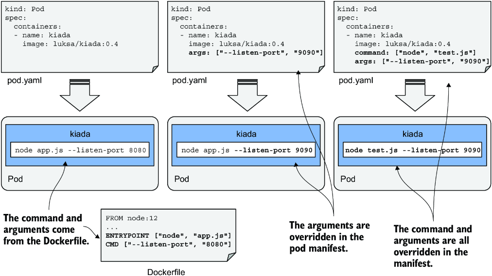
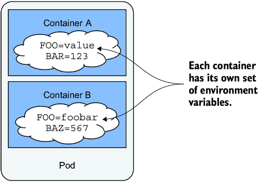
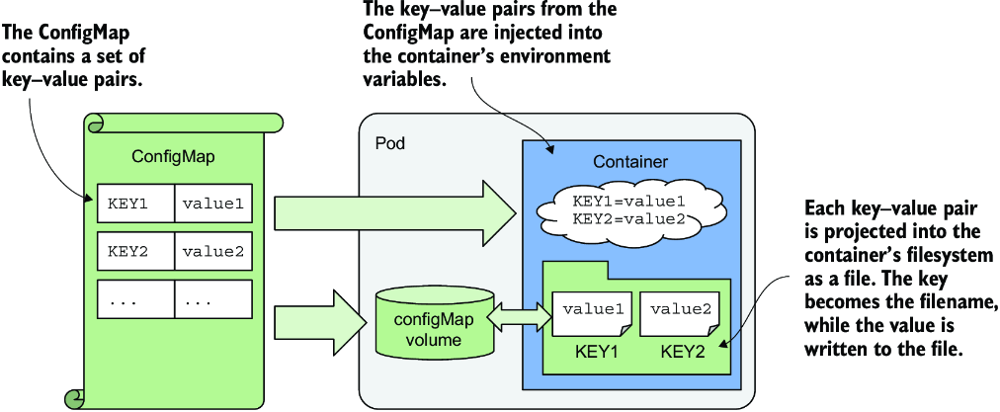
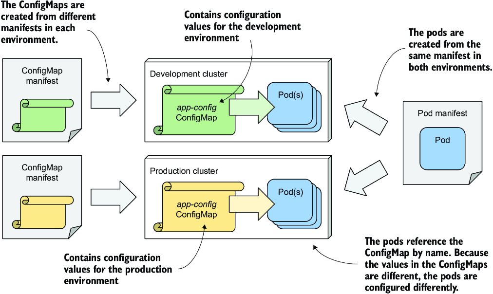
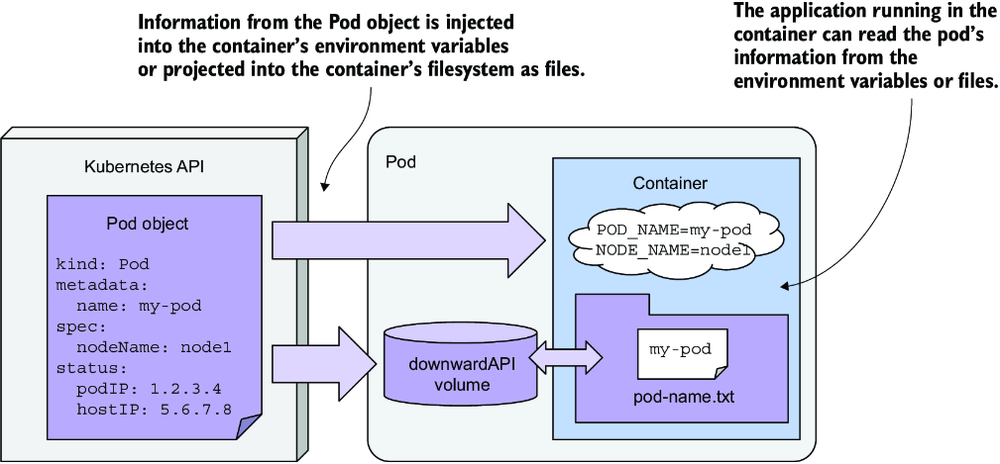

# Chương 8: Cấu hình ứng dụng với ConfigMap và Secret

*(Dịch từ "Chapter 8: Configuring applications with ConfigMaps and Secrets" – Kubernetes in Action, Second Edition, tác giả Marko Lukša, NXB Manning)*

---

## Nội dung chính của chương
* Thiết lập lệnh (command) và các đối số (argument) cho tiến trình chính của container
* Thiết lập các biến môi trường
* Lưu trữ cấu hình trong ConfigMap
* Lưu trữ thông tin nhạy cảm trong Secret
* Dùng Downward API để công khai metadata của pod cho ứng dụng

Trong các chương trước, bạn đã học cách chạy một tiến trình ứng dụng trong Kubernetes. Giờ đây, bạn sẽ học cách cấu hình ứng dụng – hoặc trực tiếp trong pod manifest, hoặc thông qua các resource tách rời được manifest đó tham chiếu tới. Bạn cũng sẽ học cách chèn (inject) metadata của pod vào môi trường của các container bên trong pod.

> **GHI CHÚ:** Các file mã nguồn cho chương này có tại https://mng.bz/vZBa.

---

## 8.1 Thiết lập lệnh, đối số và biến môi trường (Setting the command, arguments, and environment variables)

Giống như các ứng dụng thông thường, ứng dụng được đóng gói trong container có thể được cấu hình bằng các đối số dòng lệnh, biến môi trường và file.

Bạn đã biết rằng lệnh được thực thi trong container thường được định nghĩa trong container image. Bạn chỉ định lệnh trong Dockerfile của container bằng chỉ thị `ENTRYPOINT` và các đối số bằng chỉ thị `CMD`. Các biến môi trường cũng có thể được chỉ định; bạn làm điều này bằng chỉ thị `ENV`. Nếu ứng dụng được cấu hình bằng các file cấu hình, những file này có thể được thêm vào container image bằng chỉ thị `COPY`. Bạn đã thấy nhiều ví dụ về điều này trong các chương trước.

Hãy lấy ứng dụng Kiada và làm cho nó có thể cấu hình được thông qua các đối số dòng lệnh và biến môi trường. Tất cả các phiên bản trước của ứng dụng đều lắng nghe trên cổng 8080. Hãy làm cho điều này có thể cấu hình được thông qua đối số dòng lệnh `--listen-port`. Và hãy cũng làm cho thông điệp trạng thái ban đầu (initial status message) có thể cấu hình được thông qua một biến môi trường tên là `INITIAL_STATUS_MESSAGE`. Thay vì chỉ trả về hostname, giờ đây ứng dụng cũng sẽ trả về tên pod và địa chỉ IP của pod, cũng như tên của cluster node mà nó đang chạy trên đó. Ứng dụng lấy thông tin này thông qua các biến môi trường. Bạn có thể tìm thấy mã nguồn đã cập nhật trong kho mã nguồn (code repository) của cuốn sách. Container image cho phiên bản mới này có tại `docker.io/luksa/kiada:0.4`.

Dockerfile đã cập nhật, mà bạn cũng có thể tìm thấy trong kho mã nguồn, được trình bày trong listing sau.

**Listing 8.1: Một Dockerfile mẫu sử dụng nhiều phương pháp cấu hình ứng dụng**

```dockerfile
FROM node:12
COPY app.js /app.js
COPY html/ /html
ENV INITIAL_STATUS_MESSAGE="This is the default status message"   #1
ENTRYPOINT ["node", "app.js"]                                     #2
CMD ["--listen-port", "8080"]                                     #3
```

- **#1** Thiết lập một biến môi trường
- **#2** Thiết lập lệnh sẽ chạy khi container được khởi động
- **#3** Thiết lập các đối số dòng lệnh mặc định

Biến môi trường, lệnh và các đối số được định nghĩa trong Dockerfile chỉ là các giá trị mặc định được dùng khi bạn chạy container mà không chỉ định tùy chọn nào. Nhưng Kubernetes cho phép bạn ghi đè các giá trị mặc định này trong pod manifest. Hãy xem cách làm.

### 8.1.1 Thiết lập lệnh và đối số (Setting the command and arguments)

Như đã đề cập, lệnh và các đối số cho một container được chỉ định bằng các chỉ thị `ENTRYPOINT` và `CMD` trong Dockerfile. Mỗi chỉ thị nhận một mảng giá trị. Khi container được thực thi, hai mảng này được nối lại với nhau để tạo thành lệnh đầy đủ.

Kubernetes cung cấp hai trường tương tự với hai chỉ thị này. Hai trường trong pod manifest có tên là `command` và `args`. Bạn chỉ định chúng trong khối định nghĩa container (container definition stanza) của pod manifest. Cũng như với Docker, hai trường này nhận giá trị dạng mảng, và lệnh cuối cùng được thực thi trong container được tạo ra bằng cách nối hai mảng lại với nhau, như minh họa trong hình 8.1.



*Hình 8.1: Ghi đè lệnh và các đối số trong pod manifest*

Khi viết Dockerfile, bạn thường dùng chỉ thị `ENTRYPOINT` để chỉ định lệnh thuần và chỉ thị `CMD` để chỉ định các đối số. Điều này cho phép bạn chạy container với các đối số khác nhau mà không phải chỉ định lại chính lệnh đó. Nhưng bạn vẫn có thể ghi đè lệnh nếu cần. Và bạn có thể làm vậy mà không cần ghi đè các đối số, vì thế thật tuyệt khi lệnh và các đối số được tách ra thành hai chỉ thị Dockerfile và hai trường pod manifest khác nhau.

Bảng 8.1 cho thấy trường tương đương trong pod manifest cho mỗi chỉ thị trong hai chỉ thị Dockerfile.

**Bảng 8.1: Chỉ định lệnh và các đối số trong Dockerfile so với trong pod manifest**

| Dockerfile | Pod manifest | Mô tả |
|---|---|---|
| `ENTRYPOINT` | `command` | File thực thi chạy trong container. Nó có thể chứa thêm các đối số bên cạnh file thực thi, nhưng thường thì không. |
| `CMD` | `args` | Các đối số bổ sung được truyền cho lệnh được chỉ định bằng chỉ thị `ENTRYPOINT` hoặc trường `command` |

Hãy xem hai ví dụ về việc thiết lập các trường `command` và `args`.

#### Thiết lập lệnh (Setting the command)

Hãy tưởng tượng bạn muốn chạy ứng dụng Kiada với tính năng profiling CPU và heap được bật. Với Node.JS, bạn có thể bật profiling bằng cách chạy lệnh `node` với các cờ `--cpu-prof` và `--heap-prof`. Thay vì sửa Dockerfile và build lại image, bạn có thể bật profiling trong pod của mình bằng cách sửa pod manifest, như trong listing sau.

**Listing 8.2: Một định nghĩa container có chỉ định lệnh**

```yaml
kind: Pod
spec:
  containers:
  - name: kiada
    image: luksa/kiada:0.4
    command: ["node", "--cpu-prof", "--heap-prof", "app.js"]   #1
```

- **#1** Khi container được khởi động, lệnh này được thực thi thay cho lệnh được định nghĩa trong container image.

Khi bạn triển khai pod trong listing, lệnh `node --cpu-prof --heap-prof app.js` được chạy thay vì lệnh mặc định được chỉ định trong Dockerfile (`node app.js`).

Như bạn thấy trong listing, trường `command`, cũng giống như chỉ thị tương ứng trong Dockerfile, nhận một mảng chuỗi biểu diễn lệnh cần thực thi. Ký pháp mảng được dùng trong listing rất phù hợp khi mảng chỉ chứa vài phần tử, nhưng nó trở nên khó đọc khi số phần tử tăng lên. Trong trường hợp đó, bạn nên dùng ký pháp sau:

```yaml
command:
- node
- --cpu-prof
- --heap-prof
- app.js
```

> **MẸO:** Những giá trị mà trình phân tích YAML (YAML parser) có thể diễn giải thành thứ gì đó khác chuỗi phải được đặt trong dấu nháy. Điều này bao gồm các giá trị số như `1234`, và các giá trị Boolean như `true` và `false`. Đáng tiếc là YAML cũng coi một số từ thông dụng là giá trị Boolean, vì vậy bạn cũng phải đặt chúng trong dấu nháy khi dùng trong mảng `command`: `yes`, `no`, `on`, `off`, `y`, `n`, `t`, `f`, `null` và một số từ khác.

#### Thiết lập các đối số dòng lệnh (Setting command arguments)

Như đã đề cập trước đó, các đối số dòng lệnh cũng có thể được ghi đè trong pod manifest. Việc này được thực hiện trong trường `args` của định nghĩa container, như trong listing sau.

**Listing 8.3: Một định nghĩa container có thiết lập trường args**

```yaml
kind: Pod
spec:
  containers:
  - name: kiada
    image: luksa/kiada:0.4
    args: ["--listen-port", "9090"]   #1
```

- **#1** Điều này ghi đè các đối số được thiết lập trong container image.

Pod manifest trong listing ghi đè các đối số mặc định `--listen-port 8080` được thiết lập trong Dockerfile bằng `--listen-port 9090`. Khi bạn triển khai pod này, lệnh đầy đủ chạy trong container là `node app.js --listen-port 9090`. Lệnh này là sự nối ghép của `ENTRYPOINT` trong Dockerfile và trường `args` trong pod manifest.

### 8.1.2 Thiết lập biến môi trường trong một container (Setting environment variables in a container)

Các ứng dụng đóng gói trong container thường được cấu hình bằng biến môi trường. Cũng giống như lệnh và các đối số, bạn có thể thiết lập biến môi trường cho từng container trong pod, như minh họa trong hình 8.2.



*Hình 8.2: Biến môi trường được thiết lập theo từng container.*

> **GHI CHÚ:** Tại thời điểm tôi viết những dòng này, biến môi trường chỉ có thể được thiết lập riêng cho từng container. Không thể thiết lập một tập biến môi trường toàn cục cho toàn bộ pod và để tất cả các container của nó kế thừa.

Bạn có thể thiết lập một biến môi trường bằng một giá trị literal, tham chiếu đến một biến môi trường khác, hoặc lấy giá trị từ một nguồn bên ngoài. Hãy xem cách làm.

#### Thiết lập biến môi trường bằng một giá trị literal (Setting an environment variable to a literal value)

Phiên bản 0.4 của ứng dụng Kiada hiển thị tên của pod, mà nó đọc từ biến môi trường `POD_NAME`. Nó cũng cho phép bạn thiết lập thông điệp trạng thái bằng biến môi trường `INITIAL_STATUS_MESSAGE`. Hãy thiết lập hai biến này trong pod manifest. Dùng trường `env` như trong listing 8.4. Bạn có thể tìm thấy pod manifest này trong file `pod.kiada.env-value.yaml`.

**Listing 8.4: Thiết lập biến môi trường trong pod manifest**

```yaml
kind: Pod
metadata:
  name: kiada
spec:
  containers:
  - name: kiada
    image: luksa/kiada:0.4
    env:                                                     #1
    - name: POD_NAME                                         #2
      value: kiada                                           #2
    - name: INITIAL_STATUS_MESSAGE                           #3
      value: This status message is set in the pod spec.     #3
```

- **#1** Trường `env` chứa danh sách các biến môi trường cho container.
- **#2** Biến môi trường `POD_NAME` được thiết lập thành "kiada".
- **#3** Một biến môi trường khác được thiết lập ở đây.

Như bạn thấy trong listing, trường `env` nhận một danh sách các mục. Mỗi mục chỉ định tên (`name`) của biến môi trường và giá trị (`value`) của nó.

> **GHI CHÚ:** Vì giá trị của biến môi trường phải là chuỗi, bạn phải đặt trong dấu nháy những giá trị không phải chuỗi để ngăn trình phân tích YAML coi chúng là thứ gì khác ngoài chuỗi. Như đã giải thích trong mục 8.1.1, điều này cũng áp dụng cho các số cũng như các chuỗi như `yes`, `no`, `true`, `false`, v.v.

> **MẸO:** Bạn có thể xem danh sách các biến môi trường được định nghĩa trong một pod bằng cách chạy lệnh `kubectl set env pod <pod-name> --list`. Lệnh này chỉ hiển thị các biến môi trường được định nghĩa trong pod manifest, chứ không phải các biến thực tế bên trong container.

Khi bạn triển khai pod trong listing và gửi một HTTP request đến ứng dụng, bạn sẽ thấy tên pod và thông điệp trạng thái mà bạn đã thiết lập trong manifest. Bạn cũng có thể chạy lệnh sau để xem xét các biến môi trường trong container. Bạn sẽ tìm thấy hai biến môi trường đó trong output sau:

```bash
$ kubectl exec kiada -- env
PATH=/usr/local/sbin:/usr/local/bin:/usr/sbin:/usr/bin:/sbin:/bin     #1
HOSTNAME=kiada                                                        #1
NODE_VERSION=12.19.1                                                  #2
YARN_VERSION=1.22.5                                                   #2
POD_NAME=kiada                                                        #3
INITIAL_STATUS_MESSAGE=This status message is set in the pod spec.    #3
KUBERNETES_SERVICE_HOST=10.96.0.1                                     #4
...                                                                   #4
KUBERNETES_SERVICE_PORT=443                                           #4
```

- **#1** Được thiết lập bởi hệ thống
- **#2** Được thiết lập trong container image
- **#3** Được thiết lập trong pod manifest
- **#4** Được thiết lập bởi Kubernetes

Như bạn thấy, có một vài biến khác được thiết lập trong container. Chúng đến từ những nguồn khác nhau – một số được định nghĩa trong container image, một số được Kubernetes thêm vào, và số còn lại đến từ nơi khác. Mặc dù không có cách nào để biết mỗi biến đến từ đâu, bạn sẽ học cách nhận ra một số trong chúng. Ví dụ, những biến được Kubernetes thêm vào liên quan đến Service object, sẽ được trình bày trong chương 11. Để xác định số còn lại đến từ đâu, bạn có thể xem xét pod manifest và Dockerfile của container image.

#### Nhúng các biến môi trường khác vào giá trị (Inlining other environment variables)

Trong ví dụ trước, bạn đã thiết lập một giá trị cố định cho biến môi trường `INITIAL_STATUS_MESSAGE`, nhưng bạn cũng có thể tham chiếu đến các biến môi trường khác trong giá trị bằng cú pháp `$(VAR_NAME)`.

Ví dụ, bạn có thể tham chiếu biến `POD_NAME` bên trong biến thông điệp trạng thái như trong listing sau, listing này cho thấy một phần của file `pod.kiada.env-value-ref.yaml`.

**Listing 8.5: Tham chiếu một biến môi trường trong một biến khác**

```yaml
env:
- name: POD_NAME
  value: kiada
- name: INITIAL_STATUS_MESSAGE
  value: My name is $(POD_NAME). I run NodeJS version $(NODE_VERSION).   #1
```

- **#1** Giá trị bao gồm tham chiếu đến các biến môi trường `POD_NAME` và `NODE_VERSION`.

Lưu ý rằng một trong các tham chiếu trỏ đến biến môi trường `POD_NAME` được định nghĩa trong listing, trong khi tham chiếu còn lại trỏ đến biến `NODE_VERSION` được thiết lập trong container image. Bạn đã thấy biến này khi chạy lệnh `env` trong container trước đó. Khi bạn triển khai pod, thông điệp trạng thái mà nó trả về như sau:

```text
My name is kiada. I run NodeJS version $(NODE_VERSION).
```

Như bạn thấy, tham chiếu đến `NODE_VERSION` không được phân giải. Đó là vì bạn chỉ có thể dùng cú pháp `$(VAR_NAME)` để tham chiếu đến các biến được định nghĩa trong cùng manifest. Biến được tham chiếu phải được định nghĩa trước biến tham chiếu đến nó. Vì `NODE_VERSION` được định nghĩa trong Dockerfile của Node.js image chứ không phải trong pod manifest, nó không thể được phân giải.

> **GHI CHÚ:** Nếu một tham chiếu biến không thể được phân giải, chuỗi tham chiếu được giữ nguyên không đổi.

> **GHI CHÚ:** Khi bạn muốn một biến chứa chuỗi literal `$(VAR_NAME)` và không muốn Kubernetes phân giải nó, hãy dùng hai dấu đô la như trong `$$(VAR_NAME)`. Kubernetes sẽ bỏ đi một dấu đô la và bỏ qua việc phân giải biến.

#### Dùng tham chiếu biến trong lệnh và các đối số (Using variable references in the command and arguments)

Bạn có thể tham chiếu đến các biến môi trường được định nghĩa trong manifest không chỉ trong các biến khác, mà còn trong các trường `command` và `args` mà bạn đã học ở mục trước. Ví dụ, file `pod.kiada.env-value-ref-in-args.yaml` định nghĩa một biến môi trường tên là `LISTEN_PORT` và tham chiếu nó trong trường `args`. Listing 8.6 cho thấy phần liên quan của file này.

**Listing 8.6: Tham chiếu một biến môi trường trong trường args**

```yaml
spec:
  containers:
  - name: kiada
    image: luksa/kiada:0.4
    args:
    - --listen-port
    - $(LISTEN_PORT)        #1
    env:
    - name: LISTEN_PORT
      value: "8080"
```

- **#1** Được phân giải thành biến `LISTEN_PORT` được thiết lập bên dưới

Đây không phải là ví dụ hay nhất, vì chẳng có lý do chính đáng nào để dùng một tham chiếu biến thay vì chỉ định trực tiếp số cổng. Nhưng sau này, bạn sẽ học cách lấy giá trị biến môi trường từ một nguồn bên ngoài. Khi đó bạn có thể dùng một tham chiếu như trong listing để chèn giá trị đó vào lệnh hoặc các đối số của container.

#### Tham chiếu đến các biến môi trường không có trong manifest (Referring to environment variables that aren't in the manifest)

Cũng như việc dùng tham chiếu trong biến môi trường, bạn chỉ có thể dùng cú pháp `$(VAR_NAME)` trong các trường `command` và `args` để tham chiếu đến các biến được định nghĩa trong pod manifest. Chẳng hạn, bạn không thể tham chiếu đến các biến môi trường được định nghĩa trong container image.

Tuy nhiên, bạn có thể dùng một cách tiếp cận khác. Nếu bạn chạy lệnh thông qua một shell, bạn có thể để shell phân giải biến. Nếu bạn đang dùng shell bash, bạn có thể làm điều này bằng cách tham chiếu biến bằng cú pháp `$VAR_NAME` hoặc `${VAR_NAME}` thay vì `$(VAR_NAME)`. Hãy lưu ý sự khác biệt trong việc dùng dấu ngoặc nhọn và dấu ngoặc đơn.

Ví dụ, lệnh trong listing sau in ra đúng giá trị của biến môi trường `HOSTNAME` mặc dù nó không được định nghĩa trong pod manifest mà được hệ điều hành khởi tạo. Bạn có thể tìm thấy ví dụ này trong file `pod.env-var-references-in-shell.yaml`.

**Listing 8.7: Tham chiếu các biến môi trường trong một lệnh shell**

```yaml
containers:
- name: main
  image: alpine
  command:
  - sh                                                    #1
  - -c                                                    #1
  - 'echo "Hostname is $HOSTNAME."; sleep infinity'       #2
```

- **#1** Lệnh cấp cao nhất được thực thi trong container này là shell.
- **#2** Shell phân giải tham chiếu đến biến môi trường `HOSTNAME` trước khi thực thi các lệnh `echo` và `sleep`.

#### Thiết lập tên miền đầy đủ của pod (Setting the pod's fully qualified domain name)

Nhân đang nói về chủ đề này, đây là thời điểm thích hợp để giải thích rằng hostname và subdomain của pod có thể cấu hình được trong pod manifest. Theo mặc định, hostname trùng với tên của pod, nhưng bạn có thể ghi đè nó bằng trường `hostname` trong spec của pod. Bạn cũng có thể thiết lập trường `subdomain` để tên miền đầy đủ (fully qualified domain name – FQDN) của pod có dạng như sau: `<hostname>.<subdomain>.<pod namespace>.svc.<cluster domain>`.

Đây chỉ là FQDN nội bộ của pod. Nó không thể phân giải được qua DNS nếu không có các bước bổ sung, sẽ được giải thích trong chương 11. Bạn có thể tìm thấy một pod mẫu chỉ định hostname tùy chỉnh cho pod trong file `pod.kiada.hostname.yaml`.

---

## 8.2 Dùng ConfigMap để tách cấu hình khỏi pod manifest (Using a ConfigMap to decouple configuration from the pod manifest)

Trong mục trước, bạn đã học cách hardcode cấu hình trực tiếp vào pod manifest. Mặc dù cách này tốt hơn nhiều so với hardcode vào container image, nó vẫn chưa lý tưởng vì điều đó có nghĩa là bạn có thể cần một phiên bản pod manifest riêng cho mỗi môi trường mà bạn triển khai pod vào, chẳng hạn như cluster development, staging hoặc production của bạn.

Để tái sử dụng cùng một định nghĩa pod trong nhiều môi trường, tốt hơn là tách cấu hình khỏi pod manifest. Một cách để làm điều này là chuyển cấu hình vào một ConfigMap object, rồi tham chiếu nó trong pod. Đó là điều bạn sẽ làm tiếp theo.

### 8.2.1 Giới thiệu ConfigMap (Introducing ConfigMaps)

ConfigMap là một Kubernetes API object đơn giản chỉ chứa một danh sách các cặp khóa–giá trị (key–value). Các giá trị có thể là từ những chuỗi ngắn cho đến những khối văn bản có cấu trúc lớn mà bạn thường thấy trong file cấu hình ứng dụng. Các pod có thể tham chiếu đến một hoặc nhiều mục khóa–giá trị này trong ConfigMap. Một pod có thể tham chiếu nhiều ConfigMap, và nhiều pod có thể dùng cùng một ConfigMap.

Để giữ cho ứng dụng không phụ thuộc vào Kubernetes (Kubernetes-agnostic), bạn thường không để ứng dụng đọc ConfigMap object thông qua Kubernetes REST API. Thay vào đó, các cặp khóa–giá trị trong ConfigMap được truyền cho các container dưới dạng biến môi trường hoặc được mount dưới dạng file trong filesystem của container thông qua một `configMap` volume, như minh họa trong hình 8.3. Trong chương này, chúng ta sẽ tập trung vào cách thứ nhất; cách thứ hai sẽ được trình bày trong chương tiếp theo, chương giải thích nhiều kiểu volume khác nhau.



*Hình 8.3: Pod sử dụng ConfigMap thông qua biến môi trường và ConfigMap volume.*

Trong mục trước, bạn đã học cách tham chiếu biến môi trường trong các đối số dòng lệnh. Bạn có thể dùng kỹ thuật này để truyền một mục ConfigMap mà bạn đã công khai dưới dạng biến môi trường vào một đối số dòng lệnh.

Bất kể ứng dụng tiêu thụ ConfigMap theo cách nào, việc lưu cấu hình trong một object riêng thay vì trong pod cho phép bạn giữ cấu hình tách biệt cho các môi trường khác nhau bằng cách đơn giản là duy trì các ConfigMap manifest riêng và áp dụng (apply) mỗi manifest vào môi trường mà nó dành cho. Vì các pod tham chiếu ConfigMap theo tên, bạn có thể triển khai cùng một pod manifest trên tất cả các môi trường của mình mà vẫn có cấu hình khác nhau cho mỗi môi trường bằng cách dùng cùng một tên ConfigMap, như minh họa trong hình 8.4.



*Hình 8.4: Triển khai cùng một pod manifest và các ConfigMap manifest khác nhau trong các môi trường khác nhau*

### 8.2.2 Tạo một ConfigMap object (Creating a ConfigMap object)

Hãy tạo một ConfigMap và dùng nó trong một pod. Sau đây là một ví dụ đơn giản trong đó ConfigMap chứa một mục duy nhất cho biến môi trường `INITIAL_STATUS_MESSAGE` của pod kiada.

#### Tạo ConfigMap bằng lệnh kubectl create configmap (Creating a ConfigMap with the kubectl create configmap command)

Cũng như với pod, bạn có thể tạo ConfigMap object từ một manifest YAML, nhưng cách nhanh hơn là dùng lệnh `kubectl create configmap` như sau:

```bash
$ kubectl create configmap kiada-config \
    --from-literal status-message="This status message is set in the kiada-config ConfigMap"
configmap "kiada-config" created
```

> **GHI CHÚ:** Các khóa trong ConfigMap chỉ có thể bao gồm các ký tự chữ và số, dấu gạch ngang, dấu gạch dưới và dấu chấm. Các ký tự khác không được phép.

Chạy lệnh này sẽ tạo ra một ConfigMap object có tên `kiada-config` chứa một mục duy nhất. Khóa và giá trị được chỉ định bằng đối số `--from-literal`.

Ngoài `--from-literal`, lệnh `kubectl create configmap` còn hỗ trợ lấy các cặp khóa–giá trị từ file. Bảng 8.2 giải thích các phương pháp hiện có.

**Bảng 8.2: Các tùy chọn để tạo các mục ConfigMap bằng kubectl create configmap**

| Tùy chọn | Mô tả |
|---|---|
| `--from-literal` | Chèn một khóa và một giá trị literal vào ConfigMap (ví dụ: `--from-literal mykey=myvalue`). |
| `--from-file` | Chèn nội dung của một file vào ConfigMap. Hành vi phụ thuộc vào đối số đứng sau `--from-file`.<br>Nếu chỉ chỉ định tên file (ví dụ: `--from-file myfile.txt`), tên cơ sở (base name) của file được dùng làm khóa và toàn bộ nội dung của file được dùng làm giá trị.<br>Nếu chỉ định `key=file` (ví dụ: `--from-file mykey=myfile.txt`), nội dung của file được lưu dưới khóa đã chỉ định.<br>Nếu tên file là một thư mục, mỗi file chứa trong thư mục đó được đưa vào như một mục riêng. Tên cơ sở của file được dùng làm khóa, và nội dung của file được dùng làm giá trị. Các thư mục con, symbolic link, thiết bị (device), pipe và những file có tên cơ sở không phải là khóa ConfigMap hợp lệ sẽ bị bỏ qua. |
| `--from-env-file` | Chèn mỗi dòng của file được chỉ định như một mục riêng (ví dụ: `--from-env-file myfile.env`). File phải chứa các dòng có định dạng sau: `key=value`. |

ConfigMap thường chứa nhiều mục. Bạn có thể lặp lại các đối số `--from-literal`, `--from-file` và `--from-env-file` nhiều lần. Bạn cũng có thể kết hợp `--from-literal` và `--from-file`, nhưng tại thời điểm viết sách, bạn không thể kết hợp chúng với `--from-env-file`.

#### Tạo ConfigMap từ một manifest YAML (Creating a ConfigMap from a YAML manifest)

Ngoài ra, bạn có thể tạo ConfigMap từ một file manifest YAML. Listing 8.8 cho thấy nội dung của một file manifest tương đương có tên `cm.kiada-config.yaml`, có sẵn trong kho mã nguồn. Bạn có thể tạo ConfigMap bằng cách áp dụng file này với `kubectl apply`.

**Listing 8.8: Một file manifest ConfigMap**

```yaml
apiVersion: v1                                                              #1
kind: ConfigMap                                                             #1
metadata:
  name: kiada-config                                                        #2
data:                                                                       #3
  status-message: This status message is set in the kiada-config ConfigMap  #3
```

- **#1** Manifest này định nghĩa một ConfigMap object.
- **#2** Tên của ConfigMap này
- **#3** Các cặp khóa–giá trị được chỉ định trong trường `data`.

#### Tạo ConfigMap từ file (Creating a ConfigMap from files)

Như đã giải thích trong bảng 8.2, bạn cũng có thể dùng lệnh `kubectl create configmap` để tạo ConfigMap từ các file. Lần này, thay vì tạo ConfigMap trực tiếp trong cluster, bạn sẽ học cách dùng lệnh này để sinh ra một manifest YAML cho ConfigMap để bạn có thể lưu nó trong hệ thống quản lý phiên bản (version control system) cùng với Pod manifest của mình. Lệnh sau sinh ra một ConfigMap có tên `dummy-config` từ các file `dummy.txt` và `dummy.bin` và lưu nó vào một file có tên `dummy-configmap.yaml`.

```bash
$ kubectl create configmap dummy-config \
    --from-file=dummy.txt \
    --from-file=dummy.bin \
    --dry-run=client -o yaml > dummy-configmap.yaml
```

ConfigMap sẽ chứa hai mục, mỗi mục cho một file được chỉ định trong lệnh. Một là file văn bản, còn file kia chỉ là một ít dữ liệu ngẫu nhiên để minh họa rằng dữ liệu nhị phân cũng có thể được lưu trong ConfigMap.

Khi dùng tùy chọn `--dry-run`, lệnh không tạo object trong Kubernetes API server mà chỉ sinh ra định nghĩa của object. Tùy chọn `-o yaml` in định nghĩa YAML của object ra đầu ra chuẩn (standard output), rồi đầu ra này được chuyển hướng vào file `dummy-configmap.yaml`. Listing sau cho thấy nội dung của file này.

**Listing 8.9: Một ConfigMap manifest được tạo từ hai file**

```yaml
apiVersion: v1
binaryData:
  dummy.bin: n2VW39IEkyQ6Jxo+rdo5J06Vi7cz5...            #1
data:
  dummy.txt: |-                                          #2
    This is a text file with multiple lines              #2
    that you can use to test the creation of             #2
    a ConfigMap in Kubernetes.                           #2
kind: ConfigMap
metadata:
  creationTimestamp: null
  name: kiada-envoy-config                               #3
```

- **#1** Nội dung mã hóa Base64 của file `dummy.bin`
- **#2** Nội dung của file `dummy.txt`
- **#3** Tên của ConfigMap này

Như bạn thấy trong listing, file nhị phân được đưa vào trường `binaryData`. Nếu một mục ConfigMap chứa các chuỗi byte không phải UTF-8, nó phải được định nghĩa trong trường `binaryData`. Lệnh `kubectl create configmap` tự động xác định nơi đặt mục đó. Các giá trị trong trường `binaryData` được mã hóa Base64, đó là cách các giá trị nhị phân được biểu diễn trong YAML và JSON.

Ngược lại, nội dung của file `dummy.txt` hiển thị rõ ràng trong trường `data`. Trong YAML, bạn có thể chỉ định giá trị nhiều dòng bằng ký tự ống dẫn (pipe, `|`) và thụt lề thích hợp. Hãy xem đặc tả YAML trên YAML.org để biết thêm các cách khác.

> **Chú ý vệ sinh khoảng trắng khi tạo ConfigMap manifest**
>
> Khi tạo ConfigMap từ file, hãy đảm bảo rằng không có dòng nào trong file chứa khoảng trắng ở cuối dòng (trailing whitespace). Nếu có bất kỳ dòng nào kết thúc bằng khoảng trắng, mục ConfigMap sẽ được định dạng thành một chuỗi trong dấu nháy, khiến nó khó đọc hơn nhiều.
>
> Hãy so sánh định dạng của hai giá trị trong ConfigMap sau:
>
> ```bash
> $ kubectl create configmap dummy-config \
>     --from-file=dummy.yaml \
>     --from-file=dummy-bad.yaml \
>     --dry-run=client -o yaml
> apiVersion: v1
> data:
>   dummy-bad.yaml: dummy: \n name: dummy-bad.yaml\n note: This             #1
>     file has a space at the end of the first line.                        #1
>   dummy.yaml: |                                                           #2
>     dummy:                                                                #2
>       name: dummy.yaml                                                    #2
>       note: This file is correctly formatted with no trailing spaces.     #2
> kind: ConfigMap
> metadata:
>   creationTimestamp: null
>   name: dummy-config
> ```
>
> - **#1** Mục được tạo từ một file có khoảng trắng ở cuối dòng
> - **#2** Mục được tạo từ một file sạch, không có khoảng trắng ở cuối dòng
>
> Lưu ý rằng file `dummy-bad.yaml` có một khoảng trắng thừa ở cuối dòng đầu tiên. Điều này khiến mục config map được trình bày ở định dạng không mấy thân thiện với con người. Ngược lại, file `dummy.yaml` không có khoảng trắng ở cuối dòng và được trình bày dưới dạng chuỗi nhiều dòng không bị escape, giúp dễ đọc và dễ sửa tại chỗ.

#### Liệt kê ConfigMap và hiển thị nội dung của chúng (Listing ConfigMaps and displaying their contents)

ConfigMap là các Kubernetes API object tồn tại song song với pod, node và các resource khác mà bạn đã học cho đến nay. Bạn có thể dùng nhiều lệnh `kubectl` khác nhau để thực hiện các thao tác CRUD trên chúng. Ví dụ, bạn có thể liệt kê ConfigMap bằng

```bash
$ kubectl get cm
```

> **GHI CHÚ:** Tên viết tắt của `configmaps` là `cm`.

Bạn có thể hiển thị các mục trong ConfigMap bằng cách yêu cầu kubectl in ra manifest YAML của ConfigMap:

```bash
$ kubectl get cm kiada-config -o yaml
```

> **GHI CHÚ:** Vì các trường YAML được xuất ra theo thứ tự bảng chữ cái, bạn sẽ thấy trường `data` ở đầu output.

> **MẸO:** Để chỉ hiển thị các cặp khóa–giá trị, hãy kết hợp `kubectl` với `jq` – ví dụ, `kubectl get cm kiada-config -o json | jq .data`. Hiển thị giá trị của một mục cụ thể như sau: `kubectl... | jq '.data["status-message"]'`.

### 8.2.3 Chèn giá trị ConfigMap vào biến môi trường (Injecting ConfigMap values into environment variables)

Trong mục trước, bạn đã tạo ConfigMap `kiada-config`. Hãy dùng nó trong Pod kiada.

#### Chèn một mục ConfigMap đơn lẻ (Injecting a single ConfigMap entry)

Để chèn một mục ConfigMap đơn lẻ vào một biến môi trường, bạn chỉ cần thay trường `value` trong định nghĩa biến môi trường bằng trường `valueFrom` và tham chiếu đến mục ConfigMap. Listing sau cho thấy phần liên quan của pod manifest. Manifest đầy đủ có trong file `pod.kiada.env-valueFrom.yaml`.

**Listing 8.10: Thiết lập một biến môi trường từ một mục ConfigMap**

```yaml
kind: Pod
...
spec:
  containers:
  - name: kiada
    env:                                #1
    - name: INITIAL_STATUS_MESSAGE      #1
      valueFrom:                        #2
        configMapKeyRef:                #2
          name: kiada-config            #3
          key: status-message           #4
          optional: true                #5
    volumeMounts:
    - ...
```

- **#1** Bạn đang thiết lập biến môi trường `INITIAL_STATUS_MESSAGE`.
- **#2** Thay vì dùng một giá trị cố định, giá trị được lấy từ một khóa ConfigMap.
- **#3** Tên của ConfigMap chứa giá trị
- **#4** Khóa ConfigMap mà bạn đang tham chiếu
- **#5** Container vẫn có thể chạy ngay cả khi không tìm thấy ConfigMap hoặc khóa.

Thay vì chỉ định một giá trị cố định cho biến, bạn khai báo rằng giá trị phải được lấy từ một ConfigMap. Trường `name` chỉ định tên ConfigMap, và trường `key` chỉ định khóa bên trong map đó.

Hãy tạo pod từ manifest này và xem xét các biến môi trường của nó bằng lệnh sau:

```bash
$ kubectl exec kiada -- env
...
INITIAL_STATUS_MESSAGE=This status message is set in the kiada-config ConfigMap
...
```

Thông điệp trạng thái cũng sẽ xuất hiện trong phản hồi của pod khi bạn truy cập nó qua `curl` hoặc trình duyệt.

#### Đánh dấu một tham chiếu là tùy chọn (Marking a reference optional)

Trong listing trước, tham chiếu đến khóa ConfigMap được đánh dấu là `optional` để container có thể được thực thi ngay cả khi ConfigMap hoặc khóa bị thiếu. Khi đó, biến môi trường không được thiết lập.

Bạn có thể đánh dấu tham chiếu là tùy chọn vì ứng dụng Kiada vẫn chạy tốt mà không cần nó. Bạn có thể xóa ConfigMap và triển khai lại pod để xác nhận điều này.

> **GHI CHÚ:** Nếu một ConfigMap hoặc khóa được tham chiếu trong định nghĩa container bị thiếu và không được đánh dấu là tùy chọn, pod vẫn sẽ được lên lịch (schedule) bình thường, và các container khác trong pod vẫn được khởi động bình thường. Container tham chiếu đến khóa ConfigMap bị thiếu sẽ bị chặn không cho khởi động cho đến khi bạn tạo ConfigMap có khóa được tham chiếu.

#### Chèn toàn bộ ConfigMap (Injecting the entire ConfigMap)

Trường `env` trong định nghĩa container nhận một danh sách các cặp tên–giá trị, nên bạn có thể thiết lập bao nhiêu biến môi trường tùy ý. Tuy nhiên, khi bạn muốn thiết lập nhiều hơn vài biến, việc chỉ định từng biến riêng lẻ có thể trở nên tẻ nhạt và dễ gây lỗi. May mắn thay, dùng trường `envFrom` thay vì trường `env` cho phép bạn chèn tất cả các mục từ ConfigMap cùng một lúc.

Nhược điểm của cách này là bạn mất khả năng biến đổi khóa thành tên biến môi trường, nên các khóa phải có sẵn dạng thức phù hợp. Phép biến đổi duy nhất bạn có thể làm là thêm một tiền tố (prefix) vào trước mỗi khóa.

Ví dụ, ứng dụng Kiada đọc biến môi trường `INITIAL_STATUS_MESSAGE`, nhưng khóa bạn đã dùng trong ConfigMap là `status-message`. Bạn phải đổi khóa ConfigMap cho khớp với tên biến môi trường mong đợi nếu muốn ứng dụng đọc được nó khi dùng trường `envFrom`. Tôi đã làm điều này trong file `cm.kiada-config.envFrom.yaml`. Ngoài khóa `INITIAL_STATUS_MESSAGE`, file này còn chứa hai khóa khác để minh họa rằng tất cả chúng sẽ được chèn vào môi trường của container. Hãy thay thế ConfigMap bằng ConfigMap trong file đó bằng cách chạy lệnh sau:

```bash
$ kubectl replace -f cm.kiada-config.envFrom.yaml
```

Pod manifest trong file `pod.kiada.envFrom.yaml` dùng trường `envFrom` để chèn toàn bộ ConfigMap vào pod. Listing 8.11 cho thấy phần liên quan của manifest.

**Listing 8.11: Dùng envFrom để chèn toàn bộ ConfigMap vào biến môi trường**

```yaml
kind: Pod
...
spec:
  containers:
  - name: kiada
    envFrom:                    #1
    - configMapRef:             #2
        name: kiada-config      #2
        optional: true          #3
```

- **#1** Dùng `envFrom` thay vì `env` để chèn toàn bộ ConfigMap
- **#2** Tên của ConfigMap cần chèn. Khác với trước, không có khóa nào được chỉ định.
- **#3** Container vẫn nên chạy ngay cả khi ConfigMap không tồn tại.

Thay vì chỉ định cả tên ConfigMap lẫn khóa như trong ví dụ trước, chỉ cần chỉ định tên. Nếu bạn tạo pod từ manifest này và xem xét môi trường của nó, bạn sẽ thấy nó chứa biến `INITIAL_STATUS_MESSAGE` cũng như hai khóa khác được định nghĩa trong ConfigMap.

Cũng như `configMapKeyRef`, `configMapRef` cho phép bạn đánh dấu tham chiếu là `optional`, cho phép container chạy ngay cả khi ConfigMap không tồn tại. Theo mặc định, điều này không xảy ra. Các container tham chiếu ConfigMap bị ngăn không cho khởi động cho đến khi các ConfigMap được tham chiếu tồn tại.

#### Chèn nhiều ConfigMap (Injecting multiple ConfigMaps)

Bạn có thể đã nhận thấy trong listing 8.11 rằng trường `envFrom` nhận một danh sách giá trị, nghĩa là bạn có thể kết hợp các mục từ nhiều ConfigMap. Nếu hai ConfigMap chứa cùng một khóa, ConfigMap cuối cùng được ưu tiên.

Bạn cũng có thể kết hợp trường `envFrom` với trường `env` nếu muốn chèn tất cả các mục của một ConfigMap và một số mục cụ thể của một ConfigMap khác.

> **GHI CHÚ:** Khi một biến môi trường được cấu hình trong trường `env`, nó được ưu tiên hơn các biến môi trường được thiết lập trong trường `envFrom`.

#### Thêm tiền tố cho khóa (Prefixing keys)

Bất kể bạn chèn một ConfigMap hay nhiều ConfigMap, bạn có thể thiết lập một tiền tố tùy chọn cho mỗi ConfigMap. Khi các mục của chúng được chèn vào môi trường của container, tiền tố được thêm vào trước mỗi khóa để tạo thành tên biến môi trường.

### 8.2.4 Cập nhật và xóa ConfigMap (Updating and deleting ConfigMaps)

Cũng như hầu hết các Kubernetes API object, bạn có thể cập nhật một ConfigMap bất cứ lúc nào bằng cách sửa file manifest và áp dụng lại nó vào cluster bằng `kubectl apply`. Còn có một cách nhanh hơn, mà bạn sẽ chủ yếu dùng trong quá trình phát triển.

#### Chỉnh sửa tại chỗ các API object bằng kubectl edit (In-place editing of API objects using kubectl edit)

Khi bạn muốn thực hiện một thay đổi nhanh cho một API object, chẳng hạn như ConfigMap, bạn có thể dùng lệnh `kubectl edit`. Ví dụ, để chỉnh sửa ConfigMap `kiada-config`, hãy chạy lệnh sau:

```bash
$ kubectl edit configmap kiada-config
```

Lệnh này mở manifest của object trong trình soạn thảo văn bản mặc định của bạn, cho phép bạn thay đổi object trực tiếp. Khi bạn đóng trình soạn thảo, kubectl gửi (post) các thay đổi của bạn tới Kubernetes API.

> **MẸO:** Nếu bạn thích chỉnh sửa manifest của object ở định dạng JSON thay vì YAML, hãy chạy lệnh `kubectl edit` với tùy chọn `-o json`.

#### Cấu hình kubectl edit dùng một trình soạn thảo văn bản khác (Configuring kubectl edit to use a different text editor)

Bạn có thể yêu cầu kubectl dùng trình soạn thảo văn bản mà bạn chọn bằng cách thiết lập biến môi trường `KUBE_EDITOR`. Ví dụ, nếu bạn muốn dùng `nano` để chỉnh sửa các Kubernetes resource, hãy thực thi lệnh sau (hoặc đặt nó vào file `~/.bashrc` hoặc file tương đương của bạn):

```bash
export KUBE_EDITOR="/usr/bin/nano"
```

Nếu biến môi trường `KUBE_EDITOR` không được thiết lập, `kubectl edit` quay về dùng trình soạn thảo mặc định, thường được cấu hình thông qua biến môi trường `EDITOR`.

#### Điều gì xảy ra khi bạn sửa đổi một ConfigMap (What happens when you modify a ConfigMap)

Khi bạn cập nhật một ConfigMap, giá trị các biến môi trường trong các pod hiện có không được cập nhật. Tuy nhiên, nếu container được khởi động lại (do bị crash hoặc do bị chấm dứt từ bên ngoài vì liveness probe thất bại), container mới sẽ dùng các giá trị mới. Điều này đặt ra câu hỏi liệu bạn có muốn hành vi này hay không. Hãy xem tại sao.

> **GHI CHÚ:** Trong chương tiếp theo, bạn sẽ học rằng khi các mục ConfigMap được công khai trong container dưới dạng file thay vì biến môi trường, chúng được cập nhật trong tất cả các container đang chạy có tham chiếu đến ConfigMap. Không cần khởi động lại container.

#### Hiểu hậu quả của việc cập nhật một ConfigMap (Understanding the consequences of updating a ConfigMap)

Một trong những thuộc tính quan trọng nhất của container là tính bất biến (immutability), cho phép bạn chắc chắn rằng không có sự khác biệt giữa nhiều instance của cùng một container (hay pod). Vậy chẳng phải các ConfigMap mà những instance này lấy cấu hình từ đó cũng nên bất biến hay sao?

Hãy suy nghĩ về điều này một chút. Điều gì xảy ra nếu bạn thay đổi một ConfigMap được dùng để chèn biến môi trường vào một ứng dụng? Những thay đổi bạn thực hiện đối với ConfigMap không ảnh hưởng đến bất kỳ instance ứng dụng nào đang chạy. Tuy nhiên, nếu một số instance này được khởi động lại hoặc nếu bạn tạo thêm instance, chúng sẽ dùng cấu hình mới.

Kết cục là bạn có các pod được cấu hình khác nhau và điều này có thể khiến một số phần của hệ thống hoạt động khác với phần còn lại. Bạn cần tính đến điều này khi quyết định có cho phép thay đổi một ConfigMap trong khi nó đang được các pod đang chạy sử dụng hay không.

#### Ngăn không cho cập nhật một ConfigMap (Preventing a ConfigMap from being updated)

Để ngăn người dùng thay đổi các giá trị trong một ConfigMap, bạn có thể đánh dấu ConfigMap là bất biến (immutable), như trong listing sau.

**Listing 8.12: Tạo một ConfigMap bất biến**

```yaml
apiVersion: v1
kind: ConfigMap
metadata:
  name: my-immutable-configmap
data:
  mykey: myvalue
  another-key: another-value
immutable: true                  #1
```

- **#1** Điều này ngăn không cho các giá trị của ConfigMap này bị cập nhật.

Nếu ai đó cố thay đổi trường `data` hoặc `binaryData` trong một ConfigMap bất biến, API server sẽ ngăn chặn. Điều này đảm bảo rằng tất cả các pod dùng ConfigMap này đều dùng cùng các giá trị cấu hình. Nếu bạn muốn chạy một tập pod với cấu hình khác, bạn thường tạo một ConfigMap mới và dùng nó trong các pod mới này.

ConfigMap bất biến ngăn người dùng vô tình thay đổi cấu hình ứng dụng nhưng cũng giúp cải thiện hiệu năng của Kubernetes cluster. Khi một ConfigMap được đánh dấu là bất biến, các Kubelet trên worker node không cần được thông báo về những thay đổi đối với ConfigMap object. Điều này giảm tải cho API server.

#### Xóa một ConfigMap (Deleting a ConfigMap)

ConfigMap object có thể được xóa bằng lệnh `kubectl delete`. Các pod đang chạy có tham chiếu đến ConfigMap vẫn tiếp tục chạy mà không bị ảnh hưởng, nhưng chỉ cho đến khi các container của chúng phải khởi động lại. Nếu tham chiếu ConfigMap trong định nghĩa container không được đánh dấu là tùy chọn, container sẽ không chạy được.

---

## 8.3 Dùng Secret để truyền dữ liệu nhạy cảm cho container (Using Secrets to pass sensitive data to containers)

Trong mục trước, bạn đã học cách lưu dữ liệu cấu hình trong các ConfigMap object và cung cấp nó cho ứng dụng thông qua biến môi trường. Bạn có thể nghĩ rằng bạn cũng có thể dùng ConfigMap để lưu dữ liệu nhạy cảm như thông tin xác thực (credential) và khóa mã hóa, nhưng đây không phải là cách tiếp cận tốt nhất. Đối với bất kỳ dữ liệu nào cần được giữ an toàn, Kubernetes cung cấp một kiểu object khác – Secret.

### 8.3.1 Giới thiệu Secret (Introducing Secrets)

Secret không khác ConfigMap nhiều, vì chúng cũng chứa các cặp khóa–giá trị và có thể được dùng để chèn biến môi trường và file vào container. Vậy tại sao chúng ta lại cần Secret?

Thực ra Secret được giới thiệu từ rất lâu trước ConfigMap. Tuy nhiên, ban đầu Secret không thân thiện với người dùng khi lưu dữ liệu văn bản thuần (plain-text), vì các giá trị trong Secret được mã hóa Base64. Bạn thậm chí phải tự mã hóa giá trị trước khi đặt nó vào manifest YAML. Vì lý do này, ConfigMap được giới thiệu sau đó. Theo thời gian, cả Secret lẫn ConfigMap đều phát triển để hỗ trợ cả dữ liệu văn bản thuần lẫn dữ liệu nhị phân mã hóa Base64. Chức năng mà hai kiểu object này cung cấp đã hội tụ. Nếu chúng được thêm vào bây giờ, tôi chắc chắn chúng sẽ được giới thiệu như một kiểu object duy nhất. Tuy nhiên, vì mỗi kiểu phát triển dần dần, giữa chúng có một số khác biệt.

#### Khác biệt về các trường giữa ConfigMap và Secret (Differences in fields between ConfigMaps and Secrets)

Cấu trúc của một Secret hơi khác so với ConfigMap. Bảng 8.3 cho thấy các trường trong mỗi kiểu object.

**Bảng 8.3: Khác biệt về cấu trúc giữa Secret và ConfigMap**

| Secret | ConfigMap | Mô tả |
|---|---|---|
| `data` | `binaryData` | Một map các cặp khóa–giá trị. Các giá trị là chuỗi mã hóa Base64. |
| `stringData` | `data` | Một map các cặp khóa–giá trị. Các giá trị là chuỗi văn bản thuần. Trường `stringData` trong Secret là chỉ-ghi (write-only). |
| `immutable` | `immutable` | Một giá trị Boolean cho biết dữ liệu lưu trong object có thể được cập nhật hay không. |
| `type` | N/A | Một chuỗi cho biết kiểu của Secret. Nó có thể là bất kỳ giá trị chuỗi nào, nhưng một số kiểu có sẵn (built-in) có các yêu cầu đặc biệt. |

Như bạn thấy từ bảng, trường `data` trong Secret tương ứng với trường `binaryData` trong ConfigMap. Nó có thể chứa các giá trị nhị phân dưới dạng chuỗi mã hóa Base64. Trường `stringData` trong Secret tương đương với trường `data` trong ConfigMap và được dùng để lưu các giá trị văn bản thuần.

> **GHI CHÚ:** Các giá trị trong trường `data` phải được mã hóa Base64, vì định dạng YAML và JSON vốn không hỗ trợ dữ liệu nhị phân. Tuy nhiên, các giá trị nhị phân này chỉ được mã hóa bên trong manifest. Khi bạn chèn Secret vào một container, Kubernetes giải mã các giá trị trước khi khởi tạo biến môi trường hoặc ghi giá trị vào file. Vì vậy, ứng dụng chạy trong container có thể đọc các giá trị này ở dạng nguyên bản, chưa mã hóa.

Trường `stringData` này trong Secret là chỉ-ghi. Bạn có thể dùng nó để thêm các giá trị văn bản thuần vào Secret mà không phải mã hóa thủ công. Khi bạn truy xuất Secret object từ API, nó không chứa trường `stringData`. Bất cứ thứ gì bạn đã thêm vào trường này giờ xuất hiện trong trường `data` dưới dạng chuỗi mã hóa Base64. Điều này khác với hành vi của các trường `data` và `binaryData` trong ConfigMap. Bất kỳ cặp khóa–giá trị nào bạn thêm vào một trong các trường này đều được lưu trữ vật lý trong trường đó và xuất hiện ở đó khi bạn đọc lại ConfigMap object từ API.

Giống như ConfigMap, Secret có thể được đánh dấu bất biến bằng cách thiết lập trường `immutable` thành `true`. Trong khi ConfigMap không có kiểu, Secret thì có; nó được chỉ định trong trường `type`. Trường này chủ yếu được dùng để xử lý Secret theo cách lập trình. Bạn có thể thiết lập nó thành bất cứ giá trị nào bạn muốn, nhưng có một số kiểu có sẵn với ngữ nghĩa cụ thể.

#### Hiểu các kiểu Secret có sẵn (Understanding built-in Secret types)

Khi bạn tạo một Secret và thiết lập kiểu của nó thành một trong các kiểu có sẵn, nó phải đáp ứng các yêu cầu được định nghĩa cho kiểu đó, vì chúng được nhiều thành phần Kubernetes khác nhau sử dụng và các thành phần này mong đợi chúng chứa giá trị ở định dạng cụ thể dưới các khóa cụ thể. Bảng 8.4 giải thích các kiểu Secret có sẵn tồn tại tại thời điểm viết sách.

**Bảng 8.4: Các kiểu Secret**

| Kiểu Secret có sẵn | Mô tả |
|---|---|
| `Opaque` | Kiểu Secret này có thể chứa dữ liệu bí mật được lưu dưới các khóa tùy ý. Nếu bạn tạo một Secret không có trường `type`, một Secret `Opaque` sẽ được tạo. |
| `bootstrap.kubernetes.io/token` | Kiểu Secret này được dùng cho các token được sử dụng khi bootstrap các cluster node mới. |
| `kubernetes.io/basic-auth` | Kiểu Secret này lưu thông tin xác thực cần thiết cho xác thực cơ bản (basic authentication). Nó phải chứa các khóa `username` và `password`. |
| `kubernetes.io/dockercfg` | Kiểu Secret này lưu thông tin xác thực cần thiết để truy cập một Docker image registry. Nó phải chứa một khóa tên là `.dockercfg`, với giá trị là nội dung của file cấu hình `~/.dockercfg` được các phiên bản Docker cũ sử dụng. |
| `kubernetes.io/dockerconfigjson` | Giống như trên, kiểu Secret này lưu thông tin xác thực để truy cập một Docker registry nhưng dùng định dạng file cấu hình Docker mới hơn. Secret phải chứa một khóa tên là `.dockerconfigjson`. Giá trị phải là nội dung của file `~/.docker/config.json` được Docker sử dụng. |
| `kubernetes.io/service-account-token` | Kiểu Secret này lưu một token định danh một Kubernetes service account. |
| `kubernetes.io/ssh-auth` | Kiểu Secret này lưu khóa riêng (private key) dùng cho xác thực SSH. Khóa riêng phải được lưu dưới khóa `ssh-privatekey` trong Secret. |
| `kubernetes.io/tls` | Kiểu Secret này lưu một chứng chỉ TLS và khóa riêng liên kết với nó. Chúng phải được lưu trong Secret dưới các khóa `tls.crt` và `tls.key` tương ứng. |

#### Hiểu cách Kubernetes lưu trữ Secret và ConfigMap (Understanding how Kubernetes stores Secrets and ConfigMaps)

Ngoài những khác biệt nhỏ về tên trường trong ConfigMap hay Secret, Kubernetes cũng đối xử với chúng khác nhau. Secret được xử lý theo những cách riêng trong tất cả các thành phần Kubernetes để tăng cường bảo mật cho chúng. Ví dụ, Kubernetes đảm bảo rằng dữ liệu trong một Secret chỉ được phân phối tới node đang chạy pod cần Secret đó. Ngoài ra, Secret trên chính các worker node luôn được lưu trong bộ nhớ và không bao giờ được ghi xuống bộ lưu trữ vật lý. Điều này làm giảm khả năng rò rỉ dữ liệu nhạy cảm.

Vì lý do này, điều quan trọng là bạn chỉ lưu dữ liệu nhạy cảm trong Secret chứ không phải ConfigMap.

### 8.3.2 Tạo một Secret (Creating a Secret)

Trong mục 8.2, bạn đã dùng một ConfigMap để thiết lập biến môi trường `INITIAL_STATUS_MESSAGE`. Giờ hãy tưởng tượng giá trị này đại diện cho dữ liệu nhạy cảm. Thay vì lưu nó trong ConfigMap, tốt hơn là lưu nó trong một Secret.

#### Tạo một Secret generic (Opaque) bằng kubectl create secret (Creating a generic (Opaque) Secret with kubectl create secret)

Cũng như với ConfigMap, bạn có thể tạo Secret bằng lệnh `kubectl create`. Các mục trong Secret tạo ra sẽ giống hệt; khác biệt duy nhất là kiểu của nó. Đây là lệnh để tạo Secret:

```bash
$ kubectl create secret generic kiada-secret-config \
    --from-literal status-message="This status message is set in the kiada-secret-config Secret"
secret "kiada-secret-config" created
```

Khác với khi tạo ConfigMap, bạn phải chỉ định kiểu Secret ngay sau `kubectl create secret`. Ở đây bạn đang tạo một secret `generic`.

> **GHI CHÚ:** Giống như ConfigMap, kích thước tối đa của một Secret là khoảng 1MB.

#### Tạo Secret từ manifest YAML (Creating Secrets from YAML manifests)

Lệnh `kubectl create secret` tạo Secret trực tiếp trong cluster, nhưng vì Secret là các Kubernetes API object, bạn cũng có thể tạo chúng từ một manifest YAML.

Vì những lý do bảo mật hiển nhiên, việc tạo manifest YAML cho các Secret và lưu chúng trong hệ thống quản lý phiên bản như bạn làm với ConfigMap không phải là ý hay. Vì vậy, bạn sẽ dùng lệnh `kubectl create secret` để tạo Secret thường xuyên hơn nhiều so với ConfigMap. Tuy nhiên, nếu bạn cần tạo một manifest YAML thay vì tạo Secret trực tiếp, bạn lại có thể dùng thủ thuật `kubectl create --dry-run=client -o yaml` mà bạn đã học trong mục 8.2.2.

Giả sử bạn muốn tạo một manifest YAML cho Secret chứa thông tin xác thực người dùng dưới các khóa `user` và `pass`. Bạn có thể dùng lệnh sau để tạo manifest YAML:

```bash
$ kubectl create secret generic my-credentials \    #1
    --from-literal user=my-username \               #2
    --from-literal pass=my-password \               #2
    --dry-run=client -o yaml                        #3
apiVersion: v1
data:
  pass: bXktcGFzc3dvcmQ=                            #4
  user: bXktdXNlcm5hbWU=                            #4
kind: Secret
metadata:
  creationTimestamp: null
  name: my-credentials
```

- **#1** Tạo một Secret generic
- **#2** Lưu thông tin xác thực trong các khóa `user` và `pass`
- **#3** In ra manifest YAML thay vì gửi Secret tới API server
- **#4** Thông tin xác thực đã mã hóa Base64

Tạo manifest bằng thủ thuật `kubectl create` như trên dễ hơn nhiều so với tạo từ đầu và nhập thủ công thông tin xác thực đã mã hóa Base64. Ngoài ra, bạn có thể tránh việc mã hóa các mục bằng cách dùng trường `stringData` như được giải thích tiếp theo.

#### Dùng trường stringData (Using the stringData field)

Vì không phải mọi dữ liệu nhạy cảm đều ở dạng nhị phân, Kubernetes cũng cho phép bạn chỉ định các giá trị văn bản thuần trong Secret bằng cách dùng `stringData` thay vì trường `data`. Listing sau cho thấy cách bạn tạo cùng Secret mà bạn đã tạo trong ví dụ trước.

**Listing 8.13: Thêm các mục văn bản thuần vào Secret bằng trường stringData**

```yaml
apiVersion: v1
kind: Secret
stringData:                 #1
  user: my-username         #2
  pass: my-password         #2
```

- **#1** `stringData` được dùng để nhập các giá trị văn bản thuần mà không cần mã hóa chúng.
- **#2** Các thông tin xác thực này không được mã hóa bằng Base64.

Trường `stringData` là chỉ-ghi và chỉ có thể được dùng để thiết lập giá trị. Nếu bạn tạo Secret này và đọc lại nó bằng `kubectl get -o yaml`, trường `stringData` không còn hiện diện nữa. Thay vào đó, mọi mục bạn đã chỉ định trong đó sẽ được hiển thị trong trường `data` dưới dạng giá trị mã hóa Base64.

> **MẸO:** Vì các mục trong Secret luôn được biểu diễn dưới dạng giá trị mã hóa Base64, làm việc với Secret (đặc biệt là đọc chúng) không thân thiện với con người bằng làm việc với ConfigMap, nên hãy dùng ConfigMap ở bất cứ đâu có thể. Nhưng bạn không bao giờ nên hy sinh bảo mật vì sự thoải mái.

#### Tạo một TLS Secret (Creating a TLS Secret)

Pod `kiada-ssl` từ các chương trước chạy Envoy proxy trong một sidecar container. Proxy này cần một chứng chỉ TLS và khóa riêng để chạy. Chứng chỉ và khóa riêng được lưu trong container image, điều này không lý tưởng, như đã thảo luận. Nơi tốt hơn để lưu chứng chỉ và khóa là trong một Secret. Sau đó bạn có thể truyền chứng chỉ và khóa cho proxy dưới dạng biến môi trường hoặc file, như bạn sẽ thấy trong chương tiếp theo.

Vì chúng ta đang nói về việc tạo Secret, hãy học cách tạo Secret này ngay bây giờ, mặc dù bạn sẽ không dùng nó cho đến chương tiếp theo. Để tạo nó, hãy chạy lệnh sau:

```bash
$ kubectl create secret tls kiada-tls \     #1
    --cert example-com.crt \                #2
    --key example-com.key                   #3
```

- **#1** Tạo một TLS Secret tên là `kiada-tls`
- **#2** Đường dẫn tới file chứng chỉ
- **#3** Đường dẫn tới file khóa riêng

Lệnh này yêu cầu kubectl tạo một Secret kiểu `tls` có tên `kiada-tls`. Chứng chỉ và khóa riêng được đọc từ các file `example-com.crt` và `example-com.key` tương ứng. Secret tạo ra sẽ trông rất giống với manifest trong file `secret.kiada-tls.yaml`.

#### Tạo một Docker registry Secret (Creating a Docker registry Secret)

Kiểu Secret cuối cùng bạn có thể tạo bằng lệnh `kubectl create secret` là Docker registry secret, cho phép bạn kéo (pull) image từ các container registry riêng tư. Bạn có thể đã nhận thấy rằng khi bạn đẩy (push) một container image lên một container repository riêng tư, Kubernetes không thể khởi động các pod có container dùng image đó. Đó là vì Kubernetes không có thông tin xác thực cần thiết để kéo image riêng tư từ registry. Để cho phép nó làm vậy, bạn phải tạo một pull Secret và tham chiếu nó trong pod manifest của mình.

Đây là cách bạn tạo Secret:

```bash
$ kubectl create secret docker-registry pull-secret \
    --docker-server=<your-container-registry-server> \
    --docker-username=<your-name> \
    --docker-password=<your-password> \
    --docker-email=<your-email>
```

Bạn cũng có thể tạo pull secret từ nội dung của file `$HOME/.docker/config.json` cục bộ của mình. Bạn có thể làm điều này bằng lệnh sau:

```bash
$ kubectl create secret docker-registry \
    --from-file $HOME/.docker/config.json
```

Sau khi Secret được tạo, bạn có thể tham chiếu nó trong bất kỳ pod nào cần nó để xác thực với container registry. Bạn tham chiếu Secret theo tên trong trường `spec.imagePullSecrets` của pod manifest, như trong listing sau:

**Listing 8.14: Thêm một pull secret vào pod**

```yaml
apiVersion: v1
kind: Pod
metadata:
  name: private-image
spec:
  imagePullSecrets:                            #1
  - name: pull-secret                          #1
  containers:                                  #2
  - name: private                              #2
    image: docker.io/me/my-private-image       #2
```

- **#1** Bạn chỉ định tên của Docker registry secret ở đây.
- **#2** Kubernetes dùng thông tin xác thực trong pull secret để kéo image riêng tư cho container này.

### 8.3.3 Dùng Secret trong container (Using Secrets in containers)

Như đã giải thích trước đó, bạn có thể dùng Secret trong container theo cùng cách bạn dùng ConfigMap – bạn có thể dùng chúng để thiết lập biến môi trường hoặc tạo file trong filesystem của container. Bạn sẽ học cách làm việc thứ hai trong chương tiếp theo, nên ở đây chúng ta chỉ xem xét cách tiếp cận thứ nhất.

#### Chèn Secret vào biến môi trường (Injecting Secrets into environment variables)

Để chèn một mục từ Secret vào một biến môi trường, hãy dùng trường `valueFrom.secretKeyRef` như trong listing sau, listing này cho thấy một phần của manifest trong file `pod.kiada.env-valueFrom-secretKeyRef.yaml`.

**Listing 8.15: Công khai dữ liệu từ Secret dưới dạng biến môi trường**

```yaml
containers:
- name: kiada
  env:
  - name: INITIAL_STATUS_MESSAGE
    valueFrom:                          #1
      secretKeyRef:                     #1
        name: kiada-secret-config       #2
        key: status-message             #3
```

- **#1** Giá trị được lấy từ một Secret.
- **#2** Tên của Secret chứa khóa.
- **#3** Khóa gắn với giá trị mà bạn muốn dùng để khởi tạo biến môi trường.

Thay vì dùng `env.valueFrom`, bạn cũng có thể dùng `envFrom` để chèn toàn bộ Secret thay vì chèn từng mục riêng lẻ, như bạn đã làm trong mục 8.2.3. Thay vì `configMapRef`, bạn sẽ dùng trường `secretRef`.

> **Bạn có nên chèn Secret vào biến môi trường không?**
>
> Như bạn thấy, việc chèn Secret vào biến môi trường không khác gì chèn ConfigMap. Nhưng ngay cả khi Kubernetes cho phép bạn công khai secret theo cách này, đó có thể không phải là ý hay, vì nó có thể gây ra rủi ro bảo mật. Các ứng dụng thường xuất các biến môi trường ra trong báo cáo lỗi hoặc thậm chí ghi chúng vào log ứng dụng khi khởi động, nên việc chèn Secret vào biến môi trường có thể vô tình làm lộ chúng. Ngoài ra, các tiến trình con kế thừa tất cả biến môi trường từ tiến trình cha. Vì vậy, nếu ứng dụng của bạn gọi một tiến trình con của bên thứ ba, thông tin bí mật của bạn có thể bị xâm phạm. Cách tiếp cận tốt hơn là chèn Secret vào container thông qua file, như được mô tả trong chương tiếp theo.

> **MẸO:** Thay vì chèn Secret vào biến môi trường, hãy chiếu (project) chúng vào container dưới dạng file trong một `secret` volume. Điều này làm giảm khả năng Secret vô tình bị lộ cho kẻ tấn công.

### 8.3.4 Hiểu tại sao Secret không phải lúc nào cũng an toàn (Understanding why Secrets aren't always secure)

Mặc dù dùng Secret để lưu dữ liệu nhạy cảm tốt hơn lưu trong ConfigMap, điều quan trọng là phải hiểu rằng Secret không an toàn như người ta có thể tưởng. Thách thức bảo mật thực sự nằm ở việc kiểm soát ai có quyền truy cập vào các Secret này và cách chúng được lưu trữ.

#### Các giá trị trong Secret manifest được mã hóa (encode), không phải được mật mã hóa (encrypt) (Values in a Secret manifest are encoded, not encrypted)

Một hiểu lầm phổ biến là các giá trị trong Secret được mật mã hóa (encrypted), nhưng thực tế không phải vậy. Như đã đề cập, chúng là các chuỗi mã hóa Base64 – một phương pháp mã hóa (encoding), không phải mật mã hóa (encryption). Bất kỳ ai có quyền truy cập vào Secret đều có thể dễ dàng giải mã và đọc dữ liệu nhạy cảm bên dưới.

#### Secret có thể được lưu trữ không mật mã hóa (Secrets may be stored unencrypted)

Secret được lưu trong etcd, kho khóa–giá trị đứng sau Kubernetes API server, cùng với tất cả các resource khác. Trừ khi tính năng mật mã hóa được bật, Secret được lưu không mật mã hóa trên đĩa. Nếu kẻ tấn công có được quyền truy cập vào đĩa này hoặc trực tiếp vào etcd, họ có thể thấy tất cả các secret của bạn.

#### Người dùng khác có thể đọc được Secret thông qua Kubernetes API (Other users may be able to read Secrets via the Kubernetes API)

Quyền truy cập vào Secret và các Kubernetes API resource khác được kiểm soát bởi RBAC (Role-Based Access Control – kiểm soát truy cập dựa trên vai trò). Việc cấu hình sai các quy tắc RBAC hoặc các vai trò người dùng được cấp quyền quá rộng có thể vô tình làm lộ Secret cho người dùng không được phép. Ngoài ra, một khi Secret đã được chèn vào pod, dù dưới dạng biến môi trường hay file, dữ liệu nhạy cảm có thể bị rò rỉ nếu ứng dụng trong pod bị xâm nhập. Tôi đã đề cập rằng chỉ riêng hành động đơn giản là ứng dụng ghi các biến môi trường của nó vào log cũng có thể dễ dàng khiến thông tin bí mật bị rò rỉ.

#### Không có xoay vòng Secret tự động (No automatic rotation of Secrets)

Một cách để cải thiện bảo mật cho các token xác thực và các secret khác là tự động xoay vòng (rotate) chúng theo định kỳ. Kubernetes Secret không cung cấp tính năng nào như vậy, ngoài việc tự động cập nhật các file trong một `secret` volume khi Secret liên kết được cập nhật. Bạn phải tự xoay vòng các secret trong Secret của mình một cách thủ công.

#### Tăng cường Secret bằng các công cụ quản lý secret bên ngoài (Enhancing Secrets with external secret management tools)

Giải pháp được khuyến nghị cho các vấn đề đã nêu là bổ sung cho Kubernetes Secret bằng các công cụ quản lý secret chuyên dụng bên ngoài, chẳng hạn như HashiCorp Vault. Các hệ thống này cung cấp mật mã hóa mạnh mẽ, kiểm soát truy cập chi tiết, xoay vòng secret tự động, nhật ký kiểm toán (audit log) chi tiết và sinh secret động. Tuy nhiên, chủ đề này nằm ngoài phạm vi cuốn sách, nên hãy tham khảo tài liệu của các công cụ này để biết thêm thông tin.

---

## 8.4 Công khai metadata cho container thông qua Downward API (Exposing metadata to containers via the Downward API)

Cho đến giờ trong chương này, bạn đã học cách truyền dữ liệu cấu hình cho ứng dụng của mình. Nhưng dữ liệu đó luôn là tĩnh. Các giá trị đã được biết trước khi bạn triển khai pod, và nếu bạn triển khai nhiều bản sao của cùng một pod, tất cả chúng sẽ dùng cùng các giá trị.

Nhưng còn dữ liệu chỉ được biết khi pod được tạo và được lên lịch vào một cluster node thì sao, chẳng hạn như IP của pod, tên của cluster node, hay thậm chí chính tên của pod? Và còn dữ liệu đã được chỉ định ở nơi khác trong pod manifest, chẳng hạn như lượng CPU và bộ nhớ được cấp phát cho container thì sao? Là một kỹ sư, bạn thường không muốn lặp lại mã; điều tương tự cũng đúng với thông tin trong các Kubernetes manifest.

### 8.4.1 Giới thiệu Downward API (Introducing the Downward API)

Trong các chương còn lại của cuốn sách, bạn sẽ học về một số tùy chọn cấu hình khác mà bạn có thể thiết lập trong pod manifest. Có những trường hợp bạn cần truyền cùng thông tin đó cho ứng dụng của mình. Bạn có thể lặp lại thông tin này khi định nghĩa các biến môi trường của container, nhưng lựa chọn tốt hơn là dùng thứ gọi là Kubernetes Downward API, cho phép bạn chèn cả metadata của pod lẫn của container vào container thông qua biến môi trường hoặc file.

#### Hiểu Downward API là gì (Understanding what the Downward API is)

Downward API không phải là một REST endpoint mà ứng dụng của bạn cần gọi để lấy dữ liệu. Nó đơn giản là một cách để chèn các giá trị từ các trường `metadata`, `spec` hoặc `status` của pod manifest xuống (down) container. Do đó mới có tên gọi này. Hình 8.5 minh họa Downward API.



*Hình 8.5: Downward API công khai metadata của pod thông qua biến môi trường hoặc file.*

Như bạn thấy, điều này không khác gì việc thiết lập biến môi trường hay chiếu file từ ConfigMap và Secret, ngoại trừ việc các giá trị đến từ chính Pod object.

#### Hiểu cách metadata được chèn vào (Understanding how the metadata is injected)

Trước đó trong chương này, bạn đã học rằng bạn có thể khởi tạo biến môi trường từ các nguồn bên ngoài bằng trường `valueFrom`. Để lấy giá trị từ một ConfigMap, bạn dùng trường `configMapKeyRef`, và để lấy từ một Secret, bạn dùng `secretKeyRef`. Để lấy giá trị thông qua Downward API, bạn dùng trường `fieldRef` hoặc `resourceFieldRef`, tùy thuộc vào thông tin bạn muốn chèn. Trường thứ nhất được dùng để tham chiếu metadata chung của pod, trong khi trường thứ hai được dùng để tham chiếu các ràng buộc tài nguyên tính toán (compute resource) của container.

Ngoài ra, bạn có thể chiếu metadata của pod dưới dạng file vào filesystem của container bằng cách thêm một `downwardAPI` volume vào pod, giống như cách bạn thêm một `configMap` hay `secret` volume. Bạn sẽ học cách làm điều này trong chương tiếp theo. Hãy xem bạn có thể chèn những thông tin gì.

#### Hiểu những metadata nào có thể được chèn vào (Understanding what metadata can be injected)

Bạn không thể dùng Downward API để chèn bất kỳ trường nào từ Pod object. Chỉ một số trường nhất định được hỗ trợ. Bảng 8.5 cho thấy các trường bạn có thể chèn thông qua `fieldRef`, và liệu chúng chỉ có thể được công khai qua biến môi trường, qua file, hay cả hai.

**Bảng 8.5: Các trường Downward API được chèn thông qua trường fieldRef**

| Trường | Mô tả | Cho phép trong env | Cho phép trong volume |
|---|---|---|---|
| `metadata.name` | Tên của pod | Có | Có |
| `metadata.namespace` | Namespace của pod | Có | Có |
| `metadata.uid` | UID của pod | Có | Có |
| `metadata.labels` | Tất cả các label của pod, mỗi label một dòng, định dạng `key="value"` | Không | Có |
| `metadata.labels['key']` | Giá trị của label được chỉ định | Có | Có |
| `metadata.annotations` | Tất cả các annotation của pod, mỗi annotation một dòng, định dạng `key="value"` | Không | Có |
| `metadata.annotations['key']` | Giá trị của annotation được chỉ định | Có | Có |
| `spec.nodeName` | Tên của worker node mà pod chạy trên đó | Có | Không |
| `spec.serviceAccountName` | Tên service account của pod | Có | Không |
| `status.podIP` và `status.podIPs` | (Các) địa chỉ IP của pod | Có | Không |
| `status.hostIP` và `status.hostIPs` | (Các) địa chỉ IP của worker node | Có | Không |

Như bạn thấy, một số trường chỉ có thể được chèn vào biến môi trường, trong khi những trường khác chỉ có thể được chiếu vào file, và một số có thể dùng theo cả hai cách.

Thông tin về các ràng buộc tài nguyên tính toán của container được chèn thông qua trường `resourceFieldRef`. Tất cả chúng đều có thể được chèn vào biến môi trường và thông qua một `downwardAPI` volume. Bảng 8.6 liệt kê chúng.

**Bảng 8.6: Các trường tài nguyên Downward API được chèn thông qua trường resourceFieldRef**

| Trường tài nguyên | Mô tả | Cho phép trong env | Cho phép trong vol |
|---|---|---|---|
| `requests.cpu` | CPU request của container | Có | Có |
| `requests.memory` | Memory request của container | Có | Có |
| `requests.ephemeral-storage` | Ephemeral storage request của container | Có | Có |
| `requests.hugepages-*` | Hugepages request của container | Có | Có |
| `limits.cpu` | CPU limit của container | Có | Có |
| `limits.memory` | Memory limit của container | Có | Có |
| `limits.ephemeral-storage` | Ephemeral storage limit của container | Có | Có |
| `limits.hugepages-*` | Hugepages limit của container | Có | Có |

Resource request và limit rất hữu ích khi chạy ứng dụng trong một Kubernetes cluster production, nơi việc giới hạn tài nguyên tính toán của pod là rất quan trọng.

Một ví dụ thực tế về việc dùng Downward API trong ứng dụng Kiada được trình bày tiếp theo.

### 8.4.2 Chèn metadata của pod vào biến môi trường (Injecting pod metadata into environment variables)

Ở đầu chương này, một phiên bản mới của ứng dụng Kiada đã được giới thiệu. Phiên bản này đưa tên pod và tên node, cũng như địa chỉ IP của chúng, vào HTTP response. Bạn sẽ dùng Downward API để cung cấp thông tin này cho ứng dụng.

#### Chèn các trường của Pod object (Injecting Pod object fields)

Ứng dụng mong đợi tên và IP của pod, cũng như tên và IP của node, được truyền vào thông qua các biến môi trường `POD_NAME`, `POD_IP`, `NODE_NAME` và `NODE_IP` tương ứng. Bạn có thể tìm thấy một pod manifest dùng Downward API để cung cấp các biến này cho container trong file `pod.kiada.downward-api.yaml`. Nội dung của file này được trình bày trong listing sau.

**Listing 8.16: Dùng Downward API để thiết lập biến môi trường**

```yaml
apiVersion: v1
kind: Pod
metadata:
  name: kiada
spec:
  ...
  containers:
  - name: kiada
    image: luksa/kiada:0.4
    env:                                #1
    - name: POD_NAME                    #2
      valueFrom:                        #2
        fieldRef:                       #2
          fieldPath: metadata.name      #2
    - name: POD_IP                      #3
      valueFrom:                        #3
        fieldRef:                       #3
          fieldPath: status.podIP       #3
    - name: NODE_NAME                   #4
      valueFrom:                        #4
        fieldRef:                       #4
          fieldPath: spec.nodeName      #4
    - name: NODE_IP                     #5
      valueFrom:                        #5
        fieldRef:                       #5
          fieldPath: status.hostIP      #5
    ports:
    ...
```

- **#1** Đây là các biến môi trường cho container này.
- **#2** Biến môi trường `POD_NAME` lấy giá trị từ trường `metadata.name` của Pod object.
- **#3** Biến môi trường `POD_IP` lấy giá trị từ trường `status.podIP` của Pod object.
- **#4** Biến `NODE_NAME` lấy giá trị từ trường `spec.nodeName`.
- **#5** Biến `NODE_IP` được khởi tạo từ trường `status.hostIP`.

Sau khi tạo pod này, bạn có thể xem log của nó bằng `kubectl logs`. Ứng dụng in ra giá trị của ba biến môi trường khi khởi động. Bạn cũng có thể gửi một request đến ứng dụng và bạn sẽ nhận được phản hồi như sau:

```text
Request processed by Kiada 0.4 running in pod "kiad" on node "kind-worker".
Pod hostname: kiada; Pod IP: 10.244.2.15; Node IP: 172.18.0.4. Client IP: ::ffff:127.0.0.1
This is the default status message
```

Hãy so sánh các giá trị trong phản hồi với các giá trị trong pod manifest được hiển thị bởi lệnh `kubectl get po kiada -o yaml`. Ngoài ra, bạn có thể so sánh chúng với output của các lệnh sau:

```bash
$ kubectl get po kiada -o wide
NAME    READY   STATUS    RESTARTS   AGE     IP            NODE          ...
kiada   1/1     Running   0          7m41s   10.244.2.15   kind-worker   ...

$ kubectl get node kind-worker -o wide
NAME          STATUS   ROLES    AGE   VERSION   INTERNAL-IP   ...
kind-worker   Ready    <none>   26h   v1.19.1   172.18.0.4    ...
```

Bạn cũng có thể xem xét môi trường của container bằng cách chạy `kubectl exec kiada -- env`.

#### Chèn các trường tài nguyên của container (Injecting container resource fields)

Mặc dù bạn chưa học cách giới hạn tài nguyên tính toán dành cho một container, hãy xem nhanh cách truyền các ràng buộc đó cho ứng dụng.

Bạn có thể thiết lập số nhân CPU và lượng bộ nhớ mà một container được phép tiêu thụ. Các thiết lập này được gọi là CPU và memory resource limit. Kubernetes đảm bảo rằng container không thể dùng nhiều hơn lượng được cấp phát.

Một số ứng dụng cần biết chúng được cấp bao nhiêu thời gian CPU và bộ nhớ để chạy tối ưu trong phạm vi các ràng buộc đã cho. Đây là một kịch bản khác mà Downward API tỏ ra hữu ích. Listing sau cho thấy cách công khai CPU và memory limit trong biến môi trường.

**Listing 8.17: Dùng Downward API để chèn các giới hạn tài nguyên tính toán của container**

```yaml
env:
- name: MAX_CPU_CORES              #1
  valueFrom:                       #1
    resourceFieldRef:              #1
      resource: limits.cpu         #1
- name: MAX_MEMORY_KB              #2
  valueFrom:                       #2
    resourceFieldRef:              #2
      resource: limits.memory      #2
      divisor: 1k                  #2
```

- **#1** Biến môi trường `MAX_CPU_CORES` sẽ chứa CPU resource limit.
- **#2** Biến `MAX_MEMORY_KB` sẽ chứa memory limit tính bằng kilobyte.

Để chèn các trường tài nguyên của container, hãy dùng `valueFrom.resourceFieldRef`. Trường `resource` chỉ định giá trị tài nguyên cần chèn.

Mỗi `resourceFieldRef` cũng có thể chỉ định một `divisor` (số chia), cho biết đơn vị nào được dùng cho giá trị. Trong listing, divisor được thiết lập thành `1k`. Điều này có nghĩa là giá trị memory limit được chia cho 1000, rồi kết quả được lưu vào biến môi trường. Vì vậy, giá trị memory limit trong biến môi trường sẽ dùng kilobyte làm đơn vị. Nếu bạn không chỉ định divisor, như trong định nghĩa biến `MAX_CPU_CORES` trong listing, giá trị mặc định là 1.

Divisor cho memory limit/request có thể là `1` (byte), `1k` (kilobyte) hoặc `1Ki` (kibibyte), `1M` (megabyte) hoặc `1Mi` (mebibyte), v.v. Divisor mặc định cho CPU là `1`, tức là một nhân trọn vẹn, nhưng bạn cũng có thể thiết lập nó thành `1m`, tức là một milli core hay một phần nghìn của một nhân.

Vì các biến môi trường được định nghĩa bên trong một định nghĩa container, các ràng buộc tài nguyên của container bao quanh được dùng theo mặc định. Trong trường hợp một container cần biết resource limit của một container khác trong pod, bạn có thể chỉ định tên của container kia bằng trường `containerName` bên trong `resourceFieldRef`.

---

## Tóm tắt

* Lệnh và các đối số mặc định được chỉ định trong container image có thể được ghi đè trong pod manifest.
* Biến môi trường cho mỗi container có thể được định nghĩa trong pod manifest. Giá trị của chúng có thể được hardcode hoặc lấy từ các Kubernetes API object khác.
* ConfigMap là các Kubernetes API object được dùng để lưu dữ liệu cấu hình dưới dạng các cặp khóa–giá trị.
* Secret, giống như ConfigMap, là các Kubernetes API object, nhưng chúng được dùng để lưu dữ liệu nhạy cảm như thông tin xác thực, chứng chỉ và khóa xác thực.
* Các mục từ cả ConfigMap lẫn Secret đều có thể được chèn vào container dưới dạng biến môi trường hoặc được mount dưới dạng file.
* ConfigMap và các API object khác có thể được chỉnh sửa tại chỗ bằng lệnh `kubectl edit`.
* Một pod manifest có thể chỉ định các image pull secret để cho phép kéo image từ các container registry riêng tư.
* Downward API cung cấp một cách để công khai metadata của pod cho ứng dụng chạy bên trong. Giống như ConfigMap và Secret, dữ liệu này có thể được chèn vào biến môi trường.
