# Chương 9: Thêm volume cho lưu trữ, cấu hình và metadata

*(Dịch từ "Chapter 9: Adding volumes for storage, configuration, and metadata" – Kubernetes in Action, Second Edition, tác giả Marko Lukša, NXB Manning)*

---

## Nội dung chính của chương
* Thêm một volume vào pod và mount nó vào các container của pod
* Duy trì trạng thái qua các lần khởi động lại container bằng một emptyDir volume
* Chia sẻ file giữa các container trong cùng một pod
* Mount file vào một container từ một container image khác
* Truy cập filesystem của node chủ (host node) từ bên trong một pod
* Công khai (expose) ConfigMap, Secret và metadata của pod thông qua volume

Các chương trước tập trung vào các container của pod, nhưng chúng chỉ là một nửa của những gì một pod thường chứa. Các container trong một pod thường đi kèm với các storage volume (volume lưu trữ) cho phép chúng lưu dữ liệu trong suốt vòng đời của pod hoặc lâu hơn, hoặc chia sẻ file với các container khác của pod – và đó chính là trọng tâm của chương này.

> **GHI CHÚ:** Các file mã nguồn cho chương này có sẵn tại https://mng.bz/4nxQ.

---

## 9.1 Giới thiệu về volume (Introducing volumes)

Một pod giống như một máy tính logic nhỏ chạy một ứng dụng duy nhất. Ứng dụng này có thể bao gồm một hoặc nhiều container chạy các tiến trình của ứng dụng. Các tiến trình này chia sẻ tài nguyên tính toán như CPU, RAM, giao diện mạng và các tài nguyên khác. Trong một máy tính thông thường, các tiến trình dùng chung một filesystem (hệ thống file), nhưng với container thì không phải như vậy. Thay vào đó, mỗi container có filesystem cô lập của riêng nó, được cung cấp bởi container image.

Khi một container khởi động, các file trong filesystem của nó là những file đã được thêm vào image trong lúc build. Sau đó, tiến trình chạy trong container có thể sửa đổi những file này hoặc tạo file mới. Khi container bị kết thúc và khởi động lại, mọi thay đổi về file đều bị mất, bởi vì container trước đó không thực sự được khởi động lại mà được thay thế bằng một instance mới của container, như đã thảo luận trong chương 6 về vòng đời của pod. Do đó, khi một ứng dụng chạy trong container được khởi động lại, nó không thể tiếp tục từ chỗ đã dừng. Mặc dù điều này có thể chấp nhận được với một số loại ứng dụng, những ứng dụng khác có thể yêu cầu toàn bộ filesystem – hoặc ít nhất là một phần của nó – phải được bảo toàn qua các lần khởi động lại. May mắn thay, điều này có thể đạt được bằng cách thêm một volume vào pod và mount nó vào container (hình 9.1).

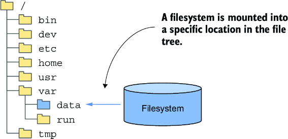

*Hình 9.1: Mount một filesystem vào cây thư mục*

> **ĐỊNH NGHĨA:** Mounting (gắn kết) là hành động gắn filesystem của một thiết bị lưu trữ hoặc volume nào đó vào một vị trí cụ thể trong cây thư mục của hệ điều hành. Sau đó, nội dung của volume sẽ có sẵn tại vị trí đó.

### 9.1.1 Tìm hiểu khi nào nên dùng volume (Understanding when to use a volume)

Trong chương này, bạn sẽ xây dựng một service Quiz mới cho ứng dụng Kiada. Service này cần lưu trữ dữ liệu bền vững (persistent). Để hỗ trợ điều đó, pod chạy service này sẽ cần có một volume. Nhưng trước khi đi đến điểm đó, hãy cùng xem xét kỹ hơn bản thân service này và cho bạn cơ hội tận mắt thấy vì sao nó không thể hoạt động nếu không có volume.

#### Giới thiệu service Quiz (Introducing the Quiz service)

Cuốn sách này nhằm dạy bạn về các khái niệm chính của Kubernetes bằng cách chỉ ra cách triển khai bộ ứng dụng Kubernetes in Action Demo Application (KiADA) Suite. Bạn đã biết ba thành phần cấu thành nó. Nếu chưa, hình 9.2 sẽ giúp bạn nhớ lại.

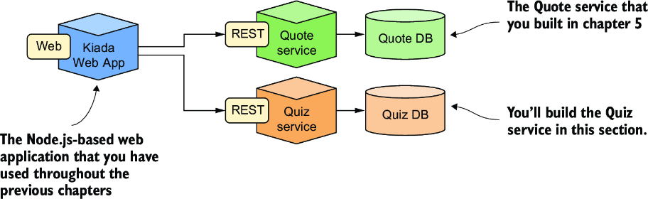

*Hình 9.2: Vị trí của service Quiz trong kiến trúc của Kiada Suite*

Bạn đã xây dựng phiên bản ban đầu của ứng dụng web Kiada và service Quote. Bây giờ bạn sẽ tạo service Quiz. Nó sẽ cung cấp các câu hỏi trắc nghiệm mà ứng dụng web Kiada hiển thị, đồng thời lưu lại các câu trả lời của bạn cho những câu hỏi đó.

Service Quiz bao gồm một RESTful API ở phía frontend và một cơ sở dữ liệu MongoDB làm backend. Ban đầu, bạn sẽ chạy hai thành phần này trong hai container riêng biệt của cùng một pod, như minh họa trong hình 9.3.

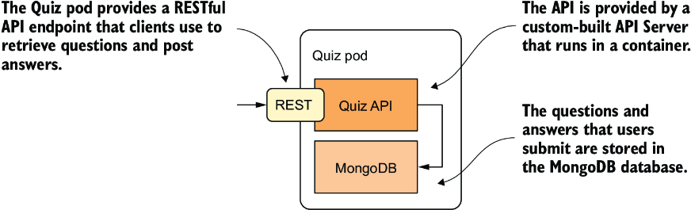

*Hình 9.3: Quiz API và cơ sở dữ liệu MongoDB chạy trong cùng một pod.*

Như đã giải thích trong chương 5, tạo pod theo kiểu này không phải là ý hay, vì nó không cho phép mở rộng (scale) từng container một cách riêng lẻ. Lý do chúng ta dùng một pod duy nhất là vì bạn chưa học cách đúng đắn để các pod giao tiếp với nhau. Bạn sẽ học điều này trong chương 11, khi bạn tách hai container này thành hai pod riêng biệt.

#### Xây dựng container Quiz API (Building the Quiz API container)

Mã nguồn và các artifact cho container image Quiz API nằm trong thư mục `Chapter08/quiz-api-0.1/`. Mã được viết bằng Go và không chỉ được đóng gói vào một container mà còn được build bằng một container. Điều này có thể cần giải thích thêm với một số độc giả. Thay vì phải cài đặt môi trường Go trên máy tính của bạn để build file nhị phân từ mã nguồn Go, bạn build nó trong một container đã có sẵn môi trường Go. Kết quả của quá trình build là file thực thi nhị phân `quiz-api`, được lưu trong thư mục `Chapter08/quiz-api-0.1/app/bin/`.

Sau đó, file này được đóng gói vào container image `quiz-api:0.1` bằng một lệnh `docker build` riêng. Nếu muốn, bạn có thể thử tự build file nhị phân và container image, hoặc bạn cũng có thể dùng image dựng sẵn mà tôi đã cung cấp, có tại `docker.io/luksa/quiz-api:0.1`.

#### Chạy service Quiz trong một pod không có volume (Running the Quiz service in a pod without a volume)

Listing sau đây cho thấy manifest YAML của pod `quiz`. Bạn có thể tìm thấy nó trong file `Chapter08/pod.quiz.novolume.yaml`.

**Listing 9.1: Pod quiz không có volume**

```yaml
apiVersion: v1
kind: Pod
metadata:
  name: quiz
spec:                                  #1
  containers:
  - name: quiz-api                     #2
    image: luksa/quiz-api:0.1          #2
    ports:
    - name: http                       #3
      containerPort: 8080              #3
  - name: mongo                        #3
    image: mongo                       #3
```

- **#1** Manifest pod này định nghĩa các container, nhưng không có volume nào.
- **#2** Container `quiz-api` chạy API server được viết bằng Go.
- **#3** Container `mongo` chạy cơ sở dữ liệu MongoDB và đại diện cho backend.

Listing cho thấy hai container được định nghĩa trong pod. Container `quiz-api` chạy thành phần Quiz API đã giải thích ở trên, và container `mongo` chạy cơ sở dữ liệu MongoDB mà thành phần API dùng để lưu dữ liệu.

Hãy tạo pod từ manifest và dùng `kubectl port-forward` để mở một đường hầm (tunnel) tới cổng 8080 của pod, nhờ đó bạn có thể giao tiếp với Quiz API. Để lấy một câu hỏi ngẫu nhiên, hãy gửi một request `GET` tới URI `/questions/random` như sau:

```bash
$ curl localhost:8080/questions/random
ERROR: Question random not found
```

Cơ sở dữ liệu vẫn còn trống. Bạn cần thêm câu hỏi vào đó.

#### Thêm câu hỏi vào cơ sở dữ liệu (Adding questions to the database)

Quiz API không cung cấp cách nào để thêm câu hỏi vào cơ sở dữ liệu, nên bạn sẽ phải chèn chúng trực tiếp. Bạn có thể làm việc này thông qua Mongo shell, có sẵn trong container `mongo`. Hãy dùng `kubectl exec` để chạy shell:

```bash
$ kubectl exec -it quiz -c mongo -- mongosh
...
test>
```

Quiz API đọc các câu hỏi từ collection `questions` trong cơ sở dữ liệu `kiada`. Để thêm một câu hỏi vào collection đó, hãy gõ hai lệnh sau (được in đậm trong sách):

```bash
> use kiada
switched to db kiada
> db.questions.insertOne({
... id: 1,
... text: "What does k8s mean?",
... answers: ["Kates", "Kubernetes", "Kooba Dooba Doo!"],
... correctAnswerIndex: 1})
WriteResult({ "nInserted" : 1 })
```

> **GHI CHÚ:** Thay vì gõ tất cả các lệnh này, bạn có thể đơn giản chạy shell script `Chapter08/insert-question.sh` trên máy tính cục bộ của bạn để chèn câu hỏi.

Bạn cứ thoải mái thêm các câu hỏi khác, nhưng nếu không thêm cũng không sao. Chúng ta sẽ chèn thêm câu hỏi sau.

#### Đọc câu hỏi từ cơ sở dữ liệu và Quiz API (Reading questions from the database and the Quiz API)

Để xác nhận rằng các câu hỏi bạn vừa chèn giờ đã được lưu trong cơ sở dữ liệu, hãy chạy lệnh sau:

```bash
> db.questions.find()
{ "_id" : ObjectId("5fc249ac18d1e29fed666ab7"), "id" : 1, "text" : "What does k8s m...
```

Được rồi, giờ đã có ít nhất một câu hỏi trong cơ sở dữ liệu. Bây giờ bạn có thể thoát Mongo shell bằng cách nhấn Ctrl-D hoặc gõ lệnh `exit`.

Giờ hãy thử lấy một câu hỏi ngẫu nhiên thông qua Quiz API:

```bash
$ curl localhost:8080/questions/random
{"id":1,"text":"What does k8s mean?","correctAnswerIndex":1,
"answers":["Kates","Kubernetes","Kooba Dooba Doo!"]}
```

Tốt. Pod `quiz` cung cấp đúng service mà nó phải cung cấp. Nhưng liệu điều này có luôn đúng, hay service này mong manh khi nói đến tính bền vững của dữ liệu?

#### Khởi động lại cơ sở dữ liệu MongoDB (Restarting the MongoDB database)

Vì cơ sở dữ liệu MongoDB chạy trong một container, nó ghi các file của mình vào filesystem của container. Như bạn đã học, nếu container này được khởi động lại, filesystem của nó sẽ được đặt lại về đúng những gì được định nghĩa trong container image. Điều này có nghĩa là tất cả các câu hỏi sẽ bị mất. Bạn có thể xác nhận điều này bằng cách yêu cầu cơ sở dữ liệu tắt đi với lệnh sau:

```bash
$ kubectl exec -it quiz -c mongo -- mongosh admin --eval "db.shutdownServer()"
```

Khi cơ sở dữ liệu tắt, container kết thúc, và Kubernetes khởi động một container mới thay thế. Vì đây giờ là một container mới với filesystem mới tinh, nó không chứa các câu hỏi bạn đã nhập trước đó. Bạn có thể xác nhận điều này với lệnh sau:

```bash
$ kubectl exec -it quiz -c mongo -- mongosh kiada --quiet --eval "db.questions.countDocuments()"
0         #1
```

- **#1** Không có câu hỏi nào trong cơ sở dữ liệu.

Hãy nhớ rằng pod `quiz` vẫn là pod giống như trước. Container `quiz-api` đã chạy ổn định suốt thời gian này, và chỉ có container `mongo` được khởi động lại. Nói chính xác hơn, nó được tạo lại chứ không phải khởi động lại. Điều này xảy ra do việc tắt MongoDB, nhưng nó có thể xảy ra vì bất kỳ lý do nào. Trong mọi trường hợp, mất dữ liệu theo cách này là không thể chấp nhận được.

Để đảm bảo dữ liệu tồn tại qua các lần khởi động lại container, nó cần được lưu bên ngoài container – trong một volume.

### 9.1.2 Tìm hiểu cách volume nằm trong pod (Understanding how volumes fit into pods)

Giống như container, volume không phải là resource cấp cao nhất như pod hay node, mà là một thành phần bên trong pod và do đó chia sẻ vòng đời với pod. Như minh họa trong hình 9.4, một volume được định nghĩa ở cấp pod rồi được mount vào vị trí mong muốn trong container.

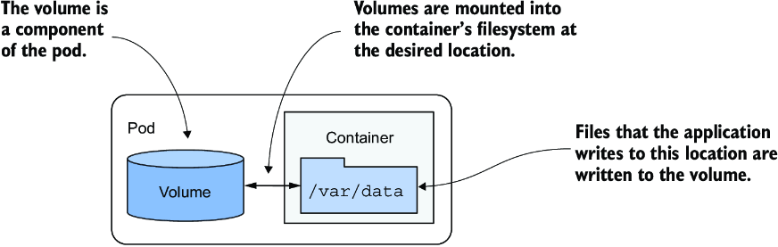

*Hình 9.4: Volume được định nghĩa ở cấp pod và được mount vào các container của pod.*

Vòng đời của một volume gắn với vòng đời của toàn bộ pod và độc lập với vòng đời của container mà nó được mount vào. Nhờ vậy, volume có thể được dùng để duy trì dữ liệu qua các lần khởi động lại container.

#### Duy trì file qua các lần khởi động lại container (Persisting files across container restarts)

Tất cả các volume trong một pod được tạo khi pod được thiết lập – trước khi bất kỳ container nào của nó được khởi động. Chúng bị gỡ bỏ khi pod tắt.

Mỗi lần một container được (khởi động lại), các volume mà container được cấu hình để sử dụng sẽ được mount vào filesystem của container. Ứng dụng chạy trong container có thể đọc từ volume và ghi vào đó nếu volume và mount được cấu hình cho phép ghi.

Một lý do điển hình để thêm volume vào pod là để duy trì dữ liệu qua các lần khởi động lại container. Nếu không có volume nào được mount vào container, toàn bộ filesystem của container là tạm thời (ephemeral). Vì việc khởi động lại container thay thế toàn bộ container, filesystem của nó cũng được tạo lại từ container image. Hệ quả là mọi file do ứng dụng ghi ra đều bị mất. Ngược lại, nếu ứng dụng ghi dữ liệu vào một volume được mount bên trong container, như minh họa trong hình 9.5, tiến trình ứng dụng trong container mới có thể truy cập cùng dữ liệu đó sau khi container được khởi động lại.

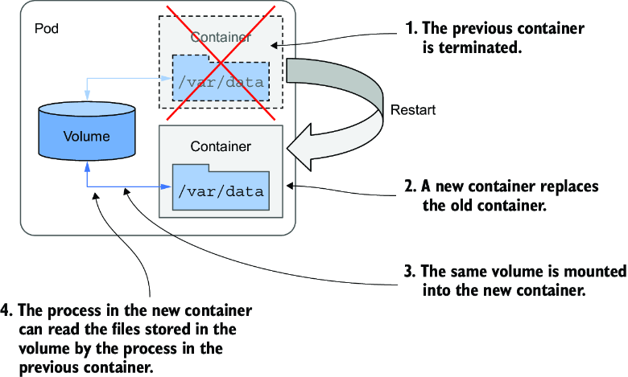

*Hình 9.5: Volume đảm bảo một phần filesystem của container được duy trì qua các lần khởi động lại.*

Việc quyết định file nào phải được giữ lại khi khởi động lại là tùy thuộc vào tác giả của ứng dụng. Thông thường, bạn muốn giữ lại dữ liệu đại diện cho trạng thái của ứng dụng, nhưng có thể không muốn giữ lại các file chứa dữ liệu được ứng dụng cache cục bộ, vì điều này ngăn container khởi động "sạch" khi nó được khởi động lại. Khởi động sạch mỗi lần có thể cho phép ứng dụng tự chữa lành khi cache cục bộ bị hỏng khiến nó crash. Chỉ khởi động lại container và dùng lại chính những file bị hỏng đó có thể dẫn đến một vòng lặp crash vô tận.

> **MẸO:** Trước khi mount một volume vào container để giữ lại file qua các lần khởi động lại container, hãy cân nhắc xem điều này ảnh hưởng thế nào đến khả năng tự chữa lành (self-healing) của container.

#### Mount nhiều volume vào một container (Mounting multiple volumes in a container)

Một pod có thể có nhiều volume, và mỗi container có thể mount không, một hoặc nhiều volume trong số đó vào các vị trí khác nhau, như minh họa trong hình 9.6. Lý do bạn có thể muốn mount nhiều volume vào một container là các volume này có thể phục vụ những mục đích khác nhau và có thể thuộc các kiểu khác nhau với các đặc tính hiệu năng khác nhau.

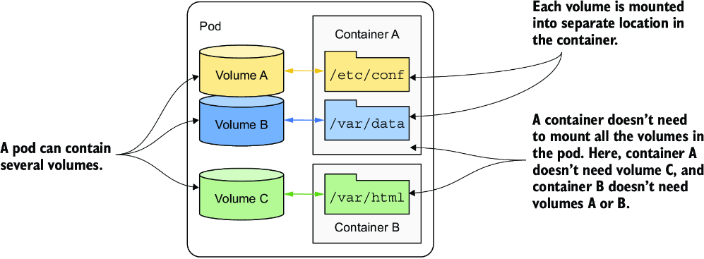

*Hình 9.6: Một pod có thể chứa nhiều volume, và một container có thể mount nhiều volume.*

Trong các pod có nhiều hơn một container, một số volume có thể được mount vào một số container nhưng không mount vào những container khác. Điều này đặc biệt hữu ích khi một volume chứa thông tin nhạy cảm mà chỉ một số container mới được phép truy cập.

#### Chia sẻ file giữa nhiều container (Sharing files between multiple containers)

Một volume có thể được mount vào nhiều hơn một container để các ứng dụng chạy trong những container này có thể chia sẻ file. Như đã thảo luận trong chương 5, một pod có thể kết hợp một container ứng dụng chính với các sidecar container mở rộng hành vi của ứng dụng chính. Trong một số trường hợp, các container phải đọc hoặc ghi cùng những file.

Ví dụ, bạn có thể tạo một pod kết hợp một web server chạy trong một container với một agent tạo nội dung chạy trong một container khác. Container agent nội dung sinh ra nội dung tĩnh mà web server sau đó phân phối cho các client của nó. Mỗi container trong hai container này thực hiện một nhiệm vụ đơn lẻ có rất ít giá trị nếu đứng riêng. Tuy nhiên, như minh họa trong hình 9.7, bằng cách thêm một volume vào pod và mount nó vào cả hai container, bạn cho phép chúng hoạt động như một hệ thống hoàn chỉnh – một hệ thống có giá trị lớn hơn tổng các phần của nó, vì nó cung cấp một dịch vụ hữu ích mà từng container riêng lẻ không thể cung cấp được.

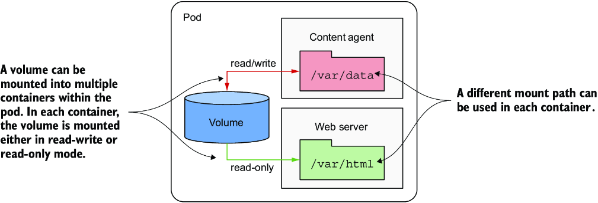

*Hình 9.7: Một volume có thể được mount vào nhiều hơn một container.*

Cùng một volume có thể được mount vào những vị trí khác nhau trong mỗi container, tùy theo nhu cầu của chính container đó. Nếu agent nội dung ghi nội dung vào `/var/data`, thì mount volume ở đó là hợp lý. Vì web server mong đợi nội dung nằm ở `/var/html`, container chạy web server có volume được mount tại vị trí này.

Trong hình, bạn cũng sẽ nhận thấy rằng volume mount trong mỗi container có thể được cấu hình là đọc/ghi hoặc chỉ đọc. Vì agent nội dung cần ghi vào volume trong khi web server chỉ đọc từ đó, hai mount được cấu hình khác nhau. Vì lý do bảo mật, nên ngăn web server ghi vào volume, vì điều này có thể cho phép kẻ tấn công xâm nhập hệ thống nếu phần mềm web server có lỗ hổng cho phép kẻ tấn công ghi các file tùy ý vào filesystem và thực thi chúng.

Các kịch bản khác mà một volume duy nhất được chia sẻ bởi hai container là khi một sidecar container xử lý hoặc xoay vòng (rotate) log của web server, hoặc khi một init container khởi tạo dữ liệu cho container ứng dụng chính.

#### Duy trì dữ liệu qua các instance pod (Persisting data across pod instances)

Một volume gắn với vòng đời của pod và chỉ tồn tại chừng nào pod còn tồn tại. Tuy nhiên, tùy thuộc vào kiểu volume, các file trong volume có thể vẫn còn nguyên vẹn sau khi pod và volume biến mất, và sau này có thể được mount vào một volume mới.

Như hình 9.8 cho thấy, một volume của pod có thể ánh xạ tới bộ lưu trữ bền vững (persistent storage) bên ngoài pod. Trong trường hợp này, thư mục file đại diện cho volume không phải là một thư mục file cục bộ chỉ lưu dữ liệu trong thời gian tồn tại của pod, mà là một volume mount tới một storage volume có sẵn, thường là bộ lưu trữ gắn qua mạng (network-attached storage – NAS), có vòng đời không gắn với bất kỳ pod nào. Do đó, dữ liệu lưu trong volume là bền vững và ứng dụng có thể sử dụng ngay cả sau khi pod chứa nó được thay thế bằng một pod mới chạy trên một worker node khác.

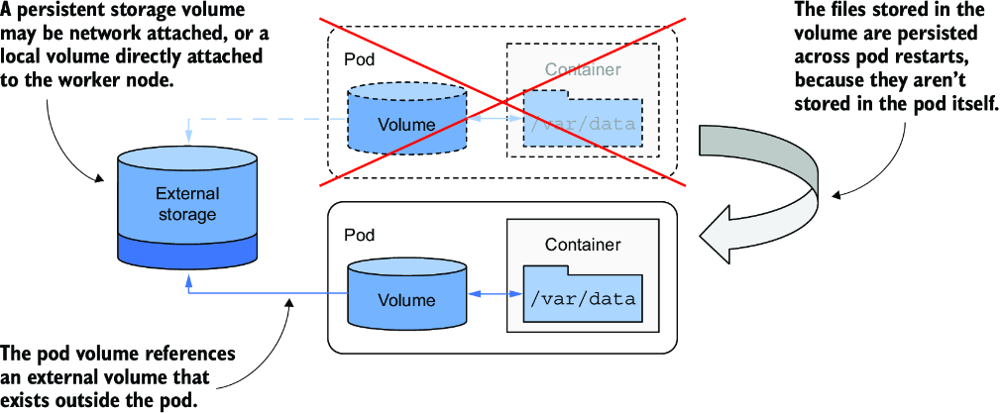

*Hình 9.8: Volume của pod cũng có thể ánh xạ tới các storage volume tồn tại bền vững qua các lần khởi động lại pod.*

Nếu pod bị xóa và một pod mới được tạo để thay thế, cùng storage volume gắn qua mạng đó có thể được gắn vào instance pod mới để nó có thể truy cập dữ liệu mà instance trước đã lưu ở đó.

#### Chia sẻ dữ liệu giữa các pod (Sharing data between pods)

Tùy thuộc vào công nghệ cung cấp storage volume bên ngoài, cùng một volume bên ngoài có thể được gắn vào nhiều pod đồng thời, cho phép chúng chia sẻ dữ liệu. Hình 9.9 cho thấy một kịch bản trong đó ba pod, mỗi pod định nghĩa một volume được ánh xạ tới cùng một persistent storage volume bên ngoài.

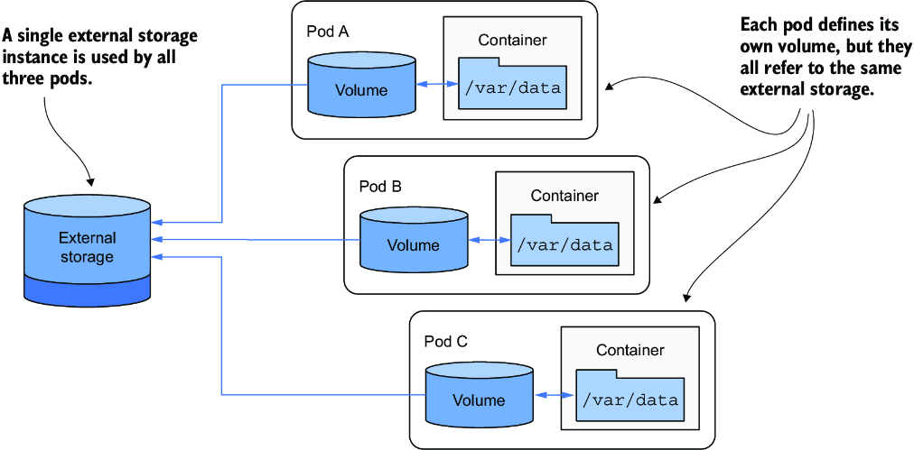

*Hình 9.9: Dùng volume để chia sẻ dữ liệu giữa các pod*

Trong trường hợp đơn giản nhất, persistent storage volume có thể chỉ là một thư mục cục bộ đơn giản trên filesystem của worker node, và ba pod có các volume ánh xạ tới thư mục đó. Nếu cả ba pod đang chạy trên cùng một node, chúng có thể chia sẻ file thông qua thư mục này.

Nếu persistent storage là một storage volume gắn qua mạng, các pod có thể sử dụng nó ngay cả khi chúng được triển khai lên các node khác nhau. Tuy nhiên, điều này phụ thuộc vào việc công nghệ lưu trữ bên dưới có hỗ trợ gắn đồng thời volume mạng vào nhiều máy tính hay không.

Các công nghệ như Network File System (NFS) hỗ trợ mount một volume ở chế độ đọc/ghi trên nhiều máy. Các công nghệ khác thường có trong môi trường đám mây, chẳng hạn như Google Compute Engine Persistent Disk, cho phép volume được dùng hoặc ở chế độ đọc/ghi trên một node duy nhất của cluster, hoặc ở chế độ chỉ đọc trên nhiều node.

#### Giới thiệu các kiểu volume có sẵn (Introducing the available volume types)

Khi thêm một volume vào pod, bạn phải chỉ định kiểu volume. Có rất nhiều kiểu volume khác nhau. Một số là kiểu chung, trong khi những kiểu khác gắn với các công nghệ lưu trữ được dùng bên dưới. Dưới đây là danh sách (chưa đầy đủ) các kiểu volume được hỗ trợ:

* **`emptyDir`** – Một thư mục đơn giản cho phép pod lưu dữ liệu trong suốt vòng đời của nó. Thư mục được tạo ngay trước khi pod khởi động và ban đầu trống rỗng – vì thế mới có tên này.
* **`hostPath`** – Dùng để mount các file từ filesystem của worker node vào pod.
* **`configMap`, `secret`, `downwardAPI` và kiểu volume `projected`** – Các kiểu volume đặc biệt dùng để công khai dữ liệu trong một ConfigMap hoặc Secret, hoặc metadata của chính pod.
* **`image`** – Dùng để mount filesystem của một container image khác dưới dạng volume.
* **`ephemeral`** – Một volume tạm thời được cung cấp bởi một driver Container Storage Interface (CSI), chỉ tồn tại trong vòng đời của pod.
* **`persistentVolumeClaim`** – Một cách khả chuyển (portable) để tích hợp bộ lưu trữ bên ngoài vào pod. Thay vì trỏ trực tiếp tới một storage volume bên ngoài, kiểu volume này trỏ tới một PersistentVolumeClaim object, object này lại trỏ tới một PersistentVolume object tham chiếu tới bộ lưu trữ thực. Kiểu volume này cần giải thích chi tiết hơn, nên nó sẽ được trình bày riêng trong chương tiếp theo.

Kubernetes từng trực tiếp cung cấp nhiều kiểu volume gắn với công nghệ cụ thể khác, chẳng hạn như `nfs`, `gcePersistentDisk`, `awsElasticBlockStore`, `azureFile`/`azureDisk`, v.v. Những kiểu volume này hiện đã bị đánh dấu lỗi thời (deprecated), vì chúng đã được chuyển ra ngoài mã nguồn của Kubernetes và giờ được truy cập thông qua các driver CSI. Nhìn chung chúng không còn được định nghĩa trong pod nữa – thay vào đó, một volume `persistentVolumeClaim` được sử dụng. Như đã đề cập, đây là chủ đề của chương tiếp theo. Trong chương này, chúng ta sẽ tập trung vào các kiểu volume vẫn có thể được định nghĩa trực tiếp trong pod.

---

## 9.2 Sử dụng emptyDir volume (Using an emptyDir volume)

Kiểu volume đơn giản nhất là `emptyDir`. Như tên gọi gợi ý, một volume kiểu này bắt đầu là một thư mục trống. Khi kiểu volume này được mount vào một container, các file được ghi vào volume sẽ được giữ lại trong suốt thời gian tồn tại của pod, nhưng chúng không thể được chia sẻ với các pod khác.

Kiểu volume này được dùng trong các pod một container khi dữ liệu phải được giữ lại ngay cả khi container được khởi động lại. Nó cũng được dùng khi filesystem của container được đánh dấu là chỉ đọc, nhưng container vẫn cần một nơi để ghi dữ liệu tạm thời. Trong các pod có hai container trở lên, một `emptyDir` volume cũng có thể được dùng để chia sẻ dữ liệu giữa chúng.

### 9.2.1 Duy trì file qua các lần khởi động lại container (Persisting files across container restarts)

Hãy thêm một `emptyDir` volume vào pod `quiz` ở đầu chương này để đảm bảo dữ liệu của nó không bị mất khi container MongoDB khởi động lại.

#### Thêm emptyDir volume vào pod (Adding an emptyDir volume to a pod)

Bạn sẽ sửa đổi định nghĩa của pod `quiz` để tiến trình MongoDB ghi các file của nó vào volume thay vì vào filesystem của container mà nó chạy trong đó – vốn là thứ dễ mất. Hình 9.10 là biểu diễn trực quan của pod.

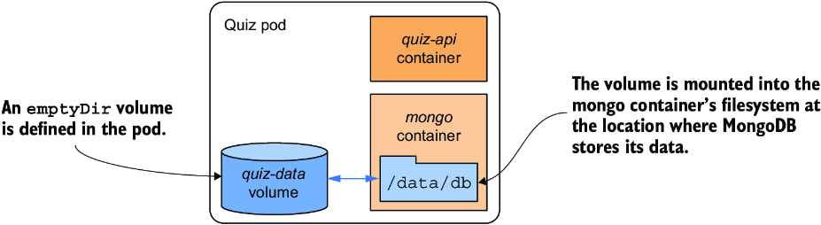

*Hình 9.10: Pod quiz với một emptyDir volume để lưu các file dữ liệu của MongoDB*

Cần hai thay đổi đối với manifest của pod để đạt được điều này:

1. Một `emptyDir` volume phải được thêm vào pod.
2. Volume phải được mount vào container.

Listing sau đây cho thấy manifest pod mới với hai thay đổi này được in đậm. Bạn sẽ tìm thấy manifest trong file `pod.quiz.emptydir.yaml`.

**Listing 9.2: Pod quiz với một emptyDir volume cho container mongo**

```yaml
apiVersion: v1
kind: Pod
metadata:
  name: quiz
spec:
  volumes:                        #1
  - name: quiz-data               #1
    emptyDir: {}                  #1
  containers:
  - name: quiz-api
    image: luksa/quiz-api:0.1
    ports:
    - name: http
      containerPort: 8080
  - name: mongo
    image: mongo
    volumeMounts:                 #2
    - name: quiz-data             #2
      mountPath: /data/db         #2
```

- **#1** Một `emptyDir` volume với tên `quiz-data` được định nghĩa.
- **#2** Volume `quiz-data` được mount vào filesystem của container `mongo` tại vị trí `/data/db`.

Listing cho thấy một `emptyDir` volume tên `quiz-data` được định nghĩa trong mảng `spec.volumes` của manifest pod và nó được mount vào filesystem của container `mongo` tại vị trí `/data/db`. Hai mục tiếp theo sẽ giải thích thêm về định nghĩa volume và định nghĩa volume mount.

#### Cấu hình emptyDir volume (Configuring the emptyDir volume)

Nói chung, mỗi định nghĩa volume phải bao gồm một tên và một kiểu, kiểu được chỉ ra bằng tên của trường lồng bên trong (`emptyDir` trong ví dụ hiện tại). Trường này thường chứa một số trường con để cấu hình volume. Tập hợp các trường con có sẵn phụ thuộc vào kiểu volume.

Ví dụ, kiểu volume `emptyDir` hỗ trợ hai trường để cấu hình volume, như giải thích trong bảng 9.1.

**Bảng 9.1: Các tùy chọn cấu hình cho một emptyDir volume**

| Trường | Mô tả |
|---|---|
| `medium` | Kiểu phương tiện lưu trữ (storage medium) dùng cho thư mục. Nếu để trống, phương tiện mặc định của host node được dùng (thư mục được tạo trên một trong các ổ đĩa của node). Tùy chọn duy nhất khác được hỗ trợ là `Memory`, khiến volume dùng `tmpfs`, một filesystem trên bộ nhớ ảo trong đó các file được giữ trong bộ nhớ thay vì trên ổ cứng. |
| `sizeLimit` | Tổng dung lượng lưu trữ cục bộ cần cho thư mục, dù trên đĩa hay trong bộ nhớ. Ví dụ, để đặt kích thước tối đa là 10 mebibyte, hãy đặt trường này thành `10Mi`. |

> **GHI CHÚ:** Trường `emptyDir` trong định nghĩa volume không định nghĩa thuộc tính nào trong hai thuộc tính này. Cặp dấu ngoặc nhọn `{}` được thêm vào để chỉ rõ điều này một cách tường minh, nhưng chúng có thể được bỏ đi.

#### Mount volume vào container (Mounting the volume in a container)

Định nghĩa một volume trong pod chỉ là một nửa những gì bạn cần làm để nó có sẵn trong một container. Volume còn phải được mount vào container. Việc này được thực hiện bằng cách tham chiếu volume theo tên trong mảng `volumeMounts` của định nghĩa container.

Ngoài `name`, một định nghĩa volume mount còn phải bao gồm `mountPath` – đường dẫn bên trong container mà volume sẽ được mount vào. Trong listing 9.2, volume được mount tại `/data/db` vì đó là nơi MongoDB lưu các file của nó. Điều này đảm bảo dữ liệu được ghi vào volume thay vì vào filesystem của container. Danh sách đầy đủ các trường được hỗ trợ trong một định nghĩa volume mount được trình bày trong bảng 9.2.

**Bảng 9.2: Các tùy chọn cấu hình cho một volume mount**

| Trường | Mô tả |
|---|---|
| `name` | Tên của volume cần mount. Tên này phải khớp với một trong các volume được định nghĩa trong pod. |
| `mountPath` | Đường dẫn bên trong container mà volume được mount vào. |
| `readOnly` | Có mount volume ở chế độ chỉ đọc hay không. Mặc định là `false`. Lưu ý rằng đặt giá trị này thành `true` không đảm bảo tất cả các đường dẫn con cũng là chỉ đọc, nhưng điều này có thể được cấu hình qua trường `recursiveReadOnly`. |
| `recursiveReadOnly` | Các volume được mount chỉ đọc có thực sự chỉ đọc hay không, bao gồm cả mọi đường dẫn con bên dưới đường dẫn mount. |
| `mountPropagation` | Chỉ định điều gì sẽ xảy ra nếu có thêm các filesystem volume khác được mount bên trong volume này.<br>Mặc định là `None`, nghĩa là container sẽ không nhận được bất kỳ mount nào do host thực hiện, và host sẽ không nhận được bất kỳ mount nào do container thực hiện.<br>`HostToContainer` nghĩa là container sẽ nhận được tất cả các mount mà host mount vào volume này, nhưng không có chiều ngược lại.<br>`Bidirectional` nghĩa là container sẽ nhận được các mount do host thêm vào, và host sẽ nhận được các mount do container thêm vào. |
| `subPath` | Mặc định là `""`, cho biết toàn bộ volume sẽ được mount vào container. Khi được đặt thành một chuỗi khác rỗng, chỉ subPath được chỉ định bên trong volume mới được mount vào container. |
| `subPathExpr` | Giống như `subPath` nhưng có thể chứa các tham chiếu tới biến môi trường bằng cú pháp `$(ENV_VAR_NAME)`. Chỉ các biến môi trường được định nghĩa tường minh trong định nghĩa container mới áp dụng được. Các biến ngầm định như `HOSTNAME` sẽ không được phân giải, như đã giải thích trong chương trước. |

Trong hầu hết các trường hợp, bạn chỉ chỉ định `name`, `mountPath` và mount có nên là `readOnly` hay không. Như giải thích trong bảng, đặt `readOnly` không phải lúc nào cũng đủ và nên được kết hợp với `recursiveReadOnly` khi cần. Tùy chọn `mountPropagation` phát huy tác dụng trong các trường hợp sử dụng nâng cao, khi có thêm các mount được thêm vào cây file của volume sau này, từ host hoặc từ container. Các tùy chọn `subPath` và `subPathExpr` hữu ích khi bạn cần dùng một volume duy nhất với nhiều thư mục mà bạn muốn mount vào các container khác nhau, thay vì dùng nhiều volume.

Tùy chọn `subPathExpr` cũng có thể được dùng khi một volume được chia sẻ bởi nhiều replica của pod. Trong chương trước, bạn đã học cách dùng Downward API để đưa tên của pod vào một biến môi trường. Bằng cách tham chiếu biến này trong `subPathExpr`, bạn có thể cấu hình để mỗi replica dùng thư mục con của riêng nó.

#### Tìm hiểu vòng đời của emptyDir volume (Understanding the lifespan of an emptyDir volume)

Nếu bạn thay pod `quiz` bằng pod trong file `pod.quiz.emptydir.yaml` và chèn câu hỏi vào cơ sở dữ liệu, bạn sẽ nhận thấy các câu hỏi bạn thêm vào cơ sở dữ liệu được giữ lại ngay cả khi bạn khởi động lại container MongoDB. Hãy dùng shell script trong file `Chapter08/insert-question.sh` để bạn không phải gõ lại toàn bộ document câu hỏi ở dạng JSON. Sau khi thêm câu hỏi, hãy đếm số câu hỏi trong cơ sở dữ liệu như sau:

```bash
$ kubectl exec -it quiz -c mongo -- mongosh kiada --quiet --eval "db.questions.countDocuments()"
1         #1
```

- **#1** Số câu hỏi trong cơ sở dữ liệu

Giờ hãy tắt MongoDB server:

```bash
$ kubectl exec -it quiz -c mongo -- mongosh admin --eval "db.shutdownServer()"
```

Kiểm tra xem container `mongo` đã được khởi động lại chưa:

```bash
$ kubectl get po quiz
NAME   READY   STATUS    RESTARTS   AGE
quiz   2/2     Running   1          10m       #1
```

- **#1** Số lần khởi động lại cho thấy một container đã được khởi động lại.

Sau khi container khởi động lại, hãy kiểm tra lại số câu hỏi trong cơ sở dữ liệu:

```bash
$ kubectl exec -it quiz -c mongo -- mongosh kiada --quiet --eval "db.questions.countDocuments()"
1         #1
```

- **#1** Dữ liệu đã tồn tại qua lần khởi động lại container.

Khởi động lại container không còn khiến các file biến mất nữa, vì chúng không còn nằm trong filesystem của container. Chúng được lưu trong volume. Nhưng chính xác là ở đâu? Hãy cùng tìm hiểu.

#### Tìm hiểu nơi lưu các file trong emptyDir volume (Understanding where the files in an emptyDir volume are stored)

Như bạn thấy trong hình 9.11, các file trong một `emptyDir` volume được lưu trong một thư mục trên filesystem của host node. Nó chẳng là gì khác ngoài một thư mục file bình thường. Thư mục này được mount vào container tại vị trí mong muốn.

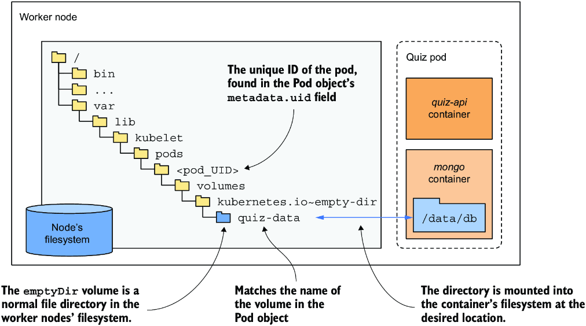

*Hình 9.11: emptyDir là một thư mục file bình thường trên filesystem của node, được mount vào container.*

Thư mục này thường nằm tại vị trí sau trên filesystem của node:

```text
/var/lib/kubelet/pods/<pod_UID>/volumes/kubernetes.io~empty-dir/<volume_name>
```

`pod_UID` là ID duy nhất của pod, bạn sẽ tìm thấy nó trong phần metadata của Pod object. Nếu muốn tự mình xem thư mục này, hãy chạy lệnh sau để lấy `pod_UID`:

```bash
$ kubectl get po quiz -o json | jq -r .metadata.uid
4f49f452-2a9a-4f70-8df3-31a227d020a1
```

`volume_name` là tên của volume trong manifest pod – trong pod `quiz`, tên đó là `quiz-data`. Để lấy tên của node đang chạy pod, hãy dùng `kubectl get po quiz -o wide` hoặc cách thay thế sau:

```bash
$ kubectl get po quiz -o json | jq .spec.nodeName
```

Giờ bạn đã có mọi thứ cần thiết. Hãy thử đăng nhập vào node và xem nội dung của thư mục. Bạn sẽ nhận thấy các file khớp với những file trong thư mục `/data/db` của container `mongo`.

Mặc dù dữ liệu tồn tại qua các lần khởi động lại container, nó không tồn tại khi pod bị xóa. Nếu bạn xóa pod, thư mục cũng bị xóa theo. Để lưu dữ liệu bền vững đúng nghĩa, bạn sẽ cần dùng persistent volume, được giải thích trong chương tiếp theo.

#### Tạo emptyDir volume trong bộ nhớ (Creating the emptyDir volume in memory)

`emptyDir` volume trong ví dụ trước tạo một thư mục trên ổ đĩa thực của worker node chạy pod của bạn, nên hiệu năng của nó phụ thuộc vào loại ổ đĩa được lắp trên node. Nếu bạn muốn các thao tác I/O trên volume nhanh nhất có thể, bạn có thể chỉ thị Kubernetes tạo volume bằng filesystem `tmpfs`, filesystem này giữ các file trong bộ nhớ. Để làm vậy, hãy đặt trường `medium` thành `Memory` như trong đoạn mã sau:

```yaml
volumes:
- name: content
  emptyDir:
    medium: Memory            #1
```

- **#1** Thư mục này nên được lưu trong bộ nhớ.

Tạo `emptyDir` volume trong bộ nhớ cũng là ý hay bất cứ khi nào nó được dùng để lưu dữ liệu nhạy cảm. Vì dữ liệu không được ghi ra đĩa, có ít khả năng dữ liệu bị xâm phạm và bị lưu lại lâu hơn mong muốn. Như đã giải thích trong chương trước, Kubernetes dùng chính cách tiếp cận trên bộ nhớ này khi nó công khai dữ liệu từ object kiểu Secret vào trong container.

#### Chỉ định giới hạn kích thước cho emptyDir volume (Specifying the size limit for the emptyDir volume)

Kích thước của một `emptyDir` volume có thể được giới hạn bằng cách đặt trường `sizeLimit`. Đặt trường này đặc biệt quan trọng với các volume trong bộ nhớ khi tổng mức sử dụng bộ nhớ của pod bị giới hạn bởi cái gọi là giới hạn tài nguyên (resource limits).

Tiếp theo, hãy xem cách một `emptyDir` volume được dùng để chia sẻ file giữa các container của cùng một pod.

### 9.2.2 Khởi tạo emptyDir volume (Initializing an emptyDir volume)

Mỗi lần bạn tạo pod `quiz` với `emptyDir` volume, cơ sở dữ liệu MongoDB đều trống, và bạn phải chèn câu hỏi bằng tay. Hãy khắc phục điều này bằng cách tự động nạp dữ liệu vào cơ sở dữ liệu khi pod khởi động.

Có nhiều cách để làm việc này. Bạn có thể chạy container MongoDB cục bộ, chèn dữ liệu, commit trạng thái container thành một image mới, rồi dùng image đó trong pod của bạn. Nhưng khi đó bạn sẽ phải lặp lại quy trình này mỗi khi một phiên bản mới của container image MongoDB được phát hành.

May mắn thay, container image MongoDB cung cấp một cơ chế để nạp dữ liệu vào cơ sở dữ liệu trong lần khởi động đầu tiên. Khi khởi động, nếu cơ sở dữ liệu trống, nó sẽ gọi bất kỳ file `.js` và `.sh` nào được tìm thấy trong thư mục `/docker-entrypoint-initdb.d/`. Tất cả những gì bạn cần làm là đưa file chứa các câu hỏi vào vị trí đó trước khi container MongoDB khởi động.

Một lần nữa, bạn có thể build một image MongoDB mới có file này ở vị trí đó, nhưng bạn sẽ gặp lại vấn đề như đã mô tả ở trên. Một giải pháp thay thế là dùng một volume để đưa file vào vị trí đó trong filesystem của container MongoDB. Nhưng làm sao để đưa file vào volume ngay từ đầu?

#### Khởi tạo emptyDir volume bằng init container (Initializing an emptyDir volume with an init container)

Một cách để khởi tạo `emptyDir` volume là dùng một init container. Init container có thể lấy các file từ bất cứ đâu nó muốn. Ví dụ, nó có thể dùng lệnh `git clone` để clone một kho Git và checkout các file của kho đó. Tuy nhiên, hành động này yêu cầu pod phải thực hiện một cuộc gọi mạng để lấy dữ liệu mỗi lần khởi động. Init container cũng có thể đơn giản là lưu các file ngay trong image của nó. Mục tiêu của mục này là chỉ ra cách một init container có thể được dùng để khởi tạo volume, chứ không phải đi sâu vào nguồn gốc của dữ liệu, nên chúng ta sẽ dùng cách tiếp cận này.

Bạn sẽ tạo một container image mới lưu các câu hỏi quiz trong một file JSON và sao chép file này vào một volume chia sẻ để container MongoDB có thể đọc nó khi khởi động. Bạn sẽ thêm container mới này làm init container cùng với một volume mới và các volume mount cần thiết vào pod `quiz`, như trong hình sau.

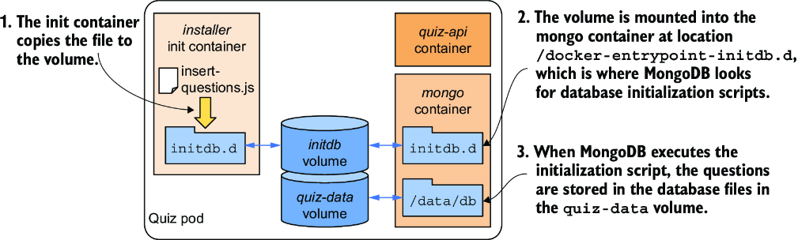

*Hình 9.12: Dùng một init container để khởi tạo emptyDir volume*

#### Tìm hiểu điều gì xảy ra khi pod khởi động (Understanding what happens when the pod starts)

Khi pod khởi động, các volume được tạo trước tiên, rồi init container được khởi động. Điều này đúng với mọi pod, bất kể bạn định nghĩa volume trước hay sau các init container trong manifest pod.

Trước khi init container được khởi động, volume `initdb` được mount vào nó. Container image chứa file `insert-questions.js`, và container sao chép file này vào volume khi nó chạy. Khi thao tác sao chép hoàn tất, init container kết thúc, và các container chính của pod được khởi động. Volume `initdb` được mount vào container `mongo` tại vị trí mà MongoDB tìm các script khởi tạo cơ sở dữ liệu. Trong lần khởi động đầu tiên, MongoDB thực thi script `insert-questions.js`, và như tên file gợi ý, script này chèn các câu hỏi vào cơ sở dữ liệu. Giống như phiên bản trước của pod, các file cơ sở dữ liệu được lưu trong một volume khác tên là `quiz-data` để dữ liệu tồn tại qua các lần khởi động lại container.

#### Build image cho init container (Building the init container image)

Bạn sẽ tìm thấy file `insert-questions.js` và `Dockerfile` cần thiết để build image cho init container trong kho mã nguồn của sách, dưới thư mục `Chapter08/quiz-initdb-script-installer-0.1`. Listing sau đây cho thấy một phần của file `insert-questions.js`.

**Listing 9.3: Nội dung của file insert-questions.js**

```javascript
db.getSiblingDB("kiada").questions.insertMany(                          #1
[{                                                                      #2
      "id": 1,                                                          #2
      "text": "The three sections in most Kubernetes API objects are:", #2
      "correctAnswerIndex": 1,                                          #2
      "answers": [                                                      #2
            "`info`, `config`, `status`",                               #2
            "`metadata`, `spec`, `status`",                             #2
            "`data`, `spec`, `status`",                                 #2
            "`pod`, `deployment`, `service`",                           #2
      ]                                                                 #2
},                                                                      #2
...                                                                     #2
```

- **#1** Lệnh này chèn các document vào collection `questions` của cơ sở dữ liệu `kiada`.
- **#2** Đây là document đầu tiên được chèn vào.
- **#3** Đây là document đầu tiên được chèn vào.

`Dockerfile` cho container image được trình bày trong listing tiếp theo. Như bạn thấy từ chỉ thị `CMD`, một lệnh `cp` đơn giản được dùng để sao chép file `insert-questions.js` tới đường dẫn nơi volume chia sẻ được mount.

**Listing 9.4: Dockerfile cho container image quiz-initdb-script-installer:0.1**

```dockerfile
FROM busybox
COPY insert-questions.js /                                                #1
CMD cp /insert-questions.js /initdb.d/ \                                  #2
      && echo "Successfully copied insert-questions.js to /initdb.d" \    #3
      || echo "Error copying insert-questions.js to /initdb.d"            #3
```

- **#1** Thêm file vào container image
- **#2** Khi container chạy, nó sao chép file vào thư mục `/initdb.d`
- **#3** Một thông báo trạng thái được in ra khi lệnh `cp` hoàn tất

Hãy dùng hai file này để build image, hoặc dùng image dựng sẵn tại `docker.io/luksa/quiz-initdb-script-installer:0.1`.

#### Thêm volume và init container vào pod quiz (Adding the volume and init container to the quiz pod)

Sau khi đã có container image, hãy sửa manifest Pod từ mục trước sao cho nội dung của nó khớp với listing tiếp theo, hoặc mở file `pod.quiz.emptydir.init.yaml`, nơi tôi đã thực hiện sẵn những thay đổi tương tự. Các thay đổi được in đậm.

**Listing 9.5: Dùng init container để khởi tạo emptyDir volume**

```yaml
apiVersion: v1
kind: Pod
metadata:
  name: quiz
spec:
  volumes:
  - name: initdb                                     #1
    emptyDir: {}                                     #1
  - name: quiz-data
    emptyDir: {}
  initContainers:
  - name: installer                                  #2
    image: luksa/quiz-initdb-script-installer:0.1    #2
    volumeMounts:                                    #2
    - name: initdb                                   #2
      mountPath: /initdb.d                           #2
  containers:                                        #2
  - name: quiz-api
    image: luksa/quiz-api:0.1
    ports:
    - name: http
      containerPort: 8080
  - name: mongo
    image: mongo
    volumeMounts:
    - name: quiz-data
      mountPath: /data/db
    - name: initdb                                   #3
      mountPath: /docker-entrypoint-initdb.d/        #3
      readOnly: true                                 #3
```

- **#1** `emptyDir` volume `initdb` được định nghĩa ở đây.
- **#2** Volume được mount vào init container tại vị trí mà container sao chép file `insert-questions.js` tới.
- **#3** Cùng volume đó cũng được mount vào container `mongo` tại vị trí mà MongoDB tìm các script khởi tạo.

Listing cho thấy volume `initdb` được mount vào init container `installer`. Sau khi container này sao chép file `insert-questions.js` vào volume, nó kết thúc và cho phép các container `mongo` và `quiz-api` khởi động. Vì volume `initdb` được mount vào thư mục `/docker-entrypoint-initdb.d/` trong container `mongo`, MongoDB thực thi file `.js`, file này nạp các câu hỏi vào cơ sở dữ liệu.

Bạn có thể xóa pod `quiz` cũ và triển khai phiên bản mới này của pod. Bạn sẽ thấy cơ sở dữ liệu được nạp câu hỏi một cách tự động.

#### Khởi tạo volume với nội dung file được định nghĩa inline trong manifest pod (Initializing a volume with file content defined inline in the pod manifest)

Một mẹo hay bạn có thể dùng khi muốn khởi tạo một `emptyDir` volume với một file ngắn là định nghĩa nội dung file trực tiếp trong manifest pod, như trong listing sau. Bạn có thể tìm thấy toàn bộ manifest trong file `pod.emptydir-inline-example.yaml`.

**Listing 9.6: Tạo file từ nội dung inline**

```yaml
spec:
  initContainers:                                     #1
  - name: my-volume-initializer                       #1
    image: busybox                                    #1
    command:                                          #2
    - sh                                              #2
    - -c                                              #2
    - |                                               #2
      cat <<EOF > /mnt/my-volume/my-file.txt          #2
      line 1: This is a multi-line file               #3
      line 2: Written from an init container          #3
      line 3: Defined inline in the Pod manifest      #3
      EOF                                             #4
    volumeMounts:                                     #5
    - name: my-volume                                 #5
      mountPath: /mnt/my-volume                       #5
  containers:
  ...
```

- **#1** Volume được khởi tạo bằng một init container đơn giản.
- **#2** Init container dùng lệnh `cat` để in ra một file trong `emptyDir` volume.
- **#3** Nội dung file được định nghĩa ở đây.
- **#4** Đây là dấu kết thúc đoạn văn bản được ghi vào file.
- **#5** `emptyDir` volume được mount vào init container.

Cách tiếp cận trong listing là một cách nhanh và dễ để thêm một hoặc hai file vào một volume trong pod. Bạn có thể dùng cách này để cung cấp một file cấu hình ngắn cho ứng dụng của mình mà không cần dùng bất kỳ resource nào khác để lưu nội dung file.

### 9.2.3 Chia sẻ file giữa các container (Sharing files between containers)

Như minh họa trong mục trước, một `emptyDir` volume có thể được khởi tạo bằng một init container rồi được một trong các container chính của pod sử dụng. Nhưng một volume cũng có thể được nhiều container chính sử dụng đồng thời. Các container `quiz-api` và `mongo` trong pod `quiz` không cần chia sẻ file, nên hãy dùng một ví dụ khác để học cách volume được chia sẻ giữa các container.

#### Biến pod quote thành pod đa container với một volume chia sẻ (Transforming the quote pod into a multi-container pod with a shared volume)

Bạn còn nhớ pod `quote` từ chương trước chứ? Pod dùng một post-start hook để chạy lệnh `fortune` ấy? Lệnh này ghi một câu trích dẫn từ cuốn sách này vào một file, rồi file đó được Nginx web server phục vụ. Vấn đề là pod này hiện phục vụ cùng một câu trích dẫn mỗi lần. Hãy xây dựng một phiên bản mới của pod phục vụ một câu trích dẫn mới mỗi phút.

Bạn sẽ giữ Nginx làm web server nhưng thay post-start hook bằng một container định kỳ chạy lệnh `fortune` để cập nhật file lưu câu trích dẫn. Hãy gọi container này là `quote-writer`. Nginx server sẽ tiếp tục nằm trong container `nginx`.

Như minh họa trong hình 9.13, pod giờ có hai container thay vì một. Để cho phép container `nginx` thấy được file mà `quote-writer` tạo ra, một volume phải được định nghĩa trong pod và được mount vào cả hai container.

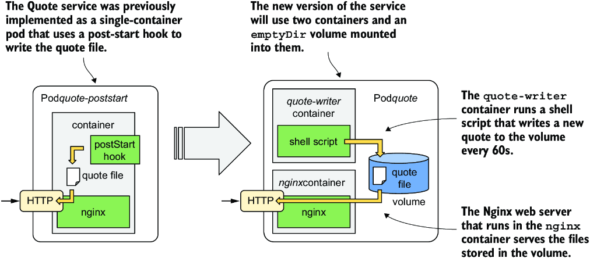

*Hình 9.13: Phiên bản mới của service Quote dùng hai container và một volume chia sẻ.*

Image cho container `quote-writer` có sẵn tại `docker.io/luksa/quote-writer:0.1`, nhưng bạn cũng có thể tự build nó từ các file trong thư mục `Chapter08/quote-writer-0.1`. Container `nginx` sẽ tiếp tục dùng image `nginx:alpine` hiện có.

#### Cập nhật manifest pod quote (Updating the quote pod manifest)

Manifest pod cho pod `quote` mới được trình bày trong listing tiếp theo. Bạn có thể tìm thấy nó trong file `pod.quote.yaml`.

**Listing 9.7: Một pod với hai container chia sẻ một volume**

```yaml
apiVersion: v1
kind: Pod
metadata:
  name: quote
spec:
  volumes:                                #1
  - name: shared                          #1
    emptyDir: {}                          #1
  containers:
  - name: quote-writer                    #2
    image: luksa/quote-writer:0.1         #2
    volumeMounts:                         #3
    - name: shared                        #3
      mountPath: /var/local/output        #3
  - name: nginx                           #4
    image: nginx:alpine                   #4
    volumeMounts:                         #5
    - name: shared                        #5
      mountPath: /usr/share/nginx/html    #5
      readOnly: true                      #5
    ports:
    - name: http
      containerPort: 80
```

- **#1** Một `emptyDir` volume với tên `shared` được định nghĩa.
- **#2** Container `quote-writer` ghi câu trích dẫn vào một file.
- **#3** Volume `shared` được mount vào container `quote-writer`.
- **#4** Container `nginx` phục vụ file trích dẫn.
- **#5** Volume `shared` được mount vào container `nginx`.

Pod bao gồm hai container và một volume duy nhất, được mount vào cả hai container nhưng ở các vị trí khác nhau trong filesystem của mỗi container. Lý do dùng hai vị trí khác nhau là container `quote-writer` ghi vào thư mục `/var/local/output` của nó, trong khi container `nginx` phục vụ các file từ thư mục `/usr/share/nginx/html` của nó.

> **GHI CHÚ:** Vì hai container khởi động cùng lúc, có thể có một khoảng thời gian ngắn khi `nginx` đã chạy nhưng câu trích dẫn chưa được tạo ra. Một cách để đảm bảo điều này không xảy ra là tạo câu trích dẫn ban đầu bằng một init container, như đã giải thích trong mục 9.2.2.

#### Chạy pod và xác minh hành vi của nó (Running the pod and verifying its behavior)

Hãy tạo pod từ file manifest. Kiểm tra trạng thái của pod để xác nhận hai container khởi động và tiếp tục chạy. Container `quote-writer` ghi một câu trích dẫn mới vào file mỗi phút, và container `nginx` phục vụ file này. Sau khi tạo pod, hãy dùng lệnh `kubectl port-forward` để mở một đường hầm giao tiếp tới pod:

```bash
$ kubectl port-forward quote 1080:80
```

Trong một terminal khác, hãy lấy câu trích dẫn, đợi ít nhất một phút, rồi lấy lại câu trích dẫn bằng lệnh sau:

```bash
$ curl localhost:1080/quote
```

Ngoài ra, bạn cũng có thể hiển thị nội dung của file bằng một trong hai lệnh sau:

```bash
$ kubectl exec quote -c quote-writer -- cat /var/local/output/quote
$ kubectl exec quote -c nginx -- cat /usr/share/nginx/html/quote
```

Như bạn thấy, một trong các lệnh này in file từ bên trong container `quote-writer`, trong khi lệnh kia in file từ bên trong container `nginx`. Vì cả hai đường dẫn đều trỏ tới cùng một file `quote` trên volume `shared`, output của hai lệnh là giống hệt nhau. Bạn đã sử dụng thành công một volume để chia sẻ file giữa hai container trong cùng một pod.

---

## 9.3 Mount một container image dưới dạng volume (Mounting a container image as a volume)

Các container thường cần truy cập dữ liệu đã được chuẩn bị trước. Bạn đã thấy một ví dụ về điều này trong mục 9.2.2, khi cơ sở dữ liệu của pod `quiz` phải được nạp sẵn các câu hỏi. Đây là một kịch bản phổ biến. Chẳng hạn, các container phục vụ mô hình AI cần truy cập các trọng số (weight) của một mô hình ngôn ngữ lớn, thường được lưu trong các file dung lượng lớn. Mặc dù có thể đưa thẳng những file này vào container image phục vụ mô hình, cách phổ biến hơn là đóng gói trọng số mô hình và các file nhị phân phục vụ mô hình một cách riêng biệt.

Trong ví dụ pod `quiz`, bạn đã tạo một container image chứa các câu hỏi trong một file mà nó sao chép tới một vị trí mới khi container khởi động. Một volume được mount vào vị trí mới này để các container khác trong pod có thể truy cập file. Đây có vẻ là quá nhiều việc cho một nhiệm vụ đơn giản là dùng một container image để cung cấp file cho một container khác.

May mắn thay, giờ đã có một cách đơn giản hơn để làm việc này. Tuy nhiên, tại thời điểm viết sách, tính năng này chưa được bật mặc định và phải được bật thông qua feature gate `ImageVolume`.

> **GHI CHÚ:** Trước khi một tính năng trở nên khả dụng rộng rãi (generally available) trong Kubernetes, nó thường được ẩn sau một feature gate. Quản trị viên của Kubernetes cluster phải bật feature gate này một cách tường minh. Khi không được bật, tính năng đơn giản là sẽ không hoạt động, mặc dù các trường liên quan đến nó vẫn hiển thị trong API và người dùng vẫn có thể đặt giá trị cho các trường này.

> **GHI CHÚ:** Nếu bạn dùng Kind để chạy các ví dụ trong sách này, hãy đảm bảo khởi động cluster của bạn với feature gate này được bật. Bạn có thể dùng file cấu hình `Chapter08/kind-multi-node-with-image-volume.yaml` để làm việc đó.

### 9.3.1 Giới thiệu kiểu volume image (Introducing the image volume type)

Kiểu volume `image` công khai các file trong một OCI (Open Container Initiative) image dưới dạng một volume có thể được mount vào các container khác của cùng pod. Như bạn có thể đoán, các container khác có thể đọc từ volume này nhưng không thể ghi vào nó.

> **GHI CHÚ:** Xuyên suốt cuốn sách này, chúng ta thường dùng thuật ngữ container image. Tuy nhiên, thuật ngữ này được dành riêng cho các image đóng gói một ứng dụng cùng các phụ thuộc phần mềm của nó. Thuật ngữ OCI image rộng hơn, vì một image có thể gói cả các loại file khác, không chỉ ứng dụng. Kiểu volume `image` cho phép bạn dùng bất kỳ image nào tuân theo chuẩn OCI làm volume.

Mặc dù bạn có thể dùng container image `quiz-initdb-script-installer` hiện có để tạo volume, tôi đã tạo một image mới chỉ chứa file `insert-questions.js`. Bạn có thể tự build image bằng các file trong thư mục `Chapter08/quiz-questions`, hoặc bạn có thể dùng image có sẵn tại `docker.io/luksa/quiz-questions:latest`.

> **GHI CHÚ:** Tại thời điểm viết sách, chỉ các image artifact được hỗ trợ. Tuy nhiên, kế hoạch là cuối cùng sẽ hỗ trợ mọi OCI artifact. Điều này có nghĩa là việc đẩy một artifact lên registry sẽ còn dễ hơn nữa, vì sẽ không cần tạo Dockerfile để làm việc đó.

#### Định nghĩa image volume trong manifest pod (Defining an image volume in the pod manifest)

Hãy cập nhật manifest của pod `quiz` để nó cung cấp các câu hỏi cho MongoDB thông qua một `image` volume thay vì `emptyDir` volume được khởi tạo bởi init container `quiz-initdb-script-installer`. Listing sau đây cho thấy manifest mới. Bạn có thể tìm thấy nó trong file `pod.quiz.imagevolume.yaml`.

**Listing 9.8: Định nghĩa image volume trong manifest pod**

```yaml
apiVersion: v1
kind: Pod
metadata:
  name: quiz
spec:
  volumes:
  - name: initdb                                  #1
    image:                                        #1
      reference: luksa/quiz-questions:latest      #2
      pullPolicy: Always                          #3
  - name: quiz-data
    emptyDir: {}
  containers:
  - name: quiz-api
    image: luksa/quiz-api:0.1
    imagePullPolicy: IfNotPresent
    ports:
    - name: http
      containerPort: 8080
  - name: mongo
    image: mongo:7
    volumeMounts:
    - name: quiz-data
      mountPath: /data/db
    - name: initdb                                #4
      mountPath: /docker-entrypoint-initdb.d/     #4
      readOnly: true                              #4
```

- **#1** Định nghĩa một `image` volume với tên `initdb`
- **#2** `questions-artifact:latest` là OCI artifact sẽ được dùng để nạp dữ liệu vào volume.
- **#3** Bạn có thể chỉ định image pull policy cho image volume giống như với container image.
- **#4** Image volume được mount vào container `mongo` giống như trong ví dụ trước.

Manifest trong listing không khác nhiều so với manifest dùng `emptyDir` volume và init container. Như bạn thấy, không cần init container nữa, và `emptyDir` volume đã được thay bằng một `image` volume. Volume được mount vào container `mongo` giống hệt như trước.

#### Chạy và kiểm tra pod mới (Running and inspecting the new pod)

Hãy xóa pod `quiz` cũ và tạo phiên bản mới bằng cách apply manifest trong file `pod.quiz.imagevolume.yaml`. Sau đó chạy `kubectl describe pod quiz` để xem các event gắn với pod mới. Chúng sẽ trông giống như sau (output đã được rút gọn):

```bash
Events:
Type       Reason        From          Message
----       ------        ----          -------
Normal     Scheduled     scheduler     Successfully assigned kiada/quiz to node
Normal     Pulled        kubelet       Successfully pulled image "quiz-questions:
                                       latest" in 1.007s (1.007s including waiting).
                                       Image size: 1816 bytes.
Normal     Pulled        kubelet       Image "quiz-api:0.1" already present...
Normal     Created       kubelet       Created container: quiz-api
Normal     Started       kubelet       Started container quiz-api
Normal     Pulled        kubelet       Image "mongo:7" already present on machine
Normal     Created       kubelet       Created container: mongo
Normal     Started       kubelet       Started container mongo
```

Bạn có thể thấy image `quiz-questions` là image đầu tiên được pull. Như bạn đã học, đó là vì các volume của pod được tạo trước khi bất kỳ container nào của pod được khởi động.

Giờ hãy xác nhận file `insert-questions.js` có sẵn trong container `mongo` bằng cách chạy lệnh sau:

```bash
$ kubectl exec -it quiz -c mongo -- ls -la /docker-entrypoint-initdb.d/
total 4
drwxr-xr-x. 1 root root    0 Jul  1 08:59 .
drwxr-xr-x. 1 root root   60 Jul  1 08:59 ..
-rw-rw-r--. 1 root root 2361 Mar 14  2022 insert-questions.js
```

MongoDB hẳn đã thực thi file này khi khởi động, nên các câu hỏi lưu trong file này giờ đã được lưu trong cơ sở dữ liệu, và bạn có thể lấy chúng thông qua Quiz API như trước:

```bash
$ curl localhost:8080/questions/random
```

> **GHI CHÚ:** Đừng quên dùng `kubectl port-forward` để mở một đường hầm tới cổng 8080 của pod `quiz` trước khi chạy lệnh `curl`.

---

## 9.4 Truy cập file trên filesystem của worker node (Accessing files on the worker node's filesystem)

Hầu hết các pod không nên quan tâm chúng đang chạy trên host node nào, và chúng không nên truy cập bất kỳ file nào trên filesystem của node. Các pod cấp hệ thống là ngoại lệ. Chúng có thể cần đọc các file của node hoặc dùng filesystem của node để truy cập các thiết bị hoặc thành phần khác của node thông qua filesystem. Kubernetes làm cho điều này khả thi thông qua kiểu volume `hostPath`.

### 9.4.1 Giới thiệu hostPath volume (Introducing the hostPath volume)

Một `hostPath` volume trỏ tới một file hoặc thư mục cụ thể trên filesystem của host node, như minh họa trong hình 9.14. Các pod chạy trên cùng một node và dùng cùng đường dẫn trong `hostPath` volume của chúng có quyền truy cập cùng những file, trong khi các pod trên các node khác thì không.

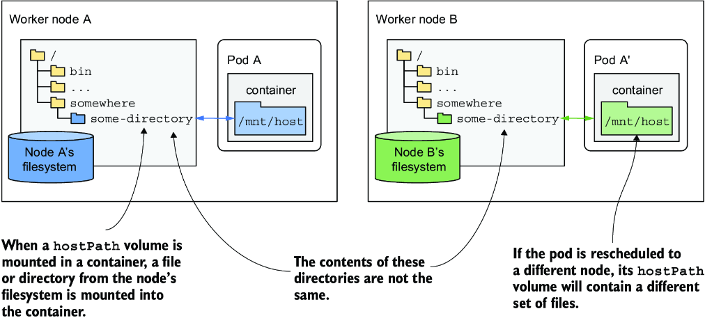

*Hình 9.14: Một hostPath volume mount một file hoặc thư mục từ filesystem của worker node vào container.*

`hostPath` volume không phải là nơi tốt để lưu dữ liệu của một cơ sở dữ liệu, trừ khi bạn đảm bảo pod chạy cơ sở dữ liệu luôn chạy trên cùng một node. Vì nội dung của volume được lưu trên filesystem của một node cụ thể, pod cơ sở dữ liệu sẽ không thể truy cập dữ liệu nếu nó bị lập lịch lại (reschedule) sang node khác. Thông thường, `hostPath` volume được dùng trong các trường hợp pod cần đọc hoặc ghi các file trên filesystem của node mà các tiến trình chạy trên node đọc hoặc tạo ra, chẳng hạn như log cấp hệ thống.

Kiểu volume `hostPath` là một trong những kiểu volume nguy hiểm nhất trong Kubernetes và thường chỉ được dành cho các pod đặc quyền (privileged). Nếu bạn cho phép dùng `hostPath` volume không hạn chế, người dùng của cluster có thể làm bất cứ điều gì họ muốn trên node. Ví dụ, họ có thể dùng nó để mount file Docker socket (thường là `/var/run/docker.sock`) vào container của họ rồi chạy Docker client bên trong container để chạy bất kỳ lệnh nào trên host node với tư cách người dùng root.

### 9.4.2 Sử dụng hostPath volume (Using a hostPath volume)

Để minh họa `hostPath` volume nguy hiểm đến mức nào, hãy triển khai một pod cho phép bạn khám phá toàn bộ filesystem của host node từ bên trong pod. Manifest pod được trình bày trong listing sau.

**Listing 9.9: Dùng hostPath volume để giành quyền truy cập filesystem của host node**

```yaml
apiVersion: v1
kind: Pod
metadata:
  name: node-explorer
spec:
  volumes:
  - name: host-root                     #1
    hostPath:                           #1
      path: /                           #1
  containers:
  - name: node-explorer
    image: alpine
    command: ["sleep", "9999999999"]
    volumeMounts:                       #2
    - name: host-root                   #2
      mountPath: /host                  #2
```

- **#1** `hostPath` volume trỏ tới thư mục gốc trên filesystem của node.
- **#2** Volume được mount vào container tại `/host`.

Như bạn thấy trong listing, một `hostPath` volume phải chỉ định đường dẫn trên host mà nó muốn mount. Volume trong listing sẽ trỏ tới thư mục gốc trên filesystem của node, cho phép truy cập toàn bộ filesystem của node mà pod được lập lịch lên.

Sau khi tạo pod từ manifest này bằng `kubectl apply`, hãy chạy một shell trong pod bằng lệnh sau:

```bash
$ kubectl exec -it node-explorer -- sh
```

Giờ bạn có thể di chuyển tới thư mục gốc của filesystem của node bằng cách chạy lệnh sau:

```bash
/ # cd /host
```

Từ đây, bạn có thể khám phá các file trên host node. Vì container và lệnh shell đang chạy với tư cách root, bạn có thể sửa đổi bất kỳ file nào trên worker node. Hãy cẩn thận đừng làm hỏng thứ gì.

> **GHI CHÚ:** Nếu cluster của bạn có nhiều hơn một worker node, pod sẽ chạy trên một node được chọn ngẫu nhiên. Nếu bạn muốn triển khai pod lên một node cụ thể, hãy sửa file `node-explorer.specific-node.pod.yaml` mà bạn tìm thấy trong kho mã nguồn của sách, và đặt trường `.spec.nodeName` thành tên của node mà bạn muốn chạy pod trên đó.

Giờ hãy tưởng tượng bạn là một kẻ tấn công đã giành được quyền truy cập Kubernetes API và có thể triển khai kiểu pod này trong một cluster production. Đáng tiếc là, tại thời điểm viết sách, Kubernetes không ngăn người dùng thông thường sử dụng `hostPath` volume trong pod của họ, và do đó hoàn toàn không an toàn.

#### Chỉ định kiểu cho hostPath volume (Specifying the type for a hostPath volume)

Trong ví dụ trước, bạn chỉ chỉ định đường dẫn cho `hostPath` volume, nhưng bạn cũng có thể chỉ định kiểu để đảm bảo đường dẫn đại diện đúng cho thứ mà tiến trình trong container mong đợi (một file, một thư mục, hay thứ gì khác). Bảng 9.3 giải thích các kiểu `hostPath` được hỗ trợ.

**Bảng 9.3: Các kiểu hostPath volume được hỗ trợ**

| Kiểu | Mô tả |
|---|---|
| `<empty>` | Kubernetes không thực hiện kiểm tra nào trước khi mount volume. |
| `Directory` | Kubernetes kiểm tra xem có một thư mục tồn tại tại đường dẫn được chỉ định hay không. Bạn dùng kiểu này nếu muốn mount một thư mục có sẵn vào pod và muốn ngăn pod chạy nếu thư mục không tồn tại. |
| `DirectoryOrCreate` | Giống như `Directory`, nhưng nếu không có gì tồn tại tại đường dẫn được chỉ định, một thư mục trống sẽ được tạo. |
| `File` | Đường dẫn được chỉ định phải là một file. |
| `FileOrCreate` | Giống như `File`, nhưng nếu không có gì tồn tại tại đường dẫn được chỉ định, một file trống sẽ được tạo. |
| `BlockDevice` | Đường dẫn được chỉ định phải là một thiết bị khối (block device). |
| `CharDevice` | Đường dẫn được chỉ định phải là một thiết bị ký tự (character device). |
| `Socket` | Đường dẫn được chỉ định phải là một UNIX socket. |

Nếu đường dẫn được chỉ định không khớp với kiểu, các container của pod sẽ không chạy. Các event của pod giải thích vì sao việc kiểm tra kiểu `hostPath` thất bại.

> **GHI CHÚ:** Khi kiểu là `FileOrCreate` hoặc `DirectoryOrCreate` và Kubernetes cần tạo file/thư mục, quyền của file được đặt thành `644` (`rw-r--r--`) và `755` (`rwxr-xr-x`) tương ứng. Trong cả hai trường hợp, file/thư mục thuộc sở hữu của người dùng và nhóm được dùng để chạy Kubelet.

---

## 9.5 ConfigMap, Secret, Downward API và projected volume (ConfigMap, Secret, Downward API, and projected volumes)

Bạn đã học về ConfigMap, Secret và Downward API trong chương trước. Tuy nhiên, bạn mới chỉ học cách đưa thông tin từ các nguồn đó vào biến môi trường và đối số dòng lệnh, nhưng tôi cũng đã đề cập rằng thông tin này còn có thể được trình bày dưới dạng file trong một volume. Vì chương hiện tại nói toàn về volume, hãy xem cách làm điều đó.

Trong chương 5, bạn đã triển khai Pod `kiada` với một Envoy sidecar xử lý lưu lượng TLS cho pod. Vì volume chưa được giải thích ở thời điểm đó, file cấu hình, chứng chỉ TLS và khóa riêng (private key) mà Envoy sử dụng được lưu trực tiếp trong container image, đây không phải là cách làm đúng. Tốt hơn là lưu các file này trong một ConfigMap và Secret rồi đưa chúng vào container dưới dạng file. Bằng cách đó, bạn có thể cập nhật chúng mà không cần build lại image. Vì file cấu hình Envoy và các file chứng chỉ, khóa riêng phải được xử lý khác nhau do có các hàm ý bảo mật khác nhau, tốt nhất là dùng ConfigMap cho cấu hình và Secret cho chứng chỉ cùng khóa riêng. Hãy tập trung vào ConfigMap trước.

### 9.5.1 Dùng configMap volume để công khai các entry của ConfigMap dưới dạng file (Using a configMap volume to expose ConfigMap entries as files)

Biến môi trường thường được dùng để truyền các giá trị nhỏ, một dòng cho ứng dụng, trong khi các giá trị dài, nhiều dòng được trình bày tốt hơn thông qua file. Bạn có thể truyền các entry ConfigMap lớn hơn này cho các ứng dụng chạy trong container của bạn bằng cách dùng một `configMap` volume.

> **GHI CHÚ:** Lượng thông tin có thể chứa trong một ConfigMap hoặc Secret được quyết định bởi etcd, kho dữ liệu bên dưới dùng để lưu các API object. Ở thời điểm này, kích thước tối đa vào khoảng 1 megabyte.

Một `configMap` volume làm cho các entry của ConfigMap có sẵn dưới dạng các file riêng lẻ. Tiến trình chạy trong container có thể đọc các file này để lấy giá trị. Cơ chế này thường được dùng nhất để truyền các file cấu hình lớn vào container, nhưng nó cũng có thể được dùng cho các giá trị nhỏ hơn, hoặc kết hợp với các trường `env` hay `envFrom` để truyền các entry lớn dưới dạng file và các entry khác dưới dạng biến môi trường.

#### Thêm configMap volume vào manifest pod (Adding a configMap volume to a pod manifest)

Để làm cho các entry của ConfigMap có sẵn dưới dạng file trong filesystem của container, bạn định nghĩa một `configMap` volume và mount nó vào container, như trong listing sau, listing này cho thấy các phần liên quan của file `pod.kiada-ssl.configmap-volume.yaml`.

**Listing 9.10: Định nghĩa configMap volume trong pod**

```yaml
apiVersion: v1
kind: Pod
metadata:
  name: kiada-ssl
spec:
  volumes:
  - name: envoy-config                      #1
    configMap:                              #1
      name: kiada-ssl-config                #1
  ...
  containers:
  ...
  - name: envoy
    image: luksa/kiada-ssl-proxy:0.1
    volumeMounts:                           #2
    - name: envoy-config                    #2
      mountPath: /etc/envoy                 #2
  ...
```

- **#1** Định nghĩa của `configMap` volume
- **#2** Volume được mount vào container.

Như bạn thấy, volume `envoy-config` là một `configMap` volume trỏ tới ConfigMap `kiada-ssl-config`. Volume này được mount vào container `envoy` tại `/etc/envoy`.

Hãy tạo pod từ file manifest và kiểm tra trạng thái của nó. Đây là những gì bạn sẽ thấy:

```bash
$ kubectl get po
NAME        READY   STATUS              RESTARTS   AGE
kiada-ssl   0/2     ContainerCreating   0          2m
```

Vì `configMap` volume của pod tham chiếu tới một ConfigMap không tồn tại, và tham chiếu này không được đánh dấu là tùy chọn (optional), container không thể chạy.

#### Đánh dấu configMap volume là tùy chọn (Marking a configMap volume as optional)

Trước đây, bạn đã học rằng nếu một container chứa một định nghĩa biến môi trường tham chiếu tới một ConfigMap không tồn tại, container sẽ bị ngăn khởi động cho đến khi ConfigMap đó được tạo. Bạn cũng đã học rằng điều này không ngăn các container khác khởi động. Vậy còn trường hợp hiện tại, khi ConfigMap bị thiếu được tham chiếu trong một volume thì sao?

Vì tất cả các volume của pod phải được thiết lập trước khi các container của nó có thể được khởi động, việc tham chiếu tới một ConfigMap bị thiếu trong một volume sẽ ngăn tất cả các container trong pod khởi động, chứ không chỉ container mà volume được mount vào. Một event được sinh ra để chỉ ra vấn đề. Bạn có thể hiển thị nó bằng lệnh `kubectl describe pod` hoặc `kubectl get events`, như đã giải thích trong các chương trước.

> **GHI CHÚ:** Một `configMap` volume có thể được đánh dấu là tùy chọn bằng cách thêm dòng `optional: true` vào định nghĩa volume. Nếu một volume là tùy chọn và ConfigMap không tồn tại, volume sẽ không được tạo, và container được khởi động mà không mount volume đó.

Để cho phép các container của pod khởi động, hãy tạo ConfigMap bằng cách apply file `cm.kiada-ssl-config.yaml` từ kho mã nguồn của sách. ConfigMap này chứa hai entry: `status-message` và `envoy.yaml`. Hãy dùng lệnh `kubectl apply`. Sau khi làm vậy, pod sẽ khởi động, và bạn có thể xác nhận cả hai entry từ ConfigMap đã được mount dưới dạng file trong container bằng cách liệt kê nội dung thư mục `/etc/envoy` như sau:

```bash
$ kubectl exec kiada-ssl -c envoy -- ls /etc/envoy
envoy.yaml
status-message
```

#### Cách các cập nhật ConfigMap tự động phản ánh vào file (How ConfigMap updates automatically reflect in files)

Như đã đề cập trong chương trước, cập nhật ConfigMap không cập nhật bất kỳ biến môi trường nào được đưa vào container từ ConfigMap đó. Tuy nhiên, khi bạn dùng một `configMap` volume để đưa các entry ConfigMap vào dưới dạng file, các thay đổi đối với ConfigMap được phản ánh vào các file một cách tự động. Hãy thử sửa entry `status-message` trong ConfigMap `kiada-ssl-config` bằng `kubectl edit`, rồi xác minh file `/etc/envoy/status-message` trong container `envoy` đã được cập nhật bằng cách chạy lệnh sau:

```bash
$ kubectl exec kiada-ssl -c envoy -- cat /etc/envoy/status-message
```

> **GHI CHÚ:** Có thể mất tới một phút để các file trong `configMap` volume được cập nhật sau khi ConfigMap được sửa đổi.

#### Chỉ chiếu một số entry ConfigMap cụ thể (Projecting only specific ConfigMap entries)

Envoy thực ra không cần file `status-message`, nhưng chúng ta không thể xóa nó khỏi ConfigMap, vì container `kiada` cần nó. Việc file này xuất hiện trong `/etc/envoy` là không lý tưởng, nên hãy khắc phục điều này.

May mắn thay, `configMap` volume cho phép bạn chỉ định những entry ConfigMap nào được chiếu (project) thành file. Listing sau cho thấy cách làm. Bạn có thể tìm thấy manifest trong file `pod.kiada-ssl.configmap-volume-clean.yaml`.

**Listing 9.11: Chỉ định những entry ConfigMap nào được đưa vào configMap volume**

```yaml
volumes:
- name: envoy-config
  configMap:
    name: kiada-ssl-config
    items:                       #1
    - key: envoy.yaml            #2
      path: envoy.yaml           #2
```

- **#1** Chỉ entry ConfigMap sau đây được đưa vào volume.
- **#2** Giá trị của entry ConfigMap được lưu dưới khóa `envoy.yaml` sẽ được đưa vào volume dưới dạng file `envoy.yaml`.

Trường `items` chỉ định danh sách các entry ConfigMap được đưa vào volume. Mỗi item phải chỉ định `key` và tên file trong trường `path`. Các entry không được liệt kê ở đây sẽ không được đưa vào volume. Bằng cách này, bạn có thể có một ConfigMap duy nhất cho một pod, với một số entry xuất hiện dưới dạng biến môi trường và các entry khác dưới dạng file.

### 9.5.2 Cách configMap volume hoạt động (How configMap volumes work)

Trước khi bắt đầu dùng `configMap` volume trong các pod của riêng bạn, điều quan trọng là phải hiểu cách chúng hoạt động. Nếu không, bạn có thể phải tốn rất nhiều thời gian để xử lý các hành vi không mong đợi.

Bạn có thể nghĩ rằng khi mount một `configMap` volume vào một thư mục trong container, Kubernetes chỉ đơn thuần tạo một vài file trong thư mục đó, nhưng mọi chuyện phức tạp hơn thế. Có hai điểm cần lưu ý mà bạn phải ghi nhớ. Một là cách các volume được mount nói chung, và hai là cách Kubernetes dùng liên kết tượng trưng (symbolic link) để đảm bảo các file được cập nhật một cách nguyên tử (atomic).

#### Tìm hiểu cách mount một volume ảnh hưởng đến các file hiện có (Understanding how mounting a volume affects existing files)

Nếu bạn mount bất kỳ volume nào vào một thư mục trong filesystem của container, mọi file vốn có trong thư mục đó từ container image sẽ không còn truy cập được nữa. Điều này bao gồm cả các thư mục con!

Ví dụ, nếu bạn mount một `configMap` volume vào thư mục `/etc` – thư mục thường chứa các file cấu hình quan trọng trên các hệ thống Unix – các ứng dụng chạy trong container sẽ chỉ thấy các file do ConfigMap cung cấp. Kết quả là tất cả các file khác vốn thường nằm trong `/etc` sẽ bị ẩn đi, và ứng dụng có thể không chạy được. Tuy nhiên, vấn đề này có thể được giảm nhẹ bằng cách dùng trường `subPath` khi mount volume.

Hãy tưởng tượng bạn có một `configMap` volume chứa một file tên `my-app.conf`, và bạn muốn đặt nó vào thư mục `/etc` mà không ghi đè hay ẩn đi bất kỳ file hiện có nào trong thư mục đó. Thay vì mount toàn bộ volume vào `/etc`, bạn chỉ mount file cụ thể đó bằng cách kết hợp các trường `mountPath` và `subPath`, như trong listing sau.

**Listing 9.12: Mount một file riêng lẻ vào container**

```yaml
spec:
  containers:
  - name: my-container
    volumeMounts:
    - name: my-volume
      subPath: my-app.conf                 #1
      mountPath: /etc/my-app.conf          #2
```

- **#1** Thay vì mount toàn bộ volume, bạn chỉ mount file `my-app.conf`.
- **#2** Vì bạn đang mount một file đơn lẻ, `mountPath` cần chỉ định đường dẫn file.

Để dễ hiểu hơn cách tất cả những điều này hoạt động, hãy xem hình 9.15.

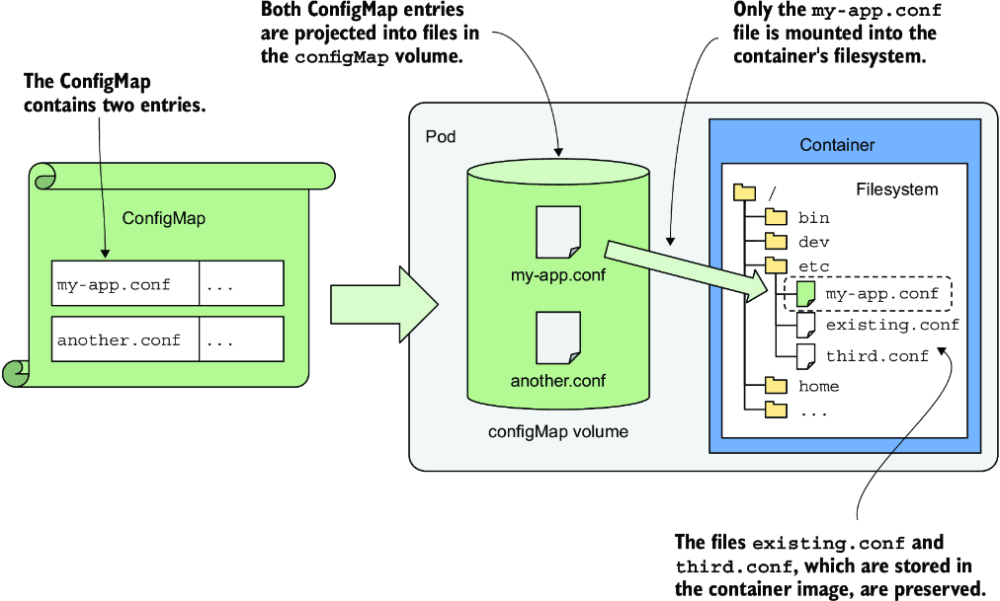

*Hình 9.15: Dùng subPath để mount một file đơn lẻ từ volume*

#### Tìm hiểu cách configMap volume dùng symbolic link để cập nhật nguyên tử (Understanding the configMap volume's use of symbolic links for atomic updates)

Một số ứng dụng theo dõi các file cấu hình của chúng để phát hiện thay đổi và tự động tải lại khi phát hiện có cập nhật. Tuy nhiên, nếu ứng dụng dùng một file lớn hoặc nhiều file, nó có thể phát hiện thay đổi trước khi tất cả các cập nhật được ghi hoàn tất. Nếu ứng dụng đọc một file mới được cập nhật một phần, nó có thể hoạt động không đúng.

Để ngăn điều này, Kubernetes đảm bảo tất cả các file trong một `configMap` volume được cập nhật một cách nguyên tử, nghĩa là tất cả các cập nhật được thực hiện tức thời. Điều này đạt được nhờ dùng các symbolic link, như bạn thấy nếu liệt kê tất cả các file trong thư mục `/etc/envoy`:

```bash
$ kubectl exec kiada-ssl -c envoy -- ls -lA /etc/envoy
total 4
drwxr-xr-x    ...    ..2020_11_14_11_47_45.728287366                 #1
lrwxrwxrwx    ...    ..data -> ..2020_11_14_11_47_45.728287366       #2
lrwxrwxrwx    ...    envoy.yaml -> ..data/envoy.yaml                 #3
```

- **#1** Thư mục con chứa các file thực sự
- **#2** Một symbolic link trỏ tới thư mục con
- **#3** Một symbolic link cho mỗi entry ConfigMap

Như trong listing, các entry ConfigMap được chiếu vào volume là các symbolic link trỏ tới các đường dẫn file bên trong một thư mục con tên `..data`, mà bản thân nó cũng là một symbolic link. Link `..data` này trỏ tới một thư mục có tên chứa dấu thời gian (timestamp). Do đó, các đường dẫn file mà ứng dụng đọc được phân giải tới các file thực sự thông qua hai symbolic link liên tiếp.

Điều này có vẻ không cần thiết, nhưng nó cho phép cập nhật nguyên tử tất cả các file. Mỗi khi bạn thay đổi ConfigMap, Kubernetes tạo một thư mục mới có dấu thời gian, ghi các file đã cập nhật vào đó, rồi cập nhật symbolic link `..data` để trỏ tới thư mục mới này, qua đó thay thế tất cả các file cùng một lúc.

> **GHI CHÚ:** Nếu bạn dùng `subPath` trong định nghĩa volume mount, cơ chế này không được sử dụng. Thay vào đó, file được ghi trực tiếp vào thư mục đích và không được cập nhật khi bạn sửa đổi ConfigMap.

> **MẸO:** Để vượt qua vấn đề `subPath` trong `configMap` volume, bạn có thể mount toàn bộ volume vào một thư mục khác và tạo một symbolic link tại vị trí mong muốn trỏ tới file trong thư mục kia. Bạn có thể tạo sẵn symbolic link này ngay trong container image.

### 9.5.3 Sử dụng Secret volume (Using Secret volumes)

Như bạn đã biết, Secret không khác ConfigMap là mấy, nên nếu có `configMap` volume thì hẳn cũng phải có `secret` volume. Và đúng là như vậy. Hơn nữa, thêm một `secret` volume vào pod gần như giống hệt với thêm một `configMap` volume.

Trong mục trước, bạn đã đưa file cấu hình `envoy.yaml` từ ConfigMap `kiada-ssl-config` vào container `envoy`. Bây giờ bạn cũng sẽ đưa chứng chỉ TLS và khóa riêng được lưu trong Secret `kiada-tls` mà bạn đã tạo trong chương trước vào đó. Nếu Secret này hiện không tồn tại trong cluster của bạn, bạn có thể thêm nó bằng cách apply file manifest Secret `secret.kiada-tls.yaml`.

Với các file cấu hình, chứng chỉ và khóa đều được lấy từ bên ngoài container image, giờ bạn có thể thay image tùy chỉnh `kiada-ssl-proxy` trong Pod `kiada-ssl` bằng image chung `envoyproxy/envoy`. Đây là một cải tiến lớn, vì loại bỏ các image tùy chỉnh khỏi hệ thống đồng nghĩa với việc bạn không còn phải bảo trì chúng nữa.

#### Định nghĩa secret volume trong manifest pod (Defining a secret volume in the pod manifest)

Để chiếu chứng chỉ TLS và khóa riêng vào container `envoy` của Pod `kiada-ssl`, bạn cần định nghĩa một volume mới và một `volumeMount` mới, như trong listing tiếp theo, listing này chứa các phần liên quan của file `pod.kiada-ssl.secret-volume.yaml`.

**Listing 9.13: Dùng secret volume trong pod**

```yaml
apiVersion: v1
kind: Pod
metadata:
  name: kiada-ssl
spec:
  volumes:
  - name: cert-and-key                    #1
    secret:                               #1
      secretName: kiada-tls               #1
      items:                              #2
      - key: tls.crt                      #2
        path: example-com.crt             #2
      - key: tls.key                      #2
        path: example-com.key             #2
  ...                                     #2
  containers:
  - name: kiada
    ...
  - name: envoy
    image: envoyproxy/envoy:v1.14.1
    volumeMounts:                         #3
    - name: cert-and-key                  #3
      mountPath: /etc/certs               #3
      readOnly: true                      #3
    ...
    ports:
    ...
```

- **#1** Định nghĩa một `secret` volume chiếu các entry của Secret `kiada-tls` thành file
- **#2** Các khóa trong Secret cần được ánh xạ tới đúng tên file được cấu hình trong file cấu hình Envoy.
- **#3** `secret` volume được mount tại `/etc/certs`.

Định nghĩa volume trong listing này hẳn trông quen thuộc, vì nó gần như giống với định nghĩa `configMap` volume mà bạn đã thêm trong mục trước. Chỉ có hai khác biệt: kiểu volume là `secret` thay vì `configMap`, và tên của Secret được tham chiếu được chỉ định trong trường `secretName` thay vì trường `name`.

> **GHI CHÚ:** Giống như với `configMap` volume, bạn có thể đặt quyền file trên `secret` volume bằng các trường `defaultMode` và `mode`. Ngoài ra, bạn có thể đặt trường `optional` thành `true` nếu muốn pod khởi động ngay cả khi Secret được tham chiếu không tồn tại. Nếu bạn bỏ qua trường này, pod sẽ không khởi động cho đến khi bạn tạo Secret.

Để hình dung cách pod, `secret` volume và Secret được tham chiếu trong listing trước liên hệ với nhau, hãy xem hình 9.16.

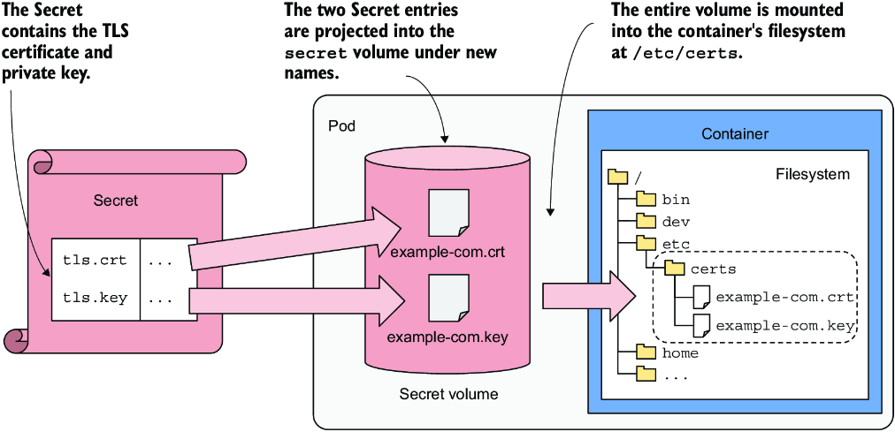

*Hình 9.16: Chiếu các entry của Secret vào filesystem của container thông qua secret volume*

#### Đọc file trong secret volume (Reading files in the secret volume)

Sau khi triển khai pod từ listing trước, bạn có thể dùng lệnh sau để xem file chứng chỉ trong `secret` volume:

```bash
$ kubectl exec kiada-ssl -c envoy -- cat /etc/certs/example-com.crt
-----BEGIN CERTIFICATE-----
...
```

Như bạn thấy, khi bạn chiếu các entry của một Secret vào container thông qua `secret` volume, mặc dù entry trong YAML của Secret object được mã hóa Base64, giá trị sẽ được giải mã khi file được ghi. Do đó ứng dụng không cần giải mã file khi đọc nó. Điều tương tự cũng đúng khi một entry Secret được đưa vào biến môi trường.

> **GHI CHÚ:** Các file trong `secret` volume được lưu trong một filesystem trên bộ nhớ (`tmpfs`), nên chúng ít có khả năng bị xâm phạm hơn.

### 9.5.4 Thiết lập quyền và quyền sở hữu file trong secret/configMap volume (Setting file permissions and ownership in a secret/configMap volume)

Để tăng cường bảo mật, nên hạn chế quyền file trong `configMap` volume, và đặc biệt là trong `secret` volume. Tuy nhiên, nếu bạn thay đổi quyền, tiến trình chạy trong container của bạn có thể không truy cập được các file trừ khi quyền sở hữu nhóm (group ownership) cũng được đặt đúng, như giải thích tiếp theo.

#### Tìm hiểu quyền file mặc định (Understanding default file permissions)

Quyền file mặc định trong `secret` và `configMap` volume là `rw-r--r--` (hay `0644` theo ký hiệu bát phân).

> **GHI CHÚ:** Nếu bạn chưa quen với quyền file Unix, `0644` ở dạng bát phân tương đương với `110100100` ở dạng nhị phân, ánh xạ tới bộ ba quyền `rw-,r--,r--`. Chúng biểu diễn quyền cho ba loại người dùng: chủ sở hữu file, nhóm sở hữu và những người khác. Chủ sở hữu có thể đọc (`r`) và ghi (`w`) file nhưng không thể thực thi nó (`-` thay vì `x`), trong khi nhóm sở hữu và những người dùng khác chỉ có thể đọc file (`r--`), không có quyền ghi hay thực thi.

#### Thay đổi quyền file mặc định (Changing the default file permissions)

Bạn có thể thay đổi quyền mặc định cho các file trong volume bằng cách đặt trường `defaultMode` trong định nghĩa volume. Trong YAML, trường này nhận giá trị bát phân hoặc thập phân. Ví dụ, để đặt quyền thành `rwxr-----`, hãy thêm `defaultMode: 0740` vào định nghĩa volume.

> **MẸO:** Khi chỉ định quyền file trong manifest YAML, hãy chắc chắn có số 0 đứng đầu, số này cho biết giá trị ở dạng bát phân. Bỏ số 0 này khiến giá trị bị diễn giải là thập phân, có thể dẫn đến quyền ngoài ý muốn. Trong manifest JSON, bạn phải dùng ký hiệu thập phân.

> **QUAN TRỌNG:** Khi bạn dùng `kubectl get -o yaml` để hiển thị định nghĩa YAML của một pod, hãy lưu ý rằng quyền file được biểu diễn dưới dạng giá trị thập phân. Ví dụ, bạn sẽ thường xuyên thấy giá trị `420`. Đây là giá trị thập phân tương đương với giá trị bát phân `0644`, khớp với quyền file mặc định.

Đừng quên rằng các file trong `secret` hoặc `configMap` volume là các symbolic link. Để xem quyền của các file thực sự bên dưới, bạn phải lần theo các link này. Bản thân các symbolic link luôn hiển thị quyền là `rwxrwxrwx`, nhưng những quyền này không có ý nghĩa – hệ thống dùng quyền của file đích thay thế.

> **MẸO:** Hãy dùng `ls -lL` để lệnh `ls` lần theo các symbolic link và hiển thị quyền của file đích thay vì quyền của các link.

#### Thiết lập quyền trên từng file riêng lẻ (Setting permissions on individual files)

Để đặt quyền trên từng file riêng lẻ, hãy đặt trường `mode` bên cạnh `key` và `path` của mỗi item. Ví dụ, đoạn mã sau đặt quyền cho file `example-com.key` trong volume `cert-and-key` từ một trong các ví dụ trước thành `0640` (`rw-r-----`):

```yaml
volumes:
- name: cert-and-key
  secret:
    secretName: kiada-tls
    items:
    - key: tls.key
      path: example-com.key
      mode: 0640                       #1
```

- **#1** Đặt quyền cho file `example-com.key` thành `rw-r-----`

#### Thay đổi quyền sở hữu nhóm của các file (Changing the files' group ownership)

Quyền file mặc định (`rw-r--r--`) cho phép bất kỳ ai đọc các file trong `configMap` hoặc `secret` volume. Tuy nhiên, hạn chế các quyền này có thể ngăn tiến trình chạy trong container của bạn đọc các file nếu UID (user ID) và GID (group ID) của tiến trình không khớp với người dùng hoặc nhóm sở hữu file.

Ví dụ, Envoy proxy chạy trong Pod `kiada-ssl` chạy với UID của người dùng `envoy`, như bạn thấy ở đây:

```bash
$ kubectl exec kiada-ssl -c envoy -- ps -p 1 -f
UID          PID    PPID    C STIME TTY              TIME CMD
envoy          1       0    0 06:11 ?            00:00:04 envoy -c /etc/envoy/envoy.yaml
```

Người dùng `envoy` thuộc nhóm `envoy`:

```bash
$ kubectl exec kiada-ssl -c envoy -- id envoy
uid=101(envoy) gid=101(envoy) groups=101(envoy)
```

Tuy nhiên, các file trong volume thuộc sở hữu của người dùng `root` và nhóm `root`:

```bash
$ kubectl exec kiada-ssl -c envoy -- ls -lL /etc/certs
total 8
-rw-r--r--. 1 root root 1992 Jul  2 07:02 example-com.crt
-rw-r-----. 1 root root 3268 Jul  2 07:02 example-com.key
```

Vì người dùng `envoy` không thuộc nhóm `root` và rõ ràng cũng không phải chính người dùng `root`, tiến trình Envoy proxy sẽ không thể truy cập file `example-com.key` giờ đây khi bạn đã làm cho nó chỉ đọc được bởi chủ sở hữu file và nhóm. Chỉ người dùng `root` và các thành viên của nhóm `root` mới đọc được file này, nên nếu bạn chạy pod với quyền file tùy chỉnh đó, Envoy proxy sẽ không khởi động được, vì nó sẽ không đọc được file khóa riêng.

Bạn có thể khắc phục điều này bằng cách đặt trường `securityContext.fsGroup` trong spec của pod. Trường này cho phép bạn thay đổi quyền sở hữu nhóm của volume và các file trong đó. Bằng cách đặt `fsGroup` thành `101`, bạn đặt nhóm bổ sung (supplemental group) cho tất cả các container trong pod, nhưng nó cũng ảnh hưởng đến quyền của volume. Volume và các file của nó sẽ thuộc sở hữu của nhóm `envoy`, vì `101` là ID của nhóm này. Đoạn mã sau cho thấy cách bạn đặt điều này trong manifest pod.

```yaml
apiVersion: v1
kind: Pod
metadata:
  name: kiada-ssl
spec:
  securityContext:               #1
    fsGroup: 101                 #1
  volumes:
  ...
```

- **#1** Đặt nhóm bổ sung cho tất cả các container trong pod cũng như cho các volume

Hãy thử xóa Pod `kiada-ssl` và tạo lại nó từ file manifest `pod.kiada-ssl.secret-volume-permissions.yaml`. Kiểm tra trạng thái của pod để xác nhận cả hai container khởi động thành công. Nếu pod hiển thị là `Running`, điều này có nghĩa là Envoy proxy đã đọc được file khóa riêng. Bạn cũng có thể kiểm tra lại quyền sở hữu và quyền file để xác nhận các file trong volume giờ thuộc sở hữu của nhóm `envoy`, như sau:

```bash
$ kubectl exec kiada-ssl -c envoy -- ls -lL /etc/certs
total 8
-rw-r--r--. 1 root envoy 1992 Jul  1 14:53 example-com.crt
-rw-r-----. 1 root envoy 3268 Jul  1 14:53 example-com.key
```

Bạn có thể tự hỏi liệu có thể thay đổi quyền sở hữu người dùng (user ownership) của volume hay không. Tại thời điểm viết sách, điều này là không thể; bạn chỉ có thể thay đổi quyền sở hữu nhóm.

### 9.5.5 Dùng downwardAPI volume để công khai metadata của Pod dưới dạng file (Using a downwardAPI volume to expose Pod metadata as files)

Giống như với ConfigMap và Secret, metadata của Pod cũng có thể được chiếu vào filesystem của container dưới dạng file bằng kiểu volume `downwardAPI`.

#### Thêm downwardAPI volume vào manifest pod (Adding a downwardAPI volume to the pod manifest)

Giả sử bạn cần cung cấp tên pod trong một file bên trong container. Listing sau cho thấy các định nghĩa volume và `volumeMount` mà bạn sẽ thêm vào pod để tên pod được ghi vào file `/etc/pod/name.txt`.

**Listing 9.14: Đưa metadata của Pod vào filesystem của container**

```yaml
...
  volumes:                              #1
  - name: metadata                      #1
    downwardAPI:                        #1
      items:                            #2
      - path: name.txt                  #2
        fieldRef:                       #2
          fieldPath: metadata.name      #2
  containers:                           #2
  - name: foo
    ...
    volumeMounts:                       #3
    - name: metadata                    #3
      mountPath: /etc/pod               #3
```

- **#1** Định nghĩa một `downwardAPI` volume tên là `"metadata"`
- **#2** Một file duy nhất sẽ xuất hiện trong volume. Tên file là `name.txt` và nó chứa tên của pod.
- **#3** Volume được mount vào đường dẫn `/etc/pod` trong container.

Manifest pod trong listing chứa một volume duy nhất kiểu `downwardAPI`. Định nghĩa volume chứa một file duy nhất tên `name.txt`, file này chứa tên của pod, được đọc từ trường `metadata.name` của Pod object. Volume này được mount vào filesystem của container tại `/etc/pod`.

Giống như với `configMap` và `secret` volume, bạn có thể đặt quyền file mặc định bằng trường `defaultMode` hoặc quyền cho từng file bằng trường `mode`, như đã giải thích ở trên.

#### Chiếu các trường metadata và trường tài nguyên (Projecting metadata fields and resource fields)

Giống như khi dùng Downward API để đưa biến môi trường vào container, mỗi item được chiếu trong một `downwardAPI` volume dùng hoặc `fieldRef` để tham chiếu tới các trường của Pod object, hoặc `resourceFieldRef` để tham chiếu tới các trường tài nguyên của container.

Với các trường tài nguyên, trường `containerName` phải được chỉ định, vì volume được định nghĩa ở cấp pod và không rõ tài nguyên của container nào đang được tham chiếu. Giống như với biến môi trường, có thể chỉ định một `divisor` để chuyển đổi giá trị sang đơn vị mong muốn.

### 9.5.6 Dùng projected volume để gộp nhiều volume thành một (Using projected volumes to combine volumes into one)

Đến giờ bạn đã học cách dùng ba kiểu volume khác nhau để đưa các giá trị từ ConfigMap, Secret và chính Pod object vào container. Trừ khi bạn dùng trường `subPath` trong định nghĩa `volumeMount`, bạn không thể đưa các file từ những nguồn khác nhau này vào cùng một thư mục file.

Ví dụ, bạn không thể gộp các khóa từ các Secret khác nhau vào một volume duy nhất và mount chúng vào một thư mục file duy nhất. Mặc dù trường `subPath` cho phép bạn đưa từng file riêng lẻ từ nhiều volume vào, dùng nó có thể không lý tưởng, vì nó ngăn các file được cập nhật khi các giá trị nguồn thay đổi. Đây là lúc `projected` volume phát huy tác dụng.

#### Giới thiệu kiểu volume projected (Introducing the projected volume type)

Một `projected` volume cho phép bạn kết hợp thông tin từ nhiều ConfigMap, Secret và Downward API vào một volume duy nhất. Nó cung cấp các tính năng giống như các volume `configMap`, `secret` và `downwardAPI` mà bạn đã học trong các mục trước của chương này. Hình 9.17 cho thấy một `projected` volume tổng hợp thông tin từ hai Secret, một ConfigMap và Downward API vào một thư mục duy nhất.

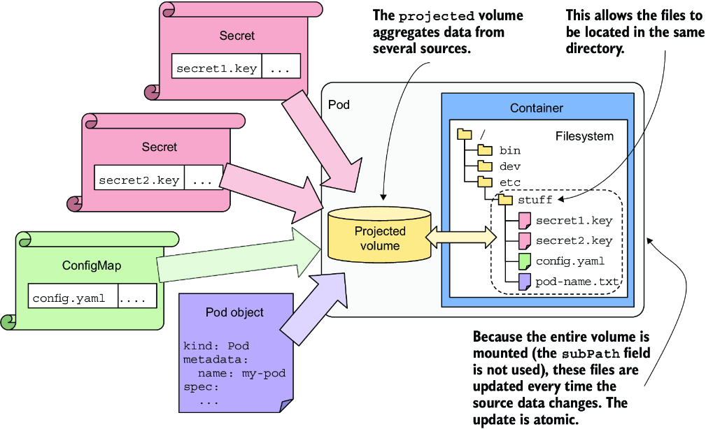

*Hình 9.17: Dùng projected volume với nhiều nguồn*

> **GHI CHÚ:** Một `projected` volume cũng có thể công khai token gắn với ServiceAccount của pod. Bạn chưa học về ServiceAccount. Tuy nhiên, mỗi pod được liên kết với một ServiceAccount, và pod có thể dùng token ServiceAccount của nó để xác thực với Kubernetes API. Bạn có thể dùng một `projected` volume để mount token này vào bên trong container tại vị trí mong muốn.

#### Dùng projected volume trong pod (Using a projected volume in a pod)

Để thấy `projected` volume hoạt động, bạn sẽ sửa pod `kiada-ssl` để dùng kiểu volume này trong container `envoy`. Phiên bản trước của pod dùng một `configMap` volume được mount tại `/etc/envoy` để đưa file cấu hình `envoy.yaml` vào, và một `secret` volume được mount tại `/etc/certs` để đưa chứng chỉ và khóa TLS vào. Giờ bạn sẽ thay hai volume này bằng một `projected` volume duy nhất. Điều này cho phép bạn giữ cả ba file trong cùng một thư mục, `/etc/envoy`.

Trước tiên, bạn cần thay đổi các đường dẫn chứng chỉ TLS trong file cấu hình `envoy.yaml` bên trong ConfigMap `kiada-ssl-config` để chứng chỉ và khóa được đọc từ thư mục `/etc/envoy/certs` thay vì `/etc/certs`. Hãy dùng lệnh `kubectl edit configmap` và thay đổi hai dòng để chúng trở thành như sau:

```yaml
tls_certificates:
- certificate_chain:
    filename: "/etc/envoy/certs/example-com.crt"   #1
  private_key:
    filename: "/etc/envoy/certs/example-com.key"   #2
```

- **#1** Trước đây dòng này là `"/etc/certs/example-com.crt"`.
- **#2** Trước đây dòng này là `"/etc/certs/example-com.key"`.

Giờ hãy xóa Pod `kiada-ssl` và tạo lại nó từ file manifest `pod.kiada-ssl.projected-volume.yaml`. Các phần liên quan của file này được trình bày trong listing tiếp theo.

**Listing 9.15: Dùng projected volume thay cho configMap và secret volume**

```yaml
apiVersion: v1
kind: Pod
metadata:
  name: kiada-ssl
spec:
  ...
  volumes:
  - name: etc-envoy                           #1
    projected:                                #1
      sources:                                #1
      - configMap:                            #2
          name: kiada-ssl-config              #2
          items:                              #2
          - key: envoy.yaml                   #2
            path: envoy.yaml                  #2
      - secret:                               #3
          name: kiada-tls                     #3
          items:                              #3
          - key: tls.crt                      #3
            path: example-com.crt             #3
          - key: tls.key                      #3
            path: example-com.key             #3
            mode: 0600                        #4
  containers:
  - name: kiada
    image: luksa/kiada:1.2
    env:
    ...
  - name: envoy
    image: envoyproxy/envoy:v1.14.1
    volumeMounts:                             #5
    - name: etc-envoy                         #5
      mountPath: /etc/envoy                   #5
      readOnly: true                          #5
    ports:
    ...
```

- **#1** Chỉ cần một volume duy nhất thay vì các volume `configMap` và `secret` được định nghĩa riêng rẽ.
- **#2** Nguồn volume đầu tiên là ConfigMap. Chỉ entry `envoy.yaml` được chiếu vào volume.
- **#3** Nguồn thứ hai là Secret. Chứng chỉ và khóa riêng được chiếu vào volume.
- **#4** Đặt quyền file hạn chế cho file khóa riêng.
- **#5** Vì giờ chỉ có một volume duy nhất, chỉ cần một volume mount. Volume được mount vào container `envoy` tại `/etc/envoy`.

Listing cho thấy một `projected` volume duy nhất tên `etc-envoy` được định nghĩa trong pod. Hai nguồn được dùng cho volume này. Nguồn đầu tiên là ConfigMap `kiada-ssl-config`. Chỉ entry `envoy.conf` từ ConfigMap này được chiếu vào volume. Nguồn thứ hai là Secret `kiada-tls`. Hai entry của nó trở thành file trong volume – entry `tls.crt` được chiếu vào file `example-com.crt`, và entry `tls.key` được chiếu vào `example-com.key`. Volume được mount ở chế độ chỉ đọc vào container `envoy` tại `/etc/envoy`.

Như bạn thấy, các định nghĩa nguồn trong `projected` volume không khác nhiều so với các volume `configMap` và `secret` mà bạn đã tạo trong các mục trước. Do đó, không cần giải thích thêm về `projected` volume. Mọi thứ bạn đã học về các volume khác cũng áp dụng cho kiểu volume mới này, nhưng giờ bạn có thể tạo một volume duy nhất và nạp vào đó thông tin từ nhiều nguồn.

Sau khi tạo pod, hãy xác minh nó hoạt động giống như phiên bản trước và kiểm tra nội dung của `projected` volume bằng lệnh sau:

```bash
$ kubectl exec kiada-ssl -c envoy -- ls -LR /etc/envoy
/etc/envoy:                   #1
certs                         #1
envoy.yaml                    #1

/etc/envoy/certs:             #2
example-com.crt               #2
example-com.key               #2
```

- **#1** Thư mục `/etc/envoy` chứa một thư mục con và file từ ConfigMap.
- **#2** Thư mục con `/etc/envoy/certs` chứa các file từ Secret.

#### Về volume kube-api-access tích hợp sẵn trong mọi pod (About the built-in kube-api-access volume in every pod)

Trong khi thực hành các bài tập trong sách này, bạn đã dùng lệnh `kubectl get pod -o yaml` nhiều lần để hiển thị manifest của một pod. Nếu để ý kỹ output, bạn có thể đã nhận thấy mỗi pod nhận được một `projected` volume tích hợp sẵn, được mount vào tất cả các container của nó. Nếu bạn chưa thấy, hãy chạy lệnh sau để hiển thị các volume trong Pod `kiada-ssl`:

```bash
$ kubectl get pod kiada-ssl -o yaml | yq .spec.volumes
```

Bạn sẽ nhận thấy pod chứa hai `projected` volume, mặc dù bạn chỉ định nghĩa một trong file manifest. Một volume như trong listing sau được tự động thêm vào hầu như mọi pod.

**Listing 9.16: Volume kube-api-access tích hợp sẵn trong hầu như mọi pod**

```yaml
volumes:
- name: kube-api-access-gc7lf               #1
  projected:                                #1
    defaultMode: 420
    sources:                                #2
    - serviceAccountToken:                  #3
        expirationSeconds: 3607             #3
        path: token                         #3
    - configMap:                            #4
        items:                              #4
        - key: ca.crt                       #4
          path: ca.crt                      #4
        name: kube-root-ca.crt              #4
    - downwardAPI:                          #5
        items:                              #5
        - fieldRef:                         #5
            apiVersion: v1                  #5
            fieldPath: metadata.namespace   #5
          path: namespace                   #5
```

- **#1** `projected` volume tích hợp sẵn có tên `kube-api-access-<chuỗi ngẫu nhiên>`.
- **#2** Volume có ba nguồn.
- **#3** File tên `token` chứa token ServiceAccount đã được đề cập ở phần trước của chương này.
- **#4** File `ca.crt` chứa chứng chỉ của Certificate Authority (CA), được lấy từ ConfigMap `kube-root-ca.crt`.
- **#5** File tên `namespace` chứa namespace của pod. Bạn sẽ học thêm về namespace trong chương 10.

Như tên volume `kube-api-access` gợi ý, volume này chứa thông tin mà pod cần để truy cập Kubernetes API. Như trong listing, `projected` volume này bao gồm ba file – `token`, `ca.crt` và `namespace` – mỗi file được lấy từ một nguồn khác nhau.

> **GHI CHÚ:** `projected` volume `kube-api-access` có thể bị tắt cho một pod riêng lẻ bằng cách đặt trường `automountServiceAccountToken` thành `false` trong spec của pod.

> **MẸO:** Hầu hết các pod không cần truy cập Kubernetes API. Tuân theo nguyên tắc đặc quyền tối thiểu (principle of least privilege), nên đặt `automountServiceAccountToken` thành `false` cho những pod đó. Ngoài ra, bạn có thể cấu hình thiết lập này ngay trong chính ServiceAccount.

---

## 9.6 Điểm qua các kiểu volume khác (Other volume types at a glance)

Nếu bạn chạy lệnh `kubectl explain pod.spec.volumes`, bạn sẽ thấy một danh sách nhiều kiểu volume khác chưa được giải thích trong chương này. Trong danh sách đó, bạn sẽ thấy các kiểu volume sau:

* `persistentVolumeClaim` cho phép một pod yêu cầu bộ lưu trữ bền vững bằng cách tham chiếu tới một PersistentVolumeClaim resource, điều này báo cho Kubernetes gắn (bind) tới một PersistentVolume có sẵn hoặc tạo một cái mới.
* `ephemeral` được dùng để tạo một volume tạm thời chỉ tồn tại trong vòng đời của pod. Không giống các kiểu volume được mô tả ở phần trước của chương này, một `ephemeral` volume định nghĩa một template inline cho một `PersistentVolumeClaim`, mà Kubernetes sau đó dùng để cấp phát động (dynamically provision) và gắn một `PersistentVolume`. Về mặt chức năng, nó hoạt động như một `persistentVolumeClaim` volume nhưng được dành cho một instance pod duy nhất. Khi pod bị xóa, volume cũng tự động bị xóa theo.
* `awsElasticBlockStore`, `azureDisk`, `azureFile`, `gcePersistentDisk`, `vsphereVolume` và các kiểu volume khác trước đây được dùng để tham chiếu trực tiếp tới các volume được hỗ trợ bởi các công nghệ lưu trữ tương ứng. Các driver lưu trữ cho những storage volume này trước đây được hiện thực trong mã nguồn của Kubernetes. Nhưng do số lượng công nghệ khác nhau quá lớn, hầu hết các kiểu volume này hiện đã bị đánh dấu lỗi thời. Thay vào đó, các storage volume này giờ được dùng thông qua các kiểu volume `persistentVolumeClaim` và `ephemeral`, sau đó dùng một driver CSI để cấp phát storage volume thực sự.
* `csi` là viết tắt của Container Storage Interface và chỉ một kiểu volume cho phép bạn cấu hình một driver CSI trực tiếp trong manifest pod, mà không cần một `PersistentVolumeClaim` hay `PersistentVolume` riêng. Tuy nhiên, chỉ một số driver CSI nhất định hỗ trợ cách dùng này. Trong hầu hết các trường hợp, nên dùng volume `persistentVolumeClaim` hoặc `ephemeral` thay thế, vì chúng cung cấp khả năng trừu tượng hóa và tính khả chuyển tốt hơn.

Như bạn có lẽ đã nhận ra từ danh sách này, chúng ta mới chỉ chạm tới bề mặt của cách dùng volume trong Kubernetes. Chương này tập trung vào các volume tạm thời (ephemeral) – những volume không tồn tại lâu hơn vòng đời của một pod. Bộ lưu trữ bền vững là một chủ đề rộng hơn và phức tạp hơn nhiều, và nó xứng đáng có một chương riêng. Đó chính xác là điều chúng ta sẽ khám phá tiếp theo.

---

## Tóm tắt

* Pod bao gồm các container và các volume. Mỗi volume có thể được mount vào vị trí mong muốn trong filesystem của container.
* Volume được dùng để duy trì dữ liệu qua các lần khởi động lại container, chia sẻ dữ liệu giữa các container trong pod, và thậm chí chia sẻ dữ liệu giữa các pod.
* Một `emptyDir` volume được dùng để lưu dữ liệu trong vòng đời của pod. Nó bắt đầu là một thư mục trống được tạo ngay trước khi các container của pod được khởi động và bị xóa khi pod kết thúc.
* Một init container có thể được dùng để thêm file vào `emptyDir` volume trước khi các container thông thường của pod được khởi động. Sau đó các container thông thường có thể thêm file hoặc sửa các file hiện có trong volume.
* Một `image` volume có thể được dùng để mount một Open Container Initiative (OCI) image hoặc artifact vào container. Nó được dùng cho các file tĩnh, có thể có dung lượng lớn, mà container cần cho hoạt động của mình.
* `hostPath` volume cho phép một pod truy cập bất kỳ đường dẫn nào trong filesystem của host node. Kiểu volume này nguy hiểm vì nó cho phép người dùng thay đổi cấu hình của host node và chạy bất kỳ tiến trình nào trên node.
* Các volume `configMap`, `secret` và `downwardAPI` được dùng để chiếu các entry của ConfigMap và Secret cũng như metadata của pod vào container. Ngoài ra, điều tương tự có thể được thực hiện với một `projected` volume duy nhất.
* Nhiều kiểu volume khác không còn được dành để cấu hình trực tiếp trong pod nữa. Thay vào đó, phải dùng volume `persistentVolumeClaim`, `ephemeral` hoặc `csi`, những kiểu này được giải thích trong chương tiếp theo.
