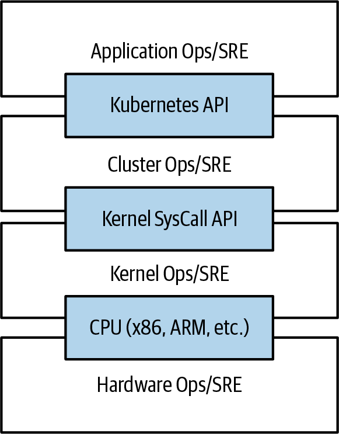

# Chương 1. Giới thiệu

Kubernetes là một trình điều phối (orchestrator) mã nguồn mở dùng để triển khai các ứng dụng đóng gói trong container. Ban đầu nó được Google phát triển, lấy cảm hứng từ một thập kỷ kinh nghiệm triển khai các hệ thống có khả năng mở rộng và đáng tin cậy trong container thông qua các API hướng ứng dụng.[^1]

Kể từ khi được giới thiệu vào năm 2014, Kubernetes đã phát triển thành một trong những dự án mã nguồn mở lớn nhất và phổ biến nhất trên thế giới. Nó đã trở thành API tiêu chuẩn để xây dựng các ứng dụng cloud native, hiện diện trên gần như mọi public cloud. Kubernetes là một hạ tầng đã được kiểm chứng cho các hệ thống phân tán, phù hợp với các nhà phát triển cloud native ở mọi quy mô, từ một cluster gồm các máy tính Raspberry Pi cho đến một trung tâm dữ liệu đầy ắp những cỗ máy hiện đại nhất. Nó cung cấp phần mềm cần thiết để xây dựng và triển khai thành công các hệ thống phân tán đáng tin cậy và có khả năng mở rộng.

Bạn có thể tự hỏi chúng tôi muốn nói gì khi dùng cụm từ "hệ thống phân tán đáng tin cậy, có khả năng mở rộng". Ngày càng có nhiều dịch vụ được cung cấp qua mạng thông qua các API. Các API này thường được cung cấp bởi một hệ thống phân tán, trong đó các thành phần khác nhau hiện thực hóa API chạy trên những máy khác nhau, được kết nối qua mạng và phối hợp hành động thông qua giao tiếp mạng. Bởi vì chúng ta ngày càng phụ thuộc vào các API này trong mọi mặt của đời sống hằng ngày (ví dụ như tìm đường đến bệnh viện gần nhất), các hệ thống này phải có độ tin cậy rất cao. Chúng không được phép thất bại, ngay cả khi một phần của hệ thống bị sập hoặc ngừng hoạt động vì lý do nào khác. Tương tự, chúng phải duy trì tính sẵn sàng ngay cả trong quá trình phát hành phần mềm hoặc các sự kiện bảo trì khác. Cuối cùng, vì ngày càng nhiều người trên thế giới lên mạng và sử dụng những dịch vụ như vậy, các hệ thống này phải có khả năng mở rộng cao để có thể tăng năng lực nhằm theo kịp mức sử dụng không ngừng gia tăng mà không cần thiết kế lại triệt để hệ thống phân tán hiện thực hóa các dịch vụ đó. Trong nhiều trường hợp, điều này cũng có nghĩa là tự động tăng (và giảm) năng lực để ứng dụng của bạn đạt hiệu quả tối đa.

Tùy vào thời điểm và lý do bạn cầm cuốn sách này trên tay, bạn có thể có mức độ kinh nghiệm khác nhau với container, hệ thống phân tán và Kubernetes. Bạn có thể đang dự định xây dựng ứng dụng của mình trên hạ tầng public cloud, trong các trung tâm dữ liệu riêng, hoặc trong một môi trường hybrid nào đó. Bất kể kinh nghiệm của bạn ra sao, cuốn sách này sẽ giúp bạn tận dụng tối đa Kubernetes.

Có nhiều lý do khiến người ta sử dụng container và các API container như Kubernetes, nhưng chúng tôi tin rằng tất cả đều có thể quy về một trong những lợi ích sau:

- Tốc độ phát triển (velocity)
- Khả năng mở rộng (của cả phần mềm và đội ngũ)
- Trừu tượng hóa hạ tầng
- Hiệu quả
- Hệ sinh thái cloud native

Trong các phần tiếp theo, chúng tôi sẽ mô tả cách Kubernetes giúp mang lại từng lợi ích này.

## Tốc độ (Velocity)

Tốc độ là thành phần then chốt trong gần như mọi hoạt động phát triển phần mềm ngày nay. Ngành công nghiệp phần mềm đã tiến hóa từ việc giao sản phẩm dưới dạng đĩa CD hay DVD đóng hộp sang phần mềm được phân phối qua mạng thông qua các dịch vụ web và được cập nhật hằng giờ. Bối cảnh thay đổi này có nghĩa là sự khác biệt giữa bạn và các đối thủ cạnh tranh thường nằm ở tốc độ bạn có thể phát triển và triển khai các thành phần và tính năng mới, hoặc tốc độ bạn phản ứng với những đổi mới do người khác tạo ra.

Tuy nhiên, cần lưu ý rằng tốc độ không được định nghĩa đơn thuần bằng tốc độ thô. Mặc dù người dùng luôn mong đợi những cải tiến liên tục, họ quan tâm hơn đến một dịch vụ có độ tin cậy cao. Đã có thời việc một dịch vụ ngừng hoạt động để bảo trì vào lúc nửa đêm mỗi ngày là điều chấp nhận được. Nhưng ngày nay, mọi người dùng đều kỳ vọng thời gian hoạt động liên tục, ngay cả khi phần mềm họ đang chạy thay đổi không ngừng.

Do đó, tốc độ không được đo bằng số lượng tính năng thô bạn có thể phát hành mỗi giờ hay mỗi ngày, mà bằng số lượng thứ bạn có thể phát hành trong khi vẫn duy trì một dịch vụ có tính sẵn sàng cao.

Theo cách này, container và Kubernetes có thể cung cấp các công cụ bạn cần để di chuyển nhanh mà vẫn đảm bảo tính sẵn sàng. Các khái niệm cốt lõi cho phép điều này là:

- Tính bất biến (immutability)
- Cấu hình khai báo (declarative configuration)
- Hệ thống tự phục hồi trực tuyến (online self-healing systems)
- Thư viện và công cụ dùng chung, có thể tái sử dụng

Tất cả những ý tưởng này liên hệ chặt chẽ với nhau để cải thiện triệt để tốc độ bạn có thể triển khai phần mềm mới một cách đáng tin cậy.

### Giá trị của tính bất biến

Container và Kubernetes khuyến khích các nhà phát triển xây dựng những hệ thống phân tán tuân theo các nguyên tắc của hạ tầng bất biến (immutable infrastructure). Với hạ tầng bất biến, một khi một artifact được tạo ra trong hệ thống, nó sẽ không thay đổi thông qua các chỉnh sửa của người dùng.

Theo truyền thống, máy tính và các hệ thống phần mềm được xem là hạ tầng khả biến (mutable infrastructure). Với hạ tầng khả biến, các thay đổi được áp dụng dưới dạng những bản cập nhật tăng dần lên một hệ thống hiện có. Những bản cập nhật này có thể diễn ra cùng một lúc, hoặc trải dài trong một khoảng thời gian dài. Nâng cấp hệ thống thông qua công cụ `apt-get update` là một ví dụ điển hình về cập nhật một hệ thống khả biến. Chạy `apt` sẽ tuần tự tải xuống mọi file nhị phân được cập nhật, sao chép chúng lên trên các file nhị phân cũ hơn, và thực hiện các cập nhật tăng dần lên các file cấu hình. Với một hệ thống khả biến, trạng thái hiện tại của hạ tầng không được thể hiện dưới dạng một artifact duy nhất, mà là sự tích lũy của các bản cập nhật và thay đổi tăng dần theo thời gian. Trên nhiều hệ thống, các cập nhật tăng dần này không chỉ đến từ việc nâng cấp hệ thống mà còn từ những chỉnh sửa của người vận hành. Hơn nữa, trong bất kỳ hệ thống nào do một đội ngũ lớn vận hành, rất có thể những thay đổi này đã được thực hiện bởi nhiều người khác nhau và, trong nhiều trường hợp, không được ghi lại ở bất kỳ đâu.

Ngược lại, trong một hệ thống bất biến, thay vì một chuỗi các cập nhật và thay đổi tăng dần, một image hoàn toàn mới và đầy đủ sẽ được xây dựng, trong đó việc cập nhật chỉ đơn giản là thay thế toàn bộ image bằng image mới hơn trong một thao tác duy nhất. Không có thay đổi tăng dần nào cả. Như bạn có thể tưởng tượng, đây là một sự chuyển dịch đáng kể so với thế giới quản lý cấu hình truyền thống.

Để làm rõ hơn trong thế giới container, hãy xem xét hai cách khác nhau để nâng cấp phần mềm của bạn:

- Bạn có thể đăng nhập vào một container, chạy một lệnh để tải phần mềm mới, tắt server cũ và khởi động server mới.
- Bạn có thể xây dựng một container image mới, đẩy nó lên một container registry, tắt container hiện có và khởi động một container mới.

Thoạt nhìn, hai cách tiếp cận này có vẻ gần như không khác gì nhau. Vậy điều gì trong hành động xây dựng một container mới lại cải thiện độ tin cậy?

Điểm khác biệt then chốt là artifact mà bạn tạo ra, và bản ghi về cách bạn tạo ra nó. Những bản ghi này giúp dễ dàng hiểu chính xác những khác biệt trong một phiên bản mới nào đó và, nếu có sự cố xảy ra, xác định điều gì đã thay đổi và cách khắc phục.

Ngoài ra, việc xây dựng một image mới thay vì sửa đổi image hiện có đồng nghĩa với việc image cũ vẫn còn đó và có thể được dùng nhanh chóng để rollback nếu xảy ra lỗi. Ngược lại, một khi bạn sao chép file nhị phân mới lên trên file nhị phân hiện có, việc rollback như vậy gần như là không thể.

Các container image bất biến là cốt lõi của mọi thứ bạn sẽ xây dựng trong Kubernetes. Có thể thay đổi các container đang chạy theo kiểu mệnh lệnh (imperative), nhưng đây là một antipattern chỉ nên dùng trong những trường hợp cực đoan khi không còn lựa chọn nào khác (ví dụ, nếu đó là cách duy nhất để tạm thời sửa chữa một hệ thống production quan trọng). Và ngay cả khi đó, các thay đổi cũng phải được ghi lại thông qua một bản cập nhật cấu hình khai báo vào một thời điểm sau đó, khi "đám cháy" đã được dập tắt.

### Cấu hình khai báo

Tính bất biến không chỉ áp dụng cho các container chạy trong cluster mà còn mở rộng đến cách bạn mô tả ứng dụng của mình cho Kubernetes. Mọi thứ trong Kubernetes đều là một đối tượng cấu hình khai báo thể hiện trạng thái mong muốn của hệ thống. Nhiệm vụ của Kubernetes là đảm bảo trạng thái thực tế của thế giới khớp với trạng thái mong muốn này.

Tương tự như hạ tầng khả biến so với bất biến, cấu hình khai báo là một lựa chọn thay thế cho cấu hình mệnh lệnh (imperative configuration), trong đó trạng thái của thế giới được định nghĩa bởi việc thực thi một loạt các chỉ thị thay vì một tuyên bố về trạng thái mong muốn của thế giới. Trong khi các lệnh mệnh lệnh định nghĩa hành động, cấu hình khai báo định nghĩa trạng thái.

Để hiểu hai cách tiếp cận này, hãy xem xét nhiệm vụ tạo ra ba bản sao (replica) của một phần mềm. Với cách tiếp cận mệnh lệnh, cấu hình sẽ nói "chạy A, chạy B, và chạy C". Cấu hình khai báo tương ứng sẽ là "số replica bằng ba".

Bởi vì nó mô tả trạng thái của thế giới, cấu hình khai báo không cần phải được thực thi để có thể hiểu được. Tác động của nó được tuyên bố một cách cụ thể. Vì hiệu ứng của cấu hình khai báo có thể được hiểu trước khi được thực thi, cấu hình khai báo ít gây lỗi hơn nhiều. Hơn nữa, các công cụ truyền thống của phát triển phần mềm, như quản lý mã nguồn, review code và unit test, có thể được dùng với cấu hình khai báo theo những cách không thể thực hiện với các chỉ thị mệnh lệnh. Ý tưởng lưu trữ cấu hình khai báo trong hệ thống quản lý mã nguồn thường được gọi là "infrastructure as code" (hạ tầng dưới dạng mã).

Gần đây, ý tưởng GitOps đã bắt đầu chính thức hóa thực hành infrastructure as code với hệ thống quản lý mã nguồn làm nguồn chân lý (source of truth). Khi bạn áp dụng GitOps, các thay đổi lên production được thực hiện hoàn toàn thông qua việc push lên một Git repository, sau đó được phản ánh vào cluster của bạn thông qua tự động hóa. Thực tế, cluster Kubernetes production của bạn được xem như một môi trường chỉ đọc (read-only). Ngoài ra, GitOps ngày càng được tích hợp vào các dịch vụ Kubernetes do cloud cung cấp như cách dễ nhất để quản lý hạ tầng cloud native của bạn theo kiểu khai báo.

Sự kết hợp giữa trạng thái khai báo được lưu trong hệ thống quản lý phiên bản và khả năng của Kubernetes trong việc làm cho thực tế khớp với trạng thái khai báo này khiến việc rollback một thay đổi trở nên cực kỳ dễ dàng. Nó chỉ đơn giản là tuyên bố lại trạng thái khai báo trước đó của hệ thống. Điều này thường là bất khả thi với các hệ thống mệnh lệnh, bởi vì mặc dù các chỉ thị mệnh lệnh mô tả cách đưa bạn từ điểm A đến điểm B, chúng hiếm khi bao gồm các chỉ thị ngược lại để đưa bạn quay về.

### Hệ thống tự phục hồi

Kubernetes là một hệ thống trực tuyến, tự phục hồi (self-healing). Khi nhận được một cấu hình trạng thái mong muốn, nó không chỉ đơn giản thực hiện một loạt hành động để làm cho trạng thái hiện tại khớp với trạng thái mong muốn một lần duy nhất. Nó liên tục thực hiện các hành động để đảm bảo trạng thái hiện tại khớp với trạng thái mong muốn. Điều này có nghĩa là Kubernetes không chỉ khởi tạo hệ thống của bạn mà còn bảo vệ nó khỏi mọi sự cố hoặc xáo trộn có thể làm mất ổn định hệ thống và ảnh hưởng đến độ tin cậy.

Việc sửa chữa theo cách truyền thống của người vận hành bao gồm một loạt các bước giảm thiểu thủ công, hoặc sự can thiệp của con người, được thực hiện để đáp lại một cảnh báo nào đó. Sửa chữa theo kiểu mệnh lệnh như vậy tốn kém hơn (vì thường yêu cầu một người vận hành trực ca sẵn sàng thực hiện việc sửa chữa). Nó cũng thường chậm hơn, vì một người thường phải thức dậy và đăng nhập để phản ứng. Hơn nữa, nó kém tin cậy hơn vì chuỗi các thao tác sửa chữa mệnh lệnh chịu mọi vấn đề của quản lý mệnh lệnh đã mô tả ở phần trước. Các hệ thống tự phục hồi như Kubernetes vừa giảm gánh nặng cho người vận hành vừa cải thiện độ tin cậy tổng thể của hệ thống bằng cách thực hiện các sửa chữa đáng tin cậy nhanh hơn.

Một ví dụ cụ thể về hành vi tự phục hồi này: nếu bạn khai báo trạng thái mong muốn là ba replica cho Kubernetes, nó không chỉ tạo ra ba replica mà còn liên tục đảm bảo có đúng ba replica. Nếu bạn tạo thủ công một replica thứ tư, Kubernetes sẽ hủy một replica để đưa số lượng về ba. Nếu bạn hủy thủ công một replica, Kubernetes sẽ tạo một replica mới để đưa bạn trở lại trạng thái mong muốn.

Các hệ thống tự phục hồi trực tuyến cải thiện tốc độ của nhà phát triển vì thời gian và năng lượng mà bạn vốn phải dành cho vận hành và bảo trì có thể được dùng để phát triển và kiểm thử các tính năng mới.

Ở một dạng tự phục hồi nâng cao hơn, gần đây đã có nhiều công việc đáng kể trong mô hình operator cho Kubernetes. Với operator, logic nâng cao hơn cần thiết để bảo trì, mở rộng và phục hồi một phần mềm cụ thể (ví dụ như MySQL) được mã hóa vào một ứng dụng operator chạy dưới dạng container trong cluster. Code trong operator chịu trách nhiệm phát hiện và phục hồi sức khỏe một cách có mục tiêu và nâng cao hơn so với những gì cơ chế tự phục hồi tổng quát của Kubernetes có thể đạt được. Thường thì điều này được đóng gói thành các "operator", sẽ được thảo luận trong Chương 17.

## Mở rộng dịch vụ và đội ngũ của bạn

Khi sản phẩm của bạn phát triển, việc bạn cần mở rộng cả phần mềm lẫn đội ngũ phát triển nó là điều không thể tránh khỏi. May mắn thay, Kubernetes có thể giúp bạn với cả hai mục tiêu này. Kubernetes đạt được khả năng mở rộng bằng cách ưu tiên các kiến trúc tách rời (decoupled architecture).

### Tách rời (Decoupling)

Trong một kiến trúc tách rời, mỗi thành phần được tách khỏi các thành phần khác bằng các API được định nghĩa rõ và các bộ cân bằng tải (load balancer) dịch vụ. API và load balancer cô lập từng phần của hệ thống khỏi các phần còn lại. API cung cấp một lớp đệm giữa người hiện thực và người tiêu thụ, còn load balancer cung cấp một lớp đệm giữa các instance đang chạy của mỗi dịch vụ.

Tách rời các thành phần thông qua load balancer giúp dễ dàng mở rộng các chương trình cấu thành dịch vụ của bạn, bởi vì việc tăng kích cỡ (và do đó năng lực) của chương trình có thể được thực hiện mà không cần điều chỉnh hay cấu hình lại bất kỳ lớp nào khác của dịch vụ.

Tách rời các server thông qua API giúp việc mở rộng đội ngũ phát triển dễ dàng hơn vì mỗi đội có thể tập trung vào một microservice nhỏ hơn, duy nhất với phạm vi dễ hiểu. Các API rõ ràng giữa các microservice hạn chế lượng chi phí giao tiếp liên đội cần thiết để xây dựng và triển khai phần mềm. Chi phí giao tiếp này thường là yếu tố hạn chế chính khi mở rộng đội ngũ.

### Mở rộng dễ dàng cho ứng dụng và cluster

Cụ thể, khi bạn cần mở rộng dịch vụ của mình, bản chất bất biến và khai báo của Kubernetes khiến việc mở rộng này trở nên cực kỳ đơn giản để thực hiện. Bởi vì các container của bạn là bất biến, và số lượng replica chỉ là một con số trong cấu hình khai báo, việc mở rộng dịch vụ chỉ đơn giản là thay đổi một con số trong file cấu hình, khai báo trạng thái mới này cho Kubernetes, và để nó lo phần còn lại. Hoặc, bạn có thể thiết lập tự động mở rộng (autoscaling) và để Kubernetes làm điều đó cho bạn.

Dĩ nhiên, kiểu mở rộng đó giả định rằng có sẵn tài nguyên trong cluster để sử dụng. Đôi khi bạn thực sự cần mở rộng chính cluster. Một lần nữa, Kubernetes làm cho nhiệm vụ này dễ dàng hơn. Bởi vì nhiều máy trong cluster hoàn toàn giống hệt các máy khác trong tập đó và bản thân các ứng dụng được tách rời khỏi chi tiết của máy bởi container, việc thêm tài nguyên vào cluster chỉ đơn giản là tạo image cho một máy mới cùng loại và gia nhập nó vào cluster. Điều này có thể được thực hiện thông qua vài lệnh đơn giản hoặc thông qua một machine image được chuẩn bị sẵn.

Một trong những thách thức của việc mở rộng tài nguyên máy là dự đoán mức sử dụng của chúng. Nếu bạn đang chạy trên hạ tầng vật lý, thời gian để có được một máy mới được tính bằng ngày hoặc tuần. Trên cả hạ tầng vật lý và cloud, việc dự đoán chi phí tương lai là khó vì khó dự đoán nhu cầu tăng trưởng và mở rộng của các ứng dụng cụ thể.

Kubernetes có thể đơn giản hóa việc dự báo chi phí tính toán trong tương lai. Để hiểu tại sao điều này đúng, hãy xem xét việc mở rộng ba đội: A, B và C. Trong quá khứ, bạn đã thấy rằng mức tăng trưởng của mỗi đội rất biến động và do đó khó dự đoán. Nếu bạn cấp phát máy riêng cho từng dịch vụ, bạn không có lựa chọn nào khác ngoài việc dự báo dựa trên mức tăng trưởng tối đa kỳ vọng cho từng dịch vụ, vì các máy dành riêng cho một đội không thể được dùng cho đội khác. Ngược lại, nếu bạn dùng Kubernetes để tách rời các đội khỏi những máy cụ thể mà họ đang sử dụng, bạn có thể dự báo tăng trưởng dựa trên tổng tăng trưởng của cả ba dịch vụ. Việc kết hợp ba tốc độ tăng trưởng biến động thành một tốc độ tăng trưởng duy nhất làm giảm nhiễu thống kê và tạo ra một dự báo đáng tin cậy hơn về mức tăng trưởng kỳ vọng. Hơn nữa, việc tách rời các đội khỏi những máy cụ thể có nghĩa là các đội có thể chia sẻ các phần nhỏ của máy của nhau, giảm hơn nữa chi phí liên quan đến dự báo tăng trưởng tài nguyên tính toán.

Cuối cùng, Kubernetes cho phép đạt được tự động mở rộng (cả tăng và giảm) tài nguyên. Đặc biệt trong môi trường cloud, nơi các máy mới có thể được tạo thông qua API, việc kết hợp Kubernetes với autoscaling cho cả ứng dụng lẫn chính các cluster có nghĩa là bạn luôn có thể điều chỉnh chi phí phù hợp với tải hiện tại.

### Mở rộng đội ngũ phát triển với microservice

Như đã được ghi nhận trong nhiều nghiên cứu, kích cỡ đội lý tưởng là "đội hai chiếc pizza" (two-pizza team), tức khoảng sáu đến tám người. Kích cỡ nhóm này thường mang lại sự chia sẻ kiến thức tốt, ra quyết định nhanh và một ý thức chung về mục đích. Các đội lớn hơn thường gặp các vấn đề về phân cấp, thiếu minh bạch và nội bộ xung đột, những điều cản trở sự linh hoạt và thành công.

Tuy nhiên, nhiều dự án đòi hỏi nhiều tài nguyên hơn đáng kể để thành công và đạt được mục tiêu. Do đó, có một sự căng thẳng giữa kích cỡ đội lý tưởng cho sự linh hoạt và kích cỡ đội cần thiết cho mục tiêu cuối cùng của sản phẩm.

Giải pháp phổ biến cho sự căng thẳng này là phát triển các đội tách rời, hướng dịch vụ, mỗi đội xây dựng một microservice duy nhất. Mỗi đội nhỏ chịu trách nhiệm thiết kế và cung cấp một dịch vụ được các đội nhỏ khác sử dụng. Tổng hợp của tất cả các dịch vụ này cuối cùng tạo nên hiện thực hóa của toàn bộ bề mặt sản phẩm.

Kubernetes cung cấp nhiều trừu tượng hóa và API giúp dễ dàng xây dựng các kiến trúc microservice tách rời này:

- Pod, hay các nhóm container, có thể gom các container image được phát triển bởi các đội khác nhau vào một đơn vị triển khai duy nhất.
- Kubernetes service cung cấp cân bằng tải, đặt tên và khám phá (discovery) để cô lập microservice này với microservice khác.
- Namespace cung cấp sự cô lập và kiểm soát truy cập, để mỗi microservice có thể kiểm soát mức độ các dịch vụ khác tương tác với nó.
- Các đối tượng Ingress cung cấp một frontend dễ sử dụng có thể kết hợp nhiều microservice thành một bề mặt API duy nhất hướng ra bên ngoài.

Cuối cùng, việc tách rời container image ứng dụng và máy có nghĩa là các microservice khác nhau có thể cùng nằm trên một máy mà không can thiệp vào nhau, giảm chi phí và tổng chi phí của kiến trúc microservice. Các tính năng kiểm tra sức khỏe (health-checking) và phát hành (rollout) của Kubernetes đảm bảo một cách tiếp cận nhất quán trong việc phát hành ứng dụng và độ tin cậy, đảm bảo rằng sự gia tăng của các đội microservice không dẫn đến sự gia tăng các cách tiếp cận khác nhau đối với vòng đời sản xuất và vận hành dịch vụ.

### Phân tách trách nhiệm để đảm bảo tính nhất quán và khả năng mở rộng

Ngoài tính nhất quán mà Kubernetes mang lại cho vận hành, việc tách rời và phân tách trách nhiệm do stack Kubernetes tạo ra dẫn đến tính nhất quán cao hơn đáng kể cho các tầng thấp hơn của hạ tầng. Điều này cho phép bạn mở rộng vận hành hạ tầng để quản lý nhiều máy với một đội nhỏ, tập trung. Chúng ta đã nói nhiều về việc tách rời container ứng dụng khỏi máy/hệ điều hành (OS), nhưng một khía cạnh quan trọng của việc tách rời này là API điều phối container trở thành một hợp đồng rõ ràng phân tách trách nhiệm của người vận hành ứng dụng khỏi người vận hành điều phối cluster. Chúng tôi gọi đây là ranh giới "không phải khỉ của tôi, không phải rạp xiếc của tôi" (not my monkey, not my circus). Nhà phát triển ứng dụng dựa vào thỏa thuận mức dịch vụ (SLA) do API điều phối container cung cấp, mà không phải lo lắng về chi tiết cách SLA này được đạt được. Tương tự, kỹ sư đảm bảo độ tin cậy của API điều phối container tập trung vào việc cung cấp SLA của API điều phối mà không phải lo lắng về các ứng dụng đang chạy bên trên nó.

Việc tách rời trách nhiệm có nghĩa là một đội nhỏ vận hành một cluster Kubernetes có thể chịu trách nhiệm hỗ trợ hàng trăm hoặc thậm chí hàng nghìn đội chạy ứng dụng trong cluster đó (Hình 1-1). Tương tự, một đội nhỏ có thể chịu trách nhiệm cho hàng chục (hoặc nhiều hơn) cluster chạy khắp thế giới. Cần lưu ý rằng cùng một sự tách rời giữa container và OS cho phép các kỹ sư đảm bảo độ tin cậy OS tập trung vào SLA của OS trên từng máy riêng lẻ. Đây trở thành một ranh giới trách nhiệm riêng biệt khác, với những người vận hành Kubernetes dựa vào SLA của OS, còn những người vận hành OS chỉ lo lắng về việc cung cấp SLA đó. Một lần nữa, điều này cho phép bạn mở rộng một đội nhỏ các chuyên gia OS để quản lý một đội máy hàng nghìn chiếc.

*Hình 1-1. Minh họa cách các đội vận hành khác nhau được tách rời bằng API*

Dĩ nhiên, việc dành ra ngay cả một đội nhỏ để quản lý OS cũng nằm ngoài khả năng của nhiều tổ chức. Trong những môi trường này, một dịch vụ Kubernetes được quản lý (Kubernetes-as-a-Service, KaaS) do một nhà cung cấp public cloud cung cấp là một lựa chọn tuyệt vời. Khi Kubernetes ngày càng trở nên phổ biến, KaaS cũng ngày càng sẵn có, đến mức hiện nay nó được cung cấp trên gần như mọi public cloud. Dĩ nhiên, sử dụng KaaS có một số hạn chế, vì nhà vận hành đưa ra quyết định thay bạn về cách các cluster Kubernetes được xây dựng và cấu hình. Ví dụ, nhiều nền tảng KaaS vô hiệu hóa các tính năng alpha vì chúng có thể làm mất ổn định cluster được quản lý.

Ngoài dịch vụ Kubernetes được quản lý hoàn toàn, còn có một hệ sinh thái sôi động gồm các công ty và dự án giúp cài đặt và quản lý Kubernetes. Có đầy đủ các giải pháp nằm giữa việc tự làm "theo cách khó" (the hard way) và một dịch vụ được quản lý hoàn toàn.

Do đó, việc sử dụng KaaS hay tự quản lý (hoặc điều gì đó ở giữa) là quyết định mà mỗi người dùng cần đưa ra dựa trên kỹ năng và yêu cầu của tình huống của họ. Thường thì đối với các tổ chức nhỏ, KaaS cung cấp một giải pháp dễ sử dụng cho phép họ tập trung thời gian và năng lượng vào việc xây dựng phần mềm hỗ trợ công việc của mình thay vì quản lý cluster. Đối với các tổ chức lớn hơn có thể chi trả cho một đội chuyên trách quản lý cluster Kubernetes, việc tự quản lý theo cách đó có thể hợp lý vì nó cho phép linh hoạt hơn về khả năng và vận hành cluster.

## Trừu tượng hóa hạ tầng

Mục tiêu của public cloud là cung cấp hạ tầng tự phục vụ, dễ sử dụng cho các nhà phát triển. Tuy nhiên, các API cloud quá thường xuyên được định hướng theo việc phản chiếu hạ tầng mà bộ phận IT mong đợi (ví dụ, "máy ảo"), thay vì các khái niệm (ví dụ, "ứng dụng") mà các nhà phát triển muốn sử dụng. Ngoài ra, trong nhiều trường hợp, cloud đi kèm với những chi tiết cụ thể trong hiện thực hoặc dịch vụ đặc thù cho nhà cung cấp cloud đó. Sử dụng trực tiếp các API này khiến việc chạy ứng dụng của bạn trong nhiều môi trường, hoặc trải rộng giữa cloud và môi trường vật lý, trở nên khó khăn.

Việc chuyển sang các API container hướng ứng dụng như Kubernetes mang lại hai lợi ích cụ thể. Thứ nhất, như chúng tôi đã mô tả trước đó, nó tách rời các nhà phát triển khỏi những máy cụ thể. Điều này làm cho vai trò IT hướng máy trở nên dễ dàng hơn, vì các máy có thể được thêm vào theo tổng thể để mở rộng cluster, và trong bối cảnh cloud, nó cũng cho phép mức độ di động (portability) cao vì các nhà phát triển đang sử dụng một API cấp cao hơn được hiện thực dựa trên các API hạ tầng cloud cụ thể.

Khi các nhà phát triển của bạn xây dựng ứng dụng dưới dạng container image và triển khai chúng thông qua các API Kubernetes có tính di động, việc chuyển ứng dụng của bạn giữa các môi trường, hoặc thậm chí chạy trong môi trường hybrid, chỉ đơn giản là gửi cấu hình khai báo đến một cluster mới. Kubernetes có nhiều plug-in có thể trừu tượng hóa bạn khỏi một cloud cụ thể. Ví dụ, Kubernetes service biết cách tạo load balancer trên tất cả các public cloud lớn cũng như một số hạ tầng riêng và vật lý khác nhau. Tương tự, PersistentVolume và PersistentVolumeClaim của Kubernetes có thể được dùng để trừu tượng hóa ứng dụng của bạn khỏi các hiện thực lưu trữ cụ thể. Dĩ nhiên, để đạt được tính di động này, bạn cần tránh các dịch vụ do cloud quản lý (ví dụ, DynamoDB của Amazon, Cosmos DB của Azure, hay Cloud Spanner của Google), điều này có nghĩa là bạn sẽ buộc phải triển khai và quản lý các giải pháp lưu trữ mã nguồn mở như Cassandra, MySQL hoặc MongoDB.

Tổng hợp lại, việc xây dựng trên các trừu tượng hóa hướng ứng dụng của Kubernetes đảm bảo rằng công sức bạn bỏ ra để xây dựng, triển khai và quản lý ứng dụng thực sự có tính di động trên nhiều môi trường khác nhau.

## Hiệu quả

Ngoài các lợi ích về phát triển và quản lý IT mà container và Kubernetes mang lại, còn có một lợi ích kinh tế cụ thể từ sự trừu tượng hóa. Bởi vì các nhà phát triển không còn tư duy theo máy, các ứng dụng của họ có thể được đặt cùng trên những máy giống nhau mà không ảnh hưởng đến chính các ứng dụng đó. Điều này có nghĩa là các tác vụ từ nhiều người dùng có thể được xếp chặt lên ít máy hơn.

Hiệu quả có thể được đo bằng tỷ lệ giữa công việc hữu ích được thực hiện bởi một máy hoặc tiến trình so với tổng năng lượng bỏ ra để làm việc đó. Khi nói đến việc triển khai và quản lý ứng dụng, nhiều công cụ và quy trình hiện có (ví dụ, các script bash, cập nhật `apt`, hoặc quản lý cấu hình mệnh lệnh) có phần kém hiệu quả. Khi thảo luận về hiệu quả, thường hữu ích khi nghĩ về cả chi phí tiền bạc để chạy một server và chi phí nhân lực cần thiết để quản lý nó.

Chạy một server phát sinh chi phí dựa trên mức sử dụng điện, yêu cầu làm mát, không gian trung tâm dữ liệu và năng lực tính toán thô. Một khi server được lắp lên rack và bật nguồn (hoặc được nhấp chuột và khởi động), đồng hồ tính tiền theo đúng nghĩa đen bắt đầu chạy. Bất kỳ thời gian CPU nhàn rỗi nào cũng là tiền bị lãng phí. Do đó, việc giữ mức sử dụng ở các mức chấp nhận được trở thành một phần trách nhiệm của quản trị viên hệ thống, điều này đòi hỏi quản lý liên tục. Đây là nơi container và quy trình làm việc của Kubernetes phát huy tác dụng. Kubernetes cung cấp các công cụ tự động hóa việc phân phối ứng dụng trên một cluster gồm nhiều máy, đảm bảo mức sử dụng cao hơn so với những gì có thể đạt được bằng các công cụ truyền thống.

Hiệu quả còn tăng thêm nhờ việc môi trường kiểm thử của một nhà phát triển có thể được tạo nhanh chóng và rẻ dưới dạng một tập các container chạy trong một góc nhìn cá nhân của một cluster Kubernetes dùng chung (sử dụng tính năng gọi là namespace). Trong quá khứ, việc dựng một cluster kiểm thử cho một nhà phát triển có thể đồng nghĩa với việc dựng ba máy. Với Kubernetes, việc để tất cả các nhà phát triển chia sẻ một cluster kiểm thử duy nhất là đơn giản, gom mức sử dụng của họ lên một tập máy nhỏ hơn nhiều. Việc giảm tổng số máy được sử dụng đến lượt nó lại làm tăng hiệu quả của từng hệ thống: vì nhiều tài nguyên hơn (CPU, RAM, v.v.) trên từng máy riêng lẻ được sử dụng, chi phí tổng thể cho mỗi container trở nên thấp hơn nhiều.

Việc giảm chi phí của các instance phát triển trong stack của bạn cho phép các thực hành phát triển mà trước đây có thể là quá tốn kém. Ví dụ, với ứng dụng của bạn được triển khai thông qua Kubernetes, việc triển khai và kiểm thử từng commit đơn lẻ được đóng góp bởi từng nhà phát triển trên toàn bộ stack của bạn trở nên khả thi.

Khi chi phí của mỗi lần triển khai được đo bằng một số nhỏ container, thay vì nhiều máy ảo (VM) hoàn chỉnh, chi phí bạn phải chịu cho việc kiểm thử như vậy thấp hơn đáng kể. Quay lại giá trị ban đầu của Kubernetes, việc tăng cường kiểm thử này cũng làm tăng tốc độ, vì bạn có các tín hiệu mạnh về độ tin cậy của code cũng như mức độ chi tiết cần thiết để nhanh chóng xác định vấn đề có thể đã được đưa vào ở đâu.

Cuối cùng, như đã đề cập ở các phần trước, việc sử dụng tự động mở rộng để thêm tài nguyên khi cần nhưng loại bỏ chúng khi không cần cũng có thể được dùng để thúc đẩy hiệu quả tổng thể của ứng dụng trong khi vẫn duy trì các đặc tính hiệu năng yêu cầu.

## Hệ sinh thái cloud native

Kubernetes được thiết kế từ đầu để là một môi trường có thể mở rộng và một cộng đồng rộng lớn, thân thiện. Những mục tiêu thiết kế này cùng sự phổ biến của nó trong rất nhiều môi trường tính toán đã dẫn đến một hệ sinh thái sôi động và rộng lớn gồm các công cụ và dịch vụ phát triển xung quanh Kubernetes. Theo gương Kubernetes (và Docker cũng như Linux trước đó), phần lớn các dự án này cũng là mã nguồn mở. Điều này có nghĩa là một nhà phát triển bắt đầu xây dựng không phải khởi đầu từ con số không. Trong những năm kể từ khi được phát hành, các công cụ cho gần như mọi tác vụ, từ machine learning đến phát triển liên tục và các mô hình lập trình serverless, đã được xây dựng cho Kubernetes. Thực tế, trong nhiều trường hợp, thách thức không phải là tìm một giải pháp tiềm năng, mà là quyết định giải pháp nào trong số rất nhiều giải pháp là phù hợp nhất với nhiệm vụ. Sự phong phú của các công cụ trong hệ sinh thái cloud native tự nó đã trở thành một lý do mạnh mẽ để nhiều người áp dụng Kubernetes. Khi bạn tận dụng hệ sinh thái cloud native, bạn có thể sử dụng các dự án do cộng đồng xây dựng và hỗ trợ cho gần như mọi phần của hệ thống, cho phép bạn tập trung vào việc phát triển logic nghiệp vụ cốt lõi và các dịch vụ đặc thù của riêng mình.

Như với bất kỳ hệ sinh thái mã nguồn mở nào, thách thức chính là sự đa dạng của các giải pháp khả dĩ và thực tế là thường thiếu sự tích hợp đầu-cuối. Một cách khả dĩ để điều hướng sự phức tạp này là hướng dẫn kỹ thuật của Cloud Native Computing Foundation (CNCF). CNCF đóng vai trò như một ngôi nhà trung lập về mặt ngành cho mã nguồn và tài sản trí tuệ của các dự án cloud native. Nó có ba cấp độ trưởng thành dự án để giúp định hướng việc áp dụng các dự án cloud native của bạn. Phần lớn các dự án trong CNCF đang ở giai đoạn sandbox. Sandbox cho thấy một dự án vẫn đang trong giai đoạn phát triển ban đầu, và không khuyến nghị áp dụng trừ khi bạn là người tiên phong áp dụng và/hoặc quan tâm đến việc đóng góp cho sự phát triển của dự án. Giai đoạn trưởng thành tiếp theo là incubating (ươm tạo). Các dự án incubating là những dự án đã chứng minh được tính hữu ích và ổn định thông qua việc được áp dụng và sử dụng trong production; tuy nhiên, chúng vẫn đang phát triển và mở rộng cộng đồng của mình. Trong khi có hàng trăm dự án sandbox, chỉ có hơn 20 dự án incubating một chút. Giai đoạn cuối cùng của các dự án CNCF là graduated (tốt nghiệp). Những dự án này đã hoàn toàn trưởng thành và được áp dụng rộng rãi. Chỉ có một vài dự án graduated, bao gồm chính Kubernetes.

Một cách khác để điều hướng hệ sinh thái cloud native là thông qua tích hợp với Kubernetes-as-a-Service. Ở thời điểm này, phần lớn các dịch vụ KaaS cũng có các dịch vụ bổ sung thông qua các dự án mã nguồn mở từ hệ sinh thái cloud native. Bởi vì các dịch vụ này được tích hợp vào các sản phẩm được cloud hỗ trợ, bạn có thể yên tâm rằng các dự án đó đã trưởng thành và sẵn sàng cho production.

## Tóm tắt

Kubernetes được xây dựng để thay đổi triệt để cách các ứng dụng được xây dựng và triển khai trên cloud. Về cơ bản, nó được thiết kế để mang lại cho các nhà phát triển nhiều tốc độ, hiệu quả và sự linh hoạt hơn. Ở thời điểm này, nhiều dịch vụ và ứng dụng internet mà bạn sử dụng hằng ngày đang chạy trên Kubernetes. Có lẽ bạn đã là một người dùng Kubernetes rồi, chỉ là bạn không biết mà thôi! Chúng tôi hy vọng chương này đã cho bạn một ý niệm về lý do tại sao bạn nên triển khai ứng dụng của mình bằng Kubernetes. Giờ bạn đã được thuyết phục về điều đó, các chương tiếp theo sẽ dạy bạn cách triển khai ứng dụng của mình.

---

[^1]: Brendan Burns và cộng sự, "Borg, Omega, and Kubernetes: Lessons Learned from Three Container-Management Systems over a Decade," *ACM Queue* 14 (2016): 70–93, có tại https://oreil.ly/ltE1B.
