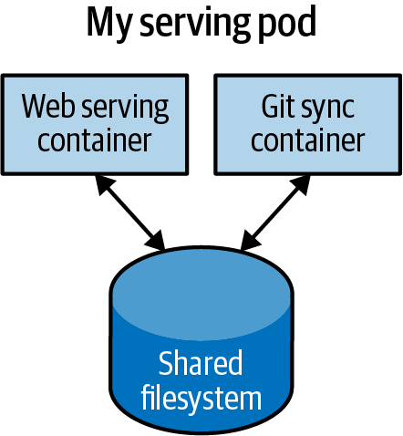

# Chương 5. Pod

Trong các chương trước, chúng ta đã thảo luận về cách bạn có thể container hóa ứng dụng của mình, nhưng trong các triển khai thực tế của ứng dụng đã container hóa, bạn thường sẽ muốn đặt nhiều ứng dụng cùng nhau vào một đơn vị nguyên tử (atomic unit) duy nhất, được lên lịch lên một máy duy nhất.

Một ví dụ điển hình của kiểu triển khai như vậy được minh họa trong Hình 5-1, gồm một container phục vụ các yêu cầu web và một container đồng bộ hóa filesystem với một Git repository từ xa.



*Hình 5-1. Một Pod ví dụ với hai container và một filesystem dùng chung*

Thoạt đầu, có thể bạn thấy hấp dẫn khi gói cả web server và trình đồng bộ Git vào một container duy nhất. Tuy nhiên, sau khi xem xét kỹ hơn, các lý do cho việc tách biệt trở nên rõ ràng. Thứ nhất, hai container có các yêu cầu khác nhau đáng kể về mức sử dụng tài nguyên. Lấy ví dụ về bộ nhớ: bởi vì web server đang phục vụ các yêu cầu của người dùng, chúng ta muốn đảm bảo nó luôn sẵn sàng và phản hồi nhanh. Mặt khác, trình đồng bộ Git không thực sự tương tác trực tiếp với người dùng và có chất lượng dịch vụ kiểu "best effort" (nỗ lực tốt nhất).

Giả sử trình đồng bộ Git của chúng ta bị rò rỉ bộ nhớ (memory leak). Chúng ta cần đảm bảo rằng trình đồng bộ Git không thể dùng hết bộ nhớ mà chúng ta muốn dành cho web server, vì điều này có thể ảnh hưởng đến hiệu năng hoặc thậm chí làm sập server.

Kiểu cô lập tài nguyên này chính là điều mà container được thiết kế để thực hiện. Bằng cách tách hai ứng dụng thành hai container riêng biệt, chúng ta có thể đảm bảo web server hoạt động đáng tin cậy.

Dĩ nhiên, hai container này khá cộng sinh với nhau; sẽ vô nghĩa nếu lên lịch web server trên một máy và trình đồng bộ Git trên một máy khác. Do đó, Kubernetes nhóm nhiều container thành một đơn vị nguyên tử duy nhất gọi là Pod. (Cái tên này đi cùng chủ đề cá voi của các Docker container, vì "pod" cũng là một đàn cá voi.)

> **LƯU Ý**
>
> Mặc dù việc nhóm nhiều container vào một Pod duy nhất từng gây tranh cãi hoặc bối rối khi lần đầu được giới thiệu trong Kubernetes, sau đó nó đã được nhiều ứng dụng khác nhau áp dụng để triển khai hạ tầng của họ. Ví dụ, một số hiện thực service mesh sử dụng một container sidecar thứ hai để tiêm (inject) việc quản lý mạng vào Pod của ứng dụng.

## Pod trong Kubernetes

Pod là một tập hợp các application container và volume chạy trong cùng một môi trường thực thi. Pod, không phải container, là artifact có thể triển khai nhỏ nhất trong Kubernetes cluster. Điều này có nghĩa là tất cả các container trong một Pod luôn nằm trên cùng một máy.

Mỗi container trong một Pod chạy trong cgroup riêng của nó, nhưng chúng chia sẻ một số Linux namespace.

Các ứng dụng chạy trong cùng một Pod dùng chung địa chỉ IP và không gian cổng (network namespace), có cùng hostname (UTS namespace), và có thể giao tiếp bằng các kênh giao tiếp liên tiến trình gốc qua System V IPC hoặc hàng đợi thông điệp POSIX (IPC namespace). Tuy nhiên, các ứng dụng trong các Pod khác nhau được cô lập với nhau; chúng có địa chỉ IP, hostname khác nhau, và nhiều thứ khác. Các container trong các Pod khác nhau chạy trên cùng một node cũng chẳng khác gì đang ở trên các server khác nhau.

## Tư duy với Pod

Một trong những câu hỏi phổ biến nhất mà người ta đặt ra khi áp dụng Kubernetes là "Tôi nên đặt gì vào một Pod?"

Đôi khi người ta nhìn Pod và nghĩ, "Aha! Một container WordPress và một container cơ sở dữ liệu MySQL kết hợp lại để tạo thành một instance WordPress. Chúng nên ở trong cùng một Pod." Tuy nhiên, kiểu Pod này thực ra là một ví dụ về antipattern trong việc xây dựng Pod. Có hai lý do cho điều này. Thứ nhất, WordPress và cơ sở dữ liệu của nó không thực sự cộng sinh. Nếu container WordPress và container cơ sở dữ liệu nằm trên các máy khác nhau, chúng vẫn có thể làm việc với nhau khá hiệu quả, vì chúng giao tiếp qua kết nối mạng. Thứ hai, bạn không nhất thiết muốn mở rộng WordPress và cơ sở dữ liệu như một đơn vị. Bản thân WordPress hầu như là stateless, nên bạn có thể muốn mở rộng các frontend WordPress để đáp ứng tải frontend bằng cách tạo thêm các Pod WordPress. Mở rộng cơ sở dữ liệu MySQL khó hơn nhiều, và bạn nhiều khả năng sẽ tăng tài nguyên dành cho một Pod MySQL duy nhất. Nếu bạn nhóm các container WordPress và MySQL cùng nhau trong một Pod, bạn buộc phải dùng cùng chiến lược mở rộng cho cả hai container, điều này không phù hợp.

Nói chung, câu hỏi đúng để tự hỏi khi thiết kế Pod là "Các container này có hoạt động đúng nếu chúng nằm trên các máy khác nhau không?" Nếu câu trả lời là không, Pod là cách nhóm đúng cho các container. Nếu câu trả lời là có, sử dụng nhiều Pod có lẽ là giải pháp đúng. Trong ví dụ ở đầu chương này, hai container tương tác thông qua một filesystem cục bộ. Chúng sẽ không thể hoạt động đúng nếu các container được lên lịch trên các máy khác nhau.

Trong các phần còn lại của chương này, chúng tôi sẽ mô tả cách tạo, kiểm tra, quản lý và xóa Pod trong Kubernetes.

## Pod Manifest

Pod được mô tả trong một Pod manifest, đơn giản chỉ là biểu diễn dạng file văn bản của đối tượng Kubernetes API. Kubernetes tin tưởng mạnh mẽ vào cấu hình khai báo, nghĩa là bạn viết ra trạng thái mong muốn của thế giới trong một file cấu hình rồi gửi cấu hình đó đến một dịch vụ thực hiện các hành động để đảm bảo trạng thái mong muốn trở thành trạng thái thực tế.

> **LƯU Ý**
>
> Cấu hình khai báo khác với cấu hình mệnh lệnh, trong đó bạn đơn giản thực hiện một loạt hành động (ví dụ, `apt-get install foo`) để sửa đổi trạng thái của một hệ thống. Nhiều năm kinh nghiệm production đã dạy chúng tôi rằng việc duy trì một bản ghi bằng văn bản về trạng thái mong muốn của hệ thống dẫn đến một hệ thống dễ quản lý và đáng tin cậy hơn. Cấu hình khai báo có nhiều lợi thế, như cho phép review code cho cấu hình và ghi lại trạng thái hiện tại của hệ thống cho các đội phân tán. Ngoài ra, nó là cơ sở cho tất cả các hành vi tự phục hồi trong Kubernetes giúp ứng dụng tiếp tục chạy mà không cần hành động của người dùng.

Kubernetes API server tiếp nhận và xử lý các Pod manifest trước khi lưu chúng vào bộ lưu trữ bền vững (`etcd`). Scheduler cũng dùng Kubernetes API để tìm các Pod chưa được lên lịch lên node. Sau đó nó đặt các Pod lên các node tùy theo tài nguyên và các ràng buộc khác được thể hiện trong Pod manifest. Scheduler có thể đặt nhiều Pod lên cùng một máy miễn là có đủ tài nguyên. Tuy nhiên, việc lên lịch nhiều replica của cùng một ứng dụng lên cùng một máy là tệ hơn cho độ tin cậy, vì máy đó là một miền lỗi (failure domain) duy nhất. Do đó, Kubernetes scheduler cố gắng đảm bảo các Pod từ cùng một ứng dụng được phân phối lên các máy khác nhau để đảm bảo độ tin cậy khi có những lỗi như vậy. Một khi đã được lên lịch lên một node, Pod không di chuyển và phải được hủy một cách tường minh rồi lên lịch lại.

Nhiều instance của một Pod có thể được triển khai bằng cách lặp lại quy trình được mô tả ở đây. Tuy nhiên, ReplicaSet (Chương 9) phù hợp hơn cho việc chạy nhiều instance của một Pod. (Hóa ra chúng cũng tốt hơn cho việc chạy một Pod duy nhất, nhưng chúng ta sẽ bàn đến điều đó sau.)

### Tạo Pod

Cách đơn giản nhất để tạo một Pod là thông qua lệnh mệnh lệnh `kubectl run`. Ví dụ, để chạy cùng server `kuard` của chúng ta, dùng:

```
$ kubectl run kuard --generator=run-pod/v1 \
  --image=gcr.io/kuar-demo/kuard-amd64:blue
```

Bạn có thể xem trạng thái của Pod này bằng cách chạy:

```
$ kubectl get pods
```

Ban đầu bạn có thể thấy container ở trạng thái `Pending`, nhưng cuối cùng bạn sẽ thấy nó chuyển sang `Running`, có nghĩa là Pod và các container của nó đã được tạo thành công.

Hiện tại, bạn có thể xóa Pod này bằng cách chạy:

```
$ kubectl delete pods/kuard
```

Bây giờ chúng ta sẽ chuyển sang viết một Pod manifest hoàn chỉnh bằng tay.

### Tạo Pod Manifest

Bạn có thể viết Pod manifest bằng YAML hoặc JSON, nhưng YAML thường được ưa chuộng hơn vì nó dễ chỉnh sửa hơn một chút và hỗ trợ chú thích. Pod manifest (và các đối tượng Kubernetes API khác) thực sự nên được xem như mã nguồn, và những thứ như chú thích giúp giải thích Pod cho các thành viên mới trong đội.

Pod manifest bao gồm vài trường và thuộc tính chính: cụ thể là một phần `metadata` để mô tả Pod và các label của nó, một phần `spec` để mô tả các volume, và một danh sách các container sẽ chạy trong Pod.

Trong Chương 2, chúng ta đã triển khai `kuard` bằng lệnh Docker sau:

```
$ docker run -d --name kuard \
  --publish 8080:8080 \
  gcr.io/kuar-demo/kuard-amd64:blue
```

Bạn có thể đạt được kết quả tương tự bằng cách thay vào đó viết Ví dụ 5-1 vào một file tên *kuard-pod.yaml* rồi dùng các lệnh `kubectl` để tải manifest đó vào Kubernetes.

*Ví dụ 5-1. kuard-pod.yaml*

```yaml
apiVersion: v1
kind: Pod
metadata:
  name: kuard
spec:
  containers:
    - image: gcr.io/kuar-demo/kuard-amd64:blue
      name: kuard
      ports:
        - containerPort: 8080
          name: http
          protocol: TCP
```

Mặc dù ban đầu việc quản lý ứng dụng theo cách này có thể trông cồng kềnh hơn, bản ghi bằng văn bản về trạng thái mong muốn này là thực hành tốt nhất về lâu dài, đặc biệt với các đội lớn có nhiều ứng dụng.

## Chạy Pod

Trong phần trước, chúng ta đã tạo một Pod manifest có thể được dùng để khởi động một Pod chạy `kuard`. Dùng lệnh `kubectl apply` để khởi chạy một instance duy nhất của `kuard`:

```
$ kubectl apply -f kuard-pod.yaml
```

Pod manifest sẽ được gửi đến Kubernetes API server. Hệ thống Kubernetes sau đó sẽ lên lịch Pod đó chạy trên một node khỏe mạnh trong cluster, nơi daemon `kubelet` sẽ giám sát nó. Đừng lo nếu bạn chưa hiểu tất cả các thành phần chuyển động của Kubernetes ngay bây giờ; chúng ta sẽ đi vào chi tiết hơn xuyên suốt cuốn sách.

### Liệt kê Pod

Giờ chúng ta đã có một Pod đang chạy, hãy tìm hiểu thêm về nó. Dùng công cụ dòng lệnh `kubectl`, chúng ta có thể liệt kê tất cả các Pod đang chạy trong cluster. Hiện tại, đây chỉ nên là Pod duy nhất mà chúng ta đã tạo ở bước trước:

```
$ kubectl get pods
NAME    READY   STATUS    RESTARTS   AGE
kuard   1/1     Running   0          44s
```

Bạn có thể thấy tên của Pod (`kuard`) mà chúng ta đã đặt trong file YAML trước đó. Ngoài số container đã sẵn sàng (`1/1`), kết quả cũng hiển thị trạng thái, số lần Pod được khởi động lại, và tuổi của Pod.

Nếu bạn chạy lệnh này ngay sau khi Pod được tạo, bạn có thể thấy:

```
NAME    READY   STATUS    RESTARTS   AGE
kuard   0/1     Pending   0          1s
```

Trạng thái `Pending` cho biết Pod đã được gửi nhưng chưa được lên lịch. Nếu xảy ra lỗi nghiêm trọng hơn, như cố tạo một Pod với container image không tồn tại, nó cũng sẽ được liệt kê trong trường trạng thái.

> **LƯU Ý**
>
> Theo mặc định, công cụ dòng lệnh `kubectl` ngắn gọn trong thông tin nó báo cáo, nhưng bạn có thể lấy thêm thông tin thông qua các cờ dòng lệnh. Thêm `-o wide` vào bất kỳ lệnh `kubectl` nào sẽ in ra nhiều thông tin hơn một chút (trong khi vẫn giữ thông tin trên một dòng). Thêm `-o json` hoặc `-o yaml` sẽ in ra các đối tượng hoàn chỉnh ở dạng JSON hoặc YAML tương ứng. Nếu bạn muốn xem log chi tiết, đầy đủ về những gì `kubectl` đang làm, bạn có thể thêm cờ `--v=10` để có log toàn diện, đổi lại là khó đọc hơn.

### Chi tiết Pod

Đôi khi, chế độ xem một dòng là không đủ vì nó quá ngắn gọn. Ngoài ra, Kubernetes duy trì nhiều sự kiện về Pod nằm trong luồng sự kiện (event stream), không gắn với đối tượng Pod.

Để tìm thêm thông tin về một Pod (hoặc bất kỳ đối tượng Kubernetes nào), bạn có thể dùng lệnh `kubectl describe`. Ví dụ, để mô tả Pod chúng ta đã tạo trước đó, bạn có thể chạy:

```
$ kubectl describe pods kuard
```

Lệnh này xuất ra rất nhiều thông tin về Pod trong các phần khác nhau. Ở trên cùng là thông tin cơ bản về Pod:

```
Name:           kuard
Namespace:      default
Node:           node1/10.0.15.185
Start Time:     Sun, 02 Jul 2017 15:00:38 -0700
Labels:         <none>
Annotations:    <none>
Status:         Running
IP:             192.168.199.238
Controllers:    <none>
```

Sau đó là thông tin về các container đang chạy trong Pod:

```
Containers:
  kuard:
    Container ID:  docker://055095...
    Image:         gcr.io/kuar-demo/kuard-amd64:blue
    Image ID:      docker-pullable://gcr.io/kuar-demo/kuard-amd64@sha256:a5...
    Port:          8080/TCP
    State:         Running
      Started:     Sun, 02 Jul 2017 15:00:41 -0700
    Ready:         True
    Restart Count: 0
    Environment:   <none>
    Mounts:
      /var/run/secrets/kubernetes.io/serviceaccount from default-token-cg5f5 (ro)
```

Cuối cùng là các sự kiện liên quan đến Pod, như khi nào nó được lên lịch, khi nào image của nó được kéo về, và có/khi nào nó phải khởi động lại do thất bại kiểm tra sức khỏe:

```
Events:
  Seen  From               SubObjectPath           Type      Reason     Message
  ----  ----               -------------           --------  ------     -------
  50s   default-scheduler                          Normal    Scheduled  Successfully assigned kuard to node1
  49s   kubelet, node1     spec.containers{kuard}  Normal    Pulling    pulling image "gcr.io/kuar-demo/kuard-amd64:blue"
  47s   kubelet, node1     spec.containers{kuard}  Normal    Pulled     Successfully pulled image "gcr.io/kuar-demo/kuard-amd64:blue"
  47s   kubelet, node1     spec.containers{kuard}  Normal    Created    Created container with docker id 2a41...
  47s   kubelet, node1     spec.containers{kuard}  Normal    Started    Started container with docker id 2a41...
```

### Xóa Pod

Khi đến lúc xóa một Pod, bạn có thể xóa nó theo tên:

```
$ kubectl delete pods/kuard
```

hoặc bạn có thể dùng cùng file mà bạn đã dùng để tạo nó:

```
$ kubectl delete -f kuard-pod.yaml
```

Khi một Pod bị xóa, nó không bị giết ngay lập tức. Thay vào đó, nếu bạn chạy `kubectl get pods`, bạn sẽ thấy Pod ở trạng thái `Terminating`. Tất cả các Pod đều có một khoảng thời gian ân hạn chấm dứt (termination grace period). Theo mặc định, đây là 30 giây. Khi một Pod chuyển sang `Terminating`, nó không còn nhận yêu cầu mới. Trong tình huống phục vụ, khoảng thời gian ân hạn này quan trọng cho độ tin cậy vì nó cho phép Pod hoàn thành mọi yêu cầu đang hoạt động mà nó có thể đang xử lý trước khi bị chấm dứt.

> **CẢNH BÁO**
>
> Khi bạn xóa một Pod, mọi dữ liệu được lưu trong các container liên quan đến Pod đó cũng sẽ bị xóa. Nếu bạn muốn lưu dữ liệu bền vững qua nhiều instance của một Pod, bạn cần dùng PersistentVolume, được mô tả ở cuối chương này.

## Truy cập Pod của bạn

Giờ Pod của bạn đang chạy, bạn sẽ muốn truy cập nó vì nhiều lý do. Bạn có thể muốn tải dịch vụ web đang chạy trong Pod. Bạn có thể muốn xem log của nó để gỡ lỗi một vấn đề bạn đang gặp, hoặc thậm chí thực thi các lệnh khác bên trong Pod để hỗ trợ gỡ lỗi. Các phần sau mô tả chi tiết nhiều cách bạn có thể tương tác với code và dữ liệu đang chạy bên trong Pod của mình.

### Lấy thêm thông tin với Log

Khi ứng dụng của bạn cần gỡ lỗi, việc có thể đào sâu hơn `describe` để hiểu ứng dụng đang làm gì là hữu ích. Kubernetes cung cấp hai lệnh để gỡ lỗi các container đang chạy. Lệnh `kubectl logs` tải các log hiện tại từ instance đang chạy:

```
$ kubectl logs kuard
```

Thêm cờ `-f` sẽ làm log stream liên tục.

Lệnh `kubectl logs` luôn cố lấy log từ container hiện đang chạy. Thêm cờ `--previous` sẽ lấy log từ một instance trước đó của container. Điều này hữu ích, ví dụ, nếu các container của bạn liên tục khởi động lại do một vấn đề lúc khởi động container.

> **LƯU Ý**
>
> Mặc dù dùng `kubectl logs` hữu ích cho việc gỡ lỗi thỉnh thoảng các container trong môi trường production, nói chung việc dùng một dịch vụ tổng hợp log (log aggregation) là hữu ích. Có một số công cụ tổng hợp log mã nguồn mở, như Fluentd và Elasticsearch, cũng như nhiều nhà cung cấp logging trên cloud. Các dịch vụ tổng hợp log này cung cấp năng lực lớn hơn để lưu trữ log trong thời gian dài hơn cũng như khả năng tìm kiếm và lọc log phong phú. Nhiều dịch vụ cũng cung cấp khả năng tổng hợp log từ nhiều Pod vào một chế độ xem duy nhất.

### Chạy lệnh trong Container của bạn với exec

Đôi khi log là không đủ, và để thực sự xác định điều gì đang xảy ra, bạn cần thực thi các lệnh trong ngữ cảnh của chính container. Để làm điều này, bạn có thể dùng:

```
$ kubectl exec kuard -- date
```

Bạn cũng có thể có một phiên tương tác bằng cách thêm cờ `-it`:

```
$ kubectl exec -it kuard -- ash
```

### Sao chép file đến và từ Container

Trong chương trước, chúng tôi đã trình bày cách dùng lệnh `kubectl cp` để truy cập các file trong một Pod. Nói chung, sao chép file vào container là một antipattern. Bạn thực sự nên xem nội dung của một container là bất biến. Nhưng đôi khi đó là cách nhanh nhất để "cầm máu" và khôi phục dịch vụ của bạn về trạng thái khỏe mạnh, vì nó nhanh hơn việc build, push và phát hành một image mới. Tuy nhiên, một khi đã cầm máu, điều cực kỳ quan trọng là bạn phải ngay lập tức đi thực hiện việc build image và phát hành, nếu không bạn chắc chắn sẽ quên thay đổi cục bộ đã thực hiện trên container và ghi đè nó trong lần phát hành định kỳ tiếp theo.

## Kiểm tra sức khỏe (Health Check)

Khi bạn chạy ứng dụng dưới dạng container trong Kubernetes, nó được tự động giữ sống cho bạn bằng một kiểm tra sức khỏe tiến trình (process health check). Kiểm tra sức khỏe này đơn giản đảm bảo rằng tiến trình chính của ứng dụng luôn đang chạy. Nếu không, Kubernetes khởi động lại nó.

Tuy nhiên, trong hầu hết các trường hợp, một kiểm tra tiến trình đơn giản là không đủ. Ví dụ, nếu tiến trình của bạn bị deadlock và không thể phục vụ yêu cầu, kiểm tra sức khỏe tiến trình vẫn sẽ tin rằng ứng dụng khỏe mạnh vì tiến trình của nó vẫn đang chạy.

Để giải quyết điều này, Kubernetes giới thiệu các kiểm tra sức khỏe cho tính sống (liveness) của ứng dụng. Kiểm tra sức khỏe liveness chạy logic đặc thù của ứng dụng, như tải một trang web, để xác minh rằng ứng dụng không chỉ đang chạy mà còn hoạt động đúng. Vì các kiểm tra sức khỏe liveness này là đặc thù cho ứng dụng, bạn phải định nghĩa chúng trong Pod manifest.

### Liveness Probe

Một khi tiến trình `kuard` đã chạy, chúng ta cần một cách để xác nhận rằng nó thực sự khỏe mạnh và không nên bị khởi động lại. Liveness probe được định nghĩa theo từng container, có nghĩa là mỗi container trong một Pod được kiểm tra sức khỏe riêng biệt. Trong Ví dụ 5-2, chúng ta thêm một liveness probe vào container `kuard`, probe này chạy một yêu cầu HTTP đến đường dẫn `/healthy` trên container.

*Ví dụ 5-2. kuard-pod-health.yaml*

```yaml
apiVersion: v1
kind: Pod
metadata:
  name: kuard
spec:
  containers:
    - image: gcr.io/kuar-demo/kuard-amd64:blue
      name: kuard
      livenessProbe:
        httpGet:
          path: /healthy
          port: 8080
        initialDelaySeconds: 5
        timeoutSeconds: 1
        periodSeconds: 10
        failureThreshold: 3
      ports:
        - containerPort: 8080
          name: http
          protocol: TCP
```

Pod manifest trên dùng một probe `httpGet` để thực hiện một yêu cầu HTTP `GET` đến endpoint `/healthy` trên cổng 8080 của container `kuard`. Probe thiết lập `initialDelaySeconds` là `5`, và do đó sẽ không được gọi cho đến 5 giây sau khi tất cả các container trong Pod được tạo. Probe phải phản hồi trong thời gian timeout 1 giây, và mã trạng thái HTTP phải lớn hơn hoặc bằng 200 và nhỏ hơn 400 để được coi là thành công. Kubernetes sẽ gọi probe mỗi 10 giây. Nếu hơn ba probe liên tiếp thất bại, container sẽ thất bại và khởi động lại.

Bạn có thể thấy điều này trong thực tế bằng cách xem trang trạng thái của `kuard`. Tạo một Pod bằng manifest này rồi port-forward đến Pod đó:

```
$ kubectl apply -f kuard-pod-health.yaml
$ kubectl port-forward kuard 8080:8080
```

Trỏ trình duyệt của bạn tới http://localhost:8080. Nhấp vào tab "Liveness Probe". Bạn sẽ thấy một bảng liệt kê tất cả các probe mà instance `kuard` này đã nhận được. Nếu bạn nhấp vào liên kết "Fail" trên trang đó, `kuard` sẽ bắt đầu thất bại các kiểm tra sức khỏe. Chờ đủ lâu, và Kubernetes sẽ khởi động lại container. Tại thời điểm đó, màn hình sẽ được đặt lại và bắt đầu lại từ đầu. Chi tiết về việc khởi động lại có thể được tìm thấy bằng cách chạy lệnh `kubectl describe pods kuard`. Phần "Events" sẽ có văn bản tương tự như sau:

```
Killing container with id docker://2ac946...:pod "kuard_default(9ee84...)"
container "kuard" is unhealthy, it will be killed and re-created.
```

> **LƯU Ý**
>
> Mặc dù phản ứng mặc định với một kiểm tra liveness thất bại là khởi động lại Pod, hành vi thực tế được điều chỉnh bởi `restartPolicy` của Pod. Có ba tùy chọn cho chính sách khởi động lại: `Always` (mặc định), `OnFailure` (chỉ khởi động lại khi thất bại liveness hoặc mã thoát tiến trình khác không), hoặc `Never`.

### Readiness Probe

Dĩ nhiên, liveness không phải là loại kiểm tra sức khỏe duy nhất chúng ta muốn thực hiện. Kubernetes phân biệt giữa liveness và readiness. Liveness xác định liệu một ứng dụng có đang chạy đúng không. Các container thất bại kiểm tra liveness sẽ được khởi động lại. Readiness mô tả khi nào một container sẵn sàng phục vụ các yêu cầu của người dùng. Các container thất bại kiểm tra readiness sẽ bị loại khỏi các load balancer của service. Readiness probe được cấu hình tương tự như liveness probe. Chúng ta sẽ khám phá chi tiết Kubernetes service trong Chương 7.

Kết hợp readiness probe và liveness probe giúp đảm bảo chỉ các container khỏe mạnh đang chạy trong cluster.

### Startup Probe

Startup probe gần đây đã được giới thiệu vào Kubernetes như một cách thay thế để quản lý các container khởi động chậm. Khi một Pod được khởi động, startup probe được chạy trước khi bất kỳ probe nào khác của Pod được bắt đầu. Startup probe tiếp tục cho đến khi nó hoặc hết thời gian (trong trường hợp đó Pod được khởi động lại) hoặc thành công, lúc đó liveness probe sẽ tiếp quản. Startup probe cho phép bạn thăm dò chậm đối với một container khởi động chậm trong khi vẫn cho phép kiểm tra liveness phản hồi nhanh một khi container khởi động chậm đã khởi tạo xong.

### Cấu hình Probe nâng cao

Các probe trong Kubernetes có một số tùy chọn nâng cao, bao gồm thời gian chờ sau khi Pod khởi động để bắt đầu thăm dò, số lần thất bại được coi là thất bại thực sự, và số lần thành công cần thiết để đặt lại bộ đếm thất bại. Tất cả các cấu hình này nhận giá trị mặc định khi không được chỉ định, nhưng chúng có thể cần thiết cho các trường hợp sử dụng nâng cao hơn như các ứng dụng vốn không ổn định hoặc mất nhiều thời gian để khởi động.

### Các loại kiểm tra sức khỏe khác

Ngoài kiểm tra HTTP, Kubernetes cũng hỗ trợ kiểm tra sức khỏe `tcpSocket`, mở một TCP socket; nếu kết nối thành công, probe thành công. Kiểu probe này hữu ích cho các ứng dụng không dùng HTTP, như cơ sở dữ liệu hoặc các API khác không dựa trên HTTP.

Cuối cùng, Kubernetes cho phép các probe `exec`. Chúng thực thi một script hoặc chương trình trong ngữ cảnh của container. Theo quy ước thông thường, nếu script này trả về mã thoát bằng không, probe thành công; nếu không, nó thất bại. Các script `exec` thường hữu ích cho logic xác thực ứng dụng tùy chỉnh không phù hợp gọn gàng với một lời gọi HTTP.

## Quản lý tài nguyên

Hầu hết mọi người chuyển sang container và các trình điều phối như Kubernetes vì những cải tiến triệt để trong việc đóng gói image và triển khai đáng tin cậy mà chúng mang lại. Ngoài các primitive hướng ứng dụng giúp đơn giản hóa việc phát triển hệ thống phân tán, điều quan trọng không kém là chúng cho phép bạn tăng mức sử dụng tổng thể của các node tính toán tạo nên cluster. Chi phí cơ bản để vận hành một máy, dù là ảo hay vật lý, về cơ bản là không đổi bất kể nó nhàn rỗi hay đầy tải. Do đó, đảm bảo các máy này hoạt động tối đa sẽ tăng hiệu quả của mỗi đồng chi cho hạ tầng.

Nói chung, chúng ta đo hiệu quả này bằng chỉ số mức sử dụng (utilization). Mức sử dụng được định nghĩa là lượng tài nguyên đang được sử dụng tích cực chia cho lượng tài nguyên đã được mua. Ví dụ, nếu bạn mua một máy một core, và ứng dụng của bạn dùng một phần mười core, thì mức sử dụng của bạn là 10%. Với các hệ thống lên lịch như Kubernetes quản lý việc xếp tài nguyên, bạn có thể đưa mức sử dụng lên trên 50%. Để đạt được điều này, bạn phải cho Kubernetes biết về các tài nguyên mà ứng dụng của bạn yêu cầu để Kubernetes có thể tìm cách xếp container lên máy một cách tối ưu.

Kubernetes cho phép người dùng chỉ định hai chỉ số tài nguyên khác nhau. Resource request chỉ định lượng tối thiểu của một tài nguyên cần thiết để chạy ứng dụng. Resource limit chỉ định lượng tối đa của một tài nguyên mà ứng dụng có thể tiêu thụ. Hãy xem chi tiết hơn về chúng trong các phần sau.

Kubernetes nhận diện rất nhiều ký pháp khác nhau để chỉ định tài nguyên, từ giá trị nguyên ("12345") đến millicore ("100m"). Điều quan trọng cần lưu ý là sự phân biệt giữa MB/GB/PB và MiB/GiB/PiB. Loại thứ nhất là các đơn vị lũy thừa của hai quen thuộc (ví dụ, 1 MB == 1.024 KB) trong khi loại thứ hai là các đơn vị lũy thừa của 10 (1MiB == 1000KiB).

*(Ghi chú của người dịch: Nguyên bản viết ngược. Theo chuẩn IEC, MiB/GiB/PiB là các đơn vị lũy thừa của hai (1 MiB = 1.024 KiB), còn MB/GB/PB là các đơn vị lũy thừa của 10 (1 MB = 1.000 KB).)*

> **LƯU Ý**
>
> Một nguồn lỗi phổ biến là chỉ định milli-đơn vị bằng chữ `m` thường so với mega-đơn vị bằng chữ `M` hoa. Cụ thể, "400m" là 0,4 MB, không phải 400Mb, một khác biệt đáng kể!

### Resource Request: Tài nguyên tối thiểu cần thiết

Khi một Pod yêu cầu các tài nguyên cần thiết để chạy các container của nó, Kubernetes đảm bảo rằng các tài nguyên này có sẵn cho Pod. Các tài nguyên được yêu cầu phổ biến nhất là CPU và bộ nhớ, nhưng Kubernetes cũng hỗ trợ các loại tài nguyên khác, như GPU. Ví dụ, để yêu cầu container `kuard` nằm trên một máy có nửa CPU trống và được cấp 128 MB bộ nhớ, chúng ta định nghĩa Pod như trong Ví dụ 5-3.

*Ví dụ 5-3. kuard-pod-resreq.yaml*

```yaml
apiVersion: v1
kind: Pod
metadata:
  name: kuard
spec:
  containers:
    - image: gcr.io/kuar-demo/kuard-amd64:blue
      name: kuard
      resources:
        requests:
          cpu: "500m"
          memory: "128Mi"
      ports:
        - containerPort: 8080
          name: http
          protocol: TCP
```

> **LƯU Ý**
>
> Tài nguyên được yêu cầu theo từng container, không phải theo Pod. Tổng tài nguyên được Pod yêu cầu là tổng của tất cả tài nguyên được yêu cầu bởi tất cả các container trong Pod, bởi vì các container khác nhau thường có yêu cầu CPU rất khác nhau. Ví dụ, nếu một Pod chứa một web server và một trình đồng bộ dữ liệu, web server tương tác với người dùng và có thể cần rất nhiều CPU, trong khi trình đồng bộ dữ liệu có thể xoay xở với rất ít.

Request được dùng khi lên lịch Pod lên các node. Kubernetes scheduler sẽ đảm bảo rằng tổng tất cả các request của tất cả các Pod trên một node không vượt quá năng lực của node. Do đó, một Pod được đảm bảo có ít nhất các tài nguyên đã yêu cầu khi chạy trên node. Điều quan trọng là "request" chỉ định một mức tối thiểu. Nó không chỉ định mức trần tối đa cho tài nguyên mà một Pod có thể dùng. Để khám phá điều này có nghĩa là gì, hãy xem một ví dụ.

Hãy tưởng tượng một container có code cố dùng tất cả các CPU core khả dụng. Giả sử chúng ta tạo một Pod với container này yêu cầu 0,5 CPU. Kubernetes lên lịch Pod này lên một máy có tổng cộng 2 CPU core. Miễn là nó là Pod duy nhất trên máy, nó sẽ tiêu thụ toàn bộ 2,0 core khả dụng, mặc dù chỉ yêu cầu 0,5 CPU.

Nếu một Pod thứ hai với cùng container và cùng request 0,5 CPU nằm trên máy đó, thì mỗi Pod sẽ nhận được 1,0 core. Nếu một Pod thứ ba giống hệt được lên lịch, mỗi Pod sẽ nhận được 0,66 core. Cuối cùng, nếu một Pod thứ tư giống hệt được lên lịch, mỗi Pod sẽ nhận được 0,5 core mà nó đã yêu cầu, và node sẽ đầy.

CPU request được hiện thực bằng chức năng `cpu-shares` trong Linux kernel.

> **LƯU Ý**
>
> Memory request được xử lý tương tự CPU, nhưng có một khác biệt quan trọng. Nếu một container vượt quá memory request của nó, OS không thể đơn giản lấy bộ nhớ khỏi tiến trình, vì nó đã được cấp phát. Do đó, khi hệ thống hết bộ nhớ, `kubelet` chấm dứt các container có mức sử dụng bộ nhớ lớn hơn bộ nhớ đã yêu cầu. Các container này được tự động khởi động lại, nhưng với ít bộ nhớ khả dụng hơn trên máy để container tiêu thụ.

Vì resource request đảm bảo tính sẵn có của tài nguyên cho Pod, chúng rất quan trọng để đảm bảo các container có đủ tài nguyên trong các tình huống tải cao.

### Giới hạn mức sử dụng tài nguyên với Limit

Ngoài việc thiết lập các tài nguyên mà Pod yêu cầu, thiết lập mức tài nguyên tối thiểu có sẵn cho nó, bạn cũng có thể thiết lập mức tối đa cho mức sử dụng tài nguyên của nó thông qua resource limit.

Trong ví dụ trước, chúng ta đã tạo một Pod `kuard` yêu cầu tối thiểu 0,5 core và 128 MB bộ nhớ. Trong Pod manifest ở Ví dụ 5-4, chúng ta mở rộng cấu hình này để thêm limit 1,0 CPU và 256 MB bộ nhớ.

*Ví dụ 5-4. kuard-pod-reslim.yaml*

```yaml
apiVersion: v1
kind: Pod
metadata:
  name: kuard
spec:
  containers:
    - image: gcr.io/kuar-demo/kuard-amd64:blue
      name: kuard
      resources:
        requests:
          cpu: "500m"
          memory: "128Mi"
        limits:
          cpu: "1000m"
          memory: "256Mi"
      ports:
        - containerPort: 8080
          name: http
          protocol: TCP
```

Khi bạn thiết lập limit trên một container, kernel được cấu hình để đảm bảo mức tiêu thụ không thể vượt quá các limit này. Một container với CPU limit 0,5 core sẽ chỉ nhận được 0,5 core, ngay cả khi CPU đang nhàn rỗi. Một container với memory limit 256 MB sẽ không được phép có thêm bộ nhớ; ví dụ, `malloc` sẽ thất bại nếu mức sử dụng bộ nhớ của nó vượt quá 256 MB.

## Lưu trữ dữ liệu bền vững với Volume

Khi một Pod bị xóa hoặc một container khởi động lại, bất kỳ và tất cả dữ liệu trong filesystem của container cũng bị xóa. Điều này thường là tốt, vì bạn không muốn để lại những thứ rác mà ứng dụng web stateless của bạn tình cờ ghi ra. Trong các trường hợp khác, việc có quyền truy cập vào bộ lưu trữ đĩa bền vững là một phần quan trọng của một ứng dụng khỏe mạnh. Kubernetes mô hình hóa loại lưu trữ bền vững như vậy.

### Sử dụng Volume với Pod

Để thêm một volume vào Pod manifest, có hai đoạn mới cần thêm vào cấu hình của chúng ta. Đầu tiên là một phần `spec.volumes` mới. Mảng này định nghĩa tất cả các volume mà các container trong Pod manifest có thể truy cập. Cần lưu ý rằng không phải tất cả các container đều bắt buộc mount tất cả các volume được định nghĩa trong Pod. Phần bổ sung thứ hai là mảng `volumeMounts` trong định nghĩa container. Mảng này định nghĩa các volume được mount vào một container cụ thể và đường dẫn mà mỗi volume nên được mount. Lưu ý rằng hai container khác nhau trong một Pod có thể mount cùng một volume tại các đường dẫn mount khác nhau.

Manifest trong Ví dụ 5-5 định nghĩa một volume mới duy nhất tên là `kuard-data`, mà container `kuard` mount vào đường dẫn `/data`.

*Ví dụ 5-5. kuard-pod-vol.yaml*

```yaml
apiVersion: v1
kind: Pod
metadata:
  name: kuard
spec:
  volumes:
    - name: "kuard-data"
      hostPath:
        path: "/var/lib/kuard"
  containers:
    - image: gcr.io/kuar-demo/kuard-amd64:blue
      name: kuard
      volumeMounts:
        - mountPath: "/data"
          name: "kuard-data"
      ports:
        - containerPort: 8080
          name: http
          protocol: TCP
```

### Các cách khác nhau để sử dụng Volume với Pod

Có nhiều cách bạn có thể sử dụng dữ liệu trong ứng dụng của mình. Sau đây là một số cách đó và các mẫu (pattern) được khuyến nghị cho Kubernetes:

**Giao tiếp/đồng bộ hóa**

Trong ví dụ đầu tiên về Pod, chúng ta đã thấy cách hai container dùng một volume dùng chung để phục vụ một trang web trong khi giữ nó đồng bộ với một vị trí Git từ xa (Hình 5-1). Để đạt được điều này, Pod dùng một volume `emptyDir`. Volume như vậy có phạm vi là vòng đời của Pod, nhưng nó có thể được chia sẻ giữa hai container, tạo thành cơ sở cho giao tiếp giữa container đồng bộ Git và container phục vụ web của chúng ta.

**Cache**

Một ứng dụng có thể dùng một volume có giá trị về hiệu năng, nhưng không bắt buộc cho hoạt động đúng của ứng dụng. Ví dụ, có lẽ ứng dụng giữ các thumbnail được render trước của các hình ảnh lớn hơn. Dĩ nhiên, chúng có thể được tái tạo từ các hình ảnh gốc, nhưng điều đó làm việc phục vụ thumbnail tốn kém hơn. Bạn muốn cache như vậy sống sót qua việc khởi động lại container do thất bại kiểm tra sức khỏe, và do đó `emptyDir` cũng hoạt động tốt cho trường hợp sử dụng cache.

**Dữ liệu bền vững**

Đôi khi bạn sẽ dùng một volume cho dữ liệu thực sự bền vững, dữ liệu độc lập với vòng đời của một Pod cụ thể, và nên di chuyển giữa các node trong cluster nếu một node thất bại hoặc một Pod di chuyển sang máy khác. Để đạt được điều này, Kubernetes hỗ trợ nhiều loại volume lưu trữ mạng từ xa, bao gồm các giao thức được hỗ trợ rộng rãi như NFS và iSCSI cũng như lưu trữ mạng của nhà cung cấp cloud như Amazon Elastic Block Store, Azure File và Azure Disk, và Persistent Disk của Google.

**Mount filesystem của host**

Các ứng dụng khác không thực sự cần một persistent volume, nhưng chúng cần một số quyền truy cập vào filesystem của host bên dưới. Ví dụ, chúng có thể cần truy cập vào filesystem `/dev` để thực hiện truy cập mức khối thô (raw block-level) đến một thiết bị trên hệ thống. Cho các trường hợp này, Kubernetes hỗ trợ volume `hostPath`, có thể mount các vị trí tùy ý trên worker node vào container. Ví dụ 5-5 dùng loại volume `hostPath`. Volume được tạo là */var/lib/kuard* trên host.

Đây là một ví dụ về việc dùng một NFS server:

```yaml
...
# Rest of pod definition above here
volumes:
  - name: "kuard-data"
    nfs:
      server: my.nfs.server.local
      path: "/exports"
```

Persistent volume là một chủ đề sâu. Chương 16 có phần xem xét sâu hơn về chủ đề này.

## Kết hợp tất cả lại

Nhiều ứng dụng là stateful, và do đó chúng ta phải bảo toàn mọi dữ liệu và đảm bảo quyền truy cập vào volume lưu trữ bên dưới bất kể ứng dụng chạy trên máy nào. Như chúng ta đã thấy trước đó, điều này có thể đạt được bằng một persistent volume được hỗ trợ bởi lưu trữ gắn qua mạng (network-attached storage). Chúng ta cũng muốn đảm bảo một instance khỏe mạnh của ứng dụng luôn đang chạy, có nghĩa là chúng ta muốn đảm bảo container chạy `kuard` đã sẵn sàng trước khi phơi bày nó cho các client.

Thông qua sự kết hợp của persistent volume, readiness probe và liveness probe, cùng các hạn chế tài nguyên, Kubernetes cung cấp mọi thứ cần thiết để chạy các ứng dụng stateful một cách đáng tin cậy. Ví dụ 5-6 gom tất cả những điều này vào một manifest.

*Ví dụ 5-6. kuard-pod-full.yaml*

```yaml
apiVersion: v1
kind: Pod
metadata:
  name: kuard
spec:
  volumes:
    - name: "kuard-data"
      nfs:
        server: my.nfs.server.local
        path: "/exports"
  containers:
    - image: gcr.io/kuar-demo/kuard-amd64:blue
      name: kuard
      ports:
        - containerPort: 8080
          name: http
          protocol: TCP
      resources:
        requests:
          cpu: "500m"
          memory: "128Mi"
        limits:
          cpu: "1000m"
          memory: "256Mi"
      volumeMounts:
        - mountPath: "/data"
          name: "kuard-data"
      livenessProbe:
        httpGet:
          path: /healthy
          port: 8080
        initialDelaySeconds: 5
        timeoutSeconds: 1
        periodSeconds: 10
        failureThreshold: 3
      readinessProbe:
        httpGet:
          path: /ready
          port: 8080
        initialDelaySeconds: 30
        timeoutSeconds: 1
        periodSeconds: 10
        failureThreshold: 3
```

Định nghĩa của Pod đã phát triển trong suốt chương này. Mỗi khả năng mới được thêm vào ứng dụng của bạn cũng thêm một phần mới vào định nghĩa của nó.

## Tóm tắt

Pod đại diện cho đơn vị công việc nguyên tử trong Kubernetes cluster. Chúng được cấu thành từ một hoặc nhiều container làm việc cùng nhau một cách cộng sinh. Để tạo một Pod, bạn viết một Pod manifest và gửi nó đến Kubernetes API server bằng công cụ dòng lệnh hoặc (ít thường xuyên hơn) bằng cách gọi HTTP và JSON trực tiếp đến server.

Một khi bạn đã gửi manifest đến API server, Kubernetes scheduler tìm một máy mà Pod có thể vừa và lên lịch Pod lên máy đó. Sau khi được lên lịch, daemon `kubelet` trên máy đó chịu trách nhiệm tạo các container tương ứng với Pod, cũng như thực hiện mọi kiểm tra sức khỏe được định nghĩa trong Pod manifest.

Một khi Pod được lên lịch lên một node, sẽ không có việc lên lịch lại nếu node đó thất bại. Ngoài ra, để tạo nhiều replica của cùng một Pod, bạn phải tạo và đặt tên chúng thủ công. Trong Chương 9, chúng tôi giới thiệu đối tượng ReplicaSet và chỉ cách bạn có thể tự động hóa việc tạo nhiều Pod giống hệt và đảm bảo chúng được tạo lại trong trường hợp máy node thất bại.
