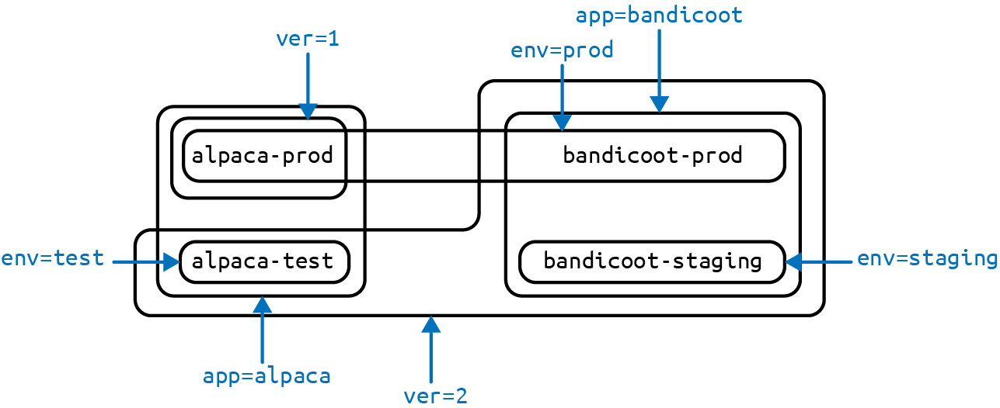

# Chương 6. Label và Annotation

Kubernetes được tạo ra để phát triển cùng bạn khi ứng dụng của bạn mở rộng cả về kích cỡ và độ phức tạp. Label và annotation là những khái niệm nền tảng trong Kubernetes cho phép bạn làm việc với các tập hợp sự vật ánh xạ đến cách bạn tư duy về ứng dụng của mình. Bạn có thể tổ chức, đánh dấu và lập chỉ mục chéo tất cả các tài nguyên của mình để biểu thị các nhóm có ý nghĩa nhất cho ứng dụng.

Label là các cặp khóa/giá trị có thể được gắn vào các đối tượng Kubernetes như Pod và ReplicaSet. Chúng có thể là tùy ý và hữu ích để gắn thông tin định danh vào các đối tượng Kubernetes. Label cung cấp nền tảng cho việc nhóm các đối tượng.

Annotation, mặt khác, cung cấp một cơ chế lưu trữ giống với label: các cặp khóa/giá trị được thiết kế để giữ thông tin không mang tính định danh mà các công cụ và thư viện có thể tận dụng. Khác với label, annotation không dành cho việc truy vấn, lọc hay phân biệt các Pod với nhau theo cách khác.

## Label

Label cung cấp siêu dữ liệu định danh cho các đối tượng. Đây là những đặc tính nền tảng của đối tượng sẽ được dùng cho việc nhóm, xem và vận hành. Động lực cho label xuất phát từ kinh nghiệm của Google trong việc chạy các ứng dụng lớn và phức tạp. Một vài bài học đã rút ra từ kinh nghiệm này:

- Production ghét singleton. Khi triển khai phần mềm, người dùng thường bắt đầu với một instance duy nhất. Tuy nhiên, khi ứng dụng trưởng thành, những singleton này thường nhân lên và trở thành các tập đối tượng. Với suy nghĩ này, Kubernetes dùng label để xử lý các tập đối tượng thay vì các instance đơn lẻ.
- Bất kỳ hệ thống phân cấp nào do hệ thống áp đặt đều sẽ không đủ với nhiều người dùng. Ngoài ra, các nhóm và phân cấp của người dùng thay đổi theo thời gian. Ví dụ, một người dùng có thể bắt đầu với ý tưởng rằng tất cả các ứng dụng được tạo thành từ nhiều service. Tuy nhiên, theo thời gian, một service có thể được chia sẻ giữa nhiều ứng dụng. Label của Kubernetes đủ linh hoạt để thích ứng với những tình huống này và hơn thế nữa.

Hãy xem cuốn sách tuyệt vời về độ tin cậy trang web *Site Reliability Engineering* của Betsy Beyer và cộng sự (O'Reilly) để có nền tảng sâu hơn về cách Google tiếp cận các hệ thống production.

Label có cú pháp đơn giản. Chúng là các cặp khóa/giá trị, trong đó cả khóa và giá trị đều được biểu diễn bằng chuỗi. Khóa của label có thể được chia thành hai phần: một tiền tố tùy chọn và một tên, phân tách bằng dấu gạch chéo. Tiền tố, nếu được chỉ định, phải là một DNS subdomain với giới hạn 253 ký tự. Tên khóa là bắt buộc và có độ dài tối đa 63 ký tự. Tên cũng phải bắt đầu và kết thúc bằng một ký tự chữ-số và cho phép dùng dấu gạch ngang (`-`), gạch dưới (`_`) và dấu chấm (`.`) giữa các ký tự.

Giá trị của label là các chuỗi với độ dài tối đa 63 ký tự. Nội dung của giá trị label tuân theo cùng quy tắc như khóa label. Bảng 6-1 cho thấy một số khóa và giá trị label hợp lệ.

*Bảng 6-1. Ví dụ về label*

| Khóa | Giá trị |
|---|---|
| `acme.com/app-version` | `1.0.0` |
| `appVersion` | `1.0.0` |
| `app.version` | `1.0.0` |
| `kubernetes.io/cluster-service` | `true` |

Khi tên miền được dùng trong label và annotation, chúng được kỳ vọng phải gắn với thực thể cụ thể đó theo một cách nào đó. Ví dụ, một dự án có thể định nghĩa một tập label chuẩn được dùng để xác định các giai đoạn khác nhau của việc triển khai ứng dụng như staging, canary và production. Hoặc một nhà cung cấp cloud có thể định nghĩa các annotation đặc thù cho nhà cung cấp để mở rộng các đối tượng Kubernetes nhằm kích hoạt các tính năng đặc thù cho dịch vụ của họ.

### Áp dụng Label

Ở đây chúng ta tạo một vài deployment (một cách để tạo một mảng các Pod) với một số label thú vị. Chúng ta sẽ lấy hai ứng dụng (gọi là `alpaca` và `bandicoot`) và có hai môi trường cùng hai phiên bản cho mỗi ứng dụng.

Đầu tiên, tạo deployment `alpaca-prod` và thiết lập các label `ver`, `app` và `env`:

```
$ kubectl run alpaca-prod \
  --image=gcr.io/kuar-demo/kuard-amd64:blue \
  --replicas=2 \
  --labels="ver=1,app=alpaca,env=prod"
```

Tiếp theo, tạo deployment `alpaca-test` và thiết lập các label `ver`, `app` và `env` với các giá trị thích hợp:

```
$ kubectl run alpaca-test \
  --image=gcr.io/kuar-demo/kuard-amd64:green \
  --replicas=1 \
  --labels="ver=2,app=alpaca,env=test"
```

Cuối cùng, tạo hai deployment cho `bandicoot`. Ở đây chúng ta đặt tên các môi trường là `prod` và `staging`:

```
$ kubectl run bandicoot-prod \
  --image=gcr.io/kuar-demo/kuard-amd64:green \
  --replicas=2 \
  --labels="ver=2,app=bandicoot,env=prod"
$ kubectl run bandicoot-staging \
  --image=gcr.io/kuar-demo/kuard-amd64:green \
  --replicas=1 \
  --labels="ver=2,app=bandicoot,env=staging"
```

Tại thời điểm này, bạn nên có bốn deployment: `alpaca-prod`, `alpaca-test`, `bandicoot-prod` và `bandicoot-staging`:

```
$ kubectl get deployments --show-labels

NAME                ... LABELS
alpaca-prod         ... app=alpaca,env=prod,ver=1
alpaca-test         ... app=alpaca,env=test,ver=2
bandicoot-prod      ... app=bandicoot,env=prod,ver=2
bandicoot-staging   ... app=bandicoot,env=staging,ver=2
```

Chúng ta có thể trực quan hóa điều này dưới dạng biểu đồ Venn dựa trên các label (Hình 6-1).



*Hình 6-1. Trực quan hóa các label được áp dụng cho các deployment của chúng ta*

### Sửa đổi Label

Bạn cũng có thể áp dụng hoặc cập nhật label trên các đối tượng sau khi tạo chúng:

```
$ kubectl label deployments alpaca-test "canary=true"
```

> **CẢNH BÁO**
>
> Có một lưu ý ở đây. Trong ví dụ này, lệnh `kubectl label` sẽ chỉ thay đổi label trên chính deployment; nó sẽ không ảnh hưởng đến bất kỳ đối tượng nào mà deployment tạo ra, như ReplicaSet và Pod. Để thay đổi những đối tượng đó, bạn sẽ cần thay đổi template được nhúng trong deployment (xem Chương 10).

Bạn cũng có thể dùng tùy chọn `-L` với `kubectl get` để hiển thị một giá trị label dưới dạng cột:

```
$ kubectl get deployments -L canary

NAME                DESIRED   CURRENT   ... CANARY
alpaca-prod         2         2         ... <none>
alpaca-test         1         1         ... true
bandicoot-prod      2         2         ... <none>
bandicoot-staging   1         1         ... <none>
```

Bạn có thể xóa một label bằng cách thêm hậu tố dấu gạch ngang:

```
$ kubectl label deployments alpaca-test "canary-"
```

### Label Selector

Label selector được dùng để lọc các đối tượng Kubernetes dựa trên một tập label. Selector dùng một cú pháp đơn giản cho các biểu thức Boolean. Chúng được dùng cả bởi người dùng cuối (thông qua các công cụ như `kubectl`) và bởi các loại đối tượng khác nhau (như cách một ReplicaSet liên hệ với các Pod của nó).

Mỗi deployment (thông qua một ReplicaSet) tạo một tập các Pod bằng các label được chỉ định trong template nhúng trong deployment. Điều này được cấu hình bởi lệnh `kubectl run`.

Chạy lệnh `kubectl get pods` sẽ trả về tất cả các Pod hiện đang chạy trong cluster. Chúng ta nên có tổng cộng sáu Pod `kuard` trên ba môi trường:

```
$ kubectl get pods --show-labels

NAME                                ... LABELS
alpaca-prod-3408831585-4nzfb        ... app=alpaca,env=prod,ver=1,...
alpaca-prod-3408831585-kga0a        ... app=alpaca,env=prod,ver=1,...
alpaca-test-1004512375-3r1m5        ... app=alpaca,env=test,ver=2,...
bandicoot-prod-373860099-0t1gp      ... app=bandicoot,env=prod,ver=2,...
bandicoot-prod-373860099-k2wcf      ... app=bandicoot,env=prod,ver=2,...
bandicoot-staging-1839769971-3ndv5  ... app=bandicoot,env=staging,ver=2,...
```

> **LƯU Ý**
>
> Bạn có thể thấy một label mới mà bạn chưa từng thấy trước đây: `pod-template-hash`. Label này được deployment áp dụng để nó có thể theo dõi Pod nào được tạo ra từ phiên bản template nào. Điều này cho phép deployment quản lý các cập nhật một cách sạch sẽ, như sẽ được đề cập sâu trong Chương 10.

Nếu chúng ta chỉ muốn liệt kê các Pod có label `ver` được đặt là `2`, chúng ta có thể dùng cờ `--selector`:

```
$ kubectl get pods --selector="ver=2"

NAME                                 READY   STATUS    RESTARTS   AGE
alpaca-test-1004512375-3r1m5         1/1     Running   0          3m
bandicoot-prod-373860099-0t1gp       1/1     Running   0          3m
bandicoot-prod-373860099-k2wcf       1/1     Running   0          3m
bandicoot-staging-1839769971-3ndv5   1/1     Running   0          3m
```

Nếu chúng ta chỉ định hai selector phân tách bằng dấu phẩy, chỉ các đối tượng thỏa mãn cả hai mới được trả về. Đây là phép toán AND logic:

```
$ kubectl get pods --selector="app=bandicoot,ver=2"

NAME                                 READY   STATUS    RESTARTS   AGE
bandicoot-prod-373860099-0t1gp       1/1     Running   0          4m
bandicoot-prod-373860099-k2wcf       1/1     Running   0          4m
bandicoot-staging-1839769971-3ndv5   1/1     Running   0          4m
```

Chúng ta cũng có thể hỏi liệu một label có phải là một trong một tập giá trị. Ở đây chúng ta yêu cầu tất cả các Pod có label `app` được đặt là `alpaca` hoặc `bandicoot` (sẽ là tất cả sáu Pod):

```
$ kubectl get pods --selector="app in (alpaca,bandicoot)"

NAME                                 READY   STATUS    RESTARTS   AGE
alpaca-prod-3408831585-4nzfb         1/1     Running   0          6m
alpaca-prod-3408831585-kga0a         1/1     Running   0          6m
alpaca-test-1004512375-3r1m5         1/1     Running   0          6m
bandicoot-prod-373860099-0t1gp       1/1     Running   0          6m
bandicoot-prod-373860099-k2wcf       1/1     Running   0          6m
bandicoot-staging-1839769971-3ndv5   1/1     Running   0          6m
```

Cuối cùng, chúng ta có thể hỏi liệu một label có được thiết lập hay không. Ở đây chúng ta yêu cầu tất cả các deployment có label `canary` được đặt thành bất kỳ giá trị nào:

```
$ kubectl get deployments --selector="canary"

NAME          DESIRED   CURRENT   UP-TO-DATE   AVAILABLE   AGE
alpaca-test   1         1         1            1           7m
```

Cũng có các phiên bản "phủ định" của mỗi cái này, như trong Bảng 6-2.

*Bảng 6-2. Các toán tử selector*

| Toán tử | Mô tả |
|---|---|
| `key=value` | `key` được đặt là `value` |
| `key!=value` | `key` không được đặt là `value` |
| `key in (value1, value2)` | `key` là một trong `value1` hoặc `value2` |
| `key notin (value1, value2)` | `key` không phải là `value1` hay `value2` |
| `key` | `key` được thiết lập |
| `!key` | `key` không được thiết lập |

Ví dụ, hỏi liệu một khóa, trong trường hợp này là `canary`, không được thiết lập có thể trông như sau:

```
$ kubectl get deployments --selector='!canary'
```

Bạn có thể kết hợp các selector khẳng định và phủ định:

```
$ kubectl get pods -l 'ver=2,!canary'
```

### Label Selector trong các đối tượng API

Một đối tượng Kubernetes dùng label selector để tham chiếu đến một tập các đối tượng Kubernetes khác. Thay vì một chuỗi đơn giản như mô tả trong phần trước, chúng ta dùng một cấu trúc đã được phân tích.

Vì lý do lịch sử (Kubernetes không phá vỡ tính tương thích API!), có hai dạng. Hầu hết các đối tượng hỗ trợ một tập toán tử selector mới hơn, mạnh hơn. Một selector `app=alpaca,ver in (1, 2)` sẽ được chuyển thành như sau:

```yaml
selector:
  matchLabels:
    app: alpaca
  matchExpressions:
    - {key: ver, operator: In, values: [1, 2]}
```

Ví dụ này dùng cú pháp YAML gọn. Đây là một mục trong một danh sách (`matchExpressions`) là một map với ba mục. Mục cuối (`values`) có giá trị là một danh sách với hai mục. Tất cả các điều kiện được đánh giá như một phép AND logic. Cách duy nhất để biểu diễn toán tử `!=` là chuyển nó thành một biểu thức `NotIn` với một giá trị duy nhất.

Dạng cũ hơn của việc chỉ định selector (dùng trong `ReplicationController` và service) chỉ hỗ trợ toán tử `=`. Toán tử `=` chọn các đối tượng đích mà tập cặp khóa/giá trị của nó đều khớp với đối tượng. Selector `app=alpaca,ver=1` sẽ được biểu diễn như sau:

```yaml
selector:
  app: alpaca
  ver: 1
```

### Label trong kiến trúc Kubernetes

Ngoài việc cho phép người dùng tổ chức hạ tầng của họ, label đóng vai trò quan trọng trong việc liên kết các đối tượng Kubernetes liên quan khác nhau. Kubernetes là một hệ thống được tách rời có chủ đích. Không có hệ thống phân cấp và tất cả các thành phần hoạt động độc lập. Tuy nhiên, trong nhiều trường hợp, các đối tượng cần liên hệ với nhau, và những mối quan hệ này được định nghĩa bởi label và label selector.

Ví dụ, ReplicaSet, tạo và duy trì nhiều replica của một Pod, tìm các Pod mà chúng đang quản lý thông qua một selector. Tương tự, một load balancer service tìm các Pod mà nó nên đưa lưu lượng đến thông qua một truy vấn selector. Khi một Pod được tạo, nó có thể dùng node selector để xác định một tập node cụ thể mà nó có thể được lên lịch lên. Khi người ta muốn hạn chế lưu lượng mạng trong cluster, họ dùng Network Policy kết hợp với các label cụ thể để xác định các Pod nên hoặc không nên được phép giao tiếp với nhau.

Label là chất keo mạnh mẽ và có mặt khắp nơi giữ một ứng dụng Kubernetes lại với nhau. Mặc dù ứng dụng của bạn có thể sẽ bắt đầu với một tập label và truy vấn đơn giản, bạn nên kỳ vọng nó phát triển về kích cỡ và độ tinh vi theo thời gian.

## Annotation

Annotation cung cấp một nơi để lưu trữ siêu dữ liệu bổ sung cho các đối tượng Kubernetes, trong đó mục đích duy nhất của siêu dữ liệu là hỗ trợ các công cụ và thư viện. Chúng là cách để các chương trình khác điều khiển Kubernetes thông qua API lưu một số dữ liệu mờ (opaque) cùng với một đối tượng. Annotation có thể được dùng cho chính công cụ đó hoặc để truyền thông tin cấu hình giữa các hệ thống bên ngoài.

Trong khi label được dùng để định danh và nhóm các đối tượng, annotation được dùng để cung cấp thông tin bổ sung về nguồn gốc của một đối tượng, cách sử dụng nó, hoặc chính sách xung quanh đối tượng đó. Có sự chồng lấn, và việc khi nào dùng annotation hay label là vấn đề sở thích. Khi nghi ngờ, hãy thêm thông tin vào đối tượng dưới dạng annotation và nâng nó lên thành label nếu bạn thấy mình muốn dùng nó trong một selector.

Annotation được dùng để:

- Theo dõi "lý do" cho lần cập nhật mới nhất của một đối tượng.
- Truyền đạt một chính sách lên lịch chuyên biệt cho một scheduler chuyên biệt.
- Mở rộng dữ liệu về công cụ cuối cùng đã cập nhật tài nguyên và cách nó được cập nhật (dùng để phát hiện thay đổi bởi các công cụ khác và thực hiện merge thông minh).
- Gắn thông tin build, release hoặc image không phù hợp với label (có thể bao gồm Git hash, timestamp, số pull request, v.v.).
- Cho phép đối tượng Deployment (xem Chương 10) theo dõi các ReplicaSet mà nó đang quản lý cho các đợt phát hành.
- Cung cấp dữ liệu bổ sung để nâng cao chất lượng hình ảnh hoặc khả năng sử dụng của UI. Ví dụ, các đối tượng có thể bao gồm một liên kết đến một icon (hoặc phiên bản mã hóa base64 của icon).
- Tạo mẫu thử chức năng alpha trong Kubernetes (thay vì tạo một trường API hạng nhất, các tham số cho chức năng đó được mã hóa trong một annotation).

Annotation được dùng ở nhiều nơi trong Kubernetes, với trường hợp sử dụng chính là rolling deployment. Trong quá trình rolling deployment, annotation được dùng để theo dõi trạng thái phát hành và cung cấp thông tin cần thiết để rollback một deployment về trạng thái trước đó.

Tránh dùng Kubernetes API server như một cơ sở dữ liệu đa mục đích. Annotation tốt cho các mẩu dữ liệu nhỏ liên quan chặt chẽ đến một tài nguyên cụ thể. Nếu bạn muốn lưu dữ liệu trong Kubernetes nhưng không có một đối tượng rõ ràng để liên kết với nó, hãy xem xét lưu dữ liệu đó trong một cơ sở dữ liệu khác phù hợp hơn.

Khóa của annotation dùng cùng định dạng như khóa của label. Tuy nhiên, vì chúng thường được dùng để truyền đạt thông tin giữa các công cụ, phần "namespace" của khóa quan trọng hơn. Các khóa ví dụ bao gồm `deployment.kubernetes.io/revision` hoặc `kubernetes.io/change-cause`.

Thành phần giá trị của một annotation là một trường chuỗi tự do. Mặc dù điều này cho phép tính linh hoạt tối đa vì người dùng có thể lưu dữ liệu tùy ý, vì đây là văn bản tùy ý, không có sự xác thực định dạng nào. Ví dụ, không hiếm khi một tài liệu JSON được mã hóa thành chuỗi và lưu trong một annotation. Cần lưu ý rằng Kubernetes server không biết gì về định dạng yêu cầu của các giá trị annotation. Nếu annotation được dùng để truyền hoặc lưu dữ liệu, không có đảm bảo dữ liệu là hợp lệ. Điều này có thể làm việc truy tìm lỗi khó hơn.

Annotation được định nghĩa trong phần `metadata` chung của mọi đối tượng Kubernetes:

```yaml
...
metadata:
  annotations:
    example.com/icon-url: "https://example.com/icon.png"
...
```

> **CẢNH BÁO**
>
> Annotation rất tiện lợi và cung cấp sự liên kết lỏng (loose coupling) mạnh mẽ, nhưng hãy dùng chúng một cách thận trọng để tránh một mớ dữ liệu không có kiểu lộn xộn.

## Dọn dẹp

Rất dễ để dọn dẹp tất cả các deployment mà chúng ta đã khởi động trong chương này:

```
$ kubectl delete deployments --all
```

Nếu bạn muốn chọn lọc hơn, bạn có thể dùng cờ `--selector` để chọn deployment nào cần xóa.

## Tóm tắt

Label được dùng để định danh và tùy chọn nhóm các đối tượng trong Kubernetes cluster. Chúng cũng được dùng trong các truy vấn selector để cung cấp việc nhóm các đối tượng, như Pod, một cách linh hoạt tại thời gian chạy.

Annotation cung cấp bộ lưu trữ siêu dữ liệu khóa/giá trị theo phạm vi đối tượng được dùng bởi các công cụ tự động hóa và thư viện client. Chúng cũng có thể được dùng để giữ dữ liệu cấu hình cho các công cụ bên ngoài như scheduler bên thứ ba và các công cụ giám sát.

Label và annotation rất quan trọng để hiểu cách các thành phần chính trong Kubernetes cluster làm việc cùng nhau để đảm bảo trạng thái cluster mong muốn. Sử dụng chúng đúng cách mở khóa sức mạnh thực sự của tính linh hoạt của Kubernetes và cung cấp điểm khởi đầu cho việc xây dựng các công cụ tự động hóa và quy trình triển khai.
