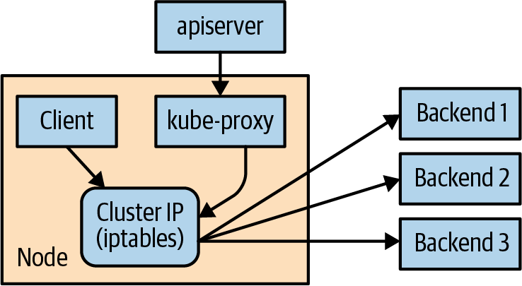

# Chương 7. Service Discovery

Kubernetes là một hệ thống rất động. Hệ thống tham gia vào việc đặt các Pod lên các node, đảm bảo chúng đang hoạt động và lên lịch lại chúng khi cần. Có nhiều cách để tự động thay đổi số lượng Pod dựa trên tải (như Horizontal Pod Autoscaling [xem "Tự động mở rộng ReplicaSet"]). Bản chất điều khiển bằng API của hệ thống khuyến khích người khác tạo ra các mức tự động hóa ngày càng cao hơn.

Mặc dù bản chất động của Kubernetes giúp dễ dàng chạy rất nhiều thứ, nó lại tạo ra vấn đề khi cần tìm những thứ đó. Hầu hết hạ tầng mạng truyền thống không được xây dựng cho mức độ động mà Kubernetes thể hiện.

## Service Discovery là gì?

Tên gọi chung cho lớp vấn đề và giải pháp này là service discovery (khám phá dịch vụ). Các công cụ service discovery giúp giải quyết vấn đề tìm ra tiến trình nào đang lắng nghe tại địa chỉ nào cho dịch vụ nào. Một hệ thống service discovery tốt sẽ cho phép người dùng phân giải thông tin này một cách nhanh chóng và đáng tin cậy. Một hệ thống tốt cũng có độ trễ thấp; các client được cập nhật ngay sau khi thông tin liên quan đến một dịch vụ thay đổi. Cuối cùng, một hệ thống service discovery tốt có thể lưu một định nghĩa phong phú hơn về dịch vụ đó là gì. Ví dụ, có thể có nhiều cổng liên quan đến dịch vụ.

Domain Name System (DNS) là hệ thống service discovery truyền thống trên internet. DNS được thiết kế cho việc phân giải tên tương đối ổn định với cơ chế cache rộng và hiệu quả. Nó là một hệ thống tuyệt vời cho internet nhưng không đáp ứng được trong thế giới động của Kubernetes.

Thật không may, nhiều hệ thống (ví dụ, Java, theo mặc định) tra cứu một tên trong DNS trực tiếp và không bao giờ phân giải lại. Điều này có thể dẫn đến việc client cache các ánh xạ cũ và nói chuyện với IP sai. Ngay cả với TTL (time-to-live) ngắn và một client hành xử tốt, vẫn có độ trễ tự nhiên giữa lúc một phân giải tên thay đổi và lúc client nhận ra. Cũng có các giới hạn tự nhiên về lượng và loại thông tin có thể được trả về trong một truy vấn DNS thông thường. Mọi thứ bắt đầu hỏng khi vượt quá 20 đến 30 bản ghi địa chỉ (A) cho một tên duy nhất. Bản ghi Service (SRV) giải quyết một số vấn đề, nhưng thường rất khó sử dụng. Cuối cùng, cách các client xử lý nhiều IP trong một bản ghi DNS thường là lấy địa chỉ IP đầu tiên và dựa vào DNS server để ngẫu nhiên hóa hoặc xoay vòng (round-robin) thứ tự các bản ghi. Điều này không thể thay thế cho cân bằng tải được xây dựng chuyên dụng hơn.

## Đối tượng Service

Service discovery thực sự trong Kubernetes bắt đầu với một đối tượng Service. Đối tượng Service là một cách để tạo một label selector có tên. Như chúng ta sẽ thấy, đối tượng Service cũng làm một số việc hay khác cho chúng ta.

Giống như lệnh `kubectl run` là cách dễ dàng để tạo một Kubernetes deployment, chúng ta có thể dùng `kubectl expose` để tạo một service. Chúng ta sẽ nói chi tiết về Deployment trong Chương 10, nhưng hiện tại bạn có thể nghĩ về Deployment như một instance của một microservice. Hãy tạo một vài deployment và service để chúng ta có thể thấy cách chúng hoạt động:

```
$ kubectl create deployment alpaca-prod \
  --image=gcr.io/kuar-demo/kuard-amd64:blue \
  --port=8080
$ kubectl scale deployment alpaca-prod --replicas 3
$ kubectl expose deployment alpaca-prod
$ kubectl create deployment bandicoot-prod \
  --image=gcr.io/kuar-demo/kuard-amd64:green \
  --port=8080
$ kubectl scale deployment bandicoot-prod --replicas 2
$ kubectl expose deployment bandicoot-prod
$ kubectl get services -o wide

NAME             CLUSTER-IP      ... PORT(S)  ... SELECTOR
alpaca-prod      10.115.245.13   ... 8080/TCP ... app=alpaca
bandicoot-prod   10.115.242.3    ... 8080/TCP ... app=bandicoot
kubernetes       10.115.240.1    ... 443/TCP  ... <none>
```

Sau khi chạy các lệnh này, chúng ta có ba service. Những service chúng ta vừa tạo là `alpaca-prod` và `bandicoot-prod`. Service `kubernetes` được tự động tạo cho bạn để bạn có thể tìm và nói chuyện với Kubernetes API từ bên trong ứng dụng.

Nếu nhìn vào cột `SELECTOR`, chúng ta thấy service `alpaca-prod` đơn giản đặt tên cho một selector và chỉ định cổng nào để nói chuyện cho service đó. Lệnh `kubectl expose` sẽ tiện lợi lấy cả label selector và các cổng liên quan (8080, trong trường hợp này) từ định nghĩa deployment.

Hơn nữa, service đó được gán một loại IP ảo mới gọi là cluster IP. Đây là một địa chỉ IP đặc biệt mà hệ thống sẽ cân bằng tải trên tất cả các Pod được xác định bởi selector.

Để tương tác với các service, chúng ta sẽ port-forward đến một trong các Pod `alpaca`. Khởi động lệnh này và để nó chạy trong một cửa sổ terminal. Bạn có thể thấy port-forward hoạt động bằng cách truy cập Pod `alpaca` tại http://localhost:48858:

```
$ ALPACA_POD=$(kubectl get pods -l app=alpaca \
    -o jsonpath='{.items[0].metadata.name}')
$ kubectl port-forward $ALPACA_POD 48858:8080
```

### Service DNS

Vì cluster IP là ảo, nó ổn định, và việc gán cho nó một địa chỉ DNS là phù hợp. Tất cả các vấn đề xung quanh việc client cache kết quả DNS không còn áp dụng. Trong một namespace, đơn giản chỉ cần dùng tên service để kết nối đến một trong các Pod được xác định bởi service.

Kubernetes cung cấp một dịch vụ DNS được phơi bày cho các Pod chạy trong cluster. Dịch vụ Kubernetes DNS này được cài đặt như một thành phần hệ thống khi cluster lần đầu được tạo. Bản thân dịch vụ DNS được Kubernetes quản lý và là một ví dụ tuyệt vời về Kubernetes xây dựng trên Kubernetes. Dịch vụ Kubernetes DNS cung cấp tên DNS cho các cluster IP.

Bạn có thể thử điều này bằng cách mở rộng phần "DNS Query" trên trang trạng thái của server `kuard`. Truy vấn bản ghi A cho `alpaca-prod`. Kết quả sẽ trông giống như thế này:

```
;; opcode: QUERY, status: NOERROR, id: 12071
;; flags: qr aa rd ra; QUERY: 1, ANSWER: 1, AUTHORITY: 0, ADDITIONAL: 0

;; QUESTION SECTION:
;alpaca-prod.default.svc.cluster.local. IN      A

;; ANSWER SECTION:
alpaca-prod.default.svc.cluster.local.  30      IN      A       10.115.245.13
```

Tên DNS đầy đủ ở đây là `alpaca-prod.default.svc.cluster.local.`. Hãy phân tích nó:

**`alpaca-prod`**

Tên của service đang nói đến.

**`default`**

Namespace mà service này thuộc về.

**`svc`**

Nhận diện rằng đây là một service. Điều này cho phép Kubernetes phơi bày các loại đối tượng khác dưới dạng DNS trong tương lai.

**`cluster.local.`**

Tên miền cơ sở cho cluster. Đây là mặc định và là những gì bạn sẽ thấy ở hầu hết các cluster. Quản trị viên có thể thay đổi điều này để cho phép các tên DNS duy nhất trên nhiều cluster.

Khi tham chiếu đến một service trong namespace của chính bạn, bạn chỉ cần dùng tên service (`alpaca-prod`). Bạn cũng có thể tham chiếu đến một service trong namespace khác bằng `alpaca-prod.default`. Và, dĩ nhiên, bạn có thể dùng tên service đầy đủ (`alpaca-prod.default.svc.cluster.local.`). Hãy thử từng cái trong phần "DNS Query" của `kuard`.

### Kiểm tra Readiness

Thường thì khi một ứng dụng mới khởi động, nó chưa sẵn sàng xử lý các yêu cầu. Thường có một lượng khởi tạo nhất định có thể mất từ dưới một giây đến vài phút. Một điều hay mà đối tượng Service làm là theo dõi Pod nào của bạn đã sẵn sàng thông qua kiểm tra readiness. Hãy sửa đổi deployment của chúng ta để thêm một kiểm tra readiness gắn với Pod, như đã thảo luận trong Chương 5:

```
$ kubectl edit deployment/alpaca-prod
```

Lệnh này sẽ lấy phiên bản hiện tại của deployment `alpaca-prod` và mở nó trong một trình soạn thảo. Sau khi bạn lưu và thoát trình soạn thảo, nó sẽ ghi đối tượng trở lại Kubernetes. Đây là cách nhanh để chỉnh sửa một đối tượng mà không cần lưu nó vào file YAML.

Thêm phần sau:

```yaml
spec:
  ...
  template:
    ...
    spec:
      containers:
        ...
        name: alpaca-prod
        readinessProbe:
          httpGet:
            path: /ready
            port: 8080
          periodSeconds: 2
          initialDelaySeconds: 0
          failureThreshold: 3
          successThreshold: 1
```

Điều này thiết lập các Pod mà deployment này sẽ tạo để chúng được kiểm tra readiness thông qua HTTP `GET` đến `/ready` trên cổng 8080. Kiểm tra này được thực hiện mỗi hai giây bắt đầu ngay khi Pod khởi động. Nếu ba kiểm tra liên tiếp thất bại, Pod sẽ được coi là chưa sẵn sàng. Tuy nhiên, chỉ cần một kiểm tra thành công, Pod sẽ lại được coi là sẵn sàng.

Chỉ các Pod sẵn sàng mới được gửi lưu lượng.

Việc cập nhật định nghĩa deployment như thế này sẽ xóa và tạo lại các Pod `alpaca`. Do đó, chúng ta cần khởi động lại lệnh `port-forward` từ trước:

```
$ ALPACA_POD=$(kubectl get pods -l app=alpaca-prod \
    -o jsonpath='{.items[0].metadata.name}')
$ kubectl port-forward $ALPACA_POD 48858:8080
```

Trỏ trình duyệt tới http://localhost:48858, và bạn sẽ thấy trang gỡ lỗi cho instance `kuard` đó. Mở rộng phần "Readiness Probe". Bạn sẽ thấy trang này cập nhật mỗi khi có một kiểm tra readiness mới từ hệ thống, điều này nên xảy ra mỗi hai giây.

Trong một cửa sổ terminal khác, khởi động lệnh `watch` trên các endpoint của service `alpaca-prod`. Endpoint là một cách cấp thấp hơn để tìm ra service đang gửi lưu lượng đến đâu và sẽ được đề cập sau trong chương này. Tùy chọn `--watch` ở đây làm lệnh `kubectl` giữ kết nối và xuất ra mọi cập nhật. Đây là cách dễ để xem một đối tượng Kubernetes thay đổi theo thời gian:

```
$ kubectl get endpoints alpaca-prod --watch
```

Giờ quay lại trình duyệt và nhấn liên kết "Fail" cho kiểm tra readiness. Bạn sẽ thấy server giờ trả về lỗi với mã trong dải 500. Sau ba lần như vậy, server này bị loại khỏi danh sách endpoint của service. Nhấn liên kết "Succeed" và lưu ý rằng sau một kiểm tra readiness duy nhất, endpoint được thêm trở lại.

Kiểm tra readiness này là cách để một server quá tải hoặc bị lỗi báo hiệu cho hệ thống rằng nó không muốn nhận lưu lượng nữa. Đây là cách tuyệt vời để hiện thực việc tắt máy êm ái (graceful shutdown). Server có thể báo hiệu rằng nó không muốn lưu lượng nữa, chờ đến khi các kết nối hiện có được đóng, rồi thoát sạch sẽ.

Nhấn Ctrl-C để thoát cả lệnh `port-forward` và `watch` trong các terminal của bạn.

## Nhìn ra ngoài Cluster

Cho đến giờ, mọi thứ chúng ta đề cập trong chương này là về việc phơi bày các service bên trong cluster. Thường thì các IP của Pod chỉ có thể truy cập từ bên trong cluster. Đến một lúc nào đó, chúng ta phải cho phép lưu lượng mới vào!

Cách di động nhất để làm điều này là dùng một tính năng gọi là NodePort, nâng cao service hơn nữa. Ngoài cluster IP, hệ thống chọn một cổng (hoặc người dùng có thể chỉ định một cổng), và mỗi node trong cluster sau đó chuyển tiếp lưu lượng đến cổng đó cho service.

Với tính năng này, nếu bạn có thể tiếp cận bất kỳ node nào trong cluster, bạn có thể liên hệ với một service. Bạn có thể dùng NodePort mà không cần biết bất kỳ Pod nào của service đó đang chạy ở đâu. Điều này có thể được tích hợp với các load balancer phần cứng hoặc phần mềm để phơi bày service xa hơn.

Hãy thử điều này bằng cách sửa đổi service `alpaca-prod`:

```
$ kubectl edit service alpaca-prod
```

Thay đổi trường `spec.type` thành `NodePort`. Bạn cũng có thể làm điều này khi tạo service qua `kubectl expose` bằng cách chỉ định `--type=NodePort`. Hệ thống sẽ gán một NodePort mới:

```
$ kubectl describe service alpaca-prod

Name:                   alpaca-prod
Namespace:              default
Labels:                 app=alpaca
Annotations:            <none>
Selector:               app=alpaca
Type:                   NodePort
IP:                     10.115.245.13
Port:                   <unset> 8080/TCP
NodePort:               <unset> 32711/TCP
Endpoints:              10.112.1.66:8080,10.112.2.104:8080,10.112.2.105:8080
Session Affinity:       None
No events.
```

Ở đây chúng ta thấy hệ thống đã gán cổng 32711 cho service này. Giờ chúng ta có thể truy cập bất kỳ node nào trong cluster trên cổng đó để tiếp cận service. Nếu bạn đang ở cùng mạng, bạn có thể truy cập trực tiếp. Nếu cluster của bạn ở trên cloud đâu đó, bạn có thể dùng SSH tunneling với thứ gì đó như thế này:

```
$ ssh <node> -L 8080:localhost:32711
```

Giờ nếu bạn trỏ trình duyệt tới http://localhost:8080, bạn sẽ được kết nối đến service đó. Mỗi yêu cầu bạn gửi đến service sẽ được chuyển ngẫu nhiên đến một trong các Pod hiện thực service. Tải lại trang vài lần, và bạn sẽ thấy mình được gán ngẫu nhiên đến các Pod khác nhau.

Khi xong, hãy thoát phiên SSH.

## Tích hợp Load Balancer

Nếu bạn có một cluster được cấu hình để tích hợp với các load balancer bên ngoài, bạn có thể dùng loại `LoadBalancer`. Loại này xây dựng trên loại `NodePort` bằng cách bổ sung việc cấu hình cloud để tạo một load balancer mới và trỏ nó vào các node trong cluster của bạn. Hầu hết các Kubernetes cluster trên cloud cung cấp tích hợp load balancer, và cũng có một số dự án hiện thực tích hợp load balancer cho các load balancer vật lý phổ biến, mặc dù chúng có thể yêu cầu tích hợp thủ công nhiều hơn với cluster của bạn.

Chỉnh sửa service `alpaca-prod` lần nữa (`kubectl edit service alpaca-prod`) và thay đổi `spec.type` thành `LoadBalancer`.

> **LƯU Ý**
>
> Tạo một service loại `LoadBalancer` phơi bày service đó ra internet công cộng. Trước khi làm điều này, bạn nên chắc chắn rằng đó là thứ an toàn để phơi bày cho mọi người trên thế giới. Chúng ta sẽ thảo luận thêm về các rủi ro bảo mật trong phần này. Ngoài ra, Chương 9 và 20 cung cấp hướng dẫn về cách bảo mật ứng dụng của bạn.

Nếu bạn chạy `kubectl get services` ngay lập tức, bạn sẽ thấy cột `EXTERNAL-IP` cho `alpaca-prod` giờ ghi `<pending>`. Chờ một chút và bạn sẽ thấy một địa chỉ công cộng được cloud của bạn gán. Bạn có thể xem trong console của tài khoản cloud và thấy công việc cấu hình mà Kubernetes đã làm cho bạn:

```
$ kubectl describe service alpaca-prod

Name:                   alpaca-prod
Namespace:              default
Labels:                 app=alpaca
Selector:               app=alpaca
Type:                   LoadBalancer
IP:                     10.115.245.13
LoadBalancer Ingress:   104.196.248.204
Port:                   <unset> 8080/TCP
NodePort:               <unset> 32711/TCP
Endpoints:              10.112.1.66:8080,10.112.2.104:8080,10.112.2.105:8080
Session Affinity:       None
Events:
  FirstSeen ... Reason                Message
  --------- ... ------                -------
  3m        ... Type                  NodePort -> LoadBalancer
  3m        ... CreatingLoadBalancer  Creating load balancer
  2m        ... CreatedLoadBalancer   Created load balancer
```

Ở đây chúng ta thấy địa chỉ 104.196.248.204 giờ đã được gán cho service `alpaca-prod`. Mở trình duyệt và thử xem!

> **LƯU Ý**
>
> Ví dụ này lấy từ một cluster được khởi chạy và quản lý trên Google Cloud Platform qua GKE. Cách một load balancer được cấu hình là đặc thù cho từng cloud. Một số cloud có load balancer dựa trên DNS (ví dụ, AWS Elastic Load Balancing [ELB]). Trong trường hợp này, bạn sẽ thấy một hostname ở đây thay vì IP. Tùy vào nhà cung cấp cloud, có thể vẫn mất một chút thời gian để load balancer hoạt động đầy đủ.

Tạo một load balancer trên cloud có thể mất một khoảng thời gian. Đừng ngạc nhiên nếu nó mất vài phút trên hầu hết các nhà cung cấp cloud.

Các ví dụ chúng ta đã thấy cho đến giờ dùng các load balancer bên ngoài; tức là các load balancer được kết nối với internet công cộng. Mặc dù điều này rất tốt để phơi bày các service ra thế giới, bạn thường sẽ muốn chỉ phơi bày ứng dụng của mình trong mạng riêng. Để đạt được điều này, hãy dùng một load balancer nội bộ. Thật không may, vì hỗ trợ cho load balancer nội bộ được thêm vào Kubernetes gần đây hơn, nó được thực hiện theo cách khá tùy biến thông qua annotation của đối tượng. Ví dụ, để tạo một load balancer nội bộ trong cluster Azure Kubernetes Service, bạn thêm annotation `service.beta.kubernetes.io/azure-load-balancer-internal: "true"` vào tài nguyên Service của mình. Đây là các thiết lập cho một số cloud phổ biến:

**Microsoft Azure**

`service.beta.kubernetes.io/azure-load-balancer-internal: "true"`

**Amazon Web Services**

`service.beta.kubernetes.io/aws-load-balancer-internal: "true"`

**Alibaba Cloud**

`service.beta.kubernetes.io/alibaba-cloud-loadbalancer-address-type: "intranet"`

**Google Cloud Platform**

`cloud.google.com/load-balancer-type: "Internal"`

Khi bạn thêm annotation này vào Service, nó sẽ trông như thế này:

```yaml
...
metadata:
  ...
  name: some-service
  annotations:
    service.beta.kubernetes.io/azure-load-balancer-internal: "true"
...
```

Khi bạn tạo một service với một trong các annotation này, một service được phơi bày nội bộ sẽ được tạo thay cho một service trên internet công cộng.

> **MẸO**
>
> Có một số annotation khác mở rộng hành vi của `LoadBalancer`, bao gồm những annotation để dùng một địa chỉ IP có sẵn. Các mở rộng cụ thể cho nhà cung cấp của bạn nên được ghi trong tài liệu trên website của họ.

## Chi tiết nâng cao

Kubernetes được xây dựng để là một hệ thống có thể mở rộng. Do đó, có các tầng cho phép các tích hợp nâng cao hơn. Hiểu chi tiết cách một khái niệm tinh vi như service được hiện thực có thể giúp bạn khắc phục sự cố hoặc tạo các tích hợp nâng cao hơn. Phần này đi sâu hơn một chút dưới bề mặt.

### Endpoints

Một số ứng dụng (và chính hệ thống) muốn có thể dùng các service mà không dùng cluster IP. Điều này được thực hiện bằng một loại đối tượng khác gọi là đối tượng Endpoints. Với mỗi đối tượng Service, Kubernetes tạo một đối tượng Endpoints đi kèm chứa các địa chỉ IP cho service đó:

```
$ kubectl describe endpoints alpaca-prod

Name:           alpaca-prod
Namespace:      default
Labels:         app=alpaca
Subsets:
  Addresses:            10.112.1.54,10.112.2.84,10.112.2.85
  NotReadyAddresses:    <none>
  Ports:
    Name        Port    Protocol
    ----        ----    --------
    <unset>     8080    TCP

No events.
```

Để dùng một service, một ứng dụng nâng cao có thể nói chuyện trực tiếp với Kubernetes API để tra cứu các endpoint và gọi chúng. Kubernetes API thậm chí có khả năng "watch" (theo dõi) các đối tượng và được thông báo ngay khi chúng thay đổi. Theo cách này, một client có thể phản ứng ngay lập tức khi các IP liên quan đến một service thay đổi.

Hãy minh họa điều này. Trong một cửa sổ terminal, khởi động lệnh sau và để nó chạy:

```
$ kubectl get endpoints alpaca-prod --watch
```

Nó sẽ xuất ra trạng thái hiện tại của endpoint rồi "treo":

```
NAME          ENDPOINTS                                            AGE
alpaca-prod   10.112.1.54:8080,10.112.2.84:8080,10.112.2.85:8080   1m
```

Giờ mở một cửa sổ terminal khác và xóa rồi tạo lại deployment đứng sau `alpaca-prod`:

```
$ kubectl delete deployment alpaca-prod
$ kubectl create deployment alpaca-prod \
  --image=gcr.io/kuar-demo/kuard-amd64:blue \
  --port=8080
$ kubectl scale deployment alpaca-prod --replicas=3
```

Nếu bạn nhìn lại kết quả từ endpoint đang được theo dõi, bạn sẽ thấy khi bạn xóa và tạo lại các Pod này, kết quả của lệnh phản ánh tập địa chỉ IP mới nhất liên quan đến service. Kết quả của bạn sẽ trông giống như thế này:

```
NAME          ENDPOINTS                                            AGE
alpaca-prod   10.112.1.54:8080,10.112.2.84:8080,10.112.2.85:8080   1m
alpaca-prod   10.112.1.54:8080,10.112.2.84:8080                    1m
alpaca-prod   <none>                                               1m
alpaca-prod   10.112.2.90:8080                                     1m
alpaca-prod   10.112.1.57:8080,10.112.2.90:8080                    1m
alpaca-prod   10.112.0.28:8080,10.112.1.57:8080,10.112.2.90:8080   1m
```

Đối tượng Endpoints rất tốt nếu bạn đang viết code mới được xây dựng để chạy trên Kubernetes từ đầu. Nhưng hầu hết các dự án không ở vị thế này! Hầu hết các hệ thống hiện có được xây dựng để làm việc với các địa chỉ IP thông thường không thay đổi thường xuyên như vậy.

### Service Discovery thủ công

Kubernetes service được xây dựng trên label selector đối với các Pod. Điều đó có nghĩa là bạn có thể dùng Kubernetes API để thực hiện service discovery sơ khai mà không cần dùng đối tượng Service nào cả! Hãy minh họa.

Với `kubectl` (và thông qua API), chúng ta có thể dễ dàng thấy IP nào được gán cho từng Pod trong các deployment ví dụ của chúng ta:

```
$ kubectl get pods -o wide --show-labels

NAME                        ... IP          ... LABELS
alpaca-prod-12334-87f8h     ... 10.112.1.54 ... app=alpaca
alpaca-prod-12334-jssmh     ... 10.112.2.84 ... app=alpaca
alpaca-prod-12334-tjp56     ... 10.112.2.85 ... app=alpaca
bandicoot-prod-5678-sbxzl   ... 10.112.1.55 ... app=bandicoot
bandicoot-prod-5678-x0dh8   ... 10.112.2.86 ... app=bandicoot
```

Điều này rất hay, nhưng nếu bạn có hàng tấn Pod thì sao? Bạn có lẽ sẽ muốn lọc dựa trên các label được áp dụng như một phần của deployment. Hãy làm điều đó chỉ cho ứng dụng `alpaca`:

```
$ kubectl get pods -o wide --selector=app=alpaca

NAME                           ... IP          ...
alpaca-prod-3408831585-bpzdz   ... 10.112.1.54 ...
alpaca-prod-3408831585-kncwt   ... 10.112.2.84 ...
alpaca-prod-3408831585-l9fsq   ... 10.112.2.85 ...
```

Tại thời điểm này, bạn đã có những điều cơ bản về service discovery! Bạn luôn có thể dùng label để xác định tập Pod mà bạn quan tâm, lấy tất cả các Pod cho các label đó, và đào ra địa chỉ IP. Nhưng việc giữ đồng bộ tập label đúng cần dùng có thể khó. Đây là lý do đối tượng Service được tạo ra.

### kube-proxy và Cluster IP

Cluster IP là các IP ảo ổn định cân bằng tải lưu lượng trên tất cả các endpoint trong một service. Phép màu này được thực hiện bởi một thành phần chạy trên mọi node trong cluster gọi là `kube-proxy` (Hình 7-1).



*Hình 7-1. Cấu hình và sử dụng cluster IP*

Trong Hình 7-1, `kube-proxy` theo dõi các service mới trong cluster thông qua API server. Sau đó nó lập trình một tập các quy tắc `iptables` trong kernel của host đó để ghi lại đích của các gói tin sao cho chúng được chuyển đến một trong các endpoint của service đó. Nếu tập endpoint của một service thay đổi (do Pod đến và đi hoặc do thất bại kiểm tra readiness), tập quy tắc `iptables` được ghi lại.

Bản thân cluster IP thường được API server gán khi service được tạo. Tuy nhiên, khi tạo service, người dùng có thể chỉ định một cluster IP cụ thể. Một khi đã đặt, cluster IP không thể được sửa đổi mà không xóa và tạo lại đối tượng Service.

> **LƯU Ý**
>
> Dải địa chỉ service của Kubernetes được cấu hình bằng cờ `--service-cluster-ip-range` trên file nhị phân `kube-apiserver`. Dải địa chỉ service không nên chồng lấn với các subnet và dải IP được gán cho mỗi Docker bridge hoặc Kubernetes node. Ngoài ra, bất kỳ cluster IP tường minh nào được yêu cầu phải đến từ dải đó và chưa được sử dụng.

### Biến môi trường Cluster IP

Mặc dù hầu hết người dùng nên dùng dịch vụ DNS để tìm cluster IP, có một số cơ chế cũ hơn có thể vẫn đang được sử dụng. Một trong số đó là tiêm một tập biến môi trường vào các Pod khi chúng khởi động.

Để thấy điều này trong thực tế, hãy xem console cho instance `bandicoot` của `kuard`. Nhập các lệnh sau vào terminal:

```
$ BANDICOOT_POD=$(kubectl get pods -l app=bandicoot \
    -o jsonpath='{.items[0].metadata.name}')
$ kubectl port-forward $BANDICOOT_POD 48858:8080
```

Giờ trỏ trình duyệt tới http://localhost:48858 để xem trang trạng thái cho server này. Mở rộng phần "Server Env" và lưu ý tập biến môi trường cho service `alpaca`. Trang trạng thái sẽ hiển thị một bảng tương tự Bảng 7-1.

*Bảng 7-1. Biến môi trường của Service*

| Khóa | Giá trị |
|---|---|
| `ALPACA_PROD_PORT` | `tcp://10.115.245.13:8080` |
| `ALPACA_PROD_PORT_8080_TCP` | `tcp://10.115.245.13:8080` |
| `ALPACA_PROD_PORT_8080_TCP_ADDR` | `10.115.245.13` |
| `ALPACA_PROD_PORT_8080_TCP_PORT` | `8080` |
| `ALPACA_PROD_PORT_8080_TCP_PROTO` | `tcp` |
| `ALPACA_PROD_SERVICE_HOST` | `10.115.245.13` |
| `ALPACA_PROD_SERVICE_PORT` | `8080` |

Hai biến môi trường chính cần dùng là `ALPACA_PROD_SERVICE_HOST` và `ALPACA_PROD_SERVICE_PORT`. Các biến môi trường khác được tạo để tương thích với các biến Docker link (hiện đã bị loại bỏ).

Một vấn đề với cách tiếp cận biến môi trường là nó yêu cầu các tài nguyên phải được tạo theo một thứ tự cụ thể. Các service phải được tạo trước các Pod tham chiếu đến chúng. Điều này có thể gây ra khá nhiều phức tạp khi triển khai một tập service tạo nên một ứng dụng lớn hơn. Ngoài ra, việc chỉ dùng biến môi trường trông kỳ lạ với nhiều người dùng. Vì lý do này, DNS có lẽ là lựa chọn tốt hơn.

## Kết nối với các môi trường khác

Mặc dù thật tuyệt khi có service discovery trong cluster của chính bạn, nhiều ứng dụng thực tế thực sự yêu cầu bạn tích hợp các ứng dụng cloud native hơn được triển khai trong Kubernetes với các ứng dụng được triển khai trong các môi trường cũ hơn. Ngoài ra, bạn có thể cần tích hợp một Kubernetes cluster trên cloud với hạ tầng đã được triển khai tại chỗ (on-premise). Đây là một lĩnh vực của Kubernetes vẫn đang trong quá trình khám phá và phát triển giải pháp khá nhiều.

### Kết nối đến các tài nguyên bên ngoài Cluster

Khi bạn kết nối Kubernetes đến các tài nguyên cũ bên ngoài cluster, bạn có thể dùng service không có selector (selector-less service) để khai báo một Kubernetes service với địa chỉ IP được gán thủ công nằm ngoài cluster. Theo cách đó, Kubernetes service discovery thông qua DNS hoạt động như mong đợi, nhưng lưu lượng mạng thực sự chảy đến một tài nguyên bên ngoài. Để tạo một service không có selector, bạn xóa trường `spec.selector` khỏi tài nguyên của mình, trong khi giữ nguyên các phần `metadata` và `ports`.

Vì service của bạn không có selector, không có endpoint nào được tự động thêm vào service. Điều này có nghĩa là bạn phải thêm chúng thủ công. Thường endpoint mà bạn thêm sẽ là một địa chỉ IP cố định (ví dụ, địa chỉ IP của server cơ sở dữ liệu của bạn) nên bạn chỉ cần thêm nó một lần. Nhưng nếu địa chỉ IP đứng sau service thay đổi, bạn sẽ cần cập nhật tài nguyên endpoint tương ứng. Để tạo hoặc cập nhật tài nguyên endpoint, bạn dùng một endpoint trông giống như sau:

```yaml
apiVersion: v1
kind: Endpoints
metadata:
  # This name must match the name of your service
  name: my-database-server
subsets:
  - addresses:
      # Replace this IP with the real IP of your server
      - ip: 1.2.3.4
    ports:
      # Replace this port with the port(s) you want to expose
      - port: 1433
```

### Kết nối các tài nguyên bên ngoài đến Service bên trong Cluster

Kết nối các tài nguyên bên ngoài đến Kubernetes service khó hơn một chút. Nếu nhà cung cấp cloud của bạn hỗ trợ, điều dễ nhất là tạo một load balancer "nội bộ", như đã mô tả ở trên, nằm trong mạng riêng ảo của bạn và có thể đưa lưu lượng từ một địa chỉ IP cố định vào cluster. Sau đó bạn có thể dùng DNS truyền thống để làm địa chỉ IP này có sẵn cho tài nguyên bên ngoài. Nếu không có load balancer nội bộ, bạn có thể dùng một service `NodePort` để phơi bày service trên các địa chỉ IP của các node trong cluster. Sau đó bạn có thể lập trình một load balancer vật lý để phục vụ lưu lượng đến các node đó, hoặc dùng cân bằng tải dựa trên DNS để phân phối lưu lượng giữa các node.

Nếu cả hai giải pháp đó đều không phù hợp với trường hợp sử dụng của bạn, các lựa chọn phức tạp hơn bao gồm chạy đầy đủ `kube-proxy` trên một tài nguyên bên ngoài và lập trình máy đó để dùng DNS server trong Kubernetes cluster. Một thiết lập như vậy khó thực hiện đúng hơn đáng kể và thực sự chỉ nên được dùng trong các môi trường on-premise. Cũng có nhiều dự án mã nguồn mở (ví dụ, Consul của HashiCorp) có thể được dùng để quản lý kết nối giữa các tài nguyên trong cluster và ngoài cluster. Những lựa chọn như vậy đòi hỏi kiến thức đáng kể về cả mạng và Kubernetes để thực hiện đúng và thực sự chỉ nên được coi là phương án cuối cùng.

## Dọn dẹp

Chạy lệnh sau để dọn dẹp tất cả các đối tượng được tạo trong chương này:

```
$ kubectl delete services,deployments -l app
```

## Tóm tắt

Kubernetes là một hệ thống động thách thức các phương pháp truyền thống về đặt tên và kết nối các service qua mạng. Đối tượng Service cung cấp một cách linh hoạt và mạnh mẽ để phơi bày các service cả trong cluster và bên ngoài. Với các kỹ thuật được đề cập ở đây, bạn có thể kết nối các service với nhau và phơi bày chúng ra ngoài cluster.

Mặc dù việc sử dụng các cơ chế service discovery động trong Kubernetes giới thiệu một số khái niệm mới và thoạt đầu có thể trông phức tạp, việc hiểu và thích ứng với các kỹ thuật này là chìa khóa để mở khóa sức mạnh của Kubernetes. Một khi ứng dụng của bạn có thể tìm các service một cách động và phản ứng với việc đặt các ứng dụng đó một cách động, bạn được tự do không cần lo lắng về nơi mọi thứ đang chạy và khi nào chúng di chuyển. Tư duy về các service theo cách logic và để Kubernetes lo các chi tiết về việc đặt container là một mảnh ghép quan trọng của bức tranh.

Dĩ nhiên, service discovery chỉ là khởi đầu của cách mạng ứng dụng hoạt động với Kubernetes. Chương 8 đề cập đến mạng Ingress, dành riêng cho cân bằng tải và định tuyến ở Layer 7 (HTTP), và Chương 15 nói về service mesh, một cách tiếp cận được phát triển gần đây hơn cho mạng cloud native, cung cấp nhiều khả năng bổ sung ngoài service discovery và cân bằng tải.
